# คู่มือการเรียนรู้ภาษา Go เล่ม 1
---
## 📚 สารบัญ

### ภาคที่ 1: ปฐมบทกับการเขียนโปรแกรม
- บทที่ 1: ความรู้เบื้องต้นเกี่ยวกับการเขียนโปรแกรมคอมพิวเตอร์
- บทที่ 2: รู้จักกับภาษา Go
- บทที่ 3: พื้นฐานการใช้งาน Terminal
- บทที่ 4: เตรียมสภาพแวดล้อมสำหรับพัฒนา
- บทที่ 5: สร้างแอปพลิเคชันแรกของคุณ

### ภาคที่ 2: พื้นฐานภาษาและโครงสร้างข้อมูล
- บทที่ 6: ระบบเลขฐานสองและฐานสิบ
- บทที่ 7: เลขฐานสิบหก, ฐานแปด, ASCII, UTF8, Unicode และ Runes
- บทที่ 8: ตัวแปร, ค่าคงที่ และชนิดข้อมูลพื้นฐาน
- บทที่ 9: คำสั่งควบคุมการทำงาน
- บทที่ 10: ฟังก์ชัน
- บทที่ 11: แพคเกจและการนำเข้า
- บทที่ 12: การเริ่มต้นทำงานของแพคเกจ
- บทที่ 13: การสร้างชนิดข้อมูลใหม่ (Types)
- บทที่ 14: เมธอด (Methods)
- บทที่ 15: พอยน์เตอร์ (Pointer)
- บทที่ 16: อินเทอร์เฟซ (Interfaces)

### ภาคที่ 3: การจัดการโปรเจกต์และโครงสร้างข้อมูลขั้นสูง
- บทที่ 17: Go Modules - การจัดการโปรเจกต์สมัยใหม่
- บทที่ 18: Go Module Proxies
- บทที่ 19: การทดสอบหน่วย (Unit Tests)
- บทที่ 20: อาเรย์ (Arrays)
- บทที่ 21: สไลซ์ (Slices)
- บทที่ 22: แมพ (Maps)
- บทที่ 23: การจัดการข้อผิดพลาด (Errors)

### ภาคที่ 4: การพัฒนาแอปพลิเคชันเชิงปฏิบัติ
- บทที่ 24: ฟังก์ชันนิรนาม (Anonymous functions) และ Closure
- บทที่ 25: การจัดการข้อมูล JSON และ XML
- บทที่ 26: พื้นฐานการสร้าง HTTP Server
- บทที่ 27: Enum, Iota และ Bitmask
- บทที่ 28: วันที่และเวลา
- บทที่ 29: การจัดเก็บข้อมูล: ไฟล์และฐานข้อมูล
- บทที่ 30: การทำงานพร้อมกัน (Concurrency)
- บทที่ 31: การบันทึกเหตุการณ์ (Logging)
- บทที่ 32: เทมเพลต (Templates)
- บทที่ 33: การจัดการค่า Configuration

### ภาคที่ 5: สู่การเป็นนักพัฒนา Go มืออาชีพ
- บทที่ 34: การวัดประสิทธิภาพ (Benchmarks)
- บทที่ 35: สร้าง HTTP Client
- บทที่ 36: การวิเคราะห์โปรไฟล์ (Program Profiling)
- บทที่ 37: การจัดการ Context
- บทที่ 38: Generics - การเขียนโค้ดแบบยืดหยุ่น
- บทที่ 39: Go กับกระบวนทัศน์ OOP?
- บทที่ 40: การอัปเกรดหรือดาวน์เกรดเวอร์ชัน Go
- บทที่ 41: คำแนะนำในการออกแบบโค้ดที่ดี
- บทที่ 42: ชีทสรุป (Cheatsheet)

---

## ภาคที่ 1: ปฐมบทกับการเขียนโปรแกรม

### บทที่ 1: ความรู้เบื้องต้นเกี่ยวกับการเขียนโปรแกรมคอมพิวเตอร์

#### 1.1 การเขียนโปรแกรมคืออะไร?
การเขียนโปรแกรม (Programming) คือกระบวนการสร้างชุดคำสั่งที่ใช้ควบคุมการทำงานของคอมพิวเตอร์ให้ทำงานตามที่เราต้องการ โดยใช้ภาษาเฉพาะที่คอมพิวเตอร์สามารถเข้าใจได้ ภาษาที่มนุษย์ใช้เขียนเรียกว่า “ภาษาคอมพิวเตอร์ระดับสูง” (High-Level Language) เช่น Go, Python, Java ซึ่งจากนั้นจะถูกแปลงเป็นภาษาเครื่อง (Machine Language) ที่เป็นเลขฐานสอง (0 และ 1) ที่ซีพียูสามารถประมวลผลได้

#### 1.2 โครงสร้างพื้นฐานของโปรแกรม
โปรแกรมคอมพิวเตอร์โดยทั่วไปประกอบด้วย:
- **ข้อมูล (Data)** : ตัวเลข, ข้อความ, รายการต่างๆ
- **การประมวลผล (Processing)** : การดำเนินการกับข้อมูล เช่น การคำนวณ การเปรียบเทียบ
- **การควบคุมการทำงาน (Control Flow)** : การตัดสินใจ (if-else), การวนซ้ำ (loop)
- **การจัดเก็บ (Storage)** : หน่วยความจำ, ไฟล์, ฐานข้อมูล
- **อินพุต/เอาท์พุต (I/O)** : การรับข้อมูลจากผู้ใช้ หรือแสดงผล

#### 1.3 ตัวแปลภาษาและคอมไพเลอร์
- **คอมไพเลอร์ (Compiler)** : แปลงซอร์สโค้ดทั้งหมดเป็นไฟล์ได้ก่อนรัน (เช่น Go, C)
- **อินเทอร์พรีเตอร์ (Interpreter)** : แปลงและรันทีละคำสั่ง (เช่น Python, JavaScript)

Go เป็นภาษาแบบคอมไพล์ (compiled) ซึ่งมีข้อดีคือทำงานเร็วและสร้างไฟล์ binary ที่รันได้ทันทีโดยไม่ต้องพึ่งพาสิ่งแวดล้อมอื่น (ยกเว้นระบบปฏิบัติการ)

#### 1.4 กระบวนทัศน์การเขียนโปรแกรม
Go รองรับการเขียนโปรแกรมแบบ:
- **Procedural** : ใช้ฟังก์ชันและลำดับขั้นตอน
- **Concurrent** : ทำงานพร้อมกันด้วย goroutine
- **Functional** (บางส่วน) : ฟังก์ชันเป็น first-class citizen
- **ไม่ใช่ OOP แบบคลาสสิก** : ใช้ struct และ interface แทน inheritance
-----------
### 1. Golang Procedural คืออะไร
**Procedural** หรือการเขียนโปรแกรมแบบเชิงกระบวนการ เป็นรูปแบบที่เน้นการเขียนฟังก์ชัน (function) และเรียกใช้ตามลำดับขั้นตอน โกแลง (Go) รองรับการเขียนแบบนี้โดยใช้ฟังก์ชันเป็นหน่วยหลัก โค้ดจะถูกแบ่งออกเป็นฟังก์ชันย่อย ๆ ที่ทำงานเฉพาะอย่าง และเรียกใช้ตามลำดับที่กำหนด ถึงแม้ Go จะไม่ใช่ภาษา procedural ล้วน ๆ แต่ก็สามารถเขียนในสไตล์นี้ได้อย่างดี

---

### 2. Concurrent คืออะไร
**Concurrency** (การทำงานร่วมกัน) คือความสามารถของโปรแกรมในการจัดการงานหลาย ๆ งานพร้อมกัน โดยงานเหล่านี้อาจเริ่มทำงาน สลับการทำงาน หรือจบลงในเวลาที่เหลื่อมกัน โดยไม่จำเป็นต้องทำงานพร้อมกันจริง ๆ (parallel) Go มีเครื่องมือสำหรับ concurrency โดยตรง ได้แก่ **goroutine** และ **channel** ทำให้การเขียนโปรแกรม concurrent ง่ายและมีประสิทธิภาพ

---

### 3. goroutine คืออะไร
**goroutine** คือเธรด (thread) ขนาดเบาที่ถูกจัดการโดย runtime ของ Go ใช้สำหรับทำงานแบบ concurrent การสร้าง goroutine ทำได้ง่ายโดยใช้คีย์เวิร์ด `go` หน้าฟังก์ชัน:

```go
go myFunction()
```

Goroutine มีน้ำหนักเบา ใช้สแต็กเริ่มต้นเพียงไม่กี่กิโลไบต์ และสามารถทำงานหลายหมื่นตัวพร้อมกันได้ในโปรแกรมเดียว

---

### 4. Functional คืออะไร
**Functional programming** (การเขียนโปรแกรมเชิงฟังก์ชัน) เป็นกระบวนทัศน์ที่เน้นการใช้ฟังก์ชันบริสุทธิ์ (pure function) ไม่มีการเปลี่ยนแปลงสถานะภายนอก และใช้ฟังก์ชันเป็นพลเมืองชั้นหนึ่ง (first-class citizen) Go รองรับคุณสมบัติบางอย่างของ functional เช่น การส่งฟังก์ชันเป็นค่าพารามิเตอร์ การคืนค่าฟังก์ชัน แต่ไม่มีการรับประกันความบริสุทธิ์ของฟังก์ชันหรือโครงสร้างข้อมูลแบบ immutable โดยตรง

---

### 5. first-class citizen คืออะไร
**First-class citizen** (พลเมืองชั้นหนึ่ง) หมายถึงสิ่งที่สามารถทำได้เช่นเดียวกับค่าอื่น ๆ ในภาษา เช่น ถูกกำหนดให้กับตัวแปร ถูกส่งเป็นอาร์กิวเมนต์ให้ฟังก์ชัน ถูกคืนค่าจากฟังก์ชัน หรือถูกเก็บในโครงสร้างข้อมูล ใน Go **ฟังก์ชัน** ถือเป็น first-class citizen:

```go
var fn func(int) int = func(x int) int { return x * x }
```

นอกจากนี้ ชนิดข้อมูลต่าง ๆ เช่น struct, interface ก็ถือเป็น first-class citizen เช่นกัน

---

### 6. OOP คืออะไร
**OOP** (Object-Oriented Programming) เป็นกระบวนทัศน์ที่เน้นการสร้างวัตถุ (object) ซึ่งรวมข้อมูลและพฤติกรรมเข้าด้วยกัน หลักการสำคัญคือ encapsulation, inheritance, และ polymorphism Go ไม่ใช่ภาษา OOP แบบดั้งเดิมเพราะไม่มี class แต่ใช้ **struct** เป็นตัวเก็บข้อมูล และใช้ **method** ที่ผูกกับ struct รวมถึง **interface** เพื่อสร้าง polymorphism การสืบทอด (inheritance) ทำได้โดยการ **composition** (การแทรก struct) แทน

---

### 7. struct คืออะไร
**struct** เป็นชนิดข้อมูลที่ใช้รวมฟิลด์ (field) หลาย ๆ ชนิดเข้าด้วยกัน คล้ายกับ class ในภาษาอื่น แต่ไม่มี method ในตัว เราสามารถกำหนด method ให้กับ struct ได้โดยประกาศฟังก์ชันที่มี **receiver** เป็น struct นั้น

```go
type Person struct {
    Name string
    Age  int
}

func (p Person) Greet() string {
    return "Hello, " + p.Name
}
```

---

### 8. interface คืออะไร
**interface** คือชนิดข้อมูลที่กำหนดชุดของ method signature (ชื่อฟังก์ชัน, พารามิเตอร์, ผลลัพธ์) โดยไม่ระบุการนำไปใช้ ถ้าชนิดใด (เช่น struct) มี method ครบตามที่ interface กำหนด ชนิดนั้นจะถูกพิจารณาว่า **implement** interface นั้นโดยอัตโนมัติ (implicit implementation) ทำให้เกิด polymorphism แบบหนึ่งใน Go

```go
type Greeter interface {
    Greet() string
}

// Person มี method Greet() string ดังนั้น Person จึงเป็น Greeter โดยอัตโนมัติ
```

---

### 9. inheritance คืออะไร
**Inheritance** (การสืบทอด) คือกลไกที่ class หนึ่งสามารถสืบทอดสมาชิก (ฟิลด์และ method) จากอีก class หนึ่ง เพื่อนำมาใช้หรือขยายความสามารถ Go **ไม่มี** inheritance แบบ class-based แต่นิยมใช้ **composition** โดยการฝัง struct (embedded struct) เพื่อให้ได้ผลลัพธ์คล้ายการสืบทอด แต่ยังคงความยืดหยุ่นและหลีกเลี่ยงปัญหาที่เกิดจาก inheritance ที่ซับซ้อน

```go
type Animal struct {
    Name string
}

type Dog struct {
    Animal  // ฝัง struct Animal เข้ามา
    Breed string
}
```

Dog จะสามารถเข้าถึงฟิลด์ Name และ method (ถ้ามี) ของ Animal ได้โดยตรง
--------

#### 1.5 ขั้นตอนการพัฒนาโปรแกรม
1. เขียนซอร์สโค้ด (.go)
2. คอมไพล์ (go build)
3. ทดสอบรัน (go run)
4. แก้ไขข้อผิดพลาด (debug)
5. จัดการแพคเกจ (go mod)
6. ทดสอบหน่วย (go test)

---

### บทที่ 2: รู้จักกับภาษา Go

#### 2.1 ประวัติความเป็นมา
ภาษา Go (หรือ Golang) ถูกพัฒนาโดย Google เริ่มต้นในปี 2007 โดย Robert Griesemer, Rob Pike, และ Ken Thompson เปิดตัวเป็นโอเพนซอร์สในปี 2009 จุดประสงค์เพื่อแก้ปัญหาที่เกิดขึ้นในภาษา C++ และ Java ในระบบขนาดใหญ่ของ Google เช่น การคอมไพล์ที่ช้า, การจัดการการทำงานพร้อมกันที่ซับซ้อน, และความยุ่งยากในการบำรุงรักษา

#### 2.2 จุดเด่นของภาษา Go
- **เรียบง่ายและอ่านง่าย** : ไวยากรณ์กระชับ ไม่มีฟีเจอร์ที่ซับซ้อนเกินจำเป็น
- **คอมไพล์เร็ว** : สามารถคอมไพล์โปรเจกต์ขนาดใหญ่ได้ในไม่กี่วินาที
- **การจัดการหน่วยความจำอัตโนมัติ** : มี garbage collector ที่มีประสิทธิภาพ
- **Concurrency ระดับภาษา** : goroutine และ channel ทำให้เขียนโปรแกรม concurrent ได้ง่าย
- **Static typing** : ตรวจสอบชนิดข้อมูลตั้งแต่ตอนคอมไพล์ ป้องกันข้อผิดพลาด
- **เครื่องมือที่ครบครัน** : go fmt, go test, go mod, go vet, go doc
- **สามารถคอมไพล์ข้ามแพลตฟอร์ม** (cross-compile) ไปยัง Windows, Linux, macOS, ARM เป็นต้น

#### 2.3 โครงสร้างภาษา Go
- ไม่มี class แต่ใช้ struct และ method
- ไม่มี inheritance แต่ใช้ composition และ interface
- ไม่มี exception handling แต่ใช้ error return value
- มี garbage collection
- มี pointer แต่ไม่มี pointer arithmetic

-----------
## โครงสร้างภาษา Go

ภาษา Go (หรือ Golang) มีโครงสร้างพื้นฐานที่เรียบง่ายและชัดเจน ดังนี้

### 1. **Package**
- ทุกไฟล์ `.go` ต้องขึ้นต้นด้วย `package` เพื่อระบุแพ็กเกจที่สังกัด
- โปรแกรมหลักต้องใช้ `package main` และมีฟังก์ชัน `main()` เป็นจุดเริ่มต้น

### 2. **Import**
- ใช้ `import` เพื่อนำแพ็กเกจภายนอกหรือมาตรฐานเข้ามาใช้งาน
- รองรับการ import แบบกลุ่มหรือแบบ single

### 3. **Function**
- ประกาศด้วย `func` ตามด้วยชื่อ พารามิเตอร์ และชนิดค่าที่คืน
- สามารถคืนค่าหลายค่าได้ (multiple return values)

### 4. **Struct & Interface**
- `struct` ใช้รวบรวมข้อมูล (คล้ายคลาสแบบ data-only)
- `interface` กำหนดชุดของ method signature ใช้สร้าง polymorphism
--------------
`interface` ในภาษา Go คือการกำหนด **ชุดของ method signature** (ชื่อ method, พารามิเตอร์, และค่าที่คืน) โดยไม่ต้องระบุการทำงานจริง ชนิดใดก็ตาม (เช่น `struct`) ที่มี method ครบตามที่ interface กำหนดไว้ จะถูกพิจารณาว่า **implement** interface นั้นโดยอัตโนมัติ (implicit implementation)

**Polymorphism** (ภาวะหลายรูปแบบ) คือความสามารถในการเขียนโค้ดที่ทำงานกับค่าได้หลายชนิดผ่านทาง interface เดียวกัน เนื่องจากตัวแปรชนิด interface สามารถเก็บค่าได้ทุกชนิดที่ implement interface นั้น ส่งผลให้เราไม่ต้องรู้ชนิดที่แท้จริงของข้อมูลในขณะเขียนโค้ด เพียงแค่เรียก method ผ่าน interface ก็จะได้พฤติกรรมที่เหมาะสมตามชนิดของข้อมูลที่ถูกเก็บไว้

### ตัวอย่าง

```go
package main

import "fmt"

// กำหนด interface ที่มี method signature
type Speaker interface {
    Speak() string
}

// Struct Dog โคงสร้างหลัก
type Dog struct {
    Name string
}

// Dog implement Speaker  นำโคงสร้างหลัก Dog มา ใช้งาน ใน function Dog
func (d Dog) Speak() string {
    return "woof! I'm " + d.Name
}

// Struct Cat 
type Cat struct {
    Name string
}

// Cat implement Speaker นำโคงสร้างหลัก Cat มา ใช้งาน ใน function Cat
func (c Cat) Speak() string {
    return "meow! I'm " + c.Name
}

// ฟังก์ชันที่รับ Speaker ทำให้ทำงานได้กับทั้ง Dog และ Cat
func Introduce(s Speaker) {
    fmt.Println(s.Speak())
}
// เรียกใช้งาน ฟังก์ชัน มาทำงาน ใน main  ฟังก์ชันที่รับ Introduce จาก โครงสร้าง ฟังก์ชัน Dog  ฟังก์ชัน Cat 
func main() {
    dog := Dog{Name: "Max"}
    cat := Cat{Name: "Luna"}

    Introduce(dog) // woof! I'm Max  => ผลลัพธ์
    Introduce(cat) // meow! I'm Luna => ผลลัพธ์ 
}
```

### สรุปประโยชน์
- **Polymorphism** ทำให้สามารถเขียนฟังก์ชันหรือโครงสร้างที่ใช้งานได้กับหลายชนิด โดยไม่ต้องแก้ไขโค้ดเดิมเมื่อเพิ่มชนิดใหม่ (แค่ให้ชนิดใหม่ implement interface เดิม)
- **Decoupling** โค้ดที่เรียกใช้ interface จะไม่ขึ้นอยู่กับโครงสร้างของชนิดข้อมูลโดยตรง ทำให้ทดสอบ (unit test) ได้ง่ายขึ้นโดยใช้ mock objects
- **ยืดหยุ่น** เหมาะกับการออกแบบระบบที่ต้องการขยายความสามารถโดยไม่กระทบส่วนที่ใช้ interface
--------------
### 5. **Method**
- ฟังก์ชันที่มี **receiver** (เช่น `func (p Person) Greet() string`) ทำให้ struct มีพฤติกรรม =>  receiver เสมือน "ตัวรับ" ของ method นั้น ทำงานคล้ายกับ this หรือ self ในภาษาอื่น เช่น C,java ,javascript
---------------
**Receiver** ในภาษา Go คือตัวแปรพิเศษที่ผูก method เข้ากับชนิดข้อมูล (type) โดยเฉพาะ โดย method จะถูกประกาศด้วย syntax `func (r T) MethodName(...) ...` โดย `r` คือ receiver ซึ่งเปรเสมือน "ตัวรับ" ของ method นั้น ทำงานคล้ายกับ `this` หรือ `self` ในภาษาอื่น แต่มีความยืดหยุ่นมากกว่า

## ไวยากรณ์พื้นฐาน
```go
type MyType struct {
    Value int
}

// value receiver "รับ" ค่าผ่าน method  มาทำงาน โดยระบบ ประเภทข้อมูล แบบ MyType
func (m MyType) GetValue() int {
    return m.Value
}

// pointer receiver
func (m *MyType) SetValue(v int) {
    m.Value = v
}
```
------------------------
**Pointer Receiver** คือการประกาศ method โดยให้ receiver เป็น **pointer** ระบุตำแหน่ง ไปยังชนิดข้อมูล (type) นั้น ๆ เช่น `func (t *T) MethodName()` แทนที่จะเป็นตัวแปรธรรมดา (`t T`)

## ทำงานอย่างไร
- เมื่อ method มี pointer receiver ตัวแปร `t` ใน method จะเป็น pointer ที่ชี้ไปยัง instance โคร้งสร้างดั้งเดิม (original instance)
- การเปลี่ยนแปลงค่าผ่าน `t.field` จะส่งผลต่อ instance ต้นฉบับโดยตรง เพราะเป็นการแก้ไขผ่าน address
- ไม่มีการคัดลอก struct ทั้งก้อน ทำให้มีประสิทธิภาพเมื่อ struct มีขนาดใหญ่

## ตัวอย่าง
```go
package main

import "fmt"
// ชือโครงสร้างหลัก Person
type Person struct {
    Name string  //ตัวแปร  Name
    Age  int  //ตัวแปร  Age
}

// Pointer receiver – สามารถแก้ไขค่าต้นฉบับได้
// รับค่า (p *Person) จาก โครงสร้างหลัก Person มาใช้ใน ชือฟังก์ชั่น  HaveBirthday
func (p *Person) HaveBirthday() {
    p.Age++ // แก้ไข field ของ instance ดั้งเดิม  เพิ่มจำนวน เพิ่มใหม่เข้าไป  1 เช่น 30+1=31
}

// Value receiver – ทำงานกับสำเนา
func (p Person) Greet() string {
    return "Hello, " + p.Name
}

func main() {
    p := Person{Name: "Alice", Age: 30}
    p.HaveBirthday()
    fmt.Println(p.Age) // 31 (เปลี่ยนแปลงจริง)
    
    fmt.Println(p.Greet()) // Hello, Alice
}
```

## เปรียบเทียบ Pointer Receiver กับ Value Receiver

| คุณสมบัติ | Pointer Receiver (`*T`) | Value Receiver (`T`) |
|----------|------------------------|---------------------|
| การแก้ไขค่า | ✅ แก้ไขค่าเดิมได้ | ❌ ทำงานกับสำเนา |
| การคัดลอก | ไม่คัดลอก struct (ส่งแค่ address) | คัดลอก struct ทั้งก้อน |
| ประสิทธิภาพ | ดีสำหรับ struct ใหญ่ | อาจช้าถ้า struct ใหญ่ |
| ความปลอดภัย | เปลี่ยนแปลงได้ | immutable (ไม่เปลี่ยนต้นฉบับ) |
| การ implement interface | ถ้า method เป็น pointer receiver จะ implement โดย pointer type เท่านั้น | ทั้ง value และ pointer implement ได้ (Go จะ dereference อัตโนมัติ) |

## เมื่อใดควรใช้ Pointer Receiver
1. **ต้องการเปลี่ยนแปลง state** ของ struct (setter, update)
2. **struct มีขนาดใหญ่** – เพื่อลดการคัดลอก
3. **ต้องการความสม่ำเสมอ** – ถ้า method ใด method หนึ่งใน type ใช้ pointer receiver ควรใช้ pointer receiver สำหรับทุก method ของ type นั้น (เพื่อให้ interface เข้าใจง่าย)
4. **nil receiver handling** – pointer receiver สามารถตรวจสอบและจัดการกับ receiver ที่เป็น nil ได้ (value receiver ไม่สามารถ)

## ข้อควรระวัง
- หากคุณผูก method กับ **value receiver** (`func (t T)`) แล้วเรียกใช้ผ่าน pointer (`&t`), Go จะแปลงเป็น value ให้อัตโนมัติ (เพราะเข้าถึง field ได้)
- แต่ถ้าผูก method กับ **pointer receiver** (`func (t *T)`) แล้วเรียกใช้ผ่าน value (`t`), Go จะแปลงเป็น pointer ให้อัตโนมัติด้วย (สะดวก)
- อย่างไรก็ตาม **interface** มีข้อจำกัด: ถ้า interface มี method ที่เป็น pointer receiver เฉพาะ pointer type เท่านั้นที่ implement interface นั้น

```go
type Walker interface {
    Walk() string
}

type Dog struct{}

// pointer receiver
func (d *Dog) Walk() string { return "walking" }

var w Walker
// w = Dog{}   // ผิด: Dog does not implement Walker (Walk method has pointer receiver)
w = &Dog{}     // ถูกต้อง
```

## สรุป
- **Pointer receiver** ช่วยให้ method สามารถแก้ไข instance ต้นฉบับได้ และลดการคัดลอกข้อมูล
- ใช้ pointer receiver เมื่อต้องการเปลี่ยนแปลง struct หรือเมื่อ struct มีขนาดใหญ่
- ใช้ value receiver เมื่อ method เป็น pure function (ไม่เปลี่ยนแปลง state) หรือ struct มีขนาดเล็ก
- การเลือกชนิด receiver มีผลต่อ interface implementation และควรใช้ให้สอดคล้องกันทั้ง type
--------------------------
## ประเภทของ Receiver

### 1. **Value Receiver** (`func (t T) Method()`)
- รับ **สำเนา** ของค่าเดิม
- การเปลี่ยนแปลงภายใน method **ไม่มีผล** กับค่าต้นฉบับ
- ปลอดภัยในการใช้งานกับข้อมูลที่ไม่ต้องการเปลี่ยนแปลง
- ทำงานกับ interface ได้ดี (ถ้า interface ต้องการ method นี้)

### 2. **Pointer Receiver** (`func (t *T) Method()`)
- รับ **พอยน์เตอร์** ไปยังค่าเดิม
- สามารถ **แก้ไข** ค่าต้นฉบับได้
- เมื่อ method ถูกเรียกด้วย pointer receiver จะไม่เกิดการคัดลอกโครงสร้างใหญ่ ทำให้มีประสิทธิภาพสำหรับ struct ขนาดใหญ่

## ตัวอย่างเปรียบเทียบ
```go
package main

import "fmt"

type Counter struct {
    count int
}

// value receiver - ไม่เปลี่ยนค่าต้นฉบับ
func (c Counter) IncrementValue() {
    c.count++
    fmt.Println("Inside value receiver:", c.count)
}

// pointer receiver - เปลี่ยนค่าต้นฉบับ
func (c *Counter) IncrementPointer() {
    c.count++
    fmt.Println("Inside pointer receiver:", c.count)
}

func main() {
    c := Counter{count: 0}
    
    c.IncrementValue()   // Inside value receiver: 1
    fmt.Println(c.count) // 0 (ไม่เปลี่ยนแปลง)
    
    c.IncrementPointer() // Inside pointer receiver: 1
    fmt.Println(c.count) // 1 (เปลี่ยนแปลง)
}
```

## การเลือกใช้ Value Receiver หรือ Pointer Receiver

| พิจารณาจาก | ควรใช้ Pointer Receiver | ควรใช้ Value Receiver |
|------------|------------------------|----------------------|
| **ต้องการแก้ไขค่า** | ✅ จำเป็น | ❌ ไม่สามารถ |
| **ขนาดของ struct** | ใหญ่ (ลดการคัดลอก) | เล็ก (copy cost ต่ำ) |
| **ความสอดคล้อง** | ต้องการ method ทั้งหมดเป็น pointer เพื่อให้ interface เข้าใจง่าย | method ทั้งหมดเป็น value ก็ได้ |
| **nil safety** | สามารถจัดการกับ receiver ที่เป็น nil ได้ | ไม่สามารถ (panic ถ้าเป็น nil) |
| **การ implement interface** | ถ้า interface มี method หนึ่งเป็น pointer receiver ต้องใช้ pointer กับตัวแปรนั้น | interface สามารถรับทั้ง value และ pointer ได้ถ้า method ทั้งหมดเป็น value receiver |

## ความสัมพันธ์กับ Interface

- หาก interface กำหนด method ไว้เป็น **value receiver** (`func (T) Method()`), ค่า type `T` และ `*T` **ทั้งคู่** จะ implement interface นั้น
- หาก interface กำหนด method ไว้เป็น **pointer receiver** (`func (*T) Method()`), **เฉพาะ** pointer (`*T`) เท่านั้นที่ implement interface

```go
type Speaker interface {
    Speak() string
}

type Dog struct{}

// value receiver
func (d Dog) Speak() string { return "woof" }

var s Speaker
s = Dog{}   // ใช้ได้
s = &Dog{}  // ใช้ได้เช่นกัน (Go จะ dereference อัตโนมัติ)
```

```go
type Walker interface {
    Walk() string
}

type Cat struct{}

// pointer receiver
func (c *Cat) Walk() string { return "walking" }

var w Walker
// w = Cat{}   // ผิด: Cat does not implement Walker (Walk method has pointer receiver)
w = &Cat{}     // ถูกต้อง
```

## สรุป
- Receiver เป็นกลไกหลักของ Go ในการผูก method กับ type
- Value receiver ใช้เมื่อต้องการอ่านค่า หรือเมื่อ type มีขนาดเล็ก
- Pointer receiver ใช้เมื่อต้องการแก้ไขค่า หรือ type มีขนาดใหญ่
- การเลือกชนิด receiver ส่งผลต่อการ implement interface และประสิทธิภาพ
- ไม่มี "class" ใน Go แต่ receiver + struct + interface ให้ความสามารถเทียบเท่า OOP ในรูปแบบที่ยืดหยุ่นและเรียบง่าย
---------------
### 6. **Goroutine & Channel**
- ใช้ `go` เพื่อเรียกฟังก์ชันทำงานแบบ concurrent (goroutine)
- `channel` ใช้สื่อสารระหว่าง goroutine แบบ type-safe

### 7. **Control Structures**
- `if`, `for`, `switch`, `defer` เป็นต้น
- ไม่มี `while` หรือ `do-while` แต่ใช้ `for` แทนได้ทั้งหมด

### 8. **Error Handling**
- ไม่มี exception; ใช้การคืนค่า error เป็นค่าสุดท้าย และตรวจสอบด้วย `if err != nil`

---

## การออกแบบ Workflow ใน Go

Workflow (กระแสการทำงาน) ใน Go สามารถออกแบบได้หลายรูปแบบขึ้นอยู่กับความต้องการ: sequential, concurrent, parallel, event-driven, หรือ state machine โดยใช้เครื่องมือหลัก ๆ ของ Go ดังนี้

### 1. **Sequential Workflow**
- เหมาะกับงานที่ต้องทำตามลำดับทีละขั้น
- เขียนเป็นฟังก์ชันเรียกต่อเนื่องกัน ตรวจสอบ error ทุกขั้นตอน

```go
func ProcessOrder(order Order) error {
    if err := validate(order); err != nil {
        return err
    }
    if err := save(order); err != nil {
        return err
    }
    return notify(order)
}
```

### 2. **Concurrent Workflow กับ Goroutine และ Channel**
- ใช้เมื่อมีหลายงานที่สามารถทำพร้อมกันได้ เช่น การเรียก API หลายแหล่ง หรือการประมวลผลข้อมูลแบบขนาน
- **Pattern: Worker Pool** – ควบคุมจำนวน goroutine ที่ทำงานพร้อมกัน

```go
func ProcessItems(items []Item) {
    jobs := make(chan Item)
    results := make(chan Result)
    
    // เริ่ม worker จำนวน N ตัว
    for w := 0; w < numWorkers; w++ {
        go worker(jobs, results)
    }
    
    // ส่งงาน
    for _, item := range items {
        jobs <- item
    }
    close(jobs)
    
    // เก็บผลลัพธ์
    for r := range results {
        // จัดการผลลัพธ์
    }
}
```

### 3. **Pipeline Pattern**
- ใช้ channel เชื่อมต่อหลายขั้นตอน (stage) โดยแต่ละขั้นตอนรับ input channel และส่ง output channel
- แต่ละ stage ทำงานแบบ concurrent

```go
func stage1(input <-chan Data) <-chan ProcessedData { ... }
func stage2(input <-chan ProcessedData) <-chan Result { ... }

func main() {
    input := make(chan Data)
    go func() { /* เติมข้อมูลลง input */ }()
    
    out1 := stage1(input)
    out2 := stage2(out1)
    
    for res := range out2 {
        fmt.Println(res)
    }
}
```

### 4. **Fan-in / Fan-out**
- **Fan-out**: กระจายงานไปยังหลาย goroutine (เช่น หลาย worker)
- **Fan-in**: รวมผลลัพธ์จากหลาย goroutine มาไว้ใน channel เดียว

### 5. **Workflow with Context**
- ใช้ `context.Context` เพื่อควบคุม timeout, cancellation และค่า shared ระหว่าง goroutine
- เป็นมาตรฐานในการออกแบบ workflow ที่ต้องหยุดทำงานเมื่อเกิด timeout หรือได้รับคำสั่งยกเลิก

```go
func ProcessWithTimeout(ctx context.Context, data Data) error {
    ctx, cancel := context.WithTimeout(ctx, 5*time.Second)
    defer cancel()
    
    ch := make(chan Result)
    go func() {
        // ทำงานหนัก
        ch <- doWork(data)
    }()
    
    select {
    case res := <-ch:
        // จัดการผลลัพธ์
        return nil
    case <-ctx.Done():
        return ctx.Err()
    }
}
```

### 6. **State Machine Workflow**
- เหมาะกับกระบวนการที่มีหลายสถานะ (เช่น ออเดอร์, การยืนยันตัวตน)
- มักใช้ struct ที่เก็บสถานะปัจจุบัน และ method สำหรับเปลี่ยนสถานะ พร้อมตรวจสอบความถูกต้อง

### 7. **Error Handling ใน Workflow**
- ใช้ error propagation ผ่าน channel (ส่ง error เป็นค่าคู่กับผลลัพธ์) หรือใช้ errgroup จาก `golang.org/x/sync/errgroup` เพื่อจัดการ goroutine พร้อมกันและรอผลลัพธ์/error แรก

### 8. **Testing Workflow**
- การออกแบบ workflow ที่ดีควรแยก business logic ออกจาก infrastructure (เช่น database, HTTP client) เพื่อให้สามารถทดสอบ unit test ได้ง่าย โดยใช้ interface และ dependency injection

---

### สรุป
โครงสร้างของ Go เน้นความเรียบง่าย ใช้ package เป็นหน่วยย่อย และมีเครื่องมือ concurrency ที่ทรงพลัง (goroutine, channel) การออกแบบ workflow ใน Go จึงมักใช้ประโยชน์จากเครื่องมือเหล่านี้เพื่อสร้างระบบที่ขนานงานได้ดี จัดการ error ได้ชัดเจน และควบคุมเวลา/การยกเลิกผ่าน context ซึ่งช่วยให้โค้ดอ่านง่าย บำรุงรักษาได้ และมีประสิทธิภาพสูง
-----------
#### 2.4 ตัวอย่าง Hello World ใน Go
```go
package main

import "fmt"

func main() {
    fmt.Println("Hello, World!")
}
```

#### 2.5 ใครใช้ Go บ้าง?
- **Google** : ระบบ backend, Kubernetes, Docker
- **Uber** : ระบบการจับคู่การเดินทาง
- **Dropbox** : เปลี่ยนจาก Python มาเป็น Go สำหรับระบบจัดเก็บไฟล์
- **Netflix** : ส่วนของ proxy และ caching
- **Cloudflare** : เครื่องมือโครงสร้างพื้นฐาน

---

### บทที่ 3: พื้นฐานการใช้งาน Terminal

#### 3.1 Terminal คืออะไร?
Terminal (หรือ command line, console) เป็นเครื่องมือที่ให้เราสั่งงานคอมพิวเตอร์ผ่านข้อความ แทนการใช้ GUI การพัฒนา Go มักใช้ terminal ในการรันคำสั่งต่างๆ เช่น go build, go run, go test, git เป็นต้น

#### 3.2 คำสั่งพื้นฐาน (Unix/Linux/macOS)
- `pwd` : แสดงไดเรกทอรีปัจจุบัน
- `ls` : แสดงรายการไฟล์ (ใช้ `ls -la` แสดงรายละเอียด)
- `cd <path>` : เปลี่ยนไดเรกทอรี
- `mkdir <name>` : สร้างโฟลเดอร์
- `touch <file>` : สร้างไฟล์
- `rm <file>` : ลบไฟล์ (ใช้ `rm -rf` ลบโฟลเดอร์)
- `cp <source> <dest>` : คัดลอกไฟล์
- `mv <source> <dest>` : ย้ายหรือเปลี่ยนชื่อ
- `cat <file>` : แสดงเนื้อหาไฟล์
- `echo <text>` : แสดงข้อความ
- `grep <pattern> <file>` : ค้นหาข้อความ

#### 3.3 คำสั่งพื้นฐานสำหรับ Windows (Command Prompt หรือ PowerShell)
- `cd` : เปลี่ยนไดเรกทอรี
- `dir` : แสดงรายการไฟล์
- `mkdir` : สร้างโฟลเดอร์
- `del` : ลบไฟล์
- `copy` : คัดลอก
- `move` : ย้าย
- `type` : แสดงเนื้อหาไฟล์

#### 3.4 การตั้งค่า PATH
หลังจากติดตั้ง Go แล้ว เราต้องให้ terminal สามารถเรียกใช้คำสั่ง `go` ได้ โดยเพิ่มไดเรกทอรีของ Go (เช่น `/usr/local/go/bin` หรือ `C:\Go\bin`) ลงในตัวแปรสภาพแวดล้อม PATH

#### 3.5 การใช้ go command
- `go version` : ตรวจสอบเวอร์ชัน Go
- `go env` : แสดงตัวแปรสภาพแวดล้อมของ Go
- `go run <file>` : คอมไพล์และรันโปรแกรม
- `go build` : คอมไพล์เป็น binary
- `go mod init` : เริ่มต้น go module
- `go get` : ดาวน์โหลดแพคเกจ (deprecated ใช้ `go install` หรือ `go mod download`)
- `go test` : รัน test

---

### บทที่ 4: เตรียมสภาพแวดล้อมสำหรับพัฒนา

#### 4.1 การติดตั้ง Go
1. ดาวน์โหลดจาก https://go.dev/dl/
2. เลือกเวอร์ชันที่เหมาะสมกับ OS ของคุณ
3. ติดตั้งตามขั้นตอน
4. ตรวจสอบการติดตั้ง: เปิด terminal แล้วพิมพ์ `go version`

#### 4.2 ตัวแปรสภาพแวดล้อมที่สำคัญ
- `GOROOT` : ตำแหน่งที่ติดตั้ง Go (มักตั้งค่าให้อัตโนมัติ)
- `GOPATH` : ตำแหน่ง workspace ของ Go (เลิกใช้แล้ว ถ้าใช้ modules)
- `GOBIN` : ตำแหน่งที่ติดตั้ง binaries ที่ `go install`
- `GOOS`/`GOARCH` : ใช้ cross-compile

#### 4.3 การเลือก Editor/IDE
- **Visual Studio Code** : มี extension "Go" โดย官方 ให้ linting, autocomplete, debugging
- **GoLand** : IDE เฉพาะของ JetBrains
- **Vim/Neovim** : ใช้ plugin vim-go
- **Sublime Text** : มี GoSublime

#### 4.4 การตั้งค่า Go Modules
Go Modules เป็นระบบจัดการ dependencies เริ่มใช้ตั้งแต่ Go 1.11 โดยค่าเริ่มต้นใช้งานได้ตั้งแต่ Go 1.16 เป็นต้นไป
```bash
mkdir myproject
cd myproject
go mod init example.com/myproject
```
ไฟล์ `go.mod` จะถูกสร้างขึ้น

#### 4.5 workspace structure (แบบเดิมกับแบบใหม่)
- **แบบ GOPATH** (ก่อน Go 1.11): ต้องวางโค้ดใน `$GOPATH/src`
- **แบบ Modules** (ปัจจุบัน): สามารถสร้างโปรเจกต์ได้ทุกที่ โดยมี go.mod กำกับ

#### 4.6 การติดตั้งเครื่องมือเสริม
- **gopls** : language server (ติดตั้งโดยอัตโนมัติใน VS Code)
- **dlv** : delve debugger (`go install github.com/go-delve/delve/cmd/dlv@latest`)
- **golangci-lint** : linter (`go install github.com/golangci/golangci-lint/cmd/golangci-lint@latest`)

---

### บทที่ 5: สร้างแอปพลิเคชันแรกของคุณ

#### 5.1 สร้างโปรเจกต์
```bash
mkdir hello
cd hello
go mod init hello
```

#### 5.2 เขียนโค้ด
สร้างไฟล์ `main.go`:
```go
package main

import "fmt"

func main() {
    fmt.Println("Hello, Go!")
}
```

#### 5.3 รันโปรแกรม
```bash
go run main.go
```
หรือคอมไพล์แล้วรัน:
```bash
go build -o hello
./hello   # (Linux/macOS) หรือ hello.exe (Windows)
```

#### 5.4 เพิ่มฟังก์ชัน
```go
package main

import "fmt"

func greet(name string) string {
    return "Hello, " + name
}

func main() {
    message := greet("Gopher")
    fmt.Println(message)
}
```
ทดสอบ `go run main.go` ควรได้ "Hello, Gopher"

#### 5.5 การอ่านค่าจาก command line
```go
package main

import (
    "fmt"
    "os"
)

func main() {
    if len(os.Args) < 2 {
        fmt.Println("Please provide a name")
        return
    }
    name := os.Args[1]
    fmt.Printf("Hello, %s!\n", name)
}
```
รัน: `go run main.go Somchai`

#### 5.6 การจัดรูปแบบโค้ด
ใช้คำสั่ง `go fmt` เพื่อจัดรูปแบบโค้ดให้เป็นมาตรฐาน:
```bash
go fmt ./...
```

#### 5.7 ข้อผิดพลาดที่พบบ่อย
- ใช้ตัวแปรแต่ไม่ได้ใช้ -> Go จะคอมไพล์ไม่ผ่าน (ยกเว้นตัวแปร _)
- import แพคเกจแต่ไม่ได้ใช้ -> ต้องลบออกหรือใช้ _
- ใส่เครื่องหมาย `,` หรือ `;` ไม่ถูกต้อง

---

## ภาคที่ 2: พื้นฐานภาษาและโครงสร้างข้อมูล

### บทที่ 6: ระบบเลขฐานสองและฐานสิบ

#### 6.1 ความสำคัญของระบบเลข
คอมพิวเตอร์ทำงานด้วยสัญญาณไฟฟ้า 2 สถานะ คือ ON (1) และ OFF (0) ดังนั้นการแทนค่าทั้งหมดในคอมพิวเตอร์จึงใช้เลขฐานสอง

#### 6.2 เลขฐานสิบ (Decimal)
เป็นระบบที่มนุษย์ใช้ประจำ มีตัวเลข 0-9 (ฐาน 10) เช่น 123 = 1×10² + 2×10¹ + 3×10⁰

#### 6.3 เลขฐานสอง (Binary)
ใช้ตัวเลข 0 และ 1 (ฐาน 2) เช่น 1101₂ = 1×2³ + 1×2² + 0×2¹ + 1×2⁰ = 13₁₀

#### 6.4 การแปลงเลขฐานสองเป็นฐานสิบ
วิธี: คูณแต่ละหลักด้วย 2 ยกกำลังตำแหน่ง (เริ่มจากขวาเป็น 0)
- 1010₂ = (1×8) + (0×4) + (1×2) + (0×1) = 10₁₀

#### 6.5 การแปลงเลขฐานสิบเป็นฐานสอง
วิธี: หารด้วย 2 ไปเรื่อยๆ เก็บเศษ แล้วอ่านเศษจากล่างขึ้นบน
- 13 ÷ 2 = 6 เศษ 1
- 6 ÷ 2 = 3 เศษ 0
- 3 ÷ 2 = 1 เศษ 1
- 1 ÷ 2 = 0 เศษ 1
→ อ่านจากล่างขึ้นบน: 1101₂

#### 6.6 การแสดงเลขฐานสองใน Go
Go รองรับ literal ของเลขฐานสองโดยใช้ prefix `0b` หรือ `0B`:
```go
var x int = 0b1101 // 13
fmt.Printf("%b\n", x) // แสดงเป็น binary: 1101
```

#### 6.7 หน่วยของข้อมูล
- 1 bit = 0 หรือ 1
- 1 byte = 8 bits
- 1 kilobyte (KB) = 1024 bytes
- 1 megabyte (MB) = 1024 KB
- Go มีชนิดข้อมูลตามขนาด: uint8 (1 byte), uint16, uint32, uint64

#### 6.8 ระบบฐานอื่นๆ
- ฐานแปด (octal): ใช้ prefix `0o` หรือ `0O` (เช่น 0o17 = 15)
- ฐานสิบหก (hexadecimal): ใช้ prefix `0x` (เช่น 0xFF = 255)

---

### บทที่ 7: เลขฐานสิบหก, ฐานแปด, ASCII, UTF8, Unicode และ Runes

#### 7.1 เลขฐานสิบหก (Hexadecimal)
ใช้ตัวเลข 0-9 และตัวอักษร A-F (10-15) ฐาน 16 นิยมใช้แทนสี, address ในหน่วยความจำ
- 0xFF = 255, 0x10 = 16
- ใน Go: `color := 0xFF00FF`

#### 7.2 เลขฐานแปด (Octal)
ใช้ตัวเลข 0-7 ฐาน 8
- 0o10 = 8, 0o777 = 511

#### 7.3 ASCII
American Standard Code for Information Interchange เป็นรหัส 7 bits แทนตัวอักษรภาษาอังกฤษ, ตัวเลข, เครื่องหมาย 128 ตัว
- 'A' = 65, 'a' = 97, '0' = 48

#### 7.4 Unicode
เป็นมาตรฐานสากลที่กำหนดรหัสให้กับอักขระทุกภาษา (มากกว่า 1 ล้านรหัส) โดยแต่ละรหัสเรียกว่า "code point" เช่น U+0041 คือ 'A'

#### 7.5 UTF-8
UTF-8 เป็นการเข้ารหัส Unicode แบบ variable-length (1-4 bytes) ที่ Go ใช้เป็นค่าเริ่มต้นสำหรับสตริง
- ตัวอักษร ASCII ใช้ 1 byte
- ตัวอักษรไทย 3 bytes

#### 7.6 Rune ใน Go
`rune` เป็น alias ของ `int32` ใช้แทน Unicode code point ใน Go
```go
var ch rune = 'CD' // รหัส Unicode 0xE01
fmt.Printf("%c %U\n", ch, ch) //   U+0E01
```
การวนลูปผ่าน string แบบ rune:
```go
s := "hello"
for i, r := range s {
    fmt.Printf("%d: %c (%U)\n", i, r, r)
}
```

#### 7.7 การจัดการ string และ bytes
String ใน Go เป็น read-only slice of bytes (ไม่ใช่ runes) การนับจำนวน runes ใช้ `utf8.RuneCountInString`
```go
import "unicode/utf8"
s := "สวัสดี"
fmt.Println(len(s)) // 12 bytes
fmt.Println(utf8.RuneCountInString(s)) // 4 runes
```

#### 7.8 การแปลงระหว่าง string และ []rune
```go
s := "ไทย"
runes := []rune(s)   // แปลงเป็น slice of runes
s2 := string(runes)  // แปลงกลับ
```

---

### บทที่ 8: ตัวแปร, ค่าคงที่ และชนิดข้อมูลพื้นฐาน

#### 8.1 ตัวแปร (Variables)
ตัวแปรคือที่เก็บข้อมูลในหน่วยความจำ มีชื่อและชนิดข้อมูล
```go
var name string = "John"
var age int = 30
var isActive bool = true
```
รูปแบบ: `var <ชื่อ> <ชนิด> = <ค่าเริ่มต้น>`

การประกาศแบบสั้นด้วย `:=` (ใช้ภายในฟังก์ชันเท่านั้น):
```go
name := "John"   // Go infer type เป็น string
age := 30
```

การประกาศหลายตัวแปร:
```go
var x, y int = 1, 2
var (
    a string = "hello"
    b int = 42
)
```

#### 8.2 ค่าคงที่ (Constants)
ค่าคงที่ประกาศด้วย `const` ไม่สามารถเปลี่ยนแปลงค่าได้
```go
const Pi = 3.14159
const (
    StatusOK = 200
    StatusNotFound = 404
)
```
ค่าคงที่สามารถเป็นตัวเลข, สตริง, หรือ boolean เท่านั้น

#### 8.3 ชนิดข้อมูลพื้นฐาน
**Numeric types:**
- Integers: `int`, `int8`, `int16`, `int32`, `int64` (int ขนาดตามระบบ 32/64 bit)
- Unsigned: `uint`, `uint8` (byte), `uint16`, `uint32`, `uint64`
- Floating point: `float32`, `float64`
- Complex: `complex64`, `complex128`

**Boolean:** `bool` (true/false)

**String:** `string` (immutable sequence of bytes)

**Rune:** `rune` (int32) ใช้แทน Unicode code point

**Byte:** `byte` (uint8) ใช้แทน byte

#### 8.4 ค่าเริ่มต้น (Zero values)
ตัวแปรทุกตัวเมื่อประกาศโดยไม่กำหนดค่า จะมีค่าเริ่มต้น:
- ตัวเลข: 0
- bool: false
- string: "" (empty string)
- pointer, slice, map, channel, interface, function: nil

#### 8.5 การแปลงชนิดข้อมูล (Type conversion)
Go ต้องแปลงชนิดอย่างชัดเจน ไม่มี implicit conversion
```go
var i int = 42
var f float64 = float64(i)   // แปลง int -> float64
var u uint = uint(f)          // แปลง float64 -> uint
```

#### 8.6 การกำหนดชื่อตัวแปร
- ขึ้นต้นด้วยตัวอักษรหรือ _
- ตามด้วยตัวอักษร ตัวเลข หรือ _
- case-sensitive
- นิยมใช้ camelCase (เช่น userName)
- ตัวพิมพ์ใหญ่ต้น = exported (public) ถ้าอยู่ในแพคเกจ

#### 8.7 ตัวดำเนินการพื้นฐาน
- คณิตศาสตร์: `+`, `-`, `*`, `/`, `%`
- การเปรียบเทียบ: `==`, `!=`, `<`, `>`, `<=`, `>=`
- ตรรกะ: `&&`, `||`, `!`
- Bitwise: `&`, `|`, `^`, `&^`, `<<`, `>>`

---

### บทที่ 9: คำสั่งควบคุมการทำงาน

#### 9.1 if-else
```go
if score >= 80 {
    fmt.Println("A")
} else if score >= 70 {
    fmt.Println("B")
} else {
    fmt.Println("C")
}
```
สามารถมีคำสั่งสั้น ๆ ก่อนเงื่อนไข:
```go
if val := getValue(); val > 10 {
    fmt.Println("big")
}
```

#### 9.2 switch
Go มี switch ที่ยืดหยุ่น:
```go
switch day {
case "Monday":
    fmt.Println("Start of week")
case "Friday":
    fmt.Println("TGIF")
default:
    fmt.Println("Other day")
}
```
switch แบบไม่มี expression (เทียบกับ true):
```go
switch {
case score >= 80:
    fmt.Println("A")
case score >= 70:
    fmt.Println("B")
default:
    fmt.Println("C")
}
```
fallthrough (ใช้ในกรณีต้องการให้ทำงาน case ถัดไป):
```go
switch num {
case 1:
    fmt.Println("one")
    fallthrough
case 2:
    fmt.Println("two")
}
// ถ้า num = 1 จะพิมพ์ one และ two
```

#### 9.3 for loop
Go มีแค่ `for` (ไม่มี while, do-while)
```go
// for แบบคลาสสิก
for i := 0; i < 10; i++ {
    fmt.Println(i)
}

// while-like
x := 0
for x < 10 {
    fmt.Println(x)
    x++
}

// infinite loop
for {
    // ใช้ break เพื่อออก
}
```

#### 9.4 range
ใช้กับ array, slice, map, string:
```go
numbers := []int{2,4,6}
for index, value := range numbers {
    fmt.Println(index, value)
}

// ถ้าไม่ต้องการ index ใช้ _
for _, value := range numbers {
    fmt.Println(value)
}
```

#### 9.5 break, continue, goto
- `break` : ออกจาก loop
- `continue` : ข้ามไป iteration ถัดไป
- `goto` : กระโดดไปยัง label (ไม่แนะนำให้ใช้มาก)

```go
for i := 0; i < 5; i++ {
    if i == 2 {
        continue
    }
    if i == 4 {
        break
    }
    fmt.Println(i)
}
// output: 0 1 3
```

#### 9.6 label และการ break ออกจาก outer loop

**Outer loop** (หรือ loop ภายนอก) คือลูปที่อยู่ชั้นนอกสุดในโครงสร้างของลูปซ้อนกัน (nested loops) หมายถึงลูปที่มีลูปอื่นอยู่ข้างใน ใช้สำหรับควบคุมการวนรอบที่มีหลายมิติ เช่น การวนสมาชิกในอาร์เรย์ 2 มิติ หรือการทำซ้ำงานที่ต้องมีลูปย่อยหลายรอบในแต่ละรอบของลูปหลัก

## ตัวอย่างในภาษา Go

```go
package main

import "fmt"

func main() {
    // outer loop วนแถว (row)
    for i := 0; i < 3; i++ {
        // inner loop วนคอลัมน์ (column)
        for j := 0; j < 3; j++ {
            fmt.Printf("(%d,%d) ", i, j)
        }
        fmt.Println()
    }
}
```

**ผลลัพธ์:**
```
(0,0) (0,1) (0,2) 
(1,0) (1,1) (1,2) 
(2,0) (2,1) (2,2) 
```

## การควบคุม outer loop ด้วย `break` และ `continue`

ใน Go สามารถใช้ **label** เพื่อระบุว่าต้องการ `break` หรือ `continue` ที่ outer loop แทนที่จะเป็นแค่ inner loop:

```go
package main

import "fmt"

func main() {
    // ตั้ง label ชื่อ "outer"
outer:
    for i := 0; i < 3; i++ {
        for j := 0; j < 3; j++ {
            if i == 1 && j == 1 {
                break outer // ออกจาก outer loop ทั้งหมด
            }
            fmt.Printf("(%d,%d) ", i, j)
        }
        fmt.Println()
    }
}
```

**ผลลัพธ์:**
```
(0,0) (0,1) (0,2) 
(1,0) 
```
(เมื่อเจอ (1,1) จะออกจาก outer loop ทันที)

## การใช้งานทั่วไป
- วนซ้ำข้อมูลในโครงสร้างหลายมิติ (matrix, slice of slices)
- การทำอัลกอริทึมที่ต้องตรวจสอบเงื่อนไขข้ามหลายชั้น (เช่น การค้นหาด้วย brute force)
- การทำงานที่ต้องทำซ้ำเป็นรอบใหญ่และภายในแต่ละรอบมีขั้นตอนย่อยหลายขั้น

## ข้อควรระวัง
- การใช้ `break` โดยไม่มี label จะออกแค่ inner loop เท่านั้น
- ควรตั้งชื่อ label ให้สื่อความหมาย (เช่น `outer`, `mainLoop`) เพื่อให้โค้ดอ่านง่าย
- การใช้ `goto` แทน label สำหรับ `break`/`continue` ไม่แนะนำให้ใช้ในกรณีนี้

สรุป: **outer loop** คือลูปหลักที่ครอบลูปอื่นอยู่ภายใน ใช้สำหรับควบคุมการวนรอบในระดับสูงสุดของโครงสร้างซ้อนกัน

---

### บทที่ 10: ฟังก์ชัน

#### 10.1 การประกาศฟังก์ชัน
```go
func add(x int, y int) int {
    return x + y
}
```
ถ้าพารามิเตอร์ชนิดเดียวกัน สามารถย่อ:
```go
func add(x, y int) int {
    return x + y
}
```
ฟังก์ชัน `add` ในภาษา Go เป็นตัวอย่างพื้นฐานของฟังก์ชันที่รับพารามิเตอร์สองตัวและคืนค่าผลรวม โดยมีรายละเอียดดังนี้:

### โครงสร้างของฟังก์ชัน
```go
func add(x int, y int) int {
    return x + y
}
```
- **`func`** – คำสงวนสำหรับประกาศฟังก์ชัน  
- **`add`** – ชื่อฟังก์ชัน  
- **`(x int, y int)`** – รายการพารามิเตอร์ ระบุชื่อและชนิดข้อมูล (ทั้งคู่เป็น `int`)  
- **`int`** – ชนิดของค่าที่คืนกลับ  
- **`return x + y`** – คำนวณผลรวมของ `x` และ `y` แล้วส่งกลับไปยังผู้เรียก

### ตัวอย่างการใช้งาน

#### 1. เรียกใช้โดยตรงใน `main`
```go
package main

import "fmt"

func add(x int, y int) int {
    return x + y
}

func main() {
    result := add(5, 3)
    fmt.Println(result) // 8
}
```

#### 2. นำผลลัพธ์ไปใช้ต่อ
```go
a := 10
b := 20
sum := add(a, b) + 5   // 30 + 5 = 35
fmt.Println(sum)       // 35
```

#### 3. ส่งฟังก์ชันเป็นค่า (first-class function)
```go
func apply(fn func(int, int) int, a, b int) int {
    return fn(a, b)
}

func main() {
    fmt.Println(apply(add, 7, 8)) // 15
}
```

#### 4. ใช้ในนิพจน์แบบสั้น (short variable declaration)
```go
total := add(100, 200) // total = 300
```
```go
package main

import "fmt"

// add returns the sum of two integers
func add(x, y int) int {
    return x + y
}

// addFloat is a generic version that works with any numeric type (requires Go 1.18+)
func addGeneric[T int | float64](x, y T) T {
    return x + y
}

func main() {
    // ----- Using add with ints -----
    total := 10          // total is int
    // Correct: use = for reassignment, not :=
    total = add(5, 3)    // total becomes 8
    fmt.Println("total (int):", total)

    // ----- Using add with float64 (explicit conversion) -----
    var f float64
    // Error previously: cannot use add(5,3) (int) as float64
    // Fix: convert the int result to float64
    f = float64(add(5, 3))
    fmt.Println("f (float64):", f)

    // ----- Alternative: using generic function with floats directly -----
    f2 := addGeneric(2.5, 3.7) // f2 is float64
    fmt.Println("f2 (generic float):", f2)

    // ----- If you need to mix int and float, convert explicitly -----
    var mixed float64
    mixed = float64(add(5, 3)) + 2.5
    fmt.Println("mixed:", mixed)

    // ----- Short variable declaration with a new variable -----
    sum := add(10, 20) // new variable, okay
    fmt.Println("sum:", sum)
}
```
### ข้อสังเกต
- ถ้าพารามิเตอร์มีชนิดเดียวกันสามารถเขียนย่อเป็น `func add(x, y int) int` ได้
- การคืนค่าเป็นแบบ **explicit return** (ระบุค่าโดยตรง) ซึ่งเป็นวิธีที่นิยมใน Go
- ฟังก์ชันนี้เป็น pure function เพราะไม่มีผลข้างเคียง ขึ้นกับค่าอินพุตอย่างเดียว

 
#### 10.2 การคืนค่าหลายค่า
Go รองรับการคืนค่าหลายค่าได้โดยตรง:
```go
func divide(a, b float64) (float64, error) {
    if b == 0 {
        return 0, fmt.Errorf("division by zero")
    }
    return a / b, nil
}
```
เรียกใช้:
```go
result, err := divide(10, 2)
if err != nil {
    fmt.Println("Error:", err)
} else {
    fmt.Println("Result:", result)
}
```

#### 10.3 Named return values
สามารถตั้งชื่อค่าที่คืนได้:
```go
func split(sum int) (x, y int) {
    x = sum * 4 / 9
    y = sum - x
    return // naked return
}
```
ฟังก์ชัน `sum` ในภาษา Go ใช้ **variadic parameter** (`...int`) เพื่อรับจำนวนอาร์กิวเมนต์ `int` ตั้งแต่ 0 ตัวขึ้นไป โดยอาร์กิวเมนต์ทั้งหมดจะถูกจัดเก็บใน `nums` ซึ่งเป็น slice ของ `int`

### การทำงาน:
1. **ประกาศตัวแปร `total`** เริ่มต้นที่ `0`
2. **วนลูปด้วย `range`** เพื่อเข้าถึงแต่ละค่าของ `nums` โดยไม่สนใจ index (ใช้ `_` แทน)
   - แต่ละรอบ `n` จะได้รับค่าของสมาชิกใน slice
   - `total += n` บวกสะสมเข้า `total`
3. **คืนค่า `total`** ซึ่งเป็นผลรวมของอาร์กิวเมนต์ทั้งหมด

### ตัวอย่างการเรียกใช้:
```go
fmt.Println(sum(1, 2, 3))   // 6
fmt.Println(sum())          // 0 (ไม่มีอาร์กิวเมนต์)
```

### หมายเหตุ:
- หากมี slice อยู่แล้ว สามารถส่งเข้าไปในฟังก์ชันโดยใช้ `...` เช่น `numbers := []int{1,2,3}; sum(numbers...)`
- Variadic parameter ต้องเป็นพารามิเตอร์ตัวสุดท้ายของฟังก์ชัน
---------------------
ฟังก์ชัน `split` ในภาษา Go ทำงานโดยใช้ **named return values** (`x, y int`) และ **naked return** (คืนค่าโดยไม่ระบุตัวแปร) เพื่อส่งค่ากลับไปยังผู้เรียก

### กระบวนการทำงานทีละขั้นตอน:
1. **รับพารามิเตอร์** `sum` (ชนิด `int`)
2. **คำนวณค่า `x`** ด้วย `sum * 4 / 9`  
   - เนื่องจากตัวเลขทั้งหมดเป็น `int` การหารเป็นแบบ integer division (ตัดเศษทิ้ง)
3. **คำนวณค่า `y`** ด้วย `sum - x`  
   - `y` จะเป็นค่าที่เหลือเมื่อนำ `sum` ลบด้วย `x`
4. **คืนค่า** ด้วย `return` แบบเปล่า (naked return)  
   - ระบบจะคืนค่าปัจจุบันของ `x` และ `y` อัตโนมัติ ตามลำดับที่ประกาศไว้

### ตัวอย่างการเรียกใช้:
```go
a, b := split(10)
fmt.Println(a, b) // ผลลัพธ์: 4 6
```

**การคำนวณ:**
- `x = 10 * 4 / 9 = 40 / 9 = 4` (เศษ 4 ถูกตัดทิ้ง)
- `y = 10 - 4 = 6`

### ข้อควรรู้:
- Naked return เหมาะกับฟังก์ชันสั้น ๆ ที่มีชื่อตัวแปรคืนค่าชัดเจน ช่วยให้โค้ดกระชับ
- หากฟังก์ชันยาวหรือซับซ้อน ควรเขียน `return x, y` แบบเต็มเพื่อความเข้าใจง่าย
- การใช้ integer division ต้องระวังเรื่องการปัดเศษลง (floor) ซึ่งอาจไม่ตรงกับที่คาดหวังถ้าต้องการค่าทศนิยม
---------------------

**ข้อควรระวัง**: naked return อาจลดความชัดเจน

#### 10.4 ฟังก์ชันแบบ variadic (รับพารามิเตอร์ไม่จำกัด)
```go
func sum(nums ...int) int {
    total := 0
    for _, n := range nums {
        total += n
    }
    return total
}
// เรียกใช้: sum(1,2,3,4)
```

ฟังก์ชัน `sum(nums ...int) int` รับอาร์กิวเมนต์จำนวนเท่าใดก็ได้ (variadic parameter) ซึ่งจะถูกเก็บใน `nums` เป็น slice ของ `int` ฟังก์ชันใช้ `for range` วนบวกค่าทุกตัวแล้วคืนผลรวม

**ตัวอย่างการเรียกใช้:**
```go
s1 := sum(1, 2, 3, 4)       // 10
s2 := sum()                 // 0 (ไม่มีอาร์กิวเมนต์)
s3 := sum(5, 10)            // 15

numbers := []int{2, 4, 6}
s4 := sum(numbers...)       // 12 (ส่ง slice โดยใช้ ...)

fmt.Println("s4:", s4)

```
#### 10.5 ฟังก์ชันเป็นค่า (first-class functions)
ฟังก์ชันสามารถถูกกำหนดให้กับตัวแปร, ส่งเป็นพารามิเตอร์, คืนค่าเป็นผลลัพธ์
```go
var fn func(int) int = func(x int) int { return x * 2 }
result := fn(5) // 10
```
ในภาษา Go ฟังก์ชันเป็น **first-class citizen** สามารถกำหนดให้ตัวแปรเก็บฟังก์ชันได้  

```go
var fn func(int) int = func(x int) int { return x * 2 }
```

- `var fn func(int) int` ประกาศตัวแปร `fn` ชนิด **function type** รับ `int` คืน `int`  
- `= func(x int) int { return x * 2 }` กำหนด **anonymous function** (ฟังก์ชันนิรนาม) ที่รับ `x` แล้วคืน `x*2`  
- จากนั้นเรียกใช้ผ่าน `fn(5)` ได้ผลลัพธ์ `10`  

### ตัวอย่างเพิ่มเติม
```go
// ประกาศแบบสั้น (type inference)
square := func(n int) int { return n * n }
fmt.Println(square(4)) // 16

// ส่งฟังก์ชันเป็น argument
func apply(fn func(int) int, val int) int {
    return fn(val)
}
result := apply(func(x int) int { return x + 10 }, 7) // 17
```

ประโยชน์: ช่วยให้เขียนโค้ดที่ยืดหยุ่น (higher-order functions, callback)

# 10.6 defer

`defer` คือคำสั่งในภาษา Go ที่ใช้ **เลื่อนการทำงานของฟังก์ชัน** ออกไปจนกว่าฟังก์ชันรอบนอก (ฟังก์ชันที่ประกาศ `defer`) จะจบการทำงาน ไม่ว่าจะจบแบบปกติ (return) หรือเกิด panic (panic คือ หยุดการทำงาน)
`defer` ทำให้ฟังก์ชันถูกเรียกหลังจากฟังก์ชัน enclosing จบการทำงาน (ใช้สำหรับ cleanup)
### หลักการทำงาน
- คำสั่งที่อยู่ภายใต้ `defer` จะถูกเก็บไว้ในสแต็ก (stack) และทำงานในลำดับ **LIFO** (Last In, First Out) – ตัวที่ประกาศทีหลังจะถูกเรียกก่อน
- นิยมใช้เพื่อปิดทรัพยากร (ไฟล์, database connection, mutex unlock) เพื่อป้องกันการรั่วไหล

### ตัวอย่าง
```go
func readFile() {
    f, err := os.Open("data.txt")
    if err != nil {
        return
    }
    defer f.Close() // ปิดไฟล์เมื่อฟังก์ชันจบ

    // อ่านข้อมูล...
}
```
### สรุป
`defer` ช่วยให้โค้ดสะอาด รับประกันการ cleanup แม้มี `return` ก่อนถึงคำสั่งปิด หรือเกิด panic (panic คือ หยุดการทำงาน)
`panic` เป็น built-in function ในภาษา Go ที่ใช้หยุดการทำงานปกติของโปรแกรม (คล้ายกับ exception ในภาษาอื่น) เมื่อ panic เกิดขึ้น:

1. การทำงานของฟังก์ชันปัจจุบันจะหยุดทันที  
2. เริ่ม defer statements (ในฟังก์ชันปัจจุบัน) ตามลำดับ LIFO  
3. กลับไปยังฟังก์ชันผู้เรียก และทำซ้ำ (unwind stack)  
4. หากไม่มี `recover` จับไว้ โปรแกรมจะจบการทำงานพร้อมแสดง stack trace  

**ตัวอย่าง:**
```go
func mayPanic() {
    defer fmt.Println("defer 1")
    defer fmt.Println("defer 2")
    panic("เกิดข้อผิดพลาดร้ายแรง")
    fmt.Println("ไม่") // จะไม่ถูกทำงานต่อไป

func main() {
    mayPanic()
    fmt.Println("ไม่ถึงบรรทัดนี้") // จะไม่ถูกทำงานต่อไป
}
```
ผลลัพธ์:
```
defer 2
defer 1
panic: เกิดข้อผิดพลาดร้ายแรง
...
```

**การกู้คืนด้วย `recover`**  
`recover` จะคืนค่าที่ส่งไปใน `panic` (ถ้ามี) และสามารถทำให้โปรแกรมทำงานต่อได้ โดยต้องเรียกใน `defer`:

```go
func safeCall() {
    defer func() {
        if r := recover(); r != nil {
            fmt.Println("กู้คืนจาก panic:", r)
        }
    }()
    panic("error")
}

func main() {
    safeCall()
    fmt.Println("โปรแกรมทำงานต่อ")
}
```

**สรุป**  
- `panic` หยุดการทำงานปกติและ unwind stack  (การคลายสแต็ก)
- `defer` ยังคงถูกเรียกแม้ panic  
  **การคลายสแต็ก (unwind stack)** คือกระบวนการที่โปรแกรมย้อนกลับไปตามลำดับการเรียกฟังก์ชัน (call stack) โดย คำสั่ง `defer` ในแต่ละฟังก์ชันก่อนที่จะยุติฟังก์ชันนั้น ๆ มักเกิดขึ้นเมื่อเกิด `panic` หรือสิ้นสุดการทำงานของ goroutine
- ใช้ `recover` ใน `defer` เพื่อจัดการ panic และให้โปรแกรมดำเนินต่อไปได้
  **Unwind stack** (การคลายสแต็ก) คือกระบวนการที่เกิดขึ้นเมื่อเกิด `panic` ใน Go โดยโปรแกรมจะ **ย้อนกลับขึ้นไปตามลำดับการเรียกใช้ฟังก์ชัน** (call stack) และ  (execute or execution)  `defer` statements ที่ถูกค้างไว้ในแต่ละฟังก์ชันก่อนที่จะยุติการทำงานของฟังก์ชันนั้น ๆ

**Execute** หรือ **Execution** ในบริบทการเขียนโปรแกรม หมายถึง **การรันคำสั่ง** หรือ **การทำให้โปรแกรมทำงานตามที่เขียนไว้**  

- **Execute** (verb): ดำเนินการรันคำสั่ง, ฟังก์ชัน, หรือโปรแกรม  
- **Execution** (noun): กระบวนการที่โปรแกรมหรือคำสั่งกำลังทำงาน  

เมื่อเกิด `panic` การ **execute** ปกติจะหยุด แต่ **deferred functions** ยังคงถูก **execute** ระหว่าง unwind stack  

 
---

### แผนภาพการไหลของข้อมูล (Data Flow) เมื่อเกิด panic
แบ่งเป็น 3 แผนภาพหลัก:
---

## 1. แผนภาพการไหลของข้อมูล (Data Flow) เมื่อเกิด panic  (หยุดการทำงาน)

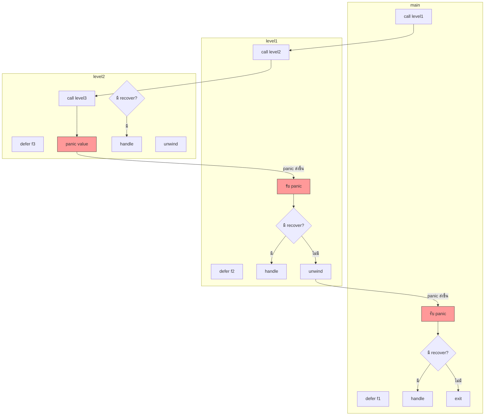

**คำอธิบาย**:  
- แผนภาพนี้แสดงการเกิด panic ที่ `level2` (หรือ `level3`)  
- ค่า panic จะไหลขึ้นบนผ่านแต่ละฟังก์ชัน  
- แต่ละระดับสามารถมี `recover` ใน `defer` เพื่อจับ panic และหยุดการส่งต่อ  

---

## 2. แผนภาพ Call Stack และการไหลของ panic (แบบลำดับเวลา)

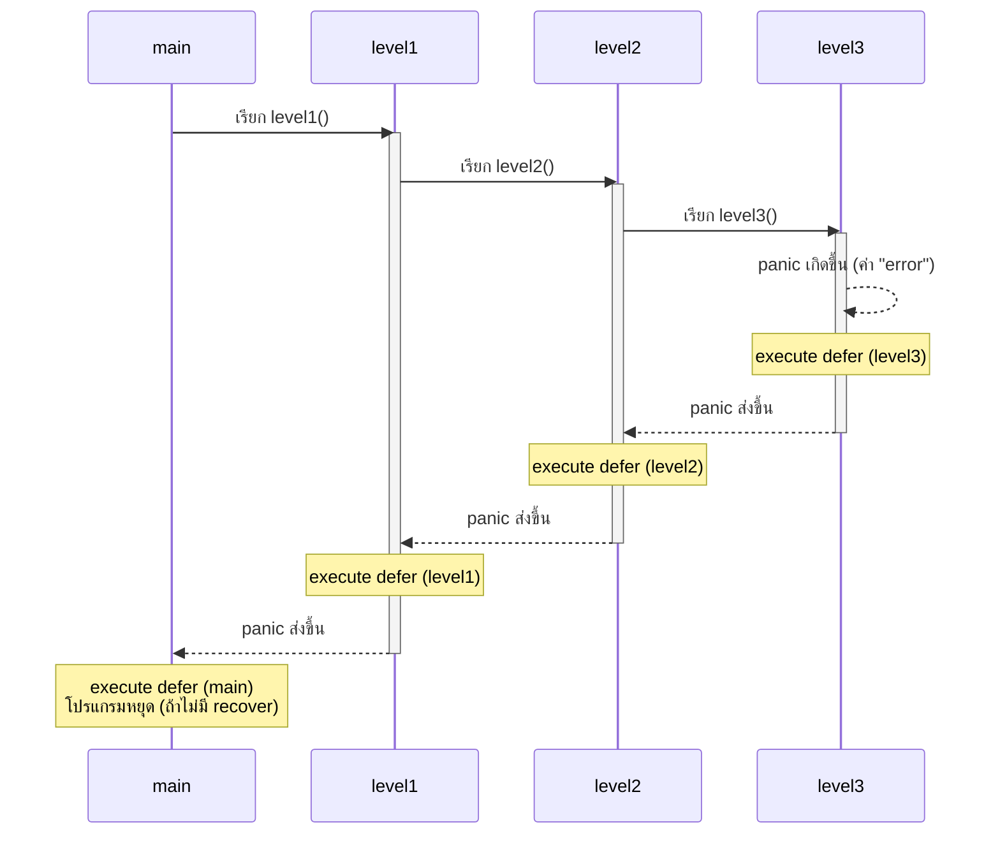

---

## 3. แผนภาพแบบมี `recover` หยุดการ unwind (การคลายสแต็ก)

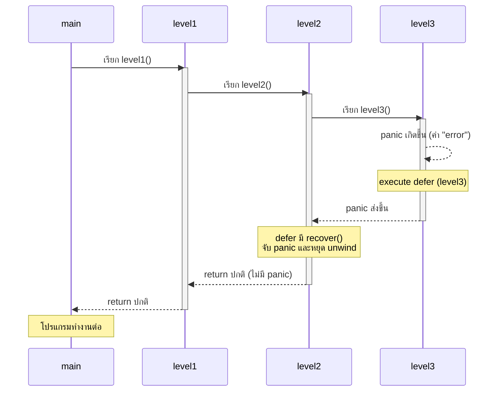
 
--- 

### คำอธิบาย
- **execute defer (levelX)** = การ( execution ) ฟังก์ชันที่ถูก `defer` ไว้ในขณะที่เกิด `panic` และกำลัง unwind stack  
- ลูกศรแนวตั้ง (`|`) แสดงลำดับการเรียกฟังก์ชันลงไป  
- ลูกศรแนวนอน (`<-----`) แสดงการส่ง panic value ขึ้นไปยัง caller พร้อมกับการ unwind  
- เมื่อ panic เกิดขึ้นใน `level3` การ execute ปกติจะหยุด แต่ `defer` ในแต่ละระดับยังคงถูก execute ก่อนที่ panic จะถูกส่งขึ้นไป

### ลำดับการไหลของข้อมูล (Data Flow)

1. **panic เกิดที่ `level3`** → ค่า panic (เช่น `"error"`) ถูกสร้างขึ้น  
2. **unwind stack เริ่ม** – การทำงานปกติใน `level3` หยุด; `defer` ทั้งหมดใน `level3` ทำงาน  
3. panic value **ไหลขึ้น** ไปยัง `level2`  
4. `level2` ( execution )  `defer` ของตัวเอง (LIFO)  
5. panic value **ไหลขึ้น** ไปยัง `level1`  
6. `level1` ( execution )  `defer`  
7. panic value **ไหลขึ้น** ไปยัง `main`  
8. `main` ( execution )  `defer`  
9. ถ้าไม่มี `recover()` ที่ไหน โปรแกรมจบพร้อมแสดง panic value และ stack trace  

### ถ้ามี `recover()` ใน `defer` ณ จุดใด

- panic value จะถูก **จับ** ไว้ที่จุดนั้น  
- unwind stack **หยุด** ที่ฟังก์ชันนั้น  
- การทำงานปกติจะดำเนินต่อหลังจาก `defer` ที่เรียก `recover()`  

---  

1. **ต้นทาง panic** เกิดขึ้นใน `level3()` – ค่า panic (เช่น `"error"`) ถูกสร้างขึ้น  
2. **เริ่มการคลายสแต็ก (unwind stack)** – การทำงานปกติใน `level3()` หยุดทันที; `defer` ใน `level3()` ถูกเรียก (ถ้ามี)  
3. **ค่า panic** ถูกส่งขึ้นไปยัง `level2()`  
4. **`level2()`**   `defer` ของตัวเอง (ตามลำดับ LIFO) จากนั้นถ้าไม่มี `recover` ค่า panic จะถูกส่งขึ้นไปต่อ  
5. **ค่า panic** ถูกส่งขึ้นไปยัง `level1()` แล้วก็ `main()`  
6. ใน `main()` (หรือฟังก์ชันใด ๆ) ถ้ามี `recover()` อยู่ใน `defer` จะสามารถ **จับ** ค่า panic ไว้ได้ และ **หยุดการคลายสแต็ก** การทำงานจะดำเนินต่อตามปกติ  

### สรุป
- ค่า panic เป็น **ข้อมูล** ที่ไหลขึ้นไปตาม call stack  
- ทุก `defer` สามารถตรวจสอบค่า panic ผ่าน `recover()`  
- ถ้า `defer` ใดเรียก `recover()` การไหลของ panic จะหยุดที่ระดับนั้น และโปรแกรมทำงานต่อ  

 

*ตัวอย่าง:*  
```go
fmt.Println("This will execute") // บรรทัดนี้จะถูก execute
```
### กระบวนการ unwind stack  (การคลายสแต็ก)
1. เกิด `panic` ที่จุดใดจุดหนึ่ง  
2. การ  (execute or execution) ของฟังก์ชันปัจจุบันหยุดทันที  
3. `defer` ทั้งหมดในฟังก์ชันปัจจุบันถูกเรียก (แบบ LIFO)  
4. ควบคุมกลับไปยังฟังก์ชันที่เรียก (caller)  
5. ทำซ้ำข้อ 2-4 จนถึง `main` หรือจนกว่าจะเจอ `recover`  
-   (execute or execution)  กระบวนการที่โปรเซสเซอร์หรือ runtime ของ Go ทำตามคำสั่งในโค้ด (เช่น การทำงานของฟังก์ชัน, การวนลูป, การคืนค่า)
  

**การคลายสแต็ก (stack unwinding)** คือกระบวนการที่เกิดขึ้นเมื่อเกิด `panic` ใน Go โดยโปรแกรมจะ **ย้อนกลับไปตามลำดับการเรียกฟังก์ชัน (call stack)** จากฟังก์ชันที่เกิด panic ขึ้นไปยังฟังก์ชันที่เรียกมันเรื่อยๆ จนถึง `main` (หรือจนกว่าจะเจอ `recover`)  

ระหว่างการคลายสแต็ก:
- การทำงานปกติของฟังก์ชันปัจจุบัน **หยุดทันที**
- คำสั่ง `defer` **ทั้งหมด** ในฟังก์ชันนั้นจะถูกเรียก (execute) ตามลำดับ LIFO (ประกาศทีหลังเรียกก่อน)
- จากนั้น panic value จะถูกส่งขึ้นไปยังฟังก์ชันที่เรียก (caller) และทำซ้ำขั้นตอนเดิม

หากไม่มี `recover()` ใดๆ จับ panic ไว้ กระบวนการจะดำเนินไปจนถึง `main` แล้วโปรแกรมจะหยุดพร้อมแสดง stack trace  
หากมี `recover()` ภายใน `defer` ของฟังก์ชันใด ณ จุดนั้น panic จะถูกจับไว้ และ **การคลายสแต็กจะหยุด** โปรแกรมจะทำงานต่อจากฟังก์ชันนั้นตามปกติ

### ตัวอย่างภาพจากแผนภาพ (แบบย่อ)
```
main() → level1() → level2() → level3()
                                   |
                              panic เกิด
                                   ↓
                         execute defer (level3)
                                   ↓
                         panic ส่งขึ้น → level2()
                                   ↓
                         execute defer (level2)
                                   ↓
                         panic ส่งขึ้น → level1()
                                   ↓
                         execute defer (level1)
                                   ↓
                         panic ส่งขึ้น → main()
                                   ↓
                         execute defer (main)
                                   ↓
                         ถ้าไม่มี recover → โปรแกรมหยุด
```
## `recover` คืออะไร

`recover` เป็น built-in function ในภาษา Go ที่ใช้ **กู้คืนโปรแกรมจากภาวะ panic** ช่วยให้โปรแกรมไม่ต้องหยุดทำงานทั้งระบบเมื่อเกิดข้อผิดพลาดร้ายแรง โดยสามารถจับค่า panic ที่เกิดขึ้นและทำให้โปรแกรมทำงานต่อไปได้ตามปกติ

---

### หลักการทำงาน

- `recover` จะทำงานได้ **เฉพาะเมื่อถูกเรียกภายใน `defer` function** เท่านั้น  
- หากเรียกนอก `defer` หรือไม่มี panic เกิดขึ้น `recover()` จะคืนค่า `nil`  
- เมื่อ panic เกิดขึ้นและมี `defer` ที่เรียก `recover()` ค่า panic จะถูกจับไว้ และ **การคลายสแต็ก (stack unwinding) จะหยุด** ที่ฟังก์ชันนั้น  
- `recover()` คืนค่าที่เป็น `interface{}` ซึ่งคือค่าที่ส่งเข้าไปใน `panic` (เช่น ข้อความ error, struct, ฯลฯ)

---

### ตัวอย่างการใช้งาน

```go
package main

import "fmt"

func safeDivision(a, b int) {
    defer func() {
        if r := recover(); r != nil {
            fmt.Println("กู้คืนจาก panic:", r)
            fmt.Println("โปรแกรมทำงานต่อ")
        }
    }()

    if b == 0 {
        panic("ตัวหารเป็นศูนย์")
    }
    fmt.Println("ผลลัพธ์:", a/b)
}

func main() {
    safeDivision(10, 2) // ทำงานปกติ → ผลลัพธ์: 5
    safeDivision(10, 0) // เกิด panic แต่ recover จับได้
    fmt.Println("จบโปรแกรม")
}
```

**ผลลัพธ์:**
```
ผลลัพธ์: 5
กู้คืนจาก panic: ตัวหารเป็นศูนย์
โปรแกรมทำงานต่อ
จบโปรแกรม
```

---

### ข้อควรระวัง

1. **ต้องอยู่ใน `defer` เท่านั้น**  
   - การเรียก `recover()` นอก `defer` จะไม่มีผลและคืนค่า `nil` เสมอ

2. **ใช้เฉพาะเมื่อจำเป็น**  
   - โดยทั่วไปควรจัดการ error ผ่าน `error` return value มากกว่าใช้ `panic`/`recover`  
   - `panic`/`recover` เหมาะสำหรับกรณีที่ไม่ควรเกิดขึ้น (programmer error, initialization failure ที่ไม่สามารถดำเนินต่อได้)

3. **`recover` คืนค่าเป็น `interface{}`**  
   - ต้องทำ type assertion หรือ type switch เพื่อใช้งานค่าที่ได้

---

### ความสัมพันธ์กับ `panic` และ `defer`

```
panic เกิดขึ้น → คลายสแต็ก (unwind stack) → execute defer → ถ้ามี recover() → จับค่า panic → หยุด unwind → โปรแกรมทำงานต่อ
```

**สรุป:** `recover` คือกลไกในการจับ panic ช่วยให้โปรแกรม Go มีความยืดหยุ่นในการจัดการกับข้อผิดพลาดร้ายแรงโดยไม่ต้องหยุดทำงานทั้งระบบ เหมาะสำหรับใช้ใน library หรือ middleware ที่ต้องการป้องกันการ crash ของโปรแกรมหลัก

---

 
**สรุป:** การคลายสแต็กคือการเดินกลับขึ้น call stack พร้อม deferred functions เพื่อให้โอกาสในการ cleanup หรือกู้คืน (recover) ก่อนที่โปรแกรมจะจบ
 
### ตัวอย่าง
```go
func level3() {
    defer fmt.Println("level3 defer")
    panic("error")
    fmt.Println("level3 end") // ไม่ถูก  (execute or execution) 
}

func level2() {
    defer fmt.Println("level2 defer")
    level3()
    fmt.Println("level2 end") // ไม่ถูก  (execute or execution) 
}

func level1() {
    defer fmt.Println("level1 defer")
    level2()
    fmt.Println("level1 end") // ไม่ถูก  (execute or execution) 
}

func main() {
    level1()
    fmt.Println("main end") // ไม่ถูก  (execute or execution) 
}
```
**ผลลัพธ์ (และลำดับ unwind):**
```
level3 defer
level2 defer
level1 defer
panic: error
...
```
แม้ `panic` จะเกิดขึ้นใน `level3` แต่ `defer` ใน `level2` และ `level1` ยังคงถูกเรียก เพราะโปรแกรม unwind stack ขึ้นไปเรื่อย ๆ

### สรุป
- **Unwind stack** คือการเดินกลับขึ้นไปตาม call stack พร้อม  (execute or execution)  deferred functions  
- เกิดจาก `panic` หรือ `runtime.Goexit()` (แต่ `Goexit` ไม่ unwind ถึง main)  
- `recover` สามารถหยุด unwind ได้หากถูกเรียกใน `defer` ของฟังก์ชันที่เกิด panic
```go
func readFile() {
    f, err := os.Open("file.txt")
    if err != nil {
        return
    }
    defer f.Close() // จะถูกเรียกเมื่อ readFile จบ
    // อ่านไฟล์...
}
```
defer จะทำงานในลำดับ LIFO (stack)

ฟังก์ชัน `readFile` ใช้ `os.Open` เพื่อเปิดไฟล์ หากเกิดข้อผิดพลาด (`err != nil`) จะ `return` ทันทีโดยไม่ดำเนินการต่อ หากเปิดสำเร็จ จะใช้ `defer f.Close()` เพื่อกำหนดให้ปิดไฟล์เมื่อฟังก์ชัน `readFile` ทำงานเสร็จ (ไม่ว่าจะจบแบบปกติหรือเกิด panic) panic คือ การหยุดหการทำงาน 

### หลักการทำงานของ `defer`
- คำสั่ง `defer` จะเลื่อนการทำงานของฟังก์ชันที่ตามมาให้เรียกเมื่อฟังก์ชันปัจจุบัน (ที่ประกาศ `defer`) จบการทำงาน
- ลำดับการเรียก `defer` เป็นแบบ LIFO (Last In, First Out) – ประกาศทีหลังจะถูกเรียกก่อน
- เหมาะสำหรับการปิดทรัพยากร (ไฟล์, connection) เพื่อป้องกันการรั่วไหล

----------------------------------
### ตัวอย่างการใช้งาน
----------------------------------
เพื่อให้เนื้อหาของคุณสมบูรณ์ยิ่งขึ้น ผมขอเสนอแผนภาพประกอบเพิ่มเติมในรูปแบบ **Mermaid** ซึ่งสามารถแทรกใน Markdown หรือเอกสารที่รองรับได้ ช่วยให้เห็นภาพการทำงานของ first-class functions, defer, และ panic/unwind stack ได้ชัดเจนขึ้น

---

## 1. แผนภาพ First-Class Functions

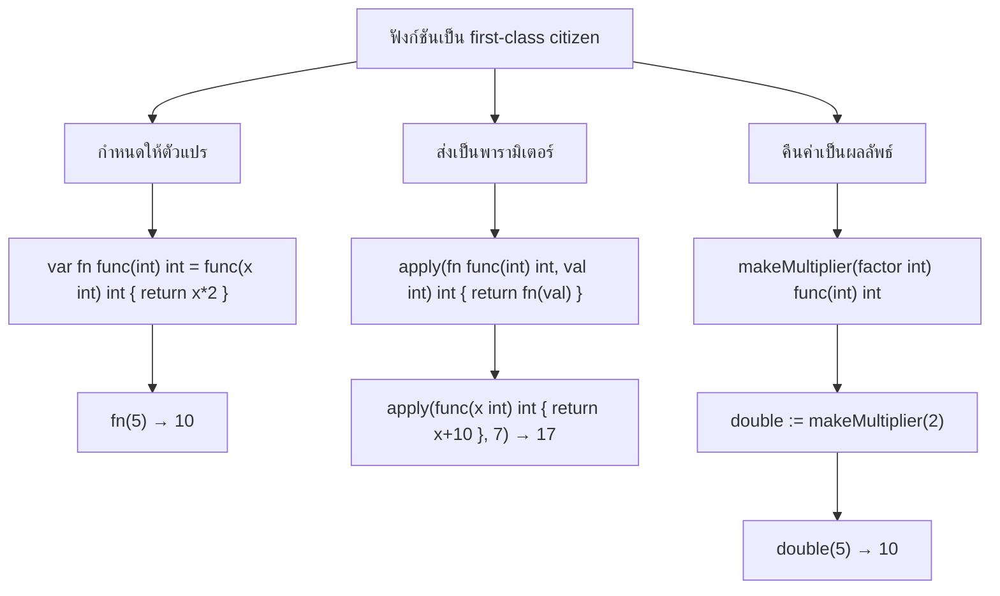

---

## 2. แผนภาพการทำงานของ `defer` (LIFO)

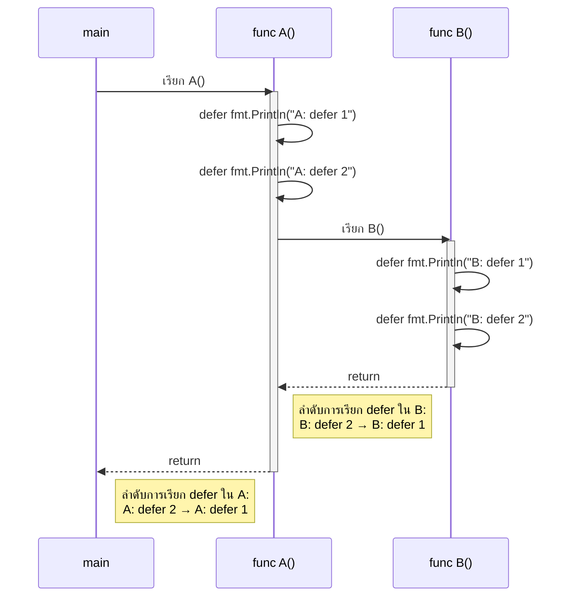

---

## 3. แผนภาพ Panic, Recover และ Stack Unwinding

### 3.1 การ unwind stack เมื่อเกิด panic (ไม่มี recover)

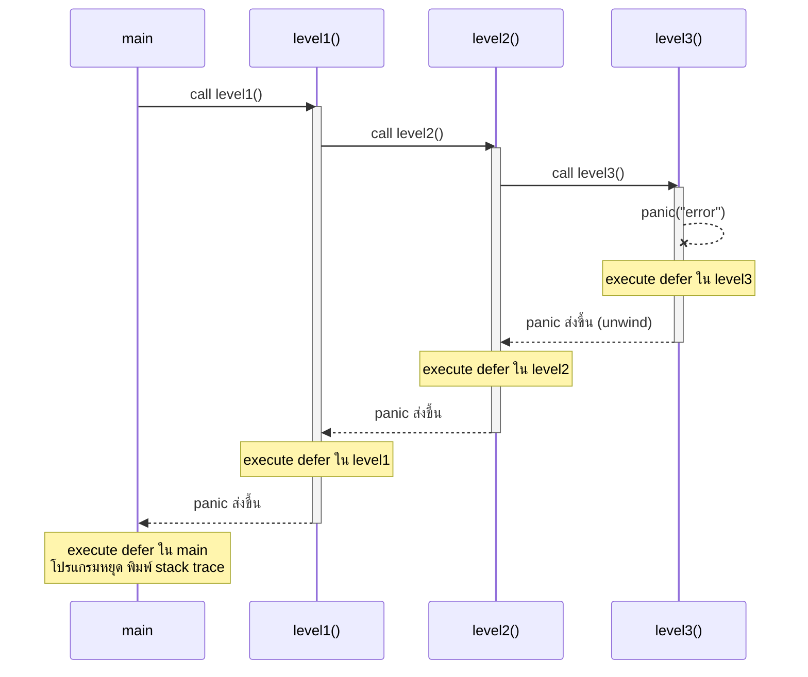

### 3.2 การใช้ `recover` หยุดการ unwind

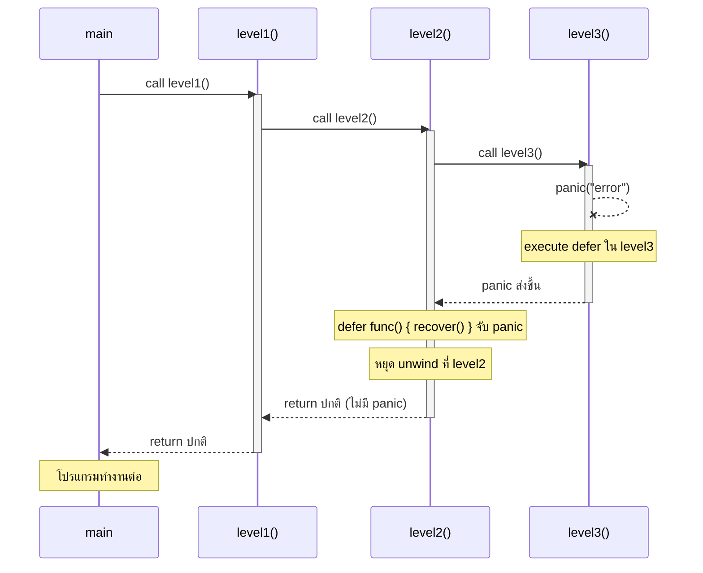
 ----------------
 **การคลายสแต็ก (stack unwinding)** คือกระบวนการที่เกิดขึ้นเมื่อเกิด `panic` ใน Go โดยโปรแกรมจะ **ย้อนกลับไปตามลำดับการเรียกฟังก์ชัน (call stack)** จากฟังก์ชันที่เกิด panic ขึ้นไปยังฟังก์ชันที่เรียกมันเรื่อยๆ จนถึง `main` (หรือจนกว่าจะเจอ `recover`)  

ระหว่างการคลายสแต็ก:
- การทำงานปกติของฟังก์ชันปัจจุบัน **หยุดทันที**
- คำสั่ง `defer` **ทั้งหมด** ในฟังก์ชันนั้นจะถูกเรียก (execute) ตามลำดับ LIFO (ประกาศทีหลังเรียกก่อน)
- จากนั้น panic value จะถูกส่งขึ้นไปยังฟังก์ชันที่เรียก (caller) และทำซ้ำขั้นตอนเดิม

หากไม่มี `recover()` ใดๆ จับ panic ไว้ กระบวนการจะดำเนินไปจนถึง `main` แล้วโปรแกรมจะหยุดพร้อมแสดง stack trace  
หากมี `recover()` ภายใน `defer` ของฟังก์ชันใด ณ จุดนั้น panic จะถูกจับไว้ และ **การคลายสแต็กจะหยุด** โปรแกรมจะทำงานต่อจากฟังก์ชันนั้นตามปกติ

### ตัวอย่างภาพจากแผนภาพ (แบบย่อ)
```
main() → level1() → level2() → level3()
                                   |
                              panic เกิด
                                   ↓
                         execute defer (level3)
                                   ↓
                         panic ส่งขึ้น → level2()
                                   ↓
                         execute defer (level2)
                                   ↓
                         panic ส่งขึ้น → level1()
                                   ↓
                         execute defer (level1)
                                   ↓
                         panic ส่งขึ้น → main()
                                   ↓
                         execute defer (main)
                                   ↓
                         ถ้าไม่มี recover → โปรแกรมหยุด
```

**สรุป:** การคลายสแต็กคือการเดินกลับขึ้น call stack พร้อม deferred functions เพื่อให้โอกาสในการ cleanup หรือกู้คืน (recover) ก่อนที่โปรแกรมจะจบ
 
```go
package main

import (
    "fmt"
    "os"
)

func readFile() {
    f, err := os.Open("file.txt")
    if err != nil {
        fmt.Println("Error:", err)
        return
    }
    defer f.Close() // รับประกันว่าจะปิดไฟล์เมื่อฟังก์ชันจบ

    // อ่านข้อมูลจากไฟล์...
    data := make([]byte, 100)
    n, _ := f.Read(data)
    fmt.Printf("Read %d bytes: %s\n", n, string(data[:n]))
}

func main() {
    readFile()
}
```

### สรุป
`defer` ช่วยให้โค้ดสะอาดและปลอดภัย เพราะรับประกันการทำความสะอาด (เช่น ปิดไฟล์) แม้ในกรณีที่มีการ `return` ก่อนถึงคำสั่งปิดหรือเกิด panic

----------------------
# recover
## `recover` คืออะไร

`recover` เป็น built-in function ในภาษา Go ที่ใช้ **กู้คืนโปรแกรมจากภาวะ panic** ช่วยให้โปรแกรมไม่ต้องหยุดทำงานทั้งระบบเมื่อเกิดข้อผิดพลาดร้ายแรง โดยสามารถจับค่า panic ที่เกิดขึ้นและทำให้โปรแกรมทำงานต่อไปได้ตามปกติ

---

### หลักการทำงาน

- `recover` จะทำงานได้ **เฉพาะเมื่อถูกเรียกภายใน `defer` function** เท่านั้น  
- หากเรียกนอก `defer` หรือไม่มี panic เกิดขึ้น `recover()` จะคืนค่า `nil`  
- เมื่อ panic เกิดขึ้นและมี `defer` ที่เรียก `recover()` ค่า panic จะถูกจับไว้ และ **การคลายสแต็ก (stack unwinding) จะหยุด** ที่ฟังก์ชันนั้น  
- `recover()` คืนค่าที่เป็น `interface{}` ซึ่งคือค่าที่ส่งเข้าไปใน `panic` (เช่น ข้อความ error, struct, ฯลฯ)

---

### ตัวอย่างการใช้งาน

```go
package main

import "fmt"

func safeDivision(a, b int) {
    defer func() {
        if r := recover(); r != nil {
            fmt.Println("กู้คืนจาก panic:", r)
            fmt.Println("โปรแกรมทำงานต่อ")
        }
    }()

    if b == 0 {
        panic("ตัวหารเป็นศูนย์")
    }
    fmt.Println("ผลลัพธ์:", a/b)
}

func main() {
    safeDivision(10, 2) // ทำงานปกติ → ผลลัพธ์: 5
    safeDivision(10, 0) // เกิด panic แต่ recover จับได้
    fmt.Println("จบโปรแกรม")
}
```

**ผลลัพธ์:**
```
ผลลัพธ์: 5
กู้คืนจาก panic: ตัวหารเป็นศูนย์
โปรแกรมทำงานต่อ
จบโปรแกรม
```

---

### ข้อควรระวัง

1. **ต้องอยู่ใน `defer` เท่านั้น**  
   - การเรียก `recover()` นอก `defer` จะไม่มีผลและคืนค่า `nil`(ค่าว่าง) เสมอ

2. **ใช้เฉพาะเมื่อจำเป็น**  
   - โดยทั่วไปควรจัดการ error ผ่าน `error` return value มากกว่าใช้ `panic`/`recover`  
   - `panic`/`recover` เหมาะสำหรับกรณีที่ไม่ควรเกิดขึ้น (programmer error, initialization failure ที่ไม่สามารถดำเนินต่อได้)

3. **`recover` คืนค่าเป็น `interface{}`**  
   - ต้องทำ type assertion หรือ type switch เพื่อใช้งานค่าที่ได้

---

### ความสัมพันธ์กับ `panic` และ `defer`

```
panic เกิดขึ้น → คลายสแต็ก (unwind stack) → execute defer → ถ้ามี recover() → จับค่า panic → หยุด unwind → โปรแกรมทำงานต่อ
```

**สรุป:** `recover` คือกลไกในการจับ panic ช่วยให้โปรแกรม Go มีความยืดหยุ่นในการจัดการกับข้อผิดพลาดร้ายแรงโดยไม่ต้องหยุดทำงานทั้งระบบ เหมาะสำหรับใช้ใน library หรือ middleware ที่ต้องการป้องกันการ crash ของโปรแกรมหลัก

---
 

เพื่อให้เห็นภาพการทำงานของ **`recover`** อย่างชัดเจน ผมขอเสนอแผนภาพ 3 แบบ ดังนี้

---

## 1. แผนภาพลำดับ (Sequence Diagram) – เปรียบเทียบแบบมี/ไม่มี `recover`

### กรณี **ไม่มี recover** (โปรแกรมหยุด)

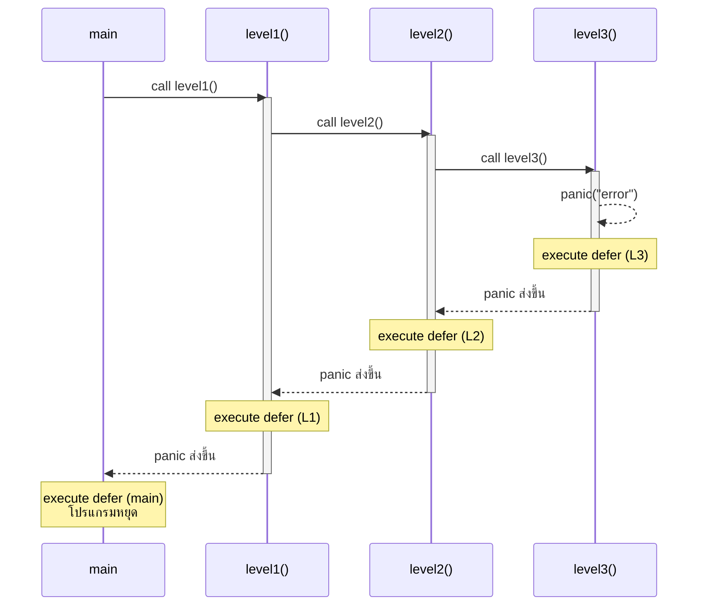

### กรณี **มี recover** (โปรแกรมทำงานต่อ)

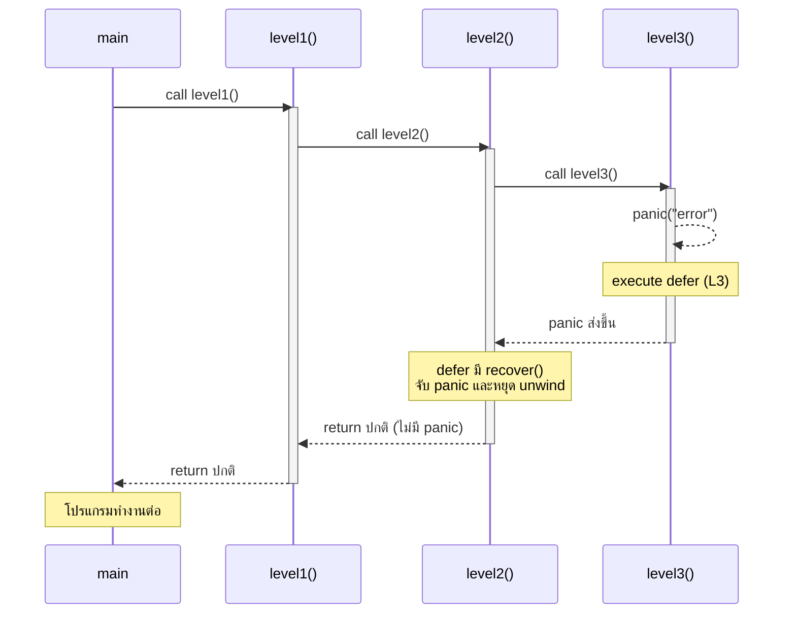

---

## 2. แผนภาพการไหล (Flowchart) – กระบวนการตัดสินใจของ `recover`
 
---

## 1. Mermaid Flowchart (ปรับปรุง)

```mermaid
graph TD
    Start([เกิด panic]) --> A{ฟังก์ชันนี้มี defer หรือไม่?}
    
    A -->|ไม่มี defer| B[ส่ง panic ไปยัง caller]
    A -->|มี defer| C[execute defer ทั้งหมด<br/>ตามลำดับ LIFO]
    
    C --> D{ใน defer มี recover()?}
    D -->|มี| E[recover จับ panic value]
    E --> F[หยุดการคลายสแต็กที่ฟังก์ชันนี้]
    F --> G[ฟังก์ชัน return ปกติ]
    G --> H([โปรแกรมทำงานต่อ])
    
    D -->|ไม่มี recover| B
    
    B --> I{caller คือ main?}
    I -->|ใช่| J[โปรแกรมหยุด<br/>พิมพ์ stack trace]
    I -->|ไม่ใช่| K[ย้ายไปยัง caller]
    K --> A
    
    style E fill:#9f9,stroke:#333
    style J fill:#f99,stroke:#333
    style H fill:#9cf,stroke:#333
```

**คำอธิบายเพิ่มเติม:**
- หลังจาก `recover` จับ panic ได้ การคลายสแต็กจะหยุดทันที และฟังก์ชันจะ return ตามปกติโดยไม่ส่ง panic ต่อ
- หากไม่มี `recover` ใน defer ใด ๆ panic จะถูกส่งขึ้นไปยัง caller ซ้ำจนกว่าจะถึง `main` หรือพบ `recover`

---

## 2. ASCII Flowchart (แบบข้อความ)

```
                     ┌─────────────────────┐
                     │     เกิด panic      │
                     └──────────┬──────────┘
                                │
                                ▼
                     ┌─────────────────────┐
                     │ มี defer ในฟังก์ชัน  │
                     │   ปัจจุบันหรือไม่?   │
                     └──────────┬──────────┘
                                │
            ┌───────────────────┴───────────────────┐
            │ไม่มี                                  │มี
            ▼                                       ▼
┌───────────────────────┐            ┌───────────────────────────┐
│ ส่ง panic ไปยัง caller │            │ execute defer ทั้งหมด     │
│ (เริ่ม unwind stack)   │            │ ตามลำดับ LIFO             │
└───────────┬───────────┘            └─────────────┬─────────────┘
            │                                      │
            │                                      ▼
            │                         ┌───────────────────────────┐
            │                         │ ใน defer มี recover()?    │
            │                         └─────────────┬─────────────┘
            │                                      │
            │                 ┌────────────────────┴────────────────────┐
            │                 │ไม่มี                                  │มี
            │                 ▼                                       ▼
            │    ┌────────────────────────┐            ┌───────────────────────────┐
            │    │ ส่ง panic ไปยัง caller │            │ recover จับ panic value    │
            │    └───────────┬────────────┘            └─────────────┬─────────────┘
            │                │                                       │
            │                │                                       ▼
            │                │                         ┌───────────────────────────┐
            │                │                         │ หยุดการคลายสแต็ก         │
            │                │                         │ ที่ฟังก์ชันนี้             │
            │                │                         └─────────────┬─────────────┘
            │                │                                       │
            │                │                                       ▼
            │                │                         ┌───────────────────────────┐
            │                │                         │ ฟังก์ชัน return ปกติ      │
            │                │                         └─────────────┬─────────────┘
            │                │                                       │
            │                │                                       ▼
            │                │                         ┌───────────────────────────┐
            │                │                         │    โปรแกรมทำงานต่อ        │
            │                │                         └───────────────────────────┘
            │                │
            ▼                ▼
┌─────────────────────────────────────┐
│      caller คือ main หรือไม่?        │
└─────────────────┬───────────────────┘
                  │
        ┌─────────┴─────────┐
        │ใช่                │ไม่ใช่
        ▼                   ▼
┌─────────────────┐   ┌─────────────────┐
│ โปรแกรมหยุด    │   │ ย้ายไปยัง caller │
│ พิมพ์ stack trace│   │ (กลับไปถามว่า   │
└─────────────────┘   │ มี defer อีกไหม)│
                      └────────┬────────┘
                               │
                               └──────→ (กลับไปที่จุดเริ่มต้น)
```
  
แผนภาพเหล่านี้ช่วยให้เห็นภาพรวมของ **`recover`** ได้ชัดเจนยิ่งขึ้น โดยเฉพาะบทบาทในการ **หยุดการคลายสแต็ก** และทำให้โปรแกรมดำเนินต่อไปได้อย่างปลอดภัย
---------------------
 
#### 10.7 panic และ recover
- `panic` : หยุดการทำงานปกติและเริ่ม unwind stack
- `recover` : ใช้ใน defer เพื่อจับ panic และควบคุมการทำงานต่อ

```go
func safeDivide(a, b int) {
    defer func() {
        if r := recover(); r != nil {
            fmt.Println("Recovered from panic:", r)
        }
    }()
    if b == 0 {
        panic("division by zero")
    }
    fmt.Println(a / b)
}
```
**ข้อควรระวัง**: panic ควรใช้ในกรณีผิดปกติรุนแรงเท่านั้น ไม่ใช่แทน error handling

#### 10.8 ฟังก์ชัน init
แต่ละแพคเกจ ได้รับ `init()` ฟังก์ชัน ซึ่งจะถูกเรียกอัตโนมัติเมื่อแพคเกจถูกโหลด (ก่อน main)
```go
func init() {
    fmt.Println("initializing package")
}
```
ในการทำธุรกรรมที่เกี่ยวข้องกับการสั่งซื้อสินค้า การตัดสต็อก และการออกใบเสร็จ เราต้องการให้ข้อมูลทุกส่วนถูกบันทึกอย่างสมบูรณ์หรือไม่บันทึกเลย หากเกิดข้อผิดพลาดขึ้นที่ขั้นตอนใดขั้นตอนหนึ่ง ระบบต้องสามารถ **ย้อนกลับ (rollback)** การเปลี่ยนแปลงทั้งหมดเพื่อรักษาความถูกต้องของข้อมูล

## การใช้ GORM Transaction เพื่อ Rollback

GORM มีฟังก์ชัน `db.Transaction` ที่ช่วยให้เราสามารถรวมหลายคำสั่ง SQL ไว้ใน transaction เดียวกันได้ โดยหากฟังก์ชันที่ส่งเข้าไปคืนค่า `error` GORM จะทำการ rollback โดยอัตโนมัติ ถ้าคืน `nil` จะ commit

### โครงสร้างตารางตัวอย่าง
```go
type Order struct {
    ID        uint
    UserID    uint
    Total     float64
    CreatedAt time.Time
}

type Stock struct {
    ProductID uint `gorm:"primaryKey"`
    Quantity  int
}

type Receipt struct {
    ID        uint
    OrderID   uint
    Amount    float64
    IssuedAt  time.Time
}
```

### ฟังก์ชัน PlaceOrder แบบ Transaction
```go
func PlaceOrder(db *gorm.DB, userID uint, items []CartItem) error {
    // เริ่ม transaction
    return db.Transaction(func(tx *gorm.DB) error {
        // 1. คำนวณราคารวม และตรวจสอบสต็อกพร้อม lock
        var total float64
        for _, item := range items {
            var stock Stock
            // Lock แถว stock เพื่อป้องกัน race condition
            if err := tx.Clauses(clause.Locking{Strength: "UPDATE"}).
                Where("product_id = ?", item.ProductID).
                First(&stock).Error; err != nil {
                return err // สินค้าไม่มีในระบบ
            }
            if stock.Quantity < item.Quantity {
                return errors.New("สินค้าไม่พอ")
            }
            // หักสต็อก (จะบันทึกภายหลัง)
            stock.Quantity -= item.Quantity
            if err := tx.Save(&stock).Error; err != nil {
                return err
            }
            // คำนวณราคารวม (สมมุติมีฟังก์ชัน getPrice)
            total += getPrice(item.ProductID) * float64(item.Quantity)
        }

        // 2. สร้าง order
        order := Order{UserID: userID, Total: total}
        if err := tx.Create(&order).Error; err != nil {
            return err
        }

        // 3. สร้าง receipt
        receipt := Receipt{OrderID: order.ID, Amount: total}
        if err := tx.Create(&receipt).Error; err != nil {
            return err
        }

        // ทุกอย่างสำเร็จ -> commit อัตโนมัติ
        return nil
    })
}
```

### กระบวนการทำงานเมื่อเกิดข้อผิดพลาด
- หากขั้นตอนใด (เช่น การ lock stock หรือการหักสต็อก หรือการ insert order/receipt) คืน error กลับมา ฟังก์ชันที่ส่งให้ `Transaction` จะคืน error นั้น
- GORM จะทำการ rollback ทุกคำสั่งที่ได้ดำเนินการไปแล้วใน transaction เดียวกัน (เช่น order ที่สร้างไปแล้วจะถูกลบ, stock ที่หักไปแล้วจะถูกคืนค่า)
- โปรแกรมภายนอกจะได้รับ error และสามารถแจ้งผู้ใช้ว่าเกิดข้อผิดพลาด โดยไม่มีข้อมูลค้างในฐานข้อมูล

### การป้องกัน Race Condition ด้วย Lock
- `Clauses(clause.Locking{Strength: "UPDATE"})` จะเพิ่ม `FOR UPDATE` ใน SQL เพื่อ lock แถว stock ขณะที่เราอ่านค่า
- เมื่อ transaction ยังไม่ commit แถวที่ lock จะไม่ให้ transaction อื่นอ่านหรือเขียนได้ (ขึ้นอยู่กับ isolation level) ทำให้การหักสต็อกปลอดภัยจากการทำงานพร้อมกัน

### ข้อควรระวัง
- **Transaction ควรสั้นที่สุด** หลีกเลี่ยงการทำงานที่ใช้เวลานานภายใน transaction (เช่น การเรียก API ภายนอก) เพราะจะผูก lock ไว้นาน
- **จัดการ error อย่างเหมาะสม** หากเกิด error ควรแจ้งให้ผู้ใช้ทราบถึงสาเหตุ (เช่น สินค้าไม่พอ)
- **เลือกใช้ isolation level** หากต้องการปรับระดับความเข้มงวด สามารถตั้งค่าได้ผ่าน `tx.Exec("SET TRANSACTION ISOLATION LEVEL ...")` ก่อนเริ่ม transaction

## สรุป
การใช้ GORM transaction ช่วยให้เราสามารถทำ rollback ได้โดยอัตโนมัติเมื่อเกิดความผิดพลาด การเพิ่ม lock ที่แถว stock ช่วยให้ข้อมูลสอดคล้องแม้มีผู้ใช้หลายคนสั่งซื้อพร้อมกัน วิธีนี้ทำให้การทำงานที่ต้องอาศัยความถูกต้องของข้อมูลหลายส่วน (order, stock, receipt) มีความปลอดภัยและเชื่อถือได้
---

### บทที่ 11: แพคเกจและการนำเข้า

#### 11.1 แพคเกจ (Packages)
Go จัดระเบียบโค้ดเป็นแพคเกจ แต่ละไฟล์ .go ต้องขึ้นต้นด้วย `package <name>` ชื่อแพคเกจควรเป็นตัวพิมพ์เล็ก

- `package main` : สำหรับโปรแกรมที่รันได้ (executable)
- แพคเกจอื่นๆ : สำหรับ library

#### 11.2 การนำเข้า (import)
```go
import "fmt"
import "math/rand"
```
หรือแบบ grouped:
```go
import (
    "fmt"
    "math/rand"
)
```

#### 11.3 การตั้งชื่อให้กับ import (alias)
```go
import (
    "fmt"
    r "math/rand"   // alias
)
```

#### 11.4 Blank import
ใช้ `_` เพื่อนำเข้าเฉพาะ side-effect (เช่น เรียก init) โดยไม่ต้องใช้ฟังก์ชัน
```go
import _ "image/png" // ลงทะเบียนตัวถอดรหัส PNG
```

#### 11.5 การเข้าถึงสมาชิก (exported vs unexported)
- ตัวพิมพ์ใหญ่: exported (public) สามารถเข้าถึงได้จากแพคเกจอื่น
- ตัวพิมพ์เล็ก: unexported (private) เข้าถึงได้เฉพาะภายในแพคเกจ

```go
// mymath/mymath.go
package mymath

func Add(a, b int) int { // Exported
    return a + b
}

func sub(a, b int) int { // Unexported
    return a - b
}
```

#### 11.6 การจัดโครงสร้างโปรเจกต์ด้วยแพคเกจ
```
myproject/
├── go.mod
├── main.go
├── utils/
│   └── stringutils.go
└── models/
    └── user.go
```
ใน `main.go`:
```go
import (
    "myproject/utils"
    "myproject/models"
)
```

#### 11.7 การจัดระเบียบแพคเกจมาตรฐาน
- `fmt` : การจัดรูปแบบ I/O
- `io` / `os` : การอ่านเขียนไฟล์
- `net/http` : HTTP client/server
- `encoding/json` : JSON
- `sync` : concurrency primitives
- `time` : เวลา
- `context` : context management

#### 11.8 การสร้างแพคเกจของตัวเอง
สร้างไดเรกทอรีใหม่ภายในโมดูล เขียนไฟล์ .go ด้วย package name ที่ตรงกับชื่อโฟลเดอร์

---

### บทที่ 12: การเริ่มต้นทำงานของแพคเกจ

#### 12.1 ลำดับการเริ่มต้น
1. แพคเกจที่ถูก import จะถูกเริ่มต้นก่อน (แบบ recursive)
2. ตัวแปรระดับแพคเกจถูกกำหนดค่า (initialized)
3. ฟังก์ชัน `init()` ถูกเรียก (เรียงตามลำดับการประกาศในไฟล์)
4. ถ้าเป็น `package main` ฟังก์ชัน `main()` จะถูกเรียก

#### 12.2 ฟังก์ชัน init
สามารถมีได้หลาย init ในแพคเกจเดียวกัน หรือแม้แต่หลาย init ในไฟล์เดียวกัน
```go
var config string

func init() {
    config = loadConfig()
    fmt.Println("init called")
}
```

#### 12.3 การควบคุมลำดับ init
ถ้าต้องการให้ init ทำงานก่อน ควรนำเข้าแพคเกจนั้นโดย blank import

#### 12.4 ตัวอย่างการเริ่มต้น
ไฟล์ `a.go`:
```go
package main

import "fmt"

var a = b + 1
var b = 1

func init() {
    fmt.Println("init 1", a, b)
}

func init() {
    fmt.Println("init 2")
}

func main() {
    fmt.Println("main", a, b)
}
```
ผลลัพธ์:
```
init 1 2 1
init 2
main 2 1
```
ตัวแปรจะถูกกำหนดค่าตามลำดับการประกาศในไฟล์

#### 12.5 การใช้ init เพื่อตั้งค่าแพคเกจ
เหมาะสำหรับการตั้งค่า connection pools, การลงทะเบียน driver, การโหลด configuration
```go
package database

import "database/sql"

var db *sql.DB

func init() {
    // เปิด connection pool
    db, _ = sql.Open("mysql", "user:pass@/dbname")
}
```

#### 12.6 การหลีกเลี่ยงการใช้งาน init มากเกินไป
init ทำให้ยากต่อการทดสอบและการควบคุมลำดับ หากเป็นไปได้ควรใช้ฟังก์ชันเริ่มต้นที่เรียกอย่างชัดเจน (เช่น New) แทน

---

### บทที่ 13: การสร้างชนิดข้อมูลใหม่ (Types)

#### 13.1 type keyword
ใช้สร้างชนิดข้อมูลใหม่จากชนิดเดิม
```go
type Celsius float64
type Fahrenheit float64

func (c Celsius) ToFahrenheit() Fahrenheit {
    return Fahrenheit(c*9/5 + 32)
}
```
`Celsius` และ `Fahrenheit` เป็นคนละชนิดกัน แม้ underlying type เหมือนกัน ต้องแปลงอย่างชัดเจน

#### 13.2 struct
struct คือการรวมตัวแปรหลายๆ ตัวเข้าด้วยกัน
```go
type Person struct {
    Name string
    Age  int
    Email string
}
```
การสร้าง instance:
```go
p1 := Person{"John", 30, "john@example.com"} // ตามลำดับ field
p2 := Person{Name: "Jane", Age: 25}          // ระบุชื่อ field
p3 := new(Person) // สร้าง pointer
p3.Name = "Bob"
```

#### 13.3 struct fields และ tags
Tags ใช้สำหรับ metadata เช่น การ encode/decode JSON
```go
type User struct {
    ID       int    `json:"id"`
    Username string `json:"username"`
    Password string `json:"-"` // ไม่แสดงใน JSON
}
```

#### 13.4 การสืบทอด (embedding) แทน inheritance
Go ไม่มี inheritance แต่ใช้ composition ผ่าน embedding
```go
type Animal struct {
    Name string
}

func (a Animal) Speak() string {
    return "???"
}

type Dog struct {
    Animal   // embedded field
    Breed string
}

func (d Dog) Speak() string {
    return "Woof!"
}
```
Dog จะมี field Name และ method Speak (สามารถ override ได้)

#### 13.5 ชนิดข้อมูลแบบ type alias
Alias (Go 1.9+) ทำให้มีชื่อใหม่ที่เทียบเท่ากับชนิดเดิม ใช้ในกรณี refactoring
```go
type MyInt = int // alias, MyInt และ int ใช้แทนกันได้
```
ความแตกต่าง: type definition (type MyInt int) สร้างชนิดใหม่, alias แค่ชื่ออื่น

#### 13.6 ชนิดข้อมูลแบบ interface
จะกล่าวในบทที่ 16

---

### บทที่ 14: เมธอด (Methods)

#### 14.1 การกำหนดเมธอด
เมธอดคือฟังก์ชันที่มี receiver (ตัวรับ)
```go
type Rectangle struct {
    Width, Height float64
}

func (r Rectangle) Area() float64 {
    return r.Width * r.Height
}

func (r *Rectangle) Scale(f float64) {
    r.Width *= f
    r.Height *= f
}
```

#### 14.2 Pointer receiver vs Value receiver
- **Value receiver**: ทำงานกับ copy เปลี่ยนแปลงไม่กระทบตัวเดิม
- **Pointer receiver**: ทำงานกับตัวแปรเดิม เปลี่ยนแปลงได้ และประหยัดหน่วยความจำสำหรับ struct ใหญ่

กฎ: ถ้าเมธอดต้องแก้ไข receiver ให้ใช้ pointer receiver

#### 14.3 เมธอดกับ non-struct
สามารถกำหนดเมธอดให้กับชนิดใดก็ได้ (ยกเว้นชนิดจากแพคเกจอื่นและชนิดพื้นฐานที่ไม่ใช่ alias)
```go
type MyInt int

func (m MyInt) Double() MyInt {
    return m * 2
}
```

#### 14.4 การเรียกเมธอด
```go
r := Rectangle{10, 5}
area := r.Area()      // value receiver
r.Scale(2)            // pointer receiver
```

#### 14.5 การแปลงระหว่าง value และ pointer อัตโนมัติ
Go จะแปลงให้อัตโนมัติเมื่อเรียกเมธอด:
- ถ้ามี pointer receiver แต่เรียกจาก value: Go จะส่ง address ให้ (ถ้า value addressable)
- ถ้ามี value receiver แต่เรียกจาก pointer: Go จะ dereference ให้

#### 14.6 เมธอดและการสืบทอด (embedding)
เมื่อ embed struct ไปอีก struct เมธอดของ struct ที่ถูก embed จะถูกเลื่อนขึ้นมา
```go
type Animal struct{}

func (a Animal) Speak() string {
    return "..."
}

type Dog struct {
    Animal
}

d := Dog{}
d.Speak() // เรียก Speak ของ Animal
```

#### 14.7 เมธอดและ interface
เมธอดเป็นสิ่งที่ทำให้ type implement interface ได้

---

### บทที่ 15: พอยน์เตอร์ (Pointer)

#### 15.1 พอยน์เตอร์คืออะไร?
พอยน์เตอร์คือตัวแปรที่เก็บ address ของตัวแปรอื่น
```go
var x int = 10
var p *int = &x   // p ชี้ไปที่ x
fmt.Println(*p)   // 10 (dereference)
*p = 20           // เปลี่ยนค่า x ผ่าน pointer
```

#### 15.2 การประกาศ pointer
- `&` : address-of operator
- `*` : dereference operator (และใช้ใน type declaration)

#### 15.3 Zero value ของ pointer
pointer ที่ไม่ได้กำหนดค่าจะเป็น `nil`

#### 15.4 การใช้ pointer กับฟังก์ชัน
เพื่อให้ฟังก์ชันสามารถแก้ไขตัวแปรนอกฟังก์ชันได้
```go
func zeroVal(val int) {
    val = 0
}

func zeroPtr(ptr *int) {
    *ptr = 0
}

x := 5
zeroVal(x)      // x ยังเป็น 5
zeroPtr(&x)     // x กลายเป็น 0
```

#### 15.5 การใช้ pointer กับ struct
เพื่อประสิทธิภาพ (ไม่ต้อง copy struct ทั้งตัว) และการแก้ไข
```go
func (p *Person) UpdateAge(age int) {
    p.Age = age
}
```
#### 15.6 new() และ make()
- `new(T)` : จัดสรรหน่วยความจำสำหรับ type T, คืน pointer *T, zero value
- `make(T, ...)` : ใช้กับ slice, map, channel เท่านั้น; คืน initialized (ไม่ใช่ zero) value

#### 15.7 Pointer arithmetic
Go ไม่สนับสนุน pointer arithmetic (ต่างจาก C) เพื่อความปลอดภัย

#### 15.8 ข้อควรระวัง
- nil pointer dereference จะทำให้ panic
- ควรใช้ pointer เมื่อจำเป็นเท่านั้น (การแก้ไข, ประสิทธิภาพ)

---
**nil pointer dereference** (การอ้างถึง pointer ที่เป็น nil) คือความผิดพลาดที่เกิดขึ้นเมื่อโปรแกรมพยายามเข้าถึงข้อมูลผ่าน pointer (ตัวแปรที่ชี้ไปยังตำแหน่งหน่วยความจำ) แต่ pointer นั้นไม่ได้ชี้ไปยังออบเจ็กต์หรือพื้นที่หน่วยความจำที่ถูกต้อง – มันมีค่าเป็น `nil` (null, ศูนย์) การพยายามอ่านหรือเขียนผ่าน pointer ดังกล่าวจึงไม่มีความหมายและทำให้โปรแกรมหยุดทำงานทันที

---

### nil pointer dereference คือ?.
ใน Go การ dereference nil pointer จะทำให้เกิด **panic** แบบ runtime:
```go
var p *int // p เป็น nil pointer
fmt.Println(*p) // panic: runtime error: invalid memory address or nil pointer dereference
```
หรือเมื่อเรียก method บน receiver ที่เป็น nil:
```go
type MyStruct struct { Name string }
func (m *MyStruct) Say() { fmt.Println(m.Name) }

var s *MyStruct // s เป็น nil
s.Say() // panic: nil pointer dereference (ถ้า method อ่านค่า m.Name)
```

### เกิดในภาษาอื่น
- **C/C++**: segmentation fault (core dumped)
- **Java**: NullPointerException
- **Python**: AttributeError หรือ TypeError (ขึ้นกับบริบท)
- **JavaScript**: TypeError: Cannot read property 'x' of null

---

### สาเหตุทั่วไป
- ประกาศตัวแปร pointer แต่ไม่ initialize (`var p *int`)
- คืนค่า nil จากฟังก์ชัน (เช่น `return nil, err`) แล้วนำมาใช้โดยไม่ตรวจสอบ
- ลบ element จากโครงสร้างข้อมูลแล้ว pointer เก่ายังถูกนำไปใช้
- รับค่าจาก map หรือ type assertion โดยไม่ตรวจสอบ ok

---

### ผลกระทบ
- โปรแกรม crash ทันที (หรือ panic)
- สูญเสียข้อมูลที่ยังไม่ถูกบันทึก
- อาจเป็นช่องโหว่ด้านความปลอดภัย (denial of service)

---

### วิธีป้องกันและแก้ไข

#### 1. ตรวจสอบ nil ก่อนใช้งาน
```go
if p != nil {
    fmt.Println(*p)
} else {
    // จัดการกรณี nil
}
```

#### 2. ใช้ zero value หรือ default object แทน pointer
```go
type Config struct {
    Timeout int
}
// ใช้ค่าเริ่มต้นแทน nil
config := Config{Timeout: 30}
```

#### 3. สำหรับ map, slice, channel – ตรวจสอบการ初始化
```go
var m map[string]int
m["key"] = 1 // panic: assignment to entry in nil map
// ควรใช้ make
m := make(map[string]int)
```

#### 4. ใช้ comma ok idiom สำหรับ type assertion หรือ map access
```go
if value, ok := myMap["key"]; ok {
    // ใช้ value
}
```

#### 5. ใช้ `recover()` กับ defer เพื่อดักจับ panic (ใน Go)
```go
defer func() {
    if r := recover(); r != nil {
        log.Println("recovered from:", r)
    }
}()
```

#### 6. ใช้เครื่องมือ static analysis
- `go vet` ช่วยตรวจสอบ potential nil dereference บางกรณี
- `nilaway` (จาก Uber) ตรวจจับ nil pointer bug ได้ละเอียดขึ้น

---

### สรุป
**nil pointer dereference** คือการพยายามเข้าถึงข้อมูลผ่าน pointer ที่ไม่มีค่า (nil) ซึ่งเป็นสาเหตุหลักของ panic และ program crash การป้องกันที่ดีที่สุดคือการตรวจสอบ nil ก่อนใช้งาน และออกแบบโค้ดให้ลดการพึ่งพา pointer ที่อาจเป็น nil ตั้งแต่แรก

คำว่า **Panic** ในบริบทของโปรแกรมหรือระบบคอมพิวเตอร์หมายถึง **สถานการณ์ที่โปรแกรมหรือระบบพบข้อผิดพลาดร้ายแรงจนไม่สามารถทำงานต่อไปได้อย่างปลอดภัย จึงต้องหยุดการทำงานทันที (Crash) เพื่อป้องกันความเสียหายหรือข้อมูลเสียหาย**

หากคุณกำลังหมายถึง **Panic ในภาษา Go (Golang)** ซึ่งเป็นภาษาที่ใช้คำนี้บ่อยที่สุด คำตอบมีดังนี้

---

### 1. Panic คืออะไร (ใน Go)

ในภาษา Go `panic` คือ built-in function ที่ทำให้โปรแกรมหยุดการทำงานปกติทันที และเริ่ม unwind the stack (คลายกองซ้อนฟังก์ชัน) พร้อมกับรัน `defer` statements ทั้งหมด

**ลักษณะของ Panic:**
- เกิดจากโปรแกรมเมอร์เรียก `panic()` โดยตรง
- เกิดจาก Runtime error เช่น การเข้าถึง slice index นอกขอบเขต (`index out of range`), การเรียก method บน nil pointer, การส่งค่า nil ไปยัง map

**ตัวอย่าง:**
```go
package main

func main() {
    defer func() {
        fmt.Println("defer ทำงานก่อน panic")
    }()
    
    panic("เกิดข้อผิดพลาดร้ายแรง")
    fmt.Println("บรรทัดนี้จะไม่ถูกทำงาน")
}
```

เมื่อ panic เกิดขึ้น โปรแกรมจะหยุดและแสดง stack trace เพื่อให้开发者追踪ต้นตอของปัญหา

---

### 2. แก้ไขอย่างไร

การแก้ไข panic มีหลักการหลักๆ ดังนี้:

#### 2.1 ใช้ `recover()` เพื่อดักจับ Panic
ใน Go มีฟังก์ชัน `recover()` ที่ใช้สำหรับดักจับ panic และทำให้โปรแกรมกลับมาทำงานต่อได้ (คล้าย try-catch ในภาษาอื่น)

**วิธีใช้:**
```go
package main

import "fmt"

func riskyFunction() {
    defer func() {
        if r := recover(); r != nil {
            fmt.Println("ดัก panic ได้:", r)
            // log error หรือทำการ cleanup
        }
    }()
    
    // โค้ดที่อาจ panic
    var slice []int
    fmt.Println(slice[5]) // ทำให้ panic: index out of range
}

func main() {
    riskyFunction()
    fmt.Println("โปรแกรมยังทำงานต่อได้")
}
```

**ข้อควรระวัง:** 
- `recover()` จะทำงานก็ต่อเมื่อถูกเรียกภายใน `defer` function เท่านั้น
- ควรใช้ `recover()` ใน goroutine แยกกัน เพราะ panic ใน goroutine จะทำให้ goroutine นั้นหยุด แต่ไม่ crash โปรแกรมหลัก (main goroutine)

#### 2.2 ป้องกัน Panic ก่อนเกิด
แนวทางที่ดีที่สุดคือการป้องกันไม่ให้ panic เกิดขึ้นตั้งแต่แรก:

1. **ตรวจสอบ nil pointer ก่อนใช้งาน**
   ```go
   if myStruct != nil {
       myStruct.Method()
   }
   ```

2. **ตรวจสอบ index ก่อนเข้าถึง slice/array**
   ```go
   if index >= 0 && index < len(mySlice) {
       value := mySlice[index]
   }
   ```

3. **ใช้ comma ok idiom สำหรับ map**
   ```go
   if value, ok := myMap[key]; ok {
       // ใช้ value ได้อย่างปลอดภัย
   }
   ```

4. **ตรวจสอบ error แทนการใช้ panic สำหรับข้อผิดพลาดทั่วไป**
   ```go
   file, err := os.Open("file.txt")
   if err != nil {
       // จัดการ error อย่างเหมาะสม แทนการ panic
       log.Println(err)
       return
   }
   ```

#### 2.3 ใช้เครื่องมือวิเคราะห์
- **Go vet**: `go vet` ช่วยหา potential panics บางประเภท
- **Static analysis tools**: เช่น `nilaway`, `errcheck` ช่วยตรวจสอบการจัดการ nil และ error

---

### 3. Panic ในบริบทอื่น

ถ้าคุณหมายถึง **Kernel Panic** (ใน Linux, macOS, Windows BSOD):
- **สาเหตุ**: 硬件故障, ไดรเวอร์ผิดพลาด, RAM เสีย, OS kernel bug
- **วิธีแก้**: 
  - บันทึก error code (บนหน้าจอ)
  - รีสตาร์ทเครื่อง
  - ตรวจสอบ硬件 (Memtest, SMART disk)
  - อัปเดตไดรเวอร์หรือ OS
  - ดู log จาก `/var/log/kern.log` หรือ `dmesg`

ถ้าคุณหมายถึง **Panic Attack** (อาการตื่นตระหนกทางจิตวิทยา):
- ไม่เกี่ยวกับการเขียนโปรแกรม แต่เป็นอาการทางจิตเวช ควรพบจิตแพทย์หรือผู้เชี่ยวชาญ

---

### สรุป
- **Panic** = ข้อผิดพลาดร้ายแรงที่ทำให้โปรแกรมหยุดทำงาน
- **แก้ไข** = ใช้ `recover()` ดักจับ (ใน Go) + ป้องกันด้วยการตรวจสอบค่าก่อนใช้งาน + ใช้ error handling ที่ดี
- **หลักการ** = ใช้ panic สำหรับ "สถานการณ์ที่ไม่ควรเกิดขึ้น" (programmer error) และใช้ error สำหรับ "สถานการณ์ที่คาดการณ์ได้"
 

### บทที่ 16: อินเทอร์เฟซ (Interfaces)

#### 16.1 อินเทอร์เฟซคืออะไร?
อินเทอร์เฟซคือชุดของ method signatures ชนิดข้อมูลใดๆ ที่ implement method ครบทุก method ในอินเทอร์เฟซ จะถือว่าอินสแตนซ์นั้น implement อินเทอร์เฟซนั้นโดยปริยาย (implicit implementation)
```go
type Speaker interface {
    Speak() string
}

type Dog struct{}

func (d Dog) Speak() string {
    return "Woof!"
}

var s Speaker = Dog{}
fmt.Println(s.Speak())
```

#### 16.2 Empty interface
`interface{}` (หรือ `any` ใน Go 1.18+) เป็นอินเทอร์เฟซที่ไม่มี method ใดๆ ทุกชนิด implement มันได้
```go
var anything interface{}
anything = 42
anything = "hello"
anything = Dog{}
```
ใช้เมื่อต้องการรับค่าทุกชนิด (คล้าย dynamic type)

#### 16.3 Type assertion
ใช้เพื่อดึงค่า concrete type ออกจาก interface
```go
var s interface{} = "hello"
str, ok := s.(string)
if ok {
    fmt.Println(str)
}
```
หากไม่ตรวจสอบ ok จะ panic ถ้าชนิดไม่ตรง

#### 16.4 Type switch
ตรวจสอบชนิดของ interface
```go
switch v := s.(type) {
case string:
    fmt.Println("string:", v)
case int:
    fmt.Println("int:", v)
default:
    fmt.Println("unknown")
}
```

#### 16.5 การ embed interface
```go
type Reader interface {
    Read(p []byte) (n int, err error)
}

type Writer interface {
    Write(p []byte) (n int, err error)
}

type ReadWriter interface {
    Reader
    Writer
}
```

#### 16.6 Interface และ nil
ตัวแปร interface มีค่า nil เมื่อทั้ง type และ value เป็น nil
```go
var s Speaker // nil interface
fmt.Println(s == nil) // true
```
แต่ถ้าเก็บ pointer ที่เป็น nil ไว้:
```go
var d *Dog = nil
var s Speaker = d // s ไม่เป็น nil เพราะ type เป็น *Dog
```

#### 16.7 ข้อดีของ interface
- ช่วยให้โค้ดยืดหยุ่น เปลี่ยน implementation ได้ง่าย
- สนับสนุน dependency injection
- เขียน test ได้ง่าย (ใช้ mock)

#### 16.8 Interface ที่ใช้บ่อย
- `io.Reader`, `io.Writer`
- `http.Handler`
- `error` (มี method Error() string)

---

## ภาคที่ 3: การจัดการโปรเจกต์และโครงสร้างข้อมูลขั้นสูง

### บทที่ 17: Go Modules - การจัดการโปรเจกต์สมัยใหม่

#### 17.1 Go Modules คืออะไร?
Go Modules เป็นระบบจัดการ dependencies อย่างเป็นทางการ เริ่มตั้งแต่ Go 1.11 ทำให้ไม่ต้องพึ่งพา GOPATH

#### 17.2 การเริ่มต้นโมดูล
```bash
go mod init example.com/myproject
```
สร้างไฟล์ `go.mod`:
```
module example.com/myproject

go 1.21
```

#### 17.3 การเพิ่ม dependencies
เมื่อเรา import แพคเกจภายนอกในโค้ดและรัน `go build` หรือ `go mod tidy` Go จะดึง dependencies และเพิ่มลงใน go.mod พร้อมสร้าง go.sum
```bash
go get github.com/gorilla/mux
```

#### 17.4 go.mod
ประกอบด้วย:
- module path
- เวอร์ชัน Go
- require: dependencies และเวอร์ชัน
- replace: แทนที่โมดูลด้วย local path หรือเวอร์ชันอื่น
- exclude: ไม่ใช้บางเวอร์ชัน

#### 17.5 go.sum
เก็บ checksum ของ dependencies เพื่อความปลอดภัยและการตรวจสอบความถูกต้อง

#### 17.6 การอัปเดต dependencies
```bash
go get -u              # อัปเดตทุก dependency
go get -u ./...        # อัปเดตภายในโมดูล
go get github.com/gorilla/mux@v1.8.0  # อัปเดตเฉพาะ
go mod tidy            # ลบ dependencies ที่ไม่ใช้
```

#### 17.7 vendor directory
สามารถสร้าง vendor folder สำหรับเก็บ dependencies ในโปรเจกต์ (สำหรับการ build ที่ไม่ต้องเชื่อมต่อ internet)
```bash
go mod vendor
```
แล้ว build ด้วย `go build -mod=vendor`

#### 17.8 การทำงานกับ private repositories
ตั้งค่า GOPRIVATE:
```bash
go env -w GOPRIVATE=github.com/mycompany/*
```

---

### บทที่ 18: Go Module Proxies

#### 18.1 โมดูลพร็อกซีคืออะไร?
พร็อกซีทำหน้าที่เป็นตัวกลางในการให้บริการโมดูล Go ช่วยให้การดาวน์โหลด dependencies เร็วขึ้น และมั่นใจว่าโค้ดไม่ถูกแก้ไข

#### 18.2 ค่าเริ่มต้น
Go 1.13+ ใช้ proxy `https://proxy.golang.org` เป็น default พร้อม fallback ไป direct

#### 18.3 การตั้งค่า GOPROXY
```bash
go env -w GOPROXY=https://goproxy.io,direct
```
สามารถตั้งค่าเป็น `direct` เพื่อดึงโดยตรงจาก VCS

#### 18.4 การใช้ proxy แบบ private
สำหรับ private repository ควรตั้ง `GOPRIVATE` เพื่อ bypass proxy

#### 18.5 การตรวจสอบ checksum
Go ใช้ checksum database (`sum.golang.org`) ตรวจสอบ integrity

#### 18.6 การปิดใช้งาน checksum สำหรับ private
```bash
go env -w GOSUMDB=off
```

---

### บทที่ 19: การทดสอบหน่วย (Unit Tests)

#### 19.1 การเขียน test
ไฟล์ test ต้องลงท้ายด้วย `_test.go` และฟังก์ชัน test ต้องขึ้นต้นด้วย `Test` และรับ `*testing.T`
```go
// math_test.go
package math

import "testing"

func TestAdd(t *testing.T) {
    result := Add(2, 3)
    expected := 5
    if result != expected {
        t.Errorf("Add(2,3) = %d; want %d", result, expected)
    }
}
```

#### 19.2 การรัน test
```bash
go test                 # รัน test ใน current directory
go test ./...           # รันทั้งหมด
go test -v              # verbose output
go test -run TestAdd    # รันเฉพาะฟังก์ชันที่ match
```

#### 19.3 Table-driven tests
รูปแบบที่นิยมใน Go:
```go
func TestAdd(t *testing.T) {
    tests := []struct {
        name string
        a, b int
        want int
    }{
        {"positive", 2, 3, 5},
        {"negative", -1, -2, -3},
        {"zero", 0, 0, 0},
    }

    for _, tt := range tests {
        t.Run(tt.name, func(t *testing.T) {
            if got := Add(tt.a, tt.b); got != tt.want {
                t.Errorf("Add(%d, %d) = %d, want %d", tt.a, tt.b, got, tt.want)
            }
        })
    }
}
```

#### 19.4 การใช้ subtests
`t.Run` ช่วยให้ test ทำงานแยก และสามารถรันย่อยได้

#### 19.5 การทดสอบ HTTP
```go
func TestHandler(t *testing.T) {
    req := httptest.NewRequest("GET", "/", nil)
    w := httptest.NewRecorder()
    handler(w, req)
    if w.Code != http.StatusOK {
        t.Errorf("expected 200, got %d", w.Code)
    }
}
```

#### 19.6 การใช้ test fixtures
สามารถใช้ `TestMain` เพื่อ setup/teardown
```go
func TestMain(m *testing.M) {
    // setup
    code := m.Run()
    // teardown
    os.Exit(code)
}
```

#### 19.7 การครอบคลุม (coverage)
```bash
go test -cover
go test -coverprofile=coverage.out
go tool cover -html=coverage.out   # ดูรายละเอียดใน browser
```

#### 19.8 การใช้ mock
แนะนำให้ใช้ interface เพื่อให้สามารถเปลี่ยน implementation เป็น mock ได้ง่าย

---

### บทที่ 20: อาเรย์ (Arrays)

#### 20.1 อาเรย์คืออะไร?
อาเรย์คือชุดข้อมูลขนาดคงที่ของชนิดเดียวกัน
```go
var arr [5]int               // array ขนาด 5, zero values
arr2 := [3]int{1,2,3}        // กำหนดค่า
arr3 := [...]int{1,2,3}      // ให้ compiler นับขนาด
```

#### 20.2 การเข้าถึงและแก้ไข
```go
arr[0] = 10
value := arr[0]
len(arr) // ความยาว
```

#### 20.3 อาเรย์เป็นค่า (value type)
ใน Go อาเรย์เป็น value type เมื่อส่งเข้า function จะถูก copy ทั้งตัว
```go
func modify(arr [3]int) {
    arr[0] = 100 // ไม่มีผลกับตัวแปรเดิม
}
```

#### 20.4 การใช้ pointer กับอาเรย์
```go
func modifyPtr(arr *[3]int) {
    arr[0] = 100 // แก้ไขตัวแปรเดิม
}
```

#### 20.5 ข้อจำกัด
ขนาดอาเรย์เป็นส่วนหนึ่งของชนิด ดังนั้น `[3]int` และ `[4]int` เป็นคนละชนิดกัน
การส่งอาเรย์ขนาดใหญ่ไปยังฟังก์ชันอาจทำให้ประสิทธิภาพลดลง (copy ข้อมูล)

#### 20.6 การวนลูป
```go
for i := 0; i < len(arr); i++ {
    fmt.Println(arr[i])
}

for i, v := range arr {
    fmt.Println(i, v)
}
```

#### 20.7 อาเรย์แบบหลายมิติ
```go
var matrix [2][3]int
matrix[0][1] = 5
```

---

### บทที่ 21: สไลซ์ (Slices)

#### 21.1 สไลซ์คืออะไร?
สไลซ์เป็นโครงสร้างข้อมูลที่ยืดหยุ่นกว่าอาเรย์ มีขนาด dynamic จริงๆ แล้วสไลซ์คือ view ของอาเรย์
```go
var s []int               // nil slice
s2 := []int{1,2,3}        // slice literal
s3 := make([]int, 5)      // length 5, capacity 5
s4 := make([]int, 5, 10)  // length 5, capacity 10
```

#### 21.2 การเพิ่มสมาชิกด้วย append
```go
s := []int{1,2}
s = append(s, 3)         // [1,2,3]
s = append(s, 4,5)       // [1,2,3,4,5]
```

#### 21.3 การ slicing
```go
arr := [5]int{1,2,3,4,5}
slice := arr[1:4]        // [2,3,4]
```
slicing ใช้ syntax `[low:high]` (low inclusive, high exclusive) มี default: low = 0, high = len

#### 21.4 capacity และ length
- `len(s)` : ความยาวปัจจุบัน
- `cap(s)` : ความจุ (จำนวน element ที่สามารถเก็บได้โดยไม่ต้อง allocate ใหม่)

เมื่อ append แล้วเกิน capacity Go จะ allocate array ใหม่ (ขนาดประมาณสองเท่า)

#### 21.5 การ copy
```go
src := []int{1,2,3}
dst := make([]int, len(src))
copy(dst, src)
```
copy คืนจำนวน element ที่คัดลอก

#### 21.6 การลบ element
ไม่มีฟังก์ชันลบโดยตรง ใช้ slicing รวม:
```go
// ลบ element index i
s = append(s[:i], s[i+1:]...)
```

#### 21.7 การ prepend
```go
s = append([]int{0}, s...)
```

#### 21.8 slice ของ slice (multidimensional)
```go
matrix := make([][]int, 3)
for i := range matrix {
    matrix[i] = make([]int, 3)
}
```

#### 21.9 การส่ง slice ไปยังฟังก์ชัน
สไลซ์ส่งเป็น reference (pointer to underlying array) ดังนั้นการแก้ไข element มีผลต่อตัวแปรเดิม

#### 21.10 ข้อควรระวัง: shared underlying array
เมื่อ slicing จาก slice เดิม อาจเกิดการแชร์อาเรย์ข้างใต้ ทำให้การแก้ไขกระทบกัน

---

### บทที่ 22: แมพ (Maps)

#### 22.1 แมพคืออะไร?
แมพคือโครงสร้างข้อมูลแบบ key-value (คล้าย dictionary) key type ต้อง comparable (==)
```go
var m map[string]int          // nil map, ใส่ค่าไม่ได้
m2 := make(map[string]int)    // empty map
m3 := map[string]int{
    "one": 1,
    "two": 2,
}
```

#### 22.2 การใช้งาน
```go
m := make(map[string]int)
m["key"] = 42
value := m["key"]
delete(m, "key")
```

#### 22.3 การตรวจสอบว่ามี key หรือไม่
```go
val, ok := m["key"]
if ok {
    fmt.Println("found:", val)
} else {
    fmt.Println("not found")
}
```

#### 22.4 การวนลูปผ่าน map
```go
for key, value := range m {
    fmt.Println(key, value)
}
```
ลำดับการวนไม่แน่นอน (randomized)

#### 22.5 Map เป็น reference type
การส่ง map ไปฟังก์ชันจะไม่ copy ข้อมูล การแก้ไขมีผลต่อต้นฉบับ

#### 22.6 nil map
nil map ไม่สามารถเขียนได้ (จะ panic) ต้องใช้ make ก่อนเสมอ

#### 22.7 การใช้ struct เป็น key
struct ที่ fields ทั้งหมด comparable สามารถเป็น key ได้
```go
type Key struct {
    A, B int
}
m := make(map[Key]string)
m[Key{1,2}] = "value"
```

#### 22.8 ประสิทธิภาพ
Map มีการ rehash เมื่อขนาดโตขึ้น ควรให้ hint ขนาดล่วงหน้าด้วย `make(map[K]V, hint)` เพื่อลดการ rehash

#### 22.9 sync.Map
ถ้าต้องการใช้ map ใน concurrent environment ควรใช้ `sync.Map` หรือใช้ mutex

---

### บทที่ 23: การจัดการข้อผิดพลาด (Errors)

#### 23.1 Error ใน Go
Go ใช้ error interface ในการจัดการข้อผิดพลาด ไม่มี exception
```go
type error interface {
    Error() string
}
```
ฟังก์ชันมักคืนค่า error เป็นค่าสุดท้าย
```go
func doSomething() (result int, err error) {
    if somethingWrong {
        return 0, errors.New("something went wrong")
    }
    return 42, nil
}
```

#### 23.2 การสร้าง error
- `errors.New("message")`
- `fmt.Errorf("format %v", arg)`

#### 23.3 การตรวจสอบ error
```go
result, err := doSomething()
if err != nil {
    // จัดการ error
    fmt.Println("Error:", err)
    return
}
// ใช้ result
```

#### 23.4 Custom error types
สามารถสร้าง struct ที่ implement error interface เพื่อเพิ่มข้อมูล
```go
type ValidationError struct {
    Field string
    Value interface{}
}

func (e ValidationError) Error() string {
    return fmt.Sprintf("validation failed on %s: %v", e.Field, e.Value)
}
```

#### 23.5 การตรวจสอบชนิดของ error
ใช้ type assertion หรือ errors.As
```go
var ve ValidationError
if errors.As(err, &ve) {
    fmt.Println("Field:", ve.Field)
}
```

#### 23.6 การห่อหุ้ม error (wrapping)
ใช้ `%w` ใน fmt.Errorf เพื่อ wrap error
```go
if err != nil {
    return fmt.Errorf("failed to process: %w", err)
}
```
การ unwrap ด้วย `errors.Unwrap` หรือตรวจสอบด้วย `errors.Is`

#### 23.7 errors.Is และ errors.As
- `errors.Is(err, target)` : ตรวจสอบว่า err หรือ err ที่ถูก wrap มี target หรือไม่
- `errors.As(err, &target)` : ดึง error เฉพาะชนิดออกมา

```go
if errors.Is(err, sql.ErrNoRows) {
    // handle no rows
}
```

#### 23.8 panic vs error
ใช้ error สำหรับกรณีที่คาดการณ์ได้ (เช่น ไฟล์ไม่พบ)
ใช้ panic สำหรับกรณีที่ไม่ควรเกิดขึ้น (programmer error) หรือไม่สามารถดำเนินต่อได้

#### 23.9 การใช้ defer กับ error
สามารถใช้ defer เพื่อทำ cleanup แม้มี error

---

## ภาคที่ 4: การพัฒนาแอปพลิเคชันเชิงปฏิบัติ

### บทที่ 24: ฟังก์ชันนิรนาม (Anonymous functions) และ Closure

#### 24.1 ฟังก์ชันนิรนาม
ฟังก์ชันที่ไม่มีชื่อ สามารถกำหนดให้กับตัวแปรหรือส่งเป็น argument
```go
func() {
    fmt.Println("anonymous")
}()

add := func(a, b int) int {
    return a + b
}
result := add(2,3)
```

#### 24.2 Closure
Closure คือฟังก์ชันที่สามารถเข้าถึงตัวแปรที่อยู่นอกขอบเขตของมัน
```go
func counter() func() int {
    count := 0
    return func() int {
        count++
        return count
    }
}

c := counter()
fmt.Println(c()) // 1
fmt.Println(c()) // 2
```

#### 24.3 การใช้งานจริง
- สร้างฟังก์ชัน factory
- ใช้กับ callback (เช่น http.HandlerFunc)
- ใช้กับ goroutine (passing variables)

#### 24.4 ข้อควรระวังเกี่ยวกับ closure ใน loop
```go
func main() {
    funcs := []func(){}
    for i := 0; i < 3; i++ {
        funcs = append(funcs, func() {
            fmt.Println(i) // i เป็นตัวแปรเดียวกัน
        })
    }
    for _, f := range funcs {
        f() // output: 3 3 3
    }
}
```
วิธีแก้: ใช้ตัวแปร local copy
```go
for i := 0; i < 3; i++ {
    i := i // shadow
    funcs = append(funcs, func() {
        fmt.Println(i)
    })
}
```

---

### บทที่ 25: การจัดการข้อมูล JSON และ XML

#### 25.1 JSON encoding
ใช้ struct tags เพื่อกำหนดชื่อ field ใน JSON
```go
type Person struct {
    Name string `json:"name"`
    Age  int    `json:"age,omitempty"`
    Email string `json:"-"` // ไม่รวมใน JSON
}
```

#### 25.2 Marshal (Go -> JSON)
```go
p := Person{Name: "John", Age: 30}
data, err := json.Marshal(p)
if err != nil {
    // handle
}
fmt.Println(string(data)) // {"name":"John","age":30}
```
ใช้ `MarshalIndent` เพื่อจัดรูปแบบ

#### 25.3 Unmarshal (JSON -> Go)
```go
jsonStr := `{"name":"John","age":30}`
var p Person
err := json.Unmarshal([]byte(jsonStr), &p)
```

#### 25.4 การทำงานกับ dynamic JSON
ใช้ `map[string]interface{}` หรือ `interface{}`:
```go
var data map[string]interface{}
json.Unmarshal([]byte(jsonStr), &data)
name := data["name"].(string)
```

#### 25.5 การใช้ json.RawMessage
เพื่อการ decode แบบ lazy

#### 25.6 XML
คล้ายกับ JSON แต่ใช้แท็ก `xml`:
```go
type Person struct {
    XMLName xml.Name `xml:"person"`
    Name    string   `xml:"name"`
    Age     int      `xml:"age"`
}
data, _ := xml.Marshal(p)
```

---

### บทที่ 26: พื้นฐานการสร้าง HTTP Server

#### 26.1 HTTP Handler
`http.Handler` interface มี method `ServeHTTP(http.ResponseWriter, *http.Request)`

วิธีง่าย: ใช้ `http.HandleFunc`
```go
func helloHandler(w http.ResponseWriter, r *http.Request) {
    fmt.Fprintf(w, "Hello, %s!", r.URL.Path[1:])
}

func main() {
    http.HandleFunc("/", helloHandler)
    http.ListenAndServe(":8080", nil)
}
```

#### 26.2 การใช้ ServeMux
```go
mux := http.NewServeMux()
mux.HandleFunc("/hello", helloHandler)
mux.HandleFunc("/bye", byeHandler)
http.ListenAndServe(":8080", mux)
```

#### 26.3 การอ่าน request data
- Query parameters: `r.URL.Query().Get("name")`
- Form data (POST): `r.ParseForm(); r.FormValue("name")`
- JSON body: `json.NewDecoder(r.Body).Decode(&data)`

#### 26.4 การตั้งค่า header และ status
```go
w.Header().Set("Content-Type", "application/json")
w.WriteHeader(http.StatusCreated)
```

#### 26.5 Routing ขั้นสูง
ใช้ third-party เช่น `gorilla/mux` หรือ `chi`:
```go
r := mux.NewRouter()
r.HandleFunc("/users/{id}", getUser).Methods("GET")
```

#### 26.6 Middleware
ฟังก์ชันที่ห่อ handler เพื่อเพิ่ม logic (logging, auth)
```go
func loggingMiddleware(next http.Handler) http.Handler {
    return http.HandlerFunc(func(w http.ResponseWriter, r *http.Request) {
        log.Println(r.Method, r.URL.Path)
        next.ServeHTTP(w, r)
    })
}

// ใช้
mux.Use(loggingMiddleware)
```

#### 26.7 การสร้าง HTTP server แบบ custom
```go
srv := &http.Server{
    Addr:         ":8080",
    Handler:      mux,
    ReadTimeout:  10 * time.Second,
    WriteTimeout: 10 * time.Second,
}
srv.ListenAndServe()
```

---

### บทที่ 27: Enum, Iota และ Bitmask

#### 27.1 Enum ใน Go
Go ไม่มี enum ในตัว แต่ใช้ const และ iota
```go
type Weekday int

const (
    Sunday Weekday = iota
    Monday
    Tuesday
    Wednesday
    Thursday
    Friday
    Saturday
)
```
iota เริ่มที่ 0 และเพิ่มทีละ 1

#### 27.2 การกำหนดค่าเริ่มต้นไม่ใช่ 0
```go
const (
    _ = iota // ignore first
    KB = 1 << (10 * iota) // 1 << (10*1) = 1024
    MB // 1 << (10*2) = 1048576
    GB
)
```

#### 27.3 Bitmask
ใช้ bitwise operator เพื่อรวม flags
```go
type Permission uint8

const (
    Read Permission = 1 << iota // 1
    Write                       // 2
    Execute                     // 4
)

// รวม
perm := Read | Write // 3

// ตรวจสอบ
if perm&Read != 0 {
    fmt.Println("has read")
}
```

#### 27.4 การสร้าง string representation
```go
func (p Permission) String() string {
    var flags []string
    if p&Read != 0 {
        flags = append(flags, "Read")
    }
    // ...
    return strings.Join(flags, "|")
}
```

---

### บทที่ 28: วันที่และเวลา

#### 28.1 time.Time
```go
t := time.Now()
fmt.Println(t) // 2024-01-15 10:30:00 +0000 UTC

// สร้างเวลาที่กำหนด
t2 := time.Date(2024, time.January, 15, 10, 30, 0, 0, time.UTC)
```

#### 28.2 การจัดรูปแบบ
Go ใช้รูปแบบอ้างอิง: `Mon Jan 2 15:04:05 MST 2006`
```go
t := time.Now()
fmt.Println(t.Format("2006-01-02 15:04:05"))
fmt.Println(t.Format("02/01/2006"))
```

#### 28.3 การ parse string เป็น time
```go
layout := "2006-01-02 15:04:05"
t, err := time.Parse(layout, "2024-01-15 14:30:00")
```

#### 28.4 การคำนวณเวลา
```go
t := time.Now()
t2 := t.Add(24 * time.Hour)
diff := t2.Sub(t) // 24h0m0s
```

#### 28.5 time.Duration
```go
d, _ := time.ParseDuration("1h30m")
time.Sleep(d)
```

#### 28.6 Timer และ Ticker
- `time.After(d)` : คืน channel ที่จะรับค่าเมื่อครบเวลา
- `time.Ticker` : ส่งค่าทุกๆ ช่วงเวลา

```go
ticker := time.NewTicker(1 * time.Second)
go func() {
    for range ticker.C {
        fmt.Println("tick")
    }
}()
time.Sleep(5 * time.Second)
ticker.Stop()
```

#### 28.7 Timezone
ใช้ `time.LoadLocation("Asia/Bangkok")` เพื่อเปลี่ยน location

---

### บทที่ 29: การจัดเก็บข้อมูล: ไฟล์และฐานข้อมูล

#### 29.1 การอ่านไฟล์
```go
data, err := os.ReadFile("file.txt")
if err != nil {
    log.Fatal(err)
}
fmt.Println(string(data))
```

#### 29.2 การเขียนไฟล์
```go
err := os.WriteFile("output.txt", []byte("hello"), 0644)
```

#### 29.3 การใช้ bufio สำหรับอ่านทีละบรรทัด
```go
file, err := os.Open("file.txt")
if err != nil { ... }
defer file.Close()

scanner := bufio.NewScanner(file)
for scanner.Scan() {
    line := scanner.Text()
    fmt.Println(line)
}
```

#### 29.4 การใช้ database/sql
```go
import (
    "database/sql"
    _ "github.com/go-sql-driver/mysql"
)

db, err := sql.Open("mysql", "user:pass@tcp(127.0.0.1:3306)/dbname")
defer db.Close()

rows, err := db.Query("SELECT id, name FROM users")
for rows.Next() {
    var id int
    var name string
    rows.Scan(&id, &name)
}
```

#### 29.5 การใช้ ORM (GORM)
```go
import "gorm.io/gorm"

type User struct {
    gorm.Model
    Name string
    Age  int
}

db.Create(&User{Name: "John", Age: 30})
var user User
db.First(&user, 1)
```

#### 29.6 การจัดการ connection pool
```go
db.SetMaxOpenConns(25)
db.SetMaxIdleConns(25)
db.SetConnMaxLifetime(5 * time.Minute)
```

---

### บทที่ 30: การทำงานพร้อมกัน (Concurrency)

#### 30.1 Goroutine
Goroutine คือ lightweight thread จัดการโดย Go runtime
```go
go func() {
    fmt.Println("hello from goroutine")
}()
```

#### 30.2 Channel
Channel ใช้สื่อสารระหว่าง goroutine
```go
ch := make(chan int)
go func() {
    ch <- 42 // ส่งค่า
}()
value := <-ch // รับค่า
```

#### 30.3 Buffered channel
```go
ch := make(chan int, 2) // buffer size 2
ch <- 1
ch <- 2
```

#### 30.4 การใช้ select
รอหลาย channel
```go
select {
case msg1 := <-ch1:
    fmt.Println(msg1)
case msg2 := <-ch2:
    fmt.Println(msg2)
case <-time.After(1 * time.Second):
    fmt.Println("timeout")
default:
    fmt.Println("no message")
}
```

#### 30.5 Worker pool pattern
```go
func worker(id int, jobs <-chan int, results chan<- int) {
    for j := range jobs {
        results <- j * 2
    }
}

jobs := make(chan int, 100)
results := make(chan int, 100)

for w := 1; w <= 3; w++ {
    go worker(w, jobs, results)
}

for j := 1; j <= 5; j++ {
    jobs <- j
}
close(jobs)

for r := 1; r <= 5; r++ {
    <-results
}
```

#### 30.6 sync.WaitGroup
รอให้ goroutine ทั้งหมดทำงานเสร็จ
```go
var wg sync.WaitGroup
for i := 0; i < 5; i++ {
    wg.Add(1)
    go func(i int) {
        defer wg.Done()
        fmt.Println(i)
    }(i)
}
wg.Wait()
```

#### 30.7 Mutex
ป้องกัน race condition
```go
var mu sync.Mutex
var counter int

mu.Lock()
counter++
mu.Unlock()
```

#### 30.8 การตรวจจับ race condition
```bash
go run -race main.go
go test -race
```

#### 30.9 Atomic operations
```go
import "sync/atomic"
var counter int64
atomic.AddInt64(&counter, 1)
```

---

### บทที่ 31: การบันทึกเหตุการณ์ (Logging)

#### 31.1 log package พื้นฐาน
```go
log.Println("Info message")
log.Printf("User %s logged in", username)
log.Fatal("fatal error") // log แล้ว os.Exit(1)
```

#### 31.2 การตั้งค่า log flags
```go
log.SetFlags(log.LstdFlags | log.Lshortfile)
// 2024/01/15 10:30:00 main.go:42: message
```

#### 31.3 การสร้าง logger แยก
```go
file, _ := os.OpenFile("app.log", os.O_CREATE|os.O_WRONLY|os.O_APPEND, 0666)
logger := log.New(file, "INFO: ", log.Ldate|log.Ltime)
logger.Println("application started")
```

#### 31.4 การใช้ structured logging (log/slog) Go 1.21+
```go
import "log/slog"

slog.Info("user login", "user", "john", "ip", "127.0.0.1")
slog.Error("database error", "error", err)
```

#### 31.5 ระดับ log
สามารถตั้งระดับด้วย slog.SetLogLoggerLevel

#### 31.6 การใช้ logging middleware ใน HTTP
```go
func loggingMiddleware(next http.Handler) http.Handler {
    return http.HandlerFunc(func(w http.ResponseWriter, r *http.Request) {
        start := time.Now()
        next.ServeHTTP(w, r)
        slog.Info("request",
            "method", r.Method,
            "path", r.URL.Path,
            "duration", time.Since(start),
        )
    })
}
```

---

### บทที่ 32: เทมเพลต (Templates)

#### 32.1 text/template และ html/template
Go มีแพคเกจสองตัว: `text/template` สำหรับข้อความทั่วไป, `html/template` สำหรับ HTML (มีการ escape อัตโนมัติ)

#### 32.2 การใช้งานพื้นฐาน
```go
tmpl, err := template.New("test").Parse("Hello {{.Name}}")
data := struct{ Name string }{"John"}
tmpl.Execute(os.Stdout, data)
```

#### 32.3 การทำงานกับ struct และ map
```go
type Person struct {
    Name string
    Age  int
}
data := Person{"John", 30}
tmpl.Execute(w, data)
```
ใน template: `{{.Name}}` , `{{.Age}}`

#### 32.4 คำสั่งใน template
- `{{if .Condition}} ... {{else}} ... {{end}}`
- `{{range .Items}} ... {{end}}`
- `{{with .Field}} ... {{end}}` เปลี่ยน context

#### 32.5 ฟังก์ชันใน template
```go
funcMap := template.FuncMap{
    "toUpper": strings.ToUpper,
}
tmpl := template.New("test").Funcs(funcMap)
tmpl.Parse(`{{. | toUpper}}`)
```

#### 32.6 การใช้ template files
```go
tmpl := template.Must(template.ParseFiles("index.html"))
tmpl.Execute(w, data)
```

#### 32.7 การรวม template (partials)
```go
tmpl := template.Must(template.ParseGlob("templates/*.html"))
```

#### 32.8 ความปลอดภัยของ html/template
html/template จะ escape อัตโนมัติเพื่อป้องกัน XSS ใช้ `{{. | safeHTML}}` เฉพาะเมื่อมั่นใจ

---

### บทที่ 33: การจัดการค่า Configuration

#### 33.1 การใช้ environment variables
```go
import "os"

dbHost := os.Getenv("DB_HOST")
if dbHost == "" {
    dbHost = "localhost"
}
```

#### 33.2 การใช้ flag package
```go
import "flag"

var port = flag.Int("port", 8080, "server port")
flag.Parse()
fmt.Println("port:", *port)
```

#### 33.3 การใช้ไฟล์ configuration (JSON/YAML)
```go
type Config struct {
    Server struct {
        Port int `json:"port"`
    } `json:"server"`
}

data, _ := os.ReadFile("config.json")
var cfg Config
json.Unmarshal(data, &cfg)
```

#### 33.4 การใช้ viper (popular library)
```go
import "github.com/spf13/viper"

viper.SetConfigName("config")
viper.SetConfigType("yaml")
viper.AddConfigPath(".")
viper.ReadInConfig()

port := viper.GetInt("server.port")
```

#### 33.5 การใช้ struct tags และการ validate
```go
type Config struct {
    Port int `mapstructure:"port" validate:"required,min=1024,max=65535"`
}
```

#### 33.6 การโหลดค่า order (override)
ลำดับความสำคัญ: default -> file -> env -> flag

---

## ภาคที่ 5: สู่การเป็นนักพัฒนา Go มืออาชีพ

### บทที่ 34: การวัดประสิทธิภาพ (Benchmarks)

#### 34.1 การเขียน benchmark
ไฟล์ `_test.go` ฟังก์ชันขึ้นต้นด้วย `Benchmark` รับ `*testing.B`
```go
func BenchmarkAdd(b *testing.B) {
    for i := 0; i < b.N; i++ {
        Add(1, 2)
    }
}
```

#### 34.2 การรัน benchmark
```bash
go test -bench=.           # รันทั้งหมด
go test -bench=Add         # รันเฉพาะ Add
go test -bench=. -benchmem # แสดง memory allocation
```

#### 34.3 การ reset timer
```go
func BenchmarkSomething(b *testing.B) {
    setup()
    b.ResetTimer()
    for i := 0; i < b.N; i++ {
        // code to benchmark
    }
}
```

#### 34.4 การเปรียบเทียบประสิทธิภาพ
ใช้ `benchstat` tool

#### 34.5 การเขียน benchmark ที่มีการทำงานที่แตกต่างกัน
```go
func BenchmarkAdd(b *testing.B) {
    tests := []struct{
        name string
        a,b int
    }{
        {"small", 1,2},
        {"large", 1000000, 2000000},
    }
    for _, tt := range tests {
        b.Run(tt.name, func(b *testing.B) {
            for i := 0; i < b.N; i++ {
                Add(tt.a, tt.b)
            }
        })
    }
}
```

---

### บทที่ 35: สร้าง HTTP Client

#### 35.1 การใช้ http.Get
```go
resp, err := http.Get("https://api.example.com/data")
if err != nil { ... }
defer resp.Body.Close()
body, _ := io.ReadAll(resp.Body)
```

#### 35.2 การสร้าง custom client
```go
client := &http.Client{
    Timeout: 10 * time.Second,
    Transport: &http.Transport{
        MaxIdleConns:    10,
        IdleConnTimeout: 30 * time.Second,
    },
}
resp, err := client.Get(url)
```

#### 35.3 การส่ง POST request พร้อม JSON
```go
data := map[string]interface{}{"name": "John"}
jsonData, _ := json.Marshal(data)

req, _ := http.NewRequest("POST", url, bytes.NewBuffer(jsonData))
req.Header.Set("Content-Type", "application/json")

resp, err := client.Do(req)
```

#### 35.4 การจัดการ cookies
```go
jar, _ := cookiejar.New(nil)
client := &http.Client{Jar: jar}
```

#### 35.5 การใช้ context กับ request
```go
ctx, cancel := context.WithTimeout(context.Background(), 5*time.Second)
defer cancel()
req := req.WithContext(ctx)
resp, err := client.Do(req)
```

#### 35.6 การ retry logic
ควรใช้ library เช่น `github.com/avast/retry-go`

---

### บทที่ 36: การวิเคราะห์โปรไฟล์ (Program Profiling)

#### 36.1 การใช้ pprof
Go มี built-in profiler สำหรับ CPU, memory, goroutine, block, mutex

#### 36.2 การเปิด pprof endpoint ใน HTTP server
```go
import _ "net/http/pprof"

func main() {
    go func() {
        log.Println(http.ListenAndServe("localhost:6060", nil))
    }()
    // ...
}
```

#### 36.3 การเก็บ CPU profile
```go
f, _ := os.Create("cpu.prof")
pprof.StartCPUProfile(f)
defer pprof.StopCPUProfile()
// run code
```

#### 36.4 การวิเคราะห์ profile
```bash
go tool pprof -http=:8080 cpu.prof
```

#### 36.5 การตรวจสอบ memory allocation
```bash
go test -memprofile mem.prof -bench .
```

#### 36.6 การวิเคราะห์ goroutine
```bash
curl http://localhost:6060/debug/pprof/goroutine?debug=1
```

---

### บทที่ 37: การจัดการ Context

#### 37.1 Context คืออะไร?
Context ใช้ส่งค่า deadline, cancellation, และ request-scoped values ผ่านขอบเขตของ API

#### 37.2 การสร้าง context
```go
ctx := context.Background()   // empty context, root
ctx := context.TODO()         // เมื่อยังไม่แน่ใจ
```

#### 37.3 Context with cancellation
```go
ctx, cancel := context.WithCancel(context.Background())
defer cancel()
// ถ้าเรียก cancel() จะทำให้ ctx.Done() ถูกปิด
```

#### 37.4 Context with timeout
```go
ctx, cancel := context.WithTimeout(context.Background(), 5*time.Second)
defer cancel()
```

#### 37.5 Context with deadline
```go
deadline := time.Now().Add(5*time.Second)
ctx, cancel := context.WithDeadline(context.Background(), deadline)
```

#### 37.6 การตรวจสอบ context
```go
select {
case <-ctx.Done():
    fmt.Println("context cancelled:", ctx.Err())
    return
default:
    // do work
}
```

#### 37.7 การส่งค่าใน context (ไม่ควรใช้มาก)
```go
type key string
ctx := context.WithValue(context.Background(), key("userID"), 123)
userID := ctx.Value(key("userID")).(int)
```

#### 37.8 การใช้ context ใน HTTP handler
```go
func handler(w http.ResponseWriter, r *http.Request) {
    ctx := r.Context()
    // ใช้ ctx ในการทำงาน
}
```

---

### บทที่ 38: Generics - การเขียนโค้ดแบบยืดหยุ่น

#### 38.1 Generics ใน Go 1.18+
Generics ช่วยให้เขียนฟังก์ชันหรือชนิดข้อมูลที่ทำงานกับหลายชนิดได้ โดยไม่ต้องใช้ interface{} และ type assertion

#### 38.2 ฟังก์ชัน generic
```go
func Map[T any](s []T, f func(T) T) []T {
    result := make([]T, len(s))
    for i, v := range s {
        result[i] = f(v)
    }
    return result
}

// เรียกใช้
nums := []int{1,2,3}
doubled := Map(nums, func(x int) int { return x * 2 })
```

#### 38.3 Type constraints
```go
func Sum[T int | float64](a, b T) T {
    return a + b
}
```

#### 38.4 การใช้ interface เป็น constraint
```go
type Number interface {
    int | int64 | float64
}

func Max[T Number](a, b T) T {
    if a > b {
        return a
    }
    return b
}
```

#### 38.5 Generic types (structs)
```go
type Stack[T any] struct {
    items []T
}

func (s *Stack[T]) Push(item T) {
    s.items = append(s.items, item)
}

func (s *Stack[T]) Pop() T {
    item := s.items[len(s.items)-1]
    s.items = s.items[:len(s.items)-1]
    return item
}
```

#### 38.6 constraints แพคเกจ
Go มีแพคเกจ `constraints` (experimental) สำหรับ constraints ทั่วไป

---

### บทที่ 39: Go กับกระบวนทัศน์ OOP?

#### 39.1 Go ไม่ใช่ภาษา OOP แบบดั้งเดิม
Go ไม่มี class, inheritance, polymorphism ผ่าน method overriding แต่ใช้ composition และ interface

#### 39.2 Encapsulation
ใช้ package visibility (ตัวพิมพ์เล็ก/ใหญ่)

#### 39.3 Polymorphism
ใช้ interface แทน inheritance
```go
type Shape interface {
    Area() float64
}

type Circle struct{ Radius float64 }
func (c Circle) Area() float64 { return math.Pi * c.Radius * c.Radius }

type Rectangle struct{ W, H float64 }
func (r Rectangle) Area() float64 { return r.W * r.H }

func PrintArea(s Shape) {
    fmt.Println(s.Area())
}
```

#### 39.4 Composition over inheritance
```go
type Engine struct{}
func (e Engine) Start() { ... }

type Car struct {
    Engine  // embedded
    Wheels int
}
// Car สามารถเรียก Start() ได้โดยตรง
```

#### 39.5 การ reuse โค้ด
ใช้ function, interface, embedding แทน inheritance

#### 39.6 ข้อดีของแนวทางนี้
- ลด coupling
- เข้าใจง่าย
- หลีกเลี่ยงปัญหา "diamond problem"

---

### บทที่ 40: การอัปเกรดหรือดาวน์เกรดเวอร์ชัน Go

#### 40.1 การติดตั้งหลายเวอร์ชัน
ใช้ `go install golang.org/dl/go1.20@latest` แล้ว `go1.20 download`

#### 40.2 การเปลี่ยนเวอร์ชัน (Linux/macOS)
ใช้ `go get golang.org/dl/go1.21.0` แล้ว `go1.21.0 download` หรือใช้ `gvm` (Go Version Manager)

#### 40.3 การอัปเดต go.mod
```bash
go mod edit -go=1.21
go mod tidy
```

#### 40.4 การตรวจสอบ compatibility
ใช้ `go fix` เพื่ออัปเดตโค้ดอัตโนมัติ

#### 40.5 การทดสอบกับเวอร์ชันใหม่
ใช้ CI/CD เพื่อทดสอบหลายเวอร์ชัน

#### 40.6 การดาวน์เกรด
ถ้าต้องการกลับไปใช้เวอร์ชันเก่า ให้เปลี่ยน PATH หรือใช้ version manager

---

### บทที่ 41: คำแนะนำในการออกแบบโค้ดที่ดี

#### 41.1 Go idioms
- **Keep it simple**: หลีกเลี่ยงความซับซ้อนที่ไม่จำเป็น
- **Use interfaces only when necessary**: อย่าสร้าง interface ก่อน แต่ให้สร้างเมื่อมีความจำเป็น
- **Accept interfaces, return structs**: ฟังก์ชันควรรับ interface, คืน concrete type
- **Use zero values**: ใช้ zero value ให้เป็นประโยชน์
- **Prefer composition over inheritance**

#### 41.2 การตั้งชื่อ
- **Package names**: สั้น, เป็นคำเดียว, ตัวพิมพ์เล็ก
- **Variables**: ใช้ชื่อสั้นภายในขอบเขตเล็ก, ชื่อยาวในขอบเขตใหญ่
- **Getters**: ไม่ใช้ `Get` prefix เช่น `Name()` แทน `GetName()`

#### 41.3 การจัดการ error
- ตรวจสอบ error ทันที
- ห่อ error ด้วยข้อมูลเพิ่มเติม (context)
- อย่าใช้ panic สำหรับการจัดการ error ปกติ

#### 41.4 การจัดโครงสร้างโปรเจกต์
```
/cmd/          # executables
/internal/     # private code
/pkg/          # public library code
/api/          # API definitions
```

#### 41.5 การเขียน documentation
- ใช้ comment ก่อนฟังก์ชัน/ชนิด
- ตัวอย่างใน comment จะปรากฏใน `go doc`

#### 41.6 การใช้ linter
```bash
golangci-lint run
```

#### 41.7 การทำ code review
- ตรวจสอบ error handling
- ดู race conditions
- ตรวจสอบการใช้ goroutine และ channel

---

### บทที่ 42: ชีทสรุป (Cheatsheet)

#### 42.1 คำสั่ง Go ที่ใช้บ่อย
```bash
go mod init <module>      # เริ่มต้นโมดูล
go mod tidy               # จัด dependencies
go build                  # คอมไพล์
go run <file>             # รันโดยตรง
go test ./...             # ทดสอบทั้งหมด
go fmt ./...              # จัดรูปแบบโค้ด
go vet ./...              # ตรวจสอบข้อผิดพลาดที่อาจเกิดขึ้น
go get <pkg>@<version>    # ดาวน์โหลดแพคเกจ
go install <pkg>@latest   # ติดตั้ง binary
go doc <pkg>              # ดู documentation
```

#### 42.2 ชนิดข้อมูล
| Type | Description |
|------|-------------|
| `bool` | true/false |
| `string` | immutable sequence |
| `int`, `int8`, `int16`, `int32`, `int64` | signed integers |
| `uint`, `uint8`(byte), `uint16`, `uint32`, `uint64` | unsigned integers |
| `float32`, `float64` | floating point |
| `complex64`, `complex128` | complex numbers |
| `rune` | alias for int32 (Unicode) |

#### 42.3 การประกาศตัวแปร
```go
var name string
var age int = 30
name := "John"          // short declaration (inside function)
var x, y int = 1, 2
var (                   // block
    a string
    b int
)
```

#### 42.4 โครงสร้างควบคุม
```go
// if
if x > 0 { ... } else if x < 0 { ... } else { ... }

// for
for i := 0; i < 10; i++ { ... }
for condition { ... }
for { ... break }

// switch
switch value {
case 1:
    ...
default:
    ...
}
```

#### 42.5 slice และ map
```go
// slice
s := []int{1,2,3}
s = append(s, 4)
s2 := make([]int, 5, 10)
copy(dst, src)

// map
m := make(map[string]int)
m["key"] = 1
delete(m, "key")
val, ok := m["key"]
```

#### 42.6 channel
```go
ch := make(chan int)
ch <- 42
val := <-ch
close(ch)
```

#### 42.7 การทำงานกับไฟล์
```go
data, _ := os.ReadFile("file.txt")
os.WriteFile("out.txt", []byte("data"), 0644)
```

#### 42.8 JSON
```go
type T struct {
    Name string `json:"name"`
}
data, _ := json.Marshal(t)
json.Unmarshal(data, &t)
```

#### 42.9 HTTP
```go
http.HandleFunc("/", handler)
http.ListenAndServe(":8080", nil)
```

#### 42.10 Context
```go
ctx, cancel := context.WithTimeout(context.Background(), 5*time.Second)
defer cancel()
```

---
 # คู่มือภาษา Go ฉบับสมบูรณ์

> **ครอบคลุมทุกมิติ ตั้งแต่พื้นฐานสู่สถาปัตยกรรมระดับองค์กร พร้อมแผนภาพและโค้ดตัวอย่างที่รันได้จริง**
>
> *Version 3.0 – เมษายน 2026*

---

## 📖 บทนำ

### ความเป็นมาของคู่มือ

ในยุคที่ซอฟต์แวร์มีความซับซ้อนมากขึ้นเรื่อย ๆ ภาษาโปรแกรมมิ่งที่เรียบง่าย มีประสิทธิภาพสูง และสามารถจัดการกับการทำงานพร้อมกันได้ดี กลายเป็นสิ่งที่นักพัฒนาต้องการอย่างยิ่ง ภาษา Go (หรือ Golang) ถือกำเนิดขึ้นจากความต้องการของ engineers ที่ Google ซึ่งเผชิญกับความท้าทายในการพัฒนาและบำรุงรักษาระบบขนาดใหญ่ที่มีการทำงานพร้อมกันสูง พวกเขาต้องการภาษาใหม่ที่ผสมผสานความรวดเร็วในการทำงานของภาษา C ความง่ายของภาษา Python และความสามารถในการจัดการ concurrency ที่ดีขึ้น

คู่มือเล่มนี้เกิดจากความตั้งใจที่จะรวบรวมองค์ความรู้เกี่ยวกับภาษา Go ตั้งแต่ระดับพื้นฐานจนถึงระดับมืออาชีพ ครอบคลุมทั้งไวยากรณ์พื้นฐาน การจัดการโปรเจกต์ด้วย Go Modules การทดสอบหน่วย การทำงานพร้อมกัน (concurrency) ไปจนถึงการออกแบบสถาปัตยกรรมระดับ Production และการประยุกต์ใช้ Domain-Driven Design (DDD) ร่วมกับ Go

### วัตถุประสงค์

คู่มือนี้ถูกออกแบบให้เป็น **ทั้งตำราเรียนและคู่มืออ้างอิง** โดยเน้นให้ผู้อ่านสามารถนำไปประยุกต์ใช้ได้ทันที ตั้งแต่การติดตั้ง การเขียนโปรแกรมพื้นฐาน ไปจนถึงการออกแบบสถาปัตยกรรมแบบ Clean Architecture และ Domain‑Driven Design (DDD) รวมถึงการเชื่อมต่อกับระบบภายนอกที่พบได้บ่อยในโลกแห่งความจริง

### สิ่งที่คุณจะได้รับ

- ความเข้าใจภาษา Go อย่างลึกซึ้ง ตั้งแต่ไวยากรณ์จนถึง concurrency
- แนวทางการจัดโครงสร้างโปรเจกต์สำหรับการผลิตจริง
- เทคนิคการทดสอบหน่วย (Unit Test) และการวัดประสิทธิภาพ
- รูปแบบสถาปัตยกรรม Clean Architecture + DDD + CQRS
- การผสาน Redis, RabbitMQ, MQTT, InfluxDB, WebSocket, SMS, LINE Notify, Discord
- เทมเพลตและ checklist ที่ช่วยให้ทีมทำงานเป็นระบบ
- แผนภาพ (draw.io) สำหรับอธิบายโครงสร้างและกระบวนการทำงาน
- โค้ดตัวอย่างที่สามารถนำไปรันทดสอบได้จริง

### กลุ่มเป้าหมาย

- **ผู้เริ่มต้น** ที่ต้องการเรียนรู้ภาษา Go ตั้งแต่ศูนย์
- **นักพัฒนาที่เปลี่ยนภาษา** จากภาษาอื่นมาสู่ Go
- **นักพัฒนาที่ต้องการยกระดับ** สู่การเป็น Go Developer มืออาชีพ
- **สถาปนิกซอฟต์แวร์** ที่สนใจการออกแบบระบบด้วย Go

### วิธีการอ่าน

- หากยังไม่เคยเขียน Go มาก่อน ให้เริ่มจาก **ภาคที่ 1–3** เพื่อทำความเข้าใจพื้นฐาน
- หากต้องการออกแบบแอปพลิเคชันทันที ให้ข้ามไป **ภาคที่ 7–8** เพื่อศึกษา Clean Architecture และ DDD
- หากต้องการเชื่อมต่อกับระบบอื่น (ฐานข้อมูล time‑series, message queue, IoT) ให้ดู **ภาคที่ 9**

---

## 📚 บทนิยาม (Glossary)

### ความหมายของคำศัพท์เฉพาะทาง

| คำศัพท์ | คำอธิบาย |
|---------|----------|
| **Go (Golang)** | ภาษาโปรแกรมมิ่งที่พัฒนาโดย Google เปิดตัวในปี 2009 ออกแบบมาเพื่อการพัฒนา software ที่มีประสิทธิภาพสูง จัดการ concurrency ได้ดี และมีไวยากรณ์ที่เรียบง่าย |
| **Goroutine** | เธรดขนาดเบาที่ถูกจัดการโดย Go runtime ใช้สำหรับการทำงานแบบ concurrent การสร้างทำได้โดยใช้คีย์เวิร์ด `go` หน้าฟังก์ชัน |
| **Channel** | โครงสร้างข้อมูลที่ใช้ในการสื่อสารระหว่าง goroutine ช่วยให้ส่งข้อมูลระหว่างกันได้อย่างปลอดภัย |
| **Compiler** | โปรแกรมที่แปลงซอร์สโค้ดภาษา Go ให้เป็นไฟล์ binary ที่เครื่องสามารถรันได้โดยตรง |
| **Go Modules** | ระบบจัดการ dependencies อย่างเป็นทางการของ Go เริ่มใช้ตั้งแต่ Go 1.11 ทำให้ไม่ต้องพึ่งพา GOPATH อีกต่อไป |
| **Interface** | ชนิดข้อมูลที่กำหนดชุดของ method signatures ชนิดใดก็ตามที่มี method ครบตามที่กำหนด จะถือว่า implement interface นั้นโดยอัตโนมัติ |
| **Struct** | ชนิดข้อมูลที่ใช้รวมฟิลด์หลาย ๆ ชนิดเข้าด้วยกัน คล้ายกับ class ในภาษาอื่น แต่ไม่มี method ในตัว |
| **Pointer** | ตัวแปรที่เก็บ address ของตัวแปรอื่น ใช้ `&` เพื่อ获取 address และ `*` เพื่อ dereference |
| **Defer** | คำสั่งที่ใช้เลื่อนการทำงานของฟังก์ชันออกไปจนกว่าฟังก์ชันรอบนอกจะจบการทำงาน ใช้สำหรับ cleanup ทรัพยากร |
| **Panic / Recover** | Panic คือการหยุดการทำงานปกติของโปรแกรม Recover ใช้ใน defer เพื่อจับ panic และควบคุมการทำงานต่อ |
| **Clean Architecture** | สถาปัตยกรรมซอฟต์แวร์ที่แบ่งเป็น 3 ชั้นหลัก: Delivery (รับส่งข้อมูล), Usecase (business logic), Repository (การเข้าถึงข้อมูล) |
| **DDD (Domain-Driven Design)** | แนวทางการออกแบบซอฟต์แวร์ที่เน้นการสร้างโมเดลที่สะท้อนความรู้ความเข้าใจทางธุรกิจ (domain knowledge) อย่างแท้จริง |
| **Aggregate** | กลุ่มของ Entities และ Value Objects ที่ถูกจัดการเป็นหน่วยเดียวกัน มี Aggregate Root เป็นตัวควบคุมความสอดคล้องของข้อมูล |
| **CQRS (Command Query Responsibility Segregation)** | รูปแบบการออกแบบที่แยกโมเดลการเขียน (Command) และการอ่าน (Query) ออกจากกัน |
| **Ubiquitous Language** | ภาษากลางที่ใช้ร่วมกันระหว่างนักพัฒนาและผู้เชี่ยวชาญโดเมน ใช้ศัพท์เดียวกันในโค้ด, การสนทนา, และเอกสาร |
| **Bounded Context** | การแบ่งโดเมนขนาดใหญ่ออกเป็นบริทย่อยที่มีขอบเขตชัดเจน แต่ละบริบทมีโมเดลและภาษาร่วมของตัวเอง |
| **Repository Pattern** | การสร้าง abstraction ชั้นกลางระหว่าง business logic และแหล่งข้อมูล |
| **Middleware** | ฟังก์ชันที่ห่อ handler เพื่อเพิ่ม logic เช่น logging, auth, rate limit |
| **Value Object** | วัตถุที่ไม่มีเอกลักษณ์เฉพาะตัว ถูกกำหนดโดยค่าของมัน (immutable) |
| **Domain Event** | เหตุการณ์สำคัญในโดเมนที่เกิดขึ้นระหว่างการทำงานของระบบ |

---

## 🧭 สารบัญ

### ภาคที่ 1: ปฐมบทกับการเขียนโปรแกรม
- **บทที่ 1:** ความรู้เบื้องต้นเกี่ยวกับการเขียนโปรแกรมคอมพิวเตอร์
- **บทที่ 2:** รู้จักกับภาษา Go
- **บทที่ 3:** พื้นฐานการใช้งาน Terminal
- **บทที่ 4:** เตรียมสภาพแวดล้อมสำหรับพัฒนา
- **บทที่ 5:** สร้างแอปพลิเคชันแรกของคุณ

### ภาคที่ 2: พื้นฐานภาษาและโครงสร้างข้อมูล
- **บทที่ 6:** ระบบเลขฐานสองและฐานสิบ
- **บทที่ 7:** เลขฐานสิบหก, ฐานแปด, ASCII, UTF8, Unicode และ Runes
- **บทที่ 8:** ตัวแปร, ค่าคงที่ และชนิดข้อมูลพื้นฐาน
- **บทที่ 9:** คำสั่งควบคุมการทำงาน
- **บทที่ 10:** ฟังก์ชัน
- **บทที่ 11:** แพคเกจและการนำเข้า
- **บทที่ 12:** การเริ่มต้นทำงานของแพคเกจ
- **บทที่ 13:** การสร้างชนิดข้อมูลใหม่ (Types)
- **บทที่ 14:** เมธอด (Methods)
- **บทที่ 15:** พอยน์เตอร์ (Pointer)
- **บทที่ 16:** อินเทอร์เฟซ (Interfaces)

### ภาคที่ 3: การจัดการโปรเจกต์และโครงสร้างข้อมูลขั้นสูง
- **บทที่ 17:** Go Modules - การจัดการโปรเจกต์สมัยใหม่
- **บทที่ 18:** Go Module Proxies
- **บทที่ 19:** การทดสอบหน่วย (Unit Tests)
- **บทที่ 20:** อาเรย์ (Arrays)
- **บทที่ 21:** สไลซ์ (Slices)
- **บทที่ 22:** แมพ (Maps)
- **บทที่ 23:** การจัดการข้อผิดพลาด (Errors)

### ภาคที่ 4: การพัฒนาแอปพลิเคชันเชิงปฏิบัติ
- **บทที่ 24:** ฟังก์ชันนิรนาม (Anonymous functions) และ Closure
- **บทที่ 25:** การจัดการข้อมูล JSON และ XML
- **บทที่ 26:** พื้นฐานการสร้าง HTTP Server
- **บทที่ 27:** Enum, Iota และ Bitmask
- **บทที่ 28:** วันที่และเวลา
- **บทที่ 29:** การจัดเก็บข้อมูล: ไฟล์และฐานข้อมูล
- **บทที่ 30:** การทำงานพร้อมกัน (Concurrency)
- **บทที่ 31:** การบันทึกเหตุการณ์ (Logging)
- **บทที่ 32:** เทมเพลต (Templates)
- **บทที่ 33:** การจัดการค่า Configuration

### ภาคที่ 5: สู่การเป็นนักพัฒนา Go มืออาชีพ
- **บทที่ 34:** การวัดประสิทธิภาพ (Benchmarks)
- **บทที่ 35:** สร้าง HTTP Client
- **บทที่ 36:** การวิเคราะห์โปรไฟล์ (Program Profiling)
- **บทที่ 37:** การจัดการ Context
- **บทที่ 38:** Generics - การเขียนโค้ดแบบยืดหยุ่น
- **บทที่ 39:** Go กับกระบวนทัศน์ OOP?
- **บทที่ 40:** การอัปเกรดหรือดาวน์เกรดเวอร์ชัน Go
- **บทที่ 41:** คำแนะนำในการออกแบบโค้ดที่ดี
- **บทที่ 42:** ชีทสรุป (Cheatsheet)

### ภาคที่ 6: เครื่องมือและไลบรารียอดนิยม
- **บทที่ 43:** chi, viper, cobra, zap และเครื่องมือสำคัญ
- **บทที่ 44:** GORM – ORM ทรงพลังสำหรับ Go
- **บทที่ 45:** การส่งอีเมลด้วย gomail และ hermes

### ภาคที่ 7: การออกแบบสถาปัตยกรรมและ Workflow
- **บทที่ 46:** Clean Architecture และโครงสร้างโปรเจกต์
- **บทที่ 47:** Blueprint สำหรับโปรเจกต์ Go ระดับ Production
- **บทที่ 48:** การออกแบบ Workflow และ Task Management

### ภาคที่ 8: Domain-Driven Design (DDD) กับ Go
- **บทที่ 49:** หลักการ DDD และการนำไปใช้ใน Go
- **บทที่ 50:** Aggregates, Event Storming และ CQRS
- **บทที่ 51:** การออกแบบบริการด้วย Go-DDD

### ภาคที่ 9: การผสานระบบภายนอกและคุณลักษณะเสริม (Advanced Integrations)
- **บทที่ 52:** Redis สำหรับ Cache และ Message Queue
- **บทที่ 53:** RabbitMQ – Message Broker มาตรฐานองค์กร
- **บทที่ 54:** MQTT สำหรับ IoT และระบบเรียลไทม์
- **บทที่ 55:** InfluxDB – Time‑Series Database
- **บทที่ 56:** WebSocket และ Socket.IO
- **บทที่ 57:** การส่ง SMS และ LINE Notify
- **บทที่ 58:** Discord Webhook สำหรับแจ้งเตือน

### ภาคที่ 10: เทมเพลต กระบวนการพัฒนา และตัวอย่างโค้ด
- **บทที่ 59:** ตัวอย่างโค้ดครบวงจร (Full‑stack Example)
- **บทที่ 60:** Task List Template
- **บทที่ 61:** Checklist Template
- **บทที่ 62:** แผนภาพการทำงาน (Workflow Diagram)
- **บทที่ 63:** mop Config – การจัดการ Configuration

---

## 🎨 การออกแบบคู่มือ

### ปรัชญาการออกแบบ

คู่มือนี้ถูกออกแบบโดยยึดหลักการเรียนรู้แบบ **"เรียนรู้จากการปฏิบัติ" (Learning by Doing)** เนื้อหาถูกจัดลำดับจากง่ายไปยาก เริ่มจากพื้นฐานที่จำเป็นต่อการเริ่มต้นเขียนโปรแกรม ไปจนถึงหัวข้อขั้นสูงที่นักพัฒนามืออาชีพต้องรู้

### โครงสร้างการเรียนรู้

```
ระดับที่ 1: พื้นฐาน
├── ความรู้เบื้องต้นเกี่ยวกับคอมพิวเตอร์และการเขียนโปรแกรม
├── ทำความรู้จักกับ Go
├── การติดตั้งและเตรียมสภาพแวดล้อม
└── เขียนโปรแกรมแรก

ระดับที่ 2: พื้นฐานภาษา
├── ตัวแปรและชนิดข้อมูล
├── คำสั่งควบคุม
├── ฟังก์ชัน
├── พอยน์เตอร์
└── โครงสร้างข้อมูลพื้นฐาน (array, slice, map)

ระดับที่ 3: การพัฒนาแอปพลิเคชัน
├── การจัดการข้อผิดพลาด
├── การทำงานกับไฟล์และฐานข้อมูล
├── HTTP Server/Client
└── การทำงานพร้อมกัน (concurrency)

ระดับที่ 4: เครื่องมือและไลบรารี
├── Go Modules
├── การทดสอบ
├── การวัดประสิทธิภาพ
└── ไลบรารียอดนิยม

ระดับที่ 5: การออกแบบสถาปัตยกรรม
├── Clean Architecture
├── DDD (Domain-Driven Design)
└── CQRS และ Event Sourcing
```

### รูปแบบการเรียนรู้แต่ละบท

แต่ละบทในคู่มือมีโครงสร้างที่สอดคล้องกัน:

1. **บทนำ** - อธิบายว่าบทนี้เกี่ยวกับอะไร และทำไมถึงสำคัญ
2. **เนื้อหาหลัก** - อธิบายแนวคิดและทฤษฎี พร้อมตัวอย่างโค้ดประกอบ
3. **ตัวอย่างการประยุกต์ใช้** - กรณีศึกษา หรือการนำไปใช้จริง
4. **ข้อควรระวัง** - ปัญหาที่พบบ่อยและวิธีแก้ไข
5. **แบบฝึกหัด** (สำหรับบทที่เหมาะสม) - เพื่อทบทวนความเข้าใจ

### รูปแบบโค้ดตัวอย่าง

โค้ดตัวอย่างในคู่มือใช้รูปแบบที่สอดคล้องกับ Go idiom:
- ใช้ `gofmt` ในการจัดรูปแบบ
- มีการอธิบายบรรทัดสำคัญด้วย comment
- แสดงทั้งการทำงานที่ถูกต้องและข้อผิดพลาดที่พบบ่อย

```go
// รูปแบบโค้ดตัวอย่าง
func Example() {
    // การทำงานที่ถูกต้อง
    result, err := doSomething()
    if err != nil {
        // การจัดการ error
        log.Printf("error: %v", err)
        return
    }
    // ใช้ result
}
```

---

## 🔄 การออกแบบ Workflow

### Workflow การเรียนรู้ภาษา Go

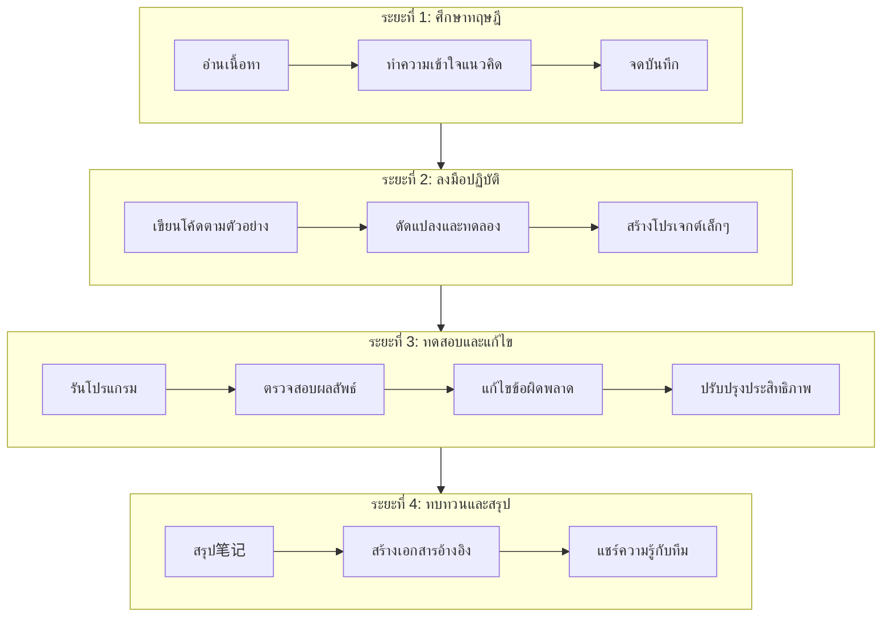

### Workflow การพัฒนาโปรเจกต์ Go

```mermaid
flowchart LR
    subgraph Analysis[วิเคราะห์]
        A1[รับ Requirement]
        A2[วิเคราะห์ Domain]
        A3[ระบุ Use Cases]
    end
    
    subgraph Design[ออกแบบ]
        B1[ออกแบบสถาปัตยกรรม]
        B2[กำหนด Interface]
        B3[ออกแบบ Database]
        B4[เลือก Tools]
    end
    
    subgraph Development[พัฒนา]
        C1[เขียน Domain Layer]
        C2[เขียน Application Layer]
        C3[เขียน Infrastructure]
        C4[เขียน Interface]
    end
    
    subgraph Testing[ทดสอบ]
        D1[Unit Test]
        D2[Integration Test]
        D3[E2E Test]
        D4[Performance Test]
    end
    
    subgraph Deploy[นำส่ง]
        E1[Build]
        E2[Deploy to Staging]
        E3[Deploy to Production]
        E4[Monitor]
    end
    
    Analysis --> Design --> Development --> Testing --> Deploy
```

### Workflow การเพิ่ม Feature ใหม่

```mermaid
flowchart TD
    subgraph Phase1[Phase 1: Domain Design]
        A1[ระบุ domain model]
        A2[กำหนด invariants]
        A3[ระบุ use cases]
        A4[กำหนด domain events]
        A5[ออกแบบ repository interface]
        A6[ออกแบบ DTOs]
    end
    
    subgraph Phase2[Phase 2: Implementation]
        B1[สร้าง entity struct]
        B2[สร้าง value objects]
        B3[สร้าง repository interface]
        B4[สร้าง service interface]
        B5[สร้าง DTOs]
        B6[เขียน unit tests - entity]
        B7[เขียน unit tests - service]
    end
    
    subgraph Phase3[Phase 3: Infrastructure]
        C1[สร้าง repository implementation]
        C2[สร้าง migration file]
        C3[ตั้งค่า Redis cache]
        C4[ตั้งค่า message queue]
        C5[ทดสอบ repository]
    end
    
    subgraph Phase4[Phase 4: Delivery]
        D1[สร้าง HTTP handlers]
        D2[เพิ่ม input validation]
        D3[สร้าง routes]
        D4[ลงทะเบียน dependencies]
        D5[ทดสอบ handler]
    end
    
    subgraph Phase5[Phase 5: Integration]
        E1[ทดสอบ end-to-end]
        E2[อัปเดต documentation]
        E3[รัน linter]
    end
    
    subgraph Phase6[Phase 6: Review & Deploy]
        F1[Code review]
        F2[ตรวจสอบ performance]
        F3[รัน test coverage]
        F4[รัน race detector]
        F5[Deploy to staging]
        F6[Deploy to production]
    end
    
    Phase1 --> Phase2 --> Phase3 --> Phase4 --> Phase5 --> Phase6
```

### แผนภาพสถาปัตยกรรม Clean Architecture

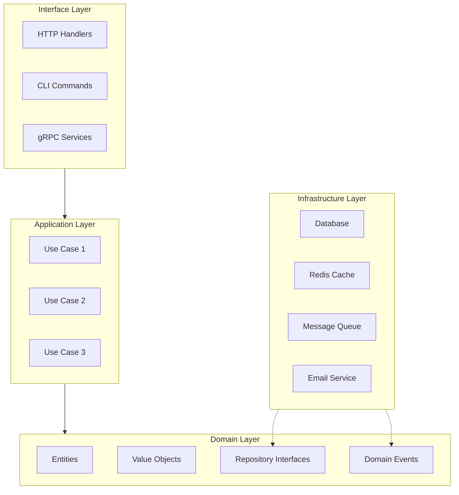

### แผนภาพ DDD Bounded Context

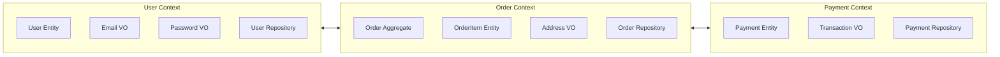

### แผนภาพ CQRS และ Event Sourcing

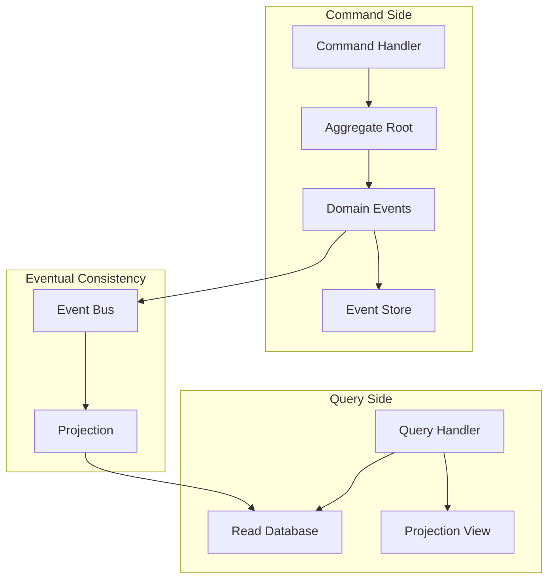

---

## 📋 Task List Template

### Template สำหรับการพัฒนา Feature ใหม่

```markdown
# Feature: [ชื่อ Feature]
## Owner: [ชื่อผู้รับผิดชอบ]
## Due Date: [วันที่กำหนดส่ง]

---

## Phase 1: Domain Design

### Tasks
- [ ] **T1.1** ระบุ domain model (entity, value objects)
  - [ ] ระบุ entity: _____________________________
  - [ ] ระบุ value objects: _____________________________
- [ ] **T1.2** กำหนด invariants (business rules)
  - [ ] Rule 1: _________________________________
  - [ ] Rule 2: _________________________________
- [ ] **T1.3** ระบุ use cases
  - [ ] Use case 1: _____________________________
  - [ ] Use case 2: _____________________________
- [ ] **T1.4** กำหนด domain events (ถ้ามี)
  - [ ] Event 1: _____________________________
  - [ ] Event 2: _____________________________
- [ ] **T1.5** ออกแบบ repository interface
  - [ ] Method: _____________________________
  - [ ] Method: _____________________________
- [ ] **T1.6** ออกแบบ DTOs (request/response)
  - [ ] Request: _____________________________
  - [ ] Response: _____________________________

**หมายเหตุ:** _________________________________

---

## Phase 2: Implementation

### Tasks
- [ ] **T2.1** สร้าง entity struct และ behavior methods
  - [ ] File: `internal/domain/[module]/entity.go`
  - [ ] Constructor: `New[Entity]()`
  - [ ] Methods: _____________________________
- [ ] **T2.2** สร้าง value objects
  - [ ] File: `internal/domain/[module]/value_objects.go`
  - [ ] VO 1: _____________________________
- [ ] **T2.3** สร้าง repository interface
  - [ ] File: `internal/domain/[module]/repository.go`
- [ ] **T2.4** สร้าง service interface
  - [ ] File: `internal/domain/[module]/service.go`
- [ ] **T2.5** สร้าง DTO structs
  - [ ] File: `internal/application/[module]/dto.go`
- [ ] **T2.6** เขียน unit tests สำหรับ entity
  - [ ] File: `internal/domain/[module]/entity_test.go`
  - [ ] Test cases: _________________________________
- [ ] **T2.7** เขียน unit tests สำหรับ service (mock repository)
  - [ ] File: `internal/application/[module]/[usecase]_test.go`
  - [ ] Mock repository implementation

**หมายเหตุ:** _________________________________

---

## Phase 3: Infrastructure

### Tasks
- [ ] **T3.1** สร้าง repository implementation
  - [ ] File: `internal/infrastructure/persistence/gorm/[module]_repo.go`
  - [ ] Implement interface methods
- [ ] **T3.2** สร้าง migration file
  - [ ] File: `migrations/[timestamp]_create_[table]_table.sql`
  - [ ] Up migration: _________________________________
  - [ ] Down migration: _________________________________
- [ ] **T3.3** ตั้งค่า Redis cache (ถ้าจำเป็น)
  - [ ] Cache key pattern: _________________________________
  - [ ] TTL: _________________________________
- [ ] **T3.4** ตั้งค่า message queue (ถ้าจำเป็น)
  - [ ] Topic/Queue name: _________________________________
  - [ ] Consumer implementation
- [ ] **T3.5** ทดสอบ repository ด้วย integration test
  - [ ] File: `internal/infrastructure/persistence/gorm/[module]_repo_test.go`
  - [ ] Use testcontainers or in-memory DB

**หมายเหตุ:** _________________________________

---

## Phase 4: Delivery

### Tasks
- [ ] **T4.1** สร้าง HTTP handlers
  - [ ] File: `internal/interfaces/http/handlers/[module]_handler.go`
  - [ ] Handler methods: _________________________________
- [ ] **T4.2** เพิ่ม input validation
  - [ ] Validation tags: _________________________________
  - [ ] Custom validator (ถ้ามี): _________________________________
- [ ] **T4.3** สร้าง routes
  - [ ] File: `internal/interfaces/http/routes.go`
  - [ ] Routes: _________________________________
- [ ] **T4.4** ลงทะเบียน dependencies ใน injection
  - [ ] File: `internal/apps/app/bootstrap/injection/wire.go`
  - [ ] Update provider set
- [ ] **T4.5** ทดสอบ handler ด้วย httptest
  - [ ] File: `internal/interfaces/http/handlers/[module]_handler_test.go`
  - [ ] Test cases: _________________________________

**หมายเหตุ:** _________________________________

---

## Phase 5: Integration & Documentation

### Tasks
- [ ] **T5.1** ทดสอบ end-to-end
  - [ ] curl/Postman collection: _________________________________
  - [ ] Test scenarios: _________________________________
- [ ] **T5.2** อัปเดต Swagger docs
  - [ ] File: `api/swagger.yaml` or `docs/docs.go`
  - [ ] Annotations: _________________________________
- [ ] **T5.3** อัปเดต README
  - [ ] Add feature description
  - [ ] Update API examples
- [ ] **T5.4** รัน linter และแก้ไข warnings
  - [ ] Command: `golangci-lint run ./...`
  - [ ] Issues fixed: _________________________________

**หมายเหตุ:** _________________________________

---

## Phase 6: Review & Deploy

### Tasks
- [ ] **T6.1** Code review
  - [ ] PR created: _________________________________
  - [ ] Reviewers: _________________________________
  - [ ] Comments addressed
- [ ] **T6.2** ตรวจสอบ performance
  - [ ] Benchmark: _________________________________
  - [ ] Query optimization: _________________________________
- [ ] **T6.3** รัน test coverage
  - [ ] Command: `go test -cover ./...`
  - [ ] Coverage: _____% (target >80%)
- [ ] **T6.4** รัน race detector
  - [ ] Command: `go test -race ./...`
  - [ ] Issues found: _________________________________
- [ ] **T6.5** Deploy to staging
  - [ ] Date: _________________________________
  - [ ] Version: _________________________________
- [ ] **T6.6** ทดสอบใน staging
  - [ ] Smoke test passed
  - [ ] Regression test passed
- [ ] **T6.7** Deploy to production
  - [ ] Date: _________________________________
  - [ ] Version: _________________________________
  - [ ] Monitoring checked

**หมายเหตุ:** _________________________________

---

## Summary

- **Total Tasks:** ___ / ___ completed
- **Blockers:** _________________________________
- **Next Steps:** _________________________________
```

---

## ✅ Checklist Template

### Code Quality Checklist

```markdown
## Code Quality Checklist

### Documentation
- [ ] All exported functions have comments (godoc format)
- [ ] Package has package-level documentation comment
- [ ] Complex logic has inline comments explaining "why"
- [ ] README updated with relevant information

### Code Style
- [ ] Code formatted with `go fmt` or `gofmt`
- [ ] No unused imports or variables (`go vet` passed)
- [ ] Consistent naming convention (camelCase, PascalCase)
- [ ] No magic numbers (use constants)
- [ ] Line length < 120 characters (preferably)

### Error Handling
- [ ] All errors are handled explicitly (no `_` ignoring)
- [ ] Errors are wrapped with context (`fmt.Errorf("...: %w", err)`)
- [ ] No panic in library code (only in main/init for fatal errors)
- [ ] Custom error types used when appropriate
- [ ] Error messages are descriptive and actionable

### Concurrency
- [ ] Goroutines have proper lifecycle management
- [ ] Channels are closed appropriately
- [ ] No race conditions (`go test -race` passed)
- [ ] sync.Mutex used correctly (Lock/Unlock pairs)
- [ ] Context passed as first parameter for cancellation

### Performance
- [ ] No unnecessary allocations in hot paths
- [ ] Slice pre-allocated when size known (`make([]T, 0, capacity)`)
- [ ] String concatenation uses `strings.Builder` for large operations
- [ ] Database queries have appropriate indexes
- [ ] No N+1 queries

### Security
- [ ] Input validation on all external inputs
- [ ] SQL injection prevented (use parameterized queries)
- [ ] No hardcoded secrets or credentials
- [ ] Sensitive data not logged
- [ ] Passwords hashed with bcrypt (not stored in plaintext)
- [ ] JWT secrets loaded from environment
- [ ] CORS configured properly (allow only trusted origins)

### Testing
- [ ] Unit tests cover business logic
- [ ] Table-driven tests used for multiple scenarios
- [ ] Edge cases tested (nil, empty, boundary values)
- [ ] Mock external dependencies
- [ ] Test coverage > 80%

### Project Structure
- [ ] Follows standard Go project layout
- [ ] Packages have single responsibility
- [ ] No circular dependencies
- [ ] Internal packages used for private code
- [ ] Go modules properly configured

### Dependencies
- [ ] go.mod has only required dependencies
- [ ] go.sum is committed
- [ ] `go mod tidy` run before commit
- [ ] No unused dependencies

### Version Control
- [ ] Commit messages follow convention (feat, fix, docs, etc.)
- [ ] No debug code (fmt.Println, log.Println) in production code
- [ ] No commented out code
- [ ] .gitignore properly configured

### Reviewer Notes
- [ ] Code reviewed by at least one other developer
- [ ] All review comments addressed

---
**Status:** [ ] Ready for merge | [ ] Changes requested | [ ] Approved
**Reviewer:** _________________________
**Date:** _________________________
```

### Deployment Checklist

```markdown
## Deployment Checklist

### Pre-Deployment (Staging)

#### Code Readiness
- [ ] All tests passing (`go test ./...`)
- [ ] Race detector passed (`go test -race ./...`)
- [ ] Linter passed (`golangci-lint run ./...`)
- [ ] Build successful (`go build ./...`)
- [ ] All PRs merged and approved

#### Configuration
- [ ] Environment variables verified
- [ ] Configuration files updated for staging
- [ ] Feature flags configured
- [ ] Third-party service credentials verified

#### Database
- [ ] Migration scripts reviewed
- [ ] Migrations tested in staging environment
- [ ] Rollback plan documented
- [ ] Backup created before migration

#### Infrastructure
- [ ] Container images built and tagged
- [ ] Kubernetes/ deployment files updated
- [ ] Resource limits configured
- [ ] Health check endpoints configured
- [ ] Monitoring and alerting configured

#### Security
- [ ] Security scan passed
- [ ] No secrets in code or config
- [ ] TLS certificates valid

---

### Staging Deployment

#### Deployment Steps
- [ ] Deploy to staging environment
- [ ] Verify pod/container health
- [ ] Run smoke tests
- [ ] Run integration tests
- [ ] Verify logs for errors
- [ ] Load testing (if required)

#### Validation
- [ ] Feature works as expected
- [ ] No regression in existing features
- [ ] Performance meets baseline
- [ ] Error handling works
- [ ] Monitoring shows expected metrics

---

### Pre-Production (Final Check)

#### Business Approval
- [ ] Product owner sign-off
- [ ] QA sign-off
- [ ] Security sign-off
- [ ] Documentation updated

#### Rollback Plan
- [ ] Rollback procedure documented
- [ ] Database rollback plan ready
- [ ] Previous version image available
- [ ] Rollback tested

#### Communication
- [ ] Release notes prepared
- [ ] Stakeholders notified
- [ ] Support team informed

---

### Production Deployment

#### Deployment Steps
- [ ] Schedule maintenance window (if required)
- [ ] Create production backup
- [ ] Deploy with canary/blue-green strategy
- [ ] Monitor deployment progress
- [ ] Verify health checks
- [ ] Run post-deployment tests

#### Post-Deployment
- [ ] Monitor logs for errors (15 min)
- [ ] Verify key metrics
- [ ] Check user feedback channels
- [ ] Update status page (if applicable)
- [ ] Announce successful deployment

#### Rollback Trigger Conditions
- [ ] Error rate > 1%
- [ ] Critical feature broken
- [ ] Security incident detected
- [ ] Performance degradation > 50%

---

### Post-Deployment

#### Cleanup
- [ ] Remove old images (if applicable)
- [ ] Clean up temporary resources
- [ ] Update documentation with new version

#### Monitoring
- [ ] Monitor for 24 hours
- [ ] Review error logs daily for 1 week
- [ ] Check resource utilization

#### Retrospective
- [ ] Deployment time recorded
- [ ] Issues encountered documented
- [ ] Improvements identified for next deployment

---
**Deployment Status:** [ ] Success | [ ] Failed | [ ] Rolled back
**Deployed by:** _________________________
**Date:** _________________________
**Version:** _________________________
```

---

## 💻 ตัวอย่างโค้ด

### ตัวอย่าง 1: Clean Architecture - User Registration (Full Example)

#### โครงสร้างโปรเจกต์

```
user-service/
├── cmd/
│   └── api/
│       └── main.go
├── internal/
│   ├── domain/
│   │   └── user/
│   │       ├── entity.go
│   │       ├── value_objects.go
│   │       └── repository.go
│   ├── application/
│   │   └── user/
│   │       ├── register.go
│   │       └── dto.go
│   ├── infrastructure/
│   │   └── persistence/
│   │       └── gorm/
│   │           └── user_repo.go
│   └── interfaces/
│       └── http/
│           ├── handlers/
│           │   └── user_handler.go
│           └── routes.go
├── go.mod
└── go.sum
```

#### go.mod

```go
module user-service

go 1.21

require (
    github.com/go-chi/chi/v5 v5.0.10
    github.com/go-playground/validator/v10 v10.15.5
    github.com/google/uuid v1.3.1
    github.com/lib/pq v1.10.9
    golang.org/x/crypto v0.14.0
    gorm.io/driver/postgres v1.5.3
    gorm.io/gorm v1.25.5
)
```

#### Domain Layer - Entity

**internal/domain/user/entity.go**

```go
package user

import (
    "errors"
    "time"

    "github.com/google/uuid"
)

// User represents the core domain entity
type User struct {
    id         uuid.UUID
    email      Email
    password   Password
    name       string
    isVerified bool
    createdAt  time.Time
    updatedAt  time.Time
}

// NewUser creates a new User entity
func NewUser(email, password, name string) (*User, error) {
    emailVO, err := NewEmail(email)
    if err != nil {
        return nil, err
    }

    passwordVO, err := NewPassword(password)
    if err != nil {
        return nil, err
    }

    if name == "" {
        return nil, errors.New("name is required")
    }

    now := time.Now()
    return &User{
        id:         uuid.New(),
        email:      *emailVO,
        password:   *passwordVO,
        name:       name,
        isVerified: false,
        createdAt:  now,
        updatedAt:  now,
    }, nil
}

// Reconstruct reconstructs a User from persistence (for repository)
func Reconstruct(id uuid.UUID, email Email, passwordHash string, name string, isVerified bool, createdAt, updatedAt time.Time) (*User, error) {
    password, err := NewPasswordFromHash(passwordHash)
    if err != nil {
        return nil, err
    }

    return &User{
        id:         id,
        email:      email,
        password:   *password,
        name:       name,
        isVerified: isVerified,
        createdAt:  createdAt,
        updatedAt:  updatedAt,
    }, nil
}

// Getters
func (u *User) ID() uuid.UUID      { return u.id }
func (u *User) Email() Email       { return u.email }
func (u *User) Name() string       { return u.name }
func (u *User) IsVerified() bool   { return u.isVerified }
func (u *User) CreatedAt() time.Time { return u.createdAt }
func (u *User) UpdatedAt() time.Time { return u.updatedAt }
func (u *User) PasswordHash() string { return u.password.Hash() }

// Behaviors
func (u *User) Verify() {
    u.isVerified = true
    u.updatedAt = time.Now()
}

func (u *User) ChangePassword(oldPlain, newPlain string) error {
    if err := u.password.Compare(oldPlain); err != nil {
        return ErrInvalidPassword
    }

    newPassword, err := NewPassword(newPlain)
    if err != nil {
        return err
    }

    u.password = *newPassword
    u.updatedAt = time.Now()
    return nil
}
```

**internal/domain/user/value_objects.go**

```go
package user

import (
    "errors"
    "regexp"

    "golang.org/x/crypto/bcrypt"
)

// Email is a value object
type Email struct {
    value string
}

// NewEmail creates a new Email value object
func NewEmail(email string) (*Email, error) {
    emailRegex := regexp.MustCompile(`^[a-z0-9._%+\-]+@[a-z0-9.\-]+\.[a-z]{2,}$`)
    if !emailRegex.MatchString(email) {
        return nil, errors.New("invalid email format")
    }
    return &Email{value: email}, nil
}

func (e Email) String() string { return e.value }

// Password is a value object containing hashed password
type Password struct {
    hash string
}

// NewPassword creates a new Password from plain text
func NewPassword(plain string) (*Password, error) {
    if len(plain) < 8 {
        return nil, errors.New("password must be at least 8 characters")
    }

    hash, err := bcrypt.GenerateFromPassword([]byte(plain), bcrypt.DefaultCost)
    if err != nil {
        return nil, err
    }

    return &Password{hash: string(hash)}, nil
}

// NewPasswordFromHash creates a Password from existing hash
func NewPasswordFromHash(hash string) (*Password, error) {
    return &Password{hash: hash}, nil
}

// Compare checks if plain password matches the hash
func (p *Password) Compare(plain string) error {
    return bcrypt.CompareHashAndPassword([]byte(p.hash), []byte(plain))
}

func (p *Password) Hash() string { return p.hash }
```

**internal/domain/user/repository.go**

```go
package user

import (
    "context"

    "github.com/google/uuid"
)

// Repository defines the interface for user data access
type Repository interface {
    Create(ctx context.Context, user *User) error
    FindByID(ctx context.Context, id uuid.UUID) (*User, error)
    FindByEmail(ctx context.Context, email Email) (*User, error)
    Update(ctx context.Context, user *User) error
    Delete(ctx context.Context, id uuid.UUID) error
}

// Domain errors
var (
    ErrUserNotFound     = errors.New("user not found")
    ErrEmailAlreadyUsed = errors.New("email already used")
    ErrInvalidPassword  = errors.New("invalid password")
)
```

#### Application Layer

**internal/application/user/dto.go**

```go
package user

// RegisterInput represents the data needed to register a user
type RegisterInput struct {
    Email    string `json:"email" validate:"required,email"`
    Password string `json:"password" validate:"required,min=8"`
    Name     string `json:"name" validate:"required"`
}

// RegisterOutput represents the response after registration
type RegisterOutput struct {
    ID    string `json:"id"`
    Email string `json:"email"`
    Name  string `json:"name"`
}

// LoginInput represents the data needed to login
type LoginInput struct {
    Email    string `json:"email" validate:"required,email"`
    Password string `json:"password" validate:"required"`
}

// LoginOutput represents the response after login
type LoginOutput struct {
    AccessToken  string `json:"access_token"`
    RefreshToken string `json:"refresh_token"`
    ExpiresIn    int64  `json:"expires_in"`
}
```

**internal/application/user/register.go**

```go
package user

import (
    "context"
    "errors"

    "user-service/internal/domain/user"
)

var ErrEmailAlreadyExists = errors.New("email already exists")

// RegisterUseCase handles user registration
type RegisterUseCase struct {
    userRepo user.Repository
}

// NewRegisterUseCase creates a new RegisterUseCase
func NewRegisterUseCase(repo user.Repository) *RegisterUseCase {
    return &RegisterUseCase{userRepo: repo}
}

// Execute performs user registration
func (uc *RegisterUseCase) Execute(ctx context.Context, input RegisterInput) (*RegisterOutput, error) {
    // Check if email already exists
    emailVO, err := user.NewEmail(input.Email)
    if err != nil {
        return nil, err
    }

    existing, err := uc.userRepo.FindByEmail(ctx, *emailVO)
    if err != nil && err != user.ErrUserNotFound {
        return nil, err
    }
    if existing != nil {
        return nil, ErrEmailAlreadyExists
    }

    // Create new user
    newUser, err := user.NewUser(input.Email, input.Password, input.Name)
    if err != nil {
        return nil, err
    }

    // Save to repository
    if err := uc.userRepo.Create(ctx, newUser); err != nil {
        return nil, err
    }

    return &RegisterOutput{
        ID:    newUser.ID().String(),
        Email: newUser.Email().String(),
        Name:  newUser.Name(),
    }, nil
}
```

#### Infrastructure Layer

**internal/infrastructure/persistence/gorm/user_repo.go**

```go
package gorm

import (
    "context"
    "errors"
    "time"

    "github.com/google/uuid"
    "gorm.io/gorm"

    "user-service/internal/domain/user"
)

// UserModel represents the database model
type UserModel struct {
    ID         string    `gorm:"primaryKey;type:uuid"`
    Email      string    `gorm:"uniqueIndex;size:100;not null"`
    Password   string    `gorm:"not null"`
    Name       string    `gorm:"size:100;not null"`
    IsVerified bool      `gorm:"default:false"`
    CreatedAt  time.Time
    UpdatedAt  time.Time
    DeletedAt  gorm.DeletedAt `gorm:"index"`
}

func (UserModel) TableName() string {
    return "users"
}

// UserRepository implements user.Repository using GORM
type UserRepository struct {
    db *gorm.DB
}

// NewUserRepository creates a new UserRepository
func NewUserRepository(db *gorm.DB) *UserRepository {
    return &UserRepository{db: db}
}

// Create inserts a new user
func (r *UserRepository) Create(ctx context.Context, u *user.User) error {
    model := &UserModel{
        ID:         u.ID().String(),
        Email:      u.Email().String(),
        Password:   u.PasswordHash(),
        Name:       u.Name(),
        IsVerified: u.IsVerified(),
        CreatedAt:  u.CreatedAt(),
        UpdatedAt:  u.UpdatedAt(),
    }
    return r.db.WithContext(ctx).Create(model).Error
}

// FindByID finds a user by ID
func (r *UserRepository) FindByID(ctx context.Context, id uuid.UUID) (*user.User, error) {
    var model UserModel
    err := r.db.WithContext(ctx).Where("id = ?", id.String()).First(&model).Error
    if err != nil {
        if errors.Is(err, gorm.ErrRecordNotFound) {
            return nil, user.ErrUserNotFound
        }
        return nil, err
    }
    return r.toDomain(&model)
}

// FindByEmail finds a user by email
func (r *UserRepository) FindByEmail(ctx context.Context, email user.Email) (*user.User, error) {
    var model UserModel
    err := r.db.WithContext(ctx).Where("email = ?", email.String()).First(&model).Error
    if err != nil {
        if errors.Is(err, gorm.ErrRecordNotFound) {
            return nil, user.ErrUserNotFound
        }
        return nil, err
    }
    return r.toDomain(&model)
}

// Update updates an existing user
func (r *UserRepository) Update(ctx context.Context, u *user.User) error {
    model := &UserModel{
        ID:         u.ID().String(),
        Email:      u.Email().String(),
        Password:   u.PasswordHash(),
        Name:       u.Name(),
        IsVerified: u.IsVerified(),
        UpdatedAt:  u.UpdatedAt(),
    }
    return r.db.WithContext(ctx).Save(model).Error
}

// Delete soft deletes a user
func (r *UserRepository) Delete(ctx context.Context, id uuid.UUID) error {
    return r.db.WithContext(ctx).Where("id = ?", id.String()).Delete(&UserModel{}).Error
}

func (r *UserRepository) toDomain(m *UserModel) (*user.User, error) {
    id, err := uuid.Parse(m.ID)
    if err != nil {
        return nil, err
    }

    email, err := user.NewEmail(m.Email)
    if err != nil {
        return nil, err
    }

    return user.Reconstruct(
        id,
        *email,
        m.Password,
        m.Name,
        m.IsVerified,
        m.CreatedAt,
        m.UpdatedAt,
    )
}
```

#### Interface Layer

**internal/interfaces/http/handlers/user_handler.go**

```go
package handlers

import (
    "encoding/json"
    "net/http"

    "github.com/go-playground/validator/v10"

    "user-service/internal/application/user"
)

// UserHandler handles HTTP requests for user operations
type UserHandler struct {
    registerUC *user.RegisterUseCase
    validate   *validator.Validate
}

// NewUserHandler creates a new UserHandler
func NewUserHandler(registerUC *user.RegisterUseCase) *UserHandler {
    return &UserHandler{
        registerUC: registerUC,
        validate:   validator.New(),
    }
}

// Register handles POST /api/register
func (h *UserHandler) Register(w http.ResponseWriter, r *http.Request) {
    var req user.RegisterInput
    if err := json.NewDecoder(r.Body).Decode(&req); err != nil {
        http.Error(w, "Invalid request body", http.StatusBadRequest)
        return
    }

    if err := h.validate.Struct(req); err != nil {
        http.Error(w, err.Error(), http.StatusBadRequest)
        return
    }

    output, err := h.registerUC.Execute(r.Context(), req)
    if err != nil {
        switch err {
        case user.ErrEmailAlreadyExists:
            http.Error(w, "Email already registered", http.StatusConflict)
        default:
            http.Error(w, "Internal server error", http.StatusInternalServerError)
        }
        return
    }

    w.Header().Set("Content-Type", "application/json")
    w.WriteHeader(http.StatusCreated)
    json.NewEncoder(w).Encode(output)
}

// HealthCheck handles GET /health
func (h *UserHandler) HealthCheck(w http.ResponseWriter, r *http.Request) {
    w.Header().Set("Content-Type", "application/json")
    w.WriteHeader(http.StatusOK)
    json.NewEncoder(w).Encode(map[string]string{"status": "ok"})
}
```

**internal/interfaces/http/routes.go**

```go
package http

import (
    "github.com/go-chi/chi/v5"
    "github.com/go-chi/chi/v5/middleware"

    "user-service/internal/interfaces/http/handlers"
)

// SetupRoutes configures all HTTP routes
func SetupRoutes(userHandler *handlers.UserHandler) *chi.Mux {
    r := chi.NewRouter()

    // Middleware
    r.Use(middleware.Logger)
    r.Use(middleware.Recoverer)
    r.Use(middleware.RequestID)
    r.Use(middleware.RealIP)

    // Health check
    r.Get("/health", userHandler.HealthCheck)

    // API routes
    r.Route("/api", func(r chi.Router) {
        r.Post("/register", userHandler.Register)
    })

    return r
}
```

#### Main Entry Point

**cmd/api/main.go**

```go
package main

import (
    "log"
    "net/http"
    "os"
    "os/signal"
    "syscall"
    "time"

    "gorm.io/driver/postgres"
    "gorm.io/gorm"
    "gorm.io/gorm/logger"

    "user-service/internal/application/user"
    "user-service/internal/domain/user"
    gormRepo "user-service/internal/infrastructure/persistence/gorm"
    "user-service/internal/interfaces/http/handlers"
    "user-service/internal/interfaces/http"
)

func main() {
    // Database connection
    dsn := "host=localhost user=postgres password=postgres dbname=userdb port=5432 sslmode=disable TimeZone=Asia/Bangkok"
    db, err := gorm.Open(postgres.Open(dsn), &gorm.Config{
        Logger: logger.Default.LogMode(logger.Info),
    })
    if err != nil {
        log.Fatal("Failed to connect to database:", err)
    }

    // Auto migrate (development only)
    if err := db.AutoMigrate(&gormRepo.UserModel{}); err != nil {
        log.Fatal("Failed to migrate database:", err)
    }

    // Dependency injection
    userRepo := gormRepo.NewUserRepository(db)
    registerUC := user.NewRegisterUseCase(userRepo)
    userHandler := handlers.NewUserHandler(registerUC)

    // Setup routes
    router := http.SetupRoutes(userHandler)

    // Create server
    srv := &http.Server{
        Addr:         ":8080",
        Handler:      router,
        ReadTimeout:  15 * time.Second,
        WriteTimeout: 15 * time.Second,
        IdleTimeout:  60 * time.Second,
    }

    // Graceful shutdown
    go func() {
        log.Println("Starting server on :8080")
        if err := srv.ListenAndServe(); err != nil && err != http.ErrServerClosed {
            log.Fatalf("Server failed: %v", err)
        }
    }()

    quit := make(chan os.Signal, 1)
    signal.Notify(quit, syscall.SIGINT, syscall.SIGTERM)
    <-quit
    log.Println("Shutting down server...")

    ctx, cancel := context.WithTimeout(context.Background(), 30*time.Second)
    defer cancel()

    if err := srv.Shutdown(ctx); err != nil {
        log.Fatalf("Server forced to shutdown: %v", err)
    }

    log.Println("Server exited")
}
```

### ตัวอย่าง 2: Worker Pool Pattern

```go
package main

import (
    "context"
    "fmt"
    "sync"
    "time"
)

// Job represents a unit of work
type Job struct {
    ID      int
    Payload string
}

// Result represents the outcome of processing a job
type Result struct {
    JobID  int
    Output string
    Error  error
}

// WorkerPool manages a pool of workers for concurrent job processing
type WorkerPool struct {
    numWorkers  int
    jobQueue    chan Job
    resultQueue chan Result
    wg          sync.WaitGroup
    ctx         context.Context
    cancel      context.CancelFunc
}

// NewWorkerPool creates a new worker pool
func NewWorkerPool(numWorkers int, queueSize int) *WorkerPool {
    ctx, cancel := context.WithCancel(context.Background())
    return &WorkerPool{
        numWorkers:  numWorkers,
        jobQueue:    make(chan Job, queueSize),
        resultQueue: make(chan Result, queueSize),
        ctx:         ctx,
        cancel:      cancel,
    }
}

// Start launches the worker pool
func (wp *WorkerPool) Start() {
    for i := 0; i < wp.numWorkers; i++ {
        wp.wg.Add(1)
        go wp.worker(i)
    }
}

// worker processes jobs from the queue
func (wp *WorkerPool) worker(id int) {
    defer wp.wg.Done()
    for {
        select {
        case <-wp.ctx.Done():
            fmt.Printf("Worker %d stopping\n", id)
            return
        case job, ok := <-wp.jobQueue:
            if !ok {
                return
            }
            result := wp.processJob(job)
            select {
            case wp.resultQueue <- result:
            case <-wp.ctx.Done():
                return
            }
        }
    }
}

// processJob handles a single job
func (wp *WorkerPool) processJob(job Job) Result {
    // Simulate processing time
    time.Sleep(100 * time.Millisecond)

    // Process the job
    output := fmt.Sprintf("Processed job %d with payload: %s", job.ID, job.Payload)

    return Result{
        JobID:  job.ID,
        Output: output,
        Error:  nil,
    }
}

// Submit adds a job to the queue
func (wp *WorkerPool) Submit(job Job) bool {
    select {
    case wp.jobQueue <- job:
        return true
    case <-wp.ctx.Done():
        return false
    default:
        return false
    }
}

// Results returns a channel for consuming results
func (wp *WorkerPool) Results() <-chan Result {
    return wp.resultQueue
}

// Stop gracefully shuts down the worker pool
func (wp *WorkerPool) Stop() {
    wp.cancel()
    close(wp.jobQueue)
    wp.wg.Wait()
    close(wp.resultQueue)
}

func main() {
    // Create worker pool with 5 workers
    pool := NewWorkerPool(5, 100)
    pool.Start()

    // Create context with timeout
    ctx, cancel := context.WithTimeout(context.Background(), 5*time.Second)
    defer cancel()

    // Submit 50 jobs
    go func() {
        for i := 0; i < 50; i++ {
            job := Job{
                ID:      i,
                Payload: fmt.Sprintf("data-%d", i),
            }
            if !pool.Submit(job) {
                fmt.Printf("Failed to submit job %d\n", i)
            }
        }
    }()

    // Collect results
    results := pool.Results()
    processed := 0

    for {
        select {
        case <-ctx.Done():
            fmt.Println("Timeout reached")
            pool.Stop()
            fmt.Printf("Processed: %d jobs\n", processed)
            return
        case result, ok := <-results:
            if !ok {
                fmt.Println("All jobs processed")
                fmt.Printf("Processed: %d jobs\n", processed)
                return
            }
            processed++
            fmt.Printf("Result: %s\n", result.Output)
        }
    }
}
```

### ตัวอย่าง 3: Redis Cache Integration

```go
package cache

import (
    "context"
    "encoding/json"
    "fmt"
    "time"

    "github.com/redis/go-redis/v9"
)

// RedisCache provides caching functionality using Redis
type RedisCache struct {
    client *redis.Client
    ttl    time.Duration
}

// NewRedisCache creates a new Redis cache client
func NewRedisCache(addr, password string, db int, ttl time.Duration) *RedisCache {
    client := redis.NewClient(&redis.Options{
        Addr:     addr,
        Password: password,
        DB:       db,
    })

    return &RedisCache{
        client: client,
        ttl:    ttl,
    }
}

// Set stores a value in cache
func (c *RedisCache) Set(ctx context.Context, key string, value interface{}) error {
    data, err := json.Marshal(value)
    if err != nil {
        return fmt.Errorf("failed to marshal value: %w", err)
    }

    return c.client.Set(ctx, key, data, c.ttl).Err()
}

// Get retrieves a value from cache
func (c *RedisCache) Get(ctx context.Context, key string, dest interface{}) error {
    data, err := c.client.Get(ctx, key).Bytes()
    if err != nil {
        if err == redis.Nil {
            return ErrCacheMiss
        }
        return fmt.Errorf("failed to get from cache: %w", err)
    }

    if err := json.Unmarshal(data, dest); err != nil {
        return fmt.Errorf("failed to unmarshal cached data: %w", err)
    }

    return nil
}

// Delete removes a value from cache
func (c *RedisCache) Delete(ctx context.Context, key string) error {
    return c.client.Del(ctx, key).Err()
}

// Exists checks if a key exists in cache
func (c *RedisCache) Exists(ctx context.Context, key string) (bool, error) {
    result, err := c.client.Exists(ctx, key).Result()
    if err != nil {
        return false, err
    }
    return result > 0, nil
}

// ErrCacheMiss indicates that the requested key was not found
var ErrCacheMiss = fmt.Errorf("cache miss")

// Usage example
func Example() {
    ctx := context.Background()
    cache := NewRedisCache("localhost:6379", "", 0, 10*time.Minute)

    // Store user data
    user := map[string]interface{}{
        "id":    123,
        "name":  "John Doe",
        "email": "john@example.com",
    }

    if err := cache.Set(ctx, "user:123", user); err != nil {
        fmt.Printf("Cache set error: %v\n", err)
    }

    // Retrieve user data
    var cachedUser map[string]interface{}
    if err := cache.Get(ctx, "user:123", &cachedUser); err != nil {
        if err == ErrCacheMiss {
            fmt.Println("User not found in cache")
        } else {
            fmt.Printf("Cache get error: %v\n", err)
        }
    } else {
        fmt.Printf("Cached user: %v\n", cachedUser)
    }
}
```

### ตัวอย่าง 4: Generic Repository Pattern (Go 1.18+)

```go
package repository

import (
    "context"

    "gorm.io/gorm"
)

// Entity defines the interface that all entities must implement
type Entity interface {
    GetID() string
}

// Repository is a generic repository interface
type Repository[T Entity] interface {
    Create(ctx context.Context, entity T) error
    GetByID(ctx context.Context, id string) (T, error)
    Update(ctx context.Context, entity T) error
    Delete(ctx context.Context, id string) error
    Find(ctx context.Context, query Query) ([]T, error)
}

// Query represents search criteria
type Query struct {
    Filters map[string]interface{}
    Limit   int
    Offset  int
    OrderBy string
}

// GormRepository is a generic GORM implementation
type GormRepository[T Entity] struct {
    db *gorm.DB
}

// NewGormRepository creates a new generic GORM repository
func NewGormRepository[T Entity](db *gorm.DB) *GormRepository[T] {
    return &GormRepository[T]{db: db}
}

// Create inserts a new entity
func (r *GormRepository[T]) Create(ctx context.Context, entity T) error {
    return r.db.WithContext(ctx).Create(entity).Error
}

// GetByID retrieves an entity by ID
func (r *GormRepository[T]) GetByID(ctx context.Context, id string) (T, error) {
    var entity T
    err := r.db.WithContext(ctx).Where("id = ?", id).First(&entity).Error
    return entity, err
}

// Update updates an existing entity
func (r *GormRepository[T]) Update(ctx context.Context, entity T) error {
    return r.db.WithContext(ctx).Save(entity).Error
}

// Delete removes an entity by ID
func (r *GormRepository[T]) Delete(ctx context.Context, id string) error {
    var entity T
    return r.db.WithContext(ctx).Where("id = ?", id).Delete(&entity).Error
}

// Find finds entities matching the query
func (r *GormRepository[T]) Find(ctx context.Context, query Query) ([]T, error) {
    var entities []T
    db := r.db.WithContext(ctx)

    for field, value := range query.Filters {
        db = db.Where(field+" = ?", value)
    }

    if query.Limit > 0 {
        db = db.Limit(query.Limit)
    }
    if query.Offset > 0 {
        db = db.Offset(query.Offset)
    }
    if query.OrderBy != "" {
        db = db.Order(query.OrderBy)
    }

    err := db.Find(&entities).Error
    return entities, err
}

// Example entity
type Product struct {
    ID    string  `gorm:"primaryKey"`
    Name  string  `gorm:"size:100;not null"`
    Price float64 `gorm:"not null"`
}

func (p Product) GetID() string { return p.ID }

// Usage example
func ExampleUsage() {
    db, _ := gorm.Open(postgres.Open(dsn), &gorm.Config{})
    productRepo := NewGormRepository[Product](db)

    ctx := context.Background()

    // Create
    product := Product{ID: "1", Name: "Laptop", Price: 999.99}
    productRepo.Create(ctx, product)

    // Find
    products, _ := productRepo.Find(ctx, Query{
        Filters: map[string]interface{}{"name": "Laptop"},
        Limit:   10,
    })

    // Get by ID
    found, _ := productRepo.GetByID(ctx, "1")
}
```

---

## 🔧 mop Config – การจัดการ Configuration

### ไฟล์ config/config.yaml

```yaml
# config/config.yaml
server:
  port: 8080
  mode: release
  read_timeout: 15s
  write_timeout: 15s

database:
  host: localhost
  port: 5432
  user: postgres
  password: postgres
  name: userdb
  sslmode: disable
  max_open_conns: 25
  max_idle_conns: 25
  conn_max_lifetime: 5m

redis:
  addr: localhost:6379
  password: ""
  db: 0
  pool_size: 10
  ttl: 10m

jwt:
  secret: "your-secret-key-change-in-production"
  access_expiry: 15m
  refresh_expiry: 168h  # 7 days

smtp:
  host: smtp.gmail.com
  port: 587
  username: your-email@gmail.com
  password: your-app-password
  from: your-email@gmail.com

log:
  level: info
  format: json
  output: stdout
```

### ไฟล์ config/config.go

```go
package config

import (
    "fmt"
    "time"

    "github.com/spf13/viper"
)

// Config holds all application configuration
type Config struct {
    Server   ServerConfig   `mapstructure:"server"`
    Database DatabaseConfig `mapstructure:"database"`
    Redis    RedisConfig    `mapstructure:"redis"`
    JWT      JWTConfig      `mapstructure:"jwt"`
    SMTP     SMTPConfig     `mapstructure:"smtp"`
    Log      LogConfig      `mapstructure:"log"`
}

// ServerConfig holds HTTP server configuration
type ServerConfig struct {
    Port         int           `mapstructure:"port"`
    Mode         string        `mapstructure:"mode"`
    ReadTimeout  time.Duration `mapstructure:"read_timeout"`
    WriteTimeout time.Duration `mapstructure:"write_timeout"`
}

// DatabaseConfig holds database configuration
type DatabaseConfig struct {
    Host            string        `mapstructure:"host"`
    Port            int           `mapstructure:"port"`
    User            string        `mapstructure:"user"`
    Password        string        `mapstructure:"password"`
    Name            string        `mapstructure:"name"`
    SSLMode         string        `mapstructure:"sslmode"`
    MaxOpenConns    int           `mapstructure:"max_open_conns"`
    MaxIdleConns    int           `mapstructure:"max_idle_conns"`
    ConnMaxLifetime time.Duration `mapstructure:"conn_max_lifetime"`
}

// RedisConfig holds Redis configuration
type RedisConfig struct {
    Addr     string        `mapstructure:"addr"`
    Password string        `mapstructure:"password"`
    DB       int           `mapstructure:"db"`
    PoolSize int           `mapstructure:"pool_size"`
    TTL      time.Duration `mapstructure:"ttl"`
}

// JWTConfig holds JWT configuration
type JWTConfig struct {
    Secret        string        `mapstructure:"secret"`
    AccessExpiry  time.Duration `mapstructure:"access_expiry"`
    RefreshExpiry time.Duration `mapstructure:"refresh_expiry"`
}

// SMTPConfig holds email configuration
type SMTPConfig struct {
    Host     string `mapstructure:"host"`
    Port     int    `mapstructure:"port"`
    Username string `mapstructure:"username"`
    Password string `mapstructure:"password"`
    From     string `mapstructure:"from"`
}

// LogConfig holds logging configuration
type LogConfig struct {
    Level  string `mapstructure:"level"`
    Format string `mapstructure:"format"`
    Output string `mapstructure:"output"`
}

// LoadConfig loads configuration from file and environment variables
func LoadConfig(configPath string) (*Config, error) {
    viper.SetConfigFile(configPath)
    viper.SetConfigType("yaml")

    // Set default values
    setDefaults()

    // Read config file
    if err := viper.ReadInConfig(); err != nil {
        return nil, fmt.Errorf("failed to read config file: %w", err)
    }

    // Bind environment variables
    viper.AutomaticEnv()

    // Unmarshal into struct
    var cfg Config
    if err := viper.Unmarshal(&cfg); err != nil {
        return nil, fmt.Errorf("failed to unmarshal config: %w", err)
    }

    return &cfg, nil
}

func setDefaults() {
    viper.SetDefault("server.port", 8080)
    viper.SetDefault("server.mode", "debug")
    viper.SetDefault("server.read_timeout", "15s")
    viper.SetDefault("server.write_timeout", "15s")

    viper.SetDefault("database.max_open_conns", 25)
    viper.SetDefault("database.max_idle_conns", 25)
    viper.SetDefault("database.conn_max_lifetime", "5m")

    viper.SetDefault("redis.pool_size", 10)
    viper.SetDefault("redis.ttl", "10m")

    viper.SetDefault("jwt.access_expiry", "15m")
    viper.SetDefault("jwt.refresh_expiry", "168h")

    viper.SetDefault("log.level", "info")
    viper.SetDefault("log.format", "json")
    viper.SetDefault("log.output", "stdout")
}

// GetDSN returns PostgreSQL connection string
func (c *DatabaseConfig) GetDSN() string {
    return fmt.Sprintf(
        "host=%s port=%d user=%s password=%s dbname=%s sslmode=%s TimeZone=Asia/Bangkok",
        c.Host, c.Port, c.User, c.Password, c.Name, c.SSLMode,
    )
}

// GetRedisAddr returns Redis address
func (c *RedisConfig) GetAddr() string {
    return c.Addr
}
```

### ไฟล์ main.go ที่ใช้ config

```go
package main

import (
    "log"
    "user-service/internal/config"
)

func main() {
    // Load configuration
    cfg, err := config.LoadConfig("config/config.yaml")
    if err != nil {
        log.Fatalf("Failed to load config: %v", err)
    }

    // Use configuration
    log.Printf("Server starting on port %d", cfg.Server.Port)
    log.Printf("Database: %s", cfg.Database.GetDSN())
}
```

---

## 🎯 สรุป

คู่มือภาษา Go ฉบับสมบูรณ์นี้ครอบคลุมเนื้อหาตั้งแต่พื้นฐานภาษา Go ไปจนถึงการออกแบบสถาปัตยกรรมระดับองค์กรและการผสานระบบภายนอกที่ใช้ในโลกแห่งความเป็นจริง

### จุดเด่นของคู่มือ

1. **ครบถ้วนสมบูรณ์** - ครอบคลุมทุกหัวข้อตั้งแต่พื้นฐานจนถึงขั้นสูง
2. **แผนภาพประกอบ** - มีแผนภาพในรูปแบบ Mermaid/draw.io สำหรับอธิบายโครงสร้างและกระบวนการทำงาน
3. **โค้ดที่รันได้จริง** - ตัวอย่างโค้ดทั้งหมดสามารถนำไปรันทดสอบได้
4. **เทมเพลตและ Checklist** - เครื่องมือช่วยในการพัฒนาและการนำส่งซอฟต์แวร์
5. **แนวทางปฏิบัติ** - สอดแทรก best practices และข้อควรระวัง

### การนำคู่มือไปใช้

- **ผู้เริ่มต้น** ควรศึกษาเนื้อหาตามลำดับตั้งแต่ภาคที่ 1 ถึงภาคที่ 3
- **นักพัฒนาที่มีประสบการณ์** สามารถข้ามไปยังภาคที่ 7-9 เพื่อศึกษา Clean Architecture, DDD และการผสานระบบภายนอก
- **ทีมพัฒนา** สามารถนำ Task List Template และ Checklist Template ไปปรับใช้ในการทำงาน

---
 