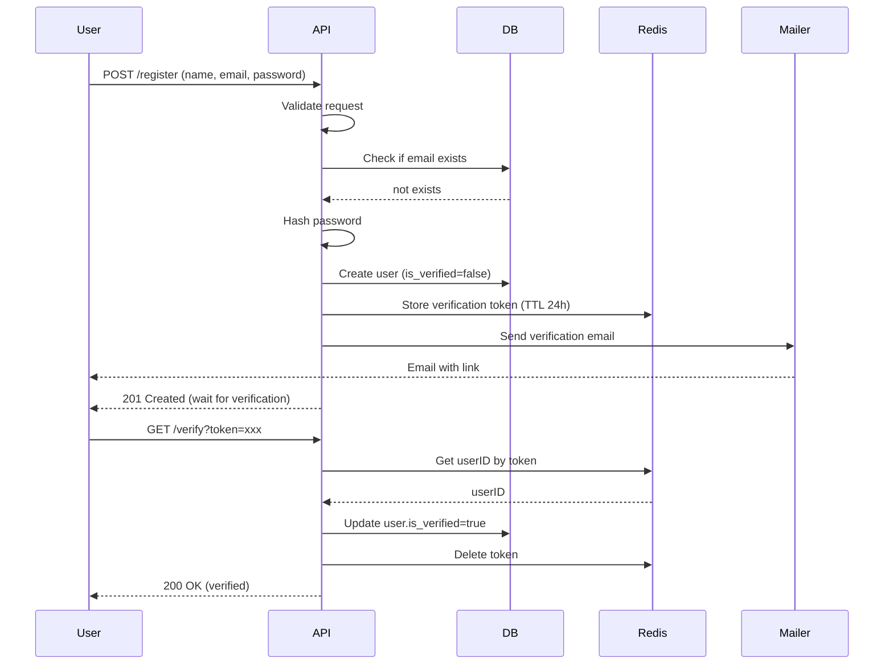

# คู่มือภาษา Golang เล่ม2 แบบเรียบง่าย โดย  คงนคร จันทะคุณ  
---
  
## บทที่ 43: เครื่องมือและไลบรารียอดนิยมสำหรับการพัฒนาแอปพลิเคชัน Go

### 43.1 chi – เราเตอร์และมิดเดิลแวร์

[chi](https://github.com/go-chi/chi) เป็น lightweight router ที่มีประสิทธิภาพสูง รองรับ middleware และเข้ากันได้กับ net/http มาตรฐาน

**การติดตั้ง**
```bash
go get github.com/go-chi/chi/v5
```

**ตัวอย่างพื้นฐาน**
```go
package main

import (
    "net/http"
    "github.com/go-chi/chi/v5"
    "github.com/go-chi/chi/v5/middleware"
)

func main() {
    r := chi.NewRouter()
    
    // ใช้ middleware พื้นฐาน
    r.Use(middleware.Logger)
    r.Use(middleware.Recoverer)
    
    // กำหนด routes
    r.Get("/", func(w http.ResponseWriter, r *http.Request) {
        w.Write([]byte("Hello World"))
    })
    
    // route พร้อมพารามิเตอร์
    r.Get("/users/{id}", getUser)
    
    // group routes
    r.Route("/api", func(r chi.Router) {
        r.Get("/users", listUsers)
        r.Post("/users", createUser)
        
        // sub-router พร้อม middleware เฉพาะ
        r.Route("/admin", func(r chi.Router) {
            r.Use(adminOnly)
            r.Get("/dashboard", adminDashboard)
        })
    })
    
    http.ListenAndServe(":8080", r)
}

func getUser(w http.ResponseWriter, r *http.Request) {
    id := chi.URLParam(r, "id")
    w.Write([]byte("User ID: " + id))
}
```

**มิดเดิลแวร์ที่ใช้บ่อย**
- `middleware.Logger` – บันทึก request
- `middleware.Recoverer` – จับ panic
- `middleware.Timeout` – กำหนด timeout
- `middleware.Compress` – บีบอัด response
- `middleware.RealIP` – ดึง IP จริงจาก proxy

---

### 43.2 viper – การจัดการ configuration

[viper](https://github.com/spf13/viper) รองรับหลายรูปแบบ (JSON, YAML, ENV, flags) และสามารถโหลดจากไฟล์, environment variables, หรือ remote system

**การติดตั้ง**
```bash
go get github.com/spf13/viper
```

**ตัวอย่างการใช้งาน**
```go
package config

import (
    "log"
    "github.com/spf13/viper"
)

type Config struct {
    Server   ServerConfig
    Database DatabaseConfig
    Redis    RedisConfig
    JWT      JWTConfig
}

type ServerConfig struct {
    Port int
    Mode string
}

type DatabaseConfig struct {
    Host     string
    Port     int
    User     string
    Password string
    Name     string
}

func LoadConfig() (*Config, error) {
    viper.SetConfigName("config")      // ชื่อไฟล์ (ไม่รวมนามสกุล)
    viper.SetConfigType("yaml")        // yaml, json, toml, etc.
    viper.AddConfigPath(".")           // path ที่ค้นหา
    viper.AddConfigPath("/etc/app/")
    viper.AutomaticEnv()               // อ่านจาก environment variables
    
    // กำหนดค่า default
    viper.SetDefault("server.port", 8080)
    viper.SetDefault("server.mode", "debug")
    
    // อ่านไฟล์
    if err := viper.ReadInConfig(); err != nil {
        log.Printf("Config file not found: %v", err)
    }
    
    var cfg Config
    if err := viper.Unmarshal(&cfg); err != nil {
        return nil, err
    }
    
    return &cfg, nil
}
```

**ไฟล์ config.yaml ตัวอย่าง**
```yaml
server:
  port: 8080
  mode: release

database:
  host: localhost
  port: 3306
  user: root
  password: secret
  name: mydb

redis:
  addr: localhost:6379
  password: ""
  db: 0

jwt:
  secret: "your-secret-key"
  access_expiry: 15m
  refresh_expiry: 7d
```

---

### 43.3 cobra – การสร้าง CLI

[cobra](https://github.com/spf13/cobra) เป็นไลบรารีสำหรับสร้าง command-line application รองรับ commands, flags, และ subcommands

**การติดตั้ง**
```bash
go get -u github.com/spf13/cobra/cobra
```

**การเริ่มต้นโปรเจกต์**
```bash
cobra init --pkg-name mycli
```

**ตัวอย่างการเพิ่ม command**
```go
// cmd/root.go
package cmd

import (
    "fmt"
    "os"
    "github.com/spf13/cobra"
)

var rootCmd = &cobra.Command{
    Use:   "mycli",
    Short: "My CLI application",
    Long:  "A sample CLI built with cobra",
    Run: func(cmd *cobra.Command, args []string) {
        fmt.Println("Hello from CLI")
    },
}

// cmd/serve.go
var serveCmd = &cobra.Command{
    Use:   "serve",
    Short: "Start the server",
    Run: func(cmd *cobra.Command, args []string) {
        port, _ := cmd.Flags().GetInt("port")
        fmt.Printf("Starting server on port %d\n", port)
    },
}

func init() {
    serveCmd.Flags().IntP("port", "p", 8080, "port to listen on")
    rootCmd.AddCommand(serveCmd)
}

func Execute() {
    if err := rootCmd.Execute(); err != nil {
        fmt.Fprintln(os.Stderr, err)
        os.Exit(1)
    }
}
```

**การใช้งาน**
```bash
go run main.go serve --port 3000
```

---

### 43.4 gorm – ORM

[gorm](https://gorm.io) เป็น ORM ที่มีฟีเจอร์ครบถ้วน: associations, hooks, preloading, transactions, etc.

**การติดตั้ง**
```bash
go get -u gorm.io/gorm
go get -u gorm.io/driver/mysql
```

**ตัวอย่างการใช้งาน**
```go
package models

import (
    "gorm.io/gorm"
    "gorm.io/driver/mysql"
)

type User struct {
    gorm.Model
    Name     string `gorm:"size:100;not null"`
    Email    string `gorm:"uniqueIndex;size:100;not null"`
    Password string `gorm:"not null"`
    IsActive bool   `gorm:"default:true"`
}

func InitDB(cfg *Config) (*gorm.DB, error) {
    dsn := fmt.Sprintf("%s:%s@tcp(%s:%d)/%s?charset=utf8mb4&parseTime=True&loc=Local",
        cfg.User, cfg.Password, cfg.Host, cfg.Port, cfg.Name)
    
    db, err := gorm.Open(mysql.Open(dsn), &gorm.Config{})
    if err != nil {
        return nil, err
    }
    
    // Auto migrate
    db.AutoMigrate(&User{})
    
    return db, nil
}
```

**CRUD ตัวอย่าง**
```go
// Create
user := User{Name: "John", Email: "john@example.com", Password: "hashed"}
db.Create(&user)

// Read
var user User
db.First(&user, 1)                     // by primary key
db.Where("email = ?", "john@example.com").First(&user)

// Update
db.Model(&user).Update("Name", "John Doe")
db.Model(&user).Updates(User{Name: "John Doe", IsActive: false})

// Delete
db.Delete(&user)
```

**Preload Associations**
```go
type Order struct {
    gorm.Model
    UserID uint
    Amount float64
    User   User // belongs to
}

// Preload when querying
var orders []Order
db.Preload("User").Find(&orders)
```

---

### 43.5 validator – การตรวจสอบข้อมูล

[validator](https://github.com/go-playground/validator) ใช้ struct tags ในการกำหนด validation rules

**การติดตั้ง**
```bash
go get github.com/go-playground/validator/v10
```

**ตัวอย่าง**
```go
package main

import (
    "fmt"
    "github.com/go-playground/validator/v10"
)

type RegisterRequest struct {
    Name     string `validate:"required,min=3,max=50"`
    Email    string `validate:"required,email"`
    Password string `validate:"required,min=8"`
    Age      int    `validate:"gte=18,lte=99"`
}

func main() {
    validate := validator.New()
    
    req := RegisterRequest{
        Name:     "Jo",
        Email:    "invalid",
        Password: "short",
        Age:      16,
    }
    
    err := validate.Struct(req)
    if err != nil {
        for _, err := range err.(validator.ValidationErrors) {
            fmt.Printf("Field %s failed on tag %s\n", err.Field(), err.Tag())
        }
    }
}
```

**Tags ที่ใช้บ่อย**
- `required` – ต้องมีค่า
- `email` – รูปแบบ email
- `min`, `max` – ขนาดต่ำสุด/สูงสุด
- `gte`, `lte` – มากกว่าหรือเท่ากับ, น้อยกว่าหรือเท่ากับ
- `oneof=red blue` – ต้องเป็นหนึ่งในค่าที่กำหนด
- `uuid` – ต้องเป็น UUID
- `url` – ต้องเป็น URL

---

### 43.6 jwt – การจัดการ JWT

[jwt-go](https://github.com/golang-jwt/jwt) เป็นไลบรารีมาตรฐานสำหรับ JWT

**การติดตั้ง**
```bash
go get github.com/golang-jwt/jwt/v5
```

**ตัวอย่างการสร้างและตรวจสอบ token**
```go
package jwtutil

import (
    "time"
    "github.com/golang-jwt/jwt/v5"
)

type Claims struct {
    UserID uint `json:"user_id"`
    jwt.RegisteredClaims
}

var secretKey = []byte("your-secret-key")

func GenerateAccessToken(userID uint) (string, error) {
    claims := Claims{
        UserID: userID,
        RegisteredClaims: jwt.RegisteredClaims{
            ExpiresAt: jwt.NewNumericDate(time.Now().Add(15 * time.Minute)),
            IssuedAt:  jwt.NewNumericDate(time.Now()),
        },
    }
    
    token := jwt.NewWithClaims(jwt.SigningMethodHS256, claims)
    return token.SignedString(secretKey)
}

func ValidateToken(tokenString string) (*Claims, error) {
    token, err := jwt.ParseWithClaims(tokenString, &Claims{}, func(token *jwt.Token) (interface{}, error) {
        return secretKey, nil
    })
    
    if err != nil {
        return nil, err
    }
    
    if claims, ok := token.Claims.(*Claims); ok && token.Valid {
        return claims, nil
    }
    
    return nil, jwt.ErrInvalidKey
}
```

---

### 43.7 zap – structured logging

[zap](https://github.com/uber-go/zap) เป็น logger ที่มีความเร็วสูงและรองรับ structured logging

**การติดตั้ง**
```bash
go get go.uber.org/zap
```

**ตัวอย่าง**
```go
package logger

import (
    "go.uber.org/zap"
)

var Log *zap.Logger

func InitLogger(mode string) {
    var err error
    if mode == "production" {
        Log, err = zap.NewProduction()
    } else {
        Log, err = zap.NewDevelopment()
    }
    if err != nil {
        panic(err)
    }
    defer Log.Sync()
}

func main() {
    InitLogger("development")
    defer Log.Sync()
    
    Log.Info("User logged in",
        zap.String("user", "john"),
        zap.Int("id", 123),
        zap.Duration("duration", time.Second*2),
    )
    
    Log.Error("Database error",
        zap.Error(err),
        zap.String("query", "SELECT * FROM users"),
    )
}
```

---

### 43.8 gomail – การส่งอีเมล

[gomail](https://github.com/go-gomail/gomail) เป็นไลบรารีที่ใช้งานง่ายสำหรับ SMTP

**การติดตั้ง**
```bash
go get gopkg.in/gomail.v2
```

**ตัวอย่าง**
```go
package mail

import (
    "gopkg.in/gomail.v2"
)

type Mailer struct {
    dialer *gomail.Dialer
    from   string
}

func NewMailer(host string, port int, user, pass, from string) *Mailer {
    return &Mailer{
        dialer: gomail.NewDialer(host, port, user, pass),
        from:   from,
    }
}

func (m *Mailer) Send(to, subject, body string) error {
    msg := gomail.NewMessage()
    msg.SetHeader("From", m.from)
    msg.SetHeader("To", to)
    msg.SetHeader("Subject", subject)
    msg.SetBody("text/html", body)
    
    return m.dialer.DialAndSend(msg)
}
```

---

### 43.9 hermes – สร้าง HTML email ที่สวยงาม

[hermes](https://github.com/matcornic/hermes) ใช้สร้าง email template แบบ responsive

**การติดตั้ง**
```bash
go get github.com/matcornic/hermes/v2
```

**ตัวอย่าง**
```go
package email

import (
    "github.com/matcornic/hermes/v2"
)

type EmailGenerator struct {
    h hermes.Hermes
}

func NewEmailGenerator(appURL, appName string) *EmailGenerator {
    h := hermes.Hermes{
        Product: hermes.Product{
            Name: appName,
            Link: appURL,
            Logo: appURL + "/logo.png",
        },
    }
    return &EmailGenerator{h: h}
}

func (g *EmailGenerator) WelcomeEmail(name, verifyURL string) (string, error) {
    email := hermes.Email{
        Body: hermes.Body{
            Name: name,
            Intros: []string{
                "Welcome to our platform!",
            },
            Actions: []hermes.Action{
                {
                    Instructions: "Please click below to verify your email address:",
                    Button: hermes.Button{
                        Color: "#22BC66",
                        Text:  "Verify Email",
                        Link:  verifyURL,
                    },
                },
            },
            Outros: []string{
                "If you didn't sign up, you can ignore this email.",
            },
        },
    }
    
    return g.h.GenerateHTML(email)
}
```

---

### 43.10 air – hot-reload

[air](https://github.com/cosmtrek/air) ใช้สำหรับ reload อัตโนมัติเมื่อไฟล์เปลี่ยนแปลง เหมาะสำหรับการพัฒนา

**การติดตั้ง**
```bash
go install github.com/cosmtrek/air@latest
```

**การใช้งาน**
สร้างไฟล์ `.air.toml` ใน root ของโปรเจกต์ (หรือใช้ default) แล้วรัน:
```bash
air
```

**ตัวอย่าง .air.toml**
```toml
root = "."
tmp_dir = "tmp"

[build]
  cmd = "go build -o ./tmp/main ."
  bin = "./tmp/main"
  include_ext = ["go", "tpl", "tmpl", "html"]
  exclude_dir = ["assets", "tmp", "vendor"]
  delay = 1000
  stop_on_error = true
  send_interrupt = false
  kill_delay = 500
```

---

## บทที่ 44: การออกแบบแอปพลิเคชันด้วย Clean Architecture

### 44.1 โครงสร้างโปรเจกต์แบบ Clean Architecture

โครงสร้างที่แบ่งเป็น 3 ชั้นหลัก:
- **Delivery** – รับและส่งข้อมูล (HTTP handlers, gRPC, CLI)
- **Usecase** – business logic (interactors)
- **Repository** – การเข้าถึงข้อมูล (database, external API)

นอกจากนี้ยังมี **Models** (Entities) ที่ใช้ร่วมกันทุกชั้น

**โครงสร้างโฟลเดอร์ตัวอย่าง**
```
├── cmd/
│   └── api/
│       └── main.go
├── internal/
│   ├── config/            # การตั้งค่า
│   ├── delivery/
│   │   ├── http/          # HTTP handlers
│   │   │   ├── handler.go
│   │   │   ├── middleware.go
│   │   │   └── routes.go
│   │   └── cli/           # (optional) CLI commands
│   ├── models/            # entities / DTOs
│   ├── repository/        # implementations
│   │   ├── user_repo.go
│   │   ├── user_repo_mock.go (สำหรับ test)
│   │   └── redis/         # redis implementation
│   └── usecase/           # business logic
│       ├── user_usecase.go
│       └── auth_usecase.go
├── pkg/                   # reusable packages
│   ├── jwt/
│   ├── mail/
│   └── redis/
├── go.mod
└── config.yaml
```

### 44.2 Models (Entities)

**models/user.go**
```go
package models

import "time"

type User struct {
    ID          uint      `json:"id"`
    Name        string    `json:"name"`
    Email       string    `json:"email"`
    Password    string    `json:"-"`          // ไม่ส่งกลับใน JSON
    IsVerified  bool      `json:"is_verified"`
    CreatedAt   time.Time `json:"created_at"`
    UpdatedAt   time.Time `json:"updated_at"`
}

// สำหรับการ register
type RegisterRequest struct {
    Name     string `json:"name" validate:"required,min=3"`
    Email    string `json:"email" validate:"required,email"`
    Password string `json:"password" validate:"required,min=8"`
}

// สำหรับ login
type LoginRequest struct {
    Email    string `json:"email" validate:"required,email"`
    Password string `json:"password" validate:"required"`
}
```

### 44.3 Repository Interface

**internal/repository/user_repo.go**
```go
package repository

import (
    "context"
    "your-project/internal/models"
)

type UserRepository interface {
    Create(ctx context.Context, user *models.User) error
    GetByID(ctx context.Context, id uint) (*models.User, error)
    GetByEmail(ctx context.Context, email string) (*models.User, error)
    Update(ctx context.Context, user *models.User) error
    Delete(ctx context.Context, id uint) error
}
```

**Implementation ด้วย GORM (internal/repository/user_repo_gorm.go)**
```go
package repository

import (
    "context"
    "gorm.io/gorm"
    "your-project/internal/models"
)

type userRepositoryGorm struct {
    db *gorm.DB
}

func NewUserRepository(db *gorm.DB) UserRepository {
    return &userRepositoryGorm{db: db}
}

func (r *userRepositoryGorm) Create(ctx context.Context, user *models.User) error {
    return r.db.WithContext(ctx).Create(user).Error
}

func (r *userRepositoryGorm) GetByID(ctx context.Context, id uint) (*models.User, error) {
    var user models.User
    err := r.db.WithContext(ctx).First(&user, id).Error
    if err != nil {
        return nil, err
    }
    return &user, nil
}
// ... methods อื่นๆ
```

### 44.4 Usecase

**internal/usecase/user_usecase.go**
```go
package usecase

import (
    "context"
    "errors"
    "golang.org/x/crypto/bcrypt"
    "your-project/internal/models"
    "your-project/internal/repository"
)

type UserUsecase interface {
    Register(ctx context.Context, req *models.RegisterRequest) (*models.User, error)
    GetUserByID(ctx context.Context, id uint) (*models.User, error)
}

type userUsecase struct {
    userRepo repository.UserRepository
}

func NewUserUsecase(userRepo repository.UserRepository) UserUsecase {
    return &userUsecase{userRepo: userRepo}
}

func (u *userUsecase) Register(ctx context.Context, req *models.RegisterRequest) (*models.User, error) {
    // ตรวจสอบว่ามี email ซ้ำหรือไม่
    existing, _ := u.userRepo.GetByEmail(ctx, req.Email)
    if existing != nil {
        return nil, errors.New("email already registered")
    }
    
    // Hash password
    hashed, err := bcrypt.GenerateFromPassword([]byte(req.Password), bcrypt.DefaultCost)
    if err != nil {
        return nil, err
    }
    
    user := &models.User{
        Name:       req.Name,
        Email:      req.Email,
        Password:   string(hashed),
        IsVerified: false,
    }
    
    if err := u.userRepo.Create(ctx, user); err != nil {
        return nil, err
    }
    
    return user, nil
}
```

### 44.5 Delivery (HTTP)

**internal/delivery/http/handler.go**
```go
package http

import (
    "encoding/json"
    "net/http"
    "your-project/internal/usecase"
    "your-project/internal/models"
    "github.com/go-chi/chi/v5"
    "github.com/go-playground/validator/v10"
)

type UserHandler struct {
    userUsecase usecase.UserUsecase
    validate    *validator.Validate
}

func NewUserHandler(userUsecase usecase.UserUsecase) *UserHandler {
    return &UserHandler{
        userUsecase: userUsecase,
        validate:    validator.New(),
    }
}

func (h *UserHandler) Register(w http.ResponseWriter, r *http.Request) {
    var req models.RegisterRequest
    if err := json.NewDecoder(r.Body).Decode(&req); err != nil {
        http.Error(w, "Invalid request", http.StatusBadRequest)
        return
    }
    
    if err := h.validate.Struct(req); err != nil {
        http.Error(w, err.Error(), http.StatusBadRequest)
        return
    }
    
    user, err := h.userUsecase.Register(r.Context(), &req)
    if err != nil {
        http.Error(w, err.Error(), http.StatusInternalServerError)
        return
    }
    
    w.Header().Set("Content-Type", "application/json")
    w.WriteHeader(http.StatusCreated)
    json.NewEncoder(w).Encode(user)
}
```

**internal/delivery/http/routes.go**
```go
package http

import (
    "github.com/go-chi/chi/v5"
    "github.com/go-chi/chi/v5/middleware"
)

func SetupRoutes(userHandler *UserHandler, authHandler *AuthHandler) *chi.Mux {
    r := chi.NewRouter()
    
    r.Use(middleware.Logger)
    r.Use(middleware.Recoverer)
    
    r.Post("/api/register", userHandler.Register)
    r.Post("/api/login", authHandler.Login)
    
    // Protected routes
    r.Group(func(r chi.Router) {
        r.Use(authHandler.AuthMiddleware)
        r.Get("/api/users/{id}", userHandler.GetUser)
        // ...
    })
    
    return r
}
```

---

## บทที่ 45: การนำฟีเจอร์ไปใช้งานแบบครบวงจร

### 45.1 JWT Authentication with Refresh Token (Redis)

**แนวคิด**
- **Access Token** (short-lived, 15 นาที) ใช้สำหรับ request ปกติ
- **Refresh Token** (long-lived, 7 วัน) ใช้ขอ access token ใหม่
- เก็บ refresh token ใน Redis พร้อม user ID และ expiration

**โครงสร้าง Redis**
```
refresh_token:<token> -> user_id
user_tokens:<user_id> -> set of token ids (สำหรับ force logout)
```

**Implementation**

**pkg/redis/client.go**
```go
package redis

import (
    "context"
    "time"
    "github.com/go-redis/redis/v8"
)

type Client struct {
    rdb *redis.Client
}

func NewRedisClient(addr, password string, db int) (*Client, error) {
    rdb := redis.NewClient(&redis.Options{
        Addr:     addr,
        Password: password,
        DB:       db,
    })
    
    ctx, cancel := context.WithTimeout(context.Background(), 5*time.Second)
    defer cancel()
    
    if err := rdb.Ping(ctx).Err(); err != nil {
        return nil, err
    }
    
    return &Client{rdb: rdb}, nil
}

func (c *Client) SetRefreshToken(ctx context.Context, userID uint, token string, expiry time.Duration) error {
    key := "refresh_token:" + token
    return c.rdb.Set(ctx, key, userID, expiry).Err()
}

func (c *Client) GetUserIDByRefreshToken(ctx context.Context, token string) (uint, error) {
    key := "refresh_token:" + token
    val, err := c.rdb.Get(ctx, key).Result()
    if err != nil {
        return 0, err
    }
    var userID uint
    fmt.Sscanf(val, "%d", &userID)
    return userID, nil
}

func (c *Client) DeleteRefreshToken(ctx context.Context, token string) error {
    key := "refresh_token:" + token
    return c.rdb.Del(ctx, key).Err()
}
```

**internal/usecase/auth_usecase.go**
```go
package usecase

import (
    "context"
    "errors"
    "time"
    "your-project/internal/models"
    "your-project/internal/repository"
    "your-project/pkg/jwtutil"
    "your-project/pkg/redis"
    "golang.org/x/crypto/bcrypt"
)

type AuthUsecase interface {
    Login(ctx context.Context, email, password string) (*models.TokenResponse, error)
    RefreshAccessToken(ctx context.Context, refreshToken string) (*models.TokenResponse, error)
    Logout(ctx context.Context, userID uint, refreshToken string) error
}

type authUsecase struct {
    userRepo repository.UserRepository
    redis    *redis.Client
    jwtCfg   *jwtutil.Config
}

func NewAuthUsecase(userRepo repository.UserRepository, redis *redis.Client, jwtCfg *jwtutil.Config) AuthUsecase {
    return &authUsecase{userRepo: userRepo, redis: redis, jwtCfg: jwtCfg}
}

func (a *authUsecase) Login(ctx context.Context, email, password string) (*models.TokenResponse, error) {
    user, err := a.userRepo.GetByEmail(ctx, email)
    if err != nil {
        return nil, errors.New("invalid credentials")
    }
    
    if err := bcrypt.CompareHashAndPassword([]byte(user.Password), []byte(password)); err != nil {
        return nil, errors.New("invalid credentials")
    }
    
    // Generate tokens
    accessToken, err := jwtutil.GenerateAccessToken(user.ID, a.jwtCfg.AccessExpiry)
    if err != nil {
        return nil, err
    }
    
    refreshToken, err := jwtutil.GenerateRefreshToken(user.ID, a.jwtCfg.RefreshExpiry)
    if err != nil {
        return nil, err
    }
    
    // Store refresh token in Redis
    if err := a.redis.SetRefreshToken(ctx, user.ID, refreshToken, a.jwtCfg.RefreshExpiry); err != nil {
        return nil, err
    }
    
    return &models.TokenResponse{
        AccessToken:  accessToken,
        RefreshToken: refreshToken,
        ExpiresIn:    int64(a.jwtCfg.AccessExpiry.Seconds()),
    }, nil
}

func (a *authUsecase) RefreshAccessToken(ctx context.Context, refreshToken string) (*models.TokenResponse, error) {
    // Validate refresh token
    claims, err := jwtutil.ValidateRefreshToken(refreshToken, a.jwtCfg.Secret)
    if err != nil {
        return nil, errors.New("invalid refresh token")
    }
    
    // Check if refresh token exists in Redis
    userID, err := a.redis.GetUserIDByRefreshToken(ctx, refreshToken)
    if err != nil {
        return nil, errors.New("refresh token revoked")
    }
    
    if userID != claims.UserID {
        return nil, errors.New("token mismatch")
    }
    
    // Generate new access token
    accessToken, err := jwtutil.GenerateAccessToken(userID, a.jwtCfg.AccessExpiry)
    if err != nil {
        return nil, err
    }
    
    return &models.TokenResponse{
        AccessToken:  accessToken,
        RefreshToken: refreshToken, // same refresh token
        ExpiresIn:    int64(a.jwtCfg.AccessExpiry.Seconds()),
    }, nil
}

func (a *authUsecase) Logout(ctx context.Context, userID uint, refreshToken string) error {
    return a.redis.DeleteRefreshToken(ctx, refreshToken)
}
```

**HTTP Middleware สำหรับตรวจสอบ access token**
```go
func (h *AuthHandler) AuthMiddleware(next http.Handler) http.Handler {
    return http.HandlerFunc(func(w http.ResponseWriter, r *http.Request) {
        authHeader := r.Header.Get("Authorization")
        if authHeader == "" {
            http.Error(w, "Missing authorization header", http.StatusUnauthorized)
            return
        }
        
        parts := strings.Split(authHeader, " ")
        if len(parts) != 2 || parts[0] != "Bearer" {
            http.Error(w, "Invalid authorization header format", http.StatusUnauthorized)
            return
        }
        
        claims, err := jwtutil.ValidateAccessToken(parts[1], h.jwtSecret)
        if err != nil {
            http.Error(w, "Invalid or expired token", http.StatusUnauthorized)
            return
        }
        
        // ส่ง userID ไปยัง context
        ctx := context.WithValue(r.Context(), "userID", claims.UserID)
        next.ServeHTTP(w, r.WithContext(ctx))
    })
}
```

### 45.2 Cached User in Redis

เพื่อลดการ query ฐานข้อมูลซ้ำ เรา cache user data ใน Redis

**pkg/redis/user_cache.go**
```go
package redis

import (
    "context"
    "encoding/json"
    "time"
    "your-project/internal/models"
)

func (c *Client) GetUser(ctx context.Context, userID uint) (*models.User, error) {
    key := fmt.Sprintf("user:%d", userID)
    val, err := c.rdb.Get(ctx, key).Result()
    if err != nil {
        return nil, err
    }
    
    var user models.User
    if err := json.Unmarshal([]byte(val), &user); err != nil {
        return nil, err
    }
    return &user, nil
}

func (c *Client) SetUser(ctx context.Context, user *models.User, ttl time.Duration) error {
    key := fmt.Sprintf("user:%d", user.ID)
    data, err := json.Marshal(user)
    if err != nil {
        return err
    }
    return c.rdb.Set(ctx, key, data, ttl).Err()
}

func (c *Client) DeleteUser(ctx context.Context, userID uint) error {
    key := fmt.Sprintf("user:%d", userID)
    return c.rdb.Del(ctx, key).Err()
}
```

**Cache Layer ใน Repository**
```go
func (r *userRepositoryCached) GetByID(ctx context.Context, id uint) (*models.User, error) {
    // Try cache first
    user, err := r.cache.GetUser(ctx, id)
    if err == nil {
        return user, nil
    }
    
    // Cache miss, get from DB
    user, err = r.repo.GetByID(ctx, id)
    if err != nil {
        return nil, err
    }
    
    // Store in cache
    go r.cache.SetUser(context.Background(), user, 10*time.Minute)
    
    return user, nil
}
```

### 45.3 Email Verification

**Workflow**
1. ผู้ใช้สมัครสมาชิก → สร้าง user ใน DB (is_verified = false)
2. สร้าง verification token (UUID) เก็บใน Redis หรือ DB พร้อม user ID
3. ส่งอีเมลพร้อมลิงก์ `https://yourapp.com/verify?token=xxx`
4. ผู้ใช้คลิกลิงก์ → API ตรวจสอบ token → update user.is_verified = true
5. ลบ token ออกจาก Redis

**Implementation**

**internal/usecase/verification_usecase.go**
```go
package usecase

import (
    "context"
    "crypto/rand"
    "encoding/hex"
    "time"
    "your-project/internal/models"
    "your-project/pkg/redis"
)

type VerificationUsecase interface {
    SendVerificationEmail(user *models.User) error
    VerifyEmail(ctx context.Context, token string) error
}

type verificationUsecase struct {
    userRepo   repository.UserRepository
    redis      *redis.Client
    mailer     *mail.Mailer
    emailGen   *email.EmailGenerator
    appURL     string
}

func (v *verificationUsecase) SendVerificationEmail(user *models.User) error {
    token, err := generateToken()
    if err != nil {
        return err
    }
    
    // Store token in Redis with TTL (24h)
    key := "verify_token:" + token
    if err := v.redis.SetVerifyToken(context.Background(), key, user.ID, 24*time.Hour); err != nil {
        return err
    }
    
    verifyURL := v.appURL + "/verify?token=" + token
    body, err := v.emailGen.VerifyEmail(user.Name, verifyURL)
    if err != nil {
        return err
    }
    
    return v.mailer.Send(user.Email, "Verify your email", body)
}

func (v *verificationUsecase) VerifyEmail(ctx context.Context, token string) error {
    userID, err := v.redis.GetVerifyToken(ctx, token)
    if err != nil {
        return errors.New("invalid or expired token")
    }
    
    user, err := v.userRepo.GetByID(ctx, userID)
    if err != nil {
        return err
    }
    
    user.IsVerified = true
    if err := v.userRepo.Update(ctx, user); err != nil {
        return err
    }
    
    // Delete token from Redis
    v.redis.DeleteVerifyToken(ctx, token)
    
    return nil
}

func generateToken() (string, error) {
    bytes := make([]byte, 16)
    if _, err := rand.Read(bytes); err != nil {
        return "", err
    }
    return hex.EncodeToString(bytes), nil
}
```

### 45.4 Forget/Reset Password

**Workflow**
1. ผู้ใช้ขอ reset password ด้วย email
2. ระบบสร้าง reset token (UUID) เก็บใน Redis พร้อม user ID และ TTL (1h)
3. ส่งอีเมลที่มีลิงก์ `https://yourapp.com/reset-password?token=xxx`
4. ผู้ใช้คลิกลิงก์ → หน้า form ใส่ password ใหม่
5. ส่ง request พร้อม token และ password ใหม่
6. ตรวจสอบ token, update password, ลบ token

**Implementation**

**internal/usecase/password_usecase.go**
```go
package usecase

import (
    "context"
    "errors"
    "time"
    "golang.org/x/crypto/bcrypt"
    "your-project/internal/models"
)

type PasswordUsecase interface {
    SendResetEmail(email string) error
    ResetPassword(ctx context.Context, token, newPassword string) error
}

func (p *passwordUsecase) SendResetEmail(email string) error {
    user, err := p.userRepo.GetByEmail(context.Background(), email)
    if err != nil {
        // ไม่บอกว่ามี user หรือไม่เพื่อความปลอดภัย
        return nil
    }
    
    token, _ := generateToken()
    key := "reset_token:" + token
    p.redis.SetResetToken(context.Background(), key, user.ID, 1*time.Hour)
    
    resetURL := p.appURL + "/reset-password?token=" + token
    body, _ := p.emailGen.ResetPasswordEmail(user.Name, resetURL)
    p.mailer.Send(user.Email, "Reset your password", body)
    
    return nil
}

func (p *passwordUsecase) ResetPassword(ctx context.Context, token, newPassword string) error {
    userID, err := p.redis.GetResetToken(ctx, token)
    if err != nil {
        return errors.New("invalid or expired token")
    }
    
    user, err := p.userRepo.GetByID(ctx, userID)
    if err != nil {
        return err
    }
    
    hashed, err := bcrypt.GenerateFromPassword([]byte(newPassword), bcrypt.DefaultCost)
    if err != nil {
        return err
    }
    user.Password = string(hashed)
    
    if err := p.userRepo.Update(ctx, user); err != nil {
        return err
    }
    
    p.redis.DeleteResetToken(ctx, token)
    return nil
}
```

---

## 45.5 Workflow สรุปสำหรับการพัฒนา

### Task List Template

#### Phase 1: Project Setup
- [ ] Initialize Go module
- [ ] Setup directory structure (cmd, internal, pkg)
- [ ] Configure viper with config.yaml
- [ ] Setup GORM and database connection
- [ ] Setup Redis client
- [ ] Setup logger (zap)
- [ ] Setup validator
- [ ] Create Makefile for common tasks (build, test, run)

#### Phase 2: Models & Repository
- [ ] Define models (User, etc.)
- [ ] Implement UserRepository interface
- [ ] Implement GORM-based user repository
- [ ] Write unit tests for repository
- [ ] Implement Redis caching layer for user
- [ ] Implement refresh token storage in Redis

#### Phase 3: Usecases
- [ ] Implement UserUsecase (Register, GetUser)
- [ ] Implement AuthUsecase (Login, Logout, Refresh)
- [ ] Implement VerificationUsecase
- [ ] Implement PasswordUsecase
- [ ] Write unit tests for usecases with mocks

#### Phase 4: Delivery (HTTP)
- [ ] Create HTTP handlers
- [ ] Setup chi router with middleware (logger, recoverer, cors)
- [ ] Implement auth middleware (JWT validation)
- [ ] Map routes
- [ ] Integrate with usecases
- [ ] Write integration tests (httptest)

#### Phase 5: Email & Templates
- [ ] Setup SMTP mailer (gomail)
- [ ] Setup hermes for email templates
- [ ] Create email templates: welcome, verify, reset password
- [ ] Implement email sending in usecases

#### Phase 6: Advanced Features
- [ ] Implement JWT access/refresh token
- [ ] Implement token revocation on logout
- [ ] Implement user caching in Redis
- [ ] Add validation for all requests
- [ ] Add rate limiting middleware (optional)
- [ ] Add graceful shutdown

#### Phase 7: Testing & Quality
- [ ] Write unit tests for all layers (target >80% coverage)
- [ ] Write integration tests for API endpoints
- [ ] Setup golangci-lint in CI
- [ ] Add pre-commit hooks for formatting and linting
- [ ] Benchmark critical paths

#### Phase 8: Deployment
- [ ] Create Dockerfile for multi-stage build
- [ ] Setup docker-compose for local development (app, db, redis)
- [ ] Configure CI/CD (GitHub Actions, GitLab CI)
- [ ] Setup air for hot-reload in development
- [ ] Configure production environment variables
- [ ] Setup logging aggregation (optional)

---

### Checklist Template

#### Code Quality Checklist
- [ ] All exported functions have comments
- [ ] No unused imports or variables (go vet)
- [ ] Code formatted with go fmt
- [ ] Error handling is explicit (no ignored errors)
- [ ] No use of panic in library code (only in main/init)
- [ ] Context is passed as first parameter
- [ ] Interfaces are small and focused
- [ ] No global state except configuration

#### Security Checklist
- [ ] Passwords hashed with bcrypt
- [ ] JWT secret loaded from environment, not hardcoded
- [ ] Refresh tokens stored in Redis, not in DB
- [ ] Access token short-lived (≤15min)
- [ ] CORS configured properly (allow only trusted origins)
- [ ] Input validation on all endpoints
- [ ] SQL injection prevented by using parameterized queries (GORM)
- [ ] No sensitive data in logs
- [ ] HTTPS enforced in production
- [ ] Rate limiting on auth endpoints

#### Performance Checklist
- [ ] Database indexes created on frequently queried columns
- [ ] User data cached in Redis
- [ ] Connection pools configured for DB and Redis
- [ ] Use of goroutines for non-blocking tasks (email sending)
- [ ] Avoid N+1 queries (use Preload in GORM)
- [ ] Benchmarks for critical paths

#### Testing Checklist
- [ ] Unit tests cover business logic (usecase)
- [ ] Repository tests with testcontainers or in-memory DB
- [ ] HTTP handler tests with httptest
- [ ] Mock external dependencies (Redis, Mailer)
- [ ] Race condition tests with `-race` flag
- [ ] Test coverage >80%

#### Deployment Checklist
- [ ] Configurable via environment variables
- [ ] Graceful shutdown (wait for existing requests)
- [ ] Health check endpoint
- [ ] Logging to stdout (for container)
- [ ] Docker image built with non-root user
- [ ] Secrets not baked into image
- [ ] Database migration runs automatically on startup (or separate step)
- [ ] Readiness and liveness probes configured
- [ ] Monitoring (Prometheus metrics) exposed

---

### ตัวอย่าง Workflow สมบูรณ์สำหรับ Feature: Register with Email Verification



---

## สรุป

คู่มือเพิ่มเติมนี้ครอบคลุมเครื่องมือและแนวปฏิบัติที่จำเป็นสำหรับการพัฒนาแอปพลิเคชัน Go ในระดับ production โดยเน้นที่:

- **โครงสร้าง Clean Architecture** ที่แยก Delivery, Usecase, Repository
- **การจัดการ JWT** ด้วย access/refresh token เก็บใน Redis
- **การ cache** user data ใน Redis
- **การส่งอีเมล** พร้อมเทมเพลตที่สวยงาม
- **เครื่องมือ** ที่ช่วยเพิ่มประสิทธิภาพการพัฒนา เช่น air สำหรับ hot-reload, cobra สำหรับ CLI, chi สำหรับ routing

การนำไปใช้ควรปรับตามความเหมาะสมของแต่ละโปรเจกต์ โดยให้ความสำคัญกับความปลอดภัย, การทดสอบ, และการบำรุงรักษาในระยะยาว

## บทที่ 46: Go-DDD: การออกแบบบริการด้วย Domain-Driven Design

---

### 46.1 บทนำสู่ Domain-Driven Design

#### 46.1.1 Domain-Driven Design (DDD) คืออะไร?

Domain-Driven Design เป็นแนวทางการออกแบบซอฟต์แวร์ที่เน้นการสร้างโมเดลที่สะท้อนความรู้ความเข้าใจ (domain knowledge) อย่างแท้จริง โดยมีหลักการสำคัญคือการทำให้ซอฟต์แวร์สอดคล้องกับความต้องการทางธุรกิจผ่านการร่วมมือกันระหว่างนักพัฒนาและผู้เชี่ยวชาญในโดเมน (domain experts)

DDD ถูกนิยามโดย Eric Evans ในหนังสือ “Domain-Driven Design: Tackling Complexity in the Heart of Software” (2003) โดยมีเป้าหมายเพื่อจัดการความซับซ้อนของซอฟต์แวร์ในองค์กรขนาดใหญ่

#### 46.1.2 หลักการสำคัญของ DDD

1. **Ubiquitous Language (ภาษาร่วม)**
   - สร้างภาษากลางที่ใช้ร่วมกันระหว่างนักพัฒนาและผู้เชี่ยวชาญโดเมน
   - ใช้ศัพท์เดียวกันในโค้ด, การสนทนา, และเอกสาร
   - ลดความเข้าใจผิดและเพิ่มความสอดคล้อง

2. **Bounded Context (บริบทที่จำกัด)**
   - แบ่งโดเมนขนาดใหญ่ออกเป็นบริทย่อยที่มีขอบเขตชัดเจน
   - แต่ละ Bounded Context มีโมเดลของตัวเองและภาษาร่วมของตัวเอง
   - ลดความซับซ้อนและความขัดแย้งของโมเดล

3. **Entities และ Value Objects**
   - **Entity**: วัตถุที่มีเอกลักษณ์ (identity) และสามารถเปลี่ยนแปลงได้ (mutable) เช่น `User`, `Order`
   - **Value Object**: วัตถุที่ไม่มีเอกลักษณ์ในตัวเอง ถูกกำหนดโดยคุณสมบัติ (immutable) เช่น `Address`, `Money`

4. **Aggregates**
   - กลุ่มของ Entities และ Value Objects ที่ถูกจัดการเป็นหน่วยเดียวกัน
   - มี Aggregate Root (รูท) เป็นตัวควบคุมความสอดคล้องของข้อมูล
   - เช่น `Order` (aggregate root) ประกอบด้วย `OrderItem` (entity) และ `Address` (value object)

5. **Domain Events**
   - เหตุการณ์สำคัญในโดเมนที่เกิดขึ้น เช่น `OrderPlaced`, `UserRegistered`
   - ใช้ในการสื่อสารระหว่าง aggregates หรือระหว่าง bounded contexts

6. **Repositories**
   - ให้ abstraction ในการเข้าถึง aggregate roots
   - ซ่อนรายละเอียดของแหล่งข้อมูล (database, cache)

7. **Domain Services**
   - ใช้สำหรับ logic ที่ไม่เหมาะจะอยู่ใน entity หรือ value object
   - เช่น `TransferService` ที่โอนเงินระหว่างบัญชี

#### 46.1.3 ทำไมต้องใช้ DDD กับ Go?

Go มีคุณสมบัติที่เข้ากันได้ดีกับ DDD:
- **Simple, readable code**: ทำให้โมเดลโดเมนอ่านง่าย
- **Interfaces**: เหมาะสำหรับกำหนด repository และ domain service abstractions
- **Composition**: สนับสนุนการสร้าง aggregates โดยการฝัง structs
- **Package system**: ช่วยจัดระเบียบ bounded contexts ได้ดี
- **Concurrency**: ใช้จัดการ domain events และการสื่อสารระหว่าง contexts

อย่างไรก็ตาม Go ไม่มี inheritance ซึ่ง DDD บางครั้งใช้ แต่เราสามารถใช้ embedding และ interface แทนได้

---

### 46.2 คู่มือการนำ DDD ไปใช้ใน Go

#### 46.2.1 โครงสร้างโปรเจกต์แบบ DDD

```
project/
├── cmd/
│   └── api/
│       └── main.go                 # entry point
├── internal/
│   ├── domain/                     # ชั้นโดเมน (core business logic)
│   │   ├── user/
│   │   │   ├── entity.go           # User entity
│   │   │   ├── value_objects.go    # Email, Password, etc.
│   │   │   ├── repository.go       # interface
│   │   │   ├── service.go          # domain services
│   │   │   └── events.go           # domain events
│   │   ├── order/
│   │   │   └── ...
│   │   └── shared/                 # shared value objects
│   ├── application/                # ชั้นแอปพลิเคชัน (use cases)
│   │   ├── user/
│   │   │   ├── register.go         # use case
│   │   │   ├── login.go
│   │   │   └── dto.go              # input/output DTOs
│   │   └── order/
│   │       └── ...
│   ├── infrastructure/             # ชั้นโครงสร้างพื้นฐาน
│   │   ├── persistence/
│   │   │   ├── gorm/
│   │   │   │   ├── user_repo.go    # implementation
│   │   │   │   └── models.go       # GORM models
│   │   │   └── redis/
│   │   ├── mail/
│   │   └── bus/                    # event bus
│   └── interfaces/                 # ชั้นติดต่อกับภายนอก
│       ├── http/
│       │   ├── handlers/
│       │   ├── middleware/
│       │   └── routes.go
│       └── cli/
├── pkg/                            # reusable packages
└── go.mod
```

#### 46.2.2 การสร้าง Domain Layer

**1. Entities (domain/user/entity.go)**
```go
package user

import (
    "time"
    "github.com/google/uuid"
)

type User struct {
    id          uuid.UUID
    email       Email          // value object
    password    Password       // value object
    name        string
    isVerified  bool
    createdAt   time.Time
    updatedAt   time.Time
}

// Constructor
func NewUser(email, password, name string) (*User, error) {
    emailVO, err := NewEmail(email)
    if err != nil {
        return nil, err
    }
    passwordVO, err := NewPassword(password)
    if err != nil {
        return nil, err
    }
    
    return &User{
        id:         uuid.New(),
        email:      *emailVO,
        password:   *passwordVO,
        name:       name,
        isVerified: false,
        createdAt:  time.Now(),
        updatedAt:  time.Now(),
    }, nil
}

// Getters (exported)
func (u *User) ID() uuid.UUID      { return u.id }
func (u *User) Email() Email       { return u.email }
func (u *User) Name() string       { return u.name }
func (u *User) IsVerified() bool   { return u.isVerified }

// Behavior methods
func (u *User) Verify() {
    u.isVerified = true
    u.updatedAt = time.Now()
    u.addDomainEvent(NewUserVerifiedEvent(u.id))
}

func (u *User) ChangePassword(old, new string) error {
    if err := u.password.Compare(old); err != nil {
        return ErrInvalidPassword
    }
    newPassword, err := NewPassword(new)
    if err != nil {
        return err
    }
    u.password = *newPassword
    u.updatedAt = time.Now()
    return nil
}
```

**2. Value Objects (domain/user/value_objects.go)**
```go
package user

import (
    "regexp"
    "errors"
    "golang.org/x/crypto/bcrypt"
)

type Email struct {
    value string
}

func NewEmail(email string) (*Email, error) {
    // validate email format
    emailRegex := regexp.MustCompile(`^[a-z0-9._%+\-]+@[a-z0-9.\-]+\.[a-z]{2,}$`)
    if !emailRegex.MatchString(email) {
        return nil, errors.New("invalid email format")
    }
    return &Email{value: email}, nil
}

func (e Email) String() string { return e.value }

type Password struct {
    hash string
}

func NewPassword(plain string) (*Password, error) {
    if len(plain) < 8 {
        return nil, errors.New("password must be at least 8 characters")
    }
    hash, err := bcrypt.GenerateFromPassword([]byte(plain), bcrypt.DefaultCost)
    if err != nil {
        return nil, err
    }
    return &Password{hash: string(hash)}, nil
}

func (p *Password) Compare(plain string) error {
    return bcrypt.CompareHashAndPassword([]byte(p.hash), []byte(plain))
}
```

**3. Repository Interface (domain/user/repository.go)**
```go
package user

import (
    "context"
    "github.com/google/uuid"
)

type Repository interface {
    Save(ctx context.Context, user *User) error
    FindByID(ctx context.Context, id uuid.UUID) (*User, error)
    FindByEmail(ctx context.Context, email Email) (*User, error)
    Delete(ctx context.Context, id uuid.UUID) error
}
```

**4. Domain Events (domain/user/events.go)**
```go
package user

import (
    "time"
    "github.com/google/uuid"
)

type DomainEvent interface {
    OccurredAt() time.Time
}

type UserRegisteredEvent struct {
    UserID    uuid.UUID `json:"user_id"`
    Email     string    `json:"email"`
    Occurred  time.Time `json:"occurred_at"`
}

func (e UserRegisteredEvent) OccurredAt() time.Time { return e.Occurred }

func NewUserRegisteredEvent(userID uuid.UUID, email string) UserRegisteredEvent {
    return UserRegisteredEvent{
        UserID:   userID,
        Email:    email,
        Occurred: time.Now(),
    }
}

// ใน entity สามารถมี slice ของ events และ method addDomainEvent
type User struct {
    // ... fields
    events []DomainEvent
}

func (u *User) addDomainEvent(event DomainEvent) {
    u.events = append(u.events, event)
}

func (u *User) Events() []DomainEvent { return u.events }
func (u *User) ClearEvents()          { u.events = nil }
```

#### 46.2.3 การสร้าง Application Layer

**Use Case (application/user/register.go)**
```go
package user

import (
    "context"
    "your-project/internal/domain/user"
    "your-project/internal/infrastructure/bus"
)

type RegisterUseCase struct {
    userRepo user.Repository
    eventBus *bus.EventBus
}

type RegisterInput struct {
    Email    string `json:"email" validate:"required,email"`
    Password string `json:"password" validate:"required,min=8"`
    Name     string `json:"name" validate:"required"`
}

type RegisterOutput struct {
    ID    string `json:"id"`
    Email string `json:"email"`
    Name  string `json:"name"`
}

func NewRegisterUseCase(repo user.Repository, eventBus *bus.EventBus) *RegisterUseCase {
    return &RegisterUseCase{
        userRepo: repo,
        eventBus: eventBus,
    }
}

func (uc *RegisterUseCase) Execute(ctx context.Context, input RegisterInput) (*RegisterOutput, error) {
    // 1. ตรวจสอบว่า email ซ้ำหรือไม่
    emailVO, _ := user.NewEmail(input.Email)
    existing, _ := uc.userRepo.FindByEmail(ctx, *emailVO)
    if existing != nil {
        return nil, ErrEmailAlreadyExists
    }
    
    // 2. สร้าง User entity
    newUser, err := user.NewUser(input.Email, input.Password, input.Name)
    if err != nil {
        return nil, err
    }
    
    // 3. บันทึกผ่าน repository
    if err := uc.userRepo.Save(ctx, newUser); err != nil {
        return nil, err
    }
    
    // 4. Dispatch domain events
    for _, event := range newUser.Events() {
        uc.eventBus.Publish(event)
    }
    newUser.ClearEvents()
    
    // 5. ส่ง output
    return &RegisterOutput{
        ID:    newUser.ID().String(),
        Email: newUser.Email().String(),
        Name:  newUser.Name(),
    }, nil
}
```

#### 46.2.4 การสร้าง Infrastructure Layer

**Repository Implementation (infrastructure/persistence/gorm/user_repo.go)**
```go
package gorm

import (
    "context"
    "gorm.io/gorm"
    "your-project/internal/domain/user"
)

type UserModel struct {
    ID         string `gorm:"primaryKey"`
    Email      string `gorm:"uniqueIndex"`
    Password   string
    Name       string
    IsVerified bool
    CreatedAt  time.Time
    UpdatedAt  time.Time
}

type UserRepository struct {
    db *gorm.DB
}

func NewUserRepository(db *gorm.DB) user.Repository {
    return &UserRepository{db: db}
}

func (r *UserRepository) Save(ctx context.Context, u *user.User) error {
    model := &UserModel{
        ID:         u.ID().String(),
        Email:      u.Email().String(),
        Password:   u.PasswordHash(), // need to expose getter
        Name:       u.Name(),
        IsVerified: u.IsVerified(),
        CreatedAt:  u.CreatedAt(),
        UpdatedAt:  u.UpdatedAt(),
    }
    return r.db.WithContext(ctx).Save(model).Error
}

func (r *UserRepository) FindByID(ctx context.Context, id uuid.UUID) (*user.User, error) {
    var model UserModel
    err := r.db.WithContext(ctx).Where("id = ?", id.String()).First(&model).Error
    if err != nil {
        return nil, err
    }
    return model.ToDomain()
}

func (m *UserModel) ToDomain() (*user.User, error) {
    // ใช้ private constructor หรือ method เพื่อสร้าง domain object
    // อาจต้อง expose factory method ใน domain layer
}
```

**Event Bus (infrastructure/bus/event_bus.go)**
```go
package bus

import (
    "context"
    "sync"
    "your-project/internal/domain/user"
)

type EventHandler func(context.Context, user.DomainEvent) error

type EventBus struct {
    handlers map[string][]EventHandler
    mu       sync.RWMutex
}

func NewEventBus() *EventBus {
    return &EventBus{
        handlers: make(map[string][]EventHandler),
    }
}

func (b *EventBus) Subscribe(eventName string, handler EventHandler) {
    b.mu.Lock()
    defer b.mu.Unlock()
    b.handlers[eventName] = append(b.handlers[eventName], handler)
}

func (b *EventBus) Publish(event user.DomainEvent) {
    b.mu.RLock()
    handlers := b.handlers[eventName(event)]
    b.mu.RUnlock()
    
    for _, h := range handlers {
        go h(context.Background(), event) // async
    }
}
```

#### 46.2.5 การสร้าง Interfaces Layer

**HTTP Handler (interfaces/http/handlers/user_handler.go)**
```go
package handlers

import (
    "encoding/json"
    "net/http"
    "your-project/internal/application/user"
)

type UserHandler struct {
    registerUseCase *user.RegisterUseCase
}

func (h *UserHandler) Register(w http.ResponseWriter, r *http.Request) {
    var input user.RegisterInput
    if err := json.NewDecoder(r.Body).Decode(&input); err != nil {
        http.Error(w, err.Error(), http.StatusBadRequest)
        return
    }
    
    output, err := h.registerUseCase.Execute(r.Context(), input)
    if err != nil {
        // map domain errors to HTTP status
        http.Error(w, err.Error(), http.StatusBadRequest)
        return
    }
    
    w.Header().Set("Content-Type", "application/json")
    w.WriteHeader(http.StatusCreated)
    json.NewEncoder(w).Encode(output)
}
```

---

### 46.3 การออกแบบ Workflow ด้วย DDD

#### 46.3.1 Event Storming

Event Storming เป็นกระบวนการในการทำความเข้าใจโดเมนผ่านการระบุ events, commands, aggregates, และ bounded contexts ร่วมกันระหว่างทีมพัฒนาและผู้เชี่ยวชาญโดเมน

**ขั้นตอน Event Storming:**
1. **ระบุ Domain Events** (สีส้ม)
   - เหตุการณ์ที่เกิดขึ้นในระบบ เช่น `UserRegistered`, `OrderPlaced`, `PaymentReceived`

2. **ระบุ Commands** (สีน้ำเงิน)
   - การกระทำที่ทำให้เกิด events เช่น `RegisterUser`, `PlaceOrder`

3. **ระบุ Aggregates** (สีเหลือง)
   - วัตถุหลักที่รับ commands และสร้าง events

4. **ระบุ External Systems** (สีชมพู)
   - ระบบภายนอกที่เกี่ยวข้อง

5. **ระบุ Bounded Contexts**
   - จัดกลุ่ม events, commands, aggregates ที่เกี่ยวข้องกัน

**ตัวอย่าง Event Storming สำหรับระบบ e-commerce:**

```
[Bounded Context: User Management]
- RegisterUser (command) → UserRegistered (event)
- VerifyEmail → UserEmailVerified
- Login → UserLoggedIn

[Bounded Context: Order Management]
- PlaceOrder → OrderPlaced
- CancelOrder → OrderCancelled
- ShipOrder → OrderShipped

[Bounded Context: Payment]
- ProcessPayment → PaymentProcessed / PaymentFailed
```

#### 46.3.2 การแบ่ง Bounded Contexts

หลักการแบ่ง Bounded Context:
- แต่ละ context มีโมเดลและภาษาของตัวเอง
- การสื่อสารระหว่าง contexts ใช้ APIs หรือ messages
- หลีกเลี่ยงการแชร์โมเดลโดยตรง

**รูปแบบการสื่อสารระหว่าง Bounded Contexts:**
1. **Conformist**: context หนึ่งยอมรับโมเดลของอีก context
2. **Anti-Corruption Layer (ACL)**: แปลงโมเดลระหว่าง contexts ป้องกัน contamination
3. **Open Host Service**: เปิด API ให้ context อื่นเรียกใช้
4. **Published Language**: ใช้ภาษากลาง (เช่น JSON schema) ในการสื่อสาร

#### 46.3.3 การออกแบบ Aggregates

Aggregate เป็นหน่วยความสอดคล้อง (transactional consistency) ต้องออกแบบให้มีขอบเขตที่เหมาะสม

**หลักการออกแบบ Aggregate:**
1. **Invariants ต้องอยู่ภายใน aggregate เดียว** - กฎทางธุรกิจที่ต้องสอดคล้องกันตลอดเวลาควรอยู่ภายใน aggregate เดียว
2. **Aggregate root เป็นตัวเดียวที่เข้าถึงได้จากภายนอก**
3. **ใช้ ID references แทนการอ้างอิงโดยตรง** - เพื่อลด coupling
4. **ขนาดเล็ก** - aggregate ที่ใหญ่เกินไปจะเกิดปัญหา performance และ concurrency

**ตัวอย่าง Aggregate Design:**

```go
// Order Aggregate
type Order struct {
    id          OrderID
    customerID  CustomerID      // reference to another aggregate
    items       []OrderItem
    status      OrderStatus
    total       Money
    // ...
}

func (o *Order) AddItem(productID ProductID, quantity int, price Money) error {
    if o.status != Draft {
        return ErrOrderNotEditable
    }
    // business rule: cannot add more than 10 items
    if len(o.items) >= 10 {
        return ErrTooManyItems
    }
    o.items = append(o.items, NewOrderItem(productID, quantity, price))
    o.recalculateTotal()
    return nil
}
```

#### 46.3.4 การสื่อสารระหว่าง Bounded Contexts

**1. Synchronous (REST/gRPC):**
- ใช้เมื่อต้องการ response ทันที
- ต้องจัดการ timeout, retry, circuit breaker

**2. Asynchronous (Message Broker):**
- ใช้เมื่อต้องการ decoupling และ event-driven
- เช่น RabbitMQ, Kafka, NATS

**ตัวอย่างการสื่อสารด้วย Domain Events:**

```go
// ใน context Order Management
// เมื่อ OrderPlaced เกิดขึ้น จะส่ง event ไปยัง Payment Context
type OrderPlacedEvent struct {
    OrderID    string
    CustomerID string
    Total      Money
}

// Payment Context subscribe event นี้
func (h *PaymentHandler) HandleOrderPlaced(event OrderPlacedEvent) {
    // สร้าง Payment transaction
    payment := NewPayment(event.OrderID, event.Total)
    // ...
}
```

---

### 46.4 TASK LIST Template (สำหรับโปรเจกต์ DDD)

#### Phase 1: Domain Discovery
- [ ] จัดประชุม Event Storming กับ domain experts
- [ ] ระบุ Domain Events ทั้งหมด
- [ ] ระบุ Commands และ Aggregates
- [ ] แบ่ง Bounded Contexts
- [ ] กำหนด Ubiquitous Language สำหรับแต่ละ context
- [ ] สร้างเอกสาร Context Map

#### Phase 2: Domain Modeling
- [ ] สำหรับแต่ละ Bounded Context:
  - [ ] กำหนด Entities และ Value Objects
  - [ ] กำหนด Aggregates และ Aggregate Roots
  - [ ] กำหนด Domain Events
  - [ ] กำหนด Domain Services (ถ้ามี)
  - [ ] เขียน unit tests สำหรับ domain logic
  - [ ] Implement domain models ใน Go

#### Phase 3: Application Layer
- [ ] กำหนด Use Cases (application services)
- [ ] สร้าง DTOs (Input/Output)
- [ ] Implement Use Cases (orchestrate domain objects)
- [ ] ใช้ repository interfaces
- [ ] Dispatch domain events
- [ ] เขียน unit tests สำหรับ use cases (mock repositories)

#### Phase 4: Infrastructure Layer
- [ ] Implement Repositories (GORM, MongoDB, etc.)
- [ ] Implement Event Bus (in-memory, message broker)
- [ ] Implement external service clients (email, payment, etc.)
- [ ] Setup database migrations
- [ ] Setup caching (Redis)
- [ ] เขียน integration tests

#### Phase 5: Interfaces Layer
- [ ] Implement HTTP handlers (หรือ gRPC)
- [ ] Implement middleware (auth, logging, etc.)
- [ ] Map routes
- [ ] Implement CLI commands (ถ้ามี)
- [ ] เขียน contract tests / API tests

#### Phase 6: Cross-Cutting Concerns
- [ ] Dependency Injection (wire, fx, หรือ manual)
- [ ] Configuration management (viper)
- [ ] Logging (zap)
- [ ] Error handling strategy
- [ ] Metrics and monitoring
- [ ] Graceful shutdown

#### Phase 7: Testing & Quality
- [ ] Unit tests (domain + application) > 80% coverage
- [ ] Integration tests (infrastructure)
- [ ] End-to-end tests (critical paths)
- [ ] Performance benchmarks
- [ ] Linting and static analysis (golangci-lint)

#### Phase 8: Deployment & Operations
- [ ] Dockerfile (multi-stage)
- [ ] docker-compose for local development
- [ ] CI/CD pipeline (GitHub Actions, GitLab CI)
- [ ] Health check endpoints
- [ ] Observability (OpenTelemetry, Prometheus)

---

### 46.5 CHECKLIST Template (สำหรับตรวจสอบการออกแบบ DDD)

#### Ubiquitous Language
- [ ] ชื่อในโค้ดตรงกับภาษาที่ domain experts ใช้
- [ ] ไม่มีศัพท์เทคนิคเกินจำเป็นใน domain layer
- [ ] ทีมเข้าใจและใช้ภาษาร่วมกันอย่างสม่ำเสมอ

#### Bounded Contexts
- [ ] แต่ละ context มีขอบเขตชัดเจน
- [ ] ไม่มีการแชร์โมเดลระหว่าง contexts โดยตรง
- [ ] การสื่อสารระหว่าง contexts เป็นไปตามรูปแบบที่กำหนด (ACL, Open Host Service, etc.)

#### Entities & Value Objects
- [ ] Entities มี identity เฉพาะ (ไม่ใช้ชื่อหรือ attributes เป็น identity)
- [ ] Value Objects เป็น immutable
- [ ] Value Objects มีการ validate ใน constructor
- [ ] Entities มี behavior (methods) ที่เกี่ยวข้องกับ business logic
- [ ] ไม่มี getter/setter ที่ไม่จำเป็น (anemic model)

#### Aggregates
- [ ] Aggregate root เป็นจุดเดียวที่เข้าถึงได้จากภายนอก
- [ ] Invariants ถูกตรวจสอบภายใน aggregate
- [ ] ขนาด aggregate ไม่ใหญ่เกินไป (avoid bloated aggregates)
- [ ] การอ้างอิงถึง aggregate อื่นใช้ ID แทน direct reference
- [ ] Transactions ครอบคลุม aggregate เดียว (ไม่ครอบคลุมหลาย aggregate)

#### Domain Events
- [ ] Events ถูกตั้งชื่อในอดีตกาล (UserRegistered, OrderShipped)
- [ ] Events มีข้อมูลที่จำเป็นสำหรับการประมวลผล
- [ ] Events ถูก dispatch ผ่าน event bus
- [ ] Handlers ทำงานแบบ asynchronous (ถ้าไม่ต้องการ transactional consistency)

#### Repositories
- [ ] Repository interface อยู่ใน domain layer
- [ ] Implementation อยู่ใน infrastructure layer
- [ ] Repository methods ใช้ domain objects เป็นพารามิเตอร์และคืนค่า
- [ ] Repository ซ่อนรายละเอียดของ persistence

#### Domain Services
- [ ] ใช้เมื่อ logic ไม่เหมาะสมใน entity/value object
- [ ] Domain services มีพฤติกรรมที่เกี่ยวข้องกับโดเมน (ไม่ใช่ technical)
- [ ] รับ domain objects และคืนค่า domain objects

#### Application Layer (Use Cases)
- [ ] Use cases มีหน้าที่ orchestrate เท่านั้น (ไม่ใส่ business logic)
- [ ] Use cases มีขนาดเล็กและทำสิ่งเดียว
- [ ] Input validation ผ่าน DTOs
- [ ] ใช้ repository interfaces
- [ ] Dispatch domain events หลังจาก transaction commit

#### Infrastructure Layer
- [ ] Implementation ถูกแยกออกจาก domain ด้วย interfaces
- [ ] ใช้ dependency injection
- [ ] การจัดการ transaction ทำใน infrastructure หรือ application layer? (ต้องสอดคล้อง)

#### Testing
- [ ] Domain layer test โดยไม่พึ่ง infrastructure
- [ ] Application layer test ด้วย mock repositories
- [ ] Integration test สำหรับ infrastructure
- [ ] มี test สำหรับ domain invariants
- [ ] มี test สำหรับ domain events

#### Performance & Scalability
- [ ] Aggregate boundaries ถูกออกแบบให้รองรับการทำงานพร้อมกัน (concurrency)
- [ ] การสื่อสารระหว่าง contexts ไม่สร้าง latency สูงเกินไป
- [ ] ใช้ caching ตามความเหมาะสม

#### Documentation
- [ ] Context Map ได้รับการบันทึก
- [ ] เหตุผลในการออกแบบ aggregates และ bounded contexts มีเอกสาร
- [ ] Domain events มีการบันทึก schema

---

## สรุป

Domain-Driven Design ช่วยให้เราสร้างซอฟต์แวร์ที่สะท้อนความต้องการทางธุรกิจอย่างแท้จริง โดยเฉพาะในระบบที่มีความซับซ้อนสูง Go มีคุณสมบัติที่เหมาะสมกับการนำ DDD ไปใช้ ทั้งในเรื่องความเรียบง่าย, interfaces, และ concurrency

การนำ DDD ไปใช้ต้องอาศัยความร่วมมือระหว่างทีมพัฒนาและผู้เชี่ยวชาญโดเมน รวมถึงต้องใช้เวลาในการเรียนรู้และปรับใช้ อย่างไรก็ตาม ผลลัพธ์ที่ได้คือระบบที่ยืดหยุ่น, บำรุงรักษาง่าย, และตอบสนองต่อการเปลี่ยนแปลงทางธุรกิจได้ดี

คู่มือนี้เป็นจุดเริ่มต้นสำหรับการออกแบบบริการด้วย Go และ DDD โดยสามารถปรับใช้ตามความเหมาะสมของแต่ละโปรเจกต์

## บทที่ 47: Blueprint สำหรับโปรเจกต์ Go ระดับ Production

---

### 47.1 บทนำ

การเริ่มต้นโปรเจกต์ Go ใหม่ให้มีโครงสร้างที่แข็งแรง พร้อมขยาย และบำรุงรักษาง่าย เป็นความท้าทายที่นักพัฒนาทุกคนต้องเผชิญ โครงสร้างโปรเจกต์ที่นำเสนอในบทนี้เป็น blueprint ที่ผ่านการพิสูจน์แล้วจากโปรเจกต์จริง มีการออกแบบตามหลัก **Clean Architecture** พร้อมด้วยฟีเจอร์ครบวงจรสำหรับการพัฒนาแอปพลิเคชันระดับ production

โครงสร้างนี้แยกชั้นการทำงานอย่างชัดเจน:

- **Core (domain)** – จัดเก็บโมเดลธุรกิจหลัก (entity, repository interface, service interface)
- **Platform (infrastructure)** – จัดการการเชื่อมต่อฐานข้อมูล, Redis, logging, message queue
- **Transport (delivery)** – รับส่งข้อมูลผ่าน HTTP, middleware, response formatter
- **Apps** – จุดรวม dependencies และกำหนด routes

นอกจากนี้ยังมีฟีเจอร์พร้อมใช้ที่ช่วยลดเวลาการพัฒนา เช่น:

- Authentication (JWT access/refresh token)
- Rate limiting (IP-based)
- Health check (พร้อม dependency monitoring)
- Caching (Redis)
- Message queue (Redis pub/sub + worker pool)
- Transaction management
- Structured logging
- Graceful shutdown

โครงสร้างนี้เหมาะสำหรับโปรเจกต์ที่ต้องมีขนาดใหญ่ ทำงานพร้อมกันสูง และต้องการความน่าเชื่อถือ

---

### 47.2 คู่มือการใช้งานโครงสร้างโปรเจกต์

#### 47.2.1 โครงสร้างโฟลเดอร์หลัก

```
project-root/
├── cmd/                 # จุดเริ่มต้นของโปรแกรม (executable)
├── internal/            # โค้ดเฉพาะของแอปพลิเคชัน (ไม่ถูก import จากภายนอก)
├── pkg/                 # โค้ดที่นำกลับไปใช้ได้ (reusable) ในโปรเจกต์อื่น
├── api/                 # ไฟล์ที่เกี่ยวข้องกับ API (เช่น Swagger)
├── configs/             # ไฟล์ configuration
├── deploy/              # Docker, Kubernetes files
├── migrations/          # SQL migration files
├── scripts/             # สคริปต์ช่วยพัฒนา
└── test/                # integration tests
```

#### 47.2.2 ชั้นการทำงานภายใน `internal/`

**apps/** – จุดรวม dependencies และกำหนด routing

- `bootstrap/injection/` – ใช้สำหรับ wire dependencies (repository, service, handler) ด้วย dependency injection แบบ manual
- `router/v1/` – กำหนด routes สำหรับ API version 1 แยก public/protected

**core/** – ชั้นโดเมนของแอปพลิเคชัน (แบ่งตาม domain module)

แต่ละ module (เช่น `auth`, `user`, `iot`) มีโครงสร้างย่อย:

- `entity/` – entity หลัก (struct พร้อม behavior) และ value objects
- `repository/` – interface สำหรับ repository
- `service/` – interface สำหรับ service และการ implement business logic
- `dto/` – data transfer objects (request/response)
- `model/` – model ที่ใช้กับฐานข้อมูล (optional)
- `handler/` – HTTP handlers (รับ request, เรียก service, ส่ง response)
- `routes.go` – ลงทะเบียน routes ของ module นี้

**platform/** – ชั้น infrastructure

- `config/` – โหลด configuration (viper)
- `db/` – การเชื่อมต่อ PostgreSQL, Redis
- `cache/` – ฟังก์ชันช่วยสำหรับ Redis cache
- `queue/` – message queue (Redis pub/sub) + worker pool + dead letter queue
- `logger/` – structured logger (slog) + middleware

**transport/** – ชั้น delivery

- `middleware/` – middleware ต่างๆ (CORS, rate limit, auth, logging, recovery, security headers)
- `httpx/` – utilities สำหรับ response, request, validation
- `utils/` – helper functions (context, pagination)

#### 47.2.3 การทำงานของ dependency injection

ใน `internal/apps/app/bootstrap/injection/` มีไฟล์:

- `dependencies.go` – สร้าง dependencies ทั่วไป (config, db, redis, logger)
- `repositories.go` – สร้าง repository implementations (ส่งต่อ db)
- `services.go` – สร้าง service implementations (ส่งต่อ repository)
- `handlers.go` – สร้าง handlers (ส่งต่อ service)

ทุกอย่างถูกสร้างใน `initDependencies()` และถูกส่งไปยัง router

#### 47.2.4 การเพิ่มโมดูลใหม่ (Feature)

สมมติต้องการเพิ่มโมดูล `product`:

1. สร้างโครงสร้างใน `internal/core/product/`:
   - `entity/product.go` – entity และ behavior
   - `repository/repository.go` – interface สำหรับ repository
   - `service/service.go` – interface สำหรับ service + implementation
   - `dto/product_dto.go` – request/response structs
   - `handler/product_handler.go` – HTTP handlers
   - `routes.go` – routes สำหรับ product

2. เพิ่ม repository implementation ใน `internal/platform/db/postgres/` (หรือถ้ามีหลาย module ให้แยกไฟล์)
3. เพิ่ม service implementation ใน `internal/core/product/service/service_impl.go`
4. เพิ่ม handler ใน `internal/core/product/handler/`
5. ลงทะเบียน dependencies ใน `internal/apps/app/bootstrap/injection/`:
   - `repositories.go`: `productRepo := postgres.NewProductRepository(db)`
   - `services.go`: `productService := product.NewProductService(productRepo)`
   - `handlers.go`: `productHandler := product.NewProductHandler(productService)`
6. เพิ่ม routes ใน `internal/apps/app/router/v1/protected_routes.go` (หรือ public_routes.go)
7. อย่าลืมเพิ่ม migrations ถ้ามีการเปลี่ยนแปลง schema

---

### 47.3 การออกแบบ Workflow สำหรับการพัฒนา

#### 47.3.1 ขั้นตอนการพัฒนา Feature ใหม่

1. **Analyze** – ทำความเข้าใจ requirement, ระบุ domain models, use cases
2. **Design** – ออกแบบ entities, value objects, repository interface, service interface
3. **Implement Domain** – เขียน entity, repository interface, service interface ใน `internal/core/<module>`
4. **Implement Infrastructure** – เขียน repository implementation (GORM), cache, queue (ถ้าจำเป็น)
5. **Implement Service** – เขียน business logic ใน service implementation
6. **Implement Handler** – เขียน HTTP handlers, ตรวจสอบ input validation, ใช้ service
7. **Register Routes** – ลงทะเบียน routes ใน router
8. **Test** – เขียน unit tests (domain, service), integration tests (handler)
9. **Document** – อัปเดต API docs (Swagger) ถ้ามี

#### 47.3.2 การใช้เครื่องมือช่วยพัฒนา

- **Air** – hot-reload (`air` ใน root) ช่วยให้เห็นผลทันที
- **Docker Compose** – ใช้ `docker-compose up` ใน `deploy/docker/` เพื่อรัน Postgres, Redis
- **Migrate** – ใช้ `scripts/migrate.sh` เพื่อรัน migrations
- **Seed** – ใช้ `scripts/seed.sh` เพื่อเติมข้อมูลตัวอย่าง

#### 47.3.3 การจัดการ configuration

- ไฟล์ใน `configs/` (เช่น `config.yaml`) จะถูกโหลดด้วย viper
- Environment variables สามารถ override ค่าได้ (ตั้งค่าใน docker-compose หรือ k8s)

#### 47.3.4 การ deploy

- ใช้ Dockerfile ใน `deploy/docker/Dockerfile` (multi-stage)
- ใช้ Kubernetes manifests ใน `deploy/k8s/` สำหรับ production

---

### 47.4 TASK LIST Template (สำหรับการพัฒนา Feature ใหม่)

#### Phase 1: Domain Design
- [ ] ระบุ domain model (entity, value objects)
- [ ] กำหนด invariants (business rules)
- [ ] ระบุ use cases (methods in service)
- [ ] กำหนด events (ถ้ามี)
- [ ] ออกแบบ repository interface (methods)
- [ ] ออกแบบ DTOs (request/response)

#### Phase 2: Implementation
- [ ] สร้าง entity struct และ behavior methods
- [ ] สร้าง repository interface
- [ ] สร้าง service interface
- [ ] สร้าง DTO structs
- [ ] เขียน unit tests สำหรับ entity
- [ ] เขียน unit tests สำหรับ service (mock repository)

#### Phase 3: Infrastructure
- [ ] สร้าง repository implementation (GORM)
- [ ] สร้าง migration file (ถ้ามี)
- [ ] ตั้งค่า Redis cache (ถ้าจำเป็น)
- [ ] ตั้งค่า message queue (ถ้าจำเป็น)
- [ ] ทดสอบ repository ด้วย integration test

#### Phase 4: Delivery
- [ ] สร้าง HTTP handlers
- [ ] เพิ่ม input validation (go-playground/validator)
- [ ] สร้าง routes
- [ ] ลงทะเบียน dependencies ใน injection
- [ ] ทดสอบ handler ด้วย httptest

#### Phase 5: Integration & Documentation
- [ ] ทดสอบ end-to-end ด้วย curl/Postman
- [ ] อัปเดต Swagger docs (ถ้ามี)
- [ ] อัปเดต README (ถ้าจำเป็น)
- [ ] รัน linter (`golangci-lint run`) และแก้ไข warnings

#### Phase 6: Review & Deploy
- [ ] Code review
- [ ] ตรวจสอบ performance (ถ้ามีการ query มาก)
- [ ] รัน test coverage (`go test -cover`), ควร > 80%
- [ ] รัน race detector (`go test -race`)
- [ ] Deploy to staging
- [ ] ทดสอบใน staging
- [ ] Deploy to production

---

### 47.5 CHECKLIST Template (สำหรับการตรวจสอบคุณภาพ)

#### Domain Layer (core)
- [ ] Entity ไม่มี setter ที่ไม่จำเป็น (immutable pattern)
- [ ] Entity มี behavior ที่เกี่ยวข้อง (ไม่ใช่แค่ data holder)
- [ ] Value objects มี constructor และ validation
- [ ] Repository interface ใช้ domain objects (ไม่ใช้ model ของ ORM)
- [ ] Service interface มีชื่อชัดเจน (เช่น `UserService`, `AuthService`)
- [ ] ไม่มี business logic ซ้ำซ้อน (DRY)
- [ ] Unit test coverage > 80%

#### Infrastructure Layer (platform)
- [ ] Repository implementation ใช้ interface ที่กำหนด
- [ ] การจัดการ connection pool ถูกต้อง (max open, max idle)
- [ ] การใช้ transaction ถูกต้อง (ถ้ามี)
- [ ] Redis cache มี TTL และการ invalidate ที่เหมาะสม
- [ ] Message queue มี error handling และ dead letter queue
- [ ] Logging มี structured fields (ไม่ใช่ string concatenation)

#### Transport Layer (delivery)
- [ ] HTTP handlers มีขนาดเล็ก (ไม่เกิน 50 บรรทัด)
- [ ] Input validation ครอบคลุมทุก field
- [ ] Response มีรูปแบบมาตรฐาน (ผ่าน httpx.Response)
- [ ] มีการจัดการ error ที่เหมาะสม (map domain error -> HTTP status)
- [ ] Middleware ทำงานตามลำดับที่ถูกต้อง
- [ ] มีการทดสอบ integration (httptest)

#### Security
- [ ] JWT secret ถูกเก็บใน environment (ไม่ hardcode)
- [ ] Rate limiting เปิดใช้งานสำหรับ endpoints ที่ sensitive
- [ ] Security headers (CSP, HSTS, etc.) ถูก set ผ่าน middleware
- [ ] SQL injection ป้องกันโดย GORM (parameterized query)
- [ ] No sensitive data in logs (password, token)
- [ ] CORS กำหนด allow origins เฉพาะที่จำเป็น

#### Performance
- [ ] มีการ cache สำหรับข้อมูลที่อ่านบ่อย
- [ ] มีการใช้ connection pooling สำหรับ DB และ Redis
- [ ] มีการใช้ bulk operation แทน loop insert/update
- [ ] มีการตั้ง timeout สำหรับ HTTP client และ database queries
- [ ] มีการใช้ goroutine อย่างเหมาะสม (ไม่สร้าง goroutine มากเกินไป)

#### Reliability
- [ ] มี health check endpoints (`/health`, `/health/detailed`, `/ready`, `/live`)
- [ ] Graceful shutdown ทำงาน (รอ pending requests)
- [ ] มีการ retry สำหรับ transient failures (เช่น network)
- [ ] มี dead letter queue สำหรับ messages ที่ประมวลผลไม่สำเร็จ
- [ ] มีการ log panic และ recover ด้วย middleware

#### Maintainability
- [ ] โค้ดผ่าน `go fmt` และ `go vet`
- [ ] ไม่มี unused imports, variables
- [ ] มีการแบ่งแพคเกจตาม domain (ไม่ใช่ technical layers)
- [ ] มีการใช้ dependency injection (ไม่ใช้ global variables)
- [ ] มีเอกสารใน `docs/` สำหรับ architecture, deployment
- [ ] README มี quick start guide

#### Deployment
- [ ] Dockerfile เป็น multi-stage (ลดขนาด image)
- [ ] docker-compose ใช้งานได้ (development)
- [ ] Kubernetes manifests มี liveness/readiness probes
- [ ] Environment variables ถูกกำหนดใน deployment (ไม่ฝังใน image)
- [ ] Migration รันอัตโนมัติหรือเป็นขั้นตอนแยก (ก่อน deploy)

---

## สรุป

โครงสร้างโปรเจกต์ที่นำเสนอในบทนี้เป็น blueprint ที่รวบรวมประสบการณ์จากโปรเจกต์จริง ช่วยให้นักพัฒนาสามารถเริ่มต้นโปรเจกต์ใหม่ได้อย่างรวดเร็วโดยไม่ต้องเสียเวลากับการออกแบบโครงสร้างพื้นฐาน และยังมีฟีเจอร์พร้อมใช้ที่ช่วยให้แอปพลิเคชันมีความปลอดภัย, มีประสิทธิภาพ, และพร้อมสำหรับการขยายขนาด

การนำ blueprint นี้ไปใช้ควรปรับให้เข้ากับความต้องการของแต่ละโปรเจกต์ โดยยึดหลักการ:

- **แยกความรับผิดชอบ** (Separation of Concerns)
- **ทดสอบง่าย** (Testability)
- **บำรุงรักษาง่าย** (Maintainability)
- **ขยายได้** (Scalability)

การใช้ task list และ checklist ที่กำหนดจะช่วยให้ทีมพัฒนามีมาตรฐานเดียวกันและลดข้อผิดพลาดที่อาจเกิดขึ้น

## บทที่ 48: GORM – ORM ทรงพลังสำหรับ Go

### 48.1 บทนำ

การจัดการฐานข้อมูลเป็นหัวใจสำคัญของแอปพลิเคชันส่วนใหญ่ การเขียน SQL ด้วยมือนั้นให้ความยืดหยุ่นสูง แต่ก็อาจทำให้โค้ดยุ่งเหยิง เสี่ยงต่อข้อผิดพลาด และต้องดูแลการแปลงข้อมูลระหว่าง Go struct กับตารางด้วยตนเอง GORM (Go Object Relational Mapping) เป็น ORM ที่ได้รับความนิยมสูงสุดในภาษา Go ช่วยลดความซับซ้อนเหล่านี้ ด้วยการแมป struct กับตารางโดยอัตโนมัติ พร้อมฟังก์ชัน CRUD ที่ใช้งานง่าย การจัดการ transaction แบบมีระบบ และยังมีฟีเจอร์ขั้นสูงอย่าง query cache, queue processor ที่ช่วยให้แอปพลิเคชันทำงานได้เร็วและมั่นคงยิ่งขึ้น

บทนี้จะพาคุณสำรวจ GORM ตั้งแต่พื้นฐาน CRUD ไปจนถึงการออกแบบ session factory, การใช้ query cache, การประมวลผลคิว, และการจัดการ transaction แบบ rollback/commit อย่างเป็นระบบ พร้อมตัวอย่างโค้ดและ workflow ที่นำไปใช้ได้จริง

---

### 48.2 บทนิยาม

#### 48.2.1 CRUD
**CRUD** คือชุดการดำเนินการพื้นฐานสี่ประการในการจัดการข้อมูล:
- **C**reate – เพิ่มข้อมูลใหม่
- **R**ead – อ่าน/ดึงข้อมูล
- **U**pdate – แก้ไขข้อมูลที่มีอยู่
- **D**elete – ลบข้อมูล

ใน GORM การดำเนินการเหล่านี้ทำผ่าน `*gorm.DB` object และ method ต่างๆ เช่น `Create`, `First`, `Find`, `Save`, `Update`, `Delete`

#### 48.2.2 ORM
**ORM (Object-Relational Mapping)** คือเทคนิคที่ช่วยแปลงข้อมูลระหว่างฐานข้อมูลเชิงสัมพันธ์กับโครงสร้างข้อมูลเชิงวัตถุ (object) ในภาษาโปรแกรม โดย GORM จะทำหน้าที่:
- แปลง Go struct ให้เป็น SQL และแปลงผลลัพธ์ SQL กลับเป็น Go struct
- จัดการความสัมพันธ์ระหว่างตาราง (has one, has many, belongs to, many to many)
- รองรับ migration, transaction, hooks, และ caching

#### 48.2.3 GORM
**GORM** คือ ORM library สำหรับ Go ที่ออกแบบมาให้ใช้งานง่าย กระชับ และมีประสิทธิภาพสูง โดยมีคุณสมบัติเด่น:
- Full-featured ORM (CRUD, associations, hooks, transactions)
- ใช้งานได้กับฐานข้อมูลหลายชนิด (MySQL, PostgreSQL, SQLite, SQL Server, ClickHouse)
- มี chainable API ที่อ่านง่าย
- รองรับ eager loading (Preload)
- มี auto-migration
- สามารถขยายฟังก์ชันผ่าน plugins

#### 48.2.4 Transaction
**Transaction (ทรานแซคชัน)** คือกลุ่มของคำสั่ง SQL ที่ต้องสำเร็จทั้งหมดหรือไม่ทำเลย (All-or-Nothing) โดยมีคุณสมบัติ ACID:
- **Atomicity**: งานทั้งหมดสำเร็จหรือล้มเหลวพร้อมกัน
- **Consistency**: ข้อมูลคงความถูกต้องตามกฎธุรกิจ
- **Isolation**: ทรานแซคชันที่ทำงานพร้อมกันไม่รบกวนกัน
- **Durability**: เมื่อ commit ข้อมูลจะถูกบันทึกถาวร

GORM รองรับ transaction ผ่าน `db.Transaction()` หรือ `db.Begin()` / `Commit()` / `Rollback()`

#### 48.2.5 Cache
**Cache (แคช)** คือการเก็บข้อมูลชั่วคราวเพื่อลดการเข้าถึงฐานข้อมูลซ้ำๆ เพิ่มความเร็วในการตอบสนอง GORM มีกลไก:
- **First-level cache**: ภายใน session เดียว (ไม่เปิดเผยให้ผู้ใช้จัดการ)
- **Second-level cache**: ระดับ application, ต้องใช้ plugin เช่น `gorm-cache`
- **Query cache**: เก็บผลลัพธ์ของคำสั่ง `Find`, `First` เพื่อใช้ซ้ำ

#### 48.2.6 Queue Processor
**Queue Processor** เป็นกลไกในการประมวลผลงานที่อาจใช้เวลานานหรือเกิดบ่อยแบบ asynchronous โดย GORM สามารถทำงานร่วมกับระบบคิว (เช่น Redis, RabbitMQ) เพื่อแยกการรับ request ออกจากการทำงานหนัก ทำให้ระบบตอบสนองได้เร็วขึ้น

---

### 48.3 หัวข้อหลัก

1. **GORM CRUD** – การสร้าง, อ่าน, อัปเดต, ลบข้อมูลพื้นฐาน
2. **SessionFactory** – การสร้างและจัดการ `*gorm.DB` session สำหรับแยก context
3. **Query Cache** – การแคชผลลัพธ์ query เพื่อลดภาระฐานข้อมูล
4. **Cache Query Queue Processor** – การใช้คิวเพื่อประมวลผล query แบบ asynchronous และแคช
5. **Queue Processor Function** – การออกแบบฟังก์ชันสำหรับประมวลผลคิว
6. **SQL Queue Translate Rollback Commit** – การแปลง SQL เป็นคิวและจัดการ transaction ในระบบคิว

---

### 48.4 คู่มือการใช้งาน GORM

#### 48.4.1 การติดตั้งและการตั้งค่าพื้นฐาน

```go
go get -u gorm.io/gorm
go get -u gorm.io/driver/postgres // หรือ driver อื่นตามที่ใช้
```

**ตัวอย่างการเชื่อมต่อ PostgreSQL**

```go
package main

import (
    "gorm.io/driver/postgres"
    "gorm.io/gorm"
    "log"
)

func main() {
    dsn := "host=localhost user=gorm password=gorm dbname=gorm port=5432 sslmode=disable TimeZone=Asia/Bangkok"
    db, err := gorm.Open(postgres.Open(dsn), &gorm.Config{})
    if err != nil {
        log.Fatal("failed to connect database")
    }

    // ใช้ db ต่อไป
}
```

#### 48.4.2 กำหนด Model (Entity)

```go
type User struct {
    ID        uint           `gorm:"primaryKey"`
    Name      string         `gorm:"size:100;not null"`
    Email     string         `gorm:"uniqueIndex;size:100;not null"`
    Age       int            `gorm:"default:0"`
    CreatedAt time.Time
    UpdatedAt time.Time
    DeletedAt gorm.DeletedAt `gorm:"index"`
}
```

#### 48.4.3 CRUD Operations

**Create**

```go
user := User{Name: "สมชาย", Email: "somchai@example.com", Age: 30}
result := db.Create(&user) // สร้าง record ใหม่
fmt.Println(user.ID)       // คืนค่า ID ที่ถูกสร้าง
fmt.Println(result.Error)  // error ถ้ามี
```

**Read**

```go
// ดึง record แรกที่ตรงเงื่อนไข
var user User
db.First(&user, 1)                 // by primary key
db.First(&user, "email = ?", "somchai@example.com")

// ดึงทั้งหมด
var users []User
db.Find(&users)

// พร้อมเงื่อนไข
db.Where("age > ?", 20).Find(&users)
db.Where(&User{Name: "สมชาย"}).Find(&users)
```

**Update**

```go
// อัปเดต single column
db.Model(&user).Update("Name", "สมชาย ใหม่")

// อัปเดตหลาย columns ด้วย struct (ไม่สนใจ zero values)
db.Model(&user).Updates(User{Name: "สมชาย ใหม่", Age: 31})

// อัปเดตหลาย columns ด้วย map
db.Model(&user).Updates(map[string]interface{}{"name": "สมชาย ใหม่", "age": 31})
```

**Delete**

```go
// soft delete (ถ้ามี gorm.DeletedAt)
db.Delete(&user, 1)

// hard delete
db.Unscoped().Delete(&user, 1)
```

#### 48.4.4 SessionFactory

Session factory เป็นรูปแบบการสร้าง `*gorm.DB` ที่มี configuration คงที่ (เช่น logging, connection pool) และสามารถสร้าง session ใหม่สำหรับแต่ละ request หรือ transaction

**ตัวอย่าง session factory**

```go
package db

import (
    "gorm.io/gorm"
    "gorm.io/gorm/logger"
    "log"
    "time"
)

type SessionFactory struct {
    db *gorm.DB
}

func NewSessionFactory(dsn string) (*SessionFactory, error) {
    // ตั้งค่า logger และ connection pool
    newLogger := logger.New(
        log.New(os.Stdout, "\r\n", log.LstdFlags),
        logger.Config{
            SlowThreshold: time.Second,
            LogLevel:      logger.Info,
            Colorful:      true,
        },
    )

    db, err := gorm.Open(postgres.Open(dsn), &gorm.Config{
        Logger: newLogger,
        NowFunc: func() time.Time { return time.Now().UTC() },
    })
    if err != nil {
        return nil, err
    }

    // ตั้งค่า connection pool
    sqlDB, _ := db.DB()
    sqlDB.SetMaxIdleConns(10)
    sqlDB.SetMaxOpenConns(100)
    sqlDB.SetConnMaxLifetime(time.Hour)

    return &SessionFactory{db: db}, nil
}

// NewSession คืนค่า session ใหม่สำหรับการทำ transaction หรือ query แบบแยก context
func (sf *SessionFactory) NewSession() *gorm.DB {
    return sf.db.Session(&gorm.Session{})
}
```

**การใช้งาน**

```go
factory, _ := db.NewSessionFactory(dsn)

// สร้าง session ใหม่สำหรับ request นี้
session := factory.NewSession()
var user User
session.First(&user, 1)

// เมื่อต้องการ transaction
session.Transaction(func(tx *gorm.DB) error {
    // ใช้ tx แทน session
    return nil
})
```

#### 48.4.5 Query Cache

GORM เองไม่มี query cache ในตัว แต่สามารถใช้ plugin หรือจัดการเองผ่าน Redis หรือ memory cache

**ตัวอย่างการใช้ Redis cache กับ GORM (แบบง่าย)**

```go
import (
    "context"
    "encoding/json"
    "github.com/go-redis/redis/v8"
    "gorm.io/gorm"
    "time"
)

type CachedDB struct {
    db    *gorm.DB
    cache *redis.Client
}

func (c *CachedDB) FirstWithCache(dest interface{}, conds ...interface{}) error {
    // สร้าง cache key จากเงื่อนไข
    key := fmt.Sprintf("query:%v", conds)

    // พยายามอ่านจาก cache
    val, err := c.cache.Get(context.Background(), key).Result()
    if err == nil {
        // พบใน cache
        return json.Unmarshal([]byte(val), dest)
    }

    // ไม่พบใน cache, query ฐานข้อมูล
    if err := c.db.First(dest, conds...).Error; err != nil {
        return err
    }

    // บันทึกผลลัพธ์ลง cache (serialize)
    data, _ := json.Marshal(dest)
    c.cache.Set(context.Background(), key, data, 5*time.Minute)
    return nil
}
```

#### 48.4.6 Cache Query Queue Processor

เมื่อมี query จำนวนมากที่ต้องการ cache แบบ asynchronous (เช่น การ pre-cache ข้อมูลที่คาดว่าจะถูกเรียกบ่อย) เราสามารถใช้ queue processor ในการรับ query, ประมวลผล, และเก็บผลลัพธ์ลง cache

**โครงสร้าง**

```
[Client Request] → [API] → (อ่าน cache) → ถ้ามี → ส่งกลับ
                     ↓ ถ้าไม่มี
              [Queue (Redis)] → [Worker] → Query DB → Store Cache → Notify
```

**ตัวอย่างการใช้ Redis เป็น queue และ worker**

```go
// โครงสร้างงาน
type CacheJob struct {
    QueryKey  string        `json:"query_key"`
    TableName string        `json:"table_name"`
    Conditions []interface{} `json:"conditions"`
    TTL       time.Duration `json:"ttl"`
}

// Producer: ส่งงานเข้าระบบ queue
func (c *CachedDB) QueueQuery(ctx context.Context, job CacheJob) error {
    data, _ := json.Marshal(job)
    return c.redis.LPush(ctx, "cache_queue", data).Err()
}

// Worker: รับงานจาก queue และประมวลผล
func (c *CachedDB) StartCacheWorker(ctx context.Context) {
    for {
        result, err := c.redis.BRPop(ctx, 0, "cache_queue").Result()
        if err != nil {
            continue
        }
        var job CacheJob
        json.Unmarshal([]byte(result[1]), &job)

        // Query ฐานข้อมูลตามเงื่อนไข
        var dest interface{}
        // สมมติว่าทราบ type จาก table name
        switch job.TableName {
        case "users":
            var users []User
            c.db.Where(job.Conditions...).Find(&users)
            dest = users
        // ...
        }

        // เก็บลง cache
        data, _ := json.Marshal(dest)
        c.redis.Set(ctx, job.QueryKey, data, job.TTL)
    }
}
```

#### 48.4.7 Queue Processor Function

ฟังก์ชันสำหรับประมวลผลคิวควรถูกออกแบบให้ทำงานแบบ concurrent, มีการ retry, และจัดการ error อย่างเหมาะสม

**เทมเพลต worker**

```go
type WorkerPool struct {
    workers int
    jobs    chan CacheJob
    wg      sync.WaitGroup
    db      *gorm.DB
    redis   *redis.Client
}

func NewWorkerPool(workers int, db *gorm.DB, redis *redis.Client) *WorkerPool {
    return &WorkerPool{
        workers: workers,
        jobs:    make(chan CacheJob, 100),
        db:      db,
        redis:   redis,
    }
}

func (wp *WorkerPool) Start(ctx context.Context) {
    for i := 0; i < wp.workers; i++ {
        wp.wg.Add(1)
        go wp.worker(ctx)
    }
}

func (wp *WorkerPool) worker(ctx context.Context) {
    defer wp.wg.Done()
    for {
        select {
        case job := <-wp.jobs:
            wp.processJob(job)
        case <-ctx.Done():
            return
        }
    }
}

func (wp *WorkerPool) processJob(job CacheJob) {
    // implement query และ cache logic
    // มี retry และ error logging
}
```

#### 48.4.8 SQL Queue Translate Rollback Commit

ในระบบที่มีการประมวลผลแบบคิว งานบางอย่างอาจเกี่ยวข้องกับการเปลี่ยนแปลงฐานข้อมูล (เช่น การอัปเดตสถานะ) ซึ่งต้องมี transaction เพื่อรักษาความถูกต้อง หลักการคือ:

- **Translate SQL to Queue**: แทนที่จะ execute SQL ทันที ให้สร้าง job ที่มีข้อมูลเพียงพอที่จะ execute SQL ในภายหลัง
- **Rollback**: ถ้า job ถูกประมวลผลไม่สำเร็จหลัง commit ไปแล้ว อาจต้องมีการชดเชย (compensating action) เนื่องจากฐานข้อมูลไม่สามารถ rollback ได้ง่ายเมื่อ transaction จบแล้ว
- **Commit**: เมื่อ job ทำงานสำเร็จ ให้ commit การเปลี่ยนแปลงในฐานข้อมูล

**ตัวอย่างการใช้ queue ร่วมกับ transaction (Outbox Pattern)**

```go
type OutboxMessage struct {
    ID          uint
    AggregateID string
    EventType   string
    Payload     string
    Status      string // pending, processed, failed
    CreatedAt   time.Time
}

// ใน transaction หลัก
func (s *Service) CreateOrder(ctx context.Context, order *Order) error {
    return s.db.Transaction(func(tx *gorm.DB) error {
        // 1. บันทึก order
        if err := tx.Create(order).Error; err != nil {
            return err
        }

        // 2. ใส่ OutboxMessage
        msg := OutboxMessage{
            AggregateID: fmt.Sprintf("%d", order.ID),
            EventType:   "order.created",
            Payload:     `{"order_id":` + fmt.Sprintf("%d", order.ID) + `}`,
            Status:      "pending",
        }
        if err := tx.Create(&msg).Error; err != nil {
            return err
        }
        // transaction commit จะบันทึกทั้ง order และ outbox message
        return nil
    })
}

// Worker: อ่าน outbox messages และส่งไปยัง queue
func (s *Service) ProcessOutbox(ctx context.Context) {
    var messages []OutboxMessage
    s.db.Where("status = ?", "pending").Find(&messages)
    for _, msg := range messages {
        // ส่งไปยัง message broker
        if err := s.queue.Publish(msg.EventType, msg.Payload); err == nil {
            s.db.Model(&msg).Update("status", "processed")
        } else {
            // retry logic
        }
    }
}
```

ด้วยวิธีนี้ แม้ worker จะล้มเหลว เราสามารถ retry ได้โดยไม่สูญเสียข้อมูล

---

### 48.5 การออกแบบ Workflow

#### 48.5.1 Workflow CRUD พื้นฐาน

```
[Request] → [Controller] → [Service] → [Repository] → [GORM] → [Database]
                                                              ↓
[Response] ← [Controller] ← [Service] ← [Repository] ← [GORM] ← [Result]
```

#### 48.5.2 Workflow Query Cache

```
[Client] → [API] → ตรวจสอบ cache → มี → [Response] (cache hit)
                       ↓ ไม่มี
                 Query Database → เก็บ cache → [Response] (cache miss)
```

#### 48.5.3 Workflow Cache Queue Processor

```
[API] → (ต้องการ cache ข้อมูล) → สร้าง CacheJob → Push to Queue
[Worker] → Pop from Queue → Query DB → Store Cache (TTL)
[API] → (request ครั้งถัดไป) → Read Cache → Response
```

#### 48.5.4 Workflow Transaction + Queue (Outbox)

```
1. Start Transaction
   ├─ Update Business Data (Order)
   └─ Insert Outbox Message
2. Commit Transaction
3. Worker Polls Outbox
   ├─ Publish Message to Queue
   └─ Update Outbox Status to 'processed'
4. Consumer processes message
```

---

### 48.6 Code Template สำหรับนำไปใช้

#### 48.6.1 โครงสร้างโปรเจกต์

```
project/
├── cmd/
│   └── api/
│       └── main.go
├── internal/
│   ├── core/
│   │   └── user/
│   │       ├── entity.go
│   │       ├── repository.go
│   │       ├── service.go
│   │       └── handler.go
│   ├── platform/
│   │   ├── db/
│   │   │   └── gorm/
│   │   │       ├── session_factory.go
│   │   │       └── user_repo.go
│   │   └── cache/
│   │       ├── redis.go
│   │       └── cache_worker.go
│   └── transport/
│       └── http/
│           └── handler.go
├── pkg/
│   └── queue/
│       └── redis_queue.go
├── go.mod
└── config.yaml
```

#### 48.6.2 Session Factory Template

```go
// internal/platform/db/gorm/session_factory.go
package gorm

import (
    "gorm.io/gorm"
    "gorm.io/driver/postgres"
    "time"
)

type SessionFactory struct {
    db *gorm.DB
}

func NewSessionFactory(dsn string) (*SessionFactory, error) {
    db, err := gorm.Open(postgres.Open(dsn), &gorm.Config{
        // กำหนด logger, nowFunc ตามต้องการ
    })
    if err != nil {
        return nil, err
    }

    sqlDB, _ := db.DB()
    sqlDB.SetMaxIdleConns(10)
    sqlDB.SetMaxOpenConns(100)
    sqlDB.SetConnMaxLifetime(time.Hour)

    return &SessionFactory{db: db}, nil
}

func (sf *SessionFactory) GetDB() *gorm.DB {
    return sf.db
}

func (sf *SessionFactory) NewSession() *gorm.DB {
    return sf.db.Session(&gorm.Session{})
}
```

#### 48.6.3 Repository Implementation with Cache and Queue

```go
// internal/platform/db/gorm/user_repo.go
package gorm

import (
    "context"
    "encoding/json"
    "fmt"
    "time"
    "github.com/go-redis/redis/v8"
    "gorm.io/gorm"
    "your-project/internal/core/user"
)

type userRepository struct {
    db    *gorm.DB
    cache *redis.Client
    queue *redis.Client // same as cache for simplicity
}

func NewUserRepository(db *gorm.DB, redisClient *redis.Client) user.Repository {
    return &userRepository{
        db:    db,
        cache: redisClient,
        queue: redisClient,
    }
}

func (r *userRepository) FindByID(ctx context.Context, id uint) (*user.User, error) {
    // Try cache first
    key := fmt.Sprintf("user:%d", id)
    val, err := r.cache.Get(ctx, key).Result()
    if err == nil {
        var u user.User
        if err := json.Unmarshal([]byte(val), &u); err == nil {
            return &u, nil
        }
    }

    // Cache miss, query DB
    var u user.User
    if err := r.db.WithContext(ctx).First(&u, id).Error; err != nil {
        return nil, err
    }

    // Store in cache asynchronously via queue
    job := CacheJob{
        QueryKey: key,
        Table:    "users",
        ID:       id,
        TTL:      10 * time.Minute,
    }
    data, _ := json.Marshal(job)
    r.queue.LPush(ctx, "cache_queue", data)

    return &u, nil
}

// ... other methods
```

#### 48.6.4 Queue Worker Template

```go
// internal/platform/cache/cache_worker.go
package cache

import (
    "context"
    "encoding/json"
    "time"
    "github.com/go-redis/redis/v8"
    "gorm.io/gorm"
)

type CacheWorker struct {
    redis *redis.Client
    db    *gorm.DB
    stop  chan struct{}
}

type CacheJob struct {
    QueryKey string        `json:"query_key"`
    Table    string        `json:"table"`
    ID       uint          `json:"id"`
    TTL      time.Duration `json:"ttl"`
}

func NewCacheWorker(redis *redis.Client, db *gorm.DB) *CacheWorker {
    return &CacheWorker{
        redis: redis,
        db:    db,
        stop:  make(chan struct{}),
    }
}

func (w *CacheWorker) Start(ctx context.Context) {
    for {
        select {
        case <-ctx.Done():
            return
        case <-w.stop:
            return
        default:
            // Pop job from queue
            result, err := w.redis.BRPop(ctx, 0, "cache_queue").Result()
            if err != nil {
                continue
            }

            var job CacheJob
            if err := json.Unmarshal([]byte(result[1]), &job); err != nil {
                continue
            }

            // Execute query based on table
            var data interface{}
            switch job.Table {
            case "users":
                var user User
                w.db.First(&user, job.ID)
                data = user
            // add more cases
            }

            // Store in cache
            bytes, _ := json.Marshal(data)
            w.redis.Set(ctx, job.QueryKey, bytes, job.TTL)
        }
    }
}

func (w *CacheWorker) Stop() {
    close(w.stop)
}
```

#### 48.6.5 การใช้ใน main.go

```go
// cmd/api/main.go
package main

import (
    "context"
    "log"
    "os"
    "os/signal"
    "syscall"
    "time"

    "your-project/internal/platform/db/gorm"
    "your-project/internal/platform/cache"
    "your-project/internal/core/user"
    userHttp "your-project/internal/transport/http"
)

func main() {
    // Load config
    cfg := loadConfig()

    // Setup session factory
    sf, err := gorm.NewSessionFactory(cfg.Database.DSN)
    if err != nil {
        log.Fatal(err)
    }

    // Setup Redis client
    redisClient := redis.NewClient(&redis.Options{
        Addr: cfg.Redis.Addr,
    })

    // Start cache worker
    worker := cache.NewCacheWorker(redisClient, sf.GetDB())
    ctx, cancel := context.WithCancel(context.Background())
    go worker.Start(ctx)

    // Setup repositories, services, handlers
    userRepo := gorm.NewUserRepository(sf.GetDB(), redisClient)
    userService := user.NewService(userRepo)
    userHandler := userHttp.NewHandler(userService)

    // Setup HTTP server
    router := setupRouter(userHandler)

    srv := &http.Server{
        Addr:    ":8080",
        Handler: router,
    }

    // Graceful shutdown
    quit := make(chan os.Signal, 1)
    signal.Notify(quit, syscall.SIGINT, syscall.SIGTERM)
    <-quit

    cancel() // stop worker
    worker.Stop()

    ctxShutdown, cancelShutdown := context.WithTimeout(context.Background(), 5*time.Second)
    defer cancelShutdown()
    if err := srv.Shutdown(ctxShutdown); err != nil {
        log.Fatal("Server shutdown error:", err)
    }
}
```

---

### 48.7 สรุป

GORM เป็น ORM ที่ทรงพลังและใช้งานง่าย ช่วยให้นักพัฒนา Go จัดการฐานข้อมูลได้อย่างมีประสิทธิภาพ ด้วยฟีเจอร์ครบครันตั้งแต่ CRUD พื้นฐานไปจนถึง advanced patterns เช่น session factory, query cache, และการผสานกับระบบคิว เพื่อเพิ่มความเร็วและความน่าเชื่อถือของแอปพลิเคชัน

- **Session Factory** ช่วยแยก session และจัดการ connection pool
- **Query Cache** ลดภาระฐานข้อมูลด้วยการเก็บผลลัพธ์ซ้ำ
- **Cache Queue Processor** ทำให้การ pre-cache เป็น asynchronous ไม่กระทบ request ปัจจุบัน
- **SQL Queue Translate Rollback Commit** ผสาน transaction กับระบบคิวเพื่อความถูกต้องของข้อมูล

การใช้ GORM ร่วมกับหลักการออกแบบที่ดีจะช่วยให้คุณสร้างระบบที่มีประสิทธิภาพสูง บำรุงรักษาง่าย และพร้อมขยายตามความต้องการของธุรกิจ