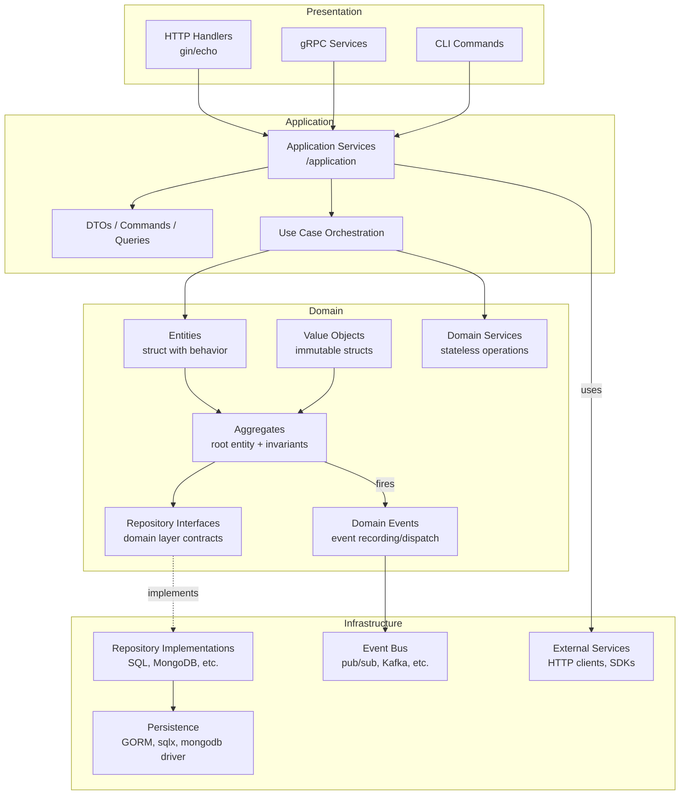
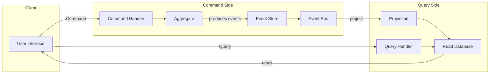

## Domain-Driven Design with Go
----


---

### คำอธิบายโครงสร้าง DDD ใน Go

#### 1. **Presentation Layer** (ชั้นนำเสนอ)
- **บทบาท**: จัดการการรับส่งข้อมูลจากผู้ใช้ (HTTP, gRPC, CLI) และแปลงเป็นคำสั่งหรือแบบสอบถามที่ Application Layer เข้าใจ
- **ใน Go**: มักใช้ไลบรารี เช่น `net/http`, `gin`, `echo`, `grpc-go`  
- **หลักการ**: ไม่มีตรรกะทางธุรกิจ เน้นการแปลง request → DTO และเรียก Application Service

#### 2. **Application Layer** (ชั้นแอปพลิเคชัน)
- **บทบาท**: ประสานงานระหว่าง Presentation กับ Domain ควบคุม workflow ของ Use Case  
- **ใน Go**: แพ็กเกจ `application` หรือ `usecase` ประกอบด้วย **Application Services**  
  - รับ DTO/Command  
  - เรียก Domain Services / Aggregates  
  - จัดการ Unit of Work (Transaction)  
  - ส่ง Domain Events ผ่าน Event Bus  
- **ตัวอย่าง**:  
  ```go
  type OrderService struct {
      repo      domain.OrderRepository
      payment   domain.PaymentService
      eventBus  domain.EventBus
  }

  func (s *OrderService) PlaceOrder(ctx context.Context, cmd PlaceOrderCommand) error {
      // load aggregate
      order, _ := s.repo.FindByID(cmd.OrderID)
      // domain logic
      order.Place(cmd.Items)
      // persist
      s.repo.Save(order)
      // publish events
      s.eventBus.Publish(order.Events()...)
      return nil
  }
  ```

#### 3. **Domain Layer** (ชั้นโดเมน) — **หัวใจของ DDD**
- **Entities**: struct ที่มี identity และพฤติกรรม เช่น  
  ```go
  type Order struct {
      id      OrderID
      status  OrderStatus
      items   []OrderItem
      // behavior
      func (o *Order) Cancel() { ... }
      func (o *Order) AddItem(item OrderItem) error { ... }
  }
  ```
- **Value Objects**: struct ไม่มี identity เปรียบเทียบด้วยค่า เช่น `Address`, `Money`  
- **Aggregates**: กลุ่มของ entities/value objects ที่มี root entity (aggregate root) เป็นตัวควบคุมความสอดคล้อง  
- **Domain Services**: มีพฤติกรรมที่ไม่ผูกกับ aggregate หรือ entity ใดโดยเฉพาะ  
- **Domain Events**: ใช้ record การเปลี่ยนแปลงที่สำคัญ  
- **Repository Interfaces**: กำหนด interface สำหรับการเก็บและค้นหา aggregate root อยู่ใน domain layer

#### 4. **Infrastructure Layer** (ชั้นโครงสร้างพื้นฐาน)
- **Repository Implementations**: ใช้ GORM, sqlx, MongoDB driver เพื่อ implement interface ที่ domain กำหนด  
- **Event Bus**: ใช้ระบบเช่น Kafka, RabbitMQ หรือ in‑memory bus  
- **External Services**: HTTP clients, SDKs ต่างๆ  
- **หลักการ**: Infrastructure ต้องขึ้นกับ domain (Dependency Inversion) ไม่ใช่ในทางกลับกัน

---

### การนำ DDD ไปใช้กับ Go: ข้อแนะนำเฉพาะภาษา

1. **จัดโครงสร้างโปรเจกต์ตามโมดูล**  
   ```
   /cmd
     /myapp
       main.go
   /internal
     /domain
       /order
         order.go (entity, value objects)
         repository.go (interface)
         events.go
     /application
       order_service.go
     /infrastructure
       /persistence
         order_repo_mysql.go
       /bus
         event_bus_kafka.go
     /presentation
       /http
         order_handler.go
   /pkg
     /shared
       errors.go, uuid.go, etc.
   ```

2. **ใช้ interface เพื่อ Dependency Inversion**  
   - Application layer รับ domain interface  
   - Infrastructure ถูก inject ผ่าน constructor  
   - ใช้ `wire` (Google Wire) หรือ manual DI สำหรับการประกอบ dependencies

3. **จัดการ Transaction**  
   - นิยมใช้ `Unit of Work` pattern: application service เริ่ม transaction ผ่าน interface เช่น  
     ```go
     type UnitOfWork interface {
         Begin(ctx context.Context) error
         Commit() error
         Rollback() error
         OrderRepository() OrderRepository
     }
     ```
   - ใน Go มักใช้ `context` เพื่อส่ง transaction object (เช่น `*sql.Tx`) ไปยัง repository methods

4. **Domain Events**  
   - ใช้ channel หรือ event bus ภายใน memory ก่อน แล้วค่อยเพิ่ม infrastructure  
   - ตัวอย่าง:
     ```go
     type DomainEvent interface {
         OccurredAt() time.Time
     }

     type OrderPlaced struct { ... }

     type EventBus interface {
         Publish(event DomainEvent) error
         Subscribe(handler func(DomainEvent)) error
     }
     ```

5. **Value Objects กับ immutability**  
   - ใช้ struct พร้อม private fields และ constructor functions  
   - เปรียบเทียบด้วย `==` หรือ implement `Equals` method

---

### สรุปประโยชน์ของการใช้ DDD ร่วมกับ Go

- **ความชัดเจนของโดเมน**: โค้ดสะท้อนภาษาธุรกิจ (Ubiquitous Language)  
- **การแยกหน้าที่**: แต่ละ layer มีความรับผิดชอบชัดเจน ลด coupling  
- **ทดสอบง่าย**: domain layer ไม่ขึ้นกับ infrastructure สามารถ unit test ด้วย mock  
- **ปรับเปลี่ยน infrastructure ได้**: เปลี่ยนฐานข้อมูลหรือ event bus โดยไม่กระทบโดเมน  
- **Go เหมาะสม**: struct, interface, package system ช่วยให้จัดระเบียบตาม bounded context ได้ดี และการทำงาน concurrency ผ่าน goroutine ช่วยให้จัดการ domain events ได้มีประสิทธิภาพ

 

---

### 1. Aggregate (กลุ่มวัตถุที่มีความสอดคล้อง)

**Aggregate** คือกลุ่มของวัตถุ (Entities + Value Objects) ที่ถูกยึดเข้าด้วยกันโดย **Aggregate Root** (รูท) ซึ่งเป็นตัวเดียวที่อนุญาตให้เข้าถึงหรือแก้ไขวัตถุอื่นภายในกลุ่มจากภายนอก การออกแบบ Aggregate ช่วยรักษาความถูกต้องของข้อมูล (invariants) และลดความซับซ้อนในการจัดการธุรกรรม

**หลักการสำคัญ:**
- **Aggregate Root** มี identity และเป็นจุดเดียวที่ภายนอกเข้าถึงได้
- การเปลี่ยนแปลงใด ๆ ภายใน Aggregate ต้องทำผ่าน Root เท่านั้น
- ภายใน Aggregate เดียวกันต้องมีความสอดคล้องกันในทันที (consistency boundary)
- ระหว่าง Aggregates ควรใช้ **eventual consistency** ผ่าน Domain Events

**ตัวอย่างใน Go:**

```go
// aggregate root: Order
type Order struct {
    id      OrderID
    status  OrderStatus
    items   []OrderItem   // value object
    total   Money
}

func (o *Order) AddItem(product Product, quantity int) error {
    if o.status != Draft {
        return errors.New("cannot add item to non-draft order")
    }
    // invariant: total must not exceed limit
    newTotal := o.total.Add(product.Price.Mul(quantity))
    if newTotal.GreaterThan(MaxOrderTotal) {
        return errors.New("order total exceeds limit")
    }
    o.items = append(o.items, NewOrderItem(product, quantity))
    o.total = newTotal
    o.addDomainEvent(OrderItemAdded{OrderID: o.id, ProductID: product.ID})
    return nil
}

// repository interface รับเฉพาะ aggregate root
type OrderRepository interface {
    Save(order *Order) error
    FindByID(id OrderID) (*Order, error)
}
```

---

### 2. Event Storming (เทคนิคค้นพบโดเมน)

**Event Storming** เป็นเวิร์กช็อปแบบมีส่วนร่วมที่ช่วยให้ทีม (นักพัฒนา, นักธุรกิจ, ผู้เชี่ยวชาญโดเมน) ระบุและเข้าใจโดเมนผ่านเหตุการณ์สำคัญที่เกิดขึ้นในระบบ โดยใช้โน้ตสีต่าง ๆ บนกระดาน

**สัญลักษณ์ทั่วไป:**
- **สีส้ม** – Domain Events (สิ่งที่เกิดขึ้นแล้ว) เช่น `OrderPlaced`, `PaymentReceived`
- **สีน้ำเงิน** – Commands (คำสั่งที่ทำให้เกิดเหตุการณ์) เช่น `PlaceOrder`, `RefundPayment`
- **สีเหลือง** – Aggregates (กลุ่มข้อมูลที่ถูกคำสั่งเรียก) เช่น `Order`, `Customer`
- **สีม่วง** – External Systems / Policies (ระบบภายนอกหรือกฎ)
- **สีเขียว** – Read Models / Views (ข้อมูลที่แสดงผล)

**ขั้นตอนคร่าว ๆ:**
1. ระบุ Domain Events (อดีต) โดยเรียงตามลำดับเวลา
2. ระบุ Commands ที่ทำให้เกิดเหตุการณ์นั้น
3. จับคู่ Command กับ Aggregate (ผู้รับผิดชอบ)
4. เพิ่ม Policies / Rules และ External Systems
5. ระบุ Read Models ที่จำเป็นต่อการแสดงผล

Event Storming นำไปสู่การกำหนด **Bounded Context** และ **Aggregates** ที่ชัดเจน ก่อนเริ่มเขียนโค้ด

---

### 3. CQRS (Command Query Responsibility Segregation)

CQRS แยกโมเดลการ **เขียน** (Command) และ **อ่าน** (Query) ออกจากกัน ทำให้สามารถปรับแต่งให้เหมาะสมกับแต่ละฝั่งได้ เช่น ใช้ฐานข้อมูลแบบ Event Sourcing สำหรับ Command และฐานข้อมูลแบบ Materialized View สำหรับ Query

**โครงสร้างทั่วไป:**



**ใน Go สามารถจัดโครงสร้างได้ดังนี้:**

#### แยก Command และ Query Models
```go
// Command models (เขียน)
type PlaceOrderCommand struct {
    OrderID string
    Items   []OrderItemDTO
}

// Query models (อ่าน)
type OrderView struct {
    OrderID    string
    Status     string
    TotalPrice float64
    Items      []OrderItemView
}
```

#### Command Handlers
```go
type PlaceOrderHandler struct {
    repo      domain.OrderRepository
    eventBus  domain.EventBus
}

func (h *PlaceOrderHandler) Handle(ctx context.Context, cmd PlaceOrderCommand) error {
    order, err := domain.NewOrder(cmd.OrderID)
    if err != nil {
        return err
    }
    for _, item := range cmd.Items {
        order.AddItem(item.ProductID, item.Quantity)
    }
    if err := h.repo.Save(order); err != nil {
        return err
    }
    // Publish events for projection
    for _, event := range order.Events() {
        h.eventBus.Publish(event)
    }
    return nil
}
```

#### Query Handlers (อ่านจาก Read Database)
```go
type OrderQueryHandler struct {
    db *sql.DB // หรือ ORM
}

func (h *OrderQueryHandler) GetOrder(ctx context.Context, orderID string) (*OrderView, error) {
    var view OrderView
    err := h.db.QueryRowContext(ctx, "SELECT ... FROM order_views WHERE id = ?", orderID).Scan(&view)
    return &view, err
}
```

#### Projection (สร้าง Read Model จาก Events)
```go
type OrderProjection struct {
    db *sql.DB
}

func (p *OrderProjection) HandleEvent(event domain.DomainEvent) {
    switch e := event.(type) {
    case OrderPlaced:
        p.db.Exec("INSERT INTO order_views (id, status, total) VALUES (?, ?, ?)", e.OrderID, "Placed", e.Total)
    case OrderItemAdded:
        p.db.Exec("INSERT INTO order_items_view ...")
    }
}
```

---

### 4. การนำ CQRS ไปใช้ใน Go อย่างมีประสิทธิภาพ

- **ใช้ Interface ในการแยก**: Command handlers, Query handlers, Projection handlers แต่ละตัวเป็น struct ที่ implements interface ต่างกัน ทำให้ test และ replace ได้ง่าย
- **Event Store**: ใน Go สามารถใช้ database เช่น PostgreSQL พร้อม JSONB เก็บ events, หรือใช้ไลบรารี `github.com/eventials/goeventsourcing` แต่แนะนำให้เริ่มจาก in‑memory ก่อนค่อยเพิ่ม complexity
- **Read Database**: อาจใช้ฐานข้อมูลแยก (SQL, NoSQL) หรือ cache เช่น Redis สำหรับการ query ที่รวดเร็ว
- **Concurrency**: Goroutine + channel ใช้ในการประมวลผล projection แบบ asynchronous

**ข้อควรระวัง:**
- CQRS เพิ่มความซับซ้อน เหมาะสำหรับระบบที่ต้องการความยืดหยุ่นสูง (microservices, high scalability)
- ไม่จำเป็นต้องใช้ Event Sourcing เสมอไป CQRS สามารถแยกโมเดลอ่าน-เขียนโดยใช้ฐานข้อมูลเดียวกันได้ (แต่แยกตารางหรือ schema)
- การจัดการ eventual consistency ต้องออกแบบ UX ให้เหมาะสม

---

### สรุปการเพิ่มองค์ประกอบ

| Concept | บทบาทใน DDD with Go |
|---------|---------------------|
| **Aggregate** | กลุ่มข้อมูลและพฤติกรรมที่มีความสอดคล้อง ใช้ interface repository ในการโหลด/บันทึกผ่าน aggregate root |
| **Event Storming** | กระบวนการออกแบบร่วมกันเพื่อค้นหา domain events, commands, aggregates, read models ก่อนพัฒนา |
| **CQRS** | แยก command (เขียน) และ query (อ่าน) ใช้ event bus และ projection เพื่อสร้าง read model |

ทั้งสามแนวคิดช่วยให้การพัฒนา DDD ใน Go มีระเบียบแบบแผน รองรับความซับซ้อนของโดเมน และขยายขนาดได้ง่าย หากเริ่มต้นด้วย bounded context เล็ก ๆ ก่อนแล้วค่อยเพิ่ม CQRS เมื่อจำเป็นก็จะลดความเสี่ยงได้ดี

---