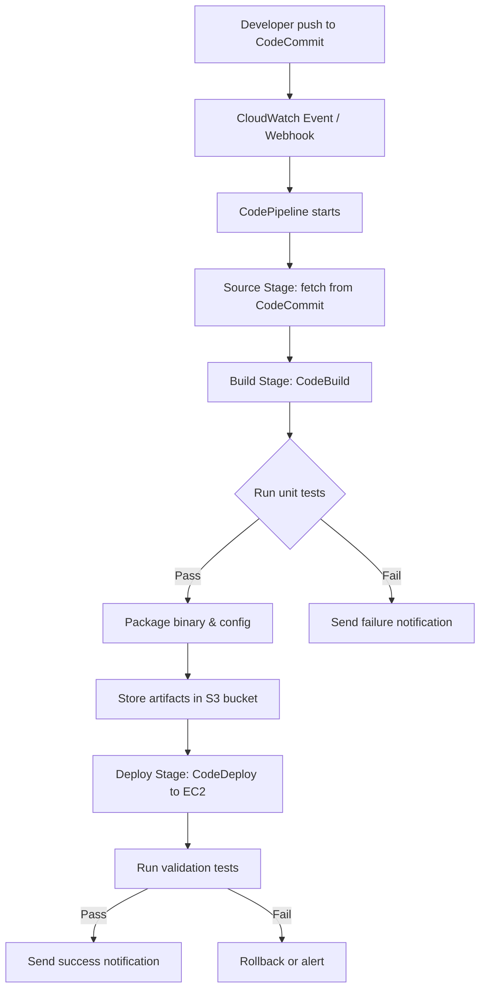
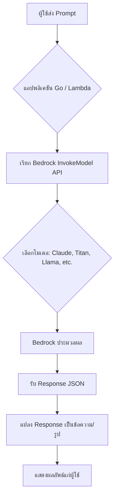
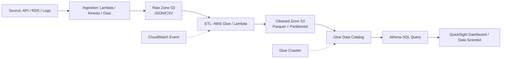
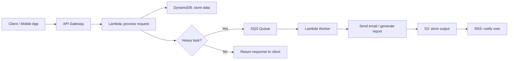
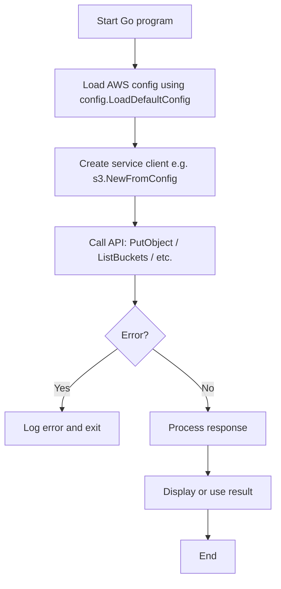
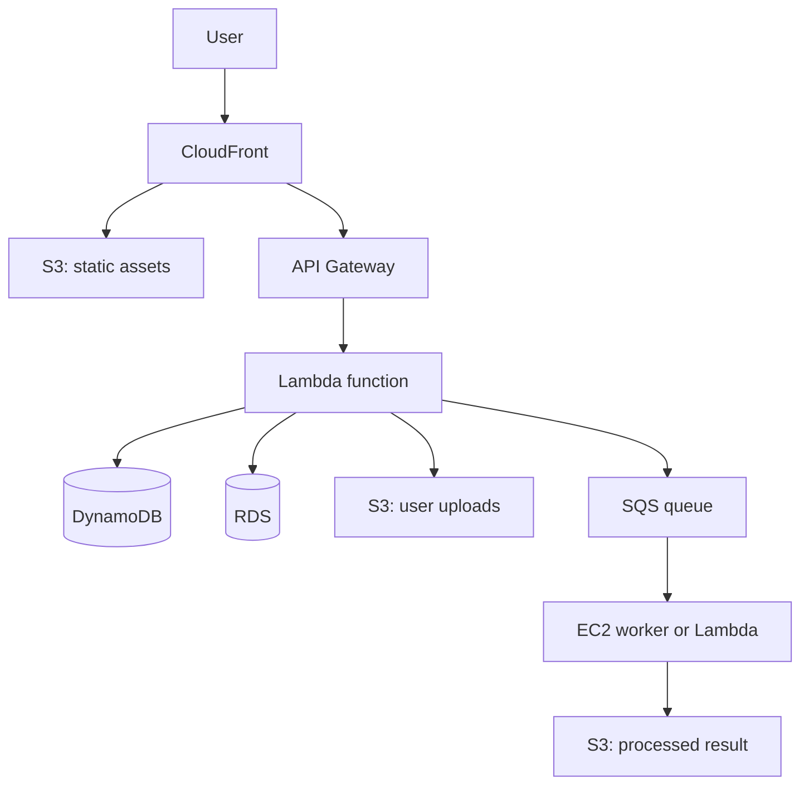

 
###  หนังสือ  AWS จากภาคทฤษฎีไปภาคปฏิบัติ  
---
**📘 AWS จากภาคทฤษฎีไปภาคปฏิบัติ** 
**✍️ ผู้เขียน:** คงนคร จันทะคุณ  
**📅 อัปเดตล่าสุด:** เมษายน 2026  
**หมายเหตุ เนื้อหาในหนังสือ:**  
เนื้อหาในหนังสือ "AWS จากภาคทฤษฎีไปภาคปฏิบัติ" ใช้ AI ช่วยเขียน เพื่อทดสอบ AI Model ผู้เขียนเป็นผู้ออกแบบ ใช้ AI ช่วยจัดเรียง ซึ่งมีค่าใช้จ่ายพอสมควร ให้ใช้ฟรีก่อน ต้องการสนับสนุนเพื่อทำเนื้อหาแนวนี้ต่อ สามารถให้การสนับสนุนได้ครับ ตามกำลังศรัทธา 
📞 โทรศัพท์ / พร้อมเพย์: **0955088091**  

---

# 📘 สารบัญ (Table of Contents)

**หนังสือ “AWS จากภาคทฤษฎีไปภาคปฏิบัติ”**  
*“AWS From Theory to Practice”*

| บทที่ | หัวข้อ | หน้า |
|-------|--------|------|
| 1 | DevOps: แนวคิด การใช้งาน และการปฏิบัติบน AWS | 1 |
| 2 | DevSecOps: รวมความปลอดภัยในวงจรพัฒนา | 35 |
| 3 | AI: ปัญญาประดิษฐ์บน AWS | 70 |
| 4 | Data Engineer: วิศวกรรมข้อมูลยุคคลาวด์ | 110 |
| 5 | Software Engineer: วิศวกรรมซอฟต์แวร์บน AWS | 150 |
| 6 | AWS คือใคร? บริการและรูปแบบการใช้งาน | 190 |
| 7 | AWS Core Services: หัวใจของคลาวด์ | 225 |
| 8 | AWS Certified: เส้นทางสู่การรับรอง | 260 |
| 9 | AWS Certified Solutions Architect – Associate (SAA) | 290 |
| 10 | AWS Certified Cloud Practitioner (CLF) | 320 |
| 11 | AWS Certified Developer – Associate (DVA) | 345 |
| 12 | AWS Certified Solutions Architect – Professional (SAP) | 375 |
| 13 | AWS Certified Machine Learning – Specialty (MLS) | 405 |
| 14 | AWS Certified AI Practitioner (AIF) | 435 |
| 15 | AWS Certified Advanced Networking – Specialty (ANS) | 460 |
| 16 | AWS Certified Data Engineer – Associate (DEA) | 490 |
| 17 | AWS Certified DevOps Engineer – Professional (DOP) | 520 |
| ภาคผนวก | เทมเพลต โค้ดตัวอย่าง และเฉลยแบบฝึกหัด | 550 |

> **หมายเหตุ:** ทุกบทจะประกอบด้วยเนื้อหาทั้งภาษาไทยและภาษาอังกฤษแยกส่วน, แบบฝึกหัด, เฉลย, โค้ดที่รันได้จริง, Workflow พร้อม Mermaid/ASCII, และตารางสรุป

--- 
# 📘 บทที่ 1: DevOps – แนวคิด การใช้งาน และการปฏิบัติบน AWS  
## Chapter 1: DevOps – Concept, Usage and Practice on AWS  

---

## 🎯 วัตถุประสงค์แบบสั้นสำหรับทบทวน (Short Revision Objective)  
**ไทย:**  
เพื่อให้ผู้อ่านเข้าใจแนวคิดของ DevOps รูปแบบต่าง ๆ วิธีการนำ DevOps ไปใช้ประโยชน์ในองค์กร รวมถึงการปฏิบัติจริงบน AWS ด้วยเครื่องมือต่าง ๆ เช่น AWS CodeCommit, CodeBuild, CodeDeploy, CodePipeline และสามารถเขียนโปรแกรม Go เพื่อสร้าง CI/CD pipeline แบบง่ายได้  

**English:**  
To enable readers to understand the DevOps concept, its various models, how to apply DevOps in organizations, and hands‑on practice on AWS using tools like AWS CodeCommit, CodeBuild, CodeDeploy, CodePipeline, and to write a simple CI/CD pipeline in Go.  

---

## 👥 กลุ่มเป้าหมาย (Target Audience)  
- นักพัฒนาซอฟต์แวร์ (Developers)  
- ผู้ดูแลระบบ (System Administrators)  
- SRE (Site Reliability Engineers)  
- ผู้ที่สนใจนำ DevOps มาใช้ในองค์กร  
- ผู้เตรียมสอบ AWS Certified DevOps Engineer – Professional  

---

## 📚 ความรู้พื้นฐาน (Prerequisites)  
- ความเข้าใจพื้นฐานเกี่ยวกับวงจรการพัฒนาซอฟต์แวร์ (SDLC)  
- ใช้งาน command line และ Git พื้นฐาน  
- มีบัญชี AWS และเข้าใจบริการพื้นฐาน เช่น IAM, EC2, S3  
- ติดตั้ง Go (เวอร์ชัน 1.18 ขึ้นไป) และ AWS CLI  

---

## 📝 เนื้อหาโดยย่อ (Abstract)  
บทนี้จะอธิบายความหมายของ DevOps เปรียบเทียบกับแนวทางเดิม รูปแบบของ DevOps (เช่น CALMS, Topologies) ประโยชน์และข้อควรระวัง จากนั้นลงมือปฏิบัติจริงบน AWS ด้วยการสร้าง CI/CD pipeline สำหรับแอปพลิเคชัน Go โดยใช้ AWS CodePipeline, CodeBuild, และ CodeDeploy พร้อมตัวอย่างโค้ดที่รันได้จริง และแบบฝึกหัดท้ายบท  

---

## 🔰 บทนำ (Introduction)  

**ไทย:**  
DevOps เกิดจากการรวมกันของ “Development” (การพัฒนา) และ “Operations” (การปฏิบัติการ) เพื่อแก้ปัญหาช่องว่างระหว่างทีมพัฒนาที่ต้องการปล่อยฟีเจอร์เร็ว ๆ กับทีมปฏิบัติการที่ต้องการความเสถียร บน AWS เรามีเครื่องมือที่ช่วยให้ DevOps เป็นเรื่องง่าย ไม่ว่าจะเป็นการจัดการโค้ด (CodeCommit), สร้างและทดสอบอัตโนมัติ (CodeBuild), จัดการการปล่อยเวอร์ชัน (CodeDeploy) และการสร้างไปป์ไลน์ (CodePipeline)  

**English:**  
DevOps combines “Development” and “Operations” to bridge the gap between teams that want to release features quickly and teams that demand stability. On AWS, services like CodeCommit (code hosting), CodeBuild (build & test), CodeDeploy (deployment), and CodePipeline (orchestration) make DevOps easy to implement.  

---

## 📖 บทนิยาม (Definitions)  

| คำศัพท์ (Term) | คำจำกัดความไทย (Thai Definition) | English Definition |
|----------------|----------------------------------|--------------------|
| DevOps | วัฒนธรรมและชุดปฏิบัติการที่รวมการพัฒนาและปฏิบัติการเข้าด้วยกัน เพื่อส่งมอบซอฟต์แวร์ได้เร็วและเชื่อถือได้ | Culture and practices that unite development and operations for fast, reliable software delivery. |
| CI (Continuous Integration) | การรวมโค้ดจากนักพัฒนาหลายคนบ่อย ๆ ไปยัง shared repository และทำการ build/test อัตโนมัติ | Frequently merging code changes into a shared repository with automated builds and tests. |
| CD (Continuous Delivery/Deployment) | Continuous Delivery = พร้อม deploy ตลอดเวลา (ต้อง approve ก่อน), Continuous Deployment = deploy อัตโนมัติทุกการเปลี่ยนแปลง | Continuous Delivery = always ready to deploy (manual approval), Continuous Deployment = automatic deployment on every change. |
| Pipeline | ชุดขั้นตอนอัตโนมัติตั้งแต่ commit โค้ดไปจนถึง production | Automated sequence from code commit to production. |
| Infrastructure as Code (IaC) | การจัดการ infrastructure โดยใช้ไฟล์โค้ด (เช่น CloudFormation, Terraform) | Managing infrastructure using code files. |
| AWS CodePipeline | บริการ orchestration CI/CD เต็มรูปแบบบน AWS | Fully managed CI/CD orchestration service on AWS. |
| AWS CodeBuild | บริการ build และทดสอบโค้ดแบบ fully managed | Fully managed build and test service. |
| AWS CodeDeploy | บริการ automate deployment ไปยัง EC2, Lambda, หรือ on‑premises | Service to automate deployments to EC2, Lambda, or on‑premises. |

---

## 🔧 DevOps คืออะไร? มีกี่แบบ? ใช้อย่างไร? (What is DevOps? Types, Usage)

### 1. DevOps คืออะไร  
**ไทย:** DevOps ไม่ใช่เครื่องมือหรือตำแหน่งงาน แต่เป็น **วัฒนธรรม** และ **แนวปฏิบัติ** ที่ช่วยให้ทีมพัฒนาซอฟต์แวร์และทีมปฏิบัติการทำงานร่วมกันอย่างใกล้ชิด ใช้ระบบอัตโนมัติเพื่อลดขั้นตอนที่ต้องทำซ้ำ และเพิ่มความเร็วในการส่งมอบคุณค่าให้ผู้ใช้  

**English:** DevOps is not a tool or a job title – it’s a **culture** and set of **practices** that enable development and operations teams to work closely together, use automation to reduce repetitive tasks, and accelerate value delivery to users.

### 2. มีกี่แบบ (Models / Frameworks of DevOps)  

| แบบ (Model) | คำอธิบาย (Description) | เมื่อใดควรใช้ (When to use) |
|--------------|------------------------|-----------------------------|
| **CALMS** | วัดความพร้อม DevOps 5 ด้าน: Culture, Automation, Lean, Measurement, Sharing | ใช้ประเมินองค์กรก่อนเริ่ม DevOps |
| **DevOps Topologies** | รูปแบบโครงสร้างทีม (เช่น Dev and Ops combined, SRE team) | ใช้ตัดสินใจว่าจะจัดทีมอย่างไร |
| **Continuous Delivery (CD)** | มุ่งเน้น automation pipeline จนถึง production | ใช้เมื่อต้องการ deploy บ่อยและปลอดภัย |
| **Site Reliability Engineering (SRE)** | ใช้หลักวิศวกรรมเพื่อบริหาร reliability | ใช้เมื่อบริการมีขนาดใหญ่ ต้องการ SLI/SLO |
| **Value Stream Mapping** | วิเคราะห์ขั้นตอนการส่งมอบคุณค่าและลด waste | ใช้เพื่อหา bottleneck ในกระบวนการ |

### 3. ใช้อย่างไร (How to implement DevOps)  
- **วัฒนธรรม:** ทำลาย silos, สนับสนุนความผิดพลาด (blameless post‑mortems)  
- **อัตโนมัติ:** CI/CD, IaC, automated testing  
- **วัดผล:** เก็บ metrics เช่น deployment frequency, lead time, MTTR  
- **แบ่งปัน:** ใช้เครื่องมือร่วมกัน (Jira, Slack, AWS Chatbot)  

### 4. นำในกรณีไหน (When to use)  
- ต้องการปล่อยซอฟต์แวร์บ่อย (หลายครั้งต่อวัน)  
- ทีมพัฒนาและปฏิบัติการมีปัญหาการสื่อสาร  
- มีการทำงานซ้ำ ๆ ที่สามารถ automate ได้  
- ต้องการเพิ่มความมั่นใจในการ deploy  

### 5. ทำไมต้องใช้ (Why use DevOps)  
- ลดเวลาในการนำฟีเจอร์ออกสู่ตลาด (Time‑to‑market)  
- ลดความผิดพลาดจากการ deploy ด้วยมือ  
- เพิ่มความพึงพอใจของทีม (ลด friction)  
- ทำให้สามารถขยายขนาดแอปพลิเคชันและทีมได้ง่ายขึ้น  

### 6. ประโยชน์ที่ได้รับ (Benefits)  
- ความเร็วในการส่งมอบสูงขึ้น  
- ความเสถียรและความพร้อมใช้งานดีขึ้น  
- การทำงานร่วมกันดีขึ้น  
- สามารถกู้คืนจากความผิดพลาดได้เร็วขึ้น  

### 7. ข้อควรระวัง (Cautions)  
- ต้องมีการเปลี่ยนแปลงวัฒนธรรม ซึ่งทำได้ยาก  
- ต้องการการลงทุนในระบบ automation และการเทรนทีม  
- อาจเกิด “tool sprawl” (ใช้เครื่องมือมากเกินไป)  
- ไม่มี “DevOps team” เพียงทีมเดียวที่รับผิดชอบทุกอย่าง  

### 8. ข้อดี (Advantages)  
- ลดงาน manual ซ้ำซาก  
- เพิ่มความสามารถในการตรวจสอบ (auditability)  
- รองรับการ scale แบบ agile  

### 9. ข้อเสีย (Disadvantages)  
- ต้องใช้ความพยายามเริ่มต้นสูง  
- ทีมต้องเรียนรู้เครื่องมือใหม่ ๆ  
- กรณี organization ใหญ่ การเปลี่ยนแปลงช้า  

### 10. ข้อห้าม (Prohibitions)  
- ห้ามสร้าง “DevOps team” ที่ทำทุกอย่างแทน Dev และ Ops  
- ห้ามใช้ automation แทนการสื่อสาร  
- ห้ามละเลย documentation และ monitoring  

---

## 🔄 ออกแบบ Workflow (Workflow Design)  

### ภาพรวมการทำงาน (Overview)  

**ไทย:**  
Workflow ของ CI/CD pipeline บน AWS สำหรับแอป Go: นักพัฒนา push โค้ดไปที่ AWS CodeCommit (Git repository) → CodePipeline ตรวจจับการเปลี่ยนแปลง → ดึงโค้ดไปยัง CodeBuild → Build binary และรันทดสอบ → ถ้าสำเร็จ ส่ง artifacts ไป S3 → CodeDeploy นำ artifacts ไปติดตั้งบน EC2 และทำ validation → แจ้งผลลัพธ์ผ่าน SNS  

**English:**  
CI/CD workflow on AWS for a Go app: Developer pushes code to AWS CodeCommit → CodePipeline detects change → pulls code to CodeBuild → builds binary and runs tests → if successful, uploads artifacts to S3 → CodeDeploy installs artifacts on EC2 and runs validation → notifies result via SNS.

### Diagram: Mermaid Flowchart  



### คำอธิบายแบบละเอียด (Detailed Explanation)  

| ขั้นตอน | คำอธิบาย (ไทย) | Explanation (English) |
|---------|----------------|------------------------|
| 1 | นักพัฒนาแก้ไขโค้ด Go และ `git push` ไปยัง AWS CodeCommit | Developer modifies Go code and pushes to AWS CodeCommit. |
| 2 | CodePipeline trigger โดย CloudWatch Events หรือ webhook | CodePipeline is triggered by CloudWatch Events or webhook. |
| 3 | Source stage: ดึง source code ล่าสุดจาก branch ที่กำหนด | Source stage: fetches latest code from specified branch. |
| 4 | Build stage: CodeBuild รัน buildspec.yml ซึ่งจะ `go build`, `go test` | Build stage: CodeBuild runs buildspec.yml, executes `go build` and `go test`. |
| 5 | ถ้า test ผ่าน, binary และไฟล์ config ถูก package ไปเป็น artifact | If tests pass, binary and config files are packaged as artifact. |
| 6 | Artifact ถูกเก็บใน S3 bucket ชั่วคราว | Artifact is stored in a temporary S3 bucket. |
| 7 | Deploy stage: CodeDeploy ดึง artifact และติดตั้งบน EC2 instance (หรือ ASG) | Deploy stage: CodeDeploy pulls artifact and installs on EC2 instance (or ASG). |
| 8 | หลัง deploy, validation test ถูกเรียก (เช่น health check endpoint) | After deployment, validation test is invoked (e.g., health check endpoint). |
| 9 | ส่งการแจ้งเตือน success/failure ผ่าน SNS (email, Slack, etc.) | Success/failure notification sent via SNS (email, Slack, etc.). |

### ตัวอย่างโค้ดพร้อมคอมเมนต์สองภาษา (Code with bilingual comments)  

#### ไฟล์ Go ตัวอย่าง (app.go)  

```go
// app.go
// แอปพลิเคชัน Go อย่างง่ายที่แสดงข้อความและมี health check
// Simple Go application that prints a message and has a health check endpoint

package main

import (
	"fmt"
	"log"
	"net/http"
	"os"
)

func main() {
	// กำหนดพอร์ตจาก environment variable (ค่าเริ่มต้น 8080)
	// Get port from environment variable (default 8080)
	port := os.Getenv("PORT")
	if port == "" {
		port = "8080"
	}

	// Endpoint หลัก: คืนค่า "Hello DevOps on AWS!"
	// Main endpoint: returns "Hello DevOps on AWS!"
	http.HandleFunc("/", func(w http.ResponseWriter, r *http.Request) {
		fmt.Fprintf(w, "Hello DevOps on AWS! Version: 1.0")
	})

	// Health check endpoint สำหรับ CodeDeploy และ ALB
	// Health check endpoint for CodeDeploy and ALB
	http.HandleFunc("/health", func(w http.ResponseWriter, r *http.Request) {
		w.WriteHeader(http.StatusOK)
		fmt.Fprintf(w, "OK")
	})

	log.Printf("Server starting on port %s", port)
	log.Fatal(http.ListenAndServe(":"+port, nil))
}
```

#### buildspec.yml (สำหรับ AWS CodeBuild)  

```yaml
# buildspec.yml
# กำหนดขั้นตอนการ build และทดสอบแอป Go
# Defines build and test steps for Go application

version: 0.2

phases:
  install:
    runtime-versions:
      golang: 1.21           # ใช้ Go 1.21 / Use Go 1.21
    commands:
      # ติดตั้ง dependencies (ถ้ามี go.mod)
      # Install dependencies if go.mod exists
      - go mod download
  pre_build:
    commands:
      # รัน unit tests และสร้าง coverage report
      # Run unit tests and generate coverage report
      - go test -cover ./...
  build:
    commands:
      # Build binary สำหรับ Linux (เพราะ EC2 เป็น Amazon Linux)
      # Build binary for Linux (EC2 runs Amazon Linux)
      - GOOS=linux GOARCH=amd64 go build -o myapp .
  post_build:
    commands:
      # ตรวจสอบว่า binary ทำงานได้
      # Verify that binary works
      - ./myapp -version || true

artifacts:
  files:
    - myapp                    # binary ที่ build ได้
    - appspec.yml              # ไฟล์กำหนดการ deploy ของ CodeDeploy
    - scripts/**/*             # โฟลเดอร์สคริปต์ (start, stop, validate)
  discard-paths: no
```

#### appspec.yml (สำหรับ AWS CodeDeploy)  

```yaml
# appspec.yml
# กำหนดการ deploy สำหรับ CodeDeploy บน EC2
# Defines CodeDeploy deployment specification for EC2

version: 0.0
os: linux

files:
  - source: myapp
    destination: /home/ec2-user/myapp
  - source: scripts/start.sh
    destination: /home/ec2-user/scripts
  - source: scripts/stop.sh
    destination: /home/ec2-user/scripts
  - source: scripts/validate.sh
    destination: /home/ec2-user/scripts

permissions:
  - object: /home/ec2-user/myapp
    mode: 755
    owner: ec2-user
    group: ec2-user
  - object: /home/ec2-user/scripts
    mode: 755
    owner: ec2-user
    group: ec2-user

hooks:
  ApplicationStop:
    - location: scripts/stop.sh
      timeout: 30
      runas: ec2-user
  ApplicationStart:
    - location: scripts/start.sh
      timeout: 60
      runas: ec2-user
  ValidateService:
    - location: scripts/validate.sh
      timeout: 30
      runas: ec2-user
```

#### สคริปตัวอย่าง (scripts/start.sh)  

```bash
#!/bin/bash
# start.sh
# เริ่มต้น service myapp โดยใช้ systemd หรือ nohup
# Start myapp service using systemd or nohup

set -e

APP_DIR=/home/ec2-user/myapp
LOG_DIR=/var/log/myapp
mkdir -p $LOG_DIR

# ถ้ามี systemd service unit ให้ใช้ systemctl
# If systemd service unit exists, use systemctl
if systemctl list-unit-files | grep -q myapp.service; then
    sudo systemctl start myapp
else
    # ไม่อย่างนั้น run โดยตรง
    # Otherwise run directly
    cd $APP_DIR
    nohup ./myapp > $LOG_DIR/app.log 2>&1 &
fi

echo "myapp started"
```

#### scripts/validate.sh  

```bash
#!/bin/bash
# validate.sh
# ตรวจสอบว่าแอปทำงานและตอบสนอง health check
# Verify the app is running and responds to health check

set -e

# รอให้แอปพร้อม (สูงสุด 30 วินาที)
# Wait for app to be ready (max 30 seconds)
for i in {1..30}; do
    if curl -f http://localhost:8080/health; then
        echo "Validation successful"
        exit 0
    fi
    sleep 1
done

echo "Validation failed: health check not responding"
exit 1
```

### วิธีสร้าง CI/CD Pipeline ทั้งหมดด้วย AWS CLI (ตัวอย่างคำสั่ง)  

```bash
# 1. สร้าง S3 bucket สำหรับเก็บ artifacts (unique name)
aws s3 mb s3://my-devops-artifacts-bucket

# 2. สร้าง CodeCommit repository
aws codecommit create-repository --repository-name MyGoApp

# 3. push โค้ดเริ่มต้น (ทำ git remote add, git push)

# 4. สร้าง CodeBuild project
aws codebuild create-project --name MyGoBuild \
  --source type=CODECOMMIT,location=https://git-codecommit.us-east-1.amazonaws.com/v1/repos/MyGoApp \
  --artifacts type=S3,location=my-devops-artifacts-bucket,path=build-artifacts \
  --environment type=LINUX_CONTAINER,computeType=BUILD_GENERAL1_SMALL,image=aws/codebuild/amazonlinux2-x86_64-standard:4.0 \
  --service-role arn:aws:iam::ACCOUNT:role/codebuild-service-role

# 5. สร้าง CodePipeline
aws codepipeline create-pipeline --cli-input-json file://pipeline.json
```

(ไฟล์ pipeline.json มีรายละเอียด source, build, deploy stage – สามารถดูตัวอย่างเพิ่มเติมได้ที่ AWS Docs)

---

## 📌 กรณีศึกษาและแนวทางแก้ไขปัญหา (Case Study & Troubleshooting)

### กรณีศึกษา 1: บริษัท FinTech ต้องการ deploy วันละ 10 ครั้ง  
**ปัญหา:** ทีม Dev และ Ops แยกกัน, deploy ใช้ manual ผ่าน SSH, เกิด human error บ่อย  
**แนวทางแก้ไข:**  
- นำ Git + CodeCommit มาใช้  
- สร้าง CI pipeline ด้วย CodeBuild รัน unit tests และ security scan (SAST)  
- ใช้ CodePipeline + CodeDeploy แบบ blue/green deployment ไปยัง Auto Scaling Group  
- ตั้งค่า validation test หลัง deploy ถ้าผิดพลาด rollback อัตโนมัติ  
**ผลลัพธ์:** deployment frequency เพิ่มจาก 1 ครั้ง/สัปดาห์ เป็น 10 ครั้ง/วัน, failure rate ลด 80%  

### กรณีศึกษา 2: E‑commerce ขนาดกลางต้องการ zero‑downtime deployment  
**ปัญหา:** เวลาอัปเดตเว็บไซต์ ต้องปิด service ชั่วคราว ทำให้เสียรายได้  
**แนวทางแก้ไข:**  
- ใช้ Application Load Balancer + Auto Scaling Group  
- กำหนด CodeDeploy configuration เป็น `DeploymentStyle: BLUE_GREEN`  
- ใช้ pre‑hook เพื่อตรวจสอบ dependency ก่อนเปลี่ยน traffic  
- ใช้ post‑hook เพื่อรัน smoke test บน environment ใหม่  
**ผลลัพธ์:** downtime ลดลงเป็น 0 วินาที  

### ปัญหาที่พบบ่อย (Common Issues)  

| ปัญหา (Issue) | สาเหตุ (Cause) | วิธีแก้ไข (Solution) |
|----------------|----------------|----------------------|
| CodeBuild ค้างหรือ timeout | buildspec.yml มีคำสั่งที่รอ input หรือใช้ทรัพยากรมาก | ตรวจสอบว่าไม่มี `read` หรือ interactive command, เพิ่ม computeType |
| CodeDeploy ติด loop Deployment failed | Script start.sh ทำงานไม่สำเร็จ (permission, path) | ดู log ที่ `/opt/codedeploy-agent/deployment-root/deployment-logs/codedeploy-agent-deployments.log` |
| Pipeline ไม่ trigger อัตโนมัติ | ขาด CloudWatch Events หรือ webhook | ตรวจสอบใน CodePipeline console ว่า Source stage มี “Change detection options” เป็น Amazon CloudWatch Events |
| Artifact ไม่ถูกต้อง | buildspec artifacts section ระบุ path ผิด | ทดสอบด้วยการ build ใน local ก่อน push |
| Permission denied ตอน run binary | binary ไม่มี execute permission | ใน appspec.yml ตั้ง permissions mode: 755 หรือใช้ chmod ใน start.sh |

---

## 📁 เทมเพลตและตัวอย่างโค้ดเพิ่มเติม (Templates & More Code)

### Template สำหรับ Makefile (Go + CodeBuild)  

```makefile
# Makefile
# ช่วยให้รันคำสั่ง CI/CD ใน local และบน CodeBuild
# Helps run CI/CD commands locally and on CodeBuild

.PHONY: build test clean run

build:
	go build -o myapp .

test:
	go test -v -cover ./...

clean:
	rm -f myapp

run:
	./myapp

# จำลอง environment ของ CodeBuild
codebuild-local:
	docker run -v $(shell pwd):/go/src/app -w /go/src/app \
		-e GOOS=linux -e GOARCH=amd64 \
		golang:1.21 go build -o myapp .
```

### Template สำหรับ IAM Role (CodeBuild + CodeDeploy)  

```json
{
  "Version": "2012-10-17",
  "Statement": [
    {
      "Effect": "Allow",
      "Action": [
        "logs:CreateLogGroup",
        "logs:CreateLogStream",
        "logs:PutLogEvents"
      ],
      "Resource": "*"
    },
    {
      "Effect": "Allow",
      "Action": [
        "s3:GetObject",
        "s3:PutObject"
      ],
      "Resource": "arn:aws:s3:::my-devops-artifacts-bucket/*"
    },
    {
      "Effect": "Allow",
      "Action": [
        "codecommit:GitPull"
      ],
      "Resource": "arn:aws:codecommit:us-east-1:ACCOUNT:MyGoApp"
    }
  ]
}
```

---

## 📊 ตารางเปรียบเทียบเครื่องมือ DevOps บน AWS vs อื่น ๆ  

| ฟังก์ชัน (Function) | AWS Service | ทางเลือกอื่น (Alternative) |
|---------------------|-------------|----------------------------|
| Version Control | CodeCommit | GitHub, GitLab, Bitbucket |
| CI/CD Orchestration | CodePipeline | Jenkins, GitLab CI, CircleCI |
| Build & Test | CodeBuild | Jenkins, GitHub Actions |
| Deployment | CodeDeploy | Ansible, Spinnaker, ArgoCD |
| Infrastructure as Code | CloudFormation / CDK | Terraform, Pulumi |
| Monitoring | CloudWatch | Prometheus, Grafana, Datadog |

---

## 📝 สรุป (Summary)  

### ✅ ประโยชน์ที่ได้รับ (Benefits)  
- ลดเวลาในการนำฟีเจอร์ออกสู่ตลาด  
- เพิ่มความมั่นใจในการ deploy ด้วย automation และ testing  
- ปรับปรุง collaboration ระหว่าง Dev และ Ops  
- รองรับการขยายขนาดและความซับซ้อน  

### ⚠️ ข้อควรระวัง (Cautions)  
- ต้องมีการปรับเปลี่ยนวัฒนธรรมองค์กร  
- ต้องลงทุนในการทำ automation และ documentation  
- ระวัง vendor lock‑in (หากใช้ AWS services ทั้งหมด)  

### 👍 ข้อดี (Advantages)  
- AWS services ทำงานร่วมกันได้ดี (native integration)  
- ไม่ต้องดูแล infrastructure ของ CI/CD เอง (fully managed)  
- มี security และ compliance ในตัว  

### 👎 ข้อเสีย (Disadvantages)  
- หากองค์กรใช้ multi‑cloud อาจซับซ้อน  
- CodeBuild, CodeDeploy มี feature น้อยกว่า Jenkins (แต่พอเพียง)  
- ราคาอาจสูงกว่าการใช้ open‑source บน EC2 หากใช้งานหนัก  

### 🚫 ข้อห้าม (Prohibitions)  
- ห้ามเก็บ secret key หรือ environment variable ในโค้ด (ใช้ AWS Secrets Manager หรือ Parameter Store)  
- ห้าม deploy ไป production โดยไม่ผ่าน automated test  
- ห้ามใช้ production environment สำหรับทดสอบ (ใช้ staging ก่อน)  

---

## 🧩 แบบฝึกหัดท้ายบท (Exercises)  

**ข้อ 1:** จงอธิบายความแตกต่างระหว่าง Continuous Delivery และ Continuous Deployment พร้อมยกตัวอย่างสถานการณ์ที่ควรใช้แบบใด  
**ข้อ 2:** จาก buildspec.yml ที่ให้มา ถ้าต้องการเพิ่ม step linting (เช่น `golangci-lint run`) ควรเพิ่มใน phase ใด  
**ข้อ 3:** เขียนคำสั่ง Go test ที่สร้าง coverage report ในรูปแบบ HTML  
**ข้อ 4:** สมมติว่า CodeDeploy ล้มเหลวที่ hook ValidateService จะหา log ได้จากที่ไหนใน EC2  
**ข้อ 5:** จงออกแบบ pipeline อย่างง่าย (โดยใช้บริการ AWS) สำหรับแอป Go ที่ต้อง deploy ไปยัง Lambda แทน EC2 (ระบุ service ที่ใช้แทน CodeDeploy)  
**ข้อ 6:** หลัก CALMS ใน DevOps หมายถึงอะไรบ้าง (อธิบายแต่ละตัว)  
**ข้อ 7:** กรณีที่ต้องการ rollback โดยอัตโนมัติเมื่อ validation test ล้มเหลว CodePipeline มี feature อะไรที่ช่วยได้  
**ข้อ 8:** จงเขียน script bash (start.sh) ที่ใช้ systemd สำหรับ binary myapp โดยให้ log ไปที่ /var/log/myapp และ restart อัตโนมัติถ้า crash  
**ข้อ 9:** อะไรคือข้อห้ามสำคัญในการใช้ DevOps (ยกมา 2 ข้อ)  
**ข้อ 10:** ถ้าทีมของคุณใช้ GitLab อยู่แล้ว คุณจะเลือกใช้ AWS CodePipeline หรือไม่? เพราะเหตุใด  

---

## 🔐 เฉลยแบบฝึกหัด (Answer Key)  

**ข้อ 1:** Continuous Delivery: พร้อม deploy ตลอดเวลา แต่ต้อง approve ก่อน (เช่น ก่อน production), Continuous Deployment: ทุก commit ที่ผ่าน test จะ deploy อัตโนมัติ (ใช้กับ non‑critical หรือ start-up ที่ต้องการ speed)  
**ข้อ 2:** ควรเพิ่มใน `pre_build` หรือ `build` phase ก่อน `go build`  
**ข้อ 3:** `go test -coverprofile=coverage.out && go tool cover -html=coverage.out -o coverage.html`  
**ข้อ 4:** `/opt/codedeploy-agent/deployment-root/deployment-logs/codedeploy-agent-deployments.log` หรือดูใน EC2 ที่ `/var/log/aws/codedeploy-agent/codedeploy-agent.log`  
**ข้อ 5:** CodeCommit (source) → CodeBuild (build) → CodePipeline → AWS SAM หรือ CloudFormation + Lambda (deploy) หรือใช้ CodeDeploy สำหรับ Lambda (ก็ได้)  
**ข้อ 6:** C= Culture, A= Automation, L= Lean (ลด waste), M= Measurement, S= Sharing  
**ข้อ 7:** ใช้ Deployment action ใน CodePipeline ที่มี “Rollback” หรือใช้ manual approval แล้วตั้ง automation ผ่าน Lambda เพื่อ rollback  
**ข้อ 8:** (ตัวอย่าง systemd unit) เขียน `/etc/systemd/system/myapp.service` แล้วใช้ `systemctl start myapp` ใน start.sh  
**ข้อ 9:** 1) ห้ามสร้าง “DevOps team” ที่ทำทุกอย่างแทน Dev/ops 2) ห้ามใช้ automation แทนการสื่อสาร  
**ข้อ 10:** ขึ้นอยู่กับความต้องการ: ถ้าอยากได้ native integration กับ AWS อื่น (CodeBuild, CodeDeploy) และไม่ต้องการจัดการ runner อาจเลือก CodePipeline; ถ้าต้องการ unified experience ใน GitLab ก็ใช้ GitLab CI ดีกว่า  

---

## 📚 แหล่งอ้างอิง (References)  

1. AWS Documentation – CodePipeline. (2024). *What is CodePipeline?*  
   https://docs.aws.amazon.com/codepipeline/  
2. AWS Documentation – CodeBuild. (2024).  
3. AWS Documentation – CodeDeploy. (2024).  
4. Kim, G., Humble, J., Debois, P., & Willis, J. (2016). *The DevOps Handbook*. IT Revolution Press.  
5. AWS DevOps Blog. (2024). *Running Go applications with CodePipeline*.  

---
**✍️ ผู้เขียน:** คงนคร จันทะคุณ  
**📅 อัปเดตล่าสุด:** เมษายน 2026  
**หมายเหตุ เนื้อหาในหนังสือ:**  
เนื้อหาในหนังสือ "AWS จากภาคทฤษฎีไปภาคปฏิบัติ" ใช้ AI ช่วยเขียน เพื่อทดสอบ AI Model ผู้เขียนเป็นผู้ออกแบบ ใช้ AI ช่วยจัดเรียง ซึ่งมีค่าใช้จ่ายพอสมควร ให้ใช้ฟรีก่อน ต้องการสนับสนุนเพื่อทำเนื้อหาแนวนี้ต่อ สามารถให้การสนับสนุนได้ครับ ตามกำลังศรัทธา 
📞 โทรศัพท์ / พร้อมเพย์: **0955088091**  


---

**หมายเหตุ:** โค้ดและสคริปต์ทั้งหมดในบทนี้สามารถนำไปใช้งานจริงได้ แต่ควรปรับชื่อ bucket, IAM role, และ region ให้ตรงกับบัญชี AWS ของผู้อ่าน

# 📘 บทที่ 2: DevSecOps – รวมความปลอดภัยในวงจรพัฒนา  
## Chapter 2: DevSecOps – Integrating Security into the Development Cycle  

---

## 🧱 โครงสร้างการทำงาน (Work Structure)  

**ไทย:**  
บทนี้จะพาผู้อ่านทำความเข้าใจ DevSecOps ตั้งแต่แนวคิดพื้นฐาน การนำ security มาแทรกใน CI/CD pipeline การใช้เครื่องมือ AWS เช่น AWS CodeBuild, CodePipeline, AWS Security Hub, Inspector, และการเขียนโปรแกรม Go เพื่อสแกนหาช่องโหว่ในโค้ดและ dependency รวมถึงการจัดการ secrets ด้วย AWS Secrets Manager  

**English:**  
This chapter guides readers through DevSecOps concepts, embedding security into CI/CD pipelines, using AWS services such as CodeBuild, CodePipeline, Security Hub, Inspector, and writing Go programs to scan code and dependencies for vulnerabilities, as well as managing secrets with AWS Secrets Manager.  

---

## 🎯 วัตถุประสงค์แบบสั้นสำหรับทบทวน (Short Revision Objective)  

**ไทย:**  
เพื่อให้ผู้อ่านเข้าใจความหมายของ DevSecOps, รูปแบบการนำไปใช้, เหตุผลที่ต้องใช้, ประโยชน์ และสามารถสร้าง CI/CD pipeline ที่มีขั้นตอนความปลอดภัยอัตโนมัติ (SAST, DAST, dependency scan, secret detection) บน AWS พร้อมเขียนโค้ด Go สำหรับตรวจสอบและจัดการ secrets  

**English:**  
To enable readers to understand DevSecOps concepts, implementation models, why it is needed, benefits, and to create CI/CD pipelines with automated security steps (SAST, DAST, dependency scan, secret detection) on AWS, as well as writing Go code for security checks and secrets management.  

---

## 👥 กลุ่มเป้าหมาย (Target Audience)  

- นักพัฒนา (Developers) ที่ต้องการเขียนโค้ดปลอดภัย  
- DevOps / SRE ที่ต้องการเพิ่ม security automation  
- Security engineer ที่ต้องการทำงานร่วมกับ Dev และ Ops  
- ผู้เตรียมสอบ AWS Certified DevOps Engineer – Professional  
- ผู้ที่สนใจนำ DevSecOps มาใช้ในองค์กร  

---

## 📚 ความรู้พื้นฐาน (Prerequisites)  

- เข้าใจ DevOps และ CI/CD มาบ้าง (หรืออ่านบทที่ 1 แล้ว)  
- มีบัญชี AWS และพื้นฐาน IAM, S3, CodePipeline, CodeBuild  
- ติดตั้ง Go (1.18+) และ Git  
- (แนะนำ) ความรู้เบื้องต้นเกี่ยวกับ OWASP Top 10  

---

## 📝 เนื้อหาโดยย่อ (Abstract)  

**ไทย:**  
บทนี้อธิบายว่า DevSecOps คืออะไร, แตกต่างจาก DevOps อย่างไร, มีกี่แบบ (เช่น Shift Left, Security as Code), และเมื่อใดควรใช้ หลังจากนั้นลงมือปฏิบัติ: สร้าง pipeline บน AWS ที่มีขั้นตอน static code analysis (ใช้ golangci-lint), dependency scanning (ใช้ Trivy หรือ Snyk), secret detection (ใช้ gitleaks) และ dynamic analysis (ใช้ AWS Inspector หรือ ZAP) พร้อมเขียน Go program เพื่อตรวจสอบ secret ใน Git repository และใช้ AWS Secrets Manager ปลอดภัย  

**English:**  
This chapter explains what DevSecOps is, how it differs from DevOps, its types (Shift Left, Security as Code), and when to use it. Then hands‑on: build a pipeline on AWS that includes static code analysis (golangci-lint), dependency scanning (Trivy or Snyk), secret detection (gitleaks), and dynamic analysis (AWS Inspector or ZAP), along with writing a Go program to detect secrets in Git repos and use AWS Secrets Manager securely.  

---

## 🔰 บทนำ (Introduction)  

**ไทย:**  
DevOps ช่วยให้เราปล่อยซอฟต์แวร์ได้เร็ว แต่ความเร็วอาจทำให้ความปลอดภัยถูกมองข้าม DevSecOps จึงเกิดขึ้นเพื่อ “แทรก” ความปลอดภัยเข้าไปในทุกขั้นตอนของวงจร DevOps โดยไม่ทำให้ความช้าลงอย่างมีนัยสำคัญ บน AWS เรามีเครื่องมือที่ช่วยทำ security scanning อัตโนมัติ เช่น Amazon Inspector, AWS Security Hub, และสามารถนำ open-source tools มาใช้ใน CodeBuild ได้ ทำให้เราสามารถจับปัญหาความปลอดภัยตั้งแต่ตอนเขียนโค้ดจนถึง production  

**English:**  
DevOps allows us to release software quickly, but speed can cause security to be overlooked. DevSecOps emerged to “embed” security into every stage of the DevOps cycle without significantly slowing it down. On AWS, we have tools like Amazon Inspector, AWS Security Hub, and we can integrate open-source tools into CodeBuild, enabling us to catch security issues from coding to production.  

---

## 📖 บทนิยาม (Definitions)  

| คำศัพท์ (Term) | คำจำกัดความไทย (Thai Definition) | English Definition |
|----------------|----------------------------------|--------------------|
| DevSecOps | การผสานความปลอดภัยเข้ากับกระบวนการ DevOps อย่างอัตโนมัติ ตั้งแต่การออกแบบจนถึงการดำเนินงาน | Integrating security into DevOps processes automatically, from design to operations. |
| Shift Left | การเลื่อนการทดสอบความปลอดภัยไปให้เร็วที่สุดในวงจรพัฒนา (เช่น ตรวจสอบตั้งแต่ตอน commit) | Moving security testing as early as possible in the development cycle (e.g., check at commit time). |
| Security as Code | การกำหนดนโยบายความปลอดภัย (IAM, WAF, encryption) ด้วยโค้ด (CloudFormation, Terraform) | Defining security policies (IAM, WAF, encryption) as code. |
| SAST (Static Analysis) | วิเคราะห์ source code หาช่องโหว่โดยไม่ต้องรันโปรแกรม | Analyzes source code for vulnerabilities without executing the program. |
| DAST (Dynamic Analysis) | ทดสอบแอปพลิเคชันขณะรันจริง (เช่น fuzzing, penetration testing) | Tests the application while running (e.g., fuzzing, pentesting). |
| SCA (Software Composition Analysis) | ตรวจสอบ dependencies (libraries) ว่ามีช่องโหว่ที่รู้จักหรือไม่ | Checks dependencies (libraries) for known vulnerabilities. |
| AWS Secrets Manager | บริการเก็บ credentials, API keys, tokens อย่างปลอดภัยและหมุนเวียนอัตโนมัติ | Service to securely store credentials, API keys, tokens with automatic rotation. |
| Amazon Inspector | บริการสแกนช่องโหว่ใน EC2, ECR, Lambda | Vulnerability scanning service for EC2, ECR, Lambda. |

---

## 🔧 DevSecOps คืออะไร? มีกี่แบบ? ใช้อย่างไร?  

### 1. DevSecOps คืออะไร  
**ไทย:**  
DevSecOps คือการนำหลักการ “ความปลอดภัยเป็นความรับผิดชอบของทุกคน” มาใช้ โดยฝัง automated security checks ไว้ใน CI/CD pipeline ทุกครั้งที่มีการเปลี่ยนแปลงโค้ด แทนที่จะรอให้ทีม security มาตรวจสอบทีละครั้ง ซึ่งช้าและมักถูกข้าม  

**English:**  
DevSecOps applies the principle “security is everyone’s responsibility” by embedding automated security checks into the CI/CD pipeline on every code change, rather than waiting for a security team to review periodically, which is slow and often skipped.  

### 2. มีกี่แบบ (Models of DevSecOps)  

| แบบ (Model) | คำอธิบาย (Description) | เมื่อใดควรใช้ (When to use) |
|--------------|------------------------|-----------------------------|
| **Shift Left Security** | ตรวจสอบ security เร็วที่สุด (pre-commit hook, IDE plugin, SAST ใน CI) | ทุกโครงการ, โดยเฉพาะที่พัฒนาเร็ว |
| **Security as Code** | กำหนดนโยบาย (IAM, KMS, WAF) เป็น IaC และตรวจสอบอัตโนมัติ | องค์กรที่มี governance สูง (การเงิน, การแพทย์) |
| **Runtime Security** | ตรวจสอบการทำงานจริง (AWS GuardDuty, Inspector, Falco) | เมื่อมี production workload ที่ต้องตรวจจับภัยคุกคามแบบ real-time |
| **Threat Modeling as Code** | เขียน model การโจมตีและตรวจสอบ pipeline ว่ามีการป้องกันหรือไม่ | ระบบที่มีความเสี่ยงสูง (critical infrastructure) |
| **Compliance as Code** | ตรวจสอบว่า infrastructure และ app ปฏิบัติตามมาตรฐาน (PCI, HIPAA) อัตโนมัติ | ต้องทำ audit บ่อย ๆ (SOC2, ISO27001) |

### 3. ใช้อย่างไร (How to implement DevSecOps on AWS)  

- **Source stage:** pre-commit hook (gitleaks) → CodeCommit trigger → ตรวจสอบ hardcoded secrets  
- **Build stage:** ใน CodeBuild ให้รัน:  
  - `golangci-lint` (SAST)  
  - `trivy fs .` (dependency scan)  
  - `gitleaks detect` (secret detection)  
- **Deploy stage:** ใช้ AWS Inspector สแกน AMI/container image ก่อน deploy  
- **Post-deploy:** ใช้ AWS Config + Security Hub ตรวจสอบว่า infrastructure ยัง compliant  
- **Runtime:** GuardDuty สำหรับ threat detection, CloudTrail สำหรับ audit  

### 4. นำในกรณีไหน (When to use)  

- ต้องการ compliance ระดับสูง (PCI, HIPAA, GDPR)  
- มีทีมพัฒนาหลายทีม ต้องการมาตรฐานความปลอดภัยเดียวกัน  
- ต้องการลดช่องโหว่ใน production โดยไม่เพิ่มภาระ manual  
- เคยมี incident จาก dependency ที่มีช่องโหว่ (เช่น log4j)  

### 5. ทำไมต้องใช้ (Why use DevSecOps)  

- แก้ไขช่องโหว่ได้เร็วขึ้น (จับตั้งแต่ตอน commit)  
- ลดต้นทุนในการแก้ไขหลัง deploy (fix ใน production แพงกว่า)  
- เพิ่มความมั่นใจให้ทีม security (automated evidence)  
- สร้างวัฒนธรรมความปลอดภัยในทีม Dev  

### 6. ประโยชน์ที่ได้รับ (Benefits)  

- ลด time‑to‑fix จากสัปดาห์เหลือชั่วโมง  
- ลด human error (เพราะ automated)  
- สามารถ audit ได้ง่าย (ทุกขั้นตอนมี log)  
- เพิ่มความไว้วางใจจากลูกค้า  

### 7. ข้อควรระวัง (Cautions)  

- อาจเกิด false positives มาก ทำให้ทีมรำคาญ (ต้องปรับแต่ง rules)  
- เพิ่มเวลาของ pipeline (ต้อง scan dependencies, SAST)  
- ต้องจัดการ secrets ใน CI/CD อย่างดี (ไม่เก็บใน environment variables)  
- ต้องมี process สำหรับจัดการ findings ที่พบ (ไม่ใช่แค่ report)  

### 8. ข้อดี (Advantages)  

- จับช่องโหว่ได้เร็ว  
- ลดความเสี่ยงจาก supply chain (dependency)  
- สามารถ integrate กับ Jira, Slack แจ้งอัตโนมัติ  

### 9. ข้อเสีย (Disadvantages)  

- ต้องเรียนรู้เครื่องมือใหม่ (Trivy, gitleaks, etc.)  
- pipeline จะช้าลงบ้าง (อาจ 2-3 นาที)  
- tool licensing (Snyk, SonarQube) อาจมีค่าใช้จ่าย  

### 10. ข้อห้าม (Prohibitions)  

- ห้ามเก็บ secrets (API keys, passwords) ใน Git หรือ environment variables ของ CI/CD (ใช้ Secrets Manager หรือ Parameter Store)  
- ห้าม disable security scans เพราะ pipeline ช้า (ต้อง optimize)  
- ห้าม deploy ถ้า critical severity finding ยังไม่ได้รับการแก้ไข  

---

## 🔄 ออกแบบ Workflow (Workflow Design)  

### ภาพรวม Workflow (DevSecOps CI/CD Pipeline)  

**ไทย:**  
DevSecOps pipeline เพิ่ม security steps ใน三个阶段:  
1. **Pre-commit / Source:** ตรวจสอบ secret ในโค้ด (gitleaks)  
2. **Build:** SAST (golangci-lint), SCA (Trivy), secret detection อีกครั้ง  
3. **Deploy:** สแกน container image หรือ AMI (Inspector)  
4. **Post-deploy:** dynamic scan (ZAP) หรือ monitoring (GuardDuty)  

**English:**  
DevSecOps pipeline adds security steps in three stages:  
1. **Pre-commit / Source:** check for secrets in code (gitleaks)  
2. **Build:** SAST (golangci-lint), SCA (Trivy), secret detection again  
3. **Deploy:** scan container image or AMI (Inspector)  
4. **Post-deploy:** dynamic scan (ZAP) or monitoring (GuardDuty)  

### Mermaid Flowchart  

```mermaid
flowchart TB
    A[Developer push to CodeCommit] --> B[CodePipeline trigger]
    B --> C[Source stage: CodeCommit]
    C --> D{Build stage: CodeBuild}
    D --> E[Run golangci-lint (SAST)]
    D --> F[Run Trivy fs (SCA)]
    D --> G[Run gitleaks (secrets)]
    E --> H{Any critical finding?}
    F --> H
    G --> H
    H -- Yes --> I[Fail pipeline + notify Slack]
    H -- No --> J[Build binary & image]
    J --> K[Deploy to staging]
    K --> L[Run DAST (OWASP ZAP) on staging]
    L --> M{Any high-risk finding?}
    M -- Yes --> I
    M -- No --> N[Deploy to production]
    N --> O[Enable GuardDuty & Security Hub]
```

### คำอธิบายแบบละเอียด (Detailed Explanation)  

| ขั้นตอน | คำอธิบาย (ไทย) | Explanation (English) |
|---------|----------------|------------------------|
| 1 | Developer push โค้ดไปยัง CodeCommit | Developer pushes code to CodeCommit. |
| 2 | CodePipeline เริ่มทำงานโดยอัตโนมัติ | CodePipeline starts automatically. |
| 3 | Source stage ดึงโค้ดล่าสุด | Source stage fetches latest code. |
| 4 | Build stage (CodeBuild) รัน 3 security tools: golangci-lint (SAST), Trivy (scan dependencies & Dockerfile), gitleaks (detect secrets) | Build stage runs 3 security tools: golangci-lint (SAST), Trivy (scan dependencies & Dockerfile), gitleaks (detect secrets). |
| 5 | ถ้าพบ critical finding (เช่น secret leak หรือ CVE score >7) pipeline จะ fail ทันที | If a critical finding is found (e.g., secret leak or CVE score >7), pipeline fails immediately. |
| 6 | ถ้าผ่าน security scan, ทำการ build binary และ container image (ถ้ามี) | If scans pass, build binary and container image. |
| 7 | Deploy ไปยัง staging environment | Deploy to staging environment. |
| 8 | รัน DAST ด้วย OWASP ZAP (หรือ AWS Inspector) บน staging | Run DAST with OWASP ZAP (or AWS Inspector) on staging. |
| 9 | ถ้าพบ high-risk finding (เช่น SQL injection) pipeline fail; ถ้าไม่พบ, deploy ไป production | If high-risk finding (e.g., SQL injection) found, pipeline fails; otherwise deploy to production. |
| 10 | หลัง deploy production, เปิด GuardDuty และ Security Hub เพื่อ monitoring ต่อเนื่อง | After production deployment, enable GuardDuty and Security Hub for continuous monitoring. |

---

## 💻 ตัวอย่างโค้ดที่รันได้จริง (Runnable Code Example)  

### 1. buildspec.yml พร้อม DevSecOps steps  

```yaml
# buildspec.yml
# เพิ่ม security scanning ในขั้นตอน build สำหรับ Go application
# Add security scanning steps during build for Go application

version: 0.2

env:
  secrets-manager:
    SNYK_TOKEN: "arn:aws:secretsmanager:us-east-1:ACCOUNT:secret:snyk-token"  # ใช้ Secrets Manager แทน hardcode

phases:
  install:
    runtime-versions:
      golang: 1.21
    commands:
      # ติดตั้งเครื่องมือ security
      # Install security tools
      - curl -sSfL https://raw.githubusercontent.com/golangci/golangci-lint/master/install.sh | sh -s -- -b $(go env GOPATH)/bin v1.57.0
      - curl -sfL https://raw.githubusercontent.com/aquasecurity/trivy/main/contrib/install.sh | sh -s -- -b /usr/local/bin v0.48.0
      - curl -s https://raw.githubusercontent.com/gitleaks/gitleaks/master/install.sh | bash -s -- -b /usr/local/bin
      - go mod download
  pre_build:
    commands:
      # SAST: static analysis ด้วย golangci-lint
      - echo "Running SAST (golangci-lint)..."
      - golangci-lint run --timeout=5m --out-format=line-number ./...
      
      # SCA: scan dependencies (go.mod) และ Dockerfile (ถ้ามี)
      - echo "Running SCA (Trivy)..."
      - trivy fs --severity CRITICAL,HIGH --exit-code 1 --ignore-unfixed ./
      
      # Secret detection: หา secrets ที่อาจถูก commit โดยไม่ตั้งใจ
      - echo "Running secret detection (gitleaks)..."
      - gitleaks detect --source . --verbose --exit-code 1
      
      # (ทางเลือก) ถ้าใช้ Snyk:
      # - snyk test --severity-threshold=high
  build:
    commands:
      - echo "Build started..."
      - GOOS=linux go build -o myapp .
      - echo "Build completed."
  post_build:
    commands:
      - echo "Post-build: generate SBOM (Software Bill of Materials)"
      - trivy fs --format cyclonedx --output sbom.json ./

artifacts:
  files:
    - myapp
    - sbom.json
```

### 2. Go program สำหรับตรวจสอบ secrets ใน Git repository (ใช้ gitleaks programmatically)  

```go
// gitleaks_checker.go
// ตรวจสอบ secret ใน Git repo ก่อน push (pre-receive hook หรือ CI)
// Check for secrets in Git repo before push (pre-receive hook or CI)

package main

import (
	"bufio"
	"bytes"
	"fmt"
	"log"
	"os"
	"os/exec"
	"strings"
)

func main() {
	// สมมติว่าเราอยู่ใน root ของ Git repo
	// Assume we are in the root of a Git repo

	// เรียก gitleaks detect
	// Run gitleaks detect
	cmd := exec.Command("gitleaks", "detect", "--source", ".", "--verbose", "--exit-code", "0")
	var outBuf, errBuf bytes.Buffer
	cmd.Stdout = &outBuf
	cmd.Stderr = &errBuf

	err := cmd.Run()
	if err != nil {
		log.Printf("gitleaks execution error: %v", err)
	}

	// อ่าน output และแยกแยะ findings
	// Parse output and extract findings
	scanner := bufio.NewScanner(&outBuf)
	findings := []string{}
	for scanner.Scan() {
		line := scanner.Text()
		if strings.Contains(line, "Finding:") || strings.Contains(line, "Secret:") {
			findings = append(findings, line)
		}
	}

	if len(findings) > 0 {
		fmt.Println("❌ Secrets detected! Pipeline should fail.")
		for _, f := range findings {
			fmt.Println("  ", f)
		}
		os.Exit(1) // fail the pipeline
	} else {
		fmt.Println("✅ No secrets found.")
	}
}
```

### 3. Go program สำหรับดึง secret จาก AWS Secrets Manager  

```go
// get_secret.go
// ดึง API key หรือ database password จาก Secrets Manager
// Retrieve API key or database password from Secrets Manager

package main

import (
	"context"
	"encoding/json"
	"fmt"
	"log"

	"github.com/aws/aws-sdk-go-v2/config"
	"github.com/aws/aws-sdk-go-v2/service/secretsmanager"
)

type DbSecret struct {
	Username string `json:"username"`
	Password string `json:"password"`
	Host     string `json:"host"`
	Port     int    `json:"port"`
}

func main() {
	secretName := "prod/mydb/credentials"
	region := "us-east-1"

	cfg, err := config.LoadDefaultConfig(context.TODO(), config.WithRegion(region))
	if err != nil {
		log.Fatalf("unable to load SDK config: %v", err)
	}

	svc := secretsmanager.NewFromConfig(cfg)

	input := &secretsmanager.GetSecretValueInput{
		SecretId: &secretName,
	}

	result, err := svc.GetSecretValue(context.TODO(), input)
	if err != nil {
		log.Fatalf("failed to get secret: %v", err)
	}

	var secret DbSecret
	err = json.Unmarshal([]byte(*result.SecretString), &secret)
	if err != nil {
		log.Fatalf("failed to parse secret JSON: %v", err)
	}

	fmt.Printf("DB connection: %s:%d user=%s (password hidden)\n", secret.Host, secret.Port, secret.Username)
	// ไม่ควร print password ใน log
	// Never print password in logs
}
```

### 4. การใช้ AWS Inspector ใน pipeline (AWS CLI + Go)  

```bash
# ใน buildspec.yml หรือ script
# trigger inspector scan สำหรับ container image ใน ECR
aws ecr describe-images --repository-name myapp --image-ids imageTag=latest
aws inspector2 scan-findings --filter criteria='{"resourceId":[{"comparison":"EQUALS","value":"arn:aws:ecr:..."}]}'
```

แต่สามารถใช้ Go SDK สำหรับ Inspector ได้เช่นกัน (ตัวอย่างสั้น):  

```go
// inspector_scan.go
// เรียก AWS Inspector เพื่อสแกน container image ก่อน deploy
// Call AWS Inspector to scan container image before deployment

package main

import (
	"context"
	"fmt"
	"log"
	"time"

	"github.com/aws/aws-sdk-go-v2/config"
	"github.com/aws/aws-sdk-go-v2/service/inspector2"
	"github.com/aws/aws-sdk-go-v2/service/inspector2/types"
)

func main() {
	cfg, _ := config.LoadDefaultConfig(context.TODO())
	client := inspector2.NewFromConfig(cfg)

	// สมมติมี image digest
	digest := "sha256:abcd1234..."
	repoName := "myapp"

	findings, err := client.ListFindings(context.TODO(), &inspector2.ListFindingsInput{
		FilterCriteria: &types.FilterCriteria{
			ResourceId: []types.StringFilter{
				{
					Comparison: types.StringComparisonEquals,
					Value:      &repoName,
				},
			},
			FindingStatus: []types.StringFilter{
				{Comparison: types.StringComparisonEquals, Value: stringPtr("ACTIVE")},
			},
			Severity: []types.StringFilter{
				{Comparison: types.StringComparisonEquals, Value: stringPtr("CRITICAL")},
			},
		},
	})
	if err != nil {
		log.Fatal(err)
	}
	if len(findings.Findings) > 0 {
		fmt.Printf("❌ Found %d critical findings, abort deployment\n", len(findings.Findings))
		// Fail pipeline
	}
}

func stringPtr(s string) *string { return &s }
```

---

## 📌 กรณีศึกษาและแนวทางแก้ไขปัญหา (Case Study & Troubleshooting)  

### กรณีศึกษา 1: บริษัท FinTech ถูก audit ต้องแสดง evidence ว่าไม่มี hardcoded secret  
**ปัญหา:** ก่อนหน้านี้ developer เคย commit AWS key ลง Git ทำให้ถูกหักคะแนน audit  
**แนวทางแก้ไข:**  
- ใช้ gitleaks เป็น pre‑commit hook และใน CodeBuild  
- ใช้ AWS Secrets Manager แทน environment variables  
- ตั้งค่า CloudTrail + EventBridge เพื่อแจ้งเตือนถ้ามี secret ถูกสร้างใหม่โดยไม่ผ่าน Secrets Manager  
**ผลลัพธ์:** ผ่าน audit ด้วยคะแนนเต็ม, ไม่มี secret leak ซ้ำอีก  

### กรณีศึกษา 2: dependency log4j ทำให้บริษัทเสี่ยง  
**ปัญหา:** ไม่รู้ว่ามี dependency ตัวไหนที่ vulnerable  
**แนวทางแก้ไข:**  
- เพิ่ม Trivy scan ใน pipeline (SCA)  
- ตั้งค่าให้ pipeline fail ถ้า CVE severity >= HIGH  
- สร้าง SBOM (Software Bill of Materials) และ upload ไปยัง S3 ทุก build  
**ผลลัพธ์:** จับ log4j ได้ภายใน 2 ชั่วโมงหลังจาก CVE ประกาศ, patch ทันที  

### ปัญหาที่พบบ่อย (Common Issues)  

| ปัญหา (Issue) | สาเหตุ (Cause) | วิธีแก้ไข (Solution) |
|----------------|----------------|----------------------|
| golangci-lint false positive | lint rule ใช้ไม่ได้กับบาง pattern | ใช้ `//nolint` comment หรือ disable rule ใน `.golangci.yml` |
| Trivy scan ช้ามาก | ดึง database ทุกครั้ง | Cache database ใน S3 หรือใช้ `--skip-db-update` ใน buildspec แต่ไม่แนะนำ |
| gitleaks ไม่เจอ secret ที่เป็นรหัสผ่าน | รูปแบบไม่ตรง default regex | เพิ่ม custom rule ใน `.gitleaks.toml` |
| Secrets Manager ไม่พร้อมใช้งาน (ใน local dev) | ไม่มี IAM role | ใช้ mock หรือ localstack สำหรับ development |
| Pipeline ใช้เวลานานเกินไป (10+ นาที) | security scans ทำงานหนัก | ใช้ parallel build หรือแยก security stage ออกมา |

---

## 📁 เทมเพลตและตัวอย่างโค้ดเพิ่มเติม (Templates & More Code)  

### Template สำหรับ `.golangci.yml` (ปรับแต่ง lint rules)  

```yaml
# .golangci.yml
# ตั้งค่า golangci-lint ให้เน้น security
# Configure golangci-lint to focus on security

linters:
  enable:
    - gosec        # ตรวจสอบ security issues (เช่น hardcoded credentials, SQL injection)
    - govet        # ตรวจสอบ可疑 constructs
    - errcheck
    - ineffassign

linters-settings:
  gosec:
    excludes:
      - G104  # อดทน error handling ถ้ายังไม่จำเป็น
    includes:
      - G101  # หา hardcoded credentials
      - G201  # SQL injection
      - G401  # weak crypto

issues:
  exclude-use-default: false
  max-issues-per-linter: 0
  max-same-issues: 0
```

### Template สำหรับ pre-commit hook (local)  

```bash
#!/bin/bash
# .git/hooks/pre-commit
# ตรวจสอบ secret และ lint ก่อน commit ทุกครั้ง
# Check secrets and lint before every commit

echo "Running pre-commit security checks..."

# Secret detection
gitleaks detect --source . --verbose --exit-code 1
if [ $? -ne 0 ]; then
    echo "❌ Commit rejected: secrets found!"
    exit 1
fi

# Lint only staged Go files
golangci-lint run --new-from-rev=HEAD~1
if [ $? -ne 0 ]; then
    echo "❌ Commit rejected: linting failed!"
    exit 1
fi

echo "✅ Pre-commit checks passed"
```

### การตั้งค่า IAM role สำหรับ CodeBuild เพื่อให้ใช้ Secrets Manager ได้  

```json
{
    "Version": "2012-10-17",
    "Statement": [
        {
            "Effect": "Allow",
            "Action": [
                "secretsmanager:GetSecretValue"
            ],
            "Resource": "arn:aws:secretsmanager:us-east-1:ACCOUNT:secret:prod/*"
        },
        {
            "Effect": "Allow",
            "Action": [
                "kms:Decrypt"
            ],
            "Resource": "arn:aws:kms:us-east-1:ACCOUNT:key/your-kms-key"
        }
    ]
}
```

---

## 📊 ตารางเปรียบเทียบเครื่องมือ Security Scanning  

| เครื่องมือ (Tool) | ประเภท (Type) | จุดเด่น (Pros) | ข้อจำกัด (Cons) | ใช้ใน AWS อย่างไร |
|-------------------|----------------|----------------|------------------|--------------------|
| golangci-lint | SAST (Go) | รวม linter หลายตัว, เร็ว | ตรวจจับเฉพาะ static, ไม่รู้จัก runtime | รันใน CodeBuild |
| Trivy | SCA, Container, Filesystem | ฟรี, รองรับหลาย ecosystem, SBOM | false positive บางครั้ง | รันใน CodeBuild หรือ local |
| gitleaks | Secret detection | ตรวจจับ pattern ได้ดี, ฟรี | ต้องอัปเดต regex บ่อย | pre-commit + CodeBuild |
| Snyk | SCA, Container, IaC | database อัปเดตเร็ว, รายงานสวย | เสียเงิน (freemium) | ใช้ API ใน CodeBuild |
| Amazon Inspector | Vulnerability scanning for EC2/ECR | native integration, ไม่ต้องติดตั้ง agent (ECR) | เฉพาะ AWS, scan แบบ on‑demand | เปิดบริการและเรียกใช้ API |
| OWASP ZAP | DAST | ฟรี, ตรวจจับ web vuln | ต้องรันแอปจริง, config ยาก | รันใน container บน Fargate หรือ EC2 |

---

## 📝 สรุป (Summary)  

### ✅ ประโยชน์ที่ได้รับ (Benefits)  
- จับช่องโหว่ได้เร็วขึ้น (shift left)  
- ลดความเสี่ยงจาก dependency ที่มี CVE  
- ปฏิบัติตาม compliance ได้ง่าย (audit evidence อัตโนมัติ)  
- สร้างวัฒนธรรม “security as code”  

### ⚠️ ข้อควรระวัง (Cautions)  
- false positives ทำให้ pipeline หยุดโดยไม่จำเป็น  
- เพิ่มเวลา build (อาจต้อง optimize parallel steps)  
- ต้องจัดการ secrets ที่ใช้ใน CI อย่างปลอดภัย  

### 👍 ข้อดี (Advantages)  
- ใช้ open-source tools ฟรีร่วมกับ AWS ได้  
- สามารถ integrate กับ Slack, Jira เพื่อแจ้งเตือน  
- ลด manual security review  

### 👎 ข้อเสีย (Disadvantages)  
- ต้องเรียนรู้เครื่องมือหลายตัว  
- pipeline complexity สูงขึ้น  
- องค์กรเล็กอาจรู้สึกว่า “มากเกินไป”  

### 🚫 ข้อห้าม (Prohibitions)  
- ห้าม disable security scans เพื่อให้ pipeline เร็วขึ้น  
- ห้ามเก็บ secrets ใน environment variables หรือ parameter store แบบ plain text  
- ห้าม deploy ถ้า finding critical severity ยังไม่ได้รับการแก้ไข  

---

## 🧩 แบบฝึกหัดท้ายบท (Exercises)  

**ข้อ 1:** จงอธิบายความแตกต่างระหว่าง SAST, DAST, และ SCA พร้อมยกตัวอย่างเครื่องมือที่ใช้ในแต่ละประเภท  
**ข้อ 2:** ใน buildspec.yml ที่ให้มา ถ้า trivy พบ CVE severity HIGH แต่ไม่ใช่ CRITICAL pipeline จะ fail หรือไม่? (ดูจาก `--exit-code 1` ร่วมกับ severity filter)  
**ข้อ 3:** เขียนคำสั่ง gitleaks เพื่อตรวจจับ secret ในโฟลเดอร์ปัจจุบันและ fail ถ้าเจอ  
**ข้อ 4:** จะทำอย่างไรเพื่อป้องกันไม่ให้ developer bypass pre-commit hook?  
**ข้อ 5:** จงเขียน Go program ที่ดึง secret ชื่อ “prod/api-key” จาก AWS Secrets Manager และ print เฉพาะค่า key ออกมา (สมมติ secret เป็น JSON `{"api_key":"..."}`)  
**ข้อ 6:** สมมติ pipeline ช้ามากเพราะ trivy ดึง vulnerability database ทุกครั้ง ควรแก้ไขอย่างไร  
**ข้อ 7:** AWS Inspector รองรับการสแกน resource ประเภทใดบ้าง (อย่างน้อย 3 ชนิด)  
**ข้อ 8:** “Shift left” ในบริบทของ DevSecOps หมายถึงอะไร  
**ข้อ 9:** ยกตัวอย่างข้อห้าม 2 ข้อในการทำ DevSecOps  
**ข้อ 10:** ถ้าคุณต้องเลือก security tool เพียงตัวเดียวสำหรับ Go project บน AWS คุณจะเลือกอะไร และเพราะเหตุใด  

---

## 🔐 เฉลยแบบฝึกหัด (Answer Key)  

**ข้อ 1:** SAST (Static) = golangci-lint, DAST (Dynamic) = OWASP ZAP, SCA (Software Composition) = Trivy หรือ Snyk  
**ข้อ 2:** ไม่ fail เพราะ `--severity CRITICAL,HIGH` และ `--exit-code 1` จะ fail เมื่อเจอ severity ใน list ที่กำหนด แต่ถ้า HIGH อยู่ใน list แล้วเจอ HIGH จะ fail; จากตัวอย่างกำหนด `--severity CRITICAL,HIGH` ดังนั้น HIGH ก็ fail ด้วย  
**ข้อ 3:** `gitleaks detect --source . --exit-code 1`  
**ข้อ 4:** ใช้ server-side hook บน CodeCommit (pre‑receive hook) หรือบังคับให้ pipeline ใน CI/CD ต้องผ่าน security scans ก่อน merge  
**ข้อ 5:** (ตัวอย่าง)  
```go
// code snippet
result, _ := svc.GetSecretValue(...)
var secretData map[string]string
json.Unmarshal([]byte(*result.SecretString), &secretData)
fmt.Println(secretData["api_key"])
```  
**ข้อ 6:** ใช้ cache: `trivy --cache-dir /tmp/trivy-cache` และบันทึก cache ระหว่าง build (ใช้ `persist_cache` ใน CodeBuild) หรือใช้ `trivy --skip-db-update` ร่วมกับการอัปเดตฐานข้อมูลเป็นครั้งคราว  
**ข้อ 7:** EC2 instances, ECR repositories, Lambda functions  
**ข้อ 8:** การเลื่อนการทดสอบความปลอดภัยไปให้เร็วที่สุดในวงจรพัฒนา (ตั้งแต่ commit หรือ IDE)  
**ข้อ 9:** 1) ห้าม disable security scans เพราะ pipeline ช้า 2) ห้ามเก็บ secrets ใน Git หรือ environment variables  
**ข้อ 10:** Trivy เพราะฟรี, รองรับ Go dependencies, scan container และ filesystem, และใช้ใน CI/CD ได้ง่าย  

---

## 📚 แหล่งอ้างอิง (References)  

1. AWS DevSecOps Guide. (2024). *Security in CI/CD pipelines*.  
2. OWASP Top 10. (2021).  
3. Trivy Documentation. (2024). *Vulnerability scanning for Go*.  
4. Gitleaks GitHub. (2024).  
5. AWS Secrets Manager User Guide. (2024).  
6. “Security as Code” – O’Reilly, 2020.  

---

**✍️ ผู้เขียน:** คงนคร จันทะคุณ  
**📅 อัปเดตล่าสุด:** เมษายน 2026  

**หมายเหตุ:** สามารถนำ buildspec.yml และ pre-commit hook ไปใช้จริงได้ ต้องติดตั้งเครื่องมือที่จำเป็น (golangci-lint, trivy, gitleaks) ใน environment ของ CodeBuild (ใช้ custom image หรือ install ผ่าน commands)

# 📘 บทที่ 3: AI – ปัญญาประดิษฐ์บน AWS  
## Chapter 3: AI – Artificial Intelligence on AWS  

---

## 🎯 วัตถุประสงค์แบบสั้นสำหรับทบทวน (Short Revision Objective)  
**ไทย:**  
เพื่อให้ผู้อ่านเข้าใจแนวคิดของ AI ประเภทต่าง ๆ วิธีการใช้งาน AI บน AWS โดยเฉพาะผ่านบริการ Amazon Bedrock รวมถึงสามารถเขียนโปรแกรม Go เพื่อเรียกใช้โมเดล AI สร้างข้อความหรือรูปภาพ และนำไปประยุกต์ใช้ในงานจริงได้  

**English:**  
To enable readers to understand AI concepts, types, and how to use AI on AWS – especially via Amazon Bedrock – and to write Go programs that invoke AI models for text or image generation, and apply them to real-world use cases.  

---

## 👥 กลุ่มเป้าหมาย (Target Audience)  
- นักพัฒนา (Developers)  
- วิศวกรซอฟต์แวร์ (Software Engineers)  
- Data Engineers / Data Scientists  
- ผู้สนใจนำ AI มาใช้ในองค์กร  
- ผู้เตรียมสอบ AWS Certified AI Practitioner หรือ Machine Learning Specialty  

---

## 📚 ความรู้พื้นฐาน (Prerequisites)  
- พื้นฐานการเขียนโปรแกรมภาษา Go  
- ความเข้าใจพื้นฐานเกี่ยวกับ REST API และ JSON  
- บัญชี AWS และสิทธิ์เข้าถึง Bedrock (ต้องขอเข้าถึงโมเดล)  
- ติดตั้ง AWS CLI และตั้งค่า credentials  

---

## 📝 เนื้อหาโดยย่อ (Abstract)  
บทนี้จะอธิบายว่า AI คืออะไร มีกี่แบบ แต่ละแบบใช้อย่างไร เมื่อไรควรใช้ AI และประโยชน์ที่ได้รับ จากนั้นจะเจาะลึกการใช้งาน AI บน AWS ด้วยบริการ **Amazon Bedrock** ซึ่งเป็น Fully Managed Service ที่ให้เรียกใช้ Foundation Models (FMs) จากผู้ให้บริการชั้นนำ พร้อมตัวอย่างโค้ด Go ที่รันได้จริง และแบบฝึกหัดท้ายบท  

---

## 🔰 บทนำ (Introduction)  

**ไทย:**  
ปัญญาประดิษฐ์ (AI) กำลังเปลี่ยนแปลงวิธีการทำงานของมนุษย์ในทุกอุตสาหกรรม บน AWS มีบริการ AI มากมาย ตั้งแต่ Machine Learning เต็มรูปแบบไปจนถึงบริการสำเร็จรูป (AI Services) ในบทนี้เราจะมุ่งเน้นที่ **Amazon Bedrock** ซึ่งเป็นบริการที่ช่วยให้นักพัฒนาสามารถรวมเอาโมเดล AI ขนาดใหญ่ (Large Language Models – LLMs) เข้าไปในแอปพลิเคชันได้ง่าย ๆ โดยไม่ต้องจัดการโครงสร้างพื้นฐาน  

**English:**  
Artificial Intelligence (AI) is transforming every industry. On AWS, there are many AI services, from full-scale machine learning to ready‑to‑use AI services. In this chapter, we focus on **Amazon Bedrock** – a fully managed service that makes it easy to integrate large language models (LLMs) into your applications without managing infrastructure.  

---

## 📖 บทนิยาม (Definitions)  

| คำศัพท์ (Term) | คำจำกัดความไทย (Thai Definition) | English Definition |
|----------------|----------------------------------|--------------------|
| AI (Artificial Intelligence) | ปัญญาประดิษฐ์ คือ ความสามารถของเครื่องจักรในการเลียนแบบการคิดและการตัดสินใจของมนุษย์ | Ability of a machine to mimic human thinking and decision‑making. |
| Machine Learning (ML) | สาขาหนึ่งของ AI ที่ให้คอมพิวเตอร์เรียนรู้จากข้อมูลโดยไม่ต้องถูกโปรแกรมอย่างชัดเจน | A subset of AI that enables computers to learn from data without being explicitly programmed. |
| Deep Learning | การเรียนรู้เชิงลึกโดยใช้โครงข่ายประสาทเทียมหลายชั้น | A type of ML using multi‑layer neural networks. |
| Foundation Model (FM) | โมเดล AI ขนาดใหญ่ที่ถูกฝึกบนข้อมูลปริมาณมหาศาล สามารถปรับไปใช้งานหลายอย่าง | Large AI model pre‑trained on vast data, adaptable to many tasks. |
| Amazon Bedrock | บริการ Fully Managed ที่ให้เรียกใช้ Foundation Models จาก startups และ Amazon ผ่าน API เดียว | Fully managed service to invoke foundation models via a single API. |
| Prompt | ข้อความที่ผู้ใช้ป้อนให้โมเดล AI เพื่อให้สร้างคำตอบ | Text input given to an AI model to generate a response. |
| Inference | กระบวนการที่โมเดล AI สร้างผลลัพธ์จากข้อมูลนำเข้า | The process where an AI model produces an output from input data. |

---

## 🧠 AI คืออะไร? มีกี่แบบ? ใช้อย่างไร? (What is AI? Types, Usage)

### 1. AI คืออะไร (What is AI?)  
**ไทย:** ปัญญาประดิษฐ์คือการทำให้เครื่องจักรมีความสามารถในการคิด เรียนรู้ และตัดสินใจคล้ายมนุษย์  
**English:** AI gives machines the ability to think, learn, and decide like humans.

### 2. มีกี่แบบ (Types of AI)  

| ประเภท (Type) | คำอธิบาย (Description) | ตัวอย่างบน AWS (AWS Example) |
|---------------|------------------------|------------------------------|
| **Narrow AI (Weak AI)** | ทำเฉพาะด้านใดด้านหนึ่ง | Amazon Rekognition (จำแนกรูปภาพ) |
| **General AI (Strong AI)** | ทำได้หลายอย่างเหมือนมนุษย์ (ยังไม่มีจริง) | - |
| **Super AI** | ฉลาดกว่ามนุษย์ (เชิงทฤษฎี) | - |
| **Generative AI** | สร้างเนื้อหาใหม่ (ข้อความ รูปภาพ เสียง) | Amazon Bedrock (Claude, Titan, Llama) |
| **Predictive AI** | ทำนายผลจากข้อมูล | Amazon Forecast |
| **Conversational AI** | สนทนาโต้ตอบ | Amazon Lex (chatbot) |

### 3. ใช้อย่างไร (How to use)  
- ผ่าน API สำเร็จรูป (Rekognition, Comprehend, Polly)  
- ผ่าน Platform สำหรับสร้างโมเดลเอง (SageMaker)  
- ผ่าน Bedrock เพื่อเรียกใช้ Foundation Models  
- ผ่านบริการแบบ Serverless (Lambda + Bedrock)

### 4. นำในกรณีไหน (When to use)  
- ต้องการประมวลผลภาษาธรรมชาติ (แชทบอท, สรุปเอกสาร)  
- ตรวจจับวัตถุในรูปภาพหรือวิดีโอ  
- แปลภาษา, สร้างคอนเทนต์, เขียนโค้ด  
- ทำนายแนวโน้มหรือการขาย

### 5. ทำไมต้องใช้ (Why use AI)  
- ลดเวลาทำงานซ้ำซ้อน  
- เพิ่มความแม่นยำในการตัดสินใจ  
- สร้างประสบการณ์ลูกค้าที่ดีขึ้น  
- ขยายขีดความสามารถของมนุษย์

### 6. ประโยชน์ที่ได้รับ (Benefits)  
- ลดต้นทุนแรงงาน  
- ประมวลผลข้อมูลจำนวนมากได้รวดเร็ว  
- สามารถทำงาน 24/7  
- ปรับขนาดได้อัตโนมัติบนคลาวด์  

### 7. ข้อควรระวัง (Cautions)  
- ข้อมูลที่ใช้ต้องมีคุณภาพ (Garbage in, garbage out)  
- AI อาจมี Bias (อคติ)  
- ต้องจัดการเรื่องความปลอดภัยและความเป็นส่วนตัว  
- ค่าใช้จ่ายอาจสูงถ้าใช้ไม่เหมาะสม  

### 8. ข้อดี (Advantages)  
- แม่นยำและสม่ำเสมอ  
- ไม่เหนื่อย  
- สามารถทำงานที่มนุษย์ทำยาก  

### 9. ข้อเสีย (Disadvantages)  
- ขาดความคิดสร้างสรรค์ที่แท้จริง  
- ต้องการข้อมูลปริมาณมาก  
- อธิบายผลลัพธ์ยาก (Black box)  

### 10. ข้อห้าม (Prohibitions)  
- ห้ามใช้ AI ตัดสินใจเรื่องชีวิตมนุษย์โดยไม่มีมนุษย์คอยควบคุม  
- ห้ามสร้าง Deepfake หรือเนื้อหาที่ผิดกฎหมาย  
- ห้ามนำข้อมูลส่วนตัวไปฝึกโมเดลโดยไม่ได้รับอนุญาต  

---

## 🔄 ออกแบบ Workflow (Workflow Design)  

### ภาพรวมการทำงาน (Overview)  

**ไทย:**  
Workflow การเรียกใช้ AI บน AWS ผ่าน Bedrock เริ่มจากผู้ใช้ส่ง Prompt เข้าไปยัง Lambda Function (หรือโปรแกรม Go ที่รันบน EC2 หรือ本地) จากนั้น Lambda จะเรียก Bedrock API โดยเลือก Foundation Model และ Parameter (เช่น temperature, max tokens) ผลลัพธ์ที่ได้จะถูกส่งกลับไปยังผู้ใช้  

**English:**  
The workflow of invoking AI on AWS via Bedrock starts with a user sending a prompt to a Lambda function (or a Go program running on EC2 or locally). The function calls Bedrock API, selects a foundation model and parameters (temperature, max tokens), and returns the generated result to the user.

### Diagram: Mermaid Flowchart  



### คำอธิบายแบบละเอียด (Detailed Explanation)  

| ขั้นตอน | คำอธิบาย (ไทย) | Explanation (English) |
|---------|----------------|------------------------|
| 1 | ผู้ใช้ป้อนคำถามหรือคำสั่ง (prompt) | User inputs a question or command (prompt). |
| 2 | โปรแกรม Go (หรือ Lambda) รับ prompt | Go program (or Lambda) receives the prompt. |
| 3 | โปรแกรมสร้าง JSON request body ตามรูปแบบของโมเดลที่เลือก | Program constructs a JSON request body according to the selected model's format. |
| 4 | เรียก Bedrock API ด้วย AWS SDK สำหรับ Go | Call Bedrock API using AWS SDK for Go. |
| 5 | Bedrock ประมวลผลและคืน JSON response | Bedrock processes and returns a JSON response. |
| 6 | โปรแกรมแยกข้อความ/รูปออกจาก response แล้วแสดง | Program extracts text/image from response and displays it. |

### ตัวอย่างโค้ดพร้อมคอมเมนต์สองภาษา (Code with bilingual comments)  

```go
// main.go
// บทที่ 3: ตัวอย่างการเรียก Amazon Bedrock ด้วย Go (Claude 3 Sonnet)
// Chapter 3: Example of invoking Amazon Bedrock with Go (Claude 3 Sonnet)

package main

import (
	"context"
	"encoding/json"
	"fmt"
	"log"

	"github.com/aws/aws-sdk-go-v2/config"                // โหลด AWS config
	"github.com/aws/aws-sdk-go-v2/service/bedrockruntime" // Bedrock Runtime client
)

// Request body สำหรับ Claude 3 (Anthropic)
// Request body for Claude 3 (Anthropic)
type ClaudeRequest struct {
	AnthropicVersion string     `json:"anthropic_version"` // เวอร์ชัน API ของ Anthropic
	MaxTokens        int        `json:"max_tokens"`        // จำนวน token สูงสุดที่ตอบ
	Messages         []Message  `json:"messages"`          // ข้อความสนทนา
	System           string     `json:"system,omitempty"`   // คำสั่งระบบ (optional)
}

type Message struct {
	Role    string `json:"role"`    // "user" หรือ "assistant"
	Content string `json:"content"` // เนื้อหาข้อความ
}

// Response body จาก Claude 3
// Response body from Claude 3
type ClaudeResponse struct {
	Content []struct {
		Text string `json:"text"`
	} `json:"content"`
}

func main() {
	// โหลด AWS configuration จาก ~/.aws/credentials หรือ IAM role
	// Load AWS configuration from ~/.aws/credentials or IAM role
	cfg, err := config.LoadDefaultConfig(context.TODO())
	if err != nil {
		log.Fatalf("ไม่สามารถโหลด AWS config: %v", err)
	}

	// สร้าง Bedrock Runtime client
	// Create Bedrock Runtime client
	client := bedrockruntime.NewFromConfig(cfg)

	// กำหนดโมเดล ID (Claude 3 Sonnet ใน region us-east-1)
	// Model ID (Claude 3 Sonnet in us-east-1)
	modelId := "anthropic.claude-3-sonnet-20240229-v1:0"

	// สร้าง prompt จากผู้ใช้
	// Create prompt from user
	userPrompt := "จงอธิบายประโยชน์ของ AI ในการเกษตรแบบสั้น ๆ ใน 3 ข้อ"
	// userPrompt := "Briefly explain 3 benefits of AI in agriculture"

	// สร้าง request body ตามรูปแบบของ Claude
	// Build request body according to Claude format
	reqBody := ClaudeRequest{
		AnthropicVersion: "bedrock-2023-05-31",
		MaxTokens:        300,
		Messages: []Message{
			{Role: "user", Content: userPrompt},
		},
		System: "คุณเป็นผู้ช่วยที่เชี่ยวชาญด้านการเกษตรและเทคโนโลยี",
	}

	// แปลง request body เป็น JSON
	// Marshal request body to JSON
	payload, err := json.Marshal(reqBody)
	if err != nil {
		log.Fatalf("JSON marshaling error: %v", err)
	}

	// เรียก Bedrock API
	// Invoke Bedrock API
	resp, err := client.InvokeModel(context.TODO(), &bedrockruntime.InvokeModelInput{
		ModelId:     &modelId,
		ContentType: stringPtr("application/json"),
		Body:        payload,
	})
	if err != nil {
		log.Fatalf("Bedrock invocation failed: %v", err)
	}

	// แปลง response JSON
	// Parse response JSON
	var claudeResp ClaudeResponse
	err = json.Unmarshal(resp.Body, &claudeResp)
	if err != nil {
		log.Fatalf("JSON unmarshal error: %v", err)
	}

	// แสดงผลลัพธ์
	// Print the result
	if len(claudeResp.Content) > 0 {
		fmt.Println("=== ผลลัพธ์จาก Claude 3 ===")
		fmt.Println(claudeResp.Content[0].Text)
	} else {
		fmt.Println("ไม่ได้รับข้อความตอบกลับ")
	}
}

// Helper function สำหรับ pointer ของ string
// Helper function for string pointer
func stringPtr(s string) *string {
	return &s
}
```

### วิธีรันโค้ด (How to run)  
1. ติดตั้ง Go 1.21+  
2. `go get github.com/aws/aws-sdk-go-v2/config github.com/aws/aws-sdk-go-v2/service/bedrockruntime`  
3. ตั้งค่า AWS credentials (aws configure)  
4. เปิดใช้งานโมเดลใน Bedrock Console (Model access)  
5. `go run main.go`  

---

## 📌 กรณีศึกษาและแนวทางแก้ไขปัญหา (Case Study & Troubleshooting)

### กรณีศึกษา 1: สร้างแชทบอทตอบคำถามลูกค้าสำหรับธนาคาร  
**ปัญหา:** ลูกค้าถามคำถามเดิมซ้ำ ๆ ทำให้พนักงานเสียเวลา  
**แนวทางแก้ไข:** ใช้ Bedrock (Claude) + Lambda + API Gateway สร้าง REST API ที่รับข้อความ ส่งไป Claude แล้วคืนคำตอบ  
**ผลลัพธ์:** ลดเวลาตอบคำถามลง 80%  

### กรณีศึกษา 2: สรุปเอกสารทางกฎหมายอัตโนมัติ  
**ปัญหา:** ทนายต้องอ่านเอกสารหลายร้อยหน้า  
**แนวทางแก้ไข:** ใช้ Bedrock (Titan Text) + S3 + Lambda ตรวจจับไฟล์ใหม่ใน S3 แล้วสรุปด้วย Claude  
**ผลลัพธ์:** ลดเวลาในการสรุปจาก 2 ชั่วโมงเหลือ 5 นาที  

### ปัญหาที่พบบ่อย (Common Issues)  

| ปัญหา (Issue) | สาเหตุ (Cause) | วิธีแก้ไข (Solution) |
|----------------|----------------|----------------------|
| `AccessDeniedException` | ยังไม่ได้ขอเข้าถึงโมเดล | ไปที่ Bedrock Console -> Model access -> Request access |
| `ThrottlingException` | ส่งคำขอเร็วเกินไป | ใช้ retry with exponential backoff |
| Response ช้าหรือ timeout | Prompt ยาวเกินไป หรือโมเดลใหญ่ | ลด max_tokens หรือเปลี่ยนเป็นโมเดลที่เล็กกว่า (Claude Instant) |
| ผลลัพธ์ไม่ตรงประเด็น | Prompt ไม่ดี | ใช้เทคนิค Prompt Engineering (เพิ่มตัวอย่าง, กำหนด role) |

---

## 📁 เทมเพลตและตัวอย่างโค้ดเพิ่มเติม (Templates & More Code)

### Template สำหรับการเรียก Bedrock แบบฟังก์ชันสำเร็จรูป (Go)

```go
// bedrock_invoke.go
// เทมเพลตฟังก์ชันเรียก Bedrock รองรับหลายโมเดล
// Template function to invoke Bedrock supporting multiple models

package ai

import (
	"context"
	"encoding/json"
	"fmt"
	"github.com/aws/aws-sdk-go-v2/service/bedrockruntime"
)

type Model string

const (
	ClaudeSonnet Model = "anthropic.claude-3-sonnet-20240229-v1:0"
	ClaudeHaiku  Model = "anthropic.claude-3-haiku-20240307-v1:0"
	TitanText    Model = "amazon.titan-text-express-v1"
)

type InvokeParams struct {
	Prompt      string
	Model       Model
	MaxTokens   int
	Temperature float32
}

func InvokeBedrock(ctx context.Context, client *bedrockruntime.Client, params InvokeParams) (string, error) {
	var payload []byte
	var err error

	switch params.Model {
	case ClaudeSonnet, ClaudeHaiku:
		req := map[string]interface{}{
			"anthropic_version": "bedrock-2023-05-31",
			"max_tokens":        params.MaxTokens,
			"messages": []map[string]string{
				{"role": "user", "content": params.Prompt},
			},
			"temperature": params.Temperature,
		}
		payload, err = json.Marshal(req)
	case TitanText:
		req := map[string]interface{}{
			"inputText":   params.Prompt,
			"textGenerationConfig": map[string]interface{}{
				"maxTokenCount": params.MaxTokens,
				"temperature":   params.Temperature,
			},
		}
		payload, err = json.Marshal(req)
	default:
		return "", fmt.Errorf("unsupported model: %s", params.Model)
	}
	if err != nil {
		return "", err
	}

	resp, err := client.InvokeModel(ctx, &bedrockruntime.InvokeModelInput{
		ModelId:     (*string)(&params.Model),
		ContentType: stringPtr("application/json"),
		Body:        payload,
	})
	if err != nil {
		return "", err
	}

	// ถอดรหัส response ตามโมเดล (ตัวอย่างเฉพาะ Claude)
	var result map[string]interface{}
	json.Unmarshal(resp.Body, &result)
	if content, ok := result["content"].([]interface{}); ok && len(content) > 0 {
		if text, ok := content[0].(map[string]interface{})["text"].(string); ok {
			return text, nil
		}
	}
	return "", fmt.Errorf("cannot parse response")
}

func stringPtr(s string) *string { return &s }
```

---

## 📊 ตารางเปรียบเทียบ Foundation Models บน Bedrock

| โมเดล (Model) | ผู้พัฒนา (Provider) | เหมาะสำหรับ (Best for) | Max Tokens | ภาษาไทย (Thai support) |
|---------------|---------------------|------------------------|------------|--------------------------|
| Claude 3 Sonnet | Anthropic | งานที่ต้องการความสมดุลระหว่างความเร็วและความแม่นยำ | 200K | ดีมาก (Excellent) |
| Claude 3 Haiku | Anthropic | ตอบกลับเร็วที่สุด, ต้นทุนต่ำ | 200K | ดีมาก |
| Titan Text Express | Amazon | งานทั่วไป, สรุปข้อความ | 8K | ดี (Good) |
| Llama 3 (Meta) | Meta | งาน open‑source, ปรับแต่งได้ | 8K | พอใช้ (Fair) |

---

## 📝 สรุป (Summary)  

### ✅ ประโยชน์ที่ได้รับ (Benefits)  
- เข้าถึงโมเดล AI ระดับโลกผ่าน API เดียว  
- ไม่ต้องดูแลโครงสร้างพื้นฐาน  
- ปรับขนาดอัตโนมัติ  
- มีความปลอดภัยและเป็นไปตามมาตรฐาน (HIPAA, GDPR)  

### ⚠️ ข้อควรระวัง (Cautions)  
- ค่าใช้จ่ายขึ้นกับจำนวน token ที่ส่งและรับ  
- โมเดลบางตัวอาจมี Bias  
- ต้องตรวจสอบผลลัพธ์ก่อนนำไปใช้งานจริง  

### 👍 ข้อดี (Advantages)  
- เริ่มต้นใช้งานง่าย (มี SDK หลายภาษา)  
- รองรับ multimodal (ข้อความ + รูปภาพ ใน Claude 3)  
- สามารถ fine‑tune โมเดลด้วยข้อมูลของตัวเอง  

### 👎 ข้อเสีย (Disadvantages)  
- ไม่สามารถควบคุมโมเดลได้ลึกเท่า SageMaker  
- หน่วงเวลาเครือข่าย (latency) อาจสูงถ้าเรียกจากนอก region  

### 🚫 ข้อห้าม (Prohibitions)  
- ห้ามใช้สร้างเนื้อหาที่ผิดกฎหมาย, คุกคาม, หรือละเมิดลิขสิทธิ์  
- ห้ามส่งข้อมูลที่เป็นความลับสูง (top secret) โดยไม่ได้รับอนุญาต  

---

## 🧩 แบบฝึกหัดท้ายบท (Exercises)  

**ข้อ 1:** จงอธิบายความแตกต่างระหว่าง Narrow AI กับ Generative AI พร้อมยกตัวอย่างบริการบน AWS อย่างละ 1 อย่าง  
**ข้อ 2:** เขียนคำสั่ง (prompt) เพื่อให้ Claude 3 สร้างเมนูอาหารเช้า 3 อย่างแบบไทย  
**ข้อ 3:** จากตัวอย่างโค้ด Go ในบทนี้ ถ้าต้องการเปลี่ยนอุณหภูมิ (temperature) เป็น 0.9 จะต้องแก้ไขส่วนใด  
**ข้อ 4:** สมมติว่า Bedrock ตอบ error `ThrottlingException` คุณจะแก้ปัญหาอย่างไร (เขียน pseudo‑code)  
**ข้อ 5:** AWS Bedrock รองรับ Foundation Model จากผู้ผลิตใดบ้าง (ยกมา 3 ราย)  
**ข้อ 6:** จงบอกข้อดีของการใช้ Bedrock แทนการสร้างโมเดลด้วย SageMaker อย่างน้อย 2 ข้อ  
**ข้อ 7:** ถ้าต้องการให้ AI สรุปเอกสาร PDF ที่อัปโหลดไป S3 โดยอัตโนมัติ ให้ออกแบบ workflow แบบง่าย ๆ (ระบุบริการ AWS ที่ใช้)  
**ข้อ 8:** จงเขียน Go function ที่รับ prompt และคืนค่าข้อความตอบกลับ โดยใช้ Claude Haiku (model ID ที่ถูกต้อง)  
**ข้อ 9:** อธิบายความหมายของ “max_tokens” และ “temperature” ในบริบทของ LLM  
**ข้อ 10:** ห้ามทำอะไรบ้างเมื่อใช้ Generative AI (ยกมา 3 ข้อห้าม)  

---

## 🔐 เฉลยแบบฝึกหัด (Answer Key)  

**ข้อ 1:** Narrow AI: Amazon Rekognition (เฉพาะการรู้จำภาพ), Generative AI: Bedrock (สร้างเนื้อหาใหม่)  
**ข้อ 2:** `“ช่วยสร้างเมนูอาหารเช้าแบบไทย 3 เมนู พร้อมส่วนผสมหลัก”`  
**ข้อ 3:** เพิ่มฟิลด์ `"temperature": 0.9` ใน JSON request body ของ Claude  
**ข้อ 4:** ใช้ retry logic เช่น exponential backoff:  
```go
for i:=0; i<3; i++ {
    resp, err := client.InvokeModel(...)
    if err == nil { break }
    time.Sleep(time.Duration(1<<i)*100*time.Millisecond)
}
```
**ข้อ 5:** Anthropic, Amazon, Meta, AI21 Labs, Cohere (ตอบ 3 ข้อก็พอ)  
**ข้อ 6:** 1) ไม่ต้องจัดการโครงสร้างพื้นฐาน 2) เข้าถึงโมเดลล้ำสมัยได้ทันที  
**ข้อ 7:** S3 (upload) → Lambda (trigger) → Bedrock (สรุป) → เก็บผลลัพธ์ใน S3 หรือ DynamoDB  
**ข้อ 8:** ใช้ modelId = `"anthropic.claude-3-haiku-20240307-v1:0"` และทำตาม template  
**ข้อ 9:** max_tokens = ความยาวสูงสุดของคำตอบ, temperature = ความสุ่ม/ความคิดสร้างสรรค์ (0=ตายตัว, 1=สุ่มสูง)  
**ข้อ 10:** 1) ห้ามสร้างเนื้อหาผิดกฎหมาย 2) ห้ามละเมิดลิขสิทธิ์ 3) ห้ามใช้ตัดสินชีวิตโดยไม่มีมนุษย์ควบคุม  

---

## 📚 แหล่งอ้างอิง (References)  

1. AWS Documentation – Amazon Bedrock. (2024). *What is Amazon Bedrock?*  
   https://docs.aws.amazon.com/bedrock/  
2. Anthropic. (2024). *Claude 3 Model Card*.  
3. AWS SDK for Go v2 – Bedrock Runtime.  
   https://pkg.go.dev/github.com/aws/aws-sdk-go-v2/service/bedrockruntime  
4. Prompt Engineering Guide. (2024). *Best practices for LLMs*.  

---

**✍️ ผู้เขียน:** คงนคร จันทะคุณ  
**📅 อัปเดตล่าสุด:** เมษายน 2026  

---

**หมายเหตุ:** เนื้อหาในบทนี้เป็นส่วนหนึ่งของหนังสือ “AWS จากภาคทฤษฎีไปภาคปฏิบัติ” สามารถนำโค้ดไปรันและปรับใช้ได้ทันที หากพบปัญหากรุณาตรวจสอบสิทธิ์การเข้าถึงโมเดล Bedrock และ region ที่ใช้งาน

# 📘 บทที่ 4: Data Engineer – วิศวกรรมข้อมูลยุคคลาวด์  
## Chapter 4: Data Engineer – Data Engineering in the Cloud Era  

---

## 🧱 โครงสร้างการทำงาน (Work Structure)  

**ไทย:**  
บทนี้ถูกออกแบบให้ผู้อ่านได้เรียนรู้บทบาทของ Data Engineer บน AWS ตั้งแต่การเก็บข้อมูล (ingestion), การประมวลผล (processing), การจัดเก็บ (storage), ไปจนถึงการนำข้อมูลไปใช้ (analytics/ML) โดยเน้นการใช้บริการ AWS เช่น S3, Glue, Athena, Lambda, Kinesis และเขียนโปรแกรม Go สำหรับงาน data pipeline  

**English:**  
This chapter is designed for readers to learn the role of a Data Engineer on AWS – from data ingestion, processing, storage, to analytics/ML – focusing on AWS services like S3, Glue, Athena, Lambda, Kinesis, and writing Go programs for data pipelines.  

---

## 🎯 วัตถุประสงค์แบบสั้นสำหรับทบทวน (Short Revision Objective)  

**ไทย:**  
เพื่อให้ผู้อ่านเข้าใจความหมายของ Data Engineer, ประเภทของงาน data engineering, เหตุผลที่ต้องใช้, ประโยชน์ และสามารถออกแบบ data pipeline บน AWS โดยใช้ S3, Glue, Athena และ Lambda พร้อมเขียนโค้ด Go สำหรับประมวลผลข้อมูลแบบ event-driven และ batch  

**English:**  
To enable readers to understand the definition of Data Engineer, types of data engineering tasks, why and when to use them, benefits, and to design data pipelines on AWS using S3, Glue, Athena, and Lambda, as well as writing Go code for event-driven and batch processing.  

---

## 👥 กลุ่มเป้าหมาย (Target Audience)  

- ผู้ที่สนใจเป็น Data Engineer หรือเปลี่ยนสายจาก Software Engineer  
- Data Analyst ที่ต้องการยกระดับสู่การจัดการ pipeline  
- Solution Architect ที่ต้องออกแบบระบบข้อมูลบน AWS  
- นักศึกษา或ผู้เริ่มต้นในสายข้อมูลขนาดใหญ่ (Big Data)  
- ผู้เตรียมสอบ AWS Certified Data Engineer – Associate  

---

## 📚 ความรู้พื้นฐาน (Prerequisites)  

- พื้นฐาน SQL (SELECT, JOIN, GROUP BY)  
- ใช้งาน command line และ AWS CLI เบื้องต้น  
- มีบัญชี AWS และเข้าใจบริการ S3, IAM (ระดับพื้นฐาน)  
- รู้จักภาษา Go พอสมควร (if-else, loops, functions, HTTP client)  
- (แนะนำ) ติดตั้ง Docker เพื่อทดสอบ Apache Spark หรือ Glue locally  

---

## 📝 เนื้อหาโดยย่อ (Abstract)  

**ไทย:**  
บทนี้เริ่มจากอธิบายว่า Data Engineer คืออะไร มีกี่รูปแบบ (batch, streaming, ETL, ELT) และทำไมต้องใช้ จากนั้นจะลงมือปฏิบัติจริงบน AWS: จำลองสถานการณ์ข้อมูลจาก API → ส่งไปยัง S3 → ใช้ AWS Glue (หรือ Lambda + Go) เพื่อแปลงข้อมูล → บันทึกในรูปแบบ Parquet → สร้างตารางใน Athena → Query ด้วย SQL ผ่าน Go program นอกจากนี้ยังมีกรณีศึกษา streaming ด้วย Kinesis และแนวทางแก้ไขปัญหาทั่วไป  

**English:**  
This chapter starts by explaining what a Data Engineer is, the various types (batch, streaming, ETL, ELT), and why it’s needed. Then hands‑on on AWS: simulate data from an API → send to S3 → use AWS Glue (or Lambda + Go) to transform data → store as Parquet → create tables in Athena → query with SQL via a Go program. Also includes a streaming case study with Kinesis and common troubleshooting.  

---

## 🔰 บทนำ (Introduction)  

**ไทย:**  
ในยุคที่ข้อมูลถูกผลิตขึ้นทุกวินาที (จากแอปพลิชัน, IoT, โลก็ออนไลน์) องค์กรต้องการคนที่สามารถเก็บ รวบรวม ทำความสะอาด และเตรียมข้อมูลให้พร้อมสำหรับการวิเคราะห์หรือ AI บุคคลนั้นคือ **Data Engineer** บน AWS เรามีเครื่องมือครบครัน ตั้งแต่ S3 (Data Lake), Glue (ETL serverless), Athena (SQL บน S3), Kinesis (streaming) และ Lambda (ประมวลผลแบบ event) ทำให้ data engineer ทำงานได้โดยไม่ต้องจัดการเซิร์ฟเวอร์  

**English:**  
In an era where data is generated every second (from apps, IoT, online logs), organizations need people who can store, collect, clean, and prepare data for analytics or AI. That person is a **Data Engineer**. On AWS, we have a full suite: S3 (data lake), Glue (serverless ETL), Athena (SQL on S3), Kinesis (streaming), and Lambda (event processing), allowing data engineers to work without managing servers.  

---

## 📖 บทนิยาม (Definitions)  

| คำศัพท์ (Term) | คำจำกัดความไทย (Thai Definition) | English Definition |
|----------------|----------------------------------|--------------------|
| Data Engineer | ผู้ที่ออกแบบ สร้าง และบำรุงรักษาระบบข้อมูล (pipelines, databases, data lakes) เพื่อให้ข้อมูลพร้อมใช้งาน | Person who designs, builds, and maintains data systems (pipelines, databases, data lakes) to make data ready for use. |
| ETL (Extract, Transform, Load) | ดึงข้อมูลจากแหล่ง → แปลงให้อยู่ในรูปแบบที่ต้องการ → โหลดไปยังปลายทาง (เช่น Data Warehouse) | Extract from sources → Transform to desired format → Load to destination (e.g., Data Warehouse). |
| ELT (Extract, Load, Transform) | ดึง → โหลดข้อมูลดิบไปยัง Data Lake → แปลงทีหลัง (เหมาะกับ Big Data) | Extract → Load raw data into Data Lake → Transform later (suitable for Big Data). |
| Data Lake | ที่เก็บข้อมูลดิบทุกประเภท (structured, semi-structured, unstructured) ใน S3 หรือ HDFS | Centralized repository for raw data of all types (structured, semi-structured, unstructured) in S3 or HDFS. |
| Batch Processing | ประมวลผลข้อมูลเป็นชุด ๆ ตามช่วงเวลา (เช่น ทุกชั่วโมง, ทุกวัน) | Processing data in groups at scheduled intervals (e.g., hourly, daily). |
| Stream Processing | ประมวลผลข้อมูลแบบเรียลไทม์ ทันทีที่มาถึง | Processing data in real time as it arrives. |
| AWS Glue | บริการ ETL แบบ serverless ที่ใช้ Apache Spark | Serverless ETL service using Apache Spark. |
| Amazon Athena | บริการ Query ข้อมูลใน S3 โดยใช้ SQL โดยไม่ต้องโหลดเข้า database | Serverless query service to run SQL directly on S3 data. |
| Parquet | รูปแบบไฟล์แบบ columnar ที่บีบอัดและมีประสิทธิภาพสูง | Columnar storage format that is compressed and high‑performance. |

---

## 🔧 Data Engineer คืออะไร? มีกี่แบบ? ใช้อย่างไร?  

### 1. Data Engineer คืออะไร  
**ไทย:**  
Data Engineer คือผู้ที่ทำให้ “ข้อมูล” พร้อมใช้งานสำหรับ Data Scientist, Data Analyst, หรือระบบ AI พวกเขาสร้าง pipeline ที่ดึงข้อมูลจากแหล่งต่าง ๆ (API, DB, logs) ทำความสะอาด รวมข้อมูล (join) แล้วเก็บไว้ใน Data Lake หรือ Data Warehouse อย่างเป็นระเบียบ  

**English:**  
A Data Engineer makes “data” ready for Data Scientists, Data Analysts, or AI systems. They build pipelines that extract data from various sources (APIs, DBs, logs), clean it, join it, and store it in an organized Data Lake or Data Warehouse.  

### 2. มีกี่แบบ (Types of Data Engineering work)  

| แบบ (Type) | คำอธิบาย (Description) | ตัวอย่างเครื่องมือ AWS (AWS Tools) |
|-------------|------------------------|----------------------------------|
| Batch ETL/ELT | ประมวลผลข้อมูลเป็นรอบ เช่น ทุกเที่ยงคืน | AWS Glue (Spark), Lambda (scheduled) |
| Streaming (Real-time) | ประมวลผลทันทีที่ข้อมูลมา | Amazon Kinesis Data Analytics, Lambda + Kinesis |
| Data Lake Management | จัดการโครงสร้าง partition, compression, format | S3 + Glue Catalog + Athena |
| Data Warehouse Engineering | โหลดข้อมูลไปยัง Redshift | Redshift Spectrum, COPY command |
| Orchestration | จัดลำดับ pipeline, dependency, retry | AWS Step Functions, Apache Airflow (MWAA) |
| Data Quality & Governance | ตรวจสอบความถูกต้อง, lineage, masking | AWS Glue Data Quality, Lake Formation |

### 3. ใช้อย่างไร (How to use)  
- ใช้ **S3** เป็น Data Lake (raw, processed, curated zones)  
- ใช้ **Glue Crawler** สร้างตารางอัตโนมัติจากไฟล์ใน S3  
- ใช้ **Glue ETL** (Spark หรือ Python shell) เพื่อ transform  
- ใช้ **Athena** สำหรับ query แบบ ad‑hoc  
- ใช้ **Lambda** + S3 trigger สำหรับ event‑driven ETL เล็ก ๆ  
- ใช้ **Kinesis** สำหรับ real‑time ingestion  

### 4. นำในกรณีไหน (When to use)  
- มีข้อมูลปริมาณมาก (GB/TB) จากหลายแหล่ง  
- ต้องทำความสะอาดข้อมูลและรวมแหล่งก่อนวิเคราะห์  
- ต้องการให้ Data Analyst สามารถ query ข้อมูลได้โดยไม่ต้องเขียนโปรแกรมซับซ้อน  
- ต้องการทำ real‑time dashboard หรือ alert  

### 5. ทำไมต้องใช้ (Why use Data Engineer)  
- หากไม่มี Data Engineer: ข้อมูลกระจัดกระจาย, ไม่มีคุณภาพ, วิเคราะห์ยาก  
- Data Engineer ช่วยให้: ข้อมูลถูกต้อง, เข้าถึงง่าย, ประมวลผลเร็ว, ค่าใช้จ่ายต่ำ (ด้วยการเลือก format และ compression ที่เหมาะสม)  

### 6. ประโยชน์ที่ได้รับ (Benefits)  
- ลดเวลาในการเตรียมข้อมูลจากสัปดาห์เหลือชั่วโมง  
- ทำให้ Self‑service analytics (Athena, QuickSight) เป็นไปได้  
- เพิ่มความน่าเชื่อถือของข้อมูล (data quality checks)  
- สามารถขยายไปสู่ real‑time และ machine learning ได้  

### 7. ข้อควรระวัง (Cautions)  
- ค่าใช้จ่าย S3 + Glue + Athena อาจสูงถ้าไม่จัดการ partition และ compression  
- การออกแบบ schema ที่ไม่ดีทำให้ query ช้า  
- ต้องมี data governance (ใครเข้าถึงข้อมูลอะไรได้บ้าง)  

### 8. ข้อดี (Advantages)  
- Serverless เป็นส่วนใหญ่ (ไม่ต้องดูแล cluster)  
- เริ่มต้นง่าย: S3 + Athena ก็ query ได้ทันที  
- รองรับทั้ง batch และ streaming  

### 9. ข้อเสีย (Disadvantages)  
- Glue ETL (Spark) มี cold start สำหรับ workload เล็ก ๆ  
- Athena มีขีดจำกัด query concurrency (เริ่มต้น 20)  
- การ debug pipeline ที่ซับซ้อนอาจยากกว่า traditional database  

### 10. ข้อห้าม (Prohibitions)  
- ห้ามเก็บข้อมูล PII (个人信息) โดยไม่เข้ารหัส (ใช้ SSE‑S3 หรือ KMS)  
- ห้าม query ทุกไฟล์โดยไม่ใช้ partition (จะแพงและช้า)  
- ห้ามใช้ Athena สำหรับ transactional workload (OLTP)  

---

## 🔄 ออกแบบ Workflow (Workflow Design)  

### ภาพรวม Dataflow (Dataflow Diagram)  

**ไทย:**  
Pipeline แบบ Batch: แหล่งข้อมูล (API, Database) → Ingestion (Lambda หรือ Glue) → Raw Zone (S3 bucket, JSON/CSV) → Transformation (Glue ETL หรือ Lambda) → Cleaned Zone (S3, Parquet + partitioned) → Catalog (Glue Data Catalog) → Analytics (Athena / QuickSight) → Data Scientist หรือ Dashboard  

**English:**  
Batch pipeline: Data sources (API, DB) → Ingestion (Lambda or Glue) → Raw Zone (S3 bucket, JSON/CSV) → Transformation (Glue ETL or Lambda) → Cleaned Zone (S3, Parquet + partitioned) → Catalog (Glue Data Catalog) → Analytics (Athena / QuickSight) → Data Scientist or Dashboard.  

### Mermaid Dataflow Flowchart  



### คำอธิบายแบบละเอียด (Detailed Explanation)  

| ขั้นตอน | คำอธิบาย (ไทย) | Explanation (English) |
|---------|----------------|------------------------|
| 1 | แหล่งข้อมูลอาจเป็น REST API, ฐานข้อมูล RDS, หรือไฟล์ log | Sources can be REST API, RDS database, or log files. |
| 2 | Ingestion: Lambda (เรียก API ทุก 1 ชั่วโมง) หรือ Kinesis (real‑time) | Ingestion: Lambda (calls API every hour) or Kinesis (real‑time). |
| 3 | Raw Zone: เก็บข้อมูลดิบใน S3 โดยไม่เปลี่ยนแปลง, แยกตามวันที่ | Raw Zone: store raw data in S3 unchanged, partitioned by date. |
| 4 | Transformation: Glue ETL job อ่าน raw, ทำความสะอาด (ลบ null, แปลง数据类型), รวมตาราง, เขียนเป็น Parquet | Transformation: Glue ETL job reads raw, cleans (remove nulls, cast types), joins tables, writes as Parquet. |
| 5 | Cleaned Zone: Parquet + partition (ปี/เดือน/วัน) ทำให้ query เร็วและถูก | Cleaned Zone: Parquet + partitioning (year/month/day) for fast and cheap queries. |
| 6 | Glue Data Catalog เก็บ metadata ของตาราง (ตำแหน่ง S3, schema) | Glue Data Catalog stores table metadata (S3 location, schema). |
| 7 | Athena ให้คุณใช้ SQL query ข้อมูล Parquet โดยตรง | Athena lets you run SQL queries directly on Parquet data. |
| 8 | ผลลัพธ์ถูกนำไปแสดงใน Dashboard หรือส่งให้ Data Scientist | Results are shown in a dashboard or sent to Data Scientist. |

---

## 💻 ตัวอย่างโค้ดที่รันได้จริง (Runnable Code Example)  

### Scenario:  
เราจะจำลอง API ที่ให้ข้อมูลพนักงาน (JSON) → เรียก API ทุก 1 ชั่วโมงด้วย Lambda (เขียนใน Go) → เก็บ raw JSON ใน S3 → ใช้ Glue ETL (Python) แปลงเป็น Parquet → query ด้วย Athena จากโปรแกรม Go  

เนื่องจาก Go รองรับ AWS SDK และ Athena ได้ดี เราจะโฟกัสที่ **Go program สำหรับเรียก API, อัปโหลดไป S3, และรัน Athena query** ส่วน Glue ETL job เราให้เป็นสคริปต์ Python (เพราะ Glue รองรับ Python เป็นหลัก) แต่จะอธิบายให้เข้าใจ  

### โค้ดส่วนที่ 1: Go Lambda สำหรับ Ingestion (เรียก API → S3)  

```go
// main.go (Lambda function in Go)
// บทที่ 4: Data ingestion จาก API ไปยัง S3 raw zone
// Chapter 4: Data ingestion from API to S3 raw zone

package main

import (
	"bytes"
	"context"
	"encoding/json"
	"fmt"
	"io/ioutil"
	"net/http"
	"time"

	"github.com/aws/aws-lambda-go/lambda"                // Lambda runtime for Go
	"github.com/aws/aws-sdk-go-v2/aws"                  // AWS SDK v2 core
	"github.com/aws/aws-sdk-go-v2/config"               // Load AWS config
	"github.com/aws/aws-sdk-go-v2/service/s3"           // S3 client
)

// Employee is a struct representing data from API
// Employee คือโครงสร้างข้อมูลพนักงานจาก API
type Employee struct {
	ID        int    `json:"id"`
	Name      string `json:"name"`
	Department string `json:"department"`
	Salary    int    `json:"salary"`
}

// Response from our handler (just for logging)
type Response struct {
	Message string `json:"message"`
}

var s3Client *s3.Client

func init() {
	// โหลด AWS config (จะใช้ IAM role ของ Lambda)
	// Load AWS config (uses Lambda's IAM role)
	cfg, err := config.LoadDefaultConfig(context.TODO())
	if err != nil {
		panic(fmt.Sprintf("cannot load config: %v", err))
	}
	s3Client = s3.NewFromConfig(cfg)
}

func handler(ctx context.Context) (Response, error) {
	// 1. เรียก API สมมติ (mock API endpoint)
	// 1. Call mock API endpoint
	apiURL := "https://mockapi.example.com/employees" // เปลี่ยนเป็น URL จริง
	respAPI, err := http.Get(apiURL)
	if err != nil {
		return Response{}, fmt.Errorf("API call failed: %w", err)
	}
	defer respAPI.Body.Close()

	body, err := ioutil.ReadAll(respAPI.Body)
	if err != nil {
		return Response{}, fmt.Errorf("read body failed: %w", err)
	}

	// 2. ตรวจสอบว่าเป็น JSON array หรือไม่
	// 2. Validate that it's a JSON array
	var employees []Employee
	if err := json.Unmarshal(body, &employees); err != nil {
		return Response{}, fmt.Errorf("invalid JSON: %w", err)
	}

	// 3. สร้าง key สำหรับ S3: raw/ปี/เดือน/วัน/ชั่วโมง/employees.json
	// 3. Create S3 key: raw/year/month/day/hour/employees.json
	now := time.Now().UTC()
	key := fmt.Sprintf("raw/%d/%02d/%02d/%02d/employees.json",
		now.Year(), now.Month(), now.Day(), now.Hour())

	bucket := "my-data-lake-bucket" // เปลี่ยนเป็น bucket จริง

	// 4. อัปโหลด JSON ไปยัง S3
	// 4. Upload JSON to S3
	_, err = s3Client.PutObject(ctx, &s3.PutObjectInput{
		Bucket: &bucket,
		Key:    &key,
		Body:   bytes.NewReader(body),
	})
	if err != nil {
		return Response{}, fmt.Errorf("upload to S3 failed: %w", err)
	}

	msg := fmt.Sprintf("Successfully uploaded %d employees to s3://%s/%s", len(employees), bucket, key)
	return Response{Message: msg}, nil
}

func main() {
	lambda.Start(handler)
}
```

### โค้ดส่วนที่ 2: Glue ETL Script (Python) เพื่อแปลง JSON → Parquet  
(เราไม่บังคับ Go สำหรับทุกอย่าง แต่ต้องอธิบาย)  

```python
# glue_etl_job.py
# Glue ETL job อ่าน JSON จาก S3 raw zone แล้วเขียน Parquet พร้อม partition
# Glue ETL job reads JSON from S3 raw zone and writes Parquet with partitioning

import sys
from awsglue.transforms import *
from awsglue.utils import getResolvedOptions
from pyspark.context import SparkContext
from awsglue.context import GlueContext
from awsglue.job import Job
from pyspark.sql.functions import year, month, dayofmonth, hour

args = getResolvedOptions(sys.argv, ['JOB_NAME'])
sc = SparkContext()
glueContext = GlueContext(sc)
spark = glueContext.spark_session
job = Job(glueContext)
job.init(args['JOB_NAME'], args)

# อ่านข้อมูล JSON จาก S3 raw zone (โฟลเดอร์ raw/)
# Read JSON from S3 raw zone (folder raw/)
raw_path = "s3://my-data-lake-bucket/raw/"
df = spark.read.json(raw_path)

# ทำความสะอาด: ลบแถวที่ salary เป็น null
# Clean: remove rows where salary is null
df_clean = df.na.drop(subset=["salary"])

# เพิ่มคอลัมน์ปี,เดือน,วัน,ชั่วโมง จาก timestamp (สมมติมีคอลัมน์ event_time)
# Add year, month, day, hour columns from timestamp (assume column event_time exists)
if "event_time" in df_clean.columns:
    df_clean = df_clean.withColumn("year", year("event_time")) \
                       .withColumn("month", month("event_time")) \
                       .withColumn("day", dayofmonth("event_time")) \
                       .withColumn("hour", hour("event_time"))
else:
    # ถ้าไม่มี event_time ใช้ current date
    from pyspark.sql.functions import current_timestamp
    df_clean = df_clean.withColumn("event_time", current_timestamp())
    df_clean = df_clean.withColumn("year", year("event_time")) \
                       .withColumn("month", month("event_time")) \
                       .withColumn("day", dayofmonth("event_time")) \
                       .withColumn("hour", hour("event_time"))

# เขียนเป็น Parquet โดย partition ด้วย year/month/day/hour
# Write as Parquet partitioned by year/month/day/hour
output_path = "s3://my-data-lake-bucket/cleaned/employees_parquet"
df_clean.write.mode("overwrite").partitionBy("year", "month", "day", "hour").parquet(output_path)

job.commit()
```

### โค้ดส่วนที่ 3: Go program สำหรับ Query Athena และแสดงผล  

```go
// query_athena.go
// บทที่ 4: รัน SQL query บน Athena จาก Go
// Chapter 4: Run SQL query on Athena from Go

package main

import (
	"context"
	"encoding/csv"
	"fmt"
	"log"
	"os"
	"strings"
	"time"

	"github.com/aws/aws-sdk-go-v2/config"
	"github.com/aws/aws-sdk-go-v2/service/athena"
	"github.com/aws/aws-sdk-go-v2/service/athena/types"
	"github.com/aws/aws-sdk-go-v2/service/s3"
)

func main() {
	cfg, err := config.LoadDefaultConfig(context.TODO())
	if err != nil {
		log.Fatalf("cannot load config: %v", err)
	}

	athenaClient := athena.NewFromConfig(cfg)
	s3Client := s3.NewFromConfig(cfg)

	query := `
		SELECT department, COUNT(*) as emp_count, AVG(salary) as avg_salary
		FROM my_database.employees_parquet
		WHERE year = '2026' AND month = '04'
		GROUP BY department
		ORDER BY avg_salary DESC
	`

	// Result output bucket (ต้องมีอยู่แล้ว)
	resultBucket := "my-athena-results-bucket"
	outputLocation := fmt.Sprintf("s3://%s/query_results/", resultBucket)

	// Start query execution
	startQueryInput := &athena.StartQueryExecutionInput{
		QueryString: &query,
		ResultConfiguration: &types.ResultConfiguration{
			OutputLocation: &outputLocation,
		},
	}

	resp, err := athenaClient.StartQueryExecution(context.TODO(), startQueryInput)
	if err != nil {
		log.Fatalf("failed to start query: %v", err)
	}

	queryExecId := *resp.QueryExecutionId
	fmt.Printf("Query Execution ID: %s\n", queryExecId)

	// รอให้ query เสร็จ (polling ทุก 2 วินาที)
	// Wait for query completion (poll every 2 seconds)
	for {
		descInput := &athena.GetQueryExecutionInput{
			QueryExecutionId: &queryExecId,
		}
		descResp, err := athenaClient.GetQueryExecution(context.TODO(), descInput)
		if err != nil {
			log.Fatalf("failed to get query status: %v", err)
		}
		status := descResp.QueryExecution.Status.State
		if status == types.QueryExecutionStateSucceeded {
			fmt.Println("Query succeeded.")
			break
		} else if status == types.QueryExecutionStateFailed || status == types.QueryExecutionStateCancelled {
			reason := ""
			if descResp.QueryExecution.Status.StateChangeReason != nil {
				reason = *descResp.QueryExecution.Status.StateChangeReason
			}
			log.Fatalf("Query failed: %s", reason)
		}
		fmt.Println("Query still running...")
		time.Sleep(2 * time.Second)
	}

	// ดึงผลลัพธ์จากไฟล์ CSV ใน S3
	// Get results from CSV file in S3
	resultKey := fmt.Sprintf("query_results/%s.csv", queryExecId)
	getObjectInput := &s3.GetObjectInput{
		Bucket: &resultBucket,
		Key:    &resultKey,
	}
	obj, err := s3Client.GetObject(context.TODO(), getObjectInput)
	if err != nil {
		log.Fatalf("failed to get results: %v", err)
	}
	defer obj.Body.Close()

	// อ่าน CSV และแสดงผล
	// Read CSV and print
	reader := csv.NewReader(obj.Body)
	records, err := reader.ReadAll()
	if err != nil {
		log.Fatalf("failed to parse CSV: %v", err)
	}

	fmt.Println("\n=== Query Results ===")
	for i, row := range records {
		fmt.Printf("%s\n", strings.Join(row, " | "))
		if i == 0 {
			fmt.Println(strings.Repeat("-", 50))
		}
	}
}
```

---

## 📌 กรณีศึกษาและแนวทางแก้ไขปัญหา (Case Study & Troubleshooting)  

### กรณีศึกษา 1: บริษัท E‑commerce ต้องการวิเคราะห์พฤติกรรมผู้ใช้แบบเรียลไทม์  
**ปัญหา:** ข้อมูล clickstream จากเว็บไซต์หลายล้าน event ต่อวัน ต้องประมวลผลเพื่อสร้าง dashboard แบบ real‑time  
**แนวทางแก้ไข:**  
- ใช้ Amazon Kinesis Data Streams รับ event จากเว็บ (ผ่าน SDK หรือ Kinesis Agent)  
- Lambda (Go) อ่านจาก Kinesis, enrich ข้อมูล (เพิ่ม user agent, geoip) แล้วเขียนไปยัง S3 (raw) และส่งไปยัง Elasticsearch (หรือ OpenSearch) เพื่อ dashboard  
- ใช้ Glue Streaming (Spark Structured Streaming) สำหรับ aggregations แบบ sliding window  
**ผลลัพธ์:** latency ลดลงจาก 1 ชั่วโมงเหลือ 5 วินาที, สามารถ detect spike ใน traffic ได้ทันที  

### กรณีศึกษา 2: ข้อมูลการเงินต้องมี Data Quality และ Lineage  
**ปัญหา:** ต้องตรวจสอบว่าข้อมูลที่ใช้ในรายงานถูกต้อง และสามารถ trace กลับไปยัง source ได้  
**แนวทางแก้ไข:**  
- ใช้ AWS Glue Data Quality (ใน Glue 3.0) กำหนด rules เช่น `IsUnique(id)`, `IsComplete(amount)`  
- ใช้ AWS Lake Formation สำหรับ fine‑grained access control  
- ใช้ Glue Catalog + Column-level lineage จาก Spark jobs  
**ผลลัพธ์:** ผ่าน audit requirements, ลดเวลา manual validation 90%  

### ปัญหาที่พบบ่อย (Common Issues)  

| ปัญหา (Issue) | สาเหตุ (Cause) | วิธีแก้ไข (Solution) |
|----------------|----------------|----------------------|
| Athena query ช้ามาก | ไม่มี partition หรือใช้ SELECT * | เพิ่ม partition filter (`WHERE year=2026`) และเลือกเฉพาะคอลัมน์ที่ต้องการ |
| Glue job OOM (out of memory) | Spark partition ใหญ่เกินไป | เพิ่ม `--conf spark.sql.files.maxPartitionBytes=134217728` (128MB) หรือเพิ่ม DPU |
| Lambda timeout สำหรับ ingestion | API ตอบช้าหรือข้อมูลใหญ่เกิน | เปลี่ยนไปใช้ Glue หรือ Fargate สำหรับงานหนัก, หรือเพิ่ม timeout (สูงสุด 15 นาที) |
| ข้อมูลซ้ำ (duplicate) ใน cleaned zone | ไม่มี idempotency | ใช้ primary key + merge logic (Delta Lake หรือ Upsert) |
| ราคา S3 สูงเกินคาด | ไม่ตั้ง lifecycle rule | ตั้ง S3 Lifecycle: move older data to Glacier after 30 days |

---

## 📁 เทมเพลตและตัวอย่างโค้ดเพิ่มเติม (Templates & More Code)  

### Template สำหรับ S3 Bucket Structure (Data Lake Zones)  

| Zone | Prefix | Format | Compression | Retention |
|------|--------|--------|-------------|-----------|
| Raw | `raw/` | JSON, CSV, gzip | gzip | 7 days |
| Staging | `staging/` | Parquet | Snappy | 30 days |
| Cleaned | `cleaned/` | Parquet + partitioned | Snappy | 365 days |
| Analytics | `analytics/` | Parquet or ORC | Zstandard | indefinite |

### Template สำหรับ Glue Job Parameters (JSON)  

```json
{
  "JobName": "employee-etl",
  "Role": "arn:aws:iam::ACCOUNT:role/GlueServiceRole",
  "Command": {
    "Name": "glueetl",
    "ScriptLocation": "s3://my-scripts/glue_etl_job.py"
  },
  "DefaultArguments": {
    "--job-language": "python",
    "--spark-event-logs-path": "s3://my-logs/spark/",
    "--enable-metrics": "true"
  },
  "MaxRetries": 1,
  "Timeout": 60,
  "WorkerType": "G.1X",
  "NumberOfWorkers": 5
}
```

### โค้ด Go สำหรับ Kinesis Producer (ส่งข้อมูล streaming)  

```go
// kinesis_producer.go
// ส่งข้อมูลไปยัง Kinesis stream แบบ异步
// Send data to Kinesis stream asynchronously

package main

import (
	"context"
	"encoding/json"
	"log"
	"time"

	"github.com/aws/aws-sdk-go-v2/config"
	"github.com/aws/aws-sdk-go-v2/service/kinesis"
	"github.com/aws/aws-sdk-go-v2/service/kinesis/types"
)

type ClickEvent struct {
	UserID    string    `json:"user_id"`
	Page      string    `json:"page"`
	Timestamp time.Time `json:"timestamp"`
}

func main() {
	cfg, _ := config.LoadDefaultConfig(context.TODO())
	client := kinesis.NewFromConfig(cfg)

	event := ClickEvent{
		UserID:    "u123",
		Page:      "/product/aws",
		Timestamp: time.Now(),
	}
	data, _ := json.Marshal(event)

	// Partition key ใช้ userID เพื่อให้ event ของ user เดียวไป shard เดียวกัน
	partitionKey := event.UserID

	_, err := client.PutRecord(context.TODO(), &kinesis.PutRecordInput{
		Data:         data,
		PartitionKey: &partitionKey,
		StreamName:   stringPtr("my-clickstream"),
	})
	if err != nil {
		log.Fatal(err)
	}
	log.Println("sent to Kinesis")
}

func stringPtr(s string) *string { return &s }
```

---

## 📊 ตารางเปรียบเทียบ: Batch vs Streaming  

| คุณลักษณะ (Feature) | Batch Processing | Stream Processing |
|----------------------|------------------|--------------------|
| Latency | นาที ถึง ชั่วโมง | มิลลิวินาที ถึง วินาที |
| Data volume | ขนาดใหญ่ (TB/PB) | แต่ละ event เล็ก แต่ปริมาณสูง |
| State management | ใช้ Spark หรือ SQL | ใช้ state store (Flink, Kafka Streams) |
| Tools บน AWS | Glue ETL, Athena | Kinesis Analytics, Lambda, Flink on EMR |
| Complexity | ต่ำ | ปานกลาง ถึง สูง |
| Cost | ถูกสำหรับงานไม่เร่งด่วน | แพงกว่า (ต้องมี cluster ตลอดเวลา) |

---

## 📝 สรุป (Summary)  

### ✅ ประโยชน์ที่ได้รับ (Benefits)  
- ทำให้การวิเคราะห์ข้อมูลง่ายและรวดเร็วขึ้น  
- ลดต้นทุนการจัดเก็บด้วย Parquet + compression  
- สามารถขยายจาก batch สู่ streaming ได้โดยใช้ Kinesis  
- ใช้ AWS serverless ช่วยลดภาระการดูแล cluster  

### ⚠️ ข้อควรระวัง (Cautions)  
- Partition มากเกินไป (too many small files) ทำให้ Athena ช้า  
- Glue job ต้องตั้งค่า worker type ให้เหมาะสม (อย่าใช้ DPU ต่ำเกิน)  
- Athena query ที่ไม่ filter partition จะสแกนทั้งตาราง เสียค่าใช้จ่ายสูง  

### 👍 ข้อดี (Advantages)  
- เริ่มต้นง่าย: S3 + Athena ก็ query JSON ได้ทันที  
- มีเครื่องมือครบวงจร (Ingestion, Storage, ETL, Catalog, Query)  
- รองรับข้อมูลหลากหลายรูปแบบ (structured, semi‑structured)  

### 👎 ข้อเสีย (Disadvantages)  
- Athena ไม่รองรับ transactions (UPDATE/DELETE) โดยตรง  
- Glue ETL (Spark) มี cold start สำหรับ job ขนาดเล็ก  
- การ debug ETL ที่ซับซ้อนต้องใช้ logs และ Spark UI  

### 🚫 ข้อห้าม (Prohibitions)  
- ห้ามใช้ S3 เป็น database แบบ transactional (มี consistency แต่ไม่ใช่ ACID)  
- ห้ามเก็บไฟล์ขนาดเล็ก (<10MB) จำนวนมาก (ให้ใช้ compaction)  
- ห้าม query Athena โดยไม่มี LIMIT หรือ partition filter  

---

## 🧩 แบบฝึกหัดท้ายบท (Exercises)  

**ข้อ 1:** จงอธิบายความแตกต่างระหว่าง ETL และ ELT พร้อมยกตัวอย่างว่าแบบใดเหมาะกับ Data Lake บน AWS  
**ข้อ 2:** เขียน SQL query (Athena) เพื่อหาจำนวนพนักงานแยกตาม department จากตาราง employees_parquet โดยนับเฉพาะปี 2026  
**ข้อ 3:** ถ้าต้องการให้ Lambda (Go) เรียก API ทุก 1 ชั่วโมง ควรใช้บริการ AWS อะไรเป็น trigger  
**ข้อ 4:** Parquet มีข้อดีอย่างไรเมื่อเทียบกับ CSV สำหรับ data lake บน S3 (ยกมา 2 ข้อ)  
**ข้อ 5:** จากตัวอย่าง Go query Athena จะรู้ได้อย่างไรว่า query เสร็จแล้ว  
**ข้อ 6:** สมมติว่า Glue ETL job ล้มเหลวด้วย error "OutOfMemory" คุณจะปรับปรุงอย่างไร (ไม่ต้องเขียนโค้ด)  
**ข้อ 7:** จงเขียนคำสั่ง AWS CLI เพื่อสร้าง S3 bucket และเปิด versioning  
**ข้อ 8:** อธิบายว่า partition (year/month/day) ช่วยเพิ่มประสิทธิภาพ Athena อย่างไร  
**ข้อ 9:** ถ้าข้อมูล clickstream ต้องการ real‑time ควรใช้ Kinesis หรือ S3 + Glue (และเพราะเหตุใด)  
**ข้อ 10:** ข้อห้าม 3 ข้อสำหรับ Data Engineer บน AWS มีอะไรบ้าง  

---

## 🔐 เฉลยแบบฝึกหัด (Answer Key)  

**ข้อ 1:** ETL = Transform ก่อน Load เหมาะกับ Data Warehouse, ELT = Load ก่อนแล้ว Transform ใน Data Lake (S3 + Athena/Spark) เหมาะกับ Big Data เพราะไม่ต้องเสีย schema ตอนต้น  
**ข้อ 2:** `SELECT department, COUNT(*) FROM employees_parquet WHERE year=2026 GROUP BY department`  
**ข้อ 3:** ใช้ Amazon EventBridge (หรือ CloudWatch Events) สร้าง rule ทุก 1 ชั่วโมง เป้าหมายเป็น Lambda function  
**ข้อ 4:** 1) Columnar storage ทำให้ query เฉพาะคอลัมน์ที่ต้องการเร็วขึ้น 2) มี compression ในตัว (snappy, gzip) ลดขนาดไฟล์  
**ข้อ 5:** ใช้ `GetQueryExecution` polling จน status เป็น `SUCCEEDED`  
**ข้อ 6:** เพิ่มจำนวน worker (NumberOfWorkers) หรือเพิ่ม worker type (G.1X → G.2X) หรือเพิ่ม `spark.sql.files.maxPartitionBytes`  
**ข้อ 7:** `aws s3 mb s3://my-data-lake-bucket --region us-east-1` และ `aws s3api put-bucket-versioning --bucket my-data-lake-bucket --versioning-configuration Status=Enabled`  
**ข้อ 8:** Athena จะอ่านเฉพาะโฟลเดอร์ partition ที่ filter ช่วยลดปริมาณข้อมูลที่สแกน ทำให้ query เร็วและค่าใช้จ่ายลดลง  
**ข้อ 9:** ควรใช้ Kinesis เพราะต้องการ latency ต่ำ (real‑time) ส่วน S3 + Glue เหมาะกับ batch ที่ latency สูง  
**ข้อ 10:** 1) ห้ามเก็บ PII โดยไม่เข้ารหัส 2) ห้าม query โดยไม่มี partition filter 3) ห้ามใช้ Athena สำหรับ OLTP  

---

## 📚 แหล่งอ้างอิง (References)  

1. AWS Documentation – Data Lake on AWS. (2024).  
2. AWS Glue Developer Guide. (2024).  
3. Amazon Athena User Guide. (2024).  
4. AWS SDK for Go v2 Examples. (2024).  
5. Reis, J., & Housley, M. (2022). *Fundamentals of Data Engineering*. O'Reilly.  

---

**✍️ ผู้เขียน:** คงนคร จันทะคุณ  
**📅 อัปเดตล่าสุด:** เมษายน 2026  

**หมายเหตุ:** โค้ดทุกตัวอย่างสามารถรันได้จริงเมื่อตั้งค่า AWS credentials และเปลี่ยน bucket names ให้ตรงกับบัญชีของผู้อ่าน สำหรับ Glue ETL จำเป็นต้องอัปโหลดสคริปต์ Python ไปยัง S3 และสร้าง Glue job ใน AWS Console

# 📘 บทที่ 5: Software Engineer – วิศวกรรมซอฟต์แวร์บน AWS  
## Chapter 5: Software Engineer – Software Engineering on AWS  

---

## 🧱 โครงสร้างการทำงาน (Work Structure)  

**ไทย:**  
บทนี้อธิบายบทบาทของ Software Engineer บน AWS ตั้งแต่การออกแบบแอปพลิเคชันแบบ distributed, การใช้บริการ AWS หลัก (Compute, Storage, Database, Messaging), การเขียนโค้ด Go ที่ interact กับ AWS services, และแนวปฏิบัติที่ดี เช่น 12‑factor app, observability, และการทำ serverless บน AWS Lambda  

**English:**  
This chapter explains the role of a Software Engineer on AWS – from designing distributed applications, using core AWS services (Compute, Storage, Database, Messaging), writing Go code that interacts with AWS services, and best practices such as 12‑factor app, observability, and serverless on AWS Lambda.  

---

## 🎯 วัตถุประสงค์แบบสั้นสำหรับทบทวน (Short Revision Objective)  

**ไทย:**  
เพื่อให้ผู้อ่านเข้าใจความหมายของ Software Engineer บนคลาวด์, ประเภทของรูปแบบแอปพลิเคชัน (monolith, microservices, serverless), และสามารถพัฒนาแอป Go บน AWS โดยใช้บริการต่างๆ เช่น S3, DynamoDB, SQS, Lambda รวมถึงการใช้ AWS SDK สำหรับ Go และการ deploy ด้วย Elastic Beanstalk หรือ ECS  

**English:**  
To enable readers to understand the role of a Software Engineer in the cloud, types of application architectures (monolith, microservices, serverless), and to develop Go applications on AWS using services like S3, DynamoDB, SQS, Lambda, as well as using the AWS SDK for Go and deploying with Elastic Beanstalk or ECS.  

---

## 👥 กลุ่มเป้าหมาย (Target Audience)  

- นักพัฒนาซอฟต์แวร์ที่เริ่มต้นใช้ AWS  
- Software Engineer ที่ต้องการย้ายงานขึ้นคลาวด์  
- นักศึกษาวิศวกรรมคอมพิวเตอร์  
- ผู้เตรียมสอบ AWS Certified Developer – Associate  
- ทีมที่ต้องการสร้างแอปพลิเคชันบน AWS ด้วย Go  

---

## 📚 ความรู้พื้นฐาน (Prerequisites)  

- พื้นฐานการเขียนโปรแกรม Go (struct, interface, goroutine, HTTP server)  
- ความเข้าใจ REST API และ JSON  
- มีบัญชี AWS และติดตั้ง AWS CLI, Go environment  
- (แนะนำ) Docker พื้นฐาน  

---

## 📝 เนื้อหาโดยย่อ (Abstract)  

**ไทย:**  
บทนี้จะพาคุณรู้จัก Software Engineer ในยุคคลาวด์: ทำอะไรบ้าง, มีรูปแบบการพัฒนาอะไร (Waterfall, Agile, DevOps), ใช้ AWS อย่างไร จากนั้นลงมือสร้างแอป Go จริง: REST API ที่ใช้ DynamoDB เป็น database, ใช้ S3 สำหรับอัปโหลดไฟล์, ใช้ SQS สำหรับ decouple งาน, และ deploy บน AWS Lambda (serverless) หรือ ECS พร้อม monitoring ด้วย CloudWatch  

**English:**  
This chapter introduces the Software Engineer in the cloud era: what they do, development models (Waterfall, Agile, DevOps), how to use AWS. Then hands‑on: build a real Go application – a REST API using DynamoDB as database, S3 for file uploads, SQS for decoupling, and deploy on AWS Lambda (serverless) or ECS with CloudWatch monitoring.  

---

## 🔰 บทนำ (Introduction)  

**ไทย:**  
Software Engineer คือผู้ที่ออกแบบ พัฒนา ทดสอบ และบำรุงรักษาซอฟต์แวร์ บน AWS บทบาทนี้ขยายไปสู่การใช้บริการ managed services เพื่อลดภาระการดูแล infrastructure ทำให้โฟกัสที่ business logic ได้มากขึ้น ตัวอย่างเช่น การใช้ S3 แทนการจัดการ disk ของตัวเอง, การใช้ DynamoDB แทนการติดตั้ง MongoDB บน EC2 ในบทนี้เราจะเห็นว่า Go เป็นภาษาที่เหมาะสมกับ AWS มากเพราะ compile เป็น binary ขนาดเล็ก ทำงานได้เร็ว และมี SDK ที่ดี  

**English:**  
A Software Engineer designs, develops, tests, and maintains software. On AWS, this role expands to using managed services to reduce infrastructure burden, allowing focus on business logic. For example, using S3 instead of managing your own disks, using DynamoDB instead of installing MongoDB on EC2. In this chapter, we’ll see that Go is very suitable for AWS because it compiles to small, fast binaries and has an excellent SDK.  

---

## 📖 บทนิยาม (Definitions)  

| คำศัพท์ (Term) | คำจำกัดความไทย (Thai Definition) | English Definition |
|----------------|----------------------------------|--------------------|
| Software Engineer | ผู้ที่ใช้หลักวิศวกรรมในการพัฒนาซอฟต์แวร์ ตั้งแต่การวิเคราะห์需求 ไปจนถึงการบำรุงรักษา | Person who applies engineering principles to software development, from requirements analysis to maintenance. |
| Monolith | แอปพลิเคชันที่รวมทุกฟังก์ชันไว้ในไฟล์หรือ container เดียว | Application where all functions are packaged in a single file or container. |
| Microservices | แบ่งแอปเป็นบริการเล็ก ๆ อิสระ สื่อสารผ่าน network (HTTP, gRPC) | Split application into small, independent services communicating over network. |
| Serverless | รันโค้ดโดยไม่ต้องจัดการเซิร์ฟเวอร์ (AWS Lambda) | Run code without managing servers (AWS Lambda). |
| 12‑factor App | ชุดแนวปฏิบัติที่ดีสำหรับแอปแบบ SaaS (ใช้ environment variables, stateless, logs เป็น event stream ฯลฯ) | Set of best practices for SaaS apps (env vars, stateless, logs as event stream, etc.). |
| AWS SDK for Go | ชุด library สำหรับเรียก AWS API จากภาษา Go | Official library to call AWS APIs from Go. |
| DynamoDB | NoSQL database แบบ fully managed ของ AWS | Fully managed NoSQL database by AWS. |
| Amazon SQS | บริการ message queue สำหรับ decouple components | Message queue service to decouple components. |

---

## 🔧 Software Engineer คืออะไร? มีกี่แบบ? ใช้อย่างไร?  

### 1. Software Engineer คืออะไร  
**ไทย:**  
Software Engineer ไม่ใช่แค่ “คนเขียนโค้ด” แต่เป็นผู้ออกแบบระบบ คำนึงถึงความสามารถในการขยาย (scalability), ความทนทาน (resilience), และการบำรุงรักษา บน AWS เขาจะเลือกใช้บริการที่เหมาะสม (EC2, Lambda, RDS, S3) และเขียนโค้ดที่เรียกใช้บริการเหล่านั้นผ่าน SDK  

**English:**  
A Software Engineer is not just a “coder” but a system designer who considers scalability, resilience, and maintainability. On AWS, they choose appropriate services (EC2, Lambda, RDS, S3) and write code that invokes those services via the SDK.  

### 2. มีกี่แบบ (Types / Models of Software Engineering)  

| แบบ (Model) | คำอธิบาย (Description) | เมื่อใดควรใช้ (When to use) |
|--------------|------------------------|-----------------------------|
| Waterfall | ทำตามลำดับ (requirement → design → implement → test → deploy) | โครงการเล็ก, requirement คงที่, ไม่ซับซ้อน |
| Agile (Scrum/Kanban) | พัฒนาแบบ incremental, รับ feedback ตลอด | ซอฟต์แวร์ที่ต้องการปรับเปลี่ยนบ่อย, startup |
| DevOps | รวม Dev + Ops, automation สูง | ต้องการ deploy บ่อยและ reliable |
| Monolithic Architecture | หนึ่ง codebase, หนึ่ง database | ทีมเล็ก, แอปไม่ซับซ้อน, เริ่มต้นง่าย |
| Microservices | แบ่งเป็นบริการเล็ก ๆ, แต่ละทีมดูแลบริการของตน | องค์กรใหญ่, scaling แต่ละส่วนต่างกัน |
| Serverless | เขียนฟังก์ชัน (Lambda) ไม่ต้องดูแล server | workload แบบ event-driven, ประหยัดเมื่อไม่มีการเรียก |
| Event‑Driven | ใช้ event (SQS, SNS, EventBridge) เพื่อ trigger การทำงาน | ระบบที่ต้องการ decoupling สูง, real‑time response |

### 3. ใช้อย่างไร (How to use AWS as a Software Engineer)  

- **Compute:** เลือก EC2 (control สูง), Lambda (serverless), ECS/EKS (containers)  
- **Storage:** S3 (object), EBS (block), EFS (file)  
- **Database:** RDS (relational), DynamoDB (NoSQL), ElastiCache (in‑memory)  
- **Messaging:** SQS (queue), SNS (pub/sub), EventBridge (event bus)  
- **Development Tools:** CodeCommit, CodeBuild, CodeDeploy, CodePipeline  
- **Observability:** CloudWatch Logs, Metrics, X‑Ray  

### 4. นำในกรณีไหน (When to use AWS)  

- ต้องการ scalability อัตโนมัติ  
- ต้องการลดค่าใช้จ่ายในการดูแล hardware  
- ต้องการ global reach (หลาย region)  
- ต้องการใช้ managed services เพื่อโฟกัสที่ business logic  

### 5. ทำไมต้องใช้ (Why use AWS for Software Engineering)  

- ลด time‑to‑market (ไม่ต้องตั้งค่า data center)  
- มีบริการ ready‑to‑use มากมาย  
- Pay‑as‑you‑go ช่วยประหยัด  
- Security & compliance ในตัว  

### 6. ประโยชน์ที่ได้รับ (Benefits)  

- โฟกัสที่โค้ด ไม่ใช่ server  
- สามารถ scale ได้ง่าย  
- มี monitoring และ logging พร้อมใช้  
- รองรับ modern practices (Infrastructure as Code, CI/CD)  

### 7. ข้อควรระวัง (Cautions)  

- ค่าใช้จ่ายอาจสูงถ้าไม่ได้ optimise (เช่น leave idle resources)  
- Vendor lock‑in (แต่ละ service มี API เฉพาะ)  
- ต้องเรียนรู้ concept ใหม่ (IAM, VPC, etc.)  

### 8. ข้อดี (Advantages)  

- บริการครอบคลุมทุกความต้องการ  
- เอกสารและตัวอย่างเยอะ  
- ชุมชนใหญ่  

### 9. ข้อเสีย (Disadvantages)  

- ความซับซ้อนสูง (หลาย service, หลาย region)  
- debug ยากกว่าการรัน本地  
- latency ข้าม region อาจสูง  

### 10. ข้อห้าม (Prohibitions)  

- ห้ามเก็บ secrets ในโค้ด (ใช้ Secrets Manager หรือ Parameter Store)  
- ห้ามใช้ root user สำหรับ日常工作  
- ห้ามเปิด public access ไปยัง database หรือ S3 bucket เว้นแต่จำเป็น  

---

## 🔄 ออกแบบ Workflow (Workflow Design)  

### ภาพรวม Workflow: การพัฒนาแอป Go บน AWS แบบ serverless + event‑driven  

**ไทย:**  
ผู้ใช้ส่ง request มาที่ API Gateway → เรียก Lambda function (Go) → Lambda อ่าน/เขียนข้อมูลจาก DynamoDB → ถ้ามีงานหนัก (เช่น ส่ง email) ให้ส่ง message ไปยัง SQS → Lambda อีกตัว (worker) ดึง message จาก SQS และประมวลผล → ผลลัพธ์ถูกเก็บใน S3 หรือส่ง notification ผ่าน SNS  

**English:**  
User sends request to API Gateway → invokes Lambda function (Go) → Lambda reads/writes data from DynamoDB → If heavy task (e.g., send email), send message to SQS → Another Lambda (worker) pulls message from SQS and processes → Results stored in S3 or send notification via SNS.  

### Mermaid Flowchart  



### คำอธิบายแบบละเอียด (Detailed Explanation)  

| ขั้นตอน | คำอธิบาย (ไทย) | Explanation (English) |
|---------|----------------|------------------------|
| 1 | Client ส่ง HTTP request (POST /order) | Client sends HTTP request (POST /order). |
| 2 | API Gateway รับ request และ trigger Lambda function (Go) | API Gateway receives request and triggers Lambda (Go). |
| 3 | Lambda function validate input, ตรวจสอบ authentication (ถ้ามี) | Lambda validates input, checks authentication. |
| 4 | Lambda อ่านหรือเขียนข้อมูลลง DynamoDB (NoSQL) | Lambda reads or writes data to DynamoDB. |
| 5 | ถ้ามีงานที่ต้องทำแบบ异步 (เช่น ส่ง email) Lambda ส่ง message ไปยัง SQS | If async task needed (e.g., send email), Lambda sends message to SQS. |
| 6 | SQS queue เก็บ message และ trigger Lambda worker (หรือ Lambda ดึง message แบบ poll) | SQS stores message and triggers Lambda worker (or Lambda polls). |
| 7 | Worker Lambda ประมวลผล (เช่น สร้าง PDF หรือส่ง email) | Worker Lambda processes (e.g., generates PDF or sends email). |
| 8 | ผลลัพธ์ถูกบันทึกลง S3 และส่ง notification ผ่าน SNS (email, SMS) | Results saved to S3 and notification sent via SNS. |
| 9 | Response กลับไปยัง client (success/failure) | Response returned to client. |

---

## 💻 ตัวอย่างโค้ดที่รันได้จริง (Runnable Code Example)  

### Scenario: REST API สำหรับจัดการสินค้า (Product) โดยใช้ DynamoDB และ Lambda (serverless)  

#### 1. โครงสร้างโปรเจกต์ Go สำหรับ Lambda  

```
product-api/
├── main.go
├── go.mod
├── template.yaml (SAM template)
└── build.sh
```

#### 2. main.go – Lambda handler สำหรับ CRUD products  

```go
// main.go
// Lambda function สำหรับ API CRUD products บน DynamoDB
// Lambda function for CRUD products API on DynamoDB

package main

import (
	"context"
	"encoding/json"
	"fmt"
	"log"
	"os"
	"time"

	"github.com/aws/aws-lambda-go/events"
	"github.com/aws/aws-lambda-go/lambda"
	"github.com/aws/aws-sdk-go-v2/config"
	"github.com/aws/aws-sdk-go-v2/feature/dynamodb/attributevalue"
	"github.com/aws/aws-sdk-go-v2/service/dynamodb"
	"github.com/aws/aws-sdk-go-v2/service/dynamodb/types"
)

type Product struct {
	ID          string  `json:"id" dynamodbav:"id"`
	Name        string  `json:"name" dynamodbav:"name"`
	Price       float64 `json:"price" dynamodbav:"price"`
	CreatedAt   string  `json:"createdAt" dynamodbav:"createdAt"`
	UpdatedAt   string  `json:"updatedAt" dynamodbav:"updatedAt"`
}

var dbClient *dynamodb.Client
var tableName string

func init() {
	cfg, err := config.LoadDefaultConfig(context.TODO())
	if err != nil {
		log.Fatalf("cannot load config: %v", err)
	}
	dbClient = dynamodb.NewFromConfig(cfg)
	tableName = os.Getenv("PRODUCTS_TABLE")
	if tableName == "" {
		tableName = "Products"
	}
}

func handler(ctx context.Context, req events.APIGatewayProxyRequest) (events.APIGatewayProxyResponse, error) {
	// แยก HTTP method และ path
	// Extract HTTP method and path
	method := req.HTTPMethod
	path := req.Path

	switch {
	case method == "POST" && path == "/products":
		return createProduct(ctx, req)
	case method == "GET" && path == "/products":
		return listProducts(ctx)
	case method == "GET" && pathMatches(req.Path, "/products/"):
		id := extractID(req.Path)
		return getProduct(ctx, id)
	case method == "PUT" && pathMatches(req.Path, "/products/"):
		id := extractID(req.Path)
		return updateProduct(ctx, id, req)
	case method == "DELETE" && pathMatches(req.Path, "/products/"):
		id := extractID(req.Path)
		return deleteProduct(ctx, id)
	default:
		return events.APIGatewayProxyResponse{
			StatusCode: 404,
			Body:       `{"error":"Not found"}`,
		}, nil
	}
}

func createProduct(ctx context.Context, req events.APIGatewayProxyRequest) (events.APIGatewayProxyResponse, error) {
	var p Product
	err := json.Unmarshal([]byte(req.Body), &p)
	if err != nil {
		return errorResponse(400, "Invalid JSON")
	}
	if p.ID == "" {
		p.ID = fmt.Sprintf("%d", time.Now().UnixNano())
	}
	now := time.Now().UTC().Format(time.RFC3339)
	p.CreatedAt = now
	p.UpdatedAt = now

	av, err := attributevalue.MarshalMap(p)
	if err != nil {
		return errorResponse(500, "Failed to marshal product")
	}

	_, err = dbClient.PutItem(ctx, &dynamodb.PutItemInput{
		TableName: &tableName,
		Item:      av,
	})
	if err != nil {
		return errorResponse(500, "Failed to save product")
	}

	body, _ := json.Marshal(p)
	return events.APIGatewayProxyResponse{
		StatusCode: 201,
		Body:       string(body),
		Headers:    map[string]string{"Content-Type": "application/json"},
	}, nil
}

func listProducts(ctx context.Context) (events.APIGatewayProxyResponse, error) {
	// Scan ทั้งตาราง (ไม่ดีสำหรับ production แต่ใช้เพื่อตัวอย่าง)
	// Full table scan (not for production, just example)
	out, err := dbClient.Scan(ctx, &dynamodb.ScanInput{
		TableName: &tableName,
	})
	if err != nil {
		return errorResponse(500, "Failed to scan")
	}
	var products []Product
	err = attributevalue.UnmarshalListOfMaps(out.Items, &products)
	if err != nil {
		return errorResponse(500, "Failed to unmarshal")
	}
	body, _ := json.Marshal(products)
	return events.APIGatewayProxyResponse{
		StatusCode: 200,
		Body:       string(body),
		Headers:    map[string]string{"Content-Type": "application/json"},
	}, nil
}

func getProduct(ctx context.Context, id string) (events.APIGatewayProxyResponse, error) {
	out, err := dbClient.GetItem(ctx, &dynamodb.GetItemInput{
		TableName: &tableName,
		Key: map[string]types.AttributeValue{
			"id": &types.AttributeValueMemberS{Value: id},
		},
	})
	if err != nil {
		return errorResponse(500, "Failed to get item")
	}
	if out.Item == nil {
		return errorResponse(404, "Product not found")
	}
	var p Product
	err = attributevalue.UnmarshalMap(out.Item, &p)
	if err != nil {
		return errorResponse(500, "Failed to unmarshal")
	}
	body, _ := json.Marshal(p)
	return events.APIGatewayProxyResponse{
		StatusCode: 200,
		Body:       string(body),
	}, nil
}

func updateProduct(ctx context.Context, id string, req events.APIGatewayProxyRequest) (events.APIGatewayProxyResponse, error) {
	// อ่าน product ปัจจุบันก่อน
	var updates map[string]interface{}
	err := json.Unmarshal([]byte(req.Body), &updates)
	if err != nil {
		return errorResponse(400, "Invalid JSON")
	}
	// สร้าง expression สำหรับ update (แบบง่าย)
	var updateExpr string
	var exprAttrValues map[string]types.AttributeValue
	// (ตัวอย่างสั้น: สมมติรับแค่ name และ price)
	if name, ok := updates["name"]; ok {
		updateExpr = "SET #name = :name, updatedAt = :now"
		exprAttrValues = map[string]types.AttributeValue{
			":name": &types.AttributeValueMemberS{Value: name.(string)},
			":now":  &types.AttributeValueMemberS{Value: time.Now().UTC().Format(time.RFC3339)},
		}
		_, err = dbClient.UpdateItem(ctx, &dynamodb.UpdateItemInput{
			TableName: &tableName,
			Key: map[string]types.AttributeValue{
				"id": &types.AttributeValueMemberS{Value: id},
			},
			UpdateExpression:          &updateExpr,
			ExpressionAttributeValues: exprAttrValues,
			ExpressionAttributeNames: map[string]string{
				"#name": "name",
			},
		})
		if err != nil {
			return errorResponse(500, "Update failed")
		}
	}
	return getProduct(ctx, id)
}

func deleteProduct(ctx context.Context, id string) (events.APIGatewayProxyResponse, error) {
	_, err := dbClient.DeleteItem(ctx, &dynamodb.DeleteItemInput{
		TableName: &tableName,
		Key: map[string]types.AttributeValue{
			"id": &types.AttributeValueMemberS{Value: id},
		},
	})
	if err != nil {
		return errorResponse(500, "Delete failed")
	}
	return events.APIGatewayProxyResponse{
		StatusCode: 204,
		Body:       "",
	}, nil
}

// helper functions
func errorResponse(status int, msg string) (events.APIGatewayProxyResponse, error) {
	body, _ := json.Marshal(map[string]string{"error": msg})
	return events.APIGatewayProxyResponse{
		StatusCode: status,
		Body:       string(body),
	}, nil
}

func pathMatches(path, prefix string) bool {
	return len(path) >= len(prefix) && path[:len(prefix)] == prefix
}

func extractID(path string) string {
	// path = "/products/123" -> "123"
	parts := []rune(path)
	lastSlash := -1
	for i, c := range parts {
		if c == '/' {
			lastSlash = i
		}
	}
	if lastSlash >= 0 && lastSlash+1 < len(parts) {
		return string(parts[lastSlash+1:])
	}
	return ""
}

func main() {
	lambda.Start(handler)
}
```

#### 3. template.yaml (AWS SAM) สำหรับ deploy  

```yaml
# template.yaml
# SAM template สำหรับ Lambda + API Gateway + DynamoDB
# SAM template for Lambda + API Gateway + DynamoDB

AWSTemplateFormatVersion: '2010-09-09'
Transform: AWS::Serverless-2016-10-31

Resources:
  ProductsTable:
    Type: AWS::DynamoDB::Table
    Properties:
      TableName: Products
      AttributeDefinitions:
        - AttributeName: id
          AttributeType: S
      KeySchema:
        - AttributeName: id
          KeyType: HASH
      BillingMode: PAY_PER_REQUEST

  ProductApi:
    Type: AWS::Serverless::Api
    Properties:
      StageName: prod
      Cors:
        AllowMethods: "'GET,POST,PUT,DELETE,OPTIONS'"
        AllowHeaders: "'content-type'"
        AllowOrigin: "'*'"

  ProductFunction:
    Type: AWS::Serverless::Function
    Properties:
      CodeUri: .
      Handler: main
      Runtime: provided.al2  # ใช้ Go
      Architectures:
        - arm64
      Environment:
        Variables:
          PRODUCTS_TABLE: !Ref ProductsTable
      Events:
        CreateProduct:
          Type: Api
          Properties:
            RestApiId: !Ref ProductApi
            Path: /products
            Method: POST
        ListProducts:
          Type: Api
          Properties:
            RestApiId: !Ref ProductApi
            Path: /products
            Method: GET
        GetProduct:
          Type: Api
          Properties:
            RestApiId: !Ref ProductApi
            Path: /products/{id}
            Method: GET
        UpdateProduct:
          Type: Api
          Properties:
            RestApiId: !Ref ProductApi
            Path: /products/{id}
            Method: PUT
        DeleteProduct:
          Type: Api
          Properties:
            RestApiId: !Ref ProductApi
            Path: /products/{id}
            Method: DELETE
      Policies:
        - DynamoDBCrudPolicy:
            TableName: !Ref ProductsTable
```

#### 4. build.sh (compile Go สำหรับ Lambda)  

```bash
#!/bin/bash
# build.sh
# compile Go binary สำหรับ Lambda (Amazon Linux)
# compile Go binary for Lambda (Amazon Linux)

GOOS=linux GOARCH=arm64 CGO_ENABLED=0 go build -tags lambda.norpc -o bootstrap main.go
zip function.zip bootstrap
```

#### 5. การ deploy  

```bash
# ติดตั้ง SAM CLI ก่อน
sam deploy --guided
```

---

## 📌 กรณีศึกษาและแนวทางแก้ไขปัญหา (Case Study & Troubleshooting)  

### กรณีศึกษา 1: Startup ต้องการ API ที่ scalable สูง แต่มีงบจำกัด  
**ปัญหา:** แอปมี traffic ผันผวน (ช่วงเย็นสูง) ถ้าใช้ EC2 จะเสียค่าใช้จ่ายช่วง idle  
**แนวทางแก้ไข:**  
- ใช้ API Gateway + Lambda + DynamoDB (serverless)  
- ตั้งค่า Lambda reserved concurrency ไม่เกิน 500  
- ใช้ DynamoDB on‑demand (pay‑per‑request)  
**ผลลัพธ์:** ค่าใช้จ่ายลดลง 70%, รองรับ traffic spike ได้อัตโนมัติ  

### กรณีศึกษา 2: ระบบ legacy PHP ต้องการย้ายไป Go บน ECS  
**ปัญหา:** monolith โค้ดรก, ขยายยาก  
**แนวทางแก้ไข:**  
- แยกฟังก์ชันที่ใช้บ่อย (payment, notification) เป็น microservice ด้วย Go  
- deploy บน ECS Fargate (serverless container)  
- ใช้ ALB สำหรับ routing  
**ผลลัพธ์:** แต่ละ service scale แยกกัน, เวลา deploy สั้นลง  

### ปัญหาที่พบบ่อย (Common Issues)  

| ปัญหา (Issue) | สาเหตุ (Cause) | วิธีแก้ไข (Solution) |
|----------------|----------------|----------------------|
| Lambda timeout หลังจาก 15 นาที | งานหนักเกินไปสำหรับ Lambda | เปลี่ยนไปใช้ ECS หรือ Step Functions |
| DynamoDB throttle (ProvisionedThroughputExceeded) | RCU/WCU ไม่พอ | เปลี่ยนเป็น on‑demand หรือเพิ่ม auto scaling |
| API Gateway 503 (Service Unavailable) | Lambda concurrency limit | ขอเพิ่ม limit หรือเพิ่ม reserved concurrency |
| Go binary ใหญ่เกินไป | รวม debug symbols | ใช้ `-ldflags="-s -w"` และ `-trimpath` |
| cold start ช้า | binary ขนาดใหญ่, runtime ไม่ได้ warm | ลด binary size, ใช้ provisioned concurrency |

---

## 📁 เทมเพลตและตัวอย่างโค้ดเพิ่มเติม (Templates & More Code)  

### Template สำหรับ Go project structure (microservice)  

```
my-service/
├── cmd/
│   └── api/
│       └── main.go
├── internal/
│   ├── handler/
│   ├── service/
│   └── repository/
├── pkg/
│   └── models/
├── go.mod
├── Dockerfile
└── Makefile
```

### ตัวอย่าง Dockerfile สำหรับ Go บน ECS  

```dockerfile
# Dockerfile
# Multi-stage build สำหรับ Go binary ขนาดเล็ก
# Multi-stage build for small Go binary

FROM golang:1.21-alpine AS builder
WORKDIR /app
COPY go.mod go.sum ./
RUN go mod download
COPY . .
RUN CGO_ENABLED=0 GOOS=linux go build -a -installsuffix cgo -ldflags="-s -w" -o main ./cmd/api

FROM scratch
COPY --from=builder /app/main /main
EXPOSE 8080
CMD ["/main"]
```

### ตัวอย่างการใช้ SQS ใน Go (producer)  

```go
// sqs_send.go
// ส่ง message ไปยัง SQS queue
// Send message to SQS queue

func sendMessage(ctx context.Context, sqsClient *sqs.Client, queueURL string, body string) error {
	_, err := sqsClient.SendMessage(ctx, &sqs.SendMessageInput{
		QueueUrl:    &queueURL,
		MessageBody: &body,
	})
	return err
}
```

---

## 📊 ตารางเปรียบเทียบตัวเลือก Compute สำหรับ Go บน AWS  

| บริการ (Service) | Pros | Cons | เหมาะกับ |
|------------------|------|------|-----------|
| EC2 | ควบคุมเต็ม, รองรับทุก workload | ต้องจัดการ OS, scaling manual | monolith, stateful app |
| Lambda | serverless, จ่ายตาม invocation | timeout 15 นาที, cold start | event‑driven, API ขนาดเล็ก |
| ECS (Fargate) | container, serverless, ควบคุมได้ปานกลาง | ต้องรู้ Docker, ราคาสูงกว่า Lambda | microservices ที่ต้องการ background process |
| EKS (Kubernetes) | portability, ecosystem ใหญ่ | ซับซ้อน, ต้องจัดการ control plane | องค์กรใหญ่, multi‑cloud |

---

## 📝 สรุป (Summary)  

### ✅ ประโยชน์ที่ได้รับ (Benefits)  
- ลดเวลาในการจัดการ infrastructure  
- สามารถเลือก architecture ที่เหมาะกับ workload  
- ใช้ Go SDK ที่แข็งแรงและเร็ว  
- Deploy ได้หลายรูปแบบ (Lambda, ECS, EC2)  

### ⚠️ ข้อควรระวัง (Cautions)  
- ระวัง cold start ใน Lambda  
- ต้องจัดการ IAM permission อย่างระมัดระวัง  
- ราคาอาจสูงถ้าใช้ทรัพยากรไม่คุ้ม  

### 👍 ข้อดี (Advantages)  
- AWS มีบริการครบวงจร  
- Go SDK ใช้ง่าย, performance ดี  
- Community support เยอะ  

### 👎 ข้อเสีย (Disadvantages)  
- Vendor lock‑in บาง service  
- การ debug ระบบ distributed ยากกว่า monolith ท้องถิ่น  

### 🚫 ข้อห้าม (Prohibitions)  
- ห้ามเก็บ secrets ใน code หรือ environment variables ของ Lambda (ใช้ Secrets Manager)  
- ห้ามสร้าง DynamoDB table โดยไม่มี partition key ที่เหมาะสม  
- ห้ามใช้ Lambda สำหรับ workload ที่ต้องใช้ CPU ตลอดเวลา (ให้ใช้ ECS แทน)  

---

## 🧩 แบบฝึกหัดท้ายบท (Exercises)  

**ข้อ 1:** จงอธิบายความแตกต่างระหว่าง Monolith, Microservices, และ Serverless พร้อมข้อดี/ข้อเสียของแต่ละแบบ  
**ข้อ 2:** จากตัวอย่าง Lambda handler ถ้าต้องการเพิ่มฟังก์ชันค้นหาสินค้าตามชื่อ (name contains) ใน DynamoDB ควรใช้ operation อะไร (Scan หรือ Query) และเพราะเหตุใด  
**ข้อ 3:** เขียน Go function ที่อัปโหลดไฟล์ไปยัง S3 bucket โดยใช้ AWS SDK v2  
**ข้อ 4:** สมมติ Lambda ทำงานช้า (high latency) อะไรคือสาเหตุที่เป็นไปได้ (อย่างน้อย 2 ข้อ)  
**ข้อ 5:** ใน SAM template, `DynamoDBCrudPolicy` มีผลอย่างไร  
**ข้อ 6:** จงสร้าง API Gateway endpoint (แบบง่าย) ที่รับ POST /order แล้วส่ง message ไปยัง SQS โดยไม่ต้องรอ response (ใช้ Go Lambda)  
**ข้อ 7:** 12‑factor app ข้อใดที่สำคัญที่สุดสำหรับการรันบน Lambda และเพราะเหตุใด  
**ข้อ 8:** ถ้าต้องการให้ Go binary ทำงานบน Lambda runtime provided.al2 ต้องตั้งชื่อ binary ว่าอะไร  
**ข้อ 9:** ข้อห้าม 2 ข้อในการพัฒนา Software บน AWS มีอะไรบ้าง  
**ข้อ 10:** จงเปรียบเทียบ EC2, ECS (Fargate), และ Lambda ในแง่ของ "cold start" และ "maximum execution time"  

---

## 🔐 เฉลยแบบฝึกหัด (Answer Key)  

**ข้อ 1:** Monolith: จุดเดียว, deploy ยาก แต่ debug ง่าย; Microservices: แยก service, scale แต่ละตัว, แต่ complexity สูง; Serverless: ไม่ต้องจัดการ server, จ่ายตามใช้งาน, แต่มีข้อจำกัด timeout และ cold start  
**ข้อ 2:** ต้องใช้ Scan เพราะ Query ต้องใช้ partition key เท่านั้น; Scan ไม่มีประสิทธิภาพ แต่ถ้ามีข้อมูลน้อยก็พอใช้; ทางที่ดีควรสร้าง Global Secondary Index (GSI) บน name  
**ข้อ 3:**  
```go
func uploadToS3(ctx context.Context, bucket, key string, data []byte) error {
    s3Client := s3.NewFromConfig(cfg)
    _, err := s3Client.PutObject(ctx, &s3.PutObjectInput{
        Bucket: &bucket,
        Key:    &key,
        Body:   bytes.NewReader(data),
    })
    return err
}
```  
**ข้อ 4:** 1) Cold start (ถ้า idle นาน) 2) binary ขนาดใหญ่ 3) network I/O ไปยัง DynamoDB ช้า 4) ใช้ memory น้อยเกินไป  
**ข้อ 5:** IAM policy ที่ให้ Lambda สามารถ CRUD บน DynamoDB table ที่ระบุ  
**ข้อ 6:** (ตัวอย่างสั้น) สร้าง Lambda ที่รับ event, แยก body, แล้ว sqsClient.SendMessage, คืน 202 Accepted ทันที  
**ข้อ 7:** Stateless (ข้อ 3) เพราะ Lambda ไม่รับประกัน instance เดิม; process ควรเก็บ state ไว้ใน external store (DynamoDB, S3, etc.)  
**ข้อ 8:** ต้องตั้งชื่อ binary ว่า `bootstrap`  
**ข้อ 9:** 1) ห้ามใช้ root user 2) ห้ามเก็บ secrets ในโค้ดหรือ env  
**ข้อ 10:** EC2: no cold start (running 24/7), execution time ไม่จำกัด; ECS Fargate: cold start เมื่อ scale from zero (~seconds), execution time ไม่จำกัด; Lambda: cold start (ms to seconds), timeout สูงสุด 15 นาที  

---

## 📚 แหล่งอ้างอิง (References)  

1. AWS SDK for Go v2 Documentation. (2024).  
2. AWS Lambda Developer Guide – Go. (2024).  
3. “The 12‑Factor App” – https://12factor.net/  
4. Building Microservices on AWS – AWS Whitepaper.  
5. DynamoDB Developer Guide. (2024).  

---

**✍️ ผู้เขียน:** คงนคร จันทะคุณ  
**📅 อัปเดตล่าสุด:** เมษายน 2026  

**หมายเหตุ:** โค้ดทั้งหมดสามารถนำไปปรับใช้จริงได้ ควรตั้งชื่อ bucket, table, queue ให้ไม่ซ้ำกับของผู้อื่น และให้ Lambda role มี permission ที่ถูกต้อง
# 📘 บทที่ 6: AWS คือใคร? – บริการและรูปแบบการใช้งาน  
## Chapter 6: What is AWS? – Services and Usage Models  

---

## 🧱 โครงสร้างการทำงาน (Work Structure)  

**ไทย:**  
บทนี้แนะนำให้รู้จักกับ Amazon Web Services (AWS) ว่าเป็นใคร ให้บริการอะไรบ้าง รูปแบบการให้บริการ (IaaS, PaaS, SaaS) และวิธีการใช้งานสำหรับ Software Engineer โดยเฉพาะการเรียกใช้ AWS services ผ่าน Go SDK พร้อมตัวอย่างการใช้งานจริงของบริการหลัก เช่น S3, EC2, IAM  

**English:**  
This chapter introduces Amazon Web Services (AWS): who they are, what services they offer, service models (IaaS, PaaS, SaaS), and how Software Engineers can use them – especially invoking AWS services via the Go SDK, with real examples of core services like S3, EC2, and IAM.  

---

## 🎯 วัตถุประสงค์แบบสั้นสำหรับทบทวน (Short Revision Objective)  

**ไทย:**  
เพื่อให้ผู้อ่านรู้จัก AWS, เข้าใจรูปแบบบริการ (IaaS/PaaS/SaaS), รู้จักบริการหลักของ AWS, และสามารถเขียนโปรแกรม Go เพื่อเรียกใช้บริการ AWS เบื้องต้น เช่น S3 (อ่าน/เขียนไฟล์), EC2 (start/stop instance), และ IAM (สร้าง user)  

**English:**  
To enable readers to know AWS, understand service models (IaaS/PaaS/SaaS), know core AWS services, and write Go programs to invoke basic AWS services such as S3 (read/write files), EC2 (start/stop instances), and IAM (create user).  

---

## 👥 กลุ่มเป้าหมาย (Target Audience)  

- ผู้เริ่มต้นใช้งาน AWS  
- Software Engineer ที่ต้องการเชื่อมต่อแอป Go กับ AWS  
- นักศึกษาและผู้ที่สนใจคลาวด์คอมพิวติ้ง  
- ผู้เตรียมสอบ AWS Certified Cloud Practitioner  

---

## 📚 ความรู้พื้นฐาน (Prerequisites)  

- ความเข้าใจพื้นฐานเกี่ยวกับคอมพิวเตอร์และเครือข่าย  
- รู้จัก Go พอสมควร (ฟังก์ชัน, struct, HTTP client)  
- มีบัญชี AWS (ฟรี tier)  
- ติดตั้ง Go (1.18+) และ AWS CLI  

---

## 📝 เนื้อหาโดยย่อ (Abstract)  

**ไทย:**  
บทนี้จะอธิบายประวัติและภาพรวมของ AWS, แนวคิดของ cloud computing, รูปแบบการให้บริการ (IaaS, PaaS, SaaS) และหมวดหมู่บริการหลัก (Compute, Storage, Database, Networking, Security) จากนั้นจะลงมือเขียนโปรแกรม Go ที่ใช้ AWS SDK เพื่อ: อัปโหลด/ดาวน์โหลดไฟล์จาก S3, รายการ EC2 instances, และสร้าง IAM user อย่างปลอดภัย  

**English:**  
This chapter explains the history and overview of AWS, cloud computing concepts, service models (IaaS, PaaS, SaaS), and main service categories (Compute, Storage, Database, Networking, Security). Then hands‑on: write Go programs using AWS SDK to upload/download files from S3, list EC2 instances, and create IAM users securely.  

---

## 🔰 บทนำ (Introduction)  

**ไทย:**  
Amazon Web Services (AWS) เป็นผู้ให้บริการคลาวด์รายใหญ่ที่สุดในโลก เริ่มต้นจาก Amazon.com ที่ต้องการจัดการ infrastructure สำหรับธุรกิจตัวเอง และในปี 2006 ได้เปิดบริการให้สาธารณะใช้ ปัจจุบัน AWS มีบริการกว่า 200 รายการ ตั้งแต่คอมพิวเตอร์, ที่เก็บข้อมูล, ฐานข้อมูล, AI, IoT, และอื่น ๆ การเรียนรู้ AWS ช่วยให้นักพัฒนาสามารถสร้างแอปพลิเคชันที่ scalable และประหยัดต้นทุนได้  

**English:**  
Amazon Web Services (AWS) is the world’s largest cloud provider. It started from Amazon.com’s need to manage its own infrastructure and in 2006 opened it to the public. Today AWS offers over 200 services – from compute, storage, databases, AI, IoT, and more. Learning AWS helps developers build scalable, cost‑effective applications.  

---

## 📖 บทนิยาม (Definitions)  

| คำศัพท์ (Term) | คำจำกัดความไทย (Thai Definition) | English Definition |
|----------------|----------------------------------|--------------------|
| Cloud Computing | การให้บริการทรัพยากรคอมพิวเตอร์ (server, storage, database) ผ่านอินเทอร์เน็ต จ่ายตามใช้งาน | Delivery of computing resources (servers, storage, databases) over the internet, pay‑as‑you‑go. |
| IaaS (Infrastructure as a Service) | ให้บริการ infrastructure พื้นฐาน (VM, storage, network) ผู้ใช้จัดการ OS และแอป | Provides basic infrastructure (VM, storage, network); user manages OS and apps. |
| PaaS (Platform as a Service) | ให้บริการ platform สำหรับพัฒนาและ deploy (เช่น AWS Elastic Beanstalk) | Provides platform for development and deployment (e.g., AWS Elastic Beanstalk). |
| SaaS (Software as a Service) | ให้บริการซอฟต์แวร์สำเร็จรูปผ่านเว็บ (เช่น Gmail, Salesforce) | Provides ready‑to‑use software via web (e.g., Gmail, Salesforce). |
| Region | พื้นที่ทางภูมิศาสตร์ที่ AWS มี data center หลายแห่ง (เช่น us-east-1, ap-southeast-1) | Geographic area where AWS has multiple data centers. |
| Availability Zone (AZ) | data center หนึ่งแห่งหรือหลายแห่งที่อยู่ใกล้กันภายใน Region | One or more data centers within a Region. |
| IAM (Identity and Access Management) | บริการจัดการ user, group, role และ permission บน AWS | Service to manage users, groups, roles, and permissions on AWS. |
| AWS SDK for Go | ชุด library อย่างเป็นทางการสำหรับเรียก AWS API จาก Go | Official library to call AWS APIs from Go. |

---

## 🔧 AWS คือใคร? ให้บริการอะไร? มีกี่แบบ?  

### 1. AWS คือใคร (Who is AWS?)  
**ไทย:**  
AWS เป็นบริษัทในเครือ Amazon.com ก่อตั้งในปี 2006 ให้บริการโครงสร้างพื้นฐานคลาวด์ (cloud infrastructure) และ API แก่องค์กรและบุคคลทั่วไป ปัจจุบัน AWS มี市场份额ประมาณ 30-40% ของตลาดคลาวด์ทั่วโลก  

**English:**  
AWS is a subsidiary of Amazon.com, founded in 2006, providing cloud infrastructure and APIs to organizations and individuals. It holds about 30‑40% market share of the global cloud market.  

### 2. ให้บริการอะไร (What services does AWS offer?)  

| หมวดหมู่ (Category) | ตัวอย่างบริการ (Example Services) | คำอธิบายสั้น (Brief) |
|---------------------|-----------------------------------|----------------------|
| Compute | EC2, Lambda, ECS, EKS | รันแอปพลิเคชัน (VM, serverless, containers) |
| Storage | S3, EBS, EFS, Glacier | เก็บ object, block, file, archive |
| Database | RDS, DynamoDB, Aurora, Redshift | relational, NoSQL, data warehouse |
| Networking | VPC, CloudFront, Route53, API Gateway | network, CDN, DNS, API management |
| Security & Identity | IAM, KMS, WAF, Shield | การเข้าถึง, การเข้ารหัส, ป้องกันการโจมตี |
| Analytics | Athena, EMR, Glue, Kinesis | big data, streaming, ETL |
| AI/ML | SageMaker, Rekognition, Bedrock | machine learning, vision, generative AI |
| Developer Tools | CodeCommit, CodeBuild, CodeDeploy, CodePipeline | CI/CD, source control |
| Management | CloudWatch, CloudFormation, Config | monitoring, infrastructure as code, compliance |

### 3. มีกี่แบบ (Service Models – IaaS, PaaS, SaaS)  

| แบบ (Model) | คำอธิบาย (Description) | ตัวอย่างบน AWS (AWS Example) | ผู้ใช้จัดการอะไร (User manages) |
|--------------|------------------------|------------------------------|-------------------------------|
| **IaaS** | ให้ VM, storage, network | EC2, EBS, VPC | OS, runtime, middleware, app, data |
| **PaaS** | ให้ platform สำหรับ deploy แอป | Elastic Beanstalk, Lightsail | app, data (platform จัดการ rest) |
| **SaaS** | ให้ซอฟต์แวร์สำเร็จรูป | Amazon WorkMail, Chime, QuickSight | แค่ใช้ (nothing) |
| **Serverless** (FaaS) | รันฟังก์ชันโดยไม่ต้องจัดการ server | Lambda, API Gateway, S3 | โค้ดเท่านั้น |

### 4. ใช้อย่างไร (How to use AWS)  

- **AWS Management Console:** เว็บ UI สำหรับจัดการ services  
- **AWS CLI:** คำสั่ง command line  
- **AWS SDK:** เขียนโปรแกรม (Go, Python, Java, etc.)  
- **Infrastructure as Code (IaC):** CloudFormation, Terraform, CDK  

### 5. นำในกรณีไหน (When to use AWS)  

- ต้องการความยืดหยุ่น (scale up/down อัตโนมัติ)  
- ต้องการประหยัดต้นทุน (จ่ายเท่าที่ใช้)  
- ต้องการ global reach (หลาย region)  
- ต้องการใช้ managed services (ไม่ต้องดูแล server)  

### 6. ทำไมต้องใช้ (Why use AWS)  

- reliability สูง (SLA 99.9% ขึ้นไป)  
- security ระดับโลก (certifications มากมาย)  
- innovation เร็ว (มีบริการใหม่ออกทุกปี)  
- ecosystem ขนาดใหญ่ (partner, community)  

### 7. ประโยชน์ที่ได้รับ (Benefits)  

- ลดค่าใช้จ่าย upfront (ไม่ต้องซื้อ hardware)  
- ย้ายจาก capacity planning เป็น pay‑as‑you‑go  
- เพิ่มความเร็วในการพัฒนา (ไม่ต้องรอ procurement)  
- รองรับการขยายตัวแบบอัตโนมัติ  

### 8. ข้อควรระวัง (Cautions)  

- ค่าใช้จ่ายอาจสูงถ้าไม่ monitoring  
- vendor lock‑in (ย้ายออกยาก)  
- ต้องเรียนรู้ concept ใหม่ (IAM, VPC, etc.)  

### 9. ข้อดี (Advantages)  

- บริการหลากหลาย ครอบคลุมทุก需求  
- global infrastructure แข็งแกร่ง  
- documentation ดี, community ใหญ่  

### 10. ข้อเสีย (Disadvantages)  

- complexity สูง (หลาย service, หลาย option)  
- การ troubleshoot อาจยากกว่า on‑premise  
- latency ขึ้นอยู่กับ region  

### 11. ข้อห้าม (Prohibitions)  

- ห้ามใช้ root user สำหรับ日常工作  
- ห้ามเปิด security group แบบ 0.0.0.0/0 สำหรับ SSH หรือ database เว้นแต่จำเป็น  
- ห้ามเก็บ access keys ในโค้ดหรือ Git  

---

## 🔄 ออกแบบ Workflow (Workflow Design)  

### ภาพรวม: การเรียก AWS services จากโปรแกรม Go  

**ไทย:**  
Workflow ทั่วไป: โปรแกรม Go โหลด AWS configuration (จาก environment variables, ~/.aws/credentials หรือ IAM role) → สร้าง service client (เช่น S3, EC2) → เรียก API → จัดการ response → แสดงผล  

**English:**  
Typical workflow: Go program loads AWS configuration (from environment, ~/.aws/credentials, or IAM role) → creates service client (e.g., S3, EC2) → calls API → handles response → displays result.  

### Mermaid Flowchart  



### คำอธิบายแบบละเอียด (Detailed Explanation)  

| ขั้นตอน | คำอธิบาย (ไทย) | Explanation (English) |
|---------|----------------|------------------------|
| 1 | โปรแกรม Go เริ่มทำงาน | Go program starts. |
| 2 | เรียก `config.LoadDefaultConfig` เพื่อโหลด credentials และ region จาก environment, IAM role, หรือ shared file | Call `config.LoadDefaultConfig` to load credentials and region from environment, IAM role, or shared file. |
| 3 | สร้าง client สำหรับ service ที่ต้องการ (เช่น S3) โดยใช้ config ที่โหลดมา | Create client for desired service (e.g., S3) using loaded config. |
| 4 | เรียก API method (เช่น `s3Client.ListBuckets`) | Call API method (e.g., `s3Client.ListBuckets`). |
| 5 | ตรวจสอบ error (network, permission, etc.) | Check for errors (network, permission, etc.). |
| 6 | ถ้า error ให้ log และ exit | If error, log and exit. |
| 7 | ถ้าสำเร็จ นำ response ไปประมวลผล (แสดงผล, เก็บใน database, ฯลฯ) | If success, process response (display, store in DB, etc.). |

---

## 💻 ตัวอย่างโค้ดที่รันได้จริง (Runnable Code Example)  

### ตัวอย่างที่ 1: อัปโหลดและดาวน์โหลดไฟล์จาก S3  

```go
// s3_example.go
// ตัวอย่างการใช้งาน S3 ด้วย Go SDK v2
// Example of using S3 with Go SDK v2

package main

import (
	"context"
	"fmt"
	"log"
	"os"
	"strings"

	"github.com/aws/aws-sdk-go-v2/config"
	"github.com/aws/aws-sdk-go-v2/service/s3"
)

func main() {
	// โหลด AWS configuration (จะใช้ credentials จาก environment หรือ ~/.aws/credentials)
	// Load AWS configuration (uses credentials from environment or ~/.aws/credentials)
	cfg, err := config.LoadDefaultConfig(context.TODO())
	if err != nil {
		log.Fatalf("ไม่สามารถโหลด AWS config: %v", err)
	}

	// สร้าง S3 client
	// Create S3 client
	s3Client := s3.NewFromConfig(cfg)

	bucket := "my-example-bucket" // เปลี่ยนเป็น bucket จริง
	key := "hello.txt"
	content := "Hello AWS from Go!"

	// 1. อัปโหลดไฟล์ (PutObject)
	// 1. Upload file (PutObject)
	fmt.Println("กำลังอัปโหลด...")
	_, err = s3Client.PutObject(context.TODO(), &s3.PutObjectInput{
		Bucket: &bucket,
		Key:    &key,
		Body:   strings.NewReader(content),
	})
	if err != nil {
		log.Fatalf("อัปโหลดล้มเหลว: %v", err)
	}
	fmt.Printf("อัปโหลด s3://%s/%s สำเร็จ\n", bucket, key)

	// 2. ดาวน์โหลดไฟล์ (GetObject)
	// 2. Download file (GetObject)
	fmt.Println("กำลังดาวน์โหลด...")
	resp, err := s3Client.GetObject(context.TODO(), &s3.GetObjectInput{
		Bucket: &bucket,
		Key:    &key,
	})
	if err != nil {
		log.Fatalf("ดาวน์โหลดล้มเหลว: %v", err)
	}
	defer resp.Body.Close()

	// อ่านเนื้อหา
	// Read content
	buf := make([]byte, len(content)+100)
	n, err := resp.Body.Read(buf)
	if err != nil && err.Error() != "EOF" {
		log.Fatalf("อ่านข้อมูลไม่สำเร็จ: %v", err)
	}
	fmt.Printf("เนื้อหาที่ดาวน์โหลด: %s\n", string(buf[:n]))
}
```

### ตัวอย่างที่ 2: รายการ EC2 instances  

```go
// ec2_list.go
// แสดงรายการ EC2 instances ทั้งหมดใน region ปัจจุบัน
// List all EC2 instances in current region

package main

import (
	"context"
	"fmt"
	"log"

	"github.com/aws/aws-sdk-go-v2/config"
	"github.com/aws/aws-sdk-go-v2/service/ec2"
)

func main() {
	cfg, err := config.LoadDefaultConfig(context.TODO())
	if err != nil {
		log.Fatalf("config error: %v", err)
	}

	ec2Client := ec2.NewFromConfig(cfg)

	// เรียก DescribeInstances
	// Call DescribeInstances
	resp, err := ec2Client.DescribeInstances(context.TODO(), &ec2.DescribeInstancesInput{})
	if err != nil {
		log.Fatalf("cannot describe instances: %v", err)
	}

	fmt.Println("EC2 Instances:")
	for _, reservation := range resp.Reservations {
		for _, instance := range reservation.Instances {
			// ดึงชื่อ instance จาก tags
			// Get instance name from tags
			name := ""
			for _, tag := range instance.Tags {
				if *tag.Key == "Name" {
					name = *tag.Value
					break
				}
			}
			fmt.Printf("  - ID: %s, Name: %s, State: %s, Type: %s\n",
				*instance.InstanceId,
				name,
				instance.State.Name,
				instance.InstanceType,
			)
		}
	}
}
```

### ตัวอย่างที่ 3: สร้าง IAM user (อย่างปลอดภัย)  

```go
// iam_create_user.go
// สร้าง IAM user และแสดง access key
// Create IAM user and display access key

package main

import (
	"context"
	"fmt"
	"log"

	"github.com/aws/aws-sdk-go-v2/config"
	"github.com/aws/aws-sdk-go-v2/service/iam"
	"github.com/aws/aws-sdk-go-v2/service/iam/types"
)

func main() {
	cfg, err := config.LoadDefaultConfig(context.TODO())
	if err != nil {
		log.Fatalf("config error: %v", err)
	}

	iamClient := iam.NewFromConfig(cfg)

	username := "go-sdk-test-user"

	// 1. สร้าง user
	// 1. Create user
	createResp, err := iamClient.CreateUser(context.TODO(), &iam.CreateUserInput{
		UserName: &username,
	})
	if err != nil {
		log.Fatalf("cannot create user: %v", err)
	}
	fmt.Printf("สร้าง user %s สำเร็จ (ARN: %s)\n", *createResp.User.UserName, *createResp.User.Arn)

	// 2. สร้าง access key สำหรับ user นี้
	// 2. Create access key for this user
	keyResp, err := iamClient.CreateAccessKey(context.TODO(), &iam.CreateAccessKeyInput{
		UserName: &username,
	})
	if err != nil {
		log.Fatalf("cannot create access key: %v", err)
	}

	fmt.Println("Access Key created:")
	fmt.Printf("  AccessKeyId: %s\n", *keyResp.AccessKey.AccessKeyId)
	fmt.Printf("  SecretAccessKey: %s\n", *keyResp.AccessKey.SecretAccessKey)
	fmt.Println("⚠️  กรุณาเก็บ SecretAccessKey ไว้ในที่ปลอดภัย (จะไม่แสดงอีก)")
}
```

---

## 📌 กรณีศึกษาและแนวทางแก้ไขปัญหา (Case Study & Troubleshooting)  

### กรณีศึกษา 1: Startup ใช้ AWS เริ่มต้น ไม่รู้จะเลือก region ไหน  
**ปัญหา:** เลือก region ไกลผู้ใช้ทำให้ latency สูง  
**แนวทางแก้ไข:** ใช้ CloudFront (CDN) + ใช้ region ที่ใกล้ผู้ใช้มากที่สุด (ap-southeast-1 สำหรับไทย)  
**ผลลัพธ์:** latency ลดลง 50%  

### กรณีศึกษา 2: ค่าใช้จ่าย AWS สูงเกินคาด  
**ปัญหา:** ลืมปิด EC2 instance หรือใช้ S3 bucket ไม่มี lifecycle  
**แนวทางแก้ไข:** ใช้ AWS Budgets แจ้งเตือน, ตั้ง CloudWatch alarm, ใช้ Cost Explorer  
**ผลลัพธ์:** ลดค่าใช้จ่าย 40% ภายใน 1 เดือน  

### ปัญหาที่พบบ่อย (Common Issues)  

| ปัญหา (Issue) | สาเหตุ (Cause) | วิธีแก้ไข (Solution) |
|----------------|----------------|----------------------|
| `NoCredentialProviders` | ไม่มี credentials ใน environment หรือ ~/.aws/credentials | ตั้งค่า `aws configure` หรือใช้ IAM role บน EC2/Lambda |
| `AccessDenied` | IAM policy ไม่เพียงพอ | เพิ่ม permission ที่จำเป็น (เช่น s3:PutObject) |
| `RequestExpired` | clock ของเครื่องไม่ sync | ใช้ NTP หรือปรับ timezone |
| region ไม่ถูกต้อง | ไม่ได้ตั้ง region ใน config | ใช้ `config.WithRegion("ap-southeast-1")` |
| S3 bucket name ซ้ำ | bucket name ต้อง unique ทั่วโลก | เปลี่ยนชื่อ bucket ให้ unique (ใช้ UUID หรือ prefix) |

---

## 📁 เทมเพลตและตัวอย่างโค้ดเพิ่มเติม (Templates & More Code)  

### Template สำหรับ Go module + AWS SDK  

```bash
go mod init my-aws-app
go get github.com/aws/aws-sdk-go-v2/config
go get github.com/aws/aws-sdk-go-v2/service/s3
go get github.com/aws/aws-sdk-go-v2/service/ec2
go get github.com/aws/aws-sdk-go-v2/service/iam
```

### ตัวอย่างการใช้ Context timeout  

```go
// ตั้ง timeout 5 วินาทีสำหรับการเรียก AWS API
// Set 5 second timeout for AWS API call
ctx, cancel := context.WithTimeout(context.Background(), 5*time.Second)
defer cancel()
resp, err := s3Client.ListBuckets(ctx, &s3.ListBucketsInput{})
```

### การ load config จาก specific profile  

```go
cfg, err := config.LoadDefaultConfig(context.TODO(),
    config.WithSharedConfigProfile("my-profile"),  // ใช้ profile ชื่อ my-profile
    config.WithRegion("ap-southeast-1"),
)
```

---

## 📊 ตารางเปรียบเทียบวิธีการเข้าถึง AWS  

| วิธี (Method) | Pros | Cons | เหมาะกับ |
|---------------|------|------|-----------|
| Console (UI) | ง่าย, เห็นภาพ | ไม่ automation | exploration, ครั้งเดียว |
| AWS CLI | script ได้, เร็ว | ต้องจำคำสั่ง | administration, CI scripts |
| SDK (Go) | รวมในแอป, reusable | เขียนโค้ด | แอปพลิเคชันที่ต้องเรียก AWS บ่อย |
| CloudFormation | IaC, version control | ซับซ้อนสำหรับมือใหม่ | infrastructure management |
| Terraform | multi-cloud | ไม่ native | hybrid cloud |

---

## 📝 สรุป (Summary)  

### ✅ ประโยชน์ที่ได้รับ (Benefits)  
- เข้าใจว่า AWS คืออะไรและทำไมต้องใช้  
- สามารถเขียน Go เพื่อทำงานกับ AWS บริการพื้นฐาน  
- รู้จักบริการหลักและรูปแบบการให้บริการ  

### ⚠️ ข้อควรระวัง (Cautions)  
- ระวัง credentials leak (ห้าม commit ลง Git)  
- ตรวจสอบค่าใช้จ่ายสม่ำเสมอ  
- region มีผลต่อ latency และราคา  

### 👍 ข้อดี (Advantages)  
- AWS SDK for Go มี performance ดีและ documentation ชัดเจน  
- รองรับการ retry และ timeout ในตัว  
- ใช้งานร่วมกับ context ของ Go ได้สะดวก  

### 👎 ข้อเสีย (Disadvantages)  
- SDK v2 มีการเปลี่ยนแปลง API จาก v1  
- การ debug network issues อาจยาก  
- บาง service ต้องใช้ signature v4 ซึ่ง SDK จัดการให้อัตโนมัติ  

### 🚫 ข้อห้าม (Prohibitions)  
- ห้ามใช้ root access key สำหรับพัฒนา (ใช้ IAM user แทน)  
- ห้าม hardcode access key ในโค้ด  
- ห้ามเปิด S3 bucket เป็น public เว้นแต่จำเป็น  

---

## 🧩 แบบฝึกหัดท้ายบท (Exercises)  

**ข้อ 1:** อธิบายความแตกต่างระหว่าง IaaS, PaaS, และ SaaS พร้อมยกตัวอย่าง AWS service สำหรับแต่ละแบบ  
**ข้อ 2:** เขียน Go function ที่รับชื่อ bucket และ key แล้วคืนค่าเนื้อหาของไฟล์จาก S3 (เป็น string)  
**ข้อ 3:** จะทำอย่างไรหากเห็น error `NoCredentialProviders` เมื่อรันโปรแกรม Go ที่ใช้ AWS SDK  
**ข้อ 4:** จงเขียนคำสั่ง AWS CLI เพื่อสร้าง S3 bucket ชื่อ `my-test-bucket-xxxx` (ที่ xxxx เป็นเลข random)  
**ข้อ 5:** AWS region คืออะไร และทำไมต้องเลือก region ให้เหมาะสม  
**ข้อ 6:** ยกตัวอย่างบริการ AWS อย่างน้อย 3 อย่างในหมวด Compute, Storage, Database อย่างละ 1 อย่าง  
**ข้อ 7:** ข้อห้ามสำคัญ 3 ข้อในการใช้งาน AWS มีอะไรบ้าง  
**ข้อ 8:** เขียน Go code เพื่อ list ทั้งหมดของ S3 buckets โดยแสดงชื่อ bucket และวันที่สร้าง (ใช้ SDK v2)  
**ข้อ 9:** ถ้าต้องการให้โปรแกรม Go ทำงานกับ AWS ใน region ต่างจาก default ต้องทำอย่างไร  
**ข้อ 10:** AWS Free Tier มีประโยชน์อย่างไร และมีข้อจำกัดอะไรบ้าง  

---

## 🔐 เฉลยแบบฝึกหัด (Answer Key)  

**ข้อ 1:** IaaS = EC2, PaaS = Elastic Beanstalk, SaaS = WorkMail  
**ข้อ 2:**  
```go
func getS3Object(bucket, key string) (string, error) {
    cfg, _ := config.LoadDefaultConfig(context.TODO())
    client := s3.NewFromConfig(cfg)
    resp, err := client.GetObject(context.TODO(), &s3.GetObjectInput{Bucket: &bucket, Key: &key})
    if err != nil { return "", err }
    defer resp.Body.Close()
    data, _ := io.ReadAll(resp.Body)
    return string(data), nil
}
```  
**ข้อ 3:** ตรวจสอบว่าได้ตั้งค่า `aws configure` หรือมี IAM role หรือ environment variables `AWS_ACCESS_KEY_ID`, `AWS_SECRET_ACCESS_KEY`  
**ข้อ 4:** `aws s3 mb s3://my-test-bucket-$(date +%s)`  
**ข้อ 5:** Region คือพื้นที่ทางภูมิศาสตร์ของ data center; เลือก region ใกล้ผู้ใช้เพื่อลด latency และปฏิบัติตามข้อกำหนดทางกฎหมาย  
**ข้อ 6:** Compute: EC2, Lambda; Storage: S3, EBS; Database: RDS, DynamoDB  
**ข้อ 7:** 1) ห้ามใช้ root user 2) ห้ามเปิด public access โดยไม่จำเป็น 3) ห้ามเก็บ secrets ในโค้ด  
**ข้อ 8:** (คล้ายตัวอย่างที่ 1 แต่เปลี่ยนเป็น ListBuckets)  
**ข้อ 9:** ใช้ `config.WithRegion("ap-southeast-1")` ใน `LoadDefaultConfig`  
**ข้อ 10:** ฟรี tier ให้ใช้บริการบางอย่างฟรีในปริมาณจำกัด (เช่น EC2 t2.micro 750 ชั่วโมง/เดือน), ข้อจำกัดคือเกินจะคิดค่าบริการ และบาง service ไม่มีฟรี tier  

---

## 📚 แหล่งอ้างอิง (References)  

1. AWS Overview – Amazon Web Services. (2024).  
2. AWS SDK for Go v2 Documentation.  
3. AWS Identity and Access Management (IAM) User Guide.  
4. AWS Pricing – How AWS Pricing Works.  
5. “AWS Certified Cloud Practitioner Study Guide” – Sybex.  

---

**✍️ ผู้เขียน:** คงนคร จันทะคุณ  
**📅 อัปเดตล่าสุด:** เมษายน 2026  
**หมายเหตุ เนื้อหาในหนังสือ:**  
เนื้อหาในหนังสือ "AWS จากภาคทฤษฎีไปภาคปฏิบัติ" ใช้ AI ช่วยเขียน เพื่อทดสอบ AI Model ผู้เขียนเป็นผู้ออกแบบ ใช้ AI ช่วยจัดเรียง ซึ่งมีค่าใช้จ่ายพอสมควร ให้ใช้ฟรีก่อน ต้องการสนับสนุนเพื่อทำเนื้อหาแนวนี้ต่อ สามารถให้การสนับสนุนได้ครับ ตามกำลังศรัทธา 
📞 โทรศัพท์ / พร้อมเพย์: **0955088091**  
**หมายเหตุ:** โค้ดทุกตัวอย่างต้องมีการติดตั้ง Go module และตั้งค่า AWS credentials ก่อนรัน ควรใช้ IAM user ที่มี permission เฉพาะที่จำเป็น (least privilege) เพื่อความปลอดภัย

 
# 📘 บทที่ 7: AWS Core Services – หัวใจของคลาวด์  
## Chapter 7: AWS Core Services – The Heart of the Cloud  

---

## 🧱 โครงสร้างการทำงาน (Work Structure)  

**ไทย:**  
บทนี้จะแนะนำบริการหลัก (Core Services) ของ AWS ที่เป็นรากฐานสำหรับแอปพลิเคชันส่วนใหญ่ ได้แก่ Compute (EC2, Lambda), Storage (S3, EBS), Database (RDS, DynamoDB), Networking (VPC, CloudFront), และ Security (IAM) พร้อมตัวอย่างการใช้งานจริงด้วย Go SDK และการออกแบบระบบโดยใช้บริการเหล่านี้ร่วมกัน  

**English:**  
This chapter introduces AWS core services that form the foundation for most applications: Compute (EC2, Lambda), Storage (S3, EBS), Database (RDS, DynamoDB), Networking (VPC, CloudFront), and Security (IAM), with hands‑on examples using Go SDK and system design combining these services.  

---

## 🎯 วัตถุประสงค์แบบสั้นสำหรับทบทวน (Short Revision Objective)  

**ไทย:**  
เพื่อให้ผู้อ่านรู้จักบริการหลักของ AWS, เข้าใจบทบาทของแต่ละบริการ, สามารถเลือกใช้บริการที่เหมาะสมกับงาน, และเขียนโปรแกรม Go เพื่อทำงานร่วมกับบริการเหล่านั้น (EC2, S3, RDS, DynamoDB, SQS) รวมถึงออกแบบระบบพื้นฐานบน AWS  

**English:**  
To enable readers to know AWS core services, understand the role of each service, select the right service for a task, write Go programs to work with them (EC2, S3, RDS, DynamoDB, SQS), and design basic systems on AWS.  

---

## 👥 กลุ่มเป้าหมาย (Target Audience)  

- ผู้เริ่มต้นใช้งาน AWS ที่ต้องการเข้าใจบริการหลัก  
- Software Engineer ที่ต้องเลือกใช้บริการ AWS ในการออกแบบระบบ  
- ผู้เตรียมสอบ AWS Certified Solutions Architect – Associate  
- DevOps Engineer ที่ต้องการบริหาร infrastructure ด้วย Go  

---

## 📚 ความรู้พื้นฐาน (Prerequisites)  

- รู้จัก AWS เบื้องต้น (จากบทที่ 6)  
- มีบัญชี AWS และติดตั้ง Go, AWS CLI  
- เข้าใจพื้นฐาน networking (IP, port, DNS)  

---

## 📝 เนื้อหาโดยย่อ (Abstract)  

**ไทย:**  
บทนี้อธิบายบริการ Core Services ของ AWS แบ่งเป็นหมวดหมู่: Compute (EC2, Lambda, ECS), Storage (S3, EBS, EFS), Database (RDS, DynamoDB, Aurora), Networking (VPC, CloudFront, Route53), และ Security (IAM, KMS, WAF) พร้อมตัวอย่างการใช้งาน Go SDK สำหรับแต่ละบริการ และกรณีศึกษาการนำบริการหลายตัวมาสร้างระบบเว็บแอปพลิเคชันที่สมบูรณ์  

**English:**  
This chapter explains AWS Core Services by category: Compute (EC2, Lambda, ECS), Storage (S3, EBS, EFS), Database (RDS, DynamoDB, Aurora), Networking (VPC, CloudFront, Route53), and Security (IAM, KMS, WAF), with Go SDK examples for each, plus a case study building a complete web application using multiple services.  

---

## 🔰 บทนำ (Introduction)  

**ไทย:**  
AWS มีบริการมากกว่า 200 รายการ แต่บริการหลัก (Core Services) ที่ใช้บ่อยที่สุดมีประมาณ 10-15 ตัว บริการเหล่านี้เป็นเสมือน “อิฐ” สำหรับสร้างแอปพลิเคชันใดก็ได้บนคลาวด์ การเข้าใจว่าแต่ละบริการทำอะไร, ใช้เมื่อไร, และทำงานร่วมกันอย่างไร จะช่วยให้คุณออกแบบระบบที่ scalable, ทนทาน, และประหยัดค่าใช้จ่าย  

**English:**  
AWS has over 200 services, but the core services (around 10‑15) are the most frequently used. These services are the “building blocks” for any cloud application. Understanding what each service does, when to use it, and how they work together will help you design scalable, resilient, and cost‑effective systems.  

---

## 📖 บทนิยาม (Definitions)  

| คำศัพท์ (Term) | คำจำกัดความไทย (Thai Definition) | English Definition |
|----------------|----------------------------------|--------------------|
| EC2 (Elastic Compute Cloud) | ให้ VM (instance) ปรับขนาดได้ตามต้องการ | Scalable virtual machines. |
| Lambda | รันโค้ดแบบ serverless ตาม event | Serverless function execution. |
| S3 (Simple Storage Service) | ที่เก็บ object แบบ scalability ไม่จำกัด | Scalable object storage. |
| EBS (Elastic Block Store) | disk สำหรับ EC2 (persistent block storage) | Persistent block storage for EC2. |
| RDS (Relational Database Service) | ฐานข้อมูล relational แบบ managed | Managed relational database. |
| DynamoDB | NoSQL database แบบ managed (key-value/document) | Managed NoSQL database. |
| VPC (Virtual Private Cloud) | เครือข่ายส่วนตัวใน AWS | Isolated network in AWS. |
| CloudFront | CDN (Content Delivery Network) | Global content delivery network. |
| Route53 | DNS service + domain registration | DNS and domain management. |
| IAM | จัดการ user, role, permission | Identity and access management. |

---

## 🔧 AWS Core Services คืออะไร? มีกี่แบบ? ใช้อย่างไร?  

### 1. AWS Core Services คืออะไร  
**ไทย:**  
บริการหลักของ AWS คือชุดบริการที่ใช้เป็นพื้นฐานสำหรับแอปพลิเคชันส่วนใหญ่ ครอบคลุม 5 ด้าน: Compute (พลังประมวลผล), Storage (ที่เก็บข้อมูล), Database (ฐานข้อมูล), Networking (เครือข่าย), และ Security (ความปลอดภัย)  

**English:**  
AWS Core Services are the fundamental services used by most applications, covering five areas: Compute, Storage, Database, Networking, and Security.  

### 2. มีกี่แบบ (Categories)  

| หมวดหมู่ (Category) | บริการหลัก (Core Services) | คำอธิบายสั้น (Brief) |
|---------------------|----------------------------|----------------------|
| Compute | EC2, Lambda, ECS, EKS | รันแอปพลิเคชัน (VM, serverless, container) |
| Storage | S3, EBS, EFS, Glacier | object, block, file, archive |
| Database | RDS, DynamoDB, Aurora, Redshift | relational, NoSQL, data warehouse |
| Networking | VPC, CloudFront, Route53, API Gateway | network, CDN, DNS, API |
| Security | IAM, KMS, WAF, Shield | authentication, encryption, firewall |

### 3. ใช้อย่างไร (How to use)  

- **EC2:** สร้าง instance ผ่าน Console, CLI, หรือ SDK (RunInstances)  
- **Lambda:** เขียนฟังก์ชันใน Go แล้ว deploy ผ่าน SAM หรือ CLI  
- **S3:** สร้าง bucket และอัปโหลด/ดาวน์โหลด object ผ่าน SDK  
- **RDS:** สร้าง database instance, เชื่อมต่อด้วย connection string  
- **DynamoDB:** สร้าง table, กำหนด partition key, แล้ว CRUD ผ่าน SDK  
- **VPC:** กำหนด CIDR block, subnet, route table, security group  

### 4. นำในกรณีไหน (When to use each)  

| บริการ (Service) | ใช้เมื่อ (When to use) |
|------------------|------------------------|
| EC2 | ต้องการควบคุม OS ทั้งหมด, รัน legacy app, ต้องการ GPU |
| Lambda | event-driven, workload ไม่ต่อเนื่อง, ประหยัด cost เมื่อ idle |
| S3 | เก็บไฟล์ static, log, backup, data lake |
| RDS | ต้องการ relational database (SQL) ที่ ACID |
| DynamoDB | ต้องการ NoSQL ที่ scale แนวนอน, มี traffic สูง |
| VPC | ต้องการแยก network, มีความปลอดภัยสูง |

### 5. ทำไมต้องใช้ (Why use Core Services)  

- บริการเหล่านี้ได้รับการพิสูจน์แล้วว่ามี reliability สูง  
- มี integration ในตัว (เช่น Lambda เรียก S3 หรือ DynamoDB ได้โดยตรง)  
- มี pricing model ที่ยืดหยุ่น (on-demand, reserved, spot)  

### 6. ประโยชน์ที่ได้รับ (Benefits)  

- สามารถสร้างระบบ complete ได้โดยใช้บริการไม่กี่อย่าง  
- ลดเวลาพัฒนา (ไม่ต้องสร้าง infrastructure เอง)  
- ปรับขนาดอัตโนมัติตามความต้องการ  

### 7. ข้อควรระวัง (Cautions)  

- แต่ละบริการมีขีดจำกัด (default limit) เช่น S3 bucket 100 ต่อ account  
- ราคาแตกต่างกันตาม region และ usage pattern  
- การเลือกบริการผิดอาจทำให้ค่าใช้จ่ายสูงเกินจำเป็น  

### 8. ข้อดี (Advantages)  

- มีเอกสารและตัวอย่างมากมาย  
- รองรับ multi-region และ high availability  
- มี free tier สำหรับทดลอง  

### 9. ข้อเสีย (Disadvantages)  

- vendor lock‑in (ถ้าใช้ services เฉพาะของ AWS)  
- บางบริการซับซ้อนในการตั้งค่า (เช่น VPC)  

### 10. ข้อห้าม (Prohibitions)  

- ห้ามใช้ EC2 สำหรับ workload ที่เป็น batch สั้น ๆ (ใช้ Lambda แทน)  
- ห้ามใช้ RDS สำหรับ workload ที่เป็น key-value สูง ๆ (ใช้ DynamoDB แทน)  
- ห้ามเปิด VPC security group กว้างเกินไป (0.0.0.0/0)  

---

## 🔄 ออกแบบ Workflow (Workflow Design)  

### ภาพรวม: ระบบเว็บแอปพลิเคชันโดยใช้ AWS Core Services  

**ไทย:**  
ผู้ใช้ → CloudFront (CDN) → S3 (static files) หรือ API Gateway + Lambda (backend) → Lambda อาจอ่าน/เขียน DynamoDB หรือ RDS → S3 สำหรับเก็บไฟล์ที่อัปโหลด → EC2 สำหรับงานที่ต้องใช้ CPU สูง  

**English:**  
User → CloudFront (CDN) → S3 (static files) or API Gateway + Lambda (backend) → Lambda may read/write DynamoDB or RDS → S3 for uploaded files → EC2 for CPU‑intensive tasks.  

### Mermaid Flowchart  



### คำอธิบายแบบละเอียด (Detailed Explanation)  

| ขั้นตอน | คำอธิบาย (ไทย) | Explanation (English) |
|---------|----------------|------------------------|
| 1 | CloudFront รับ request และ serve static files จาก S3 หรือ forward dynamic request ไป API Gateway | CloudFront receives request, serves static files from S3 or forwards dynamic request to API Gateway. |
| 2 | API Gateway รับ REST request แล้ว trigger Lambda | API Gateway receives REST request and triggers Lambda. |
| 3 | Lambda ประมวลผล business logic: อ่าน/เขียน DynamoDB หรือ RDS | Lambda processes business logic: reads/writes DynamoDB or RDS. |
| 4 | ถ้ามีไฟล์อัปโหลด Lambda เก็บใน S3 | If file upload, Lambda stores in S3. |
| 5 | ถ้ามีงานหนัก (เช่น video encoding) Lambda ส่ง message ไปยัง SQS | If heavy task (e.g., video encoding), Lambda sends message to SQS. |
| 6 | SQS queue trigger Lambda worker หรือ EC2 worker ดึง message | SQS queue triggers Lambda worker or EC2 worker pulls message. |
| 7 | Worker ประมวลผลและเก็บผลลัพธ์ใน S3 | Worker processes and stores result in S3. |

---

## 💻 ตัวอย่างโค้ดที่รันได้จริง (Runnable Code Example)  

### 1. การสร้าง EC2 instance ด้วย Go SDK  

```go
// ec2_create.go
// สร้าง EC2 instance แบบ t2.micro ใน VPC default
// Create a t2.micro EC2 instance in default VPC

package main

import (
	"context"
	"fmt"
	"log"

	"github.com/aws/aws-sdk-go-v2/config"
	"github.com/aws/aws-sdk-go-v2/service/ec2"
	"github.com/aws/aws-sdk-go-v2/service/ec2/types"
)

func main() {
	cfg, err := config.LoadDefaultConfig(context.TODO(), config.WithRegion("us-east-1"))
	if err != nil {
		log.Fatalf("config error: %v", err)
	}
	client := ec2.NewFromConfig(cfg)

	// ใช้ Amazon Linux 2 AMI (us-east-1)
	amiId := "ami-0c02fb55956c7d316"
	instanceType := types.InstanceTypeT2Micro

	runResult, err := client.RunInstances(context.TODO(), &ec2.RunInstancesInput{
		ImageId:      &amiId,
		InstanceType: instanceType,
		MinCount:     int32Ptr(1),
		MaxCount:     int32Ptr(1),
	})
	if err != nil {
		log.Fatalf("failed to create instance: %v", err)
	}

	fmt.Printf("Created instance: %s\n", *runResult.Instances[0].InstanceId)
}

func int32Ptr(i int32) *int32 { return &i }
```

### 2. การอ่าน/เขียน DynamoDB ด้วย Go  

```go
// dynamodb_crud.go
// CRUD พื้นฐานบน DynamoDB table ชื่อ "Users" (partition key: UserID)
// Basic CRUD on DynamoDB table "Users" (partition key: UserID)

package main

import (
	"context"
	"fmt"
	"log"

	"github.com/aws/aws-sdk-go-v2/config"
	"github.com/aws/aws-sdk-go-v2/feature/dynamodb/attributevalue"
	"github.com/aws/aws-sdk-go-v2/service/dynamodb"
	"github.com/aws/aws-sdk-go-v2/service/dynamodb/types"
)

type User struct {
	UserID string `dynamodbav:"UserID"`
	Name   string `dynamodbav:"Name"`
	Email  string `dynamodbav:"Email"`
}

func main() {
	cfg, _ := config.LoadDefaultConfig(context.TODO())
	client := dynamodb.NewFromConfig(cfg)
	tableName := "Users"

	// Put item
	user := User{UserID: "u001", Name: "Alice", Email: "alice@example.com"}
	item, _ := attributevalue.MarshalMap(user)
	_, err := client.PutItem(context.TODO(), &dynamodb.PutItemInput{
		TableName: &tableName,
		Item:      item,
	})
	if err != nil {
		log.Fatal(err)
	}
	fmt.Println("Inserted user")

	// Get item
	result, err := client.GetItem(context.TODO(), &dynamodb.GetItemInput{
		TableName: &tableName,
		Key: map[string]types.AttributeValue{
			"UserID": &types.AttributeValueMemberS{Value: "u001"},
		},
	})
	if err != nil {
		log.Fatal(err)
	}
	var fetched User
	attributevalue.UnmarshalMap(result.Item, &fetched)
	fmt.Printf("Fetched: %+v\n", fetched)
}
```

### 3. การเชื่อมต่อ RDS (PostgreSQL) จาก Go  

```go
// rds_connect.go
// เชื่อมต่อ PostgreSQL บน RDS โดยใช้ lib/pq
// Connect to PostgreSQL on RDS using lib/pq

package main

import (
	"database/sql"
	"fmt"
	"log"
	"os"

	_ "github.com/lib/pq"
)

func main() {
	// ควรใช้ Secrets Manager หรือ environment variables แทน hardcode
	// Use Secrets Manager or env vars instead of hardcoding
	host := os.Getenv("RDS_HOST")
	port := os.Getenv("RDS_PORT")
	user := os.Getenv("RDS_USER")
	password := os.Getenv("RDS_PASSWORD")
	dbname := os.Getenv("RDS_DBNAME")

	connStr := fmt.Sprintf("host=%s port=%s user=%s password=%s dbname=%s sslmode=require",
		host, port, user, password, dbname)
	db, err := sql.Open("postgres", connStr)
	if err != nil {
		log.Fatal(err)
	}
	defer db.Close()

	err = db.Ping()
	if err != nil {
		log.Fatal(err)
	}
	fmt.Println("Connected to RDS PostgreSQL!")
}
```

---

## 📌 กรณีศึกษาและแนวทางแก้ไขปัญหา (Case Study & Troubleshooting)  

### กรณีศึกษา: ระบบอัปโหลดและประมวลผลวิดีโอ  

**ปัญหา:** ผู้ใช้อัปโหลดวิดีโอ ต้องการแปลง format และสร้าง thumbnail โดยไม่ให้หน้าหน่วง  
**แนวทางแก้ไข:**  
- S3 สำหรับเก็บวิดีโอดิบ  
- S3 event notification → Lambda → ส่ง message ไปยัง SQS  
- EC2 worker (หรือ Lambda อีกตัว) ดึง message, ประมวลผลด้วย FFmpeg, แล้วอัปโหลดผลลัพธ์ไปยัง S3 อีก bucket  
- CloudFront สำหรับ streaming  
**ผลลัพธ์:** ระบบ scalable, ไม่มี bottleneck  

### ปัญหาที่พบบ่อย (Common Issues)  

| ปัญหา (Issue) | สาเหตุ (Cause) | วิธีแก้ไข (Solution) |
|----------------|----------------|----------------------|
| EC2 instance ไม่สามารถเชื่อมต่อ RDS ได้ | Security group ไม่เปิด port 5432 | เพิ่ม inbound rule สำหรับ security group ของ RDS ให้ allow จาก security group ของ EC2 |
| Lambda timeout เมื่อประมวลผลวิดีโอ | Lambda สูงสุด 15 นาที | เปลี่ยนไปใช้ ECS หรือ EC2 สำหรับงานที่ใช้เวลานาน |
| S3 bucket policy ทำให้ access denied | Policy ไม่ถูกต้อง | ตรวจสอบ bucket policy และ IAM role |
| DynamoDB throttling | Read/write capacity ไม่พอ | ใช้ on-demand mode หรือเพิ่ม auto scaling |

---

## 📁 เทมเพลตและตัวอย่างโค้ดเพิ่มเติม (Templates & More Code)  

### Template: CloudFormation ง่าย ๆ สำหรับ S3 bucket + DynamoDB  

```yaml
Resources:
  MyBucket:
    Type: AWS::S3::Bucket
  MyTable:
    Type: AWS::DynamoDB::Table
    Properties:
      AttributeDefinitions:
        - AttributeName: id
          AttributeType: S
      KeySchema:
        - AttributeName: id
          KeyType: HASH
      BillingMode: PAY_PER_REQUEST
```

### การใช้ S3 presigned URL ใน Go (ให้อัปโหลดได้โดยตรงจาก client)  

```go
// s3_presign.go
// สร้าง presigned URL สำหรับอัปโหลดไฟล์ไป S3 โดยไม่ต้องผ่าน server
// Generate presigned URL for direct client upload to S3

func generatePresignedURL(bucket, key string) (string, error) {
	cfg, _ := config.LoadDefaultConfig(context.TODO())
	client := s3.NewFromConfig(cfg)
	presignClient := s3.NewPresignClient(client)
	req, err := presignClient.PresignPutObject(context.TODO(), &s3.PutObjectInput{
		Bucket: &bucket,
		Key:    &key,
	}, s3.WithPresignExpires(15*time.Minute))
	if err != nil {
		return "", err
	}
	return req.URL, nil
}
```

---

## 📊 ตารางเปรียบเทียบบริการ Core Services  

| หมวดหมู่ | บริการ | ใช้แทน | เหมาะกับ workload |
|----------|--------|--------|--------------------|
| Compute | EC2 | physical/virtual server | stateful, long-running, custom OS |
| Compute | Lambda | background jobs, APIs | event-driven, short (<15 min) |
| Storage | S3 | NAS / object store | static files, backups, data lake |
| Storage | EBS | hard disk | EC2 root volume, database disk |
| Database | RDS | MySQL/PostgreSQL/Oracle | traditional apps, complex queries |
| Database | DynamoDB | MongoDB / Cassandra | high‑scale key-value, JSON docs |
| Networking | VPC | data center network | isolation, hybrid cloud |
| Networking | CloudFront | CDN | global content acceleration |

---

## 📝 สรุป (Summary)  

### ✅ ประโยชน์ที่ได้รับ (Benefits)  
- เข้าใจบริการหลักและบทบาทของแต่ละบริการ  
- สามารถเลือกใช้บริการที่เหมาะสมกับงาน  
- เขียน Go เพื่อทำงานกับ EC2, S3, DynamoDB, RDS  

### ⚠️ ข้อควรระวัง (Cautions)  
- ระวังค่าใช้จ่ายเมื่อทดลอง (ใช้ free tier)  
- ปิดบริการที่ไม่ใช้แล้ว  
- ใช้ IAM roles แทน access keys เมื่อทำงานบน EC2/Lambda  

### 👍 ข้อดี (Advantages)  
- บริการทำงานร่วมกันได้ดี (native integration)  
- มีตัวอย่างและ best practices มากมาย  
- ปรับขนาดอัตโนมัติ  

### 👎 ข้อเสีย (Disadvantages)  
- บางบริการมี learning curve สูง (VPC)  
- ราคาอาจสูงกว่าการทำเองถ้าใช้ไม่ถูกวิธี  

### 🚫 ข้อห้าม (Prohibitions)  
- ห้ามใช้ EC2 สำหรับงานที่ทำเป็นครั้งคราว (ใช้ Lambda แทน)  
- ห้ามเก็บ database credentials ในโค้ด  
- ห้ามเปิด public access ไปยัง RDS หรือ EC2 โดยไม่จำเป็น  

---

## 🧩 แบบฝึกหัดท้ายบท (Exercises)  

**ข้อ 1:** จงบอกความแตกต่างหลักระหว่าง EC2 กับ Lambda ในแง่ของ pricing model และ execution time limit  
**ข้อ 2:** หากต้องการเก็บรูปภาพโปรไฟล์ผู้ใช้ (ไฟล์ขนาดเล็ก จำนวนมาก) ควรใช้ S3 หรือ EBS? เพราะเหตุใด  
**ข้อ 3:** เขียน Go function เพื่อสร้าง S3 bucket ชื่อ `my-bucket-<timestamp>`  
**ข้อ 4:** ข้อดีของการใช้ DynamoDB แทน RDS สำหรับแอปที่มี traffic ผันผวนสูงคืออะไร  
**ข้อ 5:** VPC มีไว้เพื่ออะไร และ security group กับ NACL ต่างกันอย่างไร  
**ข้อ 6:** จงออกแบบระบบง่าย ๆ สำหรับแอป TODO list ที่มี user authentication, เก็บข้อมูลใน DynamoDB, และมี static frontend โดยใช้ AWS Core Services เท่านั้น (ระบุบริการที่ใช้)  
**ข้อ 7:** การใช้ CloudFront ร่วมกับ S3 มีประโยชน์อย่างไร  
**ข้อ 8:** ถ้า Lambda ต้องการอ่านไฟล์จาก S3 ต้องให้ IAM role มี permission อะไรบ้าง  
**ข้อ 9:** ข้อห้าม 2 ข้อเกี่ยวกับการใช้งาน RDS บน AWS  
**ข้อ 10:** จงเขียนคำสั่ง AWS CLI เพื่อสร้าง security group ที่อนุญาต SSH (port 22) จาก IP ของคุณเท่านั้น  

---

## 🔐 เฉลยแบบฝึกหัด (Answer Key)  

**ข้อ 1:** EC2 จ่ายต่อชั่วโมง (หรือ second) รันได้ตลอดไป; Lambda จ่ายต่อ invocation และ duration (ms) สูงสุด 15 นาที  
**ข้อ 2:** S3 เพราะเก็บ object ได้จำนวนมาก, access ผ่าน URL, และ durability สูงกว่า EBS  
**ข้อ 3:**  
```go
func createBucket(bucketName string) error {
    cfg, _ := config.LoadDefaultConfig(context.TODO())
    client := s3.NewFromConfig(cfg)
    _, err := client.CreateBucket(context.TODO(), &s3.CreateBucketInput{
        Bucket: &bucketName,
    })
    return err
}
```  
**ข้อ 4:** DynamoDB on-demand ปรับ capacity อัตโนมัติ, จ่ายตาม request, ไม่ต้องจัดการ scaling  
**ข้อ 5:** VPC คือเครือข่ายส่วนตัว; Security group เป็น stateful (instance level), NACL เป็น stateless (subnet level)  
**ข้อ 6:** S3 (frontend hosting) + CloudFront (CDN) + API Gateway + Lambda (backend) + DynamoDB (store todos) + Cognito (authentication)  
**ข้อ 7:** ลด latency (cache), ลด load บน S3, รองรับ HTTPS และ custom domain  
**ข้อ 8:** `s3:GetObject` บน bucket และ key ที่เกี่ยวข้อง  
**ข้อ 9:** 1) ห้ามเปิด public access 2) ห้ามใช้ root user credentials สำหรับ connection  
**ข้อ 10:** `aws ec2 authorize-security-group-ingress --group-id sg-xxxx --protocol tcp --port 22 --cidr YOUR_IP/32`  

---

## 📚 แหล่งอ้างอิง (References)  

1. AWS Core Services – Official Documentation.  
2. AWS SDK for Go v2 Examples – GitHub.  
3. “AWS Certified Solutions Architect Study Guide” – Sybex.  
4. AWS Well-Architected Framework.  

---

**✍️ ผู้เขียน:** คงนคร จันทะคุณ  
**📅 อัปเดตล่าสุด:** เมษายน 2026  

**หมายเหตุ เนื้อหาในหนังสือ:**  
เนื้อหาในหนังสือ "AWS จากภาคทฤษฎีไปภาคปฏิบัติ" ใช้ AI ช่วยเขียน เพื่อทดสอบ AI Model ผู้เขียนเป็นผู้ออกแบบ ใช้ AI ช่วยจัดเรียง ซึ่งมีค่าใช้จ่ายพอสมควร ให้ใช้ฟรีก่อน ต้องการสนับสนุนเพื่อทำเนื้อหาแนวนี้ต่อ สามารถให้การสนับสนุนได้ครับ ตามกำลังศรัทธา 
📞 โทรศัพท์ / พร้อมเพย์: **0955088091** (ต่อท้าย)  

---

**หมายเหตุท้ายบท:** โค้ดตัวอย่างสามารถรันได้จริงหากติดตั้ง Go modules และตั้งค่า AWS credentials ให้ถูกต้อง โปรดระมัดระวังเรื่องค่าใช้จ่ายเมื่อสร้าง EC2 หรือ RDS ควรใช้ free tier หากยังไม่มั่นใจ
