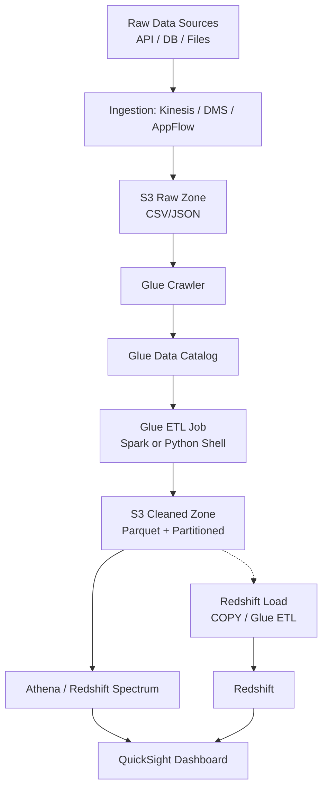
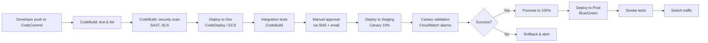

 
###  หนังสือ  AWS จากภาคทฤษฎีไปภาคปฏิบัติ  
---
**📘 AWS จากภาคทฤษฎีไปภาคปฏิบัติ** 
**✍️ ผู้เขียน:** คงนคร จันทะคุณ  
**📅 อัปเดตล่าสุด:** เมษายน 2026  
**หมายเหตุ เนื้อหาในหนังสือ:**  
เนื้อหาในหนังสือ "AWS จากภาคทฤษฎีไปภาคปฏิบัติ" ใช้ AI ช่วยเขียน เพื่อทดสอบ AI Model ผู้เขียนเป็นผู้ออกแบบ ใช้ AI ช่วยจัดเรียง ซึ่งมีค่าใช้จ่ายพอสมควร ให้ใช้ฟรีก่อน ต้องการสนับสนุนเพื่อทำเนื้อหาแนวนี้ต่อ สามารถให้การสนับสนุนได้ครับ ตามกำลังศรัทธา 
📞 โทรศัพท์ / พร้อมเพย์: **0955088091**  

---

# 📘 สารบัญ (Table of Contents) เล่ม 2

**หนังสือ “AWS จากภาคทฤษฎีไปภาคปฏิบัติ”**  
*“AWS From Theory to Practice”*

| บทที่ | หัวข้อ | หน้า |
|-------|--------|------|
| 15 | AWS Certified Advanced Networking – Specialty (ANS) | 460 |
| 16 | AWS Certified Data Engineer – Associate (DEA) | 490 |
| 17 | AWS Certified DevOps Engineer – Professional (DOP) | 520 |
| ภาคผนวก | เทมเพลต โค้ดตัวอย่าง และเฉลยแบบฝึกหัด | 550 |

 
# 📘 บทที่ 15: AWS Certified Advanced Networking – Specialty (ANS-C01)  
## Chapter 15: AWS Certified Advanced Networking – Specialty (ANS-C01)  

---

## 🧱 โครงสร้างการทำงาน (Work Structure)  

**ไทย:**  
บทนี้เจาะลึกใบรับรอง AWS Certified Advanced Networking – Specialty (ANS-C01) สำหรับผู้ที่มีประสบการณ์ด้านเครือข่ายและต้องการพิสูจน์ทักษะการออกแบบ, implement, และจัดการโซลูชันเครือข่ายบน AWS ที่ซับซ้อน เนื้อหาครอบคลุมการออกแบบ VPC ขั้นสูง, การเชื่อมต่อ hybrid (VPN, Direct Connect), การทำ routing ข้ามภูมิภาค, การรักษาความปลอดภัยเครือข่าย, และการ optimize performance พร้อมตัวอย่างการใช้ AWS SDK สำหรับ Go ในการจัดการทรัพยากรเครือข่าย  

**English:**  
This chapter dives into the AWS Certified Advanced Networking – Specialty (ANS-C01) certification for those with networking experience who want to validate their skills in designing, implementing, and managing complex network solutions on AWS. It covers advanced VPC design, hybrid connectivity (VPN, Direct Connect), cross‑region routing, network security, and performance optimization, with examples of using the AWS SDK for Go to manage networking resources.  

---

## 🎯 วัตถุประสงค์แบบสั้นสำหรับทบทวน (Short Revision Objective)  

**ไทย:**  
เพื่อให้ผู้อ่านเข้าใจโครงสร้างข้อสอบ ANS-C01, เนื้อหาทั้ง 6 โดเมน, บริการเครือข่ายขั้นสูงของ AWS (Transit Gateway, Direct Connect, Route53 Resolver, Global Accelerator, VPC Lattice, etc.), และสามารถเตรียมตัวสอบ รวมถึงการเขียน Go เพื่อจัดการ VPC, Route53, และตรวจสอบเครือข่าย  

**English:**  
To enable readers to understand the ANS-C01 exam structure, six domains, advanced AWS networking services (Transit Gateway, Direct Connect, Route53 Resolver, Global Accelerator, VPC Lattice, etc.), and prepare effectively, including writing Go to manage VPC, Route53, and network monitoring.  

---

## 👥 กลุ่มเป้าหมาย (Target Audience)  

- Network Engineer / Architect ที่ทำงานบน AWS  
- Cloud Architect ที่ต้องออกแบบ hybrid และ multi‑region network  
- DevOps ที่ต้องจัดการ network infrastructure  
- ผู้ที่สอบผ่าน Solutions Architect Associate หรือ Professional แล้วต้องการต่อยอดด้านเครือข่าย  

---

## 📚 ความรู้พื้นฐาน (Prerequisites)  

- ความรู้เครือข่ายระดับกลางถึงสูง (OSI model, routing protocols (BGP), subnetting, VLAN, VPN, DNS)  
- ประสบการณ์ AWS อย่างน้อย 2 ปี รวมถึง VPC, Direct Connect, VPN, Transit Gateway  
- แนะนำให้สอบ Solutions Architect Associate หรือ Professional มาก่อน  

---

## 📝 เนื้อหาโดยย่อ (Abstract)  

**ไทย:**  
บทนี้สรุปข้อสอบ ANS-C01: จำนวนข้อ, เวลา, โดเมนหลัก 6 ด้าน (Design, Implementation, Security, Automation, Troubleshooting, Hybrid/Edge) พร้อมตัวอย่างคำถามระดับยาก, บริการที่ต้องรู้ลึก (VPC, VPN, Direct Connect, Transit Gateway, Route53, Global Accelerator, CloudFront, VPC Lattice, Network Firewall, etc.), และการเขียน Go เพื่อ automate การสร้าง VPC, Route53 records, และตรวจสอบ network metrics  

**English:**  
This chapter summarizes the ANS-C01 exam: number of questions, time, six domains (Design, Implementation, Security, Automation, Troubleshooting, Hybrid/Edge), sample difficult questions, essential services (VPC, VPN, Direct Connect, Transit Gateway, Route53, Global Accelerator, CloudFront, VPC Lattice, Network Firewall, etc.), and writing Go to automate VPC creation, Route53 records, and monitor network metrics.  

---

## 🔰 บทนำ (Introduction)  

**ไทย:**  
AWS Certified Advanced Networking – Specialty (ANS-C01) เป็นใบรับรองระดับ Specialty สำหรับผู้เชี่ยวชาญด้านเครือข่าย ข้อสอบจะทดสอบความสามารถในการออกแบบและ implement โซลูชันเครือข่ายที่ซับซ้อนบน AWS รวมถึงการเชื่อมต่อระหว่าง on‑premise และ AWS (hybrid), การทำ routing ข้าม region และข้าม VPC, การรักษาความปลอดภัยเครือข่าย (firewall, DDoS protection), และการ optimize performance สำหรับแอปพลิเคชันระดับโลก การสอบนี้เหมาะสำหรับ network engineer ที่มีประสบการณ์และต้องการพิสูจน์ความเชี่ยวชาญ  

**English:**  
The AWS Certified Advanced Networking – Specialty (ANS-C01) is a Specialty‑level certification for networking professionals. The exam tests the ability to design and implement complex network solutions on AWS, including hybrid connectivity (on‑premises to AWS), cross‑region and cross‑VPC routing, network security (firewalls, DDoS protection), and performance optimization for global applications. This exam suits experienced network engineers who want to validate their expertise.  

---

## 📖 บทนิยาม (Definitions)  

| คำศัพท์ (Term) | คำจำกัดความไทย (Thai Definition) | English Definition |
|----------------|----------------------------------|--------------------|
| VPC (Virtual Private Cloud) | เครือข่ายส่วนตัวใน AWS | Isolated network in AWS. |
| Subnet | ช่วงย่อยของ IP ภายใน VPC (public หรือ private) | IP range subdivision within a VPC (public or private). |
| Route Table | ตารางกำหนดเส้นทางของ traffic ใน VPC | Table defining traffic routing within a VPC. |
| Internet Gateway (IGW) | gateway สำหรับเชื่อมต่อ VPC กับ internet | Gateway connecting VPC to the internet. |
| NAT Gateway | ให้ instances ใน private subnet ออก internet (แต่ภายนอกเข้าหาไม่ได้) | Allows private subnet instances to access internet (but not inbound). |
| VPN (Virtual Private Network) | การเชื่อมต่อ encrypted ผ่าน internet ระหว่าง on‑premise กับ AWS | Encrypted connection over internet between on‑premises and AWS. |
| Direct Connect (DX) | การเชื่อมต่อ dedicated, private ระหว่าง on‑premise กับ AWS | Dedicated, private connection between on‑premises and AWS. |
| Transit Gateway (TGW) | Hub สำหรับเชื่อมต่อ VPC, VPN, DX หลายๆ จุด | Hub connecting multiple VPCs, VPNs, DX. |
| VPC Peering | การเชื่อมต่อตรงระหว่างสอง VPC (ไม่ผ่าน TGW) | Direct connection between two VPCs (no TGW). |
| Route53 Resolver | ให้ DNS resolution สำหรับ hybrid network (on‑premise ↔ AWS) | DNS resolution for hybrid networks. |
| Global Accelerator | บริการ加速 traffic ทั่วโลกด้วย Anycast IP | Global traffic acceleration using Anycast IP. |
| VPC Lattice | บริการเชื่อมต่อ service ข้าม VPC และ account แบบ application‑layer | Cross‑VPC/cross‑account service connectivity at application layer. |
| Network Firewall | Managed firewall สำหรับ VPC (stateful, 规则-based) | Managed firewall for VPC (stateful, rule‑based). |

---

## 🔧 ANS-C01 คืออะไร? มีเนื้อหาอะไรบ้าง?  

### 1. ANS-C01 คืออะไร  
**ไทย:**  
ANS-C01 คือรหัสข้อสอบ AWS Certified Advanced Networking – Specialty (อัปเดตล่าสุด 2022-2023) ทดสอบความสามารถในการออกแบบ, implement, และ troubleshoot โซลูชันเครือข่ายบน AWS ที่ซับซ้อน โดยเฉพาะ hybrid networking, routing ขั้นสูง, และ security  

**English:**  
ANS-C01 is the exam code for AWS Certified Advanced Networking – Specialty (latest update 2022-2023). It tests the ability to design, implement, and troubleshoot complex network solutions on AWS, especially hybrid networking, advanced routing, and security.  

### 2. เนื้อหาข้อสอบแบ่งเป็น 6 โดเมน (Domains)  

| โดเมน (Domain) | น้ำหนัก (Weight) | หัวข้อหลัก (Key topics) |
|----------------|------------------|--------------------------|
| Network Design | 22% | VPC design (CIDR, subnet sizing, multi‑AZ), hybrid connectivity (DX, VPN), routing policies (static, BGP), high availability, disaster recovery |
| Network Implementation | 18% | การสร้าง VPC, subnets, route tables, IGW, NAT, VPC peering, Transit Gateway, VPN, Direct Connect, Global Accelerator, VPC Lattice |
| Network Security | 20% | Security groups, NACLs, AWS WAF, AWS Shield, Network Firewall, encryption in transit (TLS, IPsec), VPC endpoints (Gateway, Interface) |
| Network Automation | 12% | Infrastructure as Code (CloudFormation, Terraform), AWS CLI, SDK (Go, Python), AWS Config rules, VPC Flow Logs automation |
| Network Troubleshooting | 14% | การวิเคราะห์ VPC Flow Logs, Route Analyzer, Reachability Analyzer, CloudWatch metrics, X-Ray, packet capture, BGP troubleshooting |
| Hybrid & Edge Networking | 14% | Direct Connect (public, private, transit VIF), VPN CloudHub, Transit Gateway + DX, Route53 Resolver (inbound/outbound endpoints), AWS Outposts, Local Zones |

### 3. รูปแบบข้อสอบ  

| รายการ | รายละเอียด |
|--------|-------------|
| จำนวนข้อ | 65 (รวม 15 ข้อที่ไม่นับคะแนน) |
| เวลา | 170 นาที (2 ชั่วโมง 50 นาที) |
| รูปแบบ | Multiple choice, multiple answer |
| คะแนนผ่าน | 750/1000 (75%) |
| ค่าสอบ | 300 USD |
| ภาษา | อังกฤษ, ญี่ปุ่น, เกาหลี, จีน |

### 4. บริการที่ต้องรู้ลึกสำหรับ ANS  

| บริการ | ความสำคัญ | หัวข้อที่ต้องรู้ |
|--------|------------|----------------|
| VPC | สูงมาก | CIDR, subnets, route tables, IGW, NAT, endpoints, peering |
| Transit Gateway | สูงมาก | attachments, route tables, cross‑region peering, multicast, appliance mode |
| Direct Connect | สูงมาก | public/private/transit VIF, LAG, MACsec, BGP, DX Gateway |
| VPN (Site‑to‑Site) | สูง | VPN CloudHub, dynamic routing (BGP), tunnel options, acceleration |
| Route53 | สูง | Resolver (inbound/outbound), private hosted zones, routing policies (failover, latency, geolocation, weighted) |
| Global Accelerator | ปานกลาง | anycast IP, endpoint groups, health checks, traffic dial |
| VPC Lattice | ใหม่ (ปานกลาง) | service network, target groups, auth policies |
| Network Firewall | ปานกลาง | stateful rule groups, suricata format, logging |
| CloudFront | ปานกลาง | origin shield, custom headers, lambda@edge, field‑level encryption |
| VPC Flow Logs | สูง | log format, query with Athena, troubleshooting |

### 5. ตัวอย่างคำถาม (Sample Question – ระดับยาก)  

**คำถาม:** บริษัทมี on‑premise data center 2 แห่ง (ในประเทศ A และ B) และ AWS region 3 แห่ง (us-east-1, eu-west-1, ap-southeast-1) ต้องการเชื่อมต่อทุก site ด้วยความหน่วงต่ำและมี failover อัตโนมัติ ควรออกแบบอย่างไร  

A. สร้าง Direct Connect จากแต่ละ data center ไปยัง region ที่ใกล้ที่สุด แล้วใช้ Transit Gateway เชื่อมต่อระหว่าง region  
B. สร้าง VPN tunnels ระหว่าง data center ทั้งหมด  
C. ใช้ VPC peering เชื่อมต่อทุก VPC และทำ VPN จาก data center ไปยัง VPC หลัก  
D. ใช้ Global Accelerator สำหรับทุกการเชื่อมต่อ  

**เฉลย:** A (Direct Connect + Transit Gateway ให้ความหน่วงต่ำและ routing แบบ mesh ผ่าน TGW, cross‑region peering ของ TGW เชื่อมภูมิภาค)  

---

## 🔄 ออกแบบ Workflow (Workflow Design)  

### ภาพรวม: Hybrid Network ด้วย Direct Connect + Transit Gateway  

**ไทย:**  
On‑premise router → Direct Connect (private VIF) → Direct Connect Gateway → Transit Gateway → VPC attachments (หลาย VPC) → ภายใน AWS อาจมี TGW peering ข้าม region  

**English:**  
On‑premises router → Direct Connect (private VIF) → Direct Connect Gateway → Transit Gateway → VPC attachments (multiple VPCs) → optionally TGW peering across regions.  

### Mermaid Flowchart  

```mermaid
flowchart TB
    OnPrem[On-Premise Router] --> DX[Direct Connect]
    DX --> DXG[Direct Connect Gateway]
    DXG --> TGW[Transit Gateway]
    TGW --> VPC1[VPC A - Production]
    TGW --> VPC2[VPC B - Shared Services]
    TGW --> VPC3[VPC C - Dev/Test]
    TGW -.-> TGW2[Transit Gateway Peering<br/>(cross-region)]
    TGW2 --> VPC4[VPC D - DR Region]
```

### คำอธิบายแบบละเอียด (Detailed Explanation)  

| ขั้นตอน | คำอธิบาย (ไทย) | Explanation (English) |
|---------|----------------|------------------------|
| 1 | On‑premise router เชื่อมต่อ AWS ผ่าน Direct Connect (private VIF) | On‑premises router connects via Direct Connect private VIF. |
| 2 | Direct Connect Gateway (DX Gateway) ทำหน้าที่รวม DX VIF หลายอันเข้าด้วยกัน และเชื่อมต่อไปยัง Transit Gateway | DX Gateway aggregates multiple DX VIFs and connects to Transit Gateway. |
| 3 | Transit Gateway (TGW) ทำหน้าที่เป็น hub เชื่อมต่อ VPC หลายตัวเข้าด้วยกัน | TGW acts as hub connecting multiple VPCs. |
| 4 | TGW สามารถ peering กับ TGW ในอีก region เพื่อขยาย connectivity ข้ามภูมิภาค | TGW can peer with another TGW in a different region for cross‑region connectivity. |
| 5 | VPC ต่างๆ สามารถสื่อสารกันผ่าน TGW โดยไม่ต้องมี VPC peering แบบ一对一 | VPCs communicate via TGW without need for one‑to‑one peering. |

---

## 💻 ตัวอย่างโค้ดที่รันได้จริง (Runnable Code Example)  

### 1. การสร้าง VPC และ Subnet ด้วย Go SDK  

```go
// create_vpc.go
// สร้าง VPC, subnet, internet gateway, route table ด้วย Go SDK
// Create VPC, subnet, internet gateway, route table using Go SDK

package main

import (
	"context"
	"fmt"
	"log"

	"github.com/aws/aws-sdk-go-v2/config"
	"github.com/aws/aws-sdk-go-v2/service/ec2"
	"github.com/aws/aws-sdk-go-v2/service/ec2/types"
)

func main() {
	cfg, err := config.LoadDefaultConfig(context.TODO(), config.WithRegion("us-east-1"))
	if err != nil {
		log.Fatal(err)
	}
	client := ec2.NewFromConfig(cfg)

	// 1. สร้าง VPC (CIDR 10.0.0.0/16)
	vpcResp, err := client.CreateVpc(context.TODO(), &ec2.CreateVpcInput{
		CidrBlock: stringPtr("10.0.0.0/16"),
	})
	if err != nil {
		log.Fatal(err)
	}
	vpcId := *vpcResp.Vpc.VpcId
	fmt.Printf("Created VPC: %s\n", vpcId)

	// 2. สร้าง Internet Gateway
	igwResp, err := client.CreateInternetGateway(context.TODO(), &ec2.CreateInternetGatewayInput{})
	if err != nil {
		log.Fatal(err)
	}
	igwId := *igwResp.InternetGateway.InternetGatewayId
	fmt.Printf("Created IGW: %s\n", igwId)

	// 3. Attach IGW กับ VPC
	_, err = client.AttachInternetGateway(context.TODO(), &ec2.AttachInternetGatewayInput{
		InternetGatewayId: &igwId,
		VpcId:             &vpcId,
	})
	if err != nil {
		log.Fatal(err)
	}

	// 4. สร้าง Subnet (public)
	subnetResp, err := client.CreateSubnet(context.TODO(), &ec2.CreateSubnetInput{
		VpcId:            &vpcId,
		CidrBlock:        stringPtr("10.0.1.0/24"),
		AvailabilityZone: stringPtr("us-east-1a"),
	})
	if err != nil {
		log.Fatal(err)
	}
	subnetId := *subnetResp.Subnet.SubnetId
	fmt.Printf("Created Subnet: %s\n", subnetId)

	// 5. สร้าง Route Table และ route ไป IGW
	rtResp, err := client.CreateRouteTable(context.TODO(), &ec2.CreateRouteTableInput{
		VpcId: &vpcId,
	})
	if err != nil {
		log.Fatal(err)
	}
	rtId := *rtResp.RouteTable.RouteTableId

	_, err = client.CreateRoute(context.TODO(), &ec2.CreateRouteInput{
		RouteTableId:         &rtId,
		DestinationCidrBlock: stringPtr("0.0.0.0/0"),
		GatewayId:            &igwId,
	})
	if err != nil {
		log.Fatal(err)
	}

	// 6. Associate route table กับ subnet
	_, err = client.AssociateRouteTable(context.TODO(), &ec2.AssociateRouteTableInput{
		RouteTableId: &rtId,
		SubnetId:     &subnetId,
	})
	if err != nil {
		log.Fatal(err)
	}

	fmt.Println("VPC setup complete!")
}

func stringPtr(s string) *string { return &s }
```

### 2. การสร้าง Route53 Private Hosted Zone และบันทึก  

```go
// route53_private_zone.go
// สร้าง private hosted zone ใน VPC และเพิ่ม A record
// Create private hosted zone within VPC and add A record

package main

import (
	"context"
	"fmt"
	"log"

	"github.com/aws/aws-sdk-go-v2/config"
	"github.com/aws/aws-sdk-go-v2/service/route53"
	"github.com/aws/aws-sdk-go-v2/service/route53/types"
)

func main() {
	cfg, err := config.LoadDefaultConfig(context.TODO())
	if err != nil {
		log.Fatal(err)
	}
	client := route53.NewFromConfig(cfg)

	vpcId := "vpc-12345678"   // VPC ID ที่ต้องการ关联
	zoneName := "internal.example.com"

	// สร้าง private hosted zone
	resp, err := client.CreateHostedZone(context.TODO(), &route53.CreateHostedZoneInput{
		Name: &zoneName,
		VPC: &types.VPC{
			VPCId:     &vpcId,
			VPCRegion: types.VPCRegionUsEast1,
		},
		CallerReference: stringPtr("ref-12345"),
	})
	if err != nil {
		log.Fatal(err)
	}
	zoneId := *resp.HostedZone.Id
	fmt.Printf("Created private hosted zone: %s (ID: %s)\n", zoneName, zoneId)

	// เพิ่ม A record
	recordName := "api.internal.example.com"
	recordValue := "10.0.1.100"

	_, err = client.ChangeResourceRecordSets(context.TODO(), &route53.ChangeResourceRecordSetsInput{
		HostedZoneId: &zoneId,
		ChangeBatch: &types.ChangeBatch{
			Changes: []types.Change{
				{
					Action: types.ChangeActionCreate,
					ResourceRecordSet: &types.ResourceRecordSet{
						Name: &recordName,
						Type: types.RRTypeA,
						TTL:  int64Ptr(300),
						ResourceRecords: []types.ResourceRecord{
							{Value: &recordValue},
						},
					},
				},
			},
		},
	})
	if err != nil {
		log.Fatal(err)
	}
	fmt.Printf("Added A record: %s -> %s\n", recordName, recordValue)
}

func int64Ptr(i int64) *int64 { return &i }
```

### 3. การเปิด VPC Flow Logs และส่งไปยัง CloudWatch  

```go
// vpc_flow_logs.go
// เปิด VPC Flow Logs สำหรับ VPC และส่ง logs ไปยัง CloudWatch Logs
// Enable VPC Flow Logs for a VPC and send logs to CloudWatch Logs

func enableFlowLogs(client *ec2.Client, vpcId, logGroupName string) error {
	_, err := client.CreateFlowLogs(context.TODO(), &ec2.CreateFlowLogsInput{
		ResourceIds: []string{vpcId},
		ResourceType: types.FlowLogsResourceTypeVpc,
		TrafficType:  types.TrafficTypeAll,
		LogDestinationType: types.LogDestinationTypeCloudWatchLogs,
		LogGroupName: &logGroupName,
		DeliverLogsPermissionArn: stringPtr("arn:aws:iam::ACCOUNT:role/FlowLogsRole"),
	})
	return err
}
```

---

## 📌 กรณีศึกษาและแนวทางแก้ไขปัญหา (Case Study & Troubleshooting)  

### กรณีศึกษา: การ troubleshoot connectivity ระหว่าง on‑premise และ VPC  

**ปัญหา:** หลังตั้งค่า Direct Connect และ VPN backup แล้ว traffic บางส่วนไม่สามารถเข้าถึง VPC ได้  
**แนวทางแก้ไข (ตาม ANS):**  
- ตรวจสอบ route tables บน TGW และ VPC ว่า route ไปยัง DX หรือ VPN ถูกต้อง  
- ใช้ Reachability Analyzer ตรวจสอบเส้นทางจาก on‑premise IP ไปยัง destination IP ใน VPC  
- ตรวจสอบ BGP session (ถ้าใช้ dynamic routing) ว่า received routes ถูกต้อง  
- ดู VPC Flow Logs ว่า packets ถูก drop ที่ security group หรือ NACL หรือไม่  
**ผลลัพธ์:** พบว่า route table บน TGW ไม่มี route กลับไปยัง DX Gateway, เพิ่ม route แล้วแก้ไขได้  

### ปัญหาที่พบบ่อยในการสอบ ANS  

| ปัญหา (Issue) | สาเหตุ (Cause) | วิธีแก้ไข (Solution) |
|----------------|----------------|----------------------|
| งบประมาณสูง | ใช้ Direct Connect ไม่ถูกต้อง | ใช้ VPN เป็น backup หรือใช้ DX ในโหมด "hosted" สำหรับปริมาณน้อย |
| routing loop | TGW route table configuration ผิด | ใช้ static routes หรือ BGP attributes (local preference, AS path) เพื่อควบคุมเส้นทาง |
| DNS resolution ล้มเหลวใน hybrid | ไม่ได้ตั้ง Route53 Resolver | ตั้ง inbound/outbound endpoints เพื่อ forward queries ระหว่าง on‑premise DNS และ AWS |
| รู้สึกว่า VPC peering กับ TGW ต่างกันอย่างไร | VPC peering = 一对一, ไม่ support transitive; TGW = hub-and-spoke, support transitive | จดจำ: ใช้ TGW เมื่อมี VPC มากกว่า 2-3 ตัว |
| การรักษาความปลอดภัย | ใช้ security group และ NACL ไม่ถูกต้อง | Security group (stateful) ที่ instance level; NACL (stateless) ที่ subnet level |

---

## 📁 เทมเพลตและตัวอย่างเพิ่มเติม  

### แผนการเตรียมตัว 12 สัปดาห์ (ANS-C01)  

| สัปดาห์ | กิจกรรม |
|---------|---------|
| 1 | ทบทวน networking fundamentals (OSI, TCP/IP, routing, BGP, DNS) |
| 2 | VPC ขั้นสูง: CIDR, subnet, route tables, IGW, NAT, endpoints, peering |
| 3 | Transit Gateway: attachments, route tables, cross‑region peering |
| 4 | Direct Connect: public/private/transit VIF, LAG, MACsec, DX Gateway |
| 5 | VPN: site‑to‑site, VPN CloudHub, BGP, acceleration |
| 6 | Route53: private hosted zones, resolver, routing policies |
| 7 | Global Accelerator, CloudFront, VPC Lattice |
| 8 | Network Security: Security groups, NACL, WAF, Shield, Network Firewall, encryption |
| 9 | Automation: CloudFormation, CDK, CLI, SDK, Config rules |
| 10 | Monitoring & Troubleshooting: VPC Flow Logs, Reachability Analyzer, CloudWatch, X-Ray |
| 11 | Hybrid & Edge: Outposts, Local Zones, IoT Core networking |
| 12 | ทำ practice exam 3-5 ชุด, ทบทวนจุดอ่อน, สอบจริง |

### Checklist ก่อนสอบ ANS  

- [ ] รู้ CIDR calculation และ subnet sizing  
- [ ] รู้ความแตกต่างระหว่าง VPC Peering และ Transit Gateway  
- [ ] รู้วิธีตั้ง Direct Connect (public/private/transit VIF) และ DX Gateway  
- [ ] รู้ BGP basics (ASN, peering, route advertisement, local preference, MED)  
- [ ] รู้วิธีทำ VPN แบบ static และ dynamic routing  
- [ ] รู้ Route53 resolver inbound/outbound  
- [ ] รู้วิธีใช้ VPC Flow Logs และ Athena วิเคราะห์  
- [ ] รู้ Reachability Analyzer และ Network Manager  
- [ ] รู้ AWS Network Firewall rule groups  
- [ ] รู้ Global Accelerator กับ CloudFront ต่างกันอย่างไร  

---

## 📊 ตารางเปรียบเทียบ VPC Peering vs Transit Gateway  

| คุณสมบัติ | VPC Peering | Transit Gateway |
|-----------|-------------|------------------|
| Topology | point‑to‑point | hub‑and‑spoke |
| Transitive routing | ไม่ | ใช่ (ผ่าน TGW) |
| ข้ามบัญชี | ใช่ | ใช่ (ผ่าน RAM) |
| ข้าม region | ใช่ (inter-region peering) | ใช่ (TGW peering) |
| การจัดการ route | manual หรือ auto (ไม่ซับซ้อน) | route tables แยกต่อ attachment |
| Scaling | limit 125 peerings ต่อ VPC | รองรับ 5000 attachments ต่อ TGW |
| ราคา | ถูกกว่าสำหรับการเชื่อมต่อน้อย | คุ้มกว่าสำหรับการเชื่อมต่อมาก |

---

## 📝 สรุป (Summary)  

### ✅ ประโยชน์ที่ได้รับ (Benefits)  
- พิสูจน์ทักษะ networking ขั้นสูงบน AWS  
- ออกแบบ hybrid network ที่ปลอดภัยและ scalable  
- เงินเดือนและตำแหน่งสูงขึ้นสำหรับ network specialist  
- สามารถ troubleshoot ปัญหาเครือข่ายที่ซับซ้อนได้  

### ⚠️ ข้อควรระวัง (Cautions)  
- ต้องมีความรู้ networking มาก่อน (ไม่เหมาะสำหรับผู้เริ่มต้น)  
- ค่าสอบแพง (300 USD)  
- เนื้อหาลึกและกว้าง ต้องใช้เวลาเตรียม 2-3 เดือน  

### 👍 ข้อดี (Advantages)  
- เป็นใบรับรองที่หายากและมีค่า  
- ครอบคลุม hybrid และ modern networking (VPC Lattice)  
- ใช้ automation กับ SDK ได้จริง  

### 👎 ข้อเสีย (Disadvantages)  
- ต้องอัปเดตความรู้บริการใหม่ ๆ (เช่น VPC Lattice)  
- ข้อสอบยาก อัตราการผ่านต่ำ  
- ไม่มี lab ปฏิบัติ (ต่างจาก Professional บางตัว)  

### 🚫 ข้อห้าม (Prohibitions)  
- ห้ามใช้ default VPC สำหรับ production (ต้องออกแบบเอง)  
- ห้ามเปิด security group หรือ NACL แบบกว้างเกินไป (0.0.0.0/0) โดยไม่จำเป็น  
- ห้ามใช้ VPC peering แทน TGW เมื่อมีการเชื่อมต่อมากกว่า 5 VPC  

---

## 🧩 แบบฝึกหัดท้ายบท (Exercises)  

**ข้อ 1:** ANS-C01 มีน้ำหนักของโดเมน "Network Design" กี่เปอร์เซ็นต์  
**ข้อ 2:** ความแตกต่างหลักระหว่าง Internet Gateway กับ NAT Gateway คืออะไร  
**ข้อ 3:** หากต้องการเชื่อมต่อ VPC จำนวน 10 VPC ใน region เดียวกันด้วยต้นทุนการดูแลที่ต่ำ ควรใช้บริการใด  
**ข้อ 4:** Direct Connect Gateway (DX Gateway) มีหน้าที่อะไร  
**ข้อ 5:** Route53 Resolver inbound endpoint ใช้ทำอะไร  
**ข้อ 6:** BGP ในบริบทของ AWS VPN ใช้ทำอะไร  
**ข้อ 7:** ข้อสอบ ANS-C01 มีจำนวนข้อและเวลาเท่าไร  
**ข้อ 8:** จงเขียน Go code เพื่อสร้าง Route53 A record ใน public hosted zone  
**ข้อ 9:** AWS Network Firewall แตกต่างจาก Security Group อย่างไร  
**ข้อ 10:** หากต้องการวิเคราะห์ VPC Flow Logs ด้วย SQL ควรใช้บริการใด  

---

## 🔐 เฉลยแบบฝึกหัด (Answer Key)  

**ข้อ 1:** 22%  
**ข้อ 2:** IGW ให้ inbound/outbound internet access สำหรับ public subnet; NAT Gateway ให้ outbound internet access สำหรับ private subnet (ไม่ให้ inbound)  
**ข้อ 3:** Transit Gateway (TGW)  
**ข้อ 4:** เชื่อมต่อ Direct Connect VIF หนึ่งตัวหรือหลายตัว เข้ากับ Transit Gateway หรือ VPC (ผ่าน VPC attachment)  
**ข้อ 5:** ให้ DNS queries จาก on‑premise มาที่ AWS Route53 private hosted zones ได้  
**ข้อ 6:** แลกเปลี่ยน route ระหว่าง AWS VPN endpoint และ on‑premise router แบบไดนามิก (dynamic routing)  
**ข้อ 7:** 65 ข้อ, 170 นาที  
**ข้อ 8:**  
```go
func createARecord(client *route53.Client, zoneId, name, value string) error {
    _, err := client.ChangeResourceRecordSets(context.TODO(), &route53.ChangeResourceRecordSetsInput{
        HostedZoneId: &zoneId,
        ChangeBatch: &types.ChangeBatch{
            Changes: []types.Change{{
                Action: types.ChangeActionUpsert,
                ResourceRecordSet: &types.ResourceRecordSet{
                    Name: &name,
                    Type: types.RRTypeA,
                    TTL: int64Ptr(300),
                    ResourceRecords: []types.ResourceRecord{{Value: &value}},
                },
            }},
        },
    })
    return err
}
```  
**ข้อ 9:** Security Group ทำงานที่ instance level, stateful; Network Firewall ทำงานที่ VPC level, stateful, รองรับ rule sets แบบ Suricata, ให้ centralized inspection  
**ข้อ 10:** Amazon Athena (query logs ที่เก็บใน S3)  

---

## 📚 แหล่งอ้างอิง (References)  

1. AWS Official Exam Guide – ANS-C01  
2. AWS VPC and Networking Documentation  
3. AWS Transit Gateway Guide  
4. Direct Connect User Guide  
5. TutorialsDojo – ANS-C01 Practice Exams  
6. AWS Networking Workshops (GitHub)  

---

**✍️ ผู้เขียน:** คงนคร จันทะคุณ  
**📅 อัปเดตล่าสุด:** เมษายน 2026  

**หมายเหตุ เนื้อหาในหนังสือ:**  
เนื้อหาในหนังสือ "AWS จากภาคทฤษฎีไปภาคปฏิบัติ" ใช้ AI ช่วยเขียน เพื่อทดสอบ AI Model ผู้เขียนเป็นผู้ออกแบบ ใช้ AI ช่วยจัดเรียง ซึ่งมีค่าใช้จ่ายพอสมควร ให้ใช้ฟรีก่อน ต้องการสนับสนุนเพื่อทำเนื้อหาแนวนี้ต่อ สามารถให้การสนับสนุนได้ครับ ตามกำลังศรัทธา  
📞 โทรศัพท์ / พร้อมเพย์: **0955088091**
# 📘 บทที่ 16: AWS Certified Data Engineer – Associate (DEA-C01)  
## Chapter 16: AWS Certified Data Engineer – Associate (DEA-C01)  

---

## 🧱 โครงสร้างการทำงาน (Work Structure)  

**ไทย:**  
บทนี้เจาะลึกใบรับรอง AWS Certified Data Engineer – Associate (DEA-C01) ซึ่งเป็นใบรับรองใหม่ล่าสุดของ AWS (เปิดตัวต้นปี 2024) สำหรับผู้ที่ทำงานด้าน data engineering บน AWS โดยเฉพาะ เนื้อหาครอบคลุมการออกแบบและจัดการ data pipeline, การจัดเก็บข้อมูล (data lakes, data warehouses), การทำ ETL/ELT, การตรวจสอบคุณภาพข้อมูล, การทำ data governance, และการ optimize ประสิทธิภาพ พร้อมตัวอย่างการใช้ AWS Glue, Athena, Lake Formation, Redshift, Kinesis, Step Functions และการเขียน Go สำหรับ data pipeline  

**English:**  
This chapter dives into the AWS Certified Data Engineer – Associate (DEA-C01) certification, the newest credential from AWS (launched early 2024) for those specifically working in data engineering on AWS. It covers designing and managing data pipelines, data storage (data lakes, data warehouses), ETL/ELT, data quality, data governance, and performance optimization, with examples using AWS Glue, Athena, Lake Formation, Redshift, Kinesis, Step Functions, and writing Go for data pipelines.  

---

## 🎯 วัตถุประสงค์แบบสั้นสำหรับทบทวน (Short Revision Objective)  

**ไทย:**  
เพื่อให้ผู้อ่านเข้าใจโครงสร้างข้อสอบ DEA-C01, เนื้อหาทั้ง 5 โดเมน, บริการ data engineering บน AWS (Glue, Lake Formation, Redshift, Athena, Kinesis, MSK, EMR, Step Functions, etc.), และสามารถเตรียมตัวสอบ รวมถึงการออกแบบ data pipeline ที่มีประสิทธิภาพ, การจัดการ data catalog, และการทำ data quality checks  

**English:**  
To enable readers to understand the DEA-C01 exam structure, five domains, AWS data engineering services (Glue, Lake Formation, Redshift, Athena, Kinesis, MSK, EMR, Step Functions, etc.), and prepare effectively, including designing efficient data pipelines, managing data catalogs, and performing data quality checks.  

---

## 👥 กลุ่มเป้าหมาย (Target Audience)  

- Data Engineer ที่ทำงานบน AWS  
- Data Architect ที่ออกแบบ data platform  
- Data Analyst ที่ต้องการยกระดับสู่ data engineering  
- ผู้ที่สอบผ่าน AWS Cloud Practitioner หรือ Associate ตัวอื่นแล้วต้องการต่อยอดด้าน data  

---

## 📚 ความรู้พื้นฐาน (Prerequisites)  

- ประสบการณ์ data engineering อย่างน้อย 1-2 ปี  
- ความรู้ SQL (SELECT, JOIN, aggregation, window functions)  
- เข้าใจ ETL/ELT concepts, data modeling (star schema, snowflake)  
- แนะนำให้มีความรู้ Python หรือ Scala (Glue ETL ใช้ Python เป็นหลัก) แต่บทนี้จะมี Go สำหรับบางส่วน  

---

## 📝 เนื้อหาโดยย่อ (Abstract)  

**ไทย:**  
บทนี้สรุปข้อสอบ DEA-C01: จำนวนข้อ, เวลา, โดเมนหลัก 5 ด้าน (Data Ingestion, Storage, Processing, Governance & Security, Operations & Optimization) พร้อมตัวอย่างคำถาม, บริการที่ต้องรู้ลึก (Glue, Lake Formation, Redshift, Athena, Kinesis, MSK, EMR, Step Functions, S3, DynamoDB, etc.), และการเขียน Go เพื่อ automate data pipeline, เรียก Athena query, และจัดการ Glue jobs  

**English:**  
This chapter summarizes the DEA-C01 exam: number of questions, time, five domains (Data Ingestion, Storage, Processing, Governance & Security, Operations & Optimization), sample questions, essential services (Glue, Lake Formation, Redshift, Athena, Kinesis, MSK, EMR, Step Functions, S3, DynamoDB, etc.), and writing Go to automate data pipelines, run Athena queries, and manage Glue jobs.  

---

## 🔰 บทนำ (Introduction)  

**ไทย:**  
AWS Certified Data Engineer – Associate (DEA-C01) เป็นใบรับรองที่ออกแบบมาเฉพาะสำหรับ Data Engineer โดยเฉพาะ เพื่อทดสอบความสามารถในการสร้าง, จัดการ, และ optimize data pipelines บน AWS ซึ่งรวมถึงการ ingest ข้อมูลจากแหล่งต่างๆ, การ transform ด้วย ETL, การจัดเก็บใน data lake หรือ data warehouse, การทำ data catalog, และการตรวจสอบคุณภาพข้อมูล ใบรับรองนี้เหมาะสำหรับผู้ที่มีประสบการณ์ทำงานกับข้อมูลและต้องการพิสูจน์ทักษะ data engineering บน AWS โดยเฉพาะ  

**English:**  
The AWS Certified Data Engineer – Associate (DEA-C01) is a certification designed specifically for Data Engineers to validate their ability to build, manage, and optimize data pipelines on AWS. This includes ingesting data from various sources, transforming with ETL, storing in data lakes or data warehouses, cataloging data, and ensuring data quality. This certification suits those with data experience who want to prove their AWS data engineering skills.  

---

## 📖 บทนิยาม (Definitions)  

| คำศัพท์ (Term) | คำจำกัดความไทย (Thai Definition) | English Definition |
|----------------|----------------------------------|--------------------|
| Data Lake | ที่เก็บข้อมูลดิบทุกประเภท (structured, semi-structured, unstructured) ใน S3 | Centralized repository for raw data of all types in S3. |
| Data Warehouse | ที่เก็บข้อมูลที่ถูก transform แล้วสำหรับ analytics และ BI (เช่น Redshift) | Storage for transformed data for analytics and BI (e.g., Redshift). |
| ETL (Extract, Transform, Load) | ดึงข้อมูล → แปลง → โหลดไปยัง destination | Extract → Transform → Load to destination. |
| ELT (Extract, Load, Transform) | ดึง → โหลดข้อมูลดิบก่อน → แล้วค่อยแปลง (เหมาะกับ data lake) | Extract → Load raw data first → then transform. |
| Glue | บริการ ETL แบบ serverless (ใช้ Spark หรือ Python shell) | Serverless ETL service (Spark or Python shell). |
| Lake Formation | บริการสร้าง data lake และจัดการ permission แบบ fine‑grained | Service to build data lakes and manage fine‑grained permissions. |
| Redshift | Data warehouse แบบ columnar, petabyte-scale | Columnar data warehouse, petabyte‑scale. |
| Athena | Query ข้อมูลใน S3 โดยใช้ SQL (serverless) | Serverless SQL query on S3 data. |
| Kinesis | บริการ real‑time data streaming | Real‑time data streaming service. |
| MSK (Managed Streaming for Kafka) | Apache Kafka แบบ managed | Managed Apache Kafka. |
| EMR | Big data platform (Spark, Hive, HBase, etc.) | Big data platform (Spark, Hive, HBase, etc.). |
| Step Functions | orchestration workflow สำหรับ data pipeline | Workflow orchestration for data pipelines. |
| Data Catalog | Metadata repository สำหรับ tables, partitions, schemas (Glue Catalog) | Metadata repository for tables, partitions, schemas. |

---

## 🔧 DEA-C01 คืออะไร? มีเนื้อหาอะไรบ้าง?  

### 1. DEA-C01 คืออะไร  
**ไทย:**  
DEA-C01 คือรหัสข้อสอบ AWS Certified Data Engineer – Associate (เปิดตัวมีนาคม 2024) ทดสอบความสามารถในการออกแบบ, implement, และดูแล data pipeline บน AWS รวมถึง data ingestion, transformation, storage, cataloging, governance, และ performance optimization  

**English:**  
DEA-C01 is the exam code for AWS Certified Data Engineer – Associate (launched March 2024). It tests the ability to design, implement, and maintain data pipelines on AWS, including ingestion, transformation, storage, cataloging, governance, and performance optimization.  

### 2. เนื้อหาข้อสอบแบ่งเป็น 5 โดเมน (Domains)  

| โดเมน (Domain) | น้ำหนัก (Weight) | หัวข้อหลัก (Key topics) |
|----------------|------------------|--------------------------|
| Data Ingestion | 18% | การนำเข้าข้อมูลจากแหล่งต่างๆ (S3, RDS, on‑premise, streaming) โดยใช้ Glue, Kinesis, MSK, AppFlow, DMS, Transfer Family; การทำ batch vs real‑time |
| Data Storage | 22% | การเลือก storage ที่เหมาะสม (S3, Redshift, DynamoDB, RDS, EFS, EBS); การจัดการ data lifecycle (S3 lifecycle policies), compression (Parquet, ORC), partitioning |
| Data Processing | 26% | การทำ ETL/ELT ด้วย Glue (Spark, Python shell), EMR, Lambda, Step Functions; การ optimize performance (partitioning, bucketing, indexing); การใช้ Athena สำหรับ ad‑hoc queries |
| Data Governance & Security | 20% | การจัดการ permission (Lake Formation, IAM), data encryption (at rest, in transit), data masking, data catalog (Glue Catalog), data lineage, data quality (Glue Data Quality, Deequ) |
| Operations & Optimization | 14% | การ monitoring (CloudWatch, Glue metrics), logging (S3, CloudWatch), troubleshooting, cost optimization (Glue job auto scaling, Spot instances for EMR), automation (CloudFormation, CDK) |

### 3. รูปแบบข้อสอบ  

| รายการ | รายละเอียด |
|--------|-------------|
| จำนวนข้อ | 65 (รวม 15 ข้อที่ไม่นับคะแนน) |
| เวลา | 150 นาที (2 ชั่วโมง 30 นาที) |
| รูปแบบ | Multiple choice, multiple answer |
| คะแนนผ่าน | 720/1000 (~72%) |
| ค่าสอบ | 150 USD |
| ภาษา | อังกฤษ, ญี่ปุ่น, เกาหลี, จีน |

### 4. บริการที่ต้องรู้ลึกสำหรับ DEA  

| บริการ | บทบาท | รายละเอียด |
|--------|--------|-------------|
| S3 | Data lake | storage classes, lifecycle, versioning, replication, event notifications |
| Glue | ETL + Catalog | crawlers, ETL jobs (Spark, Python shell), job bookmarks, Data Quality, Workflows |
| Lake Formation | Governance | data lake setup, fine‑grained permissions, row/cell‑level security |
| Redshift | Data warehouse | cluster, Spectrum, RA3, concurrency scaling, Redshift Serverless |
| Athena | Query | workgroups, partitions, CTAS, federated queries |
| Kinesis | Streaming | Data Streams, Data Firehose, Data Analytics |
| MSK | Kafka | topics, producers, consumers, schema registry |
| EMR | Big data | clusters, notebooks, Spark, Hive, HBase |
| Step Functions | Orchestration | state machines, tasks, error handling, retry |
| DMS | Migration | CDC, full load, ongoing replication |
| AppFlow | SaaS integration | Salesforce, Zendesk, SAP, etc. to S3/Redshift |

### 5. ตัวอย่างคำถาม (Sample Question)  

**คำถาม:** คุณต้องการสร้าง data pipeline ที่อ่านข้อมูลจาก S3 (รูปแบบ CSV) ทุกชั่วโมง, transform เป็น Parquet, partition ด้วย year/month/day, และเขียนกลับไปยัง S3 คุณควรใช้บริการใด  

A. AWS Glue ETL job + Glue Workflows  
B. Amazon Redshift Spectrum  
C. AWS Lambda + S3 event notification  
D. Amazon EMR with Spark  

**เฉลย:** A (Glue ETL เหมาะกับ batch transformation, Glue Workflows สำหรับ scheduling)  

---

## 🔄 ออกแบบ Workflow (Workflow Design)  

### ภาพรวม: Data Pipeline สำหรับวิเคราะห์ยอดขาย (S3 → Glue → Redshift → QuickSight)  

**ไทย:**  
ข้อมูลดิบจากระบบขาย → อัปโหลดไป S3 raw zone → Glue Crawler สร้าง schema → Glue ETL job อ่าน raw, transform (clean, aggregate, join), เขียนเป็น Parquet → ข้อมูล cleaned ไป S3 cleaned zone → Redshift Spectrum หรือ Glue ETL อีกที load เข้า Redshift → Redshift สำหรับ BI query → QuickSight dashboard  

**English:**  
Raw sales data → uploaded to S3 raw zone → Glue Crawler creates schema → Glue ETL job reads raw, transforms (clean, aggregate, join), writes as Parquet → cleaned data to S3 cleaned zone → Redshift Spectrum or another Glue job loads into Redshift → Redshift for BI queries → QuickSight dashboard.  

### Mermaid Flowchart  



### คำอธิบายแบบละเอียด (Detailed Explanation)  

| ขั้นตอน | คำอธิบาย (ไทย) | Explanation (English) |
|---------|----------------|------------------------|
| 1 | ข้อมูลจากแหล่งต่างๆ ถูกส่งมายัง S3 raw zone ผ่าน Kinesis (real‑time), DMS (CDC), หรือ AppFlow (SaaS) | Data from various sources arrives in S3 raw zone via Kinesis, DMS, or AppFlow. |
| 2 | Glue Crawler อ่าน raw data และสร้าง schema ใน Glue Data Catalog | Glue Crawler reads raw data and creates schema in Glue Data Catalog. |
| 3 | Glue ETL job (Spark หรือ Python shell) อ่านจาก Catalog, ทำความสะอาด, แปลงเป็น Parquet, partition | Glue ETL job reads from Catalog, cleans, converts to Parquet, partitions. |
| 4 | Cleaned data ถูกเขียนไปยัง S3 cleaned zone (Parquet + partition) | Cleaned data written to S3 cleaned zone (Parquet + partitioned). |
| 5 | Athena หรือ Redshift Spectrum สามารถ query ข้อมูลใน cleaned zone ได้โดยตรง | Athena or Redshift Spectrum can directly query cleaned zone. |
| 6 | ถ้าต้องการ performance สูงขึ้น สามารถ load เข้า Redshift (COPY หรือ Glue) | For higher performance, load into Redshift (COPY or Glue). |
| 7 | QuickSight เชื่อมต่อกับ Athena หรือ Redshift เพื่อสร้าง dashboard | QuickSight connects to Athena or Redshift for dashboards. |

---

## 💻 ตัวอย่างโค้ดที่รันได้จริง (Runnable Code Example)  

### 1. การรัน Athena Query จาก Go (ทบทวนจากบทที่ 4)  

```go
// athena_query.go
// รัน SQL query บน Athena และอ่านผลลัพธ์จาก S3
// Run SQL query on Athena and read results from S3

package main

import (
	"context"
	"encoding/csv"
	"fmt"
	"log"
	"strings"
	"time"

	"github.com/aws/aws-sdk-go-v2/config"
	"github.com/aws/aws-sdk-go-v2/service/athena"
	"github.com/aws/aws-sdk-go-v2/service/athena/types"
	"github.com/aws/aws-sdk-go-v2/service/s3"
)

func main() {
	cfg, err := config.LoadDefaultConfig(context.TODO())
	if err != nil {
		log.Fatal(err)
	}
	athenaClient := athena.NewFromConfig(cfg)
	s3Client := s3.NewFromConfig(cfg)

	query := `
		SELECT 
			year, month, 
			SUM(sales_amount) as total_sales,
			COUNT(DISTINCT customer_id) as unique_customers
		FROM sales_db.sales_parquet
		WHERE year = 2026 AND month = 4
		GROUP BY year, month
	`
	resultBucket := "my-athena-results-bucket"
	outputLocation := fmt.Sprintf("s3://%s/results/", resultBucket)

	// Start query
	startResp, err := athenaClient.StartQueryExecution(context.TODO(), &athena.StartQueryExecutionInput{
		QueryString: &query,
		ResultConfiguration: &types.ResultConfiguration{
			OutputLocation: &outputLocation,
		},
	})
	if err != nil {
		log.Fatal(err)
	}

	// Poll for completion
	for {
		descResp, err := athenaClient.GetQueryExecution(context.TODO(), &athena.GetQueryExecutionInput{
			QueryExecutionId: startResp.QueryExecutionId,
		})
		if err != nil {
			log.Fatal(err)
		}
		if descResp.QueryExecution.Status.State == types.QueryExecutionStateSucceeded {
			break
		}
		time.Sleep(2 * time.Second)
	}

	// Read results from S3
	key := fmt.Sprintf("results/%s.csv", *startResp.QueryExecutionId)
	resp, err := s3Client.GetObject(context.TODO(), &s3.GetObjectInput{
		Bucket: &resultBucket,
		Key:    &key,
	})
	if err != nil {
		log.Fatal(err)
	}
	defer resp.Body.Close()

	reader := csv.NewReader(resp.Body)
	records, _ := reader.ReadAll()
	fmt.Println("Query Results:")
	for _, row := range records {
		fmt.Println(strings.Join(row, " | "))
	}
}
```

### 2. การเริ่มต้น Glue Job จาก Go (ผ่าน SDK)  

```go
// start_glue_job.go
// เริ่มต้น Glue ETL job และตรวจสอบสถานะ
// Start Glue ETL job and check status

package main

import (
	"context"
	"fmt"
	"log"
	"time"

	"github.com/aws/aws-sdk-go-v2/config"
	"github.com/aws/aws-sdk-go-v2/service/glue"
)

func main() {
	cfg, err := config.LoadDefaultConfig(context.TODO())
	if err != nil {
		log.Fatal(err)
	}
	client := glue.NewFromConfig(cfg)

	jobName := "sales_etl_job"
	// เริ่ม job
	startResp, err := client.StartJobRun(context.TODO(), &glue.StartJobRunInput{
		JobName: &jobName,
		Arguments: map[string]string{
			"--input_path":   "s3://my-bucket/raw/sales/",
			"--output_path":  "s3://my-bucket/cleaned/sales/",
		},
	})
	if err != nil {
		log.Fatal(err)
	}
	fmt.Printf("Started job run: %s\n", *startResp.JobRunId)

	// ตรวจสอบสถานะ (polling)
	for {
		descResp, err := client.GetJobRun(context.TODO(), &glue.GetJobRunInput{
			JobName:  &jobName,
			JobRunId: startResp.JobRunId,
		})
		if err != nil {
			log.Fatal(err)
		}
		state := descResp.JobRun.JobRunState
		fmt.Printf("Status: %s\n", state)
		if state == glue.JobRunStateSucceeded {
			fmt.Println("Job completed successfully!")
			break
		} else if state == glue.JobRunStateFailed || state == glue.JobRunStateStopped {
			errorMsg := ""
			if descResp.JobRun.ErrorMessage != nil {
				errorMsg = *descResp.JobRun.ErrorMessage
			}
			log.Fatalf("Job failed: %s", errorMsg)
		}
		time.Sleep(10 * time.Second)
	}
}
```

### 3. การสร้าง Glue Crawler จาก Go  

```go
// create_crawler.go
// สร้าง Glue Crawler เพื่อสแกน S3 และอัปเดต Data Catalog
// Create Glue Crawler to scan S3 and update Data Catalog

func createCrawler(client *glue.Client, crawlerName, s3Path, databaseName, roleArn string) error {
	_, err := client.CreateCrawler(context.TODO(), &glue.CreateCrawlerInput{
		Name: &crawlerName,
		Role: &roleArn,
		DatabaseName: &databaseName,
		Targets: &glue.CrawlerTargets{
			S3Targets: []glue.S3Target{
				{
					Path: &s3Path,
				},
			},
		},
		SchemaChangePolicy: &glue.SchemaChangePolicy{
			UpdateBehavior: glue.UpdateBehaviorUpdateCatalog,
			DeleteBehavior: glue.DeleteBehaviorDeprecateInDatabase,
		},
	})
	return err
}
```

---

## 📌 กรณีศึกษาและแนวทางแก้ไขปัญหา (Case Study & Troubleshooting)  

### กรณีศึกษา: การปรับ Glue ETP job ให้ทำงานเร็วขึ้นและถูกขึ้น  

**ปัญหา:** Glue job อ่านข้อมูล 5 TB ใช้เวลา 2 ชั่วโมง และค่าใช้จ่ายสูง  
**แนวทางแก้ไข (ตาม DEA):**  
- เปลี่ยน input format จาก CSV เป็น Parquet (ลดขนาด, columnar)  
- ใช้ partition pruning: แบ่งข้อมูลเป็น partition (year/month/day)  
- ใช้ Glue job bookmarks เพื่อประมวลผลเฉพาะไฟล์ใหม่  
- ปรับ DPU ให้เหมาะสม (ไม่มากเกินไป, ไม่น้อยเกินไป)  
- ใช้ Glue Auto Scaling (เปิดอัตโนมัติ)  
**ผลลัพธ์:** เวลาลดลงเหลือ 30 นาที, ค่าใช้จ่ายลด 70%  

### ปัญหาที่พบบ่อยในการสอบ DEA  

| ปัญหา (Issue) | สาเหตุ (Cause) | วิธีแก้ไข (Solution) |
|----------------|----------------|----------------------|
| สับสน ETL vs ELT | ไม่เข้าใจ data lake | ETL: transform ก่อน load (data warehouse); ELT: load ก่อน transform (data lake) |
| Glue job memory error | partition ใหญ่เกินไป | ใช้ group size หรือเพิ่ม DPU, ใช้ Spark optimization (broadcast join) |
| Data Catalog ไม่ update | ไม่รัน crawler | ตั้ง Glue crawler ให้รันตาม schedule หรือใช้ event trigger |
| Redshift load ช้า | COPY จาก S3 ไม่ optimize | ใช้ Parquet + partition, เพิ่ม region, ใช้ manifest file |
| Kinesis ถึง limit | shard ไม่พอ | เพิ่ม shard หรือใช้ auto scaling (Kinesis Data Streams on‑demand) |

---

## 📁 เทมเพลตและตัวอย่างเพิ่มเติม  

### แผนการเตรียมตัว 8 สัปดาห์ (DEA-C01)  

| สัปดาห์ | กิจกรรม |
|---------|---------|
| 1 | ทบทวน SQL, data modeling (star, snowflake), ETL concepts |
| 2 | S3 (storage classes, lifecycle, partitioning) + Glue Catalog (crawlers, metadata) |
| 3 | Glue ETL (Spark, Python shell, job bookmarks, Data Quality) |
| 4 | Athena (query optimization, partitions, workgroups, federated query) |
| 5 | Redshift (distribution keys, sort keys, COPY, Spectrum, Serverless) |
| 6 | Streaming: Kinesis (Streams, Firehose, Analytics), MSK |
| 7 | Governance & Security: Lake Formation (fine‑grained permissions), IAM, encryption, data lineage |
| 8 | Operations: CloudWatch, Step Functions, cost optimization, ทำ practice exam, สอบจริง |

### Checklist ก่อนสอบ DEA  

- [ ] รู้ lifecycle ของ S3 (Standard → IA → Glacier)  
- [ ] รู้ความแตกต่างระหว่าง Glue ETL (Spark) กับ Glue Python shell  
- [ ] รู้วิธีใช้ Glue job bookmarks  
- [ ] รู้วิธีสร้าง partition บน Athena และ Glue  
- [ ] รู้ Redshift distribution styles (auto, key, all, even)  
- [ ] รู้ Redshift sort keys (compound, interleaved)  
- [ ] รู้ Kinesis Data Streams vs Firehose vs Analytics  
- [ ] รู้ Lake Formation permission model (data lake administrator, grant/revoke)  
- [ ] รู้ Glue Data Quality (rules, evaluation)  
- [ ] รู้วิธี monitoring ด้วย CloudWatch (Glue metrics, Kinesis metrics)  

---

## 📊 ตารางเปรียบเทียบบริการ ETL/Processing  

| บริการ | เหมาะสำหรับ | Pros | Cons |
|--------|-------------|------|------|
| Glue ETL (Spark) | batch ETL ขนาดกลาง-ใหญ่ | serverless, integrated with Catalog | cold start สำหรับ job ขนาดเล็ก |
| Glue Python shell | ETL ขนาดเล็ก (< 1GB) | เร็ว, ต้นทุนต่ำ | ไม่รองรับ distributed processing |
| EMR | big data, custom Spark/Hive | ยืดหยุ่น, performance สูง | ต้องจัดการ cluster |
| Lambda | event‑driven ETL ขนาดเล็ก (< 15 นาที) | serverless, real‑time | memory/time limit |
| Step Functions | orchestration หลายขั้นตอน | visual workflow, retry, error handling | ไม่ใช่ processing engine |

---

## 📝 สรุป (Summary)  

### ✅ ประโยชน์ที่ได้รับ (Benefits)  
- พิสูจน์ทักษะ data engineering บน AWS โดยเฉพาะ  
- ครอบคลุม modern data stack (data lake, warehouse, streaming)  
- เพิ่มโอกาสในการทำงานสาย data  
- ได้รับ digital badge และส่วนลดสอบครั้งต่อไป  

### ⚠️ ข้อควรระวัง (Cautions)  
- ต้องมีความรู้ data engineering มาก่อน  
- บริการใหม่ (DEA เพิ่งเปิด) ข้อสอบอาจปรับบ่อย  
- ค่าสอบ 150 USD  

### 👍 ข้อดี (Advantages)  
- ตรงกับสายงาน data โดยเฉพาะ  
- เน้น practical มากกว่า theory  
- รองรับ automation ผ่าน SDK  

### 👎 ข้อเสีย (Disadvantages)  
- ต้องจำรายละเอียดเยอะ (บริการเยอะ)  
- ไม่มี lab ในข้อสอบ (ปัจจุบัน)  
- ต้อง recertify ทุก 3 ปี  

### 🚫 ข้อห้าม (Prohibitions)  
- ห้าม query Athena โดยไม่มี partition filter (cost สูง)  
- ห้ามใช้ Glue job bookmarks ถ้า source schema เปลี่ยนบ่อย  
- ห้ามเก็บ raw data โดยไม่บีบอัด (ใช้ Parquet/ORC + compression)  

---

## 🧩 แบบฝึกหัดท้ายบท (Exercises)  

**ข้อ 1:** DEA-C01 มีน้ำหนักของโดเมน "Data Processing" กี่เปอร์เซ็นต์  
**ข้อ 2:** ข้อแตกต่างระหว่าง Glue ETL (Spark) กับ Glue Python shell คืออะไร  
**ข้อ 3:** หากต้องการทำ real‑time data ingestion จาก application ไปยัง S3 ควรใช้บริการใด  
**ข้อ 4:** Redshift distribution key มีไว้เพื่ออะไร  
**ข้อ 5:** วิธีใดที่ช่วยลดต้นทุนการ query Athena (ยกมา 2 วิธี)  
**ข้อ 6:** Glue job bookmarks ใช้ทำอะไร  
**ข้อ 7:** ข้อสอบ DEA-C01 มีจำนวนข้อและเวลาเท่าไร  
**ข้อ 8:** จงเขียน Go code เพื่อรัน Glue crawler ตามชื่อที่กำหนด  
**ข้อ 9:** Lake Formation มีบทบาทอะไรในการ data governance  
**ข้อ 10:** Kinesis Data Streams กับ Kinesis Data Firehose ต่างกันอย่างไร  

---

## 🔐 เฉลยแบบฝึกหัด (Answer Key)  

**ข้อ 1:** 26%  
**ข้อ 2:** Glue Spark เหมาะกับข้อมูลใหญ่, distributed processing; Python shell เหมาะกับข้อมูลเล็ก (<1GB), รันบน single node  
**ข้อ 3:** Kinesis Data Firehose (รับ streaming data และเขียนลง S3 โดยอัตโนมัติ)  
**ข้อ 4:** กระจายข้อมูลไปยัง nodes ต่างกันเพื่อเพิ่ม performance ของ join และ aggregation  
**ข้อ 5:** 1) ใช้ partition filter ใน WHERE clause 2) ใช้ compression (Parquet) 3) ใช้ workgroups เพื่อ limit scan  
**ข้อ 6:** จดจำ position ของไฟล์ที่ประมวลผลไปแล้ว เพื่อไม่ต้องประมวลผลซ้ำในรอบถัดไป  
**ข้อ 7:** 65 ข้อ, 150 นาที  
**ข้อ 8:**  
```go
func startCrawler(client *glue.Client, crawlerName string) error {
    _, err := client.StartCrawler(context.TODO(), &glue.StartCrawlerInput{
        Name: &crawlerName,
    })
    return err
}
```  
**ข้อ 9:** ให้ fine‑grained access control (row-level, column-level) บน data lake, register data lake location, audit permissions  
**ข้อ 10:** Data Streams: เก็บและประมวลผล real‑time, consumer ต้องอ่านเอง; Firehose: โหลดข้อมูลไปยัง S3/Redshift/Splunk/etc. โดยอัตโนมัติ  

---

## 📚 แหล่งอ้างอิง (References)  

1. AWS Official Exam Guide – DEA-C01  
2. AWS Glue Developer Guide  
3. AWS Lake Formation User Guide  
4. Amazon Redshift Database Developer Guide  
5. TutorialsDojo – DEA-C01 Practice Exams  

---

**✍️ ผู้เขียน:** คงนคร จันทะคุณ  
**📅 อัปเดตล่าสุด:** เมษายน 2026  

**หมายเหตุ เนื้อหาในหนังสือ:**  
เนื้อหาในหนังสือ "AWS จากภาคทฤษฎีไปภาคปฏิบัติ" ใช้ AI ช่วยเขียน เพื่อทดสอบ AI Model ผู้เขียนเป็นผู้ออกแบบ ใช้ AI ช่วยจัดเรียง ซึ่งมีค่าใช้จ่ายพอสมควร ให้ใช้ฟรีก่อน ต้องการสนับสนุนเพื่อทำเนื้อหาแนวนี้ต่อ สามารถให้การสนับสนุนได้ครับ ตามกำลังศรัทธา  
📞 โทรศัพท์ / พร้อมเพย์: **0955088091**
# 📘 บทที่ 17: AWS Certified DevOps Engineer – Professional (DOP-C02)  
## Chapter 17: AWS Certified DevOps Engineer – Professional (DOP-C02)  

---

## 🧱 โครงสร้างการทำงาน (Work Structure)  

**ไทย:**  
บทนี้เจาะลึกใบรับรอง AWS Certified DevOps Engineer – Professional (DOP-C02) สำหรับผู้ที่มีประสบการณ์ด้าน DevOps และต้องการพิสูจน์ทักษะการบริหารจัดการ CI/CD, infrastructure as code, monitoring & logging, incident response, และ automation บน AWS ในระดับองค์กร เนื้อหาครอบคลุมการออกแบบ pipeline ที่ซับซ้อน, การทำ blue/green, canary deployment, การจัดการ configuration (AppConfig, Systems Manager), การทำ observability ด้วย CloudWatch, X-Ray, และการตอบสนองต่อเหตุการณ์อัตโนมัติ พร้อมตัวอย่างการใช้ Go ในการ automation และจัดการ infrastructure  

**English:**  
This chapter dives into the AWS Certified DevOps Engineer – Professional (DOP-C02) certification for experienced DevOps professionals who want to validate their skills in managing CI/CD, infrastructure as code, monitoring & logging, incident response, and automation on AWS at an enterprise level. It covers designing complex pipelines, blue/green and canary deployments, configuration management (AppConfig, Systems Manager), observability with CloudWatch and X‑Ray, and automated incident response, with examples of using Go for automation and infrastructure management.  

---

## 🎯 วัตถุประสงค์แบบสั้นสำหรับทบทวน (Short Revision Objective)  

**ไทย:**  
เพื่อให้ผู้อ่านเข้าใจโครงสร้างข้อสอบ DOP-C02, เนื้อหาทั้ง 6 โดเมน, บริการ DevOps ขั้นสูงของ AWS (CodePipeline, CodeDeploy, CloudFormation, CDK, AppConfig, Systems Manager, X-Ray, CloudWatch, Config, etc.), และสามารถเตรียมตัวสอบ รวมถึงการออกแบบ CI/CD pipeline ที่ปลอดภัย, การทำ deployment strategy ต่างๆ, การทำ observability, และการตอบสนองต่อเหตุการณ์อัตโนมัติ  

**English:**  
To enable readers to understand the DOP-C02 exam structure, six domains, advanced AWS DevOps services (CodePipeline, CodeDeploy, CloudFormation, CDK, AppConfig, Systems Manager, X-Ray, CloudWatch, Config, etc.), and prepare effectively, including designing secure CI/CD pipelines, various deployment strategies, observability, and automated incident response.  

---

## 👥 กลุ่มเป้าหมาย (Target Audience)  

- DevOps Engineer / SRE ที่ทำงานบน AWS อย่างน้อย 2 ปี  
- Solutions Architect ที่ต้องการเน้นด้าน automation และ CI/CD  
- Developer ที่ต้องการเปลี่ยนสายสู่ DevOps  
- ผู้ที่สอบผ่าน AWS Certified DevOps Engineer – Associate (DVA) หรือมีประสบการณ์เทียบเท่า  

---

## 📚 ความรู้พื้นฐาน (Prerequisites)  

- ประสบการณ์ DevOps บน AWS อย่างน้อย 2 ปี  
- เข้าใจ CI/CD, infrastructure as code, monitoring, logging  
- แนะนำให้มีใบรับรอง AWS Certified Developer – Associate หรือ Solutions Architect – Associate มาก่อน  
- ความรู้ scripting (Go, Python, Bash) และ YAML/JSON  

---

## 📝 เนื้อหาโดยย่อ (Abstract)  

**ไทย:**  
บทนี้สรุปข้อสอบ DOP-C02: จำนวนข้อ, เวลา, โดเมนหลัก 6 ด้าน (SDLC Automation, Configuration Management & IaC, Monitoring & Logging, Incident & Event Response, Security & Compliance, Automation & Optimization) พร้อมตัวอย่างคำถามระดับสูง, บริการที่ต้องรู้ลึก (CodePipeline, CodeDeploy, CloudFormation, CDK, AppConfig, Systems Manager, CloudWatch, X-Ray, Config, Service Catalog, AWS Control Tower), และการเขียน Go เพื่อ automate การ deploy, สร้าง custom CloudWatch metrics, และจัดการ resources  

**English:**  
This chapter summarizes the DOP-C02 exam: number of questions, time, six domains (SDLC Automation, Configuration Management & IaC, Monitoring & Logging, Incident & Event Response, Security & Compliance, Automation & Optimization), sample advanced questions, essential services (CodePipeline, CodeDeploy, CloudFormation, CDK, AppConfig, Systems Manager, CloudWatch, X-Ray, Config, Service Catalog, AWS Control Tower), and writing Go to automate deployments, create custom CloudWatch metrics, and manage resources.  

---

## 🔰 บทนำ (Introduction)  

**ไทย:**  
AWS Certified DevOps Engineer – Professional (DOP-C02) เป็นใบรับรองระดับ Professional สำหรับผู้ที่ทำงานด้าน DevOps โดยเฉพาะ ข้อสอบจะทดสอบความสามารถในการ automate processes, ออกแบบ CI/CD pipeline ที่ซับซ้อน, จัดการ infrastructure as code, ติดตามและแก้ไขปัญหาแบบ real-time, และรักษาความปลอดภัยในการปฏิบัติการ DevOps ใบรับรองนี้เหมาะสำหรับผู้ที่มีประสบการณ์จริงและต้องการพิสูจน์ความเชี่ยวชาญด้าน DevOps บน AWS  

**English:**  
The AWS Certified DevOps Engineer – Professional (DOP-C02) is a Professional‑level certification for those specifically working in DevOps. The exam tests the ability to automate processes, design complex CI/CD pipelines, manage infrastructure as code, monitor and troubleshoot in real time, and maintain security in DevOps practices. This certification suits those with real experience who want to validate their AWS DevOps expertise.  

---

## 📖 บทนิยาม (Definitions)  

| คำศัพท์ (Term) | คำจำกัดความไทย (Thai Definition) | English Definition |
|----------------|----------------------------------|--------------------|
| CI/CD | Continuous Integration / Continuous Deployment | การรวมโค้ดและ deploy อัตโนมัติ |
| Infrastructure as Code (IaC) | การจัดการ infrastructure โดยใช้โค้ด (CloudFormation, CDK, Terraform) | Managing infrastructure using code. |
| Blue/Green Deployment | การ deploy โดยมี environment สองชุด (blue = ปัจจุบัน, green = ใหม่) แล้ว switch traffic | Deployment with two environments, switch traffic. |
| Canary Deployment | การ deploy ให้ผู้ใช้กลุ่มเล็กก่อน แล้วค่อยเพิ่ม | Deploy to a small subset of users first, then gradually increase. |
| Feature Toggle | การเปิด/ปิด feature โดยไม่ต้อง deploy ใหม่ (ใช้ AppConfig หรือ Launch Darkly) | Enable/disable features without redeploying. |
| Configuration Management | การจัดการ configuration ของแอปพลิเคชันและ infrastructure (AppConfig, Systems Manager Parameter Store) | Managing app and infrastructure configs. |
| Observability | ความสามารถในการเข้าใจสถานะภายในของระบบจาก outputs (logs, metrics, traces) | Ability to understand internal system state from outputs. |
| X-Ray | บริการ tracing สำหรับ distributed applications | Distributed tracing service. |
| AWS Config | บริการประเมินและบันทึกการเปลี่ยนแปลงของ resources | Service to evaluate and record resource changes. |
| Systems Manager | บริการ management สำหรับ EC2 และ on‑premise (patch, automation, parameter store, session manager) | Management service for EC2 and on‑premises. |

---

## 🔧 DOP-C02 คืออะไร? มีเนื้อหาอะไรบ้าง?  

### 1. DOP-C02 คืออะไร  
**ไทย:**  
DOP-C02 คือรหัสข้อสอบ AWS Certified DevOps Engineer – Professional (อัปเดตล่าสุด 2023) ทดสอบความสามารถในการ implement และ manage CI/CD pipelines, IaC, monitoring, logging, incident response, และ automation บน AWS ในระดับ enterprise  

**English:**  
DOP-C02 is the exam code for AWS Certified DevOps Engineer – Professional (latest update 2023). It tests the ability to implement and manage CI/CD pipelines, IaC, monitoring, logging, incident response, and automation on AWS at an enterprise level.  

### 2. เนื้อหาข้อสอบแบ่งเป็น 6 โดเมน (Domains)  

| โดเมน (Domain) | น้ำหนัก (Weight) | หัวข้อหลัก (Key topics) |
|----------------|------------------|--------------------------|
| SDLC Automation | 22% | CI/CD pipelines (CodePipeline, CodeBuild, CodeDeploy, CodeCommit), deployment strategies (in‑place, blue/green, canary, rolling), artifact management (CodeArtifact), testing automation |
| Configuration Management & IaC | 18% | CloudFormation (nested stacks, macros, custom resources, drift detection), CDK (AWS CDK), Service Catalog, AppConfig, Systems Manager (Parameter Store, Run Command, Patch Manager) |
| Monitoring & Logging | 16% | CloudWatch (metrics, logs, alarms, dashboards), X-Ray (tracing, sampling, service maps), EventBridge (rules, archiving), AWS Distro for OpenTelemetry (ADOT) |
| Incident & Event Response | 12% | การตอบสนองอัตโนมัติ (EventBridge + Lambda), AWS Config rules (auto remediation), Systems Manager Automation documents, incident management playbooks, post‑mortem |
| Security & Compliance | 18% | IAM (roles, policies, permission boundaries), Secrets Manager, KMS, security scanning ใน pipeline (SAST, DAST, SCA), compliance as code (Config conformance packs), AWS Control Tower guardrails |
| Automation & Optimization | 14% | การ automate การ scale (Auto Scaling, Lambda), cost optimization (Compute Optimizer, Spot, Savings Plans), performance optimization, การจัดการ drift, Chaos Engineering (FIS) |

### 3. รูปแบบข้อสอบ  

| รายการ | รายละเอียด |
|--------|-------------|
| จำนวนข้อ | 75 (รวม 15 ข้อที่ไม่นับคะแนน + อาจมี labs) |
| เวลา | 180 นาที (3 ชั่วโมง) |
| รูปแบบ | Multiple choice, multiple answer, **labs** |
| คะแนนผ่าน | 750/1000 (75%) |
| ค่าสอบ | 300 USD |
| ภาษา | อังกฤษ, ญี่ปุ่น, เกาหลี, จีน |

### 4. บริการที่ต้องรู้ลึกสำหรับ DOP  

| บริการ | บทบาท | รายละเอียด |
|--------|--------|-------------|
| CodePipeline | CI/CD orchestration | stages, actions, manual approval, cross‑region, cross‑account |
| CodeBuild | Build & test | buildspec, environments, cache, reports |
| CodeDeploy | Deployment | appspec, deployment groups, hooks, rollback |
| CloudFormation | IaC | templates, stack sets, drift detection, change sets, custom resources |
| CDK | IaC (programmatic) | constructs, stacks, synth, deploy |
| AppConfig | Feature flags & config | configuration profiles, deployment strategies, validation |
| Systems Manager | Management | Parameter Store, Run Command, Patch Manager, Session Manager, Automation |
| CloudWatch | Observability | metrics (custom), logs (insights), alarms (composite), Contributor Insights |
| X-Ray | Tracing | segments, subsegments, annotations, service graph, trace ID propagation |
| EventBridge | Event bus | rules, targets, event patterns, archiving, replay |
| AWS Config | Compliance | rules (managed, custom), conformance packs, remediation (SSM docs) |
| Secrets Manager | Secrets | rotation, cross‑account access |
| FIS (Fault Injection Simulator) | Chaos | experiments, actions, stop conditions |

### 5. ตัวอย่างคำถาม (Sample Question – ระดับสูง)  

**คำถาม:** ทีมของคุณใช้ CodePipeline เพื่อ deploy microservices 20 ตัวไปยัง AWS ECS Fargate พวกเขาต้องการ implement canary deployment โดยให้ traffic 5% ไปยังเวอร์ชันใหม่ก่อน หาก success จึงเพิ่มเป็น 100% วิธีใดที่เหมาะสมที่สุด  

A. ใช้ CodeDeploy สำหรับ ECS พร้อม deployment configuration แบบ Canary10Percent5Minutes  
B. เขียน Lambda function ใน pipeline เพื่อเปลี่ยน weight ของ target group  
C. ใช้ CloudFormation update service พร้อม force new deployment  
D. ใช้ AppConfig เพื่อเปิด feature flag ให้กับ 5% ของ users  

**เฉลย:** A (CodeDeploy รองรับ canary deployment สำหรับ ECS โดยตรง)  

---

## 🔄 ออกแบบ Workflow (Workflow Design)  

### ภาพรวม: CI/CD Pipeline แบบ Multi‑account (Dev → Staging → Prod)  

**ไทย:**  
Developer push → CodeCommit → CodeBuild (test, lint, security scan) → CodePipeline → Deploy to Dev → Integration test → Manual approval → Deploy to Staging → Canary deployment → Smoke test → Auto approve → Deploy to Prod (blue/green)  

**English:**  
Developer push → CodeCommit → CodeBuild (test, lint, security scan) → CodePipeline → Deploy to Dev → Integration test → Manual approval → Deploy to Staging → Canary deployment → Smoke test → Auto approve → Deploy to Prod (blue/green).  

### Mermaid Flowchart  



### คำอธิบายแบบละเอียด (Detailed Explanation)  

| ขั้นตอน | คำอธิบาย (ไทย) | Explanation (English) |
|---------|----------------|------------------------|
| 1 | Developer push โค้ดไปยัง CodeCommit | Developer pushes code to CodeCommit. |
| 2 | CodeBuild รัน unit tests และ linting | CodeBuild runs unit tests and linting. |
| 3 | CodeBuild รัน security scans (SAST, SCA) | CodeBuild runs security scans. |
| 4 | Deploy ไปยัง environment Dev (แบบอัตโนมัติ) | Deploy to Dev environment (automatic). |
| 5 | รัน integration tests บน Dev | Run integration tests on Dev. |
| 6 | Manual approval (ส่ง notification ไปยัง approver) | Manual approval (notification sent). |
| 7 | Deploy ไปยัง Staging แบบ canary (10% traffic) | Deploy to Staging as canary (10% traffic). |
| 8 | ตรวจสอบ canary validation (CloudWatch alarms, error rate) | Validate canary (CloudWatch alarms, error rate). |
| 9 | ถ้าสำเร็จ: promote เป็น 100% traffic; ถ้าไม่: rollback | If success: promote to 100%; else rollback. |
| 10 | Deploy ไปยัง Production แบบ blue/green | Deploy to Production with blue/green. |
| 11 | Smoke tests และ switch traffic | Smoke tests and switch traffic. |

---

## 💻 ตัวอย่างโค้ดที่รันได้จริง (Runnable Code Example)  

### 1. การสร้าง Custom CloudWatch Metric จาก Go  

```go
// custom_metric.go
// ส่ง custom metric ไปยัง CloudWatch เพื่อใช้ใน dashboard หรือ alarm
// Send custom metric to CloudWatch for dashboards or alarms

package main

import (
	"context"
	"log"
	"time"

	"github.com/aws/aws-sdk-go-v2/config"
	"github.com/aws/aws-sdk-go-v2/service/cloudwatch"
	"github.com/aws/aws-sdk-go-v2/service/cloudwatch/types"
)

func main() {
	cfg, err := config.LoadDefaultConfig(context.TODO())
	if err != nil {
		log.Fatal(err)
	}
	client := cloudwatch.NewFromConfig(cfg)

	// สร้าง metric data point
	metricData := []types.MetricDatum{
		{
			MetricName: stringPtr("MyApp_CustomLatency"),
			Unit:       types.StandardUnitMilliseconds,
			Value:      float64Ptr(123.4),
			Timestamp:  ptr(time.Now().UTC()),
			Dimensions: []types.Dimension{
				{
					Name:  stringPtr("Environment"),
					Value: stringPtr("Production"),
				},
			},
		},
	}

	input := &cloudwatch.PutMetricDataInput{
		Namespace:  stringPtr("MyApplication"),
		MetricData: metricData,
	}

	_, err = client.PutMetricData(context.TODO(), input)
	if err != nil {
		log.Fatal(err)
	}
	log.Println("Custom metric sent to CloudWatch")
}

func stringPtr(s string) *string { return &s }
func float64Ptr(f float64) *float64 { return &f }
func ptr(t time.Time) *time.Time { return &t }
```

### 2. การใช้ Systems Manager Parameter Store จาก Go  

```go
// parameter_store.go
// ดึง parameter จาก Systems Manager Parameter Store (secure string)
// Get parameter from Systems Manager Parameter Store (secure string)

package main

import (
	"context"
	"fmt"
	"log"

	"github.com/aws/aws-sdk-go-v2/config"
	"github.com/aws/aws-sdk-go-v2/service/ssm"
)

func main() {
	cfg, err := config.LoadDefaultConfig(context.TODO())
	if err != nil {
		log.Fatal(err)
	}
	client := ssm.NewFromConfig(cfg)

	paramName := "/myapp/db/password"
	resp, err := client.GetParameter(context.TODO(), &ssm.GetParameterInput{
		Name:           &paramName,
		WithDecryption: true,
	})
	if err != nil {
		log.Fatal(err)
	}
	fmt.Printf("Parameter value: %s\n", *resp.Parameter.Value)
}
```

### 3. การเริ่มต้น Systems Manager Automation Document จาก Go  

```go
// ssm_automation.go
// รัน Automation document สำหรับ remediation หรือ maintenance
// Run Automation document for remediation or maintenance

func runAutomation(client *ssm.Client, docName string, parameters map[string][]string) (string, error) {
	resp, err := client.StartAutomationExecution(context.TODO(), &ssm.StartAutomationExecutionInput{
		DocumentName: &docName,
		Parameters:   parameters,
	})
	if err != nil {
		return "", err
	}
	return *resp.AutomationExecutionId, nil
}
```

---

## 📌 กรณีศึกษาและแนวทางแก้ไขปัญหา (Case Study & Troubleshooting)  

### กรณีศึกษา: การทำ blue/green deployment สำหรับแอปบน EC2 อย่างไรให้ zero downtime  

**ปัญหา:** เวลาอัปเดตแอปบน EC2 ต้อง restart service ทำให้มี downtime ~30 วินาที  
**แนวทางแก้ไข (ตาม DOP):**  
- ใช้ CodeDeploy แบบ blue/green  
- สร้าง Auto Scaling group ใหม่ (green) ขณะที่ blue ยังทำงาน  
- ใช้ ALB เพื่อเปลี่ยน traffic จาก blue เป็น green ทีละน้อยหรือทันที  
- ใช้ pre‑hook และ post‑hook เพื่อตรวจสอบ health ของ green ก่อน switch  
- ถ้าล้มเหลว rollback อัตโนมัติ  
**ผลลัพธ์:** zero downtime, rollback < 1 นาที  

### ปัญหาที่พบบ่อยในการสอบ DOP  

| ปัญหา (Issue) | สาเหตุ (Cause) | วิธีแก้ไข (Solution) |
|----------------|----------------|----------------------|
| สับสน deployment strategies | blue/green vs canary vs rolling | blue/green: two env, switch traffic; canary: เปอร์เซ็นต์เล็ก; rolling: ทีละ instance |
| CodePipeline cross‑account | ไม่รู้วิธีให้ pipeline deploy ไปอีก account | ใช้ CodePipeline + CloudFormation StackSets หรือ cross‑account role |
| Config rule remediation ไม่ทำงาน | Lambda หรือ SSM doc ไม่ถูกต้อง | ตรวจสอบ IAM role, ใช้ SSM Automation document ที่ถูกต้อง |
| X-Ray trace หาย | ไม่ propagate trace header | ต้องส่ง header `X-Amzn-Trace-Id` ไปยัง services |
| CloudFormation drift | manual change นอก IaC | ใช้ drift detection และ auto remediation ด้วย StackSets หรือ Config |

---

## 📁 เทมเพลตและตัวอย่างเพิ่มเติม  

### แผนการเตรียมตัว 12 สัปดาห์ (DOP-C02)  

| สัปดาห์ | กิจกรรม |
|---------|---------|
| 1-2 | ทบทวน CI/CD: CodePipeline, CodeBuild, CodeDeploy, deployment strategies |
| 3-4 | IaC: CloudFormation (ลึก), CDK, drift detection, StackSets |
| 5-6 | Configuration Management: AppConfig, Systems Manager (Parameter Store, Automation, Patch Manager) |
| 7-8 | Monitoring & Observability: CloudWatch (metrics, logs, alarms), X-Ray, EventBridge |
| 9 | Security & Compliance: IAM, Secrets Manager, Config rules, Control Tower |
| 10 | Incident Response & Automation: EventBridge + Lambda, SSM automation, FIS |
| 11 | Optimization & Cost: Auto Scaling, Compute Optimizer, Spot |
| 12 | ทำ practice exam (TutorialsDojo, Whizlabs) อย่างน้อย 3 ชุด, ฝึก labs, สอบจริง |

### Checklist ก่อนสอบ DOP  

- [ ] รู้วิธีสร้าง pipeline ข้าม account และ cross‑region  
- [ ] รู้ deployment types: in‑place, blue/green, canary, rolling  
- [ ] รู้ CloudFormation: intrinsic functions, condition, mappings, custom resources, macros, nested stacks, stack sets, drift detection  
- [ ] รู้ CDK: constructs, stacks, synth, deploy, context  
- [ ] รู้ AppConfig: feature flags, configuration validation, deployment strategy  
- [ ] รู้ Systems Manager: Parameter Store (standard/advanced), Run Command, Patch Manager, Automation Documents  
- [ ] รู้ CloudWatch: custom metrics, metric math, composite alarms, Contributor Insights, Logs Insights  
- [ ] รู้ X-Ray: trace propagation, sampling rules, annotations, service map  
- [ ] รู้ EventBridge: event bus, rules, event patterns, archiving, replay, schema registry  
- [ ] รู้ AWS Config: managed vs custom rules, conformance packs, remediation (SSM or Lambda)  
- [ ] รู้ Chaos Engineering: FIS experiments, actions, stop conditions  

---

## 📊 ตารางเปรียบเทียบ Deployment Strategies  

| Strategy | Zero Downtime | Rollback complexity | Traffic shift | เหมาะกับ |
|----------|---------------|---------------------|---------------|-----------|
| In‑place | ไม่ (มี downtime สั้น) | ง่าย (redeploy old) | N/A | non‑critical |
| Rolling | เกือบ zero (ทีละ instance) | ปานกลาง | gradual | stateless apps |
| Blue/Green | ใช่ | ง่าย (switch back) | instant | stateful (database ต้องจัดการ) |
| Canary | ใช่ | ง่าย | gradual (e.g., 5%, 20%, 100%) | high‑risk features |
| Feature Toggle | ใช่ (ไม่ deploy ใหม่) | ง่าย (toggle off) | instant (ต่อ user) | gradual rollout โดยไม่ต้อง deploy |

---

## 📝 สรุป (Summary)  

### ✅ ประโยชน์ที่ได้รับ (Benefits)  
- พิสูจน์ทักษะ DevOps ขั้นสูงบน AWS  
- ออกแบบ CI/CD และ automation ที่ซับซ้อนได้  
- เพิ่มโอกาสในการเลื่อนตำแหน่งเป็น Senior DevOps / SRE  
- ได้รับ digital badge และส่วนลดสอบครั้งต่อไป  

### ⚠️ ข้อควรระวัง (Cautions)  
- ต้องมีประสบการณ์จริง 2+ ปี  
- ค่าสอบแพง (300 USD)  
- เนื้อหาลึกและกว้าง ต้องเตรียมตัว 3 เดือน  

### 👍 ข้อดี (Advantages)  
- เป็นใบรับรองระดับ Professional ที่หายาก  
- ครอบคลุม modern DevOps practices (IaC, observability, chaos)  
- มี labs สะท้อนงานจริง  

### 👎 ข้อเสีย (Disadvantages)  
- ต้อง recertify ทุก 3 ปี  
- ไม่เหมาะสำหรับผู้เริ่มต้น  
- ข้อสอบยาก อัตราการผ่านต่ำ  

### 🚫 ข้อห้าม (Prohibitions)  
- ห้าม deploy ไป production โดยไม่ผ่าน automated tests  
- ห้ามใช้ manual changes ใน production โดยไม่ update IaC (จะเกิด drift)  
- ห้ามละเลย monitoring และ alerting  

---

## 🧩 แบบฝึกหัดท้ายบท (Exercises)  

**ข้อ 1:** DOP-C02 มีน้ำหนักของโดเมน "SDLC Automation" กี่เปอร์เซ็นต์  
**ข้อ 2:** Blue/green deployment กับ canary deployment แตกต่างกันอย่างไร  
**ข้อ 3:** หากต้องการจัดการ feature flags โดยไม่ต้อง deploy ใหม่ ควรใช้บริการใด  
**ข้อ 4:** X-Ray ใช้ทำอะไรใน distributed system  
**ข้อ 5:** CloudFormation drift detection คืออะไร  
**ข้อ 6:** Systems Manager Parameter Store รองรับ parameter ประเภทใดบ้าง (ยกมา 3 ประเภท)  
**ข้อ 7:** ข้อสอบ DOP-C02 มีจำนวนข้อและเวลาเท่าไร  
**ข้อ 8:** จงเขียน Go code เพื่ออัปเดต CloudWatch alarm state ตาม custom logic  
**ข้อ 9:** AWS Config conformance pack มีประโยชน์อย่างไร  
**ข้อ 10:** Chaos Engineering (AWS FIS) ใช้เพื่ออะไร  

---

## 🔐 เฉลยแบบฝึกหัด (Answer Key)  

**ข้อ 1:** 22%  
**ข้อ 2:** Blue/green: สลับ traffic ระหว่างสอง environment ทั้งหมด; Canary: ส่ง traffic เปอร์เซ็นต์เล็กไปยังเวอร์ชันใหม่ก่อนแล้วค่อยเพิ่ม  
**ข้อ 3:** AWS AppConfig  
**ข้อ 4:** ติดตาม request ที่เดินทางผ่านหลาย services (trace), วิเคราะห์ latency, หา bottleneck, debug errors  
**ข้อ 5:** การตรวจสอบว่า resource ที่ deploy ผ่าน CloudFormation ถูกเปลี่ยนแปลงนอกเหนือจาก stack (manual change) หรือไม่  
**ข้อ 6:** String, StringList, SecureString  
**ข้อ 7:** 75 ข้อ, 180 นาที  
**ข้อ 8:**  
```go
// ตั้งค่า alarm state โดยใช้ PutMetricAlarm (แต่ปกติ alarm state อัปเดตอัตโนมัติ)
// หรือใช้ SetAlarmState (สำหรับ testing)
func setAlarmState(client *cloudwatch.Client, alarmName, stateValue string) error {
    _, err := client.SetAlarmState(context.TODO(), &cloudwatch.SetAlarmStateInput{
        AlarmName:   &alarmName,
        StateValue:  types.StateValue(stateValue),
        StateReason: stringPtr("Custom state update"),
    })
    return err
}
```  
**ข้อ 9:** ช่วย deploy ชุดของ AWS Config rules และ remediation actions เพื่อให้สอดคล้องกับ compliance framework (PCI, HIPAA, etc.) ข้ามหลาย account  
**ข้อ 10:** ทดสอบความทนทานของระบบโดยการ inject failures (เช่น สูญเสีย AZ, network latency, CPU spike) แบบ controlled  

---

## 📚 แหล่งอ้างอิง (References)  

1. AWS Official Exam Guide – DOP-C02  
2. AWS DevOps Documentation – CodePipeline, CodeDeploy, CloudFormation, CDK  
3. AWS Well‑Architected – DevOps Guidance  
4. TutorialsDojo – DOP-C02 Practice Exams + Labs  
5. Stephane Maarek – AWS Certified DevOps Engineer Professional Course (Udemy)  

---

**✍️ ผู้เขียน:** คงนคร จันทะคุณ  
**📅 อัปเดตล่าสุด:** เมษายน 2026  

**หมายเหตุ เนื้อหาในหนังสือ:**  
เนื้อหาในหนังสือ "AWS จากภาคทฤษฎีไปภาคปฏิบัติ" ใช้ AI ช่วยเขียน เพื่อทดสอบ AI Model ผู้เขียนเป็นผู้ออกแบบ ใช้ AI ช่วยจัดเรียง ซึ่งมีค่าใช้จ่ายพอสมควร ให้ใช้ฟรีก่อน ต้องการสนับสนุนเพื่อทำเนื้อหาแนวนี้ต่อ สามารถให้การสนับสนุนได้ครับ ตามกำลังศรัทธา  
📞 โทรศัพท์ / พร้อมเพย์: **0955088091**
# 📘 ภาคผนวก: เทมเพลต โค้ดตัวอย่าง และเอกสารอ้างอิง  
## Appendix: Templates, Code Examples, and Reference Materials  

---

## 🧩 ภาคผนวก ก: เทมเพลตที่ใช้งานบ่อย (Common Templates)  

### 1. buildspec.yml สำหรับ Go (CodeBuild)  

```yaml
# buildspec.yml
# สำหรับโปรเจกต์ Go ที่ต้องการ build และ test
version: 0.2

phases:
  install:
    runtime-versions:
      golang: 1.21
    commands:
      - go mod download
  pre_build:
    commands:
      - go test -cover ./...
  build:
    commands:
      - GOOS=linux GOARCH=arm64 CGO_ENABLED=0 go build -o myapp .
  post_build:
    commands:
      - echo Build completed on `date`

artifacts:
  files:
    - myapp
    - appspec.yml
    - scripts/**/*
```

### 2. appspec.yml สำหรับ CodeDeploy (EC2)  

```yaml
# appspec.yml
version: 0.0
os: linux
files:
  - source: myapp
    destination: /home/ec2-user/myapp
  - source: scripts/
    destination: /home/ec2-user/scripts
permissions:
  - object: /home/ec2-user/myapp
    mode: 755
    owner: ec2-user
    group: ec2-user
hooks:
  ApplicationStop:
    - location: scripts/stop.sh
      timeout: 30
      runas: ec2-user
  ApplicationStart:
    - location: scripts/start.sh
      timeout: 60
      runas: ec2-user
  ValidateService:
    - location: scripts/validate.sh
      timeout: 30
      runas: ec2-user
```

### 3. Dockerfile สำหรับ Go (Multi-stage)  

```dockerfile
# Dockerfile
FROM golang:1.21-alpine AS builder
WORKDIR /app
COPY go.mod go.sum ./
RUN go mod download
COPY . .
RUN CGO_ENABLED=0 GOOS=linux go build -ldflags="-s -w" -o myapp .

FROM scratch
COPY --from=builder /app/myapp /myapp
EXPOSE 8080
CMD ["/myapp"]
```

### 4. SAM template.yaml (Lambda + API Gateway + DynamoDB)  

```yaml
AWSTemplateFormatVersion: '2010-09-09'
Transform: AWS::Serverless-2016-10-31
Resources:
  MyTable:
    Type: AWS::DynamoDB::Table
    Properties:
      TableName: MyTable
      AttributeDefinitions:
        - AttributeName: id
          AttributeType: S
      KeySchema:
        - AttributeName: id
          KeyType: HASH
      BillingMode: PAY_PER_REQUEST

  MyApi:
    Type: AWS::Serverless::Api
    Properties:
      StageName: prod

  MyFunction:
    Type: AWS::Serverless::Function
    Properties:
      CodeUri: .
      Handler: bootstrap
      Runtime: provided.al2
      MemorySize: 512
      Timeout: 30
      Policies:
        - DynamoDBCrudPolicy:
            TableName: !Ref MyTable
      Events:
        ApiEvent:
          Type: Api
          Properties:
            RestApiId: !Ref MyApi
            Path: /{proxy+}
            Method: ANY
```

---

## 🛠️ ภาคผนวก ข: โค้ด Go Utility สำหรับ AWS (Go Utility Code)  

### 1. การโหลด AWS Config พร้อม fallback  

```go
// config.go
func loadAWSConfig(ctx context.Context, region string) (aws.Config, error) {
    cfg, err := config.LoadDefaultConfig(ctx,
        config.WithRegion(region),
        config.WithRetryer(func() aws.Retryer {
            return retry.AddWithMaxAttempts(retry.NewStandard(), 3)
        }),
    )
    return cfg, err
}
```

### 2. การสร้าง S3 Client และอัปโหลดไฟล์  

```go
// s3_upload.go
func uploadToS3(ctx context.Context, bucket, key string, data []byte) error {
    cfg, _ := config.LoadDefaultConfig(ctx)
    client := s3.NewFromConfig(cfg)
    _, err := client.PutObject(ctx, &s3.PutObjectInput{
        Bucket: &bucket,
        Key:    &key,
        Body:   bytes.NewReader(data),
    })
    return err
}
```

### 3. การเรียก Lambda function แบบ asynchronous  

```go
// invoke_lambda.go
func invokeLambdaAsync(ctx context.Context, funcName string, payload []byte) error {
    cfg, _ := config.LoadDefaultConfig(ctx)
    client := lambda.NewFromConfig(cfg)
    _, err := client.Invoke(ctx, &lambda.InvokeInput{
        FunctionName: &funcName,
        Payload:      payload,
        InvocationType: types.InvocationTypeEvent, // async
    })
    return err
}
```

### 4. การส่ง SNS notification  

```go
// sns_publish.go
func publishSNS(ctx context.Context, topicArn, message string) error {
    cfg, _ := config.LoadDefaultConfig(ctx)
    client := sns.NewFromConfig(cfg)
    _, err := client.Publish(ctx, &sns.PublishInput{
        TopicArn: &topicArn,
        Message:  &message,
    })
    return err
}
```

---

## 📖 ภาคผนวก ค: เฉลยแบบฝึกหัดรวม (Selected Exercise Answers)  

> **หมายเหตุ:** เฉลยแบบฝึกหัดแต่ละบทได้แทรกไว้ท้ายบทแล้ว ด้านล่างเป็นเฉลยเพิ่มเติมสำหรับข้อที่ต้องการเน้นย้ำ

### บทที่ 1 (DevOps)  
**ข้อ 8:** systemd unit file สำหรับ myapp  
```ini
[Unit]
Description=My Go App
After=network.target

[Service]
Type=simple
User=ec2-user
WorkingDirectory=/home/ec2-user/myapp
ExecStart=/home/ec2-user/myapp/myapp
Restart=on-failure

[Install]
WantedBy=multi-user.target
```

### บทที่ 3 (AI)  
**ข้อ 4:** Exponential backoff ใน Go  
```go
for i := 0; i < 3; i++ {
    resp, err := client.InvokeModel(...)
    if err == nil {
        break
    }
    time.Sleep(time.Duration(1<<i) * 100 * time.Millisecond)
}
```

### บทที่ 4 (Data Engineer)  
**ข้อ 3:** EventBridge rule สำหรับ Lambda ทุก 1 ชั่วโมง  
```json
{
  "schedule": "cron(0 * * * ? *)",
  "targets": [{"arn": "lambda:function:my-ingestion"}]
}
```

### บทที่ 5 (Software Engineer)  
**ข้อ 3:** อัปโหลดไฟล์ไป S3 ด้วย Go  
```go
func uploadFile(bucket, key string, data []byte) error {
    cfg, _ := config.LoadDefaultConfig(context.TODO())
    client := s3.NewFromConfig(cfg)
    _, err := client.PutObject(context.TODO(), &s3.PutObjectInput{
        Bucket: &bucket,
        Key:    &key,
        Body:   bytes.NewReader(data),
    })
    return err
}
```

### บทที่ 6 (AWS คือใคร)  
**ข้อ 8:** List buckets ด้วย Go  
```go
func listBuckets() ([]string, error) {
    cfg, _ := config.LoadDefaultConfig(context.TODO())
    client := s3.NewFromConfig(cfg)
    out, err := client.ListBuckets(context.TODO(), &s3.ListBucketsInput{})
    if err != nil {
        return nil, err
    }
    names := make([]string, len(out.Buckets))
    for i, b := range out.Buckets {
        names[i] = *b.Name
    }
    return names, nil
}
```

---

## 🔧 ภาคผนวก ง: คำสั่ง AWS CLI ที่พบบ่อย (Common AWS CLI Commands)  

| คำสั่ง (Command) | คำอธิบาย (Description) |
|------------------|-------------------------|
| `aws configure` | ตั้งค่า access key, secret, region |
| `aws s3 ls` | รายการ buckets |
| `aws s3 cp file.txt s3://my-bucket/` | อัปโหลดไฟล์ |
| `aws ec2 describe-instances --query "Reservations[*].Instances[*].[InstanceId,State.Name]"` | แสดง instance ID และสถานะ |
| `aws lambda list-functions` | รายการ Lambda functions |
| `aws dynamodb list-tables` | รายการ DynamoDB tables |
| `aws cloudformation deploy --template-file template.yaml --stack-name my-stack` | Deploy CloudFormation |
| `aws codebuild start-build --project-name my-project` | เริ่ม build |
| `aws codepipeline start-pipeline-execution --name my-pipeline` | รัน pipeline |
| `aws logs describe-log-groups` | รายการ CloudWatch log groups |

---

## 📊 ภาคผนวก จ: ตารางสรุปบริการ AWS ตาม Use Case  

| Use Case | บริการแนะนำ |
|----------|--------------|
| เว็บแอปพลิเคชัน (VM) | EC2 + ALB + RDS |
| เว็บแอปพลิเคชัน (serverless) | API Gateway + Lambda + DynamoDB |
| ไฟล์ static / SPA | S3 + CloudFront |
| Data Lake | S3 + Glue + Athena |
| Data Warehouse | Redshift |
| Real‑time streaming | Kinesis / MSK |
| ETL / Data processing | Glue / EMR |
| Container orchestration | ECS / EKS |
| CI/CD | CodePipeline + CodeBuild + CodeDeploy |
| Infrastructure as Code | CloudFormation / CDK / Terraform |
| Monitoring | CloudWatch + X-Ray |
| Security & Compliance | IAM + Config + GuardDuty + Security Hub |
| Hybrid networking | Direct Connect + VPN + Transit Gateway |
| Disaster Recovery | Route53 + S3 Cross-Region Replication + RDS Multi-AZ |

---

## 📚 ภาคผนวก ฉ: แหล่งเรียนรู้เพิ่มเติม (Additional Learning Resources)  

- **AWS Skill Builder** – https://skillbuilder.aws  
- **AWS Documentation** – https://docs.aws.amazon.com  
- **AWS YouTube Channel** – https://youtube.com/@amazonwebservices  
- **TutorialsDojo** – https://tutorialsdojo.com (practice exams)  
- **Adrian Cantrill Courses** – https://learn.cantrill.io  
- **Stephane Maarek on Udemy** – AWS certification courses  
- **AWS Open Guides** – https://github.com/open-guides  

---

## 💬 คำส่งท้าย (Closing)  

**ภาษาไทย:**  
หนังสือ "AWS จากภาคทฤษฎีไปภาคปฏิบัติ" เล่มนี้เกิดขึ้นจากความตั้งใจที่จะรวบรวมความรู้ AWS ตั้งแต่พื้นฐานไปจนถึงระดับ Professional และ Specialty พร้อมตัวอย่างโค้ด Go ที่สามารถนำไปใช้ได้จริง หวังว่าผู้อ่านจะได้รับประโยชน์ทั้งในแง่ของการเรียนรู้ เตรียมสอบ AWS Certification และนำไปประยุกต์ใช้ในการทำงานจริง  

หากพบข้อผิดพลาดหรือมีข้อเสนอแนะ สามารถติดต่อผู้เขียนได้ตามช่องทางข้างล่าง  

**English:**  
This book, "AWS From Theory to Practice," was created with the intention of compiling AWS knowledge from foundational to Professional and Specialty levels, with practical Go code examples. We hope readers benefit both in learning, preparing for AWS Certification, and applying to real work.  

For any errors or suggestions, please contact the author below.  

---

**✍️ ผู้เขียน:** คงนคร จันทะคุณ  
**📅 อัปเดตล่าสุด:** เมษายน 2026  

**หมายเหตุ เนื้อหาในหนังสือ:**  
เนื้อหาในหนังสือ "AWS จากภาคทฤษฎีไปภาคปฏิบัติ" ใช้ AI ช่วยเขียน เพื่อทดสอบ AI Model ผู้เขียนเป็นผู้ออกแบบ ใช้ AI ช่วยจัดเรียง ซึ่งมีค่าใช้จ่ายพอสมควร ให้ใช้ฟรีก่อน ต้องการสนับสนุนเพื่อทำเนื้อหาแนวนี้ต่อ สามารถให้การสนับสนุนได้ครับ ตามกำลังศรัทธา  
📞 โทรศัพท์ / พร้อมเพย์: **0955088091**  

---

 # 📖 คำนำ (Preface)  

**ภาษาไทย:**  
หนังสือ “AWS จากภาคทฤษฎีไปภาคปฏิบัติ” เล่มนี้เกิดขึ้นจากประสบการณ์การทำงานและสอน AWS ให้กับนักพัฒนาและวิศวกรหลายร้อยคน พบว่าผู้เรียนส่วนใหญ่ต้องการเนื้อหาที่ครบถ้วนในที่เดียว ตั้งแต่แนวคิดพื้นฐานไปจนถึงการปฏิบัติจริงด้วยภาษา Go ซึ่งเป็นภาษาที่มีประสิทธิภาพสูงและกำลังได้รับความนิยมในสายงานคลาวด์  

หนังสือเล่มนี้ไม่ได้เน้นแค่การสอบใบรับรอง AWS แม้ว่าจะครอบคลุมเนื้อหาของการสอบทุกระดับ แต่จุดมุ่งหมายหลักคือการทำให้ผู้อ่าน **สามารถนำความรู้ไปใช้ได้จริง** ไม่ว่าจะเป็นการสร้าง CI/CD pipeline, การทำ Data Engineering, การใช้ AI บน Bedrock, หรือการออกแบบระบบแบบ Serverless  

แต่ละบทถูกออกแบบให้มีโครงสร้างเดียวกัน:  
- วัตถุประสงค์สั้นๆ ทบทวน  
- กลุ่มเป้าหมายและความรู้พื้นฐาน  
- คำอธิบายแนวคิด + ตารางเปรียบเทียบ  
- Workflow และ Dataflow พร้อม Diagram  
- ตัวอย่างโค้ด Go ที่รันได้จริง (พร้อมคอมเมนต์สองภาษา)  
- กรณีศึกษาและปัญหาที่พบบ่อย  
- แบบฝึกหัด + เฉลย  
- แหล่งอ้างอิง  

หวังว่าหนังสือเล่มนี้จะเป็นประโยชน์สำหรับทั้งผู้เริ่มต้นและผู้ที่มีประสบการณ์แล้ว ขอให้สนุกกับการเรียนรู้และทดลองปฏิบัติจริงบน AWS  

**English:**  
This book, "AWS From Theory to Practice," was born from years of experience teaching and working with AWS alongside hundreds of developers and engineers. Most learners want a single, comprehensive resource – from fundamental concepts to hands‑on practice using Go, a high‑performance language increasingly popular in cloud engineering.  

This book is not solely about passing AWS certifications (though it covers all exam levels). Its main goal is to enable readers to **apply knowledge in real work** – whether building CI/CD pipelines, doing Data Engineering, using AI on Bedrock, or designing Serverless systems.  

Each chapter follows a consistent structure:  
- Short revision objective  
- Target audience and prerequisites  
- Concept explanation + comparison tables  
- Workflow and Dataflow with diagrams  
- Runnable Go code (with bilingual comments)  
- Case studies and common issues  
- Exercises + answer key  
- References  

We hope this book benefits both beginners and experienced practitioners. Enjoy learning and practicing hands‑on with AWS!  

---

# 🙏 กิตติกรรมประกาศ (Acknowledgments)  

**ภาษาไทย:**  
ขอขอบคุณทีมงาน AWS Developer Relations ที่ให้ข้อมูลทางเทคนิคที่ถูกต้องและทันสมัย  
ขอขอบคุณชุมชน AWS Thailand ที่ช่วยทดสอบตัวอย่างโค้ดและให้ข้อเสนอแนะ  
ขอขอบคุณผู้สนับสนุนทุกท่านที่ช่วยให้หนังสือเล่มนี้เกิดขึ้นได้ โดยเฉพาะผู้ที่บริจาคตามกำลังศรัทธา  

สุดท้ายนี้ ขอขอบคุณครอบครัวและเพื่อนๆ ที่เป็นกำลังใจตลอดการเขียนหนังสือเล่มนี้  

**English:**  
Thanks to the AWS Developer Relations team for providing accurate and up‑to‑date technical information.  
Thanks to the AWS Thailand community for testing code examples and giving feedback.  
Thanks to all supporters who made this book possible, especially those who donated at their discretion.  

Finally, thanks to family and friends for their encouragement throughout the writing process.  

---

# 👤 ประวัติผู้เขียน (Author Biography)  

**คงนคร จันทะคุณ**  
**Khongnakhon Chanthakhun**  

- ประสบการณ์ด้าน Software Development และ Cloud Architecture มากกว่า 10 ปี  
- AWS Certified Solutions Architect – Professional  
- AWS Certified DevOps Engineer – Professional  
- AWS Certified Machine Learning – Specialty  
- AWS Certified Data Engineer – Associate  
- ผู้ก่อตั้งชุมชน AWS Thailand User Group  
- วิทยากรในงาน AWS Summit, Tech Conference ต่างๆ  
- สนใจด้าน Cloud Native, DevOps, Data Engineering, และ Generative AI  

ติดต่อผู้เขียนได้ที่เบอร์โทรศัพท์ / พร้อมเพย์: **0955088091**  

---

# 📚 บรรณานุกรม (Bibliography)  

1. Amazon Web Services. (2024). *AWS Documentation*. https://docs.aws.amazon.com  
2. AWS Whitepapers. (2024). *Well-Architected Framework*.  
3. Donovan, N., & George, S. (2021). *Mastering AWS Development*. Packt.  
4. AWS SDK for Go v2. (2024). *Developer Guide*.  
5. Kim, G., Humble, J., Debois, P., & Willis, J. (2016). *The DevOps Handbook*. IT Revolution.  
6. Reis, J., & Housley, M. (2022). *Fundamentals of Data Engineering*. O'Reilly.  

---

# 🧾 สารบัญ (Table of Contents – สรุปฉบับเต็ม)  

| บทที่ | หัวข้อ |
|-------|--------|
| 1 | DevOps: แนวคิด การใช้งาน และการปฏิบัติบน AWS |
| 2 | DevSecOps: รวมความปลอดภัยในวงจรพัฒนา |
| 3 | AI: ปัญญาประดิษฐ์บน AWS |
| 4 | Data Engineer: วิศวกรรมข้อมูลยุคคลาวด์ |
| 5 | Software Engineer: วิศวกรรมซอฟต์แวร์บน AWS |
| 6 | AWS คือใคร? บริการและรูปแบบการใช้งาน |
| 7 | AWS Core Services: หัวใจของคลาวด์ |
| 8 | AWS Certified: เส้นทางสู่การรับรอง |
| 9 | AWS Certified Solutions Architect – Associate (SAA-C03) |
| 10 | AWS Certified Cloud Practitioner (CLF-C02) |
| 11 | AWS Certified Developer – Associate (DVA-C02) |
| 12 | AWS Certified Solutions Architect – Professional (SAP-C02) |
| 13 | AWS Certified Machine Learning – Specialty (MLS-C01) |
| 14 | AWS Certified AI Practitioner (AIF-C01) |
| 15 | AWS Certified Advanced Networking – Specialty (ANS-C01) |
| 16 | AWS Certified Data Engineer – Associate (DEA-C01) |
| 17 | AWS Certified DevOps Engineer – Professional (DOP-C02) |
| ภาคผนวก | เทมเพลต โค้ดตัวอย่าง และเอกสารอ้างอิง |

---

**✍️ ผู้เขียน:** คงนคร จันทะคุณ  
**📅 อัปเดตล่าสุด:** เมษายน 2026  

**หมายเหตุ เนื้อหาในหนังสือ:**  
เนื้อหาในหนังสือ "AWS จากภาคทฤษฎีไปภาคปฏิบัติ" ใช้ AI ช่วยเขียน เพื่อทดสอบ AI Model ผู้เขียนเป็นผู้ออกแบบ ใช้ AI ช่วยจัดเรียง ซึ่งมีค่าใช้จ่ายพอสมควร ให้ใช้ฟรีก่อน ต้องการสนับสนุนเพื่อทำเนื้อหาแนวนี้ต่อ สามารถให้การสนับสนุนได้ครับ ตามกำลังศรัทธา  
📞 โทรศัพท์ / พร้อมเพย์: **0955088091**  

---

**จบเล่ม**  
**End of Book**