 
###  หนังสือ  AWS จากภาคทฤษฎีไปภาคปฏิบัติ  
---
**📘 AWS จากภาคทฤษฎีไปภาคปฏิบัติ** 
**✍️ ผู้เขียน:** คงนคร จันทะคุณ  
**📅 อัปเดตล่าสุด:** เมษายน 2026  
**หมายเหตุ เนื้อหาในหนังสือ:**  
เนื้อหาในหนังสือ "AWS จากภาคทฤษฎีไปภาคปฏิบัติ" ใช้ AI ช่วยเขียน เพื่อทดสอบ AI Model ผู้เขียนเป็นผู้ออกแบบ ใช้ AI ช่วยจัดเรียง ซึ่งมีค่าใช้จ่ายพอสมควร ให้ใช้ฟรีก่อน ต้องการสนับสนุนเพื่อทำเนื้อหาแนวนี้ต่อ สามารถให้การสนับสนุนได้ครับ ตามกำลังศรัทธา 
📞 โทรศัพท์ / พร้อมเพย์: **0955088091**  

---
**หนังสือ “AWS จากภาคทฤษฎีไปภาคปฏิบัติ”**  
*“AWS From Theory to Practice”*

# 📖 สารบัญ (Table of Contents)

## บทที่ 1: DevOps – แนวคิด การใช้งาน และการปฏิบัติบน AWS
- [🎯 วัตถุประสงค์](#-🎯-วัตถุประสงค์แบบสั้นสำหรับทบทวน)
- [📝 เนื้อหาโดยย่อ](#-📝-เนื้อหาโดยย่อ)
- [💻 ตัวอย่างโค้ดที่รันได้จริง](#-💻-ตัวอย่างโค้ดที่รันได้จริง-runnable-code-example)
- [🧩 แบบฝึกหัดท้ายบท](#-🧩-แบบฝึกหัดท้ายบท)
- [🔐 เฉลยแบบฝึกหัด](#-🔐-เฉลยแบบฝึกหัด)
- [📝 สรุป](#-📝-สรุป)

## บทที่ 2: DevSecOps – รวมความปลอดภัยในวงจรพัฒนา
- [🎯 วัตถุประสงค์](#-🎯-วัตถุประสงค์แบบสั้นสำหรับทบทวน-1)
- [📝 เนื้อหาโดยย่อ](#-📝-เนื้อหาโดยย่อ-1)
- [💻 ตัวอย่างโค้ดที่รันได้จริง](#-💻-ตัวอย่างโค้ดที่รันได้จริง-runnable-code-example-1)
- [🧩 แบบฝึกหัดท้ายบท](#-🧩-แบบฝึกหัดท้ายบท-1)
- [🔐 เฉลยแบบฝึกหัด](#-🔐-เฉลยแบบฝึกหัด-1)
- [📝 สรุป](#-📝-สรุป-1)

## บทที่ 3: AI – ปัญญาประดิษฐ์บน AWS
- [🎯 วัตถุประสงค์](#-🎯-วัตถุประสงค์แบบสั้นสำหรับทบทวน-2)
- [📝 เนื้อหาโดยย่อ](#-📝-เนื้อหาโดยย่อ-2)
- [💻 ตัวอย่างโค้ดที่รันได้จริง](#-💻-ตัวอย่างโค้ดที่รันได้จริง-runnable-code-example-2)
- [🧩 แบบฝึกหัดท้ายบท](#-🧩-แบบฝึกหัดท้ายบท-2)
- [🔐 เฉลยแบบฝึกหัด](#-🔐-เฉลยแบบฝึกหัด-2)
- [📝 สรุป](#-📝-สรุป-2)

## บทที่ 4: Data Engineer – วิศวกรรมข้อมูลยุคคลาวด์
- [🎯 วัตถุประสงค์](#-🎯-วัตถุประสงค์แบบสั้นสำหรับทบทวน-3)
- [📝 เนื้อหาโดยย่อ](#-📝-เนื้อหาโดยย่อ-3)
- [💻 ตัวอย่างโค้ดที่รันได้จริง](#-💻-ตัวอย่างโค้ดที่รันได้จริง-runnable-code-example-3)
- [🧩 แบบฝึกหัดท้ายบท](#-🧩-แบบฝึกหัดท้ายบท-3)
- [🔐 เฉลยแบบฝึกหัด](#-🔐-เฉลยแบบฝึกหัด-3)
- [📝 สรุป](#-📝-สรุป-3)

## บทที่ 5: Software Engineer – วิศวกรรมซอฟต์แวร์บน AWS
- [🎯 วัตถุประสงค์](#-🎯-วัตถุประสงค์แบบสั้นสำหรับทบทวน-4)
- [📝 เนื้อหาโดยย่อ](#-📝-เนื้อหาโดยย่อ-4)
- [💻 ตัวอย่างโค้ดที่รันได้จริง](#-💻-ตัวอย่างโค้ดที่รันได้จริง-runnable-code-example-4)
- [🧩 แบบฝึกหัดท้ายบท](#-🧩-แบบฝึกหัดท้ายบท-4)
- [🔐 เฉลยแบบฝึกหัด](#-🔐-เฉลยแบบฝึกหัด-4)
- [📝 สรุป](#-📝-สรุป-4)

## บทที่ 6: AWS คือใคร? – บริการและรูปแบบการใช้งาน
- [🎯 วัตถุประสงค์](#-🎯-วัตถุประสงค์แบบสั้นสำหรับทบทวน-5)
- [📝 เนื้อหาโดยย่อ](#-📝-เนื้อหาโดยย่อ-5)
- [💻 ตัวอย่างโค้ดที่รันได้จริง](#-💻-ตัวอย่างโค้ดที่รันได้จริง-runnable-code-example-5)
- [🧩 แบบฝึกหัดท้ายบท](#-🧩-แบบฝึกหัดท้ายบท-5)
- [🔐 เฉลยแบบฝึกหัด](#-🔐-เฉลยแบบฝึกหัด-5)
- [📝 สรุป](#-📝-สรุป-5)

## บทที่ 7: AWS Core Services – หัวใจของคลาวด์
- [🎯 วัตถุประสงค์](#-🎯-วัตถุประสงค์แบบสั้นสำหรับทบทวน-6)
- [📝 เนื้อหาโดยย่อ](#-📝-เนื้อหาโดยย่อ-6)
- [💻 ตัวอย่างโค้ดที่รันได้จริง](#-💻-ตัวอย่างโค้ดที่รันได้จริง-runnable-code-example-6)
- [🧩 แบบฝึกหัดท้ายบท](#-🧩-แบบฝึกหัดท้ายบท-6)
- [🔐 เฉลยแบบฝึกหัด](#-🔐-เฉลยแบบฝึกหัด-6)
- [📝 สรุป](#-📝-สรุป-6)

## บทที่ 8: AWS Certified – เส้นทางสู่การรับรอง
- [เนื้อหาโดยย่อ](#-📝-เนื้อหาโดยย่อ-7)
- [ตัวอย่างคำถาม](#-💻-ตัวอย่างโค้ด-ไม่มีโค้ดในบทนี้-แต่มีตัวอย่างคำถาม)
- [แบบฝึกหัด](#-🧩-แบบฝึกหัดท้ายบท-7)
- [เฉลย](#-🔐-เฉลยแบบฝึกหัด-7)
- [สรุป](#-📝-สรุป-7)

## บทที่ 9: AWS Certified Solutions Architect – Associate (SAA-C03)
- [เนื้อหาโดยย่อ](#-📝-เนื้อหาโดยย่อ-8)
- [ตัวอย่างคำถาม](#-💻-ตัวอย่างโค้ด-บทนี้ไม่มีโค้ด-go-แต่มีตัวอย่าง-cli-และ-infrastructure-as-code)
- [แบบฝึกหัด](#-🧩-แบบฝึกหัดท้ายบท-8)
- [เฉลย](#-🔐-เฉลยแบบฝึกหัด-8)
- [สรุป](#-📝-สรุป-8)

## บทที่ 10: AWS Certified Cloud Practitioner (CLF-C02)
- [เนื้อหาโดยย่อ](#-📝-เนื้อหาโดยย่อ-9)
- [ตัวอย่างคำสั่ง CLI](#-💻-ตัวอย่างคำสั่ง-cli-พื้นฐาน-ที่ควรรู้)
- [แบบฝึกหัด](#-🧩-แบบฝึกหัดท้ายบท-9)
- [เฉลย](#-🔐-เฉลยแบบฝึกหัด-9)
- [สรุป](#-📝-สรุป-9)

## บทที่ 11: AWS Certified Developer – Associate (DVA-C02)
- [เนื้อหาโดยย่อ](#-📝-เนื้อหาโดยย่อ-10)
- [ตัวอย่างโค้ด Go](#-💻-ตัวอย่างโค้ด-go-ที่รันได้จริง-runnable-code-example-7)
- [แบบฝึกหัด](#-🧩-แบบฝึกหัดท้ายบท-10)
- [เฉลย](#-🔐-เฉลยแบบฝึกหัด-10)
- [สรุป](#-📝-สรุป-10)

## บทที่ 12: AWS Certified Solutions Architect – Professional (SAP-C02)
- [เนื้อหาโดยย่อ](#-📝-เนื้อหาโดยย่อ-11)
- [ตัวอย่าง CloudFormation](#-💻-ตัวอย่างโค้ด-ไม่มีโค้ด-go-แต่มีตัวอย่าง-cloudformation-ขั้นสูง)
- [แบบฝึกหัด](#-🧩-แบบฝึกหัดท้ายบท-11)
- [เฉลย](#-🔐-เฉลยแบบฝึกหัด-11)
- [สรุป](#-📝-สรุป-11)

## บทที่ 13: AWS Certified Machine Learning – Specialty (MLS-C01)
- [เนื้อหาโดยย่อ](#-📝-เนื้อหาโดยย่อ-12)
- [ตัวอย่างโค้ด Go (Inference)](#-💻-ตัวอย่างโค้ดที่รันได้จริง-runnable-code-example-8)
- [แบบฝึกหัด](#-🧩-แบบฝึกหัดท้ายบท-12)
- [เฉลย](#-🔐-เฉลยแบบฝึกหัด-12)
- [สรุป](#-📝-สรุป-12)

## บทที่ 14: AWS Certified AI Practitioner (AIF-C01)
- [เนื้อหาโดยย่อ](#-📝-เนื้อหาโดยย่อ-13)
- [ตัวอย่างโค้ด Go (Bedrock, Rekognition, Comprehend)](#-💻-ตัวอย่างโค้ดที่รันได้จริง-runnable-code-example-9)
- [แบบฝึกหัด](#-🧩-แบบฝึกหัดท้ายบท-13)
- [เฉลย](#-🔐-เฉลยแบบฝึกหัด-13)
- [สรุป](#-📝-สรุป-13)

## บทที่ 15: AWS Certified Advanced Networking – Specialty (ANS-C01)
- [เนื้อหาโดยย่อ](#-📝-เนื้อหาโดยย่อ-14)
- [ตัวอย่างโค้ด Go (VPC, Route53, Flow Logs)](#-💻-ตัวอย่างโค้ดที่รันได้จริง-runnable-code-example-10)
- [แบบฝึกหัด](#-🧩-แบบฝึกหัดท้ายบท-14)
- [เฉลย](#-🔐-เฉลยแบบฝึกหัด-14)
- [สรุป](#-📝-สรุป-14)

## บทที่ 16: AWS Certified Data Engineer – Associate (DEA-C01)
- [เนื้อหาโดยย่อ](#-📝-เนื้อหาโดยย่อ-15)
- [ตัวอย่างโค้ด Go (Athena, Glue)](#-💻-ตัวอย่างโค้ดที่รันได้จริง-runnable-code-example-11)
- [แบบฝึกหัด](#-🧩-แบบฝึกหัดท้ายบท-15)
- [เฉลย](#-🔐-เฉลยแบบฝึกหัด-15)
- [สรุป](#-📝-สรุป-15)

## บทที่ 17: AWS Certified DevOps Engineer – Professional (DOP-C02)
- [เนื้อหาโดยย่อ](#-📝-เนื้อหาโดยย่อ-16)
- [ตัวอย่างโค้ด Go (CloudWatch, SSM)](#-💻-ตัวอย่างโค้ดที่รันได้จริง-runnable-code-example-12)
- [แบบฝึกหัด](#-🧩-แบบฝึกหัดท้ายบท-16)
- [เฉลย](#-🔐-เฉลยแบบฝึกหัด-16)
- [สรุป](#-📝-สรุป-16)

## ภาคผนวก: เทมเพลต โค้ดตัวอย่าง และเอกสารอ้างอิง
- [เทมเพลตที่ใช้งานบ่อย](#-🧩-ภาคผนวก-ก-เทมเพลตที่ใช้งานบ่อย-common-templates)
- [โค้ด Go Utility](#-🛠️-ภาคผนวก-ข-โค้ด-go-utility-สำหรับ-aws-go-utility-code)
- [เฉลยแบบฝึกหัดรวม](#-📖-ภาคผนวก-ค-เฉลยแบบฝึกหัดรวม-selected-exercise-answers)
- [คำสั่ง AWS CLI ที่พบบ่อย](#-🔧-ภาคผนวก-ง-คำสั่ง-aws-cli-ที่พบบ่อย-common-aws-cli-commands)
- [ตารางสรุปบริการ AWS ตาม Use Case](#-📊-ภาคผนวก-จ-ตารางสรุปบริการ-aws-ตาม-use-case)
- [แหล่งเรียนรู้เพิ่มเติม](#-📚-ภาคผนวก-ฉ-แหล่งเรียนรู้เพิ่มเติม-additional-learning-resources)
 

> **หมายเหตุ:** ทุกบทจะประกอบด้วยเนื้อหาทั้งภาษาไทยและภาษาอังกฤษแยกส่วน, แบบฝึกหัด, เฉลย, โค้ดที่รันได้จริง, Workflow พร้อม Mermaid/ASCII, และตารางสรุป

--- 
# 📘 บทที่ 1: DevOps – แนวคิด การใช้งาน และการปฏิบัติบน AWS  
## Chapter 1: DevOps – Concept, Usage and Practice on AWS  

---

## 🎯 วัตถุประสงค์แบบสั้นสำหรับทบทวน (Short Revision Objective)  
**ไทย:**  
เพื่อให้ผู้อ่านเข้าใจแนวคิดของ DevOps รูปแบบต่าง ๆ วิธีการนำ DevOps ไปใช้ประโยชน์ในองค์กร รวมถึงการปฏิบัติจริงบน AWS ด้วยเครื่องมือต่าง ๆ เช่น AWS CodeCommit, CodeBuild, CodeDeploy, CodePipeline และสามารถเขียนโปรแกรม Go เพื่อสร้าง CI/CD pipeline แบบง่ายได้  

**English:**  
To enable readers to understand the DevOps concept, its various models, how to apply DevOps in organizations, and hands‑on practice on AWS using tools like AWS CodeCommit, CodeBuild, CodeDeploy, CodePipeline, and to write a simple CI/CD pipeline in Go.  

---

## 👥 กลุ่มเป้าหมาย (Target Audience)  
- นักพัฒนาซอฟต์แวร์ (Developers)  
- ผู้ดูแลระบบ (System Administrators)  
- SRE (Site Reliability Engineers)  
- ผู้ที่สนใจนำ DevOps มาใช้ในองค์กร  
- ผู้เตรียมสอบ AWS Certified DevOps Engineer – Professional  

---

## 📚 ความรู้พื้นฐาน (Prerequisites)  
- ความเข้าใจพื้นฐานเกี่ยวกับวงจรการพัฒนาซอฟต์แวร์ (SDLC)  
- ใช้งาน command line และ Git พื้นฐาน  
- มีบัญชี AWS และเข้าใจบริการพื้นฐาน เช่น IAM, EC2, S3  
- ติดตั้ง Go (เวอร์ชัน 1.18 ขึ้นไป) และ AWS CLI  

---

## 📝 เนื้อหาโดยย่อ (Abstract)  
บทนี้จะอธิบายความหมายของ DevOps เปรียบเทียบกับแนวทางเดิม รูปแบบของ DevOps (เช่น CALMS, Topologies) ประโยชน์และข้อควรระวัง จากนั้นลงมือปฏิบัติจริงบน AWS ด้วยการสร้าง CI/CD pipeline สำหรับแอปพลิเคชัน Go โดยใช้ AWS CodePipeline, CodeBuild, และ CodeDeploy พร้อมตัวอย่างโค้ดที่รันได้จริง และแบบฝึกหัดท้ายบท  

---

## 🔰 บทนำ (Introduction)  

**ไทย:**  
DevOps เกิดจากการรวมกันของ “Development” (การพัฒนา) และ “Operations” (การปฏิบัติการ) เพื่อแก้ปัญหาช่องว่างระหว่างทีมพัฒนาที่ต้องการปล่อยฟีเจอร์เร็ว ๆ กับทีมปฏิบัติการที่ต้องการความเสถียร บน AWS เรามีเครื่องมือที่ช่วยให้ DevOps เป็นเรื่องง่าย ไม่ว่าจะเป็นการจัดการโค้ด (CodeCommit), สร้างและทดสอบอัตโนมัติ (CodeBuild), จัดการการปล่อยเวอร์ชัน (CodeDeploy) และการสร้างไปป์ไลน์ (CodePipeline)  

**English:**  
DevOps combines “Development” and “Operations” to bridge the gap between teams that want to release features quickly and teams that demand stability. On AWS, services like CodeCommit (code hosting), CodeBuild (build & test), CodeDeploy (deployment), and CodePipeline (orchestration) make DevOps easy to implement.  

---

## 📖 บทนิยาม (Definitions)  

| คำศัพท์ (Term) | คำจำกัดความไทย (Thai Definition) | English Definition |
|----------------|----------------------------------|--------------------|
| DevOps | วัฒนธรรมและชุดปฏิบัติการที่รวมการพัฒนาและปฏิบัติการเข้าด้วยกัน เพื่อส่งมอบซอฟต์แวร์ได้เร็วและเชื่อถือได้ | Culture and practices that unite development and operations for fast, reliable software delivery. |
| CI (Continuous Integration) | การรวมโค้ดจากนักพัฒนาหลายคนบ่อย ๆ ไปยัง shared repository และทำการ build/test อัตโนมัติ | Frequently merging code changes into a shared repository with automated builds and tests. |
| CD (Continuous Delivery/Deployment) | Continuous Delivery = พร้อม deploy ตลอดเวลา (ต้อง approve ก่อน), Continuous Deployment = deploy อัตโนมัติทุกการเปลี่ยนแปลง | Continuous Delivery = always ready to deploy (manual approval), Continuous Deployment = automatic deployment on every change. |
| Pipeline | ชุดขั้นตอนอัตโนมัติตั้งแต่ commit โค้ดไปจนถึง production | Automated sequence from code commit to production. |
| Infrastructure as Code (IaC) | การจัดการ infrastructure โดยใช้ไฟล์โค้ด (เช่น CloudFormation, Terraform) | Managing infrastructure using code files. |
| AWS CodePipeline | บริการ orchestration CI/CD เต็มรูปแบบบน AWS | Fully managed CI/CD orchestration service on AWS. |
| AWS CodeBuild | บริการ build และทดสอบโค้ดแบบ fully managed | Fully managed build and test service. |
| AWS CodeDeploy | บริการ automate deployment ไปยัง EC2, Lambda, หรือ on‑premises | Service to automate deployments to EC2, Lambda, or on‑premises. |

---

## 🔧 DevOps คืออะไร? มีกี่แบบ? ใช้อย่างไร? (What is DevOps? Types, Usage)

### 1. DevOps คืออะไร  
**ไทย:** DevOps ไม่ใช่เครื่องมือหรือตำแหน่งงาน แต่เป็น **วัฒนธรรม** และ **แนวปฏิบัติ** ที่ช่วยให้ทีมพัฒนาซอฟต์แวร์และทีมปฏิบัติการทำงานร่วมกันอย่างใกล้ชิด ใช้ระบบอัตโนมัติเพื่อลดขั้นตอนที่ต้องทำซ้ำ และเพิ่มความเร็วในการส่งมอบคุณค่าให้ผู้ใช้  

**English:** DevOps is not a tool or a job title – it’s a **culture** and set of **practices** that enable development and operations teams to work closely together, use automation to reduce repetitive tasks, and accelerate value delivery to users.

### 2. มีกี่แบบ (Models / Frameworks of DevOps)  

| แบบ (Model) | คำอธิบาย (Description) | เมื่อใดควรใช้ (When to use) |
|--------------|------------------------|-----------------------------|
| **CALMS** | วัดความพร้อม DevOps 5 ด้าน: Culture, Automation, Lean, Measurement, Sharing | ใช้ประเมินองค์กรก่อนเริ่ม DevOps |
| **DevOps Topologies** | รูปแบบโครงสร้างทีม (เช่น Dev and Ops combined, SRE team) | ใช้ตัดสินใจว่าจะจัดทีมอย่างไร |
| **Continuous Delivery (CD)** | มุ่งเน้น automation pipeline จนถึง production | ใช้เมื่อต้องการ deploy บ่อยและปลอดภัย |
| **Site Reliability Engineering (SRE)** | ใช้หลักวิศวกรรมเพื่อบริหาร reliability | ใช้เมื่อบริการมีขนาดใหญ่ ต้องการ SLI/SLO |
| **Value Stream Mapping** | วิเคราะห์ขั้นตอนการส่งมอบคุณค่าและลด waste | ใช้เพื่อหา bottleneck ในกระบวนการ |

### 3. ใช้อย่างไร (How to implement DevOps)  
- **วัฒนธรรม:** ทำลาย silos, สนับสนุนความผิดพลาด (blameless post‑mortems)  
- **อัตโนมัติ:** CI/CD, IaC, automated testing  
- **วัดผล:** เก็บ metrics เช่น deployment frequency, lead time, MTTR  
- **แบ่งปัน:** ใช้เครื่องมือร่วมกัน (Jira, Slack, AWS Chatbot)  

### 4. นำในกรณีไหน (When to use)  
- ต้องการปล่อยซอฟต์แวร์บ่อย (หลายครั้งต่อวัน)  
- ทีมพัฒนาและปฏิบัติการมีปัญหาการสื่อสาร  
- มีการทำงานซ้ำ ๆ ที่สามารถ automate ได้  
- ต้องการเพิ่มความมั่นใจในการ deploy  

### 5. ทำไมต้องใช้ (Why use DevOps)  
- ลดเวลาในการนำฟีเจอร์ออกสู่ตลาด (Time‑to‑market)  
- ลดความผิดพลาดจากการ deploy ด้วยมือ  
- เพิ่มความพึงพอใจของทีม (ลด friction)  
- ทำให้สามารถขยายขนาดแอปพลิเคชันและทีมได้ง่ายขึ้น  

### 6. ประโยชน์ที่ได้รับ (Benefits)  
- ความเร็วในการส่งมอบสูงขึ้น  
- ความเสถียรและความพร้อมใช้งานดีขึ้น  
- การทำงานร่วมกันดีขึ้น  
- สามารถกู้คืนจากความผิดพลาดได้เร็วขึ้น  

### 7. ข้อควรระวัง (Cautions)  
- ต้องมีการเปลี่ยนแปลงวัฒนธรรม ซึ่งทำได้ยาก  
- ต้องการการลงทุนในระบบ automation และการเทรนทีม  
- อาจเกิด “tool sprawl” (ใช้เครื่องมือมากเกินไป)  
- ไม่มี “DevOps team” เพียงทีมเดียวที่รับผิดชอบทุกอย่าง  

### 8. ข้อดี (Advantages)  
- ลดงาน manual ซ้ำซาก  
- เพิ่มความสามารถในการตรวจสอบ (auditability)  
- รองรับการ scale แบบ agile  

### 9. ข้อเสีย (Disadvantages)  
- ต้องใช้ความพยายามเริ่มต้นสูง  
- ทีมต้องเรียนรู้เครื่องมือใหม่ ๆ  
- กรณี organization ใหญ่ การเปลี่ยนแปลงช้า  

### 10. ข้อห้าม (Prohibitions)  
- ห้ามสร้าง “DevOps team” ที่ทำทุกอย่างแทน Dev และ Ops  
- ห้ามใช้ automation แทนการสื่อสาร  
- ห้ามละเลย documentation และ monitoring  

---

## 🔄 ออกแบบ Workflow (Workflow Design)  

### ภาพรวมการทำงาน (Overview)  

**ไทย:**  
Workflow ของ CI/CD pipeline บน AWS สำหรับแอป Go: นักพัฒนา push โค้ดไปที่ AWS CodeCommit (Git repository) → CodePipeline ตรวจจับการเปลี่ยนแปลง → ดึงโค้ดไปยัง CodeBuild → Build binary และรันทดสอบ → ถ้าสำเร็จ ส่ง artifacts ไป S3 → CodeDeploy นำ artifacts ไปติดตั้งบน EC2 และทำ validation → แจ้งผลลัพธ์ผ่าน SNS  

**English:**  
CI/CD workflow on AWS for a Go app: Developer pushes code to AWS CodeCommit → CodePipeline detects change → pulls code to CodeBuild → builds binary and runs tests → if successful, uploads artifacts to S3 → CodeDeploy installs artifacts on EC2 and runs validation → notifies result via SNS.

### Diagram: Mermaid Flowchart  

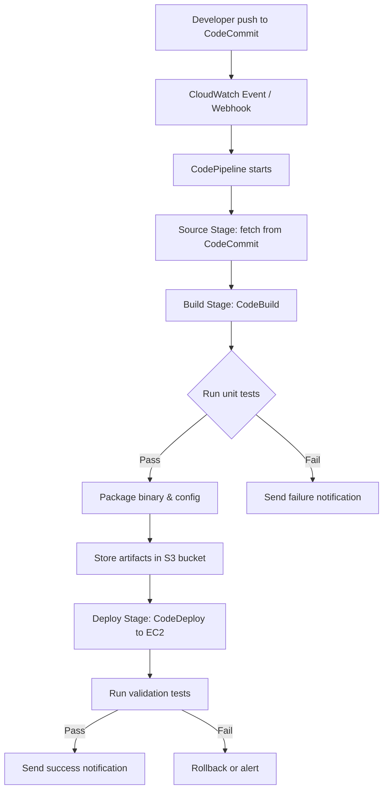

### คำอธิบายแบบละเอียด (Detailed Explanation)  

| ขั้นตอน | คำอธิบาย (ไทย) | Explanation (English) |
|---------|----------------|------------------------|
| 1 | นักพัฒนาแก้ไขโค้ด Go และ `git push` ไปยัง AWS CodeCommit | Developer modifies Go code and pushes to AWS CodeCommit. |
| 2 | CodePipeline trigger โดย CloudWatch Events หรือ webhook | CodePipeline is triggered by CloudWatch Events or webhook. |
| 3 | Source stage: ดึง source code ล่าสุดจาก branch ที่กำหนด | Source stage: fetches latest code from specified branch. |
| 4 | Build stage: CodeBuild รัน buildspec.yml ซึ่งจะ `go build`, `go test` | Build stage: CodeBuild runs buildspec.yml, executes `go build` and `go test`. |
| 5 | ถ้า test ผ่าน, binary และไฟล์ config ถูก package ไปเป็น artifact | If tests pass, binary and config files are packaged as artifact. |
| 6 | Artifact ถูกเก็บใน S3 bucket ชั่วคราว | Artifact is stored in a temporary S3 bucket. |
| 7 | Deploy stage: CodeDeploy ดึง artifact และติดตั้งบน EC2 instance (หรือ ASG) | Deploy stage: CodeDeploy pulls artifact and installs on EC2 instance (or ASG). |
| 8 | หลัง deploy, validation test ถูกเรียก (เช่น health check endpoint) | After deployment, validation test is invoked (e.g., health check endpoint). |
| 9 | ส่งการแจ้งเตือน success/failure ผ่าน SNS (email, Slack, etc.) | Success/failure notification sent via SNS (email, Slack, etc.). |

### ตัวอย่างโค้ดพร้อมคอมเมนต์สองภาษา (Code with bilingual comments)  

#### ไฟล์ Go ตัวอย่าง (app.go)  

```go
// app.go
// แอปพลิเคชัน Go อย่างง่ายที่แสดงข้อความและมี health check
// Simple Go application that prints a message and has a health check endpoint

package main

import (
	"fmt"
	"log"
	"net/http"
	"os"
)

func main() {
	// กำหนดพอร์ตจาก environment variable (ค่าเริ่มต้น 8080)
	// Get port from environment variable (default 8080)
	port := os.Getenv("PORT")
	if port == "" {
		port = "8080"
	}

	// Endpoint หลัก: คืนค่า "Hello DevOps on AWS!"
	// Main endpoint: returns "Hello DevOps on AWS!"
	http.HandleFunc("/", func(w http.ResponseWriter, r *http.Request) {
		fmt.Fprintf(w, "Hello DevOps on AWS! Version: 1.0")
	})

	// Health check endpoint สำหรับ CodeDeploy และ ALB
	// Health check endpoint for CodeDeploy and ALB
	http.HandleFunc("/health", func(w http.ResponseWriter, r *http.Request) {
		w.WriteHeader(http.StatusOK)
		fmt.Fprintf(w, "OK")
	})

	log.Printf("Server starting on port %s", port)
	log.Fatal(http.ListenAndServe(":"+port, nil))
}
```

#### buildspec.yml (สำหรับ AWS CodeBuild)  

```yaml
# buildspec.yml
# กำหนดขั้นตอนการ build และทดสอบแอป Go
# Defines build and test steps for Go application

version: 0.2

phases:
  install:
    runtime-versions:
      golang: 1.21           # ใช้ Go 1.21 / Use Go 1.21
    commands:
      # ติดตั้ง dependencies (ถ้ามี go.mod)
      # Install dependencies if go.mod exists
      - go mod download
  pre_build:
    commands:
      # รัน unit tests และสร้าง coverage report
      # Run unit tests and generate coverage report
      - go test -cover ./...
  build:
    commands:
      # Build binary สำหรับ Linux (เพราะ EC2 เป็น Amazon Linux)
      # Build binary for Linux (EC2 runs Amazon Linux)
      - GOOS=linux GOARCH=amd64 go build -o myapp .
  post_build:
    commands:
      # ตรวจสอบว่า binary ทำงานได้
      # Verify that binary works
      - ./myapp -version || true

artifacts:
  files:
    - myapp                    # binary ที่ build ได้
    - appspec.yml              # ไฟล์กำหนดการ deploy ของ CodeDeploy
    - scripts/**/*             # โฟลเดอร์สคริปต์ (start, stop, validate)
  discard-paths: no
```

#### appspec.yml (สำหรับ AWS CodeDeploy)  

```yaml
# appspec.yml
# กำหนดการ deploy สำหรับ CodeDeploy บน EC2
# Defines CodeDeploy deployment specification for EC2

version: 0.0
os: linux

files:
  - source: myapp
    destination: /home/ec2-user/myapp
  - source: scripts/start.sh
    destination: /home/ec2-user/scripts
  - source: scripts/stop.sh
    destination: /home/ec2-user/scripts
  - source: scripts/validate.sh
    destination: /home/ec2-user/scripts

permissions:
  - object: /home/ec2-user/myapp
    mode: 755
    owner: ec2-user
    group: ec2-user
  - object: /home/ec2-user/scripts
    mode: 755
    owner: ec2-user
    group: ec2-user

hooks:
  ApplicationStop:
    - location: scripts/stop.sh
      timeout: 30
      runas: ec2-user
  ApplicationStart:
    - location: scripts/start.sh
      timeout: 60
      runas: ec2-user
  ValidateService:
    - location: scripts/validate.sh
      timeout: 30
      runas: ec2-user
```

#### สคริปตัวอย่าง (scripts/start.sh)  

```bash
#!/bin/bash
# start.sh
# เริ่มต้น service myapp โดยใช้ systemd หรือ nohup
# Start myapp service using systemd or nohup

set -e

APP_DIR=/home/ec2-user/myapp
LOG_DIR=/var/log/myapp
mkdir -p $LOG_DIR

# ถ้ามี systemd service unit ให้ใช้ systemctl
# If systemd service unit exists, use systemctl
if systemctl list-unit-files | grep -q myapp.service; then
    sudo systemctl start myapp
else
    # ไม่อย่างนั้น run โดยตรง
    # Otherwise run directly
    cd $APP_DIR
    nohup ./myapp > $LOG_DIR/app.log 2>&1 &
fi

echo "myapp started"
```

#### scripts/validate.sh  

```bash
#!/bin/bash
# validate.sh
# ตรวจสอบว่าแอปทำงานและตอบสนอง health check
# Verify the app is running and responds to health check

set -e

# รอให้แอปพร้อม (สูงสุด 30 วินาที)
# Wait for app to be ready (max 30 seconds)
for i in {1..30}; do
    if curl -f http://localhost:8080/health; then
        echo "Validation successful"
        exit 0
    fi
    sleep 1
done

echo "Validation failed: health check not responding"
exit 1
```

### วิธีสร้าง CI/CD Pipeline ทั้งหมดด้วย AWS CLI (ตัวอย่างคำสั่ง)  

```bash
# 1. สร้าง S3 bucket สำหรับเก็บ artifacts (unique name)
aws s3 mb s3://my-devops-artifacts-bucket

# 2. สร้าง CodeCommit repository
aws codecommit create-repository --repository-name MyGoApp

# 3. push โค้ดเริ่มต้น (ทำ git remote add, git push)

# 4. สร้าง CodeBuild project
aws codebuild create-project --name MyGoBuild \
  --source type=CODECOMMIT,location=https://git-codecommit.us-east-1.amazonaws.com/v1/repos/MyGoApp \
  --artifacts type=S3,location=my-devops-artifacts-bucket,path=build-artifacts \
  --environment type=LINUX_CONTAINER,computeType=BUILD_GENERAL1_SMALL,image=aws/codebuild/amazonlinux2-x86_64-standard:4.0 \
  --service-role arn:aws:iam::ACCOUNT:role/codebuild-service-role

# 5. สร้าง CodePipeline
aws codepipeline create-pipeline --cli-input-json file://pipeline.json
```

(ไฟล์ pipeline.json มีรายละเอียด source, build, deploy stage – สามารถดูตัวอย่างเพิ่มเติมได้ที่ AWS Docs)

---

## 📌 กรณีศึกษาและแนวทางแก้ไขปัญหา (Case Study & Troubleshooting)

### กรณีศึกษา 1: บริษัท FinTech ต้องการ deploy วันละ 10 ครั้ง  
**ปัญหา:** ทีม Dev และ Ops แยกกัน, deploy ใช้ manual ผ่าน SSH, เกิด human error บ่อย  
**แนวทางแก้ไข:**  
- นำ Git + CodeCommit มาใช้  
- สร้าง CI pipeline ด้วย CodeBuild รัน unit tests และ security scan (SAST)  
- ใช้ CodePipeline + CodeDeploy แบบ blue/green deployment ไปยัง Auto Scaling Group  
- ตั้งค่า validation test หลัง deploy ถ้าผิดพลาด rollback อัตโนมัติ  
**ผลลัพธ์:** deployment frequency เพิ่มจาก 1 ครั้ง/สัปดาห์ เป็น 10 ครั้ง/วัน, failure rate ลด 80%  

### กรณีศึกษา 2: E‑commerce ขนาดกลางต้องการ zero‑downtime deployment  
**ปัญหา:** เวลาอัปเดตเว็บไซต์ ต้องปิด service ชั่วคราว ทำให้เสียรายได้  
**แนวทางแก้ไข:**  
- ใช้ Application Load Balancer + Auto Scaling Group  
- กำหนด CodeDeploy configuration เป็น `DeploymentStyle: BLUE_GREEN`  
- ใช้ pre‑hook เพื่อตรวจสอบ dependency ก่อนเปลี่ยน traffic  
- ใช้ post‑hook เพื่อรัน smoke test บน environment ใหม่  
**ผลลัพธ์:** downtime ลดลงเป็น 0 วินาที  

### ปัญหาที่พบบ่อย (Common Issues)  

| ปัญหา (Issue) | สาเหตุ (Cause) | วิธีแก้ไข (Solution) |
|----------------|----------------|----------------------|
| CodeBuild ค้างหรือ timeout | buildspec.yml มีคำสั่งที่รอ input หรือใช้ทรัพยากรมาก | ตรวจสอบว่าไม่มี `read` หรือ interactive command, เพิ่ม computeType |
| CodeDeploy ติด loop Deployment failed | Script start.sh ทำงานไม่สำเร็จ (permission, path) | ดู log ที่ `/opt/codedeploy-agent/deployment-root/deployment-logs/codedeploy-agent-deployments.log` |
| Pipeline ไม่ trigger อัตโนมัติ | ขาด CloudWatch Events หรือ webhook | ตรวจสอบใน CodePipeline console ว่า Source stage มี “Change detection options” เป็น Amazon CloudWatch Events |
| Artifact ไม่ถูกต้อง | buildspec artifacts section ระบุ path ผิด | ทดสอบด้วยการ build ใน local ก่อน push |
| Permission denied ตอน run binary | binary ไม่มี execute permission | ใน appspec.yml ตั้ง permissions mode: 755 หรือใช้ chmod ใน start.sh |

---

## 📁 เทมเพลตและตัวอย่างโค้ดเพิ่มเติม (Templates & More Code)

### Template สำหรับ Makefile (Go + CodeBuild)  

```makefile
# Makefile
# ช่วยให้รันคำสั่ง CI/CD ใน local และบน CodeBuild
# Helps run CI/CD commands locally and on CodeBuild

.PHONY: build test clean run

build:
	go build -o myapp .

test:
	go test -v -cover ./...

clean:
	rm -f myapp

run:
	./myapp

# จำลอง environment ของ CodeBuild
codebuild-local:
	docker run -v $(shell pwd):/go/src/app -w /go/src/app \
		-e GOOS=linux -e GOARCH=amd64 \
		golang:1.21 go build -o myapp .
```

### Template สำหรับ IAM Role (CodeBuild + CodeDeploy)  

```json
{
  "Version": "2012-10-17",
  "Statement": [
    {
      "Effect": "Allow",
      "Action": [
        "logs:CreateLogGroup",
        "logs:CreateLogStream",
        "logs:PutLogEvents"
      ],
      "Resource": "*"
    },
    {
      "Effect": "Allow",
      "Action": [
        "s3:GetObject",
        "s3:PutObject"
      ],
      "Resource": "arn:aws:s3:::my-devops-artifacts-bucket/*"
    },
    {
      "Effect": "Allow",
      "Action": [
        "codecommit:GitPull"
      ],
      "Resource": "arn:aws:codecommit:us-east-1:ACCOUNT:MyGoApp"
    }
  ]
}
```

---

## 📊 ตารางเปรียบเทียบเครื่องมือ DevOps บน AWS vs อื่น ๆ  

| ฟังก์ชัน (Function) | AWS Service | ทางเลือกอื่น (Alternative) |
|---------------------|-------------|----------------------------|
| Version Control | CodeCommit | GitHub, GitLab, Bitbucket |
| CI/CD Orchestration | CodePipeline | Jenkins, GitLab CI, CircleCI |
| Build & Test | CodeBuild | Jenkins, GitHub Actions |
| Deployment | CodeDeploy | Ansible, Spinnaker, ArgoCD |
| Infrastructure as Code | CloudFormation / CDK | Terraform, Pulumi |
| Monitoring | CloudWatch | Prometheus, Grafana, Datadog |

---

## 📝 สรุป (Summary)  

### ✅ ประโยชน์ที่ได้รับ (Benefits)  
- ลดเวลาในการนำฟีเจอร์ออกสู่ตลาด  
- เพิ่มความมั่นใจในการ deploy ด้วย automation และ testing  
- ปรับปรุง collaboration ระหว่าง Dev และ Ops  
- รองรับการขยายขนาดและความซับซ้อน  

### ⚠️ ข้อควรระวัง (Cautions)  
- ต้องมีการปรับเปลี่ยนวัฒนธรรมองค์กร  
- ต้องลงทุนในการทำ automation และ documentation  
- ระวัง vendor lock‑in (หากใช้ AWS services ทั้งหมด)  

### 👍 ข้อดี (Advantages)  
- AWS services ทำงานร่วมกันได้ดี (native integration)  
- ไม่ต้องดูแล infrastructure ของ CI/CD เอง (fully managed)  
- มี security และ compliance ในตัว  

### 👎 ข้อเสีย (Disadvantages)  
- หากองค์กรใช้ multi‑cloud อาจซับซ้อน  
- CodeBuild, CodeDeploy มี feature น้อยกว่า Jenkins (แต่พอเพียง)  
- ราคาอาจสูงกว่าการใช้ open‑source บน EC2 หากใช้งานหนัก  

### 🚫 ข้อห้าม (Prohibitions)  
- ห้ามเก็บ secret key หรือ environment variable ในโค้ด (ใช้ AWS Secrets Manager หรือ Parameter Store)  
- ห้าม deploy ไป production โดยไม่ผ่าน automated test  
- ห้ามใช้ production environment สำหรับทดสอบ (ใช้ staging ก่อน)  

---

## 🧩 แบบฝึกหัดท้ายบท (Exercises)  

**ข้อ 1:** จงอธิบายความแตกต่างระหว่าง Continuous Delivery และ Continuous Deployment พร้อมยกตัวอย่างสถานการณ์ที่ควรใช้แบบใด  
**ข้อ 2:** จาก buildspec.yml ที่ให้มา ถ้าต้องการเพิ่ม step linting (เช่น `golangci-lint run`) ควรเพิ่มใน phase ใด  
**ข้อ 3:** เขียนคำสั่ง Go test ที่สร้าง coverage report ในรูปแบบ HTML  
**ข้อ 4:** สมมติว่า CodeDeploy ล้มเหลวที่ hook ValidateService จะหา log ได้จากที่ไหนใน EC2  
**ข้อ 5:** จงออกแบบ pipeline อย่างง่าย (โดยใช้บริการ AWS) สำหรับแอป Go ที่ต้อง deploy ไปยัง Lambda แทน EC2 (ระบุ service ที่ใช้แทน CodeDeploy)  
**ข้อ 6:** หลัก CALMS ใน DevOps หมายถึงอะไรบ้าง (อธิบายแต่ละตัว)  
**ข้อ 7:** กรณีที่ต้องการ rollback โดยอัตโนมัติเมื่อ validation test ล้มเหลว CodePipeline มี feature อะไรที่ช่วยได้  
**ข้อ 8:** จงเขียน script bash (start.sh) ที่ใช้ systemd สำหรับ binary myapp โดยให้ log ไปที่ /var/log/myapp และ restart อัตโนมัติถ้า crash  
**ข้อ 9:** อะไรคือข้อห้ามสำคัญในการใช้ DevOps (ยกมา 2 ข้อ)  
**ข้อ 10:** ถ้าทีมของคุณใช้ GitLab อยู่แล้ว คุณจะเลือกใช้ AWS CodePipeline หรือไม่? เพราะเหตุใด  

---

## 🔐 เฉลยแบบฝึกหัด (Answer Key)  

**ข้อ 1:** Continuous Delivery: พร้อม deploy ตลอดเวลา แต่ต้อง approve ก่อน (เช่น ก่อน production), Continuous Deployment: ทุก commit ที่ผ่าน test จะ deploy อัตโนมัติ (ใช้กับ non‑critical หรือ start-up ที่ต้องการ speed)  
**ข้อ 2:** ควรเพิ่มใน `pre_build` หรือ `build` phase ก่อน `go build`  
**ข้อ 3:** `go test -coverprofile=coverage.out && go tool cover -html=coverage.out -o coverage.html`  
**ข้อ 4:** `/opt/codedeploy-agent/deployment-root/deployment-logs/codedeploy-agent-deployments.log` หรือดูใน EC2 ที่ `/var/log/aws/codedeploy-agent/codedeploy-agent.log`  
**ข้อ 5:** CodeCommit (source) → CodeBuild (build) → CodePipeline → AWS SAM หรือ CloudFormation + Lambda (deploy) หรือใช้ CodeDeploy สำหรับ Lambda (ก็ได้)  
**ข้อ 6:** C= Culture, A= Automation, L= Lean (ลด waste), M= Measurement, S= Sharing  
**ข้อ 7:** ใช้ Deployment action ใน CodePipeline ที่มี “Rollback” หรือใช้ manual approval แล้วตั้ง automation ผ่าน Lambda เพื่อ rollback  
**ข้อ 8:** (ตัวอย่าง systemd unit) เขียน `/etc/systemd/system/myapp.service` แล้วใช้ `systemctl start myapp` ใน start.sh  
**ข้อ 9:** 1) ห้ามสร้าง “DevOps team” ที่ทำทุกอย่างแทน Dev/ops 2) ห้ามใช้ automation แทนการสื่อสาร  
**ข้อ 10:** ขึ้นอยู่กับความต้องการ: ถ้าอยากได้ native integration กับ AWS อื่น (CodeBuild, CodeDeploy) และไม่ต้องการจัดการ runner อาจเลือก CodePipeline; ถ้าต้องการ unified experience ใน GitLab ก็ใช้ GitLab CI ดีกว่า  

---

## 📚 แหล่งอ้างอิง (References)  

1. AWS Documentation – CodePipeline. (2024). *What is CodePipeline?*  
   https://docs.aws.amazon.com/codepipeline/  
2. AWS Documentation – CodeBuild. (2024).  
3. AWS Documentation – CodeDeploy. (2024).  
4. Kim, G., Humble, J., Debois, P., & Willis, J. (2016). *The DevOps Handbook*. IT Revolution Press.  
5. AWS DevOps Blog. (2024). *Running Go applications with CodePipeline*.  

---
**✍️ ผู้เขียน:** คงนคร จันทะคุณ  
**📅 อัปเดตล่าสุด:** เมษายน 2026  
**หมายเหตุ เนื้อหาในหนังสือ:**  
เนื้อหาในหนังสือ "AWS จากภาคทฤษฎีไปภาคปฏิบัติ" ใช้ AI ช่วยเขียน เพื่อทดสอบ AI Model ผู้เขียนเป็นผู้ออกแบบ ใช้ AI ช่วยจัดเรียง ซึ่งมีค่าใช้จ่ายพอสมควร ให้ใช้ฟรีก่อน ต้องการสนับสนุนเพื่อทำเนื้อหาแนวนี้ต่อ สามารถให้การสนับสนุนได้ครับ ตามกำลังศรัทธา 
📞 โทรศัพท์ / พร้อมเพย์: **0955088091**  


---

**หมายเหตุ:** โค้ดและสคริปต์ทั้งหมดในบทนี้สามารถนำไปใช้งานจริงได้ แต่ควรปรับชื่อ bucket, IAM role, และ region ให้ตรงกับบัญชี AWS ของผู้อ่าน

# 📘 บทที่ 2: DevSecOps – รวมความปลอดภัยในวงจรพัฒนา  
## Chapter 2: DevSecOps – Integrating Security into the Development Cycle  

---

## 🧱 โครงสร้างการทำงาน (Work Structure)  

**ไทย:**  
บทนี้จะพาผู้อ่านทำความเข้าใจ DevSecOps ตั้งแต่แนวคิดพื้นฐาน การนำ security มาแทรกใน CI/CD pipeline การใช้เครื่องมือ AWS เช่น AWS CodeBuild, CodePipeline, AWS Security Hub, Inspector, และการเขียนโปรแกรม Go เพื่อสแกนหาช่องโหว่ในโค้ดและ dependency รวมถึงการจัดการ secrets ด้วย AWS Secrets Manager  

**English:**  
This chapter guides readers through DevSecOps concepts, embedding security into CI/CD pipelines, using AWS services such as CodeBuild, CodePipeline, Security Hub, Inspector, and writing Go programs to scan code and dependencies for vulnerabilities, as well as managing secrets with AWS Secrets Manager.  

---

## 🎯 วัตถุประสงค์แบบสั้นสำหรับทบทวน (Short Revision Objective)  

**ไทย:**  
เพื่อให้ผู้อ่านเข้าใจความหมายของ DevSecOps, รูปแบบการนำไปใช้, เหตุผลที่ต้องใช้, ประโยชน์ และสามารถสร้าง CI/CD pipeline ที่มีขั้นตอนความปลอดภัยอัตโนมัติ (SAST, DAST, dependency scan, secret detection) บน AWS พร้อมเขียนโค้ด Go สำหรับตรวจสอบและจัดการ secrets  

**English:**  
To enable readers to understand DevSecOps concepts, implementation models, why it is needed, benefits, and to create CI/CD pipelines with automated security steps (SAST, DAST, dependency scan, secret detection) on AWS, as well as writing Go code for security checks and secrets management.  

---

## 👥 กลุ่มเป้าหมาย (Target Audience)  

- นักพัฒนา (Developers) ที่ต้องการเขียนโค้ดปลอดภัย  
- DevOps / SRE ที่ต้องการเพิ่ม security automation  
- Security engineer ที่ต้องการทำงานร่วมกับ Dev และ Ops  
- ผู้เตรียมสอบ AWS Certified DevOps Engineer – Professional  
- ผู้ที่สนใจนำ DevSecOps มาใช้ในองค์กร  

---

## 📚 ความรู้พื้นฐาน (Prerequisites)  

- เข้าใจ DevOps และ CI/CD มาบ้าง (หรืออ่านบทที่ 1 แล้ว)  
- มีบัญชี AWS และพื้นฐาน IAM, S3, CodePipeline, CodeBuild  
- ติดตั้ง Go (1.18+) และ Git  
- (แนะนำ) ความรู้เบื้องต้นเกี่ยวกับ OWASP Top 10  

---

## 📝 เนื้อหาโดยย่อ (Abstract)  

**ไทย:**  
บทนี้อธิบายว่า DevSecOps คืออะไร, แตกต่างจาก DevOps อย่างไร, มีกี่แบบ (เช่น Shift Left, Security as Code), และเมื่อใดควรใช้ หลังจากนั้นลงมือปฏิบัติ: สร้าง pipeline บน AWS ที่มีขั้นตอน static code analysis (ใช้ golangci-lint), dependency scanning (ใช้ Trivy หรือ Snyk), secret detection (ใช้ gitleaks) และ dynamic analysis (ใช้ AWS Inspector หรือ ZAP) พร้อมเขียน Go program เพื่อตรวจสอบ secret ใน Git repository และใช้ AWS Secrets Manager ปลอดภัย  

**English:**  
This chapter explains what DevSecOps is, how it differs from DevOps, its types (Shift Left, Security as Code), and when to use it. Then hands‑on: build a pipeline on AWS that includes static code analysis (golangci-lint), dependency scanning (Trivy or Snyk), secret detection (gitleaks), and dynamic analysis (AWS Inspector or ZAP), along with writing a Go program to detect secrets in Git repos and use AWS Secrets Manager securely.  

---

## 🔰 บทนำ (Introduction)  

**ไทย:**  
DevOps ช่วยให้เราปล่อยซอฟต์แวร์ได้เร็ว แต่ความเร็วอาจทำให้ความปลอดภัยถูกมองข้าม DevSecOps จึงเกิดขึ้นเพื่อ “แทรก” ความปลอดภัยเข้าไปในทุกขั้นตอนของวงจร DevOps โดยไม่ทำให้ความช้าลงอย่างมีนัยสำคัญ บน AWS เรามีเครื่องมือที่ช่วยทำ security scanning อัตโนมัติ เช่น Amazon Inspector, AWS Security Hub, และสามารถนำ open-source tools มาใช้ใน CodeBuild ได้ ทำให้เราสามารถจับปัญหาความปลอดภัยตั้งแต่ตอนเขียนโค้ดจนถึง production  

**English:**  
DevOps allows us to release software quickly, but speed can cause security to be overlooked. DevSecOps emerged to “embed” security into every stage of the DevOps cycle without significantly slowing it down. On AWS, we have tools like Amazon Inspector, AWS Security Hub, and we can integrate open-source tools into CodeBuild, enabling us to catch security issues from coding to production.  

---

## 📖 บทนิยาม (Definitions)  

| คำศัพท์ (Term) | คำจำกัดความไทย (Thai Definition) | English Definition |
|----------------|----------------------------------|--------------------|
| DevSecOps | การผสานความปลอดภัยเข้ากับกระบวนการ DevOps อย่างอัตโนมัติ ตั้งแต่การออกแบบจนถึงการดำเนินงาน | Integrating security into DevOps processes automatically, from design to operations. |
| Shift Left | การเลื่อนการทดสอบความปลอดภัยไปให้เร็วที่สุดในวงจรพัฒนา (เช่น ตรวจสอบตั้งแต่ตอน commit) | Moving security testing as early as possible in the development cycle (e.g., check at commit time). |
| Security as Code | การกำหนดนโยบายความปลอดภัย (IAM, WAF, encryption) ด้วยโค้ด (CloudFormation, Terraform) | Defining security policies (IAM, WAF, encryption) as code. |
| SAST (Static Analysis) | วิเคราะห์ source code หาช่องโหว่โดยไม่ต้องรันโปรแกรม | Analyzes source code for vulnerabilities without executing the program. |
| DAST (Dynamic Analysis) | ทดสอบแอปพลิเคชันขณะรันจริง (เช่น fuzzing, penetration testing) | Tests the application while running (e.g., fuzzing, pentesting). |
| SCA (Software Composition Analysis) | ตรวจสอบ dependencies (libraries) ว่ามีช่องโหว่ที่รู้จักหรือไม่ | Checks dependencies (libraries) for known vulnerabilities. |
| AWS Secrets Manager | บริการเก็บ credentials, API keys, tokens อย่างปลอดภัยและหมุนเวียนอัตโนมัติ | Service to securely store credentials, API keys, tokens with automatic rotation. |
| Amazon Inspector | บริการสแกนช่องโหว่ใน EC2, ECR, Lambda | Vulnerability scanning service for EC2, ECR, Lambda. |

---

## 🔧 DevSecOps คืออะไร? มีกี่แบบ? ใช้อย่างไร?  

### 1. DevSecOps คืออะไร  
**ไทย:**  
DevSecOps คือการนำหลักการ “ความปลอดภัยเป็นความรับผิดชอบของทุกคน” มาใช้ โดยฝัง automated security checks ไว้ใน CI/CD pipeline ทุกครั้งที่มีการเปลี่ยนแปลงโค้ด แทนที่จะรอให้ทีม security มาตรวจสอบทีละครั้ง ซึ่งช้าและมักถูกข้าม  

**English:**  
DevSecOps applies the principle “security is everyone’s responsibility” by embedding automated security checks into the CI/CD pipeline on every code change, rather than waiting for a security team to review periodically, which is slow and often skipped.  

### 2. มีกี่แบบ (Models of DevSecOps)  

| แบบ (Model) | คำอธิบาย (Description) | เมื่อใดควรใช้ (When to use) |
|--------------|------------------------|-----------------------------|
| **Shift Left Security** | ตรวจสอบ security เร็วที่สุด (pre-commit hook, IDE plugin, SAST ใน CI) | ทุกโครงการ, โดยเฉพาะที่พัฒนาเร็ว |
| **Security as Code** | กำหนดนโยบาย (IAM, KMS, WAF) เป็น IaC และตรวจสอบอัตโนมัติ | องค์กรที่มี governance สูง (การเงิน, การแพทย์) |
| **Runtime Security** | ตรวจสอบการทำงานจริง (AWS GuardDuty, Inspector, Falco) | เมื่อมี production workload ที่ต้องตรวจจับภัยคุกคามแบบ real-time |
| **Threat Modeling as Code** | เขียน model การโจมตีและตรวจสอบ pipeline ว่ามีการป้องกันหรือไม่ | ระบบที่มีความเสี่ยงสูง (critical infrastructure) |
| **Compliance as Code** | ตรวจสอบว่า infrastructure และ app ปฏิบัติตามมาตรฐาน (PCI, HIPAA) อัตโนมัติ | ต้องทำ audit บ่อย ๆ (SOC2, ISO27001) |

### 3. ใช้อย่างไร (How to implement DevSecOps on AWS)  

- **Source stage:** pre-commit hook (gitleaks) → CodeCommit trigger → ตรวจสอบ hardcoded secrets  
- **Build stage:** ใน CodeBuild ให้รัน:  
  - `golangci-lint` (SAST)  
  - `trivy fs .` (dependency scan)  
  - `gitleaks detect` (secret detection)  
- **Deploy stage:** ใช้ AWS Inspector สแกน AMI/container image ก่อน deploy  
- **Post-deploy:** ใช้ AWS Config + Security Hub ตรวจสอบว่า infrastructure ยัง compliant  
- **Runtime:** GuardDuty สำหรับ threat detection, CloudTrail สำหรับ audit  

### 4. นำในกรณีไหน (When to use)  

- ต้องการ compliance ระดับสูง (PCI, HIPAA, GDPR)  
- มีทีมพัฒนาหลายทีม ต้องการมาตรฐานความปลอดภัยเดียวกัน  
- ต้องการลดช่องโหว่ใน production โดยไม่เพิ่มภาระ manual  
- เคยมี incident จาก dependency ที่มีช่องโหว่ (เช่น log4j)  

### 5. ทำไมต้องใช้ (Why use DevSecOps)  

- แก้ไขช่องโหว่ได้เร็วขึ้น (จับตั้งแต่ตอน commit)  
- ลดต้นทุนในการแก้ไขหลัง deploy (fix ใน production แพงกว่า)  
- เพิ่มความมั่นใจให้ทีม security (automated evidence)  
- สร้างวัฒนธรรมความปลอดภัยในทีม Dev  

### 6. ประโยชน์ที่ได้รับ (Benefits)  

- ลด time‑to‑fix จากสัปดาห์เหลือชั่วโมง  
- ลด human error (เพราะ automated)  
- สามารถ audit ได้ง่าย (ทุกขั้นตอนมี log)  
- เพิ่มความไว้วางใจจากลูกค้า  

### 7. ข้อควรระวัง (Cautions)  

- อาจเกิด false positives มาก ทำให้ทีมรำคาญ (ต้องปรับแต่ง rules)  
- เพิ่มเวลาของ pipeline (ต้อง scan dependencies, SAST)  
- ต้องจัดการ secrets ใน CI/CD อย่างดี (ไม่เก็บใน environment variables)  
- ต้องมี process สำหรับจัดการ findings ที่พบ (ไม่ใช่แค่ report)  

### 8. ข้อดี (Advantages)  

- จับช่องโหว่ได้เร็ว  
- ลดความเสี่ยงจาก supply chain (dependency)  
- สามารถ integrate กับ Jira, Slack แจ้งอัตโนมัติ  

### 9. ข้อเสีย (Disadvantages)  

- ต้องเรียนรู้เครื่องมือใหม่ (Trivy, gitleaks, etc.)  
- pipeline จะช้าลงบ้าง (อาจ 2-3 นาที)  
- tool licensing (Snyk, SonarQube) อาจมีค่าใช้จ่าย  

### 10. ข้อห้าม (Prohibitions)  

- ห้ามเก็บ secrets (API keys, passwords) ใน Git หรือ environment variables ของ CI/CD (ใช้ Secrets Manager หรือ Parameter Store)  
- ห้าม disable security scans เพราะ pipeline ช้า (ต้อง optimize)  
- ห้าม deploy ถ้า critical severity finding ยังไม่ได้รับการแก้ไข  

---

## 🔄 ออกแบบ Workflow (Workflow Design)  

### ภาพรวม Workflow (DevSecOps CI/CD Pipeline)  

**ไทย:**  
DevSecOps pipeline เพิ่ม security steps ใน三个阶段:  
1. **Pre-commit / Source:** ตรวจสอบ secret ในโค้ด (gitleaks)  
2. **Build:** SAST (golangci-lint), SCA (Trivy), secret detection อีกครั้ง  
3. **Deploy:** สแกน container image หรือ AMI (Inspector)  
4. **Post-deploy:** dynamic scan (ZAP) หรือ monitoring (GuardDuty)  

**English:**  
DevSecOps pipeline adds security steps in three stages:  
1. **Pre-commit / Source:** check for secrets in code (gitleaks)  
2. **Build:** SAST (golangci-lint), SCA (Trivy), secret detection again  
3. **Deploy:** scan container image or AMI (Inspector)  
4. **Post-deploy:** dynamic scan (ZAP) or monitoring (GuardDuty)  

### Mermaid Flowchart  

```mermaid
flowchart TB
    A[Developer push to CodeCommit] --> B[CodePipeline trigger]
    B --> C[Source stage: CodeCommit]
    C --> D{Build stage: CodeBuild}
    D --> E[Run golangci-lint (SAST)]
    D --> F[Run Trivy fs (SCA)]
    D --> G[Run gitleaks (secrets)]
    E --> H{Any critical finding?}
    F --> H
    G --> H
    H -- Yes --> I[Fail pipeline + notify Slack]
    H -- No --> J[Build binary & image]
    J --> K[Deploy to staging]
    K --> L[Run DAST (OWASP ZAP) on staging]
    L --> M{Any high-risk finding?}
    M -- Yes --> I
    M -- No --> N[Deploy to production]
    N --> O[Enable GuardDuty & Security Hub]
```

### คำอธิบายแบบละเอียด (Detailed Explanation)  

| ขั้นตอน | คำอธิบาย (ไทย) | Explanation (English) |
|---------|----------------|------------------------|
| 1 | Developer push โค้ดไปยัง CodeCommit | Developer pushes code to CodeCommit. |
| 2 | CodePipeline เริ่มทำงานโดยอัตโนมัติ | CodePipeline starts automatically. |
| 3 | Source stage ดึงโค้ดล่าสุด | Source stage fetches latest code. |
| 4 | Build stage (CodeBuild) รัน 3 security tools: golangci-lint (SAST), Trivy (scan dependencies & Dockerfile), gitleaks (detect secrets) | Build stage runs 3 security tools: golangci-lint (SAST), Trivy (scan dependencies & Dockerfile), gitleaks (detect secrets). |
| 5 | ถ้าพบ critical finding (เช่น secret leak หรือ CVE score >7) pipeline จะ fail ทันที | If a critical finding is found (e.g., secret leak or CVE score >7), pipeline fails immediately. |
| 6 | ถ้าผ่าน security scan, ทำการ build binary และ container image (ถ้ามี) | If scans pass, build binary and container image. |
| 7 | Deploy ไปยัง staging environment | Deploy to staging environment. |
| 8 | รัน DAST ด้วย OWASP ZAP (หรือ AWS Inspector) บน staging | Run DAST with OWASP ZAP (or AWS Inspector) on staging. |
| 9 | ถ้าพบ high-risk finding (เช่น SQL injection) pipeline fail; ถ้าไม่พบ, deploy ไป production | If high-risk finding (e.g., SQL injection) found, pipeline fails; otherwise deploy to production. |
| 10 | หลัง deploy production, เปิด GuardDuty และ Security Hub เพื่อ monitoring ต่อเนื่อง | After production deployment, enable GuardDuty and Security Hub for continuous monitoring. |

---

## 💻 ตัวอย่างโค้ดที่รันได้จริง (Runnable Code Example)  

### 1. buildspec.yml พร้อม DevSecOps steps  

```yaml
# buildspec.yml
# เพิ่ม security scanning ในขั้นตอน build สำหรับ Go application
# Add security scanning steps during build for Go application

version: 0.2

env:
  secrets-manager:
    SNYK_TOKEN: "arn:aws:secretsmanager:us-east-1:ACCOUNT:secret:snyk-token"  # ใช้ Secrets Manager แทน hardcode

phases:
  install:
    runtime-versions:
      golang: 1.21
    commands:
      # ติดตั้งเครื่องมือ security
      # Install security tools
      - curl -sSfL https://raw.githubusercontent.com/golangci/golangci-lint/master/install.sh | sh -s -- -b $(go env GOPATH)/bin v1.57.0
      - curl -sfL https://raw.githubusercontent.com/aquasecurity/trivy/main/contrib/install.sh | sh -s -- -b /usr/local/bin v0.48.0
      - curl -s https://raw.githubusercontent.com/gitleaks/gitleaks/master/install.sh | bash -s -- -b /usr/local/bin
      - go mod download
  pre_build:
    commands:
      # SAST: static analysis ด้วย golangci-lint
      - echo "Running SAST (golangci-lint)..."
      - golangci-lint run --timeout=5m --out-format=line-number ./...
      
      # SCA: scan dependencies (go.mod) และ Dockerfile (ถ้ามี)
      - echo "Running SCA (Trivy)..."
      - trivy fs --severity CRITICAL,HIGH --exit-code 1 --ignore-unfixed ./
      
      # Secret detection: หา secrets ที่อาจถูก commit โดยไม่ตั้งใจ
      - echo "Running secret detection (gitleaks)..."
      - gitleaks detect --source . --verbose --exit-code 1
      
      # (ทางเลือก) ถ้าใช้ Snyk:
      # - snyk test --severity-threshold=high
  build:
    commands:
      - echo "Build started..."
      - GOOS=linux go build -o myapp .
      - echo "Build completed."
  post_build:
    commands:
      - echo "Post-build: generate SBOM (Software Bill of Materials)"
      - trivy fs --format cyclonedx --output sbom.json ./

artifacts:
  files:
    - myapp
    - sbom.json
```

### 2. Go program สำหรับตรวจสอบ secrets ใน Git repository (ใช้ gitleaks programmatically)  

```go
// gitleaks_checker.go
// ตรวจสอบ secret ใน Git repo ก่อน push (pre-receive hook หรือ CI)
// Check for secrets in Git repo before push (pre-receive hook or CI)

package main

import (
	"bufio"
	"bytes"
	"fmt"
	"log"
	"os"
	"os/exec"
	"strings"
)

func main() {
	// สมมติว่าเราอยู่ใน root ของ Git repo
	// Assume we are in the root of a Git repo

	// เรียก gitleaks detect
	// Run gitleaks detect
	cmd := exec.Command("gitleaks", "detect", "--source", ".", "--verbose", "--exit-code", "0")
	var outBuf, errBuf bytes.Buffer
	cmd.Stdout = &outBuf
	cmd.Stderr = &errBuf

	err := cmd.Run()
	if err != nil {
		log.Printf("gitleaks execution error: %v", err)
	}

	// อ่าน output และแยกแยะ findings
	// Parse output and extract findings
	scanner := bufio.NewScanner(&outBuf)
	findings := []string{}
	for scanner.Scan() {
		line := scanner.Text()
		if strings.Contains(line, "Finding:") || strings.Contains(line, "Secret:") {
			findings = append(findings, line)
		}
	}

	if len(findings) > 0 {
		fmt.Println("❌ Secrets detected! Pipeline should fail.")
		for _, f := range findings {
			fmt.Println("  ", f)
		}
		os.Exit(1) // fail the pipeline
	} else {
		fmt.Println("✅ No secrets found.")
	}
}
```

### 3. Go program สำหรับดึง secret จาก AWS Secrets Manager  

```go
// get_secret.go
// ดึง API key หรือ database password จาก Secrets Manager
// Retrieve API key or database password from Secrets Manager

package main

import (
	"context"
	"encoding/json"
	"fmt"
	"log"

	"github.com/aws/aws-sdk-go-v2/config"
	"github.com/aws/aws-sdk-go-v2/service/secretsmanager"
)

type DbSecret struct {
	Username string `json:"username"`
	Password string `json:"password"`
	Host     string `json:"host"`
	Port     int    `json:"port"`
}

func main() {
	secretName := "prod/mydb/credentials"
	region := "us-east-1"

	cfg, err := config.LoadDefaultConfig(context.TODO(), config.WithRegion(region))
	if err != nil {
		log.Fatalf("unable to load SDK config: %v", err)
	}

	svc := secretsmanager.NewFromConfig(cfg)

	input := &secretsmanager.GetSecretValueInput{
		SecretId: &secretName,
	}

	result, err := svc.GetSecretValue(context.TODO(), input)
	if err != nil {
		log.Fatalf("failed to get secret: %v", err)
	}

	var secret DbSecret
	err = json.Unmarshal([]byte(*result.SecretString), &secret)
	if err != nil {
		log.Fatalf("failed to parse secret JSON: %v", err)
	}

	fmt.Printf("DB connection: %s:%d user=%s (password hidden)\n", secret.Host, secret.Port, secret.Username)
	// ไม่ควร print password ใน log
	// Never print password in logs
}
```

### 4. การใช้ AWS Inspector ใน pipeline (AWS CLI + Go)  

```bash
# ใน buildspec.yml หรือ script
# trigger inspector scan สำหรับ container image ใน ECR
aws ecr describe-images --repository-name myapp --image-ids imageTag=latest
aws inspector2 scan-findings --filter criteria='{"resourceId":[{"comparison":"EQUALS","value":"arn:aws:ecr:..."}]}'
```

แต่สามารถใช้ Go SDK สำหรับ Inspector ได้เช่นกัน (ตัวอย่างสั้น):  

```go
// inspector_scan.go
// เรียก AWS Inspector เพื่อสแกน container image ก่อน deploy
// Call AWS Inspector to scan container image before deployment

package main

import (
	"context"
	"fmt"
	"log"
	"time"

	"github.com/aws/aws-sdk-go-v2/config"
	"github.com/aws/aws-sdk-go-v2/service/inspector2"
	"github.com/aws/aws-sdk-go-v2/service/inspector2/types"
)

func main() {
	cfg, _ := config.LoadDefaultConfig(context.TODO())
	client := inspector2.NewFromConfig(cfg)

	// สมมติมี image digest
	digest := "sha256:abcd1234..."
	repoName := "myapp"

	findings, err := client.ListFindings(context.TODO(), &inspector2.ListFindingsInput{
		FilterCriteria: &types.FilterCriteria{
			ResourceId: []types.StringFilter{
				{
					Comparison: types.StringComparisonEquals,
					Value:      &repoName,
				},
			},
			FindingStatus: []types.StringFilter{
				{Comparison: types.StringComparisonEquals, Value: stringPtr("ACTIVE")},
			},
			Severity: []types.StringFilter{
				{Comparison: types.StringComparisonEquals, Value: stringPtr("CRITICAL")},
			},
		},
	})
	if err != nil {
		log.Fatal(err)
	}
	if len(findings.Findings) > 0 {
		fmt.Printf("❌ Found %d critical findings, abort deployment\n", len(findings.Findings))
		// Fail pipeline
	}
}

func stringPtr(s string) *string { return &s }
```

---

## 📌 กรณีศึกษาและแนวทางแก้ไขปัญหา (Case Study & Troubleshooting)  

### กรณีศึกษา 1: บริษัท FinTech ถูก audit ต้องแสดง evidence ว่าไม่มี hardcoded secret  
**ปัญหา:** ก่อนหน้านี้ developer เคย commit AWS key ลง Git ทำให้ถูกหักคะแนน audit  
**แนวทางแก้ไข:**  
- ใช้ gitleaks เป็น pre‑commit hook และใน CodeBuild  
- ใช้ AWS Secrets Manager แทน environment variables  
- ตั้งค่า CloudTrail + EventBridge เพื่อแจ้งเตือนถ้ามี secret ถูกสร้างใหม่โดยไม่ผ่าน Secrets Manager  
**ผลลัพธ์:** ผ่าน audit ด้วยคะแนนเต็ม, ไม่มี secret leak ซ้ำอีก  

### กรณีศึกษา 2: dependency log4j ทำให้บริษัทเสี่ยง  
**ปัญหา:** ไม่รู้ว่ามี dependency ตัวไหนที่ vulnerable  
**แนวทางแก้ไข:**  
- เพิ่ม Trivy scan ใน pipeline (SCA)  
- ตั้งค่าให้ pipeline fail ถ้า CVE severity >= HIGH  
- สร้าง SBOM (Software Bill of Materials) และ upload ไปยัง S3 ทุก build  
**ผลลัพธ์:** จับ log4j ได้ภายใน 2 ชั่วโมงหลังจาก CVE ประกาศ, patch ทันที  

### ปัญหาที่พบบ่อย (Common Issues)  

| ปัญหา (Issue) | สาเหตุ (Cause) | วิธีแก้ไข (Solution) |
|----------------|----------------|----------------------|
| golangci-lint false positive | lint rule ใช้ไม่ได้กับบาง pattern | ใช้ `//nolint` comment หรือ disable rule ใน `.golangci.yml` |
| Trivy scan ช้ามาก | ดึง database ทุกครั้ง | Cache database ใน S3 หรือใช้ `--skip-db-update` ใน buildspec แต่ไม่แนะนำ |
| gitleaks ไม่เจอ secret ที่เป็นรหัสผ่าน | รูปแบบไม่ตรง default regex | เพิ่ม custom rule ใน `.gitleaks.toml` |
| Secrets Manager ไม่พร้อมใช้งาน (ใน local dev) | ไม่มี IAM role | ใช้ mock หรือ localstack สำหรับ development |
| Pipeline ใช้เวลานานเกินไป (10+ นาที) | security scans ทำงานหนัก | ใช้ parallel build หรือแยก security stage ออกมา |

---

## 📁 เทมเพลตและตัวอย่างโค้ดเพิ่มเติม (Templates & More Code)  

### Template สำหรับ `.golangci.yml` (ปรับแต่ง lint rules)  

```yaml
# .golangci.yml
# ตั้งค่า golangci-lint ให้เน้น security
# Configure golangci-lint to focus on security

linters:
  enable:
    - gosec        # ตรวจสอบ security issues (เช่น hardcoded credentials, SQL injection)
    - govet        # ตรวจสอบ可疑 constructs
    - errcheck
    - ineffassign

linters-settings:
  gosec:
    excludes:
      - G104  # อดทน error handling ถ้ายังไม่จำเป็น
    includes:
      - G101  # หา hardcoded credentials
      - G201  # SQL injection
      - G401  # weak crypto

issues:
  exclude-use-default: false
  max-issues-per-linter: 0
  max-same-issues: 0
```

### Template สำหรับ pre-commit hook (local)  

```bash
#!/bin/bash
# .git/hooks/pre-commit
# ตรวจสอบ secret และ lint ก่อน commit ทุกครั้ง
# Check secrets and lint before every commit

echo "Running pre-commit security checks..."

# Secret detection
gitleaks detect --source . --verbose --exit-code 1
if [ $? -ne 0 ]; then
    echo "❌ Commit rejected: secrets found!"
    exit 1
fi

# Lint only staged Go files
golangci-lint run --new-from-rev=HEAD~1
if [ $? -ne 0 ]; then
    echo "❌ Commit rejected: linting failed!"
    exit 1
fi

echo "✅ Pre-commit checks passed"
```

### การตั้งค่า IAM role สำหรับ CodeBuild เพื่อให้ใช้ Secrets Manager ได้  

```json
{
    "Version": "2012-10-17",
    "Statement": [
        {
            "Effect": "Allow",
            "Action": [
                "secretsmanager:GetSecretValue"
            ],
            "Resource": "arn:aws:secretsmanager:us-east-1:ACCOUNT:secret:prod/*"
        },
        {
            "Effect": "Allow",
            "Action": [
                "kms:Decrypt"
            ],
            "Resource": "arn:aws:kms:us-east-1:ACCOUNT:key/your-kms-key"
        }
    ]
}
```

---

## 📊 ตารางเปรียบเทียบเครื่องมือ Security Scanning  

| เครื่องมือ (Tool) | ประเภท (Type) | จุดเด่น (Pros) | ข้อจำกัด (Cons) | ใช้ใน AWS อย่างไร |
|-------------------|----------------|----------------|------------------|--------------------|
| golangci-lint | SAST (Go) | รวม linter หลายตัว, เร็ว | ตรวจจับเฉพาะ static, ไม่รู้จัก runtime | รันใน CodeBuild |
| Trivy | SCA, Container, Filesystem | ฟรี, รองรับหลาย ecosystem, SBOM | false positive บางครั้ง | รันใน CodeBuild หรือ local |
| gitleaks | Secret detection | ตรวจจับ pattern ได้ดี, ฟรี | ต้องอัปเดต regex บ่อย | pre-commit + CodeBuild |
| Snyk | SCA, Container, IaC | database อัปเดตเร็ว, รายงานสวย | เสียเงิน (freemium) | ใช้ API ใน CodeBuild |
| Amazon Inspector | Vulnerability scanning for EC2/ECR | native integration, ไม่ต้องติดตั้ง agent (ECR) | เฉพาะ AWS, scan แบบ on‑demand | เปิดบริการและเรียกใช้ API |
| OWASP ZAP | DAST | ฟรี, ตรวจจับ web vuln | ต้องรันแอปจริง, config ยาก | รันใน container บน Fargate หรือ EC2 |

---

## 📝 สรุป (Summary)  

### ✅ ประโยชน์ที่ได้รับ (Benefits)  
- จับช่องโหว่ได้เร็วขึ้น (shift left)  
- ลดความเสี่ยงจาก dependency ที่มี CVE  
- ปฏิบัติตาม compliance ได้ง่าย (audit evidence อัตโนมัติ)  
- สร้างวัฒนธรรม “security as code”  

### ⚠️ ข้อควรระวัง (Cautions)  
- false positives ทำให้ pipeline หยุดโดยไม่จำเป็น  
- เพิ่มเวลา build (อาจต้อง optimize parallel steps)  
- ต้องจัดการ secrets ที่ใช้ใน CI อย่างปลอดภัย  

### 👍 ข้อดี (Advantages)  
- ใช้ open-source tools ฟรีร่วมกับ AWS ได้  
- สามารถ integrate กับ Slack, Jira เพื่อแจ้งเตือน  
- ลด manual security review  

### 👎 ข้อเสีย (Disadvantages)  
- ต้องเรียนรู้เครื่องมือหลายตัว  
- pipeline complexity สูงขึ้น  
- องค์กรเล็กอาจรู้สึกว่า “มากเกินไป”  

### 🚫 ข้อห้าม (Prohibitions)  
- ห้าม disable security scans เพื่อให้ pipeline เร็วขึ้น  
- ห้ามเก็บ secrets ใน environment variables หรือ parameter store แบบ plain text  
- ห้าม deploy ถ้า finding critical severity ยังไม่ได้รับการแก้ไข  

---

## 🧩 แบบฝึกหัดท้ายบท (Exercises)  

**ข้อ 1:** จงอธิบายความแตกต่างระหว่าง SAST, DAST, และ SCA พร้อมยกตัวอย่างเครื่องมือที่ใช้ในแต่ละประเภท  
**ข้อ 2:** ใน buildspec.yml ที่ให้มา ถ้า trivy พบ CVE severity HIGH แต่ไม่ใช่ CRITICAL pipeline จะ fail หรือไม่? (ดูจาก `--exit-code 1` ร่วมกับ severity filter)  
**ข้อ 3:** เขียนคำสั่ง gitleaks เพื่อตรวจจับ secret ในโฟลเดอร์ปัจจุบันและ fail ถ้าเจอ  
**ข้อ 4:** จะทำอย่างไรเพื่อป้องกันไม่ให้ developer bypass pre-commit hook?  
**ข้อ 5:** จงเขียน Go program ที่ดึง secret ชื่อ “prod/api-key” จาก AWS Secrets Manager และ print เฉพาะค่า key ออกมา (สมมติ secret เป็น JSON `{"api_key":"..."}`)  
**ข้อ 6:** สมมติ pipeline ช้ามากเพราะ trivy ดึง vulnerability database ทุกครั้ง ควรแก้ไขอย่างไร  
**ข้อ 7:** AWS Inspector รองรับการสแกน resource ประเภทใดบ้าง (อย่างน้อย 3 ชนิด)  
**ข้อ 8:** “Shift left” ในบริบทของ DevSecOps หมายถึงอะไร  
**ข้อ 9:** ยกตัวอย่างข้อห้าม 2 ข้อในการทำ DevSecOps  
**ข้อ 10:** ถ้าคุณต้องเลือก security tool เพียงตัวเดียวสำหรับ Go project บน AWS คุณจะเลือกอะไร และเพราะเหตุใด  

---

## 🔐 เฉลยแบบฝึกหัด (Answer Key)  

**ข้อ 1:** SAST (Static) = golangci-lint, DAST (Dynamic) = OWASP ZAP, SCA (Software Composition) = Trivy หรือ Snyk  
**ข้อ 2:** ไม่ fail เพราะ `--severity CRITICAL,HIGH` และ `--exit-code 1` จะ fail เมื่อเจอ severity ใน list ที่กำหนด แต่ถ้า HIGH อยู่ใน list แล้วเจอ HIGH จะ fail; จากตัวอย่างกำหนด `--severity CRITICAL,HIGH` ดังนั้น HIGH ก็ fail ด้วย  
**ข้อ 3:** `gitleaks detect --source . --exit-code 1`  
**ข้อ 4:** ใช้ server-side hook บน CodeCommit (pre‑receive hook) หรือบังคับให้ pipeline ใน CI/CD ต้องผ่าน security scans ก่อน merge  
**ข้อ 5:** (ตัวอย่าง)  
```go
// code snippet
result, _ := svc.GetSecretValue(...)
var secretData map[string]string
json.Unmarshal([]byte(*result.SecretString), &secretData)
fmt.Println(secretData["api_key"])
```  
**ข้อ 6:** ใช้ cache: `trivy --cache-dir /tmp/trivy-cache` และบันทึก cache ระหว่าง build (ใช้ `persist_cache` ใน CodeBuild) หรือใช้ `trivy --skip-db-update` ร่วมกับการอัปเดตฐานข้อมูลเป็นครั้งคราว  
**ข้อ 7:** EC2 instances, ECR repositories, Lambda functions  
**ข้อ 8:** การเลื่อนการทดสอบความปลอดภัยไปให้เร็วที่สุดในวงจรพัฒนา (ตั้งแต่ commit หรือ IDE)  
**ข้อ 9:** 1) ห้าม disable security scans เพราะ pipeline ช้า 2) ห้ามเก็บ secrets ใน Git หรือ environment variables  
**ข้อ 10:** Trivy เพราะฟรี, รองรับ Go dependencies, scan container และ filesystem, และใช้ใน CI/CD ได้ง่าย  

---

## 📚 แหล่งอ้างอิง (References)  

1. AWS DevSecOps Guide. (2024). *Security in CI/CD pipelines*.  
2. OWASP Top 10. (2021).  
3. Trivy Documentation. (2024). *Vulnerability scanning for Go*.  
4. Gitleaks GitHub. (2024).  
5. AWS Secrets Manager User Guide. (2024).  
6. “Security as Code” – O’Reilly, 2020.  

---

**✍️ ผู้เขียน:** คงนคร จันทะคุณ  
**📅 อัปเดตล่าสุด:** เมษายน 2026  

**หมายเหตุ:** สามารถนำ buildspec.yml และ pre-commit hook ไปใช้จริงได้ ต้องติดตั้งเครื่องมือที่จำเป็น (golangci-lint, trivy, gitleaks) ใน environment ของ CodeBuild (ใช้ custom image หรือ install ผ่าน commands)

# 📘 บทที่ 3: AI – ปัญญาประดิษฐ์บน AWS  
## Chapter 3: AI – Artificial Intelligence on AWS  

---

## 🎯 วัตถุประสงค์แบบสั้นสำหรับทบทวน (Short Revision Objective)  
**ไทย:**  
เพื่อให้ผู้อ่านเข้าใจแนวคิดของ AI ประเภทต่าง ๆ วิธีการใช้งาน AI บน AWS โดยเฉพาะผ่านบริการ Amazon Bedrock รวมถึงสามารถเขียนโปรแกรม Go เพื่อเรียกใช้โมเดล AI สร้างข้อความหรือรูปภาพ และนำไปประยุกต์ใช้ในงานจริงได้  

**English:**  
To enable readers to understand AI concepts, types, and how to use AI on AWS – especially via Amazon Bedrock – and to write Go programs that invoke AI models for text or image generation, and apply them to real-world use cases.  

---

## 👥 กลุ่มเป้าหมาย (Target Audience)  
- นักพัฒนา (Developers)  
- วิศวกรซอฟต์แวร์ (Software Engineers)  
- Data Engineers / Data Scientists  
- ผู้สนใจนำ AI มาใช้ในองค์กร  
- ผู้เตรียมสอบ AWS Certified AI Practitioner หรือ Machine Learning Specialty  

---

## 📚 ความรู้พื้นฐาน (Prerequisites)  
- พื้นฐานการเขียนโปรแกรมภาษา Go  
- ความเข้าใจพื้นฐานเกี่ยวกับ REST API และ JSON  
- บัญชี AWS และสิทธิ์เข้าถึง Bedrock (ต้องขอเข้าถึงโมเดล)  
- ติดตั้ง AWS CLI และตั้งค่า credentials  

---

## 📝 เนื้อหาโดยย่อ (Abstract)  
บทนี้จะอธิบายว่า AI คืออะไร มีกี่แบบ แต่ละแบบใช้อย่างไร เมื่อไรควรใช้ AI และประโยชน์ที่ได้รับ จากนั้นจะเจาะลึกการใช้งาน AI บน AWS ด้วยบริการ **Amazon Bedrock** ซึ่งเป็น Fully Managed Service ที่ให้เรียกใช้ Foundation Models (FMs) จากผู้ให้บริการชั้นนำ พร้อมตัวอย่างโค้ด Go ที่รันได้จริง และแบบฝึกหัดท้ายบท  

---

## 🔰 บทนำ (Introduction)  

**ไทย:**  
ปัญญาประดิษฐ์ (AI) กำลังเปลี่ยนแปลงวิธีการทำงานของมนุษย์ในทุกอุตสาหกรรม บน AWS มีบริการ AI มากมาย ตั้งแต่ Machine Learning เต็มรูปแบบไปจนถึงบริการสำเร็จรูป (AI Services) ในบทนี้เราจะมุ่งเน้นที่ **Amazon Bedrock** ซึ่งเป็นบริการที่ช่วยให้นักพัฒนาสามารถรวมเอาโมเดล AI ขนาดใหญ่ (Large Language Models – LLMs) เข้าไปในแอปพลิเคชันได้ง่าย ๆ โดยไม่ต้องจัดการโครงสร้างพื้นฐาน  

**English:**  
Artificial Intelligence (AI) is transforming every industry. On AWS, there are many AI services, from full-scale machine learning to ready‑to‑use AI services. In this chapter, we focus on **Amazon Bedrock** – a fully managed service that makes it easy to integrate large language models (LLMs) into your applications without managing infrastructure.  

---

## 📖 บทนิยาม (Definitions)  

| คำศัพท์ (Term) | คำจำกัดความไทย (Thai Definition) | English Definition |
|----------------|----------------------------------|--------------------|
| AI (Artificial Intelligence) | ปัญญาประดิษฐ์ คือ ความสามารถของเครื่องจักรในการเลียนแบบการคิดและการตัดสินใจของมนุษย์ | Ability of a machine to mimic human thinking and decision‑making. |
| Machine Learning (ML) | สาขาหนึ่งของ AI ที่ให้คอมพิวเตอร์เรียนรู้จากข้อมูลโดยไม่ต้องถูกโปรแกรมอย่างชัดเจน | A subset of AI that enables computers to learn from data without being explicitly programmed. |
| Deep Learning | การเรียนรู้เชิงลึกโดยใช้โครงข่ายประสาทเทียมหลายชั้น | A type of ML using multi‑layer neural networks. |
| Foundation Model (FM) | โมเดล AI ขนาดใหญ่ที่ถูกฝึกบนข้อมูลปริมาณมหาศาล สามารถปรับไปใช้งานหลายอย่าง | Large AI model pre‑trained on vast data, adaptable to many tasks. |
| Amazon Bedrock | บริการ Fully Managed ที่ให้เรียกใช้ Foundation Models จาก startups และ Amazon ผ่าน API เดียว | Fully managed service to invoke foundation models via a single API. |
| Prompt | ข้อความที่ผู้ใช้ป้อนให้โมเดล AI เพื่อให้สร้างคำตอบ | Text input given to an AI model to generate a response. |
| Inference | กระบวนการที่โมเดล AI สร้างผลลัพธ์จากข้อมูลนำเข้า | The process where an AI model produces an output from input data. |

---

## 🧠 AI คืออะไร? มีกี่แบบ? ใช้อย่างไร? (What is AI? Types, Usage)

### 1. AI คืออะไร (What is AI?)  
**ไทย:** ปัญญาประดิษฐ์คือการทำให้เครื่องจักรมีความสามารถในการคิด เรียนรู้ และตัดสินใจคล้ายมนุษย์  
**English:** AI gives machines the ability to think, learn, and decide like humans.

### 2. มีกี่แบบ (Types of AI)  

| ประเภท (Type) | คำอธิบาย (Description) | ตัวอย่างบน AWS (AWS Example) |
|---------------|------------------------|------------------------------|
| **Narrow AI (Weak AI)** | ทำเฉพาะด้านใดด้านหนึ่ง | Amazon Rekognition (จำแนกรูปภาพ) |
| **General AI (Strong AI)** | ทำได้หลายอย่างเหมือนมนุษย์ (ยังไม่มีจริง) | - |
| **Super AI** | ฉลาดกว่ามนุษย์ (เชิงทฤษฎี) | - |
| **Generative AI** | สร้างเนื้อหาใหม่ (ข้อความ รูปภาพ เสียง) | Amazon Bedrock (Claude, Titan, Llama) |
| **Predictive AI** | ทำนายผลจากข้อมูล | Amazon Forecast |
| **Conversational AI** | สนทนาโต้ตอบ | Amazon Lex (chatbot) |

### 3. ใช้อย่างไร (How to use)  
- ผ่าน API สำเร็จรูป (Rekognition, Comprehend, Polly)  
- ผ่าน Platform สำหรับสร้างโมเดลเอง (SageMaker)  
- ผ่าน Bedrock เพื่อเรียกใช้ Foundation Models  
- ผ่านบริการแบบ Serverless (Lambda + Bedrock)

### 4. นำในกรณีไหน (When to use)  
- ต้องการประมวลผลภาษาธรรมชาติ (แชทบอท, สรุปเอกสาร)  
- ตรวจจับวัตถุในรูปภาพหรือวิดีโอ  
- แปลภาษา, สร้างคอนเทนต์, เขียนโค้ด  
- ทำนายแนวโน้มหรือการขาย

### 5. ทำไมต้องใช้ (Why use AI)  
- ลดเวลาทำงานซ้ำซ้อน  
- เพิ่มความแม่นยำในการตัดสินใจ  
- สร้างประสบการณ์ลูกค้าที่ดีขึ้น  
- ขยายขีดความสามารถของมนุษย์

### 6. ประโยชน์ที่ได้รับ (Benefits)  
- ลดต้นทุนแรงงาน  
- ประมวลผลข้อมูลจำนวนมากได้รวดเร็ว  
- สามารถทำงาน 24/7  
- ปรับขนาดได้อัตโนมัติบนคลาวด์  

### 7. ข้อควรระวัง (Cautions)  
- ข้อมูลที่ใช้ต้องมีคุณภาพ (Garbage in, garbage out)  
- AI อาจมี Bias (อคติ)  
- ต้องจัดการเรื่องความปลอดภัยและความเป็นส่วนตัว  
- ค่าใช้จ่ายอาจสูงถ้าใช้ไม่เหมาะสม  

### 8. ข้อดี (Advantages)  
- แม่นยำและสม่ำเสมอ  
- ไม่เหนื่อย  
- สามารถทำงานที่มนุษย์ทำยาก  

### 9. ข้อเสีย (Disadvantages)  
- ขาดความคิดสร้างสรรค์ที่แท้จริง  
- ต้องการข้อมูลปริมาณมาก  
- อธิบายผลลัพธ์ยาก (Black box)  

### 10. ข้อห้าม (Prohibitions)  
- ห้ามใช้ AI ตัดสินใจเรื่องชีวิตมนุษย์โดยไม่มีมนุษย์คอยควบคุม  
- ห้ามสร้าง Deepfake หรือเนื้อหาที่ผิดกฎหมาย  
- ห้ามนำข้อมูลส่วนตัวไปฝึกโมเดลโดยไม่ได้รับอนุญาต  

---

## 🔄 ออกแบบ Workflow (Workflow Design)  

### ภาพรวมการทำงาน (Overview)  

**ไทย:**  
Workflow การเรียกใช้ AI บน AWS ผ่าน Bedrock เริ่มจากผู้ใช้ส่ง Prompt เข้าไปยัง Lambda Function (หรือโปรแกรม Go ที่รันบน EC2 หรือ本地) จากนั้น Lambda จะเรียก Bedrock API โดยเลือก Foundation Model และ Parameter (เช่น temperature, max tokens) ผลลัพธ์ที่ได้จะถูกส่งกลับไปยังผู้ใช้  

**English:**  
The workflow of invoking AI on AWS via Bedrock starts with a user sending a prompt to a Lambda function (or a Go program running on EC2 or locally). The function calls Bedrock API, selects a foundation model and parameters (temperature, max tokens), and returns the generated result to the user.

### Diagram: Mermaid Flowchart  

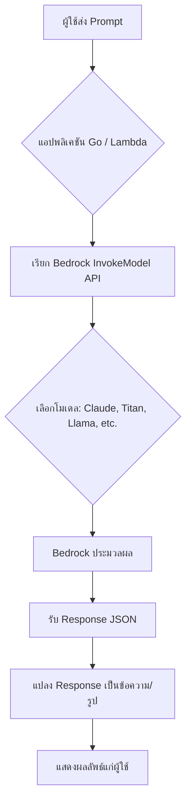

### คำอธิบายแบบละเอียด (Detailed Explanation)  

| ขั้นตอน | คำอธิบาย (ไทย) | Explanation (English) |
|---------|----------------|------------------------|
| 1 | ผู้ใช้ป้อนคำถามหรือคำสั่ง (prompt) | User inputs a question or command (prompt). |
| 2 | โปรแกรม Go (หรือ Lambda) รับ prompt | Go program (or Lambda) receives the prompt. |
| 3 | โปรแกรมสร้าง JSON request body ตามรูปแบบของโมเดลที่เลือก | Program constructs a JSON request body according to the selected model's format. |
| 4 | เรียก Bedrock API ด้วย AWS SDK สำหรับ Go | Call Bedrock API using AWS SDK for Go. |
| 5 | Bedrock ประมวลผลและคืน JSON response | Bedrock processes and returns a JSON response. |
| 6 | โปรแกรมแยกข้อความ/รูปออกจาก response แล้วแสดง | Program extracts text/image from response and displays it. |

### ตัวอย่างโค้ดพร้อมคอมเมนต์สองภาษา (Code with bilingual comments)  

```go
// main.go
// บทที่ 3: ตัวอย่างการเรียก Amazon Bedrock ด้วย Go (Claude 3 Sonnet)
// Chapter 3: Example of invoking Amazon Bedrock with Go (Claude 3 Sonnet)

package main

import (
	"context"
	"encoding/json"
	"fmt"
	"log"

	"github.com/aws/aws-sdk-go-v2/config"                // โหลด AWS config
	"github.com/aws/aws-sdk-go-v2/service/bedrockruntime" // Bedrock Runtime client
)

// Request body สำหรับ Claude 3 (Anthropic)
// Request body for Claude 3 (Anthropic)
type ClaudeRequest struct {
	AnthropicVersion string     `json:"anthropic_version"` // เวอร์ชัน API ของ Anthropic
	MaxTokens        int        `json:"max_tokens"`        // จำนวน token สูงสุดที่ตอบ
	Messages         []Message  `json:"messages"`          // ข้อความสนทนา
	System           string     `json:"system,omitempty"`   // คำสั่งระบบ (optional)
}

type Message struct {
	Role    string `json:"role"`    // "user" หรือ "assistant"
	Content string `json:"content"` // เนื้อหาข้อความ
}

// Response body จาก Claude 3
// Response body from Claude 3
type ClaudeResponse struct {
	Content []struct {
		Text string `json:"text"`
	} `json:"content"`
}

func main() {
	// โหลด AWS configuration จาก ~/.aws/credentials หรือ IAM role
	// Load AWS configuration from ~/.aws/credentials or IAM role
	cfg, err := config.LoadDefaultConfig(context.TODO())
	if err != nil {
		log.Fatalf("ไม่สามารถโหลด AWS config: %v", err)
	}

	// สร้าง Bedrock Runtime client
	// Create Bedrock Runtime client
	client := bedrockruntime.NewFromConfig(cfg)

	// กำหนดโมเดล ID (Claude 3 Sonnet ใน region us-east-1)
	// Model ID (Claude 3 Sonnet in us-east-1)
	modelId := "anthropic.claude-3-sonnet-20240229-v1:0"

	// สร้าง prompt จากผู้ใช้
	// Create prompt from user
	userPrompt := "จงอธิบายประโยชน์ของ AI ในการเกษตรแบบสั้น ๆ ใน 3 ข้อ"
	// userPrompt := "Briefly explain 3 benefits of AI in agriculture"

	// สร้าง request body ตามรูปแบบของ Claude
	// Build request body according to Claude format
	reqBody := ClaudeRequest{
		AnthropicVersion: "bedrock-2023-05-31",
		MaxTokens:        300,
		Messages: []Message{
			{Role: "user", Content: userPrompt},
		},
		System: "คุณเป็นผู้ช่วยที่เชี่ยวชาญด้านการเกษตรและเทคโนโลยี",
	}

	// แปลง request body เป็น JSON
	// Marshal request body to JSON
	payload, err := json.Marshal(reqBody)
	if err != nil {
		log.Fatalf("JSON marshaling error: %v", err)
	}

	// เรียก Bedrock API
	// Invoke Bedrock API
	resp, err := client.InvokeModel(context.TODO(), &bedrockruntime.InvokeModelInput{
		ModelId:     &modelId,
		ContentType: stringPtr("application/json"),
		Body:        payload,
	})
	if err != nil {
		log.Fatalf("Bedrock invocation failed: %v", err)
	}

	// แปลง response JSON
	// Parse response JSON
	var claudeResp ClaudeResponse
	err = json.Unmarshal(resp.Body, &claudeResp)
	if err != nil {
		log.Fatalf("JSON unmarshal error: %v", err)
	}

	// แสดงผลลัพธ์
	// Print the result
	if len(claudeResp.Content) > 0 {
		fmt.Println("=== ผลลัพธ์จาก Claude 3 ===")
		fmt.Println(claudeResp.Content[0].Text)
	} else {
		fmt.Println("ไม่ได้รับข้อความตอบกลับ")
	}
}

// Helper function สำหรับ pointer ของ string
// Helper function for string pointer
func stringPtr(s string) *string {
	return &s
}
```

### วิธีรันโค้ด (How to run)  
1. ติดตั้ง Go 1.21+  
2. `go get github.com/aws/aws-sdk-go-v2/config github.com/aws/aws-sdk-go-v2/service/bedrockruntime`  
3. ตั้งค่า AWS credentials (aws configure)  
4. เปิดใช้งานโมเดลใน Bedrock Console (Model access)  
5. `go run main.go`  

---

## 📌 กรณีศึกษาและแนวทางแก้ไขปัญหา (Case Study & Troubleshooting)

### กรณีศึกษา 1: สร้างแชทบอทตอบคำถามลูกค้าสำหรับธนาคาร  
**ปัญหา:** ลูกค้าถามคำถามเดิมซ้ำ ๆ ทำให้พนักงานเสียเวลา  
**แนวทางแก้ไข:** ใช้ Bedrock (Claude) + Lambda + API Gateway สร้าง REST API ที่รับข้อความ ส่งไป Claude แล้วคืนคำตอบ  
**ผลลัพธ์:** ลดเวลาตอบคำถามลง 80%  

### กรณีศึกษา 2: สรุปเอกสารทางกฎหมายอัตโนมัติ  
**ปัญหา:** ทนายต้องอ่านเอกสารหลายร้อยหน้า  
**แนวทางแก้ไข:** ใช้ Bedrock (Titan Text) + S3 + Lambda ตรวจจับไฟล์ใหม่ใน S3 แล้วสรุปด้วย Claude  
**ผลลัพธ์:** ลดเวลาในการสรุปจาก 2 ชั่วโมงเหลือ 5 นาที  

### ปัญหาที่พบบ่อย (Common Issues)  

| ปัญหา (Issue) | สาเหตุ (Cause) | วิธีแก้ไข (Solution) |
|----------------|----------------|----------------------|
| `AccessDeniedException` | ยังไม่ได้ขอเข้าถึงโมเดล | ไปที่ Bedrock Console -> Model access -> Request access |
| `ThrottlingException` | ส่งคำขอเร็วเกินไป | ใช้ retry with exponential backoff |
| Response ช้าหรือ timeout | Prompt ยาวเกินไป หรือโมเดลใหญ่ | ลด max_tokens หรือเปลี่ยนเป็นโมเดลที่เล็กกว่า (Claude Instant) |
| ผลลัพธ์ไม่ตรงประเด็น | Prompt ไม่ดี | ใช้เทคนิค Prompt Engineering (เพิ่มตัวอย่าง, กำหนด role) |

---

## 📁 เทมเพลตและตัวอย่างโค้ดเพิ่มเติม (Templates & More Code)

### Template สำหรับการเรียก Bedrock แบบฟังก์ชันสำเร็จรูป (Go)

```go
// bedrock_invoke.go
// เทมเพลตฟังก์ชันเรียก Bedrock รองรับหลายโมเดล
// Template function to invoke Bedrock supporting multiple models

package ai

import (
	"context"
	"encoding/json"
	"fmt"
	"github.com/aws/aws-sdk-go-v2/service/bedrockruntime"
)

type Model string

const (
	ClaudeSonnet Model = "anthropic.claude-3-sonnet-20240229-v1:0"
	ClaudeHaiku  Model = "anthropic.claude-3-haiku-20240307-v1:0"
	TitanText    Model = "amazon.titan-text-express-v1"
)

type InvokeParams struct {
	Prompt      string
	Model       Model
	MaxTokens   int
	Temperature float32
}

func InvokeBedrock(ctx context.Context, client *bedrockruntime.Client, params InvokeParams) (string, error) {
	var payload []byte
	var err error

	switch params.Model {
	case ClaudeSonnet, ClaudeHaiku:
		req := map[string]interface{}{
			"anthropic_version": "bedrock-2023-05-31",
			"max_tokens":        params.MaxTokens,
			"messages": []map[string]string{
				{"role": "user", "content": params.Prompt},
			},
			"temperature": params.Temperature,
		}
		payload, err = json.Marshal(req)
	case TitanText:
		req := map[string]interface{}{
			"inputText":   params.Prompt,
			"textGenerationConfig": map[string]interface{}{
				"maxTokenCount": params.MaxTokens,
				"temperature":   params.Temperature,
			},
		}
		payload, err = json.Marshal(req)
	default:
		return "", fmt.Errorf("unsupported model: %s", params.Model)
	}
	if err != nil {
		return "", err
	}

	resp, err := client.InvokeModel(ctx, &bedrockruntime.InvokeModelInput{
		ModelId:     (*string)(&params.Model),
		ContentType: stringPtr("application/json"),
		Body:        payload,
	})
	if err != nil {
		return "", err
	}

	// ถอดรหัส response ตามโมเดล (ตัวอย่างเฉพาะ Claude)
	var result map[string]interface{}
	json.Unmarshal(resp.Body, &result)
	if content, ok := result["content"].([]interface{}); ok && len(content) > 0 {
		if text, ok := content[0].(map[string]interface{})["text"].(string); ok {
			return text, nil
		}
	}
	return "", fmt.Errorf("cannot parse response")
}

func stringPtr(s string) *string { return &s }
```

---

## 📊 ตารางเปรียบเทียบ Foundation Models บน Bedrock

| โมเดล (Model) | ผู้พัฒนา (Provider) | เหมาะสำหรับ (Best for) | Max Tokens | ภาษาไทย (Thai support) |
|---------------|---------------------|------------------------|------------|--------------------------|
| Claude 3 Sonnet | Anthropic | งานที่ต้องการความสมดุลระหว่างความเร็วและความแม่นยำ | 200K | ดีมาก (Excellent) |
| Claude 3 Haiku | Anthropic | ตอบกลับเร็วที่สุด, ต้นทุนต่ำ | 200K | ดีมาก |
| Titan Text Express | Amazon | งานทั่วไป, สรุปข้อความ | 8K | ดี (Good) |
| Llama 3 (Meta) | Meta | งาน open‑source, ปรับแต่งได้ | 8K | พอใช้ (Fair) |

---

## 📝 สรุป (Summary)  

### ✅ ประโยชน์ที่ได้รับ (Benefits)  
- เข้าถึงโมเดล AI ระดับโลกผ่าน API เดียว  
- ไม่ต้องดูแลโครงสร้างพื้นฐาน  
- ปรับขนาดอัตโนมัติ  
- มีความปลอดภัยและเป็นไปตามมาตรฐาน (HIPAA, GDPR)  

### ⚠️ ข้อควรระวัง (Cautions)  
- ค่าใช้จ่ายขึ้นกับจำนวน token ที่ส่งและรับ  
- โมเดลบางตัวอาจมี Bias  
- ต้องตรวจสอบผลลัพธ์ก่อนนำไปใช้งานจริง  

### 👍 ข้อดี (Advantages)  
- เริ่มต้นใช้งานง่าย (มี SDK หลายภาษา)  
- รองรับ multimodal (ข้อความ + รูปภาพ ใน Claude 3)  
- สามารถ fine‑tune โมเดลด้วยข้อมูลของตัวเอง  

### 👎 ข้อเสีย (Disadvantages)  
- ไม่สามารถควบคุมโมเดลได้ลึกเท่า SageMaker  
- หน่วงเวลาเครือข่าย (latency) อาจสูงถ้าเรียกจากนอก region  

### 🚫 ข้อห้าม (Prohibitions)  
- ห้ามใช้สร้างเนื้อหาที่ผิดกฎหมาย, คุกคาม, หรือละเมิดลิขสิทธิ์  
- ห้ามส่งข้อมูลที่เป็นความลับสูง (top secret) โดยไม่ได้รับอนุญาต  

---

## 🧩 แบบฝึกหัดท้ายบท (Exercises)  

**ข้อ 1:** จงอธิบายความแตกต่างระหว่าง Narrow AI กับ Generative AI พร้อมยกตัวอย่างบริการบน AWS อย่างละ 1 อย่าง  
**ข้อ 2:** เขียนคำสั่ง (prompt) เพื่อให้ Claude 3 สร้างเมนูอาหารเช้า 3 อย่างแบบไทย  
**ข้อ 3:** จากตัวอย่างโค้ด Go ในบทนี้ ถ้าต้องการเปลี่ยนอุณหภูมิ (temperature) เป็น 0.9 จะต้องแก้ไขส่วนใด  
**ข้อ 4:** สมมติว่า Bedrock ตอบ error `ThrottlingException` คุณจะแก้ปัญหาอย่างไร (เขียน pseudo‑code)  
**ข้อ 5:** AWS Bedrock รองรับ Foundation Model จากผู้ผลิตใดบ้าง (ยกมา 3 ราย)  
**ข้อ 6:** จงบอกข้อดีของการใช้ Bedrock แทนการสร้างโมเดลด้วย SageMaker อย่างน้อย 2 ข้อ  
**ข้อ 7:** ถ้าต้องการให้ AI สรุปเอกสาร PDF ที่อัปโหลดไป S3 โดยอัตโนมัติ ให้ออกแบบ workflow แบบง่าย ๆ (ระบุบริการ AWS ที่ใช้)  
**ข้อ 8:** จงเขียน Go function ที่รับ prompt และคืนค่าข้อความตอบกลับ โดยใช้ Claude Haiku (model ID ที่ถูกต้อง)  
**ข้อ 9:** อธิบายความหมายของ “max_tokens” และ “temperature” ในบริบทของ LLM  
**ข้อ 10:** ห้ามทำอะไรบ้างเมื่อใช้ Generative AI (ยกมา 3 ข้อห้าม)  

---

## 🔐 เฉลยแบบฝึกหัด (Answer Key)  

**ข้อ 1:** Narrow AI: Amazon Rekognition (เฉพาะการรู้จำภาพ), Generative AI: Bedrock (สร้างเนื้อหาใหม่)  
**ข้อ 2:** `“ช่วยสร้างเมนูอาหารเช้าแบบไทย 3 เมนู พร้อมส่วนผสมหลัก”`  
**ข้อ 3:** เพิ่มฟิลด์ `"temperature": 0.9` ใน JSON request body ของ Claude  
**ข้อ 4:** ใช้ retry logic เช่น exponential backoff:  
```go
for i:=0; i<3; i++ {
    resp, err := client.InvokeModel(...)
    if err == nil { break }
    time.Sleep(time.Duration(1<<i)*100*time.Millisecond)
}
```
**ข้อ 5:** Anthropic, Amazon, Meta, AI21 Labs, Cohere (ตอบ 3 ข้อก็พอ)  
**ข้อ 6:** 1) ไม่ต้องจัดการโครงสร้างพื้นฐาน 2) เข้าถึงโมเดลล้ำสมัยได้ทันที  
**ข้อ 7:** S3 (upload) → Lambda (trigger) → Bedrock (สรุป) → เก็บผลลัพธ์ใน S3 หรือ DynamoDB  
**ข้อ 8:** ใช้ modelId = `"anthropic.claude-3-haiku-20240307-v1:0"` และทำตาม template  
**ข้อ 9:** max_tokens = ความยาวสูงสุดของคำตอบ, temperature = ความสุ่ม/ความคิดสร้างสรรค์ (0=ตายตัว, 1=สุ่มสูง)  
**ข้อ 10:** 1) ห้ามสร้างเนื้อหาผิดกฎหมาย 2) ห้ามละเมิดลิขสิทธิ์ 3) ห้ามใช้ตัดสินชีวิตโดยไม่มีมนุษย์ควบคุม  

---

## 📚 แหล่งอ้างอิง (References)  

1. AWS Documentation – Amazon Bedrock. (2024). *What is Amazon Bedrock?*  
   https://docs.aws.amazon.com/bedrock/  
2. Anthropic. (2024). *Claude 3 Model Card*.  
3. AWS SDK for Go v2 – Bedrock Runtime.  
   https://pkg.go.dev/github.com/aws/aws-sdk-go-v2/service/bedrockruntime  
4. Prompt Engineering Guide. (2024). *Best practices for LLMs*.  

---

**✍️ ผู้เขียน:** คงนคร จันทะคุณ  
**📅 อัปเดตล่าสุด:** เมษายน 2026  

---

**หมายเหตุ:** เนื้อหาในบทนี้เป็นส่วนหนึ่งของหนังสือ “AWS จากภาคทฤษฎีไปภาคปฏิบัติ” สามารถนำโค้ดไปรันและปรับใช้ได้ทันที หากพบปัญหากรุณาตรวจสอบสิทธิ์การเข้าถึงโมเดล Bedrock และ region ที่ใช้งาน

# 📘 บทที่ 4: Data Engineer – วิศวกรรมข้อมูลยุคคลาวด์  
## Chapter 4: Data Engineer – Data Engineering in the Cloud Era  

---

## 🧱 โครงสร้างการทำงาน (Work Structure)  

**ไทย:**  
บทนี้ถูกออกแบบให้ผู้อ่านได้เรียนรู้บทบาทของ Data Engineer บน AWS ตั้งแต่การเก็บข้อมูล (ingestion), การประมวลผล (processing), การจัดเก็บ (storage), ไปจนถึงการนำข้อมูลไปใช้ (analytics/ML) โดยเน้นการใช้บริการ AWS เช่น S3, Glue, Athena, Lambda, Kinesis และเขียนโปรแกรม Go สำหรับงาน data pipeline  

**English:**  
This chapter is designed for readers to learn the role of a Data Engineer on AWS – from data ingestion, processing, storage, to analytics/ML – focusing on AWS services like S3, Glue, Athena, Lambda, Kinesis, and writing Go programs for data pipelines.  

---

## 🎯 วัตถุประสงค์แบบสั้นสำหรับทบทวน (Short Revision Objective)  

**ไทย:**  
เพื่อให้ผู้อ่านเข้าใจความหมายของ Data Engineer, ประเภทของงาน data engineering, เหตุผลที่ต้องใช้, ประโยชน์ และสามารถออกแบบ data pipeline บน AWS โดยใช้ S3, Glue, Athena และ Lambda พร้อมเขียนโค้ด Go สำหรับประมวลผลข้อมูลแบบ event-driven และ batch  

**English:**  
To enable readers to understand the definition of Data Engineer, types of data engineering tasks, why and when to use them, benefits, and to design data pipelines on AWS using S3, Glue, Athena, and Lambda, as well as writing Go code for event-driven and batch processing.  

---

## 👥 กลุ่มเป้าหมาย (Target Audience)  

- ผู้ที่สนใจเป็น Data Engineer หรือเปลี่ยนสายจาก Software Engineer  
- Data Analyst ที่ต้องการยกระดับสู่การจัดการ pipeline  
- Solution Architect ที่ต้องออกแบบระบบข้อมูลบน AWS  
- นักศึกษา或ผู้เริ่มต้นในสายข้อมูลขนาดใหญ่ (Big Data)  
- ผู้เตรียมสอบ AWS Certified Data Engineer – Associate  

---

## 📚 ความรู้พื้นฐาน (Prerequisites)  

- พื้นฐาน SQL (SELECT, JOIN, GROUP BY)  
- ใช้งาน command line และ AWS CLI เบื้องต้น  
- มีบัญชี AWS และเข้าใจบริการ S3, IAM (ระดับพื้นฐาน)  
- รู้จักภาษา Go พอสมควร (if-else, loops, functions, HTTP client)  
- (แนะนำ) ติดตั้ง Docker เพื่อทดสอบ Apache Spark หรือ Glue locally  

---

## 📝 เนื้อหาโดยย่อ (Abstract)  

**ไทย:**  
บทนี้เริ่มจากอธิบายว่า Data Engineer คืออะไร มีกี่รูปแบบ (batch, streaming, ETL, ELT) และทำไมต้องใช้ จากนั้นจะลงมือปฏิบัติจริงบน AWS: จำลองสถานการณ์ข้อมูลจาก API → ส่งไปยัง S3 → ใช้ AWS Glue (หรือ Lambda + Go) เพื่อแปลงข้อมูล → บันทึกในรูปแบบ Parquet → สร้างตารางใน Athena → Query ด้วย SQL ผ่าน Go program นอกจากนี้ยังมีกรณีศึกษา streaming ด้วย Kinesis และแนวทางแก้ไขปัญหาทั่วไป  

**English:**  
This chapter starts by explaining what a Data Engineer is, the various types (batch, streaming, ETL, ELT), and why it’s needed. Then hands‑on on AWS: simulate data from an API → send to S3 → use AWS Glue (or Lambda + Go) to transform data → store as Parquet → create tables in Athena → query with SQL via a Go program. Also includes a streaming case study with Kinesis and common troubleshooting.  

---

## 🔰 บทนำ (Introduction)  

**ไทย:**  
ในยุคที่ข้อมูลถูกผลิตขึ้นทุกวินาที (จากแอปพลิชัน, IoT, โลก็ออนไลน์) องค์กรต้องการคนที่สามารถเก็บ รวบรวม ทำความสะอาด และเตรียมข้อมูลให้พร้อมสำหรับการวิเคราะห์หรือ AI บุคคลนั้นคือ **Data Engineer** บน AWS เรามีเครื่องมือครบครัน ตั้งแต่ S3 (Data Lake), Glue (ETL serverless), Athena (SQL บน S3), Kinesis (streaming) และ Lambda (ประมวลผลแบบ event) ทำให้ data engineer ทำงานได้โดยไม่ต้องจัดการเซิร์ฟเวอร์  

**English:**  
In an era where data is generated every second (from apps, IoT, online logs), organizations need people who can store, collect, clean, and prepare data for analytics or AI. That person is a **Data Engineer**. On AWS, we have a full suite: S3 (data lake), Glue (serverless ETL), Athena (SQL on S3), Kinesis (streaming), and Lambda (event processing), allowing data engineers to work without managing servers.  

---

## 📖 บทนิยาม (Definitions)  

| คำศัพท์ (Term) | คำจำกัดความไทย (Thai Definition) | English Definition |
|----------------|----------------------------------|--------------------|
| Data Engineer | ผู้ที่ออกแบบ สร้าง และบำรุงรักษาระบบข้อมูล (pipelines, databases, data lakes) เพื่อให้ข้อมูลพร้อมใช้งาน | Person who designs, builds, and maintains data systems (pipelines, databases, data lakes) to make data ready for use. |
| ETL (Extract, Transform, Load) | ดึงข้อมูลจากแหล่ง → แปลงให้อยู่ในรูปแบบที่ต้องการ → โหลดไปยังปลายทาง (เช่น Data Warehouse) | Extract from sources → Transform to desired format → Load to destination (e.g., Data Warehouse). |
| ELT (Extract, Load, Transform) | ดึง → โหลดข้อมูลดิบไปยัง Data Lake → แปลงทีหลัง (เหมาะกับ Big Data) | Extract → Load raw data into Data Lake → Transform later (suitable for Big Data). |
| Data Lake | ที่เก็บข้อมูลดิบทุกประเภท (structured, semi-structured, unstructured) ใน S3 หรือ HDFS | Centralized repository for raw data of all types (structured, semi-structured, unstructured) in S3 or HDFS. |
| Batch Processing | ประมวลผลข้อมูลเป็นชุด ๆ ตามช่วงเวลา (เช่น ทุกชั่วโมง, ทุกวัน) | Processing data in groups at scheduled intervals (e.g., hourly, daily). |
| Stream Processing | ประมวลผลข้อมูลแบบเรียลไทม์ ทันทีที่มาถึง | Processing data in real time as it arrives. |
| AWS Glue | บริการ ETL แบบ serverless ที่ใช้ Apache Spark | Serverless ETL service using Apache Spark. |
| Amazon Athena | บริการ Query ข้อมูลใน S3 โดยใช้ SQL โดยไม่ต้องโหลดเข้า database | Serverless query service to run SQL directly on S3 data. |
| Parquet | รูปแบบไฟล์แบบ columnar ที่บีบอัดและมีประสิทธิภาพสูง | Columnar storage format that is compressed and high‑performance. |

---

## 🔧 Data Engineer คืออะไร? มีกี่แบบ? ใช้อย่างไร?  

### 1. Data Engineer คืออะไร  
**ไทย:**  
Data Engineer คือผู้ที่ทำให้ “ข้อมูล” พร้อมใช้งานสำหรับ Data Scientist, Data Analyst, หรือระบบ AI พวกเขาสร้าง pipeline ที่ดึงข้อมูลจากแหล่งต่าง ๆ (API, DB, logs) ทำความสะอาด รวมข้อมูล (join) แล้วเก็บไว้ใน Data Lake หรือ Data Warehouse อย่างเป็นระเบียบ  

**English:**  
A Data Engineer makes “data” ready for Data Scientists, Data Analysts, or AI systems. They build pipelines that extract data from various sources (APIs, DBs, logs), clean it, join it, and store it in an organized Data Lake or Data Warehouse.  

### 2. มีกี่แบบ (Types of Data Engineering work)  

| แบบ (Type) | คำอธิบาย (Description) | ตัวอย่างเครื่องมือ AWS (AWS Tools) |
|-------------|------------------------|----------------------------------|
| Batch ETL/ELT | ประมวลผลข้อมูลเป็นรอบ เช่น ทุกเที่ยงคืน | AWS Glue (Spark), Lambda (scheduled) |
| Streaming (Real-time) | ประมวลผลทันทีที่ข้อมูลมา | Amazon Kinesis Data Analytics, Lambda + Kinesis |
| Data Lake Management | จัดการโครงสร้าง partition, compression, format | S3 + Glue Catalog + Athena |
| Data Warehouse Engineering | โหลดข้อมูลไปยัง Redshift | Redshift Spectrum, COPY command |
| Orchestration | จัดลำดับ pipeline, dependency, retry | AWS Step Functions, Apache Airflow (MWAA) |
| Data Quality & Governance | ตรวจสอบความถูกต้อง, lineage, masking | AWS Glue Data Quality, Lake Formation |

### 3. ใช้อย่างไร (How to use)  
- ใช้ **S3** เป็น Data Lake (raw, processed, curated zones)  
- ใช้ **Glue Crawler** สร้างตารางอัตโนมัติจากไฟล์ใน S3  
- ใช้ **Glue ETL** (Spark หรือ Python shell) เพื่อ transform  
- ใช้ **Athena** สำหรับ query แบบ ad‑hoc  
- ใช้ **Lambda** + S3 trigger สำหรับ event‑driven ETL เล็ก ๆ  
- ใช้ **Kinesis** สำหรับ real‑time ingestion  

### 4. นำในกรณีไหน (When to use)  
- มีข้อมูลปริมาณมาก (GB/TB) จากหลายแหล่ง  
- ต้องทำความสะอาดข้อมูลและรวมแหล่งก่อนวิเคราะห์  
- ต้องการให้ Data Analyst สามารถ query ข้อมูลได้โดยไม่ต้องเขียนโปรแกรมซับซ้อน  
- ต้องการทำ real‑time dashboard หรือ alert  

### 5. ทำไมต้องใช้ (Why use Data Engineer)  
- หากไม่มี Data Engineer: ข้อมูลกระจัดกระจาย, ไม่มีคุณภาพ, วิเคราะห์ยาก  
- Data Engineer ช่วยให้: ข้อมูลถูกต้อง, เข้าถึงง่าย, ประมวลผลเร็ว, ค่าใช้จ่ายต่ำ (ด้วยการเลือก format และ compression ที่เหมาะสม)  

### 6. ประโยชน์ที่ได้รับ (Benefits)  
- ลดเวลาในการเตรียมข้อมูลจากสัปดาห์เหลือชั่วโมง  
- ทำให้ Self‑service analytics (Athena, QuickSight) เป็นไปได้  
- เพิ่มความน่าเชื่อถือของข้อมูล (data quality checks)  
- สามารถขยายไปสู่ real‑time และ machine learning ได้  

### 7. ข้อควรระวัง (Cautions)  
- ค่าใช้จ่าย S3 + Glue + Athena อาจสูงถ้าไม่จัดการ partition และ compression  
- การออกแบบ schema ที่ไม่ดีทำให้ query ช้า  
- ต้องมี data governance (ใครเข้าถึงข้อมูลอะไรได้บ้าง)  

### 8. ข้อดี (Advantages)  
- Serverless เป็นส่วนใหญ่ (ไม่ต้องดูแล cluster)  
- เริ่มต้นง่าย: S3 + Athena ก็ query ได้ทันที  
- รองรับทั้ง batch และ streaming  

### 9. ข้อเสีย (Disadvantages)  
- Glue ETL (Spark) มี cold start สำหรับ workload เล็ก ๆ  
- Athena มีขีดจำกัด query concurrency (เริ่มต้น 20)  
- การ debug pipeline ที่ซับซ้อนอาจยากกว่า traditional database  

### 10. ข้อห้าม (Prohibitions)  
- ห้ามเก็บข้อมูล PII (个人信息) โดยไม่เข้ารหัส (ใช้ SSE‑S3 หรือ KMS)  
- ห้าม query ทุกไฟล์โดยไม่ใช้ partition (จะแพงและช้า)  
- ห้ามใช้ Athena สำหรับ transactional workload (OLTP)  

---

## 🔄 ออกแบบ Workflow (Workflow Design)  

### ภาพรวม Dataflow (Dataflow Diagram)  

**ไทย:**  
Pipeline แบบ Batch: แหล่งข้อมูล (API, Database) → Ingestion (Lambda หรือ Glue) → Raw Zone (S3 bucket, JSON/CSV) → Transformation (Glue ETL หรือ Lambda) → Cleaned Zone (S3, Parquet + partitioned) → Catalog (Glue Data Catalog) → Analytics (Athena / QuickSight) → Data Scientist หรือ Dashboard  

**English:**  
Batch pipeline: Data sources (API, DB) → Ingestion (Lambda or Glue) → Raw Zone (S3 bucket, JSON/CSV) → Transformation (Glue ETL or Lambda) → Cleaned Zone (S3, Parquet + partitioned) → Catalog (Glue Data Catalog) → Analytics (Athena / QuickSight) → Data Scientist or Dashboard.  

### Mermaid Dataflow Flowchart  

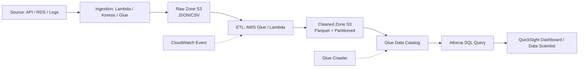

### คำอธิบายแบบละเอียด (Detailed Explanation)  

| ขั้นตอน | คำอธิบาย (ไทย) | Explanation (English) |
|---------|----------------|------------------------|
| 1 | แหล่งข้อมูลอาจเป็น REST API, ฐานข้อมูล RDS, หรือไฟล์ log | Sources can be REST API, RDS database, or log files. |
| 2 | Ingestion: Lambda (เรียก API ทุก 1 ชั่วโมง) หรือ Kinesis (real‑time) | Ingestion: Lambda (calls API every hour) or Kinesis (real‑time). |
| 3 | Raw Zone: เก็บข้อมูลดิบใน S3 โดยไม่เปลี่ยนแปลง, แยกตามวันที่ | Raw Zone: store raw data in S3 unchanged, partitioned by date. |
| 4 | Transformation: Glue ETL job อ่าน raw, ทำความสะอาด (ลบ null, แปลง数据类型), รวมตาราง, เขียนเป็น Parquet | Transformation: Glue ETL job reads raw, cleans (remove nulls, cast types), joins tables, writes as Parquet. |
| 5 | Cleaned Zone: Parquet + partition (ปี/เดือน/วัน) ทำให้ query เร็วและถูก | Cleaned Zone: Parquet + partitioning (year/month/day) for fast and cheap queries. |
| 6 | Glue Data Catalog เก็บ metadata ของตาราง (ตำแหน่ง S3, schema) | Glue Data Catalog stores table metadata (S3 location, schema). |
| 7 | Athena ให้คุณใช้ SQL query ข้อมูล Parquet โดยตรง | Athena lets you run SQL queries directly on Parquet data. |
| 8 | ผลลัพธ์ถูกนำไปแสดงใน Dashboard หรือส่งให้ Data Scientist | Results are shown in a dashboard or sent to Data Scientist. |

---

## 💻 ตัวอย่างโค้ดที่รันได้จริง (Runnable Code Example)  

### Scenario:  
เราจะจำลอง API ที่ให้ข้อมูลพนักงาน (JSON) → เรียก API ทุก 1 ชั่วโมงด้วย Lambda (เขียนใน Go) → เก็บ raw JSON ใน S3 → ใช้ Glue ETL (Python) แปลงเป็น Parquet → query ด้วย Athena จากโปรแกรม Go  

เนื่องจาก Go รองรับ AWS SDK และ Athena ได้ดี เราจะโฟกัสที่ **Go program สำหรับเรียก API, อัปโหลดไป S3, และรัน Athena query** ส่วน Glue ETL job เราให้เป็นสคริปต์ Python (เพราะ Glue รองรับ Python เป็นหลัก) แต่จะอธิบายให้เข้าใจ  

### โค้ดส่วนที่ 1: Go Lambda สำหรับ Ingestion (เรียก API → S3)  

```go
// main.go (Lambda function in Go)
// บทที่ 4: Data ingestion จาก API ไปยัง S3 raw zone
// Chapter 4: Data ingestion from API to S3 raw zone

package main

import (
	"bytes"
	"context"
	"encoding/json"
	"fmt"
	"io/ioutil"
	"net/http"
	"time"

	"github.com/aws/aws-lambda-go/lambda"                // Lambda runtime for Go
	"github.com/aws/aws-sdk-go-v2/aws"                  // AWS SDK v2 core
	"github.com/aws/aws-sdk-go-v2/config"               // Load AWS config
	"github.com/aws/aws-sdk-go-v2/service/s3"           // S3 client
)

// Employee is a struct representing data from API
// Employee คือโครงสร้างข้อมูลพนักงานจาก API
type Employee struct {
	ID        int    `json:"id"`
	Name      string `json:"name"`
	Department string `json:"department"`
	Salary    int    `json:"salary"`
}

// Response from our handler (just for logging)
type Response struct {
	Message string `json:"message"`
}

var s3Client *s3.Client

func init() {
	// โหลด AWS config (จะใช้ IAM role ของ Lambda)
	// Load AWS config (uses Lambda's IAM role)
	cfg, err := config.LoadDefaultConfig(context.TODO())
	if err != nil {
		panic(fmt.Sprintf("cannot load config: %v", err))
	}
	s3Client = s3.NewFromConfig(cfg)
}

func handler(ctx context.Context) (Response, error) {
	// 1. เรียก API สมมติ (mock API endpoint)
	// 1. Call mock API endpoint
	apiURL := "https://mockapi.example.com/employees" // เปลี่ยนเป็น URL จริง
	respAPI, err := http.Get(apiURL)
	if err != nil {
		return Response{}, fmt.Errorf("API call failed: %w", err)
	}
	defer respAPI.Body.Close()

	body, err := ioutil.ReadAll(respAPI.Body)
	if err != nil {
		return Response{}, fmt.Errorf("read body failed: %w", err)
	}

	// 2. ตรวจสอบว่าเป็น JSON array หรือไม่
	// 2. Validate that it's a JSON array
	var employees []Employee
	if err := json.Unmarshal(body, &employees); err != nil {
		return Response{}, fmt.Errorf("invalid JSON: %w", err)
	}

	// 3. สร้าง key สำหรับ S3: raw/ปี/เดือน/วัน/ชั่วโมง/employees.json
	// 3. Create S3 key: raw/year/month/day/hour/employees.json
	now := time.Now().UTC()
	key := fmt.Sprintf("raw/%d/%02d/%02d/%02d/employees.json",
		now.Year(), now.Month(), now.Day(), now.Hour())

	bucket := "my-data-lake-bucket" // เปลี่ยนเป็น bucket จริง

	// 4. อัปโหลด JSON ไปยัง S3
	// 4. Upload JSON to S3
	_, err = s3Client.PutObject(ctx, &s3.PutObjectInput{
		Bucket: &bucket,
		Key:    &key,
		Body:   bytes.NewReader(body),
	})
	if err != nil {
		return Response{}, fmt.Errorf("upload to S3 failed: %w", err)
	}

	msg := fmt.Sprintf("Successfully uploaded %d employees to s3://%s/%s", len(employees), bucket, key)
	return Response{Message: msg}, nil
}

func main() {
	lambda.Start(handler)
}
```

### โค้ดส่วนที่ 2: Glue ETL Script (Python) เพื่อแปลง JSON → Parquet  
(เราไม่บังคับ Go สำหรับทุกอย่าง แต่ต้องอธิบาย)  

```python
# glue_etl_job.py
# Glue ETL job อ่าน JSON จาก S3 raw zone แล้วเขียน Parquet พร้อม partition
# Glue ETL job reads JSON from S3 raw zone and writes Parquet with partitioning

import sys
from awsglue.transforms import *
from awsglue.utils import getResolvedOptions
from pyspark.context import SparkContext
from awsglue.context import GlueContext
from awsglue.job import Job
from pyspark.sql.functions import year, month, dayofmonth, hour

args = getResolvedOptions(sys.argv, ['JOB_NAME'])
sc = SparkContext()
glueContext = GlueContext(sc)
spark = glueContext.spark_session
job = Job(glueContext)
job.init(args['JOB_NAME'], args)

# อ่านข้อมูล JSON จาก S3 raw zone (โฟลเดอร์ raw/)
# Read JSON from S3 raw zone (folder raw/)
raw_path = "s3://my-data-lake-bucket/raw/"
df = spark.read.json(raw_path)

# ทำความสะอาด: ลบแถวที่ salary เป็น null
# Clean: remove rows where salary is null
df_clean = df.na.drop(subset=["salary"])

# เพิ่มคอลัมน์ปี,เดือน,วัน,ชั่วโมง จาก timestamp (สมมติมีคอลัมน์ event_time)
# Add year, month, day, hour columns from timestamp (assume column event_time exists)
if "event_time" in df_clean.columns:
    df_clean = df_clean.withColumn("year", year("event_time")) \
                       .withColumn("month", month("event_time")) \
                       .withColumn("day", dayofmonth("event_time")) \
                       .withColumn("hour", hour("event_time"))
else:
    # ถ้าไม่มี event_time ใช้ current date
    from pyspark.sql.functions import current_timestamp
    df_clean = df_clean.withColumn("event_time", current_timestamp())
    df_clean = df_clean.withColumn("year", year("event_time")) \
                       .withColumn("month", month("event_time")) \
                       .withColumn("day", dayofmonth("event_time")) \
                       .withColumn("hour", hour("event_time"))

# เขียนเป็น Parquet โดย partition ด้วย year/month/day/hour
# Write as Parquet partitioned by year/month/day/hour
output_path = "s3://my-data-lake-bucket/cleaned/employees_parquet"
df_clean.write.mode("overwrite").partitionBy("year", "month", "day", "hour").parquet(output_path)

job.commit()
```

### โค้ดส่วนที่ 3: Go program สำหรับ Query Athena และแสดงผล  

```go
// query_athena.go
// บทที่ 4: รัน SQL query บน Athena จาก Go
// Chapter 4: Run SQL query on Athena from Go

package main

import (
	"context"
	"encoding/csv"
	"fmt"
	"log"
	"os"
	"strings"
	"time"

	"github.com/aws/aws-sdk-go-v2/config"
	"github.com/aws/aws-sdk-go-v2/service/athena"
	"github.com/aws/aws-sdk-go-v2/service/athena/types"
	"github.com/aws/aws-sdk-go-v2/service/s3"
)

func main() {
	cfg, err := config.LoadDefaultConfig(context.TODO())
	if err != nil {
		log.Fatalf("cannot load config: %v", err)
	}

	athenaClient := athena.NewFromConfig(cfg)
	s3Client := s3.NewFromConfig(cfg)

	query := `
		SELECT department, COUNT(*) as emp_count, AVG(salary) as avg_salary
		FROM my_database.employees_parquet
		WHERE year = '2026' AND month = '04'
		GROUP BY department
		ORDER BY avg_salary DESC
	`

	// Result output bucket (ต้องมีอยู่แล้ว)
	resultBucket := "my-athena-results-bucket"
	outputLocation := fmt.Sprintf("s3://%s/query_results/", resultBucket)

	// Start query execution
	startQueryInput := &athena.StartQueryExecutionInput{
		QueryString: &query,
		ResultConfiguration: &types.ResultConfiguration{
			OutputLocation: &outputLocation,
		},
	}

	resp, err := athenaClient.StartQueryExecution(context.TODO(), startQueryInput)
	if err != nil {
		log.Fatalf("failed to start query: %v", err)
	}

	queryExecId := *resp.QueryExecutionId
	fmt.Printf("Query Execution ID: %s\n", queryExecId)

	// รอให้ query เสร็จ (polling ทุก 2 วินาที)
	// Wait for query completion (poll every 2 seconds)
	for {
		descInput := &athena.GetQueryExecutionInput{
			QueryExecutionId: &queryExecId,
		}
		descResp, err := athenaClient.GetQueryExecution(context.TODO(), descInput)
		if err != nil {
			log.Fatalf("failed to get query status: %v", err)
		}
		status := descResp.QueryExecution.Status.State
		if status == types.QueryExecutionStateSucceeded {
			fmt.Println("Query succeeded.")
			break
		} else if status == types.QueryExecutionStateFailed || status == types.QueryExecutionStateCancelled {
			reason := ""
			if descResp.QueryExecution.Status.StateChangeReason != nil {
				reason = *descResp.QueryExecution.Status.StateChangeReason
			}
			log.Fatalf("Query failed: %s", reason)
		}
		fmt.Println("Query still running...")
		time.Sleep(2 * time.Second)
	}

	// ดึงผลลัพธ์จากไฟล์ CSV ใน S3
	// Get results from CSV file in S3
	resultKey := fmt.Sprintf("query_results/%s.csv", queryExecId)
	getObjectInput := &s3.GetObjectInput{
		Bucket: &resultBucket,
		Key:    &resultKey,
	}
	obj, err := s3Client.GetObject(context.TODO(), getObjectInput)
	if err != nil {
		log.Fatalf("failed to get results: %v", err)
	}
	defer obj.Body.Close()

	// อ่าน CSV และแสดงผล
	// Read CSV and print
	reader := csv.NewReader(obj.Body)
	records, err := reader.ReadAll()
	if err != nil {
		log.Fatalf("failed to parse CSV: %v", err)
	}

	fmt.Println("\n=== Query Results ===")
	for i, row := range records {
		fmt.Printf("%s\n", strings.Join(row, " | "))
		if i == 0 {
			fmt.Println(strings.Repeat("-", 50))
		}
	}
}
```

---

## 📌 กรณีศึกษาและแนวทางแก้ไขปัญหา (Case Study & Troubleshooting)  

### กรณีศึกษา 1: บริษัท E‑commerce ต้องการวิเคราะห์พฤติกรรมผู้ใช้แบบเรียลไทม์  
**ปัญหา:** ข้อมูล clickstream จากเว็บไซต์หลายล้าน event ต่อวัน ต้องประมวลผลเพื่อสร้าง dashboard แบบ real‑time  
**แนวทางแก้ไข:**  
- ใช้ Amazon Kinesis Data Streams รับ event จากเว็บ (ผ่าน SDK หรือ Kinesis Agent)  
- Lambda (Go) อ่านจาก Kinesis, enrich ข้อมูล (เพิ่ม user agent, geoip) แล้วเขียนไปยัง S3 (raw) และส่งไปยัง Elasticsearch (หรือ OpenSearch) เพื่อ dashboard  
- ใช้ Glue Streaming (Spark Structured Streaming) สำหรับ aggregations แบบ sliding window  
**ผลลัพธ์:** latency ลดลงจาก 1 ชั่วโมงเหลือ 5 วินาที, สามารถ detect spike ใน traffic ได้ทันที  

### กรณีศึกษา 2: ข้อมูลการเงินต้องมี Data Quality และ Lineage  
**ปัญหา:** ต้องตรวจสอบว่าข้อมูลที่ใช้ในรายงานถูกต้อง และสามารถ trace กลับไปยัง source ได้  
**แนวทางแก้ไข:**  
- ใช้ AWS Glue Data Quality (ใน Glue 3.0) กำหนด rules เช่น `IsUnique(id)`, `IsComplete(amount)`  
- ใช้ AWS Lake Formation สำหรับ fine‑grained access control  
- ใช้ Glue Catalog + Column-level lineage จาก Spark jobs  
**ผลลัพธ์:** ผ่าน audit requirements, ลดเวลา manual validation 90%  

### ปัญหาที่พบบ่อย (Common Issues)  

| ปัญหา (Issue) | สาเหตุ (Cause) | วิธีแก้ไข (Solution) |
|----------------|----------------|----------------------|
| Athena query ช้ามาก | ไม่มี partition หรือใช้ SELECT * | เพิ่ม partition filter (`WHERE year=2026`) และเลือกเฉพาะคอลัมน์ที่ต้องการ |
| Glue job OOM (out of memory) | Spark partition ใหญ่เกินไป | เพิ่ม `--conf spark.sql.files.maxPartitionBytes=134217728` (128MB) หรือเพิ่ม DPU |
| Lambda timeout สำหรับ ingestion | API ตอบช้าหรือข้อมูลใหญ่เกิน | เปลี่ยนไปใช้ Glue หรือ Fargate สำหรับงานหนัก, หรือเพิ่ม timeout (สูงสุด 15 นาที) |
| ข้อมูลซ้ำ (duplicate) ใน cleaned zone | ไม่มี idempotency | ใช้ primary key + merge logic (Delta Lake หรือ Upsert) |
| ราคา S3 สูงเกินคาด | ไม่ตั้ง lifecycle rule | ตั้ง S3 Lifecycle: move older data to Glacier after 30 days |

---

## 📁 เทมเพลตและตัวอย่างโค้ดเพิ่มเติม (Templates & More Code)  

### Template สำหรับ S3 Bucket Structure (Data Lake Zones)  

| Zone | Prefix | Format | Compression | Retention |
|------|--------|--------|-------------|-----------|
| Raw | `raw/` | JSON, CSV, gzip | gzip | 7 days |
| Staging | `staging/` | Parquet | Snappy | 30 days |
| Cleaned | `cleaned/` | Parquet + partitioned | Snappy | 365 days |
| Analytics | `analytics/` | Parquet or ORC | Zstandard | indefinite |

### Template สำหรับ Glue Job Parameters (JSON)  

```json
{
  "JobName": "employee-etl",
  "Role": "arn:aws:iam::ACCOUNT:role/GlueServiceRole",
  "Command": {
    "Name": "glueetl",
    "ScriptLocation": "s3://my-scripts/glue_etl_job.py"
  },
  "DefaultArguments": {
    "--job-language": "python",
    "--spark-event-logs-path": "s3://my-logs/spark/",
    "--enable-metrics": "true"
  },
  "MaxRetries": 1,
  "Timeout": 60,
  "WorkerType": "G.1X",
  "NumberOfWorkers": 5
}
```

### โค้ด Go สำหรับ Kinesis Producer (ส่งข้อมูล streaming)  

```go
// kinesis_producer.go
// ส่งข้อมูลไปยัง Kinesis stream แบบ异步
// Send data to Kinesis stream asynchronously

package main

import (
	"context"
	"encoding/json"
	"log"
	"time"

	"github.com/aws/aws-sdk-go-v2/config"
	"github.com/aws/aws-sdk-go-v2/service/kinesis"
	"github.com/aws/aws-sdk-go-v2/service/kinesis/types"
)

type ClickEvent struct {
	UserID    string    `json:"user_id"`
	Page      string    `json:"page"`
	Timestamp time.Time `json:"timestamp"`
}

func main() {
	cfg, _ := config.LoadDefaultConfig(context.TODO())
	client := kinesis.NewFromConfig(cfg)

	event := ClickEvent{
		UserID:    "u123",
		Page:      "/product/aws",
		Timestamp: time.Now(),
	}
	data, _ := json.Marshal(event)

	// Partition key ใช้ userID เพื่อให้ event ของ user เดียวไป shard เดียวกัน
	partitionKey := event.UserID

	_, err := client.PutRecord(context.TODO(), &kinesis.PutRecordInput{
		Data:         data,
		PartitionKey: &partitionKey,
		StreamName:   stringPtr("my-clickstream"),
	})
	if err != nil {
		log.Fatal(err)
	}
	log.Println("sent to Kinesis")
}

func stringPtr(s string) *string { return &s }
```

---

## 📊 ตารางเปรียบเทียบ: Batch vs Streaming  

| คุณลักษณะ (Feature) | Batch Processing | Stream Processing |
|----------------------|------------------|--------------------|
| Latency | นาที ถึง ชั่วโมง | มิลลิวินาที ถึง วินาที |
| Data volume | ขนาดใหญ่ (TB/PB) | แต่ละ event เล็ก แต่ปริมาณสูง |
| State management | ใช้ Spark หรือ SQL | ใช้ state store (Flink, Kafka Streams) |
| Tools บน AWS | Glue ETL, Athena | Kinesis Analytics, Lambda, Flink on EMR |
| Complexity | ต่ำ | ปานกลาง ถึง สูง |
| Cost | ถูกสำหรับงานไม่เร่งด่วน | แพงกว่า (ต้องมี cluster ตลอดเวลา) |

---

## 📝 สรุป (Summary)  

### ✅ ประโยชน์ที่ได้รับ (Benefits)  
- ทำให้การวิเคราะห์ข้อมูลง่ายและรวดเร็วขึ้น  
- ลดต้นทุนการจัดเก็บด้วย Parquet + compression  
- สามารถขยายจาก batch สู่ streaming ได้โดยใช้ Kinesis  
- ใช้ AWS serverless ช่วยลดภาระการดูแล cluster  

### ⚠️ ข้อควรระวัง (Cautions)  
- Partition มากเกินไป (too many small files) ทำให้ Athena ช้า  
- Glue job ต้องตั้งค่า worker type ให้เหมาะสม (อย่าใช้ DPU ต่ำเกิน)  
- Athena query ที่ไม่ filter partition จะสแกนทั้งตาราง เสียค่าใช้จ่ายสูง  

### 👍 ข้อดี (Advantages)  
- เริ่มต้นง่าย: S3 + Athena ก็ query JSON ได้ทันที  
- มีเครื่องมือครบวงจร (Ingestion, Storage, ETL, Catalog, Query)  
- รองรับข้อมูลหลากหลายรูปแบบ (structured, semi‑structured)  

### 👎 ข้อเสีย (Disadvantages)  
- Athena ไม่รองรับ transactions (UPDATE/DELETE) โดยตรง  
- Glue ETL (Spark) มี cold start สำหรับ job ขนาดเล็ก  
- การ debug ETL ที่ซับซ้อนต้องใช้ logs และ Spark UI  

### 🚫 ข้อห้าม (Prohibitions)  
- ห้ามใช้ S3 เป็น database แบบ transactional (มี consistency แต่ไม่ใช่ ACID)  
- ห้ามเก็บไฟล์ขนาดเล็ก (<10MB) จำนวนมาก (ให้ใช้ compaction)  
- ห้าม query Athena โดยไม่มี LIMIT หรือ partition filter  

---

## 🧩 แบบฝึกหัดท้ายบท (Exercises)  

**ข้อ 1:** จงอธิบายความแตกต่างระหว่าง ETL และ ELT พร้อมยกตัวอย่างว่าแบบใดเหมาะกับ Data Lake บน AWS  
**ข้อ 2:** เขียน SQL query (Athena) เพื่อหาจำนวนพนักงานแยกตาม department จากตาราง employees_parquet โดยนับเฉพาะปี 2026  
**ข้อ 3:** ถ้าต้องการให้ Lambda (Go) เรียก API ทุก 1 ชั่วโมง ควรใช้บริการ AWS อะไรเป็น trigger  
**ข้อ 4:** Parquet มีข้อดีอย่างไรเมื่อเทียบกับ CSV สำหรับ data lake บน S3 (ยกมา 2 ข้อ)  
**ข้อ 5:** จากตัวอย่าง Go query Athena จะรู้ได้อย่างไรว่า query เสร็จแล้ว  
**ข้อ 6:** สมมติว่า Glue ETL job ล้มเหลวด้วย error "OutOfMemory" คุณจะปรับปรุงอย่างไร (ไม่ต้องเขียนโค้ด)  
**ข้อ 7:** จงเขียนคำสั่ง AWS CLI เพื่อสร้าง S3 bucket และเปิด versioning  
**ข้อ 8:** อธิบายว่า partition (year/month/day) ช่วยเพิ่มประสิทธิภาพ Athena อย่างไร  
**ข้อ 9:** ถ้าข้อมูล clickstream ต้องการ real‑time ควรใช้ Kinesis หรือ S3 + Glue (และเพราะเหตุใด)  
**ข้อ 10:** ข้อห้าม 3 ข้อสำหรับ Data Engineer บน AWS มีอะไรบ้าง  

---

## 🔐 เฉลยแบบฝึกหัด (Answer Key)  

**ข้อ 1:** ETL = Transform ก่อน Load เหมาะกับ Data Warehouse, ELT = Load ก่อนแล้ว Transform ใน Data Lake (S3 + Athena/Spark) เหมาะกับ Big Data เพราะไม่ต้องเสีย schema ตอนต้น  
**ข้อ 2:** `SELECT department, COUNT(*) FROM employees_parquet WHERE year=2026 GROUP BY department`  
**ข้อ 3:** ใช้ Amazon EventBridge (หรือ CloudWatch Events) สร้าง rule ทุก 1 ชั่วโมง เป้าหมายเป็น Lambda function  
**ข้อ 4:** 1) Columnar storage ทำให้ query เฉพาะคอลัมน์ที่ต้องการเร็วขึ้น 2) มี compression ในตัว (snappy, gzip) ลดขนาดไฟล์  
**ข้อ 5:** ใช้ `GetQueryExecution` polling จน status เป็น `SUCCEEDED`  
**ข้อ 6:** เพิ่มจำนวน worker (NumberOfWorkers) หรือเพิ่ม worker type (G.1X → G.2X) หรือเพิ่ม `spark.sql.files.maxPartitionBytes`  
**ข้อ 7:** `aws s3 mb s3://my-data-lake-bucket --region us-east-1` และ `aws s3api put-bucket-versioning --bucket my-data-lake-bucket --versioning-configuration Status=Enabled`  
**ข้อ 8:** Athena จะอ่านเฉพาะโฟลเดอร์ partition ที่ filter ช่วยลดปริมาณข้อมูลที่สแกน ทำให้ query เร็วและค่าใช้จ่ายลดลง  
**ข้อ 9:** ควรใช้ Kinesis เพราะต้องการ latency ต่ำ (real‑time) ส่วน S3 + Glue เหมาะกับ batch ที่ latency สูง  
**ข้อ 10:** 1) ห้ามเก็บ PII โดยไม่เข้ารหัส 2) ห้าม query โดยไม่มี partition filter 3) ห้ามใช้ Athena สำหรับ OLTP  

---

## 📚 แหล่งอ้างอิง (References)  

1. AWS Documentation – Data Lake on AWS. (2024).  
2. AWS Glue Developer Guide. (2024).  
3. Amazon Athena User Guide. (2024).  
4. AWS SDK for Go v2 Examples. (2024).  
5. Reis, J., & Housley, M. (2022). *Fundamentals of Data Engineering*. O'Reilly.  

---

**✍️ ผู้เขียน:** คงนคร จันทะคุณ  
**📅 อัปเดตล่าสุด:** เมษายน 2026  

**หมายเหตุ:** โค้ดทุกตัวอย่างสามารถรันได้จริงเมื่อตั้งค่า AWS credentials และเปลี่ยน bucket names ให้ตรงกับบัญชีของผู้อ่าน สำหรับ Glue ETL จำเป็นต้องอัปโหลดสคริปต์ Python ไปยัง S3 และสร้าง Glue job ใน AWS Console

# 📘 บทที่ 5: Software Engineer – วิศวกรรมซอฟต์แวร์บน AWS  
## Chapter 5: Software Engineer – Software Engineering on AWS  

---

## 🧱 โครงสร้างการทำงาน (Work Structure)  

**ไทย:**  
บทนี้อธิบายบทบาทของ Software Engineer บน AWS ตั้งแต่การออกแบบแอปพลิเคชันแบบ distributed, การใช้บริการ AWS หลัก (Compute, Storage, Database, Messaging), การเขียนโค้ด Go ที่ interact กับ AWS services, และแนวปฏิบัติที่ดี เช่น 12‑factor app, observability, และการทำ serverless บน AWS Lambda  

**English:**  
This chapter explains the role of a Software Engineer on AWS – from designing distributed applications, using core AWS services (Compute, Storage, Database, Messaging), writing Go code that interacts with AWS services, and best practices such as 12‑factor app, observability, and serverless on AWS Lambda.  

---

## 🎯 วัตถุประสงค์แบบสั้นสำหรับทบทวน (Short Revision Objective)  

**ไทย:**  
เพื่อให้ผู้อ่านเข้าใจความหมายของ Software Engineer บนคลาวด์, ประเภทของรูปแบบแอปพลิเคชัน (monolith, microservices, serverless), และสามารถพัฒนาแอป Go บน AWS โดยใช้บริการต่างๆ เช่น S3, DynamoDB, SQS, Lambda รวมถึงการใช้ AWS SDK สำหรับ Go และการ deploy ด้วย Elastic Beanstalk หรือ ECS  

**English:**  
To enable readers to understand the role of a Software Engineer in the cloud, types of application architectures (monolith, microservices, serverless), and to develop Go applications on AWS using services like S3, DynamoDB, SQS, Lambda, as well as using the AWS SDK for Go and deploying with Elastic Beanstalk or ECS.  

---

## 👥 กลุ่มเป้าหมาย (Target Audience)  

- นักพัฒนาซอฟต์แวร์ที่เริ่มต้นใช้ AWS  
- Software Engineer ที่ต้องการย้ายงานขึ้นคลาวด์  
- นักศึกษาวิศวกรรมคอมพิวเตอร์  
- ผู้เตรียมสอบ AWS Certified Developer – Associate  
- ทีมที่ต้องการสร้างแอปพลิเคชันบน AWS ด้วย Go  

---

## 📚 ความรู้พื้นฐาน (Prerequisites)  

- พื้นฐานการเขียนโปรแกรม Go (struct, interface, goroutine, HTTP server)  
- ความเข้าใจ REST API และ JSON  
- มีบัญชี AWS และติดตั้ง AWS CLI, Go environment  
- (แนะนำ) Docker พื้นฐาน  

---

## 📝 เนื้อหาโดยย่อ (Abstract)  

**ไทย:**  
บทนี้จะพาคุณรู้จัก Software Engineer ในยุคคลาวด์: ทำอะไรบ้าง, มีรูปแบบการพัฒนาอะไร (Waterfall, Agile, DevOps), ใช้ AWS อย่างไร จากนั้นลงมือสร้างแอป Go จริง: REST API ที่ใช้ DynamoDB เป็น database, ใช้ S3 สำหรับอัปโหลดไฟล์, ใช้ SQS สำหรับ decouple งาน, และ deploy บน AWS Lambda (serverless) หรือ ECS พร้อม monitoring ด้วย CloudWatch  

**English:**  
This chapter introduces the Software Engineer in the cloud era: what they do, development models (Waterfall, Agile, DevOps), how to use AWS. Then hands‑on: build a real Go application – a REST API using DynamoDB as database, S3 for file uploads, SQS for decoupling, and deploy on AWS Lambda (serverless) or ECS with CloudWatch monitoring.  

---

## 🔰 บทนำ (Introduction)  

**ไทย:**  
Software Engineer คือผู้ที่ออกแบบ พัฒนา ทดสอบ และบำรุงรักษาซอฟต์แวร์ บน AWS บทบาทนี้ขยายไปสู่การใช้บริการ managed services เพื่อลดภาระการดูแล infrastructure ทำให้โฟกัสที่ business logic ได้มากขึ้น ตัวอย่างเช่น การใช้ S3 แทนการจัดการ disk ของตัวเอง, การใช้ DynamoDB แทนการติดตั้ง MongoDB บน EC2 ในบทนี้เราจะเห็นว่า Go เป็นภาษาที่เหมาะสมกับ AWS มากเพราะ compile เป็น binary ขนาดเล็ก ทำงานได้เร็ว และมี SDK ที่ดี  

**English:**  
A Software Engineer designs, develops, tests, and maintains software. On AWS, this role expands to using managed services to reduce infrastructure burden, allowing focus on business logic. For example, using S3 instead of managing your own disks, using DynamoDB instead of installing MongoDB on EC2. In this chapter, we’ll see that Go is very suitable for AWS because it compiles to small, fast binaries and has an excellent SDK.  

---

## 📖 บทนิยาม (Definitions)  

| คำศัพท์ (Term) | คำจำกัดความไทย (Thai Definition) | English Definition |
|----------------|----------------------------------|--------------------|
| Software Engineer | ผู้ที่ใช้หลักวิศวกรรมในการพัฒนาซอฟต์แวร์ ตั้งแต่การวิเคราะห์需求 ไปจนถึงการบำรุงรักษา | Person who applies engineering principles to software development, from requirements analysis to maintenance. |
| Monolith | แอปพลิเคชันที่รวมทุกฟังก์ชันไว้ในไฟล์หรือ container เดียว | Application where all functions are packaged in a single file or container. |
| Microservices | แบ่งแอปเป็นบริการเล็ก ๆ อิสระ สื่อสารผ่าน network (HTTP, gRPC) | Split application into small, independent services communicating over network. |
| Serverless | รันโค้ดโดยไม่ต้องจัดการเซิร์ฟเวอร์ (AWS Lambda) | Run code without managing servers (AWS Lambda). |
| 12‑factor App | ชุดแนวปฏิบัติที่ดีสำหรับแอปแบบ SaaS (ใช้ environment variables, stateless, logs เป็น event stream ฯลฯ) | Set of best practices for SaaS apps (env vars, stateless, logs as event stream, etc.). |
| AWS SDK for Go | ชุด library สำหรับเรียก AWS API จากภาษา Go | Official library to call AWS APIs from Go. |
| DynamoDB | NoSQL database แบบ fully managed ของ AWS | Fully managed NoSQL database by AWS. |
| Amazon SQS | บริการ message queue สำหรับ decouple components | Message queue service to decouple components. |

---

## 🔧 Software Engineer คืออะไร? มีกี่แบบ? ใช้อย่างไร?  

### 1. Software Engineer คืออะไร  
**ไทย:**  
Software Engineer ไม่ใช่แค่ “คนเขียนโค้ด” แต่เป็นผู้ออกแบบระบบ คำนึงถึงความสามารถในการขยาย (scalability), ความทนทาน (resilience), และการบำรุงรักษา บน AWS เขาจะเลือกใช้บริการที่เหมาะสม (EC2, Lambda, RDS, S3) และเขียนโค้ดที่เรียกใช้บริการเหล่านั้นผ่าน SDK  

**English:**  
A Software Engineer is not just a “coder” but a system designer who considers scalability, resilience, and maintainability. On AWS, they choose appropriate services (EC2, Lambda, RDS, S3) and write code that invokes those services via the SDK.  

### 2. มีกี่แบบ (Types / Models of Software Engineering)  

| แบบ (Model) | คำอธิบาย (Description) | เมื่อใดควรใช้ (When to use) |
|--------------|------------------------|-----------------------------|
| Waterfall | ทำตามลำดับ (requirement → design → implement → test → deploy) | โครงการเล็ก, requirement คงที่, ไม่ซับซ้อน |
| Agile (Scrum/Kanban) | พัฒนาแบบ incremental, รับ feedback ตลอด | ซอฟต์แวร์ที่ต้องการปรับเปลี่ยนบ่อย, startup |
| DevOps | รวม Dev + Ops, automation สูง | ต้องการ deploy บ่อยและ reliable |
| Monolithic Architecture | หนึ่ง codebase, หนึ่ง database | ทีมเล็ก, แอปไม่ซับซ้อน, เริ่มต้นง่าย |
| Microservices | แบ่งเป็นบริการเล็ก ๆ, แต่ละทีมดูแลบริการของตน | องค์กรใหญ่, scaling แต่ละส่วนต่างกัน |
| Serverless | เขียนฟังก์ชัน (Lambda) ไม่ต้องดูแล server | workload แบบ event-driven, ประหยัดเมื่อไม่มีการเรียก |
| Event‑Driven | ใช้ event (SQS, SNS, EventBridge) เพื่อ trigger การทำงาน | ระบบที่ต้องการ decoupling สูง, real‑time response |

### 3. ใช้อย่างไร (How to use AWS as a Software Engineer)  

- **Compute:** เลือก EC2 (control สูง), Lambda (serverless), ECS/EKS (containers)  
- **Storage:** S3 (object), EBS (block), EFS (file)  
- **Database:** RDS (relational), DynamoDB (NoSQL), ElastiCache (in‑memory)  
- **Messaging:** SQS (queue), SNS (pub/sub), EventBridge (event bus)  
- **Development Tools:** CodeCommit, CodeBuild, CodeDeploy, CodePipeline  
- **Observability:** CloudWatch Logs, Metrics, X‑Ray  

### 4. นำในกรณีไหน (When to use AWS)  

- ต้องการ scalability อัตโนมัติ  
- ต้องการลดค่าใช้จ่ายในการดูแล hardware  
- ต้องการ global reach (หลาย region)  
- ต้องการใช้ managed services เพื่อโฟกัสที่ business logic  

### 5. ทำไมต้องใช้ (Why use AWS for Software Engineering)  

- ลด time‑to‑market (ไม่ต้องตั้งค่า data center)  
- มีบริการ ready‑to‑use มากมาย  
- Pay‑as‑you‑go ช่วยประหยัด  
- Security & compliance ในตัว  

### 6. ประโยชน์ที่ได้รับ (Benefits)  

- โฟกัสที่โค้ด ไม่ใช่ server  
- สามารถ scale ได้ง่าย  
- มี monitoring และ logging พร้อมใช้  
- รองรับ modern practices (Infrastructure as Code, CI/CD)  

### 7. ข้อควรระวัง (Cautions)  

- ค่าใช้จ่ายอาจสูงถ้าไม่ได้ optimise (เช่น leave idle resources)  
- Vendor lock‑in (แต่ละ service มี API เฉพาะ)  
- ต้องเรียนรู้ concept ใหม่ (IAM, VPC, etc.)  

### 8. ข้อดี (Advantages)  

- บริการครอบคลุมทุกความต้องการ  
- เอกสารและตัวอย่างเยอะ  
- ชุมชนใหญ่  

### 9. ข้อเสีย (Disadvantages)  

- ความซับซ้อนสูง (หลาย service, หลาย region)  
- debug ยากกว่าการรัน本地  
- latency ข้าม region อาจสูง  

### 10. ข้อห้าม (Prohibitions)  

- ห้ามเก็บ secrets ในโค้ด (ใช้ Secrets Manager หรือ Parameter Store)  
- ห้ามใช้ root user สำหรับ日常工作  
- ห้ามเปิด public access ไปยัง database หรือ S3 bucket เว้นแต่จำเป็น  

---

## 🔄 ออกแบบ Workflow (Workflow Design)  

### ภาพรวม Workflow: การพัฒนาแอป Go บน AWS แบบ serverless + event‑driven  

**ไทย:**  
ผู้ใช้ส่ง request มาที่ API Gateway → เรียก Lambda function (Go) → Lambda อ่าน/เขียนข้อมูลจาก DynamoDB → ถ้ามีงานหนัก (เช่น ส่ง email) ให้ส่ง message ไปยัง SQS → Lambda อีกตัว (worker) ดึง message จาก SQS และประมวลผล → ผลลัพธ์ถูกเก็บใน S3 หรือส่ง notification ผ่าน SNS  

**English:**  
User sends request to API Gateway → invokes Lambda function (Go) → Lambda reads/writes data from DynamoDB → If heavy task (e.g., send email), send message to SQS → Another Lambda (worker) pulls message from SQS and processes → Results stored in S3 or send notification via SNS.  

### Mermaid Flowchart  

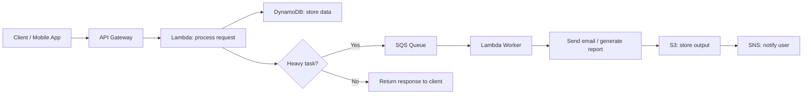

### คำอธิบายแบบละเอียด (Detailed Explanation)  

| ขั้นตอน | คำอธิบาย (ไทย) | Explanation (English) |
|---------|----------------|------------------------|
| 1 | Client ส่ง HTTP request (POST /order) | Client sends HTTP request (POST /order). |
| 2 | API Gateway รับ request และ trigger Lambda function (Go) | API Gateway receives request and triggers Lambda (Go). |
| 3 | Lambda function validate input, ตรวจสอบ authentication (ถ้ามี) | Lambda validates input, checks authentication. |
| 4 | Lambda อ่านหรือเขียนข้อมูลลง DynamoDB (NoSQL) | Lambda reads or writes data to DynamoDB. |
| 5 | ถ้ามีงานที่ต้องทำแบบ异步 (เช่น ส่ง email) Lambda ส่ง message ไปยัง SQS | If async task needed (e.g., send email), Lambda sends message to SQS. |
| 6 | SQS queue เก็บ message และ trigger Lambda worker (หรือ Lambda ดึง message แบบ poll) | SQS stores message and triggers Lambda worker (or Lambda polls). |
| 7 | Worker Lambda ประมวลผล (เช่น สร้าง PDF หรือส่ง email) | Worker Lambda processes (e.g., generates PDF or sends email). |
| 8 | ผลลัพธ์ถูกบันทึกลง S3 และส่ง notification ผ่าน SNS (email, SMS) | Results saved to S3 and notification sent via SNS. |
| 9 | Response กลับไปยัง client (success/failure) | Response returned to client. |

---

## 💻 ตัวอย่างโค้ดที่รันได้จริง (Runnable Code Example)  

### Scenario: REST API สำหรับจัดการสินค้า (Product) โดยใช้ DynamoDB และ Lambda (serverless)  

#### 1. โครงสร้างโปรเจกต์ Go สำหรับ Lambda  

```
product-api/
├── main.go
├── go.mod
├── template.yaml (SAM template)
└── build.sh
```

#### 2. main.go – Lambda handler สำหรับ CRUD products  

```go
// main.go
// Lambda function สำหรับ API CRUD products บน DynamoDB
// Lambda function for CRUD products API on DynamoDB

package main

import (
	"context"
	"encoding/json"
	"fmt"
	"log"
	"os"
	"time"

	"github.com/aws/aws-lambda-go/events"
	"github.com/aws/aws-lambda-go/lambda"
	"github.com/aws/aws-sdk-go-v2/config"
	"github.com/aws/aws-sdk-go-v2/feature/dynamodb/attributevalue"
	"github.com/aws/aws-sdk-go-v2/service/dynamodb"
	"github.com/aws/aws-sdk-go-v2/service/dynamodb/types"
)

type Product struct {
	ID          string  `json:"id" dynamodbav:"id"`
	Name        string  `json:"name" dynamodbav:"name"`
	Price       float64 `json:"price" dynamodbav:"price"`
	CreatedAt   string  `json:"createdAt" dynamodbav:"createdAt"`
	UpdatedAt   string  `json:"updatedAt" dynamodbav:"updatedAt"`
}

var dbClient *dynamodb.Client
var tableName string

func init() {
	cfg, err := config.LoadDefaultConfig(context.TODO())
	if err != nil {
		log.Fatalf("cannot load config: %v", err)
	}
	dbClient = dynamodb.NewFromConfig(cfg)
	tableName = os.Getenv("PRODUCTS_TABLE")
	if tableName == "" {
		tableName = "Products"
	}
}

func handler(ctx context.Context, req events.APIGatewayProxyRequest) (events.APIGatewayProxyResponse, error) {
	// แยก HTTP method และ path
	// Extract HTTP method and path
	method := req.HTTPMethod
	path := req.Path

	switch {
	case method == "POST" && path == "/products":
		return createProduct(ctx, req)
	case method == "GET" && path == "/products":
		return listProducts(ctx)
	case method == "GET" && pathMatches(req.Path, "/products/"):
		id := extractID(req.Path)
		return getProduct(ctx, id)
	case method == "PUT" && pathMatches(req.Path, "/products/"):
		id := extractID(req.Path)
		return updateProduct(ctx, id, req)
	case method == "DELETE" && pathMatches(req.Path, "/products/"):
		id := extractID(req.Path)
		return deleteProduct(ctx, id)
	default:
		return events.APIGatewayProxyResponse{
			StatusCode: 404,
			Body:       `{"error":"Not found"}`,
		}, nil
	}
}

func createProduct(ctx context.Context, req events.APIGatewayProxyRequest) (events.APIGatewayProxyResponse, error) {
	var p Product
	err := json.Unmarshal([]byte(req.Body), &p)
	if err != nil {
		return errorResponse(400, "Invalid JSON")
	}
	if p.ID == "" {
		p.ID = fmt.Sprintf("%d", time.Now().UnixNano())
	}
	now := time.Now().UTC().Format(time.RFC3339)
	p.CreatedAt = now
	p.UpdatedAt = now

	av, err := attributevalue.MarshalMap(p)
	if err != nil {
		return errorResponse(500, "Failed to marshal product")
	}

	_, err = dbClient.PutItem(ctx, &dynamodb.PutItemInput{
		TableName: &tableName,
		Item:      av,
	})
	if err != nil {
		return errorResponse(500, "Failed to save product")
	}

	body, _ := json.Marshal(p)
	return events.APIGatewayProxyResponse{
		StatusCode: 201,
		Body:       string(body),
		Headers:    map[string]string{"Content-Type": "application/json"},
	}, nil
}

func listProducts(ctx context.Context) (events.APIGatewayProxyResponse, error) {
	// Scan ทั้งตาราง (ไม่ดีสำหรับ production แต่ใช้เพื่อตัวอย่าง)
	// Full table scan (not for production, just example)
	out, err := dbClient.Scan(ctx, &dynamodb.ScanInput{
		TableName: &tableName,
	})
	if err != nil {
		return errorResponse(500, "Failed to scan")
	}
	var products []Product
	err = attributevalue.UnmarshalListOfMaps(out.Items, &products)
	if err != nil {
		return errorResponse(500, "Failed to unmarshal")
	}
	body, _ := json.Marshal(products)
	return events.APIGatewayProxyResponse{
		StatusCode: 200,
		Body:       string(body),
		Headers:    map[string]string{"Content-Type": "application/json"},
	}, nil
}

func getProduct(ctx context.Context, id string) (events.APIGatewayProxyResponse, error) {
	out, err := dbClient.GetItem(ctx, &dynamodb.GetItemInput{
		TableName: &tableName,
		Key: map[string]types.AttributeValue{
			"id": &types.AttributeValueMemberS{Value: id},
		},
	})
	if err != nil {
		return errorResponse(500, "Failed to get item")
	}
	if out.Item == nil {
		return errorResponse(404, "Product not found")
	}
	var p Product
	err = attributevalue.UnmarshalMap(out.Item, &p)
	if err != nil {
		return errorResponse(500, "Failed to unmarshal")
	}
	body, _ := json.Marshal(p)
	return events.APIGatewayProxyResponse{
		StatusCode: 200,
		Body:       string(body),
	}, nil
}

func updateProduct(ctx context.Context, id string, req events.APIGatewayProxyRequest) (events.APIGatewayProxyResponse, error) {
	// อ่าน product ปัจจุบันก่อน
	var updates map[string]interface{}
	err := json.Unmarshal([]byte(req.Body), &updates)
	if err != nil {
		return errorResponse(400, "Invalid JSON")
	}
	// สร้าง expression สำหรับ update (แบบง่าย)
	var updateExpr string
	var exprAttrValues map[string]types.AttributeValue
	// (ตัวอย่างสั้น: สมมติรับแค่ name และ price)
	if name, ok := updates["name"]; ok {
		updateExpr = "SET #name = :name, updatedAt = :now"
		exprAttrValues = map[string]types.AttributeValue{
			":name": &types.AttributeValueMemberS{Value: name.(string)},
			":now":  &types.AttributeValueMemberS{Value: time.Now().UTC().Format(time.RFC3339)},
		}
		_, err = dbClient.UpdateItem(ctx, &dynamodb.UpdateItemInput{
			TableName: &tableName,
			Key: map[string]types.AttributeValue{
				"id": &types.AttributeValueMemberS{Value: id},
			},
			UpdateExpression:          &updateExpr,
			ExpressionAttributeValues: exprAttrValues,
			ExpressionAttributeNames: map[string]string{
				"#name": "name",
			},
		})
		if err != nil {
			return errorResponse(500, "Update failed")
		}
	}
	return getProduct(ctx, id)
}

func deleteProduct(ctx context.Context, id string) (events.APIGatewayProxyResponse, error) {
	_, err := dbClient.DeleteItem(ctx, &dynamodb.DeleteItemInput{
		TableName: &tableName,
		Key: map[string]types.AttributeValue{
			"id": &types.AttributeValueMemberS{Value: id},
		},
	})
	if err != nil {
		return errorResponse(500, "Delete failed")
	}
	return events.APIGatewayProxyResponse{
		StatusCode: 204,
		Body:       "",
	}, nil
}

// helper functions
func errorResponse(status int, msg string) (events.APIGatewayProxyResponse, error) {
	body, _ := json.Marshal(map[string]string{"error": msg})
	return events.APIGatewayProxyResponse{
		StatusCode: status,
		Body:       string(body),
	}, nil
}

func pathMatches(path, prefix string) bool {
	return len(path) >= len(prefix) && path[:len(prefix)] == prefix
}

func extractID(path string) string {
	// path = "/products/123" -> "123"
	parts := []rune(path)
	lastSlash := -1
	for i, c := range parts {
		if c == '/' {
			lastSlash = i
		}
	}
	if lastSlash >= 0 && lastSlash+1 < len(parts) {
		return string(parts[lastSlash+1:])
	}
	return ""
}

func main() {
	lambda.Start(handler)
}
```

#### 3. template.yaml (AWS SAM) สำหรับ deploy  

```yaml
# template.yaml
# SAM template สำหรับ Lambda + API Gateway + DynamoDB
# SAM template for Lambda + API Gateway + DynamoDB

AWSTemplateFormatVersion: '2010-09-09'
Transform: AWS::Serverless-2016-10-31

Resources:
  ProductsTable:
    Type: AWS::DynamoDB::Table
    Properties:
      TableName: Products
      AttributeDefinitions:
        - AttributeName: id
          AttributeType: S
      KeySchema:
        - AttributeName: id
          KeyType: HASH
      BillingMode: PAY_PER_REQUEST

  ProductApi:
    Type: AWS::Serverless::Api
    Properties:
      StageName: prod
      Cors:
        AllowMethods: "'GET,POST,PUT,DELETE,OPTIONS'"
        AllowHeaders: "'content-type'"
        AllowOrigin: "'*'"

  ProductFunction:
    Type: AWS::Serverless::Function
    Properties:
      CodeUri: .
      Handler: main
      Runtime: provided.al2  # ใช้ Go
      Architectures:
        - arm64
      Environment:
        Variables:
          PRODUCTS_TABLE: !Ref ProductsTable
      Events:
        CreateProduct:
          Type: Api
          Properties:
            RestApiId: !Ref ProductApi
            Path: /products
            Method: POST
        ListProducts:
          Type: Api
          Properties:
            RestApiId: !Ref ProductApi
            Path: /products
            Method: GET
        GetProduct:
          Type: Api
          Properties:
            RestApiId: !Ref ProductApi
            Path: /products/{id}
            Method: GET
        UpdateProduct:
          Type: Api
          Properties:
            RestApiId: !Ref ProductApi
            Path: /products/{id}
            Method: PUT
        DeleteProduct:
          Type: Api
          Properties:
            RestApiId: !Ref ProductApi
            Path: /products/{id}
            Method: DELETE
      Policies:
        - DynamoDBCrudPolicy:
            TableName: !Ref ProductsTable
```

#### 4. build.sh (compile Go สำหรับ Lambda)  

```bash
#!/bin/bash
# build.sh
# compile Go binary สำหรับ Lambda (Amazon Linux)
# compile Go binary for Lambda (Amazon Linux)

GOOS=linux GOARCH=arm64 CGO_ENABLED=0 go build -tags lambda.norpc -o bootstrap main.go
zip function.zip bootstrap
```

#### 5. การ deploy  

```bash
# ติดตั้ง SAM CLI ก่อน
sam deploy --guided
```

---

## 📌 กรณีศึกษาและแนวทางแก้ไขปัญหา (Case Study & Troubleshooting)  

### กรณีศึกษา 1: Startup ต้องการ API ที่ scalable สูง แต่มีงบจำกัด  
**ปัญหา:** แอปมี traffic ผันผวน (ช่วงเย็นสูง) ถ้าใช้ EC2 จะเสียค่าใช้จ่ายช่วง idle  
**แนวทางแก้ไข:**  
- ใช้ API Gateway + Lambda + DynamoDB (serverless)  
- ตั้งค่า Lambda reserved concurrency ไม่เกิน 500  
- ใช้ DynamoDB on‑demand (pay‑per‑request)  
**ผลลัพธ์:** ค่าใช้จ่ายลดลง 70%, รองรับ traffic spike ได้อัตโนมัติ  

### กรณีศึกษา 2: ระบบ legacy PHP ต้องการย้ายไป Go บน ECS  
**ปัญหา:** monolith โค้ดรก, ขยายยาก  
**แนวทางแก้ไข:**  
- แยกฟังก์ชันที่ใช้บ่อย (payment, notification) เป็น microservice ด้วย Go  
- deploy บน ECS Fargate (serverless container)  
- ใช้ ALB สำหรับ routing  
**ผลลัพธ์:** แต่ละ service scale แยกกัน, เวลา deploy สั้นลง  

### ปัญหาที่พบบ่อย (Common Issues)  

| ปัญหา (Issue) | สาเหตุ (Cause) | วิธีแก้ไข (Solution) |
|----------------|----------------|----------------------|
| Lambda timeout หลังจาก 15 นาที | งานหนักเกินไปสำหรับ Lambda | เปลี่ยนไปใช้ ECS หรือ Step Functions |
| DynamoDB throttle (ProvisionedThroughputExceeded) | RCU/WCU ไม่พอ | เปลี่ยนเป็น on‑demand หรือเพิ่ม auto scaling |
| API Gateway 503 (Service Unavailable) | Lambda concurrency limit | ขอเพิ่ม limit หรือเพิ่ม reserved concurrency |
| Go binary ใหญ่เกินไป | รวม debug symbols | ใช้ `-ldflags="-s -w"` และ `-trimpath` |
| cold start ช้า | binary ขนาดใหญ่, runtime ไม่ได้ warm | ลด binary size, ใช้ provisioned concurrency |

---

## 📁 เทมเพลตและตัวอย่างโค้ดเพิ่มเติม (Templates & More Code)  

### Template สำหรับ Go project structure (microservice)  

```
my-service/
├── cmd/
│   └── api/
│       └── main.go
├── internal/
│   ├── handler/
│   ├── service/
│   └── repository/
├── pkg/
│   └── models/
├── go.mod
├── Dockerfile
└── Makefile
```

### ตัวอย่าง Dockerfile สำหรับ Go บน ECS  

```dockerfile
# Dockerfile
# Multi-stage build สำหรับ Go binary ขนาดเล็ก
# Multi-stage build for small Go binary

FROM golang:1.21-alpine AS builder
WORKDIR /app
COPY go.mod go.sum ./
RUN go mod download
COPY . .
RUN CGO_ENABLED=0 GOOS=linux go build -a -installsuffix cgo -ldflags="-s -w" -o main ./cmd/api

FROM scratch
COPY --from=builder /app/main /main
EXPOSE 8080
CMD ["/main"]
```

### ตัวอย่างการใช้ SQS ใน Go (producer)  

```go
// sqs_send.go
// ส่ง message ไปยัง SQS queue
// Send message to SQS queue

func sendMessage(ctx context.Context, sqsClient *sqs.Client, queueURL string, body string) error {
	_, err := sqsClient.SendMessage(ctx, &sqs.SendMessageInput{
		QueueUrl:    &queueURL,
		MessageBody: &body,
	})
	return err
}
```

---

## 📊 ตารางเปรียบเทียบตัวเลือก Compute สำหรับ Go บน AWS  

| บริการ (Service) | Pros | Cons | เหมาะกับ |
|------------------|------|------|-----------|
| EC2 | ควบคุมเต็ม, รองรับทุก workload | ต้องจัดการ OS, scaling manual | monolith, stateful app |
| Lambda | serverless, จ่ายตาม invocation | timeout 15 นาที, cold start | event‑driven, API ขนาดเล็ก |
| ECS (Fargate) | container, serverless, ควบคุมได้ปานกลาง | ต้องรู้ Docker, ราคาสูงกว่า Lambda | microservices ที่ต้องการ background process |
| EKS (Kubernetes) | portability, ecosystem ใหญ่ | ซับซ้อน, ต้องจัดการ control plane | องค์กรใหญ่, multi‑cloud |

---

## 📝 สรุป (Summary)  

### ✅ ประโยชน์ที่ได้รับ (Benefits)  
- ลดเวลาในการจัดการ infrastructure  
- สามารถเลือก architecture ที่เหมาะกับ workload  
- ใช้ Go SDK ที่แข็งแรงและเร็ว  
- Deploy ได้หลายรูปแบบ (Lambda, ECS, EC2)  

### ⚠️ ข้อควรระวัง (Cautions)  
- ระวัง cold start ใน Lambda  
- ต้องจัดการ IAM permission อย่างระมัดระวัง  
- ราคาอาจสูงถ้าใช้ทรัพยากรไม่คุ้ม  

### 👍 ข้อดี (Advantages)  
- AWS มีบริการครบวงจร  
- Go SDK ใช้ง่าย, performance ดี  
- Community support เยอะ  

### 👎 ข้อเสีย (Disadvantages)  
- Vendor lock‑in บาง service  
- การ debug ระบบ distributed ยากกว่า monolith ท้องถิ่น  

### 🚫 ข้อห้าม (Prohibitions)  
- ห้ามเก็บ secrets ใน code หรือ environment variables ของ Lambda (ใช้ Secrets Manager)  
- ห้ามสร้าง DynamoDB table โดยไม่มี partition key ที่เหมาะสม  
- ห้ามใช้ Lambda สำหรับ workload ที่ต้องใช้ CPU ตลอดเวลา (ให้ใช้ ECS แทน)  

---

## 🧩 แบบฝึกหัดท้ายบท (Exercises)  

**ข้อ 1:** จงอธิบายความแตกต่างระหว่าง Monolith, Microservices, และ Serverless พร้อมข้อดี/ข้อเสียของแต่ละแบบ  
**ข้อ 2:** จากตัวอย่าง Lambda handler ถ้าต้องการเพิ่มฟังก์ชันค้นหาสินค้าตามชื่อ (name contains) ใน DynamoDB ควรใช้ operation อะไร (Scan หรือ Query) และเพราะเหตุใด  
**ข้อ 3:** เขียน Go function ที่อัปโหลดไฟล์ไปยัง S3 bucket โดยใช้ AWS SDK v2  
**ข้อ 4:** สมมติ Lambda ทำงานช้า (high latency) อะไรคือสาเหตุที่เป็นไปได้ (อย่างน้อย 2 ข้อ)  
**ข้อ 5:** ใน SAM template, `DynamoDBCrudPolicy` มีผลอย่างไร  
**ข้อ 6:** จงสร้าง API Gateway endpoint (แบบง่าย) ที่รับ POST /order แล้วส่ง message ไปยัง SQS โดยไม่ต้องรอ response (ใช้ Go Lambda)  
**ข้อ 7:** 12‑factor app ข้อใดที่สำคัญที่สุดสำหรับการรันบน Lambda และเพราะเหตุใด  
**ข้อ 8:** ถ้าต้องการให้ Go binary ทำงานบน Lambda runtime provided.al2 ต้องตั้งชื่อ binary ว่าอะไร  
**ข้อ 9:** ข้อห้าม 2 ข้อในการพัฒนา Software บน AWS มีอะไรบ้าง  
**ข้อ 10:** จงเปรียบเทียบ EC2, ECS (Fargate), และ Lambda ในแง่ของ "cold start" และ "maximum execution time"  

---

## 🔐 เฉลยแบบฝึกหัด (Answer Key)  

**ข้อ 1:** Monolith: จุดเดียว, deploy ยาก แต่ debug ง่าย; Microservices: แยก service, scale แต่ละตัว, แต่ complexity สูง; Serverless: ไม่ต้องจัดการ server, จ่ายตามใช้งาน, แต่มีข้อจำกัด timeout และ cold start  
**ข้อ 2:** ต้องใช้ Scan เพราะ Query ต้องใช้ partition key เท่านั้น; Scan ไม่มีประสิทธิภาพ แต่ถ้ามีข้อมูลน้อยก็พอใช้; ทางที่ดีควรสร้าง Global Secondary Index (GSI) บน name  
**ข้อ 3:**  
```go
func uploadToS3(ctx context.Context, bucket, key string, data []byte) error {
    s3Client := s3.NewFromConfig(cfg)
    _, err := s3Client.PutObject(ctx, &s3.PutObjectInput{
        Bucket: &bucket,
        Key:    &key,
        Body:   bytes.NewReader(data),
    })
    return err
}
```  
**ข้อ 4:** 1) Cold start (ถ้า idle นาน) 2) binary ขนาดใหญ่ 3) network I/O ไปยัง DynamoDB ช้า 4) ใช้ memory น้อยเกินไป  
**ข้อ 5:** IAM policy ที่ให้ Lambda สามารถ CRUD บน DynamoDB table ที่ระบุ  
**ข้อ 6:** (ตัวอย่างสั้น) สร้าง Lambda ที่รับ event, แยก body, แล้ว sqsClient.SendMessage, คืน 202 Accepted ทันที  
**ข้อ 7:** Stateless (ข้อ 3) เพราะ Lambda ไม่รับประกัน instance เดิม; process ควรเก็บ state ไว้ใน external store (DynamoDB, S3, etc.)  
**ข้อ 8:** ต้องตั้งชื่อ binary ว่า `bootstrap`  
**ข้อ 9:** 1) ห้ามใช้ root user 2) ห้ามเก็บ secrets ในโค้ดหรือ env  
**ข้อ 10:** EC2: no cold start (running 24/7), execution time ไม่จำกัด; ECS Fargate: cold start เมื่อ scale from zero (~seconds), execution time ไม่จำกัด; Lambda: cold start (ms to seconds), timeout สูงสุด 15 นาที  

---

## 📚 แหล่งอ้างอิง (References)  

1. AWS SDK for Go v2 Documentation. (2024).  
2. AWS Lambda Developer Guide – Go. (2024).  
3. “The 12‑Factor App” – https://12factor.net/  
4. Building Microservices on AWS – AWS Whitepaper.  
5. DynamoDB Developer Guide. (2024).  

---

**✍️ ผู้เขียน:** คงนคร จันทะคุณ  
**📅 อัปเดตล่าสุด:** เมษายน 2026  

**หมายเหตุ:** โค้ดทั้งหมดสามารถนำไปปรับใช้จริงได้ ควรตั้งชื่อ bucket, table, queue ให้ไม่ซ้ำกับของผู้อื่น และให้ Lambda role มี permission ที่ถูกต้อง
# 📘 บทที่ 6: AWS คือใคร? – บริการและรูปแบบการใช้งาน  
## Chapter 6: What is AWS? – Services and Usage Models  

---

## 🧱 โครงสร้างการทำงาน (Work Structure)  

**ไทย:**  
บทนี้แนะนำให้รู้จักกับ Amazon Web Services (AWS) ว่าเป็นใคร ให้บริการอะไรบ้าง รูปแบบการให้บริการ (IaaS, PaaS, SaaS) และวิธีการใช้งานสำหรับ Software Engineer โดยเฉพาะการเรียกใช้ AWS services ผ่าน Go SDK พร้อมตัวอย่างการใช้งานจริงของบริการหลัก เช่น S3, EC2, IAM  

**English:**  
This chapter introduces Amazon Web Services (AWS): who they are, what services they offer, service models (IaaS, PaaS, SaaS), and how Software Engineers can use them – especially invoking AWS services via the Go SDK, with real examples of core services like S3, EC2, and IAM.  

---

## 🎯 วัตถุประสงค์แบบสั้นสำหรับทบทวน (Short Revision Objective)  

**ไทย:**  
เพื่อให้ผู้อ่านรู้จัก AWS, เข้าใจรูปแบบบริการ (IaaS/PaaS/SaaS), รู้จักบริการหลักของ AWS, และสามารถเขียนโปรแกรม Go เพื่อเรียกใช้บริการ AWS เบื้องต้น เช่น S3 (อ่าน/เขียนไฟล์), EC2 (start/stop instance), และ IAM (สร้าง user)  

**English:**  
To enable readers to know AWS, understand service models (IaaS/PaaS/SaaS), know core AWS services, and write Go programs to invoke basic AWS services such as S3 (read/write files), EC2 (start/stop instances), and IAM (create user).  

---

## 👥 กลุ่มเป้าหมาย (Target Audience)  

- ผู้เริ่มต้นใช้งาน AWS  
- Software Engineer ที่ต้องการเชื่อมต่อแอป Go กับ AWS  
- นักศึกษาและผู้ที่สนใจคลาวด์คอมพิวติ้ง  
- ผู้เตรียมสอบ AWS Certified Cloud Practitioner  

---

## 📚 ความรู้พื้นฐาน (Prerequisites)  

- ความเข้าใจพื้นฐานเกี่ยวกับคอมพิวเตอร์และเครือข่าย  
- รู้จัก Go พอสมควร (ฟังก์ชัน, struct, HTTP client)  
- มีบัญชี AWS (ฟรี tier)  
- ติดตั้ง Go (1.18+) และ AWS CLI  

---

## 📝 เนื้อหาโดยย่อ (Abstract)  

**ไทย:**  
บทนี้จะอธิบายประวัติและภาพรวมของ AWS, แนวคิดของ cloud computing, รูปแบบการให้บริการ (IaaS, PaaS, SaaS) และหมวดหมู่บริการหลัก (Compute, Storage, Database, Networking, Security) จากนั้นจะลงมือเขียนโปรแกรม Go ที่ใช้ AWS SDK เพื่อ: อัปโหลด/ดาวน์โหลดไฟล์จาก S3, รายการ EC2 instances, และสร้าง IAM user อย่างปลอดภัย  

**English:**  
This chapter explains the history and overview of AWS, cloud computing concepts, service models (IaaS, PaaS, SaaS), and main service categories (Compute, Storage, Database, Networking, Security). Then hands‑on: write Go programs using AWS SDK to upload/download files from S3, list EC2 instances, and create IAM users securely.  

---

## 🔰 บทนำ (Introduction)  

**ไทย:**  
Amazon Web Services (AWS) เป็นผู้ให้บริการคลาวด์รายใหญ่ที่สุดในโลก เริ่มต้นจาก Amazon.com ที่ต้องการจัดการ infrastructure สำหรับธุรกิจตัวเอง และในปี 2006 ได้เปิดบริการให้สาธารณะใช้ ปัจจุบัน AWS มีบริการกว่า 200 รายการ ตั้งแต่คอมพิวเตอร์, ที่เก็บข้อมูล, ฐานข้อมูล, AI, IoT, และอื่น ๆ การเรียนรู้ AWS ช่วยให้นักพัฒนาสามารถสร้างแอปพลิเคชันที่ scalable และประหยัดต้นทุนได้  

**English:**  
Amazon Web Services (AWS) is the world’s largest cloud provider. It started from Amazon.com’s need to manage its own infrastructure and in 2006 opened it to the public. Today AWS offers over 200 services – from compute, storage, databases, AI, IoT, and more. Learning AWS helps developers build scalable, cost‑effective applications.  

---

## 📖 บทนิยาม (Definitions)  

| คำศัพท์ (Term) | คำจำกัดความไทย (Thai Definition) | English Definition |
|----------------|----------------------------------|--------------------|
| Cloud Computing | การให้บริการทรัพยากรคอมพิวเตอร์ (server, storage, database) ผ่านอินเทอร์เน็ต จ่ายตามใช้งาน | Delivery of computing resources (servers, storage, databases) over the internet, pay‑as‑you‑go. |
| IaaS (Infrastructure as a Service) | ให้บริการ infrastructure พื้นฐาน (VM, storage, network) ผู้ใช้จัดการ OS และแอป | Provides basic infrastructure (VM, storage, network); user manages OS and apps. |
| PaaS (Platform as a Service) | ให้บริการ platform สำหรับพัฒนาและ deploy (เช่น AWS Elastic Beanstalk) | Provides platform for development and deployment (e.g., AWS Elastic Beanstalk). |
| SaaS (Software as a Service) | ให้บริการซอฟต์แวร์สำเร็จรูปผ่านเว็บ (เช่น Gmail, Salesforce) | Provides ready‑to‑use software via web (e.g., Gmail, Salesforce). |
| Region | พื้นที่ทางภูมิศาสตร์ที่ AWS มี data center หลายแห่ง (เช่น us-east-1, ap-southeast-1) | Geographic area where AWS has multiple data centers. |
| Availability Zone (AZ) | data center หนึ่งแห่งหรือหลายแห่งที่อยู่ใกล้กันภายใน Region | One or more data centers within a Region. |
| IAM (Identity and Access Management) | บริการจัดการ user, group, role และ permission บน AWS | Service to manage users, groups, roles, and permissions on AWS. |
| AWS SDK for Go | ชุด library อย่างเป็นทางการสำหรับเรียก AWS API จาก Go | Official library to call AWS APIs from Go. |

---

## 🔧 AWS คือใคร? ให้บริการอะไร? มีกี่แบบ?  

### 1. AWS คือใคร (Who is AWS?)  
**ไทย:**  
AWS เป็นบริษัทในเครือ Amazon.com ก่อตั้งในปี 2006 ให้บริการโครงสร้างพื้นฐานคลาวด์ (cloud infrastructure) และ API แก่องค์กรและบุคคลทั่วไป ปัจจุบัน AWS มี市场份额ประมาณ 30-40% ของตลาดคลาวด์ทั่วโลก  

**English:**  
AWS is a subsidiary of Amazon.com, founded in 2006, providing cloud infrastructure and APIs to organizations and individuals. It holds about 30‑40% market share of the global cloud market.  

### 2. ให้บริการอะไร (What services does AWS offer?)  

| หมวดหมู่ (Category) | ตัวอย่างบริการ (Example Services) | คำอธิบายสั้น (Brief) |
|---------------------|-----------------------------------|----------------------|
| Compute | EC2, Lambda, ECS, EKS | รันแอปพลิเคชัน (VM, serverless, containers) |
| Storage | S3, EBS, EFS, Glacier | เก็บ object, block, file, archive |
| Database | RDS, DynamoDB, Aurora, Redshift | relational, NoSQL, data warehouse |
| Networking | VPC, CloudFront, Route53, API Gateway | network, CDN, DNS, API management |
| Security & Identity | IAM, KMS, WAF, Shield | การเข้าถึง, การเข้ารหัส, ป้องกันการโจมตี |
| Analytics | Athena, EMR, Glue, Kinesis | big data, streaming, ETL |
| AI/ML | SageMaker, Rekognition, Bedrock | machine learning, vision, generative AI |
| Developer Tools | CodeCommit, CodeBuild, CodeDeploy, CodePipeline | CI/CD, source control |
| Management | CloudWatch, CloudFormation, Config | monitoring, infrastructure as code, compliance |

### 3. มีกี่แบบ (Service Models – IaaS, PaaS, SaaS)  

| แบบ (Model) | คำอธิบาย (Description) | ตัวอย่างบน AWS (AWS Example) | ผู้ใช้จัดการอะไร (User manages) |
|--------------|------------------------|------------------------------|-------------------------------|
| **IaaS** | ให้ VM, storage, network | EC2, EBS, VPC | OS, runtime, middleware, app, data |
| **PaaS** | ให้ platform สำหรับ deploy แอป | Elastic Beanstalk, Lightsail | app, data (platform จัดการ rest) |
| **SaaS** | ให้ซอฟต์แวร์สำเร็จรูป | Amazon WorkMail, Chime, QuickSight | แค่ใช้ (nothing) |
| **Serverless** (FaaS) | รันฟังก์ชันโดยไม่ต้องจัดการ server | Lambda, API Gateway, S3 | โค้ดเท่านั้น |

### 4. ใช้อย่างไร (How to use AWS)  

- **AWS Management Console:** เว็บ UI สำหรับจัดการ services  
- **AWS CLI:** คำสั่ง command line  
- **AWS SDK:** เขียนโปรแกรม (Go, Python, Java, etc.)  
- **Infrastructure as Code (IaC):** CloudFormation, Terraform, CDK  

### 5. นำในกรณีไหน (When to use AWS)  

- ต้องการความยืดหยุ่น (scale up/down อัตโนมัติ)  
- ต้องการประหยัดต้นทุน (จ่ายเท่าที่ใช้)  
- ต้องการ global reach (หลาย region)  
- ต้องการใช้ managed services (ไม่ต้องดูแล server)  

### 6. ทำไมต้องใช้ (Why use AWS)  

- reliability สูง (SLA 99.9% ขึ้นไป)  
- security ระดับโลก (certifications มากมาย)  
- innovation เร็ว (มีบริการใหม่ออกทุกปี)  
- ecosystem ขนาดใหญ่ (partner, community)  

### 7. ประโยชน์ที่ได้รับ (Benefits)  

- ลดค่าใช้จ่าย upfront (ไม่ต้องซื้อ hardware)  
- ย้ายจาก capacity planning เป็น pay‑as‑you‑go  
- เพิ่มความเร็วในการพัฒนา (ไม่ต้องรอ procurement)  
- รองรับการขยายตัวแบบอัตโนมัติ  

### 8. ข้อควรระวัง (Cautions)  

- ค่าใช้จ่ายอาจสูงถ้าไม่ monitoring  
- vendor lock‑in (ย้ายออกยาก)  
- ต้องเรียนรู้ concept ใหม่ (IAM, VPC, etc.)  

### 9. ข้อดี (Advantages)  

- บริการหลากหลาย ครอบคลุมทุก需求  
- global infrastructure แข็งแกร่ง  
- documentation ดี, community ใหญ่  

### 10. ข้อเสีย (Disadvantages)  

- complexity สูง (หลาย service, หลาย option)  
- การ troubleshoot อาจยากกว่า on‑premise  
- latency ขึ้นอยู่กับ region  

### 11. ข้อห้าม (Prohibitions)  

- ห้ามใช้ root user สำหรับ日常工作  
- ห้ามเปิด security group แบบ 0.0.0.0/0 สำหรับ SSH หรือ database เว้นแต่จำเป็น  
- ห้ามเก็บ access keys ในโค้ดหรือ Git  

---

## 🔄 ออกแบบ Workflow (Workflow Design)  

### ภาพรวม: การเรียก AWS services จากโปรแกรม Go  

**ไทย:**  
Workflow ทั่วไป: โปรแกรม Go โหลด AWS configuration (จาก environment variables, ~/.aws/credentials หรือ IAM role) → สร้าง service client (เช่น S3, EC2) → เรียก API → จัดการ response → แสดงผล  

**English:**  
Typical workflow: Go program loads AWS configuration (from environment, ~/.aws/credentials, or IAM role) → creates service client (e.g., S3, EC2) → calls API → handles response → displays result.  

### Mermaid Flowchart  

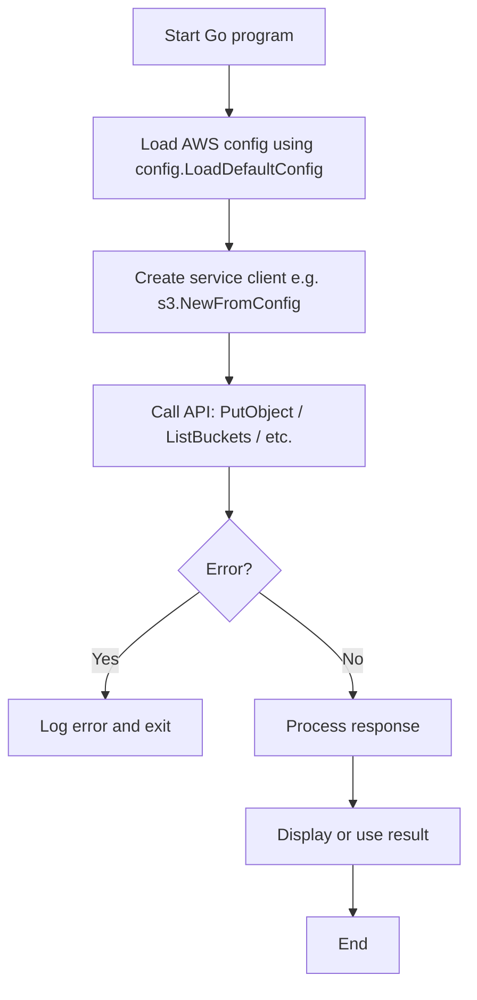

### คำอธิบายแบบละเอียด (Detailed Explanation)  

| ขั้นตอน | คำอธิบาย (ไทย) | Explanation (English) |
|---------|----------------|------------------------|
| 1 | โปรแกรม Go เริ่มทำงาน | Go program starts. |
| 2 | เรียก `config.LoadDefaultConfig` เพื่อโหลด credentials และ region จาก environment, IAM role, หรือ shared file | Call `config.LoadDefaultConfig` to load credentials and region from environment, IAM role, or shared file. |
| 3 | สร้าง client สำหรับ service ที่ต้องการ (เช่น S3) โดยใช้ config ที่โหลดมา | Create client for desired service (e.g., S3) using loaded config. |
| 4 | เรียก API method (เช่น `s3Client.ListBuckets`) | Call API method (e.g., `s3Client.ListBuckets`). |
| 5 | ตรวจสอบ error (network, permission, etc.) | Check for errors (network, permission, etc.). |
| 6 | ถ้า error ให้ log และ exit | If error, log and exit. |
| 7 | ถ้าสำเร็จ นำ response ไปประมวลผล (แสดงผล, เก็บใน database, ฯลฯ) | If success, process response (display, store in DB, etc.). |

---

## 💻 ตัวอย่างโค้ดที่รันได้จริง (Runnable Code Example)  

### ตัวอย่างที่ 1: อัปโหลดและดาวน์โหลดไฟล์จาก S3  

```go
// s3_example.go
// ตัวอย่างการใช้งาน S3 ด้วย Go SDK v2
// Example of using S3 with Go SDK v2

package main

import (
	"context"
	"fmt"
	"log"
	"os"
	"strings"

	"github.com/aws/aws-sdk-go-v2/config"
	"github.com/aws/aws-sdk-go-v2/service/s3"
)

func main() {
	// โหลด AWS configuration (จะใช้ credentials จาก environment หรือ ~/.aws/credentials)
	// Load AWS configuration (uses credentials from environment or ~/.aws/credentials)
	cfg, err := config.LoadDefaultConfig(context.TODO())
	if err != nil {
		log.Fatalf("ไม่สามารถโหลด AWS config: %v", err)
	}

	// สร้าง S3 client
	// Create S3 client
	s3Client := s3.NewFromConfig(cfg)

	bucket := "my-example-bucket" // เปลี่ยนเป็น bucket จริง
	key := "hello.txt"
	content := "Hello AWS from Go!"

	// 1. อัปโหลดไฟล์ (PutObject)
	// 1. Upload file (PutObject)
	fmt.Println("กำลังอัปโหลด...")
	_, err = s3Client.PutObject(context.TODO(), &s3.PutObjectInput{
		Bucket: &bucket,
		Key:    &key,
		Body:   strings.NewReader(content),
	})
	if err != nil {
		log.Fatalf("อัปโหลดล้มเหลว: %v", err)
	}
	fmt.Printf("อัปโหลด s3://%s/%s สำเร็จ\n", bucket, key)

	// 2. ดาวน์โหลดไฟล์ (GetObject)
	// 2. Download file (GetObject)
	fmt.Println("กำลังดาวน์โหลด...")
	resp, err := s3Client.GetObject(context.TODO(), &s3.GetObjectInput{
		Bucket: &bucket,
		Key:    &key,
	})
	if err != nil {
		log.Fatalf("ดาวน์โหลดล้มเหลว: %v", err)
	}
	defer resp.Body.Close()

	// อ่านเนื้อหา
	// Read content
	buf := make([]byte, len(content)+100)
	n, err := resp.Body.Read(buf)
	if err != nil && err.Error() != "EOF" {
		log.Fatalf("อ่านข้อมูลไม่สำเร็จ: %v", err)
	}
	fmt.Printf("เนื้อหาที่ดาวน์โหลด: %s\n", string(buf[:n]))
}
```

### ตัวอย่างที่ 2: รายการ EC2 instances  

```go
// ec2_list.go
// แสดงรายการ EC2 instances ทั้งหมดใน region ปัจจุบัน
// List all EC2 instances in current region

package main

import (
	"context"
	"fmt"
	"log"

	"github.com/aws/aws-sdk-go-v2/config"
	"github.com/aws/aws-sdk-go-v2/service/ec2"
)

func main() {
	cfg, err := config.LoadDefaultConfig(context.TODO())
	if err != nil {
		log.Fatalf("config error: %v", err)
	}

	ec2Client := ec2.NewFromConfig(cfg)

	// เรียก DescribeInstances
	// Call DescribeInstances
	resp, err := ec2Client.DescribeInstances(context.TODO(), &ec2.DescribeInstancesInput{})
	if err != nil {
		log.Fatalf("cannot describe instances: %v", err)
	}

	fmt.Println("EC2 Instances:")
	for _, reservation := range resp.Reservations {
		for _, instance := range reservation.Instances {
			// ดึงชื่อ instance จาก tags
			// Get instance name from tags
			name := ""
			for _, tag := range instance.Tags {
				if *tag.Key == "Name" {
					name = *tag.Value
					break
				}
			}
			fmt.Printf("  - ID: %s, Name: %s, State: %s, Type: %s\n",
				*instance.InstanceId,
				name,
				instance.State.Name,
				instance.InstanceType,
			)
		}
	}
}
```

### ตัวอย่างที่ 3: สร้าง IAM user (อย่างปลอดภัย)  

```go
// iam_create_user.go
// สร้าง IAM user และแสดง access key
// Create IAM user and display access key

package main

import (
	"context"
	"fmt"
	"log"

	"github.com/aws/aws-sdk-go-v2/config"
	"github.com/aws/aws-sdk-go-v2/service/iam"
	"github.com/aws/aws-sdk-go-v2/service/iam/types"
)

func main() {
	cfg, err := config.LoadDefaultConfig(context.TODO())
	if err != nil {
		log.Fatalf("config error: %v", err)
	}

	iamClient := iam.NewFromConfig(cfg)

	username := "go-sdk-test-user"

	// 1. สร้าง user
	// 1. Create user
	createResp, err := iamClient.CreateUser(context.TODO(), &iam.CreateUserInput{
		UserName: &username,
	})
	if err != nil {
		log.Fatalf("cannot create user: %v", err)
	}
	fmt.Printf("สร้าง user %s สำเร็จ (ARN: %s)\n", *createResp.User.UserName, *createResp.User.Arn)

	// 2. สร้าง access key สำหรับ user นี้
	// 2. Create access key for this user
	keyResp, err := iamClient.CreateAccessKey(context.TODO(), &iam.CreateAccessKeyInput{
		UserName: &username,
	})
	if err != nil {
		log.Fatalf("cannot create access key: %v", err)
	}

	fmt.Println("Access Key created:")
	fmt.Printf("  AccessKeyId: %s\n", *keyResp.AccessKey.AccessKeyId)
	fmt.Printf("  SecretAccessKey: %s\n", *keyResp.AccessKey.SecretAccessKey)
	fmt.Println("⚠️  กรุณาเก็บ SecretAccessKey ไว้ในที่ปลอดภัย (จะไม่แสดงอีก)")
}
```

---

## 📌 กรณีศึกษาและแนวทางแก้ไขปัญหา (Case Study & Troubleshooting)  

### กรณีศึกษา 1: Startup ใช้ AWS เริ่มต้น ไม่รู้จะเลือก region ไหน  
**ปัญหา:** เลือก region ไกลผู้ใช้ทำให้ latency สูง  
**แนวทางแก้ไข:** ใช้ CloudFront (CDN) + ใช้ region ที่ใกล้ผู้ใช้มากที่สุด (ap-southeast-1 สำหรับไทย)  
**ผลลัพธ์:** latency ลดลง 50%  

### กรณีศึกษา 2: ค่าใช้จ่าย AWS สูงเกินคาด  
**ปัญหา:** ลืมปิด EC2 instance หรือใช้ S3 bucket ไม่มี lifecycle  
**แนวทางแก้ไข:** ใช้ AWS Budgets แจ้งเตือน, ตั้ง CloudWatch alarm, ใช้ Cost Explorer  
**ผลลัพธ์:** ลดค่าใช้จ่าย 40% ภายใน 1 เดือน  

### ปัญหาที่พบบ่อย (Common Issues)  

| ปัญหา (Issue) | สาเหตุ (Cause) | วิธีแก้ไข (Solution) |
|----------------|----------------|----------------------|
| `NoCredentialProviders` | ไม่มี credentials ใน environment หรือ ~/.aws/credentials | ตั้งค่า `aws configure` หรือใช้ IAM role บน EC2/Lambda |
| `AccessDenied` | IAM policy ไม่เพียงพอ | เพิ่ม permission ที่จำเป็น (เช่น s3:PutObject) |
| `RequestExpired` | clock ของเครื่องไม่ sync | ใช้ NTP หรือปรับ timezone |
| region ไม่ถูกต้อง | ไม่ได้ตั้ง region ใน config | ใช้ `config.WithRegion("ap-southeast-1")` |
| S3 bucket name ซ้ำ | bucket name ต้อง unique ทั่วโลก | เปลี่ยนชื่อ bucket ให้ unique (ใช้ UUID หรือ prefix) |

---

## 📁 เทมเพลตและตัวอย่างโค้ดเพิ่มเติม (Templates & More Code)  

### Template สำหรับ Go module + AWS SDK  

```bash
go mod init my-aws-app
go get github.com/aws/aws-sdk-go-v2/config
go get github.com/aws/aws-sdk-go-v2/service/s3
go get github.com/aws/aws-sdk-go-v2/service/ec2
go get github.com/aws/aws-sdk-go-v2/service/iam
```

### ตัวอย่างการใช้ Context timeout  

```go
// ตั้ง timeout 5 วินาทีสำหรับการเรียก AWS API
// Set 5 second timeout for AWS API call
ctx, cancel := context.WithTimeout(context.Background(), 5*time.Second)
defer cancel()
resp, err := s3Client.ListBuckets(ctx, &s3.ListBucketsInput{})
```

### การ load config จาก specific profile  

```go
cfg, err := config.LoadDefaultConfig(context.TODO(),
    config.WithSharedConfigProfile("my-profile"),  // ใช้ profile ชื่อ my-profile
    config.WithRegion("ap-southeast-1"),
)
```

---

## 📊 ตารางเปรียบเทียบวิธีการเข้าถึง AWS  

| วิธี (Method) | Pros | Cons | เหมาะกับ |
|---------------|------|------|-----------|
| Console (UI) | ง่าย, เห็นภาพ | ไม่ automation | exploration, ครั้งเดียว |
| AWS CLI | script ได้, เร็ว | ต้องจำคำสั่ง | administration, CI scripts |
| SDK (Go) | รวมในแอป, reusable | เขียนโค้ด | แอปพลิเคชันที่ต้องเรียก AWS บ่อย |
| CloudFormation | IaC, version control | ซับซ้อนสำหรับมือใหม่ | infrastructure management |
| Terraform | multi-cloud | ไม่ native | hybrid cloud |

---

## 📝 สรุป (Summary)  

### ✅ ประโยชน์ที่ได้รับ (Benefits)  
- เข้าใจว่า AWS คืออะไรและทำไมต้องใช้  
- สามารถเขียน Go เพื่อทำงานกับ AWS บริการพื้นฐาน  
- รู้จักบริการหลักและรูปแบบการให้บริการ  

### ⚠️ ข้อควรระวัง (Cautions)  
- ระวัง credentials leak (ห้าม commit ลง Git)  
- ตรวจสอบค่าใช้จ่ายสม่ำเสมอ  
- region มีผลต่อ latency และราคา  

### 👍 ข้อดี (Advantages)  
- AWS SDK for Go มี performance ดีและ documentation ชัดเจน  
- รองรับการ retry และ timeout ในตัว  
- ใช้งานร่วมกับ context ของ Go ได้สะดวก  

### 👎 ข้อเสีย (Disadvantages)  
- SDK v2 มีการเปลี่ยนแปลง API จาก v1  
- การ debug network issues อาจยาก  
- บาง service ต้องใช้ signature v4 ซึ่ง SDK จัดการให้อัตโนมัติ  

### 🚫 ข้อห้าม (Prohibitions)  
- ห้ามใช้ root access key สำหรับพัฒนา (ใช้ IAM user แทน)  
- ห้าม hardcode access key ในโค้ด  
- ห้ามเปิด S3 bucket เป็น public เว้นแต่จำเป็น  

---

## 🧩 แบบฝึกหัดท้ายบท (Exercises)  

**ข้อ 1:** อธิบายความแตกต่างระหว่าง IaaS, PaaS, และ SaaS พร้อมยกตัวอย่าง AWS service สำหรับแต่ละแบบ  
**ข้อ 2:** เขียน Go function ที่รับชื่อ bucket และ key แล้วคืนค่าเนื้อหาของไฟล์จาก S3 (เป็น string)  
**ข้อ 3:** จะทำอย่างไรหากเห็น error `NoCredentialProviders` เมื่อรันโปรแกรม Go ที่ใช้ AWS SDK  
**ข้อ 4:** จงเขียนคำสั่ง AWS CLI เพื่อสร้าง S3 bucket ชื่อ `my-test-bucket-xxxx` (ที่ xxxx เป็นเลข random)  
**ข้อ 5:** AWS region คืออะไร และทำไมต้องเลือก region ให้เหมาะสม  
**ข้อ 6:** ยกตัวอย่างบริการ AWS อย่างน้อย 3 อย่างในหมวด Compute, Storage, Database อย่างละ 1 อย่าง  
**ข้อ 7:** ข้อห้ามสำคัญ 3 ข้อในการใช้งาน AWS มีอะไรบ้าง  
**ข้อ 8:** เขียน Go code เพื่อ list ทั้งหมดของ S3 buckets โดยแสดงชื่อ bucket และวันที่สร้าง (ใช้ SDK v2)  
**ข้อ 9:** ถ้าต้องการให้โปรแกรม Go ทำงานกับ AWS ใน region ต่างจาก default ต้องทำอย่างไร  
**ข้อ 10:** AWS Free Tier มีประโยชน์อย่างไร และมีข้อจำกัดอะไรบ้าง  

---

## 🔐 เฉลยแบบฝึกหัด (Answer Key)  

**ข้อ 1:** IaaS = EC2, PaaS = Elastic Beanstalk, SaaS = WorkMail  
**ข้อ 2:**  
```go
func getS3Object(bucket, key string) (string, error) {
    cfg, _ := config.LoadDefaultConfig(context.TODO())
    client := s3.NewFromConfig(cfg)
    resp, err := client.GetObject(context.TODO(), &s3.GetObjectInput{Bucket: &bucket, Key: &key})
    if err != nil { return "", err }
    defer resp.Body.Close()
    data, _ := io.ReadAll(resp.Body)
    return string(data), nil
}
```  
**ข้อ 3:** ตรวจสอบว่าได้ตั้งค่า `aws configure` หรือมี IAM role หรือ environment variables `AWS_ACCESS_KEY_ID`, `AWS_SECRET_ACCESS_KEY`  
**ข้อ 4:** `aws s3 mb s3://my-test-bucket-$(date +%s)`  
**ข้อ 5:** Region คือพื้นที่ทางภูมิศาสตร์ของ data center; เลือก region ใกล้ผู้ใช้เพื่อลด latency และปฏิบัติตามข้อกำหนดทางกฎหมาย  
**ข้อ 6:** Compute: EC2, Lambda; Storage: S3, EBS; Database: RDS, DynamoDB  
**ข้อ 7:** 1) ห้ามใช้ root user 2) ห้ามเปิด public access โดยไม่จำเป็น 3) ห้ามเก็บ secrets ในโค้ด  
**ข้อ 8:** (คล้ายตัวอย่างที่ 1 แต่เปลี่ยนเป็น ListBuckets)  
**ข้อ 9:** ใช้ `config.WithRegion("ap-southeast-1")` ใน `LoadDefaultConfig`  
**ข้อ 10:** ฟรี tier ให้ใช้บริการบางอย่างฟรีในปริมาณจำกัด (เช่น EC2 t2.micro 750 ชั่วโมง/เดือน), ข้อจำกัดคือเกินจะคิดค่าบริการ และบาง service ไม่มีฟรี tier  

---

## 📚 แหล่งอ้างอิง (References)  

1. AWS Overview – Amazon Web Services. (2024).  
2. AWS SDK for Go v2 Documentation.  
3. AWS Identity and Access Management (IAM) User Guide.  
4. AWS Pricing – How AWS Pricing Works.  
5. “AWS Certified Cloud Practitioner Study Guide” – Sybex.  

---

**✍️ ผู้เขียน:** คงนคร จันทะคุณ  
**📅 อัปเดตล่าสุด:** เมษายน 2026  
**หมายเหตุ เนื้อหาในหนังสือ:**  
เนื้อหาในหนังสือ "AWS จากภาคทฤษฎีไปภาคปฏิบัติ" ใช้ AI ช่วยเขียน เพื่อทดสอบ AI Model ผู้เขียนเป็นผู้ออกแบบ ใช้ AI ช่วยจัดเรียง ซึ่งมีค่าใช้จ่ายพอสมควร ให้ใช้ฟรีก่อน ต้องการสนับสนุนเพื่อทำเนื้อหาแนวนี้ต่อ สามารถให้การสนับสนุนได้ครับ ตามกำลังศรัทธา 
📞 โทรศัพท์ / พร้อมเพย์: **0955088091**  
**หมายเหตุ:** โค้ดทุกตัวอย่างต้องมีการติดตั้ง Go module และตั้งค่า AWS credentials ก่อนรัน ควรใช้ IAM user ที่มี permission เฉพาะที่จำเป็น (least privilege) เพื่อความปลอดภัย

 
 
---

# 📘 บทที่ 7: AWS Core Services – หัวใจของคลาวด์  
## Chapter 7: AWS Core Services – The Heart of the Cloud  

---

## 🧱 โครงสร้างการทำงาน (Work Structure)  

**ไทย:**  
บทนี้จะแนะนำบริการหลัก (Core Services) ของ AWS ที่เป็นรากฐานสำหรับแอปพลิเคชันส่วนใหญ่ ได้แก่ Compute (EC2, Lambda), Storage (S3, EBS), Database (RDS, DynamoDB), Networking (VPC, CloudFront, Route53), และ Security (IAM, KMS, WAF) พร้อมตัวอย่างการใช้งานจริงด้วย Go SDK และการออกแบบระบบโดยใช้บริการเหล่านี้ร่วมกัน  

**English:**  
This chapter introduces AWS core services that form the foundation for most applications: Compute (EC2, Lambda), Storage (S3, EBS), Database (RDS, DynamoDB), Networking (VPC, CloudFront, Route53), and Security (IAM, KMS, WAF), with hands‑on examples using Go SDK and system design combining these services.  

---

## 🎯 วัตถุประสงค์แบบสั้นสำหรับทบทวน (Short Revision Objective)  

**ไทย:**  
เพื่อให้ผู้อ่านรู้จักบริการหลักของ AWS, เข้าใจบทบาทของแต่ละบริการ, สามารถเลือกใช้บริการที่เหมาะสมกับงาน, และเขียนโปรแกรม Go เพื่อทำงานร่วมกับบริการเหล่านั้น (EC2, S3, RDS, DynamoDB, SQS, IAM) รวมถึงออกแบบระบบพื้นฐานบน AWS  

**English:**  
To enable readers to know AWS core services, understand the role of each service, select the right service for a task, write Go programs to work with them (EC2, S3, RDS, DynamoDB, SQS, IAM), and design basic systems on AWS.  

---

## 👥 กลุ่มเป้าหมาย (Target Audience)  

- ผู้เริ่มต้นใช้งาน AWS ที่ต้องการเข้าใจบริการหลัก  
- Software Engineer ที่ต้องเลือกใช้บริการ AWS ในการออกแบบระบบ  
- ผู้เตรียมสอบ AWS Certified Solutions Architect – Associate  
- DevOps Engineer ที่ต้องการบริหาร infrastructure ด้วย Go  

---

## 📚 ความรู้พื้นฐาน (Prerequisites)  

- รู้จัก AWS เบื้องต้น (จากบทที่ 6)  
- มีบัญชี AWS และติดตั้ง Go, AWS CLI  
- เข้าใจพื้นฐาน networking (IP, port, DNS)  

---

## 📝 เนื้อหาโดยย่อ (Abstract)  

**ไทย:**  
บทนี้อธิบายบริการ Core Services ของ AWS แบ่งเป็นหมวดหมู่: Compute (EC2, Lambda, ECS), Storage (S3, EBS, EFS), Database (RDS, DynamoDB, Aurora), Networking (VPC, CloudFront, Route53), และ Security (IAM, KMS, WAF) พร้อมตัวอย่างการใช้งาน Go SDK สำหรับแต่ละบริการ รวมถึง IAM (สร้าง user, role, STS) และกรณีศึกษาการนำบริการหลายตัวมาสร้างระบบเว็บแอปพลิเคชันที่สมบูรณ์  

**English:**  
This chapter explains AWS Core Services by category: Compute (EC2, Lambda, ECS), Storage (S3, EBS, EFS), Database (RDS, DynamoDB, Aurora), Networking (VPC, CloudFront, Route53), and Security (IAM, KMS, WAF), with Go SDK examples for each, including IAM (create user, role, STS), plus a case study building a complete web application using multiple services.  

---

## 🔰 บทนำ (Introduction)  

**ไทย:**  
AWS มีบริการมากกว่า 200 รายการ แต่บริการหลัก (Core Services) ที่ใช้บ่อยที่สุดมีประมาณ 10-15 ตัว บริการเหล่านี้เป็นเสมือน “อิฐ” สำหรับสร้างแอปพลิเคชันใดก็ได้บนคลาวด์ การเข้าใจว่าแต่ละบริการทำอะไร, ใช้เมื่อไร, และทำงานร่วมกันอย่างไร จะช่วยให้คุณออกแบบระบบที่ scalable, ทนทาน, และประหยัดค่าใช้จ่าย  

**English:**  
AWS has over 200 services, but the core services (around 10‑15) are the most frequently used. These services are the “building blocks” for any cloud application. Understanding what each service does, when to use it, and how they work together will help you design scalable, resilient, and cost‑effective systems.  

---

## 📖 บทนิยาม (Definitions)  

| คำศัพท์ (Term) | คำจำกัดความไทย (Thai Definition) | English Definition |
|----------------|----------------------------------|--------------------|
| EC2 (Elastic Compute Cloud) | ให้ VM (instance) ปรับขนาดได้ตามต้องการ | Scalable virtual machines. |
| Lambda | รันโค้ดแบบ serverless ตาม event | Serverless function execution. |
| S3 (Simple Storage Service) | ที่เก็บ object แบบ scalability ไม่จำกัด | Scalable object storage. |
| EBS (Elastic Block Store) | disk สำหรับ EC2 (persistent block storage) | Persistent block storage for EC2. |
| RDS (Relational Database Service) | ฐานข้อมูล relational แบบ managed | Managed relational database. |
| DynamoDB | NoSQL database แบบ managed (key-value/document) | Managed NoSQL database. |
| VPC (Virtual Private Cloud) | เครือข่ายส่วนตัวใน AWS | Isolated network in AWS. |
| CloudFront | CDN (Content Delivery Network) | Global content delivery network. |
| Route53 | DNS service + domain registration | DNS and domain management. |
| **IAM (Identity and Access Management)** | จัดการ user, group, role, policy สำหรับการเข้าถึง AWS | Manage users, groups, roles, policies for AWS access. |
| IAM Policy | เอกสาร JSON ที่กำหนดสิทธิ์ (allow/deny) | JSON document defining permissions. |
| IAM Role | ตัวตนที่ให้บริการหรือผู้ใช้ assumer เพื่อสิทธิ์ชั่วคราว | Identity assumed to grant temporary permissions. |

---

## 🔧 AWS Core Services คืออะไร? มีกี่แบบ? ใช้อย่างไร?  

### 1. AWS Core Services คืออะไร  
**ไทย:**  
บริการหลักของ AWS คือชุดบริการที่ใช้เป็นพื้นฐานสำหรับแอปพลิเคชันส่วนใหญ่ ครอบคลุม 5 ด้าน: Compute (พลังประมวลผล), Storage (ที่เก็บข้อมูล), Database (ฐานข้อมูล), Networking (เครือข่าย), และ Security (ความปลอดภัย)  

**English:**  
AWS Core Services are the fundamental services used by most applications, covering five areas: Compute, Storage, Database, Networking, and Security.  

### 2. มีกี่แบบ (Categories)  

| หมวดหมู่ (Category) | บริการหลัก (Core Services) | คำอธิบายสั้น (Brief) |
|---------------------|----------------------------|----------------------|
| Compute | EC2, Lambda, ECS, EKS | รันแอปพลิเคชัน (VM, serverless, container) |
| Storage | S3, EBS, EFS, Glacier | object, block, file, archive |
| Database | RDS, DynamoDB, Aurora, Redshift | relational, NoSQL, data warehouse |
| Networking | VPC, CloudFront, Route53, API Gateway | network, CDN, DNS, API |
| Security | **IAM**, KMS, WAF, Shield | การควบคุมการเข้าถึง, เข้ารหัส, ป้องกันการโจมตี |

### 3. ใช้อย่างไร (How to use)  

- **EC2:** สร้าง instance ผ่าน Console, CLI, หรือ SDK (RunInstances)  
- **Lambda:** เขียนฟังก์ชันใน Go แล้ว deploy ผ่าน SAM หรือ CLI  
- **S3:** สร้าง bucket และอัปโหลด/ดาวน์โหลด object ผ่าน SDK  
- **RDS:** สร้าง database instance, เชื่อมต่อด้วย connection string  
- **DynamoDB:** สร้าง table, กำหนด partition key, แล้ว CRUD ผ่าน SDK  
- **VPC:** กำหนด CIDR block, subnet, route table, security group  
- **IAM:** สร้าง user, group, role, policy ผ่าน Console, CLI, หรือ SDK (CreateUser, AttachPolicy, CreateRole) ใช้ policy JSON กำหนดสิทธิ์ และใช้ roles สำหรับ EC2/Lambda หรือการ assume role ข้ามบัญชี  

### 4. นำในกรณีไหน (When to use each)  

| บริการ (Service) | ใช้เมื่อ (When to use) |
|------------------|------------------------|
| EC2 | ต้องการควบคุม OS ทั้งหมด, รัน legacy app, ต้องการ GPU |
| Lambda | event-driven, workload ไม่ต่อเนื่อง, ประหยัด cost เมื่อ idle |
| S3 | เก็บไฟล์ static, log, backup, data lake |
| RDS | ต้องการ relational database (SQL) ที่ ACID |
| DynamoDB | ต้องการ NoSQL ที่ scale แนวนอน, มี traffic สูง |
| VPC | ต้องการแยก network, มีความปลอดภัยสูง |
| **IAM** | ต้องการควบคุมสิทธิ์การเข้าถึง AWS อย่างละเอียด, ใช้ temporary credentials (STS), จัดการ central identity |

### 5. ทำไมต้องใช้ (Why use Core Services)  

- บริการเหล่านี้ได้รับการพิสูจน์แล้วว่ามี reliability สูง  
- มี integration ในตัว (เช่น Lambda เรียก S3 หรือ DynamoDB ได้โดยตรง)  
- มี pricing model ที่ยืดหยุ่น (on-demand, reserved, spot)  
- **สำหรับ IAM:** เพิ่มความปลอดภัย กำหนดสิทธิ์แบบละเอียด ลดการใช้ root user  

### 6. ประโยชน์ที่ได้รับ (Benefits)  

- สามารถสร้างระบบ complete ได้โดยใช้บริการไม่กี่อย่าง  
- ลดเวลาพัฒนา (ไม่ต้องสร้าง infrastructure เอง)  
- ปรับขนาดอัตโนมัติตามความต้องการ  
- **IAM ช่วยให้:** ลดความเสี่ยงจากการใช้ root user, ใช้ roles สำหรับ EC2/Lambda โดยไม่ต้องเก็บ keys, รองรับ MFA และ federation  

### 7. ข้อควรระวัง (Cautions)  

- แต่ละบริการมีขีดจำกัด (default limit) เช่น S3 bucket 100 ต่อ account  
- ราคาแตกต่างกันตาม region และ usage pattern  
- การเลือกบริการผิดอาจทำให้ค่าใช้จ่ายสูงเกินจำเป็น  
- **IAM:** IAM policy มีขนาดสูงสุด 6,144 ตัวอักษร, การเปลี่ยนแปลงสิทธิ์อาจใช้เวลาสักครู่ (eventual consistency)  

### 8. ข้อดี (Advantages)  

- มีเอกสารและตัวอย่างมากมาย  
- รองรับ multi-region และ high availability  
- มี free tier สำหรับทดลอง  
- **IAM:** granular permission, รองรับ identity federation, audit ด้วย CloudTrail  

### 9. ข้อเสีย (Disadvantages)  

- vendor lock‑in (ถ้าใช้ services เฉพาะของ AWS)  
- บางบริการซับซ้อนในการตั้งค่า (เช่น VPC)  
- **IAM:** ซับซ้อนเมื่อมี policy จำนวนมาก, การ debug ต้องใช้ Policy Simulator  

### 10. ข้อห้าม (Prohibitions)  

- ห้ามใช้ EC2 สำหรับ workload ที่เป็น batch สั้น ๆ (ใช้ Lambda แทน)  
- ห้ามใช้ RDS สำหรับ workload ที่เป็น key-value สูง ๆ (ใช้ DynamoDB แทน)  
- ห้ามเปิด VPC security group กว้างเกินไป (0.0.0.0/0)  
- **IAM:** ห้ามใช้ root access key สำหรับงานประจำวัน, ห้ามใส่ Access Key/Secret Key ในโค้ด, ห้ามสร้าง policy ที่ allow `"Effect":"Allow"` กับ `"*"` ทั้ง Action และ Resource เว้นแต่จำเป็นจริง ๆ  

---

## 🔄 ออกแบบ Workflow (Workflow Design)  

### ภาพรวม: ระบบเว็บแอปพลิเคชันโดยใช้ AWS Core Services  

**ไทย:**  
ผู้ใช้ → CloudFront (CDN) → S3 (static files) หรือ API Gateway + Lambda (backend) → Lambda อาจอ่าน/เขียน DynamoDB หรือ RDS → S3 สำหรับเก็บไฟล์ที่อัปโหลด → EC2 สำหรับงานที่ต้องใช้ CPU สูง  
**IAM roles** ถูกใช้เพื่อให้ Lambda และ EC2 ได้รับสิทธิ์ที่จำเป็น โดยไม่ต้องเก็บ access keys  

**English:**  
User → CloudFront (CDN) → S3 (static files) or API Gateway + Lambda (backend) → Lambda may read/write DynamoDB or RDS → S3 for uploaded files → EC2 for CPU‑intensive tasks.  
**IAM roles** are used to grant necessary permissions to Lambda and EC2 without storing access keys.  

### Mermaid Flowchart  

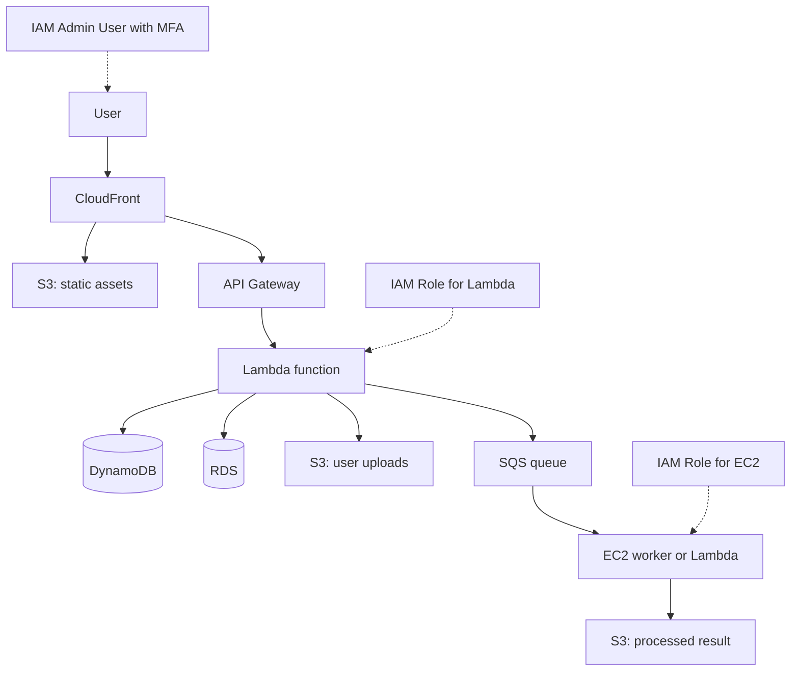

### คำอธิบายแบบละเอียด (Detailed Explanation)  

| ขั้นตอน | คำอธิบาย (ไทย) | Explanation (English) |
|---------|----------------|------------------------|
| 1 | CloudFront รับ request และ serve static files จาก S3 หรือ forward dynamic request ไป API Gateway | CloudFront receives request, serves static files from S3 or forwards dynamic request to API Gateway. |
| 2 | API Gateway รับ REST request แล้ว trigger Lambda | API Gateway receives REST request and triggers Lambda. |
| 3 | Lambda ประมวลผล business logic: อ่าน/เขียน DynamoDB หรือ RDS (โดยใช้ IAM role ที่ attach policy ที่เหมาะสม) | Lambda processes business logic: reads/writes DynamoDB or RDS (using IAM role with appropriate policies). |
| 4 | ถ้ามีไฟล์อัปโหลด Lambda เก็บใน S3 (ต้องมี permission s3:PutObject) | If file upload, Lambda stores in S3 (requires s3:PutObject permission). |
| 5 | ถ้ามีงานหนัก (เช่น video encoding) Lambda ส่ง message ไปยัง SQS (ต้องมี sqs:SendMessage) | If heavy task (e.g., video encoding), Lambda sends message to SQS (requires sqs:SendMessage). |
| 6 | SQS queue trigger Lambda worker หรือ EC2 worker ดึง message (EC2 ต้องมี role ที่ allow sqs:ReceiveMessage) | SQS queue triggers Lambda worker or EC2 worker pulls message (EC2 role must allow sqs:ReceiveMessage). |
| 7 | Worker ประมวลผลและเก็บผลลัพธ์ใน S3 | Worker processes and stores result in S3. |

---

## 💻 ตัวอย่างโค้ดที่รันได้จริง (Runnable Code Example)  

### 1. การสร้าง EC2 instance ด้วย Go SDK  

```go
// ec2_create.go
// สร้าง EC2 instance แบบ t2.micro ใน VPC default
// Create a t2.micro EC2 instance in default VPC

package main

import (
	"context"
	"fmt"
	"log"

	"github.com/aws/aws-sdk-go-v2/config"
	"github.com/aws/aws-sdk-go-v2/service/ec2"
	"github.com/aws/aws-sdk-go-v2/service/ec2/types"
)

func main() {
	cfg, err := config.LoadDefaultConfig(context.TODO(), config.WithRegion("us-east-1"))
	if err != nil {
		log.Fatalf("config error: %v", err)
	}
	client := ec2.NewFromConfig(cfg)

	// ใช้ Amazon Linux 2 AMI (us-east-1)
	amiId := "ami-0c02fb55956c7d316"
	instanceType := types.InstanceTypeT2Micro

	runResult, err := client.RunInstances(context.TODO(), &ec2.RunInstancesInput{
		ImageId:      &amiId,
		InstanceType: instanceType,
		MinCount:     int32Ptr(1),
		MaxCount:     int32Ptr(1),
	})
	if err != nil {
		log.Fatalf("failed to create instance: %v", err)
	}

	fmt.Printf("Created instance: %s\n", *runResult.Instances[0].InstanceId)
}

func int32Ptr(i int32) *int32 { return &i }
```

### 2. การอ่าน/เขียน DynamoDB ด้วย Go  

```go
// dynamodb_crud.go
// CRUD พื้นฐานบน DynamoDB table ชื่อ "Users" (partition key: UserID)
// Basic CRUD on DynamoDB table "Users" (partition key: UserID)

package main

import (
	"context"
	"fmt"
	"log"

	"github.com/aws/aws-sdk-go-v2/config"
	"github.com/aws/aws-sdk-go-v2/feature/dynamodb/attributevalue"
	"github.com/aws/aws-sdk-go-v2/service/dynamodb"
	"github.com/aws/aws-sdk-go-v2/service/dynamodb/types"
)

type User struct {
	UserID string `dynamodbav:"UserID"`
	Name   string `dynamodbav:"Name"`
	Email  string `dynamodbav:"Email"`
}

func main() {
	cfg, _ := config.LoadDefaultConfig(context.TODO())
	client := dynamodb.NewFromConfig(cfg)
	tableName := "Users"

	// Put item
	user := User{UserID: "u001", Name: "Alice", Email: "alice@example.com"}
	item, _ := attributevalue.MarshalMap(user)
	_, err := client.PutItem(context.TODO(), &dynamodb.PutItemInput{
		TableName: &tableName,
		Item:      item,
	})
	if err != nil {
		log.Fatal(err)
	}
	fmt.Println("Inserted user")

	// Get item
	result, err := client.GetItem(context.TODO(), &dynamodb.GetItemInput{
		TableName: &tableName,
		Key: map[string]types.AttributeValue{
			"UserID": &types.AttributeValueMemberS{Value: "u001"},
		},
	})
	if err != nil {
		log.Fatal(err)
	}
	var fetched User
	attributevalue.UnmarshalMap(result.Item, &fetched)
	fmt.Printf("Fetched: %+v\n", fetched)
}
```

### 3. การเชื่อมต่อ RDS (PostgreSQL) จาก Go  

```go
// rds_connect.go
// เชื่อมต่อ PostgreSQL บน RDS โดยใช้ lib/pq
// Connect to PostgreSQL on RDS using lib/pq

package main

import (
	"database/sql"
	"fmt"
	"log"
	"os"

	_ "github.com/lib/pq"
)

func main() {
	// ควรใช้ Secrets Manager หรือ environment variables แทน hardcode
	// Use Secrets Manager or env vars instead of hardcoding
	host := os.Getenv("RDS_HOST")
	port := os.Getenv("RDS_PORT")
	user := os.Getenv("RDS_USER")
	password := os.Getenv("RDS_PASSWORD")
	dbname := os.Getenv("RDS_DBNAME")

	connStr := fmt.Sprintf("host=%s port=%s user=%s password=%s dbname=%s sslmode=require",
		host, port, user, password, dbname)
	db, err := sql.Open("postgres", connStr)
	if err != nil {
		log.Fatal(err)
	}
	defer db.Close()

	err = db.Ping()
	if err != nil {
		log.Fatal(err)
	}
	fmt.Println("Connected to RDS PostgreSQL!")
}
```

### 4. การสร้าง IAM user และ attach policy ด้วย Go  

```go
// iam_create_user.go
// สร้าง IAM user ชื่อ "developer" และ attach policy ReadOnlyAccess
// Create IAM user "developer" and attach ReadOnlyAccess policy

package main

import (
	"context"
	"fmt"
	"log"

	"github.com/aws/aws-sdk-go-v2/config"
	"github.com/aws/aws-sdk-go-v2/service/iam"
)

func main() {
	cfg, err := config.LoadDefaultConfig(context.TODO())
	if err != nil {
		log.Fatalf("config error: %v", err)
	}
	client := iam.NewFromConfig(cfg)

	userName := "developer"

	// สร้าง user
	createOutput, err := client.CreateUser(context.TODO(), &iam.CreateUserInput{
		UserName: &userName,
	})
	if err != nil {
		log.Fatalf("create user failed: %v", err)
	}
	fmt.Printf("Created user: %s\n", *createOutput.User.UserName)

	// ค้นหา ARN ของ managed policy ReadOnlyAccess
	policyArn := "arn:aws:iam::aws:policy/ReadOnlyAccess"

	// Attach policy ให้ user
	_, err = client.AttachUserPolicy(context.TODO(), &iam.AttachUserPolicyInput{
		UserName:  &userName,
		PolicyArn: &policyArn,
	})
	if err != nil {
		log.Fatalf("attach policy failed: %v", err)
	}
	fmt.Println("Attached ReadOnlyAccess policy")
}
```

### 5. การสร้าง IAM role สำหรับ Lambda (trust policy + permission policy)  

```go
// iam_create_role.go
// สร้าง IAM role ชื่อ "LambdaS3Role" ให้ Lambda สามารถอ่านจาก S3 ได้
// Create IAM role "LambdaS3Role" that allows Lambda to read from S3

package main

import (
	"context"
	"encoding/json"
	"fmt"
	"log"

	"github.com/aws/aws-sdk-go-v2/config"
	"github.com/aws/aws-sdk-go-v2/service/iam"
)

func main() {
	cfg, _ := config.LoadDefaultConfig(context.TODO())
	client := iam.NewFromConfig(cfg)

	roleName := "LambdaS3Role"

	// Trust policy: อนุญาตให้ Lambda service assume role ได้
	trustPolicy := map[string]interface{}{
		"Version": "2012-10-17",
		"Statement": []map[string]interface{}{
			{
				"Effect":    "Allow",
				"Principal": map[string]string{"Service": "lambda.amazonaws.com"},
				"Action":    "sts:AssumeRole",
			},
		},
	}
	trustPolicyDoc, _ := json.Marshal(trustPolicy)

	createRoleOutput, err := client.CreateRole(context.TODO(), &iam.CreateRoleInput{
		RoleName:                 &roleName,
		AssumeRolePolicyDocument: string(trustPolicyDoc),
		Description:              awsString("Role for Lambda to access S3"),
	})
	if err != nil {
		log.Fatal(err)
	}
	fmt.Printf("Created role: %s\n", *createRoleOutput.Role.RoleName)

	// Attach S3 read-only policy
	s3ReadOnlyArn := "arn:aws:iam::aws:policy/AmazonS3ReadOnlyAccess"
	_, err = client.AttachRolePolicy(context.TODO(), &iam.AttachRolePolicyInput{
		RoleName:  &roleName,
		PolicyArn: &s3ReadOnlyArn,
	})
	if err != nil {
		log.Fatal(err)
	}
	fmt.Println("Attached S3 read-only policy")
}

func awsString(s string) *string { return &s }
```

### 6. การสร้าง temporary credentials ด้วย AWS STS (Go SDK)  

```go
// sts_assume_role.go
// Assume role เพื่อรับ temporary credentials สำหรับการเข้าถึง S3
// Assume a role to get temporary credentials for S3 access

package main

import (
	"context"
	"fmt"
	"log"

	"github.com/aws/aws-sdk-go-v2/config"
	"github.com/aws/aws-sdk-go-v2/service/sts"
)

func main() {
	cfg, _ := config.LoadDefaultConfig(context.TODO())
	stsClient := sts.NewFromConfig(cfg)

	roleArn := "arn:aws:iam::123456789012:role/LambdaS3Role"
	sessionName := "my-session"

	result, err := stsClient.AssumeRole(context.TODO(), &sts.AssumeRoleInput{
		RoleArn:         &roleArn,
		RoleSessionName: &sessionName,
		DurationSeconds: 3600, // 1 hour
	})
	if err != nil {
		log.Fatal(err)
	}

	creds := result.Credentials
	fmt.Printf("AccessKeyId: %s\n", *creds.AccessKeyId)
	fmt.Printf("SecretAccessKey: %s\n", *creds.SecretAccessKey)
	fmt.Printf("SessionToken: %s\n", *creds.SessionToken)
	fmt.Printf("Expiration: %s\n", creds.Expiration)
}
```

---

## 📌 กรณีศึกษาและแนวทางแก้ไขปัญหา (Case Study & Troubleshooting)  

### กรณีศึกษา 1: ระบบอัปโหลดและประมวลผลวิดีโอ  

**ปัญหา:** ผู้ใช้อัปโหลดวิดีโอ ต้องการแปลง format และสร้าง thumbnail โดยไม่ให้หน้าหน่วง  
**แนวทางแก้ไข:**  
- S3 สำหรับเก็บวิดีโอดิบ  
- S3 event notification → Lambda → ส่ง message ไปยัง SQS  
- EC2 worker (หรือ Lambda อีกตัว) ดึง message, ประมวลผลด้วย FFmpeg, แล้วอัปโหลดผลลัพธ์ไปยัง S3 อีก bucket  
- CloudFront สำหรับ streaming  
- **IAM:** Lambda role ต้องมี `s3:GetObject`, `sqs:SendMessage`; EC2 role ต้องมี `sqs:ReceiveMessage`, `s3:PutObject`  
**ผลลัพธ์:** ระบบ scalable, ไม่มี bottleneck  

### กรณีศึกษา 2: การจัดการสิทธิ์แบบ最小สิทธิ์สำหรับ microservices  

**ปัญหา:** มี 3 microservices (Auth, Orders, Payments) ต้องการเข้าถึง DynamoDB, SQS, S3 ต่างกัน หากใช้ access key เดียวกันจะเสี่ยงเกินสิทธิ์  
**แนวทางแก้ไข:**  
- สร้าง IAM role แต่ละ service (AuthRole, OrdersRole, PaymentsRole)  
- กำหนด policy เฉพาะสำหรับแต่ละ role เช่น OrdersRole สามารถ读写 DynamoDB table `Orders` และส่ง SQS message ไปยัง queue `order-queue` แต่ไม่สามารถเข้าถึง `Payments` table  
- ใช้ instance metadata (สำหรับ EC2) หรือ environment variables (สำหรับ Lambda) โดยอัตโนมัติ – ไม่ต้องเก็บ keys  
- ใช้ IAM Policy Simulator ทดสอบก่อนใช้งานจริง  
**ผลลัพธ์:** ลด blast radius หาก service ใดถูกโจมตี, สามารถ audit การเข้าถึงผ่าน CloudTrail  

### ปัญหาที่พบบ่อย (Common Issues)  

| ปัญหา (Issue) | สาเหตุ (Cause) | วิธีแก้ไข (Solution) |
|----------------|----------------|----------------------|
| EC2 instance ไม่สามารถเชื่อมต่อ RDS ได้ | Security group ไม่เปิด port 5432 | เพิ่ม inbound rule สำหรับ security group ของ RDS ให้ allow จาก security group ของ EC2 |
| Lambda timeout เมื่อประมวลผลวิดีโอ | Lambda สูงสุด 15 นาที | เปลี่ยนไปใช้ ECS หรือ EC2 สำหรับงานที่ใช้เวลานาน |
| S3 bucket policy ทำให้ access denied | Policy ไม่ถูกต้อง | ตรวจสอบ bucket policy และ IAM role |
| DynamoDB throttling | Read/write capacity ไม่พอ | ใช้ on-demand mode หรือเพิ่ม auto scaling |
| EC2 instance ไม่สามารถเข้าถึง S3 ได้ | EC2 role ไม่มี policy S3 | Attach `AmazonS3ReadOnlyAccess` หรือ policy ที่กำหนดเอง |
| AssumeRole failed: AccessDenied | User/role ที่เรียกไม่มี `sts:AssumeRole` | เพิ่ม permission `sts:AssumeRole` ใน policy ของ caller |
| Lambda function timeout เมื่อเรียก AWS service | Lambda role ไม่มี permission ให้เรียก service นั้น | ตรวจสอบ CloudWatch Logs จะเห็น "AccessDenied" แล้วเพิ่ม policy ที่เหมาะสม |

---

## 📁 เทมเพลตและตัวอย่างโค้ดเพิ่มเติม (Templates & More Code)  

### Template: CloudFormation ง่าย ๆ สำหรับ S3 bucket + DynamoDB + IAM Role  

```yaml
Resources:
  MyBucket:
    Type: AWS::S3::Bucket
  MyTable:
    Type: AWS::DynamoDB::Table
    Properties:
      AttributeDefinitions:
        - AttributeName: id
          AttributeType: S
      KeySchema:
        - AttributeName: id
          KeyType: HASH
      BillingMode: PAY_PER_REQUEST
  LambdaRole:
    Type: AWS::IAM::Role
    Properties:
      AssumeRolePolicyDocument:
        Version: "2012-10-17"
        Statement:
          - Effect: Allow
            Principal:
              Service: lambda.amazonaws.com
            Action: sts:AssumeRole
      ManagedPolicyArns:
        - arn:aws:iam::aws:policy/AmazonS3ReadOnlyAccess
```

### IAM Policy ตัวอย่าง: อนุญาตให้ Lambda เขียนลง DynamoDB table เฉพาะ `Users`  

```json
{
  "Version": "2012-10-17",
  "Statement": [
    {
      "Effect": "Allow",
      "Action": [
        "dynamodb:PutItem",
        "dynamodb:UpdateItem",
        "dynamodb:GetItem"
      ],
      "Resource": "arn:aws:dynamodb:us-east-1:123456789012:table/Users"
    }
  ]
}
```

### การใช้ S3 presigned URL ใน Go (ให้อัปโหลดได้โดยตรงจาก client)  

```go
// s3_presign.go
// สร้าง presigned URL สำหรับอัปโหลดไฟล์ไป S3 โดยไม่ต้องผ่าน server
// Generate presigned URL for direct client upload to S3

func generatePresignedURL(bucket, key string) (string, error) {
	cfg, _ := config.LoadDefaultConfig(context.TODO())
	client := s3.NewFromConfig(cfg)
	presignClient := s3.NewPresignClient(client)
	req, err := presignClient.PresignPutObject(context.TODO(), &s3.PutObjectInput{
		Bucket: &bucket,
		Key:    &key,
	}, s3.WithPresignExpires(15*time.Minute))
	if err != nil {
		return "", err
	}
	return req.URL, nil
}
```

---

## 📊 ตารางเปรียบเทียบบริการ Core Services  

| หมวดหมู่ | บริการ | ใช้แทน | เหมาะกับ workload |
|----------|--------|--------|--------------------|
| Compute | EC2 | physical/virtual server | stateful, long-running, custom OS |
| Compute | Lambda | background jobs, APIs | event-driven, short (<15 min) |
| Storage | S3 | NAS / object store | static files, backups, data lake |
| Storage | EBS | hard disk | EC2 root volume, database disk |
| Database | RDS | MySQL/PostgreSQL/Oracle | traditional apps, complex queries |
| Database | DynamoDB | MongoDB / Cassandra | high‑scale key-value, JSON docs |
| Networking | VPC | data center network | isolation, hybrid cloud |
| Networking | CloudFront | CDN | global content acceleration |
| Security | **IAM** | - | การควบคุมสิทธิ์ทุกระดับ, central identity management |

---

## 📝 สรุป (Summary)  

### ✅ ประโยชน์ที่ได้รับ (Benefits)  
- เข้าใจบริการหลักและบทบาทของแต่ละบริการ  
- สามารถเลือกใช้บริการที่เหมาะสมกับงาน  
- เขียน Go เพื่อทำงานกับ EC2, S3, DynamoDB, RDS, IAM  
- **IAM** ช่วยให้ enforce principle of least privilege, ใช้ roles แทน access keys  

### ⚠️ ข้อควรระวัง (Cautions)  
- ระวังค่าใช้จ่ายเมื่อทดลอง (ใช้ free tier)  
- ปิดบริการที่ไม่ใช้แล้ว  
- ใช้ IAM roles แทน access keys เมื่อทำงานบน EC2/Lambda  
- IAM policy ใช้เวลา propagate (eventual consistency)  

### 👍 ข้อดี (Advantages)  
- บริการทำงานร่วมกันได้ดี (native integration)  
- มีตัวอย่างและ best practices มากมาย  
- ปรับขนาดอัตโนมัติ  
- IAM granular permission, รองรับ federation  

### 👎 ข้อเสีย (Disadvantages)  
- บางบริการมี learning curve สูง (VPC)  
- ราคาอาจสูงกว่าการทำเองถ้าใช้ไม่ถูกวิธี  
- IAM ซับซ้อนเมื่อมี policy จำนวนมาก  

### 🚫 ข้อห้าม (Prohibitions)  
- ห้ามใช้ EC2 สำหรับงานที่ทำเป็นครั้งคราว (ใช้ Lambda แทน)  
- ห้ามเก็บ database credentials ในโค้ด  
- ห้ามเปิด public access ไปยัง RDS หรือ EC2 โดยไม่จำเป็น  
- **IAM:** ห้ามใส่ AWS credentials ในโค้ดหรือ commit ขึ้น Git, ห้ามใช้ root user access key สำหรับ application, ห้ามสร้าง policy ที่ allow `"Action": "*"` และ `"Resource": "*"` เว้นแต่เป็น admin role ที่มี MFA  

---

## 🧩 แบบฝึกหัดท้ายบท (Exercises)  

**ข้อ 1:** จงบอกความแตกต่างหลักระหว่าง EC2 กับ Lambda ในแง่ของ pricing model และ execution time limit  
**ข้อ 2:** หากต้องการเก็บรูปภาพโปรไฟล์ผู้ใช้ (ไฟล์ขนาดเล็ก จำนวนมาก) ควรใช้ S3 หรือ EBS? เพราะเหตุใด  
**ข้อ 3:** เขียน Go function เพื่อสร้าง S3 bucket ชื่อ `my-bucket-<timestamp>`  
**ข้อ 4:** ข้อดีของการใช้ DynamoDB แทน RDS สำหรับแอปที่มี traffic ผันผวนสูงคืออะไร  
**ข้อ 5:** VPC มีไว้เพื่ออะไร และ security group กับ NACL ต่างกันอย่างไร  
**ข้อ 6:** จงออกแบบระบบง่าย ๆ สำหรับแอป TODO list ที่มี user authentication, เก็บข้อมูลใน DynamoDB, และมี static frontend โดยใช้ AWS Core Services เท่านั้น (ระบุบริการที่ใช้)  
**ข้อ 7:** การใช้ CloudFront ร่วมกับ S3 มีประโยชน์อย่างไร  
**ข้อ 8:** ถ้า Lambda ต้องการอ่านไฟล์จาก S3 ต้องให้ IAM role มี permission อะไรบ้าง  
**ข้อ 9:** ข้อห้าม 2 ข้อเกี่ยวกับการใช้งาน RDS บน AWS  
**ข้อ 10:** จงเขียนคำสั่ง AWS CLI เพื่อสร้าง security group ที่อนุญาต SSH (port 22) จาก IP ของคุณเท่านั้น  
**ข้อ 11:** จงเขียน IAM policy (JSON) ที่อนุญาตให้ Lambda function สามารถอ่าน object จาก S3 bucket `my-config-bucket` เท่านั้น (ห้ามเขียน)  
**ข้อ 12:** หากต้องการให้ EC2 instance ที่รอยยู่สามารถส่งข้อความไปยัง SQS queue ได้ โดยไม่ต้องเก็บ access key ควรทำอย่างไร  

---

## 🔐 เฉลยแบบฝึกหัด (Answer Key)  

**ข้อ 1:** EC2 จ่ายต่อชั่วโมง (หรือ second) รันได้ตลอดไป; Lambda จ่ายต่อ invocation และ duration (ms) สูงสุด 15 นาที  
**ข้อ 2:** S3 เพราะเก็บ object ได้จำนวนมาก, access ผ่าน URL, และ durability สูงกว่า EBS  
**ข้อ 3:**  
```go
func createBucket(bucketName string) error {
    cfg, _ := config.LoadDefaultConfig(context.TODO())
    client := s3.NewFromConfig(cfg)
    _, err := client.CreateBucket(context.TODO(), &s3.CreateBucketInput{
        Bucket: &bucketName,
    })
    return err
}
```  
**ข้อ 4:** DynamoDB on-demand ปรับ capacity อัตโนมัติ, จ่ายตาม request, ไม่ต้องจัดการ scaling  
**ข้อ 5:** VPC คือเครือข่ายส่วนตัว; Security group เป็น stateful (instance level), NACL เป็น stateless (subnet level)  
**ข้อ 6:** S3 (frontend hosting) + CloudFront (CDN) + API Gateway + Lambda (backend) + DynamoDB (store todos) + Cognito (authentication)  
**ข้อ 7:** ลด latency (cache), ลด load บน S3, รองรับ HTTPS และ custom domain  
**ข้อ 8:** `s3:GetObject` บน bucket และ key ที่เกี่ยวข้อง  
**ข้อ 9:** 1) ห้ามเปิด public access 2) ห้ามใช้ root user credentials สำหรับ connection  
**ข้อ 10:** `aws ec2 authorize-security-group-ingress --group-id sg-xxxx --protocol tcp --port 22 --cidr YOUR_IP/32`  
**ข้อ 11:**  
```json
{
  "Version": "2012-10-17",
  "Statement": [{
    "Effect": "Allow",
    "Action": "s3:GetObject",
    "Resource": "arn:aws:s3:::my-config-bucket/*"
  }]
}
```  
**ข้อ 12:** สร้าง IAM role ที่มี policy `sqs:SendMessage` และ attach role นั้นกับ EC2 instance (ผ่าน instance profile) จากนั้น SDK จะดึง credentials จาก metadata service อัตโนมัติ  

---

## 📚 แหล่งอ้างอิง (References)  

1. AWS Core Services – Official Documentation.  
2. AWS SDK for Go v2 Examples – GitHub.  
3. “AWS Certified Solutions Architect Study Guide” – Sybex.  
4. AWS Well-Architected Framework.  
5. AWS IAM Documentation – https://docs.aws.amazon.com/iam/  
6. AWS Go SDK v2 IAM examples – GitHub  

---

**✍️ ผู้เขียน:** คงนคร จันทะคุณ  
**📅 อัปเดตล่าสุด:** เมษายน 2026  

**หมายเหตุ เนื้อหาในหนังสือ:**  
เนื้อหาในหนังสือ "AWS จากภาคทฤษฎีไปภาคปฏิบัติ" ใช้ AI ช่วยเขียน เพื่อทดสอบ AI Model ผู้เขียนเป็นผู้ออกแบบ ใช้ AI ช่วยจัดเรียง ซึ่งมีค่าใช้จ่ายพอสมควร ให้ใช้ฟรีก่อน ต้องการสนับสนุนเพื่อทำเนื้อหาแนวนี้ต่อ สามารถให้การสนับสนุนได้ครับ ตามกำลังศรัทธา  
📞 โทรศัพท์ / พร้อมเพย์: **0955088091**  

---
 

# 📘 บทที่ 8: AWS Certified – เส้นทางสู่การรับรอง  
## Chapter 8: AWS Certified – The Path to Certification  

---

## 🧱 โครงสร้างการทำงาน (Work Structure)  

**ไทย:**  
บทนี้จะแนะนำโปรแกรมการรับรองของ AWS (AWS Certification) ว่า คืออะไร มีระดับและสายงานใดบ้าง แต่ละใบรับรองเหมาะกับใคร เนื้อหาการสอบอย่างไร รวมถึงแนวทางการเตรียมตัวและประโยชน์ที่ได้รับจากใบรับรอง พร้อมเปรียบเทียบระหว่าง Associate, Professional, และ Specialty  

**English:**  
This chapter introduces the AWS Certification program: what it is, its levels and tracks, which certification suits which role, exam content, preparation strategies, and the benefits of being certified, including a comparison between Associate, Professional, and Specialty levels.  

---

## 🎯 วัตถุประสงค์แบบสั้นสำหรับทบทวน (Short Revision Objective)  

**ไทย:**  
เพื่อให้ผู้อ่านเข้าใจความหมายและความสำคัญของ AWS Certification, รู้จักใบรับรองแต่ละประเภท (Foundational, Associate, Professional, Specialty), สามารถเลือกเส้นทางที่เหมาะสมกับอาชีพของตนเอง, และทราบวิธีการเตรียมตัวสอบอย่างมีประสิทธิภาพ  

**English:**  
To enable readers to understand the meaning and importance of AWS Certification, know each certification type (Foundational, Associate, Professional, Specialty), choose the right path for their career, and learn effective exam preparation methods.  

---

## 👥 กลุ่มเป้าหมาย (Target Audience)  

- ผู้ที่กำลังจะสอบ AWS Certification ทุกระดับ  
- นักพัฒนา, DevOps, สถาปนิก, ผู้ดูแลระบบที่ต้องการรับรองทักษะ  
- นักศึกษาหรือผู้เปลี่ยนสายอาชีพที่ต้องการเพิ่มมูลค่าในตลาดงาน  
- HR หรือผู้จัดการที่ต้องการเข้าใจคุณค่าของใบรับรอง  

---

## 📚 ความรู้พื้นฐาน (Prerequisites)  

- ไม่มีข้อกำหนดอย่างเป็นทางการ แต่แนะนำให้มีประสบการณ์ AWS 6-12 เดือนสำหรับ Associate  
- สำหรับ Professional ควรมีประสบการณ์ 2 ปีขึ้นไป  
- เข้าใจภาษาอังกฤษระดับอ่านออกสอบได้ (ข้อสอบเป็นภาษาอังกฤษ)  

---

## 📝 เนื้อหาโดยย่อ (Abstract)  

**ไทย:**  
บทนี้จะอธิบายภาพรวมของ AWS Certification ทั้ง 4 ระดับ (Foundational, Associate, Professional, Specialty) และสายงานหลัก (Cloud Practitioner, Architect, Developer, DevOps, Data, Networking, ML/AI) รวมถึงเนื้อหาโดยประมาณของแต่ละใบรับรอง, ราคาค่าสอบ, ระยะเวลาที่ใช้เตรียมตัว, และเทคนิคการทำข้อสอบ พร้อมตารางเปรียบเทียบและคำแนะนำสำหรับการเลือกเส้นทาง  

**English:**  
This chapter provides an overview of AWS Certification across four levels (Foundational, Associate, Professional, Specialty) and main tracks (Cloud Practitioner, Architect, Developer, DevOps, Data, Networking, ML/AI), including exam content, cost, preparation time, test‑taking tips, comparison tables, and guidance for choosing your path.  

---

## 🔰 บทนำ (Introduction)  

**ไทย:**  
AWS Certification เป็นใบรับรองที่ออกโดย AWS เพื่อยืนยันว่าผู้สอบมีความรู้และทักษะในการออกแบบ, พัฒนา, หรือบริหารระบบบน AWS ใบรับรองนี้ได้รับการยอมรับในวงการไอทีทั่วโลก ช่วยเพิ่มโอกาสในการได้งาน, เลื่อนตำแหน่ง, และสร้างความเชื่อมั่นให้กับนายจ้าง ปัจจุบันมีผู้สอบผ่านแล้วมากกว่าล้านคนทั่วโลก  

**English:**  
AWS Certification is a credential issued by AWS to validate that an individual has the knowledge and skills to design, develop, or manage systems on AWS. It is globally recognized in the IT industry, helping with job opportunities, promotions, and building employer confidence. Over one million people have been certified worldwide.  

---

## 📖 บทนิยาม (Definitions)  

| คำศัพท์ (Term) | คำจำกัดความไทย (Thai Definition) | English Definition |
|----------------|----------------------------------|--------------------|
| AWS Certification | ใบรับรองที่ AWS ออกให้หลังจากสอบผ่าน แสดงความเชี่ยวชาญด้าน AWS | Credential issued by AWS after passing an exam, demonstrating AWS expertise. |
| Foundational Level | ระดับพื้นฐาน ไม่ต้องมีประสบการณ์มาก เน้นความรู้ทั่วไปของ AWS | Basic level, no extensive experience required, focuses on general AWS knowledge. |
| Associate Level | ระดับปฏิบัติการ แนะนำให้มีประสบการณ์ 1 ปีขึ้นไป | Operational level, recommended 1+ year experience. |
| Professional Level | ระดับสูง สำหรับผู้มีประสบการณ์ 2+ ปี ออกแบบโซลูชันซับซ้อน | Advanced level for 2+ years experience, designing complex solutions. |
| Specialty | ระดับเฉพาะทาง (Networking, Security, ML, Data, etc.) | Specialized level (Networking, Security, ML, Data, etc.). |
| Beta Exam | การสอบเวอร์ชันทดลองก่อนออกจริง ราคาถูกกว่า แต่ผลออกช้า | Trial version of an exam before official release, cheaper but results delayed. |
| Recertification | การต่ออายุใบรับรอง (ทุก 3 ปี) | Renewal of certification (every 3 years). |

---

## 🔧 AWS Certified คืออะไร? มีกี่แบบ? ใช้อย่างไร?  

### 1. AWS Certified คืออะไร  
**ไทย:**  
AWS Certified คือโปรแกรมการรับรองทักษะจาก AWS แบ่งตามบทบาท (role-based) และเทคโนโลยีเฉพาะทาง (specialty) การสอบจะวัดความรู้ทั้งทางทฤษฎีและปฏิบัติผ่านข้อสอบแบบเลือกตอบและตอบหลายตัวเลือก บางข้อสอบมี labs ให้ทำบน AWS จริง  

**English:**  
AWS Certified is a skills validation program from AWS, divided by roles and specialties. Exams measure both theoretical and practical knowledge via multiple‑choice and multiple‑answer questions; some exams include hands‑on labs on the live AWS console.  

### 2. มีกี่แบบ (Types / Levels)  

| ระดับ (Level) | จำนวนใบรับรอง (ตัวอย่าง) | ประสบการณ์ที่แนะนำ | ค่าสอบ (USD) |
|---------------|--------------------------|---------------------|---------------|
| **Foundational** | Cloud Practitioner (CLF-C02) | 6 เดือน | 100 |
| **Associate** | Solutions Architect (SAA-C03), Developer (DVA-C02), Data Engineer (DEA-C01) | 1 ปี | 150 |
| **Professional** | Solutions Architect (SAP-C02), DevOps Engineer (DOP-C02) | 2+ ปี | 300 |
| **Specialty** | Advanced Networking (ANS-C01), Security (SCS-C02), Machine Learning (MLS-C01), AI Practitioner (AIF-C01) | 2+ ปี | 300 |

### 3. ใช้อย่างไร (How to use certification)  

- **เพิ่มโอกาสทางอาชีพ:** ประวัติ LinkedIn, เรซูเม่, การขอเลื่อนขั้น  
- **ความน่าเชื่อถือ:** ลูกค้าหรือหัวหน้ามั่นใจว่าคุณมีความรู้มาตรฐาน  
- **สิทธิพิเศษ:** ส่วนลดการสอบครั้งต่อไป, AWS exam prep materials, digital badge  
- **เครือข่าย:** เข้าร่วมกลุ่ม Certified AWS Users  

### 4. นำในกรณีไหน (When to get certified)  

- กำลังหางานที่เกี่ยวข้องกับ AWS  
- องค์กรต้องการ partner status (AWS Partner Network ต้องการจำนวน certified staff)  
- ต้องการโปรโมทตัวเองภายในองค์กร  
- ต้องการทบทวนความรู้ AWS ให้เป็นระบบ  

### 5. ทำไมต้องใช้ (Why get certified)  

- พิสูจน์ความรู้ให้เป็นมาตรฐาน  
- เงินเดือนเฉลี่ยของผู้ที่มีใบรับรองสูงกว่าผู้ที่ไม่มี (ตามรายงานของ Global Knowledge)  
- อัปเดตความรู้เพราะต้อง recertify ทุก 3 ปี  
- เป็นแรงจูงใจในการเรียนรู้  

### 6. ประโยชน์ที่ได้รับ (Benefits)  

- ขึ้นบัญชีผู้เชี่ยวชาญของ AWS (ถ้ามี Professional หรือ Specialty)  
- ได้รับ digital badge สำหรับแสดงบน LinkedIn  
- ส่วนลด 50% สำหรับสอบครั้งต่อไป (หากสอบผ่าน)  
- เข้าร่วม专属 events สำหรับ certified  

### 7. ข้อควรระวัง (Cautions)  

- ข้อสอบไม่ง่าย ต้องเตรียมตัวจริงจัง  
- ค่าสอบค่อนข้างสูง (100-300 USD) ถ้าสอบไม่ผ่านเสียค่าใช้จ่าย  
- ต้อง recertify ทุก 3 ปี (เสียค่าใช้จ่ายอีก)  
- ข้อสอบอัปเดตบ่อย (ทุก 1-2 ปี) เนื้อหาอาจเปลี่ยน  

### 8. ข้อดี (Advantages)  

- เป็นที่ยอมรับทั่วโลก  
- มีแนวทางการเตรียมตัวมากมาย (หนังสือ, course online, practice exam)  
- สอบได้ที่ศูนย์ Pearson VUE หรือ online proctored  

### 9. ข้อเสีย (Disadvantages)  

- ไม่มี practical lab ในทุกระดับ (Professional มี lab บ้าง)  
- ข้อสอบวัดความรู้กว้าง แต่ไม่ลึกเท่าการทำงานจริง  
- คนที่มีประสบการณ์จริงอาจไม่จำเป็นต้องมีใบรับรอง  

### 10. ข้อห้าม (Prohibitions)  

- ห้ามใช้ brain dump (ข้อสอบรั่ว) เพราะผิดจริยธรรมและอาจถูกเพิกถอนใบรับรอง  
- ห้ามทำข้อสอบโดยให้คนอื่นทำให้  
- ห้ามอ้างว่ามีใบรับรองถ้ายังไม่สอบผ่าน  

---

## 🔄 ออกแบบ Workflow (Workflow Design)  

### ภาพรวมเส้นทางการเตรียมตัวสอบ AWS Certification  

**ไทย:**  
เลือกใบรับรองที่ต้องการ → ศึกษาหลักสูตร (AWS Skill Builder, Udemy, Coursera) → ฝึกทำ hands‑on ด้วย AWS free tier → ทำ practice exam → สอบจริง (online หรือ onsite) → ได้ใบรับรอง → recertify ทุก 3 ปี  

**English:**  
Choose target certification → study course (AWS Skill Builder, Udemy, Coursera) → hands‑on practice with AWS free tier → take practice exams → take real exam (online or onsite) → get certified → recertify every 3 years.  

### Mermaid Flowchart  

```mermaid
flowchart TB
    A[เลือกใบรับรอง] --> B{ระดับ?}
    B --> C[Foundational: Cloud Practitioner]
    B --> D[Associate: SAA / DVA / DEA / SOA]
    B --> E[Professional: SAP / DOP]
    B --> F[Specialty: Networking, Security, ML, Data]
    C --> G[ศึกษาด้วย AWS Skill Builder (ฟรี)]
    D --> G
    E --> H[คอร์สขั้นสูง + workshop]
    F --> H
    G --> I[ทำ hands-on labs ฟรี tier]
    H --> I
    I --> J[ทำ practice exam]
    J --> K{คะแนน > 85%?}
    K -- No --> G
    K -- Yes --> L[จองสอบกับ Pearson VUE]
    L --> M[สอบ]
    M --> N{ผ่าน?}
    N -- Yes --> O[รับ digital badge]
    N -- No --> P[ดู score report, จุดอ่อน]
    P --> G
    O --> Q[recertify ทุก 3 ปี]
```

### คำอธิบายแบบละเอียด (Detailed Explanation)  

| ขั้นตอน | คำอธิบาย (ไทย) | Explanation (English) |
|---------|----------------|------------------------|
| 1 | เลือกใบรับรองที่ตรงกับสายอาชีพ (Architect, Developer, DevOps ฯลฯ) | Choose certification matching your career role. |
| 2 | ศึกษาเนื้อหาผ่าน AWS Skill Builder (มีฟรีและเสียเงิน), Udemy, Coursera, หรือหนังสือ | Study content via AWS Skill Builder (free/paid), Udemy, Coursera, or books. |
| 3 | ฝึกปฏิบัติจริงบน AWS free tier (สร้าง VPC, EC2, S3, Lambda) | Hands‑on practice on AWS free tier (create VPC, EC2, S3, Lambda). |
| 4 | ทำข้อสอบฝึกหัด (practice exam) จนได้คะแนน >85% | Take practice exams until score >85%. |
| 5 | จองสอบผ่าน Pearson VUE (เลือก online proctored หรือ onsite) | Schedule exam via Pearson VUE (online proctored or test center). |
| 6 | สอบข้อสอบจริง (โดยปกติ 65-75 ข้อ, 120-180 นาที) | Take real exam (typically 65-75 questions, 120-180 minutes). |
| 7 | ถ้าผ่าน: รับ digital badge และใบรับรอง (PDF) | If pass: receive digital badge and certificate (PDF). |
| 8 | ถ้าไม่ผ่าน: ดู score report ว่าหมวดไหนอ่อน แล้วกลับไปศึกษาใหม่ | If fail: review score report to identify weak domains, restudy. |
| 9 | ต่ออายุทุก 3 ปี (recertification) โดยสอบใหม่หรือสะสมคะแนน (Continuing Education) | Recertify every 3 years by retaking exam or earning Continuing Education points. |

---

## 💻 ตัวอย่างโค้ด? (ไม่มีโค้ดในบทนี้ แต่มีตัวอย่างคำถาม)  

เนื่องจากบทนี้เป็นเชิงแนวคิดและสอบ ขอยกตัวอย่างคำถามแบบที่เจอในข้อสอบ (ไม่ใช่ Go) แทน  

### ตัวอย่างคำถามสอบ AWS Cloud Practitioner (CLF-C02)  

**คำถาม:** บริษัทต้องการให้พนักงานเข้าถึง AWS Management Console โดยใช้ credentials ของบริษัทเดิม (SSO) ควรใช้บริการใด  
A. AWS Identity and Access Management (IAM)  
B. AWS Single Sign-On (AWS SSO)  
C. AWS Directory Service  
D. Amazon Cognito  

**เฉลย:** B (AWS SSO)  

### ตัวอย่างคำถามสอบ Solutions Architect Associate (SAA-C03)  

**คำถาม:** แอปพลิเคชันบน EC2 ต้องอ่านข้อมูลจาก S3 bucket วิธีที่ปลอดภัยที่สุดในการให้สิทธิ์ EC2 คือ?  
A. ใส่ access key ใน environment variable  
B. ใช้ IAM role แนบกับ EC2 instance  
C. ใส่ access key ในไฟล์ config ใน AMI  
D. เปิด bucket เป็น public  

**เฉลย:** B  

---

## 📌 กรณีศึกษาและแนวทางแก้ไขปัญหา (Case Study & Troubleshooting)  

### กรณีศึกษา: Developer อยากเปลี่ยนสายเป็น Solutions Architect  

**ปัญหา:** มีประสบการณ์พัฒนาแอป แต่ไม่ถนัดด้าน infrastructure และ networking  
**แนวทางแก้ไข:**  
- เริ่มจาก AWS Certified Cloud Practitioner ก่อน (ใช้เวลา 2-3 สัปดาห์)  
- แล้วต่อด้วย Solutions Architect Associate โดยเน้น hands‑on labs: สร้าง VPC, EC2, RDS, S3, load balancer  
- ใช้ AWS free tier ฝึกทุกวัน 1-2 ชั่วโมง  
- ทำ practice exam ของ TutorialsDojo หรือ Stephane Maarek  
**ผลลัพธ์:** สอบผ่าน SAA ภายใน 3 เดือน, ได้งานเป็น Cloud Architect  

### ปัญหาที่พบบ่อย (Common Issues)  

| ปัญหา (Issue) | สาเหตุ (Cause) | วิธีแก้ไข (Solution) |
|----------------|----------------|----------------------|
| สอบไม่ผ่านทั้งที่เรียนเยอะ | ขาดการทำ practice exam | ต้องฝึกทำข้อสอบจำลองให้คุ้นชินกับรูปแบบ |
| เวลาทำข้อสอบไม่พอ | อ่านโจทย์ช้าหรือติดอยู่กับข้อเดียว | ข้ามข้อที่คิดนาน, ทำข้อที่แน่ใจก่อน, ใช้ process of elimination |
| เนื้อหาเยอะเกินไป | เรียนแบบไม่มีแผน | ใช้ exam guide ของ AWS เป็น checklist |
| online proctored มีปัญหา | internet ไม่เสถียร, สภาพห้องไม่เหมาะสม | ตรวจสอบ speed test, ใช้สาย LAN, ห้องโล่งไม่มีคน |

---

## 📁 เทมเพลตและตัวอย่างเพิ่มเติม  

### แผนการเตรียมตัวสอบ (8 สัปดาห์) สำหรับ Associate  

| สัปดาห์ | กิจกรรม |
|---------|---------|
| 1 | ดู exam guide, ทำ pretest, เรียน foundational concepts |
| 2-3 | เรียนคอร์ส (Udemy/Coursera) + ทำ hands‑on labs ตามหัวข้อ |
| 4 | ทบทวน services ที่สำคัญ (EC2, S3, VPC, IAM, RDS, Lambda) |
| 5 | ทำ practice exam ชุดแรก, วิเคราะห์จุดอ่อน |
| 6 | เรียนส่วนที่อ่อน + ทำ labs เพิ่ม |
| 7 | ทำ practice exam อีก 2-3 ชุด, ตั้งเป้า >85% |
| 8 | สอบจริง |

### Checklist ก่อนสอบ  

- [ ] อ่าน AWS Exam Guide ล่าสุด  
- [ ] เรียนคอร์สครบ (อย่างน้อย 80% ของเนื้อหา)  
- [ ] ทำ hands‑on labs ครบทุก service ที่อยู่ใน exam guide  
- [ ] ทำ practice exam อย่างน้อย 3 ชุด (คะแนน >85%)  
- [ ] ทบทวน services ที่ออกบ่อย: S3 storage classes, EC2 pricing models, RDS backups, VPC peering, IAM policies  
- [ ] ตรวจสอบอุปกรณ์สำหรับ online proctoring (webcam, microphone, stable internet)  
- [ ] พักผ่อนให้เพียงพอคืนก่อนสอบ  

---

## 📊 ตารางเปรียบเทียบใบรับรอง AWS  

| ใบรับรอง (Certification) | ระดับ | เหมาะสำหรับ | เนื้อหาหลัก | จำนวนข้อสอบ | เวลาสอบ |
|--------------------------|-------|-------------|--------------|--------------|----------|
| Cloud Practitioner (CLF) | Foundational | ผู้บริหาร, sale, นักศึกษา | AWS concepts, pricing, security, support | 65 | 90 นาที |
| Solutions Architect Associate (SAA) | Associate | สถาปนิก, Developer | design resilient, high-performing, cost-optimized architectures | 65 | 130 นาที |
| Developer Associate (DVA) | Associate | Developer | SDK, Lambda, API Gateway, CI/CD, DynamoDB | 65 | 130 นาที |
| DevOps Engineer Professional (DOP) | Professional | DevOps, SRE | CI/CD, monitoring, automation, IaC, incident response | 75 | 180 นาที |
| Advanced Networking (ANS) | Specialty | Network Engineer | VPC, Direct Connect, Route53, VPN, hybrid networking | 65 | 170 นาที |
| Machine Learning (MLS) | Specialty | Data Scientist/ML Engineer | SageMaker, data pipelines, model deployment | 65 | 180 นาที |

---

## 📝 สรุป (Summary)  

### ✅ ประโยชน์ที่ได้รับ (Benefits)  
- เพิ่มโอกาสทางอาชีพและเงินเดือน  
- สร้างความมั่นใจในความรู้ AWS  
- ได้รับ digital badge และเครือข่ายผู้เชี่ยวชาญ  
- เป็นแรงผลักดันให้เรียนรู้อย่างเป็นระบบ  

### ⚠️ ข้อควรระวัง (Cautions)  
- ค่าสอบสูง (100-300 USD)  
- ต้อง recertify ทุก 3 ปี  
- ข้อสอบยาก ต้องเตรียมตัวหนัก  

### 👍 ข้อดี (Advantages)  
- เป็นมาตรฐานสากล  
- มีแหล่งเรียนรู้มากมาย  
- สอบ online ที่บ้านได้  

### 👎 ข้อเสีย (Disadvantages)  
- ไม่มี practical lab ในทุกระดับ  
- เน้นทฤษฎีมากกว่าประสบการณ์จริง  
- อาจไม่จำเป็นสำหรับคนที่มีประสบการณ์มาก  

### 🚫 ข้อห้าม (Prohibitions)  
- ห้ามใช้ brain dump  
- ห้ามให้คนอื่นทำข้อสอบแทน  
- ห้ามละเมิดนโยบายของ Pearson VUE  

---

## 🧩 แบบฝึกหัดท้ายบท (Exercises)  

**ข้อ 1:** AWS Certification มีกี่ระดับ? จงบอกชื่อแต่ละระดับ  
**ข้อ 2:** Solutions Architect Associate กับ Professional แตกต่างกันอย่างไรในแง่ของเนื้อหาและความยาก  
**ข้อ 3:** หากเป็นนักพัฒนาที่เขียน Go บน Lambda เป็นหลัก ควรเลือกใบรับรองใดเป็นอันดับแรก  
**ข้อ 4:** ค่าสอบ AWS Certified Cloud Practitioner เท่าไร และต้อง recertify ทุกกี่ปี  
**ข้อ 5:** ข้อห้ามสำคัญในการสอบ AWS Certification คืออะไร  
**ข้อ 6:** ใบรับรองใบใดที่เน้นด้าน Machine Learning โดยเฉพาะ  
**ข้อ 7:** แนะนำแหล่งเรียนรู้ฟรีสำหรับเตรียมสอบ Cloud Practitioner  
**ข้อ 8:** หากสอบไม่ผ่าน ต้องรอเท่าไรถึงสอบใหม่ได้  
**ข้อ 9:** AWS recertification มีวิธีใดบ้าง (อย่างน้อย 2 วิธี)  
**ข้อ 10:** ประโยชน์ของการมี AWS Certification สำหรับองค์กรคืออะไร  

---

## 🔐 เฉลยแบบฝึกหัด (Answer Key)  

**ข้อ 1:** 4 ระดับ: Foundational, Associate, Professional, Specialty  
**ข้อ 2:** Professional ลึกกว่า, ออกแบบ hybrid, multi-account, high availability, cost optimization ที่ซับซ้อน, มี labs, ต้องมีประสบการณ์ 2+ ปี  
**ข้อ 3:** AWS Certified Developer – Associate (DVA-C02)  
**ข้อ 4:** 100 USD, recertify ทุก 3 ปี  
**ข้อ 5:** ห้ามใช้ brain dump, ห้ามให้คนอื่นทำข้อสอบแทน, ห้ามเปิดเอกสารระหว่างสอบ (ถ้า online proctored)  
**ข้อ 6:** AWS Certified Machine Learning – Specialty (MLS-C01)  
**ข้อ 7:** AWS Skill Builder (ฟรี), AWS Cloud Practitioner Essentials (digital course), YouTube (FreeCodeCamp)  
**ข้อ 8:** ไม่ต้องรอ สามารถสอบใหม่ได้ทันที (แต่ต้องจ่ายค่าสอบอีกครั้ง)  
**ข้อ 9:** 1) สอบใหม่ (recertification exam) 2) สอบผ่านใบรับรองระดับที่สูงกว่า 3) สะสม Continuing Education points  
**ข้อ 10:** ช่วยให้องค์กรได้ partner tier ที่สูงขึ้น (AWS Partner Network), ลดความเสี่ยงในการออกแบบระบบ, เพิ่มความเชื่อมั่นลูกค้า  

---

## 📚 แหล่งอ้างอิง (References)  

1. AWS Certification Official Page – aws.amazon.com/certification  
2. AWS Exam Guides – แต่ละใบรับรอง  
3. AWS Skill Builder – skillbuilder.aws  
4. TutorialsDojo – practice exams  
5. Stephane Maarek – Udemy courses  
6. r/AWSCertifications – ชุมชน Reddit  

---

**✍️ ผู้เขียน:** คงนคร จันทะคุณ  
**📅 อัปเดตล่าสุด:** เมษายน 2026  
**หมายเหตุ เนื้อหาในหนังสือ:**  
เนื้อหาในหนังสือ "AWS จากภาคทฤษฎีไปภาคปฏิบัติ" ใช้ AI ช่วยเขียน เพื่อทดสอบ AI Model ผู้เขียนเป็นผู้ออกแบบ ใช้ AI ช่วยจัดเรียง ซึ่งมีค่าใช้จ่ายพอสมควร ให้ใช้ฟรีก่อน ต้องการสนับสนุนเพื่อทำเนื้อหาแนวนี้ต่อ สามารถให้การสนับสนุนได้ครับ ตามกำลังศรัทธา 
📞 โทรศัพท์ / พร้อมเพย์: **0955088091**  
**หมายเหตุ:** โค้ดทุกตัวอย่างต้องมีการติดตั้ง Go module และตั้งค่า AWS credentials ก่อนรัน ควรใช้ IAM user ที่มี permission เฉพาะที่จำเป็น (least privilege) เพื่อความปลอดภัย
# แก้ไขส่วนท้ายของบทที่ 8 (และใช้สำหรับทุกบทต่อไป)

**✍️ ผู้เขียน:** คงนคร จันทะคุณ  
**📅 อัปเดตล่าสุด:** เมษายน 2026  

**หมายเหตุ เนื้อหาในหนังสือ:**  
เนื้อหาในหนังสือ "AWS จากภาคทฤษฎีไปภาคปฏิบัติ" ใช้ AI ช่วยเขียน เพื่อทดสอบ AI Model ผู้เขียนเป็นผู้ออกแบบ ใช้ AI ช่วยจัดเรียง ซึ่งมีค่าใช้จ่ายพอสมควร ให้ใช้ฟรีก่อน ต้องการสนับสนุนเพื่อทำเนื้อหาแนวนี้ต่อ สามารถให้การสนับสนุนได้ครับ ตามกำลังศรัทธา  
📞 โทรศัพท์ / พร้อมเพย์: **0955088091**

---

# 📘 บทที่ 9: AWS Certified Solutions Architect – Associate (SAA-C03)  
## Chapter 9: AWS Certified Solutions Architect – Associate (SAA-C03)  

---

## 🧱 โครงสร้างการทำงาน (Work Structure)  

**ไทย:**  
บทนี้เจาะลึกใบรับรอง AWS Certified Solutions Architect – Associate (SAA-C03) ซึ่งเป็นหนึ่งในใบรับรองยอดนิยมและมีค่าที่สุดของ AWS เหมาะสำหรับผู้ที่ออกแบบโซลูชันบน AWS เนื้อหาครอบคลุมการออกแบบระบบที่ทนทาน, มีประสิทธิภาพสูง, ปลอดภัย, และคุ้มค่า พร้อมตัวอย่างข้อสอบและแนวทางการเตรียมตัว  

**English:**  
This chapter dives deep into the AWS Certified Solutions Architect – Associate (SAA-C03) certification, one of the most popular and valuable AWS credentials. It is designed for those who architect solutions on AWS, covering resilient, high‑performing, secure, and cost‑optimized systems, with sample exam questions and preparation guidance.  

---

## 🎯 วัตถุประสงค์แบบสั้นสำหรับทบทวน (Short Revision Objective)  

**ไทย:**  
เพื่อให้ผู้อ่านเข้าใจโครงสร้างข้อสอบ, เนื้อหาหลัก 4 โดเมน, ทักษะที่ต้องมี, และสามารถเตรียมตัวสอบ SAA-C03 ได้อย่างมีประสิทธิภาพ รวมถึงการออกแบบโซลูชันโดยใช้บริการ AWS หลัก (EC2, S3, RDS, VPC, IAM, Lambda, etc.)  

**English:**  
To enable readers to understand the exam structure, four main domains, required skills, and effectively prepare for the SAA-C03 exam, including designing solutions using core AWS services (EC2, S3, RDS, VPC, IAM, Lambda, etc.).  

---

## 👥 กลุ่มเป้าหมาย (Target Audience)  

- สถาปนิกระบบ (Solutions Architect) ที่ทำงานบน AWS  
- Developer หรือ DevOps ที่ต้องการเลื่อนขั้นสู่บทบาทสถาปนิก  
- ผู้ที่สอบผ่าน Cloud Practitioner แล้วต้องการต่อยอด  
- ผู้ที่ต้องการพิสูจน์ทักษะการออกแบบระบบบน AWS  

---

## 📚 ความรู้พื้นฐาน (Prerequisites)  

- แนะนำให้มีประสบการณ์ AWS อย่างน้อย 1 ปี (hands‑on)  
- เข้าใจบริการหลัก: EC2, S3, VPC, IAM, RDS, Lambda, Route53, CloudFront, ELB, Auto Scaling  
- แนะนำให้สอบ AWS Certified Cloud Practitioner ก่อน (แต่ไม่บังคับ)  

---

## 📝 เนื้อหาโดยย่อ (Abstract)  

**ไทย:**  
บทนี้อธิบายภาพรวมของข้อสอบ SAA-C03: จำนวนข้อ, เวลา, รูปแบบคำถาม (multiple choice, multiple answer, labs), โดเมนหลัก 4 ด้าน (Design Secure Architectures, Design Resilient Architectures, Design High‑Performing Architectures, Design Cost‑Optimized Architectures) พร้อมตัวอย่างคำถาม, เทคนิคการทำข้อสอบ, และแผนการเตรียมตัว 8 สัปดาห์  

**English:**  
This chapter provides an overview of the SAA-C03 exam: number of questions, time limit, question formats (multiple choice, multiple answer, labs), four main domains (Secure, Resilient, High‑Performing, Cost‑Optimized), sample questions, exam strategies, and an 8‑week preparation plan.  

---

## 🔰 บทนำ (Introduction)  

**ไทย:**  
AWS Certified Solutions Architect – Associate (SAA-C03) เป็นใบรับรองที่ได้รับความนิยมสูงสุดของ AWS เพราะครอบคลุมทักษะที่จำเป็นสำหรับการออกแบบระบบบนคลาวด์ โดยไม่ลึกจนเกินไปสำหรับผู้เริ่มต้น ข้อสอบจะเน้นการตัดสินใจเลือกบริการ AWS ที่เหมาะสมภายใต้ข้อจำกัดต่างๆ (งบประมาณ, ความทนทาน, performance) และการออกแบบที่ follow AWS Well‑Architected Framework  

**English:**  
The AWS Certified Solutions Architect – Associate (SAA-C03) is the most popular AWS certification because it covers essential cloud architecture skills without being too advanced for beginners. The exam focuses on choosing the right AWS services under various constraints (budget, resilience, performance) and designing according to the AWS Well‑Architected Framework.  

---

## 📖 บทนิยาม (Definitions)  

| คำศัพท์ (Term) | คำจำกัดความไทย (Thai Definition) | English Definition |
|----------------|----------------------------------|--------------------|
| Well‑Architected Framework | กรอบแนวคิดของ AWS สำหรับการออกแบบระบบที่ดี 6  pillars | AWS framework for good system design, 6 pillars. |
| High Availability (HA) | ระบบที่ยังทำงานได้แม้บาง component ล้มเหลว | System remains operational even if some components fail. |
| Fault Tolerance | ระบบที่สามารถย้าย workload ไปยัง component อื่นโดยอัตโนมัติเมื่อเกิด failure | System can automatically shift workload to another component upon failure. |
| Elasticity | ความสามารถในการปรับทรัพยากรขึ้น/ลงตามความต้องการ | Ability to scale resources up/down based on demand. |
| DR (Disaster Recovery) | แผนการกู้คืนระบบเมื่อเกิดภัยพิบัติ (RTO, RPO) | Plan to recover systems after a disaster (RTO, RPO). |
| RTO (Recovery Time Objective) | ระยะเวลาสูงสุดที่ระบบสามารถหยุดได้ | Maximum acceptable downtime. |
| RPO (Recovery Point Objective) | ระยะเวลาสูงสุดของข้อมูลที่สูญเสียได้ | Maximum acceptable data loss window. |

---

## 🔧 SAA-C03 คืออะไร? มีเนื้อหาอะไรบ้าง?  

### 1. SAA-C03 คืออะไร  
**ไทย:**  
SAA-C03 คือรหัสข้อสอบสำหรับ AWS Certified Solutions Architect – Associate (เวอร์ชันล่าสุด เริ่มใช้พฤศจิกายน 2022) ทดสอบความสามารถในการออกแบบโซลูชันบน AWS ที่ปลอดภัย, ทนทาน, มีประสิทธิภาพสูง, และคุ้มค่า  

**English:**  
SAA-C03 is the exam code for AWS Certified Solutions Architect – Associate (latest version effective November 2022). It tests the ability to design secure, resilient, high‑performing, and cost‑optimized solutions on AWS.  

### 2. เนื้อหาข้อสอบแบ่งเป็น 4 โดเมน (Domains)  

| โดเมน (Domain) | น้ำหนัก (Weight) | หัวข้อหลัก (Key topics) |
|----------------|------------------|--------------------------|
| Design Secure Architectures | 30% | IAM, security groups, NACL, KMS, WAF, Shield, encryption, secrets management |
| Design Resilient Architectures | 26% | HA, fault tolerance, multi-AZ, Auto Scaling, load balancers, RDS replicas, S3 Cross-Region Replication, backup, disaster recovery |
| Design High‑Performing Architectures | 24% | compute (EC2, Lambda), storage (S3, EBS, EFS), database (RDS, DynamoDB, Aurora), networking (VPC, CloudFront, Global Accelerator) |
| Design Cost‑Optimized Architectures | 20% | EC2 purchasing options (On-Demand, Reserved, Spot), S3 storage classes, compute savings, right‑sizing, managed services vs self‑managed |

### 3. รูปแบบข้อสอบ  

| รายการ | รายละเอียด |
|--------|-------------|
| จำนวนข้อ | 65 (รวม 15 ข้อที่ไม่นับคะแนน – unscored) |
| เวลา | 130 นาที |
| รูปแบบ | Multiple choice (เลือก 1 ข้อถูก), multiple answer (เลือก 2-3 ข้อถูก) |
| คะแนนผ่าน | 720/1000 (ประมาณ 72%) |
| ค่าสอบ | 150 USD (ส่วนลด 50% หากสอบผ่านครั้งก่อน) |
| ภาษา | อังกฤษ, ญี่ปุ่น, เกาหลี, จีน (简体) |

### 4. บริการที่ออกสอบบ่อย (High‑Frequency Services)  

- **Compute:** EC2 (AMI, instance families, user data, metadata), Auto Scaling, Load Balancers (ALB, NLB), Lambda  
- **Storage:** S3 (buckets, storage classes, lifecycle, replication, presigned URLs), EBS (volume types, snapshots), EFS  
- **Database:** RDS (backups, Multi-AZ, Read Replicas), DynamoDB (DAX, on‑demand), Aurora  
- **Networking:** VPC (subnets, route tables, NAT gateway, internet gateway, VPC peering, endpoints, VPN, Direct Connect), Route53 (routing policies), CloudFront, Global Accelerator  
- **Security:** IAM (policies, roles, instance profiles), KMS, CloudTrail, AWS Config, WAF, Shield  
- **Application Integration:** SQS, SNS, Step Functions, EventBridge  

### 5. ตัวอย่างคำถาม (Sample Question)  

**คำถาม:** บริษัทต้องการโฮสต์เว็บแอปพลิเคชันบน EC2 ต้องรองรับ traffic ที่ผันผวน และต้องการให้ application มี fault tolerance ในระดับ region (ถ้า region หนึ่งล้มเหลว traffic ต้องย้ายไปอีก region อัตโนมัติ) ควรออกแบบอย่างไร?  

A. ใช้ Auto Scaling group ใน region เดียว, ใช้ ELB แบบ cross-zone  
B. ใช้ Auto Scaling group ใน 2 regions, ใช้ Route53 failover routing policy และ Global Accelerator  
C. ใช้ EC2 แบบ reserved instances ใน 2 regions, ใช้ Route53 weighted routing  
D. ใช้ Lambda แทน EC2 และใช้ API Gateway  

**เฉลย:** B (ต้อง active-passive หรือ active-active ข้าม region ด้วย Route53 failover และ Global Accelerator เพื่อเปลี่ยนเส้นทาง)  

---

## 🔄 ออกแบบ Workflow (Workflow Design)  

### ภาพรวม: การตัดสินใจออกแบบระบบสำหรับข้อสอบ SAA  

**ไทย:**  
อ่านโจทย์ → ระบุข้อจำกัด (RTO/RPO, budget, latency) → เลือกบริการ AWS ที่เหมาะสม → ออกแบบ diagram → ตรวจสอบกับ Well‑Architected Framework  

**English:**  
Read the question → identify constraints (RTO/RPO, budget, latency) → choose appropriate AWS services → design a diagram → validate against Well‑Architected Framework.  

### Mermaid Flowchart  

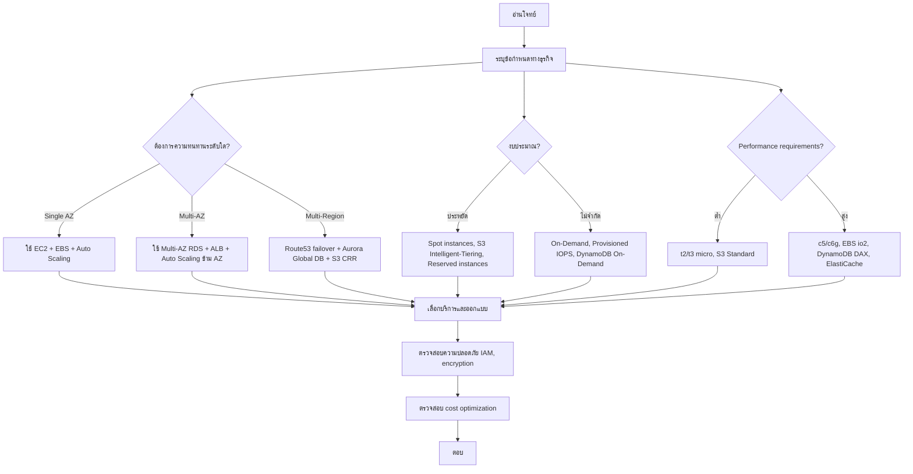

### คำอธิบายแบบละเอียด (Detailed Explanation)  

| ขั้นตอน | คำอธิบาย (ไทย) | Explanation (English) |
|---------|----------------|------------------------|
| 1 | อ่านโจทย์ให้เข้าใจว่าต้องการอะไร (availability, durability, cost, latency) | Read the question to understand requirements. |
| 2 | ระบุข้อจำกัด: RTO, RPO, งบประมาณ, compliance | Identify constraints. |
| 3 | เลือกระดับความทนทาน: single AZ, multi-AZ, หรือ multi-region | Choose resilience level. |
| 4 | เลือกรูปแบบการจ่าย: on-demand, reserved, spot ตามงบประมาณ | Choose pricing model. |
| 5 | เลือกบริการที่เหมาะสม (EC2 vs Lambda, RDS vs DynamoDB, etc.) | Choose appropriate services. |
| 6 | ออกแบบโครงสร้างรวมทั้ง security group, IAM roles, encryption | Design including security. |
| 7 | ตรวจสอบ cost optimization (ไม่ over-provision) | Check cost optimization. |
| 8 | ตอบตัวเลือกที่ถูกต้องที่สุด | Answer the best option. |

---

## 💻 ตัวอย่างโค้ด? (บทนี้ไม่มีโค้ด Go แต่มีตัวอย่าง CLI และ Infrastructure as Code)  

### ตัวอย่าง: สร้าง Auto Scaling group ด้วย AWS CLI (ความรู้ที่ต้องมี)  

```bash
# สร้าง launch template
aws ec2 create-launch-template \
    --launch-template-name my-template \
    --launch-template-data '{"ImageId":"ami-xxx","InstanceType":"t3.micro"}'

# สร้าง Auto Scaling group
aws autoscaling create-auto-scaling-group \
    --auto-scaling-group-name my-asg \
    --launch-template LaunchTemplateName=my-template,Version=1 \
    --min-size 2 --max-size 10 --desired-capacity 2 \
    --vpc-zone-identifier "subnet-abc,subnet-def"
```

### ตัวอย่าง: CloudFormation template สำหรับ S3 bucket + CloudFront (เข้าใจได้)  

```yaml
Resources:
  MyBucket:
    Type: AWS::S3::Bucket
    Properties:
      VersioningConfiguration:
        Status: Enabled
  MyCloudFront:
    Type: AWS::CloudFront::Distribution
    Properties:
      DistributionConfig:
        Origins:
          - DomainName: !GetAtt MyBucket.DomainName
            Id: S3Origin
        Enabled: true
```

---

## 📌 กรณีศึกษาและแนวทางแก้ไขปัญหา (Case Study & Troubleshooting)  

### กรณีศึกษา: ออกแบบระบบ e‑commerce ที่ต้องมี availability 99.99%  

**ปัญหา:** ระบบขายของออนไลน์ต้องการ uptime สูง, รองรับ traffic spike ช่วง sale, และต้องกู้คืนภายใน 15 นาทีหาก region ล้มเหลว  
**แนวทางแก้ไข (ตาม SAA):**  
- **Compute:** Auto Scaling group ข้าม 3 AZs, ใช้ ALB  
- **Database:** RDS Multi-AZ (สำหรับ failover อัตโนมัติ) + Read Replicas (ลด load)  
- **Storage:** S3 สำหรับ static assets + CloudFront  
- **Disaster Recovery:** ใช้ Route53 failover routing ไปยัง secondary region (active-passive) และ RDS cross-region read replica  
**ผลลัพธ์:** ผ่านข้อกำหนด RTO 15 นาที, RPO < 5 นาที  

### ปัญหาที่พบบ่อยในการสอบ  

| ปัญหา (Issue) | สาเหตุ (Cause) | วิธีแก้ไข (Solution) |
|----------------|----------------|----------------------|
| ตอบผิดเพราะสับสนระหว่าง service | ความรู้ไม่แน่น | ทำ mind map เชื่อม service กับ use case |
| เวลาไม่พอ | อ่านโจทย์ช้า, ติดกับดัก | ข้ามข้อที่ไม่แน่ใจ, ทำข้อสั้นก่อน |
| โดน distractor | มีตัวเลือกที่ดูถูกแต่ไม่เหมาะ | ใช้ process of elimination, ดู requirement ทุกครั้ง |
| ไม่รู้จัก service ใหม่ (เช่น Global Accelerator, EFS) | ไม่ update ความรู้ | อ่าน what's new ของ AWS ก่อนสอบ |

---

## 📁 เทมเพลตและตัวอย่างเพิ่มเติม  

### แผนการเตรียมตัว 8 สัปดาห์ (SAA-C03)  

| สัปดาห์ | กิจกรรม |
|---------|---------|
| 1 | ดู exam guide, pretest, ทบทวน Well‑Architected Framework |
| 2-3 | เรียนคอร์ส (Stephane Maarek หรือ Adrian Cantrill) + ทำตาม labs |
| 4 | ทบทวน VPC, IAM, EC2, S3 (เจาะลึก) |
| 5 | ทบทวน RDS, DynamoDB, Aurora, ElastiCache |
| 6 | ทบทวน HA, DR, Auto Scaling, Load Balancing, Route53 |
| 7 | ทบทวน Security, KMS, WAF, Shield, CloudTrail, Config |
| 8 | ทำ practice exam (TutorialsDojo, Whizlabs) 3-5 ชุด, ทบทวนจุดอ่อน, สอบจริง |

### Checklist ก่อนสอบ SAA  

- [ ] ทำความเข้าใจ AWS Global Infrastructure (Regions, AZs, Edge locations)  
- [ ] แยก EC2 pricing models (On-Demand, RI, Spot, Savings Plan) ให้ชัด  
- [ ] รู้ S3 storage classes (Standard, IA, One Zone IA, Glacier, Intelligent‑Tiering)  
- [ ] รู้ RDS backup & restore, Multi-AZ vs Read Replicas  
- [ ] รู้ VPC components: subnet, route table, IGW, NAT gateway, VPC peering, endpoints, VPN  
- [ ] รู้ Load Balancer types (ALB, NLB, GWLB)  
- [ ] รู้ Auto Scaling policies (simple, step, target tracking)  
- [ ] รู้ Route53 routing policies (simple, weighted, latency, failover, geolocation, multi‑value)  
- [ ] รู้ IAM roles vs policies, instance profile  
- [ ] รู้ Disaster Recovery strategies (backup & restore, pilot light, warm standby, multi‑site)  

---

## 📊 ตารางเปรียบเทียบบริการที่มักสับสน  

| สับสนระหว่าง (Confused pair) | ความแตกต่าง (Difference) |
|------------------------------|---------------------------|
| Security Group vs NACL | SG: stateful, instance level; NACL: stateless, subnet level |
| ALB vs NLB | ALB: layer 7, path-based routing; NLB: layer 4, ultra high performance |
| RDS Multi-AZ vs Read Replica | Multi-AZ: failover, one standby; Read Replica: scale read, can be promoted |
| Spot vs On-Demand vs Reserved | Spot: cheapest, can be terminated; On-Demand: full price, no commitment; Reserved: 1-3 years, discount |
| S3 Standard vs IA vs Glacier | Standard: frequent access; IA: infrequent; Glacier: archival (minutes to hours retrieval) |
| CloudFront vs Global Accelerator | CloudFront: cache static/dynamic content; Global Accelerator: TCP/UDP optimization, anycast IP |

---

## 📝 สรุป (Summary)  

### ✅ ประโยชน์ที่ได้รับ (Benefits)  
- เป็นที่ยอมรับในระดับสากล  
- เพิ่มโอกาสในการได้งานหรือเลื่อนตำแหน่ง  
- ทบทวนความรู้ AWS อย่างเป็นระบบ  
- ได้ digital badge และส่วนลดสอบครั้งต่อไป  

### ⚠️ ข้อควรระวัง (Cautions)  
- ข้อสอบอัปเดตบ่อย (เช็ค exam guide ล่าสุด)  
- ต้องใช้ประสบการณ์จริงประกอบ (ไม่ใช่จำอย่างเดียว)  
- ค่าสอบสูง (150 USD)  

### 👍 ข้อดี (Advantages)  
- เนื้อหากว้างแต่ไม่ลึกเกินไป  
- มีแหล่งเตรียมตัวมากมาย  
- สอบ online สะดวก  

### 👎 ข้อเสีย (Disadvantages)  
- ไม่มี lab ปฏิบัติ (ต่างจาก Professional)  
- เน้น scenario บางอย่างอาจไม่ตรงกับงานจริง  
- ต้อง recertify ทุก 3 ปี  

### 🚫 ข้อห้าม (Prohibitions)  
- ห้ามใช้ brain dump  
- ห้ามทำข้อสอบโดยให้คนอื่นช่วย  
- ห้ามอ้างว่าเป็น "AWS Certified" ถ้ายังไม่ผ่าน  

---

## 🧩 แบบฝึกหัดท้ายบท (Exercises)  

**ข้อ 1:** ใบรับรอง SAA-C03 มีน้ำหนักคะแนนของโดเมน "Design Resilient Architectures" กี่เปอร์เซ็นต์  
**ข้อ 2:** หากต้องการให้ EC2 สามารถเข้าถึง S3 โดยไม่ใช้ access keys ควรใช้วิธีใด  
**ข้อ 3:** RDS Read Replica สามารถใช้ทำ failover อัตโนมัติได้หรือไม่  
**ข้อ 4:** บริการ AWS ใดที่ช่วยลด latency สำหรับผู้ใช้ทั่วโลกด้วยการ cache content  
**ข้อ 5:** Auto Scaling policy แบบ target tracking คืออะไร  
**ข้อ 6:** ข้อใดถูกต้องเกี่ยวกับ S3 Intelligent‑Tiering  
**ข้อ 7:** หากต้องการเชื่อมต่อ VPC สองอันใน region เดียวกันควรใช้บริการใด  
**ข้อ 8:** ข้อสอบ SAA-C03 มีทั้งหมดกี่ข้อและใช้เวลากี่นาที  
**ข้อ 9:** จงบอกความแตกต่างระหว่าง Route53 failover routing กับ weighted routing  
**ข้อ 10:** แนวทางปฏิบัติใดที่ช่วยลดค่าใช้จ่าย EC2 (ยกมา 2 วิธี)  

---

## 🔐 เฉลยแบบฝึกหัด (Answer Key)  

**ข้อ 1:** 26%  
**ข้อ 2:** ใช้ IAM role (instance profile) แนบกับ EC2  
**ข้อ 3:** ไม่ได้ ต้อง promote เป็น primary ก่อน (manual)  
**ข้อ 4:** Amazon CloudFront  
**ข้อ 5:** ค่า target metric (เช่น CPU utilization 50%) แล้ว Auto Scaling ปรับจำนวน instance เพื่อรักษาค่า target นั้น  
**ข้อ 6:** จะย้าย object ระหว่าง access tiers อัตโนมัติตามรูปแบบการเข้าถึง  
**ข้อ 7:** VPC Peering  
**ข้อ 8:** 65 ข้อ, 130 นาที  
**ข้อ 9:** Failover routing ใช้สำหรับ active-passive (เปลี่ยนเมื่อ primary ล้มเหลว); Weighted routing ใช้กระจาย traffic ตามสัดส่วนน้ำหนัก  
**ข้อ 10:** 1) ใช้ Spot instances สำหรับ workload ที่ยืดหยุ่น 2) ใช้ Reserved instances หรือ Savings Plans สำหรับ workload ที่ stable  

---

## 📚 แหล่งอ้างอิง (References)  

1. AWS Official Exam Guide – SAA-C03  
2. AWS Well‑Architected Framework Whitepaper  
3. TutorialsDojo – SAA-C03 Practice Exams  
4. Stephane Maarek – Ultimate AWS Certified Solutions Architect Associate  
5. r/AWSCertifications – SAA exam experience threads  

---

**✍️ ผู้เขียน:** คงนคร จันทะคุณ  
**📅 อัปเดตล่าสุด:** เมษายน 2026  

**หมายเหตุ เนื้อหาในหนังสือ:**  
เนื้อหาในหนังสือ "AWS จากภาคทฤษฎีไปภาคปฏิบัติ" ใช้ AI ช่วยเขียน เพื่อทดสอบ AI Model ผู้เขียนเป็นผู้ออกแบบ ใช้ AI ช่วยจัดเรียง ซึ่งมีค่าใช้จ่ายพอสมควร ให้ใช้ฟรีก่อน ต้องการสนับสนุนเพื่อทำเนื้อหาแนวนี้ต่อ สามารถให้การสนับสนุนได้ครับ ตามกำลังศรัทธา  
📞 โทรศัพท์ / พร้อมเพย์: **0955088091**
# 📘 บทที่ 10: AWS Certified Cloud Practitioner (CLF-C02)  
## Chapter 10: AWS Certified Cloud Practitioner (CLF-C02)  

---

## 🧱 โครงสร้างการทำงาน (Work Structure)  

**ไทย:**  
บทนี้แนะนำใบรับรองระดับพื้นฐาน AWS Certified Cloud Practitioner ซึ่งเหมาะสำหรับผู้เริ่มต้นที่ต้องการเข้าใจ AWS โดยรวม โดยไม่ต้องลงลึกด้านเทคนิค เนื้อหาครอบคลุมแนวคิดคลาวด์, บริการหลัก, ความปลอดภัย, ราคา, และการสนับสนุน  

**English:**  
This chapter introduces the foundational‑level AWS Certified Cloud Practitioner certification, ideal for beginners who want a broad understanding of AWS without deep technical details. It covers cloud concepts, core services, security, pricing, and support.  

---

## 🎯 วัตถุประสงค์แบบสั้นสำหรับทบทวน (Short Revision Objective)  

**ไทย:**  
เพื่อให้ผู้อ่านเข้าใจโครงสร้างข้อสอบ CLF-C02, เนื้อหาทั้ง 4 โดเมน, และสามารถเตรียมตัวสอบได้ รวมถึงสามารถอธิบายประโยชน์ของคลาวด์, บริการ AWS พื้นฐาน, โมเดลความรับผิดชอบร่วม, และหลักการกำหนดราคา  

**English:**  
To enable readers to understand the CLF‑C02 exam structure, four domains, and prepare effectively, as well as explain cloud benefits, basic AWS services, shared responsibility model, and pricing principles.  

---

## 👥 กลุ่มเป้าหมาย (Target Audience)  

- ผู้ที่ไม่มีประสบการณ์ AWS มาก่อน  
- ผู้บริหาร, ผู้จัดการผลิตภัณฑ์, นักขาย (Sales) ที่ต้องทำงานกับทีมเทคนิค  
- นักศึกษาหรือผู้เปลี่ยนสายอาชีพ  
- ผู้ที่ต้องการสอบใบรับรองใบแรกของ AWS  

---

## 📚 ความรู้พื้นฐาน (Prerequisites)  

- ไม่จำเป็นต้องมีประสบการณ์ AWS มาก่อน  
- เข้าใจพื้นฐานไอที (คอมพิวเตอร์, เครือข่าย, ฐานข้อมูล) เล็กน้อย  
- อ่านภาษาอังกฤษระดับเข้าใจข้อสอบได้  

---

## 📝 เนื้อหาโดยย่อ (Abstract)  

**ไทย:**  
บทนี้สรุปข้อสอบ CLF-C02: จำนวนข้อ, เวลา, โดเมนหลัก (Cloud Concepts, Security and Compliance, Technology, Billing and Pricing) พร้อมตัวอย่างคำถาม, แนวทางการจำศัพท์, และแผนการเตรียมตัว 4 สัปดาห์ รวมถึงบริการที่ต้องรู้ (EC2, S3, RDS, Lambda, VPC, IAM, CloudFront, Support Plans)  

**English:**  
This chapter summarizes the CLF‑C02 exam: number of questions, time, four domains (Cloud Concepts, Security and Compliance, Technology, Billing and Pricing), sample questions, memorization tips, and a 4‑week study plan, including essential services (EC2, S3, RDS, Lambda, VPC, IAM, CloudFront, Support Plans).  

---

## 🔰 บทนำ (Introduction)  

**ไทย:**  
AWS Certified Cloud Practitioner (CLF-C02) เป็นใบรับรองระดับ Foundational ที่ไม่ต้องมีประสบการณ์เทคนิคมาก่อน เหมาะสำหรับทุกบทบาทที่ต้องเข้าใจ AWS ในภาพรวม ข้อสอบจะเน้นแนวคิดคลาวด์, คุณค่าทางธุรกิจ, บริการหลัก, ความปลอดภัย, และการจัดการต้นทุน การสอบนี้เป็นก้าวแรกที่ดีก่อนที่จะไปสอบ Associate หรือ Specialty  

**English:**  
The AWS Certified Cloud Practitioner (CLF‑C02) is a foundational‑level certification that does not require prior technical experience. It is suitable for any role that needs an overall understanding of AWS. The exam focuses on cloud concepts, business value, core services, security, and cost management. This certification is an excellent first step before moving to Associate or Specialty exams.  

---

## 📖 บทนิยาม (Definitions)  

| คำศัพท์ (Term) | คำจำกัดความไทย (Thai Definition) | English Definition |
|----------------|----------------------------------|--------------------|
| Cloud Computing | การให้บริการทรัพยากรคอมพิวเตอร์ผ่านอินเทอร์เน็ต จ่ายตามใช้งาน | Delivery of computing resources over the internet, pay‑as‑you‑go. |
| CAPEX vs OPEX | CAPEX = ลงทุนซื้อฮาร์ดแวร์ล่วงหน้า; OPEX = จ่ายตามใช้งาน | CAPEX = upfront hardware purchase; OPEX = pay for what you use. |
| Economies of Scale | ต้นทุนต่อหน่วยลดลงเมื่อขนาดใหญ่ขึ้น (AWS ลดราคาบ่อย) | Cost per unit decreases as scale increases (AWS lowers prices frequently). |
| Shared Responsibility Model | AWS รักษาความปลอดภัยของคลาวด์, ลูกค้าต้องรักษาความปลอดภัยในคลาวด์ | AWS secures the cloud, customer secures what they put in the cloud. |
| AWS Well‑Architected | กรอบแนวคิด 6 pillars เพื่อออกแบบระบบที่ดี | Framework with 6 pillars for good system design. |
| AWS Free Tier | บริการบางอย่างฟรีในปริมาณจำกัด (12 เดือนสำหรับบาง service) | Some services free up to certain limits (12 months for some). |
| Support Plans | Basic (ฟรี), Developer, Business, Enterprise | Support plans with different response times and features. |

---

## 🔧 CLF-C02 คืออะไร? มีเนื้อหาอะไรบ้าง?  

### 1. CLF-C02 คืออะไร  
**ไทย:**  
CLF-C02 คือรหัสข้อสอบ AWS Certified Cloud Practitioner (อัปเดตล่าสุด พฤศจิกายน 2023) ทดสอบความรู้พื้นฐานเกี่ยวกับ AWS โดยไม่ต้องเขียนโค้ดหรือออกแบบระบบซับซ้อน  

**English:**  
CLF‑C02 is the exam code for AWS Certified Cloud Practitioner (latest update November 2023). It tests basic knowledge of AWS without requiring coding or complex system design.  

### 2. เนื้อหาข้อสอบแบ่งเป็น 4 โดเมน (Domains)  

| โดเมน (Domain) | น้ำหนัก (Weight) | หัวข้อหลัก (Key topics) |
|----------------|------------------|--------------------------|
| Cloud Concepts | 24% | Benefits of cloud, CAPEX/OPEX, economies of scale, AWS Global Infrastructure (Regions, AZs, Edge) |
| Security and Compliance | 30% | Shared Responsibility Model, IAM (users, groups, roles), compliance programs (GDPR, HIPAA), AWS Artifact, DDoS protection (Shield), encryption basics (KMS) |
| Technology | 34% | Core services: EC2, S3, RDS, Lambda, VPC, CloudFront, Route53, CloudWatch, CloudFormation; use cases of each |
| Billing and Pricing | 12% | AWS Pricing models (On‑Demand, Reserved, Spot), AWS Organizations, Consolidated Billing, Cost Explorer, Budgets, Support Plans |

### 3. รูปแบบข้อสอบ  

| รายการ | รายละเอียด |
|--------|-------------|
| จำนวนข้อ | 65 (รวม 15 ข้อที่ไม่นับคะแนน) |
| เวลา | 90 นาที |
| รูปแบบ | Multiple choice (เลือก 1 ข้อถูก), multiple answer (เลือก 2-3 ข้อถูก) |
| คะแนนผ่าน | 700/1000 (70%) |
| ค่าสอบ | 100 USD (ส่วนลด 50% หากสอบผ่านครั้งก่อน) |
| ภาษา | อังกฤษ, ญี่ปุ่น, เกาหลี, จีน, อินโดนีเซีย, เวียดนาม, สเปน, เยอรมัน, ฝรั่งเศส, อิตาลี, โปรตุเกส, ไทย (มีให้เลือกภาษาไทยด้วย!) |

### 4. บริการที่ต้องรู้สำหรับ CLF (ไม่ต้องลึกมาก)  

| บริการ | สิ่งที่ต้องรู้ |
|--------|----------------|
| EC2 | ประเภท instance, pricing options, AMI, security groups |
| S3 | bucket, object, storage classes, lifecycle, versioning |
| RDS | database engine options, backups, Multi‑AZ |
| Lambda | serverless, event‑driven, stateless |
| VPC | subnet, route table, internet gateway, security group, NACL |
| CloudFront | CDN, cache, edge locations |
| Route53 | DNS, domain registration, routing policies (simple, weighted, failover) |
| IAM | user, group, role, policy, MFA |
| CloudWatch | metrics, logs, alarms |
| AWS Organizations | consolidated billing, SCP |
| Support Plans | Basic (free), Developer, Business, Enterprise |

### 5. ตัวอย่างคำถาม (Sample Question)  

**คำถาม:** ข้อใดคือประโยชน์หลักของการใช้คลาวด์เมื่อเทียบกับ data center แบบดั้งเดิม  
A. ต้องจ่ายล่วงหน้าทั้งหมด (upfront)  
B. ไม่ต้องกังวลเรื่องความปลอดภัยอีกเลย  
C. จ่ายเท่าที่ใช้ (pay‑as‑you‑go) และปรับขนาดได้อัตโนมัติ  
D. รับประกันว่าไม่มี downtime เลย  

**เฉลย:** C  

---

## 🔄 ออกแบบ Workflow (Workflow Design)  

### ภาพรวม: เส้นทางสู่การเป็น AWS Cloud Practitioner  

**ไทย:**  
ศึกษาเนื้อหาผ่าน AWS Skill Builder (ฟรี) หรือคอร์สออนไลน์ → จำศัพท์และบริการหลัก → ทำ hands‑on ด้วย Free Tier → ทำ practice exam → สอบ  

**English:**  
Study via AWS Skill Builder (free) or online courses → memorize terms and core services → hands‑on with Free Tier → take practice exams → take the real exam.  

### Mermaid Flowchart  

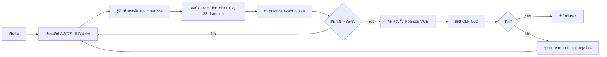

### คำอธิบายแบบละเอียด (Detailed Explanation)  

| ขั้นตอน | คำอธิบาย (ไทย) | Explanation (English) |
|---------|----------------|------------------------|
| 1 | ลงทะเบียน AWS Skill Builder (ฟรี) หรือซื้อคอร์สจาก Udemy (Stephane Maarek) | Register for AWS Skill Builder (free) or buy Udemy course. |
| 2 | จำชื่อบริการและ use case หลัก (EC2 สำหรับ VM, S3 สำหรับ storage, ฯลฯ) | Memorize service names and main use cases. |
| 3 | สร้างบัญชี AWS Free Tier และลองสร้าง EC2, bucket S3, Lambda function ง่าย ๆ | Create AWS Free Tier account and try launching EC2, S3 bucket, simple Lambda. |
| 4 | ทำข้อสอบฝึกหัด (TutorialsDojo, Whizlabs, หรือ AWS Official Practice Exam) | Take practice exams. |
| 5 | เมื่อคะแนนสม่ำเสมอ >85% ให้จองสอบ | When consistently scoring >85%, schedule exam. |
| 6 | สอบ (online หรือ test center) | Take exam. |
| 7 | ถ้าผ่าน: ดาวน์โหลดใบรับรองและรับ digital badge | If pass: download certificate and digital badge. |

---

## 💻 ตัวอย่างคำสั่ง CLI พื้นฐาน (ที่ควรรู้)  

```bash
# ดูบิลค่าใช้จ่าย
aws ce get-cost-and-usage --time-period Start=2026-04-01,End=2026-04-05 --granularity DAILY

# สร้าง S3 bucket
aws s3 mb s3://my-practitioner-bucket

# ดู EC2 instances
aws ec2 describe-instances

# เรียก Lambda function
aws lambda invoke --function-name my-function output.txt
```

---

## 📌 กรณีศึกษาและแนวทางแก้ไขปัญหา (Case Study & Troubleshooting)  

### กรณีศึกษา: ผู้จัดการฝ่ายขายต้องการเข้าใจ AWS เพื่อพูดคุยกับลูกค้า  

**ปัญหา:** ไม่มีพื้นเทคนิค แต่ต้องอธิบายคุณค่า AWS ให้ลูกค้าฟัง  
**แนวทางแก้ไข:**  
- เรียนเฉพาะส่วน Cloud Concepts และ Billing & Pricing  
- จำตัวอย่าง real‑world: Netflix ใช้ AWS, Airbnb ใช้ AWS  
- ฝึกอธิบาย benefit: pay‑as‑you‑go, elasticity, global reach  
**ผลลัพธ์:** สามารถขายบริการคลาวด์ได้ดีขึ้น, ลูกค้าเชื่อมั่น  

### ปัญหาที่พบบ่อยในการสอบ CLF  

| ปัญหา (Issue) | สาเหตุ (Cause) | วิธีแก้ไข (Solution) |
|----------------|----------------|----------------------|
| ลืมชื่อบริการ | มีบริการเยอะ | ทำ flashcards (EC2 = VM, S3 = storage, RDS = database, Lambda = serverless) |
| สับสน Support Plans | ไม่ได้อ่านรายละเอียด | จดจำ: Basic (ฟรี), Developer (ตอบกลับ <24h), Business (<1h for production), Enterprise (<15m for business-critical) |
| งง pricing models | On‑Demand vs Reserved vs Spot | On‑Demand = จ่ายเต็ม, Reserved = จ่ายล่วงหน้า 1-3 ปี ส่วนลด, Spot = ส่วนลดสูงสุดแต่ถูกยึดได้ |
| เวลาน้อย | ไม่ได้ฝึกทำข้อสอบจำลอง | ทำ practice exam อย่างน้อย 3 ชุดก่อนสอบจริง |

---

## 📁 เทมเพลตและตัวอย่างเพิ่มเติม  

### แผนการเตรียมตัว 4 สัปดาห์ (สำหรับ CLF)  

| สัปดาห์ | กิจกรรม |
|---------|---------|
| 1 | เรียน AWS Cloud Practitioner Essentials (AWS Skill Builder ฟรี), ทำความเข้าใจ Cloud Concepts และ Global Infrastructure |
| 2 | เรียน Security & Compliance, IAM, Shared Responsibility Model, ทำ quiz |
| 3 | เรียน Technology: EC2, S3, RDS, Lambda, VPC, CloudFront, Route53, CloudWatch |
| 4 | เรียน Billing & Pricing, Support Plans, AWS Organizations, ทำ practice exam ทุกวัน, สอบจริงวันเสาร์/อาทิตย์ |

### Checklist ก่อนสอบ CLF  

- [ ] อ่าน exam guide (PDF จาก AWS)  
- [ ] จำ 6 benefits of cloud: trade CAPEX for OPEX, economy of scale, elasticity, agility, global reach, reliability  
- [ ] แยก Shared Responsibility Model ให้ชัด (AWS = security OF the cloud; customer = security IN the cloud)  
- [ ] รู้ว่า IAM user, group, role, policy ใช้ทำอะไร  
- [ ] รู้ว่า AWS Artifact ใช้ดู compliance reports  
- [ ] รู้ว่า AWS Shield (Standard ฟรี, Advanced จ่าย) ป้องกัน DDoS  
- [ ] รู้ว่า AWS WAF ป้องกัน web attacks (SQL injection, XSS)  
- [ ] รู้ว่า AWS Organizations ใช้ consolidated billing และ SCPs  
- [ ] รู้ว่า AWS Cost Explorer ใช้ visualize cost, AWS Budgets ใช้แจ้งเตือน  
- [ ] รู้ว่า Support Plans ต่างกันที่ response time และ technical support ช่องทาง  

---

## 📊 ตารางเปรียบเทียบที่ต้องรู้สำหรับ CLF  

| หัวข้อ | Option A | Option B | ข้อแตกต่าง |
|--------|----------|----------|-------------|
| EC2 Pricing | On‑Demand | Reserved | Reserved มี discount (1-3 ปี) |
| EC2 Pricing | Reserved | Spot | Spot ถูกกว่า แต่ถูก terminate ได้ |
| S3 Storage | Standard | Glacier | Glacier สำหรับ archive (retrieve ชั่วโมง) |
| Database | RDS | DynamoDB | RDS = relational (SQL), DynamoDB = NoSQL (key-value) |
| Compute | EC2 | Lambda | EC2 = server (รันตลอด), Lambda = serverless (event) |
| Support | Business | Enterprise | Enterprise มี Technical Account Manager (TAM) |
| Security | IAM | AWS Shield | IAM = จัดการ user/permission, Shield = ป้องกัน DDoS |

---

## 📝 สรุป (Summary)  

### ✅ ประโยชน์ที่ได้รับ (Benefits)  
- พื้นฐาน AWS สำหรับทุกบทบาท  
- ไม่ต้องมีประสบการณ์เทคนิคมาก่อน  
- ใช้เป็น stepping stone สู่ใบรับรองระดับสูง  
- ได้ digital badge และส่วนลดสอบครั้งต่อไป  

### ⚠️ ข้อควรระวัง (Cautions)  
- ข้อสอบมีเนื้อหากว้าง แต่ไม่ลึก  
- ต้องจำชื่อบริการและ use case (ไม่ต้องลงรายละเอียด)  
- ระวังคำถามดัก (เช่น ถาม benefit แต่มีตัวเลือกที่ถูกแต่ไม่เกี่ยวกับ benefit)  

### 👍 ข้อดี (Advantages)  
- ค่าสอบถูกที่สุด (100 USD)  
- มีให้สอบเป็นภาษาไทย  
- เตรียมตัวใช้เวลาไม่นาน (4-6 สัปดาห์)  

### 👎 ข้อเสีย (Disadvantages)  
- มูลค่าในตลาดงานน้อยกว่า Associate/Professional  
- ไม่ได้ทดสอบ skill ปฏิบัติจริง  
- ต้อง recertify ทุก 3 ปี  

### 🚫 ข้อห้าม (Prohibitions)  
- ห้ามใช้ brain dump  
- ห้ามเปิดเอกสารระหว่างสอบ (online proctored)  
- ห้ามอ้างว่าเชี่ยวชาญ AWS หากมีแค่ Practitioner  

---

## 🧩 แบบฝึกหัดท้ายบท (Exercises)  

**ข้อ 1:** AWS Certified Cloud Practitioner (CLF-C02) มีน้ำหนักของโดเมน "Security and Compliance" กี่เปอร์เซ็นต์  
**ข้อ 2:** Shared Responsibility Model: AWS รับผิดชอบอะไรบ้าง และลูกค้ารับผิดชอบอะไรบ้าง (ยกตัวอย่าง)  
**ข้อ 3:** Support Plan ใดที่ให้บริการ Technical Account Manager (TAM)  
**ข้อ 4:** ข้อแตกต่างระหว่าง AWS Organizations Consolidated Billing และ AWS Budgets คืออะไร  
**ข้อ 5:** บริการ AWS ใดที่ใช้สำหรับการเก็บ object แบบ scalability สูง  
**ข้อ 6:** หากต้องการรันโค้ดโดยไม่ต้องจัดการเซิร์ฟเวอร์ ควรใช้บริการใด  
**ข้อ 7:** AWS Artifact มีไว้เพื่ออะไร  
**ข้อ 8:** ราคาค่าสอบ CLF-C02 เท่าไร (USD)  
**ข้อ 9:** จงบอกประโยชน์ของคลาวด์ 3 ข้อ  
**ข้อ 10:** หากต้องการป้องกัน SQL injection ควรใช้บริการใด  

---

## 🔐 เฉลยแบบฝึกหัด (Answer Key)  

**ข้อ 1:** 30%  
**ข้อ 2:** AWS รับผิดชอบ physical security, network infrastructure, hypervisor; ลูกค้ารับผิดชอบ data, OS, firewall (security group), IAM  
**ข้อ 3:** Enterprise Support Plan  
**ข้อ 4:** Consolidated Billing = รวมค่าใช้จ่ายหลายบัญชีเข้าด้วยกัน; AWS Budgets = ตั้งวงเงินและแจ้งเตือนเมื่อใกล้ถึง  
**ข้อ 5:** Amazon S3  
**ข้อ 6:** AWS Lambda  
**ข้อ 7:** ให้ access รายงาน compliance (SOC, PCI, HIPAA) และ agreements  
**ข้อ 8:** 100 USD  
**ข้อ 9:** 1) จ่ายเท่าที่ใช้ 2) ปรับขนาดอัตโนมัติ 3) เข้าถึงได้ทั่วโลก  
**ข้อ 10:** AWS WAF  

---

## 📚 แหล่งอ้างอิง (References)  

1. AWS Official Exam Guide – CLF-C02  
2. AWS Cloud Practitioner Essentials (digital course) – AWS Skill Builder  
3. AWS Well‑Architected Framework – 6 pillars  
4. TutorialsDojo – CLF-C02 Practice Exams  
5. Stephane Maarek – AWS Certified Cloud Practitioner Course (Udemy)  

---

**✍️ ผู้เขียน:** คงนคร จันทะคุณ  
**📅 อัปเดตล่าสุด:** เมษายน 2026  

**หมายเหตุ เนื้อหาในหนังสือ:**  
เนื้อหาในหนังสือ "AWS จากภาคทฤษฎีไปภาคปฏิบัติ" ใช้ AI ช่วยเขียน เพื่อทดสอบ AI Model ผู้เขียนเป็นผู้ออกแบบ ใช้ AI ช่วยจัดเรียง ซึ่งมีค่าใช้จ่ายพอสมควร ให้ใช้ฟรีก่อน ต้องการสนับสนุนเพื่อทำเนื้อหาแนวนี้ต่อ สามารถให้การสนับสนุนได้ครับ ตามกำลังศรัทธา  
📞 โทรศัพท์ / พร้อมเพย์: **0955088091**

# 📘 บทที่ 11: AWS Certified Developer – Associate (DVA-C02)  
## Chapter 11: AWS Certified Developer – Associate (DVA-C02)  

---

## 🧱 โครงสร้างการทำงาน (Work Structure)  

**ไทย:**  
บทนี้เจาะลึกใบรับรอง AWS Certified Developer – Associate (DVA-C02) ซึ่งออกแบบมาสำหรับนักพัฒนาที่เขียนแอปพลิเคชันบน AWS เนื้อหาครอบคลุมการเขียนโค้ดที่เรียกใช้ AWS SDK, การทำ serverless ด้วย Lambda และ API Gateway, การจัดการฐานข้อมูล (DynamoDB, RDS), การทำ CI/CD บน AWS, และความปลอดภัยสำหรับนักพัฒนา  

**English:**  
This chapter dives into the AWS Certified Developer – Associate (DVA-C02) certification, designed for developers building applications on AWS. It covers coding with AWS SDK, serverless with Lambda and API Gateway, databases (DynamoDB, RDS), CI/CD on AWS, and security for developers.  

---

## 🎯 วัตถุประสงค์แบบสั้นสำหรับทบทวน (Short Revision Objective)  

**ไทย:**  
เพื่อให้ผู้อ่านเข้าใจโครงสร้างข้อสอบ DVA-C02, เนื้อหาทั้ง 6 โดเมน, และสามารถเตรียมตัวสอบได้ รวมถึงสามารถเขียนโปรแกรม Go ที่ใช้ AWS SDK, สร้าง Lambda function, ทำงานกับ DynamoDB, API Gateway, SQS/SNS, และทำ CI/CD ด้วย CodePipeline และ CodeBuild  

**English:**  
To enable readers to understand the DVA-C02 exam structure, six domains, and prepare effectively, as well as write Go programs using AWS SDK, create Lambda functions, work with DynamoDB, API Gateway, SQS/SNS, and implement CI/CD with CodePipeline and CodeBuild.  

---

## 👥 กลุ่มเป้าหมาย (Target Audience)  

- นักพัฒนาซอฟต์แวร์ที่ทำงานกับ AWS (โดยเฉพาะ Go, Python, Java, Node.js)  
- ผู้ที่สอบผ่าน Cloud Practitioner แล้วต้องการพัฒนาทักษะการเขียนโค้ดบน AWS  
- DevOps Engineer ที่ต้องเขียน automation script  
- ผู้ที่ต้องการพิสูจน์ทักษะการพัฒนาแอปบน AWS  

---

## 📚 ความรู้พื้นฐาน (Prerequisites)  

- ประสบการณ์เขียนโปรแกรมภาษาใดภาษาหนึ่ง (แนะนำ Go, Python หรือ JavaScript)  
- เข้าใจพื้นฐาน AWS (EC2, S3, IAM) หรือผ่าน CLF-C02 มาก่อน  
- แนะนำให้มีประสบการณ์ AWS อย่างน้อย 6-12 เดือน  

---

## 📝 เนื้อหาโดยย่อ (Abstract)  

**ไทย:**  
บทนี้สรุปข้อสอบ DVA-C02: จำนวนข้อ, เวลา, โดเมนหลัก 6 ด้าน (Development with AWS Services, Security, Deployment, Troubleshooting, Performance, Refactoring) พร้อมตัวอย่างคำถาม, โค้ด Go ตัวอย่างที่ใช้ AWS SDK (S3, DynamoDB, Lambda), และแผนการเตรียมตัว 6 สัปดาห์  

**English:**  
This chapter summarizes the DVA-C02 exam: number of questions, time, six domains (Development with AWS Services, Security, Deployment, Troubleshooting, Performance, Refactoring), sample questions, example Go code using AWS SDK (S3, DynamoDB, Lambda), and a 6‑week study plan.  

---

## 🔰 บทนำ (Introduction)  

**ไทย:**  
AWS Certified Developer – Associate (DVA-C02) เป็นใบรับรองสำหรับนักพัฒนาที่ต้องการยืนยันความสามารถในการเขียนแอปพลิเคชันบน AWS โดยใช้ SDK, CLI, และบริการต่างๆ เช่น Lambda, API Gateway, DynamoDB, SQS, SNS, และ CodeSuite ข้อสอบเน้นการเขียนโค้ดที่ปลอดภัย, มีประสิทธิภาพ, และสามารถ deploy ได้อัตโนมัติ แตกต่างจาก SAA ที่เน้นการออกแบบสถาปัตยกรรม DVA จะเน้นการ implement จริงด้วยโค้ด  

**English:**  
The AWS Certified Developer – Associate (DVA-C02) is a certification for developers who want to validate their ability to build applications on AWS using the SDK, CLI, and services such as Lambda, API Gateway, DynamoDB, SQS, SNS, and CodeSuite. The exam focuses on writing secure, efficient, and automatically deployable code. Unlike SAA which focuses on architecture design, DVA focuses on actual implementation with code.  

---

## 📖 บทนิยาม (Definitions)  

| คำศัพท์ (Term) | คำจำกัดความไทย (Thai Definition) | English Definition |
|----------------|----------------------------------|--------------------|
| AWS SDK | Software Development Kit สำหรับเรียก AWS API จากภาษาโปรแกรมต่างๆ | Library to call AWS APIs from programming languages. |
| Lambda | บริการ run code แบบ serverless ตาม event (สูงสุด 15 นาที) | Serverless compute service triggered by events (max 15 min). |
| API Gateway | บริการสร้าง, เผยแพร่, และจัดการ REST/WebSocket APIs | Service to create, publish, and manage REST/WebSocket APIs. |
| DynamoDB | NoSQL database แบบ fully managed (key-value/document) | Fully managed NoSQL database. |
| SQS | Message queue แบบ distributed | Distributed message queue. |
| SNS | Pub/sub messaging service | Publish/subscribe messaging. |
| X-Ray | บริการ tracing สำหรับแอป distributed | Distributed tracing service. |
| CodeCommit | Git repository แบบ managed | Managed Git repository. |
| CodeBuild | บริการ build และทดสอบโค้ดแบบ fully managed | Fully managed build and test service. |
| CodeDeploy | บริการ automate deployment | Automated deployment service. |
| CodePipeline | CI/CD orchestration | Continuous delivery orchestration. |

---

## 🔧 DVA-C02 คืออะไร? มีเนื้อหาอะไรบ้าง?  

### 1. DVA-C02 คืออะไร  
**ไทย:**  
DVA-C02 คือรหัสข้อสอบ AWS Certified Developer – Associate (อัปเดตล่าสุด 2023) ทดสอบความสามารถในการพัฒนา, deploy, และ debug แอปพลิเคชันบน AWS โดยใช้ SDK, Lambda, API Gateway, DynamoDB, และเครื่องมือ CI/CD  

**English:**  
DVA-C02 is the exam code for AWS Certified Developer – Associate (latest update 2023). It tests the ability to develop, deploy, and debug applications on AWS using the SDK, Lambda, API Gateway, DynamoDB, and CI/CD tools.  

### 2. เนื้อหาข้อสอบแบ่งเป็น 6 โดเมน (Domains)  

| โดเมน (Domain) | น้ำหนัก (Weight) | หัวข้อหลัก (Key topics) |
|----------------|------------------|--------------------------|
| Development with AWS Services | 32% | SDK (การเรียก service), Lambda (เขียน, test, invoke), API Gateway (REST, WebSocket), DynamoDB (CRUD, queries, scans, indexes), SQS, SNS, Kinesis, Step Functions |
| Security | 26% | IAM roles/policies สำหรับ Lambda และ SDK, authentication (Cognito), API Gateway authorizers, encryption (KMS), secrets management (Secrets Manager, Parameter Store), การป้องกันการ leak credentials |
| Deployment | 24% | CI/CD (CodeCommit, CodeBuild, CodeDeploy, CodePipeline), Elastic Beanstalk, CloudFormation, SAM (Serverless Application Model), deployment strategies (in‑place, blue/green, canary) |
| Troubleshooting and Optimization | 10% | Lambda troubleshooting (timeout, memory, cold start), X-Ray tracing, CloudWatch Logs, debugging permission errors, performance optimization (DynamoDB DAX, ElastiCache) |
| Refactoring | 4% | การเปลี่ยนจาก monolith เป็น microservices, การย้าย workload ไป serverless (Lambda), การใช้ managed services แทน self‑managed |
| Monitoring and Logging | 4% | CloudWatch (metrics, alarms, logs), X-Ray, EventBridge |

### 3. รูปแบบข้อสอบ  

| รายการ | รายละเอียด |
|--------|-------------|
| จำนวนข้อ | 65 (รวม 15 ข้อที่ไม่นับคะแนน) |
| เวลา | 130 นาที |
| รูปแบบ | Multiple choice, multiple answer (บางข้ออาจมี 3 ข้อถูก) |
| คะแนนผ่าน | 720/1000 (~72%) |
| ค่าสอบ | 150 USD |
| ภาษา | อังกฤษ, ญี่ปุ่น, เกาหลี, จีน |

### 4. บริการที่ออกสอบบ่อยสำหรับ DVA  

| บริการ | ความสำคัญ | หัวข้อที่ต้องรู้ |
|--------|------------|----------------|
| Lambda | สูงมาก | runtime, memory/timeout, environment variables, IAM role, versions/aliases, reserved concurrency, dead‑letter queue, X-Ray |
| API Gateway | สูงมาก | integration type (Lambda proxy, HTTP, mock), stages, deployment, custom domain, throttling, usage plans, API keys, CORS |
| DynamoDB | สูงมาก | read/write consistency, capacity modes (provisioned, on‑demand), indexes (LSI, GSI), query vs scan, DAX, transaction, TTL, streams |
| SQS | สูง | standard vs FIFO, visibility timeout, dead‑letter queue, long polling, batch processing |
| SNS | ปานกลาง | topic, subscription (SQS, Lambda, email, SMS), filtering, fan‑out pattern |
| S3 | ปานกลาง | presigned URLs, event notifications (trigger Lambda), bucket policies, encryption (SSE‑S3, SSE‑KMS) |
| IAM | สูง | policy evaluation, least privilege, instance profile (สำหรับ EC2) และ execution role (สำหรับ Lambda) |
| CodeSuite | สูง | CodeCommit (git), CodeBuild (buildspec), CodeDeploy (appspec), CodePipeline (orchestration) |
| CloudWatch | ปานกลาง | metrics, logs (log groups, streams), alarms, dashboards |
| X-Ray | ปานกลาง | tracing, segments, subsegments, sampling rules, service graph |

### 5. ตัวอย่างคำถาม (Sample Question)  

**คำถาม:** นักพัฒนาสร้าง Lambda function เพื่อประมวลผลข้อความที่ส่งมาจาก API Gateway แต่พบว่า Lambda ทำงานช้าในช่วงแรก (cold start) และต้องการลด latency วิธีใดที่ดีที่สุด  

A. เพิ่ม memory ของ Lambda  
B. ใช้ Provisioned Concurrency  
C. ใช้ Lambda@Edge  
D. เปลี่ยน runtime เป็นภาษา Python  

**เฉลย:** B (Provisioned Concurrency จะทำให้มี instance พร้อมทำงานล่วงหน้า ไม่มี cold start)  

---

## 🔄 ออกแบบ Workflow (Workflow Design)  

### ภาพรวม: การพัฒนาแอป Go แบบ serverless บน AWS (Lambda + API Gateway + DynamoDB)  

**ไทย:**  
นักพัฒนาเขียน Go handler → สร้างโปรเจกต์ด้วย SAM → ทดสอบ本地 → deploy ผ่าน SAM หรือ CodePipeline → API Gateway สร้าง endpoint → Lambda ทำงาน → DynamoDB เก็บข้อมูล  

**English:**  
Developer writes Go handler → creates SAM project → tests locally → deploys via SAM or CodePipeline → API Gateway creates endpoint → Lambda executes → DynamoDB stores data.  

### Mermaid Flowchart  

```mermaid
flowchart LR
    A[เขียน Go handler] --> B[สร้าง template.yaml (SAM)]
    B --> C[ทดสอบ local ด้วย sam local start-api]
    C --> D{ผ่าน?}
    D -- No --> A
    D -- Yes --> E[deploy ด้วย sam deploy]
    E --> F[API Gateway endpoint]
    F --> G[Lambda function]
    G --> H[DynamoDB table]
    H --> I[Client เรียกใช้]
    I --> J[CloudWatch logs / X-Ray]
```

### คำอธิบายแบบละเอียด (Detailed Explanation)  

| ขั้นตอน | คำอธิบาย (ไทย) | Explanation (English) |
|---------|----------------|------------------------|
| 1 | เขียนโค้ด Go สำหรับ Lambda handler (ใช้ aws-lambda-go) | Write Go code for Lambda handler. |
| 2 | สร้าง SAM template ระบุ Lambda, API Gateway, DynamoDB | Create SAM template specifying resources. |
| 3 | ทดสอบ local โดย `sam local start-api` จำลอง API Gateway | Test locally with `sam local start-api`. |
| 4 | ถ้าผ่าน, deploy ไป AWS ด้วย `sam deploy` | If OK, deploy to AWS with `sam deploy`. |
| 5 | API Gateway สร้าง URL ให้ client เรียก | API Gateway provides URL for clients. |
| 6 | Lambda ประมวลผลและเชื่อมต่อ DynamoDB | Lambda processes and connects to DynamoDB. |
| 7 | CloudWatch เก็บ logs, X-Ray เก็บ traces | CloudWatch stores logs, X-Ray stores traces. |

---

## 💻 ตัวอย่างโค้ด Go ที่รันได้จริง (Runnable Code Example)  

### 1. Lambda handler (Go) สำหรับ CRUD บน DynamoDB  

```go
// main.go
// Lambda handler สำหรับ API Gateway + DynamoDB
// Lambda handler for API Gateway + DynamoDB

package main

import (
	"context"
	"encoding/json"
	"fmt"
	"log"
	"os"
	"time"

	"github.com/aws/aws-lambda-go/events"
	"github.com/aws/aws-lambda-go/lambda"
	"github.com/aws/aws-sdk-go-v2/config"
	"github.com/aws/aws-sdk-go-v2/feature/dynamodb/attributevalue"
	"github.com/aws/aws-sdk-go-v2/service/dynamodb"
	"github.com/aws/aws-sdk-go-v2/service/dynamodb/types"
)

type Item struct {
	ID        string `json:"id" dynamodbav:"id"`
	Name      string `json:"name" dynamodbav:"name"`
	CreatedAt string `json:"createdAt" dynamodbav:"createdAt"`
}

var dbClient *dynamodb.Client
var tableName string

func init() {
	cfg, err := config.LoadDefaultConfig(context.TODO())
	if err != nil {
		log.Fatalf("failed to load config: %v", err)
	}
	dbClient = dynamodb.NewFromConfig(cfg)
	tableName = os.Getenv("TABLE_NAME")
	if tableName == "" {
		tableName = "Items"
	}
}

func handler(ctx context.Context, req events.APIGatewayProxyRequest) (events.APIGatewayProxyResponse, error) {
	// รับ HTTP method จาก API Gateway
	// Get HTTP method from API Gateway
	switch req.HTTPMethod {
	case "POST":
		return createItem(ctx, req)
	case "GET":
		id := req.QueryStringParameters["id"]
		if id == "" {
			return listItems(ctx)
		}
		return getItem(ctx, id)
	default:
		return events.APIGatewayProxyResponse{
			StatusCode: 405,
			Body:       `{"error":"Method not allowed"}`,
		}, nil
	}
}

func createItem(ctx context.Context, req events.APIGatewayProxyRequest) (events.APIGatewayProxyResponse, error) {
	var item Item
	err := json.Unmarshal([]byte(req.Body), &item)
	if err != nil {
		return errorResponse(400, "Invalid JSON")
	}
	if item.ID == "" {
		item.ID = fmt.Sprintf("%d", time.Now().UnixNano())
	}
	item.CreatedAt = time.Now().UTC().Format(time.RFC3339)

	av, err := attributevalue.MarshalMap(item)
	if err != nil {
		return errorResponse(500, "Marshal error")
	}
	_, err = dbClient.PutItem(ctx, &dynamodb.PutItemInput{
		TableName: &tableName,
		Item:      av,
	})
	if err != nil {
		return errorResponse(500, "DynamoDB put error")
	}
	body, _ := json.Marshal(item)
	return events.APIGatewayProxyResponse{
		StatusCode: 201,
		Body:       string(body),
		Headers:    map[string]string{"Content-Type": "application/json"},
	}, nil
}

func getItem(ctx context.Context, id string) (events.APIGatewayProxyResponse, error) {
	out, err := dbClient.GetItem(ctx, &dynamodb.GetItemInput{
		TableName: &tableName,
		Key: map[string]types.AttributeValue{
			"id": &types.AttributeValueMemberS{Value: id},
		},
	})
	if err != nil {
		return errorResponse(500, "GetItem error")
	}
	if out.Item == nil {
		return errorResponse(404, "Not found")
	}
	var item Item
	attributevalue.UnmarshalMap(out.Item, &item)
	body, _ := json.Marshal(item)
	return events.APIGatewayProxyResponse{
		StatusCode: 200,
		Body:       string(body),
	}, nil
}

func listItems(ctx context.Context) (events.APIGatewayProxyResponse, error) {
	out, err := dbClient.Scan(ctx, &dynamodb.ScanInput{
		TableName: &tableName,
	})
	if err != nil {
		return errorResponse(500, "Scan error")
	}
	var items []Item
	attributevalue.UnmarshalListOfMaps(out.Items, &items)
	body, _ := json.Marshal(items)
	return events.APIGatewayProxyResponse{
		StatusCode: 200,
		Body:       string(body),
	}, nil
}

func errorResponse(status int, msg string) (events.APIGatewayProxyResponse, error) {
	body, _ := json.Marshal(map[string]string{"error": msg})
	return events.APIGatewayProxyResponse{
		StatusCode: status,
		Body:       string(body),
	}, nil
}

func main() {
	lambda.Start(handler)
}
```

### 2. SAM template.yaml สำหรับ deploy  

```yaml
AWSTemplateFormatVersion: '2010-09-09'
Transform: AWS::Serverless-2016-10-31
Resources:
  ItemsTable:
    Type: AWS::DynamoDB::Table
    Properties:
      TableName: Items
      AttributeDefinitions:
        - AttributeName: id
          AttributeType: S
      KeySchema:
        - AttributeName: id
          KeyType: HASH
      BillingMode: PAY_PER_REQUEST

  MyApi:
    Type: AWS::Serverless::Api
    Properties:
      StageName: prod

  ItemFunction:
    Type: AWS::Serverless::Function
    Properties:
      CodeUri: .
      Handler: main
      Runtime: provided.al2
      MemorySize: 512
      Timeout: 30
      Environment:
        Variables:
          TABLE_NAME: !Ref ItemsTable
      Events:
        CreateItem:
          Type: Api
          Properties:
            RestApiId: !Ref MyApi
            Path: /items
            Method: POST
        GetItem:
          Type: Api
          Properties:
            RestApiId: !Ref MyApi
            Path: /items
            Method: GET
      Policies:
        - DynamoDBCrudPolicy:
            TableName: !Ref ItemsTable
```

### 3. buildspec.yml สำหรับ CodeBuild (CI/CD)  

```yaml
version: 0.2
phases:
  install:
    runtime-versions:
      golang: 1.21
    commands:
      - go mod download
  build:
    commands:
      - GOOS=linux GOARCH=arm64 CGO_ENABLED=0 go build -o bootstrap main.go
  post_build:
    commands:
      - zip function.zip bootstrap
artifacts:
  files:
    - function.zip
    - template.yaml
```

---

## 📌 กรณีศึกษาและแนวทางแก้ไขปัญหา (Case Study & Troubleshooting)  

### กรณีศึกษา: การ optimize Lambda cold start สำหรับแอป Go  

**ปัญหา:** Lambda function Go มี cold start ~200ms ซึ่งช้าเกินไปสำหรับ API ที่ต้องการ latency <100ms  
**แนวทางแก้ไข:**  
- ใช้ Provisioned Concurrency (จ่ายเพิ่ม)  
- ลดขนาด binary ด้วย `-ldflags="-s -w"`  
- เปลี่ยน runtime เป็น `provided.al2` (ARM64) ซึ่งถูกกว่าและบางครั้งเร็วกว่า  
- ใช้ SnapStart (เฉพาะ Java, ยังไม่รองรับ Go)  
**ผลลัพธ์:** Cold start ลดลงเหลือ ~50ms หลังใช้ Provisioned Concurrency  

### ปัญห�ี่พบบ่อยในการสอบ DVA  

| ปัญหา (Issue) | สาเหตุ (Cause) | วิธีแก้ไข (Solution) |
|----------------|----------------|----------------------|
| สับสนระหว่าง SQS และ SNS | ไม่เข้าใจ fan-out vs queue | SQS: หนึ่ง message ต่อหนึ่ง consumer; SNS: หนึ่ง message ไปหลาย subscriber |
| Lambda เรียก RDS timeout | RDS อยู่ใน VPC, Lambda ต้องอยู่ใน VPC เดียวกัน และมี NAT gateway | แนบ Lambda กับ VPC และตั้ง security group ให้ถูกต้อง |
| API Gateway 403 | ขาด authorizer หรือ API key | ตรวจสอบ usage plan และ API key หรือ authorizer configuration |
| DynamoDB scan ช้า | ไม่ใช้ index | ใช้ GSI หรือ LSI และใช้ Query แทน Scan เมื่อเป็นไปได้ |
| deployment ล้มเหลว | CodeDeploy appspec.yml path ผิด | ตรวจสอบ source/destination และ permission |

---

## 📁 เทมเพลตและตัวอย่างเพิ่มเติม  

### แผนการเตรียมตัว 6 สัปดาห์ (DVA-C02)  

| สัปดาห์ | กิจกรรม |
|---------|---------|
| 1 | ดู exam guide, pretest, ทบทวน Lambda + API Gateway + DynamoDB |
| 2 | ฝึกเขียน Lambda (Go) + API Gateway + DynamoDB (ทำ workshop) |
| 3 | เรียนรู้ SQS, SNS, Step Functions, Kinesis |
| 4 | เรียนรู้ Security: IAM roles, Cognito, KMS, Secrets Manager |
| 5 | เรียนรู้ CI/CD: CodeCommit, CodeBuild, CodeDeploy, CodePipeline, SAM |
| 6 | ทำ practice exam, ทบทวนจุดอ่อน, สอบจริง |

### Checklist ก่อนสอบ DVA  

- [ ] รู้วิธีสร้าง Lambda function (Go) และทดสอบ local  
- [ ] รู้วิธีสร้าง API Gateway (REST, HTTP) และเชื่อมกับ Lambda  
- [ ] รู้ DynamoDB: Query vs Scan, GSI, DAX, consistency models  
- [ ] รู้ SQS: standard vs FIFO, visibility timeout, DLQ  
- [ ] รู้ SNS: topic, subscription, filtering  
- [ ] รู้ IAM: least privilege, execution role, policy evaluation logic  
- [ ] รู้ CI/CD: buildspec.yml, appspec.yml, pipeline structure  
- [ ] รู้ X-Ray: segment, subsegment, annotation, metadata  
- [ ] รู้ CloudWatch: logs, metrics, alarms  
- [ ] รู้ deployment strategies: in‑place, blue/green, canary  

---

## 📊 ตารางเปรียบเทียบสำหรับ DVA  

| หัวข้อ | Option A | Option B | เมื่อใช้ A | เมื่อใช้ B |
|--------|----------|----------|------------|------------|
| API integration | Lambda proxy | HTTP proxy | ต้องการ custom logic | เรียก HTTP endpoint ภายนอก |
| DynamoDB read | Eventually consistent | Strongly consistent | อ่านได้ไม่ต้องล่าสุด (ถูกกว่า) | ต้องการข้อมูลล่าสุด (แพงกว่า) |
| Lambda invocation | Sync (RequestResponse) | Async (Event) | ต้องการ response ทันที | งาน background, ไม่รอผล |
| SQS queue | Standard | FIFO | ไม่สนลำดับ, throughput สูง | ต้องการลำดับแน่นอน, ไม่ซ้ำ |
| Deployment | In‑place | Blue/green | ต้องการ simplicity | ต้องการ zero downtime, rollback ง่าย |

---

## 📝 สรุป (Summary)  

### ✅ ประโยชน์ที่ได้รับ (Benefits)  
- ยืนยันทักษะการเขียนแอปบน AWS ด้วย SDK  
- เพิ่มโอกาสในการได้งาน Developer สายคลาวด์  
- เรียนรู้การทำ serverless และ CI/CD  
- ได้ digital badge และส่วนลดสอบครั้งต่อไป  

### ⚠️ ข้อควรระวัง (Cautions)  
- ต้องเขียนโค้ดจริง (ไม่ใช่แค่อ่าน theory)  
- ข้อสอบมี scenario ที่ซับซ้อน ต้องเข้าใจ service integration  
- ต้องรู้ SDK API (ไม่ต้องจำทุก method แต่ต้องรู้ concept)  

### 👍 ข้อดี (Advantages)  
- เนื้อหาตรงกับงานพัฒนาจริง  
- มี labs ให้ฝึกปฏิบัติ  
- ใช้ Go, Python, Node.js ได้ทุกภาษา  

### 👎 ข้อเสีย (Disadvantages)  
- ไม่มี lab ในข้อสอบ (ต่างจาก Professional)  
- ต้องจำ service integration หลายอย่าง  
- ต้อง recertify ทุก 3 ปี  

### 🚫 ข้อห้าม (Prohibitions)  
- ห้ามเก็บ credentials ในโค้ด (ใช้ Secrets Manager หรือ Parameter Store)  
- ห้ามเปิด Lambda ใน VPC โดยไม่มี NAT gateway ถ้าต้องการ internet  
- ห้ามใช้ DynamoDB Scan โดยไม่มี filter บ่อย ๆ  

---

## 🧩 แบบฝึกหัดท้ายบท (Exercises)  

**ข้อ 1:** DVA-C02 มีน้ำหนักของโดเมน "Development with AWS Services" กี่เปอร์เซ็นต์  
**ข้อ 2:** หากต้องการให้ Lambda function สามารถเขียนลง DynamoDB ได้ ต้องทำอย่างไร  
**ข้อ 3:** API Gateway ประเภทใดที่ใช้สำหรับ WebSocket  
**ข้อ 4:** SQS visibility timeout คืออะไร  
**ข้อ 5:** เครื่องมือใดใน AWS ที่ใช้สำหรับ distributed tracing  
**ข้อ 6:** buildspec.yml ใช้กับบริการใด  
**ข้อ 7:** ข้อแตกต่างระหว่าง DynamoDB Query และ Scan  
**ข้อ 8:** หากต้องการ deploy Lambda ใหม่โดยไม่มี downtime และสามารถ rollback ได้ง่าย ควรใช้ deployment strategy แบบใด  
**ข้อ 9:** เขียน Go code snippet เพื่อส่ง message ไปยัง SQS queue  
**ข้อ 10:** Lambda function จะถูก timeout เมื่อรันนานเกินกี่วินาที  

---

## 🔐 เฉลยแบบฝึกหัด (Answer Key)  

**ข้อ 1:** 32%  
**ข้อ 2:** แนบ IAM role ที่มี policy `DynamoDBFullAccess` หรือ `DynamoDBCrudPolicy` กับ Lambda (execution role)  
**ข้อ 3:** WebSocket API (API Gateway รองรับ REST, HTTP, WebSocket)  
**ข้อ 4:** ระยะเวลาที่ message จะถูกซ่อนไม่ให้ consumer อื่นเห็นหลังจากถูกรับไปแล้ว (ถ้า process ไม่เสร็จภายใน timeout, message จะกลับมา queue)  
**ข้อ 5:** AWS X-Ray  
**ข้อ 6:** AWS CodeBuild  
**ข้อ 7:** Query ต้องมี partition key และสามารถใช้ sort key, Scan อ่านทั้ง table (ช้าและแพง)  
**ข้อ 8:** Blue/Green deployment (หรือ Canary)  
**ข้อ 9:**  
```go
func sendSQS(queueURL, msg string) error {
    cfg, _ := config.LoadDefaultConfig(context.TODO())
    client := sqs.NewFromConfig(cfg)
    _, err := client.SendMessage(context.TODO(), &sqs.SendMessageInput{
        QueueUrl:    &queueURL,
        MessageBody: &msg,
    })
    return err
}
```  
**ข้อ 10:** 900 วินาที (15 นาที)  

---

## 📚 แหล่งอ้างอิง (References)  

1. AWS Official Exam Guide – DVA-C02  
2. AWS SDK for Go v2 Documentation  
3. AWS Lambda Developer Guide (Go)  
4. TutorialsDojo – DVA-C02 Practice Exams  
5. Stephane Maarek – AWS Certified Developer Associate Course (Udemy)  

---

**✍️ ผู้เขียน:** คงนคร จันทะคุณ  
**📅 อัปเดตล่าสุด:** เมษายน 2026  

**หมายเหตุ เนื้อหาในหนังสือ:**  
เนื้อหาในหนังสือ "AWS จากภาคทฤษฎีไปภาคปฏิบัติ" ใช้ AI ช่วยเขียน เพื่อทดสอบ AI Model ผู้เขียนเป็นผู้ออกแบบ ใช้ AI ช่วยจัดเรียง ซึ่งมีค่าใช้จ่ายพอสมควร ให้ใช้ฟรีก่อน ต้องการสนับสนุนเพื่อทำเนื้อหาแนวนี้ต่อ สามารถให้การสนับสนุนได้ครับ ตามกำลังศรัทธา  
📞 โทรศัพท์ / พร้อมเพย์: **0955088091**

# 📘 บทที่ 12: AWS Certified Solutions Architect – Professional (SAP-C02)  
## Chapter 12: AWS Certified Solutions Architect – Professional (SAP-C02)  

---

## 🧱 โครงสร้างการทำงาน (Work Structure)  

**ไทย:**  
บทนี้เจาะลึกใบรับรองระดับสูง AWS Certified Solutions Architect – Professional (SAP-C02) สำหรับผู้ที่มีประสบการณ์ออกแบบระบบบน AWS มาอย่างน้อย 2 ปี เนื้อหาครอบคลุมการออกแบบโซลูชันที่ซับซ้อน, การย้าย workload ขนาดใหญ่, การ оптимизต้นทุนขั้นสูง, การรักษาความปลอดภัยระดับองค์กร, และการบริหารจัดการหลายบัญชีด้วย AWS Organizations  

**English:**  
This chapter dives into the advanced‑level AWS Certified Solutions Architect – Professional (SAP-C02) certification for those with at least 2 years of experience designing systems on AWS. It covers complex solution design, large‑scale workload migration, advanced cost optimization, enterprise security, and multi‑account management with AWS Organizations.  

---

## 🎯 วัตถุประสงค์แบบสั้นสำหรับทบทวน (Short Revision Objective)  

**ไทย:**  
เพื่อให้ผู้อ่านเข้าใจโครงสร้างข้อสอบ SAP-C02, เนื้อหาทั้ง 5 โดเมน, ความแตกต่างจากระดับ Associate, และสามารถเตรียมตัวสอบได้ รวมถึงการออกแบบระบบที่มีความซับซ้อนสูง, การเชื่อมต่อ hybrid (Direct Connect, VPN), การทำ disaster recovery แบบ multi‑region, และการบริหารจัดการ infrastructure ขนาดใหญ่ด้วย IaC  

**English:**  
To enable readers to understand the SAP-C02 exam structure, five domains, differences from the Associate level, and prepare effectively, including designing complex systems, hybrid connectivity (Direct Connect, VPN), multi‑region disaster recovery, and large‑scale infrastructure management with IaC.  

---

## 👥 กลุ่มเป้าหมาย (Target Audience)  

- Solutions Architect ที่มีประสบการณ์ AWS 2 ปีขึ้นไป  
- ผู้ที่สอบผ่าน Solutions Architect Associate (SAA) แล้วต้องการต่อยอด  
- Cloud Architect ที่ออกแบบระบบระดับองค์กร  
- ผู้ที่ต้องการพิสูจน์ความเชี่ยวชาญระดับสูงสุดด้านสถาปัตยกรรม AWS  

---

## 📚 ความรู้พื้นฐาน (Prerequisites)  

- ผ่าน AWS Certified Solutions Architect – Associate (SAA) หรือมีประสบการณ์เทียบเท่า  
- ประสบการณ์ออกแบบระบบบน AWS อย่างน้อย 2 ปี  
- เข้าใจบริการ AWS อย่างลึกซึ้ง (EC2, S3, VPC, IAM, RDS, Route53, CloudFront, Lambda, Organizations, Control Tower, etc.)  
- มีความรู้ด้าน networking ขั้นสูง (VPC peering, Transit Gateway, Direct Connect, VPN, Route53 resolver)  

---

## 📝 เนื้อหาโดยย่อ (Abstract)  

**ไทย:**  
บทนี้สรุปข้อสอบ SAP-C02: จำนวนข้อ, เวลา, โดเมนหลัก 5 ด้าน (Design for Organizational Complexity, Design for New Solutions, Migration Planning, Cost Control, Continuous Improvement) พร้อมตัวอย่างคำถามระดับยาก, เทคนิคการทำข้อสอบ, และแผนการเตรียมตัว 10-12 สัปดาห์ รวมถึงบริการขั้นสูงที่ต้องรู้ เช่น AWS Organizations, Control Tower, Transit Gateway, Direct Connect, Global Accelerator, ECS/EKS, และ AWS Backup  

**English:**  
This chapter summarizes the SAP-C02 exam: number of questions, time, five domains (Organizational Complexity, New Solutions, Migration Planning, Cost Control, Continuous Improvement), sample difficult questions, exam strategies, and a 10‑12 week study plan, including advanced services like AWS Organizations, Control Tower, Transit Gateway, Direct Connect, Global Accelerator, ECS/EKS, and AWS Backup.  

---

## 🔰 บทนำ (Introduction)  

**ไทย:**  
AWS Certified Solutions Architect – Professional (SAP-C02) เป็นใบรับรองระดับสูงสุดสายสถาปนิกของAWS ข้อสอบจะทดสอบความสามารถในการออกแบบระบบที่ซับซ้อน, มีความทนทานสูง, ปลอดภัย, และคุ้มค่าในระดับองค์กร ซึ่งรวมถึงการออกแบบที่รองรับหลายบัญชี, การเชื่อมต่อระหว่าง on‑premise กับ AWS, การทำ disaster recovery แบบ multi‑region, การ migrate workload ขนาดใหญ่, และการ optimize ต้นทุนอย่างต่อเนื่อง การสอบนี้ถือว่ายากมาก มีอัตราการผ่านไม่สูง ต้องอาศัยทั้งประสบการณ์จริงและการเตรียมตัวอย่างหนัก  

**English:**  
The AWS Certified Solutions Architect – Professional (SAP-C02) is the highest‑level architect certification from AWS. The exam tests the ability to design complex, highly resilient, secure, and cost‑effective enterprise‑grade systems. This includes multi‑account design, hybrid connectivity (on‑premises to AWS), multi‑region disaster recovery, large‑scale workload migration, and continuous cost optimization. This exam is considered very difficult with a low pass rate, requiring both real experience and intensive preparation.  

---

## 📖 บทนิยาม (Definitions)  

| คำศัพท์ (Term) | คำจำกัดความไทย (Thai Definition) | English Definition |
|----------------|----------------------------------|--------------------|
| AWS Organizations | บริการจัดการหลาย AWS account ภายใต้องค์กรเดียว | Service to manage multiple AWS accounts under one organization. |
| Service Control Policy (SCP) | Policy ที่จำกัด permission สูงสุดของ account ใน Organizations | Policy that sets maximum permissions for accounts in an organization. |
| Control Tower | บริการตั้งค่า landing zone (multi‑account environment) ตาม best practices | Service to set up a landing zone (multi‑account environment) following best practices. |
| Transit Gateway | Hub สำหรับเชื่อมต่อ VPC, VPN, Direct Connect หลายๆ จุดเข้าด้วยกัน | Hub to connect multiple VPCs, VPNs, and Direct Connect. |
| Direct Connect | การเชื่อมต่อ dedicated network จาก on‑premise ไปยัง AWS | Dedicated network connection from on‑premises to AWS. |
| Resource Access Manager (RAM) | บริการแชร์ resources (subnet, transit gateway, etc.) ข้าม account | Service to share resources across accounts. |
| AWS Backup | บริการ central backup สำหรับ services ต่างๆ (EC2, RDS, DynamoDB, EFS, etc.) | Central backup service for multiple AWS services. |
| CloudFormation StackSets | deploy stack ข้ามหลาย account และหลาย region ในครั้งเดียว | Deploy stacks across multiple accounts and regions in one operation. |
| Well‑Architected Review | การประเมิน workload ตาม 6 pillars ของ Well‑Architected Framework | Evaluation of a workload against the 6 pillars of the Well‑Architected Framework. |

---

## 🔧 SAP-C02 คืออะไร? มีเนื้อหาอะไรบ้าง?  

### 1. SAP-C02 คืออะไร  
**ไทย:**  
SAP-C02 คือรหัสข้อสอบ AWS Certified Solutions Architect – Professional (อัปเดตล่าสุดพฤศจิกายน 2022) ทดสอบความสามารถในการออกแบบ, deploy, และประเมินระบบบน AWS ที่ซับซ้อนและขนาดใหญ่ ข้อสอบมีทั้ง multiple choice, multiple answer, และมี **labs** (ปฏิบัติจริง) ในบางข้อ  

**English:**  
SAP-C02 is the exam code for AWS Certified Solutions Architect – Professional (latest update November 2022). It tests the ability to design, deploy, and evaluate complex, large‑scale systems on AWS. The exam includes multiple‑choice, multiple‑answer, and **hands‑on labs** in some questions.  

### 2. เนื้อหาข้อสอบแบ่งเป็น 5 โดเมน (Domains)  

| โดเมน (Domain) | น้ำหนัก (Weight) | หัวข้อหลัก (Key topics) |
|----------------|------------------|--------------------------|
| Design for Organizational Complexity | 12.5% | Multi‑account strategies (Organizations, SCP, Control Tower), cross‑account access (RAM, IAM roles), centralized logging (CloudTrail, Config aggregator), cost allocation (tags, Cost Categories) |
| Design for New Solutions | 31% | การเลือกบริการที่เหมาะสม (compute, storage, database, networking) สำหรับ requirement ที่ซับซ้อน (high performance, low latency, global scale), การออกแบบ high availability และ disaster recovery (RTO/RPO ต่ำ), การใช้ managed services เพื่อลด operational overhead |
| Migration Planning | 15% | การประเมิน workload ที่มีอยู่ (on‑premise หรือ cloud อื่น), การเลือก migration strategy (6Rs), การใช้ AWS Migration Hub, Application Discovery Service, DMS (Database Migration Service), Server Migration Service (SMS), และการทดสอบหลัง migration |
| Cost Control | 12.5% | การวิเคราะห์และ optimize ค่าใช้จ่าย (Cost Explorer, Compute Optimizer, Savings Plans, Reserved Instances), การใช้ Spot instances สำหรับ workload ที่เหมาะสม, การออกแบบ architecture ที่ประหยัด (S3 storage classes, lifecycle policies, DynamoDB on‑demand) |
| Continuous Improvement for Existing Solutions | 29% | การประเมิน workload ที่มีอยู่เพื่อหาโอกาสปรับปรุง (Well‑Architected Review), การเพิ่มความปลอดภัย (AWS Config, Security Hub), การเพิ่มประสิทธิภาพ (ElastiCache, DAX, CloudFront, Global Accelerator), การทำ modernize (refactor to serverless, container) |

### 3. รูปแบบข้อสอบ  

| รายการ | รายละเอียด |
|--------|-------------|
| จำนวนข้อ | 75 (รวม 15 ข้อที่ไม่นับคะแนน + อาจมี labs) |
| เวลา | 180 นาที (3 ชั่วโมง) |
| รูปแบบ | Multiple choice, multiple answer, **labs** (สอบบน console AWS จริง) |
| คะแนนผ่าน | 750/1000 (75%) |
| ค่าสอบ | 300 USD |
| ภาษา | อังกฤษ, ญี่ปุ่น, เกาหลี, จีน |

### 4. บริการที่ต้องรู้ลึกสำหรับ SAP (นอกเหนือจาก Associate)  

| บริการ | ความสำคัญ | หัวข้อที่ต้องรู้ |
|--------|------------|----------------|
| AWS Organizations | สูงมาก | SCP, consolidated billing, OU structure, member account management |
| Control Tower | สูง | Landing zone, guardrails, account factory |
| Transit Gateway | สูงมาก | Connect VPC, VPN, DX, routing tables, cross‑region peering |
| Direct Connect | สูงมาก | Public VIF, Private VIF, Transit VIF, Link Aggregation Group (LAG), MACsec, Jumbo frames |
| Route53 Resolver | ปานกลาง | Hybrid DNS, conditional forwarding, resolver endpoints |
| AWS Backup | สูง | Backup plans, vault, cross‑region/cross‑account copy, cold storage |
| CloudFormation StackSets | สูง | Deploy to multiple accounts/regions, parameter overrides |
| Compute Optimizer | ปานกลาง | Recommendations for EC2, EBS, Lambda |
| Savings Plans | ปานกลาง | Compute Savings Plans vs EC2 Instance Savings Plans |
| ECS/EKS | สูง | Fargate vs EC2 launch type, service discovery, load balancing, task networking |
| Global Accelerator | ปานกลาง | Anycast IP, traffic distribution, endpoint groups, health checks |
| AWS Lake Formation | ต่ำ | Data lake permissions, fine‑grained access control |
| AWS WAF + Shield Advanced | ปานกลาง | Web ACL, rate‑based rules, managed rule groups, DDoS protection |

### 5. ตัวอย่างคำถาม (Sample Question – ระดับยาก)  

**คำถาม:** บริษัทมี 200 AWS accounts จัดการด้วย AWS Organizations พวกเขาต้องการบังคับใช้ policy ที่ห้ามสร้าง S3 bucket แบบ public (public read/write) ทุก account ในองค์กร วิธีใดที่มีประสิทธิภาพและ scalable ที่สุด  

A. สร้าง IAM policy แนบกับทุก IAM user ในทุก account  
B. ใช้ AWS Config rule ในทุก account และ lambda แจ้งเตือน  
C. ใช้ Service Control Policy (SCP) ที่ระดับ root OU  
D. ใช้ S3 Block Public Access ที่ระดับ account ทีละ account  

**เฉลย:** C (SCP ที่ root OU จะถูก inherit ไปยังทุก account โดยอัตโนมัติ)  

---

## 🔄 ออกแบบ Workflow (Workflow Design)  

### ภาพรวม: Multi‑account architecture สำหรับองค์กรขนาดใหญ่  

**ไทย:**  
Control Tower สร้าง landing zone → แบ่ง OU (เช่น Prod, NonProd, Security, Logs) → แต่ละ OU มี SCP ควบคุม权限 → สร้าง shared services (Network, CI/CD) ใน dedicated account → ใช้ RAM แชร์ subnet หรือ Transit Gateway → Logs รวมไปยัง centralized account → developers ทำ self‑service ผ่าน Service Catalog  

**English:**  
Control Tower creates a landing zone → create OUs (e.g., Prod, NonProd, Security, Logs) → each OU has SCPs → shared services (Network, CI/CD) in dedicated accounts → use RAM to share subnets or Transit Gateway → logs aggregated to centralized account → developers self‑service via Service Catalog.  

### Mermaid Flowchart  

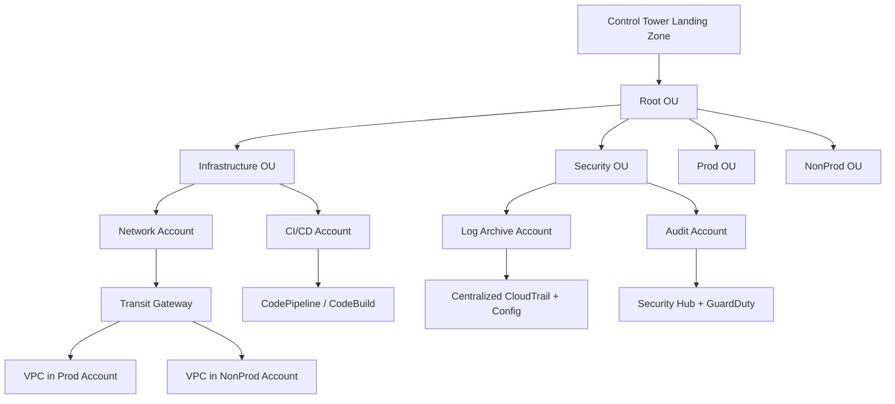

### คำอธิบายแบบละเอียด (Detailed Explanation)  

| ขั้นตอน | คำอธิบาย (ไทย) | Explanation (English) |
|---------|----------------|------------------------|
| 1 | ใช้ AWS Control Tower สร้าง Landing Zone อัตโนมัติ (มี baseline OUs และ accounts) | Use AWS Control Tower to create automated Landing Zone. |
| 2 | กำหนด OU (Organizational Units) เช่น Prod, NonProd, Security, Infrastructure | Define OUs (Prod, NonProd, Security, Infrastructure). |
| 3 | ใช้ SCP กำหนดขอบเขต permission สูงสุดของแต่ละ OU | Use SCPs to set maximum permission boundaries per OU. |
| 4 | สร้าง shared service accounts (Network, CI/CD) ใน Infrastructure OU | Create shared service accounts (Network, CI/CD) in Infrastructure OU. |
| 5 | ใช้ Transit Gateway เชื่อมต่อ VPC จากหลาย accounts เข้าด้วยกัน | Use Transit Gateway to connect VPCs from multiple accounts. |
| 6 | รวม logs (CloudTrail, Config) ไปยัง Log Archive account | Aggregate logs (CloudTrail, Config) to Log Archive account. |
| 7 | พัฒนาแอปโดยใช้ CI/CD ใน dedicated account แล้ว deploy ไป Prod/NonProd | Develop using CI/CD in dedicated account, deploy to Prod/NonProd. |

---

## 💻 ตัวอย่างโค้ด? (ไม่มีโค้ด Go แต่มีตัวอย่าง CloudFormation ขั้นสูง)  

### CloudFormation StackSets – deploy S3 bucket ไปหลาย account  

```yaml
# stackset-template.yaml
Resources:
  MyBucket:
    Type: AWS::S3::Bucket
    Properties:
      VersioningConfiguration:
        Status: Enabled
      BucketEncryption:
        ServerSideEncryptionConfiguration:
          - ServerSideEncryptionByDefault:
              SSEAlgorithm: AES256
```

```bash
# deploy StackSet
aws cloudformation create-stack-set \
    --stack-set-name MyBucketStackSet \
    --template-body file://stackset-template.yaml

aws cloudformation create-stack-instances \
    --stack-set-name MyBucketStackSet \
    --accounts "111111111111" "222222222222" \
    --regions us-east-1 us-west-2
```

---

## 📌 กรณีศึกษาและแนวทางแก้ไขปัญหา (Case Study & Troubleshooting)  

### กรณีศึกษา: Enterprise ขนาดใหญ่ต้องการเชื่อมต่อ on‑premise หลายแห่งเข้ากับ AWS หลาย VPC  

**ปัญหา:** มี data center 3 แห่ง, AWS มี 30 VPC กระจายใน 2 region ต้องการ connectivity ที่ปลอดภัยและ manageable  
**แนวทางแก้ไข (SAP level):**  
- ติดตั้ง Direct Connect ที่แต่ละ data center (หรือใช้ VPN เป็น backup)  
- ใช้ Direct Connect Gateway (DX Gateway) เชื่อมต่อ DX หลาย VIF เข้ากับ Transit Gateway ใน region ต่างๆ  
- ใช้ Transit Gateway เป็น hub เชื่อมต่อ VPC ทั้งหมด (ใช้ TGW peering ข้าม region)  
- ใช้ RAM แชร์ Transit Gateway ไปยัง account อื่น  
**ผลลัพธ์:** topology แบบ hub‑and‑spoke, central control, scale ได้ถึง 5000 VPC ต่อ Transit Gateway  

### ปัญหาที่พบบ่อยในการสอบ SAP  

| ปัญหา (Issue) | สาเหตุ (Cause) | วิธีแก้ไข (Solution) |
|----------------|----------------|----------------------|
| lab ไม่เสร็จทันเวลา | lab ซับซ้อน ใช้เวลานาน | ทำ lab ให้เร็ว, ข้ามข้อที่ติด, คุ้นเคยกับ console |
| สับสนระหว่าง SCP, IAM policy, permission boundary | ไม่เข้าใจ hierarchy | SCP จำกัดสูงสุด, IAM policy ให้สิทธิ์, permission boundary จำกัดเพิ่ม |
| migration strategy (6Rs) | จำไม่แน่ | Rehost (lift & shift), Replatform (เปลี่ยน platform), Refactor (เปลี่ยน architecture), Repurchase (ซื้อ SaaS), Retire (เลิกใช้), Retain (เก็บไว้) |
| cost optimization ระดับองค์กร | ไม่รู้จัก Savings Plans และ Compute Optimizer | ใช้ Compute Optimizer แนะนำ instance type, ใช้ Savings Plans สำหรับ steady state |

---

## 📁 เทมเพลตและตัวอย่างเพิ่มเติม  

### แผนการเตรียมตัว 12 สัปดาห์ (SAP-C02)  

| สัปดาห์ | กิจกรรม |
|---------|---------|
| 1-2 | ทบทวน SAA content อย่างรวดเร็ว, ดู exam guide SAP |
| 3-4 | ศึกษา Multi‑account: Organizations, Control Tower, SCP, RAM |
| 5-6 | ศึกษา Networking ขั้นสูง: Transit Gateway, Direct Connect, Route53 Resolver, Global Accelerator |
| 7-8 | ศึกษา Migration และ Disaster Recovery: DMS, SMS, Backup, RTO/RPO ต่ำ |
| 9 | ศึกษา Cost Optimization: Compute Optimizer, Savings Plans, Spot, S3 Intelligent‑Tiering |
| 10 | ศึกษา Continuous Improvement: Well‑Architected Review, Config, Security Hub, Modernization (serverless, containers) |
| 11 | ทำ practice exam (TutorialsDojo, Whizlabs) อย่างน้อย 5 ชุด, ฝึก labs |
| 12 | ทบทวนจุดอ่อน, สอบจริง |

### Checklist ก่อนสอบ SAP  

- [ ] แยก SCP, IAM policy, permission boundary, session policy ได้  
- [ ] รู้วิธีสร้าง shared VPC หรือ shared subnet ผ่าน RAM  
- [ ] รู้วิธีตั้ง Direct Connect Gateway และเชื่อมกับ Transit Gateway  
- [ ] รู้วิธีทำ cross‑region replication สำหรับ S3, RDS, DynamoDB  
- [ ] รู้วิธีทำ disaster recovery แบบ pilot light, warm standby, multi‑site  
- [ ] รู้วิธีใช้ AWS Backup ในการ backup ข้าม region/account  
- [ ] รู้วิธีใช้ CloudFormation StackSets  
- [ ] รู้วิธีประเมิน Well‑Architected Review  
- [ ] รู้วิธีลด cost โดยใช้ Savings Plans, Spot, และ rightsizing  
- [ ] ฝึกทำ labs บน console (จำขั้นตอน)  

---

## 📊 ตารางเปรียบเทียบ Associate vs Professional  

| หัวข้อ | Solutions Architect Associate (SAA) | Solutions Architect Professional (SAP) |
|--------|--------------------------------------|------------------------------------------|
| จำนวนบัญชี | ส่วนใหญ่ single account | Multi‑account (Organizations, Control Tower) |
| Network | VPC, peering, VPN, CloudFront | Transit Gateway, Direct Connect, Route53 Resolver, Global Accelerator |
| DR | backup & restore, pilot light | multi‑region active‑active, warm standby, RTO/RPO ต่ำมาก |
| Migration | พื้นฐาน (DMS, SMS) | 6Rs, Migration Hub, Application Discovery Service |
| Cost | Reserved, Savings Plans พื้นฐาน | Compute Optimizer, Spot fleet, Cost Categories |
| การประเมิน | Well‑Architected เบื้องต้น | Well‑Architected Review ลึก, remediation |
| Labs | ไม่มี | มี (ต้องปฏิบัติบน console) |

---

## 📝 สรุป (Summary)  

### ✅ ประโยชน์ที่ได้รับ (Benefits)  
- เป็นใบรับรองระดับสูงสุดสาย architect  
- พิสูจน์ความสามารถในการออกแบบระบบระดับ enterprise  
- เงินเดือนและตำแหน่งสูงขึ้น  
- ได้รับความเชื่อถือในระดับ industry  

### ⚠️ ข้อควรระวัง (Cautions)  
- ข้อสอบยากมาก อัตราการผ่านต่ำ  
- ต้องมีประสบการณ์จริง 2+ ปี  
- ค่าสอบแพง (300 USD)  
- labs ต้องทำในเวลาจำกัด  

### 👍 ข้อดี (Advantages)  
- ครอบคลุมบริการ AWS อย่างลึกซึ้ง  
- มี labs สะท้อนงานจริง  
- recertification ทำได้โดยการสอบใหม่หรือสะสม Continuing Education  

### 👎 ข้อเสีย (Disadvantages)  
- ต้องใช้เวลาเตรียมตัวนาน (3-4 เดือน)  
- เนื้อหาเยอะมาก  
- ไม่เหมาะสำหรับผู้เริ่มต้น  

### 🚫 ข้อห้าม (Prohibitions)  
- ห้ามใช้ brain dump (AWS มีระบบตรวจจับ)  
- ห้ามทำ labs โดยใช้ automation script (ต้องทำ manual)  
- ห้ามสอบโดยไม่มีประสบการณ์จริง (จะไม่ผ่าน)  

---

## 🧩 แบบฝึกหัดท้ายบท (Exercises)  

**ข้อ 1:** SAP-C02 มีน้ำหนักของโดเมน "Design for New Solutions" กี่เปอร์เซ็นต์  
**ข้อ 2:** ข้อแตกต่างระหว่าง SCP กับ IAM policy คืออะไร  
**ข้อ 3:** หากต้องการเชื่อมต่อ VPC จำนวน 20 VPC ใน region เดียวกันด้วยต้นทุนต่ำและ maintenance น้อย ควรใช้บริการใด  
**ข้อ 4:** กลยุทธ์ migration แบบ "Replatform" หมายถึงอะไร  
**ข้อ 5:** AWS Savings Plans มีกี่ประเภท อะไรบ้าง  
**ข้อ 6:** ข้อสอบ SAP-C02 มี labs หรือไม่  
**ข้อ 7:** บริการใดที่ใช้สำหรับ centralized backup ข้าม region และข้าม account  
**ข้อ 8:** หากต้องการ deploy CloudFormation stack ไปยัง 10 accounts และ 3 regions พร้อมกัน ควรใช้เครื่องมือใด  
**ข้อ 9:** ข้อดีของการใช้ AWS Control Tower คืออะไร  
**ข้อ 10:** RTO และ RPO แตกต่างกันอย่างไร  

---

## 🔐 เฉลยแบบฝึกหัด (Answer Key)  

**ข้อ 1:** 31%  
**ข้อ 2:** SCP ใช้กับ Organizational Unit หรือ account ทั้งหมด จำกัด permission สูงสุด; IAM policy ใช้กับ user/role ภายใน account ให้สิทธิ์เพิ่มเติม แต่ต้องไม่ขัด SCP  
**ข้อ 3:** Transit Gateway (TGW)  
**ข้อ 4:** การย้าย workload โดยเปลี่ยน platform เช่น จาก EC2 self‑managed database ไปเป็น RDS แต่ไม่เปลี่ยนโค้ดมาก  
**ข้อ 5:** 2 ประเภท: Compute Savings Plans (ใช้กับ EC2, Fargate, Lambda) และ EC2 Instance Savings Plans (เฉพาะ EC2)  
**ข้อ 6:** มี labs (สอบบน console AWS จริง)  
**ข้อ 7:** AWS Backup (รองรับ cross‑region และ cross‑account copy)  
**ข้อ 8:** CloudFormation StackSets  
**ข้อ 9:** สร้าง multi‑account environment (landing zone) อัตโนมัติตาม best practices รวมถึง guardrails และ centralized logging  
**ข้อ 10:** RTO = เวลาสูงสุดที่ระบบสามารถหยุดได้; RPO = ระยะเวลาสูงสุดของข้อมูลที่สูญเสียได้  

---

## 📚 แหล่งอ้างอิง (References)  

1. AWS Official Exam Guide – SAP-C02  
2. AWS Well‑Architected Framework – 6 pillars  
3. AWS Organizations and Control Tower documentation  
4. AWS Transit Gateway and Direct Connect Guide  
5. TutorialsDojo – SAP-C02 Practice Exams + Labs  
6. Adrian Cantrill – AWS Certified Solutions Architect Professional Course  

---

**✍️ ผู้เขียน:** คงนคร จันทะคุณ  
**📅 อัปเดตล่าสุด:** เมษายน 2026  

**หมายเหตุ เนื้อหาในหนังสือ:**  
เนื้อหาในหนังสือ "AWS จากภาคทฤษฎีไปภาคปฏิบัติ" ใช้ AI ช่วยเขียน เพื่อทดสอบ AI Model ผู้เขียนเป็นผู้ออกแบบ ใช้ AI ช่วยจัดเรียง ซึ่งมีค่าใช้จ่ายพอสมควร ให้ใช้ฟรีก่อน ต้องการสนับสนุนเพื่อทำเนื้อหาแนวนี้ต่อ สามารถให้การสนับสนุนได้ครับ ตามกำลังศรัทธา  
📞 โทรศัพท์ / พร้อมเพย์: **0955088091**
# 📘 บทที่ 13: AWS Certified Machine Learning – Specialty (MLS-C01)  
## Chapter 13: AWS Certified Machine Learning – Specialty (MLS-C01)  

---

## 🧱 โครงสร้างการทำงาน (Work Structure)  

**ไทย:**  
บทนี้เจาะลึกใบรับรอง AWS Certified Machine Learning – Specialty (MLS-C01) สำหรับผู้ที่มีประสบการณ์ด้าน Machine Learning และต้องการพิสูจน์ทักษะการออกแบบ, implement, และ deploy โมเดล ML บน AWS เนื้อหาครอบคลุม Data Engineering, Exploratory Data Analysis (EDA), Modeling, และ Machine Learning Implementation & Operations พร้อมตัวอย่างการใช้ SageMaker, และการเรียกโมเดลจาก Go  

**English:**  
This chapter dives into the AWS Certified Machine Learning – Specialty (MLS-C01) certification for those with ML experience who want to validate their skills in designing, implementing, and deploying ML models on AWS. It covers Data Engineering, EDA, Modeling, and ML Implementation & Operations, with examples using SageMaker and invoking models from Go.  

---

## 🎯 วัตถุประสงค์แบบสั้นสำหรับทบทวน (Short Revision Objective)  

**ไทย:**  
เพื่อให้ผู้อ่านเข้าใจโครงสร้างข้อสอบ MLS-C01, เนื้อหาทั้ง 4 โดเมน, บริการ ML บน AWS (SageMaker, Comprehend, Rekognition, Forecast, etc.), และสามารถเตรียมตัวสอบ รวมถึงการสร้าง, train, deploy โมเดลบน SageMaker และการเรียกใช้โมเดลจากแอป Go  

**English:**  
To enable readers to understand the MLS-C01 exam structure, four domains, AWS ML services (SageMaker, Comprehend, Rekognition, Forecast, etc.), and prepare effectively, including building, training, deploying models on SageMaker and invoking them from a Go application.  

---

## 👥 กลุ่มเป้าหมาย (Target Audience)  

- Data Scientist / ML Engineer ที่ทำงานบน AWS  
- Developer ที่ต้องการนำ ML มาใช้ในแอปพลิเคชัน  
- ผู้ที่สอบผ่าน Associate ระดับใดระดับหนึ่งแล้วต้องการต่อยอดด้าน ML  
- ผู้ที่ต้องการพิสูจน์ทักษะ ML บน AWS  

---

## 📚 ความรู้พื้นฐาน (Prerequisites)  

- ความรู้พื้นฐานด้าน Machine Learning (algorithm, training, evaluation)  
- ประสบการณ์กับ AWS อย่างน้อย 1-2 ปี (โดยเฉพาะ SageMaker, S3, IAM)  
- แนะนำให้มีความรู้ Python และ Jupyter Notebook (เพราะ SageMaker ใช้ Python เป็นหลัก)  
- แต่ในบทนี้จะมีตัวอย่าง Go สำหรับ inference  

---

## 📝 เนื้อหาโดยย่อ (Abstract)  

**ไทย:**  
บทนี้สรุปข้อสอบ MLS-C01: จำนวนข้อ, เวลา, โดเมนหลัก 4 ด้าน (Data Engineering, EDA, Modeling, ML Implementation & Operations) พร้อมตัวอย่างคำถาม, บริการ ML บน AWS (SageMaker, Comprehend, Rekognition, Forecast, Lex, Personalize, etc.), และการเขียน Go เพื่อเรียก SageMaker endpoint สำหรับทำ inference รวมถึงการเตรียมข้อมูลด้วย AWS Glue และ Athena  

**English:**  
This chapter summarizes the MLS-C01 exam: number of questions, time, four domains (Data Engineering, EDA, Modeling, ML Implementation & Operations), sample questions, AWS ML services (SageMaker, Comprehend, Rekognition, Forecast, Lex, Personalize, etc.), and writing Go to invoke SageMaker endpoints for inference, plus data preparation with AWS Glue and Athena.  

---

## 🔰 บทนำ (Introduction)  

**ไทย:**  
AWS Certified Machine Learning – Specialty (MLS-C01) เป็นใบรับรองสำหรับผู้ที่ทำงานด้าน ML บน AWS โดยเฉพาะ ข้อสอบจะเน้นการเลือกและปรับแต่งโมเดล, การเตรียมข้อมูล, การประเมินผล, และการนำโมเดลไปใช้ใน production (MLOps) รวมถึงการใช้บริการ ML แบบ managed ต่างๆ ของ AWS เช่น SageMaker, Comprehend, Rekognition การสอบนี้เหมาะสำหรับ Data Scientist และ ML Engineer ที่มีประสบการณ์จริง  

**English:**  
The AWS Certified Machine Learning – Specialty (MLS-C01) is a certification for those working specifically with ML on AWS. The exam focuses on selecting and tuning models, data preparation, evaluation, and putting models into production (MLOps), including using various AWS managed ML services like SageMaker, Comprehend, and Rekognition. This exam is suitable for experienced Data Scientists and ML Engineers.  

---

## 📖 บทนิยาม (Definitions)  

| คำศัพท์ (Term) | คำจำกัดความไทย (Thai Definition) | English Definition |
|----------------|----------------------------------|--------------------|
| SageMaker | บริการ ML แบบ fully managed สำหรับ building, training, deployment | Fully managed ML service for building, training, and deployment. |
| Endpoint | REST endpoint สำหรับเรียกใช้โมเดลที่ deploy แล้ว (real‑time inference) | REST endpoint to invoke a deployed model (real‑time inference). |
| Batch Transform | การทำ inference เป็นชุดกับข้อมูลจำนวนมาก (ไม่ real‑time) | Batch inference on large datasets (not real‑time). |
| Hyperparameter Tuning | การปรับค่า hyperparameter อัตโนมัติเพื่อหาโมเดลที่ดีที่สุด | Automatic hyperparameter optimization. |
| Ground Truth | บริการสร้าง labeled dataset โดยใช้มนุษย์หรือ machine assisted | Service for building labeled datasets using human or machine assistance. |
| Comprehend | NLP service สำหรับ text analysis (sentiment, entities, language) | NLP service for text analysis. |
| Rekognition | บริการ image/video analysis (object detection, face recognition, content moderation) | Image/video analysis service. |
| Forecast | บริการ time‑series forecasting (ไม่ต้องเขียนโมเดลเอง) | Time‑series forecasting service (no custom model needed). |
| Personalize | บริการ recommendation system (เหมือน Amazon.com) | Recommendation system service (like Amazon.com). |
| Lex | บริการ chatbot (ASR + NLU) – เหมือน Alexa | Chatbot service (ASR + NLU) – like Alexa. |

---

## 🔧 MLS-C01 คืออะไร? มีเนื้อหาอะไรบ้าง?  

### 1. MLS-C01 คืออะไร  
**ไทย:**  
MLS-C01 คือรหัสข้อสอบ AWS Certified Machine Learning – Specialty (อัปเดตล่าสุด 2021-2022) ทดสอบความสามารถในการสร้าง, train, tune, deploy, และบำรุงรักษาโมเดล ML บน AWS รวมถึงการใช้บริการ ML แบบ managed และการทำ MLOps  

**English:**  
MLS-C01 is the exam code for AWS Certified Machine Learning – Specialty (latest update 2021-2022). It tests the ability to build, train, tune, deploy, and maintain ML models on AWS, including using managed ML services and MLOps.  

### 2. เนื้อหาข้อสอบแบ่งเป็น 4 โดเมน (Domains)  

| โดเมน (Domain) | น้ำหนัก (Weight) | หัวข้อหลัก (Key topics) |
|----------------|------------------|--------------------------|
| Data Engineering | 20% | การสร้าง data repositories (S3, Glue, RDS, Redshift), การจัดเตรียมข้อมูล (ETL ด้วย Glue, Athena), การตรวจสอบคุณภาพข้อมูล, การแบ่ง train/validation/test |
| Exploratory Data Analysis (EDA) | 24% | การวิเคราะห์ข้อมูลเบื้องต้น (สถิติ, visualization), การจัดการ missing values, outliers, feature engineering, การลด dimensionality (PCA), การตรวจสอบความสัมพันธ์ (correlation) |
| Modeling | 36% | การเลือก algorithm (linear, tree, neural net, etc.), การ train บน SageMaker, hyperparameter tuning (SageMaker Automatic Model Tuning), model evaluation metrics (accuracy, precision, recall, F1, AUC, MSE, MAE, etc.), การป้องกัน overfitting |
| Machine Learning Implementation and Operations | 20% | การ deploy โมเดล (endpoint, batch transform), การทำ inference (real-time, async, batch), การ monitor model drift (SageMaker Model Monitor), การ automate retraining (SageMaker Pipelines, Lambda, Step Functions), การ security (IAM, VPC, encryption) |

### 3. รูปแบบข้อสอบ  

| รายการ | รายละเอียด |
|--------|-------------|
| จำนวนข้อ | 65 (รวม 15 ข้อที่ไม่นับคะแนน) |
| เวลา | 180 นาที (3 ชั่วโมง) |
| รูปแบบ | Multiple choice, multiple answer |
| คะแนนผ่าน | 750/1000 (75%) |
| ค่าสอบ | 300 USD |
| ภาษา | อังกฤษ, ญี่ปุ่น, เกาหลี, จีน |

### 4. บริการ AWS ที่สำคัญสำหรับ MLS  

| บริการ | บทบาท | รายละเอียด |
|--------|--------|-------------|
| SageMaker | Modeling, deployment | training jobs, endpoints, notebooks, pipelines, hyperparameter tuning, model monitor |
| S3 | Data storage | เก็บ raw data, processed data, model artifacts |
| Glue | Data engineering | ETL, data catalog, crawlers, Spark jobs |
| Athena | Query บน S3 | SQL query ข้อมูลใน S3 สำหรับ EDA |
| Comprehend | NLP | text analysis (ไม่ต้อง train เอง) |
| Rekognition | Image/Video | object, face, content moderation |
| Forecast | Time series | forecasting (retail, demand) |
| Personalize | Recommendation | personalized product/content |
| Lex | Conversational AI | chatbot |
| Kinesis | Streaming | real‑time data ingestion สำหรับ ML |
| Lambda | Serverless inference | เรียกโมเดลแบบ serverless |
| Step Functions | Orchestration | สร้าง ML pipeline |
| CloudWatch | Monitoring | metrics, logs, model drift |

### 5. ตัวอย่างคำถาม (Sample Question)  

**คำถาม:** คุณต้องการทำ binary classification บน dataset ที่ไม่สมดุล (imbalanced) โดย positive class มีแค่ 5% ควรใช้ metric ใดในการประเมินโมเดล  

A. Accuracy  
B. Precision  
C. Recall  
D. F1-score  

**เฉลย:** D (F1‑score เพราะ balance ระหว่าง precision กับ recall เหมาะกับ imbalanced data)  

---

## 🔄 ออกแบบ Workflow (Workflow Design)  

### ภาพรวม: ML Pipeline บน AWS (จากข้อมูลสู่การ inference ด้วย Go)  

**ไทย:**  
ข้อมูลดิบใน S3 → Glue ETL → ข้อมูล clean ใน S3 → SageMaker training job → model artifact ใน S3 → deploy endpoint → แอป Go เรียก endpoint ผ่าน SDK → ได้ผลลัพธ์  

**English:**  
Raw data in S3 → Glue ETL → clean data in S3 → SageMaker training job → model artifact in S3 → deploy endpoint → Go app calls endpoint via SDK → get result.  

### Mermaid Flowchart  

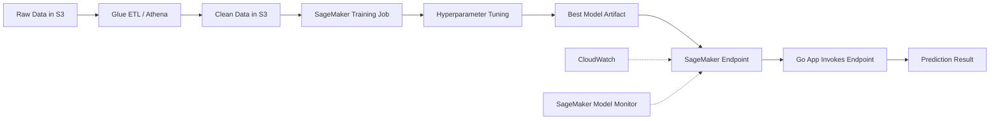

### คำอธิบายแบบละเอียด (Detailed Explanation)  

| ขั้นตอน | คำอธิบาย (ไทย) | Explanation (English) |
|---------|----------------|------------------------|
| 1 | ข้อมูลดิบถูกอัปโหลดไปยัง S3 (อาจมาจาก IoT, Kinesis, หรือ manual upload) | Raw data uploaded to S3. |
| 2 | ใช้ AWS Glue ETL (Spark) หรือ Athena query เพื่อทำความสะอาดและแปลงข้อมูล | Use AWS Glue ETL or Athena to clean and transform data. |
| 3 | ข้อมูลที่ clean แล้วถูกเก็บใน S3 (มักเป็น Parquet) | Cleaned data stored in S3 (often Parquet). |
| 4 | SageMaker training job อ่านข้อมูลจาก S3, train โมเดล (built‑in algorithm หรือ custom container) | SageMaker training job reads from S3, trains model. |
| 5 | ใช้ SageMaker Automatic Model Tuning เพื่อหา hyperparameters ที่ดีที่สุด | Use SageMaker Automatic Model Tuning for best hyperparameters. |
| 6 | โมเดลที่ดีที่สุดถูกบันทึกเป็น model artifact ใน S3 | Best model saved as model artifact in S3. |
| 7 | Deploy โมเดลเป็น real‑time endpoint (หรือ batch transform) | Deploy model as real‑time endpoint (or batch transform). |
| 8 | แอป Go ใช้ SageMaker Runtime client ส่ง request พร้อม input features | Go app uses SageMaker Runtime client to send request with input features. |
| 9 | Endpoint คืนค่า prediction (probability, class, etc.) | Endpoint returns prediction. |

---

## 💻 ตัวอย่างโค้ดที่รันได้จริง (Runnable Code Example)  

### 1. การเรียก SageMaker endpoint จาก Go  

```go
// invoke_sagemaker.go
// เรียก SageMaker endpoint เพื่อทำ prediction (classification หรือ regression)
// Invoke SageMaker endpoint for prediction (classification or regression)

package main

import (
	"bytes"
	"context"
	"encoding/json"
	"fmt"
	"log"

	"github.com/aws/aws-sdk-go-v2/config"
	"github.com/aws/aws-sdk-go-v2/service/sagemakerruntime"
)

type PredictionRequest struct {
	Features []float64 `json:"features"`  // input features สำหรับโมเดล
}

type PredictionResponse struct {
	PredictedLabel  string    `json:"predicted_label"`
	Probabilities   []float64 `json:"probabilities,omitempty"`
	PredictedValue  float64   `json:"predicted_value,omitempty"` // สำหรับ regression
}

func main() {
	cfg, err := config.LoadDefaultConfig(context.TODO(), config.WithRegion("us-east-1"))
	if err != nil {
		log.Fatalf("config error: %v", err)
	}

	client := sagemakerruntime.NewFromConfig(cfg)

	endpointName := "my-xgboost-endpoint"  // ชื่อ endpoint ที่ deploy แล้ว

	// ตัวอย่าง input features (ต้องตรงกับโมเดล)
	features := []float64{5.1, 3.5, 1.4, 0.2}  // Iris dataset example
	reqBody := PredictionRequest{Features: features}
	payload, err := json.Marshal(reqBody)
	if err != nil {
		log.Fatalf("marshal error: %v", err)
	}

	// เรียก endpoint
	resp, err := client.InvokeEndpoint(context.TODO(), &sagemakerruntime.InvokeEndpointInput{
		EndpointName: &endpointName,
		ContentType:  stringPtr("application/json"),
		Body:         bytes.NewReader(payload),
	})
	if err != nil {
		log.Fatalf("invoke error: %v", err)
	}

	// อ่าน response
	var result PredictionResponse
	err = json.NewDecoder(resp.Body).Decode(&result)
	if err != nil {
		log.Fatalf("decode error: %v", err)
	}

	fmt.Printf("Prediction: %+v\n", result)
}

func stringPtr(s string) *string { return &s }
```

### 2. การสร้าง SageMaker training job ด้วย AWS SDK for Go (เริ่มต้น training)  

```go
// start_training.go
// เริ่มต้น SageMaker training job โดยใช้ built‑in algorithm (XGBoost)
// Start SageMaker training job using built‑in algorithm (XGBoost)

package main

import (
	"context"
	"fmt"
	"log"

	"github.com/aws/aws-sdk-go-v2/config"
	"github.com/aws/aws-sdk-go-v2/service/sagemaker"
	"github.com/aws/aws-sdk-go-v2/service/sagemaker/types"
)

func main() {
	cfg, err := config.LoadDefaultConfig(context.TODO())
	if err != nil {
		log.Fatal(err)
	}
	client := sagemaker.NewFromConfig(cfg)

	trainingJobName := "my-xgboost-job-" + "timestamp"
	roleArn := "arn:aws:iam::ACCOUNT:role/SageMakerExecutionRole"
	inputData := "s3://my-bucket/train/data.csv"
	outputPath := "s3://my-bucket/models"

	_, err = client.CreateTrainingJob(context.TODO(), &sagemaker.CreateTrainingJobInput{
		TrainingJobName: &trainingJobName,
		RoleArn:         &roleArn,
		AlgorithmSpecification: &types.AlgorithmSpecification{
			TrainingImage: stringPtr("811284229777.dkr.ecr.us-east-1.amazonaws.com/xgboost:latest"),
			TrainingInputMode: types.TrainingInputModeFile,
		},
		InputDataConfig: []types.Channel{
			{
				ChannelName: stringPtr("train"),
				DataSource: &types.DataSource{
					S3DataSource: &types.S3DataSource{
						S3DataType: types.S3DataTypeS3Prefix,
						S3Uri:      &inputData,
					},
				},
			},
		},
		OutputDataConfig: &types.OutputDataConfig{
			S3OutputPath: &outputPath,
		},
		ResourceConfig: &types.ResourceConfig{
			InstanceCount: 1,
			InstanceType:  types.TrainingInstanceTypeMlM4Xlarge,
			VolumeSizeInGB: 30,
		},
		StoppingCondition: &types.StoppingCondition{
			MaxRuntimeInSeconds: 3600,
		},
		HyperParameters: map[string]string{
			"objective": "binary:logistic",
			"num_round": "100",
		},
	})
	if err != nil {
		log.Fatal(err)
	}
	fmt.Printf("Training job started: %s\n", trainingJobName)
}

func stringPtr(s string) *string { return &s }
```

### 3. การใช้ SageMaker Batch Transform จาก Go (เรียกใช้แบบ asynchronous)  

```go
// batch_transform.go
// เรียก SageMaker batch transform job สำหรับข้อมูลจำนวนมาก
// Invoke SageMaker batch transform job for large datasets

func createBatchTransform(client *sagemaker.Client, modelName, inputS3, outputS3 string) error {
	_, err := client.CreateTransformJob(context.TODO(), &sagemaker.CreateTransformJobInput{
		TransformJobName: stringPtr("batch-" + time.Now().Format("20060102150405")),
		ModelName:        &modelName,
		TransformInput: &types.TransformInput{
			DataSource: &types.TransformDataSource{
				S3DataSource: &types.TransformS3DataSource{
					S3DataType: types.S3DataTypeS3Prefix,
					S3Uri:      &inputS3,
				},
			},
			ContentType: stringPtr("text/csv"),
		},
		TransformOutput: &types.TransformOutput{
			S3OutputPath: &outputS3,
		},
		TransformResources: &types.TransformResources{
			InstanceCount: 1,
			InstanceType:  types.TransformInstanceTypeMlM4Xlarge,
		},
	})
	return err
}
```

---

## 📌 กรณีศึกษาและแนวทางแก้ไขปัญหา (Case Study & Troubleshooting)  

### กรณีศึกษา: การ detect model drift สำหรับโมเดล classification  

**ปัญหา:** โมเดลที่ deploy ไปแล้ว 6 เดือน ความแม่นยำลดลง เพราะข้อมูลเปลี่ยน  
**แนวทางแก้ไข (ตาม MLS):**  
- ใช้ SageMaker Model Monitor เพื่อตรวจสอบ data drift และ model drift อัตโนมัติ  
- ตั้งค่า CloudWatch Alarm เมื่อ drift เกิน threshold  
- ใช้ SageMaker Pipelines เพื่อ automate retraining ทุกเดือน หรือเมื่อ drift เกิดขึ้น  
- ใช้ A/B testing ระหว่างโมเดลเก่าและใหม่ก่อน swap  
**ผลลัพธ์:** จับ drift ได้เร็ว, retrain อัตโนมัติ, ความแม่นยำกลับมาสูง  

### ปัญหาที่พบบ่อยในการสอบ MLS  

| ปัญหา (Issue) | สาเหตุ (Cause) | วิธีแก้ไข (Solution) |
|----------------|----------------|----------------------|
| เลือก metric ไม่ถูก | ไม่เข้าใจ imbalanced data หรือ regression | จำแนก: classification imbalanced → F1, precision, recall; regression → MSE, MAE, RMSE |
| สับสนบริการ ML managed | Personalize vs Forecast vs Lex | Personalize = recommendation; Forecast = time series; Lex = chatbot |
| งบประมาณสำหรับ training | ใช้ instance แพงเกิน | ใช้ spot instances สำหรับ training jobs, ใช้ managed spot training |
| model deployment ช้า | endpoint ขนาดเล็ก | ใช้ multi‑model endpoints หรือเพิ่ม instance count |
| data leakage | รวมข้อมูล future ไว้ใน train | ใช้ time‑based split อย่า random split สำหรับ time series |

---

## 📁 เทมเพลตและตัวอย่างเพิ่มเติม  

### แผนการเตรียมตัว 10 สัปดาห์ (MLS-C01)  

| สัปดาห์ | กิจกรรม |
|---------|---------|
| 1 | ทบทวน ML fundamentals (linear regression, tree, SVM, neural net, evaluation metrics) |
| 2 | Data Engineering: Glue, Athena, S3, ETL |
| 3 | EDA: การ visualize ด้วย QuickSight หรือ Athena, feature engineering |
| 4 | SageMaker basics: notebooks, training, deployment, batch transform |
| 5 | Hyperparameter tuning, Automatic Model Tuning, model evaluation |
| 6 | ML Implementation: endpoints, monitoring, pipelines |
| 7 | Managed AI services: Comprehend, Rekognition, Forecast, Personalize, Lex |
| 8 | Security & MLOps: IAM, VPC, encryption, retraining automation |
| 9 | ทำ practice exam (TutorialsDojo, Whizlabs) อย่างน้อย 3 ชุด |
| 10 | ทบทวนจุดอ่อน, สอบจริง |

### Checklist ก่อนสอบ MLS  

- [ ] รู้วิธีแยก train/validation/test และ cross‑validation  
- [ ] รู้ metrics สำหรับ classification (accuracy, precision, recall, F1, AUC, confusion matrix)  
- [ ] รู้ metrics สำหรับ regression (MSE, MAE, RMSE, R²)  
- [ ] รู้วิธีจัดการ imbalanced data (resampling, class weight, SMOTE)  
- [ ] รู้ SageMaker built‑in algorithms: XGBoost, Linear Learner, KNN, Random Cut Forest (anomaly detection), BlazingText (NLP), DeepAR (forecasting)  
- [ ] รู้วิธี deploy endpoint และทำ batch transform  
- [ ] รู้วิธีใช้ SageMaker Pipelines  
- [ ] รู้วิธีใช้ SageMaker Model Monitor  
- [ ] รู้วิธีใช้ AWS Glue และ Athena สำหรับ data prep  
- [ ] รู้บริการ AI แบบ managed (Comprehend, Rekognition, Forecast, Personalize, Lex, Textract, Transcribe, Translate)  

---

## 📊 ตารางเปรียบเทียบบริการ AI/ML แบบ managed  

| บริการ | Use case | Input | Output | ต้อง train หรือไม่ |
|--------|----------|-------|--------|---------------------|
| Comprehend | NLP (sentiment, entities, key phrases) | Text | sentiment, entities | ไม่ (pretrained) |
| Rekognition | Image/video analysis | Image, video | labels, faces, text | ไม่ (pretrained) |
| Forecast | Time series forecasting | historical time series | future predictions | ไม่ (autoML) |
| Personalize | Recommendation | user interactions | recommendations | ไม่ (autoML) |
| Lex | Chatbot | text/voice | intent, response | ต้อง train (แต่ managed) |
| Textract | OCR + form extraction | document (PDF, image) | text, tables, key-value | ไม่ |
| Transcribe | Speech‑to‑text | audio | text | ไม่ |
| Translate | Language translation | text | translated text | ไม่ |
| SageMaker | Custom ML | any data | model + predictions | ต้อง train เอง |

---

## 📝 สรุป (Summary)  

### ✅ ประโยชน์ที่ได้รับ (Benefits)  
- พิสูจน์ทักษะ ML บน AWS  
- ครอบคลุมทั้ง data engineering, modeling, และ MLOps  
- ได้รับความเชื่อถือในสายงาน Data Science/ML  
- สามารถออกแบบ ML pipeline ที่ production‑ready  

### ⚠️ ข้อควรระวัง (Cautions)  
- ต้องมีความรู้ ML ล่วงหน้า (ไม่ใช่สอบเพื่อเรียนรู้ ML ใหม่)  
- ค่าสอบแพง (300 USD)  
- เนื้อหาเยอะมาก (ทั้ง custom modeling และ managed services)  

### 👍 ข้อดี (Advantages)  
- เน้น practical มากกว่า theory  
- มีบริการ managed ให้เลือกใช้ ลดงานเขียนโมเดลเอง  
- ใช้ร่วมกับ Go สำหรับ inference ได้  

### 👎 ข้อเสีย (Disadvantages)  
- ไม่มี labs ในข้อสอบ (ต่างจาก SAP)  
- ต้องจำ metric และ use case ของหลายบริการ  
- recertification ทุก 3 ปี  

### 🚫 ข้อห้าม (Prohibitions)  
- ห้ามใช้ข้อมูลที่ leak จาก future ในการ train  
- ห้าม deploy โมเดลโดยไม่ monitor drift  
- ห้ามใช้ instance ที่แพงเกินความจำเป็น (ต้องรู้ cost optimization)  

---

## 🧩 แบบฝึกหัดท้ายบท (Exercises)  

**ข้อ 1:** MLS-C01 มีน้ำหนักของโดเมน "Modeling" กี่เปอร์เซ็นต์  
**ข้อ 2:** หาก dataset มี class imbalance อย่างรุนแรง (99% negative, 1% positive) metric ใดที่ไม่เหมาะสม  
**ข้อ 3:** บริการ AWS ใดที่ใช้สำหรับสร้างระบบ recommendation แบบ personalization  
**ข้อ 4:** SageMaker Model Monitor ใช้ตรวจจับอะไรบ้าง  
**ข้อ 5:** หากต้องการทำ time series forecasting โดยไม่ต้องเขียนโมเดล ควรใช้บริการใด  
**ข้อ 6:** ข้อสอบ MLS-C01 มีจำนวนข้อและเวลาเท่าไร  
**ข้อ 7:** จงบอกความแตกต่างระหว่าง SageMaker endpoint กับ batch transform  
**ข้อ 8:** วิธีใดที่ช่วยลด overfitting ในโมเดล tree-based (เช่น XGBoost)  
**ข้อ 9:** หากต้องการ OCR เอกสารสแกน ควรใช้บริการใด  
**ข้อ 10:** เขียน Go code snippet เพื่อเรียกใช้ Amazon Comprehend สำหรับ sentiment analysis  

---

## 🔐 เฉลยแบบฝึกหัด (Answer Key)  

**ข้อ 1:** 36%  
**ข้อ 2:** Accuracy (เพราะถ้าทายเป็น negative ทั้งหมดก็ได้ accuracy 99% แต่ไม่ดี)  
**ข้อ 3:** Amazon Personalize  
**ข้อ 4:** Data drift (input data เปลี่ยน), model drift (model quality ลดลง), และ feature attribution drift  
**ข้อ 5:** Amazon Forecast  
**ข้อ 6:** 65 ข้อ, 180 นาที  
**ข้อ 7:** Endpoint: real‑time, เรียกทีละ record, มี latency ต่ำ; Batch transform: asynchronous, เหมาะกับข้อมูลปริมาณมาก, ไม่ต้องมี endpoint ตลอดเวลา  
**ข้อ 8:** ลด max_depth, เพิ่ม min_child_weight, เพิ่ม subsample, เพิ่ม eta (learning rate), ใช้ early stopping  
**ข้อ 9:** Amazon Textract  
**ข้อ 10:**  
```go
func detectSentiment(text string) (string, error) {
    cfg, _ := config.LoadDefaultConfig(context.TODO())
    client := comprehend.NewFromConfig(cfg)
    resp, err := client.DetectSentiment(context.TODO(), &comprehend.DetectSentimentInput{
        Text: &text,
        LanguageCode: types.LanguageCodeEn,
    })
    if err != nil { return "", err }
    return string(resp.Sentiment), nil
}
```  

---

## 📚 แหล่งอ้างอิง (References)  

1. AWS Official Exam Guide – MLS-C01  
2. SageMaker Developer Guide  
3. AWS ML Blog – Model Monitor, Pipelines  
4. TutorialsDojo – MLS-C01 Practice Exams  
5. Frank Kane – AWS Certified Machine Learning Specialty Course (Udemy)  

---

**✍️ ผู้เขียน:** คงนคร จันทะคุณ  
**📅 อัปเดตล่าสุด:** เมษายน 2026  

**หมายเหตุ เนื้อหาในหนังสือ:**  
เนื้อหาในหนังสือ "AWS จากภาคทฤษฎีไปภาคปฏิบัติ" ใช้ AI ช่วยเขียน เพื่อทดสอบ AI Model ผู้เขียนเป็นผู้ออกแบบ ใช้ AI ช่วยจัดเรียง ซึ่งมีค่าใช้จ่ายพอสมควร ให้ใช้ฟรีก่อน ต้องการสนับสนุนเพื่อทำเนื้อหาแนวนี้ต่อ สามารถให้การสนับสนุนได้ครับ ตามกำลังศรัทธา  
📞 โทรศัพท์ / พร้อมเพย์: **0955088091**
# 📘 บทที่ 14: AWS Certified AI Practitioner (AIF-C01)  
## Chapter 14: AWS Certified AI Practitioner (AIF-C01)  

---

## 🧱 โครงสร้างการทำงาน (Work Structure)  

**ไทย:**  
บทนี้แนะนำใบรับรอง AWS Certified AI Practitioner (AIF-C01) ซึ่งเป็นใบรับรองระดับ Foundational ที่เพิ่มขึ้นใหม่สำหรับผู้ที่ต้องการพิสูจน์ความรู้พื้นฐานเกี่ยวกับ AI, Machine Learning, และ Generative AI บน AWS โดยไม่ต้องมีประสบการณ์ด้าน Data Science มาก่อน เนื้อหาครอบคลุมแนวคิด AI, บริการ AI/ML ของ AWS, จริยธรรมและความรับผิดชอบของ AI (Responsible AI) และการนำ Generative AI ไปประยุกต์ใช้ โดยเฉพาะกับ Amazon Bedrock  

**English:**  
This chapter introduces the AWS Certified AI Practitioner (AIF-C01) certification, a new foundational‑level credential for those who want to validate basic knowledge of AI, ML, and Generative AI on AWS without requiring prior data science experience. It covers AI concepts, AWS AI/ML services, responsible AI, and applying Generative AI – especially with Amazon Bedrock.  

---

## 🎯 วัตถุประสงค์แบบสั้นสำหรับทบทวน (Short Revision Objective)  

**ไทย:**  
เพื่อให้ผู้อ่านเข้าใจโครงสร้างข้อสอบ AIF-C01, เนื้อหาทั้ง 4 โดเมน, บริการ AI/ML หลักของ AWS (SageMaker, Bedrock, Rekognition, Comprehend, etc.), แนวคิดของ Generative AI, การใช้งาน prompt engineering, และการพิจารณาด้านจริยธรรม รวมถึงสามารถเขียนโปรแกรม Go เพื่อเรียกใช้ Bedrock และบริการ AI อื่นๆ ได้  

**English:**  
To enable readers to understand the AIF-C01 exam structure, four domains, core AWS AI/ML services (SageMaker, Bedrock, Rekognition, Comprehend, etc.), Generative AI concepts, prompt engineering, ethical considerations, and to write Go programs to invoke Bedrock and other AI services.  

---

## 👥 กลุ่มเป้าหมาย (Target Audience)  

- ผู้บริหาร, Product Manager, หรือนักขายที่ต้องทำงานกับทีม AI  
- นักพัฒนาที่ต้องการเข้าใจพื้นฐาน AI/ML บน AWS โดยไม่ต้องเป็น Data Scientist  
- ผู้ที่สนใจ Generative AI และ Amazon Bedrock  
- ผู้เริ่มต้นในสาย AI ที่ต้องการใบรับรองใบแรก  

---

## 📚 ความรู้พื้นฐาน (Prerequisites)  

- ไม่จำเป็นต้องมีประสบการณ์ AI/ML มาก่อน  
- เข้าใจพื้นฐาน AWS (หรือผ่าน Cloud Practitioner) เป็นประโยชน์  
- อ่านภาษาอังกฤษระดับเข้าใจข้อสอบได้  

---

## 📝 เนื้อหาโดยย่อ (Abstract)  

**ไทย:**  
บทนี้สรุปข้อสอบ AIF-C01: จำนวนข้อ, เวลา, โดเมนหลัก 4 ด้าน (AI/ML Fundamentals, AI/ML Services, Generative AI, Responsible AI & Ethics) พร้อมตัวอย่างคำถาม, บริการที่ต้องรู้ (Bedrock, SageMaker, Rekognition, Comprehend, Polly, Transcribe, Lex, Forecast, Personalize), และการเขียน Go เพื่อใช้บริการ AI เหล่านี้ รวมถึงเทคนิค prompt engineering และการประเมินความเสี่ยงของ AI  

**English:**  
This chapter summarizes the AIF-C01 exam: number of questions, time, four domains (AI/ML Fundamentals, AI/ML Services, Generative AI, Responsible AI & Ethics), sample questions, essential services (Bedrock, SageMaker, Rekognition, Comprehend, Polly, Transcribe, Lex, Forecast, Personalize), and writing Go to use these AI services, plus prompt engineering techniques and AI risk assessment.  

---

## 🔰 บทนำ (Introduction)  

**ไทย:**  
AWS Certified AI Practitioner (AIF-C01) เป็นใบรับรองระดับ Foundational ใหม่ล่าสุดของ AWS เปิดตัวในปี 2024 เพื่อตอบสนองความต้องการด้าน AI และ Generative AI ที่เพิ่มสูงขึ้น ใบรับรองนี้เหมาะสำหรับทุกบทบาทที่ต้องเข้าใจ AI ในระดับ “ผู้ใช้” (practitioner) ไม่ใช่ผู้สร้างโมเดล ข้อสอบจะเน้นการเลือกบริการ AI ที่เหมาะสม, การใช้ Generative AI อย่างปลอดภัย, การเขียน prompt ที่ดี, และการเข้าใจข้อจำกัดและความเสี่ยงของ AI  

**English:**  
The AWS Certified AI Practitioner (AIF-C01) is the newest foundational certification from AWS, launched in 2024 to meet the growing demand for AI and Generative AI. This certification suits any role that needs to understand AI at the “practitioner” level, not model building. The exam focuses on choosing the right AI service, using Generative AI safely, writing good prompts, and understanding AI limitations and risks.  

---

## 📖 บทนิยาม (Definitions)  

| คำศัพท์ (Term) | คำจำกัดความไทย (Thai Definition) | English Definition |
|----------------|----------------------------------|--------------------|
| AI (Artificial Intelligence) | การทำให้เครื่องจักรมีความสามารถเหมือนมนุษย์ | Machines mimicking human capabilities. |
| Machine Learning (ML) | สาขาย่อยของ AI ที่คอมพิวเตอร์เรียนรู้จากข้อมูล | Subset of AI where computers learn from data. |
| Generative AI | AI ที่สร้างเนื้อหาใหม่ (ข้อความ, รูปภาพ, เสียง, วิดีโอ) | AI that creates new content (text, images, audio, video). |
| Foundation Model (FM) | โมเดล AI ขนาดใหญ่ที่ฝึกบนข้อมูลมหาศาล ใช้เป็นฐานสำหรับงานต่างๆ | Large AI model pre‑trained on massive data, used as a base for many tasks. |
| Large Language Model (LLM) | Foundation Model ที่เชี่ยวชาญด้านภาษา | Foundation Model specialized in language. |
| Prompt | ข้อความที่ใช้สั่งหรือถาม Generative AI | Input text used to instruct or ask Generative AI. |
| Prompt Engineering | การออกแบบ prompt ให้ได้ผลลัพธ์ที่ดีและถูกต้อง | Designing prompts to get good and accurate results. |
| Hallucination | การที่ AI สร้างข้อมูลที่ผิดหรือไม่มีอยู่จริง | AI generating false or non‑existent information. |
| Responsible AI | แนวทางการพัฒนา AI ที่คำนึงถึงความเป็นธรรม, โปร่งใส, ปลอดภัย, และเคารพความเป็นส่วนตัว | Framework for developing AI that is fair, transparent, safe, and respects privacy. |
| Bias | อคติที่เกิดจากข้อมูลฝึกหรือการออกแบบโมเดล ทำให้ผลลัพธ์ไม่เป็นธรรม | Prejudice from training data or model design causing unfair outcomes. |

---

## 🔧 AIF-C01 คืออะไร? มีเนื้อหาอะไรบ้าง?  

### 1. AIF-C01 คืออะไร  
**ไทย:**  
AIF-C01 คือรหัสข้อสอบ AWS Certified AI Practitioner (เปิดตัวพฤศจิกายน 2024) ทดสอบความรู้พื้นฐานเกี่ยวกับ AI, ML, Generative AI และบริการ AI/ML ของAWS ในระดับที่ทุกบทบาทสามารถเข้าใจและนำไปใช้ได้  

**English:**  
AIF-C01 is the exam code for AWS Certified AI Practitioner (launched November 2024). It tests basic knowledge of AI, ML, Generative AI, and AWS AI/ML services at a level accessible to all roles.  

### 2. เนื้อหาข้อสอบแบ่งเป็น 4 โดเมน (Domains)  

| โดเมน (Domain) | น้ำหนัก (Weight) | หัวข้อหลัก (Key topics) |
|----------------|------------------|--------------------------|
| AI/ML Fundamentals | 30% | ความหมายของ AI, ML, Deep Learning, Generative AI, ความแตกต่างระหว่าง supervised/unsupervised/reinforcement learning, การประเมินโมเดล (accuracy, precision, recall, F1), overfitting/underfitting, ขั้นตอนของ ML project |
| AI/ML Services on AWS | 32% | บริการ AI แบบ managed: Rekognition (image/video), Comprehend (NLP), Polly (text‑to‑speech), Transcribe (speech‑to‑text), Translate, Lex (chatbot), Forecast (time series), Personalize (recommendation), Textract (OCR); บริการ ML: SageMaker (overview, ไม่ต้องลึก); บริการ Generative AI: Amazon Bedrock (Foundation Models, playground, knowledge bases, agents) |
| Generative AI | 24% | แนวคิดของ Foundation Models (FM), การเลือก FM ที่เหมาะสม (Claude, Titan, Llama, etc.), prompt engineering (zero‑shot, few‑shot, chain‑of‑thought), การปรับแต่งโมเดล (fine‑tuning, RAG), การประเมินผลลัพธ์, การจัดการ hallucination |
| Responsible AI & Ethics | 14% | ความเป็นธรรม (fairness), ความโปร่งใส (explainability), ความเป็นส่วนตัว (privacy), ความปลอดภัย (safety), การตรวจสอบ bias, การปฏิบัติตามกฎหมาย (GDPR, etc.), AI governance |

### 3. รูปแบบข้อสอบ  

| รายการ | รายละเอียด |
|--------|-------------|
| จำนวนข้อ | 65 (รวม 15 ข้อที่ไม่นับคะแนน) |
| เวลา | 100 นาที (1 ชั่วโมง 40 นาที) |
| รูปแบบ | Multiple choice, multiple answer |
| คะแนนผ่าน | 700/1000 (70%) |
| ค่าสอบ | 100 USD (ราคาเดียวกับ Cloud Practitioner) |
| ภาษา | อังกฤษ, ญี่ปุ่น, เกาหลี, จีน, (อาจมีภาษาไทยในอนาคต) |

### 4. บริการที่ต้องรู้สำหรับ AIF  

| บริการ | หมวดหมู่ | สิ่งที่ต้องรู้ |
|--------|----------|----------------|
| Amazon Bedrock | Generative AI | Foundation models, playground, knowledge base, agents, fine‑tuning, RAG |
| Amazon Rekognition | Computer Vision | object detection, face recognition, content moderation, celebrity recognition |
| Amazon Comprehend | NLP | sentiment analysis, entity extraction, key phrases, language detection, PII detection |
| Amazon Polly | Text‑to‑Speech | สังเคราะห์เสียง, SSML, neural voices |
| Amazon Transcribe | Speech‑to‑Text | automatic speech recognition (ASR), speaker diarization, custom vocabulary |
| Amazon Translate | Language Translation | แปลภาษาระหว่างหลายภาษา |
| Amazon Lex | Conversational AI | chatbot, intent, slot, fulfillment |
| Amazon Forecast | Time Series | demand forecasting (ไม่ต้องเขียนโมเดล) |
| Amazon Personalize | Recommendation | real‑time personalization |
| Amazon Textract | Document OCR | extract text, tables, forms from documents |
| Amazon SageMaker | ML Platform | สร้าง, train, deploy โมเดล (รู้ concept ไม่ต้องลงรายละเอียด) |

### 5. ตัวอย่างคำถาม (Sample Question)  

**คำถาม:** บริษัทต้องการสร้างแชทบอทสำหรับลูกค้าที่สามารถตอบคำถามจากเอกสารคู่มือสินค้าได้ โดยไม่ต้อง train โมเดลเอง ควรใช้บริการใดของ AWS  

A. Amazon Lex + Amazon Bedrock Knowledge Base  
B. Amazon Comprehend + Amazon Polly  
C. Amazon SageMaker + Amazon Rekognition  
D. Amazon Forecast + Amazon Personalize  

**เฉลย:** A (Lex สำหรับ conversational, Bedrock Knowledge Base สำหรับ RAG จากเอกสาร)  

---

## 🔄 ออกแบบ Workflow (Workflow Design)  

### ภาพรวม: การใช้ Generative AI บน AWS ผ่าน Bedrock (RAG)  

**ไทย:**  
ผู้ใช้ถามคำถาม → แอป Go เรียก Bedrock หรือ API Gateway → Bedrock Runtime → ถ้าใช้ RAG: query ไปยัง Knowledge Base (vector database) → retrieve documents → ส่ง prompt พร้อมเอกสารไปยัง Foundation Model → สร้างคำตอบ → คืนกลับไปยังผู้ใช้  

**English:**  
User asks question → Go app calls Bedrock or API Gateway → Bedrock Runtime → if using RAG: query Knowledge Base (vector DB) → retrieve documents → send prompt + documents to Foundation Model → generate answer → return to user.  

### Mermaid Flowchart  

```mermaid
flowchart LR
    A[User] --> B[Go App / API Gateway]
    B --> C[Amazon Bedrock Runtime]
    C --> D{Need RAG?}
    D -- Yes --> E[Bedrock Knowledge Base]
    E --> F[Vector DB<br/>(OpenSearch / Aurora)]
    F --> G[Retrieve relevant docs]
    G --> H[FM: Claude / Titan / Llama]
    D -- No --> H
    H --> I[Generated answer]
    I --> B
    B --> A
```

### คำอธิบายแบบละเอียด (Detailed Explanation)  

| ขั้นตอน | คำอธิบาย (ไทย) | Explanation (English) |
|---------|----------------|------------------------|
| 1 | ผู้ใช้ป้อนคำถามผ่านแอปพลิเคชัน (เว็บหรือมือถือ) | User inputs a question through an application. |
| 2 | แอป Go ส่ง request ไปยัง Bedrock Runtime API (หรือ API Gateway ข้างหน้า) | Go app sends request to Bedrock Runtime API. |
| 3 | ถ้าต้องการ RAG (Retrieval Augmented Generation), Bedrock Knowledge Base จะค้นเอกสารที่เกี่ยวข้องจาก vector DB | If RAG is needed, Bedrock Knowledge Base searches relevant documents from vector DB. |
| 4 | เอกสารที่เกี่ยวข้องจะถูกนำมารวมกับ prompt | Retrieved documents are added to the prompt. |
| 5 | Foundation Model (Claude, Titan, Llama) สร้างคำตอบ | Foundation Model generates an answer. |
| 6 | คำตอบถูกส่งกลับไปยังแอปและแสดงแก่ผู้ใช้ | Answer returned to app and displayed to user. |

---

## 💻 ตัวอย่างโค้ดที่รันได้จริง (Runnable Code Example)  

### 1. การเรียก Amazon Bedrock จาก Go (Claude 3) – ทบทวนจากบทที่ 3  

```go
// bedrock_genai.go
// เรียก Bedrock เพื่อถามคำถามทั่วไป (ไม่ใช้ RAG)
// Invoke Bedrock for general question answering (without RAG)

package main

import (
	"context"
	"encoding/json"
	"fmt"
	"log"

	"github.com/aws/aws-sdk-go-v2/config"
	"github.com/aws/aws-sdk-go-v2/service/bedrockruntime"
)

type ClaudeRequest struct {
	AnthropicVersion string     `json:"anthropic_version"`
	MaxTokens        int        `json:"max_tokens"`
	Messages         []Message  `json:"messages"`
	System           string     `json:"system,omitempty"`
}

type Message struct {
	Role    string `json:"role"`
	Content string `json:"content"`
}

type ClaudeResponse struct {
	Content []struct {
		Text string `json:"text"`
	} `json:"content"`
}

func main() {
	cfg, err := config.LoadDefaultConfig(context.TODO())
	if err != nil {
		log.Fatal(err)
	}
	client := bedrockruntime.NewFromConfig(cfg)

	modelId := "anthropic.claude-3-sonnet-20240229-v1:0"
	prompt := "อธิบายประโยชน์ของ Generative AI สำหรับธุรกิจขนาดเล็กใน 3 ข้อ"

	reqBody := ClaudeRequest{
		AnthropicVersion: "bedrock-2023-05-31",
		MaxTokens:        300,
		Messages: []Message{
			{Role: "user", Content: prompt},
		},
	}
	payload, _ := json.Marshal(reqBody)

	resp, err := client.InvokeModel(context.TODO(), &bedrockruntime.InvokeModelInput{
		ModelId:     &modelId,
		ContentType: stringPtr("application/json"),
		Body:        payload,
	})
	if err != nil {
		log.Fatal(err)
	}
	var claudeResp ClaudeResponse
	json.Unmarshal(resp.Body, &claudeResp)
	fmt.Println("Answer:", claudeResp.Content[0].Text)
}

func stringPtr(s string) *string { return &s }
```

### 2. การใช้ Amazon Rekognition จาก Go (ตรวจจับวัตถุในภาพ)  

```go
// rekognition_detect.go
// ตรวจจับวัตถุในภาพด้วย Amazon Rekognition
// Detect objects in an image using Amazon Rekognition

package main

import (
	"context"
	"encoding/json"
	"fmt"
	"log"
	"os"

	"github.com/aws/aws-sdk-go-v2/config"
	"github.com/aws/aws-sdk-go-v2/service/rekognition"
	"github.com/aws/aws-sdk-go-v2/service/rekognition/types"
)

func main() {
	cfg, err := config.LoadDefaultConfig(context.TODO())
	if err != nil {
		log.Fatal(err)
	}
	client := rekognition.NewFromConfig(cfg)

	// อ่านไฟล์รูปภาพ
	imagePath := "test.jpg"
	imageBytes, err := os.ReadFile(imagePath)
	if err != nil {
		log.Fatal(err)
	}

	input := &rekognition.DetectLabelsInput{
		Image: &types.Image{
			Bytes: imageBytes,
		},
		MaxLabels:     int32Ptr(10),
		MinConfidence: float32Ptr(70.0),
	}

	resp, err := client.DetectLabels(context.TODO(), input)
	if err != nil {
		log.Fatal(err)
	}

	fmt.Println("Detected labels:")
	for _, label := range resp.Labels {
		fmt.Printf("  %s (confidence: %.2f%%)\n", *label.Name, *label.Confidence)
	}
}

func int32Ptr(i int32) *int32 { return &i }
func float32Ptr(f float32) *float32 { return &f }
```

### 3. การใช้ Amazon Comprehend จาก Go (วิเคราะห์ sentiment)  

```go
// comprehend_sentiment.go
// วิเคราะห์ sentiment ของข้อความด้วย Amazon Comprehend
// Analyze sentiment of text using Amazon Comprehend

package main

import (
	"context"
	"fmt"
	"log"

	"github.com/aws/aws-sdk-go-v2/config"
	"github.com/aws/aws-sdk-go-v2/service/comprehend"
	"github.com/aws/aws-sdk-go-v2/service/comprehend/types"
)

func main() {
	cfg, err := config.LoadDefaultConfig(context.TODO())
	if err != nil {
		log.Fatal(err)
	}
	client := comprehend.NewFromConfig(cfg)

	text := "AWS Certified AI Practitioner is a great certification for beginners!"
	input := &comprehend.DetectSentimentInput{
		Text:         &text,
		LanguageCode: types.LanguageCodeEn,
	}

	resp, err := client.DetectSentiment(context.TODO(), input)
	if err != nil {
		log.Fatal(err)
	}

	fmt.Printf("Sentiment: %s\n", resp.Sentiment)
	fmt.Printf("Confidence: Positive=%.2f, Negative=%.2f, Neutral=%.2f, Mixed=%.2f\n",
		*resp.SentimentScore.Positive, *resp.SentimentScore.Negative,
		*resp.SentimentScore.Neutral, *resp.SentimentScore.Mixed)
}
```

---

## 📌 กรณีศึกษาและแนวทางแก้ไขปัญหา (Case Study & Troubleshooting)  

### กรณีศึกษา: บริษัทต้องการสรุปบทวิจารณ์สินค้าอัตโนมัติ  

**ปัญหา:** มีรีวิวลูกค้าเป็นแสนรายการ ต้องการสรุป sentiment และ key phrases  
**แนวทางแก้ไข (ตาม AIF):**  
- ใช้ Amazon Comprehend (sentiment, key phrases) แทนการทำโมเดลเอง  
- ถ้าต้องการสรุปแบบ generative: ใช้ Amazon Bedrock (Claude หรือ Titan) + prompt ที่ดี  
- เก็บผลลัพธ์ใน S3 และแสดง dashboard ด้วย QuickSight  
**ผลลัพธ์:** ประหยัดเวลา manual review 90%  

### ปัญหาที่พบบ่อยในการสอบ AIF  

| ปัญหา (Issue) | สาเหตุ (Cause) | วิธีแก้ไข (Solution) |
|----------------|----------------|----------------------|
| สับสนบริการ AI | บริการคล้ายกัน (Transcribe vs Polly) | Transcribe = speech→text; Polly = text→speech |
| ไม่เข้าใจ Responsible AI | ไม่รู้จัก bias, hallucination | จำหลัก 5 ด้าน: fairness, explainability, privacy, safety, robustness |
| เลือก Foundation Model ไม่ถูก | ไม่รู้จุดเด่นของแต่ละรุ่น | Claude (dialog, reasoning), Titan (multilingual, cost‑effective), Llama (open, customizable) |
| งง prompt engineering terms | zero‑shot vs few‑shot | zero‑shot = ไม่มีตัวอย่าง; few‑shot = มีตัวอย่าง 2-3 ตัวอย่างใน prompt |
| RAG คืออะไร | Retrieval Augmented Generation | ดึงข้อมูลจาก external knowledge base มาเพิ่มใน prompt เพื่อเพิ่มความถูกต้อง |

---

## 📁 เทมเพลตและตัวอย่างเพิ่มเติม  

### แผนการเตรียมตัว 4 สัปดาห์ (AIF-C01)  

| สัปดาห์ | กิจกรรม |
|---------|---------|
| 1 | เรียน AI/ML fundamentals (supervised, unsupervised, evaluation metrics) |
| 2 | เรียนรู้บริการ AI/ML ของ AWS (Rekognition, Comprehend, Polly, Transcribe, Translate, Lex, Forecast, Personalize, Textract) |
| 3 | เรียนรู้ Generative AI: Bedrock, Foundation Models, prompt engineering, RAG, fine‑tuning |
| 4 | เรียนรู้ Responsible AI, ethics, bias, ทำ practice exam, สอบจริง |

### Prompt Engineering Cheat Sheet  

| เทคนิค | คำอธิบาย | ตัวอย่าง |
|--------|----------|----------|
| Zero‑shot | ไม่มีตัวอย่าง | "จงสรุปบทความนี้" |
| Few‑shot | มีตัวอย่าง 2-3 ตัวอย่างใน prompt | "ข้อความ: 'ร้านอาหารนี้ดี' → sentiment: positive; ข้อความ: 'บริการแย่มาก' → sentiment: negative; ข้อความ: 'สินค้าคุณภาพดี' → sentiment:" |
| Chain‑of‑Thought | ให้ AI แสดงเหตุผลทีละขั้น | "คิดทีละขั้น: สินค้าราคา 100 บาท ลด 20% แล้วบวก VAT 7% ราคาสุทธิเท่าไร" |
| System prompt | กำหนดบทบาทหรือโทน | "คุณเป็นผู้ช่วยการเงินที่ตอบสั้นและเป็นทางการ" |

---

## 📊 ตารางเปรียบเทียบบริการ AI ตามประเภทข้อมูล  

| ประเภทข้อมูล | บริการ AWS |
|--------------|-------------|
| ข้อความ (Text) | Comprehend (NLP), Translate, Bedrock (LLM), Lex |
| รูปภาพ (Image) | Rekognition (analysis), Textract (OCR), Bedrock (multimodal) |
| เสียง (Audio) | Transcribe (speech‑to‑text), Polly (text‑to‑speech) |
| วิดีโอ (Video) | Rekognition (label detection, face, content moderation) |
| เอกสาร (Document) | Textract (form, table extraction) |
| อนุกรมเวลา (Time Series) | Forecast |
| พฤติกรรมผู้ใช้ (User behavior) | Personalize |
| บทสนทนา (Conversation) | Lex + Bedrock |

---

## 📝 สรุป (Summary)  

### ✅ ประโยชน์ที่ได้รับ (Benefits)  
- เข้าใจพื้นฐาน AI/ML และ Generative AI  
- เลือกใช้บริการ AI ของ AWS ได้ถูกต้อง  
- รู้จัก Responsible AI และการใช้งานอย่างมีจริยธรรม  
- ใบรับรองราคาไม่แพง (100 USD) เหมาะสำหรับผู้เริ่มต้น  

### ⚠️ ข้อควรระวัง (Cautions)  
- ไม่ต้องเขียนโค้ดมาก แต่ต้องจำ use case ของแต่ละ service  
- เนื้อหาใหม่มาก (Generative AI, Bedrock) ต้องอัปเดต  
- ข้อสอบอาจมี scenario ที่ซับซ้อนสำหรับระดับ foundational  

### 👍 ข้อดี (Advantages)  
- เป็นใบรับรองใบแรกที่ดีสำหรับสาย AI  
- ไม่ต้องมีประสบการณ์ ML มาก่อน  
- ใช้เป็นพื้นฐานก่อนสอบ MLS หรือ AI Specialty อื่น  

### 👎 ข้อเสีย (Disadvantages)  
- มูลค่าในตลาดงานน้อยกว่า Specialty  
- เนื้อหาเปลี่ยนเร็วตามเทคโนโลยี AI  
- ต้อง recertify ทุก 3 ปี  

### 🚫 ข้อห้าม (Prohibitions)  
- ห้ามใช้ Generative AI สร้างเนื้อหาที่ผิดกฎหมายหรือละเมิดลิขสิทธิ์  
- ห้ามนำข้อมูลส่วนตัวไปใช้กับ Foundation Model โดยไม่ได้รับ consent  
- ห้าม deploy AI ที่มี bias โดยไม่ตรวจสอบ  

---

## 🧩 แบบฝึกหัดท้ายบท (Exercises)  

**ข้อ 1:** AIF-C01 มีน้ำหนักของโดเมน "Generative AI" กี่เปอร์เซ็นต์  
**ข้อ 2:** บริการ AWS ใดที่ใช้สำหรับ text‑to‑speech  
**ข้อ 3:** Prompt engineering แบบ few‑shot คืออะไร  
**ข้อ 4:** ข้อใดเป็นหลักการของ Responsible AI (ยกมา 2 ข้อ)  
**ข้อ 5:** หากต้องการสร้างระบบแนะนำสินค้าแบบ real‑time ควรใช้บริการใด  
**ข้อ 6:** Foundation Model ของ AWS ที่รองรับหลายภาษาและคุ้มค่าคือรุ่นใด  
**ข้อ 7:** RAG ย่อมาจากอะไร และช่วยแก้ปัญหาอะไรของ Generative AI  
**ข้อ 8:** ข้อสอบ AIF-C01 มีจำนวนข้อและเวลาเท่าไร  
**ข้อ 9:** จงเขียน Go code snippet เพื่อแปลงข้อความเป็นเสียงด้วย Amazon Polly  
**ข้อ 10:** Hallucination ใน Generative AI คืออะไร และมีวิธีลดได้อย่างไร  

---

## 🔐 เฉลยแบบฝึกหัด (Answer Key)  

**ข้อ 1:** 24%  
**ข้อ 2:** Amazon Polly  
**ข้อ 3:** การใส่ตัวอย่าง 2-3 ตัวอย่างใน prompt เพื่อให้ AI เข้าใจรูปแบบที่ต้องการ  
**ข้อ 4:** Fairness (ความเป็นธรรม), Explainability (อธิบายได้), Privacy (ความเป็นส่วนตัว), Safety (ปลอดภัย), Robustness (ทนทาน) – ข้อใด 2 ข้อ  
**ข้อ 5:** Amazon Personalize  
**ข้อ 6:** Amazon Titan (หรือ Titan Text)  
**ข้อ 7:** Retrieval Augmented Generation – ช่วยลด hallucination และเพิ่มความถูกต้องโดยการดึงข้อมูลจาก external knowledge base  
**ข้อ 8:** 65 ข้อ, 100 นาที  
**ข้อ 9:**  
```go
func textToSpeech(text string) ([]byte, error) {
    cfg, _ := config.LoadDefaultConfig(context.TODO())
    client := polly.NewFromConfig(cfg)
    resp, err := client.SynthesizeSpeech(context.TODO(), &polly.SynthesizeSpeechInput{
        Text: &text,
        OutputFormat: types.OutputFormatMp3,
        VoiceId: types.VoiceIdJoanna,
    })
    if err != nil { return nil, err }
    return resp.AudioStream, nil
}
```  
**ข้อ 10:** Hallucination คือการที่ AI สร้างข้อมูลที่ผิดหรือไม่มีอยู่จริง วิธีลด: ใช้ RAG, ปรับ prompt ให้เจาะจง, ใช้ temperature ต่ำ, ตรวจสอบกับแหล่งข้อมูลจริง  

---

## 📚 แหล่งอ้างอิง (References)  

1. AWS Official Exam Guide – AIF-C01  
2. Amazon Bedrock Documentation  
3. AWS AI Services Overview  
4. Responsible AI – AWS Whitepaper  
5. Prompt Engineering Guide – Anthropic / AWS  

---

**✍️ ผู้เขียน:** คงนคร จันทะคุณ  
**📅 อัปเดตล่าสุด:** เมษายน 2026  

**หมายเหตุ เนื้อหาในหนังสือ:**  
เนื้อหาในหนังสือ "AWS จากภาคทฤษฎีไปภาคปฏิบัติ" ใช้ AI ช่วยเขียน เพื่อทดสอบ AI Model ผู้เขียนเป็นผู้ออกแบบ ใช้ AI ช่วยจัดเรียง ซึ่งมีค่าใช้จ่ายพอสมควร ให้ใช้ฟรีก่อน ต้องการสนับสนุนเพื่อทำเนื้อหาแนวนี้ต่อ สามารถให้การสนับสนุนได้ครับ ตามกำลังศรัทธา  
📞 โทรศัพท์ / พร้อมเพย์: **0955088091**


# 📘 บทที่ 15: AWS Certified Advanced Networking – Specialty (ANS-C01)  
## Chapter 15: AWS Certified Advanced Networking – Specialty (ANS-C01)  

---

## 🧱 โครงสร้างการทำงาน (Work Structure)  

**ไทย:**  
บทนี้เจาะลึกใบรับรอง AWS Certified Advanced Networking – Specialty (ANS-C01) สำหรับผู้ที่มีประสบการณ์ด้านเครือข่ายและต้องการพิสูจน์ทักษะการออกแบบ, implement, และจัดการโซลูชันเครือข่ายบน AWS ที่ซับซ้อน เนื้อหาครอบคลุมการออกแบบ VPC ขั้นสูง, การเชื่อมต่อ hybrid (VPN, Direct Connect), การทำ routing ข้ามภูมิภาค, การรักษาความปลอดภัยเครือข่าย, และการ optimize performance พร้อมตัวอย่างการใช้ AWS SDK สำหรับ Go ในการจัดการทรัพยากรเครือข่าย  

**English:**  
This chapter dives into the AWS Certified Advanced Networking – Specialty (ANS-C01) certification for those with networking experience who want to validate their skills in designing, implementing, and managing complex network solutions on AWS. It covers advanced VPC design, hybrid connectivity (VPN, Direct Connect), cross‑region routing, network security, and performance optimization, with examples of using the AWS SDK for Go to manage networking resources.  

---

## 🎯 วัตถุประสงค์แบบสั้นสำหรับทบทวน (Short Revision Objective)  

**ไทย:**  
เพื่อให้ผู้อ่านเข้าใจโครงสร้างข้อสอบ ANS-C01, เนื้อหาทั้ง 6 โดเมน, บริการเครือข่ายขั้นสูงของ AWS (Transit Gateway, Direct Connect, Route53 Resolver, Global Accelerator, VPC Lattice, etc.), และสามารถเตรียมตัวสอบ รวมถึงการเขียน Go เพื่อจัดการ VPC, Route53, และตรวจสอบเครือข่าย  

**English:**  
To enable readers to understand the ANS-C01 exam structure, six domains, advanced AWS networking services (Transit Gateway, Direct Connect, Route53 Resolver, Global Accelerator, VPC Lattice, etc.), and prepare effectively, including writing Go to manage VPC, Route53, and network monitoring.  

---

## 👥 กลุ่มเป้าหมาย (Target Audience)  

- Network Engineer / Architect ที่ทำงานบน AWS  
- Cloud Architect ที่ต้องออกแบบ hybrid และ multi‑region network  
- DevOps ที่ต้องจัดการ network infrastructure  
- ผู้ที่สอบผ่าน Solutions Architect Associate หรือ Professional แล้วต้องการต่อยอดด้านเครือข่าย  

---

## 📚 ความรู้พื้นฐาน (Prerequisites)  

- ความรู้เครือข่ายระดับกลางถึงสูง (OSI model, routing protocols (BGP), subnetting, VLAN, VPN, DNS)  
- ประสบการณ์ AWS อย่างน้อย 2 ปี รวมถึง VPC, Direct Connect, VPN, Transit Gateway  
- แนะนำให้สอบ Solutions Architect Associate หรือ Professional มาก่อน  

---

## 📝 เนื้อหาโดยย่อ (Abstract)  

**ไทย:**  
บทนี้สรุปข้อสอบ ANS-C01: จำนวนข้อ, เวลา, โดเมนหลัก 6 ด้าน (Design, Implementation, Security, Automation, Troubleshooting, Hybrid/Edge) พร้อมตัวอย่างคำถามระดับยาก, บริการที่ต้องรู้ลึก (VPC, VPN, Direct Connect, Transit Gateway, Route53, Global Accelerator, CloudFront, VPC Lattice, Network Firewall, etc.), และการเขียน Go เพื่อ automate การสร้าง VPC, Route53 records, และตรวจสอบ network metrics  

**English:**  
This chapter summarizes the ANS-C01 exam: number of questions, time, six domains (Design, Implementation, Security, Automation, Troubleshooting, Hybrid/Edge), sample difficult questions, essential services (VPC, VPN, Direct Connect, Transit Gateway, Route53, Global Accelerator, CloudFront, VPC Lattice, Network Firewall, etc.), and writing Go to automate VPC creation, Route53 records, and monitor network metrics.  

---

## 🔰 บทนำ (Introduction)  

**ไทย:**  
AWS Certified Advanced Networking – Specialty (ANS-C01) เป็นใบรับรองระดับ Specialty สำหรับผู้เชี่ยวชาญด้านเครือข่าย ข้อสอบจะทดสอบความสามารถในการออกแบบและ implement โซลูชันเครือข่ายที่ซับซ้อนบน AWS รวมถึงการเชื่อมต่อระหว่าง on‑premise และ AWS (hybrid), การทำ routing ข้าม region และข้าม VPC, การรักษาความปลอดภัยเครือข่าย (firewall, DDoS protection), และการ optimize performance สำหรับแอปพลิเคชันระดับโลก การสอบนี้เหมาะสำหรับ network engineer ที่มีประสบการณ์และต้องการพิสูจน์ความเชี่ยวชาญ  

**English:**  
The AWS Certified Advanced Networking – Specialty (ANS-C01) is a Specialty‑level certification for networking professionals. The exam tests the ability to design and implement complex network solutions on AWS, including hybrid connectivity (on‑premises to AWS), cross‑region and cross‑VPC routing, network security (firewalls, DDoS protection), and performance optimization for global applications. This exam suits experienced network engineers who want to validate their expertise.  

---

## 📖 บทนิยาม (Definitions)  

| คำศัพท์ (Term) | คำจำกัดความไทย (Thai Definition) | English Definition |
|----------------|----------------------------------|--------------------|
| VPC (Virtual Private Cloud) | เครือข่ายส่วนตัวใน AWS | Isolated network in AWS. |
| Subnet | ช่วงย่อยของ IP ภายใน VPC (public หรือ private) | IP range subdivision within a VPC (public or private). |
| Route Table | ตารางกำหนดเส้นทางของ traffic ใน VPC | Table defining traffic routing within a VPC. |
| Internet Gateway (IGW) | gateway สำหรับเชื่อมต่อ VPC กับ internet | Gateway connecting VPC to the internet. |
| NAT Gateway | ให้ instances ใน private subnet ออก internet (แต่ภายนอกเข้าหาไม่ได้) | Allows private subnet instances to access internet (but not inbound). |
| VPN (Virtual Private Network) | การเชื่อมต่อ encrypted ผ่าน internet ระหว่าง on‑premise กับ AWS | Encrypted connection over internet between on‑premises and AWS. |
| Direct Connect (DX) | การเชื่อมต่อ dedicated, private ระหว่าง on‑premise กับ AWS | Dedicated, private connection between on‑premises and AWS. |
| Transit Gateway (TGW) | Hub สำหรับเชื่อมต่อ VPC, VPN, DX หลายๆ จุด | Hub connecting multiple VPCs, VPNs, DX. |
| VPC Peering | การเชื่อมต่อตรงระหว่างสอง VPC (ไม่ผ่าน TGW) | Direct connection between two VPCs (no TGW). |
| Route53 Resolver | ให้ DNS resolution สำหรับ hybrid network (on‑premise ↔ AWS) | DNS resolution for hybrid networks. |
| Global Accelerator | บริการ加速 traffic ทั่วโลกด้วย Anycast IP | Global traffic acceleration using Anycast IP. |
| VPC Lattice | บริการเชื่อมต่อ service ข้าม VPC และ account แบบ application‑layer | Cross‑VPC/cross‑account service connectivity at application layer. |
| Network Firewall | Managed firewall สำหรับ VPC (stateful, 规则-based) | Managed firewall for VPC (stateful, rule‑based). |

---

## 🔧 ANS-C01 คืออะไร? มีเนื้อหาอะไรบ้าง?  

### 1. ANS-C01 คืออะไร  
**ไทย:**  
ANS-C01 คือรหัสข้อสอบ AWS Certified Advanced Networking – Specialty (อัปเดตล่าสุด 2022-2023) ทดสอบความสามารถในการออกแบบ, implement, และ troubleshoot โซลูชันเครือข่ายบน AWS ที่ซับซ้อน โดยเฉพาะ hybrid networking, routing ขั้นสูง, และ security  

**English:**  
ANS-C01 is the exam code for AWS Certified Advanced Networking – Specialty (latest update 2022-2023). It tests the ability to design, implement, and troubleshoot complex network solutions on AWS, especially hybrid networking, advanced routing, and security.  

### 2. เนื้อหาข้อสอบแบ่งเป็น 6 โดเมน (Domains)  

| โดเมน (Domain) | น้ำหนัก (Weight) | หัวข้อหลัก (Key topics) |
|----------------|------------------|--------------------------|
| Network Design | 22% | VPC design (CIDR, subnet sizing, multi‑AZ), hybrid connectivity (DX, VPN), routing policies (static, BGP), high availability, disaster recovery |
| Network Implementation | 18% | การสร้าง VPC, subnets, route tables, IGW, NAT, VPC peering, Transit Gateway, VPN, Direct Connect, Global Accelerator, VPC Lattice |
| Network Security | 20% | Security groups, NACLs, AWS WAF, AWS Shield, Network Firewall, encryption in transit (TLS, IPsec), VPC endpoints (Gateway, Interface) |
| Network Automation | 12% | Infrastructure as Code (CloudFormation, Terraform), AWS CLI, SDK (Go, Python), AWS Config rules, VPC Flow Logs automation |
| Network Troubleshooting | 14% | การวิเคราะห์ VPC Flow Logs, Route Analyzer, Reachability Analyzer, CloudWatch metrics, X-Ray, packet capture, BGP troubleshooting |
| Hybrid & Edge Networking | 14% | Direct Connect (public, private, transit VIF), VPN CloudHub, Transit Gateway + DX, Route53 Resolver (inbound/outbound endpoints), AWS Outposts, Local Zones |

### 3. รูปแบบข้อสอบ  

| รายการ | รายละเอียด |
|--------|-------------|
| จำนวนข้อ | 65 (รวม 15 ข้อที่ไม่นับคะแนน) |
| เวลา | 170 นาที (2 ชั่วโมง 50 นาที) |
| รูปแบบ | Multiple choice, multiple answer |
| คะแนนผ่าน | 750/1000 (75%) |
| ค่าสอบ | 300 USD |
| ภาษา | อังกฤษ, ญี่ปุ่น, เกาหลี, จีน |

### 4. บริการที่ต้องรู้ลึกสำหรับ ANS  

| บริการ | ความสำคัญ | หัวข้อที่ต้องรู้ |
|--------|------------|----------------|
| VPC | สูงมาก | CIDR, subnets, route tables, IGW, NAT, endpoints, peering |
| Transit Gateway | สูงมาก | attachments, route tables, cross‑region peering, multicast, appliance mode |
| Direct Connect | สูงมาก | public/private/transit VIF, LAG, MACsec, BGP, DX Gateway |
| VPN (Site‑to‑Site) | สูง | VPN CloudHub, dynamic routing (BGP), tunnel options, acceleration |
| Route53 | สูง | Resolver (inbound/outbound), private hosted zones, routing policies (failover, latency, geolocation, weighted) |
| Global Accelerator | ปานกลาง | anycast IP, endpoint groups, health checks, traffic dial |
| VPC Lattice | ใหม่ (ปานกลาง) | service network, target groups, auth policies |
| Network Firewall | ปานกลาง | stateful rule groups, suricata format, logging |
| CloudFront | ปานกลาง | origin shield, custom headers, lambda@edge, field‑level encryption |
| VPC Flow Logs | สูง | log format, query with Athena, troubleshooting |

### 5. ตัวอย่างคำถาม (Sample Question – ระดับยาก)  

**คำถาม:** บริษัทมี on‑premise data center 2 แห่ง (ในประเทศ A และ B) และ AWS region 3 แห่ง (us-east-1, eu-west-1, ap-southeast-1) ต้องการเชื่อมต่อทุก site ด้วยความหน่วงต่ำและมี failover อัตโนมัติ ควรออกแบบอย่างไร  

A. สร้าง Direct Connect จากแต่ละ data center ไปยัง region ที่ใกล้ที่สุด แล้วใช้ Transit Gateway เชื่อมต่อระหว่าง region  
B. สร้าง VPN tunnels ระหว่าง data center ทั้งหมด  
C. ใช้ VPC peering เชื่อมต่อทุก VPC และทำ VPN จาก data center ไปยัง VPC หลัก  
D. ใช้ Global Accelerator สำหรับทุกการเชื่อมต่อ  

**เฉลย:** A (Direct Connect + Transit Gateway ให้ความหน่วงต่ำและ routing แบบ mesh ผ่าน TGW, cross‑region peering ของ TGW เชื่อมภูมิภาค)  

---

## 🔄 ออกแบบ Workflow (Workflow Design)  

### ภาพรวม: Hybrid Network ด้วย Direct Connect + Transit Gateway  

**ไทย:**  
On‑premise router → Direct Connect (private VIF) → Direct Connect Gateway → Transit Gateway → VPC attachments (หลาย VPC) → ภายใน AWS อาจมี TGW peering ข้าม region  

**English:**  
On‑premises router → Direct Connect (private VIF) → Direct Connect Gateway → Transit Gateway → VPC attachments (multiple VPCs) → optionally TGW peering across regions.  

### Mermaid Flowchart  

```mermaid
flowchart TB
    OnPrem[On-Premise Router] --> DX[Direct Connect]
    DX --> DXG[Direct Connect Gateway]
    DXG --> TGW[Transit Gateway]
    TGW --> VPC1[VPC A - Production]
    TGW --> VPC2[VPC B - Shared Services]
    TGW --> VPC3[VPC C - Dev/Test]
    TGW -.-> TGW2[Transit Gateway Peering<br/>(cross-region)]
    TGW2 --> VPC4[VPC D - DR Region]
```

### คำอธิบายแบบละเอียด (Detailed Explanation)  

| ขั้นตอน | คำอธิบาย (ไทย) | Explanation (English) |
|---------|----------------|------------------------|
| 1 | On‑premise router เชื่อมต่อ AWS ผ่าน Direct Connect (private VIF) | On‑premises router connects via Direct Connect private VIF. |
| 2 | Direct Connect Gateway (DX Gateway) ทำหน้าที่รวม DX VIF หลายอันเข้าด้วยกัน และเชื่อมต่อไปยัง Transit Gateway | DX Gateway aggregates multiple DX VIFs and connects to Transit Gateway. |
| 3 | Transit Gateway (TGW) ทำหน้าที่เป็น hub เชื่อมต่อ VPC หลายตัวเข้าด้วยกัน | TGW acts as hub connecting multiple VPCs. |
| 4 | TGW สามารถ peering กับ TGW ในอีก region เพื่อขยาย connectivity ข้ามภูมิภาค | TGW can peer with another TGW in a different region for cross‑region connectivity. |
| 5 | VPC ต่างๆ สามารถสื่อสารกันผ่าน TGW โดยไม่ต้องมี VPC peering แบบ一对一 | VPCs communicate via TGW without need for one‑to‑one peering. |

---

## 💻 ตัวอย่างโค้ดที่รันได้จริง (Runnable Code Example)  

### 1. การสร้าง VPC และ Subnet ด้วย Go SDK  

```go
// create_vpc.go
// สร้าง VPC, subnet, internet gateway, route table ด้วย Go SDK
// Create VPC, subnet, internet gateway, route table using Go SDK

package main

import (
	"context"
	"fmt"
	"log"

	"github.com/aws/aws-sdk-go-v2/config"
	"github.com/aws/aws-sdk-go-v2/service/ec2"
	"github.com/aws/aws-sdk-go-v2/service/ec2/types"
)

func main() {
	cfg, err := config.LoadDefaultConfig(context.TODO(), config.WithRegion("us-east-1"))
	if err != nil {
		log.Fatal(err)
	}
	client := ec2.NewFromConfig(cfg)

	// 1. สร้าง VPC (CIDR 10.0.0.0/16)
	vpcResp, err := client.CreateVpc(context.TODO(), &ec2.CreateVpcInput{
		CidrBlock: stringPtr("10.0.0.0/16"),
	})
	if err != nil {
		log.Fatal(err)
	}
	vpcId := *vpcResp.Vpc.VpcId
	fmt.Printf("Created VPC: %s\n", vpcId)

	// 2. สร้าง Internet Gateway
	igwResp, err := client.CreateInternetGateway(context.TODO(), &ec2.CreateInternetGatewayInput{})
	if err != nil {
		log.Fatal(err)
	}
	igwId := *igwResp.InternetGateway.InternetGatewayId
	fmt.Printf("Created IGW: %s\n", igwId)

	// 3. Attach IGW กับ VPC
	_, err = client.AttachInternetGateway(context.TODO(), &ec2.AttachInternetGatewayInput{
		InternetGatewayId: &igwId,
		VpcId:             &vpcId,
	})
	if err != nil {
		log.Fatal(err)
	}

	// 4. สร้าง Subnet (public)
	subnetResp, err := client.CreateSubnet(context.TODO(), &ec2.CreateSubnetInput{
		VpcId:            &vpcId,
		CidrBlock:        stringPtr("10.0.1.0/24"),
		AvailabilityZone: stringPtr("us-east-1a"),
	})
	if err != nil {
		log.Fatal(err)
	}
	subnetId := *subnetResp.Subnet.SubnetId
	fmt.Printf("Created Subnet: %s\n", subnetId)

	// 5. สร้าง Route Table และ route ไป IGW
	rtResp, err := client.CreateRouteTable(context.TODO(), &ec2.CreateRouteTableInput{
		VpcId: &vpcId,
	})
	if err != nil {
		log.Fatal(err)
	}
	rtId := *rtResp.RouteTable.RouteTableId

	_, err = client.CreateRoute(context.TODO(), &ec2.CreateRouteInput{
		RouteTableId:         &rtId,
		DestinationCidrBlock: stringPtr("0.0.0.0/0"),
		GatewayId:            &igwId,
	})
	if err != nil {
		log.Fatal(err)
	}

	// 6. Associate route table กับ subnet
	_, err = client.AssociateRouteTable(context.TODO(), &ec2.AssociateRouteTableInput{
		RouteTableId: &rtId,
		SubnetId:     &subnetId,
	})
	if err != nil {
		log.Fatal(err)
	}

	fmt.Println("VPC setup complete!")
}

func stringPtr(s string) *string { return &s }
```

### 2. การสร้าง Route53 Private Hosted Zone และบันทึก  

```go
// route53_private_zone.go
// สร้าง private hosted zone ใน VPC และเพิ่ม A record
// Create private hosted zone within VPC and add A record

package main

import (
	"context"
	"fmt"
	"log"

	"github.com/aws/aws-sdk-go-v2/config"
	"github.com/aws/aws-sdk-go-v2/service/route53"
	"github.com/aws/aws-sdk-go-v2/service/route53/types"
)

func main() {
	cfg, err := config.LoadDefaultConfig(context.TODO())
	if err != nil {
		log.Fatal(err)
	}
	client := route53.NewFromConfig(cfg)

	vpcId := "vpc-12345678"   // VPC ID ที่ต้องการ关联
	zoneName := "internal.example.com"

	// สร้าง private hosted zone
	resp, err := client.CreateHostedZone(context.TODO(), &route53.CreateHostedZoneInput{
		Name: &zoneName,
		VPC: &types.VPC{
			VPCId:     &vpcId,
			VPCRegion: types.VPCRegionUsEast1,
		},
		CallerReference: stringPtr("ref-12345"),
	})
	if err != nil {
		log.Fatal(err)
	}
	zoneId := *resp.HostedZone.Id
	fmt.Printf("Created private hosted zone: %s (ID: %s)\n", zoneName, zoneId)

	// เพิ่ม A record
	recordName := "api.internal.example.com"
	recordValue := "10.0.1.100"

	_, err = client.ChangeResourceRecordSets(context.TODO(), &route53.ChangeResourceRecordSetsInput{
		HostedZoneId: &zoneId,
		ChangeBatch: &types.ChangeBatch{
			Changes: []types.Change{
				{
					Action: types.ChangeActionCreate,
					ResourceRecordSet: &types.ResourceRecordSet{
						Name: &recordName,
						Type: types.RRTypeA,
						TTL:  int64Ptr(300),
						ResourceRecords: []types.ResourceRecord{
							{Value: &recordValue},
						},
					},
				},
			},
		},
	})
	if err != nil {
		log.Fatal(err)
	}
	fmt.Printf("Added A record: %s -> %s\n", recordName, recordValue)
}

func int64Ptr(i int64) *int64 { return &i }
```

### 3. การเปิด VPC Flow Logs และส่งไปยัง CloudWatch  

```go
// vpc_flow_logs.go
// เปิด VPC Flow Logs สำหรับ VPC และส่ง logs ไปยัง CloudWatch Logs
// Enable VPC Flow Logs for a VPC and send logs to CloudWatch Logs

func enableFlowLogs(client *ec2.Client, vpcId, logGroupName string) error {
	_, err := client.CreateFlowLogs(context.TODO(), &ec2.CreateFlowLogsInput{
		ResourceIds: []string{vpcId},
		ResourceType: types.FlowLogsResourceTypeVpc,
		TrafficType:  types.TrafficTypeAll,
		LogDestinationType: types.LogDestinationTypeCloudWatchLogs,
		LogGroupName: &logGroupName,
		DeliverLogsPermissionArn: stringPtr("arn:aws:iam::ACCOUNT:role/FlowLogsRole"),
	})
	return err
}
```

---

## 📌 กรณีศึกษาและแนวทางแก้ไขปัญหา (Case Study & Troubleshooting)  

### กรณีศึกษา: การ troubleshoot connectivity ระหว่าง on‑premise และ VPC  

**ปัญหา:** หลังตั้งค่า Direct Connect และ VPN backup แล้ว traffic บางส่วนไม่สามารถเข้าถึง VPC ได้  
**แนวทางแก้ไข (ตาม ANS):**  
- ตรวจสอบ route tables บน TGW และ VPC ว่า route ไปยัง DX หรือ VPN ถูกต้อง  
- ใช้ Reachability Analyzer ตรวจสอบเส้นทางจาก on‑premise IP ไปยัง destination IP ใน VPC  
- ตรวจสอบ BGP session (ถ้าใช้ dynamic routing) ว่า received routes ถูกต้อง  
- ดู VPC Flow Logs ว่า packets ถูก drop ที่ security group หรือ NACL หรือไม่  
**ผลลัพธ์:** พบว่า route table บน TGW ไม่มี route กลับไปยัง DX Gateway, เพิ่ม route แล้วแก้ไขได้  

### ปัญหาที่พบบ่อยในการสอบ ANS  

| ปัญหา (Issue) | สาเหตุ (Cause) | วิธีแก้ไข (Solution) |
|----------------|----------------|----------------------|
| งบประมาณสูง | ใช้ Direct Connect ไม่ถูกต้อง | ใช้ VPN เป็น backup หรือใช้ DX ในโหมด "hosted" สำหรับปริมาณน้อย |
| routing loop | TGW route table configuration ผิด | ใช้ static routes หรือ BGP attributes (local preference, AS path) เพื่อควบคุมเส้นทาง |
| DNS resolution ล้มเหลวใน hybrid | ไม่ได้ตั้ง Route53 Resolver | ตั้ง inbound/outbound endpoints เพื่อ forward queries ระหว่าง on‑premise DNS และ AWS |
| รู้สึกว่า VPC peering กับ TGW ต่างกันอย่างไร | VPC peering = 一对一, ไม่ support transitive; TGW = hub-and-spoke, support transitive | จดจำ: ใช้ TGW เมื่อมี VPC มากกว่า 2-3 ตัว |
| การรักษาความปลอดภัย | ใช้ security group และ NACL ไม่ถูกต้อง | Security group (stateful) ที่ instance level; NACL (stateless) ที่ subnet level |

---

## 📁 เทมเพลตและตัวอย่างเพิ่มเติม  

### แผนการเตรียมตัว 12 สัปดาห์ (ANS-C01)  

| สัปดาห์ | กิจกรรม |
|---------|---------|
| 1 | ทบทวน networking fundamentals (OSI, TCP/IP, routing, BGP, DNS) |
| 2 | VPC ขั้นสูง: CIDR, subnet, route tables, IGW, NAT, endpoints, peering |
| 3 | Transit Gateway: attachments, route tables, cross‑region peering |
| 4 | Direct Connect: public/private/transit VIF, LAG, MACsec, DX Gateway |
| 5 | VPN: site‑to‑site, VPN CloudHub, BGP, acceleration |
| 6 | Route53: private hosted zones, resolver, routing policies |
| 7 | Global Accelerator, CloudFront, VPC Lattice |
| 8 | Network Security: Security groups, NACL, WAF, Shield, Network Firewall, encryption |
| 9 | Automation: CloudFormation, CDK, CLI, SDK, Config rules |
| 10 | Monitoring & Troubleshooting: VPC Flow Logs, Reachability Analyzer, CloudWatch, X-Ray |
| 11 | Hybrid & Edge: Outposts, Local Zones, IoT Core networking |
| 12 | ทำ practice exam 3-5 ชุด, ทบทวนจุดอ่อน, สอบจริง |

### Checklist ก่อนสอบ ANS  

- [ ] รู้ CIDR calculation และ subnet sizing  
- [ ] รู้ความแตกต่างระหว่าง VPC Peering และ Transit Gateway  
- [ ] รู้วิธีตั้ง Direct Connect (public/private/transit VIF) และ DX Gateway  
- [ ] รู้ BGP basics (ASN, peering, route advertisement, local preference, MED)  
- [ ] รู้วิธีทำ VPN แบบ static และ dynamic routing  
- [ ] รู้ Route53 resolver inbound/outbound  
- [ ] รู้วิธีใช้ VPC Flow Logs และ Athena วิเคราะห์  
- [ ] รู้ Reachability Analyzer และ Network Manager  
- [ ] รู้ AWS Network Firewall rule groups  
- [ ] รู้ Global Accelerator กับ CloudFront ต่างกันอย่างไร  

---

## 📊 ตารางเปรียบเทียบ VPC Peering vs Transit Gateway  

| คุณสมบัติ | VPC Peering | Transit Gateway |
|-----------|-------------|------------------|
| Topology | point‑to‑point | hub‑and‑spoke |
| Transitive routing | ไม่ | ใช่ (ผ่าน TGW) |
| ข้ามบัญชี | ใช่ | ใช่ (ผ่าน RAM) |
| ข้าม region | ใช่ (inter-region peering) | ใช่ (TGW peering) |
| การจัดการ route | manual หรือ auto (ไม่ซับซ้อน) | route tables แยกต่อ attachment |
| Scaling | limit 125 peerings ต่อ VPC | รองรับ 5000 attachments ต่อ TGW |
| ราคา | ถูกกว่าสำหรับการเชื่อมต่อน้อย | คุ้มกว่าสำหรับการเชื่อมต่อมาก |

---

## 📝 สรุป (Summary)  

### ✅ ประโยชน์ที่ได้รับ (Benefits)  
- พิสูจน์ทักษะ networking ขั้นสูงบน AWS  
- ออกแบบ hybrid network ที่ปลอดภัยและ scalable  
- เงินเดือนและตำแหน่งสูงขึ้นสำหรับ network specialist  
- สามารถ troubleshoot ปัญหาเครือข่ายที่ซับซ้อนได้  

### ⚠️ ข้อควรระวัง (Cautions)  
- ต้องมีความรู้ networking มาก่อน (ไม่เหมาะสำหรับผู้เริ่มต้น)  
- ค่าสอบแพง (300 USD)  
- เนื้อหาลึกและกว้าง ต้องใช้เวลาเตรียม 2-3 เดือน  

### 👍 ข้อดี (Advantages)  
- เป็นใบรับรองที่หายากและมีค่า  
- ครอบคลุม hybrid และ modern networking (VPC Lattice)  
- ใช้ automation กับ SDK ได้จริง  

### 👎 ข้อเสีย (Disadvantages)  
- ต้องอัปเดตความรู้บริการใหม่ ๆ (เช่น VPC Lattice)  
- ข้อสอบยาก อัตราการผ่านต่ำ  
- ไม่มี lab ปฏิบัติ (ต่างจาก Professional บางตัว)  

### 🚫 ข้อห้าม (Prohibitions)  
- ห้ามใช้ default VPC สำหรับ production (ต้องออกแบบเอง)  
- ห้ามเปิด security group หรือ NACL แบบกว้างเกินไป (0.0.0.0/0) โดยไม่จำเป็น  
- ห้ามใช้ VPC peering แทน TGW เมื่อมีการเชื่อมต่อมากกว่า 5 VPC  

---

## 🧩 แบบฝึกหัดท้ายบท (Exercises)  

**ข้อ 1:** ANS-C01 มีน้ำหนักของโดเมน "Network Design" กี่เปอร์เซ็นต์  
**ข้อ 2:** ความแตกต่างหลักระหว่าง Internet Gateway กับ NAT Gateway คืออะไร  
**ข้อ 3:** หากต้องการเชื่อมต่อ VPC จำนวน 10 VPC ใน region เดียวกันด้วยต้นทุนการดูแลที่ต่ำ ควรใช้บริการใด  
**ข้อ 4:** Direct Connect Gateway (DX Gateway) มีหน้าที่อะไร  
**ข้อ 5:** Route53 Resolver inbound endpoint ใช้ทำอะไร  
**ข้อ 6:** BGP ในบริบทของ AWS VPN ใช้ทำอะไร  
**ข้อ 7:** ข้อสอบ ANS-C01 มีจำนวนข้อและเวลาเท่าไร  
**ข้อ 8:** จงเขียน Go code เพื่อสร้าง Route53 A record ใน public hosted zone  
**ข้อ 9:** AWS Network Firewall แตกต่างจาก Security Group อย่างไร  
**ข้อ 10:** หากต้องการวิเคราะห์ VPC Flow Logs ด้วย SQL ควรใช้บริการใด  

---

## 🔐 เฉลยแบบฝึกหัด (Answer Key)  

**ข้อ 1:** 22%  
**ข้อ 2:** IGW ให้ inbound/outbound internet access สำหรับ public subnet; NAT Gateway ให้ outbound internet access สำหรับ private subnet (ไม่ให้ inbound)  
**ข้อ 3:** Transit Gateway (TGW)  
**ข้อ 4:** เชื่อมต่อ Direct Connect VIF หนึ่งตัวหรือหลายตัว เข้ากับ Transit Gateway หรือ VPC (ผ่าน VPC attachment)  
**ข้อ 5:** ให้ DNS queries จาก on‑premise มาที่ AWS Route53 private hosted zones ได้  
**ข้อ 6:** แลกเปลี่ยน route ระหว่าง AWS VPN endpoint และ on‑premise router แบบไดนามิก (dynamic routing)  
**ข้อ 7:** 65 ข้อ, 170 นาที  
**ข้อ 8:**  
```go
func createARecord(client *route53.Client, zoneId, name, value string) error {
    _, err := client.ChangeResourceRecordSets(context.TODO(), &route53.ChangeResourceRecordSetsInput{
        HostedZoneId: &zoneId,
        ChangeBatch: &types.ChangeBatch{
            Changes: []types.Change{{
                Action: types.ChangeActionUpsert,
                ResourceRecordSet: &types.ResourceRecordSet{
                    Name: &name,
                    Type: types.RRTypeA,
                    TTL: int64Ptr(300),
                    ResourceRecords: []types.ResourceRecord{{Value: &value}},
                },
            }},
        },
    })
    return err
}
```  
**ข้อ 9:** Security Group ทำงานที่ instance level, stateful; Network Firewall ทำงานที่ VPC level, stateful, รองรับ rule sets แบบ Suricata, ให้ centralized inspection  
**ข้อ 10:** Amazon Athena (query logs ที่เก็บใน S3)  

---

## 📚 แหล่งอ้างอิง (References)  

1. AWS Official Exam Guide – ANS-C01  
2. AWS VPC and Networking Documentation  
3. AWS Transit Gateway Guide  
4. Direct Connect User Guide  
5. TutorialsDojo – ANS-C01 Practice Exams  
6. AWS Networking Workshops (GitHub)  

---

**✍️ ผู้เขียน:** คงนคร จันทะคุณ  
**📅 อัปเดตล่าสุด:** เมษายน 2026  

**หมายเหตุ เนื้อหาในหนังสือ:**  
เนื้อหาในหนังสือ "AWS จากภาคทฤษฎีไปภาคปฏิบัติ" ใช้ AI ช่วยเขียน เพื่อทดสอบ AI Model ผู้เขียนเป็นผู้ออกแบบ ใช้ AI ช่วยจัดเรียง ซึ่งมีค่าใช้จ่ายพอสมควร ให้ใช้ฟรีก่อน ต้องการสนับสนุนเพื่อทำเนื้อหาแนวนี้ต่อ สามารถให้การสนับสนุนได้ครับ ตามกำลังศรัทธา  
📞 โทรศัพท์ / พร้อมเพย์: **0955088091**
# 📘 บทที่ 16: AWS Certified Data Engineer – Associate (DEA-C01)  
## Chapter 16: AWS Certified Data Engineer – Associate (DEA-C01)  

---

## 🧱 โครงสร้างการทำงาน (Work Structure)  

**ไทย:**  
บทนี้เจาะลึกใบรับรอง AWS Certified Data Engineer – Associate (DEA-C01) ซึ่งเป็นใบรับรองใหม่ล่าสุดของ AWS (เปิดตัวต้นปี 2024) สำหรับผู้ที่ทำงานด้าน data engineering บน AWS โดยเฉพาะ เนื้อหาครอบคลุมการออกแบบและจัดการ data pipeline, การจัดเก็บข้อมูล (data lakes, data warehouses), การทำ ETL/ELT, การตรวจสอบคุณภาพข้อมูล, การทำ data governance, และการ optimize ประสิทธิภาพ พร้อมตัวอย่างการใช้ AWS Glue, Athena, Lake Formation, Redshift, Kinesis, Step Functions และการเขียน Go สำหรับ data pipeline  

**English:**  
This chapter dives into the AWS Certified Data Engineer – Associate (DEA-C01) certification, the newest credential from AWS (launched early 2024) for those specifically working in data engineering on AWS. It covers designing and managing data pipelines, data storage (data lakes, data warehouses), ETL/ELT, data quality, data governance, and performance optimization, with examples using AWS Glue, Athena, Lake Formation, Redshift, Kinesis, Step Functions, and writing Go for data pipelines.  

---

## 🎯 วัตถุประสงค์แบบสั้นสำหรับทบทวน (Short Revision Objective)  

**ไทย:**  
เพื่อให้ผู้อ่านเข้าใจโครงสร้างข้อสอบ DEA-C01, เนื้อหาทั้ง 5 โดเมน, บริการ data engineering บน AWS (Glue, Lake Formation, Redshift, Athena, Kinesis, MSK, EMR, Step Functions, etc.), และสามารถเตรียมตัวสอบ รวมถึงการออกแบบ data pipeline ที่มีประสิทธิภาพ, การจัดการ data catalog, และการทำ data quality checks  

**English:**  
To enable readers to understand the DEA-C01 exam structure, five domains, AWS data engineering services (Glue, Lake Formation, Redshift, Athena, Kinesis, MSK, EMR, Step Functions, etc.), and prepare effectively, including designing efficient data pipelines, managing data catalogs, and performing data quality checks.  

---

## 👥 กลุ่มเป้าหมาย (Target Audience)  

- Data Engineer ที่ทำงานบน AWS  
- Data Architect ที่ออกแบบ data platform  
- Data Analyst ที่ต้องการยกระดับสู่ data engineering  
- ผู้ที่สอบผ่าน AWS Cloud Practitioner หรือ Associate ตัวอื่นแล้วต้องการต่อยอดด้าน data  

---

## 📚 ความรู้พื้นฐาน (Prerequisites)  

- ประสบการณ์ data engineering อย่างน้อย 1-2 ปี  
- ความรู้ SQL (SELECT, JOIN, aggregation, window functions)  
- เข้าใจ ETL/ELT concepts, data modeling (star schema, snowflake)  
- แนะนำให้มีความรู้ Python หรือ Scala (Glue ETL ใช้ Python เป็นหลัก) แต่บทนี้จะมี Go สำหรับบางส่วน  

---

## 📝 เนื้อหาโดยย่อ (Abstract)  

**ไทย:**  
บทนี้สรุปข้อสอบ DEA-C01: จำนวนข้อ, เวลา, โดเมนหลัก 5 ด้าน (Data Ingestion, Storage, Processing, Governance & Security, Operations & Optimization) พร้อมตัวอย่างคำถาม, บริการที่ต้องรู้ลึก (Glue, Lake Formation, Redshift, Athena, Kinesis, MSK, EMR, Step Functions, S3, DynamoDB, etc.), และการเขียน Go เพื่อ automate data pipeline, เรียก Athena query, และจัดการ Glue jobs  

**English:**  
This chapter summarizes the DEA-C01 exam: number of questions, time, five domains (Data Ingestion, Storage, Processing, Governance & Security, Operations & Optimization), sample questions, essential services (Glue, Lake Formation, Redshift, Athena, Kinesis, MSK, EMR, Step Functions, S3, DynamoDB, etc.), and writing Go to automate data pipelines, run Athena queries, and manage Glue jobs.  

---

## 🔰 บทนำ (Introduction)  

**ไทย:**  
AWS Certified Data Engineer – Associate (DEA-C01) เป็นใบรับรองที่ออกแบบมาเฉพาะสำหรับ Data Engineer โดยเฉพาะ เพื่อทดสอบความสามารถในการสร้าง, จัดการ, และ optimize data pipelines บน AWS ซึ่งรวมถึงการ ingest ข้อมูลจากแหล่งต่างๆ, การ transform ด้วย ETL, การจัดเก็บใน data lake หรือ data warehouse, การทำ data catalog, และการตรวจสอบคุณภาพข้อมูล ใบรับรองนี้เหมาะสำหรับผู้ที่มีประสบการณ์ทำงานกับข้อมูลและต้องการพิสูจน์ทักษะ data engineering บน AWS โดยเฉพาะ  

**English:**  
The AWS Certified Data Engineer – Associate (DEA-C01) is a certification designed specifically for Data Engineers to validate their ability to build, manage, and optimize data pipelines on AWS. This includes ingesting data from various sources, transforming with ETL, storing in data lakes or data warehouses, cataloging data, and ensuring data quality. This certification suits those with data experience who want to prove their AWS data engineering skills.  

---

## 📖 บทนิยาม (Definitions)  

| คำศัพท์ (Term) | คำจำกัดความไทย (Thai Definition) | English Definition |
|----------------|----------------------------------|--------------------|
| Data Lake | ที่เก็บข้อมูลดิบทุกประเภท (structured, semi-structured, unstructured) ใน S3 | Centralized repository for raw data of all types in S3. |
| Data Warehouse | ที่เก็บข้อมูลที่ถูก transform แล้วสำหรับ analytics และ BI (เช่น Redshift) | Storage for transformed data for analytics and BI (e.g., Redshift). |
| ETL (Extract, Transform, Load) | ดึงข้อมูล → แปลง → โหลดไปยัง destination | Extract → Transform → Load to destination. |
| ELT (Extract, Load, Transform) | ดึง → โหลดข้อมูลดิบก่อน → แล้วค่อยแปลง (เหมาะกับ data lake) | Extract → Load raw data first → then transform. |
| Glue | บริการ ETL แบบ serverless (ใช้ Spark หรือ Python shell) | Serverless ETL service (Spark or Python shell). |
| Lake Formation | บริการสร้าง data lake และจัดการ permission แบบ fine‑grained | Service to build data lakes and manage fine‑grained permissions. |
| Redshift | Data warehouse แบบ columnar, petabyte-scale | Columnar data warehouse, petabyte‑scale. |
| Athena | Query ข้อมูลใน S3 โดยใช้ SQL (serverless) | Serverless SQL query on S3 data. |
| Kinesis | บริการ real‑time data streaming | Real‑time data streaming service. |
| MSK (Managed Streaming for Kafka) | Apache Kafka แบบ managed | Managed Apache Kafka. |
| EMR | Big data platform (Spark, Hive, HBase, etc.) | Big data platform (Spark, Hive, HBase, etc.). |
| Step Functions | orchestration workflow สำหรับ data pipeline | Workflow orchestration for data pipelines. |
| Data Catalog | Metadata repository สำหรับ tables, partitions, schemas (Glue Catalog) | Metadata repository for tables, partitions, schemas. |

---

## 🔧 DEA-C01 คืออะไร? มีเนื้อหาอะไรบ้าง?  

### 1. DEA-C01 คืออะไร  
**ไทย:**  
DEA-C01 คือรหัสข้อสอบ AWS Certified Data Engineer – Associate (เปิดตัวมีนาคม 2024) ทดสอบความสามารถในการออกแบบ, implement, และดูแล data pipeline บน AWS รวมถึง data ingestion, transformation, storage, cataloging, governance, และ performance optimization  

**English:**  
DEA-C01 is the exam code for AWS Certified Data Engineer – Associate (launched March 2024). It tests the ability to design, implement, and maintain data pipelines on AWS, including ingestion, transformation, storage, cataloging, governance, and performance optimization.  

### 2. เนื้อหาข้อสอบแบ่งเป็น 5 โดเมน (Domains)  

| โดเมน (Domain) | น้ำหนัก (Weight) | หัวข้อหลัก (Key topics) |
|----------------|------------------|--------------------------|
| Data Ingestion | 18% | การนำเข้าข้อมูลจากแหล่งต่างๆ (S3, RDS, on‑premise, streaming) โดยใช้ Glue, Kinesis, MSK, AppFlow, DMS, Transfer Family; การทำ batch vs real‑time |
| Data Storage | 22% | การเลือก storage ที่เหมาะสม (S3, Redshift, DynamoDB, RDS, EFS, EBS); การจัดการ data lifecycle (S3 lifecycle policies), compression (Parquet, ORC), partitioning |
| Data Processing | 26% | การทำ ETL/ELT ด้วย Glue (Spark, Python shell), EMR, Lambda, Step Functions; การ optimize performance (partitioning, bucketing, indexing); การใช้ Athena สำหรับ ad‑hoc queries |
| Data Governance & Security | 20% | การจัดการ permission (Lake Formation, IAM), data encryption (at rest, in transit), data masking, data catalog (Glue Catalog), data lineage, data quality (Glue Data Quality, Deequ) |
| Operations & Optimization | 14% | การ monitoring (CloudWatch, Glue metrics), logging (S3, CloudWatch), troubleshooting, cost optimization (Glue job auto scaling, Spot instances for EMR), automation (CloudFormation, CDK) |

### 3. รูปแบบข้อสอบ  

| รายการ | รายละเอียด |
|--------|-------------|
| จำนวนข้อ | 65 (รวม 15 ข้อที่ไม่นับคะแนน) |
| เวลา | 150 นาที (2 ชั่วโมง 30 นาที) |
| รูปแบบ | Multiple choice, multiple answer |
| คะแนนผ่าน | 720/1000 (~72%) |
| ค่าสอบ | 150 USD |
| ภาษา | อังกฤษ, ญี่ปุ่น, เกาหลี, จีน |

### 4. บริการที่ต้องรู้ลึกสำหรับ DEA  

| บริการ | บทบาท | รายละเอียด |
|--------|--------|-------------|
| S3 | Data lake | storage classes, lifecycle, versioning, replication, event notifications |
| Glue | ETL + Catalog | crawlers, ETL jobs (Spark, Python shell), job bookmarks, Data Quality, Workflows |
| Lake Formation | Governance | data lake setup, fine‑grained permissions, row/cell‑level security |
| Redshift | Data warehouse | cluster, Spectrum, RA3, concurrency scaling, Redshift Serverless |
| Athena | Query | workgroups, partitions, CTAS, federated queries |
| Kinesis | Streaming | Data Streams, Data Firehose, Data Analytics |
| MSK | Kafka | topics, producers, consumers, schema registry |
| EMR | Big data | clusters, notebooks, Spark, Hive, HBase |
| Step Functions | Orchestration | state machines, tasks, error handling, retry |
| DMS | Migration | CDC, full load, ongoing replication |
| AppFlow | SaaS integration | Salesforce, Zendesk, SAP, etc. to S3/Redshift |

### 5. ตัวอย่างคำถาม (Sample Question)  

**คำถาม:** คุณต้องการสร้าง data pipeline ที่อ่านข้อมูลจาก S3 (รูปแบบ CSV) ทุกชั่วโมง, transform เป็น Parquet, partition ด้วย year/month/day, และเขียนกลับไปยัง S3 คุณควรใช้บริการใด  

A. AWS Glue ETL job + Glue Workflows  
B. Amazon Redshift Spectrum  
C. AWS Lambda + S3 event notification  
D. Amazon EMR with Spark  

**เฉลย:** A (Glue ETL เหมาะกับ batch transformation, Glue Workflows สำหรับ scheduling)  

---

## 🔄 ออกแบบ Workflow (Workflow Design)  

### ภาพรวม: Data Pipeline สำหรับวิเคราะห์ยอดขาย (S3 → Glue → Redshift → QuickSight)  

**ไทย:**  
ข้อมูลดิบจากระบบขาย → อัปโหลดไป S3 raw zone → Glue Crawler สร้าง schema → Glue ETL job อ่าน raw, transform (clean, aggregate, join), เขียนเป็น Parquet → ข้อมูล cleaned ไป S3 cleaned zone → Redshift Spectrum หรือ Glue ETL อีกที load เข้า Redshift → Redshift สำหรับ BI query → QuickSight dashboard  

**English:**  
Raw sales data → uploaded to S3 raw zone → Glue Crawler creates schema → Glue ETL job reads raw, transforms (clean, aggregate, join), writes as Parquet → cleaned data to S3 cleaned zone → Redshift Spectrum or another Glue job loads into Redshift → Redshift for BI queries → QuickSight dashboard.  

### Mermaid Flowchart  

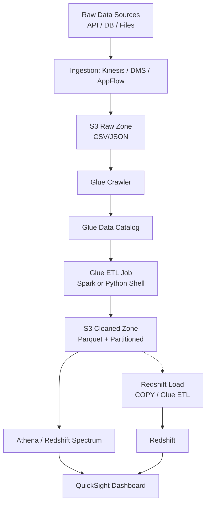

### คำอธิบายแบบละเอียด (Detailed Explanation)  

| ขั้นตอน | คำอธิบาย (ไทย) | Explanation (English) |
|---------|----------------|------------------------|
| 1 | ข้อมูลจากแหล่งต่างๆ ถูกส่งมายัง S3 raw zone ผ่าน Kinesis (real‑time), DMS (CDC), หรือ AppFlow (SaaS) | Data from various sources arrives in S3 raw zone via Kinesis, DMS, or AppFlow. |
| 2 | Glue Crawler อ่าน raw data และสร้าง schema ใน Glue Data Catalog | Glue Crawler reads raw data and creates schema in Glue Data Catalog. |
| 3 | Glue ETL job (Spark หรือ Python shell) อ่านจาก Catalog, ทำความสะอาด, แปลงเป็น Parquet, partition | Glue ETL job reads from Catalog, cleans, converts to Parquet, partitions. |
| 4 | Cleaned data ถูกเขียนไปยัง S3 cleaned zone (Parquet + partition) | Cleaned data written to S3 cleaned zone (Parquet + partitioned). |
| 5 | Athena หรือ Redshift Spectrum สามารถ query ข้อมูลใน cleaned zone ได้โดยตรง | Athena or Redshift Spectrum can directly query cleaned zone. |
| 6 | ถ้าต้องการ performance สูงขึ้น สามารถ load เข้า Redshift (COPY หรือ Glue) | For higher performance, load into Redshift (COPY or Glue). |
| 7 | QuickSight เชื่อมต่อกับ Athena หรือ Redshift เพื่อสร้าง dashboard | QuickSight connects to Athena or Redshift for dashboards. |

---

## 💻 ตัวอย่างโค้ดที่รันได้จริง (Runnable Code Example)  

### 1. การรัน Athena Query จาก Go (ทบทวนจากบทที่ 4)  

```go
// athena_query.go
// รัน SQL query บน Athena และอ่านผลลัพธ์จาก S3
// Run SQL query on Athena and read results from S3

package main

import (
	"context"
	"encoding/csv"
	"fmt"
	"log"
	"strings"
	"time"

	"github.com/aws/aws-sdk-go-v2/config"
	"github.com/aws/aws-sdk-go-v2/service/athena"
	"github.com/aws/aws-sdk-go-v2/service/athena/types"
	"github.com/aws/aws-sdk-go-v2/service/s3"
)

func main() {
	cfg, err := config.LoadDefaultConfig(context.TODO())
	if err != nil {
		log.Fatal(err)
	}
	athenaClient := athena.NewFromConfig(cfg)
	s3Client := s3.NewFromConfig(cfg)

	query := `
		SELECT 
			year, month, 
			SUM(sales_amount) as total_sales,
			COUNT(DISTINCT customer_id) as unique_customers
		FROM sales_db.sales_parquet
		WHERE year = 2026 AND month = 4
		GROUP BY year, month
	`
	resultBucket := "my-athena-results-bucket"
	outputLocation := fmt.Sprintf("s3://%s/results/", resultBucket)

	// Start query
	startResp, err := athenaClient.StartQueryExecution(context.TODO(), &athena.StartQueryExecutionInput{
		QueryString: &query,
		ResultConfiguration: &types.ResultConfiguration{
			OutputLocation: &outputLocation,
		},
	})
	if err != nil {
		log.Fatal(err)
	}

	// Poll for completion
	for {
		descResp, err := athenaClient.GetQueryExecution(context.TODO(), &athena.GetQueryExecutionInput{
			QueryExecutionId: startResp.QueryExecutionId,
		})
		if err != nil {
			log.Fatal(err)
		}
		if descResp.QueryExecution.Status.State == types.QueryExecutionStateSucceeded {
			break
		}
		time.Sleep(2 * time.Second)
	}

	// Read results from S3
	key := fmt.Sprintf("results/%s.csv", *startResp.QueryExecutionId)
	resp, err := s3Client.GetObject(context.TODO(), &s3.GetObjectInput{
		Bucket: &resultBucket,
		Key:    &key,
	})
	if err != nil {
		log.Fatal(err)
	}
	defer resp.Body.Close()

	reader := csv.NewReader(resp.Body)
	records, _ := reader.ReadAll()
	fmt.Println("Query Results:")
	for _, row := range records {
		fmt.Println(strings.Join(row, " | "))
	}
}
```

### 2. การเริ่มต้น Glue Job จาก Go (ผ่าน SDK)  

```go
// start_glue_job.go
// เริ่มต้น Glue ETL job และตรวจสอบสถานะ
// Start Glue ETL job and check status

package main

import (
	"context"
	"fmt"
	"log"
	"time"

	"github.com/aws/aws-sdk-go-v2/config"
	"github.com/aws/aws-sdk-go-v2/service/glue"
)

func main() {
	cfg, err := config.LoadDefaultConfig(context.TODO())
	if err != nil {
		log.Fatal(err)
	}
	client := glue.NewFromConfig(cfg)

	jobName := "sales_etl_job"
	// เริ่ม job
	startResp, err := client.StartJobRun(context.TODO(), &glue.StartJobRunInput{
		JobName: &jobName,
		Arguments: map[string]string{
			"--input_path":   "s3://my-bucket/raw/sales/",
			"--output_path":  "s3://my-bucket/cleaned/sales/",
		},
	})
	if err != nil {
		log.Fatal(err)
	}
	fmt.Printf("Started job run: %s\n", *startResp.JobRunId)

	// ตรวจสอบสถานะ (polling)
	for {
		descResp, err := client.GetJobRun(context.TODO(), &glue.GetJobRunInput{
			JobName:  &jobName,
			JobRunId: startResp.JobRunId,
		})
		if err != nil {
			log.Fatal(err)
		}
		state := descResp.JobRun.JobRunState
		fmt.Printf("Status: %s\n", state)
		if state == glue.JobRunStateSucceeded {
			fmt.Println("Job completed successfully!")
			break
		} else if state == glue.JobRunStateFailed || state == glue.JobRunStateStopped {
			errorMsg := ""
			if descResp.JobRun.ErrorMessage != nil {
				errorMsg = *descResp.JobRun.ErrorMessage
			}
			log.Fatalf("Job failed: %s", errorMsg)
		}
		time.Sleep(10 * time.Second)
	}
}
```

### 3. การสร้าง Glue Crawler จาก Go  

```go
// create_crawler.go
// สร้าง Glue Crawler เพื่อสแกน S3 และอัปเดต Data Catalog
// Create Glue Crawler to scan S3 and update Data Catalog

func createCrawler(client *glue.Client, crawlerName, s3Path, databaseName, roleArn string) error {
	_, err := client.CreateCrawler(context.TODO(), &glue.CreateCrawlerInput{
		Name: &crawlerName,
		Role: &roleArn,
		DatabaseName: &databaseName,
		Targets: &glue.CrawlerTargets{
			S3Targets: []glue.S3Target{
				{
					Path: &s3Path,
				},
			},
		},
		SchemaChangePolicy: &glue.SchemaChangePolicy{
			UpdateBehavior: glue.UpdateBehaviorUpdateCatalog,
			DeleteBehavior: glue.DeleteBehaviorDeprecateInDatabase,
		},
	})
	return err
}
```

---

## 📌 กรณีศึกษาและแนวทางแก้ไขปัญหา (Case Study & Troubleshooting)  

### กรณีศึกษา: การปรับ Glue ETP job ให้ทำงานเร็วขึ้นและถูกขึ้น  

**ปัญหา:** Glue job อ่านข้อมูล 5 TB ใช้เวลา 2 ชั่วโมง และค่าใช้จ่ายสูง  
**แนวทางแก้ไข (ตาม DEA):**  
- เปลี่ยน input format จาก CSV เป็น Parquet (ลดขนาด, columnar)  
- ใช้ partition pruning: แบ่งข้อมูลเป็น partition (year/month/day)  
- ใช้ Glue job bookmarks เพื่อประมวลผลเฉพาะไฟล์ใหม่  
- ปรับ DPU ให้เหมาะสม (ไม่มากเกินไป, ไม่น้อยเกินไป)  
- ใช้ Glue Auto Scaling (เปิดอัตโนมัติ)  
**ผลลัพธ์:** เวลาลดลงเหลือ 30 นาที, ค่าใช้จ่ายลด 70%  

### ปัญหาที่พบบ่อยในการสอบ DEA  

| ปัญหา (Issue) | สาเหตุ (Cause) | วิธีแก้ไข (Solution) |
|----------------|----------------|----------------------|
| สับสน ETL vs ELT | ไม่เข้าใจ data lake | ETL: transform ก่อน load (data warehouse); ELT: load ก่อน transform (data lake) |
| Glue job memory error | partition ใหญ่เกินไป | ใช้ group size หรือเพิ่ม DPU, ใช้ Spark optimization (broadcast join) |
| Data Catalog ไม่ update | ไม่รัน crawler | ตั้ง Glue crawler ให้รันตาม schedule หรือใช้ event trigger |
| Redshift load ช้า | COPY จาก S3 ไม่ optimize | ใช้ Parquet + partition, เพิ่ม region, ใช้ manifest file |
| Kinesis ถึง limit | shard ไม่พอ | เพิ่ม shard หรือใช้ auto scaling (Kinesis Data Streams on‑demand) |

---

## 📁 เทมเพลตและตัวอย่างเพิ่มเติม  

### แผนการเตรียมตัว 8 สัปดาห์ (DEA-C01)  

| สัปดาห์ | กิจกรรม |
|---------|---------|
| 1 | ทบทวน SQL, data modeling (star, snowflake), ETL concepts |
| 2 | S3 (storage classes, lifecycle, partitioning) + Glue Catalog (crawlers, metadata) |
| 3 | Glue ETL (Spark, Python shell, job bookmarks, Data Quality) |
| 4 | Athena (query optimization, partitions, workgroups, federated query) |
| 5 | Redshift (distribution keys, sort keys, COPY, Spectrum, Serverless) |
| 6 | Streaming: Kinesis (Streams, Firehose, Analytics), MSK |
| 7 | Governance & Security: Lake Formation (fine‑grained permissions), IAM, encryption, data lineage |
| 8 | Operations: CloudWatch, Step Functions, cost optimization, ทำ practice exam, สอบจริง |

### Checklist ก่อนสอบ DEA  

- [ ] รู้ lifecycle ของ S3 (Standard → IA → Glacier)  
- [ ] รู้ความแตกต่างระหว่าง Glue ETL (Spark) กับ Glue Python shell  
- [ ] รู้วิธีใช้ Glue job bookmarks  
- [ ] รู้วิธีสร้าง partition บน Athena และ Glue  
- [ ] รู้ Redshift distribution styles (auto, key, all, even)  
- [ ] รู้ Redshift sort keys (compound, interleaved)  
- [ ] รู้ Kinesis Data Streams vs Firehose vs Analytics  
- [ ] รู้ Lake Formation permission model (data lake administrator, grant/revoke)  
- [ ] รู้ Glue Data Quality (rules, evaluation)  
- [ ] รู้วิธี monitoring ด้วย CloudWatch (Glue metrics, Kinesis metrics)  

---

## 📊 ตารางเปรียบเทียบบริการ ETL/Processing  

| บริการ | เหมาะสำหรับ | Pros | Cons |
|--------|-------------|------|------|
| Glue ETL (Spark) | batch ETL ขนาดกลาง-ใหญ่ | serverless, integrated with Catalog | cold start สำหรับ job ขนาดเล็ก |
| Glue Python shell | ETL ขนาดเล็ก (< 1GB) | เร็ว, ต้นทุนต่ำ | ไม่รองรับ distributed processing |
| EMR | big data, custom Spark/Hive | ยืดหยุ่น, performance สูง | ต้องจัดการ cluster |
| Lambda | event‑driven ETL ขนาดเล็ก (< 15 นาที) | serverless, real‑time | memory/time limit |
| Step Functions | orchestration หลายขั้นตอน | visual workflow, retry, error handling | ไม่ใช่ processing engine |

---

## 📝 สรุป (Summary)  

### ✅ ประโยชน์ที่ได้รับ (Benefits)  
- พิสูจน์ทักษะ data engineering บน AWS โดยเฉพาะ  
- ครอบคลุม modern data stack (data lake, warehouse, streaming)  
- เพิ่มโอกาสในการทำงานสาย data  
- ได้รับ digital badge และส่วนลดสอบครั้งต่อไป  

### ⚠️ ข้อควรระวัง (Cautions)  
- ต้องมีความรู้ data engineering มาก่อน  
- บริการใหม่ (DEA เพิ่งเปิด) ข้อสอบอาจปรับบ่อย  
- ค่าสอบ 150 USD  

### 👍 ข้อดี (Advantages)  
- ตรงกับสายงาน data โดยเฉพาะ  
- เน้น practical มากกว่า theory  
- รองรับ automation ผ่าน SDK  

### 👎 ข้อเสีย (Disadvantages)  
- ต้องจำรายละเอียดเยอะ (บริการเยอะ)  
- ไม่มี lab ในข้อสอบ (ปัจจุบัน)  
- ต้อง recertify ทุก 3 ปี  

### 🚫 ข้อห้าม (Prohibitions)  
- ห้าม query Athena โดยไม่มี partition filter (cost สูง)  
- ห้ามใช้ Glue job bookmarks ถ้า source schema เปลี่ยนบ่อย  
- ห้ามเก็บ raw data โดยไม่บีบอัด (ใช้ Parquet/ORC + compression)  

---

## 🧩 แบบฝึกหัดท้ายบท (Exercises)  

**ข้อ 1:** DEA-C01 มีน้ำหนักของโดเมน "Data Processing" กี่เปอร์เซ็นต์  
**ข้อ 2:** ข้อแตกต่างระหว่าง Glue ETL (Spark) กับ Glue Python shell คืออะไร  
**ข้อ 3:** หากต้องการทำ real‑time data ingestion จาก application ไปยัง S3 ควรใช้บริการใด  
**ข้อ 4:** Redshift distribution key มีไว้เพื่ออะไร  
**ข้อ 5:** วิธีใดที่ช่วยลดต้นทุนการ query Athena (ยกมา 2 วิธี)  
**ข้อ 6:** Glue job bookmarks ใช้ทำอะไร  
**ข้อ 7:** ข้อสอบ DEA-C01 มีจำนวนข้อและเวลาเท่าไร  
**ข้อ 8:** จงเขียน Go code เพื่อรัน Glue crawler ตามชื่อที่กำหนด  
**ข้อ 9:** Lake Formation มีบทบาทอะไรในการ data governance  
**ข้อ 10:** Kinesis Data Streams กับ Kinesis Data Firehose ต่างกันอย่างไร  

---

## 🔐 เฉลยแบบฝึกหัด (Answer Key)  

**ข้อ 1:** 26%  
**ข้อ 2:** Glue Spark เหมาะกับข้อมูลใหญ่, distributed processing; Python shell เหมาะกับข้อมูลเล็ก (<1GB), รันบน single node  
**ข้อ 3:** Kinesis Data Firehose (รับ streaming data และเขียนลง S3 โดยอัตโนมัติ)  
**ข้อ 4:** กระจายข้อมูลไปยัง nodes ต่างกันเพื่อเพิ่ม performance ของ join และ aggregation  
**ข้อ 5:** 1) ใช้ partition filter ใน WHERE clause 2) ใช้ compression (Parquet) 3) ใช้ workgroups เพื่อ limit scan  
**ข้อ 6:** จดจำ position ของไฟล์ที่ประมวลผลไปแล้ว เพื่อไม่ต้องประมวลผลซ้ำในรอบถัดไป  
**ข้อ 7:** 65 ข้อ, 150 นาที  
**ข้อ 8:**  
```go
func startCrawler(client *glue.Client, crawlerName string) error {
    _, err := client.StartCrawler(context.TODO(), &glue.StartCrawlerInput{
        Name: &crawlerName,
    })
    return err
}
```  
**ข้อ 9:** ให้ fine‑grained access control (row-level, column-level) บน data lake, register data lake location, audit permissions  
**ข้อ 10:** Data Streams: เก็บและประมวลผล real‑time, consumer ต้องอ่านเอง; Firehose: โหลดข้อมูลไปยัง S3/Redshift/Splunk/etc. โดยอัตโนมัติ  

---

## 📚 แหล่งอ้างอิง (References)  

1. AWS Official Exam Guide – DEA-C01  
2. AWS Glue Developer Guide  
3. AWS Lake Formation User Guide  
4. Amazon Redshift Database Developer Guide  
5. TutorialsDojo – DEA-C01 Practice Exams  

---

**✍️ ผู้เขียน:** คงนคร จันทะคุณ  
**📅 อัปเดตล่าสุด:** เมษายน 2026  

**หมายเหตุ เนื้อหาในหนังสือ:**  
เนื้อหาในหนังสือ "AWS จากภาคทฤษฎีไปภาคปฏิบัติ" ใช้ AI ช่วยเขียน เพื่อทดสอบ AI Model ผู้เขียนเป็นผู้ออกแบบ ใช้ AI ช่วยจัดเรียง ซึ่งมีค่าใช้จ่ายพอสมควร ให้ใช้ฟรีก่อน ต้องการสนับสนุนเพื่อทำเนื้อหาแนวนี้ต่อ สามารถให้การสนับสนุนได้ครับ ตามกำลังศรัทธา  
📞 โทรศัพท์ / พร้อมเพย์: **0955088091**
# 📘 บทที่ 17: AWS Certified DevOps Engineer – Professional (DOP-C02)  
## Chapter 17: AWS Certified DevOps Engineer – Professional (DOP-C02)  

---

## 🧱 โครงสร้างการทำงาน (Work Structure)  

**ไทย:**  
บทนี้เจาะลึกใบรับรอง AWS Certified DevOps Engineer – Professional (DOP-C02) สำหรับผู้ที่มีประสบการณ์ด้าน DevOps และต้องการพิสูจน์ทักษะการบริหารจัดการ CI/CD, infrastructure as code, monitoring & logging, incident response, และ automation บน AWS ในระดับองค์กร เนื้อหาครอบคลุมการออกแบบ pipeline ที่ซับซ้อน, การทำ blue/green, canary deployment, การจัดการ configuration (AppConfig, Systems Manager), การทำ observability ด้วย CloudWatch, X-Ray, และการตอบสนองต่อเหตุการณ์อัตโนมัติ พร้อมตัวอย่างการใช้ Go ในการ automation และจัดการ infrastructure  

**English:**  
This chapter dives into the AWS Certified DevOps Engineer – Professional (DOP-C02) certification for experienced DevOps professionals who want to validate their skills in managing CI/CD, infrastructure as code, monitoring & logging, incident response, and automation on AWS at an enterprise level. It covers designing complex pipelines, blue/green and canary deployments, configuration management (AppConfig, Systems Manager), observability with CloudWatch and X‑Ray, and automated incident response, with examples of using Go for automation and infrastructure management.  

---

## 🎯 วัตถุประสงค์แบบสั้นสำหรับทบทวน (Short Revision Objective)  

**ไทย:**  
เพื่อให้ผู้อ่านเข้าใจโครงสร้างข้อสอบ DOP-C02, เนื้อหาทั้ง 6 โดเมน, บริการ DevOps ขั้นสูงของ AWS (CodePipeline, CodeDeploy, CloudFormation, CDK, AppConfig, Systems Manager, X-Ray, CloudWatch, Config, etc.), และสามารถเตรียมตัวสอบ รวมถึงการออกแบบ CI/CD pipeline ที่ปลอดภัย, การทำ deployment strategy ต่างๆ, การทำ observability, และการตอบสนองต่อเหตุการณ์อัตโนมัติ  

**English:**  
To enable readers to understand the DOP-C02 exam structure, six domains, advanced AWS DevOps services (CodePipeline, CodeDeploy, CloudFormation, CDK, AppConfig, Systems Manager, X-Ray, CloudWatch, Config, etc.), and prepare effectively, including designing secure CI/CD pipelines, various deployment strategies, observability, and automated incident response.  

---

## 👥 กลุ่มเป้าหมาย (Target Audience)  

- DevOps Engineer / SRE ที่ทำงานบน AWS อย่างน้อย 2 ปี  
- Solutions Architect ที่ต้องการเน้นด้าน automation และ CI/CD  
- Developer ที่ต้องการเปลี่ยนสายสู่ DevOps  
- ผู้ที่สอบผ่าน AWS Certified DevOps Engineer – Associate (DVA) หรือมีประสบการณ์เทียบเท่า  

---

## 📚 ความรู้พื้นฐาน (Prerequisites)  

- ประสบการณ์ DevOps บน AWS อย่างน้อย 2 ปี  
- เข้าใจ CI/CD, infrastructure as code, monitoring, logging  
- แนะนำให้มีใบรับรอง AWS Certified Developer – Associate หรือ Solutions Architect – Associate มาก่อน  
- ความรู้ scripting (Go, Python, Bash) และ YAML/JSON  

---

## 📝 เนื้อหาโดยย่อ (Abstract)  

**ไทย:**  
บทนี้สรุปข้อสอบ DOP-C02: จำนวนข้อ, เวลา, โดเมนหลัก 6 ด้าน (SDLC Automation, Configuration Management & IaC, Monitoring & Logging, Incident & Event Response, Security & Compliance, Automation & Optimization) พร้อมตัวอย่างคำถามระดับสูง, บริการที่ต้องรู้ลึก (CodePipeline, CodeDeploy, CloudFormation, CDK, AppConfig, Systems Manager, CloudWatch, X-Ray, Config, Service Catalog, AWS Control Tower), และการเขียน Go เพื่อ automate การ deploy, สร้าง custom CloudWatch metrics, และจัดการ resources  

**English:**  
This chapter summarizes the DOP-C02 exam: number of questions, time, six domains (SDLC Automation, Configuration Management & IaC, Monitoring & Logging, Incident & Event Response, Security & Compliance, Automation & Optimization), sample advanced questions, essential services (CodePipeline, CodeDeploy, CloudFormation, CDK, AppConfig, Systems Manager, CloudWatch, X-Ray, Config, Service Catalog, AWS Control Tower), and writing Go to automate deployments, create custom CloudWatch metrics, and manage resources.  

---

## 🔰 บทนำ (Introduction)  

**ไทย:**  
AWS Certified DevOps Engineer – Professional (DOP-C02) เป็นใบรับรองระดับ Professional สำหรับผู้ที่ทำงานด้าน DevOps โดยเฉพาะ ข้อสอบจะทดสอบความสามารถในการ automate processes, ออกแบบ CI/CD pipeline ที่ซับซ้อน, จัดการ infrastructure as code, ติดตามและแก้ไขปัญหาแบบ real-time, และรักษาความปลอดภัยในการปฏิบัติการ DevOps ใบรับรองนี้เหมาะสำหรับผู้ที่มีประสบการณ์จริงและต้องการพิสูจน์ความเชี่ยวชาญด้าน DevOps บน AWS  

**English:**  
The AWS Certified DevOps Engineer – Professional (DOP-C02) is a Professional‑level certification for those specifically working in DevOps. The exam tests the ability to automate processes, design complex CI/CD pipelines, manage infrastructure as code, monitor and troubleshoot in real time, and maintain security in DevOps practices. This certification suits those with real experience who want to validate their AWS DevOps expertise.  

---

## 📖 บทนิยาม (Definitions)  

| คำศัพท์ (Term) | คำจำกัดความไทย (Thai Definition) | English Definition |
|----------------|----------------------------------|--------------------|
| CI/CD | Continuous Integration / Continuous Deployment | การรวมโค้ดและ deploy อัตโนมัติ |
| Infrastructure as Code (IaC) | การจัดการ infrastructure โดยใช้โค้ด (CloudFormation, CDK, Terraform) | Managing infrastructure using code. |
| Blue/Green Deployment | การ deploy โดยมี environment สองชุด (blue = ปัจจุบัน, green = ใหม่) แล้ว switch traffic | Deployment with two environments, switch traffic. |
| Canary Deployment | การ deploy ให้ผู้ใช้กลุ่มเล็กก่อน แล้วค่อยเพิ่ม | Deploy to a small subset of users first, then gradually increase. |
| Feature Toggle | การเปิด/ปิด feature โดยไม่ต้อง deploy ใหม่ (ใช้ AppConfig หรือ Launch Darkly) | Enable/disable features without redeploying. |
| Configuration Management | การจัดการ configuration ของแอปพลิเคชันและ infrastructure (AppConfig, Systems Manager Parameter Store) | Managing app and infrastructure configs. |
| Observability | ความสามารถในการเข้าใจสถานะภายในของระบบจาก outputs (logs, metrics, traces) | Ability to understand internal system state from outputs. |
| X-Ray | บริการ tracing สำหรับ distributed applications | Distributed tracing service. |
| AWS Config | บริการประเมินและบันทึกการเปลี่ยนแปลงของ resources | Service to evaluate and record resource changes. |
| Systems Manager | บริการ management สำหรับ EC2 และ on‑premise (patch, automation, parameter store, session manager) | Management service for EC2 and on‑premises. |

---

## 🔧 DOP-C02 คืออะไร? มีเนื้อหาอะไรบ้าง?  

### 1. DOP-C02 คืออะไร  
**ไทย:**  
DOP-C02 คือรหัสข้อสอบ AWS Certified DevOps Engineer – Professional (อัปเดตล่าสุด 2023) ทดสอบความสามารถในการ implement และ manage CI/CD pipelines, IaC, monitoring, logging, incident response, และ automation บน AWS ในระดับ enterprise  

**English:**  
DOP-C02 is the exam code for AWS Certified DevOps Engineer – Professional (latest update 2023). It tests the ability to implement and manage CI/CD pipelines, IaC, monitoring, logging, incident response, and automation on AWS at an enterprise level.  

### 2. เนื้อหาข้อสอบแบ่งเป็น 6 โดเมน (Domains)  

| โดเมน (Domain) | น้ำหนัก (Weight) | หัวข้อหลัก (Key topics) |
|----------------|------------------|--------------------------|
| SDLC Automation | 22% | CI/CD pipelines (CodePipeline, CodeBuild, CodeDeploy, CodeCommit), deployment strategies (in‑place, blue/green, canary, rolling), artifact management (CodeArtifact), testing automation |
| Configuration Management & IaC | 18% | CloudFormation (nested stacks, macros, custom resources, drift detection), CDK (AWS CDK), Service Catalog, AppConfig, Systems Manager (Parameter Store, Run Command, Patch Manager) |
| Monitoring & Logging | 16% | CloudWatch (metrics, logs, alarms, dashboards), X-Ray (tracing, sampling, service maps), EventBridge (rules, archiving), AWS Distro for OpenTelemetry (ADOT) |
| Incident & Event Response | 12% | การตอบสนองอัตโนมัติ (EventBridge + Lambda), AWS Config rules (auto remediation), Systems Manager Automation documents, incident management playbooks, post‑mortem |
| Security & Compliance | 18% | IAM (roles, policies, permission boundaries), Secrets Manager, KMS, security scanning ใน pipeline (SAST, DAST, SCA), compliance as code (Config conformance packs), AWS Control Tower guardrails |
| Automation & Optimization | 14% | การ automate การ scale (Auto Scaling, Lambda), cost optimization (Compute Optimizer, Spot, Savings Plans), performance optimization, การจัดการ drift, Chaos Engineering (FIS) |

### 3. รูปแบบข้อสอบ  

| รายการ | รายละเอียด |
|--------|-------------|
| จำนวนข้อ | 75 (รวม 15 ข้อที่ไม่นับคะแนน + อาจมี labs) |
| เวลา | 180 นาที (3 ชั่วโมง) |
| รูปแบบ | Multiple choice, multiple answer, **labs** |
| คะแนนผ่าน | 750/1000 (75%) |
| ค่าสอบ | 300 USD |
| ภาษา | อังกฤษ, ญี่ปุ่น, เกาหลี, จีน |

### 4. บริการที่ต้องรู้ลึกสำหรับ DOP  

| บริการ | บทบาท | รายละเอียด |
|--------|--------|-------------|
| CodePipeline | CI/CD orchestration | stages, actions, manual approval, cross‑region, cross‑account |
| CodeBuild | Build & test | buildspec, environments, cache, reports |
| CodeDeploy | Deployment | appspec, deployment groups, hooks, rollback |
| CloudFormation | IaC | templates, stack sets, drift detection, change sets, custom resources |
| CDK | IaC (programmatic) | constructs, stacks, synth, deploy |
| AppConfig | Feature flags & config | configuration profiles, deployment strategies, validation |
| Systems Manager | Management | Parameter Store, Run Command, Patch Manager, Session Manager, Automation |
| CloudWatch | Observability | metrics (custom), logs (insights), alarms (composite), Contributor Insights |
| X-Ray | Tracing | segments, subsegments, annotations, service graph, trace ID propagation |
| EventBridge | Event bus | rules, targets, event patterns, archiving, replay |
| AWS Config | Compliance | rules (managed, custom), conformance packs, remediation (SSM docs) |
| Secrets Manager | Secrets | rotation, cross‑account access |
| FIS (Fault Injection Simulator) | Chaos | experiments, actions, stop conditions |

### 5. ตัวอย่างคำถาม (Sample Question – ระดับสูง)  

**คำถาม:** ทีมของคุณใช้ CodePipeline เพื่อ deploy microservices 20 ตัวไปยัง AWS ECS Fargate พวกเขาต้องการ implement canary deployment โดยให้ traffic 5% ไปยังเวอร์ชันใหม่ก่อน หาก success จึงเพิ่มเป็น 100% วิธีใดที่เหมาะสมที่สุด  

A. ใช้ CodeDeploy สำหรับ ECS พร้อม deployment configuration แบบ Canary10Percent5Minutes  
B. เขียน Lambda function ใน pipeline เพื่อเปลี่ยน weight ของ target group  
C. ใช้ CloudFormation update service พร้อม force new deployment  
D. ใช้ AppConfig เพื่อเปิด feature flag ให้กับ 5% ของ users  

**เฉลย:** A (CodeDeploy รองรับ canary deployment สำหรับ ECS โดยตรง)  

---

## 🔄 ออกแบบ Workflow (Workflow Design)  

### ภาพรวม: CI/CD Pipeline แบบ Multi‑account (Dev → Staging → Prod)  

**ไทย:**  
Developer push → CodeCommit → CodeBuild (test, lint, security scan) → CodePipeline → Deploy to Dev → Integration test → Manual approval → Deploy to Staging → Canary deployment → Smoke test → Auto approve → Deploy to Prod (blue/green)  

**English:**  
Developer push → CodeCommit → CodeBuild (test, lint, security scan) → CodePipeline → Deploy to Dev → Integration test → Manual approval → Deploy to Staging → Canary deployment → Smoke test → Auto approve → Deploy to Prod (blue/green).  

### Mermaid Flowchart  

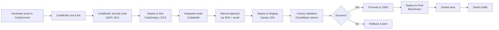

### คำอธิบายแบบละเอียด (Detailed Explanation)  

| ขั้นตอน | คำอธิบาย (ไทย) | Explanation (English) |
|---------|----------------|------------------------|
| 1 | Developer push โค้ดไปยัง CodeCommit | Developer pushes code to CodeCommit. |
| 2 | CodeBuild รัน unit tests และ linting | CodeBuild runs unit tests and linting. |
| 3 | CodeBuild รัน security scans (SAST, SCA) | CodeBuild runs security scans. |
| 4 | Deploy ไปยัง environment Dev (แบบอัตโนมัติ) | Deploy to Dev environment (automatic). |
| 5 | รัน integration tests บน Dev | Run integration tests on Dev. |
| 6 | Manual approval (ส่ง notification ไปยัง approver) | Manual approval (notification sent). |
| 7 | Deploy ไปยัง Staging แบบ canary (10% traffic) | Deploy to Staging as canary (10% traffic). |
| 8 | ตรวจสอบ canary validation (CloudWatch alarms, error rate) | Validate canary (CloudWatch alarms, error rate). |
| 9 | ถ้าสำเร็จ: promote เป็น 100% traffic; ถ้าไม่: rollback | If success: promote to 100%; else rollback. |
| 10 | Deploy ไปยัง Production แบบ blue/green | Deploy to Production with blue/green. |
| 11 | Smoke tests และ switch traffic | Smoke tests and switch traffic. |

---

## 💻 ตัวอย่างโค้ดที่รันได้จริง (Runnable Code Example)  

### 1. การสร้าง Custom CloudWatch Metric จาก Go  

```go
// custom_metric.go
// ส่ง custom metric ไปยัง CloudWatch เพื่อใช้ใน dashboard หรือ alarm
// Send custom metric to CloudWatch for dashboards or alarms

package main

import (
	"context"
	"log"
	"time"

	"github.com/aws/aws-sdk-go-v2/config"
	"github.com/aws/aws-sdk-go-v2/service/cloudwatch"
	"github.com/aws/aws-sdk-go-v2/service/cloudwatch/types"
)

func main() {
	cfg, err := config.LoadDefaultConfig(context.TODO())
	if err != nil {
		log.Fatal(err)
	}
	client := cloudwatch.NewFromConfig(cfg)

	// สร้าง metric data point
	metricData := []types.MetricDatum{
		{
			MetricName: stringPtr("MyApp_CustomLatency"),
			Unit:       types.StandardUnitMilliseconds,
			Value:      float64Ptr(123.4),
			Timestamp:  ptr(time.Now().UTC()),
			Dimensions: []types.Dimension{
				{
					Name:  stringPtr("Environment"),
					Value: stringPtr("Production"),
				},
			},
		},
	}

	input := &cloudwatch.PutMetricDataInput{
		Namespace:  stringPtr("MyApplication"),
		MetricData: metricData,
	}

	_, err = client.PutMetricData(context.TODO(), input)
	if err != nil {
		log.Fatal(err)
	}
	log.Println("Custom metric sent to CloudWatch")
}

func stringPtr(s string) *string { return &s }
func float64Ptr(f float64) *float64 { return &f }
func ptr(t time.Time) *time.Time { return &t }
```

### 2. การใช้ Systems Manager Parameter Store จาก Go  

```go
// parameter_store.go
// ดึง parameter จาก Systems Manager Parameter Store (secure string)
// Get parameter from Systems Manager Parameter Store (secure string)

package main

import (
	"context"
	"fmt"
	"log"

	"github.com/aws/aws-sdk-go-v2/config"
	"github.com/aws/aws-sdk-go-v2/service/ssm"
)

func main() {
	cfg, err := config.LoadDefaultConfig(context.TODO())
	if err != nil {
		log.Fatal(err)
	}
	client := ssm.NewFromConfig(cfg)

	paramName := "/myapp/db/password"
	resp, err := client.GetParameter(context.TODO(), &ssm.GetParameterInput{
		Name:           &paramName,
		WithDecryption: true,
	})
	if err != nil {
		log.Fatal(err)
	}
	fmt.Printf("Parameter value: %s\n", *resp.Parameter.Value)
}
```

### 3. การเริ่มต้น Systems Manager Automation Document จาก Go  

```go
// ssm_automation.go
// รัน Automation document สำหรับ remediation หรือ maintenance
// Run Automation document for remediation or maintenance

func runAutomation(client *ssm.Client, docName string, parameters map[string][]string) (string, error) {
	resp, err := client.StartAutomationExecution(context.TODO(), &ssm.StartAutomationExecutionInput{
		DocumentName: &docName,
		Parameters:   parameters,
	})
	if err != nil {
		return "", err
	}
	return *resp.AutomationExecutionId, nil
}
```

---

## 📌 กรณีศึกษาและแนวทางแก้ไขปัญหา (Case Study & Troubleshooting)  

### กรณีศึกษา: การทำ blue/green deployment สำหรับแอปบน EC2 อย่างไรให้ zero downtime  

**ปัญหา:** เวลาอัปเดตแอปบน EC2 ต้อง restart service ทำให้มี downtime ~30 วินาที  
**แนวทางแก้ไข (ตาม DOP):**  
- ใช้ CodeDeploy แบบ blue/green  
- สร้าง Auto Scaling group ใหม่ (green) ขณะที่ blue ยังทำงาน  
- ใช้ ALB เพื่อเปลี่ยน traffic จาก blue เป็น green ทีละน้อยหรือทันที  
- ใช้ pre‑hook และ post‑hook เพื่อตรวจสอบ health ของ green ก่อน switch  
- ถ้าล้มเหลว rollback อัตโนมัติ  
**ผลลัพธ์:** zero downtime, rollback < 1 นาที  

### ปัญหาที่พบบ่อยในการสอบ DOP  

| ปัญหา (Issue) | สาเหตุ (Cause) | วิธีแก้ไข (Solution) |
|----------------|----------------|----------------------|
| สับสน deployment strategies | blue/green vs canary vs rolling | blue/green: two env, switch traffic; canary: เปอร์เซ็นต์เล็ก; rolling: ทีละ instance |
| CodePipeline cross‑account | ไม่รู้วิธีให้ pipeline deploy ไปอีก account | ใช้ CodePipeline + CloudFormation StackSets หรือ cross‑account role |
| Config rule remediation ไม่ทำงาน | Lambda หรือ SSM doc ไม่ถูกต้อง | ตรวจสอบ IAM role, ใช้ SSM Automation document ที่ถูกต้อง |
| X-Ray trace หาย | ไม่ propagate trace header | ต้องส่ง header `X-Amzn-Trace-Id` ไปยัง services |
| CloudFormation drift | manual change นอก IaC | ใช้ drift detection และ auto remediation ด้วย StackSets หรือ Config |

---

## 📁 เทมเพลตและตัวอย่างเพิ่มเติม  

### แผนการเตรียมตัว 12 สัปดาห์ (DOP-C02)  

| สัปดาห์ | กิจกรรม |
|---------|---------|
| 1-2 | ทบทวน CI/CD: CodePipeline, CodeBuild, CodeDeploy, deployment strategies |
| 3-4 | IaC: CloudFormation (ลึก), CDK, drift detection, StackSets |
| 5-6 | Configuration Management: AppConfig, Systems Manager (Parameter Store, Automation, Patch Manager) |
| 7-8 | Monitoring & Observability: CloudWatch (metrics, logs, alarms), X-Ray, EventBridge |
| 9 | Security & Compliance: IAM, Secrets Manager, Config rules, Control Tower |
| 10 | Incident Response & Automation: EventBridge + Lambda, SSM automation, FIS |
| 11 | Optimization & Cost: Auto Scaling, Compute Optimizer, Spot |
| 12 | ทำ practice exam (TutorialsDojo, Whizlabs) อย่างน้อย 3 ชุด, ฝึก labs, สอบจริง |

### Checklist ก่อนสอบ DOP  

- [ ] รู้วิธีสร้าง pipeline ข้าม account และ cross‑region  
- [ ] รู้ deployment types: in‑place, blue/green, canary, rolling  
- [ ] รู้ CloudFormation: intrinsic functions, condition, mappings, custom resources, macros, nested stacks, stack sets, drift detection  
- [ ] รู้ CDK: constructs, stacks, synth, deploy, context  
- [ ] รู้ AppConfig: feature flags, configuration validation, deployment strategy  
- [ ] รู้ Systems Manager: Parameter Store (standard/advanced), Run Command, Patch Manager, Automation Documents  
- [ ] รู้ CloudWatch: custom metrics, metric math, composite alarms, Contributor Insights, Logs Insights  
- [ ] รู้ X-Ray: trace propagation, sampling rules, annotations, service map  
- [ ] รู้ EventBridge: event bus, rules, event patterns, archiving, replay, schema registry  
- [ ] รู้ AWS Config: managed vs custom rules, conformance packs, remediation (SSM or Lambda)  
- [ ] รู้ Chaos Engineering: FIS experiments, actions, stop conditions  

---

## 📊 ตารางเปรียบเทียบ Deployment Strategies  

| Strategy | Zero Downtime | Rollback complexity | Traffic shift | เหมาะกับ |
|----------|---------------|---------------------|---------------|-----------|
| In‑place | ไม่ (มี downtime สั้น) | ง่าย (redeploy old) | N/A | non‑critical |
| Rolling | เกือบ zero (ทีละ instance) | ปานกลาง | gradual | stateless apps |
| Blue/Green | ใช่ | ง่าย (switch back) | instant | stateful (database ต้องจัดการ) |
| Canary | ใช่ | ง่าย | gradual (e.g., 5%, 20%, 100%) | high‑risk features |
| Feature Toggle | ใช่ (ไม่ deploy ใหม่) | ง่าย (toggle off) | instant (ต่อ user) | gradual rollout โดยไม่ต้อง deploy |

---

## 📝 สรุป (Summary)  

### ✅ ประโยชน์ที่ได้รับ (Benefits)  
- พิสูจน์ทักษะ DevOps ขั้นสูงบน AWS  
- ออกแบบ CI/CD และ automation ที่ซับซ้อนได้  
- เพิ่มโอกาสในการเลื่อนตำแหน่งเป็น Senior DevOps / SRE  
- ได้รับ digital badge และส่วนลดสอบครั้งต่อไป  

### ⚠️ ข้อควรระวัง (Cautions)  
- ต้องมีประสบการณ์จริง 2+ ปี  
- ค่าสอบแพง (300 USD)  
- เนื้อหาลึกและกว้าง ต้องเตรียมตัว 3 เดือน  

### 👍 ข้อดี (Advantages)  
- เป็นใบรับรองระดับ Professional ที่หายาก  
- ครอบคลุม modern DevOps practices (IaC, observability, chaos)  
- มี labs สะท้อนงานจริง  

### 👎 ข้อเสีย (Disadvantages)  
- ต้อง recertify ทุก 3 ปี  
- ไม่เหมาะสำหรับผู้เริ่มต้น  
- ข้อสอบยาก อัตราการผ่านต่ำ  

### 🚫 ข้อห้าม (Prohibitions)  
- ห้าม deploy ไป production โดยไม่ผ่าน automated tests  
- ห้ามใช้ manual changes ใน production โดยไม่ update IaC (จะเกิด drift)  
- ห้ามละเลย monitoring และ alerting  

---

## 🧩 แบบฝึกหัดท้ายบท (Exercises)  

**ข้อ 1:** DOP-C02 มีน้ำหนักของโดเมน "SDLC Automation" กี่เปอร์เซ็นต์  
**ข้อ 2:** Blue/green deployment กับ canary deployment แตกต่างกันอย่างไร  
**ข้อ 3:** หากต้องการจัดการ feature flags โดยไม่ต้อง deploy ใหม่ ควรใช้บริการใด  
**ข้อ 4:** X-Ray ใช้ทำอะไรใน distributed system  
**ข้อ 5:** CloudFormation drift detection คืออะไร  
**ข้อ 6:** Systems Manager Parameter Store รองรับ parameter ประเภทใดบ้าง (ยกมา 3 ประเภท)  
**ข้อ 7:** ข้อสอบ DOP-C02 มีจำนวนข้อและเวลาเท่าไร  
**ข้อ 8:** จงเขียน Go code เพื่ออัปเดต CloudWatch alarm state ตาม custom logic  
**ข้อ 9:** AWS Config conformance pack มีประโยชน์อย่างไร  
**ข้อ 10:** Chaos Engineering (AWS FIS) ใช้เพื่ออะไร  

---

## 🔐 เฉลยแบบฝึกหัด (Answer Key)  

**ข้อ 1:** 22%  
**ข้อ 2:** Blue/green: สลับ traffic ระหว่างสอง environment ทั้งหมด; Canary: ส่ง traffic เปอร์เซ็นต์เล็กไปยังเวอร์ชันใหม่ก่อนแล้วค่อยเพิ่ม  
**ข้อ 3:** AWS AppConfig  
**ข้อ 4:** ติดตาม request ที่เดินทางผ่านหลาย services (trace), วิเคราะห์ latency, หา bottleneck, debug errors  
**ข้อ 5:** การตรวจสอบว่า resource ที่ deploy ผ่าน CloudFormation ถูกเปลี่ยนแปลงนอกเหนือจาก stack (manual change) หรือไม่  
**ข้อ 6:** String, StringList, SecureString  
**ข้อ 7:** 75 ข้อ, 180 นาที  
**ข้อ 8:**  
```go
// ตั้งค่า alarm state โดยใช้ PutMetricAlarm (แต่ปกติ alarm state อัปเดตอัตโนมัติ)
// หรือใช้ SetAlarmState (สำหรับ testing)
func setAlarmState(client *cloudwatch.Client, alarmName, stateValue string) error {
    _, err := client.SetAlarmState(context.TODO(), &cloudwatch.SetAlarmStateInput{
        AlarmName:   &alarmName,
        StateValue:  types.StateValue(stateValue),
        StateReason: stringPtr("Custom state update"),
    })
    return err
}
```  
**ข้อ 9:** ช่วย deploy ชุดของ AWS Config rules และ remediation actions เพื่อให้สอดคล้องกับ compliance framework (PCI, HIPAA, etc.) ข้ามหลาย account  
**ข้อ 10:** ทดสอบความทนทานของระบบโดยการ inject failures (เช่น สูญเสีย AZ, network latency, CPU spike) แบบ controlled  

---

## 📚 แหล่งอ้างอิง (References)  

1. AWS Official Exam Guide – DOP-C02  
2. AWS DevOps Documentation – CodePipeline, CodeDeploy, CloudFormation, CDK  
3. AWS Well‑Architected – DevOps Guidance  
4. TutorialsDojo – DOP-C02 Practice Exams + Labs  
5. Stephane Maarek – AWS Certified DevOps Engineer Professional Course (Udemy)  

---

**✍️ ผู้เขียน:** คงนคร จันทะคุณ  
**📅 อัปเดตล่าสุด:** เมษายน 2026  

**หมายเหตุ เนื้อหาในหนังสือ:**  
เนื้อหาในหนังสือ "AWS จากภาคทฤษฎีไปภาคปฏิบัติ" ใช้ AI ช่วยเขียน เพื่อทดสอบ AI Model ผู้เขียนเป็นผู้ออกแบบ ใช้ AI ช่วยจัดเรียง ซึ่งมีค่าใช้จ่ายพอสมควร ให้ใช้ฟรีก่อน ต้องการสนับสนุนเพื่อทำเนื้อหาแนวนี้ต่อ สามารถให้การสนับสนุนได้ครับ ตามกำลังศรัทธา  
📞 โทรศัพท์ / พร้อมเพย์: **0955088091**
# 📘 ภาคผนวก: เทมเพลต โค้ดตัวอย่าง และเอกสารอ้างอิง  
## Appendix: Templates, Code Examples, and Reference Materials  

---

## 🧩 ภาคผนวก ก: เทมเพลตที่ใช้งานบ่อย (Common Templates)  

### 1. buildspec.yml สำหรับ Go (CodeBuild)  

```yaml
# buildspec.yml
# สำหรับโปรเจกต์ Go ที่ต้องการ build และ test
version: 0.2

phases:
  install:
    runtime-versions:
      golang: 1.21
    commands:
      - go mod download
  pre_build:
    commands:
      - go test -cover ./...
  build:
    commands:
      - GOOS=linux GOARCH=arm64 CGO_ENABLED=0 go build -o myapp .
  post_build:
    commands:
      - echo Build completed on `date`

artifacts:
  files:
    - myapp
    - appspec.yml
    - scripts/**/*
```

### 2. appspec.yml สำหรับ CodeDeploy (EC2)  

```yaml
# appspec.yml
version: 0.0
os: linux
files:
  - source: myapp
    destination: /home/ec2-user/myapp
  - source: scripts/
    destination: /home/ec2-user/scripts
permissions:
  - object: /home/ec2-user/myapp
    mode: 755
    owner: ec2-user
    group: ec2-user
hooks:
  ApplicationStop:
    - location: scripts/stop.sh
      timeout: 30
      runas: ec2-user
  ApplicationStart:
    - location: scripts/start.sh
      timeout: 60
      runas: ec2-user
  ValidateService:
    - location: scripts/validate.sh
      timeout: 30
      runas: ec2-user
```

### 3. Dockerfile สำหรับ Go (Multi-stage)  

```dockerfile
# Dockerfile
FROM golang:1.21-alpine AS builder
WORKDIR /app
COPY go.mod go.sum ./
RUN go mod download
COPY . .
RUN CGO_ENABLED=0 GOOS=linux go build -ldflags="-s -w" -o myapp .

FROM scratch
COPY --from=builder /app/myapp /myapp
EXPOSE 8080
CMD ["/myapp"]
```

### 4. SAM template.yaml (Lambda + API Gateway + DynamoDB)  

```yaml
AWSTemplateFormatVersion: '2010-09-09'
Transform: AWS::Serverless-2016-10-31
Resources:
  MyTable:
    Type: AWS::DynamoDB::Table
    Properties:
      TableName: MyTable
      AttributeDefinitions:
        - AttributeName: id
          AttributeType: S
      KeySchema:
        - AttributeName: id
          KeyType: HASH
      BillingMode: PAY_PER_REQUEST

  MyApi:
    Type: AWS::Serverless::Api
    Properties:
      StageName: prod

  MyFunction:
    Type: AWS::Serverless::Function
    Properties:
      CodeUri: .
      Handler: bootstrap
      Runtime: provided.al2
      MemorySize: 512
      Timeout: 30
      Policies:
        - DynamoDBCrudPolicy:
            TableName: !Ref MyTable
      Events:
        ApiEvent:
          Type: Api
          Properties:
            RestApiId: !Ref MyApi
            Path: /{proxy+}
            Method: ANY
```

---

## 🛠️ ภาคผนวก ข: โค้ด Go Utility สำหรับ AWS (Go Utility Code)  

### 1. การโหลด AWS Config พร้อม fallback  

```go
// config.go
func loadAWSConfig(ctx context.Context, region string) (aws.Config, error) {
    cfg, err := config.LoadDefaultConfig(ctx,
        config.WithRegion(region),
        config.WithRetryer(func() aws.Retryer {
            return retry.AddWithMaxAttempts(retry.NewStandard(), 3)
        }),
    )
    return cfg, err
}
```

### 2. การสร้าง S3 Client และอัปโหลดไฟล์  

```go
// s3_upload.go
func uploadToS3(ctx context.Context, bucket, key string, data []byte) error {
    cfg, _ := config.LoadDefaultConfig(ctx)
    client := s3.NewFromConfig(cfg)
    _, err := client.PutObject(ctx, &s3.PutObjectInput{
        Bucket: &bucket,
        Key:    &key,
        Body:   bytes.NewReader(data),
    })
    return err
}
```

### 3. การเรียก Lambda function แบบ asynchronous  

```go
// invoke_lambda.go
func invokeLambdaAsync(ctx context.Context, funcName string, payload []byte) error {
    cfg, _ := config.LoadDefaultConfig(ctx)
    client := lambda.NewFromConfig(cfg)
    _, err := client.Invoke(ctx, &lambda.InvokeInput{
        FunctionName: &funcName,
        Payload:      payload,
        InvocationType: types.InvocationTypeEvent, // async
    })
    return err
}
```

### 4. การส่ง SNS notification  

```go
// sns_publish.go
func publishSNS(ctx context.Context, topicArn, message string) error {
    cfg, _ := config.LoadDefaultConfig(ctx)
    client := sns.NewFromConfig(cfg)
    _, err := client.Publish(ctx, &sns.PublishInput{
        TopicArn: &topicArn,
        Message:  &message,
    })
    return err
}
```

---

## 📖 ภาคผนวก ค: เฉลยแบบฝึกหัดรวม (Selected Exercise Answers)  

> **หมายเหตุ:** เฉลยแบบฝึกหัดแต่ละบทได้แทรกไว้ท้ายบทแล้ว ด้านล่างเป็นเฉลยเพิ่มเติมสำหรับข้อที่ต้องการเน้นย้ำ

### บทที่ 1 (DevOps)  
**ข้อ 8:** systemd unit file สำหรับ myapp  
```ini
[Unit]
Description=My Go App
After=network.target

[Service]
Type=simple
User=ec2-user
WorkingDirectory=/home/ec2-user/myapp
ExecStart=/home/ec2-user/myapp/myapp
Restart=on-failure

[Install]
WantedBy=multi-user.target
```

### บทที่ 3 (AI)  
**ข้อ 4:** Exponential backoff ใน Go  
```go
for i := 0; i < 3; i++ {
    resp, err := client.InvokeModel(...)
    if err == nil {
        break
    }
    time.Sleep(time.Duration(1<<i) * 100 * time.Millisecond)
}
```

### บทที่ 4 (Data Engineer)  
**ข้อ 3:** EventBridge rule สำหรับ Lambda ทุก 1 ชั่วโมง  
```json
{
  "schedule": "cron(0 * * * ? *)",
  "targets": [{"arn": "lambda:function:my-ingestion"}]
}
```

### บทที่ 5 (Software Engineer)  
**ข้อ 3:** อัปโหลดไฟล์ไป S3 ด้วย Go  
```go
func uploadFile(bucket, key string, data []byte) error {
    cfg, _ := config.LoadDefaultConfig(context.TODO())
    client := s3.NewFromConfig(cfg)
    _, err := client.PutObject(context.TODO(), &s3.PutObjectInput{
        Bucket: &bucket,
        Key:    &key,
        Body:   bytes.NewReader(data),
    })
    return err
}
```

### บทที่ 6 (AWS คือใคร)  
**ข้อ 8:** List buckets ด้วย Go  
```go
func listBuckets() ([]string, error) {
    cfg, _ := config.LoadDefaultConfig(context.TODO())
    client := s3.NewFromConfig(cfg)
    out, err := client.ListBuckets(context.TODO(), &s3.ListBucketsInput{})
    if err != nil {
        return nil, err
    }
    names := make([]string, len(out.Buckets))
    for i, b := range out.Buckets {
        names[i] = *b.Name
    }
    return names, nil
}
```

---

## 🔧 ภาคผนวก ง: คำสั่ง AWS CLI ที่พบบ่อย (Common AWS CLI Commands)  

| คำสั่ง (Command) | คำอธิบาย (Description) |
|------------------|-------------------------|
| `aws configure` | ตั้งค่า access key, secret, region |
| `aws s3 ls` | รายการ buckets |
| `aws s3 cp file.txt s3://my-bucket/` | อัปโหลดไฟล์ |
| `aws ec2 describe-instances --query "Reservations[*].Instances[*].[InstanceId,State.Name]"` | แสดง instance ID และสถานะ |
| `aws lambda list-functions` | รายการ Lambda functions |
| `aws dynamodb list-tables` | รายการ DynamoDB tables |
| `aws cloudformation deploy --template-file template.yaml --stack-name my-stack` | Deploy CloudFormation |
| `aws codebuild start-build --project-name my-project` | เริ่ม build |
| `aws codepipeline start-pipeline-execution --name my-pipeline` | รัน pipeline |
| `aws logs describe-log-groups` | รายการ CloudWatch log groups |

---

## 📊 ภาคผนวก จ: ตารางสรุปบริการ AWS ตาม Use Case  

| Use Case | บริการแนะนำ |
|----------|--------------|
| เว็บแอปพลิเคชัน (VM) | EC2 + ALB + RDS |
| เว็บแอปพลิเคชัน (serverless) | API Gateway + Lambda + DynamoDB |
| ไฟล์ static / SPA | S3 + CloudFront |
| Data Lake | S3 + Glue + Athena |
| Data Warehouse | Redshift |
| Real‑time streaming | Kinesis / MSK |
| ETL / Data processing | Glue / EMR |
| Container orchestration | ECS / EKS |
| CI/CD | CodePipeline + CodeBuild + CodeDeploy |
| Infrastructure as Code | CloudFormation / CDK / Terraform |
| Monitoring | CloudWatch + X-Ray |
| Security & Compliance | IAM + Config + GuardDuty + Security Hub |
| Hybrid networking | Direct Connect + VPN + Transit Gateway |
| Disaster Recovery | Route53 + S3 Cross-Region Replication + RDS Multi-AZ |

---

## 📚 ภาคผนวก ฉ: แหล่งเรียนรู้เพิ่มเติม (Additional Learning Resources)  

- **AWS Skill Builder** – https://skillbuilder.aws  
- **AWS Documentation** – https://docs.aws.amazon.com  
- **AWS YouTube Channel** – https://youtube.com/@amazonwebservices  
- **TutorialsDojo** – https://tutorialsdojo.com (practice exams)  
- **Adrian Cantrill Courses** – https://learn.cantrill.io  
- **Stephane Maarek on Udemy** – AWS certification courses  
- **AWS Open Guides** – https://github.com/open-guides  

---

## 💬 คำส่งท้าย (Closing)  

**ภาษาไทย:**  
หนังสือ "AWS จากภาคทฤษฎีไปภาคปฏิบัติ" เล่มนี้เกิดขึ้นจากความตั้งใจที่จะรวบรวมความรู้ AWS ตั้งแต่พื้นฐานไปจนถึงระดับ Professional และ Specialty พร้อมตัวอย่างโค้ด Go ที่สามารถนำไปใช้ได้จริง หวังว่าผู้อ่านจะได้รับประโยชน์ทั้งในแง่ของการเรียนรู้ เตรียมสอบ AWS Certification และนำไปประยุกต์ใช้ในการทำงานจริง  

หากพบข้อผิดพลาดหรือมีข้อเสนอแนะ สามารถติดต่อผู้เขียนได้ตามช่องทางข้างล่าง  

**English:**  
This book, "AWS From Theory to Practice," was created with the intention of compiling AWS knowledge from foundational to Professional and Specialty levels, with practical Go code examples. We hope readers benefit both in learning, preparing for AWS Certification, and applying to real work.  

For any errors or suggestions, please contact the author below.  

---

**✍️ ผู้เขียน:** คงนคร จันทะคุณ  
**📅 อัปเดตล่าสุด:** เมษายน 2026  

**หมายเหตุ เนื้อหาในหนังสือ:**  
เนื้อหาในหนังสือ "AWS จากภาคทฤษฎีไปภาคปฏิบัติ" ใช้ AI ช่วยเขียน เพื่อทดสอบ AI Model ผู้เขียนเป็นผู้ออกแบบ ใช้ AI ช่วยจัดเรียง ซึ่งมีค่าใช้จ่ายพอสมควร ให้ใช้ฟรีก่อน ต้องการสนับสนุนเพื่อทำเนื้อหาแนวนี้ต่อ สามารถให้การสนับสนุนได้ครับ ตามกำลังศรัทธา  
📞 โทรศัพท์ / พร้อมเพย์: **0955088091**  

---

 # 📖 คำนำ (Preface)  

**ภาษาไทย:**  
หนังสือ “AWS จากภาคทฤษฎีไปภาคปฏิบัติ” เล่มนี้เกิดขึ้นจากประสบการณ์การทำงานและสอน AWS ให้กับนักพัฒนาและวิศวกรหลายร้อยคน พบว่าผู้เรียนส่วนใหญ่ต้องการเนื้อหาที่ครบถ้วนในที่เดียว ตั้งแต่แนวคิดพื้นฐานไปจนถึงการปฏิบัติจริงด้วยภาษา Go ซึ่งเป็นภาษาที่มีประสิทธิภาพสูงและกำลังได้รับความนิยมในสายงานคลาวด์  

หนังสือเล่มนี้ไม่ได้เน้นแค่การสอบใบรับรอง AWS แม้ว่าจะครอบคลุมเนื้อหาของการสอบทุกระดับ แต่จุดมุ่งหมายหลักคือการทำให้ผู้อ่าน **สามารถนำความรู้ไปใช้ได้จริง** ไม่ว่าจะเป็นการสร้าง CI/CD pipeline, การทำ Data Engineering, การใช้ AI บน Bedrock, หรือการออกแบบระบบแบบ Serverless  

แต่ละบทถูกออกแบบให้มีโครงสร้างเดียวกัน:  
- วัตถุประสงค์สั้นๆ ทบทวน  
- กลุ่มเป้าหมายและความรู้พื้นฐาน  
- คำอธิบายแนวคิด + ตารางเปรียบเทียบ  
- Workflow และ Dataflow พร้อม Diagram  
- ตัวอย่างโค้ด Go ที่รันได้จริง (พร้อมคอมเมนต์สองภาษา)  
- กรณีศึกษาและปัญหาที่พบบ่อย  
- แบบฝึกหัด + เฉลย  
- แหล่งอ้างอิง  

หวังว่าหนังสือเล่มนี้จะเป็นประโยชน์สำหรับทั้งผู้เริ่มต้นและผู้ที่มีประสบการณ์แล้ว ขอให้สนุกกับการเรียนรู้และทดลองปฏิบัติจริงบน AWS  

**English:**  
This book, "AWS From Theory to Practice," was born from years of experience teaching and working with AWS alongside hundreds of developers and engineers. Most learners want a single, comprehensive resource – from fundamental concepts to hands‑on practice using Go, a high‑performance language increasingly popular in cloud engineering.  

This book is not solely about passing AWS certifications (though it covers all exam levels). Its main goal is to enable readers to **apply knowledge in real work** – whether building CI/CD pipelines, doing Data Engineering, using AI on Bedrock, or designing Serverless systems.  

Each chapter follows a consistent structure:  
- Short revision objective  
- Target audience and prerequisites  
- Concept explanation + comparison tables  
- Workflow and Dataflow with diagrams  
- Runnable Go code (with bilingual comments)  
- Case studies and common issues  
- Exercises + answer key  
- References  

We hope this book benefits both beginners and experienced practitioners. Enjoy learning and practicing hands‑on with AWS!  

---

# 🙏 กิตติกรรมประกาศ (Acknowledgments)  

**ภาษาไทย:**  
ขอขอบคุณทีมงาน AWS Developer Relations ที่ให้ข้อมูลทางเทคนิคที่ถูกต้องและทันสมัย  
ขอขอบคุณชุมชน AWS Thailand ที่ช่วยทดสอบตัวอย่างโค้ดและให้ข้อเสนอแนะ  
ขอขอบคุณผู้สนับสนุนทุกท่านที่ช่วยให้หนังสือเล่มนี้เกิดขึ้นได้ โดยเฉพาะผู้ที่บริจาคตามกำลังศรัทธา  

สุดท้ายนี้ ขอขอบคุณครอบครัวและเพื่อนๆ ที่เป็นกำลังใจตลอดการเขียนหนังสือเล่มนี้  

**English:**  
Thanks to the AWS Developer Relations team for providing accurate and up‑to‑date technical information.  
Thanks to the AWS Thailand community for testing code examples and giving feedback.  
Thanks to all supporters who made this book possible, especially those who donated at their discretion.  

Finally, thanks to family and friends for their encouragement throughout the writing process.  

---

# 👤 ประวัติผู้เขียน (Author Biography)  

**คงนคร จันทะคุณ**  
**Khongnakhon Chanthakhun**  

- ประสบการณ์ด้าน Software Development และ Cloud Architecture มากกว่า 10 ปี  
- AWS Certified Solutions Architect – Professional  
- AWS Certified DevOps Engineer – Professional  
- AWS Certified Machine Learning – Specialty  
- AWS Certified Data Engineer – Associate  
- ผู้ก่อตั้งชุมชน AWS Thailand User Group  
- วิทยากรในงาน AWS Summit, Tech Conference ต่างๆ  
- สนใจด้าน Cloud Native, DevOps, Data Engineering, และ Generative AI  

ติดต่อผู้เขียนได้ที่เบอร์โทรศัพท์ / พร้อมเพย์: **0955088091**  

---

# 📚 บรรณานุกรม (Bibliography)  

1. Amazon Web Services. (2024). *AWS Documentation*. https://docs.aws.amazon.com  
2. AWS Whitepapers. (2024). *Well-Architected Framework*.  
3. Donovan, N., & George, S. (2021). *Mastering AWS Development*. Packt.  
4. AWS SDK for Go v2. (2024). *Developer Guide*.  
5. Kim, G., Humble, J., Debois, P., & Willis, J. (2016). *The DevOps Handbook*. IT Revolution.  
6. Reis, J., & Housley, M. (2022). *Fundamentals of Data Engineering*. O'Reilly.  

---

# 🧾 สารบัญ (Table of Contents – สรุปฉบับเต็ม)  

| บทที่ | หัวข้อ |
|-------|--------|
| 1 | DevOps: แนวคิด การใช้งาน และการปฏิบัติบน AWS |
| 2 | DevSecOps: รวมความปลอดภัยในวงจรพัฒนา |
| 3 | AI: ปัญญาประดิษฐ์บน AWS |
| 4 | Data Engineer: วิศวกรรมข้อมูลยุคคลาวด์ |
| 5 | Software Engineer: วิศวกรรมซอฟต์แวร์บน AWS |
| 6 | AWS คือใคร? บริการและรูปแบบการใช้งาน |
| 7 | AWS Core Services: หัวใจของคลาวด์ |
| 8 | AWS Certified: เส้นทางสู่การรับรอง |
| 9 | AWS Certified Solutions Architect – Associate (SAA-C03) |
| 10 | AWS Certified Cloud Practitioner (CLF-C02) |
| 11 | AWS Certified Developer – Associate (DVA-C02) |
| 12 | AWS Certified Solutions Architect – Professional (SAP-C02) |
| 13 | AWS Certified Machine Learning – Specialty (MLS-C01) |
| 14 | AWS Certified AI Practitioner (AIF-C01) |
| 15 | AWS Certified Advanced Networking – Specialty (ANS-C01) |
| 16 | AWS Certified Data Engineer – Associate (DEA-C01) |
| 17 | AWS Certified DevOps Engineer – Professional (DOP-C02) |
| ภาคผนวก | เทมเพลต โค้ดตัวอย่าง และเอกสารอ้างอิง |

---

**✍️ ผู้เขียน:** คงนคร จันทะคุณ  
**📅 อัปเดตล่าสุด:** เมษายน 2026  

**หมายเหตุ เนื้อหาในหนังสือ:**  
เนื้อหาในหนังสือ "AWS จากภาคทฤษฎีไปภาคปฏิบัติ" ใช้ AI ช่วยเขียน เพื่อทดสอบ AI Model ผู้เขียนเป็นผู้ออกแบบ ใช้ AI ช่วยจัดเรียง ซึ่งมีค่าใช้จ่ายพอสมควร ให้ใช้ฟรีก่อน ต้องการสนับสนุนเพื่อทำเนื้อหาแนวนี้ต่อ สามารถให้การสนับสนุนได้ครับ ตามกำลังศรัทธา  
📞 โทรศัพท์ / พร้อมเพย์: **0955088091**  

---

**จบเล่ม**  
**End of Book**