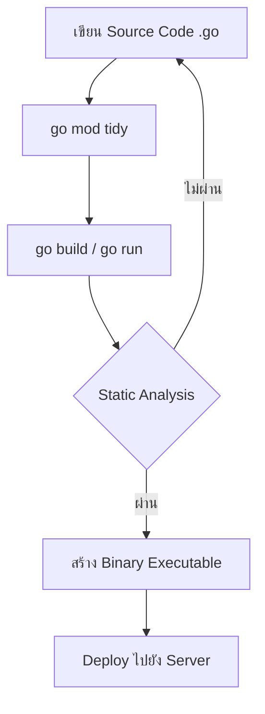

นี่คือเอกสาร **Golang Architecture** ฉบับภาษาไทย ตามโครงสร้างที่คุณระบุไว้ครับ

---

# สถาปัตยกรรมของภาษา Go (Golang Architecture)

## 1. บทนำ

ในยุคที่ระบบซอฟต์แวร์มีความซับซ้อนสูงขึ้น ความต้องการภาษาโปรแกรมมิ่งที่สามารถทำงานได้อย่างมีประสิทธิภาพ รองรับการทำงานแบบพร้อมกัน (Concurrency) และมีโครงสร้างที่เรียบง่ายแต่ทรงพลัง จึงเป็นสิ่งสำคัญยิ่ง ภาษา Go (หรือ Golang) ซึ่งพัฒนาโดยวิศวกรของ Google ได้รับการออกแบบมาเพื่อตอบโจทย์เหล่านี้โดยเฉพาะ

เอกสารฉบับนี้มีวัตถุประสงค์เพื่ออธิบายสถาปัตยกรรมหลักของภาษา Go ตั้งแต่ระดับสูงจนถึงระดับต่ำ ครอบคลุมแนวคิดการออกแบบ องค์ประกอบสำคัญของระบบนิเวศ และการทำงานภายในของภาษา เพื่อให้ผู้อ่านสามารถเข้าใจถึงที่มา โครงสร้าง และหลักการทำงานที่ทำให้ภาษา Go กลายเป็นหนึ่งในภาษาที่ได้รับความนิยมสูงสุดสำหรับการพัฒนา Backend, Cloud-Native, Microservices และระบบโครงสร้างพื้นฐานในปัจจุบัน

---

## 2. บทนิยาม

ในบริบทของเอกสารนี้ คำศัพท์สำคัญมีคำจำกัดความดังนี้:

| คำศัพท์ | คำนิยาม |
| :--- | :--- |
| **Go (Golang)** | ภาษาโปรแกรมมิ่งแบบคอมไพล์ (Compiled Language) ที่มีระบบจัดการหน่วยความจำอัตโนมัติ (Garbage Collection) รองรับการเขียนโปรแกรมเชิงโครงสร้างและเชิงวัตถุบางส่วน โดยเน้นความเรียบง่ายและประสิทธิภาพสูง |
| **สถาปัตยกรรมภาษา (Language Architecture)** | โครงสร้างและองค์ประกอบโดยรวมของภาษา รวมถึงคอมไพเลอร์ (Compiler) รันไทม์ (Runtime) ไลบรารีมาตรฐาน (Standard Library) และเครื่องมือที่เกี่ยวข้อง ซึ่งทำงานประสานกันเพื่อให้ภาษา Go ทำงานได้ตามที่ออกแบบไว้ |
| **Goroutine** | หน่วยการทำงานขนาดเล็กที่ทำงานพร้อมกัน (Concurrent Unit) ซึ่งจัดการโดยรันไทม์ของ Go มีขนาดเบากว่าเธรด (Thread) ของระบบปฏิบัติการอย่างมาก |
| **Channel** | โครงสร้างข้อมูลพื้นฐานสำหรับการสื่อสารและการซิงโครไนซ์ระหว่าง Goroutines ตามแนวคิด “Don't communicate by sharing memory; share memory by communicating.” |
| **Garbage Collector (GC)** | ระบบจัดการหน่วยความจำอัตโนมัติที่คอยตรวจจับและปล่อยคืนหน่วยความจำที่ไม่ได้ถูกใช้งานแล้ว เพื่อป้องกันปัญหา Memory Leak |
| **Compiler** | โปรแกรมที่แปลงซอร์สโค้ดภาษา Go ให้เป็นไฟล์สั่งการไบนารี (Binary Executable) ที่เครื่องสามารถทำงานได้โดยตรง |
| **Runtime** | ส่วนประกอบที่ฝังอยู่ในโปรแกรม Go ทุกตัว ทำหน้าที่จัดการ Goroutines, Garbage Collection, การทำงานของ Channel และการติดต่อกับระบบปฏิบัติการ |

---

## 3. บทหัวข้อ (สารบัญ)

1.  บทนำ
2.  บทนิยาม
3.  บทหัวข้อ
4.  หลักการออกแบบหลัก (Core Design Principles)
    *   ความเรียบง่าย (Simplicity)
    *   ความชัดเจน (Readability)
    *   ประสิทธิภาพ (Performance)
    *   การทำงานพร้อมกันเป็นหลัก (Concurrency as First-Class Citizen)
5.  สถาปัตยกรรมของคอมไพเลอร์ Go
    *   โครงสร้างของคอมไพเลอร์
    *   ขั้นตอนการคอมไพล์ (Compilation Pipeline)
6.  ระบบรันไทม์ (Runtime Architecture)
    *   โมเดลการทำงานพร้อมกัน: GMP Model (Goroutine, Machine, Processor)
    *   กลไก Garbage Collection: Concurrent, Tri-color Mark and Sweep
    *   การจัดการ Stack แบบ Dynamic
7.  โครงสร้างของโปรเจกต์ Go (Project Structure)
    *   โมดูล (Modules) และการจัดการ Dependencies
    *   รูปแบบการจัดโครงสร้างโฟลเดอร์ที่แนะนำ
8.  ระบบนิเวศและเครื่องมือ (Ecosystem & Tooling)
    *   `go` command และเครื่องมือในตัว
    *   การจัดการ Dependencies ด้วย `go mod`
    *   Static Analysis และ Code Formatting (`gofmt`, `go vet`)
9.  สรุป
10. เอกสารอ้างอิง

---

## 5. ออกแบบคู่มือ (การใช้งานสถาปัตยกรรม Go)

คู่มือส่วนนี้จะอธิบายวิธีใช้ประโยชน์จากสถาปัตยกรรมของ Go ในการพัฒนาแอปพลิเคชันจริง

### 5.1 การใช้ Goroutines และ Channels อย่างถูกต้อง

สถาปัตยกรรมของ Go ได้รับการออกแบบให้ใช้ Goroutines และ Channels เป็นหลัก

**หลักการ:** เริ่มต้น Goroutine ด้วยคีย์เวิร์ด `go` และสื่อสารระหว่าง Goroutines ผ่าน `channel`

**ตัวอย่าง: การประมวลผลข้อมูลแบบขนาน**
```go
package main

import (
    "fmt"
    "time"
)

func worker(id int, jobs <-chan int, results chan<- int) {
    for job := range jobs {
        fmt.Printf("Worker %d กำลังประมวลผล job %d\n", id, job)
        time.Sleep(time.Second) // จำลองการทำงานหนัก
        results <- job * 2
    }
}

func main() {
    const numJobs = 5
    const numWorkers = 3

    jobs := make(chan int, numJobs)
    results := make(chan int, numJobs)

    // สร้าง Worker Pool ตามสถาปัตยกรรม GMP
    for w := 1; w <= numWorkers; w++ {
        go worker(w, jobs, results)
    }

    // ส่งงานเข้า Channel
    for j := 1; j <= numJobs; j++ {
        jobs <- j
    }
    close(jobs)

    // รับผลลัพธ์
    for a := 1; a <= numJobs; a++ {
        <-results
    }
}
```

### 5.2 การจัดการ Memory อย่างมีประสิทธิภาพด้วย Pointer และ GC

ถึงแม้ Go จะมี Garbage Collector ที่มีประสิทธิภาพ แต่การเขียนโค้ดที่ดีจะช่วยลดภาระของ GC ได้

*   **ใช้ Pointer กับ Struct ขนาดใหญ่:** เพื่อป้องกันการ Copy ข้อมูลที่ไม่จำเป็น
*   **หลีกเลี่ยงการสร้าง Slice/Map ใหม่บ่อยครั้ง:** จองขนาดล่วงหน้า (Pre-allocate) ด้วย `make([]int, 0, capacity)`
*   **ใช้ `sync.Pool`:** สำหรับเก็บ object ที่ถูกสร้างและทำลายซ้ำๆ เพื่อลดการสร้าง object ใหม่

### 5.3 การจัดโครงสร้างโปรเจกต์ตามมาตรฐาน

สถาปัตยกรรมของ Go ไม่ได้บังคับโครงสร้างโฟลเดอร์ตายตัว แต่แนวทางปฏิบัติที่นิยม (เช่น Standard Go Project Layout) มีดังนี้:

```
/myapp
├── cmd/                    # โฟลเดอร์สำหรับ entry point แต่ละแอป
│   └── myapp/
│       └── main.go
├── internal/               # โค้ดส่วนตัวที่ไม่อนุญาตให้ package อื่น import
│   ├── handler/
│   └── service/
├── pkg/                    # โค้ดที่สามารถถูกนำไปใช้โดย external projects ได้
│   └── utils/
├── api/                    # API definitions (Protobuf, OpenAPI)
├── go.mod                  # ไฟล์จัดการ dependencies
└── go.sum
```

---

## 6. ออกแบบ Workflow (ขั้นตอนการพัฒนาและการทำงานของระบบ)

Workflow นี้แสดงให้เห็นวงจรชีวิตของโค้ด Go ตั้งแต่การเขียนไปจนถึงการทำงานบนเครื่อง Server

### 6.1 Workflow การพัฒนา (Development Workflow)



**คำอธิบาย:**
1.  **เขียนโค้ด:** นักพัฒนาใช้เครื่องมือต่างๆ (VS Code, GoLand) ซึ่งใช้ `gopls` (Language Server) ในการวิเคราะห์โค้ดแบบ Real-time
2.  **จัดการ Dependencies:** ใช้ `go mod tidy` เพื่อดาวน์โหลดและลบ dependencies ที่ไม่ได้ใช้ โดยอ่านจาก `go.mod`
3.  **คอมไพล์:** `go build` จะเรียกใช้งานคอมไพเลอร์เพื่อแปลงโค้ดเป็นไบนารี
4.  **Static Analysis:** คอมไพเลอร์ Go จะทำการตรวจสอบชนิดข้อมูล (Type Checking), การประกาศตัวแปรที่ไม่ได้ใช้ (Unused Variables) และข้อผิดพลาดทางไวยากรณ์ ซึ่งช่วยลดข้อผิดพลาดตั้งแต่เนิ่นๆ
5.  **Deploy:** เนื่องจาก Go สร้างเป็นไฟล์ไบนารีเดียว (Single Binary) ที่รวมรันไทม์ไว้แล้ว การ Deploy จึงทำได้ง่าย ไม่ต้องติดตั้ง Runtime ภายนอกบนเซิร์ฟเวอร์

### 6.2 Workflow การทำงานรันไทม์ (Runtime Workflow)

เมื่อโปรแกรม Go ถูกสั่งให้ทำงาน สถาปัตยกรรมภายในจะทำงานตามลำดับดังนี้:

```mermaid
graph TB
    subgraph Main_Thread
        A[main() เริ่มทำงาน] --> B[Runtime Init (GC, Scheduler)]
        B --> C[สร้าง Main Goroutine]
    end

    subgraph GMP_Scheduler
        C --> D{Logical Processor (P)}
        D --> E[Machine (OS Thread) - M]
        E --> F[Execute Goroutine]
        F --> G{มี Channel I/O หรือ Syscall?}
        G -->|ใช่| H[Goroutine ถูกย้ายออกจาก P]
        H --> I[รอจนกว่า I/O พร้อม]
        I --> D
        G -->|ไม่ใช่| J[ทำงานต่อจนจบ]
        J --> K[Goroutine จบ, หน่วยความจำถูก GC เก็บ]
    end

    subgraph Garbage_Collection
        L[Concurrent Mark & Sweep] -.-> F
        L -.-> K
    end
```

**คำอธิบายลำดับการทำงาน:**
1.  **Startup:** เมื่อรันไบรนารี ระบบรันไทม์ (Runtime) จะเริ่มต้นก่อน โดยจะจัดสรรหน่วยความจำตั้งต้นสำหรับ Heap และ Stack รวมถึงเริ่มต้น Garbage Collector และ Network Poller
2.  **Scheduling (GMP):** เมื่อพบคีย์เวิร์ด `go` (เช่น `go myFunc()`), รันไทม์จะสร้าง Goroutine ใหม่และวางไว้ในคิวของ **Logical Processor (P)** เมื่อมี **Machine (M)** หรือ OS Thread ว่าง มันจะดึง Goroutine มาทำงาน
3.  **Concurrency:** หาก Goroutine ต้องรอ (เช่น อ่านข้อมูลจาก Channel หรือรอ Network I/O), Scheduler จะทำการ "ยึด" (Preempt) Goroutine นั้นออกจาก OS Thread โดยอัตโนมัติ และนำ Goroutine อื่นที่พร้อมทำงานมาแทนที่ทันที ทำให้เกิดประสิทธิภาพสูง
4.  **Memory Management:** ขณะที่โปรแกรมทำงาน Garbage Collector จะทำงานแบบ Concurrent (พร้อมกัน) ไปกับ Goroutines อื่นๆ โดยใช้เทคนิค **Tri-color Mark and Sweep** เพื่อค้นหาและปลดปล่อยหน่วยความจำโดยไม่ต้องหยุดโปรแกรมนาน (Low Pause Time)
5.  **Shutdown:** เมื่อฟังก์ชัน `main` สิ้นสุดลง โปรแกรมจะจบการทำงานทันที โดยไม่ต้องรอให้ Goroutine อื่นๆ ทำงานเสร็จ (ยกเว้นจะมีการใช้ WaitGroup หรือกลไกอื่นเพื่อรอ)

---

## เอกสารอ้างอิง

1.  The Go Programming Language Specification - [https://go.dev/ref/spec](https://go.dev/ref/spec)
2.  Go: The Complete Guide (Bodner, Jon)
3.  Analysis of the Go Runtime Scheduler - [https://www.youtube.com/watch?v=YHRO5WQgh0s](https://www.youtube.com/watch?v=YHRO5WQgh0s)
4.  Go Blog: The Go Memory Model - [https://go.dev/ref/mem](https://go.dev/ref/mem)

---