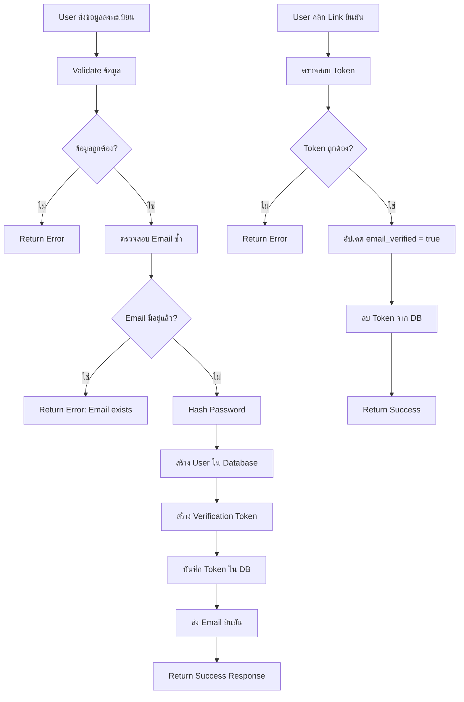
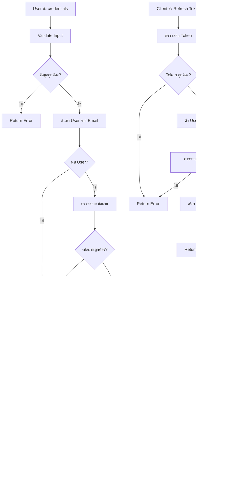
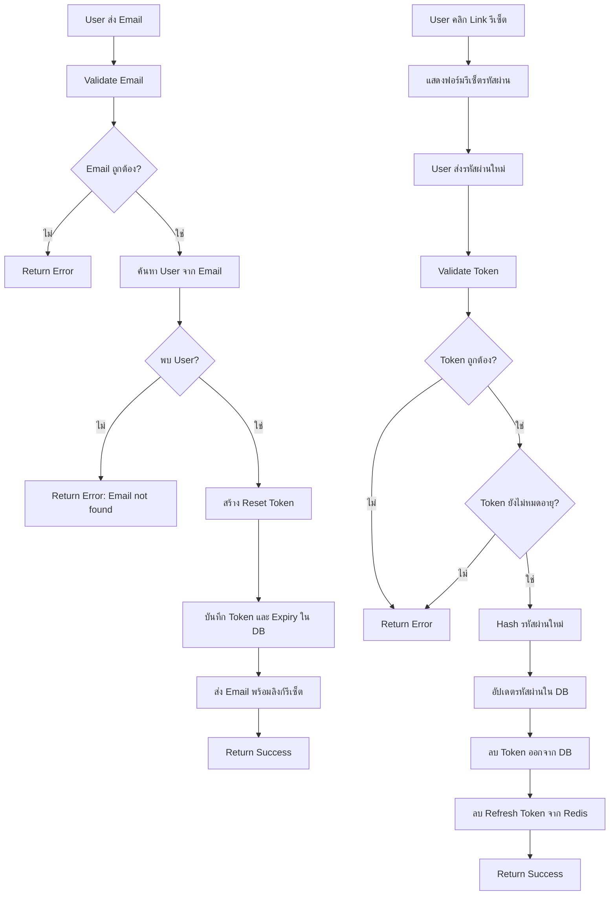
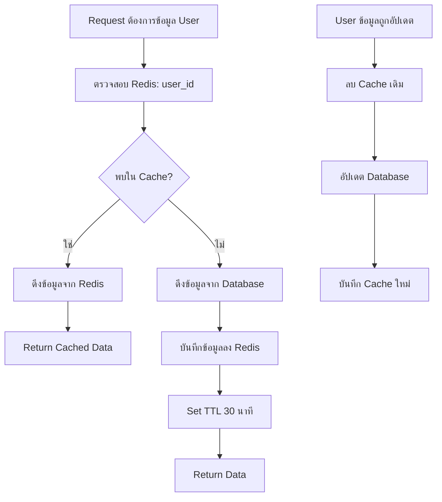

# บทนำ

ระบบ Authentication Service ที่พัฒนาด้วยภาษา Go โดยประยุกต์ใช้สถาปัตยกรรมแบบ DDD (Domain-Driven Design) ร่วมกับ Clean Architecture เพื่อสร้างระบบจัดการการยืนยันตัวตนที่มีความปลอดภัยสูง มีประสิทธิภาพ และสามารถบำรุงรักษาได้ง่าย ระบบรองรับการทำงานหลักๆ ได้แก่ การลงทะเบียน การเข้าสู่ระบบ การจัดการ Token (JWT และ Refresh Token) การยืนยันอีเมล และการลืมรหัสผ่าน โดยมีการจัดเก็บ Refresh Token ใน Redis และ Cache ข้อมูลผู้ใช้เพื่อเพิ่มประสิทธิภาพการทำงาน

# บทนิยาม

## 1. Domain Layer (ชั้นโดเมน)
- **Entity**: ตัวแบบหลักของระบบ เช่น User, Token
- **Value Object**: วัตถุที่ไม่มีความเป็นเอกลักษณ์เฉพาะตัว เช่น Email, Password
- **Repository Interface**: อินเตอร์เฟสที่กำหนดวิธีการเข้าถึงข้อมูล

## 2. Application Layer (ชั้นแอปพลิเคชัน)
- **UseCase**: บริการที่ประสานงานระหว่าง Domain และ Infrastructure
- **DTO**: Data Transfer Object สำหรับรับส่งข้อมูลระหว่างชั้นต่างๆ

## 3. Infrastructure Layer (ชั้นโครงสร้างพื้นฐาน)
- **Repository Implementation**: การนำอินเตอร์เฟส Repository ไปใช้งานจริง
- **Database Connection**: การเชื่อมต่อ MySQL/PostgreSQL ด้วย GORM
- **Cache Layer**: การจัดการ Redis สำหรับ Token และ Cache
- **External Services**: Email Service, JWT Service

## 4. Interface Layer (ชั้นติดต่อกับผู้ใช้)
- **Delivery/API**: HTTP Handlers และ Middleware
- **Request/Response**: โครงสร้างข้อมูลสำหรับ API

# บทหัวข้อ

## 1. การออกแบบโครงสร้างโปรเจค
### 1.1 Directory Structure
```
project/
├── cmd/
│   └── api/
│       └── main.go
├── internal/
│   ├── domain/
│   │   ├── entities/
│   │   ├── valueobjects/
│   │   └── repositories/
│   ├── application/
│   │   ├── usecases/
│   │   └── dtos/
│   ├── infrastructure/
│   │   ├── database/
│   │   ├── cache/
│   │   ├── email/
│   │   └── auth/
│   └── interfaces/
│       ├── api/
│       ├── middleware/
│       └── responses/
├── pkg/
│   ├── config/
│   ├── logger/
│   └── utils/
├── migrations/
├── scripts/
├── .env
├── go.mod
└── Makefile
```

## 2. การออกแบบฐานข้อมูล
### 2.1 User Table
- id (uuid)
- email (varchar, unique)
- password_hash (varchar)
- email_verified (boolean)
- email_verify_token (varchar)
- email_verify_expiry (datetime)
- reset_password_token (varchar)
- reset_password_expiry (datetime)
- created_at (datetime)
- updated_at (datetime)

## 3. การออกแบบ Redis Structure
### 3.1 Refresh Token
- Key: `refresh_token:{user_id}`
- Value: token string
- TTL: 7 days

### 3.2 User Cache
- Key: `user:{user_id}`
- Value: JSON user data
- TTL: 30 minutes

# คู่มือการใช้งาน

## 1. การติดตั้งและตั้งค่าโปรเจค

### 1.1 ความต้องการของระบบ
- Go 1.21+
- MySQL 8.0+ หรือ PostgreSQL 13+
- Redis 7.0+
- Air (สำหรับ hot-reload)

### 1.2 ขั้นตอนการติดตั้ง
```bash
# Clone โปรเจค
git clone <repository-url>
cd project

# ติดตั้ง dependencies
go mod download

# ติดตั้ง air สำหรับ hot-reload
go install github.com/cosmtrek/air@latest

# ติดตั้ง goose สำหรับ migration
go install github.com/pressly/goose/v3/cmd/goose@latest

# คัดลอกไฟล์ environment
cp .env.example .env

# แก้ไขไฟล์ .env ให้ตรงกับการตั้งค่า
```

### 1.3 การตั้งค่า Environment Variables
```env
# Application
APP_NAME=auth-service
APP_ENV=development
APP_PORT=8080
APP_DEBUG=true

# Database
DB_DRIVER=mysql
DB_HOST=localhost
DB_PORT=3306
DB_USER=root
DB_PASSWORD=password
DB_NAME=auth_db

# Redis
REDIS_HOST=localhost
REDIS_PORT=6379
REDIS_PASSWORD=
REDIS_DB=0

# JWT
JWT_SECRET=your-secret-key
JWT_ACCESS_TTL=15
JWT_REFRESH_TTL=10080

# Email
SMTP_HOST=smtp.gmail.com
SMTP_PORT=587
SMTP_USER=your-email@gmail.com
SMTP_PASSWORD=your-app-password
EMAIL_FROM=noreply@yourapp.com
```

## 2. การรันโปรเจค

### 2.1 รันด้วย Air (Hot-reload)
```bash
air
```

### 2.2 รันด้วย Go
```bash
go run cmd/api/main.go
```

### 2.3 Build Binary
```bash
go build -o bin/api cmd/api/main.go
./bin/api
```

## 3. API Endpoints

### 3.1 การลงทะเบียน
```http
POST /api/v1/auth/register
Content-Type: application/json

{
    "email": "user@example.com",
    "password": "Password123!",
    "confirm_password": "Password123!"
}

Response:
{
    "status": "success",
    "message": "Registration successful. Please verify your email.",
    "data": {
        "user_id": "550e8400-e29b-41d4-a716-446655440000"
    }
}
```

### 3.2 การยืนยันอีเมล
```http
GET /api/v1/auth/verify-email?token={verification_token}

Response:
{
    "status": "success",
    "message": "Email verified successfully"
}
```

### 3.3 การเข้าสู่ระบบ
```http
POST /api/v1/auth/login
Content-Type: application/json

{
    "email": "user@example.com",
    "password": "Password123!"
}

Response:
{
    "status": "success",
    "data": {
        "access_token": "eyJhbGciOiJIUzI1NiIs...",
        "refresh_token": "eyJhbGciOiJIUzI1NiIs...",
        "token_type": "Bearer",
        "expires_in": 900
    }
}
```

### 3.4 การ Refresh Token
```http
POST /api/v1/auth/refresh
Authorization: Bearer {refresh_token}

Response:
{
    "status": "success",
    "data": {
        "access_token": "eyJhbGciOiJIUzI1NiIs...",
        "token_type": "Bearer",
        "expires_in": 900
    }
}
```

### 3.5 การลืมรหัสผ่าน
```http
POST /api/v1/auth/forgot-password
Content-Type: application/json

{
    "email": "user@example.com"
}

Response:
{
    "status": "success",
    "message": "Password reset link sent to your email"
}
```

### 3.6 การรีเซ็ตรหัสผ่าน
```http
POST /api/v1/auth/reset-password
Content-Type: application/json

{
    "token": "reset_token_from_email",
    "password": "NewPassword123!",
    "confirm_password": "NewPassword123!"
}

Response:
{
    "status": "success",
    "message": "Password reset successfully"
}
```

# Workflow การทำงาน

## 1. Workflow การลงทะเบียนและยืนยันอีเมล



## 2. Workflow การเข้าสู่ระบบและการจัดการ Token



## 3. Workflow การลืมรหัสผ่านและรีเซ็ตรหัสผ่าน



## 4. Workflow การ Cache User



# ตัวอย่าง Code การใช้งานจริง

## 1. Domain Layer

### 1.1 Entity: User
```go
// internal/domain/entities/user.go
package entities

import (
    "time"
    "github.com/google/uuid"
)

type User struct {
    ID                   uuid.UUID `gorm:"type:uuid;primary_key"`
    Email                string    `gorm:"uniqueIndex;not null"`
    PasswordHash         string    `gorm:"not null"`
    EmailVerified        bool      `gorm:"default:false"`
    EmailVerifyToken     string    `gorm:"index"`
    EmailVerifyExpiry    *time.Time
    ResetPasswordToken   string    `gorm:"index"`
    ResetPasswordExpiry  *time.Time
    CreatedAt            time.Time
    UpdatedAt            time.Time
}

func (u *User) BeforeCreate() error {
    if u.ID == uuid.Nil {
        u.ID = uuid.New()
    }
    return nil
}

func (u *User) VerifyEmail() error {
    if u.EmailVerified {
        return ErrEmailAlreadyVerified
    }
    
    if u.EmailVerifyExpiry != nil && time.Now().After(*u.EmailVerifyExpiry) {
        return ErrVerificationTokenExpired
    }
    
    u.EmailVerified = true
    u.EmailVerifyToken = ""
    u.EmailVerifyExpiry = nil
    return nil
}

func (u *User) SetResetPasswordToken(token string, expiry time.Duration) {
    u.ResetPasswordToken = token
    expiryTime := time.Now().Add(expiry)
    u.ResetPasswordExpiry = &expiryTime
}

func (u *User) CanResetPassword(token string) bool {
    if u.ResetPasswordToken != token {
        return false
    }
    
    if u.ResetPasswordExpiry == nil {
        return false
    }
    
    return time.Now().Before(*u.ResetPasswordExpiry)
}
```

### 1.2 Repository Interface
```go
// internal/domain/repositories/user_repository.go
package repositories

import (
    "context"
    "github.com/google/uuid"
    "your-project/internal/domain/entities"
)

type UserRepository interface {
    Create(ctx context.Context, user *entities.User) error
    FindByID(ctx context.Context, id uuid.UUID) (*entities.User, error)
    FindByEmail(ctx context.Context, email string) (*entities.User, error)
    FindByVerifyToken(ctx context.Context, token string) (*entities.User, error)
    FindByResetToken(ctx context.Context, token string) (*entities.User, error)
    Update(ctx context.Context, user *entities.User) error
    Delete(ctx context.Context, id uuid.UUID) error
}

type TokenRepository interface {
    SaveRefreshToken(ctx context.Context, userID uuid.UUID, token string, ttl time.Duration) error
    GetRefreshToken(ctx context.Context, userID uuid.UUID) (string, error)
    DeleteRefreshToken(ctx context.Context, userID uuid.UUID) error
    CacheUser(ctx context.Context, user *entities.User, ttl time.Duration) error
    GetCachedUser(ctx context.Context, userID uuid.UUID) (*entities.User, error)
    DeleteCachedUser(ctx context.Context, userID uuid.UUID) error
}
```

## 2. Application Layer

### 2.1 UseCase: Register
```go
// internal/application/usecases/auth_usecase.go
package usecases

import (
    "context"
    "crypto/rand"
    "encoding/base64"
    "time"
    "your-project/internal/domain/entities"
    "your-project/internal/domain/repositories"
    "your-project/internal/application/dtos"
    "golang.org/x/crypto/bcrypt"
)

type AuthUseCase struct {
    userRepo      repositories.UserRepository
    tokenRepo     repositories.TokenRepository
    emailService  EmailService
    jwtService    JWTService
    config        *Config
}

func NewAuthUseCase(
    userRepo repositories.UserRepository,
    tokenRepo repositories.TokenRepository,
    emailService EmailService,
    jwtService JWTService,
    config *Config,
) *AuthUseCase {
    return &AuthUseCase{
        userRepo:     userRepo,
        tokenRepo:    tokenRepo,
        emailService: emailService,
        jwtService:   jwtService,
        config:       config,
    }
}

func (uc *AuthUseCase) Register(ctx context.Context, req dtos.RegisterRequest) (*dtos.RegisterResponse, error) {
    // Validate request
    if err := req.Validate(); err != nil {
        return nil, err
    }
    
    // Check if user exists
    existingUser, _ := uc.userRepo.FindByEmail(ctx, req.Email)
    if existingUser != nil {
        return nil, ErrEmailAlreadyExists
    }
    
    // Hash password
    hashedPassword, err := bcrypt.GenerateFromPassword([]byte(req.Password), bcrypt.DefaultCost)
    if err != nil {
        return nil, err
    }
    
    // Create verification token
    verifyToken, err := generateRandomToken(32)
    if err != nil {
        return nil, err
    }
    
    expiry := time.Now().Add(24 * time.Hour)
    
    // Create user entity
    user := &entities.User{
        Email:               req.Email,
        PasswordHash:        string(hashedPassword),
        EmailVerifyToken:    verifyToken,
        EmailVerifyExpiry:   &expiry,
    }
    
    // Save user
    if err := uc.userRepo.Create(ctx, user); err != nil {
        return nil, err
    }
    
    // Send verification email
    if err := uc.emailService.SendVerificationEmail(req.Email, verifyToken); err != nil {
        // Log error but don't fail registration
        // You might want to implement retry logic here
    }
    
    return &dtos.RegisterResponse{
        UserID:  user.ID,
        Message: "Registration successful. Please verify your email.",
    }, nil
}

func (uc *AuthUseCase) Login(ctx context.Context, req dtos.LoginRequest) (*dtos.LoginResponse, error) {
    // Validate request
    if err := req.Validate(); err != nil {
        return nil, err
    }
    
    // Find user
    user, err := uc.userRepo.FindByEmail(ctx, req.Email)
    if err != nil {
        return nil, ErrInvalidCredentials
    }
    
    // Check password
    if err := bcrypt.CompareHashAndPassword([]byte(user.PasswordHash), []byte(req.Password)); err != nil {
        return nil, ErrInvalidCredentials
    }
    
    // Check email verification
    if !user.EmailVerified {
        return nil, ErrEmailNotVerified
    }
    
    // Generate tokens
    accessToken, err := uc.jwtService.GenerateAccessToken(user.ID)
    if err != nil {
        return nil, err
    }
    
    refreshToken, err := uc.jwtService.GenerateRefreshToken(user.ID)
    if err != nil {
        return nil, err
    }
    
    // Save refresh token to Redis
    ttl := time.Duration(uc.config.JWTRefreshTTL) * time.Minute
    if err := uc.tokenRepo.SaveRefreshToken(ctx, user.ID, refreshToken, ttl); err != nil {
        return nil, err
    }
    
    // Cache user data
    cacheTTL := 30 * time.Minute
    if err := uc.tokenRepo.CacheUser(ctx, user, cacheTTL); err != nil {
        // Log error but don't fail login
    }
    
    return &dtos.LoginResponse{
        AccessToken:  accessToken,
        RefreshToken: refreshToken,
        TokenType:    "Bearer",
        ExpiresIn:    uc.config.JWTAccessTTL * 60,
    }, nil
}

func generateRandomToken(length int) (string, error) {
    bytes := make([]byte, length)
    if _, err := rand.Read(bytes); err != nil {
        return "", err
    }
    return base64.URLEncoding.EncodeToString(bytes), nil
}
```

## 3. Infrastructure Layer

### 3.1 Repository Implementation
```go
// internal/infrastructure/database/user_repository.go
package database

import (
    "context"
    "errors"
    "github.com/google/uuid"
    "gorm.io/gorm"
    "your-project/internal/domain/entities"
    "your-project/internal/domain/repositories"
)

type userRepository struct {
    db *gorm.DB
}

func NewUserRepository(db *gorm.DB) repositories.UserRepository {
    return &userRepository{db: db}
}

func (r *userRepository) Create(ctx context.Context, user *entities.User) error {
    return r.db.WithContext(ctx).Create(user).Error
}

func (r *userRepository) FindByID(ctx context.Context, id uuid.UUID) (*entities.User, error) {
    var user entities.User
    err := r.db.WithContext(ctx).Where("id = ?", id).First(&user).Error
    if errors.Is(err, gorm.ErrRecordNotFound) {
        return nil, repositories.ErrUserNotFound
    }
    return &user, err
}

func (r *userRepository) FindByEmail(ctx context.Context, email string) (*entities.User, error) {
    var user entities.User
    err := r.db.WithContext(ctx).Where("email = ?", email).First(&user).Error
    if errors.Is(err, gorm.ErrRecordNotFound) {
        return nil, repositories.ErrUserNotFound
    }
    return &user, err
}

func (r *userRepository) FindByVerifyToken(ctx context.Context, token string) (*entities.User, error) {
    var user entities.User
    err := r.db.WithContext(ctx).
        Where("email_verify_token = ? AND email_verified = ?", token, false).
        First(&user).Error
    if errors.Is(err, gorm.ErrRecordNotFound) {
        return nil, repositories.ErrUserNotFound
    }
    return &user, err
}

func (r *userRepository) Update(ctx context.Context, user *entities.User) error {
    return r.db.WithContext(ctx).Save(user).Error
}

func (r *userRepository) Delete(ctx context.Context, id uuid.UUID) error {
    return r.db.WithContext(ctx).Delete(&entities.User{}, id).Error
}
```

### 3.2 Redis Repository
```go
// internal/infrastructure/cache/redis_repository.go
package cache

import (
    "context"
    "encoding/json"
    "time"
    "github.com/go-redis/redis/v8"
    "github.com/google/uuid"
    "your-project/internal/domain/entities"
    "your-project/internal/domain/repositories"
)

type tokenRepository struct {
    client *redis.Client
}

func NewTokenRepository(client *redis.Client) repositories.TokenRepository {
    return &tokenRepository{client: client}
}

func (r *tokenRepository) SaveRefreshToken(ctx context.Context, userID uuid.UUID, token string, ttl time.Duration) error {
    key := "refresh_token:" + userID.String()
    return r.client.Set(ctx, key, token, ttl).Err()
}

func (r *tokenRepository) GetRefreshToken(ctx context.Context, userID uuid.UUID) (string, error) {
    key := "refresh_token:" + userID.String()
    return r.client.Get(ctx, key).Result()
}

func (r *tokenRepository) DeleteRefreshToken(ctx context.Context, userID uuid.UUID) error {
    key := "refresh_token:" + userID.String()
    return r.client.Del(ctx, key).Err()
}

func (r *tokenRepository) CacheUser(ctx context.Context, user *entities.User, ttl time.Duration) error {
    key := "user:" + user.ID.String()
    data, err := json.Marshal(user)
    if err != nil {
        return err
    }
    return r.client.Set(ctx, key, data, ttl).Err()
}

func (r *tokenRepository) GetCachedUser(ctx context.Context, userID uuid.UUID) (*entities.User, error) {
    key := "user:" + userID.String()
    data, err := r.client.Get(ctx, key).Bytes()
    if err != nil {
        if err == redis.Nil {
            return nil, repositories.ErrUserNotFound
        }
        return nil, err
    }
    
    var user entities.User
    if err := json.Unmarshal(data, &user); err != nil {
        return nil, err
    }
    
    return &user, nil
}

func (r *tokenRepository) DeleteCachedUser(ctx context.Context, userID uuid.UUID) error {
    key := "user:" + userID.String()
    return r.client.Del(ctx, key).Err()
}
```

## 4. Interface Layer

### 4.1 HTTP Handler
```go
// internal/interfaces/api/auth_handler.go
package api

import (
    "net/http"
    "github.com/go-chi/chi/v5"
    "github.com/go-chi/render"
    "your-project/internal/application/usecases"
    "your-project/internal/application/dtos"
    "your-project/internal/interfaces/middleware"
)

type AuthHandler struct {
    authUseCase *usecases.AuthUseCase
}

func NewAuthHandler(authUseCase *usecases.AuthUseCase) *AuthHandler {
    return &AuthHandler{
        authUseCase: authUseCase,
    }
}

func (h *AuthHandler) Register(w http.ResponseWriter, r *http.Request) {
    var req dtos.RegisterRequest
    if err := render.Decode(r, &req); err != nil {
        render.Render(w, r, ErrInvalidRequest(err))
        return
    }
    
    resp, err := h.authUseCase.Register(r.Context(), req)
    if err != nil {
        render.Render(w, r, ErrInternalServer(err))
        return
    }
    
    render.JSON(w, r, resp)
}

func (h *AuthHandler) Login(w http.ResponseWriter, r *http.Request) {
    var req dtos.LoginRequest
    if err := render.Decode(r, &req); err != nil {
        render.Render(w, r, ErrInvalidRequest(err))
        return
    }
    
    resp, err := h.authUseCase.Login(r.Context(), req)
    if err != nil {
        switch err {
        case usecases.ErrInvalidCredentials:
            render.Render(w, r, ErrUnauthorized(err))
        case usecases.ErrEmailNotVerified:
            render.Render(w, r, ErrForbidden(err))
        default:
            render.Render(w, r, ErrInternalServer(err))
        }
        return
    }
    
    render.JSON(w, r, resp)
}

func (h *AuthHandler) RefreshToken(w http.ResponseWriter, r *http.Request) {
    // Get refresh token from Authorization header
    token := middleware.GetTokenFromHeader(r)
    if token == "" {
        render.Render(w, r, ErrUnauthorized(nil))
        return
    }
    
    resp, err := h.authUseCase.RefreshToken(r.Context(), token)
    if err != nil {
        render.Render(w, r, ErrUnauthorized(err))
        return
    }
    
    render.JSON(w, r, resp)
}

func (h *AuthHandler) VerifyEmail(w http.ResponseWriter, r *http.Request) {
    token := r.URL.Query().Get("token")
    if token == "" {
        render.Render(w, r, ErrInvalidRequest(nil))
        return
    }
    
    err := h.authUseCase.VerifyEmail(r.Context(), token)
    if err != nil {
        render.Render(w, r, ErrBadRequest(err))
        return
    }
    
    render.JSON(w, r, map[string]interface{}{
        "status":  "success",
        "message": "Email verified successfully",
    })
}

func (h *AuthHandler) ForgotPassword(w http.ResponseWriter, r *http.Request) {
    var req dtos.ForgotPasswordRequest
    if err := render.Decode(r, &req); err != nil {
        render.Render(w, r, ErrInvalidRequest(err))
        return
    }
    
    err := h.authUseCase.ForgotPassword(r.Context(), req.Email)
    if err != nil {
        render.Render(w, r, ErrBadRequest(err))
        return
    }
    
    render.JSON(w, r, map[string]interface{}{
        "status":  "success",
        "message": "Password reset link sent to your email",
    })
}

func (h *AuthHandler) ResetPassword(w http.ResponseWriter, r *http.Request) {
    var req dtos.ResetPasswordRequest
    if err := render.Decode(r, &req); err != nil {
        render.Render(w, r, ErrInvalidRequest(err))
        return
    }
    
    err := h.authUseCase.ResetPassword(r.Context(), req)
    if err != nil {
        render.Render(w, r, ErrBadRequest(err))
        return
    }
    
    render.JSON(w, r, map[string]interface{}{
        "status":  "success",
        "message": "Password reset successfully",
    })
}
```

### 4.2 Router Setup
```go
// internal/interfaces/api/router.go
package api

import (
    "github.com/go-chi/chi/v5"
    "github.com/go-chi/chi/v5/middleware"
    "github.com/go-chi/cors"
    "your-project/internal/interfaces/middleware/auth"
)

func SetupRouter(
    authHandler *AuthHandler,
    jwtService JWTService,
) *chi.Mux {
    r := chi.NewRouter()
    
    // Global middleware
    r.Use(middleware.Logger)
    r.Use(middleware.Recoverer)
    r.Use(middleware.RequestID)
    r.Use(cors.Handler(cors.Options{
        AllowedOrigins:   []string{"*"},
        AllowedMethods:   []string{"GET", "POST", "PUT", "DELETE", "OPTIONS"},
        AllowedHeaders:   []string{"Accept", "Authorization", "Content-Type"},
        ExposedHeaders:   []string{"Link"},
        AllowCredentials: true,
        MaxAge:           300,
    }))
    
    // Public routes
    r.Group(func(r chi.Router) {
        r.Post("/api/v1/auth/register", authHandler.Register)
        r.Post("/api/v1/auth/login", authHandler.Login)
        r.Get("/api/v1/auth/verify-email", authHandler.VerifyEmail)
        r.Post("/api/v1/auth/forgot-password", authHandler.ForgotPassword)
        r.Post("/api/v1/auth/reset-password", authHandler.ResetPassword)
    })
    
    // Protected routes
    r.Group(func(r chi.Router) {
        r.Use(auth.Middleware(jwtService))
        r.Post("/api/v1/auth/refresh", authHandler.RefreshToken)
        r.Post("/api/v1/auth/logout", authHandler.Logout)
        r.Get("/api/v1/auth/me", authHandler.GetProfile)
        r.Put("/api/v1/auth/me", authHandler.UpdateProfile)
    })
    
    return r
}
```

### 4.3 Main Application
```go
// cmd/api/main.go
package main

import (
    "context"
    "fmt"
    "log"
    "net/http"
    "os"
    "os/signal"
    "syscall"
    "time"
    
    "github.com/go-redis/redis/v8"
    "github.com/joho/godotenv"
    "gorm.io/driver/mysql"
    "gorm.io/gorm"
    "go.uber.org/zap"
    
    "your-project/internal/application/usecases"
    "your-project/internal/infrastructure/cache"
    "your-project/internal/infrastructure/database"
    "your-project/internal/infrastructure/email"
    "your-project/internal/infrastructure/auth"
    "your-project/internal/interfaces/api"
    "your-project/pkg/config"
    "your-project/pkg/logger"
)

func main() {
    // Load .env file
    if err := godotenv.Load(); err != nil {
        log.Println("Warning: .env file not found")
    }
    
    // Initialize logger
    zapLogger := logger.NewZapLogger()
    defer zapLogger.Sync()
    
    // Load configuration
    cfg, err := config.Load()
    if err != nil {
        zapLogger.Fatal("Failed to load config", zap.Error(err))
    }
    
    // Connect to database
    db, err := gorm.Open(mysql.Open(cfg.DatabaseDSN()), &gorm.Config{})
    if err != nil {
        zapLogger.Fatal("Failed to connect to database", zap.Error(err))
    }
    
    // Auto migrate
    if err := db.AutoMigrate(&entities.User{}); err != nil {
        zapLogger.Fatal("Failed to migrate database", zap.Error(err))
    }
    
    // Connect to Redis
    redisClient := redis.NewClient(&redis.Options{
        Addr:     cfg.RedisAddr,
        Password: cfg.RedisPassword,
        DB:       cfg.RedisDB,
    })
    
    // Test Redis connection
    if err := redisClient.Ping(context.Background()).Err(); err != nil {
        zapLogger.Fatal("Failed to connect to Redis", zap.Error(err))
    }
    
    // Initialize repositories
    userRepo := database.NewUserRepository(db)
    tokenRepo := cache.NewTokenRepository(redisClient)
    
    // Initialize services
    jwtService := auth.NewJWTService(cfg.JWTSecret, cfg.JWTAccessTTL, cfg.JWTRefreshTTL)
    emailService := email.NewEmailService(cfg)
    
    // Initialize usecases
    authUseCase := usecases.NewAuthUseCase(userRepo, tokenRepo, emailService, jwtService, cfg)
    
    // Initialize handlers
    authHandler := api.NewAuthHandler(authUseCase)
    
    // Setup router
    router := api.SetupRouter(authHandler, jwtService)
    
    // Create server
    srv := &http.Server{
        Addr:         fmt.Sprintf(":%d", cfg.AppPort),
        Handler:      router,
        ReadTimeout:  15 * time.Second,
        WriteTimeout: 15 * time.Second,
        IdleTimeout:  60 * time.Second,
    }
    
    // Start server in goroutine
    go func() {
        zapLogger.Info("Starting server", zap.Int("port", cfg.AppPort))
        if err := srv.ListenAndServe(); err != nil && err != http.ErrServerClosed {
            zapLogger.Fatal("Failed to start server", zap.Error(err))
        }
    }()
    
    // Graceful shutdown
    quit := make(chan os.Signal, 1)
    signal.Notify(quit, syscall.SIGINT, syscall.SIGTERM)
    <-quit
    
    zapLogger.Info("Shutting down server...")
    
    ctx, cancel := context.WithTimeout(context.Background(), 30*time.Second)
    defer cancel()
    
    if err := srv.Shutdown(ctx); err != nil {
        zapLogger.Fatal("Server forced to shutdown", zap.Error(err))
    }
    
    zapLogger.Info("Server exited")
}
```

## 5. DTOs and Validations

```go
// internal/application/dtos/auth_dto.go
package dtos

import (
    "regexp"
    "errors"
)

type RegisterRequest struct {
    Email           string `json:"email"`
    Password        string `json:"password"`
    ConfirmPassword string `json:"confirm_password"`
}

func (r *RegisterRequest) Validate() error {
    // Validate email
    emailRegex := regexp.MustCompile(`^[a-z0-9._%+\-]+@[a-z0-9.\-]+\.[a-z]{2,}$`)
    if !emailRegex.MatchString(r.Email) {
        return errors.New("invalid email format")
    }
    
    // Validate password strength
    if len(r.Password) < 8 {
        return errors.New("password must be at least 8 characters")
    }
    
    // Check if password contains at least one number
    if !regexp.MustCompile(`[0-9]`).MatchString(r.Password) {
        return errors.New("password must contain at least one number")
    }
    
    // Check if password contains at least one uppercase letter
    if !regexp.MustCompile(`[A-Z]`).MatchString(r.Password) {
        return errors.New("password must contain at least one uppercase letter")
    }
    
    // Check if passwords match
    if r.Password != r.ConfirmPassword {
        return errors.New("passwords do not match")
    }
    
    return nil
}

type LoginRequest struct {
    Email    string `json:"email"`
    Password string `json:"password"`
}

func (r *LoginRequest) Validate() error {
    if r.Email == "" {
        return errors.New("email is required")
    }
    if r.Password == "" {
        return errors.New("password is required")
    }
    return nil
}

type LoginResponse struct {
    AccessToken  string `json:"access_token"`
    RefreshToken string `json:"refresh_token"`
    TokenType    string `json:"token_type"`
    ExpiresIn    int    `json:"expires_in"`
}

type RegisterResponse struct {
    UserID  string `json:"user_id"`
    Message string `json:"message"`
}

type ForgotPasswordRequest struct {
    Email string `json:"email"`
}

func (r *ForgotPasswordRequest) Validate() error {
    if r.Email == "" {
        return errors.New("email is required")
    }
    return nil
}

type ResetPasswordRequest struct {
    Token           string `json:"token"`
    Password        string `json:"password"`
    ConfirmPassword string `json:"confirm_password"`
}

func (r *ResetPasswordRequest) Validate() error {
    if r.Token == "" {
        return errors.New("token is required")
    }
    
    if len(r.Password) < 8 {
        return errors.New("password must be at least 8 characters")
    }
    
    if r.Password != r.ConfirmPassword {
        return errors.New("passwords do not match")
    }
    
    return nil
}
```

## 6. Configuration

```go
// pkg/config/config.go
package config

import (
    "fmt"
    "os"
    "strconv"
)

type Config struct {
    AppName    string
    AppEnv     string
    AppPort    int
    AppDebug   bool
    
    // Database
    DBDriver   string
    DBHost     string
    DBPort     int
    DBUser     string
    DBPassword string
    DBName     string
    
    // Redis
    RedisHost     string
    RedisPort     int
    RedisPassword string
    RedisDB       int
    
    // JWT
    JWTSecret     string
    JWTAccessTTL  int // minutes
    JWTRefreshTTL int // minutes
    
    // Email
    SMTPHost     string
    SMTPPort     int
    SMTPUser     string
    SMTPPassword string
    EmailFrom    string
}

func Load() (*Config, error) {
    return &Config{
        AppName:  getEnv("APP_NAME", "auth-service"),
        AppEnv:   getEnv("APP_ENV", "development"),
        AppPort:  getEnvAsInt("APP_PORT", 8080),
        AppDebug: getEnvAsBool("APP_DEBUG", true),
        
        DBDriver:   getEnv("DB_DRIVER", "mysql"),
        DBHost:     getEnv("DB_HOST", "localhost"),
        DBPort:     getEnvAsInt("DB_PORT", 3306),
        DBUser:     getEnv("DB_USER", "root"),
        DBPassword: getEnv("DB_PASSWORD", ""),
        DBName:     getEnv("DB_NAME", "auth_db"),
        
        RedisHost:     getEnv("REDIS_HOST", "localhost"),
        RedisPort:     getEnvAsInt("REDIS_PORT", 6379),
        RedisPassword: getEnv("REDIS_PASSWORD", ""),
        RedisDB:       getEnvAsInt("REDIS_DB", 0),
        
        JWTSecret:     getEnv("JWT_SECRET", "default-secret-key"),
        JWTAccessTTL:  getEnvAsInt("JWT_ACCESS_TTL", 15),
        JWTRefreshTTL: getEnvAsInt("JWT_REFRESH_TTL", 10080),
        
        SMTPHost:     getEnv("SMTP_HOST", "smtp.gmail.com"),
        SMTPPort:     getEnvAsInt("SMTP_PORT", 587),
        SMTPUser:     getEnv("SMTP_USER", ""),
        SMTPPassword: getEnv("SMTP_PASSWORD", ""),
        EmailFrom:    getEnv("EMAIL_FROM", "noreply@yourapp.com"),
    }, nil
}

func (c *Config) DatabaseDSN() string {
    return fmt.Sprintf("%s:%s@tcp(%s:%d)/%s?charset=utf8mb4&parseTime=True&loc=Local",
        c.DBUser, c.DBPassword, c.DBHost, c.DBPort, c.DBName)
}

func (c *Config) RedisAddr() string {
    return fmt.Sprintf("%s:%d", c.RedisHost, c.RedisPort)
}

func getEnv(key, defaultValue string) string {
    if value := os.Getenv(key); value != "" {
        return value
    }
    return defaultValue
}

func getEnvAsInt(key string, defaultValue int) int {
    if value := os.Getenv(key); value != "" {
        if intVal, err := strconv.Atoi(value); err == nil {
            return intVal
        }
    }
    return defaultValue
}

func getEnvAsBool(key string, defaultValue bool) bool {
    if value := os.Getenv(key); value != "" {
        if boolVal, err := strconv.ParseBool(value); err == nil {
            return boolVal
        }
    }
    return defaultValue
}
```

## 7. Middleware

```go
// internal/interfaces/middleware/auth/middleware.go
package auth

import (
    "context"
    "net/http"
    "strings"
    
    "github.com/google/uuid"
)

type contextKey string

const (
    UserIDKey contextKey = "user_id"
)

type JWTService interface {
    ValidateToken(token string) (uuid.UUID, error)
}

func Middleware(jwtService JWTService) func(http.Handler) http.Handler {
    return func(next http.Handler) http.Handler {
        return http.HandlerFunc(func(w http.ResponseWriter, r *http.Request) {
            // Get token from Authorization header
            authHeader := r.Header.Get("Authorization")
            if authHeader == "" {
                http.Error(w, "Authorization header required", http.StatusUnauthorized)
                return
            }
            
            // Check Bearer prefix
            parts := strings.Split(authHeader, " ")
            if len(parts) != 2 || strings.ToLower(parts[0]) != "bearer" {
                http.Error(w, "Invalid authorization header format", http.StatusUnauthorized)
                return
            }
            
            token := parts[1]
            
            // Validate token
            userID, err := jwtService.ValidateToken(token)
            if err != nil {
                http.Error(w, "Invalid or expired token", http.StatusUnauthorized)
                return
            }
            
            // Add user ID to context
            ctx := context.WithValue(r.Context(), UserIDKey, userID)
            next.ServeHTTP(w, r.WithContext(ctx))
        })
    }
}

func GetUserID(ctx context.Context) (uuid.UUID, error) {
    userID, ok := ctx.Value(UserIDKey).(uuid.UUID)
    if !ok {
        return uuid.Nil, ErrUserIDNotFound
    }
    return userID, nil
}

func GetTokenFromHeader(r *http.Request) string {
    authHeader := r.Header.Get("Authorization")
    if authHeader == "" {
        return ""
    }
    
    parts := strings.Split(authHeader, " ")
    if len(parts) != 2 || strings.ToLower(parts[0]) != "bearer" {
        return ""
    }
    
    return parts[1]
}
```

## 8. Email Service with Hermes

```go
// internal/infrastructure/email/email_service.go
package email

import (
    "crypto/tls"
    "fmt"
    "time"
    
    "github.com/gomail"
    "github.com/matcornic/hermes/v2"
    "your-project/pkg/config"
)

type EmailService struct {
    config *config.Config
    hermes hermes.Hermes
}

func NewEmailService(cfg *config.Config) *EmailService {
    h := hermes.Hermes{
        Product: hermes.Product{
            Name:      cfg.AppName,
            Link:      "https://yourapp.com",
            Logo:      "https://yourapp.com/logo.png",
            Copyright: fmt.Sprintf("© %d %s. All rights reserved.", time.Now().Year(), cfg.AppName),
        },
    }
    
    return &EmailService{
        config: cfg,
        hermes: h,
    }
}

func (s *EmailService) SendVerificationEmail(to, token string) error {
    email := hermes.Email{
        Body: hermes.Body{
            Name: to,
            Intros: []string{
                "Welcome to " + s.config.AppName + "!",
                "Please verify your email address to complete your registration.",
            },
            Actions: []hermes.Action{
                {
                    Instructions: "Click the button below to verify your email address:",
                    Button: hermes.Button{
                        Color: "#22BC66",
                        Text:  "Verify Email",
                        Link:  fmt.Sprintf("https://yourapp.com/verify-email?token=%s", token),
                    },
                },
            },
            Outros: []string{
                "If you didn't create an account with us, please ignore this email.",
                "This verification link will expire in 24 hours.",
            },
        },
    }
    
    return s.sendEmail(to, "Verify Your Email", email)
}

func (s *EmailService) SendResetPasswordEmail(to, token string) error {
    email := hermes.Email{
        Body: hermes.Body{
            Name: to,
            Intros: []string{
                "We received a request to reset your password.",
            },
            Actions: []hermes.Action{
                {
                    Instructions: "Click the button below to reset your password:",
                    Button: hermes.Button{
                        Color: "#DC4D2F",
                        Text:  "Reset Password",
                        Link:  fmt.Sprintf("https://yourapp.com/reset-password?token=%s", token),
                    },
                },
            },
            Outros: []string{
                "If you didn't request a password reset, please ignore this email.",
                "This password reset link will expire in 1 hour.",
            },
        },
    }
    
    return s.sendEmail(to, "Reset Your Password", email)
}

func (s *EmailService) sendEmail(to, subject string, email hermes.Email) error {
    // Generate HTML email body
    htmlBody, err := s.hermes.GenerateHTML(email)
    if err != nil {
        return fmt.Errorf("failed to generate email HTML: %w", err)
    }
    
    // Generate plain text email body
    textBody, err := s.hermes.GeneratePlainText(email)
    if err != nil {
        return fmt.Errorf("failed to generate email text: %w", err)
    }
    
    // Setup mailer
    m := gomail.NewMessage()
    m.SetHeader("From", s.config.EmailFrom)
    m.SetHeader("To", to)
    m.SetHeader("Subject", subject)
    m.SetBody("text/plain", textBody)
    m.AddAlternative("text/html", htmlBody)
    
    // Send email
    dialer := gomail.NewDialer(s.config.SMTPHost, s.config.SMTPPort, s.config.SMTPUser, s.config.SMTPPassword)
    dialer.TLSConfig = &tls.Config{InsecureSkipVerify: false}
    
    if err := dialer.DialAndSend(m); err != nil {
        return fmt.Errorf("failed to send email: %w", err)
    }
    
    return nil
}
```

## 9. JWT Service

```go
// internal/infrastructure/auth/jwt_service.go
package auth

import (
    "errors"
    "time"
    
    "github.com/golang-jwt/jwt/v5"
    "github.com/google/uuid"
)

type JWTService struct {
    secret       []byte
    accessTTL    time.Duration
    refreshTTL   time.Duration
}

type Claims struct {
    UserID string `json:"user_id"`
    Type   string `json:"type"` // "access" or "refresh"
    jwt.RegisteredClaims
}

func NewJWTService(secret string, accessTTL, refreshTTL int) *JWTService {
    return &JWTService{
        secret:     []byte(secret),
        accessTTL:  time.Duration(accessTTL) * time.Minute,
        refreshTTL: time.Duration(refreshTTL) * time.Minute,
    }
}

func (s *JWTService) GenerateAccessToken(userID uuid.UUID) (string, error) {
    return s.generateToken(userID, "access", s.accessTTL)
}

func (s *JWTService) GenerateRefreshToken(userID uuid.UUID) (string, error) {
    return s.generateToken(userID, "refresh", s.refreshTTL)
}

func (s *JWTService) generateToken(userID uuid.UUID, tokenType string, ttl time.Duration) (string, error) {
    claims := &Claims{
        UserID: userID.String(),
        Type:   tokenType,
        RegisteredClaims: jwt.RegisteredClaims{
            ExpiresAt: jwt.NewNumericDate(time.Now().Add(ttl)),
            IssuedAt:  jwt.NewNumericDate(time.Now()),
            NotBefore: jwt.NewNumericDate(time.Now()),
        },
    }
    
    token := jwt.NewWithClaims(jwt.SigningMethodHS256, claims)
    return token.SignedString(s.secret)
}

func (s *JWTService) ValidateToken(tokenString string) (uuid.UUID, error) {
    token, err := jwt.ParseWithClaims(tokenString, &Claims{}, func(token *jwt.Token) (interface{}, error) {
        if _, ok := token.Method.(*jwt.SigningMethodHMAC); !ok {
            return nil, errors.New("unexpected signing method")
        }
        return s.secret, nil
    })
    
    if err != nil {
        return uuid.Nil, err
    }
    
    claims, ok := token.Claims.(*Claims)
    if !ok || !token.Valid {
        return uuid.Nil, errors.New("invalid token")
    }
    
    // Check token type (optional, can be removed if not needed)
    if claims.Type != "access" {
        return uuid.Nil, errors.New("invalid token type")
    }
    
    userID, err := uuid.Parse(claims.UserID)
    if err != nil {
        return uuid.Nil, err
    }
    
    return userID, nil
}

func (s *JWTService) ValidateRefreshToken(tokenString string) (uuid.UUID, error) {
    token, err := jwt.ParseWithClaims(tokenString, &Claims{}, func(token *jwt.Token) (interface{}, error) {
        if _, ok := token.Method.(*jwt.SigningMethodHMAC); !ok {
            return nil, errors.New("unexpected signing method")
        }
        return s.secret, nil
    })
    
    if err != nil {
        return uuid.Nil, err
    }
    
    claims, ok := token.Claims.(*Claims)
    if !ok || !token.Valid {
        return uuid.Nil, errors.New("invalid token")
    }
    
    // Check token type
    if claims.Type != "refresh" {
        return uuid.Nil, errors.New("invalid token type")
    }
    
    userID, err := uuid.Parse(claims.UserID)
    if err != nil {
        return uuid.Nil, err
    }
    
    return userID, nil
}
```

## 10. Logger Setup

```go
// pkg/logger/logger.go
package logger

import (
    "go.uber.org/zap"
    "go.uber.org/zap/zapcore"
)

func NewZapLogger() *zap.Logger {
    config := zap.NewProductionConfig()
    config.EncoderConfig.EncodeTime = zapcore.ISO8601TimeEncoder
    config.EncoderConfig.TimeKey = "timestamp"
    config.EncoderConfig.CallerKey = "caller"
    
    logger, err := config.Build()
    if err != nil {
        panic(err)
    }
    
    return logger
}
```

## 11. Makefile

```makefile
.PHONY: run build test clean migrate-up migrate-down

run:
	air

build:
	go build -o bin/api cmd/api/main.go

test:
	go test -v ./...

clean:
	rm -rf bin/

migrate-up:
	goose -dir migrations mysql "user:password@tcp(localhost:3306)/auth_db" up

migrate-down:
	goose -dir migrations mysql "user:password@tcp(localhost:3306)/auth_db" down

migrate-create:
	goose -dir migrations create $(name) sql

deps:
	go mod download
	go mod tidy

docker-up:
	docker-compose up -d

docker-down:
	docker-compose down

.PHONY: help
help:
	@echo "Available commands:"
	@echo "  make run          - Run application with hot reload"
	@echo "  make build        - Build binary"
	@echo "  make test         - Run tests"
	@echo "  make clean        - Clean build artifacts"
	@echo "  make migrate-up   - Run database migrations"
	@echo "  make migrate-down - Rollback database migrations"
	@echo "  make deps         - Download and tidy dependencies"
	@echo "  make docker-up    - Start Docker containers"
	@echo "  make docker-down  - Stop Docker containers"
```

## 12. Docker Compose

```yaml
# docker-compose.yml
version: '3.8'

services:
  mysql:
    image: mysql:8.0
    container_name: auth-mysql
    environment:
      MYSQL_ROOT_PASSWORD: password
      MYSQL_DATABASE: auth_db
      MYSQL_USER: auth_user
      MYSQL_PASSWORD: auth_pass
    ports:
      - "3306:3306"
    volumes:
      - mysql_data:/var/lib/mysql
    networks:
      - auth-network

  redis:
    image: redis:7-alpine
    container_name: auth-redis
    ports:
      - "6379:6379"
    volumes:
      - redis_data:/data
    networks:
      - auth-network

  app:
    build: .
    container_name: auth-app
    ports:
      - "8080:8080"
    depends_on:
      - mysql
      - redis
    environment:
      DB_HOST: mysql
      REDIS_HOST: redis
    env_file:
      - .env
    networks:
      - auth-network
    volumes:
      - ./:/app

volumes:
  mysql_data:
  redis_data:

networks:
  auth-network:
    driver: bridge
```

## 13. Dockerfile

```dockerfile
# Dockerfile
FROM golang:1.21-alpine AS builder

WORKDIR /app

# Install dependencies
RUN apk add --no-cache git

# Copy go mod files
COPY go.mod go.sum ./
RUN go mod download

# Copy source code
COPY . .

# Build the application
RUN CGO_ENABLED=0 GOOS=linux go build -a -installsuffix cgo -o main cmd/api/main.go

# Final stage
FROM alpine:latest

RUN apk --no-cache add ca-certificates

WORKDIR /root/

# Copy binary from builder
COPY --from=builder /app/main .

# Copy configuration
COPY --from=builder /app/.env .env

EXPOSE 8080

CMD ["./main"]
```

## 14. Migration Example

```sql
-- migrations/20240101000001_create_users_table.sql
-- +goose Up
CREATE TABLE IF NOT EXISTS users (
    id CHAR(36) PRIMARY KEY,
    email VARCHAR(255) NOT NULL UNIQUE,
    password_hash VARCHAR(255) NOT NULL,
    email_verified BOOLEAN DEFAULT FALSE,
    email_verify_token VARCHAR(255),
    email_verify_expiry DATETIME,
    reset_password_token VARCHAR(255),
    reset_password_expiry DATETIME,
    created_at DATETIME NOT NULL DEFAULT CURRENT_TIMESTAMP,
    updated_at DATETIME NOT NULL DEFAULT CURRENT_TIMESTAMP ON UPDATE CURRENT_TIMESTAMP,
    
    INDEX idx_email (email),
    INDEX idx_email_verify_token (email_verify_token),
    INDEX idx_reset_password_token (reset_password_token)
) ENGINE=InnoDB DEFAULT CHARSET=utf8mb4 COLLATE=utf8mb4_unicode_ci;

-- +goose Down
DROP TABLE IF EXISTS users;
```

## สรุป

ระบบ Authentication Service ที่พัฒนาขึ้นนี้ใช้สถาปัตยกรรมแบบ DDD ร่วมกับ Clean Architecture ทำให้เกิดการแยกส่วนที่ชัดเจน มีความยืดหยุ่นสูง และง่ายต่อการบำรุงรักษา โดยมีคุณสมบัติหลักดังนี้:

1. **ความปลอดภัยสูง**: ใช้ JWT พร้อม Refresh Token, การเข้ารหัสรหัสผ่านด้วย bcrypt, และการยืนยันอีเมล
2. **ประสิทธิภาพ**: ใช้ Redis สำหรับ Cache ผู้ใช้และจัดเก็บ Refresh Token
3. **ขยายได้ง่าย**: โครงสร้างแบบ Modular ทำให้เพิ่มฟีเจอร์ใหม่ได้สะดวก
4. **การจัดการข้อผิดพลาดที่ดี**: มีการจัดการ error ที่ชัดเจนในแต่ละเลเยอร์
5. **Logging ที่สมบูรณ์**: ใช้ Zap สำหรับการ log ที่มีประสิทธิภาพ
6. **ทดสอบง่าย**: การแยกส่วนทำให้การเขียน unit test ทำได้ง่าย

ระบบนี้พร้อมสำหรับการนำไปใช้งานจริงและสามารถปรับแต่งเพิ่มเติมตามความต้องการของโครงการได้