 Go Restful API 

An API dev written in Golang with chi-route and Gorm. Write restful API with fast development and developer friendly.

## Architecture

In this project use 3 layer architecture

- Models
- Repository
- Usecase
- Delivery

## Features

- CRUD
- Jwt, refresh token saved in redis
- Cached user in redis
- Email verification
- Forget/reset password, send email

## Technical

- `chi`: router and middleware
- `viper`: configuration
- `cobra`: CLI features
- `gorm`: orm
- `validator`: data validation
- `jwt`: jwt authentication
- `zap`: logger
- `gomail`: email
- `hermes`: generate email body
- `air`: hot-reload

## Start Application

### Generate the Private and Public Keys

- Generate the private and public keys: [travistidwell.com/jsencrypt/demo/](https://travistidwell.com/jsencrypt/demo/)
- Copy the generated private key and visit this Base64 encoding website to convert it to base64
- Copy the base64 encoded key and add it to the `config/config-local.yml` file as `jwt`
- Similar for public key

### Stmp mail config

- Create [mailtrap](https://mailtrap.io/) account
- Create new inboxes
- Update smtp config `config/config-local.yml` file as `smtpEmail`

### Run
- `docker-compose up`
- OR  go run main.go serve  on loca Windows OS
- Swagger: [localhost:5000/swagger/](http://localhost:5000/swagger/)
- http://localhost:5000/swagger/index.html#/

```bash
  Email: root@gmail.com
  Password: root_password
```
## TODO

- Traefik
- Config using .env
- Linter
- Jaeger
- Production docker file version
- Mock database using gomock

## Acknowledgements

- [github.com/dhax/go-base](https://github.com/dhax/go-base)
- [github.com/akmamun/go-fication](https://github.com/akmamun/go-fication)
- [github.com/wpcodevo/golang-fiber-jwt](https://github.com/wpcodevo/golang-fiber-jwt)
- [github.com/wpcodevo/golang-fiber](https://github.com/wpcodevo/golang-fiber)
- [github.com/kienmatu/togo](https://github.com/kienmatu/togo)
- [github.com/AleksK1NG/Go-Clean-Architecture-REST-API](https://github.com/AleksK1NG/Go-Clean-Architecture-REST-API)
- [github.com/bxcodec/go-clean-arch](https://github.com/bxcodec/go-clean-arch)
- [codevoweb.com/golang-and-gorm-user-registration-email-verification/](https://codevoweb.com/golang-and-gorm-user-registration-email-verification/)
- [codevoweb.com/golang-gorm-postgresql-user-registration-with-refresh-tokens/](https://codevoweb.com/golang-gorm-postgresql-user-registration-with-refresh-tokens/)
- [codevoweb.com/how-to-implement-google-oauth2-in-golang/](https://codevoweb.com/how-to-implement-google-oauth2-in-golang/)
- [codevoweb.com/how-to-upload-single-and-multiple-files-in-golang/](https://codevoweb.com/how-to-upload-single-and-multiple-files-in-golang/)
- [codevoweb.com/forgot-reset-passwords-in-golang-with-html-email/](https://codevoweb.com/forgot-reset-passwords-in-golang-with-html-email/)
- [techmaster.vn/posts/34577/kien-truc-sach-voi-golang](https://techmaster.vn/posts/34577/kien-truc-sach-voi-golang)


### Installation

Perfect! You're setting up an existing Go project (gorestapi). Here's how to properly set it up and run it:

## Complete Setup Steps for Your gorestapi Project

```bash
# 1. Clone the repository
git clone https://gorestapi
cd gorestapi

# 2. Download and tidy up dependencies
go mod tidy

# 3. Verify the module is set up correctly
go mod verify


# Inside container or locally
go mod tidy
go mod download
go mod verify

# 4. Run the application
go run main.go serve

# Or if the main file is in cmd directory:
go run cmd/gorestapi/main.go serve

# Project Structure Check

# Check if these exist
ls docker-compose.yml
ls Dockerfile
ls main.go
ls go.mod

``` 
 
 


 

# คู่มือภาษา พื้นฐาน Golang  

> โดย คงนคร จันทะคุณ
> kongnakornjantakun@gmail.com
---

## สารบัญ

### ภาคที่ 1: ปฐมบทกับการเขียนโปรแกรม
- บทที่ 1: ความรู้เบื้องต้นเกี่ยวกับการเขียนโปรแกรมคอมพิวเตอร์
- บทที่ 2: รู้จักกับภาษา Go
- บทที่ 3: พื้นฐานการใช้งาน Terminal
- บทที่ 4: เตรียมสภาพแวดล้อมสำหรับพัฒนา
- บทที่ 5: สร้างแอปพลิเคชันแรกของคุณ

### ภาคที่ 2: พื้นฐานภาษาและโครงสร้างข้อมูล
- บทที่ 6: ระบบเลขฐานสองและฐานสิบ
- บทที่ 7: เลขฐานสิบหก, ฐานแปด, ASCII, UTF8, Unicode และ Runes
- บทที่ 8: ตัวแปร, ค่าคงที่ และชนิดข้อมูลพื้นฐาน
- บทที่ 9: คำสั่งควบคุมการทำงาน
- บทที่ 10: ฟังก์ชัน
- บทที่ 11: แพคเกจและการนำเข้า
- บทที่ 12: การเริ่มต้นทำงานของแพคเกจ
- บทที่ 13: การสร้างชนิดข้อมูลใหม่ (Types)
- บทที่ 14: เมธอด (Methods)
- บทที่ 15: พอยน์เตอร์ (Pointer)
- บทที่ 16: อินเทอร์เฟซ (Interfaces)

### ภาคที่ 3: การจัดการโปรเจกต์และโครงสร้างข้อมูลขั้นสูง
- บทที่ 17: Go Modules - การจัดการโปรเจกต์สมัยใหม่
- บทที่ 18: Go Module Proxies
- บทที่ 19: การทดสอบหน่วย (Unit Tests)
- บทที่ 20: อาเรย์ (Arrays)
- บทที่ 21: สไลซ์ (Slices)
- บทที่ 22: แมพ (Maps)
- บทที่ 23: การจัดการข้อผิดพลาด (Errors)

### ภาคที่ 4: การพัฒนาแอปพลิเคชันเชิงปฏิบัติ
- บทที่ 24: ฟังก์ชันนิรนาม (Anonymous functions) และ Closure
- บทที่ 25: การจัดการข้อมูล JSON และ XML
- บทที่ 26: พื้นฐานการสร้าง HTTP Server
- บทที่ 27: Enum, Iota และ Bitmask
- บทที่ 28: วันที่และเวลา
- บทที่ 29: การจัดเก็บข้อมูล: ไฟล์และฐานข้อมูล
- บทที่ 30: การทำงานพร้อมกัน (Concurrency)
- บทที่ 31: การบันทึกเหตุการณ์ (Logging)
- บทที่ 32: เทมเพลต (Templates)
- บทที่ 33: การจัดการค่า Configuration

### ภาคที่ 5: สู่การเป็นนักพัฒนา Go มืออาชีพ
- บทที่ 34: การวัดประสิทธิภาพ (Benchmarks)
- บทที่ 35: สร้าง HTTP Client
- บทที่ 36: การวิเคราะห์โปรไฟล์ (Program Profiling)
- บทที่ 37: การจัดการ Context
- บทที่ 38: Generics - การเขียนโค้ดแบบยืดหยุ่น
- บทที่ 39: Go กับกระบวนทัศน์ OOP?
- บทที่ 40: การอัปเกรดหรือดาวน์เกรดเวอร์ชัน Go
- บทที่ 41: คำแนะนำในการออกแบบโค้ดที่ดี
- บทที่ 42: ชีทสรุป (Cheatsheet)

### ภาคที่ 6: เครื่องมือและไลบรารียอดนิยม
- บทที่ 43: chi, viper, cobra, zap และเครื่องมือสำคัญ
- บทที่ 44: GORM – ORM ทรงพลังสำหรับ Go
- บทที่ 45: การส่งอีเมลด้วย gomail และ hermes

### ภาคที่ 7: การออกแบบสถาปัตยกรรมและ Workflow
- บทที่ 46: Clean Architecture และโครงสร้างโปรเจกต์
- บทที่ 47: Blueprint สำหรับโปรเจกต์ Go ระดับ Production
- บทที่ 48: การออกแบบ Workflow และ Task Management

### ภาคที่ 8: Domain-Driven Design (DDD) กับ Go
- บทที่ 49: หลักการ DDD และการนำไปใช้ใน Go
- บทที่ 50: Aggregates, Event Storming และ CQRS
- บทที่ 51: การออกแบบบริการด้วย Go-DDD

---

# ภาคที่ 1: ปฐมบทกับการเขียนโปรแกรม

**แผนภาพ: จากแนวคิดสู่โปรแกรมแรก**

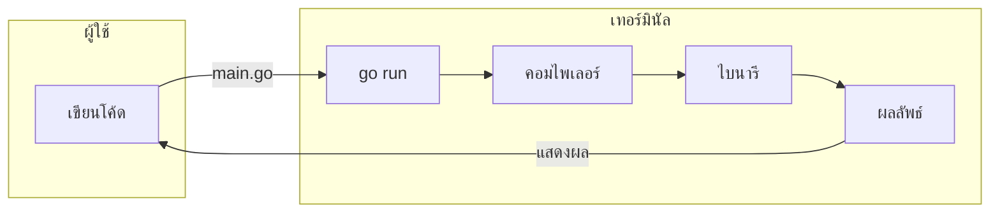

**คำอธิบาย:**  
ผู้ใช้เขียนโค้ด (ไฟล์ `.go`) แล้วสั่ง `go run` ซึ่งจะส่งให้คอมไพเลอร์แปลงเป็นไบนารีและทำงานทันที ผลลัพธ์แสดงบนเทอร์มินัล ผู้ใช้เห็นผลและสามารถปรับปรุงโค้ดต่อไป วงจรนี้แสดงการพัฒนาโปรแกรมแรกด้วย Go

---
## บทที่ 1: ความรู้เบื้องต้นเกี่ยวกับการเขียนโปรแกรมคอมพิวเตอร์

### 1.1 การเขียนโปรแกรมคืออะไร?
การเขียนโปรแกรม (Programming) คือกระบวนการสร้างชุดคำสั่งที่ใช้ควบคุมการทำงานของคอมพิวเตอร์ให้ทำงานตามที่เราต้องการ โดยใช้ภาษาเฉพาะที่คอมพิวเตอร์สามารถเข้าใจได้ ภาษาที่มนุษย์ใช้เขียนเรียกว่า "ภาษาคอมพิวเตอร์ระดับสูง" (High-Level Language) เช่น Go, Python, Java ซึ่งจากนั้นจะถูกแปลงเป็นภาษาเครื่อง (Machine Language) ที่เป็นเลขฐานสอง (0 และ 1) ที่ซีพียูสามารถประมวลผลได้

### 1.2 โครงสร้างพื้นฐานของโปรแกรม
โปรแกรมคอมพิวเตอร์โดยทั่วไปประกอบด้วย:
- **ข้อมูล (Data)** : ตัวเลข, ข้อความ, รายการต่างๆ
- **การประมวลผล (Processing)** : การดำเนินการกับข้อมูล เช่น การคำนวณ การเปรียบเทียบ
- **การควบคุมการทำงาน (Control Flow)** : การตัดสินใจ (if-else), การวนซ้ำ (loop)
- **การจัดเก็บ (Storage)** : หน่วยความจำ, ไฟล์, ฐานข้อมูล
- **อินพุต/เอาท์พุต (I/O)** : การรับข้อมูลจากผู้ใช้ หรือแสดงผล

### 1.3 ตัวแปลภาษาและคอมไพเลอร์
- **คอมไพเลอร์ (Compiler)** : แปลงซอร์สโค้ดทั้งหมดเป็นไฟล์ได้ก่อนรัน (เช่น Go, C)
- **อินเทอร์พรีเตอร์ (Interpreter)** : แปลงและรันทีละคำสั่ง (เช่น Python, JavaScript)

Go เป็นภาษาแบบคอมไพล์ (compiled) ซึ่งมีข้อดีคือทำงานเร็วและสร้างไฟล์ binary ที่รันได้ทันทีโดยไม่ต้องพึ่งพาสิ่งแวดล้อมอื่น (ยกเว้นระบบปฏิบัติการ)

### 1.4 กระบวนทัศน์การเขียนโปรแกรม
Go รองรับการเขียนโปรแกรมแบบ:
- **Procedural** : ใช้ฟังก์ชันและลำดับขั้นตอน
- **Concurrent** : ทำงานพร้อมกันด้วย goroutine
- **Functional** (บางส่วน) : ฟังก์ชันเป็น first-class citizen
- **ไม่ใช่ OOP แบบคลาสสิก** : ใช้ struct และ interface แทน inheritance

---
 
# 1. Procedural Programming

## Procedural คืออะไร?
**Procedural programming** (การเขียนโปรแกรมแบบกระบวนการ) เป็นกระบวนทัศน์ที่เน้นการเขียนโค้ดเป็นชุดของคำสั่งหรือฟังก์ชัน (procedures / routines) ที่ทำงานตามลำดับขั้นตอน (step-by-step) โดยใช้ตัวแปร โครงสร้างควบคุม (if, for, switch) และฟังก์ชันที่เรียกซ้ำกันได้

## Procedural มีกี่แบบ?
ในทางปฏิบัติ Procedural programming ไม่ได้แบ่งเป็น “แบบ” อย่างเป็นทางการ แต่สามารถมองได้ตาม **โครงสร้างของโค้ด**:
- **Linear / Sequential** – คำสั่งทำงานเรียงตามลำดับ
- **Modular** – แบ่งโค้ดออกเป็นฟังก์ชัน/โมดูล
- **Structured** – ใช้โครงสร้างควบคุม (sequence, selection, iteration) หลีกเลี่ยง goto

ภาษา Go มีพื้นฐานเป็น procedural โดยมีการจัดระเบียบผ่านฟังก์ชันและแพ็กเกจ

## ใช้อย่างไร ในกรณีไหน?
- เขียนโปรแกรมที่มีขั้นตอนชัดเจน (linear flow)
- งานที่ต้องการประสิทธิภาพสูง ควบคุมทรัพยากรใกล้เคียงฮาร์ดแวร์
- โค้ดขนาดเล็กถึงกลาง ไม่ต้องการความซับซ้อนของ OOP
- Go มักใช้ procedural ร่วมกับ concurrent และ OOP (ผ่าน struct & interface)

## หลักการทำงาน
1. โปรแกรมเริ่มทำงานจากฟังก์ชัน `main()`
2. เรียกฟังก์ชันตามลำดับ อาจมีการส่งค่าและรับค่ากลับ
3. ตัวแปรมีขอบเขตตาม block หรือ package
4. การทำงานเป็นแบบ imperative: เปลี่ยนแปลงสถานะของตัวแปรโดยตรง

## Dataflow Diagram (Flowchart TB)

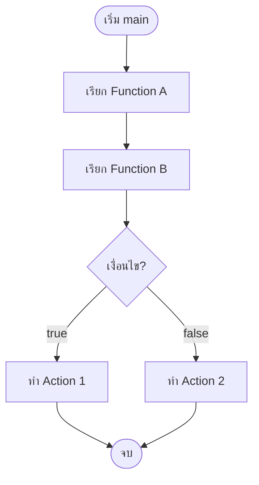

## ตัวอย่างการใช้งานจริง: โปรแกรมคำนวณราคาสินค้า
```go
package main

import "fmt"

// ฟังก์ชันคำนวณราคารวม
func calculateTotal(price float64, quantity int) float64 {
    return price * float64(quantity)
}

// ฟังก์ชันคำนวณส่วนลด
func applyDiscount(total float64, discountPercent float64) float64 {
    return total * (1 - discountPercent/100)
}

// ฟังก์ชันหลัก
func main() {
    price := 250.0
    qty := 3
    discount := 10.0

    total := calculateTotal(price, qty)
    fmt.Printf("Total: %.2f\n", total)

    finalPrice := applyDiscount(total, discount)
    fmt.Printf("After discount: %.2f\n", finalPrice)
}
```

## เทมเพลตโครงสร้างโปรเจกต์แบบ Procedural ใน Go
```
project/
├── main.go
├── handlers/         # ฟังก์ชันจัดการ request
├── services/         # ฟังก์ชัน business logic
├── repositories/     # ฟังก์ชันติดต่อฐานข้อมูล
└── utils/            # ฟังก์ชันช่วยเหลือ
```
โค้ดในแต่ละ package จะเป็นชุดฟังก์ชันที่ทำงานตามลำดับที่เรียกใช้

---

# 2. Concurrent Programming

## Concurrent คืออะไร?
**Concurrent programming** คือการเขียนโปรแกรมให้สามารถทำงานหลายอย่าง **พร้อมกัน** (overlap in time) โดยไม่จำเป็นต้องทำพร้อมกันจริง (parallel) แต่เป็นการจัดการหลาย tasks สลับกันเพื่อเพิ่มประสิทธิภาพและความสามารถในการตอบสนอง

Go มี **goroutine** (เธรดน้ำหนักเบา) และ **channel** สำหรับการสื่อสารระหว่าง goroutines ทำให้การเขียน concurrent โปรแกรมง่ายและปลอดภัย

## Concurrent มีกี่แบบ?
รูปแบบหลักในการเขียน concurrent code:
- **Goroutines + Channels** – CSP (Communicating Sequential Processes) แบบ Go
- **Mutex / Atomic** – ใช้การล็อกเพื่อป้องกัน race condition
- **Worker Pool** – ใช้ goroutines จำนวนคงที่ทำงานจากคิวงาน
- **Pipeline** – ข้อมูลไหลผ่านหลาย goroutines ที่เชื่อมต่อกันด้วย channel
----------------
# Goroutines, Channels, CSP, Mutex, Atomic, Pipeline ใน Go

## 1. Goroutines

### Goroutines คืออะไร?
**Goroutine** คือเธรดน้ำหนักเบาที่จัดการโดย Go runtime มีขนาดสแต็กเริ่มต้นเพียง 2-8 KB และสามารถขยายได้ตามต้องการ ใช้สำหรับการทำงาน concurrent โดยไม่ต้องจัดการเธรดระบบด้วยตนเอง

### Goroutines มีกี่แบบ?
Goroutine ไม่ได้แบ่งเป็น “แบบ” อย่างเป็นทางการ แต่สามารถมองตามรูปแบบการสร้าง:
- **Anonymous goroutine** – ใช้ `go func() { ... }()` ทันที
- **Named function goroutine** – `go myFunction()`
- **Closure goroutine** – จับตัวแปรจากภายนอก

### ใช้อย่างไร ในกรณีไหน?
- ทำงานที่ใช้เวลานาน (I/O, API call, ฐานข้อมูล) แบบไม่ main thread
- เรียกใช้งานแบบ fire-and-forget
- สร้าง worker pool
- ใช้ร่วมกับ channel เพื่อสื่อสารระหว่าง goroutines

### หลักการทำงาน
1. Go runtime สร้าง goroutine บน OS thread จำนวนหนึ่ง (M:N scheduler)
2. Goroutine ถูกสลับ (schedule) เมื่อ (block) เช่น I/O, channel operation, syscall
3. เมื่อ goroutine จบ, runtime จะคืนทรัพยากร

### Dataflow Diagram (Flowchart TB)

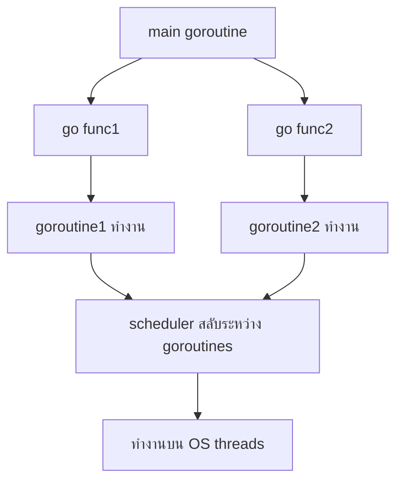

### ตัวอย่างการใช้งานจริง: การดึงข้อมูลจาก API หลายตัว
```go
package main

import (
    "fmt"
    "net/http"
    "sync"
    "time"
)

func fetch(url string, wg *sync.WaitGroup, results chan<- string) {
    defer wg.Done()
    start := time.Now()
    resp, err := http.Get(url)
    if err != nil {
        results <- fmt.Sprintf("%s -> error: %v", url, err)
        return
    }
    defer resp.Body.Close()
    elapsed := time.Since(start)
    results <- fmt.Sprintf("%s -> %d ms", url, elapsed.Milliseconds())
}

func main() {
    urls := []string{
        "https://google.com",
        "https://github.com",
        "https://stackoverflow.com",
    }

    var wg sync.WaitGroup
    results := make(chan string, len(urls))

    for _, url := range urls {
        wg.Add(1)
        go fetch(url, &wg, results) // สร้าง goroutine สำหรับแต่ละ URL
    }

    wg.Wait()
    close(results)

    for res := range results {
        fmt.Println(res)
    }
}
```

### เทมเพลต
```go
// สร้าง goroutine สำหรับงานที่ต้องทำพร้อมกัน
go func() {
    // do work
}()

// หรือใช้ WaitGroup เพื่อรอ goroutine ทั้งหมด
var wg sync.WaitGroup
for i := 0; i < 5; i++ {
    wg.Add(1)
    go func(id int) {
        defer wg.Done()
        // do work
    }(i)
}
wg.Wait()
```

---

## 2. Channels

### Channels คืออะไร?
**Channel** เป็นสื่อกลางในการส่งข้อมูลระหว่าง goroutines ทำงานแบบ type-safe และช่วยในการ synchronize (การประสานเวลา) โดยมีหลักการ “อย่าสื่อสารโดยการใช้ shared memory; จงแชร์ memory โดยการสื่อสารผ่าน channel”

### Channels มีกี่แบบ?
- **Unbuffered channel** – `make(chan T)` ต้องมีทั้ง sender และ receiver พร้อมกัน (synchronous)
- **Buffered channel** – `make(chan T, capacity)` รับค่าได้ตาม capacity ก่อนจะ block
- **Directional channel** – `chan<- T` (send-only), `<-chan T` (receive-only)
- **Closed channel** – `close(ch)` ส่ง signal ว่าปิดแล้ว, receive จะได้ zero value และ ok=false

### ใช้อย่างไร ในกรณีไหน?
- ส่งงานระหว่าง goroutines (producer-consumer)
- สัญญาณหยุดทำงาน (done channel)
- Fan-in / Fan-out
- จำกัด concurrency (semaphore pattern)

### หลักการทำงาน
1. การส่ง `ch <- v` จะ block จนกว่ามี receiver (unbuffered) หรือ buffer มีที่ว่าง (buffered)
2. การรับ `v := <-ch` จะ block จนกว่ามี sender หรือ channel ปิด
3. การปิด channel `close(ch)` บ่งบอกว่าไม่มีข้อมูลเพิ่ม
4. `for v := range ch` วนรับค่าจนกว่า channel ปิด

### Dataflow Diagram (Flowchart TB)

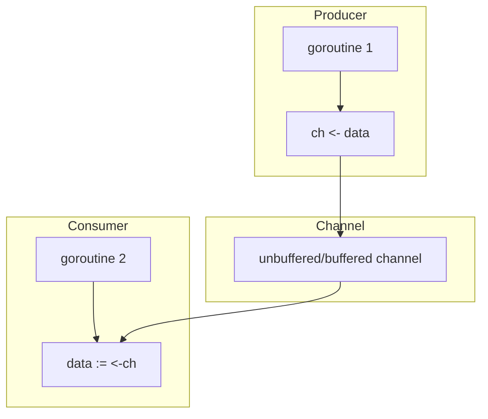

### ตัวอย่างการใช้งานจริง: Worker Pool ผ่าน channel
```go
package main

import (
    "fmt"
    "sync"
    "time"
)

func worker(id int, jobs <-chan int, results chan<- int, wg *sync.WaitGroup) {
    defer wg.Done()
    for job := range jobs {
        fmt.Printf("Worker %d processing job %d\n", id, job)
        time.Sleep(time.Second) // simulate work
        results <- job * 2
    }
}

func main() {
    const numJobs = 10
    const numWorkers = 3

    jobs := make(chan int, numJobs)
    results := make(chan int, numJobs)

    var wg sync.WaitGroup
    // start workers
    for w := 1; w <= numWorkers; w++ {
        wg.Add(1)
        go worker(w, jobs, results, &wg)
    }

    // send jobs
    for j := 1; j <= numJobs; j++ {
        jobs <- j
    }
    close(jobs)

    wg.Wait()
    close(results)

    // collect results
    for res := range results {
        fmt.Println("Result:", res)
    }
}
```

### เทมเพลต
```go
// สร้าง channel
ch := make(chan int)      // unbuffered
chBuf := make(chan int, 10) // buffered

// ส่ง
go func() { ch <- 42 }()

// รับ
val := <-ch

// ปิด
close(ch)

// วนรับ
for v := range ch {
    // process v
}
```

---

## 3. CSP (Communicating Sequential Processes)

### CSP คืออะไร?
**CSP (Communicating Sequential Processes)** เป็นแบบจำลองทางคณิตศาสตร์สำหรับการเขียนโปรแกรม concurrent ที่เน้นการสื่อสารผ่านช่องทาง (channels) แทนการใช้ shared memory ภาษา Go ได้รับแรงบันดาลใจจาก CSP โดยมี goroutine และ channel เป็นองค์ประกอบหลัก

### CSP มีกี่แบบ?
ในทางปฏิบัติ CSP ใน Go ไม่ได้มี “แบบ” แต่มีรูปแบบการใช้งานทั่วไป:
- **Producer-Consumer** – หลาย producer, หลาย consumer ผ่าน channel
- **Pipeline** – ข้อมูลไหลผ่านลำดับของ stages
- **Fan-out / Fan-in** – กระจายงานและรวบรวมผล
- **Select pattern** – เลือก channel ที่พร้อมทำงาน

### ใช้อย่างไร ในกรณีไหน?
- ออกแบบระบบ concurrent ที่ซับซ้อน
- ต้องการแยกการสื่อสารออกจากการล็อก
- สร้างระบบที่ขยายขนาดได้ง่าย (scalable)
- ใช้เมื่อต้องการความปลอดภัยจาก race condition

### หลักการทำงาน
1. ระบบประกอบด้วยกระบวนการอิสระ (goroutines) ที่สื่อสารกันผ่าน channel
2. ไม่มีการใช้ shared memory โดยตรง (หรือใช้น้อยมาก)
3. การทำงานถูก synchronize โดย channel operations
4. ใช้ `select` เพื่อรอหลาย channel พร้อมกัน

### Dataflow Diagram (Flowchart TB) - Producer-Consumer

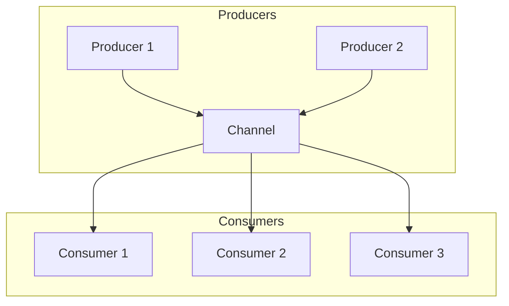

### ตัวอย่างการใช้งานจริง: Fan-out / Fan-in
```go
package main

import (
    "fmt"
    "sync"
)

func producer(nums ...int) <-chan int {
    out := make(chan int)
    go func() {
        for _, n := range nums {
            out <- n
        }
        close(out)
    }()
    return out
}

func square(in <-chan int) <-chan int {
    out := make(chan int)
    go func() {
        for n := range in {
            out <- n * n
        }
        close(out)
    }()
    return out
}

func fanIn(channels ...<-chan int) <-chan int {
    out := make(chan int)
    var wg sync.WaitGroup
    for _, c := range channels {
        wg.Add(1)
        go func(ch <-chan int) {
            defer wg.Done()
            for v := range ch {
                out <- v
            }
        }(c)
    }
    go func() {
        wg.Wait()
        close(out)
    }()
    return out
}

func main() {
    // Fan-out: สร้างหลาย pipelines
    nums := producer(1, 2, 3, 4, 5)
    square1 := square(nums)
    square2 := square(nums)

    // Fan-in: รวมผล
    results := fanIn(square1, square2)

    for res := range results {
        fmt.Println(res)
    }
}
```

### เทมเพลต
```go
// Stage 1
func stage1(input ...int) <-chan int {
    out := make(chan int)
    go func() {
        defer close(out)
        for _, v := range input {
            out <- v
        }
    }()
    return out
}

// Stage 2
func stage2(in <-chan int) <-chan int {
    out := make(chan int)
    go func() {
        defer close(out)
        for v := range in {
            out <- v * 2
        }
    }()
    return out
}

func main() {
    pipeline := stage2(stage1(1, 2, 3))
    for v := range pipeline {
        fmt.Println(v)
    }
}
```

---

## 4. Mutex

### Mutex คืออะไร?
**Mutex** (mutual exclusion) เป็นกลไกในการล็อกเพื่อป้องกันการเข้าถึง shared memory พร้อมกันจากหลาย goroutines ใช้เมื่อจำเป็นต้องใช้ shared memory (ซึ่ง CSP พยายามหลีกเลี่ยง) Go มี `sync.Mutex` และ `sync.RWMutex`

### Mutex มีกี่แบบ?
- **sync.Mutex** – ล็อกแบบ exclusive (Lock/Unlock)
- **sync.RWMutex** – แยกอ่าน-เขียน: หลาย goroutine อ่านพร้อมกันได้ (RLock/RUnlock) แต่เขียนได้ทีละตัว

### ใช้อย่างไร ในกรณีไหน?
- ป้องกัน race condition เมื่อต้องอัปเดตตัวแปรร่วม
- ใช้กับ map ที่มีหลาย goroutine เข้าถึง (Go map ไม่ safe สำหรับ concurrent)
- ใช้กับ struct ที่มีสถานะภายใน

### หลักการทำงาน
1. Goroutine เรียก `Lock()` ถ้าล็อกว่าง → ได้ล็อก
2. ถ้ามี goroutine อื่นถือล็อกอยู่ → ต้องรอ (block)
3. หลังทำงานเสร็จเรียก `Unlock()` เพื่อปล่อยล็อก

### Dataflow Diagram (Flowchart TB)

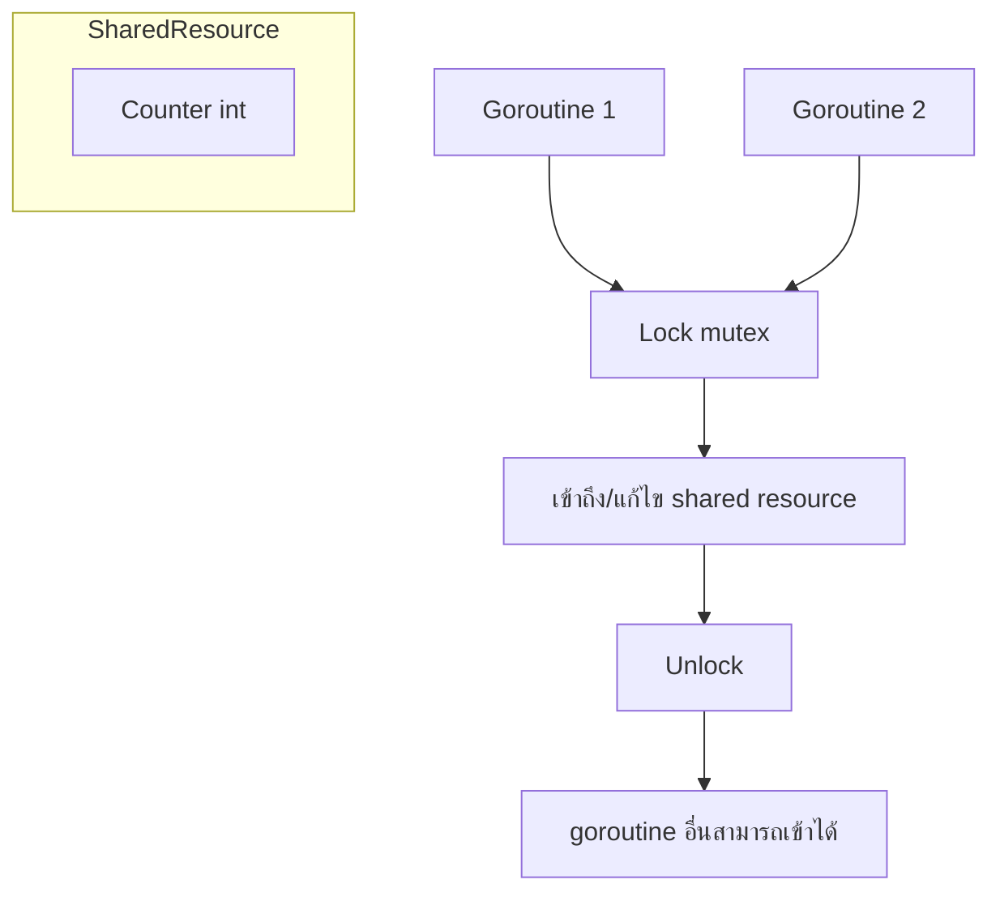

### ตัวอย่างการใช้งานจริง: ตัวนับที่ปลอดภัย
```go
package main

import (
    "fmt"
    "sync"
)

type SafeCounter struct {
    mu    sync.Mutex
    value int
}

func (c *SafeCounter) Inc() {
    c.mu.Lock()
    defer c.mu.Unlock()
    c.value++
}

func (c *SafeCounter) Value() int {
    c.mu.Lock()
    defer c.mu.Unlock()
    return c.value
}

func main() {
    counter := SafeCounter{}
    var wg sync.WaitGroup

    for i := 0; i < 1000; i++ {
        wg.Add(1)
        go func() {
            defer wg.Done()
            counter.Inc()
        }()
    }

    wg.Wait()
    fmt.Println("Final counter:", counter.Value()) // 1000
}
```

### เทมเพลต
```go
type MyStruct struct {
    mu  sync.Mutex
    data map[string]int
}

func (m *MyStruct) Set(key string, val int) {
    m.mu.Lock()
    defer m.mu.Unlock()
    m.data[key] = val
}

func (m *MyStruct) Get(key string) (int, bool) {
    m.mu.Lock()
    defer m.mu.Unlock()
    val, ok := m.data[key]
    return val, ok
}
```

---

## 5. Atomic

### Atomic คืออะไร?
**Atomic** (การดำเนินการแบบอะตอม) คือการดำเนินการที่ทำโดยไม่ถูกขัดจังหวะ ใช้สำหรับการอัปเดตตัวแปรพื้นฐาน (int, uint32, etc.) โดยไม่ต้องใช้ mutex มีประสิทธิภาพสูงกว่า เหมาะกับ counter, flag, reference counting

### Atomic มีกี่แบบ?
แพ็กเกจ `sync/atomic` มีฟังก์ชันสำหรับ:
- **Add** – เพิ่ม/ลด (AddInt64, AddUint32)
- **Load/Store** – อ่าน/เขียนแบบอะตอม (LoadInt64, StoreInt64)
- **Swap** – เปลี่ยนค่าและคืนค่าเก่า
- **CompareAndSwap (CAS)** – เปลี่ยนค่าเฉพาะเมื่อค่าเดิมตรงกับที่กำหนด

### ใช้อย่างไร ในกรณีไหน?
- ตัวนับที่ถูกอัปเดตบ่อย ๆ (metrics, stats)
- ตัวแปรสถานะ (flag, done)
- lock-free data structures
- performance-critical sections ที่ mutex อาจช้า

### หลักการทำงาน
1. ใช้คำสั่ง CPU ที่รับประกันความเป็น atomic (เช่น LOCK prefix บน x86)
2. ไม่มีการล็อก (lock-free) แต่ใช้ CAS (compare-and-swap) loop หากจำเป็น
3. เหมาะกับ primitive types เท่านั้น

### Dataflow Diagram (Flowchart TB) - CAS Loop

graph LR
    A[Input] --> B[Stage 1: Read]
    B --> C[Stage 2: Process]
    C --> D[Stage 3: Write]
    
    subgraph Fan-out
        C --> E[Worker 1]
        C --> F[Worker 2]
        E --> G[Fan-in]
        F --> G
        G --> D
    end

### ตัวอย่างการใช้งานจริง: ตัวนับแบบ atomic
```go
package main

import (
    "fmt"
    "sync"
    "sync/atomic"
)

func main() {
    var counter int64
    var wg sync.WaitGroup

    for i := 0; i < 1000; i++ {
        wg.Add(1)
        go func() {
            defer wg.Done()
            atomic.AddInt64(&counter, 1)
        }()
    }

    wg.Wait()
    fmt.Println("Counter:", atomic.LoadInt64(&counter)) // 1000
}
```

### ตัวอย่าง: CompareAndSwap สำหรับ state flag
```go
var state int32 // 0 = idle, 1 = busy

func tryAcquire() bool {
    return atomic.CompareAndSwapInt32(&state, 0, 1)
}

func release() {
    atomic.StoreInt32(&state, 0)
}
```

### เทมเพลต
```go
import "sync/atomic"

var count int64

// increment
atomic.AddInt64(&count, 1)

// load
val := atomic.LoadInt64(&count)

// store
atomic.StoreInt64(&count, 100)

// compare and swap
swapped := atomic.CompareAndSwapInt64(&count, expected, new)
```

---

## 6. Pipeline

### Pipeline คืออะไร?
**Pipeline** คือรูปแบบการออกแบบที่ข้อมูลไหลผ่านหลายขั้นตอน (stages) โดยแต่ละขั้นตอนเป็น goroutine ที่รับข้อมูลจาก channel ก่อนหน้าและส่งผลไปยัง channel ถัดไป ช่วยให้ระบบ concurrent มีโครงสร้างชัดเจน

### Pipeline มีกี่แบบ?
- **Linear pipeline** – ข้อมูลผ่านทีละขั้นตอน
- **Fan-out / Fan-in** – ขั้นตอนหนึ่งกระจายงานไปหลาย goroutines แล้วรวมผล
- **Bounded pipeline** – มี buffer จำกัดเพื่อควบคุม backpressure
- **Cancellation pipeline** – ใช้ context เพื่อหยุด pipeline ทั้งหมด

### ใช้อย่างไร ในกรณีไหน?
- ประมวลผลข้อมูลเป็นชุด (ETL)
- อ่านไฟล์, ประมวลผล, บันทึก
- ระบบ real-time processing
- จำกัด concurrency ในแต่ละขั้นตอน

### หลักการทำงาน
1. กำหนดฟังก์ชัน stage: รับ channel อ่านอย่างเดียว คืน channel เขียนอย่างเดียว
2. แต่ละ stage สร้าง goroutine ที่วนอ่าน input และเขียน output
3. ปิด channel เมื่อ stage เสร็จ (ใช้ defer close)
4. เชื่อมต่อ stages ด้วยการส่ง channel ต่อกัน
5. ใช้ `context` เพื่อส่งสัญญาณยกเลิก

### Dataflow Diagram (Flowchart TB) - Pipeline with Fan-out

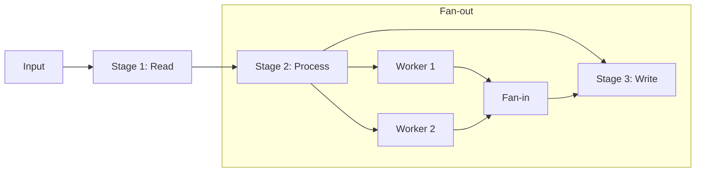

### ตัวอย่างการใช้งานจริง: Pipeline สำหรับประมวลผลตัวเลข
```go
package main

import (
    "context"
    "fmt"
    "sync"
)

// Stage 1: สร้างตัวเลขจาก slice
func gen(nums ...int) <-chan int {
    out := make(chan int)
    go func() {
        for _, n := range nums {
            out <- n
        }
        close(out)
    }()
    return out
}

// Stage 2: คูณด้วย 2
func sq(in <-chan int) <-chan int {
    out := make(chan int)
    go func() {
        for n := range in {
            out <- n * 2
        }
        close(out)
    }()
    return out
}

// Stage 3: บวก 1
func addOne(in <-chan int) <-chan int {
    out := make(chan int)
    go func() {
        for n := range in {
            out <- n + 1
        }
        close(out)
    }()
    return out
}

// Stage with fan-out
func fanOut(in <-chan int, workers int) <-chan int {
    out := make(chan int)
    var wg sync.WaitGroup
    wg.Add(workers)

    for i := 0; i < workers; i++ {
        go func() {
            defer wg.Done()
            for n := range in {
                out <- n * n // do some heavy work
            }
        }()
    }

    go func() {
        wg.Wait()
        close(out)
    }()
    return out
}

func main() {
    // pipeline
    numbers := gen(1, 2, 3, 4, 5)
    squared := sq(numbers)
    result := addOne(squared)

    for v := range result {
        fmt.Println(v) // 3, 5, 7, 9, 11
    }

    // with fan-out
    nums := gen(1, 2, 3, 4, 5, 6, 7, 8, 9, 10)
    processed := fanOut(nums, 3)
    for v := range processed {
        fmt.Println(v)
    }
}
```

### เทมเพลต Pipeline
```go
// Stage function pattern
type Stage func(<-chan int) <-chan int

// Compose stages
func compose(stages ...Stage) Stage {
    return func(input <-chan int) <-chan int {
        out := input
        for _, stage := range stages {
            out = stage(out)
        }
        return out
    }
}

// Usage
pipeline := compose(gen, sq, addOne)
for v := range pipeline(1, 2, 3) {
    fmt.Println(v)
}
```

---

## สรุปตารางเปรียบเทียบ

| Concept | จุดประสงค์ | การทำงาน | เมื่อใช้ |
|---------|-----------|----------|---------|
| **Goroutine** | concurrent unit | เธรดน้ำหนักเบา | ทำงานพร้อมกัน, I/O bound |
| **Channel** | สื่อสาร + sync | ส่งข้อมูลระหว่าง goroutines | producer-consumer, pipeline |
| **CSP** | หลักการออกแบบ | communicate via channels | ระบบ concurrent ที่ซับซ้อน |
| **Mutex** | ป้องกัน race | ล็อก shared memory | ต้องใช้ shared state |
| **Atomic** | lock-free primitive | CPU atomic ops | ตัวนับ, flags, performance |
| **Pipeline** | รูปแบบ processing | ข้อมูลไหลผ่าน stages | ETL, stream processing |

---

## แหล่งอ้างอิง
- [Go Blog: Share Memory By Communicating](https://go.dev/blog/codelab-share)
- [Go Blog: Pipelines and Cancellation](https://go.dev/blog/pipelines)
- [The Go Memory Model](https://go.dev/ref/mem)
- [sync/atomic package](https://pkg.go.dev/sync/atomic)
- [Effective Go: Concurrency](https://go.dev/doc/effective_go#concurrency)
----------------

## ใช้อย่างไร ในกรณีไหน?
- งานที่ต้องการทำหลายอย่างพร้อมกัน (web server, API calls)
- งาน I/O-bound (อ่านไฟล์, เรียกฐานข้อมูล, HTTP request)
- ปรับปรุงประสิทธิภาพการทำงานของระบบ
- Queue processor, background jobs

## หลักการทำงาน
1. สร้าง goroutine ด้วย `go function()`
2. Goroutine ทำงาน concurrent กับ main goroutine
3. ใช้ `channel` สำหรับส่งข้อมูลระหว่าง goroutines (synchronization)
4. ใช้ `sync.WaitGroup` หรือ `context` เพื่อควบคุม lifecycle

## Dataflow Diagram (Flowchart TB) - Worker Pool

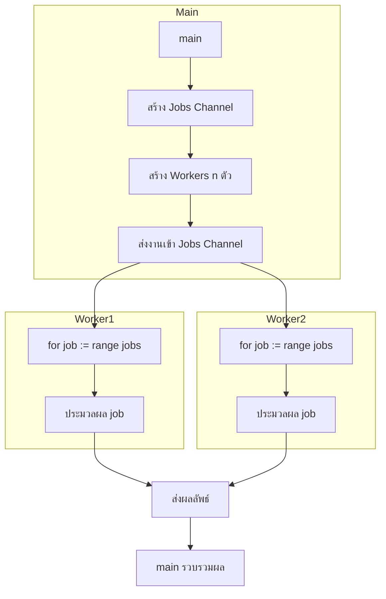

## ตัวอย่างการใช้งานจริง: Download เว็บหลาย ๆ ที่พร้อมกัน
```go
package main

import (
    "fmt"
    "net/http"
    "sync"
    "time"
)

func fetch(url string, wg *sync.WaitGroup, results chan<- string) {
    defer wg.Done()
    start := time.Now()
    resp, err := http.Get(url)
    if err != nil {
        results <- fmt.Sprintf("%s -> error: %v", url, err)
        return
    }
    defer resp.Body.Close()
    elapsed := time.Since(start)
    results <- fmt.Sprintf("%s -> %d ms", url, elapsed.Milliseconds())
}

func main() {
    urls := []string{
        "https://google.com",
        "https://github.com",
        "https://stackoverflow.com",
    }

    var wg sync.WaitGroup
    results := make(chan string, len(urls))

    for _, url := range urls {
        wg.Add(1)
        go fetch(url, &wg, results)
    }

    wg.Wait()
    close(results)

    for res := range results {
        fmt.Println(res)
    }
}
```

## เทมเพลต Worker Pool
```go
type Job struct { ID int; Data interface{} }
type Result struct { JobID int; Output interface{}; Err error }

func worker(jobs <-chan Job, results chan<- Result, wg *sync.WaitGroup) {
    defer wg.Done()
    for job := range jobs {
        // process job
        results <- Result{JobID: job.ID, Output: processedData}
    }
}

func main() {
    jobs := make(chan Job, 100)
    results := make(chan Result, 100)

    // start workers
    var wg sync.WaitGroup
    for w := 0; w < 5; w++ {
        wg.Add(1)
        go worker(jobs, results, &wg)
    }

    // send jobs
    for i := 0; i < 100; i++ {
        jobs <- Job{ID: i, Data: ...}
    }
    close(jobs)
    wg.Wait()
    close(results)

    // collect results
    for res := range results { ... }
}
```

---

# 3. Functional Programming

## Functional คืออะไร?
**Functional programming** (การเขียนโปรแกรมเชิงฟังก์ชัน) เป็นกระบวนทัศน์ที่มองการคำนวณเป็นการประเมินค่าของฟังก์ชัน โดยเน้น:
- **Pure functions** – ผลลัพธ์ขึ้นอยู่กับอินพุตเท่านั้น ไม่มี side effect
- **Immutability** – ข้อมูลไม่เปลี่ยนแปลงหลังสร้าง
- **First-class functions** – ฟังก์ชันเป็นค่าที่สามารถส่งต่อได้
- **Higher-order functions** – ฟังก์ชันรับฟังก์ชันเป็นพารามิเตอร์หรือคืนฟังก์ชัน

Go รองรับฟังก์ชัน first-class, closures, และ higher-order functions แต่ไม่มี immutability บังคับ (ใช้แนวทาง pragmatic functional)

## Functional มีกี่แบบ?
- **Pure FP** – ใช้เฉพาะ pure functions, immutable data (Haskell, Elm)
- **Impure FP** – อนุญาต side effect บางส่วน (Go, JavaScript, Scala)
- **Higher-order functions** – map, filter, reduce
- **Function composition** – นำฟังก์ชันเล็ก ๆ มาต่อกัน

## ใช้อย่างไร ในกรณีไหน?
- การแปลงข้อมูล (transform) ด้วย pipeline
- เขียนโค้ดที่คาดเดาได้ง่าย ทดสอบง่าย
- ลดความซับซ้อนในการจัดการสถานะ
- ใช้ร่วมกับ concurrent (pure functions ปลอดภัยต่อ race condition)

## หลักการทำงาน
1. กำหนดฟังก์ชันเล็ก ๆ ที่ทำหน้าที่เฉพาะ
2. ใช้ higher-order functions (map, filter, reduce) กับ slice
3. หลีกเลี่ยงการเปลี่ยนแปลงตัวแปรภายนอก (immutability เท่าที่ทำได้)
4. สร้าง pipeline โดยการต่อฟังก์ชันเข้าด้วยกัน

## Dataflow Diagram (Flowchart TB) - Pipeline

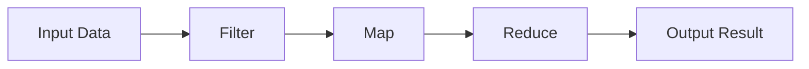

## ตัวอย่างการใช้งานจริง: ประมวลผลข้อมูลผู้ใช้
```go
package main

import (
    "fmt"
    "strings"
)

// Pure function
func toUpper(s string) string { return strings.ToUpper(s) }

// Higher-order filter
func filter(users []string, predicate func(string) bool) []string {
    var result []string
    for _, u := range users {
        if predicate(u) {
            result = append(result, u)
        }
    }
    return result
}

// Higher-order map
func mapFunc(users []string, fn func(string) string) []string {
    result := make([]string, len(users))
    for i, u := range users {
        result[i] = fn(u)
    }
    return result
}

func main() {
    users := []string{"alice", "bob", "charlie", "admin"}

    // Pipeline: filter user with length > 3, then convert to upper
    filtered := filter(users, func(u string) bool { return len(u) > 3 })
    upper := mapFunc(filtered, toUpper)

    fmt.Println(upper) // [CHARLIE ADMIN]
}
```

## เทมเพลต: generic map/filter/reduce (Go 1.18+)
```go
type Slice[T any] []T

func (s Slice[T]) Map(fn func(T) T) Slice[T] {
    result := make(Slice[T], len(s))
    for i, v := range s {
        result[i] = fn(v)
    }
    return result
}

func (s Slice[T]) Filter(pred func(T) bool) Slice[T] {
    result := Slice[T]{}
    for _, v := range s {
        if pred(v) {
            result = append(result, v)
        }
    }
    return result
}
```

---

# 4. Object-Oriented Programming (OOP)

## OOP คืออะไร?
**Object-Oriented Programming** (การเขียนโปรแกรมเชิงวัตถุ) เป็นกระบวนทัศน์ที่จัดระเบียบโค้ดเป็น “วัตถุ” (objects) ซึ่งรวมข้อมูล (fields) และพฤติกรรม (methods) เข้าด้วยกัน เน้นหลักการ:
- **Encapsulation** – ซ่อนรายละเอียดภายใน
- **Inheritance** – สืบทอดคุณสมบัติจากคลาสแม่ (Go ใช้ composition แทน)
- **Polymorphism** – หลายรูปแบบผ่าน interface

ภาษา Go ไม่มีคลาสแบบดั้งเดิม แต่ใช้ **struct** แทนข้อมูล และ **interface** แทนพฤติกรรมร่วมกัน ทำให้ได้แนวคิด OOP แบบ lightweight

## OOP มีกี่แบบ?
ตามกระบวนทัศน์ OOP แบ่งเป็น:
- **Class-based** (Java, C++, Python) – มีคลาสเป็นต้นแบบ
- **Prototype-based** (JavaScript) – วัตถุสืบทอดจากวัตถุอื่น
- Go ใช้ **struct + interface** เข้าถึง OOP ในรูปแบบ composition over inheritance

## ใช้อย่างไร ในกรณีไหน?
- โปรแกรมที่ต้องการจำลองสิ่งของในโลกจริง (entity modeling)
- ต้องการความสามารถในการขยาย (extension) ผ่าน interface
- ต้องการ polymorphism โดยไม่ต้องใช้ inheritance ซับซ้อน
- โค้ดขนาดใหญ่ที่ต้องการ modularity

## หลักการทำงาน
1. กำหนด **struct** สำหรับเก็บข้อมูล
2. เพิ่ม **method** ให้ struct ด้วย `func (r Receiver) MethodName()`
3. กำหนด **interface** เพื่อประกาศชุดของ method ที่ต้องมี
4. ใช้งาน polymorphism ผ่าน interface (dependency injection, mock)

## Dataflow Diagram (Flowchart TB) - Polymorphism

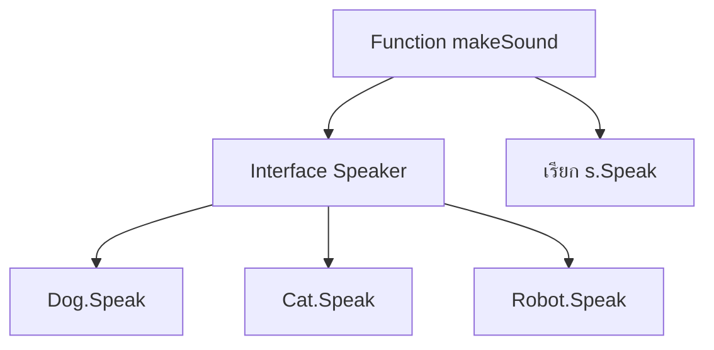

## ตัวอย่างการใช้งานจริง: สัตว์เลี้ยงและหุ่นยนต์
```go
package main

import "fmt"

// Interface
type Speaker interface {
    Speak() string
}

// Struct Dog
type Dog struct{ Name string }

func (d Dog) Speak() string {
    return fmt.Sprintf("%s says Woof!", d.Name)
}

// Struct Cat
type Cat struct{ Name string }

func (c Cat) Speak() string {
    return fmt.Sprintf("%s says Meow!", c.Name)
}

// Function ที่ใช้ polymorphism
func makeSound(s Speaker) {
    fmt.Println(s.Speak())
}

func main() {
    dog := Dog{Name: "Rex"}
    cat := Cat{Name: "Luna"}

    makeSound(dog) // Rex says Woof!
    makeSound(cat) // Luna says Meow!
}
```

## เทมเพลต: โครงสร้าง OOP ใน Go
```go
// entity.go
type Entity struct {
    ID   int
    Name string
}

func (e Entity) GetID() int { return e.ID }

// repository.go
type Repository interface {
    Save(entity Entity) error
    Find(id int) (Entity, error)
}

type MySQLRepository struct {
    db *sql.DB
}

func (r MySQLRepository) Save(entity Entity) error { ... }
func (r MySQLRepository) Find(id int) (Entity, error) { ... }
```

---

# 5. Struct

## Struct คืออะไร?
**Struct** (structure) เป็นชนิดข้อมูล (type) ที่用户可以กำหนดขึ้นเอง โดยรวมฟิลด์ (fields) หลายชนิดเข้าเป็นหน่วยเดียวกัน ใช้แทน “record” หรือ “object” ในภาษา Go

## Struct มีกี่แบบ?
- **Named struct** – ประกาศด้วย `type Name struct { fields }`
- **Anonymous struct** – ประกาศตรงจุดโดยไม่ตั้งชื่อ
- **Embedded struct** – ฝัง struct อื่นโดยไม่ระบุชื่อฟิลด์ (ใช้แทน inheritance)
- **Empty struct** – `struct{}` ไม่มีฟิลด์ ใช้เป็นเซ็ตหรือ signalling

## ใช้อย่างไร ในกรณีไหน?
- จำลองข้อมูลที่มีโครงสร้าง (User, Product, Order)
- จัดกลุ่มข้อมูลที่เกี่ยวข้องกัน
- ฝัง struct เพื่อ reuse โค้ด (composition)
- สร้าง method ให้ struct (รับ receiver)

## หลักการทำงาน
1. ประกาศ struct type พร้อมฟิลด์พร้อมชนิด
2. สร้าง instance ด้วย `var`, `new`, `&StructName{...}`
3. เข้าถึงฟิลด์ด้วย dot (`.`)
4. สามารถเพิ่ม method ให้ struct ด้วย receiver (value หรือ pointer)

## Dataflow Diagram (Flowchart TB) - Struct with Methods

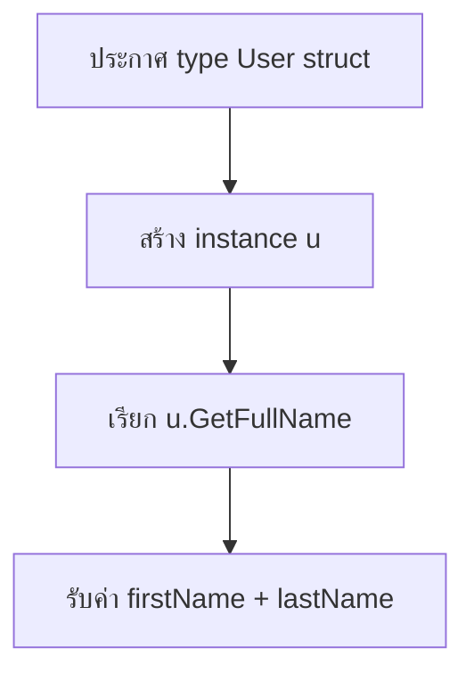

## ตัวอย่างการใช้งานจริง: ระบบจัดการผู้ใช้
```go
package main

import "fmt"

type User struct {
    ID        int
    FirstName string
    LastName  string
    Email     string
}

// Method with value receiver
func (u User) FullName() string {
    return u.FirstName + " " + u.LastName
}

// Method with pointer receiver (modify)
func (u *User) UpdateEmail(newEmail string) {
    u.Email = newEmail
}

func main() {
    // create struct
    user := User{
        ID:        1,
        FirstName: "John",
        LastName:  "Doe",
        Email:     "john@example.com",
    }

    fmt.Println(user.FullName()) // John Doe

    user.UpdateEmail("john.doe@example.com")
    fmt.Println(user.Email) // john.doe@example.com
}
```

## เทมเพลต: Embedded struct (Composition)
```go
type Base struct {
    CreatedAt time.Time
    UpdatedAt time.Time
}

type Product struct {
    Base        // embedded
    ID    int
    Name  string
    Price float64
}
```

---

# 6. Inheritance

## Inheritance คืออะไร?
**Inheritance** (การสืบทอด) เป็นกลไกใน OOP ที่คลาสลูกสามารถสืบทอดฟิลด์และเมธอดจากคลาสแม่ ทำให้สามารถ reuse โค้ดและสร้างความสัมพันธ์แบบ **is-a** Go **ไม่มี** inheritance แบบคลาส แต่ใช้ **embedding** (struct ฝัง struct) และ **interface** เพื่อให้ได้ผลคล้ายกันโดยเน้น **composition** (has-a) มากกว่า

## Inheritance มีกี่แบบ?
ในภาษา OOP ทั่วไป:
- **Single inheritance** – สืบทอดจากคลาสแม่เดียว (Java, C#)
- **Multiple inheritance** – สืบทอดจากหลายคลาส (C++) – เกิดปัญหา diamond problem
- **Multilevel inheritance** – A -> B -> C

Go ใช้ **embedding** ซึ่งไม่ใช่ inheritance แท้ แต่ให้ความสามารถในการ reuse โค้ดและ method promotion

## ใช้อย่างไร ในกรณีไหน?
- ต้องการ reuse โค้ดโดยไม่ต้องเขียนซ้ำ (ใช้ embedding)
- ต้องการสร้าง “type hierarchy” แบบง่ายผ่าน interface
- หลีกเลี่ยงปัญหาความซับซ้อนของ deep inheritance
- ใช้ในไลบรารีเช่น GORM (ฝัง `gorm.Model`)

## หลักการทำงาน (ใน Go ด้วย embedding)
1. ประกาศ struct `Parent` ที่มีฟิลด์และเมธอด
2. ประกาศ struct `Child` ที่ฝัง `Parent` (anonymous field)
3. Child สามารถเข้าถึงฟิลด์และเมธอดของ Parent โดยตรง (promotion)
4. Child สามารถ override เมธอดได้โดยการประกาศเมธอดชื่อเดียวกัน
5. ไม่สามารถแปลงจาก Child เป็น Parent ได้โดยอัตโนมัติ (ต้องใช้ interface)

## Diagram: Method Promotion with Embedding


 

## Explanation

1. **Outer struct** (`Dog`) embeds an inner struct (`Animal`) as an anonymous field.
2. When a method is called on the outer struct (`dog.Speak()`), Go first checks if the outer struct defines that method directly.
   - If **yes**, that method is invoked (overriding).
   - If **no**, Go looks for the method in the embedded struct(s) and promotes it.
3. The promoted method is called as if it were part of the outer struct.
4. The result is returned to the caller.

## Example Code

```go
type Animal struct {
    Name string
}

func (a Animal) Speak() string {
    return "Animal sound"
}

type Dog struct {
    Animal   // embedded
    Breed string
}

func (d Dog) Speak() string {
    return "Woof!"   // overrides Animal.Speak
}

func main() {
    dog := Dog{Animal: Animal{Name: "Max"}, Breed: "Golden"}
    fmt.Println(dog.Speak()) // Woof!
}
```

## Field Access Flow

For fields, the same promotion applies. If a field is not found in the outer struct, Go looks into embedded structs.

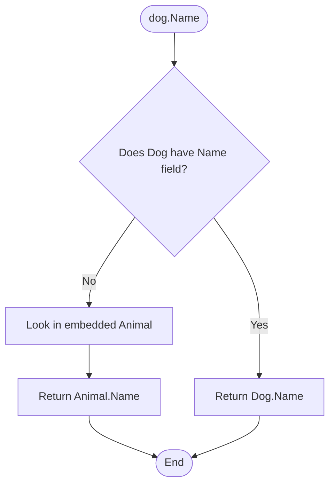

## Key Points

- **Embedding is not inheritance**: It is composition (has‑a), not is‑a.
- **Method promotion** allows calling embedded methods directly.
- **Overriding** is possible by defining a method with the same name on the outer struct.
- **Multiple embedding** is allowed; if two embedded structs have the same method name, you must qualify the call.
 

## ตัวอย่างการใช้งานจริง: ระบบพาหนะ
```go
package main

import "fmt"

// Base struct
type Vehicle struct {
    Brand string
    Year  int
}

func (v Vehicle) Info() string {
    return fmt.Sprintf("%s (%d)", v.Brand, v.Year)
}

func (v Vehicle) Start() string {
    return "Engine started"
}

// Car embeds Vehicle
type Car struct {
    Vehicle
    Doors int
}

// Override Start method
func (c Car) Start() string {
    return "Car engine started with key"
}

// Motorcycle embeds Vehicle
type Motorcycle struct {
    Vehicle
    HasSidecar bool
}

func main() {
    car := Car{
        Vehicle: Vehicle{Brand: "Toyota", Year: 2020},
        Doors:   4,
    }

    bike := Motorcycle{
        Vehicle: Vehicle{Brand: "Harley", Year: 2019},
        HasSidecar: false,
    }

    fmt.Println(car.Info())      // Toyota (2020)  (promoted)
    fmt.Println(car.Start())     // Car engine started with key (overridden)
    fmt.Println(bike.Start())    // Engine started (inherited)
}
```

## เทมเพลต: Embedding แบบ GORM
```go
import "gorm.io/gorm"

type BaseModel struct {
    ID        uint           `gorm:"primarykey"`
    CreatedAt time.Time
    UpdatedAt time.Time
    DeletedAt gorm.DeletedAt `gorm:"index"`
}

type User struct {
    BaseModel  // embedding
    Name       string
    Email      string
}
// User จะมีฟิลด์ ID, CreatedAt, UpdatedAt, DeletedAt โดยอัตโนมัติ
```

---

## สรุปเปรียบเทียบ

| กระบวนทัศน์ | จุดเน้น | Go รองรับอย่างไร |
|------------|--------|-----------------|
| **Procedural** | ลำดับขั้นตอน, ฟังก์ชัน | พื้นฐานของ Go (main, functions, packages) |
| **Concurrent** | การทำงานหลายอย่างพร้อมกัน | goroutine, channel, sync |
| **Functional** | Pure functions, immutability, higher-order | first-class functions, closures, generics |
| **OOP** | วัตถุ, encapsulation, polymorphism | struct (data) + interface (behavior), composition |
| **Struct** | การรวมข้อมูล | type struct, methods, embedding |
| **Inheritance** | สืบทอดคุณสมบัติ (is-a) | ไม่มี direct inheritance แต่ใช้ embedding และ interface |

แต่ละกระบวนทัศน์มีข้อดีและเหมาะกับงานต่างกัน Go ออกแบบให้เรียบง่ายและสามารถผสมผสานหลายกระบวนทัศน์ได้อย่างลงตัว โดยยึดหลัก “less is more” และ “composition over inheritance”

---

## แหล่งอ้างอิง
- [The Go Programming Language Specification](https://go.dev/ref/spec)
- [Effective Go](https://go.dev/doc/effective_go)
- [Go by Example](https://gobyexample.com/)
- [GORM Documentation](https://gorm.io/docs/)


>>>>>>> e2e62a77e2e60c9a4c0a6580e806e74e5123f641
### 1.5 Golang Procedural คืออะไร
**Procedural** หรือการเขียนโปรแกรมแบบเชิงกระบวนการ เป็นรูปแบบที่เน้นการเขียนฟังก์ชัน (function) และเรียกใช้ตามลำดับขั้นตอน โกแลง (Go) รองรับการเขียนแบบนี้โดยใช้ฟังก์ชันเป็นหน่วยหลัก โค้ดจะถูกแบ่งออกเป็นฟังก์ชันย่อย ๆ ที่ทำงานเฉพาะอย่าง และเรียกใช้ตามลำดับที่กำหนด ถึงแม้ Go จะไม่ใช่ภาษา procedural ล้วน ๆ แต่ก็สามารถเขียนในสไตล์นี้ได้อย่างดี

---

### 1.6 Concurrent คืออะไร
**Concurrency** (การทำงานร่วมกัน) คือความสามารถของโปรแกรมในการจัดการงานหลาย ๆ งานพร้อมกัน โดยงานเหล่านี้อาจเริ่มทำงาน สลับการทำงาน หรือจบลงในเวลาที่เหลื่อมกัน โดยไม่จำเป็นต้องทำงานพร้อมกันจริง ๆ (parallel) Go มีเครื่องมือสำหรับ concurrency โดยตรง ได้แก่ **goroutine** และ **channel** ทำให้การเขียนโปรแกรม concurrent ง่ายและมีประสิทธิภาพ

---

### 1.7 goroutine คืออะไร
**goroutine** คือเธรด (thread) ขนาดเบาที่ถูกจัดการโดย runtime ของ Go ใช้สำหรับทำงานแบบ concurrent การสร้าง goroutine ทำได้ง่ายโดยใช้คีย์เวิร์ด `go` หน้าฟังก์ชัน:

```go
go myFunction()
```

Goroutine มีน้ำหนักเบา ใช้สแต็กเริ่มต้นเพียงไม่กี่กิโลไบต์ และสามารถทำงานหลายหมื่นตัวพร้อมกันได้ในโปรแกรมเดียว

---

### 1.8 Functional คืออะไร
**Functional programming** (การเขียนโปรแกรมเชิงฟังก์ชัน) เป็นกระบวนทัศน์ที่เน้นการใช้ฟังก์ชันบริสุทธิ์ (pure function) ไม่มีการเปลี่ยนแปลงสถานะภายนอก และใช้ฟังก์ชันเป็นพลเมืองชั้นหนึ่ง (first-class citizen) Go รองรับคุณสมบัติบางอย่างของ functional เช่น การส่งฟังก์ชันเป็นค่าพารามิเตอร์ การคืนค่าฟังก์ชัน แต่ไม่มีการรับประกันความบริสุทธิ์ของฟังก์ชันหรือโครงสร้างข้อมูลแบบ immutable โดยตรง

---

### 1.9 first-class citizen คืออะไร
**First-class citizen** (พลเมืองชั้นหนึ่ง) หมายถึงสิ่งที่สามารถทำได้เช่นเดียวกับค่าอื่น ๆ ในภาษา เช่น ถูกกำหนดให้กับตัวแปร ถูกส่งเป็นอาร์กิวเมนต์ให้ฟังก์ชัน ถูกคืนค่าจากฟังก์ชัน หรือถูกเก็บในโครงสร้างข้อมูล ใน Go **ฟังก์ชัน** ถือเป็น first-class citizen:

```go
var fn func(int) int = func(x int) int { return x * x }
```

นอกจากนี้ ชนิดข้อมูลต่าง ๆ เช่น struct, interface ก็ถือเป็น first-class citizen เช่นกัน

---

### 1.10 OOP คืออะไร
**OOP** (Object-Oriented Programming) เป็นกระบวนทัศน์ที่เน้นการสร้างวัตถุ (object) ซึ่งรวมข้อมูลและพฤติกรรมเข้าด้วยกัน หลักการสำคัญคือ encapsulation, inheritance, และ polymorphism Go ไม่ใช่ภาษา OOP แบบดั้งเดิมเพราะไม่มี class แต่ใช้ **struct** เป็นตัวเก็บข้อมูล และใช้ **method** ที่ผูกกับ struct รวมถึง **interface** เพื่อสร้าง polymorphism การสืบทอด (inheritance) ทำได้โดยการ **composition** (การแทรก struct) แทน

---

### 1.11 struct คืออะไร
**struct** เป็นชนิดข้อมูลที่ใช้รวมฟิลด์ (field) หลาย ๆ ชนิดเข้าด้วยกัน คล้ายกับ class ในภาษาอื่น แต่ไม่มี method ในตัว เราสามารถกำหนด method ให้กับ struct ได้โดยประกาศฟังก์ชันที่มี **receiver** เป็น struct นั้น

```go
type Person struct {
    Name string
    Age  int
}

func (p Person) Greet() string {
    return "Hello, " + p.Name
}
```

---

### 1.12 interface คืออะไร
**interface** คือชนิดข้อมูลที่กำหนดชุดของ method signature (ชื่อฟังก์ชัน, พารามิเตอร์, ผลลัพธ์) โดยไม่ระบุการนำไปใช้ ถ้าชนิดใด (เช่น struct) มี method ครบตามที่ interface กำหนด ชนิดนั้นจะถูกพิจารณาว่า **implement** interface นั้นโดยอัตโนมัติ (implicit implementation) ทำให้เกิด polymorphism แบบหนึ่งใน Go

```go
type Greeter interface {
    Greet() string
}

// Person มี method Greet() string ดังนั้น Person จึงเป็น Greeter โดยอัตโนมัติ
```

---

### 1.13 inheritance คืออะไร
**Inheritance** (การสืบทอด) คือกลไกที่ class หนึ่งสามารถสืบทอดสมาชิก (ฟิลด์และ method) จากอีก class หนึ่ง เพื่อนำมาใช้หรือขยายความสามารถ Go **ไม่มี** inheritance แบบ class-based แต่นิยมใช้ **composition** โดยการฝัง struct (embedded struct) เพื่อให้ได้ผลลัพธ์คล้ายการสืบทอด แต่ยังคงความยืดหยุ่นและหลีกเลี่ยงปัญหาที่เกิดจาก inheritance ที่ซับซ้อน

```go
type Animal struct {
    Name string
}

type Dog struct {
    Animal  // ฝัง struct Animal เข้ามา
    Breed string
}
```

Dog จะสามารถเข้าถึงฟิลด์ Name และ method (ถ้ามี) ของ Animal ได้โดยตรง

---

### 1.14 ขั้นตอนการพัฒนาโปรแกรม
1. เขียนซอร์สโค้ด (.go)
2. คอมไพล์ (go build)
3. ทดสอบรัน (go run)
4. แก้ไขข้อผิดพลาด (debug)
5. จัดการแพคเกจ (go mod)
6. ทดสอบหน่วย (go test)

---

## บทที่ 2: รู้จักกับภาษา Go

### 2.1 ประวัติความเป็นมา
ภาษา Go (หรือ Golang) ถูกพัฒนาโดย Google เริ่มต้นในปี 2007 โดย Robert Griesemer, Rob Pike, และ Ken Thompson เปิดตัวเป็นโอเพนซอร์สในปี 2009 จุดประสงค์เพื่อแก้ปัญหาที่เกิดขึ้นในภาษา C++ และ Java ในระบบขนาดใหญ่ของ Google เช่น การคอมไพล์ที่ช้า, การจัดการการทำงานพร้อมกันที่ซับซ้อน, และความยุ่งยากในการบำรุงรักษา

### 2.2 จุดเด่นของภาษา Go
- **เรียบง่ายและอ่านง่าย** : ไวยากรณ์กระชับ ไม่มีฟีเจอร์ที่ซับซ้อนเกินจำเป็น
- **คอมไพล์เร็ว** : สามารถคอมไพล์โปรเจกต์ขนาดใหญ่ได้ในไม่กี่วินาที
- **การจัดการหน่วยความจำอัตโนมัติ** : มี garbage collector ที่มีประสิทธิภาพ
- **Concurrency ระดับภาษา** : goroutine และ channel ทำให้เขียนโปรแกรม concurrent ได้ง่าย
- **Static typing** : ตรวจสอบชนิดข้อมูลตั้งแต่ตอนคอมไพล์ ป้องกันข้อผิดพลาด
- **เครื่องมือที่ครบครัน** : go fmt, go test, go mod, go vet, go doc
- **สามารถคอมไพล์ข้ามแพลตฟอร์ม** (cross-compile) ไปยัง Windows, Linux, macOS, ARM เป็นต้น

### 2.3 โครงสร้างภาษา Go
- ไม่มี class แต่ใช้ struct และ method
- ไม่มี inheritance แต่ใช้ composition และ interface
- ไม่มี exception handling แต่ใช้ error return value
- มี garbage collection
- มี pointer แต่ไม่มี pointer arithmetic

### 2.4 ตัวอย่าง Hello World ใน Go
```go
package main

import "fmt"

func main() {
    fmt.Println("Hello, World!")
}
```

Below are detailed **dataflow diagrams** (using Mermaid syntax for draw.io) and explanations for each topic, following the **Flowchart TB (Top to Bottom)** style.  
You can copy the Mermaid code into draw.io (or any Mermaid-compatible tool) to generate the actual diagrams.

---

## 1. โครงสร้างภาษา Go (Go Language Structure)

### 📊 Flowchart (Mermaid)

```mermaid
flowchart TB
    subgraph A [Go Program Structure]
        direction TB
        P[Package Declaration] --> I[Import Dependencies]
        I --> F[Function Definitions]
        F --> M[main() Function]
        M --> S[Start HTTP Server]
    end

    subgraph B [HTTP Request Flow]
        direction TB
        C[Client Request] --> R[Router / ServeMux]
        R --> H[Handler]
        H --> L[Business Logic]
        L --> D[Data Access / DB]
        D --> RSP[Response Writer]
        RSP --> C2[Client Response]
    end

    A --> B
```

### 📝 คำอธิบาย (Explanation)

- **Package Declaration**: ทุกโปรแกรม Go เริ่มต้นด้วยการประกาศ package (เช่น `package main` สำหรับโปรแกรมที่รันได้)
- **Import Dependencies**: นำเข้าแพ็คเกจที่จำเป็น เช่น `net/http` สำหรับสร้างเว็บเซิร์ฟเวอร์
- **Function Definitions**: กำหนดฟังก์ชันต่าง ๆ รวมถึง handler functions ที่จะจัดการ request
- **main() Function**: จุดเริ่มต้นของโปรแกรม ภายในจะมีการสร้าง HTTP server และกำหนด routing
- **Start HTTP Server**: เรียก `http.ListenAndServe` เพื่อให้เซิร์ฟเวอร์รอรับ request
- **Client Request**: คำขอจาก client (เช่น browser) เข้ามายังเซิร์ฟเวอร์
- **Router / ServeMux**: ตัวจับคู่เส้นทาง (path) กับ handler ที่เหมาะสม
- **Handler**: ฟังก์ชันที่ประมวลผล request (เช่น `func(w http.ResponseWriter, r *http.Request)`)
- **Business Logic**: ดำเนินการตามที่ต้องการ เช่น อ่านข้อมูล, คำนวณ, เรียกใช้ service
- **Data Access / DB**: หากจำเป็นต้องติดต่อฐานข้อมูลหรือภายนอก
- **Response Writer**: เขียน response กลับไปยัง client
- **Client Response**: client ได้รับผลลัพธ์

---

## 2. Chi Framework

### 📊 Flowchart (Mermaid)

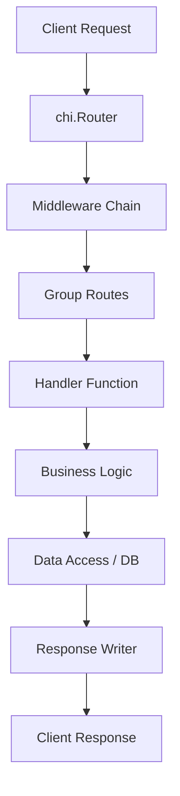

### 📝 คำอธิบาย (Explanation)

- **chi.Router**: เป็น router ที่มีประสิทธิภาพสูง รองรับการจัดกลุ่ม route และ middleware
- **Middleware Chain**: chi ใช้ middleware แบบ chain ซึ่งจะถูกเรียกก่อนถึง handler (เช่น logging, auth, recovery)
- **Group Routes**: สามารถจัดกลุ่ม route ที่ใช้ middleware ร่วมกันได้
- **Handler Function**: handler ที่เขียนเอง (implement `http.Handler` interface)
- **Business Logic & Data Access**: ดำเนินการตาม business logic และติดต่อฐานข้อมูลหากจำเป็น
- **Response Writer**: ส่ง response กลับไปยัง client

> Chi เป็น lightweight router ที่เข้ากันได้กับ `net/http` มาตรฐาน เหมาะสำหรับ API ที่ต้องการความยืดหยุ่นและประสิทธิภาพ

---

## 3. Gin Framework

### 📊 Flowchart (Mermaid)

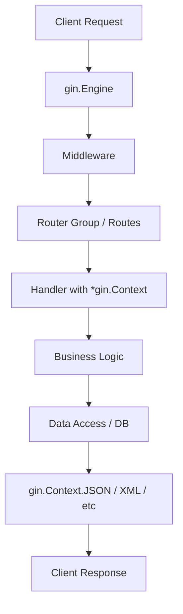

### 📝 คำอธิบาย (Explanation)

- **gin.Engine**: instance หลักของ Gin ที่ใช้จัดการ request
- **Middleware**: Gin มี middleware หลายตัว (logger, recovery, CORS) ซึ่งสามารถใส่เป็น global หรือเฉพาะ route
- **Router Group / Routes**: กำหนด route ด้วย `GET`, `POST` ฯลฯ รองรับการจัดกลุ่ม URL
- **Handler with *gin.Context**: handler รับ `*gin.Context` ซึ่งมีฟังก์ชันอำนวยความสะดวกมากมาย (binding, validation, response)
- **Business Logic & Data Access**: ดำเนินการตาม business logic และติดต่อฐานข้อมูล
- **gin.Context.JSON / XML / etc**: ส่ง response ในรูปแบบต่างๆ ได้สะดวก

> Gin เป็น framework ที่มีความเร็วสูง เนื่องจากใช้ httprouter และมีฟีเจอร์ครบครันสำหรับ REST API

---

## 4. Fiber Framework

### 📊 Flowchart (Mermaid)

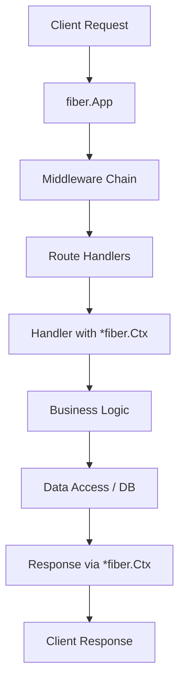

### 📝 คำอธิบาย (Explanation)

- **fiber.App**: instance หลักของ Fiber ที่ใช้จัดการ request
- **Middleware Chain**: Fiber มี middleware แบบ chain คล้าย Express.js
- **Route Handlers**: กำหนด route ด้วย `app.Get`, `app.Post` ฯลฯ
- **Handler with *fiber.Ctx**: handler รับ `*fiber.Ctx` ซึ่งมี API ที่ใช้งานง่าย (body parser, validation, response)
- **Business Logic & Data Access**: ดำเนินการตาม business logic และติดต่อฐานข้อมูล
- **Response via *fiber.Ctx**: ส่ง response ผ่าน `ctx.Send`, `ctx.JSON`, `ctx.Status` ฯลฯ

> Fiber ได้รับแรงบันดาลใจจาก Express.js แต่ใช้ Fasthttp เป็นพื้นฐาน ทำให้มีประสิทธิภาพสูงมาก เหมาะกับงานที่ต้องการความเร็วสูง

---

## 5. Beego Framework

### 📊 Flowchart (Mermaid)

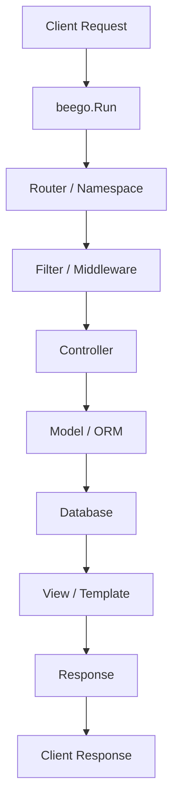

### 📝 คำอธิบาย (Explanation)

- **beego.Run**: เริ่มต้นเซิร์ฟเวอร์ Beego
- **Router / Namespace**: กำหนด route โดยใช้ `beego.Router` หรือ namespace สำหรับจัดกลุ่ม
- **Filter / Middleware**: ตัวกรองที่ทำงานก่อน/หลัง controller (คล้าย middleware)
- **Controller**: รับ request และประมวลผล โดยสืบทอดจาก `beego.Controller`
- **Model / ORM**: Beego มี ORM ในตัว ใช้สำหรับติดต่อฐานข้อมูล
- **View / Template**: สร้าง HTML response ด้วย template engine
- **Response**: ส่งผลลัพธ์กลับไปยัง client

> Beego เป็น full-stack framework ที่มีส่วนประกอบครบ (MVC, ORM, caching, logs) เหมาะกับแอปพลิเคชันขนาดใหญ่

---

## 6. Buffalo Framework

### 📊 Flowchart (Mermaid)

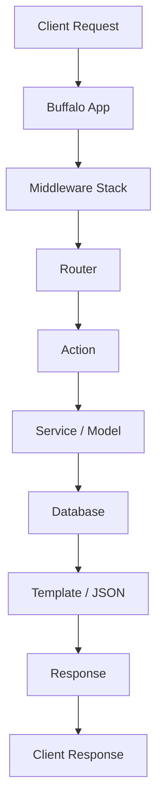

### 📝 คำอธิบาย (Explanation)

- **Buffalo App**: instance ของแอปพลิเคชัน Buffalo ที่สร้างจาก `buffalo.New`
- **Middleware Stack**: ใช้ middleware ในการจัดการ request (logger, CSRF, sessions)
- **Router**: กำหนด route ผ่าน `app.GET`, `app.POST` ฯลฯ
- **Action**: handler ที่รับ `buffalo.Context` ซึ่งมีฟังก์ชันครบ (render, param binding, session)
- **Service / Model**: ดำเนิน business logic และติดต่อฐานข้อมูล (ผ่าน Pop ORM)
- **Template / JSON**: ส่ง response ในรูปแบบ HTML template หรือ JSON
- **Response**: ส่งกลับ client

> Buffalo เป็น framework ที่เน้น productivity และคล้ายกับ Rails มีเครื่องมือ CLI ที่ช่วยสร้างโครงสร้างโปรเจกต์

---

## 7. Gorilla Mux (Web Toolkit)

### 📊 Flowchart (Mermaid)

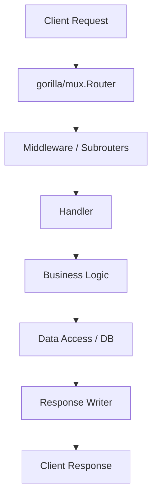

### 📝 คำอธิบาย (Explanation)

- **gorilla/mux.Router**: router ที่มีความสามารถมากกว่า `net/http` มาตรฐาน (path variables, regex, methods)
- **Middleware / Subrouters**: สามารถใช้ middleware และ subrouters เพื่อจัดกลุ่ม route
- **Handler**: handler มาตรฐานของ Go (`func(w http.ResponseWriter, r *http.Request)`)
- **Business Logic & Data Access**: ดำเนินการตาม business logic และติดต่อฐานข้อมูล
- **Response Writer**: ส่ง response กลับ client

> Gorilla Mux ไม่ใช่ full-stack framework แต่เป็น router toolkit ที่เข้ากันได้ดีกับ `net/http` และมักถูกนำไปใช้ร่วมกับ middleware อื่น ๆ

--- 
ต้องการให้อธิบายส่วนใดเพิ่มเติม หรือปรับเปลี่ยนรูปแบบ flowchart ให้เหมาะกับงานของคุณไหมครับ?


### 2.5 ใครใช้ Go บ้าง?
- **Google** : ระบบ backend, Kubernetes, Docker
- **Uber** : ระบบการจับคู่การเดินทาง
- **Dropbox** : เปลี่ยนจาก Python มาเป็น Go สำหรับระบบจัดเก็บไฟล์
- **Netflix** : ส่วนของ proxy และ caching
- **Cloudflare** : เครื่องมือโครงสร้างพื้นฐาน

---

## บทที่ 3: พื้นฐานการใช้งาน Terminal

### 3.1 Terminal คืออะไร?
Terminal (หรือ command line, console) เป็นเครื่องมือที่ให้เราสั่งงานคอมพิวเตอร์ผ่านข้อความ แทนการใช้ GUI การพัฒนา Go มักใช้ terminal ในการรันคำสั่งต่างๆ เช่น go build, go run, go test, git เป็นต้น

### 3.2 คำสั่งพื้นฐาน (Unix/Linux/macOS)
- `pwd` : แสดงไดเรกทอรีปัจจุบัน
- `ls` : แสดงรายการไฟล์ (ใช้ `ls -la` แสดงรายละเอียด)
- `cd <path>` : เปลี่ยนไดเรกทอรี
- `mkdir <name>` : สร้างโฟลเดอร์
- `touch <file>` : สร้างไฟล์
- `rm <file>` : ลบไฟล์ (ใช้ `rm -rf` ลบโฟลเดอร์)
- `cp <source> <dest>` : คัดลอกไฟล์
- `mv <source> <dest>` : ย้ายหรือเปลี่ยนชื่อ
- `cat <file>` : แสดงเนื้อหาไฟล์
- `echo <text>` : แสดงข้อความ
- `grep <pattern> <file>` : ค้นหาข้อความ

### 3.3 คำสั่งพื้นฐานสำหรับ Windows (Command Prompt หรือ PowerShell)
- `cd` : เปลี่ยนไดเรกทอรี
- `dir` : แสดงรายการไฟล์
- `mkdir` : สร้างโฟลเดอร์
- `del` : ลบไฟล์
- `copy` : คัดลอก
- `move` : ย้าย
- `type` : แสดงเนื้อหาไฟล์

### 3.4 การตั้งค่า PATH
หลังจากติดตั้ง Go แล้ว เราต้องให้ terminal สามารถเรียกใช้คำสั่ง `go` ได้ โดยเพิ่มไดเรกทอรีของ Go (เช่น `/usr/local/go/bin` หรือ `C:\Go\bin`) ลงในตัวแปรสภาพแวดล้อม PATH

### 3.5 การใช้ go command
- `go version` : ตรวจสอบเวอร์ชัน Go
- `go env` : แสดงตัวแปรสภาพแวดล้อมของ Go
- `go run <file>` : คอมไพล์และรันโปรแกรม
- `go build` : คอมไพล์เป็น binary
- `go mod init` : เริ่มต้น go module
- `go get` : ดาวน์โหลดแพคเกจ (deprecated ใช้ `go install` หรือ `go mod download`)
- `go test` : รัน test

---

## บทที่ 4: เตรียมสภาพแวดล้อมสำหรับพัฒนา

### 4.1 การติดตั้ง Go
1. ดาวน์โหลดจาก https://go.dev/dl/
2. เลือกเวอร์ชันที่เหมาะสมกับ OS ของคุณ
3. ติดตั้งตามขั้นตอน
4. ตรวจสอบการติดตั้ง: เปิด terminal แล้วพิมพ์ `go version`

### 4.2 ตัวแปรสภาพแวดล้อมที่สำคัญ
- `GOROOT` : ตำแหน่งที่ติดตั้ง Go (มักตั้งค่าให้อัตโนมัติ)
- `GOPATH` : ตำแหน่ง workspace ของ Go (เลิกใช้แล้ว ถ้าใช้ modules)
- `GOBIN` : ตำแหน่งที่ติดตั้ง binaries ที่ `go install`
- `GOOS`/`GOARCH` : ใช้ cross-compile

### 4.3 การเลือก Editor/IDE
- **Visual Studio Code** : มี extension "Go" โดย官方 ให้ linting, autocomplete, debugging
- **GoLand** : IDE เฉพาะของ JetBrains
- **Vim/Neovim** : ใช้ plugin vim-go
- **Sublime Text** : มี GoSublime

### 4.4 การตั้งค่า Go Modules
Go Modules เป็นระบบจัดการ dependencies เริ่มใช้ตั้งแต่ Go 1.11 โดยค่าเริ่มต้นใช้งานได้ตั้งแต่ Go 1.16 เป็นต้นไป
```bash
mkdir myproject
cd myproject
go mod init example.com/myproject
```
ไฟล์ `go.mod` จะถูกสร้างขึ้น

### 4.5 workspace structure (แบบเดิมกับแบบใหม่)
- **แบบ GOPATH** (ก่อน Go 1.11): ต้องวางโค้ดใน `$GOPATH/src`
- **แบบ Modules** (ปัจจุบัน): สามารถสร้างโปรเจกต์ได้ทุกที่ โดยมี go.mod กำกับ

### 4.6 การติดตั้งเครื่องมือเสริม
- **gopls** : language server (ติดตั้งโดยอัตโนมัติใน VS Code)
- **dlv** : delve debugger (`go install github.com/go-delve/delve/cmd/dlv@latest`)
- **golangci-lint** : linter (`go install github.com/golangci/golangci-lint/cmd/golangci-lint@latest`)

---

## บทที่ 5: สร้างแอปพลิเคชันแรกของคุณ

### 5.1 สร้างโปรเจกต์
```bash
mkdir hello
cd hello
go mod init hello
```

### 5.2 เขียนโค้ด
สร้างไฟล์ `main.go`:
```go
package main

import "fmt"

func main() {
    fmt.Println("Hello, Go!")
}
```

### 5.3 รันโปรแกรม
```bash
go run main.go
```
หรือคอมไพล์แล้วรัน:
```bash
go build -o hello
./hello   # (Linux/macOS) หรือ hello.exe (Windows)
```

### 5.4 เพิ่มฟังก์ชัน
```go
package main

import "fmt"

func greet(name string) string {
    return "Hello, " + name
}

func main() {
    message := greet("Gopher")
    fmt.Println(message)
}
```
ทดสอบ `go run main.go` ควรได้ "Hello, Gopher"

### 5.5 การอ่านค่าจาก command line
```go
package main

import (
    "fmt"
    "os"
)

func main() {
    if len(os.Args) < 2 {
        fmt.Println("Please provide a name")
        return
    }
    name := os.Args[1]
    fmt.Printf("Hello, %s!\n", name)
}
```
รัน: `go run main.go Somchai`

### 5.6 การจัดรูปแบบโค้ด
ใช้คำสั่ง `go fmt` เพื่อจัดรูปแบบโค้ดให้เป็นมาตรฐาน:
```bash
go fmt ./...
```

### 5.7 ข้อผิดพลาดที่พบบ่อย
- ใช้ตัวแปรแต่ไม่ได้ใช้ -> Go จะคอมไพล์ไม่ผ่าน (ยกเว้นตัวแปร _)
- import แพคเกจแต่ไม่ได้ใช้ -> ต้องลบออกหรือใช้ _
- ใส่เครื่องหมาย `,` หรือ `;` ไม่ถูกต้อง

---

# ภาคที่ 2: พื้นฐานภาษาและโครงสร้างข้อมูล

## แผนภาพแสดงความสัมพันธ์ของเนื้อหา

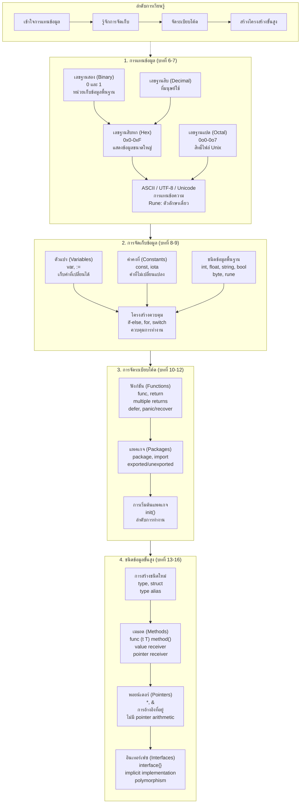

---

## คำอธิบายภาษาไทย (แบบละเอียด)

ภาคที่ 2 ครอบคลุมบทที่ 6–16 โดยมีเนื้อหาแบ่งเป็น 4 ช่วงหลัก ตามแผนภาพด้านบน ซึ่งแสดงลำดับการเรียนรู้ที่ต่อเนื่องกัน
## บทที่ 6: ระบบเลขฐานสองและฐานสิบ

### 6.1 ความสำคัญของระบบเลข
คอมพิวเตอร์ทำงานด้วยสัญญาณไฟฟ้า 2 สถานะ คือ ON (1) และ OFF (0) ดังนั้นการแทนค่าทั้งหมดในคอมพิวเตอร์จึงใช้เลขฐานสอง

### 6.2 เลขฐานสิบ (Decimal)
เป็นระบบที่มนุษย์ใช้ประจำ มีตัวเลข 0-9 (ฐาน 10) เช่น 123 = 1×10² + 2×10¹ + 3×10⁰

### 6.3 เลขฐานสอง (Binary)
ใช้ตัวเลข 0 และ 1 (ฐาน 2) เช่น 1101₂ = 1×2³ + 1×2² + 0×2¹ + 1×2⁰ = 13₁₀

### 6.4 การแปลงเลขฐานสองเป็นฐานสิบ
วิธี: คูณแต่ละหลักด้วย 2 ยกกำลังตำแหน่ง (เริ่มจากขวาเป็น 0)
- 1010₂ = (1×8) + (0×4) + (1×2) + (0×1) = 10₁₀

### 6.5 การแปลงเลขฐานสิบเป็นฐานสอง
วิธี: หารด้วย 2 ไปเรื่อยๆ เก็บเศษ แล้วอ่านเศษจากล่างขึ้นบน
- 13 ÷ 2 = 6 เศษ 1
- 6 ÷ 2 = 3 เศษ 0
- 3 ÷ 2 = 1 เศษ 1
- 1 ÷ 2 = 0 เศษ 1
→ อ่านจากล่างขึ้นบน: 1101₂

### 6.6 การแสดงเลขฐานสองใน Go
Go รองรับ literal ของเลขฐานสองโดยใช้ prefix `0b` หรือ `0B`:
```go
var x int = 0b1101 // 13
fmt.Printf("%b\n", x) // แสดงเป็น binary: 1101
```

### 6.7 หน่วยของข้อมูล
- 1 bit = 0 หรือ 1
- 1 byte = 8 bits
- 1 kilobyte (KB) = 1024 bytes
- 1 megabyte (MB) = 1024 KB
- Go มีชนิดข้อมูลตามขนาด: uint8 (1 byte), uint16, uint32, uint64

### 6.8 ระบบฐานอื่นๆ
- ฐานแปด (octal): ใช้ prefix `0o` หรือ `0O` (เช่น 0o17 = 15)
- ฐานสิบหก (hexadecimal): ใช้ prefix `0x` (เช่น 0xFF = 255)

---

## บทที่ 7: เลขฐานสิบหก, ฐานแปด, ASCII, UTF8, Unicode และ Runes

### 7.1 เลขฐานสิบหก (Hexadecimal)
ใช้ตัวเลข 0-9 และตัวอักษร A-F (10-15) ฐาน 16 นิยมใช้แทนสี, address ในหน่วยความจำ
- 0xFF = 255, 0x10 = 16
- ใน Go: `color := 0xFF00FF`

### 7.2 เลขฐานแปด (Octal)
ใช้ตัวเลข 0-7 ฐาน 8
- 0o10 = 8, 0o777 = 511

### 7.3 ASCII
American Standard Code for Information Interchange เป็นรหัส 7 bits แทนตัวอักษรภาษาอังกฤษ, ตัวเลข, เครื่องหมาย 128 ตัว
- 'A' = 65, 'a' = 97, '0' = 48

### 7.4 Unicode
เป็นมาตรฐานสากลที่กำหนดรหัสให้กับอักขระทุกภาษา (มากกว่า 1 ล้านรหัส) โดยแต่ละรหัสเรียกว่า "code point" เช่น U+0041 คือ 'A'

### 7.5 UTF-8
UTF-8 เป็นการเข้ารหัส Unicode แบบ variable-length (1-4 bytes) ที่ Go ใช้เป็นค่าเริ่มต้นสำหรับสตริง
- ตัวอักษร ASCII ใช้ 1 byte
- ตัวอักษรไทย 3 bytes

### 7.6 Rune ใน Go
`rune` เป็น alias ของ `int32` ใช้แทน Unicode code point ใน Go
```go
var ch rune = 'CD' // รหัส Unicode 0xE01
fmt.Printf("%c %U\n", ch, ch) //   U+0E01
```
การวนลูปผ่าน string แบบ rune:
```go
s := "hello"
for i, r := range s {
    fmt.Printf("%d: %c (%U)\n", i, r, r)
}
```

### 7.7 การจัดการ string และ bytes
String ใน Go เป็น read-only slice of bytes (ไม่ใช่ runes) การนับจำนวน runes ใช้ `utf8.RuneCountInString`
```go
import "unicode/utf8"
s := "สวัสดี"
fmt.Println(len(s)) // 12 bytes
fmt.Println(utf8.RuneCountInString(s)) // 4 runes
```

### 7.8 การแปลงระหว่าง string และ []rune
```go
s := "ไทย"
runes := []rune(s)   // แปลงเป็น slice of runes
s2 := string(runes)  // แปลงกลับ
```

---

## บทที่ 8: ตัวแปร, ค่าคงที่ และชนิดข้อมูลพื้นฐาน

### 8.1 ตัวแปร (Variables)
ตัวแปรคือที่เก็บข้อมูลในหน่วยความจำ มีชื่อและชนิดข้อมูล
```go
var name string = "John"
var age int = 30
var isActive bool = true
```
รูปแบบ: `var <ชื่อ> <ชนิด> = <ค่าเริ่มต้น>`

การประกาศแบบสั้นด้วย `:=` (ใช้ภายในฟังก์ชันเท่านั้น):
```go
name := "John"   // Go infer type เป็น string
age := 30
```

การประกาศหลายตัวแปร:
```go
var x, y int = 1, 2
var (
    a string = "hello"
    b int = 42
)
```

### 8.2 ค่าคงที่ (Constants)
ค่าคงที่ประกาศด้วย `const` ไม่สามารถเปลี่ยนแปลงค่าได้
```go
const Pi = 3.14159
const (
    StatusOK = 200
    StatusNotFound = 404
)
```
ค่าคงที่สามารถเป็นตัวเลข, สตริง, หรือ boolean เท่านั้น

### 8.3 ชนิดข้อมูลพื้นฐาน
**Numeric types:**
- Integers: `int`, `int8`, `int16`, `int32`, `int64` (int ขนาดตามระบบ 32/64 bit)
- Unsigned: `uint`, `uint8` (byte), `uint16`, `uint32`, `uint64`
- Floating point: `float32`, `float64`
- Complex: `complex64`, `complex128`

**Boolean:** `bool` (true/false)

**String:** `string` (immutable sequence of bytes)

**Rune:** `rune` (int32) ใช้แทน Unicode code point

**Byte:** `byte` (uint8) ใช้แทน byte

### 8.4 ค่าเริ่มต้น (Zero values)
ตัวแปรทุกตัวเมื่อประกาศโดยไม่กำหนดค่า จะมีค่าเริ่มต้น:
- ตัวเลข: 0
- bool: false
- string: "" (empty string)
- pointer, slice, map, channel, interface, function: nil

### 8.5 การแปลงชนิดข้อมูล (Type conversion)
Go ต้องแปลงชนิดอย่างชัดเจน ไม่มี implicit conversion
```go
var i int = 42
var f float64 = float64(i)   // แปลง int -> float64
var u uint = uint(f)          // แปลง float64 -> uint
```

### 8.6 การกำหนดชื่อตัวแปร
- ขึ้นต้นด้วยตัวอักษรหรือ _
- ตามด้วยตัวอักษร ตัวเลข หรือ _
- case-sensitive
- นิยมใช้ camelCase (เช่น userName)
- ตัวพิมพ์ใหญ่ต้น = exported (public) ถ้าอยู่ในแพคเกจ

### 8.7 ตัวดำเนินการพื้นฐาน
- คณิตศาสตร์: `+`, `-`, `*`, `/`, `%`
- การเปรียบเทียบ: `==`, `!=`, `<`, `>`, `<=`, `>=`
- ตรรกะ: `&&`, `||`, `!`
- Bitwise: `&`, `|`, `^`, `&^`, `<<`, `>>`

---

## บทที่ 9: คำสั่งควบคุมการทำงาน

### 9.1 if-else
```go
if score >= 80 {
    fmt.Println("A")
} else if score >= 70 {
    fmt.Println("B")
} else {
    fmt.Println("C")
}
```
สามารถมีคำสั่งสั้น ๆ ก่อนเงื่อนไข:
```go
if val := getValue(); val > 10 {
    fmt.Println("big")
}
```

### 9.2 switch
Go มี switch ที่ยืดหยุ่น:
```go
switch day {
case "Monday":
    fmt.Println("Start of week")
case "Friday":
    fmt.Println("TGIF")
default:
    fmt.Println("Other day")
}
```
switch แบบไม่มี expression (เทียบกับ true):
```go
switch {
case score >= 80:
    fmt.Println("A")
case score >= 70:
    fmt.Println("B")
default:
    fmt.Println("C")
}
```
fallthrough (ใช้ในกรณีต้องการให้ทำงาน case ถัดไป):
```go
switch num {
case 1:
    fmt.Println("one")
    fallthrough
case 2:
    fmt.Println("two")
}
// ถ้า num = 1 จะพิมพ์ one และ two
```

### 9.3 for loop
Go มีแค่ `for` (ไม่มี while, do-while)
```go
// for แบบคลาสสิก
for i := 0; i < 10; i++ {
    fmt.Println(i)
}

// while-like
x := 0
for x < 10 {
    fmt.Println(x)
    x++
}

// infinite loop
for {
    // ใช้ break เพื่อออก
}
```

### 9.4 range
ใช้กับ array, slice, map, string:
```go
numbers := []int{2,4,6}
for index, value := range numbers {
    fmt.Println(index, value)
}

// ถ้าไม่ต้องการ index ใช้ _
for _, value := range numbers {
    fmt.Println(value)
}
```

### 9.5 break, continue, goto
- `break` : ออกจาก loop
- `continue` : ข้ามไป iteration ถัดไป
- `goto` : กระโดดไปยัง label (ไม่แนะนำให้ใช้มาก)

```go
for i := 0; i < 5; i++ {
    if i == 2 {
        continue
    }
    if i == 4 {
        break
    }
    fmt.Println(i)
}
// output: 0 1 3
```

### 9.6 label และการ break ออกจาก outer loop

**Outer loop** (หรือ loop ภายนอก) คือลูปที่อยู่ชั้นนอกสุดในโครงสร้างของลูปซ้อนกัน (nested loops) หมายถึงลูปที่มีลูปอื่นอยู่ข้างใน ใช้สำหรับควบคุมการวนรอบที่มีหลายมิติ เช่น การวนสมาชิกในอาร์เรย์ 2 มิติ หรือการทำซ้ำงานที่ต้องมีลูปย่อยหลายรอบในแต่ละรอบของลูปหลัก

## ตัวอย่างในภาษา Go

```go
package main

import "fmt"

func main() {
    // outer loop วนแถว (row)
    for i := 0; i < 3; i++ {
        // inner loop วนคอลัมน์ (column)
        for j := 0; j < 3; j++ {
            fmt.Printf("(%d,%d) ", i, j)
        }
        fmt.Println()
    }
}
```

**ผลลัพธ์:**
```
(0,0) (0,1) (0,2) 
(1,0) (1,1) (1,2) 
(2,0) (2,1) (2,2) 
```

## การควบคุม outer loop ด้วย `break` และ `continue`

ใน Go สามารถใช้ **label** เพื่อระบุว่าต้องการ `break` หรือ `continue` ที่ outer loop แทนที่จะเป็นแค่ inner loop:

```go
package main

import "fmt"

func main() {
    // ตั้ง label ชื่อ "outer"
outer:
    for i := 0; i < 3; i++ {
        for j := 0; j < 3; j++ {
            if i == 1 && j == 1 {
                break outer // ออกจาก outer loop ทั้งหมด
            }
            fmt.Printf("(%d,%d) ", i, j)
        }
        fmt.Println()
    }
}
```

**ผลลัพธ์:**
```
(0,0) (0,1) (0,2) 
(1,0) 
```
(เมื่อเจอ (1,1) จะออกจาก outer loop ทันที)

---
# 9.1 if-else

## if-else คืออะไร?
**if-else** คือคำสั่งควบคุมเงื่อนไขในภาษา Go ที่ใช้ตัดสินใจเลือกบล็อกโค้ดใดบล็อกหนึ่งตามค่าความจริง (boolean) ของเงื่อนไขที่กำหนด

## if-else มีกี่แบบ?
ใน Go รูปแบบของ if-else มี 4 แบบหลัก ๆ:

1. **if** – มีเพียงเงื่อนไขเดียว
2. **if-else** – มีทางเลือกสองทาง
3. **if-else if-else** – มีหลายทางเลือก
4. **if พร้อม short statement** – ประกาศตัวแปรชั่วคราวภายในเงื่อนไข

## ใช้อย่างไร ในกรณีไหน?
- **ตรวจสอบ error**: หลังเรียกฟังก์ชันที่คืนค่า error เช่น `if err != nil { ... }`
- **ตรวจสอบค่า**: เปรียบเทียบตัวแปรกับค่าคงที่หรือผลลัพธ์
- **กำหนดค่าเริ่มต้นตามเงื่อนไข**: ใช้ short statement เพื่อประกาศตัวแปรที่ใช้เฉพาะภายใน scope
- **ร่วมกับ GORM**: ตรวจสอบผลลัพธ์จากฐานข้อมูลก่อนดำเนินการต่อ
- **ร่วมกับ Redis**: ตรวจสอบการมีอยู่ของ key หรือข้อผิดพลาดจากคำสั่ง Redis

## หลักการทำงาน
1. ประเมินค่า **boolean expression** ใน `if`
2. ถ้า `true` → ทำบล็อกใน `if`
3. ถ้า `false` → ถ้ามี `else` จะทำบล็อกใน `else` (หรือไปตรวจสอบ `else if` ถัดไป)
4. ตัวแปรที่ประกาศใน **short statement** จะมีขอบเขตอยู่ภายในบล็อก if-else เท่านั้น

## Dataflow Diagram (Flowchart TB)

```mermaid
graph TB
    Start([เริ่ม]) --> Cond{เงื่อนไขเป็น true?}
    Cond -- true --> BlockIf[ทำบล็อก if]
    Cond -- false --> CheckElse{มี else?}
    CheckElse -- มี --> BlockElse[ทำบล็อก else]
    CheckElse -- ไม่มี --> End
    BlockIf --> End([จบ])
    BlockElse --> End
```

## ตัวอย่างการใช้งานจริง

### 1. การตรวจสอบ error พื้นฐาน
```go
package main

import (
    "errors"
    "fmt"
)

func divide(a, b float64) (float64, error) {
    if b == 0 {
        return 0, errors.New("division by zero")
    }
    return a / b, nil
}

func main() {
    result, err := divide(10, 0)
    if err != nil {
        fmt.Println("Error:", err)
    } else {
        fmt.Println("Result:", result)
    }
}
```

### 2. if พร้อม short statement (นิยมใช้กับ error)
```go
if err := someFunction(); err != nil {
    // จัดการ error
    return err
}
// ดำเนินการต่อเมื่อไม่มี error
```

### 3. การใช้ if-else กับ GORM (ค้นหาผู้ใช้ ถ้าไม่พบให้สร้างใหม่)
```go
import "gorm.io/gorm"

func GetOrCreateUser(db *gorm.DB, email string) (*User, error) {
    var user User
    result := db.Where("email = ?", email).First(&user)
    
    if result.Error != nil {
        if result.Error == gorm.ErrRecordNotFound {
            // สร้างผู้ใช้ใหม่
            user = User{Email: email, Name: "New User"}
            if err := db.Create(&user).Error; err != nil {
                return nil, err
            }
            return &user, nil
        }
        return nil, result.Error
    }
    return &user, nil
}
```

### 4. การใช้ if-else กับ Redis Transaction (ตรวจสอบ key ก่อนทำ multi/exec)
```go
import (
    "context"
    "github.com/go-redis/redis/v8"
)

func TransferMoney(ctx context.Context, rdb *redis.Client, fromKey, toKey string, amount int64) error {
    // ตรวจสอบว่า fromKey มี balance เพียงพอ
    balance, err := rdb.Get(ctx, fromKey).Int64()
    if err != nil {
        if err == redis.Nil {
            return fmt.Errorf("key %s does not exist", fromKey)
        }
        return err
    }
    
    if balance < amount {
        return fmt.Errorf("insufficient balance")
    }
    
    // ทำ transaction
    _, err = rdb.TxPipelined(ctx, func(pipe redis.Pipeliner) error {
        pipe.DecrBy(ctx, fromKey, amount)
        pipe.IncrBy(ctx, toKey, amount)
        return nil
    })
    return err
}
```

---

# 9.2 switch

## switch คืออะไร?
**switch** คือคำสั่งสำหรับเลือกทำบล็อกโค้ดใดบล็อกหนึ่งจากหลายทางเลือก โดยพิจารณาจากค่าของ expression หรือประเภทของตัวแปร

## switch มีกี่แบบ?
ใน Go มี switch 3 รูปแบบหลัก:

1. **Expression switch** – เปรียบเทียบค่า expression กับ case ต่างๆ
2. **Type switch** – ใช้กับ interface เพื่อตรวจสอบประเภทของค่า
3. **Switch without expression** – ใช้เหมือน if-else chain

นอกจากนี้ยังมีคุณสมบัติพิเศษ:
- **case หลายค่า** – คั่นด้วย comma
- **fallthrough** – ให้ทำงานต่อไปยัง case ถัดไป (ไม่ต้อง break)
- **default** – เมื่อไม่มี case ใดตรง

## ใช้อย่างไร ในกรณีไหน?
- **Expression switch**: ตรวจสอบค่าตัวแปรที่มีหลายค่าที่เป็นไปได้ (enum, status)
- **Type switch**: รับค่า interface แล้วต้องการจัดการตามประเภทจริง
- **Switch without expression**: แทน if-else ที่ซับซ้อน อ่านง่ายขึ้น
- **ร่วมกับ GORM**: ใช้ switch กับฟิลด์ status, type, category
- **ร่วมกับ Redis**: ใช้ switch กับผลลัพธ์ของคำสั่ง Redis หรือประเภท error

## หลักการทำงาน
1. ประเมินค่า **expression** (ถ้ามี) หรือไม่ก็ถือว่า expression เป็น `true`
2. ตรวจสอบ case ตามลำดับจากบนลงล่าง
3. ถ้า case ตรง → ทำบล็อกนั้น ถ้าไม่มี `fallthrough` จะออกจาก switch ทันที
4. ถ้าไม่มี case ใดตรง → ทำ `default` (ถ้ามี)
5. **Type switch** จะทำการ type assertion ใน case

## Dataflow Diagram (Flowchart TB)

```mermaid
graph TB
    Start([เริ่ม]) --> Eval{ประเมิน expression}
    Eval --> CheckCase{มี case ที่ตรง?}
    CheckCase -- มี --> DoCase[ทำบล็อก case]
    DoCase --> HasFall{มี fallthrough?}
    HasFall -- ใช่ --> NextCase[ทำ case ถัดไป]
    HasFall -- ไม่ใช่ --> End
    NextCase --> End
    CheckCase -- ไม่มี --> HasDefault{มี default?}
    HasDefault -- ใช่ --> DoDefault[ทำ default]
    HasDefault -- ไม่มี --> End
    DoDefault --> End([จบ])
```

## ตัวอย่างการใช้งานจริง

### 1. Expression switch พื้นฐาน
```go
func getDayName(day int) string {
    switch day {
    case 1:
        return "Monday"
    case 2:
        return "Tuesday"
    case 3, 4, 5: // case หลายค่า
        return "Weekday"
    default:
        return "Weekend"
    }
}
```

### 2. switch พร้อม short statement
```go
switch err := someFunc(); err {
case nil:
    fmt.Println("success")
default:
    fmt.Println("error:", err)
}
```

### 3. Type switch
```go
func processValue(v interface{}) {
    switch v := v.(type) {
    case int:
        fmt.Printf("int: %d\n", v)
    case string:
        fmt.Printf("string: %s\n", v)
    case bool:
        fmt.Printf("bool: %t\n", v)
    default:
        fmt.Printf("unknown type: %T\n", v)
    }
}
```

### 4. Switch without expression (ใช้แทน if-else)
```go
score := 85
switch {
case score >= 90:
    grade = "A"
case score >= 80:
    grade = "B"
case score >= 70:
    grade = "C"
default:
    grade = "F"
}
```

### 5. ใช้ switch กับ GORM (จัดการ status ของ order)
```go
func ProcessOrder(db *gorm.DB, orderID uint) error {
    var order Order
    if err := db.First(&order, orderID).Error; err != nil {
        return err
    }

    switch order.Status {
    case "pending":
        // ตรวจสอบ stock และทำการจอง
        if err := ReserveStock(db, order); err != nil {
            order.Status = "failed"
        } else {
            order.Status = "confirmed"
        }
    case "confirmed":
        // ส่งของ
        order.Status = "shipped"
    case "shipped":
        return fmt.Errorf("order already shipped")
    default:
        return fmt.Errorf("unknown status: %s", order.Status)
    }

    return db.Save(&order).Error
}
```

### 6. ใช้ switch กับ Redis (จัดการ error types)
```go
func GetValue(ctx context.Context, rdb *redis.Client, key string) (string, error) {
    val, err := rdb.Get(ctx, key).Result()
    switch err {
    case nil:
        return val, nil
    case redis.Nil:
        return "", fmt.Errorf("key %s not found", key)
    default:
        return "", fmt.Errorf("redis error: %w", err)
    }
}
```

---

# 9.3 for loop

## for loop คืออะไร?
**for loop** คือโครงสร้างวนซ้ำเพียงหนึ่งเดียวในภาษา Go (ไม่มี while หรือ do-while) แต่สามารถปรับให้มีรูปแบบต่าง ๆ ได้

## for loop มีกี่แบบ?
for loop มี 4 รูปแบบหลัก:

1. **Classic for** – `for init; condition; post { }`
2. **While-style** – `for condition { }`
3. **Infinite loop** – `for { }` (ใช้ break ออก)
4. **Range loop** – `for index, value := range collection { }` (จะกล่าวในหัวข้อ 9.4)

## ใช้อย่างไร ในกรณีไหน?
- **Classic for**: เมื่อต้องการกำหนดตัวแปรเริ่มต้น, เงื่อนไข, และการเปลี่ยนแปลงในแต่ละรอบ
- **While-style**: วนซ้ำตราบใดที่เงื่อนไขยังเป็น true
- **Infinite loop**: ใช้กับกรณีที่ต้องรอ event หรือต้อง break ตามเงื่อนไขภายใน
- **ร่วมกับ GORM**: ใช้วนซ้ำสำหรับ batch processing หรือ retry เมื่อเกิด deadlock
- **ร่วมกับ Redis**: ใช้ retry loop สำหรับการทำ transaction หรือการรอ lock

## หลักการทำงาน
1. **Classic for**:  
   - init: ทำงานก่อน loop ครั้งแรก  
   - condition: ตรวจสอบก่อนแต่ละรอบ ถ้า true ทำ body แล้วไป post  
   - post: ทำงานหลัง body ก่อนกลับไปตรวจสอบ condition
2. **While-style**: ตรวจสอบ condition ก่อนแต่ละรอบ ถ้า true ทำ body
3. **Infinite loop**: ทำงานไปเรื่อย ๆ จนกว่าจะเจอ break

## Dataflow Diagram (Flowchart TB) - Classic for

```mermaid
graph TB
    Start([เริ่ม]) --> Init[init]
    Init --> Cond{condition true?}
    Cond -- true --> Body[ทำ body]
    Body --> Post[post]
    Post --> Cond
    Cond -- false --> End([จบ])
```

## ตัวอย่างการใช้งานจริง

### 1. Classic for loop
```go
for i := 0; i < 5; i++ {
    fmt.Println(i)
}
```

### 2. While-style (for condition)
```go
sum := 1
for sum < 1000 {
    sum += sum
}
```

### 3. Infinite loop พร้อม break
```go
for {
    // ทำบางอย่าง
    if condition {
        break
    }
}
```

### 4. การใช้ for loop กับ GORM (Batch insert)
```go
func BatchCreateUsers(db *gorm.DB, users []User, batchSize int) error {
    for i := 0; i < len(users); i += batchSize {
        end := i + batchSize
        if end > len(users) {
            end = len(users)
        }
        batch := users[i:end]
        if err := db.Create(&batch).Error; err != nil {
            return err
        }
    }
    return nil
}
```

### 5. การใช้ for loop กับ Redis (Retry with backoff)
```go
func SetWithRetry(ctx context.Context, rdb *redis.Client, key string, value interface{}, ttl time.Duration) error {
    var err error
    for attempt := 0; attempt < 3; attempt++ {
        err = rdb.Set(ctx, key, value, ttl).Err()
        if err == nil {
            return nil
        }
        // exponential backoff
        time.Sleep(time.Duration(1<<attempt) * 100 * time.Millisecond)
    }
    return fmt.Errorf("failed after 3 attempts: %w", err)
}
```

### 6. การใช้ for loop กับ Redis Transaction (WATCH + MULTI/EXEC)
```go
func IncrementWithRetry(ctx context.Context, rdb *redis.Client, key string) error {
    for retries := 0; retries < 10; retries++ {
        err := rdb.Watch(ctx, func(tx *redis.Tx) error {
            val, err := tx.Get(ctx, key).Int64()
            if err != nil && err != redis.Nil {
                return err
            }
            _, err = tx.TxPipelined(ctx, func(pipe redis.Pipeliner) error {
                pipe.Set(ctx, key, val+1, 0)
                return nil
            })
            return err
        }, key)
        if err == nil {
            return nil
        }
        if err == redis.TxFailedErr {
            // conflict, retry
            continue
        }
        return err
    }
    return fmt.Errorf("max retries exceeded")
}
```

---

# 9.4 range

## range คืออะไร?
**range** เป็นคีย์เวิร์ดที่ใช้ร่วมกับ `for` เพื่อวนซ้ำผ่าน elements ของ collection เช่น array, slice, map, string, channel

## range มีกี่แบบ?
range ใช้ร่วมกับ `for` ในรูปแบบ `for index, value := range collection` แต่รูปแบบที่คืนค่าจะแตกต่างกันไปตามชนิดของ collection:

| Collection | คืนค่าแรก | คืนค่าที่สอง |
|------------|----------|------------|
| array, slice | index | value |
| string | index (byte position) | rune |
| map | key | value |
| channel | element | (ไม่มี) |

นอกจากนี้เราสามารถใช้ `_` (underscore) เพื่อละทิ้งค่าใดค่าหนึ่งได้

## ใช้อย่างไร ในกรณีไหน?
- **Slice/Array**: ใช้เมื่อต้องการเข้าถึงทั้ง index และ value หรือต้องการแค่ value
- **Map**: ใช้เพื่อวนลูปผ่าน key-value pairs
- **String**: ใช้เพื่อวนลูปผ่านตัวอักษร (rune) โดยไม่ต้องจัดการ UTF-8 ด้วยตนเอง
- **Channel**: ใช้เพื่อรับค่าจาก channel จนกว่า channel จะปิด
- **ร่วมกับ GORM**: ใช้ range วน slice ของ model เพื่อทำ batch operation หรือ transform data
- **ร่วมกับ Redis**: ใช้ range วน map เพื่อเก็บเป็น Redis hash หรือวน slice ของ keys

## หลักการทำงาน
1. range จะคืนค่า sequence ของ elements ตามลำดับ
2. แต่ละรอบจะกำหนดค่าให้กับตัวแปรที่ประกาศทางซ้าย
3. กับ map ไม่รับประกันลำดับ
4. กับ string จะวนทีละ rune (ไม่ใช่ byte) ทำให้รองรับ UTF-8
5. กับ channel จะรับค่าจนกว่า channel จะปิด (range จะจบอัตโนมัติ)

## Dataflow Diagram (Flowchart TB) - range with slice

```mermaid
graph TB
    Start([เริ่ม]) --> Init[ประกาศ range loop]
    Init --> Next{มี element ถัดไป?}
    Next -- มี --> Assign[กำหนด index, value]
    Assign --> Body[ทำ body]
    Body --> Next
    Next -- ไม่มี --> End([จบ])
```

## ตัวอย่างการใช้งานจริง

### 1. range กับ slice
```go
nums := []int{2, 4, 6}
for i, v := range nums {
    fmt.Printf("index=%d, value=%d\n", i, v)
}
// ถ้าต้องการแค่ค่า
for _, v := range nums {
    fmt.Println(v)
}
```

### 2. range กับ map
```go
m := map[string]int{"a": 1, "b": 2}
for k, v := range m {
    fmt.Printf("%s -> %d\n", k, v)
}
```

### 3. range กับ string (iterate runes)
```go
str := "สวัสดี"
for i, r := range str {
    fmt.Printf("byte index %d: rune %c\n", i, r)
}
```

### 4. range กับ channel
```go
ch := make(chan int)
go func() {
    for i := 0; i < 5; i++ {
        ch <- i
    }
    close(ch)
}()
for v := range ch {
    fmt.Println(v)
}
```

### 5. ใช้ range กับ GORM (วน slice ของ model เพื่อสร้าง Redis hash)
```go
func CacheUsers(db *gorm.DB, rdb *redis.Client, ctx context.Context) error {
    var users []User
    if err := db.Find(&users).Error; err != nil {
        return err
    }

    for _, user := range users {
        key := fmt.Sprintf("user:%d", user.ID)
        err := rdb.HSet(ctx, key,
            "name", user.Name,
            "email", user.Email,
        ).Err()
        if err != nil {
            return err
        }
    }
    return nil
}
```

### 6. ใช้ range กับ Redis (วน map เพื่อเก็บค่า)
```go
func StoreUserAttributes(ctx context.Context, rdb *redis.Client, userID string, attrs map[string]interface{}) error {
    key := fmt.Sprintf("user:%s:attrs", userID)
    for field, value := range attrs {
        if err := rdb.HSet(ctx, key, field, value).Err(); err != nil {
            return err
        }
    }
    return nil
}
```

---

# 9.6 label และการ break ออกจาก outer loop

## label และการ break ออกจาก outer loop คืออะไร?
**label** คือการกำหนดชื่อ (identifier) ให้กับ statement (เช่น for loop, switch, select) เพื่อให้สามารถใช้ `break`, `continue`, หรือ `goto` อ้างอิงถึง statement นั้นได้ โดยเฉพาะ `break label` จะออกจาก loop ที่มี label นั้นแม้จะอยู่ใน loop ซ้อนกันหลายชั้น

## label และการ break ออกจาก outer loop มีกี่แบบ?
มี 3 แบบ:
1. **label + break**: ออกจาก loop ที่ระบุ (สามารถข้ามหลายชั้นได้)
2. **label + continue**: ข้ามไปยัง iteration ถัดไปของ loop ที่ระบุ
3. **label + goto**: (ไม่แนะนำ แต่อนุญาต) กระโดดไปยังตำแหน่งที่กำหนด

## ใช้อย่างไร ในกรณีไหน?
- ใช้เมื่อมี nested loops และต้องการออกจากทุก loop เมื่อพบเงื่อนไข (เช่น ค้นหา element ใน matrix แล้วหยุดทันที)
- ใช้เมื่อต้องการ continue ไปยัง outer loop แทนที่จะเป็น inner loop
- ในงานที่ต้องทำ transaction ที่มีหลายขั้นตอนซ้อนกัน หากเกิด error ควรข้ามทุก loop (เช่น ตรวจสอบข้อมูลหลายชุดและเลิกทำทั้งหมด)
- **ร่วมกับ GORM**: ใช้ label break ออกจาก nested loops เมื่อพบ error หรือเมื่อต้องการหยุดการประมวลผลทั้งชุด
- **ร่วมกับ Redis**: ใช้ label break เมื่อเกิดความล้มเหลวใน pipeline หรือ transaction ที่ซ้อนกัน

## หลักการทำงาน
1. ประกาศ label ก่อน statement ที่ต้องการควบคุม เช่น `OuterLoop: for i := 0; i < n; i++ {`
2. ใน loop ซ้อน ให้ใช้ `break OuterLoop` เพื่อออกจาก loop ที่มี label `OuterLoop` ทันที
3. `continue OuterLoop` จะข้าม iteration ปัจจุบันของ outer loop และไป iteration ถัดไป
4. label ต้องอยู่ภายในฟังก์ชันเดียวกันและเป็น scope ที่ถูกต้อง

## Dataflow Diagram (Flowchart TB)

```mermaid
graph TB
    Start([เริ่ม]) --> OuterStart[OuterLoop: for i]
    OuterStart --> InnerStart[InnerLoop: for j]
    InnerStart --> Cond{พบเงื่อนไข break?}
    Cond -- ใช่ --> BreakLabel[break OuterLoop]
    Cond -- ไม่ใช่ --> ContinueInner[ทำ inner loop ต่อ]
    ContinueInner --> InnerStart
    BreakLabel --> End([ออกจาก outer loop])
    InnerStart --> NoBreak[inner loop จบ]
    NoBreak --> OuterIter[ไป i ถัดไป]
    OuterIter --> OuterStart
    OuterStart --> EndOuter[outer loop จบ]
    EndOuter --> End
```

## ตัวอย่างการใช้งานจริง

### 1. break label เพื่อออกจาก nested loops
```go
package main

import "fmt"

func main() {
    matrix := [][]int{
        {1, 2, 3},
        {4, 5, 6},
        {7, 8, 9},
    }
    target := 5
    found := false

OuterLoop:
    for i := 0; i < len(matrix); i++ {
        for j := 0; j < len(matrix[i]); j++ {
            if matrix[i][j] == target {
                fmt.Printf("Found %d at (%d, %d)\n", target, i, j)
                found = true
                break OuterLoop // ออกจากทั้งสอง loop
            }
        }
    }
    if !found {
        fmt.Println("Not found")
    }
}
```

### 2. continue label เพื่อข้าม iteration ของ outer loop
```go
package main

import "fmt"

func main() {
    // สมมติว่าเรามี slice ของ user IDs และต้องการประมวลผลทีละ user
    // แต่ถ้า user มี error ให้ข้ามไป user ถัดไปเลย
    users := []string{"user1", "user2", "user3", "user4"}

UserLoop:
    for _, u := range users {
        fmt.Printf("Processing %s\n", u)
        // จำลองการตรวจสอบ permission
        if u == "user2" {
            fmt.Printf("  %s has no permission, skip\n", u)
            continue UserLoop // ข้ามไป user ถัดไป
        }
        for i := 0; i < 3; i++ {
            fmt.Printf("  subtask %d\n", i)
            if u == "user3" && i == 1 {
                fmt.Println("  error on user3, skip entire user")
                continue UserLoop
            }
        }
    }
}
```

### 3. ใช้ label break กับ GORM (หยุดการวนซ้ำเมื่อเกิด error)
```go
func ProcessOrders(db *gorm.DB, orderIDs []uint) error {
    var orders []Order
    if err := db.Where("id IN ?", orderIDs).Find(&orders).Error; err != nil {
        return err
    }

    // วนซ้ำแต่ละ order และสินค้าใน order
MainLoop:
    for _, order := range orders {
        fmt.Printf("Processing order %d\n", order.ID)
        
        // ตรวจสอบสถานะ order
        if order.Status == "cancelled" {
            continue
        }

        // ดึง order items
        var items []OrderItem
        if err := db.Where("order_id = ?", order.ID).Find(&items).Error; err != nil {
            return err // ถ้า error นี้รุนแรง ให้ break ทั้ง process
        }

        for _, item := range items {
            // ตรวจสอบ stock
            var product Product
            if err := db.First(&product, item.ProductID).Error; err != nil {
                // ถ้าไม่พบ product ถือว่า error ร้ายแรง หยุดการทำงานทั้งหมด
                break MainLoop
            }
            if product.Stock < item.Quantity {
                // ไม่พอ stock ก็หยุดการทำงานทั้งหมด
                break MainLoop
            }
        }
        // update order status
        order.Status = "processed"
        db.Save(&order)
    }
    return nil
}
```

### 4. ใช้ label break กับ Redis Transaction (หยุด pipeline เมื่อเกิด error ใน loop)
```go
func UpdateBalances(ctx context.Context, rdb *redis.Client, updates map[string]int64) error {
    // ใช้ label เพื่อออกจาก loop ทั้งหมดเมื่อเกิด error ร้ายแรง
MainLoop:
    for account, delta := range updates {
        // ตรวจสอบความถูกต้อง
        if delta == 0 {
            continue
        }
        // ใช้ WATCH เพื่อทำ optimistic lock
        err := rdb.Watch(ctx, func(tx *redis.Tx) error {
            bal, err := tx.Get(ctx, account).Int64()
            if err != nil && err != redis.Nil {
                return err
            }
            newBal := bal + delta
            if newBal < 0 {
                return fmt.Errorf("insufficient balance for %s", account)
            }
            _, err = tx.TxPipelined(ctx, func(pipe redis.Pipeliner) error {
                pipe.Set(ctx, account, newBal, 0)
                return nil
            })
            return err
        }, account)

        if err != nil {
            if err == redis.TxFailedErr {
                // conflict, retry แต่ถ้า retry หลายครั้งอาจต้อง break
                // ในที่นี้แสดงตัวอย่าง break ออกเมื่อเจอ conflict ที่ไม่สามารถแก้ได้
                break MainLoop
            }
            return err
        }
    }
    return nil
}
```

### 5. การใช้ label เพื่อ break จาก switch ภายใน loop (ไม่ต้องใช้ label)
```go
// break ใน switch จะออกจาก switch เท่านั้น ไม่ต้องใช้ label
// แต่ถ้าต้องการออกจาก loop ต้องใช้ label
func findInMatrix(matrix [][]int, target int) (int, int, bool) {
    for i, row := range matrix {
        for j, val := range row {
            switch {
            case val == target:
                return i, j, true
            case val > target:
                // ไม่ต้องทำอะไร ไปต่อ
            }
        }
    }
    return 0, 0, false
}
```

## ข้อควรระวัง
- ใช้ label อย่างระมัดระวัง เพราะอาจทำให้โค้ดอ่านยาก (คล้ายกับ goto)
- `break label` จะออกจาก statement ที่ label ระบุเท่านั้น ไม่ใช่ทุก statement ที่อยู่ระหว่างทาง
- `continue label` ใช้ได้เฉพาะกับ loop
- label ต้องอยู่หน้า statement ที่เป็น loop, switch, select เท่านั้น

---

## แหล่งอ้างอิง
- [The Go Programming Language Specification - If statements](https://go.dev/ref/spec#If_statements)
- [The Go Programming Language Specification - Switch statements](https://go.dev/ref/spec#Switch_statements)
- [The Go Programming Language Specification - For statements](https://go.dev/ref/spec#For_statements)
- [The Go Programming Language Specification - Break statements](https://go.dev/ref/spec#Break_statements)
- [Effective Go - Control structures](https://go.dev/doc/effective_go#control-structures)
- [GORM Documentation](https://gorm.io/docs/)
- [go-redis Documentation](https://redis.uptrace.dev/)

## บทที่ 10: ฟังก์ชัน

### 10.1 การประกาศฟังก์ชัน
```go
func add(x int, y int) int {
    return x + y
}
```
ถ้าพารามิเตอร์ชนิดเดียวกัน สามารถย่อ:
```go
func add(x, y int) int {
    return x + y
}
```

### 10.2 การคืนค่าหลายค่า
Go รองรับการคืนค่าหลายค่าได้โดยตรง:
```go
func divide(a, b float64) (float64, error) {
    if b == 0 {
        return 0, fmt.Errorf("division by zero")
    }
    return a / b, nil
}
```
เรียกใช้:
```go
result, err := divide(10, 2)
if err != nil {
    fmt.Println("Error:", err)
} else {
    fmt.Println("Result:", result)
}
```

### 10.3 Named return values
สามารถตั้งชื่อค่าที่คืนได้:
```go
func split(sum int) (x, y int) {
    x = sum * 4 / 9
    y = sum - x
    return // naked return
}
```

### 10.4 ฟังก์ชันแบบ variadic (รับพารามิเตอร์ไม่จำกัด)
```go
func sum(nums ...int) int {
    total := 0
    for _, n := range nums {
        total += n
    }
    return total
}
// เรียกใช้: sum(1,2,3,4)
```

### 10.5 ฟังก์ชันเป็นค่า (first-class functions)
ฟังก์ชันสามารถถูกกำหนดให้กับตัวแปร, ส่งเป็นพารามิเตอร์, คืนค่าเป็นผลลัพธ์
```go
var fn func(int) int = func(x int) int { return x * 2 }
result := fn(5) // 10
```

### 10.6 defer

`defer` คือคำสั่งในภาษา Go ที่ใช้ **เลื่อนการทำงานของฟังก์ชัน** ออกไปจนกว่าฟังก์ชันรอบนอก (ฟังก์ชันที่ประกาศ `defer`) จะจบการทำงาน ไม่ว่าจะจบแบบปกติ (return) หรือเกิด panic
`defer` ทำให้ฟังก์ชันถูกเรียกหลังจากฟังก์ชัน enclosing จบการทำงาน (ใช้สำหรับ cleanup)

### หลักการทำงาน
- คำสั่งที่อยู่ภายใต้ `defer` จะถูกเก็บไว้ในสแต็ก (stack) และทำงานในลำดับ **LIFO** (Last In, First Out) – ตัวที่ประกาศทีหลังจะถูกเรียกก่อน
- นิยมใช้เพื่อปิดทรัพยากร (ไฟล์, database connection, mutex unlock) เพื่อป้องกันการรั่วไหล

### ตัวอย่าง
```go
func readFile() {
    f, err := os.Open("data.txt")
    if err != nil {
        return
    }
    defer f.Close() // ปิดไฟล์เมื่อฟังก์ชันจบ

    // อ่านข้อมูล...
}
```

### panic และ recover
- `panic` : หยุดการทำงานปกติและเริ่ม unwind stack
- `recover` : ใช้ใน defer เพื่อจับ panic และควบคุมการทำงานต่อ

```go
func safeDivide(a, b int) {
    defer func() {
        if r := recover(); r != nil {
            fmt.Println("Recovered from panic:", r)
        }
    }()
    if b == 0 {
        panic("division by zero")
    }
    fmt.Println(a / b)
}
```
**ข้อควรระวัง**: panic ควรใช้ในกรณีผิดปกติรุนแรงเท่านั้น ไม่ใช่แทน error handling

### 10.7 ฟังก์ชัน init
แต่ละแพคเกจ ได้รับ `init()` ฟังก์ชัน ซึ่งจะถูกเรียกอัตโนมัติเมื่อแพคเกจถูกโหลด (ก่อน main)
```go
func init() {
    fmt.Println("initializing package")
}
```

### สรุป
`defer` ช่วยให้โค้ดสะอาด รับประกันการ cleanup แม้มี `return` ก่อนถึงคำสั่งปิด หรือเกิด panic (panic คือ หยุดการทำงาน)
`panic` เป็น built-in function ในภาษา Go ที่ใช้หยุดการทำงานปกติของโปรแกรม (คล้ายกับ exception ในภาษาอื่น) เมื่อ panic เกิดขึ้น:

1. การทำงานของฟังก์ชันปัจจุบันจะหยุดทันที  
2. เริ่ม defer statements (ในฟังก์ชันปัจจุบัน) ตามลำดับ LIFO  
3. กลับไปยังฟังก์ชันผู้เรียก และทำซ้ำ (unwind stack)  
4. หากไม่มี `recover` จับไว้ โปรแกรมจะจบการทำงานพร้อมแสดง stack trace  

**ตัวอย่าง:**
```go
func mayPanic() {
    defer fmt.Println("defer 1")
    defer fmt.Println("defer 2")
    panic("เกิดข้อผิดพลาดร้ายแรง")
    fmt.Println("ไม่") // จะไม่ถูกทำงานต่อไป

func main() {
    mayPanic()
    fmt.Println("ไม่ถึงบรรทัดนี้") // จะไม่ถูกทำงานต่อไป
}
```
ผลลัพธ์:
```
defer 2
defer 1
panic: เกิดข้อผิดพลาดร้ายแรง
...
```

**การกู้คืนด้วย `recover`**  
`recover` จะคืนค่าที่ส่งไปใน `panic` (ถ้ามี) และสามารถทำให้โปรแกรมทำงานต่อได้ โดยต้องเรียกใน `defer`:

```go
func safeCall() {
    defer func() {
        if r := recover(); r != nil {
            fmt.Println("กู้คืนจาก panic:", r)
        }
    }()
    panic("error")
}

func main() {
    safeCall()
    fmt.Println("โปรแกรมทำงานต่อ")
}
```

**สรุป**  
- `panic` หยุดการทำงานปกติและ unwind stack  (การคลายสแต็ก)
- `defer` ยังคงถูกเรียกแม้ panic  
  **การคลายสแต็ก (unwind stack)** คือกระบวนการที่โปรแกรมย้อนกลับไปตามลำดับการเรียกฟังก์ชัน (call stack) โดย คำสั่ง `defer` ในแต่ละฟังก์ชันก่อนที่จะยุติฟังก์ชันนั้น ๆ มักเกิดขึ้นเมื่อเกิด `panic` หรือสิ้นสุดการทำงานของ goroutine
- ใช้ `recover` ใน `defer` เพื่อจัดการ panic และให้โปรแกรมดำเนินต่อไปได้
  **Unwind stack** (การคลายสแต็ก) คือกระบวนการที่เกิดขึ้นเมื่อเกิด `panic` ใน Go โดยโปรแกรมจะ **ย้อนกลับขึ้นไปตามลำดับการเรียกใช้ฟังก์ชัน** (call stack) และ  (execute or execution)  `defer` statements ที่ถูกค้างไว้ในแต่ละฟังก์ชันก่อนที่จะยุติการทำงานของฟังก์ชันนั้น ๆ

**Execute** หรือ **Execution** ในบริบทการเขียนโปรแกรม หมายถึง **การรันคำสั่ง** หรือ **การทำให้โปรแกรมทำงานตามที่เขียนไว้**  

- **Execute** (verb): ดำเนินการรันคำสั่ง, ฟังก์ชัน, หรือโปรแกรม  
- **Execution** (noun): กระบวนการที่โปรแกรมหรือคำสั่งกำลังทำงาน  

เมื่อเกิด `panic` การ **execute** ปกติจะหยุด แต่ **deferred functions** ยังคงถูก **execute** ระหว่าง unwind stack  

 
---

### แผนภาพการไหลของข้อมูล (Data Flow) เมื่อเกิด panic
แบ่งเป็น 3 แผนภาพหลัก:
---

## 1. แผนภาพการไหลของข้อมูล (Data Flow) เมื่อเกิด panic  (หยุดการทำงาน)

```mermaid
graph TD
    subgraph main
        M1[defer f1]
        M2[call level1]
        M3[รับ panic]
        M4{มี recover?}
        M5[handle]
        M6[exit]
    end

    subgraph level1
        L1[defer f2]
        L2[call level2]
        L3[รับ panic]
        L4{มี recover?}
        L5[handle]
        L6[unwind]
    end

    subgraph level2
        N1[defer f3]
        N2[call level3]
        N3[panic value]
        N4{มี recover?}
        N5[handle]
        N6[unwind]
    end

    M2 --> L2
    L2 --> N2
    N2 --> N3
    N3 -->|panic ส่งขึ้น| L3
    L3 --> L4
    L4 -->|ไม่มี| L6
    L6 -->|panic ส่งขึ้น| M3
    M3 --> M4
    M4 -->|ไม่มี| M6
    M4 -->|มี| M5
    L4 -->|มี| L5
    N4 -->|มี| N5

    style N3 fill:#f99,stroke:#333
    style L3 fill:#f99,stroke:#333
    style M3 fill:#f99,stroke:#333
```

**คำอธิบาย**:  
- แผนภาพนี้แสดงการเกิด panic ที่ `level2` (หรือ `level3`)  
- ค่า panic จะไหลขึ้นบนผ่านแต่ละฟังก์ชัน  
- แต่ละระดับสามารถมี `recover` ใน `defer` เพื่อจับ panic และหยุดการส่งต่อ  

---

## 2. แผนภาพ Call Stack และการไหลของ panic (แบบลำดับเวลา)

```mermaid
sequenceDiagram
    participant main
    participant L1 as level1
    participant L2 as level2
    participant L3 as level3

    main->>L1: เรียก level1()
    activate L1
    L1->>L2: เรียก level2()
    activate L2
    L2->>L3: เรียก level3()
    activate L3
    L3-->>L3: panic เกิดขึ้น (ค่า "error")
    Note over L3: execute defer (level3)
    L3-->>L2: panic ส่งขึ้น
    deactivate L3
    Note over L2: execute defer (level2)
    L2-->>L1: panic ส่งขึ้น
    deactivate L2
    Note over L1: execute defer (level1)
    L1-->>main: panic ส่งขึ้น
    deactivate L1
    Note over main: execute defer (main)<br/>โปรแกรมหยุด (ถ้าไม่มี recover)
```

---

## 3. แผนภาพแบบมี `recover` หยุดการ unwind (การคลายสแต็ก)

```mermaid
sequenceDiagram
    participant main
    participant L1 as level1
    participant L2 as level2
    participant L3 as level3

    main->>L1: เรียก level1()
    activate L1
    L1->>L2: เรียก level2()
    activate L2
    L2->>L3: เรียก level3()
    activate L3
    L3-->>L3: panic เกิดขึ้น (ค่า "error")
    Note over L3: execute defer (level3)
    L3-->>L2: panic ส่งขึ้น
    deactivate L3
    Note over L2: defer มี recover()<br/>จับ panic และหยุด unwind
    L2-->>L1: return ปกติ (ไม่มี panic)
    deactivate L2
    L1-->>main: return ปกติ
    deactivate L1
    Note over main: โปรแกรมทำงานต่อ
```
 
--- 

### คำอธิบาย
- **execute defer (levelX)** = การ( execution ) ฟังก์ชันที่ถูก `defer` ไว้ในขณะที่เกิด `panic` และกำลัง unwind stack  
- ลูกศรแนวตั้ง (`|`) แสดงลำดับการเรียกฟังก์ชันลงไป  
- ลูกศรแนวนอน (`<-----`) แสดงการส่ง panic value ขึ้นไปยัง caller พร้อมกับการ unwind  
- เมื่อ panic เกิดขึ้นใน `level3` การ execute ปกติจะหยุด แต่ `defer` ในแต่ละระดับยังคงถูก execute ก่อนที่ panic จะถูกส่งขึ้นไป

### ลำดับการไหลของข้อมูล (Data Flow)

1. **panic เกิดที่ `level3`** → ค่า panic (เช่น `"error"`) ถูกสร้างขึ้น  
2. **unwind stack เริ่ม** – การทำงานปกติใน `level3` หยุด; `defer` ทั้งหมดใน `level3` ทำงาน  
3. panic value **ไหลขึ้น** ไปยัง `level2`  
4. `level2` ( execution )  `defer` ของตัวเอง (LIFO)  
5. panic value **ไหลขึ้น** ไปยัง `level1`  
6. `level1` ( execution )  `defer`  
7. panic value **ไหลขึ้น** ไปยัง `main`  
8. `main` ( execution )  `defer`  
9. ถ้าไม่มี `recover()` ที่ไหน โปรแกรมจบพร้อมแสดง panic value และ stack trace  

### ถ้ามี `recover()` ใน `defer` ณ จุดใด

- panic value จะถูก **จับ** ไว้ที่จุดนั้น  
- unwind stack **หยุด** ที่ฟังก์ชันนั้น  
- การทำงานปกติจะดำเนินต่อหลังจาก `defer` ที่เรียก `recover()`  

---  

1. **ต้นทาง panic** เกิดขึ้นใน `level3()` – ค่า panic (เช่น `"error"`) ถูกสร้างขึ้น  
2. **เริ่มการคลายสแต็ก (unwind stack)** – การทำงานปกติใน `level3()` หยุดทันที; `defer` ใน `level3()` ถูกเรียก (ถ้ามี)  
3. **ค่า panic** ถูกส่งขึ้นไปยัง `level2()`  
4. **`level2()`**   `defer` ของตัวเอง (ตามลำดับ LIFO) จากนั้นถ้าไม่มี `recover` ค่า panic จะถูกส่งขึ้นไปต่อ  
5. **ค่า panic** ถูกส่งขึ้นไปยัง `level1()` แล้วก็ `main()`  
6. ใน `main()` (หรือฟังก์ชันใด ๆ) ถ้ามี `recover()` อยู่ใน `defer` จะสามารถ **จับ** ค่า panic ไว้ได้ และ **หยุดการคลายสแต็ก** การทำงานจะดำเนินต่อตามปกติ  

### สรุป
- ค่า panic เป็น **ข้อมูล** ที่ไหลขึ้นไปตาม call stack  
- ทุก `defer` สามารถตรวจสอบค่า panic ผ่าน `recover()`  
- ถ้า `defer` ใดเรียก `recover()` การไหลของ panic จะหยุดที่ระดับนั้น และโปรแกรมทำงานต่อ  

 

*ตัวอย่าง:*  
```go
fmt.Println("This will execute") // บรรทัดนี้จะถูก execute
```
### กระบวนการ unwind stack  (การคลายสแต็ก)
1. เกิด `panic` ที่จุดใดจุดหนึ่ง  
2. การ  (execute or execution) ของฟังก์ชันปัจจุบันหยุดทันที  
3. `defer` ทั้งหมดในฟังก์ชันปัจจุบันถูกเรียก (แบบ LIFO)  
4. ควบคุมกลับไปยังฟังก์ชันที่เรียก (caller)  
5. ทำซ้ำข้อ 2-4 จนถึง `main` หรือจนกว่าจะเจอ `recover`  
-   (execute or execution)  กระบวนการที่โปรเซสเซอร์หรือ runtime ของ Go ทำตามคำสั่งในโค้ด (เช่น การทำงานของฟังก์ชัน, การวนลูป, การคืนค่า)
  

**การคลายสแต็ก (stack unwinding)** คือกระบวนการที่เกิดขึ้นเมื่อเกิด `panic` ใน Go โดยโปรแกรมจะ **ย้อนกลับไปตามลำดับการเรียกฟังก์ชัน (call stack)** จากฟังก์ชันที่เกิด panic ขึ้นไปยังฟังก์ชันที่เรียกมันเรื่อยๆ จนถึง `main` (หรือจนกว่าจะเจอ `recover`)  

ระหว่างการคลายสแต็ก:
- การทำงานปกติของฟังก์ชันปัจจุบัน **หยุดทันที**
- คำสั่ง `defer` **ทั้งหมด** ในฟังก์ชันนั้นจะถูกเรียก (execute) ตามลำดับ LIFO (ประกาศทีหลังเรียกก่อน)
- จากนั้น panic value จะถูกส่งขึ้นไปยังฟังก์ชันที่เรียก (caller) และทำซ้ำขั้นตอนเดิม

หากไม่มี `recover()` ใดๆ จับ panic ไว้ กระบวนการจะดำเนินไปจนถึง `main` แล้วโปรแกรมจะหยุดพร้อมแสดง stack trace  
หากมี `recover()` ภายใน `defer` ของฟังก์ชันใด ณ จุดนั้น panic จะถูกจับไว้ และ **การคลายสแต็กจะหยุด** โปรแกรมจะทำงานต่อจากฟังก์ชันนั้นตามปกติ

### ตัวอย่างภาพจากแผนภาพ (แบบย่อ)
```
main() → level1() → level2() → level3()
                                   |
                              panic เกิด
                                   ↓
                         execute defer (level3)
                                   ↓
                         panic ส่งขึ้น → level2()
                                   ↓
                         execute defer (level2)
                                   ↓
                         panic ส่งขึ้น → level1()
                                   ↓
                         execute defer (level1)
                                   ↓
                         panic ส่งขึ้น → main()
                                   ↓
                         execute defer (main)
                                   ↓
                         ถ้าไม่มี recover → โปรแกรมหยุด
```
## `recover` คืออะไร

`recover` เป็น built-in function ในภาษา Go ที่ใช้ **กู้คืนโปรแกรมจากภาวะ panic** ช่วยให้โปรแกรมไม่ต้องหยุดทำงานทั้งระบบเมื่อเกิดข้อผิดพลาดร้ายแรง โดยสามารถจับค่า panic ที่เกิดขึ้นและทำให้โปรแกรมทำงานต่อไปได้ตามปกติ

---

### หลักการทำงาน

- `recover` จะทำงานได้ **เฉพาะเมื่อถูกเรียกภายใน `defer` function** เท่านั้น  
- หากเรียกนอก `defer` หรือไม่มี panic เกิดขึ้น `recover()` จะคืนค่า `nil`  
- เมื่อ panic เกิดขึ้นและมี `defer` ที่เรียก `recover()` ค่า panic จะถูกจับไว้ และ **การคลายสแต็ก (stack unwinding) จะหยุด** ที่ฟังก์ชันนั้น  
- `recover()` คืนค่าที่เป็น `interface{}` ซึ่งคือค่าที่ส่งเข้าไปใน `panic` (เช่น ข้อความ error, struct, ฯลฯ)

---

### ตัวอย่างการใช้งาน

```go
package main

import "fmt"

func safeDivision(a, b int) {
    defer func() {
        if r := recover(); r != nil {
            fmt.Println("กู้คืนจาก panic:", r)
            fmt.Println("โปรแกรมทำงานต่อ")
        }
    }()

    if b == 0 {
        panic("ตัวหารเป็นศูนย์")
    }
    fmt.Println("ผลลัพธ์:", a/b)
}

func main() {
    safeDivision(10, 2) // ทำงานปกติ → ผลลัพธ์: 5
    safeDivision(10, 0) // เกิด panic แต่ recover จับได้
    fmt.Println("จบโปรแกรม")
}
```

**ผลลัพธ์:**
```
ผลลัพธ์: 5
กู้คืนจาก panic: ตัวหารเป็นศูนย์
โปรแกรมทำงานต่อ
จบโปรแกรม
```

---

### ข้อควรระวัง

1. **ต้องอยู่ใน `defer` เท่านั้น**  
   - การเรียก `recover()` นอก `defer` จะไม่มีผลและคืนค่า `nil` เสมอ

2. **ใช้เฉพาะเมื่อจำเป็น**  
   - โดยทั่วไปควรจัดการ error ผ่าน `error` return value มากกว่าใช้ `panic`/`recover`  
   - `panic`/`recover` เหมาะสำหรับกรณีที่ไม่ควรเกิดขึ้น (programmer error, initialization failure ที่ไม่สามารถดำเนินต่อได้)

3. **`recover` คืนค่าเป็น `interface{}`**  
   - ต้องทำ type assertion หรือ type switch เพื่อใช้งานค่าที่ได้

---

### ความสัมพันธ์กับ `panic` และ `defer`

```
panic เกิดขึ้น → คลายสแต็ก (unwind stack) → execute defer → ถ้ามี recover() → จับค่า panic → หยุด unwind → โปรแกรมทำงานต่อ
```

**สรุป:** `recover` คือกลไกในการจับ panic ช่วยให้โปรแกรม Go มีความยืดหยุ่นในการจัดการกับข้อผิดพลาดร้ายแรงโดยไม่ต้องหยุดทำงานทั้งระบบ เหมาะสำหรับใช้ใน library หรือ middleware ที่ต้องการป้องกันการ crash ของโปรแกรมหลัก

---

 
**สรุป:** การคลายสแต็กคือการเดินกลับขึ้น call stack พร้อม deferred functions เพื่อให้โอกาสในการ cleanup หรือกู้คืน (recover) ก่อนที่โปรแกรมจะจบ
 
### ตัวอย่าง
```go
func level3() {
    defer fmt.Println("level3 defer")
    panic("error")
    fmt.Println("level3 end") // ไม่ถูก  (execute or execution) 
}

func level2() {
    defer fmt.Println("level2 defer")
    level3()
    fmt.Println("level2 end") // ไม่ถูก  (execute or execution) 
}

func level1() {
    defer fmt.Println("level1 defer")
    level2()
    fmt.Println("level1 end") // ไม่ถูก  (execute or execution) 
}

func main() {
    level1()
    fmt.Println("main end") // ไม่ถูก  (execute or execution) 
}
```
**ผลลัพธ์ (และลำดับ unwind):**
```
level3 defer
level2 defer
level1 defer
panic: error
...
```
แม้ `panic` จะเกิดขึ้นใน `level3` แต่ `defer` ใน `level2` และ `level1` ยังคงถูกเรียก เพราะโปรแกรม unwind stack ขึ้นไปเรื่อย ๆ

### สรุป
- **Unwind stack** คือการเดินกลับขึ้นไปตาม call stack พร้อม  (execute or execution)  deferred functions  
- เกิดจาก `panic` หรือ `runtime.Goexit()` (แต่ `Goexit` ไม่ unwind ถึง main)  
- `recover` สามารถหยุด unwind ได้หากถูกเรียกใน `defer` ของฟังก์ชันที่เกิด panic
```go
func readFile() {
    f, err := os.Open("file.txt")
    if err != nil {
        return
    }
    defer f.Close() // จะถูกเรียกเมื่อ readFile จบ
    // อ่านไฟล์...
}
```
defer จะทำงานในลำดับ LIFO (stack)

ฟังก์ชัน `readFile` ใช้ `os.Open` เพื่อเปิดไฟล์ หากเกิดข้อผิดพลาด (`err != nil`) จะ `return` ทันทีโดยไม่ดำเนินการต่อ หากเปิดสำเร็จ จะใช้ `defer f.Close()` เพื่อกำหนดให้ปิดไฟล์เมื่อฟังก์ชัน `readFile` ทำงานเสร็จ (ไม่ว่าจะจบแบบปกติหรือเกิด panic) panic คือ การหยุดหการทำงาน 

### หลักการทำงานของ `defer`
- คำสั่ง `defer` จะเลื่อนการทำงานของฟังก์ชันที่ตามมาให้เรียกเมื่อฟังก์ชันปัจจุบัน (ที่ประกาศ `defer`) จบการทำงาน
- ลำดับการเรียก `defer` เป็นแบบ LIFO (Last In, First Out) – ประกาศทีหลังจะถูกเรียกก่อน
- เหมาะสำหรับการปิดทรัพยากร (ไฟล์, connection) เพื่อป้องกันการรั่วไหล

----------------------------------
### ตัวอย่างการใช้งาน
----------------------------------
เพื่อให้เนื้อหาของคุณสมบูรณ์ยิ่งขึ้น ผมขอเสนอแผนภาพประกอบเพิ่มเติมในรูปแบบ **Mermaid** ซึ่งสามารถแทรกใน Markdown หรือเอกสารที่รองรับได้ ช่วยให้เห็นภาพการทำงานของ first-class functions, defer, และ panic/unwind stack ได้ชัดเจนขึ้น

---

## 1. แผนภาพ First-Class Functions

```mermaid
graph TD
    A[ฟังก์ชันเป็น first-class citizen] --> B[กำหนดให้ตัวแปร]
    A --> C[ส่งเป็นพารามิเตอร์]
    A --> D[คืนค่าเป็นผลลัพธ์]

    B --> B1["var fn func(int) int = func(x int) int { return x*2 }"]
    B1 --> B2["fn(5) → 10"]

    C --> C1["apply(fn func(int) int, val int) int { return fn(val) }"]
    C1 --> C2["apply(func(x int) int { return x+10 }, 7) → 17"]

    D --> D1["makeMultiplier(factor int) func(int) int"]
    D1 --> D2["double := makeMultiplier(2)"]
    D2 --> D3["double(5) → 10"]
```

---

## 2. แผนภาพการทำงานของ `defer` (LIFO)

```mermaid
sequenceDiagram
    participant main
    participant A as func A()
    participant B as func B()

    main->>A: เรียก A()
    activate A
    A->>A: defer fmt.Println("A: defer 1")
    A->>A: defer fmt.Println("A: defer 2")
    A->>B: เรียก B()
    activate B
    B->>B: defer fmt.Println("B: defer 1")
    B->>B: defer fmt.Println("B: defer 2")
    B-->>A: return
    deactivate B
    Note right of A: ลำดับการเรียก defer ใน B: <br/> B: defer 2 → B: defer 1
    A-->>main: return
    deactivate A
    Note right of main: ลำดับการเรียก defer ใน A: <br/> A: defer 2 → A: defer 1
```

---

## 3. แผนภาพ Panic, Recover และ Stack Unwinding

### 3.1 การ unwind stack เมื่อเกิด panic (ไม่มี recover)

```mermaid
sequenceDiagram
    participant main
    participant L1 as level1()
    participant L2 as level2()
    participant L3 as level3()

    main->>L1: call level1()
    activate L1
    L1->>L2: call level2()
    activate L2
    L2->>L3: call level3()
    activate L3
    L3--xL3: panic("error")
    Note over L3: execute defer ใน level3
    L3-->>L2: panic ส่งขึ้น (unwind)
    deactivate L3
    Note over L2: execute defer ใน level2
    L2-->>L1: panic ส่งขึ้น
    deactivate L2
    Note over L1: execute defer ใน level1
    L1-->>main: panic ส่งขึ้น
    deactivate L1
    Note over main: execute defer ใน main<br/>โปรแกรมหยุด พิมพ์ stack trace
```

### 3.2 การใช้ `recover` หยุดการ unwind

```mermaid
sequenceDiagram
    participant main
    participant L1 as level1()
    participant L2 as level2()
    participant L3 as level3()

    main->>L1: call level1()
    activate L1
    L1->>L2: call level2()
    activate L2
    L2->>L3: call level3()
    activate L3
    L3--xL3: panic("error")
    Note over L3: execute defer ใน level3
    L3-->>L2: panic ส่งขึ้น
    deactivate L3
    Note over L2: defer func() { recover() } จับ panic
    Note over L2: หยุด unwind ที่ level2
    L2-->>L1: return ปกติ (ไม่มี panic)
    deactivate L2
    L1-->>main: return ปกติ
    deactivate L1
    Note over main: โปรแกรมทำงานต่อ
```
 ----------------
 **การคลายสแต็ก (stack unwinding)** คือกระบวนการที่เกิดขึ้นเมื่อเกิด `panic` ใน Go โดยโปรแกรมจะ **ย้อนกลับไปตามลำดับการเรียกฟังก์ชัน (call stack)** จากฟังก์ชันที่เกิด panic ขึ้นไปยังฟังก์ชันที่เรียกมันเรื่อยๆ จนถึง `main` (หรือจนกว่าจะเจอ `recover`)  

ระหว่างการคลายสแต็ก:
- การทำงานปกติของฟังก์ชันปัจจุบัน **หยุดทันที**
- คำสั่ง `defer` **ทั้งหมด** ในฟังก์ชันนั้นจะถูกเรียก (execute) ตามลำดับ LIFO (ประกาศทีหลังเรียกก่อน)
- จากนั้น panic value จะถูกส่งขึ้นไปยังฟังก์ชันที่เรียก (caller) และทำซ้ำขั้นตอนเดิม

หากไม่มี `recover()` ใดๆ จับ panic ไว้ กระบวนการจะดำเนินไปจนถึง `main` แล้วโปรแกรมจะหยุดพร้อมแสดง stack trace  
หากมี `recover()` ภายใน `defer` ของฟังก์ชันใด ณ จุดนั้น panic จะถูกจับไว้ และ **การคลายสแต็กจะหยุด** โปรแกรมจะทำงานต่อจากฟังก์ชันนั้นตามปกติ

### ตัวอย่างภาพจากแผนภาพ (แบบย่อ)
```
main() → level1() → level2() → level3()
                                   |
                              panic เกิด
                                   ↓
                         execute defer (level3)
                                   ↓
                         panic ส่งขึ้น → level2()
                                   ↓
                         execute defer (level2)
                                   ↓
                         panic ส่งขึ้น → level1()
                                   ↓
                         execute defer (level1)
                                   ↓
                         panic ส่งขึ้น → main()
                                   ↓
                         execute defer (main)
                                   ↓
                         ถ้าไม่มี recover → โปรแกรมหยุด
```

**สรุป:** การคลายสแต็กคือการเดินกลับขึ้น call stack พร้อม deferred functions เพื่อให้โอกาสในการ cleanup หรือกู้คืน (recover) ก่อนที่โปรแกรมจะจบ
 
```go
package main

import (
    "fmt"
    "os"
)

func readFile() {
    f, err := os.Open("file.txt")
    if err != nil {
        fmt.Println("Error:", err)
        return
    }
    defer f.Close() // รับประกันว่าจะปิดไฟล์เมื่อฟังก์ชันจบ

    // อ่านข้อมูลจากไฟล์...
    data := make([]byte, 100)
    n, _ := f.Read(data)
    fmt.Printf("Read %d bytes: %s\n", n, string(data[:n]))
}

func main() {
    readFile()
}
```

### สรุป
`defer` ช่วยให้โค้ดสะอาดและปลอดภัย เพราะรับประกันการทำความสะอาด (เช่น ปิดไฟล์) แม้ในกรณีที่มีการ `return` ก่อนถึงคำสั่งปิดหรือเกิด panic

----------------------
# recover
## `recover` คืออะไร

`recover` เป็น built-in function ในภาษา Go ที่ใช้ **กู้คืนโปรแกรมจากภาวะ panic** ช่วยให้โปรแกรมไม่ต้องหยุดทำงานทั้งระบบเมื่อเกิดข้อผิดพลาดร้ายแรง โดยสามารถจับค่า panic ที่เกิดขึ้นและทำให้โปรแกรมทำงานต่อไปได้ตามปกติ

---

### หลักการทำงาน

- `recover` จะทำงานได้ **เฉพาะเมื่อถูกเรียกภายใน `defer` function** เท่านั้น  
- หากเรียกนอก `defer` หรือไม่มี panic เกิดขึ้น `recover()` จะคืนค่า `nil`  
- เมื่อ panic เกิดขึ้นและมี `defer` ที่เรียก `recover()` ค่า panic จะถูกจับไว้ และ **การคลายสแต็ก (stack unwinding) จะหยุด** ที่ฟังก์ชันนั้น  
- `recover()` คืนค่าที่เป็น `interface{}` ซึ่งคือค่าที่ส่งเข้าไปใน `panic` (เช่น ข้อความ error, struct, ฯลฯ)

---

### ตัวอย่างการใช้งาน

```go
package main

import "fmt"

func safeDivision(a, b int) {
    defer func() {
        if r := recover(); r != nil {
            fmt.Println("กู้คืนจาก panic:", r)
            fmt.Println("โปรแกรมทำงานต่อ")
        }
    }()

    if b == 0 {
        panic("ตัวหารเป็นศูนย์")
    }
    fmt.Println("ผลลัพธ์:", a/b)
}

func main() {
    safeDivision(10, 2) // ทำงานปกติ → ผลลัพธ์: 5
    safeDivision(10, 0) // เกิด panic แต่ recover จับได้
    fmt.Println("จบโปรแกรม")
}
```

**ผลลัพธ์:**
```
ผลลัพธ์: 5
กู้คืนจาก panic: ตัวหารเป็นศูนย์
โปรแกรมทำงานต่อ
จบโปรแกรม
```

---

### ข้อควรระวัง

1. **ต้องอยู่ใน `defer` เท่านั้น**  
   - การเรียก `recover()` นอก `defer` จะไม่มีผลและคืนค่า `nil`(ค่าว่าง) เสมอ

2. **ใช้เฉพาะเมื่อจำเป็น**  
   - โดยทั่วไปควรจัดการ error ผ่าน `error` return value มากกว่าใช้ `panic`/`recover`  
   - `panic`/`recover` เหมาะสำหรับกรณีที่ไม่ควรเกิดขึ้น (programmer error, initialization failure ที่ไม่สามารถดำเนินต่อได้)

3. **`recover` คืนค่าเป็น `interface{}`**  
   - ต้องทำ type assertion หรือ type switch เพื่อใช้งานค่าที่ได้

---

### ความสัมพันธ์กับ `panic` และ `defer`

```
panic เกิดขึ้น → คลายสแต็ก (unwind stack) → execute defer → ถ้ามี recover() → จับค่า panic → หยุด unwind → โปรแกรมทำงานต่อ
```

**สรุป:** `recover` คือกลไกในการจับ panic ช่วยให้โปรแกรม Go มีความยืดหยุ่นในการจัดการกับข้อผิดพลาดร้ายแรงโดยไม่ต้องหยุดทำงานทั้งระบบ เหมาะสำหรับใช้ใน library หรือ middleware ที่ต้องการป้องกันการ crash ของโปรแกรมหลัก

---
 

เพื่อให้เห็นภาพการทำงานของ **`recover`** อย่างชัดเจน ผมขอเสนอแผนภาพ 3 แบบ ดังนี้

---

## 1. แผนภาพลำดับ (Sequence Diagram) – เปรียบเทียบแบบมี/ไม่มี `recover`

### กรณี **ไม่มี recover** (โปรแกรมหยุด)

```mermaid
sequenceDiagram
    participant main
    participant L1 as level1()
    participant L2 as level2()
    participant L3 as level3()

    main->>L1: call level1()
    activate L1
    L1->>L2: call level2()
    activate L2
    L2->>L3: call level3()
    activate L3
    L3-->>L3: panic("error")
    Note over L3: execute defer (L3)
    L3-->>L2: panic ส่งขึ้น
    deactivate L3
    Note over L2: execute defer (L2)
    L2-->>L1: panic ส่งขึ้น
    deactivate L2
    Note over L1: execute defer (L1)
    L1-->>main: panic ส่งขึ้น
    deactivate L1
    Note over main: execute defer (main)<br/>โปรแกรมหยุด
```

### กรณี **มี recover** (โปรแกรมทำงานต่อ)

```mermaid
sequenceDiagram
    participant main
    participant L1 as level1()
    participant L2 as level2()
    participant L3 as level3()

    main->>L1: call level1()
    activate L1
    L1->>L2: call level2()
    activate L2
    L2->>L3: call level3()
    activate L3
    L3-->>L3: panic("error")
    Note over L3: execute defer (L3)
    L3-->>L2: panic ส่งขึ้น
    deactivate L3
    Note over L2: defer มี recover()<br/>จับ panic และหยุด unwind
    L2-->>L1: return ปกติ (ไม่มี panic)
    deactivate L2
    L1-->>main: return ปกติ
    deactivate L1
    Note over main: โปรแกรมทำงานต่อ
```
## การไหล (Flowchart) – กระบวนการตัดสินใจของ `recover`
 
```
                     ┌─────────────────────┐
                     │     เกิด panic      │
                     └──────────┬──────────┘
                                │
                                ▼
                     ┌─────────────────────┐
                     │ มี defer ในฟังก์ชัน  │
                     │   ปัจจุบันหรือไม่?   │
                     └──────────┬──────────┘
                                │
            ┌───────────────────┴───────────────────┐
            │ไม่มี                                  │มี
            ▼                                       ▼
┌───────────────────────┐            ┌───────────────────────────┐
│ ส่ง panic ไปยัง caller │            │ execute defer ทั้งหมด     │
│ (เริ่ม unwind stack)   │            │ ตามลำดับ LIFO             │
└───────────┬───────────┘            └─────────────┬─────────────┘
            │                                      │
            │                                      ▼
            │                         ┌───────────────────────────┐
            │                         │ ใน defer มี recover()?    │
            │                         └─────────────┬─────────────┘
            │                                      │
            │                 ┌────────────────────┴────────────────────┐
            │                 │ไม่มี                                  │มี
            │                 ▼                                       ▼
            │    ┌────────────────────────┐            ┌───────────────────────────┐
            │    │ ส่ง panic ไปยัง caller │            │ recover จับ panic value    │
            │    └───────────┬────────────┘            └─────────────┬─────────────┘
            │                │                                       │
            │                │                                       ▼
            │                │                         ┌───────────────────────────┐
            │                │                         │ หยุดการคลายสแต็ก         │
            │                │                         │ ที่ฟังก์ชันนี้             │
            │                │                         └─────────────┬─────────────┘
            │                │                                       │
            │                │                                       ▼
            │                │                         ┌───────────────────────────┐
            │                │                         │ ฟังก์ชัน return ปกติ      │
            │                │                         └─────────────┬─────────────┘
            │                │                                       │
            │                │                                       ▼
            │                │                         ┌───────────────────────────┐
            │                │                         │    โปรแกรมทำงานต่อ        │
            │                │                         └───────────────────────────┘
            │                │
            ▼                ▼
┌─────────────────────────────────────┐
│      caller คือ main หรือไม่?        │
└─────────────────┬───────────────────┘
                  │
        ┌─────────┴─────────┐
        │ใช่                │ไม่ใช่
        ▼                   ▼
┌─────────────────┐   ┌─────────────────┐
│ โปรแกรมหยุด    │   │ ย้ายไปยัง caller │
│ พิมพ์ stack trace│   │ (กลับไปถามว่า   │
└─────────────────┘   │ มี defer อีกไหม)│
                      └────────┬────────┘
                               │
                               └──────→ (กลับไปที่จุดเริ่มต้น)
```
  
แผนภาพเหล่านี้ช่วยให้เห็นภาพรวมของ **`recover`** ได้ชัดเจนยิ่งขึ้น โดยเฉพาะบทบาทในการ **หยุดการคลายสแต็ก** และทำให้โปรแกรมดำเนินต่อไปได้อย่างปลอดภัย
---------------------
 
#### 10.7 panic และ recover
- `panic` : หยุดการทำงานปกติและเริ่ม unwind stack
- `recover` : ใช้ใน defer เพื่อจับ panic และควบคุมการทำงานต่อ

```go
func safeDivide(a, b int) {
    defer func() {
        if r := recover(); r != nil {
            fmt.Println("Recovered from panic:", r)
        }
    }()
    if b == 0 {
        panic("division by zero")
    }
    fmt.Println(a / b)
}
```
**ข้อควรระวัง**: panic ควรใช้ในกรณีผิดปกติรุนแรงเท่านั้น ไม่ใช่แทน error handling

#### 10.8 ฟังก์ชัน init
แต่ละแพคเกจ ได้รับ `init()` ฟังก์ชัน ซึ่งจะถูกเรียกอัตโนมัติเมื่อแพคเกจถูกโหลด (ก่อน main)
```go
func init() {
    fmt.Println("initializing package")
}
```
ในการทำธุรกรรมที่เกี่ยวข้องกับการสั่งซื้อสินค้า การตัดสต็อก และการออกใบเสร็จ เราต้องการให้ข้อมูลทุกส่วนถูกบันทึกอย่างสมบูรณ์หรือไม่บันทึกเลย หากเกิดข้อผิดพลาดขึ้นที่ขั้นตอนใดขั้นตอนหนึ่ง ระบบต้องสามารถ **ย้อนกลับ (rollback)** การเปลี่ยนแปลงทั้งหมดเพื่อรักษาความถูกต้องของข้อมูล

## การใช้ GORM Transaction เพื่อ Rollback

GORM มีฟังก์ชัน `db.Transaction` ที่ช่วยให้เราสามารถรวมหลายคำสั่ง SQL ไว้ใน transaction เดียวกันได้ โดยหากฟังก์ชันที่ส่งเข้าไปคืนค่า `error` GORM จะทำการ rollback โดยอัตโนมัติ ถ้าคืน `nil` จะ commit

### โครงสร้างตารางตัวอย่าง
```go
type Order struct {
    ID        uint
    UserID    uint
    Total     float64
    CreatedAt time.Time
}

type Stock struct {
    ProductID uint `gorm:"primaryKey"`
    Quantity  int
}

type Receipt struct {
    ID        uint
    OrderID   uint
    Amount    float64
    IssuedAt  time.Time
}
```

### ฟังก์ชัน PlaceOrder แบบ Transaction
```go
func PlaceOrder(db *gorm.DB, userID uint, items []CartItem) error {
    // เริ่ม transaction
    return db.Transaction(func(tx *gorm.DB) error {
        // 1. คำนวณราคารวม และตรวจสอบสต็อกพร้อม lock
        var total float64
        for _, item := range items {
            var stock Stock
            // Lock แถว stock เพื่อป้องกัน race condition
            if err := tx.Clauses(clause.Locking{Strength: "UPDATE"}).
                Where("product_id = ?", item.ProductID).
                First(&stock).Error; err != nil {
                return err // สินค้าไม่มีในระบบ
            }
            if stock.Quantity < item.Quantity {
                return errors.New("สินค้าไม่พอ")
            }
            // หักสต็อก (จะบันทึกภายหลัง)
            stock.Quantity -= item.Quantity
            if err := tx.Save(&stock).Error; err != nil {
                return err
            }
            // คำนวณราคารวม (สมมุติมีฟังก์ชัน getPrice)
            total += getPrice(item.ProductID) * float64(item.Quantity)
        }

        // 2. สร้าง order
        order := Order{UserID: userID, Total: total}
        if err := tx.Create(&order).Error; err != nil {
            return err
        }

        // 3. สร้าง receipt
        receipt := Receipt{OrderID: order.ID, Amount: total}
        if err := tx.Create(&receipt).Error; err != nil {
            return err
        }

        // ทุกอย่างสำเร็จ -> commit อัตโนมัติ
        return nil
    })
}
```

### กระบวนการทำงานเมื่อเกิดข้อผิดพลาด
- หากขั้นตอนใด (เช่น การ lock stock หรือการหักสต็อก หรือการ insert order/receipt) คืน error กลับมา ฟังก์ชันที่ส่งให้ `Transaction` จะคืน error นั้น
- GORM จะทำการ rollback ทุกคำสั่งที่ได้ดำเนินการไปแล้วใน transaction เดียวกัน (เช่น order ที่สร้างไปแล้วจะถูกลบ, stock ที่หักไปแล้วจะถูกคืนค่า)
- โปรแกรมภายนอกจะได้รับ error และสามารถแจ้งผู้ใช้ว่าเกิดข้อผิดพลาด โดยไม่มีข้อมูลค้างในฐานข้อมูล

### การป้องกัน Race Condition ด้วย Lock
- `Clauses(clause.Locking{Strength: "UPDATE"})` จะเพิ่ม `FOR UPDATE` ใน SQL เพื่อ lock แถว stock ขณะที่เราอ่านค่า
- เมื่อ transaction ยังไม่ commit แถวที่ lock จะไม่ให้ transaction อื่นอ่านหรือเขียนได้ (ขึ้นอยู่กับ isolation level) ทำให้การหักสต็อกปลอดภัยจากการทำงานพร้อมกัน

### ข้อควรระวัง
- **Transaction ควรสั้นที่สุด** หลีกเลี่ยงการทำงานที่ใช้เวลานานภายใน transaction (เช่น การเรียก API ภายนอก) เพราะจะผูก lock ไว้นาน
- **จัดการ error อย่างเหมาะสม** หากเกิด error ควรแจ้งให้ผู้ใช้ทราบถึงสาเหตุ (เช่น สินค้าไม่พอ)
- **เลือกใช้ isolation level** หากต้องการปรับระดับความเข้มงวด สามารถตั้งค่าได้ผ่าน `tx.Exec("SET TRANSACTION ISOLATION LEVEL ...")` ก่อนเริ่ม transaction

## สรุป
---
การใช้ GORM transaction ช่วยให้เราสามารถทำ rollback ได้โดยอัตโนมัติเมื่อเกิดความผิดพลาด การเพิ่ม lock ที่แถว stock ช่วยให้ข้อมูลสอดคล้องแม้มีผู้ใช้หลายคนสั่งซื้อพร้อมกัน วิธีนี้ทำให้การทำงานที่ต้องอาศัยความถูกต้องของข้อมูลหลายส่วน (order, stock, receipt) มีความปลอดภัยและเชื่อถือได้
---


## บทที่ 11: แพคเกจและการนำเข้า

### 11.1 แพคเกจ (Packages)
Go จัดระเบียบโค้ดเป็นแพคเกจ แต่ละไฟล์ .go ต้องขึ้นต้นด้วย `package <name>` ชื่อแพคเกจควรเป็นตัวพิมพ์เล็ก

- `package main` : สำหรับโปรแกรมที่รันได้ (executable)
- แพคเกจอื่นๆ : สำหรับ library

### 11.2 การนำเข้า (import)
```go
import "fmt"
import "math/rand"
```
หรือแบบ grouped:
```go
import (
    "fmt"
    "math/rand"
)
```

### 11.3 การตั้งชื่อให้กับ import (alias)
```go
import (
    "fmt"
    r "math/rand"   // alias
)
```

### 11.4 Blank import
ใช้ `_` เพื่อนำเข้าเฉพาะ side-effect (เช่น เรียก init) โดยไม่ต้องใช้ฟังก์ชัน
```go
import _ "image/png" // ลงทะเบียนตัวถอดรหัส PNG
```

### 11.5 การเข้าถึงสมาชิก (exported vs unexported)
- ตัวพิมพ์ใหญ่: exported (public) สามารถเข้าถึงได้จากแพคเกจอื่น
- ตัวพิมพ์เล็ก: unexported (private) เข้าถึงได้เฉพาะภายในแพคเกจ

```go
// mymath/mymath.go
package mymath

func Add(a, b int) int { // Exported
    return a + b
}

func sub(a, b int) int { // Unexported
    return a - b
}
```

### 11.6 การจัดโครงสร้างโปรเจกต์ด้วยแพคเกจ
```
myproject/
├── go.mod
├── main.go
├── utils/
│   └── stringutils.go
└── models/
    └── user.go
```
ใน `main.go`:
```go
import (
    "myproject/utils"
    "myproject/models"
)
```

### 11.7 การจัดระเบียบแพคเกจมาตรฐาน
- `fmt` : การจัดรูปแบบ I/O
- `io` / `os` : การอ่านเขียนไฟล์
- `net/http` : HTTP client/server
- `encoding/json` : JSON
- `sync` : concurrency primitives
- `time` : เวลา
- `context` : context management

### 11.8 การสร้างแพคเกจของตัวเอง
สร้างไดเรกทอรีใหม่ภายในโมดูล เขียนไฟล์ .go ด้วย package name ที่ตรงกับชื่อโฟลเดอร์

---

## บทที่ 12: การเริ่มต้นทำงานของแพคเกจ

### 12.1 ลำดับการเริ่มต้น
1. แพคเกจที่ถูก import จะถูกเริ่มต้นก่อน (แบบ recursive)
2. ตัวแปรระดับแพคเกจถูกกำหนดค่า (initialized)
3. ฟังก์ชัน `init()` ถูกเรียก (เรียงตามลำดับการประกาศในไฟล์)
4. ถ้าเป็น `package main` ฟังก์ชัน `main()` จะถูกเรียก

### 12.2 ฟังก์ชัน init
สามารถมีหลาย init ในแพคเกจเดียวกัน หรือแม้แต่หลาย init ในไฟล์เดียวกัน
```go
var config string

func init() {
    config = loadConfig()
    fmt.Println("init called")
}
```

### 12.3 การควบคุมลำดับ init
ถ้าต้องการให้ init ทำงานก่อน ควรนำเข้าแพคเกจนั้นโดย blank import

### 12.4 ตัวอย่างการเริ่มต้น
ไฟล์ `a.go`:
```go
package main

import "fmt"

var a = b + 1
var b = 1

func init() {
    fmt.Println("init 1", a, b)
}

func init() {
    fmt.Println("init 2")
}

func main() {
    fmt.Println("main", a, b)
}
```
ผลลัพธ์:
```
init 1 2 1
init 2
main 2 1
```
ตัวแปรจะถูกกำหนดค่าตามลำดับการประกาศในไฟล์

### 12.5 การใช้ init เพื่อตั้งค่าแพคเกจ
เหมาะสำหรับการตั้งค่า connection pools, การลงทะเบียน driver, การโหลด configuration
```go
package database

import "database/sql"

var db *sql.DB

func init() {
    // เปิด connection pool
    db, _ = sql.Open("mysql", "user:pass@/dbname")
}
```

### 12.6 การหลีกเลี่ยงการใช้งาน init มากเกินไป
init ทำให้ยากต่อการทดสอบและการควบคุมลำดับ หากเป็นไปได้ควรใช้ฟังก์ชันเริ่มต้นที่เรียกอย่างชัดเจน (เช่น New) แทน

---

## บทที่ 13: การสร้างชนิดข้อมูลใหม่ (Types)

### 13.1 type keyword
ใช้สร้างชนิดข้อมูลใหม่จากชนิดเดิม
```go
type Celsius float64
type Fahrenheit float64

func (c Celsius) ToFahrenheit() Fahrenheit {
    return Fahrenheit(c*9/5 + 32)
}
```
`Celsius` และ `Fahrenheit` เป็นคนละชนิดกัน แม้ underlying type เหมือนกัน ต้องแปลงอย่างชัดเจน

### 13.2 struct
struct คือการรวมตัวแปรหลายๆ ตัวเข้าด้วยกัน
```go
type Person struct {
    Name string
    Age  int
    Email string
}
```
การสร้าง instance:
```go
p1 := Person{"John", 30, "john@example.com"} // ตามลำดับ field
p2 := Person{Name: "Jane", Age: 25}          // ระบุชื่อ field
p3 := new(Person) // สร้าง pointer
p3.Name = "Bob"
```

### 13.3 struct fields และ tags
Tags ใช้สำหรับ metadata เช่น การ encode/decode JSON
```go
type User struct {
    ID       int    `json:"id"`
    Username string `json:"username"`
    Password string `json:"-"` // ไม่แสดงใน JSON
}
```

### 13.4 การสืบทอด (embedding) แทน inheritance
Go ไม่มี inheritance แต่ใช้ composition ผ่าน embedding

## Go: การสืบทอด (Embedding) แทน Inheritance

ในภาษา Go ไม่มีกลไกการสืบทอดแบบ **inheritance** อย่างภาษาเชิงวัตถุอื่น ๆ (เช่น Java, C++, Python) แต่ใช้ **composition** ผ่าน **embedding** (การฝัง struct) เพื่อให้เกิดการ reuse โค้ดและขยายความสามารถ ซึ่งใกล้เคียงกับแนวคิด “มี” (has-a) มากกว่า “เป็น” (is-a)

---

### 1. embedding คืออะไร?
**Embedding** คือการประกาศ struct ชนิดหนึ่งเป็นฟิลด์แบบไม่ระบุชื่อ (anonymous field) ภายใน struct อื่น ทำให้ฟิลด์และเมธอดของ struct ที่ถูกฝังถูก “เลื่อนขั้น” (promote) มาเป็นส่วนหนึ่งของ struct ภายนอก ราวกับว่า struct ภายนอก “สืบทอด” พฤติกรรมนั้นมา

```go
type Animal struct {
    Name string
}

func (a Animal) Speak() string {
    return "some sound"
}

type Dog struct {
    Animal   // embedding
    Breed string
}
```

### 2. inheritance คืออะไร?
**Inheritance** (การสืบทอด) เป็นกลไกในภาษา OOP ที่คลาสลูกสามารถสืบทอดฟิลด์และเมธอดจากคลาสแม่ ทำให้เกิดความสัมพันธ์แบบ “is-a” และสามารถ override เมธอดได้

Go ไม่มี inheritance แบบนี้ แต่ใช้ embedding + interface เพื่อให้ได้ผลลัพธ์คล้ายกันโดยเน้นที่ความเรียบง่ายและหลีกเลี่ยงปัญหา “เปรียบเทียบเพชร” (diamond problem) และลดความซับซ้อนของลำดับชั้น

---

### 3. หลักการทำงานของ Embedding

- **Anonymous field**: เมื่อฝัง struct โดยไม่ระบุชื่อฟิลด์ ชื่อของชนิด struct นั้นจะกลายเป็นชื่อฟิลด์โดยปริยาย (เข้าถึงได้ เช่น `dog.Animal`)
- **Method promotion**: เมธอดของ struct ที่ถูกฝังจะถูกเลื่อนขึ้นมาให้สามารถเรียกผ่าน struct ภายนอกได้โดยตรง (เช่น `dog.Speak()`)
- **Overriding**: หาก struct ภายนอกมีเมธอดชื่อซ้ำกับเมธอดที่ถูก promote เมธอดของ struct ภายนอกจะถูกเรียกก่อน (shadowing)
- **Multiple embedding**: สามารถฝังหลาย struct ได้ (คล้าย multiple composition)
- **Access to embedded fields**: สามารถเข้าถึงฟิลด์ของ struct ที่ถูกฝังได้โดยตรงหรือผ่านชื่อฟิลด์ก็ได้

---

### 4. Dataflow Diagram (รูปแบบ Flowchart TB)

ด้านล่างเป็นผังการไหลของข้อมูลเมื่อมีการเรียกเมธอดบน struct ที่มีการ embedding (สามารถนำไปสร้างใน draw.io ได้ตามรูปแบบด้านล่าง):

```mermaid
graph TB
    subgraph Caller
        A[เรียก dog.Speak]
    end

    subgraph Dog Struct
        B{มีเมธอด Speak ใน Dog หรือไม่?}
        C[เรียก Dog.Speak]
        D[เรียก Animal.Speak ผ่าน promotion]
    end

    subgraph Animal Struct
        E[Animal.Speak]
        F[คืนค่า string]
    end

    A --> B
    B -- มี --> C
    B -- ไม่มี --> D
    C --> F
    D --> E --> F
    F --> G[ส่งค่ากลับไปยัง Caller]
```

**คำอธิบายผัง**:
1. ผู้เรียก (Caller) เรียกเมธอด `Speak()` บนตัวแปร `dog` ซึ่งเป็น struct `Dog`
2. Go จะตรวจสอบว่า `Dog` มีเมธอด `Speak` ประกาศไว้โดยตรงหรือไม่
   - **ถ้ามี** → เรียกเมธอดนั้นทันที (overriding)
   - **ถ้าไม่มี** → ค้นหาเมธอด `Speak` ใน struct ที่ถูกฝัง (`Animal`) เนื่องจากมีการ promote เมธอดขึ้นมา
3. เมื่อพบเมธอดใน `Animal` จะถูกเรียกและทำงาน
4. ผลลัพธ์ถูกส่งกลับไปยังผู้เรียก

สำหรับการเข้าถึงฟิลด์ก็มีลักษณะเดียวกัน: ถ้าไม่พบฟิลด์ใน struct หลัก จะค้นหาใน struct ที่ถูกฝังตามลำดับ (ถ้ามีหลายตัว)

---

### 5. ตัวอย่างโค้ดแบบละเอียด

#### 5.1 การฝัง struct พื้นฐาน

```go
package main

import "fmt"

// Struct พื้นฐาน
type Animal struct {
    Name string
    Age  int
}

func (a Animal) Speak() string {
    return "Animal makes a sound"
}

// Struct Dog ฝัง Animal
type Dog struct {
    Animal   // embedding
    Breed    string
}

func (d Dog) Speak() string {
    // Override เมธอด Speak
    return "Dog barks"
}

func main() {
    dog := Dog{
        Animal: Animal{Name: "Max", Age: 3},
        Breed:  "Golden Retriever",
    }

    // เข้าถึงฟิลด์จาก Animal โดยตรง
    fmt.Println("Name:", dog.Name)        // Max
    fmt.Println("Age:", dog.Age)          // 3
    fmt.Println("Breed:", dog.Breed)      // Golden Retriever

    // เรียกเมธอด Speak (ใช้ของ Dog)
    fmt.Println(dog.Speak())              // Dog barks

    // เรียกเมธอดของ Animal โดยตรง (ถ้าต้องการ)
    fmt.Println(dog.Animal.Speak())       // Animal makes a sound
}
```

#### 5.2 Multiple Embedding

```go
type Speaker interface {
    Speak() string
}

type Dog struct {
    Name string
}

func (d Dog) Speak() string {
    return "Woof!"
}

type Robot struct {
    Model string
}

func (r Robot) Speak() string {
    return "Beep boop"
}

// CyborgDog ฝังทั้ง Dog และ Robot
type CyborgDog struct {
    Dog
    Robot
}

func main() {
    cd := CyborgDog{
        Dog:   Dog{Name: "Rex"},
        Robot: Robot{Model: "X-100"},
    }

    // ถ้าเมธอด Speak ซ้ำกัน (ทั้ง Dog และ Robot มี) จะเกิด ambiguity
    // ต้องระบุให้ชัดเจนว่าใช้ของตัวไหน
    fmt.Println(cd.Dog.Speak())   // Woof!
    fmt.Println(cd.Robot.Speak()) // Beep boop

    // หากมี interface เป็นตัวรับ ก็สามารถส่ง CyborgDog ไปได้ (เพราะมีเมธอด Speak ผ่านการ promote)
    var s Speaker = cd.Dog
    fmt.Println(s.Speak()) // Woof!
}
```

#### 5.3 ฝัง interface

สามารถฝัง interface เพื่อให้ struct ต้อง implement เมธอดของ interface นั้น ๆ โดยอัตโนมัติ (ใช้มากในแพ็กเกจมาตรฐาน เช่น `io`)

```go
type Reader interface {
    Read(p []byte) (n int, err error)
}

type Writer interface {
    Write(p []byte) (n int, err error)
}

// ReadWriter ฝังทั้ง Reader และ Writer
type ReadWriter interface {
    Reader
    Writer
}

// MyReadWriter implement ReadWriter
type MyReadWriter struct{}

func (m MyReadWriter) Read(p []byte) (n int, err error) {
    // implementation
    return 0, nil
}

func (m MyReadWriter) Write(p []byte) (n int, err error) {
    // implementation
    return 0, nil
}
```

---

### 6. การใช้งานจริง (Real-world Examples)

#### 6.1 HTTP Handler ใน Go

```go
package main

import (
    "fmt"
    "net/http"
)

// Logger ฝัง log.Logger (สมมติ)
type Logger struct {
    Prefix string
}

func (l Logger) Log(msg string) {
    fmt.Printf("[%s] %s\n", l.Prefix, msg)
}

// MyHandler ฝัง Logger และ implement http.Handler
type MyHandler struct {
    Logger  // embedding
    Message string
}

func (h MyHandler) ServeHTTP(w http.ResponseWriter, r *http.Request) {
    h.Log("Request received: " + r.URL.Path)
    fmt.Fprintf(w, h.Message)
}

func main() {
    handler := MyHandler{
        Logger:  Logger{Prefix: "API"},
        Message: "Hello, world!",
    }
    http.Handle("/", handler)
    http.ListenAndServe(":8080", nil)
}
```

#### 6.2 Embedding ใน Database Model (GORM)

ไลบรารี GORM ใช้ embedding เพื่อให้ model มีฟิลด์มาตรฐานอย่าง `ID`, `CreatedAt`, `UpdatedAt`

```go
import "gorm.io/gorm"

type BaseModel struct {
    ID        uint           `gorm:"primarykey"`
    CreatedAt time.Time
    UpdatedAt time.Time
    DeletedAt gorm.DeletedAt `gorm:"index"`
}

type User struct {
    BaseModel  // embedding
    Name       string
    Email      string
}

// User จะมีฟิลด์ ID, CreatedAt, UpdatedAt, DeletedAt โดยอัตโนมัติ
```

---

### 7. เทมเพลตและรูปแบบการใช้งาน

#### 7.1 เทมเพลตสำหรับ struct ที่ใช้ embedding

```go
// Base struct สำหรับเก็บฟิลด์ทั่วไป
type Base struct {
    ID   int
    Name string
}

func (b Base) Display() string {
    return fmt.Sprintf("ID: %d, Name: %s", b.ID, b.Name)
}

// Derived struct ที่ฝัง Base และเพิ่มฟิลด์พิเศษ
type Derived struct {
    Base        // embedding
    ExtraField string
}

// ถ้าต้องการ override เมธอด Display
func (d Derived) Display() string {
    return d.Base.Display() + ", Extra: " + d.ExtraField
}
```

#### 7.2 การใช้ embedding เพื่อจำลองการสืบทอดพฤติกรรม

```go
type Animal interface {
    Speak() string
    Move() string
}

type DefaultAnimal struct {
    Name string
}

func (a DefaultAnimal) Speak() string {
    return "..."
}

func (a DefaultAnimal) Move() string {
    return "moves"
}

type Cat struct {
    DefaultAnimal
}

func (c Cat) Speak() string {
    return "Meow"
}

// Cat มีเมธอด Move() มาจาก DefaultAnimal โดยอัตโนมัติ
```

---

### 8. ข้อดีของ Embedding เมื่อเทียบกับ Inheritance

| คุณสมบัติ               | Embedding (Go)                         | Inheritance (OOP)                |
|------------------------|----------------------------------------|----------------------------------|
| ความสัมพันธ์           | “has-a” (composition)                  | “is-a” (inheritance)             |
| การ reuse โค้ด         | ฝัง struct/interface                   | สืบทอดคลาสแม่                    |
| Polymorphism           | ผ่าน interface                         | ผ่าน method overriding + subclass|
| ความซับซ้อนของลำดับชั้น| ระดับชั้นน้อย เรียบง่าย                 | อาจเกิด deep hierarchy            |
| Diamond problem        | ไม่มี                                   | มีในบางภาษา (C++)                |
| การทดสอบ (test)       | ง่าย เพราะแยกส่วนประกอบ                | อาจต้อง mock คลาสแม่              |

---

### 9. สรุป

- **Embedding** เป็นวิธีการแทน inheritance ใน Go โดยใช้ composition ผ่าน anonymous field
- ช่วยให้ reuse โค้ดโดยไม่ต้องสร้างลำดับชั้นที่ซับซ้อน
- เหมาะกับแนวคิด “โปรแกรมโดยใช้ interface ไม่ใช่ inheritance” (Program to an interface, not an implementation)
- ใช้กันอย่างแพร่หลายในไลบรารี Go มาตรฐานและเฟรมเวิร์คต่าง ๆ

หากต้องการนำผัง dataflow ไปใช้ใน draw.io สามารถ copy โค้ด Mermaid ด้านบนไปวางใน draw.io (หรือใช้โหมด Mermaid) หรือสร้าง flowchart ด้วยตัวเองตามที่อธิบายไว้

---

**เอกสารอ้างอิง**  
- [Effective Go - Embedding](https://golang.org/doc/effective_go#embedding)  
- [The Go Programming Language Specification - Struct types](https://golang.org/ref/spec#Struct_types)


```go
type Animal struct {
    Name string
}

func (a Animal) Speak() string {
    return "???"
}

type Dog struct {
    Animal   // embedded field
    Breed string
}

func (d Dog) Speak() string {
    return "Woof!"
}
```
Dog จะมี field Name และ method Speak (สามารถ override ได้)

### 13.5 ชนิดข้อมูลแบบ type alias
Alias (Go 1.9+) ทำให้มีชื่อใหม่ที่เทียบเท่ากับชนิดเดิม ใช้ในกรณี refactoring
```go
type MyInt = int // alias, MyInt และ int ใช้แทนกันได้
```
ความแตกต่าง: type definition (type MyInt int) สร้างชนิดใหม่, alias แค่ชื่ออื่น

---
## Go: Type Alias (type alias)

ในภาษา Go การประกาศชนิดข้อมูลใหม่ทำได้ผ่านคีย์เวิร์ด `type` ซึ่งมี 2 รูปแบบหลัก:

1. **Type definition** (`type NewType ExistingType`) — สร้างชนิดข้อมูลใหม่ที่แตกต่างจากชนิดเดิม แม้โครงสร้างจะเหมือนกันก็ไม่สามารถนำมาใช้แทนกันได้โดยตรง
2. **Type alias** (`type NewType = ExistingType`) — สร้างชื่ออื่น (alias) ให้กับชนิดเดิม โดยที่ `NewType` และ `ExistingType` ถือว่าเป็นชนิดเดียวกันอย่างสมบูรณ์ (identical)

---

### 1. type alias คืออะไร?

**Type alias** คือการตั้งชื่ออื่นให้กับชนิดข้อมูลที่มีอยู่แล้ว โดยใช้เครื่องหมาย `=` ระหว่างชื่อใหม่และชนิดเดิม หลังจากประกาศแล้ว ชื่อ alias สามารถใช้แทนชนิดเดิมได้ทุกประการ

```go
type MyInt = int   // MyInt เป็น alias ของ int
var a MyInt = 10   // a เป็น int
var b int = a      // ใช้แทนกันได้โดยไม่ต้องแปลงชนิด
```

---

### 2. type มีกี่แบบ?

ใน Go การประกาศ `type` สามารถแบ่งตามรูปแบบได้ 2 กลุ่มใหญ่:

| ประเภท | รูปแบบ | ความหมาย | ตัวอย่าง |
|--------|--------|----------|----------|
| **Type definition** | `type A B` | สร้างชนิดใหม่ `A` ที่มี underlying type เป็น `B` แต่ `A` และ `B` เป็นคนละชนิดกัน (distinct type) ต้องแปลงหากต้องการใช้แทนกัน | `type MyInt int` |
| **Type alias** | `type A = B` | ประกาศให้ `A` เป็นอีกชื่อหนึ่งของ `B` (ในภาษา Go หมายความว่า ชื่อ alias และชนิดเดิมนั้นถือว่าเป็นชนิดเดียวกันโดยสมบูรณ์ (identical) สามารถใช้แทนกันได้โดยไม่ต้องแปลงชนิด (type conversion) ซึ่งต่างจาก type definition ที่สร้างชนิดใหม่ที่แตกต่างออกไป) | `type MyInt = int` |

นอกจากนี้ยังสามารถใช้ `type` ประกาศชนิดอื่น ๆ ได้ เช่น:
- **Struct type**: `type Person struct { ... }`
- **Interface type**: `type Reader interface { ... }`
- **Function type**: `type Handler func(int) int`
- **Array, slice, map, channel type**: `type MySlice []string`

แต่ทั้งหมดก็อยู่ภายใต้ 2 รูปแบบหลักคือ definition หรือ alias

---

### 3. type alias ใช้อย่างไร? ในกรณีไหน?

#### 3.1 การ refactor โค้ดขนาดใหญ่
เมื่อต้องการเปลี่ยนชื่อชนิดข้อมูล (rename) แต่ไม่ต้องการให้โค้ดเดิมเสียหาย สามารถใช้ alias เพื่อรักษาความเข้ากันได้

```go
// เวอร์ชันเก่าใช้ชื่อ OldType
type OldType = NewType   // ประกาศ alias ไว้ให้โค้ดเดิมยังใช้งานได้
```

#### 3.2 การย้ายแพ็กเกจ
เมื่อต้องการย้ายชนิดข้อมูลไปยังแพ็กเกจอื่น ให้ประกาศ alias ที่ตำแหน่งเดิมเพื่อคง API

```go
// package oldpkg
import "newpkg"
type OldType = newpkg.NewType
```

#### 3.3 ลดความซับซ้อนของชนิดที่ซับซ้อน
ช่วยให้โค้ดอ่านง่ายขึ้น โดยเฉพาะกับฟังก์ชันหรือ generic type

```go
type HandlerFunc = func(context.Context, *Request) (*Response, error)
type StringMap = map[string]string
```

#### 3.4 การใช้ generic type alias (Go 1.18+)
สามารถสร้าง alias ให้กับ generic type ได้

```go
type List[T any] = []T
type IntList = List[int]
```

#### 3.5 การทำ dependency injection หรือ mocking
บางครั้งใช้ alias เพื่อเปลี่ยน implementation ใน test ได้ง่ายขึ้น

---

### 4. หลักการทำงาน

- **Type identity**: Alias มี identity เดียวกับชนิดเดิม `T` และ `A` (alias) เป็นชนิดเดียวกันทุกประการ
- **Method set**: ถ้าชนิดเดิมมี method set (เช่น struct ที่มี method) alias ก็มี method set นั้นด้วย
- **Conversion**: ไม่จำเป็นต้องแปลงชนิด เพราะถือว่าเป็นชนิดเดียวกัน
- **Underlying type**: Alias สืบทอด underlying type จากชนิดเดิม
- **Scope**: Alias มี scope ตามตำแหน่งที่ประกาศ (package-level หรือ local)

**ความแตกต่างจาก type definition**:  
- `type A B` ทำให้ `A` เป็น distinct type ต้องใช้ conversion ระหว่าง `A` กับ `B`
- `type A = B` ทำให้ `A` และ `B` ใช้แทนกันได้โดยตรง

---

### 5. Dataflow Diagram (Flowchart TB)

แผนภาพด้านล่างแสดงการทำงานของ type alias เปรียบเทียบกับ type definition เมื่อมีการใช้งานในฟังก์ชันและการกำหนดค่า

```mermaid
graph TB
    subgraph Declaration
        A1["type MyInt = int (alias)"]
        A2["type YourInt int (definition)"]
    end

    subgraph Usage
        B1["var a MyInt = 10"]
        B2["var b int = a"]
        B3["var c YourInt = 20"]
        B4["var d int = c"]
    end

    subgraph Compiler
        C1{ชนิดตรงกัน?}
        C2[อนุญาต]
        C3[ต้องการ explicit conversion]
    end

    A1 --> B1 --> B2 --> C1
    C1 -- Yes --> C2
    A2 --> B3 --> B4 --> C1
    C1 -- No --> C3
```

**คำอธิบาย**:  
- Alias (`MyInt`) เหมือนกับ `int` ทุกประการ → กำหนดให้กันได้โดยตรง
- Definition (`YourInt`) เป็นคนละชนิด → ต้องใช้ `int(c)` ถ้าต้องการนำไปใช้กับ `int`

---

### 6. ตัวอย่างการใช้งานจริง

#### 6.1 Alias สำหรับ function type (ใช้ใน HTTP handler)

```go
package main

import (
    "fmt"
    "net/http"
)

// Alias สำหรับฟังก์ชัน handler
type HandlerFunc = func(http.ResponseWriter, *http.Request)

func logMiddleware(next HandlerFunc) HandlerFunc {
    return func(w http.ResponseWriter, r *http.Request) {
        fmt.Println("Request:", r.URL.Path)
        next(w, r)
    }
}

func hello(w http.ResponseWriter, r *Http.Request) {
    fmt.Fprintln(w, "Hello")
}

func main() {
    var h HandlerFunc = hello
    http.HandleFunc("/", logMiddleware(h))
    http.ListenAndServe(":8080", nil)
}
```

#### 6.2 Alias สำหรับ generic type (Go 1.18+)

```go
package main

import "fmt"

type Pair[T any] = struct {
    First  T
    Second T
}

type StringPair = Pair[string]

func main() {
    p := StringPair{First: "Go", Second: "Lang"}
    fmt.Println(p) // {Go Lang}
}
```

#### 6.3 การใช้ alias ในการ refactor

สมมติว่าแพ็กเกจ `user` เปลี่ยนชื่อ struct `User` เป็น `Account`:

```go
// package user (เวอร์ชันใหม่)
package user

type Account struct {
    Name string
    Age  int
}

// ประกาศ alias เพื่อให้โค้ดเดิมที่ใช้ user.User ยังทำงานได้
type User = Account
```

#### 6.4 Alias สำหรับ map ที่ซับซ้อน

```go
type Cache = map[string]map[string][]int

func getFromCache(c Cache, key1, key2 string) []int {
    return c[key1][key2]
}
```

#### 6.5 Alias สำหรับ interface (ช่วยลดการพิมพ์)

```go
type Reader = io.Reader
type Writer = io.Writer
type ReadWriter = io.ReadWriter
```

---

### 7. เทมเพลตและรูปแบบการใช้งาน

#### 7.1 เทมเพลตสำหรับประกาศ type alias ในแพ็กเกจ

```go
// package mypkg

// Alias สำหรับ type ที่อยู่ในแพ็กเกจอื่น
import "github.com/example/otherpkg"
type ExternalType = otherpkg.SomeType

// Alias สำหรับ local type ที่ซับซ้อน
type ComplexMap = map[string]map[int]struct{}

// Alias สำหรับ function signature
type Handler = func(context.Context, *Request) error

// Alias สำหรับ generic type
type List[T any] = []T
type StringList = List[string]
```

#### 7.2 การใช้ type alias กับ method (เฉพาะชนิดที่มี method)

```go
type MyInt int

func (m MyInt) Double() int {
    return int(m) * 2
}

type MyIntAlias = MyInt

func main() {
    var a MyIntAlias = 5
    fmt.Println(a.Double()) // 10 (method ถูกสืบทอด)
}
```

---

### 8. สรุปข้อควรระวัง

- **Alias ไม่ใช่ชนิดใหม่** — หากต้องการสร้างชนิดใหม่ที่แตกต่าง ต้องใช้ type definition (`type A B`)
- **Method set ของ alias** — ถ้าชนิดเดิมมี method set alias จะมี method set นั้นด้วย (ต่างจาก definition ที่ไม่มี method ของชนิดเดิม)
- **Embedding** — alias สามารถใช้ในการฝัง struct ได้ เช่น `type MyReader = io.Reader` ฝังใน struct อื่นได้
- **Scope** — alias มีขอบเขตตาม package หรือ block ที่ประกาศ
- **การใช้กับ interface** — alias ของ interface ยังคงเป็น interface เดิม

---

### 9. แหล่งอ้างอิง

- [The Go Programming Language Specification - Type declarations](https://go.dev/ref/spec#Type_declarations)
- [Go Blog: Type Aliases](https://go.dev/blog/type-alias) (ประกาศเมื่อ Go 1.9)
- [Go by Example: Type Aliases](https://gobyexample.com/type-aliases)
- [Effective Go - Types](https://go.dev/doc/effective_go#types)

---

### 10. ภาพรวม Dataflow (เพิ่มเติม)

แผนภาพด้านล่างแสดงขั้นตอนการทำงานของ compiler เมื่อเจอ type alias:

```mermaid
graph LR
    subgraph Compilation
        A[พบ type declaration] --> B{มี = ?}
        B -- มี --> C[Type Alias]
        B -- ไม่มี --> D[Type Definition]
        C --> E[สร้างชื่อใหม่ที่ชี้ไปยังชนิดเดิม]
        D --> F[สร้างชนิดใหม่ distinct type]
        E --> G[ทั้งสองชื่อ interchangeable]
        F --> H[ต้องแปลงเพื่อใช้ร่วมกัน]
    end
```

---

**หมายเหตุ**: การเลือกใช้ type alias หรือ type definition ขึ้นอยู่กับความต้องการ:
- ถ้าต้องการตั้งชื่อสั้นให้ชนิดที่มีอยู่แล้ว → ใช้ **alias**
- ถ้าต้องการสร้างชนิดใหม่เพื่อความปลอดภัยของ type (type safety) หรือต้องการเพิ่ม method ให้กับชนิดนั้น → ใช้ **type definition**

## บทที่ 14: เมธอด (Methods)

### 14.1 การกำหนดเมธอด
เมธอดคือฟังก์ชันที่มี receiver (ตัวรับ)
```go
type Rectangle struct {
    Width, Height float64
}

func (r Rectangle) Area() float64 {
    return r.Width * r.Height
}

func (r *Rectangle) Scale(f float64) {
    r.Width *= f
    r.Height *= f
}
```

### 14.2 Pointer receiver vs Value receiver
- **Value receiver**: ทำงานกับ copy เปลี่ยนแปลงไม่กระทบตัวเดิม
- **Pointer receiver**: ทำงานกับตัวแปรเดิม เปลี่ยนแปลงได้ และประหยัดหน่วยความจำสำหรับ struct ใหญ่

กฎ: ถ้าเมธอดต้องแก้ไข receiver ให้ใช้ pointer receiver

### 14.3 เมธอดกับ non-struct
สามารถกำหนดเมธอดให้กับชนิดใดก็ได้ (ยกเว้นชนิดจากแพคเกจอื่นและชนิดพื้นฐานที่ไม่ใช่ alias)
```go
type MyInt int

func (m MyInt) Double() MyInt {
    return m * 2
}
```

### 14.4 การเรียกเมธอด
```go
r := Rectangle{10, 5}
area := r.Area()      // value receiver
r.Scale(2)            // pointer receiver
```

### 14.5 การแปลงระหว่าง value และ pointer อัตโนมัติ
Go จะแปลงให้อัตโนมัติเมื่อเรียกเมธอด:
- ถ้ามี pointer receiver แต่เรียกจาก value: Go จะส่ง address ให้ (ถ้า value addressable)
- ถ้ามี value receiver แต่เรียกจาก pointer: Go จะ dereference ให้

### 14.6 เมธอดและการสืบทอด (embedding)
เมื่อ embed struct ไปอีก struct เมธอดของ struct ที่ถูก embed จะถูกเลื่อนขึ้นมา
```go
type Animal struct{}

func (a Animal) Speak() string {
    return "..."
}

type Dog struct {
    Animal
}

d := Dog{}
d.Speak() // เรียก Speak ของ Animal
```

### 14.7 เมธอดและ interface
เมธอดเป็นสิ่งที่ทำให้ type implement interface ได้

---

## บทที่ 15: พอยน์เตอร์ (Pointer)

### 15.1 พอยน์เตอร์คืออะไร?
พอยน์เตอร์คือตัวแปรที่เก็บ address ของตัวแปรอื่น
```go
var x int = 10
var p *int = &x   // p ชี้ไปที่ x
fmt.Println(*p)   // 10 (dereference)
*p = 20           // เปลี่ยนค่า x ผ่าน pointer
```

### 15.2 การประกาศ pointer
- `&` : address-of operator
- `*` : dereference operator (และใช้ใน type declaration)

### 15.3 Zero value ของ pointer
pointer ที่ไม่ได้กำหนดค่าจะเป็น `nil`

### 15.4 การใช้ pointer กับฟังก์ชัน
เพื่อให้ฟังก์ชันสามารถแก้ไขตัวแปรนอกฟังก์ชันได้
```go
func zeroVal(val int) {
    val = 0
}

func zeroPtr(ptr *int) {
    *ptr = 0
}

x := 5
zeroVal(x)      // x ยังเป็น 5
zeroPtr(&x)     // x กลายเป็น 0
```

### 15.5 การใช้ pointer กับ struct
เพื่อประสิทธิภาพ (ไม่ต้อง copy struct ทั้งตัว) และการแก้ไข
```go
func (p *Person) UpdateAge(age int) {
    p.Age = age
}
```

### 15.6 new() และ make()
- `new(T)` : จัดสรรหน่วยความจำสำหรับ type T, คืน pointer *T, zero value
- `make(T, ...)` : ใช้กับ slice, map, channel เท่านั้น; คืน initialized (ไม่ใช่ zero) value

### 15.7 Pointer arithmetic
Go ไม่สนับสนุน pointer arithmetic (ต่างจาก C) เพื่อความปลอดภัย

### 15.8 ข้อควรระวัง
- nil pointer dereference จะทำให้ panic
- ควรใช้ pointer เมื่อจำเป็นเท่านั้น (การแก้ไข, ประสิทธิภาพ)

---

## บทที่ 16: อินเทอร์เฟซ (Interfaces)

### 16.1 อินเทอร์เฟซคืออะไร?
อินเทอร์เฟซคือชุดของ method signatures ชนิดข้อมูลใดๆ ที่ implement method ครบทุก method ในอินเทอร์เฟซ จะถือว่าอินสแตนซ์นั้น implement อินเทอร์เฟซนั้นโดยปริยาย (implicit implementation)
```go
type Speaker interface {
    Speak() string
}

type Dog struct{}

func (d Dog) Speak() string {
    return "Woof!"
}

var s Speaker = Dog{}
fmt.Println(s.Speak())
```

### 16.2 Empty interface
`interface{}` (หรือ `any` ใน Go 1.18+) เป็นอินเทอร์เฟซที่ไม่มี method ใดๆ ทุกชนิด implement มันได้
```go
var anything interface{}
anything = 42
anything = "hello"
anything = Dog{}
```
ใช้เมื่อต้องการรับค่าทุกชนิด (คล้าย dynamic type)

### 16.3 Type assertion
ใช้เพื่อดึงค่า concrete type ออกจาก interface
```go
var s interface{} = "hello"
str, ok := s.(string)
if ok {
    fmt.Println(str)
}
```
หากไม่ตรวจสอบ ok จะ panic ถ้าชนิดไม่ตรง

### 16.4 Type switch
ตรวจสอบชนิดของ interface
```go
switch v := s.(type) {
case string:
    fmt.Println("string:", v)
case int:
    fmt.Println("int:", v)
default:
    fmt.Println("unknown")
}
```

### 16.5 การ embed interface
```go
type Reader interface {
    Read(p []byte) (n int, err error)
}

type Writer interface {
    Write(p []byte) (n int, err error)
}

type ReadWriter interface {
    Reader
    Writer
}
```

### 16.6 Interface และ nil
ตัวแปร interface มีค่า nil เมื่อทั้ง type และ value เป็น nil
```go
var s Speaker // nil interface
fmt.Println(s == nil) // true
```
แต่ถ้าเก็บ pointer ที่เป็น nil ไว้:
```go
var d *Dog = nil
var s Speaker = d // s ไม่เป็น nil เพราะ type เป็น *Dog
```

### 16.7 ข้อดีของ interface
- ช่วยให้โค้ดยืดหยุ่น เปลี่ยน implementation ได้ง่าย
- สนับสนุน dependency injection
- เขียน test ได้ง่าย (ใช้ mock)

### 16.8 Interface ที่ใช้บ่อย
- `io.Reader`, `io.Writer`
- `http.Handler`
- `error` (มี method Error() string)

---

# ภาคที่ 3: การจัดการโปรเจกต์และโครงสร้างข้อมูลขั้นสูง

## บทที่ 17: Go Modules - การจัดการโปรเจกต์สมัยใหม่

### 17.1 Go Modules คืออะไร?
Go Modules เป็นระบบจัดการ dependencies อย่างเป็นทางการ เริ่มตั้งแต่ Go 1.11 ทำให้ไม่ต้องพึ่งพา GOPATH

### 17.2 การเริ่มต้นโมดูล
```bash
go mod init example.com/myproject
```
สร้างไฟล์ `go.mod`:
```
module example.com/myproject

go 1.21
```

### 17.3 การเพิ่ม dependencies
เมื่อเรา import แพคเกจภายนอกในโค้ดและรัน `go build` หรือ `go mod tidy` Go จะดึง dependencies และเพิ่มลงใน go.mod พร้อมสร้าง go.sum
```bash
go get github.com/gorilla/mux
```

### 17.4 go.mod
ประกอบด้วย:
- module path
- เวอร์ชัน Go
- require: dependencies และเวอร์ชัน
- replace: แทนที่โมดูลด้วย local path หรือเวอร์ชันอื่น
- exclude: ไม่ใช้บางเวอร์ชัน

### 17.5 go.sum
เก็บ checksum ของ dependencies เพื่อความปลอดภัยและการตรวจสอบความถูกต้อง

### 17.6 การอัปเดต dependencies
```bash
go get -u              # อัปเดตทุก dependency
go get -u ./...        # อัปเดตภายในโมดูล
go get github.com/gorilla/mux@v1.8.0  # อัปเดตเฉพาะ
go mod tidy            # ลบ dependencies ที่ไม่ใช้
```

### 17.7 vendor directory
สามารถสร้าง vendor folder สำหรับเก็บ dependencies ในโปรเจกต์ (สำหรับการ build ที่ไม่ต้องเชื่อมต่อ internet)
```bash
go mod vendor
```
แล้ว build ด้วย `go build -mod=vendor`

### 17.8 การทำงานกับ private repositories
ตั้งค่า GOPRIVATE:
```bash
go env -w GOPRIVATE=github.com/mycompany/*
```

---

## บทที่ 18: Go Module Proxies

### 18.1 โมดูลพร็อกซีคืออะไร?
พร็อกซีทำหน้าที่เป็นตัวกลางในการให้บริการโมดูล Go ช่วยให้การดาวน์โหลด dependencies เร็วขึ้น และมั่นใจว่าโค้ดไม่ถูกแก้ไข

### 18.2 ค่าเริ่มต้น
Go 1.13+ ใช้ proxy `https://proxy.golang.org` เป็น default พร้อม fallback ไป direct

### 18.3 การตั้งค่า GOPROXY
```bash
go env -w GOPROXY=https://goproxy.io,direct
```
สามารถตั้งค่าเป็น `direct` เพื่อดึงโดยตรงจาก VCS

### 18.4 การใช้ proxy แบบ private
สำหรับ private repository ควรตั้ง `GOPRIVATE` เพื่อ bypass proxy

### 18.5 การตรวจสอบ checksum
Go ใช้ checksum database (`sum.golang.org`) ตรวจสอบ integrity

### 18.6 การปิดใช้งาน checksum สำหรับ private
```bash
go env -w GOSUMDB=off
```

---

## บทที่ 19: การทดสอบหน่วย (Unit Tests)

### 19.1 การเขียน test
ไฟล์ test ต้องลงท้ายด้วย `_test.go` และฟังก์ชัน test ต้องขึ้นต้นด้วย `Test` และรับ `*testing.T`
```go
// math_test.go
package math

import "testing"

func TestAdd(t *testing.T) {
    result := Add(2, 3)
    expected := 5
    if result != expected {
        t.Errorf("Add(2,3) = %d; want %d", result, expected)
    }
}
```

### 19.2 การรัน test
```bash
go test                 # รัน test ใน current directory
go test ./...           # รันทั้งหมด
go test -v              # verbose output
go test -run TestAdd    # รันเฉพาะฟังก์ชันที่ match
```

### 19.3 Table-driven tests
รูปแบบที่นิยมใน Go:
```go
func TestAdd(t *testing.T) {
    tests := []struct {
        name string
        a, b int
        want int
    }{
        {"positive", 2, 3, 5},
        {"negative", -1, -2, -3},
        {"zero", 0, 0, 0},
    }

    for _, tt := range tests {
        t.Run(tt.name, func(t *testing.T) {
            if got := Add(tt.a, tt.b); got != tt.want {
                t.Errorf("Add(%d, %d) = %d, want %d", tt.a, tt.b, got, tt.want)
            }
        })
    }
}
```

### 19.4 การใช้ subtests
`t.Run` ช่วยให้ test ทำงานแยก และสามารถรันย่อยได้

### 19.5 การทดสอบ HTTP
```go
func TestHandler(t *testing.T) {
    req := httptest.NewRequest("GET", "/", nil)
    w := httptest.NewRecorder()
    handler(w, req)
    if w.Code != http.StatusOK {
        t.Errorf("expected 200, got %d", w.Code)
    }
}
```

### 19.6 การใช้ test fixtures
สามารถใช้ `TestMain` เพื่อ setup/teardown
```go
func TestMain(m *testing.M) {
    // setup
    code := m.Run()
    // teardown
    os.Exit(code)
}
```

### 19.7 การครอบคลุม (coverage)
```bash
go test -cover
go test -coverprofile=coverage.out
go tool cover -html=coverage.out   # ดูรายละเอียดใน browser
```

### 19.8 การใช้ mock
แนะนำให้ใช้ interface เพื่อให้สามารถเปลี่ยน implementation เป็น mock ได้ง่าย

---

## บทที่ 20: อาเรย์ (Arrays)

### 20.1 อาเรย์คืออะไร?
อาเรย์คือชุดข้อมูลขนาดคงที่ของชนิดเดียวกัน
```go
var arr [5]int               // array ขนาด 5, zero values
arr2 := [3]int{1,2,3}        // กำหนดค่า
arr3 := [...]int{1,2,3}      // ให้ compiler นับขนาด
```

### 20.2 การเข้าถึงและแก้ไข
```go
arr[0] = 10
value := arr[0]
len(arr) // ความยาว
```

### 20.3 อาเรย์เป็นค่า (value type)
ใน Go อาเรย์เป็น value type เมื่อส่งเข้า function จะถูก copy ทั้งตัว
```go
func modify(arr [3]int) {
    arr[0] = 100 // ไม่มีผลกับตัวแปรเดิม
}
```

### 20.4 การใช้ pointer กับอาเรย์
```go
func modifyPtr(arr *[3]int) {
    arr[0] = 100 // แก้ไขตัวแปรเดิม
}
```

### 20.5 ข้อจำกัด
ขนาดอาเรย์เป็นส่วนหนึ่งของชนิด ดังนั้น `[3]int` และ `[4]int` เป็นคนละชนิดกัน
การส่งอาเรย์ขนาดใหญ่ไปยังฟังก์ชันอาจทำให้ประสิทธิภาพลดลง (copy ข้อมูล)

### 20.6 การวนลูป
```go
for i := 0; i < len(arr); i++ {
    fmt.Println(arr[i])
}

for i, v := range arr {
    fmt.Println(i, v)
}
```

### 20.7 อาเรย์แบบหลายมิติ
```go
var matrix [2][3]int
matrix[0][1] = 5
```

---

## บทที่ 21: สไลซ์ (Slices)

### 21.1 สไลซ์คืออะไร?
สไลซ์เป็นโครงสร้างข้อมูลที่ยืดหยุ่นกว่าอาเรย์ มีขนาด dynamic จริงๆ แล้วสไลซ์คือ view ของอาเรย์
```go
var s []int               // nil slice
s2 := []int{1,2,3}        // slice literal
s3 := make([]int, 5)      // length 5, capacity 5
s4 := make([]int, 5, 10)  // length 5, capacity 10
```

### 21.2 การเพิ่มสมาชิกด้วย append
```go
s := []int{1,2}
s = append(s, 3)         // [1,2,3]
s = append(s, 4,5)       // [1,2,3,4,5]
```

### 21.3 การ slicing
```go
arr := [5]int{1,2,3,4,5}
slice := arr[1:4]        // [2,3,4]
```
slicing ใช้ syntax `[low:high]` (low inclusive, high exclusive) มี default: low = 0, high = len

### 21.4 capacity และ length
- `len(s)` : ความยาวปัจจุบัน
- `cap(s)` : ความจุ (จำนวน element ที่สามารถเก็บได้โดยไม่ต้อง allocate ใหม่)

เมื่อ append แล้วเกิน capacity Go จะ allocate array ใหม่ (ขนาดประมาณสองเท่า)

### 21.5 การ copy
```go
src := []int{1,2,3}
dst := make([]int, len(src))
copy(dst, src)
```
copy คืนจำนวน element ที่คัดลอก

### 21.6 การลบ element
ไม่มีฟังก์ชันลบโดยตรง ใช้ slicing รวม:
```go
// ลบ element index i
s = append(s[:i], s[i+1:]...)
```

### 21.7 การ prepend
```go
s = append([]int{0}, s...)
```

### 21.8 slice ของ slice (multidimensional)
```go
matrix := make([][]int, 3)
for i := range matrix {
    matrix[i] = make([]int, 3)
}
```

### 21.9 การส่ง slice ไปยังฟังก์ชัน
สไลซ์ส่งเป็น reference (pointer to underlying array) ดังนั้นการแก้ไข element มีผลต่อตัวแปรเดิม

### 21.10 ข้อควรระวัง: shared underlying array
เมื่อ slicing จาก slice เดิม อาจเกิดการแชร์อาเรย์ข้างใต้ ทำให้การแก้ไขกระทบกัน

---

## บทที่ 22: แมพ (Maps)

### 22.1 แมพคืออะไร?
แมพคือโครงสร้างข้อมูลแบบ key-value (คล้าย dictionary) key type ต้อง comparable (==)
```go
var m map[string]int          // nil map, ใส่ค่าไม่ได้
m2 := make(map[string]int)    // empty map
m3 := map[string]int{
    "one": 1,
    "two": 2,
}
```

### 22.2 การใช้งาน
```go
m := make(map[string]int)
m["key"] = 42
value := m["key"]
delete(m, "key")
```

### 22.3 การตรวจสอบว่ามี key หรือไม่
```go
val, ok := m["key"]
if ok {
    fmt.Println("found:", val)
} else {
    fmt.Println("not found")
}
```

### 22.4 การวนลูปผ่าน map
```go
for key, value := range m {
    fmt.Println(key, value)
}
```
ลำดับการวนไม่แน่นอน (randomized)

### 22.5 Map เป็น reference type
การส่ง map ไปฟังก์ชันจะไม่ copy ข้อมูล การแก้ไขมีผลต่อต้นฉบับ

### 22.6 nil map
nil map ไม่สามารถเขียนได้ (จะ panic) ต้องใช้ make ก่อนเสมอ

### 22.7 การใช้ struct เป็น key
struct ที่ fields ทั้งหมด comparable สามารถเป็น key ได้
```go
type Key struct {
    A, B int
}
m := make(map[Key]string)
m[Key{1,2}] = "value"
```

### 22.8 ประสิทธิภาพ
Map มีการ rehash เมื่อขนาดโตขึ้น ควรให้ hint ขนาดล่วงหน้าด้วย `make(map[K]V, hint)` เพื่อลดการ rehash

### 22.9 sync.Map
ถ้าต้องการใช้ map ใน concurrent environment ควรใช้ `sync.Map` หรือใช้ mutex

---

## บทที่ 23: การจัดการข้อผิดพลาด (Errors)

### 23.1 Error ใน Go
Go ใช้ error interface ในการจัดการข้อผิดพลาด ไม่มี exception
```go
type error interface {
    Error() string
}
```
ฟังก์ชันมักคืนค่า error เป็นค่าสุดท้าย
```go
func doSomething() (result int, err error) {
    if somethingWrong {
        return 0, errors.New("something went wrong")
    }
    return 42, nil
}
```

### 23.2 การสร้าง error
- `errors.New("message")`
- `fmt.Errorf("format %v", arg)`

### 23.3 การตรวจสอบ error
```go
result, err := doSomething()
if err != nil {
    // จัดการ error
    fmt.Println("Error:", err)
    return
}
// ใช้ result
```

### 23.4 Custom error types
สามารถสร้าง struct ที่ implement error interface เพื่อเพิ่มข้อมูล
```go
type ValidationError struct {
    Field string
    Value interface{}
}

func (e ValidationError) Error() string {
    return fmt.Sprintf("validation failed on %s: %v", e.Field, e.Value)
}
```

### 23.5 การตรวจสอบชนิดของ error
ใช้ type assertion หรือ errors.As
```go
var ve ValidationError
if errors.As(err, &ve) {
    fmt.Println("Field:", ve.Field)
}
```

### 23.6 การห่อหุ้ม error (wrapping)
ใช้ `%w` ใน fmt.Errorf เพื่อ wrap error
```go
if err != nil {
    return fmt.Errorf("failed to process: %w", err)
}
```
การ unwrap ด้วย `errors.Unwrap` หรือตรวจสอบด้วย `errors.Is`

### 23.7 errors.Is และ errors.As
- `errors.Is(err, target)` : ตรวจสอบว่า err หรือ err ที่ถูก wrap มี target หรือไม่
- `errors.As(err, &target)` : ดึง error เฉพาะชนิดออกมา

```go
if errors.Is(err, sql.ErrNoRows) {
    // handle no rows
}
```

### 23.8 panic vs error
ใช้ error สำหรับกรณีที่คาดการณ์ได้ (เช่น ไฟล์ไม่พบ)
ใช้ panic สำหรับกรณีที่ไม่ควรเกิดขึ้น (programmer error) หรือไม่สามารถดำเนินต่อได้

### 23.9 การใช้ defer กับ error
สามารถใช้ defer เพื่อทำ cleanup แม้มี error

---

# ภาคที่ 4: การพัฒนาแอปพลิเคชันเชิงปฏิบัติ

## แผนภาพแสดงความสัมพันธ์ของเนื้อหา

```mermaid
flowchart TB
    subgraph Input["1. การรับข้อมูล (Input Layer)"]
        direction TB
        A1["HTTP Server (บทที่ 26)<br/>net/http, chi, gin<br/>routing, middleware, handlers"]
        A2["JSON/XML Handling (บทที่ 25)<br/>encoding/json, xml<br/>Marshal/Unmarshal, tags"]
        A3["Enum/Iota/Bitmask (บทที่ 27)<br/>iota, bit operations<br/>status flags, permissions"]
        A4["Date & Time (บทที่ 28)<br/>time package, duration<br/>parsing, formatting, timezone"]
        
        A1 --> A2
        A2 --> A3
        A3 --> A4
    end

    subgraph Processing["2. การประมวลผล (Processing Layer)"]
        direction TB
        B1["Anonymous Functions & Closure (บทที่ 24)<br/>func literals, closures<br/>capturing variables, callbacks"]
        B2["Concurrency (บทที่ 30)<br/>goroutines, channels, select<br/>sync, worker pools, patterns"]
        B3["Error Handling (from บทที่ 23)<br/>error wrapping, custom errors<br/>panic recovery, retry"]
        
        B1 --> B2
        B2 --> B3
    end

    subgraph Storage["3. การจัดเก็บ (Storage Layer)"]
        direction TB
        C1["Files & Database (บทที่ 29)<br/>os, io, bufio<br/>SQL, migrations, transactions"]
        C2["Logging (บทที่ 31)<br/>slog, zap, logrus<br/>structured logging, levels"]
        
        C1 --> C2
    end

    subgraph Output["4. การส่งออก (Output Layer)"]
        direction TB
        D1["Templates (บทที่ 32)<br/>html/template, text/template<br/>layout, partials, functions"]
        D2["Configuration (บทที่ 33)<br/>viper, env, flags<br/>multiple sources, defaults"]
        
        D1 --> D2
    end

    Input --> Processing
    Processing --> Storage
    Storage --> Output

    subgraph Example["ตัวอย่างแอปพลิเคชัน"]
        E1["REST API Server<br/>+ Authentication<br/>+ Database<br/>+ Logging"]
        E2["Web Application<br/>+ Templates<br/>+ Session<br/>+ Configuration"]
    end

    Output --> E1
    Output --> E2
```

---

## คำอธิบายภาษาไทย (แบบละเอียด)

ภาคที่ 4 ครอบคลุมบทที่ 24–33 โดยมีเนื้อหาแบ่งเป็น 4 ช่วงหลัก ตามแผนภาพด้านบน ซึ่งแสดงการไหลของข้อมูลจาก Input → Processing → Storage → Output
## บทที่ 24: ฟังก์ชันนิรนาม (Anonymous functions) และ Closure

### 24.1 ฟังก์ชันนิรนาม
ฟังก์ชันที่ไม่มีชื่อ สามารถกำหนดให้กับตัวแปรหรือส่งเป็น argument
```go
func() {
    fmt.Println("anonymous")
}()

add := func(a, b int) int {
    return a + b
}
result := add(2,3)
```

### 24.2 Closure
Closure คือฟังก์ชันที่สามารถเข้าถึงตัวแปรที่อยู่นอกขอบเขตของมัน
```go
func counter() func() int {
    count := 0
    return func() int {
        count++
        return count
    }
}

c := counter()
fmt.Println(c()) // 1
fmt.Println(c()) // 2
```

### 24.3 การใช้งานจริง
- สร้างฟังก์ชัน factory
- ใช้กับ callback (เช่น http.HandlerFunc)
- ใช้กับ goroutine (passing variables)

### 24.4 ข้อควรระวังเกี่ยวกับ closure ใน loop
```go
func main() {
    funcs := []func(){}
    for i := 0; i < 3; i++ {
        funcs = append(funcs, func() {
            fmt.Println(i) // i เป็นตัวแปรเดียวกัน
        })
    }
    for _, f := range funcs {
        f() // output: 3 3 3
    }
}
```
วิธีแก้: ใช้ตัวแปร local copy
```go
for i := 0; i < 3; i++ {
    i := i // shadow
    funcs = append(funcs, func() {
        fmt.Println(i)
    })
}
```

---

## บทที่ 25: การจัดการข้อมูล JSON และ XML

### 25.1 JSON encoding
ใช้ struct tags เพื่อกำหนดชื่อ field ใน JSON
```go
type Person struct {
    Name string `json:"name"`
    Age  int    `json:"age,omitempty"`
    Email string `json:"-"` // ไม่รวมใน JSON
}
```

### 25.2 Marshal (Go -> JSON)
```go
p := Person{Name: "John", Age: 30}
data, err := json.Marshal(p)
if err != nil {
    // handle
}
fmt.Println(string(data)) // {"name":"John","age":30}
```
ใช้ `MarshalIndent` เพื่อจัดรูปแบบ

### 25.3 Unmarshal (JSON -> Go)
```go
jsonStr := `{"name":"John","age":30}`
var p Person
err := json.Unmarshal([]byte(jsonStr), &p)
```

### 25.4 การทำงานกับ dynamic JSON
ใช้ `map[string]interface{}` หรือ `interface{}`:
```go
var data map[string]interface{}
json.Unmarshal([]byte(jsonStr), &data)
name := data["name"].(string)
```

### 25.5 การใช้ json.RawMessage
เพื่อการ decode แบบ lazy

### 25.6 XML
คล้ายกับ JSON แต่ใช้แท็ก `xml`:
```go
type Person struct {
    XMLName xml.Name `xml:"person"`
    Name    string   `xml:"name"`
    Age     int      `xml:"age"`
}
data, _ := xml.Marshal(p)
```

---

## บทที่ 26: พื้นฐานการสร้าง HTTP Server

### 26.1 HTTP Handler
`http.Handler` interface มี method `ServeHTTP(http.ResponseWriter, *http.Request)`

วิธีง่าย: ใช้ `http.HandleFunc`
```go
func helloHandler(w http.ResponseWriter, r *http.Request) {
    fmt.Fprintf(w, "Hello, %s!", r.URL.Path[1:])
}

func main() {
    http.HandleFunc("/", helloHandler)
    http.ListenAndServe(":8080", nil)
}
```

### 26.2 การใช้ ServeMux
```go
mux := http.NewServeMux()
mux.HandleFunc("/hello", helloHandler)
mux.HandleFunc("/bye", byeHandler)
http.ListenAndServe(":8080", mux)
```

### 26.3 การอ่าน request data
- Query parameters: `r.URL.Query().Get("name")`
- Form data (POST): `r.ParseForm(); r.FormValue("name")`
- JSON body: `json.NewDecoder(r.Body).Decode(&data)`

### 26.4 การตั้งค่า header และ status
```go
w.Header().Set("Content-Type", "application/json")
w.WriteHeader(http.StatusCreated)
```

### 26.5 Routing ขั้นสูง
ใช้ third-party เช่น `gorilla/mux` หรือ `chi`:
```go
r := mux.NewRouter()
r.HandleFunc("/users/{id}", getUser).Methods("GET")
```

### 26.6 Middleware
ฟังก์ชันที่ห่อ handler เพื่อเพิ่ม logic (logging, auth)
```go
func loggingMiddleware(next http.Handler) http.Handler {
    return http.HandlerFunc(func(w http.ResponseWriter, r *http.Request) {
        log.Println(r.Method, r.URL.Path)
        next.ServeHTTP(w, r)
    })
}

// ใช้
mux.Use(loggingMiddleware)
```

### 26.7 การสร้าง HTTP server แบบ custom
```go
srv := &http.Server{
    Addr:         ":8080",
    Handler:      mux,
    ReadTimeout:  10 * time.Second,
    WriteTimeout: 10 * time.Second,
}
srv.ListenAndServe()
```
## พื้นฐานการสร้าง HTTP Server ในภาษา Go (Golang)  

การพัฒนา HTTP Server ด้วยภาษา Go เป็นเรื่องที่ทำได้ง่ายและมีประสิทธิภาพสูง เนื่องจากภาษามี `net/http` package ที่ทรงพลังอยู่ในมาตรฐานแล้ว 
โดยไม่ต้องพึ่งเฟรมเวิร์กภายนอก บทความนี้จะอธิบายตั้งแต่พื้นฐาน โครงสร้างภายใน แผนภาพการทำงาน พร้อมตัวอย่างโค้ดและเทมเพลตสำหรับนำไปใช้จริง

---

### 1. แผนภาพการทำงานของ HTTP Server (สำหรับ draw.io)

แผนภาพด้านล่างแสดงองค์ประกอบหลักของ HTTP Server ใน Go และการทำงานร่วมกันระหว่าง client, router, handler, middleware และ response

```
┌─────────────────────────────────────────────────────────────────────────────┐
│                              HTTP Client (Browser, curl, etc.)              │
└─────────────────────────────────────────────────────────────────────────────┘
                                       │
                                       │ HTTP Request (GET /api/users)
                                       ▼
┌─────────────────────────────────────────────────────────────────────────────┐
│                           Go HTTP Server (net/http)                         │
│  ┌───────────────────────────────────────────────────────────────────────┐  │
│  │                         Multiplexer (ServeMux)                        │  │
│  │  ┌─────────────┐     ┌─────────────┐    ┌─────────────────────────┐   │  │
│  │  │ /api/users  │───▶│   Handler   │     │      Middleware         │   │  │
│  │  └─────────────┘     └─────────────┘    │  - Logging              │   │  │
│  │  ┌─────────────┐                        │  - Authentication       │   │  │
│  │  │ /static/    │───▶│ FileServer   │   │  - Recovery (panic)     │   │  │
│  │  └─────────────┘    └─────────────┘    └─────────────────────────┘   │  │
│  └───────────────────────────────────────────────────────────────────────┘  │
│                                       │                                      │
│                                       ▼                                      │
│  ┌───────────────────────────────────────────────────────────────────────┐  │
│  │                         Response Writer (http.ResponseWriter)         │  │
│  └───────────────────────────────────────────────────────────────────────┘  │
└─────────────────────────────────────────────────────────────────────────────┘
                                       │
                                       │ HTTP Response (JSON, HTML, etc.)
                                       ▼
┌─────────────────────────────────────────────────────────────────────────────┐
│                                    Client                                   │
└─────────────────────────────────────────────────────────────────────────────┘
```

**คำอธิบายแผนภาพ:**
- **Client** ส่ง HTTP request ไปยัง server
- **ServeMux (router)** ทำหน้าที่จับคู่ path (route) กับ handler ที่ลงทะเบียนไว้
- **Middleware** เป็นฟังก์ชันที่ทำงานก่อนหรือหลัง handler (chain) เช่น การ log, auth, panic recovery
- **Handler** เป็นฟังก์ชันที่ประมวลผล request และสร้าง response ผ่าน `http.ResponseWriter`
- **Response** ถูกส่งกลับไปยัง client

---

### 2. องค์ประกอบหลักของ HTTP Server ใน Go

#### 2.1 net/http – คลังหลัก
- `http.HandleFunc(pattern string, handler func(http.ResponseWriter, *http.Request))` – ลงทะเบียน handler สำหรับ pattern
- `http.ListenAndServe(addr string, handler http.Handler)` – เริ่มต้น server

#### 2.2 Handler
Handler ใด ๆ ที่ implement interface `http.Handler`:
```go
type Handler interface {
    ServeHTTP(http.ResponseWriter, *http.Request)
}
```
หรือใช้ `http.HandlerFunc` เพื่อแปลงฟังก์ชันให้เป็น handler

#### 2.3 ServeMux (Router)
`http.NewServeMux()` สร้าง router ใหม่ สามารถใช้ pattern แบบ exact match หรือ path prefix (ด้วย trailing slash `/`)

#### 2.4 Middleware
ฟังก์ชันที่รับ `http.Handler` แล้วคืน `http.Handler` เพื่อแทรก logic ก่อนถึง handler จริง

#### 2.5 Context
`http.Request` มี `Context()` สำหรับส่งข้อมูลข้าม middleware และ handler เช่น user ID, timeout

---

### 3. ตัวอย่างการใช้งานจริง

#### 3.1 HTTP Server พื้นฐาน (Hello World)

```go
package main

import (
    "fmt"
    "net/http"
)

func helloHandler(w http.ResponseWriter, r *http.Request) {
    fmt.Fprintf(w, "Hello, World!")
}

func main() {
    http.HandleFunc("/", helloHandler) // ลงทะเบียน handler
    http.ListenAndServe(":8080", nil)  // เริ่ม server ใช้ default ServeMux
}
```

#### 3.2 REST API – การจัดการ users

```go
package main

import (
    "encoding/json"
    "log"
    "net/http"
    "strconv"
    "strings"
)

type User struct {
    ID   int    `json:"id"`
    Name string `json:"name"`
}

var users = []User{
    {ID: 1, Name: "Alice"},
    {ID: 2, Name: "Bob"},
}

func usersHandler(w http.ResponseWriter, r *http.Request) {
    w.Header().Set("Content-Type", "application/json")
    switch r.Method {
    case http.MethodGet:
        json.NewEncoder(w).Encode(users)
    case http.MethodPost:
        var newUser User
        if err := json.NewDecoder(r.Body).Decode(&newUser); err != nil {
            http.Error(w, err.Error(), http.StatusBadRequest)
            return
        }
        newUser.ID = len(users) + 1
        users = append(users, newUser)
        w.WriteHeader(http.StatusCreated)
        json.NewEncoder(w).Encode(newUser)
    default:
        http.Error(w, "Method not allowed", http.StatusMethodNotAllowed)
    }
}

func userByIDHandler(w http.ResponseWriter, r *http.Request) {
    // /users/{id}
    pathParts := strings.Split(r.URL.Path, "/")
    if len(pathParts) < 3 {
        http.Error(w, "Invalid path", http.StatusBadRequest)
        return
    }
    id, err := strconv.Atoi(pathParts[2])
    if err != nil {
        http.Error(w, "Invalid user ID", http.StatusBadRequest)
        return
    }
    for _, u := range users {
        if u.ID == id {
            json.NewEncoder(w).Encode(u)
            return
        }
    }
    http.Error(w, "User not found", http.StatusNotFound)
}

func main() {
    mux := http.NewServeMux()
    mux.HandleFunc("/users", usersHandler)
    mux.HandleFunc("/users/", userByIDHandler) // ใช้ trailing slash สำหรับ prefix

    log.Println("Server starting on :8080")
    log.Fatal(http.ListenAndServe(":8080", mux))
}
```

#### 3.3 การใช้ middleware – Logging และ Recovery

```go
package main

import (
    "fmt"
    "log"
    "net/http"
    "time"
)

// Logging middleware
func loggingMiddleware(next http.Handler) http.Handler {
    return http.HandlerFunc(func(w http.ResponseWriter, r *http.Request) {
        start := time.Now()
        next.ServeHTTP(w, r)
        log.Printf("%s %s %s", r.Method, r.URL.Path, time.Since(start))
    })
}

// Recovery middleware (catch panic)
func recoveryMiddleware(next http.Handler) http.Handler {
    return http.HandlerFunc(func(w http.ResponseWriter, r *http.Request) {
        defer func() {
            if err := recover(); err != nil {
                log.Printf("panic: %v", err)
                http.Error(w, "Internal Server Error", http.StatusInternalServerError)
            }
        }()
        next.ServeHTTP(w, r)
    })
}

func panicHandler(w http.ResponseWriter, r *http.Request) {
    panic("something went wrong")
}

func helloHandler(w http.ResponseWriter, r *http.Request) {
    fmt.Fprintf(w, "Hello with middleware")
}

func main() {
    mux := http.NewServeMux()
    mux.HandleFunc("/", helloHandler)
    mux.HandleFunc("/panic", panicHandler)

    // Chain middleware
    handler := loggingMiddleware(recoveryMiddleware(mux))

    log.Println("Server starting on :8080")
    log.Fatal(http.ListenAndServe(":8080", handler))
}
```

#### 3.4 Serving static files

```go
func main() {
    fs := http.FileServer(http.Dir("./static"))
    http.Handle("/static/", http.StripPrefix("/static/", fs))
    http.ListenAndServe(":8080", nil)
}
```

---

### 4. เทมเพลตและโครงสร้างโปรเจกต์ (สำหรับโปรเจกต์จริง)

สำหรับโปรเจกต์ที่มีขนาดใหญ่ขึ้น ควรแบ่งโครงสร้างเป็น package ต่าง ๆ อย่างชัดเจน

```
myproject/
├── cmd/
│   └── server/
│       └── main.go           # entry point
├── internal/
│   ├── handlers/             # handlers สำหรับแต่ละ route
│   │   ├── user.go
│   │   └── health.go
│   ├── middleware/           # middleware components
│   │   ├── logging.go
│   │   └── auth.go
│   ├── models/               # data structures
│   │   └── user.go
│   └── service/              # business logic
│       └── user_service.go
├── static/                   # static files (CSS, JS, images)
├── go.mod
└── go.sum
```

**ตัวอย่าง `cmd/server/main.go`:**

```go
package main

import (
    "log"
    "net/http"
    "myproject/internal/handlers"
    "myproject/internal/middleware"
)

func main() {
    mux := http.NewServeMux()
    mux.HandleFunc("/users", handlers.UsersHandler)
    mux.HandleFunc("/users/", handlers.UserByIDHandler)
    mux.HandleFunc("/health", handlers.HealthHandler)

    // Static files
    fs := http.FileServer(http.Dir("./static"))
    mux.Handle("/static/", http.StripPrefix("/static/", fs))

    // Apply middleware chain
    handler := middleware.Logging(middleware.Recovery(mux))

    log.Println("Server starting on :8080")
    log.Fatal(http.ListenAndServe(":8080", handler))
}
```

**ตัวอย่าง `internal/handlers/user.go`:**

```go
package handlers

import (
    "encoding/json"
    "net/http"
    "strconv"
    "strings"
    "myproject/internal/models"
    "myproject/internal/service"
)

func UsersHandler(w http.ResponseWriter, r *http.Request) {
    w.Header().Set("Content-Type", "application/json")
    switch r.Method {
    case http.MethodGet:
        users := service.GetAllUsers()
        json.NewEncoder(w).Encode(users)
    case http.MethodPost:
        var u models.User
        if err := json.NewDecoder(r.Body).Decode(&u); err != nil {
            http.Error(w, err.Error(), http.StatusBadRequest)
            return
        }
        created := service.CreateUser(u)
        w.WriteHeader(http.StatusCreated)
        json.NewEncoder(w).Encode(created)
    default:
        http.Error(w, "Method not allowed", http.StatusMethodNotAllowed)
    }
}

func UserByIDHandler(w http.ResponseWriter, r *http.Request) {
    parts := strings.Split(r.URL.Path, "/")
    if len(parts) < 3 {
        http.Error(w, "Invalid path", http.StatusBadRequest)
        return
    }
    id, err := strconv.Atoi(parts[2])
    if err != nil {
        http.Error(w, "Invalid ID", http.StatusBadRequest)
        return
    }
    user, err := service.GetUserByID(id)
    if err != nil {
        http.Error(w, err.Error(), http.StatusNotFound)
        return
    }
    json.NewEncoder(w).Encode(user)
}
```

**ตัวอย่าง `internal/middleware/logging.go`:**

```go
package middleware

import (
    "log"
    "net/http"
    "time"
)

func Logging(next http.Handler) http.Handler {
    return http.HandlerFunc(func(w http.ResponseWriter, r *http.Request) {
        start := time.Now()
        next.ServeHTTP(w, r)
        log.Printf("%s %s %s", r.Method, r.URL.Path, time.Since(start))
    })
}
```

---

### 5. การใช้งานจริง: Server ที่รองรับหลาย environment

สำหรับการ deploy จริง มักใช้ environment variables และ graceful shutdown

```go
package main

import (
    "context"
    "fmt"
    "log"
    "net/http"
    "os"
    "os/signal"
    "syscall"
    "time"
)

func main() {
    port := os.Getenv("PORT")
    if port == "" {
        port = "8080"
    }

    mux := http.NewServeMux()
    mux.HandleFunc("/", func(w http.ResponseWriter, r *http.Request) {
        fmt.Fprintf(w, "Hello from Go server on port %s", port)
    })

    srv := &http.Server{
        Addr:    ":" + port,
        Handler: mux,
    }

    // Graceful shutdown
    go func() {
        log.Printf("Server starting on port %s", port)
        if err := srv.ListenAndServe(); err != nil && err != http.ErrServerClosed {
            log.Fatalf("listen: %s\n", err)
        }
    }()

    quit := make(chan os.Signal, 1)
    signal.Notify(quit, syscall.SIGINT, syscall.SIGTERM)
    <-quit
    log.Println("Shutting down server...")

    ctx, cancel := context.WithTimeout(context.Background(), 5*time.Second)
    defer cancel()
    if err := srv.Shutdown(ctx); err != nil {
        log.Fatal("Server forced to shutdown:", err)
    }
    log.Println("Server exited")
}
```

---

### 6. สรุป

- Go มี `net/http` ที่ทรงพลังสำหรับสร้าง HTTP server ได้อย่างรวดเร็ว
- ใช้ `http.HandleFunc` หรือ `http.ServeMux` เพื่อกำหนด routing
- Middleware ช่วยเพิ่มฟังก์ชัน cross-cutting เช่น logging, auth, recovery
- ควรออกแบบโครงสร้างโปรเจกต์ให้แยกส่วน (handlers, services, models) เพื่อความยืดหยุ่นและทดสอบง่าย
- การใช้ context และ graceful shutdown ช่วยให้ server ทำงานได้เสถียรใน production

 

## บทที่ 27: Enum, Iota และ Bitmask

### 27.1 Enum ใน Go
Go ไม่มี enum ในตัว แต่ใช้ const และ iota
```go
type Weekday int

const (
    Sunday Weekday = iota
    Monday
    Tuesday
    Wednesday
    Thursday
    Friday
    Saturday
)
```
iota เริ่มที่ 0 และเพิ่มทีละ 1

### 27.2 การกำหนดค่าเริ่มต้นไม่ใช่ 0
```go
const (
    _ = iota // ignore first
    KB = 1 << (10 * iota) // 1 << (10*1) = 1024
    MB // 1 << (10*2) = 1048576
    GB
)
```

### 27.3 Bitmask
ใช้ bitwise operator เพื่อรวม flags
```go
type Permission uint8

const (
    Read Permission = 1 << iota // 1
    Write                       // 2
    Execute                     // 4
)

// รวม
perm := Read | Write // 3

// ตรวจสอบ
if perm&Read != 0 {
    fmt.Println("has read")
}
```

### 27.4 การสร้าง string representation
```go
func (p Permission) String() string {
    var flags []string
    if p&Read != 0 {
        flags = append(flags, "Read")
    }
    // ...
    return strings.Join(flags, "|")
}
```

---

## บทที่ 28: วันที่และเวลา

### 28.1 time.Time
```go
t := time.Now()
fmt.Println(t) // 2024-01-15 10:30:00 +0000 UTC

// สร้างเวลาที่กำหนด
t2 := time.Date(2024, time.January, 15, 10, 30, 0, 0, time.UTC)
```

### 28.2 การจัดรูปแบบ
Go ใช้รูปแบบอ้างอิง: `Mon Jan 2 15:04:05 MST 2006`
```go
t := time.Now()
fmt.Println(t.Format("2006-01-02 15:04:05"))
fmt.Println(t.Format("02/01/2006"))
```

### 28.3 การ parse string เป็น time
```go
layout := "2006-01-02 15:04:05"
t, err := time.Parse(layout, "2024-01-15 14:30:00")
```

### 28.4 การคำนวณเวลา
```go
t := time.Now()
t2 := t.Add(24 * time.Hour)
diff := t2.Sub(t) // 24h0m0s
```

### 28.5 time.Duration
```go
d, _ := time.ParseDuration("1h30m")
time.Sleep(d)
```

### 28.6 Timer และ Ticker
- `time.After(d)` : คืน channel ที่จะรับค่าเมื่อครบเวลา
- `time.Ticker` : ส่งค่าทุกๆ ช่วงเวลา

```go
ticker := time.NewTicker(1 * time.Second)
go func() {
    for range ticker.C {
        fmt.Println("tick")
    }
}()
time.Sleep(5 * time.Second)
ticker.Stop()
```

### 28.7 Timezone
ใช้ `time.LoadLocation("Asia/Bangkok")` เพื่อเปลี่ยน location

---

## บทที่ 29: การจัดเก็บข้อมูล: ไฟล์และฐานข้อมูล

### 29.1 การอ่านไฟล์
```go
data, err := os.ReadFile("file.txt")
if err != nil {
    log.Fatal(err)
}
fmt.Println(string(data))
```

### 29.2 การเขียนไฟล์
```go
err := os.WriteFile("output.txt", []byte("hello"), 0644)
```

### 29.3 การใช้ bufio สำหรับอ่านทีละบรรทัด
```go
file, err := os.Open("file.txt")
if err != nil { ... }
defer file.Close()

scanner := bufio.NewScanner(file)
for scanner.Scan() {
    line := scanner.Text()
    fmt.Println(line)
}
```

### 29.4 การใช้ database/sql
```go
import (
    "database/sql"
    _ "github.com/go-sql-driver/mysql"
)

db, err := sql.Open("mysql", "user:pass@tcp(127.0.0.1:3306)/dbname")
defer db.Close()

rows, err := db.Query("SELECT id, name FROM users")
for rows.Next() {
    var id int
    var name string
    rows.Scan(&id, &name)
}
```

### 29.5 การใช้ ORM (GORM)
```go
import "gorm.io/gorm"

type User struct {
    gorm.Model
    Name string
    Age  int
}

db.Create(&User{Name: "John", Age: 30})
var user User
db.First(&user, 1)
```

### 29.6 การจัดการ connection pool
```go
db.SetMaxOpenConns(25)
db.SetMaxIdleConns(25)
db.SetConnMaxLifetime(5 * time.Minute)
```

---

## บทที่ 30: การทำงานพร้อมกัน (Concurrency)

### 30.1 Goroutine
Goroutine คือ lightweight thread จัดการโดย Go runtime
```go
go func() {
    fmt.Println("hello from goroutine")
}()
```

### 30.2 Channel
Channel ใช้สื่อสารระหว่าง goroutine
```go
ch := make(chan int)
go func() {
    ch <- 42 // ส่งค่า
}()
value := <-ch // รับค่า
```

### 30.3 Buffered channel
```go
ch := make(chan int, 2) // buffer size 2
ch <- 1
ch <- 2
```

### 30.4 การใช้ select
รอหลาย channel
```go
select {
case msg1 := <-ch1:
    fmt.Println(msg1)
case msg2 := <-ch2:
    fmt.Println(msg2)
case <-time.After(1 * time.Second):
    fmt.Println("timeout")
default:
    fmt.Println("no message")
}
```

### 30.5 Worker pool pattern
```go
func worker(id int, jobs <-chan int, results chan<- int) {
    for j := range jobs {
        results <- j * 2
    }
}

jobs := make(chan int, 100)
results := make(chan int, 100)

for w := 1; w <= 3; w++ {
    go worker(w, jobs, results)
}

for j := 1; j <= 5; j++ {
    jobs <- j
}
close(jobs)

for r := 1; r <= 5; r++ {
    <-results
}
```

### 30.6 sync.WaitGroup
รอให้ goroutine ทั้งหมดทำงานเสร็จ
```go
var wg sync.WaitGroup
for i := 0; i < 5; i++ {
    wg.Add(1)
    go func(i int) {
        defer wg.Done()
        fmt.Println(i)
    }(i)
}
wg.Wait()
```

### 30.7 Mutex
ป้องกัน race condition
```go
var mu sync.Mutex
var counter int

mu.Lock()
counter++
mu.Unlock()
```

### 30.8 การตรวจจับ race condition
```bash
go run -race main.go
go test -race
```

### 30.9 Atomic operations
```go
import "sync/atomic"
var counter int64
atomic.AddInt64(&counter, 1)
```

---

## บทที่ 31: การบันทึกเหตุการณ์ (Logging)

### 31.1 log package พื้นฐาน
```go
log.Println("Info message")
log.Printf("User %s logged in", username)
log.Fatal("fatal error") // log แล้ว os.Exit(1)
```

### 31.2 การตั้งค่า log flags
```go
log.SetFlags(log.LstdFlags | log.Lshortfile)
// 2024/01/15 10:30:00 main.go:42: message
```

### 31.3 การสร้าง logger แยก
```go
file, _ := os.OpenFile("app.log", os.O_CREATE|os.O_WRONLY|os.O_APPEND, 0666)
logger := log.New(file, "INFO: ", log.Ldate|log.Ltime)
logger.Println("application started")
```

### 31.4 การใช้ structured logging (log/slog) Go 1.21+
```go
import "log/slog"

slog.Info("user login", "user", "john", "ip", "127.0.0.1")
slog.Error("database error", "error", err)
```

### 31.5 ระดับ log
สามารถตั้งระดับด้วย slog.SetLogLoggerLevel

### 31.6 การใช้ logging middleware ใน HTTP
```go
func loggingMiddleware(next http.Handler) http.Handler {
    return http.HandlerFunc(func(w http.ResponseWriter, r *http.Request) {
        start := time.Now()
        next.ServeHTTP(w, r)
        slog.Info("request",
            "method", r.Method,
            "path", r.URL.Path,
            "duration", time.Since(start),
        )
    })
}
```

---

## บทที่ 32: เทมเพลต (Templates)

### 32.1 text/template และ html/template
Go มีแพคเกจสองตัว: `text/template` สำหรับข้อความทั่วไป, `html/template` สำหรับ HTML (มีการ escape อัตโนมัติ)

### 32.2 การใช้งานพื้นฐาน
```go
tmpl, err := template.New("test").Parse("Hello {{.Name}}")
data := struct{ Name string }{"John"}
tmpl.Execute(os.Stdout, data)
```

### 32.3 การทำงานกับ struct และ map
```go
type Person struct {
    Name string
    Age  int
}
data := Person{"John", 30}
tmpl.Execute(w, data)
```
ใน template: `{{.Name}}` , `{{.Age}}`

### 32.4 คำสั่งใน template
- `{{if .Condition}} ... {{else}} ... {{end}}`
- `{{range .Items}} ... {{end}}`
- `{{with .Field}} ... {{end}}` เปลี่ยน context

### 32.5 ฟังก์ชันใน template
```go
funcMap := template.FuncMap{
    "toUpper": strings.ToUpper,
}
tmpl := template.New("test").Funcs(funcMap)
tmpl.Parse(`{{. | toUpper}}`)
```

### 32.6 การใช้ template files
```go
tmpl := template.Must(template.ParseFiles("index.html"))
tmpl.Execute(w, data)
```

### 32.7 การรวม template (partials)
```go
tmpl := template.Must(template.ParseGlob("templates/*.html"))
```

### 32.8 ความปลอดภัยของ html/template
html/template จะ escape อัตโนมัติเพื่อป้องกัน XSS ใช้ `{{. | safeHTML}}` เฉพาะเมื่อมั่นใจ

---

## บทที่ 33: การจัดการค่า Configuration

### 33.1 การใช้ environment variables
```go
import "os"

dbHost := os.Getenv("DB_HOST")
if dbHost == "" {
    dbHost = "localhost"
}
```

### 33.2 การใช้ flag package
```go
import "flag"

var port = flag.Int("port", 8080, "server port")
flag.Parse()
fmt.Println("port:", *port)
```

### 33.3 การใช้ไฟล์ configuration (JSON/YAML)
```go
type Config struct {
    Server struct {
        Port int `json:"port"`
    } `json:"server"`
}

data, _ := os.ReadFile("config.json")
var cfg Config
json.Unmarshal(data, &cfg)
```

### 33.4 การใช้ viper (popular library)
```go
import "github.com/spf13/viper"

viper.SetConfigName("config")
viper.SetConfigType("yaml")
viper.AddConfigPath(".")
viper.ReadInConfig()

port := viper.GetInt("server.port")
```

### 33.5 การใช้ struct tags และการ validate
```go
type Config struct {
    Port int `mapstructure:"port" validate:"required,min=1024,max=65535"`
}
```

### 33.6 การโหลดค่า order (override)
ลำดับความสำคัญ: default -> file -> env -> flag

---

# ภาคที่ 5: สู่การเป็นนักพัฒนา Go มืออาชีพ

## บทที่ 34: การวัดประสิทธิภาพ (Benchmarks)

### 34.1 การเขียน benchmark
ไฟล์ `_test.go` ฟังก์ชันขึ้นต้นด้วย `Benchmark` รับ `*testing.B`
```go
func BenchmarkAdd(b *testing.B) {
    for i := 0; i < b.N; i++ {
        Add(1, 2)
    }
}
```

### 34.2 การรัน benchmark
```bash
go test -bench=.           # รันทั้งหมด
go test -bench=Add         # รันเฉพาะ Add
go test -bench=. -benchmem # แสดง memory allocation
```

### 34.3 การ reset timer
```go
func BenchmarkSomething(b *testing.B) {
    setup()
    b.ResetTimer()
    for i := 0; i < b.N; i++ {
        // code to benchmark
    }
}
```

### 34.4 การเปรียบเทียบประสิทธิภาพ
ใช้ `benchstat` tool

### 34.5 การเขียน benchmark ที่มีการทำงานที่แตกต่างกัน
```go
func BenchmarkAdd(b *testing.B) {
    tests := []struct{
        name string
        a,b int
    }{
        {"small", 1,2},
        {"large", 1000000, 2000000},
    }
    for _, tt := range tests {
        b.Run(tt.name, func(b *testing.B) {
            for i := 0; i < b.N; i++ {
                Add(tt.a, tt.b)
            }
        })
    }
}
```

---

## บทที่ 35: สร้าง HTTP Client

### 35.1 การใช้ http.Get
```go
resp, err := http.Get("https://api.example.com/data")
if err != nil { ... }
defer resp.Body.Close()
body, _ := io.ReadAll(resp.Body)
```

### 35.2 การสร้าง custom client
```go
client := &http.Client{
    Timeout: 10 * time.Second,
    Transport: &http.Transport{
        MaxIdleConns:    10,
        IdleConnTimeout: 30 * time.Second,
    },
}
resp, err := client.Get(url)
```

### 35.3 การส่ง POST request พร้อม JSON
```go
data := map[string]interface{}{"name": "John"}
jsonData, _ := json.Marshal(data)

req, _ := http.NewRequest("POST", url, bytes.NewBuffer(jsonData))
req.Header.Set("Content-Type", "application/json")

resp, err := client.Do(req)
```

### 35.4 การจัดการ cookies
```go
jar, _ := cookiejar.New(nil)
client := &http.Client{Jar: jar}
```

### 35.5 การใช้ context กับ request
```go
ctx, cancel := context.WithTimeout(context.Background(), 5*time.Second)
defer cancel()
req := req.WithContext(ctx)
resp, err := client.Do(req)
```

### 35.6 การ retry logic
ควรใช้ library เช่น `github.com/avast/retry-go`

---

## บทที่ 36: การวิเคราะห์โปรไฟล์ (Program Profiling)

### 36.1 การใช้ pprof
Go มี built-in profiler สำหรับ CPU, memory, goroutine, block, mutex

### 36.2 การเปิด pprof endpoint ใน HTTP server
```go
import _ "net/http/pprof"

func main() {
    go func() {
        log.Println(http.ListenAndServe("localhost:6060", nil))
    }()
    // ...
}
```

### 36.3 การเก็บ CPU profile
```go
f, _ := os.Create("cpu.prof")
pprof.StartCPUProfile(f)
defer pprof.StopCPUProfile()
// run code
```

### 36.4 การวิเคราะห์ profile
```bash
go tool pprof -http=:8080 cpu.prof
```

### 36.5 การตรวจสอบ memory allocation
```bash
go test -memprofile mem.prof -bench .
```

### 36.6 การวิเคราะห์ goroutine
```bash
curl http://localhost:6060/debug/pprof/goroutine?debug=1
```

---

## บทที่ 37: การจัดการ Context

### 37.1 Context คืออะไร?
Context ใช้ส่งค่า deadline, cancellation, และ request-scoped values ผ่านขอบเขตของ API

### 37.2 การสร้าง context
```go
ctx := context.Background()   // empty context, root
ctx := context.TODO()         // เมื่อยังไม่แน่ใจ
```

### 37.3 Context with cancellation
```go
ctx, cancel := context.WithCancel(context.Background())
defer cancel()
// ถ้าเรียก cancel() จะทำให้ ctx.Done() ถูกปิด
```

### 37.4 Context with timeout
```go
ctx, cancel := context.WithTimeout(context.Background(), 5*time.Second)
defer cancel()
```

### 37.5 Context with deadline
```go
deadline := time.Now().Add(5*time.Second)
ctx, cancel := context.WithDeadline(context.Background(), deadline)
```

### 37.6 การตรวจสอบ context
```go
select {
case <-ctx.Done():
    fmt.Println("context cancelled:", ctx.Err())
    return
default:
    // do work
}
```

### 37.7 การส่งค่าใน context (ไม่ควรใช้มาก)
```go
type key string
ctx := context.WithValue(context.Background(), key("userID"), 123)
userID := ctx.Value(key("userID")).(int)
```

### 37.8 การใช้ context ใน HTTP handler
```go
func handler(w http.ResponseWriter, r *http.Request) {
    ctx := r.Context()
    // ใช้ ctx ในการทำงาน
}
```

---

## บทที่ 38: Generics - การเขียนโค้ดแบบยืดหยุ่น

### 38.1 Generics ใน Go 1.18+
Generics ช่วยให้เขียนฟังก์ชันหรือชนิดข้อมูลที่ทำงานกับหลายชนิดได้ โดยไม่ต้องใช้ interface{} และ type assertion

### 38.2 ฟังก์ชัน generic
```go
func Map[T any](s []T, f func(T) T) []T {
    result := make([]T, len(s))
    for i, v := range s {
        result[i] = f(v)
    }
    return result
}

// เรียกใช้
nums := []int{1,2,3}
doubled := Map(nums, func(x int) int { return x * 2 })
```

### 38.3 Type constraints
```go
func Sum[T int | float64](a, b T) T {
    return a + b
}
```

### 38.4 การใช้ interface เป็น constraint
```go
type Number interface {
    int | int64 | float64
}

func Max[T Number](a, b T) T {
    if a > b {
        return a
    }
    return b
}
```

### 38.5 Generic types (structs)
```go
type Stack[T any] struct {
    items []T
}

func (s *Stack[T]) Push(item T) {
    s.items = append(s.items, item)
}

func (s *Stack[T]) Pop() T {
    item := s.items[len(s.items)-1]
    s.items = s.items[:len(s.items)-1]
    return item
}
```

### 38.6 constraints แพคเกจ
Go มีแพคเกจ `constraints` (experimental) สำหรับ constraints ทั่วไป

---

## บทที่ 39: Go กับกระบวนทัศน์ OOP?

### 39.1 Go ไม่ใช่ภาษา OOP แบบดั้งเดิม
Go ไม่มี class, inheritance, polymorphism ผ่าน method overriding แต่ใช้ composition และ interface

### 39.2 Encapsulation
ใช้ package visibility (ตัวพิมพ์เล็ก/ใหญ่)

### 39.3 Polymorphism
ใช้ interface แทน inheritance
```go
type Shape interface {
    Area() float64
}

type Circle struct{ Radius float64 }
func (c Circle) Area() float64 { return math.Pi * c.Radius * c.Radius }

type Rectangle struct{ W, H float64 }
func (r Rectangle) Area() float64 { return r.W * r.H }

func PrintArea(s Shape) {
    fmt.Println(s.Area())
}
```

### 39.4 Composition over inheritance
```go
type Engine struct{}
func (e Engine) Start() { ... }

type Car struct {
    Engine  // embedded
    Wheels int
}
// Car สามารถเรียก Start() ได้โดยตรง
```

### 39.5 การ reuse โค้ด
ใช้ function, interface, embedding แทน inheritance

### 39.6 ข้อดีของแนวทางนี้
- ลด coupling
- เข้าใจง่าย
- หลีกเลี่ยงปัญหา "diamond problem"

---

## บทที่ 40: การอัปเกรดหรือดาวน์เกรดเวอร์ชัน Go

### 40.1 การติดตั้งหลายเวอร์ชัน
ใช้ `go install golang.org/dl/go1.20@latest` แล้ว `go1.20 download`

### 40.2 การเปลี่ยนเวอร์ชัน (Linux/macOS)
ใช้ `go get golang.org/dl/go1.21.0` แล้ว `go1.21.0 download` หรือใช้ `gvm` (Go Version Manager)

### 40.3 การอัปเดต go.mod
```bash
go mod edit -go=1.21
go mod tidy
```

### 40.4 การตรวจสอบ compatibility
ใช้ `go fix` เพื่ออัปเดตโค้ดอัตโนมัติ

### 40.5 การทดสอบกับเวอร์ชันใหม่
ใช้ CI/CD เพื่อทดสอบหลายเวอร์ชัน

### 40.6 การดาวน์เกรด
ถ้าต้องการกลับไปใช้เวอร์ชันเก่า ให้เปลี่ยน PATH หรือใช้ version manager

---

## บทที่ 41: คำแนะนำในการออกแบบโค้ดที่ดี

### 41.1 Go idioms
- **Keep it simple**: หลีกเลี่ยงความซับซ้อนที่ไม่จำเป็น
- **Use interfaces only when necessary**: อย่าสร้าง interface ก่อน แต่ให้สร้างเมื่อมีความจำเป็น
- **Accept interfaces, return structs**: ฟังก์ชันควรรับ interface, คืน concrete type
- **Use zero values**: ใช้ zero value ให้เป็นประโยชน์
- **Prefer composition over inheritance**

### 41.2 การตั้งชื่อ
- **Package names**: สั้น, เป็นคำเดียว, ตัวพิมพ์เล็ก
- **Variables**: ใช้ชื่อสั้นภายในขอบเขตเล็ก, ชื่อยาวในขอบเขตใหญ่
- **Getters**: ไม่ใช้ `Get` prefix เช่น `Name()` แทน `GetName()`

### 41.3 การจัดการ error
- ตรวจสอบ error ทันที
- ห่อ error ด้วยข้อมูลเพิ่มเติม (context)
- อย่าใช้ panic สำหรับการจัดการ error ปกติ

### 41.4 การจัดโครงสร้างโปรเจกต์
```
/cmd/          # executables
/internal/     # private code
/pkg/          # public library code
/api/          # API definitions
```

### 41.5 การเขียน documentation
- ใช้ comment ก่อนฟังก์ชัน/ชนิด
- ตัวอย่างใน comment จะปรากฏใน `go doc`

### 41.6 การใช้ linter
```bash
golangci-lint run
```

### 41.7 การทำ code review
- ตรวจสอบ error handling
- ดู race conditions
- ตรวจสอบการใช้ goroutine และ channel

---

## บทที่ 42: ชีทสรุป (Cheatsheet)

### 42.1 คำสั่ง Go ที่ใช้บ่อย
```bash
go mod init <module>      # เริ่มต้นโมดูล
go mod tidy               # จัด dependencies
go build                  # คอมไพล์
go run <file>             # รันโดยตรง
go test ./...             # ทดสอบทั้งหมด
go fmt ./...              # จัดรูปแบบโค้ด
go vet ./...              # ตรวจสอบข้อผิดพลาดที่อาจเกิดขึ้น
go get <pkg>@<version>    # ดาวน์โหลดแพคเกจ
go install <pkg>@latest   # ติดตั้ง binary
go doc <pkg>              # ดู documentation
```

### 42.2 ชนิดข้อมูล
| Type | Description |
|------|-------------|
| `bool` | true/false |
| `string` | immutable sequence |
| `int`, `int8`, `int16`, `int32`, `int64` | signed integers |
| `uint`, `uint8`(byte), `uint16`, `uint32`, `uint64` | unsigned integers |
| `float32`, `float64` | floating point |
| `complex64`, `complex128` | complex numbers |
| `rune` | alias for int32 (Unicode) |

### 42.3 การประกาศตัวแปร
```go
var name string
var age int = 30
name := "John"          // short declaration (inside function)
var x, y int = 1, 2
var (                   // block
    a string
    b int
)
```

### 42.4 โครงสร้างควบคุม
```go
// if
if x > 0 { ... } else if x < 0 { ... } else { ... }

// for
for i := 0; i < 10; i++ { ... }
for condition { ... }
for { ... break }

// switch
switch value {
case 1:
    ...
default:
    ...
}
```

### 42.5 slice และ map
```go
// slice
s := []int{1,2,3}
s = append(s, 4)
s2 := make([]int, 5, 10)
copy(dst, src)

// map
m := make(map[string]int)
m["key"] = 1
delete(m, "key")
val, ok := m["key"]
```

### 42.6 channel
```go
ch := make(chan int)
ch <- 42
val := <-ch
close(ch)
```

### 42.7 การทำงานกับไฟล์
```go
data, _ := os.ReadFile("file.txt")
os.WriteFile("out.txt", []byte("data"), 0644)
```

### 42.8 JSON
```go
type T struct {
    Name string `json:"name"`
}
data, _ := json.Marshal(t)
json.Unmarshal(data, &t)
```

### 42.9 HTTP
```go
http.HandleFunc("/", handler)
http.ListenAndServe(":8080", nil)
```

### 42.10 Context
```go
ctx, cancel := context.WithTimeout(context.Background(), 5*time.Second)
defer cancel()
```

---

# ภาคที่ 6: เครื่องมือและไลบรารียอดนิยม

## บทที่ 43: chi, viper, cobra, zap และเครื่องมือสำคัญ

### 43.1 chi – เราเตอร์และมิดเดิลแวร์

[chi](https://github.com/go-chi/chi) เป็น lightweight router ที่มีประสิทธิภาพสูง รองรับ middleware และเข้ากันได้กับ net/http มาตรฐาน

**การติดตั้ง**
```bash
go get github.com/go-chi/chi/v5
```

**ตัวอย่างพื้นฐาน**
```go
package main

import (
    "net/http"
    "github.com/go-chi/chi/v5"
    "github.com/go-chi/chi/v5/middleware"
)

func main() {
    r := chi.NewRouter()
    
    // ใช้ middleware พื้นฐาน
    r.Use(middleware.Logger)
    r.Use(middleware.Recoverer)
    
    // กำหนด routes
    r.Get("/", func(w http.ResponseWriter, r *http.Request) {
        w.Write([]byte("Hello World"))
    })
    
    // route พร้อมพารามิเตอร์
    r.Get("/users/{id}", getUser)
    
    // group routes
    r.Route("/api", func(r chi.Router) {
        r.Get("/users", listUsers)
        r.Post("/users", createUser)
        
        // sub-router พร้อม middleware เฉพาะ
        r.Route("/admin", func(r chi.Router) {
            r.Use(adminOnly)
            r.Get("/dashboard", adminDashboard)
        })
    })
    
    http.ListenAndServe(":8080", r)
}

func getUser(w http.ResponseWriter, r *http.Request) {
    id := chi.URLParam(r, "id")
    w.Write([]byte("User ID: " + id))
}
```

**มิดเดิลแวร์ที่ใช้บ่อย**
- `middleware.Logger` – บันทึก request
- `middleware.Recoverer` – จับ panic
- `middleware.Timeout` – กำหนด timeout
- `middleware.Compress` – บีบอัด response
- `middleware.RealIP` – ดึง IP จริงจาก proxy

---

### 43.2 viper – การจัดการ configuration

[viper](https://github.com/spf13/viper) รองรับหลายรูปแบบ (JSON, YAML, ENV, flags) และสามารถโหลดจากไฟล์, environment variables, หรือ remote system

**การติดตั้ง**
```bash
go get github.com/spf13/viper
```

**ตัวอย่างการใช้งาน**
```go
package config

import (
    "log"
    "github.com/spf13/viper"
)

type Config struct {
    Server   ServerConfig
    Database DatabaseConfig
    Redis    RedisConfig
    JWT      JWTConfig
}

type ServerConfig struct {
    Port int
    Mode string
}

type DatabaseConfig struct {
    Host     string
    Port     int
    User     string
    Password string
    Name     string
}

func LoadConfig() (*Config, error) {
    viper.SetConfigName("config")      // ชื่อไฟล์ (ไม่รวมนามสกุล)
    viper.SetConfigType("yaml")        // yaml, json, toml, etc.
    viper.AddConfigPath(".")           // path ที่ค้นหา
    viper.AddConfigPath("/etc/app/")
    viper.AutomaticEnv()               // อ่านจาก environment variables
    
    // กำหนดค่า default
    viper.SetDefault("server.port", 8080)
    viper.SetDefault("server.mode", "debug")
    
    // อ่านไฟล์
    if err := viper.ReadInConfig(); err != nil {
        log.Printf("Config file not found: %v", err)
    }
    
    var cfg Config
    if err := viper.Unmarshal(&cfg); err != nil {
        return nil, err
    }
    
    return &cfg, nil
}
```

**ไฟล์ config.yaml ตัวอย่าง**
```yaml
server:
  port: 8080
  mode: release

database:
  host: localhost
  port: 3306
  user: root
  password: secret
  name: mydb

redis:
  addr: localhost:6379
  password: ""
  db: 0

jwt:
  secret: "your-secret-key"
  access_expiry: 15m
  refresh_expiry: 7d
```

---

### 43.3 cobra – การสร้าง CLI

[cobra](https://github.com/spf13/cobra) เป็นไลบรารีสำหรับสร้าง command-line application รองรับ commands, flags, และ subcommands

**การติดตั้ง**
```bash
go get -u github.com/spf13/cobra/cobra
```

**การเริ่มต้นโปรเจกต์**
```bash
cobra init --pkg-name mycli
```

**ตัวอย่างการเพิ่ม command**
```go
// cmd/root.go
package cmd

import (
    "fmt"
    "os"
    "github.com/spf13/cobra"
)

var rootCmd = &cobra.Command{
    Use:   "mycli",
    Short: "My CLI application",
    Long:  "A sample CLI built with cobra",
    Run: func(cmd *cobra.Command, args []string) {
        fmt.Println("Hello from CLI")
    },
}

// cmd/serve.go
var serveCmd = &cobra.Command{
    Use:   "serve",
    Short: "Start the server",
    Run: func(cmd *cobra.Command, args []string) {
        port, _ := cmd.Flags().GetInt("port")
        fmt.Printf("Starting server on port %d\n", port)
    },
}

func init() {
    serveCmd.Flags().IntP("port", "p", 8080, "port to listen on")
    rootCmd.AddCommand(serveCmd)
}

func Execute() {
    if err := rootCmd.Execute(); err != nil {
        fmt.Fprintln(os.Stderr, err)
        os.Exit(1)
    }
}
```

**การใช้งาน**
```bash
go run main.go serve --port 3000
```

---

### 43.4 validator – การตรวจสอบข้อมูล

[validator](https://github.com/go-playground/validator) ใช้ struct tags ในการกำหนด validation rules

**การติดตั้ง**
```bash
go get github.com/go-playground/validator/v10
```

**ตัวอย่าง**
```go
package main

import (
    "fmt"
    "github.com/go-playground/validator/v10"
)

type RegisterRequest struct {
    Name     string `validate:"required,min=3,max=50"`
    Email    string `validate:"required,email"`
    Password string `validate:"required,min=8"`
    Age      int    `validate:"gte=18,lte=99"`
}

func main() {
    validate := validator.New()
    
    req := RegisterRequest{
        Name:     "Jo",
        Email:    "invalid",
        Password: "short",
        Age:      16,
    }
    
    err := validate.Struct(req)
    if err != nil {
        for _, err := range err.(validator.ValidationErrors) {
            fmt.Printf("Field %s failed on tag %s\n", err.Field(), err.Tag())
        }
    }
}
```

**Tags ที่ใช้บ่อย**
- `required` – ต้องมีค่า
- `email` – รูปแบบ email
- `min`, `max` – ขนาดต่ำสุด/สูงสุด
- `gte`, `lte` – มากกว่าหรือเท่ากับ, น้อยกว่าหรือเท่ากับ
- `oneof=red blue` – ต้องเป็นหนึ่งในค่าที่กำหนด
- `uuid` – ต้องเป็น UUID
- `url` – ต้องเป็น URL

---

### 43.5 zap – structured logging

[zap](https://github.com/uber-go/zap) เป็น logger ที่มีความเร็วสูงและรองรับ structured logging

**การติดตั้ง**
```bash
go get go.uber.org/zap
```

**ตัวอย่าง**
```go
package logger

import (
    "go.uber.org/zap"
)

var Log *zap.Logger

func InitLogger(mode string) {
    var err error
    if mode == "production" {
        Log, err = zap.NewProduction()
    } else {
        Log, err = zap.NewDevelopment()
    }
    if err != nil {
        panic(err)
    }
    defer Log.Sync()
}

func main() {
    InitLogger("development")
    defer Log.Sync()
    
    Log.Info("User logged in",
        zap.String("user", "john"),
        zap.Int("id", 123),
        zap.Duration("duration", time.Second*2),
    )
    
    Log.Error("Database error",
        zap.Error(err),
        zap.String("query", "SELECT * FROM users"),
    )
}
```

---

### 43.6 air – hot-reload

[air](https://github.com/cosmtrek/air) ใช้สำหรับ reload อัตโนมัติเมื่อไฟล์เปลี่ยนแปลง เหมาะสำหรับการพัฒนา

**การติดตั้ง**
```bash
go install github.com/cosmtrek/air@latest
```

**การใช้งาน**
สร้างไฟล์ `.air.toml` ใน root ของโปรเจกต์ (หรือใช้ default) แล้วรัน:
```bash
air
```

**ตัวอย่าง .air.toml**
```toml
root = "."
tmp_dir = "tmp"

[build]
  cmd = "go build -o ./tmp/main ."
  bin = "./tmp/main"
  include_ext = ["go", "tpl", "tmpl", "html"]
  exclude_dir = ["assets", "tmp", "vendor"]
  delay = 1000
  stop_on_error = true
  send_interrupt = false
  kill_delay = 500
```

---

## บทที่ 44: GORM – ORM ทรงพลังสำหรับ Go

### 44.1 บทนำ

GORM (Go Object Relational Mapping) เป็น ORM ที่ได้รับความนิยมสูงสุดในภาษา Go ช่วยลดความซับซ้อนในการจัดการฐานข้อมูล ด้วยการแมป struct กับตารางโดยอัตโนมัติ พร้อมฟังก์ชัน CRUD ที่ใช้งานง่าย การจัดการ transaction แบบมีระบบ และฟีเจอร์ขั้นสูงอย่าง query cache, queue processor

### 44.2 การติดตั้งและการตั้งค่าพื้นฐาน

```go
go get -u gorm.io/gorm
go get -u gorm.io/driver/postgres // หรือ driver อื่นตามที่ใช้
```

**ตัวอย่างการเชื่อมต่อ PostgreSQL**

```go
package main

import (
    "gorm.io/driver/postgres"
    "gorm.io/gorm"
    "log"
)

func main() {
    dsn := "host=localhost user=gorm password=gorm dbname=gorm port=5432 sslmode=disable TimeZone=Asia/Bangkok"
    db, err := gorm.Open(postgres.Open(dsn), &gorm.Config{})
    if err != nil {
        log.Fatal("failed to connect database")
    }

    // ใช้ db ต่อไป
}
```

### 44.3 กำหนด Model (Entity)

```go
type User struct {
    ID        uint           `gorm:"primaryKey"`
    Name      string         `gorm:"size:100;not null"`
    Email     string         `gorm:"uniqueIndex;size:100;not null"`
    Age       int            `gorm:"default:0"`
    CreatedAt time.Time
    UpdatedAt time.Time
    DeletedAt gorm.DeletedAt `gorm:"index"`
}
```

### 44.4 CRUD Operations

**Create**

```go
user := User{Name: "สมชาย", Email: "somchai@example.com", Age: 30}
result := db.Create(&user) // สร้าง record ใหม่
fmt.Println(user.ID)       // คืนค่า ID ที่ถูกสร้าง
fmt.Println(result.Error)  // error ถ้ามี
```

**Read**

```go
// ดึง record แรกที่ตรงเงื่อนไข
var user User
db.First(&user, 1)                 // by primary key
db.First(&user, "email = ?", "somchai@example.com")

// ดึงทั้งหมด
var users []User
db.Find(&users)

// พร้อมเงื่อนไข
db.Where("age > ?", 20).Find(&users)
db.Where(&User{Name: "สมชาย"}).Find(&users)
```

**Update**

```go
// อัปเดต single column
db.Model(&user).Update("Name", "สมชาย ใหม่")

// อัปเดตหลาย columns ด้วย struct (ไม่สนใจ zero values)
db.Model(&user).Updates(User{Name: "สมชาย ใหม่", Age: 31})

// อัปเดตหลาย columns ด้วย map
db.Model(&user).Updates(map[string]interface{}{"name": "สมชาย ใหม่", "age": 31})
```

**Delete**

```go
// soft delete (ถ้ามี gorm.DeletedAt)
db.Delete(&user, 1)

// hard delete
db.Unscoped().Delete(&user, 1)
```

### 44.5 SessionFactory

Session factory เป็นรูปแบบการสร้าง `*gorm.DB` ที่มี configuration คงที่ (เช่น logging, connection pool) และสามารถสร้าง session ใหม่สำหรับแต่ละ request หรือ transaction

**ตัวอย่าง session factory**

```go
package db

import (
    "gorm.io/gorm"
    "gorm.io/gorm/logger"
    "log"
    "time"
)

type SessionFactory struct {
    db *gorm.DB
}

func NewSessionFactory(dsn string) (*SessionFactory, error) {
    // ตั้งค่า logger และ connection pool
    newLogger := logger.New(
        log.New(os.Stdout, "\r\n", log.LstdFlags),
        logger.Config{
            SlowThreshold: time.Second,
            LogLevel:      logger.Info,
            Colorful:      true,
        },
    )

    db, err := gorm.Open(postgres.Open(dsn), &gorm.Config{
        Logger: newLogger,
        NowFunc: func() time.Time { return time.Now().UTC() },
    })
    if err != nil {
        return nil, err
    }

    // ตั้งค่า connection pool
    sqlDB, _ := db.DB()
    sqlDB.SetMaxIdleConns(10)
    sqlDB.SetMaxOpenConns(100)
    sqlDB.SetConnMaxLifetime(time.Hour)

    return &SessionFactory{db: db}, nil
}

// NewSession คืนค่า session ใหม่สำหรับการทำ transaction หรือ query แบบแยก context
func (sf *SessionFactory) NewSession() *gorm.DB {
    return sf.db.Session(&gorm.Session{})
}
```

**การใช้งาน**

```go
factory, _ := db.NewSessionFactory(dsn)

// สร้าง session ใหม่สำหรับ request นี้
session := factory.NewSession()
var user User
session.First(&user, 1)

// เมื่อต้องการ transaction
session.Transaction(func(tx *gorm.DB) error {
    // ใช้ tx แทน session
    return nil
})
```

### 44.6 การใช้ GORM Transaction เพื่อ Rollback

GORM มีฟังก์ชัน `db.Transaction` ที่ช่วยให้เราสามารถรวมหลายคำสั่ง SQL ไว้ใน transaction เดียวกันได้ โดยหากฟังก์ชันที่ส่งเข้าไปคืนค่า `error` GORM จะทำการ rollback โดยอัตโนมัติ ถ้าคืน `nil` จะ commit

**ตัวอย่างการใช้งาน Transaction**

```go
func PlaceOrder(db *gorm.DB, userID uint, items []CartItem) error {
    // เริ่ม transaction
    return db.Transaction(func(tx *gorm.DB) error {
        // 1. คำนวณราคารวม และตรวจสอบสต็อกพร้อม lock
        var total float64
        for _, item := range items {
            var stock Stock
            // Lock แถว stock เพื่อป้องกัน race condition
            if err := tx.Clauses(clause.Locking{Strength: "UPDATE"}).
                Where("product_id = ?", item.ProductID).
                First(&stock).Error; err != nil {
                return err // สินค้าไม่มีในระบบ
            }
            if stock.Quantity < item.Quantity {
                return errors.New("สินค้าไม่พอ")
            }
            // หักสต็อก (จะบันทึกภายหลัง)
            stock.Quantity -= item.Quantity
            if err := tx.Save(&stock).Error; err != nil {
                return err
            }
            // คำนวณราคารวม
            total += getPrice(item.ProductID) * float64(item.Quantity)
        }

        // 2. สร้าง order
        order := Order{UserID: userID, Total: total}
        if err := tx.Create(&order).Error; err != nil {
            return err
        }

        // 3. สร้าง receipt
        receipt := Receipt{OrderID: order.ID, Amount: total}
        if err := tx.Create(&receipt).Error; err != nil {
            return err
        }

        // ทุกอย่างสำเร็จ -> commit อัตโนมัติ
        return nil
    })
}
```

### 44.7 Query Cache

GORM เองไม่มี query cache ในตัว แต่สามารถใช้ plugin หรือจัดการเองผ่าน Redis หรือ memory cache

**ตัวอย่างการใช้ Redis cache กับ GORM**

```go
import (
    "context"
    "encoding/json"
    "github.com/go-redis/redis/v8"
    "gorm.io/gorm"
    "time"
)

type CachedDB struct {
    db    *gorm.DB
    cache *redis.Client
}

func (c *CachedDB) FirstWithCache(dest interface{}, conds ...interface{}) error {
    // สร้าง cache key จากเงื่อนไข
    key := fmt.Sprintf("query:%v", conds)

    // พยายามอ่านจาก cache
    val, err := c.cache.Get(context.Background(), key).Result()
    if err == nil {
        // พบใน cache
        return json.Unmarshal([]byte(val), dest)
    }

    // ไม่พบใน cache, query ฐานข้อมูล
    if err := c.db.First(dest, conds...).Error; err != nil {
        return err
    }

    // บันทึกผลลัพธ์ลง cache (serialize)
    data, _ := json.Marshal(dest)
    c.cache.Set(context.Background(), key, data, 5*time.Minute)
    return nil
}
```

---

## บทที่ 45: การส่งอีเมลด้วย gomail และ hermes

### 45.1 gomail – การส่งอีเมล

[gomail](https://github.com/go-gomail/gomail) เป็นไลบรารีที่ใช้งานง่ายสำหรับ SMTP

**การติดตั้ง**
```bash
go get gopkg.in/gomail.v2
```

**ตัวอย่าง**
```go
package mail

import (
    "gopkg.in/gomail.v2"
)

type Mailer struct {
    dialer *gomail.Dialer
    from   string
}

func NewMailer(host string, port int, user, pass, from string) *Mailer {
    return &Mailer{
        dialer: gomail.NewDialer(host, port, user, pass),
        from:   from,
    }
}

func (m *Mailer) Send(to, subject, body string) error {
    msg := gomail.NewMessage()
    msg.SetHeader("From", m.from)
    msg.SetHeader("To", to)
    msg.SetHeader("Subject", subject)
    msg.SetBody("text/html", body)
    
    return m.dialer.DialAndSend(msg)
}
```

### 45.2 hermes – สร้าง HTML email ที่สวยงาม

[hermes](https://github.com/matcornic/hermes) ใช้สร้าง email template แบบ responsive

**การติดตั้ง**
```bash
go get github.com/matcornic/hermes/v2
```

**ตัวอย่าง**
```go
package email

import (
    "github.com/matcornic/hermes/v2"
)

type EmailGenerator struct {
    h hermes.Hermes
}

func NewEmailGenerator(appURL, appName string) *EmailGenerator {
    h := hermes.Hermes{
        Product: hermes.Product{
            Name: appName,
            Link: appURL,
            Logo: appURL + "/logo.png",
        },
    }
    return &EmailGenerator{h: h}
}

func (g *EmailGenerator) WelcomeEmail(name, verifyURL string) (string, error) {
    email := hermes.Email{
        Body: hermes.Body{
            Name: name,
            Intros: []string{
                "Welcome to our platform!",
            },
            Actions: []hermes.Action{
                {
                    Instructions: "Please click below to verify your email address:",
                    Button: hermes.Button{
                        Color: "#22BC66",
                        Text:  "Verify Email",
                        Link:  verifyURL,
                    },
                },
            },
            Outros: []string{
                "If you didn't sign up, you can ignore this email.",
            },
        },
    }
    
    return g.h.GenerateHTML(email)
}
```

---

# ภาคที่ 7: การออกแบบสถาปัตยกรรมและ Workflow

## บทที่ 46: Clean Architecture และโครงสร้างโปรเจกต์

### 46.1 โครงสร้างโปรเจกต์แบบ Clean Architecture

โครงสร้างที่แบ่งเป็น 3 ชั้นหลัก:
- **Delivery** – รับและส่งข้อมูล (HTTP handlers, gRPC, CLI)
- **Usecase** – business logic (interactors)
- **Repository** – การเข้าถึงข้อมูล (database, external API)

นอกจากนี้ยังมี **Models** (Entities) ที่ใช้ร่วมกันทุกชั้น

**โครงสร้างโฟลเดอร์ตัวอย่าง**
```
├── cmd/
│   └── api/
│       └── main.go
├── internal/
│   ├── config/            # การตั้งค่า
│   ├── delivery/
│   │   ├── http/          # HTTP handlers
│   │   │   ├── handler.go
│   │   │   ├── middleware.go
│   │   │   └── routes.go
│   │   └── cli/           # (optional) CLI commands
│   ├── models/            # entities / DTOs
│   ├── repository/        # implementations
│   │   ├── user_repo.go
│   │   ├── user_repo_mock.go (สำหรับ test)
│   │   └── redis/         # redis implementation
│   └── usecase/           # business logic
│       ├── user_usecase.go
│       └── auth_usecase.go
├── pkg/                   # reusable packages
│   ├── jwt/
│   ├── mail/
│   └── redis/
├── go.mod
└── config.yaml
```

### 46.2 Models (Entities)

**models/user.go**
```go
package models

import "time"

type User struct {
    ID          uint      `json:"id"`
    Name        string    `json:"name"`
    Email       string    `json:"email"`
    Password    string    `json:"-"`          // ไม่ส่งกลับใน JSON
    IsVerified  bool      `json:"is_verified"`
    CreatedAt   time.Time `json:"created_at"`
    UpdatedAt   time.Time `json:"updated_at"`
}

// สำหรับการ register
type RegisterRequest struct {
    Name     string `json:"name" validate:"required,min=3"`
    Email    string `json:"email" validate:"required,email"`
    Password string `json:"password" validate:"required,min=8"`
}

// สำหรับ login
type LoginRequest struct {
    Email    string `json:"email" validate:"required,email"`
    Password string `json:"password" validate:"required"`
}
```

### 46.3 Repository Interface

**internal/repository/user_repo.go**
```go
package repository

import (
    "context"
    "your-project/internal/models"
)

type UserRepository interface {
    Create(ctx context.Context, user *models.User) error
    GetByID(ctx context.Context, id uint) (*models.User, error)
    GetByEmail(ctx context.Context, email string) (*models.User, error)
    Update(ctx context.Context, user *models.User) error
    Delete(ctx context.Context, id uint) error
}
```

### 46.4 Usecase

**internal/usecase/user_usecase.go**
```go
package usecase

import (
    "context"
    "errors"
    "golang.org/x/crypto/bcrypt"
    "your-project/internal/models"
    "your-project/internal/repository"
)

type UserUsecase interface {
    Register(ctx context.Context, req *models.RegisterRequest) (*models.User, error)
    GetUserByID(ctx context.Context, id uint) (*models.User, error)
}

type userUsecase struct {
    userRepo repository.UserRepository
}

func NewUserUsecase(userRepo repository.UserRepository) UserUsecase {
    return &userUsecase{userRepo: userRepo}
}

func (u *userUsecase) Register(ctx context.Context, req *models.RegisterRequest) (*models.User, error) {
    // ตรวจสอบว่ามี email ซ้ำหรือไม่
    existing, _ := u.userRepo.GetByEmail(ctx, req.Email)
    if existing != nil {
        return nil, errors.New("email already registered")
    }
    
    // Hash password
    hashed, err := bcrypt.GenerateFromPassword([]byte(req.Password), bcrypt.DefaultCost)
    if err != nil {
        return nil, err
    }
    
    user := &models.User{
        Name:       req.Name,
        Email:      req.Email,
        Password:   string(hashed),
        IsVerified: false,
    }
    
    if err := u.userRepo.Create(ctx, user); err != nil {
        return nil, err
    }
    
    return user, nil
}
```

### 46.5 Delivery (HTTP)

**internal/delivery/http/handler.go**
```go
package http

import (
    "encoding/json"
    "net/http"
    "your-project/internal/usecase"
    "your-project/internal/models"
    "github.com/go-chi/chi/v5"
    "github.com/go-playground/validator/v10"
)

type UserHandler struct {
    userUsecase usecase.UserUsecase
    validate    *validator.Validate
}

func NewUserHandler(userUsecase usecase.UserUsecase) *UserHandler {
    return &UserHandler{
        userUsecase: userUsecase,
        validate:    validator.New(),
    }
}

func (h *UserHandler) Register(w http.ResponseWriter, r *http.Request) {
    var req models.RegisterRequest
    if err := json.NewDecoder(r.Body).Decode(&req); err != nil {
        http.Error(w, "Invalid request", http.StatusBadRequest)
        return
    }
    
    if err := h.validate.Struct(req); err != nil {
        http.Error(w, err.Error(), http.StatusBadRequest)
        return
    }
    
    user, err := h.userUsecase.Register(r.Context(), &req)
    if err != nil {
        http.Error(w, err.Error(), http.StatusInternalServerError)
        return
    }
    
    w.Header().Set("Content-Type", "application/json")
    w.WriteHeader(http.StatusCreated)
    json.NewEncoder(w).Encode(user)
}
```

**internal/delivery/http/routes.go**
```go
package http

import (
    "github.com/go-chi/chi/v5"
    "github.com/go-chi/chi/v5/middleware"
)

func SetupRoutes(userHandler *UserHandler, authHandler *AuthHandler) *chi.Mux {
    r := chi.NewRouter()
    
    r.Use(middleware.Logger)
    r.Use(middleware.Recoverer)
    
    r.Post("/api/register", userHandler.Register)
    r.Post("/api/login", authHandler.Login)
    
    // Protected routes
    r.Group(func(r chi.Router) {
        r.Use(authHandler.AuthMiddleware)
        r.Get("/api/users/{id}", userHandler.GetUser)
        // ...
    })
    
    return r
}
```

---

## บทที่ 47: Blueprint สำหรับโปรเจกต์ Go ระดับ Production

### 47.1 โครงสร้างโฟลเดอร์หลัก

```
project-root/
├── cmd/                 # จุดเริ่มต้นของโปรแกรม (executable)
├── internal/            # โค้ดเฉพาะของแอปพลิเคชัน (ไม่ถูก import จากภายนอก)
├── pkg/                 # โค้ดที่นำกลับไปใช้ได้ (reusable) ในโปรเจกต์อื่น
├── api/                 # ไฟล์ที่เกี่ยวข้องกับ API (เช่น Swagger)
├── configs/             # ไฟล์ configuration
├── deploy/              # Docker, Kubernetes files
├── migrations/          # SQL migration files
├── scripts/             # สคริปต์ช่วยพัฒนา
└── test/                # integration tests
```

### 47.2 ชั้นการทำงานภายใน `internal/`

**apps/** – จุดรวม dependencies และกำหนด routing

- `bootstrap/injection/` – ใช้สำหรับ wire dependencies (repository, service, handler) ด้วย dependency injection แบบ manual
- `router/v1/` – กำหนด routes สำหรับ API version 1 แยก public/protected

**core/** – ชั้นโดเมนของแอปพลิเคชัน (แบ่งตาม domain module)

แต่ละ module (เช่น `auth`, `user`, `iot`) มีโครงสร้างย่อย:

- `entity/` – entity หลัก (struct พร้อม behavior) และ value objects
- `repository/` – interface สำหรับ repository
- `service/` – interface สำหรับ service และการ implement business logic
- `dto/` – data transfer objects (request/response)
- `model/` – model ที่ใช้กับฐานข้อมูล (optional)
- `handler/` – HTTP handlers (รับ request, เรียก service, ส่ง response)
- `routes.go` – ลงทะเบียน routes ของ module นี้

**platform/** – ชั้น infrastructure

- `config/` – โหลด configuration (viper)
- `db/` – การเชื่อมต่อ PostgreSQL, Redis
- `cache/` – ฟังก์ชันช่วยสำหรับ Redis cache
- `queue/` – message queue (Redis pub/sub) + worker pool + dead letter queue
- `logger/` – structured logger (slog) + middleware

**transport/** – ชั้น delivery

- `middleware/` – middleware ต่างๆ (CORS, rate limit, auth, logging, recovery, security headers)
- `httpx/` – utilities สำหรับ response, request, validation
- `utils/` – helper functions (context, pagination)

### 47.3 การเพิ่มโมดูลใหม่ (Feature)

สมมติต้องการเพิ่มโมดูล `product`:

1. สร้างโครงสร้างใน `internal/core/product/`:
   - `entity/product.go` – entity และ behavior
   - `repository/repository.go` – interface สำหรับ repository
   - `service/service.go` – interface สำหรับ service + implementation
   - `dto/product_dto.go` – request/response structs
   - `handler/product_handler.go` – HTTP handlers
   - `routes.go` – routes สำหรับ product

2. เพิ่ม repository implementation ใน `internal/platform/db/postgres/`
3. เพิ่ม service implementation ใน `internal/core/product/service/service_impl.go`
4. เพิ่ม handler ใน `internal/core/product/handler/`
5. ลงทะเบียน dependencies ใน `internal/apps/app/bootstrap/injection/`
6. เพิ่ม routes ใน `internal/apps/app/router/v1/protected_routes.go`
7. อย่าลืมเพิ่ม migrations ถ้ามีการเปลี่ยนแปลง schema

---

## บทที่ 48: การออกแบบ Workflow และ Task Management

### 48.1 Workflow การพัฒนา Feature ใหม่

1. **Analyze** – ทำความเข้าใจ requirement, ระบุ domain models, use cases
2. **Design** – ออกแบบ entities, value objects, repository interface, service interface
3. **Implement Domain** – เขียน entity, repository interface, service interface ใน `internal/core/<module>`
4. **Implement Infrastructure** – เขียน repository implementation (GORM), cache, queue (ถ้าจำเป็น)
5. **Implement Service** – เขียน business logic ใน service implementation
6. **Implement Handler** – เขียน HTTP handlers, ตรวจสอบ input validation, ใช้ service
7. **Register Routes** – ลงทะเบียน routes ใน router
8. **Test** – เขียน unit tests (domain, service), integration tests (handler)
9. **Document** – อัปเดต API docs (Swagger) ถ้ามี

### 48.2 Task List Template

#### Phase 1: Domain Design
- [ ] ระบุ domain model (entity, value objects)
- [ ] กำหนด invariants (business rules)
- [ ] ระบุ use cases (methods in service)
- [ ] กำหนด events (ถ้ามี)
- [ ] ออกแบบ repository interface (methods)
- [ ] ออกแบบ DTOs (request/response)

#### Phase 2: Implementation
- [ ] สร้าง entity struct และ behavior methods
- [ ] สร้าง repository interface
- [ ] สร้าง service interface
- [ ] สร้าง DTO structs
- [ ] เขียน unit tests สำหรับ entity
- [ ] เขียน unit tests สำหรับ service (mock repository)

#### Phase 3: Infrastructure
- [ ] สร้าง repository implementation (GORM)
- [ ] สร้าง migration file (ถ้ามี)
- [ ] ตั้งค่า Redis cache (ถ้าจำเป็น)
- [ ] ตั้งค่า message queue (ถ้าจำเป็น)
- [ ] ทดสอบ repository ด้วย integration test

#### Phase 4: Delivery
- [ ] สร้าง HTTP handlers
- [ ] เพิ่ม input validation (go-playground/validator)
- [ ] สร้าง routes
- [ ] ลงทะเบียน dependencies ใน injection
- [ ] ทดสอบ handler ด้วย httptest

#### Phase 5: Integration & Documentation
- [ ] ทดสอบ end-to-end ด้วย curl/Postman
- [ ] อัปเดต Swagger docs (ถ้ามี)
- [ ] อัปเดต README (ถ้าจำเป็น)
- [ ] รัน linter (`golangci-lint run`) และแก้ไข warnings

#### Phase 6: Review & Deploy
- [ ] Code review
- [ ] ตรวจสอบ performance (ถ้ามีการ query มาก)
- [ ] รัน test coverage (`go test -cover`), ควร > 80%
- [ ] รัน race detector (`go test -race`)
- [ ] Deploy to staging
- [ ] ทดสอบใน staging
- [ ] Deploy to production

### 48.3 Checklist Template

#### Code Quality Checklist
- [ ] All exported functions have comments
- [ ] No unused imports or variables (go vet)
- [ ] Code formatted with go fmt
- [ ] Error handling is explicit (no ignored errors)
- [ ] No use of panic in library code (only in main/init)
- [ ] Context is passed as first parameter
- [ ] Interfaces are small and focused
- [ ] No global state except configuration

#### Security Checklist
- [ ] Passwords hashed with bcrypt
- [ ] JWT secret loaded from environment, not hardcoded
- [ ] Refresh tokens stored in Redis, not in DB
- [ ] Access token short-lived (≤15min)
- [ ] CORS configured properly (allow only trusted origins)
- [ ] Input validation on all endpoints
- [ ] SQL injection prevented by using parameterized queries (GORM)
- [ ] No sensitive data in logs
- [ ] HTTPS enforced in production
- [ ] Rate limiting on auth endpoints

#### Performance Checklist
- [ ] Database indexes created on frequently queried columns
- [ ] User data cached in Redis
- [ ] Connection pools configured for DB and Redis
- [ ] Use of goroutines for non-blocking tasks (email sending)
- [ ] Avoid N+1 queries (use Preload in GORM)
- [ ] Benchmarks for critical paths

#### Testing Checklist
- [ ] Unit tests cover business logic (usecase)
- [ ] Repository tests with testcontainers or in-memory DB
- [ ] HTTP handler tests with httptest
- [ ] Mock external dependencies (Redis, Mailer)
- [ ] Race condition tests with `-race` flag
- [ ] Test coverage >80%

#### Deployment Checklist
- [ ] Configurable via environment variables
- [ ] Graceful shutdown (wait for existing requests)
- [ ] Health check endpoint
- [ ] Logging to stdout (for container)
- [ ] Docker image built with non-root user
- [ ] Secrets not baked into image
- [ ] Database migration runs automatically on startup (or separate step)
- [ ] Readiness and liveness probes configured
- [ ] Monitoring (Prometheus metrics) exposed

---

# ภาคที่ 8: Domain-Driven Design (DDD) กับ Go

## บทที่ 49: หลักการ DDD และการนำไปใช้ใน Go
 
### บทนำ Domain-Driven Design (DDD) กับ Golang
Domain-Driven Design (DDD) เป็นแนวทางในการออกแบบซอฟต์แวร์ที่เน้นที่ **โดเมน (domain)** และ **ตรรกะทางธุรกิจ (business logic)** เป็นหลัก โดยแยกความซับซ้อนออกจากรายละเอียดทางเทคนิค Golang (Go) เหมาะกับ DDD เนื่องจากมีลักษณะเด่น:
- ภาษาที่เรียบง่าย อ่านง่าย
- รองรับการเขียนโค้ดแบบเชิงวัตถุผ่าน struct และ interface
- การจัดการ concurrency ที่ดี
- รองรับการทดสอบหน่วย (unit test) ได้ดี

ในบทความนี้เราจะสำรวจวิธีการนำ DDD ไปใช้ใน Go พร้อมตัวอย่างจริงจากระบบจัดการออเดอร์ (Order Management) และแสดง flow ของข้อมูลผ่านสถาปัตยกรรมแบบ Clean Architecture / DDD Layers

---

### 1. ภาพรวมสถาปัตยกรรม DDD ใน Go
โดยทั่วไปจะแบ่งออกเป็น 4 ชั้นหลัก:

1. **Interfaces (Presentation Layer)**  
   รับผิดชอบจัดการกับอินพุต/เอาต์พุตของระบบ เช่น HTTP handlers, gRPC, CLI, หรือ event handlers

2. **Application (Application Layer)**  
   ประสานงานระหว่างชั้น domain และ interfaces ประกอบด้วย use cases, DTOs (Data Transfer Objects), และ application services

3. **Domain (Domain Layer)**  
   หัวใจของระบบ: ประกอบด้วย entities, value objects, aggregates, domain services, และ repository interfaces

4. **Infrastructure (Infrastructure Layer)**  
   จัดการ technical details เช่น การติดต่อฐานข้อมูล, external API, message brokers, และการ implement repository interfaces

---

### 4. เทมเพลตโครงสร้างโปรเจค (Project Structure)
```
order-system/
├── cmd/
│   └── server/
│       └── main.go
├── internal/
│   ├── domain/
│   │   ├── order.go          // aggregate root: Order
│   │   ├── value_objects.go  // Money, Address, etc.
│   │   ├── order_repository.go // repository interface
│   │   └── order_service.go   // domain service
│   ├── application/
│   │   ├── create_order.go   // use case
│   │   └── dto.go            // request/response DTOs
│   ├── infrastructure/
│   │   ├── db/
│   │   │   └── gorm_order_repo.go // repository implementation
│   │   └── http/
│   │       └── handler.go    // HTTP handlers
│   └── interfaces/
│       └── router.go         // route registration (อาจอยู่ใน infrastructure)
├── go.mod
└── go.sum
```

---

### 5. ตัวอย่างโค้ด

#### 5.1 Domain Layer

**domain/value_objects.go** – Value Objects
```go
package domain

import (
    "errors"
    "fmt"
)

// Money value object
type Money struct {
    Amount   float64
    Currency string
}

func NewMoney(amount float64, currency string) (Money, error) {
    if amount < 0 {
        return Money{}, errors.New("amount must be non-negative")
    }
    if currency == "" {
        return Money{}, errors.New("currency is required")
    }
    return Money{Amount: amount, Currency: currency}, nil
}

func (m Money) Add(other Money) (Money, error) {
    if m.Currency != other.Currency {
        return Money{}, errors.New("currency mismatch")
    }
    return NewMoney(m.Amount+other.Amount, m.Currency)
}
```

**domain/order.go** – Aggregate Root
```go
package domain

import (
    "errors"
    "time"
)

type OrderStatus string

const (
    StatusPending   OrderStatus = "pending"
    StatusConfirmed OrderStatus = "confirmed"
    StatusCancelled OrderStatus = "cancelled"
)

type OrderItem struct {
    ProductID string
    Quantity  int
    UnitPrice Money
    Subtotal  Money
}

type Order struct {
    ID         string
    CustomerID string
    Items      []OrderItem
    Total      Money
    Status     OrderStatus
    CreatedAt  time.Time
}

func NewOrder(id, customerID string) *Order {
    return &Order{
        ID:         id,
        CustomerID: customerID,
        Items:      []OrderItem{},
        Total:      Money{Amount: 0, Currency: "THB"},
        Status:     StatusPending,
        CreatedAt:  time.Now(),
    }
}

func (o *Order) AddItem(productID string, quantity int, unitPrice Money) error {
    if quantity <= 0 {
        return errors.New("quantity must be positive")
    }
    subtotal, err := unitPrice.Add(unitPrice) // ควรคูณ quantity จริง ๆ แต่ตัวอย่าง simplify
    if err != nil {
        return err
    }
    // จำลองการคูณ: ควร implement คูณใน Money
    subtotal.Amount = unitPrice.Amount * float64(quantity)

    o.Items = append(o.Items, OrderItem{
        ProductID: productID,
        Quantity:  quantity,
        UnitPrice: unitPrice,
        Subtotal:  subtotal,
    })
    o.recalculateTotal()
    return nil
}

func (o *Order) recalculateTotal() {
    var total float64
    for _, item := range o.Items {
        total += item.Subtotal.Amount
    }
    o.Total.Amount = total
}
```

**domain/order_repository.go** – Repository Interface
```go
package domain

import "context"

type OrderRepository interface {
    Save(ctx context.Context, order *Order) error
    FindByID(ctx context.Context, id string) (*Order, error)
}
```

**domain/order_service.go** – Domain Service (ตัวอย่างการตรวจสอบสต็อก)
```go
package domain

import "context"

// OrderDomainService จัดการตรรกะที่เกี่ยวข้องกับหลาย aggregate หรือใช้ external service
type OrderDomainService struct {
    // อาจมี repository หรือ service อื่น ๆ
}

func (s *OrderDomainService) CheckStock(ctx context.Context, items []OrderItem) bool {
    // ในที่นี้จำลองการตรวจสอบสต็อก (จริง ๆ ควรเรียก external inventory service)
    for _, item := range items {
        if item.Quantity > 100 { // สมมติว่าสินค้ามีสต็อกสูงสุด 100
            return false
        }
    }
    return true
}
```

---

#### 5.2 Application Layer

**application/dto.go** – Data Transfer Objects
```go
package application

type CreateOrderRequest struct {
    CustomerID string `json:"customer_id"`
    Items      []struct {
        ProductID string  `json:"product_id"`
        Quantity  int     `json:"quantity"`
        Price     float64 `json:"price"`
    } `json:"items"`
}

type CreateOrderResponse struct {
    OrderID string  `json:"order_id"`
    Total   float64 `json:"total"`
}
```

**application/create_order.go** – Use Case / Application Service
```go
package application

import (
    "context"
    "order-system/internal/domain"
    "github.com/google/uuid"
)

type CreateOrderUseCase struct {
    orderRepo domain.OrderRepository
    domainSvc *domain.OrderDomainService
}

func NewCreateOrderUseCase(repo domain.OrderRepository, svc *domain.OrderDomainService) *CreateOrderUseCase {
    return &CreateOrderUseCase{
        orderRepo: repo,
        domainSvc: svc,
    }
}

func (uc *CreateOrderUseCase) Execute(ctx context.Context, req CreateOrderRequest) (*CreateOrderResponse, error) {
    // สร้าง aggregate root
    orderID := uuid.New().String()
    order := domain.NewOrder(orderID, req.CustomerID)

    // เพิ่มสินค้า
    for _, item := range req.Items {
        money, err := domain.NewMoney(item.Price, "THB")
        if err != nil {
            return nil, err
        }
        if err := order.AddItem(item.ProductID, item.Quantity, money); err != nil {
            return nil, err
        }
    }

    // ตรวจสอบสต็อกโดยใช้ domain service
    if !uc.domainSvc.CheckStock(ctx, order.Items) {
        return nil, domain.ErrInsufficientStock
    }

    // บันทึกผ่าน repository
    if err := uc.orderRepo.Save(ctx, order); err != nil {
        return nil, err
    }

    return &CreateOrderResponse{
        OrderID: order.ID,
        Total:   order.Total.Amount,
    }, nil
}
```

---

#### 5.3 Infrastructure Layer

**infrastructure/db/gorm_order_repo.go** – Repository Implementation
```go
package db

import (
    "context"
    "order-system/internal/domain"
    "gorm.io/gorm"
)

type GORMOrderRepository struct {
    db *gorm.DB
}

func NewGORMOrderRepository(db *gorm.DB) *GORMOrderRepository {
    return &GORMOrderRepository{db: db}
}

func (r *GORMOrderRepository) Save(ctx context.Context, order *domain.Order) error {
    // เนื่องจาก GORM ทำงานกับ struct ที่มี gorm tags
    // ในที่นี้สมมติว่าเรา map domain.Order ไปยัง model.OrderModel
    // แต่เพื่อความง่ายให้ใช้ domain.Order โดยตรง (ถ้ามี gorm tags)
    return r.db.WithContext(ctx).Save(order).Error
}

func (r *GORMOrderRepository) FindByID(ctx context.Context, id string) (*domain.Order, error) {
    var order domain.Order
    err := r.db.WithContext(ctx).Where("id = ?", id).First(&order).Error
    if err != nil {
        return nil, err
    }
    return &order, nil
}
```

**infrastructure/http/handler.go** – HTTP Handler
```go
package http

import (
    "encoding/json"
    "net/http"
    "order-system/internal/application"
)

type OrderHandler struct {
    createOrderUC *application.CreateOrderUseCase
}

func NewOrderHandler(uc *application.CreateOrderUseCase) *OrderHandler {
    return &OrderHandler{createOrderUC: uc}
}

func (h *OrderHandler) CreateOrder(w http.ResponseWriter, r *http.Request) {
    var req application.CreateOrderRequest
    if err := json.NewDecoder(r.Body).Decode(&req); err != nil {
        http.Error(w, err.Error(), http.StatusBadRequest)
        return
    }

    resp, err := h.createOrderUC.Execute(r.Context(), req)
    if err != nil {
        // จัดการ error ตามประเภท domain error
        http.Error(w, err.Error(), http.StatusInternalServerError)
        return
    }

    w.Header().Set("Content-Type", "application/json")
    w.WriteHeader(http.StatusCreated)
    json.NewEncoder(w).Encode(resp)
}
```

---

#### 5.4 Wiring ทั้งหมด (main.go)
```go
package main

import (
    "log"
    "net/http"
    "order-system/internal/application"
    "order-system/internal/domain"
    "order-system/infrastructure/db"
    httpHandler "order-system/infrastructure/http"
    "gorm.io/driver/sqlite"
    "gorm.io/gorm"
)

func main() {
    // 1. Infrastructure: ฐานข้อมูล
    gormDB, err := gorm.Open(sqlite.Open("test.db"), &gorm.Config{})
    if err != nil {
        log.Fatal(err)
    }
    gormDB.AutoMigrate(&domain.Order{}) // auto migrate schema

    // 2. Infrastructure: Repository implementation
    orderRepo := db.NewGORMOrderRepository(gormDB)

    // 3. Domain service
    domainSvc := &domain.OrderDomainService{}

    // 4. Application use case
    createOrderUC := application.NewCreateOrderUseCase(orderRepo, domainSvc)

    // 5. HTTP handler
    orderHandler := httpHandler.NewOrderHandler(createOrderUC)

    // 6. Routing
    http.HandleFunc("/orders", orderHandler.CreateOrder)

    log.Println("Server started at :8080")
    log.Fatal(http.ListenAndServe(":8080", nil))
}
```

---

### 6. ข้อดีและข้อควรระวังเมื่อใช้ DDD กับ Go

**ข้อดี**
- แยกความรับผิดชอบชัดเจน ทำให้โค้ดง่ายต่อการบำรุงรักษา
- Domain logic อยู่รวมกัน ไม่กระจัดกระจาย
- สามารถทดสอบ domain ได้โดยไม่ต้องพึ่งพา infrastructure
- ใช้ประโยชน์จาก interface ของ Go ในการ decoupling

**ข้อควรระวัง**
- DDD เหมาะกับโดเมนที่ซับซ้อน หากโดเมนง่ายเกินไปอาจเพิ่มความยุ่งยากโดยไม่จำเป็น
- ต้องใช้ความระมัดระวังในการออกแบบ aggregate boundaries
- Go ไม่มี inheritance แต่ใช้ composition แทน ซึ่งต้องทำความเข้าใจ
- การจัดการ dependency injection ด้วยตนเองอาจทำให้โค้ด wiring ยาว (แต่สามารถใช้ wire หรือ dig ช่วยได้)

---

### สรุป
การนำ DDD ไปใช้ใน Golang ช่วยให้ซอฟต์แวร์มีโครงสร้างที่ยืดหยุ่น บำรุงรักษาง่าย และสะท้อนความต้องการทางธุรกิจได้ดี โดยอาศัยการแบ่งชั้นและใช้ interface ในการเชื่อมต่อระหว่าง layer ต่าง ๆ แผนภาพ dataflow ที่นำเสนอสามารถนำไปปรับใช้ใน draw.io เพื่อสื่อสารกับทีมพัฒนาได้อย่างมีประสิทธิภาพ

**หมายเหตุ**: ตัวอย่างโค้ดนี้เน้นการอธิบายแนวคิด หากนำไปใช้จริงควรเพิ่ม error handling, logging, และการทดสอบให้ครบถ้วน
### 49.1 Domain-Driven Design (DDD) คืออะไร?

Domain-Driven Design เป็นแนวทางการออกแบบซอฟต์แวร์ที่เน้นการสร้างโมเดลที่สะท้อนความรู้ความเข้าใจ (domain knowledge) อย่างแท้จริง โดยมีหลักการสำคัญคือการทำให้ซอฟต์แวร์สอดคล้องกับความต้องการทางธุรกิจผ่านการร่วมมือกันระหว่างนักพัฒนาและผู้เชี่ยวชาญในโดเมน (domain experts)

### 49.2 หลักการสำคัญของ DDD

1. **Ubiquitous Language (ภาษาร่วม)**
   - สร้างภาษากลางที่ใช้ร่วมกันระหว่างนักพัฒนาและผู้เชี่ยวชาญโดเมน
   - ใช้ศัพท์เดียวกันในโค้ด, การสนทนา, และเอกสาร
   - ลดความเข้าใจผิดและเพิ่มความสอดคล้อง

2. **Bounded Context (บริบทที่จำกัด)**
   - แบ่งโดเมนขนาดใหญ่ออกเป็นบริทย่อยที่มีขอบเขตชัดเจน
   - แต่ละ Bounded Context มีโมเดลของตัวเองและภาษาร่วมของตัวเอง
   - ลดความซับซ้อนและความขัดแย้งของโมเดล

3. **Entities และ Value Objects**
   - **Entity**: วัตถุที่มีเอกลักษณ์ (identity) และสามารถเปลี่ยนแปลงได้ (mutable) เช่น `User`, `Order`
   - **Value Object**: วัตถุที่ไม่มีเอกลักษณ์ในตัวเอง ถูกกำหนดโดยคุณสมบัติ (immutable) เช่น `Address`, `Money`

4. **Aggregates**
   - กลุ่มของ Entities และ Value Objects ที่ถูกจัดการเป็นหน่วยเดียวกัน
   - มี Aggregate Root (รูท) เป็นตัวควบคุมความสอดคล้องของข้อมูล
   - เช่น `Order` (aggregate root) ประกอบด้วย `OrderItem` (entity) และ `Address` (value object)

5. **Domain Events**
   - เหตุการณ์สำคัญในโดเมนที่เกิดขึ้น เช่น `OrderPlaced`, `UserRegistered`
   - ใช้ในการสื่อสารระหว่าง aggregates หรือระหว่าง bounded contexts

6. **Repositories**
   - ให้ abstraction ในการเข้าถึง aggregate roots
   - ซ่อนรายละเอียดของแหล่งข้อมูล (database, cache)

7. **Domain Services**
   - ใช้สำหรับ logic ที่ไม่เหมาะจะอยู่ใน entity หรือ value object
   - เช่น `TransferService` ที่โอนเงินระหว่างบัญชี

### 49.3 การนำ DDD ไปใช้กับ Go: ข้อแนะนำเฉพาะภาษา

1. **จัดโครงสร้างโปรเจกต์ตามโมดูล**
   ```
   /cmd
     /myapp
       main.go
   /internal
     /domain
       /order
         order.go (entity, value objects)
         repository.go (interface)
         events.go
     /application
       order_service.go
     /infrastructure
       /persistence
         order_repo_mysql.go
       /bus
         event_bus_kafka.go
     /presentation
       /http
         order_handler.go
   /pkg
     /shared
       errors.go, uuid.go, etc.
   ```

2. **ใช้ interface เพื่อ Dependency Inversion**
   - Application layer รับ domain interface
   - Infrastructure ถูก inject ผ่าน constructor
   - ใช้ `wire` (Google Wire) หรือ manual DI สำหรับการประกอบ dependencies

3. **จัดการ Transaction**
   - นิยมใช้ `Unit of Work` pattern: application service เริ่ม transaction ผ่าน interface

4. **Domain Events**
   - ใช้ channel หรือ event bus ภายใน memory ก่อน แล้วค่อยเพิ่ม infrastructure

5. **Value Objects กับ immutability**
   - ใช้ struct พร้อม private fields และ constructor functions
   - เปรียบเทียบด้วย `==` หรือ implement `Equals` method

---

## บทที่ 50: Aggregates, Event Storming และ CQRS
## 1. บทนำ: Aggregates, Event Storming และ CQRS

ก่อนจะลงลึกถึงไดอะแกรมและโค้ด มาทำความเข้าใจแนวคิดหลักทั้งสามให้ตรงกันก่อน

- **Aggregate**  
  ใน Domain-Driven Design (DDD) Aggregate คือกลุ่มของออบเจ็กต์ที่ถูกผูกไว้ด้วยกันโดย **Aggregate Root** ซึ่งทำหน้าที่เป็นจุดเข้าเพียงจุดเดียวสำหรับการเปลี่ยนแปลงสถานะภายใน Aggregate การเปลี่ยนแปลงใดๆ ต้องผ่าน Aggregate Root เท่านั้น เพื่อรักษาความสอดคล้องของธุรกิจ (invariants) ยกตัวอย่างเช่น `Order` (คำสั่งซื้อ) อาจมี `OrderItem` หลายรายการ – การเพิ่มรายการสินค้าต้องทำผ่าน `Order.AddItem(...)` ซึ่ง Aggregate Root `Order` จะเป็นผู้ตรวจสอบกฎต่างๆ เช่น ต้องไม่เกินสต็อก หรือราคาต้องถูกต้อง

- **Event Storming**  
  เป็นเวิร์กชอปแบบร่วมมือ (collaborative workshop) ที่ใช้ในการสำรวจโดเมน โดยทีมจะระบุ **Domain Events** (สิ่งที่เกิดขึ้นในระบบ), **Commands** (คำสั่งที่ก่อให้เกิดเหตุการณ์), **Aggregates** (ตัวที่รับคำสั่งและสร้างเหตุการณ์), และ **Actors** (ผู้ใช้หรือระบบภายนอก) ลงบนกระดาน ผลลัพธ์ช่วยให้เห็นภาพรวมของ业务流程และนำไปสู่การออกแบบ Aggregates, Bounded Contexts, และ CQRS ได้อย่างเหมาะสม

- **CQRS (Command Query Responsibility Segregation)**  
  แยกโมเดลสำหรับ **Command** (การเปลี่ยนแปลงข้อมูล) ออกจาก **Query** (การอ่านข้อมูล) ด้าน Write ใช้ **Aggregate** ทำงานร่วมกับ Event Sourcing (หรือไม่ก็ได้) ด้าน Read ใช้ **Read Model** ที่ถูกปรับให้เหมาะสมกับการแสดงผล (เช่น เก็บข้อมูลแบบ denormalized) เพื่อเพิ่มประสิทธิภาพและลดความซับซ้อน

---

## 2. Dataflow Diagram (แบบ Flowchart TB สำหรับ draw.io)

ด้านล่างคือผังข้อมูลที่แสดงการไหลของ **Command**, **Aggregate**, **Event** และ **Query** ตามแนวทาง CQRS + Event Sourcing (โดยสมมติให้ใช้ Event Store)

### 2.1 ผังข้อมูลในรูปแบบ Mermaid (ใช้กับ draw.io หรือ GitHub)
คุณสามารถคัดลอกโค้ด Mermaid นี้ไปวางใน draw.io (ผ่าน “Arrange > Insert > Advanced > Mermaid”) หรือใช้ใน Markdown/Notion ก็ได้

```mermaid
flowchart TB
    subgraph Client[Client / UI]
        A[User Action]
        Q[Request Query]
    end

    subgraph WriteSide[Write Side]
        direction TB
        Cmd[Command Bus]
        CmdHandler[Command Handler]
        Agg[Order Aggregate Root]
        EventStore[(Event Store)]
        EventBus[Event Bus]
    end

    subgraph ReadSide[Read Side]
        direction TB
        EvHandler[Event Handler / Projection]
        ReadDB[(Read Database<br/>Denormalized)]
        QueryHandler[Query Handler]
    end

    A -->|Send Command| Cmd
    Cmd -->|Dispatch| CmdHandler
    CmdHandler -->|Load| Agg
    Agg -->|Execute Business Logic<br/>Produce Events| Agg
    Agg -->|Save Events| EventStore
    EventStore -->|Publish Events| EventBus
    EventBus -->|Notify| EvHandler
    EvHandler -->|Update| ReadDB

    Q -->|Query| QueryHandler
    QueryHandler -->|Fetch| ReadDB
    QueryHandler -->|Return DTO| Q

    style WriteSide fill:#E6F0FA,stroke:#0B4F6C,stroke-width:2px
    style ReadSide fill:#FFF3E0,stroke:#B85C1A,stroke-width:2px
    style Client fill:#E8F0E8,stroke:#2E6B2E,stroke-width:1px
```

**คำอธิบายผัง:**

1. **Client** ส่ง **Command** ไปยัง Command Bus  
2. Command Bus ส่งต่อให้ **Command Handler** ที่เหมาะสม  
3. Command Handler โหลด **Aggregate Root** จาก Event Store (หรือ Repository)  
4. Aggregate Root ทำการตรวจสอบกฎทางธุรกิจ และสร้าง **Domain Events**  
5. Aggregate Root บันทึก Events ใหม่ลงใน Event Store  
6. Events ถูกเผยแพร่ผ่าน **Event Bus** ไปยัง **Event Handler** ต่างๆ  
7. Event Handler (Projection) อัปเดต **Read Database** ให้อยู่ในรูปแบบที่เหมาะสมสำหรับการ Query  
8. Client ส่ง **Query** ไปที่ **Query Handler**  
9. Query Handler ดึงข้อมูลจาก Read Database โดยไม่ผ่าน Aggregate เลย  
10. ผลลัพธ์ถูกส่งกลับไปยัง Client โดยตรง

> **หมายเหตุ:** ในบางการออกแบบอาจใช้ Event Sourcing ร่วมด้วย (ดังที่แสดง) แต่ CQRS สามารถใช้ได้โดยไม่ต้องมี Event Sourcing ก็ได้ ในกรณีนั้น Aggregate จะบันทึกสถานะปัจจุบันลง Write Database โดยตรง และยังคงเผยแพร่ Events สำหรับ Read Side

---

## 3. ตัวอย่างการใช้งานจริง: ระบบสั่งซื้อสินค้า (Order Management)

สมมติให้เรามีระบบสั่งซื้อสินค้า โดยใช้ CQRS + Event Sourcing

### 3.1 Aggregate: `Order`

- **Commands**: `CreateOrder`, `AddOrderItem`, `ConfirmOrder`  
- **Events**: `OrderCreated`, `OrderItemAdded`, `OrderConfirmed`  
- **Business Rules**: ต้องมีสินค้าอย่างน้อย 1 รายการก่อน Confirm; ยอดรวมต้องไม่ติดลบ

### 3.2 การไหลของคำสั่ง (Command Flow)

1. ลูกค้ากดปุ่ม “สร้างคำสั่งซื้อ” → Frontend ส่ง `CreateOrderCommand` (มี `CustomerId`, `ShippingAddress`)  
2. Command Handler `CreateOrderHandler` โหลด Aggregate (ถ้ามี id) แต่กรณีสร้างใหม่จะใช้ `Order.Create()`  
3. Aggregate `Order` สร้าง Event `OrderCreated` และบันทึก  
4. Event Bus เผยแพร่ `OrderCreated`  
5. Event Handler หลายตัว:
   - `OrderProjection` อัปเดตตาราง `order_read_model` (เก็บข้อมูลคำสั่งซื้อแบบ denormalized สำหรับแสดงผล)  
   - `InventoryHandler` ตัดสต็อก  
   - `NotificationHandler` ส่งอีเมลแจ้งลูกค้า

6. ลูกค้าเพิ่มสินค้า → ส่ง `AddOrderItemCommand` → Aggregate โหลดจาก event stream → เพิ่มสินค้า → เกิด `OrderItemAdded` → Projection อัปเดต read model  
7. ลูกค้าคลิก “ยืนยัน” → `ConfirmOrderCommand` → Aggregate ตรวจสอบว่ามีสินค้าอย่างน้อย 1 รายการ → เกิด `OrderConfirmed` → Projection อัปเดตสถานะ และ event อื่นๆ ทำงาน

### 3.3 Query Side

- หน้า “รายการคำสั่งซื้อของฉัน” → Frontend ส่ง `GetOrdersQuery` (อาจมี filter)  
- Query Handler อ่านจาก `order_read_model` โดยตรง (JOIN กับตารางอื่นๆ ก็ทำไว้แล้วใน projection)  
- คืนข้อมูลเป็น DTO เช่น `OrderSummaryDto` → แสดงผลเร็วและไม่กระทบ write side

---

## 4. เทมเพลตสำหรับสร้าง Diagram ใน draw.io

หากต้องการสร้าง diagram เองใน draw.io (ไม่ใช้ Mermaid) คุณสามารถใช้รูปทรงดังนี้:

| Element         | รูปร่าง / สีที่แนะนำ               |
|-----------------|----------------------------------|
| Client / UI     | สี่เหลี่ยมมน (rounded) สีเขียวอ่อน |
| Command / Event Bus | ทรงสี่เหลี่ยมด้านขนาน (parallelogram) หรือ สี่เหลี่ยมธรรมดา สีฟ้าอ่อน |
| Aggregate       | วงรี (ellipse) หรือ สี่เหลี่ยมขอบหนา สีฟ้าเข้ม |
| Event Store     | ทรงกระบอก (cylinder) สีเทาอ่อน |
| Event Handler   | สี่เหลี่ยมมุมฉาก สีเหลือง |
| Read Database   | ทรงกระบอก สีส้ม |
| Query Handler   | สี่เหลี่ยมมุมฉาก สีส้มอ่อน |

**Layout**:
- จัดเรียงจากบนลงล่าง (Top to Bottom) โดยแบ่งเป็น 2 คอลัมน์หลัก: Write Side (ซ้าย) และ Read Side (ขวา)  
- ใช้ลูกศรแสดงลำดับการทำงาน พร้อมข้อความกำกับ (เช่น “ส่ง Command”, “Load Aggregate”, “Publish Event”, “Update Read Model” ฯลฯ)

---

## 5. ตัวอย่างโค้ด (C#)

### 5.1 Aggregate Root (Order)

```csharp
public class Order : AggregateRoot
{
    public Guid Id { get; private set; }
    public Guid CustomerId { get; private set; }
    public List<OrderItem> Items { get; private set; } = new();
    public OrderStatus Status { get; private set; }
    public decimal TotalAmount { get; private set; }

    public static Order Create(Guid customerId, string shippingAddress)
    {
        var order = new Order();
        order.ApplyChange(new OrderCreated
        {
            OrderId = Guid.NewGuid(),
            CustomerId = customerId,
            ShippingAddress = shippingAddress,
            CreatedAt = DateTime.UtcNow
        });
        return order;
    }

    public void AddItem(Guid productId, string productName, decimal price, int quantity)
    {
        if (Status == OrderStatus.Confirmed)
            throw new DomainException("Cannot modify confirmed order.");

        ApplyChange(new OrderItemAdded
        {
            OrderId = Id,
            ProductId = productId,
            ProductName = productName,
            Price = price,
            Quantity = quantity
        });
    }

    public void Confirm()
    {
        if (Items.Count == 0)
            throw new DomainException("Cannot confirm order without items.");

        ApplyChange(new OrderConfirmed
        {
            OrderId = Id,
            ConfirmedAt = DateTime.UtcNow
        });
    }

    // Apply event methods (state mutation)
    private void Apply(OrderCreated @event)
    {
        Id = @event.OrderId;
        CustomerId = @event.CustomerId;
        Status = OrderStatus.Draft;
    }

    private void Apply(OrderItemAdded @event)
    {
        Items.Add(new OrderItem(@event.ProductId, @event.ProductName, @event.Price, @event.Quantity));
        TotalAmount += @event.Price * @event.Quantity;
    }

    private void Apply(OrderConfirmed @event)
    {
        Status = OrderStatus.Confirmed;
    }
}
```

### 5.2 Command Handler (ตัวอย่าง CreateOrderCommandHandler)

```csharp
public class CreateOrderCommandHandler : ICommandHandler<CreateOrderCommand>
{
    private readonly IEventStore _eventStore;
    private readonly IEventBus _eventBus;

    public CreateOrderCommandHandler(IEventStore eventStore, IEventBus eventBus)
    {
        _eventStore = eventStore;
        _eventBus = eventBus;
    }

    public async Task Handle(CreateOrderCommand command, CancellationToken cancellationToken)
    {
        var order = Order.Create(command.CustomerId, command.ShippingAddress);
        var events = order.GetUncommittedEvents();
        await _eventStore.SaveEvents(order.Id, events);
        await _eventBus.Publish(events);
    }
}
```

### 5.3 Projection Handler (Event Handler อัปเดต Read Database)

```csharp
public class OrderProjection : IEventHandler<OrderCreated>, IEventHandler<OrderItemAdded>, IEventHandler<OrderConfirmed>
{
    private readonly IReadDbContext _dbContext;

    public OrderProjection(IReadDbContext dbContext)
    {
        _dbContext = dbContext;
    }

    public async Task Handle(OrderCreated @event, CancellationToken cancellationToken)
    {
        var readModel = new OrderReadModel
        {
            OrderId = @event.OrderId,
            CustomerId = @event.CustomerId,
            ShippingAddress = @event.ShippingAddress,
            Status = "Draft",
            TotalAmount = 0,
            CreatedAt = @event.CreatedAt
        };
        await _dbContext.OrderReadModels.AddAsync(readModel, cancellationToken);
        await _dbContext.SaveChangesAsync(cancellationToken);
    }

    public async Task Handle(OrderItemAdded @event, CancellationToken cancellationToken)
    {
        var order = await _dbContext.OrderReadModels.FindAsync(@event.OrderId);
        if (order != null)
        {
            order.TotalAmount += @event.Price * @event.Quantity;
            // อาจเก็บ order items ไว้ในตารางแยก หรือในฟิลด์ JSON
            await _dbContext.SaveChangesAsync(cancellationToken);
        }
    }

    public async Task Handle(OrderConfirmed @event, CancellationToken cancellationToken)
    {
        var order = await _dbContext.OrderReadModels.FindAsync(@event.OrderId);
        if (order != null)
        {
            order.Status = "Confirmed";
            order.ConfirmedAt = @event.ConfirmedAt;
            await _dbContext.SaveChangesAsync(cancellationToken);
        }
    }
}
```

### 5.4 Query Handler

```csharp
public class GetOrdersQueryHandler : IQueryHandler<GetOrdersQuery, List<OrderSummaryDto>>
{
    private readonly IReadDbContext _dbContext;

    public GetOrdersQueryHandler(IReadDbContext dbContext)
    {
        _dbContext = dbContext;
    }

    public async Task<List<OrderSummaryDto>> Handle(GetOrdersQuery query, CancellationToken cancellationToken)
    {
        return await _dbContext.OrderReadModels
            .Where(o => o.CustomerId == query.CustomerId)
            .Select(o => new OrderSummaryDto
            {
                OrderId = o.OrderId,
                Status = o.Status,
                TotalAmount = o.TotalAmount,
                CreatedAt = o.CreatedAt
            })
            .ToListAsync(cancellationToken);
    }
}
```

---

## 6. สรุป

- **Event Storming** ช่วยให้ทีมค้นพบโดเมนเหตุการณ์และดีไซน์ **Aggregate** ได้อย่างรวดเร็ว  
- **Aggregate** เป็นตัวปกป้องความถูกต้องทางธุรกิจภายในขอบเขตที่กำหนด  
- **CQRS** แยกการเขียนและการอ่าน ทำให้แต่ละฝั่งพัฒนาและปรับขนาดได้อย่างอิสระ  
- การนำทั้งสามแนวคิดมาใช้ร่วมกันให้ระบบที่ยืดหยุ่น รองรับความซับซ้อนของธุรกิจ และสามารถขยายขนาดได้ดี

ด้วย diagram ที่นำเสนอและตัวอย่างโค้ดข้างต้น คุณสามารถนำไปปรับใช้เป็นต้นแบบสำหรับโปรเจคของคุณได้เลย

--- 

### 50.1 Aggregate (กลุ่มวัตถุที่มีความสอดคล้อง)

**Aggregate** คือกลุ่มของวัตถุ (Entities + Value Objects) ที่ถูกยึดเข้าด้วยกันโดย **Aggregate Root** (รูท) ซึ่งเป็นตัวเดียวที่อนุญาตให้เข้าถึงหรือแก้ไขวัตถุอื่นภายในกลุ่มจากภายนอก การออกแบบ Aggregate ช่วยรักษาความถูกต้องของข้อมูล (invariants) และลดความซับซ้อนในการจัดการธุรกรรม

**หลักการสำคัญ:**
- **Aggregate Root** มี identity และเป็นจุดเดียวที่ภายนอกเข้าถึงได้
- การเปลี่ยนแปลงใด ๆ ภายใน Aggregate ต้องทำผ่าน Root เท่านั้น
- ภายใน Aggregate เดียวกันต้องมีความสอดคล้องกันในทันที (consistency boundary)
- ระหว่าง Aggregates ควรใช้ **eventual consistency** ผ่าน Domain Events

**ตัวอย่างใน Go:**

```go
// aggregate root: Order
type Order struct {
    id      OrderID
    status  OrderStatus
    items   []OrderItem   // value object
    total   Money
}

func (o *Order) AddItem(product Product, quantity int) error {
    if o.status != Draft {
        return errors.New("cannot add item to non-draft order")
    }
    // invariant: total must not exceed limit
    newTotal := o.total.Add(product.Price.Mul(quantity))
    if newTotal.GreaterThan(MaxOrderTotal) {
        return errors.New("order total exceeds limit")
    }
    o.items = append(o.items, NewOrderItem(product, quantity))
    o.total = newTotal
    o.addDomainEvent(OrderItemAdded{OrderID: o.id, ProductID: product.ID})
    return nil
}

// repository interface รับเฉพาะ aggregate root
type OrderRepository interface {
    Save(order *Order) error
    FindByID(id OrderID) (*Order, error)
}
```

### 50.2 Event Storming (เทคนิคค้นพบโดเมน)

**Event Storming** เป็นเวิร์กช็อปแบบมีส่วนร่วมที่ช่วยให้ทีม (นักพัฒนา, นักธุรกิจ, ผู้เชี่ยวชาญโดเมน) ระบุและเข้าใจโดเมนผ่านเหตุการณ์สำคัญที่เกิดขึ้นในระบบ โดยใช้โน้ตสีต่าง ๆ บนกระดาน

**สัญลักษณ์ทั่วไป:**
- **สีส้ม** – Domain Events (สิ่งที่เกิดขึ้นแล้ว) เช่น `OrderPlaced`, `PaymentReceived`
- **สีน้ำเงิน** – Commands (คำสั่งที่ทำให้เกิดเหตุการณ์) เช่น `PlaceOrder`, `RefundPayment`
- **สีเหลือง** – Aggregates (กลุ่มข้อมูลที่ถูกคำสั่งเรียก) เช่น `Order`, `Customer`
- **สีม่วง** – External Systems / Policies (ระบบภายนอกหรือกฎ)
- **สีเขียว** – Read Models / Views (ข้อมูลที่แสดงผล)

**ขั้นตอนคร่าว ๆ:**
1. ระบุ Domain Events (อดีต) โดยเรียงตามลำดับเวลา
2. ระบุ Commands ที่ทำให้เกิดเหตุการณ์นั้น
3. จับคู่ Command กับ Aggregate (ผู้รับผิดชอบ)
4. เพิ่ม Policies / Rules และ External Systems
5. ระบุ Read Models ที่จำเป็นต่อการแสดงผล

Event Storming นำไปสู่การกำหนด **Bounded Context** และ **Aggregates** ที่ชัดเจน ก่อนเริ่มเขียนโค้ด

### 50.3 CQRS (Command Query Responsibility Segregation)

CQRS แยกโมเดลการ **เขียน** (Command) และ **อ่าน** (Query) ออกจากกัน ทำให้สามารถปรับแต่งให้เหมาะสมกับแต่ละฝั่งได้ เช่น ใช้ฐานข้อมูลแบบ Event Sourcing สำหรับ Command และฐานข้อมูลแบบ Materialized View สำหรับ Query

**ใน Go สามารถจัดโครงสร้างได้ดังนี้:**

#### แยก Command และ Query Models
```go
// Command models (เขียน)
type PlaceOrderCommand struct {
    OrderID string
    Items   []OrderItemDTO
}

// Query models (อ่าน)
type OrderView struct {
    OrderID    string
    Status     string
    TotalPrice float64
    Items      []OrderItemView
}
```

#### Command Handlers
```go
type PlaceOrderHandler struct {
    repo      domain.OrderRepository
    eventBus  domain.EventBus
}

func (h *PlaceOrderHandler) Handle(ctx context.Context, cmd PlaceOrderCommand) error {
    order, err := domain.NewOrder(cmd.OrderID)
    if err != nil {
        return err
    }
    for _, item := range cmd.Items {
        order.AddItem(item.ProductID, item.Quantity)
    }
    if err := h.repo.Save(order); err != nil {
        return err
    }
    // Publish events for projection
    for _, event := range order.Events() {
        h.eventBus.Publish(event)
    }
    return nil
}
```

#### Query Handlers (อ่านจาก Read Database)
```go
type OrderQueryHandler struct {
    db *sql.DB // หรือ ORM
}

func (h *OrderQueryHandler) GetOrder(ctx context.Context, orderID string) (*OrderView, error) {
    var view OrderView
    err := h.db.QueryRowContext(ctx, "SELECT ... FROM order_views WHERE id = ?", orderID).Scan(&view)
    return &view, err
}
```

#### Projection (สร้าง Read Model จาก Events)
```go
type OrderProjection struct {
    db *sql.DB
}

func (p *OrderProjection) HandleEvent(event domain.DomainEvent) {
    switch e := event.(type) {
    case OrderPlaced:
        p.db.Exec("INSERT INTO order_views (id, status, total) VALUES (?, ?, ?)", e.OrderID, "Placed", e.Total)
    case OrderItemAdded:
        p.db.Exec("INSERT INTO order_items_view ...")
    }
}
```

### 50.4 การนำ CQRS ไปใช้ใน Go อย่างมีประสิทธิภาพ

- **ใช้ Interface ในการแยก**: Command handlers, Query handlers, Projection handlers แต่ละตัวเป็น struct ที่ implements interface ต่างกัน ทำให้ test และ replace ได้ง่าย
- **Event Store**: ใน Go สามารถใช้ database เช่น PostgreSQL พร้อม JSONB เก็บ events
- **Read Database**: อาจใช้ฐานข้อมูลแยก (SQL, NoSQL) หรือ cache เช่น Redis สำหรับการ query ที่รวดเร็ว
- **Concurrency**: Goroutine + channel ใช้ในการประมวลผล projection แบบ asynchronous

**ข้อควรระวัง:**
- CQRS เพิ่มความซับซ้อน เหมาะสำหรับระบบที่ต้องการความยืดหยุ่นสูง (microservices, high scalability)
- ไม่จำเป็นต้องใช้ Event Sourcing เสมอไป CQRS สามารถแยกโมเดลอ่าน-เขียนโดยใช้ฐานข้อมูลเดียวกันได้ (แต่แยกตารางหรือ schema)
- การจัดการ eventual consistency ต้องออกแบบ UX ให้เหมาะสม

---

## บทที่ 51: การออกแบบบริการด้วย Go-DDD

### 51.1 โครงสร้างโปรเจกต์แบบ DDD เต็มรูปแบบ

```
project/
├── cmd/
│   └── api/
│       └── main.go                 # entry point
├── internal/
│   ├── domain/                     # ชั้นโดเมน (core business logic)
│   │   ├── user/
│   │   │   ├── entity.go           # User entity
│   │   │   ├── value_objects.go    # Email, Password, etc.
│   │   │   ├── repository.go       # interface
│   │   │   ├── service.go          # domain services
│   │   │   └── events.go           # domain events
│   │   ├── order/
│   │   │   └── ...
│   │   └── shared/                 # shared value objects
│   ├── application/                # ชั้นแอปพลิเคชัน (use cases)
│   │   ├── user/
│   │   │   ├── register.go         # use case
│   │   │   ├── login.go
│   │   │   └── dto.go              # input/output DTOs
│   │   └── order/
│   │       └── ...
│   ├── infrastructure/             # ชั้นโครงสร้างพื้นฐาน
│   │   ├── persistence/
│   │   │   ├── gorm/
│   │   │   │   ├── user_repo.go    # implementation
│   │   │   │   └── models.go       # GORM models
│   │   │   └── redis/
│   │   ├── mail/
│   │   └── bus/                    # event bus
│   └── interfaces/                 # ชั้นติดต่อกับภายนอก
│       ├── http/
│       │   ├── handlers/
│       │   ├── middleware/
│       │   └── routes.go
│       └── cli/
├── pkg/                            # reusable packages
└── go.mod
```

### 51.2 การสร้าง Domain Layer

**1. Entities (domain/user/entity.go)**
```go
package user

import (
    "time"
    "github.com/google/uuid"
)

type User struct {
    id          uuid.UUID
    email       Email          // value object
    password    Password       // value object
    name        string
    isVerified  bool
    createdAt   time.Time
    updatedAt   time.Time
    events      []DomainEvent
}

// Constructor
func NewUser(email, password, name string) (*User, error) {
    emailVO, err := NewEmail(email)
    if err != nil {
        return nil, err
    }
    passwordVO, err := NewPassword(password)
    if err != nil {
        return nil, err
    }
    
    user := &User{
        id:         uuid.New(),
        email:      *emailVO,
        password:   *passwordVO,
        name:       name,
        isVerified: false,
        createdAt:  time.Now(),
        updatedAt:  time.Now(),
        events:     []DomainEvent{},
    }
    
    user.addDomainEvent(NewUserRegisteredEvent(user.id, user.email.String()))
    
    return user, nil
}

// Getters (exported)
func (u *User) ID() uuid.UUID      { return u.id }
func (u *User) Email() Email       { return u.email }
func (u *User) Name() string       { return u.name }
func (u *User) IsVerified() bool   { return u.isVerified }
func (u *User) Events() []DomainEvent { return u.events }
func (u *User) ClearEvents()          { u.events = nil }

// Behavior methods
func (u *User) Verify() {
    u.isVerified = true
    u.updatedAt = time.Now()
    u.addDomainEvent(NewUserVerifiedEvent(u.id))
}

func (u *User) ChangePassword(old, new string) error {
    if err := u.password.Compare(old); err != nil {
        return ErrInvalidPassword
    }
    newPassword, err := NewPassword(new)
    if err != nil {
        return err
    }
    u.password = *newPassword
    u.updatedAt = time.Now()
    return nil
}

func (u *User) addDomainEvent(event DomainEvent) {
    u.events = append(u.events, event)
}
```

**2. Value Objects (domain/user/value_objects.go)**
```go
package user

import (
    "regexp"
    "errors"
    "golang.org/x/crypto/bcrypt"
)

type Email struct {
    value string
}

func NewEmail(email string) (*Email, error) {
    // validate email format
    emailRegex := regexp.MustCompile(`^[a-z0-9._%+\-]+@[a-z0-9.\-]+\.[a-z]{2,}$`)
    if !emailRegex.MatchString(email) {
        return nil, errors.New("invalid email format")
    }
    return &Email{value: email}, nil
}

func (e Email) String() string { return e.value }

type Password struct {
    hash string
}

func NewPassword(plain string) (*Password, error) {
    if len(plain) < 8 {
        return nil, errors.New("password must be at least 8 characters")
    }
    hash, err := bcrypt.GenerateFromPassword([]byte(plain), bcrypt.DefaultCost)
    if err != nil {
        return nil, err
    }
    return &Password{hash: string(hash)}, nil
}

func (p *Password) Compare(plain string) error {
    return bcrypt.CompareHashAndPassword([]byte(p.hash), []byte(plain))
}
```

**3. Domain Events (domain/user/events.go)**
```go
package user

import (
    "time"
    "github.com/google/uuid"
)

type DomainEvent interface {
    OccurredAt() time.Time
}

type UserRegisteredEvent struct {
    UserID    uuid.UUID `json:"user_id"`
    Email     string    `json:"email"`
    Occurred  time.Time `json:"occurred_at"`
}

func (e UserRegisteredEvent) OccurredAt() time.Time { return e.Occurred }

func NewUserRegisteredEvent(userID uuid.UUID, email string) UserRegisteredEvent {
    return UserRegisteredEvent{
        UserID:   userID,
        Email:    email,
        Occurred: time.Now(),
    }
}

type UserVerifiedEvent struct {
    UserID   uuid.UUID `json:"user_id"`
    Occurred time.Time `json:"occurred_at"`
}

func NewUserVerifiedEvent(userID uuid.UUID) UserVerifiedEvent {
    return UserVerifiedEvent{
        UserID:   userID,
        Occurred: time.Now(),
    }
}
```

### 51.3 การสร้าง Application Layer

**Use Case (application/user/register.go)**
```go
package user

import (
    "context"
    "your-project/internal/domain/user"
    "your-project/internal/infrastructure/bus"
)

type RegisterUseCase struct {
    userRepo user.Repository
    eventBus *bus.EventBus
}

type RegisterInput struct {
    Email    string `json:"email" validate:"required,email"`
    Password string `json:"password" validate:"required,min=8"`
    Name     string `json:"name" validate:"required"`
}

type RegisterOutput struct {
    ID    string `json:"id"`
    Email string `json:"email"`
    Name  string `json:"name"`
}

func NewRegisterUseCase(repo user.Repository, eventBus *bus.EventBus) *RegisterUseCase {
    return &RegisterUseCase{
        userRepo: repo,
        eventBus: eventBus,
    }
}

func (uc *RegisterUseCase) Execute(ctx context.Context, input RegisterInput) (*RegisterOutput, error) {
    // 1. ตรวจสอบว่า email ซ้ำหรือไม่
    emailVO, _ := user.NewEmail(input.Email)
    existing, _ := uc.userRepo.FindByEmail(ctx, *emailVO)
    if existing != nil {
        return nil, ErrEmailAlreadyExists
    }
    
    // 2. สร้าง User entity
    newUser, err := user.NewUser(input.Email, input.Password, input.Name)
    if err != nil {
        return nil, err
    }
    
    // 3. บันทึกผ่าน repository
    if err := uc.userRepo.Save(ctx, newUser); err != nil {
        return nil, err
    }
    
    // 4. Dispatch domain events
    for _, event := range newUser.Events() {
        uc.eventBus.Publish(event)
    }
    newUser.ClearEvents()
    
    // 5. ส่ง output
    return &RegisterOutput{
        ID:    newUser.ID().String(),
        Email: newUser.Email().String(),
        Name:  newUser.Name(),
    }, nil
}
```

### 51.4 การสร้าง Infrastructure Layer

**Event Bus (infrastructure/bus/event_bus.go)**
```go
package bus

import (
    "context"
    "sync"
    "your-project/internal/domain/user"
)

type EventHandler func(context.Context, user.DomainEvent) error

type EventBus struct {
    handlers map[string][]EventHandler
    mu       sync.RWMutex
}

func NewEventBus() *EventBus {
    return &EventBus{
        handlers: make(map[string][]EventHandler),
    }
}

func (b *EventBus) Subscribe(eventName string, handler EventHandler) {
    b.mu.Lock()
    defer b.mu.Unlock()
    b.handlers[eventName] = append(b.handlers[eventName], handler)
}

func (b *EventBus) Publish(event user.DomainEvent) {
    b.mu.RLock()
    handlers := b.handlers[eventName(event)]
    b.mu.RUnlock()
    
    for _, h := range handlers {
        go h(context.Background(), event) // async
    }
}

func eventName(event user.DomainEvent) string {
    switch event.(type) {
    case user.UserRegisteredEvent:
        return "UserRegistered"
    case user.UserVerifiedEvent:
        return "UserVerified"
    default:
        return "Unknown"
    }
}
```

### 51.5 สรุปประโยชน์ของการใช้ DDD ร่วมกับ Go

- **ความชัดเจนของโดเมน**: โค้ดสะท้อนภาษาธุรกิจ (Ubiquitous Language)
- **การแยกหน้าที่**: แต่ละ layer มีความรับผิดชอบชัดเจน ลด coupling
- **ทดสอบง่าย**: domain layer ไม่ขึ้นกับ infrastructure สามารถ unit test ด้วย mock
- **ปรับเปลี่ยน infrastructure ได้**: เปลี่ยนฐานข้อมูลหรือ event bus โดยไม่กระทบโดเมน
- **Go เหมาะสม**: struct, interface, package system ช่วยให้จัดระเบียบตาม bounded context ได้ดี และการทำงาน concurrency ผ่าน goroutine ช่วยให้จัดการ domain events ได้มีประสิทธิภาพ

---

# คู่มือภาษา Go ฉบับ นำไปทำงานจริง

> **ครอบคลุมทุกมิติ ตั้งแต่พื้นฐานสู่สถาปัตยกรรมระดับองค์กร พร้อมแผนภาพและโค้ดตัวอย่างที่รันได้จริง**
>
> *Version 3.0 – เมษายน 2026*

---

## 📖 บทนำ

### ความเป็นมาของคู่มือ

ในยุคที่ซอฟต์แวร์มีความซับซ้อนมากขึ้นเรื่อย ๆ ภาษาโปรแกรมมิ่งที่เรียบง่าย มีประสิทธิภาพสูง และสามารถจัดการกับการทำงานพร้อมกันได้ดี กลายเป็นสิ่งที่นักพัฒนาต้องการอย่างยิ่ง ภาษา Go (หรือ Golang) ถือกำเนิดขึ้นจากความต้องการของ engineers ที่ Google ซึ่งเผชิญกับความท้าทายในการพัฒนาและบำรุงรักษาระบบขนาดใหญ่ที่มีการทำงานพร้อมกันสูง พวกเขาต้องการภาษาใหม่ที่ผสมผสานความรวดเร็วในการทำงานของภาษา C ความง่ายของภาษา Python และความสามารถในการจัดการ concurrency ที่ดีขึ้น

คู่มือเล่มนี้เกิดจากความตั้งใจที่จะรวบรวมองค์ความรู้เกี่ยวกับภาษา Go ตั้งแต่ระดับพื้นฐานจนถึงระดับมืออาชีพ ครอบคลุมทั้งไวยากรณ์พื้นฐาน การจัดการโปรเจกต์ด้วย Go Modules การทดสอบหน่วย การทำงานพร้อมกัน (concurrency) ไปจนถึงการออกแบบสถาปัตยกรรมระดับ Production และการประยุกต์ใช้ Domain-Driven Design (DDD) ร่วมกับ Go

### วัตถุประสงค์

คู่มือนี้ถูกออกแบบให้เป็น **ทั้งตำราเรียนและคู่มืออ้างอิง** โดยเน้นให้ผู้อ่านสามารถนำไปประยุกต์ใช้ได้ทันที ตั้งแต่การติดตั้ง การเขียนโปรแกรมพื้นฐาน ไปจนถึงการออกแบบสถาปัตยกรรมแบบ Clean Architecture และ Domain‑Driven Design (DDD) รวมถึงการเชื่อมต่อกับระบบภายนอกที่พบได้บ่อยในโลกแห่งความจริง

### สิ่งที่คุณจะได้รับ

- ความเข้าใจภาษา Go อย่างลึกซึ้ง ตั้งแต่ไวยากรณ์จนถึง concurrency
- แนวทางการจัดโครงสร้างโปรเจกต์สำหรับการผลิตจริง
- เทคนิคการทดสอบหน่วย (Unit Test) และการวัดประสิทธิภาพ
- รูปแบบสถาปัตยกรรม Clean Architecture + DDD + CQRS
- การผสาน Redis, RabbitMQ, MQTT, InfluxDB, WebSocket, SMS, LINE Notify, Discord
- เทมเพลตและ checklist ที่ช่วยให้ทีมทำงานเป็นระบบ
- แผนภาพ (draw.io) สำหรับอธิบายโครงสร้างและกระบวนการทำงาน
- โค้ดตัวอย่างที่สามารถนำไปรันทดสอบได้จริง

### กลุ่มเป้าหมาย

- **ผู้เริ่มต้น** ที่ต้องการเรียนรู้ภาษา Go ตั้งแต่ศูนย์
- **นักพัฒนาที่เปลี่ยนภาษา** จากภาษาอื่นมาสู่ Go
- **นักพัฒนาที่ต้องการยกระดับ** สู่การเป็น Go Developer มืออาชีพ
- **สถาปนิกซอฟต์แวร์** ที่สนใจการออกแบบระบบด้วย Go

### วิธีการอ่าน

- หากยังไม่เคยเขียน Go มาก่อน ให้เริ่มจาก **ภาคที่ 1–3** เพื่อทำความเข้าใจพื้นฐาน
- หากต้องการออกแบบแอปพลิเคชันทันที ให้ข้ามไป **ภาคที่ 7–8** เพื่อศึกษา Clean Architecture และ DDD
- หากต้องการเชื่อมต่อกับระบบอื่น (ฐานข้อมูล time‑series, message queue, IoT) ให้ดู **ภาคที่ 9**

---

## 📚 บทนิยาม (Glossary)

### ความหมายของคำศัพท์เฉพาะทาง

| คำศัพท์ | คำอธิบาย |
|---------|----------|
| **Go (Golang)** | ภาษาโปรแกรมมิ่งที่พัฒนาโดย Google เปิดตัวในปี 2009 ออกแบบมาเพื่อการพัฒนา software ที่มีประสิทธิภาพสูง จัดการ concurrency ได้ดี และมีไวยากรณ์ที่เรียบง่าย |
| **Goroutine** | เธรดขนาดเบาที่ถูกจัดการโดย Go runtime ใช้สำหรับการทำงานแบบ concurrent การสร้างทำได้โดยใช้คีย์เวิร์ด `go` หน้าฟังก์ชัน |
| **Channel** | โครงสร้างข้อมูลที่ใช้ในการสื่อสารระหว่าง goroutine ช่วยให้ส่งข้อมูลระหว่างกันได้อย่างปลอดภัย |
| **Compiler** | โปรแกรมที่แปลงซอร์สโค้ดภาษา Go ให้เป็นไฟล์ binary ที่เครื่องสามารถรันได้โดยตรง |
| **Go Modules** | ระบบจัดการ dependencies อย่างเป็นทางการของ Go เริ่มใช้ตั้งแต่ Go 1.11 ทำให้ไม่ต้องพึ่งพา GOPATH อีกต่อไป |
| **Interface** | ชนิดข้อมูลที่กำหนดชุดของ method signatures ชนิดใดก็ตามที่มี method ครบตามที่กำหนด จะถือว่า implement interface นั้นโดยอัตโนมัติ |
| **Struct** | ชนิดข้อมูลที่ใช้รวมฟิลด์หลาย ๆ ชนิดเข้าด้วยกัน คล้ายกับ class ในภาษาอื่น แต่ไม่มี method ในตัว |
| **Pointer** | ตัวแปรที่เก็บ address ของตัวแปรอื่น ใช้ `&` เพื่อaddress และ `*` เพื่อ dereference |
| **Defer** | คำสั่งที่ใช้เลื่อนการทำงานของฟังก์ชันออกไปจนกว่าฟังก์ชันรอบนอกจะจบการทำงาน ใช้สำหรับ cleanup ทรัพยากร |
| **Panic / Recover** | Panic คือการหยุดการทำงานปกติของโปรแกรม Recover ใช้ใน defer เพื่อจับ panic และควบคุมการทำงานต่อ |
| **Clean Architecture** | สถาปัตยกรรมซอฟต์แวร์ที่แบ่งเป็น 3 ชั้นหลัก: Delivery (รับส่งข้อมูล), Usecase (business logic), Repository (การเข้าถึงข้อมูล) |
| **DDD (Domain-Driven Design)** | แนวทางการออกแบบซอฟต์แวร์ที่เน้นการสร้างโมเดลที่สะท้อนความรู้ความเข้าใจทางธุรกิจ (domain knowledge) อย่างแท้จริง |
| **Aggregate** | กลุ่มของ Entities และ Value Objects ที่ถูกจัดการเป็นหน่วยเดียวกัน มี Aggregate Root เป็นตัวควบคุมความสอดคล้องของข้อมูล |
| **CQRS (Command Query Responsibility Segregation)** | รูปแบบการออกแบบที่แยกโมเดลการเขียน (Command) และการอ่าน (Query) ออกจากกัน |
| **Ubiquitous Language** | ภาษากลางที่ใช้ร่วมกันระหว่างนักพัฒนาและผู้เชี่ยวชาญโดเมน ใช้ศัพท์เดียวกันในโค้ด, การสนทนา, และเอกสาร |
| **Bounded Context** | การแบ่งโดเมนขนาดใหญ่ออกเป็นบริทย่อยที่มีขอบเขตชัดเจน แต่ละบริบทมีโมเดลและภาษาร่วมของตัวเอง |
| **Repository Pattern** | การสร้าง abstraction ชั้นกลางระหว่าง business logic และแหล่งข้อมูล |
| **Middleware** | ฟังก์ชันที่ห่อ handler เพื่อเพิ่ม logic เช่น logging, auth, rate limit |
| **Value Object** | วัตถุที่ไม่มีเอกลักษณ์เฉพาะตัว ถูกกำหนดโดยค่าของมัน (immutable) |
| **Domain Event** | เหตุการณ์สำคัญในโดเมนที่เกิดขึ้นระหว่างการทำงานของระบบ |

---

## 🧭 สารบัญ

### ภาคที่ 1: ปฐมบทกับการเขียนโปรแกรม
- **บทที่ 1:** ความรู้เบื้องต้นเกี่ยวกับการเขียนโปรแกรมคอมพิวเตอร์
- **บทที่ 2:** รู้จักกับภาษา Go
- **บทที่ 3:** พื้นฐานการใช้งาน Terminal
- **บทที่ 4:** เตรียมสภาพแวดล้อมสำหรับพัฒนา
- **บทที่ 5:** สร้างแอปพลิเคชันแรกของคุณ

### ภาคที่ 2: พื้นฐานภาษาและโครงสร้างข้อมูล
- **บทที่ 6:** ระบบเลขฐานสองและฐานสิบ
- **บทที่ 7:** เลขฐานสิบหก, ฐานแปด, ASCII, UTF8, Unicode และ Runes
- **บทที่ 8:** ตัวแปร, ค่าคงที่ และชนิดข้อมูลพื้นฐาน
- **บทที่ 9:** คำสั่งควบคุมการทำงาน
- **บทที่ 10:** ฟังก์ชัน
- **บทที่ 11:** แพคเกจและการนำเข้า
- **บทที่ 12:** การเริ่มต้นทำงานของแพคเกจ
- **บทที่ 13:** การสร้างชนิดข้อมูลใหม่ (Types)
- **บทที่ 14:** เมธอด (Methods)
- **บทที่ 15:** พอยน์เตอร์ (Pointer)
- **บทที่ 16:** อินเทอร์เฟซ (Interfaces)

### ภาคที่ 3: การจัดการโปรเจกต์และโครงสร้างข้อมูลขั้นสูง
- **บทที่ 17:** Go Modules - การจัดการโปรเจกต์สมัยใหม่
- **บทที่ 18:** Go Module Proxies
- **บทที่ 19:** การทดสอบหน่วย (Unit Tests)
- **บทที่ 20:** อาเรย์ (Arrays)
- **บทที่ 21:** สไลซ์ (Slices)
- **บทที่ 22:** แมพ (Maps)
- **บทที่ 23:** การจัดการข้อผิดพลาด (Errors)

### ภาคที่ 4: การพัฒนาแอปพลิเคชันเชิงปฏิบัติ
- **บทที่ 24:** ฟังก์ชันนิรนาม (Anonymous functions) และ Closure
- **บทที่ 25:** การจัดการข้อมูล JSON และ XML
- **บทที่ 26:** พื้นฐานการสร้าง HTTP Server
- **บทที่ 27:** Enum, Iota และ Bitmask
- **บทที่ 28:** วันที่และเวลา
- **บทที่ 29:** การจัดเก็บข้อมูล: ไฟล์และฐานข้อมูล
- **บทที่ 30:** การทำงานพร้อมกัน (Concurrency)
- **บทที่ 31:** การบันทึกเหตุการณ์ (Logging)
- **บทที่ 32:** เทมเพลต (Templates)
- **บทที่ 33:** การจัดการค่า Configuration

### ภาคที่ 5: สู่การเป็นนักพัฒนา Go มืออาชีพ
- **บทที่ 34:** การวัดประสิทธิภาพ (Benchmarks)
- **บทที่ 35:** สร้าง HTTP Client
- **บทที่ 36:** การวิเคราะห์โปรไฟล์ (Program Profiling)
- **บทที่ 37:** การจัดการ Context
- **บทที่ 38:** Generics - การเขียนโค้ดแบบยืดหยุ่น
- **บทที่ 39:** Go กับกระบวนทัศน์ OOP?
- **บทที่ 40:** การอัปเกรดหรือดาวน์เกรดเวอร์ชัน Go
- **บทที่ 41:** คำแนะนำในการออกแบบโค้ดที่ดี
- **บทที่ 42:** ชีทสรุป (Cheatsheet)

### ภาคที่ 6: เครื่องมือและไลบรารียอดนิยม
- **บทที่ 43:** chi, viper, cobra, zap และเครื่องมือสำคัญ
- **บทที่ 44:** GORM – ORM ทรงพลังสำหรับ Go
- **บทที่ 45:** การส่งอีเมลด้วย gomail และ hermes

### ภาคที่ 7: การออกแบบสถาปัตยกรรมและ Workflow
- **บทที่ 46:** Clean Architecture และโครงสร้างโปรเจกต์
- **บทที่ 47:** Blueprint สำหรับโปรเจกต์ Go ระดับ Production
- **บทที่ 48:** การออกแบบ Workflow และ Task Management

### ภาคที่ 8: Domain-Driven Design (DDD) กับ Go
- **บทที่ 49:** หลักการ DDD และการนำไปใช้ใน Go
- **บทที่ 50:** Aggregates, Event Storming และ CQRS
- **บทที่ 51:** การออกแบบบริการด้วย Go-DDD

### ภาคที่ 9: การผสานระบบภายนอกและคุณลักษณะเสริม (Advanced Integrations)
- **บทที่ 52:** Redis สำหรับ Cache และ Message Queue
- **บทที่ 53:** RabbitMQ – Message Broker มาตรฐานองค์กร
- **บทที่ 54:** MQTT สำหรับ IoT และระบบเรียลไทม์
- **บทที่ 55:** InfluxDB – Time‑Series Database
- **บทที่ 56:** WebSocket และ Socket.IO
- **บทที่ 57:** การส่ง SMS และ LINE Notify
- **บทที่ 58:** Discord Webhook สำหรับแจ้งเตือน

### ภาคที่ 10: เทมเพลต กระบวนการพัฒนา และตัวอย่างโค้ด
- **บทที่ 59:** ตัวอย่างโค้ดครบวงจร (Full‑stack Example)
- **บทที่ 60:** Task List Template
- **บทที่ 61:** Checklist Template
- **บทที่ 62:** แผนภาพการทำงาน (Workflow Diagram)
- **บทที่ 63:** mop Config – การจัดการ Configuration

---

## 🎨 การออกแบบคู่มือ

### ปรัชญาการออกแบบ

คู่มือนี้ถูกออกแบบโดยยึดหลักการเรียนรู้แบบ **"เรียนรู้จากการปฏิบัติ" (Learning by Doing)** เนื้อหาถูกจัดลำดับจากง่ายไปยาก เริ่มจากพื้นฐานที่จำเป็นต่อการเริ่มต้นเขียนโปรแกรม ไปจนถึงหัวข้อขั้นสูงที่นักพัฒนามืออาชีพต้องรู้

### โครงสร้างการเรียนรู้

```
ระดับที่ 1: พื้นฐาน
├── ความรู้เบื้องต้นเกี่ยวกับคอมพิวเตอร์และการเขียนโปรแกรม
├── ทำความรู้จักกับ Go
├── การติดตั้งและเตรียมสภาพแวดล้อม
└── เขียนโปรแกรมแรก

ระดับที่ 2: พื้นฐานภาษา
├── ตัวแปรและชนิดข้อมูล
├── คำสั่งควบคุม
├── ฟังก์ชัน
├── พอยน์เตอร์
└── โครงสร้างข้อมูลพื้นฐาน (array, slice, map)

ระดับที่ 3: การพัฒนาแอปพลิเคชัน
├── การจัดการข้อผิดพลาด
├── การทำงานกับไฟล์และฐานข้อมูล
├── HTTP Server/Client
└── การทำงานพร้อมกัน (concurrency)

ระดับที่ 4: เครื่องมือและไลบรารี
├── Go Modules
├── การทดสอบ
├── การวัดประสิทธิภาพ
└── ไลบรารียอดนิยม

ระดับที่ 5: การออกแบบสถาปัตยกรรม
├── Clean Architecture
├── DDD (Domain-Driven Design)
└── CQRS และ Event Sourcing
```

### รูปแบบการเรียนรู้แต่ละบท

แต่ละบทในคู่มือมีโครงสร้างที่สอดคล้องกัน:

1. **บทนำ** - อธิบายว่าบทนี้เกี่ยวกับอะไร และทำไมถึงสำคัญ
2. **เนื้อหาหลัก** - อธิบายแนวคิดและทฤษฎี พร้อมตัวอย่างโค้ดประกอบ
3. **ตัวอย่างการประยุกต์ใช้** - กรณีศึกษา หรือการนำไปใช้จริง
4. **ข้อควรระวัง** - ปัญหาที่พบบ่อยและวิธีแก้ไข
5. **แบบฝึกหัด** (สำหรับบทที่เหมาะสม) - เพื่อทบทวนความเข้าใจ

### รูปแบบโค้ดตัวอย่าง

โค้ดตัวอย่างในคู่มือใช้รูปแบบที่สอดคล้องกับ Go idiom:
- ใช้ `gofmt` ในการจัดรูปแบบ
- มีการอธิบายบรรทัดสำคัญด้วย comment
- แสดงทั้งการทำงานที่ถูกต้องและข้อผิดพลาดที่พบบ่อย

```go
// รูปแบบโค้ดตัวอย่าง
func Example() {
    // การทำงานที่ถูกต้อง
    result, err := doSomething()
    if err != nil {
        // การจัดการ error
        log.Printf("error: %v", err)
        return
    }
    // ใช้ result
}
```

---

## 🔄 การออกแบบ Workflow

### Workflow การเรียนรู้ภาษา Go

```mermaid
flowchart TD
    subgraph Phase1[ระยะที่ 1: ศึกษาทฤษฎี]
        A1[อ่านเนื้อหา] --> A2[ทำความเข้าใจแนวคิด]
        A2 --> A3[จดบันทึก]
    end
    
    subgraph Phase2[ระยะที่ 2: ลงมือปฏิบัติ]
        B1[เขียนโค้ดตามตัวอย่าง] --> B2[ดัดแปลงและทดลอง]
        B2 --> B3[สร้างโปรเจกต์เล็กๆ]
    end
    
    subgraph Phase3[ระยะที่ 3: ทดสอบและแก้ไข]
        C1[รันโปรแกรม] --> C2[ตรวจสอบผลลัพธ์]
        C2 --> C3[แก้ไขข้อผิดพลาด]
        C3 --> C4[ปรับปรุงประสิทธิภาพ]
    end
    
    subgraph Phase4[ระยะที่ 4: ทบทวนและสรุป]
        D1[สรุป] --> D2[สร้างเอกสารอ้างอิง]
        D2 --> D3[แชร์ความรู้กับทีม]
    end
    
    Phase1 --> Phase2 --> Phase3 --> Phase4
```

### Workflow การพัฒนาโปรเจกต์ Go

```mermaid
flowchart LR
    subgraph Analysis[วิเคราะห์]
        A1[รับ Requirement]
        A2[วิเคราะห์ Domain]
        A3[ระบุ Use Cases]
    end
    
    subgraph Design[ออกแบบ]
        B1[ออกแบบสถาปัตยกรรม]
        B2[กำหนด Interface]
        B3[ออกแบบ Database]
        B4[เลือก Tools]
    end
    
    subgraph Development[พัฒนา]
        C1[เขียน Domain Layer]
        C2[เขียน Application Layer]
        C3[เขียน Infrastructure]
        C4[เขียน Interface]
    end
    
    subgraph Testing[ทดสอบ]
        D1[Unit Test]
        D2[Integration Test]
        D3[E2E Test]
        D4[Performance Test]
    end
    
    subgraph Deploy[นำส่ง]
        E1[Build]
        E2[Deploy to Staging]
        E3[Deploy to Production]
        E4[Monitor]
    end
    
    Analysis --> Design --> Development --> Testing --> Deploy
```

### Workflow การเพิ่ม Feature ใหม่

```mermaid
flowchart TD
    subgraph Phase1[Phase 1: Domain Design]
        A1[ระบุ domain model]
        A2[กำหนด invariants]
        A3[ระบุ use cases]
        A4[กำหนด domain events]
        A5[ออกแบบ repository interface]
        A6[ออกแบบ DTOs]
    end
    
    subgraph Phase2[Phase 2: Implementation]
        B1[สร้าง entity struct]
        B2[สร้าง value objects]
        B3[สร้าง repository interface]
        B4[สร้าง service interface]
        B5[สร้าง DTOs]
        B6[เขียน unit tests - entity]
        B7[เขียน unit tests - service]
    end
    
    subgraph Phase3[Phase 3: Infrastructure]
        C1[สร้าง repository implementation]
        C2[สร้าง migration file]
        C3[ตั้งค่า Redis cache]
        C4[ตั้งค่า message queue]
        C5[ทดสอบ repository]
    end
    
    subgraph Phase4[Phase 4: Delivery]
        D1[สร้าง HTTP handlers]
        D2[เพิ่ม input validation]
        D3[สร้าง routes]
        D4[ลงทะเบียน dependencies]
        D5[ทดสอบ handler]
    end
    
    subgraph Phase5[Phase 5: Integration]
        E1[ทดสอบ end-to-end]
        E2[อัปเดต documentation]
        E3[รัน linter]
    end
    
    subgraph Phase6[Phase 6: Review & Deploy]
        F1[Code review]
        F2[ตรวจสอบ performance]
        F3[รัน test coverage]
        F4[รัน race detector]
        F5[Deploy to staging]
        F6[Deploy to production]
    end
    
    Phase1 --> Phase2 --> Phase3 --> Phase4 --> Phase5 --> Phase6
```

### แผนภาพสถาปัตยกรรม Clean Architecture

```mermaid
flowchart TB
    subgraph Interface[Interface Layer]
        HTTP[HTTP Handlers]
        CLI[CLI Commands]
        GRPC[gRPC Services]
    end
    
    subgraph Application[Application Layer]
        UC1[Use Case 1]
        UC2[Use Case 2]
        UC3[Use Case 3]
    end
    
    subgraph Domain[Domain Layer]
        ENT[Entities]
        VO[Value Objects]
        REPO[Repository Interfaces]
        EVENTS[Domain Events]
    end
    
    subgraph Infrastructure[Infrastructure Layer]
        DB[Database]
        CACHE[Redis Cache]
        MQ[Message Queue]
        EMAIL[Email Service]
    end
    
    Interface --> Application
    Application --> Domain
    Infrastructure -.-> REPO
    Infrastructure -.-> EVENTS
```

### แผนภาพ DDD Bounded Context

```mermaid
flowchart LR
    subgraph Context1[User Context]
        U1[User Entity]
        U2[Email VO]
        U3[Password VO]
        U4[User Repository]
    end
    
    subgraph Context2[Order Context]
        O1[Order Aggregate]
        O2[OrderItem Entity]
        O3[Address VO]
        O4[Order Repository]
    end
    
    subgraph Context3[Payment Context]
        P1[Payment Entity]
        P2[Transaction VO]
        P3[Payment Repository]
    end
    
    Context1 <--> Context2
    Context2 <--> Context3
```

### แผนภาพ CQRS และ Event Sourcing

```mermaid
flowchart TD
    subgraph Command[Command Side]
        CMD[Command Handler]
        AGG[Aggregate Root]
        EVENT[Domain Events]
        STORE[Event Store]
    end
    
    subgraph Query[Query Side]
        QRY[Query Handler]
        READ[Read Database]
        VIEW[Projection View]
    end
    
    subgraph Sync[Eventual Consistency]
        PROJ[Projection]
        BUS[Event Bus]
    end
    
    CMD --> AGG
    AGG --> EVENT
    EVENT --> STORE
    EVENT --> BUS
    BUS --> PROJ
    PROJ --> READ
    QRY --> READ
    QRY --> VIEW
```

---

## 📋 Task List Template

### Template สำหรับการพัฒนา Feature ใหม่

```markdown
# Feature: [ชื่อ Feature]
## Owner: [ชื่อผู้รับผิดชอบ]
## Due Date: [วันที่กำหนดส่ง]

---

## Phase 1: Domain Design

### Tasks
- [ ] **T1.1** ระบุ domain model (entity, value objects)
  - [ ] ระบุ entity: _____________________________
  - [ ] ระบุ value objects: _____________________________
- [ ] **T1.2** กำหนด invariants (business rules)
  - [ ] Rule 1: _________________________________
  - [ ] Rule 2: _________________________________
- [ ] **T1.3** ระบุ use cases
  - [ ] Use case 1: _____________________________
  - [ ] Use case 2: _____________________________
- [ ] **T1.4** กำหนด domain events (ถ้ามี)
  - [ ] Event 1: _____________________________
  - [ ] Event 2: _____________________________
- [ ] **T1.5** ออกแบบ repository interface
  - [ ] Method: _____________________________
  - [ ] Method: _____________________________
- [ ] **T1.6** ออกแบบ DTOs (request/response)
  - [ ] Request: _____________________________
  - [ ] Response: _____________________________

**หมายเหตุ:** _________________________________

---

## Phase 2: Implementation

### Tasks
- [ ] **T2.1** สร้าง entity struct และ behavior methods
  - [ ] File: `internal/domain/[module]/entity.go`
  - [ ] Constructor: `New[Entity]()`
  - [ ] Methods: _____________________________
- [ ] **T2.2** สร้าง value objects
  - [ ] File: `internal/domain/[module]/value_objects.go`
  - [ ] VO 1: _____________________________
- [ ] **T2.3** สร้าง repository interface
  - [ ] File: `internal/domain/[module]/repository.go`
- [ ] **T2.4** สร้าง service interface
  - [ ] File: `internal/domain/[module]/service.go`
- [ ] **T2.5** สร้าง DTO structs
  - [ ] File: `internal/application/[module]/dto.go`
- [ ] **T2.6** เขียน unit tests สำหรับ entity
  - [ ] File: `internal/domain/[module]/entity_test.go`
  - [ ] Test cases: _________________________________
- [ ] **T2.7** เขียน unit tests สำหรับ service (mock repository)
  - [ ] File: `internal/application/[module]/[usecase]_test.go`
  - [ ] Mock repository implementation

**หมายเหตุ:** _________________________________

---

## Phase 3: Infrastructure

### Tasks
- [ ] **T3.1** สร้าง repository implementation
  - [ ] File: `internal/infrastructure/persistence/gorm/[module]_repo.go`
  - [ ] Implement interface methods
- [ ] **T3.2** สร้าง migration file
  - [ ] File: `migrations/[timestamp]_create_[table]_table.sql`
  - [ ] Up migration: _________________________________
  - [ ] Down migration: _________________________________
- [ ] **T3.3** ตั้งค่า Redis cache (ถ้าจำเป็น)
  - [ ] Cache key pattern: _________________________________
  - [ ] TTL: _________________________________
- [ ] **T3.4** ตั้งค่า message queue (ถ้าจำเป็น)
  - [ ] Topic/Queue name: _________________________________
  - [ ] Consumer implementation
- [ ] **T3.5** ทดสอบ repository ด้วย integration test
  - [ ] File: `internal/infrastructure/persistence/gorm/[module]_repo_test.go`
  - [ ] Use testcontainers or in-memory DB

**หมายเหตุ:** _________________________________

---

## Phase 4: Delivery

### Tasks
- [ ] **T4.1** สร้าง HTTP handlers
  - [ ] File: `internal/interfaces/http/handlers/[module]_handler.go`
  - [ ] Handler methods: _________________________________
- [ ] **T4.2** เพิ่ม input validation
  - [ ] Validation tags: _________________________________
  - [ ] Custom validator (ถ้ามี): _________________________________
- [ ] **T4.3** สร้าง routes
  - [ ] File: `internal/interfaces/http/routes.go`
  - [ ] Routes: _________________________________
- [ ] **T4.4** ลงทะเบียน dependencies ใน injection
  - [ ] File: `internal/apps/app/bootstrap/injection/wire.go`
  - [ ] Update provider set
- [ ] **T4.5** ทดสอบ handler ด้วย httptest
  - [ ] File: `internal/interfaces/http/handlers/[module]_handler_test.go`
  - [ ] Test cases: _________________________________

**หมายเหตุ:** _________________________________

---

## Phase 5: Integration & Documentation

### Tasks
- [ ] **T5.1** ทดสอบ end-to-end
  - [ ] curl/Postman collection: _________________________________
  - [ ] Test scenarios: _________________________________
- [ ] **T5.2** อัปเดต Swagger docs
  - [ ] File: `api/swagger.yaml` or `docs/docs.go`
  - [ ] Annotations: _________________________________
- [ ] **T5.3** อัปเดต README
  - [ ] Add feature description
  - [ ] Update API examples
- [ ] **T5.4** รัน linter และแก้ไข warnings
  - [ ] Command: `golangci-lint run ./...`
  - [ ] Issues fixed: _________________________________

**หมายเหตุ:** _________________________________

---

## Phase 6: Review & Deploy

### Tasks
- [ ] **T6.1** Code review
  - [ ] PR created: _________________________________
  - [ ] Reviewers: _________________________________
  - [ ] Comments addressed
- [ ] **T6.2** ตรวจสอบ performance
  - [ ] Benchmark: _________________________________
  - [ ] Query optimization: _________________________________
- [ ] **T6.3** รัน test coverage
  - [ ] Command: `go test -cover ./...`
  - [ ] Coverage: _____% (target >80%)
- [ ] **T6.4** รัน race detector
  - [ ] Command: `go test -race ./...`
  - [ ] Issues found: _________________________________
- [ ] **T6.5** Deploy to staging
  - [ ] Date: _________________________________
  - [ ] Version: _________________________________
- [ ] **T6.6** ทดสอบใน staging
  - [ ] Smoke test passed
  - [ ] Regression test passed
- [ ] **T6.7** Deploy to production
  - [ ] Date: _________________________________
  - [ ] Version: _________________________________
  - [ ] Monitoring checked

**หมายเหตุ:** _________________________________

---

## Summary

- **Total Tasks:** ___ / ___ completed
- **Blockers:** _________________________________
- **Next Steps:** _________________________________
```

---

## ✅ Checklist Template

### Code Quality Checklist

```markdown
## Code Quality Checklist

### Documentation
- [ ] All exported functions have comments (godoc format)
- [ ] Package has package-level documentation comment
- [ ] Complex logic has inline comments explaining "why"
- [ ] README updated with relevant information

### Code Style
- [ ] Code formatted with `go fmt` or `gofmt`
- [ ] No unused imports or variables (`go vet` passed)
- [ ] Consistent naming convention (camelCase, PascalCase)
- [ ] No magic numbers (use constants)
- [ ] Line length < 120 characters (preferably)

### Error Handling
- [ ] All errors are handled explicitly (no `_` ignoring)
- [ ] Errors are wrapped with context (`fmt.Errorf("...: %w", err)`)
- [ ] No panic in library code (only in main/init for fatal errors)
- [ ] Custom error types used when appropriate
- [ ] Error messages are descriptive and actionable

### Concurrency
- [ ] Goroutines have proper lifecycle management
- [ ] Channels are closed appropriately
- [ ] No race conditions (`go test -race` passed)
- [ ] sync.Mutex used correctly (Lock/Unlock pairs)
- [ ] Context passed as first parameter for cancellation

### Performance
- [ ] No unnecessary allocations in hot paths
- [ ] Slice pre-allocated when size known (`make([]T, 0, capacity)`)
- [ ] String concatenation uses `strings.Builder` for large operations
- [ ] Database queries have appropriate indexes
- [ ] No N+1 queries

### Security
- [ ] Input validation on all external inputs
- [ ] SQL injection prevented (use parameterized queries)
- [ ] No hardcoded secrets or credentials
- [ ] Sensitive data not logged
- [ ] Passwords hashed with bcrypt (not stored in plaintext)
- [ ] JWT secrets loaded from environment
- [ ] CORS configured properly (allow only trusted origins)

### Testing
- [ ] Unit tests cover business logic
- [ ] Table-driven tests used for multiple scenarios
- [ ] Edge cases tested (nil, empty, boundary values)
- [ ] Mock external dependencies
- [ ] Test coverage > 80%

### Project Structure
- [ ] Follows standard Go project layout
- [ ] Packages have single responsibility
- [ ] No circular dependencies
- [ ] Internal packages used for private code
- [ ] Go modules properly configured

### Dependencies
- [ ] go.mod has only required dependencies
- [ ] go.sum is committed
- [ ] `go mod tidy` run before commit
- [ ] No unused dependencies

### Version Control
- [ ] Commit messages follow convention (feat, fix, docs, etc.)
- [ ] No debug code (fmt.Println, log.Println) in production code
- [ ] No commented out code
- [ ] .gitignore properly configured

### Reviewer Notes
- [ ] Code reviewed by at least one other developer
- [ ] All review comments addressed

---
**Status:** [ ] Ready for merge | [ ] Changes requested | [ ] Approved
**Reviewer:** _________________________
**Date:** _________________________
```

### Deployment Checklist

```markdown
## Deployment Checklist

### Pre-Deployment (Staging)

#### Code Readiness
- [ ] All tests passing (`go test ./...`)
- [ ] Race detector passed (`go test -race ./...`)
- [ ] Linter passed (`golangci-lint run ./...`)
- [ ] Build successful (`go build ./...`)
- [ ] All PRs merged and approved

#### Configuration
- [ ] Environment variables verified
- [ ] Configuration files updated for staging
- [ ] Feature flags configured
- [ ] Third-party service credentials verified

#### Database
- [ ] Migration scripts reviewed
- [ ] Migrations tested in staging environment
- [ ] Rollback plan documented
- [ ] Backup created before migration

#### Infrastructure
- [ ] Container images built and tagged
- [ ] Kubernetes/ deployment files updated
- [ ] Resource limits configured
- [ ] Health check endpoints configured
- [ ] Monitoring and alerting configured

#### Security
- [ ] Security scan passed
- [ ] No secrets in code or config
- [ ] TLS certificates valid

---

### Staging Deployment

#### Deployment Steps
- [ ] Deploy to staging environment
- [ ] Verify pod/container health
- [ ] Run smoke tests
- [ ] Run integration tests
- [ ] Verify logs for errors
- [ ] Load testing (if required)

#### Validation
- [ ] Feature works as expected
- [ ] No regression in existing features
- [ ] Performance meets baseline
- [ ] Error handling works
- [ ] Monitoring shows expected metrics

---

### Pre-Production (Final Check)

#### Business Approval
- [ ] Product owner sign-off
- [ ] QA sign-off
- [ ] Security sign-off
- [ ] Documentation updated

#### Rollback Plan
- [ ] Rollback procedure documented
- [ ] Database rollback plan ready
- [ ] Previous version image available
- [ ] Rollback tested

#### Communication
- [ ] Release notes prepared
- [ ] Stakeholders notified
- [ ] Support team informed

---

### Production Deployment

#### Deployment Steps
- [ ] Schedule maintenance window (if required)
- [ ] Create production backup
- [ ] Deploy with canary/blue-green strategy
- [ ] Monitor deployment progress
- [ ] Verify health checks
- [ ] Run post-deployment tests

#### Post-Deployment
- [ ] Monitor logs for errors (15 min)
- [ ] Verify key metrics
- [ ] Check user feedback channels
- [ ] Update status page (if applicable)
- [ ] Announce successful deployment

#### Rollback Trigger Conditions
- [ ] Error rate > 1%
- [ ] Critical feature broken
- [ ] Security incident detected
- [ ] Performance degradation > 50%

---

### Post-Deployment

#### Cleanup
- [ ] Remove old images (if applicable)
- [ ] Clean up temporary resources
- [ ] Update documentation with new version

#### Monitoring
- [ ] Monitor for 24 hours
- [ ] Review error logs daily for 1 week
- [ ] Check resource utilization

#### Retrospective
- [ ] Deployment time recorded
- [ ] Issues encountered documented
- [ ] Improvements identified for next deployment

---
**Deployment Status:** [ ] Success | [ ] Failed | [ ] Rolled back
**Deployed by:** _________________________
**Date:** _________________________
**Version:** _________________________
```

---

## 💻 ตัวอย่างโค้ด

### ตัวอย่าง 1: Clean Architecture - User Registration (Full Example)

#### โครงสร้างโปรเจกต์

```
user-service/
├── cmd/
│   └── api/
│       └── main.go
├── internal/
│   ├── domain/
│   │   └── user/
│   │       ├── entity.go
│   │       ├── value_objects.go
│   │       └── repository.go
│   ├── application/
│   │   └── user/
│   │       ├── register.go
│   │       └── dto.go
│   ├── infrastructure/
│   │   └── persistence/
│   │       └── gorm/
│   │           └── user_repo.go
│   └── interfaces/
│       └── http/
│           ├── handlers/
│           │   └── user_handler.go
│           └── routes.go
├── go.mod
└── go.sum
```

#### go.mod

```go
module user-service

go 1.21

require (
    github.com/go-chi/chi/v5 v5.0.10
    github.com/go-playground/validator/v10 v10.15.5
    github.com/google/uuid v1.3.1
    github.com/lib/pq v1.10.9
    golang.org/x/crypto v0.14.0
    gorm.io/driver/postgres v1.5.3
    gorm.io/gorm v1.25.5
)
```

#### Domain Layer - Entity

**internal/domain/user/entity.go**

```go
package user

import (
    "errors"
    "time"

    "github.com/google/uuid"
)

// User represents the core domain entity
type User struct {
    id         uuid.UUID
    email      Email
    password   Password
    name       string
    isVerified bool
    createdAt  time.Time
    updatedAt  time.Time
}

// NewUser creates a new User entity
func NewUser(email, password, name string) (*User, error) {
    emailVO, err := NewEmail(email)
    if err != nil {
        return nil, err
    }

    passwordVO, err := NewPassword(password)
    if err != nil {
        return nil, err
    }

    if name == "" {
        return nil, errors.New("name is required")
    }

    now := time.Now()
    return &User{
        id:         uuid.New(),
        email:      *emailVO,
        password:   *passwordVO,
        name:       name,
        isVerified: false,
        createdAt:  now,
        updatedAt:  now,
    }, nil
}

// Reconstruct reconstructs a User from persistence (for repository)
func Reconstruct(id uuid.UUID, email Email, passwordHash string, name string, isVerified bool, createdAt, updatedAt time.Time) (*User, error) {
    password, err := NewPasswordFromHash(passwordHash)
    if err != nil {
        return nil, err
    }

    return &User{
        id:         id,
        email:      email,
        password:   *password,
        name:       name,
        isVerified: isVerified,
        createdAt:  createdAt,
        updatedAt:  updatedAt,
    }, nil
}

// Getters
func (u *User) ID() uuid.UUID      { return u.id }
func (u *User) Email() Email       { return u.email }
func (u *User) Name() string       { return u.name }
func (u *User) IsVerified() bool   { return u.isVerified }
func (u *User) CreatedAt() time.Time { return u.createdAt }
func (u *User) UpdatedAt() time.Time { return u.updatedAt }
func (u *User) PasswordHash() string { return u.password.Hash() }

// Behaviors
func (u *User) Verify() {
    u.isVerified = true
    u.updatedAt = time.Now()
}

func (u *User) ChangePassword(oldPlain, newPlain string) error {
    if err := u.password.Compare(oldPlain); err != nil {
        return ErrInvalidPassword
    }

    newPassword, err := NewPassword(newPlain)
    if err != nil {
        return err
    }

    u.password = *newPassword
    u.updatedAt = time.Now()
    return nil
}
```

**internal/domain/user/value_objects.go**

```go
package user

import (
    "errors"
    "regexp"

    "golang.org/x/crypto/bcrypt"
)

// Email is a value object
type Email struct {
    value string
}

// NewEmail creates a new Email value object
func NewEmail(email string) (*Email, error) {
    emailRegex := regexp.MustCompile(`^[a-z0-9._%+\-]+@[a-z0-9.\-]+\.[a-z]{2,}$`)
    if !emailRegex.MatchString(email) {
        return nil, errors.New("invalid email format")
    }
    return &Email{value: email}, nil
}

func (e Email) String() string { return e.value }

// Password is a value object containing hashed password
type Password struct {
    hash string
}

// NewPassword creates a new Password from plain text
func NewPassword(plain string) (*Password, error) {
    if len(plain) < 8 {
        return nil, errors.New("password must be at least 8 characters")
    }

    hash, err := bcrypt.GenerateFromPassword([]byte(plain), bcrypt.DefaultCost)
    if err != nil {
        return nil, err
    }

    return &Password{hash: string(hash)}, nil
}

// NewPasswordFromHash creates a Password from existing hash
func NewPasswordFromHash(hash string) (*Password, error) {
    return &Password{hash: hash}, nil
}

// Compare checks if plain password matches the hash
func (p *Password) Compare(plain string) error {
    return bcrypt.CompareHashAndPassword([]byte(p.hash), []byte(plain))
}

func (p *Password) Hash() string { return p.hash }
```

**internal/domain/user/repository.go**

```go
package user

import (
    "context"

    "github.com/google/uuid"
)

// Repository defines the interface for user data access
type Repository interface {
    Create(ctx context.Context, user *User) error
    FindByID(ctx context.Context, id uuid.UUID) (*User, error)
    FindByEmail(ctx context.Context, email Email) (*User, error)
    Update(ctx context.Context, user *User) error
    Delete(ctx context.Context, id uuid.UUID) error
}

// Domain errors
var (
    ErrUserNotFound     = errors.New("user not found")
    ErrEmailAlreadyUsed = errors.New("email already used")
    ErrInvalidPassword  = errors.New("invalid password")
)
```

#### Application Layer

**internal/application/user/dto.go**

```go
package user

// RegisterInput represents the data needed to register a user
type RegisterInput struct {
    Email    string `json:"email" validate:"required,email"`
    Password string `json:"password" validate:"required,min=8"`
    Name     string `json:"name" validate:"required"`
}

// RegisterOutput represents the response after registration
type RegisterOutput struct {
    ID    string `json:"id"`
    Email string `json:"email"`
    Name  string `json:"name"`
}

// LoginInput represents the data needed to login
type LoginInput struct {
    Email    string `json:"email" validate:"required,email"`
    Password string `json:"password" validate:"required"`
}

// LoginOutput represents the response after login
type LoginOutput struct {
    AccessToken  string `json:"access_token"`
    RefreshToken string `json:"refresh_token"`
    ExpiresIn    int64  `json:"expires_in"`
}
```

**internal/application/user/register.go**

```go
package user

import (
    "context"
    "errors"

    "user-service/internal/domain/user"
)

var ErrEmailAlreadyExists = errors.New("email already exists")

// RegisterUseCase handles user registration
type RegisterUseCase struct {
    userRepo user.Repository
}

// NewRegisterUseCase creates a new RegisterUseCase
func NewRegisterUseCase(repo user.Repository) *RegisterUseCase {
    return &RegisterUseCase{userRepo: repo}
}

// Execute performs user registration
func (uc *RegisterUseCase) Execute(ctx context.Context, input RegisterInput) (*RegisterOutput, error) {
    // Check if email already exists
    emailVO, err := user.NewEmail(input.Email)
    if err != nil {
        return nil, err
    }

    existing, err := uc.userRepo.FindByEmail(ctx, *emailVO)
    if err != nil && err != user.ErrUserNotFound {
        return nil, err
    }
    if existing != nil {
        return nil, ErrEmailAlreadyExists
    }

    // Create new user
    newUser, err := user.NewUser(input.Email, input.Password, input.Name)
    if err != nil {
        return nil, err
    }

    // Save to repository
    if err := uc.userRepo.Create(ctx, newUser); err != nil {
        return nil, err
    }

    return &RegisterOutput{
        ID:    newUser.ID().String(),
        Email: newUser.Email().String(),
        Name:  newUser.Name(),
    }, nil
}
```

#### Infrastructure Layer

**internal/infrastructure/persistence/gorm/user_repo.go**

```go
package gorm

import (
    "context"
    "errors"
    "time"

    "github.com/google/uuid"
    "gorm.io/gorm"

    "user-service/internal/domain/user"
)

// UserModel represents the database model
type UserModel struct {
    ID         string    `gorm:"primaryKey;type:uuid"`
    Email      string    `gorm:"uniqueIndex;size:100;not null"`
    Password   string    `gorm:"not null"`
    Name       string    `gorm:"size:100;not null"`
    IsVerified bool      `gorm:"default:false"`
    CreatedAt  time.Time
    UpdatedAt  time.Time
    DeletedAt  gorm.DeletedAt `gorm:"index"`
}

func (UserModel) TableName() string {
    return "users"
}

// UserRepository implements user.Repository using GORM
type UserRepository struct {
    db *gorm.DB
}

// NewUserRepository creates a new UserRepository
func NewUserRepository(db *gorm.DB) *UserRepository {
    return &UserRepository{db: db}
}

// Create inserts a new user
func (r *UserRepository) Create(ctx context.Context, u *user.User) error {
    model := &UserModel{
        ID:         u.ID().String(),
        Email:      u.Email().String(),
        Password:   u.PasswordHash(),
        Name:       u.Name(),
        IsVerified: u.IsVerified(),
        CreatedAt:  u.CreatedAt(),
        UpdatedAt:  u.UpdatedAt(),
    }
    return r.db.WithContext(ctx).Create(model).Error
}

// FindByID finds a user by ID
func (r *UserRepository) FindByID(ctx context.Context, id uuid.UUID) (*user.User, error) {
    var model UserModel
    err := r.db.WithContext(ctx).Where("id = ?", id.String()).First(&model).Error
    if err != nil {
        if errors.Is(err, gorm.ErrRecordNotFound) {
            return nil, user.ErrUserNotFound
        }
        return nil, err
    }
    return r.toDomain(&model)
}

// FindByEmail finds a user by email
func (r *UserRepository) FindByEmail(ctx context.Context, email user.Email) (*user.User, error) {
    var model UserModel
    err := r.db.WithContext(ctx).Where("email = ?", email.String()).First(&model).Error
    if err != nil {
        if errors.Is(err, gorm.ErrRecordNotFound) {
            return nil, user.ErrUserNotFound
        }
        return nil, err
    }
    return r.toDomain(&model)
}

// Update updates an existing user
func (r *UserRepository) Update(ctx context.Context, u *user.User) error {
    model := &UserModel{
        ID:         u.ID().String(),
        Email:      u.Email().String(),
        Password:   u.PasswordHash(),
        Name:       u.Name(),
        IsVerified: u.IsVerified(),
        UpdatedAt:  u.UpdatedAt(),
    }
    return r.db.WithContext(ctx).Save(model).Error
}

// Delete soft deletes a user
func (r *UserRepository) Delete(ctx context.Context, id uuid.UUID) error {
    return r.db.WithContext(ctx).Where("id = ?", id.String()).Delete(&UserModel{}).Error
}

func (r *UserRepository) toDomain(m *UserModel) (*user.User, error) {
    id, err := uuid.Parse(m.ID)
    if err != nil {
        return nil, err
    }

    email, err := user.NewEmail(m.Email)
    if err != nil {
        return nil, err
    }

    return user.Reconstruct(
        id,
        *email,
        m.Password,
        m.Name,
        m.IsVerified,
        m.CreatedAt,
        m.UpdatedAt,
    )
}
```

#### Interface Layer

**internal/interfaces/http/handlers/user_handler.go**

```go
package handlers

import (
    "encoding/json"
    "net/http"

    "github.com/go-playground/validator/v10"

    "user-service/internal/application/user"
)

// UserHandler handles HTTP requests for user operations
type UserHandler struct {
    registerUC *user.RegisterUseCase
    validate   *validator.Validate
}

// NewUserHandler creates a new UserHandler
func NewUserHandler(registerUC *user.RegisterUseCase) *UserHandler {
    return &UserHandler{
        registerUC: registerUC,
        validate:   validator.New(),
    }
}

// Register handles POST /api/register
func (h *UserHandler) Register(w http.ResponseWriter, r *http.Request) {
    var req user.RegisterInput
    if err := json.NewDecoder(r.Body).Decode(&req); err != nil {
        http.Error(w, "Invalid request body", http.StatusBadRequest)
        return
    }

    if err := h.validate.Struct(req); err != nil {
        http.Error(w, err.Error(), http.StatusBadRequest)
        return
    }

    output, err := h.registerUC.Execute(r.Context(), req)
    if err != nil {
        switch err {
        case user.ErrEmailAlreadyExists:
            http.Error(w, "Email already registered", http.StatusConflict)
        default:
            http.Error(w, "Internal server error", http.StatusInternalServerError)
        }
        return
    }

    w.Header().Set("Content-Type", "application/json")
    w.WriteHeader(http.StatusCreated)
    json.NewEncoder(w).Encode(output)
}

// HealthCheck handles GET /health
func (h *UserHandler) HealthCheck(w http.ResponseWriter, r *http.Request) {
    w.Header().Set("Content-Type", "application/json")
    w.WriteHeader(http.StatusOK)
    json.NewEncoder(w).Encode(map[string]string{"status": "ok"})
}
```

**internal/interfaces/http/routes.go**

```go
package http

import (
    "github.com/go-chi/chi/v5"
    "github.com/go-chi/chi/v5/middleware"

    "user-service/internal/interfaces/http/handlers"
)

// SetupRoutes configures all HTTP routes
func SetupRoutes(userHandler *handlers.UserHandler) *chi.Mux {
    r := chi.NewRouter()

    // Middleware
    r.Use(middleware.Logger)
    r.Use(middleware.Recoverer)
    r.Use(middleware.RequestID)
    r.Use(middleware.RealIP)

    // Health check
    r.Get("/health", userHandler.HealthCheck)

    // API routes
    r.Route("/api", func(r chi.Router) {
        r.Post("/register", userHandler.Register)
    })

    return r
}
```

#### Main Entry Point

**cmd/api/main.go**

```go
package main

import (
    "log"
    "net/http"
    "os"
    "os/signal"
    "syscall"
    "time"

    "gorm.io/driver/postgres"
    "gorm.io/gorm"
    "gorm.io/gorm/logger"

    "user-service/internal/application/user"
    "user-service/internal/domain/user"
    gormRepo "user-service/internal/infrastructure/persistence/gorm"
    "user-service/internal/interfaces/http/handlers"
    "user-service/internal/interfaces/http"
)

func main() {
    // Database connection
    dsn := "host=localhost user=postgres password=postgres dbname=userdb port=5432 sslmode=disable TimeZone=Asia/Bangkok"
    db, err := gorm.Open(postgres.Open(dsn), &gorm.Config{
        Logger: logger.Default.LogMode(logger.Info),
    })
    if err != nil {
        log.Fatal("Failed to connect to database:", err)
    }

    // Auto migrate (development only)
    if err := db.AutoMigrate(&gormRepo.UserModel{}); err != nil {
        log.Fatal("Failed to migrate database:", err)
    }

    // Dependency injection
    userRepo := gormRepo.NewUserRepository(db)
    registerUC := user.NewRegisterUseCase(userRepo)
    userHandler := handlers.NewUserHandler(registerUC)

    // Setup routes
    router := http.SetupRoutes(userHandler)

    // Create server
    srv := &http.Server{
        Addr:         ":8080",
        Handler:      router,
        ReadTimeout:  15 * time.Second,
        WriteTimeout: 15 * time.Second,
        IdleTimeout:  60 * time.Second,
    }

    // Graceful shutdown
    go func() {
        log.Println("Starting server on :8080")
        if err := srv.ListenAndServe(); err != nil && err != http.ErrServerClosed {
            log.Fatalf("Server failed: %v", err)
        }
    }()

    quit := make(chan os.Signal, 1)
    signal.Notify(quit, syscall.SIGINT, syscall.SIGTERM)
    <-quit
    log.Println("Shutting down server...")

    ctx, cancel := context.WithTimeout(context.Background(), 30*time.Second)
    defer cancel()

    if err := srv.Shutdown(ctx); err != nil {
        log.Fatalf("Server forced to shutdown: %v", err)
    }

    log.Println("Server exited")
}
```

### ตัวอย่าง 2: Worker Pool Pattern

```go
package main

import (
    "context"
    "fmt"
    "sync"
    "time"
)

// Job represents a unit of work
type Job struct {
    ID      int
    Payload string
}

// Result represents the outcome of processing a job
type Result struct {
    JobID  int
    Output string
    Error  error
}

// WorkerPool manages a pool of workers for concurrent job processing
type WorkerPool struct {
    numWorkers  int
    jobQueue    chan Job
    resultQueue chan Result
    wg          sync.WaitGroup
    ctx         context.Context
    cancel      context.CancelFunc
}

// NewWorkerPool creates a new worker pool
func NewWorkerPool(numWorkers int, queueSize int) *WorkerPool {
    ctx, cancel := context.WithCancel(context.Background())
    return &WorkerPool{
        numWorkers:  numWorkers,
        jobQueue:    make(chan Job, queueSize),
        resultQueue: make(chan Result, queueSize),
        ctx:         ctx,
        cancel:      cancel,
    }
}

// Start launches the worker pool
func (wp *WorkerPool) Start() {
    for i := 0; i < wp.numWorkers; i++ {
        wp.wg.Add(1)
        go wp.worker(i)
    }
}

// worker processes jobs from the queue
func (wp *WorkerPool) worker(id int) {
    defer wp.wg.Done()
    for {
        select {
        case <-wp.ctx.Done():
            fmt.Printf("Worker %d stopping\n", id)
            return
        case job, ok := <-wp.jobQueue:
            if !ok {
                return
            }
            result := wp.processJob(job)
            select {
            case wp.resultQueue <- result:
            case <-wp.ctx.Done():
                return
            }
        }
    }
}

// processJob handles a single job
func (wp *WorkerPool) processJob(job Job) Result {
    // Simulate processing time
    time.Sleep(100 * time.Millisecond)

    // Process the job
    output := fmt.Sprintf("Processed job %d with payload: %s", job.ID, job.Payload)

    return Result{
        JobID:  job.ID,
        Output: output,
        Error:  nil,
    }
}

// Submit adds a job to the queue
func (wp *WorkerPool) Submit(job Job) bool {
    select {
    case wp.jobQueue <- job:
        return true
    case <-wp.ctx.Done():
        return false
    default:
        return false
    }
}

// Results returns a channel for consuming results
func (wp *WorkerPool) Results() <-chan Result {
    return wp.resultQueue
}

// Stop gracefully shuts down the worker pool
func (wp *WorkerPool) Stop() {
    wp.cancel()
    close(wp.jobQueue)
    wp.wg.Wait()
    close(wp.resultQueue)
}

func main() {
    // Create worker pool with 5 workers
    pool := NewWorkerPool(5, 100)
    pool.Start()

    // Create context with timeout
    ctx, cancel := context.WithTimeout(context.Background(), 5*time.Second)
    defer cancel()

    // Submit 50 jobs
    go func() {
        for i := 0; i < 50; i++ {
            job := Job{
                ID:      i,
                Payload: fmt.Sprintf("data-%d", i),
            }
            if !pool.Submit(job) {
                fmt.Printf("Failed to submit job %d\n", i)
            }
        }
    }()

    // Collect results
    results := pool.Results()
    processed := 0

    for {
        select {
        case <-ctx.Done():
            fmt.Println("Timeout reached")
            pool.Stop()
            fmt.Printf("Processed: %d jobs\n", processed)
            return
        case result, ok := <-results:
            if !ok {
                fmt.Println("All jobs processed")
                fmt.Printf("Processed: %d jobs\n", processed)
                return
            }
            processed++
            fmt.Printf("Result: %s\n", result.Output)
        }
    }
}
```

### ตัวอย่าง 3: Redis Cache Integration

```go
package cache

import (
    "context"
    "encoding/json"
    "fmt"
    "time"

    "github.com/redis/go-redis/v9"
)

// RedisCache provides caching functionality using Redis
type RedisCache struct {
    client *redis.Client
    ttl    time.Duration
}

// NewRedisCache creates a new Redis cache client
func NewRedisCache(addr, password string, db int, ttl time.Duration) *RedisCache {
    client := redis.NewClient(&redis.Options{
        Addr:     addr,
        Password: password,
        DB:       db,
    })

    return &RedisCache{
        client: client,
        ttl:    ttl,
    }
}

// Set stores a value in cache
func (c *RedisCache) Set(ctx context.Context, key string, value interface{}) error {
    data, err := json.Marshal(value)
    if err != nil {
        return fmt.Errorf("failed to marshal value: %w", err)
    }

    return c.client.Set(ctx, key, data, c.ttl).Err()
}

// Get retrieves a value from cache
func (c *RedisCache) Get(ctx context.Context, key string, dest interface{}) error {
    data, err := c.client.Get(ctx, key).Bytes()
    if err != nil {
        if err == redis.Nil {
            return ErrCacheMiss
        }
        return fmt.Errorf("failed to get from cache: %w", err)
    }

    if err := json.Unmarshal(data, dest); err != nil {
        return fmt.Errorf("failed to unmarshal cached data: %w", err)
    }

    return nil
}

// Delete removes a value from cache
func (c *RedisCache) Delete(ctx context.Context, key string) error {
    return c.client.Del(ctx, key).Err()
}

// Exists checks if a key exists in cache
func (c *RedisCache) Exists(ctx context.Context, key string) (bool, error) {
    result, err := c.client.Exists(ctx, key).Result()
    if err != nil {
        return false, err
    }
    return result > 0, nil
}

// ErrCacheMiss indicates that the requested key was not found
var ErrCacheMiss = fmt.Errorf("cache miss")

// Usage example
func Example() {
    ctx := context.Background()
    cache := NewRedisCache("localhost:6379", "", 0, 10*time.Minute)

    // Store user data
    user := map[string]interface{}{
        "id":    123,
        "name":  "John Doe",
        "email": "john@example.com",
    }

    if err := cache.Set(ctx, "user:123", user); err != nil {
        fmt.Printf("Cache set error: %v\n", err)
    }

    // Retrieve user data
    var cachedUser map[string]interface{}
    if err := cache.Get(ctx, "user:123", &cachedUser); err != nil {
        if err == ErrCacheMiss {
            fmt.Println("User not found in cache")
        } else {
            fmt.Printf("Cache get error: %v\n", err)
        }
    } else {
        fmt.Printf("Cached user: %v\n", cachedUser)
    }
}
```

### ตัวอย่าง 4: Generic Repository Pattern (Go 1.18+)

```go
package repository

import (
    "context"

    "gorm.io/gorm"
)

// Entity defines the interface that all entities must implement
type Entity interface {
    GetID() string
}

// Repository is a generic repository interface
type Repository[T Entity] interface {
    Create(ctx context.Context, entity T) error
    GetByID(ctx context.Context, id string) (T, error)
    Update(ctx context.Context, entity T) error
    Delete(ctx context.Context, id string) error
    Find(ctx context.Context, query Query) ([]T, error)
}

// Query represents search criteria
type Query struct {
    Filters map[string]interface{}
    Limit   int
    Offset  int
    OrderBy string
}

// GormRepository is a generic GORM implementation
type GormRepository[T Entity] struct {
    db *gorm.DB
}

// NewGormRepository creates a new generic GORM repository
func NewGormRepository[T Entity](db *gorm.DB) *GormRepository[T] {
    return &GormRepository[T]{db: db}
}

// Create inserts a new entity
func (r *GormRepository[T]) Create(ctx context.Context, entity T) error {
    return r.db.WithContext(ctx).Create(entity).Error
}

// GetByID retrieves an entity by ID
func (r *GormRepository[T]) GetByID(ctx context.Context, id string) (T, error) {
    var entity T
    err := r.db.WithContext(ctx).Where("id = ?", id).First(&entity).Error
    return entity, err
}

// Update updates an existing entity
func (r *GormRepository[T]) Update(ctx context.Context, entity T) error {
    return r.db.WithContext(ctx).Save(entity).Error
}

// Delete removes an entity by ID
func (r *GormRepository[T]) Delete(ctx context.Context, id string) error {
    var entity T
    return r.db.WithContext(ctx).Where("id = ?", id).Delete(&entity).Error
}

// Find finds entities matching the query
func (r *GormRepository[T]) Find(ctx context.Context, query Query) ([]T, error) {
    var entities []T
    db := r.db.WithContext(ctx)

    for field, value := range query.Filters {
        db = db.Where(field+" = ?", value)
    }

    if query.Limit > 0 {
        db = db.Limit(query.Limit)
    }
    if query.Offset > 0 {
        db = db.Offset(query.Offset)
    }
    if query.OrderBy != "" {
        db = db.Order(query.OrderBy)
    }

    err := db.Find(&entities).Error
    return entities, err
}

// Example entity
type Product struct {
    ID    string  `gorm:"primaryKey"`
    Name  string  `gorm:"size:100;not null"`
    Price float64 `gorm:"not null"`
}

func (p Product) GetID() string { return p.ID }

// Usage example
func ExampleUsage() {
    db, _ := gorm.Open(postgres.Open(dsn), &gorm.Config{})
    productRepo := NewGormRepository[Product](db)

    ctx := context.Background()

    // Create
    product := Product{ID: "1", Name: "Laptop", Price: 999.99}
    productRepo.Create(ctx, product)

    // Find
    products, _ := productRepo.Find(ctx, Query{
        Filters: map[string]interface{}{"name": "Laptop"},
        Limit:   10,
    })

    // Get by ID
    found, _ := productRepo.GetByID(ctx, "1")
}
```

---

## 🔧 mop Config – การจัดการ Configuration

### ไฟล์ config/config.yaml

```yaml
# config/config.yaml
server:
  port: 8080
  mode: release
  read_timeout: 15s
  write_timeout: 15s

database:
  host: localhost
  port: 5432
  user: postgres
  password: postgres
  name: userdb
  sslmode: disable
  max_open_conns: 25
  max_idle_conns: 25
  conn_max_lifetime: 5m

redis:
  addr: localhost:6379
  password: ""
  db: 0
  pool_size: 10
  ttl: 10m

jwt:
  secret: "your-secret-key-change-in-production"
  access_expiry: 15m
  refresh_expiry: 168h  # 7 days

smtp:
  host: smtp.gmail.com
  port: 587
  username: your-email@gmail.com
  password: your-app-password
  from: your-email@gmail.com

log:
  level: info
  format: json
  output: stdout
```

### ไฟล์ config/config.go

```go
package config

import (
    "fmt"
    "time"

    "github.com/spf13/viper"
)

// Config holds all application configuration
type Config struct {
    Server   ServerConfig   `mapstructure:"server"`
    Database DatabaseConfig `mapstructure:"database"`
    Redis    RedisConfig    `mapstructure:"redis"`
    JWT      JWTConfig      `mapstructure:"jwt"`
    SMTP     SMTPConfig     `mapstructure:"smtp"`
    Log      LogConfig      `mapstructure:"log"`
}

// ServerConfig holds HTTP server configuration
type ServerConfig struct {
    Port         int           `mapstructure:"port"`
    Mode         string        `mapstructure:"mode"`
    ReadTimeout  time.Duration `mapstructure:"read_timeout"`
    WriteTimeout time.Duration `mapstructure:"write_timeout"`
}

// DatabaseConfig holds database configuration
type DatabaseConfig struct {
    Host            string        `mapstructure:"host"`
    Port            int           `mapstructure:"port"`
    User            string        `mapstructure:"user"`
    Password        string        `mapstructure:"password"`
    Name            string        `mapstructure:"name"`
    SSLMode         string        `mapstructure:"sslmode"`
    MaxOpenConns    int           `mapstructure:"max_open_conns"`
    MaxIdleConns    int           `mapstructure:"max_idle_conns"`
    ConnMaxLifetime time.Duration `mapstructure:"conn_max_lifetime"`
}

// RedisConfig holds Redis configuration
type RedisConfig struct {
    Addr     string        `mapstructure:"addr"`
    Password string        `mapstructure:"password"`
    DB       int           `mapstructure:"db"`
    PoolSize int           `mapstructure:"pool_size"`
    TTL      time.Duration `mapstructure:"ttl"`
}

// JWTConfig holds JWT configuration
type JWTConfig struct {
    Secret        string        `mapstructure:"secret"`
    AccessExpiry  time.Duration `mapstructure:"access_expiry"`
    RefreshExpiry time.Duration `mapstructure:"refresh_expiry"`
}

// SMTPConfig holds email configuration
type SMTPConfig struct {
    Host     string `mapstructure:"host"`
    Port     int    `mapstructure:"port"`
    Username string `mapstructure:"username"`
    Password string `mapstructure:"password"`
    From     string `mapstructure:"from"`
}

// LogConfig holds logging configuration
type LogConfig struct {
    Level  string `mapstructure:"level"`
    Format string `mapstructure:"format"`
    Output string `mapstructure:"output"`
}

// LoadConfig loads configuration from file and environment variables
func LoadConfig(configPath string) (*Config, error) {
    viper.SetConfigFile(configPath)
    viper.SetConfigType("yaml")

    // Set default values
    setDefaults()

    // Read config file
    if err := viper.ReadInConfig(); err != nil {
        return nil, fmt.Errorf("failed to read config file: %w", err)
    }

    // Bind environment variables
    viper.AutomaticEnv()

    // Unmarshal into struct
    var cfg Config
    if err := viper.Unmarshal(&cfg); err != nil {
        return nil, fmt.Errorf("failed to unmarshal config: %w", err)
    }

    return &cfg, nil
}

func setDefaults() {
    viper.SetDefault("server.port", 8080)
    viper.SetDefault("server.mode", "debug")
    viper.SetDefault("server.read_timeout", "15s")
    viper.SetDefault("server.write_timeout", "15s")

    viper.SetDefault("database.max_open_conns", 25)
    viper.SetDefault("database.max_idle_conns", 25)
    viper.SetDefault("database.conn_max_lifetime", "5m")

    viper.SetDefault("redis.pool_size", 10)
    viper.SetDefault("redis.ttl", "10m")

    viper.SetDefault("jwt.access_expiry", "15m")
    viper.SetDefault("jwt.refresh_expiry", "168h")

    viper.SetDefault("log.level", "info")
    viper.SetDefault("log.format", "json")
    viper.SetDefault("log.output", "stdout")
}

// GetDSN returns PostgreSQL connection string
func (c *DatabaseConfig) GetDSN() string {
    return fmt.Sprintf(
        "host=%s port=%d user=%s password=%s dbname=%s sslmode=%s TimeZone=Asia/Bangkok",
        c.Host, c.Port, c.User, c.Password, c.Name, c.SSLMode,
    )
}

// GetRedisAddr returns Redis address
func (c *RedisConfig) GetAddr() string {
    return c.Addr
}
```

### ไฟล์ main.go ที่ใช้ config

```go
package main

import (
    "log"
    "user-service/internal/config"
)

func main() {
    // Load configuration
    cfg, err := config.LoadConfig("config/config.yaml")
    if err != nil {
        log.Fatalf("Failed to load config: %v", err)
    }

    // Use configuration
    log.Printf("Server starting on port %d", cfg.Server.Port)
    log.Printf("Database: %s", cfg.Database.GetDSN())
}
```
---

## 🎯 สรุป

คู่มือภาษา Go ฉบับสมบูรณ์นี้ครอบคลุมเนื้อหาตั้งแต่พื้นฐานภาษา Go ไปจนถึงการออกแบบสถาปัตยกรรมระดับองค์กรและการผสานระบบภายนอกที่ใช้ในโลกแห่งความเป็นจริง

### จุดเด่นของคู่มือ

1. **ครบถ้วนสมบูรณ์** - ครอบคลุมทุกหัวข้อตั้งแต่พื้นฐานจนถึงขั้นสูง
2. **แผนภาพประกอบ** - มีแผนภาพในรูปแบบ Mermaid/draw.io สำหรับอธิบายโครงสร้างและกระบวนการทำงาน
3. **โค้ดที่รันได้จริง** - ตัวอย่างโค้ดทั้งหมดสามารถนำไปรันทดสอบได้
4. **เทมเพลตและ Checklist** - เครื่องมือช่วยในการพัฒนาและการนำส่งซอฟต์แวร์
5. **แนวทางปฏิบัติ** - สอดแทรก best practices และข้อควรระวัง

### การนำคู่มือไปใช้

- **ผู้เริ่มต้น** ควรศึกษาเนื้อหาตามลำดับตั้งแต่ภาคที่ 1 ถึงภาคที่ 3
- **นักพัฒนาที่มีประสบการณ์** สามารถข้ามไปยังภาคที่ 7-9 เพื่อศึกษา Clean Architecture, DDD และการผสานระบบภายนอก
- **ทีมพัฒนา** สามารถนำ Task List Template และ Checklist Template ไปปรับใช้ในการทำงาน

--- 
**ผู้เขียน:** คงนคร จันทะคุณ  
**อีเมล:** kongnakornjantakun@gmail.com  
**วันที่:** เมษายน 2026

---
** ประวัติของผู้เขียน:**
---
## เส้นทางนักพัฒนาซอฟต์แวร์: จากโค้ดบรรทัดแรกสู่ผู้นำทางเทคนิค

ทุกเส้นทางของนักพัฒนาซอฟต์แวร์มักเริ่มต้นจากความอยากรู้อยากเห็น และสำหรับผม เส้นทางนั้นเริ่มขึ้นเมื่อราว 15 ปีก่อน ด้วยพื้นฐานด้านวิทยาการคอมพิวเตอร์จากมหาวิทยาลัยราชภัฏพิบูลสงคราม ก่อนจะขยับขยายขอบเขตความรู้ไปสู่ศาสตร์อีกด้านอย่างนิติศาสตร์ จากมหาวิทยาลัยสุโขทัยธรรมาธิราช และประกาศนียบัตรทนายความจากสภาทนายความ ความรู้ด้านกฎหมายนี้เองที่กลายเป็นจุดแข็งสำคัญ ช่วยให้ผมมองเห็นภาพรวมของธุรกิจ เข้าใจข้อกำหนด และสื่อสารกับผู้ใช้งานได้อย่างมีประสิทธิภาพมากขึ้นในเวลาต่อมา

### จุดเริ่มต้นของนักปฏิบัติ

ปี 2549 ผมเริ่มต้นเส้นทางสายไอทีในฐานะ IT Support และ PHP Web Developer ที่บริษัท คอนโทรล ดาต้า (ประเทศไทย) จำกัด ช่วงเวลานั้นเป็นช่วงของการเรียนรู้พื้นฐานอย่างแท้จริง ทั้งการดูแล Data Center การให้บริการลูกค้า และการพัฒนาเว็บไซต์ด้วย PHP ซึ่งเป็นรากฐานสำคัญที่ทำให้เข้าใจทั้งด้านเทคนิคและความต้องการของผู้ใช้ไปพร้อมกัน

### ก้าวสู่โลกของเนื้อหาคุณภาพ

ปี 2552 ผมได้ร่วมงานกับบริษัท สยามสปอร์ต ซินดิเคท จำกัด (มหาชน) ในตำแหน่ง Senior Developer นี่คือช่วงเวลาที่ได้พัฒนาทักษะการเขียน PHP และจัดการฐานข้อมูล MySQL, MSSQL ในการขับเคลื่อนเว็บไซต์ข่าวกีฬาชื่อดังอย่าง siamsport.co.th ซึ่งต้องรองรับผู้เข้าชมจำนวนมากและต้องการประสิทธิภาพสูง การดูแลระบบ การทดสอบซอฟต์แวร์ และการฝึกอบรมผู้ใช้ในช่วงนี้ ทำให้เข้าใจความสำคัญของซอฟต์แวร์ที่เสถียรและใช้งานง่าย

### ขยายขอบเขตกับองค์กรใหญ่

ปี 2559 ถือเป็นอีกหนึ่งจุดเปลี่ยนสำคัญ เมื่อผมเข้าร่วมงานกับบริษัท ทรู คอร์ปอเรชั่น จำกัด (มหาชน) ในตำแหน่ง Senior Full Stack Developer ที่นี่ผมได้ขยายขีดความสามารถจากการใช้ PHP ไปสู่ Node.js, TypeScript และการจัดการฐานข้อมูลที่หลากหลาย ทั้ง MySQL, MSSQL รวมถึงการใช้ ORM อย่าง TypeORM อย่างมืออาชีพ

ผลงานสำคัญในช่วงนี้คือการมีส่วนร่วมพัฒนาและปรับปรุงระบบการศึกษาระดับประเทศอย่าง connexted.org และ trueplookpanya.com ซึ่งเป็นแพลตฟอร์มที่เข้าถึงผู้ใช้จำนวนมาก การได้ร่วมกับทีมออกแบบกระบวนการทางธุรกิจ วางแผนพัฒนา ทำ UAT และให้การสนับสนุนผู้ใช้ เปิดมุมมองว่าการพัฒนาซอฟต์แวร์ไม่ได้จบที่การเขียนโค้ด แต่ต้องทำให้ผู้ใช้ใช้งานได้จริงและเกิดประโยชน์สูงสุด

### พลิกโฉมด้วยเทคโนโลยีใหม่

ปัจจุบัน ผมดำรงตำแหน่ง Technical Lead / Full Stack Software Engineer ที่บริษัท ชีทีชี โกลบอล (ประเทศไทย) จำกัด บทบาทนี้ท้าทายกว่าเดิมมาก เพราะนอกจากจะต้องพัฒนาระบบด้วย Node.js, TypeScript, Python แล้ว ยังต้องวางสถาปัตยกรรมซอฟต์แวร์ กำหนดมาตรฐานการเขียนโค้ด และดูแลทีมพัฒนา ทั้ง Developer, Application Support และ DevOps

สิ่งที่ทำให้ช่วงเวลานี้พิเศษคือการได้นำเทคโนโลยีสมัยใหม่มาประยุกต์ใช้อย่างจริงจัง:
- **ระบบอัตโนมัติ** ด้วย n8n และ UiPath RPA ช่วยลดงานซ้ำซ้อนและเพิ่มประสิทธิภาพการทำงาน
- **Generative AI** ผสาน OpenAI API เข้ากับแอปพลิเคชันเพื่อสร้างฟีเจอร์อัจฉริยะ
- **CI/CD Pipeline** ตั้งค่า Jenkins, GitHub Actions พร้อม Quality Gates (SonarQube, ESLint, Test Coverage) เพื่อให้การ deploy มั่นใจและปลอดภัย
- **ระบบ Monitoring** ด้วย Grafana และ ELK Stack เพื่อให้เห็นภาพรวมของระบบแบบ Real-time

### ความสำเร็จที่ภูมิใจ

ตลอดเส้นทางที่ผ่านมา มีผลงานหลายอย่างที่สร้างความภูมิใจ:
-- **PoC  http://cmoniot.trueddns.com:52160 ที่นำ IoT มาติดตามอุณหภูมิ น้ำรั่ว และควัน พร้อม Dashboard แจ้งเตือนแบบ Real-time
- **การเป็นวิทยากรและที่ปรึกษา** ถ่ายทอดความรู้ด้าน DevOps, การเขียนโค้ดคุณภาพ, Design Thinking และ Business Model Canvas ให้ทีมพัฒนาทั้งภายในและภายนอกองค์กร
- **การลดข้อผิดพลาดในการ deploy** จากการนำ Branch Protection และ CI/CD มาบังคับใช้ เพิ่มความมั่นใจให้ทีม

### จุดแข็งที่สร้างความแตกต่าง

นอกเหนือจากทักษะทางเทคนิคที่หลากหลาย จุดแข็งที่ทำให้การทำงานประสบความสำเร็จคือ:
- **การสื่อสารที่มีประสิทธิภาพ** สามารถอธิบายเรื่องเทคนิคให้คนที่ไม่ใช่สายเทคนิคเข้าใจ และทำงานร่วมกับทีมธุรกิจได้อย่างราบรื่น
- **การแก้ปัญหาอย่างเป็นระบบ** วิเคราะห์หาสาเหตุที่แท้จริง และเสนอแนวทางที่เหมาะสม ไม่ใช่แค่แก้ปัญหาที่ปลายเหตุ
- **การเรียนรู้เร็วและปรับตัวเก่ง** ติดตามเทคโนโลยีใหม่อย่างสม่ำเสมอ และพร้อมนำมาประยุกต์ใช้เมื่อเห็นว่าจะเกิดประโยชน์
- **ภาวะผู้นำและการทำงานเป็นทีม** ให้คำปรึกษา สนับสนุนสมาชิก และสร้างบรรยากาศที่ทุกคนเติบโตไปด้วยกัน

### สายธารแห่งการเรียนรู้ที่ไม่สิ้นสุด

ความมุ่งมั่นในการพัฒนาตนเองสะท้อนผ่านการเรียนคอร์สออนไลน์มากมาย ตั้งแต่ Data Science, Machine Learning, Docker & Kubernetes ไปจนถึง DevOps และการพัฒนา Full Stack ด้วย Angular & Nest JS รวมถึงการอบรม Business Model Canvas, Design Thinking, Agile & Scrum จาก True Digital Academy และ General Assembly

เส้นทางกว่าสิบห้าปีที่ผ่านมา สอนให้รู้ว่านักพัฒนาซอฟต์แวร์ที่ดีไม่ได้มีแค่ทักษะการเขียนโค้ด แต่ต้องเข้าใจธุรกิจ มีวิสัยทัศน์ในการออกแบบระบบ มีทักษะการนำทีม และที่สำคัญคือต้องมีใจที่อยากเรียนรู้และแบ่งปันเสมอ ผมเชื่อว่าทุกโครงการ ทุกบรรทัดโค้ด ที่เขียนขึ้น ล้วนเป็นส่วนหนึ่งในการขับเคลื่อนองค์กรและสร้างประสบการณ์ที่ดีให้ผู้ใช้ และนั่นคือความภาคภูมิใจของนักพัฒนาทุกคน

---
