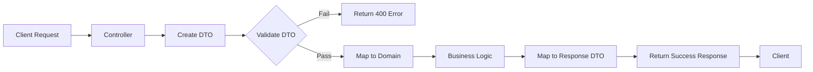

# CRUD, ORM และ TypeORM

## 1. CRUD คืออะไร

### บทนิยาม CRUD
**CRUD** คือชุดการดำเนินการพื้นฐาน 4 ประการที่ใช้ในการจัดการข้อมูลอย่างต่อเนื่องในระบบฐานข้อมูลหรือแอปพลิเคชันซอฟต์แวร์ โดยเป็นตัวย่อมาจาก:
- **C**reate (สร้าง) - การเพิ่มข้อมูลใหม่
- **R**ead (อ่าน) - การดึงหรืออ่านข้อมูล
- **U**pdate (อัปเดต) - การแก้ไขข้อมูลที่มีอยู่
- **D**elete (ลบ) - การลบข้อมูล

### องค์ประกอบหลักของ CRUD
1. **Create**: INSERT operations ใน SQL
2. **Read**: SELECT operations ใน SQL  
3. **Update**: UPDATE operations ใน SQL
4. **Delete**: DELETE operations ใน SQL

### โครงสร้างของ CRUD
```sql
-- Create
INSERT INTO table_name (column1, column2) VALUES (value1, value2);

-- Read
SELECT * FROM table_name WHERE condition;

-- Update
UPDATE table_name SET column1 = value1 WHERE condition;

-- Delete
DELETE FROM table_name WHERE condition;
```

### การใช้งานเชิงออกแบบและเชิงวัตถุ (OOP)
```javascript
class UserRepository {
    create(user) { /* ... */ }
    read(id) { /* ... */ }
    update(id, userData) { /* ... */ }
    delete(id) { /* ... */ }
}
```

### Architecture สถาปัตยกรรมของ CRUD
```
[Presentation Layer] → [Business Logic Layer] → [Data Access Layer] → [Database]
        ↓                    ↓                       ↓
     User Interface      CRUD Operations        SQL Queries
```

### ภาษาโปรแกรมเชิงวัตถุส่วนใหญ่รองรับ CRUD
- Java (Spring, JPA)
- Python (Django, SQLAlchemy)
- JavaScript/TypeScript (Node.js, Express)
- C# (.NET Entity Framework)
- PHP (Laravel Eloquent)

### Flow การทำงาน
```
User Request → Controller → Service/Logic → Repository/DAO → Database
                                    ↑
                              CRUD Operations
```

## 2. ORM คืออะไร

### บทนิยาม ORM
**ORM (Object-Relational Mapping)** คือเทคนิคการเขียนโปรแกรมที่ใช้ในการแปลงข้อมูลระหว่างระบบประเภทที่ไม่เข้ากันในภาษาโปรแกรมเชิงวัตถุ โดยสร้าง "เสมือน" ฐานข้อมูลวัตถุ (object database) ที่สามารถใช้งานจากภายในภาษาโปรแกรมได้

### องค์ประกอบหลักของ ORM
1. **Entity/Model**: คลาสที่แทนตารางในฐานข้อมูล
2. **Mapping Metadata**: การกำหนดความสัมพันธ์ระหว่าง object และ table
3. **Query Language**: ภาษาสำหรับ query ข้อมูล (เช่น HQL, DQL)
4. **Session/Unit of Work**: การจัดการ transaction และ cache

HQL (Hibernate Query Language) และ DQL (Doctrine Query Language) เป็นภาษา query เฉพาะสำหรับ ORM (Object-Relational Mapping) framework ที่นิยมใช้ใน Java และ PHP ตามลำดับ

## **HQL (Hibernate Query Language)**
- **สำหรับ**: Hibernate ORM ใน Java
- **ลักษณะ**: คล้าย SQL แต่ทำงานกับ Object แทน Table
- **ตัวอย่าง**:
```java
// แทนที่จะ SELECT * FROM employees
String hql = "FROM Employee e WHERE e.salary > :salary";
Query query = session.createQuery(hql);
query.setParameter("salary", 50000);
```

## **DQL (Doctrine Query Language)**
- **สำหรับ**: Doctrine ORM ใน PHP (ส่วนใหญ่ใช้กับ Symfony framework)
- **ลักษณะ**: ออกแบบมาให้ทำงานกับ Entity objects
- **ตัวอย่าง**:
```php
$dql = "SELECT u FROM App\Entity\User u WHERE u.age > :age";
$query = $entityManager->createQuery($dql);
$query->setParameter('age', 18);
```

# **Transaction (ทรานแซคชัน)**

## **ความหมาย**
**ทรานแซคชัน** คือ กลุ่มของ operations ที่ต้อง **สำเร็จทั้งหมดหรือล้มเหลวทั้งหมด** (All or Nothing) เพื่อรักษาความถูกต้องของข้อมูล

## **ACID Properties**
- **Atomicity** (ความเป็นอะตอม): ทั้งหมดสำเร็จหรือทั้งหมดยกเลิก
- **Consistency** (ความคงเส้นคงวา): ข้อมูลต้องสอดคล้องกับกฏ business เสมอ
- **Isolation** (การแยกกัน): ทรานแซคชันที่ทำงานพร้อมกันไม่รบกวนกัน
- **Durability** (ความคงทน): เมื่อ commit แล้ว ข้อมูลต้องถาวร

## **ตัวอย่างในชีวิตจริง**
```sql
-- การโอนเงินระหว่างบัญชี
BEGIN TRANSACTION;
UPDATE accounts SET balance = balance - 1000 WHERE id = 1;  -- ถอน
UPDATE accounts SET balance = balance + 1000 WHERE id = 2;  -- ฝาก
COMMIT; -- หรือ ROLLBACK ถ้าผิดพลาด
```

## **ใน ORM (Hibernate/Doctrine)**
```java
// Java/Hibernate
Session session = sessionFactory.openSession();
Transaction tx = null;
try {
    tx = session.beginTransaction();
    // ทำหลาย operations
    session.save(employee);
    session.update(department);
    tx.commit(); // บันทึกทั้งหมด
} catch (Exception e) {
    if (tx != null) tx.rollback(); // ยกเลิกทั้งหมดถ้าผิดพลาด
}
```

---

# **Cache (แคช)**

## **ความหมาย**
**แคช** คือ การเก็บข้อมูลชั่วคราวในที่ที่เข้าถึงได้เร็ว เพื่อลดการทำงานซ้ำๆ

## **ประเภทของ Cache**
1. **First-level Cache (L1 Cache)**
   - อยู่ใน Session/Entity Manager
   - อัตโนมัติ, ระดับ session
   ```java
   // Query เดียวกันใน session เดียวจะใช้ cache
   Employee e1 = session.get(Employee.class, 1); // Query DB
   Employee e2 = session.get(Employee.class, 1); // ใช้ cache
   ```

2. **Second-level Cache (L2 Cache)**
   - ระดับ application, ใช้ร่วมกันหลาย sessions
   - ต้อง configure แยก
   ```xml
   <!-- Hibernate configuration -->
   <property name="hibernate.cache.use_second_level_cache">true</property>
   <property name="hibernate.cache.region.factory_class">
       org.hibernate.cache.ehcache.EhCacheRegionFactory
   </property>
   ```

3. **Query Cache**
   - Cache ผลลัพธ์ของ query
   ```java
   Query query = session.createQuery("FROM Product WHERE category = :cat");
   query.setParameter("cat", "Electronics");
   query.setCacheable(true); // เปิด query cache
   ```

## **ทำไมต้องใช้ Cache?**
1. **Performance** - ลดการ query ซ้ำๆ ไป database
2. **ลด Load** - ลดภาระ database server
3. **เร็วขึ้น** - Memory access เร็วกว่า disk/database access

## **ตัวอย่างจริง**
```
ผู้ใช้ A ──ขอข้อมูลสินค้า──> แอป
      ↑                      ↓
      │              [1] ตรวจสอบ Cache
      │                      ↓
      │              [2] ถ้ามี → ส่งข้อมูลจาก Cache
      │                      ↓
      │              [3] ถ้าไม่มี → Query Database
      │                      ↓
      │              [4] เก็บผลลัพธ์ใน Cache
      │                      ↓
      └─────────ได้ข้อมูล─────┘
```

## **ข้อควรระวัง**
- **ข้อมูลอาจเก่า** (Stale data) ถ้าไม่จัดการ expiration
- **Memory usage** - ใช้ RAM มากขึ้น
- **Cache invalidation** - การลบ cache เมื่อข้อมูลเปลี่ยนแปลง

## **Cache Strategies**
- **Read-Through** - อ่านจาก cache ก่อน ถ้าไม่มีค่อยอ่านจาก DB
- **Write-Through** - เขียนทั้ง cache และ DB พร้อมกัน
- **Write-Behind** - เขียน cache ก่อน แล้วค่อย sync ไป DB ทีหลัง

---

## **ความสัมพันธ์ระหว่าง Transaction และ Cache**
- **Transaction** รับประกันความถูกต้องของข้อมูลใน DB
- **Cache** เพิ่ม performance แต่ต้อง sync กับ DB ให้ถูกต้อง
- เมื่อมี **transaction rollback** อาจต้อง **ลบ cache** ด้วย
- **Cache invalidation** ซับซ้อนขึ้นเมื่อมี multiple transactions

**สรุป**: Transaction = ความน่าเชื่อถือของข้อมูล, Cache = ความเร็วในการเข้าถึงข้อมูล

## **ความแตกต่างจาก SQL ปกติ**
1. **ทำงานกับ Object/Entity** ไม่ใช่ตารางโดยตรง
2. **ใช้ชื่อ Class/Entity** แทนชื่อตาราง
3. **ใช้ชื่อ Properties** แทนชื่อคอลัมน์
4. **รองรับ Inheritance และ Polymorphism**
5. **Type-safe** มากกว่า

## **ข้อดี**
- **Database independent** - สามารถเปลี่ยน database ได้โดยไม่ต้องแก้ query มาก
- **Object-oriented** - ทำงานกับ object ที่คุ้นเคย
- **ปลอดภัยกว่า** - ป้องกัน SQL injection ได้ดี
- **รองรับฟีเจอร์ขั้นสูง** เช่น caching, lazy loading

- ทั้งสองอย่างช่วยให้ developer ทำงานกับ database ในรูปแบบ object-oriented โดยไม่ต้องเขียน SQL โดยตรงมากเกินไป 👍

### โครงสร้างของ ORM
```typescript
// Entity Definition
@Entity()
class User {
    @PrimaryKey()
    id: number;
    
    @Property()
    name: string;
    
    @Property()
    email: string;
}
```

### การใช้งานเชิงออกแบบและเชิงวัตถุ ORM
```typescript
// แทนที่จะเขียน SQL
const users = await db.query('SELECT * FROM users WHERE age > 18');

// ใช้ ORM
const users = await userRepository.find({ where: { age: { $gt: 18 } } });
```

### Architecture สถาปัตยกรรมของ ORM
```
[Application Code] → [ORM Framework] → [Database Driver] → [Database]
        ↓                   ↓                  ↓
    Object Model       SQL Generation      Native Queries
```

### ภาษาโปรแกรมเชิงวัตถุส่วนใหญ่รองรับ ORM
- **Java**: Hibernate, JPA
- **Python**: SQLAlchemy, Django ORM
- **JavaScript/TypeScript**: TypeORM, Sequelize, Prisma
- **C#**: Entity Framework, NHibernate
- **PHP**: Doctrine, Eloquent ORM
- **Ruby**: ActiveRecord

### Flow การทำงานของ ORM
```
Application Object → ORM Mapping → SQL Generation → Database Execution
         ↑                                                 ↓
    Result Set ←───── Data Conversion ←───── Database Response
```

## 3. TypeORM คืออะไร

### บทนิยาม TypeORM
**TypeORM** คือ ORM framework สำหรับ TypeScript และ JavaScript (ES7+) ที่สามารถรันบนแพลตฟอร์ม Node.js, Browser, Cordova, PhoneGap, Ionic, React Native, NativeScript, Expo และ Electron โดยรองรับทั้ง Active Record และ Data Mapper patterns

### องค์ประกอบหลักของ TypeORM
1. **Entities**: คลาสที่ถูกแมปกับตารางฐานข้อมูล
2. **Repositories**: สำหรับดำเนินการ CRUD
3. **Connections**: การเชื่อมต่อกับฐานข้อมูล
4. **Migrations**: การจัดการการเปลี่ยนแปลง schema
5. **Subscribers**: Event listeners สำหรับ entity events

# **Schema (สคีมา)**

## **ความหมายโดยทั่วไป**
**Schema** คือ โครงสร้างหรือโครงร่างที่กำหนดว่าข้อมูลจะถูกจัดเก็บและจัดระเบียบอย่างไร

---

## **1. Database Schema (สคีมาฐานข้อมูล)**
### **คืออะไร?**
โครงสร้างทั้งหมดของฐานข้อมูล ได้แก่:
- **ตาราง (Tables)**
- **คอลัมน์ (Columns)**
- **ข้อมูลประเภท (Data Types)**
- **ความสัมพันธ์ (Relationships)**
- **คอนสเตรนต์ (Constraints)**
- **อินเด็กซ์ (Indexes)**
- **วิว (Views)**
- **สโตร์โพรซีเจอร์ (Stored Procedures)**

### **ประเภทของ Database Schema**
1. **Physical Schema** (สคีมาทางกายภาพ)
   - จริงๆ ข้อมูลเก็บอย่างไรบน disk
   - File organization, storage structures

2. **Logical Schema** (สคีมาทางตรรกะ)
   - โครงสร้างเชิงตรรกะที่ developer เห็น
   - ตาราง, ความสัมพันธ์, กฎธุรกิจ
   ```sql
   -- ตัวอย่าง Logical Schema
   CREATE TABLE customers (
       id INT PRIMARY KEY,
       name VARCHAR(100) NOT NULL,
       email VARCHAR(100) UNIQUE
   );
   
   CREATE TABLE orders (
       id INT PRIMARY KEY,
       customer_id INT REFERENCES customers(id),
       order_date DATE DEFAULT CURRENT_DATE
   );
   ```

3. **View Schema** (สคีมาของวิว)
   - Virtual tables ที่สร้างจากตารางจริง
   ```sql
   CREATE VIEW customer_orders AS
   SELECT c.name, o.order_date, o.total_amount
   FROM customers c
   JOIN orders o ON c.id = o.customer_id;
   ```

### **ตัวอย่าง Schema Diagram**
```
┌─────────────────┐      ┌─────────────────┐
│   Customers     │      │     Orders      │
├─────────────────┤      ├─────────────────┤
│ id (PK)         │◄─────│ customer_id (FK)│
│ name            │      │ id (PK)         │
│ email           │      │ order_date      │
│ phone           │      │ total_amount    │
└─────────────────┘      └─────────────────┘
```

---

## **2. XML Schema (XSD)**
### **คืออะไร?**
โครงสร้างของ XML document กำหนดว่าอิลิเมนต์และแอตทริบิวต์ควรเป็นอย่างไร
```xml
<!-- XML Schema Definition -->
<xs:schema>
  <xs:element name="book">
    <xs:complexType>
      <xs:sequence>
        <xs:element name="title" type="xs:string"/>
        <xs:element name="author" type="xs:string"/>
        <xs:element name="price" type="xs:decimal"/>
      </xs:sequence>
    </xs:complexType>
  </xs:element>
</xs:schema>
```

---

## **3. JSON Schema**
### **คืออะไร?**
โครงสร้างของ JSON document
```json
{
  "$schema": "http://json-schema.org/draft-07/schema#",
  "type": "object",
  "properties": {
    "name": { "type": "string" },
    "age": { "type": "number", "minimum": 0 },
    "email": { "type": "string", "format": "email" }
  },
  "required": ["name", "email"]
}
```

---

## **4. Application Schema (ใน Programming)**
### **ใน ORM (Hibernate/Doctrine)**
```java
// Entity Schema ใน Java (Hibernate)
@Entity
@Table(name = "employees")
public class Employee {
    @Id
    @GeneratedValue(strategy = GenerationType.IDENTITY)
    private Long id;
    
    @Column(name = "full_name", nullable = false, length = 100)
    private String name;
    
    @Column(unique = true)
    private String email;
    
    @OneToMany(mappedBy = "employee")
    private List<Order> orders;
}
```

```php
// Entity Schema ใน PHP (Doctrine)
/**
 * @Entity
 * @Table(name="products")
 */
class Product
{
    /**
     * @Id
     * @GeneratedValue
     * @Column(type="integer")
     */
    private $id;
    
    /**
     * @Column(type="string", length=255)
     */
    private $name;
    
    /**
     * @Column(type="decimal", precision=10, scale=2)
     */
    private $price;
}
```

---

## **ทำไม Schema สำคัญ?**
1. **Data Integrity** - รักษาความถูกต้องของข้อมูล
2. **Consistency** - โครงสร้างข้อมูลคงที่ทั่วทั้งระบบ
3. **Performance** - ออกแบบอินเด็กซ์และความสัมพันธ์ให้เหมาะสม
4. **Security** - กำหนดสิทธิ์การเข้าถึงระดับ schema
5. **Maintainability** - เข้าใจโครงสร้างง่าย เวลาแก้ไข

---

## **Schema Migration**
การเปลี่ยนแปลง schema เมื่อเวลาผ่านไป
```sql
-- Version 1.0
CREATE TABLE users (
    id INT PRIMARY KEY,
    username VARCHAR(50)
);

-- Version 2.0 (Migration)
ALTER TABLE users ADD COLUMN email VARCHAR(100);
ALTER TABLE users ADD CONSTRAINT unique_email UNIQUE(email);
```

### **Tools สำหรับ Migration**
- **Flyway** - Database migration tool
- **Liquibase** - Database-independent migrations
- **Doctrine Migrations** (PHP)
- **Alembic** (Python SQLAlchemy)

---

## **Schema Design Patterns**
1. **Star Schema** (ใช้ใน Data Warehouse)
   ```
   Fact Table (กลาง) ──┐
                       ├── Dimension Tables (รายล้อม)
   ```

2. **Snowflake Schema**
   - Normalized version ของ star schema

3. **Single Table Inheritance** (ใน ORM)
   ```sql
   CREATE TABLE payments (
       id INT PRIMARY KEY,
       amount DECIMAL,
       payment_type VARCHAR(20), -- 'credit_card', 'bank_transfer'
       -- fields สำหรับทุก payment types
   );
   ```

---

## **Best Practices**
1. **ตั้งชื่อให้สื่อความหมาย**
2. **ใช้ data types ให้เหมาะสม**
3. **กำหนด constraints (NOT NULL, UNIQUE, FOREIGN KEY)**
4. **Normalize แต่อย่าเกินเหตุ (ปกติถึง 3NF)**
5. **สร้าง index สำหรับคอลัมน์ที่ query บ่อย**
6. **Document schema ให้ชัดเจน**
7. **Version control schema changes**

---

## **Schema ในบริบทต่างๆ**
| Context | ความหมาย |
|---------|----------|
| **Database** | โครงสร้างตารางและความสัมพันธ์ |
| **API** | Request/Response structure |
| **Programming** | Class/Interface definitions |
| **System Design** | Overall system structure |

**สรุป**: Schema คือ **พิมพ์เขียว (blueprint)** ของข้อมูลหรือระบบ กำหนดว่าจะจัดระเบียบและเชื่อมโยงส่วนต่างๆ อย่างไรให้ทำงานร่วมกันได้อย่างมีประสิทธิภาพ ✅


### โครงสร้างของ TypeORM
```typescript
// Entity
import { Entity, PrimaryGeneratedColumn, Column } from "typeorm";

@Entity()
export class User {
    @PrimaryGeneratedColumn()
    id: number;

    @Column()
    firstName: string;

    @Column()
    lastName: string;

    @Column()
    age: number;
}

// Repository Usage
const userRepository = connection.getRepository(User);
const user = new User();
user.firstName = "John";
user.lastName = "Doe";
user.age = 25;
await userRepository.save(user);
```

### การใช้งานเชิงออกแบบและเชิงวัตถุ TypeORM
**Active Record Pattern:**
```typescript
@Entity()
export class User extends BaseEntity {
    // ...
    
    static findByName(firstName: string, lastName: string) {
        return this.createQueryBuilder("user")
            .where("user.firstName = :firstName", { firstName })
            .andWhere("user.lastName = :lastName", { lastName })
            .getMany();
    }
}

// Usage
const users = await User.findByName("John", "Doe");
```

**Data Mapper Pattern:**
```typescript
const userRepository = connection.getRepository(User);
const user = await userRepository.findOne({ where: { id: 1 } });
```

### Architecture สถาปัตยกรรมของ TypeORM
```
[TypeScript/JS App] → [TypeORM] → [Database Driver] → [Database]
        ↓                  ↓             ↓
    Entities         Query Builder    PostgreSQL
    Repositories     SQL Generation   MySQL
    Migrations                        SQLite
                                     MongoDB
```

### ภาษาโปรแกรมที่รองรับ TypeORM
- **Primary**: TypeScript, JavaScript (ES6+)
- **Platforms**: Node.js, Browser, Mobile Apps
- **Databases**: PostgreSQL, MySQL, MariaDB, SQLite, Microsoft SQL Server, Oracle, MongoDB, etc.

### Flow การทำงานของ TypeORM
```
TypeScript Entity → TypeORM Decorators → Schema Sync → Database
        ↓                   ↓                  ↓
  Query Builder → Query Generation → SQL Execution → Result Mapping
```

## 4. ภาษาโปรแกรมเชิงวัตถุส่วนใหญ่รองรับ ORM และ TypeORM

### โครงสร้างและองค์ประกอบหลักของ ORM และ TypeORM กับภาษาต่างๆ

**Python - SQLAlchemy:**
```python
# SQLAlchemy Example
from sqlalchemy import Column, Integer, String
from sqlalchemy.ext.declarative import declarative_base

Base = declarative_base()

class User(Base):
    __tablename__ = 'users'
    id = Column(Integer, primary_key=True)
    name = Column(String)
    email = Column(String)
```

**Java - Hibernate:**
```java
// Hibernate Example
@Entity
@Table(name = "users")
public class User {
    @Id
    @GeneratedValue(strategy = GenerationType.IDENTITY)
    private Long id;
    
    @Column(name = "name")
    private String name;
    
    // Getters and setters
}
```

**C# - Entity Framework:**
```csharp
// Entity Framework Example
public class User
{
    public int Id { get; set; }
    public string Name { get; set; }
    public string Email { get; set; }
}

public class ApplicationDbContext : DbContext
{
    public DbSet<User> Users { get; set; }
}
```

# **Entity (เอนทิตี)**

## **ความหมาย**
**Entity** คือ วัตถุหรือสิ่งใดๆ ในโลกจริงที่สามารถระบุตัวตนได้ชัดเจนและเก็บข้อมูลเกี่ยวกับสิ่งนั้นในระบบ

---

## **1. Database Context (ER Model)**
ใน **Entity-Relationship Model** (แบบจำลองเอนทิตี-ความสัมพันธ์):

### **คืออะไร?**
- สิ่งที่เราต้องการเก็บข้อมูล
- ใช้ **四เหลี่ยม** แทนใน ER Diagram

### **ตัวอย่าง Entity**
```
┌─────────────┐    ┌─────────────┐    ┌─────────────┐
│   Student   │    │   Course    │    │  Professor  │
├─────────────┤    ├─────────────┤    ├─────────────┤
│ - student_id│    │ - course_id │    │ - prof_id   │
│ - name      │    │ - title     │    │ - name      │
│ - email     │    │ - credits   │    │ - department│
└─────────────┘    └─────────────┘    └─────────────┘
```

### **Entity Types vs Entity Instances**
```sql
-- Entity Type: "Employee" (เป็นประเภท)
-- Entity Instances: ข้อมูลจริงแต่ละแถว
CREATE TABLE employees (
    id INT PRIMARY KEY,      -- Attribute
    name VARCHAR(100),       -- Attribute
    department VARCHAR(50)   -- Attribute
);

-- Entity Instances (ข้อมูลจริง):
-- 1, 'สมชาย', 'IT'
-- 2, 'สุณี', 'HR'
-- 3, 'ประยูร', 'Finance'
```

---

## **2. Object-Oriented Programming & ORM Context**
### **ใน ORM (Object-Relational Mapping)**
**Entity** คือ Java/PHP Class ที่ map กับ Database Table

### **ตัวอย่างใน Hibernate (Java)**
```java
import javax.persistence.*;

@Entity  // Annotation บอกว่านี้คือ Entity
@Table(name = "customers")  // Map กับตาราง "customers"
public class Customer {
    
    @Id  // Primary Key
    @GeneratedValue(strategy = GenerationType.IDENTITY)
    private Long id;
    
    @Column(name = "full_name", nullable = false)
    private String name;
    
    @Column(unique = true)
    private String email;
    
    @OneToMany(mappedBy = "customer")  // Relationship
    private List<Order> orders;
    
    // Constructors, Getters, Setters
    public Customer() {}
    
    public Long getId() { return id; }
    public void setId(Long id) { this.id = id; }
    // ... อื่นๆ
}
```

### **ตัวอย่างใน Doctrine (PHP/Symfony)**
```php
<?php
// src/Entity/Product.php
namespace App\Entity;

use Doctrine\ORM\Mapping as ORM;

/**
 * @ORM\Entity  // บอกว่านี้คือ Entity
 * @ORM\Table(name="products")  // Map กับตาราง "products"
 */
class Product
{
    /**
     * @ORM\Id  // Primary Key
     * @ORM\GeneratedValue
     * @ORM\Column(type="integer")
     */
    private $id;
    
    /**
     * @ORM\Column(type="string", length=255)
     */
    private $name;
    
    /**
     * @ORM\Column(type="decimal", precision=10, scale=2)
     */
    private $price;
    
    /**
     * @ORM\ManyToOne(targetEntity=Category::class, inversedBy="products")
     * @ORM\JoinColumn(nullable=false)
     */
    private $category;
    
    // Getters and Setters
    public function getId(): ?int { return $this->id; }
    public function getName(): ?string { return $this->id; }
    // ... อื่นๆ
}
```

---

## **3. Domain-Driven Design (DDD) Context**
ใน DDD มี **Entity** ต่างจาก **Value Object**:

### **Entity vs Value Object**
| **Entity** | **Value Object** |
|------------|------------------|
| มี Identity (ID) | ไม่มี Identity |
| เปลี่ยนแปลงค่าได้ | Immutable (ไม่เปลี่ยนแปลง) |
| เทียบเท่ากันด้วย ID | เทียบเท่ากันด้วยค่า |
| **ตัวอย่าง**: User, Order, Product | **ตัวอย่าง**: Money, Address, DateRange |

```java
// Entity - มี ID
public class User {
    private UserId id;  // มี Identity
    private String name;
    private Email email;
    // แม้จะเปลี่ยนชื่อ แต่ยังเป็น user คนเดิมเพราะมี ID เดียวกัน
}

// Value Object - ไม่มี ID
public class Money {
    private BigDecimal amount;
    private Currency currency;
    // ถ้าจำนวนและสกุลเงินเท่ากัน ถือว่าเป็นค่าเงินเดียวกัน
}
```

---

## **ลักษณะสำคัญของ Entity**
1. **มี Identity** - ระบุตัวตนได้ด้วย Identifier (ID)
2. **มีความต่อเนื่อง** - อยู่ตลอด lifecycle ของแอปพลิเคชัน
3. **เปลี่ยนแปลงได้** - State สามารถเปลี่ยนแปลงได้
4. **มีความเท่าเทียม** - เทียบเท่ากันถ้า ID เท่ากัน
5. **มีความสัมพันธ์** - สัมพันธ์กับ Entity อื่นได้

---

## **Entity Lifecycle (ใน ORM)**
```
      ┌─────────────┐
      │   New       │ ─── ไม่มีใน database
      └─────────────┘
            │ persist()
            ↓
      ┌─────────────┐
      │ Managed     │ ─── tracking โดย ORM
      └─────────────┘
            │
    ┌───────┴───────┐
    ↓               ↓
┌─────────┐   ┌─────────┐
│ Removed │   │ Detached│ ─── ไม่ tracking แล้ว
└─────────┘   └─────────┘
```

### **ตัวอย่าง Lifecycle**
```java
// 1. New/Transient State
Customer customer = new Customer();
customer.setName("John");

// 2. Managed State
entityManager.persist(customer);  // เริ่ม tracking
customer.setEmail("john@email.com");  // ORM จะ detect การเปลี่ยนแปลง

// 3. Commit to Database
entityManager.getTransaction().commit();

// 4. Detached State
entityManager.detach(customer);
// หรือ entityManager.close();

// 5. Removed State
entityManager.remove(customer);  // จะถูกลบจาก database
```

---

## **Entity Relationships**
### **ประเภทของความสัมพันธ์**
```java
@Entity
public class Author {
    @Id
    private Long id;
    
    // One-to-Many: ผู้เขียน 1 คน เขียนหนังสือหลายเล่ม
    @OneToMany(mappedBy = "author")
    private List<Book> books;
}

@Entity
public class Book {
    @Id
    private Long id;
    
    // Many-to-One: หนังสือหลายเล่ม เขียนโดยผู้เขียนคนเดียวกัน
    @ManyToOne
    @JoinColumn(name = "author_id")
    private Author author;
    
    // Many-to-Many: หนังสือหลายเล่ม อยู่ในหลายหมวดหมู่
    @ManyToMany
    @JoinTable(
        name = "book_category",
        joinColumns = @JoinColumn(name = "book_id"),
        inverseJoinColumns = @JoinColumn(name = "category_id")
    )
    private Set<Category> categories;
}
```

---

## **ทำไม Entity สำคัญ?**
1. **Abstraction** - ซ่อนรายละเอียดการเก็บข้อมูล
2. **Business Logic** - เก็บ business rules ใน Entity
3. **Type Safety** - ตรวจสอบความถูกต้องตอน compile time
4. **Maintainability** - แก้ไขโครงสร้างข้อมูลในที่เดียว
5. **Database Independence** - เปลี่ยน DB ได้โดยไม่กระทบโค้ด

---

## **Entity Design Principles**
1. **Rich Domain Model** - ใส่ business logic ใน Entity
   ```java
   @Entity
   public class BankAccount {
       private BigDecimal balance;
       
       public void deposit(BigDecimal amount) {
           if (amount.compareTo(BigDecimal.ZERO) <= 0) {
               throw new IllegalArgumentException("Amount must be positive");
           }
           this.balance = this.balance.add(amount);
       }
       
       public void withdraw(BigDecimal amount) {
           if (balance.compareTo(amount) < 0) {
               throw new InsufficientFundsException();
           }
           this.balance = this.balance.subtract(amount);
       }
   }
   ```

2. **Aggregate Root** - Entity หลักที่ควบคุมกลุ่มของ objects
3. **Anemic Model Anti-pattern** - อย่าทำ Entity ให้เป็นแค่ data container

---

## **Entity ใน Contexts อื่นๆ**
| Context | ความหมาย |
|---------|----------|
| **Database** | ตารางข้อมูล |
| **ORM** | Class ที่ map กับตาราง |
| **DDD** | Object ที่มี Identity |
| **REST API** | Resource ที่สามารถ CRUD ได้ |
| **Microservices** | บริบทของ business capability |

---

## **สรุป**
**Entity** คือ **ตัวแทนของสิ่งใดๆ ในระบบที่ต้องการเก็บข้อมูลและติดตาม** มีเอกลักษณ์เฉพาะตัว และมักมี lifecycle ที่ชัดเจนในแอปพลิเคชัน

### **Key Takeaways:**
1. Entity = มี Identity (ID) + มี State + มี Behavior
2. ใน ORM: Entity Class ↔ Database Table
3. ใน DDD: ต่างจาก Value Object (VO)
4. Design ให้ Entity ทำงานได้ด้วยตัวเอง (Rich Model)

**Entity** คือ **heart ของ business domain** ในแอปพลิเคชัน ✅


### การออกแบบแบบ MVC/MVT กับภาษาต่างๆ

**Python Django (MVT):**
```python
# models.py
from django.db import models

class User(models.Model):
    name = models.CharField(max_length=100)
    email = models.EmailField()

# views.py
from django.shortcuts import render
from .models import User

def user_list(request):
    users = User.objects.all()  # Django ORM
    return render(request, 'users/list.html', {'users': users})
```

**JavaScript/TypeScript with Express (MVC):**
```typescript
// User.model.ts
@Entity()
export class User {
    @PrimaryGeneratedColumn()
    id: number;
    
    @Column()
    name: string;
}

// User.controller.ts
@Controller('/users')
export class UserController {
    constructor(private userService: UserService) {}
    
    @Get()
    async getAllUsers() {
        return this.userService.findAll();
    }
}

// User.service.ts
@Service()
export class UserService {
    constructor(
        @InjectRepository(User)
        private userRepository: Repository<User>
    ) {}
    
    async findAll(): Promise<User[]> {
        return this.userRepository.find();
    }
}
```

### การใช้งานกับภาษาต่างๆ แบบ Modules

**Node.js/TypeScript with TypeORM:**
```typescript
// database.module.ts
@Module({
    imports: [
        TypeOrmModule.forRoot({
            type: 'postgres',
            host: 'localhost',
            port: 5432,
            username: 'postgres',
            password: 'password',
            database: 'test',
            entities: [User, Product],
            synchronize: true,
        }),
    ],
    exports: [TypeOrmModule],
})
export class DatabaseModule {}

// user.module.ts
@Module({
    imports: [TypeOrmModule.forFeature([User])],
    controllers: [UserController],
    providers: [UserService],
})
export class UserModule {}
```

## 5. Database ที่รองรับ ORM และ TypeORM การประยุกต์ใช้งาน

### ฐานข้อมูลที่รองรับ TypeORM
1. **SQL Databases**:
   - MySQL / MariaDB
   - PostgreSQL
   - SQLite
   - Microsoft SQL Server
   - Oracle
   - CockroachDB

2. **NoSQL Databases**:
   - MongoDB
   - Redis

### การใช้งานกับภาษาต่างๆ

**TypeORM with Multiple Databases:**
```typescript
// Multiple database connections
createConnections([
    {
        name: "mysqlConnection",
        type: "mysql",
        host: "localhost",
        port: 3306,
        username: "root",
        password: "admin",
        database: "mysql_db",
        entities: [User, Category],
        synchronize: true,
    },
    {
        name: "postgresConnection",
        type: "postgres",
        host: "localhost",
        port: 5432,
        username: "postgres",
        password: "admin",
        database: "postgres_db",
        entities: [Product, Order],
        synchronize: true,
    }
]);
```

**การประยุกต์ใช้งานจริง:**
```typescript
// 1. E-commerce Application
@Entity()
export class Product {
    @PrimaryGeneratedColumn()
    id: number;
    
    @Column()
    name: string;
    
    @Column('decimal')
    price: number;
    
    @Column()
    description: string;
    
    @ManyToOne(() => Category, category => category.products)
    category: Category;
    
    @OneToMany(() => OrderItem, orderItem => orderItem.product)
    orderItems: OrderItem[];
}

// 2. Social Media Application
@Entity()
export class Post {
    @PrimaryGeneratedColumn()
    id: number;
    
    @Column()
    content: string;
    
    @ManyToOne(() => User, user => user.posts)
    author: User;
    
    @OneToMany(() => Comment, comment => comment.post)
    comments: Comment[];
    
    @CreateDateColumn()
    createdAt: Date;
}

// 3. Complex Query Example
const usersWithPosts = await userRepository
    .createQueryBuilder("user")
    .leftJoinAndSelect("user.posts", "post")
    .where("user.age > :age", { age: 18 })
    .orderBy("user.createdAt", "DESC")
    .skip(0)
    .take(10)
    .getMany();

// 4. Migration Example
import { MigrationInterface, QueryRunner } from "typeorm";

export class CreateUsersTable1634567890123 implements MigrationInterface {
    public async up(queryRunner: QueryRunner): Promise<void> {
        await queryRunner.query(`
            CREATE TABLE users (
                id SERIAL PRIMARY KEY,
                name VARCHAR(100) NOT NULL,
                email VARCHAR(255) UNIQUE NOT NULL,
                created_at TIMESTAMP DEFAULT CURRENT_TIMESTAMP
            )
        `);
    }
    
    public async down(queryRunner: QueryRunner): Promise<void> {
        await queryRunner.query(`DROP TABLE users`);
    }
}
```

### การเชื่อมต่อกับฐานข้อมูลต่างๆ
```typescript
// PostgreSQL
{
    type: "postgres",
    host: "localhost",
    port: 5432,
    username: "test",
    password: "test",
    database: "test"
}

// MySQL
{
    type: "mysql",
    host: "localhost",
    port: 3306,
    username: "test",
    password: "test",
    database: "test"
}

// MongoDB
{
    type: "mongodb",
    host: "localhost",
    port: 27017,
    database: "test"
}

// SQLite
{
    type: "sqlite",
    database: "database.sqlite"
}
```

### การประยุกต์ใช้งานแบบ Microservices
```typescript
// Service A - User Service (MySQL)
@Service()
export class UserService {
    constructor(
        @InjectRepository(User)
        private userRepository: Repository<User>
    ) {}
    
    async createUser(data: CreateUserDto): Promise<User> {
        const user = this.userRepository.create(data);
        return this.userRepository.save(user);
    }
}

// Service B - Product Service (PostgreSQL)
@Service()
export class ProductService {
    constructor(
        @InjectRepository(Product)
        private productRepository: Repository<Product>
    ) {}
    
    async getProducts(): Promise<Product[]> {
        return this.productRepository.find({
            relations: ['category']
        });
    }
}
```

- สรุปได้ว่า CRUD, ORM และ TypeORM เป็นเทคโนโลยีพื้นฐานที่สำคัญในการพัฒนาแอปพลิเคชันสมัยใหม่ โดยช่วยลดความซับซ้อนในการทำงานกับฐานข้อมูล เพิ่มประสิทธิภาพในการพัฒนา และทำให้โค้ดอ่านง่ายและบำรุงรักษาได้ดีขึ้น
  
## **ORM Support in Object-Oriented Programming Languages**

**ภาษาโปรแกรมเชิงวัตถุส่วนใหญ่รองรับ ORM** และ **TypeORM** เป็นหนึ่งในตัวเลือกที่นิยมสำหรับ JavaScript/TypeScript

## **ORM Support ในภาษาโปรแกรมหลักๆ**

### **1. Java**
- **Hibernate** - ตัวท็อปและนิยมที่สุด
- **JPA (Jakarta Persistence API)** - Standard specification
- **EclipseLink** - JPA implementation ของ Eclipse
- **Spring Data JPA** - บน Spring Framework
- **MyBatis** - SQL Mapping framework

### **2. C# (.NET)**
- **Entity Framework (EF) Core** - Microsoft's ORM
- **Dapper** - Micro-ORM ที่เร็ว
- **NHibernate** - Port จาก Java Hibernate
- **LINQ to SQL** - สำหรับ SQL Server

### **3. Python**
- **Django ORM** - ใน Django framework
- **SQLAlchemy** - ยอดนิยมและทรงพลัง
- **Peewee** - เรียบง่าย น้ำหนักเบา
- **Tortoise ORM** - Async ORM

### **4. JavaScript/TypeScript** ⭐
- **TypeORM** - ยอดนิยมที่สุดสำหรับ TypeScript
- **Prisma** - Next-gen ORM
- **Sequelize** - สำหรับ JavaScript
- **Mongoose** - สำหรับ MongoDB (ODM)
- **Knex.js** - SQL Query Builder

### **5. PHP**
- **Doctrine** - ยอดนิยมใน Symfony
- **Eloquent** - ใน Laravel framework
- **Propel**

### **6. Ruby**
- **Active Record** - ใน Ruby on Rails (ตัวที่สร้างแนวคิด ORM ทั่วไป)
- **Sequel**

---

## **TypeORM - TypeScript ORM**

TypeORM เป็น **ORM ที่นิยมที่สุดสำหรับ TypeScript/JavaScript** รองรับทั้ง MySQL, PostgreSQL, SQLite, MongoDB, และอื่นๆ

### **Key Features ของ TypeORM**
```typescript
// 1. Decorator-based (เหมือนกับ Java/C#)
@Entity()
export class User {
    @PrimaryGeneratedColumn()
    id: number;
    
    @Column()
    name: string;
    
    @Column({ unique: true })
    email: string;
    
    @OneToMany(() => Post, post => post.author)
    posts: Post[];
}

// 2. Active Record Pattern
const user = new User();
user.name = "John";
await user.save();

// 3. Data Mapper Pattern
const userRepo = connection.getRepository(User);
const newUser = userRepo.create({ name: "John" });
await userRepo.save(newUser);
```

### **ตัวอย่าง TypeORM Connection**
```typescript
import { createConnection, Connection } from "typeorm";

const connection = await createConnection({
    type: "postgres",
    host: "localhost",
    port: 5432,
    username: "test",
    password: "test",
    database: "test",
    entities: [User, Post, Category],
    synchronize: true, // อันตรายใน production!
});

// Query ด้วย Repository Pattern
const userRepository = connection.getRepository(User);
const users = await userRepository.find({
    where: { active: true },
    relations: ["posts"]
});

// หรือใช้ QueryBuilder
const users = await userRepository
    .createQueryBuilder("user")
    .leftJoinAndSelect("user.posts", "post")
    .where("user.active = :active", { active: true })
    .getMany();
```

---

## **เปรียบเทียบ ORM หลักๆ**

| **ORM** | **ภาษา** | **จุดเด่น** | **ข้อเสีย** |
|---------|----------|------------|------------|
| **Hibernate** | Java | ครบเครื่อง, community ใหญ่ | ซับซ้อน, เรียนรู้ยาก |
| **Entity Framework** | C# | Integration ดีกับ .NET | ผูกกับ Microsoft ecosystem |
| **TypeORM** | TypeScript | Decorator-based, cross-database | Performance issues บางครั้ง |
| **Prisma** | TypeScript | Type-safe มาก, migration ดี | ยังใหม่, ecosystem น้อยกว่า |
| **Django ORM** | Python | ง่าย, ผูกกับ Django | ไม่ flexible สำหรับ complex queries |
| **SQLAlchemy** | Python | ยืดหยุ่นสูง, SQL-like | เรียนรู้ยากกว่า Django ORM |

---

## **ทำไมภาษา OOP ถึงต้องมี ORM?**

1. **Object-Relational Impedance Mismatch**
   ```typescript
   // Object World (OOP)
   class User {
       id: number;
       name: string;
       posts: Post[]; // Array of objects
   }
   
   // Relational World (SQL)
   // Users Table
   // | id | name |
   
   // Posts Table
   // | id | title | user_id |
   
   // ORM ช่วย bridge ช่องว่างนี้!
   ```

2. **Productivity** - เขียนโค้ดน้อยลง
3. **Type Safety** - ตรวจสอบตอน compile time
4. **Database Abstraction** - เปลี่ยน DB ได้ง่าย
5. **Security** - ป้องกัน SQL Injection

---

## **ORM Patterns ที่พบทั่วไป**

### **1. Active Record Pattern**
```ruby
# Ruby on Rails - ต้นแบบของ Active Record
user = User.new(name: "John")
user.save
user.update(name: "Jane")
user.destroy
```

### **2. Data Mapper Pattern**
```java
// Hibernate/Doctrine - แยก Entity ออกจาก Persistence Logic
User user = new User("John");
userRepository.save(user); // Repository จัดการ persistence
```

### **3. Repository Pattern**
```csharp
// C# Entity Framework
public interface IUserRepository {
    User GetById(int id);
    void Add(User user);
    void Update(User user);
    void Delete(int id);
}
```

### **4. Unit of Work Pattern**
```typescript
// TypeORM
await connection.transaction(async manager => {
    const userRepo = manager.getRepository(User);
    const orderRepo = manager.getRepository(Order);
    
    await userRepo.save(newUser);
    await orderRepo.save(newOrder);
    // ทั้งสองอัน commit หรือ rollback พร้อมกัน
});
```

---

## **Modern ORM Trends**

### **1. Prisma (TypeScript)**
```typescript
// Schema-first approach
// schema.prisma
model User {
  id    Int     @id @default(autoincrement())
  name  String
  email String  @unique
  posts Post[]
}

// Type-safe queries
const user = await prisma.user.findUnique({
  where: { email: "alice@prisma.io" },
  include: { posts: true }
});
```

### **2. SQLAlchemy 2.0 (Python)**
```python
# Python with async support
from sqlalchemy.ext.asyncio import AsyncSession

async with AsyncSession(engine) as session:
    result = await session.execute(
        select(User).where(User.name == "john")
    )
    user = result.scalar_one()
```

### **3. Entity Framework Core (C#)**
```csharp
// .NET Core with LINQ
var users = await context.Users
    .Where(u => u.Active)
    .Include(u => u.Posts)
    .ThenInclude(p => p.Comments)
    .ToListAsync();
```

---

## **ควรเลือก ORM ตามอะไร?**

1. **ภาษาที่ใช้** - แต่ละภาษามี ORM หลักๆ
2. **ความซับซ้อนของโปรเจค** - Simple vs Complex queries
3. **Performance Requirements** - Micro-ORM vs Full-ORM
4. **Team Experience** - เลือกสิ่งที่ทีมถนัด
5. **Database Support** - บาง ORM รองรับหลาย DB บางตัวรองรับแค่บาง DB

---

## **สรุป**
- ✅ **ทุกภาษา OOP หลักมี ORM** อย่างน้อย 1-2 ตัวที่นิยม
- ✅ **TypeORM** เป็นตัวเลือกที่ดีสำหรับ **TypeScript/JavaScript**
- ✅ **เลือก ORM ให้เหมาะกับ** project requirements และ team skills
- ✅ **ORM ช่วยเพิ่ม productivity** แต่ต้องเข้าใจ trade-offs (performance, complexity)

**คำแนะนำ:** สำหรับโปรเจคใหม่ๆ:
- **TypeScript/Node.js** → **Prisma** หรือ **TypeORM**
- **Java/Spring** → **Spring Data JPA/Hibernate**
- **C#/.NET** → **Entity Framework Core**
- **Python** → **SQLAlchemy** หรือ **Django ORM** (ถ้าใช้ Django)
- **Ruby** → **Active Record** (Rails)
- **PHP** → **Eloquent** (Laravel) หรือ **Doctrine** (Symfony)

# **เปรียบเทียบ CRUD กับ REST ในการออกแบบ API**

## **ความแตกต่างระหว่าง CRUD และ REST**
| **Aspect** | **CRUD** | **REST** |
|------------|----------|----------|
| **ความหมาย** | Operations พื้นฐาน 4 อย่าง (Create, Read, Update, Delete) | Architectural style สำหรับ distributed systems |
| **ขอบเขต** | ระดับ Operation/Function | ระดับ Architecture/Design Pattern |
| **HTTP Methods** | Map กับ HTTP ได้แต่ไม่จำเป็น | ใช้ HTTP methods เป็นมาตรฐาน |
| **Resource Focus** | เน้น Data Operations | เน้น Resources และ Representations |
| **Statelessness** | ไม่กำหนด | ต้องเป็น Stateless |

## **CRUD Operations ↔ HTTP Methods ↔ REST**
| **CRUD Operation** | **HTTP Method** | **REST Endpoint** | **ตัวอย่าง** |
|-------------------|----------------|-------------------|-------------|
| **Create** | POST | /resources | POST /users |
| **Read** | GET | /resources/:id | GET /users/1 |
| **Update** | PUT/PATCH | /resources/:id | PUT /users/1 |
| **Delete** | DELETE | /resources/:id | DELETE /users/1 |

## **ตัวอย่างเปรียบเทียบ**

### **1. CRUD-centric API (อาจไม่ RESTful)**
```typescript
// เน้น operations มากกว่า resources
POST /createUser
GET /getUser?id=1
POST /updateUser
GET /deleteUser?id=1
```

### **2. RESTful API**
```typescript
// เน้น resources และ HTTP semantics
POST   /users        // Create
GET    /users        // Read all
GET    /users/:id    // Read one
PUT    /users/:id    // Update (replace)
PATCH  /users/:id    // Update (partial)
DELETE /users/:id    // Delete
```

### **3. REST + CRUD อย่างถูกต้อง**
```typescript
// Nested resources
GET    /users/:userId/orders          // Get user's orders
POST   /users/:userId/orders          // Create order for user
GET    /users/:userId/orders/:orderId // Get specific order
PUT    /users/:userId/orders/:orderId // Update order
DELETE /users/:userId/orders/:orderId // Delete order

// Non-CRUD actions (REST ดีกว่า CRUD)
POST   /users/:id/activate    // แทนที่ POST /activateUser
POST   /orders/:id/cancel     // แทนที่ POST /cancelOrder
POST   /users/:id/password    // แทนที่ POST /changePassword
```

---

# **ข้อดีข้อเสียของการใช้ ORM ในโปรเจกต์ขนาดใหญ่**

## **ข้อดี (Pros)**
### **1. Productivity & Development Speed**
```typescript
// เขียนโค้ดน้อยลงกว่า SQL เต็มๆ
const user = await userRepository.findOne({ where: { id: 1 } });
// VS
const [rows] = await connection.query(
  'SELECT * FROM users WHERE id = ?', [1]
);
```

### **2. Database Abstraction**
- เปลี่ยน Database (MySQL → PostgreSQL) ได้ง่าย
- Database-agnostic queries

### **3. Type Safety (โดยเฉพาะ TypeORM)**
```typescript
// Compile-time type checking
const user = await userRepository.findOne({ 
  where: { email: "test@example.com" } 
});
// user เป็น User | undefined
console.log(user.name); // TypeScript รู้ว่า property มีอะไรบ้าง
```

### **4. Security**
```typescript
// ป้องกัน SQL Injection อัตโนมัติ
await userRepository.findOne({ 
  where: { email: userInput } // ปลอดภัย
});

// VS manual SQL ที่เสี่ยง
const query = `SELECT * FROM users WHERE email = '${userInput}'`; // RISKY!
```

### **5. Maintainability**
- Business logic ใน Entity classes
- Centralized data access layer
- Easy refactoring with IDE support

### **6. Advanced Features**
- Lazy/Eager loading
- Caching
- Transaction management
- Migrations
- Soft deletes

## **ข้อเสีย (Cons)**
### **1. Performance Overhead**
```typescript
// N+1 Query Problem (พบในหลาย ORM)
const users = await userRepository.find();
for (const user of users) {
  const orders = await orderRepository.find({ 
    where: { userId: user.id } 
  }); // Query สำหรับแต่ละ user!
}

// แก้ด้วย Eager Loading
const users = await userRepository.find({ 
  relations: ['orders'] // Load ทั้งหมดใน query เดียว
});
```

### **2. Complex Queries**
```typescript
// ORM อาจซับซ้อนสำหรับ complex queries
const result = await userRepository
  .createQueryBuilder("user")
  .leftJoinAndSelect("user.orders", "order")
  .leftJoinAndSelect("order.items", "item")
  .where("user.active = :active", { active: true })
  .andWhere("order.status = :status", { status: "completed" })
  .groupBy("user.id")
  .having("SUM(item.price) > :min", { min: 1000 })
  .getMany();

// VS SQL ธรรมดาที่อ่านง่ายกว่า
const sql = `
  SELECT u.*, SUM(i.price) as total_spent
  FROM users u
  JOIN orders o ON u.id = o.user_id
  JOIN order_items i ON o.id = i.order_id
  WHERE u.active = 1 AND o.status = 'completed'
  GROUP BY u.id
  HAVING total_spent > 1000
`;
```

### **3. Learning Curve**
- ต้องเข้าใจ ORM-specific concepts
- Debugging ซับซ้อนกว่า SQL

### **4. Magic Behavior**
```typescript
// บางพฤติกรรมอาจไม่ชัดเจน
user.name = "New Name";
await userRepository.save(user); // อัพเดตอัตโนมัติ
// เมื่อไหร่ถึงจะ save จริงๆ? อาจมี延迟

// VS ตรงไปตรงมา
await connection.query(
  'UPDATE users SET name = ? WHERE id = ?', 
  ["New Name", user.id]
);
```

### **5. Vendor Lock-in**
- โค้ดผูกกับ ORM เฉพาะ
- ย้ายไปใช้ ORM อื่นยาก

### **6. Limited Optimization**
- ORM generate SQL อาจไม่ optimal
- DBA อาจไม่ชอบเพราะควบคุม SQL ไม่ได้

## **Best Practices สำหรับโปรเจกต์ใหญ่**
### **Hybrid Approach**
```typescript
// ใช้ ORM สำหรับ 80% ของ use cases ทั่วไป
class UserService {
  // ใช้ ORM สำหรับทั่วไป
  async getUsers(page: number, limit: number): Promise<User[]> {
    return userRepository.find({
      skip: (page - 1) * limit,
      take: limit,
      order: { createdAt: "DESC" }
    });
  }
  
  // ใช้ Raw SQL สำหรับ complex queries
  async getAnalytics(startDate: Date, endDate: Date): Promise<any> {
    const sql = `
      SELECT 
        DATE(created_at) as date,
        COUNT(*) as user_count,
        SUM(order_total) as revenue
      FROM users u
      LEFT JOIN (
        SELECT user_id, SUM(total) as order_total
        FROM orders
        WHERE created_at BETWEEN ? AND ?
        GROUP BY user_id
      ) o ON u.id = o.user_id
      WHERE u.created_at BETWEEN ? AND ?
      GROUP BY DATE(u.created_at)
    `;
    
    return connection.query(sql, [
      startDate, endDate, startDate, endDate
    ]);
  }
}
```

---

# **ตัวอย่างโค้ด CRUD พื้นฐานด้วย TypeORM และ TypeScript**

## **1. Setup และ Entity Definition**
```typescript
// src/entity/User.ts
import { Entity, PrimaryGeneratedColumn, Column, CreateDateColumn, UpdateDateColumn } from "typeorm";

@Entity()
export class User {
    @PrimaryGeneratedColumn()
    id: number;

    @Column({ length: 100 })
    name: string;

    @Column({ unique: true })
    email: string;

    @Column({ default: true })
    isActive: boolean;

    @CreateDateColumn()
    createdAt: Date;

    @UpdateDateColumn()
    updatedAt: Date;

    constructor(name: string, email: string) {
        this.name = name;
        this.email = email;
    }
}

// src/entity/Post.ts
@Entity()
export class Post {
    @PrimaryGeneratedColumn()
    id: number;

    @Column()
    title: string;

    @Column("text")
    content: string;

    @Column({ default: 0 })
    views: number;

    @ManyToOne(() => User, user => user.posts)
    @JoinColumn({ name: "authorId" })
    author: User;

    @Column()
    authorId: number;
}
```

## **2. Database Connection**
```typescript
// src/data-source.ts
import "reflect-metadata";
import { DataSource } from "typeorm";
import { User } from "./entity/User";
import { Post } from "./entity/Post";

export const AppDataSource = new DataSource({
    type: "postgres",
    host: "localhost",
    port: 5432,
    username: "postgres",
    password: "password",
    database: "myapp",
    synchronize: true, // ใช้เฉพาะ development!
    logging: true,
    entities: [User, Post],
    migrations: ["src/migration/*.ts"],
    subscribers: [],
});
```

## **3. CRUD Operations Service**
```typescript
// src/services/UserService.ts
import { AppDataSource } from "../data-source";
import { User } from "../entity/User";
import { Repository } from "typeorm";

export class UserService {
    private userRepository: Repository<User>;

    constructor() {
        this.userRepository = AppDataSource.getRepository(User);
    }

    // CREATE
    async createUser(userData: Partial<User>): Promise<User> {
        const user = this.userRepository.create(userData);
        return await this.userRepository.save(user);
    }

    // READ - Single
    async getUserById(id: number): Promise<User | null> {
        return await this.userRepository.findOne({ 
            where: { id },
            relations: ["posts"] // Include related posts
        });
    }

    // READ - Multiple with Pagination
    async getAllUsers(
        page: number = 1, 
        limit: number = 10,
        isActive?: boolean
    ): Promise<{ users: User[], total: number }> {
        
        const where: any = {};
        if (isActive !== undefined) {
            where.isActive = isActive;
        }

        const [users, total] = await this.userRepository.findAndCount({
            where,
            skip: (page - 1) * limit,
            take: limit,
            order: { createdAt: "DESC" }
        });

        return { users, total };
    }

    // READ - By Email
    async getUserByEmail(email: string): Promise<User | null> {
        return await this.userRepository.findOne({ 
            where: { email } 
        });
    }

    // UPDATE
    async updateUser(id: number, updateData: Partial<User>): Promise<User | null> {
        await this.userRepository.update(id, updateData);
        return await this.getUserById(id); // Return updated user
    }

    // UPDATE - Partial (ใช้ QueryBuilder สำหรับ complex updates)
    async incrementUserViews(id: number): Promise<void> {
        await this.userRepository
            .createQueryBuilder()
            .update(User)
            .set({ views: () => "views + 1" })
            .where("id = :id", { id })
            .execute();
    }

    // DELETE - Hard Delete
    async deleteUser(id: number): Promise<boolean> {
        const result = await this.userRepository.delete(id);
        return result.affected !== undefined && result.affected > 0;
    }

    // DELETE - Soft Delete (ต้องมี @DeleteDateColumn ใน Entity)
    async softDeleteUser(id: number): Promise<boolean> {
        const result = await this.userRepository.softDelete(id);
        return result.affected !== undefined && result.affected > 0;
    }

    // TRANSACTION Example
    async transferUserData(fromUserId: number, toUserId: number): Promise<void> {
        await AppDataSource.transaction(async transactionalEntityManager => {
            const fromUser = await transactionalEntityManager.findOne(User, {
                where: { id: fromUserId }
            });
            
            const toUser = await transactionalEntityManager.findOne(User, {
                where: { id: toUserId }
            });

            if (!fromUser || !toUser) {
                throw new Error("User not found");
            }

            // Transfer posts
            await transactionalEntityManager
                .createQueryBuilder()
                .update(Post)
                .set({ authorId: toUserId })
                .where("authorId = :fromUserId", { fromUserId })
                .execute();

            // Delete old user
            await transactionalEntityManager.remove(fromUser);
        });
    }
}
```

## **4. Usage Example**
```typescript
// src/index.ts
import { AppDataSource } from "./data-source";
import { UserService } from "./services/UserService";

async function main() {
    try {
        // Initialize connection
        await AppDataSource.initialize();
        console.log("Database connected!");

        const userService = new UserService();

        // CREATE
        const newUser = await userService.createUser({
            name: "John Doe",
            email: "john@example.com"
        });
        console.log("Created user:", newUser);

        // READ
        const user = await userService.getUserById(newUser.id);
        console.log("Found user:", user);

        // READ with pagination
        const { users, total } = await userService.getAllUsers(1, 10, true);
        console.log(`Total users: ${total}`);

        // UPDATE
        const updatedUser = await userService.updateUser(newUser.id, {
            name: "John Updated"
        });
        console.log("Updated user:", updatedUser);

        // DELETE
        const deleted = await userService.deleteUser(newUser.id);
        console.log("User deleted:", deleted);

    } catch (error) {
        console.error("Error:", error);
    } finally {
        await AppDataSource.destroy();
    }
}

main();
```

---

# **วิธีออกแบบ Entity และความสัมพันธ์ใน TypeORM**

## **1. Basic Entity Structure**
```typescript
@Entity()
export class Product {
    @PrimaryGeneratedColumn('uuid') // หรือ 'increment'
    id: string;

    @Column()
    name: string;

    @Column('decimal', { precision: 10, scale: 2 })
    price: number;

    @Column({ default: true })
    isAvailable: boolean;

    @Column({ type: 'json', nullable: true })
    metadata: Record<string, any>;

    @CreateDateColumn()
    createdAt: Date;

    @UpdateDateColumn()
    updatedAt: Date;

    @DeleteDateColumn() // สำหรับ soft delete
    deletedAt: Date | null;
}
```

## **2. Relationship Types**
### **One-to-One**
```typescript
// User has one Profile
@Entity()
export class User {
    @PrimaryGeneratedColumn()
    id: number;

    @Column()
    name: string;

    @OneToOne(() => Profile, profile => profile.user)
    @JoinColumn() // Foreign key อยู่ในตาราง User
    profile: Profile;
}

@Entity()
export class Profile {
    @PrimaryGeneratedColumn()
    id: number;

    @Column()
    bio: string;

    @OneToOne(() => User, user => user.profile)
    user: User; // ไม่มี @JoinColumn ฝั่งนี้
}
```

### **One-to-Many / Many-to-One**
```typescript
// User has many Posts
@Entity()
export class User {
    @PrimaryGeneratedColumn()
    id: number;

    @Column()
    name: string;

    @OneToMany(() => Post, post => post.author)
    posts: Post[];
}

@Entity()
export class Post {
    @PrimaryGeneratedColumn()
    id: number;

    @Column()
    title: string;

    @ManyToOne(() => User, user => user.posts)
    @JoinColumn({ name: "author_id" })
    author: User;
}
```

### **Many-to-Many**
```typescript
// Post has many Categories, Category has many Posts
@Entity()
export class Post {
    @PrimaryGeneratedColumn()
    id: number;

    @Column()
    title: string;

    @ManyToMany(() => Category, category => category.posts)
    @JoinTable({
        name: "post_categories", // ชื่อตาราง junction
        joinColumn: {
            name: "post_id",
            referencedColumnName: "id"
        },
        inverseJoinColumn: {
            name: "category_id",
            referencedColumnName: "id"
        }
    })
    categories: Category[];
}

@Entity()
export class Category {
    @PrimaryGeneratedColumn()
    id: number;

    @Column()
    name: string;

    @ManyToMany(() => Post, post => post.categories)
    posts: Post[];
}
```

### **Self-Referencing Relationship**
```typescript
// Employee has a manager (also an Employee)
@Entity()
export class Employee {
    @PrimaryGeneratedColumn()
    id: number;

    @Column()
    name: string;

    @ManyToOne(() => Employee, employee => employee.subordinates)
    manager: Employee | null;

    @OneToMany(() => Employee, employee => employee.manager)
    subordinates: Employee[];
}
```

## **3. Inheritance Strategies**
```typescript
// Single Table Inheritance
@Entity()
@TableInheritance({ column: { type: "varchar", name: "type" } })
export abstract class Payment {
    @PrimaryGeneratedColumn()
    id: number;

    @Column('decimal')
    amount: number;

    @Column()
    type: string;
}

@ChildEntity()
export class CreditCardPayment extends Payment {
    @Column()
    cardNumber: string;

    @Column()
    expirationDate: string;
}

@ChildEntity()
export class BankTransferPayment extends Payment {
    @Column()
    bankName: string;

    @Column()
    accountNumber: string;
}

// Table Per Class Inheritance
@Entity()
@TableInheritance({ column: { type: "varchar", name: "type" } })
export abstract class Person {
    @PrimaryGeneratedColumn()
    id: number;

    @Column()
    name: string;
}

@ChildEntity()
@Table({ name: "employees" })
export class Employee extends Person {
    @Column()
    salary: number;
}

@ChildEntity()
@Table({ name: "customers" })
export class Customer extends Person {
    @Column()
    loyaltyPoints: number;
}
```

## **4. Eager vs Lazy Loading**
```typescript
@Entity()
export class User {
    @PrimaryGeneratedColumn()
    id: number;

    // Eager Loading (โหลดพร้อมกันเสมอ)
    @OneToMany(() => Post, post => post.author, { eager: true })
    posts: Post[];

    // Lazy Loading (โหลดเมื่อต้องการ)
    @OneToMany(() => Comment, comment => comment.user, { lazy: true })
    comments: Promise<Comment[]>;
}

// Usage
const user = await userRepository.findOne({ where: { id: 1 } });
console.log(user.posts); // มีข้อมูลแล้ว (eager)

const comments = await user.comments; // โหลดตอนนี้ (lazy)
```

## **5. Indexes และ Constraints**
```typescript
@Entity()
@Index(["email"], { unique: true })
@Index(["firstName", "lastName"]) // Composite index
export class User {
    @PrimaryGeneratedColumn()
    id: number;

    @Column()
    @Index() // Single column index
    email: string;

    @Column()
    firstName: string;

    @Column()
    lastName: string;

    @Column({ unique: true })
    username: string;

    @Column({ nullable: false })
    @Check(`"age" >= 18`) // Check constraint
    age: number;
}
```

---

# **ฐานข้อมูลใดรองรับ TypeORM และการตั้งค่าเริ่มต้น**

## **Supported Databases**

| **Database** | **TypeORM Package** | **Driver** |
|--------------|---------------------|------------|
| **MySQL** | `mysql2` หรือ `mysql` | `mysql` |
| **PostgreSQL** | `pg` | `postgres` |
| **SQLite** | `sqlite3` หรือ `better-sqlite3` | `sqlite` |
| **Microsoft SQL Server** | `mssql` | `mssql` |
| **MariaDB** | `mysql2` หรือ `mariadb` | `mariadb` |
| **Oracle** | `oracledb` | `oracle` |
| **MongoDB** | `mongodb` | `mongodb` |
| **CockroachDB** | `pg` | `cockroachdb` |
| **SAP HANA** | `@sap/hana-client` | `sap` |

## **การตั้งค่าเริ่มต้น (Configuration)**

### **1. PostgreSQL**
```typescript
// src/data-source.ts
import { DataSource } from "typeorm";

export const AppDataSource = new DataSource({
    type: "postgres",
    host: "localhost",
    port: 5432,
    username: "postgres",
    password: "password",
    database: "myapp",
    
    // Development settings
    synchronize: true, // Auto-create/update tables (อย่าใช้ใน production!)
    logging: true,
    entities: ["src/entity/**/*.ts"],
    migrations: ["src/migration/**/*.ts"],
    subscribers: ["src/subscriber/**/*.ts"],
    
    // Production settings (ควรเพิ่ม)
    ssl: process.env.NODE_ENV === 'production' 
        ? { rejectUnauthorized: false } 
        : false,
    extra: {
        connectionLimit: 10,
        max: 20,
        min: 5,
        idleTimeoutMillis: 30000,
    }
});
```

### **2. MySQL/MariaDB**
```typescript
export const AppDataSource = new DataSource({
    type: "mysql",
    host: "localhost",
    port: 3306,
    username: "root",
    password: "password",
    database: "myapp",
    
    // MySQL-specific settings
    charset: "utf8mb4",
    timezone: "+07:00", // Asia/Bangkok
    supportBigNumbers: true,
    bigNumberStrings: false,
    
    synchronize: false, // ควร false ใน production
    logging: ["query", "error"], // Log เฉพาะ query และ error
    entities: [__dirname + "/entity/*.js"],
    migrations: [__dirname + "/migration/*.js"],
});
```

### **3. SQLite**
```typescript
export const AppDataSource = new DataSource({
    type: "sqlite",
    database: "database.sqlite", // หรือ ":memory:" สำหรับ in-memory
    
    // SQLite-specific
    enableWAL: true, // Write-Ahead Logging สำหรับ performance
    busyErrorRetry: 100, // Retry on busy
    
    synchronize: true,
    logging: false,
    entities: [User, Post],
});
```

### **4. MongoDB**
```typescript
export const AppDataSource = new DataSource({
    type: "mongodb",
    host: "localhost",
    port: 27017,
    database: "myapp",
    
    // MongoDB-specific
    useUnifiedTopology: true,
    useNewUrlParser: true,
    
    // สำหรับ MongoDB (NoSQL) entities อาจต่างจาก SQL
    entities: [UserMongoEntity, ProductMongoEntity],
    
    // ไม่ใช้ migrations สำหรับ MongoDB
    synchronize: true,
});
```

### **5. Environment-based Configuration**
```typescript
// config/database.config.ts
import { DataSourceOptions } from "typeorm";
import dotenv from "dotenv";

dotenv.config();

const commonConfig: Partial<DataSourceOptions> = {
    entities: ["src/entity/**/*.ts"],
    migrations: ["src/migration/**/*.ts"],
    subscribers: ["src/subscriber/**/*.ts"],
    logging: process.env.NODE_ENV === "development",
};

const configs: Record<string, DataSourceOptions> = {
    development: {
        type: "postgres",
        host: "localhost",
        port: 5432,
        username: "postgres",
        password: "password",
        database: "myapp_dev",
        synchronize: true,
        ...commonConfig,
    },
    
    test: {
        type: "sqlite",
        database: ":memory:",
        synchronize: true,
        dropSchema: true, // ล้าง schema ทุกครั้ง
        ...commonConfig,
    },
    
    production: {
        type: "postgres",
        host: process.env.DB_HOST,
        port: parseInt(process.env.DB_PORT || "5432"),
        username: process.env.DB_USERNAME,
        password: process.env.DB_PASSWORD,
        database: process.env.DB_NAME,
        synchronize: false, // ห้ามใช้ true ใน production!
        migrationsRun: true, // รัน migrations อัตโนมัติ
        ssl: {
            rejectUnauthorized: false,
        },
        extra: {
            ssl: {
                require: true,
                rejectUnauthorized: false,
            },
            connectionLimit: 10,
        },
        ...commonConfig,
    },
};

const env = process.env.NODE_ENV || "development";
export const dataSourceOptions = configs[env];
```

## **Connection Pool Configuration**
```typescript
export const AppDataSource = new DataSource({
    type: "postgres",
    host: "localhost",
    port: 5432,
    username: "postgres",
    password: "password",
    database: "myapp",
    
    // Connection pool settings
    poolSize: 10, // Maximum connections
    extra: {
        max: 20, // Maximum connections
        min: 5,  // Minimum connections
        idleTimeoutMillis: 30000, // Close idle connections after 30s
        connectionTimeoutMillis: 2000, // Connection timeout
    },
    
    // Retry configuration
    retryAttempts: 3, // Retry connection on failure
    retryDelay: 1000, // Delay between retries
    
    // Cache configuration
    cache: {
        type: "database", // หรือ "redis"
        options: {
            tableName: "typeorm_cache",
            duration: 60000, // 1 minute
        }
    },
});
```

## **Multiple Database Connections**
```typescript
// สำหรับ Microservices หรือ Multi-tenant
import { DataSource } from "typeorm";

export const PrimaryDataSource = new DataSource({
    name: "primary",
    type: "postgres",
    host: "primary.db.example.com",
    database: "primary_db",
    // ... other config
});

export const AnalyticsDataSource = new DataSource({
    name: "analytics",
    type: "postgres",
    host: "analytics.db.example.com",
    database: "analytics_db",
    // ... other config
});

// Usage
const primaryRepo = PrimaryDataSource.getRepository(User);
const analyticsRepo = AnalyticsDataSource.getRepository(AnalyticsEvent);
```

## **สรุป Best Practices**
1. **อย่าใช้ `synchronize: true` ใน production** - ใช้ migrations แทน
2. **Connection pooling** - configure ให้เหมาะสมกับ workload
3. **Environment-based config** - แยก config ตาม environment
4. **SSL/TLS** - เปิดใน production เสมอ
5. **Logging** - เปิดใน development, ปิดหรือจำกัดใน production
6. **Validate config** - ใช้ validation library เช่น Joi หรือ class-validator

# **DTO และ Validation: บทนิยาม, โครงสร้าง และการใช้งาน**

## 📘 **บทนิยาม (Definition)**
### **DTO (Data Transfer Object)**
- **วัตถุที่ใช้ส่งข้อมูล** ระหว่างเลเยอร์/โมดูลของระบบ
- ออกแบบมาเฉพาะสำหรับ **การขนส่งข้อมูล** โดยไม่มีพฤติกรรมทางธุรกิจ
- ลดจำนวนการเรียกใช้เมธอดในการส่งข้อมูล
- **Immutable** (ควรเป็นแบบไม่เปลี่ยนแปลง) ในหลายกรณี

### **Validation (การตรวจสอบความถูกต้อง)**
- **กระบวนการตรวจสอบ** ว่าข้อมูลตรงตามกฎเกณฑ์ที่กำหนด
- ป้องกันข้อมูลผิดพลาดก่อนประมวลผล
- ทั้ง **client-side** และ **server-side**

## 🔧 **องค์ประกอบหลักของ DTO**
1. **Data Fields** - ฟิลด์ข้อมูลล้วนๆ
2. **Constructor** - สำหรับสร้าง object
3. **Getters** - วิธีการเข้าถึงข้อมูล
4. **No Business Logic** - ไม่มีตรรกะธุรกิจ
5. **Serializable** - สามารถแปลงเป็นรูปแบบต่างๆ (JSON, XML)

## 🏗️ **โครงสร้างของ DTO**
```java
// ตัวอย่างใน Java
public class UserDTO {
    // 1. ฟิลด์ข้อมูล (private)
    private String username;
    private String email;
    private int age;
    
    // 2. Constructor
    public UserDTO(String username, String email, int age) {
        this.username = username;
        this.email = email;
        this.age = age;
    }
    
    // 3. Getters เท่านั้น (No setters สำหรับ immutable DTO)
    public String getUsername() { return username; }
    public String getEmail() { return email; }
    public int getAge() { return age; }
    
    // 4. ไม่มีเมธอดทางธุรกิจ
}
```

## 💡 **การใช้งาน**
### **เชิงออกแบบ (Design Perspective)**
- **ลด Coupling** ระหว่างเลเยอร์
- **เพิ่ม Performance** ลดจำนวน remote calls
- **แยก Concerns** ระหว่าง Data Transfer และ Business Logic
- **Versioning** จัดการเวอร์ชัน API ได้ง่าย

### **เชิงวัตถุ (OOP Perspective)**
```java
// DTO สำหรับ Request
public class CreateUserRequest {
    @NotBlank(message = "Username is required")
    @Size(min = 3, max = 20)
    private String username;
    
    @Email(message = "Invalid email format")
    private String email;
    
    @Min(18) @Max(100)
    private int age;
    
    // getters/setters
}

// DTO สำหรับ Response
public class UserResponse {
    private Long id;
    private String username;
    private String email;
    private LocalDateTime createdAt;
    
    // constructor, getters
}
```

## 🏛️ **สถาปัตยกรรม (Architecture)**
### **ใน Layered Architecture**
```
[Presentation Layer]
        ↓
[DTO Request] → Validation
        ↓
[Service Layer] ← [Business Objects]
        ↓
[DTO Response]
        ↓
[Presentation Layer]
```

### **ใน Clean/Hexagonal Architecture**
```
External World → DTO → Validator → Use Case → Domain Object
                                    ↓
External World ← DTO ← Presenter ← Response
```

## 🌍 **ภาษาโปรแกรมเชิงวัตถุส่วนใหญ่รองรับ**
### **Java**
- **Validation**: Jakarta Bean Validation (`@Valid`, `@NotNull`)
- **Framework**: Spring Boot, Jakarta EE
```java
@PostMapping("/users")
public ResponseEntity createUser(@Valid @RequestBody UserDTO userDTO) {
    // ทำงานเมื่อ validation ผ่าน
}
```

### **C#**
- **Validation**: Data Annotations
```csharp
public class UserDto
{
    [Required]
    [StringLength(20)]
    public string Username { get; set; }
    
    [EmailAddress]
    public string Email { get; set; }
}
```

### **TypeScript/JavaScript**
```typescript
// class-validator ใน NestJS
export class CreateUserDto {
  @IsString()
  @MinLength(3)
  username: string;
  
  @IsEmail()
  email: string;
}
```

### **Python**
```python
# Pydantic ใน FastAPI
from pydantic import BaseModel, EmailStr, validator

class UserDTO(BaseModel):
    username: str
    email: EmailStr
    age: int
    
    @validator('age')
    def validate_age(cls, v):
        if v < 18:
            raise ValueError('Age must be 18+')
        return v
```

## 🔄 **Flow การทำงาน**
### **Flow แบบทั่วไป**
```
1. Client ส่ง Request + Data
2. Controller รับ Data → แปลงเป็น DTO
3. Validate DTO (ถ้าผิด → Return Error Response)
4. Map DTO → Domain Object
5. Business Logic Processing
6. Map Result → Response DTO
7. Return Response DTO → Client
```

### **Flow แบบละเอียด**


### **Validation Flow**
```
Input Data
    ↓
Data Binding (แปลงเป็น DTO object)
    ↓
Validation Process:
    1. Field-level validation (@NotNull, @Email)
    2. Cross-field validation (@AssertTrue method)
    3. Custom validation (Custom Validator)
    ↓
ถ้าผิด → Collect all errors
    ↓
Return validation result
```

## 📊 **การเปรียบเทียบ DTO กับ Domain Object**
| **Aspect**          | **DTO**                          | **Domain Object**               |
|---------------------|----------------------------------|---------------------------------|
| **Purpose**         | ส่งข้อมูล                        | แทน Entity ใน Domain            |
| **Logic**           | ไม่มี business logic             | มี business logic               |
| **Lifecycle**       | สั้น (แค่ส่งข้อมูล)              | ยาว (ตาม lifecycle ของ Entity)  |
| **Relationships**   | เรียบง่าย                        | ซับซ้อน (Aggregates, Value Objects) |
| **Validation**      | Format/Input validation         | Business rule validation        |

## 🎯 **Best Practices**
1. **ใช้ DTO เฉพาะเมื่อจำเป็น** (ไม่งั้นจะ over-engineering)
2. **Immutable DTO** เมื่อเป็นไปได้
3. **แยก Request/Response DTO** ออกจากกัน
4. **ใช้ Auto-mapping libraries** (MapStruct, AutoMapper) ถ้า mapping ซับซ้อน
5. **Validate ทันทีที่รับข้อมูล**
6. **Return meaningful error messages**

## ⚠️ **ข้อควรระวัง**
- **ไม่อยู่ใน DTO มากเกินไป** (DTO explosion)
- **ไม่ใส่ logic ใน DTO**
- **ไม่ใช้ DTO แทน Domain Model**
- **ระวัง performance** ในกรณี nested DTO ใหญ่ๆ

**DTO และ Validation เป็นเครื่องมือสำคัญในการสร้าง API ที่สะอาด, ปลอดภัย และบำรุงรักษาได้ง่าย โดยช่วยแยกความรับผิดชอบระหว่างเลเยอร์ต่างๆ ของแอปพลิเคชัน**

