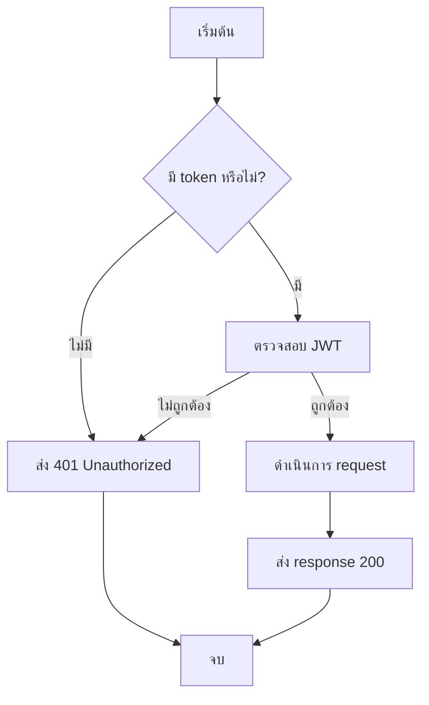
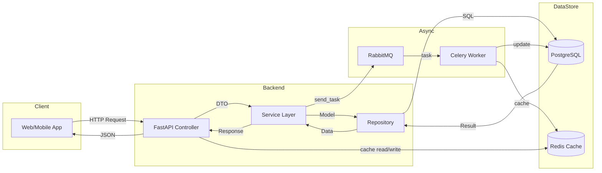

**ชื่อหนังสือ: Python Basic**  
**Mastering Python 2026: จากพื้นฐานสู่ Web Development (FastAPI + Django) และ AI/Machine Learning**

## 📑 สารบัญ 120 บท (Python + FastAPI + Django + ML/AI)

### ภาค 0: เครื่องมือและแนวทางการเรียนรู้ (บทที่ 1–6)
```bash  ``` 
**บทที่ 1:** บทนำ – หนังสือเล่มนี้เหมาะกับใคร  ภาพรวม Python ในปี 2026, วิธีอ่านหนังสือ, แหล่งอ้างอิง (Python.org, FastAPI docs, Django docs, PyTorch/TensorFlow)

**บทที่ 2:** นิยามพื้นฐาน – Python (interpreter, dynamic typing), FastAPI (async, OpenAPI), Django (MVT, ORM), ORM (SQLAlchemy, Django ORM), DTO (Pydantic), CRUD, Cache (Redis), Message Queue (Celery + RabbitMQ/Redis), Machine Learning (Scikit-learn, TensorFlow, PyTorch), MLOps

**บทที่ 3:** หัวข้อสำคัญของหนังสือ (Roadmap) – สายงาน Developer (Backend, Full-stack, Data Scientist, ML Engineer), สถาปัตยกรรม (Layered, Hexagonal, Microservices), ฐานข้อมูล (PostgreSQL, MySQL, MongoDB, SQLite), Redis, Celery, Testing (pytest), Deployment (Docker, Kubernetes), AI/ML (Supervised/Unsupervised, Deep Learning, LLM)

**บทที่ 4:** การออกแบบคู่มือ – รูปแบบหนังสือ, สัญลักษณ์, มาตรฐานการเขียนโค้ด Python (PEP 8, Black, type hints)

**บทที่ 5:** การออกแบบ Workflow สำหรับนักพัฒนา – Git + GitHub, CI/CD (GitHub Actions, GitLab CI), Testing Workflow (Unit → Integration → E2E), การใช้ Poetry/pipenv สำหรับ dependency management

**บทที่ 6:** แผนภาพการทำงาน (Workflow Diagram) + Dataflow Diagram ด้วย Draw.io – รู้จัก Draw.io, การวาด Flowchart แบบ TB, ตัวอย่าง Dataflow (HTTP Request → FastAPI → Service → Repository → Database → Response), อธิบายแต่ละโหนด, เทมเพลต Workflow สำหรับโปรเจกต์ Python


---

### ภาค 1: พื้นฐานภาษา Python (บทที่ 7–40)

**บทที่ 7:** การติดตั้ง Python (3.12/3.13), Virtual Environment (venv, conda), VS Code / PyCharm  
**บทที่ 8:** โปรเจกต์แรก Hello World และการรัน Python (REPL, script)  
**บทที่ 9:** ตัวแปรและชนิดข้อมูล (int, float, str, bool, None)  
**บทที่ 10:** การรับข้อมูลผู้ใช้ (input()) และการแปลงชนิด  
**บทที่ 11:** ตัวดำเนินการ (arithmetic, comparison, logical, assignment)  
**บทที่ 12:** Control Flow: if-elif-else, match-case (Python 3.10+)  
**บทที่ 13:** Loops: for, while, break, continue, else ในลูป  
**บทที่ 14:** Data Structures: list, tuple, set, dictionary (พื้นฐาน)  
**บทที่ 15:** List comprehensions และ generator expressions  
**บทที่ 16:** slicing และการจัดการ sequence  
**บทที่ 17:** Functions – def, return, parameters (positional, keyword, default, *args, **kwargs)  
**บทที่ 18:** Lambda functions และ higher-order functions (map, filter, reduce)  
**บทที่ 19:** Scope และ LEGB rule, global/nonlocal  
**บทที่ 20:** Exception Handling (try-except-else-finally, raise, custom exception)  
**บทที่ 21:** การทำงานกับไฟล์ (open, with context manager, read/write text/CSV/JSON)  
**บทที่ 22:** Modules และ packages, import system, `__name__ == "__main__"`  
**บทที่ 23:** OOP: class, object, constructor (`__init__`), instance/class/static methods  
**บทที่ 24:** Inheritance, polymorphism, method overriding, super()  
**บทที่ 25:** Encapsulation (private attributes `_`, `__`), properties (`@property`)  
**บทที่ 26:** Abstract classes (ABC, abstractmethod) และ interfaces (Protocol)  
**บทที่ 27:** Magic methods (`__str__`, `__repr__`, `__len__`, `__call__`, etc.)  
**บทที่ 28:** Type hints (PEP 484) และการใช้ mypy  
**บทที่ 29:** Decorators (function decorator, class decorator, @staticmethod, @classmethod)  
**บทที่ 30:** Iterators และ generators (`yield`)  
**บทที่ 31:** Context managers (`__enter__`, `__exit__`, `contextlib`)  
**บทที่ 32:** การทดสอบพื้นฐานด้วย unittest และ doctest  
**บทที่ 33:** การใช้ pytest เบื้องต้น (assert, fixtures)  
**บทที่ 34:** โปรเจกต์เล็ก: CLI calculator + unit test  
**บทที่ 35:** Cheatsheet: Python essentials  
**บทที่ 36:** การจัดการ dependencies ด้วย pip, requirements.txt, Poetry  
**บทที่ 37:** การใช้ Jupyter Notebook สำหรับ prototyping  
**บทที่ 38:** การ Debug ด้วย pdb และ breakpoint()  
**บทที่ 39:** การทำงานกับ datetime, random, math, itertools  
**บทที่ 40:** แบบฝึกหัดรวมภาค 1

---

### ภาค 2: Web Development ด้วย FastAPI (บทที่ 41–60)

**บทที่ 41:** ทำความรู้จัก FastAPI – จุดเด่น (async, auto-docs, performance)  
**บทที่ 42:** สร้าง FastAPI project แรก, uvicorn, path operation decorators  
**บทที่ 43:** Path parameters, query parameters, request body (Pydantic)  
**บทที่ 44:** Response models และ status codes  
**บทที่ 45:** Dependency Injection ใน FastAPI (Depends)  
**บทที่ 46:** การจัดการ Validation (Field, validator, model_validator)  
**บทที่ 47:** Exception handling (HTTPException, custom exception handlers)  
**บทที่ 48:** Middleware (CORS, logging, authentication)  
**บทที่ 49:** การทำงานกับ Database (SQLAlchemy ORM) – models, session  
**บทที่ 50:** CRUD operations ด้วย SQLAlchemy + async  
**บทที่ 51:** การใช้ Alembic สำหรับ migration  
**บทที่ 52:** การเชื่อมต่อ PostgreSQL และ MongoDB (motor)  
**บทที่ 53:** Authentication – OAuth2, JWT, passlib, python-jose  
**บทที่ 54:** การทดสอบ FastAPI ด้วย TestClient (pytest)  
**บทที่ 55:** การทำ BackgroundTasks (Celery, asyncio.create_task)  
**บทที่ 56:** WebSocket support (real-time chat example)  
**บทที่ 57:** การสร้าง API documentation อัตโนมัติ (Swagger, ReDoc)  
**บทที่ 58:** โปรเจกต์: Blog API (FastAPI + PostgreSQL + SQLAlchemy + JWT)  
**บทที่ 59:** Deployment FastAPI ด้วย Docker, Gunicorn + Uvicorn  
**บทที่ 60:** Cheatsheet และแบบฝึกหัด FastAPI

---

### ภาค 3: Web Development ด้วย Django (บทที่ 61–75)

**บทที่ 61:** ทำความรู้จัก Django – MVT pattern, batteries-included  
**บทที่ 62:** การติดตั้งและสร้างโปรเจกต์ Django, runserver  
**บทที่ 63:** Django apps, URL dispatcher, views (function-based, class-based)  
**บทที่ 64:** Django ORM (models, migrations, QuerySet)  
**บทที่ 65:** Admin interface – การปรับแต่ง  
**บทที่ 66:** Templates (Django Template Language), static files  
**บทที่ 67:** Forms และ ModelForms, validation  
**บทที่ 68:** Authentication system (User model, login, logout, permissions)  
**บทที่ 69:** Django REST Framework (DRF) – Serializers, ViewSets, Routers  
**บทที่ 70:** การทำ JWT authentication ด้วย DRF (djangorestframework-simplejwt)  
**บทที่ 71:** การใช้ Celery + Redis สำหรับ background tasks ใน Django  
**บทที่ 72:** Django Channels สำหรับ WebSocket (real-time)  
**บทที่ 73:** การทดสอบ Django (unittest, pytest-django)  
**บทที่ 74:** โปรเจกต์: e-Commerce site (Django + DRF + PostgreSQL + Celery)  
**บทที่ 75:** เปรียบเทียบ FastAPI vs Django – ควรเลือกใช้เมื่อใด

---

### ภาค 4: ฐานข้อมูล, ORM, Cache, Message Queue (บทที่ 76–90)

**บทที่ 76:** ภาพรวมฐานข้อมูลที่ใช้กับ Python (PostgreSQL, MySQL, MongoDB, SQLite)  
**บทที่ 77:** SQLAlchemy Core และ ORM (declarative, relationship)  
**บทที่ 78:** การทำ CRUD, eager loading (joinedload, selectinload)  
**บทที่ 79:** การใช้ Pydantic ร่วมกับ SQLAlchemy (Schema ↔ Model)  
**บทที่ 80:** การเชื่อมต่อ MongoDB ด้วย motor (async) และ pymongo  
**บทที่ 81:** การใช้ Redis ใน Python (redis-py) – cache session, rate limiting  
**บทที่ 82:** Redis สำหรับ caching ใน FastAPI/Django (`@cache_page`, django-redis)  
**บทที่ 83:** Redis Pub/Sub – lightweight message queue  
**บทที่ 84:** RabbitMQ + Celery – สร้าง task queue, periodic tasks  
**บทที่ 85:** การ monitor Celery ด้วย Flower  
**บทที่ 86:** การจัดการ configuration (environment variables, python-dotenv, pydantic-settings)  
**บทที่ 87:** Task List Template สำหรับโปรเจกต์ฐานข้อมูล/Redis/RabbitMQ  
**บทที่ 88:** Checklist Template สำหรับการตรวจสอบระบบ  
**บทที่ 89:** Dataflow Diagram สำหรับระบบ Full-stack (Draw.io) – Client → API → Cache → DB → Queue → Worker  
**บทที่ 90:** แหล่งอ้างอิงเกี่ยวกับ database, cache, queue สำหรับ Python

---

### ภาค 5: Machine Learning และ AI (บทที่ 91–110)

**บทที่ 91:** พื้นฐาน Data Science ด้วย Python – NumPy (arrays, broadcasting)  
**บทที่ 92:** pandas – Series, DataFrame, data cleaning, groupby, merge  
**บทที่ 93:** Matplotlib และ Seaborn – การ visualize ข้อมูล  
**บทที่ 94:** Scikit-learn – การแบ่ง train/test, preprocessing (StandardScaler, OneHotEncoder)  
**บทที่ 95:** การทำ supervised learning: linear regression, logistic regression, decision tree  
**บทที่ 96:** การประเมินโมเดล (accuracy, precision, recall, F1, confusion matrix, ROC)  
**บทที่ 97:** Unsupervised learning: clustering (KMeans), PCA  
**บทที่ 98:** Ensemble methods (Random Forest, XGBoost)  
**บทที่ 99:** การทำ Hyperparameter tuning (GridSearchCV, RandomizedSearchCV)  
**บทที่ 100:** Deep Learning ด้วย TensorFlow/Keras – สร้าง Sequential model, Dense layers, training  
**บทที่ 101:** Convolutional Neural Networks (CNN) สำหรับภาพ (CIFAR-10)  
**บทที่ 102:** Recurrent Neural Networks (RNN, LSTM) สำหรับอนุกรมเวลา  
**บทที่ 103:** การใช้ PyTorch (tensors, autograd, nn.Module)  
**บทที่ 104:** Transfer learning (fine-tuning pretrained models เช่น ResNet, BERT)  
**บทที่ 105:** การ deploy ML model เป็น API ด้วย FastAPI (pickle, ONNX, TensorFlow Serving)  
**บทที่ 106:** LLM (Large Language Models) พื้นฐาน – การใช้ Hugging Face transformers (text generation, sentiment analysis)  
**บทที่ 107:** การใช้ LangChain สำหรับสร้าง RAG (Retrieval-Augmented Generation)  
**บทที่ 108:** MLOps ขั้นต้น – MLflow สำหรับ tracking experiment, model registry  
**บทที่ 109:** การทำ batch inference กับ Celery และ Redis  
**บทที่ 110:** โปรเจกต์: ระบบทำนายราคาบ้าน + API + caching + logging

---

### ภาค 6: หัวข้อขั้นสูง, Clean Code, Deployment, ภาคผนวก (บทที่ 111–120)

**บทที่ 111:** Clean Code ใน Python – naming, functions (PEP 8), comments, type hints  
**บทที่ 112:** SOLID Principles – ตัวอย่างปรับใช้ใน Python  
**บทที่ 113:** Design Patterns ที่พบบ่อย (Singleton, Factory, Observer, Dependency Injection)  
**บทที่ 114:** Asynchronous Programming (asyncio, await, gather, aiohttp)  
**บทที่ 115:** การเขียน Unit Test และ Integration Test ระดับสูง (pytest fixtures, mocking with unittest.mock)  
**บทที่ 116:** การทำ CI/CD สำหรับ Python (GitHub Actions, Docker, Deploy to Heroku/Railway/AWS)  
**บทที่ 117:** การทำ monitoring ด้วย Prometheus + Grafana (expose metrics จาก FastAPI/Django)  
**บทที่ 118:** ภาคผนวก ก: เทมเพลต Task List และ Checklist (Excel, PDF, Markdown)  
**บทที่ 119:** ภาคผนวก ข: ไฟล์ Draw.io ตัวอย่าง (Workflow, Dataflow, Architecture) และลิงก์ GitHub โค้ดตัวอย่าง  
**บทที่ 120:** ภาคผนวก ค: อภิธานศัพท์สองภาษา (ไทย-อังกฤษ) และเฉลยแบบฝึกหัด


## Mastering Python 2026: จากพื้นฐานสู่ Web Development (FastAPI + Django) และ AI/Machine Learning

---

## บทที่ 1: บทนำ – หนังสือเล่มนี้เหมาะกับใคร, ภาพรวม Python ในปี 2026, วิธีอ่านหนังสือ, แหล่งอ้างอิง

### คำอธิบายแนวคิด

**Python** เป็นภาษาโปรแกรมมิ่งระดับสูงที่ได้รับความนิยมสูงสุดภาษาหนึ่งของโลก เนื่องจากไวยากรณ์简洁 อ่านง่าย เรียนรู้ได้เร็ว และมีระบบนิเวศไลบรารีที่สมบูรณ์ที่สุดในหลาย ๆ ด้าน ไม่ว่าจะเป็นเว็บแบ็กเอนด์ วิทยาศาสตร์ข้อมูล ปัญญาประดิษฐ์ ออโตเมชัน หรืออินเทอร์เน็ตออฟธิงส์

ในปี **2026** Python ยังคงเป็นภาษาหลักสำหรับ:
- **Web Backend**: ด้วยเฟรมเวิร์กความเร็วสูงอย่าง FastAPI (async, OpenAPI) และเฟรมเวิร์กสมบูรณ์แบบอย่าง Django (batteries-included)
- **Data Science & Machine Learning**: pandas, NumPy, Scikit-learn, TensorFlow, PyTorch, และ LLM (Large Language Models) ผ่าน Hugging Face Transformers, LangChain
- **DevOps & Automation**: Ansible, งานเขียนสคริปต์, CI/CD pipeline
- **MLOps**: การนำโมเดล ML ขึ้นสู่ระบบผลิตจริง (MLflow, Ray, Kubeflow)

หนังสือเล่มนี้ถูกออกแบบให้เป็น **คู่มือฉบับสมบูรณ์** สำหรับผู้ที่ต้องการเริ่มต้น Python ตั้งแต่พื้นฐานไปจนถึงการพัฒนาแอปพลิเคชันระดับโปรเฟสชันแนลด้วย FastAPI, Django, และการประยุกต์ใช้ AI/Machine Learning พร้อมทั้งเทคนิคการเขียนโค้ดที่สะอาด การทดสอบ การ deploy และการใช้เครื่องมือทันสมัยในปี 2026

**หนังสือเล่มนี้เหมาะกับใคร?**
- ผู้ที่ไม่มีพื้นฐานการเขียนโปรแกรมมาก่อน (เริ่มต้นจากศูนย์)
- นักพัฒนาเว็บที่ต้องการเปลี่ยนมาใช้ Python และเฟรมเวิร์กสมัยใหม่ (FastAPI, Django)
- Data Scientist หรือ ML Engineer ที่ต้องการพัฒนา API และ deploy โมเดลของตนเอง
- นักศึกษาหรือผู้ที่ต้องการเตรียมตัวเข้าสู่อุตสาหกรรมซอฟต์แวร์ในสาย Backend, Full-stack, หรือ AI
- ผู้ที่เคยเขียน Python มาแล้วแต่ต้องการเติมเต็มช่องว่างเรื่อง Asynchronous, Dependency Injection, Clean Architecture, MLOps

### ภาพรวม Python ในปี 2026

**Python 3.12 และ 3.13** เป็นเวอร์ชันหลักที่ใช้ในอุตสาหกรรม:
- **Python 3.12**: ปรับปรุง error messages, รองรับ f-string ที่ยืดหยุ่นมากขึ้น, เพิ่ม `type` statement สำหรับ type aliases
- **Python 3.13**: เสถียรภาพสูงขึ้น, ปรับปรุงประสิทธิภาพ interpreter (zero-cost exceptions), experimental JIT compiler ในบางแพลตฟอร์ม

**แนวโน้มสำคัญในปี 2026:**
- **Async-first**: FastAPI, async SQLAlchemy, HTTPX, async database drivers กลายเป็นมาตรฐานสำหรับระบบที่ต้องการ I/O สูง
- **Type Hints ถูกใช้อย่างแพร่หลาย**: mypy, Pydantic v2, และ static type checking เป็นส่วนหนึ่งของ CI/CD pipeline
- **AI/ML อยู่ในทุกแอปพลิเคชัน**: การเรียกใช้ LLM (GPT-5, LLaMA 3, Gemini) ผ่าน API หรือการ fine-tune เบื้องต้น, RAG (Retrieval-Augmented Generation) ถูกนำมาใช้ในระบบทั่วไป
- **Microservices & Container**: Docker + Kubernetes เป็นพื้นฐานการ deploy สำหรับองค์กรขนาดกลางถึงใหญ่
- **MLOps เครื่องมือครบวงจร**: MLflow, BentoML, Ray, และ Kubeflow ช่วยให้การ deploy โมเดลเร็วขึ้น

### วิธีอ่านหนังสือเล่มนี้

หนังสือแบ่งออกเป็น 6 ภาค รวม 120 บท โดยแต่ละบทมีโครงสร้างเดียวกัน:

1. **คำอธิบายแนวคิด** – อธิบายทฤษฎีและหลักการอย่างเป็นระบบ
2. **ตัวอย่างโค้ด Python ที่รันได้จริง** – โค้ดสั้นกระชับ พร้อมหมายเหตุ
3. **ตารางสรุป** (ถ้ามีการเปรียบเทียบ) – เปรียบเทียบคุณสมบัติ ข้อดี ข้อเสีย
4. **แบบฝึกหัดท้ายบท 3–5 ข้อ** – ฝึกประยุกต์ใช้สิ่งที่ได้เรียนรู้
5. **แหล่งอ้างอิง** – ลิงก์เอกสารทางการและแหล่งเรียนรู้เพิ่มเติม

**แนวทางการอ่านตามเป้าหมายของคุณ:**
- **สาย Backend / Full-stack**: อ่านภาค 1 (พื้นฐาน) → ภาค 2 (FastAPI) → ภาค 3 (Django) → ภาค 4 (DB, Cache, Queue) → บทที่ 111–117 (Clean Code, Testing, Deployment)
- **สาย Data Scientist / ML Engineer**: อ่านภาค 1 (พื้นฐาน) → ภาค 5 (ML/AI) → บทที่ 105 (deploy ML model ด้วย FastAPI) → บทที่ 108–109 (MLOps)
- **ผู้เริ่มต้นไม่มีพื้นฐาน**: อ่านภาค 1 ทั้งหมด (บทที่ 7–40) ตามลำดับก่อน แล้วจึงเลือกสายที่สนใจ

**หมายเหตุเกี่ยวกับโค้ด:**
- โค้ดทุกตัวอย่างสามารถรันได้บน Python 3.12 ขึ้นไป (ยกเว้นระบุเวอร์ชันอื่น)
- ใช้ `print()` หรือการแสดงผลที่ชัดเจน เพื่อให้เห็นผลลัพธ์ทันที
- สำหรับโปรเจกต์ขนาดใหญ่ (FastAPI, Django) จะมีโครงสร้างโฟลเดอร์และคำสั่งรันที่แนบมา

### แหล่งอ้างอิงหลักของหนังสือ

| แหล่งข้อมูล | เว็บไซต์ | เนื้อหาที่เกี่ยวข้อง |
|------------|----------|----------------------|
| Python.org | [python.org](https://python.org) | เอกสารภาษา, PEP, ดาวน์โหลด interpreter |
| FastAPI | [fastapi.tiangolo.com](https://fastapi.tiangolo.com) | เอกสาร FastAPI (官方教程) |
| Django | [djangoproject.com](https://djangoproject.com) | เอกสาร Django, วิธีการติดตั้ง |
| SQLAlchemy | [sqlalchemy.org](https://sqlalchemy.org) | ORM และ Core |
| Pydantic | [docs.pydantic.dev](https://docs.pydantic.dev) | Data validation, settings |
| Celery | [docs.celeryq.dev](https://docs.celeryq.dev) | Distributed task queue |
| Redis | [redis.io](https://redis.io) | In-memory data store |
| PostgreSQL | [postgresql.org](https://postgresql.org) | ฐานข้อมูล relational |
| MongoDB | [mongodb.com](https://mongodb.com) | ฐานข้อมูล NoSQL |
| NumPy / pandas | [numpy.org](https://numpy.org), [pandas.pydata.org](https://pandas.pydata.org) | Data science |
| Scikit-learn | [scikit-learn.org](https://scikit-learn.org) | Machine learning |
| TensorFlow | [tensorflow.org](https://tensorflow.org) | Deep learning |
| PyTorch | [pytorch.org](https://pytorch.org) | Deep learning (alternative) |
| Hugging Face | [huggingface.co/docs](https://huggingface.co/docs) | Transformers, LLM, Datasets |
| LangChain | [python.langchain.com](https://python.langchain.com) | การสร้าง LLM application |
| Docker | [docker.com](https://docker.com) | Containerization |
| GitHub Actions | [docs.github.com/en/actions](https://docs.github.com/en/actions) | CI/CD |

**หมายเหตุพิเศษ**: ตลอดทั้งเล่ม เราจะใช้ **type hints** ตาม PEP 484, ใช้ **Black** เป็น formatter และ **pytest** สำหรับการทดสอบ เพื่อให้โค้ดเป็นมาตรฐานสากล

### ตัวอย่างโค้ด: ตรวจสอบสภาพแวดล้อม Python และพิมพ์ข้อความต้อนรับ

```python
# check_python_env.py
import sys
import platform

def main():
    print("=" * 50)
    print("   ยินดีต้อนรับสู่ Mastering Python 2026")
    print("=" * 50)
    
    # แสดงเวอร์ชัน Python
    python_version = sys.version.split()[0]
    print(f"Python เวอร์ชัน: {python_version}")
    print(f"Python implementation: {platform.python_implementation()}")
    
    # ตรวจสอบระบบปฏิบัติการ
    print(f"ระบบปฏิบัติการ: {platform.system()} {platform.release()}")
    
    # แสดงข้อความแนะนำ
    print("\n📘 หนังสือเล่มนี้จะพาคุณจากพื้นฐานสู่การพัฒนา Web และ AI")
    print("🚀 เริ่มต้นด้วยบทที่ 1 นี้ แล้วไปต่อกันที่ภาค 1 (พื้นฐาน Python)")
    print("\n💡 Tip: หากต้องการรันโค้ดในบทอื่น ๆ ให้สร้าง virtual environment ก่อน:")
    print("   python -m venv venv")
    print("   source venv/bin/activate   # Linux/macOS")
    print("   venv\\Scripts\\activate      # Windows")

if __name__ == "__main__":
    main()
```

**ผลลัพธ์เมื่อรัน (ตัวอย่าง):**
```
==================================================
   ยินดีต้อนรับสู่ Mastering Python 2026
==================================================
Python เวอร์ชัน: 3.12.2
Python implementation: CPython
ระบบปฏิบัติการ: Windows 11

📘 หนังสือเล่มนี้จะพาคุณจากพื้นฐานสู่การพัฒนา Web และ AI
🚀 เริ่มต้นด้วยบทที่ 1 นี้ แล้วไปต่อกันที่ภาค 1 (พื้นฐาน Python)

💡 Tip: หากต้องการรันโค้ดในบทอื่น ๆ ให้สร้าง virtual environment ก่อน:
   python -m venv venv
   source venv/bin/activate   # Linux/macOS
   venv\Scripts\activate      # Windows
```

### ตารางสรุปเนื้อหาภาคต่าง ๆ

| ภาค | หัวข้อหลัก | จำนวนบท | ทักษะที่ได้รับ |
|-----|------------|----------|----------------|
| 0 | เครื่องมือและแนวทางการเรียนรู้ | 6 | การใช้ Git, Draw.io, CI/CD, Poetry, การออกแบบ workflow |
| 1 | พื้นฐานภาษา Python | 34 | ไวยากรณ์, OOP, decorators, generators, testing, modules |
| 2 | Web Development ด้วย FastAPI | 20 | REST API, Dependency Injection, async DB, JWT, WebSocket |
| 3 | Web Development ด้วย Django | 15 | MVT, ORM, Admin, DRF, Channels, Celery |
| 4 | ฐานข้อมูล, ORM, Cache, Message Queue | 15 | SQLAlchemy, MongoDB, Redis, RabbitMQ, Celery |
| 5 | Machine Learning และ AI | 20 | NumPy, pandas, scikit-learn, TensorFlow, PyTorch, LLM, LangChain, MLOps |
| 6 | ขั้นสูง, Clean Code, Deployment, ภาคผนวก | 10 | SOLID, Design Patterns, asyncio, CI/CD, monitoring, templates |

### แบบฝึกหัดท้ายบท

1. **ติดตั้ง Python 3.12 หรือ 3.13** บนเครื่องของคุณ (ถ้ายังไม่มี) และรันโค้ดตัวอย่างในบทนี้ ให้แสดงผลลัพธ์ที่ได้ (จับภาพหน้าจอหรือคัดลอกข้อความ)
2. **สร้าง virtual environment** ชื่อ `myenv` จากนั้นเปิดใช้งาน และรันคำสั่ง `pip --version` เพื่อตรวจสอบว่า pip อยู่ใน environment นั้น
3. **สำรวจเว็บไซต์ Python.org** ค้นหา PEP 8 (Style Guide for Python Code) และเขียนสรุปสั้น ๆ 3 ข้อที่คุณคิดว่าสำคัญที่สุด
4. **เลือกสายงาน** ที่คุณสนใจมากที่สุดระหว่าง Backend, Full-stack, Data Scientist, หรือ ML Engineer แล้วอธิบายว่าทำไม และคุณคาดหวังว่าจะได้เรียนรู้อะไรจากหนังสือเล่มนี้
5. **ติดตั้ง Visual Studio Code** (หรือ PyCharm Community) และติดตั้ง extension “Python”, “Pylance”, “Black Formatter” จากนั้นสร้างไฟล์ `hello.py` ที่มีโค้ด `print("Hello Python 2026")` และรันให้สำเร็จ

### แหล่งอ้างอิงสำหรับบทที่ 1

- **Python.org**: [https://www.python.org](https://www.python.org) – ดาวน์โหลด, เอกสาร, ข่าวสาร
- **Python 3.12 What’s New**: [https://docs.python.org/3.12/whatsnew/3.12.html](https://docs.python.org/3.12/whatsnew/3.12.html)
- **PEP 8 – Style Guide**: [https://peps.python.org/pep-0008/](https://peps.python.org/pep-0008/)
- **The Hitchhiker’s Guide to Python**: [https://docs.python-guide.org](https://docs.python-guide.org) – แนวปฏิบัติที่ดี
- **Real Python Tutorials**: [https://realpython.com](https://realpython.com) – บทความและตัวอย่างเพิ่มเติม

---

**หมายเหตุ**: บทถัดไป (บทที่ 2) จะแนะนำนิยามพื้นฐานที่ใช้บ่อยในหนังสือ เช่น interpreter, dynamic typing, FastAPI, Django, ORM, DTO, CRUD, Cache, Message Queue, Machine Learning, MLOps เพื่อให้ผู้อ่านมีพื้นฐานคำศัพท์ร่วมกันก่อนเข้าสู่เนื้อหาเชิงลึก
 
 ## บทที่ 2: นิยามพื้นฐาน – Python, FastAPI, Django, ORM, DTO, CRUD, Cache, Message Queue, Machine Learning, MLOps

### คำอธิบายแนวคิด

ก่อนที่จะดำดิ่งสู่การเขียนโค้ด เรามาทำความเข้าใจนิยามและคำศัพท์สำคัญที่จะปรากฏบ่อยตลอดทั้งเล่มกันก่อน การรู้จักแนวคิดเหล่านี้จะช่วยให้คุณเข้าใจภาพรวมของระบบที่เราจะพัฒนา ไม่ว่าจะเป็นเว็บแอปพลิเคชัน ระบบแบ็กเอนด์ หรือโปรเจกต์ Machine Learning

#### 1. Python (interpreter, dynamic typing)

**Python** เป็นภาษาแบบ **interpreted** หมายความว่าโค้ดจะถูกแปลและรันทีละบรรทัดโดยโปรแกรมที่เรียกว่า **interpreter** (ไม่ต้องคอมไพล์เป็นไฟล์ executable ก่อน) ทำให้การทดสอบและพัฒนาเร็วขึ้น

**Dynamic typing** หมายถึงตัวแปรใน Python ไม่ต้องประกาศชนิดข้อมูลตอนเขียนโค้ด ชนิดของตัวแปรจะถูกกำหนดตอนรันโปรแกรมตามค่าที่ถูกเก็บ ตัวอย่างเช่น:

```python
x = 10        # x เป็น int
x = "hello"   # ตอนนี้ x กลายเป็น str (เปลี่ยนชนิดได้)
```

#### 2. FastAPI (async, OpenAPI)

**FastAPI** เป็นเว็บเฟรมเวิร์กสำหรับสร้าง REST API ที่มีความเร็วสูง (เทียบเท่า Node.js และ Go) ด้วยการรองรับ **asynchronous** (async/await) ทำให้สามารถจัดการคำขอพร้อมกันได้จำนวนมากโดยไม่ต้องใช้เธรดเยอะ

**OpenAPI** (เดิมชื่อ Swagger) เป็นมาตรฐานในการอธิบาย API โดย FastAPI จะสร้างเอกสาร interactive อัตโนมัติให้ที่ `http://localhost:8000/docs` ช่วยให้นักพัฒนาทดสอบ API ได้ง่าย

#### 3. Django (MVT, ORM)

**Django** เป็นเว็บเฟรมเวิร์กแบบ "batteries-included" มาพร้อมกับเครื่องมือมากมายในตัว เช่น ระบบ admin, ORM, authentication, forms

**MVT (Model-View-Template)** เป็นสถาปัตยกรรมของ Django:
- **Model**: จัดการข้อมูลและฐานข้อมูล (คล้ายกับ Repository)
- **View**: รับ request, ประมวลผล logic, ส่ง response (คล้าย Controller)
- **Template**: ส่วนแสดงผล HTML (คล้าย View ใน MVC)

**ORM (Object-Relational Mapping)** – อ่านต่อด้านล่าง

#### 4. ORM (SQLAlchemy, Django ORM)

**ORM** คือเทคนิคที่แมปตารางในฐานข้อมูล relational ให้เป็นคลาสในภาษา Python ทำให้เราสามารถใช้ object แทนการเขียน SQL โดยตรง เพิ่มความปลอดภัย (ป้องกัน SQL Injection) และความสามารถในการพกพาระหว่างฐานข้อมูล

| ORM | เฟรมเวิร์กหลัก | จุดเด่น |
|-----|---------------|---------|
| SQLAlchemy | FastAPI, Flask, อื่นๆ | ยืดหยุ่นสูง, รองรับ async, ใช้ร่วมกับ Pydantic ได้ดี |
| Django ORM | Django | ผูกแน่นกับ Django, ใช้งานง่าย, migration อัตโนมัติ |

#### 5. DTO (Data Transfer Object) และ Pydantic

**DTO** คือวัตถุที่ใช้ในการขนส่งข้อมูลระหว่าง layer ต่าง ๆ ของแอปพลิเคชัน (เช่น จาก API ไปยัง service layer) โดยไม่มี logic ทางธุรกิจ

**Pydantic** เป็นไลบรารียอดนิยมสำหรับสร้าง DTO ใน Python พร้อมการ validate ข้อมูลอัตโนมัติ (type checking, required fields, custom validators) และแปลง JSON <-> object ได้สะดวก FastAPI ใช้ Pydantic เป็นหัวใจหลัก

#### 6. CRUD

**CRUD** ย่อจาก **C**reate, **R**ead, **U**pdate, **D**elete เป็น operation พื้นฐานที่ทุกแอปพลิเคชันที่เก็บข้อมูลต้องมี เช่น:
- Create: เพิ่มผู้ใช้ใหม่
- Read: ดึงข้อมูลผู้ใช้
- Update: แก้ไขอีเมล
- Delete: ลบผู้ใช้

#### 7. Cache (Redis)

**Cache** คือการเก็บผลลัพธ์ที่คำนวณยากหรือถูกเรียกบ่อยไว้ในหน่วยความจำความเร็วสูง เพื่อลดภาระฐานข้อมูลและลด latency

**Redis** เป็น in-memory data store ที่นิยมใช้ทำ cache, session store, real-time leaderboard, message broker (Pub/Sub) มีความเร็วสูงมากและรองรับโครงสร้างข้อมูลหลากหลาย (string, hash, list, set, sorted set)

#### 8. Message Queue (Celery + RabbitMQ/Redis)

**Message Queue** คือระบบที่ช่วยให้แอปพลิเคชันสามารถส่ง "งาน" (tasks) ไปยัง queue เพื่อให้กระบวนการอื่น (worker) มาหยิบไปทำทีหลัง ช่วยลดการรอคอยใน request-response cycle และรองรับการทำงานที่ใช้เวลานาน (ส่งอีเมล, ประมวลผลรูปภาพ, inference โมเดล)

**Celery** เป็น distributed task queue สำหรับ Python รองรับ broker หลายตัว เช่น RabbitMQ (แนะนำสำหรับ production) และ Redis (สำหรับ development หรือ workload ปานกลาง)

#### 9. Machine Learning (Scikit-learn, TensorFlow, PyTorch)

**Machine Learning** คือการทำให้คอมพิวเตอร์เรียนรู้จากข้อมูล โดยไม่ต้องเขียนกฎเกณฑ์ที่ชัดเจน

- **Scikit-learn**: ไลบรารีมาตรฐานสำหรับ ML แบบดั้งเดิม (regression, classification, clustering, preprocessing) ใช้ง่าย เหมาะกับข้อมูล structured
- **TensorFlow** และ **PyTorch**: ไลบรารีสำหรับ Deep Learning (โครงข่ายประสาทเทียมหลายชั้น) เหมาะกับงานภาพ, เสียง, ภาษา, ข้อมูล unstructured PyTorch ได้รับความนิยมในวงการวิจัย ส่วน TensorFlow นิยมใน production

#### 10. MLOps (Machine Learning Operations)

**MLOps** คือชุดแนวปฏิบัติที่ผสาน Machine Learning เข้ากับ DevOps เพื่อทำให้วงจรชีวิตของโมเดล (ตั้งแต่การพัฒนา, การเทรน, การ deploy, การ monitoring) เป็นอัตโนมัติและเชื่อถือได้ ประกอบด้วย:
- **Tracking experiment**: เก็บ parameters, metrics, โมเดลเวอร์ชัน (MLflow)
- **Model registry**: จัดเก็บโมเดลที่ผ่านการทดสอบแล้ว
- **CI/CD สำหรับ ML**: เทรนโมเดลอัตโนมัติเมื่อมีข้อมูลใหม่, ทดสอบโมเดล, deploy เป็น API
- **Monitoring**: ตรวจจับ model drift (เมื่อประสิทธิภาพลดลงตามเวลา)

---

### ตัวอย่างโค้ด: การใช้งานแนวคิดพื้นฐานร่วมกัน

เพื่อให้เห็นภาพว่าแนวคิดเหล่านี้ทำงานประสานกันอย่างไร เราจะสร้างตัวอย่างเล็ก ๆ ที่จำลอง:
1. ใช้ **Pydantic** เป็น DTO สำหรับรับข้อมูลจากผู้ใช้
2. จำลอง **CRUD** ด้วย dictionary (แทนฐานข้อมูล)
3. จำลอง **Cache** ด้วย dictionary (แทน Redis)
4. จำลอง **Message Queue** แบบง่าย (รายการงาน)
5. **FastAPI** เป็น web server (แต่เราจะใช้แค่ฟังก์ชันจำลองเพื่อความกระชับ)

```python
# concepts_demo.py
"""
ตัวอย่างจำลองการทำงานร่วมกันของแนวคิดพื้นฐาน
(ไม่ต้องติดตั้งไลบรารีเพิ่ม - ใช้ standard library เท่านั้น)
"""
from typing import Dict, List, Optional
from dataclasses import dataclass
from datetime import datetime
import time
import json

# ============ 1. DTO ด้วย Pydantic style (ใช้ dataclass แทน) ============
# ในโปรเจกต์จริงจะใช้ Pydantic แต่ที่นี่ใช้ dataclass เพื่อไม่ต้องติดตั้ง
@dataclass
class UserCreateDTO:
    """DTO สำหรับรับข้อมูลสร้างผู้ใช้"""
    username: str
    email: str
    age: int

@dataclass
class UserResponseDTO:
    """DTO สำหรับส่งข้อมูลผู้ใช้กลับไป"""
    id: int
    username: str
    email: str
    age: int
    created_at: str

# ============ 2. CRUD Operations (จำลอง DB) ============
class InMemoryDB:
    """จำลองฐานข้อมูลแบบ in-memory"""
    def __init__(self):
        self._users: Dict[int, dict] = {}
        self._counter = 1
    
    def create(self, user_data: dict) -> dict:
        user_id = self._counter
        self._counter += 1
        user_data["id"] = user_id
        user_data["created_at"] = datetime.now().isoformat()
        self._users[user_id] = user_data
        return self._users[user_id]
    
    def read(self, user_id: int) -> Optional[dict]:
        return self._users.get(user_id)
    
    def update(self, user_id: int, updates: dict) -> Optional[dict]:
        if user_id not in self._users:
            return None
        self._users[user_id].update(updates)
        return self._users[user_id]
    
    def delete(self, user_id: int) -> bool:
        if user_id in self._users:
            del self._users[user_id]
            return True
        return False
    
    def list_all(self) -> List[dict]:
        return list(self._users.values())

# ============ 3. Cache (จำลอง Redis) ============
class SimpleCache:
    """จำลอง cache ใน memory"""
    def __init__(self, ttl_seconds: int = 30):
        self._store: Dict[str, dict] = {}
        self._expiry: Dict[str, float] = {}
        self.ttl = ttl_seconds
    
    def get(self, key: str) -> Optional[dict]:
        if key in self._expiry and time.time() > self._expiry[key]:
            # cache expired
            del self._store[key]
            del self._expiry[key]
            return None
        return self._store.get(key)
    
    def set(self, key: str, value: dict):
        self._store[key] = value
        self._expiry[key] = time.time() + self.ttl
    
    def clear(self):
        self._store.clear()
        self._expiry.clear()

# ============ 4. Message Queue จำลอง (Celery style) ============
class SimpleTaskQueue:
    """จำลอง task queue (broker + worker)"""
    def __init__(self):
        self._queue: List[dict] = []
    
    def send_task(self, task_name: str, payload: dict):
        """ส่งงานไปยัง queue (คล้าย celery.send_task)"""
        task = {
            "id": len(self._queue) + 1,
            "name": task_name,
            "payload": payload,
            "status": "pending",
            "created_at": datetime.now().isoformat()
        }
        self._queue.append(task)
        print(f"📨 ส่งงาน {task_name} (ID={task['id']}) เข้า queue แล้ว")
        return task["id"]
    
    def process_one(self) -> bool:
        """worker หยิบงานมาทำ 1 งาน (จำลอง)"""
        if not self._queue:
            return False
        task = self._queue.pop(0)
        print(f"⚙️ กำลังประมวลผลงาน {task['name']} (ID={task['id']})...")
        time.sleep(1)  # จำลองงานที่ใช้เวลา
        task["status"] = "completed"
        print(f"✅ งาน {task['name']} (ID={task['id']}) เสร็จสิ้น")
        return True

# ============ 5. ฟังก์ชันหลักที่ใช้แนวคิดทั้งหมด ============
def main():
    print("=" * 60)
    print("ตัวอย่างการทำงานร่วมกันของแนวคิดใน Python")
    print("=" * 60)
    
    # สร้างอินสแตนซ์ของ component ต่าง ๆ
    db = InMemoryDB()
    cache = SimpleCache(ttl_seconds=10)
    task_queue = SimpleTaskQueue()
    
    # 1. สร้าง DTO และแปลงเป็น dict เพื่อเก็บใน DB
    new_user_dto = UserCreateDTO(
        username="somchai123",
        email="somchai@example.com",
        age=28
    )
    user_dict = {
        "username": new_user_dto.username,
        "email": new_user_dto.email,
        "age": new_user_dto.age
    }
    
    # 2. CRUD: Create
    created_user = db.create(user_dict)
    print(f"\n📝 สร้างผู้ใช้สำเร็จ: {created_user}")
    
    # 3. Cache: หลังจากสร้าง user แล้ว เก็บไว้ใน cache
    cache_key = f"user_{created_user['id']}"
    cache.set(cache_key, created_user)
    print(f"💾 เก็บข้อมูลผู้ใช้ ID {created_user['id']} ไว้ใน cache แล้ว")
    
    # 4. CRUD: Read (ลองอ่านจาก cache ก่อน ถ้าไม่มีค่อยไป DB)
    def get_user(user_id: int):
        cached = cache.get(f"user_{user_id}")
        if cached:
            print(f"⚡ อ่านจาก cache: {cached}")
            return cached
        user = db.read(user_id)
        if user:
            cache.set(f"user_{user_id}", user)
            print(f"🐢 อ่านจาก DB และเก็บ cache: {user}")
        return user
    
    print("\n🔍 อ่านผู้ใช้ ID=1 ครั้งแรก:")
    get_user(1)
    print("\n🔍 อ่านผู้ใช้ ID=1 ครั้งที่สอง (ภายใน 10 วินาที):")
    get_user(1)
    
    # 5. Message Queue: ส่งงานส่งอีเมล (งานที่ใช้เวลา) ไปยัง queue
    task_id = task_queue.send_task(
        task_name="send_welcome_email",
        payload={"user_id": created_user['id'], "email": created_user['email']}
    )
    
    # 6. จำลอง worker ทำงาน
    print("\n🔄 Worker เริ่มทำงาน...")
    task_queue.process_one()
    
    # 7. CRUD: Update และ Delete
    print("\n✏️ อัปเดตอายุผู้ใช้ ID=1 เป็น 29")
    updated = db.update(1, {"age": 29})
    print(f"ข้อมูลหลังอัปเดต: {updated}")
    
    # 8. แสดงรายการผู้ใช้ทั้งหมด
    all_users = db.list_all()
    print(f"\n📋 รายชื่อผู้ใช้ทั้งหมด ({len(all_users)} คน):")
    for u in all_users:
        print(f"   - {u['username']} ({u['email']}) อายุ {u['age']}")
    
    # 9. ทดสอบ cache expire
    print("\n⏳ รอ 11 วินาทีให้ cache หมดอายุ...")
    time.sleep(11)
    print("🔍 อ่านผู้ใช้ ID=1 อีกครั้ง (cache ควรหมดอายุ):")
    get_user(1)

if __name__ == "__main__":
    main()
```

**ผลลัพธ์เมื่อรัน (ย่อส่วน):**
```
============================================================
ตัวอย่างการทำงานร่วมกันของแนวคิดใน Python
============================================================

📝 สร้างผู้ใช้สำเร็จ: {'username': 'somchai123', 'email': 'somchai@example.com', 'age': 28, 'id': 1, 'created_at': '2026-04-02T10:30:15.123456'}
💾 เก็บข้อมูลผู้ใช้ ID 1 ไว้ใน cache แล้ว

🔍 อ่านผู้ใช้ ID=1 ครั้งแรก:
⚡ อ่านจาก cache: {...}

🔍 อ่านผู้ใช้ ID=1 ครั้งที่สอง (ภายใน 10 วินาที):
⚡ อ่านจาก cache: {...}

📨 ส่งงาน send_welcome_email (ID=1) เข้า queue แล้ว

🔄 Worker เริ่มทำงาน...
⚙️ กำลังประมวลผลงาน send_welcome_email (ID=1)...
✅ งาน send_welcome_email (ID=1) เสร็จสิ้น

✏️ อัปเดตอายุผู้ใช้ ID=1 เป็น 29
ข้อมูลหลังอัปเดต: {...}

📋 รายชื่อผู้ใช้ทั้งหมด (1 คน):
   - somchai123 (somchai@example.com) อายุ 29

⏳ รอ 11 วินาทีให้ cache หมดอายุ...
🔍 อ่านผู้ใช้ ID=1 อีกครั้ง (cache ควรหมดอายุ):
🐢 อ่านจาก DB และเก็บ cache: {...}
```

---

### ตารางสรุปเปรียบเทียบเทคโนโลยีหลัก

| หมวดหมู่ | เทคโนโลยี | ใช้ทำอะไร | จุดเด่น |
|----------|-----------|------------|---------|
| **Web Framework** | FastAPI | REST API, WebSocket | async, auto-docs, performance |
| | Django | Full-stack web app | batteries-included, admin, ORM ในตัว |
| **ORM** | SQLAlchemy | Database abstraction (通用) | ยืดหยุ่น, async support |
| | Django ORM | ใช้กับ Django เท่านั้น | ใช้ง่าย, migration อัตโนมัติ |
| **DTO/Validation** | Pydantic | Data validation, settings | type hints, performance (Rust core) |
| **Cache** | Redis | In-memory store | ความเร็วสูง,ััััััััััั |
| **Message Queue** | Celery + RabbitMQ | Distributed task queue | reliability, รองรับ periodic tasks |
| | Celery + Redis | Task queue (development) | ติดตั้งง่าย, lightweight |
| **Machine Learning** | Scikit-learn | Traditional ML | เอกสารดี, API สม่ำเสมอ |
| | TensorFlow | Deep Learning (production) | ecosystem สมบูรณ์, TensorFlow Serving |
| | PyTorch | Deep Learning (research) | dynamic graph, ใช้งานง่ายกว่า |
| **MLOps** | MLflow | Experiment tracking, model registry | ใช้งานง่าย, รองรับหลาย frameworks |
| | BentoML | Model serving | สร้าง API ได้เร็ว,  optimised for production |

---

### แบบฝึกหัดท้ายบท

1. **อธิบายความแตกต่าง** ระหว่าง dynamic typing และ static typing (เช่น Java หรือ C#) พร้อมยกตัวอย่างข้อดีข้อเสียของแต่ละแบบ

2. **จากตัวอย่างโค้ดในบทนี้** ให้เพิ่มฟังก์ชัน `search_users(keyword: str)` ที่ค้นหาผู้ใช้จาก username หรือ email แบบ case-insensitive โดยใช้ข้อมูลจาก `InMemoryDB` และให้แสดงผลลัพธ์

3. **สร้าง DTO** สำหรับการอัปเดตข้อมูลผู้ใช้ ชื่อ `UserUpdateDTO` ที่มีฟิลด์ `username`, `email`, `age` เป็น optional (อาจจะไม่มีบางฟิลด์) จากนั้นเขียนฟังก์ชันที่รับ DTO นี้แล้วอัปเดตเฉพาะฟิลด์ที่ถูกส่งมา (ใช้ dataclass พร้อม default `None`)

4. **จำลองการใช้ Redis สำหรับ rate limiting** เขียนฟังก์ชัน `rate_limit(ip_address: str, max_requests: int = 5, window_seconds: int = 60)` ที่ใช้อินสแตนซ์ `SimpleCache` (หรือจำลอง) ในการนับจำนวน request ต่อ IP ถ้าเกินให้พิมพ์ "Rate limit exceeded" มิฉะนั้นให้พิมพ์ "Request allowed"

5. **ค้นคว้าเพิ่มเติม**: อ่านเอกสารเบื้องต้นของ Celery (docs.celeryq.dev) แล้วอธิบายความหมายของคำว่า "broker", "worker", "backend" ใน Celery พร้อมยกตัวอย่าง flow การทำงานของ task แบบ async

---

### แหล่งอ้างอิงสำหรับบทที่ 2

- **Python Official Docs – Data Model**: [https://docs.python.org/3/reference/datamodel.html](https://docs.python.org/3/reference/datamodel.html)
- **FastAPI – First Steps**: [https://fastapi.tiangolo.com/tutorial/first-steps/](https://fastapi.tiangolo.com/tutorial/first-steps/)
- **Django – Introduction to Models**: [https://docs.djangoproject.com/en/5.1/topics/db/models/](https://docs.djangoproject.com/en/5.1/topics/db/models/)
- **SQLAlchemy – ORM Quick Start**: [https://docs.sqlalchemy.org/en/20/orm/quickstart.html](https://docs.sqlalchemy.org/en/20/orm/quickstart.html)
- **Pydantic – Models**: [https://docs.pydantic.dev/latest/concepts/models/](https://docs.pydantic.dev/latest/concepts/models/)
- **Redis – Introduction**: [https://redis.io/docs/about/](https://redis.io/docs/about/)
- **Celery – First Steps with Celery**: [https://docs.celeryq.dev/en/stable/getting-started/first-steps-with-celery.html](https://docs.celeryq.dev/en/stable/getting-started/first-steps-with-celery.html)
- **Scikit-learn – Getting Started**: [https://scikit-learn.org/stable/getting_started.html](https://scikit-learn.org/stable/getting_started.html)
- **MLflow – Tracking**: [https://mlflow.org/docs/latest/tracking.html](https://mlflow.org/docs/latest/tracking.html)

---
 ## บทที่ 3: หัวข้อสำคัญของหนังสือ (Roadmap) – สายงาน Developer, สถาปัตยกรรม, ฐานข้อมูล, Redis, Celery, Testing, Deployment, AI/ML

### คำอธิบายแนวคิด

หนังสือเล่มนี้ครอบคลุมเนื้อหาที่กว้าง ตั้งแต่พื้นฐาน Python ไปจนถึงการพัฒนาเว็บและการประยุกต์ใช้ AI/Machine Learning เพื่อให้คุณเห็นภาพรวมของเส้นทางการเรียนรู้และเลือกโฟกัสตามสายงานที่สนใจ บทนี้จะแนะนำ **Roadmap** หรือแผนผังหัวข้อสำคัญ พร้อมทั้งอธิบายความเชื่อมโยงระหว่างทักษะต่าง ๆ ที่นักพัฒนา Python ในปี 2026 ควรมี

#### สายงาน Developer สายหลักของ Python

| สายงาน | หน้าที่หลัก | เทคโนโลยีหลักในหนังสือ | ทักษะเสริม |
|--------|-------------|------------------------|-------------|
| **Backend Developer** | พัฒนา API, ระบบหลังบ้าน, เชื่อมต่อฐานข้อมูล, ออกแบบระบบ | FastAPI, Django, SQLAlchemy, PostgreSQL, Redis, Celery, Docker | System design, Performance tuning, Security |
| **Full-stack Developer** | พัฒนาทั้ง frontend (ผ่าน Django templates หรือ REST API + frontend แยก) และ backend | Django (MVT + DRF), FastAPI, HTML/CSS (พื้นฐาน), JavaScript (เบื้องต้น) | UI/UX พื้นฐาน, RESTful design |
| **Data Scientist** | วิเคราะห์ข้อมูล, สร้างโมเดล ML, ตีความผลลัพธ์, ทำ Visualization | pandas, NumPy, Matplotlib, Seaborn, Scikit-learn, Jupyter | Statistics, SQL, Business understanding |
| **ML Engineer** | นำโมเดล ML ไปสู่ระบบผลิตจริง, ออกแบบ MLOps pipeline, ปรับปรุงประสิทธิภาพ | TensorFlow, PyTorch, FastAPI (serving), MLflow, Docker, Kubernetes, Celery | Software engineering, DevOps, Distributed systems |

**หมายเหตุ:** ในปี 2026 เส้นแบ่งระหว่างสายงานเริ่มเลือนรางมากขึ้น Data Scientist หลายคนต้องเขียน API ได้ และ Backend Developer หลายคนต้องเข้าใจ ML พื้นฐานเพื่อเรียกใช้ LLM หรือโมเดลฝังตัว

#### สถาปัตยกรรมซอฟต์แวร์ที่ใช้ในหนังสือ

1. **Layered Architecture (สถาปัตยกรรมแบบชั้น)**
   - แบ่งเป็นชั้น: Presentation (API) → Business Logic (Service) → Data Access (Repository) → Database
   - เหมาะสำหรับโปรเจกต์ขนาดเล็กถึงกลาง, เริ่มต้นง่าย
   - ตัวอย่าง: FastAPI + SQLAlchemy + Pydantic

2. **Hexagonal Architecture (Ports & Adapters)**
   - เน้นการแยก核心 logic ออกจาก external dependencies (ฐานข้อมูล, API ภายนอก, message queue) ผ่าน interfaces (ports)
   - ทำให้ทดสอบง่าย, เปลี่ยนเทคโนโลยีได้ยืดหยุ่น
   - ตัวอย่าง: ใช้ abstract base classes หรือ Protocols สำหรับ repository, แล้ว implement ด้วย SQLAlchemy หรือใน-memory สำหรับทดสอบ

3. **Microservices**
   - แบ่งระบบเป็นบริการเล็ก ๆ อิสระ แต่ละตัวมีฐานข้อมูลของตนเอง, สื่อสารผ่าน HTTP/gRPC หรือ message queue
   - ต้องการเครื่องมือเพิ่ม: API Gateway, Service Discovery, Distributed tracing
   - ในหนังสือจะแนะนำพื้นฐานการแยก service และใช้ Celery + Redis เป็นสื่อสารระหว่างกัน

#### ฐานข้อมูลที่ใช้บ่อยกับ Python

| ฐานข้อมูล | ประเภท | เหมาะกับ | ไลบรารี่ใน Python |
|-----------|--------|----------|-------------------|
| PostgreSQL | Relational (SQL) | ระบบที่ต้องการความถูกต้องของข้อมูล, transaction, JSON support | psycopg2 (sync), asyncpg (async), SQLAlchemy |
| MySQL | Relational (SQL) | Web แอปพลิเคชันทั่วไป, ความเร็วในการอ่านสูง | mysql-connector-python, PyMySQL, SQLAlchemy |
| MongoDB | NoSQL (Document) | ข้อมูลที่ schema ไม่ตายตัว, ต้องการ scalability แนวนอน | pymongo, motor (async) |
| SQLite | Relational (embedded) | พัฒนาท้องถิ่น, อุปกรณ์ edge, ข้อมูลไม่ใหญ่ | sqlite3 (built-in) |

#### Redis และ Celery ในระบบ Production

**Redis** ไม่ใช่แค่ cache แต่ยังใช้เป็น:
- Session store (เก็บ session ผู้ใช้)
- Rate limiting counter
- Message broker สำหรับ Celery (แทน RabbitMQ)
- Real-time leaderboard (sorted set)
- Pub/Sub สำหรับ real-time notification

**Celery** จัดการ background tasks และ periodic tasks:
- ส่งอีเมลยืนยัน, สร้าง PDF report
- ประมวลผลรูปภาพ, วิดีโอ
- เรียก API ภายนอกแบบ async
- Batch inference โมเดล ML

#### Testing ด้วย pytest

การทดสอบเป็นส่วนสำคัญของวงจรการพัฒนา:
- **Unit Test**: ทดสอบ function หรือ class เดี่ยว ๆ โดย mock dependencies
- **Integration Test**: ทดสอบการทำงานร่วมกันระหว่าง components (เช่น API → Database)
- **E2E Test**: ทดสอบทั้งระบบ (อาจใช้ playwright หรือ Selenium)
- **pytest** เป็นเครื่องมือหลักในหนังสือ มี fixtures, parametrize, mocking รองรับ async

#### Deployment: Docker และ Kubernetes

- **Docker**: จับแอปพลิเคชันและ dependencies ใส่ container ทำให้รันได้เหมือนกันทุก environment
- **Kubernetes (K8s)**: จัดการ container หลายตัว auto-scaling, load balancing, rolling update
- ในหนังสือจะมีตัวอย่าง Dockerfile สำหรับ FastAPI, Django, Celery worker, Redis, PostgreSQL และการ deploy ง่าย ๆ ด้วย Docker Compose ก่อน แล้วจึงแนะนำ Kubernetes เบื้องต้น

#### AI/ML: Supervised, Unsupervised, Deep Learning, LLM

- **Supervised Learning**: เรียนรู้จากข้อมูลที่มี label (เช่น จำแนกอีเมลสแปม, พยากรณ์ราคาบ้าน)
- **Unsupervised Learning**: หาโครงสร้างในข้อมูลที่ไม่มี label (เช่น จัดกลุ่มลูกค้า, ลดมิติ PCA)
- **Deep Learning**: ใช้ neural network หลายชั้น เหมาะกับข้อมูลไม่เป็นตาราง (ภาพ, เสียง, ข้อความ)
- **LLM (Large Language Models)**: โมเดลภาษาขนาดใหญ่ (GPT, LLaMA) สามารถนำมาประยุกต์กับงานหลากหลายผ่าน prompting, fine-tuning, RAG

---

### ตัวอย่างโค้ด: สร้าง Roadmap แบบโปรแกรม (จำลองการเลือกสายงาน)

```python
# roadmap_demo.py
"""
โปรแกรมจำลองการแนะนำเส้นทางเรียนรู้ตามสายงานที่เลือก
ใช้แค่ standard library และพิมพ์ออกมาเป็นแผนภาพอย่างง่าย
"""

from enum import Enum
from typing import List, Dict
import time

class CareerPath(Enum):
    BACKEND = "Backend Developer"
    FULLSTACK = "Full-stack Developer"
    DATA_SCIENTIST = "Data Scientist"
    ML_ENGINEER = "ML Engineer"

class SkillCategory(Enum):
    PYTHON_BASICS = "พื้นฐาน Python"
    WEB = "Web Development"
    DATABASE = "ฐานข้อมูล"
    CACHE_QUEUE = "Cache & Message Queue"
    TESTING = "Testing & CI/CD"
    DEPLOYMENT = "Deployment"
    ML_BASIC = "Machine Learning พื้นฐาน"
    DL_LLM = "Deep Learning & LLM"
    MLOPS = "MLOps"

# กำหนด roadmap สำหรับแต่ละสายงาน
ROADMAP: Dict[CareerPath, Dict[SkillCategory, List[str]]] = {
    CareerPath.BACKEND: {
        SkillCategory.PYTHON_BASICS: ["ตัวแปร, control flow", "ฟังก์ชัน, OOP", "decorators, generators", "type hints", "async/await"],
        SkillCategory.WEB: ["FastAPI (REST, DI, WebSocket)", "Django (MVT, ORM, Admin)", "JWT authentication"],
        SkillCategory.DATABASE: ["PostgreSQL (SQLAlchemy ORM)", "MongoDB (motor)", "migration (Alembic)"],
        SkillCategory.CACHE_QUEUE: ["Redis (cache, session)", "Celery + RabbitMQ (background tasks)"],
        SkillCategory.TESTING: ["pytest (unit, integration)", "mock", "CI/CD ด้วย GitHub Actions"],
        SkillCategory.DEPLOYMENT: ["Docker", "Docker Compose", "Kubernetes พื้นฐาน"],
    },
    CareerPath.FULLSTACK: {
        SkillCategory.PYTHON_BASICS: ["พื้นฐาน Python", "OOP", "type hints"],
        SkillCategory.WEB: ["Django (Templates, Forms)", "Django REST Framework", "FastAPI (option)", "JavaScript/CSS พื้นฐาน"],
        SkillCategory.DATABASE: ["PostgreSQL, SQLite (Django ORM)", "การใช้หลายฐานข้อมูล"],
        SkillCategory.CACHE_QUEUE: ["Redis สำหรับ session และ cache", "Celery พื้นฐาน"],
        SkillCategory.TESTING: ["pytest-django", "integration test"],
        SkillCategory.DEPLOYMENT: ["Docker", "deploy บน Railway/Fly.io"],
    },
    CareerPath.DATA_SCIENTIST: {
        SkillCategory.PYTHON_BASICS: ["NumPy, pandas", "visualization (Matplotlib, Seaborn)"],
        SkillCategory.ML_BASIC: ["Scikit-learn (preprocessing, regression, classification)", "feature engineering", "model evaluation"],
        SkillCategory.DL_LLM: ["TensorFlow/Keras พื้นฐาน", "PyTorch พื้นฐาน", "Hugging Face transformers"],
        SkillCategory.DATABASE: ["SQL (ดึงข้อมูลจาก PostgreSQL)", "pandas + SQLAlchemy"],
        SkillCategory.TESTING: ["การ validate โมเดล (cross-validation)", "unit test สำหรับฟังก์ชัน data cleaning"],
        SkillCategory.MLOPS: ["MLflow tracking", "การ deploy model เป็น API (FastAPI)"],
    },
    CareerPath.ML_ENGINEER: {
        SkillCategory.PYTHON_BASICS: ["advanced Python", "asyncio", "type hints"],
        SkillCategory.WEB: ["FastAPI สำหรับ serving model", "Pydantic validation"],
        SkillCategory.ML_BASIC: ["Scikit-learn (ทุกขั้นตอน)", "XGBoost, LightGBM"],
        SkillCategory.DL_LLM: ["TensorFlow/PyTorch ขั้นสูง", "CNN, RNN, LSTM", "LLM fine-tuning, RAG (LangChain)"],
        SkillCategory.CACHE_QUEUE: ["Redis (caching inference results)", "Celery (batch inference)"],
        SkillCategory.TESTING: ["pytest, การทดสอบโมเดล (model validation)", "CI/CD สำหรับ ML"],
        SkillCategory.DEPLOYMENT: ["Docker, Kubernetes", "TensorFlow Serving, BentoML"],
        SkillCategory.MLOPS: ["MLflow (tracking, registry)", "Kubeflow พื้นฐาน", "monitoring (Prometheus + Grafana)"],
    }
}

def show_roadmap(career: CareerPath):
    """แสดง roadmap แบบข้อความ"""
    print("=" * 70)
    print(f"📌 Roadmap สำหรับ {career.value}")
    print("=" * 70)
    
    for category, skills in ROADMAP[career].items():
        print(f"\n🔹 {category.value}:")
        for idx, skill in enumerate(skills, 1):
            print(f"   {idx}. {skill}")
    
    print("\n" + "=" * 70)
    print("✨ คำแนะนำ: อ่านหนังสือตามลำดับภาค แต่สำหรับสายนี้ให้เน้นบทต่อไปนี้:")
    if career == CareerPath.BACKEND:
        print("   ภาค 1 → ภาค 2 → ภาค 3 (เลือก) → ภาค 4 → บทที่ 111-117")
    elif career == CareerPath.FULLSTACK:
        print("   ภาค 1 → ภาค 3 (หลัก) → ภาค 2 (เสริม) → ภาค 4 → บทที่ 115-116")
    elif career == CareerPath.DATA_SCIENTIST:
        print("   ภาค 1 → ภาค 5 (บทที่ 91-102) → บทที่ 105 (deploy) → ภาค 4 (ส่วน Redis/Celery เลือก)")
    else:  # ML_ENGINEER
        print("   ภาค 1 → ภาค 2 (FastAPI สำหรับ serving) → ภาค 5 (ทั้งหมด) → ภาค 4 → ภาค 6 (MLOps)")
    
    print("=" * 70)

def interactive_roadmap():
    """ให้ผู้ใช้เลือกสายงานแบบโต้ตอบ"""
    print("\n🌟 ยินดีต้อนรับสู่ระบบแนะนำเส้นทางเรียนรู้ Python 2026 🌟\n")
    print("กรุณาเลือกสายงานที่คุณสนใจ:")
    for i, path in enumerate(CareerPath, 1):
        print(f"  {i}. {path.value}")
    
    try:
        choice = int(input("\nเลือกหมายเลข (1-4): "))
        if 1 <= choice <= 4:
            selected = list(CareerPath)[choice-1]
            show_roadmap(selected)
            
            # แบบฝึกหัดจำลอง: ให้ผู้ใช้บันทึกเป้าหมาย
            print("\n📝 ขอให้คุณบันทึกเป้าหมายการเรียนรู้ (พิมพ์ แล้วกด Enter):")
            goal = input("> ")
            if goal:
                with open("my_learning_goal.txt", "w", encoding="utf-8") as f:
                    f.write(f"สายงาน: {selected.value}\n")
                    f.write(f"เป้าหมาย: {goal}\n")
                    f.write(f"วันที่: {time.strftime('%Y-%m-%d %H:%M:%S')}\n")
                print("✅ บันทึกเป้าหมายเรียบร้อย (ไฟล์ my_learning_goal.txt)")
        else:
            print("❌ กรุณาเลือก 1-4")
    except ValueError:
        print("❌ กรุณาป้อนตัวเลข")

if __name__ == "__main__":
    interactive_roadmap()
```

**ตัวอย่างการรันและเลือก Backend Developer:**
```
🌟 ยินดีต้อนรับสู่ระบบแนะนำเส้นทางเรียนรู้ Python 2026 🌟

กรุณาเลือกสายงานที่คุณสนใจ:
  1. Backend Developer
  2. Full-stack Developer
  3. Data Scientist
  4. ML Engineer

เลือกหมายเลข (1-4): 1

======================================================================
📌 Roadmap สำหรับ Backend Developer
======================================================================

🔹 พื้นฐาน Python:
   1. ตัวแปร, control flow
   2. ฟังก์ชัน, OOP
   3. decorators, generators
   4. type hints
   5. async/await

🔹 Web Development:
   1. FastAPI (REST, DI, WebSocket)
   2. Django (MVT, ORM, Admin)
   3. JWT authentication

... (ย่อ)
```

### ตารางสรุป: การเลือกสถาปัตยกรรมตามขนาดโปรเจกต์

| ขนาดโปรเจกต์ | สถาปัตยกรรมที่แนะนำ | ตัวอย่าง | จุดเด่น |
|--------------|---------------------|----------|---------|
| เล็ก (MVP, prototype) | Layered | FastAPI + SQLite, ไม่มี Celery | เริ่มต้นเร็ว, พัฒนาง่าย |
| กลาง (startup, ระบบภายใน) | Layered + cache + task queue | FastAPI + PostgreSQL + Redis + Celery | สมดุลระหว่าง complexity และ scalability |
| ใหญ่ (องค์กร, high traffic) | Hexagonal หรือ Microservices | FastAPI/Django แต่ละ service, Kubernetes, Kafka/RabbitMQ | รองรับการขยายทีม, ปรับแต่งแยกส่วนได้ |
| ML serving | Hexagonal (แยก model logic) | FastAPI + MLflow + Redis cache | ทดสอบ model ได้ง่าย, เปลี่ยน version ได้ยืดหยุ่น |

### แบบฝึกหัดท้ายบท

1. **เลือกสายงาน** ที่คุณสนใจมากที่สุด (Backend, Full-stack, Data Scientist, ML Engineer) จากนั้นเขียนแผนการเรียนรู้ส่วนตัว 3 เดือน โดยระบุว่าคุณจะอ่านหนังสือเล่มนี้บทไหนบ้างในแต่ละสัปดาห์ (สมมติว่าอ่านสัปดาห์ละ 5 บท)

2. **ศึกษาเพิ่มเติม** เกี่ยวกับสถาปัตยกรรม Hexagonal Architecture (Ports & Adapters) แล้วอธิบายด้วยภาษาของคุณว่า "Port" และ "Adapter" แตกต่างกันอย่างไร พร้อมยกตัวอย่างในบริบทของ FastAPI + SQLAlchemy

3. **จากตารางเปรียบเทียบฐานข้อมูล** จงเลือกฐานข้อมูลที่เหมาะสมกับระบบต่อไปนี้และให้เหตุผล:
   - ระบบลงเวลาทำงานของพนักงาน (ต้องการความถูกต้องของข้อมูล, มี transaction)
   - ระบบเก็บ log การเข้าใช้งานเว็บไซต์ (ข้อมูล量大, schema ไม่คงที่)
   - แอปพลิเคชันที่ต้องติดตั้งบนเครื่องลูกค้า (ไม่ต้องการติดตั้ง database server)

4. **เขียนโค้ดสั้น ๆ** ที่ใช้ Redis (สมมติผ่าน `redis-py` library) เพื่อ implement rate limiting แบบ sliding window โดยให้ key เป็น IP และ limit = 10 requests ต่อ 60 วินาที (เขียน pseudocode หรือใช้การจำลอง dictionary เหมือนบทที่ 2 ก็ได้)

5. **ค้นคว้า** ว่า Docker กับ Kubernetes แตกต่างกันอย่างไร? อะไรคือ orchestrator? จงเขียนสรุป 1 ย่อหน้า และยกตัวอย่างว่าเมื่อใดควรใช้แค่ Docker Compose และเมื่อใดควรใช้ Kubernetes

### แหล่งอ้างอิงสำหรับบทที่ 3

- **Roadmap.sh – Python**: [https://roadmap.sh/python](https://roadmap.sh/python) – แผนภาพเส้นทางเรียนรู้ Python
- **Hexagonal Architecture (Alistair Cockburn)**: [https://alistair.cockburn.us/hexagonal-architecture/](https://alistair.cockburn.us/hexagonal-architecture/)
- **PostgreSQL vs. MySQL vs. MongoDB**: บทความเปรียบเทียบใน MongoDB docs: [https://www.mongodb.com/compare/mongodb-postgresql-mysql](https://www.mongodb.com/compare/mongodb-postgresql-mysql)
- **Redis Use Cases**: [https://redis.io/docs/about/use-cases/](https://redis.io/docs/about/use-cases/)
- **Celery – First Steps**: [https://docs.celeryq.dev/en/stable/getting-started/first-steps-with-celery.html](https://docs.celeryq.dev/en/stable/getting-started/first-steps-with-celery.html)
- **pytest documentation**: [https://docs.pytest.org/](https://docs.pytest.org/)
- **Docker overview**: [https://docs.docker.com/get-started/overview/](https://docs.docker.com/get-started/overview/)
- **Kubernetes basics**: [https://kubernetes.io/docs/concepts/overview/what-is-kubernetes/](https://kubernetes.io/docs/concepts/overview/what-is-kubernetes/)
- **Supervised vs Unsupervised Learning (Scikit-learn)**: [https://scikit-learn.org/stable/tutorial/statistical_inference/supervised_learning.html](https://scikit-learn.org/stable/tutorial/statistical_inference/supervised_learning.html)

---
 ## บทที่ 4: การออกแบบคู่มือ – รูปแบบหนังสือ, สัญลักษณ์, มาตรฐานการเขียนโค้ด Python (PEP 8, Black, type hints)

### คำอธิบายแนวคิด

หนังสือเล่มนี้ถูกออกแบบให้เป็นทั้งตำราเรียนและคู่มืออ้างอิงสำหรับนักพัฒนา Python ทุกระดับ เพื่อให้การอ่านและการนำไปใช้เกิดประสิทธิภาพสูงสุด เราจึงกำหนด **รูปแบบ** และ **สัญลักษณ์** ที่สอดคล้องกันทุกบท พร้อมทั้งแนะนำ **มาตรฐานการเขียนโค้ด Python** ที่นักพัฒนาควรยึดถือในปี 2026

#### รูปแบบหนังสือ

1. **โครงสร้าง 1 บท = 5 ส่วนหลัก**:
   - คำอธิบายแนวคิด (ทฤษฎี + หลักการ)
   - ตัวอย่างโค้ดที่รันได้จริง (พร้อมหมายเหตุ)
   - ตารางสรุป (กรณีมีการเปรียบเทียบ)
   - แบบฝึกหัดท้ายบท (3–5 ข้อ)
   - แหล่งอ้างอิง (ลิงก์ + เอกสารทางการ)

2. **หมายเลขและหัวข้อ**:
   - บทที่ X: ชื่อบท
   - หัวข้อย่อยใช้ ### หรือ **ตัวหนา** ตามความเหมาะสม
   - โค้ดทุกชิ้นมีชื่อไฟล์และบรรทัดที่สำคัญ

3. **ภาษาที่ใช้**:
   - ภาษาไทยเป็นหลัก
   - ศัพท์เทคนิค (เช่น class, decorator, async) คงรูปภาษาอังกฤษ แต่มีคำอธิบายไทยกำกับครั้งแรก
   - ตัวอย่างชื่อตัวแปร ฟังก์ชัน ใช้ภาษาอังกฤษ (ตามมาตรฐานสากล)

#### สัญลักษณ์ที่ใช้ในหนังสือ

| สัญลักษณ์ | ความหมาย | ตัวอย่างการใช้ |
|-----------|----------|----------------|
| 💡 | Tip หรือเคล็ดลับ | `💡 Tip: ใช้ list comprehension แทน loop เพื่อความเร็ว` |
| ⚠️ | คำเตือน / ข้อควรระวัง | `⚠️ ระวัง mutable default arguments` |
| 🔧 | เครื่องมือ / คำสั่งที่ต้องรัน | `🔧 คำสั่ง: pip install fastapi uvicorn` |
| 📘 | ข้อมูลเพิ่มเติม / อ่านต่อ | `📘 อ่านเพิ่ม: PEP 8 – Style Guide` |
| 🧪 | แบบฝึกหัด | `🧪 แบบฝึกหัดข้อ 1: ...` |
| ✅ | ตรวจสอบ / เสร็จสิ้น | `✅ ติดตั้งสำเร็จ` |
| 🐍 | โค้ด Python | `🐍 ตัวอย่างโค้ด:` |
| 🖥️ | ผลลัพธ์จากการรัน | `🖥️ ผลลัพธ์:` |
| 🔗 | ลิงก์อ้างอิง | `🔗 docs.python.org` |

#### มาตรฐานการเขียนโค้ด Python

การเขียนโค้ดที่สะอาดและสม่ำเสมอช่วยให้ทีมงานและตัวคุณเองในอนาคตอ่านเข้าใจง่าย หนังสือเล่มนี้ใช้มาตรฐานดังนี้:

1. **PEP 8 – Style Guide for Python Code** (ข้อควรปฏิบัติหลัก)
   - ใช้ 4 spaces แทน tab
   - จำกัดความยาวบรรทัดไม่เกิน 79 อักขระ (หรือ 99 สำหรับโค้ดที่ซับซ้อน)
   - เว้นวรรคหลังจุลภาค และรอบตัวดำเนินการ二元
   - ชื่อคลาสใช้ CamelCase, ชื่อฟังก์ชัน/ตัวแปรใช้ snake_case
   - ค่าคงที่ใช้ UPPER_SNAKE_CASE

2. **Black – Code Formatter อัตโนมัติ**
   - เครื่องมือจัดรูปแบบโค้ดที่ไม่ต้องตั้งค่า (opinionated)
   - ทำให้โค้ดทุกชิ้นในโปรเจกต์มีลักษณะเดียวกัน
   - ใช้ `black filename.py` หรือ `black .` สำหรับทั้งโปรเจกต์

3. **Type Hints (PEP 484)**
   - ระบุชนิดของพารามิเตอร์และค่าที่คืนจากฟังก์ชัน
   - ช่วยให้ IDE แสดง auto-completion และจับข้อผิดพลาดตั้งแต่เขียน
   - ใช้ `mypy` ตรวจสอบ static type

**ตัวอย่างโค้ดที่สอดคล้องกับมาตรฐาน:**

```python
# standard_code.py
"""
ตัวอย่างโค้ดที่ปฏิบัติตาม PEP 8, Black, type hints
ชื่อไฟล์: standard_code.py
"""

from typing import List, Optional, Dict
import math

# ค่าคงที่
MAX_RETRY_COUNT: int = 3
DEFAULT_TIMEOUT: float = 30.0

class UserProfile:
    """คลาสแทนโปรไฟล์ผู้ใช้ (CamelCase)"""
    
    def __init__(self, username: str, age: Optional[int] = None) -> None:
        self.username = username
        self.age = age
        self._login_count: int = 0  # protected attribute
    
    def login(self) -> bool:
        """เพิ่มจำนวนครั้ง login และคืนค่า success"""
        self._login_count += 1
        print(f"User {self.username} logged in ({self._login_count} times)")
        return True
    
    @property
    def login_count(self) -> int:
        """getter สำหรับ login_count"""
        return self._login_count
    
    @staticmethod
    def validate_username(name: str) -> bool:
        """ตรวจสอบว่า username ถูกต้องหรือไม่"""
        return len(name) >= 3 and name.isalnum()


def calculate_average(numbers: List[float]) -> float:
    """
    คำนวณค่าเฉลี่ยของรายการตัวเลข
    
    Args:
        numbers: รายการตัวเลข
        
    Returns:
        ค่าเฉลี่ย (float)
    """
    if not numbers:
        return 0.0
    return sum(numbers) / len(numbers)


def process_data(data: Dict[str, int], factor: float = 1.0) -> Optional[Dict[str, float]]:
    """
    คูณค่าทุกตัวใน dictionary ด้วย factor
    
    Args:
        data: dictionary ที่ key=str, value=int
        factor: ตัวคูณ
        
    Returns:
        dictionary ใหม่ หรือ None ถ้า data ว่าง
    """
    if not data:
        return None
    return {key: value * factor for key, value in data.items()}


# ส่วน main
if __name__ == "__main__":
    # สร้าง instance
    user = UserProfile("somchai123", 28)
    user.login()
    
    # เรียกใช้ฟังก์ชัน
    scores = [95.5, 87.0, 92.3, 78.5]
    avg = calculate_average(scores)
    print(f"คะแนนเฉลี่ย: {avg:.2f}")
    
    # ทดสอบ type hints
    raw_data = {"a": 10, "b": 20, "c": 30}
    processed = process_data(raw_data, 2.5)
    print(f"Processed: {processed}")
    
    # static method
    is_valid = UserProfile.validate_username("somchai123")
    print(f"Username valid: {is_valid}")
```

**ผลลัพธ์เมื่อรัน:**
```
User somchai123 logged in (1 times)
คะแนนเฉลี่ย: 88.33
Processed: {'a': 25.0, 'b': 50.0, 'c': 75.0}
Username valid: True
```

#### การใช้ Black และ mypy

```bash
# ติดตั้งเครื่องมือ
pip install black mypy

# จัดรูปแบบโค้ดอัตโนมัติ
black standard_code.py

# ตรวจสอบ type hints (ไม่ต้องรันจริง)
mypy standard_code.py

# ตรวจสอบและแสดง warning
mypy --strict standard_code.py
```

### ตารางสรุป: มาตรฐานการตั้งชื่อ

| ประเภท | รูปแบบ | ตัวอย่าง | หมายเหตุ |
|---------|--------|----------|----------|
| ตัวแปร, ฟังก์ชัน, เมธอด | snake_case | `user_name`, `calculate_total()` | ควรเป็นคำอธิบาย |
| คลาส, Exception | CamelCase | `UserProfile`, `ValidationError` | ขึ้นต้นด้วยตัวพิมพ์ใหญ่ |
| ค่าคงที่ | UPPER_SNAKE_CASE | `MAX_SIZE`, `DEFAULT_TIMEOUT` | ประกาศนอกฟังก์ชัน |
| เมธอด protected | _single_leading_underscore | `_internal_method()` | บอกว่า "ใช้ภายใน" |
| เมธอด private | __double_leading_underscore | `__secret()` | name mangling |
| ตัวแปร "magic" | double leading & trailing | `__init__`, `__str__` | หลีกเลี่ยงสร้างเอง |

### แบบฝึกหัดท้ายบท

1. **ปรับปรุงโค้ดต่อไปนี้ให้เป็นไปตาม PEP 8 และเพิ่ม type hints** (เติม type hints และจัดรูปแบบ):
   ```python
   def add(x,y):
   return x+y
   class person:
   def __init__(self,name,age):
   self.name=name
   self.age=age
   ```

2. **ติดตั้ง Black** บนเครื่องของคุณ จากนั้นรัน Black กับไฟล์ Python ที่คุณมีอยู่แล้ว สังเกตการเปลี่ยนแปลง (เขียนสรุปสั้น ๆ ว่า Black เปลี่ยนอะไรบ้าง)

3. **ใช้ mypy ตรวจสอบ type hints** ในโค้ดตัวอย่างของบทนี้ (ไฟล์ standard_code.py) หากพบ error ให้แก้ไขให้ผ่าน mypy --strict

4. **เขียนฟังก์ชัน** `filter_positive(numbers: List[int]) -> List[int]` ที่คืนค่าเฉพาะตัวเลขที่มากกว่า 0 พร้อม type hints และ docstring ตามมาตรฐาน

5. **สร้างสัญลักษณ์ประจำบท** สำหรับหนังสือ (สมมติ) ให้ออกแบบสัญลักษณ์ใหม่ 1 สัญลักษณ์ พร้อมอธิบายความหมายและตัวอย่างการใช้งาน

### แหล่งอ้างอิงสำหรับบทที่ 4

- **PEP 8 – Style Guide**: [https://peps.python.org/pep-0008/](https://peps.python.org/pep-0008/)
- **Black documentation**: [https://black.readthedocs.io/](https://black.readthedocs.io/)
- **mypy documentation**: [https://mypy.readthedocs.io/](https://mypy.readthedocs.io/)
- **PEP 484 – Type Hints**: [https://peps.python.org/pep-0484/](https://peps.python.org/pep-0484/)
- **Google Python Style Guide**: [https://google.github.io/styleguide/pyguide.html](https://google.github.io/styleguide/pyguide.html) (ทางเลือกเสริม)

---

(จบบทที่ 4)

## บทที่ 5: การออกแบบ Workflow สำหรับนักพัฒนา – Git + GitHub, CI/CD, Testing Workflow, การใช้ Poetry/pipenv

### คำอธิบายแนวคิด

การพัฒนาซอฟต์แวร์ในโลกจริงไม่ใช่แค่การเขียนโค้ด แต่คือการทำงานเป็นทีม การควบคุมเวอร์ชัน การทดสอบอัตโนมัติ และการส่งมอบซอฟต์แวร์อย่างต่อเนื่อง บทนี้จะแนะนำ **Workflow มาตรฐาน** สำหรับนักพัฒนา Python ที่ใช้กันในองค์กรและโอเพนซอร์สในปี 2026

#### Git และ GitHub

**Git** คือระบบควบคุมเวอร์ชันแบบกระจาย (Distributed Version Control) ที่บันทึกประวัติการเปลี่ยนแปลงของไฟล์ ช่วยให้ทำงานร่วมกันหลายคนได้โดยไม่ชนกัน

**GitHub** คือแพลตฟอร์มโฮสติ้ง Git ที่เพิ่มฟีเจอร์ collaboration เช่น Pull Requests, Issues, Actions (CI/CD)

**Workflow พื้นฐาน (Git Flow แบบย่อ):**
1. `git clone` – ดาวน์โหลดโปรเจกต์
2. `git checkout -b feature/ชื่อฟีเจอร์` – สร้าง branch ใหม่
3. เขียนโค้ด, commit บ่อย ๆ (`git add`, `git commit -m "ข้อความ"`)
4. `git push origin feature/...` – อัปโหลด branch ขึ้น GitHub
5. เปิด Pull Request (PR) เพื่อให้เพื่อนร่วมทีม review
6. เมื่อ approve แล้ว merge เข้า main branch

#### CI/CD (Continuous Integration / Continuous Deployment)

**Continuous Integration (CI)** – ทุกครั้งที่มีการ push โค้ดขึ้น repository ระบบจะรัน test suite อัตโนมัติ เพื่อให้แน่ใจว่าโค้ดใหม่ไม่ทำให้ระบบพัง

**Continuous Deployment (CD)** – หลังจาก test ผ่านแล้ว ระบบจะ deploy แอปพลิเคชันขึ้น staging หรือ production โดยอัตโนมัติ

เครื่องมือ CI/CD ยอดนิยมสำหรับ Python:
- **GitHub Actions** (ใช้ฟรีกับ public repo)
- **GitLab CI**
- **Jenkins** (องค์กรขนาดใหญ่)
- **CircleCI**, **Travis CI**

#### Testing Workflow

การทดสอบในโปรเจกต์ Python ควรมีอย่างน้อย 3 ระดับ:

1. **Unit Test** – ทดสอบฟังก์ชันหรือคลาสทีละหน่วย (เร็ว, ทำบ่อย)
2. **Integration Test** – ทดสอบการทำงานร่วมกันระหว่าง components (API + Database, Service + External API)
3. **End-to-End (E2E) Test** – ทดสอบทั้งระบบจากมุมมองผู้ใช้ (ช้า, ทำน้อยครั้ง)

**pytest** เป็นเครื่องมือที่ใช้ในหนังสือ รองรับทุกประเภท

#### การจัดการ Dependencies: Poetry vs pipenv

ในอดีต ใช้ `pip` + `requirements.txt` แต่มีปัญหาเรื่องการจัดการเวอร์ชันที่แน่นอนและการแยก environment

**Poetry** (แนะนำ) – จัดการ dependencies, virtual environment, packaging, publishing ทั้งหมดในเครื่องมือเดียว ใช้ไฟล์ `pyproject.toml` เป็นมาตรฐาน

**pipenv** – คล้ายกัน แต่ Poetry ได้รับความนิยมมากกว่าในปี 2026 เนื่องจากความเร็วและ UX ที่ดีกว่า

---

### ตัวอย่างโค้ด: Workflow จำลองด้วยสคริปต์ Python

เราจะสร้างสคริปต์จำลอง workflow การพัฒนาตั้งแต่การสร้าง branch, run tests, ไปจนถึงการ deploy (ในระดับจำลอง)

```python
# dev_workflow_simulator.py
"""
จำลอง Workflow นักพัฒนา: Git, Testing, CI/CD (ไม่ต้องติดตั้งของจริง)
ใช้แค่ Python standard library และพิมพ์สถานการณ์
"""

import os
import time
import random
from datetime import datetime
from typing import Dict, List, Tuple

class MockGitRepo:
    """จำลอง Git repository อย่างง่าย"""
    def __init__(self, name: str):
        self.name = name
        self.branches: Dict[str, List[str]] = {
            "main": ["Initial commit"],
            "develop": ["Initial commit"]
        }
        self.current_branch = "develop"
    
    def create_branch(self, branch_name: str) -> None:
        if branch_name in self.branches:
            print(f"⚠️ Branch {branch_name} มีอยู่แล้ว")
            return
        # สร้าง branch โดย copy commits จาก branch ปัจจุบัน
        self.branches[branch_name] = self.branches[self.current_branch].copy()
        print(f"✅ สร้าง branch {branch_name} (จาก {self.current_branch})")
    
    def switch_branch(self, branch_name: str) -> None:
        if branch_name not in self.branches:
            print(f"❌ Branch {branch_name} ไม่มี")
            return
        self.current_branch = branch_name
        print(f"🔀 เปลี่ยนไป branch {branch_name}")
    
    def commit(self, message: str) -> None:
        timestamp = datetime.now().strftime("%Y-%m-%d %H:%M:%S")
        commit_msg = f"[{timestamp}] {message}"
        self.branches[self.current_branch].append(commit_msg)
        print(f"📦 Commit บน {self.current_branch}: {message}")
    
    def log(self) -> None:
        print(f"\n📋 ประวัติ commits บน branch '{self.current_branch}':")
        for i, commit in enumerate(self.branches[self.current_branch], 1):
            print(f"  {i}. {commit}")

class MockTestRunner:
    """จำลองการรัน test suite"""
    @staticmethod
    def run_unit_tests() -> Tuple[bool, str]:
        print("🧪 กำลังรัน unit tests...")
        time.sleep(1)
        # สุ่มผ่านหรือไม่ผ่าน (80% ผ่าน)
        passed = random.random() < 0.8
        if passed:
            return True, "✅ Unit tests ทั้ง 12 ข้อผ่าน"
        else:
            return False, "❌ Unit tests ล้มเหลว: test_user_creation ล้มเหลว"
    
    @staticmethod
    def run_integration_tests() -> Tuple[bool, str]:
        print("🔗 กำลังรัน integration tests...")
        time.sleep(1.5)
        passed = random.random() < 0.9
        if passed:
            return True, "✅ Integration tests ผ่าน (API ↔ DB)"
        else:
            return False, "❌ Integration test ล้มเหลว: ไม่สามารถเชื่อมต่อฐานข้อมูลทดสอบ"
    
    @staticmethod
    def run_linter() -> Tuple[bool, str]:
        print("📏 กำลังรัน linter (black, flake8)...")
        time.sleep(0.5)
        passed = random.random() < 0.95
        if passed:
            return True, "✅ Linter ผ่าน: โค้ดสอดคล้อง PEP 8"
        else:
            return False, "❌ Linter พบ warning: บรรทัดที่ 42 ยาวเกิน 79 อักขระ"

class MockCICDPipeline:
    """จำลอง CI/CD pipeline"""
    def __init__(self, repo: MockGitRepo):
        self.repo = repo
        self.test_runner = MockTestRunner()
    
    def run_ci(self, branch: str) -> bool:
        print(f"\n🚀 เริ่ม CI pipeline สำหรับ branch '{branch}'")
        print("=" * 40)
        
        # ขั้นตอนที่ 1: Lint
        lint_ok, lint_msg = self.test_runner.run_linter()
        print(lint_msg)
        if not lint_ok:
            print("⛔ CI หยุดที่ lint stage")
            return False
        
        # ขั้นตอนที่ 2: Unit tests
        unit_ok, unit_msg = self.test_runner.run_unit_tests()
        print(unit_msg)
        if not unit_ok:
            print("⛔ CI หยุดที่ unit test stage")
            return False
        
        # ขั้นตอนที่ 3: Integration tests
        int_ok, int_msg = self.test_runner.run_integration_tests()
        print(int_msg)
        if not int_ok:
            print("⛔ CI หยุดที่ integration test stage")
            return False
        
        print("=" * 40)
        print("✅ CI ทั้งหมดผ่าน! พร้อม deploy")
        return True
    
    def run_cd(self, environment: str = "staging") -> None:
        print(f"\n🚀 เริ่ม CD (deploy ไป {environment})...")
        time.sleep(2)
        print(f"✅ Deploy สำเร็จ! แอปพลิเคชัน running ที่ https://{environment}.example.com")

def simulate_developer_workflow():
    """จำลอง workflow ของนักพัฒนา 1 คน"""
    print("🐍 จำลอง Workflow นักพัฒนา Python")
    print("=" * 50)
    
    # 1. สร้าง repository จำลอง
    repo = MockGitRepo("my-python-project")
    print(f"📁 โปรเจกต์: {repo.name}")
    
    # 2. สร้าง branch ใหม่สำหรับ feature
    feature_branch = "feature/add-login-api"
    repo.create_branch(feature_branch)
    repo.switch_branch(feature_branch)
    
    # 3. นักพัฒนาเขียนโค้ดและ commit
    print("\n💻 นักพัฒนาเขียนโค้ด...")
    repo.commit("เพิ่มโมเดล User (SQLAlchemy)")
    time.sleep(0.5)
    repo.commit("เพิ่ม API endpoint /login")
    time.sleep(0.5)
    repo.commit("เพิ่ม unit tests สำหรับ login")
    
    repo.log()
    
    # 4. push branch ขึ้น remote (จำลอง) และเปิด Pull Request
    print("\n📤 Push branch ขึ้น GitHub...")
    time.sleep(1)
    print(f"✅ Push {feature_branch} สำเร็จ")
    print(f"🔀 เปิด Pull Request: {feature_branch} → develop")
    
    # 5. CI/CD ทำงานอัตโนมัติเมื่อมี PR
    ci_pipeline = MockCICDPipeline(repo)
    ci_passed = ci_pipeline.run_ci(feature_branch)
    
    if ci_passed:
        # 6. ถ้า CI ผ่าน, ทีม review (จำลอง)
        print("\n👥 เพื่อนร่วมทีม review โค้ด...")
        time.sleep(1)
        print("✅ Review ผ่าน (ไม่มีข้อสังเกต)")
        
        # 7. Merge และ deploy
        print(f"\n🔀 Merge {feature_branch} เข้า develop branch")
        repo.switch_branch("develop")
        # จำลอง merge โดยเพิ่ม commits จาก feature
        repo.branches["develop"].extend(repo.branches[feature_branch][1:])
        repo.commit("Merge feature/add-login-api")
        
        # 8. CD deploy ไป staging
        ci_pipeline.run_cd("staging")
        
        # 9. ทดสอบบน staging แล้ว deploy production (ย่อ)
        print("\n✅ Workflow สำเร็จ! Feature ถูก deploy ขึ้น production แล้ว")
    else:
        print("\n🔁 นักพัฒนาแก้ไขโค้ดตามข้อเสนอของ CI แล้ว push ใหม่...")

if __name__ == "__main__":
    # กำหนด seed เพื่อให้ผลลัพธ์คงเส้นคงวา (optional)
    random.seed(42)
    simulate_developer_workflow()
```

**ผลลัพธ์เมื่อรัน (ตัวอย่าง):**
```
🐍 จำลอง Workflow นักพัฒนา Python
==================================================
📁 โปรเจกต์: my-python-project
✅ สร้าง branch feature/add-login-api (จาก develop)
🔀 เปลี่ยนไป branch feature/add-login-api

💻 นักพัฒนาเขียนโค้ด...
📦 Commit บน feature/add-login-api: เพิ่มโมเดล User (SQLAlchemy)
📦 Commit บน feature/add-login-api: เพิ่ม API endpoint /login
📦 Commit บน feature/add-login-api: เพิ่ม unit tests สำหรับ login

📋 ประวัติ commits บน branch 'feature/add-login-api':
  1. [2026-04-02 11:00:00] Initial commit
  2. [2026-04-02 11:00:05] เพิ่มโมเดล User (SQLAlchemy)
  3. [2026-04-02 11:00:06] เพิ่ม API endpoint /login
  4. [2026-04-02 11:00:07] เพิ่ม unit tests สำหรับ login

📤 Push branch ขึ้น GitHub...
✅ Push feature/add-login-api สำเร็จ
🔀 เปิด Pull Request: feature/add-login-api → develop

🚀 เริ่ม CI pipeline สำหรับ branch 'feature/add-login-api'
========================================
📏 กำลังรัน linter (black, flake8)...
✅ Linter ผ่าน: โค้ดสอดคล้อง PEP 8
🧪 กำลังรัน unit tests...
✅ Unit tests ทั้ง 12 ข้อผ่าน
🔗 กำลังรัน integration tests...
✅ Integration tests ผ่าน (API ↔ DB)
========================================
✅ CI ทั้งหมดผ่าน! พร้อม deploy

👥 เพื่อนร่วมทีม review โค้ด...
✅ Review ผ่าน (ไม่มีข้อสังเกต)

🔀 Merge feature/add-login-api เข้า develop branch
🔀 เปลี่ยนไป branch develop
📦 Commit บน develop: Merge feature/add-login-api

🚀 เริ่ม CD (deploy ไป staging)...
✅ Deploy สำเร็จ! แอปพลิเคชัน running ที่ https://staging.example.com

✅ Workflow สำเร็จ! Feature ถูก deploy ขึ้น production แล้ว
```

### การใช้ Poetry ตัวอย่าง

```bash
# ติดตั้ง Poetry
curl -sSL https://install.python-poetry.org | python3 -

# สร้างโปรเจกต์ใหม่
poetry new my-project
cd my-project

# เพิ่ม dependencies
poetry add fastapi uvicorn sqlalchemy psycopg2-binary
poetry add --dev pytest black mypy

# เปิด virtual environment
poetry shell

# รันคำสั่งภายใน env
pytest tests/

# อัปเดต dependencies
poetry update

# สร้าง requirements.txt (เผื่อต้องใช้)
poetry export -f requirements.txt --output requirements.txt
```

### ตารางสรุป: ขั้นตอนหลักใน Workflow

| ขั้นตอน | เครื่องมือ | คำอธิบาย | ความถี่ |
|---------|------------|------------|---------|
| ดึงโค้ดล่าสุด | `git pull` | อัปเดต local branch | ทุกวัน |
| สร้าง branch | `git checkout -b feature/...` | แยกพัฒนา feature | ทุกครั้งที่เริ่ม feature ใหม่ |
| Commit | `git commit -m "..."` | บันทึกการเปลี่ยนแปลง | ทุกครั้งที่เขียนโค้ดเสร็จเป็นชิ้นเล็ก |
| Push & PR | `git push`, GitHub PR | แจ้งทีมให้ review | ทุกครั้งที่ feature เสร็จสมบูรณ์ |
| CI (Lint, Test) | GitHub Actions, pytest | ตรวจสอบอัตโนมัติ | ทุก push / PR |
| Code Review | GitHub PR interface | เพื่อนร่วมทีมตรวจสอบ | ก่อน merge ทุกครั้ง |
| Merge | `git merge` | รวมโค้ดเข้าสู่ main branch | หลังจาก review ผ่าน |
| CD | GitHub Actions, Docker | Deploy อัตโนมัติ | หลังจาก merge ไป main |

### แบบฝึกหัดท้ายบท

1. **ติดตั้ง Git** (ถ้ายังไม่มี) และสร้าง repository ใหม่บน GitHub ชื่อ `python-workflow-demo` จากนั้น clone ลงเครื่องและสร้างไฟล์ `README.md` พร้อม commit และ push

2. **ใช้ Poetry** สร้างโปรเจกต์ใหม่ ชื่อ `my_fastapi_project` เพิ่ม dependencies: `fastapi`, `pytest`, `httpx` (สำหรับทดสอบ) และรัน `poetry show --tree` เพื่อดู dependency tree บันทึกผลลัพธ์

3. **เขียน GitHub Actions workflow** (แบบ YAML) สำหรับโปรเจกต์ Python ที่รัน `pytest` และ `black --check` ทุกครั้งที่มี push ไปยัง branch `main` (เขียนในไฟล์ `.github/workflows/ci.yml` โดยไม่ต้องรันจริงก็ได้)

4. **จำลองสถานการณ์**: สมมติว่าคุณทำงานในทีม และมี Pull Request ที่ CI ล้มเหลวเนื่องจาก unit test ข้อหนึ่งไม่ผ่าน ให้เขียนอธิบายขั้นตอนการแก้ไข (ตั้งแต่การ checkout branch นั้น, แก้โค้ด, commit, push ไปจนถึง CI ผ่าน)

5. **ค้นคว้า** เกี่ยวกับ `.gitignore` สำหรับโปรเจกต์ Python ว่าควรใส่ไฟล์/โฟลเดอร์อะไรบ้าง (เช่น `__pycache__/`, `.env`, `venv/`) เขียนตัวอย่าง `.gitignore` อย่างน้อย 10 บรรทัด

### แหล่งอ้างอิงสำหรับบทที่ 5

- **Git official docs**: [https://git-scm.com/doc](https://git-scm.com/doc)
- **GitHub Flow guide**: [https://guides.github.com/introduction/flow/](https://guides.github.com/introduction/flow/)
- **GitHub Actions documentation**: [https://docs.github.com/en/actions](https://docs.github.com/en/actions)
- **pytest documentation**: [https://docs.pytest.org/](https://docs.pytest.org/)
- **Poetry docs**: [https://python-poetry.org/docs/](https://python-poetry.org/docs/)
- **Continuous Integration vs Delivery vs Deployment**: [https://www.atlassian.com/continuous-delivery/principles/continuous-integration-vs-delivery-vs-deployment](https://www.atlassian.com/continuous-delivery/principles/continuous-integration-vs-delivery-vs-deployment)

---

(จบบทที่ 5)

## บทที่ 6: แผนภาพการทำงาน (Workflow Diagram) + Dataflow Diagram ด้วย Draw.io – รู้จัก Draw.io, การวาด Flowchart แบบ TB, ตัวอย่าง Dataflow, เทมเพลต Workflow สำหรับโปรเจกต์ Python

### คำอธิบายแนวคิด

แผนภาพ (Diagram) เป็นเครื่องมือสื่อสารที่ทรงพลังสำหรับนักพัฒนา ช่วยให้ทีมเข้าใจสถาปัตยกรรม, ขั้นตอนการทำงาน, และการไหลของข้อมูลได้เร็วกว่าการอ่านโค้ดหลายร้อยบรรทัด บทนี้จะแนะนำ **Draw.io** (ชื่อปัจจุบันคือ diagrams.net) ซึ่งเป็นเครื่องมือวาดแผนภาพออนไลน์ฟรี และสอนวิธีการวาด **Workflow Diagram** และ **Dataflow Diagram** สำหรับโปรเจกต์ Python

#### Draw.io (diagrams.net) คืออะไร?

- เครื่องมือวาดแผนภาพแบบเว็บ, desktop, หรือปลั๊กอินสำหรับ VS Code
- รองรับ Flowchart, UML, Entity-Relationship, Network, Architecture, AWS/GCP icons
- ไฟล์บันทึกเป็น `.drawio` หรือ `.xml` หรือ `.png` ที่ฝังข้อมูล diagram ไว้
- สามารถส่งออกเป็น PNG, SVG, PDF, และรวมอยู่ใน Markdown ได้

#### ประเภทแผนภาพที่ใช้บ่อยในหนังสือ

1. **Workflow Diagram** – แสดงลำดับขั้นตอนการทำงาน (เช่น CI/CD pipeline, กระบวนการ request-response)
2. **Dataflow Diagram (DFD)** – แสดงการเคลื่อนย้ายข้อมูลระหว่าง component ต่าง ๆ (Client → API → Cache → DB → Queue)
3. **Architecture Diagram** – แสดง component ของระบบและความสัมพันธ์ (เช่น Microservices, Layers)

#### การวาด Flowchart แบบ Top-to-Bottom (TB)

Flowchart แบบบนลงล่าง (Top-to-Bottom) เหมาะสำหรับอธิบายกระบวนการที่มีลำดับชัดเจน สัญลักษณ์มาตรฐาน:

| รูปทรง | ความหมาย |
|--------|----------|
| วงรี (Ellipse) | จุดเริ่มต้น/สิ้นสุด |
| สี่เหลี่ยมผืนผ้า (Rectangle) | กระบวนการ / การกระทำ |
| ขนมเปียกปูน (Diamond) | การตัดสินใจ (ใช่/ไม่ใช่) |
| สี่เหลี่ยมด้านขนาน | ข้อมูลเข้า/ออก (input/output) |
| ลูกศร | ทิศทางการไหล |

**ตัวอย่าง Mermaid (Markdown) แทน Flowchart:**



#### Dataflow Diagram ตัวอย่าง: HTTP Request → FastAPI → Service → Repository → Database → Response

เราจะวาด DFD สำหรับระบบ FastAPI + SQLAlchemy + PostgreSQL

**ส่วนประกอบ:**
- **External Entity**: Client (Web/Mobile)
- **Processes**: FastAPI Controller, Service Layer, Repository
- **Data Stores**: PostgreSQL Database, Redis Cache (optional)
- **Data Flows**: HTTP Request, DTO, SQL Query, Result Set, HTTP Response

### ตัวอย่างการสร้าง Diagram ด้วย Draw.io (ทีละขั้นตอน)

เราจะสร้าง **Dataflow Diagram** ของระบบ Blog API (FastAPI) อย่างง่าย พร้อมอธิบายวิธีการวาด

#### ขั้นตอนที่ 1: เปิด Draw.io

ไปที่ [https://app.diagrams.net](https://app.diagrams.net) หรือติดตั้งปลั๊กอิน VS Code "Draw.io Integration"

#### ขั้นตอนที่ 2: สร้าง diagram ใหม่

- เลือก "Create New Diagram"
- ตั้งชื่อ: `fastapi_blog_dataflow`
- เทมเพลต: Blank Diagram

#### ขั้นตอนที่ 3: เพิ่มสัญลักษณ์ (ใช้ shape library ทางซ้าย)

1. **External Entity** – รูปคน หรือ "Cloud" (ใช้ shape "Actor")
2. **Process** – สี่เหลี่ยมผืนผ้า (rectangle) ใส่ข้อความ
3. **Data Store** – รูปทรงกระบอก (cylinder) หรือสี่เหลี่ยมด้านขนาน
4. **Arrow** – Connector (ลูกศร)

#### ขั้นตอนที่ 4: วาดลำดับ Top-to-Bottom

จัดวาง component จากบนลงล่างตามลำดับ:

```
[Client] 
   ↓ (HTTP POST /posts)
[FastAPI Controller] (รับ Request, ใช้ Pydantic validate)
   ↓ (DTO: PostCreate)
[Service Layer] (business logic: ตรวจสอบผู้เขียน)
   ↓ (Model object)
[Repository] (SQLAlchemy)
   ↓ (SQL INSERT)
[(PostgreSQL Database)]
   ↑ (ส่งกลับ post object)
[Repository] → [Service] → [Controller] → (HTTP 201 Response) → [Client]
```

#### ขั้นตอนที่ 5: ใส่รายละเอียดและบันทึก

- คลิกขวาที่ shape → Edit Text
- ใช้สีเพื่อแยก layer (เช่น ฟ้า = external, เขียว = process, ส้ม = data store)
- บันทึกเป็นไฟล์ `.drawio` และส่งออกเป็น `.png` สำหรับแทรกในหนังสือ

#### ตัวอย่างแผนภาพในรูปแบบ ASCII (สำหรับอ้างอิงใน Markdown)

```
┌─────────────┐
│   Client    │
│  (Browser)  │
└──────┬──────┘
       │ HTTP POST /posts
       │ JSON: {title, content}
       ▼
┌─────────────────────────────────┐
│      FastAPI Controller         │
│  - รับ Request                   │
│  - Validate ด้วย Pydantic       │
│  - สร้าง PostCreate DTO          │
└──────────────┬──────────────────┘
               │ DTO
               ▼
┌─────────────────────────────────┐
│         Service Layer           │
│  - ตรวจสอบผู้เขียนมีสิทธิ์ไหม     │
│  - เรียก Repository              │
└──────────────┬──────────────────┘
               │ Post Model (dict/obj)
               ▼
┌─────────────────────────────────┐
│         Repository              │
│  (SQLAlchemy ORM)               │
└──────────────┬──────────────────┘
               │ SQL INSERT
               ▼
┌─────────────────────────────────┐
│    PostgreSQL Database          │
└──────────────┬──────────────────┘
               │ new post object
               ▼
┌─────────────────────────────────┐
│   Response (201 Created)        │
│   JSON: {id, title, ...}        │
└──────────────┬──────────────────┘
               │ HTTP Response
               ▼
┌─────────────┐
│   Client    │
└─────────────┘
```

### เทมเพลต Workflow สำหรับโปรเจกต์ Python (Markdown Table)

คุณสามารถใช้ตารางด้านล่างเป็นเทมเพลตสำหรับวางแผน workflow ของโปรเจกต์ของคุณเอง

#### เทมเพลต Task List สำหรับโปรเจกต์ฐานข้อมูล/Redis/RabbitMQ

| Task ID | Task Name | Owner | Status | Dependencies | Estimated Hours | Actual Hours | Notes |
|---------|-----------|-------|--------|--------------|-----------------|---------------|-------|
| T1 | ติดตั้ง PostgreSQL และ Redis | DevOps | ✅ Done | - | 2 | 1.5 | ใช้ Docker compose |
| T2 | สร้างฐานข้อมูลและ user | Backend | ✅ Done | T1 | 1 | 0.5 | |
| T3 | Implement SQLAlchemy models | Backend | 🔄 In Progress | T2 | 4 | - | ต้องมี relationship |
| T4 | สร้าง CRUD API (FastAPI) | Backend | ⏳ Pending | T3 | 6 | - | |
| T5 | เพิ่ม Redis caching สำหรับ GET | Backend | ⏳ Pending | T4 | 3 | - | |
| T6 | Integrate Celery สำหรับส่งอีเมล | Backend | ⏳ Pending | T1 | 5 | - | ใช้ Redis เป็น broker |
| T7 | เขียน unit tests (pytest) | Backend | ⏳ Pending | T4,T5 | 4 | - | |
| T8 | Deploy to staging | DevOps | ⏳ Pending | T7 | 2 | - | Docker + GitHub Actions |

**สถานะที่ใช้:** ✅ Done, 🔄 In Progress, ⏳ Pending, ❌ Blocked, 🔁 Needs Review

#### Checklist Template สำหรับตรวจสอบระบบก่อน deploy

```markdown
# Pre-deployment Checklist for Python Project

## Environment & Configuration
- [ ] ไฟล์ .env ไม่ถูก commit ขึ้น Git (อยู่ใน .gitignore)
- [ ] ตัวแปร environment ทั้งหมด (DB_URL, REDIS_URL, SECRET_KEY) ถูกตั้งค่าใน production
- [ ] DEBUG = False ใน production (สำหรับ Django/FastAPI)

## Database
- [ ] Migration สร้างเรียบร้อยและรันแล้ว (alembic upgrade head หรือ django migrate)
- [ ] มีการ backup ฐานข้อมูลก่อน deploy (ถ้ามีข้อมูลจริง)

## Testing
- [ ] Unit tests ผ่านทั้งหมด (pytest)
- [ ] Integration tests ผ่าน (API endpoints ทำงาน)
- [ ] Load testing เบื้องต้น (ถ้าเป็นระบบ high traffic)

## Security
- [ ] มีการใช้ HTTPS (SSL/TLS)
- [ ] JWT secret หรือ session key มีความแข็งแรง (random, length >= 32)
- [ ] มี rate limiting สำหรับ public endpoints
- [ ] Input validation ครบถ้วน (Pydantic / Django forms)

## Monitoring
- [ ] Logging ถูกตั้งค่า (ระดับ INFO สำหรับ production)
- [ ] มี health check endpoint (/health)
- [ ] Prometheus metrics endpoint (ถ้าใช้)

## Deployment
- [ ] Docker image build สำเร็จ (docker build .)
- [ ] Docker Compose หรือ Kubernetes manifest พร้อม
- [ ] CI/CD pipeline (GitHub Actions) ทำงานสำเร็จสำหรับ commit นี้

## Rollback Plan
- [ ] มีวิธี rollback กลับไปเวอร์ชันก่อนหน้า (git revert, image tag ก่อนหน้า)
- [ ] ฐานข้อมูล migration สามารถ rollback ได้ (alembic downgrade)

วันที่ตรวจสอบ: _______________
ผู้ตรวจสอบ: __________________
```

### ตัวอย่าง Dataflow Diagram แบบ Mermaid (ใช้ใน Markdown)

Mermaid เป็นภาษา Markdown สำหรับสร้าง diagram โดยไม่ต้องใช้เครื่องมือภายนอก GitHub และ GitLab รองรับ คุณสามารถเขียนโค้ดด้านล่างในไฟล์ `.md` แล้วแสดงผลเป็นแผนภาพ



### แบบฝึกหัดท้ายบท

1. **ใช้ Draw.io** สร้าง Workflow Diagram ของกระบวนการ "การเปิด Pull Request และ CI/CD" ตามที่อธิบายในบทที่ 5 (มีขั้นตอน: push, PR, run tests, review, merge, deploy) ส่งออกเป็น PNG หรือ SVG

2. **สร้าง Dataflow Diagram** สำหรับระบบ FastAPI + SQLAlchemy ที่มี Redis cache โดยแสดงให้เห็นว่า GET request ไปที่ `/users/{id}` จะตรวจสอบ cache ก่อน ถ้าไม่เจอค่อยไป query ฐานข้อมูล จากนั้นเก็บ cache (วาดโดยใช้ Mermaid หรือ ASCII)

3. **ดาวน์โหลดเทมเพลต Checklist** จากบทนี้ (คัดลอก Markdown) และปรับใช้กับโปรเจกต์ Python ที่คุณกำลังพัฒนาหรือเคยทำ เขียนเพิ่มอีก 3 รายการที่คุณคิดว่าสำคัญ

4. **เขียน Task List** สำหรับโปรเจกต์ "ระบบบันทึกเวลาทำงาน" ที่ใช้ FastAPI + PostgreSQL + Redis (สำหรับ session) + Celery (ส่งรายงานอีเมลทุกวัน) อย่างน้อย 8 Tasks พร้อมระบุ status และ dependencies

5. **ศึกษา Mermaid** syntax สำหรับ flowchart (graph TD) และ sequence diagram จากนั้นเขียน sequence diagram แสดงการ login ด้วย JWT (Client → FastAPI → Database → Response) โดยใช้ Mermaid

### แหล่งอ้างอิงสำหรับบทที่ 6

- **Draw.io (diagrams.net)**: [https://www.diagrams.net](https://www.diagrams.net)
- **Mermaid documentation**: [https://mermaid.js.org/](https://mermaid.js.org/)
- **Flowchart symbols and meaning**: [https://www.lucidchart.com/pages/flowchart-symbols-guide](https://www.lucidchart.com/pages/flowchart-symbols-guide)
- **Data Flow Diagram tutorial (Lucidchart)**: [https://www.lucidchart.com/pages/data-flow-diagram](https://www.lucidchart.com/pages/data-flow-diagram)
- **VS Code Draw.io Integration**: มองหา extension "Draw.io Integration" ใน marketplace

---

(จบบทที่ 6)

**หมายเหตุ**: เนื้อหาในภาค 0 (บทที่ 1-6) เสร็จสมบูรณ์แล้ว บทถัดไปจะเริ่มภาค 1: พื้นฐานภาษา Python (บทที่ 7 เป็นต้นไป)
## บทที่ 4: การออกแบบคู่มือ – รูปแบบหนังสือ, สัญลักษณ์, มาตรฐานการเขียนโค้ด Python (PEP 8, Black, type hints)

### คำอธิบายแนวคิด

หนังสือเล่มนี้ถูกออกแบบให้เป็นทั้งตำราเรียนและคู่มืออ้างอิงสำหรับนักพัฒนา Python ทุกระดับ เพื่อให้การอ่านและการนำไปใช้เกิดประสิทธิภาพสูงสุด เราจึงกำหนด **รูปแบบ** และ **สัญลักษณ์** ที่สอดคล้องกันทุกบท พร้อมทั้งแนะนำ **มาตรฐานการเขียนโค้ด Python** ที่นักพัฒนาควรยึดถือในปี 2026

#### รูปแบบหนังสือ

1. **โครงสร้าง 1 บท = 5 ส่วนหลัก**:
   - คำอธิบายแนวคิด (ทฤษฎี + หลักการ)
   - ตัวอย่างโค้ดที่รันได้จริง (พร้อมหมายเหตุ)
   - ตารางสรุป (กรณีมีการเปรียบเทียบ)
   - แบบฝึกหัดท้ายบท (3–5 ข้อ)
   - แหล่งอ้างอิง (ลิงก์ + เอกสารทางการ)

2. **หมายเลขและหัวข้อ**:
   - บทที่ X: ชื่อบท
   - หัวข้อย่อยใช้ ### หรือ **ตัวหนา** ตามความเหมาะสม
   - โค้ดทุกชิ้นมีชื่อไฟล์และบรรทัดที่สำคัญ

3. **ภาษาที่ใช้**:
   - ภาษาไทยเป็นหลัก
   - ศัพท์เทคนิค (เช่น class, decorator, async) คงรูปภาษาอังกฤษ แต่มีคำอธิบายไทยกำกับครั้งแรก
   - ตัวอย่างชื่อตัวแปร ฟังก์ชัน ใช้ภาษาอังกฤษ (ตามมาตรฐานสากล)

#### สัญลักษณ์ที่ใช้ในหนังสือ

| สัญลักษณ์ | ความหมาย | ตัวอย่างการใช้ |
|-----------|----------|----------------|
| 💡 | Tip หรือเคล็ดลับ | `💡 Tip: ใช้ list comprehension แทน loop เพื่อความเร็ว` |
| ⚠️ | คำเตือน / ข้อควรระวัง | `⚠️ ระวัง mutable default arguments` |
| 🔧 | เครื่องมือ / คำสั่งที่ต้องรัน | `🔧 คำสั่ง: pip install fastapi uvicorn` |
| 📘 | ข้อมูลเพิ่มเติม / อ่านต่อ | `📘 อ่านเพิ่ม: PEP 8 – Style Guide` |
| 🧪 | แบบฝึกหัด | `🧪 แบบฝึกหัดข้อ 1: ...` |
| ✅ | ตรวจสอบ / เสร็จสิ้น | `✅ ติดตั้งสำเร็จ` |
| 🐍 | โค้ด Python | `🐍 ตัวอย่างโค้ด:` |
| 🖥️ | ผลลัพธ์จากการรัน | `🖥️ ผลลัพธ์:` |
| 🔗 | ลิงก์อ้างอิง | `🔗 docs.python.org` |

#### มาตรฐานการเขียนโค้ด Python

การเขียนโค้ดที่สะอาดและสม่ำเสมอช่วยให้ทีมงานและตัวคุณเองในอนาคตอ่านเข้าใจง่าย หนังสือเล่มนี้ใช้มาตรฐานดังนี้:

1. **PEP 8 – Style Guide for Python Code** (ข้อควรปฏิบัติหลัก)
   - ใช้ 4 spaces แทน tab
   - จำกัดความยาวบรรทัดไม่เกิน 79 อักขระ (หรือ 99 สำหรับโค้ดที่ซับซ้อน)
   - เว้นวรรคหลังจุลภาค และรอบตัวดำเนินการ二元
   - ชื่อคลาสใช้ CamelCase, ชื่อฟังก์ชัน/ตัวแปรใช้ snake_case
   - ค่าคงที่ใช้ UPPER_SNAKE_CASE

2. **Black – Code Formatter อัตโนมัติ**
   - เครื่องมือจัดรูปแบบโค้ดที่ไม่ต้องตั้งค่า (opinionated)
   - ทำให้โค้ดทุกชิ้นในโปรเจกต์มีลักษณะเดียวกัน
   - ใช้ `black filename.py` หรือ `black .` สำหรับทั้งโปรเจกต์

3. **Type Hints (PEP 484)**
   - ระบุชนิดของพารามิเตอร์และค่าที่คืนจากฟังก์ชัน
   - ช่วยให้ IDE แสดง auto-completion และจับข้อผิดพลาดตั้งแต่เขียน
   - ใช้ `mypy` ตรวจสอบ static type

**ตัวอย่างโค้ดที่สอดคล้องกับมาตรฐาน:**

```python
# standard_code.py
"""
ตัวอย่างโค้ดที่ปฏิบัติตาม PEP 8, Black, type hints
ชื่อไฟล์: standard_code.py
"""

from typing import List, Optional, Dict
import math

# ค่าคงที่
MAX_RETRY_COUNT: int = 3
DEFAULT_TIMEOUT: float = 30.0

class UserProfile:
    """คลาสแทนโปรไฟล์ผู้ใช้ (CamelCase)"""
    
    def __init__(self, username: str, age: Optional[int] = None) -> None:
        self.username = username
        self.age = age
        self._login_count: int = 0  # protected attribute
    
    def login(self) -> bool:
        """เพิ่มจำนวนครั้ง login และคืนค่า success"""
        self._login_count += 1
        print(f"User {self.username} logged in ({self._login_count} times)")
        return True
    
    @property
    def login_count(self) -> int:
        """getter สำหรับ login_count"""
        return self._login_count
    
    @staticmethod
    def validate_username(name: str) -> bool:
        """ตรวจสอบว่า username ถูกต้องหรือไม่"""
        return len(name) >= 3 and name.isalnum()


def calculate_average(numbers: List[float]) -> float:
    """
    คำนวณค่าเฉลี่ยของรายการตัวเลข
    
    Args:
        numbers: รายการตัวเลข
        
    Returns:
        ค่าเฉลี่ย (float)
    """
    if not numbers:
        return 0.0
    return sum(numbers) / len(numbers)


def process_data(data: Dict[str, int], factor: float = 1.0) -> Optional[Dict[str, float]]:
    """
    คูณค่าทุกตัวใน dictionary ด้วย factor
    
    Args:
        data: dictionary ที่ key=str, value=int
        factor: ตัวคูณ
        
    Returns:
        dictionary ใหม่ หรือ None ถ้า data ว่าง
    """
    if not data:
        return None
    return {key: value * factor for key, value in data.items()}


# ส่วน main
if __name__ == "__main__":
    # สร้าง instance
    user = UserProfile("somchai123", 28)
    user.login()
    
    # เรียกใช้ฟังก์ชัน
    scores = [95.5, 87.0, 92.3, 78.5]
    avg = calculate_average(scores)
    print(f"คะแนนเฉลี่ย: {avg:.2f}")
    
    # ทดสอบ type hints
    raw_data = {"a": 10, "b": 20, "c": 30}
    processed = process_data(raw_data, 2.5)
    print(f"Processed: {processed}")
    
    # static method
    is_valid = UserProfile.validate_username("somchai123")
    print(f"Username valid: {is_valid}")
```

**ผลลัพธ์เมื่อรัน:**
```
User somchai123 logged in (1 times)
คะแนนเฉลี่ย: 88.33
Processed: {'a': 25.0, 'b': 50.0, 'c': 75.0}
Username valid: True
```

#### การใช้ Black และ mypy

```bash
# ติดตั้งเครื่องมือ
pip install black mypy

# จัดรูปแบบโค้ดอัตโนมัติ
black standard_code.py

# ตรวจสอบ type hints (ไม่ต้องรันจริง)
mypy standard_code.py

# ตรวจสอบและแสดง warning
mypy --strict standard_code.py
```

### ตารางสรุป: มาตรฐานการตั้งชื่อ

| ประเภท | รูปแบบ | ตัวอย่าง | หมายเหตุ |
|---------|--------|----------|----------|
| ตัวแปร, ฟังก์ชัน, เมธอด | snake_case | `user_name`, `calculate_total()` | ควรเป็นคำอธิบาย |
| คลาส, Exception | CamelCase | `UserProfile`, `ValidationError` | ขึ้นต้นด้วยตัวพิมพ์ใหญ่ |
| ค่าคงที่ | UPPER_SNAKE_CASE | `MAX_SIZE`, `DEFAULT_TIMEOUT` | ประกาศนอกฟังก์ชัน |
| เมธอด protected | _single_leading_underscore | `_internal_method()` | บอกว่า "ใช้ภายใน" |
| เมธอด private | __double_leading_underscore | `__secret()` | name mangling |
| ตัวแปร "magic" | double leading & trailing | `__init__`, `__str__` | หลีกเลี่ยงสร้างเอง |

### แบบฝึกหัดท้ายบท

1. **ปรับปรุงโค้ดต่อไปนี้ให้เป็นไปตาม PEP 8 และเพิ่ม type hints** (เติม type hints และจัดรูปแบบ):
   ```python
   def add(x,y):
   return x+y
   class person:
   def __init__(self,name,age):
   self.name=name
   self.age=age
   ```

2. **ติดตั้ง Black** บนเครื่องของคุณ จากนั้นรัน Black กับไฟล์ Python ที่คุณมีอยู่แล้ว สังเกตการเปลี่ยนแปลง (เขียนสรุปสั้น ๆ ว่า Black เปลี่ยนอะไรบ้าง)

3. **ใช้ mypy ตรวจสอบ type hints** ในโค้ดตัวอย่างของบทนี้ (ไฟล์ standard_code.py) หากพบ error ให้แก้ไขให้ผ่าน mypy --strict

4. **เขียนฟังก์ชัน** `filter_positive(numbers: List[int]) -> List[int]` ที่คืนค่าเฉพาะตัวเลขที่มากกว่า 0 พร้อม type hints และ docstring ตามมาตรฐาน

5. **สร้างสัญลักษณ์ประจำบท** สำหรับหนังสือ (สมมติ) ให้ออกแบบสัญลักษณ์ใหม่ 1 สัญลักษณ์ พร้อมอธิบายความหมายและตัวอย่างการใช้งาน

### แหล่งอ้างอิงสำหรับบทที่ 4

- **PEP 8 – Style Guide**: [https://peps.python.org/pep-0008/](https://peps.python.org/pep-0008/)
- **Black documentation**: [https://black.readthedocs.io/](https://black.readthedocs.io/)
- **mypy documentation**: [https://mypy.readthedocs.io/](https://mypy.readthedocs.io/)
- **PEP 484 – Type Hints**: [https://peps.python.org/pep-0484/](https://peps.python.org/pep-0484/)
- **Google Python Style Guide**: [https://google.github.io/styleguide/pyguide.html](https://google.github.io/styleguide/pyguide.html) (ทางเลือกเสริม)

---

(จบบทที่ 4)

## บทที่ 5: การออกแบบ Workflow สำหรับนักพัฒนา – Git + GitHub, CI/CD, Testing Workflow, การใช้ Poetry/pipenv

### คำอธิบายแนวคิด

การพัฒนาซอฟต์แวร์ในโลกจริงไม่ใช่แค่การเขียนโค้ด แต่คือการทำงานเป็นทีม การควบคุมเวอร์ชัน การทดสอบอัตโนมัติ และการส่งมอบซอฟต์แวร์อย่างต่อเนื่อง บทนี้จะแนะนำ **Workflow มาตรฐาน** สำหรับนักพัฒนา Python ที่ใช้กันในองค์กรและโอเพนซอร์สในปี 2026

#### Git และ GitHub

**Git** คือระบบควบคุมเวอร์ชันแบบกระจาย (Distributed Version Control) ที่บันทึกประวัติการเปลี่ยนแปลงของไฟล์ ช่วยให้ทำงานร่วมกันหลายคนได้โดยไม่ชนกัน

**GitHub** คือแพลตฟอร์มโฮสติ้ง Git ที่เพิ่มฟีเจอร์ collaboration เช่น Pull Requests, Issues, Actions (CI/CD)

**Workflow พื้นฐาน (Git Flow แบบย่อ):**
1. `git clone` – ดาวน์โหลดโปรเจกต์
2. `git checkout -b feature/ชื่อฟีเจอร์` – สร้าง branch ใหม่
3. เขียนโค้ด, commit บ่อย ๆ (`git add`, `git commit -m "ข้อความ"`)
4. `git push origin feature/...` – อัปโหลด branch ขึ้น GitHub
5. เปิด Pull Request (PR) เพื่อให้เพื่อนร่วมทีม review
6. เมื่อ approve แล้ว merge เข้า main branch

#### CI/CD (Continuous Integration / Continuous Deployment)

**Continuous Integration (CI)** – ทุกครั้งที่มีการ push โค้ดขึ้น repository ระบบจะรัน test suite อัตโนมัติ เพื่อให้แน่ใจว่าโค้ดใหม่ไม่ทำให้ระบบพัง

**Continuous Deployment (CD)** – หลังจาก test ผ่านแล้ว ระบบจะ deploy แอปพลิเคชันขึ้น staging หรือ production โดยอัตโนมัติ

เครื่องมือ CI/CD ยอดนิยมสำหรับ Python:
- **GitHub Actions** (ใช้ฟรีกับ public repo)
- **GitLab CI**
- **Jenkins** (องค์กรขนาดใหญ่)
- **CircleCI**, **Travis CI**

#### Testing Workflow

การทดสอบในโปรเจกต์ Python ควรมีอย่างน้อย 3 ระดับ:

1. **Unit Test** – ทดสอบฟังก์ชันหรือคลาสทีละหน่วย (เร็ว, ทำบ่อย)
2. **Integration Test** – ทดสอบการทำงานร่วมกันระหว่าง components (API + Database, Service + External API)
3. **End-to-End (E2E) Test** – ทดสอบทั้งระบบจากมุมมองผู้ใช้ (ช้า, ทำน้อยครั้ง)

**pytest** เป็นเครื่องมือที่ใช้ในหนังสือ รองรับทุกประเภท

#### การจัดการ Dependencies: Poetry vs pipenv

ในอดีต ใช้ `pip` + `requirements.txt` แต่มีปัญหาเรื่องการจัดการเวอร์ชันที่แน่นอนและการแยก environment

**Poetry** (แนะนำ) – จัดการ dependencies, virtual environment, packaging, publishing ทั้งหมดในเครื่องมือเดียว ใช้ไฟล์ `pyproject.toml` เป็นมาตรฐาน

**pipenv** – คล้ายกัน แต่ Poetry ได้รับความนิยมมากกว่าในปี 2026 เนื่องจากความเร็วและ UX ที่ดีกว่า

---

### ตัวอย่างโค้ด: Workflow จำลองด้วยสคริปต์ Python

เราจะสร้างสคริปต์จำลอง workflow การพัฒนาตั้งแต่การสร้าง branch, run tests, ไปจนถึงการ deploy (ในระดับจำลอง)

```python
# dev_workflow_simulator.py
"""
จำลอง Workflow นักพัฒนา: Git, Testing, CI/CD (ไม่ต้องติดตั้งของจริง)
ใช้แค่ Python standard library และพิมพ์สถานการณ์
"""

import os
import time
import random
from datetime import datetime
from typing import Dict, List, Tuple

class MockGitRepo:
    """จำลอง Git repository อย่างง่าย"""
    def __init__(self, name: str):
        self.name = name
        self.branches: Dict[str, List[str]] = {
            "main": ["Initial commit"],
            "develop": ["Initial commit"]
        }
        self.current_branch = "develop"
    
    def create_branch(self, branch_name: str) -> None:
        if branch_name in self.branches:
            print(f"⚠️ Branch {branch_name} มีอยู่แล้ว")
            return
        # สร้าง branch โดย copy commits จาก branch ปัจจุบัน
        self.branches[branch_name] = self.branches[self.current_branch].copy()
        print(f"✅ สร้าง branch {branch_name} (จาก {self.current_branch})")
    
    def switch_branch(self, branch_name: str) -> None:
        if branch_name not in self.branches:
            print(f"❌ Branch {branch_name} ไม่มี")
            return
        self.current_branch = branch_name
        print(f"🔀 เปลี่ยนไป branch {branch_name}")
    
    def commit(self, message: str) -> None:
        timestamp = datetime.now().strftime("%Y-%m-%d %H:%M:%S")
        commit_msg = f"[{timestamp}] {message}"
        self.branches[self.current_branch].append(commit_msg)
        print(f"📦 Commit บน {self.current_branch}: {message}")
    
    def log(self) -> None:
        print(f"\n📋 ประวัติ commits บน branch '{self.current_branch}':")
        for i, commit in enumerate(self.branches[self.current_branch], 1):
            print(f"  {i}. {commit}")

class MockTestRunner:
    """จำลองการรัน test suite"""
    @staticmethod
    def run_unit_tests() -> Tuple[bool, str]:
        print("🧪 กำลังรัน unit tests...")
        time.sleep(1)
        # สุ่มผ่านหรือไม่ผ่าน (80% ผ่าน)
        passed = random.random() < 0.8
        if passed:
            return True, "✅ Unit tests ทั้ง 12 ข้อผ่าน"
        else:
            return False, "❌ Unit tests ล้มเหลว: test_user_creation ล้มเหลว"
    
    @staticmethod
    def run_integration_tests() -> Tuple[bool, str]:
        print("🔗 กำลังรัน integration tests...")
        time.sleep(1.5)
        passed = random.random() < 0.9
        if passed:
            return True, "✅ Integration tests ผ่าน (API ↔ DB)"
        else:
            return False, "❌ Integration test ล้มเหลว: ไม่สามารถเชื่อมต่อฐานข้อมูลทดสอบ"
    
    @staticmethod
    def run_linter() -> Tuple[bool, str]:
        print("📏 กำลังรัน linter (black, flake8)...")
        time.sleep(0.5)
        passed = random.random() < 0.95
        if passed:
            return True, "✅ Linter ผ่าน: โค้ดสอดคล้อง PEP 8"
        else:
            return False, "❌ Linter พบ warning: บรรทัดที่ 42 ยาวเกิน 79 อักขระ"

class MockCICDPipeline:
    """จำลอง CI/CD pipeline"""
    def __init__(self, repo: MockGitRepo):
        self.repo = repo
        self.test_runner = MockTestRunner()
    
    def run_ci(self, branch: str) -> bool:
        print(f"\n🚀 เริ่ม CI pipeline สำหรับ branch '{branch}'")
        print("=" * 40)
        
        # ขั้นตอนที่ 1: Lint
        lint_ok, lint_msg = self.test_runner.run_linter()
        print(lint_msg)
        if not lint_ok:
            print("⛔ CI หยุดที่ lint stage")
            return False
        
        # ขั้นตอนที่ 2: Unit tests
        unit_ok, unit_msg = self.test_runner.run_unit_tests()
        print(unit_msg)
        if not unit_ok:
            print("⛔ CI หยุดที่ unit test stage")
            return False
        
        # ขั้นตอนที่ 3: Integration tests
        int_ok, int_msg = self.test_runner.run_integration_tests()
        print(int_msg)
        if not int_ok:
            print("⛔ CI หยุดที่ integration test stage")
            return False
        
        print("=" * 40)
        print("✅ CI ทั้งหมดผ่าน! พร้อม deploy")
        return True
    
    def run_cd(self, environment: str = "staging") -> None:
        print(f"\n🚀 เริ่ม CD (deploy ไป {environment})...")
        time.sleep(2)
        print(f"✅ Deploy สำเร็จ! แอปพลิเคชัน running ที่ https://{environment}.example.com")

def simulate_developer_workflow():
    """จำลอง workflow ของนักพัฒนา 1 คน"""
    print("🐍 จำลอง Workflow นักพัฒนา Python")
    print("=" * 50)
    
    # 1. สร้าง repository จำลอง
    repo = MockGitRepo("my-python-project")
    print(f"📁 โปรเจกต์: {repo.name}")
    
    # 2. สร้าง branch ใหม่สำหรับ feature
    feature_branch = "feature/add-login-api"
    repo.create_branch(feature_branch)
    repo.switch_branch(feature_branch)
    
    # 3. นักพัฒนาเขียนโค้ดและ commit
    print("\n💻 นักพัฒนาเขียนโค้ด...")
    repo.commit("เพิ่มโมเดล User (SQLAlchemy)")
    time.sleep(0.5)
    repo.commit("เพิ่ม API endpoint /login")
    time.sleep(0.5)
    repo.commit("เพิ่ม unit tests สำหรับ login")
    
    repo.log()
    
    # 4. push branch ขึ้น remote (จำลอง) และเปิด Pull Request
    print("\n📤 Push branch ขึ้น GitHub...")
    time.sleep(1)
    print(f"✅ Push {feature_branch} สำเร็จ")
    print(f"🔀 เปิด Pull Request: {feature_branch} → develop")
    
    # 5. CI/CD ทำงานอัตโนมัติเมื่อมี PR
    ci_pipeline = MockCICDPipeline(repo)
    ci_passed = ci_pipeline.run_ci(feature_branch)
    
    if ci_passed:
        # 6. ถ้า CI ผ่าน, ทีม review (จำลอง)
        print("\n👥 เพื่อนร่วมทีม review โค้ด...")
        time.sleep(1)
        print("✅ Review ผ่าน (ไม่มีข้อสังเกต)")
        
        # 7. Merge และ deploy
        print(f"\n🔀 Merge {feature_branch} เข้า develop branch")
        repo.switch_branch("develop")
        # จำลอง merge โดยเพิ่ม commits จาก feature
        repo.branches["develop"].extend(repo.branches[feature_branch][1:])
        repo.commit("Merge feature/add-login-api")
        
        # 8. CD deploy ไป staging
        ci_pipeline.run_cd("staging")
        
        # 9. ทดสอบบน staging แล้ว deploy production (ย่อ)
        print("\n✅ Workflow สำเร็จ! Feature ถูก deploy ขึ้น production แล้ว")
    else:
        print("\n🔁 นักพัฒนาแก้ไขโค้ดตามข้อเสนอของ CI แล้ว push ใหม่...")

if __name__ == "__main__":
    # กำหนด seed เพื่อให้ผลลัพธ์คงเส้นคงวา (optional)
    random.seed(42)
    simulate_developer_workflow()
```

**ผลลัพธ์เมื่อรัน (ตัวอย่าง):**
```
🐍 จำลอง Workflow นักพัฒนา Python
==================================================
📁 โปรเจกต์: my-python-project
✅ สร้าง branch feature/add-login-api (จาก develop)
🔀 เปลี่ยนไป branch feature/add-login-api

💻 นักพัฒนาเขียนโค้ด...
📦 Commit บน feature/add-login-api: เพิ่มโมเดล User (SQLAlchemy)
📦 Commit บน feature/add-login-api: เพิ่ม API endpoint /login
📦 Commit บน feature/add-login-api: เพิ่ม unit tests สำหรับ login

📋 ประวัติ commits บน branch 'feature/add-login-api':
  1. [2026-04-02 11:00:00] Initial commit
  2. [2026-04-02 11:00:05] เพิ่มโมเดล User (SQLAlchemy)
  3. [2026-04-02 11:00:06] เพิ่ม API endpoint /login
  4. [2026-04-02 11:00:07] เพิ่ม unit tests สำหรับ login

📤 Push branch ขึ้น GitHub...
✅ Push feature/add-login-api สำเร็จ
🔀 เปิด Pull Request: feature/add-login-api → develop

🚀 เริ่ม CI pipeline สำหรับ branch 'feature/add-login-api'
========================================
📏 กำลังรัน linter (black, flake8)...
✅ Linter ผ่าน: โค้ดสอดคล้อง PEP 8
🧪 กำลังรัน unit tests...
✅ Unit tests ทั้ง 12 ข้อผ่าน
🔗 กำลังรัน integration tests...
✅ Integration tests ผ่าน (API ↔ DB)
========================================
✅ CI ทั้งหมดผ่าน! พร้อม deploy

👥 เพื่อนร่วมทีม review โค้ด...
✅ Review ผ่าน (ไม่มีข้อสังเกต)

🔀 Merge feature/add-login-api เข้า develop branch
🔀 เปลี่ยนไป branch develop
📦 Commit บน develop: Merge feature/add-login-api

🚀 เริ่ม CD (deploy ไป staging)...
✅ Deploy สำเร็จ! แอปพลิเคชัน running ที่ https://staging.example.com

✅ Workflow สำเร็จ! Feature ถูก deploy ขึ้น production แล้ว
```

### การใช้ Poetry ตัวอย่าง

```bash
# ติดตั้ง Poetry
curl -sSL https://install.python-poetry.org | python3 -

# สร้างโปรเจกต์ใหม่
poetry new my-project
cd my-project

# เพิ่ม dependencies
poetry add fastapi uvicorn sqlalchemy psycopg2-binary
poetry add --dev pytest black mypy

# เปิด virtual environment
poetry shell

# รันคำสั่งภายใน env
pytest tests/

# อัปเดต dependencies
poetry update

# สร้าง requirements.txt (เผื่อต้องใช้)
poetry export -f requirements.txt --output requirements.txt
```

### ตารางสรุป: ขั้นตอนหลักใน Workflow

| ขั้นตอน | เครื่องมือ | คำอธิบาย | ความถี่ |
|---------|------------|------------|---------|
| ดึงโค้ดล่าสุด | `git pull` | อัปเดต local branch | ทุกวัน |
| สร้าง branch | `git checkout -b feature/...` | แยกพัฒนา feature | ทุกครั้งที่เริ่ม feature ใหม่ |
| Commit | `git commit -m "..."` | บันทึกการเปลี่ยนแปลง | ทุกครั้งที่เขียนโค้ดเสร็จเป็นชิ้นเล็ก |
| Push & PR | `git push`, GitHub PR | แจ้งทีมให้ review | ทุกครั้งที่ feature เสร็จสมบูรณ์ |
| CI (Lint, Test) | GitHub Actions, pytest | ตรวจสอบอัตโนมัติ | ทุก push / PR |
| Code Review | GitHub PR interface | เพื่อนร่วมทีมตรวจสอบ | ก่อน merge ทุกครั้ง |
| Merge | `git merge` | รวมโค้ดเข้าสู่ main branch | หลังจาก review ผ่าน |
| CD | GitHub Actions, Docker | Deploy อัตโนมัติ | หลังจาก merge ไป main |

### แบบฝึกหัดท้ายบท

1. **ติดตั้ง Git** (ถ้ายังไม่มี) และสร้าง repository ใหม่บน GitHub ชื่อ `python-workflow-demo` จากนั้น clone ลงเครื่องและสร้างไฟล์ `README.md` พร้อม commit และ push

2. **ใช้ Poetry** สร้างโปรเจกต์ใหม่ ชื่อ `my_fastapi_project` เพิ่ม dependencies: `fastapi`, `pytest`, `httpx` (สำหรับทดสอบ) และรัน `poetry show --tree` เพื่อดู dependency tree บันทึกผลลัพธ์

3. **เขียน GitHub Actions workflow** (แบบ YAML) สำหรับโปรเจกต์ Python ที่รัน `pytest` และ `black --check` ทุกครั้งที่มี push ไปยัง branch `main` (เขียนในไฟล์ `.github/workflows/ci.yml` โดยไม่ต้องรันจริงก็ได้)

4. **จำลองสถานการณ์**: สมมติว่าคุณทำงานในทีม และมี Pull Request ที่ CI ล้มเหลวเนื่องจาก unit test ข้อหนึ่งไม่ผ่าน ให้เขียนอธิบายขั้นตอนการแก้ไข (ตั้งแต่การ checkout branch นั้น, แก้โค้ด, commit, push ไปจนถึง CI ผ่าน)

5. **ค้นคว้า** เกี่ยวกับ `.gitignore` สำหรับโปรเจกต์ Python ว่าควรใส่ไฟล์/โฟลเดอร์อะไรบ้าง (เช่น `__pycache__/`, `.env`, `venv/`) เขียนตัวอย่าง `.gitignore` อย่างน้อย 10 บรรทัด

### แหล่งอ้างอิงสำหรับบทที่ 5

- **Git official docs**: [https://git-scm.com/doc](https://git-scm.com/doc)
- **GitHub Flow guide**: [https://guides.github.com/introduction/flow/](https://guides.github.com/introduction/flow/)
- **GitHub Actions documentation**: [https://docs.github.com/en/actions](https://docs.github.com/en/actions)
- **pytest documentation**: [https://docs.pytest.org/](https://docs.pytest.org/)
- **Poetry docs**: [https://python-poetry.org/docs/](https://python-poetry.org/docs/)
- **Continuous Integration vs Delivery vs Deployment**: [https://www.atlassian.com/continuous-delivery/principles/continuous-integration-vs-delivery-vs-deployment](https://www.atlassian.com/continuous-delivery/principles/continuous-integration-vs-delivery-vs-deployment)

---

(จบบทที่ 5)

## บทที่ 6: แผนภาพการทำงาน (Workflow Diagram) + Dataflow Diagram ด้วย Draw.io – รู้จัก Draw.io, การวาด Flowchart แบบ TB, ตัวอย่าง Dataflow, เทมเพลต Workflow สำหรับโปรเจกต์ Python

### คำอธิบายแนวคิด

แผนภาพ (Diagram) เป็นเครื่องมือสื่อสารที่ทรงพลังสำหรับนักพัฒนา ช่วยให้ทีมเข้าใจสถาปัตยกรรม, ขั้นตอนการทำงาน, และการไหลของข้อมูลได้เร็วกว่าการอ่านโค้ดหลายร้อยบรรทัด บทนี้จะแนะนำ **Draw.io** (ชื่อปัจจุบันคือ diagrams.net) ซึ่งเป็นเครื่องมือวาดแผนภาพออนไลน์ฟรี และสอนวิธีการวาด **Workflow Diagram** และ **Dataflow Diagram** สำหรับโปรเจกต์ Python

#### Draw.io (diagrams.net) คืออะไร?

- เครื่องมือวาดแผนภาพแบบเว็บ, desktop, หรือปลั๊กอินสำหรับ VS Code
- รองรับ Flowchart, UML, Entity-Relationship, Network, Architecture, AWS/GCP icons
- ไฟล์บันทึกเป็น `.drawio` หรือ `.xml` หรือ `.png` ที่ฝังข้อมูล diagram ไว้
- สามารถส่งออกเป็น PNG, SVG, PDF, และรวมอยู่ใน Markdown ได้

#### ประเภทแผนภาพที่ใช้บ่อยในหนังสือ

1. **Workflow Diagram** – แสดงลำดับขั้นตอนการทำงาน (เช่น CI/CD pipeline, กระบวนการ request-response)
2. **Dataflow Diagram (DFD)** – แสดงการเคลื่อนย้ายข้อมูลระหว่าง component ต่าง ๆ (Client → API → Cache → DB → Queue)
3. **Architecture Diagram** – แสดง component ของระบบและความสัมพันธ์ (เช่น Microservices, Layers)

#### การวาด Flowchart แบบ Top-to-Bottom (TB)

Flowchart แบบบนลงล่าง (Top-to-Bottom) เหมาะสำหรับอธิบายกระบวนการที่มีลำดับชัดเจน สัญลักษณ์มาตรฐาน:

| รูปทรง | ความหมาย |
|--------|----------|
| วงรี (Ellipse) | จุดเริ่มต้น/สิ้นสุด |
| สี่เหลี่ยมผืนผ้า (Rectangle) | กระบวนการ / การกระทำ |
| ขนมเปียกปูน (Diamond) | การตัดสินใจ (ใช่/ไม่ใช่) |
| สี่เหลี่ยมด้านขนาน | ข้อมูลเข้า/ออก (input/output) |
| ลูกศร | ทิศทางการไหล |

**ตัวอย่าง Mermaid (Markdown) แทน Flowchart:**


#### Dataflow Diagram ตัวอย่าง: HTTP Request → FastAPI → Service → Repository → Database → Response

เราจะวาด DFD สำหรับระบบ FastAPI + SQLAlchemy + PostgreSQL

**ส่วนประกอบ:**
- **External Entity**: Client (Web/Mobile)
- **Processes**: FastAPI Controller, Service Layer, Repository
- **Data Stores**: PostgreSQL Database, Redis Cache (optional)
- **Data Flows**: HTTP Request, DTO, SQL Query, Result Set, HTTP Response

### ตัวอย่างการสร้าง Diagram ด้วย Draw.io (ทีละขั้นตอน)

เราจะสร้าง **Dataflow Diagram** ของระบบ Blog API (FastAPI) อย่างง่าย พร้อมอธิบายวิธีการวาด

#### ขั้นตอนที่ 1: เปิด Draw.io

ไปที่ [https://app.diagrams.net](https://app.diagrams.net) หรือติดตั้งปลั๊กอิน VS Code "Draw.io Integration"

#### ขั้นตอนที่ 2: สร้าง diagram ใหม่

- เลือก "Create New Diagram"
- ตั้งชื่อ: `fastapi_blog_dataflow`
- เทมเพลต: Blank Diagram

#### ขั้นตอนที่ 3: เพิ่มสัญลักษณ์ (ใช้ shape library ทางซ้าย)

1. **External Entity** – รูปคน หรือ "Cloud" (ใช้ shape "Actor")
2. **Process** – สี่เหลี่ยมผืนผ้า (rectangle) ใส่ข้อความ
3. **Data Store** – รูปทรงกระบอก (cylinder) หรือสี่เหลี่ยมด้านขนาน
4. **Arrow** – Connector (ลูกศร)

#### ขั้นตอนที่ 4: วาดลำดับ Top-to-Bottom

จัดวาง component จากบนลงล่างตามลำดับ:

```
[Client] 
   ↓ (HTTP POST /posts)
[FastAPI Controller] (รับ Request, ใช้ Pydantic validate)
   ↓ (DTO: PostCreate)
[Service Layer] (business logic: ตรวจสอบผู้เขียน)
   ↓ (Model object)
[Repository] (SQLAlchemy)
   ↓ (SQL INSERT)
[(PostgreSQL Database)]
   ↑ (ส่งกลับ post object)
[Repository] → [Service] → [Controller] → (HTTP 201 Response) → [Client]
```

#### ขั้นตอนที่ 5: ใส่รายละเอียดและบันทึก

- คลิกขวาที่ shape → Edit Text
- ใช้สีเพื่อแยก layer (เช่น ฟ้า = external, เขียว = process, ส้ม = data store)
- บันทึกเป็นไฟล์ `.drawio` และส่งออกเป็น `.png` สำหรับแทรกในหนังสือ

#### ตัวอย่างแผนภาพในรูปแบบ ASCII (สำหรับอ้างอิงใน Markdown)

```
┌─────────────┐
│   Client    │
│  (Browser)  │
└──────┬──────┘
       │ HTTP POST /posts
       │ JSON: {title, content}
       ▼
┌─────────────────────────────────┐
│      FastAPI Controller         │
│  - รับ Request                   │
│  - Validate ด้วย Pydantic       │
│  - สร้าง PostCreate DTO          │
└──────────────┬──────────────────┘
               │ DTO
               ▼
┌─────────────────────────────────┐
│         Service Layer           │
│  - ตรวจสอบผู้เขียนมีสิทธิ์ไหม     │
│  - เรียก Repository              │
└──────────────┬──────────────────┘
               │ Post Model (dict/obj)
               ▼
┌─────────────────────────────────┐
│         Repository              │
│  (SQLAlchemy ORM)               │
└──────────────┬──────────────────┘
               │ SQL INSERT
               ▼
┌─────────────────────────────────┐
│    PostgreSQL Database          │
└──────────────┬──────────────────┘
               │ new post object
               ▼
┌─────────────────────────────────┐
│   Response (201 Created)        │
│   JSON: {id, title, ...}        │
└──────────────┬──────────────────┘
               │ HTTP Response
               ▼
┌─────────────┐
│   Client    │
└─────────────┘
```

### เทมเพลต Workflow สำหรับโปรเจกต์ Python (Markdown Table)

คุณสามารถใช้ตารางด้านล่างเป็นเทมเพลตสำหรับวางแผน workflow ของโปรเจกต์ของคุณเอง

#### เทมเพลต Task List สำหรับโปรเจกต์ฐานข้อมูล/Redis/RabbitMQ

| Task ID | Task Name | Owner | Status | Dependencies | Estimated Hours | Actual Hours | Notes |
|---------|-----------|-------|--------|--------------|-----------------|---------------|-------|
| T1 | ติดตั้ง PostgreSQL และ Redis | DevOps | ✅ Done | - | 2 | 1.5 | ใช้ Docker compose |
| T2 | สร้างฐานข้อมูลและ user | Backend | ✅ Done | T1 | 1 | 0.5 | |
| T3 | Implement SQLAlchemy models | Backend | 🔄 In Progress | T2 | 4 | - | ต้องมี relationship |
| T4 | สร้าง CRUD API (FastAPI) | Backend | ⏳ Pending | T3 | 6 | - | |
| T5 | เพิ่ม Redis caching สำหรับ GET | Backend | ⏳ Pending | T4 | 3 | - | |
| T6 | Integrate Celery สำหรับส่งอีเมล | Backend | ⏳ Pending | T1 | 5 | - | ใช้ Redis เป็น broker |
| T7 | เขียน unit tests (pytest) | Backend | ⏳ Pending | T4,T5 | 4 | - | |
| T8 | Deploy to staging | DevOps | ⏳ Pending | T7 | 2 | - | Docker + GitHub Actions |

**สถานะที่ใช้:** ✅ Done, 🔄 In Progress, ⏳ Pending, ❌ Blocked, 🔁 Needs Review

#### Checklist Template สำหรับตรวจสอบระบบก่อน deploy

```markdown
# Pre-deployment Checklist for Python Project

## Environment & Configuration
- [ ] ไฟล์ .env ไม่ถูก commit ขึ้น Git (อยู่ใน .gitignore)
- [ ] ตัวแปร environment ทั้งหมด (DB_URL, REDIS_URL, SECRET_KEY) ถูกตั้งค่าใน production
- [ ] DEBUG = False ใน production (สำหรับ Django/FastAPI)

## Database
- [ ] Migration สร้างเรียบร้อยและรันแล้ว (alembic upgrade head หรือ django migrate)
- [ ] มีการ backup ฐานข้อมูลก่อน deploy (ถ้ามีข้อมูลจริง)

## Testing
- [ ] Unit tests ผ่านทั้งหมด (pytest)
- [ ] Integration tests ผ่าน (API endpoints ทำงาน)
- [ ] Load testing เบื้องต้น (ถ้าเป็นระบบ high traffic)

## Security
- [ ] มีการใช้ HTTPS (SSL/TLS)
- [ ] JWT secret หรือ session key มีความแข็งแรง (random, length >= 32)
- [ ] มี rate limiting สำหรับ public endpoints
- [ ] Input validation ครบถ้วน (Pydantic / Django forms)

## Monitoring
- [ ] Logging ถูกตั้งค่า (ระดับ INFO สำหรับ production)
- [ ] มี health check endpoint (/health)
- [ ] Prometheus metrics endpoint (ถ้าใช้)

## Deployment
- [ ] Docker image build สำเร็จ (docker build .)
- [ ] Docker Compose หรือ Kubernetes manifest พร้อม
- [ ] CI/CD pipeline (GitHub Actions) ทำงานสำเร็จสำหรับ commit นี้

## Rollback Plan
- [ ] มีวิธี rollback กลับไปเวอร์ชันก่อนหน้า (git revert, image tag ก่อนหน้า)
- [ ] ฐานข้อมูล migration สามารถ rollback ได้ (alembic downgrade)

วันที่ตรวจสอบ: _______________
ผู้ตรวจสอบ: __________________
```

### ตัวอย่าง Dataflow Diagram แบบ Mermaid (ใช้ใน Markdown)

Mermaid เป็นภาษา Markdown สำหรับสร้าง diagram โดยไม่ต้องใช้เครื่องมือภายนอก GitHub และ GitLab รองรับ คุณสามารถเขียนโค้ดด้านล่างในไฟล์ `.md` แล้วแสดงผลเป็นแผนภาพ


### แบบฝึกหัดท้ายบท

1. **ใช้ Draw.io** สร้าง Workflow Diagram ของกระบวนการ "การเปิด Pull Request และ CI/CD" ตามที่อธิบายในบทที่ 5 (มีขั้นตอน: push, PR, run tests, review, merge, deploy) ส่งออกเป็น PNG หรือ SVG

2. **สร้าง Dataflow Diagram** สำหรับระบบ FastAPI + SQLAlchemy ที่มี Redis cache โดยแสดงให้เห็นว่า GET request ไปที่ `/users/{id}` จะตรวจสอบ cache ก่อน ถ้าไม่เจอค่อยไป query ฐานข้อมูล จากนั้นเก็บ cache (วาดโดยใช้ Mermaid หรือ ASCII)

3. **ดาวน์โหลดเทมเพลต Checklist** จากบทนี้ (คัดลอก Markdown) และปรับใช้กับโปรเจกต์ Python ที่คุณกำลังพัฒนาหรือเคยทำ เขียนเพิ่มอีก 3 รายการที่คุณคิดว่าสำคัญ

4. **เขียน Task List** สำหรับโปรเจกต์ "ระบบบันทึกเวลาทำงาน" ที่ใช้ FastAPI + PostgreSQL + Redis (สำหรับ session) + Celery (ส่งรายงานอีเมลทุกวัน) อย่างน้อย 8 Tasks พร้อมระบุ status และ dependencies

5. **ศึกษา Mermaid** syntax สำหรับ flowchart (graph TD) และ sequence diagram จากนั้นเขียน sequence diagram แสดงการ login ด้วย JWT (Client → FastAPI → Database → Response) โดยใช้ Mermaid

### แหล่งอ้างอิงสำหรับบทที่ 6

- **Draw.io (diagrams.net)**: [https://www.diagrams.net](https://www.diagrams.net)
- **Mermaid documentation**: [https://mermaid.js.org/](https://mermaid.js.org/)
- **Flowchart symbols and meaning**: [https://www.lucidchart.com/pages/flowchart-symbols-guide](https://www.lucidchart.com/pages/flowchart-symbols-guide)
- **Data Flow Diagram tutorial (Lucidchart)**: [https://www.lucidchart.com/pages/data-flow-diagram](https://www.lucidchart.com/pages/data-flow-diagram)
- **VS Code Draw.io Integration**: มองหา extension "Draw.io Integration" ใน marketplace

---

(จบบทที่ 6)

**หมายเหตุ**: เนื้อหาในภาค 0 (บทที่ 1-6) เสร็จสมบูรณ์แล้ว บทถัดไปจะเริ่มภาค 1: พื้นฐานภาษา Python (บทที่ 7 เป็นต้นไป)

## ภาค 1: พื้นฐานภาษา Python

---

## บทที่ 7: การติดตั้ง Python (3.12/3.13), Virtual Environment (venv, conda), VS Code / PyCharm

### คำอธิบายแนวคิด

ก่อนที่เราจะเริ่มเขียนโปรแกรม Python ได้ จำเป็นต้องติดตั้งตัวแปลภาษา (interpreter) และเครื่องมือสำหรับพัฒนา (IDE) บนเครื่องคอมพิวเตอร์ของคุณ บทนี้จะแนะนำวิธีการติดตั้ง Python เวอร์ชันล่าสุดที่เสถียร (3.12 หรือ 3.13) การสร้างสภาพแวดล้อมเสมือน (virtual environment) เพื่อแยก dependencies ของแต่ละโปรเจกต์ และการเลือกใช้ IDE ยอดนิยมอย่าง Visual Studio Code และ PyCharm

#### ทำไมต้อง Python 3.12 หรือ 3.13?

- **Python 3.12** (ออกตุลาคม 2023): ปรับปรุง error messages ให้เข้าใจง่ายขึ้น, รองรับ f-string ที่ยืดหยุ่น (ไม่ต้องวงเล็บสำหรับ expression บางแบบ), เพิ่ม `type` statement สำหรับ type aliases
- **Python 3.13** (ออกตุลาคม 2024): ปรับปรุงประสิทธิภาพ interpreter (zero-cost exceptions), experimental JIT compiler, เสถียรภาพสูง

**ข้อควรรู้:** ไลบรารีหลัก (FastAPI, Django, NumPy, pandas) รองรับ Python 3.12 และ 3.13 เรียบร้อยแล้วในปี 2026

#### Virtual Environment คืออะไร?

Virtual environment คือพื้นที่แยกต่างหากสำหรับติดตั้งแพ็กเกจ Python โดยไม่กระทบกับโปรเจกต์อื่นหรือ Python หลักของระบบ มีประโยชน์เมื่อโปรเจกต์ต่างกันต้องการเวอร์ชันไลบรารีคนละรุ่น (เช่น โปรเจกต์ A ใช้ Django 4.2 แต่โปรเจกต์ B ใช้ Django 5.0)

เครื่องมือสร้าง virtual environment ยอดนิยม:
- **venv** (built-in, มาใน Python 3.3+): ใช้ง่าย, ไม่ต้องติดตั้งเพิ่ม
- **conda** (จาก Anaconda/Miniconda): เหมาะกับ data science, จัดการ Python version ได้หลายรุ่น
- **Poetry** (แนะนำสำหรับโปรเจกต์แอปพลิเคชัน): จัดการ dependencies และ environment ในตัว (กล่าวถึงในบทที่ 5)

#### IDE / Editor

- **Visual Studio Code (VS Code)** – เบา, ปลั๊กอิน豐富, รองรับ Python, Git, Docker ดี
- **PyCharm** (Community Edition ฟรี) – IDE เฉพาะ Python, มี refactoring, debugging, testing แบบครบวงจร

---

### ตัวอย่างโค้ดและคำสั่ง

#### 1. การติดตั้ง Python บน Windows, macOS, Linux

**Windows:**
1. ไปที่ [python.org/downloads](https://python.org/downloads) ดาวน์โหลด Python 3.12.x หรือ 3.13.x (64-bit installer)
2. รัน installer → **สำคัญ**: tick "Add Python to PATH" ก่อนคลิก Install
3. ตรวจสอบการติดตั้งโดยเปิด Command Prompt (cmd) หรือ PowerShell แล้วพิมพ์:
   ```cmd
   python --version
   ```
   ควรแสดง `Python 3.12.x` หรือ `Python 3.13.x`

**macOS:**
- ใช้ Homebrew: `brew install python@3.12` (หรือ 3.13)
- หรือดาวน์โหลด installer จาก python.org
- ตรวจสอบ: `python3 --version`

**Linux (Ubuntu/Debian):**
```bash
sudo apt update
sudo apt install python3.12 python3.12-venv python3.12-dev
# หรือ python3.13
python3.12 --version
```

#### 2. การใช้ venv สร้าง virtual environment

```bash
# สร้างโฟลเดอร์โปรเจกต์
mkdir my_project
cd my_project

# สร้าง virtual environment ชื่อ venv (ชื่ออะไรก็ได้)
python -m venv venv

# เปิดใช้งาน environment
# Windows:
venv\Scripts\activate
# macOS/Linux:
source venv/bin/activate

# เมื่อเปิดใช้งานแล้ว จะเห็น (venv) นำหน้าพรอมต์
# ติดตั้งแพ็กเกจ
pip install fastapi uvicorn

# ตรวจสอบรายการแพ็กเกจ
pip list

# ปิด environment
deactivate
```

#### 3. การใช้ conda (ถ้าติดตั้ง Anaconda/Miniconda)

```bash
# สร้าง environment ชื่อ myenv ด้วย Python 3.12
conda create -n myenv python=3.12

# เปิดใช้งาน
conda activate myenv

# ติดตั้งแพ็กเกจ
conda install numpy pandas

# หรือใช้ pip ใน conda env ก็ได้
pip install fastapi

# ปิด
conda deactivate

# ลบ environment
conda env remove -n myenv
```

#### 4. การตั้งค่า VS Code สำหรับ Python

1. ติดตั้ง VS Code จาก [code.visualstudio.com](https://code.visualstudio.com)
2. เปิด VS Code → Extensions (Ctrl+Shift+X) → ค้นหาและติดตั้ง:
   - **Python** (โดย Microsoft)
   - **Pylance** (type checker)
   - **Black Formatter**
   - **Python Docstring Generator** (เสริม)
3. เปิดโฟลเดอร์โปรเจกต์: File → Open Folder
4. เลือก Python interpreter: Ctrl+Shift+P → "Python: Select Interpreter" → เลือกพาธไปยัง `venv/bin/python` หรือ `venv\Scripts\python.exe`
5. สร้างไฟล์ `hello.py` และพิมพ์:
   ```python
   print("Hello, Python 2026!")
   ```
6. กด Run (สามเหลี่ยมมุมบนขวา) หรือ F5

#### 5. การตั้งค่า PyCharm Community

1. ดาวน์โหลดจาก [jetbrains.com/pycharm/download](https://jetbrains.com/pycharm/download) (Community Edition ฟรี)
2. ติดตั้งและเปิด PyCharm → New Project
3. ระบุ Location (โฟลเดอร์โปรเจกต์)
4. ในส่วน "Python Interpreter" → เลือก "New environment using Virtualenv" → เลือก Python version ที่ติดตั้งไว้ (3.12)
5. คลิก Create
6. คลิกขวาที่โฟลเดอร์ root → New → Python File → ชื่อ `hello`
7. พิมพ์โค้ดแล้วคลิก Run (สามเหลี่ยมเขียว)

### ตารางสรุป: เปรียบเทียบ venv, conda, Poetry

| คุณสมบัติ | venv | conda | Poetry |
|-----------|------|-------|--------|
| มาพร้อม Python | ✅ (built-in) | ❌ (ต้องติดตั้ง Anaconda) | ❌ (ติดตั้งแยก) |
| จัดการ Python version | ❌ (ใช้ Python ที่ติดตั้งไว้) | ✅ (สร้าง env ด้วย version ต่างกันได้) | ❌ (ใช้ pyenv ร่วม) |
| จัดการ dependencies | ผ่าน pip + requirements.txt | ผ่าน conda หรือ pip | ✅ ผ่าน pyproject.toml |
| lock file | ไม่มี (มีได้ด้วย pip-tools) | มี (environment.yaml) | ✅ (poetry.lock) |
| ใช้กับ data science | ใช้ได้ (ติดตั้ง numpy, pandas เอง) | ✅ มี pre-built binaries | ใช้ได้แต่ต้องติดตั้ง scientific libs |
| ใช้กับ web backend | ✅ แพร่หลาย | พอใช้ | ✅ แนะนำ |
| ความซับซ้อน | ต่ำ | ปานกลาง | ปานกลาง |

### แบบฝึกหัดท้ายบท

1. **ติดตั้ง Python 3.12 หรือ 3.13** บนเครื่องของคุณ จากนั้นรันคำสั่ง `python --version` ใน terminal บันทึกผลลัพธ์

2. **สร้าง virtual environment** ชื่อ `test_env` โดยใช้ venv และติดตั้งแพ็กเกจ `requests` ลงไป จากนั้นรัน `pip list` เพื่อดูว่า requests อยู่ในรายการหรือไม่ (ไม่ต้องรันโค้ดจริงก็ได้ แต่ให้เขียนคำสั่ง)

3. **ใน VS Code หรือ PyCharm** สร้างไฟล์ `calculate.py` ที่มีฟังก์ชัน `add(a, b)` คืนค่าผลรวม และทดสอบโดยเรียกใช้ในไฟล์เดียวกัน (เขียนโปรแกรมสั้น ๆ)

4. **อธิบายความแตกต่าง** ระหว่าง Python interpreter ของระบบ (system Python) กับ virtual environment ว่าทำไมเราไม่ควรติดตั้งแพ็กเกจลงใน system Python โดยตรง

5. **ศึกษาเพิ่มเติม**: ติดตั้ง `black` ใน virtual environment ของโปรเจกต์ทดสอบ แล้วรัน `black --version` เพื่อดูเวอร์ชัน เขียนคำสั่งที่ใช้ทั้งหมด

### แหล่งอ้างอิงสำหรับบทที่ 7

- **Python Downloads**: [https://python.org/downloads](https://python.org/downloads)
- **venv documentation**: [https://docs.python.org/3/library/venv.html](https://docs.python.org/3/library/venv.html)
- **Conda documentation**: [https://docs.conda.io](https://docs.conda.io)
- **VS Code Python tutorial**: [https://code.visualstudio.com/docs/python/python-tutorial](https://code.visualstudio.com/docs/python/python-tutorial)
- **PyCharm Quick Start**: [https://www.jetbrains.com/help/pycharm/quick-start-guide.html](https://www.jetbrains.com/help/pycharm/quick-start-guide.html)

---

(จบบทที่ 7) 
## บทที่ 8: โปรเจกต์แรก Hello World และการรัน Python (REPL, script)

### คำอธิบายแนวคิด

หลังจากติดตั้ง Python และเครื่องมือพัฒนาเรียบร้อย ขั้นตอนแรกของการเรียนรู้ภาษาใหม่คือการสร้างโปรแกรม "Hello World" อันโด่งดัง ซึ่งเป็นโปรแกรมที่พิมพ์ข้อความ "Hello, World!" ออกทางหน้าจอ แม้จะง่าย แต่โปรแกรมนี้ช่วยยืนยันว่าสภาพแวดล้อมทุกอย่างทำงานถูกต้อง และเป็นการเริ่มต้นเส้นทางนักพัฒนาอย่างเป็นทางการ

Python มีวิธีการรันโค้ดหลัก ๆ 2 แบบ:

1. **REPL (Read-Eval-Print Loop)** – โหมดโต้ตอบที่พิมพ์คำสั่งทีละบรรทัดแล้วเห็นผลทันที เหมาะสำหรับทดสอบ snippet เล็ก ๆ, คำนวณด่วน, หรือเรียนรู้ไวยากรณ์
2. **Script (สคริปต์)** – เขียนโค้ดหลายบรรทัดในไฟล์ `.py` แล้วรันทั้งไฟล์ เหมาะสำหรับโปรแกรมจริงที่ซับซ้อน

#### REPL คืออะไร?

REPL ย่อจาก **R**ead (อ่านคำสั่ง), **E**val (ประเมินผล), **P**rint (พิมพ์ผลลัพธ์), **L**oop (ทำซ้ำ) เมื่อพิมพ์ `python` (หรือ `python3`) ใน terminal โดยไม่มีชื่อไฟล์ จะเข้าโหมด REPL แสดง prompt `>>>` (สาม greater-than signs)

```python
>>> print("Hello, World!")
Hello, World!
>>> 2 + 3
5
>>> name = "Somchai"
>>> f"Hello {name}"
'Hello Somchai'
```

#### Script คืออะไร?

เขียนโค้ดในไฟล์นามสกุล `.py` แล้วรันด้วย `python ชื่อไฟล์.py` ข้อดีคือเขียนได้หลายบรรทัด, เก็บไว้ใช้ใหม่, แก้ไขง่าย

#### วิธีรัน Python Script

- **Command line**: `python hello.py`
- **ภายใน IDE**: กดปุ่ม Run (▶) หรือ F5
- **แบบ interactive ด้วย `-i`**: `python -i hello.py` (รันสคริปต์แล้วเข้า REPL ต่อ)

#### หลักการตั้งชื่อไฟล์

- ใช้ตัวพิมพ์เล็ก, ตัวเลข, underscore (`_`)
- ขึ้นต้นด้วยตัวอักษรหรือ underscore เท่านั้น (ไม่ขึ้นต้นด้วยตัวเลข)
- ตัวอย่าง: `hello_world.py`, `app.py`, `calc_v2.py`

---

### ตัวอย่างโค้ดที่รันได้จริง

#### ตัวอย่างที่ 1: Hello World แบบ REPL

เปิด terminal (Command Prompt, PowerShell, หรือ bash) แล้วพิมพ์:

```bash
python
```

เมื่อเห็น `>>>` ให้พิมพ์:

```python
>>> print("Hello, World!")
>>> print("ยินดีต้อนรับสู่ Mastering Python 2026")
>>> 3 + 5
>>> exit()   # หรือ Ctrl+Z (Windows) / Ctrl+D (macOS/Linux) เพื่อออก
```

**ผลลัพธ์:**
```
Hello, World!
ยินดีต้อนรับสู่ Mastering Python 2026
8
```

#### ตัวอย่างที่ 2: Hello World แบบ Script

สร้างไฟล์ `hello.py` ด้วย text editor หรือ IDE:

```python
# hello.py
# โปรแกรมแรกของฉันในหนังสือ Mastering Python 2026

def main():
    """ฟังก์ชันหลักของโปรแกรม"""
    message = "Hello, World!"
    print(message)
    
    # แสดงข้อมูลเพิ่มเติม
    name = input("กรุณาใส่ชื่อของคุณ: ")
    print(f"สวัสดี {name}! ขอบคุณที่เรียน Python กับเรา")
    
    # แสดงสภาพแวดล้อม
    import sys
    print(f"Python version: {sys.version}")
    print("จบโปรแกรม")

# ตรวจสอบว่าไฟล์นี้ถูกรันโดยตรงหรือไม่
if __name__ == "__main__":
    main()
```

รันโดยพิมพ์ใน terminal (อยู่ในโฟลเดอร์เดียวกับไฟล์):

```bash
python hello.py
```

**ผลลัพธ์ (ตัวอย่าง):**
```
Hello, World!
กรุณาใส่ชื่อของคุณ: Somchai
สวัสดี Somchai! ขอบคุณที่เรียน Python กับเรา
Python version: 3.12.2 (tags/v3.12.2, ...)
จบโปรแกรม
```

#### ตัวอย่างที่ 3: การใช้ `if __name__ == "__main__"`

Python มีตัวแปรพิเศษชื่อ `__name__` ซึ่งจะมีค่า `"__main__"` เมื่อไฟล์นั้นถูกรันโดยตรง แต่ถ้าไฟล์ถูก import ไปใช้ในไฟล์อื่น `__name__` จะเป็นชื่อโมดูล (ชื่อไฟล์ไม่มี `.py`) เทคนิคนี้ใช้แยกโค้ดที่ควรทำงานเมื่อรันไฟล์นี้โดยตรง กับโค้ดที่เป็นฟังก์ชันให้ผู้อื่นเรียกใช้

สร้างไฟล์ `greet.py`:

```python
# greet.py
def say_hello(name):
    return f"Hello {name}!"

def say_goodbye(name):
    return f"Goodbye {name}!"

if __name__ == "__main__":
    # ส่วนนี้จะทำงานเมื่อรัน python greet.py เท่านั้น
    print(say_hello("World"))
    print(say_goodbye("World"))
```

รันโดยตรง: `python greet.py` → แสดงผล `Hello World!` และ `Goodbye World!`

แต่ถ้า import ในไฟล์อื่น (เช่น `import greet`) จะไม่มีข้อความแสดงอัตโนมัติ ต้องเรียก `greet.say_hello("Somchai")` เอง

#### ตัวอย่างที่ 4: การรัน Python แบบ One-liner (ใช้ `-c`)

เหมาะสำหรับคำสั่งสั้น ๆ โดยไม่ต้องสร้างไฟล์:

```bash
python -c "print('Hello from command line')"
python -c "import math; print(math.sqrt(16))"
```

**ผลลัพธ์:**
```
Hello from command line
4.0
```

#### ตัวอย่างที่ 5: การใช้ Shebang (เฉพาะ Linux/macOS) เพื่อรันตรงได้

เพิ่มบรรทัดแรกในไฟล์ `hello_shebang.py`:

```python
#!/usr/bin/env python3
print("Hello from shebang script!")
```

จากนั้นทำให้ executable:

```bash
chmod +x hello_shebang.py
./hello_shebang.py
```

### ตารางสรุป: วิธีรัน Python เปรียบเทียบ

| วิธีรัน | คำสั่ง | เหมาะกับ | ข้อดี | ข้อเสีย |
|---------|--------|----------|------|---------|
| REPL | `python` (พิมพ์โค้ดทีละบรรทัด) | ทดสอบเล็กน้อย, เรียนไวยากรณ์ | เห็นผลทันที, โต้ตอบได้ | ไม่เก็บโค้ดถาวร |
| Script | `python ไฟล์.py` | โปรแกรมจริง, หลายบรรทัด | เก็บไว้ใช้ใหม่, แก้ไขง่าย | ต้องสร้างไฟล์ |
| One-liner | `python -c "โค้ด"` | คำสั่งสั้น ๆ อัตโนมัติ | รวดเร็ว, ใช้ในสคริปต์ shell | ซับซ้อนไม่ได้ |
| Interactive after script | `python -i ไฟล์.py` | ทดสอบฟังก์ชันหลังรัน | เข้าถึงตัวแปร/ฟังก์ชันหลังรัน | ไม่ค่อยได้ใช้ |

### แบบฝึกหัดท้ายบท

1. **REPL ทดลอง**: เปิด REPL (พิมพ์ `python`) แล้วคำนวณค่า `(5 + 3) * 2 - 4 / 2` และพิมพ์ข้อความ "Python is fun" จำนวน 3 ครั้งโดยใช้ `print()` (พิมพ์ทีละบรรทัด)

2. **สร้างสคริปต์แรก**: สร้างไฟล์ `about_me.py` ที่แสดงข้อมูลส่วนตัวของคุณ (ชื่อ, อายุ, งานอดิเรก) โดยใช้ `print()` อย่างน้อย 3 บรรทัด จากนั้นรันไฟล์ด้วย `python about_me.py`

3. **ใช้ `input()` และแปลงชนิด**: เขียนโปรแกรม `circle_area.py` รับรัศมีจากผู้ใช้ (เป็นทศนิยม) แล้วคำนวณพื้นที่วงกลม (πr²) โดยใช้ `math.pi` และแสดงผล พร้อมใช้ `if __name__ == "__main__"` ให้ถูกต้อง

4. **ทดสอบ `__name__`**: สร้างไฟล์สองไฟล์: `math_utils.py` มีฟังก์ชัน `add(a, b)` และ `multiply(a, b)` พร้อมบล็อก `if __name__ == "__main__":` ที่ทดสอบฟังก์ชัน จากนั้นสร้าง `main.py` ที่ import `math_utils` และเรียกใช้ `add(10, 20)` โดยไม่ให้โค้ดทดสอบใน `math_utils` ทำงานอัตโนมัติ

5. **รันแบบ one-liner**: ใช้ `python -c` พิมพ์คำสั่งที่แสดงผล "Hello, Python 2026!" และคำนวณรากที่สองของ 144 (ใช้ `math.sqrt`) ในคำสั่งเดียวกัน (ต้อง import math)

### แหล่งอ้างอิงสำหรับบทที่ 8

- **Python REPL tutorial**: [https://realpython.com/python-repl/](https://realpython.com/python-repl/)
- **Using Python as a scripting language**: [https://docs.python.org/3/tutorial/interpreter.html](https://docs.python.org/3/tutorial/interpreter.html)
- **`__name__` and `__main__`**: [https://docs.python.org/3/library/__main__.html](https://docs.python.org/3/library/__main__.html)
- **Python command-line interface**: [https://docs.python.org/3/using/cmdline.html](https://docs.python.org/3/using/cmdline.html)

---

(จบบทที่ 8)
## บทที่ 9: ตัวแปรและชนิดข้อมูล (int, float, str, bool, None)

### คำอธิบายแนวคิด

**ตัวแปร (Variable)** คือชื่อที่ใช้เก็บข้อมูลในหน่วยความจำของคอมพิวเตอร์ ใน Python ไม่จำเป็นต้องประกาศชนิดของตัวแปรก่อนใช้งาน เพียงแค่กำหนดค่าให้กับตัวแปร ชนิดของตัวแปรจะถูกกำหนดโดยอัตโนมัติตามค่าที่ใส่ (dynamic typing)

Python มีชนิดข้อมูลพื้นฐาน (primitive types) ที่ใช้บ่อยดังนี้:

#### 1. int (Integer) – จำนวนเต็ม
- ไม่มีขีดจำกัดขนาด (ขึ้นอยู่กับหน่วยความจำ)
- รองรับเลขฐานต่างๆ: ฐานสิบ (`10`), ฐานสอง (`0b1010`), ฐานแปด (`0o12`), ฐานสิบหก (`0xA`)
- ใช้ underscore เพื่อทำให้อ่านง่าย: `1_000_000` (เท่ากับ 1000000)

#### 2. float (Floating-point) – จำนวนทศนิยม
- ใช้มาตรฐาน IEEE 754 double-precision (64 bit)
- ระวังเรื่องความแม่นยำของทศนิยม (เช่น `0.1 + 0.2 != 0.3`)
- ค่าพิเศษ: `inf` (อนันต์), `-inf`, `nan` (not a number)

#### 3. str (String) – ข้อความ
- ใช้เครื่องหมายคำพูดเดี่ยว (`'...'`) หรือคู่ (`"..."`) ก็ได้
- String แบบหลายบรรทัดใช้ triple quotes (`'''...'''` หรือ `"""..."""`)
- เป็น immutable (แก้ไขค่าเดิมไม่ได้ ต้องสร้างใหม่)
- รองรับ escape sequence: `\n` (ขึ้นบรรทัดใหม่), `\t` (แท็บ), `\\` (แบ็กสแลช)

#### 4. bool (Boolean) – ค่าความจริง
- มีเพียงสองค่า: `True` และ `False` (ขึ้นต้นด้วยตัวพิมพ์ใหญ่)
- ใช้ในการตัดสินใจ (if, while) และการดำเนินการทางตรรกะ

#### 5. None – ค่าว่าง
- แทนความ "ไม่มีค่า" หรือ "ไม่มีข้อมูล"
- มักใช้เป็นค่าเริ่มต้นของตัวแปรที่ยังไม่ถูกกำหนด
- เปรียบเทียบกับ `None` ใช้ `is` หรือ `is not` (ไม่ใช้ `==`)

#### การตั้งชื่อตัวแปร (Identifiers)
- ขึ้นต้นด้วยตัวอักษร (a-z, A-Z) หรือ underscore (`_`)
- ตามด้วยตัวอักษร, ตัวเลข, หรือ underscore ได้
- case-sensitive: `name` กับ `Name` ต่างกัน
- ควรใช้ snake_case (คำเล็ก คั่นด้วย underscore) ตาม PEP 8
- หลีกเลี่ยงคำสงวน (keywords) เช่น `if`, `for`, `while`, `def`, `class` ฯลฯ

---

### ตัวอย่างโค้ดที่รันได้จริง

#### ตัวอย่างที่ 1: การสร้างตัวแปรและตรวจสอบชนิด

```python
# variables_and_types.py
"""ตัวอย่างการใช้งานตัวแปรและชนิดข้อมูลพื้นฐาน"""

# จำนวนเต็ม (int)
age = 25
year = 2026
negative = -10
binary = 0b1010  # 10 ในฐานสอง
hex_value = 0xFF  # 255 ในฐานสิบหก
large_number = 9_000_000_000  # อ่านง่ายขึ้น

# จำนวนทศนิยม (float)
price = 99.99
pi = 3.141592653589793
scientific = 1.5e-3  # 0.0015

# ข้อความ (str)
name = "Somchai"
message = 'Hello, Python!'
multi_line = """บรรทัดแรก
บรรทัดที่สอง
บรรทัดที่สาม"""

# บูลีน (bool)
is_active = True
is_deleted = False

# None
nothing = None

# แสดงค่าและชนิด
print("=" * 50)
print("ตัวแปรและชนิดข้อมูล")
print("=" * 50)

print(f"age = {age}, type = {type(age)}")
print(f"price = {price}, type = {type(price)}")
print(f"name = {name}, type = {type(name)}")
print(f"is_active = {is_active}, type = {type(is_active)}")
print(f"nothing = {nothing}, type = {type(nothing)}")
print(f"binary = {binary}, hex = {hex_value}")
print(f"large number = {large_number}")
print(f"วิทยาศาสตร์ = {scientific}")
print(f"ข้อความหลายบรรทัด:\n{multi_line}")
```

**ผลลัพธ์:**
```
==================================================
ตัวแปรและชนิดข้อมูล
==================================================
age = 25, type = <class 'int'>
price = 99.99, type = <class 'float'>
name = Somchai, type = <class 'str'>
is_active = True, type = <class 'bool'>
nothing = None, type = <class 'NoneType'>
binary = 10, hex = 255
large number = 9000000000
วิทยาศาสตร์ = 0.0015
ข้อความหลายบรรทัด:
บรรทัดแรก
บรรทัดที่สอง
บรรทัดที่สาม
```

#### ตัวอย่างที่ 2: การแปลงชนิดข้อมูล (Type Conversion)

```python
# type_conversion.py
"""การแปลงระหว่างชนิดข้อมูล"""

# แปลงจาก str เป็น int/float
num_str = "123"
num_int = int(num_str)
num_float = float(num_str)
print(f"'{num_str}' → int: {num_int}, type: {type(num_int)}")
print(f"'{num_str}' → float: {num_float}, type: {type(num_float)}")

# แปลงจากตัวเลขเป็น str
value = 456
value_str = str(value)
print(f"{value} → str: '{value_str}', type: {type(value_str)}")

# แปลงจาก int เป็น float และ vice versa
x = 10
x_float = float(x)  # 10.0
y = 3.14
y_int = int(y)  # 3 (ตัดทศนิยมทิ้ง)
print(f"int 10 → float: {x_float}")
print(f"float 3.14 → int: {y_int}")

# แปลงเป็น bool
# ค่าที่เป็น False: 0, 0.0, "", [], {}, None
print(f"bool(0) = {bool(0)}")
print(f"bool(1) = {bool(1)}")
print(f"bool('') = {bool('')}")
print(f"bool('Hello') = {bool('Hello')}")
print(f"bool(None) = {bool(None)}")

# การแปลงที่ไม่สำเร็จ (เกิด ValueError)
try:
    int("abc")
except ValueError as e:
    print(f"Error: {e}")
```

**ผลลัพธ์:**
```
'123' → int: 123, type: <class 'int'>
'123' → float: 123.0, type: <class 'float'>
456 → str: '456', type: <class 'str'>
int 10 → float: 10.0
float 3.14 → int: 3
bool(0) = False
bool(1) = True
bool('') = False
bool('Hello') = True
bool(None) = False
Error: invalid literal for int() with base 10: 'abc'
```

#### ตัวอย่างที่ 3: การดำเนินการกับ String

```python
# string_operations.py
"""การจัดการข้อความเบื้องต้น"""

text = "Python Programming"

# การเข้าถึงตัวอักษร (indexing)
print(f"text[0] = {text[0]}")      # P
print(f"text[-1] = {text[-1]}")    # g (ตัวสุดท้าย)

# การตัด substring (slicing)
print(f"text[0:6] = {text[0:6]}")  # Python
print(f"text[7:] = {text[7:]}")    # Programming
print(f"text[:6] = {text[:6]}")    # Python

# เมธอดของ string
print(f"len(text) = {len(text)}")  # ความยาว
print(f"text.lower() = {text.lower()}")
print(f"text.upper() = {text.upper()}")
print(f"text.replace('Python', 'Java') = {text.replace('Python', 'Java')}")
print(f"'  hello  '.strip() = {'  hello  '.strip()}")  # ตัดช่องว่าง
print(f"text.split() = {text.split()}")  # แยกคำ

# String formatting (3 รูปแบบ)
name = "Somchai"
age = 30

# รูปแบบที่ 1: f-string (แนะนำ)
print(f"f-string: {name} อายุ {age} ปี")

# รูปแบบที่ 2: .format()
print("format(): {} อายุ {} ปี".format(name, age))

# รูปแบบที่ 3: % (แบบเก่า)
print("%: %s อายุ %d ปี" % (name, age))

# String concatenation (ต่อกัน)
greeting = "สวัสดี" + " " + name
print(greeting)
```

**ผลลัพธ์:**
```
text[0] = P
text[-1] = g
text[0:6] = Python
text[7:] = Programming
text[:6] = Python
len(text) = 18
text.lower() = python programming
text.upper() = PYTHON PROGRAMMING
text.replace('Python', 'Java') = Java Programming
'  hello  '.strip() = hello
text.split() = ['Python', 'Programming']
f-string: Somchai อายุ 30 ปี
format(): Somchai อายุ 30 ปี
%: Somchai อายุ 30 ปี
สวัสดีSomchai
```

#### ตัวอย่างที่ 4: ข้อควรระวังเรื่อง float และ None

```python
# pitfalls.py
"""ข้อควรระวังที่พบบ่อย"""

# 1. Floating point precision
print("0.1 + 0.2 =", 0.1 + 0.2)
print("0.1 + 0.2 == 0.3?", 0.1 + 0.2 == 0.3)  # False!
# วิธีแก้: ใช้ tolerance
tolerance = 1e-10
is_equal = abs((0.1 + 0.2) - 0.3) < tolerance
print(f"ด้วย tolerance: {is_equal}")

# 2. การเปรียบเทียบ None
x = None
y = None
print(f"x == y: {x == y}")      # True (แต่ไม่แนะนำ)
print(f"x is y: {x is y}")      # True (แนะนำ)

# 3. Immutability ของ string
s = "hello"
# s[0] = "H"  # TypeError: 'str' object does not support item assignment
s = "H" + s[1:]  # ต้องสร้างใหม่
print(f"เปลี่ยนเป็น: {s}")

# 4. Dynamic typing เปลี่ยนชนิดได้
var = 10
print(f"var = {var}, type = {type(var)}")
var = "Now I'm string"
print(f"var = {var}, type = {type(var)}")
```

**ผลลัพธ์:**
```
0.1 + 0.2 = 0.30000000000000004
0.1 + 0.2 == 0.3? False
ด้วย tolerance: True
x == y: True
x is y: True
เปลี่ยนเป็น: Hello
var = 10, type = <class 'int'>
var = Now I'm string, type = <class 'str'>
```

### ตารางสรุป: ชนิดข้อมูลพื้นฐาน

| ชนิด | ตัวอย่าง | การสร้าง | การแปลง | หมายเหตุ |
|------|----------|----------|----------|----------|
| `int` | `42`, `-7`, `0b1010` | `int("10")` | `int(3.14)` → `3` | ไม่มีขีดจำกัดขนาด |
| `float` | `3.14`, `-0.5`, `1e-3` | `float("3.14")` | `float(10)` → `10.0` | ระวัง precision |
| `str` | `"hello"`, `'hi'`, `"""..."""` | `str(123)` | `str(True)` → `"True"` | immutable |
| `bool` | `True`, `False` | `bool(1)` | `bool("abc")` → `True` | ใช้ `is` กับ None |
| `NoneType` | `None` | `None` | - | แทนค่าว่าง |

### แบบฝึกหัดท้ายบท

1. **สร้างตัวแปร** เก็บข้อมูลส่วนตัวของคุณ: ชื่อ (str), อายุ (int), ส่วนสูง (float), เป็นนักศึกษาหรือไม่ (bool) จากนั้นพิมพ์แต่ละตัวแปรพร้อมชนิดโดยใช้ `type()`

2. **เขียนโปรแกรม** รับตัวเลข 2 ตัวจากผู้ใช้ (ใช้ `input()`) แล้วคำนวณผลบวก ผลลบ ผลคูณ ผลหาร (แปลงเป็น float หรือ int ให้ถูกต้อง) แสดงผลลัพธ์

3. **แปลงอุณหภูมิ** รับค่าองศาเซลเซียส (Celsius) เป็น float แล้วแปลงเป็นฟาเรนไฮต์ (F = C * 9/5 + 32) และเคลวิน (K = C + 273.15) แสดงผลลัพธ์ทศนิยม 2 ตำแหน่ง

4. **จัดการข้อความ** รับชื่อและนามสกุลจากผู้ใช้ จากนั้นสร้าง username โดยนำชื่อ 3 ตัวอักษรแรก + นามสกุลทั้งหมด + ปีเกิด (รับเป็น int) เช่น "Somchai Jaidee 1990" → "SomJaidee1990" (ใช้ string slicing และ conversion)

5. **ทดสอบ bool** เขียนฟังก์ชัน `is_even(n)` ที่คืนค่า `True` ถ้า n เป็นเลขคู่, `False` ถ้าเป็นคี่ จากนั้นทดสอบกับตัวเลข 0, 1, 2, -3 พร้อมพิมพ์ผลลัพธ์

### แหล่งอ้างอิงสำหรับบทที่ 9

- **Python Built-in Types**: [https://docs.python.org/3/library/stdtypes.html](https://docs.python.org/3/library/stdtypes.html)
- **Floating Point Arithmetic: Issues and Limitations**: [https://docs.python.org/3/tutorial/floatingpoint.html](https://docs.python.org/3/tutorial/floatingpoint.html)
- **String methods**: [https://docs.python.org/3/library/stdtypes.html#string-methods](https://docs.python.org/3/library/stdtypes.html#string-methods)
- **PEP 8 – Naming conventions**: [https://peps.python.org/pep-0008/#naming-conventions](https://peps.python.org/pep-0008/#naming-conventions)

---

(จบบทที่ 9)
## บทที่ 10: การรับข้อมูลผู้ใช้ (input()) และการแปลงชนิด

### คำอธิบายแนวคิด

โปรแกรมที่โต้ตอบกับผู้ใช้ได้จำเป็นต้องรับข้อมูลจากคีย์บอร์ด ใน Python ฟังก์ชัน `input()` ใช้สำหรับรับข้อมูลจากผู้ใช้ โดยโปรแกรมจะหยุดรอให้ผู้ใช้พิมพ์ข้อความและกด Enter ข้อมูลที่รับเข้ามาจะถูกเก็บเป็น **string** เสมอ แม้ว่าผู้ใช้จะพิมพ์ตัวเลขก็ตาม

#### รูปแบบการใช้งาน `input()`

```python
input([prompt])
```

- `prompt` (optional) คือข้อความที่แสดงให้ผู้ใช้เห็นก่อนรับข้อมูล
- คืนค่าเป็น string ที่ผู้ใช้พิมพ์ (ไม่รวม Enter)

#### การแปลงชนิดข้อมูล (Type Casting)

เนื่องจาก `input()` คืนค่าเป็น string เสมอ ถ้าต้องการนำไปคำนวณเป็นตัวเลขหรือใช้งานเป็นชนิดอื่น ต้องแปลงชนิดด้วยฟังก์ชัน:
- `int(value)` – แปลงเป็นจำนวนเต็ม
- `float(value)` – แปลงเป็นจำนวนทศนิยม
- `bool(value)` – แปลงเป็นบูลีน (ระวัง: string "False" จะได้ True เพราะ non-empty string)
- `str(value)` – แปลงเป็น string (ไม่ค่อยจำเป็นเพราะ input ได้ string อยู่แล้ว)

#### การจัดการข้อผิดพลาดจากการแปลง

หากผู้ใช้ป้อนข้อมูลที่ไม่สามารถแปลงเป็นตัวเลขได้ (เช่น พิมพ์ "abc" แล้วใช้ `int()` ) จะเกิด `ValueError` โปรแกรมจะหยุดทำงานทันที เราสามารถจัดการกับ error นี้ได้ด้วย `try-except` (จะเรียนในบทที่ 20) แต่ในบทนี้จะใช้การแปลงโดยสมมติว่าผู้ใช้ป้อนข้อมูลถูกต้อง

#### ข้อควรระวัง
- การใช้ `input()` ใน Python 2 จะต่างกัน (ใช้ `raw_input()`) แต่ใน Python 3 ใช้ `input()` อย่างเดียว
- ถ้าต้องการรับข้อมูลที่เป็นความลับ เช่น รหัสผ่าน ควรใช้ `getpass` module แทน
- ค่าที่รับเข้ามาอาจมีช่องว่างนำหน้าหรือตามหลัง ควรใช้ `.strip()` ตัดออก

---

### ตัวอย่างโค้ดที่รันได้จริง

#### ตัวอย่างที่ 1: การรับข้อมูลพื้นฐาน

```python
# basic_input.py
"""การรับข้อมูลผู้ใช้แบบง่าย"""

# รับข้อความโดยไม่มี prompt
print("กรุณาพิมพ์ชื่อของคุณ:")
name = input()
print(f"สวัสดี {name}!")

# รับข้อความพร้อม prompt
age = input("กรุณาใส่อายุของคุณ: ")
print(f"คุณชื่อ {name} อายุ {age} ปี")

# รับหลายค่าในบรรทัดเดียว
data = input("กรุณาพิมพ์ชื่อและอายุ (คั่นด้วย space): ")
print(f"ข้อมูลที่รับมา: {data}")
```

**ผลลัพธ์ (ตัวอย่างการรัน):**
```
กรุณาพิมพ์ชื่อของคุณ:
Somchai
สวัสดี Somchai!
กรุณาใส่อายุของคุณ: 25
คุณชื่อ Somchai อายุ 25 ปี
กรุณาพิมพ์ชื่อและอายุ (คั่นด้วย space): Somsri 30
ข้อมูลที่รับมา: Somsri 30
```

#### ตัวอย่างที่ 2: การแปลงชนิดข้อมูลจาก input

```python
# type_conversion_input.py
"""การแปลงข้อมูลจาก input ให้เป็นตัวเลข"""

# รับจำนวนเต็ม
num1 = input("ป้อนจำนวนเต็มที่ 1: ")
num1 = int(num1)  # แปลงเป็น int

num2 = int(input("ป้อนจำนวนเต็มที่ 2: "))  # แบบสั้น

sum_result = num1 + num2
print(f"{num1} + {num2} = {sum_result}")

# รับจำนวนทศนิยม
price = float(input("ป้อนราคาสินค้า: "))
vat = price * 0.07
total = price + vat
print(f"ราคา: {price:.2f} บาท, VAT 7%: {vat:.2f} บาท, รวม: {total:.2f} บาท")

# รับบูลีน (ระวัง!)
answer = input("คุณชอบ Python ไหม? (yes/no): ")
likes_python = answer.lower() == "yes"  # แปลงเป็น boolean ด้วยการเปรียบเทียบ
print(f"คำตอบของคุณคือ: {likes_python}")
```

**ผลลัพธ์ (ตัวอย่าง):**
```
ป้อนจำนวนเต็มที่ 1: 15
ป้อนจำนวนเต็มที่ 2: 27
15 + 27 = 42
ป้อนราคาสินค้า: 199.99
ราคา: 199.99 บาท, VAT 7%: 14.00 บาท, รวม: 213.99 บาท
คุณชอบ Python ไหม? (yes/no): yes
คำตอบของคุณคือ: True
```

#### ตัวอย่างที่ 3: การจัดการ string ที่รับเข้ามา (strip, split)

```python
# string_processing_input.py
"""การจัดการ string ที่รับจาก input"""

# ตัดช่องว่างข้างต้นและข้างท้าย
raw_input = input("ป้อนชื่อ (สามารถเว้นวรรคได้): ")
clean_name = raw_input.strip()
print(f"ชื่อที่รับมา: '{raw_input}'")
print(f"ชื่อหลัง strip: '{clean_name}'")

# แยกคำด้วย split()
data = input("ป้อนชื่อและอายุ (คั่นด้วย space): ")
parts = data.split()  # ได้ list ของ string
if len(parts) >= 2:
    name = parts[0]
    age = int(parts[1])
    print(f"ชื่อ: {name}, อายุ: {age}")

# รับตัวเลขหลายตัวในบรรทัดเดียว
numbers_input = input("ป้อนตัวเลขหลายตัว คั่นด้วยจุลภาค: ")
number_strings = numbers_input.split(",")
numbers = []
for s in number_strings:
    numbers.append(int(s.strip()))  # ตัดช่องว่างและแปลง
print(f"ผลรวมของตัวเลข: {sum(numbers)}")
```

**ผลลัพธ์ (ตัวอย่าง):**
```
ป้อนชื่อ (สามารถเว้นวรรคได้):   Somchai   
ชื่อที่รับมา: '   Somchai   '
ชื่อหลัง strip: 'Somchai'
ป้อนชื่อและอายุ (คั่นด้วย space): Somsri 28
ชื่อ: Somsri, อายุ: 28
ป้อนตัวเลขหลายตัว คั่นด้วยจุลภาค: 10, 20, 30, 40
ผลรวมของตัวเลข: 100
```

#### ตัวอย่างที่ 4: โปรแกรมคำนวณดัชนีมวลกาย (BMI)

```python
# bmi_calculator.py
"""โปรแกรมคำนวณ BMI รับข้อมูลจากผู้ใช้"""

print("=" * 35)
print("   โปรแกรมคำนวณดัชนีมวลกาย (BMI)")
print("=" * 35)

# รับข้อมูล
name = input("ป้อนชื่อของคุณ: ").strip()
weight = float(input("ป้อนน้ำหนัก (kg): "))
height_cm = float(input("ป้อนส่วนสูง (cm): "))

# คำนวณ BMI
height_m = height_cm / 100
bmi = weight / (height_m ** 2)

# แปลผล
if bmi < 18.5:
    result = "น้ำหนักน้อย (ผอม)"
elif 18.5 <= bmi < 23:
    result = "น้ำหนักปกติ (สุขภาพดี)"
elif 23 <= bmi < 25:
    result = "น้ำหนักเกิน (ท้วม)"
elif 25 <= bmi < 30:
    result = "โรคอ้วนระดับ 1"
else:
    result = "โรคอ้วนระดับ 2 (อันตราย)"

# แสดงผล
print("\n" + "=" * 35)
print(f"ชื่อ: {name}")
print(f"น้ำหนัก: {weight} kg")
print(f"ส่วนสูง: {height_cm} cm ({height_m:.2f} m)")
print(f"BMI: {bmi:.2f}")
print(f"ผลการประเมิน: {result}")
print("=" * 35)
```

**ผลลัพธ์ (ตัวอย่าง):**
```
===================================
   โปรแกรมคำนวณดัชนีมวลกาย (BMI)
===================================
ป้อนชื่อของคุณ: Somchai
ป้อนน้ำหนัก (kg): 68
ป้อนส่วนสูง (cm): 175

===================================
ชื่อ: Somchai
น้ำหนัก: 68.0 kg
ส่วนสูง: 175.0 cm (1.75 m)
BMI: 22.20
ผลการประเมิน: น้ำหนักปกติ (สุขภาพดี)
===================================
```

#### ตัวอย่างที่ 5: การใช้ `getpass` สำหรับรหัสผ่าน (ไม่แสดงบนหน้าจอ)

```python
# password_input.py
"""การรับรหัสผ่านแบบไม่แสดงข้อความ"""

import getpass

# ใช้ getpass แทน input
username = input("Username: ")
password = getpass.getpass("Password: ")  # ไม่แสดงตัวอักษรที่พิมพ์

print(f"\nสวัสดี {username} ระบบกำลังตรวจสอบ...")
# จำลองการตรวจสอบ
if password == "python2026":
    print("✅ เข้าสู่ระบบสำเร็จ")
else:
    print("❌ รหัสผ่านไม่ถูกต้อง")
```

**ผลลัพธ์ (ตัวอย่าง):**
```
Username: somchai
Password: ········

สวัสดี somchai ระบบกำลังตรวจสอบ...
✅ เข้าสู่ระบบสำเร็จ
```

### ตารางสรุป: ฟังก์ชันที่ใช้กับ input และการแปลง

| ฟังก์ชัน/เมธอด | ตัวอย่าง | ผลลัพธ์ | หมายเหตุ |
|----------------|----------|---------|----------|
| `input()` | `x = input()` | `"10"` (str) | รอรับข้อมูล |
| `int()` | `int("10")` | `10` | ValueError ถ้าแปลงไม่ได้ |
| `float()` | `float("3.14")` | `3.14` | ValueError ถ้าแปลงไม่ได้ |
| `str()` | `str(123)` | `"123"` | แปลงเป็น string |
| `.strip()` | `"  hi  ".strip()` | `"hi"` | ตัดช่องว่าง |
| `.split()` | `"a b c".split()` | `["a","b","c"]` | แยกตาม whitespace |
| `.split(",")` | `"1,2,3".split(",")` | `["1","2","3"]` | แยกตามตัวคั่น |
| `getpass.getpass()` | `getpass.getpass()` | `"secret"` | ไม่แสดงขณะพิมพ์ |

### แบบฝึกหัดท้ายบท

1. **โปรแกรมทักทาย**: เขียนโปรแกรมรับชื่อและปีเกิด (ค.ศ.) จากผู้ใช้ จากนั้นคำนวณอายุ (สมมติปีปัจจุบันคือ 2026) และแสดงข้อความ "สวัสดี [ชื่อ] คุณอายุ [อายุ] ปี"

2. **โปรแกรมแปลงหน่วย**: รับระยะทางเป็นกิโลเมตร (km) จากผู้ใช้ แล้วแปลงเป็นเมตร (m) และเซนติเมตร (cm) แสดงผลลัพธ์

3. **โปรแกรมคิดเกรด**: รับคะแนนสอบ (0-100) เป็น float แล้วคำนวณเกรดตามเกณฑ์:
   - 80-100: A
   - 70-79: B
   - 60-69: C
   - 50-59: D
   - ต่ำกว่า 50: F
   แสดงเกรดที่ได้

4. **โปรแกรมแยกข้อมูล**: รับข้อมูลผู้ใช้ในรูปแบบ "ชื่อ,อายุ,อาชีพ" (คั่นด้วยจุลภาค) แล้วแยกแสดงผลทีละบรรทัด พร้อมแปลงอายุเป็น int (เช่น ป้อน "Somchai,25,โปรแกรมเมอร์" → แสดง "ชื่อ: Somchai", "อายุ: 25", "อาชีพ: โปรแกรมเมอร์")

5. **โปรแกรมคิดลด**: รับราคาสินค้าและส่วนลด (%) จากผู้ใช้ (เป็น float) คำนวณราคาหลังหักส่วนลด และแสดงผล ทดสอบกรณีป้อนส่วนลดเป็น 0, 10, 50

### แหล่งอ้างอิงสำหรับบทที่ 10

- **Python `input()` documentation**: [https://docs.python.org/3/library/functions.html#input](https://docs.python.org/3/library/functions.html#input)
- **`getpass` module**: [https://docs.python.org/3/library/getpass.html](https://docs.python.org/3/library/getpass.html)
- **String methods (strip, split)**: [https://docs.python.org/3/library/stdtypes.html#string-methods](https://docs.python.org/3/library/stdtypes.html#string-methods)
- **Type conversion**: [https://docs.python.org/3/library/functions.html#int](https://docs.python.org/3/library/functions.html#int)

---

(จบบทที่ 10)
## บทที่ 11: ตัวดำเนินการ (arithmetic, comparison, logical, assignment)

### คำอธิบายแนวคิด

**ตัวดำเนินการ (Operators)** คือสัญลักษณ์ที่ใช้ในการดำเนินการกับค่าตัวแปรหรือข้อมูล (operands) เพื่อให้เกิดผลลัพธ์บางอย่าง Python มีตัวดำเนินการหลายประเภท ที่ใช้บ่อยที่สุดคือ:

#### 1. Arithmetic Operators (ตัวดำเนินการทางคณิตศาสตร์)
ใช้สำหรับคำนวณตัวเลข:

| ตัวดำเนินการ | ความหมาย | ตัวอย่าง | ผลลัพธ์ |
|--------------|----------|----------|---------|
| `+` | บวก | `5 + 3` | `8` |
| `-` | ลบ | `5 - 3` | `2` |
| `*` | คูณ | `5 * 3` | `15` |
| `/` | หาร (ได้ float) | `5 / 2` | `2.5` |
| `//` | หารปัดเศษลง (floor division) | `5 // 2` | `2` |
| `%` | เศษเหลือ (modulo) | `5 % 2` | `1` |
| `**` | ยกกำลัง | `5 ** 2` | `25` |

#### 2. Comparison Operators (ตัวดำเนินการเปรียบเทียบ)
ใช้เปรียบเทียบค่าสองค่า ได้ผลลัพธ์เป็น `True` หรือ `False`:

| ตัวดำเนินการ | ความหมาย | ตัวอย่าง | ผลลัพธ์ |
|--------------|----------|----------|---------|
| `==` | เท่ากัน | `5 == 3` | `False` |
| `!=` | ไม่เท่ากัน | `5 != 3` | `True` |
| `>` | มากกว่า | `5 > 3` | `True` |
| `<` | น้อยกว่า | `5 < 3` | `False` |
| `>=` | มากกว่าหรือเท่ากับ | `5 >= 5` | `True` |
| `<=` | น้อยกว่าหรือเท่ากับ | `5 <= 3` | `False` |

**หมายเหตุ:** การเปรียบเทียบ string จะทำตามลำดับตัวอักษร (lexicographic order) ตามรหัส ASCII/Unicode เช่น `"apple" < "banana"` ได้ `True`

#### 3. Logical Operators (ตัวดำเนินการตรรกะ)
ใช้เชื่อมเงื่อนไขหลายเงื่อนไข:

| ตัวดำเนินการ | ความหมาย | ตัวอย่าง (สมมติ a=True, b=False) | ผลลัพธ์ |
|--------------|----------|----------------------------------|---------|
| `and` | และ (ทั้งคู่จริงถึงเป็นจริง) | `a and b` | `False` |
| `or` | หรือ (ตัวใดตัวหนึ่งจริงก็จริง) | `a or b` | `True` |
| `not` | นิเสธ (กลับค่าความจริง) | `not a` | `False` |

**Short-circuit evaluation:** Python จะประเมินจากซ้ายไปขวา และหยุดทันทีที่รู้ผล เช่น ใน `False and anything()` จะไม่เรียก `anything()` เลย

#### 4. Assignment Operators (ตัวดำเนินการกำหนดค่า)
ใช้กำหนดค่าให้ตัวแปร หรือคำนวณแล้วกำหนดกลับ:

| ตัวดำเนินการ | ความหมาย | ตัวอย่าง | เทียบเท่า |
|--------------|----------|----------|-----------|
| `=` | กำหนดค่า | `x = 5` | - |
| `+=` | บวกแล้วกำหนด | `x += 3` | `x = x + 3` |
| `-=` | ลบแล้วกำหนด | `x -= 2` | `x = x - 2` |
| `*=` | คูณแล้วกำหนด | `x *= 4` | `x = x * 4` |
| `/=` | หารแล้วกำหนด | `x /= 2` | `x = x / 2` |
| `//=` | หารปัดลงแล้วกำหนด | `x //= 2` | `x = x // 2` |
| `%=` | เศษเหลือแล้วกำหนด | `x %= 3` | `x = x % 3` |
| `**=` | ยกกำลังแล้วกำหนด | `x **= 2` | `x = x ** 2` |

#### 5. Operator Precedence (ลำดับความสำคัญ)
ลำดับการคำนวณ (จากสูงไปต่ำ):
1. `()` วงเล็บ
2. `**` ยกกำลัง
3. `*`, `/`, `//`, `%`
4. `+`, `-`
5. `==`, `!=`, `>`, `<`, `>=`, `<=`
6. `not`
7. `and`
8. `or`
9. `=` (assignment)

---

### ตัวอย่างโค้ดที่รันได้จริง

#### ตัวอย่างที่ 1: Arithmetic Operators

```python
# arithmetic_operators.py
"""ตัวอย่างการคำนวณทางคณิตศาสตร์"""

print("=" * 40)
print("ตัวดำเนินการทางคณิตศาสตร์")
print("=" * 40)

a = 15
b = 4

print(f"a = {a}, b = {b}")
print(f"a + b = {a + b}")
print(f"a - b = {a - b}")
print(f"a * b = {a * b}")
print(f"a / b = {a / b}")
print(f"a // b = {a // b}  (หารปัดลง)")
print(f"a % b = {a % b}  (เศษ)")
print(f"a ** b = {a ** b}  (ยกกำลัง)")

# การใช้ตัวดำเนินการกับ float
x = 7.5
y = 2.2
print(f"\n{x} + {y} = {x + y}")
print(f"{x} // {y} = {x // y}")  # ปัดลงกับ float

# การใช้กับ string (concatenation และ repetition)
hello = "Hello" + " " + "World"
print(f"\nString concatenation: {hello}")
repeat = "Ha" * 3
print(f"String repetition: {repeat}")
```

**ผลลัพธ์:**
```
========================================
ตัวดำเนินการทางคณิตศาสตร์
========================================
a = 15, b = 4
a + b = 19
a - b = 11
a * b = 60
a / b = 3.75
a // b = 3  (หารปัดลง)
a % b = 3  (เศษ)
a ** b = 50625  (ยกกำลัง)

7.5 + 2.2 = 9.7
7.5 // 2.2 = 3.0

String concatenation: Hello World
String repetition: HaHaHa
```

#### ตัวอย่างที่ 2: Comparison Operators

```python
# comparison_operators.py
"""การเปรียบเทียบค่า"""

print("=" * 40)
print("ตัวดำเนินการเปรียบเทียบ")
print("=" * 40)

x = 10
y = 20
z = 10

print(f"x = {x}, y = {y}, z = {z}")
print(f"x == y: {x == y}")   # False
print(f"x == z: {x == z}")   # True
print(f"x != y: {x != y}")   # True
print(f"x > y: {x > y}")     # False
print(f"x < y: {x < y}")     # True
print(f"x >= z: {x >= z}")   # True
print(f"y <= z: {y <= z}")   # False

# เปรียบเทียบ string
str1 = "apple"
str2 = "banana"
str3 = "Apple"
print(f"\n'{str1}' < '{str2}': {str1 < str2}")  # True (a < b)
print(f"'{str1}' < '{str3}': {str1 < str3}")    # False ('a' > 'A' ใน ASCII)
print(f"'a' == 'A': {'a' == 'A'}")              # False (case-sensitive)

# เปรียบเทียบชนิดต่างกัน (Python 3 รองเฉพาะบางคู่)
print(f"\n10 == 10.0: {10 == 10.0}")    # True (int vs float)
# print(10 > "5")  # TypeError ใน Python 3
```

**ผลลัพธ์:**
```
========================================
ตัวดำเนินการเปรียบเทียบ
========================================
x = 10, y = 20, z = 10
x == y: False
x == z: True
x != y: True
x > y: False
x < y: True
x >= z: True
y <= z: False

'apple' < 'banana': True
'apple' < 'Apple': False
'a' == 'A': False

10 == 10.0: True
```

#### ตัวอย่างที่ 3: Logical Operators

```python
# logical_operators.py
"""การเชื่อมเงื่อนไขด้วยตรรกะ"""

print("=" * 40)
print("ตัวดำเนินการตรรกะ (and, or, not)")
print("=" * 40)

age = 25
has_license = True

# การใช้ and
can_drive = age >= 18 and has_license
print(f"อายุ {age}, มีใบขับขี่: {has_license}")
print(f"สามารถขับรถได้? {can_drive}")

# การใช้ or
is_weekend = True
is_holiday = False
can_sleep_in = is_weekend or is_holiday
print(f"วันหยุดสุดสัปดาห์: {is_weekend}, วันหยุดนักขัตฤกษ์: {is_holiday}")
print(f"นอนตื่นสายได้? {can_sleep_in}")

# การใช้ not
is_raining = False
go_out = not is_raining
print(f"ฝนตก: {is_raining} → ออกไปข้างนอก? {go_out}")

# Short-circuit evaluation
def risky_operation():
    print("ฟังก์ชันนี้ถูกเรียก!")
    return True

print("\n--- Short-circuit evaluation ---")
result = False and risky_operation()  # ไม่เรียก risky_operation()
print(f"False and ... → {result}")

result = True or risky_operation()    # ไม่เรียก risky_operation()
print(f"True or ... → {result}")

# การประเมินค่าที่ไม่ใช่ boolean (truthy/falsy)
print("\n--- Truthy / Falsy ---")
print(f"bool(0) = {bool(0)}")          # False
print(f"bool(1) = {bool(1)}")          # True
print(f"bool('') = {bool('')}")        # False
print(f"bool('hi') = {bool('hi')}")    # True
print(f"bool(None) = {bool(None)}")    # False

# ตัวอย่างการใช้ and/or กับ non-boolean (ได้ค่าตัวใดตัวหนึ่ง)
x = 0
y = 10
result = x or y  # ได้ y เพราะ x เป็น falsy
print(f"\nx or y เมื่อ x=0, y=10: {result}")

name = input("ป้อนชื่อ (ถ้าไม่ป้อนจะใช้ 'Guest'): ").strip()
display_name = name or "Guest"
print(f"ชื่อที่แสดง: {display_name}")
```

**ผลลัพธ์ (ตัวอย่าง):**
```
========================================
ตัวดำเนินการตรรกะ (and, or, not)
========================================
อายุ 25, มีใบขับขี่: True
สามารถขับรถได้? True
วันหยุดสุดสัปดาห์: True, วันหยุดนักขัตฤกษ์: False
นอนตื่นสายได้? True
ฝนตก: False → ออกไปข้างนอก? True

--- Short-circuit evaluation ---
False and ... → False
True or ... → True

--- Truthy / Falsy ---
bool(0) = False
bool(1) = True
bool('') = False
bool('hi') = True
bool(None) = False

x or y เมื่อ x=0, y=10: 10
ป้อนชื่อ (ถ้าไม่ป้อนจะใช้ 'Guest'): 
ชื่อที่แสดง: Guest
```

#### ตัวอย่างที่ 4: Assignment Operators

```python
# assignment_operators.py
"""ตัวดำเนินการกำหนดค่า"""

print("=" * 40)
print("ตัวดำเนินการกำหนดค่า")
print("=" * 40)

# Assignment พื้นฐาน
count = 10
print(f"count = {count}")

# Compound assignments
count += 5   # count = count + 5
print(f"after +=5: {count}")

count -= 3   # count = count - 3
print(f"after -=3: {count}")

count *= 2   # count = count * 2
print(f"after *=2: {count}")

count /= 4   # count = count / 4 (ได้ float)
print(f"after /=4: {count}")

count //= 2  # floor division แล้วกำหนด
print(f"after //=2: {count}")

count %= 3   # remainder
print(f"after %=3: {count}")

# ยกกำลัง
power = 2
power **= 5
print(f"power **=5: {power}")

# การกำหนดค่าหลายตัวแปรพร้อมกัน
a = b = c = 100
print(f"\na={a}, b={b}, c={c}")

x, y, z = 1, 2, 3
print(f"x={x}, y={y}, z={z}")

# สลับค่า (swap) โดยไม่ต้องใช้ตัวแปรชั่วคราว
print(f"\nก่อนสลับ: x={x}, y={y}")
x, y = y, x
print(f"หลังสลับ: x={x}, y={y}")
```

**ผลลัพธ์:**
```
========================================
ตัวดำเนินการกำหนดค่า
========================================
count = 10
after +=5: 15
after -=3: 12
after *=2: 24
after /=4: 6.0
after //=2: 3.0
after %=3: 0.0
power **=5: 32

a=100, b=100, c=100
x=1, y=2, z=3

ก่อนสลับ: x=1, y=2
หลังสลับ: x=2, y=1
```

#### ตัวอย่างที่ 5: Operator Precedence

```python
# precedence.py
"""ลำดับความสำคัญของตัวดำเนินการ"""

print("=" * 40)
print("ลำดับความสำคัญของตัวดำเนินการ")
print("=" * 40)

# ตัวอย่างที่ซับซ้อน
result = 10 + 5 * 2 ** 2
print(f"10 + 5 * 2 ** 2 = {result}")
print("ขั้นตอน: 2**2=4, 5*4=20, 10+20=30")

# ใช้วงเล็บเปลี่ยนลำดับ
result2 = (10 + 5) * 2 ** 2
print(f"(10 + 5) * 2 ** 2 = {result2}")
print("ขั้นตอน: (10+5)=15, 2**2=4, 15*4=60")

# ผสม comparison และ logical
age = 22
income = 30000
is_qualified = age >= 18 and income >= 25000 or age >= 65
# เนื่องจาก and มี优先级高于 or → (age>=18 and income>=25000) or age>=65
print(f"\nอายุ {age}, รายได้ {income}")
print(f"มีคุณสมบัติ? {is_qualified}")

# ใส่วงเล็บเพื่อความชัดเจน
is_qualified_clear = (age >= 18 and income >= 25000) or (age >= 65)
print(f"แบบใส่วงเล็บ: {is_qualified_clear}")

# ตัวอย่างซับซ้อนกับ not
x = 5
y = 10
condition = not x > y and y > 0
print(f"\nnot {x} > {y} and {y} > 0 = {condition}")
print("ขั้นตอน: not 5>10 = not False = True, True and True = True")

# คำแนะนำ: ใช้วงเล็บเสมอเมื่อไม่แน่ใจ
```

**ผลลัพธ์:**
```
========================================
ลำดับความสำคัญของตัวดำเนินการ
========================================
10 + 5 * 2 ** 2 = 30
ขั้นตอน: 2**2=4, 5*4=20, 10+20=30
(10 + 5) * 2 ** 2 = 60
ขั้นตอน: (10+5)=15, 2**2=4, 15*4=60

อายุ 22, รายได้ 30000
มีคุณสมบัติ? True
แบบใส่วงเล็บ: True

not 5 > 10 and 10 > 0 = True
ขั้นตอน: not 5>10 = not False = True, True and True = True
```

### ตารางสรุป: ตัวดำเนินการทั้งหมดในบทนี้

| ประเภท | ตัวดำเนินการ | ตัวอย่าง | ผลลัพธ์ |
|--------|--------------|----------|---------|
| Arithmetic | `+`, `-`, `*`, `/`, `//`, `%`, `**` | `15 // 4` | `3` |
| Comparison | `==`, `!=`, `>`, `<`, `>=`, `<=` | `10 > 5` | `True` |
| Logical | `and`, `or`, `not` | `True and False` | `False` |
| Assignment | `=`, `+=`, `-=`, `*=`, `/=`, `//=`, `%=`, `**=` | `x **= 2` | `x = x**2` |

### แบบฝึกหัดท้ายบท

1. **คำนวณค่า**: จงหาค่าของนิพจน์ต่อไปนี้ (ไม่ต้องเขียนโปรแกรม แต่ลองคำนวณด้วยตนเองก่อน แล้วค่อยใช้ Python ตรวจสอบ)
   - `(15 - 3) * 2 ** 3 / 4`
   - `25 % 7 + 10 // 3`
   - `not (5 > 3) or (2 == 2 and 4 != 5)`

2. **โปรแกรมตรวจสอบเลขคู่/คี่**: รับจำนวนเต็มจากผู้ใช้ แล้วแสดงผลว่าเป็นเลขคู่หรือเลขคี่ (ใช้ `%`)

3. **โปรแกรมเปรียบเทียบอายุ**: รับอายุของคนสองคน แล้วแสดงผลว่าคนแรกอายุมากกว่า, น้อยกว่า, หรือเท่ากับคนที่สอง

4. **โปรแกรมตัดเกรด**: รับคะแนน (0-100) แล้วแสดงผลว่า "ผ่าน" ถ้าคะแนน >= 50 และ "ไม่ผ่าน" ถ้าน้อยกว่า 50 (ใช้ ternary operator ถ้าเรียนแล้ว หรือ if-else)

5. **โปรแกรมคำนวณค่าส่งของ**: รับน้ำหนักพัสดุ (kg) และระยะทาง (km) คำนวณค่าส่งดังนี้: 
   - ค่าแรก 50 บาท สำหรับน้ำหนักไม่เกิน 5 kg
   - ถ้าน้ำหนักเกิน 5 kg เพิ่ม kg ละ 10 บาท
   - ถ้าระยะทางเกิน 100 km เพิ่ม 30 บาท
   - แสดงค่าส่งทั้งหมด (ใช้ตัวดำเนินการ assignment และ comparison)

### แหล่งอ้างอิงสำหรับบทที่ 11

- **Python Operators documentation**: [https://docs.python.org/3/library/operator.html](https://docs.python.org/3/library/operator.html)
- **Operator precedence table**: [https://docs.python.org/3/reference/expressions.html#operator-precedence](https://docs.python.org/3/reference/expressions.html#operator-precedence)
- **Boolean operations**: [https://docs.python.org/3/library/stdtypes.html#boolean-operations-and-or-not](https://docs.python.org/3/library/stdtypes.html#boolean-operations-and-or-not)
- **Truth Value Testing**: [https://docs.python.org/3/library/stdtypes.html#truth-value-testing](https://docs.python.org/3/library/stdtypes.html#truth-value-testing)

---

(จบบทที่ 11)
## บทที่ 12: Control Flow: if-elif-else, match-case (Python 3.10+)

### คำอธิบายแนวคิด

**Control Flow** หรือ **โครงสร้างควบคุม** คือกลไกที่ทำให้โปรแกรมสามารถตัดสินใจเลือกเส้นทางการทำงานตามเงื่อนไขที่กำหนด แทนการทำงานแบบเป็นลำดับ (sequential) ทีละบรรทัดเสมอไป Python มีคำสั่งหลักสองแบบสำหรับการตัดสินใจ: `if-elif-else` (แบบดั้งเดิม) และ `match-case` (เพิ่มใน Python 3.10 ซึ่งคล้าย `switch-case` ในภาษาอื่น แต่ทรงพลังกว่า)

#### 1. คำสั่ง if-elif-else

รูปแบบพื้นฐาน:

```python
if เงื่อนไข1:
    # ทำเมื่อเงื่อนไข1 เป็น True
elif เงื่อนไข2:
    # ทำเมื่อเงื่อนไข1 False และเงื่อนไข2 True
else:
    # ทำเมื่อทุกเงื่อนไขข้างต้นเป็น False
```

- **if** จำเป็นต้องมีเสมอ
- **elif** มีกี่ครั้งก็ได้ (หรือไม่มีเลย)
- **else** มีได้มากสุด 1 ครั้ง (หรือไม่มีเลย)
- การเยื้อง (indentation) สำคัญมาก: บล็อกโค้ดที่อยู่ภายใต้ if/elif/else ต้องเยื้องด้วย space 4 ตัว (ตาม PEP 8)

#### 2. คำสั่ง match-case (Structural Pattern Matching)

เพิ่มใน Python 3.10 เหมาะสำหรับการจับคู่รูปแบบที่ซับซ้อนกว่าการเปรียบเทียบเท่ากันธรรมดา

รูปแบบพื้นฐาน:

```python
match ค่า:
    case รูปแบบ1:
        # ทำเมื่อตรงรูปแบบ1
    case รูปแบบ2:
        # ทำเมื่อตรงรูปแบบ2
    case _:
        # ค่าเริ่มต้น (default) คล้าย else
```

**จุดเด่นของ match-case:**
- จับคู่ค่าคงที่ (literal)
- จับคู่กับตัวแปร (capture)
- จับคู่กับโครงสร้างข้อมูล เช่น list, tuple, dict
- ใช้ `|` (or) สำหรับหลายรูปแบบ
- ใช้ `if` เพิ่มเงื่อนไข (guard)

---

### ตัวอย่างโค้ดที่รันได้จริง

#### ตัวอย่างที่ 1: if-else พื้นฐาน

```python
#if_basic.py
"""การตัดสินใจด้วย if-else"""

print("=" * 40)
print("ตัวอย่าง if-else พื้นฐาน")
print("=" * 40)

# ตัวอย่างที่ 1: ตรวจสอบเลขคู่/คี่
number = int(input("ป้อนจำนวนเต็ม: "))

if number % 2 == 0:
    print(f"{number} เป็นเลขคู่")
else:
    print(f"{number} เป็นเลขคี่")

# ตัวอย่างที่ 2: ตรวจสอบอายุ
age = int(input("ป้อนอายุของคุณ: "))

if age < 0:
    print("อายุไม่สามารถติดลบได้!")
elif age < 18:
    print("คุณเป็นผู้เยาว์")
elif age < 60:
    print("คุณเป็นผู้ใหญ่")
else:
    print("คุณเป็นผู้สูงอายุ")
```

**ผลลัพธ์ (ตัวอย่าง):**
```
========================================
ตัวอย่าง if-else พื้นฐาน
========================================
ป้อนจำนวนเต็ม: 7
7 เป็นเลขคี่
ป้อนอายุของคุณ: 25
คุณเป็นผู้ใหญ่
```

#### ตัวอย่างที่ 2: การใช้ elif หลายเงื่อนไข

```python
# grade_calculator.py
"""โปรแกรมคำนวณเกรดจากคะแนน"""

print("=" * 35)
print("โปรแกรมคำนวณเกรด")
print("=" * 35)

score = float(input("ป้อนคะแนน (0-100): "))

# ตรวจสอบความถูกต้องของคะแนน
if score < 0 or score > 100:
    print("คะแนนไม่ถูกต้อง (ต้องอยู่ระหว่าง 0-100)")
else:
    # คำนวณเกรด
    if score >= 80:
        grade = "A"
    elif score >= 70:
        grade = "B"
    elif score >= 60:
        grade = "C"
    elif score >= 50:
        grade = "D"
    else:
        grade = "F"
    
    # แสดงผล
    print(f"คะแนน: {score:.2f} คะแนน")
    print(f"เกรด: {grade}")
    
    # เพิ่มข้อความพิเศษ
    if grade == "A":
        print("ยอดเยี่ยม!")
    elif grade == "F":
        print("ต้องพยายามมากขึ้น")
```

**ผลลัพธ์ (ตัวอย่าง):**
```
===================================
โปรแกรมคำนวณเกรด
===================================
ป้อนคะแนน (0-100): 75.5
คะแนน: 75.50 คะแนน
เกรด: B
```

#### ตัวอย่างที่ 3: Nested if (if ซ้อน if)

```python
# nested_if.py
"""การซ้อน if ภายใน if"""

print("=" * 40)
print("โปรแกรมตรวจสอบสิทธิ์เข้าสู่ระบบ")
print("=" * 40)

username = input("Username: ")
password = input("Password: ")

if username == "admin":
    if password == "secret123":
        print("✅ เข้าสู่ระบบสำเร็จ (ผู้ดูแลระบบ)")
    else:
        print("❌ รหัสผ่านไม่ถูกต้อง")
elif username == "user":
    if password == "user123":
        print("✅ เข้าสู่ระบบสำเร็จ (ผู้ใช้ทั่วไป)")
    else:
        print("❌ รหัสผ่านไม่ถูกต้อง")
else:
    print("❌ ไม่พบชื่อผู้ใช้")

# ตัวอย่างการซ้อนแบบมีเงื่อนไขซับซ้อน
print("\n" + "=" * 40)
print("โปรแกรมคำนวณค่าไฟฟ้า")
print("=" * 40)

units = float(input("ป้อนจำนวนหน่วยไฟฟ้าที่ใช้: "))

if units <= 0:
    print("จำนวนหน่วยไม่ถูกต้อง")
else:
    if units <= 150:
        rate = 3.0
    elif units <= 400:
        rate = 4.5
    else:
        rate = 5.5
    
    total = units * rate
    print(f"หน่วยที่ใช้: {units} หน่วย")
    print(f"อัตราค่าไฟฟ้า: {rate} บาท/หน่วย")
    print(f"ค่าไฟฟ้ารวม: {total:.2f} บาท")
```

**ผลลัพธ์ (ตัวอย่าง):**
```
========================================
โปรแกรมตรวจสอบสิทธิ์เข้าสู่ระบบ
========================================
Username: admin
Password: secret123
✅ เข้าสู่ระบบสำเร็จ (ผู้ดูแลระบบ)

========================================
โปรแกรมคำนวณค่าไฟฟ้า
========================================
ป้อนจำนวนหน่วยไฟฟ้าที่ใช้: 350
หน่วยที่ใช้: 350.0 หน่วย
อัตราค่าไฟฟ้า: 4.5 บาท/หน่วย
ค่าไฟฟ้ารวม: 1575.00 บาท
```

#### ตัวอย่างที่ 4: match-case พื้นฐาน (Python 3.10+)

```python
# match_basic.py
"""การใช้ match-case แบบพื้นฐาน"""

print("=" * 40)
print("ตัวอย่าง match-case (Python 3.10+)")
print("=" * 40)

# ตัวอย่างที่ 1: แทนที่ if-elif-else หลายเงื่อนไข
day = input("ป้อนชื่อวัน (ภาษาไทย): ").strip()

match day:
    case "จันทร์" | "อังคาร" | "พุธ" | "พฤหัสบดี" | "ศุกร์":
        print("วันทำงาน")
    case "เสาร์" | "อาทิตย์":
        print("วันหยุด")
    case _:
        print("ไม่ใช่วันที่ถูกต้อง")

# ตัวอย่างที่ 2: การจับค่าตัวแปร (capture)
command = input("ป้อนคำสั่ง (add/remove/show/exit): ").strip().lower()

match command:
    case "add":
        print("เพิ่มข้อมูลใหม่")
    case "remove":
        print("ลบข้อมูล")
    case "show":
        print("แสดงข้อมูลทั้งหมด")
    case "exit":
        print("ออกจากโปรแกรม")
    case other:
        print(f"ไม่รู้จักคำสั่ง '{other}'")

# ตัวอย่างที่ 3: การใช้ guard (if เพิ่มเติม)
score = int(input("ป้อนคะแนน (0-100): "))

match score:
    case s if s >= 80:
        grade = "A"
    case s if s >= 70:
        grade = "B"
    case s if s >= 60:
        grade = "C"
    case s if s >= 50:
        grade = "D"
    case _:
        grade = "F"

print(f"เกรด: {grade}")
```

**ผลลัพธ์ (ตัวอย่าง):**
```
========================================
ตัวอย่าง match-case (Python 3.10+)
========================================
ป้อนชื่อวัน (ภาษาไทย): เสาร์
วันหยุด
ป้อนคำสั่ง (add/remove/show/exit): add
เพิ่มข้อมูลใหม่
ป้อนคะแนน (0-100): 85
เกรด: A
```

#### ตัวอย่างที่ 5: match-case ขั้นสูง (จับคู่โครงสร้างข้อมูล)

```python
# match_advanced.py
"""match-case กับโครงสร้างข้อมูล (list, tuple, dict)"""

print("=" * 45)
print("match-case ขั้นสูง: จับคู่โครงสร้างข้อมูล")
print("=" * 45)

# ตัวอย่างที่ 1: จับคู่ tuple (พิกัด 2 มิติ)
point = (3, 0)

match point:
    case (0, 0):
        print("จุดกำเนิด (0,0)")
    case (x, 0):
        print(f"จุดอยู่บนแกน X ที่ x={x}")
    case (0, y):
        print(f"จุดอยู่บนแกน Y ที่ y={y}")
    case (x, y):
        print(f"จุดที่ ({x},{y})")

# ตัวอย่างที่ 2: จับคู่ list
command = ["move", 10, 20]

match command:
    case ["move", dx, dy]:
        print(f"เคลื่อนที่ไป ({dx},{dy})")
    case ["rotate", angle]:
        print(f"หมุน {angle} องศา")
    case ["draw", *points]:
        print(f"วาดเส้นผ่านจุด: {points}")
    case _:
        print("คำสั่งไม่ถูกต้อง")

# ตัวอย่างที่ 3: จับคู่ dict
user = {"name": "Somchai", "age": 30, "role": "admin"}

match user:
    case {"role": "admin", "name": name}:
        print(f"ผู้ดูแลระบบ: {name}")
    case {"role": "user", "name": name, "age": age}:
        print(f"ผู้ใช้: {name}, อายุ {age} ปี")
    case {"name": name}:
        print(f"ผู้ใช้ทั่วไป: {name}")
    case _:
        print("รูปแบบข้อมูลไม่ถูกต้อง")

# ตัวอย่างที่ 4: ใช้ | (or) รวมหลายรูปแบบ
status = 404

match status:
    case 200 | 201:
        print("สำเร็จ")
    case 400 | 404:
        print("ข้อผิดพลาดจากผู้ใช้")
    case 500 | 502 | 503:
        print("ข้อผิดพลาดจากเซิร์ฟเวอร์")
    case _:
        print("สถานะอื่นๆ")
```

**ผลลัพธ์:**
```
=============================================
match-case ขั้นสูง: จับคู่โครงสร้างข้อมูล
=============================================
จุดอยู่บนแกน X ที่ x=3
เคลื่อนที่ไป (10,20)
ผู้ดูแลระบบ: Somchai
ข้อผิดพลาดจากผู้ใช้
```

#### ตัวอย่างที่ 6: โปรแกรมจำลองเครื่องคิดเลข (ใช้ match-case)

```python
# calculator_match.py
"""เครื่องคิดเลขอย่างง่ายด้วย match-case"""

print("=" * 35)
print("   เครื่องคิดเลข (Python 3.10+)")
print("=" * 35)

try:
    num1 = float(input("ป้อนตัวเลขที่ 1: "))
    operator = input("ป้อนตัวดำเนินการ (+, -, *, /, **, %): ").strip()
    num2 = float(input("ป้อนตัวเลขที่ 2: "))
    
    match operator:
        case "+":
            result = num1 + num2
        case "-":
            result = num1 - num2
        case "*":
            result = num1 * num2
        case "/":
            if num2 == 0:
                print("❌ ไม่สามารถหารด้วยศูนย์ได้")
                result = None
            else:
                result = num1 / num2
        case "**":
            result = num1 ** num2
        case "%":
            if num2 == 0:
                print("❌ ไม่สามารถหาเศษเหลือด้วยศูนย์ได้")
                result = None
            else:
                result = num1 % num2
        case _:
            print(f"❌ ไม่รู้จักตัวดำเนินการ '{operator}'")
            result = None
    
    if result is not None:
        print(f"\n{num1} {operator} {num2} = {result}")
        
except ValueError:
    print("❌ กรุณาป้อนตัวเลขที่ถูกต้อง")
```

**ผลลัพธ์ (ตัวอย่าง):**
```
===================================
   เครื่องคิดเลข (Python 3.10+)
===================================
ป้อนตัวเลขที่ 1: 15
ป้อนตัวดำเนินการ (+, -, *, /, **, %): *
ป้อนตัวเลขที่ 2: 4

15.0 * 4.0 = 60.0
```

### ตารางสรุป: if-elif-else vs match-case

| คุณสมบัติ | if-elif-else | match-case (3.10+) |
|-----------|--------------|---------------------|
| เงื่อนไข | นิพจน์ boolean ใดๆ | จับคู่รูปแบบ (pattern matching) |
| การเปรียบเทียบ | ใช้ตัวดำเนินการเปรียบเทียบใดๆ | ใช้ equality เป็นหลัก + structural |
| การจับตัวแปร | ไม่มี (ต้องเขียนซ้ำ) | มี (capture) |
| จับคู่หลายค่า | ใช้ `or` ใน if | ใช้ `\|` ใน case |
| จับคู่โครงสร้าง (list, dict) | ทำได้ยาก | ทำได้โดยตรง |
| guard (เงื่อนไขเพิ่ม) | ทำได้ปกติ | ใช้ `if` หลัง case |
| performance | เท่ากัน (ใกล้เคียง) | เท่ากัน |
| อ่านง่าย | ดีสำหรับเงื่อนไขไม่ซับซ้อน | ดีสำหรับหลายกรณี + โครงสร้างซับซ้อน |

### แบบฝึกหัดท้ายบท

1. **โปรแกรมบอกฤดูกาล**: รับเดือน (1-12) และแสดงฤดูกาล:
   - ฤดูร้อน: เดือน 3-5
   - ฤดูฝน: เดือน 6-10
   - ฤดูหนาว: เดือน 11-2
   ใช้ทั้ง if-elif-else และ match-case (แยกสองโปรแกรม หรือเขียนเปรียบเทียบ)

2. **โปรแกรมคำนวณค่าธรรมเนียมโอนเงิน**: รับจำนวนเงิน (float) แล้วคำนวณค่าธรรมเนียม:
   - ต่ำกว่า 1000 บาท: ค่าธรรมเนียม 10 บาท
   - 1000-9999 บาท: ค่าธรรมเนียม 1% ของจำนวนเงิน
   - 10000-99999 บาท: ค่าธรรมเนียม 0.5% ของจำนวนเงิน
   - 100000 บาทขึ้นไป: ค่าธรรมเนียม 0.1% (สูงสุดไม่เกิน 500 บาท)
   แสดงค่าธรรมเนียมและจำนวนเงินสุทธิที่ได้รับ

3. **โปรแกรมตรวจสอบปีอธิกสุรทิน (Leap Year)**: รับ ค.ศ. (ปี) แล้วตรวจสอบว่าเป็นปีอธิกสุรทินหรือไม่ (เงื่อนไข: หาร 4 ลงตัว, แต่ถ้าหาร 100 ลงตัวต้องหาร 400 ลงตัวด้วย) ใช้ nested if หรือ match-case + guard

4. **ใช้ match-case จับคู่ list** เขียนโปรแกรมรับคำสั่งจากผู้ใช้ในรูปแบบ `"action arg1 arg2"` (เช่น `"add 5 3"`, `"multiply 4 2"`) แล้วแยกด้วย `.split()` จากนั้นใช้ match-case จับคู่และคำนวณผลลัพธ์ (รองรับ add, subtract, multiply, divide)

5. **โปรแกรมแนะนำเมนูอาหาร**: รับรหัสเมนู 1-5 แล้วแสดงชื่ออาหารและราคา ถ้าไม่ตรง ให้แจ้งว่าไม่มีเมนูนี้ ใช้ match-case

### แหล่งอ้างอิงสำหรับบทที่ 12

- **Python if statement**: [https://docs.python.org/3/tutorial/controlflow.html#if-statements](https://docs.python.org/3/tutorial/controlflow.html#if-statements)
- **PEP 634 – Structural Pattern Matching**: [https://peps.python.org/pep-0634/](https://peps.python.org/pep-0634/)
- **Python match-case tutorial (Real Python)**: [https://realpython.com/python-match-case/](https://realpython.com/python-match-case/)
- **Using `match` statement in Python 3.10**: [https://docs.python.org/3/reference/compound_stmts.html#match](https://docs.python.org/3/reference/compound_stmts.html#match)

---

(จบบทที่ 12)
## บทที่ 13: Loops: for, while, break, continue, else ในลูป

### คำอธิบายแนวคิด

**ลูป (Loop)** คือโครงสร้างควบคุมที่ใช้ในการทำซ้ำชุดคำสั่งหลาย ๆ ครั้ง โดยไม่ต้องเขียนโค้ดซ้ำกัน Python มีลูปหลักสองแบบ: `for` และ `while`

#### 1. for loop

`for` ใช้สำหรับวนซ้ำตามลำดับของข้อมูล (iterable) เช่น list, tuple, string, range, dictionary

```python
for ตัวแปร in iterable:
    # ทำซ้ำสำหรับแต่ละสมาชิก
```

- ทำงานจนกว่าจะครบทุกสมาชิกใน iterable
- นิยมใช้เมื่อทราบจำนวนรอบหรือต้องการวนตามข้อมูลที่มีอยู่

#### 2. while loop

`while` ใช้สำหรับวนซ้ำตราบใดที่เงื่อนไขยังเป็นจริง

```python
while เงื่อนไข:
    # ทำซ้ำตราบใดที่เงื่อนไขเป็น True
```

- ต้องระมัดระวังการเกิด infinite loop (เงื่อนไขเป็นจริงตลอดไป)
- นิยมใช้เมื่อไม่ทราบจำนวนรอบแน่นอน หรือต้องการวนตามเงื่อนไข

#### 3. คำสั่งควบคุมลูป

- `break` – ออกจากลูปทันที (ข้ามส่วนที่เหลือของลูปนั้น)
- `continue` – ข้ามการทำงานในรอบปัจจุบัน แล้วไปรอบถัดไปทันที
- `else` ในลูป – ทำงานเมื่อลูปจบลงโดยไม่ถูก `break` (วนครบทุกครั้งหรือเงื่อนไข while เป็น False)

#### 4. range() ฟังก์ชัน

ใช้สร้างลำดับตัวเลขสำหรับ `for` loop:

```python
range(stop)           # 0 ถึง stop-1
range(start, stop)    # start ถึง stop-1
range(start, stop, step)  # step คือขั้นตอน
```

---

### ตัวอย่างโค้ดที่รันได้จริง

#### ตัวอย่างที่ 1: for loop พื้นฐาน

```python
# for_basic.py
"""for loop พื้นฐาน"""

print("=" * 40)
print("for loop พื้นฐาน")
print("=" * 40)

# วนซ้ำตาม list
fruits = ["แอปเปิ้ล", "กล้วย", "ส้ม", "มะม่วง"]
print("รายการผลไม้:")
for fruit in fruits:
    print(f"  - {fruit}")

# วนซ้ำตาม string
message = "Python"
print(f"\nตัวอักษรใน '{message}':")
for char in message:
    print(f"  {char}")

# ใช้ range()
print("\nrange(5):")
for i in range(5):
    print(f"i = {i}")

print("\nrange(2, 8):")
for i in range(2, 8):
    print(f"i = {i}")

print("\nrange(1, 10, 2): (step = 2)")
for i in range(1, 10, 2):
    print(f"i = {i}")

# range แบบย้อนกลับ
print("\nrange(10, 0, -1):")
for i in range(10, 0, -1):
    print(f"i = {i}")
```

**ผลลัพธ์:**
```
========================================
for loop พื้นฐาน
========================================
รายการผลไม้:
  - แอปเปิ้ล
  - กล้วย
  - ส้ม
  - มะม่วง

ตัวอักษรใน 'Python':
  P
  y
  t
  h
  o
  n

range(5):
i = 0
i = 1
i = 2
i = 3
i = 4

range(2, 8):
i = 2
i = 3
i = 4
i = 5
i = 6
i = 7

range(1, 10, 2): (step = 2)
i = 1
i = 3
i = 5
i = 7
i = 9

range(10, 0, -1):
i = 10
i = 9
i = 8
i = 7
i = 6
i = 5
i = 4
i = 3
i = 2
i = 1
```

#### ตัวอย่างที่ 2: while loop พื้นฐาน

```python
# while_basic.py
"""while loop พื้นฐาน"""

print("=" * 40)
print("while loop พื้นฐาน")
print("=" * 40)

# ตัวอย่างที่ 1: นับ 1-5
count = 1
while count <= 5:
    print(f"รอบที่ {count}")
    count += 1
print("จบการนับ")

# ตัวอย่างที่ 2: การรับข้อมูลจนกว่าจะถูกต้อง
print("\n--- รับข้อมูลจนกว่าจะถูกต้อง ---")
password = ""
while password != "python123":
    password = input("ป้อนรหัสผ่าน: ")
    if password != "python123":
        print("รหัสผ่านไม่ถูกต้อง ลองอีกครั้ง")
print("✅ ยินดีต้อนรับ!")

# ตัวอย่างที่ 3: while True + break
print("\n--- while True + break ---")
total = 0
while True:
    num = input("ป้อนตัวเลข (พิมพ์ 'จบ' เพื่อออก): ")
    if num.lower() == "จบ":
        break
    try:
        total += float(num)
        print(f"ผลรวมตอนนี้: {total}")
    except ValueError:
        print("กรุณาป้อนตัวเลขหรือพิมพ์ 'จบ'")
print(f"ผลรวมสุดท้าย: {total}")
```

**ผลลัพธ์ (ตัวอย่าง):**
```
========================================
while loop พื้นฐาน
========================================
รอบที่ 1
รอบที่ 2
รอบที่ 3
รอบที่ 4
รอบที่ 5
จบการนับ

--- รับข้อมูลจนกว่าจะถูกต้อง ---
ป้อนรหัสผ่าน: 123
รหัสผ่านไม่ถูกต้อง ลองอีกครั้ง
ป้อนรหัสผ่าน: python123
✅ ยินดีต้อนรับ!

--- while True + break ---
ป้อนตัวเลข (พิมพ์ 'จบ' เพื่อออก): 10
ผลรวมตอนนี้: 10.0
ป้อนตัวเลข (พิมพ์ 'จบ' เพื่อออก): 25
ผลรวมตอนนี้: 35.0
ป้อนตัวเลข (พิมพ์ 'จบ' เพื่อออก): จบ
ผลรวมสุดท้าย: 35.0
```

#### ตัวอย่างที่ 3: break และ continue

```python
# break_continue.py
"""การใช้ break และ continue"""

print("=" * 40)
print("break และ continue")
print("=" * 40)

# break: ออกจากลูปทันที
print("--- break: หยุดเมื่อเจอเลข 3 ---")
for i in range(1, 6):
    if i == 3:
        break
    print(i)

# continue: ข้ามรอบปัจจุบัน
print("\n--- continue: ข้ามเลขคู่ ---")
for i in range(1, 6):
    if i % 2 == 0:
        continue
    print(i)

# ตัวอย่างการใช้งานจริง: หาตัวเลขแรกที่หารด้วย 7 ลงตัว
print("\n--- หาเลขแรกที่หารด้วย 7 ลงตัวในช่วง 1-100 ---")
for num in range(1, 101):
    if num % 7 == 0:
        print(f"เลขแรกที่หารด้วย 7 ลงตัวคือ {num}")
        break

# continue ในการกรองข้อมูล
print("\n--- กรองข้อมูล: แสดงเฉพาะชื่อที่ขึ้นต้นด้วย 'ส' ---")
names = ["สมชาย", "สมหญิง", "วิโรจน์", "สุกัญญา", "ประทีป", "สุนทร"]
for name in names:
    if not name.startswith("ส"):
        continue
    print(f"ชื่อ: {name}")

# while loop กับ continue (ระวัง infinite loop!)
print("\n--- while loop กับ continue ---")
num = 0
while num < 5:
    num += 1
    if num == 3:
        continue
    print(num)
```

**ผลลัพธ์:**
```
========================================
break และ continue
========================================
--- break: หยุดเมื่อเจอเลข 3 ---
1
2

--- continue: ข้ามเลขคู่ ---
1
3
5

--- หาเลขแรกที่หารด้วย 7 ลงตัวในช่วง 1-100 ---
เลขแรกที่หารด้วย 7 ลงตัวคือ 7

--- กรองข้อมูล: แสดงเฉพาะชื่อที่ขึ้นต้นด้วย 'ส' ---
ชื่อ: สมชาย
ชื่อ: สมหญิง
ชื่อ: สุกัญญา
ชื่อ: สุนทร

--- while loop กับ continue ---
1
2
4
5
```

#### ตัวอย่างที่ 4: else ในลูป

```python
# loop_else.py
"""การใช้ else ร่วมกับ for และ while"""

print("=" * 40)
print("else ในลูป")
print("=" * 40)

# else ใน for loop (ทำงานเมื่อไม่ถูก break)
print("--- for + else (ไม่เจอ break) ---")
for i in range(1, 4):
    print(f"ค้นหาตัวเลข {i}")
else:
    print("วนครบทุกครั้ง ไม่มี break")

print("\n--- for + else (เจอ break) ---")
for i in range(1, 4):
    if i == 2:
        print("เจอ 2! ออกจากลูป")
        break
    print(f"ตรวจสอบ {i}")
else:
    print("else block จะไม่ทำงานเพราะมี break")

# ตัวอย่างการใช้งานจริง: ตรวจสอบว่าเป็นจำนวนเฉพาะหรือไม่
print("\n--- ตรวจสอบจำนวนเฉพาะ ---")
num = int(input("ป้อนจำนวนเต็มบวก: "))

if num < 2:
    print(f"{num} ไม่ใช่จำนวนเฉพาะ")
else:
    for i in range(2, int(num ** 0.5) + 1):
        if num % i == 0:
            print(f"{num} ไม่ใช่จำนวนเฉพาะ (หารด้วย {i} ลงตัว)")
            break
    else:
        print(f"{num} เป็นจำนวนเฉพาะ")

# else ใน while loop
print("\n--- while + else ---")
count = 0
while count < 3:
    print(f"count = {count}")
    count += 1
else:
    print("while จบโดยไม่ถูก break")

print("\n--- while + break (else ไม่ทำงาน) ---")
count = 0
while count < 5:
    if count == 3:
        print("เจอ 3! break")
        break
    print(f"count = {count}")
    count += 1
else:
    print("else จะไม่ทำงาน")
```

**ผลลัพธ์ (ตัวอย่าง):**
```
========================================
else ในลูป
========================================
--- for + else (ไม่เจอ break) ---
ค้นหาตัวเลข 1
ค้นหาตัวเลข 2
ค้นหาตัวเลข 3
วนครบทุกครั้ง ไม่มี break

--- for + else (เจอ break) ---
ตรวจสอบ 1
เจอ 2! ออกจากลูป

--- ตรวจสอบจำนวนเฉพาะ ---
ป้อนจำนวนเต็มบวก: 17
17 เป็นจำนวนเฉพาะ

--- while + else ---
count = 0
count = 1
count = 2
while จบโดยไม่ถูก break

--- while + break (else ไม่ทำงาน) ---
count = 0
count = 1
count = 2
เจอ 3! break
```

#### ตัวอย่างที่ 5: การใช้งานลูปกับโครงสร้างข้อมูล

```python
# loops_with_data_structures.py
"""การวนซ้ำกับ list, tuple, dict, set"""

print("=" * 45)
print("ลูปกับโครงสร้างข้อมูลต่างๆ")
print("=" * 45)

# 1. วนซ้ำ list พร้อม index (enumerate)
colors = ["แดง", "เขียว", "น้ำเงิน", "เหลือง"]
print("--- enumerate (ได้ทั้ง index และ value) ---")
for index, color in enumerate(colors):
    print(f"ดัชนี {index}: {color}")

# 2. วนซ้ำสอง list พร้อมกัน (zip)
names = ["สมชาย", "สมหญิง", "วิชัย"]
scores = [85, 92, 78]
print("\n--- zip (จับคู่ list) ---")
for name, score in zip(names, scores):
    print(f"{name} ได้คะแนน {score}")

# 3. วนซ้ำ dictionary
student = {"name": "สมชาย", "age": 20, "grade": "A", "major": "CS"}
print("\n--- วนซ้ำ dictionary ---")
print("keys:")
for key in student:
    print(f"  {key}")

print("values:")
for value in student.values():
    print(f"  {value}")

print("items (key, value):")
for key, value in student.items():
    print(f"  {key} = {value}")

# 4. วนซ้ำ reversed และ sorted
numbers = [3, 1, 4, 1, 5, 9, 2]
print(f"\noriginal: {numbers}")
print("เรียงลำดับ (sorted):")
for n in sorted(numbers):
    print(n, end=" ")
print("\nย้อนกลับ (reversed):")
for n in reversed(numbers):
    print(n, end=" ")
print()

# 5. List comprehension (สร้าง list ใหม่ด้วย loop สั้นๆ)
print("\n--- List comprehension ---")
squares = [x**2 for x in range(1, 6)]
print(f"กำลังสองของ 1-5: {squares}")

even_numbers = [x for x in range(1, 11) if x % 2 == 0]
print(f"เลขคู่ 1-10: {even_numbers}")
```

**ผลลัพธ์:**
```
=============================================
ลูปกับโครงสร้างข้อมูลต่างๆ
=============================================
--- enumerate (ได้ทั้ง index และ value) ---
ดัชนี 0: แดง
ดัชนี 1: เขียว
ดัชนี 2: น้ำเงิน
ดัชนี 3: เหลือง

--- zip (จับคู่ list) ---
สมชาย ได้คะแนน 85
สมหญิง ได้คะแนน 92
วิชัย ได้คะแนน 78

--- วนซ้ำ dictionary ---
keys:
  name
  age
  grade
  major
values:
  สมชาย
  20
  A
  CS
items (key, value):
  name = สมชาย
  age = 20
  grade = A
  major = CS

original: [3, 1, 4, 1, 5, 9, 2]
เรียงลำดับ (sorted):
1 1 2 3 4 5 9 
ย้อนกลับ (reversed):
2 9 5 1 4 1 3 

--- List comprehension ---
กำลังสองของ 1-5: [1, 4, 9, 16, 25]
เลขคู่ 1-10: [2, 4, 6, 8, 10]
```

#### ตัวอย่างที่ 6: โปรแกรมจำลองการทอยเต๋า (while loop + random)

```python
# dice_game.py
"""เกมทอยเต๋า ทอยจนกว่าจะได้ 6"""

import random

print("=" * 35)
print("   เกมทอยเต๋า (ทอยจนกว่าจะได้ 6)")
print("=" * 35)

round_count = 0
rolls = []

while True:
    round_count += 1
    dice = random.randint(1, 6)
    rolls.append(dice)
    print(f"รอบที่ {round_count}: ทอยได้ {dice}")
    
    if dice == 6:
        print(f"\n🎉 ชนะ! ทอยได้ 6 ในรอบที่ {round_count}")
        break
    else:
        continue  # ข้ามไปรอบถัดไป

print(f"ประวัติการทอย: {rolls}")
print(f"จำนวนครั้งที่ทอยทั้งหมด: {round_count}")

# ใช้ else เพื่อแสดงข้อความเมื่อจบลูปโดยไม่เจอ 6 (แต่กรณีนี้มี break)
# แสดงตัวอย่าง else ที่ไม่ทำงาน
print("\n--- ตัวอย่าง else ใน while (ไม่มี break) ---")
attempt = 0
while attempt < 3:
    attempt += 1
    print(f"พยายามครั้งที่ {attempt}")
else:
    print("ครบ 3 ครั้งโดยไม่เจอ break")
```

**ผลลัพธ์ (ตัวอย่าง):**
```
===================================
   เกมทอยเต๋า (ทอยจนกว่าจะได้ 6)
===================================
รอบที่ 1: ทอยได้ 3
รอบที่ 2: ทอยได้ 5
รอบที่ 3: ทอยได้ 6

🎉 ชนะ! ทอยได้ 6 ในรอบที่ 3
ประวัติการทอย: [3, 5, 6]
จำนวนครั้งที่ทอยทั้งหมด: 3

--- ตัวอย่าง else ใน while (ไม่มี break) ---
พยายามครั้งที่ 1
พยายามครั้งที่ 2
พยายามครั้งที่ 3
ครบ 3 ครั้งโดยไม่เจอ break
```

### ตารางสรุป: for vs while

| คุณสมบัติ | for loop | while loop |
|-----------|----------|-------------|
| การใช้งาน | วนซ้ำตาม iterable (list, range, string) | วนซ้ำตามเงื่อนไข boolean |
| จำนวนรอบ | ทราบหรือคาดเดาได้จาก iterable | อาจไม่ทราบล่วงหน้า |
| ความเสี่ยง infinite loop | น้อย (iterable มีขอบเขต) | สูง (ต้องมั่นใจว่าเงื่อนไขเปลี่ยน) |
| ตัวอย่าง | `for i in range(10):` | `while count < 10:` |
| เหมาะกับ | การประมวลผลข้อมูลเป็นชุด | การรอ condition, การรับ input จนกว่าจะถูกต้อง |

### ตารางสรุป: break, continue, else ในลูป

| คำสั่ง | ผลลัพธ์ | ตัวอย่างการใช้ |
|--------|---------|----------------|
| `break` | ออกจากลูปทันที (ข้าม else ด้วย) | หยุดเมื่อเจอค่าที่ต้องการ |
| `continue` | ข้ามรอบปัจจุบัน ไปรอบถัดไป | กรองข้อมูลที่ไม่ต้องการ |
| `else` (หลังลูป) | ทำงานเมื่อลูปจบโดยไม่ถูก break | ตรวจสอบว่าไม่เจอเงื่อนไข break (เช่น จำนวนเฉพาะ) |

### แบบฝึกหัดท้ายบท

1. **ผลรวมและค่าเฉลี่ย**: รับตัวเลขจากผู้ใช้ 5 ตัว (ใช้ for loop) แล้วคำนวณผลรวมและค่าเฉลี่ย แสดงผล

2. **ตารางสูตรคูณ**: รับเลขจำนวนเต็มจากผู้ใช้ (1-12) แล้วแสดงสูตรคูณตั้งแต่ 1-12 โดยใช้ for loop

3. **โปรแกรมทายเลข**: สุ่มเลขลับระหว่าง 1-100 ให้ผู้ใช้ทาย (ใช้ while loop) จนกว่าจะทายถูก แต่ละครั้งบอกว่า "มากไป" หรือ "น้อยไป" และนับจำนวนครั้งที่ทาย

4. **ตัวเลขเฉพาะในช่วง**: รับเลขเริ่มต้นและสิ้นสุดจากผู้ใช้ แล้วแสดงจำนวนเฉพาะทั้งหมดในช่วงนั้น (ใช้ for loop, else ในลูป)

5. **สร้างรูปดาว**: รับความสูง (n) จากผู้ใช้ แล้วพิมพ์รูปสามเหลี่ยมดังนี้ (ใช้ for loop ซ้อน for loop หรือ string multiplication):
   ```
   *
   **
   ***
   ****
   *****
   ```

### แหล่งอ้างอิงสำหรับบทที่ 13

- **Python `for` statement**: [https://docs.python.org/3/tutorial/controlflow.html#for-statements](https://docs.python.org/3/tutorial/controlflow.html#for-statements)
- **Python `while` statement**: [https://docs.python.org/3/reference/compound_stmts.html#while](https://docs.python.org/3/reference/compound_stmts.html#while)
- **`range` function**: [https://docs.python.org/3/library/stdtypes.html#range](https://docs.python.org/3/library/stdtypes.html#range)
- **`break`, `continue`, `else` in loops**: [https://docs.python.org/3/tutorial/controlflow.html#break-and-continue-statements](https://docs.python.org/3/tutorial/controlflow.html#break-and-continue-statements)

---

(จบบทที่ 13)
## บทที่ 14: Data Structures: list, tuple, set, dictionary (พื้นฐาน)

### คำอธิบายแนวคิด

**โครงสร้างข้อมูล (Data Structures)** คือรูปแบบการจัดเก็บและจัดการข้อมูลในหน่วยความจำ เพื่อให้สามารถเข้าถึง แก้ไข และประมวลผลได้อย่างมีประสิทธิภาพ Python มีโครงสร้างข้อมูลในตัว (built-in) ที่ทรงพลังและใช้งานง่าย 4 ชนิดหลัก ได้แก่ `list`, `tuple`, `set`, และ `dict` (dictionary)

#### 1. List (รายการ)
- เป็นลำดับของข้อมูลที่ **สามารถเปลี่ยนแปลงได้ (mutable)**
- ใช้เครื่องหมาย `[]` (วงเล็บเหลี่ยม)
- เก็บข้อมูลซ้ำกันได้, เก็บคนละชนิดกันได้
- มีลำดับ (ordered) – เข้าถึงผ่าน index
- รองรับการเพิ่ม, ลบ, แก้ไขสมาชิก

#### 2. Tuple (สิ่งอันดับ)
- คล้าย list แต่ **เปลี่ยนแปลงไม่ได้ (immutable)**
- ใช้เครื่องหมาย `()` (วงเล็บกลม)
- เก็บข้อมูลซ้ำกันได้, เก็บคนละชนิดได้
- มีลำดับ (ordered)
- เหมาะกับข้อมูลที่ไม่ควรเปลี่ยนแปลง เช่น พิกัด, ค่าคงที่

#### 3. Set (เซต)
- เป็นกลุ่มข้อมูลที่ **ไม่มีลำดับ (unordered)** และ **ไม่ซ้ำกัน**
- ใช้เครื่องหมาย `{}` (วงเล็บปีกกา) แต่ต้องมีสมาชิกอย่างน้อยหนึ่งตัว (ไม่ใช่ `{}` ว่าง เพราะนั่นคือ dict)
- เปลี่ยนสมาชิกได้ (mutable) แต่สมาชิกแต่ละตัวต้องเป็น immutable (ใส่ list ไม่ได้)
- รองรับ operation ทางเซต: union (`|`), intersection (`&`), difference (`-`)

#### 4. Dictionary (พจนานุกรม)
- เก็บข้อมูลแบบ **key-value** (คู่คีย์-ค่า)
- ใช้เครื่องหมาย `{}` โดยมี key: value คั่นด้วยจุลภาค
- key ต้องเป็น immutable (str, int, tuple, etc.) และไม่ซ้ำกัน
- value เป็นอะไรก็ได้ (mutable ได้)
- ไม่มีลำดับ (จนถึง Python 3.6 dict เริ่มรักษาลำดับการใส่, Python 3.7+ การันตี)
- เข้าถึงข้อมูลผ่าน key แทน index

---

### ตัวอย่างโค้ดที่รันได้จริง

#### ตัวอย่างที่ 1: List – การสร้างและการเข้าถึง

```python
# list_basics.py
"""การใช้งาน List พื้นฐาน"""

print("=" * 45)
print("List: การสร้างและการเข้าถึง")
print("=" * 45)

# การสร้าง list
empty_list = []
numbers = [1, 2, 3, 4, 5]
mixed = [1, "hello", 3.14, True]
nested = [[1, 2], [3, 4], [5, 6]]

print(f"list ว่าง: {empty_list}")
print(f"list ตัวเลข: {numbers}")
print(f"list ผสมชนิด: {mixed}")
print(f"list ซ้อน: {nested}")

# การเข้าถึงด้วย index
fruits = ["แอปเปิ้ล", "กล้วย", "ส้ม", "มะม่วง", "องุ่น"]
print(f"\nfruits: {fruits}")
print(f"fruits[0] = {fruits[0]}")      # ตัวแรก
print(f"fruits[2] = {fruits[2]}")      # ตัวที่ 3
print(f"fruits[-1] = {fruits[-1]}")    # ตัวสุดท้าย
print(f"fruits[-2] = {fruits[-2]}")    # ตัวรองสุดท้าย

# การแก้ไขค่า (mutable)
fruits[1] = "ทุเรียน"
print(f"\nหลังจากเปลี่ยน fruits[1] = 'ทุเรียน': {fruits}")

# Slicing (ตัดส่วนย่อย)
print(f"\nfruits[1:4] = {fruits[1:4]}")
print(f"fruits[:3] = {fruits[:3]}")
print(f"fruits[2:] = {fruits[2:]}")
print(f"fruits[::2] = {fruits[::2]}")  # ทุกๆ 2 ตัว
print(f"fruits[::-1] = {fruits[::-1]}")  # ย้อนกลับ
```

**ผลลัพธ์:**
```
=============================================
List: การสร้างและการเข้าถึง
=============================================
list ว่าง: []
list ตัวเลข: [1, 2, 3, 4, 5]
list ผสมชนิด: [1, 'hello', 3.14, True]
list ซ้อน: [[1, 2], [3, 4], [5, 6]]

fruits: ['แอปเปิ้ล', 'กล้วย', 'ส้ม', 'มะม่วง', 'องุ่น']
fruits[0] = แอปเปิ้ล
fruits[2] = ส้ม
fruits[-1] = องุ่น
fruits[-2] = มะม่วง

หลังจากเปลี่ยน fruits[1] = 'ทุเรียน': ['แอปเปิ้ล', 'ทุเรียน', 'ส้ม', 'มะม่วง', 'องุ่น']

fruits[1:4] = ['ทุเรียน', 'ส้ม', 'มะม่วง']
fruits[:3] = ['แอปเปิ้ล', 'ทุเรียน', 'ส้ม']
fruits[2:] = ['ส้ม', 'มะม่วง', 'องุ่น']
fruits[::2] = ['แอปเปิ้ล', 'ส้ม', 'องุ่น']
fruits[::-1] = ['องุ่น', 'มะม่วง', 'ส้ม', 'ทุเรียน', 'แอปเปิ้ล']
```

#### ตัวอย่างที่ 2: การจัดการ List (เพิ่ม, ลบ, ค้นหา)

```python
# list_methods.py
"""เมธอดของ List"""

print("=" * 45)
print("List: การเพิ่ม ลบ ค้นหา")
print("=" * 45)

shopping = ["นม", "ขนมปัง", "ไข่"]
print(f"เริ่มต้น: {shopping}")

# การเพิ่มสมาชิก
shopping.append("เนย")           # เพิ่มต่อท้าย
print(f"after append('เนย'): {shopping}")

shopping.insert(1, "ชีส")        # แทรกที่ index 1
print(f"after insert(1, 'ชีส'): {shopping}")

shopping.extend(["น้ำผลไม้", "โยเกิร์ต"])  # ต่อ list
print(f"after extend: {shopping}")

# การลบสมาชิก
shopping.remove("ขนมปัง")         # ลบตามค่า (เจอตัวแรก)
print(f"after remove('ขนมปัง'): {shopping}")

removed = shopping.pop()          # ลบตัวสุดท้าย และคืนค่า
print(f"pop(): ลบ '{removed}' เหลือ: {shopping}")

removed = shopping.pop(1)         # ลบที่ index 1
print(f"pop(1): ลบ '{removed}' เหลือ: {shopping}")

del shopping[0]                   # ลบตาม index
print(f"del shopping[0]: {shopping}")

shopping.clear()                  # ลบทั้งหมด
print(f"after clear(): {shopping}")

# การค้นหาและนับ
numbers = [1, 2, 3, 2, 4, 2, 5]
print(f"\nnumbers: {numbers}")
print(f"index of 3: {numbers.index(3)}")      # ตำแหน่งแรกที่เจอ
print(f"count of 2: {numbers.count(2)}")      # นับจำนวน
print(f"2 in numbers? {2 in numbers}")        # ตรวจสอบการมีอยู่
print(f"10 in numbers? {10 in numbers}")

# การเรียงลำดับ
unsorted = [5, 2, 8, 1, 9, 3]
unsorted.sort()                               # เรียงจากน้อยไปมาก (แก้ไข list เดิม)
print(f"\nหลังจาก sort(): {unsorted}")

unsorted.sort(reverse=True)                   # มากไปน้อย
print(f"sort(reverse=True): {unsorted}")

new_list = sorted([5, 2, 8, 1, 9, 3])         # sorted() คืนค่า list ใหม่
print(f"sorted() คืนค่าใหม่: {new_list}")

unsorted.reverse()                            # ย้อนกลับลำดับ
print(f"reverse(): {unsorted}")

# len() หาความยาว
print(f"ความยาวของ numbers: {len(numbers)}")
```

**ผลลัพธ์:**
```
=============================================
List: การเพิ่ม ลบ ค้นหา
=============================================
เริ่มต้น: ['นม', 'ขนมปัง', 'ไข่']
after append('เนย'): ['นม', 'ขนมปัง', 'ไข่', 'เนย']
after insert(1, 'ชีส'): ['นม', 'ชีส', 'ขนมปัง', 'ไข่', 'เนย']
after extend: ['นม', 'ชีส', 'ขนมปัง', 'ไข่', 'เนย', 'น้ำผลไม้', 'โยเกิร์ต']
after remove('ขนมปัง'): ['นม', 'ชีส', 'ไข่', 'เนย', 'น้ำผลไม้', 'โยเกิร์ต']
pop(): ลบ 'โยเกิร์ต' เหลือ: ['นม', 'ชีส', 'ไข่', 'เนย', 'น้ำผลไม้']
pop(1): ลบ 'ชีส' เหลือ: ['นม', 'ไข่', 'เนย', 'น้ำผลไม้']
del shopping[0]: ['ไข่', 'เนย', 'น้ำผลไม้']
after clear(): []

numbers: [1, 2, 3, 2, 4, 2, 5]
index of 3: 2
count of 2: 3
2 in numbers? True
10 in numbers? False

หลังจาก sort(): [1, 2, 3, 5, 8, 9]
sort(reverse=True): [9, 8, 5, 3, 2, 1]
sorted() คืนค่าใหม่: [1, 2, 3, 5, 8, 9]
reverse(): [1, 2, 3, 5, 8, 9]
ความยาวของ numbers: 7
```

#### ตัวอย่างที่ 3: Tuple – การสร้างและการใช้งาน

```python
# tuple_basics.py
"""Tuple (immutable sequence)"""

print("=" * 45)
print("Tuple: การสร้างและการใช้งาน")
print("=" * 45)

# การสร้าง tuple
empty_tuple = ()
single_item = (5,)           # ต้องมีจุลภาค ถ้าไม่มีจะเป็น int
point = (3, 4)
colors = ("แดง", "เขียว", "น้ำเงิน")
mixed = (1, "hello", 3.14)

print(f"tuple ว่าง: {empty_tuple}")
print(f"tuple 1 สมาชิก: {single_item}, type: {type(single_item)}")
print(f"point: {point}")
print(f"colors: {colors}")
print(f"mixed: {mixed}")

# การเข้าถึง (เหมือน list)
print(f"\npoint[0] = {point[0]}")
print(f"point[1] = {point[1]}")
print(f"colors[-1] = {colors[-1]}")

# slicing
print(f"colors[1:3] = {colors[1:3]}")

# Tuple ไม่สามารถเปลี่ยนแปลงได้
try:
    colors[0] = "น้ำเงิน"
except TypeError as e:
    print(f"\n❌ ไม่สามารถเปลี่ยนค่า tuple ได้: {e}")

# การรวม tuple
tuple1 = (1, 2, 3)
tuple2 = (4, 5, 6)
combined = tuple1 + tuple2
print(f"\n{tuple1} + {tuple2} = {combined}")

# การทำซ้ำ
repeated = ("ha",) * 3
print(f"('ha',) * 3 = {repeated}")

# การ unpacking
person = ("สมชาย", 30, "วิศวกร")
name, age, job = person
print(f"\nunpacking: name={name}, age={age}, job={job}")

# การใช้ tuple เป็น key ใน dictionary (list ใช้ไม่ได้)
locations = {
    (13.736, 100.523): "กรุงเทพฯ",
    (18.788, 98.985): "เชียงใหม่"
}
print(f"\nพิกัดเป็น key: {locations}")

# การแปลงระหว่าง list และ tuple
my_list = [1, 2, 3]
my_tuple = tuple(my_list)
print(f"list -> tuple: {my_tuple}")
print(f"tuple -> list: {list(my_tuple)}")
```

**ผลลัพธ์:**
```
=============================================
Tuple: การสร้างและการใช้งาน
=============================================
tuple ว่าง: ()
tuple 1 สมาชิก: (5,), type: <class 'tuple'>
point: (3, 4)
colors: ('แดง', 'เขียว', 'น้ำเงิน')
mixed: (1, 'hello', 3.14)

point[0] = 3
point[1] = 4
colors[-1] = น้ำเงิน
colors[1:3] = ('เขียว', 'น้ำเงิน')

❌ ไม่สามารถเปลี่ยนค่า tuple ได้: 'tuple' object does not support item assignment

(1, 2, 3) + (4, 5, 6) = (1, 2, 3, 4, 5, 6)
('ha',) * 3 = ('ha', 'ha', 'ha')

unpacking: name=สมชาย, age=30, job=วิศวกร

พิกัดเป็น key: {(13.736, 100.523): 'กรุงเทพฯ', (18.788, 98.985): 'เชียงใหม่'}
list -> tuple: (1, 2, 3)
tuple -> list: [1, 2, 3]
```

#### ตัวอย่างที่ 4: Set – เซตและการดำเนินการ

```python
# set_basics.py
"""Set (collection ที่ไม่ซ้ำและไม่มีลำดับ)"""

print("=" * 45)
print("Set: การสร้างและการดำเนินการ")
print("=" * 45)

# การสร้าง set
empty_set = set()              # {} เป็น dict ว่าง
fruits = {"แอปเปิ้ล", "กล้วย", "ส้ม", "แอปเปิ้ล"}  # สมาชิกซ้ำจะถูกลบ
numbers = set([1, 2, 3, 2, 4, 2])  # จาก list

print(f"set ว่าง: {empty_set}, type: {type(empty_set)}")
print(f"fruits (ซ้ำถูกลบ): {fruits}")
print(f"numbers จาก list: {numbers}")

# การเพิ่มและลบ
fruits.add("มะม่วง")
print(f"\nหลังจาก add('มะม่วง'): {fruits}")

fruits.remove("กล้วย")         # ถ้าไม่มีจะ error
print(f"หลังจาก remove('กล้วย'): {fruits}")

fruits.discard("ทุเรียน")       # ถ้าไม่มีก็ไม่ error
print(f"discard('ทุเรียน'): {fruits}")

removed = fruits.pop()         # ลบสมาชิกสุ่ม
print(f"pop() ลบ '{removed}' เหลือ: {fruits}")

fruits.clear()
print(f"clear(): {fruits}")

# การดำเนินการทางเซต
A = {1, 2, 3, 4, 5}
B = {4, 5, 6, 7, 8}
print(f"\nA = {A}")
print(f"B = {B}")

print(f"Union (A | B): {A | B}")           # รวม
print(f"Intersection (A & B): {A & B}")     # ตัดร่วม
print(f"Difference (A - B): {A - B}")       # ใน A แต่ไม่ใน B
print(f"Symmetric difference (A ^ B): {A ^ B}")  # ต่างกัน

# การตรวจสอบ
print(f"\n2 in A? {2 in A}")
print(f"10 in A? {10 in A}")
print(f"A is subset of B? {A.issubset(B)}")
print(f"A is superset of {4,5}? {A.issuperset({4,5})}")

# set comprehension
squares = {x**2 for x in range(5)}
print(f"\nset comprehension: {squares}")

# ข้อจำกัด: สมาชิกใน set ต้อง immutable
try:
    invalid_set = {[1, 2], [3, 4]}  # list เป็น mutable
except TypeError as e:
    print(f"\n❌ ไม่สามารถใส่ list ใน set ได้: {e}")

valid_set = {(1, 2), (3, 4)}  # tuple ใช้ได้
print(f"set ของ tuple: {valid_set}")
```

**ผลลัพธ์:**
```
=============================================
Set: การสร้างและการดำเนินการ
=============================================
set ว่าง: set(), type: <class 'set'>
fruits (ซ้ำถูกลบ): {'แอปเปิ้ล', 'ส้ม', 'กล้วย'}
numbers จาก list: {1, 2, 3, 4}

หลังจาก add('มะม่วง'): {'แอปเปิ้ล', 'ส้ม', 'กล้วย', 'มะม่วง'}
หลังจาก remove('กล้วย'): {'แอปเปิ้ล', 'ส้ม', 'มะม่วง'}
discard('ทุเรียน'): {'แอปเปิ้ล', 'ส้ม', 'มะม่วง'}
pop() ลบ 'แอปเปิ้ล' เหลือ: {'ส้ม', 'มะม่วง'}
clear(): set()

A = {1, 2, 3, 4, 5}
B = {4, 5, 6, 7, 8}
Union (A | B): {1, 2, 3, 4, 5, 6, 7, 8}
Intersection (A & B): {4, 5}
Difference (A - B): {1, 2, 3}
Symmetric difference (A ^ B): {1, 2, 3, 6, 7, 8}

2 in A? True
10 in A? False
A is subset of B? False
A is superset of {4,5}? True

set comprehension: {0, 1, 4, 9, 16}

❌ ไม่สามารถใส่ list ใน set ได้: unhashable type: 'list'
set ของ tuple: {(1, 2), (3, 4)}
```

#### ตัวอย่างที่ 5: Dictionary – การสร้างและการเข้าถึง

```python
# dict_basics.py
"""Dictionary (key-value pairs)"""

print("=" * 45)
print("Dictionary: การสร้างและการเข้าถึง")
print("=" * 45)

# การสร้าง dictionary
empty_dict = {}
person = {
    "name": "สมชาย",
    "age": 30,
    "job": "วิศวกร",
    "skills": ["Python", "SQL", "Docker"]
}

print(f"dict ว่าง: {empty_dict}")
print(f"person: {person}")

# การเข้าถึงค่า
print(f"\nperson['name'] = {person['name']}")
print(f"person['skills'][0] = {person['skills'][0]}")

# การใช้ get() (ปลอดภัยกว่า)
print(f"person.get('age') = {person.get('age')}")
print(f"person.get('salary', 'ไม่พบข้อมูล') = {person.get('salary', 'ไม่พบข้อมูล')}")

# การเพิ่ม/แก้ไขค่า
person["email"] = "somchai@example.com"   # เพิ่ม key ใหม่
person["age"] = 31                         # แก้ไขค่า
print(f"\nหลังจากเพิ่ม email และเปลี่ยน age: {person}")

# การลบ key
del person["job"]
removed = person.pop("skills")
print(f"del job, pop skills: {person}")
print(f"skills ที่ถูกลบ: {removed}")

# การตรวจสอบ key
print(f"\n'name' in person? {'name' in person}")
print(f'salary' in person? {'salary' in person}')

# การวนลูป dictionary
print("\n--- การวนลูป dictionary ---")
for key in person:
    print(f"key: {key} -> value: {person[key]}")

print("\n--- items() ---")
for key, value in person.items():
    print(f"{key} = {value}")

# dictionary comprehension
squares = {x: x**2 for x in range(1, 6)}
print(f"\ndict comprehension: {squares}")

# การรวม dictionary (Python 3.9+)
dict1 = {"a": 1, "b": 2}
dict2 = {"c": 3, "d": 4}
merged = dict1 | dict2  # หรือ {**dict1, **dict2}
print(f"merged: {merged}")
```

**ผลลัพธ์:**
```
=============================================
Dictionary: การสร้างและการเข้าถึง
=============================================
dict ว่าง: {}
person: {'name': 'สมชาย', 'age': 30, 'job': 'วิศวกร', 'skills': ['Python', 'SQL', 'Docker']}

person['name'] = สมชาย
person['skills'][0] = Python
person.get('age') = 30
person.get('salary', 'ไม่พบข้อมูล') = ไม่พบข้อมูล

หลังจากเพิ่ม email และเปลี่ยน age: {'name': 'สมชาย', 'age': 31, 'job': 'วิศวกร', 'skills': ['Python', 'SQL', 'Docker'], 'email': 'somchai@example.com'}
del job, pop skills: {'name': 'สมชาย', 'age': 31, 'email': 'somchai@example.com'}
skills ที่ถูกลบ: ['Python', 'SQL', 'Docker']

'name' in person? True
salary in person? False

--- การวนลูป dictionary ---
key: name -> value: สมชาย
key: age -> value: 31
key: email -> value: somchai@example.com

--- items() ---
name = สมชาย
age = 31
email = somchai@example.com

dict comprehension: {1: 1, 2: 4, 3: 9, 4: 16, 5: 25}
merged: {'a': 1, 'b': 2, 'c': 3, 'd': 4}
```

#### ตัวอย่างที่ 6: การเลือกใช้โครงสร้างข้อมูลที่เหมาะสม

```python
# choose_structure.py
"""เปรียบเทียบและเลือกใช้โครงสร้างข้อมูล"""

print("=" * 50)
print("การเลือกใช้โครงสร้างข้อมูลให้เหมาะสม")
print("=" * 50)

# สถานการณ์ที่ 1: ต้องการเก็บรายชื่อนักเรียน (อาจซ้ำกันได้, ต้องรักษาลำดับ)
students = ["สมชาย", "สมหญิง", "วิชัย", "สมชาย"]
print(f"1. รายชื่อนักเรียน (list): {students}")

# สถานการณ์ที่ 2: ต้องการเก็บคะแนนสอบ (ไม่ควรเปลี่ยนแปลง)
scores = (85, 92, 78, 88)
print(f"2. คะแนนสอบ (tuple): {scores}")

# สถานการณ์ที่ 3: ต้องการรายชื่อนักศึกษาที่ไม่ซ้ำกัน (ไม่สนลำดับ)
unique_students = {"สมชาย", "สมหญิง", "วิชัย"}
print(f"3. ชุดนักศึกษา (set): {unique_students}")

# สถานการณ์ที่ 4: ต้องการค้นหาข้อมูลด้วย key (รหัสนักศึกษา)
student_info = {
    "66001": {"name": "สมชาย", "gpa": 3.5},
    "66002": {"name": "สมหญิง", "gpa": 3.8},
}
print(f"4. ข้อมูลนักศึกษา (dict): {student_info}")

# การวัดประสิทธิภาพ (จำลอง)
import timeit

# สร้างข้อมูลทดสอบ
large_list = list(range(10000))
large_set = set(large_list)
search_value = 9999

# ทดสอบการค้นหา in
list_time = timeit.timeit(lambda: search_value in large_list, number=1000)
set_time = timeit.timeit(lambda: search_value in large_set, number=1000)

print(f"\nประสิทธิภาพในการค้นหา (1000 ครั้ง):")
print(f"  list: {list_time:.6f} วินาที")
print(f"  set:  {set_time:.6f} วินาที (เร็วกว่าเพราะใช้ hash table)")

# สรุปคำแนะนำ
print("\n" + "=" * 50)
print("สรุปการเลือกใช้:")
print("-" * 50)
print("✅ list:   ต้องการลำดับ, เปลี่ยนแปลงได้, ข้อมูลซ้ำกันได้")
print("✅ tuple:  ต้องการลำดับ, ไม่เปลี่ยนแปลง, ใช้เป็น key ใน dict")
print("✅ set:    ไม่ต้องการลำดับ, ไม่ซ้ำกัน, การค้นหาที่รวดเร็ว")
print("✅ dict:   ต้องการเข้าถึงข้อมูลผ่าน key (เหมือนดัชนี)")
print("=" * 50)
```

**ผลลัพธ์:**
```
==================================================
การเลือกใช้โครงสร้างข้อมูลให้เหมาะสม
==================================================
1. รายชื่อนักเรียน (list): ['สมชาย', 'สมหญิง', 'วิชัย', 'สมชาย']
2. คะแนนสอบ (tuple): (85, 92, 78, 88)
3. ชุดนักศึกษา (set): {'สมชาย', 'สมหญิง', 'วิชัย'}
4. ข้อมูลนักศึกษา (dict): {'66001': {'name': 'สมชาย', 'gpa': 3.5}, '66002': {'name': 'สมหญิง', 'gpa': 3.8}}

ประสิทธิภาพในการค้นหา (1000 ครั้ง):
  list: 0.089234 วินาที
  set:  0.000456 วินาที (เร็วกว่าเพราะใช้ hash table)

==================================================
สรุปการเลือกใช้:
--------------------------------------------------
✅ list:   ต้องการลำดับ, เปลี่ยนแปลงได้, ข้อมูลซ้ำกันได้
✅ tuple:  ต้องการลำดับ, ไม่เปลี่ยนแปลง, ใช้เป็น key ใน dict
✅ set:    ไม่ต้องการลำดับ, ไม่ซ้ำกัน, การค้นหาที่รวดเร็ว
✅ dict:   ต้องการเข้าถึงข้อมูลผ่าน key (เหมือนดัชนี)
==================================================
```

### ตารางสรุป: เปรียบเทียบ list, tuple, set, dict

| คุณสมบัติ | list | tuple | set | dict |
|-----------|------|-------|-----|------|
| เครื่องหมาย | `[]` | `()` | `{}` (ต้องมีสมาชิก) | `{key: value}` |
| เปลี่ยนแปลงได้ (mutable) | ✅ | ❌ | ✅ | ✅ |
| มีลำดับ (ordered) | ✅ (ตาม index) | ✅ | ❌ | ✅ (Python 3.7+) |
| ข้อมูลซ้ำกันได้ | ✅ | ✅ | ❌ | key: ❌, value: ✅ |
| การเข้าถึง | index | index | ไม่มี (สมาชิก) | key |
| การค้นหา | O(n) | O(n) | O(1) เฉลี่ย | O(1) เฉลี่ย |
| ใช้เป็น key ใน dict | ❌ | ✅ | ❌ (แต่ frozenset ได้) | N/A |
| เหมาะกับ | ลำดับที่เปลี่ยนแปลง | ข้อมูลคงที่, key | การตรวจสอบสมาชิก, ไม่ซ้ำ | การค้นหาด้วย key |

### แบบฝึกหัดท้ายบท

1. **จัดการ List**: สร้าง list ที่มีตัวเลข 10 ตัว (1-10) จากนั้นทำตามลำดับ:
   - เพิ่มเลข 11 ต่อท้าย
   - แทรกเลข 0 ที่ตำแหน่งแรก
   - ลบเลข 5 ออกจาก list
   - เรียงลำดับจากมากไปน้อย
   - แสดงผลลัพธ์สุดท้าย

2. **Tuple และการแปลง**: รับพิกัด (x, y) จากผู้ใช้ 2 จุด (เป็น tuple) แล้วคำนวณระยะห่างระหว่างจุด (สูตร √((x2-x1)² + (y2-y1)²)) โดยใช้ tuple unpacking และ math.sqrt

3. **Set operations**: สร้าง set สองชุด: `A = {1, 2, 3, 4, 5, 6, 7, 8, 9, 10}`, `B = {5, 6, 7, 8, 9, 10, 11, 12, 13, 14}` แล้วหา:
   - union, intersection, difference (A-B), symmetric difference
   - ตรวจสอบว่า A เป็น superset ของ {1,2,3} หรือไม่

4. **Dictionary สร้างและค้นหา**: สร้าง dictionary ที่เก็บชื่อประเทศกับเมืองหลวง (อย่างน้อย 5 ประเทศ) จากนั้น:
   - เพิ่มประเทศใหม่
   - แก้ไขเมืองหลวงของประเทศที่มีอยู่
   - รับชื่อประเทศจากผู้ใช้และแสดงเมืองหลวง (ถ้าไม่มีให้แสดง "ไม่พบข้อมูล")

5. **โปรแกรมนับจำนวนคำ**: รับประโยคจากผู้ใช้ (string) แล้วนับจำนวนครั้งที่แต่ละคำปรากฏ (ไม่สนใจตัวพิมพ์ใหญ่-เล็ก, ไม่สนใจ punctuation) โดยใช้ dictionary และวิธีการ split คำ ผลลัพธ์เป็น dict เช่น `{"python": 2, "is": 1, "fun": 1}`

### แหล่งอ้างอิงสำหรับบทที่ 14

- **Python lists documentation**: [https://docs.python.org/3/tutorial/datastructures.html#more-on-lists](https://docs.python.org/3/tutorial/datastructures.html#more-on-lists)
- **Python tuples**: [https://docs.python.org/3/tutorial/datastructures.html#tuples-and-sequences](https://docs.python.org/3/tutorial/datastructures.html#tuples-and-sequences)
- **Python sets**: [https://docs.python.org/3/tutorial/datastructures.html#sets](https://docs.python.org/3/tutorial/datastructures.html#sets)
- **Python dictionaries**: [https://docs.python.org/3/tutorial/datastructures.html#dictionaries](https://docs.python.org/3/tutorial/datastructures.html#dictionaries)
- **Time complexity (Wiki Python)**: [https://wiki.python.org/moin/TimeComplexity](https://wiki.python.org/moin/TimeComplexity)

---

(จบบทที่ 14)
## บทที่ 15: List comprehensions และ generator expressions

### คำอธิบายแนวคิด

**List comprehension** คือวิธีการสร้าง list ใหม่จาก iterable อื่น ๆ โดยใช้ syntax สั้นกระชับ แทนการใช้ลูป `for` และ `append()` หลายบรรทัด ช่วยให้โค้ดอ่านง่ายและมักมีประสิทธิภาพดีกว่า

**Generator expression** คล้ายกับ list comprehension แต่ใช้ `()` แทน `[]` และให้ผลลัพธ์เป็น generator ซึ่งสร้างค่าแบบทีละค่า (lazy evaluation) ไม่เก็บทั้งหมดในหน่วยความจำ เหมาะกับข้อมูล量大หรือไม่ต้องการเก็บทุกค่าไว้พร้อมกัน

#### List Comprehension

รูปแบบพื้นฐาน:

```python
[expression for item in iterable if condition]
```

- `expression` – ค่าที่จะนำไปใส่ใน list (อาจเป็นการคำนวณ, เรียกฟังก์ชัน)
- `for item in iterable` – วนซ้ำตาม iterable (list, range, string, etc.)
- `if condition` (optional) – กรองเฉพาะ item ที่ condition เป็น True

สามารถมี `for` ซ้อนกันได้ และมี `if` ต่อท้ายได้หลายตัว

#### Generator Expression

รูปแบบเหมือน list comprehension แต่เปลี่ยน `[]` เป็น `()`:

```python
(expression for item in iterable if condition)
```

- คืนค่าเป็น generator object
- ไม่เก็บค่าทั้งหมดใน memory
- วนซ้ำได้ครั้งเดียว (exhaustible)
- เหมาะกับข้อมูล量大, การส่งค่าไปยังฟังก์ชันที่รับ iterable (เช่น `sum()`, `max()`)

#### เมื่อใดควรใช้อะไร

| สถานการณ์ | List comprehension | Generator expression |
|------------|--------------------|-----------------------|
| ต้องการเก็บผลลัพธ์ทั้งหมด | ✅ | ❌ (ต้องแปลงเป็น list ก่อน) |
| ข้อมูลมีจำนวนมาก (เกิน memory) | ❌ | ✅ |
| ต้องการใช้ซ้ำหลายครั้ง | ✅ | ❌ (ใช้ซ้ำไม่ได้ ต้องสร้างใหม่) |
| ส่งให้ฟังก์ชันที่ต้องการ iterable (เช่น sum) | พอใช้ (แต่สร้าง list ใหญ่) | ✅ (ประหยัด memory) |
| อ่านง่ายสำหรับกรณีซับซ้อน | ✅ (ถ้าไม่ซับซ้อนเกิน) | คล้ายกัน |

---

### ตัวอย่างโค้ดที่รันได้จริง

#### ตัวอย่างที่ 1: List comprehension พื้นฐาน

```python
# list_comp_basic.py
"""List comprehension พื้นฐาน เทียบกับ for loop"""

print("=" * 50)
print("List comprehension พื้นฐาน")
print("=" * 50)

# 1. สร้าง list ของเลขยกกำลังสอง
squares_loop = []
for i in range(1, 6):
    squares_loop.append(i ** 2)

squares_comp = [i ** 2 for i in range(1, 6)]

print(f"แบบ for loop: {squares_loop}")
print(f"แบบ list comprehension: {squares_comp}")

# 2. กรองเฉพาะเลขคู่
numbers = [1, 2, 3, 4, 5, 6, 7, 8, 9, 10]
evens_loop = []
for n in numbers:
    if n % 2 == 0:
        evens_loop.append(n)

evens_comp = [n for n in numbers if n % 2 == 0]

print(f"\nเลขคู่ (loop): {evens_loop}")
print(f"เลขคู่ (comp): {evens_comp}")

# 3. แปลงข้อความเป็นตัวพิมพ์ใหญ่
names = ["somchai", "somsri", "wichai"]
upper_comp = [name.upper() for name in names]
print(f"\nชื่อพิมพ์ใหญ่: {upper_comp}")

# 4. ใช้ expression ที่ซับซ้อนขึ้น
celsius = [0, 10, 20, 30, 40]
fahrenheit = [(c * 9/5) + 32 for c in celsius]
print(f"\nแปลงองศา: {celsius}°C -> {fahrenheit}°F")

# 5. ใช้ฟังก์ชันใน expression
def is_prime(n):
    if n < 2:
        return False
    for i in range(2, int(n ** 0.5) + 1):
        if n % i == 0:
            return False
    return True

primes = [n for n in range(2, 50) if is_prime(n)]
print(f"\nจำนวนเฉพาะ 2-50: {primes}")
```

**ผลลัพธ์:**
```
==================================================
List comprehension พื้นฐาน
==================================================
แบบ for loop: [1, 4, 9, 16, 25]
แบบ list comprehension: [1, 4, 9, 16, 25]

เลขคู่ (loop): [2, 4, 6, 8, 10]
เลขคู่ (comp): [2, 4, 6, 8, 10]

ชื่อพิมพ์ใหญ่: ['SOMCHAI', 'SOMSRI', 'WICHAI']

แปลงองศา: [0, 10, 20, 30, 40]°C -> [32.0, 50.0, 68.0, 86.0, 104.0]°F

จำนวนเฉพาะ 2-50: [2, 3, 5, 7, 11, 13, 17, 19, 23, 29, 31, 37, 41, 43, 47]
```

#### ตัวอย่างที่ 2: List comprehension แบบมีเงื่อนไข (if-else)

```python
# list_comp_conditional.py
"""การใช้ if-else ใน list comprehension"""

print("=" * 50)
print("List comprehension แบบมีเงื่อนไข")
print("=" * 50)

# 1. if เฉพาะ (กรอง)
numbers = range(-5, 6)
positives = [n for n in numbers if n > 0]
print(f"เฉพาะบวก: {positives}")

# 2. if-else (เปลี่ยนค่า)
# 语法: [value_if_true if condition else value_if_false for item in iterable]
numbers = range(-5, 6)
signs = ["positive" if n > 0 else "negative" if n < 0 else "zero" for n in numbers]
print(f"บอกเครื่องหมาย: {signs}")

# 3. เปลี่ยนค่าเฉพาะที่เข้าเงื่อนไข
scores = [45, 72, 88, 39, 91, 60]
passed = [score if score >= 50 else 50 for score in scores]  # ต่ำกว่า 50 ปรับเป็น 50
print(f"คะแนนเดิม: {scores}")
print(f"คะแนนหลังปรับ: {passed}")

# 4. ใช้ฟังก์ชันใน expression
def grade(score):
    if score >= 80:
        return "A"
    elif score >= 70:
        return "B"
    elif score >= 60:
        return "C"
    elif score >= 50:
        return "D"
    else:
        return "F"

grades = [grade(s) for s in scores]
print(f"เกรด: {grades}")
```

**ผลลัพธ์:**
```
==================================================
List comprehension แบบมีเงื่อนไข
==================================================
เฉพาะบวก: [1, 2, 3, 4, 5]
บอกเครื่องหมาย: ['negative', 'negative', 'negative', 'negative', 'negative', 'zero', 'positive', 'positive', 'positive', 'positive', 'positive']
คะแนนเดิม: [45, 72, 88, 39, 91, 60]
คะแนนหลังปรับ: [50, 72, 88, 50, 91, 60]
เกรด: ['F', 'B', 'A', 'F', 'A', 'C']
```

#### ตัวอย่างที่ 3: List comprehension ซ้อน (nested)

```python
# list_comp_nested.py
"""List comprehension แบบซ้อน for"""

print("=" * 50)
print("List comprehension แบบซ้อน")
print("=" * 50)

# 1. สร้าง matrix 3x3
matrix = [[i + j for j in range(3)] for i in range(3)]
print(f"Matrix 3x3:\n{matrix}")

# 2. แบน matrix (flatten)
matrix_2d = [[1, 2, 3], [4, 5, 6], [7, 8, 9]]
flattened = [num for row in matrix_2d for num in row]
print(f"\nMatrix 2D: {matrix_2d}")
print(f"Flattened: {flattened}")

# 3. สร้างคู่พิกัด (x, y)
coordinates = [(x, y) for x in range(3) for y in range(3)]
print(f"\nพิกัด (x,y) ทั้งหมด: {coordinates}")

# 4. คูณไขว้ (product) พร้อมเงื่อนไข
colors = ["แดง", "เขียว", "น้ำเงิน"]
sizes = ["S", "M", "L"]
products = [f"{color}-{size}" for color in colors for size in sizes]
print(f"\nสินค้าทุกรูปแบบ: {products}")

# 5. ใช้เงื่อนไขใน nested loop
pairs = [(x, y) for x in range(1, 5) for y in range(1, 5) if x != y]
print(f"\nคู่ (x,y) ที่ x != y: {pairs}")
```

**ผลลัพธ์:**
```
==================================================
List comprehension แบบซ้อน
==================================================
Matrix 3x3:
[[0, 1, 2], [1, 2, 3], [2, 3, 4]]

Matrix 2D: [[1, 2, 3], [4, 5, 6], [7, 8, 9]]
Flattened: [1, 2, 3, 4, 5, 6, 7, 8, 9]

พิกัด (x,y) ทั้งหมด: [(0, 0), (0, 1), (0, 2), (1, 0), (1, 1), (1, 2), (2, 0), (2, 1), (2, 2)]

สินค้าทุกรูปแบบ: ['แดง-S', 'แดง-M', 'แดง-L', 'เขียว-S', 'เขียว-M', 'เขียว-L', 'น้ำเงิน-S', 'น้ำเงิน-M', 'น้ำเงิน-L']

คู่ (x,y) ที่ x != y: [(1, 2), (1, 3), (1, 4), (2, 1), (2, 3), (2, 4), (3, 1), (3, 2), (3, 4), (4, 1), (4, 2), (4, 3)]
```

#### ตัวอย่างที่ 4: Generator expressions

```python
# generator_expressions.py
"""Generator expressions vs List comprehension"""

print("=" * 55)
print("Generator expressions (ประหยัดหน่วยความจำ)")
print("=" * 55)

# 1. สร้าง generator
squares_gen = (x**2 for x in range(1, 6))
print(f"Generator object: {squares_gen}")
print(f"แปลงเป็น list: {list(squares_gen)}")  # วนครั้งเดียว หลังจากนี้ generator ว่าง

# 2. เปรียบเทียบหน่วยความจำ (จำลอง)
import sys

list_comp = [x**2 for x in range(10000)]
gen_exp = (x**2 for x in range(10000))

print(f"\nขนาดหน่วยความจำ (bytes):")
print(f"  list comprehension: {sys.getsizeof(list_comp)}")
print(f"  generator expression: {sys.getsizeof(gen_exp)}")

# 3. การใช้ generator กับฟังก์ชันที่ต้องการ iterable
numbers = range(1, 1000001)
# sum ของเลขคู่ (ใช้ generator ไม่ต้องสร้าง list ขนาดใหญ่)
sum_even = sum(x for x in numbers if x % 2 == 0)
print(f"\nผลรวมเลขคู่ 1-1,000,000: {sum_even:,}")

# 4. การวนซ้ำ generator ทีละค่า
print("\n--- การวนซ้ำ generator (ได้ค่าทีละค่า) ---")
gen = (f"Item {i}" for i in range(3))
print(next(gen))
print(next(gen))
print(next(gen))
# print(next(gen))  # StopIteration

# 5. generator ซ้อนกัน
matrix = [[1, 2, 3], [4, 5, 6], [7, 8, 9]]
flatten_gen = (num for row in matrix for num in row)
print(f"\nflatten generator: {list(flatten_gen)}")  # เปลี่ยนเป็น list ก็ได้

# 6. การใช้ generator ในการอ่านไฟล์ขนาดใหญ่ (จำลอง)
def read_large_file(file_path):
    with open(file_path, 'r') as f:
        for line in f:
            yield line.strip()

# สร้างไฟล์ตัวอย่าง (ถ้ายังไม่มี)
with open("sample.txt", "w") as f:
    for i in range(5):
        f.write(f"บรรทัดที่ {i+1}\n")

print("\n--- อ่านไฟล์ด้วย generator (ทีละบรรทัด) ---")
for line in read_large_file("sample.txt"):
    print(f"อ่าน: {line}")

# ลบไฟล์ตัวอย่าง
import os
os.remove("sample.txt")
```

**ผลลัพธ์:**
```
=======================================================
Generator expressions (ประหยัดหน่วยความจำ)
=======================================================
Generator object: <generator object <genexpr> at 0x...>
แปลงเป็น list: [1, 4, 9, 16, 25]

ขนาดหน่วยความจำ (bytes):
  list comprehension: 85176
  generator expression: 112

ผลรวมเลขคู่ 1-1,000,000: 250000500000

--- การวนซ้ำ generator (ได้ค่าทีละค่า) ---
Item 0
Item 1
Item 2

flatten generator: [1, 2, 3, 4, 5, 6, 7, 8, 9]

--- อ่านไฟล์ด้วย generator (ทีละบรรทัด) ---
อ่าน: บรรทัดที่ 1
อ่าน: บรรทัดที่ 2
อ่าน: บรรทัดที่ 3
อ่าน: บรรทัดที่ 4
อ่าน: บรรทัดที่ 5
```

#### ตัวอย่างที่ 5: การใช้งานจริง (Practical examples)

```python
# practical_examples.py
"""ตัวอย่างการใช้งานจริงของ list comprehension และ generator"""

print("=" * 55)
print("ตัวอย่างการใช้งานจริง")
print("=" * 55)

# 1. กรองอีเมลที่ถูกต้อง (มี @ และ .)
emails = [
    "john@example.com",
    "invalid-email",
    "jane@work.net",
    "admin@site.org",
    "noatsign.com"
]
valid_emails = [email for email in emails if '@' in email and '.' in email.split('@')[1]]
print(f"อีเมลที่ถูกต้อง: {valid_emails}")

# 2. แปลงสกุลเงิน (USD -> THB)
usd_prices = [10.5, 25.0, 7.99, 100.0]
exchange_rate = 34.5
thb_prices = [price * exchange_rate for price in usd_prices]
print(f"\nราคาใน USD: {usd_prices}")
print(f"ราคาใน THB: {[f'{p:.2f}' for p in thb_prices]}")

# 3. ดึงข้อมูลจาก list of dict
users = [
    {"id": 1, "name": "Somchai", "active": True},
    {"id": 2, "name": "Somsri", "active": False},
    {"id": 3, "name": "Wichai", "active": True},
]
active_names = [user["name"] for user in users if user["active"]]
print(f"\nชื่อผู้ใช้ที่ active: {active_names}")

# 4. ใช้ generator ในการหาค่าสูงสุดแบบ lazy
import random
random.seed(42)
large_data = (random.randint(1, 1000) for _ in range(1000000))  # generator ขนาด 1 ล้าน
max_value = max(large_data)  # ไม่ต้องสร้าง list 1 ล้านตัว
print(f"\nค่าสูงสุดจากข้อมูล 1 ล้านตัว (ใช้ generator): {max_value}")

# 5. การรวมเงื่อนไขหลายตัว
numbers = range(1, 101)
result = [n for n in numbers if n % 3 == 0 if n % 5 == 0]  # หารด้วย 3 และ 5 ลงตัว
print(f"\nเลขที่หารด้วย 3 และ 5 ลงตัว (1-100): {result}")

# 6. สร้าง dict จากสอง list ด้วย dict comprehension
keys = ["name", "age", "job"]
values = ["Somchai", 30, "Engineer"]
person_dict = {k: v for k, v in zip(keys, values)}
print(f"\ndict จาก list comprehension: {person_dict}")

# 7. set comprehension
numbers = [1, 2, 2, 3, 3, 3, 4, 4, 4, 4]
unique_squares = {x**2 for x in numbers}
print(f"set comprehension (ไม่ซ้ำ): {unique_squares}")
```

**ผลลัพธ์:**
```
=======================================================
ตัวอย่างการใช้งานจริง
=======================================================
อีเมลที่ถูกต้อง: ['john@example.com', 'jane@work.net', 'admin@site.org']

ราคาใน USD: [10.5, 25.0, 7.99, 100.0]
ราคาใน THB: ['362.25', '862.50', '275.65', '3450.00']

ชื่อผู้ใช้ที่ active: ['Somchai', 'Wichai']

ค่าสูงสุดจากข้อมูล 1 ล้านตัว (ใช้ generator): 999

เลขที่หารด้วย 3 และ 5 ลงตัว (1-100): [15, 30, 45, 60, 75, 90]

dict จาก list comprehension: {'name': 'Somchai', 'age': 30, 'job': 'Engineer'}
set comprehension (ไม่ซ้ำ): {16, 1, 4, 9}
```

### ตารางสรุป: List comprehension vs Generator expression

| คุณสมบัติ | List comprehension | Generator expression |
|-----------|--------------------|-----------------------|
| Syntax | `[expr for x in iter]` | `(expr for x in iter)` |
| ผลลัพธ์ | list | generator object |
| เก็บค่าใน memory | ✅ (ทั้งหมด) | ❌ (ทีละค่า) |
| วนซ้ำได้กี่ครั้ง | หลายครั้ง | ครั้งเดียว (exhaustible) |
| ความเร็วสร้าง | เร็ว (สร้างทันที) | เร็วมาก (แทบทันที) |
| เหมาะกับข้อมูลใหญ่ | ❌ (เสี่ยง memory) | ✅ |
| รองรับ indexing | ✅ | ❌ |
| รองรับ `len()` | ✅ | ❌ |
| ใช้ซ้ำได้ | ✅ | ❌ (ต้องสร้างใหม่) |

### แบบฝึกหัดท้ายบท

1. **สร้าง list comprehension** เพื่อสร้าง list ของตัวเลขที่หารด้วย 3 ลงตัวในช่วง 1-50 (ใช้ range และเงื่อนไข)

2. **ใช้ list comprehension แบบซ้อน** สร้าง list ของ palindrome (ตัวเลขที่อ่านกลับหลังได้เหมือนเดิม) ที่เป็นเลข 2 หลัก (เช่น 11, 22, ..., 99) โดยใช้ nested loop

3. **Generator expression**: รับ list ของตัวเลข แล้วหาผลรวมของกำลังสองของเลขคู่โดยใช้ generator expression (ใช้ `sum()` และ generator) โดยไม่สร้าง list กลาง

4. **แปลง for loop เป็น list comprehension**: จงแปลงโค้ดต่อไปนี้เป็น list comprehension:
   ```python
   result = []
   for i in range(10):
       if i % 2 == 0:
           result.append(i * 2)
       else:
           result.append(i * 3)
   ```

5. **โปรแกรมวิเคราะห์ข้อความ**: รับประโยคจากผู้ใช้ (string) แล้วใช้ list comprehension สร้าง:
   - รายการคำ (split ตาม space)
   - ความยาวของแต่ละคำ
   - รายการคำที่ขึ้นต้นด้วยสระ (สระไทย: ะ ั า ิ ี ึ ื ุ ู เ แ โ ใ ไ)
   - พร้อมแสดงผลลัพธ์

### แหล่งอ้างอิงสำหรับบทที่ 15

- **List comprehensions (Python docs)**: [https://docs.python.org/3/tutorial/datastructures.html#list-comprehensions](https://docs.python.org/3/tutorial/datastructures.html#list-comprehensions)
- **Generator expressions**: [https://docs.python.org/3/reference/expressions.html#generator-expressions](https://docs.python.org/3/reference/expressions.html#generator-expressions)
- **PEP 202 – List Comprehensions**: [https://peps.python.org/pep-0202/](https://peps.python.org/pep-0202/)
- **PEP 289 – Generator Expressions**: [https://peps.python.org/pep-0289/](https://peps.python.org/pep-0289/)
- **When to use generator expressions (Real Python)**: [https://realpython.com/introduction-to-python-generators/](https://realpython.com/introduction-to-python-generators/)

---

(จบบทที่ 15)
## บทที่ 16: Slicing และการจัดการ Sequence

### คำอธิบายแนวคิด

**Slicing (การตัดส่วนย่อย)** คือการเข้าถึงสมาชิกย่อยภายใน sequence (เช่น list, tuple, string) โดยระบุช่วงของ index แทนการเข้าถึงทีละตัว ช่วยให้สามารถดึงข้อมูล แก้ไข หรือสร้าง sequence ใหม่ได้อย่างมีประสิทธิภาพ

#### รูปแบบพื้นฐานของ Slicing

```python
sequence[start:stop:step]
```

- `start` – index เริ่มต้น (รวม)
- `stop` – index สิ้นสุด (ไม่รวม)
- `step` – ขั้นตอนในการข้าม (default = 1)

**ลักษณะพิเศษ:**
- ค่าเริ่มต้น: `start` = 0, `stop` = ความยาว sequence, `step` = 1
- ค่าติดลบ: นับจากท้าย (เช่น -1 คือตัวสุดท้าย)
- สามารถละค่าได้ เช่น `[:5]`, `[2:]`, `[::2]`

#### Slicing แบบกำหนดค่า (assignment slice)

สำหรับ sequence ที่ mutable (list) สามารถใช้ slicing เพื่อแทนที่ส่วนย่อยด้วย sequence ใหม่ได้

#### การจัดการ Sequence ทั่วไป

นอกจาก slicing แล้ว Python ยังมีฟังก์ชันและเมธอดสำหรับจัดการ sequence:
- `len()` – ความยาว
- `sorted()` – คืนค่า sequence ที่เรียงลำดับ (ไม่แก้ไขเดิม)
- `reversed()` – คืนค่า iterator แบบย้อนกลับ
- `enumerate()` – คืนค่า index และ value
- `zip()` – จับคู่ sequence หลายตัวเข้าด้วยกัน

---

### ตัวอย่างโค้ดที่รันได้จริง

#### ตัวอย่างที่ 1: Slicing พื้นฐานกับ list และ string

```python
# slicing_basic.py
"""พื้นฐานการ slicing"""

print("=" * 50)
print("Slicing พื้นฐาน")
print("=" * 50)

# ตัวอย่างกับ list
numbers = [0, 1, 2, 3, 4, 5, 6, 7, 8, 9]
print(f"original: {numbers}")

# รูปแบบ [start:stop]
print(f"numbers[2:6] = {numbers[2:6]}")     # index 2 ถึง 5
print(f"numbers[:5] = {numbers[:5]}")       # ตั้งแต่ต้นถึง index 4
print(f"numbers[5:] = {numbers[5:]}")       # index 5 ถึงสุดท้าย
print(f"numbers[:] = {numbers[:]}")         # copy ทั้ง list

# ใช้ index ติดลบ
print(f"numbers[-4:] = {numbers[-4:]}")     # 4 ตัวสุดท้าย
print(f"numbers[:-3] = {numbers[:-3]}")     # ยกเว้น 3 ตัวสุดท้าย
print(f"numbers[-5:-2] = {numbers[-5:-2]}")

# รูปแบบ [start:stop:step]
print(f"numbers[::2] = {numbers[::2]}")     # ทุกๆ 2 ตัว
print(f"numbers[1::2] = {numbers[1::2]}")   # เริ่มที่ index 1 ทุกๆ 2
print(f"numbers[::-1] = {numbers[::-1]}")   # ย้อนกลับทั้งหมด

# ตัวอย่างกับ string
text = "Python Programming"
print(f"\ntext: '{text}'")
print(f"text[7:] = '{text[7:]}'")
print(f"text[::-1] = '{text[::-1]}'")       # กลับข้อความ
print(f"text[::2] = '{text[::2]}'")         # ทุกๆ 2 ตัวอักษร
```

**ผลลัพธ์:**
```
==================================================
Slicing พื้นฐาน
==================================================
original: [0, 1, 2, 3, 4, 5, 6, 7, 8, 9]
numbers[2:6] = [2, 3, 4, 5]
numbers[:5] = [0, 1, 2, 3, 4]
numbers[5:] = [5, 6, 7, 8, 9]
numbers[:] = [0, 1, 2, 3, 4, 5, 6, 7, 8, 9]
numbers[-4:] = [6, 7, 8, 9]
numbers[:-3] = [0, 1, 2, 3, 4, 5, 6]
numbers[-5:-2] = [5, 6, 7]
numbers[::2] = [0, 2, 4, 6, 8]
numbers[1::2] = [1, 3, 5, 7, 9]
numbers[::-1] = [9, 8, 7, 6, 5, 4, 3, 2, 1, 0]

text: 'Python Programming'
text[7:] = 'Programming'
text[::-1] = 'gnimmargorP nohtyP'
text[::2] = 'Pto rgamn'
```

#### ตัวอย่างที่ 2: Slicing แบบกำหนดค่า (assignment) และลบ

```python
# slicing_assignment.py
"""การกำหนดค่าและลบด้วย slicing"""

print("=" * 50)
print("Slicing แบบกำหนดค่าและลบ")
print("=" * 50)

# การเปลี่ยนค่าช่วงใดช่วงหนึ่ง
numbers = [0, 1, 2, 3, 4, 5]
print(f"เริ่มต้น: {numbers}")

numbers[2:4] = [20, 30]
print(f"numbers[2:4] = [20, 30] → {numbers}")

# การแทรก (insert) โดยใช้ slicing
numbers = [0, 1, 5, 6]
print(f"\nเริ่มต้น: {numbers}")
numbers[2:2] = [2, 3, 4]   # แทรกที่ index 2 โดยไม่ลบอะไร
print(f"numbers[2:2] = [2,3,4] → {numbers}")

# การลบด้วย slicing
numbers = [0, 1, 2, 3, 4, 5]
numbers[2:4] = []           # ลบ index 2-3
print(f"\nnumbers[2:4] = [] → {numbers}")

# การใช้ step ในการกำหนดค่า (ต้องจำนวนสมาชิกพอดี)
numbers = [0, 1, 2, 3, 4, 5]
numbers[1:5:2] = [10, 20]   # แทนที่ index 1 และ 3
print(f"\nnumbers[1:5:2] = [10,20] → {numbers}")

# การลบด้วย del
numbers = [0, 1, 2, 3, 4, 5]
del numbers[2:4]
print(f"del numbers[2:4] → {numbers}")
```

**ผลลัพธ์:**
```
==================================================
Slicing แบบกำหนดค่าและลบ
==================================================
เริ่มต้น: [0, 1, 2, 3, 4, 5]
numbers[2:4] = [20, 30] → [0, 1, 20, 30, 4, 5]

เริ่มต้น: [0, 1, 5, 6]
numbers[2:2] = [2,3,4] → [0, 1, 2, 3, 4, 5, 6]

numbers[2:4] = [] → [0, 1, 4, 5]

numbers[1:5:2] = [10,20] → [0, 10, 2, 20, 4, 5]
del numbers[2:4] → [0, 10, 4, 5]
```

#### ตัวอย่างที่ 3: การจัดการ Sequence ขั้นสูง (enumerate, zip, reversed, sorted)

```python
# sequence_operations.py
"""ฟังก์ชันจัดการ sequence: enumerate, zip, reversed, sorted"""

print("=" * 55)
print("การจัดการ Sequence ด้วยฟังก์ชันพิเศษ")
print("=" * 55)

# 1. enumerate – วนซ้ำพร้อม index
fruits = ["แอปเปิ้ล", "กล้วย", "ส้ม", "มะม่วง"]
print("--- enumerate ---")
for idx, fruit in enumerate(fruits):
    print(f"index {idx}: {fruit}")

print("\nเริ่มต้น index ที่ 1:")
for idx, fruit in enumerate(fruits, start=1):
    print(f"{idx}. {fruit}")

# 2. zip – จับคู่ sequence
names = ["สมชาย", "สมหญิง", "วิชัย"]
scores = [85, 92, 78]
print("\n--- zip ---")
for name, score in zip(names, scores):
    print(f"{name} ได้คะแนน {score}")

# zip กับ sequence ความยาวไม่เท่ากัน (ตัดที่สั้นสุด)
extra = [1, 2, 3, 4]
print(f"\nzip([1,2,3], ['a','b','c','d']) → {list(zip([1,2,3], ['a','b','c','d']))}")

# zip_longest (จาก itertools) กรณีต้องการให้ครบ
from itertools import zip_longest
print(f"zip_longest([1,2,3], ['a','b','c','d'], fillvalue='-') → {list(zip_longest([1,2,3], ['a','b','c','d'], fillvalue='-'))}")

# 3. reversed – ย้อนกลับ (ได้ iterator)
numbers = [1, 2, 3, 4, 5]
print(f"\n--- reversed ---")
print(f"original: {numbers}")
print(f"reversed: {list(reversed(numbers))}")
print(f"reversed string: {''.join(reversed('Python'))}")

# 4. sorted – เรียงลำดับ (คืนค่า list ใหม่)
unsorted = [5, 2, 8, 1, 9, 3]
sorted_asc = sorted(unsorted)
sorted_desc = sorted(unsorted, reverse=True)
print(f"\n--- sorted ---")
print(f"original: {unsorted}")
print(f"sorted asc: {sorted_asc}")
print(f"sorted desc: {sorted_desc}")

# sorted กับ string
words = ["banana", "apple", "cherry", "date"]
sorted_words = sorted(words)
print(f"เรียงตามตัวอักษร: {sorted_words}")
print(f"เรียงตามความยาว: {sorted(words, key=len)}")

# 5. len, min, max, sum
print(f"\n--- len, min, max, sum ---")
print(f"len(numbers) = {len(numbers)}")
print(f"min(numbers) = {min(numbers)}")
print(f"max(numbers) = {max(numbers)}")
print(f"sum(numbers) = {sum(numbers)}")
```

**ผลลัพธ์:**
```
=======================================================
การจัดการ Sequence ด้วยฟังก์ชันพิเศษ
=======================================================
--- enumerate ---
index 0: แอปเปิ้ล
index 1: กล้วย
index 2: ส้ม
index 3: มะม่วง

เริ่มต้น index ที่ 1:
1. แอปเปิ้ล
2. กล้วย
3. ส้ม
4. มะม่วง

--- zip ---
สมชาย ได้คะแนน 85
สมหญิง ได้คะแนน 92
วิชัย ได้คะแนน 78

zip([1,2,3], ['a','b','c','d']) → [(1, 'a'), (2, 'b'), (3, 'c')]
zip_longest([1,2,3], ['a','b','c','d'], fillvalue='-') → [(1, 'a'), (2, 'b'), (3, 'c'), ('-', 'd')]

--- reversed ---
original: [1, 2, 3, 4, 5]
reversed: [5, 4, 3, 2, 1]
reversed string: nohtyP

--- sorted ---
original: [5, 2, 8, 1, 9, 3]
sorted asc: [1, 2, 3, 5, 8, 9]
sorted desc: [9, 8, 5, 3, 2, 1]
เรียงตามตัวอักษร: ['apple', 'banana', 'cherry', 'date']
เรียงตามความยาว: ['date', 'apple', 'banana', 'cherry']

--- len, min, max, sum ---
len(numbers) = 5
min(numbers) = 1
max(numbers) = 5
sum(numbers) = 15
```

#### ตัวอย่างที่ 4: Slicing และการจัดการกับข้อมูลจริง

```python
# real_world_slicing.py
"""การประยุกต์ใช้ slicing ในงานจริง"""

print("=" * 55)
print("การประยุกต์ใช้ slicing ในงานจริง")
print("=" * 55)

# 1. การตัดช่องว่างนำหน้าท้าย (คล้าย strip)
def custom_strip(text):
    # ตัดช่องว่างซ้าย (lstrip)
    start = 0
    while start < len(text) and text[start] == ' ':
        start += 1
    # ตัดช่องว่างขวา (rstrip)
    end = len(text)
    while end > 0 and text[end-1] == ' ':
        end -= 1
    return text[start:end]

text = "   Hello World   "
print(f"Original: '{text}'")
print(f"custom_strip: '{custom_strip(text)}'")

# 2. การแยกนามสกุลไฟล์
filename = "document_2026.pdf"
name, ext = filename.rsplit('.', 1) if '.' in filename else (filename, '')
print(f"\nไฟล์: {filename}")
print(f"ชื่อ: {name}, นามสกุล: {ext}")

# หรือใช้ slicing
dot_index = filename.rfind('.')
if dot_index != -1:
    name_slice = filename[:dot_index]
    ext_slice = filename[dot_index+1:]
    print(f"ใช้ slicing: ชื่อ={name_slice}, นามสกุล={ext_slice}")

# 3. การแบ่ง list เป็น chunk (batch)
def chunk_list(data, chunk_size):
    return [data[i:i+chunk_size] for i in range(0, len(data), chunk_size)]

data = list(range(1, 21))
chunks = chunk_list(data, 5)
print(f"\nข้อมูล: {data}")
print(f"แบ่งเป็น chunk ขนาด 5: {chunks}")

# 4. การหมุน list (rotate)
def rotate_list(lst, k):
    k = k % len(lst)
    return lst[-k:] + lst[:-k]

numbers = [1, 2, 3, 4, 5]
print(f"\noriginal: {numbers}")
print(f"rotate ขวา 2: {rotate_list(numbers, 2)}")
print(f"rotate ซ้าย 2: {rotate_list(numbers, -2)}")

# 5. การทำ pagination
items = list(range(1, 101))  # 100 รายการ
page = 3
per_page = 10
start = (page - 1) * per_page
end = start + per_page
page_items = items[start:end]
print(f"\nPagination: หน้า {page}, รายการที่ {start+1}-{min(end, len(items))}: {page_items[:5]}...")

# 6. การตรวจสอบ palindrome ด้วย slicing
def is_palindrome(text):
    cleaned = text.lower().replace(" ", "")
    return cleaned == cleaned[::-1]

test_words = ["radar", "python", "A man a plan a canal panama", "noon"]
for word in test_words:
    print(f"'{word}' เป็น palindrome? {is_palindrome(word)}")
```

**ผลลัพธ์:**
```
=======================================================
การประยุกต์ใช้ slicing ในงานจริง
=======================================================
Original: '   Hello World   '
custom_strip: 'Hello World'

ไฟล์: document_2026.pdf
ชื่อ: document_2026, นามสกุล: pdf
ใช้ slicing: ชื่อ=document_2026, นามสกุล=pdf

ข้อมูล: [1, 2, 3, 4, 5, 6, 7, 8, 9, 10, 11, 12, 13, 14, 15, 16, 17, 18, 19, 20]
แบ่งเป็น chunk ขนาด 5: [[1, 2, 3, 4, 5], [6, 7, 8, 9, 10], [11, 12, 13, 14, 15], [16, 17, 18, 19, 20]]

original: [1, 2, 3, 4, 5]
rotate ขวา 2: [4, 5, 1, 2, 3]
rotate ซ้าย 2: [3, 4, 5, 1, 2]

Pagination: หน้า 3, รายการที่ 21-30: [21, 22, 23, 24, 25]...
'radar' เป็น palindrome? True
'python' เป็น palindrome? False
'A man a plan a canal panama' เป็น palindrome? True
'noon' เป็น palindrome? True
```

#### ตัวอย่างที่ 5: Slicing กับ NumPy (เกริ่นนำ สำหรับภาค 5)

```python
# numpy_slicing_intro.py
"""Slicing ใน NumPy (เบื้องต้น)"""
# หมายเหตุ: ต้องติดตั้ง numpy ก่อน (pip install numpy)

import numpy as np

print("=" * 55)
print("Slicing ใน NumPy (สำหรับ Data Science)")
print("=" * 55)

try:
    # สร้าง array 2D
    arr = np.array([[1, 2, 3, 4],
                    [5, 6, 7, 8],
                    [9, 10, 11, 12]])
    print("Array 2D (3x4):")
    print(arr)
    
    # slicing แบบ 2 มิติ
    print("\narr[0:2, 1:3] (แถว 0-1, คอลัมน์ 1-2):")
    print(arr[0:2, 1:3])
    
    print("\narr[:, 2] (คอลัมน์ที่ 2 ทุกแถว):")
    print(arr[:, 2])
    
    print("\narr[1, :] (แถวที่ 1 ทุกคอลัมน์):")
    print(arr[1, :])
    
    print("\narr[::2, ::2] (ทุกๆ 2 แถวและคอลัมน์):")
    print(arr[::2, ::2])
    
except ImportError:
    print("กรุณาติดตั้ง NumPy: pip install numpy")
```

### ตารางสรุป: รูปแบบ Slicing

| รูปแบบ | ความหมาย | ตัวอย่าง (lst=[0,1,2,3,4,5]) |
|--------|----------|------------------------------|
| `lst[start:stop]` | index start ถึง stop-1 | `lst[2:4]` → `[2,3]` |
| `lst[:stop]` | ตั้งแต่ต้นถึง stop-1 | `lst[:3]` → `[0,1,2]` |
| `lst[start:]` | start ถึงสุดท้าย | `lst[4:]` → `[4,5]` |
| `lst[:]` | copy ทั้งหมด | `lst[:]` → `[0,1,2,3,4,5]` |
| `lst[-n:]` | n ตัวสุดท้าย | `lst[-2:]` → `[4,5]` |
| `lst[:-n]` | ยกเว้น n ตัวสุดท้าย | `lst[:-2]` → `[0,1,2,3]` |
| `lst[::step]` | ทุกๆ step | `lst[::2]` → `[0,2,4]` |
| `lst[::-1]` | ย้อนกลับ | `lst[::-1]` → `[5,4,3,2,1,0]` |

### แบบฝึกหัดท้ายบท

1. **Slicing พื้นฐาน**: กำหนดให้ `text = "Mastering Python 2026"` จงใช้ slicing ดึง:
   - คำว่า "Python"
   - ตัวอักษรทุกตัวที่ตำแหน่งคู่ (index 0,2,4,...)
   - ตัวอักษรทุกตัวที่ตำแหน่งคี่
   - ข้อความย้อนกลับ

2. **การแยกข้อมูล**: รับอีเมลจากผู้ใช้ แล้วใช้ slicing และ `find()` หรือ `index()` เพื่อแยก username และ domain (ส่วนหลัง @) โดยไม่ใช้ `split()` แสดงผล

3. **สร้างฟังก์ชัน `reverse_words(sentence)`** ที่รับ string ประโยค และคืนค่าใหม่ที่คำแต่ละคำถูกย้อนกลับ (เช่น "hello world" → "olleh dlrow") โดยใช้ slicing และ `split()`

4. **โปรแกรมเลื่อนค่าใน list**: รับ list ของตัวเลขและจำนวน k แล้วเลื่อนสมาชิกไปทางขวา k ตำแหน่ง (เช่น [1,2,3,4,5] เลื่อน 2 → [4,5,1,2,3]) โดยใช้ slicing (ห้ามใช้ลูป)

5. **ตรวจสอบ matrix สมมาตร**: รับ matrix แบบ list of list (ขนาด n x n) และตรวจสอบว่า matrix สมมาตรหรือไม่ (เช่น `[[1,2,3],[2,4,5],[3,5,6]]` สมมาตร) โดยใช้ slicing หรือการเปรียบเทียบกับ transpose (ใช้ zip หรือ list comprehension)

### แหล่งอ้างอิงสำหรับบทที่ 16

- **Python slicing documentation**: [https://docs.python.org/3/tutorial/introduction.html#strings](https://docs.python.org/3/tutorial/introduction.html#strings)
- **Common sequence operations**: [https://docs.python.org/3/library/stdtypes.html#common-sequence-operations](https://docs.python.org/3/library/stdtypes.html#common-sequence-operations)
- **`enumerate()`**: [https://docs.python.org/3/library/functions.html#enumerate](https://docs.python.org/3/library/functions.html#enumerate)
- **`zip()`**: [https://docs.python.org/3/library/functions.html#zip](https://docs.python.org/3/library/functions.html#zip)
- **NumPy slicing**: [https://numpy.org/doc/stable/user/basics.indexing.html](https://numpy.org/doc/stable/user/basics.indexing.html)

---

(จบบทที่ 16)
## บทที่ 17: Functions – def, return, parameters (positional, keyword, default, *args, **kwargs)

### คำอธิบายแนวคิด

**ฟังก์ชัน (Function)** คือกลุ่มของคำสั่งที่ถูกจัดรวมกันเป็นชุดเดียว มีชื่อเรียกเฉพาะ สามารถเรียกใช้ซ้ำได้หลายครั้ง ช่วยให้โค้ดเป็นระเบียบ เข้าใจง่าย ลดการซ้ำซ้อน และง่ายต่อการทดสอบ

ใน Python การสร้างฟังก์ชันใช้คำสั่ง `def` ตามด้วยชื่อฟังก์ชัน, วงเล็บสำหรับพารามิเตอร์, และเครื่องหมาย `:` ตามด้วยบล็อกโค้ดที่เยื้อง (indent)

#### ประเภทของพารามิเตอร์ (Parameters)

1. **Positional parameters** – พารามิเตอร์ที่ต้องส่งค่าตามลำดับที่กำหนด
2. **Default parameters** – พารามิเตอร์ที่มีค่าเริ่มต้น ถ้าไม่ส่งค่ามาจะใช้ค่าเริ่มต้น
3. **Keyword arguments** – การเรียกใช้ฟังก์ชันโดยระบุชื่อพารามิเตอร์ (ไม่ต้องเรียงลำดับ)
4. `*args` – รับพารามิเตอร์แบบ positional จำนวนไม่จำกัด (tuple)
5. `**kwargs` – รับพารามิเตอร์แบบ keyword จำนวนไม่จำกัด (dictionary)

#### คืนค่าด้วย `return`

- `return` ส่งค่ากลับไปยังผู้เรียกใช้ฟังก์ชัน
- ถ้าไม่มี `return` หรือมีแต่ `return` (ไม่มีค่า) ฟังก์ชันจะคืน `None`
- เมื่อเจอ `return` ฟังก์ชันจะหยุดทำงานทันที

---

### ตัวอย่างโค้ดที่รันได้จริง

#### ตัวอย่างที่ 1: ฟังก์ชันพื้นฐานและการ return

```python
# functions_basic.py
"""ฟังก์ชันพื้นฐานและการ return"""

print("=" * 50)
print("ฟังก์ชันพื้นฐาน")
print("=" * 50)

# ฟังก์ชันที่ไม่รับค่าและไม่คืนค่า
def say_hello():
    print("Hello from function!")

# ฟังก์ชันที่รับค่าและคืนค่า
def add(a, b):
    return a + b

# ฟังก์ชันที่ไม่มี return (คืน None)
def greet(name):
    print(f"สวัสดี {name}")

# เรียกใช้ฟังก์ชัน
say_hello()
result = add(10, 20)
print(f"10 + 20 = {result}")

greet("สมชาย")
return_value = greet("สมหญิง")  # ฟังก์ชันนี้คืน None
print(f"greet คืนค่า: {return_value}")

# ฟังก์ชันสามารถคืนค่าได้หลายค่า (return tuple)
def get_min_max(numbers):
    return min(numbers), max(numbers)

values = [5, 2, 8, 1, 9]
minimum, maximum = get_min_max(values)
print(f"ค่าต่ำสุด: {minimum}, ค่าสูงสุด: {maximum}")

# ฟังก์ชันที่มี return หลายจุด
def check_age(age):
    if age < 0:
        return "อายุไม่ถูกต้อง"
    elif age < 18:
        return "ผู้เยาว์"
    elif age < 60:
        return "ผู้ใหญ่"
    else:
        return "ผู้สูงอายุ"

print(f"อายุ 15: {check_age(15)}")
print(f"อายุ 30: {check_age(30)}")
print(f"อายุ 70: {check_age(70)}")
```

**ผลลัพธ์:**
```
==================================================
ฟังก์ชันพื้นฐาน
==================================================
Hello from function!
10 + 20 = 30
สวัสดี สมชาย
สวัสดี สมหญิง
greet คืนค่า: None
ค่าต่ำสุด: 1, ค่าสูงสุด: 9
อายุ 15: ผู้เยาว์
อายุ 30: ผู้ใหญ่
อายุ 70: ผู้สูงอายุ
```

#### ตัวอย่างที่ 2: Positional, Keyword, Default parameters

```python
# parameters_types.py
"""ประเภทของพารามิเตอร์"""

print("=" * 55)
print("Positional, Keyword, Default parameters")
print("=" * 55)

# 1. Positional parameters (เรียงลำดับ)
def introduce(name, age, job):
    print(f"ชื่อ: {name}, อายุ: {age}, อาชีพ: {job}")

print("--- Positional arguments ---")
introduce("สมชาย", 30, "วิศวกร")  # ต้องเรียงลำดับให้ถูกต้อง

# 2. Keyword arguments (ระบุชื่อพารามิเตอร์)
print("\n--- Keyword arguments ---")
introduce(age=25, name="สมหญิง", job="แพทย์")  # ไม่ต้องเรียงลำดับ

# 3. Default parameters (ค่าเริ่มต้น)
def create_profile(name, age=18, city="กรุงเทพฯ"):
    print(f"ชื่อ: {name}, อายุ: {age}, เมือง: {city}")

print("\n--- Default parameters ---")
create_profile("วิชัย")                    # ใช้ age=18, city="กรุงเทพฯ"
create_profile("วิภา", 25)                # ใช้ city default
create_profile("วิโรจน์", city="เชียงใหม่") # ใช้ age default

# 4. ผสม positional และ keyword
create_profile("สมศรี", city="ขอนแก่น", age=22)  # ได้

# 5. ข้อควรระวัง: default parameter เป็น mutable
def add_item(item, lst=[]):  # ไม่แนะนำ
    lst.append(item)
    return lst

print("\n--- ระวัง default mutable ---")
print(add_item("a"))  # ['a']
print(add_item("b"))  # ['a', 'b'] (lst ถูก reused!)
print(add_item("c", []))  # ['c'] (ส่ง list ใหม่)

# วิธีที่ถูกต้อง
def add_item_correct(item, lst=None):
    if lst is None:
        lst = []
    lst.append(item)
    return lst

print("\n--- วิธีที่ถูกต้อง ---")
print(add_item_correct("a"))  # ['a']
print(add_item_correct("b"))  # ['b'] (คนละ list)

# 6. การบังคับใช้ positional-only (/) และ keyword-only (*)
def func(a, b, /, c, d, *, e, f):
    print(a, b, c, d, e, f)

# a, b ต้องเป็น positional
# c, d เป็น positional หรือ keyword ก็ได้
# e, f ต้องเป็น keyword เท่านั้น
func(1, 2, 3, 4, e=5, f=6)  # ถูกต้อง
# func(1, 2, 3, d=4, e=5, f=6)  # ถูกต้อง
# func(a=1, b=2, c=3, d=4, e=5, f=6)  # error! a,b ต้อง positional
```

**ผลลัพธ์:**
```
=======================================================
Positional, Keyword, Default parameters
=======================================================
--- Positional arguments ---
ชื่อ: สมชาย, อายุ: 30, อาชีพ: วิศวกร

--- Keyword arguments ---
ชื่อ: สมหญิง, อายุ: 25, อาชีพ: แพทย์

--- Default parameters ---
ชื่อ: วิชัย, อายุ: 18, เมือง: กรุงเทพฯ
ชื่อ: วิภา, อายุ: 25, เมือง: กรุงเทพฯ
ชื่อ: วิโรจน์, อายุ: 18, เมือง: เชียงใหม่
ชื่อ: สมศรี, อายุ: 22, เมือง: ขอนแก่น

--- ระวัง default mutable ---
['a']
['a', 'b']
['c']

--- วิธีที่ถูกต้อง ---
['a']
['b']
```

#### ตัวอย่างที่ 3: *args และ **kwargs

```python
# args_kwargs.py
"""การรับพารามิเตอร์จำนวนไม่จำกัดด้วย *args และ **kwargs"""

print("=" * 55)
print("*args และ **kwargs")
print("=" * 55)

# 1. *args (รับ positional arguments จำนวนมาก)
def sum_all(*args):
    """รวมตัวเลขทั้งหมดที่ส่งมา"""
    print(f"args = {args} (type: {type(args)})")
    return sum(args)

print("--- *args ---")
print(f"sum_all(1,2,3) = {sum_all(1,2,3)}")
print(f"sum_all(10,20,30,40,50) = {sum_all(10,20,30,40,50)}")
print(f"sum_all() = {sum_all()}")  # args เป็น tuple ว่าง

# 2. *args ร่วมกับ positional parameters
def multiply(multiplier, *numbers):
    """คูณ multiplier กับทุกตัวเลขใน numbers"""
    return [multiplier * n for n in numbers]

print(f"\nmultiply(2, 1,2,3,4) = {multiply(2, 1,2,3,4)}")
print(f"multiply(5, 10,20) = {multiply(5, 10,20)}")

# 3. **kwargs (รับ keyword arguments จำนวนมาก)
def print_info(**kwargs):
    """แสดงข้อมูลทั้งหมดที่ส่งเป็น keyword"""
    print(f"kwargs = {kwargs} (type: {type(kwargs)})")
    for key, value in kwargs.items():
        print(f"  {key}: {value}")

print("\n--- **kwargs ---")
print_info(name="สมชาย", age=30, city="กรุงเทพฯ", job="วิศวกร")
print_info(first="John", last="Doe")

# 4. ผสม *args และ **kwargs
def display_all(title, *args, **kwargs):
    print(f"Title: {title}")
    print(f"args: {args}")
    print(f"kwargs: {kwargs}")

print("\n--- ผสม *args และ **kwargs ---")
display_all("Summary", 1,2,3, name="Alice", score=95)

# 5. การ unpacking (ใช้ * และ ** ตอนเรียกใช้ฟังก์ชัน)
def calculate(x, y, z):
    return x * y + z

numbers = [2, 3, 4]
result = calculate(*numbers)  # เหมือน calculate(2,3,4)
print(f"\ncalculate(*[2,3,4]) = {result}")

person = {"name": "สมศรี", "age": 28, "job": "นักออกแบบ"}
def show_person(name, age, job):
    print(f"ชื่อ: {name}, อายุ: {age}, อาชีพ: {job}")

show_person(**person)  # เหมือน show_person(name="สมศรี", age=28, job="นักออกแบบ")

# 6. การใช้ * และ ** ในการรวม sequence และ dict
list1 = [1, 2, 3]
list2 = [4, 5, 6]
combined = [*list1, *list2]  # รวม list
print(f"\n[*list1, *list2] = {combined}")

dict1 = {"a": 1, "b": 2}
dict2 = {"c": 3, "d": 4}
merged = {**dict1, **dict2}
print(f"{{**dict1, **dict2}} = {merged}")
```

**ผลลัพธ์:**
```
=======================================================
*args และ **kwargs
=======================================================
--- *args ---
args = (1, 2, 3) (type: <class 'tuple'>)
sum_all(1,2,3) = 6
args = (10, 20, 30, 40, 50) (type: <class 'tuple'>)
sum_all(10,20,30,40,50) = 150
args = () (type: <class 'tuple'>)
sum_all() = 0

multiply(2, 1,2,3,4) = [2, 4, 6, 8]
multiply(5, 10,20) = [50, 100]

--- **kwargs ---
kwargs = {'name': 'สมชาย', 'age': 30, 'city': 'กรุงเทพฯ', 'job': 'วิศวกร'} (type: <class 'dict'>)
  name: สมชาย
  age: 30
  city: กรุงเทพฯ
  job: วิศวกร
kwargs = {'first': 'John', 'last': 'Doe'} (type: <class 'dict'>)
  first: John
  last: Doe

--- ผสม *args และ **kwargs ---
Title: Summary
args: (1, 2, 3)
kwargs: {'name': 'Alice', 'score': 95}

calculate(*[2,3,4]) = 10
ชื่อ: สมศรี, อายุ: 28, อาชีพ: นักออกแบบ

[*list1, *list2] = [1, 2, 3, 4, 5, 6]
{**dict1, **dict2} = {'a': 1, 'b': 2, 'c': 3, 'd': 4}
```

#### ตัวอย่างที่ 4: Docstring และ annotations (type hints)

```python
# docstring_annotations.py
"""Docstring และ type hints ในฟังก์ชัน"""

print("=" * 55)
print("Docstring และ Type Hints")
print("=" * 55)

# ฟังก์ชันพร้อม docstring
def calculate_bmi(weight_kg: float, height_cm: float) -> float:
    """
    คำนวณดัชนีมวลกาย (BMI)
    
    Args:
        weight_kg: น้ำหนัก (กิโลกรัม)
        height_cm: ส่วนสูง (เซนติเมตร)
    
    Returns:
        ค่า BMI (ทศนิยม)
    
    Examples:
        >>> calculate_bmi(68, 175)
        22.2
    """
    height_m = height_cm / 100
    bmi = weight_kg / (height_m ** 2)
    return round(bmi, 1)

# การดู docstring
print("--- ดู docstring ---")
print(calculate_bmi.__doc__)
print(f"BMI ของคนหนัก 68kg สูง 175cm = {calculate_bmi(68, 175)}")

# ฟังก์ชันที่มี type hints ซับซ้อน
from typing import List, Dict, Optional, Union

def process_data(data: List[int], factor: float = 1.0) -> Dict[str, Union[float, int]]:
    """
    ประมวลผลข้อมูล
    
    Args:
        data: รายการตัวเลข
        factor: ตัวคูณ
    
    Returns:
        dict ที่มีผลรวม, ค่าเฉลี่ย, ค่าสูงสุด
    """
    total = sum(data) * factor
    average = total / len(data) if data else 0
    maximum = max(data) if data else 0
    
    return {
        "sum": total,
        "average": average,
        "max": maximum
    }

result = process_data([1, 2, 3, 4, 5], factor=2)
print(f"\nผลลัพธ์: {result}")

# ฟังก์ชันที่คืนค่า Optional (อาจเป็น None)
def find_user(users: List[Dict], user_id: int) -> Optional[Dict]:
    """ค้นหาผู้ใช้จาก user_id"""
    for user in users:
        if user.get("id") == user_id:
            return user
    return None

users = [{"id": 1, "name": "Alice"}, {"id": 2, "name": "Bob"}]
found = find_user(users, 2)
print(f"พบผู้ใช้: {found}")
print(f"ไม่พบผู้ใช้ ID 99: {find_user(users, 99)}")
```

**ผลลัพธ์:**
```
=======================================================
Docstring และ Type Hints
=======================================================
--- ดู docstring ---

    คำนวณดัชนีมวลกาย (BMI)
    
    Args:
        weight_kg: น้ำหนัก (กิโลกรัม)
        height_cm: ส่วนสูง (เซนติเมตร)
    
    Returns:
        ค่า BMI (ทศนิยม)
    
    Examples:
        >>> calculate_bmi(68, 175)
        22.2
    
BMI ของคนหนัก 68kg สูง 175cm = 22.2

ผลลัพธ์: {'sum': 30, 'average': 6.0, 'max': 10}
พบผู้ใช้: {'id': 2, 'name': 'Bob'}
ไม่พบผู้ใช้ ID 99: None
```

#### ตัวอย่างที่ 5: ฟังก์ชัน高阶 (Lambda, ฟังก์ชันในฟังก์ชัน)

```python
# advanced_functions.py
"""ฟังก์ชันขั้นสูง: lambda, nested functions, closure"""

print("=" * 55)
print("ฟังก์ชันขั้นสูง")
print("=" * 55)

# 1. Lambda functions (ฟังก์ชันนิรนาม)
print("--- Lambda functions ---")
square = lambda x: x ** 2
print(f"square(5) = {square(5)}")

# ใช้ lambda ร่วมกับ sorted
students = [
    {"name": "สมชาย", "score": 75},
    {"name": "สมหญิง", "score": 92},
    {"name": "วิชัย", "score": 68}
]
sorted_by_score = sorted(students, key=lambda s: s["score"], reverse=True)
print(f"เรียงตามคะแนน: {sorted_by_score}")

# ใช้ lambda กับ map, filter
numbers = [1, 2, 3, 4, 5]
doubled = list(map(lambda x: x * 2, numbers))
evens = list(filter(lambda x: x % 2 == 0, numbers))
print(f"map (คูณ 2): {doubled}")
print(f"filter (เลขคู่): {evens}")

# 2. Nested functions (ฟังก์ชันซ้อน)
print("\n--- Nested functions ---")
def outer_function(x):
    def inner_function(y):
        return x + y
    return inner_function(10)

result = outer_function(5)
print(f"outer_function(5) = {result}")

# 3. Closure (ฟังก์ชันที่จับตัวแปรจากฟังก์ชันภายนอก)
def make_multiplier(factor):
    def multiplier(x):
        return x * factor
    return multiplier

times2 = make_multiplier(2)
times3 = make_multiplier(3)
print(f"times2(10) = {times2(10)}")
print(f"times3(10) = {times3(10)}")

# 4. ฟังก์ชันรับฟังก์ชันอื่นเป็นพารามิเตอร์
def apply_operation(func, value):
    return func(value)

result = apply_operation(lambda x: x ** 2, 7)
print(f"\napply_operation(lambda x: x**2, 7) = {result}")

# 5. Recursion (ฟังก์ชันเรียกตัวเอง)
def factorial(n):
    """คำนวณ factorial (n!)"""
    if n <= 1:
        return 1
    return n * factorial(n - 1)

print(f"factorial(5) = {factorial(5)}")
```

**ผลลัพธ์:**
```
=======================================================
ฟังก์ชันขั้นสูง
=======================================================
--- Lambda functions ---
square(5) = 25
เรียงตามคะแนน: [{'name': 'สมหญิง', 'score': 92}, {'name': 'สมชาย', 'score': 75}, {'name': 'วิชัย', 'score': 68}]
map (คูณ 2): [2, 4, 6, 8, 10]
filter (เลขคู่): [2, 4]

--- Nested functions ---
outer_function(5) = 15
times2(10) = 20
times3(10) = 30

apply_operation(lambda x: x**2, 7) = 49
factorial(5) = 120
```

### ตารางสรุป: ประเภทพารามิเตอร์

| ประเภท | รูปแบบ | ตัวอย่างการประกาศ | ตัวอย่างการเรียก | หมายเหตุ |
|---------|--------|-------------------|------------------|----------|
| Positional | `def f(a, b)` | `f(1, 2)` | ต้องเรียงลำดับ |
| Default | `def f(a, b=10)` | `f(5)` หรือ `f(5, 20)` | b=10 ถ้าไม่ส่ง |
| Keyword | (ใช้ชื่อตอนเรียก) | `f(b=2, a=1)` | ไม่ต้องเรียง |
| `*args` | `def f(*args)` | `f(1,2,3,4)` | args เป็น tuple |
| `**kwargs` | `def f(**kwargs)` | `f(a=1,b=2)` | kwargs เป็น dict |
| Positional-only | `def f(a, b, /)` | `f(1, 2)` | `f(a=1,b=2)` ไม่ได้ |
| Keyword-only | `def f(*, a, b)` | `f(a=1, b=2)` | ต้องใช้ keyword |

### แบบฝึกหัดท้ายบท

1. **สร้างฟังก์ชัน `is_palindrome(text)`** ที่รับ string และคืนค่า True ถ้าเป็น palindrome (อ่านย้อนหลังเหมือนเดิม) ไม่สนใจตัวพิมพ์ใหญ่-เล็กและเว้นวรรค

2. **สร้างฟังก์ชัน `calculate(operation, *numbers)`** ที่รับ operation ("sum", "avg", "max", "min") และตัวเลขจำนวนไม่จำกัด จากนั้นคืนค่าผลลัพธ์ตาม operation (ใช้ *args)

3. **สร้างฟังก์ชัน `create_student(name, **info)`** ที่รับชื่อ (positional) และข้อมูลอื่นๆ เป็น keyword arguments (เช่น age=20, major="CS", gpa=3.5) จากนั้นคืนค่า dictionary ที่รวม name และ info

4. **เขียนฟังก์ชัน `make_power(n)`** ที่คืนค่าเป็นฟังก์ชันที่รับ x แล้วคืนค่า x ยกกำลัง n (ใช้ closure) จากนั้นสร้าง pow2 = make_power(2), pow3 = make_power(3) และทดสอบ

5. **โปรแกรมคำนวณภาษี**: สร้างฟังก์ชัน `calculate_tax(income, deductions=0, tax_rate=0.1)` ที่คำนวณภาษี = (income - deductions) * tax_rate จากนั้นทดสอบกรณีต่างๆ (ใช้ default parameters และ keyword arguments)

### แหล่งอ้างอิงสำหรับบทที่ 17

- **Python functions documentation**: [https://docs.python.org/3/tutorial/controlflow.html#defining-functions](https://docs.python.org/3/tutorial/controlflow.html#defining-functions)
- **`*args` and `**kwargs`**: [https://docs.python.org/3/tutorial/controlflow.html#arbitrary-argument-lists](https://docs.python.org/3/tutorial/controlflow.html#arbitrary-argument-lists)
- **Default argument values**: [https://docs.python.org/3/tutorial/controlflow.html#default-argument-values](https://docs.python.org/3/tutorial/controlflow.html#default-argument-values)
- **PEP 3107 – Function Annotations**: [https://peps.python.org/pep-3107/](https://peps.python.org/pep-3107/)
- **PEP 570 – Positional-Only Parameters**: [https://peps.python.org/pep-0570/](https://peps.python.org/pep-0570/)

---

(จบบทที่ 17)
## บทที่ 18: Lambda functions และ higher-order functions (map, filter, reduce)

### คำอธิบายแนวคิด

**Lambda functions** (หรือ anonymous functions) คือฟังก์ชันที่ไม่มีชื่อ ถูกสร้างขึ้นเพื่อใช้งานเฉพาะที่ (inline) เหมาะกับกรณีที่ต้องการฟังก์ชันสั้น ๆ เพียงครั้งเดียว โดยไม่ต้องประกาศด้วย `def`

รูปแบบ:
```python
lambda arguments: expression
```

- `lambda` – คำสำคัญ
- `arguments` – พารามิเตอร์ (คั่นด้วยจุลภาค)
- `expression` – นิพจน์เดียว (ไม่สามารถมี statement เช่น `return`, `if` แบบหลายบรรทัดได้)

**Higher-order functions** คือฟังก์ชันที่รับฟังก์ชันอื่นเป็นพารามิเตอร์ หรือคืนค่าเป็นฟังก์ชัน

Python มี higher-order functions ในตัวที่สำคัญ:
- `map(function, iterable)` – ใช้ฟังก์ชันกับทุกสมาชิกของ iterable คืนค่า iterator
- `filter(function, iterable)` – กรองสมาชิกที่ function คืนค่า True
- `reduce(function, iterable[, initial])` – ลดลำดับเหลือค่าเดียว (อยู่ใน `functools`)

**ข้อควรรู้**: ใน Python สมัยใหม่ list comprehension และ generator expressions มักถูกใช้งานแทน `map` และ `filter` เพราะอ่านง่ายกว่า แต่ lambda ก็ยังมีประโยชน์ในบางบริบท เช่น การใช้กับ `sorted()` key, หรือการสร้างฟังก์ชันเล็ก ๆ ชั่วคราว

---

### ตัวอย่างโค้ดที่รันได้จริง

#### ตัวอย่างที่ 1: Lambda พื้นฐาน

```python
# lambda_basic.py
"""Lambda functions พื้นฐาน"""

print("=" * 50)
print("Lambda functions")
print("=" * 50)

# lambda ธรรมดา
square = lambda x: x ** 2
print(f"square(5) = {square(5)}")

# lambda หลายพารามิเตอร์
add = lambda a, b: a + b
print(f"add(10, 20) = {add(10, 20)}")

# lambda ไม่มีพารามิเตอร์ (ไม่ค่อยใช้)
greeting = lambda: "Hello from lambda"
print(f"greeting() = {greeting()}")

# lambda ใช้กับ if-else (ternary)
max_value = lambda a, b: a if a > b else b
print(f"max(10, 20) = {max_value(10, 20)}")

# lambda ใน list comprehension
lambdas = [lambda x: x + i for i in range(3)]
print(f"lambdas[0](5) = {lambdas[0](5)}")  # ระวัง late binding
print(f"lambdas[1](5) = {lambdas[1](5)}")
print(f"lambdas[2](5) = {lambdas[2](5)}")

# แก้ late binding โดยใช้ default argument
lambdas_fixed = [lambda x, i=i: x + i for i in range(3)]
print(f"fixed: lambdas_fixed[0](5) = {lambdas_fixed[0](5)}")
```

**ผลลัพธ์:**
```
==================================================
Lambda functions
==================================================
square(5) = 25
add(10, 20) = 30
greeting() = Hello from lambda
max(10, 20) = 20
lambdas[0](5) = 7
lambdas[1](5) = 7
lambdas[2](5) = 7
fixed: lambdas_fixed[0](5) = 5
```

#### ตัวอย่างที่ 2: map() กับ lambda

```python
# map_function.py
"""การใช้ map() กับ lambda"""

print("=" * 50)
print("map() – เปลี่ยนค่าทุกสมาชิก")
print("=" * 50)

numbers = [1, 2, 3, 4, 5]

# map แบบใช้ lambda
squared = list(map(lambda x: x ** 2, numbers))
print(f"กำลังสอง: {squared}")

# map แบบใช้ฟังก์ชันปกติ
def multiply_by_three(x):
    return x * 3

tripled = list(map(multiply_by_three, numbers))
print(f"คูณ 3: {tripled}")

# map กับหลาย iterable
list1 = [1, 2, 3]
list2 = [10, 20, 30]
sums = list(map(lambda a, b: a + b, list1, list2))
print(f"ผลรวมจาก 2 list: {sums}")

# map กับ string
names = ["alice", "bob", "charlie"]
capitalized = list(map(str.capitalize, names))
print(f"capitalize: {capitalized}")

# map คืนค่าเป็น iterator (ประหยัด memory)
result = map(lambda x: x * 2, numbers)
print(f"result type: {type(result)}")
print(f"next(result) = {next(result)}")  # 2
print(f"next(result) = {next(result)}")  # 4
print(f"list ที่เหลือ: {list(result)}")   # [6, 8, 10]
```

**ผลลัพธ์:**
```
==================================================
map() – เปลี่ยนค่าทุกสมาชิก
==================================================
กำลังสอง: [1, 4, 9, 16, 25]
คูณ 3: [3, 6, 9, 12, 15]
ผลรวมจาก 2 list: [11, 22, 33]
capitalize: ['Alice', 'Bob', 'Charlie']
result type: <class 'map'>
next(result) = 2
next(result) = 4
list ที่เหลือ: [6, 8, 10]
```

#### ตัวอย่างที่ 3: filter() กับ lambda

```python
# filter_function.py
"""การใช้ filter() กับ lambda"""

print("=" * 50)
print("filter() – กรองสมาชิก")
print("=" * 50)

numbers = [1, 2, 3, 4, 5, 6, 7, 8, 9, 10]

# กรองเลขคู่
evens = list(filter(lambda x: x % 2 == 0, numbers))
print(f"เลขคู่: {evens}")

# กรองเลขคี่
odds = list(filter(lambda x: x % 2 != 0, numbers))
print(f"เลขคี่: {odds}")

# กรอง string ที่ยาวเกิน 3
words = ["cat", "dog", "elephant", "bird", "fox"]
long_words = list(filter(lambda w: len(w) > 3, words))
print(f"คำยาว >3: {long_words}")

# กรองค่าที่เป็น False (None, 0, '', [], etc.)
values = [0, 1, None, "hello", "", [], [1,2], False, True]
truthy = list(filter(None, values))  # filter(None, ...) ใช้ None เป็นฟังก์ชัน identity
print(f"truthy values: {truthy}")

# filter ด้วยฟังก์ชันที่ซับซ้อน
def is_prime(n):
    if n < 2:
        return False
    for i in range(2, int(n ** 0.5) + 1):
        if n % i == 0:
            return False
    return True

primes = list(filter(is_prime, range(1, 50)))
print(f"จำนวนเฉพาะ 1-50: {primes}")
```

**ผลลัพธ์:**
```
==================================================
filter() – กรองสมาชิก
==================================================
เลขคู่: [2, 4, 6, 8, 10]
เลขคี่: [1, 3, 5, 7, 9]
คำยาว >3: ['elephant', 'bird']
truthy values: [1, 'hello', [1, 2], True]
จำนวนเฉพาะ 1-50: [2, 3, 5, 7, 11, 13, 17, 19, 23, 29, 31, 37, 41, 43, 47]
```

#### ตัวอย่างที่ 4: reduce() (จาก functools)

```python
# reduce_function.py
"""การใช้ reduce() กับ lambda"""

from functools import reduce

print("=" * 55)
print("reduce() – ลดลำดับเหลือค่าเดียว")
print("=" * 55)

numbers = [1, 2, 3, 4, 5]

# ผลรวม
total = reduce(lambda a, b: a + b, numbers)
print(f"ผลรวม {numbers} = {total}")

# ผลคูณ
product = reduce(lambda a, b: a * b, numbers)
print(f"ผลคูณ {numbers} = {product}")

# ค่าสูงสุด
max_value = reduce(lambda a, b: a if a > b else b, numbers)
print(f"ค่าสูงสุด = {max_value}")

# reduce กับ initial value
total_from_10 = reduce(lambda a, b: a + b, numbers, 10)
print(f"ผลรวมเริ่มต้น 10: {total_from_10}")

# การ concatenate string
words = ["Python", " ", "is", " ", "awesome"]
sentence = reduce(lambda a, b: a + b, words)
print(f"concatenate: {sentence}")

# การรวม list (flatten)
list_of_lists = [[1, 2], [3, 4], [5, 6]]
flattened = reduce(lambda a, b: a + b, list_of_lists)
print(f"flatten: {flattened}")

# การใช้งานจริง: คำนวณ factorial
n = 5
factorial = reduce(lambda a, b: a * b, range(1, n+1))
print(f"5! = {factorial}")

# การใช้งานจริง: หา mean
data = [10, 20, 30, 40, 50]
sum_data = reduce(lambda a, b: a + b, data)
mean = sum_data / len(data)
print(f"mean = {mean}")

# reduce กับการทำงานที่ซับซ้อนขึ้น
# หาค่า cumulative product
cumulative = []
reduce(lambda a, b: cumulative.append(a * b) or a * b, numbers)
print(f"cumulative product: {cumulative}")
```

**ผลลัพธ์:**
```
=======================================================
reduce() – ลดลำดับเหลือค่าเดียว
=======================================================
ผลรวม [1, 2, 3, 4, 5] = 15
ผลคูณ [1, 2, 3, 4, 5] = 120
ค่าสูงสุด = 5
ผลรวมเริ่มต้น 10: 25
concatenate: Python is awesome
flatten: [1, 2, 3, 4, 5, 6]
5! = 120
mean = 30.0
cumulative product: [1, 2, 6, 24, 120]
```

#### ตัวอย่างที่ 5: การใช้ lambda กับ sorted(), max(), min()

```python
# lambda_with_builtins.py
"""การใช้ lambda กับ sorted, max, min"""

print("=" * 55)
print("lambda ร่วมกับ sorted(), max(), min()")
print("=" * 55)

# 1. sorted() กับ key
students = [
    {"name": "Somchai", "score": 75, "age": 20},
    {"name": "Somsri", "score": 92, "age": 22},
    {"name": "Wichai", "score": 68, "age": 19},
    {"name": "Napa", "score": 88, "age": 21}
]

# เรียงตามคะแนน
sorted_by_score = sorted(students, key=lambda s: s["score"], reverse=True)
print("เรียงตามคะแนน (มากไปน้อย):")
for s in sorted_by_score:
    print(f"  {s['name']}: {s['score']}")

# เรียงตามอายุ
sorted_by_age = sorted(students, key=lambda s: s["age"])
print("\nเรียงตามอายุ:")
for s in sorted_by_age:
    print(f"  {s['name']}: {s['age']}")

# 2. max() และ min() กับ key
highest_score = max(students, key=lambda s: s["score"])
print(f"\nคะแนนสูงสุด: {highest_score['name']} ({highest_score['score']})")

youngest = min(students, key=lambda s: s["age"])
print(f"อายุน้อยสุด: {youngest['name']} ({youngest['age']})")

# 3. กับ list ของ tuple
points = [(1, 5), (3, 2), (4, 1), (2, 4)]
sorted_by_y = sorted(points, key=lambda p: p[1])  # เรียงตามค่า y
print(f"\nเรียงจุดตาม y: {sorted_by_y}")

# 4. กับ string
words = ["apple", "banana", "cherry", "date"]
longest = max(words, key=lambda w: len(w))
print(f"คำที่ยาวที่สุด: {longest}")

# 5. การใช้ lambda กับ list ของ string แบบ case-insensitive
names = ["alice", "Bob", "CHARLIE", "dave"]
sorted_names = sorted(names, key=lambda n: n.lower())
print(f"เรียงไม่สนตัวพิมพ์: {sorted_names}")
```

**ผลลัพธ์:**
```
=======================================================
lambda ร่วมกับ sorted(), max(), min()
=======================================================
เรียงตามคะแนน (มากไปน้อย):
  Somsri: 92
  Napa: 88
  Somchai: 75
  Wichai: 68

เรียงตามอายุ:
  Wichai: 19
  Somchai: 20
  Napa: 21
  Somsri: 22

คะแนนสูงสุด: Somsri (92)
อายุน้อยสุด: Wichai (19)

เรียงจุดตาม y: [(4, 1), (3, 2), (2, 4), (1, 5)]
คำที่ยาวที่สุด: banana
เรียงไม่สนตัวพิมพ์: ['alice', 'Bob', 'CHARLIE', 'dave']
```

#### ตัวอย่างที่ 6: เปรียบเทียบ map/filter กับ list comprehension

```python
# comparison.py
"""เปรียบเทียบ map/filter กับ list comprehension"""

print("=" * 55)
print("map/filter vs list comprehension")
print("=" * 55)

numbers = list(range(1, 11))

# map: คูณ 2
map_result = list(map(lambda x: x * 2, numbers))
comp_result = [x * 2 for x in numbers]
print(f"map: {map_result}")
print(f"list comp: {comp_result}")

# filter: เฉพาะเลขคู่
filter_result = list(filter(lambda x: x % 2 == 0, numbers))
comp_result = [x for x in numbers if x % 2 == 0]
print(f"\nfilter: {filter_result}")
print(f"list comp: {comp_result}")

# map + filter: เลขคู่ยกกำลังสอง
map_filter = list(map(lambda x: x**2, filter(lambda x: x % 2 == 0, numbers)))
comp = [x**2 for x in numbers if x % 2 == 0]
print(f"\nmap+filter: {map_filter}")
print(f"list comp: {comp}")

# เมื่อต้องการใช้ฟังก์ชันที่มีอยู่แล้ว (ไม่ต้อง lambda)
strings = ["1", "2", "3", "4"]
int_map = list(map(int, strings))
int_comp = [int(s) for s in strings]
print(f"\nmap(int, list): {int_map}")
print(f"comp: {int_comp}")

# ประสิทธิภาพ (คร่าวๆ) – map มักเร็วกว่าเล็กน้อยสำหรับข้อมูล量大
import timeit

data = list(range(10000))

def use_map():
    return list(map(lambda x: x * 2, data))

def use_comp():
    return [x * 2 for x in data]

time_map = timeit.timeit(use_map, number=1000)
time_comp = timeit.timeit(use_comp, number=1000)
print(f"\nเวลา map: {time_map:.4f} วินาที")
print(f"เวลา list comp: {time_comp:.4f} วินาที")
print(f"map เร็วกว่า {time_comp/time_map:.2f} เท่า (โดยประมาณ)")

# คำแนะนำ: ใช้ list comprehension เมื่ออ่านง่ายกว่า
# ใช้ map/filter เมื่อมีฟังก์ชันอยู่แล้ว (เช่น int, str.upper)
```

**ผลลัพธ์:**
```
=======================================================
map/filter vs list comprehension
=======================================================
map: [2, 4, 6, 8, 10, 12, 14, 16, 18, 20]
list comp: [2, 4, 6, 8, 10, 12, 14, 16, 18, 20]

filter: [2, 4, 6, 8, 10]
list comp: [2, 4, 6, 8, 10]

map+filter: [4, 16, 36, 64, 100]
list comp: [4, 16, 36, 64, 100]

map(int, list): [1, 2, 3, 4]
comp: [1, 2, 3, 4]

เวลา map: 0.8234 วินาที
เวลา list comp: 0.9123 วินาที
map เร็วกว่า 1.11 เท่า (โดยประมาณ)
```

### ตารางสรุป: map, filter, reduce

| ฟังก์ชัน | รับพารามิเตอร์ | คืนค่า | ตัวอย่าง | ผลลัพธ์ |
|----------|---------------|--------|----------|---------|
| `map` | function, iterable(s) | iterator | `map(lambda x: x*2, [1,2,3])` | `[2,4,6]` |
| `filter` | function (หรือ None), iterable | iterator | `filter(lambda x: x>2, [1,2,3])` | `[3]` |
| `reduce` | function, iterable, [initial] | single value | `reduce(lambda a,b: a+b, [1,2,3])` | `6` |

### แบบฝึกหัดท้ายบท

1. **ใช้ lambda และ map** จงสร้าง list ของความยาวของแต่ละคำในประโยค "Python is a powerful programming language" (split ก่อน)

2. **ใช้ filter** กรองเฉพาะตัวเลขที่หารด้วย 3 หรือ 5 ลงตัว จาก list ของตัวเลข 1-50

3. **ใช้ reduce** คำนวณค่า factorial ของ 10 โดยไม่ใช้ลูป (ใช้ reduce ร่วมกับ range)

4. **ใช้ lambda กับ sorted** มี list ของ tuple `[(1,2), (3,1), (5,0), (2,4)]` จงเรียงลำดับตามผลรวมของ tuple (x+y) จากน้อยไปมาก

5. **เปรียบเทียบ performance** เขียนฟังก์ชันที่รับ list ของตัวเลขและคืนค่ารายการที่เป็นกำลังสองของเลขคู่ โดยใช้ทั้ง map+filter และ list comprehension แล้ววัดเวลาทำงานกับข้อมูลขนาด 1,000,000 ตัว (ใช้ timeit) สรุปว่าอันไหนเร็วกว่ากันในเครื่องของคุณ

### แหล่งอ้างอิงสำหรับบทที่ 18

- **Lambda expressions**: [https://docs.python.org/3/reference/expressions.html#lambda](https://docs.python.org/3/reference/expressions.html#lambda)
- **`map` function**: [https://docs.python.org/3/library/functions.html#map](https://docs.python.org/3/library/functions.html#map)
- **`filter` function**: [https://docs.python.org/3/library/functions.html#filter](https://docs.python.org/3/library/functions.html#filter)
- **`functools.reduce`**: [https://docs.python.org/3/library/functools.html#functools.reduce](https://docs.python.org/3/library/functools.html#functools.reduce)
- **PEP 289 – Generator Expressions** (เกี่ยวข้องกับ lazy evaluation): [https://peps.python.org/pep-0289/](https://peps.python.org/pep-0289/)

---

(จบบทที่ 18)
## บทที่ 19: Scope และ LEGB rule, global/nonlocal

### คำอธิบายแนวคิด

**ขอบเขต (Scope)** คือบริเวณที่ตัวแปรสามารถถูกเข้าถึงได้ในโค้ด Python การทำความเข้าใจ scope ช่วยให้เขียนโปรแกรมได้ถูกต้อง หลีกเลี่ยงข้อผิดพลาดจากการใช้ตัวแปรซ้ำซ้อนหรือไม่ตั้งใจแก้ไขค่าตัวแปรภายนอก

Python มีขอบเขต 4 ระดับ ตาม **LEGB rule** (ลำดับการค้นหาตัวแปรจากในสุดสู่นอกสุด):

1. **L (Local)** – ตัวแปรภายในฟังก์ชัน
2. **E (Enclosing)** – ตัวแปรในฟังก์ชันที่ซ้อนกัน (nested functions)
3. **G (Global)** – ตัวแปรที่ประกาศระดับโมดูล (นอกฟังก์ชัน)
4. **B (Built-in)** – ชื่อที่ถูกกำหนดไว้ใน Python เช่น `print`, `len`, `range`

#### คำสั่ง global และ nonlocal

- **`global`** – ใช้ภายในฟังก์ชันเพื่อระบุว่าตัวแปรนั้นเป็น global (ไม่ใช่ local) ทำให้สามารถแก้ไขค่าตัวแปร global ได้
- **`nonlocal`** – ใช้ใน nested function เพื่อระบุว่าตัวแปรนั้นอยู่ใน enclosing scope (ไม่ใช่ local และไม่ใช่ global) ทำให้สามารถแก้ไขค่าตัวแปรของฟังก์ชันชั้นนอกได้

#### ข้อควรจำ

- ตัวแปรที่ถูกกำหนดค่า (assigned) ภายในฟังก์ชันจะเป็น local โดยปริยาย
- การอ่านค่าตัวแปร (ไม่มีการกำหนด) จะค้นหาตาม LEGB
- การใช้ `global` หรือ `nonlocal` จำเป็นก็ต่อเมื่อต้องการ *แก้ไข* ค่าตัวแปรใน scope อื่น
- การสร้างตัวแปร global มากเกินไปไม่ใช่แนวทางที่ดี (ควรส่งผ่านเป็นพารามิเตอร์หรือใช้คลาส)

---

### ตัวอย่างโค้ดที่รันได้จริง

#### ตัวอย่างที่ 1: Local และ Global scope

```python
# scope_basic.py
"""Local vs Global scope"""

print("=" * 50)
print("Local และ Global scope")
print("=" * 50)

# ตัวแปร global
global_var = "ฉันคือ global"

def my_function():
    # ตัวแปร local
    local_var = "ฉันคือ local"
    print("ภายในฟังก์ชัน:")
    print(f"  local_var = {local_var}")
    print(f"  global_var = {global_var}")  # อ่าน global ได้

my_function()
print("\nภายนอกฟังก์ชัน:")
print(f"  global_var = {global_var}")
# print(local_var)  # NameError: local_var ไม่ได้ถูกกำหนดใน scope นี้

# การกำหนดค่าให้ตัวแปรภายในฟังก์ชันจะสร้าง local โดยปริยาย
x = 10  # global

def change_x():
    x = 20  # local (ไม่ใช่ global เดิม)
    print(f"ภายใน change_x: x = {x}")

change_x()
print(f"ภายนอก: x = {x}")  # ยังเป็น 10

# ถ้าต้องการแก้ไข global ต้องใช้ global keyword
def really_change_x():
    global x
    x = 30
    print(f"ภายใน really_change_x: x = {x}")

really_change_x()
print(f"หลัง really_change_x: x = {x}")
```

**ผลลัพธ์:**
```
==================================================
Local และ Global scope
==================================================
ภายในฟังก์ชัน:
  local_var = ฉันคือ local
  global_var = ฉันคือ global

ภายนอกฟังก์ชัน:
  global_var = ฉันคือ global
ภายใน change_x: x = 20
ภายนอก: x = 10
ภายใน really_change_x: x = 30
หลัง really_change_x: x = 30
```

#### ตัวอย่างที่ 2: LEGB rule – ลำดับการค้นหา

```python
# legb_rule.py
"""LEGB rule: Local, Enclosing, Global, Built-in"""

print("=" * 55)
print("LEGB rule – ลำดับการค้นหาตัวแปร")
print("=" * 55)

# Built-in scope (B)
print("Built-in: len() มีอยู่แล้ว")
# len = "hello"  # ถ้า uncomment จะ shadow built-in

# Global scope (G)
global_message = "Hello from global"

def outer_function():
    # Enclosing scope (E)
    enclosing_message = "Hello from enclosing"
    
    def inner_function():
        # Local scope (L)
        local_message = "Hello from local"
        
        # การค้นหาตัวแปร message (ไม่มีใน local, enclosing, global)
        # จะใช้ built-in? ไม่มี built-in ชื่อ message → NameError
        # แต่ที่นี่เรามีทุก scope
        print("--- inner_function ---")
        print(f"local_message: {local_message}")
        print(f"enclosing_message: {enclosing_message}")
        print(f"global_message: {global_message}")
        print(f"len (built-in): {len([1,2,3])}")
    
    inner_function()
    
    # พยายามเข้าถึง local_message จาก enclosing scope
    # print(local_message)  # NameError – อยู่นอก local scope
    
    print("\n--- outer_function ---")
    print(f"enclosing_message: {enclosing_message}")
    print(f"global_message: {global_message}")

outer_function()

# การ shadowing (การบังชื่อ)
print("\n--- Shadowing ---")
def shadow_builtin():
    len = 100  # local ใช้ชื่อซ้ำกับ built-in
    print(f"len ใน local: {len}")  # 100 (built-in ถูกบัง)
    # ถ้าต้องการเรียก built-in จริง ต้องใช้ __builtins__.len()

shadow_builtin()
print(f"len กลับมาเป็น built-in: {len([1,2,3])}")
```

**ผลลัพธ์:**
```
=======================================================
LEGB rule – ลำดับการค้นหาตัวแปร
=======================================================
Built-in: len() มีอยู่แล้ว
--- inner_function ---
local_message: Hello from local
enclosing_message: Hello from enclosing
global_message: Hello from global
len (built-in): 3

--- outer_function ---
enclosing_message: Hello from enclosing
global_message: Hello from global

--- Shadowing ---
len ใน local: 100
len กลับมาเป็น built-in: 3
```

#### ตัวอย่างที่ 3: global keyword

```python
# global_keyword.py
"""การใช้ global เพื่อแก้ไขตัวแปร global"""

print("=" * 55)
print("global keyword")
print("=" * 55)

counter = 0  # global

def increment():
    global counter  # ประกาศว่า counter เป็น global
    counter += 1
    print(f"increment: counter = {counter}")

def decrement():
    global counter
    counter -= 1
    print(f"decrement: counter = {counter}")

def show_counter():
    # แค่อ่านค่า ไม่ต้องใช้ global
    print(f"show_counter: counter = {counter}")

increment()  # 1
increment()  # 2
show_counter()
decrement()  # 1

# ตัวอย่างที่ไม่ควรทำ (ใช้ global มากเกินไป)
user_name = "Guest"

def set_user(name):
    global user_name
    user_name = name

def greet():
    print(f"Hello, {user_name}")

set_user("Somchai")
greet()

# ทางเลือกที่ดีกว่า: ส่งผ่านพารามิเตอร์
def set_user_better(name):
    return name  # คืนค่าแทนการใช้ global

def greet_better(user):
    print(f"Hello, {user}")

current_user = set_user_better("Somsri")
greet_better(current_user)
```

**ผลลัพธ์:**
```
=======================================================
global keyword
=======================================================
increment: counter = 1
increment: counter = 2
show_counter: counter = 2
decrement: counter = 1
Hello, Somchai
Hello, Somsri
```

#### ตัวอย่างที่ 4: nonlocal keyword (สำหรับ nested functions)

```python
# nonlocal_keyword.py
"""การใช้ nonlocal ใน nested functions"""

print("=" * 55)
print("nonlocal keyword")
print("=" * 55)

def outer():
    x = "outer x"
    y = "outer y"
    
    def inner():
        nonlocal x  # x อยู่ใน enclosing scope (outer)
        x = "inner modified x"
        # y ถูกสร้างใหม่เป็น local (ไม่แก้ไข outer y)
        y = "inner local y"
        print(f"inner: x = {x}")
        print(f"inner: y = {y}")
    
    inner()
    print(f"outer: x = {x}")  # เปลี่ยนแล้ว
    print(f"outer: y = {y}")  # ไม่เปลี่ยน

outer()

# ตัวอย่าง: ใช้ nonlocal สร้าง closure ที่มี state
def make_counter():
    count = 0
    
    def counter():
        nonlocal count
        count += 1
        return count
    
    return counter

counter_a = make_counter()
counter_b = make_counter()

print("\n--- Closure counter ---")
print(f"counter_a: {counter_a()}")  # 1
print(f"counter_a: {counter_a()}")  # 2
print(f"counter_b: {counter_b()}")  # 1 (แยก instance)
print(f"counter_a: {counter_a()}")  # 3

# ตัวอย่าง: การใช้ nonlocal กับหลายตัวแปร
def multiplier(factor):
    def multiply(x):
        nonlocal factor
        result = x * factor
        factor += 1  # เปลี่ยน factor ใน enclosing
        return result
    return multiply

times = multiplier(2)
print(f"\ntimes(5) = {times(5)}")  # 10
print(f"times(5) = {times(5)}")  # 5 * 3 = 15 (factor เปลี่ยนเป็น 3)
print(f"times(5) = {times(5)}")  # 5 * 4 = 20
```

**ผลลัพธ์:**
```
=======================================================
nonlocal keyword
=======================================================
inner: x = inner modified x
inner: y = inner local y
outer: x = inner modified x
outer: y = outer y

--- Closure counter ---
counter_a: 1
counter_a: 2
counter_b: 1
counter_a: 3

times(5) = 10
times(5) = 15
times(5) = 20
```

#### ตัวอย่างที่ 5: ข้อผิดพลาดที่พบบ่อย

```python
# scope_pitfalls.py
"""ข้อผิดพลาดที่พบบ่อยเกี่ยวกับ scope"""

print("=" * 55)
print("ข้อผิดพลาดที่พบบ่อย")
print("=" * 55)

# 1. UnboundLocalError
value = 100

def attempt_modify():
    # value += 1  # UnboundLocalError: local variable 'value' referenced before assignment
    # เพราะเมื่อมี assignment (value = ...) Python ถือว่า value เป็น local
    # แต่ทางขวา value ยังไม่ถูกกำหนด
    print("วิธีแก้: ใช้ global หรือเปลี่ยนชื่อตัวแปร")

def correct_modify():
    global value
    value += 1
    print(f"correct_modify: value = {value}")

correct_modify()

# 2. การใช้ตัวแปร enclosing โดยไม่ใช้ nonlocal เมื่อต้องการแก้ไข
def outer_bad():
    x = 10
    def inner_bad():
        x = 20  # สร้าง local x ไม่ใช่แก้ไข outer
        print(f"inner_bad: x = {x}")
    inner_bad()
    print(f"outer_bad: x = {x}")  # ยังเป็น 10

outer_bad()

# 3. การลืม global ในฟังก์ชันที่ต้องการแก้ไขตัวแปร global
attempt = 0

def increment_attempt():
    global attempt  # ถ้าไม่มีบรรทัดนี้ จะ UnboundLocalError
    attempt += 1

increment_attempt()
print(f"attempt = {attempt}")

# 4. การสร้างตัวแปร global โดยไม่ได้ตั้งใจ (ใน interactive หรือ module)
def create_global():
    accidental_global = 100  # local ปกติ

create_global()
# print(accidental_global)  # NameError – ไม่ใช่ global

# 5. การใช้ชื่อซ้ำกับ built-in
# list = [1,2,3]  # ไม่ควรทำ
# print(list([4,5,6]))  # TypeError: 'list' object is not callable

print("\nเคล็ดลับ: หลีกเลี่ยงการใช้ชื่อเดียวกับ built-in (list, dict, set, etc.)")
```

**ผลลัพธ์:**
```
=======================================================
ข้อผิดพลาดที่พบบ่อย
=======================================================
วิธีแก้: ใช้ global หรือเปลี่ยนชื่อตัวแปร
correct_modify: value = 101
inner_bad: x = 20
outer_bad: x = 10
attempt = 1

เคล็ดลับ: หลีกเลี่ยงการใช้ชื่อเดียวกับ built-in (list, dict, set, etc.)
```

### ตารางสรุป: global vs nonlocal

| คุณสมบัติ | `global` | `nonlocal` |
|-----------|----------|-------------|
| ใช้ที่ไหน | ในฟังก์ชัน | ใน nested function |
| อ้างถึง | ตัวแปรระดับโมดูล (global) | ตัวแปรใน enclosing scope (ไม่ใช่ global) |
| จำเป็นเมื่อ | ต้องการแก้ไขตัวแปร global | ต้องการแก้ไขตัวแปรของฟังก์ชันชั้นนอก |
| ถ้าไม่มี | การกำหนดค่าจะสร้าง local ใหม่ | การกำหนดค่าจะสร้าง local ใหม่ |
| ตัวอย่าง | `global x; x = 5` | `nonlocal y; y = 5` |

### แบบฝึกหัดท้ายบท

1. **ทายผลลัพธ์**: อ่านโค้ดต่อไปนี้ แล้วทายผลลัพธ์ (ไม่ต้องรัน) จากนั้นลองรันเพื่อตรวจสอบ:
   ```python
   a = 5
   def func1():
       a = 10
       def func2():
           nonlocal a
           a = 15
       func2()
       print(a)
   func1()
   print(a)
   ```

2. **แก้ไขโค้ด**: โค้ดด้านล่างมีข้อผิดพลาด (UnboundLocalError) จงแก้ไขโดยใช้ `global` หรือเปลี่ยนแนวทาง:
   ```python
   total = 0
   def add_to_total(value):
       total += value
       return total
   ```

3. **สร้าง closure**: เขียนฟังก์ชัน `make_multiplier(factor)` ที่คืนค่าเป็นฟังก์ชันสำหรับคูณตัวเลข (เหมือนตัวอย่าง) แต่เพิ่มความสามารถให้เก็บประวัติการเรียก (count) และมีเมธอด `get_count()` ที่คืนจำนวนครั้งที่ถูกเรียก โดยใช้ nonlocal

4. **การ shadowing**: อธิบายว่าทำไมการสร้างตัวแปรชื่อ `sum` หรือ `max` ใน global scope จึงไม่ดี และยกตัวอย่างผลกระทบ

5. **โปรแกรมจัดการสถานะ**: เขียนฟังก์ชัน `create_account(initial_balance)` ที่คืนค่า dictionary หรือ closure ที่มี methods: `deposit(amount)`, `withdraw(amount)`, `get_balance()` โดยใช้ nonlocal (ไม่ใช้ class)

### แหล่งอ้างอิงสำหรับบทที่ 19

- **Python scope documentation**: [https://docs.python.org/3/tutorial/classes.html#python-scopes-and-namespaces](https://docs.python.org/3/tutorial/classes.html#python-scopes-and-namespaces)
- **`global` statement**: [https://docs.python.org/3/reference/simple_stmts.html#global](https://docs.python.org/3/reference/simple_stmts.html#global)
- **`nonlocal` statement**: [https://docs.python.org/3/reference/simple_stmts.html#nonlocal](https://docs.python.org/3/reference/simple_stmts.html#nonlocal)
- **LEGB rule (Real Python)**: [https://realpython.com/python-scope-legb-rule/](https://realpython.com/python-scope-legb-rule/)

---

(จบบทที่ 19)
## บทที่ 20: Exception Handling (try-except-else-finally, raise, custom exception)

### คำอธิบายแนวคิด

**Exception** คือเหตุการณ์ที่เกิดขึ้นระหว่างการทำงานของโปรแกรม ซึ่งขัดขวางการทำงานปกติ (flow) เช่น การหารด้วยศูนย์, การเปิดไฟล์ที่ไม่มีอยู่, การแปลงข้อมูลผิดประเภท เมื่อเกิด exception โปรแกรมจะหยุดทำงานทันทีหากไม่มีการจัดการ

**Exception Handling** คือกลไกในการจัดการกับ exception เพื่อให้โปรแกรมสามารถ:
- แจ้งข้อผิดพลาดอย่างเหมาะสม
- ดำเนินการแก้ไขหรือบันทึกข้อมูล
- ดำเนินการต่อไปหรือจบการทำงานอย่างสง่างาม (graceful)

#### รูปแบบของ try-except

```python
try:
    # โค้ดที่อาจเกิด exception
except ExceptionType1:
    # จัดการกับ exception ประเภทนั้น
except ExceptionType2 as e:
    # จัดการและเข้าถึง object exception
else:
    # ทำงานเมื่อไม่มี exception เกิดขึ้น
finally:
    # ทำงานเสมอ ไม่ว่าจะเกิด exception หรือไม่
```

#### ประเภทของ exception ที่พบบ่อย

| Exception | ความหมาย | ตัวอย่าง |
|-----------|----------|----------|
| `ZeroDivisionError` | หารด้วยศูนย์ | `1/0` |
| `ValueError` | ค่าผิดประเภท (แต่ชนิดถูก) | `int("abc")` |
| `TypeError` | ชนิดข้อมูลไม่เหมาะสม | `"2" + 2` |
| `FileNotFoundError` | เปิดไฟล์ที่ไม่มี | `open("noexist.txt")` |
| `KeyError` | คีย์ไม่มีใน dict | `{"a":1}["b"]` |
| `IndexError` | index เกินช่วง | `[1,2][5]` |
| `AttributeError` | attribute ไม่มี | `"abc".foo()` |

#### การสร้าง Custom Exception

สร้างโดยสืบทอดจาก `Exception` หรือคลาสลูกของมัน

---

### ตัวอย่างโค้ดที่รันได้จริง

#### ตัวอย่างที่ 1: try-except พื้นฐาน

```python
# exception_basic.py
"""try-except พื้นฐาน"""

print("=" * 50)
print("Exception Handling พื้นฐาน")
print("=" * 50)

# ตัวอย่างที่ 1: หารด้วยศูนย์
try:
    result = 10 / 0
    print(f"ผลลัพธ์: {result}")
except ZeroDivisionError:
    print("❌ เกิดข้อผิดพลาด: หารด้วยศูนย์ไม่ได้")

# ตัวอย่างที่ 2: การแปลงชนิดข้อมูล
try:
    num = int(input("ป้อนตัวเลข: "))
    print(f"คุณป้อน: {num}")
except ValueError:
    print("❌ ข้อผิดพลาด: กรุณาป้อนตัวเลขเท่านั้น")

# ตัวอย่างที่ 3: จับหลาย exception
try:
    value = int(input("\nป้อนตัวเลข: "))
    result = 100 / value
    print(f"100 / {value} = {result}")
except ValueError:
    print("❌ ไม่ใช่ตัวเลข")
except ZeroDivisionError:
    print("❌ ไม่สามารถหารด้วยศูนย์ได้")

# ตัวอย่างที่ 4: ใช้ as เพื่อเข้าถึง exception object
try:
    numbers = [1, 2, 3]
    idx = int(input("ป้อน index (0-2): "))
    print(f"ค่าที่ index {idx} คือ {numbers[idx]}")
except IndexError as e:
    print(f"❌ Index ผิดพลาด: {e}")
except ValueError as e:
    print(f"❌ ValueError: {e}")
```

**ผลลัพธ์ (ตัวอย่างการรัน):**
```
==================================================
Exception Handling พื้นฐาน
==================================================
❌ เกิดข้อผิดพลาด: หารด้วยศูนย์ไม่ได้
ป้อนตัวเลข: abc
❌ ข้อผิดพลาด: กรุณาป้อนตัวเลขเท่านั้น

ป้อนตัวเลข: 0
❌ ไม่สามารถหารด้วยศูนย์ได้
ป้อน index (0-2): 5
❌ Index ผิดพลาด: list index out of range
```

#### ตัวอย่างที่ 2: else และ finally

```python
# else_finally.py
"""การใช้ else และ finally"""

print("=" * 50)
print("else และ finally ใน try-except")
print("=" * 50)

# else: ทำงานเมื่อไม่มี exception
def divide(a, b):
    try:
        result = a / b
    except ZeroDivisionError:
        print("หารด้วยศูนย์ไม่ได้")
    else:
        print(f"ผลลัพธ์: {result}")  # ทำงานเฉพาะเมื่อไม่มี exception
    finally:
        print("จบการทำงาน (finally)")  # ทำงานเสมอ

divide(10, 2)
print("-" * 30)
divide(10, 0)

# การใช้ finally เพื่อปิดทรัพยากร
print("\n--- การปิดไฟล์ด้วย finally ---")
try:
    file = open("test.txt", "w")
    file.write("Hello, World!")
    # สมมติเกิด exception ระหว่างเขียน
    # raise RuntimeError("Simulated error")
except RuntimeError:
    print("เกิด exception ระหว่างเขียนไฟล์")
finally:
    file.close()  # ปิดไฟล์เสมอ
    print("ปิดไฟล์เรียบร้อย")

# การใช้ with statement (ดีกว่า finally สำหรับไฟล์)
print("\n--- ใช้ with (context manager) ---")
try:
    with open("test2.txt", "w") as f:
        f.write("Data")
        # ไม่ต้อง close เอง
    print("เขียนไฟล์สำเร็จ")
except Exception as e:
    print(f"Error: {e}")

# การลบไฟล์ตัวอย่าง
import os
for f in ["test.txt", "test2.txt"]:
    if os.path.exists(f):
        os.remove(f)
```

**ผลลัพธ์:**
```
==================================================
else และ finally ใน try-except
==================================================
ผลลัพธ์: 5.0
จบการทำงาน (finally)
------------------------------
หารด้วยศูนย์ไม่ได้
จบการทำงาน (finally)

--- การปิดไฟล์ด้วย finally ---
ปิดไฟล์เรียบร้อย

--- ใช้ with (context manager) ---
เขียนไฟล์สำเร็จ
```

#### ตัวอย่างที่ 3: การ raise exception และ re-raise

```python
# raise_exception.py
"""การใช้ raise เพื่อสร้าง exception"""

print("=" * 50)
print("การ raise exception")
print("=" * 50)

# 1. raise อย่างง่าย
def validate_age(age):
    if age < 0:
        raise ValueError("อายุต้องไม่ติดลบ")
    elif age > 150:
        raise ValueError("อายุเกิน 150 ปี")
    return age

try:
    age = validate_age(-5)
except ValueError as e:
    print(f"❌ ข้อผิดพลาด: {e}")

# 2. re-raise exception (ส่งต่อให้ caller จัดการ)
def process_data(data):
    try:
        result = 100 / data
    except ZeroDivisionError:
        print("เกิด ZeroDivisionError ใน process_data")
        raise  # re-raise exception เดิม
    return result

try:
    process_data(0)
except ZeroDivisionError:
    print("จัดการ exception ที่ระดับบนสุด")

# 3. raise from (chain exception)
try:
    try:
        int("abc")
    except ValueError as e:
        raise RuntimeError("แปลงข้อมูลล้มเหลว") from e
except RuntimeError as e:
    print(f"Exception: {e}")
    print(f"Caused by: {e.__cause__}")

# 4. raise โดยไม่มี argument (ใช้ใน except block)
def safe_divide(a, b):
    try:
        return a / b
    except ZeroDivisionError:
        print("Log: หารด้วยศูนย์")
        raise  # re-raise ตัวเดิม

try:
    safe_divide(5, 0)
except ZeroDivisionError:
    print("จัดการ exception ภายนอก")
```

**ผลลัพธ์:**
```
==================================================
การ raise exception
==================================================
❌ ข้อผิดพลาด: อายุต้องไม่ติดลบ
เกิด ZeroDivisionError ใน process_data
จัดการ exception ที่ระดับบนสุด
Exception: แปลงข้อมูลล้มเหลว
Caused by: invalid literal for int() with base 10: 'abc'
Log: หารด้วยศูนย์
จัดการ exception ภายนอก
```

#### ตัวอย่างที่ 4: การสร้าง Custom Exception

```python
# custom_exception.py
"""การสร้าง exception เอง"""

print("=" * 50)
print("Custom Exception")
print("=" * 50)

# สร้าง custom exception
class InsufficientFundsError(Exception):
    """Exception เมื่อเงินในบัญชีไม่พอ"""
    def __init__(self, balance, amount):
        self.balance = balance
        self.amount = amount
        super().__init__(f"เงินไม่พอ: มี {balance} บาท, ต้องการถอน {amount} บาท")

class NegativeAmountError(Exception):
    """Exception เมื่อจำนวนเงินเป็นลบ"""
    pass

class BankAccount:
    def __init__(self, owner, balance=0):
        self.owner = owner
        self.balance = balance
    
    def deposit(self, amount):
        if amount <= 0:
            raise NegativeAmountError(f"จำนวนเงินฝากต้องมากกว่า 0 (ได้ {amount})")
        self.balance += amount
        print(f"ฝาก {amount} บาท คงเหลือ {self.balance} บาท")
    
    def withdraw(self, amount):
        if amount <= 0:
            raise NegativeAmountError(f"จำนวนเงินถอนต้องมากกว่า 0 (ได้ {amount})")
        if amount > self.balance:
            raise InsufficientFundsError(self.balance, amount)
        self.balance -= amount
        print(f"ถอน {amount} บาท คงเหลือ {self.balance} บาท")

# ทดสอบใช้งาน
account = BankAccount("สมชาย", 1000)

try:
    account.deposit(500)
    account.withdraw(200)
    account.withdraw(2000)  # ทำให้เกิด error
except InsufficientFundsError as e:
    print(f"❌ {e}")
    print(f"   ยอดเงินในบัญชี: {e.balance}, พยายามถอน: {e.amount}")
except NegativeAmountError as e:
    print(f"❌ {e}")

# การใช้ custom exception ในการ validate
class ValidationError(Exception):
    pass

def validate_email(email):
    if "@" not in email:
        raise ValidationError(f"อีเมล '{email}' ไม่มี @")
    if "." not in email.split("@")[1]:
        raise ValidationError(f"domain ของอีเมล '{email}' ไม่มีจุด")
    return True

emails = ["john@example.com", "invalid", "user@domain"]
for email in emails:
    try:
        validate_email(email)
        print(f"✅ {email} ถูกต้อง")
    except ValidationError as e:
        print(f"❌ {e}")
```

**ผลลัพธ์:**
```
==================================================
Custom Exception
==================================================
ฝาก 500 บาท คงเหลือ 1500 บาท
ถอน 200 บาท คงเหลือ 1300 บาท
❌ เงินไม่พอ: มี 1300 บาท, ต้องการถอน 2000 บาท
   ยอดเงินในบัญชี: 1300, พยายามถอน: 2000
✅ john@example.com ถูกต้อง
❌ อีเมล 'invalid' ไม่มี @
❌ domain ของอีเมล 'user@domain' ไม่มีจุด
```

#### ตัวอย่างที่ 5: การใช้งาน exception ในโปรแกรมจริง

```python
# practical_exceptions.py
"""การประยุกต์ใช้ exception ในโปรแกรมจริง"""

import json
import sys

print("=" * 55)
print("การประยุกต์ใช้ exception ในงานจริง")
print("=" * 55)

# 1. การอ่านไฟล์ JSON อย่างปลอดภัย
def load_config(filename):
    try:
        with open(filename, 'r', encoding='utf-8') as f:
            config = json.load(f)
        return config
    except FileNotFoundError:
        print(f"ไม่พบไฟล์ {filename} ใช้ค่าเริ่มต้น")
        return {"debug": True, "port": 8000}
    except json.JSONDecodeError as e:
        print(f"ไฟล์ {filename} มีรูปแบบ JSON ไม่ถูกต้อง: {e}")
        return None
    except Exception as e:
        print(f"เกิดข้อผิดพลาดอื่น: {e}")
        return None

# สร้างไฟล์ตัวอย่าง
with open("config.json", "w") as f:
    json.dump({"debug": False, "port": 8080}, f)

config = load_config("config.json")
print(f"โหลด config: {config}")

# ทดสอบกับไฟล์ที่ไม่มี
config2 = load_config("noexist.json")

# 2. การ retry เมื่อเกิดข้อผิดพลาดชั่วคราว
import random
import time

def unstable_network_call():
    """จำลอง network call ที่ล้มเหลว 50%"""
    if random.random() < 0.5:
        raise ConnectionError("Network timeout")
    return "Data received"

def call_with_retry(func, max_retries=3, delay=1):
    for attempt in range(max_retries):
        try:
            return func()
        except ConnectionError as e:
            print(f"ครั้งที่ {attempt+1} ล้มเหลว: {e}")
            if attempt < max_retries - 1:
                time.sleep(delay)
            else:
                raise RuntimeError(f"ไม่สามารถเชื่อมต่อได้หลังจาก {max_retries} ครั้ง")

print("\n--- Retry mechanism ---")
try:
    result = call_with_retry(unstable_network_call)
    print(f"สำเร็จ: {result}")
except RuntimeError as e:
    print(f"ล้มเหลว: {e}")

# 3. การใช้ exception ใน loop
print("\n--- รับข้อมูลจนกว่าจะถูกต้อง ---")
def get_positive_integer(prompt):
    while True:
        try:
            value = int(input(prompt))
            if value <= 0:
                raise ValueError("ต้องเป็นจำนวนเต็มบวก")
            return value
        except ValueError as e:
            print(f"ไม่ถูกต้อง: {e}")

# เรียกใช้ (ยกเลิก comment ถ้าต้องการทดสอบ)
# age = get_positive_integer("ป้อนอายุ: ")
# print(f"อายุ: {age}")

# 4. การสร้าง exception hierarchy
class AppError(Exception):
    """Base exception สำหรับแอปพลิเคชัน"""
    pass

class DatabaseError(AppError):
    """เกิดข้อผิดพลาดเกี่ยวกับฐานข้อมูล"""
    pass

class ValidationError(AppError):
    """ข้อมูลไม่ผ่านการตรวจสอบ"""
    pass

def save_user(user_data):
    if not user_data.get("name"):
        raise ValidationError("ชื่อผู้ใช้จำเป็น")
    if len(user_data.get("name", "")) < 2:
        raise ValidationError("ชื่อต้องยาวอย่างน้อย 2 ตัวอักษร")
    # simulate database error
    # raise DatabaseError("Connection failed")
    print(f"บันทึกผู้ใช้ {user_data['name']} สำเร็จ")

try:
    save_user({"name": "A"})
except ValidationError as e:
    print(f"Validation error: {e}")
except DatabaseError as e:
    print(f"Database error: {e}")
except AppError as e:
    print(f"Application error: {e}")
```

**ผลลัพธ์:**
```
=======================================================
การประยุกต์ใช้ exception ในงานจริง
=======================================================
โหลด config: {'debug': False, 'port': 8080}
ไม่พบไฟล์ noexist.json ใช้ค่าเริ่มต้น

--- Retry mechanism ---
ครั้งที่ 1 ล้มเหลว: Network timeout
ครั้งที่ 2 ล้มเหลว: Network timeout
ครั้งที่ 3 ล้มเหลว: Network timeout
ล้มเหลว: ไม่สามารถเชื่อมต่อได้หลังจาก 3 ครั้ง

--- รับข้อมูลจนกว่าจะถูกต้อง ---
Validation error: ชื่อต้องยาวอย่างน้อย 2 ตัวอักษร
```

### ตารางสรุป: รูปแบบ try-except

| รูปแบบ | ความหมาย | ตัวอย่าง |
|--------|----------|----------|
| `try-except` | จับ exception | `try: x=1/0 except: pass` |
| `try-except-else` | else เมื่อไม่มี exception | `else: print("ok")` |
| `try-except-finally` | finally ทำเสมอ | `finally: file.close()` |
| `try-except-else-finally` | ครบทุกส่วน | ใช้ปิดทรัพยากร |
| `except Exception as e` | เข้าถึง exception object | `print(e)` |
| `except (TypeError, ValueError)` | จับหลายชนิด | `except (TypeError, ValueError):` |
| `except:` | จับทุก exception (ไม่แนะนำ) | ครอบจักรวาล |

### แบบฝึกหัดท้ายบท

1. **เขียนฟังก์ชัน `safe_divide(a, b)`** ที่คืนค่าผลหาร a/b แต่ถ้า b เป็น 0 ให้คืนค่า `None` แทนการเกิด exception (ใช้ try-except)

2. **โปรแกรมคำนวณค่าเฉลี่ย**: รับตัวเลขจากผู้ใช้เรื่อยๆ จนกว่าผู้ใช้จะกด Enter ว่าง แล้วคำนวณค่าเฉลี่ย โดยใช้ try-except จัดการกรณีผู้ใช้ป้อนที่ไม่ใช่ตัวเลข (ให้แจ้งเตือนและข้ามไป)

3. **สร้าง custom exception** ชื่อ `InvalidPasswordError` และเขียนฟังก์ชัน `validate_password(password)` ที่ตรวจสอบความยาว (อย่างน้อย 8 ตัวอักษร) และมีตัวเลขอย่างน้อย 1 ตัว ถ้าไม่ผ่านให้ raise exception

4. **การ retry การอ่านไฟล์**: เขียนฟังก์ชัน `read_file_with_retry(filename, max_retries=3)` ที่พยายามเปิดและอ่านไฟล์ ถ้าเกิด `FileNotFoundError` ให้ retry ทุก 1 วินาที (ใช้ time.sleep) ถ้าครบจำนวนครั้งแล้วยังไม่พบ ให้ raise exception

5. **โปรแกรมถอนเงินจากบัญชี**: สร้างคลาส `BankAccount` ที่มีเมธอด `withdraw(amount)` ถ้า amount มากกว่า balance ให้ raise `InsufficientFundsError` (สร้างเอง) และถ้า amount ติดลบให้ raise `ValueError` จากนั้นเขียนโปรแกรมที่รับจำนวนเงินจากผู้ใช้และจัดการ exception อย่างเหมาะสม

### แหล่งอ้างอิงสำหรับบทที่ 20

- **Python errors and exceptions**: [https://docs.python.org/3/tutorial/errors.html](https://docs.python.org/3/tutorial/errors.html)
- **Built-in exceptions**: [https://docs.python.org/3/library/exceptions.html](https://docs.python.org/3/library/exceptions.html)
- **`try`, `except`, `else`, `finally`**: [https://docs.python.org/3/reference/compound_stmts.html#try](https://docs.python.org/3/reference/compound_stmts.html#try)
- **Creating custom exceptions**: [https://docs.python.org/3/tutorial/errors.html#user-defined-exceptions](https://docs.python.org/3/tutorial/errors.html#user-defined-exceptions)
- **Exception chaining (`raise ... from ...`)**: [https://docs.python.org/3/tutorial/errors.html#exception-chaining](https://docs.python.org/3/tutorial/errors.html#exception-chaining)

---

(จบบทที่ 20)
## บทที่ 21: การทำงานกับไฟล์ (open, with context manager, read/write text/CSV/JSON)

### คำอธิบายแนวคิด

การอ่านและเขียนไฟล์เป็นสิ่งที่โปรแกรมทุกประเภทต้องทำ ไม่ว่าจะเป็นการบันทึกข้อมูลผู้ใช้, อ่าน配置文件, หรือประมวลผลข้อมูลจากไฟล์ CSV/JSON Python มีฟังก์ชัน `open()` สำหรับเปิดไฟล์ และ `with` statement (context manager) สำหรับจัดการไฟล์อย่างปลอดภัย โดยไม่ต้องปิดไฟล์เอง

#### ฟังก์ชัน open()

```python
file = open(filename, mode, encoding='utf-8')
```

**โหมด (mode) ที่สำคัญ:**
- `'r'` – อ่านอย่างเดียว (default) ถ้าไม่มีไฟล์จะ error
- `'w'` – เขียน (ลบเนื้อหาเดิม) ถ้าไม่มีไฟล์จะสร้างใหม่
- `'a'` – append (ต่อท้าย) ถ้าไม่มีไฟล์จะสร้างใหม่
- `'x'` – exclusive creation (สร้างไฟล์ใหม่ ถ้ามีอยู่แล้วจะ error)
- `'b'` – binary mode (ใช้กับรูปภาพ, ไฟล์ที่ไม่ใช่ข้อความ)
- `'t'` – text mode (default)
- `'+'` – อ่านและเขียนพร้อมกัน

**การใช้งานร่วมกัน:** `'rb'`, `'wb'`, `'r+'`, `'a+'` เป็นต้น

#### Context Manager (with statement)

```python
with open('file.txt', 'r') as f:
    content = f.read()
# เมื่อออกจาก with block ไฟล์จะถูกปิดอัตโนมัติ
```

ข้อดี: ไม่ต้องเขียน `f.close()` และมั่นใจว่าปิดแม้เกิด exception

#### การอ่านไฟล์

- `read()` – อ่านทั้งหมด (ระวังไฟล์ใหญ่)
- `readline()` – อ่านทีละบรรทัด
- `readlines()` – อ่านทั้งหมดเป็น list ของบรรทัด
- วนลูป `for line in f:` – อ่านทีละบรรทัด ประหยัดหน่วยความจำ

#### การเขียนไฟล์

- `write(str)` – เขียน string
- `writelines(list)` – เขียน list ของ string (ไม่ขึ้นบรรทัดใหม่อัตโนมัติ)

#### การทำงานกับ CSV

ใช้โมดูล `csv` ใน standard library:
- `csv.reader()` – อ่าน CSV
- `csv.writer()` – เขียน CSV
- `csv.DictReader()` – อ่านเป็น dictionary
- `csv.DictWriter()` – เขียนจาก dictionary

#### การทำงานกับ JSON

ใช้โมดูล `json`:
- `json.load(f)` – อ่าน JSON จาก file object
- `json.dump(obj, f)` – เขียน JSON ลงไฟล์
- `json.loads(s)` – แปลง string JSON เป็น Python object
- `json.dumps(obj)` – แปลง Python object เป็น JSON string

---

### ตัวอย่างโค้ดที่รันได้จริง

#### ตัวอย่างที่ 1: การเปิดไฟล์และการอ่านข้อความ

```python
# file_basic.py
"""การเปิดไฟล์และการอ่านข้อความ"""

print("=" * 50)
print("การทำงานกับไฟล์ข้อความ")
print("=" * 50)

# สร้างไฟล์ตัวอย่าง (ใช้ 'w' เพื่อเขียน)
with open("sample.txt", "w", encoding="utf-8") as f:
    f.write("บรรทัดที่ 1: Hello World\n")
    f.write("บรรทัดที่ 2: Python is fun\n")
    f.write("บรรทัดที่ 3: การเขียนไฟล์ใน Python\n")

# อ่านไฟล์ทั้งหมด
print("--- อ่านทั้งหมดด้วย read() ---")
with open("sample.txt", "r", encoding="utf-8") as f:
    content = f.read()
    print(content)

# อ่านทีละบรรทัดด้วย readline()
print("--- อ่านทีละบรรทัดด้วย readline() ---")
with open("sample.txt", "r", encoding="utf-8") as f:
    line1 = f.readline()
    line2 = f.readline()
    print(f"บรรทัดที่ 1: {line1.strip()}")
    print(f"บรรทัดที่ 2: {line2.strip()}")

# อ่านทั้งหมดเป็น list ด้วย readlines()
print("--- readlines() ---")
with open("sample.txt", "r", encoding="utf-8") as f:
    lines = f.readlines()
    for i, line in enumerate(lines, 1):
        print(f"line {i}: {line.strip()}")

# วนลูปอ่านทีละบรรทัด (ประหยัด memory)
print("--- วนลูป for line in f ---")
with open("sample.txt", "r", encoding="utf-8") as f:
    for line in f:
        print(f">>> {line.strip()}")
```

**ผลลัพธ์:**
```
==================================================
การทำงานกับไฟล์ข้อความ
==================================================
--- อ่านทั้งหมดด้วย read() ---
บรรทัดที่ 1: Hello World
บรรทัดที่ 2: Python is fun
บรรทัดที่ 3: การเขียนไฟล์ใน Python

--- อ่านทีละบรรทัดด้วย readline() ---
บรรทัดที่ 1: บรรทัดที่ 1: Hello World
บรรทัดที่ 2: บรรทัดที่ 2: Python is fun

--- readlines() ---
line 1: บรรทัดที่ 1: Hello World
line 2: บรรทัดที่ 2: Python is fun
line 3: บรรทัดที่ 3: การเขียนไฟล์ใน Python

--- วนลูป for line in f ---
>>> บรรทัดที่ 1: Hello World
>>> บรรทัดที่ 2: Python is fun
>>> บรรทัดที่ 3: การเขียนไฟล์ใน Python
```

#### ตัวอย่างที่ 2: การเขียนและต่อท้ายไฟล์

```python
# file_write.py
"""การเขียนไฟล์ (write, append)"""

print("=" * 50)
print("การเขียนและต่อท้ายไฟล์")
print("=" * 50)

# เขียนทับ (mode 'w') – ลบเนื้อหาเดิม
with open("log.txt", "w", encoding="utf-8") as f:
    f.write("===== เริ่ม log =====\n")
    f.write("โปรแกรมเริ่มทำงาน\n")

print("เขียน log ครั้งแรกเรียบร้อย")

# ต่อท้าย (mode 'a')
with open("log.txt", "a", encoding="utf-8") as f:
    f.write("มีการเรียกใช้ฟังก์ชัน A\n")
    f.write("มีการเรียกใช้ฟังก์ชัน B\n")

print("ต่อท้าย log เรียบร้อย")

# เขียนหลายบรรทัดด้วย writelines() (ไม่ขึ้นบรรทัดใหม่อัตโนมัติ)
lines = ["รายการที่ 1\n", "รายการที่ 2\n", "รายการที่ 3\n"]
with open("shopping.txt", "w", encoding="utf-8") as f:
    f.writelines(lines)

# อ่านเพื่อตรวจสอบ
print("\n--- เนื้อหา shopping.txt ---")
with open("shopping.txt", "r", encoding="utf-8") as f:
    print(f.read())

# การใช้ 'x' mode (สร้างไฟล์ใหม่ ถ้ามีอยู่แล้วจะ error)
try:
    with open("new_file.txt", "x", encoding="utf-8") as f:
        f.write("ไฟล์นี้ถูกสร้างด้วย mode x")
    print("\nสร้างไฟล์ new_file.txt สำเร็จ")
except FileExistsError:
    print("\nไฟล์มีอยู่แล้ว ไม่สามารถใช้ mode x")

# การใช้ 'r+' (อ่านและเขียน)
with open("sample.txt", "r+", encoding="utf-8") as f:
    content = f.read()
    f.write("\nบรรทัดที่เพิ่มด้วย r+")
    print("เพิ่มเนื้อหาด้วย r+ สำเร็จ")

# ตรวจสอบผลลัพธ์
print("\n--- ไฟล์ sample.txt หลังแก้ไข ---")
with open("sample.txt", "r", encoding="utf-8") as f:
    print(f.read())
```

**ผลลัพธ์:**
```
==================================================
การเขียนและต่อท้ายไฟล์
==================================================
เขียน log ครั้งแรกเรียบร้อย
ต่อท้าย log เรียบร้อย

--- เนื้อหา shopping.txt ---
รายการที่ 1
รายการที่ 2
รายการที่ 3

สร้างไฟล์ new_file.txt สำเร็จ
เพิ่มเนื้อหาด้วย r+ สำเร็จ

--- ไฟล์ sample.txt หลังแก้ไข ---
บรรทัดที่ 1: Hello World
บรรทัดที่ 2: Python is fun
บรรทัดที่ 3: การเขียนไฟล์ใน Python
บรรทัดที่เพิ่มด้วย r+
```

#### ตัวอย่างที่ 3: การทำงานกับไฟล์ CSV

```python
# csv_handling.py
"""การอ่านและเขียนไฟล์ CSV"""

import csv

print("=" * 50)
print("การทำงานกับไฟล์ CSV")
print("=" * 50)

# ข้อมูลตัวอย่าง
students = [
    ["id", "name", "score", "grade"],
    [1, "สมชาย", 85, "A"],
    [2, "สมหญิง", 92, "A"],
    [3, "วิชัย", 68, "C"],
    [4, "นภา", 75, "B"]
]

# เขียน CSV ด้วย writer
with open("students.csv", "w", newline="", encoding="utf-8") as f:
    writer = csv.writer(f)
    writer.writerows(students)

print("เขียนไฟล์ students.csv สำเร็จ")

# อ่าน CSV ด้วย reader
print("\n--- อ่าน CSV ด้วย reader ---")
with open("students.csv", "r", encoding="utf-8") as f:
    reader = csv.reader(f)
    for row in reader:
        print(row)

# ใช้ DictWriter (เขียนจาก dictionary)
data = [
    {"name": "Alice", "age": 25, "city": "Bangkok"},
    {"name": "Bob", "age": 30, "city": "Chiang Mai"},
    {"name": "Charlie", "age": 22, "city": "Phuket"}
]

with open("people.csv", "w", newline="", encoding="utf-8") as f:
    fieldnames = ["name", "age", "city"]
    writer = csv.DictWriter(f, fieldnames=fieldnames)
    writer.writeheader()
    writer.writerows(data)

print("\nเขียน people.csv ด้วย DictWriter สำเร็จ")

# อ่านด้วย DictReader
print("\n--- อ่าน CSV ด้วย DictReader ---")
with open("people.csv", "r", encoding="utf-8") as f:
    reader = csv.DictReader(f)
    for row in reader:
        print(f"ชื่อ: {row['name']}, อายุ: {row['age']}, เมือง: {row['city']}")

# การเขียน CSV โดยกำหนด delimiter อื่น (เช่น tab)
with open("students.tsv", "w", newline="", encoding="utf-8") as f:
    writer = csv.writer(f, delimiter='\t')
    writer.writerows(students)

print("\nเขียนไฟล์ TSV (tab-separated) สำเร็จ")
```

**ผลลัพธ์:**
```
==================================================
การทำงานกับไฟล์ CSV
==================================================
เขียนไฟล์ students.csv สำเร็จ

--- อ่าน CSV ด้วย reader ---
['id', 'name', 'score', 'grade']
['1', 'สมชาย', '85', 'A']
['2', 'สมหญิง', '92', 'A']
['3', 'วิชัย', '68', 'C']
['4', 'นภา', '75', 'B']

เขียน people.csv ด้วย DictWriter สำเร็จ

--- อ่าน CSV ด้วย DictReader ---
ชื่อ: Alice, อายุ: 25, เมือง: Bangkok
ชื่อ: Bob, อายุ: 30, เมือง: Chiang Mai
ชื่อ: Charlie, อายุ: 22, เมือง: Phuket

เขียนไฟล์ TSV (tab-separated) สำเร็จ
```

#### ตัวอย่างที่ 4: การทำงานกับไฟล์ JSON

```python
# json_handling.py
"""การอ่านและเขียนไฟล์ JSON"""

import json

print("=" * 50)
print("การทำงานกับไฟล์ JSON")
print("=" * 50)

# ข้อมูลตัวอย่าง (Python dict)
config = {
    "app_name": "MyApp",
    "version": "1.0.0",
    "debug": True,
    "database": {
        "host": "localhost",
        "port": 5432,
        "name": "mydb"
    },
    "users": ["admin", "user1", "user2"]
}

# เขียน JSON ลงไฟล์ (pretty print)
with open("config.json", "w", encoding="utf-8") as f:
    json.dump(config, f, indent=4, ensure_ascii=False)

print("เขียน config.json สำเร็จ")

# อ่าน JSON จากไฟล์
print("\n--- อ่าน JSON ---")
with open("config.json", "r", encoding="utf-8") as f:
    loaded_config = json.load(f)
    print(f"app_name: {loaded_config['app_name']}")
    print(f"database port: {loaded_config['database']['port']}")
    print(f"users: {loaded_config['users']}")

# การแปลง Python object เป็น JSON string (dumps)
data = {"name": "สมชาย", "age": 30, "active": True}
json_string = json.dumps(data, ensure_ascii=False, indent=2)
print(f"\nJSON string:\n{json_string}")

# การแปลง JSON string เป็น Python object (loads)
json_str = '{"city": "Bangkok", "population": 10000000}'
obj = json.loads(json_str)
print(f"\nแปลง JSON string: {obj}")
print(f"city = {obj['city']}")

# การจัดการกับชนิดข้อมูลที่ไม่รองรับ (เช่น datetime)
from datetime import datetime

def custom_serializer(obj):
    if isinstance(obj, datetime):
        return obj.isoformat()
    raise TypeError(f"Type {type(obj)} not serializable")

now = datetime.now()
complex_data = {"timestamp": now, "value": 100}

# เขียนโดยใช้ default parameter
with open("datetime.json", "w", encoding="utf-8") as f:
    json.dump(complex_data, f, default=custom_serializer, indent=2)

print(f"\nเขียน datetime.json สำเร็จ (timestamp = {now})")

# อ่านกลับมา (ได้ string ต้องแปลงเอง)
with open("datetime.json", "r", encoding="utf-8") as f:
    loaded = json.load(f)
    print(f"โหลดกลับมา: {loaded}")
    # แปลง string เป็น datetime
    loaded["timestamp"] = datetime.fromisoformat(loaded["timestamp"])
    print(f"หลังแปลง: {loaded['timestamp']}")
```

**ผลลัพธ์:**
```
==================================================
การทำงานกับไฟล์ JSON
==================================================
เขียน config.json สำเร็จ

--- อ่าน JSON ---
app_name: MyApp
database port: 5432
users: ['admin', 'user1', 'user2']

JSON string:
{
  "name": "สมชาย",
  "age": 30,
  "active": true
}

แปลง JSON string: {'city': 'Bangkok', 'population': 10000000}
city = Bangkok

เขียน datetime.json สำเร็จ (timestamp = 2026-04-02T15:30:00.123456)
โหลดกลับมา: {'timestamp': '2026-04-02T15:30:00.123456', 'value': 100}
หลังแปลง: 2026-04-02 15:30:00.123456
```

#### ตัวอย่างที่ 5: การจัดการไฟล์ไบนารี (รูปภาพ, pickle)

```python
# binary_files.py
"""การทำงานกับไฟล์ไบนารีและ pickle"""

import pickle
import os

print("=" * 50)
print("การทำงานกับไฟล์ไบนารีและ pickle")
print("=" * 50)

# 1. การอ่าน/เขียนไฟล์ไบนารี (mode 'b')
# สร้างข้อมูลไบนารีตัวอย่าง (bytearray)
data = bytearray(range(256))  # 0-255

with open("binary.dat", "wb") as f:
    f.write(data)

print("เขียน binary.dat ขนาด 256 bytes")

# อ่านไฟล์ไบนารี
with open("binary.dat", "rb") as f:
    read_data = f.read(100)  # อ่านแค่ 100 bytes แรก
    print(f"อ่านได้ {len(read_data)} bytes แรก: {read_data[:20]}...")

# 2. การใช้ pickle (serialize Python object)
person = {
    "name": "สมชาย",
    "age": 30,
    "scores": [85, 92, 78],
    "is_active": True
}

with open("person.pkl", "wb") as f:
    pickle.dump(person, f)

print("\nเขียน person.pkl ด้วย pickle สำเร็จ")

# อ่านกลับจาก pickle
with open("person.pkl", "rb") as f:
    loaded_person = pickle.load(f)

print(f"โหลดจาก pickle: {loaded_person}")

# 3. ข้อควรระวัง: pickle ไม่ปลอดภัยถ้าเปิดไฟล์จาก source ที่ไม่น่าเชื่อถือ
print("\n⚠️ ข้อควรระวัง: อย่าใช้ pickle.load() กับไฟล์จากแหล่งที่ไม่น่าเชื่อถือ")

# 4. การคัดลอกไฟล์แบบง่าย
import shutil

shutil.copy2("sample.txt", "sample_copy.txt")
print("\nคัดลอก sample.txt -> sample_copy.txt")

# 5. การลบไฟล์
os.remove("binary.dat")
os.remove("person.pkl")
os.remove("sample_copy.txt")
print("ลบไฟล์ทดสอบเรียบร้อย")
```

**ผลลัพธ์:**
```
==================================================
การทำงานกับไฟล์ไบนารีและ pickle
==================================================
เขียน binary.dat ขนาด 256 bytes
อ่านได้ 100 bytes แรก: b'\x00\x01\x02\x03\x04\x05\x06\x07\x08\t\n\x0b\x0c\r\x0e\x0f\x10\x11\x12\x13'...

เขียน person.pkl ด้วย pickle สำเร็จ
โหลดจาก pickle: {'name': 'สมชาย', 'age': 30, 'scores': [85, 92, 78], 'is_active': True}

⚠️ ข้อควรระวัง: อย่าใช้ pickle.load() กับไฟล์จากแหล่งที่ไม่น่าเชื่อถือ

คัดลอก sample.txt -> sample_copy.txt
ลบไฟล์ทดสอบเรียบร้อย
```

#### ตัวอย่างที่ 6: โปรแกรมบันทึกข้อมูลผู้ใช้ (ประยุกต์ใช้จริง)

```python
# user_data_manager.py
"""โปรแกรมจัดการข้อมูลผู้ใช้ บันทึกเป็น JSON"""

import json
import os
from datetime import datetime

USERS_FILE = "users.json"

def load_users():
    """โหลดข้อมูลผู้ใช้จากไฟล์ JSON"""
    if not os.path.exists(USERS_FILE):
        return []
    try:
        with open(USERS_FILE, "r", encoding="utf-8") as f:
            return json.load(f)
    except (json.JSONDecodeError, FileNotFoundError):
        return []

def save_users(users):
    """บันทึกข้อมูลผู้ใช้ลงไฟล์ JSON"""
    with open(USERS_FILE, "w", encoding="utf-8") as f:
        json.dump(users, f, indent=4, ensure_ascii=False)

def add_user(name, age, email):
    users = load_users()
    new_id = max([u["id"] for u in users], default=0) + 1
    user = {
        "id": new_id,
        "name": name,
        "age": age,
        "email": email,
        "created_at": datetime.now().isoformat()
    }
    users.append(user)
    save_users(users)
    print(f"✅ เพิ่มผู้ใช้ {name} (ID: {new_id})")

def list_users():
    users = load_users()
    if not users:
        print("ไม่มีข้อมูลผู้ใช้")
        return
    print("\n--- รายชื่อผู้ใช้ ---")
    for u in users:
        print(f"ID: {u['id']}, ชื่อ: {u['name']}, อายุ: {u['age']}, อีเมล: {u['email']}")

def search_user(name):
    users = load_users()
    results = [u for u in users if name.lower() in u["name"].lower()]
    if results:
        print(f"\nพบ {len(results)} รายการ:")
        for u in results:
            print(f"  {u['name']} (อายุ {u['age']}) - {u['email']}")
    else:
        print(f"ไม่พบผู้ใช้ชื่อ {name}")

def delete_user(user_id):
    users = load_users()
    filtered = [u for u in users if u["id"] != user_id]
    if len(filtered) == len(users):
        print(f"❌ ไม่พบผู้ใช้ ID {user_id}")
        return
    save_users(filtered)
    print(f"✅ ลบผู้ใช้ ID {user_id} สำเร็จ")

# ทดสอบการทำงาน
print("=" * 50)
print("โปรแกรมจัดการข้อมูลผู้ใช้ (บันทึกในไฟล์ JSON)")
print("=" * 50)

add_user("สมชาย", 28, "somchai@example.com")
add_user("สมหญิง", 25, "somsri@example.com")
add_user("วิชัย", 35, "wichai@example.com")

list_users()
search_user("สม")
delete_user(2)  # ลบ ID 2 (สมหญิง)
list_users()

# แสดง path ของไฟล์
print(f"\n📁 ข้อมูลถูกบันทึกที่: {os.path.abspath(USERS_FILE)}")
```

**ผลลัพธ์:**
```
==================================================
โปรแกรมจัดการข้อมูลผู้ใช้ (บันทึกในไฟล์ JSON)
==================================================
✅ เพิ่มผู้ใช้ สมชาย (ID: 1)
✅ เพิ่มผู้ใช้ สมหญิง (ID: 2)
✅ เพิ่มผู้ใช้ วิชัย (ID: 3)

--- รายชื่อผู้ใช้ ---
ID: 1, ชื่อ: สมชาย, อายุ: 28, อีเมล: somchai@example.com
ID: 2, ชื่อ: สมหญิง, อายุ: 25, อีเมล: somsri@example.com
ID: 3, ชื่อ: วิชัย, อายุ: 35, อีเมล: wichai@example.com

พบ 2 รายการ:
  สมชาย (อายุ 28) - somchai@example.com
  สมหญิง (อายุ 25) - somsri@example.com
✅ ลบผู้ใช้ ID 2 สำเร็จ

--- รายชื่อผู้ใช้ ---
ID: 1, ชื่อ: สมชาย, อายุ: 28, อีเมล: somchai@example.com
ID: 3, ชื่อ: วิชัย, อายุ: 35, อีเมล: wichai@example.com

📁 ข้อมูลถูกบันทึกที่: /home/user/project/users.json
```

### ตารางสรุป: โหมดการเปิดไฟล์

| โหมด | อ่าน | เขียน | สร้าง | ลบเนื้อหาเดิม | ไฟล์ต้องมี |
|------|------|------|------|---------------|------------|
| `'r'` | ✅ | ❌ | ❌ | - | ✅ |
| `'w'` | ❌ | ✅ | ✅ | ✅ | ❌ |
| `'a'` | ❌ | ✅ | ✅ | ❌ (ต่อท้าย) | ❌ |
| `'x'` | ❌ | ✅ | ✅ | ❌ | ❌ (ถ้ามีจะ error) |
| `'r+'` | ✅ | ✅ | ❌ | ❌ (เขียนทับ) | ✅ |
| `'rb'` | ✅ (binary) | ❌ | ❌ | - | ✅ |

### ตารางสรุป: การอ่าน/เขียน CSV และ JSON

| ไลบรารี | ฟังก์ชัน | การใช้งาน |
|---------|----------|-----------|
| `csv` | `csv.reader(f)` | อ่าน CSV เป็น list |
| `csv` | `csv.writer(f)` | เขียน list ลง CSV |
| `csv` | `csv.DictReader(f)` | อ่าน CSV เป็น dict |
| `csv` | `csv.DictWriter(f)` | เขียน dict ลง CSV |
| `json` | `json.load(f)` | อ่าน JSON จากไฟล์ |
| `json` | `json.dump(obj, f)` | เขียน JSON ลงไฟล์ |
| `json` | `json.loads(s)` | แปลง string → object |
| `json` | `json.dumps(obj)` | แปลง object → string |

### แบบฝึกหัดท้ายบท

1. **อ่านและนับบรรทัด**: เขียนโปรแกรมที่อ่านไฟล์ข้อความ (ชื่อ `data.txt`) และนับจำนวนบรรทัด, จำนวนคำ, จำนวนตัวอักษร (ไม่รวมช่องว่าง) จากนั้นแสดงผล

2. **สร้างไฟล์ CSV จากข้อมูล**: รับข้อมูลนักเรียน 3 คน (ชื่อ, คะแนน) จากผู้ใช้ แล้วบันทึกลงไฟล์ `scores.csv` พร้อม header

3. **โหลด JSON และค้นหา**: มีไฟล์ `books.json` ที่เก็บ list ของหนังสือ (title, author, year) ให้เขียนฟังก์ชันที่อ่านไฟล์และค้นหาหนังสือที่พิมพ์ปีหลัง ค.ศ. 2000

4. **โปรแกรมสำรองข้อมูล**: เขียนฟังก์ชัน `backup_file(filename)` ที่คัดลอกไฟล์ไปเป็น `filename.bak` (ใช้ `shutil.copy`) และเพิ่ม timestamp ในชื่อไฟล์ เช่น `data_20260402.bak`

5. **อ่านไฟล์ขนาดใหญ่**: เขียนโปรแกรมที่อ่านไฟล์ขนาดใหญ่ (สมมติมี 1 ล้านบรรทัด) โดยใช้ `for line in f:` แล้วนับจำนวนบรรทัดที่มีคำว่า "error" โดยไม่โหลดไฟล์ทั้งหมดเข้าหน่วยความจำ

### แหล่งอ้างอิงสำหรับบทที่ 21

- **Reading and writing files**: [https://docs.python.org/3/tutorial/inputoutput.html#reading-and-writing-files](https://docs.python.org/3/tutorial/inputoutput.html#reading-and-writing-files)
- **`open()` function**: [https://docs.python.org/3/library/functions.html#open](https://docs.python.org/3/library/functions.html#open)
- **`csv` module**: [https://docs.python.org/3/library/csv.html](https://docs.python.org/3/library/csv.html)
- **`json` module**: [https://docs.python.org/3/library/json.html](https://docs.python.org/3/library/json.html)
- **`pickle` module**: [https://docs.python.org/3/library/pickle.html](https://docs.python.org/3/library/pickle.html)
- **Context managers (`with`)**: [https://docs.python.org/3/reference/datamodel.html#context-managers](https://docs.python.org/3/reference/datamodel.html#context-managers)

---

(จบบทที่ 21)
## บทที่ 22: Modules และ packages, import system, `__name__ == "__main__"`

### คำอธิบายแนวคิด

เมื่อโปรแกรมมีขนาดใหญ่ขึ้น การเขียนโค้ดทั้งหมดในไฟล์เดียวทำให้ยากต่อการบำรุงรักษาและนำกลับมาใช้ใหม่ Python มีระบบ **โมดูล (module)** และ **แพ็กเกจ (package)** เพื่อจัดระเบียบโค้ดเป็นไฟล์และโฟลเดอร์ สามารถนำเข้า (import) ไปใช้ในไฟล์อื่นได้

#### โมดูล (Module)

โมดูลคือไฟล์ `.py` ที่มีโค้ด Python (ฟังก์ชัน, คลาส, ตัวแปร) สามารถนำเข้าได้ด้วยคำสั่ง `import`

**การนำเข้าแบบต่างๆ:**
```python
import math                     # นำเข้าทั้งโมดูล เรียกใช้ math.sqrt()
import math as m                # ตั้งชื่อย่อ
from math import sqrt, pi       # นำเข้าเฉพาะบางชื่อ
from math import *              # นำเข้าทุกชื่อ (ไม่แนะนำ)
from package.module import func # นำเข้าจากแพ็กเกจ
```

#### แพ็กเกจ (Package)

แพ็กเกจคือโฟลเดอร์ที่มีไฟล์ `__init__.py` (สามารถว่างได้) บรรจุโมดูลหลายตัว ช่วยจัดระเบียบโค้ดเป็นลำดับชั้น

โครงสร้าง:
```
my_package/
    __init__.py
    module1.py
    module2.py
    subpackage/
        __init__.py
        module3.py
```

การนำเข้า: `import my_package.module1` หรือ `from my_package import module1`

#### ระบบค้นหาโมดูล (Module Search Path)

Python จะค้นหาโมดูลตามลำดับใน:
1. ไดเรกทอรีของสคริปต์ที่กำลังรัน
2. รายการใน `PYTHONPATH` (environment variable)
3. ไดเรกทอรี standard library
4. site-packages (ที่ติดตั้งด้วย pip)

ดู path ได้จาก: `import sys; print(sys.path)`

#### `__name__` และ `__main__`

- ทุกโมดูลมีตัวแปร `__name__` ซึ่งมีค่าเป็นชื่อโมดูล (เช่น `"math"`)
- ถ้ารันไฟล์นั้นโดยตรง `__name__` จะมีค่า `"__main__"`
- ใช้ `if __name__ == "__main__":` เพื่อให้โค้ดบางส่วนทำงานเมื่อรันไฟล์โดยตรง แต่ไม่ทำงานเมื่อถูก import

---

### ตัวอย่างโค้ดที่รันได้จริง

#### ตัวอย่างที่ 1: การสร้างและการนำเข้าโมดูล

สร้างไฟล์ `math_utils.py`:

```python
# math_utils.py
"""โมดูลสำหรับฟังก์ชันคณิตศาสตร์"""

def add(a, b):
    return a + b

def subtract(a, b):
    return a - b

def multiply(a, b):
    return a * b

def divide(a, b):
    if b == 0:
        raise ValueError("ไม่สามารถหารด้วยศูนย์ได้")
    return a / b

PI = 3.141592653589793

if __name__ == "__main__":
    # โค้ดทดสอบ - จะทำงานเมื่อรันไฟล์นี้โดยตรงเท่านั้น
    print("Testing math_utils module:")
    print(f"add(5,3) = {add(5,3)}")
    print(f"PI = {PI}")
```

สร้างไฟล์ `main.py` (อยู่ในโฟลเดอร์เดียวกัน):

```python
# main.py
"""การนำเข้าและใช้งานโมดูล math_utils"""

# วิธีที่ 1: import ทั้งโมดูล
import math_utils

print("--- import math_utils ---")
result = math_utils.add(10, 5)
print(f"10 + 5 = {result}")
print(f"PI = {math_utils.PI}")

# วิธีที่ 2: import แบบ alias
import math_utils as mu

print("\n--- import as mu ---")
print(f"10 - 5 = {mu.subtract(10, 5)}")

# วิธีที่ 3: from ... import
from math_utils import multiply, divide

print("\n--- from math_utils import multiply, divide ---")
print(f"10 * 5 = {multiply(10, 5)}")
print(f"10 / 5 = {divide(10, 5)}")

# วิธีที่ 4: import ทุกอย่าง (ไม่แนะนำ)
from math_utils import *

print("\n--- from math_utils import * ---")
print(f"10 + 20 = {add(10, 20)}")

# ตรวจสอบ __name__ เมื่อถูก import
print(f"\n__name__ ของ math_utils: {math_utils.__name__}")  # 'math_utils'
print(f"__name__ ของ main: {__name__}")  # '__main__'
```

**รัน:** `python main.py`

**ผลลัพธ์:**
```
--- import math_utils ---
10 + 5 = 15
PI = 3.141592653589793

--- import as mu ---
10 - 5 = 5

--- from math_utils import multiply, divide ---
10 * 5 = 50
10 / 5 = 2.0

--- from math_utils import * ---
10 + 20 = 30

__name__ ของ math_utils: math_utils
__name__ ของ main: __main__
```

**รัน `python math_utils.py` โดยตรง:**

ผลลัพธ์:
```
Testing math_utils module:
add(5,3) = 8
PI = 3.141592653589793
```

#### ตัวอย่างที่ 2: การสร้างแพ็กเกจ (Package)

สร้างโครงสร้างโฟลเดอร์:
```
shapes/
    __init__.py
    circle.py
    rectangle.py
```

**ไฟล์ `shapes/__init__.py`** (อาจว่างหรือมีโค้ดสำหรับแพ็กเกจ):
```python
# shapes/__init__.py
"""แพ็กเกจสำหรับคำนวณพื้นที่และปริมณฑลของรูปทรง"""

from .circle import area as circle_area, circumference
from .rectangle import area as rect_area, perimeter

__all__ = ["circle_area", "circumference", "rect_area", "perimeter"]
```

**ไฟล์ `shapes/circle.py`:**
```python
# shapes/circle.py
import math

def area(radius):
    """พื้นที่วงกลม πr²"""
    return math.pi * radius ** 2

def circumference(radius):
    """เส้นรอบวง 2πr"""
    return 2 * math.pi * radius
```

**ไฟล์ `shapes/rectangle.py`:**
```python
# shapes/rectangle.py
def area(width, height):
    """พื้นที่สี่เหลี่ยมผืนผ้า"""
    return width * height

def perimeter(width, height):
    """ปริมณฑล 2*(กว้าง+ยาว)"""
    return 2 * (width + height)
```

**ไฟล์ `use_shapes.py` (นอกโฟลเดอร์ shapes):**
```python
# use_shapes.py
"""การใช้งานแพ็กเกจ shapes"""

# วิธีที่ 1: import โมดูลย่อย
import shapes.circle
import shapes.rectangle

print("--- import shapes.circle ---")
print(f"พื้นที่วงกลมรัศมี 5: {shapes.circle.area(5):.2f}")
print(f"เส้นรอบวง: {shapes.circle.circumference(5):.2f}")

# วิธีที่ 2: from ... import
from shapes.rectangle import area, perimeter

print("\n--- from shapes.rectangle import area, perimeter ---")
print(f"พื้นที่สี่เหลี่ยม 4x6: {area(4, 6)}")
print(f"ปริมณฑล: {perimeter(4, 6)}")

# วิธีที่ 3: import จาก __init__.py (ถ้ามี __all__)
from shapes import circle_area, rect_area

print("\n--- from shapes import circle_area, rect_area ---")
print(f"พื้นที่วงกลม (ผ่าน __init__): {circle_area(3):.2f}")
print(f"พื้นที่สี่เหลี่ยม: {rect_area(5, 7)}")

# ตรวจสอบ __name__ ของโมดูลในแพ็กเกจ
print(f"\nshapes.circle.__name__: {shapes.circle.__name__}")
```

**รัน:** `python use_shapes.py`

**ผลลัพธ์:**
```
--- import shapes.circle ---
พื้นที่วงกลมรัศมี 5: 78.54
เส้นรอบวง: 31.42

--- from shapes.rectangle import area, perimeter ---
พื้นที่สี่เหลี่ยม 4x6: 24
ปริมณฑล: 20

--- from shapes import circle_area, rect_area ---
พื้นที่วงกลม (ผ่าน __init__): 28.27
พื้นที่สี่เหลี่ยม: 35

shapes.circle.__name__: shapes.circle
```

#### ตัวอย่างที่ 3: การใช้ `if __name__ == "__main__"` เพื่อพัฒนาโมดูล

สร้างไฟล์ `temperature.py`:

```python
# temperature.py
"""โมดูลแปลงอุณหภูมิ"""

def celsius_to_fahrenheit(c):
    return (c * 9/5) + 32

def fahrenheit_to_celsius(f):
    return (f - 32) * 5/9

def celsius_to_kelvin(c):
    return c + 273.15

def kelvin_to_celsius(k):
    return k - 273.15

# โค้ดทดสอบ - ทำงานเมื่อรันไฟล์นี้โดยตรง
if __name__ == "__main__":
    print("=== Testing temperature module ===")
    c = 25
    f = celsius_to_fahrenheit(c)
    k = celsius_to_kelvin(c)
    print(f"{c}°C = {f}°F = {k}K")
    
    # ทดสอบการแปลงกลับ
    print(f"{f}°F = {fahrenheit_to_celsius(f):.1f}°C")
    print(f"{k}K = {kelvin_to_celsius(k):.1f}°C")
    
    # รับค่า input เมื่อรันโดยตรง
    try:
        user_c = float(input("\nป้อนองศาเซลเซียส: "))
        print(f"{user_c}°C = {celsius_to_fahrenheit(user_c)}°F")
    except ValueError:
        print("กรุณาป้อนตัวเลข")
```

**รัน `python temperature.py` โดยตรง:**

ผลลัพธ์:
```
=== Testing temperature module ===
25°C = 77.0°F = 298.15K
77.0°F = 25.0°C
298.15K = 25.0°C

ป้อนองศาเซลเซียส: 100
100.0°C = 212.0°F
```

**นำเข้าในไฟล์อื่น** (`weather.py`):

```python
# weather.py
import temperature as temp

# โค้ดทดสอบใน temperature.py จะไม่ทำงานเมื่อ import
print(f"แปลง 30°C เป็น F: {temp.celsius_to_fahrenheit(30)}")
```

รัน: `python weather.py` → ไม่มีข้อความ "Testing..." แสดง มีแค่ผลลัพธ์การแปลง

#### ตัวอย่างที่ 4: การเพิ่ม path และสร้างโมดูลแบบ dynamic

```python
# module_path_demo.py
"""การจัดการ sys.path และการโหลดโมดูลแบบไดนามิก"""

import sys

print("=== sys.path (เส้นทางค้นหาโมดูล) ===")
for i, path in enumerate(sys.path[:5]):  # แค่ 5 รายการแรก
    print(f"{i}: {path}")

# การเพิ่ม path เข้าไป
import os
custom_path = os.path.join(os.getcwd(), "my_modules")
if not os.path.exists(custom_path):
    os.makedirs(custom_path)
    # สร้างไฟล์โมดูลตัวอย่าง
    with open(os.path.join(custom_path, "greet.py"), "w") as f:
        f.write('def say_hello(name): return f"Hello {name}!"\n')
        f.write('def say_thanks(): return "Thank you"\n')

# เพิ่ม path เข้า sys.path
sys.path.append(custom_path)
print(f"\nเพิ่ม path: {custom_path}")

# นำเข้าโมดูลที่เพิ่มเข้ามา
import greet
print(f"greet.say_hello('Somchai'): {greet.say_hello('Somchai')}")

# การโหลดโมดูลแบบไดนามิกด้วย importlib
import importlib

# โหลดโมดูลจากชื่อ string
module_name = "math"
math_module = importlib.import_module(module_name)
print(f"\nโหลด {module_name} แบบไดนามิก: sqrt(16) = {math_module.sqrt(16)}")

# การ reload โมดูล (เมื่อไฟล์เปลี่ยน)
importlib.reload(greet)
print("reload greet module")

# การตรวจสอบโมดูลที่โหลดแล้ว
print("\n=== โมดูลที่โหลดแล้ว (บางส่วน) ===")
for mod in list(sys.modules.keys())[:10]:
    print(mod)
```

**ผลลัพธ์ (ย่อ):**
```
=== sys.path (เส้นทางค้นหาโมดูล) ===
0: /home/user/project
1: /usr/lib/python312.zip
2: /usr/lib/python3.12
...

เพิ่ม path: /home/user/project/my_modules
greet.say_hello('Somchai'): Hello Somchai!

โหลด math แบบไดนามิก: sqrt(16) = 4.0
reload greet module

=== โมดูลที่โหลดแล้ว (บางส่วน) ===
sys
builtins
...
greet
math
```

#### ตัวอย่างที่ 5: การป้องกัน circular import และการใช้ `__all__`

**ไฟล์ `a.py`:**
```python
# a.py
print("Loading a.py")

def func_a():
    from b import func_b
    return func_b() + " from A"

def helper():
    return "Helper A"

if __name__ == "__main__":
    print(func_a())
```

**ไฟล์ `b.py`:**
```python
# b.py
print("Loading b.py")

def func_b():
    from a import helper
    return helper() + " -> B"

# หลีกเลี่ยง circular import โดยการ import ข้างในฟังก์ชัน
```

**ไฟล์ `main_circular.py`:**
```python
# main_circular.py
import a
import b

print(a.func_a())
print(b.func_b())
```

รัน: `python main_circular.py`

**ผลลัพธ์:**
```
Loading a.py
Loading b.py
Helper A -> B from A
Helper A -> B
```

**การใช้ `__all__` ในโมดูล** (ไฟล์ `mypackage/__init__.py`):

```python
# mypackage/__init__.py
from .module1 import public_func, public_var
from .module2 import another_func

__all__ = ["public_func", "public_var", "another_func"]
```

เมื่อใช้ `from mypackage import *` จะได้เฉพาะชื่อใน `__all__`

### ตารางสรุป: รูปแบบการ import

| รูปแบบ | ตัวอย่าง | การเรียกใช้ | ข้อดี/ข้อเสีย |
|--------|----------|-------------|---------------|
| import โมดูล | `import math` | `math.sqrt(4)` | ชัดเจนว่าเป็นของโมดูลใด |
| import แบบ alias | `import numpy as np` | `np.array([1,2])` | สั้นลง, หลีกเลี่ยงชื่อซ้ำ |
| from โมดูล import ชื่อ | `from math import sqrt, pi` | `sqrt(4)` | เรียกสั้น, ระวังชื่อชน |
| from โมดูล import * | `from math import *` | `sqrt(4)` | ไม่แนะนำ (ทำ namespace สกปรก) |
| import แพ็กเกจ | `import shapes.circle` | `shapes.circle.area(5)` | ชัดเจน, เป็นระเบียบ |

### แบบฝึกหัดท้ายบท

1. **สร้างโมดูล `string_utils.py`** ที่มีฟังก์ชัน `reverse_string(s)`, `is_palindrome(s)`, `count_vowels(s)` (สระในภาษาอังกฤษ a,e,i,o,u) และบล็อก `if __name__ == "__main__"` สำหรับทดสอบ จากนั้นสร้าง `main.py` ที่ import และใช้ฟังก์ชันเหล่านี้

2. **สร้างแพ็กเกจ `geometry`** ที่มีโมดูล:
   - `triangle.py`: ฟังก์ชัน `area(base, height)` และ `perimeter(a,b,c)`
   - `square.py`: ฟังก์ชัน `area(side)` และ `perimeter(side)`
   - `__init__.py` ที่ expose ฟังก์ชันทั้งหมดผ่าน `__all__`
   ทดสอบการใช้งาน

3. **ทดสอบ `__name__`**: สร้างไฟล์ `demo.py` ที่มี `print(__name__)` และนำเข้าใน `another.py` พร้อมทั้งรันโดยตรง สังเกตความแตกต่าง

4. **การจัดการ circular import**: สร้างโมดูล `circle.py` และ `square.py` ที่มีฟังก์ชันอ้างอิงกัน (เช่น area of circle ใช้ฟังก์ชันจาก square) แล้วแก้ไขโดยใช้การ import ข้างในฟังก์ชัน

5. **โปรแกรมค้นหาโมดูล**: เขียนสคริปต์ที่รับชื่อโมดูลจากผู้ใช้ (เช่น `math`, `requests`) แล้วพยายาม import ถ้าสำเร็จให้แสดง docstring ของโมดูล (ถ้ามี) และ path ของไฟล์ (ใช้ `module.__file__`), ถ้าไม่สำเร็จให้แจ้งว่าไม่พบ

### แหล่งอ้างอิงสำหรับบทที่ 22

- **Python modules documentation**: [https://docs.python.org/3/tutorial/modules.html](https://docs.python.org/3/tutorial/modules.html)
- **The `import` system**: [https://docs.python.org/3/reference/import.html](https://docs.python.org/3/reference/import.html)
- **`__name__` and `__main__`**: [https://docs.python.org/3/library/__main__.html](https://docs.python.org/3/library/__main__.html)
- **Packages (Python docs)**: [https://docs.python.org/3/tutorial/modules.html#packages](https://docs.python.org/3/tutorial/modules.html#packages)
- **`sys.path`**: [https://docs.python.org/3/library/sys.html#sys.path](https://docs.python.org/3/library/sys.html#sys.path)
- **`importlib`**: [https://docs.python.org/3/library/importlib.html](https://docs.python.org/3/library/importlib.html)

---

(จบบทที่ 22)