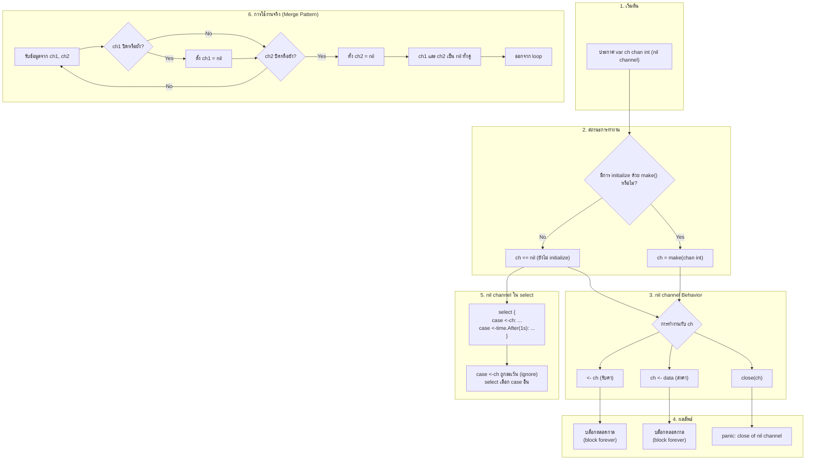

## Template

# golang
# Technical
- `chi`: router and middleware
- `viper`: configuration
- `cobra`: CLI features
- `gorm`: orm
- `validator`: data validation
- `jwt`: jwt authentication
- `zap`: logger
- `gomail`: email
- `hermes`: generate email body
- `air`: hot-reload

# Run
 ```go
      go run tmain.go    
 ```
---
# golang
- `chi`: router and middleware
- `cobra`: CLI features
- `zap`: logger
- 
nil channel  คืออะไร
nil channel มีกี่แบบ
nil channel ใช้อย่างไร นำในกรณีไหน ทำไม่ต้องใช้ ประโยชน์ที่ได้รับ
- โครงสร้างการทำงาน
- ออกแบบ workflow
  - วาดรูป dataflow สร้างรูปแบบ draw.io เหมือนจริง ลักษณะ flowchart TB   เพื่ออธิบายกระบวนการ ทำความเข้าใจ
  - พร้อมอธิบาย แบบ ละเอียด 
  - คอมเม้น code ภาษาไทย และ ภาษาอังถถษ อธิบาย การทำงาน แต่ละจุด
  - ยกตัวอย่างการใช้งานจริง หรือ กรณีศึกษา 
  - เทมเพลต และ ตัวอย่างโค้ด พร้อมนำไป run ได้ทันที  มีคำอธิบายการใช้งานแต่ละจุด การคอมเม้น  
- สรุป
   -ประโยชน์ที่ได้รับ
   -ข้อควรระวัง
   -ข้อดี
   -ข้อเสีย
   -ข้อห้าม ถ้ามี
   -แหล่ง อ้างอิ่ง ที่มา 

---
> **คำเตือน**: โค้ดด้านล่างนี้เป็นตัวอย่างแบบ Standalone ที่อธิบายแนวคิดของ Nil Channel อย่างครบถ้วน แต่การประยุกต์ใช้งานจริงใน Production (เช่น ร่วมกับ `chi`, `cobra`, `zap`) คุณจะต้องนำไปปรับใช้ให้สอดคล้องกับโครงสร้างโปรเจคของคุณเอง 

## 🧠 Nil Channel ใน Go คืออะไร?

ในภาษา Go `nil channel` คือ channel ที่ถูกประกาศขึ้นมา **แต่ยังไม่ได้ทำการ initialize** (ไม่ได้ใช้ `make`) หรือถูกกำหนดค่าให้เป็น `nil` โดยตรง 


## "Initialize" ในภาษา Go คืออะไร?

ในบริบทของ **Go channel** (และตัวแปรทั่วไปใน Go) คำว่า **initialize** (การเริ่มต้นค่า) หมายถึง **การทำให้ตัวแปรมีค่าเริ่มต้นที่ใช้การได้จริง** ไม่ใช่แค่ค่า zero value (ซึ่งสำหรับ channel คือ `nil`)

### 🔧 วิธี Initialize Channel (ทำให้เป็น non-nil channel)

```go
// ❌ ยังไม่ initialize - ได้ nil channel
var ch1 chan int
fmt.Println(ch1 == nil) // true

// ✅ initialize แล้ว - ได้ channel ที่ใช้งานได้
ch2 := make(chan int)      // unbuffered channel
ch3 := make(chan int, 5)   // buffered channel (buffer size 5)

fmt.Println(ch2 == nil)    // false
fmt.Println(ch3 == nil)    // false
```

## `make` ในภาษา Go คืออะไร?

`make` เป็น **ฟังก์ชัน built-in** ของ Go ที่ใช้สำหรับ **สร้างและเตรียมพร้อม (initialize) ชนิดข้อมูลอ้างอิง (reference types)** 3 ชนิดเท่านั้น:

1. **slice** (`[]T`)
2. **map** (`map[K]V`)  
3. **channel** (`chan T`)

## slice, map, channel ในภาษา Go คืออะไร?

ทั้งสามเป็น **ชนิดข้อมูล built-in** ที่ใช้บ่อยที่สุดใน Go สำหรับการจัดการข้อมูลแบบไดนามิกและการสื่อสารระหว่าง goroutine

---

## 1. Slice (`[]T`)

### 🔹 คืออะไร?
Slice เป็น **view ที่ยืดหยุ่น** เหนือ array มีความยาวเปลี่ยนแปลงได้ (dynamic array) ประกอบด้วย:
- **pointer** → ชี้ไปที่ underlying array
- **length** → จำนวนสมาชิกปัจจุบัน
- **capacity** → ความจุสูงสุดก่อนต้องขยาย

### 🔹 มีไว้ทำอะไร?
- จัดเก็บข้อมูลลำดับ (list) ที่สามารถเพิ่ม/ลดขนาดได้
- แทนการใช้ array แบบ fixed-size
- ทำงานกับ subsequence ของข้อมูลโดยไม่ต้องคัดลอก

### 🔹 ใช้ยังไง?
```go
// 1. สร้างด้วย make
s1 := make([]int, 5)      // length=5, capacity=5, values: [0,0,0,0,0]
s2 := make([]int, 3, 10)  // length=3, capacity=10

// 2. ใช้ composite literal
s3 := []string{"a", "b", "c"}

// 3. สร้างจาก array หรือ slice อื่น
arr := [5]int{1,2,3,4,5}
s4 := arr[1:4]            // [2,3,4]

// 4. เพิ่มสมาชิกด้วย append
s5 := []int{1,2}
s5 = append(s5, 3, 4)     // [1,2,3,4]

// 5. loop
for i, v := range s3 {
    fmt.Println(i, v)
}
```

---

## 2. Map (`map[K]V`)

### 🔹 คืออะไร?
Map เป็น **hash table** ที่เก็บคู่ key-value โดย key แต่ละตัวไม่ซ้ำกัน และต้องเป็น comparable type (เช่น int, string, struct ที่ comparable ได้)
 
**Comparable** แปลว่า **"ที่สามารถเปรียบเทียบได้"**
---

## ในบริบทของภาษา Go

`comparable` หมายถึง **ประเภทข้อมูล (type) ที่สามารถใช้ตัวดำเนินการ `==` และ `!=` เพื่อเปรียบเทียบกันได้**

### ✅ ประเภทที่ comparable (เปรียบเทียบได้)

- **Basic types**: `int`, `float64`, `string`, `bool`
- **Pointer types**: `*T` (เปรียบเทียบที่ address)
- **Channel types**: `chan T` (เปรียบเทียบที่ reference)
- **Interface types**: ถ้า dynamic type ของทั้งสอง comparable
- **Struct types**: **ถ้าทุก field เป็น comparable**
- **Array types**: `[n]T` **ถ้า T เป็น comparable**

### ❌ ประเภทที่ **ไม่** comparable (เปรียบเทียบไม่ได้)

- **Slice**: `[]T`
- **Map**: `map[K]V`
- **Function**: `func`

```go
// เปรียบเทียบได้ (comparable)
var a, b int = 1, 2
fmt.Println(a == b)  // OK

type Person struct {
    Name string
    Age  int
}
p1, p2 := Person{"Alice", 20}, Person{"Bob", 25}
fmt.Println(p1 == p2)  // OK (ทุก field comparable)

// เปรียบเทียบไม่ได้ (not comparable)
s1, s2 := []int{1}, []int{1}
fmt.Println(s1 == s2)  // compile error: slice can only be compared to nil

m1, m2 := map[string]int{}, map[string]int{}
fmt.Println(m1 == m2)  // compile error: map can only be compared to nil
```

---

## ทำไมต้องรู้เรื่อง comparable?

ใน Go 2 บริบทหลัก ๆ คือ:

1. **การใช้เป็น key ของ map**:
   ```go
   var m map[ComparableType]Value  // key ต้องเป็น comparable เท่านั้น
   ```

2. **Type constraints ใน generics** (Go 1.18+):
   ```go
   func Equal[T comparable](a, b T) bool {
       return a == b  // T ต้องเป็น comparable
   }
   ```

> **สรุป**: comparable = "เทียบกันได้ด้วย == และ !=", ซึ่ง slice, map, function เทียบกันไม่ได้ ยกเว้นกับ `nil`
> 
### 🔹 มีไว้ทำอะไร?
- สร้าง dictionary, lookup table, cache
- นับจำนวนข้อมูล (frequency count)
- เก็บข้อมูลแบบเข้าถึงโดย key แทน index

### 🔹 ใช้ยังไง?
```go
// 1. สร้างด้วย make
m1 := make(map[string]int)

// 2. ใช้ composite literal
m2 := map[string]int{
    "apple": 5,
    "banana": 3,
}

// 3. เพิ่ม/แก้ไขค่า
m1["key"] = 100

// 4. อ่านค่า
val := m1["key"]           // 100
val2, ok := m1["missing"]  // 0, false (check existence)

// 5. ลบค่า
delete(m1, "key")

// 6. loop
for k, v := range m2 {
    fmt.Println(k, v)
}
```

---

## 3. Channel (`chan T`)

### 🔹 คืออะไร?
Channel เป็น **pipe** สำหรับสื่อสารระหว่าง goroutine ส่งข้อมูลชนิด `T` จาก goroutine หนึ่งไปยังอีก goroutine หนึ่ง

### 🔹 มีไว้ทำอะไร?
- การส่งข้อมูลระหว่าง concurrent tasks
- ซิงโครไนซ์ goroutine (blocking behavior)
- สร้าง pipeline และ worker pools

### 🔹 ใช้ยังไง?
```go
// 1. สร้างด้วย make
ch1 := make(chan int)       // unbuffered (blocking)
ch2 := make(chan string, 5) // buffered (block เฉพาะเมื่อเต็ม/ว่าง)

// 2. ส่งค่า
ch1 <- 42

// 3. รับค่า
val := <-ch1
val, ok := <-ch1  // ok=false เมื่อ channel ปิดและว่าง

// 4. ปิด channel (ฝั่งส่งเป็นคนปิด)
close(ch1)

// 5. loop รับค่าจนกว่าจะปิด
for v := range ch2 {
    fmt.Println(v)
}

// 6. ใช้กับ select (multiplexing)
select {
case v := <-ch1:
    fmt.Println(v)
case ch2 <- "hello":
    fmt.Println("sent")
default:
    fmt.Println("no activity")
}
```

---

## 📊 เปรียบเทียบสรุป

| คุณสมบัติ | Slice | Map | Channel |
| :--- | :--- | :--- | :--- |
| **zero value** | `nil` | `nil` | `nil` |
| **initialize ด้วย** | `make([]T, len, cap)` | `make(map[K]V)` | `make(chan T, size)` |
| **เข้าถึงสมาชิก** | `s[i]` (index) | `m[key]` | `<-ch` (receive) |
| **เพิ่มข้อมูล** | `append()` | `m[key]=val` | `ch <- val` (send) |
| **ลบข้อมูล** | slicing / reassign | `delete(m, key)` | close (ไม่ลบ data) |
| **ใช้ใน concurrent** | ต้องใช้ mutex | ต้องใช้ mutex | **safe by design** |
| **range รองรับ** | ✅ | ✅ | ✅ |

---

## 🧪 ตัวอย่างประกอบการตัดสินใจเลือกใช้

```go
// ต้องการ list ของ students ที่เพิ่มได้เรื่อย ๆ
students := []string{"Alice", "Bob"}

// ต้องการ lookup นักเรียนตามรหัส
studentByID := map[int]string{101: "Alice", 102: "Bob"}

// ต้องการส่งงานจาก producer ไปให้ worker
jobQueue := make(chan Job, 100)
```

> 💡 **กฎง่าย ๆ**:
> - ข้อมูลที่เป็นลำดับ → **Slice**
> - ข้อมูลที่ต้องค้นหาด้วย key → **Map**
> - การสื่อสารระหว่าง goroutine → **Channel**

### ✅ หน้าที่หลักของ `make`

`make` จัดสรรหน่วยความจำ **และ** ทำการเริ่มต้นค่าเริ่มต้นภายใน (เช่น buffer, hash table) ให้พร้อมใช้งานทันที

```go
// สร้าง slice: length=3, capacity=5
s := make([]int, 3, 5)

// สร้าง map
m := make(map[string]int)

// สร้าง channel (unbuffered)
ch := make(chan int)

// สร้าง buffered channel (size=10)
chBuf := make(chan string, 10)
```

### ⚖️ `make` vs `new` (ต่างกันอย่างไร?)

| คุณสมบัติ | `make` | `new` |
| :--- | :--- | :--- |
| **ใช้กับ** | slice, map, channel เท่านั้น | **ทุกประเภท** (struct, int, array, etc.) |
| **คืนค่า** | ชนิดเดิม (ไม่ใช่ pointer) | pointer (`*T`) |
| **การเตรียมพร้อม** | จัดสรร + 初始化โครงสร้างภายใน | จัดสรร zero value แล้วคืน pointer |
| **zero value** | slice, map, channel ที่พร้อมใช้ | `*T` ชี้ไปที่ zero value ของ T |

```go
// ตัวอย่าง new
p := new(int)     // p เป็น *int ชี้ไปที่ 0
*p = 100

// ถ้าใช้ new กับ channel
chPtr := new(chan int)   // chPtr เป็น *chan int ที่ชี้ไปที่ nil channel
*chPtr = make(chan int)  // ต้อง assign ค่า channel ที่ initialize แล้ว

// แต่ทำแบบนี้ดีกว่า:
ch := make(chan int)     // ได้ channel ที่ใช้ได้เลย
```

### 💡 สรุปง่าย ๆ

- **`make`** = สร้าง + เตรียมพร้อมใช้ทันที (สำหรับ slice, map, channel)
- **`new`** = ขอหน่วยความจำสำหรับ zero value แล้วคืน pointer (ใช้น้อยมากใน Go ยุคใหม่)

> **คำแนะนำ**: ใช้ `make` กับ slice/map/channel เท่านั้น อย่าใช้ `new` ยกเว้นกรณีจำเป็นจริง ๆ (ส่วนใหญ่ใช้ `&T{}` หรือ literal แทน)


### 📌 สรุปความแตกต่าง

| สถานะ | `nil channel` | **Initialized channel** (non-nil) |
| :--- | :--- | :--- |
| ค่าเริ่มต้น | `nil` | `make(chan T)` หรือ `make(chan T, size)` |
| หน่วยความจำ | ไม่ได้จัดสรร | จัดสรรแล้ว (มี struct channel ภายใน) |
| การรับ/ส่งข้อมูล | block ตลอดกาล | block / non-block แล้วแต่สถานะ |
| การใช้ `close()` | panic | สำเร็จ (ถ้ายังไม่ปิด) |
| การใช้ `range` | deadlock | ทำงานจนกว่า channel จะปิด |

### 🧠 หลักการจำ

- **Declare** (ประกาศ) → ได้ `nil` channel
- **Initialize** (ใช้ `make`) → ได้ channel ที่พร้อมใช้งาน

```go
var ch chan int   // declare (zero value = nil)
ch = make(chan int)  // initialize
```

> **พูดง่าย ๆ**: initialize = เอา `make` มาเติมให้ channel จนมันไม่ใช่ `nil` อีกต่อไป

```go
// nil channel แบบที่ 1: ประกาศไว้แต่ไม่ initialize
var ch1 chan int   //  ch1 เป็น nil channel ณ ตอนนี้

// nil channel แบบที่ 2: กำหนดค่า nil ให้กับตัวแปร channel
var ch2 chan int = nil
```

**ข้อมูลเชิงลึกสำคัญ**: `nil` เป็นค่าเริ่มต้น (zero value) ของชนิด `chan`

---

## 🚦 Nil Channel มีกี่แบบ? (ประเภทของ Nil Channel)

แม้ `nil channel` จะเป็นแค่ค่า `nil` ของชนิด `chan` แต่เราสามารถแบ่งได้ตาม **สถานะ (State)** และ **ทิศทาง (Direction)** ของมัน:

### 📊 แบ่งตามสถานะ (State) ของ channel
Go channel มี 3 สถานะหลัก:

| สถานะ (State) | การส่งค่า (Send) | การรับค่า (Receive) | การปิด (Close) |
| :--- | :--- | :--- | :--- |
| **nil** | บล็อกถาวร (block forever) | บล็อกถาวร (block forever) | **panic** |
| **active (เปิด)** | บล็อก/สำเร็จ ขึ้นอยู่กับ buffer | บล็อก/สำเร็จ ขึ้นอยู่กับ buffer | สำเร็จ |
| **closed (ปิดแล้ว)** | **panic** | สำเร็จ (คืนค่า zero value ทันที) | **panic** |

### 🧭 แบ่งตามทิศทาง (Direction) ของ channel
- **Two-way channel**: `chan T` — อ่านและเขียนได้
- **Receive-only channel**: `<-chan T` — อ่านได้อย่างเดียว
- **Send-only channel**: `chan<- T` — เขียนได้อย่างเดียว

> `nil` channel ไม่มีข้อมูลภายใน และไม่มี buffer การส่งหรือรับค่าจากมันจะทำให้ goroutine นั้นต้องหยุดรอ (block) ไปตลอดกาล ข้อยกเว้นเดียวคือการ **close** ซึ่งจะทำให้โปรแกรม panic ทันที

---

## 🤔 ทำไมต้องใช้ Nil Channel? (ประโยชน์หลัก)

ประโยชน์หลักของ `nil channel` คือการนำมาใช้ **ปิดการทำงาน (disable) branch ใด branch หนึ่งของ `select` แบบไดนามิก**

### ✅ ข้อดี / ประโยชน์ที่ได้รับจากการใช้ Nil Channel

1. **การปิดใช้งาน Branch แบบ Dynamic**:
   เมื่อ channel ถูกตั้งเป็น `nil` ใน `select`, Go จะ **ignore** case นั้นโดยอัตโนมัติ ไม่ต้องใช้ flag หรือ state machine เพิ่ม

2. **การจัดการ Closed Channel อย่าง Elegant**:
   ใน `select` เมื่อ channel ถูกปิด (close) และ drain แล้ว มันจะคืนค่า zero value อย่างไม่สิ้นสุด ทำให้เกิด infinite loop การเปลี่ยนเป็น `nil` จะหยุด loop ทันที

3. **Merging Channels (Channel Fan-in)**:
   ใช้ `nil` เพื่อปิด branch ที่ปิดไปแล้วอย่างชาญฉลาด รู้จักกันในชื่อ **"Init when you split, Nil when you merge"**

4. **Optional Timeout / Functionality**:
   สร้าง timeout channel เป็น `nil` หรือ `time.After()` ตามเงื่อนไข ทำให้ `select` branch timeout ทำงานแค่เมื่อจำเป็น

5. **Worker Pool Shutdown**:
   ใช้ `nil` เพื่อปิด branch การส่งงาน (send work) แต่ยังเปิด branch การรับผลลัพธ์ (receive result) ไว้

---

## ⚙️ โครงสร้างการทำงานของ Nil Channel

เพื่อให้เห็นภาพชัดเจนขึ้น ลองมาดู Data Flow Diagram กันครับ

### 🔄 Flowchart: การทำงานของ Nil Channel



### 📝 คำอธิบาย Diagram แบบละเอียด

1. **การประกาศ channel**: `var ch chan int` จะได้ `nil channel` ทันที ถ้าไม่ `make()`
2. **nil channel behavior**: การรับ/ส่งข้อมูลจะ **block forever** การ `close()` จะ **panic**
3. **nil channel ใน `select`**: case ของ `nil channel` จะถูกละเว้น (ignore) โดยปริยาย ทำให้สามารถเลือก branch อื่นได้
4. **การประยุกต์ใช้จริง**: `nil channel` มีประโยชน์มากที่สุดใน **Fan-in Pattern** หรือ **Merge Pattern** เพื่อรวมข้อมูลจากหลายๆ channel เข้าด้วยกัน

---

## 💻 ตัวอย่างโค้ดและกรณีศึกษา

### กรณีศึกษาที่ 1: Merge Channel (Fan-in Pattern) - ปิด Branch ที่ปิดแล้ว

```go
package main

import (
    "fmt"
    "sync"
    "time"
)

// merge รวมข้อมูลจาก 2 channels เข้าด้วยกัน
// ใช้ nil channel เพื่อปิด branch ที่ถูกปิดแล้ว
func merge(ch1, ch2 <-chan int) <-chan int {
    out := make(chan int)
    
    var wg sync.WaitGroup
    wg.Add(2)
    
    // Goroutine 1: อ่านจาก ch1
    go func() {
        defer wg.Done()
        for v := range ch1 {
            out <- v
        }
    }()
    
    // Goroutine 2: อ่านจาก ch2
    go func() {
        defer wg.Done()
        for v := range ch2 {
            out <- v
        }
    }()
    
    // Goroutine ปิด out channel เมื่อทั้ง ch1 และ ch2 ปิด
    go func() {
        wg.Wait()
        close(out)
    }()
    
    return out
}

// mergeWithNil แสดงการใช้ nil channel แบบคลาสสิก
func mergeWithNil(a, b <-chan int) <-chan int {
    out := make(chan int)
    
    go func() {
        // ปิด out เมื่อ goroutine จบ
        defer close(out)
        
        // ทำการ merge จนกว่าทั้ง a และ b จะเป็น nil
        for a != nil || b != nil {
            select {
            case v, ok := <-a:
                // ถ้า a ปิดแล้ว ให้ตั้ง a = nil เพื่อปิด branch นี้
                if !ok {
                    a = nil // สำคัญ: ปิด branch a
                    continue
                }
                out <- v
                
            case v, ok := <-b:
                // ถ้า b ปิดแล้ว ให้ตั้ง b = nil เพื่อปิด branch นี้
                if !ok {
                    b = nil // สำคัญ: ปิด branch b
                    continue
                }
                out <- v
            }
        }
    }()
    
    return out
}

// ฟังก์ชัน helper สำหรับสร้าง test channel
func asChan(values ...int) <-chan int {
    ch := make(chan int)
    go func() {
        for _, v := range values {
            ch <- v
            time.Sleep(100 * time.Millisecond) // simulate work
        }
        close(ch)
    }()
    return ch
}

func main() {
    fmt.Println("=== Merge Channel Example ===")
    
    // สร้าง test data
    ch1 := asChan(1, 3, 5, 7)
    ch2 := asChan(2, 4, 6, 8)
    
    // รวม channel
    merged := mergeWithNil(ch1, ch2)
    
    // รับข้อมูลจาก merged channel
    fmt.Print("Merged values: ")
    for v := range merged {
        fmt.Printf("%d ", v)
    }
    fmt.Println("\n\nMerge completed!")
}
```

#### 🔍 คำอธิบายการทำงาน (ภาษาไทย)

1. **ประกาศตัวแปร**: `a` และ `b` เป็น `<-chan int` ซึ่งรับค่าได้อย่างเดียว
2. **ลูปหลัก**: `for a != nil || b != nil` จะทำงานจนกว่า `a` และ `b` จะเป็น `nil` ทั้งคู่
3. **select statement**:
   - `case v, ok := <-a`: พยายามอ่านค่าจาก `a`
   - ถ้า `ok` เป็น `false` แสดงว่า `a` ถูกปิดแล้ว → ตั้ง `a = nil` → branch นี้จะถูกปิดในรอบถัดไป
   - `continue` เพื่อข้ามการส่งค่า `zero value` ออกไป
4. **การปิด merged channel**: `defer close(out)` จะปิด `out` เมื่อ goroutine จบ
5. **ผลลัพธ์**: ข้อมูลจากทั้ง 2 ช่องทางจะถูกส่งออกมาแบบ interleaved และโปรแกรมจะจบลงโดยอัตโนมัติ

#### 🧠 Step-by-Step Workflow (ภาษาอังกฤษ)

1. **Variable Declaration**: `a` and `b` are receive-only channels
2. **Main Loop**: Runs while at least one channel is non-nil
3. **Select Statement**: Attempts to read from both channels
4. **Channel Closure Detection**: Uses the comma-ok idiom (`v, ok := <-a`)
5. **Disable Branch**: If channel is closed, set it to `nil` → branch is ignored in next iterations
6. **Graceful Termination**: Loop exits when both channels are `nil`

### กรณีศึกษาที่ 2: Worker Pool with Graceful Shutdown

```go
package main

import (
    "context"
    "fmt"
    "sync"
    "time"
)

// Job represents a unit of work
type Job struct {
    ID     int
    Payload string
}

// Result represents the outcome of a job
type Result struct {
    JobID int
    Output string
    Err   error
}

// WorkerPool manages a pool of worker goroutines
type WorkerPool struct {
    numWorkers int
    jobQueue   chan Job
    resultQueue chan Result
    wg         sync.WaitGroup
    ctx        context.Context
    cancel     context.CancelFunc
}

// NewWorkerPool creates a new worker pool
func NewWorkerPool(numWorkers int, bufferSize int) *WorkerPool {
    ctx, cancel := context.WithCancel(context.Background())
    return &WorkerPool{
        numWorkers:  numWorkers,
        jobQueue:    make(chan Job, bufferSize),
        resultQueue: make(chan Result, bufferSize),
        ctx:         ctx,
        cancel:      cancel,
    }
}

// Start launches all worker goroutines
func (wp *WorkerPool) Start() {
    for i := 0; i < wp.numWorkers; i++ {
        wp.wg.Add(1)
        go wp.worker(i)
    }
}

// worker processes jobs from the jobQueue
func (wp *WorkerPool) worker(id int) {
    defer wp.wg.Done()
    
    for {
        select {
        case <-wp.ctx.Done():
            fmt.Printf("Worker %d shutting down...\n", id)
            return
            
        case job, ok := <-wp.jobQueue:
            // If jobQueue is closed and drained, ok will be false
            if !ok {
                fmt.Printf("Worker %d: job queue closed, exiting\n", id)
                return
            }
            
            // Process the job
            fmt.Printf("Worker %d processing job %d\n", id, job.ID)
            time.Sleep(100 * time.Millisecond) // simulate work
            
            // Send result
            result := Result{
                JobID:  job.ID,
                Output: fmt.Sprintf("Processed: %s", job.Payload),
            }
            
            // Non-blocking send to resultQueue (with context check)
            select {
            case wp.resultQueue <- result:
            case <-wp.ctx.Done():
                return
            }
        }
    }
}

// AddJob adds a job to the queue (non-blocking if queue is full)
func (wp *WorkerPool) AddJob(job Job) bool {
    select {
    case wp.jobQueue <- job:
        return true
    case <-wp.ctx.Done():
        return false
    default:
        return false // Queue is full
    }
}

// Shutdown gracefully shuts down the worker pool
func (wp *WorkerPool) Shutdown() {
    fmt.Println("Shutting down worker pool...")
    wp.cancel()     // Signal all workers to stop
    wp.wg.Wait()    // Wait for all workers to finish
    close(wp.resultQueue)
}

// Results returns the result channel
func (wp *WorkerPool) Results() <-chan Result {
    return wp.resultQueue
}

func main() {
    fmt.Println("=== Worker Pool with Nil Channel Pattern ===")
    
    // Create a worker pool with 3 workers
    pool := NewWorkerPool(3, 10)
    pool.Start()
    
    // Add some jobs
    go func() {
        for i := 1; i <= 10; i++ {
            job := Job{
                ID:     i,
                Payload: fmt.Sprintf("Task %d", i),
            }
            if !pool.AddJob(job) {
                fmt.Printf("Failed to add job %d (queue full)\n", i)
            }
        }
        // Close jobQueue to signal no more jobs
        // In a real app, you might close it after all jobs are added
    }()
    
    // Collect results with a timeout
    timeout := time.After(3 * time.Second)
    resultsReceived := 0
    
    for resultsReceived < 10 {
        select {
        case result, ok := <-pool.Results():
            if !ok {
                fmt.Println("Result channel closed")
                return
            }
            fmt.Printf("Result for job %d: %s\n", result.JobID, result.Output)
            resultsReceived++
            
        case <-timeout:
            fmt.Println("Timeout reached, shutting down...")
            pool.Shutdown()
            return
        }
    }
    
    // Graceful shutdown
    pool.Shutdown()
    fmt.Println("All jobs processed successfully!")
}
```

#### 🔍 Explanation in English:

1. **Worker Pool Pattern**: Multiple workers consume jobs from a shared queue
2. **Graceful Shutdown**: Uses `context.Context` to signal workers to stop
3. **Non-blocking Operations**: `select` with `default` prevents blocking when queue is full
4. **Result Collection**: Results are collected in the main goroutine
5. **Timeout Handling**: `time.After` creates a channel that becomes ready after the timeout

---

## 📊 สรุปพฤติกรรม Nil Channel

| การดำเนินการ (Operation) | nil channel | active channel | closed channel |
| :--- | :--- | :--- | :--- |
| **Receive** (`<-ch`) | Block forever | Block / value ready | Zero value + `ok=false` |
| **Send** (`ch<-`) | Block forever | Block / send ready | **panic** |
| **Close** (`close(ch)`) | **panic** | Success | **panic** |
| **Select case** | Ignored (disabled) | Usual behavior | Always ready (returns zero) |

---

## ⚠️ ข้อควรระวัง (Cautions)

1. **Deadlock ถ้าใช้ single nil channel นอก select**:
   ```go
   var ch chan int
   <-ch // fatal error: deadlock (ไม่มี goroutine อื่น)
   ```

2. **การ close nil channel จะ panic เสมอ**:
   ```go
   var ch chan int
   close(ch) // panic: close of nil channel
   ```

3. **การอ่านค่า channel ที่ปิดแล้ว (closed)** จะได้ zero value เสมอ อาจทำให้เกิด **infinite loop** ได้

4. **อย่าสับสนระหว่าง nil channel กับ closed channel**:
   - Closed channel: อ่านได้ทันที (zero value) ส่งค่าไม่ได้ (panic)
   - Nil channel: อ่าน/ส่งไม่ได้ (block forever)

---

## 🎯 ข้อดี (Advantages) vs ข้อเสีย (Disadvantages)

### ✅ ข้อดี

- ลด complexity ของโค้ด ไม่ต้องใช้ state flags เพิ่ม
- ป้องกัน infinite loop ที่เกิดจาก closed channel ได้อย่างมีประสิทธิภาพ
- ทำให้โค้ด concurrent ง่ายขึ้น เข้าใจง่าย
- **"Init when you split, Nil when you merge"** เป็นแนวทางที่ elegant
- ช่วยให้ `select` statement จัดการกับ channel ที่ปิดไปแล้วได้อย่างเป็นธรรมชาติ

### ❌ ข้อเสีย

- อาจทำให้เกิด deadlock ได้ง่าย ถ้าใช้ไม่ถูกต้อง
- การ debug ทำได้ยาก เพราะ error ไม่ชัดเจน (แค่ block เฉยๆ)
- ผู้เริ่มต้นอาจสับสนระหว่าง nil, active, และ closed channel
- **เกิด panic ได้ง่าย** ถ้าเผลอ `close(nil)` หรือ `send to closed channel`

---

## 🚫 ข้อห้าม (What NOT to do)

1. **ห้าม close nil channel** → panic
2. **ห้ามใช้ nil channel โดยไม่เข้าใจ behavior** → deadlock
3. **ห้ามส่งค่าไปยัง closed channel** → panic
4. **ห้ามส่งค่าไปยัง nil channel โดยไม่มี select branch อื่น** → deadlock
5. **ห้าม range nil channel**:
   ```go
   var ch chan int
   for v := range ch { } // deadlock
   ```

---

## 🧰 เทมเพลตพร้อมใช้งาน

### Template 1: Merge Pattern Template

```go
func merge[T any](channels ...<-chan T) <-chan T {
    out := make(chan T)
    
    go func() {
        defer close(out)
        
        // Create a slice of channels
        chs := make([]<-chan T, len(channels))
        copy(chs, channels)
        
        for len(chs) > 0 {
            select {
            // Dynamically build select cases (advanced)
            // For simplicity, use reflection or manual cases
            }
        }
    }()
    
    return out
}
```

### Template 2: Optional Timeout Template

```go
func doWithOptionalTimeout(recvCh <-chan int, timeoutSec int) (int, error) {
    var timeout <-chan time.Time
    if timeoutSec > 0 {
        timeout = time.After(time.Duration(timeoutSec) * time.Second)
    }
    
    select {
    case v := <-recvCh:
        return v, nil
    case <-timeout:
        return 0, fmt.Errorf("timeout after %d seconds", timeoutSec)
    }
}
```

---

## 📚 แหล่งอ้างอิง (References)

1. [Go Blog: Channels in Go](https://go.dev/blog/pipelines)
2. [The Go Programming Language Specification: Channel types](https://go.dev/ref/spec#Channel_types)
3. [Nil Channels in Go - DoltHub Blog](https://www.dolthub.com/blog/2024-10-25-go-nil-channels-pattern/)
4. [Why are there nil channels in Go? - justforfunc](https://medium.com/justforfunc/why-are-there-nil-channels-in-go-9877cc0b2308)
5. [Go 101: Channel Use Cases](https://go101.org/article/channel-use-cases.html)
6. [Effective Go: Channels](https://go.dev/doc/effective_go#channels)

---

> 💡 **สรุปสั้นๆ**: `nil channel` ใน Go ไม่ใช่ bug หรือความบกพร่อง แต่เป็น feature ที่ถูกออกแบบมาอย่างชาญฉลาด เพื่อช่วยให้การเขียนโปรแกรม concurrent ง่ายขึ้น โดยเฉพาะการจัดการกับ closed channel และการปิด branch ของ `select` แบบไดนามิก