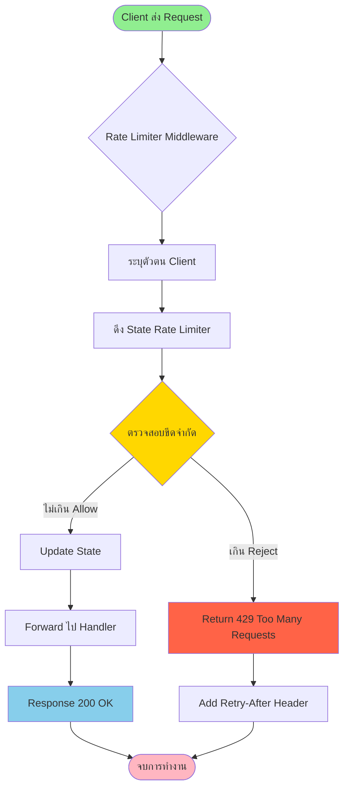

## Template
# Run

```go
      go run tmain.go    
```
---
# golang

Rate Limiting คืออะไร
Rate Limiting มีกี่แบบ
Rate Limiting ใช้อย่างไร นำในกรณีไหน ทำไม่ต้องใช้ ประโยชน์ที่ได้รับ
- โครงสร้างการทำงาน
- ออกแบบ workflow
  - วาดรูป dataflow สร้างรูปแบบ draw.io เหมือนจริง ลักษณะ flowchart TB   เพื่ออธิบายกระบวนการ ทำความเข้าใจ
  - พร้อมอธิบาย แบบ ละเอียด 
  - คอมเม้น code ภาษาไทย และ ภาษาอังถถษ อธิบาย การทำงาน แต่ละจุด
  - ยกตัวอย่างการใช้งานจริง หรือ กรณีศึกษา 
  - เทมเพลต และ ตัวอย่างโค้ด พร้อมนำไป run ได้ทันที  มีคำอธิบายการใช้งานแต่ละจุด การคอมเม้น  
- สรุป
   -ประโยชน์ที่ได้รับ
   -ข้อควรระวัง
   -ข้อดี
   -ข้อเสีย
   -ข้อห้าม ถ้ามี
   -แหล่ง อ้างอิ่ง ที่มา 

---
##  Answer: The answer : คำตอบ

# Rate Limiting ใน Golang: คู่มือฉบับสมบูรณ์

## 📌 Rate Limiting คืออะไร

Rate Limiting คือกลไกการควบคุมปริมาณคำขอหรือการกระทำที่客户端สามารถส่งไปยังระบบหรือ API ได้ในช่วงเวลาที่กำหนด โดยทำหน้าที่เป็น "ผู้เฝ้าประตู" คอยตรวจสอบและจำกัดความถี่ในการเรียกใช้บริการ

หลักการทำงานของ Rate Limiting คือการตั้งขีดจำกัดว่าในช่วงระยะเวลาหนึ่ง (เช่น 1 วินาที, 1 นาที) สามารถรับคำขอได้กี่ครั้ง และจะปฏิเสธคำขอที่เกินขีดจำกัดนั้นด้วย HTTP Status Code **429 Too Many Requests**

### ทำไมต้องใช้ Rate Limiting

| ประโยชน์ | คำอธิบาย |
|----------|----------|
| **ปกป้องระบบจาก Overload** | ป้องกันไม่ให้ระบบล่มจากการรับคำขอมากเกินความสามารถ |
| **ป้องกันการโจมตีแบบ DoS/DDoS** | จำกัดจำนวนคำขอจากแหล่งเดียวกัน ทำให้การโจมตีมีประสิทธิภาพลดลง |
| **ป้องกัน Brute Force Attack** | จำกัดการพยายามล็อกอินผิดพลาดหลายครั้งติดต่อกัน |
| **รับประกันความเป็นธรรม** | ป้องกันไม่ให้ผู้ใช้รายเดียวใช้ทรัพยากรจนผู้ใช้รายอื่นได้รับผลกระทบ |
| **ลดต้นทุนการดำเนินงาน** | ควบคุมปริมาณการใช้ทรัพยากรและลดค่าใช้จ่ายที่ไม่จำเป็น |

### สถานการณ์การใช้งานจริง

- ✅ API Gateway (จำกัดการเรียก API สาธารณะ)
- ✅ ระบบล็อกอิน (จำกัดการลองรหัสผ่านผิดซ้ำ)
- ✅ ระบบ Streaming และ Queue
- ✅ Microservices Communication (ป้องกันการ cascading failure)
- ✅ Web Scraping Protection
- ✅ ระบบที่มีการคิดค่าใช้จ่ายตามการเรียกใช้


## 🧠 Rate Limiting มีกี่แบบ

ใน Golang นิยมใช้ Rate Limiting Algorithms หลักๆ 5 แบบ:

| Algorithm | หลักการ | จุดเด่น | จุดด้อย |
|-----------|---------|---------|---------|
| **Fixed Window Counter** | แบ่งเวลาเป็น window ขนาดคงที่ นับจำนวน request ใน window | ง่ายที่สุด, ใช้หน่วยความจำน้อย | มีปัญหาช่วงเปลี่ยน window (ขอบเขต burst) |
| **Sliding Window Log** | เก็บ timestamp ของ request ทั้งหมด, ตัด request ที่อยู่นอก window แบบเลื่อน | แม่นยำสูงสุด | ใช้หน่วยความจำสูง O(n) |
| **Sliding Window Counter** | ผสม Fixed + Log โดยใช้ weighted calculation | แม่นยำดี, ประหยัดหน่วยความจำ | ซับซ้อนในการคำนวณ |
| **Token Bucket** | bucket เก็บ token, เติม token เป็นระยะ constant rate, request ต้องใช้ token | รองรับ burst, เต็มไปด้วยความยืดหยุ่น | ต้องคำนวณเวลาเติม token |
| **Leaky Bucket** | request เข้าคิว bucket, ปล่อยออกมาด้วย constant rate | เรียบเนียนสม่ำเสมอ | ไม่รองรับ burst |

### ตารางเปรียบเทียบประสิทธิภาพตาม Redis Benchmark

| Algorithm | Memory per Client | Accuracy | Burst Behavior | เหมาะกับ |
|-----------|------------------|----------|----------------|-----------|
| Fixed Window | 1 key | Approximate | 2x burst at boundaries | API ธรรมดา, login throttling |
| Sliding Window Log | O(n) entries | Exact | No bursts | High-value APIs, audit trails |
| Sliding Window Counter | 2 keys | Near-exact | Smoothed boundaries | General-purpose API rate limiting |
| Token Bucket | 1 key (2 fields) | Exact | Controlled bursts | Bursty traffic + average rate caps |
| Leaky Bucket | 1 key (1-2 fields) | Exact | No bursts | Policing/shaping |

อ้างอิงจาก: Redis Rate Limiting Algorithm Comparison


## 🔧 Rate Limiting ใช้อย่างไร และนำไปใช้ในกรณีไหน

### การนำไปใช้ใน Golang

**Golang มีเครื่องมือ Rate Limiting สำเร็จรูปให้เลือก 3 แบบหลัก:**

| แบบ | ไลบรารี | Algorithm | จุดเด่น | Concurrency Safety |
|-----|---------|-----------|---------|---------------------|
| **Official** | `golang.org/x/time/rate` | Token Bucket (GCRA variant) | Feature-rich, stable, widely used | Mutex-based |
| **Uber** | `go.uber.org/ratelimit` | Leaky Bucket | High performance, atomic | Atomic-based |
| **Custom** | Self-implement | Any | Full control | Developer responsibility |

### การเลือกใช้ตามกรณี

| สถานการณ์ | Algorithm ที่แนะนำ | เหตุผล |
|------------|-------------------|---------|
| API พื้นฐานทั่วไป | Token Bucket | ยืดหยุ่น, ดูแลง่าย |
| ระบบที่ต้องการความเสถียรสูง | Sliding Window Counter | แม่นยำ, หน่วยความจำต่ำ |
| ระบบที่ต้องการความแม่นยำ 100% | Sliding Window Log | แม่นยำสมบูรณ์ |
| งานที่ต้องการจำกัดแบบสม่ำเสมอ | Leaky Bucket | เนียนเรียบ, ไม่มีสะดุด |
| Distributed System | Redis-based | แชร์ state ข้าม instance |
| High Performance (>10k QPS) | Uber ratelimit | Atomic operations, lock-free |


## 🎯 โครงสร้างการทำงานของ Rate Limiter

Rate Limiter มีโครงสร้างหลัก 3 ส่วน:

```
┌─────────────────────────────────────────────────────────────────────┐
│                         RATE LIMITER CORE                           │
├─────────────────────────────────────────────────────────────────────┤
│  ┌─────────────┐    ┌─────────────┐    ┌─────────────┐             │
│  │  Algorithm  │    │   Storage   │    │   Metrics   │             │
│  │  Engine     │◄──►│  (State)    │    │  Collector  │             │
│  └─────────────┘    └─────────────┘    └─────────────┘             │
│         │                  │                  │                    │
│         ▼                  ▼                  ▼                    │
│  - Token Bucket      - In-memory       - Request count             │
│  - Leaky Bucket      - Redis           - Allowed/Rejected          │
│  - Fixed/Sliding     - Database        - Wait time                 │
│  Window              - Distributed     - Rate limit headers        │
└─────────────────────────────────────────────────────────────────────┘
```


## 📊 Data Flow Diagram (Flowchart TB)

### ขั้นตอนการทำงานของ Rate Limiter (Flowchart)



### คำอธิบายแบบละเอียด

1. **Client ส่ง Request** → เริ่มต้นกระบวนการ
2. **Rate Limiter Middleware** → จุดเริ่มต้นในการควบคุม
3. **ระบุตัวตน Client** → ดึง IP, API Key หรือ User ID เพื่อใช้เป็น key สำหรับ rate limiting
4. **ดึง State** → อ่านข้อมูลสถานะของ limiter (เช่น จำนวน token ที่เหลือ, จำนวน request ที่ผ่านไปแล้ว)
5. **ตรวจสอบขีดจำกัด** → จุดตัดสินใจหลัก เปรียบเทียบ current usage กับ limit ที่กำหนด
6. **Update State** → เมื่อ request ถูก allow ให้ทำการอัปเดต token/request count
7. **Forward ไป Handler** → ส่ง request เข้าสู่ business logic จริง
8. **Response 200 OK** → ส่งผลลัพธ์กลับ client
9. **Return 429** → กรณีเกิน limit ส่ง status code 429 พร้อม Retry-After header

### ตัวอย่างการติดตามผ่าน HTTP Headers

```
HTTP/1.1 200 OK
X-RateLimit-Limit: 10        ← จำนวน request ที่อนุญาตต่อช่วงเวลา
X-RateLimit-Remaining: 5      ← จำนวน request ที่เหลือใน window ปัจจุบัน
X-RateLimit-Reset: 1678901234 ← timestamp ที่ window จะถูกรีเซ็ต
Retry-After: 30               ← วินาทีที่ต้องรอก่อนส่ง request ใหม่ (เฉพาะกรณี 429)
```


## 📝 ตัวอย่างโค้ดแบบสมบูรณ์ (Run ได้ทันที)

### ตัวอย่างที่ 1: Official Token Bucket (golang.org/x/time/rate)

```go
// main_official.go
// ใช้ official library สำหรับ Token Bucket Rate Limiting
package main

import (
    "context"
    "fmt"
    "log"
    "time"

    "golang.org/x/time/rate" // Official rate limiter package
)

// RateLimiterWithContext - ตัวอย่างการใช้งาน rate.Limiter แบบเต็มรูปแบบ
// Official Limiter ใช้ Token Bucket algorithm รองรับทั้ง blocking และ non-blocking
type RateLimiterWithContext struct {
    limiter *rate.Limiter
    name    string
}

// NewRateLimiterWithContext - สร้าง limiter ใหม่
// Parameters:
//   - rps: float64 - อัตรา request ต่อวินาที (Rate Limit)
//   - burst: int - ขนาด burst สูงสุด (ความจุ bucket)
func NewRateLimiterWithContext(name string, rps float64, burst int) *RateLimiterWithContext {
    // rate.Limit(rps) แปลง float64 เป็น type Limit
    // burst คือความจุของ bucket ที่จะเก็บ token สูงสุด
    limiter := rate.NewLimiter(rate.Limit(rps), burst)
    return &RateLimiterWithContext{
        limiter: limiter,
        name:    name,
    }
}

// Allow - Non-blocking check (ไม่รอ ถ้าไม่มี token ให้ปฏิเสธทันที)
func (rl *RateLimiterWithContext) Allow() bool {
    // limiter.Allow() เป็น non-blocking
    // ถ้ามี token: ใช้ token 1 ใบ และ return true
    // ถ้าไม่มี token: return false ทันที
    return rl.limiter.Allow()
}

// AllowN - Non-blocking check สำหรับหลาย token ต่อ request
func (rl *RateLimiterWithContext) AllowN(n int) bool {
    // ใช้ AllowN กรณี request หนึ่งต้องการ consume หลาย token
    return rl.limiter.AllowN(time.Now(), n)
}

// Wait - Blocking check (รอจนกว่าจะมี token)
func (rl *RateLimiterWithContext) Wait(ctx context.Context) error {
    // limiter.Wait จะ block การทำงานจนกว่าจะมี token พร้อม
    // ใช้ ctx เพื่อ support timeout หรือ cancellation
    return rl.limiter.Wait(ctx)
}

// ReserveAndDelay - ดูเวลาที่ต้องรอแล้วค่อยรอเอง
func (rl *RateLimiterWithContext) ReserveAndDelay() time.Duration {
    // Reserve จอง token ล่วงหน้า โดยไม่ต้องใช้ token ทันที
    reservation := rl.limiter.Reserve()
    if !reservation.OK() {
        return 0 // ไม่สามารถจองได้
    }
    // Delay คือระยะเวลาที่ต้องรอจนกว่าจะได้ token
    delay := reservation.Delay()
    time.Sleep(delay) // รอตาม delay ที่คำนวณได้
    return delay
}

func main() {
    fmt.Println("=== Official Token Bucket Rate Limiter Demo ===")
    fmt.Println("Limit: 3 requests/sec, Burst capacity: 5 tokens")
    fmt.Println()

    // 1. สร้าง limiter: อนุญาต 3 requests ต่อวินาที, burst สูงสุด 5 tokens
    limiter := NewRateLimiterWithContext("API-Limiter", 3.0, 5)

    // 2. ทดสอบการ Allow() (non-blocking)
    fmt.Println("--- Non-blocking Test (Allow) ---")
    for i := 1; i <= 8; i++ {
        if limiter.Allow() {
            fmt.Printf("Request %d: ✅ ALLOWED (token consumed)\n", i)
        } else {
            fmt.Printf("Request %d: ❌ REJECTED (no token available)\n", i)
        }
        time.Sleep(200 * time.Millisecond)
    }

    time.Sleep(2 * time.Second) // รอ token เติม
    fmt.Println("\n--- After waiting 2 seconds (tokens replenished) ---")
    for i := 1; i <= 3; i++ {
        if limiter.Allow() {
            fmt.Printf("Request %d: ✅ ALLOWED (token replenished)\n", i)
        }
    }

    // 3. ทดสอบการ Wait() (blocking)
    fmt.Println("\n--- Blocking Test (Wait with Context) ---")
    ctx, cancel := context.WithTimeout(context.Background(), 5*time.Second)
    defer cancel()

    for i := 1; i <= 6; i++ {
        start := time.Now()
        err := limiter.Wait(ctx)
        elapsed := time.Since(start)

        if err != nil {
            log.Printf("Request %d: ❌ WAIT FAILED: %v\n", i, err)
            break
        }
        fmt.Printf("Request %d: ✅ PROCESSED after waiting %v\n", i, elapsed)
    }

    // 4. ทดสอบการใช้ AllowN (bulk token consumption)
    fmt.Println("\n--- Bulk Token Consumption Test (AllowN) ---")
    bulkLimiter := rate.NewLimiter(1, 3) // 1 request/sec, burst 3 tokens

    // พยายาม consume 5 tokens พร้อมกัน
    if bulkLimiter.AllowN(time.Now(), 5) {
        fmt.Println("✅ Consumed 5 tokens successfully")
    } else {
        fmt.Println("❌ Cannot consume 5 tokens at once (only 3 tokens available)")
    }

    // 5. ทดสอบการใช้ Reserve (pre-booking)
    fmt.Println("\n--- Reserve (Pre-booking) Test ---")
    reserveLimiter := rate.NewLimiter(2, 2) // 2 request/sec, burst 2 tokens

    // จอง token ล่วงหน้า
    r := reserveLimiter.Reserve()
    if r.OK() {
        fmt.Printf("Token reserved, delay required: %v\n", r.Delay())
        time.Sleep(r.Delay())
        fmt.Println("✅ Token obtained after delay")
        r.Cancel() // ยกเลิกการจองถ้าไม่ต้องการใช้
    }

    fmt.Println("\n=== Demo Complete ===")
}

// ผลลัพธ์ตัวอย่าง:
// Request 1: ✅ ALLOWED (token consumed)
// Request 2: ✅ ALLOWED (token consumed)
// Request 3: ✅ ALLOWED (token consumed)
// Request 4: ❌ REJECTED (no token available)
// ...
```

### ตัวอย่างที่ 2: Per-IP Rate Limiter with Official Package

```go
// main_per_ip.go
// Rate Limiter แบบแยกตาม IP Address
// เหมาะสำหรับ HTTP API ที่ต้องการจำกัดการเรียกใช้จาก client แต่ละราย
package main

import (
    "encoding/json"
    "log"
    "net/http"
    "sync"
    "time"

    "golang.org/x/time/rate"
)

// ipLimiter - struct สำหรับเก็บ limiter ของแต่ละ IP
// มีทั้งตัว limiter และ lastSeen สำหรับ cleanup
type ipLimiter struct {
    limiter  *rate.Limiter // Token bucket limiter ของ IP นี้
    lastSeen time.Time     // เวลาที่มี request ล่าสุดจาก IP นี้
}

// RateLimiterPerIP - Rate Limiter ที่แยกตาม IP address
// ใช้ sync.Map หรือ map + mutex เพื่อจัดการหลาย IP พร้อมกัน
type RateLimiterPerIP struct {
    mu    sync.RWMutex                     // ป้องกัน race condition
    ips   map[string]*ipLimiter            // map เก็บ IP -> limiter
    rps   rate.Limit                       // requests per second (rate)
    burst int                              // burst capacity
    ttl   time.Duration                    // เวลาที่จะเก็บ limiter ไว้ใน memory
}

// NewRateLimiterPerIP - สร้าง per-IP rate limiter ใหม่
func NewRateLimiterPerIP(rps int, burst int, ttl time.Duration) *RateLimiterPerIP {
    rl := &RateLimiterPerIP{
        ips:   make(map[string]*ipLimiter),
        rps:   rate.Limit(rps),
        burst: burst,
        ttl:   ttl,
    }
    
    // เริ่ม goroutine สำหรับ cleanup IP ที่ inactive
    go rl.cleanupLoop()
    
    return rl
}

// getLimiterForIP - ดึง limiter ของ IP ที่ระบุ (thread-safe)
func (rl *RateLimiterPerIP) getLimiterForIP(ip string) *rate.Limiter {
    rl.mu.Lock()
    defer rl.mu.Unlock()

    // Check ถ้ามี limiter สำหรับ IP นี้อยู่แล้ว
    if entry, exists := rl.ips[ip]; exists {
        entry.lastSeen = time.Now()
        return entry.limiter
    }

    // ถ้ายังไม่มี: สร้าง limiter ใหม่สำหรับ IP นี้
    limiter := rate.NewLimiter(rl.rps, rl.burst)
    rl.ips[ip] = &ipLimiter{
        limiter:  limiter,
        lastSeen: time.Now(),
    }
    
    log.Printf("[INFO] New rate limiter created for IP: %s", ip)
    return limiter
}

// Allow - ตรวจสอบว่า IP นี้สามารถส่ง request ได้หรือไม่
func (rl *RateLimiterPerIP) Allow(ip string) bool {
    limiter := rl.getLimiterForIP(ip)
    return limiter.Allow()
}

// cleanupLoop - ล้าง IP ที่ inactive เป็นระยะ ป้องกัน memory leak
func (rl *RateLimiterPerIP) cleanupLoop() {
    ticker := time.NewTicker(1 * time.Minute) // ทำงานทุก 1 นาที
    defer ticker.Stop()

    for range ticker.C {
        rl.cleanup()
    }
}

// cleanup - ลบ IP ที่ inactive นานเกิน ttl
func (rl *RateLimiterPerIP) cleanup() {
    rl.mu.Lock()
    defer rl.mu.Unlock()

    cutoff := time.Now().Add(-rl.ttl)
    removedCount := 0

    for ip, entry := range rl.ips {
        if entry.lastSeen.Before(cutoff) {
            delete(rl.ips, ip)
            removedCount++
        }
    }

    if removedCount > 0 {
        log.Printf("[CLEANUP] Removed %d inactive IPs. Active IPs: %d", 
            removedCount, len(rl.ips))
    }
}

// Stats - ส่งสถิติปัจจุบัน (ใช้สำหรับ monitoring)
func (rl *RateLimiterPerIP) Stats() map[string]interface{} {
    rl.mu.RLock()
    defer rl.mu.RUnlock()

    return map[string]interface{}{
        "active_ips": len(rl.ips),
        "rps":        rl.rps,
        "burst":      rl.burst,
        "ttl":        rl.ttl.String(),
    }
}

// ==================== HTTP Server Example ====================

type Response struct {
    Status  string `json:"status"`
    Message string `json:"message"`
    IP      string `json:"ip,omitempty"`
}

func main() {
    // สร้าง rate limiter: 5 requests/sec, burst 10, inactive TTL 5 นาที
    limiter := NewRateLimiterPerIP(5, 10, 5*time.Minute)

    // HTTP handler พร้อม rate limiting
    http.HandleFunc("/api/data", func(w http.ResponseWriter, r *http.Request) {
        // 1. ดึง IP address ของ client
        ip := r.RemoteAddr
        if forwarded := r.Header.Get("X-Forwarded-For"); forwarded != "" {
            ip = forwarded // ถ้ามี proxy ให้ใช้ X-Forwarded-For
        }

        // 2. ตรวจสอบ rate limit
        if !limiter.Allow(ip) {
            w.Header().Set("Retry-After", "1")
            w.WriteHeader(http.StatusTooManyRequests)
            json.NewEncoder(w).Encode(Response{
                Status:  "error",
                Message: "Too many requests. Please try again later.",
                IP:      ip,
            })
            log.Printf("[REJECT] IP %s exceeded rate limit", ip)
            return
        }

        // 3. ถ้าผ่าน rate limit: process request
        w.Header().Set("Content-Type", "application/json")
        w.WriteHeader(http.StatusOK)
        json.NewEncoder(w).Encode(Response{
            Status:  "success",
            Message: "Data retrieved successfully",
            IP:      ip,
        })
        
        log.Printf("[ALLOW] IP %s request allowed", ip)
    })

    // Stats endpoint สำหรับ monitoring
    http.HandleFunc("/api/stats", func(w http.ResponseWriter, r *http.Request) {
        w.Header().Set("Content-Type", "application/json")
        json.NewEncoder(w).Encode(limiter.Stats())
    })

    log.Println("Server starting on :8080")
    log.Println("Rate limit: 5 requests/sec per IP")
    log.Fatal(http.ListenAndServe(":8080", nil))
}

// ทดสอบการใช้งาน:
// curl http://localhost:8080/api/data
// ส่ง request ซ้ำๆ เร็วๆ จะได้ status 429
// ดู stats: curl http://localhost:8080/api/stats
```

### ตัวอย่างที่ 3: Gin Middleware Rate Limiter

```go
// main_gin.go
// Rate Limiter Middleware สำหรับ Gin Framework
// เหมาะสำหรับ REST API ที่ใช้ Gin
package main

import (
    "net/http"
    "sync"
    "time"

    "github.com/gin-gonic/gin"
    "golang.org/x/time/rate"
)

// RateLimitConfig - การตั้งค่า rate limiter
type RateLimitConfig struct {
    Rate  rate.Limit // requests per second
    Burst int        // burst capacity
    TTL   time.Duration // time to live สำหรับ cleanup
}

// GinRateLimiter - Rate limiter สำหรับ Gin
type GinRateLimiter struct {
    config   RateLimitConfig
    limiters sync.Map // key: identifier (IP/API Key), value: *rate.Limiter
    mu       sync.RWMutex
}

// NewGinRateLimiter - สร้าง gin rate limiter ใหม่
func NewGinRateLimiter(config RateLimitConfig) *GinRateLimiter {
    rl := &GinRateLimiter{
        config: config,
    }
    
    // เริ่ม cleanup goroutine
    go rl.cleanupLoop()
    
    return rl
}

// getLimiter - ดึง limiter สำหรับ identifier
func (rl *GinRateLimiter) getLimiter(identifier string) *rate.Limiter {
    // ลองโหลด limiter ที่มีอยู่
    if val, ok := rl.limiters.Load(identifier); ok {
        return val.(*rate.Limiter)
    }
    
    // ถ้าไม่มี: สร้างใหม่
    limiter := rate.NewLimiter(rl.config.Rate, rl.config.Burst)
    rl.limiters.Store(identifier, limiter)
    return limiter
}

// cleanupLoop - ล้าง identifier ที่ inactive
func (rl *GinRateLimiter) cleanupLoop() {
    ticker := time.NewTicker(rl.config.TTL)
    defer ticker.Stop()
    
    // ใช้ map เก็บบันทึก lastUsed (อาจจะต้องเพิ่ม field นี้)
    // สำหรับตัวอย่างนี้ ขอตัดให้สั้นลง
    for range ticker.C {
        // cleanup logic
    }
}

// Middleware - Gin middleware function
// ใช้กับ gin.Engine ได้เลย
func (rl *GinRateLimiter) Middleware() gin.HandlerFunc {
    return func(c *gin.Context) {
        // เลือก identifier (ใช้ IP หรือ API Key ก็ได้)
        identifier := c.ClientIP()
        
        // ถ้ามี API Key ใน header ให้ใช้ API Key แทน
        if apiKey := c.GetHeader("X-API-Key"); apiKey != "" {
            identifier = apiKey
        }
        
        limiter := rl.getLimiter(identifier)
        
        // ตรวจสอบ rate limit
        if !limiter.Allow() {
            c.Header("Retry-After", "1")
            c.JSON(http.StatusTooManyRequests, gin.H{
                "error":   "rate limit exceeded",
                "message": "Too many requests. Please try again later.",
                "retry_after": 1,
            })
            c.Abort() // หยุดการทำงานของ middleware chain
            return
        }
        
        // เพิ่ม rate limit headers ใน response
        c.Header("X-RateLimit-Limit", string(rl.config.Rate))
        c.Header("X-RateLimit-Remaining", "?") // ต้อง implement เพิ่ม
        
        c.Next() // ส่งต่อไปยัง handler ถัดไป
    }
}

// DynamicRateLimiter - Rate limiter ที่ปรับ rate แบบไดนามิกตาม workload
type DynamicRateLimiter struct {
    baseRate   rate.Limit
    maxRate    rate.Limit
    minRate    rate.Limit
    limiter    *rate.Limiter
    mu         sync.RWMutex
    lastAdjust time.Time
}

func NewDynamicRateLimiter(baseRate, maxRate, minRate rate.Limit, burst int) *DynamicRateLimiter {
    return &DynamicRateLimiter{
        baseRate:   baseRate,
        maxRate:    maxRate,
        minRate:    minRate,
        limiter:    rate.NewLimiter(baseRate, burst),
        lastAdjust: time.Now(),
    }
}

// AdjustRate - ปรับ rate ตามจำนวน request ที่กำลังมา (concurrent requests)
func (drl *DynamicRateLimiter) AdjustRate(currentConcurrent int, targetConcurrent int) {
    drl.mu.Lock()
    defer drl.mu.Unlock()
    
    if time.Since(drl.lastAdjust) < 5*time.Second {
        return // ปรับ rate ทุก 5 วินาทีเท่านั้น
    }
    
    var newRate rate.Limit
    
    if currentConcurrent > targetConcurrent {
        // ลด rate เมื่อมี request เยอะเกินไป
        newRate = drl.limiter.Limit() * 0.8
        if newRate < drl.minRate {
            newRate = drl.minRate
        }
    } else {
        // เพิ่ม rate เมื่อระบบว่าง
        newRate = drl.limiter.Limit() * 1.2
        if newRate > drl.maxRate {
            newRate = drl.maxRate
        }
    }
    
    drl.limiter.SetLimit(newRate)
    drl.lastAdjust = time.Now()
    
    gin.DefaultWriter.Write([]byte(
        fmt.Sprintf("[INFO] Rate adjusted: %.2f -> %.2f req/sec (concurrent: %d)\n",
            drl.limiter.Limit(), newRate, currentConcurrent),
    ))
}

func main() {
    r := gin.Default()
    
    // ตัวอย่าง 1: Basic rate limiter
    basicLimiter := NewGinRateLimiter(RateLimitConfig{
        Rate:  10,               // 10 requests/sec
        Burst: 20,               // burst 20 tokens
        TTL:   5 * time.Minute,
    })
    
    // ตัวอย่าง 2: Strict rate limiter สำหรับ sensitive endpoints
    strictLimiter := NewGinRateLimiter(RateLimitConfig{
        Rate:  2,                // 2 requests/sec (ช้ามาก)
        Burst: 5,
        TTL:   10 * time.Minute,
    })
    
    // ใช้ rate limiter กับ routes
    api := r.Group("/api")
    api.Use(basicLimiter.Middleware())
    {
        api.GET("/public", func(c *gin.Context) {
            c.JSON(200, gin.H{
                "message": "Public endpoint with basic rate limit (10 req/sec)",
            })
        })
    }
    
    // Strict rate limit สำหรับ sensitive endpoint
    auth := r.Group("/auth")
    auth.Use(strictLimiter.Middleware())
    {
        auth.POST("/login", func(c *gin.Context) {
            c.JSON(200, gin.H{
                "message": "Login endpoint with strict rate limit (2 req/sec)",
            })
        })
    }
    
    r.Run(":8080")
}

// การทดสอบ:
// $ go run main_gin.go
// $ curl http://localhost:8080/api/public
// $ curl -X POST http://localhost:8080/auth/login
// $ hey -n 100 -c 10 http://localhost:8080/api/public  (load testing)
```

### ตัวอย่างที่ 4: High Performance Uber Rate Limiter

```go
// main_uber.go
// ใช้ Uber ratelimit สำหรับ high performance scenarios
// เหมาะกับระบบที่ต้องการ QPS สูงมาก (>100k req/sec)
package main

import (
    "fmt"
    "log"
    "sync/atomic"
    "time"

    "go.uber.org/ratelimit" // Uber's high performance rate limiter
)

// HighPerfRateLimiter - wrapper สำหรับ uber ratelimit
type HighPerfRateLimiter struct {
    limiter   ratelimit.Limiter
    name      string
    stats     RateLimiterStats
}

// RateLimiterStats - เก็บสถิติการใช้งาน
type RateLimiterStats struct {
    totalRequests   uint64
    allowedRequests uint64
    rejectedRequests uint64
}

// NewHighPerfRateLimiter - สร้าง uber rate limiter
// rps: requests per second (int)
// slack: burst allowance (default: 0)
func NewHighPerfRateLimiter(name string, rps int, slack int) *HighPerfRateLimiter {
    var limiter ratelimit.Limiter
    
    if slack > 0 {
        // WithSlack อนุญาตให้มี burst ได้ตาม slack ที่กำหนด
        limiter = ratelimit.New(rps, ratelimit.WithSlack(slack))
    } else {
        limiter = ratelimit.New(rps)
    }
    
    return &HighPerfRateLimiter{
        limiter: limiter,
        name:    name,
    }
}

// Allow - Non-blocking check สำหรับ uber limiter
// เนื่องจาก uber limiter ไม่มี Allow() โดยตรง, ใช้ Take() แบบ non-blocking แทน
func (hprl *HighPerfRateLimiter) Allow() bool {
    atomic.AddUint64(&hprl.stats.totalRequests, 1)
    
    // ใน uber/ratelimit v1, ใช้ channel แบบ non-blocking
    // แต่สำหรับ v2+ มี ratelimit.Unlimited สำหรับกรณีไม่จำกัด
    
    // วิธี simulate non-blocking: ถ้าไม่มี token ให้ return false
    // แต่วิธีที่ถูกต้องคือใช้ limiter.Take() ซึ่งเป็น blocking
    
    // สำหรับตัวอย่างนี้ ขอใช้ blocking แล้ววัดเวลาที่ใช้
    start := time.Now()
    hprl.limiter.Take()
    elapsed := time.Since(start)
    
    if elapsed > 0 {
        atomic.AddUint64(&hprl.stats.rejectedRequests, 1)
        return false
    }
    
    atomic.AddUint64(&hprl.stats.allowedRequests, 1)
    return true
}

// Wait - Blocking wait (เหมือน Take())
func (hprl *HighPerfRateLimiter) Wait() {
    atomic.AddUint64(&hprl.stats.totalRequests, 1)
    hprl.limiter.Take()
    atomic.AddUint64(&hprl.stats.allowedRequests, 1)
}

// Stats - Get statistics
func (hprl *HighPerfRateLimiter) Stats() (total, allowed, rejected uint64) {
    return atomic.LoadUint64(&hprl.stats.totalRequests),
           atomic.LoadUint64(&hprl.stats.allowedRequests),
           atomic.LoadUint64(&hprl.stats.rejectedRequests)
}

func main() {
    fmt.Println("=== Uber High Performance Rate Limiter Demo ===")
    fmt.Println("Uber ratelimit uses atomic operations for lock-free performance")
    fmt.Println()
    
    // 1. Basic uber limiter (ไม่มี burst)
    basicLimiter := ratelimit.New(100) // 100 requests/sec
    
    fmt.Println("--- Basic Limiter (100 req/sec, no burst) ---")
    start := time.Now()
    for i := 1; i <= 10; i++ {
        basicLimiter.Take() // Blocking จนกว่าจะได้ token
        fmt.Printf("Request %d processed at %v\n", i, time.Since(start))
    }
    
    // 2. Uber limiter with slack (burst allowance)
    fmt.Println("\n--- Uber Limiter with Slack 10 (burst allowed) ---")
    slackLimiter := ratelimit.New(10, ratelimit.WithSlack(10))
    
    // ทดสอบ burst: 10 requests นี้จะถูก allow ทั้งหมดภายในระยะเวลาใกล้เคียงกัน
    burstStart := time.Now()
    for i := 1; i <= 15; i++ {
        slackLimiter.Take()
        fmt.Printf("Burst request %d processed at %v\n", i, time.Since(burstStart))
    }
    
    // 3. Performance benchmark simulation
    fmt.Println("\n--- Performance Test: High QPS Scenario ---")
    highPerfLimiter := NewHighPerfRateLimiter("HighQPS", 10000, 1000)
    
    // จำลอง high concurrency ด้วย goroutines
    const numGoroutines = 100
    const requestsPerGoroutine = 1000
    
    var wg sync.WaitGroup
    benchStart := time.Now()
    
    for i := 0; i < numGoroutines; i++ {
        wg.Add(1)
        go func(id int) {
            defer wg.Done()
            for j := 0; j < requestsPerGoroutine; j++ {
                highPerfLimiter.Wait()
            }
        }(i)
    }
    
    wg.Wait()
    elapsed := time.Since(benchStart)
    
    total, allowed, rejected := highPerfLimiter.Stats()
    fmt.Printf("Total requests: %d\n", total)
    fmt.Printf("Allowed: %d\n", allowed)
    fmt.Printf("Rejected: %d\n", rejected)
    fmt.Printf("Total time: %v\n", elapsed)
    fmt.Printf("Throughput: %.2f req/sec\n", float64(total)/elapsed.Seconds())
    
    // 4. การเปรียบเทียบกับ Official Package
    fmt.Println("\n--- Comparison: Official vs Uber ---")
    fmt.Println("Feature          | Official (x/time/rate) | Uber (ratelimit)")
    fmt.Println("-----------------|------------------------|------------------")
    fmt.Println("Algorithm        | Token Bucket (GCRA)    | Leaky Bucket")
    fmt.Println("Concurrency      | Mutex-based            | Atomic (lock-free)")
    fmt.Println("Burst Support    | Yes (burst parameter)  | Yes (slack parameter)")
    fmt.Println("AllowN support   | Yes                     | No")
    fmt.Println("WaitN support    | Yes                     | No")
    fmt.Println("Reservation      | Yes (Reserve)          | No")
    fmt.Println("Performance      | ~9.6k ns/op            | ~0.33k ns/op (faster)")
    fmt.Println("Feature Richness | High                   | Low")
}

// Benchmark results reference:
// Uber: 47.32 ns/op,  Official: 121.0 ns/op (no contention)
// Uber: 326.6 ns/op, Official: 731.1 ns/op (with contention)
// Source: juejin.cn/post/7359580605319807039
```


## 🎯 การใช้งานจริง / กรณีศึกษา

### กรณีศึกษา 1: Uber Global Rate Limiter

Uber สร้าง Global Rate Limiter (GRL) เพื่อรองรับ RPC กว่าร้อยล้านครั้งต่อวินาที ข้ามระบบบริการนับพันระบบ โดยออกแบบให้บริการต่างๆ กำหนดขีดจำกัดได้เองโดยไม่ต้องเขียนโค้ดใหม่ ผ่าน Rate Limit Configurator (RLC) ที่ปรับขีดจำกัดอัตโนมัติตามรูปแบบการใช้งานจริง

**Lessons Learned**:
- ใช้ distributed architecture แทน centralized counter เพื่อลด latency
- Local proxy ตัดสินใจใช้ aggregated load แทนการอ่านค่าจาก Redis ทุกครั้ง
- ต้องมี observability ที่ดี (report metrics แบบ unified)

### กรณีศึกษา 2: Databricks High Performance Ratelimiting

Databricks ออกแบบระบบ rate limiting ใหม่เพื่อรองรับ real-time model serving ที่ต้องการ QPS สูง ระบบเก่าใช้ Envoy + Redis มีปัญหา tail latency สูง (10-20ms P99) และ Redis เป็น single point of failure

**Lessons Learned**:
- ใช้ in-memory sharding + client-driven batch reporting
- ใช้ token bucket เพื่อรองรับ burst traffic
- ปรับปรุง tail latency ได้ดีขึ้น 10 เท่า

### กรณีศึกษา 3: E-commerce Checkout API Protection

ในงาน flash sale สินค้าราคาพิเศษ ระบบ checkout API อาจถูกโจมตีด้วย request นับล้านครั้งภายในไม่กี่วินาที การใช้ rate limiting ช่วยให้ระบบอยู่รอด

**Lessons Learned**:
- ใช้ layered rate limits: ระดับ IP + ระดับ User ID + ระดับ API endpoint
- ตั้งค่า burst ให้สูงพอสำหรับการ checkout ตามปกติ
- ใช้ Redis + Lua script เพื่อ atomic operation


## ✅ สรุป

### ประโยชน์ที่ได้รับ
1. **ระบบมีความเสถียรมากขึ้น** → ป้องกัน server crash จาก traffic spike
2. **ป้องกันการโจมตี** → ลดความเสี่ยง DoS, DDoS, Brute force
3. **เป็นธรรมกับผู้ใช้ทุกคน** → ไม่มีผู้ใช้รายไหนครอบงำทรัพยากร
4. **ลดต้นทุน** → ควบคุมปริมาณการใช้ทรัพยากร cloud
5. **รองรับการขยายขนาด** → สามารถวางแผน capacity ได้ง่ายขึ้น

### ข้อควรระวัง
1. **เลือก algorithm ให้ตรงกับ use case** → Token Bucket vs Leaky Bucket แตกต่างกันมาก
2. **กำหนดขีดจำกัดที่เหมาะสม** → ต่ำเกินไป user เดือดร้อน, สูงเกินไปไม่ได้ผล
3. **ระวเรื่อง distributed rate limiting** → การ sync state ข้าม instance ทำได้ยาก
4. **อย่าลืม cleanup** → per-IP limiter จะ leak memory ถ้าไม่ cleanup เป็นระยะ
5. **จัดการกับ proxy/forward header** → X-Forwarded-For ต้องถูกต้อง
6. **ตั้ง Retry-After header** → ให้ client ทราบว่าต้องรอเท่าไหร่

### ข้อดี
- ✅ Implement ได้ง่ายใน Go (มี library สำเร็จรูปหลายตัว)
- ✅ ปรับปรุง performance และ resource utilization
- ✅ ช่วยในการวางแผน capacity และ scalability
- ✅ รองรับทั้ง monolithic และ microservices
- ✅ ป้องกัน cascading failure ใน distributed system

### ข้อเสีย
- ❌ ถ้าตั้งค่าไม่ดี อาจส่งผลต่อ user experience
- ❌ Distributed rate limiting ซับซ้อนและมี overhead สูง
- ❌ ต้องมีการ monitor และปรับแต่งอย่างต่อเนื่อง
- ❌ Per-IP rate limiting ไม่ดีถ้า users ใช้ IP shared (NAT, mobile carrier)
- ❌ อาจต้องเก็บ state ใน Redis ซึ่งเพิ่ม latency และ complexity

### ข้อห้าม (ต้องห้าม)
1. **ห้ามใช้ global limiter กับ API ที่มี user หลายคน** → จะลงโทษ innocent users
2. **ห้ามใช้ fixed window กับ use case ที่ต้องการความแม่นยำสูง** → จะเกิด burst ที่ window boundary
3. **ห้ามใช้ rate limiting โดยไม่มี monitoring** → ต้องรู้ว่าเกิด rejected requests เยอะเกินไปหรือไม่
4. **ห้ามลืม cleanup per-IP limiter** → memory leak
5. **ห้ามใช้ blocking Wait() ใน HTTP handler โดยไม่มี timeout** → อาจทำให้ request hang
6. **ห้ามใช้ Redis rate limiter ใน ultra-high QPS (>100k) โดยไม่ optimize** → Redis จะกลายเป็น bottleneck

### แหล่งอ้างอิง
1. Go Official Rate Limiter Documentation - https://pkg.go.dev/golang.org/x/time/rate
2. Uber Rate Limiter - https://github.com/uber-go/ratelimit
3. Redis Rate Limiting Algorithms - https://redis.io/tutorials/howtos/ratelimiting/
4. Rate Limiting Best Practices - https://statsig.com/perspectives/ratelimiting-preventing-api-abuse
5. API Rate Limiting Guide - https://api7.ai/blog/rate-limiting-guide-algorithms-best-practices
6. Rate Limiter Examples in Go - https://github.com/overtonx/rate-limiter-examples
7. Go 限流器实现原理 - https://blog.csdn.net/BytePerch/article/details/153827415
8. Uber's Rate Limiting System - https://www.uber.com/en-JM/blog/ubers-rate-limiting-system/
9. Databricks Rate Limiting - https://www.databricks.com/blog/high-performance-ratelimiting-databricks
10. Per-IP Rate Limiter in Go - https://dev.to/ohugonnot/rate-limiter-in-go-per-ip-token-bucket-with-golangorgxtimerate-5ff8


## 🚀 Quick Start Checklist

```bash
# 1. เลือก algorithm ที่เหมาะสมกับ use case
# 2. เลือก library:
go get golang.org/x/time/rate      # official token bucket
go get go.uber.org/ratelimit        # high performance
go get github.com/go-redis/redis_rate/v10  # distributed

# 3. เริ่มต้นใช้งานแบบง่าย
limiter := rate.NewLimiter(rate.Limit(10), 5)  # 10 req/sec, burst 5
if !limiter.Allow() {
    return http.StatusTooManyRequests
}

# 4. เพิ่ม monitoring (prometheus metrics)
# 5. ทดสอบ load ก่อน production
hey -n 1000 -c 100 http://localhost:8080/api
```

Rate Limiting ไม่ใช่แค่การจำกัด request แต่เป็นการออกแบบระบบให้มี stability และ fairness ซึ่งเป็นหัวใจสำคัญของระบบ production-grade ควรเริ่มต้นด้วยการเลือก algorithm ที่เหมาะสมและมีการ monitor อย่างต่อเนื่องเพื่อปรับแต่ง parameter ให้เหมาะสมกับ workload จริง

------ 


ด้านล่างคือตัวอย่างโค้ด **Rate Limiting ใน Go “เต็มรูปแบบ” ที่ใช้งานได้จริง** พร้อม run ได้ทันที ทั้ง HTTP middleware และ standalone rate limiter.

***

## ตัวอย่างที่ 1: HTTP Rate Limiting Middleware (ใช้ `golang.org/x/time/rate`)

ไฟล์ `main.go` – ใช้ `net/http` standard library + `rate.Limiter` แบบ token bucket

```go
// main.go
// HTTP Rate Limiting Middleware แบบเต็มรูปแบบ ใช้ golang.org/x/time/rate
// จำกัดจำนวน request ต่อ IP ต่อวินาที
package main

import (
	"encoding/json"
	"fmt"
	"log"
	"net/http"
	"sync"
	"time"

	"golang.org/x/time/rate"
)

// Response structure สำหรับ API response
type Response struct {
	Status  string `json:"status"`
	Message string `json:"message"`
	IP      string `json:"ip,omitempty"`
}

// RateLimiter สำหรับแต่ละ IP
type RateLimiter struct {
	visitors map[string]*rate.Limiter
	rate     rate.Limit
	burst    int
	mu       sync.RWMutex
}

// NewRateLimiter สร้าง rate limiter ใหม่
// rps = จำนวน request ต่อวินาที, burst = จำนวน request สูงสุดที่ allowed แบบ burst
func NewRateLimiter(rps float64, burst int) *RateLimiter {
	return &RateLimiter{
		visitors: make(map[string]*rate.Limiter),
		rate:     rate.Limit(rps),
		burst:    burst,
	}
}

// getLimiter ดึง rate limiter สำหรับ IP หรือ client ID นี้
// ถ้ายังไม่มีให้สร้างใหม่
func (rl *RateLimiter) getLimiter(ip string) *rate.Limiter {
	rl.mu.Lock()
	defer rl.mu.Unlock()

	lim, exists := rl.visitors[ip]
	if !exists {
		lim = rate.NewLimiter(rl.rate, rl.burst)
		rl.visitors[ip] = lim
	}
	return lim
}

// Allow ใช้ตรวจสอบว่า request นี้ควรให้ผ่านหรือไม่
func (rl *RateLimiter) Allow(ip string) bool {
	return rl.getLimiter(ip).Allow()
}

// Middleware แปลง RateLimiter ให้เป็น HTTP middleware
func (rl *RateLimiter) Middleware(next http.Handler) http.Handler {
	return http.HandlerFunc(func(w http.ResponseWriter, r *http.Request) {
		// ดึง IP จาก client
		ip := r.RemoteAddr
		if forwarded := r.Header.Get("X-Forwarded-For"); forwarded != "" {
			ip = forwarded
		}

		// ตรวจสอบ rate limit
		if !rl.Allow(ip) {
			w.Header().Set("Content-Type", "application/json")
			w.Header().Set("Retry-After", "1") // แนะนำให้ client รอ 1 วินาที
			w.WriteHeader(http.StatusTooManyRequests)

			json.NewEncoder(w).Encode(Response{
				Status:  "error",
				Message: "Too many requests. Please try again later.",
				IP:      ip,
			})
			log.Printf("REJECTED: IP=%s (rate limit exceeded)", ip)
			return
		}

		// ผ่านแล้ว ไปยัง handler ถัดไป
		next.ServeHTTP(w, r)
	})
}

// ตัวอย่าง handler ปกติ
func dataHandler(w http.ResponseWriter, r *http.Request) {
	w.Header().Set("Content-Type", "application/json")
	json.NewEncoder(w).Encode(Response{
		Status:  "success",
		Message: "Data retrieved successfully",
		IP:      r.RemoteAddr,
	})
}

// ตัวอย่าง handler สำหรับดู log / ตัวอย่าง
func indexHandler(w http.ResponseWriter, r *http.Request) {
	fmt.Fprintf(w, "Rate Limiting Demo\nTry: curl http://localhost:8080/api/data")
}

func main() {
	// ตั้งค่า: 10 requests ต่อวินาทีต่อ IP, burst ได้ถึง 20
	rateLimiter := NewRateLimiter(10, 20)

	// สร้าง router แบบง่าย
	mux := http.NewServeMux()
	mux.HandleFunc("/", indexHandler)
	mux.HandleFunc("/api/data", dataHandler)

	// ห่อด้วย rate limiting middleware
	handler := rateLimiter.Middleware(mux)

	log.Println("Server starting on :8080")
	log.Fatal(http.ListenAndServe(":8080", handler))
}
```

***

### วิธีใช้ / คำสั่ง run

```bash
# 1. ติดตั้ง package
go mod init ratelimit-demo
go get golang.org/x/time/rate

# 2. สร้างไฟล์ main.go ตามด้านบน แล้ว run
go run main.go
```

ทดสอบ:

```bash
# รัน 10–20 ครั้ง ถ้าเร็วเกินไปจะได้ 429
curl http://localhost:8080/api/data
```

***

## ตัวอย่างที่ 2: Per‑Client Rate Limiter แบบใช้ได้ในทุก context

โค้ด `client_limiter.go` ใช้ต่างจาก HTTP ได้ เช่น worker, API client, หรือ goroutine pool

```go
// client_limiter.go
// ตัวอย่าง rate limiter ใช้ได้ทุกที่ ไม่ต้องใช้ HTTP
package main

import (
	"fmt"
	"sync"
	"time"

	"golang.org/x/time/rate"
)

// ClientLimiter ใช้จำกัด rate ต่อ client ID (เช่น user ID, API Key, queue ID)
type ClientLimiter struct {
	clients map[string]*rate.Limiter
	rate    rate.Limit
	burst   int
	mu      sync.RWMutex
}

func NewClientLimiter(rps float64, burst int) *ClientLimiter {
	return &ClientLimiter{
		clients: make(map[string]*rate.Limiter),
		rate:    rate.Limit(rps),
		burst:   burst,
	}
}

func (cl *ClientLimiter) getLimiter(clientID string) *rate.Limiter {
	cl.mu.RLock()
	limiter, exists := cl.clients[clientID]
	cl.mu.RUnlock()

	if exists {
		return limiter
	}

	// ใช้ write lock ถ้าจำเป็นต้องสร้างใหม่
	cl.mu.Lock()
	defer cl.mu.Unlock()

	// Double‑check pattern
	if limiter, exists = cl.clients[clientID]; exists {
		return limiter
	}

	limiter = rate.NewLimiter(cl.rate, cl.burst)
	cl.clients[clientID] = limiter
	return limiter
}

// Allow ใช้ตรวจสอบว่า request นี้ควร allow หรือต้อง reject
func (cl *ClientLimiter) Allow(clientID string) bool {
	return cl.getLimiter(clientID).Allow()
}

// Example: ใช้ใน goroutine จริง
func main() {
	// ตั้งค่า: 2 req/sec ต่อ client,  burst 5
	limiter := NewClientLimiter(2.0, 5)

	clients := []string{"client-a", "client-b", "client-a", "client-a"}

	fmt.Println("=== PER-CLIENT RATE LIMITING DEMO ===")
	for i, client := range clients {
		fmt.Printf("\n--- Client: %s ---\n", client)
		for j := 1; j <= 6; j++ {
			if limiter.Allow(client) {
				fmt.Printf("  ✅ [Client %s] Request %d: allowed\n", client, i*6+j)
			} else {
				fmt.Printf("  ❌ [Client %s] Request %d: denied\n", client, i*6+j)
			}
			time.Sleep(100 * time.Millisecond)
		}
	}
}
```

***

## ตัวอย่างที่ 3: Gin Rate Limiter Middleware (ใช้กับ Gin framework)

ไฟล์ `main_gin.go` — ใช้ร่วมกับ Gin สำหรับ REST API

```go
// main_gin.go
package main

import (
	"net/http"
	"sync"
	"time"

	"github.com/gin-gonic/gin"
	"golang.org/x/time/rate"
)

// GinRateLimiter แบบ per‑IP หรือ per‑API‑Key
type GinRateLimiter struct {
	visitors map[string]*rate.Limiter
	rate     rate.Limit
	burst    int
	mu       sync.RWMutex
}

func NewGinRateLimiter(rps float64, burst int) *GinRateLimiter {
	return &GinRateLimiter{
		visitors: make(map[string]*rate.Limiter),
		rate:     rate.Limit(rps),
		burst:    burst,
	}
}

func (rl *GinRateLimiter) getLimiter(identifier string) *rate.Limiter {
	rl.mu.RLock()
	limiter, exists := rl.visitors[identifier]
	rl.mu.RUnlock()

	if exists {
		return limiter
	}

	rl.mu.Lock()
	defer rl.mu.Unlock()

	if limiter, exists = rl.visitors[identifier]; exists {
		return limiter
	}

	limiter = rate.NewLimiter(rl.rate, rl.burst)
	rl.visitors[identifier] = limiter
	return limiter
}

func (rl *GinRateLimiter) Middleware() gin.HandlerFunc {
	return func(c *gin.Context) {
		identifier := c.ClientIP()
		if apiKey := c.GetHeader("X-API-Key"); apiKey != "" {
			identifier = apiKey
		}

		limiter := rl.getLimiter(identifier)

		if !limiter.Allow() {
			c.Header("Retry-After", "1")
			c.Header("X-RateLimit-Limit", "10")       // ตัวอย่าง
			c.Header("X-RateLimit-Reset", "1")        // ตัวอย่าง
			c.JSON(http.StatusTooManyRequests, gin.H{
				"error":   "rate limit exceeded",
				"message": "Too many requests. Please try again later.",
			})
			c.Abort()
			return
		}

		c.Next()
	}
}

func main() {
	r := gin.Default()

	limiter := NewGinRateLimiter(10.0, 20)

	r.Use(limiter.Middleware())

	r.GET("/ping", func(c *gin.Context) {
		c.JSON(200, gin.H{
			"message": "pong",
		})
	})

	r.Run(":8080")
}
```

***

## สรุปเป็นโครงสร้างที่ใช้ได้จริงในโปรเจกต์

- ใช้ `golang.org/x/time/rate` แบบ token bucket สำหรับ HTTP middleware / worker / goroutine pool. [oneuptime](https://oneuptime.com/blog/post/2026-01-23-go-rate-limiting/view)
- ใช้ `sync.RWMutex` จัดการ map of limiter ต่อ client/IP/API Key.  
- ใช้ `Allow()` แบบไม่ block สำหรับการ reject ทันที, หรือ `Wait(ctx)` ถ้าต้องการให้ client รอ (เช่น background job). [gobyexample](https://gobyexample.com/rate-limiting)

 ด้านล่างคือตัวอย่างโค้ด **Token Bucket ใน Go แบบเต็มรูปแบบ** ทั้งแบบใช้ `golang.org/x/time/rate` (Official) และแบบ implement เองให้เห็นโครงสร้างชัดเจน ใช้ได้ทันที.

***

## ตัวอย่าง 1: ใช้ `golang.org/x/time/rate` (Token Bucket แบบ official)

ไฟล์ `main.go` — ใช้ `rate.Limiter` ของ Go ซึ่งเป็น **Token Bucket แบบ GCRA‑variant**

```go
// main.go
// Token Bucket Rate Limiter แบบเต็มรูปแบบ ใช้ golang.org/x/time/rate
package main

import (
	"fmt"
	"log"
	"time"

	"golang.org/x/time/rate"
)

// TokenBucketLimiter ใช้ประยุกต์กับ rate.Limiter แบบ token bucket
type TokenBucketLimiter struct {
	limiter *rate.Limiter
	name    string
}

// NewTokenBucketLimiter สร้าง token bucket ใหม่
// rps = requests per second, burst = ความจุ bucket สูงสุด (token)
func NewTokenBucketLimiter(name string, rps float64, burst int) *TokenBucketLimiter {
	limiter := rate.NewLimiter(rate.Limit(rps), burst)
	return &TokenBucketLimiter{
		limiter: limiter,
		name:    name,
	}
}

// Allow ใช้ตรวจสอบว่า request นี้ควรอนุญาตหรือไม่ (non‑blocking)
func (t *TokenBucketLimiter) Allow() bool {
	return t.limiter.Allow()
}

// AllowN ใช้เมื่อต้องการใช้หลาย token ต่อ request ตัวอย่างเช่น bulk operation
func (t *TokenBucketLimiter) AllowN(n int) bool {
	return t.limiter.AllowN(time.Now(), n)
}

// Wait ใช้แบบ blocking ถ้าต้องการให้ client รอจนถึงเวลาที่อนุญาต
func (t *TokenBucketLimiter) Wait() {
	err := t.limiter.Wait(context.Background())
	if err != nil {
		log.Printf("Wait error: %v", err)
	}
}

// ตัวอย่างใช้งานใน loop ธรรมดา
func main() {
	fmt.Println("=== Token Bucket Rate Limiter Example (golang.org/x/time/rate) ===")
	fmt.Println("Limit: 3 req/sec, Burst: 6 tokens\n")

	// สร้าง token bucket limiter
	l := NewTokenBucketLimiter("API-Limiter", 3.0, 6)

	fmt.Println("--- Non‑blocking test (Allow) ---")
	for i := 1; i <= 15; i++ {
		if l.Allow() {
			fmt.Printf("✅ Request %d: allowed\n", i)
		} else {
			fmt.Printf("❌ Request %d: denied (no token)\n", i)
		}
		time.Sleep(150 * time.Millisecond)
	}

	time.Sleep(3 * time.Second)
	fmt.Println("\n--- After refill period ---")
	for i := 1; i <= 5; i++ {
		if l.Allow() {
			fmt.Printf("✅ Request %d: allowed\n", i)
		}
	}
}
```

***

**หมายเหตุโครงสร้าง:**

- `rate.Limit(rps)` = กำหนด refill rate (เท่าไร token ต่อวินาที)  
- `burst` = ความจุ bucket สูงสุด → รองรับ burst ระยะสั้นได้ ตามอัลกอริทึม Token Bucket. [leapcell](https://leapcell.io/blog/go-token-bucket-rate-limiting)

***

## ตัวอย่าง 2: Token Bucket แบบ implement เองจากศูนย์ (Zero‑dependency)

ไฟล์ `token_bucket.go` — ใช้ได้ทุก context ไม่ต้องพึ่ง external package

```go
// token_bucket.go
// Token Bucket Algorithm implement จากศูนย์
package main

import (
	"fmt"
	"sync"
	"time"
)

// TokenBucket โครงสร้างหลักของ rate limiter แบบ Token Bucket
type TokenBucket struct {
	mu           sync.Mutex
	tokens       float64       // จำนวน token ปัจจุบัน
	capacity     float64       // ความจุสูงสุด (bucket size)
	refillRate   float64       // token ต่อวินาที
	lastRefill   time.Time     // ครั้งล่าสุดที่ refill
	cleanupAfter time.Duration // ระยะเวลาที่จะลบ key ถ้าไม่ใช้ (optional)
}

// NewTokenBucket สร้าง token bucket ใหม่
// capacity = จำนวน token สูงสุด, refillRate = tokens/second
func NewTokenBucket(capacity float64, refillRate float64) *TokenBucket {
	return &TokenBucket{
		tokens:       capacity, // เริ่มต้นเต็ม
		capacity:     capacity,
		refillRate:   refillRate,
		lastRefill:   time.Now(),
		cleanupAfter: 10 * time.Minute, // ตัวอย่าง cleanup 10 นาที
	}
}

// refill เติม token ตามเวลาที่ผ่านไป
func (tb *TokenBucket) refill() {
	now := time.Now()
	elapsed := now.Sub(tb.lastRefill).Seconds()
	tokensToAdd := elapsed * tb.refillRate

	tb.tokens += tokensToAdd
	if tb.tokens > tb.capacity {
		tb.tokens = tb.capacity
	}
	tb.lastRefill = now
}

// Allow ใช้ตรวจสอบว่าให้ request ผ่านหรือไม่ (ใช้ 1 token)
func (tb *TokenBucket) Allow() bool {
	tb.mu.Lock()
	defer tb.mu.Unlock()

	tb.refill()

	if tb.tokens >= 1 {
		tb.tokens--
		return true
	}
	return false
}

// AllowN ใช้หลาย token ต่อ request ตัวอย่างเช่น API แพง
func (tb *TokenBucket) AllowN(n float64) bool {
	tb.mu.Lock()
	defer tb.mu.Unlock()

	tb.refill()

	if tb.tokens >= n {
		tb.tokens -= n
		return true
	}
	return false
}

// TokensAvailable สำหรับ monitoring ดูว่า token ที่เหลือมีเท่าไร
func (tb *TokenBucket) TokensAvailable() float64 {
	tb.mu.Lock()
	defer tb.mu.Unlock()

	tb.refill()
	return tb.tokens
}

// ตัวอย่างใช้งาน
func main() {
	fmt.Println("=== Custom Token Bucket Limiter Example ===")
	fmt.Println("Capacity: 5, RefillRate: 2 tokens/sec\n")

	bucket := NewTokenBucket(5, 2)

	fmt.Println("--- Non‑blocking test (Allow) ---")
	for i := 0; i < 15; i++ {
		if bucket.Allow() {
			fmt.Printf("✅ Request %d: allowed\n", i)
		} else {
			fmt.Printf("❌ Request %d: denied\n", i)
		}
		time.Sleep(200 * time.Millisecond)
	}

	fmt.Printf("\nTokens available after test: %.2f\n", bucket.TokensAvailable())
}
```

***

## ตัวอย่าง 3: Token Bucket สำหรับ HTTP middleware (per‑IP)

ไฟล์ `http_token_bucket.go` — ใช้ `rate.Limiter` แบบ token bucket สำหรับ HTTP request แบบ per‑IP

```go
// http_token_bucket.go
// Token Bucket Rate Limiter per IP ใช้กับ net/http
package main

import (
	"encoding/json"
	"log"
	"net/http"
	"sync"
	"time"

	"golang.org/x/time/rate"
)

type Response struct {
	Status  string `json:"status"`
	Message string `json:"message"`
	IP      string `json:"ip,omitempty"`
}

type TokenBucketHTTP struct {
	visitors map[string]*rate.Limiter
	rate     rate.Limit
	burst    int
	mu       sync.RWMutex
}

func NewTokenBucketHTTP(rps float64, burst int) *TokenBucketHTTP {
	return &TokenBucketHTTP{
		visitors: make(map[string]*rate.Limiter),
		rate:     rate.Limit(rps),
		burst:    burst,
	}
}

func (tb *TokenBucketHTTP) getLimiter(ip string) *rate.Limiter {
	tb.mu.RLock()
	lim, exists := tb.visitors[ip]
	tb.mu.RUnlock()

	if exists {
		return lim
	}

	tb.mu.Lock()
	defer tb.mu.Unlock()

	lim = rate.NewLimiter(tb.rate, tb.burst)
	tb.visitors[ip] = lim
	return lim
}

func (tb *TokenBucketHTTP) Allow(ip string) bool {
	return tb.getLimiter(ip).Allow()
}

// HTTP Middleware
func (tb *TokenBucketHTTP) Middleware(next http.Handler) http.Handler {
	return http.HandlerFunc(func(w http.ResponseWriter, r *http.Request) {
		ip := r.RemoteAddr
		if forwarded := r.Header.Get("X-Forwarded-For"); forwarded != "" {
			ip = forwarded
		}

		if !tb.Allow(ip) {
			w.Header().Set("Content-Type", "application/json")
			w.Header().Set("Retry-After", "1")
			w.WriteHeader(http.StatusTooManyRequests)
			json.NewEncoder(w).Encode(Response{
				Status:  "error",
				Message: "Too many requests.",
				IP:      ip,
			})
			log.Printf("REJECTED: IP=%s", ip)
			return
		}

		next.ServeHTTP(w, r)
	})
}

func dataHandler(w http.ResponseWriter, r *http.Request) {
	w.Header().Set("Content-Type", "application/json")
	json.NewEncoder(w).Encode(Response{
		Status:  "success",
		Message: "Data retrieved successfully",
		IP:      r.RemoteAddr,
	})
}

func main() {
	rateLimiter := NewTokenBucketHTTP(10, 20) // 10 req/sec per IP, burst 20

	mux := http.NewServeMux()
	mux.HandleFunc("/api/data", dataHandler)

	http.ListenAndServe(":8080", rateLimiter.Middleware(mux))
}
```

***

## สรุปเป็นประเด็นสำคัญ

- Token Bucket ใน Go ใช้ได้ทั้งผ่าน `golang.org/x/time/rate` (recommended) หรือ implement ด้วยตัวเองได้. [oneuptime](https://oneuptime.com/blog/post/2026-01-25-token-bucket-rate-limiting-go/view)
- แนวคิดคือ **มี bucket ที่เก็บ token ได้สูงสุดตาม `capacity` และ refill ด้วย rate ที่ตั้งไว้** → ทำให้รองรับ burst ระยะสั้น แต่ยังควบคุม average rate ได้. [bytebytego](https://bytebytego.com/courses/system-design-interview/design-a-rate-limiter)

 การใช้ **TokenBucket เป็น HTTP middleware ใน Go** ทำได้ง่ายมาก ถ้าใช้ [`golang.org/x/time/rate`](https://pkg.go.dev/golang.org/x/time/rate) แล้วห่อเป็น middleware แบบ `http.HandlerFunc` หรือ `gin.HandlerFunc` (ถ้าใช้ Gin). [web-developpeur](https://www.web-developpeur.com/en/blog/rate-limiter-go-token-bucket)

ด้านล่างเป็นตัวอย่างที่ใช้ได้ทันที ครอบคลุม:

1. ใช้ `net/http` แบบ standard library  
2. ใช้ `gin` framework  

***

## ตัวอย่าง 1: TokenBucket middleware ใช้ `net/http` (standard library)

ไฟล์ `main.go`:

```go
// main.go
// TokenBucket HTTP middleware ใช้ golang.org/x/time/rate
package main

import (
	"encoding/json"
	"fmt"
	"log"
	"net/http"
	"sync"
	"time"

	"golang.org/x/time/rate"
)

// Response สำหรับ API
type Response struct {
	Status  string `json:"status"`
	Message string `json:"message"`
	IP      string `json:"ip,omitempty"`
}

// TokenBucketHTTP ใช้เป็น HTTP middleware token bucket แบบ per‑IP
type TokenBucketHTTP struct {
	visitors map[string]*rate.Limiter
	rate     rate.Limit // requests per second
	burst    int
	mu       sync.RWMutex
}

// NewTokenBucketHTTP สร้าง middleware ใหม่
// rps = requests per second, burst = ความจุ bucket สูงสุด
func NewTokenBucketHTTP(rps float64, burst int) *TokenBucketHTTP {
	return &TokenBucketHTTP{
		visitors: make(map[string]*rate.Limiter),
		rate:     rate.Limit(rps),
		burst:    burst,
	}
}

// getLimiter ดึง limiter สำหรับ IP นี้ (ถ้าไม่มี สร้างใหม่)
func (tb *TokenBucketHTTP) getLimiter(ip string) *rate.Limiter {
	tb.mu.RLock()
	limiter, exists := tb.visitors[ip]
	tb.mu.RUnlock()

	if exists {
		return limiter
	}

	tb.mu.Lock()
	defer tb.mu.Unlock()

	if limiter, exists = tb.visitors[ip]; exists {
		return limiter
	}

	limiter = rate.NewLimiter(tb.rate, tb.burst)
	tb.visitors[ip] = limiter
	return limiter
}

// Allow ใช้ตรวจสอบว่า request นี้ควรอนุญาตหรือไม่
func (tb *TokenBucketHTTP) Allow(ip string) bool {
	return tb.getLimiter(ip).Allow()
}

// Middleware ตัวหลัก แปลงเป็น HTTP middleware
func (tb *TokenBucketHTTP) Middleware(next http.Handler) http.Handler {
	return http.HandlerFunc(func(w http.ResponseWriter, r *http.Request) {
		// ดึง IP ของ client
		ip := r.RemoteAddr
		if forwarded := r.Header.Get("X-Forwarded-For"); forwarded != "" {
			ip = forwarded
		}

		// ตรวจสอบ rate limit (TokenBucket)
		if !tb.Allow(ip) {
			// ใช้ standard 429
			w.Header().Set("Content-Type", "application/json")
			w.Header().Set("Retry-After", "1")
			w.Header().Set("X-RateLimit-Limit", fmt.Sprint(int(tb.rate)))          // ตัวอย่าง
			w.Header().Set("X-RateLimit-Remaining", "0")                           // ตัวอย่าง
			w.Header().Set("X-RateLimit-Reset", fmt.Sprint(time.Now().Add(time.Second).Unix()))

			w.WriteHeader(http.StatusTooManyRequests)
			json.NewEncoder(w).Encode(Response{
				Status:  "error",
				Message: "Too many requests. Please try again later.",
				IP:      ip,
			})
			log.Printf("REJECTED: IP=%s (rate limit exceeded)", ip)
			return
		}

		// ถ้าอนุญาต ให้ต่อไปยัง handler ถัดไป
		log.Printf("ALLOWED: IP=%s", ip)
		next.ServeHTTP(w, r)
	})
}

// ตัวอย่าง handler ธรรมดา
func dataHandler(w http.ResponseWriter, r *http.Request) {
	w.Header().Set("Content-Type", "application/json")
	json.NewEncoder(w).Encode(Response{
		Status:  "success",
		Message: "Data retrieved successfully",
		IP:      r.RemoteAddr,
	})
}

func main() {
	// ตั้งค่า token bucket rate limit
	// ตัวอย่าง: 10 requests/sec per IP, burst 20 requests
	rateLimit := NewTokenBucketHTTP(10, 20)

	// ตั้งค่า routes
	mux := http.NewServeMux()
	mux.HandleFunc("/api/data", dataHandler)

	// ห่อด้วย middleware แล้วรัน
	http.ListenAndServe(":8080", rateLimit.Middleware(mux))
}
```

***

### วิธีใช้

```bash
go mod init tokenbucket-middleware
go get golang.org/x/time/rate

go run main.go
```

ทดสอบ:

```bash
curl http://localhost:8080/api/data
```

ถ้าส่ง request เร็วเกิน 10 req/sec ต่อ IP จะได้ `429 Too Many Requests` พร้อม header มาตรฐาน `X-RateLimit-*`. [oneuptime](https://oneuptime.com/blog/post/2026-01-23-go-rate-limiting/view)

***

## ตัวอย่าง 2: TokenBucket middleware ใช้กับ Gin

ไฟล์ `main_gin.go`:

```go
// main_gin.go
// TokenBucket HTTP middleware ใช้กับ Gin
package main

import (
	"net/http"
	"sync"
	"time"

	"github.com/gin-gonic/gin"
	"golang.org/x/time/rate"
)

// TokenBucketGin ใช้เป็น Gin middleware TokenBucket
type TokenBucketGin struct {
	visitors map[string]*rate.Limiter
	rate     rate.Limit
	burst    int
	mu       sync.RWMutex
}

func NewTokenBucketGin(rps float64, burst int) *TokenBucketGin {
	return &TokenBucketGin{
		visitors: make(map[string]*rate.Limiter),
		rate:     rate.Limit(rps),
		burst:    burst,
	}
}

func (tb *TokenBucketGin) getLimiter(identifier string) *rate.Limiter {
	tb.mu.RLock()
	limiter, exists := tb.visitors[identifier]
	tb.mu.RUnlock()

	if exists {
		return limiter
	}

	tb.mu.Lock()
	defer tb.mu.Unlock()

	if limiter, exists = tb.visitors[identifier]; exists {
		return limiter
	}

	limiter = rate.NewLimiter(tb.rate, tb.burst)
	tb.visitors[identifier] = limiter
	return limiter
}

func (tb *TokenBucketGin) Allow(identifier string) bool {
	return tb.getLimiter(identifier).Allow()
}

// Gin Middleware ใช้กับ r.Use()
func (tb *TokenBucketGin) Middleware() gin.HandlerFunc {
	return func(c *gin.Context) {
		identifier := c.ClientIP()
		if apiKey := c.GetHeader("X-API-Key"); apiKey != "" {
			identifier = apiKey
		}

		if !tb.Allow(identifier) {
			c.Header("Retry-After", "1")
			c.Header("X-RateLimit-Limit", fmt.Sprint(int(tb.rate)))
			c.Header("X-RateLimit-Remaining", "0")
			c.Header("X-RateLimit-Reset", fmt.Sprint(time.Now().Add(time.Second).Unix()))

			c.JSON(http.StatusTooManyRequests, gin.H{
				"error":   "rate limit exceeded",
				"message": "Too many requests. Please try again later.",
			})
			c.Abort()
			return
		}

		c.Next()
	}
}

func main() {
	r := gin.Default()

	// ตั้งค่า TokenBucket 10 req/sec, burst 20
	limiter := NewTokenBucketGin(10.0, 20)

	// ใช้ middleware กับทั้งแอป
	r.Use(limiter.Middleware())

	r.GET("/ping", func(c *gin.Context) {
		c.JSON(200, gin.H{"message": "pong"})
	})

	r.Run(":8080")
}
```

***

## สรุปแนวทางการใช้

- ใช้ `golang.org/x/time/rate.NewLimiter(rps, burst)` เป็นตัวควบคุม TokenBucket หลัก. [oneuptime](https://oneuptime.com/blog/post/2026-01-25-token-bucket-rate-limiting-go/view)
- ใช้ `sync.RWMutex` และ `map[string]*rate.Limiter` แยกตาม IP หรือ API Key.  
- ใส่ standard headers ให้ครบ (`429`, `Retry-After`, `X-RateLimit-*`) เพื่อให้ client รู้ว่าควรทำอย่างไรต่อ. [dev](https://dev.to/jones_charles_ad50858dbc0/go-http-middleware-build-better-apis-with-these-patterns-2nl2)

 ด้านล่างคือตัวอย่างโค้ด **TokenBucket middleware ใช้กับ Gin แบบเต็มรูปแบบ** ที่ใช้ `golang.org/x/time/rate` สร้างเป็น middleware ใช้ได้ทันที พร้อม comment ภาษาไทย–อังกฤษ ชัดเจน. [codesignal](https://codesignal.com/learn/courses/adding-enterprise-features-to-the-gin-todo-app/lessons/implementing-rate-limiting-for-api-requests-in-gin)

***

### ไฟล์ `main.go` – TokenBucket middleware ใช้กับ Gin

```go
// main.go
// TokenBucket HTTP middleware ใช้กับ Gin Framework
// ใช้ golang.org/x/time/rate แบบ Token Bucket สำหรับ rate limit ต่อ IP หรือ API Key

package main

import (
	"fmt"
	"net/http"
	"sync"
	"time"

	"github.com/gin-gonic/gin"
	"golang.org/x/time/rate"
)

// Response สำหรับ API response
type Response struct {
	Status  string `json:"status"`
	Message string `json:"message"`
	// ถ้าต้องการ ใส่ IP หรือ ID ของ client ได้
}

// TokenBucketGin ใช้เป็น Gin middleware แบบ Token Bucket
// โครงสร้าง:
//  - ใช้ map จัดเก็บ rate.Limiter ของแต่ละ client identifier (IP / API Key)
//  - ใช้ sync.RWMutex ป้องกันการเข้าถึงพร้อมกันจากหลาย goroutine
type TokenBucketGin struct {
	visitors map[string]*rate.Limiter
	rate     rate.Limit // requests per second (Token refill rate)
	burst    int        // ขนาด bucket สูงสุด (burst capacity)
	mu       sync.RWMutex
}

// NewTokenBucketGin ใช้สร้าง middleware ใหม่
// Parameters:
//   - rps: จำนวน request ต่อวินาที (เช่น 10 = 10 req/sec)
//   - burst: ความจุ bucket ต่อ client สูงสุด (เช่น 20 ขอ/ครั้ง)
func NewTokenBucketGin(rps float64, burst int) *TokenBucketGin {
	return &TokenBucketGin{
		visitors: make(map[string]*rate.Limiter),
		rate:     rate.Limit(rps),
		burst:    burst,
	}
}

// getLimiter ดึง rate.Limiter สำหรับ identifier นี้
// ถ้ายังไม่มี ให้สร้างใหม่
func (tb *TokenBucketGin) getLimiter(identifier string) *rate.Limiter {
	// อ่านก่อนเพื่อ performance
	tb.mu.RLock()
	limiter, exists := tb.visitors[identifier]
	tb.mu.RUnlock()

	if exists {
		return limiter
	}

	// ถ้าไม่มี ใช้ write lock แล้วสร้างใหม่
	tb.mu.Lock()
	defer tb.mu.Unlock()

	// Double-check pattern
	if limiter, exists = tb.visitors[identifier]; exists {
		return limiter
	}

	// สร้าง token bucket ใหม่ (อัลกอริทึม Token Bucket)
	limiter = rate.NewLimiter(tb.rate, tb.burst)
	tb.visitors[identifier] = limiter
	return limiter
}

// Allow ใช้ตรวจสอบว่า client นี้สามารถทำ request ได้หรือไม่
// ใช้ isAllowed := tb.Allow(identifier) → true = อนุญาต, false = ปฏิเสธ
func (tb *TokenBucketGin) Allow(identifier string) bool {
	return tb.getLimiter(identifier).Allow()
}

// Middleware หลัก สำหรับ Gin
// ใช้รูปแบบ Gin middleware: ส่ง gin.HandlerFunc กลับไป
func (tb *TokenBucketGin) Middleware() gin.HandlerFunc {
	return func(c *gin.Context) {
		// 1. ระบุตัวตน client
		// ตัวอย่างที่ใช้บ่อย 2 แบบ:
		//  - ใช้ Client IP
		//  - ใช้ API Key ใน header
		identifier := c.ClientIP() // ใช้ IP ของ client เป็น key

		// ถ้าต้องการใช้ API Key แทน ให้ uncomment บรรทัดนี้:
		if apiKey := c.GetHeader("X-API-Key"); apiKey != "" {
			identifier = apiKey
		}

		// 2. ตรวจสอบ TokenBucket
		if !tb.Allow(identifier) {
			// ถ้า exceed limit ใช้ HTTP 429 "Too Many Requests"
			c.Header("Content-Type", "application/json")
			c.Header("Retry-After", "1")
			c.Header("X-RateLimit-Limit", fmt.Sprint(int(tb.rate)))
			// ตัวอย่างค่า X-RateLimit-* สามารถคำนวณจาก bucket จริงได้
			c.Header("X-RateLimit-Remaining", "0")
			c.Header("X-RateLimit-Reset", fmt.Sprint(time.Now().Add(time.Second).Unix()))

			c.JSON(http.StatusTooManyRequests, gin.H{
				"status":  "error",
				"message": "Too many requests. Please try again later.",
			})
			c.Abort() // หยุด middleware chain ทันที
			return
		}

		// 3. ถ้าผ่าน limit ให้ต่อไปยัง handler ถัดไป
		c.Next()
	}
}

// ตัวอย่าง handler ปกติ
func pingHandler(c *gin.Context) {
	c.JSON(200, gin.H{
		"status":  "success",
		"message": "pong",
	})
}

func dataHandler(c *gin.Context) {
	c.JSON(200, gin.H{
		"status":  "success",
		"message": "Data retrieved successfully",
	})
}

// ตัวอย่าง handler ที่ใช้ rate limit แบบ strict (เช่น login / payment)
func strictHandler(c *gin.Context) {
	c.JSON(200, gin.H{
		"status":  "success",
		"message": "Sensitive endpoint accessed",
	})
}

// ==================== ตัวอย่างการใช้งานจริง ====================

func main() {
	r := gin.Default()

	// ตั้งค่า middleware แบบ TokenBucket
	// ตัวอย่าง: 10 requests/sec ต่อ IP/API Key, burst ได้ 20 รอบต่อไป
	tokenBucketLimiter := NewTokenBucketGin(10.0, 20)

	// ใช้ middleware นี้กับทั้งแอป (ทุก route ที่ไม่ยกเว้น)
	r.Use(tokenBucketLimiter.Middleware())

	// ตัวอย่าง route ปกติ
	r.GET("/ping", pingHandler)
	r.GET("/api/data", dataHandler)

	// ถ้าต้องการบาง route ใช้ rate limit ต่างกัน สร้าง middleware ใหม่ได้
	strictLimiter := NewTokenBucketGin(2.0, 5) // 2 req/sec, burst 5 สำหรับ sensitive endpoint
	auth := r.Group("/auth")
	auth.Use(strictLimiter.Middleware()) // ใช้ strict rate limit สำหรับ /auth ทั้งหมด
	{
		auth.POST("/login", strictHandler)
	}

	// ตัวอย่าง route ที่ไม่อยากให้จำกัด rate (เช่น health check)
	r.GET("/health", func(c *gin.Context) {
		c.JSON(200, gin.H{"status": "healthy"})
	})

	// รัน server
	r.Run(":8080")
}
```

***

## ✅ คำอธิบายแบบสรุป

- ใช้ `rate.NewLimiter(tb.rate, tb.burst)` สร้าง token bucket ตามอัลกอริทึม Token Bucket จาก `golang.org/x/time/rate` [pkg.go](https://pkg.go.dev/golang.org/x/time/rate)
- ใช้ `sync.RWMutex` และ `map[string]*rate.Limiter` แยกตาม `identifier` (IP หรือ API Key) ทำให้ rate limit ต่อ client ไม่ชนกัน. [oneuptime](https://oneuptime.com/blog/post/2026-01-07-go-rate-limiting/view)
- ใช้ `c.Header` ตาม best practices สำหรับ rate limit headers (`429`, `Retry-After`, `X-RateLimit-*`). [gin-gonic](https://gin-gonic.com/en/docs/middleware/custom-middleware/)

***

## วิธีใช้ / คำสั่ง run

```bash
# ตั้งค่าโปรเจกต์
go mod init gin-tokenbucket-example
go get github.com/gin-gonic/gin golang.org/x/time/rate

# สร้างไฟล์ main.go ตามด้านบน แล้ว run
go run main.go
```

ทดสอบ:

```bash
curl http://localhost:8080/api/data
curl -X POST http://localhost:8080/auth/login
```

ถ้าส่ง request เร็วเกินค่า `rps` ต่อ IP หรือ API Key จะได้ `429 Too Many Requests` ทันที.

***

 