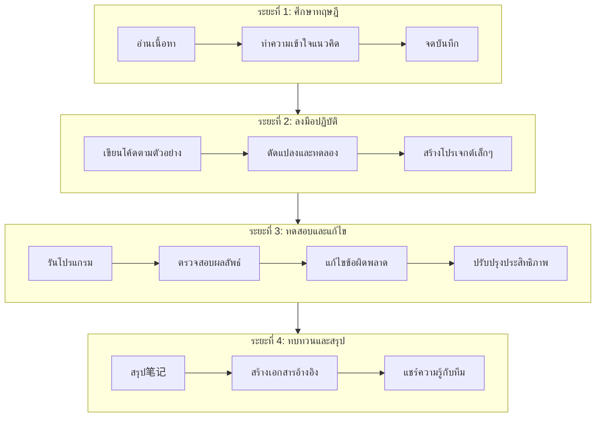
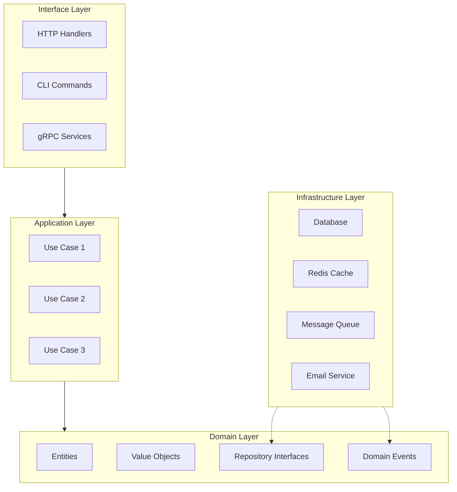
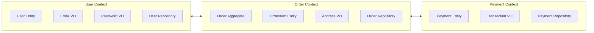
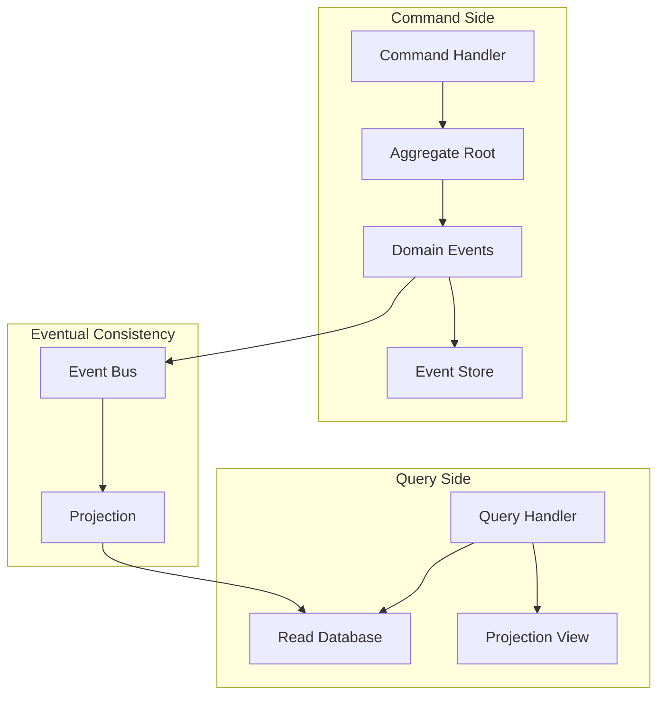

# Go Restful API 

An API dev written in Golang with chi-route and Gorm. Write restful API with fast development and developer friendly.

## Architecture

In this project use 3 layer architecture

- Models
- Repository
- Usecase
- Delivery

## Features

- CRUD
- Jwt, refresh token saved in redis
- Cached user in redis
- Email verification
- Forget/reset password, send email

## Technical

- `chi`: router and middleware
- `viper`: configuration
- `cobra`: CLI features
- `gorm`: orm
- `validator`: data validation
- `jwt`: jwt authentication
- `zap`: logger
- `gomail`: email
- `hermes`: generate email body
- `air`: hot-reload

## Start Application

### Generate the Private and Public Keys

- Generate the private and public keys: [travistidwell.com/jsencrypt/demo/](https://travistidwell.com/jsencrypt/demo/)
- Copy the generated private key and visit this Base64 encoding website to convert it to base64
- Copy the base64 encoded key and add it to the `config/config-local.yml` file as `jwt`
- Similar for public key

### Stmp mail config

- Create [mailtrap](https://mailtrap.io/) account
- Create new inboxes
- Update smtp config `config/config-local.yml` file as `smtpEmail`

### Run
- `docker-compose up`
- OR  go run main.go serve  on loca Windows OS
- Swagger: [localhost:5000/swagger/](http://localhost:5000/swagger/)
- http://localhost:5000/swagger/index.html#/

```bash
  Email: root@gmail.com
  Password: root_password
```
## TODO

- Traefik
- Config using .env
- Linter
- Jaeger
- Production docker file version
- Mock database using gomock

## Acknowledgements

- [github.com/dhax/go-base](https://github.com/dhax/go-base)
- [github.com/akmamun/go-fication](https://github.com/akmamun/go-fication)
- [github.com/wpcodevo/golang-fiber-jwt](https://github.com/wpcodevo/golang-fiber-jwt)
- [github.com/wpcodevo/golang-fiber](https://github.com/wpcodevo/golang-fiber)
- [github.com/kienmatu/togo](https://github.com/kienmatu/togo)
- [github.com/AleksK1NG/Go-Clean-Architecture-REST-API](https://github.com/AleksK1NG/Go-Clean-Architecture-REST-API)
- [github.com/bxcodec/go-clean-arch](https://github.com/bxcodec/go-clean-arch)
- [codevoweb.com/golang-and-gorm-user-registration-email-verification/](https://codevoweb.com/golang-and-gorm-user-registration-email-verification/)
- [codevoweb.com/golang-gorm-postgresql-user-registration-with-refresh-tokens/](https://codevoweb.com/golang-gorm-postgresql-user-registration-with-refresh-tokens/)
- [codevoweb.com/how-to-implement-google-oauth2-in-golang/](https://codevoweb.com/how-to-implement-google-oauth2-in-golang/)
- [codevoweb.com/how-to-upload-single-and-multiple-files-in-golang/](https://codevoweb.com/how-to-upload-single-and-multiple-files-in-golang/)
- [codevoweb.com/forgot-reset-passwords-in-golang-with-html-email/](https://codevoweb.com/forgot-reset-passwords-in-golang-with-html-email/)
- [techmaster.vn/posts/34577/kien-truc-sach-voi-golang](https://techmaster.vn/posts/34577/kien-truc-sach-voi-golang)


### Installation

Perfect! You're setting up an existing Go project (gorestapi). Here's how to properly set it up and run it:

## Complete Setup Steps for Your gorestapi Project

```bash
# 1. Clone the repository
git clone https://github.com/kongnakornna/gorestapi
cd gorestapi

# 2. Download and tidy up dependencies
go mod tidy

# 3. Verify the module is set up correctly
go mod verify


# Inside container or locally
go mod tidy
go mod download
go mod verify

# 4. Run the application
go run main.go serve

# Or if the main file is in cmd directory:
go run cmd/gorestapi/main.go serve

# Project Structure Check

# Check if these exist
ls docker-compose.yml
ls Dockerfile
ls main.go
ls go.mod

``` 
 
 

 email: kongnakornjantakun@gmail.com
 
- http://cmoniot.trueddns.com:52160/
- username : demo1
- password : demo1

 


# คู่มือภาษา Go ฉบับ นำไปทำงานจริง

> **ครอบคลุมทุกมิติ ตั้งแต่พื้นฐานสู่สถาปัตยกรรมระดับองค์กร พร้อมแผนภาพและโค้ดตัวอย่างที่รันได้จริง**
>
> *Version 3.0 – เมษายน 2026*

---

## 📖 บทนำ

### ความเป็นมาของคู่มือ

ในยุคที่ซอฟต์แวร์มีความซับซ้อนมากขึ้นเรื่อย ๆ ภาษาโปรแกรมมิ่งที่เรียบง่าย มีประสิทธิภาพสูง และสามารถจัดการกับการทำงานพร้อมกันได้ดี กลายเป็นสิ่งที่นักพัฒนาต้องการอย่างยิ่ง ภาษา Go (หรือ Golang) ถือกำเนิดขึ้นจากความต้องการของ engineers ที่ Google ซึ่งเผชิญกับความท้าทายในการพัฒนาและบำรุงรักษาระบบขนาดใหญ่ที่มีการทำงานพร้อมกันสูง พวกเขาต้องการภาษาใหม่ที่ผสมผสานความรวดเร็วในการทำงานของภาษา C ความง่ายของภาษา Python และความสามารถในการจัดการ concurrency ที่ดีขึ้น

คู่มือเล่มนี้เกิดจากความตั้งใจที่จะรวบรวมองค์ความรู้เกี่ยวกับภาษา Go ตั้งแต่ระดับพื้นฐานจนถึงระดับมืออาชีพ ครอบคลุมทั้งไวยากรณ์พื้นฐาน การจัดการโปรเจกต์ด้วย Go Modules การทดสอบหน่วย การทำงานพร้อมกัน (concurrency) ไปจนถึงการออกแบบสถาปัตยกรรมระดับ Production และการประยุกต์ใช้ Domain-Driven Design (DDD) ร่วมกับ Go

### วัตถุประสงค์

คู่มือนี้ถูกออกแบบให้เป็น **ทั้งตำราเรียนและคู่มืออ้างอิง** โดยเน้นให้ผู้อ่านสามารถนำไปประยุกต์ใช้ได้ทันที ตั้งแต่การติดตั้ง การเขียนโปรแกรมพื้นฐาน ไปจนถึงการออกแบบสถาปัตยกรรมแบบ Clean Architecture และ Domain‑Driven Design (DDD) รวมถึงการเชื่อมต่อกับระบบภายนอกที่พบได้บ่อยในโลกแห่งความจริง

### สิ่งที่คุณจะได้รับ

- ความเข้าใจภาษา Go อย่างลึกซึ้ง ตั้งแต่ไวยากรณ์จนถึง concurrency
- แนวทางการจัดโครงสร้างโปรเจกต์สำหรับการผลิตจริง
- เทคนิคการทดสอบหน่วย (Unit Test) และการวัดประสิทธิภาพ
- รูปแบบสถาปัตยกรรม Clean Architecture + DDD + CQRS
- การผสาน Redis, RabbitMQ, MQTT, InfluxDB, WebSocket, SMS, LINE Notify, Discord
- เทมเพลตและ checklist ที่ช่วยให้ทีมทำงานเป็นระบบ
- แผนภาพ (draw.io) สำหรับอธิบายโครงสร้างและกระบวนการทำงาน
- โค้ดตัวอย่างที่สามารถนำไปรันทดสอบได้จริง

### กลุ่มเป้าหมาย

- **ผู้เริ่มต้น** ที่ต้องการเรียนรู้ภาษา Go ตั้งแต่ศูนย์
- **นักพัฒนาที่เปลี่ยนภาษา** จากภาษาอื่นมาสู่ Go
- **นักพัฒนาที่ต้องการยกระดับ** สู่การเป็น Go Developer มืออาชีพ
- **สถาปนิกซอฟต์แวร์** ที่สนใจการออกแบบระบบด้วย Go

### วิธีการอ่าน

- หากยังไม่เคยเขียน Go มาก่อน ให้เริ่มจาก **ภาคที่ 1–3** เพื่อทำความเข้าใจพื้นฐาน
- หากต้องการออกแบบแอปพลิเคชันทันที ให้ข้ามไป **ภาคที่ 7–8** เพื่อศึกษา Clean Architecture และ DDD
- หากต้องการเชื่อมต่อกับระบบอื่น (ฐานข้อมูล time‑series, message queue, IoT) ให้ดู **ภาคที่ 9**

---

## 📚 บทนิยาม (Glossary)

### ความหมายของคำศัพท์เฉพาะทาง

| คำศัพท์ | คำอธิบาย |
|---------|----------|
| **Go (Golang)** | ภาษาโปรแกรมมิ่งที่พัฒนาโดย Google เปิดตัวในปี 2009 ออกแบบมาเพื่อการพัฒนา software ที่มีประสิทธิภาพสูง จัดการ concurrency ได้ดี และมีไวยากรณ์ที่เรียบง่าย |
| **Goroutine** | เธรดขนาดเบาที่ถูกจัดการโดย Go runtime ใช้สำหรับการทำงานแบบ concurrent การสร้างทำได้โดยใช้คีย์เวิร์ด `go` หน้าฟังก์ชัน |
| **Channel** | โครงสร้างข้อมูลที่ใช้ในการสื่อสารระหว่าง goroutine ช่วยให้ส่งข้อมูลระหว่างกันได้อย่างปลอดภัย |
| **Compiler** | โปรแกรมที่แปลงซอร์สโค้ดภาษา Go ให้เป็นไฟล์ binary ที่เครื่องสามารถรันได้โดยตรง |
| **Go Modules** | ระบบจัดการ dependencies อย่างเป็นทางการของ Go เริ่มใช้ตั้งแต่ Go 1.11 ทำให้ไม่ต้องพึ่งพา GOPATH อีกต่อไป |
| **Interface** | ชนิดข้อมูลที่กำหนดชุดของ method signatures ชนิดใดก็ตามที่มี method ครบตามที่กำหนด จะถือว่า implement interface นั้นโดยอัตโนมัติ |
| **Struct** | ชนิดข้อมูลที่ใช้รวมฟิลด์หลาย ๆ ชนิดเข้าด้วยกัน คล้ายกับ class ในภาษาอื่น แต่ไม่มี method ในตัว |
| **Pointer** | ตัวแปรที่เก็บ address ของตัวแปรอื่น ใช้ `&` เพื่อ获取 address และ `*` เพื่อ dereference |
| **Defer** | คำสั่งที่ใช้เลื่อนการทำงานของฟังก์ชันออกไปจนกว่าฟังก์ชันรอบนอกจะจบการทำงาน ใช้สำหรับ cleanup ทรัพยากร |
| **Panic / Recover** | Panic คือการหยุดการทำงานปกติของโปรแกรม Recover ใช้ใน defer เพื่อจับ panic และควบคุมการทำงานต่อ |
| **Clean Architecture** | สถาปัตยกรรมซอฟต์แวร์ที่แบ่งเป็น 3 ชั้นหลัก: Delivery (รับส่งข้อมูล), Usecase (business logic), Repository (การเข้าถึงข้อมูล) |
| **DDD (Domain-Driven Design)** | แนวทางการออกแบบซอฟต์แวร์ที่เน้นการสร้างโมเดลที่สะท้อนความรู้ความเข้าใจทางธุรกิจ (domain knowledge) อย่างแท้จริง |
| **Aggregate** | กลุ่มของ Entities และ Value Objects ที่ถูกจัดการเป็นหน่วยเดียวกัน มี Aggregate Root เป็นตัวควบคุมความสอดคล้องของข้อมูล |
| **CQRS (Command Query Responsibility Segregation)** | รูปแบบการออกแบบที่แยกโมเดลการเขียน (Command) และการอ่าน (Query) ออกจากกัน |
| **Ubiquitous Language** | ภาษากลางที่ใช้ร่วมกันระหว่างนักพัฒนาและผู้เชี่ยวชาญโดเมน ใช้ศัพท์เดียวกันในโค้ด, การสนทนา, และเอกสาร |
| **Bounded Context** | การแบ่งโดเมนขนาดใหญ่ออกเป็นบริทย่อยที่มีขอบเขตชัดเจน แต่ละบริบทมีโมเดลและภาษาร่วมของตัวเอง |
| **Repository Pattern** | การสร้าง abstraction ชั้นกลางระหว่าง business logic และแหล่งข้อมูล |
| **Middleware** | ฟังก์ชันที่ห่อ handler เพื่อเพิ่ม logic เช่น logging, auth, rate limit |
| **Value Object** | วัตถุที่ไม่มีเอกลักษณ์เฉพาะตัว ถูกกำหนดโดยค่าของมัน (immutable) |
| **Domain Event** | เหตุการณ์สำคัญในโดเมนที่เกิดขึ้นระหว่างการทำงานของระบบ |

---

## 🧭 สารบัญ

### ภาคที่ 1: ปฐมบทกับการเขียนโปรแกรม
- **บทที่ 1:** ความรู้เบื้องต้นเกี่ยวกับการเขียนโปรแกรมคอมพิวเตอร์
- **บทที่ 2:** รู้จักกับภาษา Go
- **บทที่ 3:** พื้นฐานการใช้งาน Terminal
- **บทที่ 4:** เตรียมสภาพแวดล้อมสำหรับพัฒนา
- **บทที่ 5:** สร้างแอปพลิเคชันแรกของคุณ

### ภาคที่ 2: พื้นฐานภาษาและโครงสร้างข้อมูล
- **บทที่ 6:** ระบบเลขฐานสองและฐานสิบ
- **บทที่ 7:** เลขฐานสิบหก, ฐานแปด, ASCII, UTF8, Unicode และ Runes
- **บทที่ 8:** ตัวแปร, ค่าคงที่ และชนิดข้อมูลพื้นฐาน
- **บทที่ 9:** คำสั่งควบคุมการทำงาน
- **บทที่ 10:** ฟังก์ชัน
- **บทที่ 11:** แพคเกจและการนำเข้า
- **บทที่ 12:** การเริ่มต้นทำงานของแพคเกจ
- **บทที่ 13:** การสร้างชนิดข้อมูลใหม่ (Types)
- **บทที่ 14:** เมธอด (Methods)
- **บทที่ 15:** พอยน์เตอร์ (Pointer)
- **บทที่ 16:** อินเทอร์เฟซ (Interfaces)

### ภาคที่ 3: การจัดการโปรเจกต์และโครงสร้างข้อมูลขั้นสูง
- **บทที่ 17:** Go Modules - การจัดการโปรเจกต์สมัยใหม่
- **บทที่ 18:** Go Module Proxies
- **บทที่ 19:** การทดสอบหน่วย (Unit Tests)
- **บทที่ 20:** อาเรย์ (Arrays)
- **บทที่ 21:** สไลซ์ (Slices)
- **บทที่ 22:** แมพ (Maps)
- **บทที่ 23:** การจัดการข้อผิดพลาด (Errors)

### ภาคที่ 4: การพัฒนาแอปพลิเคชันเชิงปฏิบัติ
- **บทที่ 24:** ฟังก์ชันนิรนาม (Anonymous functions) และ Closure
- **บทที่ 25:** การจัดการข้อมูล JSON และ XML
- **บทที่ 26:** พื้นฐานการสร้าง HTTP Server
- **บทที่ 27:** Enum, Iota และ Bitmask
- **บทที่ 28:** วันที่และเวลา
- **บทที่ 29:** การจัดเก็บข้อมูล: ไฟล์และฐานข้อมูล
- **บทที่ 30:** การทำงานพร้อมกัน (Concurrency)
- **บทที่ 31:** การบันทึกเหตุการณ์ (Logging)
- **บทที่ 32:** เทมเพลต (Templates)
- **บทที่ 33:** การจัดการค่า Configuration

### ภาคที่ 5: สู่การเป็นนักพัฒนา Go มืออาชีพ
- **บทที่ 34:** การวัดประสิทธิภาพ (Benchmarks)
- **บทที่ 35:** สร้าง HTTP Client
- **บทที่ 36:** การวิเคราะห์โปรไฟล์ (Program Profiling)
- **บทที่ 37:** การจัดการ Context
- **บทที่ 38:** Generics - การเขียนโค้ดแบบยืดหยุ่น
- **บทที่ 39:** Go กับกระบวนทัศน์ OOP?
- **บทที่ 40:** การอัปเกรดหรือดาวน์เกรดเวอร์ชัน Go
- **บทที่ 41:** คำแนะนำในการออกแบบโค้ดที่ดี
- **บทที่ 42:** ชีทสรุป (Cheatsheet)

### ภาคที่ 6: เครื่องมือและไลบรารียอดนิยม
- **บทที่ 43:** chi, viper, cobra, zap และเครื่องมือสำคัญ
- **บทที่ 44:** GORM – ORM ทรงพลังสำหรับ Go
- **บทที่ 45:** การส่งอีเมลด้วย gomail และ hermes

### ภาคที่ 7: การออกแบบสถาปัตยกรรมและ Workflow
- **บทที่ 46:** Clean Architecture และโครงสร้างโปรเจกต์
- **บทที่ 47:** Blueprint สำหรับโปรเจกต์ Go ระดับ Production
- **บทที่ 48:** การออกแบบ Workflow และ Task Management

### ภาคที่ 8: Domain-Driven Design (DDD) กับ Go
- **บทที่ 49:** หลักการ DDD และการนำไปใช้ใน Go
- **บทที่ 50:** Aggregates, Event Storming และ CQRS
- **บทที่ 51:** การออกแบบบริการด้วย Go-DDD

### ภาคที่ 9: การผสานระบบภายนอกและคุณลักษณะเสริม (Advanced Integrations)
- **บทที่ 52:** Redis สำหรับ Cache และ Message Queue
- **บทที่ 53:** RabbitMQ – Message Broker มาตรฐานองค์กร
- **บทที่ 54:** MQTT สำหรับ IoT และระบบเรียลไทม์
- **บทที่ 55:** InfluxDB – Time‑Series Database
- **บทที่ 56:** WebSocket และ Socket.IO
- **บทที่ 57:** การส่ง SMS และ LINE Notify
- **บทที่ 58:** Discord Webhook สำหรับแจ้งเตือน

### ภาคที่ 10: เทมเพลต กระบวนการพัฒนา และตัวอย่างโค้ด
- **บทที่ 59:** ตัวอย่างโค้ดครบวงจร (Full‑stack Example)
- **บทที่ 60:** Task List Template
- **บทที่ 61:** Checklist Template
- **บทที่ 62:** แผนภาพการทำงาน (Workflow Diagram)
- **บทที่ 63:** mop Config – การจัดการ Configuration

---

## 🎨 การออกแบบคู่มือ

### ปรัชญาการออกแบบ

คู่มือนี้ถูกออกแบบโดยยึดหลักการเรียนรู้แบบ **"เรียนรู้จากการปฏิบัติ" (Learning by Doing)** เนื้อหาถูกจัดลำดับจากง่ายไปยาก เริ่มจากพื้นฐานที่จำเป็นต่อการเริ่มต้นเขียนโปรแกรม ไปจนถึงหัวข้อขั้นสูงที่นักพัฒนามืออาชีพต้องรู้

### โครงสร้างการเรียนรู้

```
ระดับที่ 1: พื้นฐาน
├── ความรู้เบื้องต้นเกี่ยวกับคอมพิวเตอร์และการเขียนโปรแกรม
├── ทำความรู้จักกับ Go
├── การติดตั้งและเตรียมสภาพแวดล้อม
└── เขียนโปรแกรมแรก

ระดับที่ 2: พื้นฐานภาษา
├── ตัวแปรและชนิดข้อมูล
├── คำสั่งควบคุม
├── ฟังก์ชัน
├── พอยน์เตอร์
└── โครงสร้างข้อมูลพื้นฐาน (array, slice, map)

ระดับที่ 3: การพัฒนาแอปพลิเคชัน
├── การจัดการข้อผิดพลาด
├── การทำงานกับไฟล์และฐานข้อมูล
├── HTTP Server/Client
└── การทำงานพร้อมกัน (concurrency)

ระดับที่ 4: เครื่องมือและไลบรารี
├── Go Modules
├── การทดสอบ
├── การวัดประสิทธิภาพ
└── ไลบรารียอดนิยม

ระดับที่ 5: การออกแบบสถาปัตยกรรม
├── Clean Architecture
├── DDD (Domain-Driven Design)
└── CQRS และ Event Sourcing
```

### รูปแบบการเรียนรู้แต่ละบท

แต่ละบทในคู่มือมีโครงสร้างที่สอดคล้องกัน:

1. **บทนำ** - อธิบายว่าบทนี้เกี่ยวกับอะไร และทำไมถึงสำคัญ
2. **เนื้อหาหลัก** - อธิบายแนวคิดและทฤษฎี พร้อมตัวอย่างโค้ดประกอบ
3. **ตัวอย่างการประยุกต์ใช้** - กรณีศึกษา หรือการนำไปใช้จริง
4. **ข้อควรระวัง** - ปัญหาที่พบบ่อยและวิธีแก้ไข
5. **แบบฝึกหัด** (สำหรับบทที่เหมาะสม) - เพื่อทบทวนความเข้าใจ

### รูปแบบโค้ดตัวอย่าง

โค้ดตัวอย่างในคู่มือใช้รูปแบบที่สอดคล้องกับ Go idiom:
- ใช้ `gofmt` ในการจัดรูปแบบ
- มีการอธิบายบรรทัดสำคัญด้วย comment
- แสดงทั้งการทำงานที่ถูกต้องและข้อผิดพลาดที่พบบ่อย

```go
// รูปแบบโค้ดตัวอย่าง
func Example() {
    // การทำงานที่ถูกต้อง
    result, err := doSomething()
    if err != nil {
        // การจัดการ error
        log.Printf("error: %v", err)
        return
    }
    // ใช้ result
}
```

---

## 🔄 การออกแบบ Workflow

### Workflow การเรียนรู้ภาษา Go



### Workflow การพัฒนาโปรเจกต์ Go

```mermaid
flowchart LR
    subgraph Analysis[วิเคราะห์]
        A1[รับ Requirement]
        A2[วิเคราะห์ Domain]
        A3[ระบุ Use Cases]
    end
    
    subgraph Design[ออกแบบ]
        B1[ออกแบบสถาปัตยกรรม]
        B2[กำหนด Interface]
        B3[ออกแบบ Database]
        B4[เลือก Tools]
    end
    
    subgraph Development[พัฒนา]
        C1[เขียน Domain Layer]
        C2[เขียน Application Layer]
        C3[เขียน Infrastructure]
        C4[เขียน Interface]
    end
    
    subgraph Testing[ทดสอบ]
        D1[Unit Test]
        D2[Integration Test]
        D3[E2E Test]
        D4[Performance Test]
    end
    
    subgraph Deploy[นำส่ง]
        E1[Build]
        E2[Deploy to Staging]
        E3[Deploy to Production]
        E4[Monitor]
    end
    
    Analysis --> Design --> Development --> Testing --> Deploy
```



### Workflow การเพิ่ม Feature ใหม่

```mermaid
flowchart TD
    subgraph Phase1[Phase 1: Domain Design]
        A1[ระบุ domain model]
        A2[กำหนด invariants]
        A3[ระบุ use cases]
        A4[กำหนด domain events]
        A5[ออกแบบ repository interface]
        A6[ออกแบบ DTOs]
    end
    
    subgraph Phase2[Phase 2: Implementation]
        B1[สร้าง entity struct]
        B2[สร้าง value objects]
        B3[สร้าง repository interface]
        B4[สร้าง service interface]
        B5[สร้าง DTOs]
        B6[เขียน unit tests - entity]
        B7[เขียน unit tests - service]
    end
    
    subgraph Phase3[Phase 3: Infrastructure]
        C1[สร้าง repository implementation]
        C2[สร้าง migration file]
        C3[ตั้งค่า Redis cache]
        C4[ตั้งค่า message queue]
        C5[ทดสอบ repository]
    end
    
    subgraph Phase4[Phase 4: Delivery]
        D1[สร้าง HTTP handlers]
        D2[เพิ่ม input validation]
        D3[สร้าง routes]
        D4[ลงทะเบียน dependencies]
        D5[ทดสอบ handler]
    end
    
    subgraph Phase5[Phase 5: Integration]
        E1[ทดสอบ end-to-end]
        E2[อัปเดต documentation]
        E3[รัน linter]
    end
    
    subgraph Phase6[Phase 6: Review & Deploy]
        F1[Code review]
        F2[ตรวจสอบ performance]
        F3[รัน test coverage]
        F4[รัน race detector]
        F5[Deploy to staging]
        F6[Deploy to production]
    end
    
    Phase1 --> Phase2 --> Phase3 --> Phase4 --> Phase5 --> Phase6
```



### แผนภาพสถาปัตยกรรม Clean Architecture



### แผนภาพ DDD Bounded Context



### แผนภาพ CQRS และ Event Sourcing



---

## 📋 Task List Template

### Template สำหรับการพัฒนา Feature ใหม่

```markdown
# Feature: [ชื่อ Feature]
## Owner: [ชื่อผู้รับผิดชอบ]
## Due Date: [วันที่กำหนดส่ง]

---

## Phase 1: Domain Design

### Tasks
- [ ] **T1.1** ระบุ domain model (entity, value objects)
  - [ ] ระบุ entity: _____________________________
  - [ ] ระบุ value objects: _____________________________
- [ ] **T1.2** กำหนด invariants (business rules)
  - [ ] Rule 1: _________________________________
  - [ ] Rule 2: _________________________________
- [ ] **T1.3** ระบุ use cases
  - [ ] Use case 1: _____________________________
  - [ ] Use case 2: _____________________________
- [ ] **T1.4** กำหนด domain events (ถ้ามี)
  - [ ] Event 1: _____________________________
  - [ ] Event 2: _____________________________
- [ ] **T1.5** ออกแบบ repository interface
  - [ ] Method: _____________________________
  - [ ] Method: _____________________________
- [ ] **T1.6** ออกแบบ DTOs (request/response)
  - [ ] Request: _____________________________
  - [ ] Response: _____________________________

**หมายเหตุ:** _________________________________

---

## Phase 2: Implementation

### Tasks
- [ ] **T2.1** สร้าง entity struct และ behavior methods
  - [ ] File: `internal/domain/[module]/entity.go`
  - [ ] Constructor: `New[Entity]()`
  - [ ] Methods: _____________________________
- [ ] **T2.2** สร้าง value objects
  - [ ] File: `internal/domain/[module]/value_objects.go`
  - [ ] VO 1: _____________________________
- [ ] **T2.3** สร้าง repository interface
  - [ ] File: `internal/domain/[module]/repository.go`
- [ ] **T2.4** สร้าง service interface
  - [ ] File: `internal/domain/[module]/service.go`
- [ ] **T2.5** สร้าง DTO structs
  - [ ] File: `internal/application/[module]/dto.go`
- [ ] **T2.6** เขียน unit tests สำหรับ entity
  - [ ] File: `internal/domain/[module]/entity_test.go`
  - [ ] Test cases: _________________________________
- [ ] **T2.7** เขียน unit tests สำหรับ service (mock repository)
  - [ ] File: `internal/application/[module]/[usecase]_test.go`
  - [ ] Mock repository implementation

**หมายเหตุ:** _________________________________

---

## Phase 3: Infrastructure

### Tasks
- [ ] **T3.1** สร้าง repository implementation
  - [ ] File: `internal/infrastructure/persistence/gorm/[module]_repo.go`
  - [ ] Implement interface methods
- [ ] **T3.2** สร้าง migration file
  - [ ] File: `migrations/[timestamp]_create_[table]_table.sql`
  - [ ] Up migration: _________________________________
  - [ ] Down migration: _________________________________
- [ ] **T3.3** ตั้งค่า Redis cache (ถ้าจำเป็น)
  - [ ] Cache key pattern: _________________________________
  - [ ] TTL: _________________________________
- [ ] **T3.4** ตั้งค่า message queue (ถ้าจำเป็น)
  - [ ] Topic/Queue name: _________________________________
  - [ ] Consumer implementation
- [ ] **T3.5** ทดสอบ repository ด้วย integration test
  - [ ] File: `internal/infrastructure/persistence/gorm/[module]_repo_test.go`
  - [ ] Use testcontainers or in-memory DB

**หมายเหตุ:** _________________________________

---

## Phase 4: Delivery

### Tasks
- [ ] **T4.1** สร้าง HTTP handlers
  - [ ] File: `internal/interfaces/http/handlers/[module]_handler.go`
  - [ ] Handler methods: _________________________________
- [ ] **T4.2** เพิ่ม input validation
  - [ ] Validation tags: _________________________________
  - [ ] Custom validator (ถ้ามี): _________________________________
- [ ] **T4.3** สร้าง routes
  - [ ] File: `internal/interfaces/http/routes.go`
  - [ ] Routes: _________________________________
- [ ] **T4.4** ลงทะเบียน dependencies ใน injection
  - [ ] File: `internal/apps/app/bootstrap/injection/wire.go`
  - [ ] Update provider set
- [ ] **T4.5** ทดสอบ handler ด้วย httptest
  - [ ] File: `internal/interfaces/http/handlers/[module]_handler_test.go`
  - [ ] Test cases: _________________________________

**หมายเหตุ:** _________________________________

---

## Phase 5: Integration & Documentation

### Tasks
- [ ] **T5.1** ทดสอบ end-to-end
  - [ ] curl/Postman collection: _________________________________
  - [ ] Test scenarios: _________________________________
- [ ] **T5.2** อัปเดต Swagger docs
  - [ ] File: `api/swagger.yaml` or `docs/docs.go`
  - [ ] Annotations: _________________________________
- [ ] **T5.3** อัปเดต README
  - [ ] Add feature description
  - [ ] Update API examples
- [ ] **T5.4** รัน linter และแก้ไข warnings
  - [ ] Command: `golangci-lint run ./...`
  - [ ] Issues fixed: _________________________________

**หมายเหตุ:** _________________________________

---

## Phase 6: Review & Deploy

### Tasks
- [ ] **T6.1** Code review
  - [ ] PR created: _________________________________
  - [ ] Reviewers: _________________________________
  - [ ] Comments addressed
- [ ] **T6.2** ตรวจสอบ performance
  - [ ] Benchmark: _________________________________
  - [ ] Query optimization: _________________________________
- [ ] **T6.3** รัน test coverage
  - [ ] Command: `go test -cover ./...`
  - [ ] Coverage: _____% (target >80%)
- [ ] **T6.4** รัน race detector
  - [ ] Command: `go test -race ./...`
  - [ ] Issues found: _________________________________
- [ ] **T6.5** Deploy to staging
  - [ ] Date: _________________________________
  - [ ] Version: _________________________________
- [ ] **T6.6** ทดสอบใน staging
  - [ ] Smoke test passed
  - [ ] Regression test passed
- [ ] **T6.7** Deploy to production
  - [ ] Date: _________________________________
  - [ ] Version: _________________________________
  - [ ] Monitoring checked

**หมายเหตุ:** _________________________________

---

## Summary

- **Total Tasks:** ___ / ___ completed
- **Blockers:** _________________________________
- **Next Steps:** _________________________________
```

---

## ✅ Checklist Template

### Code Quality Checklist

```markdown
## Code Quality Checklist

### Documentation
- [ ] All exported functions have comments (godoc format)
- [ ] Package has package-level documentation comment
- [ ] Complex logic has inline comments explaining "why"
- [ ] README updated with relevant information

### Code Style
- [ ] Code formatted with `go fmt` or `gofmt`
- [ ] No unused imports or variables (`go vet` passed)
- [ ] Consistent naming convention (camelCase, PascalCase)
- [ ] No magic numbers (use constants)
- [ ] Line length < 120 characters (preferably)

### Error Handling
- [ ] All errors are handled explicitly (no `_` ignoring)
- [ ] Errors are wrapped with context (`fmt.Errorf("...: %w", err)`)
- [ ] No panic in library code (only in main/init for fatal errors)
- [ ] Custom error types used when appropriate
- [ ] Error messages are descriptive and actionable

### Concurrency
- [ ] Goroutines have proper lifecycle management
- [ ] Channels are closed appropriately
- [ ] No race conditions (`go test -race` passed)
- [ ] sync.Mutex used correctly (Lock/Unlock pairs)
- [ ] Context passed as first parameter for cancellation

### Performance
- [ ] No unnecessary allocations in hot paths
- [ ] Slice pre-allocated when size known (`make([]T, 0, capacity)`)
- [ ] String concatenation uses `strings.Builder` for large operations
- [ ] Database queries have appropriate indexes
- [ ] No N+1 queries

### Security
- [ ] Input validation on all external inputs
- [ ] SQL injection prevented (use parameterized queries)
- [ ] No hardcoded secrets or credentials
- [ ] Sensitive data not logged
- [ ] Passwords hashed with bcrypt (not stored in plaintext)
- [ ] JWT secrets loaded from environment
- [ ] CORS configured properly (allow only trusted origins)

### Testing
- [ ] Unit tests cover business logic
- [ ] Table-driven tests used for multiple scenarios
- [ ] Edge cases tested (nil, empty, boundary values)
- [ ] Mock external dependencies
- [ ] Test coverage > 80%

### Project Structure
- [ ] Follows standard Go project layout
- [ ] Packages have single responsibility
- [ ] No circular dependencies
- [ ] Internal packages used for private code
- [ ] Go modules properly configured

### Dependencies
- [ ] go.mod has only required dependencies
- [ ] go.sum is committed
- [ ] `go mod tidy` run before commit
- [ ] No unused dependencies

### Version Control
- [ ] Commit messages follow convention (feat, fix, docs, etc.)
- [ ] No debug code (fmt.Println, log.Println) in production code
- [ ] No commented out code
- [ ] .gitignore properly configured

### Reviewer Notes
- [ ] Code reviewed by at least one other developer
- [ ] All review comments addressed

---
**Status:** [ ] Ready for merge | [ ] Changes requested | [ ] Approved
**Reviewer:** _________________________
**Date:** _________________________
```

### Deployment Checklist

```markdown
## Deployment Checklist

### Pre-Deployment (Staging)

#### Code Readiness
- [ ] All tests passing (`go test ./...`)
- [ ] Race detector passed (`go test -race ./...`)
- [ ] Linter passed (`golangci-lint run ./...`)
- [ ] Build successful (`go build ./...`)
- [ ] All PRs merged and approved

#### Configuration
- [ ] Environment variables verified
- [ ] Configuration files updated for staging
- [ ] Feature flags configured
- [ ] Third-party service credentials verified

#### Database
- [ ] Migration scripts reviewed
- [ ] Migrations tested in staging environment
- [ ] Rollback plan documented
- [ ] Backup created before migration

#### Infrastructure
- [ ] Container images built and tagged
- [ ] Kubernetes/ deployment files updated
- [ ] Resource limits configured
- [ ] Health check endpoints configured
- [ ] Monitoring and alerting configured

#### Security
- [ ] Security scan passed
- [ ] No secrets in code or config
- [ ] TLS certificates valid

---

### Staging Deployment

#### Deployment Steps
- [ ] Deploy to staging environment
- [ ] Verify pod/container health
- [ ] Run smoke tests
- [ ] Run integration tests
- [ ] Verify logs for errors
- [ ] Load testing (if required)

#### Validation
- [ ] Feature works as expected
- [ ] No regression in existing features
- [ ] Performance meets baseline
- [ ] Error handling works
- [ ] Monitoring shows expected metrics

---

### Pre-Production (Final Check)

#### Business Approval
- [ ] Product owner sign-off
- [ ] QA sign-off
- [ ] Security sign-off
- [ ] Documentation updated

#### Rollback Plan
- [ ] Rollback procedure documented
- [ ] Database rollback plan ready
- [ ] Previous version image available
- [ ] Rollback tested

#### Communication
- [ ] Release notes prepared
- [ ] Stakeholders notified
- [ ] Support team informed

---

### Production Deployment

#### Deployment Steps
- [ ] Schedule maintenance window (if required)
- [ ] Create production backup
- [ ] Deploy with canary/blue-green strategy
- [ ] Monitor deployment progress
- [ ] Verify health checks
- [ ] Run post-deployment tests

#### Post-Deployment
- [ ] Monitor logs for errors (15 min)
- [ ] Verify key metrics
- [ ] Check user feedback channels
- [ ] Update status page (if applicable)
- [ ] Announce successful deployment

#### Rollback Trigger Conditions
- [ ] Error rate > 1%
- [ ] Critical feature broken
- [ ] Security incident detected
- [ ] Performance degradation > 50%

---

### Post-Deployment

#### Cleanup
- [ ] Remove old images (if applicable)
- [ ] Clean up temporary resources
- [ ] Update documentation with new version

#### Monitoring
- [ ] Monitor for 24 hours
- [ ] Review error logs daily for 1 week
- [ ] Check resource utilization

#### Retrospective
- [ ] Deployment time recorded
- [ ] Issues encountered documented
- [ ] Improvements identified for next deployment

---
**Deployment Status:** [ ] Success | [ ] Failed | [ ] Rolled back
**Deployed by:** _________________________
**Date:** _________________________
**Version:** _________________________
```

---

## 💻 ตัวอย่างโค้ด

### ตัวอย่าง 1: Clean Architecture - User Registration (Full Example)

#### โครงสร้างโปรเจกต์

```
user-service/
├── cmd/
│   └── api/
│       └── main.go
├── internal/
│   ├── domain/
│   │   └── user/
│   │       ├── entity.go
│   │       ├── value_objects.go
│   │       └── repository.go
│   ├── application/
│   │   └── user/
│   │       ├── register.go
│   │       └── dto.go
│   ├── infrastructure/
│   │   └── persistence/
│   │       └── gorm/
│   │           └── user_repo.go
│   └── interfaces/
│       └── http/
│           ├── handlers/
│           │   └── user_handler.go
│           └── routes.go
├── go.mod
└── go.sum
```

#### go.mod

```go
module user-service

go 1.21

require (
    github.com/go-chi/chi/v5 v5.0.10
    github.com/go-playground/validator/v10 v10.15.5
    github.com/google/uuid v1.3.1
    github.com/lib/pq v1.10.9
    golang.org/x/crypto v0.14.0
    gorm.io/driver/postgres v1.5.3
    gorm.io/gorm v1.25.5
)
```

#### Domain Layer - Entity

**internal/domain/user/entity.go**

```go
package user

import (
    "errors"
    "time"

    "github.com/google/uuid"
)

// User represents the core domain entity
type User struct {
    id         uuid.UUID
    email      Email
    password   Password
    name       string
    isVerified bool
    createdAt  time.Time
    updatedAt  time.Time
}

// NewUser creates a new User entity
func NewUser(email, password, name string) (*User, error) {
    emailVO, err := NewEmail(email)
    if err != nil {
        return nil, err
    }

    passwordVO, err := NewPassword(password)
    if err != nil {
        return nil, err
    }

    if name == "" {
        return nil, errors.New("name is required")
    }

    now := time.Now()
    return &User{
        id:         uuid.New(),
        email:      *emailVO,
        password:   *passwordVO,
        name:       name,
        isVerified: false,
        createdAt:  now,
        updatedAt:  now,
    }, nil
}

// Reconstruct reconstructs a User from persistence (for repository)
func Reconstruct(id uuid.UUID, email Email, passwordHash string, name string, isVerified bool, createdAt, updatedAt time.Time) (*User, error) {
    password, err := NewPasswordFromHash(passwordHash)
    if err != nil {
        return nil, err
    }

    return &User{
        id:         id,
        email:      email,
        password:   *password,
        name:       name,
        isVerified: isVerified,
        createdAt:  createdAt,
        updatedAt:  updatedAt,
    }, nil
}

// Getters
func (u *User) ID() uuid.UUID      { return u.id }
func (u *User) Email() Email       { return u.email }
func (u *User) Name() string       { return u.name }
func (u *User) IsVerified() bool   { return u.isVerified }
func (u *User) CreatedAt() time.Time { return u.createdAt }
func (u *User) UpdatedAt() time.Time { return u.updatedAt }
func (u *User) PasswordHash() string { return u.password.Hash() }

// Behaviors
func (u *User) Verify() {
    u.isVerified = true
    u.updatedAt = time.Now()
}

func (u *User) ChangePassword(oldPlain, newPlain string) error {
    if err := u.password.Compare(oldPlain); err != nil {
        return ErrInvalidPassword
    }

    newPassword, err := NewPassword(newPlain)
    if err != nil {
        return err
    }

    u.password = *newPassword
    u.updatedAt = time.Now()
    return nil
}
```

**internal/domain/user/value_objects.go**

```go
package user

import (
    "errors"
    "regexp"

    "golang.org/x/crypto/bcrypt"
)

// Email is a value object
type Email struct {
    value string
}

// NewEmail creates a new Email value object
func NewEmail(email string) (*Email, error) {
    emailRegex := regexp.MustCompile(`^[a-z0-9._%+\-]+@[a-z0-9.\-]+\.[a-z]{2,}$`)
    if !emailRegex.MatchString(email) {
        return nil, errors.New("invalid email format")
    }
    return &Email{value: email}, nil
}

func (e Email) String() string { return e.value }

// Password is a value object containing hashed password
type Password struct {
    hash string
}

// NewPassword creates a new Password from plain text
func NewPassword(plain string) (*Password, error) {
    if len(plain) < 8 {
        return nil, errors.New("password must be at least 8 characters")
    }

    hash, err := bcrypt.GenerateFromPassword([]byte(plain), bcrypt.DefaultCost)
    if err != nil {
        return nil, err
    }

    return &Password{hash: string(hash)}, nil
}

// NewPasswordFromHash creates a Password from existing hash
func NewPasswordFromHash(hash string) (*Password, error) {
    return &Password{hash: hash}, nil
}

// Compare checks if plain password matches the hash
func (p *Password) Compare(plain string) error {
    return bcrypt.CompareHashAndPassword([]byte(p.hash), []byte(plain))
}

func (p *Password) Hash() string { return p.hash }
```

**internal/domain/user/repository.go**

```go
package user

import (
    "context"

    "github.com/google/uuid"
)

// Repository defines the interface for user data access
type Repository interface {
    Create(ctx context.Context, user *User) error
    FindByID(ctx context.Context, id uuid.UUID) (*User, error)
    FindByEmail(ctx context.Context, email Email) (*User, error)
    Update(ctx context.Context, user *User) error
    Delete(ctx context.Context, id uuid.UUID) error
}

// Domain errors
var (
    ErrUserNotFound     = errors.New("user not found")
    ErrEmailAlreadyUsed = errors.New("email already used")
    ErrInvalidPassword  = errors.New("invalid password")
)
```

#### Application Layer

**internal/application/user/dto.go**

```go
package user

// RegisterInput represents the data needed to register a user
type RegisterInput struct {
    Email    string `json:"email" validate:"required,email"`
    Password string `json:"password" validate:"required,min=8"`
    Name     string `json:"name" validate:"required"`
}

// RegisterOutput represents the response after registration
type RegisterOutput struct {
    ID    string `json:"id"`
    Email string `json:"email"`
    Name  string `json:"name"`
}

// LoginInput represents the data needed to login
type LoginInput struct {
    Email    string `json:"email" validate:"required,email"`
    Password string `json:"password" validate:"required"`
}

// LoginOutput represents the response after login
type LoginOutput struct {
    AccessToken  string `json:"access_token"`
    RefreshToken string `json:"refresh_token"`
    ExpiresIn    int64  `json:"expires_in"`
}
```

**internal/application/user/register.go**

```go
package user

import (
    "context"
    "errors"

    "user-service/internal/domain/user"
)

var ErrEmailAlreadyExists = errors.New("email already exists")

// RegisterUseCase handles user registration
type RegisterUseCase struct {
    userRepo user.Repository
}

// NewRegisterUseCase creates a new RegisterUseCase
func NewRegisterUseCase(repo user.Repository) *RegisterUseCase {
    return &RegisterUseCase{userRepo: repo}
}

// Execute performs user registration
func (uc *RegisterUseCase) Execute(ctx context.Context, input RegisterInput) (*RegisterOutput, error) {
    // Check if email already exists
    emailVO, err := user.NewEmail(input.Email)
    if err != nil {
        return nil, err
    }

    existing, err := uc.userRepo.FindByEmail(ctx, *emailVO)
    if err != nil && err != user.ErrUserNotFound {
        return nil, err
    }
    if existing != nil {
        return nil, ErrEmailAlreadyExists
    }

    // Create new user
    newUser, err := user.NewUser(input.Email, input.Password, input.Name)
    if err != nil {
        return nil, err
    }

    // Save to repository
    if err := uc.userRepo.Create(ctx, newUser); err != nil {
        return nil, err
    }

    return &RegisterOutput{
        ID:    newUser.ID().String(),
        Email: newUser.Email().String(),
        Name:  newUser.Name(),
    }, nil
}
```

#### Infrastructure Layer

**internal/infrastructure/persistence/gorm/user_repo.go**

```go
package gorm

import (
    "context"
    "errors"
    "time"

    "github.com/google/uuid"
    "gorm.io/gorm"

    "user-service/internal/domain/user"
)

// UserModel represents the database model
type UserModel struct {
    ID         string    `gorm:"primaryKey;type:uuid"`
    Email      string    `gorm:"uniqueIndex;size:100;not null"`
    Password   string    `gorm:"not null"`
    Name       string    `gorm:"size:100;not null"`
    IsVerified bool      `gorm:"default:false"`
    CreatedAt  time.Time
    UpdatedAt  time.Time
    DeletedAt  gorm.DeletedAt `gorm:"index"`
}

func (UserModel) TableName() string {
    return "users"
}

// UserRepository implements user.Repository using GORM
type UserRepository struct {
    db *gorm.DB
}

// NewUserRepository creates a new UserRepository
func NewUserRepository(db *gorm.DB) *UserRepository {
    return &UserRepository{db: db}
}

// Create inserts a new user
func (r *UserRepository) Create(ctx context.Context, u *user.User) error {
    model := &UserModel{
        ID:         u.ID().String(),
        Email:      u.Email().String(),
        Password:   u.PasswordHash(),
        Name:       u.Name(),
        IsVerified: u.IsVerified(),
        CreatedAt:  u.CreatedAt(),
        UpdatedAt:  u.UpdatedAt(),
    }
    return r.db.WithContext(ctx).Create(model).Error
}

// FindByID finds a user by ID
func (r *UserRepository) FindByID(ctx context.Context, id uuid.UUID) (*user.User, error) {
    var model UserModel
    err := r.db.WithContext(ctx).Where("id = ?", id.String()).First(&model).Error
    if err != nil {
        if errors.Is(err, gorm.ErrRecordNotFound) {
            return nil, user.ErrUserNotFound
        }
        return nil, err
    }
    return r.toDomain(&model)
}

// FindByEmail finds a user by email
func (r *UserRepository) FindByEmail(ctx context.Context, email user.Email) (*user.User, error) {
    var model UserModel
    err := r.db.WithContext(ctx).Where("email = ?", email.String()).First(&model).Error
    if err != nil {
        if errors.Is(err, gorm.ErrRecordNotFound) {
            return nil, user.ErrUserNotFound
        }
        return nil, err
    }
    return r.toDomain(&model)
}

// Update updates an existing user
func (r *UserRepository) Update(ctx context.Context, u *user.User) error {
    model := &UserModel{
        ID:         u.ID().String(),
        Email:      u.Email().String(),
        Password:   u.PasswordHash(),
        Name:       u.Name(),
        IsVerified: u.IsVerified(),
        UpdatedAt:  u.UpdatedAt(),
    }
    return r.db.WithContext(ctx).Save(model).Error
}

// Delete soft deletes a user
func (r *UserRepository) Delete(ctx context.Context, id uuid.UUID) error {
    return r.db.WithContext(ctx).Where("id = ?", id.String()).Delete(&UserModel{}).Error
}

func (r *UserRepository) toDomain(m *UserModel) (*user.User, error) {
    id, err := uuid.Parse(m.ID)
    if err != nil {
        return nil, err
    }

    email, err := user.NewEmail(m.Email)
    if err != nil {
        return nil, err
    }

    return user.Reconstruct(
        id,
        *email,
        m.Password,
        m.Name,
        m.IsVerified,
        m.CreatedAt,
        m.UpdatedAt,
    )
}
```

#### Interface Layer

**internal/interfaces/http/handlers/user_handler.go**

```go
package handlers

import (
    "encoding/json"
    "net/http"

    "github.com/go-playground/validator/v10"

    "user-service/internal/application/user"
)

// UserHandler handles HTTP requests for user operations
type UserHandler struct {
    registerUC *user.RegisterUseCase
    validate   *validator.Validate
}

// NewUserHandler creates a new UserHandler
func NewUserHandler(registerUC *user.RegisterUseCase) *UserHandler {
    return &UserHandler{
        registerUC: registerUC,
        validate:   validator.New(),
    }
}

// Register handles POST /api/register
func (h *UserHandler) Register(w http.ResponseWriter, r *http.Request) {
    var req user.RegisterInput
    if err := json.NewDecoder(r.Body).Decode(&req); err != nil {
        http.Error(w, "Invalid request body", http.StatusBadRequest)
        return
    }

    if err := h.validate.Struct(req); err != nil {
        http.Error(w, err.Error(), http.StatusBadRequest)
        return
    }

    output, err := h.registerUC.Execute(r.Context(), req)
    if err != nil {
        switch err {
        case user.ErrEmailAlreadyExists:
            http.Error(w, "Email already registered", http.StatusConflict)
        default:
            http.Error(w, "Internal server error", http.StatusInternalServerError)
        }
        return
    }

    w.Header().Set("Content-Type", "application/json")
    w.WriteHeader(http.StatusCreated)
    json.NewEncoder(w).Encode(output)
}

// HealthCheck handles GET /health
func (h *UserHandler) HealthCheck(w http.ResponseWriter, r *http.Request) {
    w.Header().Set("Content-Type", "application/json")
    w.WriteHeader(http.StatusOK)
    json.NewEncoder(w).Encode(map[string]string{"status": "ok"})
}
```

**internal/interfaces/http/routes.go**

```go
package http

import (
    "github.com/go-chi/chi/v5"
    "github.com/go-chi/chi/v5/middleware"

    "user-service/internal/interfaces/http/handlers"
)

// SetupRoutes configures all HTTP routes
func SetupRoutes(userHandler *handlers.UserHandler) *chi.Mux {
    r := chi.NewRouter()

    // Middleware
    r.Use(middleware.Logger)
    r.Use(middleware.Recoverer)
    r.Use(middleware.RequestID)
    r.Use(middleware.RealIP)

    // Health check
    r.Get("/health", userHandler.HealthCheck)

    // API routes
    r.Route("/api", func(r chi.Router) {
        r.Post("/register", userHandler.Register)
    })

    return r
}
```

#### Main Entry Point

**cmd/api/main.go**

```go
package main

import (
    "log"
    "net/http"
    "os"
    "os/signal"
    "syscall"
    "time"

    "gorm.io/driver/postgres"
    "gorm.io/gorm"
    "gorm.io/gorm/logger"

    "user-service/internal/application/user"
    "user-service/internal/domain/user"
    gormRepo "user-service/internal/infrastructure/persistence/gorm"
    "user-service/internal/interfaces/http/handlers"
    "user-service/internal/interfaces/http"
)

func main() {
    // Database connection
    dsn := "host=localhost user=postgres password=postgres dbname=userdb port=5432 sslmode=disable TimeZone=Asia/Bangkok"
    db, err := gorm.Open(postgres.Open(dsn), &gorm.Config{
        Logger: logger.Default.LogMode(logger.Info),
    })
    if err != nil {
        log.Fatal("Failed to connect to database:", err)
    }

    // Auto migrate (development only)
    if err := db.AutoMigrate(&gormRepo.UserModel{}); err != nil {
        log.Fatal("Failed to migrate database:", err)
    }

    // Dependency injection
    userRepo := gormRepo.NewUserRepository(db)
    registerUC := user.NewRegisterUseCase(userRepo)
    userHandler := handlers.NewUserHandler(registerUC)

    // Setup routes
    router := http.SetupRoutes(userHandler)

    // Create server
    srv := &http.Server{
        Addr:         ":8080",
        Handler:      router,
        ReadTimeout:  15 * time.Second,
        WriteTimeout: 15 * time.Second,
        IdleTimeout:  60 * time.Second,
    }

    // Graceful shutdown
    go func() {
        log.Println("Starting server on :8080")
        if err := srv.ListenAndServe(); err != nil && err != http.ErrServerClosed {
            log.Fatalf("Server failed: %v", err)
        }
    }()

    quit := make(chan os.Signal, 1)
    signal.Notify(quit, syscall.SIGINT, syscall.SIGTERM)
    <-quit
    log.Println("Shutting down server...")

    ctx, cancel := context.WithTimeout(context.Background(), 30*time.Second)
    defer cancel()

    if err := srv.Shutdown(ctx); err != nil {
        log.Fatalf("Server forced to shutdown: %v", err)
    }

    log.Println("Server exited")
}
```

### ตัวอย่าง 2: Worker Pool Pattern

```go
package main

import (
    "context"
    "fmt"
    "sync"
    "time"
)

// Job represents a unit of work
type Job struct {
    ID      int
    Payload string
}

// Result represents the outcome of processing a job
type Result struct {
    JobID  int
    Output string
    Error  error
}

// WorkerPool manages a pool of workers for concurrent job processing
type WorkerPool struct {
    numWorkers  int
    jobQueue    chan Job
    resultQueue chan Result
    wg          sync.WaitGroup
    ctx         context.Context
    cancel      context.CancelFunc
}

// NewWorkerPool creates a new worker pool
func NewWorkerPool(numWorkers int, queueSize int) *WorkerPool {
    ctx, cancel := context.WithCancel(context.Background())
    return &WorkerPool{
        numWorkers:  numWorkers,
        jobQueue:    make(chan Job, queueSize),
        resultQueue: make(chan Result, queueSize),
        ctx:         ctx,
        cancel:      cancel,
    }
}

// Start launches the worker pool
func (wp *WorkerPool) Start() {
    for i := 0; i < wp.numWorkers; i++ {
        wp.wg.Add(1)
        go wp.worker(i)
    }
}

// worker processes jobs from the queue
func (wp *WorkerPool) worker(id int) {
    defer wp.wg.Done()
    for {
        select {
        case <-wp.ctx.Done():
            fmt.Printf("Worker %d stopping\n", id)
            return
        case job, ok := <-wp.jobQueue:
            if !ok {
                return
            }
            result := wp.processJob(job)
            select {
            case wp.resultQueue <- result:
            case <-wp.ctx.Done():
                return
            }
        }
    }
}

// processJob handles a single job
func (wp *WorkerPool) processJob(job Job) Result {
    // Simulate processing time
    time.Sleep(100 * time.Millisecond)

    // Process the job
    output := fmt.Sprintf("Processed job %d with payload: %s", job.ID, job.Payload)

    return Result{
        JobID:  job.ID,
        Output: output,
        Error:  nil,
    }
}

// Submit adds a job to the queue
func (wp *WorkerPool) Submit(job Job) bool {
    select {
    case wp.jobQueue <- job:
        return true
    case <-wp.ctx.Done():
        return false
    default:
        return false
    }
}

// Results returns a channel for consuming results
func (wp *WorkerPool) Results() <-chan Result {
    return wp.resultQueue
}

// Stop gracefully shuts down the worker pool
func (wp *WorkerPool) Stop() {
    wp.cancel()
    close(wp.jobQueue)
    wp.wg.Wait()
    close(wp.resultQueue)
}

func main() {
    // Create worker pool with 5 workers
    pool := NewWorkerPool(5, 100)
    pool.Start()

    // Create context with timeout
    ctx, cancel := context.WithTimeout(context.Background(), 5*time.Second)
    defer cancel()

    // Submit 50 jobs
    go func() {
        for i := 0; i < 50; i++ {
            job := Job{
                ID:      i,
                Payload: fmt.Sprintf("data-%d", i),
            }
            if !pool.Submit(job) {
                fmt.Printf("Failed to submit job %d\n", i)
            }
        }
    }()

    // Collect results
    results := pool.Results()
    processed := 0

    for {
        select {
        case <-ctx.Done():
            fmt.Println("Timeout reached")
            pool.Stop()
            fmt.Printf("Processed: %d jobs\n", processed)
            return
        case result, ok := <-results:
            if !ok {
                fmt.Println("All jobs processed")
                fmt.Printf("Processed: %d jobs\n", processed)
                return
            }
            processed++
            fmt.Printf("Result: %s\n", result.Output)
        }
    }
}
```

### ตัวอย่าง 3: Redis Cache Integration

```go
package cache

import (
    "context"
    "encoding/json"
    "fmt"
    "time"

    "github.com/redis/go-redis/v9"
)

// RedisCache provides caching functionality using Redis
type RedisCache struct {
    client *redis.Client
    ttl    time.Duration
}

// NewRedisCache creates a new Redis cache client
func NewRedisCache(addr, password string, db int, ttl time.Duration) *RedisCache {
    client := redis.NewClient(&redis.Options{
        Addr:     addr,
        Password: password,
        DB:       db,
    })

    return &RedisCache{
        client: client,
        ttl:    ttl,
    }
}

// Set stores a value in cache
func (c *RedisCache) Set(ctx context.Context, key string, value interface{}) error {
    data, err := json.Marshal(value)
    if err != nil {
        return fmt.Errorf("failed to marshal value: %w", err)
    }

    return c.client.Set(ctx, key, data, c.ttl).Err()
}

// Get retrieves a value from cache
func (c *RedisCache) Get(ctx context.Context, key string, dest interface{}) error {
    data, err := c.client.Get(ctx, key).Bytes()
    if err != nil {
        if err == redis.Nil {
            return ErrCacheMiss
        }
        return fmt.Errorf("failed to get from cache: %w", err)
    }

    if err := json.Unmarshal(data, dest); err != nil {
        return fmt.Errorf("failed to unmarshal cached data: %w", err)
    }

    return nil
}

// Delete removes a value from cache
func (c *RedisCache) Delete(ctx context.Context, key string) error {
    return c.client.Del(ctx, key).Err()
}

// Exists checks if a key exists in cache
func (c *RedisCache) Exists(ctx context.Context, key string) (bool, error) {
    result, err := c.client.Exists(ctx, key).Result()
    if err != nil {
        return false, err
    }
    return result > 0, nil
}

// ErrCacheMiss indicates that the requested key was not found
var ErrCacheMiss = fmt.Errorf("cache miss")

// Usage example
func Example() {
    ctx := context.Background()
    cache := NewRedisCache("localhost:6379", "", 0, 10*time.Minute)

    // Store user data
    user := map[string]interface{}{
        "id":    123,
        "name":  "John Doe",
        "email": "john@example.com",
    }

    if err := cache.Set(ctx, "user:123", user); err != nil {
        fmt.Printf("Cache set error: %v\n", err)
    }

    // Retrieve user data
    var cachedUser map[string]interface{}
    if err := cache.Get(ctx, "user:123", &cachedUser); err != nil {
        if err == ErrCacheMiss {
            fmt.Println("User not found in cache")
        } else {
            fmt.Printf("Cache get error: %v\n", err)
        }
    } else {
        fmt.Printf("Cached user: %v\n", cachedUser)
    }
}
```

### ตัวอย่าง 4: Generic Repository Pattern (Go 1.18+)

```go
package repository

import (
    "context"

    "gorm.io/gorm"
)

// Entity defines the interface that all entities must implement
type Entity interface {
    GetID() string
}

// Repository is a generic repository interface
type Repository[T Entity] interface {
    Create(ctx context.Context, entity T) error
    GetByID(ctx context.Context, id string) (T, error)
    Update(ctx context.Context, entity T) error
    Delete(ctx context.Context, id string) error
    Find(ctx context.Context, query Query) ([]T, error)
}

// Query represents search criteria
type Query struct {
    Filters map[string]interface{}
    Limit   int
    Offset  int
    OrderBy string
}

// GormRepository is a generic GORM implementation
type GormRepository[T Entity] struct {
    db *gorm.DB
}

// NewGormRepository creates a new generic GORM repository
func NewGormRepository[T Entity](db *gorm.DB) *GormRepository[T] {
    return &GormRepository[T]{db: db}
}

// Create inserts a new entity
func (r *GormRepository[T]) Create(ctx context.Context, entity T) error {
    return r.db.WithContext(ctx).Create(entity).Error
}

// GetByID retrieves an entity by ID
func (r *GormRepository[T]) GetByID(ctx context.Context, id string) (T, error) {
    var entity T
    err := r.db.WithContext(ctx).Where("id = ?", id).First(&entity).Error
    return entity, err
}

// Update updates an existing entity
func (r *GormRepository[T]) Update(ctx context.Context, entity T) error {
    return r.db.WithContext(ctx).Save(entity).Error
}

// Delete removes an entity by ID
func (r *GormRepository[T]) Delete(ctx context.Context, id string) error {
    var entity T
    return r.db.WithContext(ctx).Where("id = ?", id).Delete(&entity).Error
}

// Find finds entities matching the query
func (r *GormRepository[T]) Find(ctx context.Context, query Query) ([]T, error) {
    var entities []T
    db := r.db.WithContext(ctx)

    for field, value := range query.Filters {
        db = db.Where(field+" = ?", value)
    }

    if query.Limit > 0 {
        db = db.Limit(query.Limit)
    }
    if query.Offset > 0 {
        db = db.Offset(query.Offset)
    }
    if query.OrderBy != "" {
        db = db.Order(query.OrderBy)
    }

    err := db.Find(&entities).Error
    return entities, err
}

// Example entity
type Product struct {
    ID    string  `gorm:"primaryKey"`
    Name  string  `gorm:"size:100;not null"`
    Price float64 `gorm:"not null"`
}

func (p Product) GetID() string { return p.ID }

// Usage example
func ExampleUsage() {
    db, _ := gorm.Open(postgres.Open(dsn), &gorm.Config{})
    productRepo := NewGormRepository[Product](db)

    ctx := context.Background()

    // Create
    product := Product{ID: "1", Name: "Laptop", Price: 999.99}
    productRepo.Create(ctx, product)

    // Find
    products, _ := productRepo.Find(ctx, Query{
        Filters: map[string]interface{}{"name": "Laptop"},
        Limit:   10,
    })

    // Get by ID
    found, _ := productRepo.GetByID(ctx, "1")
}
```

---

## 🔧 mop Config – การจัดการ Configuration

### ไฟล์ config/config.yaml

```yaml
# config/config.yaml
server:
  port: 8080
  mode: release
  read_timeout: 15s
  write_timeout: 15s

database:
  host: localhost
  port: 5432
  user: postgres
  password: postgres
  name: userdb
  sslmode: disable
  max_open_conns: 25
  max_idle_conns: 25
  conn_max_lifetime: 5m

redis:
  addr: localhost:6379
  password: ""
  db: 0
  pool_size: 10
  ttl: 10m

jwt:
  secret: "your-secret-key-change-in-production"
  access_expiry: 15m
  refresh_expiry: 168h  # 7 days

smtp:
  host: smtp.gmail.com
  port: 587
  username: your-email@gmail.com
  password: your-app-password
  from: your-email@gmail.com

log:
  level: info
  format: json
  output: stdout
```

### ไฟล์ config/config.go

```go
package config

import (
    "fmt"
    "time"

    "github.com/spf13/viper"
)

// Config holds all application configuration
type Config struct {
    Server   ServerConfig   `mapstructure:"server"`
    Database DatabaseConfig `mapstructure:"database"`
    Redis    RedisConfig    `mapstructure:"redis"`
    JWT      JWTConfig      `mapstructure:"jwt"`
    SMTP     SMTPConfig     `mapstructure:"smtp"`
    Log      LogConfig      `mapstructure:"log"`
}

// ServerConfig holds HTTP server configuration
type ServerConfig struct {
    Port         int           `mapstructure:"port"`
    Mode         string        `mapstructure:"mode"`
    ReadTimeout  time.Duration `mapstructure:"read_timeout"`
    WriteTimeout time.Duration `mapstructure:"write_timeout"`
}

// DatabaseConfig holds database configuration
type DatabaseConfig struct {
    Host            string        `mapstructure:"host"`
    Port            int           `mapstructure:"port"`
    User            string        `mapstructure:"user"`
    Password        string        `mapstructure:"password"`
    Name            string        `mapstructure:"name"`
    SSLMode         string        `mapstructure:"sslmode"`
    MaxOpenConns    int           `mapstructure:"max_open_conns"`
    MaxIdleConns    int           `mapstructure:"max_idle_conns"`
    ConnMaxLifetime time.Duration `mapstructure:"conn_max_lifetime"`
}

// RedisConfig holds Redis configuration
type RedisConfig struct {
    Addr     string        `mapstructure:"addr"`
    Password string        `mapstructure:"password"`
    DB       int           `mapstructure:"db"`
    PoolSize int           `mapstructure:"pool_size"`
    TTL      time.Duration `mapstructure:"ttl"`
}

// JWTConfig holds JWT configuration
type JWTConfig struct {
    Secret        string        `mapstructure:"secret"`
    AccessExpiry  time.Duration `mapstructure:"access_expiry"`
    RefreshExpiry time.Duration `mapstructure:"refresh_expiry"`
}

// SMTPConfig holds email configuration
type SMTPConfig struct {
    Host     string `mapstructure:"host"`
    Port     int    `mapstructure:"port"`
    Username string `mapstructure:"username"`
    Password string `mapstructure:"password"`
    From     string `mapstructure:"from"`
}

// LogConfig holds logging configuration
type LogConfig struct {
    Level  string `mapstructure:"level"`
    Format string `mapstructure:"format"`
    Output string `mapstructure:"output"`
}

// LoadConfig loads configuration from file and environment variables
func LoadConfig(configPath string) (*Config, error) {
    viper.SetConfigFile(configPath)
    viper.SetConfigType("yaml")

    // Set default values
    setDefaults()

    // Read config file
    if err := viper.ReadInConfig(); err != nil {
        return nil, fmt.Errorf("failed to read config file: %w", err)
    }

    // Bind environment variables
    viper.AutomaticEnv()

    // Unmarshal into struct
    var cfg Config
    if err := viper.Unmarshal(&cfg); err != nil {
        return nil, fmt.Errorf("failed to unmarshal config: %w", err)
    }

    return &cfg, nil
}

func setDefaults() {
    viper.SetDefault("server.port", 8080)
    viper.SetDefault("server.mode", "debug")
    viper.SetDefault("server.read_timeout", "15s")
    viper.SetDefault("server.write_timeout", "15s")

    viper.SetDefault("database.max_open_conns", 25)
    viper.SetDefault("database.max_idle_conns", 25)
    viper.SetDefault("database.conn_max_lifetime", "5m")

    viper.SetDefault("redis.pool_size", 10)
    viper.SetDefault("redis.ttl", "10m")

    viper.SetDefault("jwt.access_expiry", "15m")
    viper.SetDefault("jwt.refresh_expiry", "168h")

    viper.SetDefault("log.level", "info")
    viper.SetDefault("log.format", "json")
    viper.SetDefault("log.output", "stdout")
}

// GetDSN returns PostgreSQL connection string
func (c *DatabaseConfig) GetDSN() string {
    return fmt.Sprintf(
        "host=%s port=%d user=%s password=%s dbname=%s sslmode=%s TimeZone=Asia/Bangkok",
        c.Host, c.Port, c.User, c.Password, c.Name, c.SSLMode,
    )
}

// GetRedisAddr returns Redis address
func (c *RedisConfig) GetAddr() string {
    return c.Addr
}
```

### ไฟล์ main.go ที่ใช้ config

```go
package main

import (
    "log"
    "user-service/internal/config"
)

func main() {
    // Load configuration
    cfg, err := config.LoadConfig("config/config.yaml")
    if err != nil {
        log.Fatalf("Failed to load config: %v", err)
    }

    // Use configuration
    log.Printf("Server starting on port %d", cfg.Server.Port)
    log.Printf("Database: %s", cfg.Database.GetDSN())
}
```

---

## 🎯 สรุป

คู่มือภาษา Go ฉบับสมบูรณ์นี้ครอบคลุมเนื้อหาตั้งแต่พื้นฐานภาษา Go ไปจนถึงการออกแบบสถาปัตยกรรมระดับองค์กรและการผสานระบบภายนอกที่ใช้ในโลกแห่งความเป็นจริง

### จุดเด่นของคู่มือ

1. **ครบถ้วนสมบูรณ์** - ครอบคลุมทุกหัวข้อตั้งแต่พื้นฐานจนถึงขั้นสูง
2. **แผนภาพประกอบ** - มีแผนภาพในรูปแบบ Mermaid/draw.io สำหรับอธิบายโครงสร้างและกระบวนการทำงาน
3. **โค้ดที่รันได้จริง** - ตัวอย่างโค้ดทั้งหมดสามารถนำไปรันทดสอบได้
4. **เทมเพลตและ Checklist** - เครื่องมือช่วยในการพัฒนาและการนำส่งซอฟต์แวร์
5. **แนวทางปฏิบัติ** - สอดแทรก best practices และข้อควรระวัง

### การนำคู่มือไปใช้

- **ผู้เริ่มต้น** ควรศึกษาเนื้อหาตามลำดับตั้งแต่ภาคที่ 1 ถึงภาคที่ 3
- **นักพัฒนาที่มีประสบการณ์** สามารถข้ามไปยังภาคที่ 7-9 เพื่อศึกษา Clean Architecture, DDD และการผสานระบบภายนอก
- **ทีมพัฒนา** สามารถนำ Task List Template และ Checklist Template ไปปรับใช้ในการทำงาน

---
 