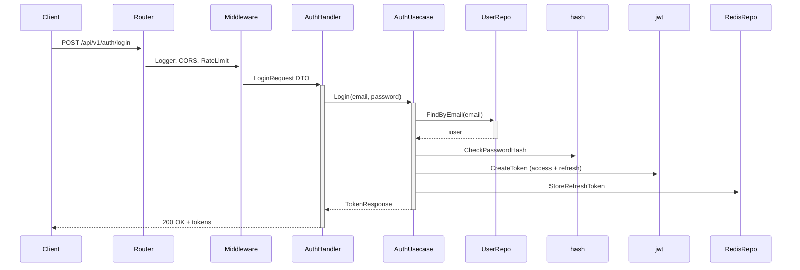

 Go Restful API 

An API dev written in Golang with chi-route and Gorm. Write restful API with fast development and developer friendly.

## Architecture

In this project use 3 layer architecture

- Models
- Repository
- Usecase
- Delivery

## Features

- CRUD
- Jwt, refresh token saved in redis
- Cached user in redis
- Email verification
- Forget/reset password, send email

## Technical

- `chi`: router and middleware
- `viper`: configuration
- `cobra`: CLI features
- `gorm`: orm
- `validator`: data validation
- `jwt`: jwt authentication
- `zap`: logger
- `gomail`: email
- `hermes`: generate email body
- `air`: hot-reload

## Start Application

### Generate the Private and Public Keys

- Generate the private and public keys: [travistidwell.com/jsencrypt/demo/](https://travistidwell.com/jsencrypt/demo/)
- Copy the generated private key and visit this Base64 encoding website to convert it to base64
- Copy the base64 encoded key and add it to the `config/config-local.yml` file as `jwt`
- Similar for public key

### Stmp mail config

- Create [mailtrap](https://mailtrap.io/) account
- Create new inboxes
- Update smtp config `config/config-local.yml` file as `smtpEmail`

### Run
- `docker-compose up`
- OR  go run cmd/api/main.go serve  on loca Windows OS
- Swagger: [localhost:8080/swagger/](http://localhost:8080/swagger/)
- http://localhost:8080/swagger/index.html#/

```bash
  Email: root@gmail.com
  Password: root_password
```
## TODO

- Traefik
- Config using .env
- Linter
- Jaeger
- Production docker file version
- Mock database using gomock

## Acknowledgements

- [github.com/dhax/go-base](https://github.com/dhax/go-base)
- [github.com/akmamun/go-fication](https://github.com/akmamun/go-fication)
- [github.com/wpcodevo/golang-fiber-jwt](https://github.com/wpcodevo/golang-fiber-jwt)
- [github.com/wpcodevo/golang-fiber](https://github.com/wpcodevo/golang-fiber)
- [github.com/kienmatu/togo](https://github.com/kienmatu/togo)
- [github.com/AleksK1NG/Go-Clean-Architecture-REST-API](https://github.com/AleksK1NG/Go-Clean-Architecture-REST-API)
- [github.com/bxcodec/go-clean-arch](https://github.com/bxcodec/go-clean-arch)
- [codevoweb.com/golang-and-gorm-user-registration-email-verification/](https://codevoweb.com/golang-and-gorm-user-registration-email-verification/)
- [codevoweb.com/golang-gorm-postgresql-user-registration-with-refresh-tokens/](https://codevoweb.com/golang-gorm-postgresql-user-registration-with-refresh-tokens/)
- [codevoweb.com/how-to-implement-google-oauth2-in-golang/](https://codevoweb.com/how-to-implement-google-oauth2-in-golang/)
- [codevoweb.com/how-to-upload-single-and-multiple-files-in-golang/](https://codevoweb.com/how-to-upload-single-and-multiple-files-in-golang/)
- [codevoweb.com/forgot-reset-passwords-in-golang-with-html-email/](https://codevoweb.com/forgot-reset-passwords-in-golang-with-html-email/)
- [techmaster.vn/posts/34577/kien-truc-sach-voi-golang](https://techmaster.vn/posts/34577/kien-truc-sach-voi-golang)


### Installation


```bash
- ตรวจสอบว่า go.mod มี replace directive หรือใช้ local module หรือไม่
- ถ้า gorestapi เป็น local module ให้ใช้ replace gorestapi => gorestapi
- หรือถ้าเป็น private repo ให้ตั้ง GOPRIVATE และใช้ access token
- Perfect! You're setting up an existing Go project (gorestapi). Here's how to properly set it up and run it:
```bash
## Complete Setup Steps for Your gorestapi Project
## 📘 การจัดการ `go.mod` และ dependencies สำหรับโปรเจกต์ `gorestapi`  
## 📘 Managing `go.mod` and dependencies for `gorestapi` project

> คำแนะนำแบบทีละขั้นตอน (ไทย / อังกฤษ)  
> Step-by-step guide (Thai / English)

---

### 🧱 1. โคลนโปรเจกต์และเข้าไปในโฟลเดอร์  
### 1. Clone and enter the project

```bash
# ไทย: โคลน repository จาก GitHub และเปลี่ยนไปยังไดเรกทอรีโปรเจกต์
# EN: Clone the repository from GitHub and change into the project directory
git clone github.com/kongnakornna/gorestapi.git
cd gorestapi
```
```bash

go mod tidy
go mod download
go mod verify
go run cmd/api/main.go serve

# Auto Run 
air

``` 
---
### 🧹 2. จัดการ dependencies เริ่มต้น  
### 2. Initial dependency management

```bash
# ไทย: ดาวน์โหลด dependencies และทำ tidy (เพิ่ม/ลบตามที่โค้ดเรียกใช้)
# EN: Download dependencies and tidy up (add/remove based on code imports)
go mod tidy

# ไทย: ตรวจสอบว่าโมดูลถูกตั้งค่าถูกต้อง
# EN: Verify the module is set up correctly
go mod verify
```

---

### 🗂️ 3. ตรวจสอบโครงสร้างโปรเจกต์ (ถ้าต้องการ)  
### 3. Check project structure (optional)

```bash
# ไทย: ดูว่าไฟล์สำคัญมีอยู่หรือไม่
# EN: Check if essential files exist
ls docker-compose.yml Dockerfile main.go go.mod
```

---

### 📦 4. จัดการ dependencies แบบละเอียด (download, vendor, tidy)  
### 4. Advanced dependency management (download, vendor, tidy)

```bash
# ไทย: ดาวน์โหลด dependencies ทั้งหมดลงใน module cache
# EN: Download all dependencies to the module cache
go mod download

# ไทย: ทำ tidy อีกครั้งเพื่อความแน่ใจ (ก่อน vendor)
# EN: Run tidy again to be safe (before vendoring)
go mod tidy

# ไทย: คัดลอก dependencies ไปไว้ในโฟลเดอร์ vendor
# EN: Copy dependencies into the ./vendor directory
go mod vendor

# ไทย: ตรวจสอบโมดูลอีกครั้ง
# EN: Verify modules again
go mod verify
```

---

### 🚀 5. รันแอปพลิเคชัน  
### 5. Run the application

```bash
# ไทย: รันด้วย main.go ที่ root (ถ้ามี)
# EN: Run using main.go at the root (if exists)
go run cmd/api/main.go serve

# หรือ (หรือ) ถ้า main.go อยู่ใน cmd/
# Or if main.go is inside cmd/
go run cmd/gorestapi/main.go serve
```

---

## 🔧 การรีเซ็ต `go.mod` ให้กลับมาสะอาด (แก้ปัญหา `go 1.25.0` ไม่รองรับ)  
## 🔧 Resetting `go.mod` to a clean state (fix unsupported `go 1.25.0`)

> ใช้ขั้นตอนนี้เมื่อเจอ error `go 1.25.0` หรือ `go.mod` มีปัญหาขัดแย้ง  
> Use this procedure when you see `go 1.25.0` error or `go.mod` conflicts.

---

### ✅ ขั้นตอนที่ 1 – สำรองข้อมูล (แนะนำ)  
### Step 1 – Backup (recommended)

```bash
# ไทย: สำรองไฟล์ go.mod และ go.sum ปัจจุบัน
# EN: Backup current go.mod and go.sum
cp go.mod go.mod.bak
cp go.sum go.sum.bak
```

---

### ✅ ขั้นตอนที่ 2 – กำหนดเวอร์ชัน Go ที่ถูกต้อง (stable 1.23 หรือ 1.24)  
### Step 2 – Set a valid Go version (stable 1.23 or 1.24)

```bash
# ไทย: แก้ไข go.mod ให้ใช้ go 1.23 (หรือ 1.24 แล้วแต่ที่ติดตั้ง)
# EN: Edit go.mod to use go 1.23 (or 1.24 depending on your installation)
go mod edit -go=1.23
```

---

### ✅ ขั้นตอนที่ 3 – ล้าง require blocks และสร้าง dependencies ใหม่ทั้งหมด  
### Step 3 – Remove all require blocks and rebuild dependencies cleanly

```bash
# ไทย: รัน go mod tidy เพื่อวิเคราะห์ imports ในโค้ดและสร้าง go.mod / go.sum ใหม่
# EN: Run go mod tidy to analyze code imports and regenerate go.mod / go.sum
go mod tidy
```

> `go mod tidy` จะ:
> - ลบ `require` ที่ไม่ได้ใช้
> - เพิ่ม `require` สำหรับแพ็คเกจที่ถูก import จริง
> - ปรับ `go.sum` ให้สอดคล้อง  
>  
> `go mod tidy` will:
> - Remove unused `require` directives
> - Add `require` for actually imported packages
> - Adjust `go.sum` accordingly

---

### ✅ ขั้นตอนที่ 4 – ตรวจสอบผลลัพธ์  
### Step 4 – Verify the result

```bash
# ไทย: ดูเนื้อหา go.mod ที่ถูกต้อง
# EN: View the corrected go.mod content
cat go.mod

# ไทย: ทดสอบ build หรือ run เพื่อยืนยัน
# EN: Test build or run to confirm
go build ./...
# หรือ (or)
go run cmd/api/main.go serve
```

---

### 📝 หมายเหตุเพิ่มเติม  
### 📝 Additional notes

- ถ้ายังคงมีปัญหาเรื่องเวอร์ชัน Go ให้ตรวจสอบ Go version ที่ติดตั้งด้วย `go version`  
- หากใช้ Go 1.21 ขึ้นไป การตั้ง `go 1.23` ใน `go.mod` จะยังทำงานได้ (เข้ากันได้ backward)  
- หลังจาก reset แล้ว หากต้องการใช้ vendor อีกครั้ง ให้รัน `go mod vendor`

- If you still have Go version issues, check installed Go version with `go version`  
- For Go 1.21+, setting `go 1.23` in `go.mod` is still compatible (backward compatible)  
- After resetting, if you need vendor again, run `go mod vendor`

---

✅ จบขั้นตอน – ตอนนี้ `go.mod` ของคุณสะอาดและพร้อมใช้งานแล้ว  
✅ End of steps – Your `go.mod` is now clean and ready to use.

To **reset** your `go.mod` to a clean, valid state (fixing the unsupported `go 1.25.0` and tidying dependencies), run:

```bash
# 1. (Optional) Backup current go.mod and go.sum
cp go.mod go.mod.bak
cp go.sum go.sum.bak

# 2. Set a valid Go version (1.23 or 1.24 are stable as of 2026)
go mod edit -go=1.23

# 3. Remove all require blocks and let 'go mod tidy' rebuild them cleanly
#    (this preserves only direct imports from your code)
go mod tidy

# 4. Verify the result
cat go.mod
```

After running `go mod tidy`, your `go.mod` will:
- Have a valid `go 1.23` directive
- Contain only **direct** requirements (plus `// indirect` for transitive deps)
- Have a clean `go.sum` with checksums

If you want to **completely regenerate** `go.mod` from scratch (keeping only the module name), you can:

```bash
# WARNING: deletes existing go.mod
rm go.mod go.sum
go mod init gorestapi
go mod tidy
```

But that will lose all the manually listed `require` lines. The `go mod tidy` approach above is safer – it will keep all needed deps based on your actual source code imports.

After resetting, if you still need a `vendor` directory, run:

```bash
go mod vendor
```

 
# 1. แก้ไข go.mod
go mod edit -go=1.25
go mod tidy

# 2. ลบ vendor เดิม
Remove-Item -Recurse -Force vendor -ErrorAction SilentlyContinue

# 3. สร้าง vendor (จะมี warning ให้ ignore ได้)
go mod vendor

# 4. ตรวจสอบ vendor
Get-ChildItem vendor

# 5. ทดสอบ build
go build -mod=vendor ./...

## 📁 โครงสร้างโปรเจค `gorestapi`
```  
    gorestapi/
    ├── .vscode/                         # VS Code config (debug, launch)
    ├── cmd/                             # CLI commands (ใช้ Cobra)
    │   ├── /api/main.go                 # entry point (cobra.Execute())
    │   ├── root.go                      # root command
    │   ├── serve.go                     # start HTTP server
    │   ├── migrate.go                   # run DB migrations
    │   ├── initdata.go                  # seed initial data (root user)
    │   └── worker.go                    # background worker (email queue)
    │
    ├── config/                          # Viper configuration files
    │   ├── config-local.yml             # local dev config
    │   ├── config-prod.yml              # production config
    │   └── config.go                    # load & parse config
    │
    ├── docdev/                          # developer documentation
    ├── docs/                            # Swagger / API docs
    │
    internal/
    │
    ├── models/                          # Entity layer (GORM models)
    │   ├── user.go                      # User struct (id, email, password, verified, tokens...)
    │   ├── session.go                   # Session struct (ถ้าใช้ session table)
    │   └── verification.go              # VerificationToken struct (optional)
    │
    ├── repository/                      # Repository layer (data access interface)
    │   ├── user_repo.go                 # UserRepository interface & implementation
    │   │   - Create(user) error
    │   │   - FindByEmail(email) (*User, error)
    │   │   - FindByID(id) (*User, error)
    │   │   - Update(user) error
    │   │   - Delete(id) error
    │   ├── session_repo.go              # SessionRepository (สำหรับ refresh token ใน DB ถ้าไม่ใช้ Redis)
    │   └── redis_repo.go                # Redis operations (cache, refresh token store)
    │
    ├── usecase/                         # Business logic layer
    │   ├── auth_usecase.go              # AuthUsecace interface & impl
    │   │   - Register()
    │   │   - Login()
    │   │   - VerifyEmail()
    │   │   - ForgotPassword()
    │   │   - ResetPassword()
    │   │   - RefreshToken()
    │   │   - Logout()
    │   ├── user_usecase.go              # UserUsecase (CRUD)
    │   │   - GetProfile()
    │   │   - UpdateProfile()
    │   │   - ListUsers() (admin)
    │   └── cache_usecase.go             # Cache helper (ใช้ใน auth_usecase สำหรับ cached user)
    │
    ├── delivery/                        # HTTP handlers & routing
    │   ├── rest/
    │   │   ├── handler/                 # หรือจะแยกตาม entity
    │   │   │   ├── auth_handler.go      # Auth endpoints
    │   │   │   ├── user_handler.go      # User endpoints
    │   │   │   └── health_handler.go    # Health check
    │   │   ├── middleware/
    │   │   │   ├── auth.go              # JWT authentication middleware
    │   │   │   ├── logger.go            # Request logger (zap)
    │   │   │   ├── cors.go              # CORS middleware
    │   │   │   └── rate_limit.go        # Rate limiter (optional)
    │   │   ├── dto/                     # Data Transfer Objects (request/response)
    │   │   │   ├── auth_dto.go          # RegisterRequest, LoginRequest, TokenResponse...
    │   │   │   ├── user_dto.go          # UserResponse, UpdateUserRequest
    │   │   │   └── error_dto.go         # ErrorResponse
    │   │   └── router.go                # Chi router setup (routes all handlers)
    │   │
    │   └── worker/                      # Background workers (email queue)
    │       └── email_worker.go          # Process email sending async
    │
    ├── pkg/                             # Internal shared packages (ไม่ expose ออกไป)
    │   ├── jwt/
    │   │   ├── maker.go                 # JWT Maker interface (CreateToken, VerifyToken)
    │   │   ├── rsa_maker.go             # RSA implementation (private/public key)
    │   │   └── payload.go               # JWT payload struct
    │   ├── redis/
    │   │   ├── client.go                # Redis client wrapper
    │   │   ├── cache.go                 # Cache helper (Get, Set, Delete)
    │   │   └── refresh_store.go         # Store/validate refresh token in Redis
    │   ├── email/
    │   │   ├── sender.go                # Email sender interface
    │   │   ├── gomail_sender.go         # Gomail implementation
    │   │   └── templates/               # Hermes HTML templates
    │   │       ├── verification.html    # Email verification template
    │   │       └── reset_password.html  # Reset password template
    │   ├── logger/
    │   │   └── zap_logger.go            # Zap logger init & wrapper
    │   ├── validator/
    │   │   └── custom_validator.go      # go-playground/validator with custom tags
    │   ├── hash/
    │   │   └── bcrypt.go                # Password hashing
    │   └── utils/
    │       ├── random.go                # Random string generator (verification code)
    │       └── time.go                  # Time helpers
    │
    └── config/                          # (บางทีก็เอาไว้ใน internal/config)
    │    └── config.go                    # Viper config loader (struct with all settings)
    │
    ├── migrations/                      # raw SQL migration files (optional)
    ├── pkg/                             # public packages (อาจ reuse ภายนอก)
    │   └── utils/                       # helper functions
    │
    ├── scripts/                         # build, deploy, CI scripts
    ├── vendor/                          # vendored dependencies
    │
    ├── .air.toml                        # hot-reload config (Air)
    ├── .dockerignore
    ├── .env.dev                         # dev environment variables
    ├── .env.prod                        # prod environment variables
    ├── .gitignore
    ├── docker-compose.dev.yml           # dev stack (postgres, redis, mailhog)
    ├── docker-compose.prod.yml          # prod stack (including app)
    ├── Dockerfile.dev                   # multi-stage dev build
    ├── Dockerfile.prod                  # production build
    ├── go.mod / go.sum
    ├── LICENSE
    ├── README.md
    └── BookGolang.md                    # เอกสารประกอบการเรียนรู้
```

## 🧱 ความสอดคล้องกับ 3-layer Architecture + Delivery

| Layer | โฟลเดอร์ | หน้าที่ |
|-------|----------|--------|
| **Models** | `internal/models/` | กำหนด struct ของ entity (User, Product, etc.) + GORM annotations |
| **Repository** | `internal/repository/` | Interface + implementation สำหรับติดต่อฐานข้อมูล (CRUD) |
| **Usecase** | `internal/usecase/` | Business logic: validation, hashing, token creation, email sending, cache ฯลฯ |
| **Delivery** | `internal/delivery/rest/` | HTTP handlers, รับ request → เรียก usecase → ส่ง response |

## ✨ Features ที่ implement (ตามที่โจทย์ต้องการ)

| Feature | การ Implement ในโครงสร้างนี้ |
|---------|-----------------------------|
| **CRUD** | `user_handler.go` + `user_repo.go` + `auth_usecase.go` (สำหรับ user) |
| **JWT + refresh token (Redis)** | `pkg/jwt` สร้าง access/refresh token, เก็บ refresh token hash ใน Redis (key: `refresh:{userID}`) |
| **Cached user in Redis** | `usecase` จะ cache user profile หลังจาก login/get profile ด้วย `pkg/redis` (key: `user:{id}`, TTL 5 นาที) |
| **Email verification** | `pkg/email` + `hermes` สร้าง HTML email, ส่ง verification link ผ่าน `gomail` |
| **Forget / reset password** | Endpoint `/forgot-password` → สร้าง token ส่ง email → `/reset-password` รับ token + เปลี่ยนรหัส |

## 🚀 การทำงานของแต่ละ Command (Cobra)

```bash
go run cmd/api/main.go serve      # เริ่ม HTTP server บน port ที่กำหนดใน config
go run main.go migrate    # auto migrate (หรือ run raw SQL จาก migrations/)
go run main.go initdata   # สร้าง root user (email: root@gmail.com, pass: root_password)
go run main.go worker     # run background worker (ส่ง email แบบ queue)
```

## 🐳 Docker Compose ที่ใช้

- **docker-compose.dev.yml** → รัน postgres, redis, mailhog (SMTP fake) สำหรับพัฒนา
- **docker-compose.prod.yml** → รัน postgres, redis, app (build from Dockerfile.prod) พร้อม network แบบ production

## 🔥 Hot-reload (Air)

ใช้ไฟล์ `.air.toml` เพื่อให้แอปรีสตาร์ทอัตโนมัติเมื่อโค้ดเปลี่ยนแปลง
```bash
air -c .air.toml
```

## 📝 สรุป

โครงสร้างนี้ตรงตาม requirements ครบทุกข้อ:
- ✅ 3-layer clean architecture
- ✅ Chi routing + GORM ORM
- ✅ JWT (RSA) + refresh token ใน Redis
- ✅ Cached user ใน Redis
- ✅ Email verification (gomail + hermes)
- ✅ Forgot / reset password via email
- ✅ Viper config, Cobra CLI, Zap logger, Validator
- ✅ Docker + Air hot-reload + Swagger docs

สามารถ clone มาใช้ได้เลย:

```bash
git clone https://gorestapi
cd gorestapi
go mod tidy
go run cmd/api/main.go serve

OR  air
```

ขออธิบายโครงสร้างโปรเจกต์ **gorestapi** แบบละเอียด โดยอ้างอิงจากต้นแบบ [kongnakornna/gorestapi](https://gorestapi) แต่ตัดส่วนที่ไม่จำเป็นออกไป (`.vscode/`, `/docdev`, `/lession`) โครงสร้างนี้ใช้ **Clean Architecture** พร้อม分层 (layers) ที่แยกหน้าที่ชัดเจน: **Models → Repository → Usecase → Delivery** เหมาะสำหรับ REST API ที่มีความซับซ้อนปานกลางถึงสูง รองรับ JWT, Redis, Email Queue, และ Background Worker

---

## 1. โฟลเดอร์หลักและไฟล์ระดับบนสุด

| ไฟล์/โฟลเดอร์ | คำอธิบาย |
|---------------|----------|
| `main.go` | จุดเริ่มต้นของโปรแกรม เรียกใช้ `cmd.Execute()` จาก Cobra |
| `go.mod`, `go.sum` | จัดการ dependencies (GORM, Chi, Viper, Cobra, Zap, Gomail, Redis client ฯลฯ) |
| `Dockerfile.dev`, `Dockerfile.prod` | สร้าง image สำหรับ development (hot-reload) และ production (multi-stage) |
| `docker-compose.dev.yml`, `docker-compose.prod.yml` | กำหนด service stack: PostgreSQL, Redis, MailHog (dev), และแอปพลิเคชัน |
| `.air.toml` | ตั้งค่า Air สำหรับ hot-reload ตอนพัฒนา |
| `.env.dev`, `.env.prod` | ตัวแปรสภาพแวดล้อม (database URL, JWT keys, Redis URL, SMTP) |
| `.gitignore`, `LICENSE`, `README.md`, `BookGolang.md` | เอกสารและไฟล์มาตรฐาน |

---

## 2. คำสั่ง CLI (`cmd/`)

ใช้ **Cobra** สร้างคำสั่งสำหรับบริหารแอปพลิเคชัน

| ไฟล์ | หน้าที่ |
|------|--------|
| `root.go` | คำสั่งหลัก (`gorestapi`) แสดง help และตั้งค่า flags ร่วม (เช่น `--config`) |
| `serve.go` | เริ่ม HTTP server (โหลด config, เชื่อมต่อ DB, ตั้ง router, เริ่ม worker) |
| `migrate.go` | รัน database migration (auto migrate GORM หรือ raw SQL) |
| `initdata.go` | seed ข้อมูลเริ่มต้น เช่น สร้าง root user (admin) |
| `worker.go` | เริ่ม background worker ที่คอยประมวลผล email queue (เช่น จาก Redis stream หรือ RabbitMQ) |

**ตัวอย่างการใช้งาน**  
```bash
go run cmd/api/main.go serve --config config-local.yml
go run main.go migrate
go run main.go initdata
```

---

## 3. การตั้งค่า (`config/`)

| ไฟล์ | หน้าที่ |
|------|--------|
| `config-local.yml` | ค่า config สำหรับ local dev (port, DB host, Redis, log level, JWT expiration) |
| `config-prod.yml` | สำหรับ production (อาจอ่าน secrets จาก environment variables) |
| `config.go` | ใช้ **Viper** อ่านไฟล์ YAML + env override แล้ว map ไปยัง struct (ServerConfig, DBConfig, JWTConfig, RedisConfig, EmailConfig) |

---

## 4. Internal Packages (`internal/`) – หัวใจของแอปพลิเคชัน

Go จะไม่允许 package อื่นนอก `internal/` มา import ดังนั้นโค้ดภายในถูกบังคับให้เป็น private

### 4.1 Models (`internal/models/`)
กำหนด struct ของ entities ที่ตรงกับตารางในฐานข้อมูล (ใช้ GORM tags)

| ไฟล์ | ฟิลด์สำคัญ |
|------|-----------|
| `user.go` | `ID`, `Email`, `PasswordHash`, `Verified` (bool), `Role` (admin/user), `CreatedAt`, `UpdatedAt` |
| `session.go` | (ถ้าใช้ session บน DB) `ID`, `UserID`, `RefreshToken`, `ExpiresAt`, `UserAgent`, `IP` |
| `verification.go` | `ID`, `UserID`, `Token` (random string), `ExpiresAt`, `Type` (email_verification, password_reset) |

### 4.2 Repository (`internal/repository/`)
เป็น **data access layer** – ติดต่อฐานข้อมูลหรือ Redis โดยใช้ interface เพื่อให้ usecase สามารถทดสอบได้ง่าย

| ไฟล์ | หน้าที่ |
|------|--------|
| `user_repo.go` | interface `UserRepository` + implementation (GORM): `Create`, `FindByEmail`, `FindByID`, `Update`, `Delete` |
| `session_repo.go` | interface `SessionRepository` สำหรับเก็บ refresh token ในฐานข้อมูล (ถ้าไม่ใช้ Redis) |
| `redis_repo.go` | interface `RedisRepository` สำหรับ Redis operation: `Set`, `Get`, `Delete`, `SetNX` (lock), `HSet`, `HGet` ใช้เก็บ refresh token (blacklist, whitelist) หรือ cache user profile |

### 4.3 Usecase (`internal/usecase/`)
**Business logic layer** – เรียก repository หลายตัว และจัดการ transaction, hashing, JWT, email sending (ผ่าน worker)

| ไฟล์ | หน้าที่ |
|------|--------|
| `auth_usecase.go` | `Register()` → hash password, save user, สร้าง verification token, ส่ง email async; <br> `Login()` → ตรวจสอบ password, สร้าง access + refresh token (เก็บ refresh ใน Redis), return tokens; <br> `VerifyEmail()`, `ForgotPassword()`, `ResetPassword()`, `RefreshToken()`, `Logout()` (revoke refresh token) |
| `user_usecase.go` | `GetProfile()`, `UpdateProfile()`, `ListUsers()` (เฉพาะ admin), `DeleteUser()` |
| `cache_usecase.go` | helper สำหรับ caching user data (ลดการ query DB) – ใช้ Redis repository |

**ตัวอย่าง workflow** ของ `Login()`:
1. ตรวจสอบ user จาก repository (`FindByEmail`)
2. เปรียบเทียบ password ด้วย bcrypt
3. ถ้าถูกต้อง → เรียก `jwtMaker.CreateToken()` สร้าง access token (สั้น, 15 นาที) และ refresh token (ยาว, 7 วัน)
4. เก็บ refresh token ใน Redis (key = `refresh:{userID}:{tokenID}`) พร้อม TTL
5. ส่ง tokens กลับไปยัง handler

### 4.4 Delivery (`internal/delivery/`)
รับผิดชอบ HTTP layer และ background workers

#### 4.4.1 REST handlers (`internal/delivery/rest/handler/`)

| ไฟล์ | endpoints |
|------|-----------|
| `auth_handler.go` | `POST /api/v1/auth/register`, `/login`, `/verify-email`, `/forgot-password`, `/reset-password`, `/refresh`, `/logout` |
| `user_handler.go` | `GET /api/v1/users/me`, `PUT /api/v1/users/me`, `GET /api/v1/users` (admin), `DELETE /api/v1/users/:id` |
| `health_handler.go` | `GET /health`, `GET /ready` (ตรวจ DB, Redis) |

แต่ละ handler จะ bind request DTO → เรียก usecase → แปลง response DTO → ส่ง JSON

#### 4.4.2 Middleware (`internal/delivery/rest/middleware/`)

| ไฟล์ | หน้าที่ |
|------|--------|
| `auth.go` | ตรวจ JWT จาก `Authorization: Bearer <token>` → แปลง payload → ใส่ userID, role ลง context (ใช้ `context.WithValue`) → ถ้า token หมดอายุ หรือถูก revoke (check Redis blacklist) → reject |
| `logger.go` | บันทึก request method, path, status, latency, user agent (ใช้ Zap) |
| `cors.go` | ตั้ง CORS headers (allow origin, methods, credentials) |
| `rate_limit.go` | จำกัดจำนวน request ต่อ IP หรือ user (ใช้ Redis + sliding window หรือ token bucket) |

#### 4.4.3 DTO (`internal/delivery/rest/dto/`)

| ไฟล์ | struct ตัวอย่าง |
|------|----------------|
| `auth_dto.go` | `RegisterRequest{Email, Password, ConfirmPassword}`, `LoginRequest`, `TokenResponse{AccessToken, RefreshToken}` |
| `user_dto.go` | `UserResponse{ID, Email, Verified, Role}`, `UpdateUserRequest` |
| `error_dto.go` | `ErrorResponse{Code, Message, Details}` |

#### 4.4.4 Router (`internal/delivery/rest/router.go`)
- ใช้ **Chi** router (เบา, รองรับ middleware chain)
- จัดกลุ่ม route: `/api/v1/auth`, `/api/v1/users`, `/health`
- ต่อ middleware ทั่วไป: logger, cors, rate limit
- สำหรับ route ที่ต้องการ authentication → ใส่ `middleware.Auth`

#### 4.4.5 Worker (`internal/delivery/worker/email_worker.go`)
- Background worker (อาจใช้ goroutine + channel หรือใช้ Redis Stream / BullMQ pattern)
- รับ job ส่ง email (verification, reset password)
- ใช้ email sender interface (gomail) พร้อม template HTML (Hermes)

---

## 5. Shared Packages (`internal/pkg/` และ `pkg/`)

### 5.1 `internal/pkg/jwt/`
- `maker.go` – interface `Maker` (CreateToken, VerifyToken)
- `rsa_maker.go` – ใช้ private/public key (RSA256) sign JWT
- `payload.go` – struct `Payload` (UserID, Role, ExpiresAt, IssuedAt, TokenID)

### 5.2 `internal/pkg/redis/`
- `client.go` – สร้าง Redis client (go-redis)
- `cache.go` – helper สำหรับ get/set JSON, increment, expire
- `refresh_store.go` – ฟังก์ชันเฉพาะ `StoreRefreshToken(userID, tokenID string, ttl time.Duration)`, `ValidateRefreshToken(userID, tokenID string) bool`, `RevokeRefreshToken(...)`

### 5.3 `internal/pkg/email/`
- `sender.go` – interface `EmailSender`
- `gomail_sender.go` – implement โดยใช้ gopkg.in/gomail.v2
- `templates/` – HTML template สำหรับ verification และ reset password (ใช้ `html/template`)

### 5.4 `internal/pkg/logger/`
- `zap_logger.go` – สร้าง logger (production หรือ development) ด้วย Uber Zap รองรับ structured logging, log level, และ sink (stdout, file)

### 5.5 `internal/pkg/validator/`
- `custom_validator.go` – ใช้ go-playground/validator พร้อม custom validation เช่น `password` (ต้องมีตัวเลข, ตัวพิมพ์ใหญ่, พิเศษ) และ `phone` (เบอร์ไทย)

### 5.6 `internal/pkg/hash/`
- `bcrypt.go` – `HashPassword(password string) (string, error)` และ `CheckPasswordHash(password, hash string) bool`

### 5.7 `internal/pkg/utils/`
- `random.go` – สร้าง random string (สำหรับ verification token หรือ reset code)
- `time.go` – helper timezone, duration parser, nowUTC()

### 5.8 `pkg/utils/` (public)
- ถ้ามี helper ที่อาจถูกใช้โดย external package เช่น format response, pagination เป็นต้น

---

## 6. Migration (`migrations/`)
- เก็บ raw SQL migration files (optional) ถ้าใช้ GORM auto migrate อาจไม่ต้องใช้ แต่ถ้าต้องการ version control schema ควรใช้ `golang-migrate` หรือ `goose`
- โครงสร้างไฟล์: `000001_create_users_table.up.sql`, `000001_create_users_table.down.sql`

---

## 7. Scripts (`scripts/`)
- เก็บ shell script สำหรับ build, deploy, CI/CD เช่น `build.sh`, `deploy-staging.sh`, `seed-test-data.sh`

---

## 8. Vendor (`vendor/`)
- เมื่อใช้ `go mod vendor` จะสร้างโฟลเดอร์นี้สำหรับ dependencies (ใช้ในการ build แบบ offline หรือ CI ที่ไม่มี internet)

---

## 9. เอกสาร API (`docs/`)
- ใช้ **Swaggo** (swag init) สร้าง Swagger JSON/YAML และ UI (สามารถเปิด `/swagger/index.html`)
- คำสั่ง: `swag init -g cmd/root.go` (ต้อง annotate handler ด้วย `// @Summary` ฯลฯ)

---

## ภาพรวมการทำงาน (Request Flow)



---

## สรุปคุณสมบัติเด่นของโครงสร้างนี้

- **Clean Architecture**: แยก model, repository, usecase, delivery ทำให้ทดสอบง่ายและเปลี่ยน database หรือ delivery (REST → gRPC) ได้โดยไม่กระทบ business logic
- **Security**: JWT RSA256, refresh token เก็บใน Redis, bcrypt สำหรับ password, rate limiting, CORS
- **Asynchronous Email**: ใช้ background worker ป้องกัน request ติดขัด
- **Production-ready**: มี Docker, multi-stage build, health check, structured logging (Zap), graceful shutdown
- **Developer Experience**: Hot-reload (Air), CLI commands (Cobra), Swagger docs, environment-based config

โครงสร้างนี้เหมาะกับ REST API ขนาดกลางถึงใหญ่ สามารถขยับขยายไปใช้ event-driven หรือ microservices ได้ง่าย โดยการเพิ่ม message broker แทน channel worker.


