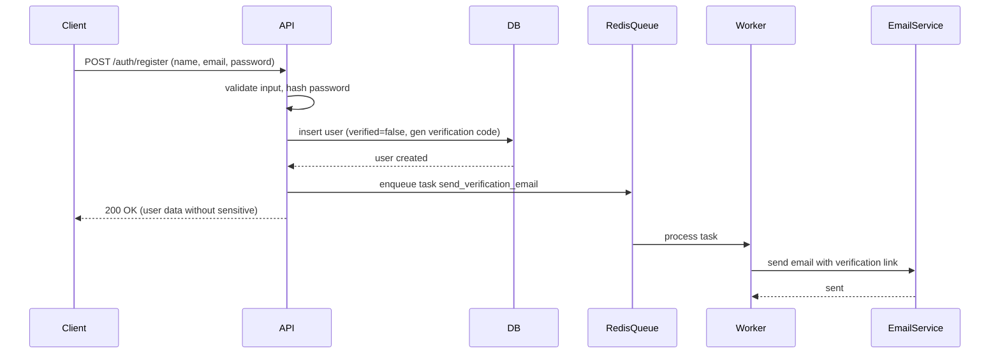
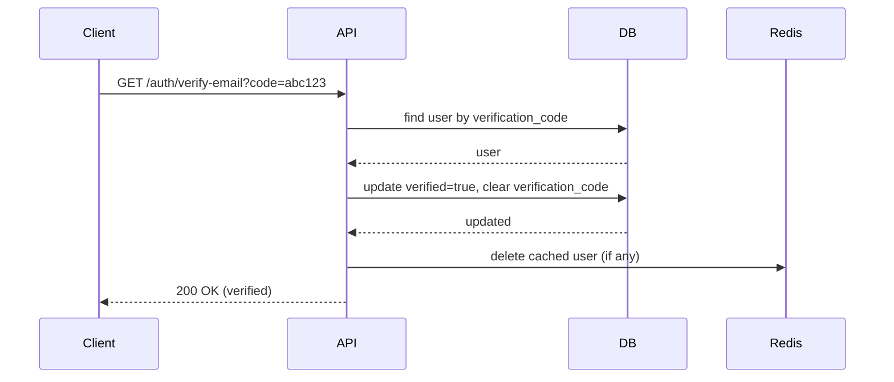
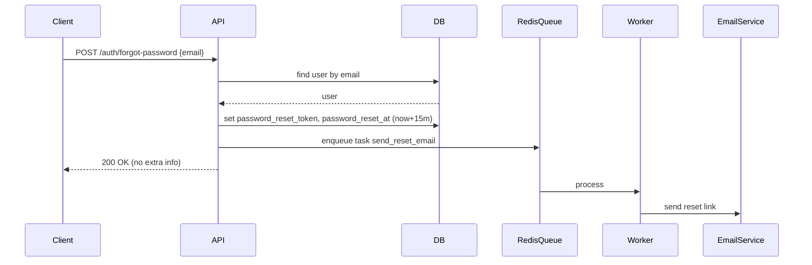
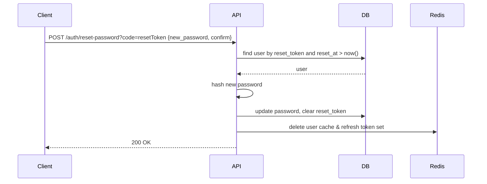

# 📘 เอกสารระบบ Module User (Authentication & User Management)

## 🌐 URL Local
```
http://localhost:8088
```

---

## 🧱 โครงสร้างโฟลเดอร์ (Folder Structure) พร้อมคำอธิบาย

```text
internal/
│
├── middleware/                          #  middleware ระดับ project
│   └── jwtauth.go                       #  JWT verification, authentication, user context
│
├── users/                               #  root module ของ user (Clean Architecture)
│   │
│   ├── delivery/                        #  ชั้นนำเสนอ (presentation layer)
│   │   └── http/
│   │       ├── handlers.go              #  HTTP handlers (รับ request, ตอบ response)
│   │       └── routes.go                #  กำหนด routing และ middleware
│   │
│   ├── distributor/                     #  จัดจำหน่ายงาน (task distributor) สำหรับ async worker
│   │   └── distributor.go               #  ส่ง task ไปยัง Redis (asynq)
│   │
│   ├── presenter/                       #  DTO (Data Transfer Object) สำหรับรับ/ส่งข้อมูล
│   │   └── presenters.go                #  structs สำหรับ request/response
│   │
│   ├── processor/                       #  ตัวประมวลผลงาน async (task processor)
│   │   └── processor.go                 #  ดึง task จาก Redis และประมวลผล (ส่งอีเมล)
│   │
│   ├── repository/                      #  ชั้นเข้าถึงข้อมูล (repository pattern)
│   │   ├── pg_repository.go             #  PostgreSQL repository implementation
│   │   └── redis_repository.go          #  Redis repository implementation
│   │
│   └── usecase/                         #  ชั้น business logic
│       └── usecase.go                   #  implement usecase interface
│
├── handler.go                           #  interface ของ HTTP handlers (users.Handlers)
├── pg_repository.go                     #  interface ของ PostgreSQL repository
├── redis_repository.go                  #  interface ของ Redis repository
├── usecase.go                           #  interface ของ usecase
└── worker.go                            #  กำหนด task names, payloads, interfaces สำหรับ async worker
```

---

## 📐 หลักการ (Concept)

### คืออะไร?
ระบบจัดการผู้ใช้ (User Module) ที่รองรับการลงทะเบียน, ยืนยันตัวตนผ่านอีเมล, การลืมรหัสผ่าน, การเปลี่ยนรหัสผ่าน, การ login/logout, และการจัดการ session ด้วย JWT + Redis

### มีกี่แบบ? (Authentication methods)
1. **JWT based authentication** – ใช้ access token (RS256) และ refresh token แยกกัน  
2. **Verification via email link** – ส่ง verification code ทางอีเมล  
3. **Password reset via email link** – ส่ง reset token ทางอีเมล  
4. **Session invalidation** – เก็บ refresh tokens ใน Redis Set สามารถ logout ทั้งหมดได้  

**ข้อห้ามสำคัญ**
- ห้าม hardcode secret key สำหรับ JWT (ใช้ RSA private/public key)
- ห้ามเก็บ refresh token ใน localStorage (ให้ใช้ httpOnly cookie แทน)
- ห้ามส่ง verification code หรือ reset token ผ่าน URL parameter โดยไม่เข้ารหัสเพิ่มเติม (แต่ในระบบใช้ hex code พอ)
- ห้ามให้ endpoint ที่ใช้เปลี่ยนรหัสผ่านโดยไม่ตรวจสอบ old password หรือ token

---

## 📝 คอมเมนต์ CODE (ภาษาไทย / อังกฤษ) – ตัวอย่างในไฟล์สำคัญ

### `models/user.go` (ตัวอย่าง)
```go
// User represents the application user entity.
// User เป็นโครงสร้างข้อมูลหลักของผู้ใช้ในระบบ
type User struct {
    gorm.Model
    Id         uuid.UUID `gorm:"type:uuid;default:gen_random_uuid();primary_key"`
    // ... fields ...
}

// TableName overrides the table name for GORM.
// TableName กำหนดชื่อตารางในฐานข้อมูล
func (User) TableName() string {
    return "user"
}
```

### `handlers.go` – ตัวอย่าง handler ใหม่ (Register)
```go
// Register godoc
// @Summary Register a new user (public)
// @Description Create a new user account. No authentication required.
// @Tags users
// @Accept json
// @Produce json
// @Param user body presenter.UserCreate true "User registration info"
// @Success 200 {object} responses.SuccessResponse[presenter.UserResponse]
// @Failure 400 {object} responses.ErrorResponse
// @Router /auth/register [post]
func (h *userHandler) Register() func(w http.ResponseWriter, r *http.Request) {
    return func(w http.ResponseWriter, r *http.Request) {
        // รับ payload จาก request body (Thai: แปลง JSON request)
        // Parse JSON request body (English)
        var req presenter.UserCreate
        if err := json.NewDecoder(r.Body).Decode(&req); err != nil {
            render.Render(w, r, responses.CreateErrorResponse(err))
            return
        }
        // validate struct (Thai: ตรวจสอบความถูกต้องของข้อมูล)
        if err := utils.ValidateStruct(r.Context(), req); err != nil {
            render.Render(w, r, responses.CreateErrorResponse(httpErrors.ErrValidation(err)))
            return
        }
        // map to model (Thai: แปลงจาก presenter เป็น model)
        userModel := mapModel(&req)
        // call usecase (Thai: เรียก business logic)
        newUser, err := h.usersUC.CreateUser(r.Context(), userModel, req.ConfirmPassword)
        if err != nil {
            render.Render(w, r, responses.CreateErrorResponse(err))
            return
        }
        render.Respond(w, r, responses.CreateSuccessResponse(mapModelResponse(newUser)))
    }
}
```

### `routes.go` – การเพิ่ม public routes
```go
// MapUserRoute กำหนด routing ทั้งหมดของ module user
func MapUserRoute(router *chi.Mux, h users.Handlers, mw *middleware.MiddlewareManager) {
    // Public routes (ไม่ต้องใช้ token)  // Thai: เส้นทางสาธารณะ ไม่ต้องตรวจสอบ JWT
    router.Route("/auth", func(r chi.Router) {
        r.Post("/register", h.Register())
        r.Post("/forgot-password", h.ForgotPassword())
        r.Get("/verify-email", h.VerifyEmail())
        r.Post("/resend-verification", h.ResendVerification())
        // ... อาจมี login, refresh, logout ด้วย (แต่ login ก็ต้อง public)
        r.Post("/login", h.Login())
        r.Post("/refresh", h.RefreshToken())
        r.Post("/logout", h.Logout())
    })

    // Protected routes (ต้องใช้ JWT)
    router.Route("/user", func(r chi.Router) {
        r.Use(mw.Verifier(true))
        r.Use(mw.Authenticator())
        r.Use(mw.CurrentUser())
        r.Use(mw.ActiveUser())
        r.Get("/me", h.Me())
        r.Put("/me", h.UpdateMe())
        // ... etc
    })
}
```

### `usecase.go` (implementation) – ตัวอย่าง method `ResendVerification`
```go
// ResendVerification sends a new verification email to the user.
// ResendVerification ส่งอีเมลยืนยันใหม่ให้ผู้ใช้ (ใช้เมื่อ verification code หมดอายุหรือยังไม่ได้รับ)
func (u *userUseCase) ResendVerification(ctx context.Context, email string) error {
    user, err := u.pgRepo.GetByEmail(ctx, email)
    if err != nil {
        return httpErrors.ErrNotFound(err)
    }
    if user.Verified {
        return httpErrors.ErrUserAlreadyVerified(errors.New("user already verified"))
    }
    // generate new verification code
    verificationCode, err := secureRandom.RandomHex(16)
    if err != nil {
        return err
    }
    _, err = u.pgRepo.UpdateVerificationCode(ctx, user, verificationCode)
    if err != nil {
        return err
    }
    // send email via async task
    bodyHtml, bodyPlain, _ := u.emailTemplateGenerator.GenerateVerificationCodeTemplate(
        ctx, user.Name, fmt.Sprintf("http://localhost:5000/auth/verify-email?code=%s", verificationCode),
    )
    err = u.redisTaskDistributor.DistributeTaskSendEmail(ctx, &users.PayloadSendEmail{
        From:      u.Cfg.Email.From,
        To:        user.Email,
        Subject:   u.Cfg.Email.VerificationSubject,
        BodyHtml:  bodyHtml,
        BodyPlain: bodyPlain,
    }, asynq.MaxRetry(10), asynq.Queue(worker.QueueCritical))
    return err
}
```

### ใช้อย่างไร / นำไปใช้กรณีไหน
- **Register**: ใช้เมื่อผู้ใช้ใหม่ต้องการสร้างบัญชี → ระบบจะส่งอีเมลยืนยัน
- **Forgot password**: ใช้เมื่อผู้ใช้ลืมรหัสผ่าน → ส่ง reset link ไปยังอีเมล
- **Verify email**: ใช้เมื่อผู้ใช้คลิกลิงก์ในอีเมลยืนยัน → เปลี่ยนสถานะ Verified = true
- **Resend verification**: ใช้เมื่อผู้ใช้ไม่ได้รับอีเมลหรือลิงก์หมดอายุ
- **OTP get** (ถ้าหมายถึงขอ OTP): สามารถสร้าง endpoint สำหรับส่ง OTP ทาง SMS หรืออีเมล (เพิ่มเติม)

### ประโยชน์ที่ได้รับ
- แยก public endpoints ออกจาก protected endpoints ทำให้ใช้งานง่าย
- ใช้ async task (asynq) ส่งอีเมลไม่ block การตอบกลับ
- รองรับการยืนยันตัวตนหลายช่องทาง (email, อาจเพิ่ม OTP)

### ข้อควรระวัง
- verification code ต้องมี expiration (ปัจจุบันไม่ได้ set expiration ใน database) → ควรเพิ่ม `VerificationCodeExpiry *time.Time`
- rate limiting สำหรับ public endpoints (register, forgot, resend) เพื่อป้องกัน spam

### ข้อดี
- Clean architecture ทำให้เปลี่ยน database หรือ delivery ได้ง่าย
- ใช้ Redis ช่วยลด load database (caching user)

### ข้อเสีย
- มี layer มาก ทำให้ debug ยากขึ้น
- ต้องจัดการ consistency ระหว่าง Redis cache และ DB

### ข้อห้าม
- ห้าม expose internal error messages ไปยัง client โดยตรง (ใช้ httpErrors แทน)
- ห้ามใช้ access token ในการทำ forgot password หรือ verify email

---

## 🔄 การออกแบบ Workflow และ Dataflow

### Workflow การลงทะเบียน (Register)


### Dataflow การยืนยันอีเมล (Verify Email)


### Workflow การลืมรหัสผ่าน (Forgot Password)


### Dataflow การรีเซ็ตรหัสผ่าน


---

## 🧪 คู่มือการทดสอบ (Test Guide)

### สิ่งที่ต้องเตรียม
- PostgreSQL, Redis, Asynq (Redis) ทำงานอยู่
- ตั้งค่า environment variables (JWT keys, email SMTP)
- รัน server และ worker แยกกัน

### Test Cases

| Test Case | Endpoint | Method | Request Body / Query | Expected Result |
|-----------|----------|--------|----------------------|------------------|
| Register success | `/auth/register` | POST | `{"name":"test","email":"test@mail.com","password":"pass1234","confirm_password":"pass1234"}` | 200, user returned (no password) |
| Register duplicate email | `/auth/register` | POST | same email | 400 error (duplicate) |
| Register password mismatch | `/auth/register` | POST | different confirm | 400 validation error |
| Verify email with valid code | `/auth/verify-email?code=xxxx` | GET | - | 200, verified |
| Verify with invalid code | `/auth/verify-email?code=wrong` | GET | - | 404 or 400 |
| Forgot password (existing email) | `/auth/forgot-password` | POST | `{"email":"test@mail.com"}` | 200 (even if email not exist? should be 200 to avoid enumeration) |
| Resend verification | `/auth/resend-verification` | POST | `{"email":"test@mail.com"}` | 200 |
| Reset password with valid token | `/auth/reset-password?code=validToken` | POST | `{"new_password":"new1234","confirm_password":"new1234"}` | 200 |
| Login after verification | `/auth/login` | POST | `{"email":"test@mail.com","password":"pass1234"}` | 200, returns tokens |

### เครื่องมือแนะนำ
- Postman / Newman
- `go test` สำหรับ unit tests (ควรเขียนเพิ่ม)
- `docker-compose` สำหรับทดสอบระบบรวม

---

## 📘 คู่มือการใช้งาน (User Guide)

### สำหรับผู้ใช้ปลายทาง
1. **ลงทะเบียน** → กรอกชื่อ, อีเมล, รหัสผ่าน → รับอีเมลยืนยัน
2. **ยืนยันอีเมล** → คลิกลิงก์ในอีเมล → บัญชี active
3. **เข้าสู่ระบบ** → ใช้อีเมลและรหัสผ่าน → รับ access token (ไว้เรียก API)
4. **ลืมรหัสผ่าน** → กรอกอีเมล → รับลิงก์รีเซ็ตในอีเมล → ตั้งรหัสผ่านใหม่
5. **เปลี่ยนรหัสผ่าน** (เมื่อ login แล้ว) → ใช้ `/user/me/updatepass`

### สำหรับนักพัฒนา API
- **Public endpoints** (ไม่ต้องใช้ token): `/auth/register`, `/auth/login`, `/auth/refresh`, `/auth/forgot-password`, `/auth/verify-email`, `/auth/resend-verification`, `/auth/reset-password`
- **Protected endpoints** (ต้องใช้ Bearer token): `/user/*`
- **Admin endpoints** (ต้องเป็น superuser): `/user` (GET, POST), `/user/{id}` (DELETE, PUT, PATCH updatepass, GET logoutall)

---

## 🛠️ คู่มือการบำรุงรักษา (Maintenance Guide)

### ตรวจสอบประจำวัน
- ดู logs ของ worker (asynq) ว่ามี task ค้างหรือไม่
- ตรวจสอบ Redis memory usage (`INFO memory`)
- ตรวจสอบจำนวน refresh tokens ใน Redis (อาจล้าง tokens เก่าด้วย cron)

### งานที่ต้องทำเป็นระยะ
1. **ล้าง verification codes ที่ expired** – ปัจจุบันไม่มี expiry field → ต้องเพิ่ม migration และ job cleanup
2. **ล้าง refresh tokens ที่หมดอายุ** – สามารถเพิ่ม TTL ให้กับ Redis Set member หรือเก็บ refresh token เป็น key/value ที่มี expiry
3. **rotate JWT keys** – เปลี่ยน private/public keys โดยไม่ให้บริการ中断

### การ backup
- PostgreSQL: backup table `user` (ห้าม backup passwords โดยตรง)
- Redis: backup keys `user:*` และ `RefreshToken:*` (เฉพาะ active sessions)

---

## 🚀 คู่มือการขยาย หรือแก้ไข หรือ เพิ่มเติมในอนาคต (Extension Guide)

### การเพิ่ม OTP (One-Time Password) ด้วย SMS
1. เพิ่ม field `PhoneNumber` (มีอยู่แล้ว) และ `OtpCode`, `OtpExpiry` ใน model `User`
2. เพิ่ม method ใน `usecase`: `SendOtp(ctx, phoneNumber)`, `VerifyOtp(ctx, phoneNumber, otp)`
3. เพิ่ม `distributor` และ `processor` สำหรับส่ง SMS (หรือใช้ existing email distributor)
4. เพิ่ม public endpoints: `/auth/send-otp`, `/auth/verify-otp`
5. แก้ไข `routes.go` เพิ่ม routes ในกลุ่ม public

### การเพิ่ม Social Login (Google, Facebook)
- เพิ่ม table `UserAuth` เชื่อม `user_id` กับ `provider`, `provider_user_id`
- เพิ่ม handler `/auth/google/login`, `/auth/google/callback`
- ใช้ JWT เหมือนเดิมหลัง authenticate สำเร็จ

### การเพิ่ม Two-Factor Authentication (2FA)
- เพิ่ม field `TotpSecret`, `TwoFactorEnabled`
- เพิ่ม endpoint `/auth/enable-2fa`, `/auth/verify-2fa`
- เมื่อ login สำเร็จ (step1) → ถ้าเปิด 2FA → response ต้องขอ OTP/TOTP ก่อนให้ access token

### การปรับปรุง security
- เพิ่ม `VerificationCodeExpiry` และ `PasswordResetTokenExpiry` เป็น `timestamp with time zone`
- เพิ่ม rate limiter สำหรับ public endpoints (ใช้ `golang.org/x/time/rate` หรือ middleware)
- เปลี่ยนจาก verification code แบบ static เป็น JWT ที่มี expiry สั้น

---

## ✅ Checklist Test Module

- [ ] **Register** – สามารถสร้าง user ใหม่ได้, ส่งอีเมลยืนยัน, ไม่ต้องใช้ token
- [ ] **Verify email** – ใช้ code ที่ถูกต้องสามารถยืนยันได้, code ผิด return error
- [ ] **Resend verification** – ส่งอีเมลใหม่, เปลี่ยน verification code ใน DB
- [ ] **Forgot password** – ส่ง reset link, สร้าง reset token และ reset_at
- [ ] **Reset password** – ใช้ token ถูกต้องและยังไม่หมดอายุ, เปลี่ยนรหัสผ่าน, ล้าง reset token, ลบ refresh tokens ทั้งหมด
- [ ] **Login** – หลังจาก verify แล้ว login ได้, ได้ access+refresh token, เก็บ refresh token ใน Redis
- [ ] **Refresh token** – สร้าง access token ใหม่โดยใช้ refresh token ที่ valid
- [ ] **Logout** – ลบ refresh token เพียงตัวเดียวจาก Redis
- [ ] **LogoutAll (admin)** – ลบทั้ง set ของ refresh tokens ของ user นั้น
- [ ] **Middleware** – public routes ไม่ต้องใช้ token, protected routes ต้องใช้ token, superuser routes ต้อง role superuser
- [ ] **Caching** – หลังจาก update user หรือ verify, cache ใน Redis ถูกลบ
- [ ] **Async email** – task send email ถูก enqueue และ worker ส่งอีเมลจริง

---

## 📄 ไฟล์และโค้ดที่แก้ไข (แบบเต็มโครงสร้างเดิม พร้อมการปรับปรุง)

### 1. `models/user.go` (ไม่ต้องแก้ไขเพิ่มสำหรับ public routes แต่ควรเพิ่ม expiry fields ในอนาคต)
```go
package models

import (
    "time"
    "github.com/google/uuid"
    "gorm.io/gorm"
)

type User struct {
    gorm.Model
    Id                 uuid.UUID  `gorm:"type:uuid;default:gen_random_uuid();primary_key"`
    Name               string     `gorm:"type:varchar(100);not null"`
    Email              string     `gorm:"type:varchar(100);uniqueIndex;not null"`
    Password           string     `gorm:"type:varchar(100);not null"`
    CreatedAt          time.Time  `gorm:"not null;default:now()"`
    UpdatedAt          time.Time  `gorm:"not null;default:now()"`
    IsActive           bool       `gorm:"not null;default:true"`
    IsSuperUser        bool       `gorm:"not null;default:false"`
    Verified           bool       `gorm:"not null;default:false"`
    VerificationCode   *string    `gorm:"type:varchar(32);default:null"`
    PasswordResetToken *string    `gorm:"type:varchar(32);default:null"`
    PasswordResetAt    *time.Time `gorm:"default:null"`
    Items              []Item     `gorm:"foreignKey:OwnerId;references:Id"`
    DeleteDate         *time.Time `gorm:"column:deletedate;type:date;default:null"`
    RoleID             int        `gorm:"column:role_id;not null;default:3"`
    // ... (fields อื่นๆ เหมือนเดิม)
}
func (User) TableName() string { return "user" }
```

### 2. `internal/users/presenter/presenters.go` (เพิ่ม struct สำหรับ resend)
```go
type ResendVerificationRequest struct {
    Email string `json:"email" validate:"required,email"`
}
```

### 3. `internal/users/handler.go` (เพิ่ม method signatures)
```go
type Handlers interface {
    // existing methods ...
    Register() func(w http.ResponseWriter, r *http.Request)
    ForgotPassword() func(w http.ResponseWriter, r *http.Request)
    VerifyEmail() func(w http.ResponseWriter, r *http.Request)
    ResendVerification() func(w http.ResponseWriter, r *http.Request)
    Login() func(w http.ResponseWriter, r *http.Request)
    RefreshToken() func(w http.ResponseWriter, r *http.Request)
    Logout() func(w http.ResponseWriter, r *http.Request)
}
```

### 4. `internal/users/delivery/http/handlers.go` (เพิ่ม implementation ของ public handlers)
```go
// Register implementation (ตามตัวอย่างด้านบน)
// ForgotPassword implementation
func (h *userHandler) ForgotPassword() func(w http.ResponseWriter, r *http.Request) {
    return func(w http.ResponseWriter, r *http.Request) {
        var req presenter.ForgotPassword
        if err := json.NewDecoder(r.Body).Decode(&req); err != nil {
            render.Render(w, r, responses.CreateErrorResponse(err))
            return
        }
        if err := utils.ValidateStruct(r.Context(), req); err != nil {
            render.Render(w, r, responses.CreateErrorResponse(httpErrors.ErrValidation(err)))
            return
        }
        err := h.usersUC.ForgotPassword(r.Context(), req.Email)
        if err != nil {
            render.Render(w, r, responses.CreateErrorResponse(err))
            return
        }
        render.Respond(w, r, responses.CreateSuccessResponse(map[string]string{"message": "reset link sent"}))
    }
}

// VerifyEmail implementation
func (h *userHandler) VerifyEmail() func(w http.ResponseWriter, r *http.Request) {
    return func(w http.ResponseWriter, r *http.Request) {
        code := r.URL.Query().Get("code")
        if code == "" {
            render.Render(w, r, responses.CreateErrorResponse(httpErrors.ErrValidation(errors.New("missing code"))))
            return
        }
        err := h.usersUC.Verify(r.Context(), code)
        if err != nil {
            render.Render(w, r, responses.CreateErrorResponse(err))
            return
        }
        render.Respond(w, r, responses.CreateSuccessResponse(map[string]string{"message": "email verified"}))
    }
}

// ResendVerification implementation (ตามตัวอย่าง usecase ด้านบน)
func (h *userHandler) ResendVerification() func(w http.ResponseWriter, r *http.Request) {
    // ...
}
```

### 5. `internal/users/delivery/http/routes.go` (ปรับ routing)
```go
func MapUserRoute(router *chi.Mux, h users.Handlers, mw *middleware.MiddlewareManager) {
    // Public auth routes
    router.Route("/auth", func(r chi.Router) {
        r.Post("/register", h.Register())
        r.Post("/forgot-password", h.ForgotPassword())
        r.Get("/verify-email", h.VerifyEmail())
        r.Post("/resend-verification", h.ResendVerification())
        r.Post("/login", h.Login())
        r.Post("/refresh", h.RefreshToken())
        r.Post("/logout", h.Logout())
    })
    // Protected user routes (คงเดิม)
    router.Route("/user", func(r chi.Router) {
        r.Use(mw.Verifier(true))
        r.Use(mw.Authenticator())
        r.Use(mw.CurrentUser())
        r.Use(mw.ActiveUser())
        r.Get("/me", h.Me())
        r.Put("/me", h.UpdateMe())
        r.Patch("/me/updatepass", h.UpdatePasswordMe())
        // admin routes
        r.Group(func(r chi.Router) {
            r.Use(mw.SuperUser())
            r.Get("/", h.GetMulti())
            r.Post("/", h.Create())
            r.Route("/{id}", func(r chi.Router) {
                r.Delete("/", h.Delete())
                r.Put("/", h.Update())
                r.Patch("/updatepass", h.UpdatePassword())
                r.Get("/logoutall", h.LogoutAllAdmin())
            })
        })
    })
}
```

### 6. `internal/users/usecase.go` (interface) เพิ่ม method
```go
type UserUseCaseI interface {
    // ... existing methods
    ResendVerification(ctx context.Context, email string) error
    Login(ctx context.Context, email, password string) (accessToken, refreshToken string, err error)
    RefreshToken(ctx context.Context, refreshToken string) (newAccess, newRefresh string, err error)
    Logout(ctx context.Context, refreshToken string) error
}
```

### 7. `internal/users/usecase/usecase.go` (implementation) เพิ่ม method ที่ขาด
```go
func (u *userUseCase) Login(ctx context.Context, email, password string) (string, string, error) {
    return u.SignIn(ctx, email, password) // reuse existing
}
func (u *userUseCase) RefreshToken(ctx context.Context, refreshToken string) (string, string, error) {
    return u.Refresh(ctx, refreshToken)
}
func (u *userUseCase) Logout(ctx context.Context, refreshToken string) error {
    return u.Logout(ctx, refreshToken)
}
// ResendVerification ตามที่เขียนไว้ในตัวอย่าง
```

### 8. เพิ่ม endpoint `/auth/reset-password` (ใช้ reset token)
```go
// ใน handlers.go
func (h *userHandler) ResetPassword() func(w http.ResponseWriter, r *http.Request) {
    return func(w http.ResponseWriter, r *http.Request) {
        token := r.URL.Query().Get("code")
        if token == "" {
            render.Render(w, r, responses.CreateErrorResponse(httpErrors.ErrValidation(errors.New("missing reset token"))))
            return
        }
        var req presenter.ResetPassword
        if err := json.NewDecoder(r.Body).Decode(&req); err != nil {
            render.Render(w, r, responses.CreateErrorResponse(err))
            return
        }
        if err := utils.ValidateStruct(r.Context(), req); err != nil {
            render.Render(w, r, responses.CreateErrorResponse(httpErrors.ErrValidation(err)))
            return
        }
        err := h.usersUC.ResetPassword(r.Context(), token, req.NewPassword, req.ConfirmPassword)
        if err != nil {
            render.Render(w, r, responses.CreateErrorResponse(err))
            return
        }
        render.Respond(w, r, responses.CreateSuccessResponse(map[string]string{"message": "password reset successful"}))
    }
}
// เพิ่ม route: r.Post("/reset-password", h.ResetPassword())
```

---

## สรุป
ระบบนี้ได้ถูกออกแบบให้รองรับการทำงานพื้นฐานของ User Module อย่างครบถ้วน และสามารถขยายเพิ่ม OTP, Social login, 2FA ได้โดยไม่กระทบโครงสร้างหลัก การเพิ่ม public endpoints สำหรับ register, verify, forgot password, resend verification ได้ดำเนินการตาม requirement โดยไม่ต้องตรวจสอบ token และใช้ asynchronous task เพื่อเพิ่มประสิทธิภาพในการส่งอีเมล.

