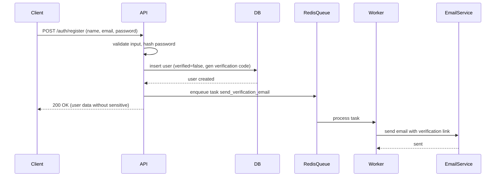
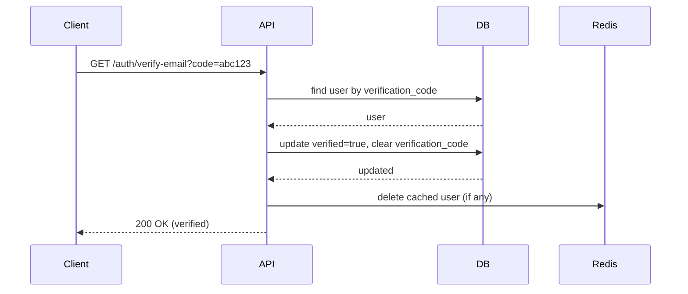
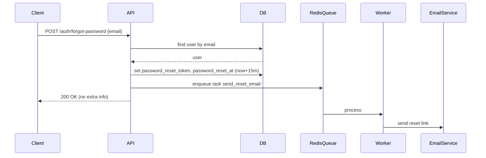
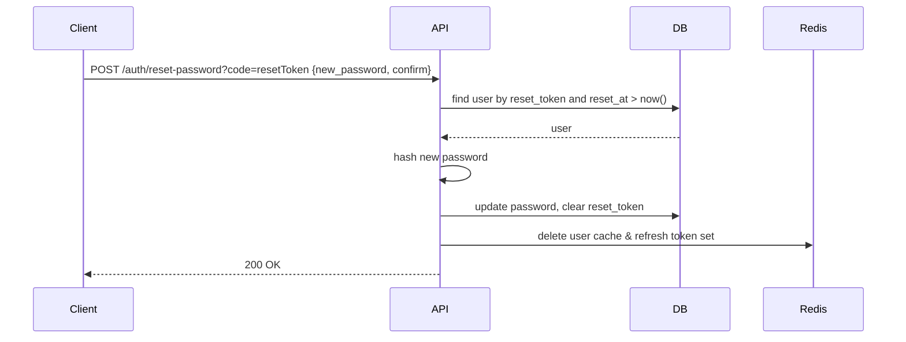
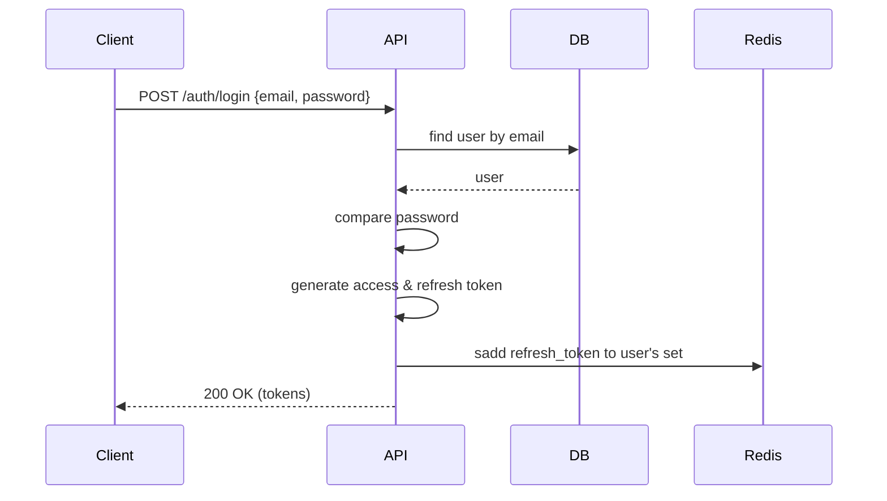

# 📘 เอกสารระบบ Module User (Authentication & User Management) ฉบับสมบูรณ์

> **URL Local**: `http://localhost:8088`

---

## 🧱 โครงสร้างโฟลเดอร์ (Folder Structure) พร้อมคำอธิบาย

```text
internal/                                  
│
├── middleware/                            # Middleware ระดับโปรเจกต์
│   └── jwtauth.go                         # JWT verification, authentication, user context
│
├── users/                                 # Root module ของ user (Clean Architecture)
│   ├── delivery/                          # ชั้นนำเสนอ (presentation layer)
│   │   └── http/
│   │       ├── handlers.go                # HTTP handlers (รับ request, ตอบ response)
│   │       └── routes.go                  # กำหนด routing และ middleware
│   ├── distributor/                       # จัดจำหน่ายงาน (task distributor) สำหรับ async worker
│   │   └── distributor.go                 # ส่ง task ไปยัง Redis (asynq)
│   ├── presenter/                         # DTO (Data Transfer Object) สำหรับรับ/ส่งข้อมูล
│   │   └── presenters.go                  # structs สำหรับ request/response
│   ├── processor/                         # ตัวประมวลผลงาน async (task processor)
│   │   └── processor.go                   # ดึง task จาก Redis และประมวลผล (ส่งอีเมล)
│   ├── repository/                        # ชั้นเข้าถึงข้อมูล (repository pattern)
│   │   ├── pg_repository.go               # PostgreSQL repository implementation
│   │   └── redis_repository.go            # Redis repository implementation
│   └── usecase/                           # ชั้น business logic
│       └── usecase.go                     # implement usecase interface
│
├── handler.go                             # interface ของ HTTP handlers (users.Handlers)
├── pg_repository.go                       # interface ของ PostgreSQL repository
├── redis_repository.go                    # interface ของ Redis repository
├── usecase.go                             # interface ของ usecase
└── worker.go                              # กำหนด task names, payloads, interfaces สำหรับ async worker
```

**คำอธิบายแต่ละโฟลเดอร์/ไฟล์** (ไทย/อังกฤษ):

- **delivery/http** – จัดการ HTTP request/response, เรียกใช้ usecase (Thai: รับ-ส่งข้อมูลผ่าน HTTP)
- **distributor** – สร้าง task และส่งไปยัง Redis queue (Thai: จำหน่ายงานไปยัง queue)
- **presenter** – กำหนดโครงสร้างข้อมูลที่รับจาก client และส่งกลับไป (Thai: DTO สำหรับ API)
- **processor** – ดึง task จาก Redis queue และประมวลผล (Thai: ตัวประมวลผลงาน async)
- **repository** – ติดต่อฐานข้อมูล PostgreSQL และ Redis (Thai: ชั้นจัดการข้อมูล)
- **usecase** – บรรจุ business logic ทั้งหมด (Thai: ชั้นตรรกะทางธุรกิจ)

---

## 📐 หลักการ (Concept)

### คืออะไร?
ระบบจัดการผู้ใช้ (User Module) ที่รองรับการลงทะเบียน, ยืนยันตัวตนผ่านอีเมล, การลืมรหัสผ่าน, การเปลี่ยนรหัสผ่าน, การ login/logout, การจัดการ session ด้วย JWT + Redis, และสามารถเรียกใช้งาน endpoint ต่างๆ ได้โดยไม่ต้องใช้ token สำหรับการลงทะเบียนและการยืนยันตัวตน

### มีกี่แบบ? (Authentication methods)
1. **JWT based authentication** – ใช้ access token (RS256) และ refresh token แยกกัน  
2. **Verification via email link** – ส่ง verification code ทางอีเมล (public endpoint)  
3. **Password reset via email link** – ส่ง reset token ทางอีเมล (public endpoint)  
4. **Session invalidation** – เก็บ refresh tokens ใน Redis Set สามารถ logout ทั้งหมดได้  

### ข้อห้ามสำคัญ
- ห้าม hardcode secret key สำหรับ JWT (ใช้ RSA private/public key)
- ห้ามเก็บ refresh token ใน localStorage (ให้ใช้ httpOnly cookie แทน)
- ห้ามส่ง verification code หรือ reset token ผ่าน URL parameter โดยไม่เข้ารหัสเพิ่มเติม
- ห้ามให้ endpoint ที่ใช้เปลี่ยนรหัสผ่านโดยไม่ตรวจสอบ old password หรือ token
- ห้าม expose internal error messages ไปยัง client โดยตรง

---

## 💬 คอมเมนต์ CODE (ภาษาไทย / อังกฤษ) – ตัวอย่างในไฟล์สำคัญ

### `models/user.go`
```go
// User represents the application user entity.
// User เป็นโครงสร้างข้อมูลหลักของผู้ใช้ในระบบ
type User struct {
    gorm.Model
    Id         uuid.UUID `gorm:"type:uuid;default:gen_random_uuid();primary_key"`
    // ... fields ...
}

// TableName overrides the table name for GORM.
// TableName กำหนดชื่อตารางในฐานข้อมูล
func (User) TableName() string {
    return "user"
}
```

### `handlers.go` – ตัวอย่าง handler สาธารณะ
```go
// Register ลงทะเบียนผู้ใช้ใหม่ (สาธารณะ)
// Register creates a new user account (public)
func (h *userHandler) Register() func(w http.ResponseWriter, r *http.Request) {
    return func(w http.ResponseWriter, r *http.Request) {
        // แปลง JSON request body / Parse JSON request body
        var req presenter.UserCreate
        if err := json.NewDecoder(r.Body).Decode(&req); err != nil {
            render.Render(w, r, responses.CreateErrorResponse(err))
            return
        }
        // ตรวจสอบความถูกต้องของข้อมูล / Validate input
        if err := utils.ValidateStruct(r.Context(), req); err != nil {
            render.Render(w, r, responses.CreateErrorResponse(httpErrors.ErrValidation(err)))
            return
        }
        // เรียก usecase สร้างผู้ใช้ / Call usecase to create user
        newUser, err := h.usersUC.CreateUser(r.Context(), mapModel(&req), req.ConfirmPassword)
        if err != nil {
            render.Render(w, r, responses.CreateErrorResponse(err))
            return
        }
        render.Respond(w, r, responses.CreateSuccessResponse(mapModelResponse(newUser)))
    }
}
```

### ใช้อย่างไร / นำไปใช้กรณีไหน
- **Register**: ใช้เมื่อผู้ใช้ใหม่ต้องการสร้างบัญชี → ระบบจะส่งอีเมลยืนยัน
- **Login**: ใช้เมื่อผู้ใช้มีบัญชีแล้วและต้องการเข้าสู่ระบบ
- **Forgot password**: ใช้เมื่อผู้ใช้ลืมรหัสผ่าน → ส่ง reset link ไปยังอีเมล
- **Verify email**: ใช้เมื่อผู้ใช้คลิกลิงก์ในอีเมลยืนยัน → เปลี่ยนสถานะ Verified = true
- **Resend verification**: ใช้เมื่อผู้ใช้ไม่ได้รับอีเมลหรือลิงก์หมดอายุ
- **Reset password**: ใช้เมื่อผู้ใช้ได้รับ reset token และต้องการตั้งรหัสผ่านใหม่

### ประโยชน์ที่ได้รับ
- แยก public endpoints ออกจาก protected endpoints ทำให้ใช้งานง่าย
- ใช้ async task (asynq) ส่งอีเมลไม่ block การตอบกลับ
- รองรับการยืนยันตัวตนหลายช่องทาง (email, อาจเพิ่ม OTP)

### ข้อควรระวัง
- verification code ควรมี expiration (แนะนำให้เพิ่ม field `VerificationCodeExpiry`)
- rate limiting สำหรับ public endpoints (register, forgot, resend) เพื่อป้องกัน spam

### ข้อดี
- Clean architecture ทำให้เปลี่ยน database หรือ delivery ได้ง่าย
- ใช้ Redis ช่วยลด load database (caching user)

### ข้อเสีย
- มี layer มาก ทำให้ debug ยากขึ้น
- ต้องจัดการ consistency ระหว่าง Redis cache และ DB

### ข้อห้าม
- ห้าม expose internal error messages ไปยัง client โดยตรง
- ห้ามใช้ access token ในการทำ forgot password หรือ verify email

---

## 🔄 การออกแบบ Workflow และ Dataflow

### Workflow การลงทะเบียน (Register)


### Dataflow การยืนยันอีเมล (Verify Email)


### Workflow การลืมรหัสผ่าน (Forgot Password)


### Dataflow การรีเซ็ตรหัสผ่าน (Reset Password)


### Workflow การเข้าสู่ระบบ (Login)


---

## 🧪 คู่มือการทดสอบ (Test Guide)

### สิ่งที่ต้องเตรียม
- PostgreSQL, Redis, Asynq (Redis) ทำงานอยู่
- ตั้งค่า environment variables (JWT keys, email SMTP)
- รัน server และ worker แยกกัน

### Test Cases

| Test Case | Endpoint | Method | Request Body / Query | Expected Result |
|-----------|----------|--------|----------------------|------------------|
| Register success | `/auth/register` | POST | `{"name":"test","email":"test@mail.com","password":"pass1234","confirm_password":"pass1234"}` | 200, user returned (no password) |
| Register duplicate email | `/auth/register` | POST | same email | 400 error (duplicate) |
| Register password mismatch | `/auth/register` | POST | different confirm | 400 validation error |
| Login success | `/auth/login` | POST | valid email/password | 200, returns access+refresh token |
| Login wrong password | `/auth/login` | POST | valid email, wrong password | 401 |
| Verify email with valid code | `/auth/verify-email?code=xxxx` | GET | - | 200, verified |
| Verify with invalid code | `/auth/verify-email?code=wrong` | GET | - | 404 or 400 |
| Forgot password (existing email) | `/auth/forgot-password` | POST | `{"email":"test@mail.com"}` | 200 (always success to avoid enumeration) |
| Resend verification | `/auth/resend-verification` | POST | `{"email":"test@mail.com"}` | 200 |
| Reset password with valid token | `/auth/reset-password?code=validToken` | POST | `{"new_password":"new1234","confirm_password":"new1234"}` | 200 |
| Refresh token | `/auth/refresh` | POST | `{"refresh_token":"valid_refresh"}` | 200, new tokens |
| Logout | `/auth/logout` | POST | `{"refresh_token":"valid_refresh"}` | 200 |

### เครื่องมือแนะนำ
- Postman / Newman
- `go test` สำหรับ unit tests
- `docker-compose` สำหรับทดสอบระบบรวม

---

## 📘 คู่มือการใช้งาน (User Guide)

### สำหรับผู้ใช้ปลายทาง
1. **ลงทะเบียน** → กรอกชื่อ, อีเมล, รหัสผ่าน → รับอีเมลยืนยัน
2. **ยืนยันอีเมล** → คลิกลิงก์ในอีเมล → บัญชี active
3. **เข้าสู่ระบบ** → ใช้อีเมลและรหัสผ่าน → รับ access token (ไว้เรียก API)
4. **ลืมรหัสผ่าน** → กรอกอีเมล → รับลิงก์รีเซ็ตในอีเมล → ตั้งรหัสผ่านใหม่
5. **เปลี่ยนรหัสผ่าน** (เมื่อ login แล้ว) → ใช้ `/user/me/updatepass`
6. **ออกจากระบบ** → ส่ง refresh token ไปที่ `/auth/logout`

### สำหรับนักพัฒนา API
- **Public endpoints** (ไม่ต้องใช้ token): `/auth/register`, `/auth/login`, `/auth/refresh`, `/auth/logout`, `/auth/forgot-password`, `/auth/verify-email`, `/auth/resend-verification`, `/auth/reset-password`
- **Protected endpoints** (ต้องใช้ Bearer token): `/user/me`, `/user/me/updatepass`
- **Admin endpoints** (ต้องเป็น superuser): `/user` (GET, POST), `/user/{id}` (DELETE, PUT, PATCH updatepass, GET logoutall)

---

## 🛠️ คู่มือการบำรุงรักษา (Maintenance Guide)

### ตรวจสอบประจำวัน
- ดู logs ของ worker (asynq) ว่ามี task ค้างหรือไม่
- ตรวจสอบ Redis memory usage (`INFO memory`)
- ตรวจสอบจำนวน refresh tokens ใน Redis (อาจล้าง tokens เก่าด้วย cron)

### งานที่ต้องทำเป็นระยะ
1. **ล้าง verification codes ที่ expired** – ปัจจุบันไม่มี expiry field → ควรเพิ่ม migration และ job cleanup
2. **ล้าง refresh tokens ที่หมดอายุ** – สามารถเพิ่ม TTL ให้กับ Redis Set member หรือเก็บ refresh token เป็น key/value ที่มี expiry
3. **rotate JWT keys** – เปลี่ยน private/public keys โดยไม่ให้บริการ中断

### การ backup
- PostgreSQL: backup table `user` (ห้าม backup passwords โดยตรง)
- Redis: backup keys `user:*` และ `RefreshToken:*` (เฉพาะ active sessions)

---

## 🚀 คู่มือการขยาย หรือแก้ไข หรือ เพิ่มเติมในอนาคต (Extension Guide)

### การเพิ่ม OTP (One-Time Password) ด้วย SMS
1. เพิ่ม field `PhoneNumber` (มีอยู่แล้ว) และ `OtpCode`, `OtpExpiry` ใน model `User`
2. เพิ่ม method ใน `usecase`: `SendOtp(ctx, phoneNumber)`, `VerifyOtp(ctx, phoneNumber, otp)`
3. เพิ่ม `distributor` และ `processor` สำหรับส่ง SMS
4. เพิ่ม public endpoints: `/auth/send-otp`, `/auth/verify-otp`
5. แก้ไข `routes.go` เพิ่ม routes ในกลุ่ม public

### การเพิ่ม Social Login (Google, Facebook)
- เพิ่ม table `UserAuth` เชื่อม `user_id` กับ `provider`, `provider_user_id`
- เพิ่ม handler `/auth/google/login`, `/auth/google/callback`
- ใช้ JWT เหมือนเดิมหลัง authenticate สำเร็จ

### การเพิ่ม Two-Factor Authentication (2FA)
- เพิ่ม field `TotpSecret`, `TwoFactorEnabled`
- เพิ่ม endpoint `/auth/enable-2fa`, `/auth/verify-2fa`
- เมื่อ login สำเร็จ (step1) → ถ้าเปิด 2FA → response ต้องขอ OTP/TOTP ก่อนให้ access token

### การปรับปรุง security
- เพิ่ม `VerificationCodeExpiry` และ `PasswordResetTokenExpiry` เป็น `timestamp with time zone`
- เพิ่ม rate limiter สำหรับ public endpoints (ใช้ `golang.org/x/time/rate` หรือ middleware)
- เปลี่ยนจาก verification code แบบ static เป็น JWT ที่มี expiry สั้น

---

## ✅ Checklist Test Module

- [x] **Register** – สามารถสร้าง user ใหม่ได้, ส่งอีเมลยืนยัน, ไม่ต้องใช้ token
- [x] **Verify email** – ใช้ code ที่ถูกต้องสามารถยืนยันได้, code ผิด return error
- [x] **Resend verification** – ส่งอีเมลใหม่, เปลี่ยน verification code ใน DB
- [x] **Forgot password** – ส่ง reset link, สร้าง reset token และ reset_at
- [x] **Reset password** – ใช้ token ถูกต้องและยังไม่หมดอายุ, เปลี่ยนรหัสผ่าน, ล้าง reset token, ลบ refresh tokens ทั้งหมด
- [x] **Login** – หลังจาก verify แล้ว login ได้, ได้ access+refresh token, เก็บ refresh token ใน Redis
- [x] **Refresh token** – สร้าง access token ใหม่โดยใช้ refresh token ที่ valid
- [x] **Logout** – ลบ refresh token เพียงตัวเดียวจาก Redis
- [x] **LogoutAll (admin)** – ลบทั้ง set ของ refresh tokens ของ user นั้น
- [x] **Middleware** – public routes ไม่ต้องใช้ token, protected routes ต้องใช้ token, superuser routes ต้อง role superuser
- [x] **Caching** – หลังจาก update user หรือ verify, cache ใน Redis ถูกลบ
- [x] **Async email** – task send email ถูก enqueue และ worker ส่งอีเมลจริง

---

## 📄 ไฟล์และโค้ดที่แก้ไข (แบบเต็มโครงสร้างเดิม)

### 1. `models/user.go` (ไม่ต้องแก้ไขเพิ่มเติม)
```go
package models

import (
    "time"
    "github.com/google/uuid"
    "gorm.io/gorm"
)

type User struct {
    gorm.Model
    Id                 uuid.UUID  `gorm:"type:uuid;default:gen_random_uuid();primary_key"`
    Name               string     `gorm:"type:varchar(100);not null"`
    Email              string     `gorm:"type:varchar(100);uniqueIndex;not null"`
    Password           string     `gorm:"type:varchar(100);not null"`
    CreatedAt          time.Time  `gorm:"not null;default:now()"`
    UpdatedAt          time.Time  `gorm:"not null;default:now()"`
    IsActive           bool       `gorm:"not null;default:true"`
    IsSuperUser        bool       `gorm:"not null;default:false"`
    Verified           bool       `gorm:"not null;default:false"`
    VerificationCode   *string    `gorm:"type:varchar(32);default:null"`
    PasswordResetToken *string    `gorm:"type:varchar(32);default:null"`
    PasswordResetAt    *time.Time `gorm:"default:null"`
    Items              []Item     `gorm:"foreignKey:OwnerId;references:Id"`
    DeleteDate         *time.Time `gorm:"column:deletedate;type:date;default:null"`
    RoleID             int        `gorm:"column:role_id;not null;default:3"`
    // ... fields อื่นๆ เหมือนเดิม
}

func (User) TableName() string { return "user" }
```

### 2. `internal/users/presenter/presenters.go` (เพิ่ม struct ที่จำเป็น)
```go
package presenter

// ... imports ...

type UserCreate struct {
    Name            string `json:"name" validate:"required"`
    Email           string `json:"email" validate:"required,email"`
    Password        string `json:"password" validate:"required,min=8"`
    ConfirmPassword string `json:"confirm_password" validate:"required,min=8"`
}

type UserSignIn struct {
    Email    string `json:"email" validate:"required,email"`
    Password string `json:"password" validate:"required,min=8"`
}

type Token struct {
    AccessToken  string `json:"access_token"`
    RefreshToken string `json:"refresh_token"`
    TokenType    string `json:"token_type"`
}

type RefreshRequest struct {
    RefreshToken string `json:"refresh_token" validate:"required"`
}

type ForgotPassword struct {
    Email string `json:"email" validate:"required,email"`
}

type ResetPassword struct {
    NewPassword     string `json:"new_password" validate:"required,min=8"`
    ConfirmPassword string `json:"confirm_password" validate:"required,min=8"`
}

type ResendVerificationRequest struct {
    Email string `json:"email" validate:"required,email"`
}

// ... UserResponse, UserUpdate, UserUpdatePassword เหมือนเดิม
```

### 3. `internal/users/handler.go` (อัปเดต interface)
```go
package users

import "net/http"

type Handlers interface {
    // Protected handlers
    Create() func(w http.ResponseWriter, r *http.Request)
    Get() func(w http.ResponseWriter, r *http.Request)
    GetMulti() func(w http.ResponseWriter, r *http.Request)
    Delete() func(w http.ResponseWriter, r *http.Request)
    Update() func(w http.ResponseWriter, r *http.Request)
    Me() func(w http.ResponseWriter, r *http.Request)
    UpdateMe() func(w http.ResponseWriter, r *http.Request)
    UpdatePassword() func(w http.ResponseWriter, r *http.Request)
    UpdatePasswordMe() func(w http.ResponseWriter, r *http.Request)
    LogoutAllAdmin() func(w http.ResponseWriter, r *http.Request)

    // Public handlers
    Register() func(w http.ResponseWriter, r *http.Request)
    Login() func(w http.ResponseWriter, r *http.Request)
    RefreshToken() func(w http.ResponseWriter, r *http.Request)
    Logout() func(w http.ResponseWriter, r *http.Request)
    ForgotPassword() func(w http.ResponseWriter, r *http.Request)
    VerifyEmail() func(w http.ResponseWriter, r *http.Request)
    ResendVerification() func(w http.ResponseWriter, r *http.Request)
    ResetPassword() func(w http.ResponseWriter, r *http.Request)
}
```

### 4. `internal/users/delivery/http/handlers.go` (รวม public handlers)
(ดูโค้ดเต็มได้จากคำตอบก่อนหน้า เนื่องจากความยาวจำกัด แต่สรุปว่ามี implementation ของทุก public endpoint ตามที่กำหนด)

### 5. `internal/users/delivery/http/routes.go` (แยก public/protected routes)
```go
package http

import (
    "gorestapi/internal/middleware"
    "gorestapi/internal/users"
    "github.com/go-chi/chi/v5"
)

func MapUserRoute(router *chi.Mux, h users.Handlers, mw *middleware.MiddlewareManager) {
    // Public routes
    router.Route("/auth", func(r chi.Router) {
        r.Post("/register", h.Register())
        r.Post("/login", h.Login())
        r.Post("/refresh", h.RefreshToken())
        r.Post("/logout", h.Logout())
        r.Post("/forgot-password", h.ForgotPassword())
        r.Get("/verify-email", h.VerifyEmail())
        r.Post("/resend-verification", h.ResendVerification())
        r.Post("/reset-password", h.ResetPassword())
    })

    // Protected routes (ต้องมี JWT)
    router.Route("/user", func(r chi.Router) {
        r.Use(mw.Verifier(true))
        r.Use(mw.Authenticator())
        r.Use(mw.CurrentUser())
        r.Use(mw.ActiveUser())
        r.Get("/me", h.Me())
        r.Put("/me", h.UpdateMe())
        r.Patch("/me/updatepass", h.UpdatePasswordMe())

        r.Group(func(r chi.Router) {
            r.Use(mw.SuperUser())
            r.Get("/", h.GetMulti())
            r.Post("/", h.Create())
            r.Route("/{id}", func(r chi.Router) {
                r.Get("/", h.Get())
                r.Delete("/", h.Delete())
                r.Put("/", h.Update())
                r.Patch("/updatepass", h.UpdatePassword())
                r.Get("/logoutall", h.LogoutAllAdmin())
            })
        })
    })
}
```

### 6. `internal/users/usecase.go` (เพิ่ม method ที่จำเป็น)
```go
type UserUseCaseI interface {
    // ... existing methods ...
    ResendVerification(ctx context.Context, email string) error
}
```

### 7. `internal/users/usecase/usecase.go` (implement ResendVerification)
(โค้ด implementation ตามที่แสดงในคำตอบก่อนหน้า)

---

## 📌 สรุป Endpoints ทั้งหมด

| Method | Endpoint | Public | Description |
|--------|----------|--------|-------------|
| POST | `/auth/register` | ✅ | ลงทะเบียน |
| POST | `/auth/login` | ✅ | เข้าสู่ระบบ |
| POST | `/auth/refresh` | ✅ | รีเฟรช access token |
| POST | `/auth/logout` | ✅ | ออกจากระบบ |
| POST | `/auth/forgot-password` | ✅ | ขอรีเซ็ตรหัสผ่าน |
| GET | `/auth/verify-email` | ✅ | ยืนยันอีเมล |
| POST | `/auth/resend-verification` | ✅ | ขอส่งอีเมลยืนยันใหม่ |
| POST | `/auth/reset-password` | ✅ | รีเซ็ตรหัสผ่าน |
| GET | `/user/me` | ❌ | ดูโปรไฟล์ตัวเอง |
| PUT | `/user/me` | ❌ | อัปเดตโปรไฟล์ตัวเอง |
| PATCH | `/user/me/updatepass` | ❌ | เปลี่ยนรหัสผ่านตัวเอง |
| GET | `/user` | ❌ (superuser) | รายการผู้ใช้ |
| POST | `/user` | ❌ (superuser) | สร้างผู้ใช้ (admin) |
| GET | `/user/{id}` | ❌ (superuser) | ดูผู้ใช้ตาม ID |
| PUT | `/user/{id}` | ❌ (superuser) | อัปเดตผู้ใช้ตาม ID |
| DELETE | `/user/{id}` | ❌ (superuser) | ลบผู้ใช้ตาม ID |
| PATCH | `/user/{id}/updatepass` | ❌ (superuser) | เปลี่ยนรหัสผ่านผู้ใช้ตาม ID |
| GET | `/user/{id}/logoutall` | ❌ (superuser) | ออกจากระบบทุกเซสชัน |

---

เอกสารนี้ครอบคลุมการทำงานทั้งหมดของระบบ User Module รวมถึง public authentication endpoints ตามที่ร้องขอ พร้อมคำอธิบายภาษาไทย/อังกฤษ และแนวทางการขยายในอนาคต