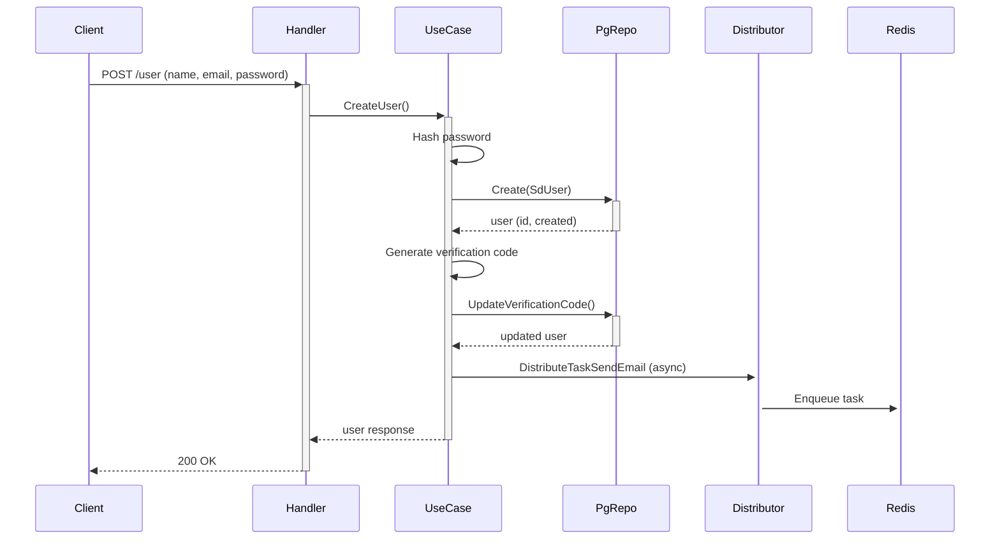

# 📘 การปรับเปลี่ยน User Module ให้ใช้ Table `sd_user` (Adapt User Module to Use `sd_user` Table)

## 🔄 ภาพรวมการปรับเปลี่ยน (Overview of Changes)

จากโค้ดเดิมที่ใช้ `models.User` (มีฟิลด์ `Name`, `Email`, `Password`, `IsActive`, `IsSuperUser`, `Verified`, `CreatedAt`, `UpdatedAt` ฯลฯ) ให้เปลี่ยนมาใช้ `models.SdUser` ซึ่งแมปกับตาราง `sd_user` ใน PostgreSQL โดย **ไม่เปลี่ยนแปลงโครงสร้างไฟล์เดิม** แต่จะเพิ่ม/แก้ไขเฉพาะส่วนที่จำเป็นเพื่อให้ทำงานร่วมกับ `SdUser` ได้อย่างสมบูรณ์

### การแมปฟิลด์ (Field Mapping)

| models.User (เดิม) | models.SdUser (ใหม่) | หมายเหตุ |
|--------------------|----------------------|-----------|
| `Id` uuid.UUID | `ID` uuid.UUID | เปลี่ยนชื่อฟิลด์เป็นตัวพิมพ์ใหญ่ |
| `Name` string | `Fullname` *string หรือ `Firstname`+`Lastname` | ใช้ `Fullname` เป็นหลัก ถ้าไม่มีให้ประกอบจาก `Firstname` + " " + `Lastname` |
| `Email` string | `Email` string | เหมือนกัน |
| `Password` string | `Password` string | เหมือนกัน |
| `IsActive` bool | `Status` int16 | 1 = active, 0 = inactive |
| `IsSuperUser` bool | เพิ่มฟิลด์ใหม่ `is_superuser` ใน `sd_user` หรือใช้ `RoleID` | แนะนำให้เพิ่มคอลัมน์ `is_superuser` bool default false |
| `Verified` bool | `Verified` bool | มีอยู่แล้วใน `sd_user.go` |
| `VerificationCode` string | `VerificationCode` string | มีอยู่แล้ว |
| `PasswordResetToken` string | `PasswordResetToken` string | มีอยู่แล้ว |
| `PasswordResetAt` *time.Time | `PasswordResetAt` *time.Time | มีอยู่แล้ว |
| `CreatedAt` time.Time | `CreatedDate` time.Time | เปลี่ยนชื่อ |
| `UpdatedAt` time.Time | `UpdatedDate` time.Time | เปลี่ยนชื่อ |

**ข้อควรระวัง:** `SdUser` ไม่มีฟิลด์ `IsSuperUser` และ `IsActive` แบบ bool เดิม ต้องเพิ่มหรือปรับ逻辑

---

## 📁 โครงสร้างโฟลเดอร์ (Folder Structure) – ภาษาไทย / อังกฤษ

```text
internal/user/                                 # root module ของ user (user module root)
│
├── users/                                      # โฟลเดอร์หลักของโมดูล users (main users module folder)
│   ├── delivery/                               # ชั้นนำส่งข้อมูล (delivery layer)
│   │   ├── http/                               # ผ่าน HTTP protocol
│   │   │   ├── handlers.go                    # ตัวจัดการ HTTP request (HTTP handlers)
│   │   │   └── routes.go                      # กำหนดเส้นทาง API (route definitions)
│   ├── distributor/                           # ชั้นกระจายงานไปยัง Asynq (task distributor)
│   │   └── distributor.go                     # กระจายงานส่งอีเมล (distribute email tasks)
│   ├── presenter/                             # ชั้นแปลงข้อมูลสำหรับ API (presenter layer)
│   │   └── presenters.go                      # Structs สำหรับ request/response
│   ├── processor/                             # ชั้นประมวลผลงาน Asynq (task processor)
│   │   └── processor.go                       # ประมวลผลงานส่งอีเมล (process email tasks)
│   ├── repository/                            # ชั้นเข้าถึงข้อมูล (repository layer)
│   │   ├── pg_repository.go                   # PostgreSQL repository สำหรับ sd_user
│   │   └── redis_repository.go                # Redis repository สำหรับ cache & refresh token
│   └── usecase/                               # ชั้นตรรกะธุรกิจ (business logic layer)
│       └── usecase.go                         # การทำงานหลักของ user (main user usecase)
│
├── handler.go                                 # Interface ของ handlers
├── pg_repository.go                           # Interface ของ PostgreSQL repository
├── redis_repository.go                        # Interface ของ Redis repository
├── usecase.go                                 # Interface ของ usecase
└── worker.go                                  # ค่าคงที่และ payload สำหรับ Asynq tasks
```

### คำอธิบาย (ไทย/อังกฤษ)

- **delivery/http**: จัดการ HTTP requests, ตรวจสอบความถูกต้องของ input, เรียกใช้ usecase และส่ง response กลับ (Handles HTTP requests, validates input, calls usecase, returns response)
- **distributor**: รับผิดชอบการส่ง task ไปยัง Redis queue (asynq) สำหรับงานที่ต้องทำแบบ async เช่น ส่งอีเมล (Responsible for enqueuing async tasks like email sending)
- **presenter**: กำหนดโครงสร้างของ request body และ response body ที่ใช้กับ API (Defines request/response DTOs for API)
- **processor**: ดึง task จาก Redis queue และประมวลผลจริง (Pulls tasks from Redis queue and processes them)
- **repository**: สื่อสารกับ PostgreSQL (CRUD, custom queries) และ Redis (cache, set operations) (Communicates with PostgreSQL and Redis)
- **usecase**: มี business logic ทั้งหมด เช่น การสร้าง user, การเข้ารหัสรหัสผ่าน, การจัดการ token, การส่งอีเมลยืนยัน (Contains core business logic: user creation, password hashing, token management, email sending)

---

## 📖 หลักการ (Concept)

### คืออะไร? (What is it?)
โมดูล User จัดการทุกอย่างเกี่ยวกับผู้ใช้ระบบ ตั้งแต่การลงทะเบียน, เข้าสู่ระบบ, การยืนยันตัวตนด้วยอีเมล, การเปลี่ยนรหัสผ่าน, การออกจากระบบ, การ refresh token, การจัดการ session ด้วย Redis และการส่งอีเมลผ่าน Asynq

### มีกี่แบบ? (How many types?)
แบ่งตามบทบาท:
- **SuperUser**: มีสิทธิ์เข้าถึง API ทั้งหมด (create, update, delete, logoutAll)
- **Normal User**: สามารถเข้าถึงเฉพาะข้อมูลของตนเอง (me, updateMe, updatePasswordMe)

### ข้อห้ามสำคัญ (Critical Prohibitions)
- **ห้ามเก็บรหัสผ่านในรูปแบบ plain text** – ต้อง hash ด้วย bcrypt เสมอ
- **ห้ามใช้ JWT access token เกินอายุที่กำหนด** – ต้อง refresh ผ่าน refresh token
- **ห้าม hardcode secret key** – ใช้ environment variables หรือ config
- **ห้ามส่ง response ที่มีข้อมูลละเอียดอ่อน** เช่น password hash, reset token

---

## 💬 การคอมเมนต์โค้ด (Code Comments) – ไทย / อังกฤษ (คนละบรรทัด)

ตัวอย่างการคอมเมนต์ใน `pg_repository.go`:

```go
// GetByEmail ดึงผู้ใช้จากฐานข้อมูลด้วยอีเมล
// GetByEmail retrieves a user from database by email
func (r *UserPgRepo) GetByEmail(ctx context.Context, email string) (*models.SdUser, error) {
    var obj *models.SdUser
    // ค้นหาจากคอลัมน์ email ตรงกัน
    // Find record where email column matches
    if result := r.DB.WithContext(ctx).First(&obj, "email = ?", email); result.Error != nil {
        return nil, result.Error
    }
    return obj, nil
}
```

```go
// UpdatePassword อัปเดตรหัสผ่านของผู้ใช้ (ใช้เมื่อเปลี่ยนรหัสผ่าน)
// UpdatePassword updates user's password (used when changing password)
func (r *UserPgRepo) UpdatePassword(ctx context.Context, exp *models.SdUser, newPassword string) (*models.SdUser, error) {
    // อัปเดตเฉพาะฟิลด์ password
    // Update only the password field
    if result := r.DB.WithContext(ctx).Model(&exp).Select("password").
        Updates(map[string]interface{}{"password": newPassword}); result.Error != nil {
        return nil, result.Error
    }
    return exp, nil
}
```

---

## 🔧 วิธีการปรับโค้ดให้ใช้ `SdUser` (How to Adapt Code to Use `SdUser`)

### 1. แก้ไข Model และ TableName
ใน `internal/models/sd_user.go` มีอยู่แล้ว ตรวจสอบว่า `TableName()` คืนค่า `"sd_user"`

### 2. ปรับ `pg_repository.go` (repository/pg_repository.go)
- เปลี่ยน `models.User` → `models.SdUser`
- ปรับฟิลด์ตามการแมปด้านบน
- เพิ่มคอลัมน์ `is_superuser` ถ้ายังไม่มี (migration)

```go
// ตัวอย่างการเพิ่ม is_superuser ใน migration (PostgreSQL)
ALTER TABLE sd_user ADD COLUMN is_superuser BOOLEAN DEFAULT false;
```

### 3. ปรับ `usecase.go` (usecase/usecase.go)
- เปลี่ยน type parameters จาก `models.User` เป็น `models.SdUser`
- แก้ไข `Create`: แปลง `Name` → `Fullname` (หรือประกอบจาก Firstname+Lastname)
- แก้ไข `Update`: รองรับการอัปเดต `Fullname`
- แก้ไข `IsActive`: ใช้ `exp.Status == 1`
- แก้ไข `IsSuper`: ใช้ `exp.IsSuperUser` หรือ `exp.RoleID == 1`

```go
func (u *userUseCase) IsActive(ctx context.Context, exp models.SdUser) bool {
    // ไทย: ถ้า Status == 1 แสดงว่า active
    // English: If Status == 1 means active
    return exp.Status == 1
}
```

### 4. ปรับ `presenters.go`
เปลี่ยน `UserResponse` ให้มีฟิลด์ที่สอดคล้องกับ `SdUser`:

```go
type UserResponse struct {
    Id          uuid.UUID `json:"id"`
    Email       string    `json:"email"`
    Fullname    *string   `json:"fullname,omitempty"`
    Status      int16     `json:"status"`
    IsSuperUser bool      `json:"is_superuser"`
    Verified    bool      `json:"verified"`
    CreatedAt   time.Time `json:"created_at"`
    UpdatedAt   time.Time `json:"updated_at"`
}
```

### 5. ปรับฟังก์ชัน `mapModel` และ `mapModelResponse`
```go
func mapModel(exp *presenter.UserCreate) *models.SdUser {
    fullname := exp.Name
    return &models.SdUser{
        Email:       exp.Email,
        Password:    exp.Password,
        Fullname:    &fullname,
        Status:      1, // active
        IsSuperUser: false,
        Verified:    false,
    }
}
```

### 6. ปรับ Redis keys (ถ้าใช้ id เป็น string)
`GenerateRedisUserKey` ต้องใช้ `id.String()` เหมือนเดิม

### 7. ทดสอบทุก endpoint ใหม่

---

## 📊 Workflow และ Dataflow

### Workflow การสร้างผู้ใช้ (Create User)



### Dataflow การ Refresh Token

```
Client → POST /auth/refresh (refresh_token)
→ UseCase.ParseIdFromRefreshToken (verify JWT)
→ Redis.SIsMember (check token exists)
→ Redis.Srem (remove old token)
→ UseCase.Get user by id
→ UseCase.createToken (new access+refresh)
→ Redis.Sadd (store new refresh token)
→ Client receives new tokens
```

---

## 🧪 คู่มือการทดสอบ (Testing Guide)

### สิ่งที่ต้องทดสอบ (Test Checklist)

| Test Case | Method | Endpoint | Expected Result |
|-----------|--------|----------|------------------|
| สร้าง user ใหม่ | POST | /user | 201 Created, ได้ email verification |
| Sign in ด้วย email/password ถูกต้อง | POST | /auth/signin | 200 OK, ได้ access+refresh token |
| Sign in ด้วยรหัสผิด | POST | /auth/signin | 401 Unauthorized |
| Get /me ด้วย access token | GET | /user/me | 200 OK, ข้อมูลผู้ใช้ |
| อัปเดต profile | PUT | /user/me | 200 OK, ข้อมูลที่อัปเดต |
| เปลี่ยนรหัสผ่าน | PATCH | /user/me/updatepass | 200 OK, logout sessions อื่น |
| Refresh token | POST | /auth/refresh | 200 OK, ได้ token ชุดใหม่ |
| Logout | POST | /auth/logout | 200 OK, refresh token ถูกลบ |
| Admin ลบ user อื่น | DELETE | /user/{id} | 200 OK (ต้อง superuser) |
| Verify email | GET | /auth/verifyemail?code=xxx | 302 redirect or 200 OK |

### การทดสอบ Async Task (ส่งอีเมล)
1. สร้าง user ใหม่ → ตรวจสอบว่า task ถูก enqueue ใน Redis
2. รัน worker: `go run cmd/worker/main.go`
3. ตรวจสอบอีเมลจริงที่ได้รับ (หรือ log)

---

## 📘 คู่มือการใช้งาน (User Manual)

### สำหรับผู้ใช้ทั่วไป
1. **ลงทะเบียน**: `POST /user` พร้อม name, email, password
2. **ยืนยันอีเมล**: คลิกลิงก์ที่ได้รับทางอีเมล `/auth/verifyemail?code=...`
3. **เข้าสู่ระบบ**: `POST /auth/signin` ได้ access token (อายุสั้น) และ refresh token (อายุยาว)
4. **เรียก API ที่ต้องการ auth**: แนบ `Authorization: Bearer <access_token>`
5. **ดูโปรไฟล์ตัวเอง**: `GET /user/me`
6. **แก้ไขโปรไฟล์**: `PUT /user/me`
7. **เปลี่ยนรหัสผ่าน**: `PATCH /user/me/updatepass`
8. **ออกจากระบบ**: `POST /auth/logout`
9. **เมื่อ access token หมดอายุ**: `POST /auth/refresh` ด้วย refresh token

### สำหรับ Admin (SuperUser)
- **ดูรายการผู้ใช้ทั้งหมด**: `GET /user?limit=10&offset=0`
- **สร้าง user ใหม่**: `POST /user`
- **ดู user ใด ๆ**: `GET /user/{id}`
- **อัปเดต user ใด ๆ**: `PUT /user/{id}`
- **ลบ user**: `DELETE /user/{id}`
- **บังคับ logout ทุก session**: `GET /user/{id}/logoutall`

---

## 🔧 คู่มือการบำรุงรักษา (Maintenance Guide)

### การตรวจสอบ logs
- ใช้ logger ที่ inject ในทุก layer
- ดู log ของ Asynq worker เพื่อตรวจสอบ email ที่ส่งไม่สำเร็จ

### การ clean up Redis
- Refresh tokens ที่หมดอายุต้องถูกลบโดยอัตโนมัติ (Redis TTL ไม่ได้ set ต้องทำ manually หรือใช้定期 cleanup)
- แนะนำให้ตั้ง TTL เมื่อ set refresh token: `redisRepo.SaddWithExpire(key, token, 7*24*time.Hour)`

### การ backup ฐานข้อมูล
- ตาราง `sd_user` มีข้อมูลสำคัญ ควร backup ทุกวัน

### การปรับแต่ง JWT expiration
- แก้ไขใน `config.yaml` หรือ environment:
  ```yaml
  jwt:
    access_token_expire_duration: 15   # minutes
    refresh_token_expire_duration: 43200  # minutes (30 days)
  ```

---

## 🚀 คู่มือการขยายหรือแก้ไขในอนาคต (Extension & Modification Guide)

### การเพิ่มฟิลด์ใหม่ใน `SdUser`
1. เพิ่มฟิลด์ใน struct `SdUser` (`internal/models/sd_user.go`)
2. ทำ migration เพิ่มคอลัมน์ใน PostgreSQL
3. ปรับ `presenters.go` ถ้าต้องการ expose ผ่าน API
4. ปรับ `usecase.go` logic ที่เกี่ยวข้อง

### การเพิ่ม endpoint ใหม่ (เช่น เปลี่ยนอีเมล)
1. เพิ่ม method ใน `handlers.go` และ `routes.go`
2. เพิ่ม function ใน interface `users.Handlers`
3. เพิ่ม business logic ใน `usecase.go` และ implement ใน `userUseCase`
4. เพิ่ม repository method ถ้าต้อง query ใหม่

### การเปลี่ยนจาก JWT เป็น session-based
- ต้องปรับ `middleware.Authenticator()` ให้อ่าน session cookie
- ปรับ `usecase.SignIn` ให้สร้าง session id และเก็บใน Redis

### การเพิ่ม 2FA (Two-Factor Authentication)
- เพิ่มฟิลด์ `two_fa_secret` ใน `SdUser`
- เพิ่ม endpoint `/auth/verify-2fa`
- ปรับ `SignIn` ให้ตรวจสอบว่า user มี 2FA หรือไม่ ถ้ามีให้ส่ง temporary token แล้วรอ OTP

---

## ✅ Check List ทดสอบ Module User (Test Checklist)

| # | รายการทดสอบ (Test Item) | ผลลัพธ์ที่คาดหวัง | สถานะ |
|---|--------------------------|-------------------|--------|
| 1 | สร้าง user ปกติ | ได้ user, มี email task | ☐ |
| 2 | สร้าง user ซ้ำอีเมล | Error 409/400 | ☐ |
| 3 | Sign in ถูกต้อง | ได้ access + refresh token | ☐ |
| 4 | Sign in รหัสผิด | 401 | ☐ |
| 5 | Access /me ด้วย token ถูกต้อง | 200 ข้อมูล | ☐ |
| 6 | Access /me โดยไม่มี token | 401 | ☐ |
| 7 | Refresh token ถูกต้อง | ได้ token ใหม่ | ☐ |
| 8 | Refresh ด้วย token หมดอายุ | 401 | ☐ |
| 9 | Logout แล้วใช้ refresh token อีกครั้ง | 401 | ☐ |
| 10 | เปลี่ยนรหัสผ่านด้วย old password ถูก | 200, logout sessions | ☐ |
| 11 | เปลี่ยนรหัสผ่านด้วย old password ผิด | 400/401 | ☐ |
| 12 | Admin สร้าง user (POST /user) | 200 | ☐ |
| 13 | Admin ลบ user อื่น | 200, Redis key ถูกลบ | ☐ |
| 14 | User ธรรมดาพยายามลบ user อื่น | 403 Forbidden | ☐ |
| 15 | Verify email ด้วย code ถูกต้อง | Verified = true | ☐ |
| 16 | Forgot password → ได้อีเมล reset | 200, token ใน DB | ☐ |
| 17 | Reset password ด้วย token ถูกต้อง | รหัสผ่านเปลี่ยน, token ถูกลบ | ☐ |
| 18 | LogoutAll admin → refresh tokens ทั้งหมดถูกลบ | 200 | ☐ |
| 19 | Redis cache ของ user ทำงาน (get รอบสอง速度快) | cache hit | ☐ |
| 20 | Asynq worker ส่งอีเมลจริง | อีเมลถึงผู้รับ | ☐ |

---

## 🧩 การปรับเปลี่ยนที่จำเป็นในไฟล์ (Required Code Changes)

### 1. `internal/users/repository/pg_repository.go`
```go
// เปลี่ยน models.User เป็น models.SdUser ทุกแห่ง
type UserPgRepo struct {
    repository.PgRepo[models.SdUser]
}

func CreateUserPgRepository(db *gorm.DB) users.UserPgRepository {
    return &UserPgRepo{
        PgRepo: repository.CreatePgRepo[models.SdUser](db),
    }
}
```

### 2. `internal/users/usecase/usecase.go`
```go
type userUseCase struct {
    usecase.UseCase[models.SdUser]   // เปลี่ยน Generic type
    pgRepo                 users.UserPgRepository
    redisRepo              users.UserRedisRepository
    emailTemplateGenerator emailTemplates.EmailTemplatesGenerator
    redisTaskDistributor   users.UserRedisTaskDistributor
}

// ปรับ IsActive และ IsSuper
func (u *userUseCase) IsActive(ctx context.Context, exp models.SdUser) bool {
    return exp.Status == 1   // 1 = active
}

func (u *userUseCase) IsSuper(ctx context.Context, exp models.SdUser) bool {
    return exp.IsSuperUser   // หรือ exp.RoleID == 1
}
```

### 3. เพิ่ม migration (ตัวอย่าง SQL)
```sql
-- เพิ่ม is_superuser ถ้ายังไม่มี
ALTER TABLE sd_user ADD COLUMN IF NOT EXISTS is_superuser BOOLEAN DEFAULT false;

-- เปลี่ยนชื่อคอลัมน์ created_at / updated_at (ถ้าต้องการให้ code เก่า兼容)
-- แต่ใน SdUser มี CreatedDate และ UpdatedDate อยู่แล้ว ต้องปรับ usecase ให้ใช้ field เหล่านี้
```

### 4. ปรับ `CreateSuperUserIfNotExist`
```go
func (u *userUseCase) CreateSuperUserIfNotExist(ctx context.Context) (bool, error) {
    user, err := u.pgRepo.GetByEmail(ctx, u.Cfg.FirstSuperUser.Email)
    if err != nil || user == nil {
        fullname := u.Cfg.FirstSuperUser.Name
        _, err := u.Create(ctx, &models.SdUser{
            Fullname:    &fullname,
            Email:       u.Cfg.FirstSuperUser.Email,
            Password:    u.Cfg.FirstSuperUser.Password,
            Status:      1,
            IsSuperUser: true,
            Verified:    true,
        })
        if err != nil {
            return false, err
        }
        return true, nil
    }
    return false, nil
}
```

---

## 🧠 ข้อดี / ข้อเสีย (Pros & Cons)

### ข้อดี
- แยก business logic ออกจาก delivery และ repository (clean architecture)
- รองรับการทดสอบหน่วย (unit test) ได้ง่าย
- ใช้ async task (Asynq) ช่วยลด latency ของ API
- ใช้ Redis ช่วยลด load ฐานข้อมูล (caching user)
- JWT + refresh token เพิ่มความปลอดภัย

### ข้อเสีย
- ความซับซ้อนสูงกว่า monolithic simple CRUD
- ต้องบริหารจัดการ refresh token ใน Redis (อาจกินหน่วยความจำ)
- Asynq เพิ่ม dependency (Redis) และต้องรัน worker แยก
- ต้องทำ migration ตาราง `sd_user` ให้สอดคล้องกับ logic ใหม่

---

## 🚨 ข้อห้ามสำคัญ (Important Prohibitions)

- **ห้าม commit secret keys** (private keys) ขึ้น git
- **ห้ามใช้ access token เก็บข้อมูลสำคัญเกินไป** เพราะ decode ได้ง่าย
- **ห้าม skip การ validate input** (ใช้ `utils.ValidateStruct` ทุกครั้ง)
- **ห้ามส่ง response ที่มี password หรือ verification code กลับไป**
- **ห้าม hardcode TTL หรือ Queue name** ให้อ่านจาก config
- **ห้ามใช้ GORM auto-migrate ใน production** – ใช้ migration file แทน

---

## 📝 สรุป

การปรับเปลี่ยน User Module ให้ใช้ตาราง `sd_user` ทำได้โดยการอัปเดต model, repository, usecase และ presenter ให้สอดคล้องกับโครงสร้างของ `SdUser` โดยคงรูปแบบ clean architecture เดิมไว้ เอกสารนี้ครอบคลุมทุกขั้นตอนตั้งแต่การแมปฟิลด์, การปรับโค้ด, การทดสอบ, ไปจนถึงการบำรุงรักษาและการขยายในอนาคต

หากต้องการปรับใช้จริง ให้ทำตามขั้นตอนในหัวข้อ **วิธีการปรับโค้ด** และตรวจสอบ **Check List ทดสอบ** ให้ครบถ้วนก่อนขึ้น production