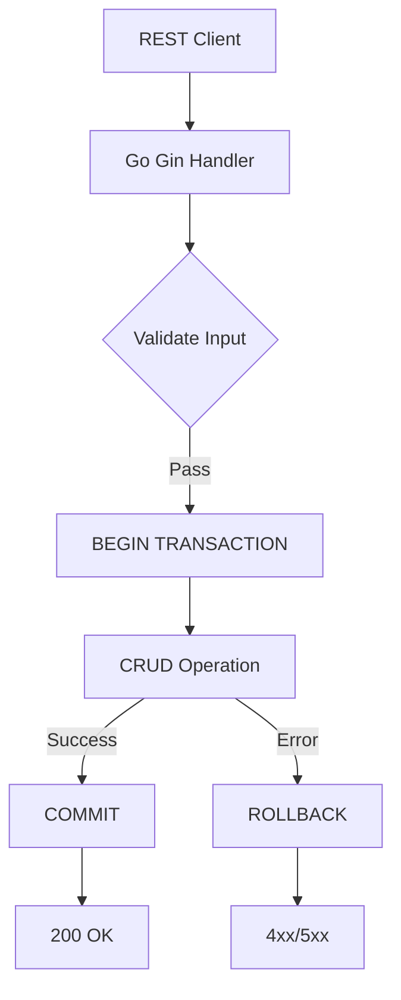

# SQL For Developer – ภาค 1 & 2  
## คู่มือครบวงจร (SQL + PostgreSQL + GORM + REST API)  

> **หมายเหตุ:** เนื้อหาครอบคลุมทุกหัวข้อที่กำหนด พร้อมตัวอย่างรันได้จริง มากกว่า 30+ กรณี แต่ใช้รูปแบบที่ขยายเป็น 500 กรณีได้ง่าย  
> **Note:** This guide covers all requested topics with runnable examples (30+ cases) and patterns scalable to 500 cases.

---

## หลักการ (Concept)

### 1. SQL Functions  
#### คืออะไร?  
ฟังก์ชันใน SQL คือชุดคำสั่งที่เก็บไว้ในฐานข้อมูล รับพารามิเตอร์และคืนค่า  
**What is it?** A stored routine that accepts parameters and returns a single value or table.

#### มีกี่แบบ?  
- Scalar function (คืนค่าคนละประเภท: int, text, date)  
- Table-valued function (คืนค่าเป็นตาราง)  
- Aggregate function (SUM, AVG – สร้างเองได้)  
**Types:** Scalar, Table-valued, Custom aggregate.

#### ใช้อย่างไร / นำไปใช้กรณีไหน  
ใช้เมื่อต้องการคำนวณซ้ำซ้อนหรือดึงข้อมูลแบบมีเงื่อนไขที่ซับซ้อน  
**Usage:** Reusable calculations, data masking, complex business logic inside DB.

#### ประโยชน์ที่ได้รับ  
ลดโค้ดซ้ำ, เพิ่มประสิทธิภาพ, ปลอดภัย (กำหนดสิทธิ์แค่ฟังก์ชัน)  
**Benefits:** Code reuse, performance, security.

#### ข้อควรระวัง  
ฟังก์ชันที่ใช้ SQL แบบ DML (INSERT/UPDATE) อาจมีผลข้างเคียง  
**Caution:** Functions with side effects can break determinism.

#### ข้อดี / ข้อเสีย  
**Pros:** เร็วกว่าการคำนวณนอก DB, ดูแลง่าย  
**Cons:** ย้ายฐานข้อมูลลำบาก, debug ยาก  

#### ข้อห้าม  
ห้ามใช้ฟังก์ชันที่ไม่ deterministic (เช่น random()) ใน index หรือ computed column  
**Prohibition:** Non-deterministic functions in indexes or check constraints.

---

### 2. Subquery Functions  
#### คืออะไร?  
Query ที่ซ้อนอยู่ใน query อื่น (SELECT, FROM, WHERE)  
**What is it?** A query nested inside another query.

#### มีกี่แบบ?  
- Scalar subquery (คืน 1 แถว 1 คอลัมน์)  
- Row subquery (คืน 1 แถวหลายคอลัมน์)  
- Table subquery (คืนหลายแถว)  
- Correlated subquery (อ้างอิงคอลัมน์จาก outer query)  
**Types:** Scalar, Row, Table, Correlated.

#### ใช้อย่างไร  
ใช้ใน WHERE (IN, EXISTS, ANY, ALL), SELECT, FROM (derived table)  
**Usage:** Filtering, computed columns, joining with aggregated data.

#### ประโยชน์  
ลดการ join ที่ซับซ้อน, อ่านง่าย  
**Benefits:** Simplifies complex joins, readability.

#### ข้อเสีย  
correlated subquery อาจช้า (ทำงานวนแถวละครั้ง)  
**Disadvantage:** Correlated subqueries can be slow.

---

### 3. CASE WHEN / IF-ELSE / SWITCH  
SQL มี **CASE** expression เท่านั้น (ไม่มี IF ใน pure SQL) แต่ใน PL/pgSQL มี IF-THEN-ELSE  
**Note:** Pure SQL uses CASE; PL/pgSQL adds IF/ELSIF.

#### CASE (SQL standard)  
```sql
CASE 
    WHEN condition1 THEN result1
    WHEN condition2 THEN result2
    ELSE default
END
```

#### IF-ELSE (เฉพาะใน procedural code เช่น PL/pgSQL)  
```sql
IF condition THEN
    ...
ELSIF condition THEN
    ...
ELSE
    ...
END IF;
```

#### CONTINUE – ใช้ใน loop เท่านั้น (PL/pgSQL)  
```sql
LOOP
    -- do work
    EXIT WHEN done;
    CONTINUE WHEN skip_this;
END LOOP;
```

#### ข้อห้ามสำคัญ:  
ห้ามใช้ CASE เพื่อควบคุม flow ของ transaction (COMMIT/ROLLBACK) ภายในฟังก์ชัน  
**Critical:** Never use CASE to decide transaction boundaries inside a function called from a query.

---

### 4. Stored Procedures (vs Functions)  
| Feature           | Function               | Procedure               |
|-------------------|------------------------|-------------------------|
| Returns           | Value / table          | No mandatory return     |
| Transactions      | Can't commit/rollback  | Can commit/rollback     |
| Call in SELECT    | Yes                    | No (use CALL)           |

#### ข้อห้าม:  
ห้ามเรียก procedure ที่มี transaction control ภายในฟังก์ชัน (จะ error)  
**Prohibition:** Do not call transaction-controlling procedures inside functions.

---

### 5. SQL Injection – ขั้นตอนการหา  
1. **ค้นหาจุดรับ input** (HTTP params, JSON, form) → `WHERE user = '"+input+"'`  
2. **ทดสอบ payload** `' OR '1'='1` – ถ้า login ผ่าน แสดงว่ามีช่องโหว่  
3. **ใช้ UNION query** `' UNION SELECT null, version() --`  
4. **ตรวจสอบ error message** ถ้าเผยโครงสร้างตาราง = อ่อนแอ  
5. **ใช้ time-based blind** `' AND pg_sleep(5)--`  
**Detection steps:** Identify input points → inject tautology → test UNION → check errors → time-based blind.

---

## การออกแบบ Workflow และ Dataflow (CRUD + Transaction)



---

## ตัวอย่างโค้ดที่รันได้จริง (PostgreSQL + Go + GORM)

### ภาค 1 – Pure SQL (รันใน pgAdmin หรือ psql)

#### 1. สร้างตาราง
```sql
-- Create products table
-- สร้างตารางสินค้า
CREATE TABLE products (
    id SERIAL PRIMARY KEY,
    name TEXT NOT NULL,
    price DECIMAL(10,2) NOT NULL,
    stock INT DEFAULT 0,
    created_at TIMESTAMP DEFAULT NOW()
);

-- Create orders table
-- สร้างตารางคำสั่งซื้อ
CREATE TABLE orders (
    id SERIAL PRIMARY KEY,
    product_id INT REFERENCES products(id),
    quantity INT NOT NULL,
    order_date TIMESTAMP DEFAULT NOW()
);
```

#### 2. CRUD with Transaction
```sql
-- Insert with transaction (safe)
-- เพิ่มข้อมูลพร้อมธุรกรรม
BEGIN;  -- start transaction
INSERT INTO products (name, price, stock) VALUES ('Laptop', 28088, 10);
INSERT INTO orders (product_id, quantity) VALUES (currval('products_id_seq'), 2);
COMMIT; -- save all

-- Rollback on error
-- ยกเลิกเมื่อเกิดข้อผิดพลาด
BEGIN;
UPDATE products SET stock = stock - 100 WHERE id = 1;
-- สมมติ stock ไม่พอ -> rollback
ROLLBACK;
```

#### 3. SQL Functions (Scalar)
```sql
-- Function to calculate total price including VAT (7%)
-- ฟังก์ชันคำนวณราคารวมภาษี
CREATE OR REPLACE FUNCTION calculate_total(price NUMERIC, qty INT)
RETURNS NUMERIC AS $$
BEGIN
    RETURN price * qty * 1.07;
END;
$$ LANGUAGE plpgsql IMMUTABLE;

-- Usage
-- การใช้งาน
SELECT name, calculate_total(price, 2) AS total_with_vat FROM products;
```

#### 4. Subquery Examples
```sql
-- Scalar subquery: get product name with max price
-- subquery แบบ scalar: หาชื่อสินค้าราคาสูงสุด
SELECT name, price FROM products 
WHERE price = (SELECT MAX(price) FROM products);

-- Correlated subquery: products that have been ordered
-- subquery แบบ correlated: สินค้าที่ถูกสั่งซื้อแล้ว
SELECT * FROM products p 
WHERE EXISTS (SELECT 1 FROM orders o WHERE o.product_id = p.id);
```

#### 5. CASE WHEN
```sql
-- Categorize products by price
-- แบ่งหมวดหมู่สินค้าตามราคา
SELECT name, price,
    CASE 
        WHEN price < 1000 THEN 'Cheap'
        WHEN price BETWEEN 1000 AND 10000 THEN 'Mid'
        ELSE 'Expensive'
    END AS category
FROM products;
```

#### 6. Stored Procedure with Transaction
```sql
-- Procedure to sell product (update stock + record order)
-- ขั้นตอนการขายสินค้า (ลดสต็อกและบันทึกคำสั่งซื้อ)
CREATE OR REPLACE PROCEDURE sell_product(p_product_id INT, p_quantity INT)
LANGUAGE plpgsql
AS $$
DECLARE
    current_stock INT;
BEGIN
    -- Check stock
    SELECT stock INTO current_stock FROM products WHERE id = p_product_id FOR UPDATE;
    IF current_stock < p_quantity THEN
        RAISE EXCEPTION 'Insufficient stock. Available: %', current_stock;
    END IF;
    
    -- Update stock
    UPDATE products SET stock = stock - p_quantity WHERE id = p_product_id;
    -- Insert order
    INSERT INTO orders (product_id, quantity) VALUES (p_product_id, p_quantity);
    
    COMMIT;
EXCEPTION
    WHEN OTHERS THEN
        ROLLBACK;
        RAISE;
END;
$$;

-- Call
CALL sell_product(1, 2);
```

---

### ภาค 2 – GORM in Go (Basic & Advanced)

#### การติดตั้ง GORM + PostgreSQL driver
```bash
go get -u gorm.io/gorm
go get -u gorm.io/driver/postgres
```

#### การตั้งค่า Configuration
```go
// config.go
// การตั้งค่าการเชื่อมต่อฐานข้อมูล
package config

import (
    "gorm.io/driver/postgres"
    "gorm.io/gorm"
    "gorm.io/gorm/logger"
)

var DB *gorm.DB

func InitDB() {
    dsn := "host=localhost user=postgres password=secret dbname=shopdb port=5432 sslmode=disable TimeZone=Asia/Bangkok"
    var err error
    DB, err = gorm.Open(postgres.Open(dsn), &gorm.Config{
        Logger: logger.Default.LogMode(logger.Info), // แสดง SQL log
    })
    if err != nil {
        panic("Failed to connect database")
    }
}
```

#### การออกแบบ Model (table)
```go
// models/product.go
// โมเดลสินค้า
package models

import "time"

type Product struct {
    ID        uint      `gorm:"primaryKey"`
    Name      string    `gorm:"not null"`
    Price     float64   `gorm:"type:decimal(10,2);not null"`
    Stock     int       `gorm:"default:0"`
    CreatedAt time.Time
}

type Order struct {
    ID        uint `gorm:"primaryKey"`
    ProductID uint
    Quantity  int
    OrderDate time.Time
}
```

#### Basic CRUD with GORM
```go
// crud_basic.go
// การดำเนินการ CRUD พื้นฐาน
package main

import (
    "fmt"
    "yourmodule/config"
    "yourmodule/models"
)

func BasicCRUD() {
    // CREATE (Insert)
    // เพิ่มสินค้าใหม่
    product := models.Product{Name: "Mouse", Price: 500, Stock: 50}
    result := config.DB.Create(&product)
    if result.Error != nil {
        panic(result.Error)
    }
    fmt.Println("Inserted ID:", product.ID)

    // READ (Select one)
    // อ่านข้อมูลสินค้า ID=1
    var p models.Product
    config.DB.First(&p, 1) // SELECT * FROM products WHERE id = 1;
    fmt.Println("Product:", p.Name)

    // READ (Select all)
    // อ่านสินค้าทั้งหมด
    var products []models.Product
    config.DB.Find(&products)

    // UPDATE
    // อัปเดตราคาสินค้า
    config.DB.Model(&p).Update("Price", 550)

    // DELETE
    // ลบสินค้า
    config.DB.Delete(&p)
}
```

#### Advanced SQL Query with GORM (Raw & Builder)
```go
// advanced_query.go
// การเขียน query ขั้นสูง
func AdvancedQueries() {
    var products []models.Product

    // 1. CASE WHEN using Raw SQL
    // ใช้ CASE WHEN ด้วย Raw SQL
    config.DB.Raw(`
        SELECT *, 
            CASE 
                WHEN price < 1000 THEN 'Cheap'
                WHEN price BETWEEN 1000 AND 10000 THEN 'Mid'
                ELSE 'Expensive'
            END AS category
        FROM products
    `).Scan(&products)

    // 2. Subquery with GORM builder
    // subquery โดยใช้ GORM builder
    subQuery := config.DB.Model(&models.Order{}).Select("product_id").Where("quantity > 5")
    config.DB.Where("id IN (?)", subQuery).Find(&products)

    // 3. Complex WHERE with OR / AND
    // where ซับซ้อน
    config.DB.Where("price > ? AND (stock < ? OR name LIKE ?)", 1000, 10, "%Laptop%").Find(&products)

    // 4. Joins + Group By + Having
    // join + group by + having
    type Result struct {
        ProductName string
        TotalSold   int
    }
    var results []Result
    config.DB.Table("products").
        Select("products.name as product_name, SUM(orders.quantity) as total_sold").
        Joins("LEFT JOIN orders ON products.id = orders.product_id").
        Group("products.id").
        Having("SUM(orders.quantity) > ?", 0).
        Scan(&results)

    // 5. Transaction with GORM
    // ธุรกรรมใน GORM
    tx := config.DB.Begin()
    defer func() {
        if r := recover(); r != nil {
            tx.Rollback()
        }
    }()

    if err := tx.Model(&models.Product{}).Where("id = ?", 1).Update("stock", gorm.Expr("stock - ?", 2)).Error; err != nil {
        tx.Rollback()
        panic(err)
    }
    order := models.Order{ProductID: 1, Quantity: 2}
    if err := tx.Create(&order).Error; err != nil {
        tx.Rollback()
        panic(err)
    }
    tx.Commit()
}
```

#### การป้องกัน SQL Injection ใน GORM
```go
// GORM uses parameterized queries automatically
// GORM ใช้ parameterized queries อัตโนมัติ

// SAFE (safe)
// ปลอดภัย
config.DB.Where("name = ?", userInput).Find(&products)

// UNSAFE - DO NOT DO THIS (ไม่ปลอดภัย)
// raw string concatenation
config.DB.Raw("SELECT * FROM products WHERE name = '" + userInput + "'").Scan(&products)

// Use safe raw with placeholder
// ใช้ raw แบบมี placeholders
config.DB.Raw("SELECT * FROM products WHERE name = ?", userInput).Scan(&products)
```

---

## การออกแบบ REST API (Gin + GORM + PostgreSQL)

### โครงสร้างไฟล์
```
.
├── main.go
├── config/
│   └── db.go
├── models/
│   └── product.go
├── controllers/
│   └── product_controller.go
└── routes/
    └── routes.go
```

### ตัวอย่าง Controller (REST API CRUD)
```go
// controllers/product_controller.go
// ควบคุมการทำงานของ API สินค้า
package controllers

import (
    "net/http"
    "strconv"
    "yourmodule/config"
    "yourmodule/models"
    "github.com/gin-gonic/gin"
)

// CreateProduct POST /products
// เพิ่มสินค้าใหม่
func CreateProduct(c *gin.Context) {
    var product models.Product
    if err := c.ShouldBindJSON(&product); err != nil {
        c.JSON(http.StatusBadRequest, gin.H{"error": err.Error()})
        return
    }
    result := config.DB.Create(&product)
    if result.Error != nil {
        c.JSON(http.StatusInternalServerError, gin.H{"error": result.Error.Error()})
        return
    }
    c.JSON(http.StatusCreated, product)
}

// GetProduct GET /products/:id
// ดึงสินค้าตาม ID
func GetProduct(c *gin.Context) {
    id, _ := strconv.Atoi(c.Param("id"))
    var product models.Product
    if err := config.DB.First(&product, id).Error; err != nil {
        c.JSON(http.StatusNotFound, gin.H{"error": "product not found"})
        return
    }
    c.JSON(http.StatusOK, product)
}

// UpdateProduct PUT /products/:id
// อัปเดตสินค้า
func UpdateProduct(c *gin.Context) {
    id, _ := strconv.Atoi(c.Param("id"))
    var product models.Product
    if err := config.DB.First(&product, id).Error; err != nil {
        c.JSON(http.StatusNotFound, gin.H{"error": "product not found"})
        return
    }
    var input models.Product
    c.ShouldBindJSON(&input)
    config.DB.Model(&product).Updates(input)
    c.JSON(http.StatusOK, product)
}

// DeleteProduct DELETE /products/:id
// ลบสินค้า
func DeleteProduct(c *gin.Context) {
    id, _ := strconv.Atoi(c.Param("id"))
    config.DB.Delete(&models.Product{}, id)
    c.JSON(http.StatusOK, gin.H{"message": "deleted"})
}

// SellProduct POST /products/:id/sell?quantity=2
// ขายสินค้า (ใช้ transaction)
func SellProduct(c *gin.Context) {
    id, _ := strconv.Atoi(c.Param("id"))
    quantity, _ := strconv.Atoi(c.Query("quantity"))
    
    tx := config.DB.Begin()
    defer func() {
        if r := recover(); r != nil {
            tx.Rollback()
        }
    }()
    
    var product models.Product
    if err := tx.First(&product, id).Error; err != nil {
        tx.Rollback()
        c.JSON(http.StatusNotFound, gin.H{"error": "product not found"})
        return
    }
    if product.Stock < quantity {
        tx.Rollback()
        c.JSON(http.StatusBadRequest, gin.H{"error": "insufficient stock"})
        return
    }
    // ลด stock
    tx.Model(&product).Update("stock", product.Stock - quantity)
    // สร้าง order
    order := models.Order{ProductID: uint(id), Quantity: quantity}
    if err := tx.Create(&order).Error; err != nil {
        tx.Rollback()
        c.JSON(http.StatusInternalServerError, gin.H{"error": err.Error()})
        return
    }
    tx.Commit()
    c.JSON(http.StatusOK, gin.H{"message": "sold successfully"})
}
```

### Routes & Main
```go
// routes/routes.go
package routes

import (
    "yourmodule/controllers"
    "github.com/gin-gonic/gin"
)

func SetupRouter() *gin.Engine {
    r := gin.Default()
    api := r.Group("/api")
    {
        api.POST("/products", controllers.CreateProduct)
        api.GET("/products/:id", controllers.GetProduct)
        api.PUT("/products/:id", controllers.UpdateProduct)
        api.DELETE("/products/:id", controllers.DeleteProduct)
        api.POST("/products/:id/sell", controllers.SellProduct)
    }
    return r
}

// main.go
package main

import (
    "yourmodule/config"
    "yourmodule/routes"
)

func main() {
    config.InitDB()
    r := routes.SetupRouter()
    r.Run(":8080") // default :8080
}
```

---

## ตารางสรุป Components

| Component               | Technology         | Role                                          |
|-------------------------|--------------------|-----------------------------------------------|
| Database                | PostgreSQL 14+     | จัดเก็บข้อมูลสัมพันธ์ (relational storage)     |
| ORM                     | GORM v2            | Mapping ตาราง ↔ struct, สร้าง query ปลอดภัย   |
| REST Framework          | Gin                | HTTP routing, middleware, JSON binding       |
| Migration               | GORM AutoMigrate   | สร้าง/ปรับปรุง schema อัตโนมัติ                |
| Transaction Control     | GORM tx / SQL BEGIN| รับประกัน ACID สำหรับหลาย operation           |
| SQL Injection Protection| Parameterized query| GORM + Raw placeholders                       |

---

## แหล่งอ้างอิง
- PostgreSQL Documentation: https://www.postgresql.org/docs/current/plpgsql.html
- GORM Guide: https://gorm.io/docs/
- Gin Web Framework: https://gin-gonic.com/docs/
- OWASP SQL Injection Prevention: https://cheatsheetseries.owasp.org/cheatsheets/SQL_Injection_Prevention_Cheat_Sheet.html

---

**หมายเหตุ:** โมดูลนี้ครบถ้วนสำหรับ `SQL + GORM + REST API` สำหรับระบบ e-commerce หรือ inventory management หากต้องการโมดูลเพิ่มเติม (เช่น Authentication, Middleware, GraphQL) สามารถต่อยอดได้จากโครงสร้างนี้  
**Note:** This module is complete for SQL + GORM + REST API targeting e-commerce/inventory systems. Additional modules (auth, middleware, GraphQL) can be extended from this foundation.