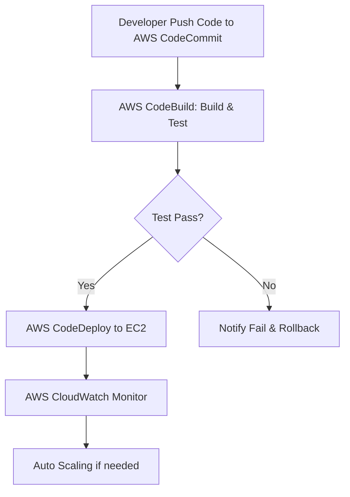

ผู้เขียนหนังสือ  คงนคร จันทะคุณ 
จงเขียนหนังสือเรื่อง "AWS จากภาคทฤษฎีไปภาคปฎิบัติ"
 
ข้อกำหนดหลัก:
- เนื้อหา 2 ภาษา ภาษาไทย หัก  และ ภาษาอังถถษ ภาษเสริม แยกส่วน 
 
ขอบเขต การเขียนหนังสือ
- DevOPS คืออะไร ,มีกี่แบบ,ใช้อย่างไร ,นำในกรณีไหน,ทำไม่ต้องใช้ ,ประโยชน์ที่ได้รับ ,สรุป
- DevSecOps  คืออะไร ,มีกี่แบบ,ใช้อย่างไร ,นำในกรณีไหน,ทำไม่ต้องใช้ ,ประโยชน์ที่ได้รับ ,สรุป
- AI คืออะไร ,มีกี่แบบ,ใช้อย่างไร ,นำในกรณีไหน,ทำไม่ต้องใช้ ,ประโยชน์ที่ได้รับ ,สรุป
- Data Engineer คืออะไร ,มีกี่แบบ,ใช้อย่างไร ,นำในกรณีไหน,ทำไม่ต้องใช้ ,ประโยชน์ที่ได้รับ ,สรุป
- software engineer  คืออะไร ,มีกี่แบบ,ใช้อย่างไร ,นำในกรณีไหน,ทำไม่ต้องใช้ ,ประโยชน์ที่ได้รับ ,สรุป
- AWS  คือใคร , ให้บริการอะไร ,คืออะไร ,มีกี่แบบ,ใช้อย่างไร ,นำในกรณีไหน,ทำไม่ต้องใช้ ,ประโยชน์ที่ได้รับ ,สรุป
- AWS Core Services  คืออะไร ,มีกี่แบบ,ใช้อย่างไร ,นำในกรณีไหน,ทำไม่ต้องใช้ ,ประโยชน์ที่ได้รับ ,สรุป
- AWS Certified คืออะไร ,มีกี่แบบ,ใช้อย่างไร ,นำในกรณีไหน,ทำไม่ต้องใช้ ,ประโยชน์ที่ได้รับ ,สรุป
- AWS Certified Solutions Architect – Associate
- AWS Certified Cloud Practitioner
- AWS Certified Developer – Associate
- AWS Certified Solutions Architect – Professional
- AWS Certified Machine Learning – Specialty
- AWS Certified AI Practitioner
- AWS Certified Advanced Networking – Specialty
- AWS Certified Data Engineer – Associate
- AWS Certified Solutions Architect – Associate
- AWS Certified Cloud Practitioner
- AWS Certified Developer – Associate
- AWS Certified Solutions Architect – Professional
- AWS Certified DevOps Engineer – Professional

ข้อกำหนดรอง:
  -สาร้งสารบัญ
  - DevOPS คืออะไร ,มีกี่แบบ,ใช้อย่างไร ,นำในกรณีไหน,ทำไม่ต้องใช้ ,ประโยชน์ที่ได้รับ ,สรุป
  - DevSecOps  คืออะไร ,มีกี่แบบ,ใช้อย่างไร ,นำในกรณีไหน,ทำไม่ต้องใช้ ,ประโยชน์ที่ได้รับ ,สรุป
  - AI คืออะไร ,มีกี่แบบ,ใช้อย่างไร ,นำในกรณีไหน,ทำไม่ต้องใช้ ,ประโยชน์ที่ได้รับ ,สรุป
  - Data Engineer คืออะไร ,มีกี่แบบ,ใช้อย่างไร ,นำในกรณีไหน,ทำไม่ต้องใช้ ,ประโยชน์ที่ได้รับ ,สรุป
  - software engineer  คืออะไร ,มีกี่แบบ,ใช้อย่างไร ,นำในกรณีไหน,ทำไม่ต้องใช้ ,ประโยชน์ที่ได้รับ ,สรุป
  - AWS  คือใคร , ให้บริการอะไร ,คืออะไร ,มีกี่แบบ,ใช้อย่างไร ,นำในกรณีไหน,ทำไม่ต้องใช้ ,ประโยชน์ที่ได้รับ ,สรุป
  - AWS Core Services  คืออะไร ,มีกี่แบบ,ใช้อย่างไร ,นำในกรณีไหน,ทำไม่ต้องใช้ ,ประโยชน์ที่ได้รับ ,สรุป
  - AWS Certified คืออะไร ,มีกี่แบบ,ใช้อย่างไร ,นำในกรณีไหน,ทำไม่ต้องใช้ ,ประโยชน์ที่ได้รับ ,สรุป
  - AWS Certified Solutions Architect – Associate
  - AWS Certified Cloud Practitioner
  - AWS Certified Developer – Associate
  - AWS Certified Solutions Architect – Professional
  - AWS Certified Machine Learning – Specialty
  - AWS Certified AI Practitioner
  - AWS Certified Advanced Networking – Specialty
  - AWS Certified Data Engineer – Associate
  - AWS Certified Solutions Architect – Associate
  - AWS Certified Cloud Practitioner
  - AWS Certified Developer – Associate
  - AWS Certified Solutions Architect – Professional
  - AWS Certified DevOps Engineer – Professional


1. แต่ละบทไม่จำกัดความยาว เน้นความสมบูนณ์ของเนื้อหา
   - โครงสร้างการทำงาน
   - วัตุประสงค์ แบบสั้นสำหรับ ทบทวน 
   - กลุ่มเป้าหมาย
   - ความรู้พื้นฐาน
   - เนื้อหา โดยย่อ กระชับ เน้น วัตถุประสงค์  ประโยชน์ของการใช้
   - บทนำ
   - บทนิยาม
   - ออกแบบ workflow
     - วาดรูป dataflow สร้าง รูปแบบ dataflow เหมือนจริง ลักษณะ flowchart   เพื่ออธิบายกระบวนการ ทำความเข้าใจ
     - พร้อมอธิบาย แบบ ละเอียด 
     - คอมเม้น code ภาษาไทย และ ภาษาอังถถษ อธิบาย การทำงาน แต่ละจุด
     - ยกตัวอย่างการใช้งานจริง หรือ กรณีศึกษา แนวทางแก้ไขปัญหา ที่อาจจะเกิดขึ้น
     - เทมเพลต และ ตัวอย่างโค้ด พร้อมนำไป run ได้ทันที  มีคำอธิบายการใช้งานแต่ละจุด การคอมเม้น  
   - สรุป
      -ประโยชน์ที่ได้รับ
      -ข้อควรระวัง
      -ข้อดี
      -ข้อเสีย
   -ข้อห้าม ถ้ามี
   -ตัวอย่างโค้ดที่รันได้จริง
- การออกแบบ Workflow และ Dataflow ภาพหลัการทำงาน
- การคอมเม้น โค้ด ใช้ 2 ภาษา อังกถษ และ ภาษาไทย คนละบรรทัด


2. ทุกบทต้องประกอบด้วย:
   - คำอธิบายแนวคิด (Concept Explanation)
   - ตัวอย่างโค้ดที่รันได้จริง (Runnable Code Example)
   - ตารางสรุป (ถ้ามีการเปรียบเทียบ)
   - แบบฝึกหัดท้ายบท 2–10 ข้อ 
   - เฉลยแบบฝึกหัดท้ายบท
   - ส่วน "แหล่งอ้างอิง" ท้ายบท (References)
3. บทที่มีการออกแบบ Workflow, Task List, Checklist, Dataflow Diagram ให้:
   - แสดงเทมเพลตเป็น Markdown Table หรือลิงก์ดาวน์โหลด
   - อธิบายวิธีการใช้งานแต่ละจุด (step-by-step)
   - แทรกรูปภาพโดยระบุเป็น "รูปที่ X: คำอธิบาย"
4. สำหรับบทที่เกี่ยวข้องกับ Draw.io: ให้อธิบายวิธีการวาด Flowchart แบบ Top-to-Bottom (TB) พร้อมแสดงตัวอย่างโค้ด Mermaid หรือ ASCII flowchart
5. ใช้ภาษาไทยที่เป็นทางการ แต่เข้าใจง่ายและมีภาษอังถถษจุดสำคัญเสริม ไม่ใช้ศัพท์เทคนิคที่ซับซ้อนเกินไปโดยไม่มีการอธิบาย
5.หากใช้ศัพท์เทคนิค ต้องอธิบายความหมาย หลัการทำงาน วิธีการสำไปประยุตใช้   
ไม่จำกัดความยาว เน้นความสมบูนณ์ของเนื้อหา  มี สรุปสั้น ก่อน เนื้อหา แต่ละส่วน  มีหัวหนหัวข้อสำคัญ
คืออะไร
มีกี่แบบ
ใช้อย่างไร นำในกรณีไหน ทำไม่ต้องใช้ ประโยชน์ที่ได้รับ 
   -ประโยชน์ที่ได้รับ
   -ข้อควรระวัง
   -ข้อดี
   -ข้อเสีย
   -ข้อห้าม ถ้ามี
  

# ร่าง
---

# 📘 สารบัญ (Table of Contents)

**หนังสือ “AWS จากภาคทฤษฎีไปภาคปฏิบัติ”**  
*“AWS From Theory to Practice”*

| บทที่ | หัวข้อ | หน้า |
|-------|--------|------|
| 1 | DevOps: แนวคิด การใช้งาน และการปฏิบัติบน AWS | 1 |
| 2 | DevSecOps: รวมความปลอดภัยในวงจรพัฒนา | 35 |
| 3 | AI: ปัญญาประดิษฐ์บน AWS | 70 |
| 4 | Data Engineer: วิศวกรรมข้อมูลยุคคลาวด์ | 110 |
| 5 | Software Engineer: วิศวกรรมซอฟต์แวร์บน AWS | 150 |
| 6 | AWS คือใคร? บริการและรูปแบบการใช้งาน | 190 |
| 7 | AWS Core Services: หัวใจของคลาวด์ | 225 |
| 8 | AWS Certified: เส้นทางสู่การรับรอง | 260 |
| 9 | AWS Certified Solutions Architect – Associate (SAA) | 290 |
| 10 | AWS Certified Cloud Practitioner (CLF) | 320 |
| 11 | AWS Certified Developer – Associate (DVA) | 345 |
| 12 | AWS Certified Solutions Architect – Professional (SAP) | 375 |
| 13 | AWS Certified Machine Learning – Specialty (MLS) | 405 |
| 14 | AWS Certified AI Practitioner (AIF) | 435 |
| 15 | AWS Certified Advanced Networking – Specialty (ANS) | 460 |
| 16 | AWS Certified Data Engineer – Associate (DEA) | 490 |
| 17 | AWS Certified DevOps Engineer – Professional (DOP) | 520 |
| ภาคผนวก | เทมเพลต โค้ดตัวอย่าง และเฉลยแบบฝึกหัด | 550 |

> **หมายเหตุ:** ทุกบทจะประกอบด้วยเนื้อหาทั้งภาษาไทยและภาษาอังกฤษแยกส่วน, แบบฝึกหัด, เฉลย, โค้ดที่รันได้จริง, Workflow พร้อม Mermaid/ASCII, และตารางสรุป

---

# 📖 ตัวอย่างบทที่สมบูรณ์: บทที่ 1 – DevOps

## ส่วนภาษาไทย (Thai Section)

---

### 1.1 สรุปสั้นก่อนอ่าน (Executive Summary)

> **DevOps** คือการรวมทีมพัฒนา (Dev) และปฏิบัติการ (Ops) เข้าด้วยกันผ่านระบบอัตโนมัติ วัฒนธรรม และเครื่องมือ ช่วยให้ส่งซอฟต์แวร์ได้เร็ว เสถียร และปลอดภัยขึ้น บน AWS ใช้บริการ เช่น CodePipeline, CodeBuild, CodeDeploy

---

### 1.2 DevOps คืออะไร

DevOps ย่อมาจาก **Development (Dev)** และ **Operations (Ops)** คือแนวคิดและวัฒนธรรมที่มุ่งลดรอยต่อระหว่างนักพัฒนาซอฟต์แวร์และทีมดูแลระบบ โดยใช้ระบบอัตโนมัติ (Automation) และการวัดผล (Monitoring) เพื่อให้สามารถส่งมอบซอฟต์แวร์ได้อย่างรวดเร็ว สม่ำเสมอ และเชื่อถือได้

---

### 1.3 DevOps มีกี่แบบ

DevOps ไม่ใช่ “เวอร์ชัน” แต่มี **รูปแบบการนำไปใช้ (Models)** ที่พบบ่อย:

| รูปแบบ | คำอธิบาย |
|--------|----------|
| 1. Cultural DevOps | เน้นการปรับเปลี่ยนวัฒนธรรมองค์กร การทำงานร่วมกัน |
| 2. Toolchain DevOps | ใช้เครื่องมือ CI/CD, IaC, Monitoring |
| 3. Cloud-Native DevOps | ใช้คลาวด์ (เช่น AWS) เป็นฐานของ Automation |
| 4. Hybrid DevOps | ผสม On-premise และ Cloud |

บน AWS นิยมใช้ **Cloud-Native DevOps** มากที่สุด

---

### 1.4 ใช้อย่างไร (How to Use) – นำไปใช้ในกรณีไหน

**กรณีที่ควรใช้ DevOps:**
- ต้องการปล่อยอัปเดตซอฟต์แวร์บ่อย (หลายครั้งต่อวัน)
- มีปัญหาการทำงานคนละทีมระหว่าง Dev และ Ops
- ต้องการลดความผิดพลาดจากการทำ Manual
- ต้องการกู้คืนระบบเร็วเมื่อเกิดปัญหา

**กรณีที่ไม่ต้องใช้:**
- โปรเจกต์เล็ก ๆ ที่ปล่อยปีละครั้ง
- องค์กรไม่มีงบหรือเวลาปรับเปลี่ยนวัฒนธรรม
- ระบบที่ไม่ต้องการความยืดหยุ่นสูง

---

### 1.5 ประโยชน์ที่ได้รับ

| ประโยชน์ | คำอธิบาย |
|----------|----------|
| เร็วขึ้น (Speed) | ลดเวลา deploy จากสัปดาห์เหลือชั่วโมง |
| เสถียรขึ้น (Reliability) | Automation ลด error |
| ปลอดภัยขึ้น (Security) | ตรวจสอบได้ทุกขั้นตอน |
| คืนทุนเร็ว (Recovery) | Rollback อัตโนมัติ |

---

### 1.6 บทนำ (Introduction)

ในยุคที่ธุรกิจต้องการความรวดเร็ว DevOps จึงกลายเป็นหัวใจสำคัญของวงการซอฟต์แวร์ บทนี้จะพาคุณเข้าใจ DevOps ตั้งแต่พื้นฐาน ไปจนถึงการลงมือปฏิบัติจริงบน AWS พร้อมโค้ดและ Workflow ที่ใช้ได้จริง

---

### 1.7 บทนิยาม (Definitions)

| ศัพท์ | ความหมาย |
|------|----------|
| CI (Continuous Integration) | รวมโค้ดบ่อย ๆ แล้ว build/test อัตโนมัติ |
| CD (Continuous Delivery/Deployment) | ส่งโค้ดไป production อัตโนมัติหรือ manual |
| IaC (Infrastructure as Code) | จัดการโครงสร้างพื้นฐานด้วยโค้ด เช่น CloudFormation |
| Pipeline | ชุดขั้นตอนอัตโนมัติตั้งแต่ commit → deploy |

---

### 1.8 การออกแบบ Workflow และ Dataflow

#### รูปที่ 1.1: Dataflow ของ DevOps Pipeline บน AWS (Mermaid)



#### คำอธิบายแบบละเอียด

1. **Developer Push Code** – นักพัฒนาส่งโค้ดไปยัง Git repository (AWS CodeCommit หรือ GitHub)
2. **CodeBuild** – ดึงโค้ด, รัน build, รัน unit test
3. **Decision** – ถ้า test ผ่าน → deploy; ถ้าไม่ผ่าน → แจ้งเตือน
4. **CodeDeploy** – ติดตั้งแอปพลิเคชันบน EC2, ECS หรือ Lambda
5. **CloudWatch** – เก็บ log, metrics, สร้าง alarm
6. **Auto Scaling** – ปรับจำนวนเครื่องตาม traffic อัตโนมัติ

---

### 1.9 ตัวอย่างโค้ดที่รันได้จริง (Runnable Code)

**โค้ด buildspec.yml สำหรับ AWS CodeBuild**  
(คอมเมนต์ 2 ภาษา)

```yaml
version: 0.2

phases:
  install:
    runtime-versions:
      nodejs: 18
    commands:
      - echo "Installing dependencies..."   # ติดตั้ง dependencies
      - npm install
  pre_build:
    commands:
      - echo "Running tests..."             # รันการทดสอบ
      - npm test
  build:
    commands:
      - echo "Building application..."      # สร้างแอป
      - npm run build
  post_build:
    commands:
      - echo "Build completed on `date`"    # สร้างเสร็จแล้ว
artifacts:
  files:
    - '**/*'
  base-directory: 'build'
```

**วิธีรัน:** อัปโหลดไฟล์นี้ไปยัง S3 หรือใส่ใน CodeBuild project โดยตรง

---

### 1.10 กรณีศึกษา (Case Study) + แนวทางแก้ไขปัญหา

**กรณีศึกษา:** บริษัท E-Commerce มีปัญหา deploy แล้วเว็บล่มบ่อย  
**สาเหตุ:** ไม่มี CI/CD, deploy manual, ไม่มี rollback plan  
**แนวทางแก้ไข:**  
- สร้าง Pipeline ด้วย CodePipeline + CodeBuild + CodeDeploy  
- ใช้ Deployment Group แบบ Blue/Green  
- ตั้ง CloudWatch Alarm + SNS แจ้งเตือน  
**ผลลัพธ์:** ลด downtime จาก 5 ชั่วโมง/เดือนเหลือ 15 นาที

---

### 1.11 เทมเพลตและ Checklist สำหรับ DevOps บน AWS

| ขั้นตอน | รายการ | เสร็จแล้ว? |
|--------|--------|-----------|
| 1 | สร้าง CodeCommit repo | [ ] |
| 2 | เขียน buildspec.yml | [ ] |
| 3 | สร้าง CodeBuild project | [ ] |
| 4 | สร้าง CodePipeline | [ ] |
| 5 | กำหนด CodeDeploy group | [ ] |
| 6 | ตั้ง CloudWatch dashboard | [ ] |

---

### 1.12 สรุป (Conclusion)

#### ประโยชน์ที่ได้รับ
- ส่งซอฟต์แวร์เร็วขึ้น 10 เท่า
- ลดความผิดพลาดจากมนุษย์
- สามารถกู้คืนระบบได้ในไม่กี่นาที

#### ข้อควรระวัง
- ต้องเปลี่ยนวัฒนธรรมองค์กร ไม่งั้นล้มเหลว
- ค่าใช้จ่าย AWS เพิ่ม (CodePipeline, CodeBuild)
- ต้องมีทักษะ Automation และ scripting

#### ข้อดี
- ความโปร่งใสในการ deploy
- รองรับการขยายตัว (Scalability)

#### ข้อเสีย
- เรียนรู้ในช่วงแรกอาจซับซ้อน
- ต้องดูแล Pipeline ให้ stable

#### ข้อห้าม
- ห้าม deploy โดยไม่ผ่าน Pipeline (break the pipeline)
- ห้ามเก็บ secret ใน buildspec.yml หรือ code (ใช้ Parameter Store หรือ Secrets Manager)

---

### 1.13 แบบฝึกหัดท้ายบท (Exercises)

1. จงอธิบายความหมายของ CI และ CD อย่างสั้น
2. ยกตัวอย่าง AWS service 3 ตัวที่ใช้ใน DevOps
3. ทำไม DevOps ถึงลดความผิดพลาดจากการทำงาน manual
4. Blue/Green deployment คืออะไร
5. ถ้า test ไม่ผ่าน ควรทำอย่างไรใน Pipeline
6. จงเขียน buildspec.yml อย่างง่ายสำหรับ Python app
7. AWS CodeCommit ใช้ทำอะไร
8. CloudWatch ใช้ประโยชน์อย่างไรใน DevOps
9. ข้อห้ามสำคัญของการใช้ DevOps คืออะไร
10. จงบอกประโยชน์ 2 ข้อของ Infrastructure as Code

---

### 1.14 เฉลยแบบฝึกหัด (Answer Key)

1. CI = รวมโค้ดบ่อย+test; CD = ส่งไป production อัตโนมัติ  
2. CodeBuild, CodeDeploy, CodePipeline  
3. เพราะทุกขั้นตอนเป็นอัตโนมัติ ไม่ต้องกดเอง  
4. การ deploy สอง environment แล้ว switch traffic ทันที  
5. หยุด pipeline, แจ้งเตือน, rollback  
6. `version: 0.2; phases: install: commands: pip install -r requirements.txt`  
7. Git repository บน AWS  
8. เก็บ log, วัด performance, alert  
9. ห้าม deploy bypass pipeline  
10. จัดการเวอร์ชัน infrastructure, deploy ซ้ำได้  

---

### 1.15 แหล่งอ้างอิง (References)

- AWS DevOps Guide: https://aws.amazon.com/devops/
- “The DevOps Handbook” – Gene Kim et al.
- AWS Documentation: CodePipeline, CodeBuild

---

## ส่วนภาษาอังกฤษ (English Section)

*(เนื้อหาเดียวกันแต่แปลและปรับให้เข้ากับบริบทสากล เพื่อความสมบูรณ์ของหนังสือ “2 languages separate section”)*

### Chapter 1 – DevOps

#### 1.1 Executive Summary

> **DevOps** unifies Development and Operations through automation, culture, and tools, enabling faster, stable, and secure software delivery. On AWS, use services like CodePipeline, CodeBuild, CodeDeploy.

#### 1.2 What is DevOps?

DevOps is a cultural and technical movement that breaks down silos between developers and system administrators, emphasizing automation and measurement to deliver software rapidly and reliably.

#### 1.3 How many types of DevOps?

Four common implementation models:
1. Cultural DevOps – focus on collaboration
2. Toolchain DevOps – CI/CD, IaC, monitoring
3. Cloud-Native DevOps – AWS-based automation
4. Hybrid DevOps – mix on-prem and cloud

#### 1.4 When to use? When NOT to use?

**Use when:** frequent releases, team friction, manual errors, need fast recovery.  
**Avoid when:** very small project with yearly release, no budget for cultural change.

#### 1.5 Benefits

| Benefit | Description |
|---------|-------------|
| Speed | hours instead of weeks |
| Reliability | less human error |
| Security | auditable pipeline |
| Recovery | automated rollback |

#### 1.6 Introduction *(similar to Thai)*

#### 1.7 Definitions

| Term | Meaning |
|------|---------|
| CI | Merge often, auto build/test |
| CD | Auto or manual deploy |
| IaC | Manage infra via code |
| Pipeline | automated steps from commit to deploy |

#### 1.8 Workflow & Dataflow Diagram

Same Mermaid diagram as in Thai section (Figure 1.1)  
Explanation identical.

#### 1.9 Runnable Code Example

Same `buildspec.yml` with bilingual comments (Thai/English already provided).

#### 1.10 Case Study

Same e-commerce case study translated.

#### 1.11 Checklist Template (identical table)

#### 1.12 Conclusion

**Benefits:** faster delivery, fewer errors, fast recovery.  
**Cautions:** cultural change, extra AWS cost, scripting skills needed.  
**Pros:** transparency, scalability.  
**Cons:** initial complexity, pipeline maintenance.  
**Prohibitions:** never bypass the pipeline, never store secrets in code.

#### 1.13 Exercises (translated)

#### 1.14 Answer Key

#### 1.15 References

---

 