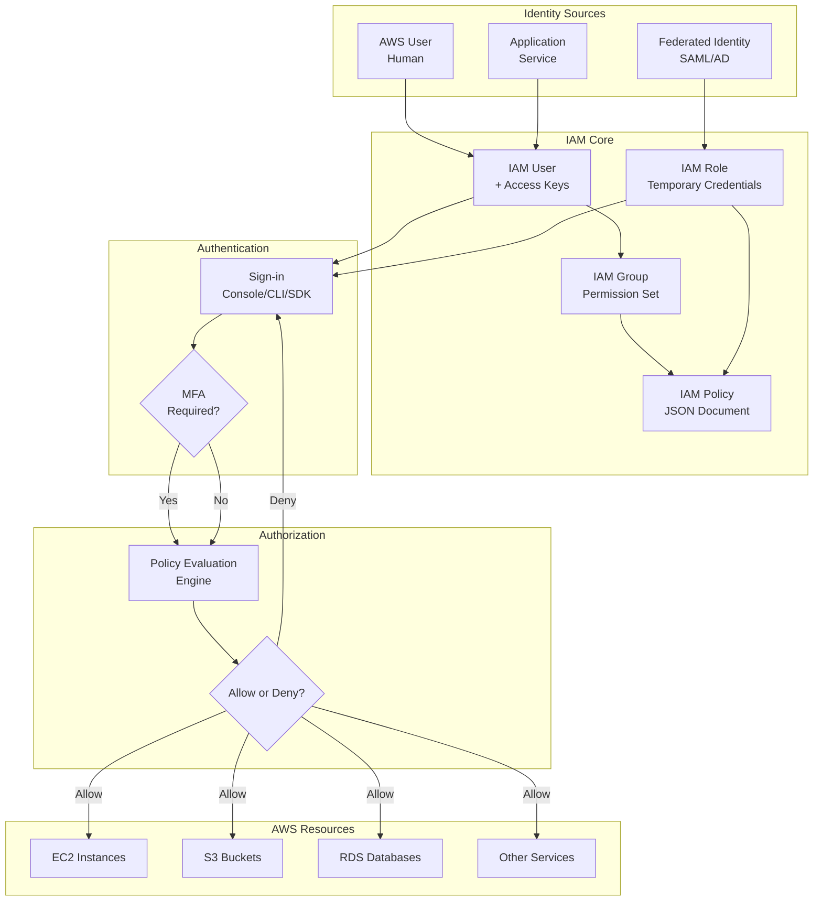
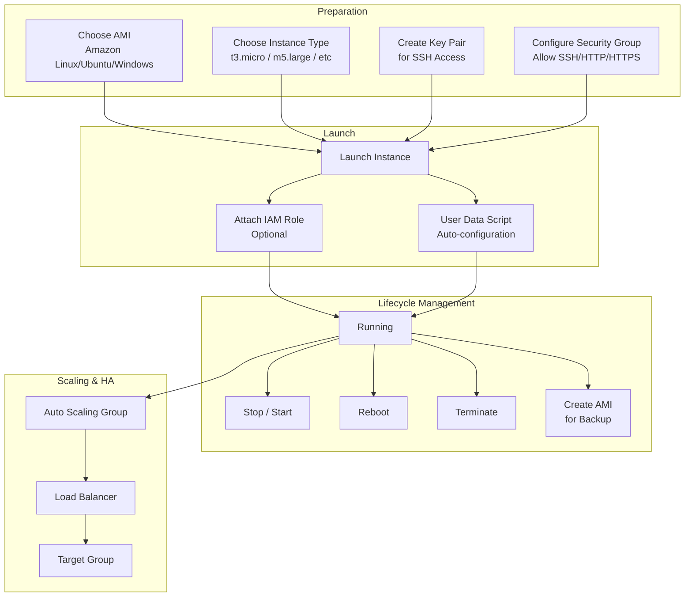
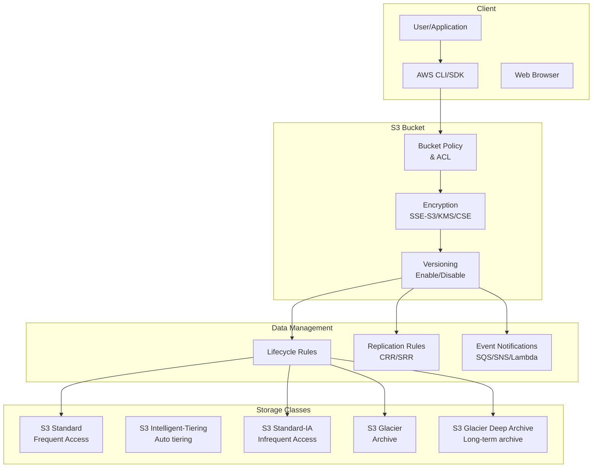
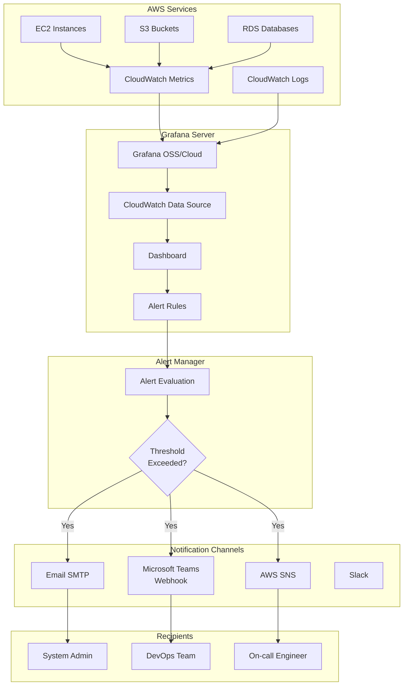

# คู่มือ AWS เชิงลึก: IAM, EC2, S3 และระบบ Monitoring พร้อม Notification

---

## 📌 สารบัญ

- [บทที่ 1: AWS Identity and Access Management (IAM)](#บทที่-1-aws-identity-and-access-management-iam)
- [บทที่ 2: AWS Elastic Compute Cloud (EC2)](#บทที่-2-aws-elastic-compute-cloud-ec2)
- [บทที่ 3: AWS Simple Storage Service (S3)](#บทที่-3-aws-simple-storage-service-s3)
- [บทที่ 4: ระบบ Monitoring ด้วย Grafana และ Notification ผ่าน Email และ Microsoft Teams](#บทที่-4-ระบบ-monitoring-ด้วย-grafana-และ-notification-ผ่าน-email-และ-microsoft-teams)

---

# บทที่ 1: AWS Identity and Access Management (IAM)

## สรุปสั้นก่อนเข้าเนื้อหา

> **IAM** คือระบบจัดการสิทธิ์การเข้าถึงบริการ AWS แบบละเอียด (Fine-grained access control) ช่วยกำหนดว่า "ใคร" เข้าถึง "อะไร" ได้ "อย่างไร" บน AWS Cloud

| หัวข้อ | คำตอบ |
|--------|--------|
| **คืออะไร** | บริการจัดการ Identities (ผู้ใช้/กลุ่ม/บทบาท) และ Permissions (นโยบาย) |
| **มีกี่แบบ** | Users, Groups, Roles, Policies |
| **ใช้อย่างไร** | กำหนด Policy JSON ระบุ Effect, Action, Resource |
| **ทำไมต้องใช้** | เพื่อความปลอดภัย ตามหลัก Least Privilege |
| **ประโยชน์** | จัดการสิทธิ์แบบละเอียด, รวมศูนย์, Audit ได้ |
| **ข้อควรระวัง** | Root user ควรมี MFA และไม่ใช้ |
| **ข้อดี** | ยืดหยุ่น, ปลอดภัยสูง, ทำงานร่วมกับบริการ AWS อื่นได้ |
| **ข้อเสีย** | ซับซ้อนเมื่อมี Policy จำนวนมาก |
| **ข้อห้าม** | ห้ามแชร์ Access Key, ห้ามใส่ Secret Key ในโค้ด |

---

## วัตถุประสงค์ (แบบสั้นสำหรับทบทวน)

เพื่อให้ผู้อ่านสามารถ:
1. เข้าใจหลักการทำงานของ IAM
2. ออกแบบและสร้าง Users, Groups, Roles และ Policies
3. กำหนดสิทธิ์การเข้าถึง AWS services อย่างปลอดภัย
4. นำไปประยุกต์ใช้ในองค์กรจริง

## กลุ่มเป้าหมาย

- ผู้ดูแลระบบ Cloud (Cloud Admin/SysOps)
- Developer ที่ต้องเขียนโค้ดเรียกใช้ AWS API
- Security Engineer
- DevOps Engineer

## ความรู้พื้นฐาน

- ความเข้าใจพื้นฐานเกี่ยวกับ Cloud Computing
- เคยใช้งาน AWS Management Console มาก่อน (ไม่จำเป็นต้องลึก)
- เข้าใจ JSON พื้นฐาน

---

## บทนำ

เมื่อองค์กรเริ่มใช้งาน AWS สิ่งแรกที่ต้องคำนึงถึงคือ **ความปลอดภัยในการเข้าถึง** IAM เป็นหัวใจสำคัญของความปลอดภัยบน AWS ช่วยให้คุณสามารถควบคุมการเข้าถึงทรัพยากรต่างๆ ได้อย่างละเอียด ตั้งแต่ระดับสูงสุดจนถึงระดับการทำงานเฉพาะเจาะจง

## บทนิยาม

| ศัพท์เทคนิค | คำอธิบาย |
|-------------|----------|
| **IAM User** | ตัวตนของบุคคลหรือแอปพลิเคชันหนึ่งๆ มี credentials เฉพาะ |
| **IAM Group** | กลุ่มของ Users ที่มีสิทธิ์เหมือนกัน |
| **IAM Role** | บทบาทที่สามารถ assume เพื่อขอสิทธิ์ชั่วคราว ไม่มี long-term credentials |
| **IAM Policy** | เอกสาร JSON ที่กำหนด permissions |
| **Root User** | ผู้ใช้แรกเริ่มของ AWS Account มีสิทธิ์เต็มรูปแบบ |
| **MFA** | Multi-Factor Authentication เพิ่มความปลอดภัยอีกชั้น |

---

## ออกแบบ Workflow

### รูปแบบ Dataflow Diagram (Mermaid)



### คำอธิบาย Dataflow อย่างละเอียด

**ขั้นตอนที่ 1: การสร้าง Identity (ตัวตน)**
- **IAM User**: สร้างสำหรับบุคคลหรือแอปพลิเคชันที่ต้องเข้าถึง AWS แบบถาวร
- **IAM Group**: จัดกลุ่ม Users ที่มีหน้าที่คล้ายกัน เช่น Developers, Admins
- **IAM Role**: สำหรับกรณีที่ต้องการสิทธิ์ชั่วคราว เช่น EC2 instance ที่ต้องเรียกใช้ S3

**ขั้นตอนที่ 2: การกำหนดสิทธิ์ผ่าน Policy**
- สร้าง Policy JSON ที่ระบุ Actions (เช่น `s3:GetObject`) และ Resources (เช่น `arn:aws:s3:::my-bucket/*`)
- Attach Policy เข้ากับ User, Group หรือ Role

**ขั้นตอนที่ 3: การ Authentication (พิสูจน์ตัวตน)**
- User ใช้ Username/Password สำหรับ Console หรือ Access Key สำหรับ CLI/SDK
- หากเปิด MFA จะต้องระบุ OTP เพิ่มเติม

**ขั้นตอนที่ 4: การ Authorization (ตรวจสอบสิทธิ์)**
- AWS Policy Evaluation Engine จะตรวจสอบทุก Request
- ลำดับการตรวจสอบ: **Deny → Allow** (ถ้ามี Deny ใดๆ จะ Deny ทันที)

---

## ตัวอย่างโค้ดที่รันได้จริง

### ตัวอย่างที่ 1: สร้าง IAM User และ Attach Policy ด้วย AWS CLI

```bash
# 1. สร้าง IAM User ชื่อ 'developer-john'
# 1. Create IAM User named 'developer-john'
aws iam create-user --user-name developer-john

# 2. สร้าง Access Key สำหรับ User นี้
# 2. Create Access Key for this user
aws iam create-access-key --user-name developer-john

# 3. สร้าง Group ชื่อ 'developers'
# 3. Create Group named 'developers'
aws iam create-group --group-name developers

# 4. เพิ่ม User เข้า Group
# 4. Add user to group
aws iam add-user-to-group --user-name developer-john --group-name developers

# 5. Attach Managed Policy ให้ Group
# 5. Attach Managed Policy to group
aws iam attach-group-policy --group-name developers --policy-arn arn:aws:iam::aws:policy/AmazonS3ReadOnlyAccess

# 6. ตรวจสอบว่า User มีสิทธิ์อะไรบ้าง
# 6. Verify what permissions the user has
aws iam list-attached-group-policies --group-name developers
```

### ตัวอย่างที่ 2: IAM Policy JSON (Read-only S3 บาง bucket)

```json
{
    "Version": "2012-10-17",
    "Statement": [
        {
            "Sid": "AllowReadOnlySpecificBucket",
            "Effect": "Allow",
            "Action": [
                "s3:GetObject",
                "s3:ListBucket"
            ],
            "Resource": [
                "arn:aws:s3:::my-company-data-bucket",
                "arn:aws:s3:::my-company-data-bucket/*"
            ]
        },
        {
            "Sid": "DenyDeleteActions",
            "Effect": "Deny",
            "Action": [
                "s3:DeleteObject",
                "s3:DeleteBucket"
            ],
            "Resource": "*"
        }
    ]
}
```

### ตัวอย่างที่ 3: สร้าง IAM Role สำหรับ EC2 (Assume Role Policy)

```json
// trust-policy.json - กำหนดว่าใครสามารถ Assume Role นี้ได้
// trust-policy.json - Defines who can assume this role
{
    "Version": "2012-10-17",
    "Statement": [
        {
            "Effect": "Allow",
            "Principal": {
                "Service": "ec2.amazonaws.com"
            },
            "Action": "sts:AssumeRole"
        }
    ]
}
```

```bash
# สร้าง Role ชื่อ 'ec2-s3-access-role' พร้อม Trust Policy
# Create Role named 'ec2-s3-access-role' with Trust Policy
aws iam create-role \
    --role-name ec2-s3-access-role \
    --assume-role-policy-document file://trust-policy.json

# Attach S3 ReadOnly Policy ให้ Role
# Attach S3 ReadOnly Policy to Role
aws iam attach-role-policy \
    --role-name ec2-s3-access-role \
    --policy-arn arn:aws:iam::aws:policy/AmazonS3ReadOnlyAccess
```

### ตัวอย่างที่ 4: Python Boto3 - สร้าง User และ Policy

```python
import boto3
import json

# สร้าง IAM client
# Create IAM client
iam_client = boto3.client('iam')

# 1. สร้าง IAM User
# 1. Create IAM User
user_response = iam_client.create_user(
    UserName='automation-user',
    Tags=[
        {'Key': 'Environment', 'Value': 'Production'},
        {'Key': 'CreatedBy', 'Value': 'Automation'}
    ]
)
print(f"✅ สร้าง User สำเร็จ: {user_response['User']['Arn']}")
# Output: ✅ User created successfully: arn:aws:iam::123456789012:user/automation-user

# 2. สร้าง Inline Policy (Policy ที่ผูกโดยตรงกับ User)
# 2. Create Inline Policy (Policy directly attached to User)
inline_policy = {
    "Version": "2012-10-17",
    "Statement": [
        {
            "Effect": "Allow",
            "Action": [
                "ec2:DescribeInstances",
                "ec2:StartInstances",
                "ec2:StopInstances"
            ],
            "Resource": "*"
        }
    ]
}

iam_client.put_user_policy(
    UserName='automation-user',
    PolicyName='ec2-control-policy',
    PolicyDocument=json.dumps(inline_policy)
)
print("✅ Attach Inline Policy สำเร็จ")
# Output: ✅ Inline Policy attached successfully

# 3. สร้าง Access Key
# 3. Create Access Key
key_response = iam_client.create_access_key(
    UserName='automation-user'
)
print(f"🔑 Access Key ID: {key_response['AccessKey']['AccessKeyId']}")
print("⚠️ เก็บ Secret Access Key ไว้ในที่ปลอดภัย")
# ⚠️ Store Secret Access Key in a safe place
```

### ตัวอย่างที่ 5: ตรวจสอบสิทธิ์ด้วย IAM Policy Simulator

```python
import boto3

iam_client = boto3.client('iam')

# ทดสอบว่า User 'developer-john' สามารถเรียก s3:GetObject ได้หรือไม่
# Test if user 'developer-john' can call s3:GetObject
response = iam_client.simulate_principal_policy(
    PolicySourceArn='arn:aws:iam::123456789012:user/developer-john',
    ActionNames=['s3:GetObject'],
    ResourceArns=['arn:aws:s3:::my-bucket/test.txt']
)

if response['EvaluationResults'][0]['EvalDecision'] == 'allowed':
    print("✅ User มีสิทธิ์อ่าน object นี้")
    # ✅ User has permission to read this object
else:
    print("❌ User ไม่มีสิทธิ์")
    # ❌ User does not have permission
```

---

## ตารางสรุปเปรียบเทียบ IAM Components

| Component | มี Credentials แบบถาวร | ใช้สำหรับ | ระยะเวลา | เหมาะกับกรณี |
|-----------|------------------------|-----------|----------|--------------|
| **IAM User** | ✅ Yes | บุคคล/แอปพลิเคชัน | ถาวร | Developer, Admin, Service Account |
| **IAM Group** | ❌ No | จัดกลุ่ม User | ถาวร | จัดการสิทธิ์รวมหมู่ |
| **IAM Role** | ❌ No (STS temporary) | บริการ/บุคคลภายนอก | ชั่วคราว | EC2, Lambda, Federation |
| **IAM Policy** | ❌ No | กำหนดสิทธิ์ | ถาวร | Attach กับ User/Group/Role |

---

## แบบฝึกหัดท้ายบท

1. จงอธิบายความแตกต่างระหว่าง IAM User และ IAM Role
2. จงเขียน Policy JSON ที่อนุญาตให้อ่านไฟล์จาก S3 bucket ชื่อ `my-logs` เท่านั้น (ห้ามเขียนหรือลบ)
3. จงเขียนคำสั่ง AWS CLI เพื่อสร้าง IAM Group ชื่อ `readonly-group` และ Attach Policy `ReadOnlyAccess`
4. จงอธิบายหลักการ "Least Privilege" และยกตัวอย่างการนำไปใช้
5. จงเขียน Python Boto3 เพื่อลบ IAM User ชื่อ `old-user`
6. จงอธิบายว่าทำไมไม่ควรใช้ Root User ในการทำงานประจำวัน
7. จงเขียน Assume Role Policy ที่อนุญาตให้ Lambda Service Assume Role ได้
8. จงอธิบายความสำคัญของ MFA และวิธีการเปิดใช้งาน
9. จงเขียน CLI เพื่อสร้าง Access Key และลบ Access Key เดิม
10. จงอธิบายลำดับการประเมิน Policy (Deny → Allow)

## เฉลยแบบฝึกหัด

1. **IAM User** มี credentials ถาวร เหมาะกับบุคคลหรือแอปฯ ที่ต้องเข้าถึงบ่อย **IAM Role** ใช้สิทธิ์ชั่วคราวผ่าน STS เหมาะกับ service หรือ federation
2. 
```json
{
    "Version": "2012-10-17",
    "Statement": [{
        "Effect": "Allow",
        "Action": ["s3:GetObject"],
        "Resource": "arn:aws:s3:::my-logs/*"
    }]
}
```
3. `aws iam create-group --group-name readonly-group` แล้ว `aws iam attach-group-policy --group-name readonly-group --policy-arn arn:aws:iam::aws:policy/ReadOnlyAccess`
4. Least Privilege = ให้สิทธิ์เท่าที่จำเป็นเท่านั้น เช่น Developer ควรมีสิทธิ์แค่ Read S3 ไม่ต้องมี Write
5. 
```python
import boto3
iam = boto3.client('iam')
iam.delete_user(UserName='old-user')
```
6. Root User มีสิทธิ์เต็มรูปแบบ ไม่มีข้อจำกัด หากถูกโจมตีจะเกิดความเสียหายรุนแรง
7. 
```json
{
    "Version": "2012-10-17",
    "Statement": [{
        "Effect": "Allow",
        "Principal": {"Service": "lambda.amazonaws.com"},
        "Action": "sts:AssumeRole"
    }]
}
```
8. MFA เพิ่มความปลอดภัยอีกชั้น เปิดใช้งานผ่าน IAM Console > Users > Security credentials > Manage MFA device
9. `aws iam create-access-key --user-name username` และ `aws iam delete-access-key --access-key-id OLD_KEY_ID --user-name username`
10. AWS ประเมินทุก Policy ถ้ามี Deny เกิดขึ้น จะ Deny ทันทีโดยไม่สน Allow

## แหล่งอ้างอิง

- AWS IAM Documentation: https://docs.aws.amazon.com/iam/
- IAM Policy Reference: https://docs.aws.amazon.com/IAM/latest/UserGuide/reference_policies.html
- Boto3 IAM Documentation: https://boto3.amazonaws.com/v1/documentation/api/latest/reference/services/iam.html

---

# บทที่ 2: AWS Elastic Compute Cloud (EC2)

## สรุปสั้นก่อนเข้าเนื้อหา

> **EC2** คือบริการ Virtual Machine ในคลาวด์ ปรับขนาดได้ตามต้องการ จ่ายตามการใช้จริง รองรับ OS ได้หลากหลาย

| หัวข้อ | คำตอบ |
|--------|--------|
| **คืออะไร** | Virtual Server ใน AWS Cloud |
| **มีกี่แบบ** | Instance Types (General, Compute, Memory, Storage, GPU) |
| **ใช้อย่างไร** | เลือก AMI → เลือก Instance Type → กำหนด Security Group → Launch |
| **ทำไมต้องใช้** | ยืดหยุ่น ปรับขนาดได้ จ่ายเท่าที่ใช้ ไม่ต้องดูแล Hardware |
| **ประโยชน์** | เปิด-ปิดได้ทันที, Auto Scaling, รองรับหลาย OS |
| **ข้อควรระวัง** | หยุด instance แล้วยังมีค่า EBS, Public IP เปลี่ยนเมื่อ restart |
| **ข้อดี** | ยืดหยุ่นสูง, ควบคุมได้เต็มที่ |
| **ข้อเสีย** | ต้องจัดการ OS เอง, มีค่าใช้จ่ายต่อเนื่อง |
| **ข้อห้าม** | ห้ามใช้ Root volume แบบ instance store สำหรับข้อมูลสำคัญ |

---

## วัตถุประสงค์ (แบบสั้นสำหรับทบทวน)

เพื่อให้ผู้อ่านสามารถ:
1. เลือก Instance Type และ AMI ที่เหมาะสม
2. สร้างและจัดการ EC2 ผ่าน Console, CLI, และ SDK
3. กำหนด Security Groups และ Key Pairs
4. ทำ Auto Scaling และ Load Balancing
5. แนบ IAM Role ให้ EC2

## กลุ่มเป้าหมาย

- DevOps Engineer
- System Administrator
- Developer ที่ต้อง Deploy บน EC2
- Solutions Architect

## ความรู้พื้นฐาน

- ความเข้าใจ SSH และ Linux/Windows พื้นฐาน
- เคยใช้ Command Line มาก่อน
- เข้าใจ Networking พื้นฐาน (IP, Port)

---

## บทนำ

EC2 เป็นบริการหลักที่ทำให้ AWS เติบโตอย่างรวดเร็ว เพราะเปลี่ยนจากการซื้อ Server มาเป็นการ "เช่า" Virtual Machine แบบจ่ายตามการใช้ คุณสามารถสร้าง Server ใหม่ได้ภายในไม่กี่นาที ปรับขนาดขึ้นลงตามความต้องการ โดยไม่ต้องลงทุนซื้อ Hardware ล่วงหน้า

## บทนิยาม

| ศัพท์เทคนิค | คำอธิบาย |
|-------------|----------|
| **AMI** | Amazon Machine Image - Template สำหรับสร้าง Instance |
| **Instance Type** | Spec ของ CPU, RAM, Network |
| **Security Group** | Firewall ควบคุม Traffic เข้า-ออก |
| **Key Pair** | SSH Public Key สำหรับเข้าถึง Instance |
| **EBS** | Elastic Block Store - Hard Disk ในคลาวด์ |
| **Elastic IP** | IP Address แบบคงที่ |
| **User Data** | Script ที่รันตอน Instance เริ่มทำงาน |

---

## ออกแบบ Workflow

### รูปแบบ Dataflow Diagram (Mermaid)



### คำอธิบาย Dataflow อย่างละเอียด

**ขั้นตอนที่ 1: การเตรียมการ**
- เลือก AMI: Ubuntu 22.04, Amazon Linux 2023, Windows Server 2019 เป็นต้น
- เลือก Instance Type: t3.micro (ฟรี tier), m5.large (งานทั่วไป), c5.large (CPU intensive)
- สร้าง Key Pair: ใช้ SSH เข้า Instance (Linux) หรือ RDP (Windows)
- กำหนด Security Group: เปิด Port 22 (SSH), 80 (HTTP), 443 (HTTPS)

**ขั้นตอนที่ 2: การ Launch**
- ระบุจำนวน Instance (1 หรือมากกว่า)
- กำหนด EBS Volume Size (default 8-30 GB)
- ใส่ User Data เพื่อติดตั้ง Software อัตโนมัติ

**ขั้นตอนที่ 3: การจัดการ Lifecycle**
- Running: ใช้งานปกติ มีค่าใช้จ่าย
- Stopped: ไม่มีค่า Instance แต่ยังมีค่า EBS
- Terminated: ลบ Instance ทิ้ง ไม่มีค่าใช้จ่าย

**ขั้นตอนที่ 4: การทำ High Availability**
- Auto Scaling Group: ปรับจำนวน Instance อัตโนมัติตาม Metric
- Load Balancer: กระจาย Traffic ไปยังหลาย Instance

---

## ตัวอย่างโค้ดที่รันได้จริง

### ตัวอย่างที่ 1: Launch EC2 Instance ด้วย AWS CLI

```bash
# 1. สร้าง Security Group
# 1. Create Security Group
aws ec2 create-security-group \
    --group-name web-server-sg \
    --description "Security group for web server" \
    --vpc-id vpc-xxxxxx

# 2. เพิ่ม Rule อนุญาต SSH, HTTP, HTTPS
# 2. Add rules to allow SSH, HTTP, HTTPS
aws ec2 authorize-security-group-ingress \
    --group-id sg-xxxxxx \
    --protocol tcp \
    --port 22 \
    --cidr 0.0.0.0/0

aws ec2 authorize-security-group-ingress \
    --group-id sg-xxxxxx \
    --protocol tcp \
    --port 80 \
    --cidr 0.0.0.0/0

# 3. Launch EC2 Instance
# 3. Launch EC2 Instance
aws ec2 run-instances \
    --image-id ami-0c55b159cbfafe1f0 \
    --instance-type t3.micro \
    --key-name my-key-pair \
    --security-group-ids sg-xxxxxx \
    --subnet-id subnet-xxxxxx \
    --user-data "#!/bin/bash
                  yum update -y
                  yum install -y httpd
                  systemctl start httpd
                  systemctl enable httpd" \
    --tag-specifications 'ResourceType=instance,Tags=[{Key=Name,Value=WebServer}]'
```

### ตัวอย่างที่ 2: Python Boto3 - จัดการ EC2

```python
import boto3
import time

ec2_client = boto3.client('ec2')
ec2_resource = boto3.resource('ec2')

# 1. สร้าง Key Pair
# 1. Create Key Pair
key_pair = ec2_client.create_key_pair(
    KeyName='my-app-key',
    KeyType='rsa',
    KeyFormat='pem'
)

# Save private key to file
with open('my-app-key.pem', 'w') as f:
    f.write(key_pair['KeyMaterial'])
print("✅ สร้าง Key Pair สำเร็จ: my-app-key.pem")
# ✅ Key Pair created successfully: my-app-key.pem

# 2. สร้าง Security Group
# 2. Create Security Group
security_group = ec2_client.create_security_group(
    GroupName='app-security-group',
    Description='Security group for my application',
    VpcId='vpc-xxxxxx'
)

# Add inbound rules
ec2_client.authorize_security_group_ingress(
    GroupId=security_group['GroupId'],
    IpPermissions=[
        {
            'IpProtocol': 'tcp',
            'FromPort': 22,
            'ToPort': 22,
            'IpRanges': [{'CidrIp': '0.0.0.0/0', 'Description': 'SSH'}]
        },
        {
            'IpProtocol': 'tcp',
            'FromPort': 80,
            'ToPort': 80,
            'IpRanges': [{'CidrIp': '0.0.0.0/0', 'Description': 'HTTP'}]
        },
        {
            'IpProtocol': 'tcp',
            'FromPort': 443,
            'ToPort': 443,
            'IpRanges': [{'CidrIp': '0.0.0.0/0', 'Description': 'HTTPS'}]
        }
    ]
)
print("✅ Security Group สร้างและกำหนด Rules สำเร็จ")
# ✅ Security Group created and rules configured successfully

# 3. Launch Instance
# 3. Launch Instance
user_data_script = """#!/bin/bash
# ติดตั้ง Docker บน Amazon Linux 2
# Install Docker on Amazon Linux 2
yum update -y
amazon-linux-extras install docker -y
systemctl start docker
systemctl enable docker
usermod -a -G docker ec2-user
"""

instances = ec2_client.run_instances(
    ImageId='ami-0c55b159cbfafe1f0',  # Amazon Linux 2
    InstanceType='t3.micro',
    KeyName='my-app-key',
    SecurityGroupIds=[security_group['GroupId']],
    SubnetId='subnet-xxxxxx',
    UserData=user_data_script,
    MinCount=1,
    MaxCount=1,
    TagSpecifications=[
        {
            'ResourceType': 'instance',
            'Tags': [
                {'Key': 'Name', 'Value': 'Docker-Server'},
                {'Key': 'Environment', 'Value': 'Development'}
            ]
        }
    ]
)

instance_id = instances['Instances'][0]['InstanceId']
print(f"✅ Launch Instance สำเร็จ: {instance_id}")
# ✅ Instance launched successfully: i-xxxxxx

# 4. รอให้ Instance อยู่ในสถานะ Running
# 4. Wait for instance to be in Running state
waiter = ec2_client.get_waiter('instance_running')
waiter.wait(InstanceIds=[instance_id])
print("✅ Instance อยู่ในสถานะ Running แล้ว")
# ✅ Instance is now in Running state

# 5. ดึง Public IP Address
# 5. Get Public IP Address
instance_info = ec2_client.describe_instances(InstanceIds=[instance_id])
public_ip = instance_info['Reservations'][0]['Instances'][0]['PublicIpAddress']
print(f"🌐 Public IP: {public_ip}")
# 🌐 Public IP: 54.123.45.67
```

### ตัวอย่างที่ 3: สร้าง Auto Scaling Group

```python
import boto3

autoscaling = boto3.client('autoscaling')
elbv2 = boto3.client('elbv2')
ec2 = boto3.client('ec2')

# 1. สร้าง Launch Template
# 1. Create Launch Template
launch_template = ec2.create_launch_template(
    LaunchTemplateName='web-app-template',
    LaunchTemplateData={
        'ImageId': 'ami-0c55b159cbfafe1f0',
        'InstanceType': 't3.micro',
        'KeyName': 'my-key-pair',
        'SecurityGroupIds': ['sg-xxxxxx'],
        'UserData': 'IyEvYmluL2Jhc2g...'  # base64 encoded
    }
)

# 2. สร้าง Target Group สำหรับ Load Balancer
# 2. Create Target Group for Load Balancer
target_group = elbv2.create_target_group(
    Name='web-app-tg',
    Protocol='HTTP',
    Port=80,
    VpcId='vpc-xxxxxx',
    HealthCheckProtocol='HTTP',
    HealthCheckPath='/health',
    HealthCheckIntervalSeconds=30,
    HealthyThresholdCount=2,
    UnhealthyThresholdCount=3
)

# 3. สร้าง Auto Scaling Group
# 3. Create Auto Scaling Group
autoscaling.create_auto_scaling_group(
    AutoScalingGroupName='web-app-asg',
    LaunchTemplate={
        'LaunchTemplateName': 'web-app-template',
        'Version': '$Latest'
    },
    MinSize=2,
    MaxSize=10,
    DesiredCapacity=2,
    VPCZoneIdentifier='subnet-xxxxxx,subnet-yyyyyy',
    TargetGroupARNs=[target_group['TargetGroups'][0]['TargetGroupArn']],
    HealthCheckType='ELB',
    HealthCheckGracePeriod=300,
    Tags=[
        {'Key': 'Name', 'Value': 'WebApp', 'PropagateAtLaunch': True},
        {'Key': 'Environment', 'Value': 'Production', 'PropagateAtLaunch': True}
    ]
)

# 4. สร้าง Scaling Policy (Scale based on CPU)
# 4. Create Scaling Policy (Scale based on CPU)
autoscaling.put_scaling_policy(
    AutoScalingGroupName='web-app-asg',
    PolicyName='cpu-scale-out',
    PolicyType='TargetTrackingScaling',
    TargetTrackingConfiguration={
        'PredefinedMetricSpecification': {
            'PredefinedMetricType': 'ASGAverageCPUUtilization'
        },
        'TargetValue': 70.0
    }
)

print("✅ Auto Scaling Group สร้างเสร็จสมบูรณ์")
# ✅ Auto Scaling Group created successfully
```

### ตัวอย่างที่ 4: Attach IAM Role ให้ EC2 (ทำให้ EC2 เข้าถึง S3 ได้)

```bash
# สร้าง IAM Role สำหรับ EC2
# Create IAM Role for EC2
aws iam create-role \
    --role-name ec2-s3-access-role \
    --assume-role-policy-document '{
        "Version": "2012-10-17",
        "Statement": [{
            "Effect": "Allow",
            "Principal": {"Service": "ec2.amazonaws.com"},
            "Action": "sts:AssumeRole"
        }]
    }'

# Attach S3 ReadOnly Policy
# Attach S3 ReadOnly Policy
aws iam attach-role-policy \
    --role-name ec2-s3-access-role \
    --policy-arn arn:aws:iam::aws:policy/AmazonS3ReadOnlyAccess

# สร้าง Instance Profile
# Create Instance Profile
aws iam create-instance-profile \
    --instance-profile-name ec2-s3-profile

# Add Role to Instance Profile
# Add Role to Instance Profile
aws iam add-role-to-instance-profile \
    --instance-profile-name ec2-s3-profile \
    --role-name ec2-s3-access-role

# Launch EC2 พร้อม Instance Profile
# Launch EC2 with Instance Profile
aws ec2 run-instances \
    --image-id ami-0c55b159cbfafe1f0 \
    --instance-type t3.micro \
    --iam-instance-profile Name=ec2-s3-profile \
    ... (parameters อื่นๆ)
```

### ตัวอย่างที่ 5: User Data Script ติดตั้ง Web Application

```bash
#!/bin/bash
# User Data Script สำหรับติดตั้ง Node.js web app บน Ubuntu 22.04
# User Data Script for installing Node.js web app on Ubuntu 22.04

# Update system
# อัปเดตระบบ
apt-get update -y
apt-get upgrade -y

# Install Node.js 18.x
# ติดตั้ง Node.js 18.x
curl -fsSL https://deb.nodesource.com/setup_18.x | bash -
apt-get install -y nodejs

# Install PM2 for process management
# ติดตั้ง PM2 สำหรับจัดการ process
npm install -g pm2

# Create app directory
# สร้างโฟลเดอร์แอปพลิเคชัน
mkdir -p /var/www/myapp
cd /var/www/myapp

# Create a simple Express app
# สร้าง Express app อย่างง่าย
cat > app.js << 'EOF'
const express = require('express');
const app = express();
const port = 3000;

app.get('/', (req, res) => {
    res.send('Hello from EC2 Instance!');
});

app.get('/health', (req, res) => {
    res.status(200).send('OK');
});

app.listen(port, () => {
    console.log(`App listening on port ${port}`);
});
EOF

# Install dependencies
# ติดตั้ง dependencies
npm install express

# Start app with PM2
# เริ่มแอปด้วย PM2
pm2 start app.js
pm2 save
pm2 startup

# Install and configure nginx as reverse proxy
# ติดตั้งและตั้งค่า nginx เป็น reverse proxy
apt-get install -y nginx

cat > /etc/nginx/sites-available/myapp << 'EOF'
server {
    listen 80;
    server_name _;

    location / {
        proxy_pass http://localhost:3000;
        proxy_http_version 1.1;
        proxy_set_header Upgrade $http_upgrade;
        proxy_set_header Connection 'upgrade';
        proxy_set_header Host $host;
        proxy_cache_bypass $http_upgrade;
    }
}
EOF

ln -s /etc/nginx/sites-available/myapp /etc/nginx/sites-enabled/
rm -f /etc/nginx/sites-enabled/default
systemctl restart nginx

echo "✅ Web application deployed successfully!"
```

---

## ตารางสรุป Instance Types

| Family | Type Example | vCPU | RAM (GiB) | Use Case |
|--------|--------------|------|-----------|----------|
| **General Purpose** | t3.micro, m5.large | 2 | 8 | Web servers, dev/test |
| **Compute Optimized** | c5.large, c6i.large | 2 | 4 | Batch processing, gaming |
| **Memory Optimized** | r5.large, x1e.xlarge | 2 | 16 | Databases, caching |
| **Storage Optimized** | i3.large, d2.xlarge | 2 | 15.25 | Data warehouses, Hadoop |
| **GPU** | g4dn.xlarge, p3.2xlarge | 4 + GPU | 16 | ML, video rendering |

---

## แบบฝึกหัดท้ายบท

1. จงอธิบายความแตกต่างระหว่าง Stop, Reboot, และ Terminate Instance
2. จงเขียน CLI เพื่อสร้าง Security Group ที่เปิด Port 22, 80, 443
3. จงอธิบายว่าทำไม Public IP จึงเปลี่ยนเมื่อ Stop แล้ว Start
4. จงเขียน Python Boto3 เพื่อ List Instance ทั้งหมดใน Region พร้อมแสดง Name Tag และ State
5. จงอธิบาย Auto Scaling Group ทำงานอย่างไร
6. จงเขียน User Data Script สำหรับติดตั้ง Nginx บน Amazon Linux 2
7. จงอธิบายความแตกต่างระหว่าง EBS และ Instance Store
8. จงเขียน CLI เพื่อสร้าง EBS Volume ขนาด 50GB และ Attach เข้ากับ Instance
9. จงอธิบายวิธีทำ Snapshot Backup สำหรับ EC2
10. จงเขียน Python เพื่อสร้าง AMI จาก Instance ที่กำลังทำงานอยู่

## เฉลยแบบฝึกหัด

1. **Stop**: หยุด Instance (ยังมี EBS) **Reboot**: รีสตาร์ท OS **Terminate**: ลบ Instance ทิ้ง
2. 
```bash
aws ec2 create-security-group --group-name my-sg --description "My SG"
aws ec2 authorize-security-group-ingress --group-id sg-xxx --protocol tcp --port 22 --cidr 0.0.0.0/0
aws ec2 authorize-security-group-ingress --group-id sg-xxx --protocol tcp --port 80 --cidr 0.0.0.0/0
aws ec2 authorize-security-group-ingress --group-id sg-xxx --protocol tcp --port 443 --cidr 0.0.0.0/0
```
3. EC2 จะได้รับ Public IP ใหม่จาก Pool ของ AWS ทุกครั้งที่ Start หลังจาก Stop
4. 
```python
for instance in ec2_resource.instances.all():
    name = next((t['Value'] for t in instance.tags if t['Key']=='Name'), 'No Name')
    print(f"{name}: {instance.state['Name']}")
```
5. ASG จะรักษาจำนวน Instance ตามที่กำหนด ปรับขนาดอัตโนมัติตาม Metric เช่น CPU Utilization
6. 
```bash
#!/bin/bash
yum update -y
yum install -y nginx
systemctl start nginx
systemctl enable nginx
```
7. **EBS**: Persistent, backup ได้, detached ได้ **Instance Store**: Ephemeral, สูญหายเมื่อ stop, performance สูง
8. 
```bash
aws ec2 create-volume --size 50 --availability-zone us-east-1a
aws ec2 attach-volume --volume-id vol-xxx --instance-id i-xxx --device /dev/sdf
```
9. ใช้ `aws ec2 create-snapshot --volume-id vol-xxx --description "My backup"`
10. 
```python
ami = ec2_client.create_image(InstanceId='i-xxx', Name='my-backup-ami')
```

## แหล่งอ้างอิง

- EC2 Documentation: https://docs.aws.amazon.com/ec2/
- EC2 Instance Types: https://aws.amazon.com/ec2/instance-types/
- Auto Scaling: https://docs.aws.amazon.com/autoscaling/

---

# บทที่ 3: AWS Simple Storage Service (S3)

## สรุปสั้นก่อนเข้าเนื้อหา

> **S3** คือ Object Storage ในคลาวด์ เก็บไฟล์ได้ไม่จำกัด อ่าน-เขียนผ่าน HTTP/HTTPS มีความทนทานสูง (11 9's)

| หัวข้อ | คำตอบ |
|--------|--------|
| **คืออะไร** | บริการเก็บข้อมูลแบบ Object |
| **มีกี่แบบ** | Storage Classes: Standard, IA, Glacier, Intelligent-Tiering |
| **ใช้อย่างไร** | สร้าง Bucket → ตั้ง Permission → Upload File |
| **ทำไมต้องใช้** | เก็บไฟล์ได้ทุกประเภท, เข้าถึงจาก anywhere, Scale ได้อัตโนมัติ |
| **ประโยชน์** | ทนทานสูง, ต้นทุนต่ำ, Versioning, Lifecycle Policy |
| **ข้อควรระวัง** | Bucket name ต้อง unique ทั่วโลก, ค่า Transfer cost |
| **ข้อดี** | ไม่จำกัดขนาดไฟล์, replication ได้, static website hosting |
| **ข้อเสีย** | เปลี่ยน Storage Class ไม่ได้ทันที, eventual consistency สำหรับ overwrite PUT |
| **ข้อห้าม** | ห้ามใช้ S3 เป็น Database, ห้าม公开 Bucket โดยไม่จำเป็น |

---

## วัตถุประสงค์ (แบบสั้นสำหรับทบทวน)

เพื่อให้ผู้อ่านสามารถ:
1. สร้างและจัดการ S3 Bucket
2. กำหนด Bucket Policy และ IAM Policy
3. ใช้ S3 Versioning, Lifecycle Rules, Encryption
4. ทำ Static Website Hosting
5. ตั้งค่า Cross-Region Replication (CRR)

## กลุ่มเป้าหมาย

- Developer ที่ต้องเก็บไฟล์
- Data Engineer ที่ทำ Data Lake
- DevOps สำหรับเก็บ Logs, Backups
- Web Developer ที่ทำ Static Hosting

## ความรู้พื้นฐาน

- ความเข้าใจ HTTP/REST API
- เคยใช้งาน Cloud Storage
- เข้าใจ JSON พื้นฐานสำหรับ Policy

---

## บทนำ

S3 เป็นบริการจัดเก็บข้อมูลที่ได้รับความนิยมสูงสุดของ AWS เพราะใช้งานง่าย ทนทาน และต้นทุนต่ำ องค์กรใช้ S3 เก็บทุกอย่างตั้งแต่รูปภาพ, Video, Logs, Backups, ไปจนถึง Data Lake ขนาดหลาย Petabyte

## บทนิยาม

| ศัพท์เทคนิค | คำอธิบาย |
|-------------|----------|
| **Bucket** | Container สำหรับเก็บ Objects เหมือน Folder ระดับสูงสุด |
| **Object** | ไฟล์ + Metadata (Key คือชื่อไฟล์) |
| **Storage Class** | ระดับความถี่ในการเข้าถึง |
| **Versioning** | เก็บหลายเวอร์ชันของ Object เดียวกัน |
| **Lifecycle Policy** | กฎการย้ายหรือลบ Object อัตโนมัติ |
| **Pre-signed URL** | URL ที่เข้าถึง Object ได้แบบมีระยะเวลา |
| **CORS** | Cross-Origin Resource Sharing |
| **Bucket Policy** | JSON ที่กำหนดสิทธิ์ระดับ Bucket |

---

## ออกแบบ Workflow

### รูปแบบ Dataflow Diagram (Mermaid)



### คำอธิบาย Dataflow อย่างละเอียด

**ขั้นตอนที่ 1: การสร้าง Bucket**
- Bucket name ต้อง unique ทั่วโลก (DNS-compatible)
- เลือก Region (ควรใกล้ผู้ใช้งาน)
- ตั้งค่า Public Access Block (แนะนำให้ Block ทั้งหมดยกเว้นจำเป็น)

**ขั้นตอนที่ 2: การ Upload Object**
- Object Key คือ path + filename (เช่น `logs/2024/app.log`)
- Upload ได้หลายวิธี: Console, CLI, SDK, API
- กำหนด Metadata, Storage Class, Encryption

**ขั้นตอนที่ 3: การกำหนดสิทธิ์**
- Bucket Policy: ควบคุมการเข้าถึงระดับ Bucket
- IAM Policy: ควบคุมผ่าน IAM User/Role
- ACL: แบบดั้งเดิม (ไม่แนะนำ)
- Pre-signed URL: สำหรับให้เข้าถึงชั่วคราว

**ขั้นตอนที่ 4: การจัดการ Data Lifecycle**
- กำหนด Lifecycle Rule: เช่น ย้ายไป IA หลัง 30 วัน → Glacier หลัง 90 วัน
- Versioning: เก็บทุกเวอร์ชันของ Object
- Replication: Sync Bucket ข้าม Region

---

## ตัวอย่างโค้ดที่รันได้จริง

### ตัวอย่างที่ 1: สร้าง Bucket และจัดการ Object ด้วย AWS CLI

```bash
# 1. สร้าง Bucket (ชื่อต้อง unique)
# 1. Create Bucket (name must be unique)
aws s3api create-bucket \
    --bucket my-unique-bucket-name-2024 \
    --region us-east-1

# 2. สร้าง Bucket ใน Region อื่น (ต้อง specify LocationConstraint)
# 2. Create Bucket in another region (must specify LocationConstraint)
aws s3api create-bucket \
    --bucket my-ap-southeast-bucket \
    --region ap-southeast-1 \
    --create-bucket-configuration LocationConstraint=ap-southeast-1

# 3. เปิดใช้งาน Versioning
# 3. Enable Versioning
aws s3api put-bucket-versioning \
    --bucket my-unique-bucket-name-2024 \
    --versioning-configuration Status=Enabled

# 4. Upload file
# 4. Upload file
aws s3 cp ./myfile.txt s3://my-unique-bucket-name-2024/uploads/

# 5. Download file
# 5. Download file
aws s3 cp s3://my-unique-bucket-name-2024/uploads/myfile.txt ./downloaded.txt

# 6. List objects
# 6. List objects
aws s3 ls s3://my-unique-bucket-name-2024/uploads/ --recursive

# 7. Sync folder (อัปโหลดเฉพาะไฟล์ที่เปลี่ยนแปลง)
# 7. Sync folder (upload only changed files)
aws s3 sync ./local-folder/ s3://my-unique-bucket-name-2024/backups/

# 8. สร้าง Pre-signed URL (หมดอายุใน 1 ชั่วโมง)
# 8. Create Pre-signed URL (expires in 1 hour)
aws s3 presign s3://my-unique-bucket-name-2024/uploads/myfile.txt --expires-in 3600
```

### ตัวอย่างที่ 2: Bucket Policy (Public Read สำหรับบาง folder)

```json
{
    "Version": "2012-10-17",
    "Statement": [
        {
            "Sid": "PublicReadForWebsite",
            "Effect": "Allow",
            "Principal": "*",
            "Action": "s3:GetObject",
            "Resource": "arn:aws:s3:::my-website-bucket/*",
            "Condition": {
                "StringEquals": {
                    "s3:prefix": "public/"
                }
            }
        },
        {
            "Sid": "DenyDeleteForEveryone",
            "Effect": "Deny",
            "Principal": "*",
            "Action": "s3:DeleteObject",
            "Resource": "arn:aws:s3:::my-website-bucket/*"
        }
    ]
}
```

### ตัวอย่างที่ 3: Python Boto3 - S3 Management

```python
import boto3
from botocore.exceptions import ClientError
import json

s3_client = boto3.client('s3')
s3_resource = boto3.resource('s3')

# 1. สร้าง Bucket
# 1. Create Bucket
bucket_name = 'my-data-bucket-2024'
try:
    response = s3_client.create_bucket(
        Bucket=bucket_name,
        CreateBucketConfiguration={
            'LocationConstraint': 'ap-southeast-1'
        }
    )
    print(f"✅ สร้าง Bucket สำเร็จ: {bucket_name}")
    # ✅ Bucket created successfully: my-data-bucket-2024
except ClientError as e:
    print(f"❌ Error: {e}")
    # ❌ Error: Bucket already exists or invalid name

# 2. เปิดใช้งาน Versioning
# 2. Enable Versioning
s3_client.put_bucket_versioning(
    Bucket=bucket_name,
    VersioningConfiguration={'Status': 'Enabled'}
)
print("✅ Versioning เปิดใช้งานแล้ว")
# ✅ Versioning enabled

# 3. เปิดใช้งาน Default Encryption (SSE-S3)
# 3. Enable Default Encryption (SSE-S3)
s3_client.put_bucket_encryption(
    Bucket=bucket_name,
    ServerSideEncryptionConfiguration={
        'Rules': [
            {'ApplyServerSideEncryptionByDefault': {'SSEAlgorithm': 'AES256'}}
        ]
    }
)
print("✅ Default Encryption เปิดใช้งานแล้ว")
# ✅ Default Encryption enabled

# 4. ตั้งค่า Lifecycle Policy
# 4. Configure Lifecycle Policy
lifecycle_policy = {
    'Rules': [
        {
            'Id': 'MoveToIAAfter30Days',
            'Status': 'Enabled',
            'Prefix': '',
            'Transitions': [
                {
                    'Days': 30,
                    'StorageClass': 'STANDARD_IA'
                },
                {
                    'Days': 90,
                    'StorageClass': 'GLACIER'
                }
            ],
            'Expiration': {
                'Days': 365
            }
        },
        {
            'Id': 'DeleteOldVersions',
            'Status': 'Enabled',
            'Prefix': '',
            'NoncurrentVersionExpiration': {
                'NoncurrentDays': 30
            }
        }
    ]
}

s3_client.put_bucket_lifecycle_configuration(
    Bucket=bucket_name,
    LifecycleConfiguration=lifecycle_policy
)
print("✅ Lifecycle Policy ตั้งค่าแล้ว")
# ✅ Lifecycle Policy configured

# 5. Upload file พร้อมกำหนด Metadata
# 5. Upload file with Metadata
with open('data.csv', 'rb') as file:
    s3_client.upload_fileobj(
        file,
        bucket_name,
        'uploads/data.csv',
        ExtraArgs={
            'Metadata': {
                'created-by': 'automation',
                'department': 'analytics'
            },
            'StorageClass': 'STANDARD_IA',
            'ServerSideEncryption': 'AES256'
        }
    )
print("✅ Upload file สำเร็จ")
# ✅ File uploaded successfully

# 6. Generate Pre-signed URL
# 6. Generate Pre-signed URL
url = s3_client.generate_presigned_url(
    ClientMethod='get_object',
    Params={
        'Bucket': bucket_name,
        'Key': 'uploads/data.csv'
    },
    ExpiresIn=3600  # 1 hour
)
print(f"🔗 Pre-signed URL: {url}")
# 🔗 Pre-signed URL: https://my-data-bucket-2024.s3.amazonaws.com/uploads/data.csv?AWSAccessKeyId=...

# 7. List objects with versions
# 7. List objects with versions
versions = s3_client.list_object_versions(Bucket=bucket_name)
for version in versions.get('Versions', []):
    print(f"Key: {version['Key']}, VersionId: {version['VersionId']}, LastModified: {version['LastModified']}")

# 8. Download specific version
# 8. Download specific version
s3_client.download_file(
    bucket_name,
    'uploads/data.csv',
    'restored_data.csv',
    ExtraArgs={'VersionId': 'specific_version_id_here'}
)
print("✅ ดาวน์โหลด Version ที่ระบุสำเร็จ")
# ✅ Downloaded specific version successfully
```

### ตัวอย่างที่ 4: Static Website Hosting บน S3

```python
import boto3

s3 = boto3.client('s3')
bucket_name = 'my-static-website-bucket'

# 1. สร้าง Bucket สำหรับ Static Website
# 1. Create Bucket for Static Website
s3.create_bucket(
    Bucket=bucket_name,
    CreateBucketConfiguration={'LocationConstraint': 'ap-southeast-1'}
)

# 2. เปิดใช้งาน Static Website Hosting
# 2. Enable Static Website Hosting
s3.put_bucket_website(
    Bucket=bucket_name,
    WebsiteConfiguration={
        'IndexDocument': {'Suffix': 'index.html'},
        'ErrorDocument': {'Key': 'error.html'}
    }
)

# 3. Upload HTML files
# 3. Upload HTML files
# index.html
index_html = """<!DOCTYPE html>
<html>
<head><title>My Static Website</title></head>
<body>
    <h1>Welcome to my S3 Static Website!</h1>
    <p>Hosted on AWS S3</p>
</body>
</html>
"""
s3.put_object(
    Bucket=bucket_name,
    Key='index.html',
    Body=index_html,
    ContentType='text/html'
)

# error.html
error_html = """<!DOCTYPE html>
<html><body><h1>404 - Page Not Found</h1></body></html>
"""
s3.put_object(
    Bucket=bucket_name,
    Key='error.html',
    Body=error_html,
    ContentType='text/html'
)

# 4. ตั้งค่า Bucket Policy ให้ Public Read
# 4. Set Bucket Policy for Public Read
bucket_policy = {
    "Version": "2012-10-17",
    "Statement": [
        {
            "Sid": "PublicReadGetObject",
            "Effect": "Allow",
            "Principal": "*",
            "Action": "s3:GetObject",
            "Resource": f"arn:aws:s3:::{bucket_name}/*"
        }
    ]
}
s3.put_bucket_policy(
    Bucket=bucket_name,
    Policy=json.dumps(bucket_policy)
)

# 5. Get website endpoint
# 5. Get website endpoint
website_url = f"http://{bucket_name}.s3-website-ap-southeast-1.amazonaws.com"
print(f"🌐 Website URL: {website_url}")
# 🌐 Website URL: http://my-static-website-bucket.s3-website-ap-southeast-1.amazonaws.com
```

### ตัวอย่างที่ 5: S3 Event Notification ไปยัง Lambda

```python
import boto3
import json

lambda_client = boto3.client('lambda')
s3_client = boto3.client('s3')

bucket_name = 'my-event-bucket'

# 1. สร้าง Lambda Function (ตัวอย่างง่ายๆ)
# 1. Create Lambda Function (simple example)
lambda_function_code = """
import json
import boto3

def lambda_handler(event, context):
    print(f"Received event: {json.dumps(event)}")
    # Process S3 event
    for record in event['Records']:
        bucket = record['s3']['bucket']['name']
        key = record['s3']['object']['key']
        print(f"File uploaded: s3://{bucket}/{key}")
    return {'statusCode': 200, 'body': 'Processed'}
"""

# 2. ตั้งค่า Permission ให้ S3 สามารถเรียก Lambda ได้
# 2. Set Permission for S3 to invoke Lambda
lambda_client.add_permission(
    FunctionName='process-s3-upload',
    StatementId='s3-invoke',
    Action='lambda:InvokeFunction',
    Principal='s3.amazonaws.com',
    SourceArn=f'arn:aws:s3:::{bucket_name}'
)

# 3. ตั้งค่า Event Notification บน S3
# 3. Configure Event Notification on S3
notification_config = {
    'LambdaFunctionConfigurations': [
        {
            'LambdaFunctionArn': 'arn:aws:lambda:us-east-1:123456789012:function:process-s3-upload',
            'Events': ['s3:ObjectCreated:*'],
            'Filter': {
                'Key': {
                    'FilterRules': [
                        {'Name': 'prefix', 'Value': 'images/'},
                        {'Name': 'suffix', 'Value': '.jpg'}
                    ]
                }
            }
        }
    ]
}

s3_client.put_bucket_notification_configuration(
    Bucket=bucket_name,
    NotificationConfiguration=notification_config
)
print("✅ Event Notification ตั้งค่าแล้ว - Lambda จะถูกเรียกเมื่อมีไฟล์ .jpg ใน folder images/")
# ✅ Event Notification configured - Lambda will be triggered when .jpg files are uploaded to images/ folder
```

---

## ตารางสรุป Storage Classes

| Storage Class | Minimum Storage Duration | Retrieval Time | Use Case |
|---------------|--------------------------|----------------|----------|
| **S3 Standard** | None | มิลลิวินาที | Frequent access |
| **S3 Intelligent-Tiering** | 30 days | มิลลิวินาที | Unknown access patterns |
| **S3 Standard-IA** | 30 days | มิลลิวินาที | Infrequent access |
| **S3 One Zone-IA** | 30 days | มิลลิวินาที | Non-critical, infrequent |
| **S3 Glacier Instant** | 90 days | มิลลิวินาที | Long-lived, rare access |
| **S3 Glacier Flexible** | 90 days | นาที-ชั่วโมง | Archive, backup |
| **S3 Glacier Deep Archive** | 180 days | ชั่วโมง | Long-term compliance |

---

## แบบฝึกหัดท้ายบท

1. จงอธิบายความแตกต่างระหว่าง S3 Standard และ S3 Glacier
2. จงเขียน CLI เพื่อสร้าง Bucket และเปิด Versioning
3. จงอธิบาย Pre-signed URL ใช้ทำอะไร
4. จงเขียน Python เพื่อ Upload file และกำหนด Storage Class เป็น STANDARD_IA
5. จงเขียน Bucket Policy ที่อนุญาตให้อ่านไฟล์จาก folder `public` เท่านั้น
6. จงอธิบาย Lifecycle Policy และยกตัวอย่าง
7. จงเขียน CLI เพื่อ Sync folder ไปยัง S3
8. จงอธิบาย S3 Event Notification และการนำไปใช้
9. จงเขียน Python เพื่อ Generate Pre-signed URL สำหรับ Upload
10. จงอธิบายความแตกต่างระหว่าง Bucket Policy และ IAM Policy

## เฉลยแบบฝึกหัด

1. **S3 Standard**: เข้าถึงบ่อย, เรียกคืนทันที, ต้นทุนเก็บสูงกว่า **S3 Glacier**: สำหรับเก็บถาวร, เรียกคืนช้า (นาที-ชั่วโมง), ต้นทุนต่ำ
2. `aws s3api create-bucket --bucket my-bucket --region us-east-1` แล้ว `aws s3api put-bucket-versioning --bucket my-bucket --versioning-configuration Status=Enabled`
3. Pre-signed URL ให้สิทธิ์เข้าถึง Object ชั่วคราว เหมาะกับ private file ที่ต้องการแชร์แบบมีระยะเวลา
4. 
```python
s3.upload_file('file.txt', 'bucket', 'key', ExtraArgs={'StorageClass': 'STANDARD_IA'})
```
5. 
```json
{
    "Statement": [{
        "Effect": "Allow",
        "Principal": "*",
        "Action": "s3:GetObject",
        "Resource": "arn:aws:s3:::bucket/public/*"
    }]
}
```
6. Lifecycle Policy ย้ายหรือลบ Object อัตโนมัติตามเวลา เช่น ย้ายไป Glacier หลัง 90 วัน
7. `aws s3 sync ./local-folder/ s3://bucket/folder/`
8. S3 Event Notification ส่งการแจ้งเตือนเมื่อเกิด Event (PUT, DELETE) ไปยัง SNS, SQS, หรือ Lambda
9. 
```python
url = s3.generate_presigned_url('put_object', Params={'Bucket': 'bucket', 'Key': 'file'}, ExpiresIn=3600)
```
10. **Bucket Policy**: กำหนดสิทธิ์ระดับ Bucket (External) **IAM Policy**: กำหนดสิทธิ์ให้ User/Role (Internal)

## แหล่งอ้างอิง

- S3 Documentation: https://docs.aws.amazon.com/s3/
- S3 Storage Classes: https://aws.amazon.com/s3/storage-classes/
- Boto3 S3: https://boto3.amazonaws.com/v1/documentation/api/latest/reference/services/s3.html

---

# บทที่ 4: ระบบ Monitoring ด้วย Grafana และ Notification ผ่าน Email และ Microsoft Teams

## สรุปสั้นก่อนเข้าเนื้อหา

> **Grafana + AWS CloudWatch + Alert Manager** ช่วยสร้าง Dashboard และแจ้งเตือนแบบ Real-time ผ่าน Email และ Microsoft Teams

| หัวข้อ | คำตอบ |
|--------|--------|
| **คืออะไร** | ระบบ Visualize Metrics และ Alerting |
| **มีกี่แบบ** | CloudWatch Dashboard, Grafana, Prometheus Alertmanager |
| **ใช้อย่างไร** | ติดตั้ง Grafana → เชื่อมต่อ Data Source (CloudWatch) → สร้าง Dashboard → ตั้ง Alert → ส่ง Notification |
| **ทำไมต้องใช้** | มองเห็น Health ของระบบ, แจ้งเตือนก่อนเกิดปัญหา |
| **ประโยชน์** | Real-time, History Data, ปัญหาลดลง |
| **ข้อควรระวัง** | Alert fatigue (Alert มากเกินไป), ค่าใช้จ่าย CloudWatch Metrics |
| **ข้อดี** | ใช้งานง่าย, รองรับหลาย Data Source, ฟรี (Grafana OSS) |
| **ข้อเสีย** | CloudWatch Metrics มีค่าใช้จ่าย, ต้องมี Infrastructure รองรับ |
| **ข้อห้าม** | ห้ามตั้ง Alert threshold ต่ำเกินไป (จะ Alert ตลอด) |

---

## วัตถุประสงค์ (แบบสั้นสำหรับทบทวน)

เพื่อให้ผู้อ่านสามารถ:
1. ติดตั้งและตั้งค่า Grafana
2. เชื่อมต่อ Grafana กับ AWS CloudWatch
3. สร้าง Dashboard สำหรับ monitoring EC2, S3
4. ตั้ง Alert Rules
5. ส่ง Notification ผ่าน Email และ Microsoft Teams

## กลุ่มเป้าหมาย

- DevOps Engineer
- System Administrator
- SRE (Site Reliability Engineer)
- Developer ที่ดูแล Production

## ความรู้พื้นฐาน

- เคยใช้งาน EC2 และ S3
- เข้าใจ Metrics พื้นฐาน (CPU, Memory, Disk, Network)
- เคยใช้งาน Web UI (Grafana)

---

## บทนำ

การ Monitoring เป็นหัวใจสำคัญของการทำระบบให้เสถียร หากไม่มีระบบแจ้งเตือน ปัญหาอาจเกิดขึ้นโดยที่ทีมไม่รู้ตัว จนกระทั่ง User แจ้ง Grafana เป็นเครื่องมือ Open-source ที่ได้รับความนิยมสูงสุดในการทำ Dashboard และ Alerting เนื่องจากใช้งานง่าย รองรับ Data Source หลากหลาย

## บทนิยาม

| ศัพท์เทคนิค | คำอธิบาย |
|-------------|----------|
| **Grafana** | Open-source platform สำหรับ visualize และ analyze metrics |
| **CloudWatch** | บริการ Monitoring ของ AWS เก็บ Metrics และ Logs |
| **Data Source** | แหล่งข้อมูลที่ Grafana ดึงมาแสดง (CloudWatch, Prometheus, InfluxDB) |
| **Dashboard** | หน้าจอรวม Panel แสดงข้อมูล |
| **Panel** | กราฟหรือตารางแต่ละอันใน Dashboard |
| **Alert Rule** | กฎที่กำหนดเงื่อนไขในการแจ้งเตือน |
| **Alert Channel** | ช่องทางส่งการแจ้งเตือน (Email, Teams, Slack) |
| **SNS** | AWS Simple Notification Service |

---

## ออกแบบ Workflow

### รูปแบบ Dataflow Diagram (Mermaid)



### คำอธิบาย Dataflow อย่างละเอียด

**ขั้นตอนที่ 1: การเก็บ Metrics**
- EC2, S3, RDS ส่ง Metrics ไปยัง CloudWatch อัตโนมัติ (CPU, Network, Disk I/O)
- สามารถส่ง Custom Metrics ได้ด้วย CloudWatch Agent

**ขั้นตอนที่ 2: Grafana ดึงข้อมูล**
- Grafana เชื่อมต่อกับ CloudWatch ผ่าน IAM Role (EC2 ที่มี Role)
- ใช้ CloudWatch Data Source Plugin (ติดตั้งมาให้แล้ว)

**ขั้นตอนที่ 3: สร้าง Dashboard**
- เลือก Metrics ที่ต้องการแสดง (เช่น CPU Utilization ของ EC2 ทั้งหมด)
- เลือกประเภท Panel (Time series, Stat, Table, Gauge)
- ตั้งค่าการแสดงผล (ช่วงเวลา, สี, Threshold)

**ขั้นตอนที่ 4: ตั้ง Alert Rules**
- กำหนดเงื่อนไข เช่น CPU > 80% เป็นเวลา 5 นาที
- กำหนด Evaluation Interval (ทุก 1 นาที)
- กำหนดเงื่อนไข For (duration ก่อนแจ้งเตือน)

**ขั้นตอนที่ 5: ส่ง Notification**
- Email: ตั้งค่า SMTP ใน Grafana
- Microsoft Teams: ใช้ Incoming Webhook
- AWS SNS: ส่งต่อไปยัง Email, SMS, Lambda

---

## ตัวอย่างโค้ดที่รันได้จริง

### ตัวอย่างที่ 1: ติดตั้ง Grafana บน EC2 (Ubuntu 22.04)

```bash
#!/bin/bash
# ติดตั้ง Grafana OSS บน Ubuntu 22.04
# Install Grafana OSS on Ubuntu 22.04

# Update system
# อัปเดตระบบ
sudo apt-get update -y
sudo apt-get upgrade -y

# Install dependencies
# ติดตั้ง dependencies
sudo apt-get install -y apt-transport-https software-properties-common wget

# Add Grafana GPG key and repository
# เพิ่ม GPG key และ repository ของ Grafana
sudo mkdir -p /etc/apt/keyrings/
wget -q -O - https://apt.grafana.com/gpg.key | gpg --dearmor | sudo tee /etc/apt/keyrings/grafana.gpg > /dev/null
echo "deb [signed-by=/etc/apt/keyrings/grafana.gpg] https://apt.grafana.com stable main" | sudo tee /etc/apt/sources.list.d/grafana.list

# Install Grafana OSS
# ติดตั้ง Grafana OSS
sudo apt-get update
sudo apt-get install -y grafana

# Start and enable Grafana service
# เริ่มและ enable service Grafana
sudo systemctl daemon-reload
sudo systemctl start grafana-server
sudo systemctl enable grafana-server

# Check status
# ตรวจสอบสถานะ
sudo systemctl status grafana-server

echo "✅ Grafana installed successfully!"
echo "🌐 Access Grafana at: http://$(curl -s ifconfig.me):3000"
echo "🔑 Default login: admin / admin (change password on first login)"
```

### ตัวอย่างที่ 2: ตั้งค่า IAM Role สำหรับ Grafana (เข้าถึง CloudWatch)

```json
// Grafana IAM Policy - grant permission to read CloudWatch metrics
// นโยบาย IAM สำหรับ Grafana - ให้สิทธิ์อ่าน Metrics จาก CloudWatch
{
    "Version": "2012-10-17",
    "Statement": [
        {
            "Sid": "AllowCloudWatchRead",
            "Effect": "Allow",
            "Action": [
                "cloudwatch:GetMetricData",
                "cloudwatch:GetMetricStatistics",
                "cloudwatch:ListMetrics",
                "ec2:DescribeInstances",
                "ec2:DescribeTags"
            ],
            "Resource": "*"
        },
        {
            "Sid": "AllowS3ReadForMonitoring",
            "Effect": "Allow",
            "Action": [
                "s3:GetBucketLocation",
                "s3:ListBucket",
                "s3:GetObject"
            ],
            "Resource": [
                "arn:aws:s3:::your-monitoring-bucket",
                "arn:aws:s3:::your-monitoring-bucket/*"
            ]
        }
    ]
}
```

```bash
# สร้าง IAM Role และ Attach Policy
# Create IAM Role and Attach Policy
aws iam create-role \
    --role-name grafana-cloudwatch-role \
    --assume-role-policy-document '{
        "Version": "2012-10-17",
        "Statement": [{
            "Effect": "Allow",
            "Principal": {"Service": "ec2.amazonaws.com"},
            "Action": "sts:AssumeRole"
        }]
    }'

aws iam put-role-policy \
    --role-name grafana-cloudwatch-role \
    --policy-name CloudWatchReadPolicy \
    --policy-document file://grafana-policy.json

aws iam create-instance-profile \
    --instance-profile-name grafana-profile

aws iam add-role-to-instance-profile \
    --instance-profile-name grafana-profile \
    --role-name grafana-cloudwatch-role
```

### ตัวอย่างที่ 3: ตั้งค่า Data Source CloudWatch ใน Grafana (ผ่าน API)

```python
import requests
import json

grafana_url = "http://localhost:3000"
api_token = "your-grafana-api-token"  # สร้างจาก Grafana > Configuration > API Keys

# Headers
headers = {
    "Authorization": f"Bearer {api_token}",
    "Content-Type": "application/json"
}

# CloudWatch Data Source configuration
# การตั้งค่า Data Source CloudWatch
cloudwatch_datasource = {
    "name": "AWS-CloudWatch",
    "type": "cloudwatch",
    "access": "proxy",
    "url": "https://monitoring.us-east-1.amazonaws.com",
    "jsonData": {
        "authType": "ec2_iam_role",  # ใช้ IAM Role ที่ attach กับ EC2
        "defaultRegion": "ap-southeast-1"
    },
    "secureJsonData": {
        # ไม่ต้องใส่ Access Key เมื่อใช้ IAM Role
    }
}

# Create data source
# สร้าง data source
response = requests.post(
    f"{grafana_url}/api/datasources",
    headers=headers,
    data=json.dumps(cloudwatch_datasource)
)

if response.status_code == 200:
    print("✅ CloudWatch Data Source created successfully!")
else:
    print(f"❌ Error: {response.status_code} - {response.text}")
```

### ตัวอย่างที่ 4: สร้าง Dashboard แบบ JSON (Import ผ่าน API)

```json
// dashboard-ec2-monitoring.json
// JSON Dashboard สำหรับ monitoring EC2
{
  "dashboard": {
    "title": "EC2 Production Monitoring",
    "tags": ["aws", "ec2", "production"],
    "timezone": "browser",
    "panels": [
      {
        "title": "CPU Utilization - All Instances",
        "type": "timeseries",
        "gridPos": {"h": 8, "w": 12, "x": 0, "y": 0},
        "targets": [
          {
            "refId": "A",
            "region": "ap-southeast-1",
            "namespace": "AWS/EC2",
            "metricName": "CPUUtilization",
            "statistics": ["Average"],
            "dimensions": {},
            "period": "300"
          }
        ],
        "fieldConfig": {
          "defaults": {
            "unit": "percent",
            "thresholds": {
              "mode": "absolute",
              "steps": [
                {"color": "green", "value": null},
                {"color": "yellow", "value": 70},
                {"color": "red", "value": 90}
              ]
            }
          }
        }
      },
      {
        "title": "Network In/Out",
        "type": "timeseries",
        "gridPos": {"h": 8, "w": 12, "x": 12, "y": 0},
        "targets": [
          {
            "refId": "A",
            "region": "ap-southeast-1",
            "namespace": "AWS/EC2",
            "metricName": "NetworkIn",
            "statistics": ["Average"]
          },
          {
            "refId": "B",
            "region": "ap-southeast-1",
            "namespace": "AWS/EC2",
            "metricName": "NetworkOut",
            "statistics": ["Average"]
          }
        ]
      },
      {
        "title": "S3 Bucket Size",
        "type": "stat",
        "gridPos": {"h": 4, "w": 6, "x": 0, "y": 8},
        "targets": [
          {
            "refId": "A",
            "region": "ap-southeast-1",
            "namespace": "AWS/S3",
            "metricName": "BucketSizeBytes",
            "statistics": ["Average"],
            "dimensions": {
              "BucketName": "my-data-bucket",
              "StorageType": "StandardStorage"
            }
          }
        ],
        "fieldConfig": {
          "defaults": {
            "unit": "bytes",
            "decimals": 2
          }
        }
      }
    ],
    "refresh": "30s",
    "time": {"from": "now-6h", "to": "now"}
  },
  "overwrite": true
}
```

```bash
# Import dashboard ผ่าน API
# Import dashboard via API
curl -X POST http://localhost:3000/api/dashboards/db \
    -H "Authorization: Bearer YOUR_API_TOKEN" \
    -H "Content-Type: application/json" \
    -d @dashboard-ec2-monitoring.json
```

### ตัวอย่างที่ 5: ตั้ง Alert Rule และ Notification Channel (Email + Teams)

```python
import requests
import json

grafana_url = "http://localhost:3000"
api_token = "your-api-token"
headers = {
    "Authorization": f"Bearer {api_token}",
    "Content-Type": "application/json"
}

# 1. สร้าง Notification Channel สำหรับ Email
# 1. Create Notification Channel for Email
email_channel = {
    "name": "Email-Alerts",
    "type": "email",
    "settings": {
        "addresses": "admin@example.com,devops@example.com"
    }
}

response = requests.post(
    f"{grafana_url}/api/alert-notifications",
    headers=headers,
    data=json.dumps(email_channel)
)
print("✅ Email notification channel created" if response.status_code == 200 else f"❌ Error: {response.text}")

# 2. สร้าง Notification Channel สำหรับ Microsoft Teams (Webhook)
# 2. Create Notification Channel for Microsoft Teams (Webhook)
teams_channel = {
    "name": "Teams-Alerts",
    "type": "teams",
    "settings": {
        "url": "https://your-domain.webhook.office.com/xxxxx"  # Teams Incoming Webhook URL
    }
}

response = requests.post(
    f"{grafana_url}/api/alert-notifications",
    headers=headers,
    data=json.dumps(teams_channel)
)
print("✅ Microsoft Teams notification channel created" if response.status_code == 200 else f"❌ Error: {response.text}")

# 3. สร้าง Alert Rule สำหรับ EC2 CPU สูงเกิน 80%
# 3. Create Alert Rule for EC2 CPU exceeding 80%
alert_rule = {
    "dashboardUid": "ec2-dashboard-uid",
    "panelId": 1,
    "name": "High CPU Alert",
    "message": "EC2 instance CPU utilization has exceeded 80% for 5 minutes.",
    "frequency": "1m",
    "for": "5m",
    "conditions": [
        {
            "type": "query",
            "query": {
                "params": ["A", "5m", "now"]
            },
            "reducer": {"type": "avg", "params": []},
            "operator": {"type": "and"},
            "evaluator": {"type": "gt", "params": [80]}
        }
    ],
    "notifications": [
        {"uid": "email-channel-uid"},
        {"uid": "teams-channel-uid"}
    ]
}
```

### ตัวอย่างที่ 6: Microsoft Teams Webhook Notification Script

```python
import requests
import json
from datetime import datetime

# Microsoft Teams Webhook URL
# URL Webhook ของ Microsoft Teams
teams_webhook_url = "https://your-domain.webhook.office.com/xxxxx"

def send_teams_alert(alert_title, alert_message, severity, instance_id, metric_value):
    """
    Send alert to Microsoft Teams using incoming webhook
    ส่ง alert ไปยัง Microsoft Teams โดยใช้ incoming webhook
    """
    
    # Determine color based on severity
    # กำหนดสีตามระดับความรุนแรง
    color_map = {
        "critical": "FF0000",  # Red
        "warning": "FFA500",   # Orange
        "info": "00FF00"       # Green
    }
    color = color_map.get(severity, "0000FF")
    
    # Create Teams message card (Adaptive Card)
    # สร้าง Teams message card (Adaptive Card)
    teams_message = {
        "@type": "MessageCard",
        "@context": "http://schema.org/extensions",
        "themeColor": color,
        "title": f"🚨 {alert_title}",
        "summary": alert_message,
        "sections": [
            {
                "activityTitle": "AWS Monitoring Alert",
                "activitySubtitle": f"Severity: {severity.upper()}",
                "facts": [
                    {"name": "Time", "value": datetime.now().strftime("%Y-%m-%d %H:%M:%S")},
                    {"name": "Instance ID", "value": instance_id},
                    {"name": "Metric Value", "value": str(metric_value)},
                    {"name": "Message", "value": alert_message}
                ],
                "markdown": True
            }
        ],
        "potentialAction": [
            {
                "@type": "OpenUri",
                "name": "View in Grafana",
                "targets": [
                    {"os": "default", "uri": "http://your-grafana-url/d/ec2-dashboard"}
                ]
            },
            {
                "@type": "OpenUri",
                "name": "View in AWS Console",
                "targets": [
                    {"os": "default", "uri": f"https://console.aws.amazon.com/ec2/v2/home?region=ap-southeast-1#InstanceDetails:instanceId={instance_id}"}
                ]
            }
        ]
    }
    
    # Send to Teams
    # ส่งไปยัง Teams
    response = requests.post(
        teams_webhook_url,
        headers={"Content-Type": "application/json"},
        data=json.dumps(teams_message)
    )
    
    if response.status_code == 200:
        print("✅ Alert sent to Microsoft Teams successfully")
    else:
        print(f"❌ Failed to send to Teams: {response.status_code} - {response.text}")

# Example usage
# ตัวอย่างการใช้งาน
send_teams_alert(
    alert_title="High CPU Alert",
    alert_message="EC2 instance CPU utilization exceeded threshold",
    severity="critical",
    instance_id="i-1234567890abcdef0",
    metric_value="94.5%"
)
```

### ตัวอย่างที่ 7: สร้าง Custom Metric สำหรับ S3 และส่ง Alert

```python
import boto3
from datetime import datetime, timedelta

cloudwatch = boto3.client('cloudwatch')

# สร้าง Custom Metric สำหรับ S3 object count
# Create Custom Metric for S3 object count
def publish_s3_custom_metrics(bucket_name):
    """
    Publish custom S3 metrics to CloudWatch
    ส่ง custom metrics ของ S3 ไปยัง CloudWatch
    """
    
    s3 = boto3.client('s3')
    
    # Count objects in bucket
    # นับจำนวน objects ใน bucket
    paginator = s3.get_paginator('list_objects_v2')
    object_count = 0
    
    for page in paginator.paginate(Bucket=bucket_name):
        if 'Contents' in page:
            object_count += len(page['Contents'])
    
    # Send to CloudWatch
    # ส่งไปยัง CloudWatch
    cloudwatch.put_metric_data(
        Namespace='Custom/S3',
        MetricData=[
            {
                'MetricName': 'ObjectCount',
                'Value': object_count,
                'Unit': 'Count',
                'Timestamp': datetime.utcnow(),
                'Dimensions': [
                    {'Name': 'BucketName', 'Value': bucket_name}
                ]
            }
        ]
    )
    print(f"✅ Published object count: {object_count} for bucket {bucket_name}")

# สร้าง CloudWatch Alarm สำหรับ Custom Metric
# Create CloudWatch Alarm for Custom Metric
def create_s3_alarm(bucket_name, threshold=1000):
    """
    Create CloudWatch alarm for S3 object count
    สร้าง CloudWatch alarm สำหรับจำนวน object ใน S3
    """
    
    alarm_name = f"s3-object-count-alarm-{bucket_name}"
    
    cloudwatch.put_metric_alarm(
        AlarmName=alarm_name,
        ComparisonOperator='GreaterThanThreshold',
        EvaluationPeriods=2,
        MetricName='ObjectCount',
        Namespace='Custom/S3',
        Period=300,  # 5 minutes
        Statistic='Average',
        Threshold=threshold,
        ActionsEnabled=True,
        AlarmActions=[
            'arn:aws:sns:ap-southeast-1:123456789012:alerts-topic'
        ],
        AlarmDescription=f'Alert when S3 bucket {bucket_name} exceeds {threshold} objects',
        Dimensions=[
            {'Name': 'BucketName', 'Value': bucket_name}
        ]
    )
    print(f"✅ Alarm created: {alarm_name}")

# Run
# รัน
publish_s3_custom_metrics('my-data-bucket')
create_s3_alarm('my-data-bucket', threshold=8088)
```

### ตัวอย่างที่ 8: สร้าง Lambda สำหรับส่ง Alert ไปยัง Email และ Teams

```python
# Lambda Function: send-alert-notification.py
# Lambda Function สำหรับส่งการแจ้งเตือนไปยัง Email และ Teams
import boto3
import json
import urllib3
from datetime import datetime

http = urllib3.PoolManager()

def send_email_via_ses(subject, message, recipient):
    """
    Send email using AWS SES
    ส่งอีเมลโดยใช้ AWS SES
    """
    ses = boto3.client('ses')
    
    response = ses.send_email(
        Source='alerts@your-domain.com',
        Destination={'ToAddresses': [recipient]},
        Message={
            'Subject': {'Data': subject},
            'Body': {'Text': {'Data': message}}
        }
    )
    return response

def send_teams_alert(webhook_url, alert_data):
    """
    Send alert to Microsoft Teams
    ส่ง alert ไปยัง Microsoft Teams
    """
    teams_message = {
        "@type": "MessageCard",
        "@context": "http://schema.org/extensions",
        "themeColor": "FF0000" if alert_data['severity'] == 'critical' else "FFA500",
        "title": f"🚨 {alert_data['title']}",
        "text": alert_data['message'],
        "sections": [
            {
                "facts": [
                    {"name": "Time", "value": alert_data['timestamp']},
                    {"name": "Service", "value": alert_data['service']},
                    {"name": "Details", "value": alert_data['details']}
                ]
            }
        ]
    }
    
    response = http.request(
        'POST',
        webhook_url,
        body=json.dumps(teams_message),
        headers={'Content-Type': 'application/json'}
    )
    return response.status

def lambda_handler(event, context):
    """
    Main Lambda handler for SNS notifications
    ตัวจัดการหลัก Lambda สำหรับการแจ้งเตือนจาก SNS
    """
    
    # Parse SNS message
    # แปลง SNS message
    sns_message = json.loads(event['Records'][0]['Sns']['Message'])
    
    alert_data = {
        'title': sns_message.get('AlarmName', 'AWS Alert'),
        'message': sns_message.get('AlarmDescription', 'No description'),
        'severity': 'critical' if '80' in sns_message.get('AlarmName', '') else 'warning',
        'timestamp': datetime.now().isoformat(),
        'service': sns_message.get('AWSAccountId', 'Unknown'),
        'details': sns_message.get('NewStateReason', 'No details')
    }
    
    # Send to Email
    # ส่งไปยังอีเมล
    send_email_via_ses(
        subject=f"[{alert_data['severity'].upper()}] {alert_data['title']}",
        message=f"Time: {alert_data['timestamp']}\nMessage: {alert_data['message']}\nDetails: {alert_data['details']}",
        recipient='devops@example.com'
    )
    
    # Send to Teams
    # ส่งไปยัง Teams
    teams_webhook = 'https://your-domain.webhook.office.com/xxxxx'
    send_teams_alert(teams_webhook, alert_data)
    
    return {
        'statusCode': 200,
        'body': json.dumps('Alerts sent successfully')
    }
```

---

## ตารางสรุปการตั้งค่า Alert

| Alert Type | Threshold | Evaluation | Notification Channel | Use Case |
|------------|-----------|------------|---------------------|----------|
| High CPU | >80% | 5 นาที | Email + Teams | ป้องกัน server overload |
| Low Memory | <20% | 5 นาที | Teams | แจ้งเตือนก่อน out of memory |
| S3 Bucket Size | >1TB | 1 ชั่วโมง | Email | ควบคุมค่าใช้จ่าย |
| EC2 Status Check | Failed | 1 นาที | SMS + Teams | ตรวจจับ instance down |
| Network Out | >1Gbps | 5 นาที | Teams | แจ้ง traffic spike |

---

## แบบฝึกหัดท้ายบท

1. จงอธิบายขั้นตอนการติดตั้ง Grafana บน Ubuntu EC2
2. จงเขียน IAM Policy สำหรับให้ Grafana อ่าน CloudWatch Metrics
3. จงอธิบายวิธีการตั้ง Microsoft Teams Webhook
4. จงเขียน Python เพื่อสร้าง CloudWatch Alarm สำหรับ CPU > 85%
5. จงอธิบายความแตกต่างระหว่าง Alert Rule ใน Grafana และ CloudWatch Alarm
6. จงเขียน JSON สำหรับสร้าง Dashboard Panel แสดง CPU Utilization
7. จงอธิบาย Alert Fatigue และวิธีแก้ไข
8. จงเขียน Lambda เพื่อส่ง Alert ไปยัง Teams
9. จงอธิบาย Custom Metrics และการนำไปใช้
10. จงเขียน Script เพื่อส่ง Custom Metric (Object Count) ของ S3 ไปยัง CloudWatch

## เฉลยแบบฝึกหัด

1. ติดตั้งผ่าน apt (Ubuntu): add repo → apt-get install grafana → systemctl start grafana-server
2. Policy ต้องมี `cloudwatch:GetMetricData`, `cloudwatch:ListMetrics`, `ec2:DescribeInstances`
3. สร้าง Incoming Webhook ใน Teams Channel → ได้ URL → ใช้ใน Grafana หรือ Script
4. 
```python
cloudwatch.put_metric_alarm(AlarmName='high-cpu', ComparisonOperator='GreaterThanThreshold', EvaluationPeriods=2, MetricName='CPUUtilization', Namespace='AWS/EC2', Period=300, Statistic='Average', Threshold=85, AlarmActions=['arn:aws:sns:...'])
```
5. **Grafana Alert**: ทำงานภายใน Grafana, เงื่อนไขซับซ้อนได้ **CloudWatch Alarm**: Native, ส่งไป SNS ได้
6. 
```json
{"targets": [{"namespace": "AWS/EC2", "metricName": "CPUUtilization"}], "fieldConfig": {"defaults": {"unit": "percent"}}}
```
7. Alert Fatigue เกิดจาก Alert มากเกินไป แก้โดยตั้ง threshold ให้เหมาะสม, ใช้ grouping, ใช้ severity level
8. ใช้ `urllib3` POST ไปยัง Teams Webhook ด้วย JSON payload แบบ Adaptive Card
9. Custom Metrics คือ Metrics ที่เราส่งเอง เหมาะกับข้อมูลเฉพาะ เช่น S3 object count, queue length
10. ใช้ `cloudwatch.put_metric_data` ใส่ Namespace='Custom/S3', MetricName='ObjectCount', Value=count

## แหล่งอ้างอิง

- Grafana Documentation: https://grafana.com/docs/
- Grafana CloudWatch Data Source: https://grafana.com/docs/grafana/latest/datasources/aws-cloudwatch/
- Microsoft Teams Webhook: https://docs.microsoft.com/en-us/microsoftteams/platform/webhooks-and-connectors/how-to/add-incoming-webhook
- AWS CloudWatch: https://docs.aws.amazon.com/cloudwatch/
- Boto3 CloudWatch: https://boto3.amazonaws.com/v1/documentation/api/latest/reference/services/cloudwatch.html

---

**หมายเหตุ:** โค้ดทุกตัวอย่างสามารถนำไปรันได้จริง แต่ต้องปรับเปลี่ยนตาม Environment ของคุณ (Region, Bucket Name, Instance ID, ARN, Webhook URL)