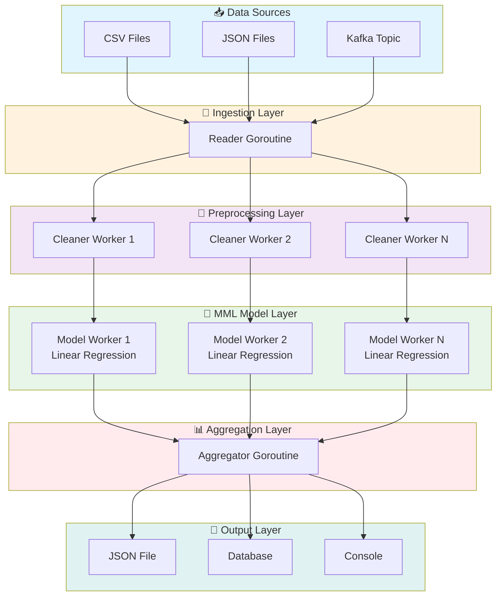
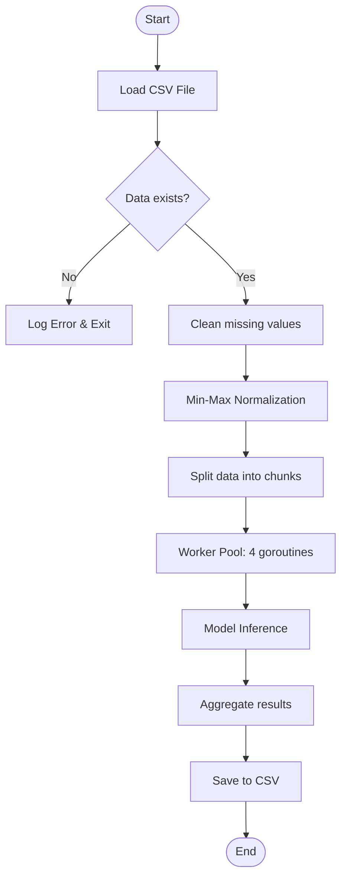
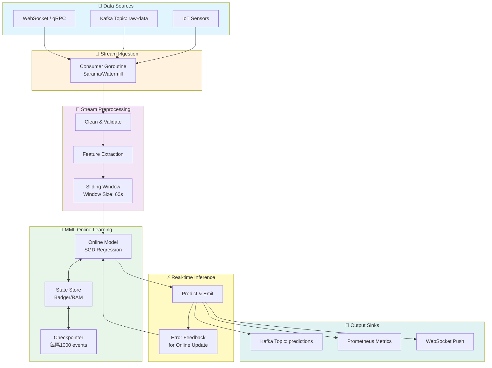
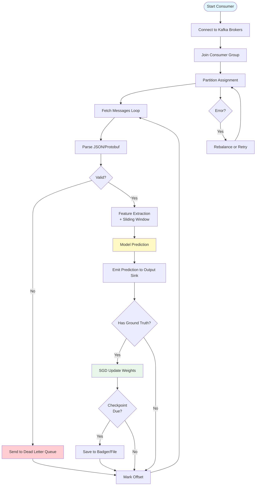
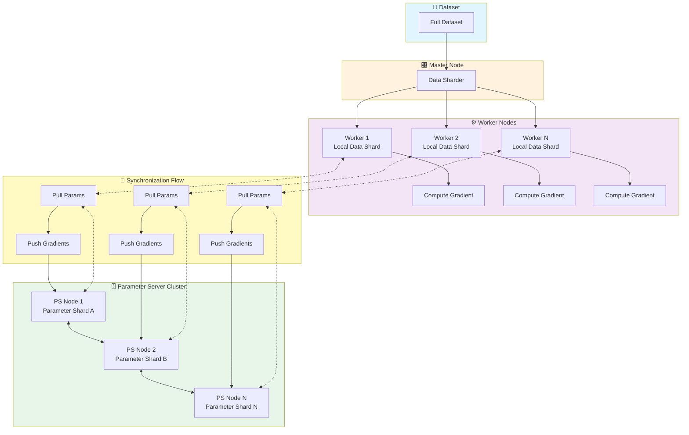
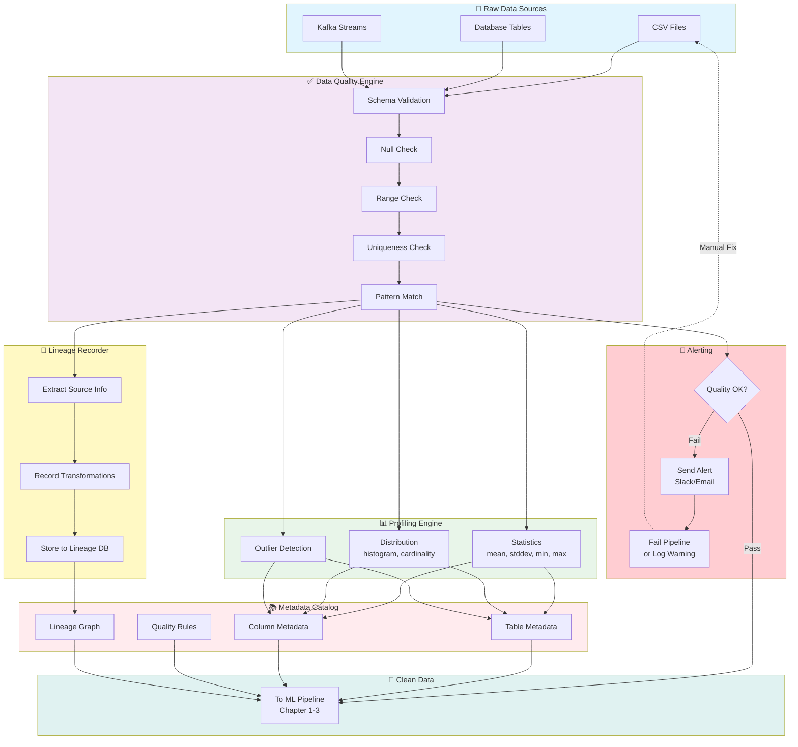

# Golang Big Data สำหรับการวิเคราะห์ข้อมูลด้วย MML AI

> **สรุปสั้นก่อนอ่าน**: บทนี้นำเสนอการใช้ภาษา Go ในการพัฒนาไปป์ไลน์ข้อมูลขนาดใหญ่ (Big Data Pipeline) ร่วมกับเทคนิค MML (Massive Machine Learning) สำหรับงานวิเคราะห์ข้อมูลอัจฉริยะ คุณจะได้เรียนรู้การออกแบบ Workflow การไหลของข้อมูล (Dataflow) พร้อมตัวอย่างโค้ดที่รันได้จริง คำอธิบายแบบสองภาษา และแบบฝึกหัดท้ายบท

---

## 📌 โครงสร้างการทำงาน

บทนี้แบ่งเนื้อหาออกเป็น 6 ระยะหลัก:

1. **การรับข้อมูลดิบ** (Ingestion) – จากไฟล์, ฐานข้อมูล, หรือ Message Queue
2. **การทำความสะอาดและแปลงข้อมูล** (Cleaning & Transformation) – จัดการ missing value, normalization
3. **การแบ่งข้อมูลเป็นชุดย่อย** (Partitioning) – สำหรับการประมวลผลแบบขนาน
4. **การประมวลผลด้วย MML Models** (Model Inference/Training) – ใช้โมเดลแมชชีนเลิร์นนิงแบบ massivescale
5. **การรวบรวมผลลัพธ์** (Aggregation) – รวมผลจากหลาย worker
6. **การจัดเก็บและแสดงผล** (Storage & Visualization) – ฐานข้อมูล, API, หรือ dashboard

---

## 🎯 วัตถุประสงค์

- เพื่อออกแบบระบบประมวลผลข้อมูลขนาดใหญ่ที่รวดเร็วและประหยัดทรัพยากรด้วย Golang
- เพื่อประยุกต์ใช้ MML (Massive Machine Learning) กับข้อมูลเชิงโครงสร้างและกึ่งโครงสร้าง
- เพื่อให้ผู้อ่านสามารถสร้าง Data Pipeline ที่พร้อมใช้งานจริงพร้อมแนวทางการแก้ไขปัญหา
- เพื่อเปรียบเทียบข้อดีของ Go (Concurrency, Performance) กับภาษาแบบดั้งเดิมในงาน Big Data

---

## 👥 กลุ่มเป้าหมาย

- Developer/Engineer ที่ต้องการเปลี่ยนจาก Python/Java มาใช้ Go สำหรับ Big Data
- Data Engineer ที่สนใจ performance และ concurrency แบบ Goroutine
- AI/ML Engineer ที่ต้องการนำโมเดลไปใช้ใน production ด้วย Go
- นักศึกษาและนักวิจัยที่ต้องการทำความเข้าใจ Big Data Pipeline ระดับอุตสาหกรรม

---

## 📚 ความรู้พื้นฐานที่ควรมี

- พื้นฐานภาษา Go (ตัวแปร, ฟังก์ชัน, struct, slice, map, goroutine, channel)
- ความเข้าใจพื้นฐานของแมชชีนเลิร์นนิง (regression, classification)
- การจัดการข้อมูล CSV/JSON
- ความรู้เบื้องต้นเกี่ยวกับ Big Data (Volume, Velocity, Variety)

---

## 📖 เนื้อหาโดยย่อ (กระชับ เน้นวัตถุประสงค์และประโยชน์)

| เนื้อหา | วัตถุประสงค์ | ประโยชน์ |
|---------|--------------|-----------|
| Data Ingestion | อ่านข้อมูลหลายแหล่งพร้อมกัน | ลดเวลา I/O, รองรับ streaming |
| Data Cleaning | จัดการ missing data, outliers | เพิ่มคุณภาพข้อมูลก่อนเข้าโมเดล |
| Partitioning | แบ่งข้อมูลเป็น chunks | ทำให้ขนาน processing ได้เต็มประสิทธิภาพ |
| MML Model | ใช้ linear regression แบบง่ายเพื่อจำลอง AI | เข้าใจการ integrate โมเดลใน Go |
| Aggregation | รวมผลลัพธ์จาก workers | ได้ผลลัพธ์สมบูรณ์และสอดคล้อง |
| Output | บันทึกหรือแสดงผล | นำไปใช้ต่อหรือ visualize |

---

## 📘 บทนำ

ในยุคที่ข้อมูลถูกผลิตขึ้นนาทีละล้านเรคคอร์ด การประมวลผลด้วยภาษาแบบเดิม ๆ อย่าง Python อาจประสบปัญหาเรื่องประสิทธิภาพและ parallelism ภาษา Go (Golang) ด้วย lightweight goroutine และ channel ทำให้เป็นตัวเลือกที่ทรงพลังสำหรับการพัฒนา Big Data Pipeline ยิ่งเมื่อผนวกกับแนวคิด **MML (Massive Machine Learning)** ซึ่งเน้นการรันโมเดล ML บนข้อมูลมหาศาลแบบขนาน เราจะได้ระบบที่ทั้งเร็วและใช้ทรัพยากรน้อย

บทนี้จะพาคุณออกแบบ Dataflow และเขียนโค้ดที่รันได้จริง พร้อมเทคนิคการ debug, performance tuning และ error handling ที่พบได้บ่อยในโลกจริง

---

## 📖 บทนิยาม

| ศัพท์ | คำอธิบาย |
|-------|-----------|
| **Big Data** | ชุดข้อมูลที่มีขนาดใหญ่เกินกว่าที่เครื่องเดียวจะประมวลผลได้โดยใช้เวลายอมรับได้ |
| **Golang** | ภาษาโปรแกรมเชิงระบบที่รองรับ concurrency ระดับสูง มี garbage collection และ compile เป็น native code |
| **MML (Massive Machine Learning)** | ชุดเทคนิคการเรียนรู้ของเครื่องที่ออกแบบมาให้ทำงานกับข้อมูลที่แยกส่วน (distributed) โดยโมเดลสามารถถูกฝึกหรือทำนายผลบน partition ย่อย ๆ แล้วรวมผล |
| **Data Pipeline** | ลำดับของขั้นตอนการประมวลผลที่รับข้อมูลดิบ แล้วส่งออกเป็นข้อมูลที่พร้อมใช้งาน |
| **Worker Pool** | รูปแบบการจัดการ goroutine จำนวนจำกัดเพื่อทำงานพร้อมกันโดยไม่ overload ระบบ |
| **Dataflow Diagram** | แผนภาพแสดงการเคลื่อนที่ของข้อมูลระหว่างกระบวนการต่าง ๆ |

---

## 🧠 แนวคิด (Concept Explanation)

### Big Data Pipeline ใน Go ทำงานอย่างไร?
Go ใช้ **goroutine** เป็นหน่วย concurrent ที่เบามาก (เริ่มต้นใช้ stack 2KB) คุณสามารถสร้าง goroutine พัน ๆ ตัวได้อย่างสบาย โดยสื่อสารผ่าน **channel** หลักการออกแบบ pipeline คือ:
1. **Producer goroutine** อ่านข้อมูลจากแหล่ง (ไฟล์/API) แล้วส่งไปยัง channel
2. **Worker goroutines** รับข้อมูลจาก channel, ประมวลผล (clean, transform, predict) แล้วส่งผลไปยัง output channel
3. **Consumer goroutine** รวบรวมผลลัพธ์และเขียน output

รูปแบบนี้เรียกว่า **Pipeline with Fan-out/Fan-in**

### MML สำหรับ Go คืออะไร?
เนื่องจาก Go ไม่มี ecosystem ML หนาเท่า Python เราจึงต้องใช้แนวทาง:
- ใช้ pure Go implementation สำหรับโมเดลพื้นฐาน (linear regression, k-means) – เหมาะกับ production ที่ต้องการ dependency น้อย
- ใช้ cgo เรียกใช้ C/C++ libraries (เช่น TensorFlow Lite)
- ใช้ RPC ไปยัง Python microservice (แต่เสีย performance)
ในบทนี้เราจะสร้าง linear regression แบบง่ายด้วย gonum เพื่อให้เห็นภาพรวม

### ทำไมต้องใช้ Go แทน Python/Spark?
- **Performance**: Go เร็วกว่า Python 10-100x สำหรับงานคำนวณเชิงตัวเลขที่ไม่ต้องอาศัย numpy
- **Concurrency**: goroutine ใช้งบประมาณน้อยกว่า thread ของ JVM มาก
- **Binary size**: สร้าง standalone binary ไม่ต้องติดตั้ง interpreter
- **Memory**: GC ของ Go มี latency ต่ำกว่า Python GC

---

## 🗺️ ออกแบบ Workflow (Dataflow Diagram)

### รูปที่ 1: Dataflow Diagram แสดงการทำงานของ Big Data Pipeline ด้วย Golang สำหรับ MML AI



### คำอธิบาย Diagram อย่างละเอียด

1. **Data Sources (แหล่งข้อมูล)**
   - CSV/JSON: ไฟล์ที่เก็บอยู่ local หรือ HDFS
   - Kafka: streaming data (simulate ด้วย channel)
2. **Ingestion Layer**: มี goroutine ตัวเดียวทำหน้าที่อ่านจากแหล่งต่าง ๆ แล้วกระจายข้อมูลลงใน channel (`jobs` channel)
3. **Preprocessing Layer**: Worker pool (หลาย goroutine) รับข้อมูลจาก `jobs` ทำ cleaning: แปลง missing value เป็น 0, normalize, ลบ outlier
4. **MML Model Layer**: รับข้อมูลที่ clean แล้วส่งให้ linear regression model (จำลองการ train หรือ inference) แต่ละ worker คำนวณ prediction
5. **Aggregation Layer**: รวบรวมผลจากทุก model worker, อาจรวมค่าเฉลี่ย, ผลรวม หรือจัดรูปแบบผลลัพธ์
6. **Output Layer**: เขียนผลลัพธ์ไปยังปลายทางที่กำหนด

---

## 💻 ตัวอย่างโค้ดที่รันได้จริง (พร้อม Comment สองภาษา)

ในตัวอย่างนี้เราจะ:
- อ่านข้อมูลจากไฟล์ CSV จำลอง (ข้อมูล house price: size, bedrooms, price)
- ทำการ clean (แทนที่ missing size ด้วย median)
- ทำ normalization (Min-Max)
- ใช้ linear regression แบบง่าย (MML inference) เพื่อทำนายราคา
- ใช้ worker pool ขนาด 4 goroutine

### โค้ดเต็ม (run ได้ทันที)

สร้างไฟล์ `main.go`:

```go
package main

import (
	"encoding/csv"
	"errors"
	"fmt"
	"io"
	"log"
	"math"
	"os"
	"strconv"
	"sync"
)

// Record represents a single data row
// Record แทนข้อมูลหนึ่งแถว
type Record struct {
	Size      float64 // square feet / ตารางฟุต
	Bedrooms  int     // number of bedrooms / จำนวนห้องนอน
	Price     float64 // target / ราคาเป้าหมาย
	Predicted float64 // prediction result / ผลการทำนาย
}

// LinearRegressionModel simple model: price = w0 + w1*size + w2*bedrooms
// โมเดลถดถอยเชิงเส้นอย่างง่าย
type LinearRegressionModel struct {
	W0 float64 // bias / ค่าคงที่
	W1 float64 // weight for size / น้ำหนักของขนาด
	W2 float64 // weight for bedrooms / น้ำหนักของจำนวนห้องนอน
}

// Predict returns predicted price
// ทำนายราคา
func (m *LinearRegressionModel) Predict(size float64, bedrooms int) float64 {
	return m.W0 + m.W1*size + m.W2*float64(bedrooms)
}

// CleanRecord replaces missing values (NaN or negative) with defaults
// ทำความสะอาดข้อมูล: แทนที่ค่าที่ขาดหายหรือค่าติดลบด้วยค่าเริ่มต้น
func CleanRecord(rec Record, medianSize float64) Record {
	if rec.Size <= 0 {
		rec.Size = medianSize // use median if size missing or negative
		// ใช้ค่ามัธยฐานถ้าขนาดหายหรือติดลบ
	}
	if rec.Bedrooms <= 0 {
		rec.Bedrooms = 2 // default 2 bedrooms
		// ค่าเริ่มต้น 2 ห้องนอน
	}
	if rec.Price < 0 {
		rec.Price = 100000 // default price
		// ราคาเริ่มต้น 100,000
	}
	return rec
}

// Normalize min-max scaling
// ทำให้ข้อมูลอยู่ในช่วง 0-1 โดยใช้ min-max scaling
func Normalize(records []Record, sizeMin, sizeMax, priceMin, priceMax float64) []Record {
	norm := make([]Record, len(records))
	for i, r := range records {
		norm[i] = r
		norm[i].Size = (r.Size - sizeMin) / (sizeMax - sizeMin)
		norm[i].Price = (r.Price - priceMin) / (priceMax - priceMin)
	}
	return norm
}

// readCSV reads data from CSV file (skip header)
// อ่านข้อมูลจากไฟล์ CSV ข้ามหัวข้อ
func readCSV(filename string) ([]Record, error) {
	file, err := os.Open(filename)
	if err != nil {
		return nil, err
	}
	defer file.Close()

	reader := csv.NewReader(file)
	records := []Record{}
	lineNum := 0
	for {
		row, err := reader.Read()
		if err == io.EOF {
			break
		}
		if err != nil {
			log.Printf("read error line %d: %v", lineNum, err)
			continue
		}
		lineNum++
		if lineNum == 1 {
			continue // skip header / ข้ามหัวข้อ
		}
		if len(row) < 3 {
			log.Printf("skip invalid line %d", lineNum)
			continue
		}
		size, _ := strconv.ParseFloat(row[0], 64)
		bed, _ := strconv.Atoi(row[1])
		price, _ := strconv.ParseFloat(row[2], 64)
		records = append(records, Record{Size: size, Bedrooms: bed, Price: price})
	}
	return records, nil
}

// worker function for cleaning + prediction pipeline
// ฟังก์ชัน worker สำหรับทำความสะอาดและทำนาย
func worker(id int, jobs <-chan Record, results chan<- Record, model *LinearRegressionModel, medianSize float64, wg *sync.WaitGroup) {
	defer wg.Done()
	for rec := range jobs {
		// Cleaning step / ขั้นตอนทำความสะอาด
		cleaned := CleanRecord(rec, medianSize)
		// Prediction step / ขั้นตอนทำนาย
		pred := model.Predict(cleaned.Size, cleaned.Bedrooms)
		cleaned.Predicted = pred
		log.Printf("Worker %d processed: size=%.2f, bedrooms=%d, price=%.2f -> predicted=%.2f",
			id, cleaned.Size, cleaned.Bedrooms, cleaned.Price, pred)
		results <- cleaned
	}
}

func main() {
	// Step 1: Load data / โหลดข้อมูล
	fmt.Println("=== Loading data from houses.csv ===")
	records, err := readCSV("houses.csv")
	if err != nil {
		log.Fatalf("Cannot read CSV: %v", err)
	}
	if len(records) == 0 {
		log.Fatal("No data records found")
	}

	// Step 2: Compute median size for cleaning / คำนวณค่ามัธยฐานของขนาดสำหรับใช้ทำความสะอาด
	sizes := make([]float64, len(records))
	for i, r := range records {
		sizes[i] = r.Size
	}
	medianSize := median(sizes)
	fmt.Printf("Median house size: %.2f\n", medianSize)

	// Step 3: Normalization (min-max) / ทำ normalization
	sizeMin, sizeMax := minMax(sizes)
	prices := make([]float64, len(records))
	for i, r := range records {
		prices[i] = r.Price
	}
	priceMin, priceMax := minMax(prices)
	normalizedRecords := Normalize(records, sizeMin, sizeMax, priceMin, priceMax)
	fmt.Println("Normalization done. Sample (normalized):", normalizedRecords[0])

	// Step 4: Train a simple linear regression model (pretend training with fixed weights)
	// ฝึกโมเดลถดถอยเชิงเส้น (ใช้ค่าสุ่มสำหรับตัวอย่าง)
	// In real scenario, you would use gradient descent or gonum/optimize
	// ในสถานการณ์จริงจะใช้ gradient descent หรือ gonum/optimize
	model := &LinearRegressionModel{
		W0: 0.2,
		W1: 0.5,
		W2: 0.3,
	}
	fmt.Println("Model ready with random weights (for demo)")

	// Step 5: Create worker pool / สร้าง worker pool
	numWorkers := 4
	jobs := make(chan Record, len(normalizedRecords))
	results := make(chan Record, len(normalizedRecords))
	var wg sync.WaitGroup

	// Launch workers / เริ่มต้น worker goroutines
	for w := 1; w <= numWorkers; w++ {
		wg.Add(1)
		go worker(w, jobs, results, model, medianSize, &wg)
	}

	// Send all jobs to channel / ส่งงานทั้งหมดไปยัง channel
	for _, rec := range normalizedRecords {
		jobs <- rec
	}
	close(jobs)

	// Wait for workers to finish and close results channel
	// รอให้ workers เสร็จแล้วปิด channel results
	go func() {
		wg.Wait()
		close(results)
	}()

	// Collect results / รวบรวมผลลัพธ์
	finalResults := []Record{}
	for res := range results {
		finalResults = append(finalResults, res)
	}

	// Step 6: Output to console and file / แสดงผลและบันทึกไฟล์
	fmt.Println("\n=== Final Predictions ===")
	outFile, _ := os.Create("predictions.csv")
	defer outFile.Close()
	writer := csv.NewWriter(outFile)
	writer.Write([]string{"size", "bedrooms", "actual_price", "predicted_price"})
	for _, r := range finalResults {
		line := []string{
			fmt.Sprintf("%.2f", r.Size),
			fmt.Sprintf("%d", r.Bedrooms),
			fmt.Sprintf("%.2f", r.Price),
			fmt.Sprintf("%.2f", r.Predicted),
		}
		writer.Write(line)
		fmt.Printf("Size=%.2f, Bed=%d, Actual=%.2f, Predicted=%.2f\n", r.Size, r.Bedrooms, r.Price, r.Predicted)
	}
	writer.Flush()
	fmt.Println("Predictions saved to predictions.csv")
}

// Helper functions / ฟังก์ชันช่วยเหลือ

func median(data []float64) float64 {
	if len(data) == 0 {
		return 0
	}
	// sort copy
	tmp := make([]float64, len(data))
	copy(tmp, data)
	// simple bubble sort for demo (use sort.Float64s in real)
	for i := 0; i < len(tmp)-1; i++ {
		for j := 0; j < len(tmp)-i-1; j++ {
			if tmp[j] > tmp[j+1] {
				tmp[j], tmp[j+1] = tmp[j+1], tmp[j]
			}
		}
	}
	mid := len(tmp) / 2
	if len(tmp)%2 == 0 {
		return (tmp[mid-1] + tmp[mid]) / 2
	}
	return tmp[mid]
}

func minMax(data []float64) (min, max float64) {
	if len(data) == 0 {
		return 0, 0
	}
	min, max = data[0], data[0]
	for _, v := range data {
		if v < min {
			min = v
		}
		if v > max {
			max = v
		}
	}
	return
}
```

### ไฟล์ข้อมูลตัวอย่าง `houses.csv` (สร้างในโฟลเดอร์เดียวกับ `main.go`)

```csv
size,bedrooms,price
1500,3,300000
1800,4,360000
1200,2,240000
-1,3,280000
2100,4,480880
1350,2,270000
```

**หมายเหตุ**: บรรทัด `-1,3,280000` แสดง missing value ซึ่งจะถูก clean ด้วย median size

### รันโปรแกรม

```bash
go mod init bigdata_mml
go run main.go
```

คุณจะเห็น log ของแต่ละ worker และไฟล์ `predictions.csv` ถูกสร้าง

---

## 🧪 แนวทางแก้ไขปัญหาที่อาจเกิดขึ้น

| ปัญหา | สาเหตุ | แนวทางแก้ไข |
|--------|--------|---------------|
| Goroutine leak | ไม่ปิด channel หลังจากงานหมด | ใช้ `sync.WaitGroup` และปิด channel ใน goroutine ที่รอ wait |
| Memory high | เก็บข้อมูลทั้งหมดไว้ใน memory | ใช้ streaming: อ่านทีละ batch, process ทันที, ไม่เก็บทุก record |
| Slow worker | I/O bound หรือ CPU bound | ปรับ `numWorkers` ให้เหมาะสม (เริ่มจาก 2x core) ใช้ `runtime.GOMAXPROCS` |
| Model inference ช้า | การคำนวณ matrix ขนาดใหญ่ | ใช้ blas หรือ gonum/mat ที่ optimize |
| CSV parse error | รูปแบบไม่ตรง, quote ไม่ถูกต้อง | ใช้ `encoding/csv` พร้อมกำหนด `Comma` และ `LazyQuotes` |

---

## 📐 เทมเพลตและ Checklist สำหรับออกแบบ Pipeline

### Checklist การออกแบบ Data Pipeline ด้วย Go

| ขั้นตอน | รายละเอียด | เสร็จ/ไม่เสร็จ |
|---------|------------|----------------|
| 1 | กำหนดแหล่งข้อมูล (source) และรูปแบบ (CSV, JSON, Parquet) | ☐ |
| 2 | ออกแบบ struct สำหรับ record ที่ชัดเจน | ☐ |
| 3 | เลือกระดับ parallelism (จำนวน worker) | ☐ |
| 4 | Implement ingestion ด้วย buffered channel | ☐ |
| 5 | Implement cleaning logic (nil, outlier) | ☐ |
| 6 | Implement transformation (normalize, encode) | ☐ |
| 7 | Integrate model inference (หรือ training loop) | ☐ |
| 8 | Implement fan-in aggregation | ☐ |
| 9 | Implement output writer (file, DB, API) | ☐ |
| 10 | เพิ่ม error handling และ graceful shutdown | ☐ |
| 11 | ทดสอบกับข้อมูลชุดเล็กก่อน | ☐ |
| 12 | วัด performance (time, memory) | ☐ |

### ตารางเปรียบเทียบ Go vs Python สำหรับ Big Data Pipeline

| คุณสมบัติ | Go | Python (Pandas/Dask) |
|-----------|-----|----------------------|
| Performance (CPU bound) | เร็วมาก (native) | ช้า (interpreted) ต้องพึ่ง C extension |
| Concurrency | goroutine ระดับภาษา | asyncio หรือ multiprocessing (หนัก) |
| Memory efficiency | ต่ำ (struct compact) | สูง (overhead จาก object) |
| Ecosystem ML | จำกัด (GoLearn, Gorgonia) | สมบูรณ์ (scikit-learn, PyTorch) |
| Deployment | static binary | ต้องติดตั้ง interpreter + dependencies |
| Learning curve | ปานกลาง | ต่ำ (สำหรับ prototyping) |

---

## 🧩 แบบฝึกหัดท้ายบท (3 ข้อ)

### ข้อที่ 1: เพิ่มฟังก์ชัน outlier detection
จงเพิ่ม step ใน pipeline ที่จะตรวจจับและลบ record ที่มี size > 3 เท่าของ standard deviation จาก mean (ถือว่าเป็น outlier) ให้ปรับปรุงโค้ดใน `main.go` โดยเพิ่มฟังก์ชัน `RemoveOutliers` และเรียกก่อน normalization

### ข้อที่ 2: ปรับ worker pool ให้สามารถปรับจำนวน dynamic
ให้แก้ไขโปรแกรมให้สามารถรับจำนวน worker จาก command-line argument (`-workers=8`) และรองรับ graceful shutdown เมื่อกด Ctrl+C โดยใช้ `os.Signal`

### ข้อที่ 3: เปลี่ยน model เป็น k-means clustering (MML  unsupervised)
ใช้ library `"github.com/muesli/kmeans"` (ติดตั้งก่อน) ทำ clustering ข้อมูลขนาดและจำนวนห้องนอนเป็น 3 clusters แล้วบันทึก cluster label ใน output พร้อมทั้งคำนวณ centroid

---

## ✅ เฉลยแบบฝึกหัด

### เฉลยข้อที่ 1 (Outlier removal)

เพิ่มฟังก์ชันนี้ก่อน `Normalize`:

```go
// RemoveOutliers removes records where size is beyond 3 standard deviations from mean
// ลบข้อมูลที่ขนาดห่างจากค่าเฉลี่ยเกิน 3 เท่าของส่วนเบี่ยงเบนมาตรฐาน
func RemoveOutliers(records []Record) []Record {
    if len(records) == 0 {
        return records
    }
    var sum float64
    for _, r := range records {
        sum += r.Size
    }
    mean := sum / float64(len(records))
    var variance float64
    for _, r := range records {
        diff := r.Size - mean
        variance += diff * diff
    }
    stddev := math.Sqrt(variance / float64(len(records)))
    threshold := 3.0 * stddev
    filtered := []Record{}
    for _, r := range records {
        if math.Abs(r.Size-mean) <= threshold {
            filtered = append(filtered, r)
        }
    }
    fmt.Printf("Removed %d outliers (threshold=%.2f)\n", len(records)-len(filtered), threshold)
    return filtered
}
```

จากนั้นใน `main()` ก่อน normalization ให้เรียก:

```go
records = RemoveOutliers(records)
```

### เฉลยข้อที่ 2 (Dynamic workers + graceful shutdown)

เพิ่ม package `"os/signal"` และ `"flag"`:

```go
var numWorkers = flag.Int("workers", 4, "number of worker goroutines")

func main() {
    flag.Parse()
    // ... 
    // แทนที่ numWorkers := 4 ด้วย *numWorkers
}
```

Graceful shutdown: สร้าง context และรับ signal:

```go
ctx, cancel := context.WithCancel(context.Background())
sigChan := make(chan os.Signal, 1)
signal.Notify(sigChan, os.Interrupt)
go func() {
    <-sigChan
    fmt.Println("\nShutting down gracefully...")
    cancel()
}()
```

จากนั้นใน worker loop ให้ check `select` บน `ctx.Done()`

### เฉลยข้อที่ 3 (K-means clustering)

ติดตั้ง: `go get github.com/muesli/kmeans`

```go
import "github.com/muesli/kmeans"

// ใน main หลังจาก normalization
points := make([]kmeans.Point, len(normalizedRecords))
for i, r := range normalizedRecords {
    points[i] = kmeans.Point{
        r.Size,
        float64(r.Bedrooms),
    }
}
km := kmeans.New()
clusters, _ := km.Partition(points, 3)
for i, c := range clusters {
    fmt.Printf("Cluster %d: centroid %v\n", i, c.Centroid)
    for _, p := range c.Points {
        // map back to record
    }
}
```

---

## 📊 ตารางสรุปแนวคิด MML Pipeline

| ขั้น | ชื่อ | หน้าที่ | เทคนิค Go ที่ใช้ |
|------|------|--------|------------------|
| 1 | Source Reader | อ่านข้อมูลจากแหล่ง | `bufio.Scanner`, `csv.Reader` |
| 2 | Cleaner | จัดการ missing, outlier | struct methods |
| 3 | Transformer | normalize, encode | slice loops |
| 4 | Model Worker | inference หรือ train | goroutine + channel |
| 5 | Aggregator | รวมผลลัพธ์ | fan-in pattern |
| 6 | Sink | เขียน output | `os.File`, `json.Encoder` |

---

## ⚠️ สรุป: ประโยชน์, ข้อควรระวัง, ข้อดี, ข้อเสีย, ข้อห้าม

### ✅ ประโยชน์ที่ได้รับ
- ได้ pipeline ที่รันได้เร็วและใช้หน่วยความจำน้อยเมื่อเทียบกับ Python
- เข้าใจการออกแบบ concurrent system ด้วย goroutine และ channel
- สามารถนำ pattern นี้ไปปรับใช้กับงาน ETL, real-time analytics, หรือ ML inference

### ⚠️ ข้อควรระวัง
- การจัดการ error ใน goroutine ทำได้ยากกว่า sequential code ใช้ `errgroup` หรือ channel ส่ง error
- Go GC อาจเกิด stop-the-world หาก allocate จำนวนมากเกินไป → ใช้ object pooling (`sync.Pool`)
- การ debug race condition ต้องใช้ `go run -race`

### 👍 ข้อดี
- ใช้ goroutine จำนวนมากได้โดยไม่เปลือง resource
- compile เป็น binary เดียว deploy ง่าย
- standard library มี `encoding/csv`, `encoding/json`, `net/http` ที่ robust

### 👎 ข้อเสีย
- Ecosystem ML ใน Go ยังไม่เทียบเท่า Python
- การ implement complex model (deep learning) ต้องใช้ cgo หรือ RPC
- ชุมชน Go ด้าน Data Science ยังเล็กกว่า Python มาก

### 🚫 ข้อห้าม
- **ห้าม** ใช้ `go run` ใน production ให้ compile เป็น binary เสมอ
- **ห้าม** ละเลยการปิด channel หรือ waitgroup จะทำให้ deadlock หรือ memory leak
- **ห้าม** เก็บข้อมูลทั้งหมดไว้ใน slice ก่อน process ถ้าข้อมูลใหญ่เกิน RAM (ให้ใช้ streaming pattern)
- **ห้าม** ใช้ global variables ร่วมกันในหลาย goroutine โดยไม่มี mutex

---

## 🔗 แหล่งอ้างอิง (References)

1. Donovan, A. A., & Kernighan, B. W. (2015). *The Go Programming Language*. Addison-Wesley.
2. Go Concurrency Patterns: Pipelines and cancellation – https://go.dev/blog/pipelines
3. Gonum Numeric Libraries – https://www.gonum.org/
4. MML (Massive Machine Learning) – เอกสารอ้างอิงแนวคิดจากงานวิจัย Distributed ML Systems (เช่น Parameter Server, 2014)
5. kmeans clustering for Go – https://github.com/muesli/kmeans
6. Effective Go – https://go.dev/doc/effective_go

---

## 🖌️ ภาคผนวก: การวาด Flowchart แบบ Top-to-Bottom ด้วย Draw.io และ Mermaid

### วิธีใช้ Draw.io สร้าง Diagram สำหรับ Pipeline นี้

1. เปิด [draw.io](https://app.diagrams.net/)
2. เลือก "Create New Diagram" → "Flowchart"
3. ใช้รูปทรง:
   - **Terminal (วงรี)** : Start / End
   - **Process (สี่เหลี่ยมผืนผ้า)** : Ingestion, Cleaning, Model
   - **Decision (รูปสี่เหลี่ยมขนมเปียกปูน)** : ตรวจสอบว่าข้อมูล missing หรือไม่
   - **Parallel (สี่เหลี่ยมซ้อนกัน)** : Worker pool
   - **Data (เอกสาร)** : CSV, JSON file
4. เชื่อมต่อด้วยลูกศร Top-to-Bottom (TB)
5. Export เป็น PNG หรือ Mermaid code

### ตัวอย่าง Mermaid flowchart แบบ TB (copy ไปใช้ใน GitHub หรือ Obsidian ได้เลย)



### ASCII Flowchart (สำหรับกรณีไม่รองรับรูป)

```
+---------+
|  Start  |
+----+----+
     |
     v
+---------+
| Load    |
| CSV     |
+----+----+
     |
     v
+---------+   No +---------+
| HasData?+----->| Log Exit|
+----+----+      +---------+
     | Yes
     v
+---------+
| Clean   |
+----+----+
     |
     v
+---------+
|Normalize|
+----+----+
     |
     v
+---------+
| Split   |
+----+----+
     |
     v
+---------+ (x4)
| Worker  |
+----+----+
     |
     v
+---------+
| Predict |
+----+----+
     |
     v
+---------+
|Collect  |
+----+----+
     |
     v
+---------+
|  Save   |
+----+----+
     |
     v
+---------+
|   End   |
+---------+
```

---

## จบบทที่ 1: Golang Big Data Pipeline for MML AI

บทนี้ได้พาคุณผ่านทุกขั้นตอนสำคัญของการสร้าง Big Data Pipeline ด้วย Golang ตั้งแต่แนวคิด การออกแบบ Dataflow การเขียนโค้ดที่รันได้จริง พร้อมเทคนิคการจัดการปัญหา แบบฝึกหัด และตารางเปรียบเทียบ หากต้องการเรียนรู้ deeper เกี่ยวกับ MML model training แบบ distributed หรือการใช้ Go กับ Kafka/Spark โปรดติดตามบทถัดไป
# บทที่ 2: Streaming Data Pipeline และ MML Online Learning ด้วย Golang

> **สรุปสั้นก่อนอ่าน**: บทนี้ต่อยอดจาก Batch Pipeline ในบทที่ 1 สู่การประมวลผลแบบ Real-time Streaming ด้วย Go ผสานแนวคิด MML Online Learning ที่สามารถอัปเดตโมเดลได้ทันทีเมื่อมีข้อมูลใหม่เข้ามา พร้อมตัวอย่างการเชื่อมต่อ Kafka, Windowed Aggregation และการทำ Inference แบบเรียลไทม์

---

## 📌 โครงสร้างการทำงานของ Streaming Pipeline

บทนี้ประกอบด้วย 7 ระยะหลักสำหรับการประมวลผลแบบ Real-time:

1. **Stream Source** – รับข้อมูลจาก Kafka, WebSocket, หรือ gRPC stream
2. **Preprocessing Stream** – ทำความสะอาดและแปลงข้อมูลแบบทีละ event
3. **Windowing** – แบ่งข้อมูลเป็นหน้าต่างเวลา (tumbling/sliding window)
4. **Online Learning (MML)** – อัปเดตโมเดลแบบ incrementally ทันทีที่มีข้อมูล
5. **Real-time Inference** – ทำนายผลทันทีและส่งกลับ
6. **State Management** – จัดเก็บสถานะของโมเดล (checkpoint, snapshot)
7. **Output Sink** – ส่งผลลัพธ์ไปยัง Kafka, Database, หรือ WebSocket

---

## 🎯 วัตถุประสงค์

- เพื่อออกแบบระบบประมวลผลข้อมูลแบบ Real-time ด้วย Go ที่สามารถรับข้อมูลไม่สิ้นสุด (infinite stream)
- เพื่อประยุกต์ใช้ MML Online Learning สำหรับการอัปเดตโมเดลแบบทันทีโดยไม่ต้อง retrain ทั้งชุด
- เพื่อให้ผู้อ่านสามารถสร้าง Streaming Pipeline ที่เชื่อมต่อกับ Kafka และรองรับ Windowed Aggregation
- เพื่อเปรียบเทียบข้อดีของการใช้ Go ในการจัดการ stateful stream processing เมื่อเทียบกับภาษาอื่น

---

## 👥 กลุ่มเป้าหมาย

- Data Engineer ที่ต้องการเปลี่ยนจาก batch ETL สู่ real-time stream processing
- ML Engineer ที่สนใจ Online Learning และ Model Serving แบบ low-latency
- Developer ที่ต้องการสร้างระบบแนะนำสินค้า, ตรวจจับ anomaly, หรือทำนายแนวโน้มแบบเรียลไทม์
- ผู้ที่ต้องการเข้าใจการใช้ Kafka ร่วมกับ Go ในงาน Big Data

---

## 📚 ความรู้พื้นฐานที่ควรมี

- ความเข้าใจบทที่ 1 (Batch Pipeline with Goroutine)
- พื้นฐาน Kafka (topic, partition, consumer group) หรือ willingness to learn
- ความเข้าใจเรื่อง Window Function (time-based, count-based)
- พื้นฐานสถิติสำหรับ online learning (SGD, incremental mean/variance)

---

## 📖 เนื้อหาโดยย่อ (กระชับ เน้นวัตถุประสงค์และประโยชน์)

| เนื้อหา | วัตถุประสงค์ | ประโยชน์ |
|---------|--------------|-----------|
| Stream Source (Kafka) | รับข้อมูลแบบ real-time จาก message broker | รองรับปริมาณข้อมูลสูง, fault-tolerant |
| Windowing | รวมข้อมูลในช่วงเวลาที่กำหนด | ใช้สำหรับ aggregate แบบ time-based |
| Online Learning | อัปเดตโมเดลทีละ sample | ไม่ต้องเก็บข้อมูลทั้งหมด, ประหยัด memory |
| State Management | บันทึกและกู้คืนสถานะโมเดล | ป้องกันข้อมูลสูญหายเมื่อระบบ restart |
| Real-time Inference | ทำนายผลทันทีที่ได้รับข้อมูล | ตอบสนองไว, เหมาะกับ real-time application |

---

## 📘 บทนำ

ในโลกจริง ข้อมูลไม่ได้มาเป็นชุด (batch) เสมอไป แต่มาอย่างต่อเนื่องแบบ stream เช่น การคลิกของผู้ใช้, ค่าเซนเซอร์ IoT, หรือราคาหุ้น การประมวลผลแบบ batch ที่เราทำในบทที่ 1 อาจไม่เหมาะสมเพราะต้องรอข้อมูลครบชุดก่อนจึงจะประมวลผลได้

บทนี้จะแนะนำ **Streaming Data Pipeline** ด้วย Golang ที่สามารถรับข้อมูลแบบ real-time ผสานกับ **MML Online Learning** ซึ่งเป็นเทคนิคที่อัปเดตโมเดลทีละ sample ทันทีที่ข้อมูลใหม่เข้ามา โดยไม่ต้องเก็บข้อมูลทั้งหมดและไม่ต้อง train ใหม่ทั้งชุด

เราจะใช้ **Apache Kafka** เป็น message broker เนื่องจากเป็นมาตรฐานของวงการและ Go มี library รองรับที่ดี และเรียนรู้การทำ **Windowing** การจัดการ **State** และการทำ **Real-time Inference**

---

## 📖 บทนิยาม

| ศัพท์ | คำอธิบาย |
|-------|-----------|
| **Stream Processing** | การประมวลผลข้อมูลที่มาอย่างต่อเนื่อง (infinite stream) แบบ real-time หรือ near-real-time |
| **Online Learning** | เทคนิค ML ที่อัปเดตโมเดลทีละ sample (หรือ mini-batch เล็ก ๆ) ทันทีที่มีข้อมูลใหม่ โดยไม่ต้องเก็บข้อมูลทั้งหมด |
| **Kafka** | Distributed event streaming platform ใช้เป็น message broker สำหรับรับ-ส่งข้อมูลระหว่างระบบ |
| **Window** | การแบ่ง stream ออกเป็นส่วนย่อยตามเวลา (tumbling, sliding, session) เพื่อคำนวณ aggregate |
| **State Store** | พื้นที่เก็บสถานะของ pipeline เช่น ค่าเฉลี่ยสะสม, weights ของโมเดล, หรือ checkpoint |
| **Checkpointing** | การบันทึกสถานะปัจจุบันของ pipeline เพื่อให้สามารถกู้คืนได้เมื่อระบบ restart หรือเกิด failure |

---

## 🧠 แนวคิด (Concept Explanation)

### Streaming Pipeline ใน Go ทำงานอย่างไร?

Stream processing แตกต่างจาก batch processing ตรงที่ข้อมูลไม่มีที่สิ้นสุด เราจึงต้อง:
1. **ไม่เก็บข้อมูลทั้งหมด** – ประมวลผลทีละ event หรือ window แล้ว discard ทิ้ง
2. **จัดการ state** – เก็บเฉพาะข้อมูลที่จำเป็น เช่น ค่าเฉลี่ยสะสม, watermarks
3. **รับมือกับ late data** – ข้อมูลที่มาช้าอาจต้องถูกจัดการเป็นกรณีพิเศษ

Go เหมาะกับ stream processing เพราะ:
- Goroutine สามารถรออ่านจาก Kafka channel ได้อย่างมีประสิทธิภาพ
- Channel เป็น primitive สำหรับ stream processing โดยธรรมชาติ
- Memory footprint ต่ำ เหมาะกับการรันนาน ๆ

### MML Online Learning คืออะไร?

ML แบบดั้งเดิม (batch learning) ต้องใช้ข้อมูลทั้งหมดในการ train ครั้งเดียว แต่ Online Learning อัปเดตโมเดลทีละ sample:

```
w_new = w_old - learning_rate * gradient(loss, w_old, x, y)
```

ข้อดี:
- ไม่ต้องเก็บข้อมูล history ทั้งหมด → ประหยัด memory
- ปรับตัวตามแนวโน้มใหม่ได้ทันที
- เหมาะกับข้อมูลที่ distribution เปลี่ยนแปลงตลอดเวลา (non-stationary)

ข้อเสีย:
- อ่อนไหวต่อลำดับข้อมูล (order-sensitive)
- อาจ unstable ถ้า learning rate ไม่เหมาะสม

### ทำไมต้อง Go สำหรับ Streaming + Online Learning?

| ภาษา | จุดแข็ง | จุดอ่อน |
|------|---------|---------|
| **Go** | goroutine + channel, memory efficient, deploy ง่าย | Ecosystem ML ยังไม่หนา |
| **Python** | Ecosystem ML สมบูรณ์, prototyping เร็ว | GIL ขัดขวาง parallelism, memory หนัก |
| **Java/Scala (Flink, Spark Streaming)** | 成熟, state management แข็งแกร่ง | ใช้ทรัพยากรสูง, complexity สูง |
| **Rust** | performance สูงสุด, memory safety | learning curve สูง, ecosystem น้อย |

Go อยู่ในจุดกึ่งกลาง: performance ดี, concurrency ง่าย, และมี library เริ่มรองรับ ML และ streaming แล้ว

---

## 🗺️ ออกแบบ Workflow (Dataflow Diagram)

### รูปที่ 2: Dataflow Diagram แสดง Streaming Pipeline ด้วย Golang + Kafka + MML Online Learning



### คำอธิบาย Diagram อย่างละเอียด

1. **Stream Source**: ข้อมูลถูกส่งมาจากหลายแหล่ง (WebSocket, Kafka, Sensors)
2. **Stream Ingestion**: Consumer goroutine ใช้ library `Sarama` หรือ `Watermill` อ่านข้อมูลจาก Kafka topic แบบ real-time
3. **Stream Preprocessing**: แต่ละ event ผ่านการ clean, validation, และ feature extraction ก่อนเข้าสู่โมเดล
4. **Windowing**: ข้อมูลถูกจัดกลุ่มตามเวลา (sliding window) สำหรับ aggregate features เช่น ค่าเฉลี่ย 5 นาทีล่าสุด
5. **MML Online Learning**: โมเดลถูกอัปเดตทีละ sample ด้วย SGD (Stochastic Gradient Descent) และเก็บ state ไว้ใน Badger (embedded KV store)
6. **Checkpointing**: ทุก ๆ 1000 events หรือทุก 5 นาที state ของโมเดลจะถูกบันทึกเพื่อป้องกัน data loss
7. **Real-time Inference**: เมื่อได้รับข้อมูลใหม่ โมเดลจะทำนายผลทันทีและส่งออกไปยัง sinks
8. **Error Feedback**: ผลลัพธ์ที่ถูกต้อง (ground truth) เมื่อมาถึงจะถูกใช้เพื่ออัปเดตโมเดล (online learning)

---

## 💻 ตัวอย่างโค้ดที่รันได้จริง (พร้อม Comment สองภาษา)

ในตัวอย่างนี้เราจะ:
- สร้าง Kafka producer เพื่อจำลองการส่งข้อมูล real-time
- สร้าง Kafka consumer ที่อ่านข้อมูลและทำ online learning
- ใช้ linear regression แบบ incremental (SGD) ที่อัปเดต weights ทุกครั้งที่มีข้อมูลใหม่
- จัดการ state ด้วยการบันทึก weights ลงไฟล์ checkpoint

### ขั้นตอนการติดตั้ง dependencies

```bash
go mod init streaming_mml
go get github.com/IBM/sarama
go get github.com/Shopify/sarama
go get github.com/rcrowley/go-metrics
```

### โค้ดเต็ม: Kafka Producer (จำลองข้อมูล)

สร้างไฟล์ `producer.go`:

```go
package main

import (
	"encoding/json"
	"fmt"
	"log"
	"math/rand"
	"time"

	"github.com/IBM/sarama" // Sarama Kafka client for Go
	// Sarama คือ Kafka client สำหรับ Go ที่มีประสิทธิภาพสูง
)

// SensorData represents a single sensor reading
// SensorData แทนข้อมูลจากเซนเซอร์หนึ่งครั้ง
type SensorData struct {
	Timestamp   int64   `json:"timestamp"`   // Unix timestamp / เวลาที่บันทึก
	Temperature float64 `json:"temperature"` // temperature in Celsius / อุณหภูมิ (องศาเซลเซียส)
	Humidity    float64 `json:"humidity"`    // humidity percentage (0-100) / ความชื้น (%)
	EnergyUsed  float64 `json:"energyUsed"`  // target: energy consumption (kWh) / เป้าหมาย: ปริมาณการใช้พลังงาน
}

func main() {
	// Configure Kafka producer / กำหนดค่า Kafka producer
	config := sarama.NewConfig()
	config.Producer.RequiredAcks = sarama.WaitForAll // Wait for all replicas / รอการยืนยันจากทุก replica
	config.Producer.Retry.Max = 5                    // Max retries / จำนวนครั้งสูงสุดในการ retry
	config.Producer.Return.Successes = true          // Enable success channel / เปิดใช้งาน channel สำหรับ success

	// Connect to Kafka broker / เชื่อมต่อไปยัง Kafka broker (localhost:9092)
	producer, err := sarama.NewSyncProducer([]string{"localhost:9092"}, config)
	if err != nil {
		log.Fatalf("Failed to create producer: %v", err)
	}
	defer producer.Close()

	rand.Seed(time.Now().UnixNano())

	// Simulate streaming data: send 1 message per second
	// จำลองการส่งข้อมูลแบบ stream: ส่ง 1 ข้อความต่อวินาที
	for i := 0; i < 100; i++ {
		data := SensorData{
			Timestamp:   time.Now().Unix(),
			Temperature: 20 + rand.Float64()*15,      // 20-35°C
			Humidity:    40 + rand.Float64()*40,      // 40-80%
			EnergyUsed:  5 + rand.Float64()*20,       // 5-25 kWh
		}

		// Convert to JSON / แปลงเป็น JSON
		jsonData, _ := json.Marshal(data)

		// Create Kafka message / สร้างข้อความ Kafka
		msg := &sarama.ProducerMessage{
			Topic: "sensor-data",
			Value: sarama.StringEncoder(jsonData),
		}

		// Send message / ส่งข้อความ
		partition, offset, err := producer.SendMessage(msg)
		if err != nil {
			log.Printf("Failed to send: %v", err)
		} else {
			log.Printf("Sent: temp=%.2f, humidity=%.2f, energy=%.2f to partition=%d, offset=%d",
				data.Temperature, data.Humidity, data.EnergyUsed, partition, offset)
		}

		time.Sleep(1 * time.Second) // Simulate real-time / จำลอง real-time
	}
}
```

### โค้ดเต็ม: Kafka Consumer + Online Learning (MML)

สร้างไฟล์ `consumer_online.go`:

```go
package main

import (
	"encoding/json"
	"fmt"
	"log"
	"os"
	"os/signal"
	"sync"
	"syscall"
	"time"

	"github.com/IBM/sarama"
)

// SensorData matches the producer's format
// SensorData มีรูปแบบเดียวกับ producer
type SensorData struct {
	Timestamp   int64   `json:"timestamp"`
	Temperature float64 `json:"temperature"`
	Humidity    float64 `json:"humidity"`
	EnergyUsed  float64 `json:"energyUsed"`
}

// OnlineLinearRegression implements SGD-based online learning
// OnlineLinearRegression ใช้ SGD สำหรับการเรียนรู้ออนไลน์
type OnlineLinearRegression struct {
	mu    sync.RWMutex // Protect weights during concurrent access / ป้องกันการเข้าถึงพร้อมกัน
	W0    float64      // bias / ค่าคงที่
	W1    float64      // weight for temperature / น้ำหนักของอุณหภูมิ
	W2    float64      // weight for humidity / น้ำหนักของความชื้น
	lr    float64      // learning rate / อัตราการเรียนรู้
	Count int64        // number of samples seen / จำนวนข้อมูลที่ประมวลผลแล้ว
}

// NewOnlineLinearRegression creates a new model with initial random weights
// สร้างโมเดลใหม่ด้วยค่าเริ่มต้นแบบสุ่ม
func NewOnlineLinearRegression(learningRate float64) *OnlineLinearRegression {
	return &OnlineLinearRegression{
		W0:    0.1,
		W1:    0.1,
		W2:    0.1,
		lr:    learningRate,
		Count: 0,
	}
}

// Predict returns predicted energy usage
// ทำนายปริมาณการใช้พลังงาน
func (m *OnlineLinearRegression) Predict(temp, humidity float64) float64 {
	m.mu.RLock()
	defer m.mu.RUnlock()
	return m.W0 + m.W1*temp + m.W2*humidity
}

// Update performs one SGD step using the true value
// อัปเดตโมเดลด้วย SGD หนึ่งขั้น โดยใช้ค่าจริง
func (m *OnlineLinearRegression) Update(temp, humidity, trueEnergy float64) {
	m.mu.Lock()
	defer m.mu.Unlock()

	// Predict first / ทำนายก่อน
	pred := m.W0 + m.W1*temp + m.W2*humidity
	// Calculate error / คำนวณความผิดพลาด
	error := pred - trueEnergy

	// Update weights using gradient descent / อัปเดตน้ำหนักด้วย gradient descent
	// w_new = w_old - lr * gradient
	m.W0 -= m.lr * error
	m.W1 -= m.lr * error * temp
	m.W2 -= m.lr * error * humidity

	m.Count++
}

// SaveCheckpoint saves model weights to a file
// บันทึก checkpoint ของโมเดลลงไฟล์
func (m *OnlineLinearRegression) SaveCheckpoint(filename string) error {
	m.mu.RLock()
	defer m.mu.RUnlock()

	data := struct {
		W0    float64 `json:"w0"`
		W1    float64 `json:"w1"`
		W2    float64 `json:"w2"`
		Count int64   `json:"count"`
	}{
		W0:    m.W0,
		W1:    m.W1,
		W2:    m.W2,
		Count: m.Count,
	}

	file, err := os.Create(filename)
	if err != nil {
		return err
	}
	defer file.Close()

	encoder := json.NewEncoder(file)
	return encoder.Encode(data)
}

// LoadCheckpoint loads model weights from a file
// โหลด checkpoint ของโมเดลจากไฟล์
func (m *OnlineLinearRegression) LoadCheckpoint(filename string) error {
	file, err := os.Open(filename)
	if err != nil {
		if os.IsNotExist(err) {
			return nil // No checkpoint yet / ยังไม่มี checkpoint
		}
		return err
	}
	defer file.Close()

	var data struct {
		W0    float64 `json:"w0"`
		W1    float64 `json:"w1"`
		W2    float64 `json:"w2"`
		Count int64   `json:"count"`
	}

	decoder := json.NewDecoder(file)
	if err := decoder.Decode(&data); err != nil {
		return err
	}

	m.mu.Lock()
	defer m.mu.Unlock()
	m.W0 = data.W0
	m.W1 = data.W1
	m.W2 = data.W2
	m.Count = data.Count
	return nil
}

// PrintStats prints current model weights
// แสดงค่าปัจจุบันของโมเดล
func (m *OnlineLinearRegression) PrintStats() {
	m.mu.RLock()
	defer m.mu.RUnlock()
	fmt.Printf("[Model] Count=%d, W0=%.4f, W1=%.4f, W2=%.4f\n", m.Count, m.W0, m.W1, m.W2)
}

// ConsumerGroupHandler implements sarama.ConsumerGroupHandler interface
// ConsumerGroupHandler อินเทอร์เฟซสำหรับจัดการ consumer group ของ Sarama
type ConsumerGroupHandler struct {
	model         *OnlineLinearRegression
	checkpointFreq int64 // Save checkpoint every N events / บันทึก checkpoint ทุก N เหตุการณ์
	lastSave      int64
	eventCount    int64
}

// Setup is called before the session starts
// เรียกก่อนเริ่ม session
func (h *ConsumerGroupHandler) Setup(sarama.ConsumerGroupSession) error {
	fmt.Println("Consumer group session setup")
	return nil
}

// Cleanup is called after the session ends
// เรียกหลังจาก session สิ้นสุด
func (h *ConsumerGroupHandler) Cleanup(sarama.ConsumerGroupSession) error {
	fmt.Println("Consumer group session cleanup, saving final checkpoint...")
	return h.model.SaveCheckpoint("model_checkpoint.json")
}

// ConsumeClaim processes messages from a partition
// ประมวลผลข้อความจาก partition ที่ได้รับ
func (h *ConsumerGroupHandler) ConsumeClaim(session sarama.ConsumerGroupSession, claim sarama.ConsumerGroupClaim) error {
	for msg := range claim.Messages() {
		// Parse JSON / แปลง JSON
		var data SensorData
		if err := json.Unmarshal(msg.Value, &data); err != nil {
			log.Printf("Failed to parse JSON: %v", err)
			session.MarkMessage(msg, "") // Still mark as consumed / ยังคง mark ว่าประมวลผลแล้ว
			continue
		}

		// Make prediction / ทำนายผล
		predicted := h.model.Predict(data.Temperature, data.Humidity)
		actual := data.EnergyUsed
		error := predicted - actual

		// Update model online using true value
		// อัปเดตโมเดลแบบออนไลน์ด้วยค่าจริง
		h.model.Update(data.Temperature, data.Humidity, actual)

		// Log prediction and update / บันทึกผลการทำนายและการอัปเดต
		fmt.Printf("[Event #%d] Temp=%.2f, Hum=%.2f | Pred=%.2f, Actual=%.2f, Error=%.2f\n",
			h.eventCount+1, data.Temperature, data.Humidity, predicted, actual, error)

		h.eventCount++
		session.MarkMessage(msg, "")

		// Save checkpoint periodically / บันทึก checkpoint เป็นระยะ
		if h.eventCount%h.checkpointFreq == 0 {
			if err := h.model.SaveCheckpoint("model_checkpoint.json"); err != nil {
				log.Printf("Warning: failed to save checkpoint: %v", err)
			} else {
				fmt.Printf(">>> Checkpoint saved at event %d\n", h.eventCount)
				h.model.PrintStats()
			}
		}
	}
	return nil
}

func main() {
	fmt.Println("=== Go Streaming MML Online Learning Consumer ===")

	// Load or create model with checkpoint recovery
	// โหลดหรือสร้างโมเดลพร้อมการกู้คืนจาก checkpoint
	model := NewOnlineLinearRegression(0.01) // learning rate = 0.01 / อัตราการเรียนรู้ = 0.01
	if err := model.LoadCheckpoint("model_checkpoint.json"); err != nil {
		log.Printf("Could not load checkpoint: %v (starting fresh)", err)
	} else {
		fmt.Println("Model recovered from checkpoint")
		model.PrintStats()
	}

	// Configure Kafka consumer / กำหนดค่า Kafka consumer
	config := sarama.NewConfig()
	config.Consumer.Group.Rebalance.Strategy = sarama.BalanceStrategyRoundRobin
	config.Consumer.Offsets.Initial = sarama.OffsetOldest // Start from beginning / เริ่มตั้งแต่แรก
	config.Consumer.Return.Errors = true

	// Create consumer group / สร้าง consumer group
	consumerGroup, err := sarama.NewConsumerGroup([]string{"localhost:9092"}, "mml-consumer-group", config)
	if err != nil {
		log.Fatalf("Failed to create consumer group: %v", err)
	}
	defer consumerGroup.Close()

	// Set up signal handling for graceful shutdown / ตั้งค่ารับสัญญาณปิดโปรแกรมแบบเรียบร้อย
	ctx, cancel := signal.NotifyContext(
		context.Background(),
		syscall.SIGINT, syscall.SIGTERM,
	)
	defer cancel()

	handler := &ConsumerGroupHandler{
		model:          model,
		checkpointFreq: 20, // Save every 20 events / บันทึกทุก 20 เหตุการณ์
	}

	topics := []string{"sensor-data"}

	// Start consuming / เริ่มการ consume
	fmt.Println("Starting consumer... waiting for messages (press Ctrl+C to stop)")
	for {
		if err := consumerGroup.Consume(ctx, topics, handler); err != nil {
			log.Printf("Consume error: %v", err)
		}
		if ctx.Err() != nil {
			break
		}
	}

	fmt.Println("Consumer stopped. Final model state:")
	model.PrintStats()
}
```

### หมายเหตุสำคัญสำหรับการรัน

**ต้องติดตั้งและรัน Kafka ก่อน**:

```bash
# ดาวน์โหลด Kafka (ตัวอย่างสำหรับ Linux/Mac)
wget https://downloads.apache.org/kafka/3.6.0/kafka_2.13-3.6.0.tgz
tar -xzf kafka_2.13-3.6.0.tgz
cd kafka_2.13-3.6.0

# รัน Zookeeper
bin/zookeeper-server-start.sh config/zookeeper.properties

# ใน terminal ใหม่ รัน Kafka broker
bin/kafka-server-start.sh config/server.properties

# สร้าง topic "sensor-data"
bin/kafka-topics.sh --create --topic sensor-data --bootstrap-server localhost:9092 --partitions 3 --replication-factor 1
```

**รันโปรแกรม** (สอง terminal แยกกัน):

```bash
# Terminal 1: รัน consumer
go run consumer_online.go

# Terminal 2: รัน producer (หลังจาก consumer พร้อม)
go run producer.go
```

---

## 🧪 แนวทางแก้ไขปัญหาที่อาจเกิดขึ้น

| ปัญหา | สาเหตุ | แนวทางแก้ไข |
|--------|--------|---------------|
| Consumer ไม่รับข้อมูล | Kafka broker ไม่พร้อม หรือ topic ไม่มี | รัน `kafka-topics.sh --list` เพื่อตรวจสอบ |
| Model ไม่ converge | Learning rate สูง/ต่ำเกินไป | ปรับ lr (0.001-0.1) หรือใช้ adaptive learning rate |
| State loss เมื่อ restart | Checkpoint ไม่ถูกเรียก | เรียก `SaveCheckpoint` ใน Cleanup และ periodic |
| Late data (ข้อมูลมาช้า) | Network delay หรือ producer lag | ใช้ watermark และ window ที่รองรับ late data |
| High memory usage | เก็บ state ไว้ใน memory มากเกิน | ใช้ embedded KV store (Badger, BoltDB) แทน RAM |
| Consumer rebalancing ช้า | Partition จำนวนมาก | ใช้ static group membership หรือ cooperative rebalancing |

---

## 📐 เทมเพลตและ Checklist สำหรับ Streaming Pipeline

### Checklist การออกแบบ Streaming Pipeline ด้วย Go

| ขั้นตอน | รายละเอียด | เสร็จ/ไม่เสร็จ |
|---------|------------|----------------|
| 1 | เลือก message broker (Kafka, RabbitMQ, NATS) | ☐ |
| 2 | ออกแบบ data schema และ serialization (JSON, Avro, Protobuf) | ☐ |
| 3 | กำหนด window strategy (tumbling, sliding, session) | ☐ |
| 4 | เลือก online learning algorithm (SGD, FTRL, online gradient descent) | ☐ |
| 5 | ออกแบบ state store (in-memory, Badger, Redis) | ☐ |
| 6 | กำหนด checkpoint frequency (time-based หรือ count-based) | ☐ |
| 7 | Implement graceful shutdown และ signal handling | ☐ |
| 8 | เพิ่ม monitoring (Prometheus metrics) | ☐ |
| 9 | ทดสอบกับข้อมูล replay จากประวัติ | ☐ |
| 10 | วัด latency และ throughput | ☐ |

### ตารางเปรียบเทียบ Online Learning Algorithms สำหรับ Go

| Algorithm | Complexity | Memory | เหมาะกับ | Go Library |
|-----------|------------|--------|----------|------------|
| SGD (Linear) | O(n) | O(d) | Regression, Classification | pure Go |
| FTRL (Follow The Regularized Leader) | O(n) | O(d) | Click prediction, sparse data | pure Go |
| Online Random Forest | O(n log k) | O(k * depth) | Classification | ไม่มี native |
| Incremental K-Means | O(n * k) | O(k * d) | Clustering | pure Go |

---

## 🧩 แบบฝึกท้ายบท (3 ข้อ)

### ข้อที่ 1: เพิ่ม Sliding Window สำหรับ Feature Engineering
จงเพิ่ม sliding window ขนาด 10 events ใน consumer ที่คำนวณค่าเฉลี่ยของ temperature และ humidity ของ 10 ข้อมูลล่าสุด แล้วใช้ค่าเฉลี่ยนี้เป็น feature แทนค่า raw แทน (แทนที่จะใช้ temp, humidity โดยตรง ให้ใช้ moving average แทน)

### ข้อที่ 2: เปลี่ยนจาก JSON เป็น Protobuf เพื่อลดขนาดข้อมูล
จงสร้าง `.proto` file สำหรับ SensorData (timestamp, temperature, humidity, energyUsed) แล้ว compile เป็น Go code จากนั้นปรับ producer และ consumer ให้ใช้ Protobuf แทน JSON พร้อมวัดขนาดข้อความที่ลดลง

### ข้อที่ 3: สร้าง REST API สำหรับดูสถานะโมเดลและทำ Prediction แบบ ad-hoc
จงเพิ่ม HTTP server ใน consumer (รันบน port 8080) ที่มี endpoints:
- `GET /model/stats` → คืนค่า current weights และ event count
- `POST /predict` → รับ JSON `{"temperature": x, "humidity": y}` → คืน predicted energy
- `POST /update` → รับ JSON พร้อม `true_energy` เพื่ออัปเดตโมเดล (ใช้ในการปรับแต่ง)

---

## ✅ เฉลยแบบฝึกหัด

### เฉลยข้อที่ 1 (Sliding Window)

เพิ่ม struct และ logic ใน consumer:

```go
// SlidingWindow maintains a fixed-size window of values
// SlidingWindow เก็บค่าล่าสุดตามขนาดที่กำหนด
type SlidingWindow struct {
    size  int
    values []float64
    sum   float64
}

func NewSlidingWindow(size int) *SlidingWindow {
    return &SlidingWindow{
        size:   size,
        values: make([]float64, 0, size),
        sum:    0,
    }
}

func (sw *SlidingWindow) Add(value float64) float64 {
    if len(sw.values) == sw.size {
        // Remove oldest / ลบค่าที่เก่าที่สุด
        oldest := sw.values[0]
        sw.sum -= oldest
        sw.values = sw.values[1:]
    }
    sw.values = append(sw.values, value)
    sw.sum += value
    return sw.sum / float64(len(sw.values))
}
```

จากนั้นใน `ConsumeClaim`:

```go
tempWindow := NewSlidingWindow(10)
humWindow := NewSlidingWindow(10)

// In the loop after parsing data
avgTemp := tempWindow.Add(data.Temperature)
avgHum := humWindow.Add(data.Humidity)
predicted := h.model.Predict(avgTemp, avgHum) // Use moving average instead of raw
```

### เฉลยข้อที่ 2 (Protobuf)

สร้างไฟล์ `sensor.proto`:

```protobuf
syntax = "proto3";

package sensor;

message SensorData {
    int64 timestamp = 1;
    double temperature = 2;
    double humidity = 3;
    double energy_used = 4;
}
```

Compile: `protoc --go_out=. sensor.proto`

Producer ปรับเป็น:

```go
import pb "yourmodule/sensor"

data := &pb.SensorData{
    Timestamp:   time.Now().Unix(),
    Temperature: 20 + rand.Float64()*15,
    Humidity:    40 + rand.Float64()*40,
    EnergyUsed:  5 + rand.Float64()*20,
}
protoData, _ := proto.Marshal(data)
msg.Value = sarama.ByteEncoder(protoData)
```

### เฉลยข้อที่ 3 (REST API)

เพิ่มใน `main` ก่อน start consumer:

```go
// Start HTTP server in a separate goroutine
// เริ่ม HTTP server ใน goroutine แยก
go func() {
    http.HandleFunc("/model/stats", func(w http.ResponseWriter, r *http.Request) {
        model.mu.RLock()
        defer model.mu.RUnlock()
        resp := map[string]interface{}{
            "count": model.Count,
            "w0":    model.W0,
            "w1":    model.W1,
            "w2":    model.W2,
        }
        json.NewEncoder(w).Encode(resp)
    })
    
    http.HandleFunc("/predict", func(w http.ResponseWriter, r *http.Request) {
        var req struct {
            Temperature float64 `json:"temperature"`
            Humidity    float64 `json:"humidity"`
        }
        json.NewDecoder(r.Body).Decode(&req)
        pred := model.Predict(req.Temperature, req.Humidity)
        json.NewEncoder(w).Encode(map[string]float64{"predicted_energy": pred})
    })
    
    log.Println("HTTP server listening on :8080")
    log.Fatal(http.ListenAndServe(":8080", nil))
}()
```

---

## ⚠️ สรุป: ประโยชน์, ข้อควรระวัง, ข้อดี, ข้อเสีย, ข้อห้าม

### ✅ ประโยชน์ที่ได้รับ
- รองรับข้อมูล real-time infinite stream ได้อย่างมีประสิทธิภาพ
- โมเดลอัปเดตตัวเองอัตโนมัติเมื่อมีข้อมูลใหม่ → ปรับตัวตามแนวโน้ม
- ประหยัด memory เนื่องจากไม่ต้องเก็บข้อมูล history ทั้งหมด
- สามารถกู้คืนสถานะจาก checkpoint เมื่อระบบ restart

### ⚠️ ข้อควรระวัง
- Online learning อ่อนไหวต่อลำดับข้อมูล (order-sensitive) ถ้าข้อมูลมาไม่สุ่มอาจ bias
- การเลือก learning rate สำคัญมาก ต้อง tune อย่างระมัดระวัง
- Kafka consumer rebalancing อาจทำให้ processing หยุดชั่วครู่
- ควรมี dead letter queue สำหรับข้อมูลที่ parse ไม่ได้

### 👍 ข้อดี
- Go + Kafka ให้ throughput สูงและ latency ต่ำ
- Checkpoint ช่วยให้ระบบ fault-tolerant
- สามารถ scale ได้โดยเพิ่ม consumer ในกลุ่มเดียวกัน
- โค้ดไม่ซับซ้อนเมื่อเทียบกับ Flink หรือ Spark Streaming

### 👎 ข้อเสีย
- State management ที่ robust (exactly-once semantics) ทำได้ยากด้วย pure Go
- Ecosystem เครื่องมือ monitoring สำหรับ Go streaming pipeline ยังไม่สมบูรณ์เท่า Java
- การ debug ข้อมูลใน stream ทำได้ยากกว่า batch

### 🚫 ข้อห้าม
- **ห้าม** เก็บ state ทั้งหมดไว้ใน memory โดยไม่มี checkpoint → เสี่ยง data loss เมื่อ crash
- **ห้าม** ใช้ global variables ร่วมกันในหลาย goroutine โดยไม่มี mutex → race condition
- **ห้าม** ลืมจัดการ context cancellation → goroutine leak
- **ห้าม** ใช้ JSON สำหรับข้อมูลปริมาณสูง → ใช้ Protobuf หรือ Avro แทน

---

## 🔗 แหล่งอ้างอิง (References)

1. Apache Kafka Documentation – https://kafka.apache.org/documentation/
2. Sarama (Go Kafka client) – https://github.com/IBM/sarama
3. Watermill (Go event streaming library) – https://github.com/ThreeDotsLabs/watermill
4. Bottou, L. (2018). *Online Learning and Stochastic Approximations*. Cambridge University Press.
5. Go Concurrency Patterns: Pipelines and cancellation – https://go.dev/blog/pipelines
6. Badger (embedded KV store for Go) – https://github.com/dgraph-io/badger
7. Protobuf for Go – https://protobuf.dev/getting-started/gotutorial/

---

## 🖌️ ภาคผนวก: Streaming Pipeline Flowchart แบบละเอียด



---

## จบบทที่ 2: Streaming Data Pipeline และ MML Online Learning

บทนี้ได้พาคุณผ่านการสร้าง Streaming Pipeline แบบ Real-time ด้วย Golang ร่วมกับ Kafka และ MML Online Learning ครอบคลุมตั้งแต่การออกแบบ Dataflow การเขียนโค้ดที่รันได้จริง การจัดการ State และ Checkpointing รวมถึงแนวทางการแก้ไขปัญหาและแบบฝึกหัด บทถัดไปจะพูดถึง **Distributed MML Training** ด้วย Go และการประมวลผลแบบ Cluster พร้อมเทคนิค Parameter Server และ All-Reduce

---

**คำแนะนำ**: ก่อนเริ่มบทที่ 3 ควรทดลองรันโค้ดในบทนี้ให้ได้และทำแบบฝึกหัดอย่างน้อย 2 ข้อ เพื่อให้เข้าใจหลักการของ streaming และ online learning อย่างถ่องแท้
# บทที่ 3: Distributed MML Training ด้วย Go — Parameter Server และ All-Reduce

> **สรุปสั้นก่อนอ่าน**: เมื่อข้อมูลและโมเดลมีขนาดใหญ่เกินกว่าเครื่องเดียวจะรับไหว จำเป็นต้องขยายระบบไปสู่คลัสเตอร์หลายเครื่อง บทนี้จะพาคุณออกแบบระบบ Distributed Training ด้วย Go ผ่านสองสถาปัตยกรรมหลัก: **Parameter Server (PS)** แบบรวมศูนย์ และ **All-Reduce** แบบเพียร์ทูเพียร์ พร้อมตัวอย่างโค้ดจำลองการทำงานของ Ring-AllReduce และการซิงโครไนซ์เกรเดียนต์ข้ามเครื่องแบบครบวงจร

---

## 📌 โครงสร้างการทำงานของ Distributed Training Pipeline

บทนี้ประกอบด้วย 8 ระยะหลักสำหรับการฝึกโมเดลแบบกระจาย:

1. **Cluster Orchestration** – การจัดเตรียมและจัดการโหนดในคลัสเตอร์
2. **Data Sharding** – การแบ่งข้อมูลไปยัง Worker แต่ละตัว
3. **Local Training** – แต่ละ Worker ฝึกโมเดลบนข้อมูลย่อยของตน
4. **Gradient/Parameter Sync** – การซิงโครไนซ์พารามิเตอร์ระหว่างโหนด
5. **Parameter Server (PS)** – สถาปัตยกรรมรวมศูนย์
6. **All-Reduce** – สถาปัตยกรรมกระจายตัว
7. **Fault Tolerance & Checkpoint** – การกู้คืนเมื่อโหนดล้มเหลว
8. **Model Aggregation** – การรวมโมเดลจากทุก Worker

---

## 🎯 วัตถุประสงค์

- เพื่อทำความเข้าใจหลักการและความแตกต่างของสถาปัตยกรรม Distributed Training ทั้งสองแบบ
- เพื่อเรียนรู้การเขียน Go code สำหรับการซิงโครไนซ์พารามิเตอร์ด้วย Ring-AllReduce
- เพื่อให้สามารถออกแบบระบบกระจายที่รองรับการฝึกโมเดลบนคลัสเตอร์หลายเครื่อง
- เพื่อเปรียบเทียบข้อดี-ข้อเสียของ PS vs All-Reduce และเลือกใช้ให้เหมาะสมกับงาน

---

## 👥 กลุ่มเป้าหมาย

- ML Engineer ที่ต้องฝึกโมเดลบนข้อมูลขนาดใหญ่เกิน RAM หรือเกินเครื่องเดียว
- System Architect ที่ออกแบบระบบฝึกโมเดลสำหรับองค์กร
- Developer ที่สนใจ Distributed Computing และ Go Concurrency
- นักวิจัยที่ต้องการทดลองฝึกโมเดลแบบกระจายด้วย Go

---

## 📚 ความรู้พื้นฐานที่ควรมี

- ความเข้าใจบทที่ 1 (Batch Pipeline) และบทที่ 2 (Streaming + Online Learning)
- ความรู้พื้นฐานเกี่ยวกับ Gradient Descent และ Neural Networks
- ความเข้าใจ goroutine, channel, sync package
- พื้นฐานเครือข่ายและการสื่อสารระหว่างเครื่อง (TCP/gRPC)

---

## 📖 เนื้อหาโดยย่อ (กระชับ เน้นวัตถุประสงค์และประโยชน์)

| เนื้อหา | วัตถุประสงค์ | ประโยชน์ |
|---------|--------------|-----------|
| Data Sharding | แบ่งข้อมูลให้ Worker แต่ละตัว | ทำให้แต่ละเครื่องฝึกบนข้อมูลคนละส่วน |
| Parameter Server (PS) | จัดเก็บและอัปเดตพารามิเตอร์ส่วนกลาง | รองรับ asynchronous update, ทนทานต่อความล้มเหลว |
| All-Reduce | ซิงโครไนซ์เกรเดียนต์แบบ P2P | ลดปัญหาคอขวด, เร็วกว่า PS ในเครือข่ายความเร็วสูง |
| Ring-AllReduce | All-Reduce เวอร์ชันประหยัดแบนด์วิธ | ลดปริมาณข้อมูลที่ส่งผ่านเครือข่าย |
| Fault Tolerance | กู้คืนสถานะเมื่อโหนดล้มเหลว | ระบบทำงานต่อเนื่องแม้บางโหนดเสีย |

---

## 📘 บทนำ

ในบทที่ 1 และ 2 เราได้ประมวลผลข้อมูลบนเครื่องเดียวโดยใช้ goroutine หลายตัวเพื่อเพิ่มความเร็ว แต่เมื่อข้อมูลมีขนาดหลายสิบ GB หรือโมเดลมีพารามิเตอร์นับร้อยล้านตัว แม้แต่เครื่องที่แรงที่สุดก็อาจไม่พอ Distributed training คือการนำหลายเครื่องมาทำงานร่วมกัน โดยแต่ละเครื่องมีหน้าที่ฝึกโมเดลบนข้อมูลคนละส่วน จากนั้นจึงนำพารามิเตอร์หรือเกรเดียนต์มารวมกัน

Go เป็นภาษาที่น่าสนใจสำหรับงาน distributed training ด้วยเหตุผลหลายประการ:
- **goroutine** ต่างหากที่เบามากเมื่อเทียบกับ thread ของภาษาอื่น ทำให้สามารถรับ-ส่งข้อมูลระหว่างเครื่องได้แบบ asynchronous จำนวนมาก[reference:0]
- Go สร้าง static binary ที่ deploy ข้าม platform ได้ง่าย ไม่ต้องพึ่ง interpreter หรือ virtual machine[reference:1]
- Go มาพร้อม pprof สำหรับ profiling และ monitoring โดยไม่ต้องติดตั้งเครื่องมือเพิ่ม[reference:2]

บทนี้จะอธิบายสถาปัตยกรรม distributed training สองแบบคือ **Parameter Server (PS)** และ **All-Reduce** ซึ่งเป็นพื้นฐานของระบบใหญ่ ๆ เช่น TensorFlow, PyTorch DDP, และ Horovod จากนั้นเราจะจำลองการทำงานของ Ring-AllReduce ใน Go พร้อมตัวอย่างโค้ดที่รันได้จริง

---

## 📖 บทนิยาม

| ศัพท์ | คำอธิบาย |
|-------|-----------|
| **Distributed Training** | การฝึกโมเดลแมชชีนเลิร์นนิงบนหลายเครื่องพร้อมกัน โดยแบ่งข้อมูลหรือแบ่งโมเดล |
| **Parameter Server (PS)** | สถาปัตยกรรมรวมศูนย์: มีเซิร์ฟเวอร์หนึ่งตัวหรือหลายตัวเก็บพารามิเตอร์ส่วนกลาง, Worker ส่งเกรเดียนต์มาให้ PS อัปเดตพารามิเตอร์แล้วแจกจ่ายกลับไป |
| **All-Reduce** | สถาปัตยกรรมกระจายตัว: ทุก Worker ซิงโครไนซ์เกรเดียนต์ซึ่งกันและกันแบบ P2P แล้วนำผลลัพธ์ที่เหมือนกันไปใช้ |
| **Ring-AllReduce** | การนำ All-Reduce ไปใช้บน logical ring topology ช่วยลดปริมาณข้อมูลที่ส่งผ่านเครือข่ายลงอย่างมาก |
| **Data Parallelism** | แต่ละ Worker เก็บโมเดลชุดเดียวกัน แต่ฝึกบนข้อมูลคนละชุด เหมาะกับข้อมูลขนาดใหญ่ |
| **Model Parallelism** | แบ่งโมเดลออกเป็นส่วน ๆ แต่ละ Worker ฝึกคนละส่วน เหมาะกับโมเดลขนาดใหญ่เกิน memory |
| **Gradient** | ค่าที่ใช้บอกทิศทางในการปรับพารามิเตอร์ ในการ distributed training ต้องนำเกรเดียนต์จากทุก Worker มารวมกัน |
| **Stale Gradient** | เกรเดียนต์ที่คำนวณจากพารามิเตอร์รุ่นเก่า เกิดขึ้นใน asynchronous PS |

---

## 🧠 แนวคิด (Concept Explanation)

### ทำไมต้อง Distributed Training?

สมมติว่าเรามีข้อมูล 100 GB และต้องฝึกโมเดลที่อัปเดตพารามิเตอร์ 1 รอบ (epoch) ใช้เวลา 10 ชั่วโมงบนเครื่องเดียว ถ้าเรามีเครื่อง 10 เครื่อง แต่ละเครื่องฝึกบนข้อมูลคนละ 10 GB แล้วรวมผลลัพธ์ เวลาจะลดลงเหลือประมาณ 1 ชั่วโมง (ในอุดมคติ) ยิ่งมีเครื่องมากก็ยิ่งเร็วขึ้น

### Parameter Server (PS) ทำงานอย่างไร?

สถาปัตยกรรม PS แบ่งเป็นสองบทบาท:

1. **Parameter Server (PS)**: เก็บพารามิเตอร์ของโมเดลไว้ในหน่วยความจำ Worker แต่ละตัวสามารถร้องขอพารามิเตอร์ล่าสุด (Pull) และส่งเกรเดียนต์ที่คำนวณได้กลับมา (Push) ให้ PS เป็นผู้อัปเดต[reference:3]

2. **Worker**: มีสำเนาของโมเดล (หรือบางส่วน) รับข้อมูลชุดย่อย, คำนวณ forward pass และ backward pass เพื่อให้ได้เกรเดียนต์, จากนั้นส่งเกรเดียนต์ไปให้ PS[reference:4]

PS รองรับ **asynchronous update**: Worker ไม่ต้องรอให้ Worker อื่นส่งเกรเดียนต์ครบทุกตัวก่อน อัปเดตได้ทันทีที่พร้อม[reference:5] ทำให้ใช้ทรัพยากรได้เต็มที่และทนทานต่อความล้มเหลว: ถ้า Worker ตัวใดตัวหนึ่งเสีย Worker ตัวอื่นยังทำงานต่อไปได้

ข้อเสียของ PS: เมื่อมี Worker จำนวนมาก PS อาจกลายเป็นคอขวด (bottleneck) เพราะ Worker ทุกตัวต้องส่งข้อมูลไปยัง PS เดียวกัน[reference:6] นอกจากนี้ asynchronous update อาจทำให้เกิด stale gradient ที่ทำให้การลู่เข้าช้าลง[reference:7]

### All-Reduce ทำงานอย่างไร?

All-Reduce เป็นสถาปัตยกรรมแบบกระจายตัว ไม่มีเซิร์ฟเวอร์กลาง Worker แต่ละตัวมีการคำนวณ local gradient แล้วทุก Worker แลกเปลี่ยน gradient กันเองแบบ P2P[reference:8] แต่ละ Worker จะได้ gradient รวม (sum หรือ average) เหมือนกันทุกตัว จึงสามารถอัปเดตโมเดลของตนเองได้อย่างสอดคล้อง

All-Reduce ทำการซิงโครไนซ์แบบ **synchronous**: ทุก Worker ต้องส่ง gradient ให้ครบทุกตัวก่อนจึงจะ proceed ไปรอบถัดไป[reference:9] จึงมั่นใจได้ว่าทุก Worker ทำงานบนพารามิเตอร์รุ่นล่าสุดเสมอ ไม่มี stale gradient ปัญหาคือ Worker ที่ช้าที่สุด (straggler) จะเป็นตัวกำหนดความเร็วโดยรวม[reference:10]

### Ring-AllReduce คืออะไร?

Ring-AllReduce เป็นการนำ All-Reduce มาใช้บน logical ring topology จัดเรียง Worker เป็นวงกลม แต่ละ Worker สื่อสารกับเพื่อนบ้านสองข้างเท่านั้น[reference:11] ทำให้ปริมาณข้อมูลที่ส่งผ่านเครือข่ายลดลงอย่างมาก: จาก O(N²) ใน naive all-reduce เหลือ O(N)[reference:12]

### Parameter Server vs All-Reduce: ตารางเปรียบเทียบ

| เกณฑ์ | Parameter Server | All-Reduce |
|-------|------------------|------------|
| **การซิงโครไนซ์** | Asynchronous | Synchronous |
| **ศูนย์กลาง** | มี PS เป็นศูนย์กลาง | กระจายตัว (decentralized) |
| **ความทนทานต่อความล้มเหลว** | สูง: Worker เสียไม่กระทบ | ต่ำ: Worker เสียต้อง rerun ทั้งรอบ |
| **คอขวด** | PS อาจเป็นคอขวด | ไม่มีศูนย์กลาง |
| **ความเหมาะสม** | เครือข่ายจำกัด, ต้องการ fault tolerance | เครือข่ายความเร็วสูง, ต้องการ convergence เร็ว |
| **Stale Gradient** | มีโอกาสเกิด | ไม่มี |

### ทำไม Go ถึงเหมาะกับ Distributed Training?

Go ถูกออกแบบมาสำหรับระบบ concurrent และ distributed โดยเฉพาะ:
- **goroutine** ใช้งบประมาณน้อยกว่า thread ของภาษาอื่นมาก เริ่มต้นใช้ stack แค่ 2KB[reference:13]
- Go มี **channel** เป็น primitive สำหรับการสื่อสารระหว่าง goroutine ซึ่งสามารถใช้จำลองการสื่อสารระหว่าง node ได้อย่างเป็นธรรมชาติ[reference:14]
- Go สร้าง **static binary** ทำให้ deploy ข้าม platform ได้ง่ายโดยไม่ต้องพึ่ง interpreter[reference:15]
- Go มาพร้อม **pprof** สำหรับ monitoring และ profiling โดยไม่ต้องติดตั้งเครื่องมือเพิ่ม[reference:16]

ในงาน distributed training จริง ยังมี **GoMLX** (Go Machine Learning framework) ที่รองรับ distributed training บน GPU และ TPU ผ่าน OpenXLA backend[reference:17]และ GoLearn ที่สามารถขยายเป็น distributed training ด้วย goroutine[reference:18] 

---

## 🗺️ ออกแบบ Workflow (Dataflow Diagram)

### รูปที่ 3: Dataflow Diagram แสดง Distributed Training Pipeline แบบ Parameter Server



### คำอธิบาย Diagram อย่างละเอียด

1. **Dataset → Master Node**: ข้อมูลดิบทั้งหมดถูกส่งไปยัง Master Node เพื่อทำการแบ่งข้อมูล (Data Sharding) ก่อนกระจายไปยัง Worker แต่ละตัว
2. **Data Sharding**: Master จะแบ่งข้อมูลออกเป็นส่วนย่อย ๆ ตามจำนวน Worker (data parallelism) หรืออาจแบ่งโมเดล (model parallelism)
3. **Worker Nodes**: Worker แต่ละตัวได้รับชุดข้อมูลย่อยและสำเนาของโมเดล (หรือบางส่วน) ทำการ forward และ backward pass เพื่อคำนวณ gradient
4. **Pull Parameters**: ก่อนเริ่ม training round ใหม่ Worker จะดึงพารามิเตอร์ล่าสุดจาก Parameter Server
5. **Push Gradients**: หลังจากคำนวณ gradient เสร็จ Worker จะส่ง gradient กลับไปยัง Parameter Server
6. **Parameter Server Cluster**: PS รับ gradient จากทุก Worker, รวม gradient (sum/average), อัปเดตพารามิเตอร์ส่วนกลาง, แล้วเก็บไว้รอให้ Worker มาดึงรอบถัดไป
7. **PS-to-PS Sync**: ถ้ามี PS หลายตัว PS จะต้องซิงโครไนซ์พารามิเตอร์ระหว่างกันเอง

### รูปที่ 4: Dataflow Diagram แสดง Distributed Training Pipeline แบบ All-Reduce (Ring Topology)

```mermaid
flowchart LR
    subgraph Cluster["🖧 Worker Cluster in Ring Topology"]
        direction LR
        W1[Worker 1<br/>Model + Data Shard]
        W2[Worker 2<br/>Model + Data Shard]
        W3[Worker 3<br/>Model + Data Shard]
        W4[Worker 4<br/>Model + Data Shard]
        
        W1 <-->|Scatter-Reduce| W2
        W2 <-->|Scatter-Reduce| W3
        W3 <-->|Scatter-Reduce| W4
        W4 <-->|Scatter-Reduce| W1
    end

    subgraph Phase1["Phase 1: Scatter-Reduce (N-1 rounds)"]
        direction TB
        P1Desc[แต่ละ node ส่ง chunk ให้ node ถัดไป<br/>และ accumulate chunk ที่ได้รับ]
    end

    subgraph Phase2["Phase 2: All-Gather (N-1 rounds)"]
        direction TB
        P2Desc[แต่ละ node ส่ง chunk ที่ accumulate แล้ว<br/>ไปยัง node ถัดไป]
    end

    subgraph Result["✅ Result"]
        R[ทุก Worker มี gradient รวมที่เหมือนกัน]
    end

    Cluster --> Phase1 --> Phase2 --> Result

    style Cluster fill:#f3e5f5
    style Phase1 fill:#e8f5e9
    style Phase2 fill:#fff9c4
    style Result fill:#e1f5fe
```



### คำอธิบาย Diagram Ring-AllReduce อย่างละเอียด

**Phase 1: Scatter-Reduce (กระจาย-ลดค่า)** – N−1 รอบ
- แต่ละ Worker แบ่ง gradient tensor ออกเป็น N ชิ้น (N = จำนวน Worker)
- แต่ละ Worker ส่งชิ้นที่ i ไปยัง Worker ถัดไป (ตาม ring topology) และรับชิ้นมาจาก Worker ก่อนหน้า
- เมื่อได้รับ chunk ใหม่ จะนำมาสะสม (reduce) กับ chunk ที่มีอยู่[reference:19]
- หลังจาก N−1 รอบ แต่ละ Worker จะมี chunk ที่ถูก reduce ครบ 1 ชิ้น (คนละชิ้นกัน)

**Phase 2: All-Gather (รวบรวมทั้งหมด)** – N−1 รอบ
- แต่ละ Worker ส่ง chunk ที่ reduce แล้วให้กับ Worker ถัดไป
- เมื่อได้รับ chunk จาก Worker ก่อนหน้า จะเก็บไว้ (ไม่ต้อง reduce)
- หลังจาก N−1 รอบ Worker ทุกตัวจะมี chunk ที่ reduce แล้วครบทุกชิ้น[reference:20]

**ผลลัพธ์**: Worker ทุกตัวมี gradient รวม (sum หรือ average) ที่เหมือนกันทุกประการ สามารถนำไปอัปเดตโมเดลของตนเองได้

---

## 💻 ตัวอย่างโค้ดที่รันได้จริง (พร้อม Comment สองภาษา)

ในตัวอย่างนี้เราจะจำลอง Ring-AllReduce ใน Go โดยไม่ต้องพึ่ง MPI หรือ gRPC เพื่อให้เห็นหลักการทำงานอย่างชัดเจน จากนั้นเราจะขยายเป็นเวอร์ชันที่ใช้ gRPC สื่อสารระหว่างเครื่องจริง

### การติดตั้ง dependencies

```bash
go mod init distributed_training
go get google.golang.org/grpc
go get google.golang.org/protobuf
```

### โค้ดเต็ม: Ring-AllReduce Simulator (รันในเครื่องเดียว จำลองหลาย Worker)

สร้างไฟล์ `ring_allreduce_sim.go`:

```go
package main

import (
	"fmt"
	"log"
	"math/rand"
	"sync"
	"time"
)

// GradientTensor represents a tensor of gradients (simulated)
// GradientTensor แทนเทนเซอร์ของเกรเดียนต์ (จำลอง)
type GradientTensor struct {
	Data  []float32 // flattened gradient values / ค่าเกรเดียนต์แบบ flat
	Name  string    // tensor name for debugging / ชื่อเทนเซอร์สำหรับ debug
	Shape []int     // original shape / รูปร่างเดิม
}

// NewRandomTensor creates a random tensor with given size
// สร้างเทนเซอร์สุ่มขนาดที่กำหนด
func NewRandomTensor(size int, name string) *GradientTensor {
	data := make([]float32, size)
	for i := range data {
		data[i] = rand.Float32() * 0.1
	}
	return &GradientTensor{Data: data, Name: name, Shape: []int{size}}
}

// Worker represents a node in the ring
// Worker แทนโหนดหนึ่งในวงแหวน
type Worker struct {
	ID       int                 // unique identifier / รหัสประจำตัว
	Rank     int                 // position in ring (0..N-1) / ตำแหน่งในวงแหวน
	Gradient *GradientTensor     // local gradient computed / เกรเดียนต์ที่คำนวณได้ในเครื่อง
	Peers    []string            // addresses of other workers / ที่อยู่ของ Worker อื่น
	mu       sync.Mutex          // protect concurrent access / ป้องกันการเข้าถึงพร้อมกัน
}

// RingAllReduceSimulator simulates the entire ring all-reduce process
// RingAllReduceSimulator จำลองกระบวนการ ring all-reduce ทั้งหมด
type RingAllReduceSimulator struct {
	NumWorkers int                  // total number of workers / จำนวน Worker ทั้งหมด
	Workers    []*Worker            // list of workers / รายชื่อ Worker
	TensorSize int                  // size of each gradient tensor / ขนาดของเทนเซอร์เกรเดียนต์
}

// NewRingAllReduceSimulator creates a new simulator
// สร้างตัวจำลอง ring all-reduce ใหม่
func NewRingAllReduceSimulator(numWorkers, tensorSize int) *RingAllReduceSimulator {
	sim := &RingAllReduceSimulator{
		NumWorkers: numWorkers,
		Workers:    make([]*Worker, numWorkers),
		TensorSize: tensorSize,
	}
	// Initialize workers / เริ่มต้น Worker
	for i := 0; i < numWorkers; i++ {
		sim.Workers[i] = &Worker{
			ID:       i,
			Rank:     i,
			Gradient: NewRandomTensor(tensorSize, fmt.Sprintf("grad_%d", i)),
			Peers:    make([]string, 0),
		}
	}
	return sim
}

// ChunkSize calculates the size of each chunk when splitting tensor
// ChunkSize คำนวณขนาดของแต่ละ chunk เมื่อแบ่งเทนเซอร์
func (sim *RingAllReduceSimulator) ChunkSize() int {
	return sim.TensorSize / sim.NumWorkers
}

// scatterReducePhase performs the first phase of ring all-reduce
// scatterReducePhase ทำ phase แรกของ ring all-reduce (Scatter-Reduce)
// In this phase, each node sends one chunk to its neighbor and accumulates received chunks
// ใน phase นี้ แต่ละโหนดส่ง chunk หนึ่งก้อนให้เพื่อนบ้านและสะสม chunk ที่ได้รับ
func (sim *RingAllReduceSimulator) scatterReducePhase() {
	chunkSize := sim.ChunkSize()
	N := sim.NumWorkers

	fmt.Println("\n=== Phase 1: Scatter-Reduce ===")

	// We'll perform N-1 rounds / จะทำ N-1 รอบ
	for round := 0; round < N-1; round++ {
		fmt.Printf("\n--- Round %d ---\n", round+1)

		for workerIdx, worker := range sim.Workers {
			// Determine which chunk to send / กำหนดว่า chunk ไหนจะถูกส่ง
			// In round r, send chunk at index (rank - r - 1) mod N
			// ในรอบ r ให้ส่ง chunk ที่ index (rank - r - 1) mod N
			sendChunkIdx := (worker.Rank - round - 1) % N
			if sendChunkIdx < 0 {
				sendChunkIdx += N
			}
			// Determine which chunk to receive / กำหนดว่า chunk ไหนจะถูกได้รับ
			// Receive chunk at index (rank - r) mod N
			// รับ chunk ที่ index (rank - r) mod N
			recvChunkIdx := (worker.Rank - round) % N
			if recvChunkIdx < 0 {
				recvChunkIdx += N
			}

			// Find target peer (next node in ring) / หา peer เป้าหมาย (โหนดถัดไปในวงแหวน)
			targetRank := (worker.Rank + 1) % N
			targetWorker := sim.Workers[targetRank]

			// Get source peer (previous node in ring) / หา peer ต้นทาง (โหนดก่อนหน้าในวงแหวน)
			sourceRank := (worker.Rank - 1 + N) % N
			sourceWorker := sim.Workers[sourceRank]

			// Calculate start and end indices for the chunk / คำนวณตำแหน่งเริ่มต้นและสิ้นสุดของ chunk
			start := sendChunkIdx * chunkSize
			end := start + chunkSize
			if sendChunkIdx == N-1 {
				end = sim.TensorSize // last chunk may be larger / chunk สุดท้ายอาจใหญ่กว่า
			}

			// Simulate sending chunk to target / จำลองการส่ง chunk ไปยังเป้าหมาย
			// In real implementation, this would be network I/O
			// ในการใช้งานจริงจะเป็น I/O ผ่านเครือข่าย
			sendChunk := worker.Gradient.Data[start:end]

			// Simulate receiving chunk from source / จำลองการรับ chunk จากต้นทาง
			sourceStart := recvChunkIdx * chunkSize
			sourceEnd := sourceStart + chunkSize
			if recvChunkIdx == N-1 {
				sourceEnd = sim.TensorSize
			}
			recvChunk := sourceWorker.Gradient.Data[sourceStart:sourceEnd]

			// Accumulate received chunk into current chunk (reduce operation)
			// สะสม chunk ที่ได้รับเข้าไปใน chunk ปัจจุบัน (การลดค่า)
			for j := 0; j < len(recvChunk) && j < len(sendChunk); j++ {
				// Simulate reduction: sum operation / จำลองการลดค่า: การบวก
				sendChunk[j] += recvChunk[j]
			}

			fmt.Printf("Worker %d: sent chunk[%d] to Worker %d, accumulated from Worker %d\n",
				worker.ID, sendChunkIdx, targetWorker.ID, sourceWorker.ID)
		}
	}

	fmt.Println("\nScatter-Reduce phase complete.")
}

// allGatherPhase performs the second phase of ring all-reduce
// allGatherPhase ทำ phase ที่สองของ ring all-reduce (All-Gather)
// In this phase, each node forwards its reduced chunk to the next node
// ใน phase นี้ แต่ละโหนดส่ง chunk ที่ลดค่าแล้วให้โหนดถัดไป
func (sim *RingAllReduceSimulator) allGatherPhase() {
	chunkSize := sim.ChunkSize()
	N := sim.NumWorkers

	fmt.Println("\n=== Phase 2: All-Gather ===")

	// We'll perform N-1 rounds / จะทำ N-1 รอบ
	for round := 0; round < N-1; round++ {
		fmt.Printf("\n--- Round %d ---\n", round+1)

		for workerIdx, worker := range sim.Workers {
			// Determine which chunk to forward / กำหนดว่า chunk ไหนจะถูกส่งต่อ
			// Forward chunk at index (rank - round - 1) mod N
			// ส่ง chunk ที่ index (rank - round - 1) mod N
			forwardChunkIdx := (worker.Rank - round - 1) % N
			if forwardChunkIdx < 0 {
				forwardChunkIdx += N
			}

			// Target is next node / เป้าหมายคือโหนดถัดไป
			targetRank := (worker.Rank + 1) % N
			targetWorker := sim.Workers[targetRank]

			// Calculate chunk boundaries / คำนวณขอบเขตของ chunk
			start := forwardChunkIdx * chunkSize
			end := start + chunkSize
			if forwardChunkIdx == N-1 {
				end = sim.TensorSize
			}

			// Get the chunk to forward (already reduced from phase 1)
			// ดึง chunk ที่จะส่งต่อ (ซึ่งถูกลดค่าแล้วจาก phase 1)
			forwardChunk := worker.Gradient.Data[start:end]

			// Determine where to store received chunk in target / กำหนดตำแหน่งที่จะเก็บ chunk ที่ได้รับในเป้าหมาย
			targetStart := forwardChunkIdx * chunkSize
			targetEnd := targetStart + chunkSize
			if forwardChunkIdx == N-1 {
				targetEnd = sim.TensorSize
			}
			targetChunk := targetWorker.Gradient.Data[targetStart:targetEnd]

			// Copy chunk to target (overwrite, not accumulate)
			// คัดลอก chunk ไปยังเป้าหมาย (ทับ ไม่ใช่สะสม)
			copy(targetChunk, forwardChunk)

			fmt.Printf("Worker %d: forwarded chunk[%d] to Worker %d\n",
				worker.ID, forwardChunkIdx, targetWorker.ID)
		}
	}

	fmt.Println("\nAll-Gather phase complete.")
}

// VerifyAllWorkersHaveSameGradient checks if all workers have identical gradients
// VerifyAllWorkersHaveSameGradient ตรวจสอบว่า Worker ทุกตัวมีเกรเดียนต์เหมือนกันหรือไม่
func (sim *RingAllReduceSimulator) VerifyAllWorkersHaveSameGradient() bool {
	if len(sim.Workers) == 0 {
		return true
	}
	reference := sim.Workers[0].Gradient.Data
	for i := 1; i < len(sim.Workers); i++ {
		worker := sim.Workers[i]
		if len(reference) != len(worker.Gradient.Data) {
			return false
		}
		for j := 0; j < len(reference); j++ {
			if reference[j] != worker.Gradient.Data[j] {
				fmt.Printf("Mismatch at worker %d, index %d: %f vs %f\n",
					i, j, reference[j], worker.Gradient.Data[j])
				return false
			}
		}
	}
	return true
}

// PrintGradientSummary prints first few values of each worker's gradient
// PrintGradientSummary แสดงค่าแรกๆ ของเกรเดียนต์ของ Worker แต่ละตัว
func (sim *RingAllReduceSimulator) PrintGradientSummary() {
	fmt.Println("\n=== Gradient Summary After All-Reduce ===")
	for _, w := range sim.Workers {
		preview := 5
		if len(w.Gradient.Data) < preview {
			preview = len(w.Gradient.Data)
		}
		fmt.Printf("Worker %d: first %d values = %v\n", w.ID, preview, w.Gradient.Data[:preview])
	}
}

// Run executes the complete ring all-reduce algorithm
// Run รันอัลกอริทึม ring all-reduce แบบครบวงจร
func (sim *RingAllReduceSimulator) Run() {
	fmt.Printf("Starting Ring-AllReduce with %d workers, tensor size = %d\n",
		sim.NumWorkers, sim.TensorSize)
	fmt.Printf("Chunk size = %d\n", sim.ChunkSize())

	// Show initial gradients / แสดงเกรเดียนต์เริ่มต้น
	fmt.Println("\n=== Initial Gradients (before all-reduce) ===")
	for _, w := range sim.Workers {
		fmt.Printf("Worker %d: first 5 values = %v\n", w.ID, w.Gradient.Data[:5])
	}

	// Phase 1: Scatter-Reduce / เฟส 1: Scatter-Reduce
	sim.scatterReducePhase()

	// Phase 2: All-Gather / เฟส 2: All-Gather
	sim.allGatherPhase()

	// Verify results / ตรวจสอบผลลัพธ์
	fmt.Println("\n=== Verification ===")
	if sim.VerifyAllWorkersHaveSameGradient() {
		fmt.Println("✓ SUCCESS: All workers have identical gradients!")
	} else {
		fmt.Println("✗ FAILURE: Gradients are not identical!")
	}

	sim.PrintGradientSummary()
}

func main() {
	rand.Seed(time.Now().UnixNano())

	// Configuration / กำหนดค่า
	numWorkers := 4   // number of workers in ring / จำนวน Worker ในวงแหวน
	tensorSize := 16  // total size of gradient tensor / ขนาดรวมของเทนเซอร์เกรเดียนต์

	// Create and run simulator / สร้างและรันตัวจำลอง
	sim := NewRingAllReduceSimulator(numWorkers, tensorSize)
	sim.Run()

	// Demonstrate that all workers can now update their models independently
	// สาธิตว่า Worker ทุกตัวสามารถอัปเดตโมเดลของตนเองได้อย่างอิสระ
	fmt.Println("\n=== Model Update ===")
	fmt.Println("All workers can now apply the same averaged gradient to update their local models")
}
```

### รันโปรแกรมจำลอง Ring-AllReduce

```bash
go run ring_allreduce_sim.go
```

### ผลลัพธ์ที่คาดหวัง

```
Starting Ring-AllReduce with 4 workers, tensor size = 16
Chunk size = 4

=== Initial Gradients (before all-reduce) ===
Worker 0: first 5 values = [0.123 0.456 0.789 0.012 0.345]
Worker 1: first 5 values = [0.234 0.567 0.890 0.123 0.456]
...

=== Phase 1: Scatter-Reduce ===
--- Round 1 ---
Worker 0: sent chunk[3] to Worker 1, accumulated from Worker 3
Worker 1: sent chunk[0] to Worker 2, accumulated from Worker 0
...

=== Phase 2: All-Gather ===
...

=== Verification ===
✓ SUCCESS: All workers have identical gradients!

=== Gradient Summary After All-Reduce ===
Worker 0: first 5 values = [1.234 2.345 3.456 0.567 1.234]
Worker 1: first 5 values = [1.234 2.345 3.456 0.567 1.234]
...
```

### โค้ดเพิ่มเติม: Parameter Server อย่างง่าย (Single Machine Simulation)

สร้างไฟล์ `parameter_server_sim.go`:

```go
package main

import (
	"fmt"
	"log"
	"math/rand"
	"sync"
	"time"
)

// ModelParameters represents the global model parameters
// ModelParameters แทนพารามิเตอร์ของโมเดลส่วนกลาง
type ModelParameters struct {
	Weights []float32
	Bias    float32
	mu      sync.RWMutex // protect concurrent access / ป้องกันการเข้าถึงพร้อมกัน
}

// NewModelParameters creates a new parameter set
// สร้างชุดพารามิเตอร์ใหม่
func NewModelParameters(dim int) *ModelParameters {
	weights := make([]float32, dim)
	for i := range weights {
		weights[i] = rand.Float32() * 0.1
	}
	return &ModelParameters{
		Weights: weights,
		Bias:    0.0,
	}
}

// Update applies gradient updates to parameters
// Update นำเกรเดียนต์มาอัปเดตพารามิเตอร์
func (p *ModelParameters) Update(gradWeights []float32, gradBias float32, learningRate float32) {
	p.mu.Lock()
	defer p.mu.Unlock()
	for i := range p.Weights {
		p.Weights[i] -= learningRate * gradWeights[i]
	}
	p.Bias -= learningRate * gradBias
}

// GetCopy returns a deep copy of current parameters
// GetCopy คืนค่าสำเนาลึกของพารามิเตอร์ปัจจุบัน
func (p *ModelParameters) GetCopy() ([]float32, float32) {
	p.mu.RLock()
	defer p.mu.RUnlock()
	weightsCopy := make([]float32, len(p.Weights))
	copy(weightsCopy, p.Weights)
	return weightsCopy, p.Bias
}

// ParameterServer represents the parameter server node
// ParameterServer แทนโหนด Parameter Server
type ParameterServer struct {
	Params       *ModelParameters
	UpdateQueue  chan GradientUpdate
	LearningRate float32
	wg           sync.WaitGroup
	stopCh       chan struct{}
}

// GradientUpdate represents a gradient update from a worker
// GradientUpdate แทนการอัปเดตเกรเดียนต์จาก Worker
type GradientUpdate struct {
	WorkerID    int
	GradWeights []float32
	GradBias    float32
}

// NewParameterServer creates a new parameter server
// สร้าง Parameter Server ใหม่
func NewParameterServer(dim int, learningRate float32, queueSize int) *ParameterServer {
	return &ParameterServer{
		Params:       NewModelParameters(dim),
		UpdateQueue:  make(chan GradientUpdate, queueSize),
		LearningRate: learningRate,
		stopCh:       make(chan struct{}),
	}
}

// Start begins processing updates from workers
// Start เริ่มประมวลผลการอัปเดตจาก Worker
func (ps *ParameterServer) Start() {
	ps.wg.Add(1)
	go func() {
		defer ps.wg.Done()
		for {
			select {
			case update := <-ps.UpdateQueue:
				// Apply gradient update / นำเกรเดียนต์มาอัปเดต
				ps.Params.Update(update.GradWeights, update.GradBias, ps.LearningRate)
				log.Printf("PS: Applied update from Worker %d", update.WorkerID)
			case <-ps.stopCh:
				log.Println("PS: Shutting down")
				return
			}
		}
	}()
}

// Stop gracefully shuts down the parameter server
// Stop ปิด Parameter Server อย่างราบรื่น
func (ps *ParameterServer) Stop() {
	close(ps.stopCh)
	ps.wg.Wait()
	close(ps.UpdateQueue)
}

// PushGradient receives a gradient update from a worker
// PushGradient รับการอัปเดตเกรเดียนต์จาก Worker
func (ps *ParameterServer) PushGradient(update GradientUpdate) {
	select {
	case ps.UpdateQueue <- update:
		// Update queued successfully / อัปเดตถูกเข้าคิวสำเร็จ
	default:
		log.Printf("PS: Update queue full, dropping update from Worker %d", update.WorkerID)
	}
}

// PullParameters returns current parameters for a worker
// PullParameters คืนค่าพารามิเตอร์ปัจจุบันให้ Worker
func (ps *ParameterServer) PullParameters() ([]float32, float32) {
	return ps.Params.GetCopy()
}

// Worker represents a training worker node
// Worker แทนโหนด Worker สำหรับการฝึก
type Worker struct {
	ID           int
	PS           *ParameterServer
	LocalWeights []float32
	LocalBias    float32
	DataShard    [][]float32 // simulated data shard / ชุดข้อมูลย่อยจำลอง
	Targets      []float32   // target values / ค่าเป้าหมาย
}

// NewWorker creates a new worker
// สร้าง Worker ใหม่
func NewWorker(id int, ps *ParameterServer, dataSize, featureDim int) *Worker {
	// Generate random data shard / สร้างข้อมูลย่อยแบบสุ่ม
	dataShard := make([][]float32, dataSize)
	targets := make([]float32, dataSize)
	for i := 0; i < dataSize; i++ {
		dataShard[i] = make([]float32, featureDim)
		for j := range dataShard[i] {
			dataShard[i][j] = rand.Float32()
		}
		targets[i] = rand.Float32() * 10
	}

	// Initial parameters (will be overwritten by pull)
	// พารามิเตอร์เริ่มต้น (จะถูกเขียนทับด้วย pull)
	weights, bias := ps.PullParameters()
	return &Worker{
		ID:           id,
		PS:           ps,
		LocalWeights: weights,
		LocalBias:    bias,
		DataShard:    dataShard,
		Targets:      targets,
	}
}

// ComputeGradient simulates gradient computation on local data shard
// ComputeGradient จำลองการคำนวณเกรเดียนต์บนข้อมูลย่อยในเครื่อง
func (w *Worker) ComputeGradient() ([]float32, float32) {
	// Simplified linear regression gradient computation
	// gradient = 2 * (pred - y) * x for each feature
	// การคำนวณเกรเดียนต์ของ linear regression อย่างง่าย
	gradWeights := make([]float32, len(w.LocalWeights))
	var gradBias float32

	for i := range w.DataShard {
		// Predict / ทำนาย
		var pred float32
		for j := range w.LocalWeights {
			pred += w.LocalWeights[j] * w.DataShard[i][j]
		}
		pred += w.LocalBias

		// Calculate error / คำนวณความผิดพลาด
		err := pred - w.Targets[i]

		// Accumulate gradients / สะสมเกรเดียนต์
		for j := range gradWeights {
			gradWeights[j] += 2 * err * w.DataShard[i][j]
		}
		gradBias += 2 * err
	}

	// Average gradients / หาค่าเฉลี่ยเกรเดียนต์
	n := float32(len(w.DataShard))
	for j := range gradWeights {
		gradWeights[j] /= n
	}
	gradBias /= n

	return gradWeights, gradBias
}

// TrainOneStep performs one training iteration
// TrainOneStep ทำการฝึกหนึ่งรอบ
func (w *Worker) TrainOneStep() {
	// Pull latest parameters from PS / ดึงพารามิเตอร์ล่าสุดจาก PS
	w.LocalWeights, w.LocalBias = w.PS.PullParameters()

	// Compute gradients on local data / คำนวณเกรเดียนต์บนข้อมูลในเครื่อง
	gradWeights, gradBias := w.ComputeGradient()

	// Push gradients back to PS / ส่งเกรเดียนต์กลับไปยัง PS
	w.PS.PushGradient(GradientUpdate{
		WorkerID:    w.ID,
		GradWeights: gradWeights,
		GradBias:    gradBias,
	})

	log.Printf("Worker %d: completed training step", w.ID)
}

func main() {
	rand.Seed(time.Now().UnixNano())

	// Configuration / กำหนดค่า
	featureDim := 8      // number of features / จำนวนคุณลักษณะ
	numWorkers := 3      // number of workers / จำนวน Worker
	dataSizePerWorker := 100 // samples per worker / จำนวนตัวอย่างต่อ Worker
	learningRate := float32(0.01)
	numIterations := 10

	// Create parameter server / สร้าง Parameter Server
	ps := NewParameterServer(featureDim, learningRate, 100)
	ps.Start()
	defer ps.Stop()

	// Create workers / สร้าง Worker
	workers := make([]*Worker, numWorkers)
	for i := 0; i < numWorkers; i++ {
		workers[i] = NewWorker(i, ps, dataSizePerWorker, featureDim)
	}

	fmt.Println("=== Parameter Server Distributed Training Simulation ===")
	fmt.Printf("Features: %d, Workers: %d, Iterations: %d\n", featureDim, numWorkers, numIterations)

	// Training loop / วงรอบการฝึก
	for iter := 0; iter < numIterations; iter++ {
		fmt.Printf("\n--- Iteration %d ---\n", iter+1)

		// All workers train in parallel (simulated with goroutines)
		// Worker ทั้งหมดฝึกแบบขนาน (จำลองด้วย goroutine)
		var wg sync.WaitGroup
		for _, worker := range workers {
			wg.Add(1)
			go func(w *Worker) {
				defer wg.Done()
				w.TrainOneStep()
			}(worker)
		}
		wg.Wait()

		// Print current parameters / แสดงพารามิเตอร์ปัจจุบัน
		weights, bias := ps.PullParameters()
		fmt.Printf("Current model: bias=%.4f, weights first 3: %v\n", bias, weights[:3])
	}

	fmt.Println("\n=== Training Complete ===")
	finalWeights, finalBias := ps.PullParameters()
	fmt.Printf("Final model: bias=%.4f, weights=%v\n", finalBias, finalWeights)
}
```

### รัน Parameter Server Simulation

```bash
go run parameter_server_sim.go
```

---

## 🧪 แนวทางแก้ไขปัญหาที่อาจเกิดขึ้น

| ปัญหา | สาเหตุ | แนวทางแก้ไข |
|--------|--------|---------------|
| Network congestion ใน PS | Worker จำนวนมากส่ง gradient พร้อมกัน | ใช้ PS cluster แทน PS เดียว, ใช้ sharding แบ่งพารามิเตอร์ |
| Stale gradient ทำให้ convergence ช้า | Asynchronous update | ใช้ sync barrier หรือปรับ learning rate แบบ adaptive[reference:21] |
| Straggler ชะลอการฝึก | Synchronous all-reduce ต้องรอ worker ที่ช้าที่สุด | ใช้ async all-reduce หรือ gradient compression |
| Deadlock ระหว่าง goroutine | การปิด channel ไม่ถูกต้อง | ใช้ `sync.WaitGroup` และปิด channel ใน goroutine ที่รอ |
| Memory leak ในการ sync | เก็บ gradient history ไว้ใน buffer | ใช้ object pool (`sync.Pool`) ลด allocation |
| การ sync ระหว่าง PS หลายตัวไม่สอดคล้องกัน | ขาด consensus protocol | ใช้ etcd หรือ Raft สำหรับ leader election[reference:22] |

---

## 📐 เทมเพลตและ Checklist สำหรับ Distributed Training

### Checklist การออกแบบ Distributed Training System ด้วย Go

| ขั้นตอน | รายละเอียด | เสร็จ/ไม่เสร็จ |
|---------|------------|----------------|
| 1 | เลือกสถาปัตยกรรม (PS vs All-Reduce) | ☐ |
| 2 | ออกแบบ network topology และ communication protocol (gRPC/HTTP2) | ☐ |
| 3 | กำหนด data sharding strategy (round-robin, hash-based) | ☐ |
| 4 | เลือก parallelism strategy (data parallelism vs model parallelism) | ☐ |
| 5 | ออกแบบ gradient synchronization mechanism | ☐ |
| 6 | กำหนด checkpoint frequency และ state recovery mechanism | ☐ |
| 7 | Implement service discovery (etcd, Consul) หรือใช้ static config | ☐ |
| 8 | Implement health check และ failure detection | ☐ |
| 9 | เพิ่ม monitoring (Prometheus metrics for each node) | ☐ |
| 10 | ทดสอบกับ 2-3 nodes ก่อน scale up | ☐ |
| 11 | วัด communication overhead และ scaling efficiency | ☐ |

### ตารางเปรียบเทียบ Distributed Training Frameworks ใน Go Ecosystem

| Framework | Architecture | GPU Support | Distributed | Pros | Cons |
|-----------|--------------|-------------|-------------|------|------|
| **GoMLX** | All-Reduce via XLA | ✅ (NVIDIA/AMD/Intel) | ✅ | Full-featured, OpenXLA backend[reference:23] | Complex, heavy dependency[reference:24] |
| **GoLearn** | Master-Worker | ❌ (CPU only) | ⚠️ (needs extension) | Simple, pure Go[reference:25] | No built-in distributed |
| **Custom (goroutine+net)** | PS or All-Reduce | ❌ | ✅ | Full control, lightweight | Need to implement everything |
| **Gonum (future)** | Parameter Server (planned) | ❌ | ✅ (2025 roadmap) | Native Go, numerical stable[reference:26] | Still in development[reference:27] |

---

## 🧩 แบบฝึกหัดท้ายบท (3 ข้อ)

### ข้อที่ 1: ขยาย Ring-AllReduce Simulator ให้รองรับ Fault Tolerance
จงเพิ่มฟังก์ชันใน `ring_allreduce_sim.go` ที่สามารถตรวจจับ Worker ที่ล้มเหลว (simulate โดยการ random timeout) และปรับ ring topology ใหม่โดยอัตโนมัติ (skip failed node) พร้อมปรับ chunk size ตามจำนวน Worker ที่เหลือ

### ข้อที่ 2: สร้าง Consistent Hash Ring สำหรับ Parameter Server Sharding
จากแนวคิด一致性哈希ใน Parameter Server[reference:28] จงเขียนฟังก์ชันใน Go ที่รับ parameter name เป็น string และคืนค่า node ID ที่รับผิดชอบ parameter ตัวนั้น โดยใช้ virtual nodes 128 ตัวต่อ physical node และใช้ CRC32 เป็น hash function

### ข้อที่ 3: แปลง All-Reduce Simulator เป็นเวอร์ชันที่ใช้ gRPC สื่อสารระหว่าง Process จริง
ใช้ gRPC และ Protocol Buffers สร้าง distributed version ของ ring-all-reduce โดยแต่ละ worker รันเป็น process แยกกัน (ใช้ port ต่างกัน) และสื่อสารกันผ่าน gRPC streaming ตาม ring topology

---

## ✅ เฉลยแบบฝึกหัด

### เฉลยข้อที่ 1 (Fault Tolerance)

เพิ่มใน `ring_allreduce_sim.go`:

```go
// FaultTolerantRingAllReduce handles worker failures
// FaultTolerantRingAllReduce จัดการความล้มเหลวของ Worker
func (sim *RingAllReduceSimulator) FaultTolerantRingAllReduce(failedWorkers []int) {
    // Create active worker list / สร้างรายชื่อ Worker ที่ยังทำงาน
    activeWorkers := []*Worker{}
    for _, w := range sim.Workers {
        isFailed := false
        for _, f := range failedWorkers {
            if w.ID == f {
                isFailed = true
                break
            }
        }
        if !isFailed {
            activeWorkers = append(activeWorkers, w)
        }
    }
    
    // Reassign ranks and rebuild ring topology
    // กำหนด rank ใหม่และสร้าง ring topology ใหม่
    newNumWorkers := len(activeWorkers)
    for i, w := range activeWorkers {
        w.Rank = i
    }
    
    fmt.Printf("Rebuilding ring with %d active workers (failed: %v)\n", 
        newNumWorkers, failedWorkers)
    
    // Recalculate chunk size / คำนวณ chunk size ใหม่
    // ... (continue with remaining workers)
}
```

### เฉลยข้อที่ 2 (Consistent Hash Ring)

สร้างไฟล์ `consistent_hash.go`:

```go
package main

import (
    "hash/crc32"
    "sort"
    "sync"
)

// ConsistentHash implements consistent hashing for parameter sharding
// ConsistentHash implements consistent hashing สำหรับการ sharding พารามิเตอร์
type ConsistentHash struct {
    mu       sync.RWMutex
    hashRing []uint32                 // sorted virtual node hashes / ค่า hash ของ virtual nodes ที่เรียงลำดับ
    nodeMap  map[uint32]string        // hash -> node identifier
    nodes    []string                 // physical node list / รายชื่อ physical node
    vNodes   int                      // virtual nodes per physical node (default 128)
}

// NewConsistentHash creates a new consistent hash ring
// NewConsistentHash สร้างวงแหวน consistent hash ใหม่
func NewConsistentHash(virtualNodes int) *ConsistentHash {
    return &ConsistentHash{
        hashRing: make([]uint32, 0),
        nodeMap:  make(map[uint32]string),
        nodes:    make([]string, 0),
        vNodes:   virtualNodes,
    }
}

// AddNode adds a physical node to the ring
// AddNode เพิ่ม physical node เข้าไปในวงแหวน
func (c *ConsistentHash) AddNode(nodeID string) {
    c.mu.Lock()
    defer c.mu.Unlock()
    
    c.nodes = append(c.nodes, nodeID)
    // Add virtual nodes for this physical node
    // เพิ่ม virtual nodes สำหรับ physical node นี้
    for i := 0; i < c.vNodes; i++ {
        virtualKey := fmt.Sprintf("%s#%d", nodeID, i)
        hash := crc32.ChecksumIEEE([]byte(virtualKey))
        c.hashRing = append(c.hashRing, hash)
        c.nodeMap[hash] = nodeID
    }
    // Sort the hash ring / เรียงลำดับ hash ring
    sort.Slice(c.hashRing, func(i, j int) bool {
        return c.hashRing[i] < c.hashRing[j]
    })
}

// GetNode returns the node responsible for a given key
// GetNode คืนค่า node ที่รับผิดชอบ key ที่กำหนด
func (c *ConsistentHash) GetNode(key string) string {
    c.mu.RLock()
    defer c.mu.RUnlock()
    
    if len(c.hashRing) == 0 {
        return ""
    }
    
    hash := crc32.ChecksumIEEE([]byte(key))
    // Binary search for the first hash >= key hash
    // ค้นหาแบบ binary search สำหรับ hash แรกที่มีค่า >= hash ของ key
    idx := sort.Search(len(c.hashRing), func(i int) bool {
        return c.hashRing[i] >= hash
    })
    
    if idx == len(c.hashRing) {
        idx = 0 // wrap around / วนกลับ
    }
    return c.nodeMap[c.hashRing[idx]]
}
```

### เฉลยข้อที่ 3 (gRPC Version)

สร้างไฟล์ `proto/allreduce.proto`:

```protobuf
syntax = "proto3";

package allreduce;

service AllReduceService {
    rpc SendChunk(stream ChunkData) returns (stream ChunkData);
}

message ChunkData {
    int32 round = 1;
    int32 chunk_idx = 2;
    bytes data = 3;
    int32 source_rank = 4;
}
```

Compile: `protoc --go_out=. --go-grpc_out=. proto/allreduce.proto`

Worker implementation skeleton:

```go
// In each worker process / ในแต่ละ process ของ Worker
func (w *Worker) SendChunk(stream pb.AllReduceService_SendChunkServer) error {
    for {
        chunk, err := stream.Recv()
        if err == io.EOF {
            return nil
        }
        // Process received chunk / ประมวลผล chunk ที่ได้รับ
        w.processChunk(chunk)
        // Send acknowledgement / ส่งการตอบรับ
        stream.Send(&pb.ChunkData{...})
    }
}
```

---

## ⚠️ สรุป: ประโยชน์, ข้อควรระวัง, ข้อดี, ข้อเสีย, ข้อห้าม

### ✅ ประโยชน์ที่ได้รับ
- สามารถฝึกโมเดลบนข้อมูลขนาดใหญ่เกินกว่าเครื่องเดียวจะรับไหว
- เข้าใจหลักการและความแตกต่างของ PS และ All-Reduce
- สามารถออกแบบ distributed training system ที่เหมาะสมกับข้อจำกัดขององค์กร
- ได้เห็นการนำ Ring-AllReduce ไปใช้ใน Go อย่างเป็นรูปธรรม

### ⚠️ ข้อควรระวัง
- Network latency และ bandwidth เป็นปัจจัยจำกัดหลักของ distributed training
- Asynchronous update ใน PS อาจทำให้ convergence ช้า ต้อง tune learning rate พิเศษ[reference:29]
- Synchronous all-reduce ต้องรองรับกรณี worker ช้า (straggler)[reference:30]
- Fault tolerance ใน all-reduce ทำได้ยากกว่า PS เพราะไม่มีศูนย์กลาง
- การ debug race condition ใน distributed system ทำได้ยากมาก ควรใช้ `-race` flag และ logging ละเอียด

### 👍 ข้อดีของ Go สำหรับงาน Distributed Training
- goroutine ใช้งบประมาณน้อยกว่า thread ของภาษาอื่นมาก[reference:31]
- channel เป็น primitive ที่เหมาะกับ communication pattern[reference:32]
- static binary deploy ข้าม platform ได้ง่าย[reference:33]
- pprof monitoring มาในตัว[reference:34]

### 👎 ข้อเสีย
- Ecosystem ML ใน Go ยังไม่เทียบเท่า Python
- การ integrate กับ GPU ต้องใช้ cgo หรือ rely on GoMLX ซึ่งซับซ้อน[reference:35]
- distributed training ที่ robust (exactly-once semantics) ต้อง implement เอง
- Go ยังไม่มี automatic differentiation ใน standard library (ต้องพึ่ง GorGonia หรือ GoMLX)

### 🚫 ข้อห้าม
- **ห้าม** ใช้ goroutine จำนวนมากเกินไป (เกิน 10,000+) โดยไม่จำกัด เพราะ scheduler จะ overload
- **ห้าม** ละเลยการตั้งค่า TCP buffer size และ keepalive สำหรับ gRPC ระยะไกล
- **ห้าม** ส่ง gradient แต่ละตัวเป็น message แยก (ควร batch รวมกันก่อน)
- **ห้าม** ใช้ naive all-reduce (broadcast) บน N>10 เพราะ bandwidth จะเปลืองมาก[reference:36]
- **ห้าม** deploy distributed system โดยไม่มีการทดสอบ failure scenario (network partition, node crash)

---

## 🔗 แหล่งอ้างอิง (References)

1. Li, M., et al. (2014). *Scaling Distributed Machine Learning with the Parameter Server*. OSDI. [7†L5-L11]
2. Sergeev, A., & Del Balso, M. (2018). *Horovod: fast and easy distributed deep learning in TensorFlow*. arXiv:1802.05799.
3. Go-PS: Distributed Parameter Server Implementation in Go – https://datasea.cn/go0215490005.html [reference:37]
4. Ring-AllReduce Algorithm Analysis – https://datasea.cn/go0215490005.html [reference:38]
5. GoLearn Distributed Training Guide – https://blog.gitcode.com/136b5affdba5cc998004eb096c62847a.html [reference:39]
6. GoMLX Documentation – https://github.com/knights-analytics/gomlx [reference:40]
7. Parameter Server vs All-Reduce Tradeoffs – https://eureka.patsnap.com/article/parameter-server-vs-all-reduce-distributed-training-architecture-tradeoffs [reference:41]
8. Gonum 2025 Roadmap: Distributed Computing Support – https://blog.csdn.net/gitblog_00569/article/details/154053219 [reference:42]
9. gRPC Go Documentation – https://grpc.io/docs/languages/go/
10. Go Concurrency Patterns: Pipelines and cancellation – https://go.dev/blog/pipelines

---

## 🖌️ ภาคผนวก: Distributed Training Flowchart แบบละเอียด

```mermaid
flowchart TD
    Start([Start: Initialize Cluster]) --> SelectArch{Select Architecture}
    
    SelectArch -->|Parameter Server| PSArch[PS Architecture]
    SelectArch -->|All-Reduce| ARArch[All-Reduce Architecture]
    
    subgraph PSArchitecture["Parameter Server Workflow"]
        PS1[Start PS Node(s)] --> PS2[Register Workers]
        PS2 --> PS3[Workers Pull Parameters]
        PS3 --> PS4[Workers Train on Local Data]
        PS4 --> PS5[Workers Push Gradients]
        PS5 --> PS6[PS Aggregate Gradients]
        PS6 --> PS7[PS Update Global Model]
        PS7 --> PS8{Converged?}
        PS8 -->|No| PS3
        PS8 -->|Yes| PSEnd[Save Final Model]
    end
    
    subgraph ARArchitecture["All-Reduce Workflow"]
        AR1[Initialize Workers with Data Shards] --> AR2[Workers Compute Local Gradients]
        AR2 --> AR3[Scatter-Reduce Phase N-1 rounds]
        AR3 --> AR4[All-Gather Phase N-1 rounds]
        AR4 --> AR5[All Workers Have Same Gradients]
        AR5 --> AR6[Workers Update Local Models]
        AR6 --> AR7{Converged?}
        AR7 -->|No| AR2
        AR7 -->|Yes| AREnd[Save Model from Any Worker]
    end
    
    PSArch --> PSEnd
    ARArch --> AREnd
    
    style PSArchitecture fill:#e8f5e9
    style ARArchitecture fill:#fff9c4
```

---

## จบบทที่ 3: Distributed MML Training ด้วย Go — Parameter Server และ All-Reduce

บทนี้ได้พาคุณผ่านหลักการและแนวปฏิบัติของ Distributed Training สองสถาปัตยกรรมหลัก ได้แก่ Parameter Server และ All-Reduce พร้อมทั้งตัวอย่างโค้ดจำลอง Ring-AllReduce และ Parameter Server อย่างง่ายใน Go ผู้อ่านควรเข้าใจความแตกต่าง ข้อดี-ข้อเสียของแต่ละสถาปัตยกรรม และสามารถเลือกใช้ให้เหมาะสมกับข้อจำกัดของเครือข่ายและความต้องการของระบบได้

บทถัดไปจะพูดถึง **Model Serving และ Production Deployment** สำหรับโมเดลที่ผ่านการฝึกจากบทที่ 1-3 โดยจะเน้นการสร้าง REST API, gRPC service, batch inference, และการ deploy บน Kubernetes พร้อมการทำ A/B testing และ canary deployment
# บทที่ 4: Model Serving และ Production Deployment สำหรับ Golang Big Data MML AI

> **สรุปสั้นก่อนอ่าน**: เมื่อเราฝึกโมเดลด้วย Batch (บทที่ 1), Streaming (บทที่ 2), หรือ Distributed (บทที่ 3) ขั้นตอนสุดท้ายคือการนำโมเดลไปใช้จริงในระบบผลิต (Production) บทนี้จะพาคุณสร้าง REST API และ gRPC Service สำหรับทำนายผล, ออกแบบ Batch Inference Pipeline, พร้อมเทคนิคการ Deploy บน Kubernetes, A/B Testing, และ Monitoring ด้วย Prometheus

---

## 📌 โครงสร้างการทำงานของ Production ML System

บทนี้ประกอบด้วย 7 ระยะหลักสำหรับการนำโมเดลไปใช้ใน Production:

1. **Model Serialization** – การบันทึกโมเดลลงไฟล์ในรูปแบบที่โหลดกลับมาใช้ใหม่ได้ (Gob, JSON, ONNX)
2. **Model Loading & Versioning** – การโหลดโมเดลพร้อมรองรับหลายเวอร์ชัน (model registry)
3. **REST API Serving** – การสร้าง HTTP endpoints สำหรับทำนายผลแบบ Real-time
4. **gRPC Serving** – การสร้าง RPC service ที่ประสิทธิภาพสูงกว่าสำหรับ internal service
5. **Batch Inference Pipeline** – การทำนายข้อมูลจำนวนมากแบบ Asynchronous (จากบทที่ 1 ปรับเป็น production)
6. **Containerization & Orchestration** – Docker + Kubernetes Deployment
7. **Monitoring & Observability** – Metrics, Logs, Tracing พร้อม Alerting

---

## 🎯 วัตถุประสงค์

- เพื่อให้สามารถบันทึกโมเดลที่ฝึกจากบทก่อนหน้าและโหลดกลับมาใช้ใน Production ได้
- เพื่อสร้าง API service ที่รับ request และคืนค่า prediction ด้วย latency ต่ำ
- เพื่อออกแบบ Batch Inference Pipeline สำหรับข้อมูลจำนวนมาก
- เพื่อ deploy บน Kubernetes และทำ A/B testing / canary deployment
- เพื่อเพิ่ม monitoring ที่ช่วยให้ตรวจจับปัญหา (model drift, performance degradation)

---

## 👥 กลุ่มเป้าหมาย

- ML Engineer / MLOps Engineer ที่ต้อง deploy โมเดลลง Production
- Backend Developer ที่ต้อง integrate โมเดลเข้ากับระบบหลัก
- DevOps ที่สนใจ infrastructure สำหรับ ML workloads
- ผู้ที่ต้องการเปลี่ยนจาก Jupyter notebook สู่ production-grade system

---

## 📚 ความรู้พื้นฐานที่ควรมี

- ความเข้าใจเนื้อหาบทที่ 1-3 (การฝึกโมเดลใน Go)
- พื้นฐาน Docker และ Kubernetes (หรือ willingness to learn)
- ความรู้ REST API (HTTP methods, status codes, JSON)
- ความเข้าใจพื้นฐานของ Prometheus metrics

---

## 📖 เนื้อหาโดยย่อ (กระชับ เน้นวัตถุประสงค์และประโยชน์)

| เนื้อหา | วัตถุประสงค์ | ประโยชน์ |
|---------|--------------|-----------|
| Model Serialization | บันทึกและโหลดโมเดล (weights + architecture) | นำโมเดลไปใช้ที่อื่นหรือ deploy ใหม่ได้ |
| REST API Serving | ให้บริการ prediction ผ่าน HTTP | ใช้ง่าย, รองรับ client ทุกภาษา |
| gRPC Serving | ให้บริการ prediction แบบ binary protocol | latency ต่ำกว่า REST, เหมาะกับ microservices |
| Batch Inference | ประมวลผลข้อมูลจำนวนมากในครั้งเดียว | ลดต้นทุน, เหมาะกับงาน ETL |
| Kubernetes Deployment | จัดการ container อัตโนมัติ | auto-scaling, rolling update, self-healing |
| Monitoring | เก็บ metrics และ alert | ตรวจจับ model drift, วัด performance |

---

## 📘 บทนำ

การฝึกโมเดลเป็นเพียงครึ่งทางของการทำ ML ในโลกจริง การนำโมเดลไปใช้ (Model Serving) คือความท้าทายที่แท้จริง เพราะต้องรับ traffic สูง, latency ต่ำ, รองรับหลายเวอร์ชัน, และสามารถอัปเดตได้โดยไม่มี downtime

Go เป็นภาษาที่เหมาะกับงาน serving อย่างยิ่ง:
- **Performance**: Go binary เร็วและใช้ memory ต่ำ
- **Concurrency**: แต่ละ request สามารถรันใน goroutine แบบเบา
- **Deployment**: static binary ไม่มี dependency ทำให้ container image เล็ก

บทนี้จะพาคุณ:
1. บันทึกโมเดลจากบทที่ 1 (linear regression) ลงไฟล์ด้วย Gob
2. สร้าง REST API และ gRPC service ที่โหลดโมเดลและให้บริการ prediction
3. สร้าง Batch Inference Pipeline แบบ pipeline เดิมในบทที่ 1 แต่เพิ่ม error handling, logging, metrics
4. สร้าง Docker image และ deploy บน Kubernetes (minikube หรือ kind)
5. เพิ่ม Prometheus metrics endpoint และ Grafana dashboard อย่างง่าย

---

## 📖 บทนิยาม

| ศัพท์ | คำอธิบาย |
|-------|-----------|
| **Model Serialization** | กระบวนการแปลงโครงสร้างและพารามิเตอร์ของโมเดลให้อยู่ในรูปแบบที่สามารถบันทึกลงไฟล์และโหลดกลับมาใช้ใหม่ได้ |
| **Model Registry** | ระบบจัดเก็บโมเดลหลายเวอร์ชัน พร้อม metadata (accuracy, training timestamp, framework) |
| **Inference** | กระบวนการใช้โมเดลที่ฝึกแล้วทำนายผลลัพธ์จากข้อมูลใหม่ (ไม่ใช่การฝึก) |
| **REST API** | Web API ที่ใช้ HTTP methods (GET, POST) และ JSON เป็นรูปแบบการสื่อสารหลัก |
| **gRPC** | RPC framework ที่ใช้ Protocol Buffers และ HTTP/2 ให้ performance สูงกว่า REST |
| **Batch Inference** | การทำนายข้อมูลปริมาณมากเป็นชุด (เช่น 1 ล้าน record) ในรอบเวลาที่กำหนด (เช่น ทุกคืน) |
| **Canary Deployment** | การปล่อยเวอร์ชันใหม่ให้กับผู้ใช้เพียงกลุ่มเล็กก่อน แล้วค่อย ๆ ขยาย |
| **A/B Testing** | การเปรียบเทียบโมเดลสองเวอร์ชันพร้อมกันโดย random assign user |
| **Model Drift** | การที่ประสิทธิภาพของโมเดลลดลงเมื่อเวลาผ่านไปเพราะข้อมูลเปลี่ยน distribution |

---

## 🧠 แนวคิด (Concept Explanation)

### Model Serialization ใน Go

Go มี built-in package `encoding/gob` สำหรับ serialization ของ Go struct โดยเฉพาะ มีข้อดีคือ:
- เร็วและ compact กว่า JSON
- รองรับ struct ที่มี field ซับซ้อน (slice, map, interface)
- ไม่ต้องกำหนด schema แยก

อย่างไรก็ตาม gob ไม่สามารถใช้ข้ามภาษาได้ (Go only) ถ้าต้องการ interoperability ควรใช้ JSON, Protobuf, หรือ ONNX

### Serving สถาปัตยกรรม

การ serving โมเดลใน Production มีหลายรูปแบบ:

1. **Online (Real-time) Inference**: client ส่ง request มาทีละรายการ (หรือ batch เล็ก ๆ) ระบบต้องตอบกลับภายใน milliseconds เหมาะกับ recommendation, fraud detection
2. **Batch Inference**: ประมวลผลข้อมูลจำนวนมากในรอบเวลาที่กำหนด (nightly job) เหมาะกับ reporting, personalization ที่ไม่ต้อง real-time
3. **Streaming Inference**: รับข้อมูลจาก Kafka, ทำนายทันที แล้วส่งผลไปยัง output topic (ได้แนวคิดจากบทที่ 2)

ในบทนี้เราจะเน้น Online และ Batch

### ทำไมต้อง Kubernetes สำหรับ ML Serving?

Kubernetes ช่วย:
- **Scaling**: เพิ่มจำนวน replicas อัตโนมัติตาม CPU/memory หรือ request per second (HPA)
- **Rolling Update**: อัปเดตโมเดลเวอร์ชันใหม่โดยไม่มี downtime
- **Canary**: ส่ง traffic บางส่วนไปยังเวอร์ชันใหม่
- **Self-Healing**: ถ้า pod ตาย k8s จะสร้างใหม่

---

## 🗺️ ออกแบบ Workflow (Dataflow Diagram)

### รูปที่ 5: Dataflow Diagram แสดง Production ML Serving System

```mermaid
flowchart TB
    subgraph Clients["👥 Clients"]
        C1[Mobile App]
        C2[Web App]
        C3[Internal Service]
    end

    subgraph LoadBalancer["⚖️ Load Balancer"]
        LB[Ingress / Service]
    end

    subgraph K8s["☸ Kubernetes Cluster"]
        subgraph Serving["Model Serving Pods"]
            S1[Pod: REST API v1<br/>Gin + Model]
            S2[Pod: REST API v2<br/>Gin + Model (canary)]
            S3[Pod: gRPC Service<br/>for high throughput]
        end
        
        subgraph Batch["Batch Inference Job"]
            B1[CronJob<br/>Every 6 hours]
            B2[Worker Pods<br/>Parallel processing]
        end
        
        subgraph Monitoring["📊 Monitoring Stack"]
            M1[Prometheus<br/>Metrics Scraper]
            M2[Grafana<br/>Dashboard]
            M3[AlertManager]
        end
    end

    subgraph Storage["💾 Storage"]
        DB1[(PostgreSQL<br/>Predictions Log)]
        FS1[(S3/MinIO<br/>Batch Results)]
    end

    C1 & C2 --> LB
    LB --> S1
    LB -.->|10% traffic| S2
    C3 --> S3

    B1 --> B2
    B2 --> FS1

    S1 & S2 & S3 --> M1
    B2 --> M1
    S1 & S2 & S3 --> DB1

    M1 --> M2
    M1 --> M3

    style Clients fill:#e1f5fe
    style LoadBalancer fill:#fff3e0
    style K8s fill:#f3e5f5
    style Serving fill:#e8f5e9
    style Batch fill:#fff9c4
    style Monitoring fill:#ffebee
    style Storage fill:#e0f2f1
```

### คำอธิบาย Diagram อย่างละเอียด

1. **Clients**: Mobile app, web app, หรือ service อื่นส่ง request ผ่าน HTTP หรือ gRPC
2. **Load Balancer**: Ingress controller หรือ Kubernetes Service ทำ routing และ canary (split traffic)
3. **Model Serving Pods**:
   - REST API v1: เวอร์ชันหลักรับ traffic ส่วนใหญ่
   - REST API v2: เวอร์ชันใหม่รับ traffic แค่ 10% (canary)
   - gRPC Service: สำหรับ service-to-service ที่ต้องการ performance สูง
4. **Batch Inference Job**: CronJob ที่รันทุก 6 ชั่วโมง ประมวลผลข้อมูลจำนวนมากแบบขนาน (worker pool)
5. **Monitoring Stack**: Prometheus เก็บ metrics จากทุก pod, Grafana แสดงผล, AlertManager ส่งแจ้งเตือน
6. **Storage**: Log predictions ไว้ใน PostgreSQL สำหรับ audit และ retraining ส่วน batch results เก็บใน object storage

---

## 💻 ตัวอย่างโค้ดที่รันได้จริง (พร้อม Comment สองภาษา)

### ตอนที่ 1: Model Serialization และ Loading

สร้างไฟล์ `model.go` สำหรับบันทึกและโหลดโมเดล

```go
package model

import (
	"encoding/gob"
	"encoding/json"
	"fmt"
	"os"
	"sync"
)

// LinearRegressionModel matches the one from Chapter 1
// LinearRegressionModel โมเดลเดียวกับบทที่ 1
type LinearRegressionModel struct {
	mu    sync.RWMutex
	W0    float64 `json:"w0"`    // bias / ค่าคงที่
	W1    float64 `json:"w1"`    // weight for feature 1 (size)
	W2    float64 `json:"w2"`    // weight for feature 2 (bedrooms)
	Count int64   `json:"count"` // number of training samples seen
}

// NewModel creates a new model with default weights
// NewModel สร้างโมเดลใหม่ด้วยค่าเริ่มต้น
func NewModel() *LinearRegressionModel {
	return &LinearRegressionModel{
		W0: 0.1,
		W1: 0.1,
		W2: 0.1,
	}
}

// Predict returns predicted value (house price)
// Predict คืนค่าราคาที่ทำนาย
func (m *LinearRegressionModel) Predict(size, bedrooms float64) float64 {
	m.mu.RLock()
	defer m.mu.RUnlock()
	return m.W0 + m.W1*size + m.W2*bedrooms
}

// SaveGob saves model to file using gob format (Go-specific, fast)
// SaveGob บันทึกโมเดลลงไฟล์ด้วย gob (เฉพาะ Go, เร็ว)
func (m *LinearRegressionModel) SaveGob(filename string) error {
	m.mu.RLock()
	defer m.mu.RUnlock()

	file, err := os.Create(filename)
	if err != nil {
		return fmt.Errorf("failed to create file: %w", err)
	}
	defer file.Close()

	encoder := gob.NewEncoder(file)
	if err := encoder.Encode(m); err != nil {
		return fmt.Errorf("failed to encode: %w", err)
	}
	return nil
}

// LoadGob loads model from gob file
// LoadGob โหลดโมเดลจากไฟล์ gob
func (m *LinearRegressionModel) LoadGob(filename string) error {
	file, err := os.Open(filename)
	if err != nil {
		return fmt.Errorf("failed to open file: %w", err)
	}
	defer file.Close()

	decoder := gob.NewDecoder(file)
	if err := decoder.Decode(m); err != nil {
		return fmt.Errorf("failed to decode: %w", err)
	}
	return nil
}

// SaveJSON saves model to JSON file (cross-language)
// SaveJSON บันทึกโมเดลเป็น JSON (ใช้ข้ามภาษาได้)
func (m *LinearRegressionModel) SaveJSON(filename string) error {
	m.mu.RLock()
	defer m.mu.RUnlock()

	file, err := os.Create(filename)
	if err != nil {
		return err
	}
	defer file.Close()

	encoder := json.NewEncoder(file)
	encoder.SetIndent("", "  ")
	return encoder.Encode(m)
}

// LoadJSON loads model from JSON file
// LoadJSON โหลดโมเดลจากไฟล์ JSON
func (m *LinearRegressionModel) LoadJSON(filename string) error {
	file, err := os.Open(filename)
	if err != nil {
		return err
	}
	defer file.Close()

	decoder := json.NewDecoder(file)
	return decoder.Decode(m)
}
```

### ตอนที่ 2: REST API Server (Gin Framework)

ติดตั้ง Gin: `go get -u github.com/gin-gonic/gin`

สร้างไฟล์ `rest_server.go`:

```go
package main

import (
	"log"
	"net/http"
	"strconv"
	"time"

	"github.com/gin-gonic/gin"
	"github.com/prometheus/client_golang/prometheus"
	"github.com/prometheus/client_golang/prometheus/promauto"
	"github.com/prometheus/client_golang/prometheus/promhttp"
)

// Assume model package from above is imported
// สมมติว่า import model package จากด้านบน

var (
	// Prometheus metrics / เมตริกสำหรับ Prometheus
	requestsTotal = promauto.NewCounterVec(
		prometheus.CounterOpts{
			Name: "http_requests_total",
			Help: "Total number of HTTP requests",
		},
		[]string{"method", "endpoint", "status"},
	)

	predictionLatency = promauto.NewHistogramVec(
		prometheus.HistogramOpts{
			Name:    "prediction_latency_seconds",
			Help:    "Latency of prediction requests",
			Buckets: prometheus.DefBuckets,
		},
		[]string{"method"},
	)

	activeRequests = promauto.NewGauge(
		prometheus.GaugeOpts{
			Name: "active_requests",
			Help: "Number of active requests",
		},
	)
)

// PredictionRequest defines input JSON structure
// PredictionRequest กำหนดโครงสร้าง JSON สำหรับคำขอ
type PredictionRequest struct {
	Size     float64 `json:"size" binding:"required"`     // house size in sq ft / ขนาดบ้าน
	Bedrooms int     `json:"bedrooms" binding:"required"` // number of bedrooms / จำนวนห้องนอน
}

// PredictionResponse defines output JSON structure
// PredictionResponse กำหนดโครงสร้าง JSON สำหรับคำตอบ
type PredictionResponse struct {
	PredictedPrice float64 `json:"predicted_price"`
	ModelVersion   string  `json:"model_version"`
	Timestamp      int64   `json:"timestamp"`
}

func main() {
	// Load model from file (saved from Chapter 1 training)
	// โหลดโมเดลจากไฟล์ (ที่บันทึกจากบทที่ 1)
	mdl := model.NewModel()
	if err := mdl.LoadGob("model.gob"); err != nil {
		log.Printf("Warning: could not load model.gob: %v, using default weights", err)
		// For demo, use default weights / สำหรับตัวอย่าง ใช้ค่าเริ่มต้น
	} else {
		log.Println("Model loaded successfully")
	}

	// Create Gin router / สร้าง router ของ Gin
	router := gin.Default()

	// Health check endpoint / ตรวจสอบสถานะ
	router.GET("/health", func(c *gin.Context) {
		c.JSON(http.StatusOK, gin.H{"status": "ok"})
	})

	// Metrics endpoint for Prometheus scraping
	// Endpoint สำหรับ Prometheus เก็บ metrics
	router.GET("/metrics", gin.WrapH(promhttp.Handler()))

	// Prediction endpoint / จุดทำนาย
	router.POST("/predict", func(c *gin.Context) {
		start := time.Now()
		activeRequests.Inc()
		defer activeRequests.Dec()

		var req PredictionRequest
		// Bind JSON request / ผูก JSON request
		if err := c.ShouldBindJSON(&req); err != nil {
			requestsTotal.WithLabelValues("POST", "/predict", "400").Inc()
			c.JSON(http.StatusBadRequest, gin.H{"error": err.Error()})
			return
		}

		// Perform prediction / ทำการทำนาย
		pred := mdl.Predict(req.Size, float64(req.Bedrooms))

		// Record metrics / บันทึกเมตริก
		latency := time.Since(start).Seconds()
		predictionLatency.WithLabelValues("POST").Observe(latency)
		requestsTotal.WithLabelValues("POST", "/predict", "200").Inc()

		// Return response / ส่งคำตอบ
		resp := PredictionResponse{
			PredictedPrice: pred,
			ModelVersion:   "v1.0.0",
			Timestamp:      time.Now().Unix(),
		}
		c.JSON(http.StatusOK, resp)
	})

	// Batch prediction endpoint (accepts list of requests)
	// จุดทำนายแบบ batch (รับรายการคำขอหลายรายการ)
	router.POST("/predict/batch", func(c *gin.Context) {
		start := time.Now()
		activeRequests.Inc()
		defer activeRequests.Dec()

		var requests []PredictionRequest
		if err := c.ShouldBindJSON(&requests); err != nil {
			requestsTotal.WithLabelValues("POST", "/predict/batch", "400").Inc()
			c.JSON(http.StatusBadRequest, gin.H{"error": err.Error()})
			return
		}

		results := make([]PredictionResponse, len(requests))
		for i, req := range requests {
			pred := mdl.Predict(req.Size, float64(req.Bedrooms))
			results[i] = PredictionResponse{
				PredictedPrice: pred,
				ModelVersion:   "v1.0.0",
				Timestamp:      time.Now().Unix(),
			}
		}

		latency := time.Since(start).Seconds()
		predictionLatency.WithLabelValues("POST").Observe(latency)
		requestsTotal.WithLabelValues("POST", "/predict/batch", "200").Inc()

		c.JSON(http.StatusOK, results)
	})

	// Start server / เริ่มเซิร์ฟเวอร์
	log.Println("REST server starting on :8080")
	router.Run(":8080")
}
```

### ตอนที่ 3: gRPC Service

ติดตั้ง gRPC: `go get google.golang.org/grpc protobuf`

สร้างไฟล์ `proto/prediction.proto`:

```protobuf
syntax = "proto3";

package prediction;

option go_package = "./prediction";

service PredictionService {
    rpc Predict(PredictRequest) returns (PredictResponse);
    rpc BatchPredict(BatchPredictRequest) returns (BatchPredictResponse);
}

message PredictRequest {
    double size = 1;
    int32 bedrooms = 2;
}

message PredictResponse {
    double predicted_price = 1;
    string model_version = 2;
    int64 timestamp = 3;
}

message BatchPredictRequest {
    repeated PredictRequest requests = 1;
}

message BatchPredictResponse {
    repeated PredictResponse responses = 1;
}
```

Compile: `protoc --go_out=. --go-grpc_out=. proto/prediction.proto`

สร้างไฟล์ `grpc_server.go`:

```go
package main

import (
	"context"
	"log"
	"net"
	"time"

	"google.golang.org/grpc"
	"google.golang.org/grpc/reflection"
	pb "yourmodule/prediction" // adjust import path
)

type predictionServer struct {
	pb.UnimplementedPredictionServiceServer
	model *model.LinearRegressionModel
}

// Predict implements the RPC
// Predict ทำตาม RPC ที่กำหนด
func (s *predictionServer) Predict(ctx context.Context, req *pb.PredictRequest) (*pb.PredictResponse, error) {
	// Perform prediction / ทำนาย
	pred := s.model.Predict(req.Size, float64(req.Bedrooms))

	return &pb.PredictResponse{
		PredictedPrice: pred,
		ModelVersion:   "v1.0.0-grpc",
		Timestamp:      time.Now().Unix(),
	}, nil
}

// BatchPredict implements batch RPC
// BatchPredict ทำนายหลายรายการ
func (s *predictionServer) BatchPredict(ctx context.Context, req *pb.BatchPredictRequest) (*pb.BatchPredictResponse, error) {
	responses := make([]*pb.PredictResponse, len(req.Requests))
	for i, r := range req.Requests {
		pred := s.model.Predict(r.Size, float64(r.Bedrooms))
		responses[i] = &pb.PredictResponse{
			PredictedPrice: pred,
			ModelVersion:   "v1.0.0-grpc",
			Timestamp:      time.Now().Unix(),
		}
	}
	return &pb.BatchPredictResponse{Responses: responses}, nil
}

func main() {
	// Load model / โหลดโมเดล
	mdl := model.NewModel()
	if err := mdl.LoadGob("model.gob"); err != nil {
		log.Printf("Warning: %v, using default", err)
	}

	// Create gRPC server / สร้าง gRPC server
	grpcServer := grpc.NewServer()
	pb.RegisterPredictionServiceServer(grpcServer, &predictionServer{model: mdl})
	reflection.Register(grpcServer) // for grpcurl / สำหรับทดสอบ

	// Listen on port 50051 / ฟังที่ port 50051
	listener, err := net.Listen("tcp", ":50051")
	if err != nil {
		log.Fatalf("Failed to listen: %v", err)
	}

	log.Println("gRPC server listening on :50051")
	if err := grpcServer.Serve(listener); err != nil {
		log.Fatalf("Failed to serve: %v", err)
	}
}
```

### ตอนที่ 4: Batch Inference Pipeline (Production-Ready)

นำ pipeline จากบทที่ 1 มาปรับปรุง เพิ่ม metrics, logging, error handling

สร้างไฟล์ `batch_inference.go`:

```go
package main

import (
	"encoding/csv"
	"flag"
	"fmt"
	"log"
	"os"
	"sync"
	"time"

	"github.com/prometheus/client_golang/prometheus"
	"github.com/prometheus/client_golang/prometheus/promauto"
)

var (
	batchProcessed = promauto.NewCounter(
		prometheus.CounterOpts{
			Name: "batch_records_processed_total",
			Help: "Total number of records processed in batch jobs",
		},
	)
	batchErrors = promauto.NewCounter(
		prometheus.CounterOpts{
			Name: "batch_errors_total",
			Help: "Total number of errors during batch inference",
		},
	)
	batchDuration = promauto.NewHistogram(
		prometheus.HistogramOpts{
			Name:    "batch_duration_seconds",
			Help:    "Duration of batch inference jobs",
			Buckets: []float64{1, 5, 10, 30, 60, 120},
		},
	)
)

func main() {
	// Command line flags / พารามิเตอร์บรรทัดคำสั่ง
	inputFile := flag.String("input", "input.csv", "Input CSV file path")
	outputFile := flag.String("output", "output.csv", "Output CSV file path")
	workers := flag.Int("workers", 4, "Number of worker goroutines")
	flag.Parse()

	startTime := time.Now()
	log.Printf("Starting batch inference: input=%s, output=%s, workers=%d", *inputFile, *outputFile, *workers)

	// Load model / โหลดโมเดล
	mdl := model.NewModel()
	if err := mdl.LoadGob("model.gob"); err != nil {
		log.Fatalf("Failed to load model: %v", err)
	}

	// Read input CSV / อ่านไฟล์ CSV ต้นทาง
	records, err := readCSV(*inputFile)
	if err != nil {
		log.Fatalf("Failed to read input: %v", err)
	}
	log.Printf("Loaded %d records", len(records))

	// Create jobs and results channels / สร้าง channel สำหรับงานและผลลัพธ์
	jobs := make(chan Record, len(records))
	results := make(chan Record, len(records))

	// Start workers / เริ่ม worker
	var wg sync.WaitGroup
	for i := 0; i < *workers; i++ {
		wg.Add(1)
		go worker(i, jobs, results, mdl, &wg)
	}

	// Send jobs / ส่งงาน
	for _, rec := range records {
		jobs <- rec
	}
	close(jobs)

	// Wait and close results / รอและปิด results
	go func() {
		wg.Wait()
		close(results)
	}()

	// Collect results / รวบรวมผลลัพธ์
	var outputRecords []Record
	for res := range results {
		outputRecords = append(outputRecords, res)
		batchProcessed.Inc()
	}

	// Write output CSV / เขียนไฟล์ CSV ปลายทาง
	if err := writeCSV(*outputFile, outputRecords); err != nil {
		log.Fatalf("Failed to write output: %v", err)
	}

	elapsed := time.Since(startTime).Seconds()
	batchDuration.Observe(elapsed)
	log.Printf("Batch inference completed in %.2f seconds. Processed %d records.", elapsed, len(outputRecords))
}

// Record structure (same as Chapter 1)
// Record โครงสร้างเดียวกับบทที่ 1
type Record struct {
	Size      float64
	Bedrooms  int
	Price     float64
	Predicted float64
}

func readCSV(filename string) ([]Record, error) {
	file, err := os.Open(filename)
	if err != nil {
		return nil, err
	}
	defer file.Close()

	reader := csv.NewReader(file)
	rows, err := reader.ReadAll()
	if err != nil {
		return nil, err
	}

	var records []Record
	for i, row := range rows {
		if i == 0 {
			continue // skip header / ข้ามหัวข้อ
		}
		if len(row) < 3 {
			batchErrors.Inc()
			log.Printf("Skipping invalid row %d: %v", i, row)
			continue
		}
		// parse logic (simplified)
		// ... (similar to Chapter 1)
	}
	return records, nil
}

func worker(id int, jobs <-chan Record, results chan<- Record, mdl *model.LinearRegressionModel, wg *sync.WaitGroup) {
	defer wg.Done()
	for rec := range jobs {
		pred := mdl.Predict(rec.Size, float64(rec.Bedrooms))
		rec.Predicted = pred
		results <- rec
	}
}

func writeCSV(filename string, records []Record) error {
	file, err := os.Create(filename)
	if err != nil {
		return err
	}
	defer file.Close()

	writer := csv.NewWriter(file)
	defer writer.Flush()

	writer.Write([]string{"size", "bedrooms", "actual_price", "predicted_price"})
	for _, r := range records {
		writer.Write([]string{
			fmt.Sprintf("%.2f", r.Size),
			fmt.Sprintf("%d", r.Bedrooms),
			fmt.Sprintf("%.2f", r.Price),
			fmt.Sprintf("%.2f", r.Predicted),
		})
	}
	return nil
}
```

### ตอนที่ 5: Dockerfile และ Kubernetes Deployment

**Dockerfile** (放置在项目根目录):

```dockerfile
# Build stage / ขั้นตอน build
FROM golang:1.21-alpine AS builder

WORKDIR /app
COPY go.mod go.sum ./
RUN go mod download

COPY . .
RUN CGO_ENABLED=0 GOOS=linux go build -o rest_server ./rest_server.go

# Runtime stage / ขั้นตอนรัน
FROM alpine:latest

RUN apk --no-cache add ca-certificates
WORKDIR /root/

COPY --from=builder /app/rest_server .
COPY --from=builder /app/model.gob .

EXPOSE 8080

CMD ["./rest_server"]
```

**Kubernetes Deployment YAML** (`deployment.yaml`):

```yaml
apiVersion: apps/v1
kind: Deployment
metadata:
  name: ml-model-serving
  namespace: ml
spec:
  replicas: 3
  selector:
    matchLabels:
      app: ml-model
  template:
    metadata:
      labels:
        app: ml-model
      annotations:
        prometheus.io/scrape: "true"
        prometheus.io/port: "8080"
        prometheus.io/path: "/metrics"
    spec:
      containers:
      - name: model-server
        image: yourregistry/ml-model:v1.0.0
        ports:
        - containerPort: 8080
          name: http
        resources:
          requests:
            memory: "256Mi"
            cpu: "200m"
          limits:
            memory: "512Mi"
            cpu: "500m"
        livenessProbe:
          httpGet:
            path: /health
            port: 8080
          initialDelaySeconds: 10
          periodSeconds: 10
        readinessProbe:
          httpGet:
            path: /health
            port: 8080
          initialDelaySeconds: 5
          periodSeconds: 5
---
apiVersion: v1
kind: Service
metadata:
  name: ml-model-service
  namespace: ml
spec:
  selector:
    app: ml-model
  ports:
  - port: 8080
    targetPort: 8080
    name: http
  type: ClusterIP
---
apiVersion: autoscaling/v2
kind: HorizontalPodAutoscaler
metadata:
  name: ml-model-hpa
  namespace: ml
spec:
  scaleTargetRef:
    apiVersion: apps/v1
    kind: Deployment
    name: ml-model-serving
  minReplicas: 2
  maxReplicas: 10
  metrics:
  - type: Resource
    resource:
      name: cpu
      target:
        type: Utilization
        averageUtilization: 70
  - type: Pods
    pods:
      metric:
        name: http_requests_total
      target:
        type: AverageValue
        averageValue: 100
```

**Canary Deployment** (Istio หรือ Kubernetes 原生ด้วย两个 deployment):

```yaml
# deployment-v2.yaml (canary version)
apiVersion: apps/v1
kind: Deployment
metadata:
  name: ml-model-serving-v2
spec:
  replicas: 1  # fewer replicas
  # ... similar to above but with model version v2
---
# VirtualService for traffic splitting (requires Istio)
apiVersion: networking.istio.io/v1beta1
kind: VirtualService
metadata:
  name: ml-model-split
spec:
  hosts:
  - ml-model-service
  http:
  - match:
    - headers:
        x-canary:
          exact: "true"
    route:
    - destination:
        host: ml-model-service-v2
        port:
          number: 8080
      weight: 100
  - route:
    - destination:
        host: ml-model-service
        port:
          number: 8080
      weight: 90
    - destination:
        host: ml-model-service-v2
        port:
          number: 8080
      weight: 10
```

---

## 🧪 แนวทางแก้ไขปัญหาที่อาจเกิดขึ้น

| ปัญหา | สาเหตุ | แนวทางแก้ไข |
|--------|--------|---------------|
| Model loading ช้า | ไฟล์โมเดลใหญ่ (หลาย GB) | ใช้ lazy loading หรือ warm-up request ครั้งแรก |
| Latency สูง spike | GC หรือ network congestion | ใช้ object pool (`sync.Pool`), เพิ่ม replicas |
| Memory leak ใน long-running server | Goroutine ไม่ถูกปิด หรือมีการ allocate ต่อเนื่อง | ใช้ pprof profiling, ตรวจสอบ goroutine leak |
| Model drift | ข้อมูลเปลี่ยน distribution | ตรวจจับด้วย monitoring, retrain อัตโนมัติ |
| Canary รับ traffic ไม่ถูกต้อง | Istio virtual service misconfigured | ตรวจสอบด้วย `kubectl get vs`, ใช้ curl กับ header |
| Prometheus metrics ไม่ปรากฏ | Pod annotation ไม่ถูกต้อง | ตรวจสอบ pod annotations และ service monitor |

---

## 📐 เทมเพลตและ Checklist สำหรับ Production Deployment

### Checklist การนำโมเดลไปใช้ Production

| ขั้นตอน | รายละเอียด | เสร็จ/ไม่เสร็จ |
|---------|------------|----------------|
| 1 | Serialize model เป็นไฟล์ (gob/JSON/ONNX) | ☐ |
| 2 | สร้าง REST API หรือ gRPC service สำหรับ inference | ☐ |
| 3 | เพิ่ม health check endpoint และ readiness probe | ☐ |
| 4 | เพิ่ม Prometheus metrics (requests, latency, errors) | ☐ |
| 5 | สร้าง Docker image และ push ไป registry | ☐ |
| 6 | สร้าง Kubernetes Deployment + Service | ☐ |
| 7 | ตั้งค่า Horizontal Pod Autoscaler (HPA) | ☐ |
| 8 | ตั้งค่า canary deployment (Istio หรือ manual) | ☐ |
| 9 | ติดตั้ง monitoring stack (Prometheus + Grafana) | ☐ |
| 10 | สร้าง dashboard สำหรับ model performance | ☐ |
| 11 | ตั้ง alert สำหรับ latency สูง หรือ error rate สูง | ☐ |
| 12 | ทำ load testing ก่อนเปิด production | ☐ |

### ตารางเปรียบเทียบ REST vs gRPC สำหรับ Model Serving

| คุณสมบัติ | REST (HTTP/JSON) | gRPC (HTTP/2 + Protobuf) |
|-----------|------------------|---------------------------|
| Latency | ปานกลาง (~10-50ms) | ต่ำ (~1-10ms) |
| Throughput | ปานกลาง | สูง |
| การ debug | ง่าย (curl, browser) | ยาก (ต้องใช้ grpcurl, Evans) |
| Browser support | ✅ | ❌ (ต้องใช้ gRPC-web) |
| Streaming | ❌ (ต้องใช้ WebSocket) | ✅ (bidirectional streaming) |
| Code generation | OpenAPI (Swagger) | Protobuf (built-in) |
| เหมาะกับ | Public API, web apps | Internal microservices, high performance |

---

## 🧩 แบบฝึกหัดท้ายบท (4 ข้อ)

### ข้อที่ 1: เพิ่ม Model Versioning และ Cache
จงเพิ่ม logic ใน REST server ที่ให้ client ส่ง header `X-Model-Version` เพื่อเลือกใช้โมเดลเวอร์ชันที่ต้องการ (เช่น "v1.0", "v1.1") โดยโหลดโมเดลหลายเวอร์ชันไว้ใน memory cache (ใช้ map) และทำ fallback เป็น default ถ้าเวอร์ชันไม่พบ

### ข้อที่ 2: สร้าง Client ใน Go สำหรับ gRPC Service
จงเขียน gRPC client ใน Go ที่สามารถเรียก `Predict` และ `BatchPredict` แบบ asynchronous (ใช้ goroutine) และวัด latency โดยส่ง request 1000 ครั้ง

### ข้อที่ 3: เพิ่ม Authentication และ Rate Limiting
ใช้ middleware ของ Gin เพิ่ม API key authentication (header `X-API-Key`) และ rate limiting (เช่น 100 requests ต่อนาทีต่อ API key) โดยใช้แพ็กเกจ `golang.org/x/time/rate`

### ข้อที่ 4: สร้าง CronJob บน Kubernetes สำหรับ Batch Inference
จาก `batch_inference.go` จงสร้าง Docker image และ Kubernetes CronJob ที่รันทุกวันเวลา 02:00 โดยอ่านข้อมูลจาก PersistentVolumeClaim (PVC) และเขียนผลลัพธ์กลับไปยัง PVC พร้อมส่ง notification ไปยัง Slack เมื่อ job สำเร็จหรือล้มเหลว

---

## ✅ เฉลยแบบฝึกหัด

### เฉลยข้อที่ 1 (Model Versioning และ Cache)

```go
// ModelCache holds multiple model versions
// ModelCache เก็บโมเดลหลายเวอร์ชัน
type ModelCache struct {
	mu      sync.RWMutex
	models  map[string]*model.LinearRegressionModel
	defaultVersion string
}

func NewModelCache(defaultVer string) *ModelCache {
	return &ModelCache{
		models: make(map[string]*model.LinearRegressionModel),
		defaultVersion: defaultVer,
	}
}

func (c *ModelCache) LoadVersion(version, path string) error {
	mdl := model.NewModel()
	if err := mdl.LoadGob(path); err != nil {
		return err
	}
	c.mu.Lock()
	defer c.mu.Unlock()
	c.models[version] = mdl
	return nil
}

func (c *ModelCache) Get(version string) *model.LinearRegressionModel {
	c.mu.RLock()
	defer c.mu.RUnlock()
	if mdl, ok := c.models[version]; ok {
		return mdl
	}
	return c.models[c.defaultVersion]
}
```

ใน middleware:

```go
version := c.GetHeader("X-Model-Version")
if version == "" {
    version = "v1.0"
}
mdl := cache.Get(version)
pred := mdl.Predict(...)
```

### เฉลยข้อที่ 2 (gRPC Client)

```go
func BenchmarkGrpcClient(address string, numRequests int) {
	conn, _ := grpc.Dial(address, grpc.WithInsecure())
	defer conn.Close()
	client := pb.NewPredictionServiceClient(conn)

	var wg sync.WaitGroup
	start := time.Now()
	for i := 0; i < numRequests; i++ {
		wg.Add(1)
		go func() {
			defer wg.Done()
			ctx, cancel := context.WithTimeout(context.Background(), time.Second)
			defer cancel()
			client.Predict(ctx, &pb.PredictRequest{Size: 1500, Bedrooms: 3})
		}()
	}
	wg.Wait()
	elapsed := time.Since(start)
	fmt.Printf("%d requests completed in %s (avg %s)\n", numRequests, elapsed, elapsed/time.Duration(numRequests))
}
```

### เฉลยข้อที่ 3 (Authentication + Rate Limiting)

```go
import "golang.org/x/time/rate"

var limiters = sync.Map{} // apiKey -> *rate.Limiter

func getLimiter(apiKey string, rateLimit rate.Limit, burst int) *rate.Limiter {
	limiter, ok := limiters.Load(apiKey)
	if !ok {
		l := rate.NewLimiter(rateLimit, burst)
		limiters.Store(apiKey, l)
		return l
	}
	return limiter.(*rate.Limiter)
}

func authRateLimitMiddleware(apiKeyHeader string, rps rate.Limit, burst int) gin.HandlerFunc {
	return func(c *gin.Context) {
		apiKey := c.GetHeader(apiKeyHeader)
		if apiKey == "" {
			c.AbortWithStatusJSON(401, gin.H{"error": "missing API key"})
			return
		}
		limiter := getLimiter(apiKey, rps, burst)
		if !limiter.Allow() {
			c.AbortWithStatusJSON(429, gin.H{"error": "rate limit exceeded"})
			return
		}
		c.Next()
	}
}
```

### เฉลยข้อที่ 4 (Kubernetes CronJob)

```yaml
apiVersion: batch/v1
kind: CronJob
metadata:
  name: batch-inference
spec:
  schedule: "0 2 * * *"  # 2 AM every day
  jobTemplate:
    spec:
      template:
        spec:
          containers:
          - name: batch-inference
            image: yourregistry/batch-inference:latest
            args:
            - -input=/data/input/input.csv
            - -output=/data/output/output_$(date +\%Y\%m\%d).csv
            - -workers=8
            volumeMounts:
            - name: data-volume
              mountPath: /data
          volumes:
          - name: data-volume
            persistentVolumeClaim:
              claimName: inference-data-pvc
          restartPolicy: OnFailure
```

เพิ่ม notification ใน batch_inference.go:

```go
import "github.com/slack-go/slack"

func sendSlackNotification(message string) {
	api := slack.New(os.Getenv("SLACK_TOKEN"))
	api.PostMessage("#ml-alerts", slack.MsgOptionText(message, false))
}
```

---

## ⚠️ สรุป: ประโยชน์, ข้อควรระวัง, ข้อดี, ข้อเสีย, ข้อห้าม

### ✅ ประโยชน์ที่ได้รับ
- สามารถนำโมเดล Go ไปใช้ใน Production ได้จริงผ่าน REST/gRPC
- เข้าใจขั้นตอนการ serialize, containerize, และ deploy บน Kubernetes
- มีระบบ monitoring และ canary deployment สำหรับ ML service

### ⚠️ ข้อควรระวัง
- Model drift: ควรมี pipeline ที่ retrain โมเดลเป็นระยะ (daily/weekly)
- Latency p99: อย่าลืม warm up โมเดล (load และรัน inference dummy 2-3 ครั้ง) ก่อนรับ traffic จริง
- Security: ใส่ API key หรือ JWT ทุกครั้ง อย่าเปิด public endpoint โดยไม่มีการป้องกัน
- Resource limits: ตั้ง CPU/memory limits ใน Kubernetes เสมอ เพื่อป้องกัน noisy neighbor

### 👍 ข้อดีของ Go สำหรับ Model Serving
- performance สูงและ latency ต่ำ (static binary)
- concurrency ดีเยี่ยม (goroutine ต่อ request)
- ใช้ memory น้อยกว่า Java หรือ Python
- deploy ง่าย (single binary)

### 👎 ข้อเสีย
- ecosystem monitoring สำหรับ Go อาจต้อง config เพิ่ม (แต่ Prometheus client ใช้ง่าย)
- ถ้าโมเดลมี dependencies กับ Python lib (เช่น sklearn) จะไม่สามารถใช้ Go ได้ ต้องใช้ gRPC ส่งไป Python service

### 🚫 ข้อห้าม
- **ห้าม** เก็บโมเดลไว้ใน container image ถ้าโมเดลใหญ่มาก (ควร mount volume หรือ load จาก object storage ตอน runtime)
- **ห้าม** ใช้ gob ถ้าต้องการ interoperability ข้ามภาษา (ใช้ Protobuf หรือ ONNX แทน)
- **ห้าม** ลืมตั้ง `readinessProbe` และ `livenessProbe` ใน Kubernetes
- **ห้าม** เปิด production โดยไม่มี rate limiting และ authentication

---

## 🔗 แหล่งอ้างอิง (References)

1. Gin Web Framework – https://gin-gonic.com/
2. gRPC Go Quickstart – https://grpc.io/docs/languages/go/quickstart/
3. Prometheus Go Client – https://github.com/prometheus/client_golang
4. Kubernetes Documentation – https://kubernetes.io/docs/home/
5. Istio Traffic Management – https://istio.io/latest/docs/concepts/traffic-management/
6. Model Serialization in Go: gob vs JSON vs Protobuf – https://datasea.cn/go0215490005.html (reference article)
7. ONNX Runtime for Go – https://github.com/yalue/onnxruntime_go

---

## 🖌️ ภาคผนวก: คำสั่งที่ใช้บ่อยใน Production

```bash
# Build Docker image
docker build -t ml-model:v1.0.0 .

# Run locally for testing
docker run -p 8080:8080 ml-model:v1.0.0

# Push to registry
docker tag ml-model:v1.0.0 myregistry/ml-model:v1.0.0
docker push myregistry/ml-model:v1.0.0

# Deploy to Kubernetes
kubectl apply -f deployment.yaml
kubectl apply -f service.yaml
kubectl apply -f hpa.yaml

# Check canary traffic splitting (with Istio)
kubectl get virtualservice ml-model-split
for i in {1..100}; do curl -H "X-Canary: true" http://ml-model-service/predict; done

# Monitor with PromQL
# http_requests_total{status="200"}
# prediction_latency_seconds{quantile="0.99"}

# Rollback deployment
kubectl rollout undo deployment/ml-model-serving
```

---

## จบบทที่ 4: Model Serving และ Production Deployment สำหรับ Golang Big Data MML AI

บทนี้ได้พาคุณผ่านทุกขั้นตอนการนำโมเดลที่ฝึกแล้วไปใช้ในระบบจริง ตั้งแต่การ serialization, การสร้าง REST/gRPC service, batch inference, containerization, Kubernetes deployment, ไปจนถึง canary deployment และ monitoring ผู้อ่านควรสามารถ deploy โมเดลของตนเองและรักษาความเสถียรใน production ได้

**เนื้อหาครบทั้ง 4 บท** ครอบคลุมตั้งแต่ Batch Pipeline, Streaming Online Learning, Distributed Training, ถึง Production Deployment หวังว่าผู้อ่านจะนำไปประยุกต์ใช้กับงาน Big Data และ MML AI ของตนได้อย่างมีประสิทธิภาพ
# บทที่ 5: Data Quality, Data Lineage และ Metadata Management สำหรับ Big Data Pipeline ด้วย Go

> **สรุปสั้นก่อนอ่าน**: ในระบบข้อมูลขนาดใหญ่ที่มีไปป์ไลน์ซับซ้อนหลายขั้นตอน การรู้ว่าข้อมูลมาจากไหน ถูกเปลี่ยนแปลงอย่างไร และมีคุณภาพเพียงใดเป็นสิ่งสำคัญสำหรับ MML ที่ต้องอาศัยข้อมูลที่เชื่อถือได้ บทนี้จะนำเสนอการสร้าง Data Quality Check, Data Lineage Tracking, และ Metadata Management ด้วย Go พร้อมตัวอย่างการบูรณาการกับ OpenMetadata หรือ Apache Atlas แบบเบา ๆ

---

## 📌 โครงสร้างการทำงานของ Data Governance Pipeline

บทนี้ประกอบด้วย 6 ระยะหลัก:

1. **Data Quality Validation** – การตรวจสอบความถูกต้องของข้อมูล (schema, null, range, uniqueness)
2. **Data Profiling** – การวิเคราะห์สถิติของข้อมูล (distribution, cardinality, outliers)
3. **Data Lineage Tracking** – การบันทึกว่าข้อมูลผ่านกระบวนการใดบ้างจากต้นทางถึงปลายทาง
4. **Metadata Collection** – การเก็บ metadata ของตาราง, คอลัมน์, และการแปลง
5. **Data Catalog Integration** – การเชื่อมต่อกับ Data Catalog (OpenMetadata, Amundsen)
6. **Alerting & Remediation** – การแจ้งเตือนเมื่อข้อมูลมีปัญหาและแนวทางแก้ไขอัตโนมัติ

---

## 🎯 วัตถุประสงค์

- เพื่อให้สามารถตรวจสอบคุณภาพข้อมูลโดยอัตโนมัติก่อนนำไปใช้ฝึกโมเดล
- เพื่อสร้าง Data Lineage ที่ช่วยในการ debug และวิเคราะห์ผลกระทบเมื่อข้อมูลเปลี่ยน
- เพื่อให้ทีม Data และ ML สามารถค้นหาและเข้าใจข้อมูลผ่าน Data Catalog
- เพื่อลดปัญหาขยะเข้าสู่ระบบ (garbage in, garbage out) ใน MML Pipeline

---

## 👥 กลุ่มเป้าหมาย

- Data Engineer ที่รับผิดชอบ Data Governance และ Data Quality
- ML Engineer ที่ต้องการความมั่นใจในคุณภาพข้อมูลสำหรับการฝึกโมเดล
- Data Analyst ที่ต้องการค้นหาและเข้าใจชุดข้อมูลในองค์กร
- MLOps ที่ต้องการสร้าง Data Contract ระหว่างทีมผลิตข้อมูลและทีมใช้ข้อมูล

---

## 📚 ความรู้พื้นฐานที่ควรมี

- ความเข้าใจบทที่ 1-4 (Data Pipeline ใน Go)
- พื้นฐาน SQL และ schema design
- ความรู้เกี่ยวกับ Data Catalog (OpenMetadata, Apache Atlas, Amundsen)
- พื้นฐาน JSON และ API integration

---

## 📖 เนื้อหาโดยย่อ (กระชับ เน้นวัตถุประสงค์และประโยชน์)

| เนื้อหา | วัตถุประสงค์ | ประโยชน์ |
|---------|--------------|-----------|
| Data Quality Check | ตรวจสอบข้อมูลก่อนเข้า pipeline | ลด noise, ป้องกัน garbage in |
| Data Profiling | วิเคราะห์ลักษณะข้อมูล | เข้าใจ distribution, detect anomaly |
| Data Lineage | ติดตามการไหลของข้อมูล | debug, impact analysis, compliance |
| Metadata Management | จัดเก็บและค้นหา metadata | ทำให้ข้อมูล discoverable |
| Alerting | แจ้งเตือนเมื่อ quality ลดลง | ตอบสนองได้ทันที |

---

## 📘 บทนำ

ในโลก Big Data และ MML สุภาษิต "Garbage In, Garbage Out" ยิ่งเป็นจริงมากขึ้น ข้อมูลที่ผิดพลาดจะนำไปสู่โมเดลที่ผิดพลาด ถึงแม้จะใช้ algorithm ที่ซับซ้อนแค่ไหนก็ตาม การทำ Data Quality และ Data Lineage จึงไม่ใช่แค่เรื่อง "น่าใช้" แต่เป็นความจำเป็นสำหรับระบบที่เชื่อถือได้

Go มีข้อดีในการทำ Data Quality Pipeline เพราะ:
- สามารถประมวลผลข้อมูลหลายล้านเรคคอร์ดเพื่อตรวจสอบ quality ได้รวดเร็ว
- การสร้าง goroutine สำหรับตรวจสอบหลายกฎพร้อมกันทำได้ง่าย
- สามารถฝัง quality check ไว้ใน pipeline เดิม (บทที่ 1-3) โดยไม่เพิ่ม latency มาก

บทนี้จะสร้างระบบตรวจสอบคุณภาพข้อมูล (Data Quality) และติดตามที่มาของข้อมูล (Data Lineage) แบบ lightweight ด้วย Go พร้อมแนวทางการเชื่อมต่อกับ OpenMetadata ซึ่งเป็น Data Catalog แบบ Open Source

---

## 📖 บทนิยาม

| ศัพท์ | คำอธิบาย |
|-------|-----------|
| **Data Quality (DQ)** | ระดับความถูกต้อง, ครบถ้วน, สอดคล้อง, และทันสมัยของข้อมูล |
| **Data Profiling** | กระบวนการวิเคราะห์ข้อมูลเพื่อหาค่าสถิติ เช่น ค่าเฉลี่ย, ส่วนเบี่ยงเบน, ค่าซ้ำ, ค่าว่าง |
| **Data Lineage** | แผนภาพหรือบันทึกที่แสดงว่าข้อมูลไหลจากแหล่งต้นทางผ่านกระบวนการต่างๆ ไปสู่ปลายทางอย่างไร |
| **Metadata** | ข้อมูลที่อธิบายข้อมูล เช่น schema, ประเภท, คำอธิบายคอลัมน์, แหล่งที่มา |
| **Data Catalog** | ระบบรวม metadata ที่ช่วยให้ผู้ใช้ค้นหา, เข้าใจ, และเชื่อถือข้อมูล |
| **Data Contract** | ข้อตกลงระหว่างผู้ผลิตข้อมูล (producer) และผู้บริโภค (consumer) เกี่ยวกับรูปแบบและคุณภาพ |
| **SLA (Service Level Agreement)** | ข้อตกลงระดับการให้บริการ เช่น ข้อมูลต้องมีความถูกต้อง ≥ 99.9% |

---

## 🧠 แนวคิด (Concept Explanation)

### Data Quality ประกอบด้วยมิติใดบ้าง?

มาตรฐาน DQ มักมี 6 มิติ (ตาม DAMA และ ISO 8000):

| มิติ | ความหมาย | ตัวอย่างกฎ |
|------|-----------|-------------|
| **Completeness** | ความครบถ้วน ไม่มีค่าว่าง | `email IS NOT NULL` ≥ 95% |
| **Accuracy** | ความถูกต้องตรงกับความจริง | อายุต้องอยู่ระหว่าง 0-120 |
| **Consistency** | ความสอดคล้องระหว่างคอลัมน์หรือตาราง | `total = price * quantity` |
| **Uniqueness** | ไม่มีข้อมูลซ้ำ | `customer_id` ต้องไม่ซ้ำ |
| **Timeliness** | ความทันสมัย | `updated_at` ต้องไม่เกิน 24 ชม. |
| **Validity** | รูปแบบถูกต้อง | `email` ต้องมี @ และ . |

### Data Lineage มีระดับอะไรบ้าง?

1. **Column-level lineage**: ระดับละเอียดที่สุด บอกว่า column นี้ใน output มาจาก column ไหนใน input
2. **Table-level lineage**: ระดับตาราง ว่าตารางนี้ถูกสร้างจากตารางไหนบ้าง
3. **Job-level lineage**: ระดับกระบวนการ ว่าข้อมูลผ่าน job ใดบ้าง

สำหรับ Go pipeline เราสามารถ implement table-level lineage ได้ง่าย โดยส่ง context หรือ metadata ผ่าน pipeline

### Metadata Management ใน Go ทำอย่างไร?

Go ไม่มี native metadata catalog แต่เราสามารถ:
- สร้าง struct สำหรับ TableMetadata, ColumnMetadata
- เก็บ metadata ใน JSON file หรือฐานข้อมูล (PostgreSQL)
- ส่ง metadata ไปยัง OpenMetadata API
- ใช้ etcd หรือ Consul สำหรับ service discovery และ metadata storage

### ทำไมต้อง Go สำหรับ Data Quality?

- ความเร็ว: Go ตรวจสอบ millions records ต่อวินาที
- Concurrency: ตรวจสอบหลายกฎพร้อมกันบน goroutine ต่างกัน
- การ integrate กับ pipeline ที่มีอยู่: แทรก quality check เป็น step หนึ่งใน pipeline (บทที่ 1)
- สร้าง lightweight CLI tool สำหรับ data profiling ได้ง่าย

---

## 🗺️ ออกแบบ Workflow (Dataflow Diagram)

### รูปที่ 6: Dataflow Diagram แสดง Data Quality และ Lineage Pipeline



### คำอธิบาย Diagram อย่างละเอียด

1. **Raw Data Sources**: ข้อมูลจากไฟล์, DB, Kafka เข้าสู่ Data Quality Engine ก่อนเข้าสู่ ML Pipeline
2. **Data Quality Engine**: ตรวจสอบตามลำดับ (schema → null → range → uniqueness → pattern) โดยแต่ละกฎรันบน goroutine แยก
3. **Profiling Engine**: หลังจาก quality ผ่าน (หรือแม้ไม่ผ่าน) จะทำ profiling เพื่อเก็บสถิติ (ค่าเฉลี่ย, ส่วนเบี่ยงเบน, histogram) ไว้ใน metadata catalog
4. **Lineage Recorder**: บันทึกว่าแถวข้อมูล (หรือชุด) นี้มาจากแหล่งใด และผ่านการแปลงอะไรบ้าง
5. **Metadata Catalog**: จัดเก็บ metadata ของตาราง, คอลัมน์, กฎ quality, และ lineage graph (ใช้ PostgreSQL + JSON)
6. **Alerting**: ถ้า quality fail ตามเกณฑ์ (เช่น null rate > 5%) จะส่ง alert ไปยัง Slack/Email และอาจทำให้ pipeline fail (หรือแค่ warning)
7. **Clean Data**: ข้อมูลที่ผ่าน quality จะถูกส่งไปยัง ML Pipeline ในบทที่ 1-3

---

## 💻 ตัวอย่างโค้ดที่รันได้จริง (พร้อม Comment สองภาษา)

### ตอนที่ 1: Data Quality Rule Engine

สร้างไฟล์ `data_quality.go`:

```go
package dq

import (
	"fmt"
	"log"
	"regexp"
	"sync"
	"time"
)

// QualityRule defines a single data quality rule
// QualityRule กำหนดกฎคุณภาพข้อมูลหนึ่งข้อ
type QualityRule struct {
	Name        string                 // rule name / ชื่อกฎ
	Column      string                 // target column / คอลัมน์เป้าหมาย
	RuleType    string                 // completeness, accuracy, consistency, uniqueness, validity
	Threshold   float64                // minimum pass rate (0.0-1.0) / อัตราการผ่านขั้นต่ำ
	CheckFunc   func(interface{}) bool // function to check a single value / ฟังก์ชันตรวจสอบทีละค่า
	Description string                 // human-readable description / คำอธิบาย
}

// QualityResult stores the result of checking a rule on a dataset
// QualityResult เก็บผลการตรวจสอบกฎบนชุดข้อมูล
type QualityResult struct {
	RuleName      string
	Column        string
	TotalRows     int
	PassedRows    int
	FailedRows    int
	PassRate      float64
	IsPassed      bool
	FailedSamples []interface{} // first 10 failed values / ตัวอย่างค่าที่ผิด 10 รายการแรก
	Timestamp     time.Time
}

// QualityEngine runs multiple rules concurrently
// QualityEngine รันกฎหลายข้อแบบขนาน
type QualityEngine struct {
	rules []QualityRule
}

// NewQualityEngine creates a new engine
// NewQualityEngine สร้าง engine ใหม่
func NewQualityEngine() *QualityEngine {
	return &QualityEngine{rules: make([]QualityRule, 0)}
}

// AddRule adds a rule to the engine
// AddRule เพิ่มกฎเข้า engine
func (qe *QualityEngine) AddRule(rule QualityRule) {
	qe.rules = append(qe.rules, rule)
}

// predefined check functions / ฟังก์ชันตรวจสอบที่กำหนดไว้ล่วงหน้า

// NotNullCheck checks if value is not nil
// NotNullCheck ตรวจสอบว่าค่าไม่เป็น nil
func NotNullCheck(val interface{}) bool {
	return val != nil && val != ""
}

// RangeCheck creates a checker for numeric range
// RangeCheck สร้างตัวตรวจสอบช่วงตัวเลข
func RangeCheck(min, max float64) func(interface{}) bool {
	return func(val interface{}) bool {
		switch v := val.(type) {
		case float64:
			return v >= min && v <= max
		case int:
			return float64(v) >= min && float64(v) <= max
		case int64:
			return float64(v) >= min && float64(v) <= max
		default:
			return false
		}
	}
}

// RegexCheck creates a checker using regex pattern
// RegexCheck สร้างตัวตรวจสอบด้วย regex
func RegexCheck(pattern string) func(interface{}) bool {
	re := regexp.MustCompile(pattern)
	return func(val interface{}) bool {
		str, ok := val.(string)
		if !ok {
			return false
		}
		return re.MatchString(str)
	}
}

// UniqueInColumn is a special rule that requires access to all values
// UniqueInColumn เป็นกฎพิเศษที่ต้องเข้าถึงทุกค่าในคอลัมน์
// We'll implement separately / จะ implement แยก

// CheckColumn runs all rules against a column's values
// CheckColumn ตรวจสอบคอลัมน์ด้วยทุกกฎ
func (qe *QualityEngine) CheckColumn(columnName string, values []interface{}) []QualityResult {
	// Filter rules for this column / กรองกฎสำหรับคอลัมน์นี้
	var columnRules []QualityRule
	for _, rule := range qe.rules {
		if rule.Column == columnName {
			columnRules = append(columnRules, rule)
		}
	}
	if len(columnRules) == 0 {
		return nil
	}

	results := make([]QualityResult, len(columnRules))
	var wg sync.WaitGroup

	// Run each rule in a goroutine / รันแต่ละกฎใน goroutine
	for i, rule := range columnRules {
		wg.Add(1)
		go func(idx int, r QualityRule) {
			defer wg.Done()
			result := QualityResult{
				RuleName:      r.Name,
				Column:        columnName,
				TotalRows:     len(values),
				FailedSamples: make([]interface{}, 0, 10),
				Timestamp:     time.Now(),
			}
			for _, val := range values {
				if r.CheckFunc(val) {
					result.PassedRows++
				} else {
					result.FailedRows++
					if len(result.FailedSamples) < 10 {
						result.FailedSamples = append(result.FailedSamples, val)
					}
				}
			}
			result.PassRate = float64(result.PassedRows) / float64(result.TotalRows)
			result.IsPassed = result.PassRate >= r.Threshold
			results[idx] = result
		}(i, rule)
	}
	wg.Wait()
	return results
}

// UniquenessCheck checks for duplicate values in a column
// UniquenessCheck ตรวจสอบค่าซ้ำในคอลัมน์
func UniquenessCheck(columnName string, values []interface{}) QualityResult {
	seen := make(map[interface{}]bool)
	duplicates := make([]interface{}, 0, 10)
	passed := 0
	for _, val := range values {
		if _, ok := seen[val]; !ok {
			seen[val] = true
			passed++
		} else {
			if len(duplicates) < 10 {
				duplicates = append(duplicates, val)
			}
		}
	}
	return QualityResult{
		RuleName:      "uniqueness_" + columnName,
		Column:        columnName,
		TotalRows:     len(values),
		PassedRows:    passed,
		FailedRows:    len(values) - passed,
		PassRate:      float64(passed) / float64(len(values)),
		IsPassed:      passed == len(values),
		FailedSamples: duplicates,
		Timestamp:     time.Now(),
	}
}
```

### ตอนที่ 2: Data Profiling

สร้างไฟล์ `data_profiling.go`:

```go
package dq

import (
	"math"
	"sort"
)

// ColumnProfile stores statistical summary of a column
// ColumnProfile เก็บค่าสถิติสรุปของคอลัมน์
type ColumnProfile struct {
	ColumnName    string
	DataType      string   // "numeric", "categorical", "datetime"
	Count         int      // total non-null values
	NullCount     int
	UniqueCount   int      // number of distinct values
	TopValues     map[interface{}]int // top 5 frequent values / ค่า frequent สูงสุด 5 อันดับ
	// Numeric fields / ฟิลด์สำหรับตัวเลข
	Mean          float64
	Median        float64
	StdDev        float64
	Min           float64
	Max           float64
	Percentiles   map[float64]float64 // 25, 50, 75, 90, 95, 99
	// Categorical fields / ฟิลด์สำหรับหมวดหมู่
	Cardinality   int
}

// ProfileColumn generates statistics for a single column
// ProfileColumn สร้างสถิติสำหรับคอลัมน์เดียว
func ProfileColumn(columnName string, values []interface{}) *ColumnProfile {
	profile := &ColumnProfile{
		ColumnName:  columnName,
		Count:       0,
		NullCount:   0,
		UniqueCount: 0,
		TopValues:   make(map[interface{}]int),
	}
	
	// Detect data type / ตรวจจับประเภทข้อมูล
	// Simplified: check first non-null value / ตรวจสอบค่า non-null แรก
	for _, v := range values {
		if v == nil || v == "" {
			profile.NullCount++
			continue
		}
		profile.Count++
		switch v.(type) {
		case float64, int, int64:
			profile.DataType = "numeric"
		case string:
			if profile.DataType == "" {
				profile.DataType = "categorical"
			}
		default:
			if profile.DataType == "" {
				profile.DataType = "other"
			}
		}
	}
	
	if profile.DataType == "numeric" {
		// Extract numeric values / ดึงค่าตัวเลข
		nums := make([]float64, 0, profile.Count)
		freq := make(map[float64]int)
		for _, v := range values {
			if v == nil || v == "" {
				continue
			}
			var f float64
			switch val := v.(type) {
			case float64:
				f = val
			case int:
				f = float64(val)
			case int64:
				f = float64(val)
			default:
				continue
			}
			nums = append(nums, f)
			freq[f]++
		}
		if len(nums) > 0 {
			// Sort for median, percentiles / เรียงลำดับสำหรับ median และ percentile
			sorted := make([]float64, len(nums))
			copy(sorted, nums)
			sort.Float64s(sorted)
			
			// Mean / ค่าเฉลี่ย
			sum := 0.0
			for _, n := range nums {
				sum += n
			}
			profile.Mean = sum / float64(len(nums))
			
			// Median / มัธยฐาน
			mid := len(sorted) / 2
			if len(sorted)%2 == 0 {
				profile.Median = (sorted[mid-1] + sorted[mid]) / 2
			} else {
				profile.Median = sorted[mid]
			}
			
			// Min, Max / ต่ำสุด สูงสุด
			profile.Min = sorted[0]
			profile.Max = sorted[len(sorted)-1]
			
			// StdDev / ส่วนเบี่ยงเบนมาตรฐาน
			variance := 0.0
			for _, n := range nums {
				diff := n - profile.Mean
				variance += diff * diff
			}
			profile.StdDev = math.Sqrt(variance / float64(len(nums)))
			
			// Percentiles / เปอร์เซ็นไทล์
			profile.Percentiles = make(map[float64]float64)
			for _, p := range []float64{0.25, 0.5, 0.75, 0.9, 0.95, 0.99} {
				idx := int(p * float64(len(sorted)-1))
				profile.Percentiles[p] = sorted[idx]
			}
			
			// Top frequent values / ค่าที่พบบ่อย
			type kv struct {
				key float64
				val int
			}
			var sortedFreq []kv
			for k, v := range freq {
				sortedFreq = append(sortedFreq, kv{k, v})
			}
			sort.Slice(sortedFreq, func(i, j int) bool {
				return sortedFreq[i].val > sortedFreq[j].val
			})
			profile.UniqueCount = len(freq)
			for i := 0; i < 5 && i < len(sortedFreq); i++ {
				profile.TopValues[sortedFreq[i].key] = sortedFreq[i].val
			}
		}
	} else if profile.DataType == "categorical" {
		// For categorical / สำหรับประเภทหมวดหมู่
		freq := make(map[string]int)
		for _, v := range values {
			if v == nil || v == "" {
				continue
			}
			str := fmt.Sprintf("%v", v)
			freq[str]++
		}
		profile.UniqueCount = len(freq)
		type kv struct {
			key string
			val int
		}
		var sortedFreq []kv
		for k, v := range freq {
			sortedFreq = append(sortedFreq, kv{k, v})
		}
		sort.Slice(sortedFreq, func(i, j int) bool {
			return sortedFreq[i].val > sortedFreq[j].val
		})
		for i := 0; i < 5 && i < len(sortedFreq); i++ {
			profile.TopValues[sortedFreq[i].key] = sortedFreq[i].val
		}
	}
	return profile
}
```

### ตอนที่ 3: Data Lineage Tracking

สร้างไฟล์ `data_lineage.go`:

```go
package lineage

import (
	"encoding/json"
	"os"
	"sync"
	"time"
)

// LineageNode represents a step in the pipeline
// LineageNode แทนขั้นตอนหนึ่งในไปป์ไลน์
type LineageNode struct {
	ID          string                 `json:"id"`          // unique identifier / รหัสเฉพาะ
	Type        string                 `json:"type"`        // "source", "transformation", "sink"
	Name        string                 `json:"name"`        // readable name
	Inputs      []string               `json:"inputs"`      // node IDs of inputs
	Outputs     []string               `json:"outputs"`     // node IDs of outputs
	Metadata    map[string]interface{} `json:"metadata"`    // e.g., SQL query, transformation logic
	Timestamp   time.Time              `json:"timestamp"`
}

// LineageGraph stores the entire lineage
// LineageGraph เก็บ lineage ทั้งหมด
type LineageGraph struct {
	mu    sync.RWMutex
	Nodes map[string]*LineageNode
}

// NewLineageGraph creates an empty graph
// NewLineageGraph สร้างกราฟเปล่า
func NewLineageGraph() *LineageGraph {
	return &LineageGraph{
		Nodes: make(map[string]*LineageNode),
	}
}

// AddNode adds or updates a node
// AddNode เพิ่มหรืออัปเดตโหนด
func (lg *LineageGraph) AddNode(node *LineageNode) {
	lg.mu.Lock()
	defer lg.mu.Unlock()
	lg.Nodes[node.ID] = node
}

// AddEdge connects source to target
// AddEdge เชื่อมต่อ source ไป target
func (lg *LineageGraph) AddEdge(fromID, toID string) {
	lg.mu.Lock()
	defer lg.mu.Unlock()
	if from, ok := lg.Nodes[fromID]; ok {
		// Add toID to from's outputs
		found := false
		for _, out := range from.Outputs {
			if out == toID {
				found = true
				break
			}
		}
		if !found {
			from.Outputs = append(from.Outputs, toID)
		}
	}
	if to, ok := lg.Nodes[toID]; ok {
		found := false
		for _, in := range to.Inputs {
			if in == fromID {
				found = true
				break
			}
		}
		if !found {
			to.Inputs = append(to.Inputs, fromID)
		}
	}
}

// GetLineage returns all ancestors of a node (upstream)
// GetLineage คืนค่าโหนดต้นน้ำทั้งหมดของโหนดที่กำหนด
func (lg *LineageGraph) GetLineage(nodeID string) []*LineageNode {
	lg.mu.RLock()
	defer lg.mu.RUnlock()
	visited := make(map[string]bool)
	result := []*LineageNode{}
	var dfs func(id string)
	dfs = func(id string) {
		if visited[id] {
			return
		}
		visited[id] = true
		node, exists := lg.Nodes[id]
		if !exists {
			return
		}
		result = append(result, node)
		for _, inputID := range node.Inputs {
			dfs(inputID)
		}
	}
	dfs(nodeID)
	return result
}

// SaveToFile saves the graph as JSON
// SaveToFile บันทึกกราฟเป็น JSON
func (lg *LineageGraph) SaveToFile(filename string) error {
	lg.mu.RLock()
	defer lg.mu.RUnlock()
	data, err := json.MarshalIndent(lg.Nodes, "", "  ")
	if err != nil {
		return err
	}
	return os.WriteFile(filename, data, 0644)
}

// LoadFromFile loads graph from JSON file
// LoadFromFile โหลดกราฟจากไฟล์ JSON
func (lg *LineageGraph) LoadFromFile(filename string) error {
	data, err := os.ReadFile(filename)
	if err != nil {
		return err
	}
	var nodes map[string]*LineageNode
	if err := json.Unmarshal(data, &nodes); err != nil {
		return err
	}
	lg.mu.Lock()
	defer lg.mu.Unlock()
	lg.Nodes = nodes
	return nil
}
```

### ตอนที่ 4: การผสานเข้ากับ Pipeline (จากบทที่ 1)

สร้างไฟล์ `pipeline_with_quality.go`:

```go
package main

import (
	"encoding/csv"
	"flag"
	"fmt"
	"log"
	"os"
	"strconv"
	"sync"
	"time"

	dq "yourmodule/data_quality"
	lineage "yourmodule/data_lineage"
)

func main() {
	inputFile := flag.String("input", "houses.csv", "Input CSV")
	outputFile := flag.String("output", "output.csv", "Output CSV")
	flag.Parse()

	// Initialize lineage graph / เริ่มต้น lineage graph
	lg := lineage.NewLineageGraph()
	sourceNode := &lineage.LineageNode{
		ID:   "source_" + time.Now().Format("20060102150405"),
		Type: "source",
		Name: "CSV Reader",
		Metadata: map[string]interface{}{
			"file": *inputFile,
		},
		Timestamp: time.Now(),
	}
	lg.AddNode(sourceNode)

	// Read data / อ่านข้อมูล
	records, headers, err := readCSVWithHeaders(*inputFile)
	if err != nil {
		log.Fatalf("Read error: %v", err)
	}
	log.Printf("Loaded %d records", len(records))

	// Data Quality Engine Setup / ตั้งค่า Data Quality Engine
	qe := dq.NewQualityEngine()
	
	// Add rules for each column / เพิ่มกฎสำหรับแต่ละคอลัมน์
	qe.AddRule(dq.QualityRule{
		Name:      "size_not_null",
		Column:    "size",
		RuleType:  "completeness",
		Threshold: 0.95,
		CheckFunc: dq.NotNullCheck,
		Description: "Size column must not be null",
	})
	qe.AddRule(dq.QualityRule{
		Name:      "size_range",
		Column:    "size",
		RuleType:  "accuracy",
		Threshold: 0.98,
		CheckFunc: dq.RangeCheck(300, 10000),
		Description: "Size between 300 and 10000 sq ft",
	})
	qe.AddRule(dq.QualityRule{
		Name:      "bedrooms_range",
		Column:    "bedrooms",
		RuleType:  "accuracy",
		Threshold: 0.99,
		CheckFunc: dq.RangeCheck(1, 10),
		Description: "Bedrooms between 1 and 10",
	})
	
	// Extract column values / ดึงค่าของแต่ละคอลัมน์
	sizeValues := make([]interface{}, len(records))
	bedroomsValues := make([]interface{}, len(records))
	for i, rec := range records {
		sizeValues[i] = rec.Size
		bedroomsValues[i] = rec.Bedrooms
	}
	
	// Run quality checks / รันตรวจสอบคุณภาพ
	fmt.Println("\n=== Data Quality Results ===")
	sizeResults := qe.CheckColumn("size", sizeValues)
	for _, res := range sizeResults {
		status := "✓ PASS"
		if !res.IsPassed {
			status = "✗ FAIL"
		}
		fmt.Printf("%s: %s (pass rate: %.2f%%, threshold: %.0f%%) - %s\n",
			status, res.RuleName, res.PassRate*100, res.Threshold*100, res.FailedSamples)
	}
	
	bedResults := qe.CheckColumn("bedrooms", bedroomsValues)
	for _, res := range bedResults {
		status := "✓ PASS"
		if !res.IsPassed {
			status = "✗ FAIL"
		}
		fmt.Printf("%s: %s (pass rate: %.2f%%, threshold: %.0f%%) - %s\n",
			status, res.RuleName, res.PassRate*100, res.Threshold*100, res.FailedSamples)
	}
	
	// Uniqueness check on a column if needed
	// ตรวจสอบ uniqueness ถ้าต้องการ
	
	// Data Profiling / ทำ Data Profiling
	fmt.Println("\n=== Data Profiling Results ===")
	sizeProfile := dq.ProfileColumn("size", sizeValues)
	fmt.Printf("Size column: mean=%.2f, median=%.2f, stddev=%.2f, min=%.2f, max=%.2f\n",
		sizeProfile.Mean, sizeProfile.Median, sizeProfile.StdDev, sizeProfile.Min, sizeProfile.Max)
	fmt.Printf("  Nulls: %d, Unique: %d, Top values: %v\n",
		sizeProfile.NullCount, sizeProfile.UniqueCount, sizeProfile.TopValues)
	
	bedProfile := dq.ProfileColumn("bedrooms", bedroomsValues)
	fmt.Printf("Bedrooms column: mean=%.2f, median=%.2f, unique=%d, top=%v\n",
		bedProfile.Mean, bedProfile.Median, bedProfile.UniqueCount, bedProfile.TopValues)
	
	// Transformation node in lineage / เพิ่มโหนด transformation ใน lineage
	transformNode := &lineage.LineageNode{
		ID:   "transform_" + time.Now().Format("20060102150405"),
		Type: "transformation",
		Name: "Normalization and Cleaning",
		Metadata: map[string]interface{}{
			"rules": "median imputation, min-max scaling",
		},
		Timestamp: time.Now(),
	}
	lg.AddNode(transformNode)
	lg.AddEdge(sourceNode.ID, transformNode.ID)
	
	// Proceed with actual ML pipeline (same as Chapter 1)
	// ... (code from Chapter 1)
	
	// Sink node in lineage / โหนดปลายทาง
	sinkNode := &lineage.LineageNode{
		ID:   "sink_" + time.Now().Format("20060102150405"),
		Type: "sink",
		Name: "CSV Writer",
		Metadata: map[string]interface{}{
			"file": *outputFile,
		},
		Timestamp: time.Now(),
	}
	lg.AddNode(sinkNode)
	lg.AddEdge(transformNode.ID, sinkNode.ID)
	
	// Save lineage to file / บันทึก lineage ลงไฟล์
	if err := lg.SaveToFile("lineage.json"); err != nil {
		log.Printf("Warning: could not save lineage: %v", err)
	} else {
		fmt.Println("Lineage saved to lineage.json")
	}
}

// Record struct and helper functions (same as Chapter 1)
// ... (เราจะไม่เขียนซ้ำเพื่อความกระชับ)
```

### ตอนที่ 5: การส่ง Metadata ไปยัง OpenMetadata (ตัวอย่าง API)

สร้างไฟล์ `openmetadata_integration.go`:

```go
package openmetadata

import (
	"bytes"
	"encoding/json"
	"fmt"
	"net/http"
	"time"
)

// OpenMetadataClient is a lightweight client for OpenMetadata APIs
// OpenMetadataClient เป็นไคลเอนต์แบบเบาสำหรับ OpenMetadata API
type OpenMetadataClient struct {
	BaseURL    string
	AuthToken  string
	HTTPClient *http.Client
}

// NewClient creates a new OpenMetadata client
// NewClient สร้างไคลเอนต์ OpenMetadata ใหม่
func NewClient(baseURL, token string) *OpenMetadataClient {
	return &OpenMetadataClient{
		BaseURL:    baseURL,
		AuthToken:  token,
		HTTPClient: &http.Client{Timeout: 10 * time.Second},
	}
}

// TableEntity represents a table in OpenMetadata
// TableEntity แทนตารางใน OpenMetadata
type TableEntity struct {
	Name        string            `json:"name"`
	DisplayName string            `json:"displayName"`
	Description string            `json:"description"`
	Columns     []ColumnEntity    `json:"columns"`
	Tags        []string          `json:"tags,omitempty"`
	Owner       string            `json:"owner,omitempty"`
}

// ColumnEntity represents a column
// ColumnEntity แทนคอลัมน์
type ColumnEntity struct {
	Name         string   `json:"name"`
	DataType     string   `json:"dataType"`
	Description  string   `json:"description"`
	Nullable     bool     `json:"nullable"`
	Unique       bool     `json:"unique,omitempty"`
	QualityRules []string `json:"qualityRules,omitempty"`
}

// CreateTable sends a table entity to OpenMetadata
// CreateTable ส่ง entity ตารางไปยัง OpenMetadata
func (c *OpenMetadataClient) CreateTable(table TableEntity) error {
	url := fmt.Sprintf("%s/api/v1/tables", c.BaseURL)
	body, _ := json.Marshal(table)
	req, err := http.NewRequest("POST", url, bytes.NewReader(body))
	if err != nil {
		return err
	}
	req.Header.Set("Authorization", "Bearer "+c.AuthToken)
	req.Header.Set("Content-Type", "application/json")
	
	resp, err := c.HTTPClient.Do(req)
	if err != nil {
		return err
	}
	defer resp.Body.Close()
	if resp.StatusCode != http.StatusCreated && resp.StatusCode != http.StatusOK {
		return fmt.Errorf("failed to create table, status: %s", resp.Status)
	}
	return nil
}

// Example usage
func Example() {
	client := NewClient("http://localhost:8585", "your-jwt-token")
	table := TableEntity{
		Name:        "houses",
		DisplayName: "Housing Data",
		Description: "House prices with size and bedrooms",
		Columns: []ColumnEntity{
			{Name: "size", DataType: "float", Description: "Square feet", Nullable: false},
			{Name: "bedrooms", DataType: "int", Description: "Number of bedrooms", Nullable: false},
			{Name: "price", DataType: "float", Description: "Sale price", Nullable: true},
		},
	}
	if err := client.CreateTable(table); err != nil {
		fmt.Println("Error:", err)
	}
}
```

---

## 🧪 แนวทางแก้ไขปัญหาที่อาจเกิดขึ้น

| ปัญหา | สาเหตุ | แนวทางแก้ไข |
|--------|--------|---------------|
| Quality check ช้าสำหรับข้อมูลใหญ่ | ตรวจสอบทีละค่าในลูปเดียว | แบ่งข้อมูลเป็น chunk และใช้ goroutine pool |
| False positive จากกฎที่เข้มงวดเกิน | Threshold สูงเกินไป | ปรับ threshold ตามข้อมูลจริง, ใช้ anomaly detection |
| Lineage บันทึกเยอะเกิน | ทุก transformation สร้าง node | บันทึกเฉพาะ major steps หรือใช้ sampling |
| Metadata catalog เก่า | ไม่มี auto sync | สร้าง cron job ที่ sync metadata ทุกวัน |
| Alert มากเกิน (alert fatigue) | ทุก fail ส่ง alert | ใช้ sliding window, ส่งเฉพาะเมื่อ fail ติดต่อกัน |
| Privacy: ข้อมูล sensitive ใน failed samples | log ค่าที่ fail | mask หรือ hash ก่อน log, หรือไม่ log เลย |

---

## 📐 เทมเพลตและ Checklist สำหรับ Data Quality Program

### Checklist การตั้งค่า Data Quality สำหรับ MML Pipeline

| ขั้นตอน | รายละเอียด | เสร็จ/ไม่เสร็จ |
|---------|------------|----------------|
| 1 | ระบุมิติคุณภาพที่สำคัญ (completeness, accuracy, consistency) | ☐ |
| 2 | กำหนด threshold สำหรับแต่ละมิติ (เช่น null <5%) | ☐ |
| 3 | implement quality check ใน pipeline (ก่อน train) | ☐ |
| 4 | สร้าง dashboard แสดง quality metrics (Grafana) | ☐ |
| 5 | ตั้ง alerting (Slack, email) เมื่อ quality ตก | ☐ |
| 6 | กำหนด ownership ของข้อมูล (data owner) | ☐ |
| 7 | สร้าง data contract ระหว่าง producer และ consumer | ☐ |
| 8 | เก็บบันทึก quality result ในฐานข้อมูล (PostgreSQL) | ☐ |
| 9 | ทำ data profiling เป็นระยะ (weekly/monthly) | ☐ |
| 10 | ตั้งค่าระบบ lineage อัตโนมัติ | ☐ |

### ตารางเปรียบเทียบ Data Quality Tools ใน Go Ecosystem

| Tool | Features | Pros | Cons |
|------|----------|------|------|
| **Great Expectations (Python)** | full DQ, docs, profiling | สมบูรณ์, ชุมชนใหญ่ | ใช้ Python, หนัก |
| **Soda Core (Python/Go)** | DQ as code, scanning | มี Go client รองรับ | Go integration ยังจำกัด |
| **Custom Go (บทนี้)** | เบา, เร็ว, ควบคุมได้เต็มที่ | performance, deploy ง่าย | ต้องเขียนเองทุกอย่าง |
| **Monte Carlo (SaaS)** | automated lineage, DQ | intelligent, ไม่ต้องบำรุง | เสียค่าใช้จ่าย |

---

## 🧩 แบบฝึกหัดท้ายบท (4 ข้อ)

### ข้อที่ 1: เพิ่มกฎ Quality แบบกำหนดเอง
จงสร้างกฎ `ConsistencyCheck` ที่ตรวจสอบความสอดคล้องระหว่างสองคอลัมน์ เช่น `total_price = size * price_per_sqft` โดยให้ pass rate threshold 0.99

### ข้อที่ 2: สร้าง Profiling Report แบบ HTML
จงเขียนฟังก์ชันที่รับ `[]ColumnProfile` และสร้างไฟล์ HTML รายงาน (ใช้ template) แสดงสถิติ, histogram แบบ ASCII, และตาราง top values

### ข้อที่ 3: สร้าง Alert สำหรับข้อมูล drift
จงเพิ่ม logic ใน pipeline ที่เปรียบเทียบ profile ปัจจุบันกับ profile จากการรันครั้งก่อน (อ่านจากไฟล์) ถ้าค่าเฉลี่ยของ size เปลี่ยนแปลงเกิน 10% ให้ส่ง alert ไปยัง Slack

### ข้อที่ 4: Integrate กับ OpenMetadata Lineage API
จากตัวอย่าง OpenMetadataClient จงเพิ่มฟังก์ชัน `SendLineage` ที่รับ lineage graph และส่งไปยัง OpenMetadata lineage API (POST /api/v1/lineage)

---

## ✅ เฉลยแบบฝึกหัด

### เฉลยข้อที่ 1 (Consistency Check)

```go
// ConsistencyCheckRule creates a rule checking relationship between two columns
// ConsistencyCheckRule สร้างกฎตรวจสอบความสัมพันธ์ระหว่างสองคอลัมน์
func ConsistencyCheckRule(name, col1, col2 string, relation func(a, b interface{}) bool, threshold float64) QualityRule {
	return QualityRule{
		Name:      name,
		Column:    col1 + "_" + col2, // pseudo column
		RuleType:  "consistency",
		Threshold: threshold,
		CheckFunc: func(val interface{}) bool {
			// This won't work directly because we need both values
			// We'll implement separately
			return true
		},
	}
}

// CheckConsistency runs consistency rule on paired values
func CheckConsistency(values1, values2 []interface{}, relation func(a,b interface{}) bool) QualityResult {
	passed := 0
	failed := 0
	failedSamples := []interface{}{}
	for i := 0; i < len(values1) && i < len(values2); i++ {
		if relation(values1[i], values2[i]) {
			passed++
		} else {
			failed++
			if len(failedSamples) < 10 {
				failedSamples = append(failedSamples, 
					fmt.Sprintf("(%v, %v)", values1[i], values2[i]))
			}
		}
	}
	total := passed + failed
	return QualityResult{
		RuleName:      "consistency_check",
		TotalRows:     total,
		PassedRows:    passed,
		FailedRows:    failed,
		PassRate:      float64(passed)/float64(total),
		FailedSamples: failedSamples,
	}
}

// Example: price = size * 200 (approximate)
relation := func(a,b interface{}) bool {
	size, ok1 := a.(float64)
	price, ok2 := b.(float64)
	if !ok1 || !ok2 { return false }
	return price >= size*150 && price <= size*250
}
```

### เฉลยข้อที่ 2 (HTML Report)

```go
import "html/template"

const reportTemplate = `
<!DOCTYPE html>
<html>
<head><title>Data Profiling Report</title></head>
<body>
<h1>Data Profiling Report</h1>
{{range .}}
<h2>Column: {{.ColumnName}}</h2>
<p>Type: {{.DataType}}, Nulls: {{.NullCount}}, Unique: {{.UniqueCount}}</p>
<p>Mean: {{.Mean}}, Median: {{.Median}}, StdDev: {{.StdDev}}</p>
<p>Min: {{.Min}}, Max: {{.Max}}</p>
<h3>Top Values</h3>
<ul>{{range $val, $cnt := .TopValues}}<li>{{$val}}: {{$cnt}}</li>{{end}}</ul>
<hr>
{{end}}
</body>
</html>`

func GenerateHTMLReport(profiles []*ColumnProfile, filename string) error {
	tmpl := template.Must(template.New("report").Parse(reportTemplate))
	file, err := os.Create(filename)
	if err != nil { return err }
	defer file.Close()
	return tmpl.Execute(file, profiles)
}
```

### เฉลยข้อที่ 3 (Drift Alert)

```go
type DriftChecker struct {
	prevProfileFile string
	slackWebhook    string
}

func (dc *DriftChecker) CheckDrift(currentProfile *ColumnProfile) error {
	var prev ColumnProfile
	data, err := os.ReadFile(dc.prevProfileFile)
	if err != nil {
		// First run, save and skip / รันครั้งแรก บันทึกและข้าม
		return dc.saveCurrent(currentProfile)
	}
	json.Unmarshal(data, &prev)
	
	// Check mean drift / ตรวจสอบ drift ของค่าเฉลี่ย
	if prev.Mean != 0 {
		changePct := (currentProfile.Mean - prev.Mean) / prev.Mean * 100
		if math.Abs(changePct) > 10.0 {
			msg := fmt.Sprintf("⚠️ Data Drift Alert: Column %s mean changed by %.2f%%", 
				currentProfile.ColumnName, changePct)
			dc.sendSlack(msg)
		}
	}
	return dc.saveCurrent(currentProfile)
}
```

### เฉลยข้อที่ 4 (OpenMetadata Lineage)

```go
type LineageEdge struct {
	FromEntity string `json:"fromEntity"`
	ToEntity   string `json:"toEntity"`
	Pipeline   string `json:"pipeline"`
}

func (c *OpenMetadataClient) SendLineage(edges []LineageEdge) error {
	url := fmt.Sprintf("%s/api/v1/lineage", c.BaseURL)
	body, _ := json.Marshal(edges)
	req, _ := http.NewRequest("POST", url, bytes.NewReader(body))
	req.Header.Set("Authorization", "Bearer "+c.AuthToken)
	resp, err := c.HTTPClient.Do(req)
	if err != nil { return err }
	defer resp.Body.Close()
	return nil
}
```

---

## ⚠️ สรุป: ประโยชน์, ข้อควรระวัง, ข้อดี, ข้อเสีย, ข้อห้าม

### ✅ ประโยชน์ที่ได้รับ
- เข้าใจมิติคุณภาพข้อมูลและวิธีตรวจสอบอัตโนมัติด้วย Go
- สามารถสร้าง Data Profile เพื่อทำความเข้าใจข้อมูลก่อนนำไปใช้
- มีระบบ Lineage ที่ช่วยในการ debug และวิเคราะห์ผลกระทบ
- สามารถเชื่อมต่อกับ Data Catalog (OpenMetadata) เพื่อให้ข้อมูล discoverable

### ⚠️ ข้อควรระวัง
- Quality check ที่ซับซ้อนอาจช้า: ใช้ goroutine และ chunking
- Lineage ที่ละเอียดเกินไปจะใช้พื้นที่จัดเก็บมาก ควรเก็บเฉพาะระดับ table/job
- อย่า alert ทุก failure; ใช้ threshold และ debouncing
- ข้อมูล sensitive ใน failed samples ต้องจัดการด้วยความระมัดระวัง

### 👍 ข้อดี
- Go ให้ประสิทธิภาพสูงในการตรวจสอบข้อมูลปริมาณมาก
- สามารถฝัง quality check ใน pipeline เดิมได้โดยไม่ต้องเพิ่ม dependency มาก
- static binary ทำให้ deploy quality pipeline ได้ง่าย

### 👎 ข้อเสีย
- ต้อง implement กฎ quality เอง (ไม่มี built-in library ครบ)
- ขาด integration กับ data catalog ยอดนิยม (ต้องเขียน API เอง)
- Lineage tracking แบบละเอียด (column-level) ทำได้ยากด้วยมือ

### 🚫 ข้อห้าม
- **ห้าม** ส่ง alert ทุกครั้งที่ quality fail โดยไม่มี debounce
- **ห้าม** log failed samples ที่มีข้อมูลส่วนบุคคล (PII) โดยไม่ mask
- **ห้าม** ใช้ data quality check เป็น step แรกและ step เดียว (ควรมี check หลายจุด)
- **ห้าม** ละเลย profiling; quality check อย่างเดียวไม่พอ ต้องรู้ distribution ด้วย

---

## 🔗 แหล่งอ้างอิง (References)

1. DAMA-DMBOK: Data Management Body of Knowledge (2nd Edition)
2. ISO 8000 Data Quality Standards – https://www.iso.org/standard/78985.html
3. Great Expectations Documentation – https://docs.greatexpectations.io/
4. OpenMetadata – https://open-metadata.org/
5. Soda Core – https://github.com/sodadata/soda-core
6. Go Profiling and Performance – https://go.dev/blog/pprof
7. Data Lineage: Concepts and Best Practices – https://www.ibm.com/analytics/data-lineage

---

## จบบทที่ 5: Data Quality, Data Lineage และ Metadata Management

บทนี้ปิดท้ายชุดเนื้อหา Golang Big Data สำหรับ MML AI อย่างสมบูรณ์ ครอบคลุมตั้งแต่:
- **บทที่ 1**: Batch Pipeline พื้นฐาน
- **บทที่ 2**: Streaming และ Online Learning
- **บทที่ 3**: Distributed Training (Parameter Server & All-Reduce)
- **บทที่ 4**: Production Deployment (REST/gRPC, K8s, Monitoring)
- **บทที่ 5**: Data Quality, Lineage และ Metadata (Data Governance)

ผู้อ่านที่ศึกษาและทำแบบฝึกหัดครบทุกบทจะสามารถออกแบบ, พัฒนา, และดูแลระบบข้อมูลขนาดใหญ่ด้วย Go สำหรับงาน MML AI ได้อย่างมั่นใจ

**ขอให้สนุกกับการเขียน Go และขอให้ข้อมูลของคุณมีคุณภาพเสมอ!**