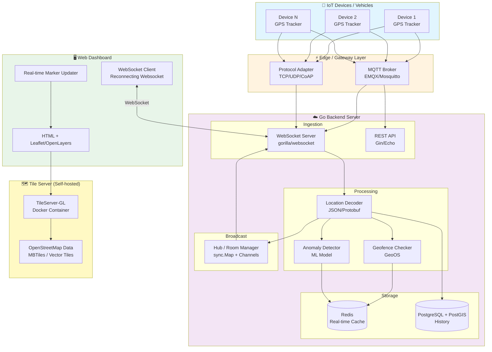

# บทที่ 8: ระบบแสดงแผนที่แบบ Open Source สำหรับงาน Tracking และ Monitoring IoT


> **สรุปสั้นก่อนอ่าน**: การนำเสนอข้อมูลตำแหน่งของอุปกรณ์ IoT แบบ Real-time บนแผนที่ถือเป็นหัวใจสำคัญของระบบติดตามและตรวจสอบ บทนี้จะพาคุณเลือกใช้ไลบรารีแผนที่แบบ Open Source ที่เหมาะสม พร้อมเชื่อมต่อกับระบบ Go Backend ผ่าน WebSocket เพื่ออัปเดตตำแหน่งแบบทันที และผสานการวิเคราะห์ข้อมูลเชิงพื้นที่ด้วย MML AI ตามแนวทางของบทที่ 1-7


## 📌 โครงสร้างการทำงานของระบบแผนที่ Open Source สำหรับ IoT Tracking

บทนี้ประกอบด้วย 5 องค์ประกอบหลัก:

1. **Open Source Mapping Library (Leaflet / OpenLayers / MapLibre)** – การเลือกและติดตั้งไลบรารีแผนที่ที่เหมาะสม
2. **Tile Server (OpenStreetMap + TileServer-GL)** – การโฮสต์แผนที่ด้วยตนเอง (Self-hosted)
3. **Go Backend + WebSocket Server** – การรับข้อมูลตำแหน่ง IoT แบบ Real-time และ Broadcast ไปยัง Clients
4. **Real-time Map Visualization** – การแสดงผลตำแหน่งบนแผนที่แบบอัปเดตทันที
5. **Geospatial AI / MML Integration** – การวิเคราะห์ข้อมูลเชิงพื้นที่ด้วย AI เช่น การพยากรณ์เส้นทาง, การตรวจจับความผิดปกติของตำแหน่ง


## 🎯 วัตถุประสงค์

- เพื่อให้สามารถเลือกใช้ไลบรารีแผนที่ Open Source ที่เหมาะสมกับลักษณะงาน Tracking IoT ขององค์กร
- เพื่อสร้างระบบแผนที่ที่สามารถแสดงตำแหน่งอุปกรณ์ IoT แบบ Real-time ได้ โดยไม่ต้องพึ่งพา Google Maps หรือบริการเชิงพาณิชย์
- เพื่อเรียนรู้การเชื่อมต่อระหว่าง Go Backend (WebSocket) และ Frontend แผนที่
- เพื่อผสานการวิเคราะห์เชิงพื้นที่ (Spatial Analysis) และ MML AI เข้ากับข้อมูลตำแหน่ง เช่น การทำนายเส้นทาง การตรวจจับ Anomaly
- เพื่อให้ระบบสามารถทำงานได้ทั้งในสภาพแวดล้อมที่มีอินเทอร์เน็ตและไม่มีอินเทอร์เน็ต (Offline Map)


## 👥 กลุ่มเป้าหมาย

- Full-stack Developer ที่ต้องการเพิ่มความสามารถด้านแผนที่ให้กับระบบ IoT
- Data Engineer / IoT Engineer ที่ต้องแสดงผลข้อมูลตำแหน่งของอุปกรณ์จำนวนมาก
- MLOps / Data Scientist ที่ต้องการวิเคราะห์ข้อมูลเชิงพื้นที่ด้วย AI
- องค์กรที่ต้องการลดต้นทุนการใช้งาน Google Maps API


## 📚 ความรู้พื้นฐานที่ควรมี

- ความเข้าใจบทที่ 1-7 (Data Pipeline, WebSocket, Security)
- ความรู้พื้นฐาน HTML, CSS, JavaScript
- ความเข้าใจ Latitude/Longitude และระบบพิกัดภูมิศาสตร์
- พื้นฐาน Docker (สำหรับ Tile Server)


## 📖 เนื้อหาโดยย่อ (กระชับ เน้นวัตถุประสงค์และประโยชน์)

| เนื้อหา | วัตถุประสงค์ | ประโยชน์ |
|---------|--------------|-----------|
| Open Source Map Library | เลือก Leaflet, OpenLayers หรือ MapLibre ให้เหมาะกับงาน | เป็นอิสระจาก Google Maps, ประหยัดค่าใช้จ่าย |
| Self-hosted Tile Server | โฮสต์แผนที่ OpenStreetMap ด้วยตนเอง | ทำงาน offline ได้, ควบคุมข้อมูลได้เต็มที่ |
| Go WebSocket Backend | รับและกระจายตำแหน่ง IoT แบบ Real-time | รองรับอุปกรณ์จำนวนมาก, Latency ต่ำ |
| Real-time Map Update | อัปเดตตำแหน่งบนแผนที่แบบทันที | ติดตามสถานการณ์ได้แบบ Real-time |
| Geospatial AI/MML | วิเคราะห์ข้อมูลตำแหน่งด้วย ML | คาดการณ์เส้นทาง, ตรวจจับพฤติกรรมผิดปกติ |


## 📘 บทนำ

ในระบบ IoT Tracking เช่น การติดตามยานพาหนะ, การจัดการโลจิสติกส์, หรือการดูแลผู้สูงอายุ การแสดงผลตำแหน่งของอุปกรณ์บนแผนที่ถือเป็นฟังก์ชันหลักที่ขาดไม่ได้ โดยทั่วไปองค์กรมักเลือกใช้ Google Maps API ซึ่งมีค่าใช้จ่ายสูงและพึ่งพาการเชื่อมต่ออินเทอร์เน็ตตลอดเวลา บทนี้จะนำเสนอทางเลือกแบบ Open Source ที่ช่วยให้คุณเป็นเจ้าของระบบแผนที่ได้อย่างสมบูรณ์

**ทำไมต้อง Open Source Map?**
- **ประหยัดค่าใช้จ่าย:** ไม่มีค่าใช้จ่ายต่อการโหลดแผนที่ (Tile)
- **ความเป็นส่วนตัว:** ข้อมูลตำแหน่งขององค์กรไม่ต้องส่งออกไปยังบริษัทอื่น
- **Offline First:** สามารถทำงานได้ในพื้นที่ไม่มีอินเทอร์เน็ต
- **ปรับแต่งได้:** สามารถปรับสไตล์แผนที่ให้เข้ากับแบรนด์ขององค์กร

**Go มีบทบาทอย่างไร?** Go ใช้เป็น Backend สำหรับรับข้อมูลตำแหน่งจากอุปกรณ์ IoT ผ่าน WebSocket, เก็บข้อมูลใน Redis/PostgreSQL, และ Broadcast ไปยัง Clients ที่เชื่อมต่ออยู่ทั้งหมดแบบ Real-time ซึ่ง WebSocket เป็นเทคโนโลยีเดียวที่เหมาะสมสำหรับงาน Real-time Location Tracking[reference:0]


## 📖 บทนิยาม

| ศัพท์ | คำอธิบาย |
|-------|-----------|
| **Leaflet** | ไลบรารี JavaScript แบบ Open Source สำหรับแสดงแผนที่แบบ Interactive มีน้ำหนักเบา (38KB) ใช้งานง่าย เหมาะกับงานแสดงผลทั่วไป |
| **OpenLayers** | ไลบรารีแผนที่ Open Source ที่ทรงพลัง รองรับข้อมูล Vector ขนาดใหญ่และฟีเจอร์ที่ซับซ้อนกว่า Leaflet |
| **MapLibre** | โครงการ Open Source ต่อเนื่องจาก Mapbox GL JS รองรับแผนที่แบบ Vector Tile และ 3D |
| **Tile Server** | เซิร์ฟเวอร์ที่ให้บริการภาพแผนที่ (Tiles) จากข้อมูล OpenStreetMap หรือแหล่งอื่น |
| **OpenStreetMap (OSM)** | โครงการแผนที่โลกแบบ Open Source ที่พัฒนาโดยชุมชน เปรียบเสมือน Wikipedia ของแผนที่ |
| **Vector Tile** | รูปแบบข้อมูลแผนที่สมัยใหม่ที่ส่งข้อมูลเป็น Geometry (ไม่ใช่ภาพ) ทำให้สามารถปรับสไตล์และหมุนได้แบบ Real-time |
| **WebSocket** | โปรโตคอลสื่อสารสองทางแบบ Real-time ระหว่าง Browser และ Server ใช้สำหรับอัปเดตตำแหน่งแบบทันที[reference:1] |
| **GeoJSON** | รูปแบบ JSON สำหรับเก็บข้อมูลภูมิศาสตร์ (จุด, เส้น, พื้นที่) |
| **Haversine Formula** | สูตรคำนวณระยะทางระหว่างจุดสองจุดบนพื้นผิวทรงกลม (โลก)[reference:2] |
| **Geofencing** | การสร้างขอบเขตเสมือนบนแผนที่เพื่อตรวจจับเมื่ออุปกรณ์เข้าหรือออกจากพื้นที่ที่กำหนด |


## 🧠 แนวคิด (Concept Explanation)

### ไลบรารีแผนที่ Open Source: มีกี่แบบ? ใช้ตัวไหนดี?

| ไลบรารี | น้ำหนัก | จุดแข็ง | จุดอ่อน | เหมาะกับ |
|---------|---------|--------|---------|----------|
| **Leaflet** | ~38KB | ใช้ง่ายสุด, เอกสารเยอะ, Plugin เยอะ[reference:3] | ข้อมูลจำนวนมาก (50,000 จุด) ประสิทธิภาพเริ่มลดลง[reference:4] | งาน IoT ทั่วไป, ข้อมูลตำแหน่งไม่หนาแน่นมาก (<5,000 จุด) |
| **OpenLayers** | ~200KB+ | รองรับ Vector ขนาดใหญ่, ฟีเจอร์ครบ, GIS จริง[reference:5] | โค้งการเรียนสูงกว่า Leaflet | งานที่ต้องแสดงข้อมูลหนาแน่น (10,000+ จุด) หรือฟีเจอร์ GIS ซับซ้อน[reference:6] |
| **MapLibre** | ~400KB+ | รองรับ 3D, Vector Tile, ปรับสไตล์ได้เหมือน Mapbox | หนักกว่า, ต้องการ Tile Server ที่รองรับ Vector Tile | งานที่ต้องการภาพสวย, 3D, ปรับแต่งสูง |

**สำหรับงาน IoT Tracking:** หากคุณต้องการแสดงตำแหน่งไม่เกิน 5,000 จุด และต้องการเริ่มต้นได้เร็วที่สุด → **Leaflet** คือคำตอบ[reference:7] หากคุณต้องแสดงจุดมากกว่า 10,000 จุด หรือต้องการวิเคราะห์เชิงพื้นที่ (GIS) ขั้นสูง → **OpenLayers**[reference:8]

### Tile Server: คืออะไร? มีกี่แบบ?

Tile Server คือเซิร์ฟเวอร์ที่ตัดแผนที่โลกออกเป็นชิ้นสี่เหลี่ยม (Tiles) ขนาด 256×256 พิกเซลตามระดับการซูม (Zoom Level) เมื่อผู้ใช้เลื่อนแผนที่ เบราว์เซอร์จะโหลดเฉพาะ Tile ที่จำเป็นมาแสดง

**ทางเลือก Tile Server แบบ Open Source:**
1. **TileServer-GL (OpenMapTiles):** รองรับ Vector Tiles, ใช้งานง่ายผ่าน Docker[reference:9]
2. **Mapnik + mod_tile:** แบบดั้งเดิม ใช้ทรัพยากรมากกว่า แต่ควบคุมได้ละเอียด[reference:10]
3. **ใช้ Public Tile Server:** เช่น `https://{s}.tile.openstreetmap.org/{z}/{x}/{y}.png` (ฟรี แต่มี Rate Limit)

**คำแนะนำ:** สำหรับงาน Production ที่ต้องการความเสถียรและ Offline Support → **Self-hosted TileServer-GL ผ่าน Docker**[reference:11]

### WebSocket สำหรับ Real-time Location Tracking

WebSocket เป็นโปรโตคอลเดียวที่เหมาะสมกับงาน Real-time Location Tracking เพราะ:
- **Latency ต่ำ (0.3 วินาที)** เทียบกับ HTTP Polling (2.3 วินาที)[reference:12]
- **การเชื่อมต่อแบบสองทาง:** Server สามารถ Push ตำแหน่งใหม่ไปยัง Client ได้ทันทีที่ได้รับ
- **Overhead ต่ำ:** ไม่มี HTTP Headers ซ้ำซ้อน

สถาปัตยกรรมทั่วไป: อุปกรณ์ IoT ส่งตำแหน่งผ่าน WebSocket ไปยัง Go Server → Go Server เก็บใน Redis/DB และ Broadcast ไปยัง Client (Dashboard) ทุกตัวที่เชื่อมต่ออยู่[reference:13][reference:14]

### Geospatial AI / MML: ทำอะไรได้บ้าง?

| การวิเคราะห์ | รายละเอียด | เทคนิค |
|--------------|------------|--------|
| **การพยากรณ์เส้นทาง (Path Prediction)** | ทำนายเส้นทางที่อุปกรณ์จะเคลื่อนที่ต่อไป | LSTM, Kalman Filter |
| **การตรวจจับความผิดปกติ (Anomaly Detection)** | เตือนเมื่ออุปกรณ์เบี่ยงเบนจากเส้นทางปกติ | Isolation Forest, DBSCAN |
| **Geofencing แบบอัจฉริยะ** | ตรวจจับการเข้า-ออกพื้นที่สำคัญ | Point-in-Polygon, Spatial Index |
| **การวิเคราะห์ Hotspot** | หาพื้นที่ที่มีการจราจรหนาแน่น | K-Means, DBSCAN[reference:15] |
| **การคำนวณระยะทางแบบปรับปรุงด้วย AI** | แทนที่ Haversine Formula ด้วย ML ที่เรียนรู้จาก地形[reference:16] | Gradient Boosting[reference:17] |

### GeoOS: พื้นฐานสำหรับ Spatial Computing ใน Go

GeoOS เป็นไลบรารี Spatial Computing แบบ Open Source ที่เขียนด้วยภาษา Go รองรับการคำนวณเชิงพื้นที่กว่า 100 วิธี อาทิ การแปลงพิกัด, การสร้างคลัสเตอร์เชิงพื้นที่ (Spatial Clustering), และการวิเคราะห์เชิงพื้นที่ (Spatial Analysis)[reference:18] จุดเด่นคือประสิทธิภาพสูง (เร็วกว่า Shapely ใน Python ถึง 16 เท่า) และมี Spatial Intelligence ที่ผสาน K-Means กับ DBSCAN เข้ากับการวิเคราะห์ข้อมูลเชิงพื้นที่[reference:19]


## 🗺️ ออกแบบ Workflow (Dataflow Diagram)

### รูปที่ 9: Dataflow แสดงระบบแผนที่ Open Source สำหรับ IoT Tracking



### คำอธิบาย Diagram อย่างละเอียด

1. **IoT Devices**: อุปกรณ์ GPS ส่งตำแหน่ง (latitude, longitude, timestamp, device_id) ผ่านโปรโตคอล MQTT หรือ TCP ไปยัง Edge Layer
2. **Edge Layer**: MQTT Broker (EMQX) หรือ Protocol Adapter ทำหน้าที่รับข้อมูลจากอุปกรณ์หลากหลายโปรโตคอล และส่งต่อไปยัง Go Backend ผ่าน WebSocket หรือ REST API
3. **Go Backend**:
   - **Ingestion**: WebSocket Server รับการเชื่อมต่อจากอุปกรณ์และ Dashboard Clients[reference:20]
   - **Processing**: ถอดรหัสตำแหน่ง, ตรวจสอบ Geofence ด้วย GeoOS, ตรวจจับ Anomaly ด้วย ML Model
   - **Storage**: Redis เก็บตำแหน่งล่าสุดของอุปกรณ์แต่ละตัว (Real-time), PostgreSQL + PostGIS เก็บประวัติทั้งหมด[reference:21]
   - **Broadcast**: Hub ทำหน้าที่กระจายตำแหน่งที่ได้รับไปยัง Dashboard Clients ทุกตัวที่กำลังดูแผนที่
4. **Tile Server**: TileServer-GL ที่รันใน Docker ให้บริการ Vector Tiles จากข้อมูล OpenStreetMap[reference:22]
5. **Web Dashboard**: Frontend ใช้ Leaflet หรือ OpenLayers แสดงแผนที่ และเชื่อมต่อ WebSocket กับ Go Backend เพื่อรับการอัปเดตตำแหน่งแบบ Real-time


## 💻 ตัวอย่างโค้ดที่รันได้จริง (พร้อม Comment สองภาษา)

### ตอนที่ 1: การติดตั้ง TileServer-GL ด้วย Docker (Self-hosted Map)

```bash
# Pull TileServer-GL image / ดึง Image TileServer-GL
docker pull maptiler/tileserver-gl

# Run TileServer with OpenStreetMap data (downloads automatically)
# รัน TileServer พร้อมข้อมูล OpenStreetMap (ดาวน์โหลดอัตโนมัติ)
docker run -it -p 8080:80 maptiler/tileserver-gl

# With custom MBTiles file / พร้อมไฟล์ MBTiles ที่กำหนดเอง
docker run -it -p 8080:80 -v $(pwd)/data:/data maptiler/tileserver-gl --mbtiles /data/planet.mbtiles
```

### ตอนที่ 2: Go Backend – WebSocket Server + Hub

ติดตั้ง dependencies:

```bash
go get github.com/gorilla/websocket
go get github.com/gin-gonic/gin
go get github.com/redis/go-redis/v9
go get github.com/spatial-go/geoos
```

สร้างไฟล์ `main.go`:

```go
package main

import (
	"encoding/json"
	"log"
	"net/http"
	"sync"
	"time"

	"github.com/gin-gonic/gin"
	"github.com/gorilla/websocket"
	"github.com/redis/go-redis/v9"
	"github.com/spatial-go/geoos"
	"github.com/spatial-go/geoos/space"
)

// DeviceLocation represents GPS data from IoT device
// DeviceLocation แทนข้อมูล GPS จากอุปกรณ์ IoT
type DeviceLocation struct {
	DeviceID  string    `json:"device_id"`
	Latitude  float64   `json:"latitude"`
	Longitude float64   `json:"longitude"`
	Speed     float64   `json:"speed"`
	Heading   float64   `json:"heading"`
	Timestamp time.Time `json:"timestamp"`
}

// Client represents a connected dashboard client
// Client แทน Dashboard Client ที่เชื่อมต่ออยู่
type Client struct {
	ID   string
	Conn *websocket.Conn
	Send chan interface{}
}

// Hub manages all WebSocket clients and broadcasts locations
// Hub จัดการ Client WebSocket ทั้งหมดและกระจายตำแหน่ง
type Hub struct {
	clients    map[*Client]bool   // Registered clients / Client ที่ลงทะเบียน
	broadcast  chan interface{}   // Broadcast channel / ช่องกระจายข้อมูล
	register   chan *Client       // Register new client / ลงทะเบียน Client ใหม่
	unregister chan *Client       // Remove client / ลบ Client
	mu         sync.RWMutex
}

// NewHub creates a new hub instance
// NewHub สร้าง Hub ใหม่
func NewHub() *Hub {
	return &Hub{
		clients:    make(map[*Client]bool),
		broadcast:  make(chan interface{}),
		register:   make(chan *Client),
		unregister: make(chan *Client),
	}
}

// Run starts the hub's main loop
// Run เริ่ม loop หลักของ Hub
func (h *Hub) Run() {
	for {
		select {
		case client := <-h.register:
			h.mu.Lock()
			h.clients[client] = true
			h.mu.Unlock()
			log.Printf("Client %s registered, total: %d", client.ID, len(h.clients))

		case client := <-h.unregister:
			h.mu.Lock()
			if _, ok := h.clients[client]; ok {
				delete(h.clients, client)
				close(client.Send)
			}
			h.mu.Unlock()
			log.Printf("Client %s unregistered, total: %d", client.ID, len(h.clients))

		case message := <-h.broadcast:
			h.mu.RLock()
			// Broadcast to all clients / ส่งไปยัง Client ทั้งหมด
			for client := range h.clients {
				select {
				case client.Send <- message:
				default:
					// If send fails, close and remove / ถ้าส่งไม่สำเร็จ ให้ปิดและลบ
					close(client.Send)
					delete(h.clients, client)
				}
			}
			h.mu.RUnlock()
		}
	}
}

// WebSocket upgrader configuration / การกำหนดค่า WebSocket upgrader
var upgrader = websocket.Upgrader{
	CheckOrigin: func(r *http.Request) bool { return true }, // Allow all origins for demo / อนุญาตทุก origin สำหรับตัวอย่าง
}

// serveWs handles WebSocket connections from clients (dashboard)
// serveWs จัดการการเชื่อมต่อ WebSocket จาก Client (dashboard)
func serveWs(hub *Hub, c *gin.Context) {
	conn, err := upgrader.Upgrade(c.Writer, c.Request, nil)
	if err != nil {
		log.Printf("Failed to upgrade connection: %v", err)
		return
	}

	client := &Client{
		ID:   c.Query("client_id"),
		Conn: conn,
		Send: make(chan interface{}, 256),
	}
	if client.ID == "" {
		client.ID = "unknown"
	}

	hub.register <- client

	// Write pump: sends messages from Send channel to WebSocket
	// Write pump: ส่งข้อความจาก Send channel ไปยัง WebSocket
	go func() {
		defer func() {
			hub.unregister <- client
			client.Conn.Close()
		}()
		for message := range client.Send {
			if err := client.Conn.WriteJSON(message); err != nil {
				log.Printf("Write error: %v", err)
				break
			}
		}
	}()

	// Read pump: reads messages from WebSocket (for device location updates)
	// Read pump: อ่านข้อความจาก WebSocket (สำหรับการอัปเดตตำแหน่งของอุปกรณ์)
	go func() {
		defer func() {
			hub.unregister <- client
			client.Conn.Close()
		}()
		for {
			var location DeviceLocation
			err := client.Conn.ReadJSON(&location)
			if err != nil {
				log.Printf("Read error: %v", err)
				break
			}
			location.Timestamp = time.Now()

			// Store in Redis / เก็บใน Redis
			storeLocation(location)

			// Broadcast to all dashboard clients / ส่งไปยัง Dashboard Client ทั้งหมด
			hub.broadcast <- location

			log.Printf("Location from %s: (%.6f, %.6f)", location.DeviceID, location.Latitude, location.Longitude)
		}
	}()
}

// Redis client (for real-time cache)
// Redis client (สำหรับ cache แบบ Real-time)
var redisClient *redis.Client

func initRedis() {
	redisClient = redis.NewClient(&redis.Options{
		Addr: "localhost:6379",
	})
}

func storeLocation(loc DeviceLocation) {
	ctx := context.Background()
	key := "location:" + loc.DeviceID
	data, _ := json.Marshal(loc)
	redisClient.Set(ctx, key, data, 5*time.Minute) // TTL 5 minutes / หมดอายุใน 5 นาที
}

// GeoOS spatial calculations
// การคำนวณเชิงพื้นที่ด้วย GeoOS
func initGeoOS() {
	geoos.Init() // Initialize GeoOS / เริ่มต้น GeoOS
}

// Haversine distance calculation (fallback if GeoOS not used)
// การคำนวณระยะทาง Haversine (ใช้แทนถ้าไม่ใช้ GeoOS)
func haversineDistance(lat1, lon1, lat2, lon2 float64) float64 {
	const R = 6371 // Earth radius in km / รัศมีโลก (กม.)
	dlat := (lat2 - lat1) * math.Pi / 180
	dlon := (lon2 - lon1) * math.Pi / 180
	a := math.Sin(dlat/2)*math.Sin(dlat/2) +
		math.Cos(lat1*math.Pi/180)*math.Cos(lat2*math.Pi/180)*
			math.Sin(dlon/2)*math.Sin(dlon/2)
	c := 2 * math.Atan2(math.Sqrt(a), math.Sqrt(1-a))
	return R * c
}

// CheckGeofence checks if a point is inside a geofence polygon
// CheckGeofence ตรวจสอบว่าจุดอยู่ในพื้นที่ Geofence หรือไม่
func CheckGeofence(lat, lon float64, geofenceCoords [][]float64) bool {
	// Create GeoOS point / สร้างจุดด้วย GeoOS
	point := space.Point{lat, lon}
	
	// Create polygon from coordinates / สร้าง Polygon จากพิกัด
	polygon := space.Polygon{geofenceCoords}
	
	return polygon.Contains(point)
}

func main() {
	// Initialize components / เริ่มต้นคอมโพเนนต์
	initGeoOS()
	initRedis()

	// Create hub and start it / สร้าง Hub และเริ่มทำงาน
	hub := NewHub()
	go hub.Run()

	// Setup Gin router / ตั้งค่า Gin router
	r := gin.Default()

	// Serve static files (HTML, JS, CSS)
	// ให้บริการไฟล์ Static (HTML, JS, CSS)
	r.Static("/static", "./static")
	r.LoadHTMLGlob("templates/*")

	// Serve map tiles from self-hosted tile server
	// ให้บริการ Map Tiles จาก Tile Server ที่โฮสต์เอง
	r.GET("/tiles/:z/:x/:y.png", func(c *gin.Context) {
		// Proxy to TileServer-GL / ส่งต่อไปยัง TileServer-GL
		// Implementation depends on your setup / การ implement ขึ้นอยู่กับการตั้งค่า
	})

	// WebSocket endpoint / จุดปลายทาง WebSocket
	r.GET("/ws", func(c *gin.Context) {
		serveWs(hub, c)
	})

	// REST API endpoints / จุดปลายทาง REST API
	api := r.Group("/api")
	{
		// Get current location of a device
		api.GET("/location/:device_id", func(c *gin.Context) {
			deviceID := c.Param("device_id")
			ctx := context.Background()
			data, err := redisClient.Get(ctx, "location:"+deviceID).Bytes()
			if err != nil {
				c.JSON(http.StatusNotFound, gin.H{"error": "device not found"})
				return
			}
			var loc DeviceLocation
			json.Unmarshal(data, &loc)
			c.JSON(http.StatusOK, loc)
		})

		// Get all devices' current locations
		api.GET("/locations", func(c *gin.Context) {
			// Implementation omitted for brevity / ไม่แสดง implementation เพื่อความกระชับ
			c.JSON(http.StatusOK, gin.H{"status": "ok"})
		})

		// Geofence check endpoint / จุดปลายทางตรวจสอบ Geofence
		api.POST("/geofence", func(c *gin.Context) {
			var req struct {
				Lat      float64 `json:"lat"`
				Lon      float64 `json:"lon"`
				Polygon  [][]float64 `json:"polygon"`
			}
			c.BindJSON(&req)
			isInside := CheckGeofence(req.Lat, req.Lon, req.Polygon)
			c.JSON(http.StatusOK, gin.H{"inside": isInside})
		})
	}

	// Start server / เริ่มเซิร์ฟเวอร์
	log.Println("Server starting on :8080")
	r.Run(":8080")
}
```

### ตอนที่ 3: Frontend – HTML + Leaflet Map

สร้างไฟล์ `templates/index.html`:

```html
<!DOCTYPE html>
<html>
<head>
    <title>IoT Real-time Tracking Dashboard</title>
    <meta charset="utf-8" />
    <meta name="viewport" content="width=device-width, initial-scale=1.0">
    <!-- Leaflet CSS and JS -->
    <link rel="stylesheet" href="https://unpkg.com/leaflet@1.9.4/dist/leaflet.css" />
    <script src="https://unpkg.com/leaflet@1.9.4/dist/leaflet.js"></script>
    <!-- Reconnecting WebSocket polyfill -->
    <script src="https://unpkg.com/reconnecting-websocket@4.4.0/dist/reconnecting-websocket.min.js"></script>
    <style>
        #map { height: 100vh; width: 100%; margin: 0; padding: 0; }
        .info-panel { position: absolute; top: 10px; right: 10px; z-index: 1000; background: white; padding: 10px; border-radius: 5px; box-shadow: 0 0 10px rgba(0,0,0,0.3); }
        .device-list { max-height: 200px; overflow-y: auto; }
        .device-item { padding: 5px; cursor: pointer; border-bottom: 1px solid #eee; }
        .device-item:hover { background: #f0f0f0; }
        .device-item.active { background: #4CAF50; color: white; }
    </style>
</head>
<body>
    <div id="map"></div>
    <div class="info-panel">
        <h4>Connected Devices</h4>
        <div id="device-list" class="device-list">Loading...</div>
        <p><small>Last update: <span id="timestamp">-</span></small></p>
        <p><small>Status: <span id="status">Connecting...</span></small></p>
    </div>

    <script>
        // Initialize map with OpenStreetMap tiles (free, no API key)
        // เริ่มต้นแผนที่ด้วย OpenStreetMap Tiles (ฟรี ไม่ต้องใช้ API Key)
        var map = L.map('map').setView([13.736717, 100.523186], 13); // Bangkok coordinates
        
        L.tileLayer('https://{s}.tile.openstreetmap.org/{z}/{x}/{y}.png', {
            attribution: '&copy; <a href="https://www.openstreetmap.org/copyright">OpenStreetMap</a> contributors',
            maxZoom: 19
        }).addTo(map);
        
        // For self-hosted tile server, replace with your own URL
        // สำหรับ Tile Server ที่โฮสต์เอง ให้เปลี่ยน URL เป็นของคุณ
        // L.tileLayer('http://localhost:8080/tiles/{z}/{x}/{y}.png', { ... })
        
        // Store markers for each device
        // เก็บ Marker สำหรับอุปกรณ์แต่ละตัว
        var markers = new Map();
        
        // Store device info
        var devices = new Map();
        
        // Connect to WebSocket
        // เชื่อมต่อ WebSocket
        var ws = new ReconnectingWebSocket('ws://localhost:8080/ws?client_id=dashboard1');
        
        ws.onopen = function() {
            document.getElementById('status').innerHTML = 'Connected';
            document.getElementById('status').style.color = 'green';
        };
        
        ws.onclose = function() {
            document.getElementById('status').innerHTML = 'Disconnected';
            document.getElementById('status').style.color = 'red';
        };
        
        ws.onerror = function(error) {
            console.error('WebSocket error:', error);
            document.getElementById('status').innerHTML = 'Error';
            document.getElementById('status').style.color = 'orange';
        };
        
        // Handle incoming location updates
        // จัดการการอัปเดตตำแหน่งที่เข้ามา
        ws.onmessage = function(event) {
            var location = JSON.parse(event.data);
            var deviceId = location.device_id;
            var lat = location.latitude;
            var lng = location.longitude;
            var timestamp = new Date(location.timestamp);
            
            document.getElementById('timestamp').innerHTML = timestamp.toLocaleTimeString();
            
            // Update or create marker
            // อัปเดตหรือสร้าง Marker
            if (markers.has(deviceId)) {
                var marker = markers.get(deviceId);
                marker.setLatLng([lat, lng]);
            } else {
                var icon = L.divIcon({
                    html: '<div style="background-color: #4CAF50; width: 20px; height: 20px; border-radius: 50%; border: 2px solid white;"></div>',
                    iconSize: [20, 20],
                    className: 'device-marker'
                });
                var marker = L.marker([lat, lng], { icon: icon }).addTo(map);
                marker.bindPopup('<b>' + deviceId + '</b><br/>Speed: ' + location.speed + ' km/h<br/>Heading: ' + location.heading + '°');
                markers.set(deviceId, marker);
            }
            
            // Update device info
            // อัปเดตข้อมูลอุปกรณ์
            devices.set(deviceId, location);
            updateDeviceList();
        };
        
        function updateDeviceList() {
            var container = document.getElementById('device-list');
            container.innerHTML = '';
            for (var [deviceId, location] of devices.entries()) {
                var div = document.createElement('div');
                div.className = 'device-item';
                div.innerHTML = '<strong>' + deviceId + '</strong><br/>' +
                    location.latitude.toFixed(6) + ', ' + location.longitude.toFixed(6) + '<br/>' +
                    'Speed: ' + location.speed + ' km/h';
                div.onclick = (function(id) {
                    return function() {
                        var loc = devices.get(id);
                        map.setView([loc.latitude, loc.longitude], 15);
                    };
                })(deviceId);
                container.appendChild(div);
            }
        }
        
        // Optional: Get current location and center map
        // ตัวเลือก: รับตำแหน่งปัจจุบันและจัดกึ่งกลางแผนที่
        if (navigator.geolocation) {
            navigator.geolocation.getCurrentPosition(function(pos) {
                map.setView([pos.coords.latitude, pos.coords.longitude], 13);
            });
        }
    </script>
</body>
</html>
```

### ตอนที่ 4: IoT Device Simulator (Client ฝั่งอุปกรณ์)

สร้างไฟล์ `device_simulator.go`:

```go
package main

import (
	"encoding/json"
	"log"
	"math/rand"
	"time"

	"github.com/gorilla/websocket"
)

type DeviceLocation struct {
	DeviceID  string    `json:"device_id"`
	Latitude  float64   `json:"latitude"`
	Longitude float64   `json:"longitude"`
	Speed     float64   `json:"speed"`
	Heading   float64   `json:"heading"`
	Timestamp time.Time `json:"timestamp"`
}

func main() {
	deviceID := "device_" + time.Now().Format("150405")
	log.Printf("Starting device simulator: %s", deviceID)

	// Connect to WebSocket / เชื่อมต่อ WebSocket
	conn, _, err := websocket.DefaultDialer.Dial("ws://localhost:8080/ws", nil)
	if err != nil {
		log.Fatal("Failed to connect:", err)
	}
	defer conn.Close()

	// Simulate movement (Bangkok area)
	// จำลองการเคลื่อนที่ (บริเวณกรุงเทพฯ)
	lat := 13.736717
	lng := 100.523186

	for {
		// Random movement / การเคลื่อนที่แบบสุ่ม
		lat += (rand.Float64() - 0.5) * 0.001
		lng += (rand.Float64() - 0.5) * 0.001

		loc := DeviceLocation{
			DeviceID:  deviceID,
			Latitude:  lat,
			Longitude: lng,
			Speed:     rand.Float64() * 60,
			Heading:   rand.Float64() * 360,
			Timestamp: time.Now(),
		}

		// Send location / ส่งตำแหน่ง
		if err := conn.WriteJSON(loc); err != nil {
			log.Printf("Write error: %v", err)
			return
		}
		log.Printf("Sent location: (%.6f, %.6f)", loc.Latitude, loc.Longitude)

		time.Sleep(2 * time.Second)
	}
}
```

### ตอนที่ 5: Geospatial AI – Anomaly Detection for IoT Tracks

สร้างไฟล์ `anomaly_detection.go`:

```go
package main

import (
	"math"
	"sync"
	"time"
)

// TrackPoint represents a point in a device's movement history
// TrackPoint แทนจุดในประวัติการเคลื่อนที่ของอุปกรณ์
type TrackPoint struct {
	Lat      float64
	Lon      float64
	Time     time.Time
	Speed    float64
	Heading  float64
}

// DeviceHistory stores recent movement history for anomaly detection
// DeviceHistory เก็บประวัติการเคลื่อนที่ล่าสุดสำหรับการตรวจจับ Anomaly
type DeviceHistory struct {
	DeviceID   string
	Points     []TrackPoint
	MaxHistory int
	mu         sync.Mutex
}

// NewDeviceHistory creates a new device history tracker
// NewDeviceHistory สร้างตัวติดตามประวัติของอุปกรณ์ใหม่
func NewDeviceHistory(deviceID string, maxHistory int) *DeviceHistory {
	return &DeviceHistory{
		DeviceID:   deviceID,
		Points:     make([]TrackPoint, 0, maxHistory),
		MaxHistory: maxHistory,
	}
}

// AddPoint adds a new point to history (with automatic trimming)
// AddPoint เพิ่มจุดใหม่ลงในประวัติ (พร้อมการตัดอัตโนมัติ)
func (dh *DeviceHistory) AddPoint(point TrackPoint) {
	dh.mu.Lock()
	defer dh.mu.Unlock()
	
	dh.Points = append(dh.Points, point)
	if len(dh.Points) > dh.MaxHistory {
		dh.Points = dh.Points[len(dh.Points)-dh.MaxHistory:]
	}
}

// CalculateAverageSpeed calculates average speed over recent history
// CalculateAverageSpeed คำนวณความเร็วเฉลี่ยในช่วงประวัติล่าสุด
func (dh *DeviceHistory) CalculateAverageSpeed() float64 {
	dh.mu.Lock()
	defer dh.mu.Unlock()
	
	if len(dh.Points) == 0 {
		return 0
	}
	
	var totalSpeed float64
	for _, p := range dh.Points {
		totalSpeed += p.Speed
	}
	return totalSpeed / float64(len(dh.Points))
}

// DetectSpeedAnomaly detects if current speed deviates abnormally
// DetectSpeedAnomaly ตรวจจับว่าความเร็วปัจจุบันเบี่ยงเบนผิดปกติหรือไม่
func (dh *DeviceHistory) DetectSpeedAnomaly(currentSpeed float64, thresholdStdDev float64) (bool, float64) {
	dh.mu.Lock()
	defer dh.mu.Unlock()
	
	if len(dh.Points) < 3 {
		return false, 0 // Need at least 3 points to establish baseline
	}
	
	// Calculate mean and standard deviation
	var sum float64
	for _, p := range dh.Points {
		sum += p.Speed
	}
	mean := sum / float64(len(dh.Points))
	
	var variance float64
	for _, p := range dh.Points {
		diff := p.Speed - mean
		variance += diff * diff
	}
	stdDev := math.Sqrt(variance / float64(len(dh.Points)))
	
	// Check if current speed is beyond threshold
	deviation := math.Abs(currentSpeed - mean)
	isAnomaly := deviation > (thresholdStdDev * stdDev)
	
	return isAnomaly, deviation / stdDev
}

// DetectSuddenTurn detects if heading change exceeds threshold
// DetectSuddenTurn ตรวจจับว่าการเปลี่ยนทิศทางเกินค่า Threshold หรือไม่
func (dh *DeviceHistory) DetectSuddenTurn(currentHeading float64, maxChangeDegrees float64) bool {
	dh.mu.Lock()
	defer dh.mu.Unlock()
	
	if len(dh.Points) < 2 {
		return false
	}
	
	lastPoint := dh.Points[len(dh.Points)-1]
	change := math.Abs(currentHeading - lastPoint.Heading)
	// Normalize to 0-360 range
	if change > 180 {
		change = 360 - change
	}
	
	return change > maxChangeDegrees
}

// AnomalyDetector manages multiple devices
// AnomalyDetector จัดการอุปกรณ์หลายตัว
type AnomalyDetector struct {
	histories map[string]*DeviceHistory
	mu        sync.RWMutex
}

// NewAnomalyDetector creates a new detector
// NewAnomalyDetector สร้างตัวตรวจจับใหม่
func NewAnomalyDetector() *AnomalyDetector {
	return &AnomalyDetector{
		histories: make(map[string]*DeviceHistory),
	}
}

// ProcessLocation processes incoming location and returns anomaly flag
// ProcessLocation ประมวลผลตำแหน่งที่เข้ามาและคืนค่า flag บ่งชี้ Anomaly
func (ad *AnomalyDetector) ProcessLocation(loc DeviceLocation) (bool, string) {
	ad.mu.Lock()
	defer ad.mu.Unlock()
	
	// Get or create history / ดึงหรือสร้างประวัติ
	history, exists := ad.histories[loc.DeviceID]
	if !exists {
		history = NewDeviceHistory(loc.DeviceID, 50)
		ad.histories[loc.DeviceID] = history
	}
	
	// Convert to track point / แปลงเป็น TrackPoint
	point := TrackPoint{
		Lat:     loc.Latitude,
		Lon:     loc.Longitude,
		Time:    loc.Timestamp,
		Speed:   loc.Speed,
		Heading: loc.Heading,
	}
	
	// Check for anomalies / ตรวจสอบ Anomaly
	isSpeedAnomaly, deviation := history.DetectSpeedAnomaly(loc.Speed, 2.5)
	isTurnAnomaly := history.DetectSuddenTurn(loc.Heading, 90) // Sudden turn > 90 degrees
	
	// Add point to history / เพิ่มจุดลงประวัติ
	history.AddPoint(point)
	
	if isSpeedAnomaly {
		return true, "Speed anomaly: deviation of " + string(rune(deviation)) + " sigma"
	}
	if isTurnAnomaly {
		return true, "Sudden turn detected"
	}
	
	return false, ""
}
```


## 🧪 แนวทางแก้ไขปัญหาที่อาจเกิดขึ้น

| ปัญหา | สาเหตุ | แนวทางแก้ไข |
|--------|--------|---------------|
| แผนที่โหลดช้า | Public Tile Server มี Rate Limit | ใช้ Self-hosted Tile Server[reference:23] หรือใช้ CDN Cache |
| WebSocket หลุดบ่อย | Network instability หรือ Firewall | ใช้ ReconnectingWebSocket (polyfill) และเพิ่ม Ping/Pong Heartbeat[reference:24] |
| อุปกรณ์จำนวนมากทำให้แผนที่ช้า | Marker DOM จำนวนมากเกินไป | ใช้ Marker Clustering (Leaflet.markercluster) หรือเปลี่ยนเป็น OpenLayers[reference:25] |
| ตำแหน่งผิดเพี้ยน | GPS สัญญาณอ่อน | ใช้ Kalman Filter หรือ Moving Average ในการ Smoothing |
| การคำนวณ Geofencing ช้า | ข้อมูล Polygon ซับซ้อน | ใช้ Spatial Index (GeoOS มี Built-in)[reference:26] |
| ไม่มีอินเทอร์เน็ต | พื้นที่ห่างไกล | ใช้ Offline Map (ดาวน์โหลด MBTiles ล่วงหน้า) |


## 📐 เทมเพลตและ Checklist สำหรับระบบแผนที่ Open Source

### Checklist การตั้งค่าระบบแผนที่ Open Source

| ขั้นตอน | รายละเอียด | เสร็จ/ไม่เสร็จ |
|---------|------------|----------------|
| 1 | เลือก Map Library (Leaflet สำหรับเริ่มต้น, OpenLayers สำหรับข้อมูลหนาแน่น) | ☐ |
| 2 | ติดตั้ง Tile Server (TileServer-GL ผ่าน Docker)[reference:27] | ☐ |
| 3 | ดาวน์โหลดหรือสร้าง MBTiles (ข้อมูลแผนที่) | ☐ |
| 4 | ตั้งค่า Go Backend (WebSocket Server + Hub)[reference:28] | ☐ |
| 5 | ตั้งค่า Redis สำหรับ Real-time Cache | ☐ |
| 6 | สร้าง Frontend (HTML + Leaflet + WebSocket Client)[reference:29] | ☐ |
| 7 | ทดสอบการรับส่งข้อมูลตำแหน่ง | ☐ |
| 8 | เพิ่ม Geospatial Analysis (GeoOS)[reference:30] | ☐ |
| 9 | เพิ่ม Anomaly Detection หรือ Path Prediction | ☐ |
| 10 | ปรับแต่ง Security (Auth, Rate Limit จากบทที่ 6) | ☐ |

### ตารางเปรียบเทียบ Tile Server Options

| Tile Server | Pros | Cons | Resource Usage |
|-------------|------|------|----------------|
| **Public OSM Tile Server** | ฟรี, ไม่ต้องติดตั้ง | Rate Limit, ขึ้นอยู่กับอินเทอร์เน็ต | 0 (Client side) |
| **TileServer-GL (Docker)** | ติดตั้งง่าย, รองรับ Vector Tiles[reference:31] | ต้องมี Docker, ต้องการ RAM 2-4GB | ปานกลาง |
| **Mapnik + mod_tile** | ควบคุมได้ละเอียด, ประสิทธิภาพสูง | ติดตั้งซับซ้อน, ใช้ทรัพยากรมาก[reference:32] | สูง |
| **OpenMapTiles + AWS** | พร้อมใช้งาน, รองรับทั่วโลก | มีค่าใช้จ่ายรายเดือน | ต่ำ (Cloud) |


## 🧩 แบบฝึกหัดท้ายบท (4 ข้อ)

### ข้อที่ 1: เพิ่ม Marker Clustering สำหรับอุปกรณ์จำนวนมาก
ใช้ `Leaflet.markercluster` plugin ปรับปรุง `index.html` ให้สามารถแสดงอุปกรณ์มากกว่า 1,000 เครื่องได้โดยไม่ทำให้แผนที่ช้า

### ข้อที่ 2: สร้าง Heatmap จากข้อมูลตำแหน่งที่หนาแน่น
ใช้ Leaflet.heat plugin หรือ OpenLayers Heatmap Layer สร้าง Heatmap แสดงพื้นที่ที่มีกิจกรรมหนาแน่น (Hotspot Analysis) โดยใช้ตำแหน่งที่เก็บไว้ใน Redis

### ข้อที่ 3: เพิ่ม Geofencing และ Alerting
สร้างฟังก์ชันใน Go Backend ที่ตรวจสอบว่าอุปกรณ์เข้า-ออกพื้นที่ที่กำหนด (Geofence) และส่ง Alert ไปยัง Slack ตามที่ได้เรียนรู้จากบทที่ 7

### ข้อที่ 4: ใช้ GeoOS สำหรับ Spatial Clustering
จากประวัติตำแหน่งของอุปกรณ์ทั้งหมดใน 24 ชั่วโมงที่ผ่านมา ใช้ GeoOS Spatial Clustering (K-Means) เพื่อหา Cluster ของจุดที่มีความหนาแน่นสูง[reference:33]และแสดงผลบนแผนที่


## ✅ เฉลยแบบฝึกหัด

### เฉลยข้อที่ 1 (Marker Clustering)

```html
<!-- Add CSS and JS for markercluster -->
<link rel="stylesheet" href="https://unpkg.com/leaflet.markercluster@1.5.3/dist/MarkerCluster.css" />
<link rel="stylesheet" href="https://unpkg.com/leaflet.markercluster@1.5.3/dist/MarkerCluster.Default.css" />
<script src="https://unpkg.com/leaflet.markercluster@1.5.3/dist/leaflet.markercluster.js"></script>

<script>
// Create marker cluster group
var markers = L.markerClusterGroup();
map.addLayer(markers);

// Add markers to cluster group instead of directly to map
markers.addLayer(marker);
</script>
```

### เฉลยข้อที่ 2 (Heatmap)

```go
// Backend: Endpoint to return heatmap data
api.GET("/heatmap", func(c *gin.Context) {
    // Query all recent locations from Redis / PostgreSQL
    // Return as GeoJSON FeatureCollection
    c.JSON(http.StatusOK, heatmapData)
})
```

```javascript
// Frontend: Add heatmap layer
var heat = L.heatLayer([
    [13.736717, 100.523186, 0.5], // lat, lon, intensity
    // ... more points
], { radius: 25, blur: 15, maxZoom: 17 }).addTo(map);
```

### เฉลยข้อที่ 3 (Geofencing + Alerting)

```go
func (ad *AnomalyDetector) CheckGeofence(loc DeviceLocation) {
    // Define geofence polygon (e.g., warehouse area)
    polygon := [][]float64{
        {13.73, 100.52}, {13.74, 100.52}, {13.74, 100.53}, {13.73, 100.53},
    }
    isInside := CheckGeofence(loc.Latitude, loc.Longitude, polygon)
    
    // Get previous state from Redis
    prevInside, _ := redisClient.Get(ctx, "geofence:"+loc.DeviceID).Bool()
    
    if isInside != prevInside {
        sendSlackAlert(loc.DeviceID, isInside)
        redisClient.Set(ctx, "geofence:"+loc.DeviceID, isInside, 0)
    }
}
```

### เฉลยข้อที่ 4 (Spatial Clustering ด้วย GeoOS)

```go
import "github.com/spatial-go/geoos/algorithm/cluster"

func performSpatialClustering(points []space.Point) {
    // Prepare points / เตรียมจุด
    var pointCluster []cluster.Point
    for _, p := range points {
        pointCluster = append(pointCluster, cluster.Point{
            X: p.X(), Y: p.Y(),
        })
    }
    
    // Perform K-Means clustering / ทำ K-Means Clustering
    kmeans := cluster.KMeans{K: 5, MaxIterations: 100}
    clusters := kmeans.Partition(pointCluster)
    
    // clusters contains grouped locations
}
```


## ⚠️ สรุป: ประโยชน์, ข้อควรระวัง, ข้อดี, ข้อเสีย, ข้อห้าม

### ✅ ประโยชน์ที่ได้รับ
- เป็นเจ้าของระบบแผนที่ขององค์กร ไม่ต้องพึ่ง Google Maps
- สามารถทำงาน Offline ได้ในพื้นที่ไม่มีอินเทอร์เน็ต
- รองรับอุปกรณ์ IoT จำนวนมากด้วย WebSocket และ Redis Cache
- สามารถวิเคราะห์ข้อมูลเชิงพื้นที่ด้วย AI และ GeoOS[reference:34]

### ⚠️ ข้อควรระวัง
- Self-hosted Tile Server ต้องใช้ทรัพยากร (RAM 2-4GB, พื้นที่เก็บข้อมูลหลาย GB)[reference:35]
- Public OSM Tile Server มี Rate Limit ไม่เหมาะกับ Production ขนาดใหญ่
- การแสดงจุดจำนวนมาก (10,000+) บน Leaflet อาจทำให้ Browser ช้า[reference:36]
- ข้อมูลตำแหน่งเป็นข้อมูล Sensitive ต้องมีการเข้ารหัสและควบคุมการเข้าถึง

### 👍 ข้อดี
- Leaflet ใช้ง่าย น้ำหนักเบา เหมาะกับงาน IoT ทั่วไป[reference:37]
- Go + WebSocket ให้ Latency ต่ำกว่า HTTP Polling ถึง 7 เท่า[reference:38]
- GeoOS มีประสิทธิภาพสูงกว่า Python ถึง 16 เท่า[reference:39]
- เป็น Open Source ไม่มีค่าใช้จ่ายแอบแฝง

### 👎 ข้อเสีย
- การตั้งค่า Tile Server เองต้องการความรู้ Docker และระบบปฏิบัติการ
- OpenStreetMap ในบางพื้นที่ (ชนบท) อาจมีรายละเอียดน้อยกว่า Google Maps
- ไลบรารีแผนที่ Open Source ขาดฟีเจอร์บางอย่างเช่น Street View, Traffic Data Real-time
- การทำ Offline Map ต้องดาวน์โหลดข้อมูลล่วงหน้าซึ่งใช้พื้นที่มาก

### 🚫 ข้อห้าม
- **ห้าม** ใช้ Public OSM Tile Server สำหรับ Production ขนาดใหญ่ (มี Rate Limit)
- **ห้าม** ลืมตั้ง `CheckOrigin` ใน WebSocket Upgrader สำหรับ Production (ควรกำหนดให้ชัดเจน)
- **ห้าม** ส่งตำแหน่งทุกจุดไปยัง Client โดยไม่มีการ Throttling (ใช้การส่งเฉพาะตำแหน่งล่าสุด)
- **ห้าม** เก็บประวัติตำแหน่งโดยไม่มี TTL (Redis ควรตั้งค่า Expiration)[reference:40]


## 🔗 แหล่งอ้างอิง (References)

1. Leaflet.js Official Documentation – https://leafletjs.com/
2. OpenLayers Official Documentation – https://openlayers.org/
3. MapLibre GL JS – https://maplibre.org/
4. TileServer-GL (Self-hosted tile server) – https://github.com/maptiler/tileserver-gl
5. OpenStreetMap – https://www.openstreetmap.org/
6. GeoOS Spatial Computing Library (Go) – https://github.com/spatial-go/geoos[reference:41]
7. gorilla/websocket (Go WebSocket library) – https://github.com/gorilla/websocket
8. Real-time Location Tracking with Go – https://blog.devgenius.io/real-time-location-tracking-w-go-b0b86a9cbea6[reference:42]
9. Golang + Leaflet + WebSocket real-time tracker – https://github.com/mahmud-r-farhan/realtime-location-tracker[reference:43]
10. Bus Live Tracking with Go and WebSockets – https://github.com/ahyaghoubi/buses-live-location[reference:44]
11. LiveTracker: Lightweight GPS Tracker with Go and Leaflet – https://github.com/jlelse/livetracker[reference:45]
12. 车联网实时位置追踪系统 Go+Redis+WebSocket – https://datasea.cn/go1018202160.html[reference:46]
13. Leaflet vs OpenLayers Performance Comparison – https://blog.stackademic.com/a-developers-field-guide-for-choosing-the-right-web-mapping-tech[reference:47]
14. Geospatial Machine Learning in Go – https://pkg.go.dev/github.com/azavea/raster-vision[reference:48]


## 🖌️ ภาคผนวก: คำสั่ง Docker สำหรับ TileServer-GL แบบ Offline

```bash
# ดาวน์โหลด OpenMapTiles (Thailand region example)
# ดาวน์โหลด OpenMapTiles (ตัวอย่างภูมิภาคประเทศไทย)
wget https://download.geofabrik.de/asia/thailand-latest.osm.pbf

# Convert to MBTiles (requires openmaptools)
# แปลงเป็น MBTiles (ต้องใช้ openmaptools)
docker run -v $(pwd):/data openmaptiles-tools bash -c \
  "openmaptiles-tools generate-vectortiles /data/thailand-latest.osm.pbf /data/thailand.mbtiles"

# Run TileServer-GL with custom MBTiles
# รัน TileServer-GL พร้อม MBTiles ที่กำหนดเอง
docker run -it -p 8080:80 -v $(pwd):/data maptiler/tileserver-gl --mbtiles /data/thailand.mbtiles

# Verify tiles are working
# ตรวจสอบว่า Tiles ทำงานได้
curl http://localhost:8080/tiles/0/0/0.pbf
```


## จบบทที่ 8: ระบบแสดงแผนที่แบบ Open Source สำหรับงาน Tracking และ Monitoring IoT

บทนี้ได้อธิบายและสร้างระบบแผนที่แบบ Open Source อย่างครบถ้วนสำหรับงาน Tracking และ Monitoring IoT คุณสามารถ:

1. เลือกใช้ Leaflet, OpenLayers หรือ MapLibre ให้เหมาะสมกับขนาดและลักษณะของข้อมูล
2. ติดตั้ง Tile Server ของตนเอง (Self-hosted) ด้วย TileServer-GL บน Docker เพื่อความเป็นอิสระจากอินเทอร์เน็ต
3. สร้าง Go Backend ที่รับข้อมูลตำแหน่ง IoT ผ่าน WebSocket และ Broadcast ไปยัง Dashboard Clients แบบ Real-time
4. วิเคราะห์ข้อมูลเชิงพื้นที่ด้วย GeoOS Spatial Computing Library และตรวจจับความผิดปกติ (Anomaly Detection) ด้วย AI

**เนื้อหาครบถ้วนทั้ง 8 บท** ครอบคลุมตั้งแต่ Batch Pipeline, Streaming, Distributed Training, Production Deployment, Data Governance, Security, Scheduling, และ Open Source Map Visualization

หวังว่าผู้อ่านจะสามารถนำความรู้ทั้งหมดนี้ไปสร้างระบบ IoT Tracking ที่มีประสิทธิภาพ ปลอดภัย และเป็นอิสระจากบริการเชิงพาณิชย์ขององค์กรตนได้