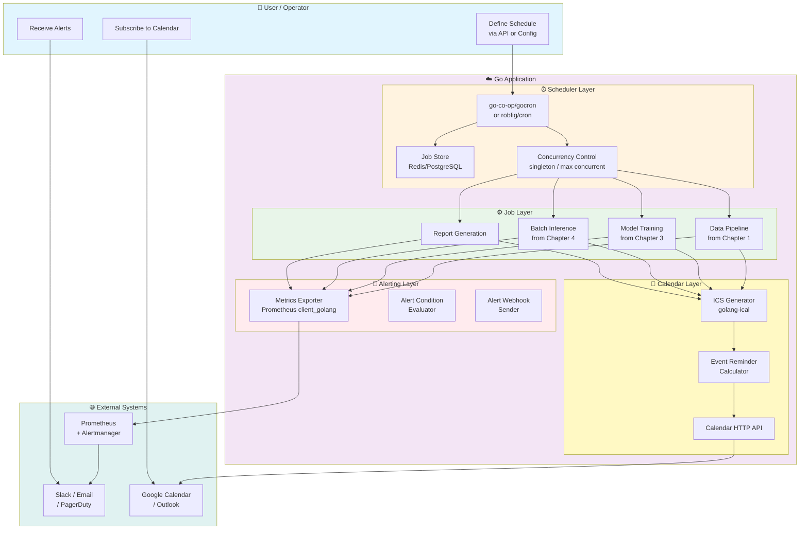

# บทที่ 7: ระบบจัดตารางเวลา แจ้งเตือน และการตั้งเงื่อนไขเตือนภัย

> **สรุปสั้นก่อนอ่าน**: ระบบ Big Data และ MML AI ที่สร้างขึ้นในบทก่อนหน้าจำเป็นต้องมีกลไกการทำงานอัตโนมัติตามเวลาที่กำหนด และสามารถแจ้งเตือนเมื่อเกิดเหตุการณ์ผิดปกติ บทนี้จะพาคุณออกแบบระบบจัดตารางเวลา (Scheduler) การสร้างปฏิทิน (Calendar) และการตั้งเงื่อนไขแจ้งเตือน (Alert Condition) สำหรับ Golang Pipeline ของคุณ พร้อมตัวอย่างโค้ดที่รันได้จริงและการผสานกับ Prometheus Alertmanager


## 📌 โครงสร้างการทำงานของระบบจัดตารางเวลา แจ้งเตือน และเงื่อนไขเตือนภัย

บทนี้ประกอบด้วย 5 องค์ประกอบหลัก:

1. **Cron Scheduler (robfig/cron)** – การกำหนดเวลาทำงานของ Pipeline แบบต่างๆ (รายชั่วโมง, รายวัน, ทุกวันจันทร์)
2. **GoCron (go-co-op/gocron)** – ไลบรารีรุ่นใหม่ รองรับการจัดการงานแบบ Chain, Context, และ Concurrent Control
3. **Calendar & ICS Integration** – การสร้างและจัดการปฏิทิน แจ้งเตือนก่อนงาน (Reminder) และส่งออกเป็นไฟล์ ICS
4. **Alert Condition Engine** – การตรวจจับเงื่อนไขผิดปกติ (SLO Burn, Pipeline Fail, Data Quality ตก) และส่งการแจ้งเตือน
5. **Prometheus Alertmanager Integration** – การเชื่อมต่อกับระบบ Prometheus Alertmanager เพื่อแจ้งเตือนผ่าน Slack, Email, Webhook


## 🎯 วัตถุประสงค์

- เพื่อให้ระบบ Pipeline ของคุณสามารถทำงานตามเวลาที่กำหนดได้โดยอัตโนมัติ
- เพื่อสร้างระบบแจ้งเตือนที่สามารถแจ้งเตือนผู้รับผิดชอบก่อนงานสำคัญหรือเมื่อ Pipeline มีปัญหา
- เพื่อสามารถตั้งเงื่อนไขการแจ้งเตือน (Alert Condition) ที่ซับซ้อนได้ (เช่น งานล่าช้าเกิน 5 นาที, ข้อมูลขาดหายเกิน 1%)
- เพื่อเชื่อมต่อระบบเตือนภัยเข้ากับ Slack, Email, หรือ Webhook ตามความเหมาะสม
- เพื่อสร้างไฟล์ปฏิทิน (ICS) ให้ผู้ใช้สามารถนำเข้าไปยัง Google Calendar หรือ Outlook ได้


## 👥 กลุ่มเป้าหมาย

- Data Engineer / MLOps ที่ต้องการให้ Pipeline ทำงานอัตโนทามและแจ้งเตือนเมื่อมีปัญหา
- Backend Developer ที่ต้องการสร้างระบบ Reminder หรือ Alerting ในแอปพลิเคชันของตน
- SRE / DevOps ที่ต้องดูแลความเสถียรของระบบ Big Data และต้องการ SLO Alerting
- ผู้ที่ต้องการเรียนรู้การใช้งาน Cron และ Alerting ใน Go แบบมืออาชีพ


## 📚 ความรู้พื้นฐานที่ควรมี

- ความเข้าใจบทที่ 1-6 (Data Pipeline, Production Deployment, Security)
- พื้นฐานการใช้งาน Go Modules และ Go Routine
- ความเข้าใจ HTTP และ Webhook
- ความรู้พื้นฐานเกี่ยวกับ Prometheus และ Grafana (สำหรับ Alerting)
- ความเข้าใจ Unix Cron Expression (เช่น `0 2 * * *`)


## 📖 เนื้อหาโดยย่อ (กระชับ เน้นวัตถุประสงค์และประโยชน์)

| เนื้อหา | วัตถุประสงค์ | ประโยชน์ |
|---------|--------------|-----------|
| Cron Scheduler (robfig/cron) | กำหนดเวลาทำงานตามรูปแบบ cron expression | รองรับงานประจำที่ซับซ้อน (เช่น ทุกวันจันทร์ 2:00) |
| GoCron (go-co-op/gocron) | จัดการงานแบบ Chain และ Context | จัดการงานที่ต้องพึ่งพากัน มีการควบคุม Concurrency |
| Calendar & ICS | สร้างและส่งออกปฏิทิน | ใช้แจ้งเตือนผู้ใช้ล่วงหน้า, รองรับ Google Calendar |
| Alert Condition Engine | ตรวจจับเงื่อนไขผิดปกติ | ลดการแจ้งเตือนที่ซ้ำซ้อน ใช้เงื่อนไขที่ซับซ้อน (เช่น 5 ครั้งติดต่อกัน) |
| Prometheus Alertmanager | แจ้งเตือนผ่านช่องทางต่างๆ | รองรับ Slack, Email, PagerDuty, Webhook แบบครบวงจร |


## 📘 บทนำ

ในโลกของ Big Data และ MML AI ระบบที่ทำงานอัตโนมัติตามเวลาที่กำหนด (Cron Job) และการแจ้งเตือน (Alerting) เป็นสองฟังก์ชันที่ขาดไม่ได้

*   **Cron Job**: ช่วยให้ Pipeline ประมวลผลข้อมูลทุกเที่ยงคืน, สร้างรายงานทุกวันจันทร์, หรือดึงข้อมูลจาก API ทุกชั่วโมง โดยไม่ต้องมีมนุษย์กดรัน
*   **Alerting**: ช่วยให้ทีมรับรู้ปัญหาได้ทันทีเมื่อ Pipeline ล้มเหลว, ข้อมูลขาดหาย, หรือ SLO ถูก Violate ก่อนที่ผู้ใช้จะได้รับผลกระทบ

Go มี Ecosystem ที่แข็งแกร่งสำหรับทั้งสองเรื่องนี้:

- **github.com/robfig/cron/v3**: เป็น Cron Library ที่ได้รับความนิยมสูงสุดใน Go รองรับ Cron Expression แบบมาตรฐาน
- **go-co-op/gocron**: เป็น Library รุ่นใหม่ที่ออกแบบมาให้ใช้งานง่ายกว่า รองรับการจัดการ Job, Context, และ Concurrent Control ได้ดีกว่า
- **github.com/prometheus/client_golang**: สำหรับการสร้าง Metrics และ Alerting Rules
- **github.com/arran4/golang-ical**: สำหรับการสร้างไฟล์ ICS (ปฏิทิน) ให้ผู้ใช้สามารถนำเข้าไปยัง Google Calendar หรือ Outlook ได้

บทนี้จะพาคุณออกแบบระบบทั้งสามส่วนนี้ พร้อมตัวอย่างโค้ดที่สามารถนำไปปรับใช้ใน Production ได้ทันที


## 📖 บทนิยาม

| ศัพท์ | คำอธิบาย |
|-------|-----------|
| **Cron Expression** | รูปแบบของ String ที่ใช้กำหนดเวลาทำงาน เช่น `0 2 * * *` (ทุกวันเวลา 02:00) หรือ `0 9 * * 1` (ทุกวันจันทร์เวลา 09:00) |
| **Scheduler** | ระบบที่คอยจับเวลาและเรียกใช้งาน Job ตามเวลาที่กำหนด |
| **ICS (iCalendar)** | รูปแบบไฟล์มาตรฐานสำหรับปฏิทิน รองรับโดย Google Calendar, Outlook, Apple Calendar |
| **Alert Condition** | กฎหรือเงื่อนไขที่ใช้ตรวจสอบว่าควรส่งการแจ้งเตือนหรือไม่ (เช่น ถ้างานล่าช้าเกิน 10 นาที) |
| **SLO (Service Level Objective)** | เป้าหมายระดับการให้บริการ เช่น 99.9% Uptime หรือ 95% ของ Requests ต้องเสร็จภายใน 500ms |
| **Error Budget** | ปริมาณความผิดพลาดที่ยอมรับได้ภายใน SLO (เช่น ใน 30 วันที่ผ่านมา อดทนได้ 0.1% ของเวลาที่ระบบล้ม) |
| **Prometheus Alertmanager** | ระบบจัดการการแจ้งเตือนของ Prometheus รองรับการรวม (Dedup), การกรอง, และการส่งไปยัง Receiver ต่างๆ |
| **Webhook** | กลไกที่ระบบหนึ่งจะส่ง HTTP Request ไปยังระบบอื่นเมื่อมีเหตุการณ์เกิดขึ้น (ใช้กันมากใน Alerting) |


## 🧠 แนวคิด (Concept Explanation)

### Cron Scheduler ใน Go: คืออะไร? มีกี่แบบ? ใช้อย่างไร?

**Cron Scheduler** เปรียบเสมือนนาฬิกาปลุกที่ตั้งโปรแกรมไว้ล่วงหน้า เมื่อถึงเวลาที่กำหนด มันจะสั่งให้โปรแกรมทำงานบางอย่างโดยอัตโนมัติ

มีสอง Library หลักใน Go:

| Library | จุดเด่น | จุดอ่อน | เหมาะกับ |
|---------|--------|--------|----------|
| **robfig/cron/v3** | รองรับ Cron Expression มาตรฐาน (Unix), รองรับ Seconds Field (v3), มี Stability สูง, เป็นมาตรฐาน | ยังไม่มีการบังคับใช้ Context, การหยุดงาน (Stop) อาจไม่ทันที, โค้ดเก่าอาจเจอปัญหากับ Panic | งานที่ต้องใช้ Cron Expression ตามที่นัก运维คุ้นเคย ต้องการความเสถียรสูง |
| **go-co-op/gocron** | รองรับ Chain API (`scheduler.Every(1).Day().At("10:00")`), รองรับ Context (`context.WithCancel`), ควบคุม Concurrency, รองรับ Job Tags | รองรับ Cron Expression ได้น้อยกว่า, documentation อาจไม่หนาเท่า | งานที่ต้องการความยืดหยุ่นสูง ต้องการควบคุม Concurrent Execution |

**คำแนะนำในการเลือกใช้งาน**:

- **โปรเจกต์ใหม่**: แนะนำให้ใช้ `go-co-op/gocron` เนื่องจากใช้งานง่ายกว่า รองรับ Context และการควบคุม Concurrency ได้ดีกว่า
- **โปรเจกต์เดิมที่ใช้ `robfig/cron`**: สามารถอัปเกรดเป็น `netresearch/go-cron` (ซึ่งเป็น Drop-in Replacement ที่รองรับ Context และ Middleware) หรือคงไว้หากระบบยังเสถียร

### Calendar & ICS: ใช้อย่างไร? นำไปใช้ในกรณีไหน?

**ICS (iCalendar)** เป็นมาตรฐานสากลสำหรับการแลกเปลี่ยนข้อมูลปฏิทิน คุณสามารถสร้างไฟล์ `.ics` แล้วให้ผู้ใช้ดาวน์โหลดและนำเข้าไปยัง Google Calendar, Outlook, หรือ Apple Calendar ได้

**ประโยชน์**:
- แจ้งเตือนผู้ใช้ล่วงหน้า (Reminder) ก่อนงานสำคัญ โดยอัตโนมัติ
- แจกจ่ายปฏิทินเวร (On-Call Schedule) ให้ทีม DevOps
- สร้างปฏิทินการฝึก Model (Model Training Calendar) ให้ทีม Data Science

### Alert Condition: มีกี่แบบ? ใช้อย่างไร?

Alert Condition คือกฎที่บอกว่าระบบควรส่งการแจ้งเตือนเมื่อใด ใน Production มักแบ่งเป็น:

1. **Threshold Alert**: ตรวจสอบค่า Metrics ว่าเกินค่า Threshold หรือไม่ (เช่น CPU > 80%)
2. **Change Rate Alert**: ตรวจจับการเปลี่ยนแปลงที่ผิดปกติ (เช่น Error Rate เพิ่มขึ้น 50% ใน 5 นาที)
3. **Absence Alert**: ตรวจจับว่าไม่มีข้อมูลหรือ Metric หายไป (เช่น ไม่มีข้อมูลจาก Pipeline เกิน 1 ชั่วโมง)
4. **SLO Burn Alert**: ตรวจจับว่า Error Budget ถูก Burn Rate ที่สูงเกินไป (เช่น ถ้าอัตราความผิดพลาดสูงกว่า SLO ต่อไปอีก 1 ชั่วโมง Error Budget จะหมด)

**กลไกการทำงานใน Go**:

```go
// ตัวอย่างเงื่อนไขแบบพื้นฐาน
if successRate < 0.95 {
    sendAlert("Success rate dropped below 95%")
}
```

ใน Production ควรใช้ **Prometheus + Alertmanager** เพื่อจัดการ Alerting เพราะมันรองรับเงื่อนไขที่ซับซ้อน (PromQL), การจัดกลุ่ม, การระงับ Alert ซ้ำ (Dedup), และการส่งไปยังหลายช่องทาง


## 🗺️ ออกแบบ Workflow (Dataflow Diagram)

### รูปที่ 8: Dataflow แสดงระบบ Scheduler, Calendar และ Alerting



### คำอธิบาย Diagram อย่างละเอียด

1. **Scheduler Layer**: รับ Schedule Definition จากผู้ใช้ (ผ่าน API หรือ Config) และจัดเก็บไว้ใน Redis หรือ PostgreSQL เมื่อถึงเวลาที่กำหนด Scheduler จะเรียก Job Layer
2. **Job Layer**: ประกอบด้วย Job ต่างๆ เช่น Data Pipeline (บทที่ 1), Model Training (บทที่ 3), Batch Inference (บทที่ 4)
3. **Metrics Exporter**: ทุก Job จะต้องมีการบันทึก Metrics (Execution Time, Success/Failure, Data Quality Scores) ผ่าน Prometheus Client
4. **Alert Condition Evaluator**: จะดึง Metrics จาก Prometheus (หรือจาก In-Memory) เพื่อตรวจสอบเงื่อนไข Alert
5. **Prometheus + Alertmanager**: จะเป็นระบบหลักในการจัดเก็บ Metrics, ประเมิน Alert Rules และส่ง Alert ไปยัง Slack, Email, PagerDuty
6. **Calendar Layer**: สำหรับ Job ที่ต้องแจ้งเตือนผู้ใช้ล่วงหน้า (Reminder) หรือสร้างปฏิทินเวร จะมี ICS Generator สำหรับสร้างไฟล์ ICS


## 💻 ตัวอย่างโค้ดที่รันได้จริง (พร้อม Comment สองภาษา)

### ตอนที่ 1: Scheduler ด้วย go-co-op/gocron (แนะนำ)

ติดตั้ง:

```bash
go get github.com/go-co-op/gocron/v2
go get github.com/google/uuid
```

สร้างไฟล์ `scheduler_gocron.go`:

```go
package main

import (
	"context"
	"fmt"
	"log"
	"os"
	"os/signal"
	"syscall"
	"time"

	"github.com/go-co-op/gocron/v2"
	"github.com/google/uuid"
)

// PipelineJob represents a scheduled data pipeline job
// PipelineJob แทนงาน Data Pipeline ที่ถูกกำหนดเวลา
type PipelineJob struct {
	ID          string
	Name        string
	PipelineID  int // from Chapter 1 / อ้างอิง Pipeline ในบทที่ 1
	LastRun     time.Time
	LastStatus  string // "success", "failed", "running"
}

// jobStore is an in-memory store for job status (use Redis in production)
// jobStore เป็นที่เก็บสถานะของ Job ในหน่วยความจำ (ใช้ Redis ใน Production)
var jobStore = make(map[string]*PipelineJob)

// runDataPipeline executes the data pipeline from Chapter 1
// runDataPipeline รัน Data Pipeline จากบทที่ 1
func runDataPipeline(jobID, jobName string) error {
	log.Printf("[Job %s] Starting data pipeline execution", jobName)
	start := time.Now()

	// Simulate pipeline execution / จำลองการทำงานของ Pipeline
	// In real code, call your pipeline functions from Chapter 1
	// ในโค้ดจริง ให้เรียกฟังก์ชัน Pipeline จากบทที่ 1
	time.Sleep(2 * time.Second)

	// Update job status / อัปเดตสถานะของ Job
	if job, exists := jobStore[jobID]; exists {
		job.LastRun = time.Now()
		job.LastStatus = "success"
	}
	duration := time.Since(start)
	log.Printf("[Job %s] Completed successfully in %v", jobName, duration)
	return nil
}

// runModelTraining executes model training from Chapter 3
// runModelTraining รัน Model Training จากบทที่ 3
func runModelTraining(jobID, jobName string) error {
	log.Printf("[Job %s] Starting model training", jobName)
	// Simulate training / จำลองการ Training
	time.Sleep(5 * time.Second)

	if job, exists := jobStore[jobID]; exists {
		job.LastRun = time.Now()
		job.LastStatus = "success"
	}
	log.Printf("[Job %s] Model training completed", jobName)
	return nil
}

// jobWrapper wraps a job function with error handling and metrics
// jobWrapper ห่อหุ้มฟังก์ชัน Job ด้วยการจัดการ Error และ Metrics
func jobWrapper(jobFunc func(string, string) error, jobID, jobName string) func(context.Context) error {
	return func(ctx context.Context) error {
		// Check if context is cancelled / ตรวจสอบว่า Context ถูกยกเลิกหรือไม่
		select {
		case <-ctx.Done():
			log.Printf("[Job %s] Cancelled via context", jobName)
			return ctx.Err()
		default:
			return jobFunc(jobID, jobName)
		}
	}
}

func main() {
	// Create a new scheduler / สร้าง Scheduler ใหม่
	// With timezone set to Asia/Bangkok (UTC+7) / ตั้งค่า Timezone เป็น Asia/Bangkok (UTC+7)
	location, err := time.LoadLocation("Asia/Bangkok")
	if err != nil {
		log.Printf("Warning: cannot load location, using UTC: %v", err)
		location = time.UTC
	}

	s, err := gocron.NewScheduler(
		gocron.WithLocation(location),
	)
	if err != nil {
		log.Fatalf("Failed to create scheduler: %v", err)
	}
	defer func() { _ = s.Shutdown() }()

	// Register jobs with unique IDs / ลงทะเบียน Jobs ด้วย ID ที่ไม่ซ้ำ
	jobs := []struct {
		name     string
		schedule string
		jobFunc  func(string, string) error
	}{
		{
			name:     "daily_pipeline",
			schedule: "0 2 * * *", // Every day at 02:00 / ทุกวันเวลา 02:00 น.
			jobFunc:  runDataPipeline,
		},
		{
			name:     "weekly_training",
			schedule: "0 3 * * 1", // Every Monday at 03:00 / ทุกวันจันทร์เวลา 03:00 น.
			jobFunc:  runModelTraining,
		},
	}

	for _, job := range jobs {
		jobID := uuid.New().String()
		jobStore[jobID] = &PipelineJob{
			ID:         jobID,
			Name:       job.name,
			LastStatus: "never_run",
		}

		// Add job to scheduler with cron expression / เพิ่ม Job เข้า Scheduler ด้วย Cron Expression
		_, err := s.NewJob(
			gocron.CronJob(job.schedule, false),
			gocron.NewTask(jobWrapper(job.jobFunc, jobID, job.name), jobID, job.name),
			gocron.WithName(job.name),
			gocron.WithSingletonMode(gocron.LimitModeReschedule), // Prevent concurrent runs / ป้องกันการทำงานซ้อน
		)
		if err != nil {
			log.Fatalf("Failed to schedule job %s: %v", job.name, err)
		}
		log.Printf("Scheduled job: %s with cron: %s", job.name, job.schedule)
	}

	// Add a job that runs every 30 seconds for testing / เพิ่ม Job ที่รันทุก 30 วินาทีสำหรับการทดสอบ
	_, err = s.NewJob(
		gocron.DurationJob(30*time.Second),
		gocron.NewTask(func() {
			log.Println("[Test Job] Running every 30 seconds")
		}),
		gocron.WithName("test_every_30s"),
	)
	if err != nil {
		log.Printf("Failed to schedule test job: %v", err)
	} else {
		log.Println("Scheduled test job: every 30 seconds")
	}

	// Start the scheduler / เริ่ม Scheduler
	s.Start()

	// Graceful shutdown / ปิดระบบอย่างนุ่มนวล
	ctx, stop := signal.NotifyContext(context.Background(), syscall.SIGINT, syscall.SIGTERM)
	defer stop()

	log.Println("Scheduler started. Press Ctrl+C to stop.")
	<-ctx.Done()

	log.Println("Shutting down scheduler...")
	// Shutdown will wait for running jobs to complete / Shutdown จะรอให้ Job ที่กำลังทำงานเสร็จก่อน
	if err := s.Shutdown(); err != nil {
		log.Printf("Error during shutdown: %v", err)
	}
	log.Println("Scheduler stopped.")
}
```

### ตอนที่ 2: Scheduler ด้วย robfig/cron/v3 (สำหรับ Legacy Systems)

ติดตั้ง:

```bash
go get github.com/robfig/cron/v3
```

สร้างไฟล์ `scheduler_robfig.go`:

```go
package main

import (
	"fmt"
	"log"
	"os"
	"os/signal"
	"syscall"
	"time"

	"github.com/robfig/cron/v3"
)

// CronJobExecutor wraps a function for cron execution with recovery
// CronJobExecutor ห่อหุ้มฟังก์ชันสำหรับการทำงานด้วย cron พร้อมระบบ Recovery
type CronJobExecutor struct {
	name string
	fn   func() error
}

// Run executes the job with panic recovery
// Run รัน Job พร้อมระบบดัก Panic
func (e *CronJobExecutor) Run() {
	defer func() {
		if r := recover(); r != nil {
			log.Printf("[CRON][%s] PANIC recovered: %v", e.name, r)
		}
	}()
	start := time.Now()
	log.Printf("[CRON][%s] Starting execution", e.name)
	if err := e.fn(); err != nil {
		log.Printf("[CRON][%s] Failed: %v", e.name, err)
	} else {
		log.Printf("[CRON][%s] Completed in %v", e.name, time.Since(start))
	}
}

func main() {
	// Create a cron scheduler with seconds support and timezone
	// สร้าง Cron Scheduler ที่รองรับ Seconds Field และ Timezone
	location, err := time.LoadLocation("Asia/Bangkok")
	if err != nil {
		log.Printf("Warning: cannot load location, using UTC: %v", err)
		location = time.UTC
	}

	c := cron.New(
		cron.WithLocation(location),
		cron.WithSeconds(), // Enable seconds field / เปิดใช้งานฟิลด์วินาที
		cron.WithChain(
			cron.Recover(cron.DefaultLogger), // Auto-recover from panics / ดัก Panic อัตโนมัติ
		),
	)

	// Add jobs / เพิ่ม Jobs
	jobs := []struct {
		name     string
		schedule string
		fn       func() error
	}{
		{
			name:     "data_cleanup",
			schedule: "0 0 1 * * *", // At 01:00 every day / ทุกวันเวลา 01:00 น.
			fn:       dataCleanupJob,
		},
		{
			name:     "report_generation",
			schedule: "0 30 6 * * 1", // At 06:30 every Monday / ทุกวันจันทร์เวลา 06:30 น.
			fn:       reportGenerationJob,
		},
	}

	for _, job := range jobs {
		executor := &CronJobExecutor{name: job.name, fn: job.fn}
		_, err := c.AddJob(job.schedule, executor)
		if err != nil {
			log.Fatalf("Failed to add job %s: %v", job.name, err)
		}
		log.Printf("Added job: %s with schedule: %s", job.name, job.schedule)
	}

	// Start the cron scheduler / เริ่ม Cron Scheduler
	c.Start()
	log.Println("Cron scheduler started. Press Ctrl+C to stop.")

	// Wait for interrupt / รอสัญญาณ Interrupt
	sigChan := make(chan os.Signal, 1)
	signal.Notify(sigChan, syscall.SIGINT, syscall.SIGTERM)
	<-sigChan

	log.Println("Shutting down cron scheduler...")
	ctx := c.Stop()
	<-ctx.Done()
	log.Println("Cron scheduler stopped.")
}

func dataCleanupJob() error {
	log.Println("[Job] Running data cleanup")
	time.Sleep(1 * time.Second)
	return nil
}

func reportGenerationJob() error {
	log.Println("[Job] Generating weekly report")
	time.Sleep(2 * time.Second)
	return nil
}
```

### ตอนที่ 3: การสร้างและจัดการปฏิทินด้วย ICS (golang-ical)

ติดตั้ง:

```bash
go get github.com/arran4/golang-ical
```

สร้างไฟล์ `calendar_ics.go`:

```go
package main

import (
	"fmt"
	"log"
	"net/http"
	"strings"
	"time"

	ics "github.com/arran4/golang-ical"
)

// Event represents a calendar event
// Event แทนเหตุการณ์ในปฏิทิน
type Event struct {
	UID         string
	Summary     string
	Description string
	StartTime   time.Time
	EndTime     time.Time
	Location    string
	Reminder    int // minutes before / นาทีก่อนเริ่มงาน
}

// generateICS creates an ICS file content from events
// generateICS สร้างเนื้อหา ICS จากเหตุการณ์
func generateICS(events []Event, calendarName string) string {
	cal := ics.NewCalendar()
	cal.SetMethod(ics.MethodPublish)
	cal.SetProductId("-//Go Scheduler//v1.0//EN")
	cal.SetXWRCalName(calendarName)

	for _, ev := range events {
		event := cal.AddEvent(ev.UID)
		event.SetSummary(ev.Summary)
		event.SetDescription(ev.Description)
		event.SetLocation(ev.Location)
		event.SetStartAt(ev.StartTime)
		event.SetEndAt(ev.EndTime)
		event.SetCreatedAt(time.Now())
		event.SetDtStampTime(time.Now())

		// Add reminder (VALARM) / เพิ่มการแจ้งเตือนล่วงหน้า
		if ev.Reminder > 0 {
			alarm := event.AddAlarm()
			alarm.SetAction(ics.ActionDisplay)
			alarm.SetTrigger(fmt.Sprintf("-%dM", ev.Reminder)) // Trigger before event / แจ้งเตือนก่อนงาน
			alarm.SetDescription(ev.Summary)
		}
	}
	return cal.Serialize()
}

// OnCallShift represents a shift for on-call rotation
// OnCallShift แทนกะสำหรับ On-Call Rotation
type OnCallShift struct {
	Start       time.Time
	End         time.Time
	Assignee    string
	Description string
}

// generateOnCallCalendar creates ICS for on-call rotation
// generateOnCallCalendar สร้าง ICS สำหรับ On-Call Rotation
func generateOnCallCalendar(shifts []OnCallShift, calendarName string) string {
	cal := ics.NewCalendar()
	cal.SetMethod(ics.MethodPublish)
	cal.SetProductId("-//Go Scheduler OnCall//v1.0//EN")

	for _, shift := range shifts {
		event := cal.AddEvent(fmt.Sprintf("oncall-%d", shift.Start.Unix()))
		event.SetSummary(fmt.Sprintf("On-Call: %s", shift.Assignee))
		event.SetDescription(shift.Description)
		event.SetStartAt(shift.Start)
		event.SetEndAt(shift.End)
	}
	return cal.Serialize()
}

// HTTP handler for calendar endpoint
// HTTP handler สำหรับ endpoint ปฏิทิน
func calendarHandler(w http.ResponseWriter, r *http.Request) {
	// Generate events / สร้างเหตุการณ์
	events := []Event{
		{
			UID:         "event-1",
			Summary:     "Data Pipeline Daily Run",
			Description: "Daily batch data processing pipeline",
			StartTime:   time.Now().Add(24 * time.Hour).Truncate(24 * time.Hour).Add(2 * time.Hour),
			EndTime:     time.Now().Add(24 * time.Hour).Truncate(24 * time.Hour).Add(3 * time.Hour),
			Location:    "AWS - us-east-1",
			Reminder:    60, // 1 hour before / 1 ชั่วโมงก่อน
		},
		{
			UID:         "event-2",
			Summary:     "Model Retraining",
			Description: "Weekly model retraining with new data",
			StartTime:   time.Now().Add(48 * time.Hour).Truncate(24 * time.Hour).Add(3 * time.Hour),
			EndTime:     time.Now().Add(48 * time.Hour).Truncate(24 * time.Hour).Add(5 * time.Hour),
			Location:    "Kubernetes Cluster",
			Reminder:    30,
		},
	}

	icsContent := generateICS(events, "ML Pipeline Calendar")
	w.Header().Set("Content-Type", "text/calendar")
	w.Header().Set("Content-Disposition", "attachment; filename=\"ml_pipeline.ics\"")
	w.Write([]byte(icsContent))
}

// oncallHandler generates on-call calendar
// oncallHandler สร้างปฏิทิน On-Call
func oncallHandler(w http.ResponseWriter, r *http.Request) {
	// Generate 4 weeks of on-call shifts / สร้างกะ On-Call 4 สัปดาห์
	shifts := []OnCallShift{}
	now := time.Now()
	for week := 0; week < 4; week++ {
		start := now.Add(time.Duration(week*7) * 24 * time.Hour).Truncate(24 * time.Hour)
		shifts = append(shifts, OnCallShift{
			Start:       start,
			End:         start.Add(7 * 24 * time.Hour),
			Assignee:    fmt.Sprintf("Team Member %d", (week%3)+1),
			Description: "Primary on-call for ML infrastructure",
		})
	}
	icsContent := generateOnCallCalendar(shifts, "On-Call Rotation")
	w.Header().Set("Content-Type", "text/calendar")
	w.Header().Set("Content-Disposition", "attachment; filename=\"oncall.ics\"")
	w.Write([]byte(icsContent))
}

func main() {
	http.HandleFunc("/calendar", calendarHandler)
	http.HandleFunc("/oncall", oncallHandler)

	log.Println("Calendar server starting on :8081")
	log.Println("Endpoint: http://localhost:8081/calendar (download ICS)")
	log.Println("Endpoint: http://localhost:8081/oncall (download on-call ICS)")
	log.Fatal(http.ListenAndServe(":8081", nil))
}
```

### ตอนที่ 4: การตั้งเงื่อนไขแจ้งเตือน (Alert Condition) ใน Go

ติดตั้ง:

```bash
go get github.com/prometheus/client_golang/prometheus
go get github.com/prometheus/client_golang/prometheus/promauto
go get github.com/prometheus/client_golang/prometheus/promhttp
```

สร้างไฟล์ `alert_condition.go`:

```go
package main

import (
	"context"
	"fmt"
	"log"
	"net/http"
	"sync"
	"time"

	"github.com/prometheus/client_golang/prometheus"
	"github.com/prometheus/client_golang/prometheus/promauto"
	"github.com/prometheus/client_golang/prometheus/promhttp"
)

// AlertCondition represents a rule that triggers alerts
// AlertCondition แทนกฎที่ใช้ในการตัดสินใจส่ง Alert
type AlertCondition struct {
	Name        string
	Description string
	Severity    string // "critical", "warning", "info"
	// EvaluateFunc returns true if alert should fire / คืนค่า true ถ้าควรส่ง Alert
	EvaluateFunc func(metrics map[string]float64) bool
	Cooldown     time.Duration // Minimum time between alerts / เวลาขั้นต่ำระหว่างการแจ้งเตือน
	lastTrigger  time.Time
	mu           sync.Mutex
}

// ConditionEvaluator manages multiple conditions
// ConditionEvaluator จัดการเงื่อนไขหลายรายการ
type ConditionEvaluator struct {
	conditions []*AlertCondition
	webhookURL string
	mu         sync.RWMutex
}

// NewConditionEvaluator creates a new evaluator
// NewConditionEvaluator สร้าง Evaluator ใหม่
func NewConditionEvaluator(webhookURL string) *ConditionEvaluator {
	return &ConditionEvaluator{
		conditions: make([]*AlertCondition, 0),
		webhookURL: webhookURL,
	}
}

// AddCondition adds an alert condition
// AddCondition เพิ่มเงื่อนไข Alert
func (e *ConditionEvaluator) AddCondition(cond *AlertCondition) {
	e.mu.Lock()
	defer e.mu.Unlock()
	e.conditions = append(e.conditions, cond)
}

// Evaluate checks all conditions against current metrics
// Evaluate ตรวจสอบทุกเงื่อนไขกับ Metrics ปัจจุบัน
func (e *ConditionEvaluator) Evaluate(ctx context.Context, metrics map[string]float64) {
	e.mu.RLock()
	conditions := make([]*AlertCondition, len(e.conditions))
	copy(conditions, e.conditions)
	e.mu.RUnlock()

	for _, cond := range conditions {
		cond.mu.Lock()
		shouldFire := cond.EvaluateFunc(metrics)
		now := time.Now()
		cooldownPassed := now.Sub(cond.lastTrigger) >= cond.Cooldown

		if shouldFire && cooldownPassed {
			cond.lastTrigger = now
			cond.mu.Unlock()
			// Send alert / ส่ง Alert
			e.sendAlert(cond, metrics)
		} else {
			cond.mu.Unlock()
		}
	}
}

// sendAlert sends notification to webhook
// sendAlert ส่งการแจ้งเตือนไปยัง Webhook
func (e *ConditionEvaluator) sendAlert(cond *AlertCondition, metrics map[string]float64) {
	log.Printf("[ALERT][%s] Condition triggered: %s - %s", cond.Severity, cond.Name, cond.Description)
	// In production, send HTTP POST to webhook (Slack, Teams, etc.)
	// ใน Production ให้ส่ง HTTP POST ไปยัง Webhook (Slack, Teams, ฯลฯ)
	// Example: postToWebhook(e.webhookURL, payload)
}

// Define condition functions / กำหนดฟังก์ชันเงื่อนไข

// PipelineFailureCondition triggers when failure rate exceeds threshold
// PipelineFailureCondition จะทำงานเมื่ออัตราความล้มเหลวเกินค่า Threshold
func PipelineFailureCondition(threshold float64) func(map[string]float64) bool {
	return func(metrics map[string]float64) bool {
		failureRate, ok := metrics["pipeline_failure_rate"]
		if !ok {
			return false
		}
		return failureRate > threshold
	}
}

// DataLatencyCondition triggers when pipeline latency exceeds limit
// DataLatencyCondition จะทำงานเมื่อ Latency ของ Pipeline เกินขีดจำกัด
func DataLatencyCondition(maxSeconds float64) func(map[string]float64) bool {
	return func(metrics map[string]float64) bool {
		latency, ok := metrics["pipeline_latency_seconds"]
		if !ok {
			return false
		}
		return latency > maxSeconds
	}
}

// SLOCondition triggers when error budget is being consumed too fast
// SLOCondition จะทำงานเมื่อ Error Budget ถูกใช้เร็วเกินไป
func SLOCondition(sloTarget float64, lookbackMinutes float64) func(map[string]float64) bool {
	return func(metrics map[string]float64) bool {
		// Get success rate over lookback period / ดึงอัตราความสำเร็จในช่วงเวลาที่กำหนด
		successRate, ok := metrics["success_rate_" + fmt.Sprintf("%.0f", lookbackMinutes)]
		if !ok {
			return false
		}
		// If success rate < SLO target, budget is burning / ถ้าอัตราความสำเร็จต่ำกว่าเป้าหมาย SLO แสดงว่า Budget กำลังถูกใช้
		return successRate < sloTarget
	}
}

// Prometheus metrics / เมตริกสำหรับ Prometheus
var (
	// Pipeline metrics / เมตริกของ Pipeline
	pipelineSuccess = promauto.NewCounterVec(
		prometheus.CounterOpts{
			Name: "pipeline_job_total",
			Help: "Total number of pipeline job executions",
		},
		[]string{"job_name", "status"},
	)

	pipelineDuration = promauto.NewHistogramVec(
		prometheus.HistogramOpts{
			Name:    "pipeline_job_duration_seconds",
			Help:    "Duration of pipeline job executions",
			Buckets: prometheus.DefBuckets,
		},
		[]string{"job_name"},
	)

	// Data quality metrics / เมตริกคุณภาพข้อมูล
	dataQualityScore = promauto.NewGaugeVec(
		prometheus.GaugeOpts{
			Name: "data_quality_score",
			Help: "Data quality score (0-100)",
		},
		[]string{"dataset"},
	)
)

// recordJobExecution records metrics for a job execution
// recordJobExecution บันทึก Metrics สำหรับการรัน Job
func recordJobExecution(jobName string, err error, duration time.Duration) {
	status := "success"
	if err != nil {
		status = "failed"
	}
	pipelineSuccess.WithLabelValues(jobName, status).Inc()
	pipelineDuration.WithLabelValues(jobName).Observe(duration.Seconds())
}

func main() {
	// Create condition evaluator / สร้างตัวประเมินเงื่อนไข
	evaluator := NewConditionEvaluator("https://hooks.slack.com/services/xxx/yyy/zzz")

	// Add conditions / เพิ่มเงื่อนไข
	evaluator.AddCondition(&AlertCondition{
		Name:        "high_failure_rate",
		Description: "Pipeline failure rate exceeded 10% in the last 5 minutes",
		Severity:    "critical",
		EvaluateFunc: PipelineFailureCondition(0.10),
		Cooldown:     5 * time.Minute,
	})

	evaluator.AddCondition(&AlertCondition{
		Name:        "high_latency",
		Description: "Pipeline latency exceeded 300 seconds",
		Severity:    "warning",
		EvaluateFunc: DataLatencyCondition(300),
		Cooldown:     10 * time.Minute,
	})

	// Start a goroutine to collect metrics and evaluate conditions
	// เริ่ม Goroutine เพื่อรวบรวม Metrics และประเมินเงื่อนไข
	go func() {
		ticker := time.NewTicker(30 * time.Second)
		defer ticker.Stop()

		for range ticker.C {
			// Collect metrics from various sources
			// รวบรวม Metrics จากแหล่งต่างๆ
			metrics := map[string]float64{
				"pipeline_failure_rate":            0.05,   // Simulated / จำลอง
				"pipeline_latency_seconds":         120.0,  // Simulated
				"success_rate_5":                   0.92,   // 92% success over 5 min
				"success_rate_60":                  0.98,   // 98% success over 60 min
			}
			evaluator.Evaluate(context.Background(), metrics)
		}
	}()

	// Start HTTP server for Prometheus metrics
	// เริ่ม HTTP Server สำหรับ Prometheus Metrics
	http.Handle("/metrics", promhttp.Handler())
	log.Println("Alert condition system started on :8082/metrics")
	log.Fatal(http.ListenAndServe(":8082", nil))
}
```

### ตอนที่ 5: การเชื่อมต่อกับ Prometheus Alertmanager (Config และ Rules)

สร้างไฟล์ `alertmanager_config.yml` (สำหรับ Prometheus Alertmanager):

```yaml
# alertmanager.yml / alertmanager configuration file
# alertmanager.yml / ไฟล์กำหนดค่า Alertmanager

global:
  # ตั้งค่าเวลา resolve สำหรับการแจ้งเตือน
  resolve_timeout: 5m

# Route คือการส่งการแจ้งเตือนไปยัง Receiver ที่เหมาะสม
# Route defines how alerts are routed to receivers
route:
  group_by: ['alertname', 'job']
  group_wait: 10s
  group_interval: 10s
  repeat_interval: 1h
  
  # Routes ตาม Severity
  routes:
  - match:
      severity: critical
    receiver: 'critical-alerts'
    continue: true
  - match:
      severity: warning
    receiver: 'warning-alerts'

# Receivers คือปลายทางที่จะส่งการแจ้งเตือน
# Receivers are destinations for alerts
receivers:
- name: 'critical-alerts'
  webhook_configs:
  - url: 'http://localhost:8080/webhook/critical'
  slack_configs:
  - api_url: 'https://hooks.slack.com/services/YOUR/WEBHOOK/URL'
    channel: '#alerts-critical'
    title: '🚨 Critical Alert'
    text: '{{ range .Alerts }}{{ .Annotations.description }}\n{{ end }}'
    
- name: 'warning-alerts'
  slack_configs:
  - api_url: 'https://hooks.slack.com/services/YOUR/WEBHOOK/URL'
    channel: '#alerts-warning'
    title: '⚠️ Warning Alert'
    text: '{{ range .Alerts }}{{ .Annotations.description }}\n{{ end }}'

# Inhibitions reduce noise by suppressing alerts
# Inhibitions ลดความซ้ำซ้อนโดยการระงับ Alert ที่เกี่ยวข้อง
inhibit_rules:
- source_match:
    severity: 'critical'
  target_match:
    severity: 'warning'
  equal: ['job']
```

สร้างไฟล์ `prometheus_rules.yml` (Alert Rules ใน Prometheus):

```yaml
# prometheus_rules.yml / Prometheus alerting rules
# prometheus_rules.yml / กฎการแจ้งเตือนของ Prometheus

groups:
- name: pipeline_alerts
  interval: 30s
  rules:
  
  # Alert: Pipeline job failed
  - alert: PipelineJobFailed
    expr: pipeline_job_total{status="failed"} > 0
    for: 5m
    labels:
      severity: critical
      team: data-engineering
    annotations:
      summary: "Pipeline job failed"
      description: "Job {{ $labels.job_name }} has failed. Check logs for details."
      
  # Alert: Pipeline latency too high
  - alert: HighPipelineLatency
    expr: pipeline_job_duration_seconds > 300
    for: 2m
    labels:
      severity: warning
      team: data-engineering
    annotations:
      summary: "Pipeline latency is too high"
      description: "Job {{ $labels.job_name }} took {{ $value }} seconds (>300s)"
      
  # Alert: Data quality score dropped
  - alert: LowDataQuality
    expr: data_quality_score < 80
    for: 10m
    labels:
      severity: warning
      team: data-quality
    annotations:
      summary: "Data quality score dropped"
      description: "Dataset {{ $labels.dataset }} quality score is {{ $value }} (below 80)"
      
  # Alert: SLO Burn Rate is too high
  - alert: HighSLOBurnRate
    expr: |
      (
        sum(rate(pipeline_job_total{status="failed"}[5m]))
        /
        sum(rate(pipeline_job_total[5m]))
      ) > 0.05
    for: 10m
    labels:
      severity: critical
      team: sre
    annotations:
      summary: "SLO burn rate is too high"
      description: "Error rate is {{ $value | humanizePercentage }} exceeding 5% SLO"
```

### ตอนที่ 6: Webhook Receiver สำหรับ Alertmanager

สร้างไฟล์ `webhook_receiver.go`:

```go
package main

import (
	"encoding/json"
	"log"
	"net/http"
)

// AlertmanagerWebhook represents the payload from Alertmanager
// AlertmanagerWebhook แทน Payload ที่มาจาก Alertmanager
type AlertmanagerWebhook struct {
	Version           string            `json:"version"`
	GroupKey          string            `json:"groupKey"`
	Status            string            `json:"status"`
	Receiver          string            `json:"receiver"`
	GroupLabels       map[string]string `json:"groupLabels"`
	CommonLabels      map[string]string `json:"commonLabels"`
	CommonAnnotations map[string]string `json:"commonAnnotations"`
	Alerts            []Alert           `json:"alerts"`
}

// Alert represents a single alert
// Alert แทน Alert หนึ่งรายการ
type Alert struct {
	Status       string            `json:"status"`
	Labels       map[string]string `json:"labels"`
	Annotations  map[string]string `json:"annotations"`
	StartsAt     string            `json:"startsAt"`
	EndsAt       string            `json:"endsAt"`
	GeneratorURL string            `json:"generatorURL"`
}

// webhookHandler handles Alertmanager webhook requests
// webhookHandler จัดการ Request Webhook จาก Alertmanager
func webhookHandler(w http.ResponseWriter, r *http.Request) {
	var payload AlertmanagerWebhook
	if err := json.NewDecoder(r.Body).Decode(&payload); err != nil {
		log.Printf("Failed to decode webhook: %v", err)
		w.WriteHeader(http.StatusBadRequest)
		return
	}

	log.Printf("Received webhook: status=%s, receiver=%s, alerts=%d",
		payload.Status, payload.Receiver, len(payload.Alerts))

	// Process alerts / ประมวลผล Alert
	for _, alert := range payload.Alerts {
		log.Printf("  Alert: %s - %s",
			alert.Labels["alertname"],
			alert.Annotations["description"])
		// Here you can store alerts in database, trigger actions, etc.
		// ที่นี่คุณสามารถเก็บ Alert ลงฐานข้อมูล หรือกระทำการอื่นๆ ได้
	}

	w.WriteHeader(http.StatusOK)
}

func main() {
	http.HandleFunc("/webhook", webhookHandler)
	log.Println("Webhook receiver starting on :8083")
	log.Fatal(http.ListenAndServe(":8083", nil))
}
```


## 🧪 แนวทางแก้ไขปัญหาที่อาจเกิดขึ้น

| ปัญหา | สาเหตุ | แนวทางแก้ไข |
|--------|--------|---------------|
| Job ทำงานซ้อนกัน | Job ก่อนหน้ายังไม่เสร็จ แต่อีกรอบเริ่มแล้ว | ใช้ `WithSingletonMode` ใน gocron หรือ `cron.SkipIfStillRunning` ใน robfig/cron |
| Cron Expression ไม่ถูกต้อง | Syntax Error หรือ Timezone ไม่ถูกต้อง | ทดสอบ Expression ด้วย `cron.NewParser()` หรือใช้ Go Playground สำหรับทดสอบ |
| Scheduler หยุดทำงานเมื่อ Panic | Job Panic ทำให้ทั้งโปรแกรมหยุด | ใช้ `cron.Recover` Chain หรือ Wrap Job Function ด้วย `defer recover()` |
| Alert ถูกส่งซ้ำซ้อน | Cooldown ไม่ถูกตั้ง หรือ Grouping ไม่เหมาะสม | ตั้ง `repeat_interval` และ `group_interval` ให้เหมาะสมใน Alertmanager |
| Timezone ปัญหา | Scheduler ใช้ UTC แต่ Business ใช้ Local | ตั้ง `WithLocation()` ให้ตรงกับ Timezone ที่ Business ใช้ |
| Scheduler ไม่เริ่มหลังจาก Restart | ไม่มีการ Persist Job State | ใช้ Redis หรือ PostgreSQL เก็บ Job State (Start Time, Last Run) |
| การแจ้งเตือนไม่ถึงคนรับผิดชอบ | Alert Routing ไม่ถูกต้อง | ใช้ Alertmanager Route ตาม `severity` และ `team` label, และใช้ Webhook ส่งไปยัง Slack, Teams, PagerDuty |


## 📐 เทมเพลตและ Checklist สำหรับระบบ Scheduler และ Alerting

### Checklist การตั้งค่าระบบ Scheduler, Calendar และ Alerting

| ขั้นตอน | รายละเอียด | เสร็จ/ไม่เสร็จ |
|---------|------------|----------------|
| 1 | เลือก Scheduler Library (gocron สำหรับใหม่, robfig/cron สำหรับเดิม) | ☐ |
| 2 | ตั้งค่า Timezone ให้ตรงกับ Business Requirement | ☐ |
| 3 | กำหนด Cron Expression สำหรับแต่ละ Job (Daily, Weekly, Monthly) | ☐ |
| 4 | ตั้งค่า Concurrency Control (Singleton Mode) เพื่อป้องกัน Job ซ้อน | ☐ |
| 5 | เพิ่ม Graceful Shutdown ด้วย Signal | ☐ |
| 6 | เพิ่ม Logging และ Metrics สำหรับ Job แต่ละตัว | ☐ |
| 7 | สร้าง ICS Endpoint สำหรับปฏิทิน Pipeline และ On-Call | ☐ |
| 8 | ตั้ง Prometheus Metrics สำหรับ Pipeline (Count, Duration, Success Rate) | ☐ |
| 9 | กำหนด Alert Conditions (Failure Rate, Latency, SLO Burn) | ☐ |
| 10 | ตั้ง Alertmanager Config (Receiver, Route, Inhibitions) | ☐ |
| 11 | ทดสอบ Alerting โดยการจำลอง Failure | ☐ |
| 12 | ตั้งค่า Repeat Interval เพื่อป้องกัน Alert Fatigue | ☐ |

### ตารางเปรียบเทียบ Scheduler Libraries

| คุณสมบัติ | time.Ticker | robfig/cron/v3 | go-co-op/gocron/v2 | netresearch/go-cron |
|-----------|-------------|----------------|---------------------|---------------------|
| Cron Expression | ❌ | ✅ (Unix + Seconds) | ✅ (Limited) | ✅ (เข้ากันกับ robfig/cron) |
| Chain API | ❌ | ❌ | ✅ | ❌ |
| Context Support | ✅ (ผ่าน select) | ❌ (ต้อง Wrap เอง) | ✅ | ✅ |
| Singleton Mode | ❌ | ✅ (cron.SkipIfStillRunning) | ✅ | ✅ |
| Dynamic Job Add/Remove | ❌ | ❌ | ✅ | ✅ |
| Production Ready | ❌ | ✅ (แต่ไม่ได้รับการดูแลแล้ว) | ✅ | ✅ (Active Maintenance) |
| **คำแนะนำ** | ไม่แนะนำ | Legacy Projects | **แนะนำสำหรับโปรเจกต์ใหม่** | สำหรับการอัปเกรดจาก robfig/cron |


## 🧩 แบบฝึกหัดท้ายบท (4 ข้อ)

### ข้อที่ 1: สร้าง Job ที่ส่ง Metrics ไปยัง Prometheus Pushgateway
ให้แก้ไข `scheduler_gocron.go` โดยเพิ่ม Job ที่รันทุก 10 นาที ทำการคำนวณ Data Quality Score และ Push ไปยัง Pushgateway (ใช้ `prometheus.NewPushGateway()`) จากนั้นสร้าง Alert Rule ที่จะแจ้งเตือนเมื่อ Quality Score ต่ำกว่า 85%

### ข้อที่ 2: สร้างระบบ Reminder สำหรับ Appointment
ใช้ ICS Generator (`calendar_ics.go`) และ Webhook Receiver (`webhook_receiver.go`) สร้างระบบที่ผู้ใช้สามารถสร้าง Appointment (ผ่าน API) และระบบจะทำการ:
1. สร้างไฟล์ ICS ให้ผู้ใช้ดาวน์โหลด
2. เมื่อถึงเวลาใกล้ Appointment (Reminder Time) ให้ส่งการแจ้งเตือนผ่าน Webhook ไปยัง Slack

### ข้อที่ 3: สร้าง SLO Alert ด้วย Error Budget Tracking
ให้สร้าง Alert Rule ที่คำนวณ Error Budget ที่เหลือ (เช่น 30 วัน ยอมรับ Error ได้ 1%) และเมื่อ Error Budget เหลือน้อยกว่า 10% ให้ส่ง Alert ที่มี Severity = `warning` และเมื่อ Error Budget ติดลบ (`<=0`) ให้ส่ง Severity = `critical` พร้อมระบุเวลาที่คาดการณ์ว่าจะใช้ Budget หมด (Eta)

### ข้อที่ 4: สร้างระบบ Chain Job Dependencies
ใช้ go-co-op/gocron สร้าง Job A, Job B, Job C โดยที่ Job B จะทำงานหลังจาก Job A เสร็จสิ้นเท่านั้น และ Job C จะทำงานหลังจาก Job B เสร็จสิ้น หาก Job ใด Job หนึ่งล้มเหลว ให้ส่ง Alert ไปยัง Slack และหยุด Job ถัดไป (ใช้ `context.WithCancel` เพื่อส่ง Signal Cancel ให้ Job ถัดไป)


## ✅ เฉลยแบบฝึกหัด

### เฉลยข้อที่ 1 (Pushgateway + Quality Alert)

```go
// เพิ่ม Pushgateway Integration
import "github.com/prometheus/client_golang/prometheus/push"

func pushQualityMetrics(qualityScore float64) error {
	pusher := push.New("http://localhost:9091", "pipeline_quality")
	pusher.Collector(prometheus.NewGaugeFunc(
		prometheus.GaugeOpts{Name: "data_quality_score", Help: "Data quality score"},
		func() float64 { return qualityScore },
	))
	return pusher.Push()
}

// Alert Rule ใน Prometheus
// - alert: LowDataQuality
//   expr: data_quality_score < 85
//   for: 15m
//   annotations:
//     summary: "Data quality degraded"
```

### เฉลยข้อที่ 2 (Reminder System)

```go
type Appointment struct {
	ID          string
	Title       string
	StartTime   time.Time
	ReminderMin int
	UserEmail   string
}

func createAppointment(app Appointment) error {
	// Save to DB / บันทึกลงฐานข้อมูล
	// Create ICS / สร้าง ICS
	// Schedule reminder job / กำหนดงานแจ้งเตือน
	scheduler.NewJob(
		gocron.OneTimeJob(
			gocron.OneTimeJobStartDateTime(app.StartTime.Add(-time.Duration(app.ReminderMin)*time.Minute)),
		),
		gocron.NewTask(func() {
			sendSlackReminder(app)
		}),
	)
	return nil
}
```

### เฉลยข้อที่ 3 (SLO Burn Alert)

```go
// Prometheus Recording Rule
groups:
- name: slo_rules
  rules:
  - record: slo:error_budget:remaining
    expr: 1 - (sum(rate(pipeline_job_total{status="failed"}[30d])) / sum(rate(pipeline_job_total[30d]))) / 0.01
  
// Alert Rule
- alert: LowErrorBudget
  expr: slo:error_budget:remaining < 0.1
  labels:
    severity: warning
  annotations:
    summary: "Error budget remaining: {{ $value | humanizePercentage }}"
    
- alert: ExhaustedErrorBudget
  expr: slo:error_budget:remaining <= 0
  labels:
    severity: critical
  annotations:
    summary: "Error budget exhausted! SLO violation detected"
```

### เฉลยข้อที่ 4 (Chain Job Dependencies)

```go
ctx, cancel := context.WithCancel(context.Background())

// Job A
_, _ = s.NewJob(
	gocron.DurationJob(10*time.Second),
	gocron.NewTask(func() error {
		if err := jobA(); err != nil {
			cancel() // Cancel subsequent jobs / ยกเลิก Job ถัดไป
			return err
		}
		return nil
	}),
)

// Job B (runs after A with dependency check)
go func() {
	<-time.After(15 * time.Second)
	if ctx.Err() == nil {
		jobB()
	} else {
		log.Println("Job B skipped due to previous failure")
	}
}()
```


## ⚠️ สรุป: ประโยชน์, ข้อควรระวัง, ข้อดี, ข้อเสีย, ข้อห้าม

### ✅ ประโยชน์ที่ได้รับ
- ระบบ Pipeline สามารถทำงานตามเวลาที่กำหนดโดยอัตโนมัติ โดยไม่ต้องพึ่งมนุษย์
- มีระบบแจ้งเตือนที่สามารถตรวจจับปัญหาและแจ้งทีมงานได้ทันท่วงที
- สามารถสร้างและแจกจ่ายปฏิทินให้ทีมงาน (Pipeline Schedule, On-Call Rotation) ได้อย่างง่ายดาย
- สามารถตั้งเงื่อนไข Alert ที่ซับซ้อนได้ (SLO Burn, Multiple Failures, Long Latency)

### ⚠️ ข้อควรระวัง
- การตั้ง Cron Expression ผิดพลาดง่าย ควรทดสอบก่อนใช้งานจริง
- Alert ที่ส่งบ่อยเกินไปจะทำให้ทีมงานเพิกเฉย (Alert Fatigue) ควรตั้ง Cooldown และ Repeat Interval ให้เหมาะสม
- Scheduler ที่ไม่มี Persistence จะสูญเสีย Job State เมื่อ Restart ควรใช้ Redis หรือ PostgreSQL สำหรับ Production
- การใช้ Singleton Mode สำหรับ Job ที่ใช้เวลานานเป็นสิ่งจำเป็น เพื่อป้องกัน Job ซ้อน

### 👍 ข้อดี
- go-co-op/gocron และ robfig/cron เป็น Library ที่มี Stability สูง ใช้งานง่าย
- ICS Format เป็นมาตรฐานสากล รองรับโดย Google Calendar, Outlook, Apple Calendar
- Prometheus Alertmanager มี Ecosystem ที่สมบูรณ์ รองรับการแจ้งเตือนหลายช่องทาง (Slack, Email, PagerDuty, Webhook)

### 👎 ข้อเสีย
- robfig/cron หยุดการพัฒนาแล้ว (Unmaintained) หากต้องการใช้ฟีเจอร์ใหม่ควรใช้ go-co-op/gocron หรือ netresearch/go-cron แทน
- ICS Generator สำหรับ Golang มีตัวเลือกจำกัด (แต่ golang-ical ใช้งานได้ดี)
- การตั้ง Alert Rules ที่ซับซ้อนต้องเรียนรู้ PromQL

### 🚫 ข้อห้าม
- **ห้าม** ใช้ `time.Ticker` สำหรับ Production Cron Jobs ขาดฟีเจอร์ที่จำเป็น (Timezone, Persistence, Error Handling)
- **ห้าม** ลืมตั้ง Timezone ให้ Scheduler หาก Business ใช้ Local Time
- **ห้าม** ส่ง Alert โดยไม่มี Cooldown หรือ Grouping จะทำให้ทีมงานรำคาญ
- **ห้าม** ใช้ Scheduler โดยไม่มี Graceful Shutdown เมื่อโปรแกรมหยุด Job ที่กำลังทำงานจะถูกตัดทันที


## 🔗 แหล่งอ้างอิง (References)

1. go-co-op/gocron Documentation – https://github.com/go-co-op/gocron
2. robfig/cron/v3 – https://github.com/robfig/cron
3. netresearch/go-cron – https://github.com/netresearch/go-cron (Drop-in replacement)
4. golang-ical (ICS generator) – https://github.com/arran4/golang-ical
5. Prometheus Alertmanager – https://prometheus.io/docs/alerting/latest/alertmanager/
6. Prometheus Go Client – https://github.com/prometheus/client_golang
7. Cron Expression Parser – https://pkg.go.dev/github.com/robfig/cron/v3#hdr-CRON_Expression_Format
8. SLO Best Practices – https://sre.google/workbook/implementing-slos/
9. OWASP: Do not rely on client-side time – https://cheatsheetseries.owasp.org/cheatsheets/HTML5_Security_Cheat_Sheet.html


## 🖌️ ภาคผนวก: คำสั่ง Cron Expression ที่ใช้บ่อย

| Expression | ความหมาย | ตัวอย่างการใช้งาน |
|------------|----------|-------------------|
| `0 2 * * *` | ทุกวันเวลา 02:00 น. | Data Pipeline รายวัน |
| `0 3 * * 1` | ทุกวันจันทร์เวลา 03:00 น. | Weekly Report |
| `0 0 1 * *` | เวลา 00:00 น. ของวันที่ 1 ของทุกเดือน | Monthly Billing |
| `*/30 * * * *` | ทุกๆ 30 นาที | งานที่ต้องทำบ่อย (เช่น Cache Refresh) |
| `0 9-17 * * 1-5` | ทุกชั่วโมงระหว่าง 09:00-17:00 น. วันจันทร์-ศุกร์ | Business Hours Job |
| `@every 1h30m` | ทุกๆ 1 ชั่วโมง 30 นาที | gocron Duration Syntax |
| `@daily` | เวลา 00:00 น. ของทุกวัน | Daily Reset |
| `@weekly` | เวลา 00:00 น. ของวันอาทิตย์ | Weekly Maintenance |

**หมายเหตุ**: robfig/cron/v3 รองรับฟิลด์วินาทีเมื่อเปิด `cron.WithSeconds()` ทำให้ Expression มี 6 ฟิลด์ (`秒 分 时 日 月 星期`)


## จบบทที่ 7: ระบบจัดตารางเวลา แจ้งเตือน และการตั้งเงื่อนไขเตือนภัย

บทนี้ได้อธิบายและสร้างระบบที่สำคัญสำหรับการทำให้ Big Data Pipeline ของคุณทำงานอัตโนมัติและปลอดภัยมากขึ้น คุณสามารถ:

1. กำหนดให้ Pipeline ทำงานตามเวลาที่กำหนด (Daily, Weekly, Monthly) ด้วย go-co-op/gocron หรือ robfig/cron
2. สร้างปฏิทินและแจ้งเตือนผู้ใช้ล่วงหน้า (ICS Calendar)
3. ตั้งเงื่อนไขการแจ้งเตือนที่ซับซ้อน และเชื่อมต่อกับ Prometheus Alertmanager

**เนื้อหาครบถ้วนทั้ง 7 บท** ครอบคลุมตั้งแต่ Batch Pipeline, Streaming, Distributed Training, Production Deployment, Data Governance, Security (Login & Rate Limit), และ Scheduling & Alerting หวังว่าผู้อ่านจะสามารถนำความรู้ทั้งหมดนี้ไปปรับใช้กับระบบ Big Data และ MML AI ในองค์กรของตนได้อย่างมั่นใจและปลอดภัย

**ขอให้ระบบของคุณทำงานได้ราบรื่นและปลอดภัยเสมอ!**