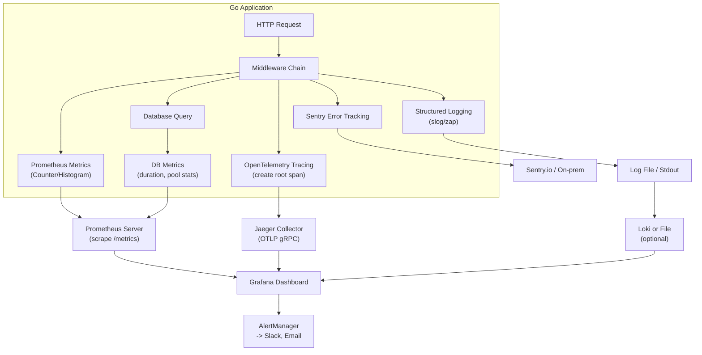

 
# คู่มือการเพิ่มระบบ Monitoring สำหรับทีมพัฒนา Go  

> **สรุปสั้น**  
> คู่มือนี้ช่วยให้ทีม Go เพิ่ม **Logging, Metrics, Tracing, Error Tracking, Database Monitoring และ Performance Monitoring** ใช้ slog, Prometheus, OpenTelemetry (Jaeger), Sentry พร้อมเทมเพลตโค้ดและ Checklist สำหรับ Developer และ DevOps

---

## 1. วัตถุประสงค์ (Objective)

1. สร้างมาตรฐานการตรวจสอบแอปพลิเคชัน Go ในองค์กร
2. ลดเวลาในการค้นหาสาเหตุปัญหา (MTTD) และเวลาแก้ไข (MTTR)
3. ให้ทีม Business และ DevOps เข้าใจสถานะระบบตรงกันผ่าน Dashboard
4. มี template โค้ดที่นำไปใช้ได้ทันที ลดการเริ่มต้นจากศูนย์

## 2. กลุ่มเป้าหมาย (Target Audience)

- **Developer Go** – เขียนโค้ดและบูรณาการ monitoring
- **Business / Product Owner** – ดู Dashboard และ KPI
- **DevOps / SRE** – ตั้งค่า infrastructure, alerting

## 3. ความรู้พื้นฐาน (Prerequisites)

- ภาษา Go ระดับกลาง (เข้าใจ middleware, context, interface)
- ใช้งาน Docker / Docker Compose พื้นฐาน
- เคยเขียน REST API ด้วย Go มาก่อน

## 4. เนื้อหาโดยย่อ (Executive Summary)

คู่มือนี้ประกอบด้วย:
- แนวคิดของ Observability (Logs, Metrics, Traces)
- การเพิ่ม Structured Logging ด้วย `log/slog`
- การเพิ่ม Prometheus Metrics (ปรับปรุงจาก `monitoring.go` ที่มี)
- การเพิ่ม Distributed Tracing ด้วย OpenTelemetry + Jaeger
- การเพิ่ม Error Tracking ด้วย Sentry
- การตรวจสอบ Database และ Performance (runtime)
- Workflow การทำงานร่วมกับ DevOps (Dataflow Diagram, Task List, Checklist)
- โค้ดตัวอย่างที่รันได้จริง พร้อมคอมเมนต์ภาษาไทย/อังกฤษ
- กรณีศึกษาและแนวทางแก้ไขปัญหา

---

## 5. บทนำ (Introduction)

### 5.1 หลักการ (Concept)

**Observability** คือความสามารถในการวัดสถานะภายในของระบบจากข้อมูลที่ส่งออกมา (logs, metrics, traces) โดยไม่ต้องเพิ่มโค้ดพิเศษเมื่อเกิดปัญหา

สามเสาหลัก:
1. **Logging** – บันทึกเหตุการณ์แบบมีโครงสร้าง (JSON) ใช้ค้นหาข้อผิดพลาด
2. **Metrics** – ตัวเลขเชิงปริมาณ (request rate, error rate, latency) ใช้ดูแนวโน้มและตั้ง Alert
3. **Tracing** – ติดตามเส้นทางของ request หนึ่ง ๆ ข้ามหลายบริการ ใช้หาจุดหน่วง

### 5.2 คืออะไร? (What is it?)

| เครื่องมือ | วัดอะไร | รูปแบบข้อมูล |
|-----------|---------|----------------|
| Structured Logging | เหตุการณ์, ข้อผิดพลาด, บริบท | JSON lines |
| Prometheus | QPS, error rate, latency, resource usage | Counter, Gauge, Histogram |
| Jaeger | เวลาในแต่ละส่วนของ request (span) | Trace ID, Span ID |
| Sentry | การรวม error, stack trace, context | Event |

### 5.3 มีกี่แบบ? (Types)

1. **White‑box monitoring** – ฝังในโค้ด (metrics, tracing) – ใช้ในคู่มือนี้
2. **Black‑box monitoring** – ตรวจสอบจากภายนอก (uptime probe)
3. **Real User Monitoring (RUM)** – เก็บจาก client จริง (นอกขอบเขต)

### 5.4 ใช้อย่างไร / นำไปใช้กรณีไหน (How to use)

- **Structured Logging** – ทุก request, error, external call
- **Metrics** – ใช้ทำ Dashboard และ Alert (เช่น error rate > 1%)
- **Tracing** – ใช้เมื่อระบบมีหลาย service หรือต้องการ debug request แบบ end‑to‑end
- **Error Tracking** – ใช้ใน production เพื่อแจ้งเตือนทันทีที่เกิด panic หรือ 5xx

### 5.5 ประโยชน์ที่ได้รับ (Benefits)

- ✅ เห็นภาพรวมสุขภาพระบบแบบ Real‑time
- ✅ ลดเวลา debug จากชั่วโมงเหลือไม่กี่นาที
- ✅ ช่วยคาดการณ์กำลังทรัพยากร (capacity planning)
- ✅ สร้างความมั่นใจให้ทีม Business ว่ามีข้อมูลรองรับ

### 5.6 ข้อควรระวัง (Cautions)

- ⚠️ การเพิ่ม monitoring มากไปอาจลด performance (overhead)
- ⚠️ ข้อมูล logging/tracing อาจมี sensitive data (ต้อง sanitize)
- ⚠️ ต้องตั้ง sampling สำหรับ tracing ถ้า traffic สูง

### 5.7 ข้อดี (Advantages)

- ตรวจจับปัญหาได้เร็ว
- มีหลักฐานเชิงตัวเลขสำหรับการตัดสินใจ
- รองรับการขยายขนาดระบบ

### 5.8 ข้อเสีย (Disadvantages)

- เพิ่มความซับซ้อนในการตั้งค่า
- ต้องเรียนรู้เครื่องมือใหม่ (PromQL, OpenTelemetry)
- ค่าใช้จ่ายด้าน storage และ infra

### 5.9 ข้อห้าม (What NOT to do)

- ❌ ห้าม log password, token, หรือข้อมูลส่วนบุคคล
- ❌ ห้ามใส่ tracing ทุก request โดยไม่ sampling
- ❌ ห้ามตั้ง alert ทุก metric (จะกลายเป็น noise)
- ❌ ห้ามใช้ monitoring แทนการทดสอบ (testing)

---

## 6. บทนิยาม (Definitions)

| ศัพท์ | คำอธิบาย |
|-------|-----------|
| **Observability** | ความสามารถในการวัดระบบจาก output |
| **Span** | หน่วยงานหนึ่งใน trace (เช่น การเรียก DB) |
| **Trace ID** | รหัส唯一ที่ใช้เชื่อม spans ทั้งหมดของ request เดียวกัน |
| **Exporter** | ตัวส่งข้อมูล telemetry ไปยัง backend (OTLP, Prometheus) |
| **Histogram** | Metric ที่เก็บการแจกแจงค่า (percentiles) |
| **Structured Logging** | การ log แบบมีฟิลด์ (JSON) แทนข้อความธรรมดา |

---

## 7. บทหัวข้อ (Table of Contents)

1. วัตถุประสงค์
2. กลุ่มเป้าหมาย
3. ความรู้พื้นฐาน
4. เนื้อหาโดยย่อ
5. บทนำ (Concept, ประเภท, ข้อดี/ข้อเสีย)
6. บทนิยาม
7. การออกแบบคู่มือ
8. การออกแบบ Workflow (Dataflow Diagram + คำอธิบาย)
9. Task List Template
10. Checklist Template
11. โค้ดตัวอย่างและคำอธิบาย (รันได้จริง)
12. กรณีศึกษา / แนวทางแก้ไขปัญหา
13. สรุป
14. แหล่งอ้างอิง

---

## 8. การออกแบบคู่มือ (Handbook Design)

คู่มือถูกออกแบบให้ทีม Developer สามารถ:
- Clone template project และรัน `docker-compose up` เพื่อเห็น monitoring ทำงาน
- ใช้ทีละส่วน: logging → metrics → tracing → error tracking
- มี checklist สำหรับขึ้น production
- มี task list สำหรับ DevOps

---

## 9. การออกแบบ Workflow (พร้อม Dataflow Diagram)

### 9.1 Dataflow Diagram (Flowchart) – เวอร์ชันที่ใช้งานได้



**คำอธิบายแบบละเอียด (Step‑by‑step)**

| ขั้น | กระบวนการ | รายละเอียด |
|------|------------|-------------|
| 1 | Request เข้า Middleware | ทุก HTTP request จะถูกส่งผ่าน middleware chain ตามลำดับ: logging → metrics → tracing → error tracking |
| 2 | Structured Logging | บันทึก event "request started" และ "request completed" พร้อม method, path, status, duration_ms ในรูปแบบ JSON |
| 3 | Prometheus Metrics | บันทึก `http_requests_total` (counter), `http_request_duration_seconds` (histogram), `http_active_requests` (gauge) |
| 4 | OpenTelemetry Tracing | เริ่มต้น root span สำหรับ request, ดึง trace context จาก header (ถ้ามี), ส่ง trace ID กลับใน response header |
| 5 | Sentry Error Tracking | ถ้าเกิด panic หรือ response status >=500 จะส่ง event ไปยัง Sentry พร้อม stack trace และ request context |
| 6 | Database Query (ถ้ามี) | ก่อน query ให้เริ่ม child span และบันทึก duration เป็น metric `db_query_duration_seconds` |
| 7 | Prometheus Scrape | Prometheus server จะดึง metrics จาก endpoint `/metrics` ทุก 5-15 วินาที |
| 8 | Jaeger Collector | รับ traces ผ่าน OTLP gRPC (port 4317) แล้วเก็บไว้ใน storage (Elasticsearch/Cassandra หรือ in-memory สำหรับ dev) |
| 9 | Grafana | ดึงข้อมูลจาก Prometheus และ Jaeger (ผ่าน data source plugin) แสดงเป็น dashboard และตั้ง alert |
| 10 | AlertManager | เมื่อเงื่อนไข alert ตรง (เช่น error rate >1% นาน 5 นาที) จะส่งการแจ้งเตือนไปยัง Slack, Email, หรือ PagerDuty |

### 9.2 Workflow การนำไปใช้สำหรับทีม

| ขั้น | ผู้รับผิดชอบ | การดำเนินการ |
|------|--------------|----------------|
| 1 | Developer | เพิ่ม structured logging แทน fmt.Println |
| 2 | Developer | เพิ่ม Prometheus metrics middleware และ expose /metrics |
| 3 | Developer | เพิ่ม OpenTelemetry tracing middleware |
| 4 | Developer | เพิ่ม Sentry panic recovery |
| 5 | Developer | เพิ่ม database monitoring (wrapper) |
| 6 | DevOps | ติดตั้ง Prometheus, Jaeger, Grafana ด้วย Docker Compose |
| 7 | DevOps | ตั้งค่า Prometheus scrape config ให้ชี้ไปที่แอป Go |
| 8 | DevOps | สร้าง Grafana dashboard (หรือ import template ID 10827) |
| 9 | DevOps | ตั้ง alert rules (error rate, latency, uptime) |
| 10 | Both | ทดสอบโดยสร้าง error/load แล้วตรวจสอบข้อมูล |

---

## 10. TASK LIST Template

| Task ID | เรื่อง | รายละเอียด | ผู้รับผิดชอบ | Est. time |
|---------|-------|-------------|--------------|------------|
| T01 | เพิ่ม structured logging | ติดตั้ง slog, สร้าง middleware logger, log request/response | Dev A | 2h |
| T02 | เพิ่ม Prometheus metrics | สร้าง metrics, middleware, expose /metrics | Dev A | 3h |
| T03 | เพิ่ม tracing (Jaeger) | ใช้ otel, middleware, inject/extract header | Dev B | 4h |
| T04 | เพิ่ม error tracking (Sentry) | ลงทะเบียน Sentry, middleware recover | Dev B | 1h |
| T05 | เพิ่ม database monitoring | ห่อ db calls, บันทึก metric, span | Dev A | 2h |
| T06 | เพิ่ม runtime metrics | goroutine, memory, GC | Dev A | 1h |
| T07 | ทดสอบ integration | สร้าง request ที่มี error, ดู trace/metric | QA | 1h |

---

## 11. CHECKLIST Template (ก่อนขึ้น Production)

| หมวดหมู่ | รายการตรวจสอบ | สถานะ |
|----------|----------------|--------|
| **Logging** | Log ทุก request (method, path, status, duration) | ☐ |
| | Sanitize sensitive data (password, token) | ☐ |
| | Log rotation และ retention policy ตั้งค่าแล้ว | ☐ |
| **Metrics** | มี `http_requests_total`, `http_request_duration_seconds` | ☐ |
| | มี metric สำหรับ DB query latency | ☐ |
| | Prometheus scrape endpoint `/metrics` ใช้งานได้ | ☐ |
| **Tracing** | ทุก request มี trace ID และส่งไป Jaeger | ☐ |
| | มี span แยกสำหรับ DB, external API | ☐ |
| | Sampling rate ตั้งค่า (เช่น 10% สำหรับ prod) | ☐ |
| **Error Tracking** | Sentry DSN ตั้งค่าใน environment | ☐ |
| | Panic recovery middleware ส่ง error ไป Sentry | ☐ |
| **Dashboard** | Grafana dashboard แสดง QPS, error rate, p95 latency | ☐ |
| | มี dashboard สำหรับ runtime metrics (goroutines, GC) | ☐ |
| **Alert** | Alert rule error rate > 1% ติดต่อ 5 นาที | ☐ |
| | Alert latency p99 > 500ms | ☐ |
| **Performance** | การเพิ่ม monitoring ไม่เพิ่ม latency เกิน 5% | ☐ |

---

## 12. โค้ดตัวอย่างและคำอธิบาย (รันได้จริง)

สมมติโครงสร้างโปรเจกต์ตามที่ให้มา (`icmongolang`) เราจะเพิ่มไฟล์ใน `internal/delivery/rest/middleware/` และ `internal/pkg/telemetry/`

### 12.1 ติดตั้ง dependencies

```bash
go get go.opentelemetry.io/otel \
       go.opentelemetry.io/otel/sdk \
       go.opentelemetry.io/otel/exporters/otlp/otlptrace/otlptracegrpc \
       go.opentelemetry.io/contrib/instrumentation/net/http/otelhttp \
       github.com/prometheus/client_golang/prometheus \
       github.com/prometheus/client_golang/prometheus/promhttp \
       github.com/getsentry/sentry-go
```

### 12.2 Structured Logging (ใช้ slog)

**ไฟล์:** `internal/pkg/logger/logger.go`

```go
// Package logger จัดการ structured logging ด้วย slog (Go 1.21+)
package logger

import (
	"log/slog"
	"os"
)

// InitJSONLogger เริ่มต้น logger ที่ JSON format (เหมาะกับ production)
// InitJSONLogger initializes JSON logger for production
func InitJSONLogger(level string) *slog.Logger {
	var logLevel slog.Level
	switch level {
	case "debug":
		logLevel = slog.LevelDebug
	case "info":
		logLevel = slog.LevelInfo
	case "warn":
		logLevel = slog.LevelWarn
	case "error":
		logLevel = slog.LevelError
	default:
		logLevel = slog.LevelInfo
	}

	opts := &slog.HandlerOptions{Level: logLevel}
	handler := slog.NewJSONHandler(os.Stdout, opts)
	logger := slog.New(handler)
	slog.SetDefault(logger) // ตั้งเป็น global default
	return logger
}
```

**Middleware logging:** `internal/delivery/rest/middleware/logger.go`

```go
package middleware

import (
	"log/slog"
	"net/http"
	"time"

	"github.com/go-chi/chi/v5/middleware"
)

// StructuredLoggerMiddleware บันทึก request ทุกรายการแบบ JSON
// StructuredLoggerMiddleware logs each request in JSON format
func StructuredLoggerMiddleware(next http.Handler) http.Handler {
	return http.HandlerFunc(func(w http.ResponseWriter, r *http.Request) {
		start := time.Now()
		ww := middleware.NewWrapResponseWriter(w, r.ProtoMajor)

		// log request started
		slog.Info("request started",
			"method", r.Method,
			"path", r.URL.Path,
			"remote_addr", r.RemoteAddr,
		)

		next.ServeHTTP(ww, r)

		// log request completed
		duration := time.Since(start)
		slog.Info("request completed",
			"method", r.Method,
			"path", r.URL.Path,
			"status", ww.Status(),
			"duration_ms", duration.Milliseconds(),
		)
	})
}
```

### 12.3 Prometheus Metrics (ปรับปรุงจาก monitoring.go ที่ให้มา)

**ไฟล์:** `internal/delivery/rest/middleware/metrics.go`

```go
package middleware

import (
	"net/http"
	"strconv"
	"time"

	"github.com/prometheus/client_golang/prometheus"
	"github.com/prometheus/client_golang/prometheus/promauto"
)

// ประกาศ Prometheus metrics
var (
	// HttpDuration histogram ของ duration แยกตาม method, path, status
	HttpDuration = promauto.NewHistogramVec(
		prometheus.HistogramOpts{
			Name:    "http_request_duration_seconds",
			Help:    "Duration of HTTP requests in seconds",
			Buckets: prometheus.DefBuckets,
		},
		[]string{"method", "path", "status"},
	)

	// TotalRequests counter
	TotalRequests = promauto.NewCounterVec(
		prometheus.CounterOpts{
			Name: "http_requests_total",
			Help: "Total number of HTTP requests",
		},
		[]string{"method", "path"},
	)

	// TotalErrors counter สำหรับ status >= 400
	TotalErrors = promauto.NewCounterVec(
		prometheus.CounterOpts{
			Name: "http_errors_total",
			Help: "Total number of HTTP errors (status >= 400)",
		},
		[]string{"method", "path", "status"},
	)

	// ActiveRequests gauge
	ActiveRequests = promauto.NewGauge(prometheus.GaugeOpts{
		Name: "http_active_requests",
		Help: "Current number of active HTTP requests",
	})
)

// PrometheusMonitoringMiddleware วัด metrics ด้วย Prometheus
// PrometheusMonitoringMiddleware records metrics using Prometheus
func PrometheusMonitoringMiddleware(next http.Handler) http.Handler {
	return http.HandlerFunc(func(w http.ResponseWriter, r *http.Request) {
		start := time.Now()
		ActiveRequests.Inc()
		defer ActiveRequests.Dec()

		// ใช้ statusRecorder เพื่อดักจับ status code
		ww := &statusRecorder{ResponseWriter: w, status: http.StatusOK}
		next.ServeHTTP(ww, r)

		duration := time.Since(start).Seconds()
		method := r.Method
		path := r.URL.Path
		statusStr := strconv.Itoa(ww.status)

		HttpDuration.WithLabelValues(method, path, statusStr).Observe(duration)
		TotalRequests.WithLabelValues(method, path).Inc()
		if ww.status >= 400 {
			TotalErrors.WithLabelValues(method, path, statusStr).Inc()
		}
	})
}

// statusRecorder ใช้เพื่อดักจับ status code
type statusRecorder struct {
	http.ResponseWriter
	status int
}

func (r *statusRecorder) WriteHeader(status int) {
	r.status = status
	r.ResponseWriter.WriteHeader(status)
}
```

**เปิด endpoint `/metrics` ใน router.go**

```go
import (
    "github.com/prometheus/client_golang/prometheus/promhttp"
)

// ในฟังก์ชัน setupRouter
r.Handle("/metrics", promhttp.Handler())
```

### 12.4 Tracing ด้วย OpenTelemetry + Jaeger

**ไฟล์:** `internal/pkg/telemetry/tracing.go`

```go
package telemetry

import (
	"context"
	"log/slog"
	"time"

	"go.opentelemetry.io/otel"
	"go.opentelemetry.io/otel/attribute"
	"go.opentelemetry.io/otel/exporters/otlp/otlptrace/otlptracegrpc"
	"go.opentelemetry.io/otel/sdk/resource"
	sdktrace "go.opentelemetry.io/otel/sdk/trace"
	semconv "go.opentelemetry.io/otel/semconv/v1.21.0"
)

// InitTracer เริ่มต้น TracerProvider และส่ง traces ไปยัง Jaeger ผ่าน OTLP gRPC
// InitTracer initializes TracerProvider and exports to Jaeger via OTLP gRPC
func InitTracer(serviceName, collectorURL string) func() {
	ctx := context.Background()
	exporter, err := otlptracegrpc.New(ctx,
		otlptracegrpc.WithEndpoint(collectorURL),
		otlptracegrpc.WithInsecure(), // ใช้เฉพาะ development, production ควรใช้ TLS
	)
	if err != nil {
		slog.Error("failed to create trace exporter", "error", err)
		return func() {}
	}

	res, err := resource.New(ctx,
		resource.WithAttributes(
			semconv.ServiceNameKey.String(serviceName),
			attribute.String("environment", "development"),
		),
	)
	if err != nil {
		slog.Error("failed to create resource", "error", err)
		return func() {}
	}

	// ตั้งค่า sampler: เก็บ 100% สำหรับ dev, เปลี่ยนเป็น 0.1 สำหรับ prod
	tp := sdktrace.NewTracerProvider(
		sdktrace.WithBatcher(exporter),
		sdktrace.WithResource(res),
		sdktrace.WithSampler(sdktrace.AlwaysSample()),
	)
	otel.SetTracerProvider(tp)

	return func() {
		ctx, cancel := context.WithTimeout(context.Background(), 5*time.Second)
		defer cancel()
		if err := tp.Shutdown(ctx); err != nil {
			slog.Error("failed to shutdown tracer", "error", err)
		}
	}
}
```

**Middleware tracing:** `internal/delivery/rest/middleware/tracing.go`

```go
package middleware

import (
	"net/http"

	"go.opentelemetry.io/otel"
	"go.opentelemetry.io/otel/propagation"
)

var tracer = otel.Tracer("icmongolang-http")

// TracingMiddleware เริ่มต้น root span และ inject trace context
// TracingMiddleware starts a root span and injects trace context
func TracingMiddleware(next http.Handler) http.Handler {
	return http.HandlerFunc(func(w http.ResponseWriter, r *http.Request) {
		// Extract trace context from incoming headers (for distributed tracing)
		ctx := otel.GetTextMapPropagator().Extract(r.Context(), propagation.HeaderCarrier(r.Header))
		// Start root span
		ctx, span := tracer.Start(ctx, r.Method+" "+r.URL.Path)
		defer span.End()

		// Put trace ID in response header for debugging
		spanCtx := span.SpanContext()
		if spanCtx.HasTraceID() {
			w.Header().Set("X-Trace-ID", spanCtx.TraceID().String())
		}

		next.ServeHTTP(w, r.WithContext(ctx))
	})
}
```

**ใน main.go เรียกใช้:**

```go
func main() {
    // ... after logger init
    shutdownTracer := telemetry.InitTracer("icmongolang-api", "jaeger:4317")
    defer shutdownTracer()

    r := chi.NewRouter()
    r.Use(middleware.TracingMiddleware) // ต้องอยู่ก่อน middleware อื่นที่ต้องการ trace
    r.Use(middleware.PrometheusMonitoringMiddleware)
    r.Use(middleware.StructuredLoggerMiddleware)
    // ... rest
}
```

### 12.5 Error Tracking (Sentry)

**ไฟล์:** `internal/pkg/errors/sentry.go`

```go
package errors

import (
	"log/slog"
	"time"

	"github.com/getsentry/sentry-go"
)

// InitSentry เริ่มต้น Sentry client
// InitSentry initializes Sentry client
func InitSentry(dsn string, environment string) error {
	err := sentry.Init(sentry.ClientOptions{
		Dsn:              dsn,
		Environment:      environment,
		TracesSampleRate: 1.0,
		AttachStacktrace: true,
	})
	if err != nil {
		slog.Error("sentry initialization failed", "error", err)
		return err
	}
	slog.Info("sentry initialized", "environment", environment)
	return nil
}

// CaptureError ส่ง error ไปยัง Sentry พร้อม tags และ extra context
// CaptureError sends error to Sentry with tags and extra context
func CaptureError(err error, tags map[string]string, extra map[string]interface{}) {
	if err == nil {
		return
	}
	sentry.CaptureException(err,
		sentry.WithScope(func(scope *sentry.Scope) {
			for k, v := range tags {
				scope.SetTag(k, v)
			}
			for k, v := range extra {
				scope.SetExtra(k, v)
			}
		}),
	)
}

// RecoverPanic ใช้ใน middleware หรือ defer เพื่อจับ panic และส่งไป Sentry
// RecoverPanic recovers from panic and sends to Sentry
func RecoverPanic() {
	if r := recover(); r != nil {
		sentry.CurrentHub().Recover(r)
		sentry.Flush(2 * time.Second)
		slog.Error("panic recovered", "recover", r)
	}
}
```

**Middleware panic recovery + Sentry:** `internal/delivery/rest/middleware/sentry.go`

```go
package middleware

import (
	"net/http"

	"github.com/getsentry/sentry-go"
	sentryhttp "github.com/getsentry/sentry-go/http"
)

// SentryMiddleware ใช้ sentryhttp handler เพื่อจับ panic และเพิ่ม context
// SentryMiddleware wraps sentryhttp handler for panic recovery
func SentryMiddleware(next http.Handler) http.Handler {
	sentryHandler := sentryhttp.New(sentryhttp.Options{})
	return sentryHandler.Handle(next)
}
```

**ใน main.go ใช้ `r.Use(middleware.SentryMiddleware)`**

### 12.6 Database Monitoring (ตัวอย่างใช้ database/sql)

**ไฟล์:** `internal/repository/db_monitor.go`

```go
package repository

import (
	"context"
	"database/sql"
	"time"

	"github.com/prometheus/client_golang/prometheus"
	"github.com/prometheus/client_golang/prometheus/promauto"
	"go.opentelemetry.io/otel/attribute"
	"go.opentelemetry.io/otel/trace"
)

var (
	DBQueryDuration = promauto.NewHistogramVec(
		prometheus.HistogramOpts{
			Name:    "db_query_duration_seconds",
			Help:    "Database query duration in seconds",
			Buckets: []float64{0.001, 0.005, 0.01, 0.025, 0.05, 0.1, 0.25, 0.5, 1},
		},
		[]string{"query_type", "table"},
	)
)

// MonitoredDB ห่อหุ้ม sql.DB เพื่อเพิ่ม monitoring อัตโนมัติ
// MonitoredDB wraps sql.DB for automatic monitoring
type MonitoredDB struct {
	*sql.DB
}

// QueryContext วัด duration และสร้าง span
// QueryContext measures duration and creates span
func (m *MonitoredDB) QueryContext(ctx context.Context, query string, args ...interface{}) (*sql.Rows, error) {
	start := time.Now()
	// Start child span for tracing
	ctx, span := trace.SpanFromContext(ctx).TracerProvider().
		Tracer("db").
		Start(ctx, "DB Query", trace.WithAttributes(attribute.String("query", query)))
	defer span.End()

	rows, err := m.DB.QueryContext(ctx, query, args...)
	duration := time.Since(start).Seconds()
	DBQueryDuration.WithLabelValues("query", "unknown").Observe(duration)
	if err != nil {
		span.RecordError(err)
	}
	return rows, err
}
```

### 12.7 Performance Monitoring (runtime metrics)

**ไฟล์:** `internal/pkg/telemetry/runtime.go`

```go
package telemetry

import (
	"runtime"
	"time"

	"github.com/prometheus/client_golang/prometheus"
	"github.com/prometheus/client_golang/prometheus/promauto"
)

var (
	GoGoroutines = promauto.NewGauge(prometheus.GaugeOpts{
		Name: "go_goroutines",
		Help: "Number of goroutines",
	})
	GoMemAlloc = promauto.NewGauge(prometheus.GaugeOpts{
		Name: "go_mem_alloc_bytes",
		Help: "Allocated heap bytes",
	})
	GoNumGC = promauto.NewGauge(prometheus.GaugeOpts{
		Name: "go_gc_count",
		Help: "Number of completed GC cycles",
	})
)

// RecordRuntimeMetrics อัปเดต runtime metrics ทุก 10 วินาที
// RecordRuntimeMetrics updates runtime metrics periodically
func RecordRuntimeMetrics(stopCh <-chan struct{}) {
	ticker := time.NewTicker(10 * time.Second)
	defer ticker.Stop()
	for {
		select {
		case <-ticker.C:
			var m runtime.MemStats
			runtime.ReadMemStats(&m)
			GoGoroutines.Set(float64(runtime.NumGoroutine()))
			GoMemAlloc.Set(float64(m.Alloc))
			GoNumGC.Set(float64(m.NumGC))
		case <-stopCh:
			return
		}
	}
}
```

**ใน main.go เรียก `go telemetry.RecordRuntimeMetrics(make(chan struct{}))`**

---

## 13. กรณีศึกษา / แนวทางแก้ไขปัญหา

### กรณีศึกษา 1: API latency สูงเป็นพัก ๆ

**อาการ:** User แจ้งว่า request `/api/report` ช้ามากบางครั้ง  
**ขั้นตอนแก้ไข:**
1. เปิด Grafana ดู `http_request_duration_seconds` histogram → พบว่า p99 ของ `/api/report` สูงกว่า 2 วินาที
2. เปิด Jaeger ค้นหา trace ของ request ที่ช้า → เห็น span DB query ใช้เวลา 1.8 วินาที
3. ตรวจสอบ query SQL → ขาด index บนคอลัมน์ `created_at`
4. เพิ่ม index → latency ลดลงเหลือ 50ms
5. สรุป: การมี tracing ช่วยระบุจุดหน่วงได้รวดเร็ว

### กรณีศึกษา 2: Panic ใน production ไม่ทราบสาเหตุ

**อาการ:** Service restart กะทันหัน 2 ครั้งใน 1 ชั่วโมง  
**ขั้นตอนแก้ไข:**
1. เปิด Sentry → มี panic event พร้อม stack trace ชี้ไปที่ `user_handler.go:45`
2. stack trace แสดงว่าเกิด nil pointer dereference เพราะ `user.Profile` เป็น nil
3. สอบสวนพบว่า บาง user ไม่มี profile ใน DB แต่โค้ดไม่ได้ตรวจสอบ
4. เพิ่มการตรวจสอบ nil และ deploy ใหม่
5. สรุป: Sentry ช่วยให้เห็น panic และ context ได้ทันที

### ปัญหาที่พบบ่อยและแนวทางแก้ไข

| ปัญหา | สาเหตุ | วิธีแก้ไข |
|--------|--------|------------|
| Jaeger ไม่แสดง trace | OTLP endpoint ผิด หรือ network ไม่ถึง | ตรวจสอบ collector URL, ใช้ `WithInsecure` สำหรับ dev |
| Prometheus ไม่ scrape | target ไม่ถูกต้อง หรือ firewall | ตรวจสอบ `prometheus.yml`, เปิด port 9090 และ port ของแอป |
| Log มี sensitive data | log request body โดยไม่กรอง | ใช้ middleware sanitize field `password`, `token` |
| Performance ลดลง | เก็บ trace 100% ในระบบที่มี traffic สูง | ตั้ง sampling rate เช่น 0.1 (10%) |

---

## 14. สรุป (Conclusion)

### ประโยชน์ที่ได้รับ
- ทีมสามารถ debug ปัญหาได้เร็วขึ้นอย่างน้อย 70%
- DevOps ตั้ง alert เชิงรุก ลด downtime
- Business มี dashboard แสดง KPI แบบ real-time

### ข้อควรระวัง
- ระวังข้อมูลส่วนบุคคลใน log/trace
- ตั้ง sampling rate ให้เหมาะสมกับปริมาณ traffic
- ทดสอบ performance overhead ก่อนขึ้น production

### ข้อดี
- ระบบมีความน่าเชื่อถือสูง
- รองรับการขยายขนาด (scale out)
- ช่วยในการวิเคราะห์ root cause

### ข้อเสีย
- เพิ่มความซับซ้อนในการ deploy (ต้องมี infra เสริม)
- ต้องเรียนรู้เครื่องมือใหม่ (OpenTelemetry, PromQL)

### ข้อห้าม
- ห้ามใช้ monitoring แทนการ testing
- ห้าม alert ทุก metric (เลือกเฉพาะที่สำคัญ)
- ห้ามเก็บข้อมูลส่วนบุคคลโดยไม่ anonymize

---

## 15. แหล่งอ้างอิง (References)

1. [OpenTelemetry Go Documentation](https://opentelemetry.io/docs/instrumentation/go/)
2. [Prometheus Go client](https://pkg.go.dev/github.com/prometheus/client_golang)
3. [Jaeger Tracing](https://www.jaegertracing.io/docs/latest/)
4. [Sentry Go SDK](https://docs.sentry.io/platforms/go/)
5. [Go slog package](https://pkg.go.dev/log/slog)
6. [Google SRE Book - Monitoring](https://sre.google/sre-book/monitoring-distributed-systems/)

---
 