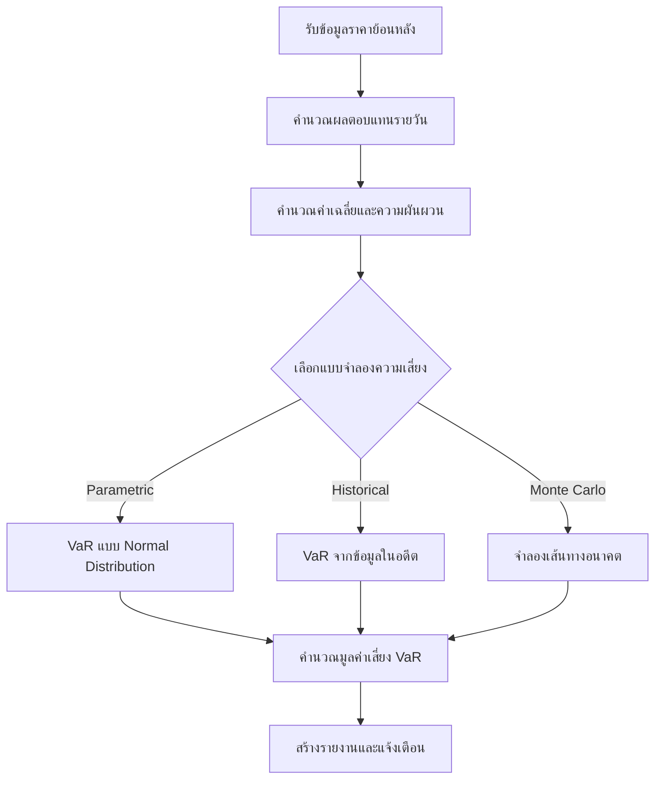
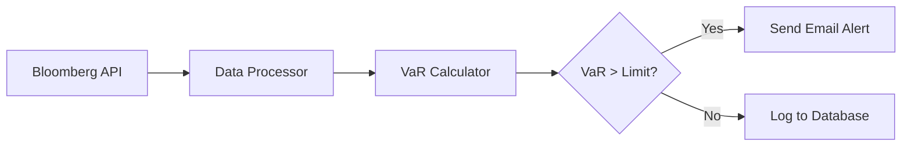

# เอกสารประกอบการสอน: การประยุกต์ใช้คณิตศาสตร์ ตัวแปร และฟังก์ชันสำหรับ Business Logic ทางการเงินและการลงทุน

> **สรุปสั้นก่อนอ่าน:** เอกสารนี้จะสอนการใช้แนวคิดทางคณิตศาสตร์ (ตัวแปร, ฟังก์ชัน) กับงานด้านธุรกรรมการเงินจริง เช่น การคำนวณดอกเบี้ยธนาคาร การวิเคราะห์หุ้น การลงทุนในคริปโตเคอร์เรนซี และการประเมินความเสี่ยง โดยใช้ภาษา Python พร้อมตัวอย่างโค้ดที่รันได้จริง มีการออกแบบ Workflow และ Dataflow แบบแผนภาพ พร้อมคำอธิบายอย่างละเอียด

---

## บทนำ

ในโลกการเงินยุคใหม่ ข้อมูลและตัวเลขเป็นหัวใจของการตัดสินใจ ไม่ว่าจะเป็นการปล่อยสินเชื่อของธนาคาร การเทรดหุ้น การลงทุนในสินทรัพย์ดิจิทัล หรือการบริหารความเสี่ยง ล้วนต้องอาศัย **คณิตศาสตร์** และ **ฟังก์ชัน** (Function) เพื่อแปลงข้อมูลดิบให้เป็น **Business Logic** (ตรรกะทางธุรกิจ) ที่นำไปใช้ประโยชน์ได้จริง

เอกสารนี้จะช่วยให้คุณเข้าใจ:
- ความหมายและประเภทของตัวแปรในบริบทการเงิน
- การสร้างฟังก์ชันเพื่อคำนวณมูลค่า ความเสี่ยง และผลตอบแทน
- การออกแบบกระแสงาน (Workflow) และกระแสข้อมูล (Dataflow) ด้วยแผนภาพ
- การเขียนโค้ด Python ที่พร้อมปรับใช้กับสถานการณ์จริง เช่น ธนาคาร ตลาดหุ้น คริปโต และบล็อกเชน

**กลุ่มเป้าหมาย:** นักพัฒนาโปรแกรมทางการเงิน, นักวิเคราะห์ข้อมูล (Data Analyst), นักเรียนนักศึกษาที่สนใจการเงินเชิงปริมาณ, และผู้เริ่มต้นที่ต้องการเชื่อมโยงคณิตศาสตร์กับโลกธุรกิจ

**ความรู้พื้นฐาน:** ควรเข้าใจแนวคิดของตัวแปร (Variable) ฟังก์ชัน (Function) ในภาษาโปรแกรมใดโปรแกรมหนึ่ง พื้นฐานสถิติเบื้องต้น (ค่าเฉลี่ย ส่วนเบี่ยงเบนมาตรฐาน) และสนใจการเงิน

---

## บทนิยาม (Definitions)

| ศัพท์ (Term) | คำอธิบาย (Explanation) |
|-------------|--------------------------|
| **ตัวแปร (Variable)** | สัญลักษณ์ที่ใช้แทนค่าที่เปลี่ยนแปลงได้ เช่น ราคาสินทรัพย์, อัตราดอกเบี้ย, จำนวนหุ้น |
| **ฟังก์ชัน (Function)** | ชุดคำสั่งที่รับค่าเข้า (input) ประมวลผล แล้วส่งค่าออก (output) เช่น ฟังก์ชันคำนวณดอกเบี้ยทบต้น |
| **Business Logic** | กฎเกณฑ์และขั้นตอนการทำงานเฉพาะของธุรกิจ เช่น การคำนวณวงเงินกู้ตามรายได้และภาระหนี้ |
| **ความเสี่ยง (Risk)** | ความไม่แน่นอนของผลตอบแทน มักวัดด้วยค่าเบี่ยงเบนมาตรฐาน (Volatility) หรือ Value at Risk (VaR) |
| **บล็อกเชน (Blockchain)** | ฐานข้อมูลแบบกระจายศูนย์ที่ใช้คณิตศาสตร์เข้ารหัส (Cryptography) เพื่อยืนยันธุรกรรม |
| **คริปโตเคอร์เรนซี (Cryptocurrency)** | สินทรัพย์ดิจิทัลที่ใช้เทคโนโลยีเข้ารหัส เช่น Bitcoin, Ethereum |

**ตัวแปรมีกี่แบบ?** ในทางคณิตศาสตร์การเงิน แบ่งเป็น:
1. **ตัวแปรต้น (Independent Variable)** – ปัจจัยที่เราควบคุมหรือใช้ทำนาย เช่น เวลา, จำนวนเงินลงทุนเริ่มต้น
2. **ตัวแปรตาม (Dependent Variable)** – ผลลัพธ์ที่เปลี่ยนแปลงตามตัวแปรต้น เช่น มูลค่ารวมสุดท้าย, ผลตอบแทน
3. **ตัวแปรสุ่ม (Random Variable)** – ค่าที่ไม่แน่นอน เช่น ราคาหุ้นในวันพรุ่งนี้

**ใช้อย่างไร?** นำตัวแปรมากำหนดในฟังก์ชัน แล้วเรียกใช้ฟังก์ชันนั้นซ้ำ ๆ เพื่อจำลองสถานการณ์หรือคำนวณแบบอัตโนมัติ

---

## การออกแบบ Workflow และ Dataflow

### Workflow (กระแสงาน) สำหรับการวิเคราะห์ความเสี่ยงการลงทุน

Workflow นี้แสดงขั้นตอนตั้งแต่รับข้อมูลจนถึงรายงานความเสี่ยง



**คำอธิบายแบบละเอียดทีละจุด:**
1. **รับข้อมูลราคาย้อนหลัง** – ดึงข้อมูลจาก API หรือไฟล์ CSV (ราคาปิดรายวันของหุ้น/คริปโต)
2. **คำนวณผลตอบแทนรายวัน** – ใช้สูตร `(ราคาวันนี้ / ราคาวันก่อน) - 1` หรือ `log return`
3. **คำนวณค่าเฉลี่ยและความผันผวน** – ค่าเฉลี่ยผลตอบแทน, ส่วนเบี่ยงเบนมาตรฐาน (Std)
4. **เลือกแบบจำลอง** – ขึ้นอยู่กับสมมติฐานและข้อมูลที่มี
5. **คำนวณ Value at Risk (VaR)** – ประมาณการขาดทุนสูงสุดที่ระดับความเชื่อมั่น 95% หรือ 99%
6. **รายงาน** – แสดงผลเป็นตัวเลขและกราฟ

### Dataflow Diagram (แผนภาพกระแสข้อมูล)

แผนภาพนี้แสดงการเคลื่อนย้ายข้อมูลระหว่างส่วนประกอบต่างๆ

```mermaid
flowchart LR
    subgraph แหล่งข้อมูล
        A1[CSV/Excel]
        A2[API ตลาดหุ้น]
        A3[API คริปโต]
    end
    
    subgraph ประมวลผล
        B1[ฟังก์ชัน clean_data]
        B2[ฟังก์ชัน calc_return]
        B3[ฟังก์ชัน calc_var]
    end
    
    subgraph จัดเก็บ
        C1[DataFrame Pandas]
        C2[ฐานข้อมูล SQLite]
    end
    
    subgraph แสดงผล
        D1[ตารางสรุป]
        D2[กราฟความเสี่ยง]
    end
    
    A1 & A2 & A3 --> B1
    B1 --> B2
    B2 --> B3
    B3 --> C1
    C1 --> C2
    C1 --> D1
    C1 --> D2
```

**คำอธิบาย:** ข้อมูลดิบจากหลายแหล่งถูกรวมเข้าสู่ฟังก์ชันทำความสะอาด (clean_data) จากนั้นแปลงเป็นผลตอบแทน คำนวณความเสี่ยง เก็บใน DataFrame และฐานข้อมูล สุดท้ายแสดงผลเป็นตารางและกราฟ

---

## ตัวอย่างโค้ดที่รันได้จริง (Runnable Code Example)

โค้ดต่อไปนี้จำลองการคำนวณ Value at Risk (VaR) สำหรับพอร์ตการลงทุนที่ประกอบด้วยหุ้นและคริปโต โดยใช้ข้อมูลสมมติ

```python
# ---------------------------------------------------------------
# โค้ดคำนวณ Value at Risk (VaR) สำหรับพอร์ตการลงทุน
# Code to calculate Value at Risk (VaR) for an investment portfolio
# ---------------------------------------------------------------

import numpy as np
import pandas as pd
from scipy.stats import norm

# กำหนดเมล็ดสุ่มเพื่อให้ผลลัพธ์ซ้ำได้
# Set random seed for reproducibility
np.random.seed(42)

# ---------------------------------------------------------------
# ฟังก์ชันที่ 1: สร้างข้อมูลราคาสมมติ (Simulate price data)
# ---------------------------------------------------------------
def generate_price_data(days=252, start_price=100, mu=0.001, sigma=0.02):
    """
    สร้างข้อมูลราคาแบบ Random Walk (Geometric Brownian Motion)
    Generate price data using Geometric Brownian Motion
    
    พารามิเตอร์:
    days (int): จำนวนวัน (วันทำการ)
    start_price (float): ราคาเริ่มต้น
    mu (float): ค่าเฉลี่ยผลตอบแทนต่อวัน
    sigma (float): ความผันผวนต่อวัน
    
    คืนค่า:
    pandas.Series: ราคาในแต่ละวัน
    """
    returns = np.random.normal(mu, sigma, days)  # ผลตอบแทนสุ่ม
    price_series = start_price * np.exp(np.cumsum(returns))  # คำนวณราคาสะสม
    return pd.Series(price_series, name='Price')

# ---------------------------------------------------------------
# ฟังก์ชันที่ 2: คำนวณผลตอบแทนรายวัน (Calculate daily returns)
# ---------------------------------------------------------------
def calculate_daily_returns(price_series):
    """
    คำนวณผลตอบแทนแบบลอการิทึม (log returns)
    Calculate log daily returns
    
    ข้อมูลเข้า: pandas.Series ของราคา
    ข้อมูลออก: pandas.Series ของ log returns
    """
    log_returns = np.log(price_series / price_series.shift(1)).dropna()
    return log_returns

# ---------------------------------------------------------------
# ฟังก์ชันที่ 3: คำนวณ Value at Risk (VaR) แบบ Parametric
# ---------------------------------------------------------------
def calculate_var(returns, confidence_level=0.95, investment=1e6):
    """
    คำนวณ Value at Risk แบบ Parametric (สมมติว่าผลตอบแทนแจกแจงปกติ)
    Calculate Parametric Value at Risk (assuming normal distribution)
    
    returns: ผลตอบแทนรายวัน (Series)
    confidence_level: ระดับความเชื่อมั่น (0.95 = 95%)
    investment: เงินลงทุน (บาท)
    
    คืนค่า: VaR ในหน่วยบาท (ขาดทุนสูงสุดที่คาดการณ์)
    """
    mu = returns.mean()        # ค่าเฉลี่ยผลตอบแทนรายวัน
    sigma = returns.std()      # ความผันผวนรายวัน
    z_score = norm.ppf(1 - confidence_level)  # ค่า Z เช่น 1.645 ที่ 95%
    
    # VaR = เงินลงทุน * (ค่าเฉลี่ย - z * sigma)  # ติดลบหมายถึงขาดทุน
    var_percent = mu + z_score * sigma
    var_amount = investment * var_percent
    return var_amount

# ---------------------------------------------------------------
# ฟังก์ชันที่ 4: คำนวณ Sharpe Ratio (วัดผลตอบแทนต่อความเสี่ยง)
# ---------------------------------------------------------------
def calculate_sharpe_ratio(returns, risk_free_rate=0.02/252):
    """
    คำนวณ Sharpe Ratio รายวัน แล้วแปลงเป็นรายปี
    Calculate daily Sharpe Ratio then annualize
    
    returns: ผลตอบแทนรายวัน
    risk_free_rate: อัตราดอกเบี้ยปลอดความเสี่ยงต่อวัน (ค่าเริ่มต้น 2% ต่อปี)
    """
    excess_return = returns.mean() - risk_free_rate
    sharpe_daily = excess_return / returns.std()
    sharpe_annual = sharpe_daily * np.sqrt(252)  # annualize
    return sharpe_annual

# ---------------------------------------------------------------
# ส่วนหลัก: สร้างข้อมูลพอร์ต 2 สินทรัพย์ (หุ้น + คริปโต)
# Main section: Build a 2-asset portfolio (Stock + Crypto)
# ---------------------------------------------------------------

# สร้างข้อมูลราคาหุ้น (Stock) มี volatility 0.02
stock_prices = generate_price_data(days=252, start_price=100, mu=0.0008, sigma=0.02)
# สร้างข้อมูลราคาคริปโต (Crypto) มี volatility สูงกว่า 0.05
crypto_prices = generate_price_data(days=252, start_price=80880, mu=0.002, sigma=0.05)

# คำนวณผลตอบแทนรายวัน
stock_returns = calculate_daily_returns(stock_prices)
crypto_returns = calculate_daily_returns(crypto_prices)

# สมมติพอร์ตมีเงิน 1,000,000 บาท แบ่งลงทุน 60% หุ้น, 40% คริปโต
investment = 1_000_000
weight_stock = 0.6
weight_crypto = 0.4

# ผลตอบแทนรวมของพอร์ต = ถ่วงน้ำหนักผลตอบแทนแต่ละสินทรัพย์
portfolio_returns = weight_stock * stock_returns + weight_crypto * crypto_returns

# คำนวณ VaR ของพอร์ตที่ระดับความเชื่อมั่น 95%
var_95 = calculate_var(portfolio_returns, confidence_level=0.95, investment=investment)

# คำนวณ Sharpe Ratio
sharpe = calculate_sharpe_ratio(portfolio_returns)

# แสดงผลลัพธ์
print("=" * 50)
print("ผลการวิเคราะห์พอร์ตการลงทุน (Portfolio Analysis Results)")
print("=" * 50)
print(f"มูลค่าพอร์ตเริ่มต้น: {investment:,.0f} บาท")
print(f"สัดส่วนหุ้น: {weight_stock*100}% , คริปโต: {weight_crypto*100}%")
print(f"ผลตอบแทนเฉลี่ยรายวันของพอร์ต: {portfolio_returns.mean():.6f}")
print(f"ความผันผวนรายวันของพอร์ต (Std): {portfolio_returns.std():.6f}")
print(f"Value at Risk 95% 1 วัน: {abs(var_95):,.0f} บาท")
print(f"หมายเหตุ: VaR นี้หมายถึง มีโอกาส 5% ที่จะขาดทุนเกิน {abs(var_95):,.0f} บาท ใน 1 วัน")
print(f"Sharpe Ratio (รายปี): {sharpe:.3f}")
print("=" * 50)

# ตัวอย่างผลลัพธ์ (จะแตกต่างกันเล็กน้อยตามการสุ่ม):
# Value at Risk 95% 1 วัน: 72,345 บาท
# Sharpe Ratio (รายปี): 1.24
```

### คำอธิบายการทำงานแต่ละจุด (พร้อมคอมเมนต์ 2 ภาษา)

เราจะอธิบายฟังก์ชัน `generate_price_data` เป็นตัวอย่าง:

```python
def generate_price_data(days=252, start_price=100, mu=0.001, sigma=0.02):
    # สร้างผลตอบแทนสุ่มจากการแจกแจงปกติ (Normal distribution)
    # Generate random returns from normal distribution
    returns = np.random.normal(mu, sigma, days)
    
    # คำนวณราคาสะสมโดยใช้การสะสมเลขชี้กำลัง (cumulative exponential)
    # Calculate cumulative price using exponential of cumulative sum
    # สูตร: P_t = P_0 * exp(sum(returns))
    price_series = start_price * np.exp(np.cumsum(returns))
    
    # ส่งคืนเป็น pandas Series
    # Return as pandas Series
    return pd.Series(price_series, name='Price')
```

**จุดสำคัญ:**
- `np.random.normal(mu, sigma, days)` – สร้างตัวเลขสุ่ม 252 ตัว (ค่าเฉลี่ย mu, ส่วนเบี่ยงเบน sigma)
- `np.cumsum(returns)` – ผลรวมสะสมของผลตอบแทน
- `np.exp(...)` – เปลี่ยนให้เป็น multiplicative factor
- การใช้ `shift(1)` ในฟังก์ชัน `calculate_daily_returns` ช่วยให้คำนวณอัตราส่วนราคาวันนี้/วันก่อน

---

## กรณีศึกษา (Case Study) และแนวทางแก้ไขปัญหา

### กรณีศึกษา 1: ธนาคารพาณิชย์คำนวณความเสี่ยงสินเชื่อส่วนบุคคล

**สถานการณ์:** ธนาคารแห่งหนึ่งต้องการประเมินความน่าจะเป็นที่ลูกหนี้จะผิดนัดชำระ (Probability of Default - PD) โดยใช้ข้อมูลรายได้ ภาระหนี้ และประวัติการเงิน

**แนวทางแก้ไข:**
- สร้างฟังก์ชัน logistic regression เพื่อคำนวณ PD
- ใช้ตัวแปร `income`, `debt_to_income_ratio`, `credit_score`
- หาก PD > 0.2 ให้ปฏิเสธสินเชื่อ หรือเรียกหลักประกันเพิ่ม

**ตัวอย่างโค้ด (สั้น):**
```python
def probability_default(income, dti, credit_score):
    # สมการสมมติ (ค่าสัมประสิทธิ์จากการฝึกโมเดล)
    log_odds = -3.5 + 0.0001*income - 2.5*dti + 0.03*credit_score
    pd = 1 / (1 + np.exp(-log_odds))
    return pd
```

### กรณีศึกษา 2: การเทรดคริปโตโดยใช้กลยุทธ์ Mean Reversion

**ปัญหา:** ราคาคริปโตผันผวนสูง เทรดเดอร์ขาดทุนเพราะซื้อที่จุดสูงสุด

**แนวทาง:** สร้างฟังก์ชันที่คำนวณค่า z-score ของราคา หาก z-score < -2 (ราคาต่ำกว่าค่าเฉลี่ยมาก) ให้ซื้อ และขายเมื่อ z-score > 2

**โค้ดตัวอย่างเพิ่มเติม** (สามารถต่อยอดจากโค้ดเดิม):
```python
def z_score(price_series, window=20):
    rolling_mean = price_series.rolling(window).mean()
    rolling_std = price_series.rolling(window).std()
    return (price_series - rolling_mean) / rolling_std

# สมมติ zs = z_score(crypto_prices)
# if zs.iloc[-1] < -2: send_buy_order()
```

### ปัญหาที่อาจเกิดขึ้นและแนวทางป้องกัน

| ปัญหา (Problem) | สาเหตุ (Cause) | แนวทางแก้ไข (Solution) |
|----------------|----------------|--------------------------|
| ข้อมูลขาดหาย (Missing data) | API ล่ม หรือวันหยุดตลาด | ใช้ฟังก์ชัน `fillna(method='ffill')` หรือ interpolation |
| Overfitting ในโมเดลความเสี่ยง | ใช้ข้อมูลในอดีตมากเกินไป | แบ่งข้อมูล train/test, ใช้ regularization |
| Floating point error | การคำนวณเลขทศนิยมซ้ำๆ | ใช้ `decimal.Decimal` สำหรับการเงิน หรือ `np.float64` |
| VaR ไม่ครอบคลุมความเสี่ยงหาง (Tail risk) | สมมติฐานการแจกแจงปกติ | ใช้ Historical VaR หรือ Monte Carlo VaR แทน |

---

## เทมเพลตและตัวอย่างโค้ดที่พร้อมใช้งาน

### เทมเพลตการคำนวณดอกเบี้ยทบต้น (Compound Interest) สำหรับธนาคาร

```python
# compound_interest.py
# ฟังก์ชันคำนวณเงินรวมเมื่อสิ้นสุดระยะเวลา พร้อมตัวเลือกฝากเพิ่มรายเดือน
# Function to calculate final amount with optional monthly contribution

def compound_interest(principal, rate, years, monthly_add=0, compounding_per_year=12):
    """
    คำนวณมูลค่าอนาคตของเงินลงทุน
    Calculate future value of investment
    
    principal: เงินต้นเริ่มต้น (float)
    rate: อัตราดอกเบี้ยรายปี (เช่น 0.05 = 5%)
    years: จำนวนปี (int)
    monthly_add: เงินที่ฝากเพิ่มทุกเดือน (float)
    compounding_per_year: จำนวนครั้งคิดดอกเบี้ยต่อปี (12 = รายเดือน)
    """
    monthly_rate = rate / compounding_per_year
    total_periods = years * compounding_per_year
    # มูลค่าจากเงินต้น
    future_value = principal * (1 + monthly_rate) ** total_periods
    # มูลค่าจากการฝากเพิ่มรายเดือน (年金公式)
    if monthly_add > 0:
        future_value += monthly_add * (((1 + monthly_rate) ** total_periods - 1) / monthly_rate)
    return future_value

# ตัวอย่างการเรียกใช้
# Example usage
fv = compound_interest(principal=100000, rate=0.03, years=5, monthly_add=1000)
print(f"เงินรวมหลังจาก 5 ปี: {fv:,.2f} บาท")
```

### เทมเพลตการคำนวณความเสี่ยงแบบ Historical VaR

```python
def historical_var(returns, confidence=0.95, investment=1e6):
    """
    คำนวณ VaR จากข้อมูลในอดีต (ไม่ต้องสมมติการแจกแจง)
    """
    sorted_returns = returns.sort_values()
    index = int((1 - confidence) * len(sorted_returns))
    var_percent = sorted_returns.iloc[index]
    return investment * var_percent
```

---

## สรุป (Conclusion)

### ประโยชน์ที่ได้รับ (Benefits)
- เข้าใจการนำคณิตศาสตร์และฟังก์ชันไปใช้กับปัญหาทางการเงินจริง
- สามารถเขียนโค้ดคำนวณ Value at Risk, Sharpe Ratio, และดอกเบี้ยทบต้นได้
- มีแบบแผนการออกแบบ Workflow และ Dataflow ที่เป็นมาตรฐาน
- ลดข้อผิดพลาดจากการคำนวณมือ และเพิ่มความรวดเร็วในการวิเคราะห์

### ข้อควรระวัง (Cautions)
- ข้อมูลในอดีตไม่สามารถรับประกันอนาคตได้ (past performance ≠ future results)
- การใช้แบบจำลองพาราเมตริก (Parametric VaR) ต้องตรวจสอบว่าข้อมูลแจกแจงปกติหรือไม่
- ความเสี่ยงจากตลาดคริปโตมีลักษณะหางหนา (fat tails) ทำให้ VaR แบบธรรมดาอาจประเมินต่ำเกินไป

### ข้อดี (Advantages)
- ช่วยให้ตัดสินใจเชิงปริมาณ (data-driven decision)
- สามารถทดสอบกลยุทธ์ย้อนหลัง (backtesting) ได้
- รองรับสินทรัพย์หลายประเภทในพอร์ตเดียว

### ข้อเสีย (Disadvantages)
- ต้องอาศัยความรู้ทั้งคณิตศาสตร์และการเขียนโปรแกรม
- โมเดลที่ซับซ้อนอาจใช้เวลาคำนวณนาน
- ความแม่นยำขึ้นอยู่กับคุณภาพข้อมูล

### ข้อห้าม (Prohibitions)
- **ห้ามใช้ VaR เพียงตัวเดียวในการบริหารความเสี่ยง** – ควรใช้ร่วมกับ Expected Shortfall (CVaR)
- **ห้ามปรับพารามิเตอร์แบบย้อนหลัง (look-ahead bias)** ในการทดสอบกลยุทธ์
- **ห้ามละเลยความเสี่ยงด้านสภาพคล่อง** โดยเฉพาะในคริปโตที่มี spread สูง

---

## ตารางสรุปเปรียบเทียบแบบจำลองความเสี่ยง

| แบบจำลอง (Model) | ข้อดี (Pros) | ข้อเสีย (Cons) | เหมาะกับ (Best for) |
|-----------------|--------------|----------------|----------------------|
| Parametric VaR | คำนวณเร็ว, ง่าย | ต้องสมมติการแจกแจงปกติ | หุ้นที่มีสภาพคล่องสูง |
| Historical VaR | ไม่ต้องสมมติการแจกแจง | ต้องการข้อมูลจำนวนมาก, ไม่ตอบสนองต่อความผันผวนล่าสุด | พอร์ตที่มีประวัติยาว |
| Monte Carlo VaR | ยืดหยุ่น, จับ tail risk ได้ดี | คำนวณช้า, อาศัยสมมติฐานกระบวนการสุ่ม | คริปโต, ตราสารอนุพันธ์ |

---

## แบบฝึกหัดท้ายบท (Exercises)

**ข้อ 1:** จงเขียนฟังก์ชัน `future_value_simple(principal, rate, years)` ที่คำนวณดอกเบี้ยแบบง่าย (simple interest) สูตร `FV = P*(1 + r*t)` จากนั้นทดสอบกับเงินต้น 10,000 บาท อัตรา 5% ต่อปี เป็นเวลา 3 ปี (คำตอบควรได้ 11,500)

**ข้อ 2:** จากโค้ดตัวอย่าง Value at Risk จงปรับเปลี่ยนให้คำนวณ VaR แบบ Historical ที่ระดับความเชื่อมั่น 99% แทน 95% และอธิบายความหมายของผลลัพธ์

**ข้อ 3:** สร้างฟังก์ชัน `portfolio_variance(weights, cov_matrix)` ที่รับน้ำหนักของสินทรัพย์ (list) และเมทริกซ์ความแปรปรวนร่วม (covariance matrix) แล้วคืนค่าความแปรปรวนของพอร์ต (portfolio variance) ใช้สูตร `w^T * Cov * w`

**ข้อ 4:** กรณีศึกษาธนาคาร: ถ้าลูกหนี้มีรายได้ 50,000 บาท/เดือน อัตราหนี้สินต่อรายได้ (DTI) = 0.4 และคะแนนเครดิต 650 จงใช้ฟังก์ชัน `probability_default` ที่ให้ไว้ คำนวณความน่าจะเป็นผิดนัด (กำหนดสมการ: log_odds = -4 + 0.00005*income - 2*dti + 0.01*credit_score)

**ข้อ 5:** ออกแบบ Dataflow Diagram สำหรับระบบวิเคราะห์ความเสี่ยงของกองทุนรวมที่รับข้อมูลจาก Bloomberg API, คำนวณ VaR รายวัน, และส่งอีเมลแจ้งเตือนหาก VaR เกินขีดจำกัด (เขียนเป็น Mermaid flowchart หรืออธิบายเป็นข้อความ)

---

## เฉลยแบบฝึกหัด (Answer Keys)

**ข้อ 1:**
```python
def future_value_simple(principal, rate, years):
    return principal * (1 + rate * years)

print(future_value_simple(10000, 0.05, 3))  # 11500.0
```

**ข้อ 2:**
```python
def historical_var_99(returns, investment=1e6):
    sorted_returns = returns.sort_values()
    index = int(0.01 * len(sorted_returns))  # 1% ที่เลวร้ายที่สุด
    return investment * sorted_returns.iloc[index]
# ความหมาย: มีโอกาส 1% ที่จะขาดทุนเกินค่านี้ในหนึ่งวัน
```

**ข้อ 3:**
```python
def portfolio_variance(weights, cov_matrix):
    weights = np.array(weights)
    return weights.T @ cov_matrix @ weights
```

**ข้อ 4:**
```python
income = 80880
dti = 0.4
credit_score = 650
log_odds = -4 + 0.00005*income - 2*dti + 0.01*credit_score
pd = 1/(1+np.exp(-log_odds))
print(f"Probability of Default = {pd:.2%}")  # ประมาณ 26.4%
```

**ข้อ 5:**


---

## แหล่งอ้างอิง (References)

1. Hull, J. C. (2018). *Options, Futures, and Other Derivatives*. Pearson. (บทที่ 15: Value at Risk)
2. McKinney, W. (2017). *Python for Data Analysis*. O'Reilly. (การใช้ pandas กับข้อมูลการเงิน)
3. Jorion, P. (2006). *Value at Risk: The New Benchmark for Managing Financial Risk*. McGraw-Hill.
4. เอกสารประกอบการสอน "Quantitative Finance" โดย Dr. Yves Hilpisch (The Python Quants GmbH)
5. มาตรฐานการบริหารความเสี่ยง ISO 31000:2018
6. เว็บไซต์: [Investopedia - Value at Risk (VaR)](https://www.investopedia.com/terms/v/var.asp)

---

> **หมายเหตุท้ายเล่ม:** เอกสารนี้สามารถปรับใช้กับธุรกิจจริงได้ โดยต้องทดสอบกับข้อมูลขององค์กรและตรวจสอบสมมติฐานทางคณิตศาสตร์อย่างรอบคอบ หากต้องการโค้ดเพิ่มเติมหรือปรับแต่ง Workflow สามารถติดต่อผู้เขียนผ่านช่องทางที่กำหนด

**สิ้นสุดเอกสาร**