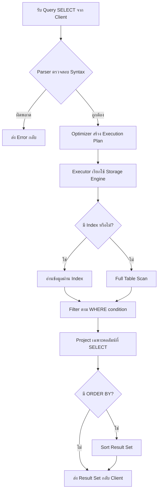
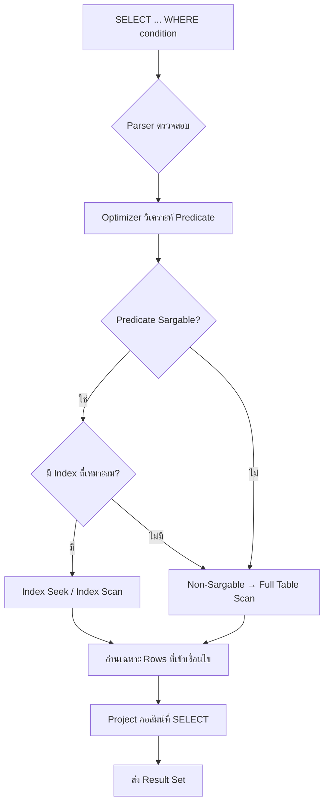
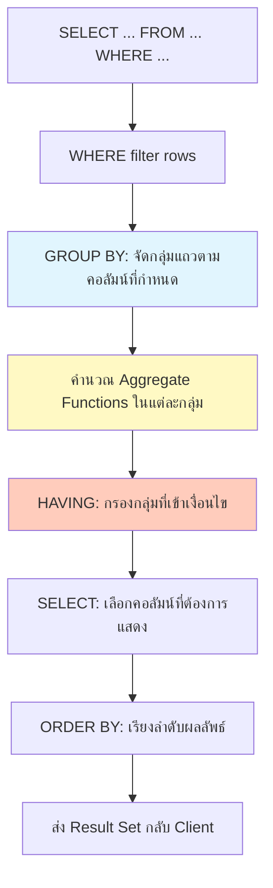
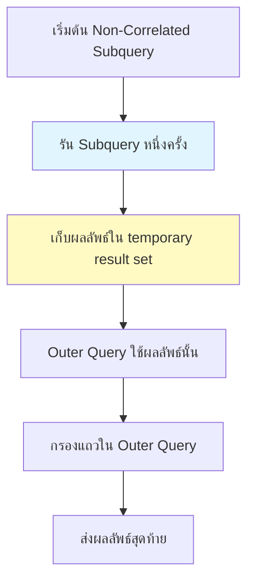
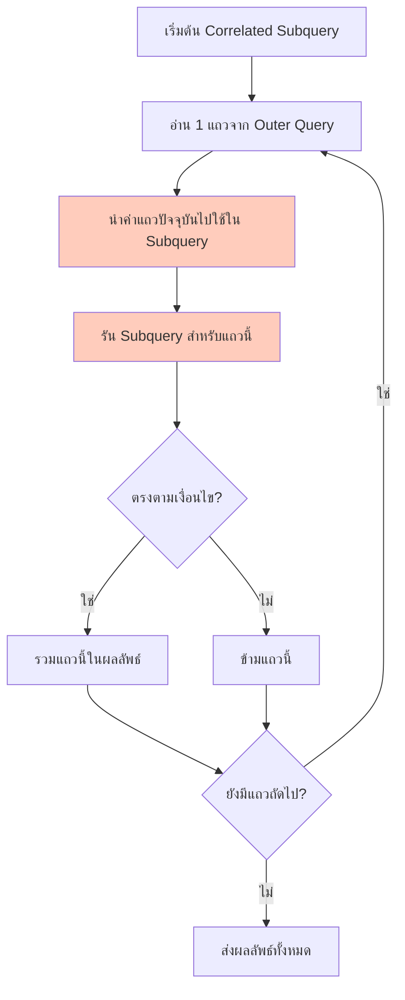
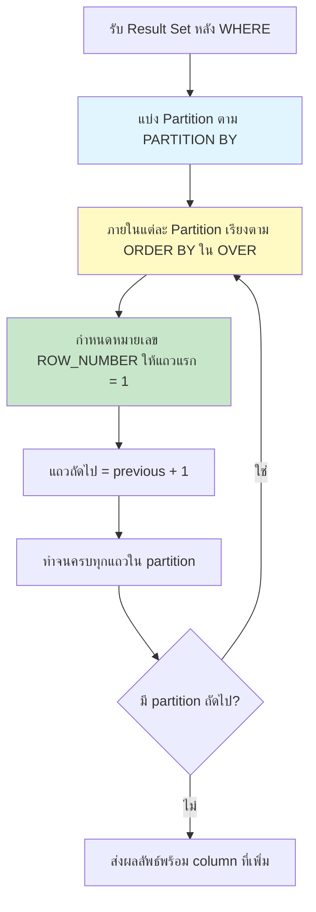
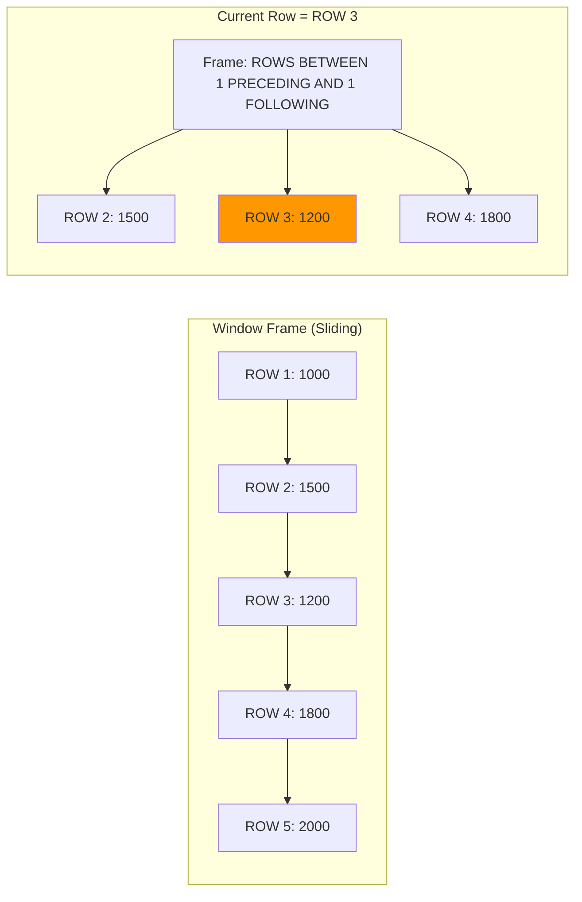
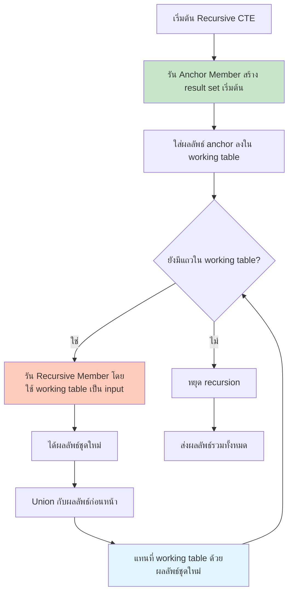

# SQL คำสังที่ใช้บ่อย For Developer 

---
# บทที่ 1: SQL SELECT – การดึงข้อมูลพื้นฐาน

### สรุปสั้นก่อนเนื้อหา (Executive Summary)

| หัวข้อ | รายละเอียด |
|--------|-------------|
| **คืออะไร** | `SELECT` เป็นคำสั่งที่ใช้สำหรับดึงข้อมูลจากตารางในฐานข้อมูล (database) |
| **มีกี่แบบ** | แบบธรรมดา (SELECT columns FROM table), แบบมีเงื่อนไข (WHERE), แบบจัดเรียง (ORDER BY), แบบจับกลุ่ม (GROUP BY), แบบรวมตาราง (JOIN) |
| **ใช้อย่างไร** | `SELECT column1, column2 FROM table_name WHERE condition;` |
| **นำไปใช้ในกรณีไหน** | ต้องการดูข้อมูล ตรวจสอบข้อมูล สร้างรายงาน หรือส่งข้อมูลไปประมวลผลต่อ |
| **ทำไมต้องใช้** | เป็นพื้นฐานของทุกการดึงข้อมูลในระบบฐานข้อมูลเชิงสัมพันธ์ (RDBMS) |
| **ประโยชน์ที่ได้รับ** | สามารถกรอง จัดเรียง และนำเสนอข้อมูลเฉพาะที่ต้องการ ลดภาระเครือข่ายและหน่วยความจำ |
| **ข้อควรระวัง** | การ `SELECT *` ในตารางใหญ่จะทำให้ประสิทธิภาพลดลง ควรเลือกเฉพาะคอลัมน์ที่จำเป็น |
| **ข้อดี** | ใช้ง่าย ยืดหยุ่น ทำงานร่วมกับคำสั่งอื่นได้ดี มีมาตรฐานเดียวกันแทบทุกฐานข้อมูล |
| **ข้อเสีย** | หากเขียนซับซ้อนเกินไปอาจอ่านและบำรุงรักษายาก ต้องระวัญเรื่อง SQL Injection เมื่อนำไปใช้ในแอปพลิเคชัน |
| **ข้อห้าม (ถ้ามี)** | ห้ามใช้ `SELECT *` บนตารางที่มีข้อมูลมากกว่า 1 ล้านแถวโดยไม่มี `WHERE` หรือ `TOP/LIMIT` ในระบบ Production |

---

## โครงสร้างการทำงาน (Structure)

```
Client → ส่ง Query SELECT → Database Engine 
                              ↓
                         Parser (ตรวจสอบไวยากรณ์)
                              ↓
                         Optimizer (วางแผนการดึงข้อมูล)
                              ↓
                         Executor (ดำเนินการตามแผน)
                              ↓
                         Storage Engine (อ่านข้อมูลจากดิสก์/แคช)
                              ↓
                         ส่งผลลัพธ์กลับ Client
```

---

## วัตถุประสงค์ (Objective)

เพื่อให้ผู้อ่านสามารถเขียนคำสั่ง `SELECT` ได้อย่างถูกต้อง เข้าใจลำดับการทำงานภายใน (logical processing order) และสามารถปรับปรุงประสิทธิภาพการดึงข้อมูลเบื้องต้นได้

---

## กลุ่มเป้าหมาย (Target Audience)

- นักพัฒนาซอฟต์แวร์ที่เริ่มต้นเขียน SQL
- นักวิเคราะห์ข้อมูล (Data Analyst) ที่ต้องการดึงข้อมูลจากฐานข้อมูล
- QA หรือ DevOps ที่ต้องตรวจสอบข้อมูลในระบบ

---

## ความรู้พื้นฐาน (Prerequisites)

- ความเข้าใจพื้นฐานเกี่ยวกับฐานข้อมูลเชิงสัมพันธ์ (ตาราง, แถว, คอลัมน์)
- ติดตั้ง DBMS เช่น MySQL, PostgreSQL, SQL Server, หรือ SQLite (ตัวอย่างจะใช้ SQLite เพื่อความสะดวกในการรัน)

---

## บทนำ (Introduction)

ในโลกของการพัฒนาซอฟต์แวร์ ข้อมูลคือหัวใจสำคัญ ไม่ว่าจะเป็นแอปพลิเคชันเว็บ มือถือ หรือระบบวิเคราะห์ข้อมูล ล้วนต้องอาศัยการดึงข้อมูลจากฐานข้อมูล คำสั่ง `SELECT` จึงเปรียบเสมือน “ประตูบานแรก” ที่นักพัฒนาทุกคนต้องรู้จัก เพราะไม่มีคำสั่งใดถูกใช้บ่อยเท่ากับ `SELECT` อีกแล้ว

บทนี้จะพาคุณไปทำความเข้าใจกับ `SELECT` ตั้งแต่ไวยากรณ์พื้นฐาน จนถึงเทคนิคการใช้งานจริง พร้อมทั้งออกแบบ flowchart การทำงาน เพื่อให้เห็นภาพชัดเจนว่าเกิดอะไรขึ้นบ้างเมื่อคุณกดรันคำสั่ง SQL

---

## บทนิยาม (Definitions)

| ศัพท์เทคนิค | คำอธิบาย |
|-------------|----------|
| **SELECT** | คำสั่งที่ใช้ระบุคอลัมน์ที่ต้องการดึงข้อมูล |
| **FROM** | คำสั่งที่ใช้ระบุชื่อตารางต้นทาง |
| **WHERE** | เงื่อนไขในการกรองแถว (row filter) |
| **ORDER BY** | การจัดลำดับผลลัพธ์ (ascending / descending) |
| **DISTINCT** | คำสั่งที่ใช้ตัดแถวที่ซ้ำกันออก เหลือเพียงแถวที่ไม่ซ้ำ |
| **Result Set** | ชุดข้อมูลที่ได้จากการรัน SELECT ซึ่งมีโครงสร้างเป็นตารางชั่วคราว |

---

## การออกแบบ Workflow และ Dataflow (พร้อมรูปภาพ)

### รูปที่ 1: Flowchart การทำงานของคำสั่ง SELECT ในระดับ Database Engine



### คำอธิบาย Flowchart อย่างละเอียด

1. **รับ Query**: Client ส่งสตริง SQL ไปยัง Database Server
2. **Parser**: ตรวจสอบว่าไวยากรณ์ถูกต้องหรือไม่ (เช่น SELECT, FROM, WHERE อยู่ในตำแหน่งที่ถูกต้อง)
3. **Optimizer**: วิเคราะห์ว่าควรใช้ Index ไหน หรือเรียงลำดับการ JOIN อย่างไรให้เร็วที่สุด
4. **Executor**: ลงมือทำงานตามแผน โดยอาจเรียกใช้ Index Seek, Index Scan หรือ Table Scan
5. **Storage Engine**: อ่านข้อมูลจริงจากไฟล์บนดิสก์หรือจากแคชในหน่วยความจำ
6. **Filter**: นำแถวที่ไม่ตรงตาม WHERE condition ออก
7. **Project**: เลือกเฉพาะคอลัมน์ที่ระบุใน SELECT (ลดขนาดข้อมูล)
8. **Sort**: ถ้ามี ORDER BY จะทำการเรียงลำดับ (ซึ่งอาจใช้ Temporary Table หรือ Filesort)
9. **Return**: ส่ง Result Set กลับไปยัง Client ผ่าน network protocol

---

## ตัวอย่างโค้ดที่รันได้จริง (Runnable Code Example)

### สร้างตารางและข้อมูลตัวอย่าง (สำหรับทุกตัวอย่างในบทนี้)

```sql
-- SQLite / MySQL / PostgreSQL compatible
-- Create table employees
-- สร้างตารางพนักงาน

CREATE TABLE employees (
    id INTEGER PRIMARY KEY,   -- รหัสพนักงาน (Primary Key)
    first_name TEXT NOT NULL, -- ชื่อ
    last_name TEXT NOT NULL,  -- นามสกุล
    department TEXT,          -- แผนก
    salary REAL,              -- เงินเดือน
    hire_date DATE            -- วันที่เข้าทำงาน
);

-- Insert sample data
-- แทรกข้อมูลตัวอย่าง
INSERT INTO employees (id, first_name, last_name, department, salary, hire_date) VALUES
(1, 'Somchai', 'Jaidee', 'IT', 48088, '2020-01-15'),
(2, 'Somsri', 'Rakdee', 'HR', 38000, '2019-03-20'),
(3, 'Manee', 'Meekhun', 'IT', 52000, '2021-06-10'),
(4, 'Preecha', 'Suksawat', 'Finance', 60000, '2018-11-02'),
(5, 'Wichai', 'Thongkham', 'IT', 48000, '2022-02-28');
```

### ตัวอย่างที่ 1: SELECT พื้นฐาน – ดึงทุกคอลัมน์

```sql
-- Select all columns from employees table
-- ดึงทุกคอลัมน์จากตารางพนักงาน (ไม่แนะนำใน Production)
SELECT * FROM employees;
```

**ผลลัพธ์:**
```
id | first_name | last_name | department | salary | hire_date
1  | Somchai    | Jaidee    | IT         | 48088  | 2020-01-15
2  | Somsri     | Rakdee    | HR         | 38000  | 2019-03-20
3  | Manee      | Meekhun   | IT         | 52000  | 2021-06-10
4  | Preecha    | Suksawat  | Finance    | 60000  | 2018-11-02
5  | Wichai     | Thongkham | IT         | 48000  | 2022-02-28
```

### ตัวอย่างที่ 2: SELECT เฉพาะคอลัมน์ที่ต้องการ

```sql
-- Select specific columns: first name, last name, and salary
-- เลือกเฉพาะคอลัมน์ชื่อ, นามสกุล และเงินเดือน (ช่วยลดข้อมูลส่งผ่านเครือข่าย)
SELECT first_name, last_name, salary
FROM employees;
```

### ตัวอย่างที่ 3: SELECT พร้อมเงื่อนไข WHERE

```sql
-- Select employees in IT department with salary > 48088
-- ดึงพนักงานแผนก IT ที่มีเงินเดือนมากกว่า 48088 บาท
SELECT first_name, last_name, salary
FROM employees
WHERE department = 'IT' AND salary > 48088;
```

**ผลลัพธ์:**
```
first_name | last_name | salary
Manee      | Meekhun   | 52000
```

### ตัวอย่างที่ 4: SELECT DISTINCT – ตัดค่าซ้ำ

```sql
-- Get unique department names
-- ดึงชื่อแผนกที่ไม่ซ้ำกัน (มีกี่แผนกในบริษัท)
SELECT DISTINCT department
FROM employees;
```

**ผลลัพธ์:**
```
department
IT
HR
Finance
```

### ตัวอย่างที่ 5: SELECT + ORDER BY – เรียงลำดับ

```sql
-- Sort employees by salary descending, then by hire date ascending
-- เรียงพนักงานตามเงินเดือนจากมากไปน้อย ถ้าเงินเดือนเท่ากันให้เรียงตามวันที่เข้าทำงานเก่าก่อน
SELECT first_name, last_name, salary, hire_date
FROM employees
ORDER BY salary DESC, hire_date ASC;
```

### ตัวอย่างที่ 6: SELECT จำกัดจำนวนแถว (ต่างกันตาม DBMS)

```sql
-- MySQL / PostgreSQL / SQLite
-- Get top 3 highest paid employees
-- ดึง 3 อันดับพนักงานที่เงินเดือนสูงสุด
SELECT first_name, last_name, salary
FROM employees
ORDER BY salary DESC
LIMIT 3;

-- SQL Server ใช้ SELECT TOP 3 ...
-- Oracle ใช้ FETCH FIRST 3 ROWS ONLY
```

---

## กรณีศึกษา (Case Study) และแนวทางแก้ไขปัญหา

### ปัญหา: Query ทำงานช้ามากในตารางที่มี 10 ล้านแถว

**สถานการณ์จริง:** บริษัทแห่งหนึ่งมีตาราง `orders` ขนาด 10 ล้านแถว นักพัฒนาสั่ง `SELECT * FROM orders WHERE order_date = '2024-01-01'` ใช้เวลานานกว่า 2 นาที

**สาเหตุ:** ไม่มี index บนคอลัมน์ `order_date` ทำให้เกิด Full Table Scan อ่านทุกแถว

**แนวทางแก้ไข:**
```sql
-- Create index on order_date column
-- สร้างดัชนีบนคอลัมน์ order_date เพื่อเร่งการค้นหา
CREATE INDEX idx_order_date ON orders(order_date);

-- แล้วจึงค่อย SELECT (ตอนนี้จะใช้ Index Seek)
SELECT order_id, customer_id, total_amount
FROM orders
WHERE order_date = '2024-01-01';
```

**ผลลัพธ์:** เวลาลดลงเหลือ < 0.1 วินาที

### ปัญหา: ใช้ SELECT * ใน Production ทำให้ Network จอแจ

**ทางแก้:** เปลี่ยนเป็นระบุเฉพาะคอลัมน์ที่จำเป็น และใช้ LIMIT/TOP ในระหว่างการพัฒนา

---

## เทมเพลตและตัวอย่างโค้ดพร้อมใช้ (พร้อมคอมเมนต์ 2 ภาษา)

### เทมเพลต SELECT แบบมาตรฐาน

```sql
-- Template: Basic SELECT with filtering and sorting
-- เทมเพลต: SELECT พื้นฐานพร้อมเงื่อนไขและการเรียงลำดับ

SELECT 
    column1,          -- Specify the columns you need / ระบุคอลัมน์ที่ต้องการ
    column2,
    column3
FROM 
    table_name        -- Your table name / ชื่อตารางของคุณ
WHERE 
    condition1 = 'value'   -- Filter rows / กรองแถว
    AND condition2 > 100   -- You can use AND, OR, NOT / สามารถใช้ AND, OR, NOT
ORDER BY 
    column1 ASC,            -- ASC = ascending (น้อยไปมาก) / DESC = descending
    column2 DESC
LIMIT 10;                  -- Limit result rows (MySQL/SQLite/PostgreSQL) / จำกัดจำนวนแถว
```

### เทมเพลตพร้อม CASE WHEN (การทำ if-else ใน SQL)

```sql
-- Template: SELECT with conditional logic using CASE
-- เทมเพลต: SELECT ที่มีเงื่อนไขด้วย CASE (เหมือน if-else)

SELECT 
    first_name,
    last_name,
    salary,
    CASE 
        WHEN salary < 40000 THEN 'Low'      -- ระดับต่ำ
        WHEN salary BETWEEN 40000 AND 58088 THEN 'Medium'  -- ระดับกลาง
        ELSE 'High'                         -- ระดับสูง
    END AS salary_grade   -- ตั้งชื่อคอลัมน์ใหม่ว่า salary_grade
FROM employees;
```

---

## สรุป (Conclusion)

### ประโยชน์ที่ได้รับ
- สามารถดึงข้อมูลเฉพาะที่ต้องการจากฐานข้อมูลได้อย่างแม่นยำ
- ลดปริมาณข้อมูลที่ส่งผ่านเครือข่าย (เมื่อใช้เฉพาะคอลัมน์ที่จำเป็น)
- สามารถเรียงลำดับ กรอง และจัดกลุ่มข้อมูลได้ทันที

### ข้อควรระวัง
- `SELECT *` ในตารางใหญ่ทำให้ประสิทธิภาพแย่
- ควรใช้ `LIMIT` หรือ `TOP` เสมอเมื่อทดสอบ query ใหม่
- ระวัง SQL Injection เมื่อนำ `SELECT` ไปต่อกับค่าจากผู้ใช้ (ควรใช้ parameterized query)

### ข้อดี
- ใช้ง่าย มีมาตรฐาน ANSI SQL ทำให้ย้ายระหว่างฐานข้อมูลได้
- รองรับการทำงานร่วมกับ `JOIN`, `GROUP BY`, `HAVING`, `UNION` ได้ดี

### ข้อเสีย
- การเขียน query ที่ซับซ้อนมากอาจอ่านและบำรุงรักษายาก
- ประสิทธิภาพขึ้นอยู่กับ index และสถิติของฐานข้อมูล

### ข้อห้าม (Do's and Don'ts)
- **ห้าม**ใช้ `SELECT *` ใน Production บนตารางที่มีแถว > 10,000
- **ห้าม**นำค่าจากผู้ใช้มาเชื่อมต่อกับ string ของ SQL โดยตรง (ต้องใช้ parameter)
- **ควร**ใส่ `WHERE` เสมอถ้าไม่ต้องการข้อมูลทั้งหมด

---

## แบบฝึกหัดท้ายบท (Exercises)

1. **เขียนคำสั่ง SELECT** เพื่อดึงชื่อ (first_name) และแผนก (department) ของพนักงานทุกคนที่เงินเดือนมากกว่า 40,000 บาท
2. **ใช้ DISTINCT** เพื่อหาว่ามีแผนกอะไรบ้างในตาราง employees (จากตัวอย่างข้างต้น) มีทั้งหมดกี่แผนก?
3. **เขียน SELECT** ที่แสดงชื่อเต็ม (first_name + ' ' + last_name) เป็นคอลัมน์ `full_name` และเงินเดือน พร้อมเรียงลำดับจากเงินเดือนน้อยไปมาก
4. **ใช้ LIMIT 3** เพื่อดึงพนักงาน 3 คนที่เพิ่งเข้าทำงานล่าสุด (hire_date ล่าสุด) พร้อมแสดงชื่อและวันเข้าทำงาน
5. **เขียน CASE WHEN** เพื่อจัดระดับอายุงาน: ถ้า hire_date มากกว่า '2021-01-01' ให้แสดง 'New', ถ้าอยู่ระหว่าง '2019-01-01' ถึง '2020-12-31' ให้แสดง 'Experienced' นอกนั้น 'Veteran'

### เฉลย (สำหรับผู้สอน)
(จะให้แยกไฟล์ หรือแสดงไว้ท้ายเล่ม)

---

## แหล่งอ้างอิง (References)

1. ISO/IEC 9075 (Standard SQL) – ส่วนของ `SELECT` statement
2. Microsoft SQL Server Documentation: "SELECT Clause (Transact-SQL)"
3. PostgreSQL Official Docs: "SELECT"
4. MySQL Reference Manual: "SELECT Statement"
5. "SQL Performance Explained" โดย Markus Winand – บทที่ 2: Indexing and SELECT
6. W3Schools SQL Tutorial: SQL SELECT (สำหรับผู้เริ่มต้น)

---
# บทที่ 2: SQL WHERE – การกรองข้อมูลแบบมีเงื่อนไข

## สรุปสั้นก่อนเนื้อหา (Executive Summary)

| หัวข้อ | รายละเอียด |
|--------|-------------|
| **คืออะไร** | `WHERE` เป็นคำสั่งที่ใช้กำหนดเงื่อนไขในการเลือกแถว (rows) จากตาราง โดยจะคืนค่าเฉพาะแถวที่เงื่อนไขเป็นจริงเท่านั้น |
| **มีกี่แบบ** | เงื่อนไขเชิงเปรียบเทียบ (`=`, `>`, `<`, `>=`, `<=`, `<>`), เงื่อนไขเชิงตรรกะ (`AND`, `OR`, `NOT`), การตรวจสอบช่วง (`BETWEEN`), รายการ (`IN`), รูปแบบ (`LIKE`), ค่าว่าง (`IS NULL`) |
| **ใช้อย่างไร** | `SELECT columns FROM table WHERE condition;` |
| **นำไปใช้ในกรณีไหน** | ต้องการดูเฉพาะข้อมูลที่ตรงตามเงื่อนไข เช่น ลูกค้าที่มียอดซื้อเกิน 1,000 บาท, พนักงานที่เข้าทำงานปี 2023, สินค้าที่หมดสต็อก |
| **ทำไมต้องใช้** | ช่วยลดปริมาณข้อมูลที่ต้องประมวลผลและส่งผ่านเครือข่าย ทำให้ Query เร็วขึ้น และได้ข้อมูลที่ตรงกับความต้องการ |
| **ประโยชน์ที่ได้รับ** | กรองข้อมูลได้ละเอียด ใช้ร่วมกับตัวดำเนินการหลากหลาย ลดภาระของแอปพลิเคชันในการกรองเอง |
| **ข้อควรระวัง** | การใช้ฟังก์ชันกับคอลัมน์ใน `WHERE` (เช่น `WHERE YEAR(date) = 2024`) ทำให้ Index ไร้ประสิทธิภาพ (non-sargable) ควรเขียนเป็น `WHERE date BETWEEN '2024-01-01' AND '2024-12-31'` |
| **ข้อดี** | ยืดหยุ่น ทำงานกับทุกประเภทข้อมูล รองรับตรรกะซับซ้อนได้ดี |
| **ข้อเสีย** | เงื่อนไขที่ซับซ้อนมากอาจทำให้ Optimizer เลือกแผนที่ไม่ดี ควรทดสอบด้วย `EXPLAIN` |
| **ข้อห้าม (ถ้ามี)** | ห้ามนำค่าจากผู้ใช้มาเชื่อมต่อกับ `WHERE` โดยตรง (เสี่ยง SQL Injection) ต้องใช้ Parameterized Query หรือ Prepared Statement เสมอ |

---

## โครงสร้างการทำงาน (Structure)

```
Client Query → WHERE condition → Database Engine
                                    ↓
                           Parser + Optimizer
                                    ↓
                    ใช้ Index (ถ้ามีและเป็น Sargable)
                                    ↓
                           อ่านเฉพาะแถวที่เข้าเงื่อนไข
                                    ↓
                           ส่งเฉพาะแถวที่ผ่านการกรอง
```

---

## วัตถุประสงค์ (Objective)

เพื่อให้ผู้อ่านสามารถเขียนเงื่อนไข `WHERE` ได้อย่างถูกต้องและมีประสิทธิภาพ เข้าใจหลักการ Sargable (Search ARGument ABLE) และสามารถป้องกัน SQL Injection ในส่วนของ `WHERE` clause

---

## กลุ่มเป้าหมาย (Target Audience)

- นักพัฒนา backend ที่ต้องเขียน SQL แบบมีเงื่อนไข
- Data Analyst ที่ต้องกรองข้อมูลก่อนนำไปวิเคราะห์
- DBA หรือ Developer ที่ต้องการปรับปรุงประสิทธิภาพ Query

---

## ความรู้พื้นฐาน (Prerequisites)

- บทที่ 1: SQL SELECT (การดึงข้อมูลพื้นฐาน)
- ความเข้าใจเกี่ยวกับประเภทข้อมูล (ตัวเลข, ข้อความ, วันที่)
- ติดตั้ง DBMS (SQLite, MySQL, PostgreSQL)

---

## บทนำ (Introduction)

จากบทที่แล้วเราเรียนรู้การดึงข้อมูลด้วย `SELECT` แต่บ่อยครั้งที่เราไม่ต้องการข้อมูลทั้งหมดในตาราง เช่น เราอาจต้องการดูเฉพาะพนักงานแผนก IT หรือเฉพาะสินค้าที่ราคาต่ำกว่า 500 บาท นี่คือหน้าที่ของ `WHERE`

`WHERE` ทำหน้าที่เสมือน “กระชอน” ที่จะกรองเอาเฉพาะแถวที่ผ่านเกณฑ์ที่กำหนด หากไม่มี `WHERE` คุณจะได้ทุกแถวในตาราง (Full Table Scan) ซึ่งอาจช้าและสิ้นเปลืองทรัพยากร

ในบทนี้เราจะสำรวจตัวดำเนินการทั้งหมดที่ใช้กับ `WHERE` พร้อมเทคนิคการเขียนให้เร็วขึ้น และข้อผิดพลาดที่พบบ่อย

---

## บทนิยาม (Definitions)

| ศัพท์เทคนิค | คำอธิบาย |
|-------------|----------|
| **Predicate** | นิพจน์ที่ให้ผลลัพธ์เป็นจริงหรือเท็จ เช่น `salary > 80880` |
| **Sargable** | เงื่อนไขที่สามารถใช้ Index ได้อย่างมีประสิทธิภาพ (Search ARGument ABLE) |
| **Non-Sargable** | เงื่อนไขที่ไม่สามารถใช้ Index ได้ เช่น `WHERE YEAR(date) = 2024` |
| **Filter Factor** | สัดส่วนของแถวที่คาดว่าจะผ่านเงื่อนไข (ใช้ Optimizer เลือกแผน) |
| **LIKE** | ตัวดำเนินการเปรียบเทียบรูปแบบข้อความ รองรับ wildcard `%` (0+ อักขระ) และ `_` (1 อักขระ) |

---

## การออกแบบ Workflow และ Dataflow (พร้อมรูปภาพ)

### รูปที่ 2: Flowchart การทำงานของ WHERE พร้อม Index Selection



### คำอธิบาย Flowchart อย่างละเอียด

1. **Parser**: ตรวจสอบไวยากรณ์ `WHERE` เช่น ต้องอยู่หลัง `FROM` และก่อน `GROUP BY`/`ORDER BY`
2. **Optimizer**: วิเคราะห์ predicate แต่ละตัว (อาจมีหลายเงื่อนไขเชื่อมด้วย `AND`/`OR`)
3. **Sargable Check**: ตรวจสอบว่าเงื่อนไขสามารถใช้ Index ได้หรือไม่ (เช่น `col = value` ใช้ได้, `LOWER(col) = 'abc'` ใช้ไม่ได้)
4. **Index Selection**: ถ้ามี Index และ Sargable Optimizer จะประมาณค่า Filter Factor เลือก Index ที่เหมาะสมที่สุด
5. **Execution**: ถ้าใช้ Index ได้ → Index Seek (ค้นหาแบบตรงไปยังตำแหน่ง) ถ้าไม่ได้ → Table Scan (อ่านทั้งตาราง)
6. **Filter เพิ่มเติม**: บางเงื่อนไขที่ไม่สามารถ push down ไปยัง Index ได้ จะถูกกรองอีกครั้งที่ระดับ Record
7. **ส่งผลลัพธ์**: เฉพาะแถวที่ผ่านทุก predicate

---

## ตัวอย่างโค้ดที่รันได้จริง (Runnable Code Example)

### เตรียมข้อมูล (ใช้ตาราง employees จากบทที่ 1 และเพิ่มเติม)

```sql
-- Add more data for demonstration
-- เพิ่มข้อมูลเพื่อการสาธิต
INSERT INTO employees (id, first_name, last_name, department, salary, hire_date) VALUES
(6, 'Kanya', 'Prasert', 'Marketing', 42000, '2023-05-01'),
(7, 'Pongsak', 'Chaisri', 'Marketing', 38088, '2023-08-15'),
(8, 'Ratchaneekorn', 'Wong', 'IT', 62000, '2022-11-20'),
(9, 'Adisak', 'Boonmee', NULL, 28000, '2024-01-10'),   -- NULL department
(10, 'Jitlada', 'Srisuk', 'Finance', 58088, '2021-09-09');
```

### ตัวอย่างที่ 1: เปรียบเทียบพื้นฐาน (=, >, <, >=, <=, <>)

```sql
-- 1.1 Equal to (เท่ากับ)
-- Get employee with id = 3
-- ดึงพนักงานที่มีรหัสเท่ากับ 3
SELECT first_name, last_name, department
FROM employees
WHERE id = 3;

-- 1.2 Greater than (มากกว่า)
-- Get employees with salary > 80880
-- ดึงพนักงานที่เงินเดือนมากกว่า 80880 บาท
SELECT first_name, salary
FROM employees
WHERE salary > 80880;

-- 1.3 Not equal to (ไม่เท่ากับ)
-- Get employees not in IT department
-- ดึงพนักงานที่ไม่ได้อยู่ในแผนก IT
SELECT first_name, department
FROM employees
WHERE department <> 'IT';
```

### ตัวอย่างที่ 2: ตรรกะ AND, OR, NOT

```sql
-- 2.1 AND: both conditions must be true
-- AND: ทุกเงื่อนไขต้องเป็นจริง
-- Get IT employees with salary >= 80880
-- ดึงพนักงานแผนก IT ที่เงินเดือนตั้งแต่ 80880 ขึ้นไป
SELECT first_name, department, salary
FROM employees
WHERE department = 'IT' AND salary >= 80880;

-- 2.2 OR: at least one condition is true
-- OR: อย่างน้อยหนึ่งเงื่อนไขเป็นจริง
-- Get employees in IT or Finance department
-- ดึงพนักงานแผนก IT หรือ Finance
SELECT first_name, department
FROM employees
WHERE department = 'IT' OR department = 'Finance';

-- 2.3 NOT: negate a condition
-- NOT: ปฏิเสธเงื่อนไข
-- Get employees not in Marketing department
-- ดึงพนักงานที่ไม่ใช่แผนก Marketing
SELECT first_name, department
FROM employees
WHERE NOT department = 'Marketing';
```

### ตัวอย่างที่ 3: BETWEEN – ช่วงข้อมูล

```sql
-- BETWEEN is inclusive (รวมขอบเขต)
-- BETWEEN ครอบคลุมทั้งค่าต้นและปลาย
-- Get employees with salary between 40000 and 58088
-- ดึงพนักงานที่มีเงินเดือนอยู่ระหว่าง 40000-58088 บาท
SELECT first_name, salary
FROM employees
WHERE salary BETWEEN 40000 AND 58088;

-- Equivalent to (เทียบเท่ากับ):
-- WHERE salary >= 40000 AND salary <= 58088

-- For dates (สำหรับวันที่)
-- Get employees hired in 2023
-- ดึงพนักงานที่เข้าทำงานในปี 2023
SELECT first_name, hire_date
FROM employees
WHERE hire_date BETWEEN '2023-01-01' AND '2023-12-31';
```

### ตัวอย่างที่ 4: IN – ตรวจสอบรายการ

```sql
-- IN is more readable than multiple ORs
-- IN อ่านง่ายกว่าใช้ OR ซ้ำๆ
-- Get employees from IT, Finance, or HR
-- ดึงพนักงานจากแผนก IT, Finance หรือ HR
SELECT first_name, department
FROM employees
WHERE department IN ('IT', 'Finance', 'HR');

-- Equivalent to (เทียบเท่ากับ):
-- WHERE department = 'IT' OR department = 'Finance' OR department = 'HR'

-- NOT IN
-- Get employees not in Marketing or IT
-- ดึงพนักงานที่ไม่อยู่ในแผนก Marketing และ IT
SELECT first_name, department
FROM employees
WHERE department NOT IN ('Marketing', 'IT');
```

### ตัวอย่างที่ 5: LIKE – รูปแบบข้อความ (Wildcard)

```sql
-- % matches any sequence of characters (0 or more)
-- % หมายถึงอักขระใดๆ กี่ตัวก็ได้ (รวมถึงศูนย์ตัว)
-- Get names starting with 'S' (ขึ้นต้นด้วย S)
SELECT first_name
FROM employees
WHERE first_name LIKE 'S%';

-- Get names ending with 'ee' (ลงท้ายด้วย ee)
SELECT first_name
FROM employees
WHERE first_name LIKE '%ee';

-- Get names containing 'cha' (มีคำว่า cha อยู่ตรงไหนก็ได้)
SELECT first_name
FROM employees
WHERE first_name LIKE '%cha%';

-- _ matches exactly one character
-- _ หมายถึงอักขระ 1 ตัวพอดี
-- Get 4-letter first names (ชื่อ 4 ตัวอักษร)
SELECT first_name
FROM employees
WHERE first_name LIKE '____';  -- 4 underscores

-- Escape special characters (การ escape อักขระพิเศษ)
-- To search for literal '%' or '_' use ESCAPE
-- ถ้าต้องการหาเครื่องหมาย % หรือ _ ให้ใช้ ESCAPE
-- Example: WHERE comment LIKE '100\%' ESCAPE '\'
```

### ตัวอย่างที่ 6: IS NULL และ IS NOT NULL

```sql
-- NULL means unknown / missing value
-- NULL หมายถึงค่าไม่ทราบหรือไม่มีค่า (ไม่ใช่ 0 หรือ space)
-- Get employees with no department assigned
-- ดึงพนักงานที่ยังไม่ได้กำหนดแผนก
SELECT first_name, department
FROM employees
WHERE department IS NULL;

-- Get employees who have a department
-- ดึงพนักงานที่มีแผนกแล้ว
SELECT first_name, department
FROM employees
WHERE department IS NOT NULL;

-- Common mistake: WHERE department = NULL (จะไม่ทำงาน!)
-- ข้อผิดพลาดบ่อย: ใช้ = NULL แทน IS NULL (จะไม่มีผลลัพธ์)
```

### ตัวอย่างที่ 7: เงื่อนไขซ้อนซับซ้อน (Parentheses)

```sql
-- Use parentheses to control logical order
-- ใช้วงเล็บควบคุมลำดับตรรกะ (AND มี priority สูงกว่า OR)
-- Get IT employees with salary > 80880 OR Marketing employees with salary > 40000
-- ดึงพนักงาน IT ที่เงินเดือน >80880 หรือ Marketing ที่เงินเดือน >40000
SELECT first_name, department, salary
FROM employees
WHERE (department = 'IT' AND salary > 80880)
   OR (department = 'Marketing' AND salary > 40000);
```

---

## กรณีศึกษา (Case Study) และแนวทางแก้ไขปัญหา

### ปัญหา: Query WHERE ใช้เวลานานแม้จะมี Index

**สถานการณ์:** บริษัท电商มีตาราง `orders` 10 ล้านแถว, Query: 
```sql
SELECT * FROM orders WHERE DATE(order_date) = '2024-01-01';
```
ใช้ Index บน `order_date` แต่ยังช้ามาก

**สาเหตุ:** `DATE(order_date)` เป็นฟังก์ชันที่ครอบคอลัมน์ ทำให้ Index ใช้ไม่ได้ (non-sargable) ต้องแปลงทุกแถวก่อนเปรียบเทียบ → Table Scan

**แนวทางแก้ไข:** 
```sql
-- Correct: sargable version
-- เวอร์ชันที่ถูกต้อง (ใช้ Index ได้)
SELECT * FROM orders 
WHERE order_date >= '2024-01-01' 
  AND order_date < '2024-01-02';
```

**ผลลัพธ์:** เวลาลดลงจาก 20 วินาทีเหลือ < 0.1 วินาที

### ปัญหา: LIKE '%keyword%' ช้ามาก

**สถานการณ์:** ต้องการค้นหาชื่อสินค้าที่มีคำว่า "phone" อยู่ตรงไหนก็ได้

**ทางแก้ระยะสั้น:** ยอมรับความช้า ถ้าข้อมูลไม่มาก (ตาราง < 1 แสนแถว)

**ทางแก้ระยะยาว:** ใช้ Full-Text Search (FTS) เช่น 
- MySQL: `MATCH(name) AGAINST('phone')`
- PostgreSQL: `to_tsvector(name) @@ to_tsquery('phone')`
- SQLite: สร้าง FTS5 virtual table

### ปัญหา: SQL Injection ผ่าน WHERE clause

**สถานการณ์:** นักพัฒนาเขียน Python/Node.js ดังนี้
```python
user_input = request.get('last_name')
query = f"SELECT * FROM employees WHERE last_name = '{user_input}'"
```
ผู้ไม่หวังดีส่ง `' OR '1'='1` → Query กลายเป็น `WHERE last_name = '' OR '1'='1'` → ได้ข้อมูลทั้งหมด

**แนวทางแก้ไข (Parameterized Query):**
```python
# Python with sqlite3
cursor.execute("SELECT * FROM employees WHERE last_name = ?", (user_input,))

# Node.js with mysql2
connection.execute("SELECT * FROM employees WHERE last_name = ?", [user_input])
```

---

## เทมเพลตและตัวอย่างโค้ดพร้อมใช้

### เทมเพลต WHERE มาตรฐาน (พร้อมคอมเมนต์ 2 ภาษา)

```sql
-- =============================================
-- Template: SELECT with WHERE clause
-- เทมเพลต: SELECT พร้อมเงื่อนไข WHERE
-- =============================================

SELECT 
    column1,          -- Column to retrieve / คอลัมน์ที่ต้องการ
    column2,
    column3
FROM 
    table_name        -- Target table / ตารางเป้าหมาย
WHERE 
    -- Numeric condition (เงื่อนไขตัวเลข)
    numeric_column > 1000
    
    -- AND logical connector (ตัวเชื่อม AND)
    AND string_column = 'exact_value'   -- Use single quotes / ใช้เครื่องหมายคำพูดเดี่ยว
    
    -- OR logical connector (ตัวเชื่อม OR)
    OR date_column BETWEEN '2024-01-01' AND '2024-12-31'
    
    -- IN operator for list (ตัวดำเนินการ IN สำหรับรายการ)
    AND category_column IN ('A', 'B', 'C')
    
    -- Pattern matching with LIKE (การจับคู่รูปแบบด้วย LIKE)
    AND name_column LIKE 'prefix%'   -- Trailing wildcard is sargable / % ต่อท้ายยังใช้ Index ได้
    
    -- NULL check (การตรวจสอบค่าว่าง)
    AND nullable_column IS NOT NULL;
```

### เทมเพลต WHERE พร้อม CASE (ใช้สำหรับ logic ซับซ้อน)

```sql
-- Template: WHERE with conditional logic (sometimes use CASE)
-- เทมเพลต: WHERE ที่มีตรรกะซับซ้อน (บางครั้งใช้ CASE)
SELECT *
FROM employees
WHERE 1 = 1   -- Dynamic query trick / เทคนิคสำหรับ dynamic query
  AND (
      CASE 
          WHEN department = 'IT' AND salary > 80880 THEN 1
          WHEN department = 'Marketing' AND salary > 40000 THEN 1
          ELSE 0
      END = 1
  );
```

---

## สรุป (Conclusion)

### ประโยชน์ที่ได้รับ
- สามารถกรองข้อมูลได้ตรงตามความต้องการ ลดข้อมูลที่ไม่จำเป็น
- รู้จักตัวดำเนินการหลากหลาย (`=`, `<>`, `LIKE`, `IN`, `BETWEEN`, `IS NULL`)
- เข้าใจหลัก Sargable เพื่อเขียน WHERE ที่ใช้ Index ได้อย่างเต็มประสิทธิภาพ
- สามารถป้องกัน SQL Injection ในส่วนของ WHERE

### ข้อควรระวัง
- อย่าใช้ฟังก์ชันครอบคอลัมน์ใน WHERE (non-sargable)
- `LIKE '%keyword'` (ขึ้นต้นด้วย %) ใช้ Index ไม่ได้
- `NULL` เปรียบเทียบด้วย `=` ไม่ได้ ต้องใช้ `IS NULL` เสมอ
- ลำดับ AND/OR มีผล ควรใส่วงเล็บให้ชัดเจน

### ข้อดี
- ลดภาระการประมวลผลของแอปพลิเคชัน (กรองที่ฐานข้อมูลเลย)
- ทำให้ Query เร็วขึ้นถ้าใช้ Index ถูกต้อง
- อ่านและเข้าใจง่าย

### ข้อเสีย
- WHERE ที่ซับซ้อนเกินไปอาจทำให้ Optimizer ตัดสินใจผิด
- การใช้ OR กับหลายคอลัมน์อาจทำให้ Index ใช้ไม่ได้ (บาง DB อาจใช้ Bitmap OR)

### ข้อห้าม
- **ห้าม** ต่อ string สร้าง WHERE clause โดยตรงจาก input ผู้ใช้
- **ห้าม** ใช้ `WHERE column = NULL`
- **ห้าม** ใช้ `WHERE column LIKE '%keyword%'` บนตารางใหญ่ (> 1 ล้านแถว) โดยไม่มี Full-Text Search

---

## แบบฝึกหัดท้ายบท (Exercises)

1. **เขียน WHERE** เพื่อค้นหาพนักงานที่มีชื่อขึ้นต้นด้วย 'P' และเงินเดือนน้อยกว่า 40,000 บาท จากตาราง employees (ใช้ LIKE และเครื่องหมายเปรียบเทียบ)

2. **ใช้ BETWEEN** เพื่อดึงพนักงานที่เข้าทำงานระหว่างวันที่ 1 มกราคม 2022 ถึง 31 ธันวาคม 2023 พร้อมแสดงชื่อ และวันเข้าทำงาน

3. **ใช้ IN** เพื่อหาพนักงานที่อยู่ในแผนก 'IT' หรือ 'Finance' เท่านั้น (ไม่เอาคนอื่น) แล้วเรียงลำดับตามเงินเดือนจากมากไปน้อย

4. **เขียนเงื่อนไขที่ Sargable** แทนที่ `WHERE YEAR(hire_date) = 2021` (โดยใช้ BETWEEN หรือ >=, <) พร้อมอธิบายว่าทำไมแบบใหม่ถึงเร็วกว่า

5. **ตรรกะซับซ้อน:** ดึงพนักงานที่ (แผนก IT และเงินเดือน > 58088) หรือ (แผนก Marketing และเงินเดือน > 40000) หรือ (แผนก Finance และเงินเดือน > 60000) แสดงชื่อ แผนก เงินเดือน

---

## แหล่งอ้างอิง (References)

1. ISO/IEC 9075-2:2016 SQL/Foundation – Chapter 7: `<search condition>`
2. Microsoft SQL Server Docs: "WHERE (Transact-SQL)"
3. PostgreSQL Docs: "Querying a Table – WHERE Clause"
4. MySQL Docs: "SELECT Statement – WHERE Clause"
5. "SQL Performance Explained" โดย Markus Winand – บทที่ 1: Sargable vs Non-Sargable
6. OWASP SQL Injection Prevention Cheat Sheet (สำหรับการป้องกันใน WHERE clause)

---
 
# บทที่ 3: SQL Aggregate Functions – COUNT, SUM, AVG, MIN, MAX

## สรุปสั้นก่อนเนื้อหา (Executive Summary)

| หัวข้อ | รายละเอียด |
|--------|-------------|
| **คืออะไร** | Aggregate Functions (ฟังก์ชันรวมกลุ่ม) เป็นฟังก์ชันที่คำนวณค่าจากหลายแถว แล้วส่งคืนค่าเดียว เช่น ผลรวม, ค่าเฉลี่ย, จำนวนแถว |
| **มีกี่แบบ** | หลักๆ 5 แบบ: `COUNT()` – นับจำนวน, `SUM()` – ผลรวม, `AVG()` – ค่าเฉลี่ย, `MIN()` – ค่าต่ำสุด, `MAX()` – ค่าสูงสุด |
| **ใช้อย่างไร** | `SELECT COUNT(column) FROM table WHERE condition;` |
| **นำไปใช้ในกรณีไหน** | สร้างรายงานสรุปยอดขาย, คำนวณค่าเฉลี่ยคะแนน, หาผลรวมยอดสั่งซื้อ, นับจำนวนลูกค้า, หาสินค้าราคาสูงสุด/ต่ำสุด |
| **ทำไมต้องใช้** | ช่วยให้ได้ข้อมูลสรุปภาพรวมจากข้อมูลรายละเอียดจำนวนมาก โดยไม่ต้องดึงข้อมูลทั้งหมดมาคำนวณในแอปพลิเคชัน |
| **ประโยชน์ที่ได้รับ** | ลดปริมาณข้อมูลที่ส่งผ่านเครือข่าย, คำนวณที่ฐานข้อมูลซึ่งเร็วกว่า, ได้สถิติที่จำเป็นโดยไม่ต้องเขียนลูปในโปรแกรม |
| **ข้อควรระวัง** | Aggregate functions จะไม่นับค่า `NULL` (ยกเว้น `COUNT(*)`); ควรใช้ `DISTINCT` ข้างในถ้าต้องการนับค่าไม่ซ้ำ |
| **ข้อดี** | ทำงานเร็ว, เป็นมาตรฐาน SQL, ผสานกับ `GROUP BY` ได้ดี |
| **ข้อเสีย** | ไม่สามารถใช้กับ `WHERE` โดยตรงได้ (ต้องใช้ `HAVING` แทน), ใช้ไม่ได้กับคอลัมน์ที่ไม่ถูกจัดกลุ่ม |
| **ข้อห้าม (ถ้ามี)** | ห้ามใช้ aggregate function ใน `WHERE` clause (ใช้ `HAVING` แทน); ห้ามผสม aggregate กับคอลัมน์ธรรมดาใน SELECT โดยไม่มี `GROUP BY` |

---

## โครงสร้างการทำงาน (Structure)

```
ข้อมูลดิบ (หลายแถว)
       ↓
Aggregate Function
       ↓
ประมวลผลทีละกลุ่ม (หรือทั้งตาราง)
       ↓
ละเว้น NULL (ตามกฎของฟังก์ชัน)
       ↓
คืนค่าเดียว (Scalar value)
```

---

## วัตถุประสงค์ (Objective)

เพื่อให้ผู้อ่านสามารถใช้ฟังก์ชัน `COUNT`, `SUM`, `AVG`, `MIN`, `MAX` ได้อย่างถูกต้อง เข้าใจการจัดการกับ `NULL` และสามารถนำไปประยุกต์ใช้ในการวิเคราะห์ข้อมูลเบื้องต้น

---

## กลุ่มเป้าหมาย (Target Audience)

- นักพัฒนาที่ต้องการสร้าง dashboard หรือรายงานสรุป
- Data Analyst ที่ต้องการหาค่าเชิงสถิติพื้นฐาน
- ผู้ดูแลระบบที่ต้องการตรวจสอบข้อมูลเชิงปริมาณ

---

## ความรู้พื้นฐาน (Prerequisites)

- บทที่ 1: SELECT พื้นฐาน
- บทที่ 2: WHERE clause
- ความเข้าใจเรื่องค่าว่าง (NULL)

---

## บทนำ (Introduction)

สมมติว่าคุณมีข้อมูลการขาย 10,000 รายการ และต้องการทราบว่ายอดขายรวมเป็นเท่าไหร่ หรือยอดสูงสุดคือเท่าไหร่ หากใช้วิธีการดึงข้อมูลทั้งหมดมาคำนวณในโปรแกรม (Java, Python, C#) จะสิ้นเปลืองหน่วยความจำและเวลา แต่ด้วย Aggregate Functions คุณสามารถให้ฐานข้อมูลคำนวณให้เสร็จสรรพแล้วส่งแค่ตัวเลขเดียวกลับมา

ในบทนี้เราจะเจาะลึก Aggregate Functions ทั้ง 5 ตัว พร้อมตัวอย่างการใช้งานจริง และข้อผิดพลาดที่พบบ่อย

---

## บทนิยาม (Definitions)

| ศัพท์เทคนิค | คำอธิบาย |
|-------------|----------|
| **Aggregate Function** | ฟังก์ชันที่ทำงานกับชุดของค่า (หลายแถว) และคืนค่าเดียว |
| **Scalar Result** | ผลลัพธ์ที่เป็นค่าเดียว เช่น ตัวเลข 1000 หรือข้อความ 'A' |
| **DISTINCT** | คำสั่งภายใน aggregate ที่ให้คำนวณเฉพาะค่าที่ไม่ซ้ำกัน |
| **GROUP BY** | แบ่งแถวออกเป็นกลุ่มย่อยก่อนนำไป aggregate (จะกล่าวในรายละเอียดบทถัดไป) |
| **NULL handling** | `COUNT(*)` นับ NULL, `COUNT(column)` ไม่นับ NULL, `SUM/AVG` ละเว้น NULL |

---

## การออกแบบ Workflow และ Dataflow (พร้อมรูปภาพ)

### รูปที่ 3: Flowchart การทำงานของ Aggregate Functions

```mermaid
flowchart TB
    A[Query SELECT SUM/salary/ FROM employees WHERE department = 'IT'] --> B[Storage Engine อ่านแถวที่ตรง WHERE]
    B --> C[Filter เฉพาะแถวที่ department = 'IT']
    C --> D{Aggregate Type?}
    D -->|COUNT| E{COUNT(*) หรือ COUNT(column)?}
    E -->|COUNT(*)| F1[นับทุกแถว รวม NULL]
    E -->|COUNT(column)| F2[นับเฉพาะแถวที่ column ไม่ใช่ NULL]
    D -->|SUM| G[รวมค่าของ column, ละเว้น NULL]
    D -->|AVG| H[รวมค่าแล้วหารด้วยจำนวนแถวที่ไม่เป็น NULL]
    D -->|MIN| I[หาค่าน้อยสุด, ละเว้น NULL]
    D -->|MAX| J[หาค่ามากสุด, ละเว้น NULL]
    F1 --> K[Return ค่าเดียว]
    F2 --> K
    G --> K
    H --> K
    I --> K
    J --> K
```

### คำอธิบาย Flowchart อย่างละเอียด

1. **อ่านแถวที่ตรงเงื่อนไข**: เริ่มจาก `FROM` + `WHERE` ก่อน (ลำดับ logical processing)
2. **Filter แถว**: เอาเฉพาะแถวที่ผ่าน `WHERE`
3. **เลือกประเภท Aggregate**: ตามฟังก์ชันที่ใช้
   - `COUNT(*)`: นับจำนวนแถวทั้งหมดในกลุ่ม (รวม NULL)
   - `COUNT(column)`: นับเฉพาะแถวที่ column มีค่าไม่เป็น NULL
   - `SUM(column)`: รวมค่าตัวเลขเฉพาะแถวที่ไม่ใช่ NULL
   - `AVG(column)`: หาค่าเฉลี่ย = SUM / COUNT(column) (เฉพาะ non-NULL)
   - `MIN(column)`: ค่าต่ำสุด (ถ้า column เป็นข้อความ จะเรียงตามตัวอักษร)
   - `MAX(column)`: ค่าสูงสุด
4. **คืนค่าเดียว**: ส่งกลับ client เป็น scalar value

---

## ตัวอย่างโค้ดที่รันได้จริง (Runnable Code Example)

### เตรียมข้อมูล (ตาราง sales)

```sql
-- Create sales table for demonstration
-- สร้างตารางการขายเพื่อการสาธิต

CREATE TABLE sales (
    sale_id INTEGER PRIMARY KEY,
    product_name TEXT NOT NULL,
    category TEXT,
    quantity INTEGER,
    price_per_unit REAL,
    sale_date DATE
);

INSERT INTO sales (sale_id, product_name, category, quantity, price_per_unit, sale_date) VALUES
(1, 'Laptop', 'Electronics', 2, 28088, '2024-01-15'),
(2, 'Mouse', 'Electronics', 5, 500, '2024-01-15'),
(3, 'Notebook', 'Stationery', 10, 45, '2024-01-16'),
(4, 'Laptop', 'Electronics', 1, 26000, '2024-01-16'),
(5, 'Pen', 'Stationery', 20, 10, '2024-01-16'),
(6, 'Desk', 'Furniture', 1, 4500, '2024-01-17'),
(7, 'Mouse', 'Electronics', 3, 550, '2024-01-17'),
(8, 'Notebook', 'Stationery', NULL, 50, '2024-01-18');  -- NULL quantity
```

### ตัวอย่างที่ 1: COUNT – นับจำนวนแถว

```sql
-- 1.1 COUNT(*) counts all rows including NULLs
-- COUNT(*) นับทุกแถว รวมถึงแถวที่มีค่า NULL
SELECT COUNT(*) AS total_sales_rows
FROM sales;
-- Result: 8

-- 1.2 COUNT(column) excludes NULLs
-- COUNT(column) ไม่นับแถวที่คอลัมน์นั้นเป็น NULL
SELECT COUNT(quantity) AS non_null_quantities
FROM sales;
-- Result: 7 (row 8 has NULL quantity)

-- 1.3 COUNT(DISTINCT column) counts unique non-NULL values
-- COUNT(DISTINCT column) นับค่าไม่ซ้ำที่ไม่ใช่ NULL
SELECT COUNT(DISTINCT product_name) AS unique_products
FROM sales;
-- Result: 5 (Laptop, Mouse, Notebook, Pen, Desk)
```

### ตัวอย่างที่ 2: SUM – ผลรวม

```sql
-- Calculate total revenue (quantity * price_per_unit)
-- คำนวณรายได้รวม (ปริมาณ x ราคาต่อหน่วย)
SELECT SUM(quantity * price_per_unit) AS total_revenue
FROM sales;
-- Note: NULL quantity rows are ignored in SUM
-- หมายเหตุ: แถวที่มี quantity เป็น NULL จะถูกข้ามในการรวม

-- SUM of a single column
-- SUM ของคอลัมน์เดียว
SELECT SUM(quantity) AS total_items_sold
FROM sales;
```

### ตัวอย่างที่ 3: AVG – ค่าเฉลี่ย

```sql
-- Average price per unit (ignore NULLs in price_per_unit)
-- ค่าเฉลี่ยราคาต่อหน่วย (ข้าม NULL ถ้ามี)
SELECT AVG(price_per_unit) AS avg_price
FROM sales;
-- Result: (28088+500+45+26000+10+4500+550+50)/8 = about 7007

-- Average quantity (only non-NULL rows)
-- ค่าเฉลี่ยปริมาณ (เฉพาะแถวที่ไม่ใช่ NULL)
SELECT AVG(quantity) AS avg_quantity
FROM sales;
-- Result: (2+5+10+1+20+1+3)/7 = 6.0

-- CAUTION: AVG of NULLs is NULL, not zero
-- ข้อควรระวัง: AVG ของ NULL ทั้งหมดให้ผลเป็น NULL ไม่ใช่ศูนย์
```

### ตัวอย่างที่ 4: MIN และ MAX

```sql
-- Minimum and maximum price per unit
-- ราคาต่ำสุดและสูงสุดต่อหน่วย
SELECT 
    MIN(price_per_unit) AS cheapest_price,
    MAX(price_per_unit) AS most_expensive_price
FROM sales;

-- With strings (lexicographic order)
-- กับข้อมูลข้อความ (เรียงตามพจนานุกรม)
SELECT 
    MIN(product_name) AS first_alphabetical,
    MAX(product_name) AS last_alphabetical
FROM sales;
```

### ตัวอย่างที่ 5: Aggregate กับ WHERE

```sql
-- Aggregate only Electronics category
-- Aggregate เฉพาะหมวดอิเล็กทรอนิกส์
SELECT 
    COUNT(*) AS electronics_count,
    SUM(quantity) AS total_quantity,
    AVG(price_per_unit) AS avg_price,
    MIN(price_per_unit) AS min_price,
    MAX(price_per_unit) AS max_price
FROM sales
WHERE category = 'Electronics';
```

### ตัวอย่างที่ 6: การใช้ DISTINCT ภายใน Aggregate

```sql
-- Compare COUNT vs COUNT(DISTINCT)
-- เปรียบเทียบ COUNT ธรรมดากับ COUNT แบบไม่ซ้ำ
SELECT 
    COUNT(category) AS all_categories,          -- 8 (มีซ้ำ)
    COUNT(DISTINCT category) AS unique_categories -- 3 (Electronics, Stationery, Furniture)
FROM sales;
```

---

## กรณีศึกษา (Case Study) และแนวทางแก้ไขปัญหา

### ปัญหา: AVG ได้ค่าที่ไม่ถูกต้องเพราะมี NULL

**สถานการณ์:** ตาราง `employee_reviews` มีคอลัมน์ `score` (คะแนน 1-10) แต่พนักงานบางคนยังไม่ถูกประเมิน (NULL) การใช้ `AVG(score)` จะคิดเฉพาะคนที่มีคะแนน ทำให้ค่าเฉลี่ยสูงกว่าความเป็นจริงถ้าต้องการให้คนที่ยังไม่ถูกประเมินได้คะแนน 0

**แนวทางแก้ไข:**
```sql
-- Treat NULL as 0 for averaging
-- แปลง NULL เป็น 0 ก่อนหาค่าเฉลี่ย
SELECT AVG(COALESCE(score, 0)) AS avg_including_zeros
FROM employee_reviews;
```

### ปัญหา: หาผลรวมยอดขายแต่มีสินค้าบางรายการ quantity เป็น NULL

**สถานการณ์:** `SUM(quantity * price)` ให้ผลรวมน้อยกว่าความเป็นจริงเพราะแถวที่มี quantity NULL จะถูกข้าม (กลายเป็น 0 โดยปริยาย)

**แนวทางแก้ไข:** 
```sql
-- Replace NULL with 0 before multiplication
-- แทนที่ NULL ด้วย 0 ก่อนคูณ
SELECT SUM(COALESCE(quantity, 0) * price_per_unit) AS total_revenue
FROM sales;
```

### ปัญหา: ต้องการนับจำนวนค่าที่ไม่ซ้ำในหลายคอลัมน์

```sql
-- Count distinct combinations of category and product
-- นับจำนวนคู่ (category, product) ที่ไม่ซ้ำ
SELECT COUNT(DISTINCT category || '|' || product_name) AS unique_pairs
FROM sales;
-- หรือใช้วิธีมาตรฐานในบาง DB
SELECT COUNT(*) FROM (SELECT DISTINCT category, product_name FROM sales);
```

---

## เทมเพลตและตัวอย่างโค้ดพร้อมใช้

### เทมเพลต Aggregate มาตรฐาน

```sql
-- =============================================
-- Template: Multiple aggregates with WHERE
-- เทมเพลต: การใช้ aggregate หลายตัวร่วมกับ WHERE
-- =============================================

SELECT 
    -- Count total rows including NULLs / นับทุกแถวรวม NULL
    COUNT(*) AS total_count,
    
    -- Count non-NULL values in specific column / นับเฉพาะที่ไม่ใช่ NULL
    COUNT(column_name) AS non_null_count,
    
    -- Count distinct values / นับค่าไม่ซ้ำ
    COUNT(DISTINCT column_name) AS distinct_count,
    
    -- Sum of numeric column / ผลรวมของคอลัมน์ตัวเลข
    SUM(numeric_column) AS total_sum,
    
    -- Average (only non-NULL) / ค่าเฉลี่ย (เฉพาะ non-NULL)
    AVG(numeric_column) AS average_value,
    
    -- Minimum and maximum / ค่าต่ำสุดและสูงสุด
    MIN(numeric_column) AS min_value,
    MAX(numeric_column) AS max_value
    
FROM 
    table_name
WHERE 
    condition;   -- Optional filter / กรองข้อมูลก่อน aggregate (ถ้ามี)
```

### เทมเพลตพร้อม COALESCE จัดการ NULL

```sql
-- Template: Handle NULLs before aggregation
-- เทมเพลต: จัดการ NULL ก่อนทำ aggregate
SELECT 
    AVG(COALESCE(score, 0)) AS avg_with_zeros,     -- Treat NULL as 0 / แปลง NULL เป็น 0
    SUM(COALESCE(quantity, 0) * price) AS safe_sum -- Avoid NULL multiplication / ป้องกัน NULL ในการคูณ
FROM transactions;
```

---

## สรุป (Conclusion)

### ประโยชน์ที่ได้รับ
- สรุปข้อมูลจำนวนมากให้เป็นสถิติเดียวได้อย่างรวดเร็ว
- ลดการส่งข้อมูลดิบผ่านเครือข่าย
- เข้าใจการจัดการ NULL ของ aggregate แต่ละชนิด

### ข้อควรระวัง
- `COUNT(*)` นับ NULL, `COUNT(column)` ไม่นับ NULL
- `AVG` จะหาค่าเฉลี่ยจากเฉพาะแถวที่ไม่ใช่ NULL เท่านั้น
- การใช้ aggregate ร่วมกับคอลัมน์อื่นใน SELECT โดยไม่มี `GROUP BY` จะผิดไวยากรณ์ (ยกเว้นกรณีทั้งตารางกลุ่มเดียว)
- ห้ามใช้ aggregate ใน `WHERE` (ต้องใช้ `HAVING` สำหรับเงื่อนไขหลัง aggregate)

### ข้อดี
- ทำงานภายในฐานข้อมูลซึ่งมีประสิทธิภาพสูง
- ลดความซับซ้อนของโค้ดแอปพลิเคชัน
- รองรับ `DISTINCT` เพื่อคำนวณเฉพาะค่าที่ไม่ซ้ำ

### ข้อเสีย
- หากข้อมูลมีขนาดใหญ่มาก (หลายร้อยล้านแถว) aggregate อาจกินทรัพยากร CPU และ memory สูง
- ไม่สามารถใช้ aggregate ซ้อน aggregate โดยตรงได้ (ต้องใช้ subquery)

### ข้อห้าม
- **ห้าม** ใช้ `WHERE` กับ aggregate (เช่น `WHERE SUM(amount) > 1000`) – ใช้ `HAVING` แทน
- **ห้าม** ละเลย `NULL` ใน `SUM` หรือ `AVG` เมื่อธุรกิจต้องการให้ NULL มีค่าเป็นศูนย์
- **ห้าม** ใช้ `COUNT(column)` เมื่อต้องการนับจำนวนแถวทั้งหมด (ให้ใช้ `COUNT(*)`)

---

## แบบฝึกหัดท้ายบท (Exercises)

1. **เขียน Query** เพื่อหาจำนวนแถวทั้งหมด, จำนวนสินค้าที่มีราคาต่อหน่วยมากกว่า 500, และค่าเฉลี่ยราคาต่อหน่วยของสินค้าเหล่านั้น จากตาราง `sales`

2. **ใช้ COUNT(DISTINCT)** เพื่อหาว่ามีกี่หมวดหมู่ (category) ที่แตกต่างกันในตาราง `sales` และมีสินค้ากี่ชนิดที่แตกต่างกัน (product_name)

3. **คำนวณ** ยอดขายรวม (quantity × price_per_unit) สำหรับหมวดหมู่ 'Stationery' เท่านั้น พร้อมทั้งหาค่าเฉลี่ยยอดขายต่อรายการ (total revenue per sale) สำหรับหมวดหมู่นี้

4. **จากตาราง `sales`** แถวที่ 8 มี `quantity = NULL` จงเขียน query ที่หาค่าเฉลี่ยของ quantity โดยที่ให้ถือว่า NULL มีค่าเท่ากับ 0 (ใช้ COALESCE) และเปรียบเทียบกับค่าเฉลี่ยปกติที่ละเว้น NULL

5. **หาค่าสูงสุดของผลรวม (quantity × price_per_unit)** ในแต่ละวัน (sale_date) โดยใช้ aggregate function ร่วมกับ GROUP BY (ให้ลองใช้ MAX ร่วมกับ SUM ใน subquery หรือ window function เบื้องต้น)

---

## แหล่งอ้างอิง (References)

1. ISO/IEC 9075-2:2016 – `<set function specification>` (Aggregate functions)
2. Microsoft SQL Server Docs: "Aggregate Functions (Transact-SQL)"
3. PostgreSQL Docs: "Aggregate Functions"
4. MySQL Docs: "Aggregate Functions"
5. SQLite Docs: "Built-in Aggregate Functions"
6. "SQL Queries for Mere Mortals" โดย John L. Viescas – บทที่ 5: Grouping and Summarizing

---
# บทที่ 4: SQL GROUP BY และ HAVING – การจัดกลุ่มและเงื่อนไขของกลุ่ม

## สรุปสั้นก่อนเนื้อหา (Executive Summary)

| หัวข้อ | รายละเอียด |
|--------|-------------|
| **คืออะไร** | `GROUP BY` ใช้จัดกลุ่มแถวที่มีค่าเดียวกันในคอลัมน์ที่ระบุ แล้วให้ Aggregate Functions คำนวณในแต่ละกลุ่ม `HAVING` ใช้กรองกลุ่มหลังการคำนวณ aggregate |
| **มีกี่แบบ** | GROUP BY แบบคอลัมน์เดียว, หลายคอลัมน์, GROUP BY WITH ROLLUP/CUBE (ในบาง DB), HAVING ใช้กับ aggregate conditions |
| **ใช้อย่างไร** | `SELECT column, COUNT(*) FROM table GROUP BY column HAVING COUNT(*) > 1;` |
| **นำไปใช้ในกรณีไหน** | สรุปรายงานตามแผนก, หายอดขายต่อสินค้า, หาลูกค้าที่ซื้อมากกว่า 5 ครั้ง, หาวันที่มียอดขายรวมเกิน 10,000 บาท |
| **ทำไมต้องใช้** | Aggregate Functions อย่างเดียวไม่สามารถแยกกลุ่มได้ ต้องใช้ GROUP BY เพื่อแบ่งข้อมูลเป็นหมวดหมู่ก่อนสรุปผล |
| **ประโยชน์ที่ได้รับ** | เห็นภาพรวมแยกตามมิติต่างๆ (dimensions), ค้นหาข้อมูลผิดปกติ (เช่น duplicate), สร้าง dashboard สรุปยอด |
| **ข้อควรระวัง** | คอลัมน์ใน SELECT ที่ไม่ใช่ aggregate ต้องอยู่ใน GROUP BY เสมอ (ยกเว้นบาง DB ที่อนุญาตแต่ผลลัพธ์ไม่ชัดเจน) |
| **ข้อดี** | ช่วยลดข้อมูลดิบให้เป็นข้อมูลสรุป, ทำงานกับ aggregate ได้อย่างเป็นธรรมชาติ |
| **ข้อเสีย** | GROUP BY ที่มีหลายคอลัมน์อาจสร้างกลุ่มย่อยมากเกินไป; การเรียงลำดับกลุ่มอาจเสียประสิทธิภาพถ้าไม่มี index |
| **ข้อห้าม (ถ้ามี)** | ห้ามใช้ aggregate ใน WHERE (ต้องใช้ HAVING); ห้ามใช้ HAVING โดยไม่มี GROUP BY (แต่ก็ใช้ได้ในบาง DB แต่ไม่แนะนำ) |

---

## โครงสร้างการทำงาน (Structure)

```
SELECT columns, aggregate(s)
FROM table
WHERE condition (กรองแถวก่อนกลุ่ม)
GROUP BY group_columns
HAVING condition (กรองหลังกลุ่ม)
ORDER BY columns
```

**ลำดับ Logical Processing:**
1. FROM → 2. WHERE → 3. GROUP BY → 4. HAVING → 5. SELECT → 6. ORDER BY

---

## วัตถุประสงค์ (Objective)

เพื่อให้ผู้อ่านสามารถจัดกลุ่มข้อมูลด้วย `GROUP BY` และกรองกลุ่มด้วย `HAVING` ได้อย่างถูกต้อง เข้าใจลำดับการทำงาน และสามารถวิเคราะห์ข้อมูลแยกตามมิติต่างๆ ได้

---

## กลุ่มเป้าหมาย (Target Audience)

- นักพัฒนาที่ต้องสร้างรายงานสรุป (summary reports)
- Data Analyst ที่ต้องทำ pivot หรือ group-wise statistics
- ผู้ที่ต้องการหาข้อมูลซ้ำซ้อนหรือ outlier ในฐานข้อมูล

---

## ความรู้พื้นฐาน (Prerequisites)

- บทที่ 3: Aggregate Functions (COUNT, SUM, AVG, MIN, MAX)
- ความเข้าใจเรื่อง WHERE clause

---

## บทนำ (Introduction)

จากบทที่แล้วเราใช้ Aggregate Functions เพื่อสรุปข้อมูลทั้งตาราง เช่น ยอดขายรวมของบริษัท แต่ในความเป็นจริงเรามักต้องการสรุปแยกตามหมวดหมู่ เช่น ยอดขายรวมแยกตามสินค้าแต่ละชนิด หรือจำนวนพนักงานแยกตามแผนก นี่คือจุดที่ `GROUP BY` เข้ามามีบทบาท

`GROUP BY` จะแบ่งแถวออกเป็นกลุ่มย่อยตามค่าของคอลัมน์ที่กำหนด จากนั้น Aggregate Functions จะทำงานในแต่ละกลุ่มอย่างอิสระ ส่วน `HAVING` ก็คือ `WHERE` ของกลุ่ม ใช้กรองเฉพาะบางกลุ่มออกไป

ในบทนี้เราจะเรียนรู้การใช้งานทั้งสองคำสั่ง พร้อมกับดักและเทคนิคการปรับปรุงประสิทธิภาพ

---

## บทนิยาม (Definitions)

| ศัพท์เทคนิค | คำอธิบาย |
|-------------|----------|
| **Grouping** | กระบวนการรวมแถวที่มีค่าเหมือนกันในคอลัมน์ที่กำหนดเข้าด้วยกัน |
| **Group Key** | คอลัมน์หรือชุดคอลัมน์ที่ใช้ในการจัดกลุ่ม ( GROUP BY) |
| **Having Clause** | เงื่อนไขที่ใช้กับ aggregate results หลัง GROUP BY (กรองกลุ่ม) |
| **Rollup** | ส่วนขยายของ GROUP BY ที่สร้าง subtotal และ grand total (MySQL, PostgreSQL, SQL Server) |
| **Cardinality** | จำนวนค่าที่ไม่ซ้ำในคอลัมน์; cardinality สูงจะได้กลุ่มเยอะ |

---

## การออกแบบ Workflow และ Dataflow (พร้อมรูปภาพ)

### รูปที่ 4: Flowchart การทำงานของ GROUP BY และ HAVING



### คำอธิบาย Flowchart อย่างละเอียด

1. **WHERE** ทำงานก่อน: กรองแถวที่ไม่ต้องการออกไป (เช่น เฉพาะปี 2024)
2. **GROUP BY** สร้างกลุ่ม: แถวที่มีค่าในคอลัมน์ group key เหมือนกันจะอยู่ในกลุ่มเดียวกัน
3. **Aggregate** คำนวณในแต่ละกลุ่ม: `SUM(salary)` จะรวมเฉพาะแถวในกลุ่มนั้น
4. **HAVING** กรองกลุ่ม: เหมือน WHERE แต่ใช้กับผลลัพธ์ของ aggregate (เช่น `SUM(salary) > 100000`)
5. **SELECT** แสดงผล: สามารถแสดง group key และ aggregate เท่านั้น (ไม่สามารถแสดงคอลัมน์อื่นที่ไม่ใช่ group key หรือ aggregate ได้ใน SQL มาตรฐาน)
6. **ORDER BY** เรียงลำดับผลลัพธ์สุดท้าย

---

## ตัวอย่างโค้ดที่รันได้จริง (Runnable Code Example)

### เตรียมข้อมูล (ใช้ตาราง employees และ sales จากบทก่อน)

```sql
-- Add more data to employees for grouping demo
-- เพิ่มข้อมูลในตารางพนักงานเพื่อสาธิตการจัดกลุ่ม

INSERT INTO employees (id, first_name, last_name, department, salary, hire_date) VALUES
(11, 'Somrak', 'Khamsing', 'IT', 72000, '2020-07-15'),
(12, 'Petch', 'Tongchai', 'IT', 68000, '2019-12-01'),
(13, 'Namsai', 'Pimdee', 'HR', 42000, '2022-03-10'),
(14, 'Kla', 'Srida', 'Marketing', 38000, '2023-11-20'),
(15, 'Bua', 'Loyfa', 'Finance', 59000, '2021-05-05');

-- Sales table already exists from previous chapter
-- ตาราง sales มีอยู่แล้วจากบทที่แล้ว
```

### ตัวอย่างที่ 1: GROUP BY พื้นฐาน (นับจำนวนตามแผนก)

```sql
-- Count employees per department
-- นับจำนวนพนักงานแยกตามแผนก
SELECT 
    department,           -- Group key / คีย์กลุ่ม
    COUNT(*) AS emp_count -- Aggregate / ฟังก์ชันรวม
FROM employees
GROUP BY department;

-- Result:
-- department  | emp_count
-- IT          | 5 (Somchai, Manee, Wichai, Ratchaneekorn, Somrak, Petch) -> 6
-- HR          | 2 (Somsri, Namsai)
-- Finance     | 2 (Preecha, Jitlada, Bua) -> 3
-- Marketing   | 3 (Kanya, Pongsak, Kla)
-- NULL        | 1 (Adisak)
```

### ตัวอย่างที่ 2: GROUP BY หลายคอลัมน์

```sql
-- Group by department and hire year
-- จัดกลุ่มตามแผนกและปีที่เข้าทำงาน
SELECT 
    department,
    STRFTIME('%Y', hire_date) AS hire_year,  -- Extract year / ดึงปี
    COUNT(*) AS emp_count,
    AVG(salary) AS avg_salary
FROM employees
WHERE department IS NOT NULL   -- Exclude NULL department
GROUP BY department, hire_year
ORDER BY department, hire_year;
```

### ตัวอย่างที่ 3: SUM และ AVG ตามกลุ่ม

```sql
-- Total sales amount per product category
-- ผลรวมยอดขาย (quantity * price) ตามหมวดหมู่สินค้า
SELECT 
    category,
    COUNT(*) AS number_of_sales,
    SUM(quantity * price_per_unit) AS total_revenue,
    AVG(price_per_unit) AS avg_price,
    MIN(price_per_unit) AS min_price,
    MAX(price_per_unit) AS max_price
FROM sales
WHERE quantity IS NOT NULL   -- Avoid NULL in calculation
GROUP BY category
ORDER BY total_revenue DESC;
```

### ตัวอย่างที่ 4: HAVING – กรองกลุ่มหลัง aggregate

```sql
-- Find departments with average salary > 58088
-- ค้นหาแผนกที่มีค่าเฉลี่ยเงินเดือนมากกว่า 58088 บาท
SELECT 
    department,
    COUNT(*) AS emp_count,
    AVG(salary) AS avg_salary
FROM employees
WHERE department IS NOT NULL
GROUP BY department
HAVING AVG(salary) > 58088;

-- HAVING with COUNT
-- Find categories that have more than 2 sales
-- ค้นหาหมวดหมู่ที่มีการขายมากกว่า 2 ครั้ง
SELECT 
    category,
    COUNT(*) AS sale_count,
    SUM(quantity) AS total_quantity
FROM sales
GROUP BY category
HAVING COUNT(*) > 2;
```

### ตัวอย่างที่ 5: HAVING โดยไม่มี GROUP BY (rare case)

```sql
-- HAVING without GROUP BY acts like a filter on the single group
-- HAVING ที่ไม่มี GROUP BY จะทำหน้าที่กรองกลุ่มเดียว (ทั้งตาราง)
-- Example: Check if total revenue exceeds 100000
SELECT 
    SUM(quantity * price_per_unit) AS total_revenue
FROM sales
HAVING SUM(quantity * price_per_unit) > 100000;
-- ถ้า total_revenue <= 100000 จะได้ empty result
```

### ตัวอย่างที่ 6: GROUP BY + WHERE + HAVING ทำงานร่วมกัน

```sql
-- Complex example: categories with total revenue > 10000, 
-- considering only sales after Jan 16, 2024
-- ตัวอย่างซับซ้อน: หมวดหมู่ที่มียอดขายรวม > 10000 โดยพิจารณาเฉพาะการขายหลัง 16 ม.ค. 2567
SELECT 
    category,
    COUNT(*) AS sale_count,
    SUM(quantity * price_per_unit) AS revenue
FROM sales
WHERE sale_date > '2024-01-16'      -- Filter rows first / กรองแถวก่อน
GROUP BY category
HAVING SUM(quantity * price_per_unit) > 10000
ORDER BY revenue DESC;
```

### ตัวอย่างที่ 7: ค้นหาข้อมูลซ้ำ (Duplicate detection)

```sql
-- Find duplicate product names
-- ค้นหาชื่อสินค้าที่ซ้ำกัน
SELECT 
    product_name,
    COUNT(*) AS duplicate_count
FROM sales
GROUP BY product_name
HAVING COUNT(*) > 1;

-- Result should show 'Laptop' and 'Mouse' and 'Notebook' if duplicates exist
```

---

## กรณีศึกษา (Case Study) และแนวทางแก้ไขปัญหา

### ปัญหา: GROUP BY ทำให้เกิดผลลัพธ์ที่ไม่ถูกต้องเพราะ NULL

**สถานการณ์:** ตาราง `employees` มี `department = NULL` สำหรับพนักงานที่ยังไม่ถูก assign GROUP BY จะรวมแถว NULL เข้ากลุ่มเดียวกัน ซึ่งอาจไม่ต้องการ

**แนวทางแก้ไข:**
```sql
-- Exclude NULLs with WHERE
-- เอา NULL ออกด้วย WHERE
SELECT department, COUNT(*)
FROM employees
WHERE department IS NOT NULL
GROUP BY department;

-- หรือใช้ COALESCE แทน NULL ด้วยข้อความ
SELECT COALESCE(department, 'Unassigned') AS department, COUNT(*)
FROM employees
GROUP BY department;  -- ยังรวม NULL เป็นกลุ่ม Unassigned
```

### ปัญหา: อยากแสดงคอลัมน์ที่ไม่ใช่ group key และไม่ใช่ aggregate

**สถานการณ์:** ต้องการแสดง `first_name` ของพนักงานที่ได้เงินเดือนสูงสุดในแต่ละแผนก

**แนวทางแก้ไข:** ใช้ subquery หรือ window function (จะกล่าวในบทถัดไป)
```sql
-- Using subquery (correct way)
-- ใช้ subquery (วิธีที่ถูกต้อง)
SELECT e.department, e.first_name, e.salary
FROM employees e
INNER JOIN (
    SELECT department, MAX(salary) AS max_salary
    FROM employees
    GROUP BY department
) m ON e.department = m.department AND e.salary = m.max_salary;
```

### ปัญหา: GROUP BY ช้ามากเมื่อ cardinality สูง

**สาเหตุ:** ต้องสร้างกลุ่มจำนวนมาก (เช่น GROUP BY customer_id ในตารางที่มีลูกค้า 1 ล้านคน)

**แนวทางแก้ไข:**
- เพิ่ม index บนคอลัมน์ที่ใช้ GROUP BY
- ถ้าต้องการแค่ประมาณค่า ให้ใช้ sampling หรือ aggregate ที่ database รองรับ (เช่น APPROX_COUNT_DISTINCT ใน SQL Server)
- พิจารณา materialized view หรือ summary table

---

## เทมเพลตและตัวอย่างโค้ดพร้อมใช้

### เทมเพลต GROUP BY + HAVING มาตรฐาน

```sql
-- =============================================
-- Template: GROUP BY with multiple aggregates and HAVING
-- เทมเพลต: GROUP BY พร้อม aggregate หลายตัวและ HAVING
-- =============================================

SELECT 
    -- Group keys (must appear in GROUP BY) / คีย์กลุ่ม (ต้องอยู่ใน GROUP BY)
    group_column1,
    group_column2,
    
    -- Aggregates / ฟังก์ชันรวมกลุ่ม
    COUNT(*) AS row_count,                    -- นับจำนวนแถวในกลุ่ม
    COUNT(DISTINCT column) AS unique_count,   -- นับค่าที่ไม่ซ้ำ
    SUM(numeric_col) AS total_sum,            -- ผลรวม
    AVG(numeric_col) AS average_value,        -- ค่าเฉลี่ย
    MIN(numeric_col) AS min_value,            -- ค่าต่ำสุด
    MAX(numeric_col) AS max_value             -- ค่าสูงสุด
    
FROM 
    table_name
WHERE 
    pre_group_filter      -- กรองก่อนกลุ่ม (ใช้ index ได้ดี)
GROUP BY 
    group_column1,
    group_column2
HAVING 
    -- Post-group filter (ใช้ aggregate เท่านั้น) / กรองหลังกลุ่ม
    COUNT(*) > 5 
    AND AVG(numeric_col) > 1000
ORDER BY 
    total_sum DESC;
```

### เทมเพลตค้นหาข้อมูลซ้ำ (Duplicate finder)

```sql
-- Template: Find duplicate rows based on specific columns
-- เทมเพลต: ค้นหาแถวซ้ำตามคอลัมน์ที่กำหนด

SELECT 
    column1, column2,   -- Columns to check for duplicates / คอลัมน์ที่ตรวจสอบ
    COUNT(*) AS duplicate_count
FROM table_name
GROUP BY column1, column2
HAVING COUNT(*) > 1
ORDER BY duplicate_count DESC;
```

---

## สรุป (Conclusion)

### ประโยชน์ที่ได้รับ
- สามารถสรุปข้อมูลแยกตามมิติต่างๆ ได้ (dimension reduction)
- ค้นหาข้อมูลผิดปกติ เช่น duplicate, outlier
- สร้างรายงานสรุปที่อ่านง่าย (pivot-like)
- เข้าใจลำดับการทำงานของ SQL clause อย่างถูกต้อง

### ข้อควรระวัง
- ทุกคอลัมน์ใน SELECT ที่ไม่ใช่ aggregate ต้องอยู่ใน GROUP BY (ตามมาตรฐาน SQL)
- HAVING ใช้กับ aggregate conditions, WHERE ใช้กับ row conditions (ไม่สามารถใช้แทนกันได้)
- NULL ใน group key จะถูกรวมเป็นกลุ่มเดียวกัน
- GROUP BY ที่มีหลายคอลัมน์ → ลำดับของคอลัมน์ใน GROUP BY ไม่สำคัญ (semantic เท่ากัน) แต่มีผลต่อการ sort เริ่มต้นในบาง DB

### ข้อดี
- ลดความซับซ้อนของโค้ดแอปพลิเคชัน (ไม่ต้องทำ grouping เอง)
- ประมวลผลได้เร็วถ้ามี index รองรับ
- เป็นมาตรฐานที่ใช้ได้ทุก relational database

### ข้อเสีย
- GROUP BY บนคอลัมน์ที่มี cardinality สูงมากอาจกินหน่วยความจำและเวลาสูง
- ไม่สามารถแสดงรายละเอียดในกลุ่มพร้อมกับ aggregate ใน query เดียวกันได้ (ต้องใช้ subquery หรือ window function)
- การใช้ HAVING โดยไม่มี GROUP BY อาจทำให้สับสน

### ข้อห้าม
- **ห้าม** ใช้ aggregate ใน WHERE clause (ใช้ HAVING แทน)
- **ห้าม** ลืมใส่คอลัมน์ที่ไม่ใช่ aggregate ใน GROUP BY (ใน DB ที่โหมด strict)
- **ห้าม** สมมติว่าผลลัพธ์ของ GROUP BY จะเรียงลำดับอัตโนมัติ (ต้องใช้ ORDER BY เสมอถ้าต้องการการเรียงลำดับที่แน่นอน)

---

## แบบฝึกหัดท้ายบท (Exercises)

1. **จากตาราง `sales`** จงเขียน query เพื่อหาผลรวมยอดขาย (quantity × price_per_unit) รวม และค่าเฉลี่ยราคาต่อหน่วย แยกตามหมวดหมู่ (category) โดยแสดงเฉพาะหมวดหมู่ที่มีจำนวนรายการขาย (COUNT) มากกว่า 1

2. **ใช้ GROUP BY** เพื่อหาจำนวนพนักงานและเงินเดือนเฉลี่ยในแต่ละปีที่เข้าทำงาน (hire_year) จากตาราง `employees` โดยไม่รวมพนักงานที่แผนกเป็น NULL และเรียงลำดับจากปีล่าสุดไปเก่าสุด

3. **จากตาราง `employees`** จงหาว่าแผนกใดมีพนักงานมากกว่า 3 คน และเงินเดือนเฉลี่ยของแผนกนั้นมากกว่า 50,000 บาท พร้อมแสดงจำนวนพนักงานและเงินเดือนเฉลี่ย

4. **ค้นหาสินค้า (product_name)** ที่ถูกขายรวมมากกว่า 10 ชิ้น (SUM(quantity) > 10) จากตาราง `sales` โดยแสดงชื่อสินค้าและจำนวนที่ขายรวม

5. **สร้าง query** ที่ใช้ GROUP BY กับหลายคอลัมน์ (category, sale_date) เพื่อหาผลรวมยอดขายในแต่ละวันของแต่ละหมวดหมู่ จากนั้นใช้ HAVING เพื่อกรองเอาเฉพาะวันที่มียอดขายรวมของหมวดหมู่ใดหมวดหมู่หนึ่งเกิน 5,000 บาท

---

## แหล่งอ้างอิง (References)

1. ISO/IEC 9075-2:2016 – `<group by clause>` and `<having clause>`
2. Microsoft SQL Server Docs: "GROUP BY (Transact-SQL)" and "HAVING (Transact-SQL)"
3. PostgreSQL Docs: "GROUP BY" and "HAVING"
4. MySQL Docs: "GROUP BY Modifiers" (WITH ROLLUP)
5. "SQL Queries for Mere Mortals" โดย John L. Viescas – บทที่ 6: Grouping and Summarizing
6. Use The Index, Luke! – "Group By and Indexes"

---
# บทที่ 5: SQL JOIN – การรวมข้อมูลจากหลายตาราง (INNER, LEFT, RIGHT, FULL)

## สรุปสั้นก่อนเนื้อหา (Executive Summary)

| หัวข้อ | รายละเอียด |
|--------|-------------|
| **คืออะไร** | `JOIN` เป็นคำสั่งที่ใช้รวมแถวจากสองตารางขึ้นไป โดยอิงตามความสัมพันธ์ของคอลัมน์ที่เกี่ยวข้อง (foreign key / primary key) |
| **มีกี่แบบ** | หลัก 4 แบบ: `INNER JOIN` (เฉพาะที่ตรงกัน), `LEFT JOIN` (ทั้งหมดของซ้าย + ที่ตรงกันของขวา), `RIGHT JOIN` (ทั้งหมดของขวา + ที่ตรงกันของซ้าย), `FULL JOIN` (ทั้งหมดของทั้งสองฝั่ง) |
| **ใช้อย่างไร** | `SELECT * FROM table1 JOIN table2 ON table1.key = table2.key;` |
| **นำไปใช้ในกรณีไหน** | ดึงข้อมูลที่กระจายอยู่ในหลายตารางมารวมกัน เช่น ข้อมูลพนักงานกับแผนก, คำสั่งซื้อกับลูกค้า, สินค้ากับผู้ขาย |
| **ทำไมต้องใช้** | ฐานข้อมูลเชิงสัมพันธ์ (RDBMS) ออกแบบให้แยกข้อมูลเป็นตารางเล็กๆ (normalization) การ JOIN ช่วยนำข้อมูลกลับมารวมกันตามความสัมพันธ์ |
| **ประโยชน์ที่ได้รับ** | ลดความซ้ำซ้อนของข้อมูล, ปรับปรุงความสมบูรณ์ (integrity), ยืดหยุ่นในการ query |
| **ข้อควรระวัง** | JOIN ที่ไม่มีเงื่อนไข ON จะกลายเป็น CROSS JOIN (Cartesian product) → จำนวนแถว = table1_rows × table2_rows; LEFT/RIGHT/FULL JOIN ต้องระวัง NULL ที่เกิดจากฝั่งที่ไม่มีข้อมูล |
| **ข้อดี** | ทำให้ข้อมูล normalization เป็นไปได้, query ซับซ้อนแต่ทรงพลัง |
| **ข้อเสีย** | JOIN หลายตารางอาจช้า, ต้องออกแบบความสัมพันธ์ให้ดี, การทำความเข้าใจผลลัพธ์ของ OUTER JOIN อาจยากสำหรับผู้เริ่มต้น |
| **ข้อห้าม (ถ้ามี)** | ห้าม JOIN โดยไม่มีเงื่อนไข (ON) โดยไม่ได้ตั้งใจ; ห้ามใช้ Cartesian product บนตารางใหญ่โดยไม่จำเป็น; ระวังการ JOIN ตารางที่มีชื่อคอลัมน์ซ้ำกัน ต้องใช้ alias |

---

## โครงสร้างการทำงาน (Structure)

```
Table A (left)          Table B (right)
    ↓                         ↓
    └────────── JOIN ─────────┘
                    ↓
            เงื่อนไข ON (key matching)
                    ↓
            รวมแถวตามประเภท JOIN
                    ↓
            Result Set (แถวผสมระหว่าง A และ B)
```

**ลำดับ Logical Processing (ใน optimistic optimizer):**
FROM → JOIN → ON → WHERE → GROUP BY → HAVING → SELECT → ORDER BY

---

## วัตถุประสงค์ (Objective)

เพื่อให้ผู้อ่านสามารถเขียน JOIN ทุกประเภทได้อย่างถูกต้อง เข้าใจความแตกต่างระหว่าง INNER, LEFT, RIGHT, FULL และสามารถเลือกใช้ให้เหมาะสมกับความต้องการทางธุรกิจ รวมถึงสามารถ JOIN มากกว่าสองตารางได้

---

## กลุ่มเป้าหมาย (Target Audience)

- นักพัฒนาที่ต้องเขียน query เกี่ยวข้องกับหลายตาราง (แทบทุกแอปพลิเคชัน)
- Data Analyst ที่ต้องรวมข้อมูลจากตาราง master และ transaction
- ผู้ที่กำลังเปลี่ยนจาก NoSQL มาใช้ RDBMS

---

## ความรู้พื้นฐาน (Prerequisites)

- บทที่ 1: SELECT และ Alias
- ความเข้าใจเรื่อง Primary Key และ Foreign Key (อ่านเพิ่มเติมในบท Constraints)
- ตารางตัวอย่างที่มีความสัมพันธ์กัน

---

## บทนำ (Introduction)

ในการออกแบบฐานข้อมูลที่ดี เราจะแยกข้อมูลออกเป็นตารางย่อยๆ ตามหัวข้อ (entity) เช่น ตาราง `customers` เก็บข้อมูลลูกค้า ตาราง `orders` เก็บคำสั่งซื้อ แต่เวลาจะแสดงใบสั่งซื้อพร้อมชื่อลูกค้า เราจำเป็นต้องนำข้อมูลจากสองตารางมารวมกัน `JOIN` คือกลไกที่ทำให้สิ่งนี้เกิดขึ้น

หากไม่มีการ JOIN เราจะต้องดึงข้อมูลลูกค้าและคำสั่งซื้อมาแยกกัน แล้วจับคู่ในโปรแกรม ซึ่งไม่มีประสิทธิภาพ `JOIN` จะทำงานภายในฐานข้อมูลโดยใช้ความสัมพันธ์ผ่านคอลัมน์ที่มีค่าร่วมกัน (ส่วนใหญ่เป็น foreign key)

ในบทนี้เราจะสำรวจ JOIN แต่ละประเภทพร้อมตัวอย่าง และเทคนิคการ optimize

---

## บทนิยาม (Definitions)

| ศัพท์เทคนิค | คำอธิบาย |
|-------------|----------|
| **INNER JOIN** | รวมเฉพาะแถวที่มีค่าตรงกันในทั้งสองตาราง ( intersection ) |
| **LEFT JOIN (LEFT OUTER JOIN)** | รวมทุกแถวจากตารางซ้าย (left table) และเฉพาะแถวที่ตรงกันจากตารางขวา ถ้าไม่ตรงกันให้เติม NULL |
| **RIGHT JOIN** | เช่นเดียวกับ LEFT แต่สลับฝั่ง (มักใช้ LEFT แทนเพื่อความอ่านง่าย) |
| **FULL JOIN (FULL OUTER JOIN)** | รวมทุกแถวจากทั้งสองตาราง ถ้าไม่ตรงกันให้เติม NULL ฝั่งที่ไม่พบ |
| **CROSS JOIN** | ผลคูณคาร์ทีเซียน ทุกแถวของ A จับคู่กับทุกแถวของ B (ไม่ใช้ ON) |
| **Self Join** | JOIN ตารางกับตัวเอง (ต้องใช้ alias) |
| **Join Predicate** | เงื่อนไขหลัง ON (ส่วนใหญ่เป็น equality: a.key = b.key) |
| **Cardinality** | จำนวนแถวผลลัพธ์หลังจาก JOIN ซึ่งขึ้นอยู่กับประเภท JOIN และข้อมูล |

---

## การออกแบบ Workflow และ Dataflow (พร้อมรูปภาพ)

### รูปที่ 5: Flowchart การทำงานของ JOIN (Nested Loop Join Algorithm)

```mermaid
flowchart TB
    A[เริ่มต้น: table A (outer) และ table B (inner)] --> B[อ่าน 1 แถวจาก A]
    B --> C[ค้นหาแถวใน B ที่ตรงตาม ON condition]
    C --> D{ประเภท JOIN?}
    
    D -->|INNER JOIN| E{พบแถวใน B?}
    E -->|ใช่| F[สร้าง result row A+B]
    E -->|ไม่| G[ข้ามแถว A นี้]
    
    D -->|LEFT JOIN| H{พบแถวใน B?}
    H -->|ใช่| I[สร้าง result row A+B ทุกแถวที่ตรง]
    H -->|ไม่| J[สร้าง result row A + NULLs for B columns]
    
    D -->|RIGHT JOIN| K{พบแถวใน A?} 
    K -->|ใช่| L[คล้าย LEFT แต่สลับบทบาท]
    
    D -->|FULL JOIN| M[ทำ LEFT แล้ว UNION กับ RIGHT ที่ไม่มีคู่]
    
    F --> N{มีแถวถัดไปใน A?}
    I --> N
    J --> N
    G --> N
    N -->|ใช่| B
    N -->|ไม่| O[ส่ง result set ทั้งหมด]
```

### คำอธิบาย Flowchart อย่างละเอียด (สำหรับ Nested Loop Join ซึ่งเป็นวิธีพื้นฐานที่สุด)

1. **อ่านหนึ่งแถวจากตารางซ้าย (outer table)** – เริ่มจากแถวแรก
2. **ค้นหาแถวในตารางขวา (inner table)** ที่ตรงกับเงื่อนไข ON – ถ้ามี index จะใช้ Index Seek ถ้าไม่มีจะทำ full scan ในตารางขวาทุกครั้ง
3. **ขึ้นอยู่กับประเภท JOIN**:
   - **INNER JOIN**: ถ้าเจอ → สร้างแถวผลลัพธ์; ถ้าไม่เจอ → ข้ามแถวซ้ายนี้
   - **LEFT JOIN**: ถ้าเจอ → สร้างแถวผลลัพธ์ทุกแถวที่ตรง (ถ้า 1:N จะได้หลายแถว); ถ้าไม่เจอ → สร้างแถวผลลัพธ์โดยคอลัมน์ฝั่งขวาเป็น NULL
   - **RIGHT JOIN**: เช่นเดียวกับ LEFT แต่สลับฝั่ง (ไม่นิยม)
   - **FULL JOIN**: ปกติทำ LEFT JOIN จากนั้น UNION กับ RIGHT JOIN เฉพาะแถวที่ไม่มีคู่ในซ้าย
4. **วนลูป** จนกว่าตารางซ้ายจะหมด
5. **ส่งผลลัพธ์** กลับ client

> **หมายเหตุ:** Database Optimizer อาจเลือกอัลกอริทึมอื่น เช่น Hash Join หรือ Merge Join ถ้าข้อมูล量大

---

## ตัวอย่างโค้ดที่รันได้จริง (Runnable Code Example)

### เตรียมข้อมูลความสัมพันธ์ (Customers, Orders, Products)

```sql
-- Create customers table
-- สร้างตารางลูกค้า
CREATE TABLE customers (
    customer_id INTEGER PRIMARY KEY,
    customer_name TEXT NOT NULL,
    city TEXT
);

-- Create orders table
-- สร้างตารางคำสั่งซื้อ
CREATE TABLE orders (
    order_id INTEGER PRIMARY KEY,
    customer_id INTEGER,   -- Foreign key to customers
    order_date DATE,
    total_amount REAL
);

-- Create products table (for multiple joins)
-- สร้างตารางสินค้า
CREATE TABLE products (
    product_id INTEGER PRIMARY KEY,
    product_name TEXT,
    price REAL
);

-- Create order_items (junction table)
-- สร้างตารางเชื่อมต่อ (many-to-many)
CREATE TABLE order_items (
    order_id INTEGER,
    product_id INTEGER,
    quantity INTEGER
);

-- Insert sample data
-- แทรกข้อมูลตัวอย่าง
INSERT INTO customers VALUES
(1, 'Somchai Jaidee', 'Bangkok'),
(2, 'Somsri Rakdee', 'Chiang Mai'),
(3, 'Manee Meekhun', 'Phuket'),
(4, 'Preecha Suksawat', 'Bangkok');   -- ลูกค้าที่มียอดซื้อ? ยังไม่มี order

INSERT INTO orders VALUES
(101, 1, '2024-01-10', 2500),
(102, 2, '2024-01-12', 3200),
(103, 1, '2024-01-15', 1800),
(104, 3, '2024-01-20', 4700);
-- ลูกค้า id=4 ไม่มี order

INSERT INTO products VALUES
(1001, 'Laptop', 28088),
(1002, 'Mouse', 500),
(1003, 'Keyboard', 1200);

INSERT INTO order_items VALUES
(101, 1001, 1),
(101, 1002, 2),
(102, 1003, 1),
(103, 1002, 1),
(104, 1001, 1),
(104, 1003, 1);
```

### ตัวอย่างที่ 1: INNER JOIN (เอาข้อมูลที่ตรงกันเท่านั้น)

```sql
-- Get all orders with customer names
-- ดึงคำสั่งซื้อทั้งหมดพร้อมชื่อลูกค้า (เฉพาะที่มีการซื้อ)
SELECT 
    orders.order_id,
    customers.customer_name,
    orders.order_date,
    orders.total_amount
FROM orders
INNER JOIN customers ON orders.customer_id = customers.customer_id;

-- Result: 4 rows (order 101,102,103,104) แต่ลูกค้า 4 ไม่มี order จึงไม่ปรากฏ
```

### ตัวอย่างที่ 2: LEFT JOIN (เอาทุกแถวจากตารางซ้าย)

```sql
-- Show all customers, even those without orders
-- แสดงลูกค้าทุกคน แม้ไม่มีคำสั่งซื้อ (ลูกค้าคนที่ 4 จะแสดงแต่ order fields เป็น NULL)
SELECT 
    customers.customer_id,
    customers.customer_name,
    orders.order_id,
    orders.order_date
FROM customers
LEFT JOIN orders ON customers.customer_id = orders.customer_id
ORDER BY customers.customer_id;

-- Result: 4 rows; customer_id 4 มี order_id NULL
```

### ตัวอย่างที่ 3: RIGHT JOIN (เหมือน LEFT แต่สลับฝั่ง)

```sql
-- RIGHT JOIN is less common; same as LEFT by swapping tables
-- RIGHT JOIN พบน้อยกว่า; เหมือน LEFT โดยสลับตาราง
SELECT 
    customers.customer_name,
    orders.order_id
FROM orders
RIGHT JOIN customers ON orders.customer_id = customers.customer_id;
-- Equivalent to: customers LEFT JOIN orders
```

### ตัวอย่างที่ 4: FULL JOIN (ทุกแถวของทั้งสองฝั่ง) – SQLite ไม่รองรับโดยตรง ใช้ UNION

```sql
-- FULL OUTER JOIN returns all rows from both sides
-- FULL OUTER JOIN คืนทุกแถวจากทั้งสองฝั่ง (SQLite ไม่รองรับโดยตรง)
-- MySQL ก็ไม่รองรับ FULL JOIN (ใช้ UNION แทน)
-- PostgreSQL รองรับ FULL OUTER JOIN

-- Workaround for SQLite / MySQL:
-- วิธีแก้สำหรับ SQLite/MySQL:
SELECT 
    c.customer_id, c.customer_name,
    o.order_id, o.order_date
FROM customers c
LEFT JOIN orders o ON c.customer_id = o.customer_id

UNION

SELECT 
    c.customer_id, c.customer_name,
    o.order_id, o.order_date
FROM customers c
RIGHT JOIN orders o ON c.customer_id = o.customer_id
WHERE c.customer_id IS NULL;  -- เฉพาะแถวที่ไม่มีใน LEFT
```

### ตัวอย่างที่ 5: JOIN มากกว่า 2 ตาราง

```sql
-- Get order details with customer name and product list
-- แสดงรายละเอียดคำสั่งซื้อ: ลูกค้า, สินค้า, จำนวน
SELECT 
    o.order_id,
    c.customer_name,
    p.product_name,
    oi.quantity,
    (oi.quantity * p.price) AS line_total
FROM orders o
INNER JOIN customers c ON o.customer_id = c.customer_id
INNER JOIN order_items oi ON o.order_id = oi.order_id
INNER JOIN products p ON oi.product_id = p.product_id
ORDER BY o.order_id;
```

### ตัวอย่างที่ 6: Self Join (JOIN ตารางกับตัวเอง)

```sql
-- Find customers from the same city (excluding self)
-- หาลูกค้าที่อยู่ในเมืองเดียวกัน (ยกเว้นตัวเอง)
SELECT 
    a.customer_name AS customer1,
    b.customer_name AS customer2,
    a.city
FROM customers a
INNER JOIN customers b 
    ON a.city = b.city 
    AND a.customer_id < b.customer_id;   -- เพื่อไม่ให้คู่ซ้ำและตัด self-pair
```

### ตัวอย่างที่ 7: JOIN พร้อม Aggregate

```sql
-- Total spent per customer (including those with 0)
-- ยอดใช้จ่ายรวมต่อลูกค้า (รวมคนที่ไม่มียอด)
SELECT 
    c.customer_id,
    c.customer_name,
    COALESCE(SUM(o.total_amount), 0) AS total_spent
FROM customers c
LEFT JOIN orders o ON c.customer_id = o.customer_id
GROUP BY c.customer_id, c.customer_name
ORDER BY total_spent DESC;
```

### ตัวอย่างที่ 8: JOIN กับเงื่อนไขที่ไม่เท่ากัน (Non-Equi Join)

```sql
-- Find products with price higher than average (using subquery join)
-- หาสินค้าที่มีราคาสูงกว่าค่าเฉลี่ย
SELECT p1.product_name, p1.price
FROM products p1
INNER JOIN (SELECT AVG(price) AS avg_price FROM products) p2
    ON p1.price > p2.avg_price;   -- Non-equi condition
```

---

## กรณีศึกษา (Case Study) และแนวทางแก้ไขปัญหา

### ปัญหา: LEFT JOIN ทำให้จำนวนแถวเพิ่มขึ้นโดยไม่คาดคิด

**สถานการณ์:** ต้องการดูข้อมูลลูกค้าและจำนวนคำสั่งซื้อ แต่ใช้ `SELECT * FROM customers LEFT JOIN orders` แล้วพบว่าจำนวนแถวมากกว่าจำนวนลูกค้า เพราะลูกค้าหนึ่งคนมีหลาย order → ทำให้ข้อมูลลูกค้าซ้ำ

**แนวทางแก้ไข:** ใช้ GROUP BY หรือ aggregate เพื่อรวมแถว
```sql
-- Correct way: use GROUP BY
SELECT c.customer_name, COUNT(o.order_id) AS order_count
FROM customers c
LEFT JOIN orders o ON c.customer_id = o.customer_id
GROUP BY c.customer_id, c.customer_name;
```

### ปัญหา: JOIN ช้ามาก (Nested Loop บนตารางใหญ่)

**สาเหตุ:** ไม่มี index บนคอลัมน์ที่ใช้ JOIN (เช่น `orders.customer_id`)

**แนวทางแก้ไข:**
```sql
-- Create index on foreign key column
-- สร้าง index บนคอลัมน์ foreign key
CREATE INDEX idx_orders_customer ON orders(customer_id);
```
และตรวจสอบ execution plan ด้วย `EXPLAIN QUERY PLAN` (SQLite) หรือ `EXPLAIN` (MySQL/PostgreSQL)

### ปัญหา: ใช้ JOIN โดยไม่มีเงื่อนไข ON โดยไม่ได้ตั้งใจ

```sql
-- Danger: Missing ON clause → Cartesian product
-- อันตราย: ขาด ON clause → ผลคูณคาร์ทีเซียน
SELECT * FROM customers, orders;  -- 4*4 = 16 rows (ไม่ถูกต้อง)
```
**วิธีป้องกัน:** ใช้ syntax `JOIN ... ON` เสมอ ไม่ใช้ comma join

---

## เทมเพลตและตัวอย่างโค้ดพร้อมใช้

### เทมเพลต JOIN มาตรฐาน

```sql
-- =============================================
-- Template: LEFT JOIN with aggregation
-- เทมเพลต: LEFT JOIN พร้อมการรวมกลุ่ม
-- =============================================

SELECT 
    left_table.id,
    left_table.name,
    COUNT(right_table.id) AS related_count,   -- นับจำนวนที่เกี่ยวข้อง
    SUM(COALESCE(right_table.amount, 0)) AS total_amount  -- รวมค่า (จัดการ NULL)
FROM left_table
LEFT JOIN right_table 
    ON left_table.key = right_table.foreign_key
    AND right_table.date >= '2024-01-01'   -- Optional extra condition on right table
WHERE 
    left_table.active = 1                   -- Filter before grouping
GROUP BY 
    left_table.id, left_table.name
HAVING 
    COUNT(right_table.id) > 0               -- เฉพาะที่มี related records
ORDER BY 
    total_amount DESC;
```

### เทมเพลตหลายตาราง JOIN

```sql
-- Template: Multiple joins with aliases
-- เทมเพลต: JOIN หลายตารางพร้อม alias
SELECT 
    a.col1,
    b.col2,
    c.col3
FROM table_a AS a
INNER JOIN table_b AS b ON a.id = b.a_id
LEFT JOIN table_c AS c ON b.id = c.b_id AND c.status = 'active'
WHERE a.created_date > '2024-01-01'
ORDER BY a.id;
```

---

## ตารางสรุปเปรียบเทียบ JOIN แต่ละประเภท

| ประเภท JOIN | คำอธิบายสั้น | จำนวนแถวผลลัพธ์ | การจัดการ NULL | ตัวอย่างการใช้งาน |
|-------------|--------------|------------------|----------------|-------------------|
| **INNER JOIN** | เฉพาะแถวที่ตรงกันทั้งสองฝั่ง | ≤ min(table1, table2) | ไม่มี NULL จากคอลัมน์ที่ใช้ JOIN | ดึง order พร้อม customer (เฉพาะที่มี customer) |
| **LEFT JOIN** | ทุกแถวจากซ้าย + คู่ที่ตรงจากขวา | ≥ table1 rows | คอลัมน์ขวาเป็น NULL ถ้าไม่มีคู่ | แสดง customer ทั้งหมด แม้ไม่มี order |
| **RIGHT JOIN** | ทุกแถวจากขวา + คู่ที่ตรงจากซ้าย | ≥ table2 rows | คอลัมน์ซ้ายเป็น NULL ถ้าไม่มีคู่ | (ไม่ค่อยใช้) คล้าย LEFT กลับด้าน |
| **FULL JOIN** | ทุกแถวจากทั้งสองฝั่ง | ≥ MAX(table1, table2) | NULL ทั้งสองฝั่งได้ | รวมข้อมูลพนักงานกับแผนกที่ไม่มีคน |
| **CROSS JOIN** | ผลคูณคาร์ทีเซียน | table1 × table2 | ไม่มี NULL (ทุกคู่) | สร้างชุดข้อมูล combinations (rare) |

---

## สรุป (Conclusion)

### ประโยชน์ที่ได้รับ
- สามารถรวมข้อมูลจากหลายตารางตามความสัมพันธ์ได้อย่างถูกต้อง
- เข้าใจความแตกต่างระหว่าง INNER, LEFT, RIGHT, FULL JOIN
- รู้จัก Self Join และการ JOIN มากกว่า 2 ตาราง
- สามารถแก้ปัญหาการ JOIN ที่ทำให้แถวซ้ำหรือ NULL ไม่พึงประสงค์

### ข้อควรระวัง
- LEFT JOIN อาจทำให้จำนวนแถวเพิ่มขึ้นถ้าฝั่งขวามีหลายแถว (1:N) → ต้อง GROUP BY
- ON condition กับ WHERE condition มีผลต่างกันสำหรับ OUTER JOIN (WHERE จะกรองหลัง JOIN)
- การใช้ `*` ใน JOIN อาจทำให้ได้คอลัมน์ซ้ำ (ถ้าชื่อคอลัมน์เหมือนกัน ต้องใช้ alias)
- ประสิทธิภาพของ JOIN ขึ้นกับ index, สถิติ, และอัลกอริทึมที่ optimizer เลือก

### ข้อดี
- รองรับ normalization ทำให้ฐานข้อมูลไม่ซ้ำซ้อน
- ยืดหยุ่น สามารถเขียน query ได้หลากหลายรูปแบบ
- มีมาตรฐาน ANSI SQL (JOIN syntax) ดีกว่า comma join

### ข้อเสีย
- JOIN หลายตาราง (5+ tables) อาจทำให้ query ยากต่อการอ่านและบำรุงรักษา
- OUTER JOIN ที่ซับซ้อนอาจให้ผลลัพธ์ที่ไม่ถูกต้องถ้าเข้าใจผิดเรื่อง NULL
- บาง DBMS ไม่รองรับ FULL JOIN (MySQL, SQLite) ต้องใช้ UNION แทน

### ข้อห้าม
- **ห้าม** ใช้ JOIN โดยไม่มี ON condition เว้นแต่ต้องการ CROSS JOIN อย่างจงใจ
- **ห้าม** ใช้ RIGHT JOIN ในทีมที่ไม่ได้ชิน เพราะ LEFT JOIN อ่านง่ายกว่า
- **ห้าม** JOIN ตารางใหญ่กับตารางใหญ่โดยไม่มี index บนคอลัมน์ join

---

## แบบฝึกหัดท้ายบท (Exercises)

1. **จากตาราง `customers` และ `orders`** จงเขียน query โดยใช้ LEFT JOIN เพื่อแสดงรายชื่อลูกค้าทุกคน พร้อมด้วยจำนวนคำสั่งซื้อ (COUNT) และยอดรวมทั้งหมด (SUM) ของแต่ละคน โดยถ้าไม่มีคำสั่งซื้อ ให้แสดง 0

2. **ใช้ INNER JOIN เชื่อม `orders`, `order_items`, และ `products`** เพื่อแสดง order_id, customer_name (จาก customers), product_name, quantity, และ line_total (quantity*price) เรียงตาม order_id

3. **Self Join:** จากตาราง `employees` (สมมติมีคอลัมน์ `manager_id` ที่อ้างอิง `id`) จงเขียน query เพื่อแสดงชื่อพนักงานและชื่อผู้จัดการ (ใช้ LEFT JOIN เพื่อรวมพนักงานที่ไม่มีผู้จัดการ)

4. **Non-Equi Join:** หาสินค้า (product_name) ที่มีราคาสูงกว่าราคาเฉลี่ยของสินค้าทั้งหมด (ใช้ JOIN กับ subquery ที่หาค่าเฉลี่ย)

5. **FULL JOIN simulation ใน SQLite:** จงเขียน query ที่ใช้ UNION เพื่อจำลอง FULL OUTER JOIN ระหว่าง `customers` และ `orders` โดยแสดง customer_name, order_id (อาจเป็น NULL) และ order_date (อาจเป็น NULL)

---

## แหล่งอ้างอิง (References)

1. ISO/IEC 9075-2:2016 – `<joined table>`
2. Microsoft SQL Server Docs: "JOIN (Transact-SQL)"
3. PostgreSQL Docs: "Table Expressions – JOIN"
4. MySQL Docs: "JOIN Clause"
5. SQLite Docs: "JOIN"
6. "SQL Performance Explained" โดย Markus Winand – บทที่ 3: Join Methods
7. Use The Index, Luke! – "The Join"

---
# บทที่ 6: SQL Subqueries – การเขียน Query ซ้อน Query

## สรุปสั้นก่อนเนื้อหา (Executive Summary)

| หัวข้อ | รายละเอียด |
|--------|-------------|
| **คืออะไร** | Subquery คือคำสั่ง SELECT ที่ซ้อนอยู่ภายในคำสั่ง SQL อื่น (SELECT, INSERT, UPDATE, DELETE) สามารถใช้ใน WHERE, FROM, HAVING, หรือ SELECT clause |
| **มีกี่แบบ** | แบบ Scalar (คืนค่าเดียว), แบบ Row (คืนหนึ่งแถว), แบบ Table (คืนหลายแถวหลายคอลัมน์), แบบ Correlated (อ้างอิงคอลัมน์จาก outer query) |
| **ใช้อย่างไร** | `SELECT column FROM table WHERE column OPERATOR (SELECT ... FROM ...);` |
| **นำไปใช้ในกรณีไหน** | เปรียบเทียบค่ากับผลลัพธ์ของ query อื่น, ตรวจสอบการมีอยู่ (EXISTS), ดึงข้อมูลที่เกี่ยวข้องกับแถวปัจจุบัน, แทน JOIN ในบางกรณี |
| **ทำไมต้องใช้** | ช่วยให้ query ซับซ้อนทำงานเป็นขั้นตอน อ่านง่ายกว่า JOIN บางแบบ และสามารถทำสิ่งที่ JOIN ทำไม่ได้ (เช่น การเปรียบเทียบกับ aggregate โดยไม่ใช้ GROUP BY) |
| **ประโยชน์ที่ได้รับ** | เขียน query ได้ยืดหยุ่น ลดการเขียนโปรแกรมหลายรอบ, สามารถใช้กับ IN, ANY, ALL, EXISTS |
| **ข้อควรระวัง** | Correlated subquery อาจช้ามากเพราะทำงานทุกแถวของ outer query; Subquery ใน SELECT clause ต้องคืนค่าเดียวเท่านั้น |
| **ข้อดี** | อ่านง่าย (สำหรับบางกรณี), ไม่ต้อง JOIN ทำให้โครงสร้างชัดเจน |
| **ข้อเสีย** | ประสิทธิภาพต่ำกว่า JOIN ในหลายกรณี (โดยเฉพาะ correlated) |
| **ข้อห้าม (ถ้ามี)** | ห้ามใช้ subquery ที่คืนค่าหลายแถวในตำแหน่งที่ต้องการค่าเดียว (เช่น หลังเครื่องหมาย =) – ต้องใช้ IN แทน |

---

## โครงสร้างการทำงาน (Structure)

```
Outer Query
    │
    ├── SELECT ...
    ├── FROM ...
    └── WHERE column = (Subquery)  ← Subquery ทำงานก่อน (ส่วนใหญ่)
                                         │
                                         └── SELECT ... FROM ...
```

**ลำดับการทำงาน (สำหรับ non-correlated subquery):**
1. Subquery ทำงานก่อน สร้าง result set ชั่วคราว
2. นำ result set นั้นมาใช้ใน outer query
3. Outer query ทำงานโดยใช้ค่านั้น

**สำหรับ correlated subquery:**
1. อ่านหนึ่งแถวจาก outer query
2. นำค่าในแถวนั้นไปใช้ใน subquery แล้วรัน subquery
3. ใช้ผลลัพธ์ของ subquery ในการตัดสินใจแถว outer
4. ทำซ้ำจนครบทุกแถว

---

## วัตถุประสงค์ (Objective)

เพื่อให้ผู้อ่านสามารถเขียน subquery ได้ทั้งแบบ non-correlated และ correlated เข้าใจความแตกต่างระหว่าง `IN`, `EXISTS`, `ANY`, `ALL` และสามารถเลือกใช้ subquery แทน JOIN ได้อย่างเหมาะสม

---

## กลุ่มเป้าหมาย (Target Audience)

- นักพัฒนาที่ต้องการเขียน query ที่ซับซ้อนขึ้น
- ผู้ที่ต้องการสอบ SQL (subquery เป็นหัวข้อสำคัญ)
- DBA ที่ต้อง optimize query ที่มี subquery

---

## ความรู้พื้นฐาน (Prerequisites)

- บทที่ 1: SELECT, WHERE
- บทที่ 3: Aggregate Functions
- บทที่ 5: JOIN (เพื่อเปรียบเทียบ)

---

## บทนำ (Introduction)

Subquery หรือ “inner query” หรือ “nested query” คือการนำคำสั่ง SELECT ไปแทรกในคำสั่ง SQL อีกทีหนึ่ง เปรียบเสมือนการถามคำถามซ้อนคำถาม เช่น “จงหาพนักงานที่มีเงินเดือนสูงกว่าเงินเดือนเฉลี่ยของบริษัท” – ต้องรู้ค่าเฉลี่ยก่อน (subquery) แล้วจึงเปรียบเทียบ (outer query)

Subquery มีข้อดีคือทำให้ query อ่านเป็นลำดับขั้นตอน แต่มีข้อเสียด้านประสิทธิภาพถ้าใช้แบบ correlated อย่างไรก็ตาม subquery ยังคงเป็นเครื่องมือสำคัญในคลังแสงของนักพัฒนา SQL

ในบทนี้เราจะเรียนรู้การเขียน subquery ในตำแหน่งต่างๆ และเมื่อไหร่ควรใช้แทน JOIN

---

## บทนิยาม (Definitions)

| ศัพท์เทคนิค | คำอธิบาย |
|-------------|----------|
| **Subquery** | Query ที่ซ้อนอยู่ภายในอีก query หนึ่ง (วงเล็บ) |
| **Outer Query** | Query หลักที่เรียกใช้ subquery |
| **Scalar Subquery** | Subquery ที่คืนค่าผลลัพธ์แถวเดียวและคอลัมน์เดียว (ค่าเดียว) |
| **Correlated Subquery** | Subquery ที่อ้างอิงคอลัมน์จาก outer query (ทำงานวนรอบ) |
| **Non-correlated Subquery** | Subquery ที่ทำงานอิสระ ไม่ขึ้นกับ outer query |
| **EXISTS** | ตัวดำเนินการที่ตรวจสอบว่า subquery คืนแถวอย่างน้อยหนึ่งแถวหรือไม่ |
| **IN** | ตรวจสอบว่าค่าอยู่ในชุดผลลัพธ์ของ subquery หรือไม่ |
| **ANY / SOME** | เปรียบเทียบกับค่าใดค่าหนึ่งในชุดผลลัพธ์ (เช่น > ANY) |
| **ALL** | เปรียบเทียบกับทุกค่าในชุดผลลัพธ์ (เช่น > ALL) |

---

## การออกแบบ Workflow และ Dataflow (พร้อมรูปภาพ)

### รูปที่ 6: Flowchart การทำงานของ Non-Correlated Subquery



### รูปที่ 7: Flowchart การทำงานของ Correlated Subquery



### คำอธิบายเพิ่มเติม

- **Non-Correlated Subquery:** เหมาะกับข้อมูลที่ subquery ไม่ขึ้นกับ outer query เช่น หาค่าเฉลี่ย, ค่าสูงสุดทั้งตาราง
- **Correlated Subquery:** ทำงานเหมือน loop – แต่ละแถวของ outer trigger subquery อาจช้ามากถ้าตารางใหญ่

---

## ตัวอย่างโค้ดที่รันได้จริง (Runnable Code Example)

### เตรียมข้อมูล (ใช้จากบทที่แล้ว: customers, orders, products, order_items)

เพิ่มข้อมูลเพื่อความหลากหลาย:

```sql
-- Add more orders for subquery examples
-- เพิ่มคำสั่งซื้อสำหรับตัวอย่าง subquery
INSERT INTO orders (order_id, customer_id, order_date, total_amount) VALUES
(105, 2, '2024-02-01', 1500),
(106, 4, '2024-02-05', 3000);   -- customer_id 4 (Preecha) ที่เคยไม่มี order

-- Add a new product
INSERT INTO products VALUES (1004, 'Monitor', 5500);
```

### ตัวอย่างที่ 1: Scalar Subquery ใน WHERE (เปรียบเทียบกับ aggregate)

```sql
-- Find employees with salary above average (using employees table from earlier)
-- ค้นหาพนักงานที่มีเงินเดือนสูงกว่าค่าเฉลี่ยของบริษัท
SELECT first_name, last_name, salary
FROM employees
WHERE salary > (SELECT AVG(salary) FROM employees);

-- Note: Subquery returns a single value (scalar)
-- หมายเหตุ: Subquery คืนค่าเดียว (scalar)
```

### ตัวอย่างที่ 2: Subquery กับ IN (หลายค่า)

```sql
-- Find customers who have placed at least one order
-- ค้นหาลูกค้าที่เคยสั่งซื้ออย่างน้อย 1 ครั้ง
SELECT customer_name, city
FROM customers
WHERE customer_id IN (SELECT DISTINCT customer_id FROM orders);

-- Equivalent to INNER JOIN but sometimes clearer
-- เทียบเท่ากับ INNER JOIN แต่บางครั้งอ่านง่ายกว่า
```

### ตัวอย่างที่ 3: Subquery กับ NOT IN

```sql
-- Find customers who have never placed an order
-- ค้นหาลูกค้าที่ไม่เคยสั่งซื้อเลย
SELECT customer_name
FROM customers
WHERE customer_id NOT IN (SELECT customer_id FROM orders WHERE customer_id IS NOT NULL);
-- Note: Be careful with NULLs in subquery result (NOT IN + NULL returns empty)
-- หมายเหตุ: ระวัง NULL ในผลลัพธ์ของ subquery (NOT IN + NULL จะคืนค่าว่าง)
```

### ตัวอย่างที่ 4: EXISTS (ตรวจสอบการมีอยู่)

```sql
-- Find customers who have at least one order (using EXISTS)
-- ค้นหาลูกค้าที่มีคำสั่งซื้ออย่างน้อยหนึ่งรายการ (ใช้ EXISTS)
SELECT customer_name
FROM customers c
WHERE EXISTS (SELECT 1 FROM orders o WHERE o.customer_id = c.customer_id);

-- EXISTS มักเร็วกว่า IN เมื่อ subquery ใหญ่ เพราะหยุดทันทีที่เจอ
```

### ตัวอย่างที่ 5: NOT EXISTS

```sql
-- Find products that have never been ordered
-- ค้นหาสินค้าที่ไม่เคยถูกสั่งซื้อ
SELECT product_name
FROM products p
WHERE NOT EXISTS (SELECT 1 FROM order_items oi WHERE oi.product_id = p.product_id);
```

### ตัวอย่างที่ 6: Correlated Subquery (เปรียบเทียบกับค่าในกลุ่ม)

```sql
-- Find employees whose salary is above department average
-- ค้นหาพนักงานที่มีเงินเดือนสูงกว่าเงินเดือนเฉลี่ยของแผนกตัวเอง
SELECT e1.first_name, e1.last_name, e1.department, e1.salary
FROM employees e1
WHERE e1.salary > (SELECT AVG(e2.salary) 
                   FROM employees e2 
                   WHERE e2.department = e1.department);
-- นี่คือ correlated subquery: e1.department ถูกอ้างอิงใน subquery
```

### ตัวอย่างที่ 7: Subquery ใน SELECT clause (scalar subquery)

```sql
-- Show each order with customer name and compare order total to customer average
-- แสดงแต่ละคำสั่งซื้อพร้อมชื่อลูกค้า และเปรียบเทียบยอดกับค่าเฉลี่ยของลูกค้ารายนั้น
SELECT 
    o.order_id,
    c.customer_name,
    o.total_amount,
    (SELECT AVG(total_amount) FROM orders WHERE customer_id = c.customer_id) AS customer_avg,
    CASE 
        WHEN o.total_amount > (SELECT AVG(total_amount) FROM orders WHERE customer_id = c.customer_id)
        THEN 'Above average'
        ELSE 'Below or equal'
    END AS comparison
FROM orders o
INNER JOIN customers c ON o.customer_id = c.customer_id;
```

### ตัวอย่างที่ 8: Subquery ใน FROM clause (derived table)

```sql
-- Get average order value per customer, then find customers above overall average
-- หาค่าเฉลี่ยยอดสั่งซื้อต่อลูกค้า แล้วหาลูกค้าที่สูงกว่าค่าเฉลี่ยรวม
SELECT customer_avg.customer_name, customer_avg.avg_order
FROM (
    SELECT c.customer_name, AVG(o.total_amount) AS avg_order
    FROM customers c
    LEFT JOIN orders o ON c.customer_id = o.customer_id
    GROUP BY c.customer_id, c.customer_name
) AS customer_avg
WHERE customer_avg.avg_order > (SELECT AVG(total_amount) FROM orders);
```

### ตัวอย่างที่ 9: ANY และ ALL

```sql
-- ANY: salary greater than any salary in IT department
-- ANY: เงินเดือนที่มากกว่าเงินเดือนของใครก็ได้ในแผนก IT (หมายถึง > ค่าต่ำสุดของ IT)
SELECT first_name, salary
FROM employees
WHERE salary > ANY (SELECT salary FROM employees WHERE department = 'IT');

-- ALL: salary greater than all salaries in Marketing (must be > max of Marketing)
-- ALL: เงินเดือนที่มากกว่าเงินเดือนทุกคนในแผนก Marketing
SELECT first_name, salary
FROM employees
WHERE salary > ALL (SELECT salary FROM employees WHERE department = 'Marketing');
```

### ตัวอย่างที่ 10: Subquery กับ UPDATE และ DELETE

```sql
-- Update: Increase salary by 10% for employees earning below department average
-- อัปเดต: เพิ่มเงินเดือน 10% ให้พนักงานที่มีเงินเดือนต่ำกว่าค่าเฉลี่ยแผนก
UPDATE employees e1
SET salary = salary * 1.10
WHERE salary < (SELECT AVG(salary) FROM employees e2 WHERE e2.department = e1.department);

-- Delete: Remove customers with no orders
-- ลบ: ลบลูกค้าที่ไม่มีคำสั่งซื้อ
DELETE FROM customers
WHERE customer_id NOT IN (SELECT DISTINCT customer_id FROM orders WHERE customer_id IS NOT NULL);
```

---

## กรณีศึกษา (Case Study) และแนวทางแก้ไขปัญหา

### ปัญหา: NOT IN + NULL ทำให้ไม่มีผลลัพธ์

**สถานการณ์:**
```sql
SELECT customer_name FROM customers
WHERE customer_id NOT IN (SELECT customer_id FROM orders);
```
ถ้า `orders.customer_id` มี NULL อยู่แม้แต่ค่าเดียว ผลลัพธ์จะเป็น empty เพราะ `NOT IN (1,2,NULL)` จะประเมินเป็น UNKNOWN เสมอ

**แนวทางแก้ไข:**
```sql
-- Use NOT EXISTS instead
-- ใช้ NOT EXISTS แทน
SELECT customer_name FROM customers c
WHERE NOT EXISTS (SELECT 1 FROM orders o WHERE o.customer_id = c.customer_id);

-- Or filter out NULLs
SELECT customer_name FROM customers
WHERE customer_id NOT IN (SELECT customer_id FROM orders WHERE customer_id IS NOT NULL);
```

### ปัญหา: Correlated Subquery ช้ามาก

**สาเหตุ:** Subquery ทำงานซ้ำทุกแถวของ outer query (loop)

**แนวทางแก้ไข:** พยายามเปลี่ยนเป็น JOIN หรือใช้ Window Function (บทถัดไป)
```sql
-- Instead of correlated subquery for department average:
-- แทนที่ correlated subquery ด้วย JOIN + GROUP BY
SELECT e.first_name, e.salary, dept_avg.avg_salary
FROM employees e
INNER JOIN (
    SELECT department, AVG(salary) AS avg_salary
    FROM employees
    GROUP BY department
) dept_avg ON e.department = dept_avg.department
WHERE e.salary > dept_avg.avg_salary;
```

### ปัญหา: Subquery คืนค่าหลายแถวในบริบท scalar

```sql
-- Error: subquery returns more than 1 row
-- ผิดพลาด: subquery คืนค่าหลายแถว
SELECT * FROM employees WHERE salary = (SELECT salary FROM employees WHERE department = 'IT');
```
**แก้ไข:** ใช้ IN แทน = หรือเพิ่มเงื่อนไขให้เหลือแถวเดียว

---

## เทมเพลตและตัวอย่างโค้ดพร้อมใช้

### เทมเพลต Subquery แบบต่างๆ

```sql
-- =============================================
-- Template 1: Scalar subquery in WHERE (single value)
-- เทมเพลต 1: Scalar subquery ใน WHERE (ค่าเดียว)
-- =============================================
SELECT column1, column2
FROM table1
WHERE numeric_column > (SELECT AVG(numeric_column) FROM table1);

-- =============================================
-- Template 2: IN subquery (list of values)
-- เทมเพลต 2: IN subquery (รายการค่า)
-- =============================================
SELECT column1
FROM table1
WHERE foreign_key IN (SELECT primary_key FROM table2 WHERE condition);

-- =============================================
-- Template 3: EXISTS (check existence, correlated usually)
-- เทมเพลต 3: EXISTS (ตรวจสอบการมีอยู่ มักเป็น correlated)
-- =============================================
SELECT t1.*
FROM table1 t1
WHERE EXISTS (SELECT 1 FROM table2 t2 WHERE t2.ref_id = t1.id);

-- =============================================
-- Template 4: Subquery in FROM (derived table)
-- เทมเพลต 4: Subquery ใน FROM (derived table)
-- =============================================
SELECT derived.*
FROM (
    SELECT group_column, AVG(value_column) AS avg_value
    FROM table1
    GROUP BY group_column
) AS derived
WHERE derived.avg_value > 100;
```

---

## ตารางสรุปเปรียบเทียบ Subquery vs JOIN

| การใช้งาน | Subquery | JOIN | คำแนะนำ |
|-----------|----------|------|----------|
| เปรียบเทียบกับ aggregate (avg, max) | ใช้ scalar subquery | ใช้ CROSS JOIN หรือ window function | Subquery อ่านง่ายกว่า |
| ตรวจสอบ existence (มี/ไม่มี) | `EXISTS` / `NOT EXISTS` | `LEFT JOIN ... WHERE right.id IS NULL` | EXISTS มักเร็วและชัดเจนกว่า |
| ดึงข้อมูลจากอีกตารางแบบ 1:1 | Subquery ใน SELECT | INNER JOIN | JOIN ดีกว่า (ได้หลายคอลัมน์) |
| ดึงข้อมูลรวมกลุ่ม (GROUP BY) | Subquery ใน FROM | JOIN + GROUP BY | ทั้งสองแบบใกล้เคียง ขึ้นกับ optimizer |
| Correlated เปรียบเทียบภายในกลุ่ม | Correlated subquery | JOIN + GROUP BY | JOIN มักเร็วกว่า |

---

## สรุป (Conclusion)

### ประโยชน์ที่ได้รับ
- สามารถเขียน query ที่ต้องใช้ค่าจาก query อื่นได้ (scalar subquery)
- ตรวจสอบ existence ด้วย EXISTS / NOT EXISTS
- ใช้ IN, ANY, ALL กับชุดผลลัพธ์จาก subquery
- เข้าใจความแตกต่างระหว่าง correlated และ non-correlated
- สามารถแปลง subquery เป็น JOIN เพื่อ performance (เมื่อจำเป็น)

### ข้อควรระวัง
- Correlated subquery ทำงานแบบ row-by-row → ช้าในตารางใหญ่
- `NOT IN` กับ NULL ใน subquery → ผลลัพธ์ว่าง (ใช้ NOT EXISTS แทน)
- Subquery ใน SELECT ต้องคืนค่าเดียวและหนึ่งแถวเท่านั้น
- บาง DB จำกัดความลึกของ subquery (rare)

### ข้อดี
- อ่านง่าย (เป็นขั้นตอน)
- ไม่ต้อง JOIN ทำให้ query สั้นลง
- เหมาะกับเงื่อนไขที่ซับซ้อน

### ข้อเสีย
- ประสิทธิภาพต่ำกว่า JOIN ในกรณี correlated
- ซ้อนกันหลายชั้นอ่านยาก (nested subquery)
- Debug ยากกว่า JOIN

### ข้อห้าม
- **ห้าม** ใช้ `NOT IN` ถ้า subquery อาจมี NULL
- **ห้าม** ใช้ correlated subquery บนตารางใหญ่ (> 1M rows) โดยไม่ทดสอบ
- **ห้าม** เขียน subquery ที่ซ้อนกันเกิน 3 ชั้น (ควร refactor)

---

## แบบฝึกหัดท้ายบท (Exercises)

1. **เขียน query** ใช้ scalar subquery เพื่อค้นหาสินค้า (จาก products) ที่มีราคาสูงกว่าราคาเฉลี่ยของสินค้าทั้งหมด

2. **ใช้ EXISTS** เพื่อค้นหาลูกค้าที่มีคำสั่งซื้อ (orders) อย่างน้อย 2 รายการขึ้นไป (ใช้ GROUP BY ใน subquery หรือไม่ก็ได้)

3. **จากตาราง employees** (สมมติมีคอลัมน์ hire_date) จงหาพนักงานที่เข้าทำงานก่อนพนักงานทุกคนในแผนก 'IT' (ใช้ ALL หรือ correlated subquery กับ MIN)

4. **เขียน query ที่ใช้ subquery ใน FROM** เพื่อหาค่าเฉลี่ยของยอดรวมคำสั่งซื้อ (total_amount) ต่อลูกค้า แล้วแสดงเฉพาะลูกค้าที่มีค่าเฉลี่ยมากกว่าค่าเฉลี่ยของทุกลูกค้า (ใช้ subquery ซ้อน)

5. **แปลง correlated subquery นี้ให้เป็น JOIN**: `SELECT name FROM products p WHERE price > (SELECT AVG(price) FROM products WHERE category = p.category)`

---

## แหล่งอ้างอิง (References)

1. ISO/IEC 9075-2:2016 – `<subquery>`
2. Microsoft SQL Server Docs: "Subqueries (SQL Server)"
3. PostgreSQL Docs: "Subquery Expressions"
4. MySQL Docs: "Subqueries"
5. SQLite Docs: "Subqueries"
6. "SQL Antipatterns" โดย Bill Karwin – บทที่ "Subquery Abuse"

---
# บทที่ 7: SQL Window Functions – การวิเคราะห์ข้อมูลโดยไม่ทำลายรายละเอียด

## สรุปสั้นก่อนเนื้อหา (Executive Summary)

| หัวข้อ | รายละเอียด |
|--------|-------------|
| **คืออะไร** | Window Functions คือฟังก์ชันที่คำนวณค่าตามชุดของแถวที่เกี่ยวข้องกับแถวปัจจุบัน โดยไม่ต้องยุบรวมแถวเหมือน GROUP BY ทำให้ยังคงรายละเอียดของแต่ละแถวไว้ครบ |
| **มีกี่แบบ** | Ranking (`ROW_NUMBER`, `RANK`, `DENSE_RANK`, `NTILE`), Value (`LAG`, `LEAD`, `FIRST_VALUE`, `LAST_VALUE`), Aggregate (`SUM`, `AVG`, `COUNT`, `MIN`, `MAX` ใช้กับ OVER) |
| **ใช้อย่างไร** | `SELECT column, SUM(amount) OVER (PARTITION BY category ORDER BY date) FROM table;` |
| **นำไปใช้ในกรณีไหน** | คำนวณยอดรวมสะสม, จัดอันดับภายในกลุ่ม, เปรียบเทียบกับแถวก่อนหน้า/ถัดไป, คำนวณค่าเฉลี่ยเคลื่อนที่ (moving average) |
| **ทำไมต้องใช้** | GROUP BY สูญเสียรายละเอียดแถว แต่ Window Functions ให้ทั้งรายละเอียดและภาพรวมใน query เดียว |
| **ประโยชน์ที่ได้รับ** | เขียน query ที่ซับซ้อนได้สั้นลง, ไม่ต้องใช้ self-join หรือ subquery, ประสิทธิภาพดีกว่าการทำ correlated subquery |
| **ข้อควรระวัง** | Window Functions ทำงานหลัง WHERE แต่ก่อน ORDER BY สุดท้าย; การใช้ ORDER BY ใน OVER อาจมีผลต่อการเรียงลำดับภายใน window |
| **ข้อดี** | ทรงพลัง, อ่านง่าย (เมื่อเข้าใจ syntax), ลดความซับซ้อนของ query |
| **ข้อเสีย** | อาจใช้ทรัพยากรสูง (ต้อง sort ตาม partition), ไม่ใช่ทุก DB ที่รองรับทุกฟังก์ชัน (แต่主流ส่วนใหญ่รองรับ) |
| **ข้อห้าม (ถ้ามี)** | ห้ามใช้ Window Functions ใน WHERE clause (ต้องใช้ subquery หรือ CTE ครอบ); ห้ามใช้ DISTINCT โดยตรงกับ Window Functions |

---

## โครงสร้างการทำงาน (Structure)

```
SELECT 
    columns,
    window_function(column) OVER (
        PARTITION BY partition_columns   -- กลุ่ม (เหมือน GROUP BY แต่ไม่ยุบ)
        ORDER BY order_columns            -- ลำดับภายในกลุ่ม
        ROWS/RANGE BETWEEN ...           -- กรอบหน้าต่าง (frame)
    )
FROM table
WHERE condition
```

**ลำดับ Logical Processing (ที่เกี่ยวข้อง):**
FROM → WHERE → GROUP BY → HAVING → **Window Functions** → SELECT → ORDER BY

---

## วัตถุประสงค์ (Objective)

เพื่อให้ผู้อ่านสามารถใช้ Window Functions ในการคำนวณ ranking, cumulative aggregates, moving averages, และการเข้าถึงแถวก่อนหน้า/ถัดไปได้อย่างถูกต้อง เข้าใจความแตกต่างระหว่าง `ROW_NUMBER`, `RANK`, `DENSE_RANK` และสามารถเลือกใช้ `PARTITION BY` และ `ORDER BY` ใน OVER clause ได้

---

## กลุ่มเป้าหมาย (Target Audience)

- นักพัฒนาที่ต้องการวิเคราะห์ข้อมูลโดยไม่เสียรายละเอียด
- Data Analyst ที่ต้องการทำรายงานแบบ Running Total หรือ Moving Average
- ผู้ที่ต้องการเขียน query แทน correlated subquery หรือ self-join

---

## ความรู้พื้นฐาน (Prerequisites)

- บทที่ 3: Aggregate Functions
- บทที่ 4: GROUP BY
- บทที่ 6: Subqueries (เพื่อเปรียบเทียบ)

---

## บทนำ (Introduction)

เคยไหม? คุณต้องการแสดงรายการพนักงานพร้อมทั้งเงินเดือนของแต่ละคน และต้องการแสดงเงินเดือนสูงสุดในแผนกของเขาโดยไม่ต้องยุบกลุ่ม GROUP BY ทำให้เหลือแค่แถวเดียวต่อแผนก? Window Functions คือคำตอบ

Window Functions จะทำการคำนวณบน “หน้าต่าง” (window) ของแถวที่เกี่ยวข้องกับแถวปัจจุบัน โดยหน้าต่างนี้สามารถกำหนดขอบเขตได้ เช่น “แถวทั้งหมดในแผนกเดียวกัน” หรือ “3 แถวก่อนหน้าถึง 3 แถวถัดไป” ผลลัพธ์จะถูกผนวกเข้ากับแต่ละแถวโดยไม่ลดจำนวนแถว

ในบทนี้เราจะสำรวจ Window Functions ทั้ง 3 ตระกูล พร้อมตัวอย่างการใช้งานจริง

---

## บทนิยาม (Definitions)

| ศัพท์เทคนิค | คำอธิบาย |
|-------------|----------|
| **Window** | ชุดของแถวที่กำหนดโดย `PARTITION BY` และ `ORDER BY` ซึ่งฟังก์ชันจะทำงานบนชุดนี้ |
| **Partition** | การแบ่งข้อมูลออกเป็นกลุ่มย่อย (คล้าย GROUP BY) แต่ไม่ยุบแถว |
| **Frame** | ขอบเขตย่อยภายใน partition เช่น `ROWS BETWEEN UNBOUNDED PRECEDING AND CURRENT ROW` |
| **ROW_NUMBER()** | หมายเลขลำดับแถวภายใน partition (เริ่ม 1, ไม่ซ้ำ) |
| **RANK()** | อันดับที่มีช่องว่าง (ถ้าค่าเท่ากันได้อันดับเดียวกัน แล้วข้ามอันดับถัดไป) |
| **DENSE_RANK()** | อันดับแบบไม่ช่องว่าง (ถ้าค่าเท่ากันได้อันดับเดียวกัน แล้วอันดับถัดไปต่อเนื่อง) |
| **LAG()** | เข้าถึงค่าจากแถวก่อนหน้า (offset) |
| **LEAD()** | เข้าถึงค่าจากแถวถัดไป |
| **Moving Average** | ค่าเฉลี่ยที่คำนวณจากหน้าต่างแบบเลื่อน (sliding window) |

---

## การออกแบบ Workflow และ Dataflow (พร้อมรูปภาพ)

### รูปที่ 8: Flowchart การทำงานของ Window Function (ROW_NUMBER)



### รูปที่ 9: แสดงแนวคิด Window Frame (ROWS BETWEEN)



### คำอธิบาย Flowchart อย่างละเอียด

1. **Result Set หลัง WHERE**: Window functions ทำงานหลังจาก WHERE (และ GROUP BY ถ้ามี) ดังนั้นสามารถกรองข้อมูลก่อนได้
2. **PARTITION BY**: แบ่งข้อมูลเป็นกลุ่มๆ ตามคอลัมน์ที่กำหนด เช่น แผนก, หมวดหมู่
3. **ORDER BY ภายใน OVER**: กำหนดลำดับของแถวภายในแต่ละ partition ซึ่งมีผลต่อ ranking และ frame
4. **คำนวณฟังก์ชัน**: ตามชนิดของฟังก์ชัน (ROW_NUMBER, SUM, LAG, etc.) โดยอ้างอิง frame ที่กำหนด
5. **ผนวกผลลัพธ์**: ค่าที่ได้จะถูกเพิ่มเป็นคอลัมน์ใหม่ในทุกแถว โดยไม่ลดจำนวนแถว

---

## ตัวอย่างโค้ดที่รันได้จริง (Runnable Code Example)

### เตรียมข้อมูล (ใช้ตาราง employees และ sales เดิม พร้อมเพิ่มเติม)

```sql
-- Add more data for window function demo
-- เพิ่มข้อมูลสำหรับสาธิต window functions

-- Additional employees
INSERT INTO employees (id, first_name, last_name, department, salary, hire_date) VALUES
(16, 'Sompong', 'Saelee', 'IT', 58088, '2023-02-20'),
(17, 'Wanna', 'Panich', 'HR', 39000, '2023-07-01'),
(18, 'Chatchai', 'Pimsarn', 'IT', 71000, '2019-09-15');

-- Sales data with dates for cumulative sums
-- ข้อมูลการขายพร้อมวันที่สำหรับยอดรวมสะสม
INSERT INTO sales (sale_id, product_name, category, quantity, price_per_unit, sale_date) VALUES
(9, 'Laptop', 'Electronics', 1, 25500, '2024-02-01'),
(10, 'Mouse', 'Electronics', 10, 490, '2024-02-03'),
(11, 'Desk', 'Furniture', 2, 4500, '2024-02-05'),
(12, 'Pen', 'Stationery', 50, 9, '2024-02-10');
```

### ตัวอย่างที่ 1: ROW_NUMBER – หมายเลขลำดับ

```sql
-- Assign row number to each employee within their department ordered by salary
-- กำหนดหมายเลขแถวให้พนักงานภายในแผนก เรียงตามเงินเดือน
SELECT 
    department,
    first_name,
    salary,
    ROW_NUMBER() OVER (PARTITION BY department ORDER BY salary DESC) AS rank_in_dept
FROM employees
WHERE department IS NOT NULL
ORDER BY department, salary DESC;
```

### ตัวอย่างที่ 2: RANK และ DENSE_RANK (เปรียบเทียบ)

```sql
-- Compare RANK, DENSE_RANK, and ROW_NUMBER
-- เปรียบเทียบ RANK, DENSE_RANK, และ ROW_NUMBER
SELECT 
    department,
    salary,
    ROW_NUMBER() OVER (PARTITION BY department ORDER BY salary DESC) AS row_num,
    RANK() OVER (PARTITION BY department ORDER BY salary DESC) AS rank_,
    DENSE_RANK() OVER (PARTITION BY department ORDER BY salary DESC) AS dense_rank_
FROM employees
WHERE department = 'IT'
ORDER BY salary DESC;
```

**ผลลัพธ์ตัวอย่าง (สมมติ IT มีเงินเดือน: 72000, 71000, 68000, 62000, 58088, 52000, 48000, 48088)**
- ROW_NUMBER: 1,2,3,4,5,6,7,8 (ไม่ซ้ำ)
- RANK: 1,2,3,4,5,6,7,8 (ถ้าซ้ำจะข้าม)
- DENSE_RANK: 1,2,3,4,5,6,7,8 (ถ้าซ้ำจะไม่ข้าม)

### ตัวอย่างที่ 3: NTILE – แบ่งเป็นกลุ่มย่อย (percentile)

```sql
-- Divide employees into 4 quartiles by salary within each department
-- แบ่งพนักงานเป็น 4 กลุ่ม (ควอร์ไทล์) ตามเงินเดือนภายในแผนก
SELECT 
    department,
    first_name,
    salary,
    NTILE(4) OVER (PARTITION BY department ORDER BY salary) AS salary_quartile
FROM employees
WHERE department IS NOT NULL;
```

### ตัวอย่างที่ 4: SUM() OVER – ยอดรวมสะสม (Running Total)

```sql
-- Running total of sales amount by date (cumulative sum)
-- ยอดรวมสะสมของยอดขายตามวันที่
SELECT 
    sale_date,
    product_name,
    quantity * price_per_unit AS revenue,
    SUM(quantity * price_per_unit) OVER (ORDER BY sale_date) AS running_total
FROM sales
ORDER BY sale_date;

-- With partition by category (ยอดรวมสะสมแยกตามหมวดหมู่)
SELECT 
    sale_date,
    category,
    quantity * price_per_unit AS revenue,
    SUM(quantity * price_per_unit) OVER (PARTITION BY category ORDER BY sale_date) AS category_running_total
FROM sales
ORDER BY category, sale_date;
```

### ตัวอย่างที่ 5: AVG() OVER – ค่าเฉลี่ยเคลื่อนที่ (Moving Average)

```sql
-- 3-day moving average of daily revenue
-- ค่าเฉลี่ยเคลื่อนที่ 3 วันของยอดขายรายวัน
SELECT 
    sale_date,
    daily_revenue,
    AVG(daily_revenue) OVER (ORDER BY sale_date ROWS BETWEEN 2 PRECEDING AND CURRENT ROW) AS ma_3d
FROM (
    SELECT sale_date, SUM(quantity * price_per_unit) AS daily_revenue
    FROM sales
    GROUP BY sale_date
) daily
ORDER BY sale_date;
```

### ตัวอย่างที่ 6: LAG และ LEAD – เปรียบเทียบกับแถวก่อนหน้า/ถัดไป

```sql
-- Compare current salary with previous salary in same department
-- เปรียบเทียบเงินเดือนปัจจุบันกับเงินเดือนก่อนหน้าในแผนกเดียวกัน
SELECT 
    department,
    first_name,
    salary,
    LAG(salary, 1, 0) OVER (PARTITION BY department ORDER BY salary) AS prev_salary,
    LEAD(salary, 1, 0) OVER (PARTITION BY department ORDER BY salary) AS next_salary,
    salary - LAG(salary, 1, 0) OVER (PARTITION BY department ORDER BY salary) AS diff_from_prev
FROM employees
WHERE department IS NOT NULL;
```

### ตัวอย่างที่ 7: FIRST_VALUE และ LAST_VALUE

```sql
-- Get highest salary in department (first when ordered descending)
-- เงินเดือนสูงสุดในแผนก (ค่าแรกเมื่อเรียงจากมากไปน้อย)
SELECT 
    department,
    first_name,
    salary,
    FIRST_VALUE(salary) OVER (PARTITION BY department ORDER BY salary DESC) AS max_in_dept,
    LAST_VALUE(salary) OVER (PARTITION BY department ORDER BY salary DESC 
        ROWS BETWEEN UNBOUNDED PRECEDING AND UNBOUNDED FOLLOWING) AS min_in_dept
FROM employees
WHERE department IS NOT NULL;
```

### ตัวอย่างที่ 8: การใช้ Window Functions ร่วมกับ Aggregate อื่นๆ

```sql
-- Show each employee's salary, department average, and difference
-- แสดงเงินเดือนพนักงาน, ค่าเฉลี่ยแผนก, และส่วนต่าง
SELECT 
    department,
    first_name,
    salary,
    AVG(salary) OVER (PARTITION BY department) AS dept_avg,
    salary - AVG(salary) OVER (PARTITION BY department) AS diff_from_avg
FROM employees
WHERE department IS NOT NULL;
```

---

## กรณีศึกษา (Case Study) และแนวทางแก้ไขปัญหา

### ปัญหา: การจัดอันดับแบบเดียวกันแต่ต้องการลำดับที่ไม่ซ้ำ

**สถานการณ์:** ต้องการจัดอันดับนักศึกษาตามคะแนนสอบ ถ้าคะแนนเท่ากันให้ใช้ชื่อเป็นตัวตัดสิน

**แนวทางแก้ไข:**
```sql
-- Add additional column to ORDER BY to break ties
-- เพิ่มคอลัมน์ใน ORDER BY เพื่อตัดสินลำดับเมื่อค่าเท่ากัน
SELECT 
    student_name,
    score,
    ROW_NUMBER() OVER (ORDER BY score DESC, student_name ASC) AS ranking
FROM exam_results;
```

### ปัญหา: Moving Average บนข้อมูลที่ไม่ต่อเนื่อง (missing dates)

**สถานการณ์:** ถ้ามีวันที่ขาดหายไป การใช้ `ROWS BETWEEN` จะนับตามแถว (ไม่ตามวัน) ซึ่งอาจไม่ถูกต้อง

**แนวทางแก้ไข:** ใน PostgreSQL/DB2 ใช้ `RANGE BETWEEN INTERVAL '3' DAY PRECEDING AND CURRENT ROW` (ถ้ารองรับ) หรือทำการเติม missing dates ด้วย calendar table

### ปัญหา: Window Functions ใน WHERE ไม่ได้

**สถานการณ์:** ต้องการกรองเฉพาะแถวที่มี ROW_NUMBER = 1 (first row per group)

**แนวทางแก้ไข:** ใช้ subquery หรือ CTE
```sql
-- Correct way: use CTE or subquery
-- วิธีที่ถูกต้อง: ใช้ CTE หรือ subquery
WITH ranked AS (
    SELECT *, ROW_NUMBER() OVER (PARTITION BY department ORDER BY salary DESC) AS rn
    FROM employees
)
SELECT * FROM ranked WHERE rn = 1;
```

---

## เทมเพลตและตัวอย่างโค้ดพร้อมใช้

### เทมเพลต Window Functions หลัก

```sql
-- =============================================
-- Template 1: Ranking with PARTITION BY
-- เทมเพลต 1: การจัดอันดับพร้อม PARTITION BY
-- =============================================
SELECT 
    partition_column,
    order_column,
    value_column,
    ROW_NUMBER() OVER (PARTITION BY partition_column ORDER BY order_column DESC) AS row_num,
    RANK() OVER (PARTITION BY partition_column ORDER BY order_column DESC) AS rank_num,
    DENSE_RANK() OVER (PARTITION BY partition_column ORDER BY order_column DESC) AS dense_rank_num
FROM table_name;

-- =============================================
-- Template 2: Running total (cumulative sum)
-- เทมเพลต 2: ยอดรวมสะสม
-- =============================================
SELECT 
    date_column,
    amount,
    SUM(amount) OVER (ORDER BY date_column) AS running_total
FROM transactions
ORDER BY date_column;

-- =============================================
-- Template 3: Moving average with frame
-- เทมเพลต 3: ค่าเฉลี่ยเคลื่อนที่แบบกำหนดกรอบ
-- =============================================
SELECT 
    date_column,
    amount,
    AVG(amount) OVER (ORDER BY date_column 
        ROWS BETWEEN 3 PRECEDING AND CURRENT ROW) AS ma_4_period
FROM daily_sales;
```

---

## ตารางสรุปเปรียบเทียบ Ranking Functions

| ฟังก์ชัน | ลักษณะ | ตัวอย่าง (คะแนน: 100,100,90,80) | การใช้งานที่เหมาะสม |
|----------|--------|--------------------------------|---------------------|
| `ROW_NUMBER()` | หมายเลขลำดับไม่ซ้ำ (สุ่มเมื่อค่าเท่ากัน) | 1,2,3,4 | ต้องการแถวแรกเพียงแถวเดียว (unique key) |
| `RANK()` | อันดับมีช่องว่างเมื่อค่าเท่ากัน | 1,1,3,4 | การจัดอันดับ竞赛 (เช่น ชนะเลิศร่วมกันมีที่ 1 แล้วข้ามที่ 2) |
| `DENSE_RANK()` | อันดับไม่ช่องว่าง | 1,1,2,3 | การจัดอันดับแบบต่อเนื่อง (อันดับที่ 1 ซ้ำกัน อันดับถัดไปคือ 2) |
| `NTILE(n)` | แบ่งเป็น n กลุ่มเท่าๆ กัน | ขึ้นกับ n | การแบ่ง percentiles, quartiles |

---

## สรุป (Conclusion)

### ประโยชน์ที่ได้รับ
- สามารถเพิ่ม ranking, cumulative sums, moving averages เข้าไปใน query ได้โดยไม่ยุบแถว
- ลดการใช้ correlated subquery และ self-join ทำให้ query สั้นลงและเร็วขึ้นในหลายกรณี
- เข้าใจความแตกต่างของ ROW_NUMBER, RANK, DENSE_RANK
- สามารถใช้ LAG/LEAD เปรียบเทียบกับแถวก่อนหน้า/ถัดไปได้อย่างง่ายดาย

### ข้อควรระวัง
- Window Functions ทำงานหลัง WHERE ดังนั้นไม่สามารถกรองด้วยผลลัพธ์ของ window function โดยตรงได้ (ต้องใช้ CTE)
- การใช้ ORDER BY ใน OVER มีผลต่อ frame และความหมายของ ranking
- `LAST_VALUE` ต้องการ frame ที่เหมาะสม (default frame คือ `RANGE BETWEEN UNBOUNDED PRECEDING AND CURRENT ROW` ทำให้ไม่เห็นค่าข้างหน้า) ต้องกำหนด `ROWS BETWEEN UNBOUNDED PRECEDING AND UNBOUNDED FOLLOWING` เพื่อให้ได้ค่าสุดท้ายของ partition

### ข้อดี
- ทรงพลังมาก ลดความซับซ้อนของโค้ด
- ทำงานบนเซ็ต (set-based) แทนการวนลูป
- มีมาตรฐาน ANSI SQL (ส่วนใหญ่)

### ข้อเสีย
- ใช้ทรัพยากรสูง (ต้อง sort ตาม partition)
- ไม่ใช่ทุก DB ที่รองรับฟังก์ชันเหมือนกัน (SQLite รองรับเฉพาะฟังก์ชันพื้นฐาน, MySQL 8.0+ รองรับเต็ม)
- การเข้าใจ frame (ROWS/RANGE) อาจยากสำหรับผู้เริ่มต้น

### ข้อห้าม
- **ห้าม** ใช้ Window Functions ใน WHERE, GROUP BY, HAVING โดยตรง
- **ห้าม** ซ้อน Window Functions โดยตรง (ต้องใช้ CTE)
- **ห้าม** ลืมกำหนด frame สำหรับ LAST_VALUE เมื่อต้องการค่าที่ถูกต้อง

---

## แบบฝึกหัดท้ายบท (Exercises)

1. **เขียน query** ใช้ `ROW_NUMBER()` เพื่อแสดงพนักงานแต่ละคน พร้อมลำดับเงินเดือนจากมากไปน้อยภายในแผนกเดียวกัน (แสดง department, first_name, salary, rank_in_dept)

2. **ใช้ `SUM() OVER()`** เพื่อคำนวณยอดขายสะสม (running total) ตามวันที่จากตาราง `sales` โดยให้แสดง sale_date, revenue ต่อวัน, และยอดรวมสะสม

3. **ใช้ `LAG()`** เพื่อคำนวณเปอร์เซ็นต์การเปลี่ยนแปลงของยอดขายรายวัน (percentage change) จากวันก่อนหน้า จากตาราง `sales` (aggregate revenue ก่อน)

4. **จากตาราง `employees`** จงใช้ `NTILE(4)` เพื่อแบ่งพนักงานออกเป็น 4 กลุ่มตามเงินเดือน (ทั่วทั้งบริษัท ไม่ต้อง partition) แล้วแสดง first_name, salary, และ quartile

5. **โจทย์รวม:** ใช้ `RANK()` หาพนักงานที่มีเงินเดือนสูงสุด 3 อันดับแรกในแต่ละแผนก (แสดง department, first_name, salary, rank) โดยใช้ subquery หรือ CTE เพื่อกรองเอาเฉพาะ rank <= 3

---

## แหล่งอ้างอิง (References)

1. ISO/IEC 9075-2:2016 – `<window function>`
2. Microsoft SQL Server Docs: "Window Functions (Transact-SQL)"
3. PostgreSQL Docs: "Window Functions"
4. MySQL Docs: "Window Functions"
5. SQLite Docs: "Window Functions" (limited support)
6. "SQL Window Functions Explained" โดย Julien Khamsal
7. Use The Index, Luke! – "Window Functions"

---
# บทที่ 8: Common Table Expressions (CTE) และ Recursive Queries

## สรุปสั้นก่อนเนื้อหา (Executive Summary)

| หัวข้อ | รายละเอียด |
|--------|-------------|
| **คืออะไร** | CTE (Common Table Expression) คือผลลัพธ์ชั่วคราวที่ถูกกำหนดชื่อไว้ภายใน query เดียว สามารถอ้างอิงได้เหมือนตารางชั่วคราวในคำสั่ง SELECT, INSERT, UPDATE, DELETE |
| **มีกี่แบบ** | Non-Recursive CTE (ธรรมดา) และ Recursive CTE (เรียกตัวเองซ้ำ) |
| **ใช้อย่างไร** | `WITH cte_name AS (SELECT ...) SELECT * FROM cte_name;` |
| **นำไปใช้ในกรณีไหน** | แบ่ง query ซับซ้อนเป็นขั้นตอน, ลดการใช้ subquery ซ้ำ, ดึงข้อมูลแบบลำดับชั้น (org chart, category tree, bill of materials) |
| **ทำไมต้องใช้** | ทำให้ SQL อ่านง่ายขึ้น, แก้ไขง่าย, สามารถอ้างอิง CTE หลายครั้ง, Recursive CTE ช่วยจัดการ hierarchical data ที่ JOIN ธรรมดาทำไม่ได้ |
| **ประโยชน์ที่ได้รับ** | เพิ่มความสามารถในการอ่าน (readability), ลดความซ้ำซ้อน, จัดการ recursive queries ได้อย่างมีประสิทธิภาพ |
| **ข้อควรระวัง** | Recursive CTE ต้องมี anchor member และ recursive member เชื่อมด้วย UNION ALL และมี termination condition มิฉะนั้น loop ไม่สิ้นสุด |
| **ข้อดี** | ทำให้ query แบบ step-by-step, reuse ผลลัพธ์กลาง, recursive ทรงพลัง |
| **ข้อเสีย** | บาง DB มี limit ความลึก recursion (default 100-32767), performance อาจต่ำถ้า recursive หลายรอบ |
| **ข้อห้าม (ถ้ามี)** | ห้ามใช้ ORDER BY โดยตรงใน recursive member (ใช้ใน outer query แทน); ห้ามมีหลาย recursive references ข้ามกัน |

---

## โครงสร้างการทำงาน (Structure)

```
WITH cte_name (column_list) AS (
    -- CTE query
    SELECT ...
)
SELECT * FROM cte_name;
```

**สำหรับ Recursive CTE:**
```
WITH RECURSIVE cte_name AS (
    -- Anchor member (ฐาน)
    SELECT ... WHERE base_condition
    UNION ALL
    -- Recursive member (เรียกตัวเอง)
    SELECT ... FROM cte_name WHERE termination_condition
)
SELECT * FROM cte_name;
```

---

## วัตถุประสงค์ (Objective)

เพื่อให้ผู้อ่านสามารถเขียน CTE ทั้งแบบ non-recursive และ recursive ได้อย่างถูกต้อง เข้าใจหลักการทำงาน และสามารถนำไปใช้ในการ simplify complex queries และจัดการ hierarchical data ได้

---

## กลุ่มเป้าหมาย (Target Audience)

- นักพัฒนาที่ต้องการเขียน SQL ที่อ่านง่ายและบำรุงรักษาง่าย
- ผู้ที่ต้องดึงข้อมูลแบบ tree structure (พนักงานและผู้บังคับบัญชา, แผนผังองค์กร, หมวดหมู่สินค้า)
- DBA ที่ต้องการ optimize query ด้วยการแยก subquery ซับซ้อน

---

## ความรู้พื้นฐาน (Prerequisites)

- บทที่ 1: SELECT
- บทที่ 6: Subqueries
- บทที่ 7: Window Functions (ไม่จำเป็นมาก แต่ helpful)

---

## บทนำ (Introduction)

เคยไหม? คุณเขียน subquery ซับซ้อนที่มีการซ้อนกันหลายชั้น อ่านแล้วปวดหัว หรือคุณต้องอ้างอิง derived table เดียวกันหลายครั้งใน query เดียว (เช่น 2 subquery ที่เหมือนกัน) นั่นคือจุดที่ CTE เข้ามาช่วย

CTE (Common Table Expression) หรือ “WITH clause” เป็นการตั้งชื่อให้กับ result set ชั่วคราวที่อยู่ภายใน query เดียว CTE มีข้อดีคือทำให้อ่านง่ายขึ้นเพราะแยก query ออกเป็นขั้นตอน และสามารถ reuse CTE เดียวกันหลายครั้ง นอกจากนี้ CTE ยังสามารถเรียกตัวเองซ้ำ (recursive) เพื่อจัดการข้อมูลแบบลำดับชั้น ซึ่ง JOIN ธรรมดาทำไม่ได้

ในบทนี้เราจะเรียนรู้ทั้ง CTE แบบธรรมดาและแบบ recursive พร้อมตัวอย่างที่นำไปใช้ได้จริง

---

## บทนิยาม (Definitions)

| ศัพท์เทคนิค | คำอธิบาย |
|-------------|----------|
| **CTE (Common Table Expression)** | ตารางชั่วคราวที่ถูกนิยามด้วย WITH clause และมีอายุแค่ query เดียว |
| **Non-Recursive CTE** | CTE ที่ไม่เรียกตัวเอง ใช้สำหรับแยก logic หรือ reuse subquery |
| **Recursive CTE** | CTE ที่อ้างอิงชื่อตัวเองใน recursive member ทำให้สามารถวนซ้ำได้ |
| **Anchor Member** | ส่วนแรกของ recursive CTE ที่เป็นฐานเริ่มต้น (ไม่เรียกตัวเอง) |
| **Recursive Member** | ส่วนที่สอง (หลัง UNION ALL) ที่อ้างอิง CTE ตัวเอง |
| **Termination Condition** | เงื่อนไขใน recursive member ที่หยุดการวนซ้ำ (เช่น WHERE level < 10) |
| **Hierarchical Data** | ข้อมูลที่มีความสัมพันธ์แบบ parent-child เช่น แผนผังองค์กร, หมวดหมู่ |

---

## การออกแบบ Workflow และ Dataflow (พร้อมรูปภาพ)

### รูปที่ 10: Flowchart การทำงานของ Non-Recursive CTE

```mermaid
flowchart TB
    A[เริ่มต้น Non-Recursive CTE] --> B[WITH CTE AS () -- นิยาม CTE]
    B --> C[รัน CTE query หนึ่งครั้ง]
    C --> D[เก็บผลลัพธ์ในหน่วยความจำชั่วคราว]
    D --> E[Outer query อ้างอิง CTE ได้หลายครั้ง]
    E --> F[ส่งผลลัพธ์สุดท้าย]
    
    style C fill:#e1f5fe
    style D fill:#fff9c4
```

### รูปที่ 11: Flowchart การทำงานของ Recursive CTE



### คำอธิบาย Flowchart Recursive CTE อย่างละเอียด

1. **Anchor Member** ทำงานก่อน สร้างชุดแถวเริ่มต้น (เช่น พนักงานระดับ CEO หรือ root node)
2. **Working Table** ถูกสร้างขึ้นเก็บ anchor results
3. **Recursive Member** ถูกเรียกใช้ โดยอ้างอิง CTE ตัวเอง (ซึ่งหมายถึง working table ใน iteration ปัจจุบัน)
4. ผลลัพธ์จาก recursive member ถูก UNION ALL เข้ากับ result set ทั้งหมด
5. ถ้า recursive member ส่งคืนแถว > 0 ให้เอาแถวเหล่านั้นไปเป็น working table ใหม่ แล้ววนกลับไป step 3
6. ถ้า recursive member ส่งคืน 0 แถว → สิ้นสุด recursion
7. รวมผลลัพธ์ทั้งหมดจากทุก iteration ส่งกลับ

---

## ตัวอย่างโค้ดที่รันได้จริง (Runnable Code Example)

### เตรียมข้อมูล (ตาราง employees และเพิ่มตาราง hierarchy สำหรับ recursive)

```sql
-- Use existing employees table
-- ใช้ตาราง employees ที่มีอยู่แล้ว

-- Create a hierarchical table for organizational chart
-- สร้างตารางลำดับชั้นสำหรับแผนผังองค์กร
CREATE TABLE org_chart (
    emp_id INTEGER PRIMARY KEY,
    emp_name TEXT NOT NULL,
    manager_id INTEGER,   -- References emp_id (NULL for CEO)
    department TEXT
);

INSERT INTO org_chart VALUES
(1, 'Somchai CEO', NULL, 'Executive'),
(2, 'Somsri CTO', 1, 'IT'),
(3, 'Manee CFO', 1, 'Finance'),
(4, 'Preecha IT Manager', 2, 'IT'),
(5, 'Wichai Developer', 4, 'IT'),
(6, 'Kanya Developer', 4, 'IT'),
(7, 'Pongsak Accountant', 3, 'Finance'),
(8, 'Ratchanee HR Manager', 1, 'HR'),
(9, 'Adisak HR Officer', 8, 'HR');

-- Category hierarchy for products (e-commerce example)
-- ลำดับชั้นหมวดหมู่สินค้า
CREATE TABLE categories (
    cat_id INTEGER PRIMARY KEY,
    cat_name TEXT NOT NULL,
    parent_id INTEGER   -- NULL for root
);

INSERT INTO categories VALUES
(1, 'Electronics', NULL),
(2, 'Computers', 1),
(3, 'Laptops', 2),
(4, 'Desktops', 2),
(5, 'Accessories', 1),
(6, 'Mice', 5),
(7, 'Keyboards', 5),
(8, 'Home Appliances', NULL);
```

### ตัวอย่างที่ 1: Non-Recursive CTE พื้นฐาน (แทน derived table)

```sql
-- Without CTE (using subquery in FROM)
-- แบบไม่มี CTE (ใช้ subquery ใน FROM)
SELECT dept_avg.department, dept_avg.avg_salary
FROM (
    SELECT department, AVG(salary) AS avg_salary
    FROM employees
    WHERE department IS NOT NULL
    GROUP BY department
) dept_avg
WHERE dept_avg.avg_salary > 80880;

-- With CTE (clearer)
-- แบบมี CTE (อ่านง่ายกว่า)
WITH dept_averages AS (
    -- Calculate average salary per department
    -- คำนวณเงินเดือนเฉลี่ยต่อแผนก
    SELECT department, AVG(salary) AS avg_salary
    FROM employees
    WHERE department IS NOT NULL
    GROUP BY department
)
SELECT department, avg_salary
FROM dept_averages
WHERE avg_salary > 80880;
```

### ตัวอย่างที่ 2: CTE หลายตัว และอ้างอิงกัน

```sql
-- Find employees whose salary is above department average
-- ค้นหาพนักงานที่มีเงินเดือนสูงกว่าค่าเฉลี่ยแผนก
WITH dept_avg AS (
    SELECT department, AVG(salary) AS avg_sal
    FROM employees
    GROUP BY department
),
high_earners AS (
    SELECT e.first_name, e.last_name, e.department, e.salary, d.avg_sal
    FROM employees e
    INNER JOIN dept_avg d ON e.department = d.department
    WHERE e.salary > d.avg_sal
)
SELECT * FROM high_earners ORDER BY department, salary DESC;
```

### ตัวอย่างที่ 3: CTE แทนการ reuse subquery เดียวกันหลายครั้ง

```sql
-- Show each order with total amount and percentage of overall total
-- แสดงแต่ละคำสั่งซื้อ พร้อมยอดรวมและเปอร์เซ็นต์เมื่อเทียบกับยอดรวมทั้งหมด
WITH total_sales AS (
    SELECT SUM(quantity * price_per_unit) AS grand_total
    FROM sales
    WHERE quantity IS NOT NULL
)
SELECT 
    sale_id,
    quantity * price_per_unit AS order_amount,
    ROUND((quantity * price_per_unit) / grand_total * 100, 2) AS percentage
FROM sales, total_sales
WHERE quantity IS NOT NULL;
```

### ตัวอย่างที่ 4: Recursive CTE – ดึงลำดับชั้นองค์กร (Org Chart)

```sql
-- Recursive query to get all subordinates under 'Somchai CEO' (emp_id=1)
-- Recursive query เพื่อดึงผู้ใต้บังคับบัญชาทั้งหมดของ Somchai CEO (emp_id=1)
WITH RECURSIVE org_tree AS (
    -- Anchor member: start from CEO
    -- Anchor: เริ่มต้นจาก CEO
    SELECT 
        emp_id, 
        emp_name, 
        manager_id, 
        1 AS level,           -- Level in hierarchy / ระดับในลำดับชั้น
        CAST(emp_name AS TEXT) AS path   -- Path for debugging / เส้นทางสำหรับ debug
    FROM org_chart
    WHERE manager_id IS NULL   -- CEO has no manager
    
    UNION ALL
    
    -- Recursive member: find direct reports of current level
    -- Recursive: หาผู้ใต้บังคับบัญชาโดยตรงของระดับปัจจุบัน
    SELECT 
        o.emp_id,
        o.emp_name,
        o.manager_id,
        ot.level + 1 AS level,
        ot.path || ' -> ' || o.emp_name AS path
    FROM org_chart o
    INNER JOIN org_tree ot ON o.manager_id = ot.emp_id
)
SELECT level, emp_name, manager_id, path
FROM org_tree
ORDER BY level, emp_name;
```

### ตัวอย่างที่ 5: Recursive CTE – ดึงหมวดหมู่แบบ tree (Product Categories)

```sql
-- Get all subcategories under 'Electronics' (cat_id=1)
-- ดึงหมวดหมู่ย่อยทั้งหมดภายใต้ 'Electronics' (cat_id=1)
WITH RECURSIVE category_tree AS (
    -- Anchor: start from Electronics
    -- Anchor: เริ่มจาก Electronics
    SELECT cat_id, cat_name, parent_id, 1 AS depth
    FROM categories
    WHERE cat_id = 1
    
    UNION ALL
    
    -- Recursive: find children
    -- Recursive: หาลูกหลาน
    SELECT c.cat_id, c.cat_name, c.parent_id, ct.depth + 1
    FROM categories c
    INNER JOIN category_tree ct ON c.parent_id = ct.cat_id
)
SELECT depth, cat_name
FROM category_tree
ORDER BY depth, cat_name;
```

### ตัวอย่างที่ 6: Recursive CTE สำหรับการเดินทาง (Flight Routes)

```sql
-- Simulate flight routes (finding indirect flights)
-- จำลองเส้นทางเที่ยวบิน (หาเที่ยวบินต่อเครื่อง)
CREATE TABLE flights (
    flight_id INTEGER PRIMARY KEY,
    origin TEXT,
    destination TEXT,
    distance INTEGER
);

INSERT INTO flights VALUES
(1, 'BKK', 'CNX', 700),
(2, 'BKK', 'HKT', 850),
(3, 'CNX', 'HKT', 900),
(4, 'HKT', 'KBI', 200),
(5, 'BKK', 'KBI', 1000);

-- Find all routes from BKK to KBI (direct and indirect)
-- ค้นหาเส้นทางทั้งหมดจาก BKK ไป KBI (ทั้งทางตรงและต่อเครื่อง)
WITH RECURSIVE routes AS (
    -- Direct flights from origin
    -- เที่ยวบินตรงจากต้นทาง
    SELECT origin, destination, 
           CAST(origin || '->' || destination AS TEXT) AS route,
           1 AS stops
    FROM flights
    WHERE origin = 'BKK'
    
    UNION ALL
    
    -- Connecting flights
    -- เที่ยวบินเชื่อมต่อ
    SELECT r.origin, f.destination,
           r.route || '->' || f.destination AS route,
           r.stops + 1
    FROM routes r
    INNER JOIN flights f ON r.destination = f.origin
    WHERE r.stops < 3   -- Limit to 3 stops to avoid infinite loop
      AND r.destination != 'KBI'  -- Optional: avoid already reached
)
SELECT route, stops
FROM routes
WHERE destination = 'KBI'
ORDER BY stops;
```

### ตัวอย่างที่ 7: Recursive CTE สำหรับวันที่ (Generate date series)

```sql
-- Generate a series of dates for the last 30 days
-- สร้างชุดวันที่ย้อนหลัง 30 วัน (useful for filling gaps in reports)
WITH RECURSIVE date_series AS (
    SELECT DATE('now', '-30 days') AS date_value
    UNION ALL
    SELECT DATE(date_value, '+1 day')
    FROM date_series
    WHERE date_value < DATE('now')
)
SELECT date_value FROM date_series;
```

### ตัวอย่างที่ 8: Recursive CTE สำหรับ Factorial (ตัวอย่างทางคณิตศาสตร์)

```sql
-- Compute factorial from 1 to 10
-- คำนวณ factorial ตั้งแต่ 1 ถึง 10 (demonstration)
WITH RECURSIVE factorial AS (
    SELECT 1 AS n, 1 AS fact
    UNION ALL
    SELECT n + 1, fact * (n + 1)
    FROM factorial
    WHERE n < 10
)
SELECT n, fact FROM factorial;
```

---

## กรณีศึกษา (Case Study) และแนวทางแก้ไขปัญหา

### ปัญหา: Recursive CTE ลูปไม่สิ้นสุด (infinite loop)

**สถานการณ์:** ลืมใส่ termination condition หรือ data มีวงจร (cycle) เช่น A รายงานต่อ B และ B รายงานต่อ A

**แนวทางแก้ไข:**
```sql
-- Add cycle detection using path or depth limit
-- เพิ่มการตรวจจับวงจรด้วย path หรือจำกัดความลึก
WITH RECURSIVE cte AS (
    SELECT ..., CAST(id AS TEXT) AS path, 0 AS depth
    FROM table WHERE parent IS NULL
    UNION ALL
    SELECT child.*, parent.path || ',' || child.id, parent.depth + 1
    FROM table child
    JOIN cte parent ON child.parent_id = parent.id
    WHERE child.id NOT IN ( -- Prevent cycle
        SELECT value FROM json_each('[' || parent.path || ']')
    )
    AND parent.depth < 100   -- Safety limit
)
SELECT * FROM cte;
```

ในบาง DB (SQL Server, PostgreSQL) มี `CYCLE` clause ช่วยตรวจจับอัตโนมัติ

### ปัญหา: Recursive CTE ช้าเมื่อ depth มาก

**สาเหตุ:** Recursive CTE ทำงานแบบ row-by-row (iteration) ไม่ได้ใช้ set-based optimization เต็มที่

**แนวทางแก้ไข:** 
- เพิ่ม index บนคอลัมน์ที่ใช้ JOIN (parent_id, manager_id)
- จำกัดความลึกสูงสุดที่ไม่เกินความจำเป็น
- ถ้าข้อมูล static ให้สร้าง materialized path หรือ nested set แทน

### ปัญหา: ต้องใช้ CTE หลายตัวอ้างอิงกันแต่บาง DB ไม่รองรับ

**แนวทางแก้ไข:** ใน SQLite, MySQL (รุ่นเก่า) Recursive CTE ต้องมี `RECURSIVE` keyword หลัง WITH และสามารถอ้างอิง CTE ก่อนหน้าได้

---

## เทมเพลตและตัวอย่างโค้ดพร้อมใช้

### เทมเพลต Non-Recursive CTE

```sql
-- =============================================
-- Template: Non-Recursive CTE for multi-step query
-- เทมเพลต: CTE แบบไม่เรียกซ้ำสำหรับ query หลายขั้นตอน
-- =============================================

WITH 
step1 AS (
    -- First transformation / การแปลงขั้นที่ 1
    SELECT column1, aggregate_func(column2) AS agg_result
    FROM raw_table
    WHERE condition
    GROUP BY column1
),
step2 AS (
    -- Second transformation using step1 / ขั้นที่ 2 ใช้ step1
    SELECT s1.column1, s1.agg_result, t.other_column
    FROM step1 s1
    INNER JOIN other_table t ON s1.column1 = t.foreign_key
    WHERE s1.agg_result > threshold
)
SELECT * FROM step2
ORDER BY agg_result DESC;
```

### เทมเพลต Recursive CTE (Hierarchy)

```sql
-- =============================================
-- Template: Recursive CTE for organizational hierarchy
-- เทมเพลต: Recursive CTE สำหรับลำดับชั้นองค์กร
-- =============================================

WITH RECURSIVE hierarchy AS (
    -- Anchor: root node(s) / โหนดราก
    SELECT 
        id, 
        name, 
        parent_id, 
        1 AS level,
        CAST(name AS TEXT) AS path
    FROM your_table
    WHERE parent_id IS NULL   -- หรือเงื่อนไขเริ่มต้น
    
    UNION ALL
    
    -- Recursive: children / ลูกหลาน
    SELECT 
        t.id,
        t.name,
        t.parent_id,
        h.level + 1,
        h.path || ' -> ' || t.name
    FROM your_table t
    INNER JOIN hierarchy h ON t.parent_id = h.id
    WHERE h.level < 20   -- Safety limit / จำกัดความลึก
)
SELECT level, name, path
FROM hierarchy
ORDER BY level, name;
```

---

## ตารางสรุปเปรียบเทียบ CTE vs Subquery vs Temp Table

| คุณสมบัติ | CTE | Subquery | Temp Table |
|-----------|-----|----------|-------------|
| **ขอบเขต** | ภายใน query เดียว | ภายใน query เดียว | จนจบ session หรือ transaction |
| **สามารถอ้างอิงซ้ำ** | ใช่ (ใน query เดียว) | ต้องเขียนซ้ำ | ใช่ (ข้าม query ต่างๆ) |
| **Recursive** | ใช่ (Recursive CTE) | ไม่ | ไม่ (ต้องใช้ loop ใน proc) |
| **ประสิทธิภาพ** | ดี (optimizer อาจ materialize) | ขึ้นกับ optimizer | ต้องสร้างตารางและ index เอง |
| **การทำ indexing** | ไม่สามารถเพิ่ม index ได้เอง | ไม่ | สามารถสร้าง index ได้ |
| **การอ่านง่าย** | ดีมาก (step-by-step) | ปานกลาง (ซ้อนกัน) | ดี (แยก step) |
| **ใช้กับ DML** | ได้ (UPDATE/DELETE/INSERT) | ได้ | ได้ |

---

## สรุป (Conclusion)

### ประโยชน์ที่ได้รับ
- เขียน complex queries แบบขั้นตอน อ่านง่ายและบำรุงรักษาง่าย
- สามารถ reuse CTE เดียวกันหลายครั้งใน query เดียว
- จัดการ hierarchical data (org chart, category tree) ด้วย Recursive CTE
- สร้าง date series หรือ sequence อื่นๆ ที่ไม่มีในตาราง

### ข้อควรระวัง
- Recursive CTE ต้องมี termination condition มิฉะนั้น infinite loop
- ประสิทธิภาพ recursive CTE อาจลดลงเมื่อ depth มากหรือข้อมูล量大
- บาง DB (MySQL < 8.0, SQLite < 3.8.3) ไม่รองรับ recursive CTE
- ไม่สามารถใช้ ORDER BY ใน recursive member ได้ (ใช้ outer query แทน)

### ข้อดี
- อ่านง่ายกว่า subquery ซ้อนกันมาก
- Recursive CTE เป็นวิธีมาตรฐานสำหรับ tree traversal
- สามารถใช้ใน DML statements (UPDATE/INSERT/DELETE)

### ข้อเสีย
- ไม่สามารถสร้าง index บน CTE ได้ (ถ้าต้องการ performance ควรใช้ temp table)
- Recursive CTE ทำงานแบบ iteration อาจช้ากว่า set-based approach สำหรับบางงาน
- การ debug recursive CTE ทำได้ยากกว่า query ทั่วไป

### ข้อห้าม
- **ห้าม** ลืม `RECURSIVE` keyword ใน recursive CTE (MySQL, PostgreSQL ต้องมี)
- **ห้าม** ใส่ ORDER BY ใน recursive member (ส่วนใหญ่จะ error)
- **ห้าม** ใช้ CTE ซ้อนกันแบบวงกลม (circular reference)

---

## แบบฝึกหัดท้ายบท (Exercises)

### แบบฝึกหัดที่ 1
จงเขียน Non-Recursive CTE เพื่อหาผลรวมยอดขาย (revenue) รวมต่อหมวดหมู่ (category) จากตาราง `sales` และแสดงเฉพาะหมวดหมู่ที่มี revenue รวมมากกว่า 10,000 บาท

### แบบฝึกหัดที่ 2
จากตาราง `org_chart` จงเขียน Recursive CTE เพื่อหา subordinate ทั้งหมด (ทุก level) ของ `Preecha IT Manager` (emp_id=4) โดยแสดงชื่อ (emp_name) และระดับ (level)

### แบบฝึกหัดที่ 3
ใช้ Recursive CTE สร้างชุดตัวเลข 1 ถึง 100 (number series) จากนั้นใช้ query นั้นเพื่อหาผลรวมของเลขคู่ทั้งหมดในชุดดังกล่าว

### แบบฝึกหัดที่ 4
จากตาราง `categories` จงเขียน Recursive CTE เพื่อแสดง path แบบเต็มของแต่ละหมวดหมู่ (เช่น "Electronics > Computers > Laptops") โดยเริ่มจาก root จนถึง leaf

### แบบฝึกหัดที่ 5 (ท้าทาย)
จากตาราง `employees` (สมมติว่ามีคอลัมน์ `manager_id` ที่อ้างอิง `id`) จงใช้ Recursive CTE เพื่อหาโครงสร้างรายงาน (reporting chain) ของพนักงานชื่อ 'Wichai Thongkham' (id=5) ขึ้นไปจนถึง CEO พร้อมแสดงแต่ละระดับและเส้นทาง (path)

---

## เฉลยแบบฝึกหัดท้ายบท (Answer Key)

### เฉลยข้อ 1
```sql
-- Calculate total revenue per category, show only > 10000
-- คำนวณยอดรวมต่อหมวดหมู่ แสดงเฉพาะที่มากกว่า 10000
WITH category_revenue AS (
    SELECT 
        category,
        SUM(quantity * price_per_unit) AS total_revenue
    FROM sales
    WHERE quantity IS NOT NULL
    GROUP BY category
)
SELECT category, total_revenue
FROM category_revenue
WHERE total_revenue > 10000;
```

### เฉลยข้อ 2
```sql
-- Find all subordinates of Preecha IT Manager (emp_id=4)
-- ค้นหาผู้ใต้บังคับบัญชาทั้งหมดของ Preecha IT Manager (emp_id=4)
WITH RECURSIVE subordinates AS (
    -- Anchor: start with Preecha himself
    -- Anchor: เริ่มที่ตัว Preecha เอง
    SELECT emp_id, emp_name, manager_id, 0 AS level
    FROM org_chart
    WHERE emp_id = 4
    
    UNION ALL
    
    -- Recursive: find direct reports
    -- Recursive: หาผู้ใต้บังคับบัญชาโดยตรง
    SELECT o.emp_id, o.emp_name, o.manager_id, s.level + 1
    FROM org_chart o
    INNER JOIN subordinates s ON o.manager_id = s.emp_id
)
SELECT emp_name, level
FROM subordinates
WHERE level > 0   -- Exclude the anchor (Preecha himself)
ORDER BY level, emp_name;
```

### เฉลยข้อ 3
```sql
-- Generate numbers 1 to 100 and sum even numbers
-- สร้างตัวเลข 1-100 และรวมเลขคู่
WITH RECURSIVE numbers AS (
    SELECT 1 AS n
    UNION ALL
    SELECT n + 1 FROM numbers WHERE n < 100
)
SELECT SUM(n) AS sum_of_evens
FROM numbers
WHERE n % 2 = 0;
```

### เฉลยข้อ 4
```sql
-- Show full path of each category
-- แสดง path แบบเต็มของแต่ละหมวดหมู่
WITH RECURSIVE cat_path AS (
    -- Anchor: root categories (parent_id IS NULL)
    -- Anchor: หมวดหมู่ราก
    SELECT cat_id, cat_name, parent_id, cat_name AS path
    FROM categories
    WHERE parent_id IS NULL
    
    UNION ALL
    
    -- Recursive: add child to path
    -- Recursive: เพิ่มลูกเข้าไปใน path
    SELECT c.cat_id, c.cat_name, c.parent_id, 
           cp.path || ' > ' || c.cat_name AS path
    FROM categories c
    INNER JOIN cat_path cp ON c.parent_id = cp.cat_id
)
SELECT cat_name, path
FROM cat_path
ORDER BY path;
```

### เฉลยข้อ 5
```sql
-- Assuming employees table has manager_id column (add it first)
-- สมมติว่าตาราง employees มีคอลัมน์ manager_id (เพิ่มก่อน)
-- For this exercise, we add manager_id to existing employees
-- สำหรับแบบฝึกหัดนี้ ให้เพิ่ม manager_id ใน employees ที่มีอยู่

-- First, alter table and add sample hierarchy
-- ขั้นแรก ปรับปรุงตารางและเพิ่มลำดับชั้นตัวอย่าง
ALTER TABLE employees ADD COLUMN manager_id INTEGER;

UPDATE employees SET manager_id = NULL WHERE id = 1;   -- Somchai (CEO)
UPDATE employees SET manager_id = 1 WHERE id IN (2,3,8);
UPDATE employees SET manager_id = 2 WHERE id IN (4,11,12,16,18);
UPDATE employees SET manager_id = 4 WHERE id = 5;
UPDATE employees SET manager_id = 4 WHERE id = 6;
UPDATE employees SET manager_id = 3 WHERE id = 7;
UPDATE employees SET manager_id = 8 WHERE id = 9;
UPDATE employees SET manager_id = 2 WHERE id = 13;
UPDATE employees SET manager_id = 3 WHERE id = 15;
UPDATE employees SET manager_id = 8 WHERE id = 14;
UPDATE employees SET manager_id = 4 WHERE id = 17;

-- Recursive query to find reporting chain for Wichai (id=5)
-- Recursive query เพื่อหาเส้นทางรายงานของ Wichai (id=5)
WITH RECURSIVE reporting_chain AS (
    -- Anchor: start from Wichai (id=5)
    -- Anchor: เริ่มจาก Wichai (id=5)
    SELECT id, first_name, last_name, manager_id, 
           0 AS level,
           CAST(first_name || ' ' || last_name AS TEXT) AS chain
    FROM employees
    WHERE id = 5
    
    UNION ALL
    
    -- Recursive: go up to manager
    -- Recursive: ขึ้นไปหาผู้จัดการ
    SELECT e.id, e.first_name, e.last_name, e.manager_id,
           rc.level + 1,
           rc.chain || ' <- ' || e.first_name || ' ' || e.last_name
    FROM employees e
    INNER JOIN reporting_chain rc ON e.id = rc.manager_id
)
SELECT level, first_name || ' ' || last_name AS employee_name, chain
FROM reporting_chain
ORDER BY level DESC;   -- Show from top (CEO) down to Wichai
```

---

## แหล่งอ้างอิง (References)

1. ISO/IEC 9075-2:2016 – `<common table expression>`
2. Microsoft SQL Server Docs: "WITH common_table_expression (Transact-SQL)"
3. PostgreSQL Docs: "WITH Queries (Common Table Expressions)"
4. MySQL Docs: "WITH (Common Table Expressions)"
5. SQLite Docs: "WITH clause"
6. "SQL Antipatterns" โดย Bill Karwin – บทที่ "Fear of the Unknown" (เกี่ยวกับ Recursive)
7. "Trees and Hierarchies in SQL" โดย Joe Celko

---
# บทที่ 9: Stored Procedures, Parameters และการป้องกัน SQL Injection

## สรุปสั้นก่อนเนื้อหา (Executive Summary)

| หัวข้อ | รายละเอียด |
|--------|-------------|
| **คืออะไร** | Stored Procedure คือชุดคำสั่ง SQL ที่ถูกเก็บไว้และ compiled บน database server สามารถเรียกใช้ซ้ำพร้อมรับค่าพารามิเตอร์ |
| **มีกี่แบบ** | แบบไม่มีพารามิเตอร์, แบบมีพารามิเตอร์ (IN, OUT, INOUT), แบบมี transaction control |
| **ใช้อย่างไร** | `CREATE PROCEDURE name (IN param INT) BEGIN ... END;` แล้วเรียก `CALL name(100);` |
| **นำไปใช้ในกรณีไหน** | 封装 business logic ที่ซับซ้อน, ปรับปรุง performance (ลด network round-trip), บังคับใช้ security, ป้องกัน SQL Injection |
| **ทำไมต้องใช้** | ลดการส่ง SQL ซ้ำๆ ทาง network, รวม logic ไว้ที่ database ทำให้แอปพลิเคชันเบาขึ้น, จัดการ permission ได้ละเอียด |
| **ประโยชน์ที่ได้รับ** | Performance ดีขึ้น (precompiled), ลด code duplication, เพิ่มความปลอดภัย (prepared statements ใน stored proc) |
| **ข้อควรระวัง** | การ debug ยากกว่า application code, version control จัดการยาก, vendor-specific syntax (ย้าย database ยาก) |
| **ข้อดี** | เร็ว, ปลอดภัย, reuse ได้, ลด network traffic |
| **ข้อเสีย** | พัฒนาและบำรุงรักษายาก, ไม่ portable, ต้องมีสิทธิพิเศษในการสร้าง |
| **ข้อห้าม (ถ้ามี)** | ห้ามใช้ dynamic SQL ภายใน stored proc โดยไม่ sanitize (ยังเสี่ยง injection); ห้ามสร้าง stored proc ที่ซับซ้อนเกินไปจน debug ไม่ได้ |

---

## โครงสร้างการทำงาน (Structure)

```
Application Client
       │
       │ CALL procedure_name(param1, param2)
       ↓
Database Server
       │
       ├── Stored Procedure Cache (execution plan)
       │
       ├── Execute statements step by step
       │   ├── SELECT / INSERT / UPDATE / DELETE
       │   ├── Conditional logic (IF, CASE)
       │   ├── Loops (WHILE, REPEAT)
       │   └── Transaction control (COMMIT, ROLLBACK)
       │
       └── Return result set(s) and OUT parameters
              │
              ↓
         Application Client
```

---

## วัตถุประสงค์ (Objective)

เพื่อให้ผู้อ่านสามารถสร้างและเรียกใช้ Stored Procedures พร้อมพารามิเตอร์ เข้าใจความแตกต่างของ IN, OUT, INOUT และสามารถป้องกัน SQL Injection ได้ทั้งใน application code และภายใน stored procedures

---

## กลุ่มเป้าหมาย (Target Audience)

- นักพัฒนา backend ที่ต้องการเพิ่มประสิทธิภาพและความปลอดภัย
- DBA ที่ต้องการควบคุมการเข้าถึงข้อมูล
- ผู้ดูแลระบบที่ต้องการลด SQL injection risk

---

## ความรู้พื้นฐาน (Prerequisites)

- บทที่ 1-5: SELECT, INSERT, UPDATE, DELETE
- บทที่ 2: WHERE และการป้องกัน SQL Injection เบื้องต้น
- ความรู้ภาษาโปรแกรมพื้นฐาน (เพื่อเข้าใจ parameter passing)

---

## บทนำ (Introduction)

ในหลายแอปพลิเคชัน เรามักจะส่ง SQL query จากแอปพลิเคชันไปยัง database ทุกครั้งที่มีการทำงาน ซึ่งนอกจากจะส่งข้อมูลซ้ำๆ ทาง network แล้ว ยังเสี่ยงต่อ SQL Injection หากไม่ใช้ parameterized query

Stored Procedure คือการนำชุดคำสั่ง SQL ไปเก็บไว้ที่ database server เรียกใช้ผ่านชื่อ procedure พร้อมส่งค่าพารามิเตอร์ ช่วยลด network round-trip (เพราะส่งแค่ชื่อ proc และพารามิเตอร์) และยังสามารถ precompile ทำให้ทำงานเร็วขึ้น นอกจากนี้ยังสามารถควบคุมสิทธิ์ให้ user เรียกใช้ procedure ได้โดยไม่ต้องเข้าถึงตารางโดยตรง

ในบทนี้เราจะเรียนรู้การสร้าง stored procedure ใน MySQL (ภาษา SQL มาตรฐานใกล้เคียง) พร้อมเทคนิคการป้องกัน SQL Injection ทั้งในและนอก stored procedure

---

## บทนิยาม (Definitions)

| ศัพท์เทคนิค | คำอธิบาย |
|-------------|----------|
| **Stored Procedure** | ชุดคำสั่ง SQL ที่เก็บและ compiled ในฐานข้อมูล เรียกใช้ด้วย `CALL` |
| **Parameter (IN)** | พารามิเตอร์ที่รับค่าเข้าไปใน procedure (ค่าเริ่มต้น) |
| **Parameter (OUT)** | พารามิเตอร์ที่ส่งค่าออกจาก procedure (คืนค่า) |
| **Parameter (INOUT)** | ทั้งรับเข้าและส่งออก |
| **Prepared Statement** | การแยก SQL structure ออกจากค่าที่จะแทรก ช่วยป้องกัน SQL Injection |
| **SQL Injection** | การโจมตีโดยการแทรก SQL code ผ่าน input ที่ไม่ถูก sanitize |
| **Delimiter** | อักขระที่ใช้บอกจบ statement ใน SQL (ปกติ `;`) แต่ต้องเปลี่ยนตอนสร้าง procedure |

---

## การออกแบบ Workflow และ Dataflow (พร้อมรูปภาพ)

### รูปที่ 12: Flowchart การทำงานของ Stored Procedure (พร้อม Parameter)

```mermaid
flowchart TB
    A[แอปพลิเคชันเรียก CALL proc_name(value)] --> B[Database server รับ procedure name และ parameters]
    B --> C{มี execution plan ใน cache?}
    C -->|ใช่| D[ใช้ plan ที่ cached]
    C -->|ไม่| E[Parse, compile, optimize, cache plan]
    D --> F[Execute statements ตามลำดับ]
    E --> F
    F --> G{มี conditional logic?}
    G -->|ใช่| H[ประเมินเงื่อนไข IF/CASE]
    G -->|ไม่| I[ดำเนินการต่อ]
    H --> J[分支执行]
    I --> K{มี loop?}
    J --> K
    K -->|ใช่| L[วนลูปตามเงื่อนไข]
    K -->|ไม่| M[ดำเนินการ statement ถัดไป]
    L --> M
    M --> N{มี transaction?}
    N -->|ใช่| O[COMMIT หรือ ROLLBACK ตาม logic]
    N -->|ไม่| P[ส่ง result set กลับ]
    O --> P
    P --> Q[ส่ง OUT parameters กลับ]
    Q --> R[แอปพลิเคชันรับผลลัพธ์]
    
    style D fill:#c8e6c9
    style F fill:#e1f5fe
    style O fill:#ffccbc
```

### รูปที่ 13: Dataflow การป้องกัน SQL Injection ด้วย Parameterized Query

```mermaid
flowchart LR
    subgraph "ไม่ปลอดภัย (Unsafe)"
        A1[User Input: "100 OR 1=1"] --> A2[ต่อ string SQL]
        A2 --> A3["SELECT * FROM users WHERE id = 100 OR 1=1"]
        A3 --> A4[ได้ข้อมูลทั้งหมด]
    end
    
    subgraph "ปลอดภัย (Safe with Parameter)"
        B1[User Input: "100 OR 1=1"] --> B2["Prepared Statement: SELECT * FROM users WHERE id = ?"]
        B2 --> B3[Bind parameter as value ไม่ใช่ code]
        B3 --> B4["ค้นหา id = '100 OR 1=1' (ไม่เจอ)"]
    end
    
    style A4 fill:#ffcdd2
    style B4 fill:#c8e6c9
```

---

## ตัวอย่างโค้ดที่รันได้จริง (Runnable Code Example)

### เตรียมข้อมูล (ใช้ตารางเดิม + เพิ่มตาราง logs)

```sql
-- Create a log table for auditing
-- สร้างตาราง log สำหรับการตรวจสอบ
CREATE TABLE audit_log (
    log_id INTEGER PRIMARY KEY AUTO_INCREMENT,
    action_type VARCHAR(50),
    action_detail TEXT,
    created_at TIMESTAMP DEFAULT CURRENT_TIMESTAMP
);

-- Sample users table for injection demo
-- ตารางผู้ใช้สำหรับสาธิต SQL Injection
CREATE TABLE users (
    user_id INTEGER PRIMARY KEY AUTO_INCREMENT,
    username VARCHAR(50) NOT NULL,
    password_hash VARCHAR(255) NOT NULL,
    email VARCHAR(100),
    is_active BOOLEAN DEFAULT TRUE
);

INSERT INTO users (username, password_hash, email) VALUES
('somchai', 'hash123', 'somchai@example.com'),
('somsri', 'hash456', 'somsri@example.com'),
('admin', 'admin_hash', 'admin@example.com');
```

### ตัวอย่างที่ 1: Stored Procedure แบบไม่มีพารามิเตอร์

```sql
-- MySQL syntax (adjust for PostgreSQL/SQL Server as needed)
-- ไวยากรณ์ MySQL (ปรับตาม DBMS)

DELIMITER //   -- Change delimiter temporarily / เปลี่ยน delimiter ชั่วคราว

CREATE PROCEDURE GetActiveUsers()
BEGIN
    -- Get all active users
    -- ดึงผู้ใช้ที่ active ทั้งหมด
    SELECT user_id, username, email
    FROM users
    WHERE is_active = TRUE;
END //

DELIMITER ;    -- Restore delimiter / คืน delimiter

-- Call the procedure
-- เรียกใช้ procedure
CALL GetActiveUsers();
```

### ตัวอย่างที่ 2: Stored Procedure พร้อม IN Parameter

```sql
DELIMITER //

CREATE PROCEDURE GetUserById(
    IN p_user_id INT   -- IN parameter: receive value from caller / รับค่าจากผู้เรียก
)
BEGIN
    SELECT user_id, username, email
    FROM users
    WHERE user_id = p_user_id;
END //

DELIMITER ;

-- Call with parameter
-- เรียกใช้พร้อมพารามิเตอร์
CALL GetUserById(1);
```

### ตัวอย่างที่ 3: Stored Procedure พร้อม OUT Parameter

```sql
DELIMITER //

CREATE PROCEDURE GetUserCount(
    OUT p_count INT   -- OUT parameter: return value to caller / ส่งค่ากลับ
)
BEGIN
    SELECT COUNT(*) INTO p_count
    FROM users
    WHERE is_active = TRUE;
END //

DELIMITER ;

-- Call and get OUT parameter (MySQL)
-- เรียกใช้และรับค่า OUT (MySQL)
CALL GetUserCount(@user_count);
SELECT @user_count AS active_users;

-- In PostgreSQL, use function instead
-- ใน PostgreSQL ใช้ function แทน
```

### ตัวอย่างที่ 4: Stored Procedure พร้อม INOUT Parameter

```sql
DELIMITER //

CREATE PROCEDURE UpdateAndReturnSalary(
    INOUT p_salary DECIMAL(10,2)   -- INOUT: both input and output / ทั้งรับเข้าและส่งออก
)
BEGIN
    -- Increase salary by 10% and return new value
    -- เพิ่มเงินเดือน 10% และคืนค่าใหม่
    SET p_salary = p_salary * 1.10;
END //

DELIMITER ;

-- Usage
-- การใช้งาน
SET @emp_salary = 80880;
CALL UpdateAndReturnSalary(@emp_salary);
SELECT @emp_salary AS new_salary;   -- Result: 58088
```

### ตัวอย่างที่ 5: Stored Procedure พร้อม Conditional Logic (IF)

```sql
DELIMITER //

CREATE PROCEDURE UpdateUserStatus(
    IN p_user_id INT,
    IN p_is_active BOOLEAN
)
BEGIN
    DECLARE v_current_status BOOLEAN;
    
    -- Check current status
    -- ตรวจสอบสถานะปัจจุบัน
    SELECT is_active INTO v_current_status
    FROM users
    WHERE user_id = p_user_id;
    
    -- If status already same, do nothing and return message
    -- ถ้าสถานะเหมือนเดิม ไม่ทำอะไร และส่งข้อความกลับ
    IF v_current_status = p_is_active THEN
        SELECT 'Status unchanged' AS message;
    ELSE
        UPDATE users SET is_active = p_is_active
        WHERE user_id = p_user_id;
        
        -- Log the action
        -- บันทึกการกระทำ
        INSERT INTO audit_log (action_type, action_detail)
        VALUES ('STATUS_CHANGE', CONCAT('User ', p_user_id, ' set to ', p_is_active));
        
        SELECT 'Status updated successfully' AS message;
    END IF;
END //

DELIMITER ;

CALL UpdateUserStatus(1, FALSE);
```

### ตัวอย่างที่ 6: Stored Procedure พร้อม Loop (WHILE) – ตัวอย่าง批量处理

```sql
DELIMITER //

CREATE PROCEDURE GiveRaiseToAll(
    IN p_percent DECIMAL(5,2)
)
BEGIN
    DECLARE v_done INT DEFAULT FALSE;
    DECLARE v_emp_id INT;
    DECLARE v_current_salary DECIMAL(10,2);
    
    -- Cursor to iterate through all employees
    -- Cursor สำหรับวนลูปพนักงานทุกคน
    DECLARE emp_cursor CURSOR FOR
        SELECT id, salary FROM employees WHERE salary IS NOT NULL;
    DECLARE CONTINUE HANDLER FOR NOT FOUND SET v_done = TRUE;
    
    OPEN emp_cursor;
    
    read_loop: LOOP
        FETCH emp_cursor INTO v_emp_id, v_current_salary;
        IF v_done THEN
            LEAVE read_loop;
        END IF;
        
        -- Update salary
        -- อัปเดตเงินเดือน
        UPDATE employees 
        SET salary = salary * (1 + p_percent/100)
        WHERE id = v_emp_id;
        
    END LOOP;
    
    CLOSE emp_cursor;
    
    SELECT CONCAT('Updated ', ROW_COUNT(), ' employees') AS result;
END //

DELIMITER ;

CALL GiveRaiseToAll(5.0);   -- Give 5% raise to all / เพิ่มเงินเดือน 5% ให้ทุกคน
```

### ตัวอย่างที่ 7: Stored Procedure พร้อม Transaction (COMMIT, ROLLBACK)

```sql
DELIMITER //

CREATE PROCEDURE TransferMoney(
    IN p_from_user_id INT,
    IN p_to_user_id INT,
    IN p_amount DECIMAL(10,2),
    OUT p_status VARCHAR(100)
)
BEGIN
    DECLARE EXIT HANDLER FOR SQLEXCEPTION
    BEGIN
        -- On error, rollback and set status
        -- เมื่อเกิด error, rollback และตั้งค่า status
        ROLLBACK;
        SET p_status = 'Transaction failed. Rolling back.';
    END;
    
    START TRANSACTION;
    
    -- Deduct from sender
    -- หักเงินจากผู้โอน
    UPDATE accounts SET balance = balance - p_amount
    WHERE user_id = p_from_user_id AND balance >= p_amount;
    
    IF ROW_COUNT() = 0 THEN
        SIGNAL SQLSTATE '48088' SET MESSAGE_TEXT = 'Insufficient balance or user not found';
    END IF;
    
    -- Add to receiver
    -- เพิ่มให้ผู้รับ
    UPDATE accounts SET balance = balance + p_amount
    WHERE user_id = p_to_user_id;
    
    -- Log transaction
    -- บันทึกธุรกรรม
    INSERT INTO audit_log (action_type, action_detail)
    VALUES ('TRANSFER', CONCAT('From ', p_from_user_id, ' to ', p_to_user_id, ': ', p_amount));
    
    COMMIT;
    SET p_status = 'Transfer completed successfully.';
END //

DELIMITER ;

-- Assume accounts table exists
-- สมมติว่ามีตาราง accounts
CREATE TABLE accounts (
    user_id INT PRIMARY KEY,
    balance DECIMAL(10,2)
);
INSERT INTO accounts VALUES (1, 8088), (2, 3000);
```

### ตัวอย่างที่ 8: การป้องกัน SQL Injection – เปรียบเทียบ unsafe vs safe

```sql
-- UNSAFE: Dynamic SQL inside stored procedure (risk)
-- ไม่ปลอดภัย: Dynamic SQL ใน stored procedure (เสี่ยง)
DELIMITER //
CREATE PROCEDURE UnsafeSearch(IN p_keyword VARCHAR(100))
BEGIN
    SET @sql = CONCAT('SELECT * FROM users WHERE username LIKE ''%', p_keyword, '%''');
    PREPARE stmt FROM @sql;
    EXECUTE stmt;
    DEALLOCATE PREPARE stmt;
END //
DELIMITER ;
-- If p_keyword = "som' OR '1'='1" => SQL Injection!

-- SAFE: Use parameterized query (even in dynamic SQL)
-- ปลอดภัย: ใช้ parameterized query (แม้ใน dynamic SQL)
DELIMITER //
CREATE PROCEDURE SafeSearch(IN p_keyword VARCHAR(100))
BEGIN
    SET @keyword = CONCAT('%', p_keyword, '%');
    PREPARE stmt FROM 'SELECT * FROM users WHERE username LIKE ?';
    EXECUTE stmt USING @keyword;
    DEALLOCATE PREPARE stmt;
END //
DELIMITER ;
```

### ตัวอย่างที่ 9: การป้องกัน SQL Injection ใน Application Code (Python)

```python
# Python with MySQL Connector (unsafe)
# Python กับ MySQL Connector (ไม่ปลอดภัย)
def unsafe_get_user(user_input):
    cursor.execute(f"SELECT * FROM users WHERE username = '{user_input}'")  # DANGER!

# Safe with parameterized query
# ปลอดภัยด้วย parameterized query
def safe_get_user(user_input):
    cursor.execute("SELECT * FROM users WHERE username = %s", (user_input,))
```

### ตัวอย่างที่ 10: Prepared Statements ใน SQL (Standard)

```sql
-- Prepare a statement (can be used multiple times)
-- เตรียม statement (ใช้ซ้ำได้หลายครั้ง)
PREPARE stmt FROM 'SELECT * FROM employees WHERE department = ?';

-- Execute with different parameters
-- รันด้วยพารามิเตอร์ต่างกัน
SET @dept = 'IT';
EXECUTE stmt USING @dept;

SET @dept = 'HR';
EXECUTE stmt USING @dept;

-- Clean up
-- ล้างข้อมูล
DEALLOCATE PREPARE stmt;
```

---

## กรณีศึกษา (Case Study) และแนวทางแก้ไขปัญหา

### ปัญหา: SQL Injection ผ่าน Stored Procedure ที่ใช้ Dynamic SQL

**สถานการณ์:** บริษัทมี stored procedure สำหรับค้นหาข้อมูลตามชื่อที่ผู้ใช้ป้อน โดยใช้ `CONCAT` สร้าง SQL string

**แนวทางแก้ไข:** 
- ไม่ใช้ dynamic SQL เว้นแต่จำเป็น
- ถ้าต้องใช้ ให้ใช้ parameterized query ภายใน (PREPARE ... USING)
- จำกัดสิทธิ์ของ stored procedure (ใช้ DEFINER)

### ปัญหา: Stored Procedure ช้าลงเมื่อเวลาผ่านไป

**สาเหตุ:** Parameter sniffing – execution plan ที่ cached สำหรับค่าแรกอาจไม่เหมาะกับค่าอื่น

**แนวทางแก้ไข:**
- ใช้ OPTION (RECOMPILE) ใน SQL Server
- ใน MySQL, ใช้ optimizer hints หรือแยก procedure สำหรับค่าที่แตกต่าง

### ปัญหา: การ debug stored procedure ทำได้ยาก

**แนวทางแก้ไข:**
- ใช้ SELECT เพื่อแสดงค่าตัวแปรระหว่างทาง (สำหรับ development)
- ใช้ table ชั่วคราวเก็บ log การทำงาน
- เขียน unit test ด้วยภาษาโปรแกรมที่เรียก stored procedure

---

## เทมเพลตและตัวอย่างโค้ดพร้อมใช้

### เทมเพลต Stored Procedure (MySQL)

```sql
-- =============================================
-- Template: Stored Procedure with IN, OUT parameters and error handling
-- เทมเพลต: Stored Procedure พร้อมพารามิเตอร์ IN, OUT และการจัดการ error
-- =============================================

DELIMITER //

CREATE PROCEDURE template_proc(
    IN p_input_param INT,          -- Input parameter / พารามิเตอร์รับเข้า
    OUT p_output_param VARCHAR(100) -- Output parameter / พารามิเตอร์ส่งออก
)
BEGIN
    -- Declare variables / ประกาศตัวแปร
    DECLARE v_local_var INT DEFAULT 0;
    DECLARE EXIT HANDLER FOR SQLEXCEPTION
    BEGIN
        -- Rollback if transaction / rollback ถ้ามี transaction
        ROLLBACK;
        SET p_output_param = 'Error occurred';
    END;
    
    -- Start transaction if needed / เริ่ม transaction ถ้าจำเป็น
    START TRANSACTION;
    
    -- Business logic / ตรรกะทางธุรกิจ
    SELECT COUNT(*) INTO v_local_var
    FROM target_table
    WHERE condition_column = p_input_param;
    
    -- Conditional logic / ตรรกะเงื่อนไข
    IF v_local_var > 0 THEN
        UPDATE target_table SET status = 'processed'
        WHERE condition_column = p_input_param;
        SET p_output_param = CONCAT('Processed ', v_local_var, ' rows');
    ELSE
        SET p_output_param = 'No rows found';
    END IF;
    
    COMMIT;
END //

DELIMITER ;
```

### เทมเพลตการเรียกใช้

```sql
-- Call with OUT parameter
-- เรียกใช้พร้อม OUT parameter
CALL template_proc(100, @result);
SELECT @result;

-- Drop procedure if needed
-- ลบ procedure ถ้าต้องการ
DROP PROCEDURE IF EXISTS template_proc;
```

---

## ตารางสรุปเปรียบเทียบ Stored Procedure vs Function vs Application Code

| คุณสมบัติ | Stored Procedure | Function | Application Code |
|-----------|------------------|----------|------------------|
| **ส่งคืนค่า** | ผ่าน OUT params หรือ result set | ค่าเดียว (scalar) หรือ table | หลากหลาย |
| **เรียกใช้ใน SELECT** | ไม่ได้ (ใช้ CALL) | ได้ | N/A |
| **Transaction control** | ใช้ได้ (COMMIT/ROLLBACK) | ปกติไม่ได้ | ขึ้นกับ framework |
| **Performance** | ดี (precompiled) | ดี | ปานกลาง (network round-trip) |
| **Portability** | ต่ำ (vendor-specific) | ต่ำ | สูง (ถ้าใช้ ORM) |
| **Debugging** | ยาก | ยาก | ง่าย (IDE) |
| **Version Control** | ยาก (ต้อง export/import) | ยาก | ง่าย (ไฟล์ข้อความ) |
| **SQL Injection risk** | ต่ำ (ถ้าใช้ parameter) | ต่ำ | ขึ้นอยู่กับ programmer |

---

## สรุป (Conclusion)

### ประโยชน์ที่ได้รับ
- เข้าใจการสร้างและเรียกใช้ Stored Procedures พร้อมพารามิเตอร์ IN, OUT, INOUT
- สามารถใช้ transaction control ภายใน stored procedure
- รู้จัก Prepared Statements และการป้องกัน SQL Injection
- สามารถเลือกใช้ stored procedure หรือ application code ตามความเหมาะสม

### ข้อควรระวัง
- Stored procedure มี syntax แตกต่างกันในแต่ละ DBMS (MySQL, PostgreSQL, SQL Server)
- การ debug ทำได้ยาก ควรทดสอบให้ดีก่อน deploy
- การจัดการ version control ต้องทำผ่าน migration scripts
- Dynamic SQL ใน stored procedure อาจยังเสี่ยง injection ถ้าใช้ไม่ถูกต้อง

### ข้อดี
- ลด network traffic (ส่งแค่ชื่อ proc และ params)
- performance ดีกว่า (precompiled execution plan)
- เพิ่ม security (granular permissions)
- reuse logic ได้หลายแอปพลิเคชัน

### ข้อเสีย
- พัฒนายากกว่า high-level language
- ไม่ portable (ย้าย database ยาก)
- การทำ unit testing ทำได้ยาก
- version control จัดการยาก

### ข้อห้าม
- **ห้าม** ใช้ dynamic SQL โดยไม่ parameterize ภายใน stored proc
- **ห้าม** เก็บ business logic ที่ซับซ้อนมากใน stored proc (ควรอยู่ใน application)
- **ห้าม** ลืมกำหนด DELIMITER ใน MySQL/MariaDB ก่อนสร้าง proc

---

## แบบฝึกหัดท้ายบท (Exercises)

### แบบฝึกหัดที่ 1
สร้าง Stored Procedure ชื่อ `GetEmployeeByDepartment` ที่รับ IN parameter `p_department` (VARCHAR) และคืน result set ของพนักงานทั้งหมดในแผนกนั้น (จากตาราง employees) พร้อมแสดงชื่อ-นามสกุล และเงินเดือน

### แบบฝึกหัดที่ 2
สร้าง Stored Procedure ชื่อ `AddNewEmployee` ที่รับ IN parameters: first_name, last_name, department, salary และทำการ INSERT ลงในตาราง employees พร้อมบันทึกการกระทำลงใน audit_log (action_type = 'INSERT_EMPLOYEE') และคืนค่า OUT parameter `p_new_id` เป็น id ที่เพิ่งเพิ่ม

### แบบฝึกหัดที่ 3
สร้าง Stored Procedure ชื่อ `UpdateSalaryPercentage` ที่รับ IN parameters: `p_department` และ `p_percentage` (DECIMAL) และทำการเพิ่มเงินเดือนให้พนักงานทุกคนในแผนกนั้นตามเปอร์เซ็นต์ที่กำหนด โดยใช้ loop หรือ UPDATE แบบ set-based (แนะนำ UPDATE แบบตรง) พร้อมกับส่ง OUT parameter `p_updated_count` เป็นจำนวนแถวที่อัปเดต

### แบบฝึกหัดที่ 4
จาก unsafe search example ที่ใช้ dynamic SQL จงแก้ไขให้ปลอดภัยโดยใช้ prepared statement (parameterized) และทดสอบด้วย input ที่เป็นอันตราย เช่น `' OR '1'='1`

### แบบฝึกหัดที่ 5 (ท้าทาย)
สร้าง Stored Procedure ชื่อ `TransferMoneyWithLog` ที่รับ parameters: from_user, to_user, amount ทำ transaction โดยตรวจสอบยอดเงินเพียงพอ ถ้าไม่พอให้ ROLLBACK และส่งข้อความ error ผ่าน OUT parameter; ถ้าสำเร็จให้ COMMIT และบันทึกลง audit_log

---

## เฉลยแบบฝึกหัดท้ายบท (Answer Key)

### เฉลยข้อ 1
```sql
DELIMITER //

CREATE PROCEDURE GetEmployeeByDepartment(
    IN p_department VARCHAR(100)
)
BEGIN
    SELECT first_name, last_name, salary
    FROM employees
    WHERE department = p_department
    ORDER BY salary DESC;
END //

DELIMITER ;

-- Test
CALL GetEmployeeByDepartment('IT');
```

### เฉลยข้อ 2
```sql
DELIMITER //

CREATE PROCEDURE AddNewEmployee(
    IN p_first_name VARCHAR(50),
    IN p_last_name VARCHAR(50),
    IN p_department VARCHAR(100),
    IN p_salary DECIMAL(10,2),
    OUT p_new_id INT
)
BEGIN
    INSERT INTO employees (first_name, last_name, department, salary, hire_date)
    VALUES (p_first_name, p_last_name, p_department, p_salary, CURDATE());
    
    SET p_new_id = LAST_INSERT_ID();
    
    INSERT INTO audit_log (action_type, action_detail)
    VALUES ('INSERT_EMPLOYEE', CONCAT('Added employee id ', p_new_id, ': ', p_first_name, ' ', p_last_name));
END //

DELIMITER ;

-- Test
CALL AddNewEmployee('Test', 'User', 'IT', 38088, @new_id);
SELECT @new_id;
```

### เฉลยข้อ 3 (ใช้ UPDATE แบบ set-based – ไม่ต้อง loop)
```sql
DELIMITER //

CREATE PROCEDURE UpdateSalaryPercentage(
    IN p_department VARCHAR(100),
    IN p_percentage DECIMAL(5,2),
    OUT p_updated_count INT
)
BEGIN
    UPDATE employees
    SET salary = salary * (1 + p_percentage / 100)
    WHERE department = p_department;
    
    SET p_updated_count = ROW_COUNT();
    
    INSERT INTO audit_log (action_type, action_detail)
    VALUES ('SALARY_UPDATE', CONCAT('Updated ', p_updated_count, ' employees in ', p_department, ' by ', p_percentage, '%'));
END //

DELIMITER ;

-- Test
CALL UpdateSalaryPercentage('IT', 5.0, @count);
SELECT @count;
```

### เฉลยข้อ 4 (แก้ไข unsafe search ให้ปลอดภัย)
```sql
DELIMITER //

CREATE PROCEDURE SafeSearch(
    IN p_keyword VARCHAR(100)
)
BEGIN
    -- Use parameterized prepared statement
    -- ใช้ prepared statement แบบ parameterized
    SET @keyword = CONCAT('%', p_keyword, '%');
    PREPARE stmt FROM 'SELECT * FROM users WHERE username LIKE ?';
    EXECUTE stmt USING @keyword;
    DEALLOCATE PREPARE stmt;
END //

DELIMITER ;

-- Test with malicious input
CALL SafeSearch('som'' OR ''1''=''1');  -- No injection, just searches for that literal
```

### เฉลยข้อ 5
```sql
DELIMITER //

CREATE PROCEDURE TransferMoneyWithLog(
    IN p_from_user INT,
    IN p_to_user INT,
    IN p_amount DECIMAL(10,2),
    OUT p_status VARCHAR(200)
)
BEGIN
    DECLARE EXIT HANDLER FOR SQLEXCEPTION
    BEGIN
        ROLLBACK;
        SET p_status = 'ERROR: Transaction rolled back due to database error.';
    END;
    
    START TRANSACTION;
    
    -- Check and deduct
    UPDATE accounts SET balance = balance - p_amount
    WHERE user_id = p_from_user AND balance >= p_amount;
    
    IF ROW_COUNT() = 0 THEN
        ROLLBACK;
        SET p_status = 'ERROR: Insufficient balance or invalid sender.';
    ELSE
        -- Add to receiver
        UPDATE accounts SET balance = balance + p_amount
        WHERE user_id = p_to_user;
        
        IF ROW_COUNT() = 0 THEN
            ROLLBACK;
            SET p_status = 'ERROR: Invalid receiver.';
        ELSE
            -- Log success
            INSERT INTO audit_log (action_type, action_detail)
            VALUES ('TRANSFER', CONCAT('Transferred ', p_amount, ' from user ', p_from_user, ' to user ', p_to_user));
            COMMIT;
            SET p_status = 'SUCCESS: Transfer completed.';
        END IF;
    END IF;
END //

DELIMITER ;

-- Test (ensure accounts table exists)
CALL TransferMoneyWithLog(1, 2, 1000, @status);
SELECT @status;
```

---

## แหล่งอ้างอิง (References)

1. MySQL Reference Manual: "CREATE PROCEDURE Statement"
2. PostgreSQL Docs: "CREATE FUNCTION" (PostgreSQL uses functions, not procedures)
3. Microsoft SQL Server Docs: "Stored Procedures (Database Engine)"
4. OWASP: "SQL Injection Prevention Cheat Sheet"
5. "SQL Antipatterns" โดย Bill Karwin – บท "SQL Injection"
6. "The Art of SQL" โดย Stéphane Faroult – บทที่ 9: Stored Procedures

---
