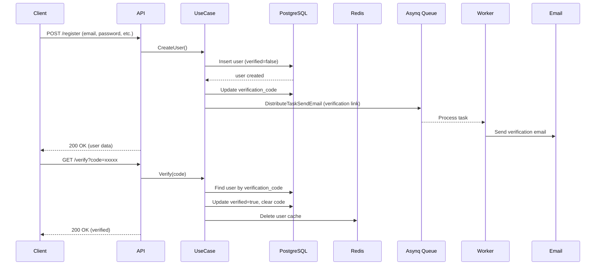
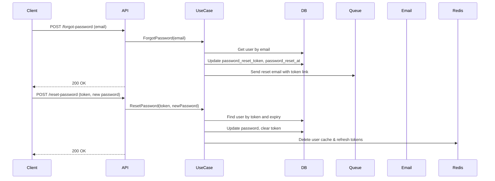
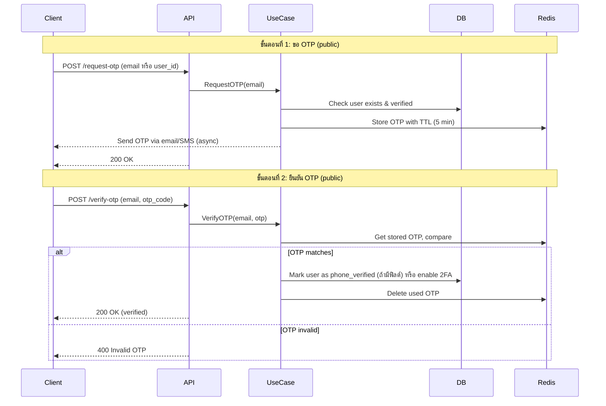

# เอกสารระบบ User Module

## URL Local: http://localhost:8088

---

## 1. โครงสร้างโฟลเดอร์ (Folder Structure)

```text
internal/user/                                 # root module ของ user / user root module
│
├── users/                                      # โฟลเดอร์หลักของโมดูล / main module folder
│   ├── delivery/                               # ชั้นนำส่งข้อมูล (Delivery layer)
│   │   └── http/                               # การส่งผ่าน HTTP / HTTP delivery
│   │       ├── handlers.go                     # ตัวจัดการ request แต่ละ endpoint / request handlers
│   │       └── routes.go                       # การลงทะเบียน route / route registration
│   ├── distributor/                            # ตัวกระจายงานเข้า queue (Task distributor)
│   │   └── distributor.go                      # ส่งงาน async (เช่น email) ไปยัง Redis / send async tasks to Redis
│   ├── presenter/                              # ตัวแปลงข้อมูลระหว่าง layer (Presenter / DTO)
│   │   └── presenters.go                       # struct สำหรับ request/response / request/response structs
│   ├── processor/                              # ตัวประมวลผลงานจาก queue (Task processor)
│   │   └── processor.go                        # รับงานจาก Redis และประมวลผล (ส่ง email) / consume tasks from Redis
│   ├── repository/                             # ชั้นจัดการข้อมูล (Repository layer)
│   │   ├── pg_repository.go                    # การเข้าถึง PostgreSQL (CRUD พื้นฐาน + เฉพาะ user) / PostgreSQL access
│   │   └── redis_repository.go                 # การเข้าถึง Redis สำหรับ cache / Redis cache access
│   └── usecase/                                # ชั้นตรรกะธุรกิจ (Use case layer)
│       └── usecase.go                          # ตรรกะหลักของ user (สร้าง, sign in, reset password, etc.) / core business logic
│
├── handler.go                                  # Interface ของ HTTP handlers
├── pg_repository.go                            # Interface ของ PostgreSQL repository
├── redis_repository.go                         # Interface ของ Redis repository
├── usecase.go                                  # Interface ของ UseCase
└── worker.go                                   # กำหนด task names และ payloads สำหรับ async worker
```

---

## 2. หลักการ (Concept)

### คืออะไร? / What is it?

ระบบ User Module เป็นส่วนที่负责จัดการผู้ใช้ ประกอบด้วย:
- การลงทะเบียน (Register)
- การยืนยันตัวตนผ่านอีเมล (Email Verification)
- การเข้าสู่ระบบ (Sign In) ด้วย JWT (Access + Refresh Token)
- การออกจากระบบ (Logout) และออกจากทุกอุปกรณ์ (Logout All)
- การเปลี่ยนรหัสผ่าน (Change Password)
- การลืมรหัสผ่าน (Forgot Password) และรีเซ็ตรหัสผ่าน (Reset Password)
- การเพิ่ม OTP (One-Time Password) สำหรับยืนยันตัวตนเพิ่มเติม (Verification ผ่านทางอีเมลหรือ SMS)
- การเรียกข้อมูล OTP โดยไม่ต้องใช้ Token (สำหรับกรณี verify OTP)

### มีกี่แบบ? / How many patterns?

| Pattern | คำอธิบาย (Thai) | คำอธิบาย (English) |
|---------|----------------|---------------------|
| **Clean Architecture** | แยกชั้น Delivery, UseCase, Repository, Entity ทำให้ทดสอบง่ายและเปลี่ยนเทคโนโลยีได้ | Separates delivery, usecase, repository, entity layers for testability and technology flexibility |
| **Repository Pattern** | ซ่อนรายละเอียดการเข้าถึงฐานข้อมูล (PostgreSQL, Redis) ไว้เบื้องหลัง interface | Hides data access details (PostgreSQL, Redis) behind interfaces |
| **Asynchronous Task Queue** | ใช้ Asynq + Redis สำหรับส่งอีเมล (verification, reset password) ไม่ block response | Uses Asynq + Redis for email sending (verification, reset) without blocking response |
| **JWT with RS256** | ใช้ private/public key สำหรับเซ็น token, รองรับ refresh token | Uses RS256 signed tokens, supports refresh token rotation |
| **Redis Caching** | แคชข้อมูลผู้ใช้ (user) และเก็บ refresh token lists | Caches user data and stores refresh token sets |

### ข้อห้ามสำคัญ / Important Prohibitions

- **ห้ามเก็บ plaintext password** – ต้อง hash ด้วย bcrypt เสมอ
- **ห้ามส่ง sensitive data ใน response** (เช่น password, verification_code, reset_token)
- **ห้ามใช้ Access Token นานเกินไป** – ตั้งค่า expire ให้สั้น (เช่น 15-30 นาที)
- **ห้ามให้ OTP endpoint โดยไม่มีการ rate limiting** – เสี่ยงถูก brute force

---

## 3. คอมเมนต์ CODE ไทย อังกฤษ คนละบรรทัด / Code Comments (Thai and English)

### ตัวอย่างจาก `handlers.go`

```go
// Register – POST /register (public, no auth)
// Register – POST /register (สาธารณะ, ไม่ต้องใช้ token)
func (h *userHandler) Register() http.HandlerFunc {
	return func(w http.ResponseWriter, r *http.Request) {
		req := new(presenter.UserCreate)
		// แปลง JSON request body ไปเป็น struct
		// Decode JSON request body into struct
		if err := json.NewDecoder(r.Body).Decode(req); err != nil {
			render.Render(w, r, responses.CreateErrorResponse(err))
			return
		}
		// ตรวจสอบความถูกต้องของข้อมูลตาม validation tag
		// Validate input based on validation tags
		if err := utils.ValidateStruct(r.Context(), req); err != nil {
			render.Render(w, r, responses.CreateErrorResponse(httpErrors.ErrValidation(err)))
			return
		}
		// เรียก usecase เพื่อสร้างผู้ใช้ใหม่ (ส่งรหัสยืนยันทางอีเมล)
		// Call usecase to create new user (sends verification email)
		newUser, err := h.usersUC.CreateUser(r.Context(), mapModel(req), req.ConfirmPassword)
		if err != nil {
			render.Render(w, r, responses.CreateErrorResponse(err))
			return
		}
		// แปลง model เป็น response struct
		// Convert model to response struct
		userResp := mapModelResponse(newUser)
		if userResp == nil {
			render.Render(w, r, responses.CreateErrorResponse(errors.New("internal server error")))
			return
		}
		// ส่ง response สำเร็จกลับไป
		// Return success response
		render.Respond(w, r, responses.CreateSuccessResponse(*userResp))
	}
}
```

### ตัวอย่างจาก `usecase.go` (ฟังก์ชัน Create)

```go
// Create – inserts a new user and sends verification email
// Create – สร้างผู้ใช้ใหม่และส่งอีเมลยืนยัน
func (u *userUseCase) Create(ctx context.Context, exp *models.SdUser) (*models.SdUser, error) {
	// ทำให้ email เป็น lowercase และ trim space
	// Normalize email to lowercase and trim spaces
	exp.Email = strings.ToLower(strings.TrimSpace(exp.Email))
	exp.Password = strings.TrimSpace(exp.Password)

	// Hash รหัสผ่านด้วย bcrypt ก่อนเก็บลง DB
	// Hash password with bcrypt before storing
	hashedPassword, err := cryptpass.HashPassword(exp.Password)
	if err != nil {
		return nil, err
	}
	exp.Password = hashedPassword
	
	// กำหนด username เป็น email ถ้าไม่ได้ระบุ
	// Set username to email if not provided
	if exp.Username == "" {
		exp.Username = exp.Email
	}
	
	// บันทึกลง PostgreSQL
	// Save to PostgreSQL
	user, err := u.pgRepo.Create(ctx, exp)
	if err != nil {
		return nil, err
	}
	
	// ถ้า verified แล้ว (เช่น superuser) ไม่ต้องส่งอีเมล
	// If already verified (e.g., superuser), skip email
	if user.Verified {
		return user, nil
	}

	// สร้าง verification code แบบสุ่ม
	// Generate random verification code
	verificationCode, err := secureRandom.RandomHex(16)
	if err != nil {
		return nil, err
	}
	
	// อัปเดต verification code ในฐานข้อมูล
	// Update verification code in database
	updatedUser, err := u.pgRepo.UpdateVerificationCode(ctx, user, verificationCode)
	if err != nil {
		return nil, err
	}
	
	// ... (สร้าง template email และส่งผ่าน task queue)
}
```

### ข้อควรระวัง / Cautions

- **Context timeout** – ต้องตั้ง timeout สำหรับการเรียก DB และ Redis
- **Transaction** – การสร้าง user + verification code ควรอยู่ใน transaction เดียวกัน (ปัจจุบันแยก อาจมี inconsistency)
- **Rate limiting** – Endpoints public (register, forgot password, verify OTP) ควรมี rate limit ป้องกัน abuse

### ข้อดี / Advantages

- แยกชั้นชัดเจน: เปลี่ยน DB หรือเปลี่ยน HTTP framework ได้ง่าย
- รองรับ async task: ไม่ให้ผู้ใช้รออีเมล
- ใช้ JWT แบบ stateless + refresh token ใน Redis ช่วย logout ได้

### ข้อเสีย / Disadvantages

- ความซับซ้อนสูง: ต้องจัดการหลาย component (PostgreSQL, Redis, Asynq)
- การ debug async task ยากกว่า synchronous
- ถ้า Redis ล่ม จะไม่สามารถ logout หรือตรวจสอบ refresh token ได้

---

## 4. การออกแบบ Workflow และ Dataflow

> **ระวังอักขระพิเศษ**: ใช้เฉพาะ ASCII และเว้นวรรคให้ถูกต้อง

### 4.1 Workflow การลงทะเบียนและยืนยันอีเมล (Register + Email Verification)



### 4.2 Workflow การลืมรหัสผ่าน + รีเซ็ต (Forgot + Reset Password)



### 4.3 Workflow การเพิ่ม OTP (ไม่ต้องใช้ Token สำหรับ verify OTP)



### 4.4 Dataflow (Entity-Relationship)

```text
[Client] -> [HTTP Handler] -> [UseCase] -> [Repository Interface]
                                              |
                    +-------------------------+-------------------------+
                    |                         |                         |
              [PgRepo]                    [RedisRepo]            [Task Distributor]
                    |                         |                         |
              [PostgreSQL]                 [Redis]                [Asynq Queue]
              (SdUser table)              (cache + OTP)          (email tasks)
```

**SdUser Model (models.SdUser)** – ฟิลด์สำคัญ:

| ฟิลด์ | Type | คำอธิบาย |
|-------|------|-----------|
| ID | uuid.UUID | Primary key |
| Email | string | Unique, login username |
| Password | string | bcrypt hash |
| Verified | bool | อีเมลยืนยันแล้ว |
| VerificationCode | string | รหัสสุ่มสำหรับยืนยันอีเมล |
| PasswordResetToken | string | Token สำหรับรีเซ็ตรหัสผ่าน |
| PasswordResetAt | time.Time | เวลาหมดอายุของ reset token |
| Status | int16 | 1=active, 0=inactive |
| IsSuperUser | bool | สิทธิ์ admin สูงสุด |

**เพิ่มเติม OTP (โดยไม่เปลี่ยนโครงสร้าง SdUser)** – ใช้ Redis key: `otp:{email}:{purpose}` (TTL 5 นาที)

---

## 5. คู่มือการทดสอบ (Testing Guide)

### 5.1 สิ่งที่ต้องเตรียม

- PostgreSQL (รันบน localhost:5432)
- Redis (รันบน localhost:6379)
- Asynq (ใช้ Redis เดียวกัน)
- Mock email server (หรือใช้ ethereal.email)

### 5.2 Test Cases สำหรับ Endpoints

| Endpoint | Method | Auth | Input | Expected Output |
|----------|--------|------|-------|-----------------|
| /register | POST | No | {email, password, confirm_password, role_id=2} | 200, user object |
| /verify-email?code=xxx | GET | No | query param code | 200, verified |
| /signin | POST | No | {email, password} | {access_token, refresh_token} |
| /user/me | GET | Yes (Bearer) | - | user object |
| /user/me/updatepass | PATCH | Yes | {old_password, new_password, confirm} | updated user |
| /forgot-password | POST | No | {email} | 200 |
| /reset-password | POST | No | {reset_token, new_password, confirm} | 200 |
| /request-otp | POST | No | {email} | 200 (OTP sent) |
| /verify-otp | POST | No | {email, otp_code} | 200 |

### 5.3 ทดสอบ Async Task (ส่งอีเมล)

```bash
# 1. เริ่ม Asynq worker (ต้องรันแยก process)
go run cmd/worker/main.go

# 2. สมัครสมาชิกใหม่ ควรเห็น log ว่า task ถูก enqueue
# 3. ตรวจสอบ Redis queue: asynq stats
```

### 5.4 ทดสอบ Redis Cache

```bash
# หลังจาก GET /user/{id} ครั้งแรก
redis-cli
> KEYS "sd_user:*"
# ควรมี key ขึ้น

# อัปเดตหรือลบ user → key ควรถูกลบ
```

### 5.5 ทดสอบ OTP (เพิ่มเติม)

```bash
# ขอ OTP
curl -X POST http://localhost:8088/request-otp \
  -H "Content-Type: application/json" \
  -d '{"email":"test@example.com"}'

# ดู OTP ใน Redis (เฉพาะ debug)
redis-cli GET "otp:test@example.com:verify"

# ยืนยัน OTP
curl -X POST http://localhost:8088/verify-otp \
  -d '{"email":"test@example.com","otp":"123456"}'
```

---

## 6. คู่มือการการใช้งาน (User Manual)

### สำหรับผู้ใช้ปลายทาง

1. **สมัครสมาชิก**  
   `POST /register`  
   ตัวอย่าง body:
   ```json
   {
     "email": "user@example.com",
     "password": "strongpass123",
     "confirm_password": "strongpass123",
     "role_id": 2,
     "firstname": "สมชาย",
     "lastname": "ใจดี"
   }
   ```

2. **ยืนยันอีเมล**  
   เปิดลิงก์ที่ได้รับทางอีเมล: `http://localhost:8088/verify-email?code=xxxxx`

3. **เข้าสู่ระบบ**  
   `POST /signin`  
   ได้รับ access_token (อายุสั้น) และ refresh_token (อายุยาว)

4. **เรียกดูข้อมูลตัวเอง**  
   `GET /user/me`  
   Header: `Authorization: Bearer <access_token>`

5. **เปลี่ยนรหัสผ่าน**  
   `PATCH /user/me/updatepass`  
   body: old_password, new_password, confirm_password

6. **ลืมรหัสผ่าน**  
   `POST /forgot-password` ด้วยอีเมล → รับลิงก์รีเซ็ต  
   `POST /reset-password` ด้วย token และรหัสใหม่

7. **OTP (ถ้ามี)**  
   `POST /request-otp` → รับ OTP ทางอีเมล/SMS  
   `POST /verify-otp` → ยืนยัน OTP

### สำหรับ Admin

- `GET /user?limit=10&offset=0` – รายชื่อผู้ใช้ทั้งหมด
- `POST /user` – สร้างผู้ใช้ (admin)
- `PUT /user/{id}` – แก้ไขข้อมูลผู้ใช้
- `DELETE /user/{id}` – ลบผู้ใช้
- `PATCH /user/{id}/role` – เปลี่ยน role
- `GET /user/{id}/logoutall` – ให้ผู้ใช้ออกจากระบบทุกอุปกรณ์

---

## 7. คู่มือการบำรุงรักษา (Maintenance Guide)

### การตรวจสอบสุขภาพระบบ (Health Checks)

| Component | Check |
|-----------|-------|
| PostgreSQL | `SELECT 1` |
| Redis | `PING` |
| Asynq worker | ตรวจสอบว่า process ยังทำงานอยู่ |
| Email sender | ทดสอบส่งอีเมลจริง (หรือดู logs) |

### การ backup และ restore

```bash
# Backup PostgreSQL user table
pg_dump -U user -d icmongodb -t sd_user > sd_user_backup.sql

# Restore
psql -U user -d icmongodb < sd_user_backup.sql

# Redis backup (RDB file) ตั้งค่า auto-save แล้ว
```

### การจัดการ Logs

- ใช้ logger ที่ inject เข้าไปในทุก layer (เห็นใน handler, usecase, distributor)
- ระดับ log: Debug, Info, Error
- ควร log event สำคัญ: register, login fail, password reset, logout all

### การ clean up ข้อมูลค้าง

```sql
-- ลบ verification_code ที่เก่าเกิน 7 วัน (สมมติ)
UPDATE sd_user 
SET verification_code = NULL 
WHERE verification_code IS NOT NULL 
AND created_date < NOW() - INTERVAL '7 days';
```

```bash
# ลบ refresh token keys ที่ไม่มี user (อาจมีตกค้าง)
redis-cli --scan --pattern "RefreshToken:*" | xargs redis-cli DEL
```

### การ monitoring

- จำนวน refresh tokens ต่อ user (set size)
- อัตราการส่งอีเมลล้มเหลว (failed tasks in Asynq)
- เวลา response ของ endpoint /signin

---

## 8. คู่มือการขยาย หรือแก้ไข หรือ เพิ่มเติมในอนาคต (Extension Guide)

### 8.1 การเพิ่ม OTP โดยไม่เปลี่ยนโครงสร้าง SdUser

**แนวทางที่แนะนำ:** ใช้ Redis จัดเก็บ OTP ชั่วคราว

**ขั้นตอน:**

1. เพิ่ม interface ใน `usecase.go`:
   ```go
   RequestOTP(ctx context.Context, email string, purpose string) error
   VerifyOTP(ctx context.Context, email string, otp string) error
   ```

2. เพิ่ม implementation ใน `usecase/usecase.go`
3. เพิ่ม handler ใน `delivery/http/handlers.go`
4. เพิ่ม route (public) ใน `routes.go`

**ตัวอย่าง Redis key design:**
```
otp:request:{email}:verify    -> value: otp_code (expire 5m)
otp:request:{email}:2fa       -> value: otp_code (expire 5m)
```

### 8.2 การเพิ่ม 2FA (TOTP) แบบถาวร

ต้องเพิ่ม 2 ฟิลด์ใน `models.SdUser` (ซึ่งจะเปลี่ยนโครงสร้างเดิม – ไม่แนะนำหากห้ามเปลี่ยน)  
แต่สามารถใช้ตารางแยก `user_totp` แทน:

```sql
CREATE TABLE user_totp (
    user_id UUID PRIMARY KEY REFERENCES sd_user(id),
    secret TEXT NOT NULL,
    enabled BOOLEAN DEFAULT false
);
```

### 8.3 การเพิ่ม Social Login (Google, Facebook)

- เพิ่มตาราง `user_oauth` เชื่อมกับ `sd_user`
- เพิ่ม endpoint `/auth/google` และ callback
- ปรับ usecase: `CreateOrGetUserFromOAuth`

### 8.4 การเพิ่ม Rate Limiting

ใช้ middleware เช่น `go-chi/httprate`:

```go
router.Group(func(r chi.Router) {
    r.Use(httprate.LimitByIP(5, 1*time.Minute))
    r.Post("/register", h.Register())
    r.Post("/forgot-password", h.ForgotPassword())
})
```

### 8.5 การเปลี่ยนจาก Asynq ไปใช้ระบบอื่น (RabbitMQ, Kafka)

ต้อง implement interface `UserRedisTaskDistributor` และ `UserRedisTaskProcessor` ใหม่ โดยไม่ต้องแก้ usecase

---

## 9. CHECK List Test Module

### Functional Tests

- [ ] **Register** – สามารถสมัครสมาชิกได้
- [ ] **Register** – อีเมลซ้ำต้อง error
- [ ] **Register** – password กับ confirm ไม่ตรงกันต้อง error
- [ ] **Email Verification** – คลิกลิงก์แล้ว verified เปลี่ยนเป็น true
- [ ] **Email Verification** – ใช้ code ซ้ำไม่ได้
- [ ] **Sign In** – email/password ถูกต้องได้ token
- [ ] **Sign In** – password ผิด ต้อง error
- [ ] **Sign In** – user ที่ยังไม่ verified ควร login ได้? (กำหนดให้ได้หรือไม่ได้)
- [ ] **Access Token** – หมดอายุแล้ว request ต้องปฏิเสธ
- [ ] **Refresh Token** – ใช้ refresh token เก่าแล้วได้ชุดใหม่
- [ ] **Refresh Token** – ใช้ refresh token ซ้ำ (หลัง refresh แล้ว) ต้อง error
- [ ] **Logout** – ลบ refresh token ออกจาก Redis
- [ ] **LogoutAll** – ลบทุก refresh token ของ user
- [ ] **Change Password** – ต้องใช้ old password ที่ถูกต้อง
- [ ] **Change Password** – หลังเปลี่ยน, refresh token เดิมใช้ไม่ได้
- [ ] **Forgot Password** – ส่งอีเมลไปยัง address ที่มีอยู่
- [ ] **Forgot Password** – อีเมลไม่มีในระบบ ต้องไม่บอกว่ามี/ไม่มี (security)
- [ ] **Reset Password** – token ถูกต้องและไม่หมดอายุ
- [ ] **Reset Password** – หลัง reset, refresh token เดิมใช้ไม่ได้
- [ ] **Admin** – สร้าง user ได้ (ต้องมี token admin)
- [ ] **Admin** – update role user ได้
- [ ] **Admin** – delete user ได้
- [ ] **GetMulti** – limit/offset ทำงานถูกต้อง

### Non-Functional Tests

- [ ] **Redis Cache** – GET /user/{id} ครั้งแรกไป DB, ครั้งที่สองมาจาก cache
- [ ] **Cache invalidation** – อัปเดตหรือลบ user แล้ว cache ถูกลบ
- [ ] **Async Email** – หลังจาก register, task ถูก enqueue และ worker ส่งอีเมลจริง
- [ ] **Concurrent login** – user login หลาย device มีหลาย refresh tokens ใน set
- [ ] **Rate limiting** – public endpoints ถูกจำกัดจำนวน request (ถ้ามี)
- [ ] **Timeout handling** – DB/Redis ช้า request timeout อย่างเหมาะสม

### Security Tests

- [ ] **Password hashing** – ไม่มี plaintext password ใน DB
- [ ] **JWT signature** – token ต้อง signed ด้วย private key
- [ ] **Refresh token reuse detection** – ถ้าใช้ refresh token ซ้ำ (หลัง logout) ควร invalidate ทั้ง set
- [ ] **SQL Injection** – ใช้ GORM parameterized
- [ ] **No sensitive data in response** – ไม่มี password, verification_code, reset_token ใน JSON response
- [ ] **HTTPS (production)** – ต้อง force HTTPS

### Integration Tests

- [ ] **PostgreSQL** – migration และ connection สำเร็จ
- [ ] **Redis** – connection สำเร็จ
- [ ] **Asynq** – server และ client ทำงานร่วมกัน
- [ ] **Email service** – ส่งอีเมลได้จริง (หรือ mock)

### OTP Additional Tests (ถ้าเพิ่ม)

- [ ] **Request OTP** – รับ OTP ทางอีเมล (async)
- [ ] **Request OTP** – rate limit (ขอซ้ำ太快)
- [ ] **Verify OTP** – OTP ถูกต้อง
- [ ] **Verify OTP** – OTP ผิดหรือหมดอายุ
- [ ] **Verify OTP** – OTP ใช้แล้วใช้ซ้ำไม่ได้

---

## เอกสารอ้างอิง

- [Asynq Documentation](https://github.com/hibiken/asynq)
- [go-chi router](https://github.com/go-chi/chi)
- [GORM](https://gorm.io)
- [JWT with RS256](https://datatracker.ietf.org/doc/html/rfc7518)

**จัดทำโดย:** Developer Team  
**วันที่:** 2026-04-06  
**Version:** 1.0 (รองรับ SdUser structure เดิม + OTP extension via Redis)