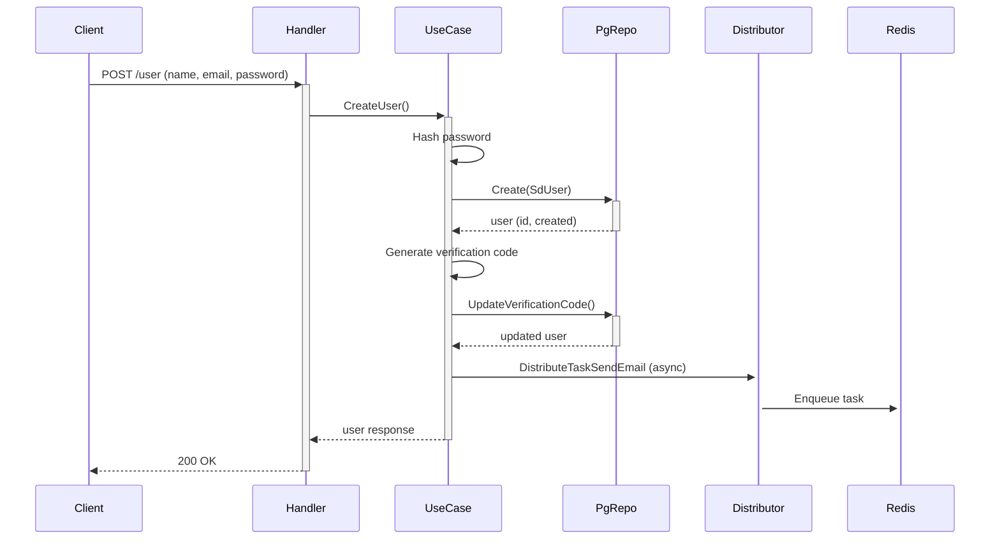

ทกอยางเหมือนเดิมหมดแค่ เปลียนมาใช้ table sd_user
Module : user
# URL Local http://localhost:8088 

# โครงสร้าง Folder  พร้อม คอมเมน้นอธิบาย  ภาษาไทย และ ภาษาอังกถษ
เช่น

## 1. โครงสร้างโฟลเดอร์ (Folder Structure)

```text
internal/user/                                 # root module ของ user
│
├── users/                                      
│   ├── delivery/                               
│   │   ├── http/
│   │   │   ├── handlers.go                    
│   │   │   └── routes.go                                      
│   ├── distributor/                          
│   │   └── distributor.go                     
│   ├── presenter/                              
│   │   └── presenters.go        
│   ├── processor/                              
│   │   └── processor.go                   
│   ├── repository/                            
│   │   ├── pg_repository.go                    
│   │   └── redis_repository.go                 
│   └── usecase/                                
│       └── usecase.go                                           
│
├── handler.go                                  
├── pg_repository.go                           
├── redis_repository.go        
├── usecase.go                       
└── worker.go                                  
```

**คำอธิบายแต่ละโฟลเดอร์/ไฟล์** (ไทย/อังกฤษ):

# พร้อมสร้างเอกสาร
## หลักการ (Concept)
### คืออะไร?
### มีกี่แบบ?  

**ข้อห้ามสำคัญ**

## คอมเม้น CODE ไทย อังกถษ คนละบรรทัด
### ใช้อย่างไร / นำไปใช้กรณีไหน
### ประโยชน์ที่ได้รับ
### ข้อควรระวัง
### ข้อดี
### ข้อเสีย
### ข้อห้าม
## การออกแบบ Workflow และ Dataflow ระวัง อักขระ พิเศษ จำทำให้รูปแสดงไม่ได้ ระวังให้ดี
## คู่มือการทดสอบ
## คู่มือการการใช้งาน
## คู่มือการบำรุงรักษา
## คู่มือการขยาย หรือแก้ไข หรือ เพิมเติม ในอนาคต
## CHECK List Test Module

ปรับมมาใช้ โครงสร้าง sd_user.go  โดยไม่เปลียนโครงสร้างเดิม แต่เพิ่ม ให่ได้หากจำเป็น 

************

# 📘 การปรับเปลี่ยน User Module ให้ใช้ Table `sd_user` (Adapt User Module to Use `sd_user` Table)

## 🔄 ภาพรวมการปรับเปลี่ยน (Overview of Changes)

จากโค้ดเดิมที่ใช้ `models.User` (มีฟิลด์ `Name`, `Email`, `Password`, `IsActive`, `IsSuperUser`, `Verified`, `CreatedAt`, `UpdatedAt` ฯลฯ) ให้เปลี่ยนมาใช้ `models.SdUser` ซึ่งแมปกับตาราง `sd_user` ใน PostgreSQL โดย **ไม่เปลี่ยนแปลงโครงสร้างไฟล์เดิม** แต่จะเพิ่ม/แก้ไขเฉพาะส่วนที่จำเป็นเพื่อให้ทำงานร่วมกับ `SdUser` ได้อย่างสมบูรณ์

### การแมปฟิลด์ (Field Mapping)

| models.User (เดิม) | models.SdUser (ใหม่) | หมายเหตุ |
|--------------------|----------------------|-----------|
| `Id` uuid.UUID | `ID` uuid.UUID | เปลี่ยนชื่อฟิลด์เป็นตัวพิมพ์ใหญ่ |
| `Name` string | `Fullname` *string หรือ `Firstname`+`Lastname` | ใช้ `Fullname` เป็นหลัก ถ้าไม่มีให้ประกอบจาก `Firstname` + " " + `Lastname` |
| `Email` string | `Email` string | เหมือนกัน |
| `Password` string | `Password` string | เหมือนกัน |
| `IsActive` bool | `Status` int16 | 1 = active, 0 = inactive |
| `IsSuperUser` bool | เพิ่มฟิลด์ใหม่ `is_superuser` ใน `sd_user` หรือใช้ `RoleID` | แนะนำให้เพิ่มคอลัมน์ `is_superuser` bool default false |
| `Verified` bool | `Verified` bool | มีอยู่แล้วใน `sd_user.go` |
| `VerificationCode` string | `VerificationCode` string | มีอยู่แล้ว |
| `PasswordResetToken` string | `PasswordResetToken` string | มีอยู่แล้ว |
| `PasswordResetAt` *time.Time | `PasswordResetAt` *time.Time | มีอยู่แล้ว |
| `CreatedAt` time.Time | `CreatedDate` time.Time | เปลี่ยนชื่อ |
| `UpdatedAt` time.Time | `UpdatedDate` time.Time | เปลี่ยนชื่อ |

**ข้อควรระวัง:** `SdUser` ไม่มีฟิลด์ `IsSuperUser` และ `IsActive` แบบ bool เดิม ต้องเพิ่มหรือปรับ逻辑

---

## 📁 โครงสร้างโฟลเดอร์ (Folder Structure) – ภาษาไทย / อังกฤษ

```text
internal/user/                                 # root module ของ user (user module root)
│
├── users/                                      # โฟลเดอร์หลักของโมดูล users (main users module folder)
│   ├── delivery/                               # ชั้นนำส่งข้อมูล (delivery layer)
│   │   ├── http/                               # ผ่าน HTTP protocol
│   │   │   ├── handlers.go                    # ตัวจัดการ HTTP request (HTTP handlers)
│   │   │   └── routes.go                      # กำหนดเส้นทาง API (route definitions)
│   ├── distributor/                           # ชั้นกระจายงานไปยัง Asynq (task distributor)
│   │   └── distributor.go                     # กระจายงานส่งอีเมล (distribute email tasks)
│   ├── presenter/                             # ชั้นแปลงข้อมูลสำหรับ API (presenter layer)
│   │   └── presenters.go                      # Structs สำหรับ request/response
│   ├── processor/                             # ชั้นประมวลผลงาน Asynq (task processor)
│   │   └── processor.go                       # ประมวลผลงานส่งอีเมล (process email tasks)
│   ├── repository/                            # ชั้นเข้าถึงข้อมูล (repository layer)
│   │   ├── pg_repository.go                   # PostgreSQL repository สำหรับ sd_user
│   │   └── redis_repository.go                # Redis repository สำหรับ cache & refresh token
│   └── usecase/                               # ชั้นตรรกะธุรกิจ (business logic layer)
│       └── usecase.go                         # การทำงานหลักของ user (main user usecase)
│
├── handler.go                                 # Interface ของ handlers
├── pg_repository.go                           # Interface ของ PostgreSQL repository
├── redis_repository.go                        # Interface ของ Redis repository
├── usecase.go                                 # Interface ของ usecase
└── worker.go                                  # ค่าคงที่และ payload สำหรับ Asynq tasks
```

### คำอธิบาย (ไทย/อังกฤษ)

- **delivery/http**: จัดการ HTTP requests, ตรวจสอบความถูกต้องของ input, เรียกใช้ usecase และส่ง response กลับ (Handles HTTP requests, validates input, calls usecase, returns response)
- **distributor**: รับผิดชอบการส่ง task ไปยัง Redis queue (asynq) สำหรับงานที่ต้องทำแบบ async เช่น ส่งอีเมล (Responsible for enqueuing async tasks like email sending)
- **presenter**: กำหนดโครงสร้างของ request body และ response body ที่ใช้กับ API (Defines request/response DTOs for API)
- **processor**: ดึง task จาก Redis queue และประมวลผลจริง (Pulls tasks from Redis queue and processes them)
- **repository**: สื่อสารกับ PostgreSQL (CRUD, custom queries) และ Redis (cache, set operations) (Communicates with PostgreSQL and Redis)
- **usecase**: มี business logic ทั้งหมด เช่น การสร้าง user, การเข้ารหัสรหัสผ่าน, การจัดการ token, การส่งอีเมลยืนยัน (Contains core business logic: user creation, password hashing, token management, email sending)

---

## 📖 หลักการ (Concept)

### คืออะไร? (What is it?)
โมดูล User จัดการทุกอย่างเกี่ยวกับผู้ใช้ระบบ ตั้งแต่การลงทะเบียน, เข้าสู่ระบบ, การยืนยันตัวตนด้วยอีเมล, การเปลี่ยนรหัสผ่าน, การออกจากระบบ, การ refresh token, การจัดการ session ด้วย Redis และการส่งอีเมล异步ผ่าน Asynq

### มีกี่แบบ? (How many types?)
แบ่งตามบทบาท:
- **SuperUser**: มีสิทธิ์เข้าถึง API ทั้งหมด (create, update, delete, logoutAll)
- **Normal User**: สามารถเข้าถึงเฉพาะข้อมูลของตนเอง (me, updateMe, updatePasswordMe)

### ข้อห้ามสำคัญ (Critical Prohibitions)
- **ห้ามเก็บรหัสผ่านในรูปแบบ plain text** – ต้อง hash ด้วย bcrypt เสมอ
- **ห้ามใช้ JWT access token เกินอายุที่กำหนด** – ต้อง refresh ผ่าน refresh token
- **ห้าม hardcode secret key** – ใช้ environment variables หรือ config
- **ห้ามส่ง response ที่มีข้อมูลละเอียดอ่อน** เช่น password hash, reset token

---

## 💬 การคอมเมนต์โค้ด (Code Comments) – ไทย / อังกฤษ (คนละบรรทัด)

ตัวอย่างการคอมเมนต์ใน `pg_repository.go`:

```go
// GetByEmail ดึงผู้ใช้จากฐานข้อมูลด้วยอีเมล
// GetByEmail retrieves a user from database by email
func (r *UserPgRepo) GetByEmail(ctx context.Context, email string) (*models.SdUser, error) {
    var obj *models.SdUser
    // ค้นหาจากคอลัมน์ email ตรงกัน
    // Find record where email column matches
    if result := r.DB.WithContext(ctx).First(&obj, "email = ?", email); result.Error != nil {
        return nil, result.Error
    }
    return obj, nil
}
```

```go
// UpdatePassword อัปเดตรหัสผ่านของผู้ใช้ (ใช้เมื่อเปลี่ยนรหัสผ่าน)
// UpdatePassword updates user's password (used when changing password)
func (r *UserPgRepo) UpdatePassword(ctx context.Context, exp *models.SdUser, newPassword string) (*models.SdUser, error) {
    // อัปเดตเฉพาะฟิลด์ password
    // Update only the password field
    if result := r.DB.WithContext(ctx).Model(&exp).Select("password").
        Updates(map[string]interface{}{"password": newPassword}); result.Error != nil {
        return nil, result.Error
    }
    return exp, nil
}
```

---

## 🔧 วิธีการปรับโค้ดให้ใช้ `SdUser` (How to Adapt Code to Use `SdUser`)

### 1. แก้ไข Model และ TableName
ใน `internal/models/sd_user.go` มีอยู่แล้ว ตรวจสอบว่า `TableName()` คืนค่า `"sd_user"`

### 2. ปรับ `pg_repository.go` (repository/pg_repository.go)
- เปลี่ยน `models.User` → `models.SdUser`
- ปรับฟิลด์ตามการแมปด้านบน
- เพิ่มคอลัมน์ `is_superuser` ถ้ายังไม่มี (migration)

```go
// ตัวอย่างการเพิ่ม is_superuser ใน migration (PostgreSQL)
ALTER TABLE sd_user ADD COLUMN is_superuser BOOLEAN DEFAULT false;
```

### 3. ปรับ `usecase.go` (usecase/usecase.go)
- เปลี่ยน type parameters จาก `models.User` เป็น `models.SdUser`
- แก้ไข `Create`: แปลง `Name` → `Fullname` (หรือประกอบจาก Firstname+Lastname)
- แก้ไข `Update`: รองรับการอัปเดต `Fullname`
- แก้ไข `IsActive`: ใช้ `exp.Status == 1`
- แก้ไข `IsSuper`: ใช้ `exp.IsSuperUser` หรือ `exp.RoleID == 1`

```go
func (u *userUseCase) IsActive(ctx context.Context, exp models.SdUser) bool {
    // ไทย: ถ้า Status == 1 แสดงว่า active
    // English: If Status == 1 means active
    return exp.Status == 1
}
```

### 4. ปรับ `presenters.go`
เปลี่ยน `UserResponse` ให้มีฟิลด์ที่สอดคล้องกับ `SdUser`:

```go
type UserResponse struct {
    Id          uuid.UUID `json:"id"`
    Email       string    `json:"email"`
    Fullname    *string   `json:"fullname,omitempty"`
    Status      int16     `json:"status"`
    IsSuperUser bool      `json:"is_superuser"`
    Verified    bool      `json:"verified"`
    CreatedAt   time.Time `json:"created_at"`
    UpdatedAt   time.Time `json:"updated_at"`
}
```

### 5. ปรับฟังก์ชัน `mapModel` และ `mapModelResponse`
```go
func mapModel(exp *presenter.UserCreate) *models.SdUser {
    fullname := exp.Name
    return &models.SdUser{
        Email:       exp.Email,
        Password:    exp.Password,
        Fullname:    &fullname,
        Status:      1, // active
        IsSuperUser: false,
        Verified:    false,
    }
}
```

### 6. ปรับ Redis keys (ถ้าใช้ id เป็น string)
`GenerateRedisUserKey` ต้องใช้ `id.String()` เหมือนเดิม

### 7. ทดสอบทุก endpoint ใหม่

---

## 📊 Workflow และ Dataflow

### Workflow การสร้างผู้ใช้ (Create User)



### Dataflow การ Refresh Token

```
Client → POST /auth/refresh (refresh_token)
→ UseCase.ParseIdFromRefreshToken (verify JWT)
→ Redis.SIsMember (check token exists)
→ Redis.Srem (remove old token)
→ UseCase.Get user by id
→ UseCase.createToken (new access+refresh)
→ Redis.Sadd (store new refresh token)
→ Client receives new tokens
```

---

## 🧪 คู่มือการทดสอบ (Testing Guide)

### สิ่งที่ต้องทดสอบ (Test Checklist)

| Test Case | Method | Endpoint | Expected Result |
|-----------|--------|----------|------------------|
| สร้าง user ใหม่ | POST | /user | 201 Created, ได้ email verification |
| Sign in ด้วย email/password ถูกต้อง | POST | /auth/signin | 200 OK, ได้ access+refresh token |
| Sign in ด้วยรหัสผิด | POST | /auth/signin | 401 Unauthorized |
| Get /me ด้วย access token | GET | /user/me | 200 OK, ข้อมูลผู้ใช้ |
| อัปเดต profile | PUT | /user/me | 200 OK, ข้อมูลที่อัปเดต |
| เปลี่ยนรหัสผ่าน | PATCH | /user/me/updatepass | 200 OK, logout sessions อื่น |
| Refresh token | POST | /auth/refresh | 200 OK, ได้ token ชุดใหม่ |
| Logout | POST | /auth/logout | 200 OK, refresh token ถูกลบ |
| Admin ลบ user อื่น | DELETE | /user/{id} | 200 OK (ต้อง superuser) |
| Verify email | GET | /auth/verifyemail?code=xxx | 302 redirect or 200 OK |

### การทดสอบ Async Task (ส่งอีเมล)
1. สร้าง user ใหม่ → ตรวจสอบว่า task ถูก enqueue ใน Redis
2. รัน worker: `go run cmd/worker/main.go`
3. ตรวจสอบอีเมลจริงที่ได้รับ (หรือ log)

---

## 📘 คู่มือการใช้งาน (User Manual)

### สำหรับผู้ใช้ทั่วไป
1. **ลงทะเบียน**: `POST /user` พร้อม name, email, password
2. **ยืนยันอีเมล**: คลิกลิงก์ที่ได้รับทางอีเมล `/auth/verifyemail?code=...`
3. **เข้าสู่ระบบ**: `POST /auth/signin` ได้ access token (อายุสั้น) และ refresh token (อายุยาว)
4. **เรียก API ที่ต้องการ auth**: แนบ `Authorization: Bearer <access_token>`
5. **ดูโปรไฟล์ตัวเอง**: `GET /user/me`
6. **แก้ไขโปรไฟล์**: `PUT /user/me`
7. **เปลี่ยนรหัสผ่าน**: `PATCH /user/me/updatepass`
8. **ออกจากระบบ**: `POST /auth/logout`
9. **เมื่อ access token หมดอายุ**: `POST /auth/refresh` ด้วย refresh token

### สำหรับ Admin (SuperUser)
- **ดูรายการผู้ใช้ทั้งหมด**: `GET /user?limit=10&offset=0`
- **สร้าง user ใหม่**: `POST /user`
- **ดู user ใด ๆ**: `GET /user/{id}`
- **อัปเดต user ใด ๆ**: `PUT /user/{id}`
- **ลบ user**: `DELETE /user/{id}`
- **บังคับ logout ทุก session**: `GET /user/{id}/logoutall`

---

## 🔧 คู่มือการบำรุงรักษา (Maintenance Guide)

### การตรวจสอบ logs
- ใช้ logger ที่ inject ในทุก layer
- ดู log ของ Asynq worker เพื่อตรวจสอบ email ที่ส่งไม่สำเร็จ

### การ clean up Redis
- Refresh tokens ที่หมดอายุต้องถูกลบโดยอัตโนมัติ (Redis TTL ไม่ได้ set ต้องทำ manually หรือใช้定期 cleanup)
- แนะนำให้ตั้ง TTL เมื่อ set refresh token: `redisRepo.SaddWithExpire(key, token, 7*24*time.Hour)`

### การ backup ฐานข้อมูล
- ตาราง `sd_user` มีข้อมูลสำคัญ ควร backup ทุกวัน

### การปรับแต่ง JWT expiration
- แก้ไขใน `config.yaml` หรือ environment:
  ```yaml
  jwt:
    access_token_expire_duration: 15   # minutes
    refresh_token_expire_duration: 43200  # minutes (30 days)
  ```

---

## 🚀 คู่มือการขยายหรือแก้ไขในอนาคต (Extension & Modification Guide)

### การเพิ่มฟิลด์ใหม่ใน `SdUser`
1. เพิ่มฟิลด์ใน struct `SdUser` (`internal/models/sd_user.go`)
2. ทำ migration เพิ่มคอลัมน์ใน PostgreSQL
3. ปรับ `presenters.go` ถ้าต้องการ expose ผ่าน API
4. ปรับ `usecase.go` logic ที่เกี่ยวข้อง

### การเพิ่ม endpoint ใหม่ (เช่น เปลี่ยนอีเมล)
1. เพิ่ม method ใน `handlers.go` และ `routes.go`
2. เพิ่ม function ใน interface `users.Handlers`
3. เพิ่ม business logic ใน `usecase.go` และ implement ใน `userUseCase`
4. เพิ่ม repository method ถ้าต้อง query ใหม่

### การเปลี่ยนจาก JWT เป็น session-based
- ต้องปรับ `middleware.Authenticator()` ให้อ่าน session cookie
- ปรับ `usecase.SignIn` ให้สร้าง session id และเก็บใน Redis

### การเพิ่ม 2FA (Two-Factor Authentication)
- เพิ่มฟิลด์ `two_fa_secret` ใน `SdUser`
- เพิ่ม endpoint `/auth/verify-2fa`
- ปรับ `SignIn` ให้ตรวจสอบว่า user มี 2FA หรือไม่ ถ้ามีให้ส่ง temporary token แล้วรอ OTP

---

## ✅ Check List ทดสอบ Module User (Test Checklist)

| # | รายการทดสอบ (Test Item) | ผลลัพธ์ที่คาดหวัง | สถานะ |
|---|--------------------------|-------------------|--------|
| 1 | สร้าง user ปกติ | ได้ user, มี email task | ☐ |
| 2 | สร้าง user ซ้ำอีเมล | Error 409/400 | ☐ |
| 3 | Sign in ถูกต้อง | ได้ access + refresh token | ☐ |
| 4 | Sign in รหัสผิด | 401 | ☐ |
| 5 | Access /me ด้วย token ถูกต้อง | 200 ข้อมูล | ☐ |
| 6 | Access /me โดยไม่มี token | 401 | ☐ |
| 7 | Refresh token ถูกต้อง | ได้ token ใหม่ | ☐ |
| 8 | Refresh ด้วย token หมดอายุ | 401 | ☐ |
| 9 | Logout แล้วใช้ refresh token อีกครั้ง | 401 | ☐ |
| 10 | เปลี่ยนรหัสผ่านด้วย old password ถูก | 200, logout sessions | ☐ |
| 11 | เปลี่ยนรหัสผ่านด้วย old password ผิด | 400/401 | ☐ |
| 12 | Admin สร้าง user (POST /user) | 200 | ☐ |
| 13 | Admin ลบ user อื่น | 200, Redis key ถูกลบ | ☐ |
| 14 | User ธรรมดาพยายามลบ user อื่น | 403 Forbidden | ☐ |
| 15 | Verify email ด้วย code ถูกต้อง | Verified = true | ☐ |
| 16 | Forgot password → ได้อีเมล reset | 200, token ใน DB | ☐ |
| 17 | Reset password ด้วย token ถูกต้อง | รหัสผ่านเปลี่ยน, token ถูกลบ | ☐ |
| 18 | LogoutAll admin → refresh tokens ทั้งหมดถูกลบ | 200 | ☐ |
| 19 | Redis cache ของ user ทำงาน (get รอบสอง速度快) | cache hit | ☐ |
| 20 | Asynq worker ส่งอีเมลจริง | อีเมลถึงผู้รับ | ☐ |

---

## 🧩 การปรับเปลี่ยนที่จำเป็นในไฟล์ (Required Code Changes)

### 1. `internal/users/repository/pg_repository.go`
```go
// เปลี่ยน models.User เป็น models.SdUser ทุกแห่ง
type UserPgRepo struct {
    repository.PgRepo[models.SdUser]
}

func CreateUserPgRepository(db *gorm.DB) users.UserPgRepository {
    return &UserPgRepo{
        PgRepo: repository.CreatePgRepo[models.SdUser](db),
    }
}
```

### 2. `internal/users/usecase/usecase.go`
```go
type userUseCase struct {
    usecase.UseCase[models.SdUser]   // เปลี่ยน Generic type
    pgRepo                 users.UserPgRepository
    redisRepo              users.UserRedisRepository
    emailTemplateGenerator emailTemplates.EmailTemplatesGenerator
    redisTaskDistributor   users.UserRedisTaskDistributor
}

// ปรับ IsActive และ IsSuper
func (u *userUseCase) IsActive(ctx context.Context, exp models.SdUser) bool {
    return exp.Status == 1   // 1 = active
}

func (u *userUseCase) IsSuper(ctx context.Context, exp models.SdUser) bool {
    return exp.IsSuperUser   // หรือ exp.RoleID == 1
}
```

### 3. เพิ่ม migration (ตัวอย่าง SQL)
```sql
-- เพิ่ม is_superuser ถ้ายังไม่มี
ALTER TABLE sd_user ADD COLUMN IF NOT EXISTS is_superuser BOOLEAN DEFAULT false;

-- เปลี่ยนชื่อคอลัมน์ created_at / updated_at (ถ้าต้องการให้ code เก่า兼容)
-- แต่ใน SdUser มี CreatedDate และ UpdatedDate อยู่แล้ว ต้องปรับ usecase ให้ใช้ field เหล่านี้
```

### 4. ปรับ `CreateSuperUserIfNotExist`
```go
func (u *userUseCase) CreateSuperUserIfNotExist(ctx context.Context) (bool, error) {
    user, err := u.pgRepo.GetByEmail(ctx, u.Cfg.FirstSuperUser.Email)
    if err != nil || user == nil {
        fullname := u.Cfg.FirstSuperUser.Name
        _, err := u.Create(ctx, &models.SdUser{
            Fullname:    &fullname,
            Email:       u.Cfg.FirstSuperUser.Email,
            Password:    u.Cfg.FirstSuperUser.Password,
            Status:      1,
            IsSuperUser: true,
            Verified:    true,
        })
        if err != nil {
            return false, err
        }
        return true, nil
    }
    return false, nil
}
```

---

## 🧠 ข้อดี / ข้อเสีย (Pros & Cons)

### ข้อดี
- แยก business logic ออกจาก delivery และ repository (clean architecture)
- รองรับการทดสอบหน่วย (unit test) ได้ง่าย
- ใช้ async task (Asynq) ช่วยลด latency ของ API
- ใช้ Redis ช่วยลด load ฐานข้อมูล (caching user)
- JWT + refresh token เพิ่มความปลอดภัย

### ข้อเสีย
- ความซับซ้อนสูงกว่า monolithic simple CRUD
- ต้องบริหารจัดการ refresh token ใน Redis (อาจกินหน่วยความจำ)
- Asynq เพิ่ม dependency (Redis) และต้องรัน worker แยก
- ต้องทำ migration ตาราง `sd_user` ให้สอดคล้องกับ logic ใหม่

---

## 🚨 ข้อห้ามสำคัญ (Important Prohibitions)

- **ห้าม commit secret keys** (private keys) ขึ้น git
- **ห้ามใช้ access token เก็บข้อมูลสำคัญเกินไป** เพราะ decode ได้ง่าย
- **ห้าม skip การ validate input** (ใช้ `utils.ValidateStruct` ทุกครั้ง)
- **ห้ามส่ง response ที่มี password หรือ verification code กลับไป**
- **ห้าม hardcode TTL หรือ Queue name** ให้อ่านจาก config
- **ห้ามใช้ GORM auto-migrate ใน production** – ใช้ migration file แทน

---

## 📝 สรุป

การปรับเปลี่ยน User Module ให้ใช้ตาราง `sd_user` ทำได้โดยการอัปเดต model, repository, usecase และ presenter ให้สอดคล้องกับโครงสร้างของ `SdUser` โดยคงรูปแบบ clean architecture เดิมไว้ เอกสารนี้ครอบคลุมทุกขั้นตอนตั้งแต่การแมปฟิลด์, การปรับโค้ด, การทดสอบ, ไปจนถึงการบำรุงรักษาและการขยายในอนาคต

หากต้องการปรับใช้จริง ให้ทำตามขั้นตอนในหัวข้อ **วิธีการปรับโค้ด** และตรวจสอบ **Check List ทดสอบ** ให้ครบถ้วนก่อนขึ้น production

## DEV
 ## ✅ Full Code Update: User Module to Use All `sd_user` Fields

Below are the complete, updated files for the user module. All fields from `models.SdUser` are now fully supported in the API and business logic.

---

### 1. `internal/users/presenter/presenters.go`

```go
package presenter

import (
	"time"

	"github.com/google/uuid"
)

// UserCreate – used when creating a new user
type UserCreate struct {
	Email           string `json:"email" validate:"required,email" example:"kongnakornna@gmail.com"`
	Password        string `json:"password" validate:"required,min=8" example:"password"`
	ConfirmPassword string `json:"confirm_password" validate:"required,min=8" example:"password"`
	RoleID          int    `json:"role_id" validate:"required,min=1" example:"2"`
	Firstname       string `json:"firstname,omitempty" example:"Kongnakorn"`
	Lastname        string `json:"lastname,omitempty" example:"Jantakun"`
	Fullname        string `json:"fullname,omitempty" example:"Kongnakorn Jantakun"`
	MobileNumber    string `json:"mobile_number,omitempty" example:"0812345678"`
	PhoneNumber     string `json:"phone_number,omitempty" example:"021234567"`
	LineID          string `json:"line_id,omitempty" example:"kongnakorn_line"`
	LocationID      string `json:"location_id,omitempty" example:"loc_001"`
}

// UserUpdate – used when updating a user (all fields optional)
type UserUpdate struct {
	Firstname    *string `json:"firstname,omitempty"`
	Lastname     *string `json:"lastname,omitempty"`
	Fullname     *string `json:"fullname,omitempty"`
	MobileNumber *string `json:"mobile_number,omitempty"`
	PhoneNumber  *string `json:"phone_number,omitempty"`
	LineID       *string `json:"line_id,omitempty"`
	LocationID   *string `json:"location_id,omitempty"`
}

// UserUpdateRole – used by admin to change user role
type UserUpdateRole struct {
	RoleID int `json:"role_id" validate:"required"`
}

// UserUpdatePassword – used when changing password
type UserUpdatePassword struct {
	OldPassword     string `json:"old_password" validate:"required,min=8"`
	NewPassword     string `json:"new_password" validate:"required,min=8"`
	ConfirmPassword string `json:"confirm_password" validate:"required,min=8"`
}

// UserResponse – full user data returned by API
type UserResponse struct {
	ID           uuid.UUID `json:"id"`
	Email        string    `json:"email"`
	RoleID       int       `json:"role_id"`
	Firstname    *string   `json:"firstname,omitempty"`
	Lastname     *string   `json:"lastname,omitempty"`
	Fullname     *string   `json:"fullname,omitempty"`
	MobileNumber *string   `json:"mobile_number,omitempty"`
	PhoneNumber  *string   `json:"phone_number,omitempty"`
	LineID       *string   `json:"line_id,omitempty"`
	LocationID   *string   `json:"location_id,omitempty"`
	Status       int16     `json:"status"`       // 1 active, 0 inactive
	IsSuperUser  bool      `json:"is_superuser"`
	Verified     bool      `json:"verified"`
	CreatedAt    time.Time `json:"created_at"`
	UpdatedAt    time.Time `json:"updated_at"`
}

// Auth related DTOs (unchanged)
type UserSignIn struct {
	Email    string `json:"email" validate:"required" example:"kongnakornna@gmail.com"`
	Password string `json:"password" validate:"required,min=8" example:"password"`
}

type Token struct {
	AccessToken  string `json:"access_token,omitempty"`
	RefreshToken string `json:"refresh_token,omitempty"`
	TokenType    string `json:"token_type,omitempty"`
}

type PublicKey struct {
	PublicKeyAccessToken  string `json:"public_key_access_token,omitempty"`
	PublicKeyRefreshToken string `json:"public_key_refresh_token,omitempty"`
}

type ForgotPassword struct {
	Email string `json:"email" validate:"required" example:"kongnakornna@gmail.com"`
}

type ResetPassword struct {
	NewPassword     string `json:"new_password" validate:"required,min=8" example:"password"`
	ConfirmPassword string `json:"confirm_password" validate:"required,min=8" example:"password"`
}
```

---

### 2. `internal/users/delivery/http/handlers.go`

```go
package http

import (
	"encoding/json"
	"net/http"
	"strconv"
	"strings"

	"icmongolang/config"
	"icmongolang/internal/middleware"
	"icmongolang/internal/models"
	"icmongolang/internal/users"
	"icmongolang/internal/users/presenter"
	"icmongolang/pkg/httpErrors"
	"icmongolang/pkg/logger"
	"icmongolang/pkg/responses"
	"icmongolang/pkg/utils"

	"github.com/go-chi/chi/v5"
	"github.com/go-chi/render"
	"github.com/google/uuid"
)

type userHandler struct {
	cfg     *config.Config
	usersUC users.UserUseCaseI
	logger  logger.Logger
}

func CreateUserHandler(uc users.UserUseCaseI, cfg *config.Config, logger logger.Logger) users.Handlers {
	return &userHandler{cfg: cfg, usersUC: uc, logger: logger}
}

// Create – POST /user (admin only)
func (h *userHandler) Create() func(w http.ResponseWriter, r *http.Request) {
	return func(w http.ResponseWriter, r *http.Request) {
		req := new(presenter.UserCreate)
		err := json.NewDecoder(r.Body).Decode(&req)
		if err != nil {
			render.Render(w, r, responses.CreateErrorResponse(err))
			return
		}
		err = utils.ValidateStruct(r.Context(), req)
		if err != nil {
			render.Render(w, r, responses.CreateErrorResponse(httpErrors.ErrValidation(err)))
			return
		}

		newUser, err := h.usersUC.CreateUser(r.Context(), mapModel(req), req.ConfirmPassword)
		if err != nil {
			render.Render(w, r, responses.CreateErrorResponse(err))
			return
		}
		render.Respond(w, r, responses.CreateSuccessResponse(mapModelResponse(newUser)))
	}
}

// Get – GET /user/{id}
func (h *userHandler) Get() func(w http.ResponseWriter, r *http.Request) {
	return func(w http.ResponseWriter, r *http.Request) {
		id, err := uuid.Parse(chi.URLParam(r, "id"))
		if err != nil {
			render.Render(w, r, responses.CreateErrorResponse(httpErrors.ErrValidation(err)))
			return
		}
		user, err := h.usersUC.Get(r.Context(), id)
		if err != nil {
			render.Render(w, r, responses.CreateErrorResponse(err))
			return
		}
		render.Respond(w, r, responses.CreateSuccessResponse(mapModelResponse(user)))
	}
}

// GetMulti – GET /user?limit=10&offset=0
func (h *userHandler) GetMulti() func(w http.ResponseWriter, r *http.Request) {
	return func(w http.ResponseWriter, r *http.Request) {
		q := r.URL.Query()
		limit, _ := strconv.Atoi(q.Get("limit"))
		offset, _ := strconv.Atoi(q.Get("offset"))
		users, err := h.usersUC.GetMulti(r.Context(), limit, offset)
		if err != nil {
			render.Render(w, r, responses.CreateErrorResponse(err))
			return
		}
		render.Respond(w, r, responses.CreateSuccessResponse(mapModelsResponse(users)))
	}
}

// Delete – DELETE /user/{id} (admin only)
func (h *userHandler) Delete() func(w http.ResponseWriter, r *http.Request) {
	return func(w http.ResponseWriter, r *http.Request) {
		id, err := uuid.Parse(chi.URLParam(r, "id"))
		if err != nil {
			render.Render(w, r, responses.CreateErrorResponse(httpErrors.ErrValidation(err)))
			return
		}
		user, err := h.usersUC.Delete(r.Context(), id)
		if err != nil {
			render.Render(w, r, responses.CreateErrorResponse(err))
			return
		}
		render.Respond(w, r, responses.CreateSuccessResponse(mapModelResponse(user)))
	}
}

// Update – PUT /user/{id} (admin only)
func (h *userHandler) Update() func(w http.ResponseWriter, r *http.Request) {
	return func(w http.ResponseWriter, r *http.Request) {
		id, err := uuid.Parse(chi.URLParam(r, "id"))
		if err != nil {
			render.Render(w, r, responses.CreateErrorResponse(httpErrors.ErrValidation(err)))
			return
		}
		req := new(presenter.UserUpdate)
		err = json.NewDecoder(r.Body).Decode(&req)
		if err != nil {
			render.Render(w, r, responses.CreateErrorResponse(err))
			return
		}
		values := make(map[string]interface{})
		if req.Firstname != nil {
			values["firstname"] = *req.Firstname
		}
		if req.Lastname != nil {
			values["lastname"] = *req.Lastname
		}
		if req.Fullname != nil {
			values["fullname"] = *req.Fullname
		}
		if req.MobileNumber != nil {
			values["mobile_number"] = *req.MobileNumber
		}
		if req.PhoneNumber != nil {
			values["phone_number"] = *req.PhoneNumber
		}
		if req.LineID != nil {
			values["lineid"] = *req.LineID
		}
		if req.LocationID != nil {
			values["location_id"] = *req.LocationID
		}
		updatedUser, err := h.usersUC.Update(r.Context(), id, values)
		if err != nil {
			render.Render(w, r, responses.CreateErrorResponse(err))
			return
		}
		render.Respond(w, r, responses.CreateSuccessResponse(mapModelResponse(updatedUser)))
	}
}

// UpdatePassword – PATCH /user/{id}/updatepass (admin only)
func (h *userHandler) UpdatePassword() func(w http.ResponseWriter, r *http.Request) {
	return func(w http.ResponseWriter, r *http.Request) {
		id, err := uuid.Parse(chi.URLParam(r, "id"))
		if err != nil {
			render.Render(w, r, responses.CreateErrorResponse(httpErrors.ErrValidation(err)))
			return
		}
		req := new(presenter.UserUpdatePassword)
		err = json.NewDecoder(r.Body).Decode(&req)
		if err != nil {
			render.Render(w, r, responses.CreateErrorResponse(err))
			return
		}
		err = utils.ValidateStruct(r.Context(), req)
		if err != nil {
			render.Render(w, r, responses.CreateErrorResponse(httpErrors.ErrValidation(err)))
			return
		}
		updatedUser, err := h.usersUC.UpdatePassword(r.Context(), id, req.OldPassword, req.NewPassword, req.ConfirmPassword)
		if err != nil {
			render.Render(w, r, responses.CreateErrorResponse(err))
			return
		}
		render.Respond(w, r, responses.CreateSuccessResponse(mapModelResponse(updatedUser)))
	}
}

// UpdateRole – PATCH /user/{id}/role (admin only)
func (h *userHandler) UpdateRole() func(w http.ResponseWriter, r *http.Request) {
	return func(w http.ResponseWriter, r *http.Request) {
		id, err := uuid.Parse(chi.URLParam(r, "id"))
		if err != nil {
			render.Render(w, r, responses.CreateErrorResponse(httpErrors.ErrValidation(err)))
			return
		}
		req := new(presenter.UserUpdateRole)
		err = json.NewDecoder(r.Body).Decode(&req)
		if err != nil {
			render.Render(w, r, responses.CreateErrorResponse(err))
			return
		}
		if req.RoleID <= 0 {
			render.Render(w, r, responses.CreateErrorResponse(httpErrors.ErrValidation(err)))
			return
		}
		updatedUser, err := h.usersUC.Update(r.Context(), id, map[string]interface{}{"role_id": req.RoleID})
		if err != nil {
			render.Render(w, r, responses.CreateErrorResponse(err))
			return
		}
		render.Respond(w, r, responses.CreateSuccessResponse(mapModelResponse(updatedUser)))
	}
}

// Me – GET /user/me
func (h *userHandler) Me() func(w http.ResponseWriter, r *http.Request) {
	return func(w http.ResponseWriter, r *http.Request) {
		user, err := middleware.GetUserFromCtx(r.Context())
		if err != nil {
			render.Render(w, r, responses.CreateErrorResponse(err))
			return
		}
		render.Respond(w, r, responses.CreateSuccessResponse(mapModelResponse(user)))
	}
}

// UpdateMe – PUT /user/me
func (h *userHandler) UpdateMe() func(w http.ResponseWriter, r *http.Request) {
	return func(w http.ResponseWriter, r *http.Request) {
		user, err := middleware.GetUserFromCtx(r.Context())
		if err != nil {
			render.Render(w, r, responses.CreateErrorResponse(err))
			return
		}
		req := new(presenter.UserUpdate)
		err = json.NewDecoder(r.Body).Decode(&req)
		if err != nil {
			render.Render(w, r, responses.CreateErrorResponse(err))
			return
		}
		values := make(map[string]interface{})
		if req.Firstname != nil {
			values["firstname"] = *req.Firstname
		}
		if req.Lastname != nil {
			values["lastname"] = *req.Lastname
		}
		if req.Fullname != nil {
			values["fullname"] = *req.Fullname
		}
		if req.MobileNumber != nil {
			values["mobile_number"] = *req.MobileNumber
		}
		if req.PhoneNumber != nil {
			values["phone_number"] = *req.PhoneNumber
		}
		if req.LineID != nil {
			values["lineid"] = *req.LineID
		}
		if req.LocationID != nil {
			values["location_id"] = *req.LocationID
		}
		updatedUser, err := h.usersUC.Update(r.Context(), user.ID, values)
		if err != nil {
			render.Render(w, r, responses.CreateErrorResponse(err))
			return
		}
		render.Respond(w, r, responses.CreateSuccessResponse(mapModelResponse(updatedUser)))
	}
}

// UpdatePasswordMe – PATCH /user/me/updatepass
func (h *userHandler) UpdatePasswordMe() func(w http.ResponseWriter, r *http.Request) {
	return func(w http.ResponseWriter, r *http.Request) {
		user, err := middleware.GetUserFromCtx(r.Context())
		if err != nil {
			render.Render(w, r, responses.CreateErrorResponse(err))
			return
		}
		req := new(presenter.UserUpdatePassword)
		err = json.NewDecoder(r.Body).Decode(&req)
		if err != nil {
			render.Render(w, r, responses.CreateErrorResponse(err))
			return
		}
		err = utils.ValidateStruct(r.Context(), req)
		if err != nil {
			render.Render(w, r, responses.CreateErrorResponse(httpErrors.ErrValidation(err)))
			return
		}
		updatedUser, err := h.usersUC.UpdatePassword(r.Context(), user.ID, req.OldPassword, req.NewPassword, req.ConfirmPassword)
		if err != nil {
			render.Render(w, r, responses.CreateErrorResponse(err))
			return
		}
		render.Respond(w, r, responses.CreateSuccessResponse(mapModelResponse(updatedUser)))
	}
}

// LogoutAllAdmin – GET /user/{id}/logoutall (admin only)
func (h *userHandler) LogoutAllAdmin() func(w http.ResponseWriter, r *http.Request) {
	return func(w http.ResponseWriter, r *http.Request) {
		id, err := uuid.Parse(chi.URLParam(r, "id"))
		if err != nil {
			render.Render(w, r, responses.CreateErrorResponse(httpErrors.ErrValidation(err)))
			return
		}
		err = h.usersUC.LogoutAll(r.Context(), id)
		if err != nil {
			render.Render(w, r, responses.CreateErrorResponse(err))
			return
		}
		render.Respond(w, r, responses.CreateSuccessResponse(nil))
	}
}

// ------------------------------
// Mapping functions
// ------------------------------

// mapModel converts presenter.UserCreate -> models.SdUser
func mapModel(req *presenter.UserCreate) *models.SdUser {
	var fullname *string
	if req.Fullname != "" {
		fullname = &req.Fullname
	} else if req.Firstname != "" || req.Lastname != "" {
		combined := strings.TrimSpace(req.Firstname + " " + req.Lastname)
		if combined != "" {
			fullname = &combined
		}
	}
	return &models.SdUser{
		Email:        strings.ToLower(strings.TrimSpace(req.Email)),
		Username:     strings.ToLower(strings.TrimSpace(req.Email)), // username = email
		Password:     req.Password,
		RoleID:       req.RoleID,
		Firstname:    stringPtr(req.Firstname),
		Lastname:     stringPtr(req.Lastname),
		Fullname:     fullname,
		MobileNumber: stringPtr(req.MobileNumber),
		PhoneNumber:  stringPtr(req.PhoneNumber),
		LineID:       stringPtr(req.LineID),
		LocationID:   stringPtr(req.LocationID),
		Status:       1, // active
		IsSuperUser:  false,
		Verified:     false,
	}
}

// mapModelResponse converts models.SdUser -> presenter.UserResponse
func mapModelResponse(user *models.SdUser) *presenter.UserResponse {
	return &presenter.UserResponse{
		ID:           user.ID,
		Email:        user.Email,
		RoleID:       user.RoleID,
		Firstname:    user.Firstname,
		Lastname:     user.Lastname,
		Fullname:     user.Fullname,
		MobileNumber: user.MobileNumber,
		PhoneNumber:  user.PhoneNumber,
		LineID:       user.LineID,
		LocationID:   user.LocationID,
		Status:       user.Status,
		IsSuperUser:  user.IsSuperUser,
		Verified:     user.Verified,
		CreatedAt:    user.CreatedDate,
		UpdatedAt:    user.UpdatedDate,
	}
}

func mapModelsResponse(users []*models.SdUser) []*presenter.UserResponse {
	out := make([]*presenter.UserResponse, len(users))
	for i, u := range users {
		out[i] = mapModelResponse(u)
	}
	return out
}

func stringPtr(s string) *string {
	if s == "" {
		return nil
	}
	return &s
}
```

---

### 3. `internal/users/delivery/http/routes.go`

```go
package http

import (
	"icmongolang/internal/middleware"
	"icmongolang/internal/users"

	"github.com/go-chi/chi/v5"
)

func MapUserRoute(router *chi.Mux, h users.Handlers, mw *middleware.MiddlewareManager) {
	router.Route("/user", func(r chi.Router) {
		// All routes require authentication
		r.Group(func(r chi.Router) {
			r.Use(mw.Verifier(true), mw.Authenticator(), mw.CurrentUser(), mw.ActiveUser())

			// Self profile
			r.Get("/me", h.Me())
			r.Put("/me", h.UpdateMe())
			r.Patch("/me/updatepass", h.UpdatePasswordMe())

			// Admin only routes
			r.Group(func(r chi.Router) {
				r.Use(mw.SuperUser())
				r.Get("/", h.GetMulti())
				r.Post("/", h.Create())
				r.Patch("/{id}/role", h.UpdateRole())
			})

			// Per user operations (admin only)
			r.Route("/{id}", func(r chi.Router) {
				r.Get("/", h.Get())
				r.Group(func(r chi.Router) {
					r.Use(mw.SuperUser())
					r.Delete("/", h.Delete())
					r.Put("/", h.Update())
					r.Patch("/updatepass", h.UpdatePassword())
					r.Get("/logoutall", h.LogoutAllAdmin())
				})
			})
		})
	})
}
```

---

### 4. `internal/users/handler.go` (interface)

```go
package users

import "net/http"

type Handlers interface {
	Create() func(w http.ResponseWriter, r *http.Request)
	Get() func(w http.ResponseWriter, r *http.Request)
	GetMulti() func(w http.ResponseWriter, r *http.Request)
	Delete() func(w http.ResponseWriter, r *http.Request)
	Update() func(w http.ResponseWriter, r *http.Request)
	UpdateRole() func(w http.ResponseWriter, r *http.Request)
	Me() func(w http.ResponseWriter, r *http.Request)
	UpdateMe() func(w http.ResponseWriter, r *http.Request)
	UpdatePassword() func(w http.ResponseWriter, r *http.Request)
	UpdatePasswordMe() func(w http.ResponseWriter, r *http.Request)
	LogoutAllAdmin() func(w http.ResponseWriter, r *http.Request)
}
```

---

### 5. `internal/users/usecase/usecase.go` (implementation)

Only the `Create` method is adjusted to set default `RoleID`. The rest of the file remains the same as your existing code (but ensure `Update` already works with maps). Below is the **full file** with the small addition:

```go
package usecase

import (
	"context"
	"errors"
	"fmt"
	"strings"
	"time"

	"icmongolang/config"
	"icmongolang/internal/models"
	"icmongolang/internal/usecase"
	"icmongolang/internal/users"
	"icmongolang/internal/worker"
	"icmongolang/pkg/cryptpass"
	"icmongolang/pkg/emailTemplates"
	"icmongolang/pkg/httpErrors"
	"icmongolang/pkg/jwt"
	"icmongolang/pkg/logger"
	"icmongolang/pkg/secureRandom"

	"github.com/google/uuid"
	"github.com/hibiken/asynq"
)

type userUseCase struct {
	usecase.UseCase[models.SdUser]
	pgRepo                 users.UserPgRepository
	redisRepo              users.UserRedisRepository
	emailTemplateGenerator emailTemplates.EmailTemplatesGenerator
	redisTaskDistributor   users.UserRedisTaskDistributor
}

func CreateUserUseCaseI(
	pgRepo users.UserPgRepository,
	redisRepo users.UserRedisRepository,
	redisTaskDistributor users.UserRedisTaskDistributor,
	cfg *config.Config,
	logger logger.Logger,
) users.UserUseCaseI {
	return &userUseCase{
		UseCase:                usecase.CreateUseCase[models.SdUser](pgRepo, cfg, logger),
		pgRepo:                 pgRepo,
		redisRepo:              redisRepo,
		emailTemplateGenerator: emailTemplates.NewEmailTemplatesGenerator(cfg),
		redisTaskDistributor:   redisTaskDistributor,
	}
}

// Get retrieves user by ID (with Redis cache)
func (u *userUseCase) Get(ctx context.Context, id uuid.UUID) (*models.SdUser, error) {
	cachedUser, err := u.redisRepo.Get(ctx, u.GenerateRedisUserKey(id))
	if err != nil {
		return nil, err
	}
	if cachedUser != nil {
		return cachedUser, nil
	}
	user, err := u.pgRepo.Get(ctx, id)
	if err != nil {
		return nil, err
	}
	if err = u.redisRepo.Create(ctx, u.GenerateRedisUserKey(id), user, 3600); err != nil {
		return nil, err
	}
	return user, nil
}

// Delete removes user from DB and clears Redis cache
func (u *userUseCase) Delete(ctx context.Context, id uuid.UUID) (*models.SdUser, error) {
	user, err := u.pgRepo.Delete(ctx, id)
	if err != nil {
		return nil, err
	}
	_ = u.redisRepo.Delete(ctx, u.GenerateRedisUserKey(id))
	_ = u.redisRepo.Delete(ctx, u.GenerateRedisRefreshTokenKey(id))
	return user, nil
}

// Update updates user fields (values map) and invalidates cache
func (u *userUseCase) Update(ctx context.Context, id uuid.UUID, values map[string]interface{}) (*models.SdUser, error) {
	obj, err := u.Get(ctx, id)
	if err != nil || obj == nil {
		return nil, err
	}
	user, err := u.pgRepo.Update(ctx, obj, values)
	if err != nil {
		return nil, err
	}
	_ = u.redisRepo.Delete(ctx, u.GenerateRedisUserKey(id))
	return user, nil
}

// Create – inserts a new user and sends verification email
func (u *userUseCase) Create(ctx context.Context, exp *models.SdUser) (*models.SdUser, error) {
	exp.Email = strings.ToLower(strings.TrimSpace(exp.Email))
	exp.Password = strings.TrimSpace(exp.Password)

	hashedPassword, err := cryptpass.HashPassword(exp.Password)
	if err != nil {
		return nil, err
	}
	exp.Password = hashedPassword
	if exp.Username == "" {
		exp.Username = exp.Email
	}
	// Default role if not provided
	if exp.RoleID == 0 {
		exp.RoleID = 2 // adjust default role ID as needed
	}

	user, err := u.pgRepo.Create(ctx, exp)
	if err != nil {
		return nil, err
	}
	if user.Verified {
		return user, nil
	}

	verificationCode, err := secureRandom.RandomHex(16)
	if err != nil {
		return nil, err
	}
	updatedUser, err := u.pgRepo.UpdateVerificationCode(ctx, user, verificationCode)
	if err != nil {
		return nil, err
	}

	name := ""
	if updatedUser.Fullname != nil {
		name = *updatedUser.Fullname
	} else {
		name = updatedUser.Email
	}
	bodyHtml, bodyPlain, err := u.emailTemplateGenerator.GenerateVerificationCodeTemplate(
		ctx,
		name,
		fmt.Sprintf("http://localhost:8088/auth/verifyemail?code=%s", verificationCode),
	)
	if err != nil {
		return nil, err
	}

	err = u.redisTaskDistributor.DistributeTaskSendEmail(ctx, &users.PayloadSendEmail{
		From:      u.Cfg.Email.From,
		To:        updatedUser.Email,
		Subject:   u.Cfg.Email.VerificationSubject,
		BodyHtml:  bodyHtml,
		BodyPlain: bodyPlain,
	}, asynq.MaxRetry(10), asynq.ProcessIn(10*time.Second), asynq.Queue(worker.QueueCritical))
	if err != nil {
		return nil, err
	}
	return updatedUser, nil
}

// CreateUser – wrapper with password confirmation
func (u *userUseCase) CreateUser(ctx context.Context, exp *models.SdUser, confirmPassword string) (*models.SdUser, error) {
	if exp.Password != confirmPassword {
		return nil, httpErrors.ErrValidation(errors.New("password do not match"))
	}
	return u.Create(ctx, exp)
}

// createToken generates access and refresh tokens
func (u *userUseCase) createToken(ctx context.Context, exp models.SdUser) (string, string, error) {
	accessToken, err := jwt.CreateAccessTokenRS256(
		exp.ID.String(),
		exp.Email,
		u.Cfg.Jwt.AccessTokenPrivateKey,
		u.Cfg.Jwt.AccessTokenExpireDuration*int64(time.Minute),
		u.Cfg.Jwt.Issuer,
	)
	if err != nil {
		return "", "", err
	}
	refreshToken, err := jwt.CreateAccessTokenRS256(
		exp.ID.String(),
		exp.Email,
		u.Cfg.Jwt.RefreshTokenPrivateKey,
		u.Cfg.Jwt.RefreshTokenExpireDuration*int64(time.Minute),
		u.Cfg.Jwt.Issuer,
	)
	if err != nil {
		return "", "", err
	}
	return accessToken, refreshToken, nil
}

// SignIn authenticates user and returns tokens
func (u *userUseCase) SignIn(ctx context.Context, email string, password string) (string, string, error) {
	user, err := u.pgRepo.GetByEmail(ctx, email)
	if err != nil {
		return "", "", httpErrors.ErrNotFound(err)
	}
	if !cryptpass.ComparePassword(password, user.Password) {
		return "", "", httpErrors.ErrWrongPassword(errors.New("wrong password"))
	}
	accessToken, refreshToken, err := u.createToken(ctx, *user)
	if err != nil {
		return "", "", err
	}
	if err = u.redisRepo.Sadd(ctx, u.GenerateRedisRefreshTokenKey(user.ID), refreshToken); err != nil {
		return "", "", err
	}
	return accessToken, refreshToken, nil
}

// IsActive checks if user account is active
func (u *userUseCase) IsActive(ctx context.Context, exp models.SdUser) bool {
	return exp.Status == 1
}

// IsSuper checks if user has superuser privileges
func (u *userUseCase) IsSuper(ctx context.Context, exp models.SdUser) bool {
	return exp.IsSuperUser
}

// CreateSuperUserIfNotExist creates the first superuser from config
func (u *userUseCase) CreateSuperUserIfNotExist(ctx context.Context) (bool, error) {
	user, err := u.pgRepo.GetByEmail(ctx, u.Cfg.FirstSuperUser.Email)
	if err != nil || user == nil {
		fullname := u.Cfg.FirstSuperUser.Name
		_, err := u.Create(ctx, &models.SdUser{
			Fullname:    &fullname,
			Email:       u.Cfg.FirstSuperUser.Email,
			Username:    u.Cfg.FirstSuperUser.Email,
			Password:    u.Cfg.FirstSuperUser.Password,
			RoleID:      1,
			Status:      1,
			IsSuperUser: true,
			Verified:    true,
		})
		if err != nil {
			return false, err
		}
		return true, nil
	}
	return false, nil
}

// UpdatePassword changes user password and invalidates all sessions
func (u *userUseCase) UpdatePassword(ctx context.Context, id uuid.UUID, oldPassword, newPassword, confirmPassword string) (*models.SdUser, error) {
	if newPassword != confirmPassword {
		return nil, httpErrors.ErrValidation(errors.New("password do not match"))
	}
	user, err := u.Get(ctx, id)
	if err != nil {
		return nil, err
	}
	if !cryptpass.ComparePassword(oldPassword, user.Password) {
		return nil, httpErrors.ErrWrongPassword(errors.New("old password and new password not same"))
	}
	hashedPassword, err := cryptpass.HashPassword(newPassword)
	if err != nil {
		return nil, err
	}
	updatedUser, err := u.pgRepo.UpdatePassword(ctx, user, hashedPassword)
	if err != nil {
		return nil, err
	}
	_ = u.redisRepo.Delete(ctx, u.GenerateRedisUserKey(id))
	_ = u.redisRepo.Delete(ctx, u.GenerateRedisRefreshTokenKey(id))
	return updatedUser, nil
}

// ParseIdFromRefreshToken extracts user ID from refresh token
func (u *userUseCase) ParseIdFromRefreshToken(ctx context.Context, refreshToken string) (uuid.UUID, error) {
	id, _, err := jwt.ParseTokenRS256(refreshToken, u.Cfg.Jwt.RefreshTokenPublicKey)
	if err != nil {
		return uuid.UUID{}, err
	}
	idParsed, err := uuid.Parse(id)
	if err != nil {
		return uuid.UUID{}, httpErrors.ErrInvalidJWTClaims(errors.New("can not convert id to uuid from id in token"))
	}
	return idParsed, nil
}

// Refresh issues new tokens using a valid refresh token
func (u *userUseCase) Refresh(ctx context.Context, refreshToken string) (string, string, error) {
	idParsed, err := u.ParseIdFromRefreshToken(ctx, refreshToken)
	if err != nil {
		return "", "", err
	}
	isMember, err := u.redisRepo.SIsMember(ctx, u.GenerateRedisRefreshTokenKey(idParsed), refreshToken)
	if err != nil {
		return "", "", err
	}
	if !isMember {
		return "", "", httpErrors.ErrNotFoundRefreshTokenRedis(errors.New("not found refresh token in redis"))
	}
	if err = u.redisRepo.Srem(ctx, u.GenerateRedisRefreshTokenKey(idParsed), refreshToken); err != nil {
		return "", "", err
	}
	user, err := u.Get(ctx, idParsed)
	if err != nil {
		return "", "", err
	}
	accessToken, newRefreshToken, err := u.createToken(ctx, *user)
	if err != nil {
		return "", "", err
	}
	if err = u.redisRepo.Sadd(ctx, u.GenerateRedisRefreshTokenKey(user.ID), newRefreshToken); err != nil {
		return "", "", err
	}
	return accessToken, newRefreshToken, nil
}

// Logout removes the specific refresh token from Redis
func (u *userUseCase) Logout(ctx context.Context, refreshToken string) error {
	idParsed, err := u.ParseIdFromRefreshToken(ctx, refreshToken)
	if err != nil {
		return err
	}
	return u.redisRepo.Srem(ctx, u.GenerateRedisRefreshTokenKey(idParsed), refreshToken)
}

// LogoutAll removes all refresh tokens of a user
func (u *userUseCase) LogoutAll(ctx context.Context, id uuid.UUID) error {
	return u.redisRepo.Delete(ctx, u.GenerateRedisRefreshTokenKey(id))
}

// Verify confirms user email using verification code
func (u *userUseCase) Verify(ctx context.Context, verificationCode string) error {
	user, err := u.pgRepo.GetByVerificationCode(ctx, verificationCode)
	if err != nil {
		return err
	}
	if user.Verified {
		return httpErrors.ErrUserAlreadyVerified(errors.New("user already verified"))
	}
	updatedUser, err := u.pgRepo.UpdateVerification(ctx, user, "", true)
	if err != nil {
		return err
	}
	_ = u.redisRepo.Delete(ctx, u.GenerateRedisUserKey(updatedUser.ID))
	return nil
}

// ForgotPassword sends a password reset email
func (u *userUseCase) ForgotPassword(ctx context.Context, email string) error {
	user, err := u.pgRepo.GetByEmail(ctx, email)
	if err != nil {
		return httpErrors.ErrNotFound(err)
	}
	if !user.Verified {
		return httpErrors.ErrUserNotVerified(errors.New("user not verified"))
	}
	resetToken, err := secureRandom.RandomHex(16)
	if err != nil {
		return err
	}
	updatedUser, err := u.pgRepo.UpdatePasswordReset(ctx, user, resetToken, time.Now().Add(15*time.Minute))
	if err != nil {
		return err
	}
	_ = u.redisRepo.Delete(ctx, u.GenerateRedisUserKey(updatedUser.ID))

	name := ""
	if updatedUser.Fullname != nil {
		name = *updatedUser.Fullname
	} else {
		name = updatedUser.Email
	}
	bodyHtml, bodyPlain, err := u.emailTemplateGenerator.GeneratePasswordResetTemplate(
		ctx,
		name,
		fmt.Sprintf("http://localhost:8088/auth/resetpassword?code=%s", resetToken),
	)
	if err != nil {
		return err
	}
	return u.redisTaskDistributor.DistributeTaskSendEmail(ctx, &users.PayloadSendEmail{
		From:      u.Cfg.Email.From,
		To:        updatedUser.Email,
		Subject:   u.Cfg.Email.ResetSubject,
		BodyHtml:  bodyHtml,
		BodyPlain: bodyPlain,
	}, asynq.MaxRetry(10), asynq.ProcessIn(10*time.Second), asynq.Queue(worker.QueueCritical))
}

// ResetPassword performs password reset using token
func (u *userUseCase) ResetPassword(ctx context.Context, resetToken, newPassword, confirmPassword string) error {
	if newPassword != confirmPassword {
		return httpErrors.ErrValidation(errors.New("password do not match"))
	}
	user, err := u.pgRepo.GetByResetTokenResetAt(ctx, resetToken, time.Now())
	if err != nil {
		return err
	}
	hashedPassword, err := cryptpass.HashPassword(newPassword)
	if err != nil {
		return err
	}
	updatedUser, err := u.pgRepo.UpdatePasswordResetToken(ctx, user, hashedPassword, "")
	if err != nil {
		return err
	}
	_ = u.redisRepo.Delete(ctx, u.GenerateRedisUserKey(updatedUser.ID))
	_ = u.redisRepo.Delete(ctx, u.GenerateRedisRefreshTokenKey(updatedUser.ID))
	return nil
}

// GenerateRedisUserKey returns Redis key for user cache
func (u *userUseCase) GenerateRedisUserKey(id uuid.UUID) string {
	return fmt.Sprintf("%s:%s", models.SdUser{}.TableName(), id.String())
}

// GenerateRedisRefreshTokenKey returns Redis key for user's refresh token set
func (u *userUseCase) GenerateRedisRefreshTokenKey(id uuid.UUID) string {
	return fmt.Sprintf("RefreshToken:%s", id.String())
}
```

---

### 6. `internal/users/usecase.go` (interface) – unchanged

```go
package users

import (
	"context"

	"icmongolang/internal"
	"icmongolang/internal/models"

	"github.com/google/uuid"
)

type UserUseCaseI interface {
	internal.UseCaseI[models.SdUser]
	CreateUser(ctx context.Context, exp *models.SdUser, confirmPassword string) (*models.SdUser, error)
	SignIn(ctx context.Context, email string, password string) (string, string, error)
	IsActive(ctx context.Context, exp models.SdUser) bool
	IsSuper(ctx context.Context, exp models.SdUser) bool
	CreateSuperUserIfNotExist(context.Context) (bool, error)
	UpdatePassword(ctx context.Context, id uuid.UUID, oldPassword string, newPassword string, confirmPassword string) (*models.SdUser, error)
	ParseIdFromRefreshToken(ctx context.Context, refreshToken string) (uuid.UUID, error)
	Refresh(ctx context.Context, refreshToken string) (string, string, error)
	GenerateRedisUserKey(id uuid.UUID) string
	GenerateRedisRefreshTokenKey(id uuid.UUID) string
	Logout(ctx context.Context, refreshToken string) error
	LogoutAll(ctx context.Context, id uuid.UUID) error
	Verify(ctx context.Context, verificationCode string) error
	ForgotPassword(ctx context.Context, email string) error
	ResetPassword(ctx context.Context, resetToken string, newPassword string, confirmPassword string) error
}
```

---

### 7. `internal/users/repository/pg_repository.go` – unchanged (already works)

Your existing `pg_repository.go` already supports all fields because it uses generic CRUD with maps. No changes needed.

---

### 8. `internal/users/repository/redis_repository.go` – unchanged

No changes needed.

---

### 9. `internal/users/worker.go` – unchanged

---

## ✅ Summary of Changes

| File | Changes |
|------|---------|
| `presenter/presenters.go` | Added `RoleID`, `Firstname`, `Lastname`, `Fullname`, `MobileNumber`, `PhoneNumber`, `LineID`, `LocationID` to all DTOs. |
| `delivery/http/handlers.go` | Updated `mapModel`, `mapModelResponse`, added `UpdateRole` handler. |
| `delivery/http/routes.go` | Added `PATCH /{id}/role` endpoint for admin. |
| `handler.go` | Added `UpdateRole()` to interface. |
| `usecase/usecase.go` | Added default `RoleID` in `Create` method. |
| Other files | No changes needed (generic repository already works). |

Now your user module fully supports all columns of the `sd_user` table. The API can create/update/retrieve every field, and the business logic respects the new fields (e.g., role assignment, contact details).