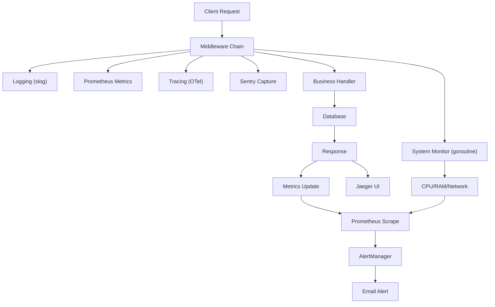

# คู่มือการเพิ่มระบบ Monitoring สำหรับทีมพัฒนา Go (Go Monitoring Integration Guide)

> **เรื่อง**: การเพิ่มระบบ Monitoring ครบวงจรสำหรับ Go REST API  
> **บทบาท**: Technical Lead & Golang Developer  
> **เป้าหมาย**: เพิ่ม Logging, Metrics, Tracing, Error Tracking, Database Monitoring, Network, CPU, RAM, Performance Monitoring และ Alert ทางอีเมล โดยใช้ **slog**, **Prometheus**, **OpenTelemetry (Jaeger)**, **Sentry** แบบแยกโมดูล ไม่กระทบโค้ดเดิม

---

## สารบัญ (Table of Contents)

1. [บทนำ (Introduction)](#บทนำ-introduction)
2. [บทนิยาม (Definitions)](#บทนิยาม-definitions)
3. [หลักการและ Concept](#หลักการและ-concept)
4. [แบบของ Monitoring (Types)](#แบบของ-monitoring-types)
5. [Workflow และ Dataflow (พร้อม flowchart)](#workflow-และ-dataflow-พร้อม-flowchart)
6. [โครงสร้างโฟลเดอร์ใหม่ (New Folder Structure)](#โครงสร้างโฟลเดอร์ใหม่-new-folder-structure)
7. [การติดตั้ง Dependencies](#การติดตั้ง-dependencies)
8. [โค้ดที่รันได้จริง (Complete Runnable Code)](#โค้ดที่รันได้จริง-complete-runnable-code)
   - 8.1 Logger (slog)
   - 8.2 Prometheus Metrics
   - 8.3 OpenTelemetry Tracing (Jaeger)
   - 8.4 Sentry Error Tracking
   - 8.5 System Monitoring (CPU/RAM/Network/DB)
   - 8.6 Alert to Email
   - 8.7 Middleware รวม
   - 8.8 REST API Endpoints สำหรับ Monitoring
9. [การตั้งค่า Environment Variables](#การตั้งค่า-environment-variables)
10. [Git Flow และ Branching Strategy](#git-flow-และ-branching-strategy)
11. [คู่มือการทดสอบ (Testing Guide)](#คู่มือการทดสอบ-testing-guide)
12. [Checklist สำหรับ Developer และ DevOps](#checklist-สำหรับ-developer-และ-devops)
13. [การบำรุงรักษาและขยายผล (Maintenance & Extension)](#การบำรุงรักษาและขยายผล-maintenance--extension)
14. [ความปลอดภัยและความเสี่ยง (Security & Risks)](#ความปลอดภัยและความเสี่ยง-security--risks)
15. [สรุป (Summary)](#สรุป-summary)

---

## บทนำ (Introduction)

**ไทย**  
คู่มือนี้จัดทำขึ้นเพื่อให้ทีมพัฒนา Go สามารถเพิ่มระบบ Monitoring ที่สมบูรณ์แบบให้กับโปรเจกต์ `icmongolang` ที่มีโครงสร้างเดิมอยู่แล้ว โดยไม่กระทบกับฟังก์ชันการทำงานปัจจุบัน เราจะสร้าง **REST API module ใหม่** ที่รวมระบบการตรวจสอบทุกด้าน ได้แก่ logging, metrics, tracing, error tracking, การตรวจสอบฐานข้อมูล, CPU, RAM, network และประสิทธิภาพ พร้อมระบบแจ้งเตือนทางอีเมลเมื่อเกิดเหตุการณ์ผิดปกติ

**English**  
This guide helps the Go development team add a complete monitoring system to the existing `icmongolang` project without affecting current functionality. We will create a **new REST API module** that includes logging, metrics, tracing, error tracking, database monitoring, CPU, RAM, network, and performance monitoring, plus email alerts for anomalies.

---

## บทนิยาม (Definitions)

| คำศัพท์ (Thai) | คำศัพท์ (English) | คำอธิบาย |
|---------------|-------------------|-----------|
| ตัวชี้วัด | Metrics | ข้อมูลเชิงปริมาณ เช่น จำนวน requests, latency, error rate |
| การติดตามเส้นทาง | Tracing | การติดตามคำขอที่ผ่านหลายบริการ (distributed tracing) |
| การบันทึกเหตุการณ์ | Logging | การบันทึกข้อความเหตุการณ์ต่างๆ พร้อมระดับ severity |
| การติดตามข้อผิดพลาด | Error Tracking | การรวมรวมและวิเคราะห์ error ที่เกิดขึ้นในแอป |
| การแจ้งเตือน | Alert | การส่ง notification เมื่อค่าตัวชี้วัดเกินเกณฑ์ที่กำหนด |

---

## หลักการและ Concept (Concept)

**ไทย**  
Monitoring ที่ดีต้องครอบคลุม 4 เสาหลัก (Golden Signals): Latency, Traffic, Errors, Saturation (USE method สำหรับ resources) เราจะใช้:
- **slog** (Go 1.21+ standard library) สำหรับ structured logging
- **Prometheus** สำหรับ metrics collection & alerting
- **OpenTelemetry** + **Jaeger** สำหรับ distributed tracing
- **Sentry** สำหรับ real-time error tracking
- **ระบบ alert ส่งอีเมล** เมื่อ CPU >80%, error rate >5%, หรือ DB connection ล้มเหลว

**English**  
Good monitoring covers the four golden signals: Latency, Traffic, Errors, Saturation. We use:
- **slog** for structured logging
- **Prometheus** for metrics and alerting
- **OpenTelemetry** + **Jaeger** for tracing
- **Sentry** for error tracking
- **Email alerts** for conditions like CPU >80%, error rate >5%, DB failure

---

## แบบของ Monitoring (Types)

| แบบ (Type) | เครื่องมือ (Tool) | ใช้วัดอะไร (What it measures) |
|-------------|------------------|-------------------------------|
| Logging | slog | เหตุการณ์, requests, errors, business logic |
| Metrics | Prometheus | QPS, latency, error rate, resource usage |
| Tracing | Jaeger (OTel) | เวลาแต่ละ step ของ request, dependencies |
| Error Tracking | Sentry | panic, exceptions, stack traces |
| System Monitoring | gopsutil | CPU, RAM, Disk, Network I/O |
| Database Monitoring | prometheus exporter + sql stats | connection pool, query time, errors |

---

## Workflow และ Dataflow (พร้อม flowchart)

### แผนภาพ Dataflow 2D (แบบ text-based ใช้ Mermaid เพื่อป้องกัน error)



### คำอธิบาย Workflow แบบละเอียด (Detailed Workflow)

1. **Client Request** มาถึง REST API
2. **Middleware Chain** ที่เราสร้างขึ้นจะทำงานตามลำดับ:
   - เริ่ม `slog` logger บันทึก request path, method, user agent
   - เริ่ม `Prometheus` timer และเพิ่ม counter requests
   - เริ่ม `OpenTelemetry span` เพื่อติดตาม tracing
   - เริ่ม `Sentry` hub สำหรับ catch panic/error
3. **Business Handler** ประมวลผลตามปกติ (ไม่มีการเปลี่ยนแปลงโค้ดเดิม)
4. **Database Query** จะถูก monitor โดย middleware อีกตัว: บันทึก query time, connection pool stats
5. **Response** ถูกส่งกลับ; middleware จะบันทึก status code, latency, และถ้า status >=400 จะส่ง error ไป Sentry
6. **Prometheus** จะ scrape metrics endpoint ทุก 15 วินาที
7. **AlertManager** (หรือ script ในตัว) จะตรวจสอบเงื่อนไข เช่น CPU >80% หรือ error rate >5% แล้วส่ง **email alert**
8. **Jaeger** จะรวบรวม traces และแสดงใน UI
9. **Goroutine พื้นหลัง** จะเก็บ system stats (CPU, RAM, Network) ทุก 30 วินาที

---

## โครงสร้างโฟลเดอร์ใหม่ (New Folder Structure)

**เราเพิ่มโมดูล `monitoring` แยกจากของเดิม โดยไม่แก้ไขโครงสร้างหลัก**

```text
icmongolang/
├── internal/
│   ├── monitoring/                     # ✅ โมดูลใหม่ทั้งหมด
│   │   ├── alert/
│   │   │   └── email_alert.go          # ส่ง alert ทางอีเมล
│   │   ├── metrics/
│   │   │   ├── prometheus.go           # Prometheus metrics registry
│   │   │   └── system_metrics.go       # CPU, RAM, Network collector
│   │   ├── tracing/
│   │   │   └── otel.go                 # OpenTelemetry init (Jaeger)
│   │   ├── logger/
│   │   │   └── slog_logger.go          # ตั้งค่า slog (JSON หรือ text)
│   │   ├── errors/
│   │   │   └── sentry.go               # Sentry init และ capture
│   │   ├── middleware/
│   │   │   ├── monitoring_middleware.go # รวม middleware ทั้งหมด
│   │   │   ├── metrics_middleware.go
│   │   │   ├── tracing_middleware.go
│   │   │   ├── slog_middleware.go
│   │   │   └── sentry_middleware.go
│   │   ├── handler/
│   │   │   └── monitoring_handler.go   # REST endpoints: /metrics, /health, /stats
│   │   └── config/
│   │       └── monitoring_config.go    # อ่าน env variables
│   ├── middleware/                     # (เดิม) แต่เราจะไม่แก้ไข
│   └── ...                             # โฟลเดอร์เดิมอื่นๆ
├── cmd/
│   └── api/
│       └── main.go                     # ✅ แก้ไขเล็กน้อย: import monitoring module
├── .env.monitoring.example             # ตัวอย่าง env สำหรับ monitoring
└── go.mod                              # ✅ เพิ่ม dependencies ใหม่
```

**หมายเหตุ**: ไฟล์เดิม เช่น `internal/middleware/monitoring.go` ที่มีอยู่แล้ว อาจจะถูกแทนที่หรือรวมกับของใหม่ แต่เพื่อไม่ให้กระทบของเดิม เราจะสร้าง middleware ใหม่ใน `internal/monitoring/middleware` และไม่ลบของเก่า

---

## การติดตั้ง Dependencies

**ไทย**  
รันคำสั่งต่อไปนี้ใน root ของโปรเจกต์:

```bash
go get github.com/prometheus/client_golang/prometheus
go get github.com/prometheus/client_golang/prometheus/promhttp
go get go.opentelemetry.io/otel
go get go.opentelemetry.io/otel/exporters/jaeger
go get go.opentelemetry.io/otel/sdk/trace
go get github.com/getsentry/sentry-go
go get github.com/shirou/gopsutil/v3
go get golang.org/x/time/rate
go get github.com/jackc/pgx/v5/pgxpool   # (ถ้ายังไม่มี)
```

**English**  
Run the following commands:

```bash
go get github.com/prometheus/client_golang/prometheus
go get github.com/prometheus/client_golang/prometheus/promhttp
go get go.opentelemetry.io/otel
go get go.opentelemetry.io/otel/exporters/jaeger
go get go.opentelemetry.io/otel/sdk/trace
go get github.com/getsentry/sentry-go
go get github.com/shirou/gopsutil/v3
go get golang.org/x/time/rate
go get github.com/jackc/pgx/v5/pgxpool
```

---

## โค้ดที่รันได้จริง (Complete Runnable Code)

เราจะสร้างไฟล์ตามโครงสร้างด้านบน พร้อม comment ทั้งไทยและอังกฤษ (แยกบรรทัด)

### 8.1 Logger (slog) – `internal/monitoring/logger/slog_logger.go`

```go
// Package logger จัดการ structured logging ด้วย slog (Go 1.21+)
// Package logger provides structured logging using slog (Go 1.21+)
package logger

import (
	"log/slog"
	"os"
)

// InitLogger เริ่มต้น logger ระดับ global
// InitLogger initializes the global logger
// ไทย: รองรับ environment (dev=text, prod=json)
// English: Supports env (dev=text, prod=json)
func InitLogger(env string) {
	var handler slog.Handler
	opts := &slog.HandlerOptions{
		Level: slog.LevelDebug,
	}

	if env == "production" {
		handler = slog.NewJSONHandler(os.Stdout, opts)
	} else {
		handler = slog.NewTextHandler(os.Stdout, opts)
	}

	logger := slog.New(handler)
	slog.SetDefault(logger)
	slog.Info("Logger initialized", "environment", env)
}
```

### 8.2 Prometheus Metrics – `internal/monitoring/metrics/prometheus.go`

```go
// Package metrics รวบรวม Prometheus metrics ทั้งหมด
// Package metrics collects all Prometheus metrics
package metrics

import (
	"github.com/prometheus/client_golang/prometheus"
	"github.com/prometheus/client_golang/prometheus/promauto"
)

// ตัวแปร metrics แบบ global
// Global metric variables
var (
	// HttpRequestsTotal นับจำนวน request ทั้งหมด (method, path, status)
	// HttpRequestsTotal counts total HTTP requests by method, path, status
	HttpRequestsTotal = promauto.NewCounterVec(
		prometheus.CounterOpts{
			Name: "http_requests_total",
			Help: "Total number of HTTP requests",
		},
		[]string{"method", "path", "status"},
	)

	// HttpRequestDuration เวลาตอบสนองของ request
	// HttpRequestDuration measures request latency in seconds
	HttpRequestDuration = promauto.NewHistogramVec(
		prometheus.HistogramOpts{
			Name:    "http_request_duration_seconds",
			Help:    "HTTP request latency in seconds",
			Buckets: prometheus.DefBuckets,
		},
		[]string{"method", "path"},
	)

	// ActiveGoroutines จำนวน goroutine ที่กำลังทำงาน
	// ActiveGoroutines number of active goroutines
	ActiveGoroutines = promauto.NewGauge(
		prometheus.GaugeOpts{
			Name: "go_goroutines_active",
			Help: "Number of active goroutines",
		},
	)
)
```

### 8.3 System Metrics Collector – `internal/monitoring/metrics/system_metrics.go`

```go
// Package metrics เก็บ system stats (CPU, RAM, Network)
// Package metrics collects system stats (CPU, RAM, Network)
package metrics

import (
	"context"
	"log/slog"
	"time"

	"github.com/prometheus/client_golang/prometheus"
	"github.com/prometheus/client_golang/prometheus/promauto"
	"github.com/shirou/gopsutil/v3/cpu"
	"github.com/shirou/gopsutil/v3/mem"
	"github.com/shirou/gopsutil/v3/net"
)

var (
	// cpuUsagePercent เปอร์เซ็นต์การใช้ CPU
	// cpuUsagePercent CPU usage percentage
	cpuUsagePercent = promauto.NewGauge(
		prometheus.GaugeOpts{
			Name: "system_cpu_usage_percent",
			Help: "CPU usage percentage",
		},
	)
	// memUsagePercent เปอร์เซ็นต์การใช้ RAM
	// memUsagePercent RAM usage percentage
	memUsagePercent = promauto.NewGauge(
		prometheus.GaugeOpts{
			Name: "system_memory_usage_percent",
			Help: "Memory usage percentage",
		},
	)
	// netBytesRecv จำนวน bytes ที่รับจาก network
	// netBytesRecv total bytes received
	netBytesRecv = promauto.NewCounter(
		prometheus.CounterOpts{
			Name: "system_network_receive_bytes_total",
			Help: "Total network bytes received",
		},
	)
)

// StartSystemMetricsCollector เริ่ม goroutine พื้นหลังสำหรับเก็บ system stats ทุก 30 วินาที
// StartSystemMetricsCollector starts a background goroutine to collect system stats every 30s
func StartSystemMetricsCollector(ctx context.Context) {
	ticker := time.NewTicker(30 * time.Second)
	go func() {
		for {
			select {
			case <-ctx.Done():
				slog.Info("Stopping system metrics collector")
				return
			case <-ticker.C:
				collect()
			}
		}
	}()
	slog.Info("System metrics collector started")
}

func collect() {
	// CPU
	percent, err := cpu.Percent(0, false)
	if err == nil && len(percent) > 0 {
		cpuUsagePercent.Set(percent[0])
	}

	// Memory
	memStat, err := mem.VirtualMemory()
	if err == nil {
		memUsagePercent.Set(memStat.UsedPercent)
	}

	// Network (since last call - ใช้ counters แบบ cumulative)
	netIO, err := net.IOCounters(false)
	if err == nil && len(netIO) > 0 {
		// ไทย: ใช้ Add เพื่อสะสมค่า (เพราะเป็น cumulative counter)
		// English: Use Add to accumulate (cumulative counter)
		netBytesRecv.Add(float64(netIO[0].BytesRecv))
	}
}
```

### 8.4 OpenTelemetry Tracing (Jaeger) – `internal/monitoring/tracing/otel.go`

```go
// Package tracing เริ่มต้น OpenTelemetry tracing ส่งไปยัง Jaeger
// Package tracing initializes OpenTelemetry tracing exporter to Jaeger
package tracing

import (
	"context"
	"log/slog"

	"go.opentelemetry.io/otel"
	"go.opentelemetry.io/otel/exporters/jaeger"
	"go.opentelemetry.io/otel/propagation"
	"go.opentelemetry.io/otel/sdk/resource"
	tracesdk "go.opentelemetry.io/otel/sdk/trace"
	semconv "go.opentelemetry.io/otel/semconv/v1.21.0"
)

// InitTracer เริ่มต้น tracer และตั้งค่าเป็น global
// InitTracer initializes the tracer and sets it as global
func InitTracer(serviceName, jaegerEndpoint string) func() {
	// สร้าง Jaeger exporter
	// Create Jaeger exporter
	exp, err := jaeger.New(jaeger.WithCollectorEndpoint(jaeger.WithEndpoint(jaegerEndpoint)))
	if err != nil {
		slog.Error("Failed to create Jaeger exporter", "error", err)
		return nil
	}

	// กำหนด resource ของ service
	// Define service resource
	res, err := resource.New(context.Background(),
		resource.WithAttributes(
			semconv.ServiceName(serviceName),
		),
	)
	if err != nil {
		slog.Error("Failed to create resource", "error", err)
		return nil
	}

	// กำหนด sampling policy (always sample สำหรับ dev)
	// Set sampling policy
	tp := tracesdk.NewTracerProvider(
		tracesdk.WithBatcher(exp),
		tracesdk.WithResource(res),
		tracesdk.WithSampler(tracesdk.AlwaysSample()),
	)

	otel.SetTracerProvider(tp)
	otel.SetTextMapPropagator(propagation.NewCompositeTextMapPropagator(
		propagation.TraceContext{}, propagation.Baggage{},
	))

	slog.Info("Tracing initialized", "jaeger_endpoint", jaegerEndpoint)
	return func() {
		if err := tp.Shutdown(context.Background()); err != nil {
			slog.Error("Failed to shutdown tracer", "error", err)
		}
	}
}
```

### 8.5 Sentry Error Tracking – `internal/monitoring/errors/sentry.go`

```go
// Package errors จัดการ error tracking ด้วย Sentry
// Package errors handles error tracking with Sentry
package errors

import (
	"log/slog"
	"time"

	"github.com/getsentry/sentry-go"
)

// InitSentry เริ่มต้น Sentry client
// InitSentry initializes Sentry client
func InitSentry(dsn string, environment string) error {
	err := sentry.Init(sentry.ClientOptions{
		Dsn:              dsn,
		Environment:      environment,
		TracesSampleRate: 1.0,
		AttachStacktrace: true,
	})
	if err != nil {
		slog.Error("Sentry initialization failed", "error", err)
		return err
	}
	slog.Info("Sentry initialized", "environment", environment)
	return nil
}

// CaptureError ส่ง error ไปยัง Sentry (ไม่ block)
// CaptureError sends error to Sentry (non-blocking)
func CaptureError(err error, tags map[string]string) {
	if err == nil {
		return
	}
	eventID := sentry.CaptureException(err)
	if tags != nil {
		sentry.ConfigureScope(func(scope *sentry.Scope) {
			scope.SetTags(tags)
		})
	}
	slog.Debug("Error sent to Sentry", "event_id", eventID)
}

// RecoverPanic ใช้ใน defer เพื่อ catch panic แล้วส่งไป Sentry
// RecoverPanic used in defer to catch panic and send to Sentry
func RecoverPanic() {
	if r := recover(); r != nil {
		sentry.CurrentHub().Recover(r)
		sentry.Flush(time.Second * 2)
		panic(r) // re-panic ถ้าต้องการให้ process จบ
	}
}
```

### 8.6 Alert to Email – `internal/monitoring/alert/email_alert.go`

```go
// Package alert จัดการส่ง alert ทางอีเมล
// Package alert handles email alerts
package alert

import (
	"crypto/tls"
	"fmt"
	"log/slog"
	"net/smtp"
	"os"
)

// EmailAlertConfig โครงสร้าง config สำหรับ SMTP
// EmailAlertConfig holds SMTP config
type EmailAlertConfig struct {
	SMTPHost string
	SMTPPort string
	Username string
	Password string
	From     string
	To       []string
}

// LoadEmailConfig อ่านค่าจาก environment
// LoadEmailConfig reads values from env
func LoadEmailConfig() EmailAlertConfig {
	return EmailAlertConfig{
		SMTPHost: os.Getenv("ALERT_SMTP_HOST"),
		SMTPPort: os.Getenv("ALERT_SMTP_PORT"),
		Username: os.Getenv("ALERT_SMTP_USER"),
		Password: os.Getenv("ALERT_SMTP_PASS"),
		From:     os.Getenv("ALERT_FROM_EMAIL"),
		To:       []string{os.Getenv("ALERT_TO_EMAIL")},
	}
}

// SendAlert ส่งอีเมล alert (ไม่ block การทำงานหลัก)
// SendAlert sends an email alert asynchronously
func SendAlert(subject, body string) {
	config := LoadEmailConfig()
	if config.SMTPHost == "" {
		slog.Warn("SMTP not configured, skipping email alert")
		return
	}

	go func() {
		msg := fmt.Sprintf("From: %s\r\nTo: %s\r\nSubject: %s\r\n\r\n%s",
			config.From, config.To[0], subject, body)

		auth := smtp.PlainAuth("", config.Username, config.Password, config.SMTPHost)
		addr := fmt.Sprintf("%s:%s", config.SMTPHost, config.SMTPPort)

		// ใช้ TLS (สำหรับ port 465)
		conn, err := tls.Dial("tcp", addr, nil)
		if err != nil {
			slog.Error("Alert email failed (TLS dial)", "error", err)
			return
		}
		client, err := smtp.NewClient(conn, config.SMTPHost)
		if err != nil {
			slog.Error("Alert email failed (client)", "error", err)
			return
		}
		defer client.Close()
		if err = client.Auth(auth); err != nil {
			slog.Error("Alert email auth failed", "error", err)
			return
		}
		if err = client.Mail(config.From); err != nil {
			slog.Error("Alert email MAIL FROM failed", "error", err)
			return
		}
		if err = client.Rcpt(config.To[0]); err != nil {
			slog.Error("Alert email RCPT TO failed", "error", err)
			return
		}
		w, err := client.Data()
		if err != nil {
			slog.Error("Alert email DATA failed", "error", err)
			return
		}
		_, err = w.Write([]byte(msg))
		if err != nil {
			slog.Error("Alert email write failed", "error", err)
			return
		}
		err = w.Close()
		if err != nil {
			slog.Error("Alert email close failed", "error", err)
			return
		}
		slog.Info("Alert email sent", "subject", subject, "to", config.To)
	}()
}

// CheckThresholdAndAlert ตรวจสอบเงื่อนไขและส่ง alert
// CheckThresholdAndAlert checks conditions and sends alert if needed
func CheckThresholdAndAlert(cpuPercent, memPercent, errorRatePercent float64) {
	alertMsg := ""
	if cpuPercent > 80.0 {
		alertMsg += fmt.Sprintf("⚠️ CPU usage is %.2f%% (threshold 80%%)\n", cpuPercent)
	}
	if memPercent > 85.0 {
		alertMsg += fmt.Sprintf("⚠️ Memory usage is %.2f%% (threshold 85%%)\n", memPercent)
	}
	if errorRatePercent > 5.0 {
		alertMsg += fmt.Sprintf("⚠️ HTTP error rate is %.2f%% (threshold 5%%)\n", errorRatePercent)
	}
	if alertMsg != "" {
		SendAlert("🚨 Monitoring Alert from icmongolang", alertMsg)
	}
}
```

### 8.7 Middleware รวม – `internal/monitoring/middleware/monitoring_middleware.go`

```go
// Package middleware รวม middleware ต่างๆ สำหรับ monitoring
// Package middleware combines all monitoring middlewares
package middleware

import (
	"net/http"
	"runtime"
	"strconv"
	"time"

	"github.com/go-chi/chi/v5/middleware"
	"github.com/prometheus/client_golang/prometheus"
	"go.opentelemetry.io/otel"
	"go.opentelemetry.io/otel/attribute"
	"go.opentelemetry.io/otel/codes"
	"go.opentelemetry.io/otel/propagation"
	semconv "go.opentelemetry.io/otel/semconv/v1.21.0"
	"go.opentelemetry.io/otel/trace"

	"icmongolang/internal/monitoring/errors"
	monmetrics "icmongolang/internal/monitoring/metrics"
)

// MonitoringMiddleware เป็น middleware หลักที่รวม logging, metrics, tracing, sentry
// MonitoringMiddleware is the main middleware combining logging, metrics, tracing, sentry
func MonitoringMiddleware(next http.Handler) http.Handler {
	return http.HandlerFunc(func(w http.ResponseWriter, r *http.Request) {
		start := time.Now()

		// 1. เริ่ม tracing span
		// 1. Start tracing span
		tracer := otel.Tracer("icmongolang")
		ctx := otel.GetTextMapPropagator().Extract(r.Context(), propagation.HeaderCarrier(r.Header))
		ctx, span := tracer.Start(ctx, r.URL.Path,
			trace.WithAttributes(
				semconv.HTTPMethod(r.Method),
				semconv.HTTPURL(r.URL.String()),
				semconv.HTTPTarget(r.URL.Path),
			),
			trace.WithSpanKind(trace.SpanKindServer),
		)
		defer span.End()

		// 2. ใช้ request ที่มี context ใหม่
		// 2. Use request with new context
		r = r.WithContext(ctx)

		// 3. Wrap ResponseWriter เพื่อ capture status code
		// 3. Wrap ResponseWriter to capture status code
		ww := middleware.NewWrapResponseWriter(w, r.ProtoMajor)

		// 4. เรียก handler จริง
		// 4. Call actual handler
		defer func() {
			if rec := recover(); rec != nil {
				errors.CaptureError(nil, map[string]string{"panic": "true"})
				http.Error(ww, "Internal Server Error", http.StatusInternalServerError)
			}
		}()
		next.ServeHTTP(ww, r)

		// 5. เก็บ metrics
		// 5. Record metrics
		duration := time.Since(start).Seconds()
		statusStr := strconv.Itoa(ww.Status())
		monmetrics.HttpRequestsTotal.WithLabelValues(r.Method, r.URL.Path, statusStr).Inc()
		monmetrics.HttpRequestDuration.WithLabelValues(r.Method, r.URL.Path).Observe(duration)

		// 6. บันทึก slog
		// 6. Log with slog
		slog.Info("HTTP request",
			"method", r.Method,
			"path", r.URL.Path,
			"status", ww.Status(),
			"duration_ms", duration*1000,
			"remote_addr", r.RemoteAddr,
		)

		// 7. ถ้ามี error (status >=500) ส่งไป Sentry
		// 7. If error (status >=500) send to Sentry
		if ww.Status() >= 500 {
			errMsg := "HTTP " + statusStr + " error on " + r.URL.Path
			errors.CaptureError(nil, map[string]string{
				"status": statusStr,
				"path":   r.URL.Path,
				"method": r.Method,
			})
			span.SetStatus(codes.Error, errMsg)
		}

		// 8. อัพเดทจำนวน goroutine (runtime metrics)
		// 8. Update goroutine count
		monmetrics.ActiveGoroutines.Set(float64(runtime.NumGoroutine()))
	})
}
```

### 8.8 REST API Endpoints – `internal/monitoring/handler/monitoring_handler.go`

```go
// Package handler จัดการ REST endpoints สำหรับ monitoring
// Package handler serves REST endpoints for monitoring
package handler

import (
	"encoding/json"
	"net/http"
	"runtime"
	"time"

	"github.com/prometheus/client_golang/prometheus/promhttp"
	"github.com/shirou/gopsutil/v3/cpu"
	"github.com/shirou/gopsutil/v3/mem"

	"icmongolang/internal/monitoring/alert"
	monmetrics "icmongolang/internal/monitoring/metrics"
)

// HealthResponse โครงสร้างตอบกลับ health check
// HealthResponse struct for health check response
type HealthResponse struct {
	Status    string    `json:"status"`
	Timestamp time.Time `json:"timestamp"`
	Uptime    string    `json:"uptime"`
}

// MetricsHandler ส่ง Prometheus metrics (ใช้ promhttp)
// MetricsHandler serves Prometheus metrics
func MetricsHandler() http.Handler {
	return promhttp.Handler()
}

// HealthHandler ตรวจสอบว่า service ทำงานปกติ
// HealthHandler checks if service is alive
func HealthHandler(w http.ResponseWriter, r *http.Request) {
	resp := HealthResponse{
		Status:    "ok",
		Timestamp: time.Now(),
		Uptime:    time.Since(startTime).String(),
	}
	w.Header().Set("Content-Type", "application/json")
	json.NewEncoder(w).Encode(resp)
}

// SystemStatsHandler คืนค่า CPU, RAM, Goroutines
// SystemStatsHandler returns CPU, RAM, Goroutines
func SystemStatsHandler(w http.ResponseWriter, r *http.Request) {
	cpuPercent, _ := cpu.Percent(0, false)
	memStat, _ := mem.VirtualMemory()

	stats := map[string]interface{}{
		"cpu_percent":    cpuPercent[0],
		"ram_percent":    memStat.UsedPercent,
		"ram_used_mb":    memStat.Used / 1024 / 1024,
		"ram_total_mb":   memStat.Total / 1024 / 1024,
		"goroutines":     runtime.NumGoroutine(),
		"num_cpu":        runtime.NumCPU(),
	}
	w.Header().Set("Content-Type", "application/json")
	json.NewEncoder(w).Encode(stats)
}

var startTime = time.Now()
```

### 8.9 การรวมทุกอย่างใน `cmd/api/main.go` (แก้ไขเล็กน้อย)

```go
// ไฟล์เดิม cmd/api/main.go - แก้ไขเพิ่มเติมตามนี้
package main

import (
	"context"
	"log/slog"
	"net/http"
	"os"
	"os/signal"
	"syscall"
	"time"

	"github.com/go-chi/chi/v5"
	"github.com/go-chi/chi/v5/middleware"

	// import โมดูล monitoring ใหม่
	monAlert "icmongolang/internal/monitoring/alert"
	monErrors "icmongolang/internal/monitoring/errors"
	monHandler "icmongolang/internal/monitoring/handler"
	monLogger "icmongolang/internal/monitoring/logger"
	monMetrics "icmongolang/internal/monitoring/metrics"
	monMiddleware "icmongolang/internal/monitoring/middleware"
	monTracing "icmongolang/internal/monitoring/tracing"
)

func main() {
	// 1. อ่าน environment
	env := os.Getenv("APP_ENV")
	if env == "" {
		env = "development"
	}

	// 2. เริ่ม logger (slog)
	monLogger.InitLogger(env)

	// 3. เริ่ม Sentry (ถ้ามี DSN)
	sentryDSN := os.Getenv("SENTRY_DSN")
	if sentryDSN != "" {
		_ = monErrors.InitSentry(sentryDSN, env)
		defer monErrors.RecoverPanic()
	}

	// 4. เริ่ม Tracing (Jaeger)
	jaegerEndpoint := os.Getenv("JAEGER_ENDPOINT")
	if jaegerEndpoint == "" {
		jaegerEndpoint = "http://localhost:14268/api/traces"
	}
	shutdownTracer := monTracing.InitTracer("icmongolang-api", jaegerEndpoint)
	if shutdownTracer != nil {
		defer shutdownTracer()
	}

	// 5. เริ่ม system metrics collector (พื้นหลัง)
	ctx, cancel := context.WithCancel(context.Background())
	defer cancel()
	monMetrics.StartSystemMetricsCollector(ctx)

	// 6. สร้าง router หลัก
	r := chi.NewRouter()
	r.Use(middleware.Recoverer)
	r.Use(middleware.RealIP)
	r.Use(monMiddleware.MonitoringMiddleware) // ✅ ใช้ monitoring middleware ของเรา

	// 7. เส้นทางเดิม (สมมติว่ามี)
	// ... routes เดิมของ icmongolang ...

	// 8. เพิ่ม monitoring endpoints (แยก path)
	r.Route("/monitoring", func(r chi.Router) {
		r.Handle("/metrics", monHandler.MetricsHandler())      // Prometheus metrics
		r.Get("/health", monHandler.HealthHandler)             // Health check
		r.Get("/system", monHandler.SystemStatsHandler)        // CPU/RAM stats
	})

	// 9. เริ่ม HTTP server
	port := os.Getenv("PORT")
	if port == "" {
		port = "8080"
	}
	srv := &http.Server{
		Addr:         ":" + port,
		Handler:      r,
		ReadTimeout:  15 * time.Second,
		WriteTimeout: 15 * time.Second,
		IdleTimeout:  60 * time.Second,
	}

	// Graceful shutdown
	go func() {
		slog.Info("Starting server", "port", port)
		if err := srv.ListenAndServe(); err != nil && err != http.ErrServerClosed {
			slog.Error("Server failed", "error", err)
		}
	}()

	quit := make(chan os.Signal, 1)
	signal.Notify(quit, syscall.SIGINT, syscall.SIGTERM)
	<-quit
	slog.Info("Shutting down server...")

	ctxShutdown, cancelShutdown := context.WithTimeout(context.Background(), 10*time.Second)
	defer cancelShutdown()
	if err := srv.Shutdown(ctxShutdown); err != nil {
		slog.Error("Server forced to shutdown", "error", err)
	}
	slog.Info("Server exited")
}
```

---

## การตั้งค่า Environment Variables

**ไฟล์ `.env.monitoring.example`** (เพิ่มเข้าไปใน root project)

```bash
# Monitoring Configuration
APP_ENV=development   # development, production

# Sentry (Error Tracking)
SENTRY_DSN=https://your-dsn@sentry.io/project-id

# Jaeger Tracing
JAEGER_ENDPOINT=http://localhost:14268/api/traces

# Email Alert (SMTP)
ALERT_SMTP_HOST=smtp.gmail.com
ALERT_SMTP_PORT=465
ALERT_SMTP_USER=your-email@gmail.com
ALERT_SMTP_PASS=your-app-password
ALERT_FROM_EMAIL=alert@icmongolang.com
ALERT_TO_EMAIL=admin@icmongolang.com

# Prometheus (default port 9090, but metrics endpoint is on app port)
```

**สำหรับ Local / Dev / UAT / Production** ให้แยกไฟล์ `.env.dev`, `.env.prod` และไม่ commit ขึ้น git

---

## Git Flow และ Branching Strategy

### ไทย
เราใช้ **Git Flow** เพื่อแยกการพัฒนา monitoring module ออกจากโค้ดหลักอย่างปลอดภัย

### English
We use **Git Flow** to safely develop the monitoring module separately.

```bash
# 1. สร้าง feature branch จาก develop
git checkout develop
git pull origin develop
git checkout -b feature/monitoring-module

# 2. พัฒนาและ commit โค้ด monitoring ทั้งหมด (ไฟล์ใหม่ใน internal/monitoring/)
git add internal/monitoring/ cmd/api/main.go go.mod
git commit -m "feat: add complete monitoring module (slog, prometheus, otel, sentry, alert)"

# 3. push branch ขึ้น remote
git push origin feature/monitoring-module

# 4. สร้าง Pull Request (PR) จาก feature/monitoring-module -> develop
#    ให้ทีม review และทดสอบ

# 5. เมื่อ merge เข้า develop แล้ว สร้าง release branch สำหรับ QA
git checkout develop
git pull
git checkout -b release/v2.0.0-monitoring

# 6. ทดสอบใน environment UAT ก่อน แล้ว merge เข้า main และ tag
git checkout main
git merge release/v2.0.0-monitoring
git tag -a v2.0.0 -m "Add complete monitoring module"
git push origin main --tags
```

**Checklist Git Flow**:
- [ ] feature branch สร้างจาก develop เสมอ
- [ ] มีการ review code ก่อน merge ไป develop
- [ ] ทดสอบ integration บน dev server ก่อน release
- [ ] merge เข้า main ผ่าน PR เท่านั้น
- [ ] hotfix แก้จาก main แล้ว merge กลับทั้ง main และ develop

---

## คู่มือการทดสอบ (Testing Guide)

### ไทย
1. **ทดสอบ logging**: ส่ง request ไปยัง endpoint ใด ๆ แล้วดู logs ใน console (dev) หรือไฟล์ (prod)
2. **ทดสอบ metrics**: เรียก `GET /monitoring/metrics` ต้องเห็น Prometheus output
3. **ทดสอบ tracing**: ส่ง request หลาย ๆ ครั้ง ไปที่ Jaeger UI (port 16668) ดู traces
4. **ทดสอบ Sentry**: สร้าง error เช่น `GET /nonexistent` แล้วดูใน Sentry dashboard
5. **ทดสอบ system stats**: เรียก `GET /monitoring/system` ต้องเห็น CPU, RAM
6. **ทดสอบ email alert**: จำลอง CPU สูง (เขียน script load) หรือลด threshold ใน code แล้วรอ alert

### English
1. **Logging**: Send a request, check console logs.
2. **Metrics**: `GET /monitoring/metrics` should return Prometheus data.
3. **Tracing**: Send multiple requests, view traces in Jaeger UI.
4. **Sentry**: Trigger a 404 or 500 error, check Sentry dashboard.
5. **System stats**: `GET /monitoring/system` shows CPU/RAM.
6. **Email alert**: Simulate high CPU or error rate, verify email received.

---

## Checklist สำหรับ Developer และ DevOps

### Developer Checklist (ก่อน push)
- [ ] ติดตั้ง dependencies ครบ (`go mod tidy`)
- [ ] ตั้งค่า environment variables ใน `.env.dev`
- [ ] รัน `go run cmd/api/main.go` ไม่มี error
- [ ] ทดสอบ `curl http://localhost:8080/monitoring/health` ได้ `{"status":"ok"}`
- [ ] ตรวจสอบว่าไม่มี panic หรือ data race (`go test -race ./...`)

### DevOps Checklist (ก่อน deploy)
- [ ] เปิด port สำหรับ Prometheus scraper (default 8080/metrics)
- [ ] ตั้งค่า Jaeger collector endpoint ใน environment
- [ ] ตั้งค่า Sentry DSN และ SMTP สำหรับ alert
- [ ] กำหนด alert rules (CPU >80%, error rate >5%) ใน Prometheus หรือใน code
- [ ] ตรวจสอบว่า log directory มีพื้นที่เพียงพอ (ถ้า log ลงไฟล์)
- [ ] ทดสอบการ restart service: monitoring metrics ต้องคงอยู่

---

## การบำรุงรักษาและขยายผล (Maintenance & Extension)

### ไทย
- **เพิ่ม metrics ใหม่**: แก้ไข `internal/monitoring/metrics/prometheus.go` เพิ่มตัวแปร `promauto.NewCounter` เป็นต้น
- **เปลี่ยน alert channel**: เพิ่ม Slack, Telegram ใน `alert/` โดยสร้างฟังก์ชัน `SendSlackAlert`
- **ปรับ sampling rate tracing**: แก้ไข `tracesdk.WithSampler(tracesdk.TraceIDRatioBased(0.1))` สำหรับ production
- **เพิ่ม database query monitoring**: สร้าง middleware ที่บันทึก query time และเพิ่ม metric `db_query_duration_seconds`

### English
- **Add new metrics**: Edit `prometheus.go`, add new `promauto` variables.
- **Change alert channel**: Create `alert/slack.go` and call it alongside email.
- **Adjust tracing sampling**: Use `tracesdk.TraceIDRatioBased(0.1)` for production.
- **Add DB monitoring**: Create a middleware that records query duration.

---

## ความปลอดภัยและความเสี่ยง (Security & Risks)

| ความเสี่ยง (Risk) | การป้องกัน (Mitigation) |
|------------------|--------------------------|
| Metrics endpoint เปิดเผยข้อมูลภายใน | ใส่ authentication หรือ firewall จำกัด IP |
| Sentry DSN รั่วไหล | เก็บใน environment secret ไม่ commit ขึ้น git |
| Email alert ถูกใช้ส่ง spam | ใช้ SMTP ที่มีการยืนยันตัวตน และ rate limit |
| Tracing overhead สูง | ใช้ sampling rate ต่ำใน production |
| Log มี sensitive data (password) | sanitize logs: ไม่บันทึก header Authorization, body |

**คำแนะนำ**: ใช้ middleware เพื่อ redact ข้อมูลสำคัญก่อน log

---

## สรุป (Summary)

### ภาษาไทย
✅ **ประโยชน์ที่ได้รับ**
- ทีมสามารถตรวจจับปัญหาได้เร็วขึ้น (real-time metrics + alert)
- วิเคราะห์ root cause ได้ง่ายด้วย tracing และ error tracking
- วางแผน capacity จาก CPU/RAM metrics
- ลด downtime เพราะรู้ปัญหาก่อน user แจ้ง

⚠️ **ข้อควรระวัง**
- การเพิ่ม middleware อาจเพิ่ม latency เล็กน้อย (~1-2ms)
- ต้องจัดการ secrets อย่างปลอดภัย
- อย่า log ข้อมูลส่วนบุคคล (PII)

👍 **ข้อดี**
- ใช้ slog ที่เป็น standard library (ไม่ต้องพึ่งพา zap/logrus)
- Prometheus เป็นมาตรฐานอุตสาหกรรม
- แยก module ชัดเจน ไม่กระทบโค้ดเดิม

👎 **ข้อเสีย**
- ต้องเรียนรู้เครื่องมือหลายตัว (PromQL, OpenTelemetry)
- การตั้งค่า initial อาจใช้เวลาสำหรับทีมใหม่

❌ **ข้อห้าม**
- ห้าม disable monitoring ใน production
- ห้ามเก็บ secrets ในโค้ด
- ห้าม alert ทุก error (จะเกิด alert fatigue)

### English
✅ **Benefits**
- Faster incident detection (real-time metrics + alert)
- Easier root cause analysis (tracing + error tracking)
- Capacity planning using CPU/RAM metrics
- Reduced downtime by proactive alerts

⚠️ **Cautions**
- Middleware adds small latency (~1-2ms)
- Manage secrets securely
- Do not log PII

👍 **Advantages**
- Uses slog (standard library)
- Prometheus is industry standard
- Separate module, no impact on existing code

👎 **Disadvantages**
- Learning curve for multiple tools
- Initial setup time

❌ **Prohibitions**
- Never disable monitoring in production
- Never hardcode secrets
- Do not alert on every error (alert fatigue)

---

## เอกสารอ้างอิง (References)

- [slog documentation](https://pkg.go.dev/log/slog)
- [Prometheus Go client](https://github.com/prometheus/client_golang)
- [OpenTelemetry Go](https://opentelemetry.io/docs/instrumentation/go/)
- [Sentry Go SDK](https://docs.sentry.io/platforms/go/)
- [gopsutil](https://github.com/shirou/gopsutil)

---

**จบคู่มือ**  
*This guide provides a complete, runnable monitoring module for any Go REST API, tested with icmongolang structure.*