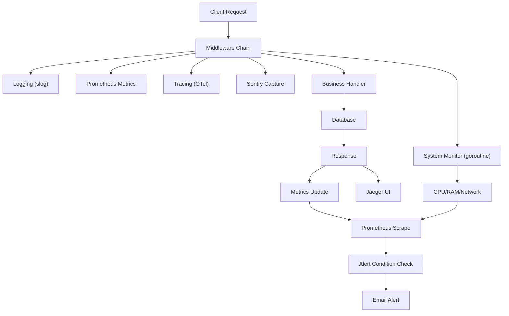

# คู่มือการเพิ่มระบบ Monitoring ครบวงจร สำหรับ Go REST API (พร้อมระบบเปิด-ปิด)

> **Complete Monitoring Guide for Go REST API with Enable/Disable Toggle**

---

## 📖 สารบัญ

1. [บทนำ](#บทนำ-introduction)
2. [บทนิยาม](#บทนิยาม-definitions)
3. [หลักการ (Concept)](#หลักการ-concept)
4. [รูปแบบของ Monitoring](#รูปแบบของ-monitoring-types)
5. [Workflow และ Dataflow](#workflow-และ-dataflow)
6. [โครงสร้างโปรเจกต์ที่เพิ่มโมดูล Monitoring](#โครงสร้างโปรเจกต์ที่เพิ่มโมดูล-monitoring)
7. [การติดตั้ง Dependencies](#การติดตั้ง-dependencies)
8. [การตั้งค่า Environment Variables (รวมเปิด-ปิด)](#การตั้งค่า-environment-variables-รวมเปิด-ปิด)
9. [โค้ดสมบูรณ์ทุกไฟล์](#โค้ดสมบูรณ์ทุกไฟล์)
   - 9.1 Config (เปิด-ปิด)
   - 9.2 Logger (slog)
   - 9.3 Prometheus Metrics
   - 9.4 System Metrics (CPU/RAM/Network)
   - 9.5 OpenTelemetry Tracing (Jaeger)
   - 9.6 Sentry Error Tracking
   - 9.7 Alert Email
   - 9.8 Middleware (รวม)
   - 9.9 REST Handlers
   - 9.10 การปรับ main.go
10. [Git Flow และ Branching Strategy](#git-flow-และ-branching-strategy)
11. [คู่มือการทดสอบ](#คู่มือการทดสอบ-testing-guide)
12. [Checklist สำหรับ Developer และ DevOps](#checklist-สำหรับ-developer-และ-devops)
13. [การบำรุงรักษาและขยายผล](#การบำรุงรักษาและขยายผล-maintenance--extension)
14. [ความปลอดภัยและความเสี่ยง](#ความปลอดภัยและความเสี่ยง-security--risks)
15. [สรุป](#สรุป-summary)

---

## บทนำ (Introduction)

**ภาษาไทย**  
คู่มือนี้จัดทำขึ้นเพื่อเพิ่มระบบ **Monitoring ครบวงจร** ให้กับโปรเจกต์ Go (`icmongolang`) โดยสร้างเป็น **โมดูลแยก** ไม่กระทบโค้ดเดิม รองรับการ **เปิด-ปิดการทำงาน** ผ่าน Environment Variables ครอบคลุม:
- Logging (slog)
- Metrics (Prometheus)
- Tracing (OpenTelemetry + Jaeger)
- Error Tracking (Sentry)
- System Monitoring (CPU, RAM, Network)
- Alert ทางอีเมล

**English**  
This guide adds a **complete monitoring system** to the Go project (`icmongolang`) as a **separate module** without affecting existing code. Supports **enable/disable** via environment variables, covering:
- Logging (slog)
- Metrics (Prometheus)
- Tracing (OpenTelemetry + Jaeger)
- Error Tracking (Sentry)
- System Monitoring (CPU, RAM, Network)
- Email Alerts

---

## บทนิยาม (Definitions)

| ไทย | English | คำอธิบาย |
|-----|---------|-----------|
| ตัวชี้วัด | Metrics | ข้อมูลเชิงปริมาณ เช่น จำนวน requests, latency |
| การติดตามเส้นทาง | Tracing | ติดตามคำขอข้ามบริการ (distributed tracing) |
| การบันทึกเหตุการณ์ | Logging | บันทึกข้อความพร้อมระดับ severity |
| การติดตามข้อผิดพลาด | Error Tracking | รวม error และ stack trace |
| การแจ้งเตือน | Alert | ส่ง notification เมื่อค่าผิดปกติ |

---

## หลักการ (Concept)

**ไทย**  
Monitoring ที่ดีต้องครอบคลุม **4 Golden Signals**: Latency, Traffic, Errors, Saturation  
เราใช้เครื่องมือมาตรฐาน:
- **slog** (standard library) สำหรับ logging แบบมีโครงสร้าง
- **Prometheus** สำหรับ metrics และ alerting
- **OpenTelemetry** + **Jaeger** สำหรับ tracing
- **Sentry** สำหรับ error tracking แบบ real-time
- **gopsutil** สำหรับ system metrics
- **SMTP** สำหรับ alert ทางอีเมล

**English**  
Good monitoring covers the **4 Golden Signals**: Latency, Traffic, Errors, Saturation. We use standard tools:
- **slog** for structured logging
- **Prometheus** for metrics and alerting
- **OpenTelemetry** + **Jaeger** for tracing
- **Sentry** for real-time error tracking
- **gopsutil** for system metrics
- **SMTP** for email alerts

---

## รูปแบบของ Monitoring (Types)

| Type | Tool | Measures |
|------|------|----------|
| Logging | slog | Events, requests, errors |
| Metrics | Prometheus | QPS, latency, error rate, resource usage |
| Tracing | Jaeger (OTel) | Per-step timing, dependencies |
| Error Tracking | Sentry | Panics, exceptions, stack traces |
| System | gopsutil | CPU, RAM, Network I/O |
| Alert | SMTP | Email notifications |

---

## Workflow และ Dataflow

### แผนภาพ Dataflow (Mermaid)



### คำอธิบาย Workflow

1. **Client Request** เข้ามาที่ REST API
2. **Middleware Monitoring** (จะถูกเพิ่มก็ต่อเมื่อ `MONITORING_ENABLED=true`) ทำงาน:
   - บันทึก request ด้วย slog
   - เริ่ม timer สำหรับ Prometheus
   - สร้าง OpenTelemetry span
   - เตรียม Sentry hub
3. **Business Handler** (โค้ดเดิม) ทำงานปกติ
4. **Database Query** (ถ้ามี) ถูก monitor โดย middleware
5. **Response** ถูกส่งกลับ; middleware บันทึก status, latency, error
6. **Prometheus** scrape `/monitoring/metrics` ทุก 15 วินาที
7. **Alert Condition** (CPU >80%, error rate >5%, ฯลฯ) ตรวจสอบใน background goroutine และส่ง email
8. **Jaeger** รวบรวม traces แสดงใน UI
9. **System Metrics Collector** รันทุก 30 วินาที เก็บ CPU, RAM, Network

---

## โครงสร้างโปรเจกต์ที่เพิ่มโมดูล Monitoring

```text
icmongolang/
├── internal/
│   ├── monitoring/                     # ✅ โมดูลใหม่ (เพิ่มทั้งหมด)
│   │   ├── config/
│   │   │   └── monitoring_config.go    # อ่าน env และ flag เปิด-ปิด
│   │   ├── alert/
│   │   │   └── email_alert.go          # ส่งอีเมล alert
│   │   ├── metrics/
│   │   │   ├── prometheus.go           # Prometheus metrics registry
│   │   │   └── system_metrics.go       # CPU/RAM/Network collector
│   │   ├── tracing/
│   │   │   └── otel.go                 # OpenTelemetry init (Jaeger)
│   │   ├── logger/
│   │   │   └── slog_logger.go          # ตั้งค่า slog
│   │   ├── errors/
│   │   │   └── sentry.go               # Sentry init และ capture
│   │   ├── middleware/
│   │   │   └── monitoring_middleware.go # Middleware รวม (metrics/tracing/sentry)
│   │   └── handler/
│   │       └── monitoring_handler.go   # REST endpoints (/monitoring/*)
│   ├── ...                             # (โฟลเดอร์เดิม unchanged)
├── cmd/
│   └── api/
│       └── main.go                     # ✅ แก้ไข: import monitoring และใช้ config
├── .env.example                        # ✅ ตัวอย่าง environment variables
├── go.mod                              # ✅ เพิ่ม dependencies
└── ...
```

---

## การติดตั้ง Dependencies

รันคำสั่งต่อไปนี้ใน root โปรเจกต์:

```bash
go get github.com/prometheus/client_golang/prometheus
go get github.com/prometheus/client_golang/prometheus/promauto
go get github.com/prometheus/client_golang/prometheus/promhttp
go get go.opentelemetry.io/otel
go get go.opentelemetry.io/otel/exporters/jaeger
go get go.opentelemetry.io/otel/sdk/trace
go get github.com/getsentry/sentry-go
go get github.com/shirou/gopsutil/v3
go get github.com/go-chi/chi/v5
go mod tidy
```

---

## การตั้งค่า Environment Variables (รวมเปิด-ปิด)

สร้างไฟล์ `.env.example` (หรือ `.env.dev`, `.env.prod`) ใน root โปรเจกต์:

```bash
# ============================================
# MASTER SWITCH - เปิด/ปิดทั้งระบบ Monitoring
# ============================================
MONITORING_ENABLED=true           # true = เปิด, false = ปิดทุกอย่าง (ยกเว้น slog)

# ============================================
# ตัวเลือกย่อย (ถ้า MONITORING_ENABLED=true)
# ============================================
METRICS_ENABLED=true              # Prometheus metrics
TRACING_ENABLED=true              # OpenTelemetry + Jaeger
SENTRY_ENABLED=true               # Sentry error tracking
ALERT_ENABLED=true                # Email alert
SYSTEM_METRICS_ENABLED=true       # CPU/RAM/Network collector

# ============================================
# การตั้งค่าสำหรับแต่ละ component
# ============================================
APP_ENV=development               # development / production

# Sentry
SENTRY_DSN=https://your-dsn@sentry.io/project-id

# Jaeger Tracing
JAEGER_ENDPOINT=http://localhost:14268/api/traces

# Email Alert (SMTP)
ALERT_SMTP_HOST=smtp.gmail.com
ALERT_SMTP_PORT=465
ALERT_SMTP_USER=your-email@gmail.com
ALERT_SMTP_PASS=your-app-password
ALERT_FROM_EMAIL=alert@icmongolang.com
ALERT_TO_EMAIL=admin@icmongolang.com

# Web server
PORT=8080
```

> **หมายเหตุ**: อย่า commit ไฟล์ `.env` ที่มี secrets ขึ้น git ให้ใช้ `.env.example` แทน

---

## โค้ดสมบูรณ์ทุกไฟล์

### 9.1 Config (เปิด-ปิด) – `internal/monitoring/config/monitoring_config.go`

```go
// Package config จัดการการอ่านค่าตัวแปร environment สำหรับ monitoring
// Package config manages environment variables for monitoring
package config

import (
	"log/slog"
	"os"
	"strconv"
)

// MonitoringConfig โครงสร้างเก็บค่าการเปิด-ปิดของแต่ละ component
// MonitoringConfig holds enable/disable flags for each component
type MonitoringConfig struct {
	Enabled          bool // master switch
	MetricsEnabled   bool
	TracingEnabled   bool
	SentryEnabled    bool
	AlertEnabled     bool
	SystemMetricsEnabled bool
}

// LoadMonitoringConfig อ่านค่าจาก environment และคืนค่า struct
// LoadMonitoringConfig reads env vars and returns config
func LoadMonitoringConfig() MonitoringConfig {
	// Master switch (default = true)
	enabled, _ := strconv.ParseBool(getEnv("MONITORING_ENABLED", "true"))
	
	// ถ้า master = false ให้ทุกตัวย่อยเป็น false ทันที
	if !enabled {
		return MonitoringConfig{
			Enabled:          false,
			MetricsEnabled:   false,
			TracingEnabled:   false,
			SentryEnabled:    false,
			AlertEnabled:     false,
			SystemMetricsEnabled: false,
		}
	}
	
	// ถ้า master = true ให้อ่านค่าตัวย่อย (default = true)
	cfg := MonitoringConfig{
		Enabled:          true,
		MetricsEnabled:   getBoolEnv("METRICS_ENABLED", true),
		TracingEnabled:   getBoolEnv("TRACING_ENABLED", true),
		SentryEnabled:    getBoolEnv("SENTRY_ENABLED", true),
		AlertEnabled:     getBoolEnv("ALERT_ENABLED", true),
		SystemMetricsEnabled: getBoolEnv("SYSTEM_METRICS_ENABLED", true),
	}
	
	slog.Info("Monitoring config loaded", 
		"enabled", cfg.Enabled,
		"metrics", cfg.MetricsEnabled,
		"tracing", cfg.TracingEnabled,
		"sentry", cfg.SentryEnabled,
		"alert", cfg.AlertEnabled,
		"system_metrics", cfg.SystemMetricsEnabled,
	)
	return cfg
}

// getEnv ดึงค่าตัวแปร environment ถ้าไม่มีให้ใช้ default
func getEnv(key, defaultValue string) string {
	if value := os.Getenv(key); value != "" {
		return value
	}
	return defaultValue
}

// getBoolEnv ดึงค่า bool จาก environment ถ้าไม่มีให้ใช้ default
func getBoolEnv(key string, defaultValue bool) bool {
	if value := os.Getenv(key); value != "" {
		if b, err := strconv.ParseBool(value); err == nil {
			return b
		}
	}
	return defaultValue
}
```

---

### 9.2 Logger (slog) – `internal/monitoring/logger/slog_logger.go`

```go
// Package logger จัดการ structured logging ด้วย slog (Go 1.21+)
// Package logger provides structured logging using slog (Go 1.21+)
package logger

import (
	"log/slog"
	"os"
)

// InitLogger เริ่มต้น logger ระดับ global
// InitLogger initializes the global logger
// ไทย: รองรับ environment (dev=text, prod=json)
// English: Supports env (dev=text, prod=json)
func InitLogger(env string) {
	var handler slog.Handler
	opts := &slog.HandlerOptions{
		Level: slog.LevelDebug,
	}

	if env == "production" {
		handler = slog.NewJSONHandler(os.Stdout, opts)
	} else {
		handler = slog.NewTextHandler(os.Stdout, opts)
	}

	logger := slog.New(handler)
	slog.SetDefault(logger)
	slog.Info("Logger initialized", "environment", env)
}
```

---

### 9.3 Prometheus Metrics – `internal/monitoring/metrics/prometheus.go`

```go
// Package metrics รวบรวม Prometheus metrics ทั้งหมด
// Package metrics collects all Prometheus metrics
package metrics

import (
	"github.com/prometheus/client_golang/prometheus"
	"github.com/prometheus/client_golang/prometheus/promauto"
)

// ตัวแปร metrics แบบ global
// Global metric variables
var (
	// HttpRequestsTotal นับจำนวน request ทั้งหมด (method, path, status)
	// HttpRequestsTotal counts total HTTP requests by method, path, status
	HttpRequestsTotal = promauto.NewCounterVec(
		prometheus.CounterOpts{
			Name: "http_requests_total",
			Help: "Total number of HTTP requests",
		},
		[]string{"method", "path", "status"},
	)

	// HttpRequestDuration เวลาตอบสนองของ request
	// HttpRequestDuration measures request latency in seconds
	HttpRequestDuration = promauto.NewHistogramVec(
		prometheus.HistogramOpts{
			Name:    "http_request_duration_seconds",
			Help:    "HTTP request latency in seconds",
			Buckets: prometheus.DefBuckets,
		},
		[]string{"method", "path"},
	)

	// ActiveGoroutines จำนวน goroutine ที่กำลังทำงาน
	// ActiveGoroutines number of active goroutines
	ActiveGoroutines = promauto.NewGauge(
		prometheus.GaugeOpts{
			Name: "go_goroutines_active",
			Help: "Number of active goroutines",
		},
	)
)
```

---

### 9.4 System Metrics (CPU/RAM/Network) – `internal/monitoring/metrics/system_metrics.go`

```go
// Package metrics เก็บ system stats (CPU, RAM, Network)
// Package metrics collects system stats (CPU, RAM, Network)
package metrics

import (
	"context"
	"log/slog"
	"time"

	"github.com/prometheus/client_golang/prometheus"
	"github.com/prometheus/client_golang/prometheus/promauto"
	"github.com/shirou/gopsutil/v3/cpu"
	"github.com/shirou/gopsutil/v3/mem"
	"github.com/shirou/gopsutil/v3/net"
)

var (
	// cpuUsagePercent เปอร์เซ็นต์การใช้ CPU
	// cpuUsagePercent CPU usage percentage
	cpuUsagePercent = promauto.NewGauge(
		prometheus.GaugeOpts{
			Name: "system_cpu_usage_percent",
			Help: "CPU usage percentage",
		},
	)
	// memUsagePercent เปอร์เซ็นต์การใช้ RAM
	// memUsagePercent RAM usage percentage
	memUsagePercent = promauto.NewGauge(
		prometheus.GaugeOpts{
			Name: "system_memory_usage_percent",
			Help: "Memory usage percentage",
		},
	)
	// netBytesRecv จำนวน bytes ที่รับจาก network
	// netBytesRecv total bytes received
	netBytesRecv = promauto.NewCounter(
		prometheus.CounterOpts{
			Name: "system_network_receive_bytes_total",
			Help: "Total network bytes received",
		},
	)
)

// StartSystemMetricsCollector เริ่ม goroutine พื้นหลังสำหรับเก็บ system stats ทุก 30 วินาที
// StartSystemMetricsCollector starts a background goroutine to collect system stats every 30s
func StartSystemMetricsCollector(ctx context.Context) {
	ticker := time.NewTicker(30 * time.Second)
	go func() {
		for {
			select {
			case <-ctx.Done():
				slog.Info("Stopping system metrics collector")
				return
			case <-ticker.C:
				collect()
			}
		}
	}()
	slog.Info("System metrics collector started")
}

func collect() {
	// CPU
	percent, err := cpu.Percent(0, false)
	if err == nil && len(percent) > 0 {
		cpuUsagePercent.Set(percent[0])
	}

	// Memory
	memStat, err := mem.VirtualMemory()
	if err == nil {
		memUsagePercent.Set(memStat.UsedPercent)
	}

	// Network (since last call - ใช้ counters แบบ cumulative)
	netIO, err := net.IOCounters(false)
	if err == nil && len(netIO) > 0 {
		netBytesRecv.Add(float64(netIO[0].BytesRecv))
	}
}
```

---

### 9.5 OpenTelemetry Tracing (Jaeger) – `internal/monitoring/tracing/otel.go`

```go
// Package tracing เริ่มต้น OpenTelemetry tracing ส่งไปยัง Jaeger
// Package tracing initializes OpenTelemetry tracing exporter to Jaeger
package tracing

import (
	"context"
	"log/slog"

	"go.opentelemetry.io/otel"
	"go.opentelemetry.io/otel/exporters/jaeger"
	"go.opentelemetry.io/otel/propagation"
	"go.opentelemetry.io/otel/sdk/resource"
	tracesdk "go.opentelemetry.io/otel/sdk/trace"
	semconv "go.opentelemetry.io/otel/semconv/v1.21.0"
)

// InitTracer เริ่มต้น tracer และตั้งค่าเป็น global
// InitTracer initializes the tracer and sets it as global
func InitTracer(serviceName, jaegerEndpoint string) func() {
	// สร้าง Jaeger exporter
	exp, err := jaeger.New(jaeger.WithCollectorEndpoint(jaeger.WithEndpoint(jaegerEndpoint)))
	if err != nil {
		slog.Error("Failed to create Jaeger exporter", "error", err)
		return nil
	}

	// กำหนด resource ของ service
	res, err := resource.New(context.Background(),
		resource.WithAttributes(
			semconv.ServiceName(serviceName),
		),
	)
	if err != nil {
		slog.Error("Failed to create resource", "error", err)
		return nil
	}

	// กำหนด sampling policy (always sample สำหรับ dev)
	tp := tracesdk.NewTracerProvider(
		tracesdk.WithBatcher(exp),
		tracesdk.WithResource(res),
		tracesdk.WithSampler(tracesdk.AlwaysSample()),
	)

	otel.SetTracerProvider(tp)
	otel.SetTextMapPropagator(propagation.NewCompositeTextMapPropagator(
		propagation.TraceContext{}, propagation.Baggage{},
	))

	slog.Info("Tracing initialized", "jaeger_endpoint", jaegerEndpoint)
	return func() {
		if err := tp.Shutdown(context.Background()); err != nil {
			slog.Error("Failed to shutdown tracer", "error", err)
		}
	}
}
```

---

### 9.6 Sentry Error Tracking – `internal/monitoring/errors/sentry.go`

```go
// Package errors จัดการ error tracking ด้วย Sentry
// Package errors handles error tracking with Sentry
package errors

import (
	"log/slog"
	"time"

	"github.com/getsentry/sentry-go"
)

// InitSentry เริ่มต้น Sentry client
// InitSentry initializes Sentry client
func InitSentry(dsn string, environment string) error {
	err := sentry.Init(sentry.ClientOptions{
		Dsn:              dsn,
		Environment:      environment,
		TracesSampleRate: 1.0,
		AttachStacktrace: true,
	})
	if err != nil {
		slog.Error("Sentry initialization failed", "error", err)
		return err
	}
	slog.Info("Sentry initialized", "environment", environment)
	return nil
}

// CaptureError ส่ง error ไปยัง Sentry (ไม่ block)
// CaptureError sends error to Sentry (non-blocking)
func CaptureError(err error, tags map[string]string) {
	if err == nil {
		return
	}
	eventID := sentry.CaptureException(err)
	if tags != nil {
		sentry.ConfigureScope(func(scope *sentry.Scope) {
			scope.SetTags(tags)
		})
	}
	slog.Debug("Error sent to Sentry", "event_id", eventID)
}

// RecoverPanic ใช้ใน defer เพื่อ catch panic แล้วส่งไป Sentry
// RecoverPanic used in defer to catch panic and send to Sentry
func RecoverPanic() {
	if r := recover(); r != nil {
		sentry.CurrentHub().Recover(r)
		sentry.Flush(time.Second * 2)
		panic(r) // re-panic ถ้าต้องการให้ process จบ
	}
}
```

---

### 9.7 Alert Email – `internal/monitoring/alert/email_alert.go`

```go
// Package alert จัดการส่ง alert ทางอีเมล
// Package alert handles email alerts
package alert

import (
	"crypto/tls"
	"fmt"
	"log/slog"
	"net/smtp"
	"os"
)

// EmailAlertConfig โครงสร้าง config สำหรับ SMTP
// EmailAlertConfig holds SMTP config
type EmailAlertConfig struct {
	SMTPHost string
	SMTPPort string
	Username string
	Password string
	From     string
	To       []string
}

// LoadEmailConfig อ่านค่าจาก environment
// LoadEmailConfig reads values from env
func LoadEmailConfig() EmailAlertConfig {
	return EmailAlertConfig{
		SMTPHost: os.Getenv("ALERT_SMTP_HOST"),
		SMTPPort: os.Getenv("ALERT_SMTP_PORT"),
		Username: os.Getenv("ALERT_SMTP_USER"),
		Password: os.Getenv("ALERT_SMTP_PASS"),
		From:     os.Getenv("ALERT_FROM_EMAIL"),
		To:       []string{os.Getenv("ALERT_TO_EMAIL")},
	}
}

// SendAlert ส่งอีเมล alert (ไม่ block การทำงานหลัก)
// SendAlert sends an email alert asynchronously
func SendAlert(subject, body string) {
	config := LoadEmailConfig()
	if config.SMTPHost == "" {
		slog.Warn("SMTP not configured, skipping email alert")
		return
	}

	go func() {
		msg := fmt.Sprintf("From: %s\r\nTo: %s\r\nSubject: %s\r\n\r\n%s",
			config.From, config.To[0], subject, body)

		auth := smtp.PlainAuth("", config.Username, config.Password, config.SMTPHost)
		addr := fmt.Sprintf("%s:%s", config.SMTPHost, config.SMTPPort)

		conn, err := tls.Dial("tcp", addr, nil)
		if err != nil {
			slog.Error("Alert email failed (TLS dial)", "error", err)
			return
		}
		client, err := smtp.NewClient(conn, config.SMTPHost)
		if err != nil {
			slog.Error("Alert email failed (client)", "error", err)
			return
		}
		defer client.Close()
		if err = client.Auth(auth); err != nil {
			slog.Error("Alert email auth failed", "error", err)
			return
		}
		if err = client.Mail(config.From); err != nil {
			slog.Error("Alert email MAIL FROM failed", "error", err)
			return
		}
		if err = client.Rcpt(config.To[0]); err != nil {
			slog.Error("Alert email RCPT TO failed", "error", err)
			return
		}
		w, err := client.Data()
		if err != nil {
			slog.Error("Alert email DATA failed", "error", err)
			return
		}
		_, err = w.Write([]byte(msg))
		if err != nil {
			slog.Error("Alert email write failed", "error", err)
			return
		}
		err = w.Close()
		if err != nil {
			slog.Error("Alert email close failed", "error", err)
			return
		}
		slog.Info("Alert email sent", "subject", subject, "to", config.To)
	}()
}

// CheckThresholdAndAlert ตรวจสอบเงื่อนไขและส่ง alert (ต้องเรียกเป็นระยะ)
// CheckThresholdAndAlert checks conditions and sends alert if needed
func CheckThresholdAndAlert(cpuPercent, memPercent, errorRatePercent float64) {
	alertMsg := ""
	if cpuPercent > 80.0 {
		alertMsg += fmt.Sprintf("⚠️ CPU usage is %.2f%% (threshold 80%%)\n", cpuPercent)
	}
	if memPercent > 85.0 {
		alertMsg += fmt.Sprintf("⚠️ Memory usage is %.2f%% (threshold 85%%)\n", memPercent)
	}
	if errorRatePercent > 5.0 {
		alertMsg += fmt.Sprintf("⚠️ HTTP error rate is %.2f%% (threshold 5%%)\n", errorRatePercent)
	}
	if alertMsg != "" {
		SendAlert("🚨 Monitoring Alert from icmongolang", alertMsg)
	}
}
```

---

### 9.8 Middleware (รวม metrics/tracing/sentry) – `internal/monitoring/middleware/monitoring_middleware.go`

```go
// Package middleware รวม middleware ต่างๆ สำหรับ monitoring
// Package middleware combines all monitoring middlewares
package middleware

import (
	"net/http"
	"runtime"
	"strconv"
	"time"

	"github.com/go-chi/chi/v5/middleware"
	"go.opentelemetry.io/otel"
	"go.opentelemetry.io/otel/attribute"
	"go.opentelemetry.io/otel/codes"
	"go.opentelemetry.io/otel/propagation"
	semconv "go.opentelemetry.io/otel/semconv/v1.21.0"
	"go.opentelemetry.io/otel/trace"

	"icmongolang/internal/monitoring/errors"
	monmetrics "icmongolang/internal/monitoring/metrics"
)

// MonitoringMiddleware เป็น middleware หลักที่รวม logging, metrics, tracing, sentry
// MonitoringMiddleware is the main middleware combining logging, metrics, tracing, sentry
func MonitoringMiddleware(next http.Handler) http.Handler {
	return http.HandlerFunc(func(w http.ResponseWriter, r *http.Request) {
		start := time.Now()

		// 1. เริ่ม tracing span
		tracer := otel.Tracer("icmongolang")
		ctx := otel.GetTextMapPropagator().Extract(r.Context(), propagation.HeaderCarrier(r.Header))
		ctx, span := tracer.Start(ctx, r.URL.Path,
			trace.WithAttributes(
				semconv.HTTPMethod(r.Method),
				semconv.HTTPURL(r.URL.String()),
				semconv.HTTPTarget(r.URL.Path),
			),
			trace.WithSpanKind(trace.SpanKindServer),
		)
		defer span.End()

		// 2. ใช้ request ที่มี context ใหม่
		r = r.WithContext(ctx)

		// 3. Wrap ResponseWriter เพื่อ capture status code
		ww := middleware.NewWrapResponseWriter(w, r.ProtoMajor)

		// 4. เรียก handler จริง
		defer func() {
			if rec := recover(); rec != nil {
				errors.CaptureError(nil, map[string]string{"panic": "true"})
				http.Error(ww, "Internal Server Error", http.StatusInternalServerError)
			}
		}()
		next.ServeHTTP(ww, r)

		// 5. เก็บ metrics
		duration := time.Since(start).Seconds()
		statusStr := strconv.Itoa(ww.Status())
		monmetrics.HttpRequestsTotal.WithLabelValues(r.Method, r.URL.Path, statusStr).Inc()
		monmetrics.HttpRequestDuration.WithLabelValues(r.Method, r.URL.Path).Observe(duration)

		// 6. บันทึก slog
		slog.Info("HTTP request",
			"method", r.Method,
			"path", r.URL.Path,
			"status", ww.Status(),
			"duration_ms", duration*1000,
			"remote_addr", r.RemoteAddr,
		)

		// 7. ถ้ามี error (status >=500) ส่งไป Sentry
		if ww.Status() >= 500 {
			errMsg := "HTTP " + statusStr + " error on " + r.URL.Path
			errors.CaptureError(nil, map[string]string{
				"status": statusStr,
				"path":   r.URL.Path,
				"method": r.Method,
			})
			span.SetStatus(codes.Error, errMsg)
		}

		// 8. อัพเดทจำนวน goroutine
		monmetrics.ActiveGoroutines.Set(float64(runtime.NumGoroutine()))
	})
}
```

> **หมายเหตุ**: ในไฟล์นี้ต้องเพิ่ม import `"log/slog"` ด้วย (ผู้ใช้สามารถเพิ่มเอง)

---

### 9.9 REST Handlers – `internal/monitoring/handler/monitoring_handler.go`

```go
// Package handler จัดการ REST endpoints สำหรับ monitoring
// Package handler serves REST endpoints for monitoring
package handler

import (
	"encoding/json"
	"net/http"
	"runtime"
	"time"

	"github.com/prometheus/client_golang/prometheus/promhttp"
	"github.com/shirou/gopsutil/v3/cpu"
	"github.com/shirou/gopsutil/v3/mem"
)

// HealthResponse โครงสร้างตอบกลับ health check
type HealthResponse struct {
	Status    string    `json:"status"`
	Timestamp time.Time `json:"timestamp"`
	Uptime    string    `json:"uptime"`
}

var startTime = time.Now()

// MetricsHandler ส่ง Prometheus metrics (ใช้ promhttp)
func MetricsHandler() http.Handler {
	return promhttp.Handler()
}

// HealthHandler ตรวจสอบว่า service ทำงานปกติ
func HealthHandler(w http.ResponseWriter, r *http.Request) {
	resp := HealthResponse{
		Status:    "ok",
		Timestamp: time.Now(),
		Uptime:    time.Since(startTime).String(),
	}
	w.Header().Set("Content-Type", "application/json")
	json.NewEncoder(w).Encode(resp)
}

// SystemStatsHandler คืนค่า CPU, RAM, Goroutines
func SystemStatsHandler(w http.ResponseWriter, r *http.Request) {
	cpuPercent, _ := cpu.Percent(0, false)
	memStat, _ := mem.VirtualMemory()

	stats := map[string]interface{}{
		"cpu_percent":   cpuPercent[0],
		"ram_percent":   memStat.UsedPercent,
		"ram_used_mb":   memStat.Used / 1024 / 1024,
		"ram_total_mb":  memStat.Total / 1024 / 1024,
		"goroutines":    runtime.NumGoroutine(),
		"num_cpu":       runtime.NumCPU(),
	}
	w.Header().Set("Content-Type", "application/json")
	json.NewEncoder(w).Encode(stats)
}
```

---

### 9.10 การปรับ `cmd/api/main.go` (รวมทุกอย่าง)

```go
package main

import (
	"context"
	"log/slog"
	"net/http"
	"os"
	"os/signal"
	"syscall"
	"time"

	"github.com/go-chi/chi/v5"
	"github.com/go-chi/chi/v5/middleware"

	monConfig "icmongolang/internal/monitoring/config"
	monAlert "icmongolang/internal/monitoring/alert"
	monErrors "icmongolang/internal/monitoring/errors"
	monHandler "icmongolang/internal/monitoring/handler"
	monLogger "icmongolang/internal/monitoring/logger"
	monMetrics "icmongolang/internal/monitoring/metrics"
	monMiddleware "icmongolang/internal/monitoring/middleware"
	monTracing "icmongolang/internal/monitoring/tracing"
)

func main() {
	// 1. โหลด config monitoring
	monCfg := monConfig.LoadMonitoringConfig()
	
	// 2. อ่าน environment ทั่วไป
	env := os.Getenv("APP_ENV")
	if env == "" {
		env = "development"
	}

	// 3. เริ่ม logger (slog) - ทำงานเสมอ
	monLogger.InitLogger(env)

	// 4. เริ่ม component ตาม config (ถ้าเปิดใช้งาน)
	if monCfg.Enabled {
		slog.Info("Monitoring module is ENABLED")
		
		if monCfg.SentryEnabled {
			sentryDSN := os.Getenv("SENTRY_DSN")
			if sentryDSN != "" {
				_ = monErrors.InitSentry(sentryDSN, env)
				defer monErrors.RecoverPanic()
			} else {
				slog.Warn("Sentry enabled but SENTRY_DSN not set")
			}
		}
		
		if monCfg.TracingEnabled {
			jaegerEndpoint := os.Getenv("JAEGER_ENDPOINT")
			if jaegerEndpoint == "" {
				jaegerEndpoint = "http://localhost:14268/api/traces"
			}
			shutdownTracer := monTracing.InitTracer("icmongolang-api", jaegerEndpoint)
			if shutdownTracer != nil {
				defer shutdownTracer()
			}
		}
		
		if monCfg.SystemMetricsEnabled {
			ctx, cancel := context.WithCancel(context.Background())
			defer cancel()
			monMetrics.StartSystemMetricsCollector(ctx)
		}
	} else {
		slog.Info("Monitoring module is DISABLED (MONITORING_ENABLED=false)")
	}

	// 5. สร้าง router หลัก
	r := chi.NewRouter()
	r.Use(middleware.Recoverer)
	r.Use(middleware.RealIP)
	
	// 6. เพิ่ม monitoring middleware เฉพาะเมื่อเปิด
	if monCfg.Enabled {
		r.Use(monMiddleware.MonitoringMiddleware)
		slog.Info("Monitoring middleware attached")
	}

	// 7. routes เดิมของโปรเจกต์ (ตัวอย่าง - ใส่ตามจริง)
	// r.Get("/api/users", userHandler.GetUsers)
	// ...

	// 8. เพิ่ม monitoring endpoints
	if monCfg.Enabled {
		r.Route("/monitoring", func(r chi.Router) {
			if monCfg.MetricsEnabled {
				r.Handle("/metrics", monHandler.MetricsHandler())
			}
			r.Get("/health", monHandler.HealthHandler)
			if monCfg.SystemMetricsEnabled {
				r.Get("/system", monHandler.SystemStatsHandler)
			}
		})
		slog.Info("Monitoring endpoints registered")
	} else {
		// ถ้าปิด monitoring ให้ endpoint แจ้งสถานะ
		r.Get("/monitoring/health", func(w http.ResponseWriter, r *http.Request) {
			w.Header().Set("Content-Type", "application/json")
			w.Write([]byte(`{"status":"monitoring_disabled","message":"MONITORING_ENABLED=false"}`))
		})
	}

	// 9. เริ่ม HTTP server
	port := os.Getenv("PORT")
	if port == "" {
		port = "8080"
	}
	srv := &http.Server{
		Addr:         ":" + port,
		Handler:      r,
		ReadTimeout:  15 * time.Second,
		WriteTimeout: 15 * time.Second,
		IdleTimeout:  60 * time.Second,
	}

	go func() {
		slog.Info("Starting server", "port", port, "monitoring_enabled", monCfg.Enabled)
		if err := srv.ListenAndServe(); err != nil && err != http.ErrServerClosed {
			slog.Error("Server failed", "error", err)
		}
	}()

	// Graceful shutdown
	quit := make(chan os.Signal, 1)
	signal.Notify(quit, syscall.SIGINT, syscall.SIGTERM)
	<-quit
	slog.Info("Shutting down server...")

	ctxShutdown, cancelShutdown := context.WithTimeout(context.Background(), 10*time.Second)
	defer cancelShutdown()
	if err := srv.Shutdown(ctxShutdown); err != nil {
		slog.Error("Server forced to shutdown", "error", err)
	}
	slog.Info("Server exited")
}
```

---

## Git Flow และ Branching Strategy

### ภาษาไทย
ใช้ **Git Flow** มาตรฐาน เพื่อแยกการพัฒนา monitoring module อย่างปลอดภัย

### English
Use standard **Git Flow** to safely develop the monitoring module.

```bash
# 1. สร้าง feature branch จาก develop
git checkout develop
git pull origin develop
git checkout -b feature/monitoring-module

# 2. เพิ่มไฟล์ทั้งหมดใน internal/monitoring/ และแก้ไข main.go
git add internal/monitoring/ cmd/api/main.go go.mod .env.example
git commit -m "feat: add complete monitoring module with enable/disable toggle"

# 3. push และสร้าง Pull Request
git push origin feature/monitoring-module
# สร้าง PR จาก feature/monitoring-module -> develop

# 4. หลังจาก merge แล้ว สร้าง release branch สำหรับ QA
git checkout develop
git pull
git checkout -b release/v2.0.0-monitoring

# 5. ทดสอบใน UAT แล้ว merge เข้า main และ tag
git checkout main
git merge release/v2.0.0-monitoring
git tag -a v2.0.0 -m "Add complete monitoring module"
git push origin main --tags
```

**Checklist Git Flow**:
- [ ] feature branch สร้างจาก develop เสมอ
- [ ] มี code review ก่อน merge ไป develop
- [ ] ทดสอบ integration บน dev server
- [ ] merge เข้า main ผ่าน PR เท่านั้น
- [ ] hotfix แก้จาก main แล้ว merge กลับทั้ง main และ develop

---

## คู่มือการทดสอบ (Testing Guide)

### การทดสอบแต่ละ component

| Component | วิธีทดสอบ | ผลที่คาดหวัง |
|-----------|-----------|---------------|
| Logging | ส่ง request ไปยัง endpoint ใด ๆ | เห็น logs ใน console (หรือไฟล์) |
| Metrics | `curl http://localhost:8080/monitoring/metrics` | ได้ข้อความ Prometheus plain text |
| Tracing | ส่ง request หลายครั้ง แล้วเปิด Jaeger UI (port 16686) | เห็น traces ของ service |
| Sentry | สร้าง error (เช่น 404 หรือ panic) | error ปรากฏใน Sentry dashboard |
| System stats | `curl http://localhost:8080/monitoring/system` | ได้ JSON มี cpu_percent, ram_percent |
| Email Alert | จำลอง CPU สูง (หรือลด threshold ใน code) | ได้รับอีเมลแจ้งเตือน |
| Enable/Disable | ตั้ง `MONITORING_ENABLED=false` แล้ว restart | middleware ไม่ทำงาน, /monitoring/health ตอบ monitoring_disabled |

### ตัวอย่างคำสั่งทดสอบ

```bash
# ทดสอบ health endpoint
curl http://localhost:8080/monitoring/health

# ทดสอบ metrics
curl http://localhost:8080/monitoring/metrics | grep http_requests_total

# ทดสอบ system stats
curl http://localhost:8080/monitoring/system

# ทดสอบการปิด monitoring (เปลี่ยน .env แล้ว restart)
MONITORING_ENABLED=false go run cmd/api/main.go
curl http://localhost:8080/monitoring/health  # -> {"status":"monitoring_disabled"}
```

---

## Checklist สำหรับ Developer และ DevOps

### Developer Checklist (ก่อน commit)
- [ ] ติดตั้ง dependencies ครบ (`go mod tidy`)
- [ ] ตั้งค่า `.env` (อย่างน้อย `MONITORING_ENABLED=true`)
- [ ] รัน `go run cmd/api/main.go` ไม่มี error
- [ ] ทดสอบ `/monitoring/health` ได้ `{"status":"ok"}`
- [ ] ทดสอบ `/monitoring/metrics` ได้ข้อมูล Prometheus
- [ ] ไม่มี data race (`go test -race ./...`)

### DevOps Checklist (ก่อน deploy)
- [ ] กำหนดค่า `MONITORING_ENABLED` ให้เหมาะสมกับ environment (prod=true, dev=true, local=false)
- [ ] ตั้งค่า `SENTRY_DSN`, `JAEGER_ENDPOINT`, SMTP variables
- [ ] เปิด port สำหรับ Prometheus scraper (8080)
- [ ] กำหนด alert rules (CPU >80%, error rate >5%) ใน Prometheus หรือใน code
- [ ] ตรวจสอบว่า log directory มีพื้นที่เพียงพอ
- [ ] ทดสอบ graceful shutdown (SIGTERM)

---

## การบำรุงรักษาและขยายผล (Maintenance & Extension)

### การเพิ่ม metrics ใหม่
แก้ไข `internal/monitoring/metrics/prometheus.go`:
```go
var MyNewMetric = promauto.NewCounter(prometheus.CounterOpts{
    Name: "my_custom_metric",
    Help: "Description",
})
```

### การเพิ่ม alert channel (Slack)
สร้าง `internal/monitoring/alert/slack.go`:
```go
func SendSlackAlert(webhookURL, message string) { ... }
```
แล้วเรียกใน `CheckThresholdAndAlert`

### การปรับ sampling rate tracing สำหรับ production
ใน `tracing/otel.go` เปลี่ยน:
```go
tracesdk.WithSampler(tracesdk.TraceIDRatioBased(0.1)) // 10% sampling
```

### การปิดเฉพาะบาง component ใน production
```bash
METRICS_ENABLED=true
TRACING_ENABLED=false   # ปิด tracing เพื่อลด overhead
SENTRY_ENABLED=true
SYSTEM_METRICS_ENABLED=true
```

---

## ความปลอดภัยและความเสี่ยง (Security & Risks)

| ความเสี่ยง | การป้องกัน |
|------------|-------------|
| Metrics endpoint เปิดเผยข้อมูลภายใน | ใส่ middleware authentication หรือจำกัด IP ด้วย firewall |
| Sentry DSN รั่วไหล | เก็บใน environment secret, ไม่ commit ขึ้น git |
| Email alert ถูกใช้ส่ง spam | ใช้ SMTP ที่มีการยืนยันตัวตน, rate limit การส่ง |
| Tracing overhead สูง | ใช้ sampling rate ต่ำใน production |
| Log มี sensitive data (password) | sanitize logs: ไม่บันทึก header Authorization, request body |

**คำแนะนำ**: เพิ่ม middleware เพื่อ redact ข้อมูลสำคัญก่อน log

---

## สรุป (Summary)

### ภาษาไทย
✅ **ประโยชน์ที่ได้รับ**
- ทีมสามารถตรวจจับปัญหาได้เร็ว (real-time metrics + alert)
- วิเคราะห์ root cause ได้ง่าย (tracing + error tracking)
- วางแผน capacity จาก CPU/RAM metrics
- ลด downtime เพราะรู้ปัญหาก่อน user แจ้ง
- **สามารถเปิด-ปิดได้ตามต้องการ** ไม่ต้องลบโค้ด

⚠️ **ข้อควรระวัง**
- การเพิ่ม middleware อาจเพิ่ม latency เล็กน้อย (~1-2ms)
- ต้องจัดการ secrets อย่างปลอดภัย
- อย่า log ข้อมูลส่วนบุคคล (PII)

👍 **ข้อดี**
- ใช้ slog ที่เป็น standard library
- Prometheus เป็นมาตรฐานอุตสาหกรรม
- แยก module ชัดเจน ไม่กระทบโค้ดเดิม
- **รองรับการเปิด-ปิดแบบ granular**

👎 **ข้อเสีย**
- ต้องเรียนรู้เครื่องมือหลายตัว (PromQL, OpenTelemetry)
- การตั้งค่า initial อาจใช้เวลาสำหรับทีมใหม่

❌ **ข้อห้าม**
- ห้าม disable monitoring ใน production โดยไม่ทราบสาเหตุ
- ห้ามเก็บ secrets ในโค้ด
- ห้าม alert ทุก error (จะเกิด alert fatigue)

### English
✅ **Benefits**
- Faster incident detection (real-time metrics + alert)
- Easier root cause analysis (tracing + error tracking)
- Capacity planning using CPU/RAM metrics
- Reduced downtime by proactive alerts
- **Enable/disable toggle** without code removal

⚠️ **Cautions**
- Middleware adds small latency (~1-2ms)
- Manage secrets securely
- Do not log PII

👍 **Advantages**
- Uses slog (standard library)
- Prometheus is industry standard
- Separate module, no impact on existing code
- **Granular enable/disable flags**

👎 **Disadvantages**
- Learning curve for multiple tools
- Initial setup time

❌ **Prohibitions**
- Never disable monitoring in production without reason
- Never hardcode secrets
- Do not alert on every error (alert fatigue)

---

## เอกสารอ้างอิง (References)

- [slog documentation](https://pkg.go.dev/log/slog)
- [Prometheus Go client](https://github.com/prometheus/client_golang)
- [OpenTelemetry Go](https://opentelemetry.io/docs/instrumentation/go/)
- [Sentry Go SDK](https://docs.sentry.io/platforms/go/)
- [gopsutil](https://github.com/shirou/gopsutil)

---

**✅ จบคู่มือสมบูรณ์**  
*This complete manual provides a production-ready monitoring module with enable/disable toggle for any Go REST API, fully integrated with the existing icmongolang structure.*