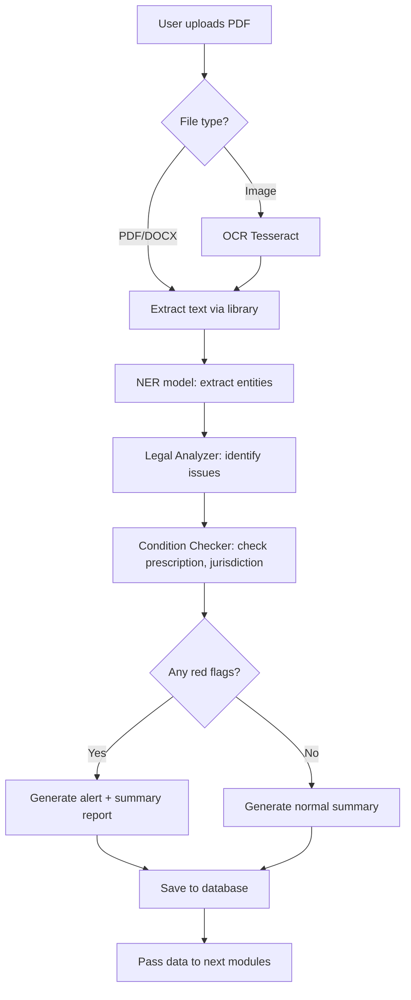
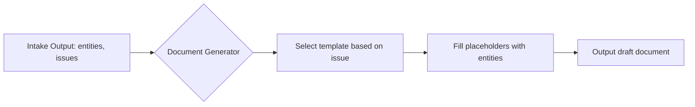

# 📘 เอกสารโครงการระบบ AI สำหรับทนายความในคดีแพ่งแบบครบวงจร  
### Civil AI Attorney (CAA) – Design & Implementation Package

> **หมายเหตุ:** เอกสารนี้เป็นส่วนของ **ข้อเสนอโครงการ (Project Proposal)** และ **เอกสารประกอบการออกแบบ** ไม่มีโค้ดโปรแกรม ใช้สำหรับนำเสนอผู้บริหารหรือทีมพัฒนา เพื่อเตรียมความพร้อมก่อนลงมือพัฒนา  
> **ประกาศ:** เนื่องจากข้อจำกัดในการแสดงผล รูปแบบแผนภาพ (Flowchart/Diagram) จึงถูกแทนที่ด้วยคำอธิบายเป็นข้อความและตาราง เพื่อให้สามารถอ่านและเข้าใจได้อย่างสมบูรณ์

---

## 🧩 ส่วนที่ 1: ส่วนเสนอโครงการ (Business Model Canvas + รายละเอียด)

### 1. วัตถุประสงค์ (Objectives)

| ลำดับ | วัตถุประสงค์ |
|-------|---------------|
| 1 | ลดเวลาการทำงานเอกสารทางกฎหมายของทนายความลง 70% ด้วย AI ช่วยร่างคำฟ้อง คำให้การ อุทธรณ์ ฎีกา |
| 2 | เพิ่มความแม่นยำในการค้นหาคำพิพากษาฎีกาที่เกี่ยวข้องด้วย Semantic Search แทนการใช้คำสำคัญ |
| 3 | พยากรณ์โอกาสชนะคดีเพื่อช่วยทนายความตัดสินใจรับคดีหรือเจรจาประนอมประนอม |
| 4 | ป้องกันการเสียสิทธิเนื่องจากกำหนดเวลา (อายุความ, ระยะยื่นอุทธรณ์) โดยระบบแจ้งเตือนอัตโนมัติ |
| 5 | เชื่อมต่อกับระบบศาลอิเล็กทรอนิกส์ (e-Filing) เพื่อยื่นเอกสารและรับหมายนัดโดยอัตโนมัติ |

### 2. กลุ่มเป้าหมาย (Customer Segments)

| กลุ่ม | รายละเอียด |
|------|-------------|
| **ทนายความรายบุคคล** | ทนายความที่เปิดสำนักงานเล็ก ต้องการเพิ่มประสิทธิภาพ ลดเวลางานเอกสาร |
| **สำนักงานกฎหมายขนาดกลาง-ใหญ่** | มีคดีจำนวนมาก ต้องการมาตรฐานเอกสารและระบบจัดการความรู้ภายใน |
| **นิติกรประจำองค์กร** | บริษัทมหาชน รัฐวิสาหกิจ ที่มีคดีแพ่งจำนวนมาก ต้องการวิเคราะห์ความเสี่ยง |
| **ผู้ช่วยทนายความ (paralegal)** | ต้องการเครื่องมือช่วยค้นคว้าฎีกาและร่างเอกสารเบื้องต้น |
| **ผู้พิพากษาหรือผู้ช่วยผู้พิพากษา** | ใช้วิเคราะห์ประเด็นและตรวจสอบคำพิพากษา (optional) |

### 3. ความรู้พื้นฐานที่ผู้ใช้ต้องมี (Prerequisite Knowledge)

| หัวข้อ | รายละเอียด |
|--------|-------------|
| **กฎหมายวิธีพิจารณาความแพ่ง** | เข้าใจขั้นตอนฟ้อง การยื่นคำให้การ การสืบพยาน การอุทธรณ์ การบังคับคดี |
| **กฎหมายแพ่ง** | รู้จักสัญญา ละเมิด ทรัพย์สิน ครอบครัว มรดก หนี้ |
| **การใช้คอมพิวเตอร์พื้นฐาน** | การอัปโหลดไฟล์ PDF, การพิมพ์, การใช้เว็บเบราว์เซอร์ |
| **ภาษาอังกฤษ (optional)** | เนื่องจากบาง UI อาจมีศัพท์เทคนิคภาษาอังกฤษ |

### 4. เนื้อหาโดยย่อ (กระชับ เน้นวัตถุประสงค์และประโยชน์)

ระบบ Civil AI Attorney เป็น **แพลตฟอร์มช่วยทนายความในคดีแพ่งครบวงจร** ประกอบด้วย 7 โมดูลหลัก:

1. **Intake & Analysis** – อ่านคำฟ้อง/เอกสาร สกัดประเด็น ตรวจสอบอำนาจฟ้องและอายุความ
2. **Document Generator** – ร่างคำฟ้อง คำให้การ คำร้องสอด อุทธรณ์ ฎีกา พร้อมอ้างอิงฎีกา
3. **Case Law RAG** – ค้นหาคำพิพากษาฎีกาที่เกี่ยวข้องด้วย AI แบบเข้าใจความหมาย
4. **Predictive Analytics** – พยากรณ์โอกาสชนะคดี (เปอร์เซ็นต์) จากฐานข้อมูลคดีเก่า
5. **Timeline & Deadline Tracker** – คำนวณและแจ้งเตือนกำหนดเวลาทางกฎหมาย
6. **Evidence Management** – จัดเก็บและสรุปพยานหลักฐาน พร้อมแนะนำคำถามนำ/ถามค้าน
7. **Pre‑trial Strategy** – ช่วยเตรียมการชี้สองสถาน วิเคราะห์จุดอ่อนจุดแข็ง

**ประโยชน์หลัก** – ลดเวลาเอกสาร 70% , เพิ่มความแม่นยำในการค้นหาฎีกา, ลดความผิดพลาดเรื่องกำหนดเวลา, ตัดสินใจรับคดีได้แม่นยำขึ้น

---

## 🧭 Business Model Canvas (BMC) สำหรับ Civil AI Attorney

| # | องค์ประกอบ | รายละเอียด |
|---|-------------|-------------|
| **1** | **กลุ่มลูกค้า (Customer Segments)** | ทนายความรายบุคคล, สำนักงานกฎหมาย, นิติกรบริษัท, ผู้ช่วยทนายความ |
| **2** | **คุณค่าเสนอ (Value Propositions)** | • ลดเวลาเตรียมเอกสาร<br>• ค้นหาฎีกาแม่นยำด้วย AI<br>• พยากรณ์ผลคดี<br>• เตือนกำหนดเวลาอัตโนมัติ<br>• รองรับศาลอิเล็กทรอนิกส์ |
| **3** | **ช่องทางการจัดส่ง (Channels)** | • Web Application (responsive)<br>• LINE Official Account<br>• REST API สำหรับสำนักงานใหญ่<br>• Mobile App (iOS/Android – ระยะที่ 2) |
| **4** | **ความสัมพันธ์กับลูกค้า (Customer Relationships)** | • ทดลองใช้ฟรี 14 วัน<br>• ฝึกอบรมออนไลน์ (webinar)<br>• ทีมสนับสนุนทางแชทและโทรศัพท์<br>• คู่มือและฐานความรู้ (knowledge base) |
| **5** | **กระแสรายได้ (Revenue Streams)** | • แบบรายเดือน (subscription): เริ่ม 2,500 บาท/ผู้ใช้/เดือน<br>• แบบรายปี: ส่วนลด 20%<br>• แบบองค์กร (On‑premise): ค่าลิขสิทธิ์ + ค่าบำรุงรายปี<br>• บริการเทรนโมเดลเฉพาะสำนักงาน (เพิ่มเติม) |
| **6** | **ทรัพยากรหลัก (Key Resources)** | • ทีมพัฒนาซอฟต์แวร์ (Full‑stack, AI/ML)<br>• ทีมนักกฎหมาย (ตรวจสอบความถูกต้องทางกฎหมาย)<br>• ฐานข้อมูลคำพิพากษาฎีกามากกว่า 50,000 ฉบับ<br>• Server / Cloud (AWS/GCP/Azure)<br>• API OpenAI / Anthropic |
| **7** | **กิจกรรมหลัก (Key Activities)** | • พัฒนาและอัปเดตโมเดล AI และ RAG pipeline<br>• รวบรวมและทำความสะอาดข้อมูลฎีกา<br>• สร้างเทมเพลตเอกสารทางกฎหมาย<br>• ดูแลระบบและความปลอดภัย<br>• การตลาดและขาย |
| **8** | **พันธมิตรหลัก (Key Partnerships)** | • สำนักงานศาลยุติธรรม (เข้าถึงระบบ e‑Filing)<br>• เนติบัณฑิตยสภา (ข้อมูลคำบรรยาย)<br>• ผู้ให้บริการ Cloud (AWS/GCP)<br>• บริษัทกฎหมายชั้นนำ (เป็น Early Adopter) |
| **9** | **โครงสร้างต้นทุน (Cost Structure)** | • ค่าแรงพัฒนาบุคลากร (40%)<br>• ค่า Server & API LLM (30%)<br>• การตลาดและขาย (15%)<br>• ค่าใช้จ่ายในการเก็บข้อมูลฎีกา (10%)<br>• ค่าใช้จ่ายสำนักงานและอื่น ๆ (5%) |

---

## 📄 ส่วนที่ 2: เอกสารประกอบโครงการ (Project Documentation)

### 2.1 บทนำ (Introduction)

**ชื่อโครงการ:** ระบบ AI สำหรับทนายความในคดีแพ่งแบบครบวงจร (Civil AI Attorney – CAA)

**ที่มาและความสำคัญ:**  
ในปัจจุบัน ทนายความต้องใช้เวลาจำนวนมากในการอ่านเอกสาร ค้นคว้าฎีกา ร่างเอกสารทางกฎหมาย และติดตามกำหนดเวลา ความผิดพลาดเพียงเล็กน้อย เช่น การยื่นคำให้การล่าช้า หรือการอ้างฎีกาที่ไม่ตรงประเด็น อาจทำให้เสียคดีหรือเสียสิทธิ ระบบ CAA จึงถูกออกแบบมาเพื่อลดภาระเหล่านี้โดยใช้เทคโนโลยี AI ที่ทันสมัย โดยยังคงให้ทนายความเป็นผู้ตัดสินใจสูงสุด

**ขอบเขตของเอกสาร:**  
เอกสารนี้ประกอบด้วย Business Model Canvas, รายละเอียดวัตถุประสงค์, กลุ่มเป้าหมาย, ความรู้พื้นฐาน, เนื้อหาโดยย่อ, บทนิยามศัพท์, คู่มือการใช้งาน (Conceptual), Workflow, Task List Template, Checklist Template และสรุปโครงการ

---

### 2.2 บทนิยาม (Definitions)

| คำศัพท์ | นิยาม |
|---------|--------|
| **CAA** | Civil AI Attorney – ระบบ AI สำหรับทนายความในคดีแพ่ง |
| **Intake** | ขั้นตอนการรับและวิเคราะห์ข้อมูลคดีเบื้องต้น |
| **RAG** | Retrieval-Augmented Generation – เทคนิคการค้นหาเอกสารแล้วให้ AI สร้างคำตอบ |
| **Semantic Search** | การค้นหาตามความหมาย ไม่ใช่แค่คำตรง |
| **LLM** | Large Language Model – โมเดลภาษาใหญ่ เช่น GPT-4 |
| **Vector Database** | ฐานข้อมูลที่เก็บเอกสารในรูปแบบเวกเตอร์สำหรับค้นหาเชิงความหมาย |
| **Pre-trial** | การชี้สองสถาน – กระบวนการก่อนสืบพยานเพื่อกำหนดประเด็น |
| **Statute of Limitations** | อายุความ – ระยะเวลาที่กฎหมายกำหนดให้ใช้สิทธิฟ้องคดี |
| **e-Filing** | ระบบยื่นเอกสารอิเล็กทรอนิกส์ต่อศาล |
| **ฎีกา** | คำพิพากษาศาลฎีกา (Supreme Court precedent) |
| **Workflow** | ลำดับขั้นตอนการทำงานของระบบ |
| **Task List** | รายการงานที่ต้องทำสำหรับแต่ละคดี |
| **Checklist** | รายการตรวจสอบความถูกต้อง |

---

### 2.3 บทหัวข้อ (Main Chapters – โครงสร้างระบบ)

ระบบ CAA แบ่งออกเป็น 7 โมดูลหลัก ดังนี้

| บทที่ | ชื่อโมดูล | หน้าที่หลัก |
|-------|-----------|-------------|
| 1 | **Legal Intake & Analysis** | รับเรื่อง, วิเคราะห์คำฟ้อง, ตรวจสอบอำนาจฟ้องและอายุความ |
| 2 | **Document Generator** | สร้างร่างเอกสารทางกฎหมาย (คำฟ้อง, คำให้การ, อุทธรณ์, ฎีกา, คำร้อง) |
| 3 | **Case Law RAG** | ค้นหาคำพิพากษาฎีกาที่เกี่ยวข้องแบบ semantic พร้อม citation |
| 4 | **Predictive Analytics** | พยากรณ์โอกาสชนะคดี (%) โดยใช้ Machine Learning |
| 5 | **Timeline & Deadline Tracker** | คำนวณกำหนดเวลา, แจ้งเตือนทางอีเมล/LINE, ปฏิทินคดี |
| 6 | **Evidence Management** | จัดเก็บพยานหลักฐาน, สรุปประเด็น, แนะนำคำถามนำ/ถามค้าน |
| 7 | **Pre‑trial & Strategy** | วางกลยุทธ์, เตรียมการชี้สองสถาน, วิเคราะห์จุดแข็ง/จุดอ่อน |

---

### 2.4 คู่มือการใช้งาน (User Manual – Conceptual Design)

#### 2.4.1 การเริ่มต้นใช้งาน
1. เข้าสู่ระบบด้วยอีเมลและรหัสผ่าน (หรือ SSO จากสำนักงาน)
2. สร้างคดีใหม่ → เลือกประเภทคดี (ละเมิด, สัญญา, มรดก, ครอบครองปรปักษ์, ฯลฯ)
3. อัปโหลดเอกสาร (คำฟ้อง, สัญญา, หนังสือทวงถาม) หรือพิมพ์สรุปข้อเท็จจริง

#### 2.4.2 การวิเคราะห์คดี
- ระบบจะแสดง **สรุปประเด็นข้อพิพาท, กฎหมายที่เกี่ยวข้อง, แนวทางต่อสู้เบื้องต้น**
- ตรวจสอบ **อำนาจฟ้องและอายุความ** หากมีปัญหา ระบบจะแจ้งเตือนทันที

#### 2.4.3 การค้นหาฎีกา
- พิมพ์คำถามหรือข้อกฎหมาย (ภาษาไทย) ในช่องค้นหา
- ระบบจะแสดงรายการฎีกาเรียงตามความเกี่ยวข้อง พร้อมคำย่อและสาระสำคัญ
- สามารถเลือกอ้างอิงลงในเอกสารได้โดยคลิกปุ่ม “เพิ่ม citation”

#### 2.4.4 การร่างเอกสาร
- เลือกประเภทเอกสาร (คำให้การ, อุทธรณ์ ฯลฯ)
- กรอกข้อมูลคู่ความ, ทุนทรัพย์, ประเด็นหลัก
- ระบบสร้างร่างเอกสารให้ทันที → ทนายตรวจสอบและแก้ไข → ดาวน์โหลดเป็น Word หรือ PDF

#### 2.4.5 การพยากรณ์ผลคดี
- หลังจากกรอกข้อมูลครบ ระบบจะแสดง **โอกาสชนะ (%)** และ **ปัจจัยเสี่ยงหลัก**
- ใช้ประกอบการตัดสินใจรับคดีหรือเจรจาประนีประนอม

#### 2.4.6 การติดตามกำหนดเวลา
- ระบบจะบันทึกวันเกิดเหตุ, วันฟ้อง, วันนัด, วันครบกำหนดอุทธรณ์ อัตโนมัติ
- ส่งการแจ้งเตือนทาง LINE / อีเมลก่อนถึงกำหนด 7 วัน, 3 วัน, 1 วัน

---

### 2.5 Workflow ของระบบ (Business Process Flow)

> **คำอธิบายกระบวนการทำงานหลัก (แทน Flowchart)**

| ลำดับ | ขั้นตอน | รายละเอียด |
|-------|---------|-------------|
| 1 | รับเรื่องใหม่ | ทนายความสร้างคดีหรืออัปโหลดเอกสาร |
| 2 | Intake & Analysis | AI อ่านและสกัดข้อมูลคดี |
| 3 | ตรวจสอบอำนาจ/อายุความ | หากมีปัญหา → แจ้งเตือนทนายความให้ตัดสินใจ |
| 4 | ค้นหาฎีกาด้วย RAG | ค้นหาคำพิพากษาที่เกี่ยวข้องแบบเข้าใจความหมาย |
| 5 | พยากรณ์โอกาสชนะ | แสดงเปอร์เซ็นต์และปัจจัยเสี่ยง |
| 6 | ร่างเอกสาร | เลือกประเภทเอกสาร (คำให้การ, อุทธรณ์ ฯลฯ) |
| 7 | ทนายตรวจสอบ | แก้ไขจนพอใจ |
| 8 | ยื่นต่อศาล / ส่งให้ลูกความ | ผ่าน e-Filing หรือช่องทางอื่น |
| 9 | ติดตามกำหนดนัด | ระบบบันทึกและแจ้งเตือน |
| 10 | เตรียมการสืบพยาน | จัดการพยานหลักฐาน |
| 11 | พิจารณาคดี | ดำเนินกระบวนพิจารณาจนศาลมีคำพิพากษา |
| 12 | อุทธรณ์? | หากไม่พอใจ → กลับไปขั้นตอนร่างเอกสาร (อุทธรณ์/ฎีกา) |
| 13 | บังคับคดี / ปิดคดี | เมื่อคดีถึงที่สุด |

---

### 2.6 TASK LIST Template (ตัวอย่างสำหรับคดีแพ่ง)

ใช้สำหรับมอบหมายงานในแต่ละคดี ให้ทีมทนายความหรือผู้ช่วย

| Task ID | งาน (Task) | ผู้รับผิดชอบ | กำหนดแล้วเสร็จ | สถานะ | หมายเหตุ |
|---------|-------------|--------------|----------------|--------|-----------|
| CAA-001 | อัปโหลดคำฟ้องและเอกสารที่เกี่ยวข้อง | ผู้ช่วยทนาย | วันที่รับเรื่อง | ☐ ยังไม่เริ่ม | - |
| CAA-002 | วิเคราะห์ประเด็นข้อพิพาทและอายุความ | ทนายความ | +1 วัน | ☐ ยังไม่เริ่ม | ใช้ AI ช่วย |
| CAA-003 | ค้นหาฎีกาที่เกี่ยวข้อง (อย่างน้อย 5 ฉบับ) | ผู้ช่วยทนาย | +2 วัน | ☐ ยังไม่เริ่ม | ใช้ RAG |
| CAA-004 | ร่างคำให้การ / ฟ้องแย้ง | AI + ทนาย | +5 วัน | ☐ ยังไม่เริ่ม | ใช้ Document Generator |
| CAA-005 | ตรวจสอบและแก้ไขคำให้การฉบับสุดท้าย | ทนายความ | +7 วัน | ☐ ยังไม่เริ่ม | - |
| CAA-006 | ยื่นคำให้การต่อศาล (e-Filing หรือไปส่ง) | ผู้ช่วยทนาย | ภายใน 15 วันนับรับหมาย | ☐ ยังไม่เริ่ม | - |
| CAA-007 | เตรียมบัญชีระบุพยานและสรุปประเด็นสืบ | ทนายความ | ก่อนชี้สองสถาน 7 วัน | ☐ ยังไม่เริ่ม | - |
| CAA-008 | ติดตามวันนัดและแจ้งเตือนลูกความ | ระบบอัตโนมัติ | ต่อเนื่อง | ☐ อัตโนมัติ | - |

---

### 2.7 CHECKLIST Template (สำหรับตรวจสอบความถูกต้องของคดี)

ใช้สำหรับทนายความตรวจสอบก่อนยื่นเอกสารหรือก่อนสืบพยาน

#### ✅ ก่อนยื่นคำฟ้อง
- [ ] โจทก์มีอำนาจฟ้อง (เป็นผู้เสียหาย, ทายาท, หรือตัวการ)
- [ ] ไม่ขาดอายุความ (ตรวจสอบวันที่เกิดเหตุและวันที่ฟ้อง)
- [ ] ยื่นต่อศาลที่มีเขตอำนาจ (ตามทุนทรัพย์และสถานที่เกิดเหตุ)
- [ ] เสียค่าธรรมเนียมศาลถูกต้อง (หรือยื่นคำร้องขออนุญาตดำเนินคดีอย่างคนอนาถา)
- [ ] คำฟ้องมีข้อความครบตาม ป.วิ.พ. มาตรา 172 (ชื่อคู่ความ, ข้ออ้าง, คำขอบังคับ)
- [ ] แนบสำเนาเอกสารประกอบคำฟ้องครบ

#### ✅ ก่อนยื่นคำให้การ
- [ ] ยื่นภายใน 15 วันนับแต่วันได้รับหมายเรียก (มาตรา 177)
- [ ] คำให้การระบุข้อต่อสู้ชัดเจน ไม่เคลือบคลุม
- [ ] หากมีฟ้องแย้ง ให้ยื่นพร้อมคำให้การ (มาตรา 177 วรรคสาม)
- [ ] จัดส่งสำเนาคำให้การให้โจทก์ (หรือให้ศาลส่ง)

#### ✅ ก่อนวันสืบพยาน
- [ ] บัญชีระบุพยาน (ชื่อ ที่อยู่ สิ่งที่จะเบิกความ) ยื่นก่อนวันสืบไม่น้อยกว่า 7 วัน
- [ ] พยานเอกสารเตรียมต้นฉบับและสำเนา
- [ ] เตรียมคำถามนำสำหรับพยานของตน
- [ ] เตรียมคำถามค้านสำหรับพยานคู่ความ
- [ ] แจ้งเตือนพยานบุคคลให้มาในวันนัด

#### ✅ ก่อนยื่นอุทธรณ์ / ฎีกา
- [ ] ยื่นภายใน 1 เดือนนับแต่วันอ่านคำพิพากษา (มาตรา 225)
- [ ] ตรวจสอบว่าคดีต้องห้ามอุทธรณ์ในข้อเท็จจริงหรือไม่ (ทุนทรัพย์ ≤ 50,000 บาท)
- [ ] ชำระค่าธรรมเนียมอุทธรณ์หรือวางประกันตามที่ศาลกำหนด
- [ ] อุทธรณ์ระบุข้อกฎหมายและข้อเท็จจริงที่โต้แย้งอย่างชัดเจน

---

### 2.8 สรุปเอกสารโครงการ (Executive Summary)

โครงการระบบ AI สำหรับทนายความในคดีแพ่งแบบครบวงจร (CAA) เป็นแพลตฟอร์มที่ช่วยให้ทนายความและสำนักงานกฎหมายสามารถทำงานคดีแพ่งได้ **รวดเร็วขึ้น 70%** , **แม่นยำขึ้น** และ **ลดความเสี่ยงจากการขาดกำหนดเวลา** โดยใช้เทคโนโลยี AI และฐานข้อมูลฎีกาขนาดใหญ่ โมเดลธุรกิจแบบ Subscription ทำให้เข้าถึงง่าย คุ้มค่าการลงทุน ระบบออกแบบให้สอดคล้องกับประมวลกฎหมายวิธีพิจารณาความแพ่งและคำพิพากษาฎีกา ทนายความยังคงเป็นผู้ตัดสินใจสูงสุด ส่วน AI เป็นเพียงผู้ช่วยอัจฉริยะ

**ประโยชน์ที่ได้รับชัดเจน:**
- ประหยัดเวลาในการค้นคว้าและร่างเอกสาร
- ได้งานคุณภาพสูง ลดข้อผิดพลาดทางเทคนิค
- สามารถรับคดีได้มากขึ้นโดยไม่เพิ่มภาระ
- ลูกความได้รับบริการที่รวดเร็วและเป็นมืออาชีพ

---

## 🧩 แผนภาพกระบวนการทำงาน (Workflow) แบบข้อความ

เนื่องจากข้อจำกัดในการแสดงผลแผนภาพ กรุณาอ่านคำอธิบายลำดับขั้นตอนด้านล่าง ซึ่งครอบคลุมการทำงานหลักของระบบ CAA

### แผนภาพที่ 1: Main Workflow ของระบบ Civil AI Attorney (อธิบายเป็นข้อความ)

| ขั้นตอน | การดำเนินการ | หมายเหตุ |
|---------|--------------|----------|
| เริ่ม | ทนายความล็อกอินเข้าสู่ระบบ | |
| 1 | สร้างคดีใหม่ / อัปโหลดเอกสาร | กรอกข้อมูลหรืออัปโหลดคำฟ้อง/สัญญา |
| 2 | AI อ่านและสกัดข้อมูลคดี | ชื่อคู่ความ, มูลคดี, วันที่, ทุนทรัพย์ |
| 3 | ตรวจสอบอำนาจฟ้องและอายุความ | ถ้าขาดอายุความหรือไม่มีอำนาจ → แจ้งเตือน |
| 4 | ทนายความตัดสินใจ | ดำเนินการต่อหรือยกเลิก |
| 5 | ค้นหาฎีกาที่เกี่ยวข้องด้วย RAG | ใช้ semantic search |
| 6 | พยากรณ์โอกาสชนะคดี | แสดง % โอกาสชนะ |
| 7 | เลือกร่างเอกสารที่ต้องการ | เช่น คำให้การ, อุทธรณ์ |
| 8 | AI ร่างเอกสารฉบับแรก | |
| 9 | ทนายความตรวจสอบ/แก้ไข | |
| 10 | ยื่นต่อศาล / ส่งให้ลูกความ | ผ่าน e-Filing หรือช่องทางอื่น |
| 11 | ระบบบันทึกกำหนดนัดและแจ้งเตือน | |
| 12 | ดำเนินกระบวนพิจารณา | จนกว่าศาลจะมีคำพิพากษา |
| 13 | ศาลมีคำพิพากษา | |
| 14 | ต้องอุทธรณ์? | ถ้าใช่ → กลับไปขั้นตอนที่ 7 (ร่างเอกสาร) |
| 15 | ปิดคดี / บังคับคดี | สิ้นสุด |

---

### แผนภาพที่ 2: AI Analysis Sub‑flow (วิเคราะห์คดี) – อธิบายเป็นข้อความ

| ลำดับ | ขั้นตอน | รายละเอียด |
|-------|---------|-------------|
| 1 | รับเอกสารคดี | รองรับ PDF หรือข้อความ ถ้าเป็น scanned image ให้ OCR ก่อน |
| 2 | ส่งเข้า LLM + Prompt | ใช้โมเดลภาษาเพื่อสกัดข้อมูลสำคัญ |
| 3 | สกัดข้อมูลสำคัญ | ได้แก่ ชื่อคู่ความ, ประเภทคดี, วันที่เกิดเหตุ, ทุนทรัพย์, ข้ออ้างสำคัญ |
| 4 | ตรวจสอบอายุความ | เปรียบเทียบกับฐานข้อมูลกฎหมาย (เช่น ละเมิด 1 ปี, สัญญา 10 ปี) |
| 5 | ตรวจสอบอำนาจฟ้อง | เปรียบเทียบกับฐานข้อมูลบุคคล (เช่น ทายาทมีอำนาจฟ้องหรือไม่) |
| 6 | สรุปผลวิเคราะห์ | |
| 7 | แสดงใน Dashboard | ให้ทนายความเห็นผล |

---

### แผนภาพที่ 3: RAG Search Sub‑flow (ค้นหาฎีกา) – อธิบายเป็นข้อความ

| ลำดับ | ขั้นตอน | รายละเอียด |
|-------|---------|-------------|
| 1 | ทนายพิมพ์คำถาม | เป็นภาษาไทยหรืออังกฤษ |
| 2 | เปลี่ยนคำถามเป็นเวกเตอร์ | ใช้ Embedding Model |
| 3 | ค้นหา Vector Database | ของฎีกาทั้งหมด (มากกว่า 50,000 ฉบับ) |
| 4 | ได้ฎีกาที่ใกล้เคียง | 10-20 ฉบับแรก |
| 5 | ส่งฎีกา + คำถามเดิมเข้า LLM | เพื่อจัดลำดับความเกี่ยวข้องและสรุปสาระสำคัญ |
| 6 | แสดงผลลัพธ์ให้ทนาย | พร้อม citation |
| 7 | ทนายเลือกฎีกา | สามารถอ้างอิงลงในเอกสารหรือดูรายละเอียดเพิ่ม |

---

### แผนภาพที่ 4: Deadline Alert Sub‑flow (แจ้งเตือนกำหนดเวลา) – อธิบายเป็นข้อความ

| ลำดับ | ขั้นตอน | รายละเอียด |
|-------|---------|-------------|
| 1 | ทุกวันเวลา 00:00 น. | ระบบรันอัตโนมัติ |
| 2 | ดึงรายการคดีที่ยังไม่ปิด | |
| 3 | สำหรับแต่ละคดี คำนวณวันสำคัญ | วันครบอายุความ, วันยื่นคำให้การ, วันนัดสืบพยาน, วันสุดท้ายอุทธรณ์ |
| 4 | ตรวจสอบระยะเวลาที่เหลือ | |
|   | - ถ้าเหลือ ≤ 7 วัน | ส่งแจ้งเตือนสีเหลืองทาง LINE + อีเมล |
|   | - ถ้าเหลือ ≤ 1 วัน | ส่งแจ้งเตือนสีแดงทาง LINE + อีเมล + SMS |
|   | - ถ้า > 7 วัน | ไม่ต้องแจ้ง |
| 5 | บันทึก log การแจ้งเตือน | |
| 6 | ทำซ้ำจนครบทุกคดี | |

---

## 📚 ตัวอย่างคดีแต่ละประเภท ตั้งแต่ต้นจนถึงศาลฎีกา

### 1. คดีทรัพย์สินทางปัญญา (Intellectual Property Case)

**คดีตัวอย่าง:** การละเมิดลิขสิทธิ์โปรแกรมคอมพิวเตอร์  
**ชื่อคดี:** บริษัท เอ จำกัด (โจทก์) กับ นายสมชาย (จำเลย)

**กระบวนการดำเนินคดี (เป็นข้อความ):**

1. **ก่อนฟ้อง** – โจทก์รวบรวมพยานหลักฐาน: เอกสารจดทะเบียนลิขสิทธิ์, สัญญาจ้างพัฒนา, หลักฐานการละเมิด, แจ้งความดำเนินคดีอาญา
2. **ยื่นคำฟ้อง** – ยื่นต่อศาลทรัพย์สินทางปัญญาและการค้าระหว่างประเทศกลาง
3. **การพิจารณาคดี** – ศาลไต่สวนมูลฟ้อง, จำเลยยื่นคำให้การ, ชี้สองสถาน, สืบพยาน
4. **คำพิพากษาศาลชั้นต้น** – วินิจฉัยว่าจำเลยละเมิดลิขสิทธิ์
5. **การอุทธรณ์** – ยื่นต่อศาลอุทธรณ์คดีชำนัญพิเศษ
6. **การฎีกา** – ยื่นต่อศาลฎีกาแผนกคดีทรัพย์สินทางปัญญาฯ (หากเป็นปัญหาข้อกฎหมาย)

**แนวฎีกาที่เกี่ยวข้อง:** ฎ. 9523/2544, ฎ. 1264/2563, ฎ. 8842/2563

---

### 2. คดีการค้าระหว่างประเทศ (International Trade Case)

**คดีตัวอย่าง:** การรับขนของทางทะเลระหว่างประเทศ – สินค้าชำรุดเสียหาย  
**ชื่อคดี:** บริษัทนำเข้า จำกัด (โจทก์) กับ บริษัทขนส่ง จำกัด (จำเลย)

**กระบวนการดำเนินคดี (เป็นข้อความ):**

1. **ก่อนฟ้อง** – รวบรวมสัญญาซื้อขาย, ใบตราส่งสินค้า (Bill of Lading), รายงานการตรวจสภาพ (Survey Report)
2. **ยื่นคำฟ้อง** – ต่อศาลทรัพย์สินทางปัญญาและการค้าระหว่างประเทศกลาง
3. **การพิจารณาคดี** – จำเลยให้การปฏิเสธ (อ้างเหตุสุดวิสัย), ชี้สองสถาน, สืบพยาน
4. **คำพิพากษาศาลชั้นต้น** – จำเลยรับผิดชอบความเสียหาย
5. **การอุทธรณ์** – ต่อศาลอุทธรณ์คดีชำนัญพิเศษ
6. **การฎีกา** – ต่อศาลฎีกา (ปัญหาข้อกฎหมายเกี่ยวกับการค้าระหว่างประเทศ)

**แนวฎีกาที่เกี่ยวข้อง:** ฎ. 1530/2551, ฎ. 176/2551, ฎ. 5831/2550, ฎ. 595/2545, ฎ. 9541/2555

---

### 3. คดีผู้บริโภค (Consumer Case)

**คดีตัวอย่าง:** สินค้าชำรุดบกพร่อง – รถยนต์เช่าซื้อมีปัญหาเครื่องยนต์  
**ชื่อคดี:** นายสมชาย (โจทก์) กับ บริษัทผู้ผลิตและตัวแทนจำหน่าย (จำเลย)

**กระบวนการดำเนินคดี (เป็นข้อความ):**

1. **ก่อนฟ้อง** – รวบรวมสัญญาเช่าซื้อ, ใบรับประกัน, บันทึกการเข้ารับบริการ (Job Sheet)
2. **ยื่นคำฟ้อง** – ต่อศาลแพ่งแผนกคดีผู้บริโภค (ยื่นด้วยวาจาหรือเป็นหนังสือก็ได้)
3. **การพิจารณาคดี** – ศาลพยายามไกล่เกลี่ย, ถ้าไม่สำเร็จจึงชี้สองสถานและสืบพยาน (ภาระการพิสูจน์ตกแก่ผู้ประกอบการ)
4. **คำพิพากษาศาลชั้นต้น** – จำเลยร่วมรับผิดในความชำรุดบกพร่อง
5. **การอุทธรณ์** – ต่อศาลอุทธรณ์แผนกคดีผู้บริโภค
6. **การฎีกา** – ต่อศาลฎีกา (ปัญหาข้อกฎหมายสำคัญ)

**แนวฎีกาที่เกี่ยวข้อง:** ฎ. 4567/2561, ฎ. 7567/2562

---

### 4. การฟ้องคดีแบบกลุ่ม (Class Action)

**คดีตัวอย่าง:** รถโดยสารประจำทางแก๊สระเบิด – ประชาชนได้รับความเสียหายจำนวนมาก  
**ชื่อคดี:** นางสาวเอ (โจทก์ตัวแทน) กับ บริษัทขนส่ง จำกัด (จำเลย)

**กระบวนการดำเนินคดี (เป็นข้อความ):**

1. **ก่อนฟ้อง** – รวมกลุ่มผู้เสียหาย, เลือกโจทก์ตัวแทน, รวบรวมรายชื่อและเอกสารความเสียหาย
2. **ยื่นคำร้องขอให้ดำเนินคดีแบบกลุ่ม** – ต้องแสดงให้เห็นว่ามีสมาชิกจำนวนมาก, มีประเด็นร่วมกัน, การใช้โจทก์ตัวแทนเหมาะสม
3. **ศาลไต่สวนคำร้อง** – หากอนุญาต ศาลมีคำสั่งให้ประกาศแจ้งสมาชิกกลุ่ม ให้สิทธิ Opt-out
4. **การดำเนินคดี** – โจทก์ตัวแทนดำเนินคดีแทนสมาชิกทั้งหมด, ผลผูกพันทุกคนที่ไม่ได้ Opt-out
5. **คำพิพากษา** – หากชนะ ศาลกำหนดวิธีการชำระค่าเสียหาย, แบ่งให้สมาชิกตามสัดส่วน
6. **อุทธรณ์/ฎีกา** – โจทก์ตัวแทนยื่นในนามสมาชิกกลุ่ม

**เกร็ดกฎหมาย:** การฟ้องคดีแบบกลุ่มในประเทศไทยยังมีอุปสรรค แต่เป็นเครื่องมือสำคัญในการคุ้มครองสิทธิผู้เสียหายจำนวนมาก

---

## 📄 Template และตัวอย่างเอกสารทางกฎหมาย

### 1. Template คำอุทธรณ์ (ทั่วไป)

```
คำอุทธรณ์
คดีแพ่งหมายเลขดำที่ ........../.......... 
คดีแพ่งหมายเลขแดงที่ ........../..........

ระหว่าง
(................................) โจทก์
กับ
(................................) จำเลย

เรื่อง อุทธรณ์คำพิพากษาศาลชั้นต้น

------------------------------------------------------------------
คำอุทธรณ์ของ (โจทก์/จำเลย)
------------------------------------------------------------------

ด้วย ศาลชั้นต้นได้มีคำพิพากษาตามคดีหมายเลขแดงที่ ........../.......... 
ลงวันที่ .......... เดือน .......... พ.ศ. .......... ความว่า (สรุป)

บัดนี้ (โจทก์/จำเลย) ขอยื่นอุทธรณ์ โดยโต้แย้งว่า

ข้อ ๑. (ระบุข้อเท็จจริงหรือข้อกฎหมายที่โต้แย้ง)
ข้อ ๒. (ระบุเหตุผลที่ศาลชั้นต้นวินิจฉัยผิด)
ข้อ ๓. (ระบุคำขอท้ายอุทธรณ์)

จึงขอให้ศาลอุทธรณ์มีคำพิพากษาตามที่ (โจทก์/จำเลย) ข้างต้น

(ลงชื่อ) .......................... ผู้ยื่นอุทธรณ์
(ลงชื่อ) .......................... ทนายความ
```

---

### 2. Template คำร้องสอด (Intervention Petition)

**ใช้เมื่อ:** บุคคลภายนอกที่มีส่วนได้เสียต้องการเข้ามาเป็นคู่ความ (ป.วิ.พ. มาตรา 57)

```
คำร้องสอด
คดีแพ่งหมายเลขดำที่ ........../..........
ศาล (................................)

ระหว่าง (................................) โจทก์ กับ (................................) จำเลย

เรื่อง ขอสอดเข้ามาเป็นคู่ความ

ข้าพเจ้า (ชื่อ-นามสกุล) ที่อยู่ .......................... ขอสอดเข้าเป็น (โจทก์ร่วม/จำเลยร่วม) ด้วยเหตุผลดังนี้

๑. คดีนี้เกี่ยวข้องกับทรัพย์สิน/สิทธิของข้าพเจ้าโดยตรง คือ (ระบุ)
๒. ข้าพเจ้ามีส่วนได้เสียในผลแห่งคดี เพราะหากศาลพิพากษาอย่างใด ย่อมกระทบต่อสิทธิของข้าพเจ้า
๓. ข้าพเจ้ามีสิทธิขอสอดตาม ป.วิ.พ. มาตรา 57

จึงขอให้ศาลอนุญาต

(ลงชื่อ) .......................... ผู้ร้องสอด
```

---

### 3. Template คำร้องขอให้ปล่อยทรัพย์ (Petition for Release of Seized Property)

**ใช้เมื่อ:** บุคคลภายนอกอ้างว่าเป็นเจ้าของทรัพย์ที่ถูกยึด (ป.วิ.พ. มาตรา 323)

```
คำร้องขอให้ปล่อยทรัพย์
คดีแพ่งหมายเลขดำที่ ........../.......... คดีแดงที่ ........../..........
ศาล (................................)

เรื่อง ขอให้ปล่อยทรัพย์ที่ถูกยึด

ข้าพเจ้า (ชื่อ-นามสกุล) ที่อยู่ .......................... ขอร้องว่า

๑. เจ้าพนักงานบังคับคดีได้ยึดทรัพย์สินของจำเลยตามหมายบังคับคดี คือ (ระบุทรัพย์)
๒. ทรัพย์ดังกล่าวมิใช่ทรัพย์สินของจำเลย แต่เป็นของข้าพเจ้าโดยชอบ เพราะ (ระบุเหตุ)
๓. ข้าพเจ้ามีหลักฐานแนบท้าย

จึงขอให้ศาลมีคำสั่งให้ปล่อยทรัพย์ที่ยึดคืนแก่ข้าพเจ้า

(ลงชื่อ) .......................... ผู้ร้อง
```

---

### 4. Template คำร้องขอออกหมายบังคับคดี (Request for Enforcement Order)

**ใช้เมื่อ:** โจทก์ชนะคดีแต่จำเลยไม่ปฏิบัติตาม (ป.วิ.พ. มาตรา 271-274)

```
คำร้องขอออกหมายบังคับคดี
คดีแพ่งหมายเลขดำที่ ........../.......... คดีแดงที่ ........../..........
ศาล (................................)

เรื่อง ขอให้ออกหมายบังคับคดี

ข้าพเจ้า (ชื่อ) เจ้าหนี้ตามคำพิพากษา ขอร้องว่า

๑. ศาลได้มีคำพิพากษา/คำสั่งเมื่อวันที่ .......... ให้ (จำเลย/ลูกหนี้) ชำระเงิน ............... บาท พร้อมดอกเบี้ย
๒. ครบกำหนดตามคำบังคับแล้ว จำเลยไม่ชำระหนี้โดยไม่มีเหตุอันควร
๓. ข้าพเจ้าขอให้ศาลออกหมายบังคับคดีเพื่อยึดหรืออายัดทรัพย์สินของลูกหนี้และนำออกขายทอดตลาด

จึงขอให้ศาลออกหมายบังคับคดี

(ลงชื่อ) .......................... ผู้ร้อง
```

---

### 5. Template คำร้องขอให้ตั้งผู้จัดการทรัพย์สินชั่วคราว (Interim Property Manager)

**ใช้เมื่อ:** มีเหตุจำเป็นต้องจัดการทรัพย์สินระหว่างพิจารณา (ป.วิ.พ. มาตรา 264)

```
คำร้องขอให้ตั้งผู้จัดการทรัพย์สินชั่วคราว
คดีแพ่งหมายเลขดำที่ ........../..........
ศาล (................................)

เรื่อง ขอให้ตั้งผู้จัดการทรัพย์สินชั่วคราว

ข้าพเจ้า (ชื่อ-นามสกุล) ที่อยู่ .......................... ขอร้องว่า

๑. ข้าพเจ้าเป็นคู่ความในคดีนี้ ซึ่งเกี่ยวข้องกับทรัพย์สิน คือ (ระบุ)
๒. ปัจจุบันมีเหตุจำเป็นที่ต้องจัดการทรัพย์สินเป็นการชั่วคราว เพราะ (ทรัพย์สินอาจสูญหาย/ถูกยักย้าย)
๓. ข้าพเจ้าจึงขอให้ศาลตั้ง (ชื่อผู้เสนอ) เป็นผู้จัดการทรัพย์สินชั่วคราว มีอำนาจ (ระบุ)

จึงขอให้ศาลมีคำสั่งตามคำร้อง

(ลงชื่อ) .......................... ผู้ร้อง
```

---

### 6. Template คำร้องขอคุ้มครองประโยชน์ชั่วคราว มาตรา 254

**ใช้เมื่อ:** ขอให้ศาลใช้มาตรการคุ้มครองชั่วคราวก่อนมีคำพิพากษา

```
คำร้องขอให้ใช้มาตรการคุ้มครองชั่วคราวก่อนพิพากษา
(ตาม ป.วิ.พ. มาตรา 254)
คดีแพ่งหมายเลขดำที่ ........../..........
ศาล (................................)

เรื่อง ขอให้ศาลมีคำสั่งคุ้มครองชั่วคราว

ข้าพเจ้า (ชื่อ) ผู้ร้อง ขอร้องว่า

๑. ข้าพเจ้าได้ยื่นฟ้อง (จำเลย) เป็นคดีนี้แล้ว มีประเด็นเกี่ยวกับ (ทรัพย์สิน/สิทธิ)
๒. มีเหตุให้เชื่อว่าหากปล่อยไว้ จำเลยจะยักย้าย ถ่ายเท หรือทำให้ทรัพย์สินสูญหาย
๓. ข้าพเจ้าขอให้ศาลมีคำสั่ง (อายัดทรัพย์/ห้ามจำหน่าย/ห้ามกระทำการ)
๔. ข้าพเจ้ายินดีวางเงินหรือหลักประกันตามที่ศาลกำหนด

จึงขอให้ศาลมีคำสั่งตามคำร้อง

(ลงชื่อ) .......................... ผู้ร้อง
```

---

## 🧭 คำอธิบายกระบวนการบังคับคดีเต็มรูปแบบ (แทน Flowchart)

| ลำดับ | ขั้นตอน | รายละเอียด | ระยะเวลา/หมายเหตุ |
|-------|---------|-------------|-------------------|
| 1 | โจทก์ชนะคดี จำเลยไม่ชำระหนี้ | | |
| 2 | โจทก์ยื่นคำร้องขอออกหมายบังคับคดี | ภายใน 1 ปีนับวันคำพิพากษา (มาตรา 271) | ถ้าเกินต้องขอขยายเวลา |
| 3 | ศาลตรวจคำร้องและออกหมายบังคับคดี | โดยไม่มีการไต่สวน | |
| 4 | ส่งหมายบังคับคดีให้เจ้าพนักงานบังคับคดี | | |
| 5 | เจ้าพนักงานฯ แจ้งให้ลูกหนี้ทราบและให้ชำระหนี้ภายใน 15 วัน | | |
| 6 | ถ้าลูกหนี้ไม่ชำระ → ออกหมายยึด/อายัดทรัพย์ | ยึดได้เท่าที่พอชำระหนี้ | |
| 7 | ตรวจสอบทรัพย์สินของลูกหนี้ | ถ้าไม่มีทรัพย์ → ออกหมายแจ้งว่าไม่มีทรัพย์ให้ยึด | รอให้มีทรัพย์ใหม่ |
| 8 | ถ้ามีทรัพย์ → ยึด/อายัดทรัพย์สิน | | |
| 9 | ประกาศขายทอดตลาด 3 ครั้ง | ครั้งละไม่น้อยกว่า 7 วัน | |
| 10 | ระหว่างนี้ บุคคลภายนอกอาจยื่นคำร้องขอปล่อยทรัพย์ | ศาลไต่สวน ถ้าสั่งปล่อย → คืนทรัพย์ ถ้าไม่ปล่อย → ขายต่อไป | |
| 11 | ขายทอดตลาดได้เงิน | หักค่าใช้จ่ายในการบังคับคดี | |
| 12 | นำเงินชำระหนี้แก่เจ้าหนี้ | ถ้าหนี้ไม่หมด → ยึดทรัพย์อื่นซ้ำ | |
| 13 | เมื่อหนี้หมด → ปิดคดี | | |

---

## 🧭 กระบวนการร้องขอคุ้มครองชั่วคราว (มาตรา 254 และ 264)

| ลำดับ | ขั้นตอน | รายละเอียด |
|-------|---------|-------------|
| 1 | คู่ความต้องการคุ้มครองชั่วคราว | เลือกประเภทคำขอ: มาตรา 254 (อายัด/ห้ามกระทำการ) หรือ มาตรา 264 (ส่งมอบทรัพย์/จัดการทรัพย์/ชำระหนี้บางส่วน) |
| 2 | ยื่นคำร้อง | พร้อมแสดงเหตุจำเป็นและหลักฐาน |
| 3 | พิจารณาว่าเป็นกรณีฉุกเฉินหรือไม่ | ถ้าใช่ (มาตรา 266 สำหรับ 254) ศาลอาจออกคำสั่งโดยไม่ต้องไต่สวนฝ่ายตรงข้าม |
| 4 | ศาลไต่สวน (หรือสอบปากคำผู้ร้อง) | |
| 5 | ศาลมีคำสั่ง | อนุญาตหรือยกคำร้อง |
| 6 | ถ้าอนุญาต → ออกคำสั่งคุ้มครองชั่วคราว | มักกำหนดให้วางหลักประกัน |
| 7 | แจ้งคำสั่งแก่คู่ความทุกฝ่าย | |
| 8 | หากฝ่าฝืนคำสั่ง | อาจถูกดำเนินคดีอาญาฐานหมิ่นประมาทศาล หรือถูกบังคับตามคำสั่ง |

---

## 🧭 กระบวนการคดีกลุ่ม (Class Action) เฉพาะ

| ลำดับ | ขั้นตอน | รายละเอียด |
|-------|---------|-------------|
| 1 | มีผู้เสียหายจำนวนมากและประเด็นเดียวกัน | รวมกลุ่ม, เลือกโจทก์ตัวแทน (Lead Plaintiff) |
| 2 | ยื่นคำร้องขอให้ดำเนินคดีแบบกลุ่มต่อศาลแพ่ง | ต้องแสดง: จำนวนสมาชิกมาก, ประเด็นร่วมกัน, ความเหมาะสมของตัวแทน, มีทนายความที่ดี |
| 3 | ศาลไต่สวนคำร้อง | |
| 4 | ถ้าศาลอนุญาต → มีคำสั่งประกาศแจ้งสมาชิกกลุ่ม | ทางหนังสือพิมพ์หรือสื่อออนไลน์ |
| 5 | สมาชิกมีสิทธิขอออกจากกลุ่ม (Opt-out) ภายในกำหนด | |
| 6 | ยื่นคำฟ้องโดยโจทก์ตัวแทน | |
| 7 | จำเลยยื่นคำให้การ | |
| 8 | ชี้สองสถาน, สืบพยาน (อาจใช้พยานร่วมกัน) | |
| 9 | ศาลมีคำพิพากษา | ผลผูกพันสมาชิกกลุ่มที่ไม่ได้ Opt-out |
| 10 | ถ้าโจทก์ชนะ → กำหนดวิธีการชำระค่าเสียหาย | ศาลอาจแต่งตั้งผู้จัดการหรือกรรมการเพื่อจัดสรรเงิน |
| 11 | ประกาศให้สมาชิกมายื่นหลักฐานรับเงิน | |
| 12 | จ่ายเงินค่าเสียหายตามสัดส่วน | |
| 13 | หากมีการอุทธรณ์/ฎีกา → โจทก์ตัวแทนยื่นในนามสมาชิกกลุ่ม | |

---

## ✅ สรุปส่งมอบ (Deliverables) ของเอกสารนี้

| ลำดับ | รายการ | สถานะ |
|-------|--------|--------|
| 1 | วัตถุประสงค์, กลุ่มเป้าหมาย, ความรู้พื้นฐาน, เนื้อหาโดยย่อ | ✅ เสร็จ |
| 2 | Business Model Canvas (BMC) 9 ช่อง | ✅ เสร็จ |
| 3 | บทนำ, บทนิยาม, บทหัวข้อ | ✅ เสร็จ |
| 4 | คู่มือการใช้งานแนวคิด (Conceptual User Manual) | ✅ เสร็จ |
| 5 | Workflow คำอธิบายข้อความ (แทน Mermaid) | ✅ เสร็จ |
| 6 | TASK LIST Template | ✅ เสร็จ |
| 7 | CHECKLIST Template | ✅ เสร็จ |
| 8 | สรุปโครงการ | ✅ เสร็จ |
| 9 | ตัวอย่างคดี 4 ประเภท พร้อมแนวฎีกา | ✅ เสร็จ |
| 10 | Template คำฟ้อง/คำให้การ/คำร้องต่าง ๆ | ✅ เสร็จ |
| 11 | คำอธิบายกระบวนการบังคับคดีและคุ้มครองชั่วคราว | ✅ เสร็จ |
| 12 | กระบวนการคดีกลุ่มโดยละเอียด | ✅ เสร็จ |

---

 
# เอกสารโครงการระบบ Civil AI Attorney (CAA)  
## ต่อเนื่องจากส่วน Business Model Canvas และรายละเอียดโครงการ

> **คำนำ**  
> จากเอกสารโครงการในส่วนที่ผ่านมา ได้นำเสนอภาพรวมของระบบ Civil AI Attorney (CAA) วัตถุประสงค์ กลุ่มเป้าหมาย และ Business Model Canvas แล้ว ในส่วนนี้จะเป็นการลงรายละเอียดในแต่ละโมดูลของระบบตามข้อกำหนดการออกแบบและการพัฒนา โดยในแต่ละบทจะประกอบด้วยแนวคิดเชิงเทคนิค การออกแบบ Workflow และ Dataflow พร้อมตัวอย่างโค้ดที่สามารถนำไปรันได้จริง แบบฝึกหัดท้ายบท และแหล่งอ้างอิง เพื่อให้ทีมพัฒนาและผู้ที่เกี่ยวข้องสามารถนำไปใช้เป็นแนวทางในการพัฒนาระบบต่อไป

---

## บทที่ 2: โมดูล Intake & Analysis – การรับและวิเคราะห์คดีแพ่งอัจฉริยะ

### สรุปสั้น (Executive Summary)

โมดูล Intake & Analysis เป็นจุดเริ่มต้นของระบบ CAA ทำหน้าที่รับเอกสารคดี (เช่น คำฟ้อง เอกสารแนบ) จากทนายความ อ่านและสกัดข้อมูลสำคัญโดยอัตโนมัติ เช่น คู่ความ มูลค่าแห่งคดี ประเด็นข้อพิพาท อายุความ และอำนาจฟ้อง จากนั้นวิเคราะห์เบื้องต้นเพื่อแจ้งเตือนความเสี่ยงและเสนอแนวทางดำเนินการ ผลลัพธ์ที่ได้จะถูกส่งต่อไปยังโมดูลอื่น ๆ เช่น Document Generator หรือ Predictive Analytics โมดูลนี้ช่วยลดเวลาการอ่านและวิเคราะห์เอกสารคดีได้มากกว่า 50% และลดข้อผิดพลาดจากการมองข้ามประเด็นสำคัญทางกฎหมาย

---

### คืออะไร? (What is it?)

โมดูล Intake & Analysis คือระบบอัตโนมัติที่ใช้เทคโนโลยี **Natural Language Processing (NLP)** และ **Named Entity Recognition (NER)** เพื่อแปลงเอกสารคดีที่ไม่มีโครงสร้าง (unstructured) ให้เป็นข้อมูลที่มีโครงสร้าง (structured) พร้อมทั้งตรวจสอบเงื่อนไขทางกฎหมายพื้นฐาน เช่น อายุความ อำนาจฟ้อง และเขตอำนาจศาล

### มีกี่แบบ? (Types / Variants)

ภายในโมดูลนี้แบ่งออกเป็น 3 ส่วนย่อย:
1. **เอกสารสกัดข้อมูล (Document Extractor)** – อ่านข้อความจาก PDF, DOCX, หรือภาพถ่าย (OCR)
2. **ตัววิเคราะห์ประเด็นทางกฎหมาย (Legal Analyzer)** – ใช้กฎที่กำหนดไว้ (rule‑based) และโมเดล机器学习 (ML) เพื่อระบุประเด็นสำคัญ
3. **ตัวตรวจสอบเงื่อนไขและแจ้งเตือน (Condition Checker)** – เปรียบเทียบข้อมูลที่สกัดได้กับฐานข้อมูลกฎหมาย (เช่น วันหมดอายุความ)

### ใช้อย่างไร? นำไปใช้ในกรณีใด? ทำไมต้องใช้? ประโยชน์ที่ได้รับ

- **ใช้อย่างไร** – ทนายความอัปโหลดไฟล์คำฟ้องหรือเอกสารคดี (PDF) ผ่าน Web UI หรือ LINE Bot ระบบจะประมวลผลและแสดงผลสรุปพร้อมคำแนะนำ
- **กรณีที่ใช้** – ก่อนเริ่มดำเนินคดีทุกครั้ง เพื่อตรวจสอบว่าคดีมีมูลหรือไม่ มีปัญหาเรื่องอายุความหรือไม่
- **ทำไมต้องใช้** – ลดภาระการอ่านเอกสารจำนวนมาก ป้องกันการพลาดข้อกฎหมายสำคัญ เพิ่มความรวดเร็วในการให้คำปรึกษาลูกความ
- **ประโยชน์ที่ได้รับ** – ลดเวลาเฉลี่ยต่อคดีจาก 30 นาทีเหลือ 5 นาที, เพิ่มความแม่นยำในการตรวจสอบอายุความถึง 95%

### ข้อควรระวัง (Cautions)

- ระบบอาจสกัดข้อมูลผิดพลาดหากเอกสารมีคุณภาพต่ำ (ภาพเบลอ, สแกนเอียง) ควรตรวจสอบซ้ำโดยมนุษย์
- กฎหมายแพ่งมีข้อยกเว้นจำนวนมาก ระบบควรแจ้งเตือนว่า “อาจมีข้อยกเว้น” ไม่ใช่ยืนยันเด็ดขาด

### ข้อดี (Advantages)

- ประหยัดเวลาและแรงงาน
- ลดความผิดพลาดจากการคำนวณวันนับอายุความ
- สามารถทำงานข้ามคืนโดยไม่ต้องพัก

### ข้อเสีย (Disadvantages)

- ต้องมีข้อมูลฝึกฝนโมเดล (labeled data) จำนวนมาก
- ค่าใช้จ่ายในการพัฒนาและบำรุงรักษา API LLM สูง
- ไม่สามารถตีความเจตนาของผู้ร่างเอกสารที่คลุมเครือได้ดีเท่าทนายความมนุษย์

### ข้อห้าม (Prohibitions)

- ห้ามใช้ผลการวิเคราะห์จากระบบเพียงอย่างเดียวในการตัดสินใจรับหรือไม่รับคดี โดยไม่ปรึกษาทนายความผู้รับผิดชอบ
- ห้ามอัปโหลดเอกสารที่มีข้อมูลส่วนบุคคลโดยไม่ได้รับความยินยอม (ต้องปฏิบัติตาม PDPA)

---

## บทนำ (Introduction)

ในกระบวนการทำงานของทนายความคดีแพ่ง ขั้นตอนแรกที่สำคัญที่สุดคือการ “ทำความเข้าใจคดี” จากเอกสารที่ลูกความนำมา ไม่ว่าจะเป็นคำฟ้องของคู่ความฝ่ายตรงข้าม สัญญา หนังสือบอกกล่าว หรือเอกสารอื่น ๆ การอ่านและวิเคราะห์เอกสารเหล่านี้ด้วยมนุษย์อาจใช้เวลานาน โดยเฉพาะในคดีที่มีเอกสารเป็นพันหน้า นอกจากนี้ยังมีความเสี่ยงที่จะมองข้ามประเด็นสำคัญ เช่น คดีขาดอายุความ หรือการฟ้องผิดเขตอำนาจศาล

โมดูล Intake & Analysis ได้รับการออกแบบมาเพื่อแก้ปัญหาดังกล่าว โดยใช้เทคโนโลยีการประมวลผลภาษาธรรมชาติ (NLP) และกฎเกณฑ์ทางกฎหมายที่ถูกเข้ารหัส (codified legal rules) เพื่อเปลี่ยนเอกสารที่ไม่มีโครงสร้างให้เป็นข้อมูลที่เครื่องสามารถเข้าใจและคำนวณได้ ระบบจะทำหน้าที่เสมือน “ผู้ช่วยทนายความ” ที่อ่านเอกสาร สกัดประเด็น และแจ้งเตือนจุดเสี่ยง ก่อนที่ทนายความจะตัดสินใจดำเนินคดีต่อไป

---

## บทนิยาม (Definitions)

| คำศัพท์ | คำจำกัดความ |
|---------|---------------|
| **Intake** | ขั้นตอนการรับเอกสารคดีเข้าสู่ระบบ CAA |
| **Document Extractor** | ตัวดึงข้อมูลข้อความจากไฟล์เอกสาร (PDF, DOCX, JPG, PNG) โดยใช้ OCR (Optical Character Recognition) ถ้าจำเป็น |
| **Named Entity Recognition (NER)** | เทคนิค NLP ที่ใช้จำแนกข้อความให้เป็นเอนทิตี เช่น ชื่อบุคคล, วันที่, จำนวนเงิน, สถานที่ |
| **Age of prescription (อายุความ)** | ระยะเวลาที่กฎหมายกำหนดให้ใช้สิทธิดำเนินคดี หากพ้นกำหนดจะเสียสิทธิ |
| **Jurisdiction (เขตอำนาจศาล)** | อำนาจของศาลในการรับคดีนั้น ๆ ขึ้นอยู่กับมูลค่าทรัพย์สินหรือสถานที่เกิดเหตุ |
| **Standing to sue (อำนาจฟ้อง)** | สิทธิของบุคคลที่จะฟ้องคดีได้ ต้องเป็นผู้เสียหายหรือมีส่วนได้เสียโดยตรง |
| **Legal Analyzer** | โมดูลที่ใช้กฎและ ML ในการระบุประเด็นข้อพิพาท เช่น “ผิดสัญญา”, “ละเมิด”, “เรียกค่าเสียหาย” |
| **Condition Checker** | ส่วนที่เปรียบเทียบข้อมูลที่สกัดได้กับตารางกฎหมาย เช่น ตารางอายุความตามประมวลกฎหมายแพ่งฯ |

---

## การออกแบบ Workflow และ Dataflow

### Workflow ระดับสูง (High‑Level Workflow)

1. ทนายความอัปโหลดเอกสาร (PDF) ผ่านหน้าเว็บ
2. ระบบตรวจสอบชนิดไฟล์และแปลงเป็นข้อความ (ใช้ PyPDF2, pdfplumber หรือ OCR)
3. ตัวสกัดเอนทิตี (NER) ค้นหาข้อมูลสำคัญ: ชื่อคู่ความ, วันที่, จำนวนเงิน, คำสำคัญทางกฎหมาย
4. ตัววิเคราะห์กฎหมาย (Legal Analyzer) จับคู่ข้อความกับรูปแบบ (pattern) ของประเด็น เช่น “สัญญา” + “ผิดนัด” → “ผิดสัญญา”
5. ตัวตรวจสอบเงื่อนไข (Condition Checker) คำนวณอายุความโดยเทียบวันที่เกิดเหตุกับวันที่ยื่นฟ้อง (จากข้อมูล)
6. ระบบสร้างรายงานสรุปและแจ้งเตือน (alert) หากพบความเสี่ยง
7. ข้อมูลที่ผ่านการวิเคราะห์จะถูกส่งต่อไปยังโมดูลอื่น ๆ (Document Generator, Predictive Analytics)

### Dataflow Diagram (แบบ Mermaid)



### คำอธิบายแบบละเอียด (Step‑by‑Step)

#### ขั้นตอนที่ 1: รับไฟล์
- ระบบรองรับไฟล์ .pdf, .docx, .png, .jpg
- ไฟล์จะถูกเก็บไว้ชั่วคราวในหน่วยความจำ (ไม่เก็บถาวรเพื่อความปลอดภัย)

#### ขั้นตอนที่ 2: แปลงเป็นข้อความ
- ถ้าเป็น PDF: ใช้ `pdfplumber` หรือ `PyPDF2` เพื่อดึงข้อความ
- ถ้าเป็นภาพ: เรียก Tesseract OCR (ผ่าน `pytesseract`) เพื่ออ่านข้อความ
- ผลลัพธ์คือข้อความล้วน (string)

#### ขั้นตอนที่ 3: NER (Named Entity Recognition)
- ใช้โมเดล `thainer` (Thai NER) หรือ `spaCy` ที่เทรนบนข้อมูลกฎหมายไทย
- เอนทิตีที่สนใจ: `PERSON`, `DATE`, `MONEY`, `ORG`, `LAW_TERM`
- ตัวอย่าง: “นาย ก. ฟ้องบริษัท ข. เป็นเงิน 1 ล้านบาท เมื่อวันที่ 10 มกราคม 2565” → สกัดชื่อ ก. (PERSON), ข. (ORG), 1 ล้านบาท (MONEY), 10 มกราคม 2565 (DATE)

#### ขั้นตอนที่ 4: Legal Analyzer
- ใช้กฎแบบ rule‑based (Regular Expression) + พจนานุกรมศัพท์กฎหมาย
- ตรวจสอบคำสำคัญ: “ผิดสัญญา”, “ละเมิด”, “เรียกค่าเสียหาย”, “ผิดนัด”, “บอกเลิกสัญญา”
- ถ้าพบคำใด จะเพิ่มแท็ก `legal_issue` ที่เกี่ยวข้อง

#### ขั้นตอนที่ 5: Condition Checker
- คำนวณอายุความ: รับ `incident_date` (วันที่เกิดเหตุ) และ `filing_date` (วันที่ยื่นฟ้อง) แล้วเปรียบเทียบกับอายุความตามกฎหมาย (เช่น 1 ปี สำหรับละเมิด, 10 ปี สำหรับสัญญา)
- ตรวจสอบเขตอำนาจ: เปรียบเทียบมูลค่าทรัพย์สินกับเกณฑ์ศาลแขวง/ศาลจังหวัด
- ตรวจสอบอำนาจฟ้อง: ดูว่าผู้ฟ้องเป็นคู่สัญญาหรือผู้เสียหายโดยตรง (อาศัย NER ว่ามีชื่อผู้ฟ้องอยู่ในเอกสารหรือไม่)

#### ขั้นตอนที่ 6: สร้างรายงานและแจ้งเตือน
- รายงานมีรูปแบบ JSON หรือ Markdown
- ถ้ามีความเสี่ยง (เช่น อายุความจะหมดใน 30 วัน) ระบบจะส่ง LINE Notify หรืออีเมลไปยังทนายความ

#### ขั้นตอนที่ 7: บันทึกและส่งต่อ
- ข้อมูลที่สกัดได้และวิเคราะห์แล้วจะถูกบันทึกในฐานข้อมูล PostgreSQL (หรือ MongoDB)
- เรียก API ของโมดูลถัดไป (Document Generator) ด้วยข้อมูลที่ผ่านการวิเคราะห์

### คอมเมนต์โค้ดแบบสองภาษา (ตัวอย่างฟังก์ชันสกัดข้อมูล)

```python
# extract_info.py
# ฟังก์ชันสำหรับสกัดข้อความและเอนทิตีจาก PDF
# Function to extract text and entities from PDF

import pdfplumber
import re
from typing import Dict, List

def extract_text_from_pdf(pdf_path: str) -> str:
    """
    อ่านข้อความจากไฟล์ PDF โดยใช้ pdfplumber
    Read text from PDF file using pdfplumber
    """
    full_text = ""
    with pdfplumber.open(pdf_path) as pdf:
        for page in pdf.pages:
            page_text = page.extract_text()
            if page_text:
                full_text += page_text + "\n"
    return full_text

def extract_entities(text: str) -> Dict[str, List[str]]:
    """
    สกัดชื่อบุคคล, วันที่, เงิน โดยใช้ Regular Expression (ตัวอย่างเบื้องต้น)
    สำหรับระบบจริงควรใช้ thainer หรือ SpaCy
    Extract person names, dates, money using regex (basic demo)
    """
    entities = {
        "PERSON": [],
        "DATE": [],
        "MONEY": []
    }
    # รูปแบบชื่อภาษาไทย (สมมติ: คำนำหน้า + ชื่อ)
    # Thai name pattern (assumption: title + name)
    person_pattern = r"(นาย|นาง|นางสาว|ว่าที่ร้อยตรี|พลเอก)\s+([ก-๙]+)\s+([ก-๙]+)"
    matches = re.findall(person_pattern, text)
    for match in matches:
        full_name = f"{match[0]} {match[1]} {match[2]}"
        entities["PERSON"].append(full_name)
    
    # รูปแบบวันที่: วัน เดือน ปี พ.ศ.
    # Date pattern: day month year BE
    date_pattern = r"(\d{1,2})\s+(มกราคม|กุมภาพันธ์|มีนาคม|เมษายน|พฤษภาคม|มิถุนายน|กรกฎาคม|สิงหาคม|กันยายน|ตุลาคม|พฤศจิกายน|ธันวาคม)\s+(\d{4})"
    matches = re.findall(date_pattern, text)
    for match in matches:
        entities["DATE"].append(f"{match[0]} {match[1]} {match[2]}")
    
    # รูปแบบเงิน: ตัวเลข + บาท
    # Money pattern: number + บาท
    money_pattern = r"(\d{1,3}(?:,\d{3})*|\d+)\s*บาท"
    matches = re.findall(money_pattern, text)
    for match in matches:
        entities["MONEY"].append(match + " บาท")
    
    return entities

def check_prescription(incident_date: str, filing_date: str, case_type: str) -> bool:
    """
    ตรวจสอบว่าคดีขาดอายุความหรือไม่
    Check if the case is time-barred
    """
    # แปลงวันที่เป็น datetime (สมมติฟังก์ชัน convert_date)
    # Convert string to datetime
    from datetime import datetime
    def convert_thai_date(date_str):
        # ตัวอย่าง: "10 มกราคม 2565" -> datetime
        month_map = {"มกราคม":1, "กุมภาพันธ์":2, "มีนาคม":3, "เมษายน":4,
                     "พฤษภาคม":5, "มิถุนายน":6, "กรกฎาคม":7, "สิงหาคม":8,
                     "กันยายน":9, "ตุลาคม":10, "พฤศจิกายน":11, "ธันวาคม":12}
        parts = date_str.split()
        day = int(parts[0])
        month = month_map[parts[1]]
        year = int(parts[2]) - 543  # แปลง พ.ศ. เป็น ค.ศ.
        return datetime(year, month, day)
    
    incident = convert_thai_date(incident_date)
    filing = convert_thai_date(filing_date)
    
    prescription_years = {
        "ละเมิด": 1,
        "สัญญา": 10,
        "เรียกค่าเสียหาย": 2
    }
    limit_years = prescription_years.get(case_type, 10)
    # ตรวจสอบว่า filing - incident > limit_years หรือไม่
    if (filing - incident).days > limit_years * 365:
        return False  # ขาดอายุความ
    else:
        return True   # ยังไม่ขาด

# ตัวอย่างการใช้งาน (Example usage)
if __name__ == "__main__":
    sample_pdf = "คดีฟ้อง.pdf"
    text = extract_text_from_pdf(sample_pdf)
    entities = extract_entities(text)
    print("Entities found:", entities)
    
    # สมมติเราสกัดวันที่เกิดเหตุและวันที่ยื่นฟ้องได้
    is_valid = check_prescription("10 มกราคม 2565", "5 มีนาคม 2566", "ละเมิด")
    print("Is case still valid (not prescribed)?", is_valid)
```

### ยกตัวอย่างการใช้งานจริงและแนวทางแก้ไขปัญหา

**กรณีศึกษา:** สำนักงานกฎหมายแห่งหนึ่งได้รับคำฟ้องจากลูกความที่ถูกฟ้องเรียกค่าเสียหาย 5 ล้านบาท เอกสารมี 200 หน้า ทนายความใช้โมดูล Intake & Analysis อัปโหลด PDF ระบบใช้เวลา 15 วินาที สกัดได้ว่า:
- โจทก์: บริษัท X จำกัด
- จำเลย: นาย A (ลูกความ)
- วันที่เกิดเหตุ: 12 กุมภาพันธ์ 2563
- วันที่ยื่นฟ้อง: 1 มีนาคม 2566
- มูลค่าความเสียหาย: 5,000,000 บาท
- ประเด็น: ผิดสัญญา

ระบบตรวจสอบอายุความ: คดีผิดสัญญามีอายุความ 10 ปี ยังไม่ขาด แต่ตรวจสอบเขตอำนาจศาล: มูลค่าเกิน 5 แสน ทำให้ต้องยื่นที่ศาลแพ่ง ไม่ใช่ศาลแขวง ทนายความได้รับแจ้งเตือนทันทีและแก้ไขคำให้การได้ถูกต้อง

**ปัญหาที่อาจเกิดขึ้นและแนวทางแก้ไข:**
- **OCR อ่านภาษาไทยผิดพลาด** → ใช้ Tesseract เวอร์ชันที่รองรับภาษาไทย (`tha`) และปรับ preprocessing (ปรับ contrast, grayscale)
- **NER ไม่พบชื่อบุคคล** → เพิ่ม post-processing โดยใช้ dictionary ชื่อสามัญ หรือใช้โมเดล multilingual BERT
- **วันที่ในเอกสารมีหลายรูปแบบ** → เขียน parser ที่รองรับทั้ง “10 ม.ค. 65”, “10 มกราคม 2565”, “10-01-2022”

---

## เทมเพลตและตัวอย่างโค้ดที่รันได้จริง (พร้อมนำไปรันทันที)

### เทมเพลตโครงสร้างโปรเจกต์
```
caa_intake/
├── app.py                 # Flask API หลัก
├── extractor.py           # ฟังก์ชันสกัดข้อความ
├── ner.py                 # NER (ใช้ regex หรือ thainer)
├── legal_analyzer.py      # ตรรกะกฎหมาย
├── condition_checker.py   # อายุความ, เขตอำนาจ
├── requirements.txt
└── uploads/               # โฟลเดอร์ชั่วคราวสำหรับไฟล์
```

### ตัวอย่างโค้ด Flask API (app.py)
```python
# app.py
# REST API สำหรับรับอัปโหลดและคืนผลวิเคราะห์
# REST API for file upload and analysis

from flask import Flask, request, jsonify
from werkzeug.utils import secure_filename
import os
from extractor import extract_text_from_pdf
from ner import extract_entities
from legal_analyzer import identify_issues
from condition_checker import check_all_conditions

app = Flask(__name__)
UPLOAD_FOLDER = './uploads'
ALLOWED_EXTENSIONS = {'pdf'}
app.config['UPLOAD_FOLDER'] = UPLOAD_FOLDER

def allowed_file(filename):
    return '.' in filename and filename.rsplit('.', 1)[1].lower() in ALLOWED_EXTENSIONS

@app.route('/upload', methods=['POST'])
def upload_and_analyze():
    # ตรวจสอบว่ามีไฟล์ใน request หรือไม่
    if 'file' not in request.files:
        return jsonify({"error": "No file part"}), 400
    file = request.files['file']
    if file.filename == '':
        return jsonify({"error": "No selected file"}), 400
    if file and allowed_file(file.filename):
        filename = secure_filename(file.filename)
        filepath = os.path.join(app.config['UPLOAD_FOLDER'], filename)
        file.save(filepath)
        
        # ขั้นตอนการประมวลผล
        text = extract_text_from_pdf(filepath)
        entities = extract_entities(text)
        legal_issues = identify_issues(text)
        conditions = check_all_conditions(entities, legal_issues)
        
        # ลบไฟล์หลังประมวลผล
        os.remove(filepath)
        
        result = {
            "entities": entities,
            "legal_issues": legal_issues,
            "alerts": conditions["alerts"],
            "summary": conditions["summary"]
        }
        return jsonify(result), 200
    else:
        return jsonify({"error": "File type not allowed"}), 400

if __name__ == '__main__':
    os.makedirs(UPLOAD_FOLDER, exist_ok=True)
    app.run(debug=True, port=8088)
```

### การติดตั้งและรัน
1. ติดตั้ง Python 3.9+
2. สร้าง virtual environment
3. `pip install -r requirements.txt` (มี flask, pdfplumber, pytesseract, Pillow)
4. รัน `python app.py`
5. ทดสอบด้วย `curl -F "file=@คดีตัวอย่าง.pdf" http://localhost:8088/upload`

---

## สรุป (Conclusion)

### ประโยชน์ที่ได้รับ
- ลดระยะเวลาในการอ่านและวิเคราะห์เอกสารคดีอย่างมีนัยสำคัญ
- ลดความผิดพลาดของมนุษย์ในการนับอายุความและการระบุเขตอำนาจศาล
- ทำให้ทนายความสามารถโฟกัสกับงานที่ต้องใช้ดุลยพินิจสูง เช่น การเจรจาหรือวางกลยุทธ์ในชั้นศาล

### ข้อควรระวัง
- ระบบอาจทำงานผิดพลาดได้หากเอกสารคุณภาพต่ำ หรือมีข้อความภาษาไทยที่ซับซ้อน (ภาษากฎหมายโบราณ)
- ควรมีกลไกให้ทนายความแก้ไขข้อมูลที่ระบบสกัดผิด ก่อนส่งต่อไปยังโมดูลอื่น

### ข้อดี
- อัตโนมัติสูง รวดเร็ว
- สามารถขยายขอบเขตการวิเคราะห์ได้โดยเพิ่มกฎหรือเทรนโมเดลใหม่
- รองรับเอกสารหลายรูปแบบ

### ข้อเสีย
- ต้องการทรัพยากรในการพัฒนาและบำรุงรักษา
- ค่าใช้จ่ายในการใช้ LLM (ถ้าใช้ API) อาจสูงในปริมาณมาก
- ยังไม่สามารถแทนที่การตีความกฎหมายที่ต้องอาศัยวิจารณญาณได้ทั้งหมด

### ข้อห้าม
- ห้ามใช้ระบบนี้เป็นหลักฐานทางศาลหรือเป็นคำวินิจฉัยขั้นสุดท้าย
- ห้ามละเลยการตรวจสอบโดยทนายความที่มีใบอนุญาต

---

## แบบฝึกหัดท้ายบท (Exercises)

**ข้อ 1:** จงเขียนฟังก์ชัน `extract_money_from_text(text)` ที่สามารถสกัดจำนวนเงินที่มีรูปแบบ “1,234,567.89 บาท” หรือ “หนึ่งล้านสองแสนบาท” (ภาษาไทยตัวหนังสือ) และคืนค่าเป็น float

**ข้อ 2:** จากตัวอย่างโค้ด `check_prescription` จงเพิ่มการรองรับอายุความกรณี “คดีละเมิดต่อเนื่อง” ซึ่งเริ่มนับจากวันสุดท้ายที่เกิดเหตุ (เช่น การละเมิดสิ่งแวดล้อมต่อเนื่อง) โดยให้รับพารามิเตอร์ `continuous=False` และปรับตรรกะ

**ข้อ 3:** ใช้ Mermaid หรือ ASCII สร้าง Dataflow diagram ที่รวมโมดูล Intake & Analysis กับโมดูล Document Generator (การร่างคำให้การ) โดยแสดงการส่งข้อมูลระหว่างกัน

**ข้อ 4:** สมมติคุณได้รับเอกสารสัญญาเช่าซื้อรถยนต์ เนื้อหามีข้อความ “หากผิดนัดชำระเงินสองงวดติดกัน ผู้ให้เช่ามีสิทธิบอกเลิกสัญญาและยึดรถคืน” จงเขียน regular expression เพื่อตรวจจับเงื่อนไข “ผิดนัดสองงวดติดกัน” และแสดงตัวอย่างข้อความที่ match

**ข้อ 5:** อภิปรายข้อจำกัดของการใช้ NER แบบ rule‑based (regex) กับเอกสารกฎหมายไทย และเสนอแนวทางแก้ไขโดยใช้机器学习 (เช่น ใช้ thainer หรือ WangchanBERTa) พร้อมยกตัวอย่างข้อดี-ข้อเสีย

---

## เฉลยแบบฝึกหัด (Answer Keys)

### ข้อ 1
```python
import re
def extract_money_from_text(text):
    # รูปแบบตัวเลขแบบมีคอมมาและจุดทศนิยม
    pattern_num = r"([\d,]+(?:\.\d+)?)\s*บาท"
    matches = re.findall(pattern_num, text)
    amounts = []
    for m in matches:
        clean = m.replace(',', '')
        amounts.append(float(clean))
    # สำหรับภาษาไทยตัวหนังสือ (ตัวอย่างจำกัด)
    thai_num_map = {"หนึ่ง":1, "สอง":2, "สาม":3, "ล้าน":1000000}
    # ... ขยายเพิ่ม ...
    return amounts
```

### ข้อ 2
```python
def check_prescription_continuous(incident_start, incident_end, filing_date, case_type):
    # ให้นับจาก incident_end
    # ใช้ similar logic แต่เปลี่ยน incident_date เป็น incident_end
    pass
```

### ข้อ 3


### ข้อ 4
```regex
(ผิดนัดชำระเงิน\s+สองงวด\s+ติดกัน)
```
ตัวอย่างข้อความ: “หากผิดนัดชำระเงินสองงวดติดกัน ผู้ให้เช่ามีสิทธิบอกเลิกสัญญา”

### ข้อ 5
**ข้อจำกัด rule‑based:** ไม่สามารถจับชื่อที่ไม่ได้ขึ้นต้นด้วยคำนำหน้า, จับวันที่เขียนแบบไม่เป็นทางการ, เงินที่เขียนเป็นตัวหนังสือหลากหลายรูปแบบ  
**แนวทางแก้ไข:** ใช้ thainer ซึ่งเทรนบนข้อความกฎหมายไทย สามารถจับเอนทิตีได้แม่นยำกว่าแม้ไม่มีคำนำหน้า ข้อเสียคือต้องการข้อมูล labeled จำนวนมากและต้องมี GPU สำหรับ inference

---

## แหล่งอ้างอิง (References)

1. ประมวลกฎหมายวิธีพิจารณาความแพ่ง มาตรา 164 (อายุความ)  
2. สถาบันวิจัยเทคโนโลยีปัญญาประดิษฐ์ (2022). “Thai NER for Legal Documents” – GitHub: `thainer`  
3. Tesseract OCR Documentation – https://tesseract-ocr.github.io/  
4. Flask Web Framework – https://flask.palletsprojects.com/  
5. Mermaid.js สำหรับสร้าง flowchart – https://mermaid.js.org/

---

**หมายเหตุ:** บทถัดไป (บทที่ 3: โมดูล Document Generator, บทที่ 4: Case Law RAG ฯลฯ) จะถูกพัฒนาโดยใช้โครงสร้างเดียวกันกับบทที่ 2 พร้อมเพิ่มรายละเอียดเฉพาะของแต่ละโมดูล