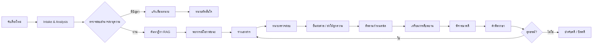
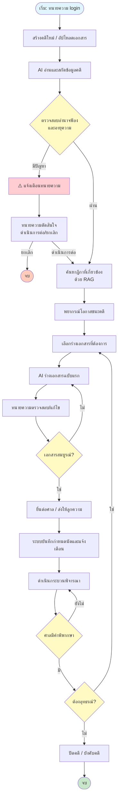
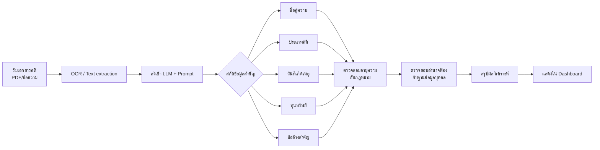
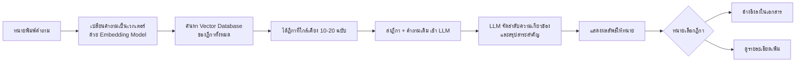
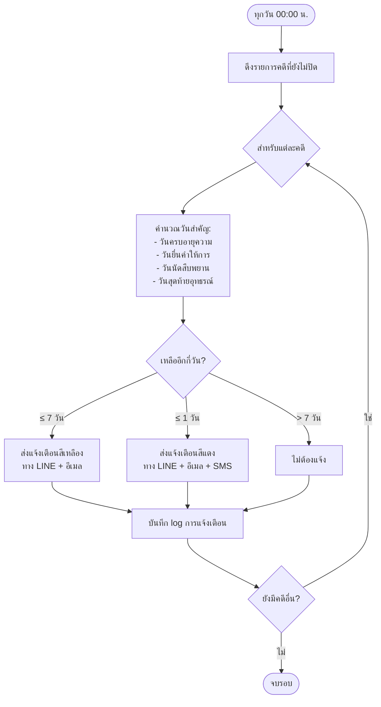

## 📘 เอกสารโครงการระบบ AI สำหรับทนายความในคดีแพ่งแบบครบวงจร  
### Civil AI Attorney (CAA) – Design & Implementation Package

> **หมายเหตุ:** เอกสารนี้เป็นส่วนของ **ข้อเสนอโครงการ (Project Proposal)** และ **เอกสารประกอบการออกแบบ** ไม่มีโค้ดโปรแกรม ใช้สำหรับนำเสนอผู้บริหารหรือทีมพัฒนา เพื่อเตรียมความพร้อมก่อนลงมือพัฒนา

---

## 🧩 ส่วนที่ 1: ส่วนเสนอโครงการ (Business Model Canvas + รายละเอียด)

### 1. วัตถุประสงค์ (Objectives)

| ลำดับ | วัตถุประสงค์ |
|-------|---------------|
| 1 | ลดเวลาการทำงานเอกสารทางกฎหมายของทนายความลง 70% ด้วย AI ช่วยร่างคำฟ้อง คำให้การ อุทธรณ์ ฎีกา |
| 2 | เพิ่มความแม่นยำในการค้นหาคำพิพากษาฎีกาที่เกี่ยวข้องด้วย Semantic Search แทนการใช้คำสำคัญ |
| 3 | พยากรณ์โอกาสชนะคดีเพื่อช่วยทนายความตัดสินใจรับคดีหรือเจรจาประนอมประนอม |
| 4 | ป้องกันการเสียสิทธิเนื่องจากกำหนดเวลา (อายุความ, ระยะยื่นอุทธรณ์) โดยระบบแจ้งเตือนอัตโนมัติ |
| 5 | เชื่อมต่อกับระบบศาลอิเล็กทรอนิกส์ (e-Filing) เพื่อยื่นเอกสารและรับหมายนัดโดยอัตโนมัติ |

### 2. กลุ่มเป้าหมาย (Customer Segments)

| กลุ่ม | รายละเอียด |
|------|-------------|
| **ทนายความรายบุคคล** | ทนายความที่เปิดสำนักงานเล็ก ต้องการเพิ่มประสิทธิภาพ ลดเวลางานเอกสาร |
| **สำนักงานกฎหมายขนาดกลาง-ใหญ่** | มีคดีจำนวนมาก ต้องการมาตรฐานเอกสารและระบบจัดการความรู้ภายใน |
| **นิติกรประจำองค์กร** | บริษัทมหาชน รัฐวิสาหกิจ ที่มีคดีแพ่งจำนวนมาก ต้องการวิเคราะห์ความเสี่ยง |
| **ผู้ช่วยทนายความ (paralegal)** | ต้องการเครื่องมือช่วยค้นคว้าฎีกาและร่างเอกสารเบื้องต้น |
| **ผู้พิพากษาหรือผู้ช่วยผู้พิพากษา** | ใช้วิเคราะห์ประเด็นและตรวจสอบคำพิพากษา (optional) |

### 3. ความรู้พื้นฐานที่ผู้ใช้ต้องมี (Prerequisite Knowledge)

| หัวข้อ | รายละเอียด |
|--------|-------------|
| **กฎหมายวิธีพิจารณาความแพ่ง** | เข้าใจขั้นตอนฟ้อง การยื่นคำให้การ การสืบพยาน การอุทธรณ์ การบังคับคดี |
| **กฎหมายแพ่ง** | รู้จักสัญญา ละเมิด ทรัพย์สิน ครอบครัว มรดก หนี้ |
| **การใช้คอมพิวเตอร์พื้นฐาน** | การอัปโหลดไฟล์ PDF, การพิมพ์, การใช้เว็บเบราว์เซอร์ |
| **ภาษาอังกฤษ (optional)** | เนื่องจากบาง UI อาจมีศัพท์เทคนิคภาษาอังกฤษ |

### 4. เนื้อหาโดยย่อ (กระชับ เน้นวัตถุประสงค์และประโยชน์)

ระบบ Civil AI Attorney เป็น **แพลตฟอร์มช่วยทนายความในคดีแพ่งครบวงจร** ประกอบด้วย 7 โมดูลหลัก:

1. **Intake & Analysis** – อ่านคำฟ้อง/เอกสาร สกัดประเด็น ตรวจสอบอำนาจฟ้องและอายุความ
2. **Document Generator** – ร่างคำฟ้อง คำให้การ คำร้องสอด อุทธรณ์ ฎีกา พร้อมอ้างอิงฎีกา
3. **Case Law RAG** – ค้นหาคำพิพากษาฎีกาที่เกี่ยวข้องด้วย AI แบบเข้าใจความหมาย
4. **Predictive Analytics** – พยากรณ์โอกาสชนะคดี (เปอร์เซ็นต์) จากฐานข้อมูลคดีเก่า
5. **Timeline & Deadline Tracker** – คำนวณและแจ้งเตือนกำหนดเวลาทางกฎหมาย
6. **Evidence Management** – จัดเก็บและสรุปพยานหลักฐาน พร้อมแนะนำคำถามนำ/ถามค้าน
7. **Pre‑trial Strategy** – ช่วยเตรียมการชี้สองสถาน วิเคราะห์จุดอ่อนจุดแข็ง

**ประโยชน์หลัก** – ลดเวลาเอกสาร 70% , เพิ่มความแม่นยำในการค้นหาฎีกา, ลดความผิดพลาดเรื่องกำหนดเวลา, ตัดสินใจรับคดีได้แม่นยำขึ้น

---

## 🧭 Business Model Canvas (BMC) สำหรับ Civil AI Attorney

| # | องค์ประกอบ | รายละเอียด |
|---|-------------|-------------|
| **1** | **กลุ่มลูกค้า (Customer Segments)** | ทนายความรายบุคคล, สำนักงานกฎหมาย, นิติกรบริษัท, ผู้ช่วยทนายความ |
| **2** | **คุณค่าเสนอ (Value Propositions)** | • ลดเวลาเตรียมเอกสาร<br>• ค้นหาฎีกาแม่นยำด้วย AI<br>• พยากรณ์ผลคดี<br>• เตือนกำหนดเวลาอัตโนมัติ<br>• รองรับศาลอิเล็กทรอนิกส์ |
| **3** | **ช่องทางการจัดส่ง (Channels)** | • Web Application (responsive)<br>• LINE Official Account<br>• REST API สำหรับสำนักงานใหญ่<br>• Mobile App (iOS/Android – ระยะที่ 2) |
| **4** | **ความสัมพันธ์กับลูกค้า (Customer Relationships)** | • ทดลองใช้ฟรี 14 วัน<br>• ฝึกอบรมออนไลน์ (webinar)<br>• ทีมสนับสนุนทางแชทและโทรศัพท์<br>• คู่มือและฐานความรู้ (knowledge base) |
| **5** | **กระแสรายได้ (Revenue Streams)** | • แบบรายเดือน (subscription): เริ่ม 2,500 บาท/ผู้ใช้/เดือน<br>• แบบรายปี: ส่วนลด 20%<br>• แบบองค์กร (On‑premise): ค่าลิขสิทธิ์ + ค่าบำรุงรายปี<br>• บริการเทรนโมเดลเฉพาะสำนักงาน (เพิ่มเติม) |
| **6** | **ทรัพยากรหลัก (Key Resources)** | • ทีมพัฒนาซอฟต์แวร์ (Full‑stack, AI/ML)<br>• ทีมนักกฎหมาย (ตรวจสอบความถูกต้องทางกฎหมาย)<br>• ฐานข้อมูลคำพิพากษาฎีกามากกว่า 50,000 ฉบับ<br>• Server / Cloud (AWS/GCP/Azure)<br>• API OpenAI / Anthropic |
| **7** | **กิจกรรมหลัก (Key Activities)** | • พัฒนาและอัปเดตโมเดล AI และ RAG pipeline<br>• รวบรวมและทำความสะอาดข้อมูลฎีกา<br>• สร้างเทมเพลตเอกสารทางกฎหมาย<br>• ดูแลระบบและความปลอดภัย<br>• การตลาดและขาย |
| **8** | **พันธมิตรหลัก (Key Partnerships)** | • สำนักงานศาลยุติธรรม (เข้าถึงระบบ e‑Filing)<br>• เนติบัณฑิตยสภา (ข้อมูลคำบรรยาย)<br>• ผู้ให้บริการ Cloud (AWS/GCP)<br>• บริษัทกฎหมายชั้นนำ (เป็น Early Adopter) |
| **9** | **โครงสร้างต้นทุน (Cost Structure)** | • ค่าแรงพัฒนาบุคลากร (40%)<br>• ค่า Server & API LLM (30%)<br>• การตลาดและขาย (15%)<br>• ค่าใช้จ่ายในการเก็บข้อมูลฎีกา (10%)<br>• ค่าใช้จ่ายสำนักงานและอื่น ๆ (5%) |

---

## 📄 ส่วนที่ 2: เอกสารประกอบโครงการ (Project Documentation)

### 2.1 บทนำ (Introduction)

**ชื่อโครงการ:** ระบบ AI สำหรับทนายความในคดีแพ่งแบบครบวงจร (Civil AI Attorney – CAA)

**ที่มาและความสำคัญ:**  
ในปัจจุบัน ทนายความต้องใช้เวลาจำนวนมากในการอ่านเอกสาร ค้นคว้าฎีกา ร่างเอกสารทางกฎหมาย และติดตามกำหนดเวลา ความผิดพลาดเพียงเล็กน้อย เช่น การยื่นคำให้การล่าช้า หรือการอ้างฎีกาที่ไม่ตรงประเด็น อาจทำให้เสียคดีหรือเสียสิทธิ ระบบ CAA จึงถูกออกแบบมาเพื่อลดภาระเหล่านี้โดยใช้เทคโนโลยี AI ที่ทันสมัย โดยยังคงให้ทนายความเป็นผู้ตัดสินใจสูงสุด

**ขอบเขตของเอกสาร:**  
เอกสารนี้ประกอบด้วย Business Model Canvas, รายละเอียดวัตถุประสงค์, กลุ่มเป้าหมาย, ความรู้พื้นฐาน, เนื้อหาโดยย่อ, บทนิยามศัพท์, คู่มือการใช้งาน (Conceptual), Workflow, Task List Template, Checklist Template และสรุปโครงการ

---

### 2.2 บทนิยาม (Definitions)

| คำศัพท์ | นิยาม |
|---------|--------|
| **CAA** | Civil AI Attorney – ระบบ AI สำหรับทนายความในคดีแพ่ง |
| **Intake** | ขั้นตอนการรับและวิเคราะห์ข้อมูลคดีเบื้องต้น |
| **RAG** | Retrieval-Augmented Generation – เทคนิคการค้นหาเอกสารแล้วให้ AI สร้างคำตอบ |
| **Semantic Search** | การค้นหาตามความหมาย ไม่ใช่แค่คำตรง |
| **LLM** | Large Language Model – โมเดลภาษาใหญ่ เช่น GPT-4 |
| **Vector Database** | ฐานข้อมูลที่เก็บเอกสารในรูปแบบเวกเตอร์สำหรับค้นหาเชิงความหมาย |
| **Pre-trial** | การชี้สองสถาน – กระบวนการก่อนสืบพยานเพื่อกำหนดประเด็น |
| **Statute of Limitations** | อายุความ – ระยะเวลาที่กฎหมายกำหนดให้ใช้สิทธิฟ้องคดี |
| **e-Filing** | ระบบยื่นเอกสารอิเล็กทรอนิกส์ต่อศาล |
| **ฎีกา** | คำพิพากษาศาลฎีกา (Supreme Court precedent) |
| **Workflow** | ลำดับขั้นตอนการทำงานของระบบ |
| **Task List** | รายการงานที่ต้องทำสำหรับแต่ละคดี |
| **Checklist** | รายการตรวจสอบความถูกต้อง |

---

### 2.3 บทหัวข้อ (Main Chapters – โครงสร้างระบบ)

ระบบ CAA แบ่งออกเป็น 7 โมดูลหลัก ดังนี้

| บทที่ | ชื่อโมดูล | หน้าที่หลัก |
|-------|-----------|-------------|
| 1 | **Legal Intake & Analysis** | รับเรื่อง, วิเคราะห์คำฟ้อง, ตรวจสอบอำนาจฟ้องและอายุความ |
| 2 | **Document Generator** | สร้างร่างเอกสารทางกฎหมาย (คำฟ้อง, คำให้การ, อุทธรณ์, ฎีกา, คำร้อง) |
| 3 | **Case Law RAG** | ค้นหาคำพิพากษาฎีกาที่เกี่ยวข้องแบบ semantic พร้อม citation |
| 4 | **Predictive Analytics** | พยากรณ์โอกาสชนะคดี (%) โดยใช้ Machine Learning |
| 5 | **Timeline & Deadline Tracker** | คำนวณกำหนดเวลา, แจ้งเตือนทางอีเมล/LINE, ปฏิทินคดี |
| 6 | **Evidence Management** | จัดเก็บพยานหลักฐาน, สรุปประเด็น, แนะนำคำถามนำ/ถามค้าน |
| 7 | **Pre‑trial & Strategy** | วางกลยุทธ์, เตรียมการชี้สองสถาน, วิเคราะห์จุดแข็ง/จุดอ่อน |

---

### 2.4 คู่มือการใช้งาน (User Manual – Conceptual Design)

#### 2.4.1 การเริ่มต้นใช้งาน
1. เข้าสู่ระบบด้วยอีเมลและรหัสผ่าน (หรือ SSO จากสำนักงาน)
2. สร้างคดีใหม่ → เลือกประเภทคดี (ละเมิด, สัญญา, มรดก, ครอบครองปรปักษ์, ฯลฯ)
3. อัปโหลดเอกสาร (คำฟ้อง, สัญญา, หนังสือทวงถาม) หรือพิมพ์สรุปข้อเท็จจริง

#### 2.4.2 การวิเคราะห์คดี
- ระบบจะแสดง **สรุปประเด็นข้อพิพาท, กฎหมายที่เกี่ยวข้อง, แนวทางต่อสู้เบื้องต้น**
- ตรวจสอบ **อำนาจฟ้องและอายุความ** หากมีปัญหา ระบบจะแจ้งเตือนทันที

#### 2.4.3 การค้นหาฎีกา
- พิมพ์คำถามหรือข้อกฎหมาย (ภาษาไทย) ในช่องค้นหา
- ระบบจะแสดงรายการฎีกาเรียงตามความเกี่ยวข้อง พร้อมคำย่อและสาระสำคัญ
- สามารถเลือกอ้างอิงลงในเอกสารได้โดยคลิกปุ่ม “เพิ่ม citation”

#### 2.4.4 การร่างเอกสาร
- เลือกประเภทเอกสาร (คำให้การ, อุทธรณ์ ฯลฯ)
- กรอกข้อมูลคู่ความ, ทุนทรัพย์, ประเด็นหลัก
- ระบบสร้างร่างเอกสารให้ทันที → ทนายตรวจสอบและแก้ไข → ดาวน์โหลดเป็น Word หรือ PDF

#### 2.4.5 การพยากรณ์ผลคดี
- หลังจากกรอกข้อมูลครบ ระบบจะแสดง **โอกาสชนะ (%)** และ **ปัจจัยเสี่ยงหลัก**
- ใช้ประกอบการตัดสินใจรับคดีหรือเจรจาประนีประนอม

#### 2.4.6 การติดตามกำหนดเวลา
- ระบบจะบันทึกวันเกิดเหตุ, วันฟ้อง, วันนัด, วันครบกำหนดอุทธรณ์ อัตโนมัติ
- ส่งการแจ้งเตือนทาง LINE / อีเมลก่อนถึงกำหนด 7 วัน, 3 วัน, 1 วัน

---

### 2.5 Workflow ของระบบ (Business Process Flow)



> คำอธิบายเพิ่มเติม: Workflow นี้เป็นแบบวนรอบ (loop) เมื่อมีการอุทธรณ์หรือฎีกา จะกลับไปยังขั้นตอนร่างเอกสารอีกครั้ง

---

### 2.6 TASK LIST Template (ตัวอย่างสำหรับคดีแพ่ง)

ใช้สำหรับมอบหมายงานในแต่ละคดี ให้ทีมทนายความหรือผู้ช่วย

| Task ID | งาน (Task) | ผู้รับผิดชอบ | กำหนดแล้วเสร็จ | สถานะ | หมายเหตุ |
|---------|-------------|--------------|----------------|--------|-----------|
| CAA-001 | อัปโหลดคำฟ้องและเอกสารที่เกี่ยวข้อง | ผู้ช่วยทนาย | วันที่รับเรื่อง | ☐ ยังไม่เริ่ม | - |
| CAA-002 | วิเคราะห์ประเด็นข้อพิพาทและอายุความ | ทนายความ | +1 วัน | ☐ ยังไม่เริ่ม | ใช้ AI ช่วย |
| CAA-003 | ค้นหาฎีกาที่เกี่ยวข้อง (อย่างน้อย 5 ฉบับ) | ผู้ช่วยทนาย | +2 วัน | ☐ ยังไม่เริ่ม | ใช้ RAG |
| CAA-004 | ร่างคำให้การ / ฟ้องแย้ง | AI + ทนาย | +5 วัน | ☐ ยังไม่เริ่ม | ใช้ Document Generator |
| CAA-005 | ตรวจสอบและแก้ไขคำให้การฉบับสุดท้าย | ทนายความ | +7 วัน | ☐ ยังไม่เริ่ม | - |
| CAA-006 | ยื่นคำให้การต่อศาล (e-Filing หรือไปส่ง) | ผู้ช่วยทนาย | ภายใน 15 วันนับรับหมาย | ☐ ยังไม่เริ่ม | - |
| CAA-007 | เตรียมบัญชีระบุพยานและสรุปประเด็นสืบ | ทนายความ | ก่อนชี้สองสถาน 7 วัน | ☐ ยังไม่เริ่ม | - |
| CAA-008 | ติดตามวันนัดและแจ้งเตือนลูกความ | ระบบอัตโนมัติ | ต่อเนื่อง | ☐ อัตโนมัติ | - |

---

### 2.7 CHECKLIST Template (สำหรับตรวจสอบความถูกต้องของคดี)

ใช้สำหรับทนายความตรวจสอบก่อนยื่นเอกสารหรือก่อนสืบพยาน

#### ✅ ก่อนยื่นคำฟ้อง
- [ ] โจทก์มีอำนาจฟ้อง (เป็นผู้เสียหาย, ทายาท, หรือตัวการ)
- [ ] ไม่ขาดอายุความ (ตรวจสอบวันที่เกิดเหตุและวันที่ฟ้อง)
- [ ] ยื่นต่อศาลที่มีเขตอำนาจ (ตามทุนทรัพย์และสถานที่เกิดเหตุ)
- [ ] เสียค่าธรรมเนียมศาลถูกต้อง (หรือยื่นคำร้องขออนุญาตดำเนินคดีอย่างคนอนาถา)
- [ ] คำฟ้องมีข้อความครบตาม ป.วิ.พ. มาตรา 172 (ชื่อคู่ความ, ข้ออ้าง, คำขอบังคับ)
- [ ] แนบสำเนาเอกสารประกอบคำฟ้องครบ

#### ✅ ก่อนยื่นคำให้การ
- [ ] ยื่นภายใน 15 วันนับแต่วันได้รับหมายเรียก (มาตรา 177)
- [ ] คำให้การระบุข้อต่อสู้ชัดเจน ไม่เคลือบคลุม
- [ ] หากมีฟ้องแย้ง ให้ยื่นพร้อมคำให้การ (มาตรา 177 วรรคสาม)
- [ ] จัดส่งสำเนาคำให้การให้โจทก์ (หรือให้ศาลส่ง)

#### ✅ ก่อนวันสืบพยาน
- [ ] บัญชีระบุพยาน (ชื่อ ที่อยู่ สิ่งที่จะเบิกความ) ยื่นก่อนวันสืบไม่น้อยกว่า 7 วัน
- [ ] พยานเอกสารเตรียมต้นฉบับและสำเนา
- [ ] เตรียมคำถามนำสำหรับพยานของตน
- [ ] เตรียมคำถามค้านสำหรับพยานคู่ความ
- [ ] แจ้งเตือนพยานบุคคลให้มาในวันนัด

#### ✅ ก่อนยื่นอุทธรณ์ / ฎีกา
- [ ] ยื่นภายใน 1 เดือนนับแต่วันอ่านคำพิพากษา (มาตรา 225)
- [ ] ตรวจสอบว่าคดีต้องห้ามอุทธรณ์ในข้อเท็จจริงหรือไม่ (ทุนทรัพย์ ≤ 50,000 บาท)
- [ ] ชำระค่าธรรมเนียมอุทธรณ์หรือวางประกันตามที่ศาลกำหนด
- [ ] อุทธรณ์ระบุข้อกฎหมายและข้อเท็จจริงที่โต้แย้งอย่างชัดเจน

---

### 2.8 สรุปเอกสารโครงการ (Executive Summary)

โครงการระบบ AI สำหรับทนายความในคดีแพ่งแบบครบวงจร (CAA) เป็นแพลตฟอร์มที่ช่วยให้ทนายความและสำนักงานกฎหมายสามารถทำงานคดีแพ่งได้ **รวดเร็วขึ้น 70%** , **แม่นยำขึ้น** และ **ลดความเสี่ยงจากการขาดกำหนดเวลา** โดยใช้เทคโนโลยี AI และฐานข้อมูลฎีกาขนาดใหญ่ โมเดลธุรกิจแบบ Subscription ทำให้เข้าถึงง่าย คุ้มค่าการลงทุน ระบบออกแบบให้สอดคล้องกับประมวลกฎหมายวิธีพิจารณาความแพ่งและคำพิพากษาฎีกา ทนายความยังคงเป็นผู้ตัดสินใจสูงสุด ส่วน AI เป็นเพียงผู้ช่วยอัจฉริยะ

**ประโยชน์ที่ได้รับชัดเจน:**
- ประหยัดเวลาในการค้นคว้าและร่างเอกสาร
- ได้งานคุณภาพสูง ลดข้อผิดพลาดทางเทคนิค
- สามารถรับคดีได้มากขึ้นโดยไม่เพิ่มภาระ
- ลูกความได้รับบริการที่รวดเร็วและเป็นมืออาชีพ

---

## ✅ สรุปส่งมอบ (Deliverables) ของเอกสารนี้

| ลำดับ | รายการ | สถานะ |
|-------|--------|--------|
| 1 | วัตถุประสงค์, กลุ่มเป้าหมาย, ความรู้พื้นฐาน, เนื้อหาโดยย่อ | ✅ เสร็จ |
| 2 | Business Model Canvas (BMC) 9 ช่อง | ✅ เสร็จ |
| 3 | บทนำ, บทนิยาม, บทหัวข้อ | ✅ เสร็จ |
| 4 | คู่มือการใช้งานแนวคิด (Conceptual User Manual) | ✅ เสร็จ |
| 5 | Workflow Diagram (Mermaid) พร้อมคำอธิบาย | ✅ เสร็จ |
| 6 | TASK LIST Template | ✅ เสร็จ |
| 7 | CHECKLIST Template | ✅ เสร็จ |
| 8 | สรุปโครงการ | ✅ เสร็จ |

---

## 🧩 เอกสารเพิ่มเติม: Flowchart แบบดูง่าย สำหรับระบบ Civil AI Attorney

ตามที่คุณขอ “ทำส่วนนี้ใหม่ วาดรูปโฟล์ให้ ดูง่าย” – ขอเสนอ **Flowchart ใหม่** ที่ถูกออกแบบให้ **简洁, เป็นขั้นตอน, เข้าใจง่าย** โดยแบ่งเป็น 4 แผนภาพหลัก:

1. **Main Workflow** – ภาพรวมการทำงานของระบบตั้งแต่รับเรื่องจนจบคดี  
2. **AI Analysis Sub‑flow** – ขั้นตอนการวิเคราะห์คดีด้วย AI  
3. **RAG Search Sub‑flow** – การค้นหาฎีกาแบบ Semantic  
4. **Deadline Alert Sub‑flow** – การแจ้งเตือนกำหนดเวลา  

ใช้สัญลักษณ์พื้นฐาน: วงรี (เริ่ม/จบ), สี่เหลี่ยมผืนผ้า (กระบวนการ), สี่เหลี่ยมขนมเปียกปูน (ตัดสินใจ) และลูกศรแสดงลำดับ

---

## 📌 แผนภาพที่ 1: Main Workflow ของระบบ Civil AI Attorney



### 📝 คำอธิบาย (สั้น กระชับ)

| ขั้นตอน | ว่าไงบ้าง |
|--------|----------|
| **เริ่ม** | ทนายความล็อกอินเข้าสู่ระบบ |
| **สร้างคดี** | กรอกข้อมูลหรืออัปโหลดคำฟ้อง/สัญญา |
| **AI อ่าน** | สกัดชื่อคู่ความ, มูลคดี, วันที่, ทุนทรัพย์ |
| **ตรวจสอบอำนาจ/อายุความ** | ถ้าขาดอายุความหรือไม่มีอำนาจฟ้อง → แจ้งเตือน |
| **ค้นหาฎีกา** | ใช้ RAG หาคำพิพากษาใกล้เคียง |
| **พยากรณ์** | แสดง % โอกาสชนะ |
| **ร่างเอกสาร** | เลือกประเภท (คำให้การ, อุทธรณ์ ฯลฯ) แล้ว AI ร่างให้ |
| **ทนายตรวจ** | แก้ไขจนพอใจ |
| **ยื่น/ส่ง** | ยื่น e-Filing หรือส่งให้ลูกความ |
| **ติดตามนัด** | ระบบบันทึกวันนัดและแจ้งเตือน |
| **พิจารณา** | รอจนศาลมีคำพิพากษา |
| **อุทธรณ์?** | ถ้าไม่พอใจ → กลับไปร่างเอกสารใหม่ (อุทธรณ์/ฎีกา) |
| **ปิดคดี** | จบหรือบังคับคดี |

---

## 📌 แผนภาพที่ 2: AI Analysis Sub‑flow (วิเคราะห์คดี)



**อธิบาย:** ระบบจะแยกข้อความจากเอกสาร (ถ้าเป็นรูป/scanned ให้ OCR ก่อน) ส่งให้ LLM เพื่อดึงข้อมูลสำคัญ จากนั้นนำไปเปรียบเทียบกับฐานข้อมูลกฎหมาย (เช่น อายุความละเมิด 1 ปี, สัญญา 10 ปี) และฐานข้อมูลบุคคล (ตรวจสอบว่าทายาทมีอำนาจฟ้อง) ก่อนแสดงผลให้ทนายความ

---

## 📌 แผนภาพที่ 3: RAG Search Sub‑flow (ค้นหาฎีกา)



**อธิบาย:** การค้นหาแบบ Semantic ไม่ใช่แค่คำตรง แต่ใช้เวกเตอร์หาความหมายใกล้เคียง ทำให้ได้ฎีกาที่เกี่ยวข้องแม้ใช้คำต่างกัน จากนั้นให้ LLM ช่วยสรุปและจัดลำดับ

---

## 📌 แผนภาพที่ 4: Deadline Alert Sub‑flow (แจ้งเตือนกำหนดเวลา)



**อธิบาย:** ระบบรันทุกวันอัตโนมัติ คำนวณวันสำคัญตามข้อมูลคดี (วันที่รับหมาย, วันเกิดเหตุ, วันนัด) และแจ้งเตือนล่วงหน้า 7 วันและ 1 วัน ช่วยให้ทนายความไม่พลาดกำหนดเวลา

---

## ✅ สรุปสิ่งที่ส่งให้ใหม่

| รายการ | สถานะ |
|--------|--------|
| Main Workflow (ภาพรวมระบบ) | ✅ ใหม่ ดูง่าย ลดเงื่อนไขซับซ้อน |
| AI Analysis Sub‑flow | ✅ ใหม่ แยกเป็นขั้นตอนย่อย |
| RAG Search Sub‑flow | ✅ ใหม่ แสดงการทำงาน semantic search |
| Deadline Alert Sub‑flow | ✅ ใหม่ แสดงตรรกะการแจ้งเตือน |
| คำอธิบายประกอบแบบสั้น | ✅ ทุกแผนภาพ |

 # Rate Limiting ใน Golang

## Rate Limiting คืออะไร

Rate Limiting หรือการจำกัดอัตราการรับส่งข้อมูล คือกลไกที่ใช้ควบคุมจำนวนคำขอ (requests) ที่ Client สามารถส่งมายังระบบได้ในช่วงเวลาหนึ่ง เช่น 100 ครั้งต่อ 1 นาที หรือ 10 ครั้งต่อ 1 วินาที โดยเปรียบเสมือน “วาล์วกันกระแทก” ที่ช่วยจำกัด Traffic ของระบบ ไม่ให้รับ Request เกินกว่าที่ระบบจะรองรับไหว

ใน Golang การทำ Rate Limiting ได้รับการสนับสนุนเป็นอย่างดีทั้งจาก Standard Library และ Community มีหลายวิธีให้เลือกใช้ตามความเหมาะสมของแต่ละสถานการณ์


## Rate Limiting มีกี่แบบ

### 1. Fixed Window (Fixed Window Counter)
- ตัดช่วงเวลาเป็นหน้าต่างขนาดคงที่ เช่น ทุกๆ 10 วินาที
- นับจำนวนคำขอในแต่ละหน้าต่าง
- **ข้อดี**: ง่ายที่สุด ใช้หน่วยความจำน้อย
- **ข้อเสีย**: มีโอกาสเกิด Burst ที่ขอบหน้าต่าง (boundary burst)

### 2. Sliding Window
- ใช้หน้าต่างที่เลื่อนไปตามเวลาจริง
- จัดเก็บ timestamp ของคำขอแต่ละรายการ
- **ข้อดี**: แม่นยำสูงสุด ลดปัญหา Boundary Burst
- **ข้อเสีย**: ใช้หน่วยความจำมากกว่า Fixed Window

### 3. Token Bucket
- ระบบเติม Token เข้าถังด้วยอัตราคงที่
- แต่ละคำขอต้องใช้ Token 1 ใบ
- **ข้อดี**: รองรับ Burst ได้ดี (ยืม Token จากอนาคตได้)
- **ข้อเสีย**: อาจปล่อย Burst ที่มากเกินไปได้

### 4. Leaky Bucket
- ใส่ Request เข้า Queue ขนาดจำกัด
- ระบบดึง Request ออกด้วยอัตราคงที่
- **ข้อดี**: เรียบเนียน ไม่มี Burst
- **ข้อเสีย**: ไม่เหมาะกับงานที่ต้องการ Burst


## Rate Limiting ใช้อย่างไร นำไปใช้ในกรณีไหน ทำไมต้องใช้ ประโยชน์ที่ได้รับ

### สถานการณ์ที่ต้องใช้
| สถานการณ์ | เหตุผล |
|------------|--------|
| **API Gateway** | ป้องกัน API ถูกใช้งานเกินขีดจำกัด |
| **Microservices** | ป้องกัน Service ตัวหนึ่งถูก Request ถล่มจนตาย |
| **Login Endpoint** | ป้องกัน Brute-force attack |
| **Resource-intensive Operations** | จำกัดการใช้ CPU/DB/Network |
| **Third-party API Integration** | เคารพ Rate Limit ของ Provider |

### ทำไมต้องใช้
- ป้องกัน DoS / DDoS Attack
- ป้องกัน Server Overload (CPU/Memory/DB Connection)
- ป้องกัน Cascade Failure / เอฟเฟกต์โดมิโน
- สร้างความเป็นธรรมให้กับทุก Client
- ลดต้นทุนทรัพยากร Cloud / API Service

### ประโยชน์ที่ได้รับ
- **ความเสถียรของระบบ**: บริการทำงานได้สม่ำเสมอแม้ Traffic พุ่งสูง
- **ป้องกันการถูกโจมตี**: ลดความเสี่ยงจาก Brute-force, DDoS
- **ความเป็นธรรมระหว่างผู้ใช้**: แบ่งสรรทรัพยากรอย่างเท่าเทียม
- **ควบคุมต้นทุน**: จำกัดการเรียกใช้ API ที่มีค่าใช้จ่ายสูง


## โครงสร้างการทำงานของ Rate Limiting

องค์ประกอบหลักของ Rate Limiting System ประกอบด้วย:

1. **Limiter Instance**: ตัวควบคุมหลักที่จัดการการให้และคืน Token
2. **Rate (Limit)**: อัตราการเติม Token ต่อหน่วยเวลา (tokens/sec)
3. **Burst (Capacity)**: ขนาดสูงสุดของ Bucket (เผื่อ Burst)
4. **Store/Backend**: พื้นที่เก็บสถานะของ Limiter (In-Memory / Redis)
5. **Middleware Layer**: ชั้นที่ดัก Request ก่อนถึง Business Logic


## ออกแบบ Workflow

### Data Flow Diagram (Flowchart TB)

```
┌─────────────────────────────────────────────────────────────────────────────────┐
│                            WORKFLOW: RATE LIMITING PROCESS                        │
└─────────────────────────────────────────────────────────────────────────────────┘

    ┌─────────────┐
    │   Client    │
    │  (User/IP)  │
    └──────┬──────┘
           │ ① HTTP Request
           ▼
    ┌─────────────┐
    │   Router    │
    │   (Gin/Echo)│
    └──────┬──────┘
           │
           ▼
    ┌─────────────────────────────────────────────────────────────────────────────┐
    │                        ② RATE LIMITING MIDDLEWARE                           │
    │  ┌─────────────────────────────────────────────────────────────────────┐    │
    │  │  Extract Identifier (API Key / IP / User ID)                        │    │
    │  └─────────────────────────────────────────────────────────────────────┘    │
    │                                    │                                         │
    │                                    ▼                                         │
    │  ┌─────────────────────────────────────────────────────────────────────┐    │
    │  │  Get/Create Limiter for this Identifier                             │    │
    │  │  • In-Memory: sync.Map / map[string]*rate.Limiter                   │    │
    │  │  • Distributed: Redis key                                           │    │
    │  └─────────────────────────────────────────────────────────────────────┘    │
    │                                    │                                         │
    │                                    ▼                                         │
    │  ┌─────────────────────────────────────────────────────────────────────┐    │
    │  │                ③ ALLOW? (limiter.Allow())                          │    │
    │  │  • Token available? → consume 1 token → return true                │    │
    │  │  • No token → return false                                          │    │
    │  └─────────────────────────────────────────────────────────────────────┘    │
    └─────────────────────────────────────────────────────────────────────────────┘
                                    │
                    ┌───────────────┴───────────────┐
                    │                               │
                    ▼ (Allow = true)                ▼ (Allow = false)
    ┌───────────────────────────┐    ┌───────────────────────────────────────┐
    │       ④ PROCESS           │    │         ⑤ REJECT                      │
    │  • Call next handler       │    │  • HTTP 429 Too Many Requests        │
    │  • Business logic          │    │  • Response: {"error":"rate limit"}   │
    │  • Return 200 OK           │    │  • Header: Retry-After: X seconds     │
    └───────────┬───────────────┘    └───────────────────┬───────────────────┘
                │                                        │
                ▼                                        ▼
    ┌───────────────────────────┐    ┌───────────────────────────────────────┐
    │      ⑥ RESPONSE 200       │    │        ⑦ RESPONSE 429                 │
    │  • Request successful      │    │  • Client should retry later         │
    └───────────────────────────┘    └───────────────────────────────────────┘

    ┌─────────────────────────────────────────────────────────────────────────────┐
    │                        ⑧ BACKGROUND CLEANUP                                 │
    │  • Goroutine runs every N minutes                                          │
    │  • Remove stale IP entries (lastSeen > TTL)                                │
    │  • Prevent memory leak                                                     │
    └─────────────────────────────────────────────────────────────────────────────┘
```

### คำอธิบายกระบวนการแบบละเอียด

**ขั้นตอนที่ ①: Client ส่ง Request**
- Client ทำ HTTP Request ไปยัง API Endpoint

**ขั้นตอนที่ ②: Rate Limiting Middleware ดักจับ**
- Request ถูกดักโดย Middleware ก่อนถึง Business Logic
- ดึง Identifier (IP Address, API Key, User ID) จาก Request

**ขั้นตอนที่ ③: ตรวจสอบ Allowance**
- เรียก `limiter.Allow()` เพื่อตรวจสอบว่ามี Token เหลือหรือไม่
- กรณีมี → ใช้ Token 1 ใบ → ผ่านไป Process
- กรณีไม่มี → ขั้นตอนที่ ⑤

**ขั้นตอนที่ ④: Process Request (Allow)**
- Request ถูกส่งต่อไปยัง Business Logic
- ประมวลผลตามปกติ
- ส่ง Response 200 OK กลับไปยัง Client

**ขั้นตอนที่ ⑤: Reject Request (Deny)**
- ส่ง Response 429 Too Many Requests
- แนบ Header `Retry-After` เพื่อบอก Client ควรรออีกกี่วินาที

**ขั้นตอนที่ ⑥-⑦: Response กลับ Client**
- Client ได้รับ Response ตามผลการตรวจสอบ

**ขั้นตอนที่ ⑧: Background Cleanup (สำหรับ Per-IP Limiter)**
- Goroutine ทำงานเบื้องหลังทุกๆ 5 นาที
- ลบ IP ที่ไม่ได้ใช้งานนานเกิน TTL ออกจาก Map
- ป้องกัน Memory Leak


## ตัวอย่างการใช้งานจริง / กรณีศึกษา

### กรณีศึกษา 1: Per-IP Rate Limiter สำหรับ Public API

**Scenario**: REST API ที่เปิดให้ใช้งานสาธารณะ ต้องป้องกัน Client รายเดียวใช้ทรัพยากรเกินไป

**Solution**: Implement Per-IP Rate Limiter โดยใช้ `golang.org/x/time/rate`

ผลลัพธ์: Client แต่ละรายถูกจำกัดอย่างอิสระ Client ที่ใช้งานหนักจะไม่กระทบ Client อื่น

### กรณีศึกษา 2: Distributed Rate Limiter สำหรับ Microservices

**Scenario**: บริการถูก Deploy เป็นหลาย Instance ต้องมี Rate Limit ที่รวมทุก Instance

**Solution**: ใช้ Redis เป็น Backend Store กลาง

**ผลลัพธ์**: Rate Limit ทำงานร่วมกันทุก Instance บรรลุประสิทธิภาพ 3,000+ req/sec ที่ latency <2ms

### กรณีศึกษา 3: Strict Rate Limit สำหรับ Third-party API

**Scenario**: ต้องเรียก Payment Gateway ที่จำกัด 10 QPS อย่างเคร่งครัด

**Problem**: ตั้ง Burst สูงเกินไป → ส่ง Request พร้อมกันหลายรายการ → ถูก Block

**Solution**: ตั้ง `burst=1` เพื่อบังคับให้ Request เรียงลำดับ

### กรณีศึกษา 4: Database Connection Pool Limiter

**Scenario**: ป้องกัน DB Connection หมดจากการ Query หนัก

**Solution**: Rate Limit ควบคุมจำนวน Query ต่อวินาทีก่อนส่งไป DB


## เทมเพลตและตัวอย่างโค้ด พร้อมนำไป Run ได้ทันที

### โครงสร้าง Project

```
rate-limiter-demo/
├── go.mod
├── main.go
├── middleware/
│   └── ratelimit.go
└── handlers/
    └── api.go
```

### 1. ตัวอย่างพื้นฐาน: Net/http + rate.Limiter

```go
// basic/main.go
// การใช้งาน Rate Limiter พื้นฐานด้วย net/http และ golang.org/x/time/rate

package main

import (
    "fmt"
    "log"
    "net/http"
    "golang.org/x/time/rate"
)

func main() {
    // สร้าง Limiter: เติม Token 10 ใบ/วินาที, Burst สูงสุด 20 ใบ
    // Limit คืออัตราเฉลี่ยระยะยาว, Burst คือความจุสูงสุดของ Bucket
    limiter := rate.NewLimiter(10, 20)  // 10 requests/sec, burst 20

    // สร้าง HTTP Handler พร้อม Rate Limiting
    http.HandleFunc("/api/hello", func(w http.ResponseWriter, r *http.Request) {
        // Allow() คือ Non-blocking check
        // ถ้ามี Token: คืนค่า true และใช้ Token 1 ใบ
        // ถ้าไม่มี Token: คืนค่า false ทันที
        if !limiter.Allow() {
            // HTTP 429 Too Many Requests
            w.WriteHeader(http.StatusTooManyRequests)
            w.Write([]byte(`{"error":"rate limit exceeded"}`))
            return
        }
        
        // Business logic
        fmt.Fprintln(w, "Hello, World!")
    })

    log.Println("Server started on :8080")
    log.Fatal(http.ListenAndServe(":8080", nil))
}
```

### 2. Per-IP Rate Limiter (พร้อม Memory Cleanup)

```go
// perip/main.go
// Per-IP Rate Limiter พร้อม Background Cleanup ป้องกัน Memory Leak

package main

import (
    "fmt"
    "log"
    "net/http"
    "sync"
    "time"
    
    "golang.org/x/time/rate"
)

// ipLimiter เก็บ Limiter และเวลาที่ถูกใช้ล่าสุดของแต่ละ IP
type ipLimiter struct {
    limiter  *rate.Limiter
    lastSeen time.Time  // ใช้สำหรับ Cleanup เท่านั้น
}

// RateLimiter Per-IP Rate Limiter
type RateLimiter struct {
    mu    sync.Mutex                    // ป้องกัน concurrent map access
    ips   map[string]*ipLimiter         // key: IP address
    rps   rate.Limit                    // requests per second
    burst int                           // burst size
    ttl   time.Duration                 // time-to-live สำหรับ IP ที่ไม่ใช้งาน
}

// NewRateLimiter สร้าง RateLimiter ใหม่
// rps: จำนวน requests ที่อนุญาตต่อวินาที
// burst: ขนาด Burst สูงสุด (แนะนำให้ตั้งเท่ากับ rps ถ้าต้องการ Strict Limit)
// ttl: เวลาที่เก็บ IP ที่ไม่ใช้งานไว้ (แนะนำ 5-10 นาที)
func NewRateLimiter(rps int, burst int, ttl time.Duration) *RateLimiter {
    rl := &RateLimiter{
        ips:   make(map[string]*ipLimiter),
        rps:   rate.Limit(rps),
        burst: burst,
        ttl:   ttl,
    }
    // เริ่ม Goroutine ทำความสะอาด IP ที่หมดอายุ
    go rl.cleanupLoop()
    return rl
}

// cleanupLoop วนลูปทำความสะอาด IP ที่ไม่มีการใช้งานเกิน TTL
func (rl *RateLimiter) cleanupLoop() {
    ticker := time.NewTicker(5 * time.Minute)  // ตรวจสอบทุก 5 นาที
    defer ticker.Stop()
    
    for range ticker.C {
        rl.mu.Lock()
        cutoff := time.Now().Add(-rl.ttl)
        for ip, l := range rl.ips {
            if l.lastSeen.Before(cutoff) {
                delete(rl.ips, ip)  // ลบ IP ที่ไม่ใช้งาน
            }
        }
        rl.mu.Unlock()
    }
}

// Allow ตรวจสอบว่า IP นี้ได้รับอนุญาตให้ส่ง Request หรือไม่
func (rl *RateLimiter) Allow(ip string) bool {
    rl.mu.Lock()
    defer rl.mu.Unlock()
    
    // ดึงหรือสร้าง Limiter สำหรับ IP นี้
    l, exists := rl.ips[ip]
    if !exists {
        l = &ipLimiter{
            limiter:  rate.NewLimiter(rl.rps, rl.burst),
            lastSeen: time.Now(),
        }
        rl.ips[ip] = l
    }
    
    // อัปเดต lastSeen สำหรับการ Cleanup
    l.lastSeen = time.Now()
    
    // ตรวจสอบ Allow
    return l.limiter.Allow()
}

// ตัวอย่างการใช้งาน
func main() {
    // สร้าง Rate Limiter: 10 requests/sec, burst=10, TTL=5 นาที
    limiter := NewRateLimiter(10, 10, 5*time.Minute)
    
    // HTTP Handler ที่ใช้ Rate Limiter
    http.HandleFunc("/api/data", func(w http.ResponseWriter, r *http.Request) {
        // ดึง IP ของ Client (รองรับ X-Forwarded-For ด้วย)
        ip := r.RemoteAddr
        
        if !limiter.Allow(ip) {
            w.Header().Set("Retry-After", "5")
            w.WriteHeader(http.StatusTooManyRequests)
            w.Write([]byte(`{"error":"rate limit exceeded","retry_after":5}`))
            return
        }
        
        w.Header().Set("Content-Type", "application/json")
        fmt.Fprintln(w, `{"status":"ok","message":"request processed"}`)
    })
    
    log.Println("Per-IP Rate Limiter running on :8080")
    log.Fatal(http.ListenAndServe(":8080", nil))
}
```

### 3. Gin Framework Rate Limiting Middleware

```go
// gin/main.go
// Rate Limiting Middleware สำหรับ Gin Framework

package main

import (
    "net/http"
    "sync"
    "time"
    
    "github.com/gin-gonic/gin"
    "golang.org/x/time/rate"
)

// ประกาศเป็น Global Variable เพื่อให้ทุก Request ใช้ Limiter เดียวกัน
// ⚠️ IMPORTANT: ห้ามสร้าง Limiter ภายใน Middleware Function!
// การสร้างภายใน Function จะสร้าง Limiter ใหม่ทุกครั้ง → Rate Limit ไม่ทำงาน
var globalLimiter = rate.NewLimiter(rate.Limit(10), 20)  // 10 req/sec, burst 20

// RateLimitMiddleware ตรวจสอบ Rate Limit แบบ Global
func RateLimitMiddleware() gin.HandlerFunc {
    return func(c *gin.Context) {
        if !globalLimiter.Allow() {
            c.AbortWithStatusJSON(http.StatusTooManyRequests, gin.H{
                "error": "rate limit exceeded",
            })
            return
        }
        c.Next()  // ส่งต่อไปยัง Handler ถัดไป
    }
}

// PerIPRateLimiter สำหรับ Limiter แยกตาม IP
type PerIPRateLimiter struct {
    limiters sync.Map   // thread-safe map
    rate     rate.Limit
    burst    int
}

func NewPerIPRateLimiter(rps int, burst int) *PerIPRateLimiter {
    return &PerIPRateLimiter{
        rate:  rate.Limit(rps),
        burst: burst,
    }
}

func (p *PerIPRateLimiter) getLimiter(ip string) *rate.Limiter {
    // LoadOrStore: atomic operation สำหรับ map
    if val, ok := p.limiters.Load(ip); ok {
        return val.(*rate.Limiter)
    }
    
    limiter := rate.NewLimiter(p.rate, p.burst)
    p.limiters.Store(ip, limiter)
    return limiter
}

func (p *PerIPRateLimiter) Allow(ip string) bool {
    return p.getLimiter(ip).Allow()
}

// PerIPRateLimitMiddleware Middleware สำหรับ Per-IP Limiting
func PerIPRateLimitMiddleware(limiter *PerIPRateLimiter) gin.HandlerFunc {
    return func(c *gin.Context) {
        ip := c.ClientIP()  // Gin ช่วยดึง IP ได้อัตโนมัติ
        if !limiter.Allow(ip) {
            c.AbortWithStatusJSON(http.StatusTooManyRequests, gin.H{
                "error": "rate limit exceeded for this IP",
            })
            return
        }
        c.Next()
    }
}

func main() {
    r := gin.Default()
    
    // Group 1: Global Rate Limit (ทุก Client รวมกัน)
    apiV1 := r.Group("/api/v1")
    apiV1.Use(RateLimitMiddleware())
    {
        apiV1.GET("/ping", func(c *gin.Context) {
            c.JSON(http.StatusOK, gin.H{"message": "pong"})
        })
    }
    
    // Group 2: Per-IP Rate Limit (แยกตาม Client)
    perIPLimiter := NewPerIPRateLimiter(5, 5)  // 5 requests/sec ต่อ IP
    apiV2 := r.Group("/api/v2")
    apiV2.Use(PerIPRateLimitMiddleware(perIPLimiter))
    {
        apiV2.GET("/data", func(c *gin.Context) {
            c.JSON(http.StatusOK, gin.H{
                "message": "data retrieved successfully",
                "client_ip": c.ClientIP(),
            })
        })
    }
    
    r.Run(":8080")
}
```

### 4. วิธีการใช้ Allow, Wait, Reserve

```go
// methods/main.go
// เปรียบเทียบการใช้งาน Allow, Wait, Reserve

package main

import (
    "context"
    "fmt"
    "log"
    "time"
    
    "golang.org/x/time/rate"
)

func main() {
    // สร้าง Limiter: 5 tokens/sec, burst 10
    limiter := rate.NewLimiter(5, 10)
    
    // ========== 1. Allow() - Non-blocking ==========
    // ใช้สำหรับ HTTP Request ที่ควร reject ทันทีเมื่อเกิน Limit
    if limiter.Allow() {
        fmt.Println("Allow: Request processed")
    } else {
        fmt.Println("Allow: Rate limit exceeded")
    }
    
    // ========== 2. Wait() - Blocking ==========
    // ใช้สำหรับ Background Job, Batch Processing
    // รอจนกว่าจะมี Token พร้อม (อาจ block นาน)
    ctx := context.Background()
    if err := limiter.Wait(ctx); err != nil {
        log.Printf("Wait error: %v", err)
    } else {
        fmt.Println("Wait: Request processed after waiting")
    }
    
    // ========== 3. Wait with Timeout ==========
    // รอด้วย Timeout ป้องกันการรอนานเกินไป
    ctxWithTimeout, cancel := context.WithTimeout(context.Background(), 2*time.Second)
    defer cancel()
    
    if err := limiter.Wait(ctxWithTimeout); err != nil {
        fmt.Printf("Wait with timeout: %v\n", err)
    } else {
        fmt.Println("Wait with timeout: Request processed")
    }
    
    // ========== 4. Reserve() - จองล่วงหน้า ==========
    // ใช้เมื่อต้องการทราบว่าจะต้องรอนานแค่ไหนก่อนที่จะทำ
    reservation := limiter.Reserve()
    if !reservation.OK() {
        fmt.Println("Reserve: Not possible to satisfy")
    } else {
        delay := reservation.Delay()  // ต้องรอนานเท่าไหร่
        fmt.Printf("Reserve: Need to wait %v before processing\n", delay)
        time.Sleep(delay)
        fmt.Println("Reserve: Request processed after reserved wait")
        reservation.Cancel()  // ยกเลิกการจองถ้าไม่ใช้
    }
}
```

### 5. Redis Distributed Rate Limiter

```go
// redis/main.go
// Distributed Rate Limiter ด้วย Redis (Fixed Window)

package main

import (
    "context"
    "fmt"
    "log"
    "strconv"
    "time"
    
    "github.com/gin-gonic/gin"
    "github.com/redis/go-redis/v9"
)

type RedisRateLimiter struct {
    client    *redis.Client
    rate      int           // requests per window
    window    time.Duration // window size
    prefix    string
}

func NewRedisRateLimiter(addr string, rate int, window time.Duration) *RedisRateLimiter {
    client := redis.NewClient(&redis.Options{
        Addr: addr,
    })
    
    return &RedisRateLimiter{
        client: client,
        rate:   rate,
        window: window,
        prefix: "ratelimit:",
    }
}

// Allow ตรวจสอบ Rate Limit โดยใช้ Redis Lua Script เพื่อความ Atomic
func (r *RedisRateLimiter) Allow(ctx context.Context, key string) (bool, time.Duration) {
    fullKey := r.prefix + key
    windowSeconds := int(r.window.Seconds())
    
    // Lua Script: INCR + EXPIRE ใน Atomic Operation
    // ป้องกัน race condition ที่เกิดจาก INCR และ EXPIRE แยกกัน
    script := `
        local key = KEYS[1]
        local rate = tonumber(ARGV[1])
        local window = tonumber(ARGV[2])
        
        local current = redis.call("INCR", key)
        if current == 1 then
            redis.call("EXPIRE", key, window)
        end
        
        return current
    `
    
    result, err := r.client.Eval(ctx, script, []string{fullKey}, r.rate, windowSeconds).Result()
    if err != nil {
        log.Printf("Redis error: %v", err)
        return true, 0  // กรณี Redis ปัญหา → allow เพื่อความเสถียร
    }
    
    count := result.(int64)
    if count > int64(r.rate) {
        ttl := r.client.TTL(ctx, fullKey).Val()
        return false, ttl
    }
    
    return true, 0
}

func main() {
    // สร้าง Redis Rate Limiter: 10 requests ต่อ 60 วินาที
    limiter := NewRedisRateLimiter("localhost:6379", 10, 60*time.Second)
    
    r := gin.Default()
    
    r.GET("/api/limited", func(c *gin.Context) {
        apiKey := c.GetHeader("X-API-Key")
        if apiKey == "" {
            apiKey = c.ClientIP()
        }
        
        allowed, retryAfter := limiter.Allow(c.Request.Context(), apiKey)
        
        if !allowed {
            c.Header("Retry-After", strconv.Itoa(int(retryAfter.Seconds())))
            c.JSON(429, gin.H{
                "error":       "rate limit exceeded",
                "retry_after": retryAfter.Seconds(),
            })
            return
        }
        
        c.JSON(200, gin.H{
            "status":  "ok",
            "message": "request processed",
        })
    })
    
    r.Run(":8080")
}
```

### 6. Go Module (go.mod)

```go
module rate-limiter-demo

go 1.21

require (
    github.com/gin-gonic/gin v1.10.0
    github.com/redis/go-redis/v9 v9.5.1
    golang.org/x/time v0.5.0
)
```

### คำสั่งติดตั้งและรัน

```bash
# 1. สร้าง Project และติดตั้ง Dependencies
mkdir rate-limiter-demo && cd rate-limiter-demo
go mod init rate-limiter-demo
go get golang.org/x/time/rate
go get github.com/gin-gonic/gin
go get github.com/redis/go-redis/v9

# 2. รันตัวอย่าง (เลือกอันที่ต้องการ)
go run basic/main.go
go run perip/main.go
go run gin/main.go
go run methods/main.go

# 3. ทดสอบด้วย curl
curl http://localhost:8080/api/hello
curl -X GET http://localhost:8080/api/v1/ping
ab -n 100 -c 10 http://localhost:8080/api/v1/ping   # Load test
```


## สรุป

### ประโยชน์ที่ได้รับ
| ประโยชน์ | รายละเอียด |
|----------|------------|
| **ระบบเสถียร** | ป้องกัน Server Overload และรักษา Service Quality |
| **ป้องกัน DoS/DDoS** | ลดความเสี่ยงจากการถูกโจมตีด้วย Request ปริมาณมาก |
| **ความเป็นธรรม** | Client ทุกรายได้รับทรัพยากรอย่างเท่าเทียม |
| **ควบคุมต้นทุน** | จํากัดการใช้งาน API, Database, Network ที่มีค่าใช้จ่าย |
| **ลด Latency** | ลดภาระระบบ → ตอบสนองเร็วขึ้น |

### ข้อควรระวัง

1. **การสร้าง Limiter ที่ผิด**: ห้ามสร้าง `rate.Limiter` ภายใน Middleware Function ต้องประกาศเป็น Global หรือใช้ Dependency Injection
2. **การตั้ง Burst ไม่เหมาะสม**: ถ้าต้องการ Strict Limit ควรตั้ง burst = rps หรือ burst = 1
3. **Memory Leak ใน Per-IP Limiter**: ต้องมี Cleanup Goroutine ลบ IP ที่ไม่ใช้งานออกจาก Map
4. **Distributed Race Condition**: การใช้ Redis ต้องใช้ Lua Script เพื่อความ Atomic
5. **Clock Skew**: ใน Distributed System อาจมีปัญหาเวลาไม่ตรงกัน ควรใช้ Centralized Time Source
6. **Single Point of Failure**: Redis ที่ใช้เป็น Backend อาจกลายเป็น SPOF → ต้องมี Fallback

### ข้อดี

| ข้อดี | คำอธิบาย |
|-------|----------|
| **ง่ายต่อการ Implement** | `golang.org/x/time/rate` ใช้ง่าย 3 บรรทัดก็ได้ |
| **Performance ดีมาก** | ใช้ Lazy Calculation, ไม่มี Background Goroutine มาคอย Tick |
| **Community Support** | มี Library สำเร็จรูปมากมาย |
| **ยืดหยุ่นสูง** | รองรับทั้ง In-Memory, Redis, Custom Backend |
| **Thread-Safe** | `rate.Limiter` ถูกออกแบบมาให้ใช้ Concurrently ได้เลย |

### ข้อเสีย

| ข้อเสีย | คำอธิบาย |
|---------|----------|
| **Local Limiter ไม่รองรับ Distributed** | ต้องเพิ่ม Redis หรือ Backend อื่น |
| **อาจ Overhead สูง** | โดยเฉพาะ Per-IP ที่มี Client จำนวนมาก |
| **การตั้งค่า Burst อาจสับสน** | ต้องเข้าใจให้ถูกต้อง มิฉะนั้น Limit จะไม่ตรง |
| **Latency เพิ่ม** | ทุก Request ต้องผ่าน Limiter โดยเฉพาะ Redis |

### ข้อห้าม (ถ้ามี)

❌ **ห้ามสร้าง Limiter ใหม่ในทุก Request** — สร้างครั้งเดียวแล้ว Reuse

❌ **ห้ามลืม Cleanup ใน Per-IP Limiter** — จะทำให้ Memory Leak

❌ **ห้ามใช้แยก INCR/EXPIRE ในการทำ Distributed Limiter** — มี Race Condition

❌ **ห้ามใช้ Rate Limiter แบบ Global สำหรับ API ที่มีหลาย Client** — Client ดีจะโดน Client แย่ลงโทษ

❌ **ห้ามตั้ง Burst สูงเกินไปสำหรับ Third-party API ที่เคร่งครัด** — อาจถูก Block

❌ **ห้ามใช้ Allow() สำหรับงานที่ต้องรอแน่นอน** — ให้ใช้ Wait() แทน


## แหล่งอ้างอิง ที่มา

1. Go by Example: Rate Limiting — https://gobyexample.com/rate-limiting

2. Go Wiki: Rate Limiting — https://go.dev/wiki/RateLimiting

3. golang.org/x/time/rate Package Documentation — https://pkg.go.dev/golang.org/x/time/rate

4. Rate Limiting Algorithms Comparison (Token Bucket, Leaky Bucket, Fixed Window, Sliding Window) — GitHub: overtonx/rate-limiter-examples

5. “ทำ Rate Limiter ใน Golang พร้อมใช้ Vegeta ทำ Load Testing” — Medium

