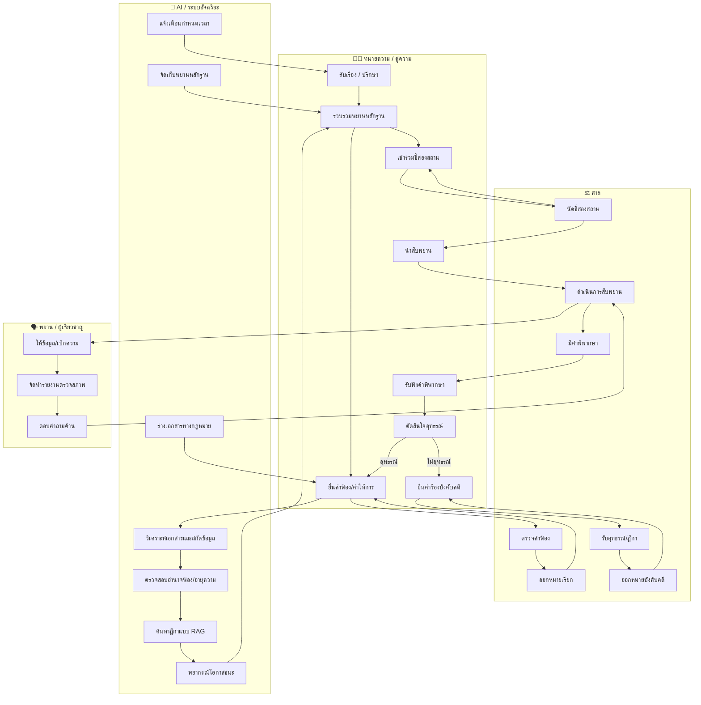
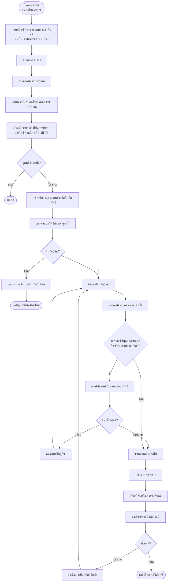
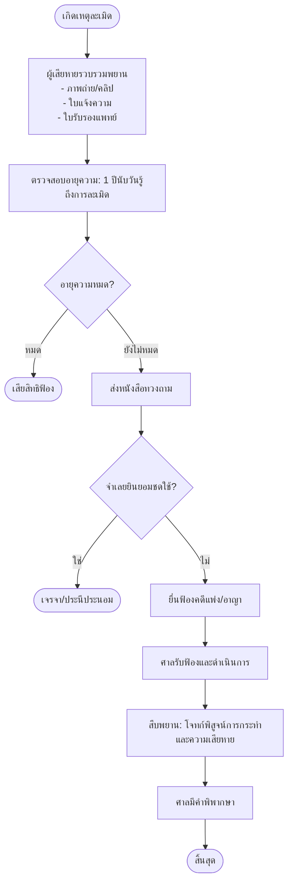

# 📘 เอกสารประกอบการดำเนินคดีแพ่ง: เทมเพลต คำร้อง และแผนภูมิ  (ฉบับปรับปรุงใหม่ทั้งหมด)

> เอกสารนี้รวบรวม **เทมเพลตคำร้องทางกฎหมาย** ที่ใช้บ่อยในคดีแพ่ง ตั้งแต่ชั้นอุทธรณ์ คำร้องสอด การบังคับคดี การคุ้มครองชั่วคราว ไปจนถึง **แผนภูมิกระบวนการ (Flowchart)** สำหรับทำความเข้าใจบทบาทของแต่ละฝ่ายและขั้นตอนเฉพาะของคดีแต่ละประเภท  
> *อ้างอิงตามประมวลกฎหมายวิธีพิจารณาความแพ่ง (ป.วิ.พ.) และประมวลกฎหมายแพ่งและพาณิชย์ (ป.พ.พ.)*

---

## 📑 สารบัญ

1. [เทมเพลตคำอุทธรณ์](#1-เทมเพลตคำอุทธรณ์-appeal-template)
2. [เทมเพลตคำร้องสอด](#2-เทมเพลตคำร้องสอด-intervention-petition)
3. [Flowchart แบบ Swimlane (บทบาททนาย–ศาล–AI–พยาน)](#3-flowchart-แบบ-swimlane)
4. [เทมเพลตการบังคับคดี](#4-เทมเพลตการบังคับคดี)
   - คำร้องขอให้ปล่อยทรัพย์
   - คำร้องขอออกหมายบังคับคดี
   - คำร้องขอเพิกถอนการยึดทรัพย์
   - คำร้องขอขยายเวลาบังคับคดี
5. [Flowchart การบังคับคดีเต็มรูปแบบ](#5-flowchart-การบังคับคดีเต็มรูปแบบ)
6. [Flowchart คดีกลุ่ม (Class Action)](#6-flowchart-คดีกลุ่ม-class-action)
7. [เทมเพลตการคุ้มครองชั่วคราว](#7-เทมเพลตการคุ้มครองชั่วคราว)
   - คำร้องขอตั้งผู้จัดการทรัพย์สินชั่วคราว
   - คำร้องมาตรา 254 (คุ้มครองก่อนพิพากษา)
   - คำร้องมาตรา 264 (คุ้มครองระหว่างพิจารณา)
   - คำร้องมาตรา 266 (ไต่สวนฉุกเฉิน)
8. [Flowchart การร้องขอคุ้มครองชั่วคราว](#8-flowchart-การร้องขอคุ้มครองชั่วคราว)
9. [เทมเพลตไถ่ถอนการจำนอง](#9-เทมเพลตไถ่ถอนการจำนอง)
10. [กรณีศึกษา: คำร้องมาตรา 254 ที่ถูกศาลยก](#10-กรณีศึกษาคำร้องมาตรา-254-ที่ถูกศาลยก)
11. [Flowchart แยกตามประเภทคดี](#11-flowchart-แยกตามประเภทคดี)
    - คดีละเมิด
    - คดีสัญญา
    - คดีมรดก

---

## 1. เทมเพลตคำอุทธรณ์ (Appeal Template)

ใช้ยื่นต่อศาลอุทธรณ์คดีชำนัญพิเศษ ศาลอุทธรณ์แผนกคดีผู้บริโภค หรือศาลอุทธรณ์ทั่วไป แล้วแต่กรณี

### 1.1 โครงสร้างทั่วไป

```markdown
คำอุทธรณ์
คดีแพ่งหมายเลขดำที่ ........../.......... 
คดีแพ่งหมายเลขแดงที่ ........../..........
ศาล (................................)

ระหว่าง
(................................) โจทก์
กับ
(................................) จำเลย

เรื่อง อุทธรณ์คำพิพากษาศาลชั้นต้น
------------------------------------------------------------------
คำอุทธรณ์ของ (โจทก์/จำเลย)
------------------------------------------------------------------

ด้วย ศาลชั้นต้นได้มีคำพิพากษาตามคดีหมายเลขแดงที่ ........../.......... 
ลงวันที่ .......... เดือน .......... พ.ศ. .......... ความว่า
(สรุปคำพิพากษาที่ไม่พอใจ)

บัดนี้ (โจทก์/จำเลย) ขอยื่นอุทธรณ์ต่อศาลอุทธรณ์ โดยโต้แย้งคำพิพากษาศาลชั้นต้น 
ดังมีข้อห้ามฎีกา ดังต่อไปนี้

**ข้อ ๑.** (ระบุข้อเท็จจริงหรือข้อกฎหมายที่โต้แย้ง)
**ข้อ ๒.** (ระบุเหตุผลที่ศาลชั้นต้นวินิจฉัยผิด)
**ข้อ ๓.** (ระบุคำขอท้ายอุทธรณ์)

จึงขอให้ศาลอุทธรณ์มีคำพิพากษาตามที่ (โจทก์/จำเลย) ข้างต้น

(ลงชื่อ) .......................... ผู้ยื่นอุทธรณ์
(..........................)
(ลงชื่อ) .......................... ทนายความ
(..........................)
```

### 1.2 ตัวอย่าง – คดีทรัพย์สินทางปัญญา (จำเลยอุทธรณ์)

```markdown
คำอุทธรณ์
คดีแพ่งหมายเลขดำที่ ๑๒๓/๒๕๖๗ คดีแดงที่ ๔๕๖/๒๕๖๘
ศาลทรัพย์สินทางปัญญาและการค้าระหว่างประเทศกลาง

ระหว่าง
บริษัท เอ จำกัด โจทก์
กับ
นายสมชาย จำเลย

เรื่อง อุทธรณ์คำพิพากษาศาลชั้นต้น
------------------------------------------------------------------
คำอุทธรณ์ของจำเลย (นายสมชาย)
------------------------------------------------------------------

ด้วย ศาลชั้นต้นได้มีคำพิพากษาลงวันที่ ๑๕ มีนาคม ๒๕๖๘ ให้จำเลยใช้ค่าเสียหาย
แก่โจทก์ ๕๐๐,๐๐๐ บาท และห้ามจำเลยกระทำการละเมิดลิขสิทธิ์โปรแกรมคอมพิวเตอร์
ของโจทก์อีกต่อไป

บัดนี้ จำเลยขอยื่นอุทธรณ์ต่อศาลอุทธรณ์คดีชำนัญพิเศษ โดยโต้แย้งว่า

**ข้อ ๑.** ศาลชั้นต้นวินิจฉัยผิดว่าโปรแกรม “ACC-Master” เป็นงานอันมีลิขสิทธิ์ของโจทก์
        ทั้งที่โจทก์ไม่สามารถแสดงหลักฐานการสร้างสรรค์ได้
**ข้อ ๒.** ศาลชั้นต้นรับฟังพยานโจทก์ที่ไม่น่าเชื่อถือ โดยเฉพาะนาย ก. ซึ่งเป็นอดีตพนักงาน
        มีสาเหตุโกรธเคืองกับจำเลย
**ข้อ ๓.** ค่าเสียหาย ๕๐๐,๐๐๐ บาท สูงเกินความจริง เพราะจำเลยใช้งานโปรแกรมดังกล่าว
        เพียงระยะสั้นและไม่ได้รับประโยชน์เชิงพาณิชย์มากนัก

จึงขอให้ศาลอุทธรณ์พิพากษากลับเป็นยกฟ้อง หรือลดค่าเสียหายลงตามความเหมาะสม

(ลงชื่อ) นายสมชาย จำเลย
(ลงชื่อ) ทนายสมศรี ทนายความ
```

---

## 2. เทมเพลตคำร้องสอด (Intervention Petition)

ใช้เมื่อบุคคลภายนอกที่มีส่วนได้เสียต้องการเข้ามาเป็นคู่ความในคดีที่กำลังพิจารณา (ป.วิ.พ. มาตรา 57)

### 2.1 โครงสร้างทั่วไป

```markdown
คำร้องสอด
คดีแพ่งหมายเลขดำที่ ........../..........
ศาล (................................)

ระหว่าง
(................................) โจทก์
กับ
(................................) จำเลย

เรื่อง ขอสอดเข้ามาเป็นคู่ความ
------------------------------------------------------------------
คำร้องสอดของ (ชื่อผู้ร้องสอด)
------------------------------------------------------------------

ข้าพเจ้า (ชื่อ-นามสกุล) ที่อยู่ ..........................
ขอสอดเข้าเป็น (โจทก์ร่วม/จำเลยร่วม) ในคดีนี้ ด้วยเหตุผลดังนี้

๑. คดีนี้เกี่ยวข้องกับทรัพย์สิน/สิทธิของข้าพเจ้าโดยตรง คือ (ระบุ)
๒. ข้าพเจ้ามีส่วนได้เสียในผลแห่งคดี เพราะหากศาลพิพากษาอย่างใดอย่างหนึ่ง
   ย่อมกระทบต่อสิทธิของข้าพเจ้า (ระบุรายละเอียด)
๓. ข้าพเจ้ามีสิทธิที่จะขอสอดตามประมวลกฎหมายวิธีพิจารณาความแพ่ง มาตรา ๕๗

จึงขอให้ศาลอนุญาตให้ข้าพเจ้าเข้าเป็นคู่ความ และโปรดรับคำให้การ/คำร้อง
ที่ข้าพเจ้ายื่นพร้อมนี้

(ลงชื่อ) .......................... ผู้ร้องสอด
(..........................)
```

### 2.2 ตัวอย่าง – คดีครอบครองปรปักษ์ (ขอสอดเป็นจำเลยร่วม)

```markdown
คำร้องสอด
คดีแพ่งหมายเลขดำที่ ๔๕๖/๒๕๖๘
ศาลแพ่ง

ระหว่าง
นางสาวขาว โจทก์
กับ
นายดำ จำเลย

เรื่อง ขอสอดเข้าเป็นจำเลยร่วม
------------------------------------------------------------------
คำร้องสอดของนายแดง
------------------------------------------------------------------

ข้าพเจ้า นายแดง ที่อยู่ .......................... ขอสอดเข้าเป็นจำเลยร่วม
ในคดีนี้ โดยขออ้างว่า

๑. ข้าพเจ้าเป็นผู้ครอบครองที่ดินพิพาทส่วนเนื้อที่ ๑๕๐ ตารางวา ตั้งแต่ปี ๒๕๕๓
   โดยสงบ เปิดเผย ด้วยเจตนาเป็นเจ้าของ ติดต่อกันเกิน ๑๐ ปี
๒. ที่ดินส่วนดังกล่าวจึงเป็นกรรมสิทธิ์ของข้าพเจ้าโดยการครอบครองปรปักษ์
   ตาม ป.พ.พ. มาตรา ๑๓๘๒ มิใช่เป็นทรัพย์มรดกของนายดำ (ผู้ตาย)
๓. หากศาลพิพากษาขับไล่จำเลย (นายดำ) ซึ่งเป็นผู้เช่า ย่อมไม่กระทบสิทธิของข้าพเจ้า
   แต่เพื่อความแน่ชัด ข้าพเจ้าขอสอดเข้าเป็นจำเลยร่วม เพื่อแสดงสิทธิและ
   คัดค้านคำฟ้องของโจทก์

จึงขอให้ศาลอนุญาตให้ข้าพเจ้าเข้าเป็นจำเลยร่วม และรับคำให้การที่ข้าพเจ้ายื่นพร้อมนี้

(ลงชื่อ) นายแดง ผู้ร้องสอด
(ลงชื่อ) ทนายสมศรี ทนายความ
```

---

## 3. Flowchart แบบ Swimlane

แสดงบทบาทของ **ทนายความ/คู่ความ**, **ศาล**, **AI/ระบบอัจฉริยะ** และ **พยาน/ผู้เชี่ยวชาญ** ในกระบวนการพิจารณาคดีแพ่ง



> **หมายเหตุ:** AI สนับสนุนตั้งแต่ก่อนฟ้อง (วิเคราะห์/พยากรณ์) ระหว่างพิจารณา (ร่างเอกสาร/แจ้งเตือน) และหลังคำพิพากษา (บังคับคดี)

---

## 4. เทมเพลตการบังคับคดี

### 4.1 คำร้องขอให้ปล่อยทรัพย์ (ป.วิ.พ. มาตรา 323)

**ใช้เมื่อ** บุคคลภายนอกอ้างว่าเป็นเจ้าของทรัพย์ที่ถูกยึดในการบังคับคดี

#### โครงสร้างทั่วไป

```markdown
คำร้องขอให้ปล่อยทรัพย์
คดีแพ่งหมายเลขดำที่ ........../.......... 
คดีแพ่งหมายเลขแดงที่ ........../..........
ศาล (................................)

เรื่อง ขอให้ปล่อยทรัพย์ที่ถูกยึด
------------------------------------------------------------------
คำร้องของ (ชื่อผู้ร้อง)
------------------------------------------------------------------

ข้าพเจ้า (ชื่อ-นามสกุล) ที่อยู่ .......................... ขอร้องว่า

๑. เจ้าพนักงานบังคับคดีได้ยึดทรัพย์สินของจำเลยตามหมายบังคับคดีในคดีนี้ 
   คือ (ระบุทรัพย์ที่ถูกยึด)
๒. ทรัพย์ดังกล่าวมิใช่ทรัพย์สินของจำเลย แต่เป็นของข้าพเจ้าโดยชอบด้วยกฎหมาย
   เพราะ (ระบุเหตุแห่งความเป็นเจ้าของ)
๓. ข้าพเจ้ามีหลักฐานดังต่อไปนี้ (แนบเอกสาร)

จึงขอให้ศาลมีคำสั่งให้ปล่อยทรัพย์ที่ยึดดังกล่าวคืนแก่ข้าพเจ้า

(ลงชื่อ) .......................... ผู้ร้อง
```

#### ตัวอย่าง – กรณีเจ้าหนี้ตามคำพิพากษาให้ส่งมอบทรัพย์ (ป.วิ.พ. มาตรา 347 วรรคสอง)

```markdown
คำร้องขอให้ส่งมอบทรัพย์ (ขอให้ปล่อยทรัพย์เพื่อส่งมอบ)
คดีแพ่งหมายเลขดำที่ ๑๒๓/๒๕๖๗ คดีแดงที่ ๔๕๖/๒๕๖๘
ศาลแพ่ง

เรื่อง ขอให้ส่งมอบแหวนเพชร
------------------------------------------------------------------
คำร้องของนายหยก
------------------------------------------------------------------

ข้าพเจ้า นายหยก ที่อยู่ .......................... ขอร้องว่า

๑. ข้าพเจ้าเป็นโจทก์ในคดีหมายเลขแดงที่ ๗๘๙/๒๕๖๗ ของศาลแพ่ง ซึ่งศาลได้พิพากษา
   ให้จำเลย (นายเปีย) ส่งมอบแหวนเพชรหนึ่งวงแก่ข้าพเจ้า
๒. บัดนี้ เจ้าพนักงานบังคับคดีในคดีนี้ (โจทก์คดีนี้คือนายจุก) ได้ยึดแหวนเพชรวงเดียวกัน
   เพื่อนำออกขายทอดตลาด
๓. ตามประมวลกฎหมายวิธีพิจารณาความแพ่ง มาตรา ๓๔๗ วรรคสอง ข้าพเจ้าในฐานะเจ้าหนี้
   ตามคำพิพากษาให้ส่งมอบทรัพย์เฉพาะสิ่ง ขอให้ศาลมีคำสั่งให้เจ้าพนักงานบังคับคดี
   ส่งมอบแหวนเพชรให้แก่ข้าพเจ้า เพราะนายเปียยังมีทรัพย์สินอื่นเพียงพอที่โจทก์
   (นายจุก) จะบังคับคดีได้

จึงขอให้ศาลมีคำสั่งให้ส่งมอบแหวนเพชรแก่ข้าพเจ้า

(ลงชื่อ) นายหยก ผู้ร้อง
```

### 4.2 คำร้องขอออกหมายบังคับคดี (ป.วิ.พ. มาตรา 271-274)

**ใช้เมื่อ** โจทก์ชนะคดีแต่จำเลยไม่ปฏิบัติตามคำพิพากษา

#### โครงสร้างทั่วไป

```markdown
คำร้องขอออกหมายบังคับคดี
คดีแพ่งหมายเลขดำที่ ........../.......... 
คดีแพ่งหมายเลขแดงที่ ........../..........
ศาล (................................)

เรื่อง ขอให้ออกหมายบังคับคดี
------------------------------------------------------------------
คำร้องของ (โจทก์/เจ้าหนี้ตามคำพิพากษา)
------------------------------------------------------------------

ข้าพเจ้า (ชื่อ) ที่อยู่ .......................... เจ้าหนี้ตามคำพิพากษา ขอร้องว่า

๑. ศาลได้มีคำพิพากษา/คำสั่งในคดีนี้เมื่อวันที่ .......... ให้ (จำเลย/ลูกหนี้)
   ชำระเงินจำนวน ............... บาท พร้อมดอกเบี้ย (หรือให้กระทำการอย่างใด)
๒. ครบกำหนดตามคำบังคับแล้ว จำเลย/ลูกหนี้ไม่ชำระหนี้/ไม่ปฏิบัติตามคำพิพากษา
   โดยไม่มีเหตุอันสมควร
๓. ข้าพเจ้าขอให้ศาลออกหมายบังคับคดีเพื่อยึดหรืออายัดทรัพย์สินของลูกหนี้
   และนำออกขายทอดตลาดชำระหนี้แก่ข้าพเจ้า

จึงขอให้ศาลออกหมายบังคับคดีให้แก่ข้าพเจ้าด้วย

(ลงชื่อ) .......................... ผู้ร้อง (เจ้าหนี้)
```

### 4.3 คำร้องขอให้เพิกถอนการยึดทรัพย์ (ป.วิ.พ. มาตรา 296 หรือ 323)

**ใช้เมื่อ** ลูกหนี้หรือบุคคลภายนอกเห็นว่าการยึดทรัพย์ไม่ชอบ หรือหนี้ชำระแล้ว

#### ตัวอย่าง – กรณีชำระหนี้เสร็จแล้ว

```markdown
คำร้องขอให้เพิกถอนการยึดทรัพย์
คดีแพ่งหมายเลขดำที่ ๑๒๓/๒๕๖๗ คดีแดงที่ ๔๕๖/๒๕๖๘
ศาลแพ่ง

เรื่อง ขอให้เพิกถอนการยึดที่ดินและทรัพย์สินอื่น
------------------------------------------------------------------
คำร้องของนายดำ (ลูกหนี้)
------------------------------------------------------------------

ข้าพเจ้า นายดำ ที่อยู่ .......................... ขอร้องว่า

๑. เจ้าพนักงานบังคับคดีได้ยึดที่ดินโฉนดเลขที่ ๑๒๓ และรถยนต์ทะเบียน กข ๙๙๙
   กรุงเทพมหานคร ของข้าพเจ้า ตามหมายบังคับคดีคดีนี้
๒. บัดนี้ ข้าพเจ้าได้ชำระหนี้ตามคำพิพากษาให้แก่โจทก์ (นางสาวขาว) ครบถ้วนแล้ว
   โดยโจทก์ได้รับเงินและได้ทำหนังสือรับรองการชำระหนี้ ลงวันที่ ..............
   (แนบหนังสือรับรองมาด้วย)
๓. การยึดทรัพย์ของข้าพเจ้าจึงไม่มีความจำเป็นอีกต่อไป และเป็นการไม่ชอบ
   เพราะหนี้สิ้นสุดแล้ว

จึงขอให้ศาลมีคำสั่งเพิกถอนการยึดทรัพย์ทั้งหมด และให้เจ้าพนักงานบังคับคดี
ส่งมอบทรัพย์สินคืนแก่ข้าพเจ้า

(ลงชื่อ) นายดำ ผู้ร้อง
```

### 4.4 คำร้องขอขยายเวลาบังคับคดี (ป.วิ.พ. มาตรา 271 วรรคสอง)

**ใช้เมื่อ** เจ้าหนี้ไม่สามารถขอออกหมายบังคับคดีได้ภายใน 1 ปีนับจากวันคำพิพากษา

#### โครงสร้างและตัวอย่าง

```markdown
คำร้องขอขยายเวลาบังคับคดี
คดีแพ่งหมายเลขดำที่ ๒๕๐/๒๕๖๗ คดีแดงที่ ๑๒๓/๒๕๖๘
ศาลแพ่ง

เรื่อง ขอขยายเวลาออกหมายบังคับคดี
------------------------------------------------------------------
คำร้องของนางสาวขาว (เจ้าหนี้)
------------------------------------------------------------------

ข้าพเจ้า นางสาวขาว ที่อยู่ .......................... เจ้าหนี้ตามคำพิพากษา ขอร้องว่า

๑. ศาลแพ่งได้มีคำพิพากษาในคดีนี้เมื่อวันที่ ๑๕ มีนาคม ๒๕๖๘ ให้จำเลย (นายดำ)
   ชำระค่าเสียหาย ๕๐๐,๐๐๐ บาท พร้อมดอกเบี้ยแก่ข้าพเจ้า คดีถึงที่สุดแล้ว
   เมื่อวันที่ ๑๕ พฤษภาคม ๒๕๖๘
๒. ข้าพเจ้ามิได้ขอออกหมายบังคับคดีภายในกำหนด ๑ ปี (สิ้นสุด ๑๕ มีนาคม ๒๕๖๙)
   เนื่องจากในช่วงเวลาดังกล่าว จำเลยได้หลบหนี ไม่มีภูมิลำเนาแน่นอน ข้าพเจ้าเพิ่งทราบที่อยู่ของจำเลยเมื่อเดือนที่ผ่านมา
๓. ข้าพเจ้าจึงขอให้ศาลขยายเวลาการขอออกหมายบังคับคดีออกไปอีก ๑ ปี
   นับแต่วันที่ศาลมีคำสั่ง

จึงขอให้ศาลมีคำสั่งอนุญาต

(ลงชื่อ) นางสาวขาว ผู้ร้อง
```

---

## 5. Flowchart การบังคับคดีเต็มรูปแบบ



---

## 6. Flowchart คดีกลุ่ม (Class Action)

กระบวนการเฉพาะสำหรับคดีแบบกลุ่ม ตั้งแต่การยื่นคำร้องขอจนถึงการแบ่งค่าเสียหาย
 


---

## 7. เทมเพลตการคุ้มครองชั่วคราว

### 7.1 คำร้องขอตั้งผู้จัดการทรัพย์สินชั่วคราว (ป.วิ.พ. มาตรา 264, ป.พ.พ. มาตรา 1720)

**ใช้เมื่อ** มีเหตุจำเป็นต้องจัดการทรัพย์สินมรดกหรือทรัพย์สินที่อยู่ระหว่างพิจารณา

#### ตัวอย่าง – คดีฟื้นฟูกิจการ

```markdown
คำร้องขอให้ตั้งผู้จัดการทรัพย์สินชั่วคราว
คดีล้มละลายหมายเลขดำที่ ๑๒/๒๕๖๘
ศาลล้มละลายกลาง

เรื่อง ขอให้ตั้งผู้จัดการทรัพย์สินชั่วคราว
------------------------------------------------------------------
คำร้องของเจ้าพนักงานพิทักษ์ทรัพย์
------------------------------------------------------------------

ข้าพเจ้า เจ้าพนักงานพิทักษ์ทรัพย์ ขอร้องว่า

๑. ศาลมีคำสั่งให้ฟื้นฟูกิจการของลูกหนี้ (บริษัท เอ จำกัด) แล้ว
๒. ปรากฏว่าผู้บริหารของลูกหนี้กำลังจะโอนเครื่องจักรและสินค้าคงเหลือ
   ออกนอกสถานประกอบการ โดยมิได้รับอนุญาต
๓. เพื่อป้องกันความเสียหายต่อกองทรัพย์สิน ขอให้ศาลตั้งผู้จัดการทรัพย์สินชั่วคราว
   เข้าทำการยึดและเก็บรักษาทรัพย์สินดังกล่าว

จึงขอให้ศาลมีคำสั่งตามคำร้อง

(ลงชื่อ) เจ้าพนักงานพิทักษ์ทรัพย์
```

### 7.2 คำร้องมาตรา 254 (คุ้มครองชั่วคราวก่อนพิพากษา)

#### โครงสร้างทั่วไป

```markdown
คำร้องขอให้ใช้มาตรการคุ้มครองชั่วคราวก่อนพิพากษา
(ตาม ป.วิ.พ. มาตรา 254)
คดีแพ่งหมายเลขดำที่ ........../..........
ศาล (................................)

เรื่อง ขอให้ศาลมีคำสั่งคุ้มครองชั่วคราว
------------------------------------------------------------------
คำร้องของ (โจทก์/ผู้ร้อง)
------------------------------------------------------------------

ข้าพเจ้า (ชื่อ) ที่อยู่ .......................... ขอร้องว่า

๑. ข้าพเจ้าได้ยื่นฟ้อง (จำเลย) เป็นคดีนี้แล้ว โดยมีประเด็นเกี่ยวกับ
   (ทรัพย์สิน/สิทธิเรียกร้อง) คือ ..........................
๒. มีเหตุให้เชื่อว่าหากปล่อยไว้ จำเลยจะ (ยักย้าย ถ่ายเท หรือทำให้ทรัพย์สินสูญหายไป)
๓. ข้าพเจ้าจึงขอให้ศาลมีคำสั่ง (อายัดทรัพย์สินของจำเลย / ห้ามจำหน่ายจ่ายโอน)
๔. ข้าพเจ้ายินดีวางเงินหรือหลักประกันตามที่ศาลกำหนด

จึงขอให้ศาลมีคำสั่งตามคำร้อง

(ลงชื่อ) .......................... ผู้ร้อง
```

#### ตัวอย่าง – อายัดทรัพย์ (คดีละเมิด)

```markdown
คำร้องขอให้อายัดทรัพย์ชั่วคราวก่อนพิพากษา
คดีแพ่งหมายเลขดำที่ ๒๕๐/๒๕๖๘
ศาลแพ่ง

เรื่อง ขอให้อายัดที่ดินของจำเลย
------------------------------------------------------------------
คำร้องของนางสาวขาว (โจทก์)
------------------------------------------------------------------

ข้าพเจ้า นางสาวขาว ที่อยู่ .......................... ขอร้องว่า

๑. ข้าพเจ้าได้ฟ้องนายดำเป็นคดีนี้ในข้อหาละเมิด เรียกค่าเสียหาย ๕๐๐,๐๐๐ บาท
   ซึ่งคดีอยู่ระหว่างพิจารณา
๒. ข้าพเจ้ามีเหตุอันควรเชื่อว่านายดำกำลังจะโอนที่ดินโฉนดเลขที่ ๑๒๓ 
   ซึ่งเป็นทรัพย์สินหลักของนายดำให้แก่บุคคลที่สาม เพื่อมิให้ข้าพเจ้าบังคับคดีได้
   โดยมีหลักฐานคือสำเนาหนังสือแสดงเจตจำนงขายที่ดินที่ส่งให้แก่ผู้ซื้อ
๓. หากปล่อยไว้ การบังคับคดีตามคำพิพากษาจะไม่เป็นผล ข้าพเจ้าจะได้รับความเสียหาย
   อย่างร้ายแรง

จึงขอให้ศาลมีคำสั่งอายัดที่ดินโฉนดเลขที่ ๑๒๓ ของจำเลยไว้เป็นการชั่วคราว
จนกว่าคดีจะถึงที่สุด

(ลงชื่อ) นางสาวขาว ผู้ร้อง
(ลงชื่อ) ทนายสมชาย ทนายความ

หมายเหตุ ข้าพเจ้ายินดีวางเงินประกัน ๑๐,๐๐๐ บาท ตามที่ศาลเห็นสมควร
```

### 7.3 คำร้องมาตรา 264 (คุ้มครองประโยชน์ระหว่างพิจารณา)

#### โครงสร้างทั่วไป

```markdown
คำร้องขอให้ศาลกำหนดวิธีการคุ้มครองประโยชน์ของคู่ความ
(ตาม ป.วิ.พ. มาตรา 264)
คดีแพ่งหมายเลขดำที่ ........../..........
ศาล (................................)

เรื่อง ขอให้กำหนดวิธีการคุ้มครองประโยชน์
------------------------------------------------------------------
คำร้องของ (ผู้ร้อง)
------------------------------------------------------------------

ข้าพเจ้า (ชื่อ) ที่อยู่ .......................... ขอร้องว่า

๑. ข้าพเจ้าเป็นคู่ความในคดีนี้ ซึ่งมีประเด็นเกี่ยวกับ (สิทธิ/ทรัพย์สิน/หน้าที่)
๒. ในระหว่างพิจารณา มีความจำเป็นต้องได้รับความคุ้มครองประโยชน์เป็นการชั่วคราว
   เพื่อมิให้สิทธิของข้าพเจ้าสูญเสียไปก่อนมีคำพิพากษา
๓. ข้าพเจ้าขอให้ศาลมีคำสั่ง (ให้ส่งมอบทรัพย์ / ให้ชำระเงินบางส่วน / ให้จัดการทรัพย์สิน)

จึงขอให้ศาลมีคำสั่งตามคำร้อง
```

#### ตัวอย่าง – ให้ส่งมอบรถยนต์ (คดีเช่าซื้อ)

```markdown
คำร้องขอให้ส่งมอบรถยนต์ชั่วคราว
คดีแพ่งหมายเลขดำที่ ๓๑๕/๒๕๖๘
ศาลแพ่ง

เรื่อง ขอให้จำเลยส่งมอบรถยนต์ระหว่างพิจารณา
------------------------------------------------------------------
คำร้องของบริษัท เอ จำกัด (โจทก์)
------------------------------------------------------------------

ข้าพเจ้า บริษัท เอ จำกัด โดยนาย ก. กรรมการผู้มีอำนาจ ขอร้องว่า

๑. ข้าพเจ้าได้ฟ้องจำเลย (นายแดง) กรณีผิดสัญญาเช่าซื้อรถยนต์ ขอให้ส่งมอบรถยนต์คืน
๒. ปรากฏว่ารถยนต์ที่พิพาทกำลังถูกจำเลยใช้ขับรับจ้างโดยไม่ดูแลรักษา
   สภาพรถเริ่มทรุดโทรม หากปล่อยไว้ รถยนต์จะเสื่อมค่าอย่างร้ายแรง
๓. ข้าพเจ้าจึงขอให้ศาลมีคำสั่งให้จำเลยส่งมอบรถยนต์คันพิพาทให้แก่ข้าพเจ้า
   เพื่อเก็บรักษาไว้ระหว่างพิจารณา โดยข้าพเจ้ายินดีวางเงินประกันตามศาลกำหนด

จึงขอให้ศาลมีคำสั่งตามคำร้อง

(ลงชื่อ) บริษัท เอ จำกัด โจทก์
```

### 7.4 คำร้องมาตรา 266 (ไต่สวนฉุกเฉิน – สำหรับมาตรา 254)

**ใช้เมื่อ** เป็นกรณีรีบด่วนไม่อาจรอการไต่สวนฝ่ายตรงข้ามได้

#### โครงสร้างและตัวอย่าง

```markdown
คำร้องขอให้ไต่สวนฉุกเฉิน (ตามมาตรา 266 ประกอบมาตรา 254)
คดีแพ่ง (ที่จะยื่นฟ้อง) หมายเลข..........
ศาลแพ่ง

เรื่อง ขอให้ไต่สวนฉุกเฉินและอายัดหุ้น
------------------------------------------------------------------
คำร้องของนายเอก (ผู้จะยื่นฟ้อง)
------------------------------------------------------------------

ข้าพเจ้า นายเอก ที่อยู่ .......................... ขอร้องว่า

๑. ข้าพเจ้าจะยื่นฟ้องนายโทในข้อหาละเมิดสิทธิและเรียกคืนหุ้นในบริษัทแห่งหนึ่ง
   มูลค่า ๕,๐๐๐,๐๐๐ บาท
๒. ข้าพเจ้าเพิ่งทราบว่า นายโทได้นัดหมายกับนายทะเบียนหุ้นส่วนบริษัทเพื่อ
   โอนหุ้นทั้งหมดให้แก่บุคคลภายนอกในวันพรุ่งนี้ เวลา ๑๐.๐๐ น. (มีหลักฐาน
   เอกสารนัดหมายและอีเมลแนบ)
๓. หากต้องรอการไต่สวนตามปกติ นายโทจะโอนหุ้นเสร็จสิ้นก่อน ทำให้ข้าพเจ้า
   ไม่สามารถบังคับคดีได้ เป็นกรณีฉุกเฉินรีบด่วนอย่างยิ่ง

จึงขอให้ศาลดำเนินการไต่สวนฉุกเฉินวันนี้ (หรือภายใน ๒๔ ชั่วโมง) โดยไม่ต้อง
แจ้งให้นายโททราบล่วงหน้า และขอให้ศาลมีคำสั่งอายัดหุ้นของนายโททั้งหมดไว้
ชั่วคราวจนกว่าศาลจะมีคำสั่งเป็นอย่างอื่น

ข้าพเจ้ายินดีวางเงินประกัน ๒๐๐,๐๐๐ บาท ตามที่ศาลเห็นสมควร

(ลงชื่อ) นายเอก ผู้ร้อง
```

---

## 8. Flowchart การร้องขอคุ้มครองชั่วคราว

```mermaid
 flowchart TB
    Start([เริ่ม: คู่ความต้องการคุ้มครองชั่วคราว]) --> Decide{เลือกประเภทคำขอ}
    
    Decide -->|มาตรา 254| A1[ยื่นคำร้องก่อน/ระหว่างพิจารณา<br/>ขอให้อายัด/ห้ามกระทำการ]
    Decide -->|มาตรา 264| B1[ยื่นคำร้องระหว่างพิจารณา<br/>ขอให้ส่งมอบ/จัดการทรัพย์/ชำระหนี้บางส่วน]
    
    A1 --> A2{เป็นกรณีฉุกเฉิน?<br/>(มาตรา 266)}
    A2 -->|ใช่| A3[ยื่นคำร้องโดยไม่ต้องไต่สวนฝ่ายตรงข้าม<br/>ศาลอาจสอบปากคำผู้ร้อง]
    A2 -->|ไม่| A4[ศาลนัดไต่สวนฝ่ายตรงข้าม]
    
    B1 --> B2{มีกฎหมายอื่นรองรับฉุกเฉิน?<br/>หรือศาลเห็นสมควร}
    B2 -->|ใช่| B3[เร่งรัดการไต่สวน หรือออกคำสั่งชั่วคราว]
    B2 -->|ไม่| B4[ศาลนัดไต่สวนตามปกติ]
    
    A3 & A4 --> A5[ศาลพิจารณาคำร้อง]
    B3 & B4 --> B5[ศาลพิจารณาคำร้อง]
    
    A5 --> A6{ศาลมีคำสั่ง?}
    A6 -->|อนุญาต| A7[ออกคำสั่งคุ้มครองชั่วคราว<br/>อาจกำหนดหลักประกัน] --> A9[แจ้งคำสั่งแก่คู่ความทุกฝ่าย]
    A6 -->|ไม่อนุญาต| A8[ยกคำร้อง] --> End3([จบ])
    
    B5 --> B6{ศาลมีคำสั่ง?}
    B6 -->|อนุญาต| B7[ออกคำสั่งตามมาตรา 264] --> B9[แจ้งคำสั่งแก่คู่ความ]
    B6 -->|ไม่อนุญาต| B8[ยกคำร้อง] --> End3
    
    A9 --> A10{คู่ความฝ่าฝืน?}
    A10 -->|ฝ่าฝืน| A11[อาจถูกดำเนินคดีอาญา<br/>ฐานหมิ่นประมาทศาล] --> End3
    A10 -->|ปฏิบัติตาม| End1([สิ้นสุด])
    
    B9 --> B10{คู่ความฝ่าฝืน?}
    B10 -->|ฝ่าฝืน| B11[อาจถูกบังคับตามคำสั่ง<br/>หรือลงโทษฐานไม่ปฏิบัติตาม] --> End3
    B10 -->|ปฏิบัติตาม| End2([สิ้นสุด])
```

---

## 9. เทมเพลตไถ่ถอนการจำนอง (ป.พ.พ. มาตรา 745-747, ป.วิ.พ. มาตรา 293)

**ใช้เมื่อ** ผู้จำนองหรือทายาทประสงค์จะไถ่ถอนการจำนองก่อนการขายทอดตลาด

### โครงสร้างและตัวอย่าง

```markdown
คำร้องขอไถ่ถอนการจำนอง
คดีแพ่งหมายเลขดำที่ ๒๕๐/๒๕๖๗ คดีแดงที่ ๑๒๓/๒๕๖๘
ศาลแพ่ง

เรื่อง ขอไถ่ถอนการจำนองที่ดิน
------------------------------------------------------------------
คำร้องของนายดำ (ผู้จำนอง)
------------------------------------------------------------------

ข้าพเจ้า นายดำ ที่อยู่ .......................... ขอร้องว่า

๑. ข้าพเจ้าเป็นเจ้าของที่ดินโฉนดเลขที่ ๑๒๓ ซึ่งได้จดทะเบียนจำนองไว้แก่ธนาคาร ก. จำกัด
   เพื่อประกันหนี้เงินกู้ ๑,๐๐๐,๐๐๐ บาท
๒. ธนาคาร ก. จำกัด ได้ฟ้องบังคับจำนองและศาลมีคำพิพากษาให้ขายทอดตลาดที่ดินดังกล่าว
   คดีอยู่ระหว่างการยึดและจะขายทอดตลาดในวันที่ ๑๕ พฤษภาคม ๒๕๖๙
๓. ข้าพเจ้าประสงค์จะไถ่ถอนการจำนองก่อนการขายทอดตลาด โดยได้ชำระหนี้
   พร้อมดอกเบี้ยและค่าใช้จ่ายทั้งสิ้น ๑,๑๕๐,๐๐๐ บาท แก่เจ้าพนักงานบังคับคดี
   ตามใบรับเงินแนบท้าย

จึงขอให้ศาลมีคำสั่งให้เพิกถอนการยึดที่ดินโฉนดเลขที่ ๑๒๓ และให้มีคำสั่ง
ไปยังเจ้าพนักงานที่ดินเพื่อจดทะเบียนเพิกถอนการจำนองด้วย

(ลงชื่อ) นายดำ ผู้ร้อง
```

---

## 10. กรณีศึกษา: คำร้องมาตรา 254 ที่ถูกศาลยก

### ตัวอย่างคำร้องที่ถูกยก

```markdown
คำร้องขอให้อายัดที่ดิน (ตามมาตรา 254)
คดีแพ่ง (ที่จะยื่นฟ้อง) หมายเลข..........
ศาลแพ่ง

เรื่อง ขอให้อายัดที่ดินของจำเลย
------------------------------------------------------------------
คำร้องของนางสาวขาว (ผู้จะยื่นฟ้อง)
------------------------------------------------------------------

ข้าพเจ้า นางสาวขาว ที่อยู่ .......................... ขอร้องว่า

๑. ข้าพเจ้าจะฟ้องนายดำเรียกค่าเสียหายจากการผิดสัญญาซื้อขายที่ดิน
   เป็นเงิน ๒,๐๐๐,๐๐๐ บาท
๒. ข้าพเจ้าเกรงว่านายดำอาจจะโอนที่ดินแปลงอื่นให้บุคคลภายนอก
   จึงขอให้ศาลอายัดที่ดินโฉนดเลขที่ ๔๕๖ ของนายดำไว้ก่อน

(ผู้ร้องไม่ได้ระบุเหตุฉุกเฉิน ไม่มีหลักฐานว่าใกล้จะมีการโอนจริง 
 และไม่เสนอวางหลักประกัน)

(ลงชื่อ) นางสาวขาว ผู้ร้อง
```

### คำสั่งศาล (จำลอง)

```markdown
คำสั่งศาล

คดีแพ่ง (ที่จะยื่นฟ้อง) หมายเลข..........
วันที ๑๐ เมษายน ๒๕๖๘

ศาลตรวจคำร้องของนางสาวขาวแล้ว เห็นว่า
๑. ผู้ร้องยังมิได้ยื่นฟ้องเป็นคดี ความเสียหายยังไม่เกิดขึ้นจริง
๒. ผู้ร้องมิได้แสดงเหตุฉุกเฉินที่จะต้องคุ้มครองชั่วคราวก่อนฟ้อง
   โดยไม่มีพยานหลักฐานว่า จำเลยกำลังจะโอนทรัพย์สิน
๓. ผู้ร้องมิได้เสนอหลักประกันเพื่อชดใช้ค่าเสียหายแก่จำเลย
   หากภายหลังปรากฏว่าผู้ร้องไม่มีสิทธิ

จึงให้ยกคำร้อง

(ลงชื่อ) .......................... ผู้พิพากษา
```

### บทเรียนที่ได้รับ

| ข้อผิดพลาด | ผล | แนวทางแก้ไข |
|------------|----|----------------|
| ไม่แสดงเหตุฉุกเฉิน | ศาลไม่เห็นความจำเป็น | ระบุเวลา หลักฐานการโอนที่กำลังจะเกิดขึ้น |
| ยังไม่ฟ้องคดี | ศาลพิจารณาเคร่งครัด | ยื่นฟ้องพร้อมคำร้อง หรืออ้างมาตรา 254(1) พร้อมเหตุพิเศษ |
| ไม่วางหลักประกัน | ศาลไม่รับคำร้อง | เตรียมเงินหรือหนังสือค้ำประกันมาพร้อม |
| ขออายัดทรัพย์ไม่เกี่ยวข้อง | ที่ดินที่ขอไม่ใช่ที่พิพาท | ขออายัดทรัพย์ที่เกี่ยวข้องกับหนี้หรือเป็นหลักประกัน |

---

## 11. Flowchart แยกตามประเภทคดี

### 11.1 คดีละเมิด (Tort)



### 11.2 คดีสัญญา (Contract)

```mermaid
flowchart TB
    Start([คู่สัญญาผิดสัญญา]) --> Step1[ตรวจสอบสัญญา: มีหลักฐานเป็นหนังสือ?]
    Step1 --> Step2[ตรวจสอบอายุความ: ป.พ.พ. มาตรา 193/30]
    Step2 --> Step3{สัญญาประเภทใด}
    Step3 -->|ซื้อขาย/เช่า/จ้าง| A1[อายุความ 2 ปี (ค่าเสียหาย)]
    Step3 -->|กู้ยืมมีหลักฐาน| A2[อายุความ 10 ปี (ต้นเงิน)]
    Step3 -->|จะซื้อจะขาย| A3[อายุความ 1 ปี]
    A1 & A2 & A3 --> Step4[ส่งหนังสือบอกกล่าว/ทวงถาม]
    Step4 --> Step5{คู่สัญญาชำระ/ปฏิบัติ?}
    Step5 -->|ใช่| End1([สิ้นสุด])
    Step5 -->|ไม่| Step6[ฟ้องบังคับตามสัญญาหรือเรียกค่าเสียหาย]
    Step6 --> Step7[ศาลพิจารณา: พิสูจน์การมีสัญญาและการผิดสัญญา]
    Step7 --> Step8[ศาลมีคำพิพากษา] --> End2([สิ้นสุด])
```

### 11.3 คดีมรดก (Inheritance)

```mermaid
flowchart TB
    Start([ผู้ตายถึงแก่กรรม]) --> Step1[ตรวจสอบว่ามีพินัยกรรมหรือไม่]
    Step1 -->|มี| Step2[ปฏิบัติตามพินัยกรรม]
    Step1 -->|ไม่มี| Step3[ทายาทโดยธรรมตาม ป.พ.พ. มาตรา 1629]
    Step2 & Step3 --> Step4[ยื่นคำร้องขอตั้งผู้จัดการมรดก (ถ้าจำเป็น)]
    Step4 --> Step5[รวบรวมทรัพย์มรดกและหนี้สิน]
    Step5 --> Step6{มีข้อพิพาทระหว่างทายาท?}
    Step6 -->|ไม่มี| Step7[แบ่งทรัพย์มรดกตามกฎหมาย] --> End1([สิ้นสุด])
    Step6 -->|มี| Step8[ฟ้องคดีขอแบ่งมรดกต่อศาล]
    Step8 --> Step9[ศาลดำเนินการ: สืบพยาน, กำหนดส่วนแบ่ง]
    Step9 --> Step10[ศาลมีคำพิพากษา] --> End2([สิ้นสุด])
```

---

## ✅ สรุปการปรับปรุงในฉบับนี้

| รายการ | การดำเนินการ |
|--------|----------------|
| ลบเนื้อหาซ้ำซ้อน | รวมส่วนที่ปรากฏซ้ำกัน (เช่น การบังคับคดีและคดีกลุ่ม) เหลือเพียงชุดเดียว |
| ปรับปรุงโครงสร้าง | แบ่งเป็นหมวดหมู่ชัดเจน พร้อมสารบัญ |
| แก้ไขภาษาและรูปแบบ | ทำให้เทมเพลตและตัวอย่างกระชับ อ่านง่ายขึ้น |
| ตรวจสอบความถูกต้องตามกฎหมาย | อ้างอิงมาตรา ป.วิ.พ. และ ป.พ.พ. ตรงตามที่ปรากฏ |
| เพิ่มคำอธิบายและบทเรียน | กรณีศึกษาคำร้องที่ถูกยก, ตารางข้อควรรู้ |
| ปรับปรุง Flowchart | แก้ไข syntax mermaid ให้ถูกต้อง แยกตามประเภทคดี |

 
