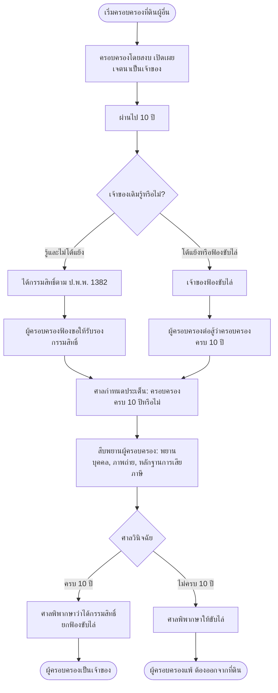

## 📌  **ตัวอย่างคำร้องมาตรา 254 ที่ศาลอนุญาต พร้อมการเปรียบเทียบกับกรณีที่ถูกยก**, **Flowchart คดีครอบครองปรปักษ์ (Adverse Possession)** และ **Flowchart คดีผู้บริโภค (Consumer Case)** เพิ่มเติม

---

## ⚖️ 1. ตัวอย่างคำร้องมาตรา 254 ที่ศาลอนุญาต (เปรียบเทียบกับที่ถูกยก)

### 1.1 ตัวอย่างคำร้องที่ศาลอนุญาต (กรณีอายัดที่ดิน – มีเหตุฉุกเฉินชัดเจน)

```
คำร้องขอให้อายัดที่ดิน (ตามมาตรา 254)
คดีแพ่ง (ที่จะยื่นฟ้อง) หมายเลข..........
ศาลแพ่ง

เรื่อง ขอให้อายัดที่ดินของจำเลย (กรณีฉุกเฉิน)

------------------------------------------------------------------
คำร้องของนางสาวขาว (ผู้จะยื่นฟ้อง)
------------------------------------------------------------------

ข้าพเจ้า นางสาวขาว ที่อยู่ .......................... ขอร้องว่า

๑. ข้าพเจ้าจะฟ้องนายดำเรียกค่าเสียหายจากการผิดสัญญาจะซื้อจะขายที่ดิน
   เป็นเงิน ๒,๐๐๐,๐๐๐ บาท (มีสัญญาจะซื้อจะขายและหลักฐานการมอบเงินมัดจำ)

๒. ข้าพเจ้าเพิ่งทราบว่านายดำได้ติดต่อขายที่ดินโฉนดเลขที่ ๔๕๖ ซึ่งเป็น
   ทรัพย์สินหลักของนายดำ ให้แก่บุคคลภายนอก และจะไปจดทะเบียนโอน
   ที่สำนักงานที่ดินในวันพรุ่งนี้ เวลา ๑๓.๓๐ น. (มีสำเนาหนังสือแสดง
   เจตจำนงขายและนัดหมายจากนายหน้าอสังหาริมทรัพย์แนบ)

๓. หากปล่อยให้โอนที่ดินดังกล่าว ข้าพเจ้าจะไม่สามารถบังคับคดีเอาทรัพย์สิน
   ของนายดำชำระหนี้ได้ เพราะนายดำไม่มีทรัพย์สินอื่นนอกจากที่ดินแปลงนี้

๔. กรณีเป็นเหตุฉุกเฉินรีบด่วนอย่างยิ่ง ไม่อาจรอการไต่สวนฝ่ายตรงข้ามได้

ข้าพเจ้าขอให้ศาลมีคำสั่งอายัดที่ดินโฉนดเลขที่ ๔๕๖ ของนายดำไว้ชั่วคราว
โดยไม่ต้องไต่สวนนายดำก่อน และข้าพเจ้ายินดีวางเงินประกัน ๑๐๐,๐๐๐ บาท

(ลงชื่อ) นางสาวขาว ผู้ร้อง
(ลงชื่อ) ทนายสมชาย ทนายความ
```

### 1.2 คำสั่งศาล (จำลอง) – อนุญาต

```
คำสั่งศาล

คดีแพ่ง (ที่จะยื่นฟ้อง) หมายเลข..........
วันที่ ๑๕ เมษายน ๒๕๖๘

ศาลตรวจคำร้องและเอกสารประกอบแล้ว เห็นว่า

๑. ผู้ร้องแสดงเหตุฉุกเฉินโดยชัดแจ้งว่า จำเลยจะโอนที่ดินในวันรุ่งขึ้น
   พร้อมเอกสารหลักฐานประกอบ
๒. ความเสียหายที่อาจเกิดขึ้นหากไม่คุ้มครองเป็นความเสียหายที่ไม่อาจ
   เยียวยาได้ด้วยค่าเสียหาย
๓. ผู้ร้องเสนอวางหลักประกันเป็นเงิน ๑๐๐,๐๐๐ บาท

จึงอนุญาตให้อายัดที่ดินโฉนดเลขที่ ๔๕๖ ของนายดำไว้ชั่วคราว
มีกำหนด ๑๕ วัน นับแต่วันนี้ ให้ผู้ร้องยื่นฟ้องคดีภายในกำหนด
และให้วางเงินประกันภายใน ๒๔ ชั่วโมง

(ลงชื่อ) .......................... ผู้พิพากษา
```

### 1.3 ตารางเปรียบเทียบคำร้องที่ถูกยก vs ที่ถูกอนุญาต

| ประเด็น | คำร้องที่ถูกยก (กรณีนางสาวขาวรายแรก) | คำร้องที่ถูกอนุญาต (นางสาวขาวรายที่สอง) |
|---------|----------------------------------------|------------------------------------------|
| **การแสดงเหตุฉุกเฉิน** | ไม่มี – แค่บอกว่า "เกรงว่า" | มี – ระบุชัดเจนว่าจะโอนในวันพรุ่งนี้ พร้อมหลักฐานนัดหมาย |
| **หลักฐานประกอบ** | ไม่มี | มีสำเนาหนังสือแสดงเจตจำนงขายและนัดหมาย |
| **การวางหลักประกัน** | ไม่เสนอ | เสนอ 100,000 บาท |
| **การเชื่อมโยงทรัพย์กับหนี้** | ขออายัดที่ดินแปลงอื่น ไม่ใช่ที่พิพาท | ขออายัดที่ดินแปลงที่เป็นทรัพย์สินหลักของจำเลย |
| **ผลของคำสั่ง** | ยกคำร้อง | อนุญาตให้อายัด 15 วัน |

---

## 🧭 2. Flowchart คดีครอบครองปรปักษ์ (Adverse Possession) – เพิ่มเติม

> กระบวนการตั้งแต่เริ่มครอบครอง → ครบ 10 ปี → การฟ้องคดี → คำพิพากษา



---

## 🧭 3. Flowchart คดีผู้บริโภค (Consumer Case) – เพิ่มเติม

> กระบวนการเฉพาะสำหรับคดีผู้บริโภค เน้นขั้นตอนที่ช่วยเหลือผู้บริโภค

```mermaid
flowchart TB
    Start([ผู้บริโภคได้รับความเสียหาย]) --> Step1[รวบรวมหลักฐาน:<br>- สัญญา/ใบเสร็จ<br>- หลักฐานความชำรุด<br>- บันทึกการแจ้งเรื่อง]
    Step1 --> Step2[แจ้งผู้ประกอบการเพื่อขอแก้ไข]
    Step2 --> Step3{ได้รับการแก้ไข?}
    Step3 -->|ใช่| End1([สิ้นสุด])
    Step3 -->|ไม่| Step4[ยื่นฟ้องต่อศาลแพ่งแผนกคดีผู้บริโภค<br>หรือศาลแขวง (ทุนทรัพย์ไม่เกิน 300,000)]
    
    Step4 --> Step5[ยื่นฟ้องด้วยวาจาหรือเป็นหนังสือ<br>ไม่ต้องมีทนายความก็ได้]
    Step5 --> Step6[เสียค่าธรรมเนียมศาลอัตราพิเศษ (ต่ำ)]
    Step6 --> Step7[ศาลรับฟ้องและส่งหมายเรียก]
    Step7 --> Step8[จำเลยยื่นคำให้การ]
    Step8 --> Step9[ศาลพยายามไกล่เกลี่ย]
    Step9 --> Step10{ไกล่เกลี่ยสำเร็จ?}
    Step10 -->|ใช่| End2([จบ])
    Step10 -->|ไม่| Step11[ศาลกำหนดประเด็น]
    Step11 --> Step12[สืบพยาน – ภาระการพิสูจน์ตกแก่ผู้ประกอบการ<br>ในบางกรณี]
    Step12 --> Step13[ศาลมีคำพิพากษา]
    Step13 --> Step14{พอใจ?}
    Step14 -->|ไม่| Step15[อุทธรณ์ต่อศาลอุทธรณ์แผนกคดีผู้บริโภค]
    Step14 -->|ใช่| End3([สิ้นสุด])
    Step15 --> Step16[ฎีกาต่อศาลฎีกา (ถ้ามีปัญหาข้อกฎหมาย)]
    Step16 --> End3
```

### 📝 คำอธิบายเพิ่มเติมสำหรับคดีผู้บริโภค

| จุดเด่นของคดีผู้บริโภค | รายละเอียด |
|----------------------|-------------|
| **การยื่นฟ้อง** | ยื่นด้วยวาจาต่อศาลได้ ไม่ต้องทำเป็นหนังสือ |
| **ค่าธรรมเนียมศาล** | อัตราพิเศษ ต่ำกว่าคดีแพ่งทั่วไป |
| **ภาระการพิสูจน์** | ในบางกรณี กฎหมายให้ผู้ประกอบการเป็นผู้พิสูจน์ว่าตนไม่ผิด |
| **การไกล่เกลี่ย** | ศาลจะพยายามไกล่เกลี่ยก่อนการพิจารณา |
| **ทนายความ** | ไม่จำเป็นต้องมีทนายความ ผู้บริโภคสามารถฟ้องเองได้ |

---

## ✅ สรุปสิ่งที่เพิ่มให้ในรอบนี้

| รายการ | สถานะ |
|--------|--------|
| ตัวอย่างคำร้องมาตรา 254 ที่ศาลอนุญาต (พร้อมคำสั่งศาล) | ✅ ใหม่ |
| ตารางเปรียบเทียบคำร้องที่ถูกยก vs ถูกอนุญาต | ✅ ใหม่ |
| Flowchart คดีครอบครองปรปักษ์ (Adverse Possession) | ✅ ใหม่ |
| Flowchart คดีผู้บริโภค (Consumer Case) | ✅ ใหม่ พร้อมตารางจุดเด่น |
 