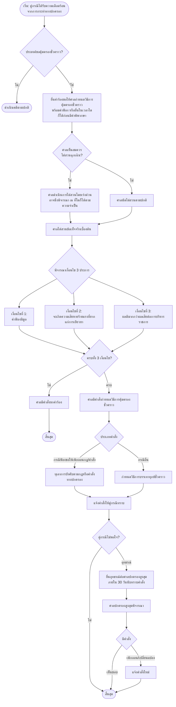

## 📌  Flowchart กระบวนการไต่สวนฉุกเฉินของศาลปกครอง + ตัวอย่างคำสั่งศาลปกครองสูงสุดเกี่ยวกับการบรรเทาทุกข์ชั่วคราวในคดีประเภทอื่น

ตามที่คุณขอ ด้านล่างนี้คือ **Flowchart กระบวนการไต่สวนฉุกเฉินของศาลปกครอง** ซึ่งเป็นมาตรการสำคัญในการคุ้มครองสิทธิของผู้ฟ้องคดีระหว่างการพิจารณาคดี **ตัวอย่างคำสั่งศาลปกครองสูงสุดเกี่ยวกับวิธีการคุ้มครองชั่วคราวก่อนการพิพากษา (มาตรา 66)** ในคดีประเภทต่างๆ เช่น คดีปลดข้าราชการ คดีเวนคืนอสังหาริมทรัพย์ คดีสิ่งแวดล้อม และคดีอื่น ๆ พร้อมคำอธิบายประกอบ

> **หมายเหตุสำคัญเกี่ยวกับศัพท์:** ในระบบศาลปกครอง มาตรการตามมาตรา 66 แห่งพระราชบัญญัติจัดตั้งศาลปกครองและวิธีพิจารณาคดีปกครอง พ.ศ. 2542 มักเรียกว่า **“วิธีการคุ้มครองชั่วคราวก่อนการพิพากษา”** หรือ **“การบรรเทาทุกข์ชั่วคราว”** ซึ่งเป็นมาตรการที่ศาลสามารถกำหนดขึ้นเพื่อคุ้มครองประโยชน์ของคู่กรณีเป็นการชั่วคราวก่อนมีคำพิพากษา โดยแบ่งออกเป็น 2 ประเภทหลักคือ (1) การทุเลาการบังคับตามกฎหรือคำสั่งทางปกครอง (กรณีฟ้องขอให้เพิกถอนกฎหรือคำสั่งทางปกครอง) และ (2) การบรรเทาทุกข์ชั่วคราว (กรณีอื่นๆ ที่มิใช่การฟ้องขอให้เพิกถอนกฎหรือคำสั่งทางปกครอง)

---

## 🧭 1. Flowchart กระบวนการไต่สวนฉุกเฉินของศาลปกครอง

> **ที่มา:** พระราชบัญญัติจัดตั้งศาลปกครองและวิธีพิจารณาคดีปกครอง พ.ศ. 2542 มาตรา 66 และระเบียบของที่ประชุมใหญ่ตุลาการในศาลปกครองสูงสุดว่าด้วยวิธีพิจารณาคดีปกครอง พ.ศ. 2543 ข้อ 77 วรรคหนึ่ง และข้อ 78

### 1.1 Flowchart กระบวนการไต่สวนฉุกเฉิน (วิธีการคุ้มครองชั่วคราว)

### 📝 คำอธิบายกระบวนการไต่สวนฉุกเฉิน (มาตรา 66)

| ขั้นตอน | รายละเอียด |
|---------|-------------|
| **1. การยื่นคำร้อง** | ผู้ฟ้องคดีสามารถยื่นคำขอให้ศาลมีคำสั่งกำหนดมาตรการหรือวิธีการคุ้มครองใดๆ เพื่อบรรเทาความเดือดร้อนหรือเสียหายของตนก่อนการพิพากษา โดยจะยื่นมาพร้อมกับคำฟ้อง หรือยื่นในเวลาใดก็ได้ก่อนมีคำพิพากษา |
| **2. การไต่สวน** | ในกรณีที่มีเหตุฉุกเฉิน ศาลปกครองจะดำเนินการไต่สวนโดยเร่งด่วน และอาจนั่งพิจารณา ณ ที่ใดก็ได้ตามความจำเป็น |
| **3. การพิจารณาของศาล** | การที่ศาลปกครองจะมีอำนาจออกคำสั่งกำหนดมาตรการหรือวิธีการคุ้มครองเพื่อบรรเทาทุกข์ชั่วคราวก่อนการพิพากษาได้นั้น ต้องเข้าเงื่อนไข 3 ประการประกอบกัน |

#### เงื่อนไขทั้ง 3 ประการ

| ลำดับ | เงื่อนไข | คำอธิบาย |
|--------|----------|----------|
| **1** | คำฟ้องมีมูล | ศาลต้องเห็นว่าคำฟ้องของผู้ฟ้องคดีมีมูล กล่าวคือมีข้อเท็จจริงและข้อกฎหมายที่น่าเชื่อถือเพียงพอ |
| **2** | มีเหตุให้เชื่อว่าจะเกิดความเสียหายอย่างร้ายแรงที่ยากแก่การเยียวยาแก้ไขในภายหลัง | หากปล่อยให้มีการกระทำทางปกครองต่อไปโดยไม่มีการคุ้มครองชั่วคราว ผู้ฟ้องคดีจะได้รับความเสียหายที่ไม่สามารถแก้ไขได้แม้ชนะคดีในที่สุด |
| **3** | การกำหนดวิธีการคุ้มครองฯ ไม่เป็นอุปสรรคแก่การบริหารราชการหรือการจัดทำบริการสาธารณะ | ศาลจะชั่งน้ำหนักระหว่างผลเสียหายของผู้ฟ้องคดีกับประโยชน์สาธารณะ หากการคุ้มครองไม่กระทบต่อบริการสาธารณะ ศาลก็จะอนุญาต |

---

## ⚖️ 2. ตัวอย่างคำสั่งศาลปกครองสูงสุดเกี่ยวกับการบรรเทาทุกข์ชั่วคราวในคดีประเภทอื่น

### 2.1 ตัวอย่างที่ 1: คดีปลดข้าราชการ – คำสั่งศาลปกครองสูงสุดเกี่ยวกับวิธีการคุ้มครองชั่วคราวก่อนการพิพากษา

> **ที่มา:** ศาลปกครองสูงสุด มีคำสั่งเกี่ยวกับวิธีการคุ้มครองชั่วคราวก่อนการพิพากษาในคดีพิพาทเกี่ยวกับคำสั่งปลดข้าราชการกรมการปกครองออกจากราชการ กรณีทุจริตสอบเข้ารับการศึกษาอบรมหลักสูตรนายอำเภอ

**ข้อเท็จจริงโดยย่อ:**
ข้าราชการกรมการปกครอง (ผู้ฟ้องคดี) ถูกสั่งปลดออกจากราชการ กรณีทุจริตสอบเข้ารับการศึกษาอบรมหลักสูตรนายอำเภอ ผู้ฟ้องคดีเห็นว่าคำสั่งดังกล่าวไม่ชอบด้วยกฎหมาย จึงยื่นฟ้องต่อศาลปกครอง และยื่นคำร้องขอให้ศาลมีคำสั่งคุ้มครองชั่วคราวระหว่างการพิจารณาคดี เพื่อขอให้ทุเลาการบังคับตามคำสั่งปลดออกจากราชการ

**คำสั่งศาลปกครองสูงสุด:**
ศาลปกครองสูงสุดพิจารณาแล้วเห็นว่าคำสั่งปลดข้าราชการดังกล่าวมีปัญหาความชอบด้วยกฎหมาย และหากปล่อยให้มีการบังคับตามคำสั่งต่อไป ผู้ฟ้องคดีจะได้รับความเสียหายอย่างร้ายแรงที่ยากแก่การเยียวยาแก้ไขในภายหลัง เนื่องจากเป็นการสูญเสียสถานะข้าราชการและรายได้ ศาลจึงมีคำสั่งกำหนดวิธีการคุ้มครองชั่วคราวก่อนการพิพากษา

**สาระสำคัญทางกฎหมาย:**
คำสั่งนี้แสดงให้เห็นว่าศาลปกครองสูงสุดให้ความสำคัญกับการคุ้มครองสิทธิของผู้ฟ้องคดีในคดีพิพาทเกี่ยวกับการออกจากราชการ ซึ่งอาจส่งผลกระทบต่อการดำรงชีพและสถานภาพของบุคคล โดยศาลจะพิจารณาเงื่อนไขทั้ง 3 ประการอย่างรอบคอบก่อนมีคำสั่งคุ้มครองชั่วคราว

### 2.2 ตัวอย่างที่ 2: คดีเวนคืนอสังหาริมทรัพย์ – ศาลปกครองกลางมีคำสั่งเกี่ยวกับวิธีการคุ้มครองชั่วคราวก่อนการพิพากษา

> **ที่มา:** ศาลปกครองกลาง คดีหมายเลขดำที่ 1915/2563 คำสั่งลงวันที่ 6 พฤษภาคม 2564

**ข้อเท็จจริงโดยย่อ:**
ผู้ฟ้องคดีทั้งหก (เจ้าของอสังหาริมทรัพย์) ฟ้องผู้ถูกฟ้องคดี (กรุงเทพมหานคร) กรณีเวนคืนอสังหาริมทรัพย์เพื่อก่อสร้างถนนเลียบคลองประปาฝั่งตะวันออกเชื่อมระหว่างถนนแจ้งวัฒนะกับถนนสรงประภา โดยผู้ถูกฟ้องคดีมิได้เสนอคณะรัฐมนตรีเพื่อออกพระราชกฤษฎีกากำหนดเขตที่ดินที่จะเวนคืนตามพระราชบัญญัติว่าด้วยการเวนคืนและการได้มาซึ่งอสังหาริมทรัพย์ พ.ศ. 2562 แต่กลับใช้วิธีปรองดองตามมติคณะรัฐมนตรีเมื่อวันที่ 9 ตุลาคม 2500 ซึ่งเป็นเพียงแนวทางปฏิบัติ

**คำสั่งศาล:**
ศาลปกครองกลางวินิจฉัยว่าการเวนคืนดังกล่าวอาจมีปัญหาเกี่ยวกับความชอบด้วยกฎหมาย หากปล่อยให้มีการเวนคืนต่อไป ย่อมทำให้ผู้ฟ้องคดีได้รับความเดือดร้อนเสียหายในระหว่างพิจารณาคดีและยากแก่การเยียวยาแก้ไขในภายหลัง คำฟ้องของผู้ฟ้องคดีจึงมีมูลและมีเหตุเพียงพอที่จะนำวิธีการคุ้มครองเพื่อบรรเทาทุกข์ชั่วคราวก่อนการพิพากษามาใช้ อีกทั้งการระงับการเวนคืนไว้ก่อนมิได้ก่อให้เกิดปัญหาอุปสรรคแก่การจัดทำบริการสาธารณะ ศาลจึงมีคำสั่งกำหนดมาตรการหรือวิธีการคุ้มครองเพื่อบรรเทาทุกข์ชั่วคราวก่อนการพิพากษาให้ผู้ถูกฟ้องคดีระงับการเวนคืนอสังหาริมทรัพย์โดยใช้วิธีปรองดองตามมติคณะรัฐมนตรีไว้ก่อน

**สาระสำคัญทางกฎหมาย:**
คำสั่งนี้เป็นตัวอย่างของ “การบรรเทาทุกข์ชั่วคราว” ซึ่งเป็นการคุ้มครองสิทธิของผู้ฟ้องคดีในคดีที่มิใช่การฟ้องขอให้เพิกถอนกฎหรือคำสั่งทางปกครอง โดยศาลได้ชั่งน้ำหนักระหว่างความเสียหายของผู้ฟ้องคดีกับประโยชน์สาธารณะแล้วเห็นว่าการระงับการเวนคืนไว้ก่อนมิได้กระทบต่อการจัดทำบริการสาธารณะ

### 2.3 ตัวอย่างที่ 3: คดีสิ่งแวดล้อม (EIA) – ศาลปกครองกลางมีคำสั่งทุเลาการบังคับตามมติ

> **ที่มา:** ศาลปกครองกลาง คดีหมายเลขดำที่ 88/2566 (กรณีสมาคมต่อต้านสภาวะโลกร้อนฟ้องเพิกถอนความเห็นชอบ EIA โครงการศุภาลัย ลอฟท์ รัชดาฯ)

**ข้อเท็จจริงโดยย่อ:**
สมาคมต่อต้านสภาวะโลกร้อนและพวกรวม 18 คน ฟ้องคณะกรรมการผู้ชำนาญการพิจารณารายงาน EIA ขอให้เพิกถอนการให้ความเห็นชอบรายงานการประเมินผลกระทบสิ่งแวดล้อม (EIA) โครงการอาคารชุดพักอาศัย “ศุภาลัย ลอฟท์ รัชดาฯ - วงศ์สว่าง” อาคารสูง 18 ชั้น ผู้ฟ้องคดียื่นคำร้องขอให้ศาลมีคำสั่งทุเลาการบังคับตามมติของผู้ถูกฟ้องคดีที่ให้ความเห็นชอบ EIA

**คำสั่งศาลปกครองชั้นต้น:**
ศาลปกครองชั้นต้นมีคำสั่งให้ทุเลาการบังคับตามมติของผู้ถูกฟ้องคดีในการประชุมครั้งที่ 46/2564 ลงวันที่ 2 สิงหาคม 2564 ที่ให้ความเห็นชอบรายงาน EIA โครงการดังกล่าว

**คำสั่งศาลปกครองสูงสุดที่ 238/2567:**
ผู้ถูกฟ้องคดีและผู้ร้องสอด (บริษัทผู้ดำเนินโครงการ) ยื่นอุทธรณ์คัดค้าน ศาลปกครองสูงสุดพิจารณาแล้วมีคำสั่งที่ 238/2567 ลงวันที่ 28 มีนาคม 2567 มีคำสั่งยกอุทธรณ์ และให้ทุเลาการบังคับตามคำสั่งทางปกครอง

**สาระสำคัญทางกฎหมาย:**
คำสั่งนี้เป็นตัวอย่างของ “การทุเลาการบังคับตามกฎหรือคำสั่งทางปกครอง” ซึ่งใช้ในกรณีที่ผู้ฟ้องคดีฟ้องขอให้เพิกถอนกฎหรือคำสั่งทางปกครอง โดยศาลปกครองสูงสุดเห็นว่าคำฟ้องมีมูล และการให้โครงการก่อสร้างดำเนินต่อไปโดยไม่มี EIA ที่ชอบด้วยกฎหมายจะก่อให้เกิดผลกระทบต่อสิ่งแวดล้อมและชุมชนอย่างร้ายแรง

### 2.4 ตัวอย่างที่ 4: คดีการแบ่งงานเทศบาล – ศาลปกครองสูงสุดที่ 242/2553

> **ที่มา:** ศาลปกครองสูงสุด คำร้องที่ 261/2552 คำสั่งที่ 242/2553

**ข้อเท็จจริงโดยย่อ:**
นายกเทศมนตรีเมืองลัดหลวง (ผู้ฟ้องคดี) ฟ้องขอให้เพิกถอนคำสั่งเทศบาลที่แบ่งงานให้นักบริหารงานเทศบาลปฏิบัติหน้าที่ในฐานะปลัดเทศบาล โดยผู้ฟ้องคดีเห็นว่าการแบ่งงานดังกล่าวเป็นการละเมิดอำนาจหน้าที่ของตนตามกฎหมาย และได้ยื่นคำร้องขอทุเลาการบังคับตามคำสั่งทางปกครองดังกล่าว

**คำสั่งศาลปกครองชั้นต้น:**
ศาลปกครองชั้นต้นมีคำสั่งทุเลาการบังคับตามคำสั่งทางปกครองตามที่ผู้ฟ้องคดีร้องขอ

**คำสั่งศาลปกครองสูงสุด:**
ผู้ถูกฟ้องคดี (นายกเทศมนตรีคนใหม่) ยื่นคำร้องอุทธรณ์คำสั่งคัดค้าน ศาลปกครองสูงสุดมีคำสั่งที่ 242/2553 ยกคำร้องอุทธรณ์

**สาระสำคัญทางกฎหมาย:**
คำสั่งนี้เป็นอีกตัวอย่างหนึ่งของการคุ้มครองชั่วคราวในคดีพิพาทเกี่ยวกับการบริหารงานบุคคลของหน่วยงานทางปกครอง ซึ่งแสดงให้เห็นว่าศาลปกครองให้ความสำคัญกับการคุ้มครองสิทธิของผู้ฟ้องคดีระหว่างการพิจารณาคดี แม้จะเป็นคดีที่มีผลกระทบต่อการบริหารราชการก็ตาม

### 2.5 ตัวอย่างที่ 5: คดีรำคาญจากฟาร์มเลี้ยงสัตว์ – ศาลปกครองนครราชสีมามีคำสั่งกำหนดมาตรการหรือวิธีการคุ้มครองเพื่อบรรเทาทุกข์ชั่วคราว

> **ที่มา:** ศาลปกครองนครราชสีมา มีคำสั่งกำหนดมาตรการหรือวิธีการคุ้มครองเพื่อบรรเทาทุกข์ชั่วคราวก่อนการพิพากษา กรณีได้รับความเดือดร้อนรำคาญจากฟาร์มเลี้ยงเป็ดไก่ในตำบลโคกสูง อำเภอเมืองนครราชสีมา

**ข้อเท็จจริงโดยย่อ:**
ประชาชนในพื้นที่ได้รับความเดือดร้อนรำคาญจากฟาร์มเลี้ยงเป็ดไก่ ส่งผลต่อการดำรงชีวิตและสุขภาพอนามัย จึงยื่นฟ้องต่อศาลปกครองนครราชสีมา พร้อมยื่นคำร้องขอให้ศาลมีคำสั่งกำหนดมาตรการคุ้มครองชั่วคราวเพื่อบรรเทาทุกข์เป็นการชั่วคราวก่อนการพิพากษา

**คำสั่งศาล:**
ศาลปกครองนครราชสีมามีคำสั่งกำหนดมาตรการหรือวิธีการคุ้มครองเพื่อบรรเทาทุกข์ชั่วคราวก่อนการพิพากษา

**สาระสำคัญทางกฎหมาย:**
คำสั่งนี้เป็นตัวอย่างของ “การบรรเทาทุกข์ชั่วคราว” ในคดีสิ่งแวดล้อมและคดีรำคาญ ซึ่งศาลปกครองได้นำมาตรา 66 มาใช้คุ้มครองสิทธิของประชาชนที่ได้รับผลกระทบจากการประกอบกิจการของเอกชนที่ได้รับอนุญาตจากหน่วยงานทางปกครอง

---

## 📊 3. ตารางสรุปตัวอย่างคำสั่งศาลปกครองสูงสุด/กลาง เกี่ยวกับวิธีการคุ้มครองชั่วคราว

| ลำดับ | ชื่อคดี/คำสั่ง | ประเภทคดี | ลักษณะคำสั่ง | คำสั่งศาล | สาระสำคัญ |
|--------|--------------|----------|--------------|-----------|------------|
| 1 | คำสั่งศาลปกครองสูงสุด (คดีปลดข้าราชการ) | คดีปกครองเกี่ยวกับการออกจากราชการ | ทุเลาการบังคับตามคำสั่งทางปกครอง | มีคำสั่งคุ้มครองชั่วคราว | ปกป้องสิทธิข้าราชการที่ถูกสั่งปลดระหว่างพิจารณาคดี |
| 2 | ศาลปกครองกลาง คดีหมายเลขดำที่ 1915/2563 (คดีเวนคืนอสังหาริมทรัพย์) | คดีปกครองเกี่ยวกับการเวนคืนอสังหาริมทรัพย์ | บรรเทาทุกข์ชั่วคราว – ระงับการเวนคืน | มีคำสั่งคุ้มครองชั่วคราว | คุ้มครองสิทธิเจ้าของทรัพย์สินระหว่างพิจารณาคดี |
| 3 | ศาลปกครองสูงสุดที่ 238/2567 (คดี EIA โครงการศุภาลัย ลอฟท์ รัชดาฯ) | คดีปกครองเกี่ยวกับสิ่งแวดล้อม (EIA) | ทุเลาการบังคับตามมติ (EIA) | มีคำสั่งทุเลาการบังคับ | ปกป้องผลกระทบสิ่งแวดล้อมและชุมชนระหว่างพิจารณาคดี |
| 4 | ศาลปกครองสูงสุดที่ 242/2553 (คดีการแบ่งงานเทศบาล) | คดีปกครองเกี่ยวกับการบริหารงานบุคคลท้องถิ่น | ทุเลาการบังคับตามคำสั่งทางปกครอง | มีคำสั่งคุ้มครองชั่วคราว | คุ้มครองอำนาจหน้าที่ตามกฎหมายของผู้ฟ้องคดี |
| 5 | ศาลปกครองนครราชสีมา (คดีฟาร์มเลี้ยงเป็ดไก่) | คดีปกครองเกี่ยวกับสิ่งแวดล้อม/รำคาญ | บรรเทาทุกข์ชั่วคราว | มีคำสั่งคุ้มครองชั่วคราว | คุ้มครองสิทธิประชาชนจากมลพิษ/รำคาญ |

---

## ✅ สรุปสิ่งที่เพิ่มให้ในรอบนี้

| รายการ | สถานะ |
|--------|--------|
| Flowchart กระบวนการไต่สวนฉุกเฉินของศาลปกครอง (ตามมาตรา 66) | ✅ ใหม่ พร้อมคำอธิบายเงื่อนไข 3 ประการ |
| ตัวอย่างคำสั่งศาลปกครองสูงสุด – คดีปลดข้าราชการ | ✅ ใหม่ |
| ตัวอย่างคำสั่งศาลปกครองกลาง – คดีเวนคืนอสังหาริมทรัพย์ (คดีหมายเลขดำที่ 1915/2563) | ✅ ใหม่ |
| ตัวอย่างคำสั่งศาลปกครองสูงสุด – คดี EIA โครงการศุภาลัย ลอฟท์ รัชดาฯ (คำสั่งที่ 238/2567) | ✅ ใหม่ |
| ตัวอย่างคำสั่งศาลปกครองสูงสุด – คดีการแบ่งงานเทศบาล (คำสั่งที่ 242/2553) | ✅ ใหม่ |
| ตัวอย่างคำสั่งศาลปกครองนครราชสีมา – คดีฟาร์มเลี้ยงเป็ดไก่ | ✅ ใหม่ |
| ตารางสรุปตัวอย่างคำสั่งศาลปกครอง | ✅ ใหม่ |

สามารถนำ Flowchart ไปใช้ในการทำความเข้าใจกระบวนการขอวิธีการคุ้มครองชั่วคราวต่อศาลปกครอง และใช้ตัวอย่างคำสั่งศาลปกครองสูงสุดเป็นแนวทางในการคาดการณ์ผลการพิจารณาคำร้องในคดีประเภทต่างๆ
 