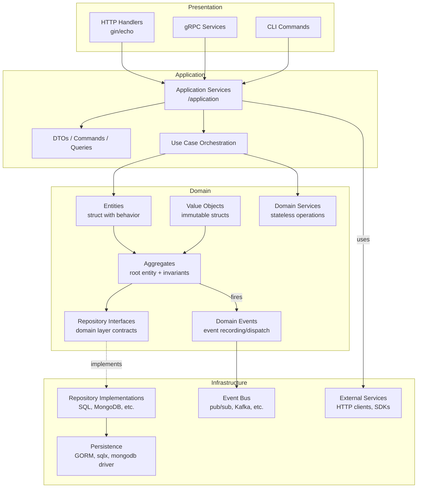

```markdown
## Code Quality Checklist

### Documentation
- [] All exported functions have comments (godoc format)
- [] Package has package-level documentation comment
- [] Complex logic has inline comments explaining "why"
- [] README updated with relevant information

### Code Style
- [] Code formatted with `go fmt` or `gofmt`
- [] No unused imports or variables (`go vet` passed)
- [] Consistent naming convention (camelCase, PascalCase)
- [] No magic numbers (use constants)
- [] Line length < 120 characters (preferably)

### Error Handling
- [] All errors are handled explicitly (no `_` ignoring)
- [] Errors are wrapped with context (`fmt.Errorf("...: %w", err)`)
- [] No panic in library code (only in main/init for fatal errors)
- [] Custom error types used when appropriate
- [] Error messages are descriptive and actionable

### Concurrency
- [] Goroutines have proper lifecycle management
- [] Channels are closed appropriately
- [] No race conditions (`go test -race` passed)
- [] sync.Mutex used correctly (Lock/Unlock pairs)
- [] Context passed as first parameter for cancellation

### Performance
- [] No unnecessary allocations in hot paths
- [] Slice pre-allocated when size known (`make([]T, 0, capacity)`)
- [] String concatenation uses `strings.Builder` for large operations
- [] Database queries have appropriate indexes
- [] No N+1 queries

### Security
- [] Input validation on all external inputs
- [] SQL injection prevented (use parameterized queries)
- [] No hardcoded secrets or credentials
- [] Sensitive data not logged
- [] Passwords hashed with bcrypt (not stored in plaintext)
- [] JWT secrets loaded from environment
- [] CORS configured properly (allow only trusted origins)

### Testing
- [] Unit tests cover business logic
- [] Table-driven tests used for multiple scenarios
- [] Edge cases tested (nil, empty, boundary values)
- [] Mock external dependencies
- [] Test coverage > 80%

### Project Structure
- [] Follows standard Go project layout
- [] Packages have single responsibility
- [] No circular dependencies
- [] Internal packages used for private code
- [] Go modules properly configured

### Dependencies
- [] go.mod has only required dependencies
- [] go.sum is committed
- [] `go mod tidy` run before commit
- [] No unused dependencies

### Version Control
- [] Commit messages follow convention (feat, fix, docs, etc.)
- [] No debug code (fmt.Println, log.Println) in production code
- [] No commented out code
- [] .gitignore properly configured

### Reviewer Notes
- [] Code reviewed by at least one other developer
- [] All review comments addressed

---
**Status:** [] Ready for merge | [] Changes requested | [] Approved
**Reviewer:** __xxxxx___________
**Date:** _2026-04-xx-xx-xx__________
```
-------------------

### Deadlock เกิดจากอะไร
 

## 🔍 Deadlock เกิดจากอะไร

Deadlock จะเกิดขึ้นได้ก็ต่อเมื่อมี **4 เงื่อนไข** ต่อไปนี้เกิดขึ้นพร้อมกัน**[reference:2]**:

1. **Mutual Exclusion** – ทรัพยากรที่ใช้ไม่สามารถใช้ร่วมกันได้ มีเพียงกระบวนการเดียวเท่านั้นที่สามารถใช้ทรัพยากรนั้นได้ในแต่ละช่วงเวลา**[reference:3]**
2. **Hold and Wait** – กระบวนการหนึ่งครอบครองทรัพยากรบางตัวไว้และกำลังรอทรัพยากรอื่นที่ถูกครอบครองโดยกระบวนการอื่น**[reference:4]**
3. **No Preemption** – ทรัพยากรที่ถูกครอบครองอยู่จะถูกปล่อยก็ต่อเมื่อกระบวนการที่ครอบครองใช้เสร็จแล้วเท่านั้น ไม่สามารถแย่งชิงได้**[reference:5]**
4. **Circular Wait** – กระบวนการหลายตัวต่างรอทรัพยากรจากกันและกันเป็นลูกโซ่แบบวงกลม เช่น P1 รอ P2, P2 รอ P3, P3 รอ P1**[reference:6]**

หากทั้ง 4 เงื่อนไขนี้เกิดขึ้นพร้อมกัน ก็จะทำให้เกิด deadlock ขึ้นในระบบ

## 🧪 ตัวอย่าง Deadlock ในชีวิตจริง

### ตัวอย่างที่ 1: ระบบปฏิบัติการ
สมมติว่ามี 2 โปรเซส:
- โปรเซส A ครอบครองเครื่องพิมพ์ และกำลังรอแสกนเนอร์
- โปรเซส B ครอบครองแสกนเนอร์ และกำลังรอเครื่องพิมพ์
ทั้งคู่ต่างรอซึ่งกันและกัน ส่งผลให้ไม่สามารถทำงานต่อไปได้

### ตัวอย่างที่ 2: การจราจร
รถ 4 คันมาถึงทางแยกพร้อมกันและต่างปิดกั้นกันจนไม่สามารถเคลื่อนที่ได้**[reference:7]**

## 🛠️ การจัดการ Deadlock

แนวทางจัดการ deadlock มี 3 วิธีหลัก:


## CMD |  คำสั่ง
---

```go
go run deadlock.go 
```
 
 
## Resalte | ผลลัพธ์
------------
🔒 Lock 2
🔒 Lock 1

------------
### Data flow diagram




## Remark 

