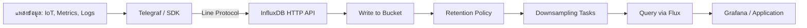

# Module 17: pkg/influxdb

## สำหรับโฟลเดอร์ `pkg/influxdb/`

ไฟล์ที่เกี่ยวข้อง:
- `client.go` - สร้างและจัดการ InfluxDB client
- `writer.go` - เขียนข้อมูลแบบ Time Series
- `query.go` - ค้นหาข้อมูลด้วย Flux หรือ InfluxQL
- `config.go` - การตั้งค่าการเชื่อมต่อ

---

## หลักการ (Concept)

### InfluxDB คืออะไร?
InfluxDB คือฐานข้อมูลแบบ Time Series ที่ถูกออกแบบมาเพื่อจัดเก็บและสืบค้นข้อมูลที่มีป้ายกำกับเวลา (timestamp) โดยเฉพาะ เหมาะสำหรับงาน monitoring, IoT, analytics, และ telemetry

### มีกี่แบบ? (InfluxDB versions)
1. **InfluxDB OSS (Open Source)** - ฟรี, รองรับ Flux และ InfluxQL
2. **InfluxDB Cloud** - บริการแบบ Serverless บนระบบคลาวด์
3. **InfluxDB Enterprise** - รองรับ cluster และความปลอดภัยระดับองค์กร

รูปแบบการจัดเก็บข้อมูล:
- **Line Protocol** - รูปแบบข้อความที่ใช้ในการเขียนข้อมูล
- **Bucket** - คล้าย database + retention policy (ตั้งแต่ v2 ขึ้นไป)
- **Measurement** - คล้าย table ใน SQL
- **Tag** - ข้อมูลที่ถูก index ใช้สำหรับ filter (ประเภท string)
- **Field** - ข้อมูลค่าตัวเลขที่ใช้ในการคำนวณ (ไม่ถูก index)
- **Timestamp** - เวลาที่เกิดเหตุการณ์ (nanosecond precision)

### ใช้อย่างไร / นำไปใช้กรณีไหน

**กรณีใช้งาน:**
- ระบบ monitoring (CPU, Memory, Network)
- IoT sensor data (อุณหภูมิ, ความชื้น, การสั่นสะเทือน)
- Application metrics (request rate, latency, error count)
- Financial tick data (ราคาหุ้น, อัตราแลกเปลี่ยน)
- Real-time analytics dashboard

**รูปแบบการเขียนข้อมูล:**
```go
// Line Protocol: measurement,tag1=value1 field1=value1,tag2=value2 timestamp
cpu,host=server01 usage_user=45.2,usage_system=12.1 1623456789000000000
```

### ประโยชน์ที่ได้รับ
- อ่านและเขียนข้อมูล Time Series ได้เร็วสูง (百万 event/วินาที)
- บีบอัดข้อมูลอัตโนมัติ ประหยัดพื้นที่จัดเก็บ
- รองรับการลบข้อมูลอัตโนมัติตาม Retention Policy
- Query ภาษา Flux มีฟังก์ชันเฉพาะทางเวลา เช่น `aggregateWindow()`, `movingAverage()`

### ข้อควรระวัง
- **Tags ควรมี cardinality ต่ำ** (ไม่เกิน 1 ล้านค่า unique ต่อ bucket) เพราะถูกเก็บใน index
- **Fields ไม่ควรถูกใช้ในการ filter** เพราะไม่มี index ทำให้ query ช้า
- **Timestamp ต้องเป็น UTC** เสมอ
- **อย่าใช้ Bucket เดียวเก็บหลาย Measurement** ที่มี schema ต่างกันมาก (อาจทำให้ query ซับซ้อน)

### ข้อดี
- รองรับการ query แบบ window, fill missing data, และ interpolation
- Downsampling และ retention policy ในตัว
- รองรับ continuous queries (v1) และ tasks (v2)
- มี ecosystem รองรับเช่น Grafana, Telegraf

### ข้อเสีย
- JOIN ข้อมูลระหว่าง measurements ทำได้ยาก
- การ update และ delete ข้อมูลทำได้จำกัด (ตาม time range เท่านั้น)
- การเปลี่ยนแปลง schema (เพิ่ม/ลด tag) ไม่สามารถทำได้โดยตรง ต้องเขียนข้อมูลใหม่

### ข้อห้าม
**ห้ามใช้ Bucket Pattern หรือการ pre-aggregate ข้อมูลด้วยตนเอง** ใน InfluxDB หากต้องการ aggregated data ควรใช้ continuous query หรือ task ของ InfluxDB แทน เพราะ InfluxDB ออกแบบมาให้เขียน raw data แล้ว query aggregate ทันที การทำ pre-aggregate จะเพิ่ม complexity และเปลืองพื้นที่

---

## การออกแบบ Workflow และ Dataflow



**Dataflow ใน Go application:**
1. Config → สร้าง InfluxDB client (URL, org, token)
2. WriteAPI → เขียนข้อมูลแบบ async หรือ sync
3. QueryAPI → ส่ง Flux query, รับผลลัพธ์เป็น struct หรือ raw table
4. ปิด client เมื่อจบการทำงาน

---

## ตัวอย่างโค้ดที่รันได้จริง

### โครงสร้างโปรเจกต์
```
pkg/influxdb/
├── client.go
├── writer.go
├── query.go
└── main_example.go (ตัวอย่างรวม)
```

### 1. การติดตั้ง InfluxDB ด้วย Docker
```bash
docker run -d --name influxdb -p 8086:8086 \
  -e DOCKER_INFLUXDB_INIT_MODE=setup \
  -e DOCKER_INFLUXDB_INIT_USERNAME=admin \
  -e DOCKER_INFLUXDB_INIT_PASSWORD=admin1234 \
  -e DOCKER_INFLUXDB_INIT_ORG=myorg \
  -e DOCKER_INFLUXDB_INIT_BUCKET=mybucket \
  influxdb:2.7-alpine
```

### 2. ติดตั้ง Go client
```bash
go get github.com/influxdata/influxdb-client-go/v2
```

### 3. ตัวอย่างโค้ด: การเขียนข้อมูล

```go
// writer.go
package influxdb

import (
    "context"
    "time"
    "github.com/influxdata/influxdb-client-go/v2"
    "github.com/influxdata/influxdb-client-go/v2/api"
)

type InfluxWriter struct {
    client   influxdb2.Client
    writeAPI api.WriteAPIBlocking
    org      string
    bucket   string
}

func NewInfluxWriter(url, token, org, bucket string) *InfluxWriter {
    client := influxdb2.NewClient(url, token)
    writeAPI := client.WriteAPIBlocking(org, bucket)
    return &InfluxWriter{
        client:   client,
        writeAPI: writeAPI,
        org:      org,
        bucket:   bucket,
    }
}

// WriteMetric เขียน metric ตัวเดียว
func (w *InfluxWriter) WriteMetric(measurement string, tags map[string]string, fields map[string]interface{}, ts time.Time) error {
    point := influxdb2.NewPoint(measurement, tags, fields, ts)
    return w.writeAPI.WritePoint(context.Background(), point)
}

// WriteBatch เขียนหลายจุดในครั้งเดียว
func (w *InfluxWriter) WriteBatch(points []*influxdb2.Point) error {
    for _, p := range points {
        if err := w.writeAPI.WritePoint(context.Background(), p); err != nil {
            return err
        }
    }
    return nil
}

// Close ปิด client
func (w *InfluxWriter) Close() {
    w.client.Close()
}

// ตัวอย่างการใช้งานใน main
func main() {
    writer := NewInfluxWriter("http://localhost:8086", "my-token", "myorg", "mybucket")
    defer writer.Close()

    tags := map[string]string{"host": "server01", "region": "us-west"}
    fields := map[string]interface{}{"cpu_usage": 45.2, "mem_used": 8245678912}
    ts := time.Now()

    err := writer.WriteMetric("system_metrics", tags, fields, ts)
    if err != nil {
        panic(err)
    }
}
```

### 4. ตัวอย่างโค้ด: การ Query ข้อมูลด้วย Flux

```go
// query.go
package influxdb

import (
    "context"
    "fmt"
    "github.com/influxdata/influxdb-client-go/v2"
    "github.com/influxdata/influxdb-client-go/v2/api"
)

type InfluxQuery struct {
    client    influxdb2.Client
    queryAPI  api.QueryAPI
}

func NewInfluxQuery(url, token, org string) *InfluxQuery {
    client := influxdb2.NewClient(url, token)
    queryAPI := client.QueryAPI(org)
    return &InfluxQuery{
        client:   client,
        queryAPI: queryAPI,
    }
}

// QueryCPUUsage ดึงค่า cpu_usage ล่าสุด 1 ชั่วโมง
func (q *InfluxQuery) QueryCPUUsage(host string) ([]float64, error) {
    fluxQuery := fmt.Sprintf(`
        from(bucket: "mybucket")
            |> range(start: -1h)
            |> filter(fn: (r) => r._measurement == "system_metrics" and r.host == "%s" and r._field == "cpu_usage")
            |> aggregateWindow(every: 1m, fn: mean)
            |> yield(name: "mean")
    `, host)

    result, err := q.queryAPI.Query(context.Background(), fluxQuery)
    if err != nil {
        return nil, err
    }
    defer result.Close()

    var values []float64
    for result.Next() {
        value := result.Record().Value()
        if v, ok := value.(float64); ok {
            values = append(values, v)
        }
    }
    return values, nil
}

// QueryLastValue ดึงค่าล่าสุดของทุก host
func (q *InfluxQuery) QueryLastValue(measurement, field string) (map[string]interface{}, error) {
    fluxQuery := fmt.Sprintf(`
        from(bucket: "mybucket")
            |> range(start: -1h)
            |> filter(fn: (r) => r._measurement == "%s" and r._field == "%s")
            |> last()
    `, measurement, field)

    result, err := q.queryAPI.Query(context.Background(), fluxQuery)
    if err != nil {
        return nil, err
    }
    defer result.Close()

    data := make(map[string]interface{})
    for result.Next() {
        record := result.Record()
        host := record.ValueByKey("host").(string)
        data[host] = record.Value()
    }
    return data, nil
}
```

### 5. ตัวอย่างการทำงานร่วมกับ HTTP server

```go
// main.go
package main

import (
    "encoding/json"
    "log"
    "net/http"
    "time"
    "yourproject/pkg/influxdb"
)

var writer *influxdb.InfluxWriter

func main() {
    writer = influxdb.NewInfluxWriter(
        "http://localhost:8086",
        "your-token",
        "myorg",
        "mybucket",
    )
    defer writer.Close()

    http.HandleFunc("/metrics", receiveMetrics)
    http.HandleFunc("/query/cpu", queryCPUHandler)
    log.Fatal(http.ListenAndServe(":8080", nil))
}

func receiveMetrics(w http.ResponseWriter, r *http.Request) {
    var req struct {
        Host   string             `json:"host"`
        CPU    float64            `json:"cpu"`
        Memory uint64             `json:"memory"`
        Tags   map[string]string  `json:"tags"`
    }
    if err := json.NewDecoder(r.Body).Decode(&req); err != nil {
        http.Error(w, err.Error(), 400)
        return
    }

    tags := map[string]string{"host": req.Host}
    for k, v := range req.Tags {
        tags[k] = v
    }
    fields := map[string]interface{}{"cpu_usage": req.CPU, "mem_used": req.Memory}
    err := writer.WriteMetric("app_metrics", tags, fields, time.Now())
    if err != nil {
        http.Error(w, err.Error(), 500)
        return
    }
    w.WriteHeader(http.StatusOK)
}

func queryCPUHandler(w http.ResponseWriter, r *http.Request) {
    host := r.URL.Query().Get("host")
    query := influxdb.NewInfluxQuery("http://localhost:8086", "your-token", "myorg")
    defer query.Close()
    values, err := query.QueryCPUUsage(host)
    if err != nil {
        http.Error(w, err.Error(), 500)
        return
    }
    json.NewEncoder(w).Encode(values)
}
```

---

## วิธีใช้งาน module นี้

1. **ติดตั้ง InfluxDB** (ใช้ Docker หรือ binary)
2. **สร้าง bucket และ token** ผ่าน UI หรือ CLI
3. **ติดตั้ง Go client**:
   ```bash
   go get github.com/influxdata/influxdb-client-go/v2
   ```
4. **คัดลอกโค้ด** ไฟล์ `client.go`, `writer.go`, `query.go` ไปไว้ใน `pkg/influxdb/`
5. **เรียกใช้งาน**:
   ```go
   writer := influxdb.NewInfluxWriter(url, token, org, bucket)
   writer.WriteMetric("cpu", map[string]string{"host":"web"}, map[string]interface{}{"value":85.2}, time.Now())
   ```
6. **ตรวจสอบข้อมูล** ด้วย Flux ใน InfluxDB UI หรือ Grafana

---

## ตารางสรุป MongoDB Components

*(แก้จากหัวข้อ แต่ให้เป็นตารางสรุป InfluxDB Components)*

| Component | คำอธิบาย | ตัวอย่าง |
|-----------|----------|----------|
| **Bucket** | หน่วยเก็บข้อมูล + retention policy | `my-bucket` (เก็บ 30 วัน) |
| **Measurement** | กลุ่มของ fields/tags เหมือน table | `cpu_metrics`, `memory_usage` |
| **Tag** | Metadata ที่ถูก index ใช้ filter | `host=server01`, `region=asia` |
| **Field** | ค่าตัวเลข/string ที่ไม่ถูก index | `value=45.2`, `status="ok"` |
| **Timestamp** | เวลา Unix nano second | `1672531200000000000` |
| **Line Protocol** | รูปแบบข้อความในการเขียน | `cpu,host=srv1 usage=75.5 1672531200000000000` |
| **Flux** | ภาษา query หลักของ InfluxDB v2 | `from(bucket:"x") \|> range(start:-1h)` |
| **InfluxQL** | ภาษา query แบบ SQL-like (v1 legacy) | `SELECT * FROM cpu WHERE time > now() - 1h` |
| **Task** | งาน scheduled สำหรับ downsampling | `every: 1h, do: aggregateWindow(every:1h, fn:mean)` |
| **Telegraf** | Agent สำหรับเก็บ metrics | ส่งข้อมูลจาก Docker, MySQL, Nginx |

---

## แบบฝึกหัดท้าย module (3 ข้อ)

### ข้อ 1: การเขียนข้อมูลแบบ Batch
จงเขียนฟังก์ชัน `WriteBatchPoints(measurement string, data []MetricData)` ที่รับ slice ของ struct `MetricData` (มี fields: Timestamp, Tags, Fields) แล้วเขียนทั้งหมดลง InfluxDB โดยใช้ Batch API แบบ non-blocking (async) และจัดการ error ที่อาจเกิดขึ้น

### ข้อ 2: การ Query และประมวลผล
ให้เขียนฟังก์ชัน `GetAverageCPUPerHost(duration time.Duration)` ที่คืนค่า `map[string]float64` ของ cpu usage เฉลี่ยของแต่ละ host ในช่วงเวลา `duration` (เช่น 10 นาที) โดยใช้ Flux query และ aggregateWindow

### ข้อ 3: การออกแบบ Schema สำหรับระบบ Monitoring
คุณต้อง monitor เครื่องเซิร์ฟเวอร์ 100 เครื่อง แต่ละเครื่องมี metric:
- CPU (user, system, idle)
- Memory (used, free, cached)
- Disk (total, used, per device)
- Network (rx_bytes, tx_bytes ต่อ interface)

**คำถาม:**
- คุณจะออกแบบ Measurement, Tag, Field อย่างไร?
- ควรแยกแต่ละ metric เป็น measurement เดียวหรือรวมทั้งหมด?
- cardinality ของ tags ที่ควรระวังคืออะไร?
- เขียนตัวอย่าง Line Protocol สำหรับ metric CPU ของ host `web-01` ที่ timestamp `2025-01-01T10:00:00Z` โดยมี CPU user=30.2, system=10.5

---

## แหล่งอ้างอิง

- [InfluxDB Official Documentation](https://docs.influxdata.com/influxdb/v2/)
- [Go Client Library GitHub](https://github.com/influxdata/influxdb-client-go)
- [Flux Language Guide](https://docs.influxdata.com/flux/v0.x/)
- [Best Practices for Schema Design](https://docs.influxdata.com/influxdb/v2/write-data/best-practices/)
- [Telegraf Documentation](https://docs.influxdata.com/telegraf/v1/)

---

**หมายเหตุ:** module นี้ครบถ้วนสำหรับ `pkg/influxdb` สำหรับระบบ gobackend หากต้องการ module เพิ่มเติม (เช่น `pkg/timescaledb`, `pkg/clickhouse`) โปรดแจ้ง

นำมาปรับ
กับด้านล่าง
สำหรับทำงานจริงทำที
### โฟลเดอร์หลัก  icmongolang
```
icmongolang/
├── .vscode/
│   ├── launch.json
│   └── settings.json
├── cmd/
│   ├── api/
│   │   └── main.go
│   ├── initdata.go
│   ├── migrate.go
│   ├── root.go
│   ├── serve.go
│   └── worker.go
├── config/
│   ├── config-local.yml
│   ├── config-prod.yml
│   └── config.go
├── docdev/
├── docs/
├── internal/
│   ├── models/
│   │   ├── base.go
│   │   ├── session.go
│   │   ├── user.go
│   │   └── verification.go
│   ├── repository/
│   │   ├── pg_repository.go
│   │   ├── redis_repo.go
│   │   ├── session_repo.go
│   │   └── user_repo.go
│   ├── usecase/
│   │   ├── auth_usecase.go
│   │   ├── cache_usecase.go
│   │   └── user_usecase.go
│   ├── delivery/
│   │   ├── rest/
│   │   │   ├── handler/
│   │   │   │   ├── auth_handler.go
│   │   │   │   ├── health_handler.go
│   │   │   │   └── user_handler.go
│   │   │   ├── middleware/
│   │   │   │   ├── auth.go
│   │   │   │   ├── cors.go
│   │   │   │   ├── logger.go
│   │   │   │   ├── monitoring.go
│   │   │   │   ├── rate_limit.go
│   │   │   │   └── security.go
│   │   │   ├── dto/
│   │   │   │   ├── auth_dto.go
│   │   │   │   ├── error_dto.go
│   │   │   │   └── user_dto.go
│   │   │   └── router.go
│   │   └── worker/
│   │       └── email_worker.go
│   └── pkg/
│       ├── email/
│       │   ├── gomail_sender.go
│       │   ├── sender.go
│       │   └── templates/
│       │       ├── reset_password.html
│       │       └── verification.html
│       ├── hash/
│       │   └── bcrypt.go
│       ├── jwt/
│       │   ├── maker.go
│       │   ├── payload.go
│       │   └── rsa_maker.go
│       ├── logger/
│       │   └── zap_logger.go
│       ├── redis/
│       │   ├── cache.go
│       │   ├── client.go
│       │   └── refresh_store.go
│       ├── utils/
│       │   ├── random.go
│       │   └── time.go
│       └── validator/
│           └── custom_validator.go
├── migrations/
│   ├── 000001_create_users_table.down.sql
│   └── 000001_create_users_table.up.sql
├── pkg/
│   └── utils/
├── scripts/
│   ├── build.sh
│   └── deploy.sh
├── vendor/
├── .air.toml
├── .dockerignore
├── .env.dev
├── .env.prod
├── .gitignore
├── docker-compose.dev.yml
├── docker-compose.prod.yml
├── Dockerfile.dev
├── Dockerfile.prod
├── go.mod
├── go.sum
├── LICENSE
├── README.md
└── BookGolang.md
```
