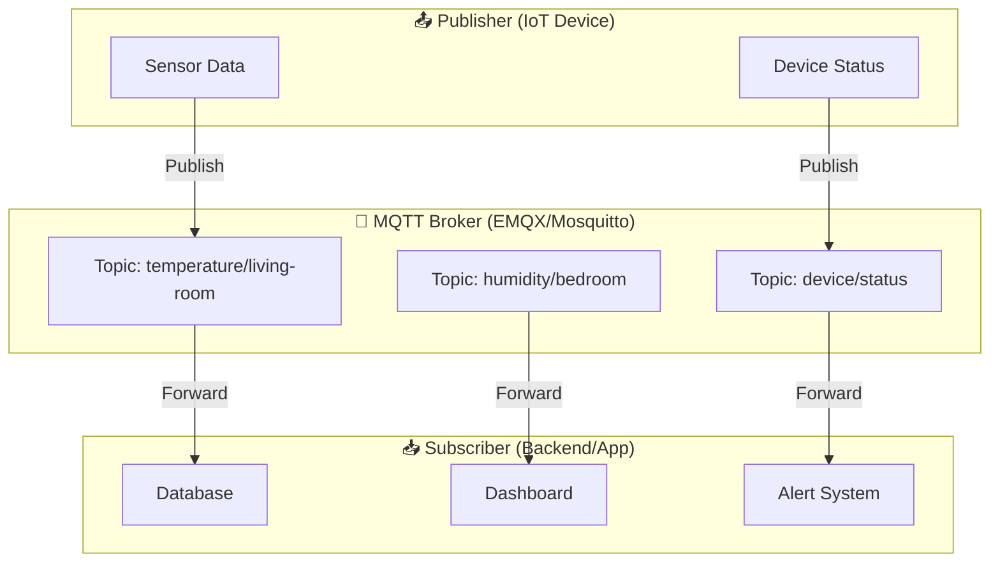
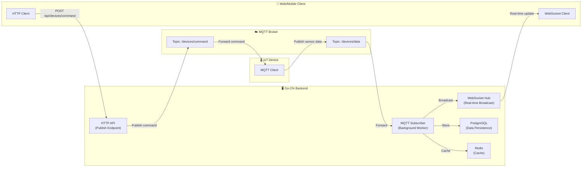

# Go-Chi Comprehensive Guide / คู่มือ Go-Chi

## บทที่ 14: การผสาน MQTT สำหรับระบบ IoT และ Real-time Messaging

> **หัวข้อที่ครอบคลุมในบทนี้**: MQTT คืออะไร, การติดตั้งและตั้งค่า MQTT Broker, การเขียน MQTT Client ใน Go ด้วย Paho library, การผสาน MQTT เข้ากับ Go-Chi HTTP API, การทำ Real-time Dashboard ด้วย WebSocket, การจัดการ Connection และ Error Handling, การออกแบบระบบ Publish/Subscribe สำหรับ IoT, และการประยุกต์ใช้ในโลกจริง

---

### สรุปสั้นก่อนอ่าน (TL;DR)

MQTT เป็น lightweight messaging protocol ที่ออกแบบมาสำหรับ IoT และระบบที่ต้องการการสื่อสารแบบ real-time ด้วยการใช้ publish/subscribe model ผ่าน broker บทนี้จะสอนการนำ MQTT มาใช้ร่วมกับ Go-Chi เพื่อสร้าง REST API ที่สามารถ publish messages ไปยัง MQTT broker และส่งข้อมูล real-time กลับไปยัง client ผ่าน WebSocket พร้อมตัวอย่างโค้ดที่รันได้จริงและแนวทางการออกแบบระบบที่พร้อมใช้งานจริง

---

### คำอธิบายแนวคิด (Concept Explanation)

#### MQTT คืออะไร?

**MQTT (Message Queuing Telemetry Transport)** เป็นโปรโตคอลสื่อสารแบบ publish/subscribe ที่เบาและประหยัดทรัพยากร ออกแบบมาโดยเฉพาะสำหรับอุปกรณ์ IoT ที่มีข้อจำกัดด้าน bandwidth และพลังงาน[reference:0] MQTT ทำงานผ่าน **broker** ที่เป็นตัวกลางในการรับและส่งต่อ messages ระหว่าง clients[reference:1]



**หลักการทำงานของ MQTT มี 3 บทบาทหลัก:**

| บทบาท | คำอธิบาย | ตัวอย่าง |
|--------|----------|----------|
| **Publisher (ผู้เผยแพร่)** | ส่ง messages ไปยัง topic ที่กำหนด โดยไม่รู้ว่าใครเป็น subscriber | เซ็นเซอร์อุณหภูมิส่งค่าอุณหภูมิไปที่ topic "sensors/temperature" |
| **Subscriber (ผู้รับ)** | รับ messages จาก topic ที่สนใจ โดยไม่รู้ว่าใครเป็น publisher | ระบบ dashboard รับข้อมูลอุณหภูมิเพื่อแสดงผล |
| **Broker (ตัวกลาง)** | รับ messages จาก publishers และส่งต่อให้ subscribers ที่สนใจ topic นั้นๆ | EMQX, Mosquitto, VerneMQ |

#### QoS (Quality of Service) Levels

MQTT มีระดับ QoS 3 แบบที่กำหนดความน่าเชื่อถือในการส่ง message:

| QoS | ชื่อ | คำอธิบาย | การทำงาน | ข้อดี/ข้อเสีย |
|-----|------|----------|----------|---------------|
| 0 | At most once | ส่งสูงสุดหนึ่งครั้ง | Publisher ส่ง message โดยไม่รอ acknowledgment | เร็วที่สุด แต่อาจสูญหายได้ เหมาะกับข้อมูลที่ไม่สำคัญ |
| 1 | At least once | ส่งอย่างน้อยหนึ่งครั้ง | ต้องได้รับ acknowledgment จาก subscriber อาจได้รับซ้ำ | เชื่อถือได้ปานกลาง แต่อาจมี duplicate messages |
| 2 | Exactly once | ส่งเพียงครั้งเดียว | ใช้ handshake 4 ขั้นตอนเพื่อให้แน่ใจว่าได้รับเพียงครั้งเดียว | เชื่อถือได้สูงสุด แต่ช้าที่สุด เหมาะกับข้อมูลสำคัญ |

#### ทำไมต้องใช้ MQTT ร่วมกับ Go-Chi?

1. **IoT Backend ที่สมบูรณ์**: Go-Chi จัดการ HTTP API และ authentication ส่วน MQTT จัดการ device communication
2. **Real-time Data Streaming**: เมื่อมีข้อมูลจากอุปกรณ์เข้ามาผ่าน MQTT สามารถส่งต่อไปยัง clients ที่เชื่อมต่อผ่าน WebSocket ได้ทันที
3. **การแยกส่วน (Decoupling)**: Publishers และ subscribers ไม่จำเป็นต้องรู้จักกันโดยตรง ทำให้ระบบขยายตัวได้ง่าย
4. **ประหยัดทรัพยากร**: MQTT มี overhead ต่ำกว่า HTTP เหมาะกับอุปกรณ์ IoT ที่มีข้อจำกัด

#### Data Flow ในระบบ Go-Chi + MQTT



**อธิบาย Data Flow (ทีละขั้นตอน):**

1. **Device → Backend**: IoT device publish sensor data ไปยัง MQTT broker ที่ topic `/devices/data`
2. **Broker → Subscriber**: Go-Chi background worker (subscriber) รับข้อมูลจาก broker
3. **Subscriber → Database**: Worker บันทึกข้อมูลลง PostgreSQL และ Redis cache
4. **Subscriber → WebSocket**: Worker ส่งข้อมูลไปยัง WebSocket hub เพื่อ broadcast ไปยัง clients ที่เชื่อมต่ออยู่
5. **Client → Backend**: Web/mobile client ส่งคำสั่ง (command) ผ่าน HTTP API (`POST /api/devices/command`)
6. **Backend → Device**: Go-Chi publish command ไปยัง MQTT broker ที่ topic `/devices/command` เพื่อให้ device รับและปฏิบัติตาม

---

### การติดตั้งและตั้งค่า

#### ขั้นตอนที่ 1: สร้าง Go Project และติดตั้ง dependencies

```bash
# สร้าง project ใหม่
mkdir go-chi-mqtt-demo
cd go-chi-mqtt-demo
go mod init github.com/yourusername/go-chi-mqtt-demo

# ติดตั้ง dependencies ที่จำเป็น
go get github.com/go-chi/chi/v5
go get github.com/go-chi/chi/v5/middleware
go get github.com/eclipse/paho.mqtt.golang
go get github.com/gorilla/websocket
go get github.com/go-playground/validator/v10
go get github.com/spf13/viper
```

#### ขั้นตอนที่ 2: ตั้งค่า MQTT Broker (ใช้ EMQX Cloud หรือ Docker)

**ตัวเลือก A: ใช้ EMQX Cloud (ฟรี tier)**
- ลงทะเบียนที่ https://www.emqx.com/en/cloud
- สร้าง deployment ฟรี (30-day trial)
- บันทึก connection details: broker address, port 1883 (MQTT), port 8083 (WebSocket)

**ตัวเลือก B: ใช้ Docker รัน Mosquitto (สำหรับ development)**

```yaml
# docker-compose.yml
version: '3.8'
services:
  mosquitto:
    image: eclipse-mosquitto:latest
    container_name: mqtt-broker
    ports:
      - "1883:1883"      # MQTT protocol
      - "9001:9001"      # WebSocket
    volumes:
      - ./mosquitto/config:/mosquitto/config
      - ./mosquitto/data:/mosquitto/data
      - ./mosquitto/log:/mosquitto/log
    command: mosquitto -c /mosquitto/config/mosquitto.conf

  postgres:
    image: postgres:15-alpine
    container_name: postgres-db
    environment:
      POSTGRES_USER: myuser
      POSTGRES_PASSWORD: mypassword
      POSTGRES_DB: mydb
    ports:
      - "5432:5432"
    volumes:
      - postgres_data:/var/lib/postgresql/data

  redis:
    image: redis:7-alpine
    container_name: redis-cache
    ports:
      - "6379:6379"

volumes:
  postgres_data:
```

สร้างไฟล์ `mosquitto/config/mosquitto.conf`:

```conf
listener 1883 0.0.0.0
allow_anonymous true

# WebSocket listener
listener 9001
protocol websockets
```

รันด้วยคำสั่ง:
```bash
docker-compose up -d
```

#### ขั้นตอนที่ 3: โครงสร้างโปรเจค

```
go-chi-mqtt-demo/
├── cmd/
│   └── api/
│       └── main.go                 # Entry point
├── internal/
│   ├── config/
│   │   └── config.go               # Configuration management
│   ├── delivery/
│   │   ├── rest/
│   │   │   ├── handler/
│   │   │   │   ├── device_handler.go
│   │   │   │   └── websocket_handler.go
│   │   │   ├── middleware/
│   │   │   │   └── auth.go
│   │   │   └── router.go
│   │   └── mqtt/
│   │       ├── client.go           # MQTT client wrapper
│   │       ├── publisher.go        # Publish messages
│   │       └── subscriber.go       # Subscribe and handle messages
│   ├── models/
│   │   └── device_data.go          # Data models
│   ├── repository/
│   │   └── device_repo.go          # Database operations
│   ├── usecase/
│   │   └── device_usecase.go       # Business logic
│   └── pkg/
│       ├── logger/
│       │   └── logger.go           # Structured logging
│       └── websocket/
│           └── hub.go              # WebSocket connection manager
├── configs/
│   └── config.yml                  # Configuration file
├── go.mod
└── go.sum
```

---

### ตัวอย่างโค้ดที่รันได้จริง (Runnable Code Example)

#### ไฟล์ที่ 1: การจัดการ Configuration (`internal/config/config.go`)

```go
// Package config ใช้สำหรับจัดการ configuration ของ application
// รองรับการอ่านค่าจากไฟล์ YAML และ environment variables
package config

import (
	"log"
	"strings"
	"time"

	"github.com/spf13/viper"
)

// Config โครงสร้างหลักสำหรับเก็บ configuration ทั้งหมดของ application
type Config struct {
	Server   ServerConfig   `mapstructure:"server"`
	MQTT     MQTTConfig     `mapstructure:"mqtt"`
	Database DatabaseConfig `mapstructure:"database"`
	Redis    RedisConfig    `mapstructure:"redis"`
	JWT      JWTConfig      `mapstructure:"jwt"`
	Log      LogConfig      `mapstructure:"log"`
}

// ServerConfig การตั้งค่า HTTP server
type ServerConfig struct {
	Port         string        `mapstructure:"port"`
	ReadTimeout  time.Duration `mapstructure:"read_timeout"`
	WriteTimeout time.Duration `mapstructure:"write_timeout"`
	IdleTimeout  time.Duration `mapstructure:"idle_timeout"`
}

// MQTTConfig การตั้งค่าสำหรับเชื่อมต่อ MQTT broker
type MQTTConfig struct {
	BrokerURL   string        `mapstructure:"broker_url"`   // เช่น tcp://localhost:1883
	ClientID    string        `mapstructure:"client_id"`    // Unique ID สำหรับ client นี้
	Username    string        `mapstructure:"username"`     // ถ้า broker ต้องการ authentication
	Password    string        `mapstructure:"password"`
	QoS         byte          `mapstructure:"qos"`          // Quality of Service (0,1,2)
	KeepAlive   time.Duration `mapstructure:"keep_alive"`   // Keep alive interval (วินาที)
	ConnectTimeout time.Duration `mapstructure:"connect_timeout"`
	// Topic configurations
	TopicDeviceData   string `mapstructure:"topic_device_data"`   // topic สำหรับรับข้อมูลจาก device
	TopicDeviceCommand string `mapstructure:"topic_device_command"` // topic สำหรับส่งคำสั่งไป device
}

// DatabaseConfig การตั้งค่า PostgreSQL
type DatabaseConfig struct {
	Host     string `mapstructure:"host"`
	Port     int    `mapstructure:"port"`
	User     string `mapstructure:"user"`
	Password string `mapstructure:"password"`
	DBName   string `mapstructure:"dbname"`
	SSLMode  string `mapstructure:"ssl_mode"`
}

// RedisConfig การตั้งค่า Redis cache
type RedisConfig struct {
	Host     string `mapstructure:"host"`
	Port     int    `mapstructure:"port"`
	Password string `mapstructure:"password"`
	DB       int    `mapstructure:"db"`
}

// JWTConfig การตั้งค่า JWT authentication
type JWTConfig struct {
	Secret        string        `mapstructure:"secret"`
	AccessExpire  time.Duration `mapstructure:"access_expire"`
	RefreshExpire time.Duration `mapstructure:"refresh_expire"`
}

// LogConfig การตั้งค่า logging
type LogConfig struct {
	Level  string `mapstructure:"level"`  // debug, info, warn, error
	Format string `mapstructure:"format"` // json หรือ text
}

// LoadConfig อ่าน configuration จากไฟล์และ environment variables
// Priority: environment variables > config file > default values
func LoadConfig(configPath string) (*Config, error) {
	// ตั้งค่า viper
	viper.SetConfigFile(configPath)
	viper.SetConfigType("yaml")
	
	// ตั้งค่าให้อ่าน environment variables ได้
	viper.AutomaticEnv()
	viper.SetEnvKeyReplacer(strings.NewReplacer(".", "_"))
	
	// กำหนด default values
	setDefaults()
	
	// อ่าน config file
	if err := viper.ReadInConfig(); err != nil {
		log.Printf("Warning: Cannot read config file: %v, using defaults and env vars", err)
	}
	
	var config Config
	if err := viper.Unmarshal(&config); err != nil {
		return nil, err
	}
	
	return &config, nil
}

// setDefaults กำหนดค่าเริ่มต้นให้กับ configuration
func setDefaults() {
	// Server defaults
	viper.SetDefault("server.port", "8080")
	viper.SetDefault("server.read_timeout", "30s")
	viper.SetDefault("server.write_timeout", "30s")
	viper.SetDefault("server.idle_timeout", "120s")
	
	// MQTT defaults
	viper.SetDefault("mqtt.broker_url", "tcp://localhost:1883")
	viper.SetDefault("mqtt.client_id", "go-chi-backend")
	viper.SetDefault("mqtt.qos", 1)
	viper.SetDefault("mqtt.keep_alive", "60s")
	viper.SetDefault("mqtt.connect_timeout", "30s")
	viper.SetDefault("mqtt.topic_device_data", "/devices/data")
	viper.SetDefault("mqtt.topic_device_command", "/devices/command")
	
	// Database defaults
	viper.SetDefault("database.host", "localhost")
	viper.SetDefault("database.port", 5432)
	viper.SetDefault("database.user", "postgres")
	viper.SetDefault("database.password", "postgres")
	viper.SetDefault("database.dbname", "mqtt_demo")
	viper.SetDefault("database.ssl_mode", "disable")
	
	// Redis defaults
	viper.SetDefault("redis.host", "localhost")
	viper.SetDefault("redis.port", 6379)
	viper.SetDefault("redis.db", 0)
	
	// JWT defaults
	viper.SetDefault("jwt.access_expire", "15m")
	viper.SetDefault("jwt.refresh_expire", "168h") // 7 days
	
	// Log defaults
	viper.SetDefault("log.level", "info")
	viper.SetDefault("log.format", "json")
}
```

ไฟล์ configuration `configs/config.yml`:

```yaml
server:
  port: "8080"
  read_timeout: "30s"
  write_timeout: "30s"
  idle_timeout: "120s"

mqtt:
  broker_url: "tcp://localhost:1883"
  client_id: "go-chi-backend"
  qos: 1
  keep_alive: "60s"
  connect_timeout: "30s"
  topic_device_data: "/devices/data"
  topic_device_command: "/devices/command"

database:
  host: "localhost"
  port: 5432
  user: "myuser"
  password: "mypassword"
  dbname: "mydb"
  ssl_mode: "disable"

redis:
  host: "localhost"
  port: 6379
  password: ""
  db: 0

jwt:
  secret: "your-super-secret-key-change-in-production"
  access_expire: "15m"
  refresh_expire: "168h"

log:
  level: "debug"
  format: "text"
```

#### ไฟล์ที่ 2: MQTT Client Wrapper (`internal/delivery/mqtt/client.go`)

```go
// Package mqtt จัดการ connection และการสื่อสารกับ MQTT broker
// ใช้ Eclipse Paho library ซึ่งเป็น MQTT client ที่นิยมใช้กับ Go
package mqtt

import (
	"context"
	"crypto/tls"
	"encoding/json"
	"fmt"
	"sync"
	"time"

	mqtt "github.com/eclipse/paho.mqtt.golang"
	"github.com/yourusername/go-chi-mqtt-demo/internal/config"
	"github.com/yourusername/go-chi-mqtt-demo/internal/pkg/logger"
)

// Client interface สำหรับ MQTT operations
// ช่วยให้สามารถ mock ในการ testing ได้
type Client interface {
	Connect() error
	Disconnect(quiescent uint)
	Publish(topic string, qos byte, retained bool, payload interface{}) error
	Subscribe(topic string, qos byte, callback mqtt.MessageHandler) error
	Unsubscribe(topics ...string) error
	IsConnected() bool
}

// MQTTClient โครงสร้างหลักสำหรับจัดการ MQTT connection
type MQTTClient struct {
	client     mqtt.Client      // Paho MQTT client instance
	config     *config.MQTTConfig
	logger     *logger.Logger
	mu         sync.RWMutex
	connected  bool
	ctx        context.Context
	cancelFunc context.CancelFunc
}

// MessageHandlerFunc type definition สำหรับ callback function ที่รับ MQTT message
// ใช้ pattern เดียวกับ standard mqtt.MessageHandler เพื่อความเข้ากันได้
type MessageHandlerFunc func(client mqtt.Client, msg mqtt.Message)

// NewMQTTClient สร้าง MQTT client instance ใหม่
// รับ config และ logger เพื่อใช้ในการตั้งค่า connection
func NewMQTTClient(cfg *config.MQTTConfig, log *logger.Logger) *MQTTClient {
	ctx, cancel := context.WithCancel(context.Background())
	return &MQTTClient{
		config:     cfg,
		logger:     log,
		ctx:        ctx,
		cancelFunc: cancel,
	}
}

// createClientOptions สร้าง MQTT client options จากการตั้งค่าใน config
// กำหนด callback functions สำหรับ event ต่างๆ (connect, disconnect, reconnect)
func (m *MQTTClient) createClientOptions() *mqtt.ClientOptions {
	opts := mqtt.NewClientOptions()
	
	// ตั้งค่า broker URL (สามารถระบุหลาย brokers เพื่อ high availability)
	opts.AddBroker(m.config.BrokerURL)
	
	// ตั้งค่า client ID - ควรเป็น unique สำหรับ client แต่ละตัว
	opts.SetClientID(m.config.ClientID)
	
	// ตั้งค่า authentication ถ้ามี
	if m.config.Username != "" {
		opts.SetUsername(m.config.Username)
		opts.SetPassword(m.config.Password)
	}
	
	// ตั้งค่า keep alive interval - ใช้ในการตรวจสอบว่า connection ยัง active อยู่
	opts.SetKeepAlive(m.config.KeepAlive)
	
	// ตั้งค่า timeout สำหรับ connection establishment
	opts.SetConnectTimeout(m.config.ConnectTimeout)
	
	// ตั้งค่า auto reconnect - เมื่อ connection หลุดจะพยายาม reconnect อัตโนมัติ
	opts.SetAutoReconnect(true)
	
	// ตั้งค่า max reconnect interval - ป้องกันการ reconnect ถี่เกินไป
	opts.SetMaxReconnectInterval(10 * time.Second)
	
	// ตั้งค่า connect retry delay - รอก่อนลอง reconnect ครั้งต่อไป
	opts.SetConnectRetryInterval(5 * time.Second)
	
	// ตั้งค่า order matters - ปิดการเรียงลำดับ messages (เพิ่ม performance)
	opts.SetOrderMatters(false)
	
	// ตั้งค่า TLS configuration (สำหรับ connection แบบ secure)
	// กรณีใช้ wss:// หรือ mqtts:// protocol ต้องเปิดใช้งาน TLS
	if m.config.BrokerURL[:3] == "ssl" || m.config.BrokerURL[:4] == "wss:" {
		tlsConfig := &tls.Config{
			InsecureSkipVerify: false, // ใน production ควรตั้งเป็น false และใช้ valid certificate
		}
		opts.SetTLSConfig(tlsConfig)
	}
	
	// ตั้งค่า callback functions
	opts.OnConnect = m.onConnect
	opts.OnConnectionLost = m.onConnectionLost
	opts.OnReconnecting = m.onReconnecting
	
	return opts
}

// onConnect ถูกเรียกเมื่อ client เชื่อมต่อกับ broker สำเร็จ
// เป็น callback ที่สำคัญสำหรับการ subscribe topics อัตโนมัติ
func (m *MQTTClient) onConnect(client mqtt.Client) {
	m.mu.Lock()
	defer m.mu.Unlock()
	m.connected = true
	
	m.logger.Info("✅ Connected to MQTT broker",
		"broker", m.config.BrokerURL,
		"client_id", m.config.ClientID,
	)
}

// onConnectionLost ถูกเรียกเมื่อ connection ถูกตัด (ไม่ใช่การ disconnect โดยเจตนา)
// library จะพยายาม reconnect อัตโนมัติตามที่ตั้งค่าไว้
func (m *MQTTClient) onConnectionLost(client mqtt.Client, err error) {
	m.mu.Lock()
	defer m.mu.Unlock()
	m.connected = false
	
	m.logger.Error("❌ MQTT connection lost",
		"error", err,
		"broker", m.config.BrokerURL,
	)
}

// onReconnecting ถูกเรียกเมื่อ client กำลังพยายาม reconnect
func (m *MQTTClient) onReconnecting(client mqtt.Client, opts *mqtt.ClientOptions) {
	m.logger.Warn("🔄 MQTT client reconnecting",
		"broker", m.config.BrokerURL,
	)
}

// Connect เชื่อมต่อกับ MQTT broker
// ใช้ token pattern เพื่อรอให้การเชื่อมต่อเสร็จสมบูรณ์
// ควรเรียก这个方法ก่อน publish/subscribe ใดๆ
func (m *MQTTClient) Connect() error {
	opts := m.createClientOptions()
	m.client = mqtt.NewClient(opts)
	
	token := m.client.Connect()
	// token.Wait() จะ block จนกว่าการเชื่อมต่อจะเสร็จหรือ timeout
	if token.Wait() && token.Error() != nil {
		return fmt.Errorf("failed to connect to MQTT broker: %w", token.Error())
	}
	
	return nil
}

// Disconnect ตัดการเชื่อมต่อจาก broker
// quiescent: จำนวน millisecond ที่รอให้ pending messages ส่งเสร็จ
func (m *MQTTClient) Disconnect(quiescent uint) {
	m.logger.Info("Disconnecting from MQTT broker")
	m.cancelFunc()
	if m.client != nil && m.client.IsConnected() {
		m.client.Disconnect(quiescent)
	}
	m.mu.Lock()
	m.connected = false
	m.mu.Unlock()
}

// Publish ส่ง message ไปยัง topic ที่กำหนด
// payload สามารถเป็น string, []byte, หรือ struct ที่จะถูก marshal เป็น JSON
// qos: Quality of Service level (0, 1, 2)
// retained: ถ้าเป็น true broker จะเก็บ message นี้เป็น last retained message
func (m *MQTTClient) Publish(topic string, qos byte, retained bool, payload interface{}) error {
	if m.client == nil || !m.client.IsConnected() {
		return fmt.Errorf("MQTT client not connected")
	}
	
	var data []byte
	switch v := payload.(type) {
	case string:
		data = []byte(v)
	case []byte:
		data = v
	default:
		// ถ้า payload ไม่ใช่ string หรือ []byte ให้แปลงเป็น JSON
		var err error
		data, err = json.Marshal(payload)
		if err != nil {
			return fmt.Errorf("failed to marshal payload: %w", err)
		}
	}
	
	// Publish message - ไม่ต้อง Wait() เพื่อ performance
	// แต่ควร check error ใน goroutine แยก
	token := m.client.Publish(topic, qos, retained, data)
	
	// ใช้ goroutine เพื่อ check error แบบ async
	go func() {
		if token.Wait() && token.Error() != nil {
			m.logger.Error("Failed to publish message",
				"topic", topic,
				"error", token.Error(),
			)
		}
	}()
	
	m.logger.Debug("Message published",
		"topic", topic,
		"qos", qos,
		"retained", retained,
	)
	
	return nil
}

// Subscribe ลงทะเบียนรับ messages จาก topic ที่กำหนด
// callback function จะถูกเรียกทุกครั้งที่มี message มาถึง
func (m *MQTTClient) Subscribe(topic string, qos byte, callback mqtt.MessageHandler) error {
	if m.client == nil || !m.client.IsConnected() {
		return fmt.Errorf("MQTT client not connected")
	}
	
	token := m.client.Subscribe(topic, qos, callback)
	if token.Wait() && token.Error() != nil {
		return fmt.Errorf("failed to subscribe to topic %s: %w", topic, token.Error())
	}
	
	m.logger.Info("Subscribed to topic",
		"topic", topic,
		"qos", qos,
	)
	
	return nil
}

// Unsubscribe ยกเลิกการรับ messages จาก topic ที่กำหนด
func (m *MQTTClient) Unsubscribe(topics ...string) error {
	if m.client == nil || !m.client.IsConnected() {
		return fmt.Errorf("MQTT client not connected")
	}
	
	token := m.client.Unsubscribe(topics...)
	if token.Wait() && token.Error() != nil {
		return fmt.Errorf("failed to unsubscribe from topics: %w", token.Error())
	}
	
	m.logger.Info("Unsubscribed from topics", "topics", topics)
	
	return nil
}

// IsConnected ตรวจสอบสถานะการเชื่อมต่อ
func (m *MQTTClient) IsConnected() bool {
	m.mu.RLock()
	defer m.mu.RUnlock()
	return m.connected && m.client != nil && m.client.IsConnected()
}
```

#### ไฟล์ที่ 3: MQTT Subscriber (`internal/delivery/mqtt/subscriber.go`)

```go
package mqtt

import (
	"encoding/json"
	"time"

	mqtt "github.com/eclipse/paho.mqtt.golang"
	"github.com/yourusername/go-chi-mqtt-demo/internal/models"
	"github.com/yourusername/go-chi-mqtt-demo/internal/pkg/logger"
	"github.com/yourusername/go-chi-mqtt-demo/internal/usecase"
)

// Subscriber จัดการการ subscribe และ processing messages จาก MQTT broker
type Subscriber struct {
	client      *MQTTClient
	deviceUsecase *usecase.DeviceUsecase
	logger      *logger.Logger
	config      *MQTTConfig
	stopChan    chan struct{}
}

// NewSubscriber สร้าง subscriber instance ใหม่
func NewSubscriber(client *MQTTClient, deviceUC *usecase.DeviceUsecase, log *logger.Logger, cfg *MQTTConfig) *Subscriber {
	return &Subscriber{
		client:        client,
		deviceUsecase: deviceUC,
		logger:        log,
		config:        cfg,
		stopChan:      make(chan struct{}),
	}
}

// Start เริ่มต้น subscriber - subscribe topics และเริ่ม processing messages
func (s *Subscriber) Start() error {
	// Subscribe to device data topic
	if err := s.client.Subscribe(s.config.TopicDeviceData, s.config.QoS, s.handleDeviceData); err != nil {
		return err
	}
	
	// Subscribe to device status topic (เพิ่มเติม)
	if err := s.client.Subscribe("/devices/status", s.config.QoS, s.handleDeviceStatus); err != nil {
		s.logger.Warn("Failed to subscribe to status topic", "error", err)
		// ไม่ return error เพื่อให้ service ยังทำงานต่อไปได้
	}
	
	s.logger.Info("MQTT subscriber started",
		"data_topic", s.config.TopicDeviceData,
		"status_topic", "/devices/status",
	)
	
	return nil
}

// Stop หยุด subscriber
func (s *Subscriber) Stop() {
	close(s.stopChan)
	s.logger.Info("MQTT subscriber stopped")
}

// handleDeviceData จัดการ messages ที่ได้รับจาก topic device data
// หน้าที่: parse JSON, validate, store to database, broadcast to WebSocket
func (s *Subscriber) handleDeviceData(client mqtt.Client, msg mqtt.Message) {
	startTime := time.Now()
	
	s.logger.Debug("Received device data",
		"topic", msg.Topic(),
		"qos", msg.Qos(),
		"retained", msg.Retained(),
		"payload_length", len(msg.Payload()),
	)
	
	// Step 1: Parse JSON payload
	var deviceData models.DeviceData
	if err := json.Unmarshal(msg.Payload(), &deviceData); err != nil {
		s.logger.Error("Failed to parse device data JSON",
			"error", err,
			"payload", string(msg.Payload()),
		)
		// ไม่ return error เพราะจะทำให้ subscriber หยุดทำงาน
		// แต่ log error และ continue
		return
	}
	
	// Step 2: Validate data structure
	if err := deviceData.Validate(); err != nil {
		s.logger.Error("Invalid device data",
			"error", err,
			"device_id", deviceData.DeviceID,
		)
		return
	}
	
	// Step 3: Process through usecase layer (business logic)
	// usecase จะจัดการการบันทึก database, caching, และ business rules
	if err := s.deviceUsecase.ProcessDeviceData(&deviceData); err != nil {
		s.logger.Error("Failed to process device data",
			"error", err,
			"device_id", deviceData.DeviceID,
		)
		return
	}
	
	// Step 4: Log processing time for monitoring
	elapsed := time.Since(startTime)
	s.logger.Info("Device data processed successfully",
		"device_id", deviceData.DeviceID,
		"processing_time_ms", elapsed.Milliseconds(),
	)
}

// handleDeviceStatus จัดการ device status messages
func (s *Subscriber) handleDeviceStatus(client mqtt.Client, msg mqtt.Message) {
	var status models.DeviceStatus
	if err := json.Unmarshal(msg.Payload(), &status); err != nil {
		s.logger.Error("Failed to parse device status", "error", err)
		return
	}
	
	// Update device status in database
	if err := s.deviceUsecase.UpdateDeviceStatus(&status); err != nil {
		s.logger.Error("Failed to update device status",
			"error", err,
			"device_id", status.DeviceID,
		)
		return
	}
	
	s.logger.Info("Device status updated",
		"device_id", status.DeviceID,
		"status", status.Status,
	)
}
```

#### ไฟล์ที่ 4: WebSocket Hub (`internal/pkg/websocket/hub.go`)

```go
// Package websocket จัดการ WebSocket connections และ real-time broadcasting
package websocket

import (
	"encoding/json"
	"sync"

	"github.com/gorilla/websocket"
	"github.com/yourusername/go-chi-mqtt-demo/internal/pkg/logger"
)

// Hub เป็น central manager สำหรับ WebSocket connections
// รองรับการ broadcast messages ไปยัง clients ทั้งหมดหรือเฉพาะ room
type Hub struct {
	// clients map เก็บ connections ทั้งหมดที่ active
	// key: client ID, value: client connection
	clients    map[string]*Client
	
	// rooms map เก็บ clients ที่อยู่ใน room เดียวกัน
	// ใช้สำหรับแยกกลุ่ม clients (เช่น แยกตาม device type หรือ user)
	rooms      map[string]map[string]*Client
	
	// register channel สำหรับรับ request ในการเพิ่ม client ใหม่
	register   chan *Client
	
	// unregister channel สำหรับรับ request ในการลบ client
	unregister chan *Client
	
	// broadcast channel สำหรับรับ messages ที่จะส่งไปยังทุก client
	broadcast  chan []byte
	
	// roomBroadcast channel สำหรับส่ง messages เฉพาะ room
	roomBroadcast chan RoomMessage
	
	mu         sync.RWMutex
	logger     *logger.Logger
}

// Client แทน WebSocket connection ของ client แต่ละตัว
type Client struct {
	ID       string          // Unique client identifier
	RoomID   string          // Room ที่ client นี้อยู่ (optional)
	Conn     *websocket.Conn // WebSocket connection
	Send     chan []byte     // Channel สำหรับส่ง messages ไปยัง client นี้
	Hub      *Hub
}

// RoomMessage โครงสร้างสำหรับส่ง messages ไปยัง room เฉพาะ
type RoomMessage struct {
	RoomID  string
	Message []byte
}

// NewHub สร้าง new WebSocket hub instance
func NewHub(log *logger.Logger) *Hub {
	return &Hub{
		clients:       make(map[string]*Client),
		rooms:         make(map[string]map[string]*Client),
		register:      make(chan *Client),
		unregister:    make(chan *Client),
		broadcast:     make(chan []byte, 256), // Buffered channel เพื่อไม่ให้ block
		roomBroadcast: make(chan RoomMessage, 256),
		logger:        log,
	}
}

// Run เริ่มต้น hub's main loop
// ควรเรียกใน goroutine แยก
func (h *Hub) Run() {
	for {
		select {
		case client := <-h.register:
			h.mu.Lock()
			h.clients[client.ID] = client
			if client.RoomID != "" {
				if _, ok := h.rooms[client.RoomID]; !ok {
					h.rooms[client.RoomID] = make(map[string]*Client)
				}
				h.rooms[client.RoomID][client.ID] = client
			}
			h.mu.Unlock()
			h.logger.Info("WebSocket client registered",
				"client_id", client.ID,
				"room_id", client.RoomID,
				"total_clients", len(h.clients),
			)

		case client := <-h.unregister:
			h.mu.Lock()
			if _, ok := h.clients[client.ID]; ok {
				delete(h.clients, client.ID)
				if client.RoomID != "" {
					if room, ok := h.rooms[client.RoomID]; ok {
						delete(room, client.ID)
						if len(room) == 0 {
							delete(h.rooms, client.RoomID)
						}
					}
				}
				close(client.Send)
			}
			h.mu.Unlock()
			h.logger.Info("WebSocket client unregistered",
				"client_id", client.ID,
				"total_clients", len(h.clients),
			)

		case message := <-h.broadcast:
			h.mu.RLock()
			for _, client := range h.clients {
				select {
				case client.Send <- message:
				default:
					// ถ้า channel เต็ม ให้ close connection เพื่อป้องกัน memory leak
					close(client.Send)
					delete(h.clients, client.ID)
				}
			}
			h.mu.RUnlock()

		case roomMsg := <-h.roomBroadcast:
			h.mu.RLock()
			if room, ok := h.rooms[roomMsg.RoomID]; ok {
				for _, client := range room {
					select {
					case client.Send <- roomMsg.Message:
					default:
						close(client.Send)
						delete(room, client.ID)
					}
				}
			}
			h.mu.RUnlock()
		}
	}
}

// BroadcastToAll ส่ง message ไปยังทุก client ที่เชื่อมต่อ
func (h *Hub) BroadcastToAll(message interface{}) error {
	data, err := json.Marshal(message)
	if err != nil {
		return err
	}
	h.broadcast <- data
	return nil
}

// BroadcastToRoom ส่ง message เฉพาะ client ใน room ที่กำหนด
func (h *Hub) BroadcastToRoom(roomID string, message interface{}) error {
	data, err := json.Marshal(message)
	if err != nil {
		return err
	}
	h.roomBroadcast <- RoomMessage{
		RoomID:  roomID,
		Message: data,
	}
	return nil
}

// GetClientCount คืนจำนวน client ที่เชื่อมต่ออยู่
func (h *Hub) GetClientCount() int {
	h.mu.RLock()
	defer h.mu.RUnlock()
	return len(h.clients)
}
```

#### ไฟล์ที่ 5: Models (`internal/models/device_data.go`)

```go
package models

import (
	"errors"
	"time"
)

// DeviceData โครงสร้างข้อมูลที่ได้รับจาก IoT device ผ่าน MQTT
type DeviceData struct {
	DeviceID    string                 `json:"device_id" validate:"required"`
	Timestamp   time.Time              `json:"timestamp"`
	Metrics     map[string]interface{} `json:"metrics"`     // เช่น {"temperature": 25.5, "humidity": 60}
	Location    *Location              `json:"location,omitempty"`
	Battery     int                    `json:"battery,omitempty" validate:"min=0,max=100"`
	FirmwareVer string                 `json:"firmware_version,omitempty"`
}

// Location GPS coordinates
type Location struct {
	Latitude  float64 `json:"latitude" validate:"lat"`
	Longitude float64 `json:"longitude" validate:"lon"`
}

// DeviceStatus สถานะของ device
type DeviceStatus struct {
	DeviceID      string    `json:"device_id"`
	Status        string    `json:"status"` // online, offline, error, maintenance
	LastSeen      time.Time `json:"last_seen"`
	IPAddress     string    `json:"ip_address,omitempty"`
	NetworkSignal int       `json:"network_signal,omitempty"` // 0-100
}

// Validate ตรวจสอบความถูกต้องของ DeviceData
func (d *DeviceData) Validate() error {
	if d.DeviceID == "" {
		return errors.New("device_id is required")
	}
	if d.Timestamp.IsZero() {
		d.Timestamp = time.Now().UTC()
	}
	if d.Metrics == nil {
		d.Metrics = make(map[string]interface{})
	}
	if d.Battery < 0 || d.Battery > 100 {
		return errors.New("battery must be between 0 and 100")
	}
	return nil
}
```

#### ไฟล์ที่ 6: Main Application (`cmd/api/main.go`)

```go
package main

import (
	"context"
	"fmt"
	"log"
	"net/http"
	"os"
	"os/signal"
	"syscall"
	"time"

	"github.com/go-chi/chi/v5"
	chimiddleware "github.com/go-chi/chi/v5/middleware"
	"github.com/yourusername/go-chi-mqtt-demo/internal/config"
	"github.com/yourusername/go-chi-mqtt-demo/internal/delivery/mqtt"
	"github.com/yourusername/go-chi-mqtt-demo/internal/delivery/rest/handler"
	"github.com/yourusername/go-chi-mqtt-demo/internal/delivery/rest/middleware"
	"github.com/yourusername/go-chi-mqtt-demo/internal/pkg/logger"
	"github.com/yourusername/go-chi-mqtt-demo/internal/pkg/websocket"
	"github.com/yourusername/go-chi-mqtt-demo/internal/repository"
	"github.com/yourusername/go-chi-mqtt-demo/internal/usecase"
	"gorm.io/driver/postgres"
	"gorm.io/gorm"
)

func main() {
	// Load configuration
	cfg, err := config.LoadConfig("configs/config.yml")
	if err != nil {
		log.Fatalf("Failed to load config: %v", err)
	}
	
	// Initialize logger
	logger := logger.NewLogger(cfg.Log)
	defer logger.Sync()
	
	logger.Info("Starting Go-Chi MQTT Demo Application",
		"version", "1.0.0",
		"environment", os.Getenv("ENV"),
	)
	
	// Initialize database
	db, err := initDatabase(cfg.Database, logger)
	if err != nil {
		logger.Fatal("Failed to initialize database", "error", err)
	}
	
	// Initialize Redis cache
	redisClient, err := initRedis(cfg.Redis, logger)
	if err != nil {
		logger.Warn("Failed to initialize Redis, continuing without cache", "error", err)
	}
	
	// Initialize repositories
	deviceRepo := repository.NewDeviceRepository(db, redisClient, logger)
	
	// Initialize WebSocket hub
	wsHub := websocket.NewHub(logger)
	go wsHub.Run()
	
	// Initialize usecases
	deviceUsecase := usecase.NewDeviceUsecase(deviceRepo, wsHub, logger)
	
	// Initialize MQTT client
	mqttClient := mqtt.NewMQTTClient(&cfg.MQTT, logger)
	if err := mqttClient.Connect(); err != nil {
		logger.Fatal("Failed to connect to MQTT broker", "error", err)
	}
	defer mqttClient.Disconnect(250)
	
	// Initialize MQTT subscriber
	subscriber := mqtt.NewSubscriber(mqttClient, deviceUsecase, logger, &cfg.MQTT)
	if err := subscriber.Start(); err != nil {
		logger.Error("Failed to start MQTT subscriber", "error", err)
	}
	defer subscriber.Stop()
	
	// Initialize HTTP handlers
	deviceHandler := handler.NewDeviceHandler(deviceUsecase, mqttClient, logger, &cfg.MQTT)
	websocketHandler := handler.NewWebSocketHandler(wsHub, logger)
	
	// Setup router
	router := setupRouter(deviceHandler, websocketHandler, cfg, logger)
	
	// Create HTTP server
	server := &http.Server{
		Addr:         fmt.Sprintf(":%s", cfg.Server.Port),
		Handler:      router,
		ReadTimeout:  cfg.Server.ReadTimeout,
		WriteTimeout: cfg.Server.WriteTimeout,
		IdleTimeout:  cfg.Server.IdleTimeout,
	}
	
	// Graceful shutdown
	ctx, stop := signal.NotifyContext(context.Background(), syscall.SIGINT, syscall.SIGTERM)
	defer stop()
	
	go func() {
		logger.Info("Starting HTTP server", "port", cfg.Server.Port)
		if err := server.ListenAndServe(); err != nil && err != http.ErrServerClosed {
			logger.Fatal("HTTP server failed", "error", err)
		}
	}()
	
	<-ctx.Done()
	logger.Info("Shutting down gracefully...")
	
	shutdownCtx, cancel := context.WithTimeout(context.Background(), 30*time.Second)
	defer cancel()
	
	if err := server.Shutdown(shutdownCtx); err != nil {
		logger.Error("Server shutdown error", "error", err)
	}
	
	logger.Info("Server stopped")
}

func setupRouter(
	deviceHandler *handler.DeviceHandler,
	websocketHandler *handler.WebSocketHandler,
	cfg *config.Config,
	log *logger.Logger,
) *chi.Mux {
	r := chi.NewRouter()
	
	// Global middleware
	r.Use(chimiddleware.RequestID)
	r.Use(chimiddleware.RealIP)
	r.Use(middleware.RequestLogger(log))
	r.Use(chimiddleware.Recoverer)
	r.Use(middleware.CORS())
	r.Use(chimiddleware.Timeout(60 * time.Second))
	
	// Health check endpoint
	r.Get("/health", func(w http.ResponseWriter, r *http.Request) {
		w.WriteHeader(http.StatusOK)
		w.Write([]byte(`{"status":"ok"}`))
	})
	
	// API v1 routes
	r.Route("/api/v1", func(r chi.Router) {
		// Device routes
		r.Route("/devices", func(r chi.Router) {
			r.Post("/data", deviceHandler.PublishDeviceData)      // HTTP endpoint for publishing
			r.Post("/command", deviceHandler.SendCommand)         // Send command to device
			r.Get("/{deviceID}/latest", deviceHandler.GetLatestData)
			r.Get("/{deviceID}/history", deviceHandler.GetHistory)
		})
		
		// WebSocket route
		r.Get("/ws", websocketHandler.HandleWebSocket)
	})
	
	return r
}

func initDatabase(cfg config.DatabaseConfig, log *logger.Logger) (*gorm.DB, error) {
	dsn := fmt.Sprintf("host=%s port=%d user=%s password=%s dbname=%s sslmode=%s",
		cfg.Host, cfg.Port, cfg.User, cfg.Password, cfg.DBName, cfg.SSLMode)
	
	db, err := gorm.Open(postgres.Open(dsn), &gorm.Config{})
	if err != nil {
		return nil, err
	}
	
	// Auto migrate models
	if err := db.AutoMigrate(&models.DeviceData{}, &models.DeviceStatus{}); err != nil {
		log.Error("Failed to auto migrate", "error", err)
	}
	
	log.Info("Database connected")
	return db, nil
}
```

#### ไฟล์ที่ 7: HTTP Handlers (`internal/delivery/rest/handler/device_handler.go`)

```go
package handler

import (
	"encoding/json"
	"net/http"
	"time"

	"github.com/go-chi/chi/v5"
	"github.com/yourusername/go-chi-mqtt-demo/internal/delivery/mqtt"
	"github.com/yourusername/go-chi-mqtt-demo/internal/models"
	"github.com/yourusername/go-chi-mqtt-demo/internal/pkg/logger"
	"github.com/yourusername/go-chi-mqtt-demo/internal/usecase"
)

type DeviceHandler struct {
	usecase     *usecase.DeviceUsecase
	mqttClient  *mqtt.MQTTClient
	logger      *logger.Logger
	mqttConfig  *config.MQTTConfig
}

func NewDeviceHandler(uc *usecase.DeviceUsecase, mqttClient *mqtt.MQTTClient, log *logger.Logger, mqttCfg *config.MQTTConfig) *DeviceHandler {
	return &DeviceHandler{
		usecase:    uc,
		mqttClient: mqttClient,
		logger:     log,
		mqttConfig: mqttCfg,
	}
}

// PublishDeviceData - HTTP endpoint สำหรับรับ device data และ publish ไปยัง MQTT
// ใช้ในกรณีที่ device ไม่รองรับ MQTT โดยตรง แต่สามารถส่ง HTTP request ได้
func (h *DeviceHandler) PublishDeviceData(w http.ResponseWriter, r *http.Request) {
	var req models.DeviceData
	if err := json.NewDecoder(r.Body).Decode(&req); err != nil {
		http.Error(w, "Invalid request body", http.StatusBadRequest)
		return
	}
	
	// Validate
	if err := req.Validate(); err != nil {
		http.Error(w, err.Error(), http.StatusBadRequest)
		return
	}
	
	// Set timestamp if not provided
	if req.Timestamp.IsZero() {
		req.Timestamp = time.Now().UTC()
	}
	
	// Publish to MQTT broker
	if err := h.mqttClient.Publish(h.mqttConfig.TopicDeviceData, h.mqttConfig.QoS, false, req); err != nil {
		h.logger.Error("Failed to publish to MQTT", "error", err)
		http.Error(w, "Internal server error", http.StatusInternalServerError)
		return
	}
	
	w.WriteHeader(http.StatusAccepted)
	json.NewEncoder(w).Encode(map[string]string{
		"status":  "accepted",
		"message": "Device data published to MQTT broker",
	})
}

// SendCommand - ส่งคำสั่งไปยัง device ผ่าน MQTT
func (h *DeviceHandler) SendCommand(w http.ResponseWriter, r *http.Request) {
	var req struct {
		DeviceID string                 `json:"device_id"`
		Command  string                 `json:"command"`   // reboot, restart, update, etc.
		Params   map[string]interface{} `json:"params"`
	}
	
	if err := json.NewDecoder(r.Body).Decode(&req); err != nil {
		http.Error(w, "Invalid request body", http.StatusBadRequest)
		return
	}
	
	// Build command message
	commandMsg := map[string]interface{}{
		"device_id":   req.DeviceID,
		"command":     req.Command,
		"params":      req.Params,
		"timestamp":   time.Now().UTC(),
		"command_id":  generateCommandID(), // สร้าง unique ID สำหรับ tracking
	}
	
	// Publish command to MQTT
	topic := h.mqttConfig.TopicDeviceCommand + "/" + req.DeviceID
	if err := h.mqttClient.Publish(topic, h.mqttConfig.QoS, false, commandMsg); err != nil {
		h.logger.Error("Failed to send command", "error", err, "device_id", req.DeviceID)
		http.Error(w, "Failed to send command", http.StatusInternalServerError)
		return
	}
	
	w.WriteHeader(http.StatusOK)
	json.NewEncoder(w).Encode(map[string]interface{}{
		"status":     "sent",
		"command_id": commandMsg["command_id"],
		"message":    "Command sent to device",
	})
}
```

---

### ตารางสรุป (Summary Table)

#### ตารางเปรียบเทียบ MQTT กับ HTTP สำหรับ IoT Applications

| คุณสมบัติ | MQTT | HTTP |
|-----------|------|------|
| **Protocol Design** | Publish/Subscribe | Request/Response |
| **Header Size** | 2 bytes | Variable (often > 100 bytes) |
| **Overhead** | ต่ำมาก | สูง |
| **Power Consumption** | ต่ำ (เหมาะกับ battery-powered devices) | สูงกว่า |
| **Real-time Capability** | Push-based, real-time | ต้องใช้ polling หรือ WebSocket |
| **QoS Support** | 3 levels (0,1,2) | ไม่มี |
| **Last Will & Testament** | มี (แจ้งเมื่อ device disconnect) | ไม่มี |
| **Retained Messages** | มี (broker เก็บ message ล่าสุด) | ไม่มี |
| **Use Cases** | IoT, Sensor networks, Mobile | Web APIs, General purpose |

#### ตารางเปรียบเทียบ QoS Levels

| QoS | Guarantee | Duplicates | Performance | Use Case |
|-----|-----------|------------|-------------|----------|
| 0 | None (fire and forget) | No duplicates | Fastest | Temperature updates, non-critical logs |
| 1 | At least once delivery | Possible duplicates | Medium | Device status, commands |
| 2 | Exactly once delivery | No duplicates | Slowest | Payment transactions, critical alerts |

#### Checklist สำหรับ Production Deployment

| ข้อ | รายการ | สถานะ |
|-----|--------|--------|
| ☐ | 1 | ใช้ TLS/SSL สำหรับ MQTT connection (mqtts:// หรือ wss://) |
| ☐ | 2 | ตั้งค่า authentication (username/password หรือ certificates) สำหรับ MQTT broker |
| ☐ | 3 | กำหนด QoS ที่เหมาะสมตามความสำคัญของข้อมูล |
| ☐ | 4 | ใช้ unique client ID สำหรับแต่ละ MQTT client |
| ☐ | 5 | ตั้งค่า auto-reconnect และ monitor connection status |
| ☐ | 6 | Implement circuit breaker pattern สำหรับ MQTT connection failures |
| ☐ | 7 | ใช้ structured logging สำหรับ debugging |
| ☐ | 8 | ตั้งค่า rate limiting สำหรับ HTTP endpoints |
| ☐ | 9 | ใช้ graceful shutdown เพื่อรอ pending messages |
| ☐ | 10 | Monitor MQTT connection metrics (connected, reconnects, message rates) |
| ☐ | 11 | ตั้งค่า keep-alive interval ที่เหมาะสม |
| ☐ | 12 | ใช้ separate goroutines สำหรับ blocking operations |

---

### แบบฝึกหัดท้ายบท (Exercises)

#### แบบฝึกหัดที่ 1: Implement Device Registration

สร้าง endpoint `/api/v1/devices/register` ที่ให้ device สามารถลงทะเบียนตัวเองก่อนส่งข้อมูล โดย device จะได้รับ MQTT credentials เฉพาะตัว (username/password) และ topic ที่อนุญาตให้ publish ได้

**คำแนะนำ**: ใช้ JWT สำหรับ authentication, store device info ใน PostgreSQL, generate random credentials

#### แบบฝึกหัดที่ 2: เพิ่ม Dead Letter Queue (DLQ)

เมื่อ MQTT subscriber ไม่สามารถ process message ได้ (parse error, database error, validation error) ให้ส่ง message ไปยัง DLQ topic `/devices/dlq` เพื่อให้มีโอกาส retry หรือ investigate ในภายหลัง

**คำแนะนำ**: สร้าง background worker ที่ subscribe DLQ topic และ retry processing

#### แบบฝึกหัดที่ 3: MQTT Bridge with WebSocket

ปรับปรุงระบบให้ real-time dashboard สามารถ subscribe ไปยัง topic เฉพาะผ่าน WebSocket โดยใช้ pattern:

```
Client → WebSocket → MQTT Subscriber → MQTT Broker
```

**คำแนะนำ**: สร้าง WebSocket endpoint `/api/v1/ws/subscribe/{topic}` ให้ client สามารถระบุ topic ที่ต้องการ subscribe

#### แบบฝึกหัดที่ 4: Implement Rate Limiting for MQTT Publish

เพิ่ม rate limiting ใน MQTT subscriber เพื่อป้องกัน device ที่ส่งข้อมูลถี่เกินไป (เช่น เกิน 10 messages/second)

**คำแนะนำ**: ใช้ sliding window counter ใน Redis เก็บจำนวน messages ต่อ device ID ต่อวินาที

#### แบบฝึกหัดที่ 5: Create Load Test Script

เขียน load testing script ด้วย Go (ใช้ goroutines) เพื่อ simulate device 100 ตัว แต่ละตัว publish ข้อมูลทุก 100ms และวัด performance ของระบบ

**คำแนะนำ**: ใช้ sync.WaitGroup, time.Ticker, metrics collection (prometheus client)

---

### แหล่งอ้างอิง (References)

1. **Official MQTT Specification**: [https://mqtt.org/mqtt-specification/](https://mqtt.org/mqtt-specification/)
2. **Eclipse Paho MQTT Go Client Documentation**: [https://pkg.go.dev/github.com/eclipse/paho.mqtt.golang](https://pkg.go.dev/github.com/eclipse/paho.mqtt.golang)[reference:2]
3. **EMQX Documentation - MQTT Guide**: [https://www.emqx.com/en/mqtt-guide](https://www.emqx.com/en/mqtt-guide)
4. **Gorilla WebSocket Documentation**: [https://pkg.go.dev/github.com/gorilla/websocket](https://pkg.go.dev/github.com/gorilla/websocket)
5. **Go-Chi Official Documentation**: [https://go-chi.io/](https://go-chi.io/)
6. **MDN WebSocket API**: [https://developer.mozilla.org/en-US/docs/Web/API/WebSocket](https://developer.mozilla.org/en-US/docs/Web/API/WebSocket)
7. **Building Scalable IoT Platforms with MQTT and Go**: [https://tsecurity.de/de/2342865/IT+Programmierung/A+simple+MQTT+application+using+Go/](https://tsecurity.de/de/2342865/IT+Programmierung/A+simple+MQTT+application+using+Go/)[reference:3]
8. **golang-migrate for Database Migrations**: [https://github.com/golang-migrate/migrate](https://github.com/golang-migrate/migrate)

---

### สรุปบทที่ 14

**ประโยชน์ที่ได้รับ**:
- สามารถสร้างระบบ IoT backend ที่รองรับ device จำนวนมากด้วย MQTT protocol ที่ lightweight
- ได้ real-time data streaming จาก device สู่ WebSocket clients โดยอัตโนมัติ
- มีการแยก layers อย่างชัดเจน (Repository - Usecase - Delivery) ทำให้ maintain และ test ได้ง่าย
- ได้ graceful shutdown และ error handling ที่ robust

**ข้อควรระวัง**:
- QoS 1 และ 2 มี overhead มากกว่า QoS 0 ควรเลือกให้เหมาะสมกับความต้องการ
- MQTT broker เป็น single point of failure ควรมี high availability setup
- ต้องระวังเรื่อง memory leak จาก WebSocket connections ที่ไม่ถูก close
- การใช้ retain messages มากเกินไปอาจทำให้ broker memory เต็ม

**ข้อดี**:
- MQTT มี overhead ต่ำมาก เหมาะกับ network ที่มี bandwidth ต่ำ
- Pub/Sub model ทำให้ system decoupling และ scalable
- Go concurrency (goroutines) จัดการ MQTT และ WebSocket connections ได้อย่างมีประสิทธิภาพ
- Chi router ทำให้การจัดการ HTTP endpoints และ middleware ง่าย

**ข้อเสีย**:
- MQTT broker ต้อง setup และ maintain เพิ่ม
- การ debug MQTT messages ยากกว่า HTTP เนื่องจากไม่มี request/response model โดยตรง
- ต้องจัดการเรื่อง ordering ของ messages (ถ้าสำคัญ)

**ข้อห้าม**:
- ห้ามใช้ QoS 2 สำหรับข้อมูลที่ update บ่อยและไม่สำคัญ (performance จะแย่มาก)
- ห้ามใช้ retained messages สำหรับข้อมูลที่เปลี่ยนแปลงตลอดเวลา (จะเปลือง resources)
- ห้ามเก็บ WebSocket connections ไว้ใน map โดยไม่มีการ cleanup เมื่อ client disconnect (memory leak)
- ห้าม publish messages ใน callback handler โดยตรง (อาจเกิด deadlock) ควรใช้ goroutine

---

