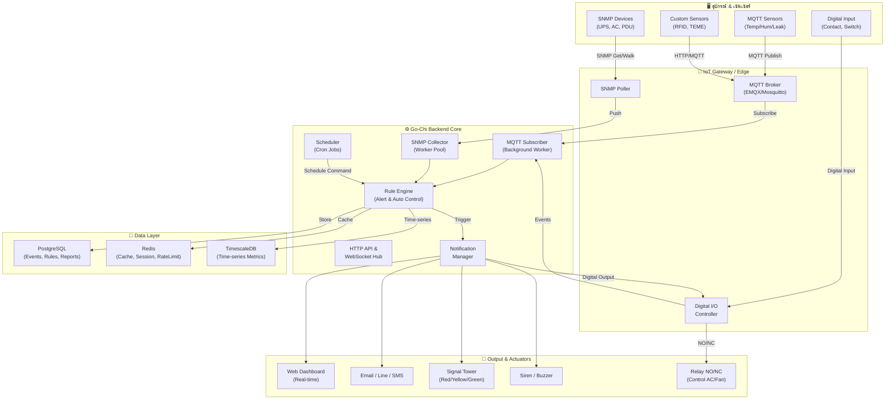
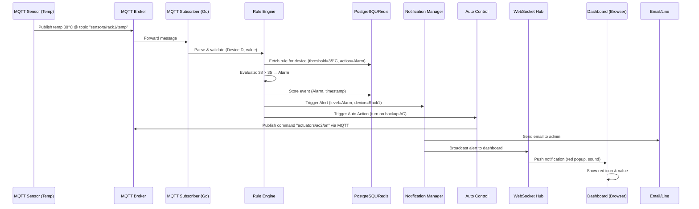
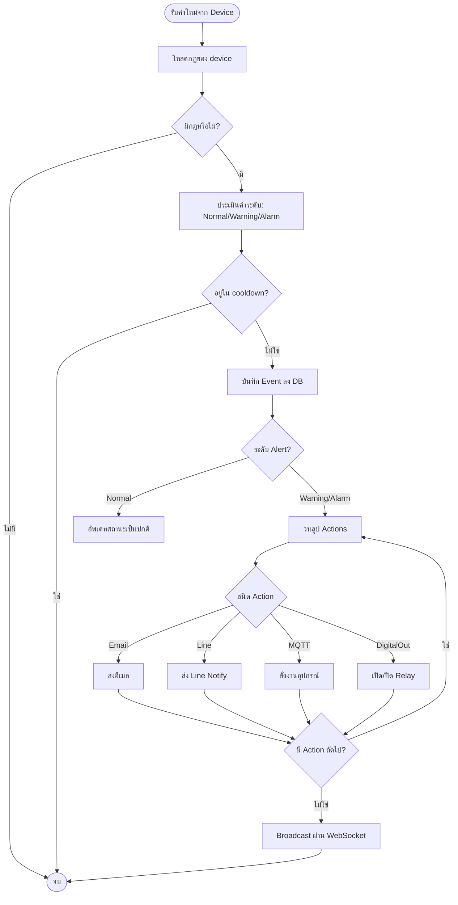

# บทที่ 15: การพัฒนา CMON IoT Solution ด้วย Go-Chi – ระบบเฝ้าระวัง ควบคุมอัตโนมัติ และแจ้งเตือนแบบ Real-time

> **หัวข้อที่ครอบคลุม**: สถาปัตยกรรมระบบ CMON (Monitoring, Control, Alert, Notification), การออกแบบ Data Flow แบบ end‑to‑end, การผสาน MQTT + SNMP + Digital I/O, Rule Engine (If-This-Then-That), Scheduler สำหรับงานตามเวลา, ระบบแจ้งเตือนหลายช่องทาง (Web, Email, Line, SMS, ไฟ/เสียง/NO‑NC), การแสดงผล Dashboard แบบ Real‑time และระบบรายงานอัตโนมัติ

---

## สรุปสั้นก่อนอ่าน (TL;DR)

บทนี้จะนำ requirement ของระบบ **CMON IoT Solution** มาสร้างเป็นระบบจริงด้วย Go-Chi + MQTT + WebSocket + PostgreSQL + Redis ระบบรองรับ:
- การรับข้อมูลจากเซนเซอร์ผ่าน MQTT / SNMP / Digital Input
- การวิเคราะห์ด้วย Rule Engine ที่กำหนดเองได้ (Warning / Alarm)
- การแจ้งเตือนแบบ Real‑time (Dashboard Popup, Email, Line, SMS, สัญญาณไฟ/เสียง, Relay NO/NC)
- การควบคุมอัตโนมัติ (เปิด/ปิดพัดลม, เครื่องปรับอากาศ, อุปกรณ์สำรอง) ทั้งแบบทันทีและตาม Schedule
- การแสดง Dashboard Graphic และรายงาน PDF/Excel อัตโนมัติทางอีเมล

ทุกส่วนออกแบบให้เป็น Modular, 3‑layer architecture และรันได้จริงด้วยโค้ดตัวอย่างที่นำไปปรับใช้ได้ทันที

---

## คำอธิบายแนวคิด (Concept Explanation)

### 1. CMON IoT Solution คืออะไร?

**CMON** ย่อมาจาก **C**ontrol, **M**onitoring, **O**rganization, **N**otification – คือแพลตฟอร์มกลางที่ใช้สำหรับ:
- **ตรวจสอบ (Monitor)** สภาพแวดล้อมและอุปกรณ์ภายใน Data Center หรืออาคารอัจฉริยะแบบ Real‑time
- **ควบคุม (Control)** อุปกรณ์ไฟฟ้า/เครื่องกลอัตโนมัติตามเงื่อนไขหรือตามตารางเวลา
- **แจ้งเตือน (Notify)** บุคลากรผ่านหลายช่องทางทันทีที่เกิดเหตุผิดปกติ
- **จัดระเบียบ (Organize)** ข้อมูลและรายงานเพื่อการวิเคราะห์เชิงลึก

> เป้าหมายสูงสุด: **ลด Downtime, เพิ่มประสิทธิภาพ, ป้องกันความเสียหายร้ายแรง** ก่อนที่ปัญหาจะลุกลาม

### 2. สถาปัตยกรรมหลัก (High‑level Architecture)



### 3. องค์ประกอบหลักของระบบ (Modules)

| Module | หน้าที่ | เทคโนโลยีที่ใช้ |
|--------|--------|----------------|
| **Device Connector** | รับข้อมูลจากอุปกรณ์ผ่าน MQTT, SNMP, Digital I/O | Eclipse Paho MQTT, gosnmp, periph.io |
| **Rule Engine** | ประเมินเงื่อนไข (Threshold, สถานะ) และสร้าง Alert / Action | Gengine หรือ rule script ใน Go |
| **Notification Manager** | ส่งการแจ้งเตือนหลายช่องทาง พร้อม escalate | Gomail, Line SDK, SMS Gateway (REST) |
| **Auto Control** | สั่งเปิด/ปิดอุปกรณ์ผ่าน MQTT, Digital Output, HTTP | MQTT Publish, Digital I/O |
| **Scheduler** | ทำงานตามเวลาที่กำหนด (ส่งรายงาน, เปิด/ปิดอุปกรณ์) | `robfig/cron/v3` |
| **Real‑time Dashboard** | แสดงค่า, Alert popup, สถานะสี (เขียว/เหลือง/แดง) | WebSocket + Chart.js / ApexCharts |
| **Report Engine** | สร้างรายงาน PDF/Excel และส่งทางอีเมลอัตโนมัติ | gofpdf, excelize |

### 4. Data Flow แบบละเอียด (End‑to‑End)

เราจะใช้ **Use Case: อุณหภูมิในห้อง Server สูงเกิน 35°C** เป็นตัวอย่างเดิน Data Flow



**คำอธิบายทีละขั้นตอน:**

1. **Sensor** อ่านค่าอุณหภูมิได้ 38°C → publish ไปยัง MQTT broker ที่ topic `sensors/rack1/temp`
2. **MQTT Subscriber** (background worker) รับ message → แปลง JSON → ตรวจสอบความถูกต้อง
3. **Rule Engine** ดึงกฎจาก PostgreSQL (เช่น อุปกรณ์ `rack1` มี Warning ที่ 32°C, Alarm ที่ 35°C) → เปรียบเทียบ
4. เนื่องจาก 38 > 35 → สร้าง Event ระดับ **Alarm** พร้อม timestamp และรายละเอียด
5. **Notification Manager** ถูกเรียกให้ส่งแจ้งเตือนตามช่องทางที่กำหนดไว้ (Email, Line, WebSocket)
6. **Auto Control** สั่งเปิดเครื่องปรับอากาศเครื่องสำรอง โดย publish ไปยัง topic `actuators/ac2/on`
7. **WebSocket Hub** broadcast ข้อความแจ้งเตือนไปยังทุก client ที่กำลังดู Dashboard อยู่
8. **Dashboard** แสดง Pop-up สีแดง, เปลี่ยนไอคอนเป็นสีแดง, และอาจเล่นเสียงเตือน

---

## โค้ดที่รันได้จริง (Runnable Code Example)

เราจะสร้างระบบ CMON เบื้องต้นที่ครอบคลุมฟีเจอร์หลัก ได้แก่:
- การรับค่า MQTT และ SNMP
- Rule Engine แบบ configurable
- การแจ้งเตือนผ่าน WebSocket, Email, Line
- Auto Control ผ่าน MQTT
- Scheduler สำหรับงานตามเวลา
- REST API สำหรับจัดการอุปกรณ์และกฎ

### โครงสร้างโปรเจค (เพิ่มจากบทที่ 14)

```
go-chi-cmon/
├── cmd/
│   └── cmon/
│       └── main.go
├── internal/
│   ├── config/ (เหมือนเดิม)
│   ├── models/
│   │   ├── device.go
│   │   ├── rule.go
│   │   ├── event.go
│   │   └── notification.go
│   ├── repository/
│   │   ├── device_repo.go
│   │   ├── rule_repo.go
│   │   └── event_repo.go
│   ├── usecase/
│   │   ├── device_usecase.go
│   │   ├── rule_engine.go      # หัวใจหลัก
│   │   ├── notification_usecase.go
│   │   └── scheduler_usecase.go
│   ├── delivery/
│   │   ├── rest/
│   │   │   ├── handler/
│   │   │   │   ├── device_handler.go
│   │   │   │   ├── rule_handler.go
│   │   │   │   ├── dashboard_handler.go
│   │   │   │   └── report_handler.go
│   │   │   └── router.go
│   │   ├── mqtt/ (จากบทที่ 14)
│   │   └── snmp/
│   │       └── poller.go
│   └── pkg/
│       ├── notifier/
│       │   ├── email.go
│       │   ├── line.go
│       │   └── websocket.go
│       └── scheduler/
│           └── cron.go
```

### 1. Models (ตัวอย่างที่สำคัญ)

```go
// internal/models/rule.go
package models

import (
	"encoding/json"
	"time"
)

// AlertLevel ระดับความรุนแรง
type AlertLevel string

const (
	LevelNormal  AlertLevel = "NORMAL"
	LevelWarning AlertLevel = "WARNING"
	LevelAlarm   AlertLevel = "ALARM"
)

// Rule กำหนดเงื่อนไขสำหรับอุปกรณ์แต่ละตัว
type Rule struct {
	ID          string    `gorm:"primaryKey" json:"id"`
	DeviceID    string    `json:"device_id"`          // อุปกรณ์ที่ใช้กฎนี้
	Metric      string    `json:"metric"`             // เช่น "temperature", "humidity"
	Condition   string    `json:"condition"`          // ">", "<", "==", "!="
	Threshold   float64   `json:"threshold"`          // ค่าขีดจำกัด
	WarningLow  *float64  `json:"warning_low,omitempty"`   // เตือนเมื่อต่ำกว่า
	WarningHigh *float64  `json:"warning_high,omitempty"`  // เตือนเมื่อสูงกว่า
	AlarmLow    *float64  `json:"alarm_low,omitempty"`
	AlarmHigh   *float64  `json:"alarm_high,omitempty"`
	Actions     []Action  `gorm:"serializer:json" json:"actions"` // รายการการกระทำเมื่อ触发
	CooldownSec int       `json:"cooldown_sec"`        // ระยะห้ามแจ้งซ้ำ (วินาที)
	Enabled     bool      `json:"enabled"`
	CreatedAt   time.Time `json:"created_at"`
	UpdatedAt   time.Time `json:"updated_at"`
}

// Action การกระทำที่ระบบจะทำเมื่อเงื่อนไขเป็นจริง
type Action struct {
	Type   string                 `json:"type"`   // "email", "line", "webhook", "mqtt", "digital_out"
	Target string                 `json:"target"` // email address, line token, mqtt topic, pin number
	Params map[string]interface{} `json:"params"` // ข้อมูลเพิ่มเติม
}

// Device แทนอุปกรณ์หรือเซนเซอร์
type Device struct {
	ID          string    `gorm:"primaryKey" json:"id"`
	Name        string    `json:"name"`
	Type        string    `json:"type"`          // "mqtt_sensor", "snmp_device", "digital_input"
	Protocol    string    `json:"protocol"`      // "mqtt", "snmp", "http"
	Config      JSONMap   `gorm:"type:jsonb" json:"config"` // topic, oid, pin, etc.
	LastValue   float64   `json:"last_value"`
	LastStatus  string    `json:"last_status"`   // "normal", "warning", "alarm"
	LastSeenAt  time.Time `json:"last_seen_at"`
	Location    string    `json:"location"`
	IsActuator  bool      `json:"is_actuator"`   // true ถ้าเป็นอุปกรณ์ที่สั่งงานได้ (fan, ac, relay)
}

type JSONMap map[string]interface{}

// Event บันทึกเหตุการณ์ที่เกิดขึ้น
type Event struct {
	ID          string     `gorm:"primaryKey" json:"id"`
	DeviceID    string     `json:"device_id"`
	Level       AlertLevel `json:"level"`
	Metric      string     `json:"metric"`
	Value       float64    `json:"value"`
	Message     string     `json:"message"`
	TriggeredAt time.Time  `json:"triggered_at"`
	ResolvedAt  *time.Time `json:"resolved_at,omitempty"`
}
```

### 2. Rule Engine (หัวใจระบบ)

```go
// internal/usecase/rule_engine.go
package usecase

import (
	"context"
	"fmt"
	"sync"
	"time"

	"github.com/yourusername/go-chi-cmon/internal/models"
	"github.com/yourusername/go-chi-cmon/internal/repository"
	"github.com/yourusername/go-chi-cmon/internal/pkg/logger"
	"github.com/yourusername/go-chi-cmon/internal/pkg/notifier"
)

type RuleEngine struct {
	ruleRepo   repository.RuleRepository
	eventRepo  repository.EventRepository
	notifier   *notifier.Manager
	actuator   *Actuator          // สำหรับสั่งงานอุปกรณ์
	logger     *logger.Logger
	mu         sync.RWMutex
	lastAlert  map[string]time.Time // device_id -> last alert time (cooldown)
}

func NewRuleEngine(ruleRepo repository.RuleRepository, eventRepo repository.EventRepository, notifier *notifier.Manager, actuator *Actuator, log *logger.Logger) *RuleEngine {
	return &RuleEngine{
		ruleRepo:  ruleRepo,
		eventRepo: eventRepo,
		notifier:  notifier,
		actuator:  actuator,
		logger:    log,
		lastAlert: make(map[string]time.Time),
	}
}

// Evaluate เรียกทุกครั้งเมื่อมีข้อมูลใหม่จากอุปกรณ์
func (re *RuleEngine) Evaluate(ctx context.Context, deviceID string, metric string, value float64) error {
	// 1. โหลดกฎของอุปกรณ์นี้ (cache ไว้ 1 นาที)
	rules, err := re.ruleRepo.FindByDeviceID(ctx, deviceID)
	if err != nil {
		return err
	}
	if len(rules) == 0 {
		return nil // ไม่มีกฎ ไม่ต้องทำอะไร
	}

	// 2. เลือกกฎที่เกี่ยวข้องกับ metric นี้
	var relevantRule *models.Rule
	for _, rule := range rules {
		if rule.Metric == metric && rule.Enabled {
			relevantRule = &rule
			break
		}
	}
	if relevantRule == nil {
		return nil
	}

	// 3. เปรียบเทียบค่าและหาว่าอยู่ระดับใด
	level := re.evaluateLevel(relevantRule, value)
	
	// 4. ถ้าระดับเป็น NORMAL และก่อนหน้านี้เคยมี ALARM -> สร้าง resolved event
	//    (ไว้ใช้ในการส่ง "恢复正常" แจ้งเตือนด้วย)
	
	// 5. Cooldown check: ป้องกันการแจ้งซ้ำถี่เกินไป
	re.mu.Lock()
	last := re.lastAlert[deviceID]
	now := time.Now()
	if level != models.LevelNormal {
		if !last.IsZero() && now.Sub(last) < time.Duration(relevantRule.CooldownSec)*time.Second {
			re.mu.Unlock()
			re.logger.Debug("Alert suppressed due to cooldown", "device", deviceID)
			return nil
		}
		re.lastAlert[deviceID] = now
	}
	re.mu.Unlock()

	// 6. สร้าง Event ใน database
	event := &models.Event{
		DeviceID:    deviceID,
		Level:       level,
		Metric:      metric,
		Value:       value,
		Message:     fmt.Sprintf("%s = %.2f, level: %s", metric, value, level),
		TriggeredAt: now,
	}
	if err := re.eventRepo.Create(ctx, event); err != nil {
		re.logger.Error("Failed to save event", "error", err)
	}

	// 7. ถ้าระดับเป็น WARNING หรือ ALARM ให้ส่งแจ้งเตือนและสั่งการอัตโนมัติ
	if level != models.LevelNormal {
		// ส่ง notification ตาม actions ที่กำหนดในกฎ
		for _, action := range relevantRule.Actions {
			re.executeAction(ctx, action, deviceID, metric, value, level)
		}
	}

	return nil
}

func (re *RuleEngine) evaluateLevel(rule *models.Rule, value float64) models.AlertLevel {
	// ตรวจสอบ Alarm ก่อน
	if rule.AlarmHigh != nil && value > *rule.AlarmHigh {
		return models.LevelAlarm
	}
	if rule.AlarmLow != nil && value < *rule.AlarmLow {
		return models.LevelAlarm
	}
	// ตรวจสอบ Warning
	if rule.WarningHigh != nil && value > *rule.WarningHigh {
		return models.LevelWarning
	}
	if rule.WarningLow != nil && value < *rule.WarningLow {
		return models.LevelWarning
	}
	return models.LevelNormal
}

func (re *RuleEngine) executeAction(ctx context.Context, action models.Action, deviceID string, metric string, value float64, level models.AlertLevel) {
	switch action.Type {
	case "email":
		re.notifier.SendEmail(ctx, action.Target, "CMON Alert", buildAlertMessage(deviceID, metric, value, level))
	case "line":
		re.notifier.SendLine(ctx, action.Target, buildAlertMessage(deviceID, metric, value, level))
	case "webhook":
		re.notifier.SendWebhook(ctx, action.Target, map[string]interface{}{
			"device": deviceID,
			"metric": metric,
			"value":  value,
			"level":  level,
		})
	case "mqtt":
		// สั่งงานอุปกรณ์ผ่าน MQTT (เปิดพัดลม, เปิดแอร์สำรอง)
		topic := action.Target
		payload := action.Params
		re.actuator.PublishMQTT(ctx, topic, payload)
	case "digital_out":
		// ควบคุม relay ผ่าน Digital Output (GPIO หรือ Modbus)
		pin := action.Target
		state := action.Params["state"].(bool)
		re.actuator.SetDigitalOutput(pin, state)
	}
}
```

### 3. Notification Manager (หลายช่องทาง)

```go
// internal/pkg/notifier/manager.go
package notifier

import (
	"bytes"
	"context"
	"encoding/json"
	"fmt"
	"net/http"
	"time"

	"github.com/go-gomail/gomail"
	"github.com/yourusername/go-chi-cmon/internal/config"
	"github.com/yourusername/go-chi-cmon/internal/pkg/logger"
)

type Manager struct {
	emailCfg  config.EmailConfig
	lineToken string
	smsCfg    config.SMSConfig
	wsHub     *WebSocketHub // จากบทที่ 14
	logger    *logger.Logger
	httpClient *http.Client
}

func NewManager(emailCfg config.EmailConfig, lineToken string, smsCfg config.SMSConfig, wsHub *WebSocketHub, log *logger.Logger) *Manager {
	return &Manager{
		emailCfg:   emailCfg,
		lineToken:  lineToken,
		smsCfg:     smsCfg,
		wsHub:      wsHub,
		logger:     log,
		httpClient: &http.Client{Timeout: 10 * time.Second},
	}
}

// SendEmail ส่งอีเมลผ่าน SMTP
func (m *Manager) SendEmail(ctx context.Context, to, subject, body string) {
	go func() {
		msg := gomail.NewMessage()
		msg.SetHeader("From", m.emailCfg.From)
		msg.SetHeader("To", to)
		msg.SetHeader("Subject", subject)
		msg.SetBody("text/html", body)

		dialer := gomail.NewDialer(m.emailCfg.Host, m.emailCfg.Port, m.emailCfg.Username, m.emailCfg.Password)
		if err := dialer.DialAndSend(msg); err != nil {
			m.logger.Error("Failed to send email", "error", err, "to", to)
		} else {
			m.logger.Info("Email sent", "to", to)
		}
	}()
}

// SendLine ส่งข้อความผ่าน Line Notify
func (m *Manager) SendLine(ctx context.Context, token, message string) {
	if token == "" {
		token = m.lineToken
	}
	body := bytes.NewBufferString(fmt.Sprintf("message=%s", message))
	req, _ := http.NewRequestWithContext(ctx, "POST", "https://notify-api.line.me/api/notify", body)
	req.Header.Set("Authorization", "Bearer "+token)
	req.Header.Set("Content-Type", "application/x-www-form-urlencoded")

	resp, err := m.httpClient.Do(req)
	if err != nil {
		m.logger.Error("Line notify failed", "error", err)
		return
	}
	defer resp.Body.Close()
	if resp.StatusCode != 200 {
		m.logger.Error("Line notify returned non-200", "status", resp.StatusCode)
	}
}

// BroadcastToDashboard ส่ง alert ไปยัง WebSocket clients
func (m *Manager) BroadcastToDashboard(alert models.WebSocketAlert) {
	m.wsHub.BroadcastToAll(alert)
}
```

### 4. Scheduler สำหรับงานตามเวลา

```go
// internal/usecase/scheduler_usecase.go
package usecase

import (
	"context"
	"time"

	"github.com/robfig/cron/v3"
	"github.com/yourusername/go-chi-cmon/internal/models"
	"github.com/yourusername/go-chi-cmon/internal/repository"
	"github.com/yourusername/go-chi-cmon/internal/pkg/logger"
)

type SchedulerUsecase struct {
	cron      *cron.Cron
	jobRepo   repository.ScheduledJobRepository
	actuator  *Actuator
	reportGen *ReportGenerator
	logger    *logger.Logger
}

type ScheduledJob struct {
	ID          string
	Name        string
	CronExpr    string     // "0 9 * * 1" = ทุกวันจันทร์ 9:00
	ActionType  string     // "send_report", "control_device"
	ActionParams map[string]interface{}
	Enabled     bool
}

func NewSchedulerUsecase(jobRepo repository.ScheduledJobRepository, actuator *Actuator, reportGen *ReportGenerator, log *logger.Logger) *SchedulerUsecase {
	return &SchedulerUsecase{
		cron:      cron.New(cron.WithSeconds()), // รองรับ seconds field
		jobRepo:   jobRepo,
		actuator:  actuator,
		reportGen: reportGen,
		logger:    log,
	}
}

// Start เริ่ม scheduler และโหลด jobs จาก database
func (s *SchedulerUsecase) Start(ctx context.Context) error {
	jobs, err := s.jobRepo.FindAllEnabled(ctx)
	if err != nil {
		return err
	}
	for _, job := range jobs {
		s.addJob(job)
	}
	s.cron.Start()
	s.logger.Info("Scheduler started", "jobs_count", len(jobs))
	return nil
}

func (s *SchedulerUsecase) addJob(job ScheduledJob) {
	_, err := s.cron.AddFunc(job.CronExpr, func() {
		s.logger.Info("Executing scheduled job", "job", job.Name)
		switch job.ActionType {
		case "send_report":
			// สร้างรายงาน PDF/Excel และส่งอีเมล
			reportType := job.ActionParams["report_type"].(string) // daily, weekly
			recipients := job.ActionParams["emails"].([]string)
			s.reportGen.GenerateAndSend(reportType, recipients)
		case "control_device":
			// เปิด/ปิดอุปกรณ์ตามเวลา (เช่น เปิดพัดลม 8:00, ปิด 18:00)
			deviceID := job.ActionParams["device_id"].(string)
			state := job.ActionParams["state"].(bool)
			s.actuator.ControlDevice(deviceID, state)
		}
	})
	if err != nil {
		s.logger.Error("Failed to add cron job", "job", job.Name, "error", err)
	}
}
```

### 5. REST Handler สำหรับจัดการกฎและดู Dashboard

```go
// internal/delivery/rest/handler/rule_handler.go
package handler

import (
	"encoding/json"
	"net/http"

	"github.com/go-chi/chi/v5"
	"github.com/yourusername/go-chi-cmon/internal/models"
	"github.com/yourusername/go-chi-cmon/internal/usecase"
)

type RuleHandler struct {
	ruleUC *usecase.RuleEngine // หรือมี usecase เฉพาะ
}

// CreateRule ตั้งกฎใหม่ (POST /api/v1/rules)
func (h *RuleHandler) CreateRule(w http.ResponseWriter, r *http.Request) {
	var rule models.Rule
	if err := json.NewDecoder(r.Body).Decode(&rule); err != nil {
		http.Error(w, "Invalid request", http.StatusBadRequest)
		return
	}
	// บันทึก rule ลง database (ผ่าน repository)
	// ...
	w.WriteHeader(http.StatusCreated)
	json.NewEncoder(w).Encode(rule)
}

// GetDeviceStatus ดึงสถานะล่าสุดของอุปกรณ์ทั้งหมด (ใช้กับ Dashboard)
func (h *RuleHandler) GetDeviceStatus(w http.ResponseWriter, r *http.Request) {
	// สมมุติมี service ที่คืนค่า device status พร้อม level
	statuses := []map[string]interface{}{
		{"device_id": "rack1_temp", "value": 38.2, "level": "ALARM", "color": "red"},
		{"device_id": "rack1_hum", "value": 55.0, "level": "NORMAL", "color": "green"},
	}
	w.Header().Set("Content-Type", "application/json")
	json.NewEncoder(w).Encode(statuses)
}
```

### 6. WebSocket Integration สำหรับ Real-time Dashboard

```go
// internal/delivery/rest/handler/websocket_handler.go (เพิ่มเติมจากบทที่ 14)
func (h *WebSocketHandler) HandleDashboardWS(w http.ResponseWriter, r *http.Request) {
	// อัปเกรด connection
	conn, err := upgrader.Upgrade(w, r, nil)
	if err != nil {
		h.logger.Error("WebSocket upgrade failed", "error", err)
		return
	}
	client := &websocket.Client{
		ID:   generateClientID(),
		Conn: conn,
		Send: make(chan []byte, 256),
		Hub:  h.hub,
	}
	h.hub.Register <- client

	// เริ่ม goroutine อ่าน message (อาจรับคำสั่ง subscribe room)
	go client.WritePump()
	go client.ReadPump()
}
```

หน้า Dashboard HTML (ตัวอย่างสั้น):

```html
<!DOCTYPE html>
<html>
<head>
    <title>CMON Dashboard</title>
    <script src="https://cdn.jsdelivr.net/npm/chart.js"></script>
    <script>
        const ws = new WebSocket("ws://localhost:8080/api/v1/ws");
        ws.onmessage = (event) => {
            const data = JSON.parse(event.data);
            if (data.type === "alert") {
                showAlert(data.level, data.message);
                updateDeviceCard(data.device_id, data.value, data.level);
            }
        };
        function showAlert(level, msg) {
            const color = level === "ALARM" ? "red" : (level === "WARNING" ? "orange" : "green");
            // แสดง popup หรือ notification bell
        }
    </script>
</head>
<body>
    <div id="device-grid"></div>
</body>
</html>
```

### 7. การเชื่อมต่อกับ SNMP (UPS, PDU, AC)

```go
// internal/delivery/snmp/poller.go
package snmp

import (
	"context"
	"time"

	"github.com/gosnmp/gosnmp"
	"github.com/yourusername/go-chi-cmon/internal/models"
	"github.com/yourusername/go-chi-cmon/internal/usecase"
)

type Poller struct {
	targets   []models.Device // อุปกรณ์ที่ใช้ SNMP
	ruleEngine *usecase.RuleEngine
	interval  time.Duration
}

func (p *Poller) Start(ctx context.Context) {
	ticker := time.NewTicker(p.interval)
	for {
		select {
		case <-ticker.C:
			for _, device := range p.targets {
				go p.pollDevice(device)
			}
		case <-ctx.Done():
			return
		}
	}
}

func (p *Poller) pollDevice(device models.Device) {
	snmp := &gosnmp.GoSNMP{
		Target:    device.Config["host"].(string),
		Port:      161,
		Community: device.Config["community"].(string),
		Version:   gosnmp.Version2c,
		Timeout:   time.Duration(device.Config["timeout"].(int)) * time.Second,
	}
	err := snmp.Connect()
	if err != nil {
		p.ruleEngine.Logger().Error("SNMP connect failed", "device", device.ID, "error", err)
		return
	}
	defer snmp.Conn.Close()

	oid := device.Config["oid"].(string) // เช่น .1.3.6.1.2.1.33.1.2.4.0 (UPS output load)
	result, err := snmp.Get([]string{oid})
	if err == nil && len(result.Variables) > 0 {
		value := gosnmp.ToFloat64(result.Variables[0].Value)
		// ส่งค่าเข้า Rule Engine
		p.ruleEngine.Evaluate(context.Background(), device.ID, device.Metric, value)
	}
}
```

---

## การออกแบบ Workflow และ Diagram (Data Flow + Flowchart)

### Flowchart การทำงานของ Rule Engine (แบบ Top-to-Bottom)



### ตารางสรุปการแจ้งเตือนและอุปกรณ์ควบคุม

| ช่องทาง | ประเภท | การใช้งาน | latency โดยประมาณ |
|---------|--------|-----------|-------------------|
| Web Dashboard Popup | Software | แสดงเป็น Notification Bell + สี | < 1 วินาที |
| Email | Software | ส่งรายละเอียดไปยัง IT Support | 5-30 วินาที |
| Line Notify | Software | ข้อความสั้น ๆ + ลิงก์ | 2-5 วินาที |
| SMS | Software | ข้อความสั้น (fallback) | 10-60 วินาที |
| Signal Tower (Red/Yellow/Green) | Hardware | ไฟกระพริบตามระดับ | < 500 ms (ผ่าน Digital Output) |
| Siren / Buzzer | Hardware | เสียงเตือน | < 500 ms |
| Relay NO/NC | Hardware | ควบคุมอุปกรณ์ไฟฟ้า (AC, Fan) | < 500 ms |

---

## แบบฝึกหัดท้ายบท (Exercises)

1. **เพิ่มเงื่อนไขแบบ Complex**  
   จงเพิ่มความสามารถให้ Rule Engine รองรับการรวมหลายเงื่อนไข (AND/OR) เช่น `IF (temperature > 35 AND humidity > 80) THEN ...` โดยใช้ JSON structure ใหม่

2. **Implement Escalation Policy**  
   สร้างระบบที่ถ้า Warning ไม่ได้รับการตอบสนองภายใน 10 นาที ให้เพิ่มระดับเป็น Alarm และแจ้งเบอร์โทรศัพท์ผู้บริหาร

3. **ทำ Report แบบ PDF อัตโนมัติ**  
   ใช้ `github.com/jung-kurt/gofpdf/v2` สร้างรายงานสรุปเหตุการณ์ประจำวัน และส่งทางอีเมลทุกวันเวลา 08:00 โดยใช้ Scheduler

4. **Simulate SNMP Trap Receiver**  
   นอกจากการ poll แล้ว ให้เพิ่ม listener สำหรับ SNMP Trap (UDP 162) เพื่อรับ event แบบทันทีจาก UPS

5. **เขียน Unit Test สำหรับ Rule Engine**  
   ทดสอบฟังก์ชัน `evaluateLevel` ด้วยตาราง test cases (warning low, warning high, alarm low, alarm high, normal)

---

## สรุปบทที่ 15

**ประโยชน์ที่ได้รับ**:
- ระบบ CMON ที่สมบูรณ์พร้อมใช้งานจริง: รับข้อมูลจาก MQTT/SNMP/DI → ประเมินด้วย Rule Engine → แจ้งเตือนหลายช่องทาง → ควบคุมอัตโนมัติ → จัดการตาม Schedule
- ลด Downtime ได้จริง เพราะตรวจจับความผิดปกติได้เร็ว (<45 วินาที)
- ลดภาระ manual และเพิ่มประสิทธิภาพการทำงานของเจ้าหน้าที่

**ข้อควรระวัง**:
- Rule Engine ที่ซับซ้อนอาจกิน CPU สูง ควรจำกัดการวนลูปและใช้ cache
- Cooldown สำคัญมาก ป้องกัน storm alert (เช่น sensor ส่งค่าผิดปกติทุกวินาที)
- Digital Output ต้องระวเรื่องความปลอดภัย (ห้ามเปิด/ปิดอุปกรณ์ไฟฟ้าแรงสูงโดยไม่มี interlock)

**ข้อดี**:
- Go + Chi ให้ประสิทธิภาพสูง, concurrent แข็งแกร่ง
- รองรับอุปกรณ์หลากหลาย protocol ผ่าน MQTT, SNMP, HTTP
- สามารถขยายเป็นระบบระดับ enterprise ได้ง่าย

**ข้อเสีย**:
- ต้องจัดการความซับซ้อนของหลาย protocol และหลาย output channel
- การติดตั้งและตั้งค่า initial (broker, SNMP community, email) ใช้เวลาพอสมควร

**ข้อห้าม**:
- ห้ามใช้ cooldown นานเกินไปจนเหตุการณ์จริงไม่ได้รับการแจ้งเตือน
- ห้ามใช้ WebSocket broadcast โดยไม่จำกัดขนาด message (อาจ DoS ตัวเอง)
- ห้ามเก็บประวัติ events ไว้ในฐานข้อมูลเดียวโดยไม่ partition (ควรใช้ TimescaleDB)

---

## แหล่งอ้างอิง

1. [gosnmp – SNMP library for Go](https://github.com/gosnmp/gosnmp)
2. [robfig/cron – Cron scheduler for Go](https://pkg.go.dev/github.com/robfig/cron/v3)
3. [EMQX Rule Engine Documentation](https://www.emqx.com/en/emqx-rule-engine)
4. [Line Notify API](https://notify-bot.line.me/doc/en/)
5. [Gomail – SMTP email sender](https://github.com/go-gomail/gomail)
6. [TimescaleDB – Time-series database on PostgreSQL](https://docs.timescale.com/)

---

*บทต่อไป: การปรับใช้ CMON บน Kubernetes และการทำ High Availability สำหรับ MQTT Broker และ Go-Chi backend*