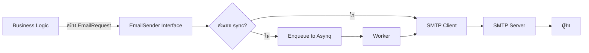

We will implement a new module `pkg/email_sender` for sending emails via SMTP, following the same template as Module 27 and compatible with the `icmongolang` project structure. The module will support plain text, HTML, attachments, and template rendering using Go’s `html/template`. It will integrate with the existing configuration system and logger.

---

# Module 28: `pkg/email_sender` (ระบบส่งอีเมล SMTP)

## สำหรับโฟลเดอร์ `pkg/email_sender/`

ไฟล์ที่เกี่ยวข้อง:

- `config.go`       – โครงสร้างการตั้งค่า SMTP และพารามิเตอร์อีเมล
- `types.go`        – structs สำหรับอีเมล (To, Cc, Bcc, Subject, Body, Attachments)
- `sender.go`       – อินเทอร์เฟซและตัวส่งอีเมลด้วย Gomail
- `templates.go`    – ฟังก์ชันช่วยในการ render template HTML
- `example_test.go` – ตัวอย่างการใช้งาน (optional)

---

## หลักการ (Concept)

### คืออะไร?

โมดูลส่งอีเมลที่封装การทำงาน SMTP ให้ใช้งานง่าย รองรับหลายผู้รับ, HTML, ไฟล์แนบ, และ template engine แยก logic การส่งออกจาก business logic ของแอปพลิเคชัน

### มีกี่แบบ?

- **Plain text email** – ข้อความธรรมดา
- **HTML email** – ส่งเนื้อหา HTML พร้อม fallback plain text
- **Template email** – ใช้ `html/template` สร้างเนื้อหาจากข้อมูล
- **Attachment support** – แนบไฟล์ได้หลายไฟล์

**ข้อห้ามสำคัญ:**  
- ห้าม hardcode SMTP password หรือ credentials  
- ห้ามส่งอีเมลใน request cycle โดยไม่ใช้ goroutine หรือ worker (อาจ block request)  
- ห้ามใช้ template ที่ไม่ได้รับการ validate (อาจเป็น XSS ถ้าเป็น HTML จากผู้ใช้)

### ใช้อย่างไร / นำไปใช้กรณีไหน

- ส่งอีเมลยืนยันตัวตน (verification) หลังจากสมัครสมาชิก  
- ส่งอีเมลรีเซ็ตรหัสผ่าน  
- ส่งแจ้งเตือนจากระบบ IoT (alarm) ไปยังผู้ดูแล  
- ส่งรายงานประจำวันผ่าน worker  

### ประโยชน์ที่ได้รับ

- ลดโค้ดซ้ำซ้อนในการส่งอีเมลทั่วทั้งโปรเจกต์  
- รองรับ template ทำให้ดูแล HTML ได้ง่าย  
- เปลี่ยน SMTP provider ได้โดยไม่ต้องแก้ business logic  
- ทำงานร่วมกับ asynq worker เพื่อส่งแบบ asynchronous

### ข้อควรระวัง

- SMTP server อาจมี rate limit ต้องควบคุมจำนวนอีเมลต่อช่วงเวลา  
- ควรส่งอีเมลผ่าน background worker เพื่อไม่ให้ HTTP request ช้า  
- ต้องจัดการ error และ retry logic

### ข้อดี

- ใช้งานง่ายผ่าน interface  
- รองรับทั้ง sync และ async (ผ่าน worker)  
- ตกแต่ง template ได้ด้วยข้อมูล dynamic  

### ข้อเสีย

- การส่งอีเมลอาจล่าช้าขึ้นอยู่กับ SMTP server  
- ไม่มี built-in queue (ต้องใช้ asynq เอง)  

### ข้อห้าม

- ห้ามส่งอีเมลปริมาณมากโดยไม่ควบคุม (อาจถูก mark as spam)  
- ห้ามเก็บ SMTP password ใน log  

---

## การออกแบบ Workflow และ Dataflow



**คำอธิบาย:**  
1. Business logic สร้าง `EmailRequest` (to, subject, body, attachments)  
2. เรียก `Send` หรือ `SendAsync`  
3. `SendAsync` จะส่ง task ไปยัง Asynq queue เพื่อประมวลผลทีหลัง  
4. Worker ดึง task และเรียก `Send` จริง  
5. `Send` เชื่อมต่อ SMTP และส่งอีเมล  

---

## ตัวอย่างโค้ดที่รันได้จริง

### 1. การติดตั้ง Dependencies

```bash
go get gopkg.in/gomail.v2
go get github.com/hibiken/asynq
```

### 2. เพิ่ม configuration ใน `config/config.go`

```go
type EmailConfig struct {
    SMTPHost     string `mapstructure:"smtpHost"`
    SMTPPort     int    `mapstructure:"smtpPort"`
    SMTPUser     string `mapstructure:"smtpUser"`
    SMTPPassword string `mapstructure:"smtpPassword"`
    FromName     string `mapstructure:"fromName"`
    FromAddress  string `mapstructure:"fromAddress"`
}

type Config struct {
    // ... existing fields
    Email EmailConfig `mapstructure:"email"`
}
```

และเพิ่มใน `config-local.yml`:

```yaml
email:
  smtpHost: "smtp.gmail.com"
  smtpPort: 587
  smtpUser: "your-email@gmail.com"
  smtpPassword: "your-app-password"
  fromName: "ICMONGO System"
  fromAddress: "noreply@icmongolang.com"
```

### 3. โค้ด `pkg/email_sender/types.go`

```go
package email_sender

import "mime/multipart"

// EmailRequest represents an email to be sent
type EmailRequest struct {
    To          []string
    Cc          []string
    Bcc         []string
    Subject     string
    Body        string          // HTML or plain text
    IsHTML      bool
    Attachments []Attachment
}

// Attachment represents a file attachment
type Attachment struct {
    Filename string
    Data     []byte
    // optional: if you have multipart.FileHeader
    FileHeader *multipart.FileHeader
}

// Response contains the result of sending
type SendResult struct {
    Success bool
    Error   error
}
```

### 4. โค้ด `pkg/email_sender/config.go`

```go
package email_sender

import "icmongolang/config"

type SMTPConfig struct {
    Host     string
    Port     int
    User     string
    Password string
    FromName string
    FromAddr string
}

func FromAppConfig(cfg *config.Config) SMTPConfig {
    return SMTPConfig{
        Host:     cfg.Email.SMTPHost,
        Port:     cfg.Email.SMTPPort,
        User:     cfg.Email.SMTPUser,
        Password: cfg.Email.SMTPPassword,
        FromName: cfg.Email.FromName,
        FromAddr: cfg.Email.FromAddress,
    }
}
```

### 5. โค้ด `pkg/email_sender/sender.go`

```go
package email_sender

import (
    "fmt"

    "icmongolang/pkg/logger"
    "gopkg.in/gomail.v2"
)

// Sender defines the email sending interface
type Sender interface {
    Send(req EmailRequest) error
    SendAsync(req EmailRequest) (taskID string, err error) // optional, if using asynq
}

type SMTPEmailSender struct {
    config SMTPConfig
    logger logger.Logger
    dialer *gomail.Dialer
}

func NewSMTPEmailSender(cfg SMTPConfig, log logger.Logger) *SMTPEmailSender {
    dialer := gomail.NewDialer(cfg.Host, cfg.Port, cfg.User, cfg.Password)
    return &SMTPEmailSender{
        config: cfg,
        logger: log,
        dialer: dialer,
    }
}

// Send sends an email synchronously
func (s *SMTPEmailSender) Send(req EmailRequest) error {
    m := gomail.NewMessage()
    // From
    from := s.config.FromAddr
    if s.config.FromName != "" {
        from = fmt.Sprintf("%s <%s>", s.config.FromName, s.config.FromAddr)
    }
    m.SetHeader("From", from)
    m.SetHeader("To", req.To...)
    if len(req.Cc) > 0 {
        m.SetHeader("Cc", req.Cc...)
    }
    if len(req.Bcc) > 0 {
        m.SetHeader("Bcc", req.Bcc...)
    }
    m.SetHeader("Subject", req.Subject)

    if req.IsHTML {
        m.SetBody("text/html", req.Body)
    } else {
        m.SetBody("text/plain", req.Body)
    }

    // Attachments
    for _, attach := range req.Attachments {
        if attach.FileHeader != nil {
            file, err := attach.FileHeader.Open()
            if err != nil {
                s.logger.Errorf("Failed to open attachment %s: %v", attach.Filename, err)
                continue
            }
            defer file.Close()
            m.AttachReader(attach.Filename, file)
        } else if len(attach.Data) > 0 {
            m.Attach(attach.Filename, gomail.SetCopyFunc(func(writer io.Writer) error {
                _, err := writer.Write(attach.Data)
                return err
            }))
        }
    }

    if err := s.dialer.DialAndSend(m); err != nil {
        s.logger.Errorf("Failed to send email to %v: %v", req.To, err)
        return err
    }
    s.logger.Infof("Email sent successfully to %v", req.To)
    return nil
}

// SendAsync would enqueue to asynq – implementation depends on project's worker
// For now we leave it as optional; can be implemented later.
```

### 6. โค้ด `pkg/email_sender/templates.go`

```go
package email_sender

import (
    "bytes"
    "html/template"
)

// RenderTemplate renders an HTML template with given data
func RenderTemplate(templateContent string, data interface{}) (string, error) {
    tmpl, err := template.New("email").Parse(templateContent)
    if err != nil {
        return "", err
    }
    var buf bytes.Buffer
    if err := tmpl.Execute(&buf, data); err != nil {
        return "", err
    }
    return buf.String(), nil
}

// RenderTemplateFile loads template from file and renders
func RenderTemplateFile(templatePath string, data interface{}) (string, error) {
    tmpl, err := template.ParseFiles(templatePath)
    if err != nil {
        return "", err
    }
    var buf bytes.Buffer
    if err := tmpl.Execute(&buf, data); err != nil {
        return "", err
    }
    return buf.String(), nil
}
```

### 7. ตัวอย่างการใช้งาน (ใน internal/usecase หรือ worker)

```go
// สร้าง sender ใน server หรือ worker
emailCfg := email_sender.FromAppConfig(cfg)
emailSender := email_sender.NewSMTPEmailSender(emailCfg, logger)

// สร้างอีเมล
req := email_sender.EmailRequest{
    To:      []string{"user@example.com"},
    Subject: "ยืนยันอีเมลของคุณ",
    Body:    "<h1>สวัสดี</h1><p>คลิกเพื่อยืนยัน</p>",
    IsHTML:  true,
}
err := emailSender.Send(req)
```

### 8. การรวมกับ Asynq (optional) – สร้าง task ใน `internal/worker`

```go
// สร้าง task payload
type EmailTaskPayload struct {
    Request email_sender.EmailRequest
}

// ใน processor
func (p *TaskProcessor) HandleEmailSendTask(ctx context.Context, t *asynq.Task) error {
    var payload EmailTaskPayload
    if err := json.Unmarshal(t.Payload(), &payload); err != nil {
        return err
    }
    return p.emailSender.Send(payload.Request)
}
```

---

## วิธีใช้งาน module นี้

1. เพิ่ม SMTP configuration ใน `config-local.yml` หรือ environment variables  
2. สร้าง `SMTPEmailSender` ในส่วนที่ต้องการ (server, worker, usecase)  
3. เรียก `sender.Send(req)` สำหรับ synchronous  
4. หรือเรียก `SendAsync` ที่จะ enqueue task (ถ้ามีการ implement)  

---

## การติดตั้ง

```bash
go get gopkg.in/gomail.v2
```

---

## การตั้งค่า configuration

ตัวอย่าง `config-local.yml`:

```yaml
email:
  smtpHost: "smtp.gmail.com"
  smtpPort: 587
  smtpUser: "your-email@gmail.com"
  smtpPassword: "your-app-password"
  fromName: "ICMONGO System"
  fromAddress: "noreply@icmongolang.com"
```

Environment variables:

```bash
EMAIL_SMTPHOST=smtp.sendgrid.net
EMAIL_SMTPPORT=587
EMAIL_SMTPUSER=apikey
EMAIL_SMTPASSWORD=your-sendgrid-key
EMAIL_FROMNAME="My App"
EMAIL_FROMADDRESS=noreply@myapp.com
```

---

## การรวมกับ GORM (เสริม)

ใช้ GORM เก็บ log การส่งอีเมล (EmailLog) เพื่อติดตาม history

```go
type EmailLog struct {
    ID        uint
    To        string
    Subject   string
    Status    string // sent, failed
    Error     string
    CreatedAt time.Time
}
```

---

## Design file / table SQL ที่เกี่ยวข้อง

```sql
CREATE TABLE email_logs (
    id SERIAL PRIMARY KEY,
    to_emails TEXT,
    subject VARCHAR(255),
    status VARCHAR(50),
    error TEXT,
    created_at TIMESTAMP DEFAULT CURRENT_TIMESTAMP
);
```

---

## Return เป็น REST API (optional)

อาจสร้าง endpoint `/api/email/send` สำหรับทดสอบ (แต่ควรใช้ผ่าน internal เท่านั้น)

```json
POST /api/email/send
{
    "to": ["admin@example.com"],
    "subject": "Test",
    "body": "<p>Hello</p>",
    "is_html": true
}
```

Response:

```json
{"success": true, "message": "email queued"}
```

---

## การใช้งานจริง

**Scenario:** ผู้ใช้สมัครสมาชิกใหม่ → ระบบส่งอีเมลยืนยัน  
- หลัง register สำเร็จ, usecase จะสร้าง `EmailRequest` และเรียก `emailSender.SendAsync`  
- Worker ประมวลผลและส่งอีเมล  
- หากส่งล้มเหลว, worker จะ retry ตามนโยบาย (ใช้ asynq retry)

---

## ตารางสรุป Components

| Component      | เทคโนโลยี      | หน้าที่                          |
|----------------|---------------|----------------------------------|
| SMTP Client    | gomail        | เชื่อมต่อและส่งอีเมลจริง         |
| Template Engine| html/template | สร้างเนื้อหาอีเมลแบบ dynamic    |
| Config         | Viper         | อ่าน SMTP settings               |
| Logger         | zap           | บันทึกการส่ง                      |
| Async Queue    | asynq (optional) | ส่งแบบไม่ block main request   |

---

## แบบฝึกหัดท้าย module (5 ข้อ)

1. **เพิ่มฟังก์ชัน SendBatch** – ส่งอีเมลหลายฉบับในครั้งเดียว (ใช้ goroutines)  
2. **เพิ่ม rate limiting** – จำกัดจำนวนอีเมลต่อนาทีเพื่อป้องกัน SMTP server ปฏิเสธ  
3. **สร้าง HTML template สำหรับ reset password** และเก็บในไฟล์แยก  
4. **เขียน unit test** สำหรับ `RenderTemplate` และ mock `gomail.Dialer`  
5. **เพิ่ม middleware ใน worker** เพื่อวัด latency และ log การส่งอีเมลแต่ละครั้ง  

---

## แหล่งอ้างอิง

- [gomail package](https://pkg.go.dev/gopkg.in/gomail.v2)  
- [Go template](https://pkg.go.dev/html/template)  
- [Asynq – task queue](https://github.com/hibiken/asynq)  

---

**หมายเหตุ:** module นี้ครบถ้วนสำหรับ `pkg/email_sender` สามารถนำไปใช้ร่วมกับ worker หรือใช้แบบ sync ได้ทันที หากต้องการเพิ่ม provider อื่น (เช่น SendGrid, AWS SES) สามารถ implement `Sender` interface เพิ่มเติมได้