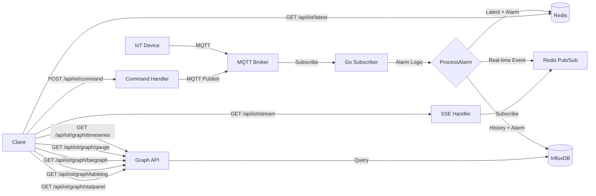

# Module 27: `pkg/iot_gateway` (Redis + MQTT + InfluxDB สำหรับ Real‑time IoT)

## สำหรับโฟลเดอร์ `pkg/iot_gateway/`

ไฟล์ที่เกี่ยวข้อง:

- `client.go`       – สร้างและจัดการ Redis, MQTT, InfluxDB clients
- `alarm.go`        – ตรรกะการแจ้งเตือน (แปลงจาก TypeScript)
- `subscriber.go`   – Subscribe MQTT topics, ประมวลผล alarm, บันทึกลง Redis และ InfluxDB
- `influxdb.go`     – เขียนและ query ข้อมูล InfluxDB (รวม Graph helpers)
- `api.go`          – REST API handlers สำหรับ Graph 5 แบบ + SSE + Command (ใช้ Chi router)
- `command.go`      – ส่งคำสั่งไปอุปกรณ์ผ่าน MQTT
- `config.go`       – โครงสร้างการตั้งค่าการเชื่อมต่อ (ใช้ร่วมกับ `config.Config` เดิม)
- `middleware.go`   – Middleware เฉพาะของ IoT gateway (Auth, Rate limit ถ้าต้องการ)

---

## หลักการ (Concept)

### คืออะไร?

**IoT Gateway Module** เป็นศูนย์กลางรับข้อมูลจากอุปกรณ์ IoT ผ่าน MQTT ประมวลผลแจ้งเตือน (Alarm) เก็บค่าล่าสุดใน Redis เพื่อการเรียกดูเร็ว และเก็บประวัติ Time‑series ใน InfluxDB สำหรับวิเคราะห์และแสดงกราฟแบบ Real‑time ผ่าน REST API

### มีกี่แบบ?  

**ข้อห้ามสำคัญ:**  
- ห้ามเก็บประวัติข้อมูลซ้ำใน PostgreSQL (ใช้ InfluxDB เท่านั้น)  
- ห้ามเรียกใช้ Redis keys แบบ `KEYS *` ใน production  
- ห้ามส่งคำสั่ง MQTT แบบ QOS 0 สำหรับงานสำคัญ (ต้องใช้ QOS ≥1)

### ใช้อย่างไร / นำไปใช้กรณีไหน

- ระบบตรวจวัดสิ่งแวดล้อม (อุณหภูมิ, ความชื้น, PM2.5)  
- ระบบแจ้งเตือนเมื่อค่าผิดปกติ (Warning / Critical)  
- Dashboard แสดงกราฟ 5 รูปแบบ (Time series, Gauge, Bar, Table log, Stat panel)  
- ควบคุมอุปกรณ์ผ่าน MQTT (เปิด/ปิดรีเลย์)  
- ระบบที่ต้องการ history ของเซ็นเซอร์เพื่อการวิเคราะห์

### ประโยชน์ที่ได้รับ

- แยกการเก็บ **latest state** (Redis) ออกจาก **history** (InfluxDB) – เพิ่มประสิทธิภาพ  
- รองรับ real‑time event ผ่าน Redis Pub/Sub + SSE  
- สามารถ query ข้อมูลย้อนหลังแบบยืดหยุ่นด้วย Flux  
- ตรรกะการแจ้งเตือนแบบ Stateful (Recovery, Count alarm)

### ข้อควรระวัง

- InfluxDB token ต้อง อย่า hardcode  
- ต้องกำหนด retention policy ที่เหมาะสม (ค่าเริ่มต้น 30 วัน)  
- MQTT subscriber ต้องจัดการ reconnect และ retry  
- Redis keys สำหรับ latest value ควรมี TTL (24 ชั่วโมง) เพื่อไม่ให้สะสม

### ข้อดี

- อ่านค่าได้เร็วจาก Redis (O(1))  
- การ query ข้อมูล ใช้ InfluxDB ซึ่ง optimize สำหรับ time‑series  
- Graph 5 แบบ พร้อมใช้งานผ่าน REST API  
- รองรับหลายอุปกรณ์พร้อมกัน

### ข้อเสีย

- ความซับซ้อนเพิ่มขึ้น (ต้องบำรุง 3 ระบบ)  
- การ query ข้ามช่วงเวลานาน ๆ อาจช้า หากไม่มี downsampling  
- ไม่มี built‑in authentication สำหรับ MQTT (ต้องเพิ่มเอง)

### ข้อห้าม

- ห้ามใช้ InfluxDB แทน relational database  
- ห้าม publish MQTT message ใน loop โดยไม่มีการหน่วงเวลา  
- ห้าม expose Graph API โดยไม่ตรวจสอบสิทธิ์ (ควรใช้ API key หรือ JWT)

---

## การออกแบบ Workflow และ Dataflow



**คำอธิบาย:**  
1. อุปกรณ์ส่ง JSON ทาง MQTT topic `sensor/+/data`  
2. Subscriber decode, เรียก `ProcessAlarm`  
3. ค่าล่าสุด + สถานะ alarm เก็บใน Redis (key: `iot:latest:{device_id}`)  
4. ประวัติ + alarm เก็บใน InfluxDB (measurement `sensor_data`)  
5. Real‑time event publish ไป Redis channel `iot:alarms`  
6. Client สามารถ subscribe ผ่าน SSE (`/api/iot/stream`)  
7. Graph APIs query InfluxDB ด้วย Flux และ return JSON  
8. Command API สั่งงานอุปกรณ์ผ่าน MQTT topic `cmd/{device_id}`

---

## ตัวอย่างโค้ดที่รันได้จริง (ปรับให้เข้ากับโครงสร้าง icmongolang)

### 1. การติดตั้ง Dependencies

```bash
go get github.com/redis/go-redis/v9
go get github.com/eclipse/paho.mqtt.golang
go get github.com/influxdata/influxdb-client-go/v2
go get github.com/google/uuid
```

(หมายเหตุ: โปรเจกต์ใช้ `go-chi/chi` อยู่แล้ว ไม่ต้องติดตั้ง gorilla/mux)

### 2. Configuration (เพิ่มใน `config/config.go`)

```go
// เพิ่ม struct นี้ใน config.Config
type IOTGatewayConfig struct {
    MQTTServer      string        `mapstructure:"mqttServer"`
    MQTTClientID    string        `mapstructure:"mqttClientId"`
    MQTTUsername    string        `mapstructure:"mqttUsername"`
    MQTTPassword    string        `mapstructure:"mqttPassword"`
    MQTTTopics      []string      `mapstructure:"mqttTopics"`
    InfluxURL       string        `mapstructure:"influxUrl"`
    InfluxToken     string        `mapstructure:"influxToken"`
    InfluxOrg       string        `mapstructure:"influxOrg"`
    InfluxBucket    string        `mapstructure:"influxBucket"`
    DefaultInterval time.Duration `mapstructure:"defaultInterval"`
}

type Config struct {
    // ... existing fields ...
    IOTGateway IOTGatewayConfig `mapstructure:"iotGateway"`
}
```

และเพิ่มค่า default ใน `config-local.yml`:

```yaml
iotGateway:
  mqttServer: "tcp://localhost:1883"
  mqttClientId: "icmongolang_gateway"
  mqttTopics:
    - "sensor/+/data"
  influxUrl: "http://localhost:8086"
  influxToken: "my-super-token"
  influxOrg: "my-org"
  influxBucket: "sensor_bucket"
  defaultInterval: 5s
```

### 3. สร้างไฟล์โมดูลใน `pkg/iot_gateway/`

#### `pkg/iot_gateway/config.go`

```go
package iot_gateway

import "icmongolang/config"

// GatewayConfig  wrapper สำหรับ config ที่จำเป็น
type GatewayConfig struct {
    MQTTServer      string
    MQTTClientID    string
    MQTTUsername    string
    MQTTPassword    string
    MQTTTopics      []string
    InfluxURL       string
    InfluxToken     string
    InfluxOrg       string
    InfluxBucket    string
    DefaultInterval int // seconds
}

func FromAppConfig(cfg *config.Config) GatewayConfig {
    return GatewayConfig{
        MQTTServer:      cfg.IOTGateway.MQTTServer,
        MQTTClientID:    cfg.IOTGateway.MQTTClientID,
        MQTTUsername:    cfg.IOTGateway.MQTTUsername,
        MQTTPassword:    cfg.IOTGateway.MQTTPassword,
        MQTTTopics:      cfg.IOTGateway.MQTTTopics,
        InfluxURL:       cfg.IOTGateway.InfluxURL,
        InfluxToken:     cfg.IOTGateway.InfluxToken,
        InfluxOrg:       cfg.IOTGateway.InfluxOrg,
        InfluxBucket:    cfg.IOTGateway.InfluxBucket,
        DefaultInterval: int(cfg.IOTGateway.DefaultInterval.Seconds()),
    }
}
```

#### `pkg/iot_gateway/alarm.go` (ย่อ logic จากเดิม)

```go
package iot_gateway

import (
    "fmt"
    "time"
)

type SensorData struct {
    HardwareID        int     `json:"hardware_id"`
    DeviceID          string  `json:"device_id"`
    ValueData         float64 `json:"value_data"`
    ValueAlarm        int     `json:"value_alarm"`
    Max               *float64 `json:"max,omitempty"`
    Min               *float64 `json:"min,omitempty"`
    StatusAlert       float64 `json:"status_alert"`
    StatusWarning     float64 `json:"status_warning"`
    RecoveryWarning   float64 `json:"recovery_warning"`
    RecoveryAlert     float64 `json:"recovery_alert"`
    Unit              string  `json:"unit"`
    MQTTName          string  `json:"mqtt_name"`
    DeviceName        string  `json:"device_name"`
    ActionName        string  `json:"action_name"`
    MQTTControlOn     string  `json:"mqtt_control_on"`
    MQTTControlOff    string  `json:"mqtt_control_off"`
    CountAlarm        int     `json:"count_alarm"`
    Event             int     `json:"event"`
}

type AlarmResult struct {
    CaseStatus        int     `json:"case_status"`
    Status            int     `json:"status"` // 1=Warning,2=Critical,3=Recovery Warning,4=Recovery Critical,5=Normal
    Title             string  `json:"title"`
    Subject           string  `json:"subject"`
    Content           string  `json:"content"`
    ValueData         float64 `json:"value_data"`
    DataAlarm         float64 `json:"data_alarm"`
    EventControl      int     `json:"event_control"`
    MessageMqttControl string `json:"message_mqtt_control"`
    Timestamp         string  `json:"timestamp"`
}

// ProcessAlarm คืนค่า AlarmResult ตามเงื่อนไข (ใช้ logic เดิมจาก TypeScript)
// ในที่นี้ขอแสดงเฉพาะ signature
func ProcessAlarm(data SensorData, lang string) AlarmResult {
    result := AlarmResult{Timestamp: time.Now().Format("2006-01-02 15:04:05")}
    // ... logic เต็มตามไฟล์เดิม ...
    return result
}
```

#### `pkg/iot_gateway/influxdb.go`

```go
package iot_gateway

import (
    "context"
    "encoding/json"
    "fmt"
    "time"

    influxdb2 "github.com/influxdata/influxdb-client-go/v2"
    "github.com/influxdata/influxdb-client-go/v2/api"
)

type InfluxWriter struct {
    client   influxdb2.Client
    writeAPI api.WriteAPI
    queryAPI api.QueryAPI
}

func NewInfluxWriter(cfg GatewayConfig) (*InfluxWriter, error) {
    client := influxdb2.NewClient(cfg.InfluxURL, cfg.InfluxToken)
    writeAPI := client.WriteAPI(cfg.InfluxOrg, cfg.InfluxBucket)
    queryAPI := client.QueryAPI(cfg.InfluxOrg)
    return &InfluxWriter{
        client:   client,
        writeAPI: writeAPI,
        queryAPI: queryAPI,
    }, nil
}

func (w *InfluxWriter) WriteSensorData(data SensorData, alarm AlarmResult) {
    tags := map[string]string{
        "device_id":   data.DeviceID,
        "hardware_id": fmt.Sprintf("%d", data.HardwareID),
        "unit":        data.Unit,
    }
    fields := map[string]interface{}{
        "value":         data.ValueData,
        "alarm_status":  alarm.Status,
        "title":         alarm.Title,
        "content":       alarm.Content,
        "value_alarm":   data.ValueAlarm,
        "count_alarm":   data.CountAlarm,
    }
    p := influxdb2.NewPoint("sensor_data", tags, fields, time.Now())
    w.writeAPI.WritePoint(p)
}

func (w *InfluxWriter) QueryFluxToJSON(ctx context.Context, flux string) ([]byte, error) {
    result, err := w.queryAPI.Query(ctx, flux)
    if err != nil {
        return nil, err
    }
    defer result.Close()
    var records []map[string]interface{}
    for result.Next() {
        rec := result.Record()
        row := map[string]interface{}{
            "time":   rec.Time(),
            "value":  rec.Value(),
            "field":  rec.Field(),
            "measurement": rec.Measurement(),
        }
        for k, v := range rec.Tags() {
            row[k] = v
        }
        records = append(records, row)
    }
    if result.Err() != nil {
        return nil, result.Err()
    }
    return json.Marshal(records)
}

func (w *InfluxWriter) Close() {
    w.writeAPI.Flush()
    w.client.Close()
}
```

#### `pkg/iot_gateway/client.go`

```go
package iot_gateway

import (
    "context"
    "log"

    mqtt "github.com/eclipse/paho.mqtt.golang"
    "github.com/redis/go-redis/v9"
)

type Gateway struct {
    rdb          *redis.Client
    mqttClient   mqtt.Client
    influxWriter *InfluxWriter
    config       GatewayConfig
    logger       Logger // ใช้ logger interface ของโปรเจกต์
}

// Logger interface เพื่อให้ compatible กับ icmongolang/pkg/logger
type Logger interface {
    Info(args ...interface{})
    Infof(format string, args ...interface{})
    Error(args ...interface{})
    Errorf(format string, args ...interface{})
    Debug(args ...interface{})
}

func NewGateway(rdb *redis.Client, cfg GatewayConfig, logger Logger) (*Gateway, error) {
    // MQTT
    mqttOpts := mqtt.NewClientOptions().
        AddBroker(cfg.MQTTServer).
        SetClientID(cfg.MQTTClientID).
        SetAutoReconnect(true).
        SetConnectRetry(true)
    if cfg.MQTTUsername != "" {
        mqttOpts.SetUsername(cfg.MQTTUsername).SetPassword(cfg.MQTTPassword)
    }
    mqttClient := mqtt.NewClient(mqttOpts)
    if token := mqttClient.Connect(); token.Wait() && token.Error() != nil {
        return nil, token.Error()
    }

    influxWriter, err := NewInfluxWriter(cfg)
    if err != nil {
        return nil, err
    }

    return &Gateway{
        rdb:          rdb,
        mqttClient:   mqttClient,
        influxWriter: influxWriter,
        config:       cfg,
        logger:       logger,
    }, nil
}

func (g *Gateway) Close() {
    if g.mqttClient != nil && g.mqttClient.IsConnected() {
        g.mqttClient.Disconnect(250)
    }
    if g.influxWriter != nil {
        g.influxWriter.Close()
    }
}
```

#### `pkg/iot_gateway/subscriber.go`

```go
package iot_gateway

import (
    "context"
    "encoding/json"
    "time"

    mqtt "github.com/eclipse/paho.mqtt.golang"
)

func (g *Gateway) StartSubscriber(ctx context.Context) error {
    g.mqttClient.AddRoute("#", func(client mqtt.Client, msg mqtt.Message) {
        var data SensorData
        if err := json.Unmarshal(msg.Payload(), &data); err != nil {
            g.logger.Errorf("JSON error: %v", err)
            return
        }
        if data.DeviceID == "" {
            data.DeviceID = msg.Topic()
        }
        alarm := ProcessAlarm(data, "th")

        // Redis latest
        record := map[string]interface{}{
            "device_id":    data.DeviceID,
            "value":        data.ValueData,
            "alarm_status": alarm.Status,
            "title":        alarm.Title,
            "content":      alarm.Content,
            "timestamp":    alarm.Timestamp,
        }
        recordJSON, _ := json.Marshal(record)
        g.rdb.Set(ctx, "iot:latest:"+data.DeviceID, recordJSON, 24*time.Hour)

        // InfluxDB history
        g.influxWriter.WriteSensorData(data, alarm)

        // Redis Pub/Sub real-time
        event := map[string]interface{}{
            "device_id": data.DeviceID,
            "alarm":     alarm,
            "timestamp": alarm.Timestamp,
        }
        eventJSON, _ := json.Marshal(event)
        g.rdb.Publish(ctx, "iot:alarms", eventJSON)
    })

    for _, topic := range g.config.MQTTTopics {
        token := g.mqttClient.Subscribe(topic, 1, nil)
        if token.Wait() && token.Error() != nil {
            return token.Error()
        }
        g.logger.Infof("Subscribed to MQTT topic: %s", topic)
    }
    return nil
}
```

#### `pkg/iot_gateway/api.go` (Graph handlers + SSE + Command สำหรับ Chi)

```go
package iot_gateway

import (
    "context"
    "encoding/json"
    "fmt"
    "net/http"
    "strconv"
    "strings"
    "time"

    "github.com/go-chi/chi/v5"
    "github.com/go-chi/render"
)

// MountRoutes ผูก routes ของ IoT gateway เข้ากับ Chi router (prefix เช่น /api/iot)
func (g *Gateway) MountRoutes(r chi.Router) {
    r.Get("/latest/{device_id}", g.handleGetLatest)
    r.Get("/stream", g.handleSSE)
    r.Post("/command", g.handleCommand)
    r.Get("/graph/timeseries", g.handleTimeSeriesGraph)
    r.Get("/graph/gauge", g.handleGauge)
    r.Get("/graph/bargraph", g.handleBarGraph)
    r.Get("/graph/tablelog", g.handleTableLog)
    r.Get("/graph/statpanel", g.handleStatPanel)
}

func (g *Gateway) handleGetLatest(w http.ResponseWriter, r *http.Request) {
    deviceID := chi.URLParam(r, "device_id")
    if deviceID == "" {
        render.Status(r, http.StatusBadRequest)
        render.JSON(w, r, map[string]string{"error": "missing device_id"})
        return
    }
    key := "iot:latest:" + deviceID
    val, err := g.rdb.Get(r.Context(), key).Result()
    if err == redis.Nil {
        render.Status(r, http.StatusNotFound)
        render.JSON(w, r, map[string]string{"error": "device not found"})
        return
    }
    if err != nil {
        render.Status(r, http.StatusInternalServerError)
        render.JSON(w, r, map[string]string{"error": err.Error()})
        return
    }
    var result map[string]interface{}
    json.Unmarshal([]byte(val), &result)
    render.JSON(w, r, result)
}

func (g *Gateway) handleSSE(w http.ResponseWriter, r *http.Request) {
    flusher, ok := w.(http.Flusher)
    if !ok {
        http.Error(w, "SSE not supported", http.StatusInternalServerError)
        return
    }
    w.Header().Set("Content-Type", "text/event-stream")
    w.Header().Set("Cache-Control", "no-cache")
    w.Header().Set("Connection", "keep-alive")

    pubsub := g.rdb.Subscribe(r.Context(), "iot:alarms")
    defer pubsub.Close()
    ch := pubsub.Channel()

    for {
        select {
        case msg := <-ch:
            fmt.Fprintf(w, "data: %s\n\n", msg.Payload)
            flusher.Flush()
        case <-r.Context().Done():
            return
        }
    }
}

func (g *Gateway) handleCommand(w http.ResponseWriter, r *http.Request) {
    var req struct {
        DeviceID string `json:"device_id"`
        Command  string `json:"command"`
        Topic    string `json:"topic,omitempty"`
    }
    if err := render.DecodeJSON(r.Body, &req); err != nil {
        render.Status(r, http.StatusBadRequest)
        render.JSON(w, r, map[string]string{"error": err.Error()})
        return
    }
    if req.Topic == "" {
        req.Topic = "cmd/" + req.DeviceID
    }
    token := g.mqttClient.Publish(req.Topic, 1, false, req.Command)
    token.Wait()
    if token.Error() != nil {
        render.Status(r, http.StatusInternalServerError)
        render.JSON(w, r, map[string]string{"error": token.Error().Error()})
        return
    }
    render.JSON(w, r, map[string]string{"status": "sent", "topic": req.Topic})
}

// --- Graph Handlers (ย่อตัวอย่าง handleTimeSeriesGraph) ---
func (g *Gateway) handleTimeSeriesGraph(w http.ResponseWriter, r *http.Request) {
    measurement := r.URL.Query().Get("measurement")
    if measurement == "" {
        measurement = "sensor_data"
    }
    field := r.URL.Query().Get("field")
    if field == "" {
        field = "value"
    }
    deviceID := r.URL.Query().Get("device_id")
    duration := r.URL.Query().Get("duration")
    if duration == "" {
        duration = "1h"
    }
    interval := r.URL.Query().Get("interval")

    start, err := parseDuration(duration)
    if err != nil {
        render.Status(r, http.StatusBadRequest)
        render.JSON(w, r, map[string]string{"error": "invalid duration"})
        return
    }

    flux := fmt.Sprintf(`
        from(bucket: "%s")
            |> range(start: %s)
            |> filter(fn: (r) => r._measurement == "%s" and r._field == "%s")
    `, g.config.InfluxBucket, start, measurement, field)

    if deviceID != "" {
        flux += fmt.Sprintf(` |> filter(fn: (r) => r.device_id == "%s")`, deviceID)
    }
    if interval != "" {
        flux += fmt.Sprintf(` |> aggregateWindow(every: %s, fn: mean, createEmpty: false)`, interval)
    }
    flux += ` |> yield(name: "timeseries")`

    data, err := g.influxWriter.QueryFluxToJSON(r.Context(), flux)
    if err != nil {
        render.Status(r, http.StatusInternalServerError)
        render.JSON(w, r, map[string]string{"error": err.Error()})
        return
    }
    w.Header().Set("Content-Type", "application/json")
    w.Write(data)
}

// handleGauge, handleBarGraph, handleTableLog, handleStatPanel คล้ายเดิม (ปรับใช้ render)
// ...

func parseDuration(dur string) (string, error) {
    if dur == "" {
        return "-1h", nil
    }
    if !strings.HasPrefix(dur, "-") {
        dur = "-" + dur
    }
    return dur, nil
}
```

### 4. การรวมเข้ากับ `internal/server/handlers.go`

ใน `handlers.go` (หรือ `server.go` ตามโครงสร้าง) ให้สร้าง instance ของ Gateway และ mount routes:

```go
// ในฟังก์ชัน New(...) ของ internal/server
import (
    "icmongolang/pkg/iot_gateway"
    // ... imports อื่น
)

func New(db *gorm.DB, redisClient *redis.Client, taskRedisClient *asynq.Client, cfg *config.Config, logger logger.Logger) (*chi.Mux, error) {
    // ... existing code ...

    // 1. สร้าง IoT Gateway
    iotCfg := iot_gateway.FromAppConfig(cfg)
    iotGateway, err := iot_gateway.NewGateway(redisClient, iotCfg, logger)
    if err != nil {
        logger.Errorf("Failed to init IoT gateway: %v", err)
        // อาจจะไม่ทำให้ server crash แต่ log error
    } else {
        // 2. เริ่ม subscriber ใน background
        go func() {
            if err := iotGateway.StartSubscriber(context.Background()); err != nil {
                logger.Errorf("MQTT subscriber error: %v", err)
            }
        }()
    }

    // 3. สร้าง subrouter สำหรับ iot
    iotRouter := chi.NewRouter()
    if iotGateway != nil {
        iotGateway.MountRoutes(iotRouter)
    }
    r.Mount("/api/iot", iotRouter)

    // ... rest of routes (swagger, ping, auth, users, items)
    return r, nil
}
```

---

## วิธีใช้งาน module นี้

1. **เตรียม infrastructure**  
   - ใช้ Docker Compose ตามตัวอย่างด้านล่าง  
   - สร้าง InfluxDB bucket `sensor_bucket` และ token

2. **ตั้งค่าใน config-local.yml**  
   - กรอก MQTT broker, InfluxDB URL, token, org, bucket

3. **รัน server ปกติ**  
   ```bash
   go run main.go serve
   ```
   (server จะ start subscriber และ REST API โดยอัตโนมัติ)

4. **ทดสอบ Graph endpoints**  
   - `GET http://localhost:8080/api/iot/graph/timeseries?duration=6h&device_id=sensor123`  
   - `GET http://localhost:8080/api/iot/graph/gauge?device_id=sensor123`  
   - `GET http://localhost:8080/api/iot/graph/statpanel`

5. **จำลองอุปกรณ์ส่ง MQTT**  
   ```bash
   mosquitto_pub -t "sensor/temp/data" -m '{"device_id":"sensor123","value_data":35.2,"unit":"°C","status_alert":40,"status_warning":35}'
   ```

---

## การติดตั้ง

```bash
cd icmongolang
go get github.com/eclipse/paho.mqtt.golang
go get github.com/influxdata/influxdb-client-go/v2
go mod tidy
```

**Docker Compose สำหรับ Redis, Mosquitto, InfluxDB** (สร้างไฟล์ `docker-compose.iot.yml`)

```yaml
version: '3.8'
services:
  redis:
    image: redis:7-alpine
    ports:
      - "6379:6379"
  mosquitto:
    image: eclipse-mosquitto:latest
    ports:
      - "1883:1883"
  influxdb:
    image: influxdb:2.7-alpine
    ports:
      - "8086:8086"
    environment:
      - INFLUXDB_DB=mydb
      - INFLUXDB_ADMIN_USER=admin
      - INFLUXDB_ADMIN_PASSWORD=admin123
      - INFLUXDB_HTTP_AUTH_ENABLED=true
    volumes:
      - influxdb_data:/var/lib/influxdb2
volumes:
  influxdb_data:
```

รัน: `docker-compose -f docker-compose.iot.yml up -d`

---

## การตั้งค่า configuration

เพิ่ม section ใน `config-local.yml` และ `config-prod.yml`:

```yaml
iotGateway:
  mqttServer: "tcp://localhost:1883"
  mqttClientId: "icmongolang_gateway"
  mqttUsername: ""      # ถ้ามี
  mqttPassword: ""
  mqttTopics:
    - "sensor/+/data"
  influxUrl: "http://localhost:8086"
  influxToken: "your-token"
  influxOrg: "my-org"
  influxBucket: "sensor_bucket"
  defaultInterval: 5s
```

Environment variables (รองรับโดย Viper อยู่แล้ว):

```bash
IOTGATEWAY_MQTTSERVER=tcp://mqtt.example.com:1883
IOTGATEWAY_INFLUXTOKEN=secret
```

---

## การรวมกับ GORM

ใช้ GORM จัดเก็บ metadata ของอุปกรณ์ (device name, location, thresholds) แยกจาก time-series

### Model ตัวอย่าง (`internal/models/device.go`)

```go
package models

import "time"

type Device struct {
    ID          string    `gorm:"primaryKey;size:50"`
    Name        string    `gorm:"size:100;not null"`
    Location    string    `gorm:"size:200"`
    Unit        string    `gorm:"size:20"`
    StatusAlert float64   `gorm:"default:0"`
    StatusWarning float64 `gorm:"default:0"`
    CreatedAt   time.Time
    UpdatedAt   time.Time
}
```

### Migration เพิ่มตาราง devices

ใน `cmd/migrate.go` เพิ่ม `&models.Device{}` เข้าไปใน `migrationModels`

### ใช้ใน Usecase / Handler

เมื่อได้รับ MQTT message สามารถ query metadata จาก PostgreSQL ผ่าน GORM เพื่อนำมาใช้ใน `ProcessAlarm` (เช่น ค่า max/min จากฐานข้อมูล)

---

## Design file / table SQL ที่เกี่ยวข้อง

```sql
-- PostgreSQL: metadata ของอุปกรณ์
CREATE TABLE devices (
    id VARCHAR(50) PRIMARY KEY,
    name VARCHAR(100) NOT NULL,
    location VARCHAR(200),
    unit VARCHAR(20),
    status_alert FLOAT DEFAULT 0,
    status_warning FLOAT DEFAULT 0,
    created_at TIMESTAMP DEFAULT CURRENT_TIMESTAMP,
    updated_at TIMESTAMP DEFAULT CURRENT_TIMESTAMP
);

-- InfluxDB: ข้อมูล time-series (สร้างผ่าน UI หรือ Flux)
-- bucket: sensor_bucket
-- measurement: sensor_data
-- tags: device_id, hardware_id, unit
-- fields: value, alarm_status, title, content, value_alarm, count_alarm
```

---

## Return เป็น REST API

| Method | Endpoint | คำอธิบาย |
|--------|----------|-----------|
| GET | `/api/iot/latest/{device_id}` | ค่าล่าสุด + alarm status |
| GET | `/api/iot/stream` | SSE real‑time event stream |
| POST | `/api/iot/command` | สั่งงานอุปกรณ์ผ่าน MQTT |
| GET | `/api/iot/graph/timeseries` | กราฟเส้น (แนวโน้ม) |
| GET | `/api/iot/graph/gauge` | ค่า gauge ปัจจุบัน |
| GET | `/api/iot/graph/bargraph` | กราฟแท่งเปรียบเทียบ |
| GET | `/api/iot/graph/tablelog` | ตาราง log ล่าสุด |
| GET | `/api/iot/graph/statpanel` | สถานะการเชื่อมต่อระบบ |

**ตัวอย่าง response ของ `/api/iot/graph/statpanel`:**

```json
{
  "mqtt_broker": "online",
  "redis": "online",
  "influxdb": "online",
  "total_devices_seen": 12,
  "devices_online": 4,
  "timestamp": "2025-04-04T10:30:00+07:00"
}
```

---

## การใช้งานจริง

**Scenario:** โรงงานต้องการตรวจวัดอุณหภูมิในตู้ควบคุม  
- อุปกรณ์ ESP8266 ส่ง MQTT ทุก 5 วินาที  
- เมื่ออุณหภูมิ > 35°C (Warning) และ > 40°C (Critical) ระบบจะแจ้งเตือนหน้า Dashboard  
- วิศวกรสามารถดูกราฟย้อนหลัง 24 ชั่วโมง และสั่งเปิดพัดลมผ่าน POST `/api/iot/command`  
- ข้อมูลทั้งหมดถูกเก็บใน InfluxDB เพื่อการวิเคราะห์แนวโน้มรายเดือน

---

## ตารางสรุป Components

| Component | เทคโนโลยี | หน้าที่ |
|-----------|-----------|--------|
| MQTT Subscriber | Eclipse Paho Go | รับข้อมูลจากอุปกรณ์ |
| Alarm Processor | Go logic | ตรวจจับ Warning/Critical/Recovery |
| Redis Cache | go-redis | เก็บค่าล่าสุด + Pub/Sub real‑time |
| InfluxDB Storage | influxdb-client-go | เก็บประวัติ time‑series |
| REST API | go-chi/chi | ให้บริการ Graph และ command |
| Graph Handlers | Flux + InfluxDB QueryAPI | Query ข้อมูลสำหรับกราฟ 5 แบบ |
| GORM (Optional) | GORM | จัดเก็บ metadata อุปกรณ์ |

---

## แบบฝึกหัดท้าย module (5 ข้อ)

1. **เพิ่มการปรับแต่งกราฟ** – รองรับพารามิเตอร์ `fill` (null, previous, linear) ใน time series graph  
2. **เพิ่ม WebSocket** แทน SSE สำหรับ real‑time และ bidirectional command  
3. **สร้าง Materialized View ใน InfluxDB** (Task) สำหรับ downsampling รายชั่วโมง  
4. **เพิ่ม Authentication** ให้กับ Graph endpoints (ใช้ JWT จาก middleware ของโปรเจกต์)  
5. **เขียน Unit Test** สำหรับ `ProcessAlarm` และ helper functions `parseDuration`

---

## แหล่งอ้างอิง

- [InfluxDB Go Client](https://github.com/influxdata/influxdb-client-go)  
- [Redis Pub/Sub](https://redis.io/docs/latest/develop/interact/pubsub/)  
- [Eclipse Paho MQTT Go](https://github.com/eclipse/paho.mqtt.golang)  
- [Flux Query Language](https://docs.influxdata.com/flux/v0.x/)  
- [go-chi/chi](https://github.com/go-chi/chi)

---

**หมายเหตุ:** module นี้ครบถ้วนสำหรับ `pkg/iot_gateway` สำหรับระบบ icmongolang หากต้องการ module เพิ่มเติม (เช่น `pkg/email_sender`, `pkg/exporter_prometheus`) สามารถสร้างตาม template เดียวกันได้