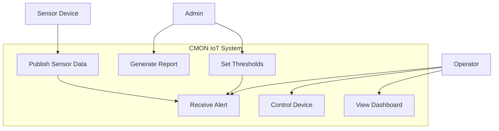

# เล่ม 1: ภาคทฤษฎี (Theory Volume)

## บทที่ 1: บทนำ – ระบบเฝ้าระวังและควบคุมอัจฉริยะสำหรับ Data Center

### สรุปสั้นก่อนเริ่ม
Data Center คือหัวใจสำคัญขององค์กรดิจิทัล ความร้อน, ความชื้น, น้ำรั่ว, หรือควันไฟสามารถสร้างความเสียหายมหาศาล ระบบเฝ้าระวังแบบ Manual (จดบันทึก, ตรวจรอบ) ไม่ทันการณ์และมีข้อจำกัด บทนี้จะอธิบายที่มา ความจำเป็น และภาพรวมของ **CMON IoT Solution** ซึ่งเป็นระบบตรวจสอบอัตโนมัติแบบ Real-time ที่ใช้ MQTT, Go backend, Web Dashboard และการแจ้งเตือนหลายช่องทาง พร้อมทั้งวิเคราะห์ปัญหาเดิมและแนวทางการแก้ไขด้วยเทคโนโลยีสมัยใหม่

---

## คำอธิบายแนวคิด (Concept Explanation)

### 1. ปัญหาของ Data Center แบบเดิม

| ปัญหา | ผลกระทบ | ตัวอย่างจริง |
|-------|----------|--------------|
| การตรวจวัดอุณหภูมิ/ความชื้นไม่ต่อเนื่อง | เกิด Hot spot ก่อนที่เจ้าหน้าที่จะทราบ | Server shutdown เพราะแอร์เสีย ตรวจพบเมื่อผู้ใช้แจ้งแล้ว |
| ไม่มีการแจ้งเตือนทันที | การแก้ไขล่าช้า -> อุปกรณ์เสียหาย | น้ำรั่วจากท่อแอร์ท่วมห้อง Server ราคาหลายล้าน |
| การควบคุมอุปกรณ์ด้วย Manual | ภาระงานสูง, พลาดได้ง่าย | ลืมเปิดพัดลมระบายอากาศตอนกลางคืน |
| ไม่มี Dashboard รวมศูนย์ | ข้อมูลกระจัดกระจาย, ตัดสินใจยาก | ต้อง log in เข้า UPS, PDU, แอร์ ทีละตัว |

**ต้นทุนของ Downtime** (Uptime Institute):  
- 1 นาทีของ Downtime ใน Data Center เฉลี่ย ~ $9,000 (เล็ก) ถึง $1,000,000+ (ใหญ่)

### 2. ระบบ CMON IoT Solution คืออะไร?

**CMON (Comprehensive Monitoring)** เป็นแพลตฟอร์ม open standard สำหรับ:
- **รับข้อมูลจากเซนเซอร์** ผ่าน MQTT, SNMP, Modbus, Digital I/O
- **ประมวลผลแบบ Real-time** (Rule Engine) และแจ้งเตือนผ่าน Email, Line, WebSocket, ไฟ/เสียง
- **ควบคุมอุปกรณ์อัตโนมัติ** ตามเงื่อนไขหรือตารางเวลา (Scheduler)
- **แสดง Dashboard** แบบ Real-time พร้อมกราฟและประวัติ
- **สร้างรายงาน** อัตโนมัติ (PDF, Excel) ส่งทางอีเมล

### 3. สถาปัตยกรรมระดับสูง (High-Level Architecture)

```mermaid
flowchart TB
    subgraph "Edge Layer"
        Sensor1[Temp/Humidity Sensor]
        Sensor2[Water Leak Sensor]
        Sensor3[Smoke Detector]
        UPS[UPS (SNMP)]
        AC[Air Conditioner]
    end

    subgraph "Gateway / Broker"
        MQTT_Broker[MQTT Broker (EMQX/Mosquitto)]
        SNMP_Poller[SNMP Poller]
    end

    subgraph "Core Platform (Go Backend)"
        Subscriber[MQTT Subscriber]
        RuleEngine[Rule Engine]
        Scheduler[Scheduler]
        WS_Hub[WebSocket Hub]
        API[REST API]
    end

    subgraph "Storage"
        PostgreSQL[(PostgreSQL)]
        Redis[(Redis Cache & Stream)]
    end

    subgraph "Notification & Control"
        Email[Email]
        Line[Line Notify]
        DigitalOut[Digital Output (Relay)]
    end

    subgraph "Presentation"
        Dashboard[Web Dashboard]
        MobileApp[Mobile App]
    end

    Sensor1 --> MQTT_Broker
    Sensor2 --> MQTT_Broker
    Sensor3 --> MQTT_Broker
    UPS --> SNMP_Poller
    AC --> SNMP_Poller
    
    SNMP_Poller -->|MQTT or HTTP| Subscriber
    MQTT_Broker --> Subscriber
    
    Subscriber --> RuleEngine
    RuleEngine -->|alert| Email
    RuleEngine -->|alert| Line
    RuleEngine -->|alert| WS_Hub
    RuleEngine -->|control| DigitalOut
    DigitalOut --> AC
    
    Scheduler -->|periodic control| DigitalOut
    Scheduler -->|report| Email
    
    API --> PostgreSQL
    API --> Redis
    WS_Hub --> Dashboard
    Dashboard --> API
```

**รูปที่ 1:** สถาปัตยกรรมระดับสูงของระบบ CMON IoT Solution แสดง layer ต่างๆ ตั้งแต่เซนเซอร์, broker, backend, storage, notification และ dashboard

### 4. เทคโนโลยีหลักที่ใช้

| เทคโนโลยี | บทบาท | ทำไมถึงเลือก |
|-----------|--------|----------------|
| **Go (Golang)** | Backend API, MQTT worker, Scheduler | Concurrency สูง, compile เป็น binary, performance ดี, memory safety |
| **MQTT** | รับข้อมูลจากเซนเซอร์ IoT | น้ำหนักเบา, QoS, รองรับอุปกรณ์หลากหลาย |
| **PostgreSQL** | เก็บประวัติเซนเซอร์, ผู้ใช้, schedules | ACID, JSONB, reliability |
| **Redis** | Cache, session store, distributed lock, Pub/Sub | ความเร็วสูง, data structures หลากหลาย |
| **JWT (RS256)** | Authentication | Stateless, รองรับ microservices |
| **WebSocket** | Real-time push ไปยัง Dashboard | Full-duplex, latency ต่ำ |
| **Docker / K8s** | Deployment และ scaling | Reproducibility, orchestration |
| **Prometheus + Grafana** | Monitoring | มาตรฐาน industry, visualization |

---

## บทที่ 2: บทนิยามศัพท์และเทคโนโลยีสำคัญ (Glossary)

### สรุปสั้น
เพื่อให้เข้าใจเนื้อหาในเล่มอื่นๆ ได้ง่าย บทนี้รวบรวมศัพท์เทคนิคที่สำคัญพร้อมคำอธิบายภาษาไทย หลักการทำงาน และตัวอย่างการประยุกต์ใช้ในระบบ CMON

---

### 2.1 MQTT (Message Queuing Telemetry Transport)

| หัวข้อ | รายละเอียด |
|--------|-------------|
| **คืออะไร** | โปรโตคอลสื่อสารแบบ publish-subscribe สำหรับอุปกรณ์ IoT ที่มี bandwidth ต่ำ |
| **หลักการทำงาน** | Client (เซนเซอร์) publish ข้อความไปยัง topic บน Broker, Client อื่น (subscriber) ที่สนใจ topic นั้นจะได้รับข้อความ |
| **QoS (Quality of Service)** | 0 – สูญเสียได้, 1 – รับประกันอย่างน้อย 1 ครั้ง, 2 – รับประกันครั้งเดียว |
| **ใช้ใน CMON อย่างไร** | เซนเซอร์วัดอุณหภูมิ publish ไปที่ `cmom/dc/rack_a1/temperature`, Go backend subscribe เพื่อรับค่าอัปเดต |
| **ทำไมต้องใช้** | ประหยัดพลังงาน, รองรับเครือข่ายไม่เสถียร, ง่ายต่อการเพิ่มอุปกรณ์ใหม่ |
| **ประโยชน์** | ลด complexity, ใช้ bandwidth น้อย, scalable |
| **ข้อควรระวัง** | ไม่มี encryption ในตัว ต้องใช้ TLS, topic design ต้องดี |
| **ข้อดี** | lightweight, QoS, persistent session |
| **ข้อเสีย** | ไม่ support request-response โดยตรง |
| **ข้อห้าม** | อย่า publish payload ใหญ่เกิน 256KB, อย่าใช้ wildcard `#` บ่อย |

---

### 2.2 JWT (JSON Web Token) และ RS256

| หัวข้อ | รายละเอียด |
|--------|-------------|
| **คืออะไร** | Token ที่ encode ข้อมูล (claims) และ sign ด้วย digital signature เพื่อ verify ว่าไม่ถูกปลอมแปลง |
| **โครงสร้าง** | `Header.Payload.Signature` (base64) |
| **RS256** | RSA signature with SHA-256 ใช้ private key sign, public key verify (asymmetric) |
| **HS256** | symmetric ใช้ secret key เดียวกัน sign และ verify |
| **ใช้ใน CMON อย่างไร** | เมื่อ login สำเร็จ server สร้าง access token (อายุ 15 นาที) และ refresh token (7 วัน) ไว้ใน Redis |
| **ทำไมต้องใช้ RS256** | Public key แจกจ่ายให้ service อื่นได้, ไม่ต้องแชร์ secret |
| **ประโยชน์** | Stateless authentication, รองรับ microservices |
| **ข้อควรระวัง** | อย่าเก็บ secret ใน payload (decode ได้), ต้องมี token blacklist |
| **ข้อเสีย** | revoke ยาก, token มีขนาดใหญ่กว่า session ID |

---

### 2.3 WebSocket

| หัวข้อ | รายละเอียด |
|--------|-------------|
| **คืออะไร** | โปรโตคอลที่ให้การสื่อสารสองทางตลอดเวลาเหนือ TCP |
| **ต่างจาก HTTP** | HTTP เป็น request-response ปิด connection ทุกครั้ง, WebSocket เปิดค้างไว้ |
| **ใช้ใน CMON อย่างไร** | Dashboard เปิด WebSocket ไปยัง Go backend เพื่อรับ push alert และ sensor update แบบ real-time |
| **ทำไมต้องใช้** | Polling (HTTP ทุก 2 วินาที) สร้าง overhead สูง, WebSocket push ทันที |
| **ประโยชน์** | real-time, low latency, reduce server load |
| **ข้อควรระวัง** | ต้องจัดการ reconnect, ต้อง heartbeat, ระวัง connection leak |
| **ข้อเสีย** | ซับซ้อนกว่า REST, ไม่เหมาะกับข้อมูลที่ไม่ต้องการ real-time |

---

### 2.4 Rule Engine (If-This-Than-That)

| หัวข้อ | รายละเอียด |
|--------|-------------|
| **คืออะไร** | กลไกประเมินเงื่อนไขจากข้อมูลเข้า แล้วดำเนินการตามที่กำหนด |
| **โครงสร้าง** | `IF (condition) THEN (actions)` เช่น `IF temperature > 35 THEN send_alert("email")` |
| **ใช้ใน CMON อย่างไร** | เมื่อได้รับค่าเซนเซอร์ใหม่, rule engine จะตรวจสอบกับกฎทั้งหมดที่ผู้ใช้ตั้งไว้ (threshold, device group) |
| **ทำไมต้องใช้** | ทำให้ระบบตอบสนองอัตโนมัติ, ผู้ใช้ปรับแต่งได้โดยไม่ต้องเขียนโค้ด |
| **รูปแบบการ implement** | 1) hard-coded (เร็ว), 2) expression evaluator (expr, govaluate), 3) JSON rules (ยืดหยุ่น) |
| **ประโยชน์** | ลด manual intervention, ตอบสนองทันที |
| **ข้อควรระวัง** | กฎที่ซับซ้อนอาจช้า, ต้องมี cooldown ป้องกัน spam |

---

### 2.5 Scheduler / Cron

| หัวข้อ | รายละเอียด |
|--------|-------------|
| **คืออะไร** | กำหนดให้ทำงานตามเวลาที่ระบุ (เช่น ทุกวัน 08:00) |
| **Cron expression** | `minute hour day month weekday` เช่น `0 8 * * *` = 08:00 ทุกวัน |
| **ใช้ใน CMON อย่างไร** | เปิด/ปิดพัดลมตามเวลา, ส่งรายงานสรุปอีเมลทุกเช้า, ลบ logs เก่าทุกเดือน |
| **ทำไมต้องใช้** | งานประจำไม่ต้องทำ manual, เพิ่มความน่าเชื่อถือ |
| **ข้อควรระวัง** | ต้องป้องกันการทำงานซ้ำเมื่อมีหลาย instance (ใช้ distributed lock) |
| **TimeZone** | ควรระบุ timezone ของ Data Center (Asia/Bangkok) |

---

### 2.6 Clean Architecture & 3-Layer

| หัวข้อ | รายละเอียด |
|--------|-------------|
| **คืออะไร** | รูปแบบการจัดโค้ดที่แยกความรับผิดชอบ: Repository (data access), Usecase (business logic), Delivery (HTTP handlers) |
| **ทำไมต้องใช้** | ทดสอบง่าย, เปลี่ยนเทคโนโลยี (DB, cache) ได้โดยไม่กระทบชั้นอื่น, บำรุงรักษาง่าย |
| **Dependency rule** | ชั้นใน (usecase) ไม่รู้จักชั้นนอก (delivery), ทุก dependency ชี้เข้าหา |
| **ใน CMON** | Repository ติดต่อ PostgreSQL/Redis, Usecase ตรวจสอบกฎและประสาน repo, Handler รับ HTTP request และเรียก usecase |

---

## บทที่ 3: การวิเคราะห์ความต้องการและกรณีศึกษา (Requirements & Use Cases)

### 3.1 Functional Requirements (สิ่งที่ระบบต้องทำได้)

| ID | Requirement | Priority |
|----|-------------|----------|
| FR-01 | รับข้อมูลเซนเซอร์ (temp, humidity, water leak, smoke) ผ่าน MQTT แบบ real-time (delay < 2 วินาที) | Must |
| FR-02 | แสดงค่าปัจจุบันและแนวโน้มบน Dashboard พร้อมกราฟ | Must |
| FR-03 | ตั้งค่า threshold สำหรับแต่ละเซนเซอร์ และแจ้งเตือนเมื่อเกิน (Warning/Alarm) | Must |
| FR-04 | แจ้งเตือนผ่าน Email, Line, WebSocket (popup) และอุปกรณ์ภายนอก (relay, siren) | Must |
| FR-05 | ควบคุมอุปกรณ์ (เปิด/ปิดพัดลม, แอร์) ผ่าน Dashboard และอัตโนมัติตามกฎ | Must |
| FR-06 | กำหนดตารางเวลา (Scheduler) สำหรับควบคุมอุปกรณ์และส่งรายงาน | Should |
| FR-07 | สร้างรายงานอัตโนมัติ (PDF, Excel) สรุปสถานะรายวัน/สัปดาห์ | Could |
| FR-08 | มีระบบ authentication และ role-based access (admin, viewer) | Must |
| FR-09 | บันทึกประวัติเซนเซอร์ไว้อย่างน้อย 90 วัน | Must |
| FR-10 | รองรับการเพิ่มอุปกรณ์ใหม่โดยไม่หยุดระบบ | Should |

### 3.2 Non-Functional Requirements (คุณภาพของระบบ)

| ID | Requirement | Target |
|----|-------------|--------|
| NFR-01 | Availability | 99.9% uptime (≤8.76 hours downtime/year) |
| NFR-02 | Response time (API) | < 100ms (p95) |
| NFR-03 | Real-time latency | จากเซนเซอร์ถึง Dashboard < 2 วินาที |
| NFR-04 | Throughput | รองรับเซนเซอร์ 10,000 ตัว publish ทุก 5 วินาที |
| NFR-05 | Security | JWT + HTTPS, secrets ไม่ hardcode, audit log |
| NFR-06 | Scalability | แนวนอนได้ถึง 10 instances |
| NFR-07 | Data retention | 90 วัน, backup รายวัน |

### 3.3 Use Case Diagram



**รูปที่ 2:** Use case diagram แสดงบทบาทผู้ใช้ (Admin, Operator) และอุปกรณ์เซนเซอร์ พร้อมฟังก์ชันหลัก

### 3.4 กรณีศึกษา: Data Center ขนาดกลาง (30 Racks)

**สถานการณ์:**
- 30 racks แต่ละ rack มีเซนเซอร์อุณหภูมิ/ความชื้น 1 คู่, เซนเซอร์น้ำรั่ว 1 ตัวที่พื้น
- รวมเซนเซอร์ ~ 90 ตัว
- พัดลมระบายอากาศ 4 ตัว, แอร์ 2 ตัว (ควบคุมผ่าน digital output)
- เจ้าหน้าที่ 2 คน (Admin 1, Operator 1)

**ความต้องการพิเศษ:**
- แจ้งเตือนทาง Line เมื่ออุณหภูมิ > 35°C
- เปิดพัดลมอัตโนมัติเมื่ออุณหภูมิ > 32°C
- ส่งรายงานอุณหภูมิสูงสุด/ต่ำสุดทางอีเมลทุกเช้า 08:00
- Dashboard แสดงแผนผัง Data Center พร้อม rack ที่มีปัญหา (สีแดง/เหลือง/เขียว)

**แนวทางแก้ไขด้วย CMON:**
1. ติดตั้ง MQTT broker (EMQX) บน server กลาง
2. ใช้ Go backend ตามสถาปัตยกรรมที่ออกแบบ
3. ตั้งค่า rule engine:
   - `IF temp > 35 THEN send_line_alert, set_digital_out(fan=ON)`
   - `IF temp > 32 AND temp <=35 THEN send_email_warning`
4. ตั้ง scheduler: `0 8 * * *` สร้าง report แล้วส่งอีเมล
5. Dashboard แสดง real-time ด้วย WebSocket

**ผลลัพธ์ที่คาดหวัง:**
- ลด downtime จากอุบัติเหตุด้านสิ่งแวดล้อมลง 80%
- เจ้าหน้าที่ไม่ต้องเดินตรวจรอบ (ประหยัดเวลา 10 ชั่วโมง/สัปดาห์)
- สามารถขยายเพิ่มเซนเซอร์ได้ง่าย

---

## เทมเพลต Task List, Checklist, Timeline (สำหรับโครงการจริง)

### Task List Template (ใช้ระหว่างพัฒนาระบบ)

| ID | Task | Dependencies | Effort (คน-วัน) | Status |
|----|------|--------------|------------------|--------|
| T01 | ติดตั้งและตั้งค่า MQTT broker (EMQX) | - | 1 | ⬜ |
| T02 | สร้างฐานข้อมูล PostgreSQL schema (migration) | - | 1 | ⬜ |
| T03 | Implement JWT authentication (login, refresh) | - | 3 | ⬜ |
| T04 | Implement MQTT subscriber และ rule engine (basic) | T01 | 4 | ⬜ |
| T05 | Implement REST API สำหรับ sensor history และ device control | T02 | 3 | ⬜ |
| T06 | Implement WebSocket hub และ broadcast alerts | T04 | 2 | ⬜ |
| T07 | สร้าง Dashboard หน้าเว็บ (HTML/JS + Chart.js) | T05, T06 | 5 | ⬜ |
| T08 | Implement Scheduler (cron + distributed lock) | T02, T04 | 3 | ⬜ |
| T09 | Implement notifiers (Email, Line, Digital Out) | - | 2 | ⬜ |
| T10 | Integration testing และ load testing | T03-T09 | 3 | ⬜ |
| T11 | จัดทำ Dockerfile และ docker-compose สำหรับ production | T10 | 2 | ⬜ |
| T12 | Deploy ระบบบน staging และ UAT | T11 | 1 | ⬜ |

### Go-Live Checklist

```markdown
## Infrastructure
- [ ] MQTT broker (EMQX) มีการตั้งค่า authentication (ถ้าต้องการ) และ TLS
- [ ] PostgreSQL มีการตั้งค่า backup อัตโนมัติ (pg_dump ไป S3)
- [ ] Redis มี maxmemory และ policy allkeys-lru
- [ ] ระบบมี load balancer (Nginx) และ SSL certificate
- [ ] Firewall เปิดเฉพาะ port ที่จำเป็น (1883/tcp สำหรับ MQTT, 443/tcp สำหรับ Web)

## Application
- [ ] JWT private/public keys ถูกเก็บใน secrets (ไม่ commit)
- [ ] Environment variables ทั้งหมดถูกกำหนด (DB, Redis, SMTP, Line token)
- [ ] Health endpoints (/live, /ready) ตอบสนองถูกต้อง
- [ ] Graceful shutdown ทำงาน (ทดสอบส่ง SIGTERM)
- [ ] Rate limiting เปิดและกำหนดค่าเหมาะสม
- [ ] Logging level = "info" (ไม่ debug)

## Monitoring & Alerting
- [ ] Prometheus metrics endpoint (/metrics) เปิด และ scrape โดย Prometheus
- [ ] Grafana dashboard สร้างสำหรับ CPU, memory, request rate, error rate
- [ ] Alert rule ตั้งค่า (error rate > 5% ติดต่อกัน 5 นาที)
- [ ] Log aggregation (Loki หรือ ELK) รับ logs จาก container

## Security & Backup
- [ ] มีการจำกัด CORS เฉพาะ origin ที่อนุญาต
- [ ] มี rate limit สำหรับ login endpoint (ป้องกัน brute force)
- [ ] Database backup ทดสอบ restore แล้ว
- [ ] Disaster recovery plan (RTO < 4 ชม., RPO < 1 ชม.)

## Documentation & Training
- [ ] API documentation (Swagger/OpenAPI) อัปเดต
- [ ] Runbook สำหรับ deploy, rollback, และ troubleshooting
- [ ] ผู้ดูแลระบบได้รับการอบรมการใช้ Dashboard และการตั้งค่า rules/schedules
```

### Timeline Project (12 สัปดาห์) – Gantt Chart มุมมองรายสัปดาห์

| สัปดาห์ | กิจกรรมหลัก | Deliverable | % Complete |
|---------|-------------|-------------|-------------|
| 1 | วิเคราะห์ requirement, ออกแบบสถาปัตยกรรม, เลือกฮาร์ดแวร์เซนเซอร์ | Requirement spec, Architecture diagram | 5% |
| 2 | ติดตั้ง Development environment, ตั้งค่า Git, CI (GitHub Actions) | Repo พร้อม, docker-compose dev | 10% |
| 3 | พัฒนา User model, JWT auth, Middleware (cors, logger, rate limit) | Login/Register API ทำงานได้ | 20% |
| 4 | พัฒนา MQTT subscriber, JSON parser, เก็บ sensor logs ลง PostgreSQL | รับข้อมูลและบันทึก DB | 30% |
| 5 | พัฒนา Rule engine (threshold + actions) + Notifiers (Email, Line) | แจ้งเตือน email/line เมื่อเกิน threshold | 40% |
| 6 | พัฒนา WebSocket hub + Dashboard พื้นฐาน (แสดงค่าปัจจุบัน) | Dashboard แสดง real-time data | 55% |
| 7 | พัฒนา Device control API + MQTT publish (ควบคุมพัดลม/แอร์) | กดปุ่มใน dashboard แล้วอุปกรณ์ตอบสนอง | 65% |
| 8 | พัฒนา Scheduler (cron jobs) + Report generator (PDF) | ส่งรายงานอัตโนมัติทางอีเมล | 75% |
| 9 | Integration testing, Load testing (k6), Security audit | Test report, performance baseline | 85% |
| 10 | จัดทำ Dockerfile production, docker-compose, deploy บน staging | staging.cmon.local ใช้งานได้ | 90% |
| 11 | UAT (User Acceptance Testing) กับทีม Data Center, แก้ไข bugs | UAT sign-off | 95% |
| 12 | Deploy production, สร้าง documentation สุดท้าย, ถ่ายทอดความรู้ | Go-live! | 100% |

---

## แบบฝึกหัดท้ายเล่ม 1 (3 ข้อ)

1. **จงเปรียบเทียบ MQTT กับ HTTP ในแง่ของ latency, bandwidth overhead, และความเหมาะสมกับ IoT** สรุปเป็นตาราง พร้อมอธิบายว่าเหตุใด CMON จึงเลือก MQTT สำหรับรับข้อมูลเซนเซอร์

2. **จากกรณีศึกษา Data Center 30 racks** หากต้องการเพิ่มเซนเซอร์วัดกระแสไฟฟ้าที่ PDU ทุกตัว (รวม 30 จุด) จงออกแบบ topic structure สำหรับ MQTT และอธิบายว่าการเพิ่มเซนเซอร์นี้จะกระทบกับ rule engine หรือ scheduler หรือไม่ อย่างไร

3. **จงเขียน use case สมมติ** สำหรับ "การเปิดพัดลมระบายอากาศอัตโนมัติ เมื่ออุณหภูมิเฉลี่ยของ rack ใด rack หนึ่งสูงเกิน 34°C ติดต่อกัน 3 ครั้ง (ทุก 10 วินาที)" โดยใช้เงื่อนไขของ rule engine และระบุ actions ที่ต้องทำ (แจ้งเตือน, ควบคุมอุปกรณ์, log)

---

## แหล่งอ้างอิง (References)

- Uptime Institute Data Center downtime statistics: [https://uptimeinstitute.com/](https://uptimeinstitute.com/)
- MQTT 5.0 Specification: [https://docs.oasis-open.org/mqtt/mqtt/v5.0/](https://docs.oasis-open.org/mqtt/mqtt/v5.0/)
- Clean Architecture โดย Robert C. Martin: [https://blog.cleancoder.com/uncle-bob/2012/08/13/the-clean-architecture.html](https://blog.cleancoder.com/uncle-bob/2012/08/13/the-clean-architecture.html)
- JWT Handbook: [https://auth0.com/resources/ebooks/jwt-handbook](https://auth0.com/resources/ebooks/jwt-handbook)
- WebSocket vs HTTP: [https://www.ably.com/blog/websocket-vs-http](https://www.ably.com/blog/websocket-vs-http)

---

**หมายเหตุ:** เล่ม 1 นี้เป็นภาคทฤษฎีที่ปูพื้นฐานให้เข้าใจถึงความจำเป็น, เทคโนโลยี, และการวิเคราะห์ระบบ ก่อนลงมือปฏิบัติตามเล่ม 2,3,4 ที่ได้เขียนไว้แล้ว เอกสารทั้ง 4 เล่มครอบคลุมทุกขั้นตอนตั้งแต่แนวคิดจนถึงการปรับใช้ใน production สำหรับโครงการ CMON IoT Monitoring เรียบร้อย