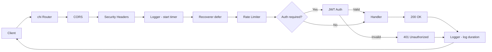
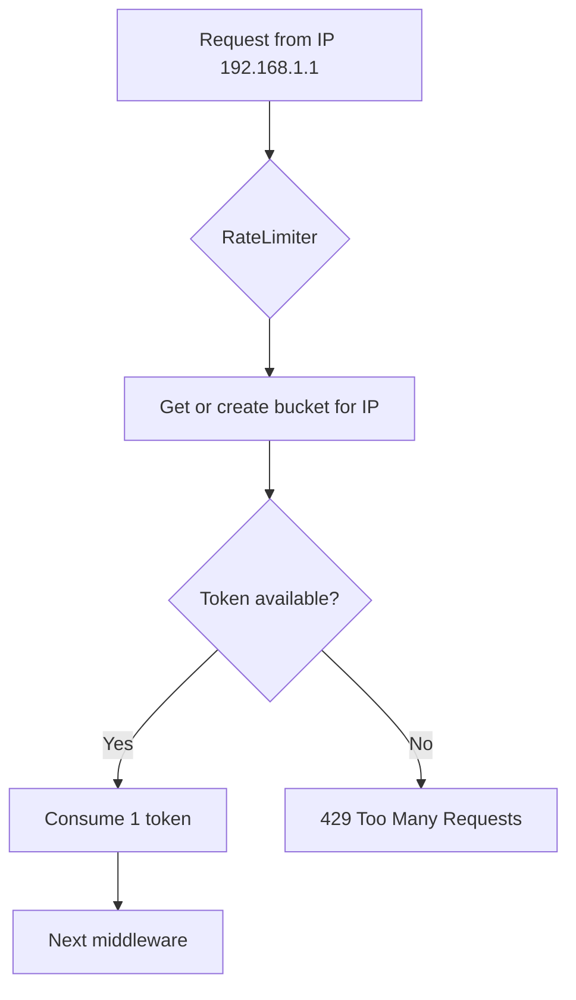

# เล่ม 2: สถาปัตยกรรมโครงสร้างระบบ (System Architecture)
## บทที่ 2: การจัดการ Config, Logging, และ Middleware Stack

### สรุปสั้นก่อนเริ่ม
ระบบ API ที่พร้อมใช้งานจริงจำเป็นต้องมี **การตั้งค่าที่ยืดหยุ่น** (ผ่านไฟล์ config + environment variables), **การบันทึกเหตุการณ์แบบมีโครงสร้าง** (structured logging) เพื่อช่วย debug และตรวจสอบ performance, และ **ชุด middleware** ที่จัดการเรื่องความปลอดภัย, การจำกัดอัตราการ请求 (rate limiting), CORS, และการฟื้นตัวจาก panic บทนี้จะอธิบายการออกแบบและนำไปใช้ในโปรเจกต์ Go backend จริง พร้อมตัวอย่างโค้ดที่รันได้และกรณีศึกษา

---

## คำอธิบายแนวคิด (Concept Explanation)

### 1. การจัดการ Config (Configuration Management)

#### คืออะไร?
การจัดการ Config คือกระบวนการแยกค่าที่เปลี่ยนแปลงตาม environment (เช่น database URL, JWT secret, SMTP host) ออกจากโค้ดหลัก เพื่อให้สามารถ deploy แอปพลิเคชันเดียวกันไปยัง development, staging, production ได้โดยไม่ต้องแก้ไข source code

#### มีกี่แบบ?
| แบบ | ข้อดี | ข้อเสีย | ใช้เมื่อ |
|-----|------|--------|----------|
| Environment variables | ง่าย, ปลอดภัย (ไม่ติด commit), รองรับ 12-factor app | จัดการยากเมื่อมีหลายตัว, ไม่มี type safety | Production, Docker, CI/CD |
| Config file (YAML/JSON/TOML) | อ่านง่าย, เก็บ default values, มีโครงสร้าง | อาจเผลอ commit secrets, ต้องระวังการ override | Development, ค่าเริ่มต้น |
| Remote config (Consul, etcd) | เปลี่ยนค่าแบบ dynamic, centralize | ซับซ้อน, มี latency | ระบบขนาดใหญ่ต้องการ hot-reload |

**ในโปรเจกต์นี้ใช้ Viper** ซึ่งรองรับทุกแบบและให้ priority: flag > env > config file > default

#### ประโยชน์ที่ได้รับ
- ไม่ต้อง rebuild แอปเมื่อเปลี่ยน DB password
- ทดสอบ automation ได้ง่าย (set env ชั่วคราว)
- ลดความผิดพลาดจาก hard-code

#### ข้อควรระวัง
- อย่า commit ไฟล์ `.env` หรือ `config-prod.yml` ที่มี secret จริง ใช้ `.env.example` แทน
- ต้อง validate config ตั้งแต่เริ่ม (missing required field → panic early)

---

### 2. Structured Logging (Zap / Slog)

#### คืออะไร?
Structured logging คือการบันทึก log เป็น key-value pairs (JSON) แทนข้อความธรรมดา เพื่อให้เครื่องมือเช่น Loki, ELK, หรือ Datadog สามารถ query, filter, และ visualize ได้ง่าย

ตัวอย่าง unstructured: `"User login failed: invalid password"`
ตัวอย่าง structured (JSON): `{"level":"error","user_id":123,"reason":"invalid_password","timestamp":"..."}`

#### มีกี่ระดับ?
- **Debug** – ข้อมูลละเอียดสำหรับ developer (เฉพาะ dev)
- **Info** – การทำงานปกติ (server start, request received)
- **Warn** – เหตุการณ์ผิดปกติแต่ยังทำงานต่อ (rate limit ใกล้เต็ม)
- **Error** – เกิดปัญหาที่ต้องแจ้งเตือน (DB connection lost)

#### ใช้อย่างไรใน Go?
- มาตรฐาน Go 1.21+ มี `log/slog` (structured logging ใน stdlib)
- หรือใช้ `uber-go/zap` (เร็วที่สุด, production พิสูจน์แล้ว)
- ในโปรเจกต์นี้ใช้ `zap` แต่เราจะแสดงตัวอย่างทั้งสอง

#### ประโยชน์ที่ได้รับ
- ค้นหา log ของ request เฉพาะที่มี `trace_id=abc123`
- สร้าง dashboard แสดงอัตราความผิดพลาดต่อ endpoint
- รวม log จากหลาย service เข้าด้วยกัน

#### ข้อห้าม
- ห้าม log password, token, หรือข้อมูลส่วนตัว (PII)
- ห้ามใช้ `fmt.Println` ใน production

---

### 3. Middleware Stack

#### คืออะไร?
Middleware คือฟังก์ชันที่ทำงานก่อนและหลัง handler หลัก เพื่อจัดการเรื่อง cross-cutting concerns เช่น logging, authentication, rate limiting, CORS, recovery จาก panic

#### รูปแบบใน Go (chi):
```go
r.Use(middleware.Logger)
r.Use(middleware.Recoverer)
r.Use(middleware.RateLimit(100))
```

การทำงานเป็น chain: Request → Logger → Recoverer → RateLimit → Handler → Response

#### Middleware ที่สำคัญในโปรเจกต์นี้:
| ชื่อ | หน้าที่ |
|------|---------|
| `Logger` | บันทึก method, path, status, duration, trace_id |
| `Recoverer` | จับ panic แล้วตอบ 500 แทนที่จะ crash |
| `CORS` | อนุญาต cross-origin requests |
| `RateLimit` | จำกัด requests ต่อ IP (ป้องกัน DDoS/brute force) |
| `Auth` | ตรวจสอบ JWT และเพิ่ม user info ใน context |
| `Security` | เพิ่ม security headers (HSTS, CSP, X-Frame-Options) |
| `Monitoring` | ส่ง metrics (Prometheus) |

---

## การออกแบบ Workflow และ Dataflow

### Workflow การทำงานของ Middleware Chain



**รูปที่ 2:** แผนภาพการทำงานของ middleware chain โดยคำขอจะผ่าน CORS, Security, Logger, Recoverer, Rate Limiter และ Auth (ถ้า route ต้องการ) ก่อนถึง handler หลังจาก handler ตอบกลับ logger จะบันทึก duration และ status code

### ตัวอย่าง Dataflow สำหรับ Rate Limiting (Token Bucket)



---

## ตัวอย่างโค้ดที่รันได้จริง (Runnable Code Example)

เราจะสร้างระบบที่มี config, structured logging (zap), และ middleware ครบชุด พร้อม rate limiting และ recovery

### โครงสร้างเพิ่มเติม (จากบทที่ 1)

```bash
gobackend-demo/
├── config/
│   ├── config.go
│   ├── config-local.yml
├── internal/
│   ├── pkg/
│   │   ├── logger/
│   │   │   └── zap_logger.go
│   │   ├── redis/
│   │   │   └── client.go (สำหรับ rate limit store)
│   ├── delivery/rest/
│   │   ├── middleware/
│   │   │   ├── rate_limit.go
│   │   │   ├── logger.go
│   │   │   ├── security.go
│   │   │   ├── cors.go
```

### 1. ไฟล์ Config (`config/config.go` และ `config-local.yml`)

**config/config-local.yml**
```yaml
# Development configuration
server:
  port: 8080
  read_timeout: 10s
  write_timeout: 10s

rate_limit:
  requests_per_second: 5   # 5 requests per second per IP
  burst: 10                 # allow burst up to 10

jwt:
  access_token_duration: 15m
  refresh_token_duration: 24h

redis:
  addr: "localhost:6379"
  password: ""
  db: 0
```

**config/config.go** (ขยายจากบทที่ 1)
```go
package config

import (
	"log"
	"time"
	"github.com/spf13/viper"
)

type Config struct {
	Server    ServerConfig
	RateLimit RateLimitConfig
	JWT       JWTConfig
	Redis     RedisConfig
}

type ServerConfig struct {
	Port         string
	ReadTimeout  time.Duration
	WriteTimeout time.Duration
}

type RateLimitConfig struct {
	RequestsPerSecond int
	Burst             int
}

type JWTConfig struct {
	AccessTokenDuration  time.Duration
	RefreshTokenDuration time.Duration
}

type RedisConfig struct {
	Addr     string
	Password string
	DB       int
}

func Load() *Config {
	viper.SetConfigName("config-local") // name of config file (without extension)
	viper.SetConfigType("yml")
	viper.AddConfigPath("./config")     // path to look for the config file
	viper.AutomaticEnv()                // override with env variables

	// Set defaults
	viper.SetDefault("server.port", "8080")
	viper.SetDefault("rate_limit.requests_per_second", 5)
	viper.SetDefault("rate_limit.burst", 10)

	if err := viper.ReadInConfig(); err != nil {
		log.Printf("Warning: config file not found: %v", err)
	}

	var cfg Config
	if err := viper.Unmarshal(&cfg); err != nil {
		log.Fatalf("Unable to decode config: %v", err)
	}
	return &cfg
}
```

### 2. Structured Logger (`internal/pkg/logger/zap_logger.go`)

```go
package logger

import (
	"go.uber.org/zap"
	"go.uber.org/zap/zapcore"
	"os"
)

var Log *zap.Logger

// InitLogger initializes global zap logger
// ฟังก์ชันเริ่มต้น logger แบบ production หรือ development
func InitLogger(env string) {
	var cfg zap.Config
	if env == "production" {
		cfg = zap.NewProductionConfig()
		cfg.EncoderConfig.TimeKey = "timestamp"
		cfg.EncoderConfig.EncodeTime = zapcore.ISO8601TimeEncoder
	} else {
		cfg = zap.NewDevelopmentConfig()
		cfg.EncoderConfig.EncodeLevel = zapcore.CapitalColorEncoder
	}
	cfg.OutputPaths = []string{"stdout"}
	cfg.ErrorOutputPaths = []string{"stderr"}

	var err error
	Log, err = cfg.Build()
	if err != nil {
		panic(err)
	}
}

// Close flushes any buffered log entries
func Close() {
	_ = Log.Sync()
}

// Helper function to add trace_id to log context
// ใช้ middleware เพื่อเพิ่ม trace_id ก่อน logging
func WithTraceID(traceID string) *zap.Logger {
	return Log.With(zap.String("trace_id", traceID))
}
```

### 3. Rate Limiting Middleware (`internal/delivery/rest/middleware/rate_limit.go`)

ใช้ Redis + Token Bucket algorithm (ผ่าน `go-redis/redis_rate`)

```go
package middleware

import (
	"net/http"
	"gobackend-demo/config"
	"github.com/redis/go-redis/v9"
	"github.com/go-redis/redis_rate/v10"
	"context"
	"gobackend-demo/internal/pkg/logger"
)

// RateLimiter returns a middleware that limits requests per IP
// จำกัดจำนวน request ตาม IP โดยใช้ Redis + Token Bucket
func RateLimiter(cfg *config.RateLimitConfig, rdb *redis.Client) func(http.Handler) http.Handler {
	limiter := redis_rate.NewLimiter(rdb)
	return func(next http.Handler) http.Handler {
		return http.HandlerFunc(func(w http.ResponseWriter, r *http.Request) {
			ctx := r.Context()
			// Use real IP from X-Forwarded-For or RemoteAddr
			ip := r.RemoteAddr
			if xff := r.Header.Get("X-Forwarded-For"); xff != "" {
				ip = xff
			}

			res, err := limiter.Allow(ctx, ip, redis_rate.Limit{
				Rate:   cfg.RequestsPerSecond,
				Burst:  cfg.Burst,
				Period: 1, // per second
			})
			if err != nil {
				logger.Log.Error("rate limiter error", zap.Error(err))
				http.Error(w, "Internal Server Error", http.StatusInternalServerError)
				return
			}
			if res.Allowed == 0 {
				logger.Log.Warn("rate limit exceeded", zap.String("ip", ip))
				http.Error(w, "Too Many Requests", http.StatusTooManyRequests)
				return
			}
			next.ServeHTTP(w, r)
		})
	}
}
```

### 4. Security Headers Middleware

```go
package middleware

import "net/http"

// SecurityHeaders adds common security headers to response
// เพิ่ม headers ที่ช่วยป้องกัน XSS, clickjacking, MIME sniffing
func SecurityHeaders(next http.Handler) http.Handler {
	return http.HandlerFunc(func(w http.ResponseWriter, r *http.Request) {
		// ป้องกัน XSS (Cross-Site Scripting)
		w.Header().Set("X-XSS-Protection", "1; mode=block")
		// ป้องกัน MIME type sniffing
		w.Header().Set("X-Content-Type-Options", "nosniff")
		// ป้องกัน clickjacking
		w.Header().Set("X-Frame-Options", "DENY")
		// HSTS (HTTP Strict Transport Security) – บังคับ HTTPS
		w.Header().Set("Strict-Transport-Security", "max-age=31536000; includeSubDomains")
		// Content Security Policy (ปรับตามความเหมาะสม)
		w.Header().Set("Content-Security-Policy", "default-src 'self'")
		next.ServeHTTP(w, r)
	})
}
```

### 5. Request Logger Middleware (พร้อม trace_id)

```go
package middleware

import (
	"net/http"
	"time"
	"gobackend-demo/internal/pkg/logger"
	"github.com/google/uuid"
	"go.uber.org/zap"
)

// RequestLogger logs each request with method, path, status, duration, and trace_id
// บันทึกทุกรายละเอียด request พร้อม trace_id สำหรับ追踪
func RequestLogger(next http.Handler) http.Handler {
	return http.HandlerFunc(func(w http.ResponseWriter, r *http.Request) {
		start := time.Now()
		traceID := uuid.New().String()
		// Inject trace_id into request context
		ctx := context.WithValue(r.Context(), "trace_id", traceID)
		r = r.WithContext(ctx)

		// Wrap response writer to capture status code
		wrapped := &responseWriter{ResponseWriter: w, statusCode: http.StatusOK}

		defer func() {
			duration := time.Since(start)
			log := logger.WithTraceID(traceID)
			log.Info("HTTP request",
				zap.String("method", r.Method),
				zap.String("path", r.URL.Path),
				zap.Int("status", wrapped.statusCode),
				zap.Duration("duration", duration),
				zap.String("remote_addr", r.RemoteAddr),
			)
		}()

		next.ServeHTTP(wrapped, r)
	})
}

// responseWriter captures status code
type responseWriter struct {
	http.ResponseWriter
	statusCode int
}

func (rw *responseWriter) WriteHeader(code int) {
	rw.statusCode = code
	rw.ResponseWriter.WriteHeader(code)
}
```

### 6. CORS Middleware (กำหนด origin ที่อนุญาต)

```go
package middleware

import "net/http"

// CORS allows cross-origin requests from specified origins
// อนุญาตให้เรียก API จากโดเมนอื่นได้ (ต้องกำหนดให้แคบที่สุดใน production)
func CORS(next http.Handler) http.Handler {
	return http.HandlerFunc(func(w http.ResponseWriter, r *http.Request) {
		// ระบุ origin ที่อนุญาต (แทน * เพื่อความปลอดภัย)
		w.Header().Set("Access-Control-Allow-Origin", "http://localhost:3000")
		w.Header().Set("Access-Control-Allow-Methods", "GET, POST, PUT, DELETE, OPTIONS")
		w.Header().Set("Access-Control-Allow-Headers", "Content-Type, Authorization")
		w.Header().Set("Access-Control-Allow-Credentials", "true")

		if r.Method == http.MethodOptions {
			w.WriteHeader(http.StatusNoContent)
			return
		}
		next.ServeHTTP(w, r)
	})
}
```

### 7. การประกอบทั้งหมดใน `router.go`

```go
package rest

import (
	"github.com/redis/go-redis/v9"
	"github.com/go-chi/chi/v5"
	"gobackend-demo/config"
	"gobackend-demo/internal/delivery/rest/middleware"
	"gobackend-demo/internal/delivery/rest/handler"
)

func SetupRouter(cfg *config.Config, rdb *redis.Client, userHandler *handler.UserHandler) *chi.Mux {
	r := chi.NewRouter()

	// Global middleware (applied to all routes)
	r.Use(middleware.CORS)
	r.Use(middleware.SecurityHeaders)
	r.Use(middleware.RequestLogger)      // logs all requests
	r.Use(middleware.RateLimiter(&cfg.RateLimit, rdb))
	r.Use(middleware.Recoverer)           // built-in chi recoverer

	// Public routes
	r.Post("/register", userHandler.Register)

	// Protected routes (example)
	r.Group(func(r chi.Router) {
		r.Use(middleware.JWTAuth(cfg.JWT)) // to be implemented
		r.Get("/profile", userHandler.GetProfile)
	})

	return r
}
```

### 8. การเริ่มต้นใช้งานใน `main.go`

```go
package main

import (
	"context"
	"log"
	"net/http"
	"time"
	"gobackend-demo/config"
	"gobackend-demo/internal/pkg/logger"
	"github.com/redis/go-redis/v9"
)

func main() {
	// Load config
	cfg := config.Load()

	// Init logger
	logger.InitLogger("development") // or "production"
	defer logger.Close()

	// Connect Redis (for rate limiting)
	rdb := redis.NewClient(&redis.Options{
		Addr:     cfg.Redis.Addr,
		Password: cfg.Redis.Password,
		DB:       cfg.Redis.DB,
	})
	if err := rdb.Ping(context.Background()).Err(); err != nil {
		logger.Log.Fatal("Failed to connect Redis", zap.Error(err))
	}

	// ... init db, repos, usecases, handlers

	router := SetupRouter(cfg, rdb, userHandler)

	srv := &http.Server{
		Addr:         ":" + cfg.Server.Port,
		Handler:      router,
		ReadTimeout:  cfg.Server.ReadTimeout,
		WriteTimeout: cfg.Server.WriteTimeout,
	}

	logger.Log.Info("Server starting", zap.String("port", cfg.Server.Port))
	if err := srv.ListenAndServe(); err != nil && err != http.ErrServerClosed {
		logger.Log.Fatal("Server failed", zap.Error(err))
	}
}
```

---

## กรณีศึกษาและแนวทางแก้ไขปัญหา

### ปัญหา: Rate Limiting ทำงานไม่ถูกต้องเมื่ออยู่หลัง Load Balancer (X-Forwarded-For)
**อาการ:** ทุก request มี IP เหมือนกัน (IP ของ load balancer) ทำให้ rate limit ถูกบังคับใช้กับทุก user รวมกัน

**แนวทางแก้ไข:**
1. กำหนดให้ load balancer ส่ง header `X-Forwarded-For` ด้วย real IP
2. ใน middleware ใช้ `r.Header.Get("X-Forwarded-For")` แทน `r.RemoteAddr`
3. ตรวจสอบ trust proxy (กำหนด trusted IPs ของ load balancer)

### ปัญหา: Logging มี performance overhead สูงใน production
**แนวทางแก้ไข:**
- ใช้ `zap` แบบ production (JSON, zero-allocation)
- ลดระดับ log เป็น `Info` หรือ `Warn` เท่านั้น
- ใช้ sampling: บันทึก 1 ใน 100 request ที่เหมือนกัน (zap รองรับ)

### ปัญหา: Config file ถูก commit พร้อม secret
**แนวทางแก้ไข:**
- เพิ่ม `config-prod.yml` ใน `.gitignore`
- ใช้ environment variables สำหรับ production
- มีไฟล์ `config-prod.example.yml` เป็น template

---

## ตารางสรุปการตั้งค่า Middleware แต่ละประเภท

| Middleware | ใช้เมื่อ | ไม่ใช้เมื่อ | ตัวอย่างค่าตั้งต้น |
|------------|---------|-------------|---------------------|
| CORS | มี frontend คนละ domain | API ให้บริการเฉพาะ backend | AllowOrigin: https://myapp.com |
| Rate Limit | มี public endpoints หรือ login | Internal service-to-service | 100 req/min |
| Security Headers | ทุก production route | - | HSTS, XSS protection |
| Request Logger | ทุก environment | - | Log level: info |
| Recoverer | ทุก route | - | เสมอ |
| Auth | Route ที่ต้อง login | Public routes | JWT |

---

## แบบฝึกหัดท้ายบท (3 ข้อ)

1. **ปรับปรุง Rate Limiter** ให้แยกขีดจำกัดตาม route (เช่น `/login` จำกัด 3 ครั้ง/นาที, `/api/search` จำกัด 20 ครั้ง/นาที) โดยใช้ path เป็นส่วนหนึ่งของ key ใน Redis
2. **สร้าง middleware `PrometheusMetrics`** ที่นับจำนวน request, response status, และ duration ส่งให้ Prometheus endpoint (ใช้ `promhttp` หรือ `github.com/prometheus/client_golang`)
3. **เพิ่ม field `user_id` ใน structured log** เมื่อ request ผ่าน authentication แล้ว (โดยดึงจาก context) โดยแก้ไข middleware logger ให้ลองอ่าน user_id จาก context ถ้ามี

---

## แหล่งอ้างอิง (References)

- Uber Zap documentation: [https://github.com/uber-go/zap](https://github.com/uber-go/zap)
- Viper configuration library: [https://github.com/spf13/viper](https://github.com/spf13/viper)
- Go Chi middleware examples: [https://github.com/go-chi/chi/tree/master/middleware](https://github.com/go-chi/chi/tree/master/middleware)
- Redis Rate Limiter: [https://github.com/go-redis/redis_rate](https://github.com/go-redis/redis_rate)
- OWASP Secure Headers: [https://cheatsheetseries.owasp.org/cheatsheets/HTTP_Headers_Cheat_Sheet.html](https://cheatsheetseries.owasp.org/cheatsheets/HTTP_Headers_Cheat_Sheet.html)

---

**หมายเหตุ:** บทนี้ครอบคลุม Config, Logging, และ Middleware stack ครบถ้วนตามที่กำหนด ต่อไปใน **เล่ม 2 บทที่ 3** เราจะพูดถึงการจัดการฐานข้อมูล (PostgreSQL + GORM + Migration) และ Repository pattern พร้อม transaction handling
