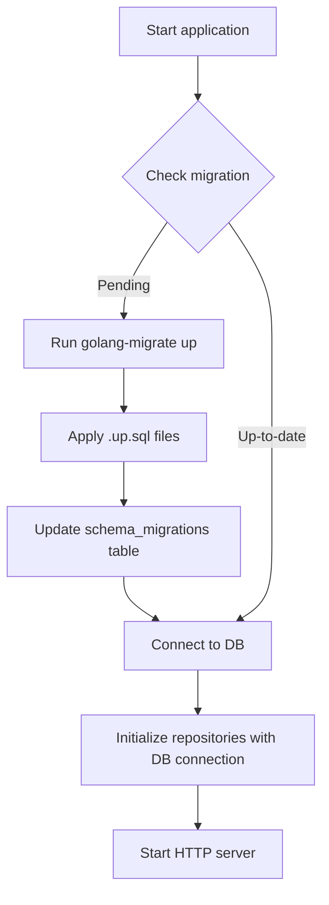
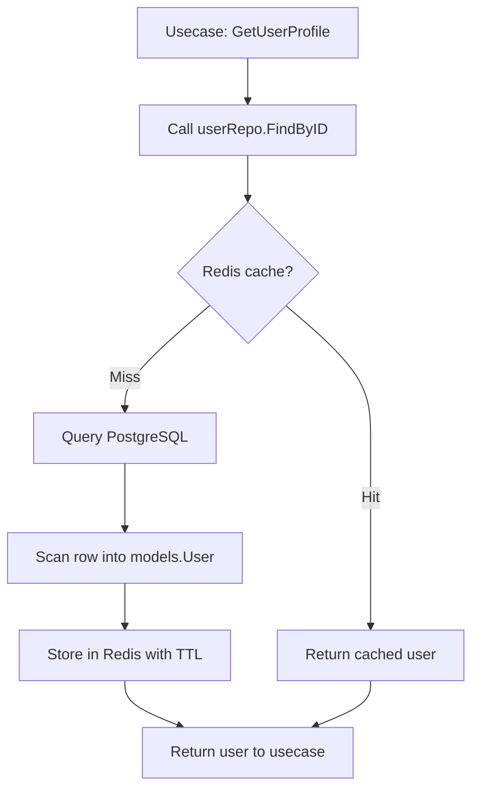

# เล่ม 2: สถาปัตยกรรมโครงสร้างระบบ (System Architecture)
## บทที่ 3: Database, Repository Pattern และ Transaction Management

### สรุปสั้นก่อนเริ่ม
ฐานข้อมูลเป็นหัวใจของระบบ API ส่วนใหญ่ การออกแบบ layer ที่ติดต่อกับฐานข้อมูลอย่างเป็นระเบียบ (Repository Pattern) ช่วยแยก logic การเข้าถึงข้อมูลออกจาก business logic ทำให้ทดสอบง่าย เปลี่ยนฐานข้อมูลได้โดยไม่กระทบทั้งระบบ บทนี้จะอธิบายการใช้ **GORM** เป็น ORM, การทำ **migration** แบบ version control, การออกแบบ **Repository interface** และ **transaction management** ที่รองรับ nested transaction พร้อมตัวอย่างการนำไปใช้กับ PostgreSQL และ Redis พร้อมกรณีศึกษาในโลกจริง

---

## คำอธิบายแนวคิด (Concept Explanation)

### 1. Repository Pattern คืออะไร?

Repository Pattern เป็นตัวกลาง (mediator) ระหว่าง business logic (usecase) กับแหล่งข้อมูล (database, API, cache) โดยมี interface เป็นตัวกำหนด method ที่ต้องมี เช่น `Create`, `FindByID`, `Update`, `Delete` ส่วน implementation จริงจะอยู่ที่ struct ที่ implement interface นั้น

**โครงสร้าง:**
```
Usecase (business logic)
   ↓ เรียกผ่าน interface
Repository interface (ไม่รู้ implementation)
   ↓ implement โดย
PostgresRepository (ใช้ GORM)
RedisRepository (ใช้ go-redis)
MockRepository (ใช้สำหรับ unit test)
```

#### มีกี่แบบ?
| แบบ | คำอธิบาย | ข้อดี | ข้อเสีย |
|-----|----------|------|---------|
| **Generic Repository** | interface เดียวใช้ได้กับหลาย entity | ลดโค้ดซ้ำ | ซับซ้อนถ้า entity มี query เฉพาะ |
| **Specific Repository** | แต่ละ entity มี interface ของตัวเอง | ชัดเจน, ยืดหยุ่น | มีไฟล์เยอะ |
| **Transaction Repository** | repository มี method สำหรับ transaction | จัดการ transaction เป็นศูนย์กลาง | coupling สูงกับ usecase |

**ในโปรเจกต์นี้ใช้แบบ Specific Repository + Transaction Repository แบบแยก**

#### ประโยชน์ที่ได้รับ
- เปลี่ยนจาก PostgreSQL เป็น MongoDB ได้โดยแก้แค่ repository (usecase ไม่รู้เรื่อง)
- ทดสอบ usecase โดยใช้ mock repository (ไม่ต้องมี DB จริง)
- จัดการ query ที่ซับซ้อนไว้ใน repository เดียว ไม่กระจายใน usecase

#### ข้อควรระวัง
- repository ควรคืนค่าเป็น model ของ domain (internal/models) ไม่ใช่ DTO หรือ map
- repository ไม่ควรมี business logic (เช่น การตรวจสอบว่า email ซ้ำ)

#### ข้อดี/ข้อเสีย
- **ข้อดี**: แยกชัด, ทดสอบง่าย, เปลี่ยนแหล่งข้อมูลได้
- **ข้อเสีย**: โค้ดเพิ่มขึ้น, ต้องเขียน interface ทุกตัว

#### ข้อห้าม
- ห้ามเรียก repository โดยตรงจาก handler (ต้องผ่าน usecase)
- ห้ามใช้ repository ใน repository อื่น (ใช้ service หรือ usecase แทน)

---

### 2. GORM (Go ORM) – ภาพรวม

GORM เป็น ORM (Object-Relational Mapping) ที่ได้รับความนิยมสูงสุดใน Go ช่วยแปลง struct → ตาราง database และ method call → SQL โดยอัตโนมัติ

#### ความสามารถหลัก
- **Auto Migration**: สร้าง/อัปเดต schema จาก struct
- **Association**: Has One, Has Many, Belongs To, Many To Many
- **Hooks**: BeforeCreate, AfterUpdate, etc.
- **Scopes**: ใช้ reusable query conditions
- **Transaction**: รองรับ nested transaction, save point

#### เมื่อไหร่ควรใช้ GORM?
| ใช้ GORM | ไม่ใช้ GORM |
|----------|-------------|
| โครงสร้างตารางไม่ซับซ้อนมาก | ต้องการ performance สูงสุด (ใช้ sqlx แทน) |
| ต้องการ development speed | query มี join หลายตารางซับซ้อน |
| ทีมไม่ถนัดเขียน SQL เอง | ต้องควบคุม SQL ทุกบรรทัด |

#### ตัวอย่างการแปลง struct → SQL
```go
type User struct {
    ID    uint   `gorm:"primaryKey"`
    Email string `gorm:"uniqueIndex"`
}
// GORM สร้าง SQL: CREATE TABLE users (id serial PRIMARY KEY, email varchar UNIQUE)
db.Create(&User{Email: "test@example.com"})
// -> INSERT INTO users (email) VALUES ('test@example.com')
```

---

### 3. Database Migration

Migration คือการควบคุมการเปลี่ยนแปลง schema ของฐานข้อมูลผ่านไฟล์ SQL หรือโค้ด โดยแต่ละไฟล์มีหมายเลขเวอร์ชัน (timestamp) และมี `up` (apply change) และ `down` (rollback) เพื่อให้สามารถย้อนกลับได้

#### รูปแบบที่ใช้ในโปรเจกต์นี้ (golang-migrate)
```
migrations/
├── 000001_create_users_table.up.sql
├── 000001_create_users_table.down.sql
├── 000002_add_fullname_to_users.up.sql
└── 000002_add_fullname_to_users.down.sql
```

#### ประโยชน์
- ทีมงานทุกคนมี schema เดียวกัน (run migrate)
- deploy อัตโนมัติ (CI/CD)
- ย้อนกลับ version ได้ถ้ามีปัญหา

#### ข้อควรระวัง
- migration `down` ควร destruct data (ต้องมั่นใจ)
- อย่าแก้ไข migration ที่ apply ไปแล้ว ควรสร้างไฟล์ใหม่

---

## การออกแบบ Workflow และ Dataflow

### Workflow การทำ Migration และระบบ



**รูปที่ 3:** ขั้นตอนการทำ migration เมื่อแอปพลิเคชันเริ่มต้น โดยจะตรวจสอบ migration ที่ยังไม่ถูก apply แล้วรันไฟล์ .up.sql ตามลำดับ

### Dataflow การทำงานของ Repository ภายใน Usecase (มี Cache)



**รูปที่ 4:** แผนภาพการทำงานของ repository แบบมี cache layer โดย repository จะพยายามอ่านจาก Redis ก่อน ถ้าไม่เจอจึง query PostgreSQL แล้วนำมา cache

### Transaction Management Flow (Nested Transaction)

```mermaid
flowchart TB
    StartTx[usecase: Begin transaction] --> Tx1[tx := db.Begin]
    Tx1 --> CreateOrder[repo.CreateOrder(tx, order)]
    CreateOrder --> CreateItems[repo.CreateOrderItems(tx, items)]
    CreateItems --> UpdateStock[repo.UpdateStock(tx, productID)]
    UpdateStock --> CheckErr{Any error?}
    CheckErr --> |Yes| Rollback[tx.Rollback]
    Rollback --> ReturnErr[Return error]
    CheckErr --> |No| Commit[tx.Commit]
    Commit --> ReturnSuccess[Return success]
```

**รูปที่ 5:** การทำ transaction ใน usecase โดยส่ง `*gorm.DB` ที่เป็น transaction ไปยัง repository แต่ละตัว เพื่อให้ทุก operation สำเร็จหรือ fail พร้อมกัน

---

## ตัวอย่างโค้ดที่รันได้จริง (Runnable Code Example)

เราจะสร้างระบบจัดการผู้ใช้ (Users) และบทความ (Posts) พร้อม repository, transaction, migration, และ cache

### โครงสร้างไฟล์ (เพิ่มจากบทที่ 2)

```bash
gobackend-demo/
├── migrations/
│   ├── 000001_create_users_table.up.sql
│   ├── 000001_create_users_table.down.sql
│   ├── 000002_create_posts_table.up.sql
│   └── 000002_create_posts_table.down.sql
├── internal/
│   ├── models/
│   │   ├── user.go
│   │   └── post.go
│   ├── repository/
│   │   ├── user_repo.go (interface + postgres impl)
│   │   └── post_repo.go
│   └── usecase/
│       └── user_usecase.go (มี transaction)
├── cmd/
│   └── migrate.go (command สำหรับ run migration)
```

### 1. Migration Files

**migrations/000001_create_users_table.up.sql**
```sql
-- Create users table
-- สร้างตาราง users สำหรับเก็บข้อมูลผู้ใช้
CREATE TABLE IF NOT EXISTS users (
    id SERIAL PRIMARY KEY,
    email VARCHAR(255) NOT NULL UNIQUE,
    password VARCHAR(255) NOT NULL,
    full_name VARCHAR(255),
    created_at TIMESTAMP WITH TIME ZONE DEFAULT CURRENT_TIMESTAMP,
    updated_at TIMESTAMP WITH TIME ZONE DEFAULT CURRENT_TIMESTAMP
);

-- Create index for faster email lookup
CREATE INDEX idx_users_email ON users(email);
```

**migrations/000001_create_users_table.down.sql**
```sql
DROP TABLE IF EXISTS users;
```

**migrations/000002_create_posts_table.up.sql**
```sql
-- Create posts table (foreign key to users)
CREATE TABLE IF NOT EXISTS posts (
    id SERIAL PRIMARY KEY,
    user_id INTEGER NOT NULL REFERENCES users(id) ON DELETE CASCADE,
    title VARCHAR(255) NOT NULL,
    content TEXT,
    published BOOLEAN DEFAULT FALSE,
    created_at TIMESTAMP WITH TIME ZONE DEFAULT CURRENT_TIMESTAMP,
    updated_at TIMESTAMP WITH TIME ZONE DEFAULT CURRENT_TIMESTAMP
);

CREATE INDEX idx_posts_user_id ON posts(user_id);
```

### 2. Models

**internal/models/user.go**
```go
package models

import "time"

// User represents the user entity in database
// ผู้ใช้ในระบบ ประกอบด้วย email, password hashed, ชื่อ-นามสกุล
type User struct {
    ID        uint      `gorm:"primaryKey"`
    Email     string    `gorm:"uniqueIndex;not null"`
    Password  string    `gorm:"not null"` // hashed bcrypt
    FullName  string    `gorm:"column:full_name"`
    CreatedAt time.Time `gorm:"autoCreateTime"`
    UpdatedAt time.Time `gorm:"autoUpdateTime"`
    
    // Association (has many posts)
    Posts []Post `gorm:"foreignKey:UserID"`
}
```

**internal/models/post.go**
```go
package models

import "time"

// Post represents a blog post written by a user
// บทความที่ผู้ใช้เขียน
type Post struct {
    ID        uint      `gorm:"primaryKey"`
    UserID    uint      `gorm:"not null;index"`
    Title     string    `gorm:"not null"`
    Content   string    `gorm:"type:text"`
    Published bool      `gorm:"default:false"`
    CreatedAt time.Time `gorm:"autoCreateTime"`
    UpdatedAt time.Time `gorm:"autoUpdateTime"`
    
    // Association
    User User `gorm:"foreignKey:UserID"`
}
```

### 3. User Repository (Interface + Implementation)

**internal/repository/user_repo.go**
```go
package repository

import (
    "context"
    "gobackend-demo/internal/models"
    "gorm.io/gorm"
)

// UserRepository defines database operations for users
// อินเทอร์เฟซสำหรับการจัดการข้อมูลผู้ใช้
type UserRepository interface {
    Create(ctx context.Context, tx *gorm.DB, user *models.User) error
    FindByID(ctx context.Context, id uint) (*models.User, error)
    FindByEmail(ctx context.Context, email string) (*models.User, error)
    Update(ctx context.Context, tx *gorm.DB, user *models.User) error
    Delete(ctx context.Context, tx *gorm.DB, id uint) error
}

type userRepository struct {
    db *gorm.DB
}

// NewUserRepository creates a new user repository instance
// ฟังก์ชันสร้าง repository พร้อมรับ db connection
func NewUserRepository(db *gorm.DB) UserRepository {
    return &userRepository{db: db}
}

// Create inserts a new user into database
// สามารถรับ tx เพื่อ support transaction (ถ้า tx เป็น nil จะใช้ db ปกติ)
func (r *userRepository) Create(ctx context.Context, tx *gorm.DB, user *models.User) error {
    db := r.getDB(tx)
    return db.WithContext(ctx).Create(user).Error
}

// FindByID retrieves a user by primary key
// ค้นหาผู้ใช้จาก id พร้อม preload posts (optional)
func (r *userRepository) FindByID(ctx context.Context, id uint) (*models.User, error) {
    var user models.User
    err := r.db.WithContext(ctx).
        Preload("Posts"). // load associated posts
        First(&user, id).Error
    if err != nil {
        return nil, err
    }
    return &user, nil
}

// FindByEmail retrieves a user by email (unique)
// ค้นหาผู้ใช้จากอีเมล (ใช้สำหรับ login)
func (r *userRepository) FindByEmail(ctx context.Context, email string) (*models.User, error) {
    var user models.User
    err := r.db.WithContext(ctx).Where("email = ?", email).First(&user).Error
    if err != nil {
        return nil, err
    }
    return &user, nil
}

// Update modifies existing user fields
// อัปเดตข้อมูลผู้ใช้ (support transaction)
func (r *userRepository) Update(ctx context.Context, tx *gorm.DB, user *models.User) error {
    db := r.getDB(tx)
    return db.WithContext(ctx).Save(user).Error
}

// Delete removes a user by id
// ลบผู้ใช้ (support transaction)
func (r *userRepository) Delete(ctx context.Context, tx *gorm.DB, id uint) error {
    db := r.getDB(tx)
    return db.WithContext(ctx).Delete(&models.User{}, id).Error
}

// getDB returns transaction if exists, otherwise default db
// เลือกใช้ transaction หรือ connection ปกติ
func (r *userRepository) getDB(tx *gorm.DB) *gorm.DB {
    if tx != nil {
        return tx
    }
    return r.db
}
```

### 4. Post Repository

**internal/repository/post_repo.go**
```go
package repository

import (
    "context"
    "gobackend-demo/internal/models"
    "gorm.io/gorm"
)

// PostRepository defines operations for posts
type PostRepository interface {
    Create(ctx context.Context, tx *gorm.DB, post *models.Post) error
    FindByUserID(ctx context.Context, userID uint) ([]models.Post, error)
    Update(ctx context.Context, tx *gorm.DB, post *models.Post) error
}

type postRepository struct {
    db *gorm.DB
}

func NewPostRepository(db *gorm.DB) PostRepository {
    return &postRepository{db: db}
}

func (r *postRepository) Create(ctx context.Context, tx *gorm.DB, post *models.Post) error {
    db := r.getDB(tx)
    return db.WithContext(ctx).Create(post).Error
}

func (r *postRepository) FindByUserID(ctx context.Context, userID uint) ([]models.Post, error) {
    var posts []models.Post
    err := r.db.WithContext(ctx).Where("user_id = ?", userID).Find(&posts).Error
    return posts, err
}

func (r *postRepository) Update(ctx context.Context, tx *gorm.DB, post *models.Post) error {
    db := r.getDB(tx)
    return db.WithContext(ctx).Save(post).Error
}

func (r *postRepository) getDB(tx *gorm.DB) *gorm.DB {
    if tx != nil {
        return tx
    }
    return r.db
}
```

### 5. Usecase ที่ใช้ Transaction และ Cache (ผ่าน Redis)

**internal/usecase/user_usecase.go**
```go
package usecase

import (
    "context"
    "encoding/json"
    "errors"
    "time"
    "gobackend-demo/internal/models"
    "gobackend-demo/internal/repository"
    "github.com/redis/go-redis/v9"
    "golang.org/x/crypto/bcrypt"
    "gorm.io/gorm"
)

type UserUsecase interface {
    RegisterWithPosts(ctx context.Context, email, password, fullName string, postTitles []string) error
    GetUserWithCache(ctx context.Context, id uint) (*models.User, error)
}

type userUsecase struct {
    db          *gorm.DB
    userRepo    repository.UserRepository
    postRepo    repository.PostRepository
    redisClient *redis.Client
}

func NewUserUsecase(db *gorm.DB, userRepo repository.UserRepository, postRepo repository.PostRepository, redisClient *redis.Client) UserUsecase {
    return &userUsecase{
        db:          db,
        userRepo:    userRepo,
        postRepo:    postRepo,
        redisClient: redisClient,
    }
}

// RegisterWithPosts creates a user and initial posts within a single transaction
// ลงทะเบียนผู้ใช้และสร้างบทความแรกใน transaction เดียวกัน
func (u *userUsecase) RegisterWithPosts(ctx context.Context, email, password, fullName string, postTitles []string) error {
    // เริ่ม transaction
    tx := u.db.Begin()
    if tx.Error != nil {
        return tx.Error
    }
    // defer rollback ในกรณี panic
    defer func() {
        if r := recover(); r != nil {
            tx.Rollback()
        }
    }()

    // Hash password
    hashed, err := bcrypt.GenerateFromPassword([]byte(password), bcrypt.DefaultCost)
    if err != nil {
        tx.Rollback()
        return errors.New("failed to hash password")
    }

    user := &models.User{
        Email:    email,
        Password: string(hashed),
        FullName: fullName,
    }
    // Create user within transaction
    if err := u.userRepo.Create(ctx, tx, user); err != nil {
        tx.Rollback()
        return err
    }

    // Create posts for the new user
    for _, title := range postTitles {
        post := &models.Post{
            UserID:  user.ID,
            Title:   title,
            Content: "Initial content",
        }
        if err := u.postRepo.Create(ctx, tx, post); err != nil {
            tx.Rollback()
            return err
        }
    }

    // Commit transaction
    return tx.Commit().Error
}

// GetUserWithCache retrieves user first from Redis, then DB, then stores in cache
// ดึงข้อมูลผู้ใช้จาก Redis ก่อน ถ้าไม่เจอค่อย query DB แล้ว cache ไว้
func (u *userUsecase) GetUserWithCache(ctx context.Context, id uint) (*models.User, error) {
    cacheKey := "user:" + string(rune(id))
    
    // Try Redis cache
    cached, err := u.redisClient.Get(ctx, cacheKey).Result()
    if err == nil {
        var user models.User
        if err := json.Unmarshal([]byte(cached), &user); err == nil {
            return &user, nil
        }
    }
    
    // Cache miss: query from database
    user, err := u.userRepo.FindByID(ctx, id)
    if err != nil {
        return nil, err
    }
    
    // Store in Redis with 10 minutes TTL
    data, _ := json.Marshal(user)
    u.redisClient.Set(ctx, cacheKey, data, 10*time.Minute)
    
    return user, nil
}
```

### 6. Migration Command (`cmd/migrate.go`)

```go
package main

import (
    "log"
    "github.com/golang-migrate/migrate/v4"
    _ "github.com/golang-migrate/migrate/v4/database/postgres"
    _ "github.com/golang-migrate/migrate/v4/source/file"
    "gobackend-demo/config"
)

func main() {
    cfg := config.Load()
    dsn := "postgres://" + cfg.DBUser + ":" + cfg.DBPassword + "@" + cfg.DBHost + ":" + cfg.DBPort + "/" + cfg.DBName + "?sslmode=disable"
    
    m, err := migrate.New("file://migrations", dsn)
    if err != nil {
        log.Fatal(err)
    }
    
    if err := m.Up(); err != nil && err != migrate.ErrNoChange {
        log.Fatal(err)
    }
    log.Println("Migration applied successfully")
}
```

---

## ตารางสรุปเปรียบเทียบ Repository Pattern vs Raw SQL vs Query Builder

| คุณสมบัติ | Repository + GORM | Raw SQL (database/sql) | Query Builder (squirrel) |
|-----------|-------------------|------------------------|---------------------------|
| **ความเร็ว** | ปานกลาง (reflection) | เร็วที่สุด | เร็ว (ไม่ reflection) |
| **type safety** | สูง (struct mapping) | ต่ำ (Scan เอง) | ปานกลาง |
| **เปลี่ยน DB** | ง่าย (เปลี่ยน driver) | ยาก (SQL ต่างกัน) | ปานกลาง |
| **Migration** | AutoMigrate | ต้องเขียนเอง | ต้องเขียนเอง |
| **การเรียนรู้** | เรียนรู้ ORM concepts | ต้องรู้ SQL | เรียนรู้ query builder |
| **โค้ดซับซ้อน** | น้อย (CRUD สั้น) | มาก (manage rows) | ปานกลาง |
| **เหมาะกับ** | 90% ของแอปทั่วไป | performance-critical, complex joins | ต้องการ balance |

---

## แบบฝึกหัดท้ายบท (3 ข้อ)

1. **เพิ่ม soft delete** ให้กับ `User` model โดยใช้ GORM's `gorm.DeletedAt` และปรับปรุง repository method `Delete` ให้เป็น soft delete แทน hard delete พร้อมสร้าง method `Restore` สำหรับกู้คืน

2. **Implement pagination** ใน `PostRepository` โดยเพิ่ม method `FindByUserIDPaginated(ctx context.Context, userID uint, limit, offset int) ([]models.Post, error)` และทดสอบด้วย

3. **สร้าง repository cache wrapper** ที่ implement `UserRepository` เดิม แต่ internally เรียก cache ก่อน (decorator pattern) โดยไม่ต้องแก้ usecase เลย

---

## แหล่งอ้างอิง (References)

- GORM official documentation: [https://gorm.io/docs/](https://gorm.io/docs/)
- Repository pattern in Go: [https://dev.to/stevensunflash/using-repository-pattern-in-golang-3h77](https://dev.to/stevensunflash/using-repository-pattern-in-golang-3h77)
- golang-migrate: [https://github.com/golang-migrate/migrate](https://github.com/golang-migrate/migrate)
- Transaction handling in GORM: [https://gorm.io/docs/transactions.html](https://gorm.io/docs/transactions.html)
- Clean Architecture with Repository: [https://medium.com/@benbjohnson/standard-package-layout-7cdbc8391fc1](https://medium.com/@benbjohnson/standard-package-layout-7cdbc8391fc1)

---

**หมายเหตุ:** บทนี้ครอบคลุม Database, Repository Pattern, Transaction, Migration และ Cache Integration ครบถ้วน ต่อไปใน **เล่ม 2 บทที่ 4** เราจะพูดถึง Authentication & Authorization (JWT, Refresh Token, RBAC) ซึ่งเป็นหัวใจสำคัญของระบบ API ที่สมบูรณ์
