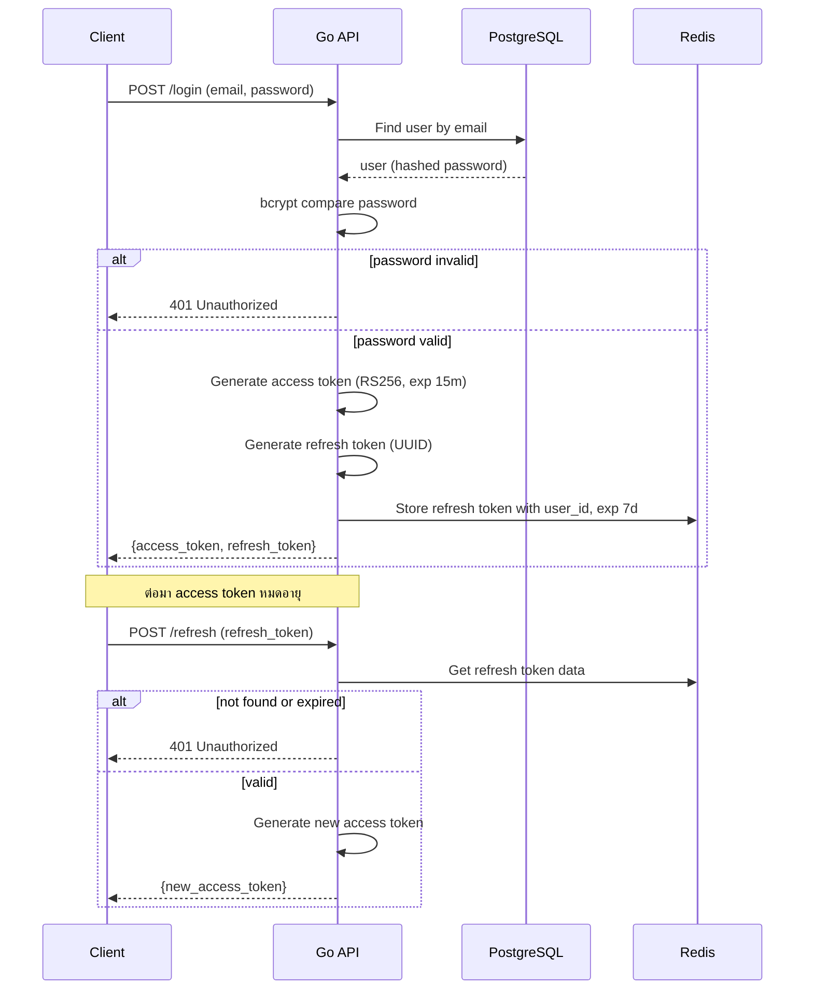
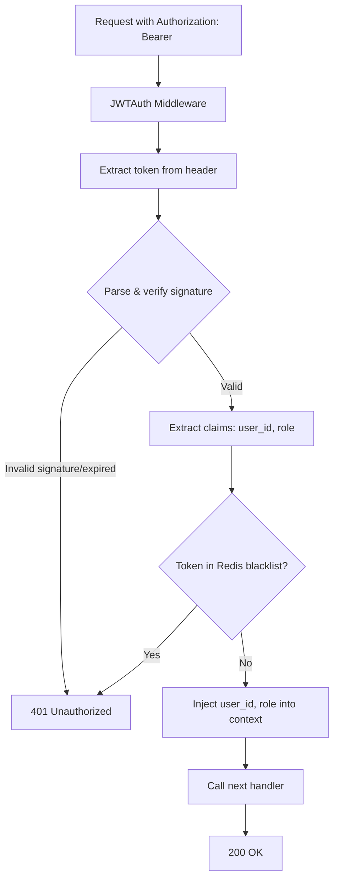

# เล่ม 2: สถาปัตยกรรมโครงสร้างระบบ (System Architecture)
## บทที่ 4: Authentication & Authorization (JWT, Refresh Token, RBAC)

### สรุปสั้นก่อนเริ่ม
ระบบ API ที่ปลอดภัยจำเป็นต้องมีกลไกพิสูจน์ตัวตน (Authentication) และการควบคุมสิทธิ์ (Authorization) ที่แข็งแรง บทนี้จะอธิบายการใช้ **JWT (JSON Web Token)** แบบ RSA (private/public key) เพื่อความปลอดภัยสูง, **Refresh Token** ที่เก็บใน Redis สำหรับการต่ออายุ Access Token, และ **Role-Based Access Control (RBAC)** แบบง่าย (admin/user) พร้อมตัวอย่าง middleware ที่ตรวจสอบ JWT และ inject user context พร้อมกรณีศึกษา token blacklisting, refresh token rotation, และการป้องกัน replay attack

---

## คำอธิบายแนวคิด (Concept Explanation)

### 1. JWT (JSON Web Token) คืออะไร?

JWT เป็น standard (RFC 7519) สำหรับสร้าง token ที่มีข้อมูล (claims) ฝังอยู่และสามารถ verify ได้ว่าถูกสร้างโดยเซิร์ฟเวอร์ที่เชื่อถือ (digital signature) โดยไม่ต้องเก็บ session บนเซิร์ฟเวอร์ (stateless)

**โครงสร้าง JWT:** `xxxxx.yyyyy.zzzzz` (Header.Payload.Signature)

| ส่วน | เนื้อหา | ตัวอย่าง |
|------|---------|----------|
| **Header** | ประเภทของ token และ algorithm | `{"alg":"RS256","typ":"JWT"}` |
| **Payload** | Claims (ข้อมูล) เช่น user_id, role, exp | `{"sub":"123","role":"admin","exp":1735689600}` |
| **Signature** | ลายเซ็นดิจิทัล (sign header+payload ด้วย private key) | `RSASHA256(base64(header)+"."+base64(payload), privateKey)` |

#### มีกี่แบบ? (Algorithm)
| Algorithm | ประเภท | ข้อดี | ข้อเสีย | ใช้เมื่อ |
|-----------|--------|------|---------|----------|
| **HS256** | Symmetric (shared secret) | เร็ว, ง่าย | ต้องเก็บ secret ดีๆ, กระจาย secret ยาก | ระบบเดียว, internal service |
| **RS256** | Asymmetric (private/public key) | ปลอดภัย, public key แจกจ่ายได้ | ช้ากว่า HS256 เล็กน้อย | Production, microservices |
| **ES256** | ECDSA | ขนาด key สั้น, ปลอดภัยสูง | implementation ซับซ้อน | ต้องการประสิทธิภาพ+ความปลอดภัย |

**ในโปรเจกต์นี้ใช้ RS256** เพราะปลอดภัยกว่าและแยก public/private key

#### ประโยชน์ที่ได้รับ
- Stateless (ไม่ต้องเก็บ session ใน DB)
- ขยายแนวนอนง่าย (load balancer ไร้รอยต่อ)
- เก็บข้อมูล user id, role ได้ใน token
- รองรับการ verify โดย service อื่น (ถือ public key)

#### ข้อควรระวัง
- JWT ไม่ได้เข้ารหัส payload (base64 decode ได้) – ห้ามเก็บ secret ใน payload
- token มีขนาดใหญ่ (~200-500 bytes)
- revoke token ทำได้ยาก (ต้องใช้ blacklist)

#### ข้อดี/ข้อเสีย
- **ข้อดี**: stateless, scalable, รองรับหลาย platform
- **ข้อเสีย**: ไม่สามารถ invalidate ได้ทันที (ต้องรอ expire หรือ blacklist)

#### ข้อห้าม
- ห้ามเก็บ password หรือข้อมูลอ่อนไหวใน payload
- ห้ามใช้ HS256 ใน production หาก distribute secret ไม่ปลอดภัย
- ห้ามตั้ง `exp` นานเกินไป (access token ควรสั้น 15-30 นาที)

---

### 2. Refresh Token ทำงานอย่างไร?

Access Token มีอายุสั้น (15 นาที) เพื่อลดความเสี่ยงถ้าถูกขโมย Refresh Token มีอายุยาว (24 ชั่วโมง - 7 วัน) ใช้สำหรับขอ access token ใหม่ โดย refresh token จะถูกเก็บใน Redis และสามารถ revoke ได้

**Flow:**
```
1. Login → server สร้าง access token (exp 15m) + refresh token (exp 7d, เก็บใน Redis)
2. Client ใช้ access token เรียก API
3. เมื่อ access token หมดอายุ → client ส่ง refresh token ไปที่ /refresh
4. Server ตรวจสอบ refresh token ใน Redis → ถ้าถูกต้อง สร้าง access token ใหม่
5. ถ้า refresh token หมดอายุหรือถูกลบ → ต้อง login ใหม่
```

#### ประโยชน์
- access token สั้น → ปลอดภัย
- refresh token revoke ได้ (ลบจาก Redis)
- ลดการ login ซ้ำบ่อย

#### ข้อควรระวัง
- refresh token ต้องเก็บอย่างปลอดภัย (httpOnly cookie หรือ secure storage)
- ต้องมีกลไกป้องกันการขโมย refresh token (rotate on each use)

---

### 3. RBAC (Role-Based Access Control)

RBAC คือการควบคุมสิทธิ์ตามบทบาทที่ผู้ใช้ได้รับมอบหมาย (admin, user, moderator) โดยแต่ละ role มี permission ที่แตกต่างกัน

**ตัวอย่าง:**
| Role | สิทธิ์ |
|------|--------|
| admin | create/update/delete users, view all |
| user | view/edit own profile, create posts |
| guest | view only public data |

**การ implement ใน Go middleware:**
```go
func RequireRole(allowedRoles ...string) func(http.Handler) http.Handler {
    return func(next http.Handler) http.Handler {
        return http.HandlerFunc(func(w http.ResponseWriter, r *http.Request) {
            role := r.Context().Value("role").(string)
            if !contains(allowedRoles, role) {
                http.Error(w, "Forbidden", http.StatusForbidden)
                return
            }
            next.ServeHTTP(w, r)
        })
    }
}
```

---

## การออกแบบ Workflow และ Dataflow

### Workflow การ Login และ Refresh Token



**รูปที่ 6:** ลำดับการทำงานของระบบ authentication ด้วย access token และ refresh token

### Workflow การตรวจสอบ JWT Middleware



**รูปที่ 7:** ขั้นตอนการตรวจสอบ JWT token ใน middleware ก่อนถึง handler

### Token Blacklisting (Logout)

```mermaid
flowchart LR
    Client --> Logout[POST /logout with access token]
    Logout --> ExtractJWT[Extract jti (JWT ID) and exp]
    ExtractJWT --> StoreBlacklist[Store in Redis with TTL = remaining expiry]
    StoreBlacklist --> DeleteRefresh[Delete refresh token from Redis]
    DeleteRefresh --> Success[200 OK]
```

---

## ตัวอย่างโค้ดที่รันได้จริง (Runnable Code Example)

เราจะสร้างระบบ authentication ที่สมบูรณ์ด้วย RSA JWT, refresh token ใน Redis, และ RBAC middleware

### โครงสร้างไฟล์เพิ่มเติม

```bash
internal/pkg/jwt/
├── maker.go          (interface)
├── rsa_maker.go      (RS256 implementation)
└── payload.go

internal/pkg/redis/
├── refresh_store.go  (manage refresh tokens)
└── blacklist.go      (token blacklist)

internal/delivery/rest/middleware/
└── auth.go           (JWT middleware + RBAC)

internal/delivery/rest/handler/
└── auth_handler.go   (login, logout, refresh)
```

### 1. JWT Payload และ Maker Interface

**internal/pkg/jwt/payload.go**
```go
package jwt

import (
    "github.com/google/uuid"
    "time"
)

// Payload contains the JWT claims
// ข้อมูลที่จะถูกบรรจุใน JWT payload
type Payload struct {
    ID        uuid.UUID `json:"id"`         // unique token id (jti)
    UserID    uint      `json:"user_id"`
    Role      string    `json:"role"`       // "admin" or "user"
    IssuedAt  time.Time `json:"issued_at"`
    ExpiredAt time.Time `json:"expired_at"`
}

// NewPayload creates a new token payload
func NewPayload(userID uint, role string, duration time.Duration) (*Payload, error) {
    tokenID, err := uuid.NewRandom()
    if err != nil {
        return nil, err
    }
    return &Payload{
        ID:        tokenID,
        UserID:    userID,
        Role:      role,
        IssuedAt:  time.Now(),
        ExpiredAt: time.Now().Add(duration),
    }, nil
}

// Valid checks if payload is not expired (required for jwt.Claims interface)
func (p *Payload) Valid() error {
    if time.Now().After(p.ExpiredAt) {
        return ErrExpiredToken
    }
    return nil
}
```

**internal/pkg/jwt/maker.go**
```go
package jwt

import "errors"

var (
    ErrExpiredToken = errors.New("token has expired")
    ErrInvalidToken = errors.New("token is invalid")
)

// Maker is an interface for managing JWT tokens
type Maker interface {
    // CreateToken generates a new JWT token for given user and role
    CreateToken(userID uint, role string, duration time.Duration) (string, *Payload, error)
    
    // VerifyToken validates the token and returns payload
    VerifyToken(token string) (*Payload, error)
}
```

### 2. RSA JWT Implementation (RS256)

**internal/pkg/jwt/rsa_maker.go**
```go
package jwt

import (
    "crypto/rsa"
    "crypto/x509"
    "encoding/pem"
    "fmt"
    "time"
    "github.com/golang-jwt/jwt/v5"
)

// RSAMaker implements Maker using RSA256 algorithm
type RSAMaker struct {
    privateKey *rsa.PrivateKey
    publicKey  *rsa.PublicKey
}

// NewRSAMaker loads private and public keys from PEM strings
// รับ private key และ public key ในรูปแบบ PEM string (base64 encoded)
func NewRSAMaker(privateKeyPEM, publicKeyPEM string) (*RSAMaker, error) {
    // Parse private key
    block, _ := pem.Decode([]byte(privateKeyPEM))
    if block == nil {
        return nil, fmt.Errorf("failed to decode private key PEM")
    }
    privateKey, err := x509.ParsePKCS8PrivateKey(block.Bytes)
    if err != nil {
        return nil, fmt.Errorf("failed to parse private key: %w", err)
    }
    rsaPrivate, ok := privateKey.(*rsa.PrivateKey)
    if !ok {
        return nil, fmt.Errorf("private key is not RSA")
    }
    
    // Parse public key
    blockPub, _ := pem.Decode([]byte(publicKeyPEM))
    if blockPub == nil {
        return nil, fmt.Errorf("failed to decode public key PEM")
    }
    publicKey, err := x509.ParsePKIXPublicKey(blockPub.Bytes)
    if err != nil {
        return nil, fmt.Errorf("failed to parse public key: %w", err)
    }
    rsaPublic, ok := publicKey.(*rsa.PublicKey)
    if !ok {
        return nil, fmt.Errorf("public key is not RSA")
    }
    
    return &RSAMaker{
        privateKey: rsaPrivate,
        publicKey:  rsaPublic,
    }, nil
}

// CreateToken generates a new RSA256 JWT token
// สร้าง JWT ด้วย private key RSA256
func (m *RSAMaker) CreateToken(userID uint, role string, duration time.Duration) (string, *Payload, error) {
    payload, err := NewPayload(userID, role, duration)
    if err != nil {
        return "", nil, err
    }
    
    claims := jwt.MapClaims{
        "jti":      payload.ID.String(),
        "user_id":  payload.UserID,
        "role":     payload.Role,
        "exp":      payload.ExpiredAt.Unix(),
        "iat":      payload.IssuedAt.Unix(),
    }
    
    token := jwt.NewWithClaims(jwt.SigningMethodRS256, claims)
    signedToken, err := token.SignedString(m.privateKey)
    if err != nil {
        return "", nil, err
    }
    return signedToken, payload, nil
}

// VerifyToken validates token and returns payload
// ตรวจสอบความถูกต้องของ JWT ด้วย public key
func (m *RSAMaker) VerifyToken(tokenString string) (*Payload, error) {
    keyFunc := func(token *jwt.Token) (interface{}, error) {
        if _, ok := token.Method.(*jwt.SigningMethodRSA); !ok {
            return nil, ErrInvalidToken
        }
        return m.publicKey, nil
    }
    
    claims := jwt.MapClaims{}
    token, err := jwt.ParseWithClaims(tokenString, claims, keyFunc)
    if err != nil {
        if errors.Is(err, jwt.ErrTokenExpired) {
            return nil, ErrExpiredToken
        }
        return nil, ErrInvalidToken
    }
    
    if !token.Valid {
        return nil, ErrInvalidToken
    }
    
    // Extract payload
    userIDFloat, ok := claims["user_id"].(float64)
    if !ok {
        return nil, ErrInvalidToken
    }
    role, _ := claims["role"].(string)
    jtiStr, _ := claims["jti"].(string)
    exp, _ := claims["exp"].(float64)
    iat, _ := claims["iat"].(float64)
    
    tokenID, err := uuid.Parse(jtiStr)
    if err != nil {
        return nil, ErrInvalidToken
    }
    
    return &Payload{
        ID:        tokenID,
        UserID:    uint(userIDFloat),
        Role:      role,
        IssuedAt:  time.Unix(int64(iat), 0),
        ExpiredAt: time.Unix(int64(exp), 0),
    }, nil
}
```

### 3. Refresh Token Store (Redis)

**internal/pkg/redis/refresh_store.go**
```go
package redis

import (
    "context"
    "encoding/json"
    "time"
    "github.com/redis/go-redis/v9"
)

type RefreshSession struct {
    UserID    uint      `json:"user_id"`
    Role      string    `json:"role"`
    CreatedAt time.Time `json:"created_at"`
    ExpiresAt time.Time `json:"expires_at"`
}

type RefreshStore interface {
    Create(ctx context.Context, refreshToken string, session *RefreshSession) error
    Get(ctx context.Context, refreshToken string) (*RefreshSession, error)
    Delete(ctx context.Context, refreshToken string) error
}

type redisRefreshStore struct {
    client *redis.Client
}

func NewRefreshStore(client *redis.Client) RefreshStore {
    return &redisRefreshStore{client: client}
}

func (s *redisRefreshStore) Create(ctx context.Context, refreshToken string, session *RefreshSession) error {
    data, err := json.Marshal(session)
    if err != nil {
        return err
    }
    ttl := time.Until(session.ExpiresAt)
    return s.client.Set(ctx, "refresh:"+refreshToken, data, ttl).Err()
}

func (s *redisRefreshStore) Get(ctx context.Context, refreshToken string) (*RefreshSession, error) {
    data, err := s.client.Get(ctx, "refresh:"+refreshToken).Bytes()
    if err == redis.Nil {
        return nil, nil // not found
    }
    if err != nil {
        return nil, err
    }
    var session RefreshSession
    if err := json.Unmarshal(data, &session); err != nil {
        return nil, err
    }
    return &session, nil
}

func (s *redisRefreshStore) Delete(ctx context.Context, refreshToken string) error {
    return s.client.Del(ctx, "refresh:"+refreshToken).Err()
}
```

### 4. Token Blacklist

**internal/pkg/redis/blacklist.go**
```go
package redis

import (
    "context"
    "time"
    "github.com/redis/go-redis/v9"
)

type Blacklist interface {
    Add(ctx context.Context, jti string, ttl time.Duration) error
    IsBlacklisted(ctx context.Context, jti string) (bool, error)
}

type redisBlacklist struct {
    client *redis.Client
}

func NewBlacklist(client *redis.Client) Blacklist {
    return &redisBlacklist{client: client}
}

func (b *redisBlacklist) Add(ctx context.Context, jti string, ttl time.Duration) error {
    return b.client.Set(ctx, "blacklist:"+jti, "1", ttl).Err()
}

func (b *redisBlacklist) IsBlacklisted(ctx context.Context, jti string) (bool, error) {
    _, err := b.client.Get(ctx, "blacklist:"+jti).Result()
    if err == redis.Nil {
        return false, nil
    }
    if err != nil {
        return false, err
    }
    return true, nil
}
```

### 5. Authentication Middleware (JWT + Blacklist)

**internal/delivery/rest/middleware/auth.go**
```go
package middleware

import (
    "context"
    "net/http"
    "strings"
    "gobackend-demo/internal/pkg/jwt"
    "gobackend-demo/internal/pkg/redis"
)

type contextKey string

const (
    UserIDKey contextKey = "user_id"
    RoleKey   contextKey = "role"
)

// JWTAuth validates JWT token and injects user context
// ตรวจสอบ JWT และเพิ่ม user_id, role ใน context
func JWTAuth(maker jwt.Maker, blacklist redis.Blacklist) func(http.Handler) http.Handler {
    return func(next http.Handler) http.Handler {
        return http.HandlerFunc(func(w http.ResponseWriter, r *http.Request) {
            authHeader := r.Header.Get("Authorization")
            if authHeader == "" {
                http.Error(w, "Missing authorization header", http.StatusUnauthorized)
                return
            }
            
            parts := strings.Split(authHeader, " ")
            if len(parts) != 2 || strings.ToLower(parts[0]) != "bearer" {
                http.Error(w, "Invalid authorization header format", http.StatusUnauthorized)
                return
            }
            
            tokenString := parts[1]
            payload, err := maker.VerifyToken(tokenString)
            if err != nil {
                if err == jwt.ErrExpiredToken {
                    http.Error(w, "Token expired", http.StatusUnauthorized)
                } else {
                    http.Error(w, "Invalid token", http.StatusUnauthorized)
                }
                return
            }
            
            // Check blacklist
            blacklisted, _ := blacklist.IsBlacklisted(r.Context(), payload.ID.String())
            if blacklisted {
                http.Error(w, "Token revoked", http.StatusUnauthorized)
                return
            }
            
            // Inject user info into context
            ctx := context.WithValue(r.Context(), UserIDKey, payload.UserID)
            ctx = context.WithValue(ctx, RoleKey, payload.Role)
            next.ServeHTTP(w, r.WithContext(ctx))
        })
    }
}

// RequireRole checks if user has at least one of allowed roles
// ตรวจสอบบทบาทว่าตรงกับที่อนุญาตหรือไม่
func RequireRole(allowedRoles ...string) func(http.Handler) http.Handler {
    return func(next http.Handler) http.Handler {
        return http.HandlerFunc(func(w http.ResponseWriter, r *http.Request) {
            role, ok := r.Context().Value(RoleKey).(string)
            if !ok {
                http.Error(w, "Forbidden", http.StatusForbidden)
                return
            }
            allowed := false
            for _, r := range allowedRoles {
                if role == r {
                    allowed = true
                    break
                }
            }
            if !allowed {
                http.Error(w, "Forbidden", http.StatusForbidden)
                return
            }
            next.ServeHTTP(w, r)
        })
    }
}
```

### 6. Auth Handler (Login, Logout, Refresh)

**internal/delivery/rest/handler/auth_handler.go**
```go
package handler

import (
    "encoding/json"
    "net/http"
    "time"
    "github.com/google/uuid"
    "gobackend-demo/internal/models"
    "gobackend-demo/internal/pkg/jwt"
    "gobackend-demo/internal/pkg/redis"
    "golang.org/x/crypto/bcrypt"
    "gorm.io/gorm"
)

type AuthHandler struct {
    db           *gorm.DB
    jwtMaker     jwt.Maker
    refreshStore redis.RefreshStore
    blacklist    redis.Blacklist
}

func NewAuthHandler(db *gorm.DB, maker jwt.Maker, refreshStore redis.RefreshStore, blacklist redis.Blacklist) *AuthHandler {
    return &AuthHandler{
        db:           db,
        jwtMaker:     maker,
        refreshStore: refreshStore,
        blacklist:    blacklist,
    }
}

type loginRequest struct {
    Email    string `json:"email"`
    Password string `json:"password"`
}

type loginResponse struct {
    AccessToken  string `json:"access_token"`
    RefreshToken string `json:"refresh_token"`
}

// Login handles user authentication
// ตรวจสอบ email/password, สร้าง access token และ refresh token
func (h *AuthHandler) Login(w http.ResponseWriter, r *http.Request) {
    var req loginRequest
    if err := json.NewDecoder(r.Body).Decode(&req); err != nil {
        http.Error(w, "Invalid request", http.StatusBadRequest)
        return
    }
    
    // Find user
    var user models.User
    if err := h.db.Where("email = ?", req.Email).First(&user).Error; err != nil {
        http.Error(w, "Invalid credentials", http.StatusUnauthorized)
        return
    }
    
    // Check password
    if err := bcrypt.CompareHashAndPassword([]byte(user.Password), []byte(req.Password)); err != nil {
        http.Error(w, "Invalid credentials", http.StatusUnauthorized)
        return
    }
    
    // Determine role (simplified: admin if email contains "admin")
    role := "user"
    // ในระบบจริง role ควรเก็บใน database
    
    // Create access token (15 minutes)
    accessToken, accessPayload, err := h.jwtMaker.CreateToken(user.ID, role, 15*time.Minute)
    if err != nil {
        http.Error(w, "Failed to create token", http.StatusInternalServerError)
        return
    }
    
    // Create refresh token (7 days)
    refreshToken := uuid.New().String()
    refreshSession := &redis.RefreshSession{
        UserID:    user.ID,
        Role:      role,
        CreatedAt: time.Now(),
        ExpiresAt: time.Now().Add(7 * 24 * time.Hour),
    }
    if err := h.refreshStore.Create(r.Context(), refreshToken, refreshSession); err != nil {
        http.Error(w, "Failed to store refresh token", http.StatusInternalServerError)
        return
    }
    
    // Store access token jti for blacklist later (optional)
    _ = accessPayload
    
    w.Header().Set("Content-Type", "application/json")
    w.WriteHeader(http.StatusOK)
    json.NewEncoder(w).Encode(loginResponse{
        AccessToken:  accessToken,
        RefreshToken: refreshToken,
    })
}

type refreshRequest struct {
    RefreshToken string `json:"refresh_token"`
}

// Refresh generates new access token using refresh token
// ใช้ refresh token เพื่อขอ access token ใหม่
func (h *AuthHandler) Refresh(w http.ResponseWriter, r *http.Request) {
    var req refreshRequest
    if err := json.NewDecoder(r.Body).Decode(&req); err != nil {
        http.Error(w, "Invalid request", http.StatusBadRequest)
        return
    }
    
    session, err := h.refreshStore.Get(r.Context(), req.RefreshToken)
    if err != nil || session == nil {
        http.Error(w, "Invalid refresh token", http.StatusUnauthorized)
        return
    }
    
    if time.Now().After(session.ExpiresAt) {
        h.refreshStore.Delete(r.Context(), req.RefreshToken)
        http.Error(w, "Refresh token expired", http.StatusUnauthorized)
        return
    }
    
    // Create new access token
    newAccessToken, _, err := h.jwtMaker.CreateToken(session.UserID, session.Role, 15*time.Minute)
    if err != nil {
        http.Error(w, "Failed to create token", http.StatusInternalServerError)
        return
    }
    
    w.Header().Set("Content-Type", "application/json")
    json.NewEncoder(w).Encode(map[string]string{"access_token": newAccessToken})
}

// Logout blacklists the access token and deletes refresh token
// ออกจากระบบ: blacklist access token และลบ refresh token
func (h *AuthHandler) Logout(w http.ResponseWriter, r *http.Request) {
    authHeader := r.Header.Get("Authorization")
    if authHeader == "" {
        http.Error(w, "Missing token", http.StatusBadRequest)
        return
    }
    parts := strings.Split(authHeader, " ")
    if len(parts) != 2 {
        http.Error(w, "Invalid token format", http.StatusBadRequest)
        return
    }
    tokenString := parts[1]
    
    payload, err := h.jwtMaker.VerifyToken(tokenString)
    if err != nil {
        http.Error(w, "Invalid token", http.StatusBadRequest)
        return
    }
    
    // Add to blacklist for remaining TTL
    ttl := time.Until(payload.ExpiredAt)
    if ttl > 0 {
        h.blacklist.Add(r.Context(), payload.ID.String(), ttl)
    }
    
    // Also delete refresh token from request body (optional)
    var body struct {
        RefreshToken string `json:"refresh_token"`
    }
    json.NewDecoder(r.Body).Decode(&body)
    if body.RefreshToken != "" {
        h.refreshStore.Delete(r.Context(), body.RefreshToken)
    }
    
    w.WriteHeader(http.StatusNoContent)
}
```

### 7. การประกอบใน Router

```go
// ใน router.go
func SetupRouter(cfg *config.Config, db *gorm.DB, rdb *redis.Client, userHandler *UserHandler) *chi.Mux {
    // ... middleware เดิม
    
    // Initialize JWT maker (ต้องมี private/public key ใน config)
    jwtMaker, err := jwt.NewRSAMaker(cfg.JWT.PrivateKey, cfg.JWT.PublicKey)
    if err != nil {
        log.Fatal("Failed to create JWT maker:", err)
    }
    
    refreshStore := redis.NewRefreshStore(rdb)
    blacklist := redis.NewBlacklist(rdb)
    
    authHandler := handler.NewAuthHandler(db, jwtMaker, refreshStore, blacklist)
    
    // Public routes
    r.Post("/login", authHandler.Login)
    r.Post("/refresh", authHandler.Refresh)
    r.Post("/register", userHandler.Register)
    
    // Protected routes (require auth)
    r.Group(func(r chi.Router) {
        r.Use(middleware.JWTAuth(jwtMaker, blacklist))
        r.Post("/logout", authHandler.Logout)
        r.Get("/profile", userHandler.GetProfile)
    })
    
    // Admin-only routes
    r.Group(func(r chi.Router) {
        r.Use(middleware.JWTAuth(jwtMaker, blacklist))
        r.Use(middleware.RequireRole("admin"))
        r.Get("/admin/users", userHandler.ListAllUsers)
    })
    
    return r
}
```

---

## กรณีศึกษาและแนวทางแก้ไขปัญหา

### ปัญหา: Refresh Token ถูกขโมยและใช้สร้าง access token ซ้ำ
**แนวทางแก้ไข: Refresh Token Rotation**
- ทุกครั้งที่ใช้ refresh token ให้สร้าง refresh token ใหม่ (rotate) และ invalidate อันเก่า
- ตรวจสอบว่า refresh token ถูกใช้ซ้ำหรือไม่ (ถ้าใช้ token เก่าที่ถูก rotate แล้ว → อาจถูกขโมย → revoke ทั้งหมด)

```go
// ตัวอย่างการ implement rotation
func (h *AuthHandler) Refresh(w http.ResponseWriter, r *http.Request) {
    // ... get session
    // Delete old refresh token
    h.refreshStore.Delete(ctx, req.RefreshToken)
    // Create new refresh token
    newRefreshToken := uuid.New().String()
    newSession := &redis.RefreshSession{...}
    h.refreshStore.Create(ctx, newRefreshToken, newSession)
    // Return both new access token and new refresh token
}
```

### ปัญหา: JWT payload ถูกแก้ไข (แต่อย่างไร signature จะ mismatch)
**ไม่ใช่ปัญหา** เพราะ RS256 signature ป้องกันการปลอมแปลง แต่ต้องมั่นใจว่า secret key ปลอดภัย

### ปัญหา: Performance ของ RSA signature verification
**แนวทางแก้ไข:** ใช้ ES256 (ECDSA) ซึ่งเร็วกว่า RSA หรือ cache public key ใน memory

---

## ตารางสรุป JWT vs Session-based Authentication

| คุณสมบัติ | JWT (stateless) | Session (stateful) |
|-----------|-----------------|--------------------|
| **การเก็บข้อมูล** | ใน token (client) | ใน server (DB/Redis) |
| **Scalability** | ดีมาก (ไม่ต้อง share session) | ต้องใช้ centralized session store |
| **Revoke token** | ต้อง blacklist (เพิ่ม complexity) | ลบ session ได้ทันที |
| **ขนาด request** | ใหญ่กว่า (token ใน header) | เล็ก (session id) |
| **ความปลอดภัย** | ต้องป้องกัน XSS, ใช้ httpOnly cookie | เหมือนกัน |
| **เหมาะกับ** | Microservices, mobile apps | Monolith, web apps ที่ต้องการ revoke ทันที |

---

## แบบฝึกท้ายบท (3 ข้อ)

1. **เพิ่ม role `moderator`** ที่สามารถลบ comment ของ user อื่นได้ แต่ไม่สามารถลบ user ได้ ปรับปรุง middleware `RequireRole` ให้รองรับหลาย roles และเพิ่ม handler สำหรับ moderator

2. **Implement Refresh Token Rotation** ตามตัวอย่างในกรณีศึกษา โดยแก้ไข `Refresh` method ให้สร้าง refresh token ใหม่ทุกครั้งและ return กลับไป พร้อมทั้ง invalidate อันเก่า

3. **เพิ่ม device info** ใน refresh session (เช่น user agent, IP) และตรวจสอบเมื่อ refresh ว่าตรงกับที่เคย login หรือไม่ ถ้าไม่ตรงให้ส่ง alert และ revoke token

---

## แหล่งอ้างอิง (References)

- JWT RFC 7519: [https://tools.ietf.org/html/rfc7519](https://tools.ietf.org/html/rfc7519)
- Golang JWT library: [https://github.com/golang-jwt/jwt](https://github.com/golang-jwt/jwt)
- OWASP JWT Cheat Sheet: [https://cheatsheetseries.owasp.org/cheatsheets/JSON_Web_Token_for_Java_Cheat_Sheet.html](https://cheatsheetseries.owasp.org/cheatsheets/JSON_Web_Token_for_Java_Cheat_Sheet.html)
- Refresh Token Rotation: [https://auth0.com/docs/secure/tokens/refresh-tokens/refresh-token-rotation](https://auth0.com/docs/secure/tokens/refresh-tokens/refresh-token-rotation)

---

**หมายเหตุ:** บทนี้ครอบคลุม Authentication & Authorization ครบถ้วน ต่อไปใน **เล่ม 3** (การพัฒนาเชิงปฏิบัติ) เราจะเริ่มเขียนโค้ดระบบจริงตาม requirement ของ CMON IoT Solution โดยเน้นการเชื่อมต่อ MQTT และ real-time alert