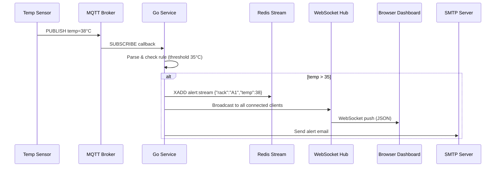

# เล่ม 3: การพัฒนาเชิงปฏิบัติ (Practical Development)
## บทที่ 1: การเชื่อมต่อ MQTT และรับข้อมูลแบบ Real-time สำหรับระบบ IoT Monitoring

### สรุปสั้นก่อนเริ่ม
ระบบ IoT Monitoring สำหรับ Data Center จำเป็นต้องรับข้อมูลจากเซนเซอร์หลายร้อยตัวแบบเรียลไทม์ MQTT (Message Queuing Telemetry Transport) เป็นโปรโตคอลมาตรฐานสำหรับ IoT ที่มีน้ำหนักเบา รองรับการทำงานบนเครือข่ายที่ไม่เสถียร และเหมาะกับการส่งข้อมูลจากอุปกรณ์ edge มาที่ server บทนี้จะอธิบายการออกแบบและพัฒนา **MQTT subscriber** ใน Go ที่รับข้อมูลจากเซนเซอร์ (temperature, humidity, water leak, smoke) ประมวลผลด้วย rule engine และส่งการแจ้งเตือนผ่านช่องทางต่างๆ (WebSocket, Email, Line) พร้อมตัวอย่างโค้ดที่รันได้จริง

---

## คำอธิบายแนวคิด (Concept Explanation)

### 1. MQTT คืออะไร? เหมาะกับ IoT อย่างไร?

MQTT เป็นโปรโตคอลสื่อสารแบบ publish-subscribe ที่ทำงานบน TCP/IP ออกแบบมาโดยเฉพาะสำหรับอุปกรณ์ที่มีทรัพยากรจำกัด (low bandwidth, high latency, unreliable network)

**ลักษณะสำคัญ:**
- **น้ำหนักเบา (lightweight)** – header เล็กเพียง 2 ไบต์
- **คุณภาพการบริการ (QoS)** – 0 (อย่างมากครั้งเดียว), 1 (อย่างน้อยครั้งเดียว), 2 (แน่นอนครั้งเดียว)
- **รักษา session (persistent session)** – เมื่อ reconnect จะรับข้อความที่ค้างไว้
- **Last Will and Testament (LWT)** – แจ้งเมื่ออุปกรณ์ disconnected โดยไม่ปกติ

**คำศัพท์ที่ต้องรู้:**
| ศัพท์ | ความหมาย |
|-------|----------|
| **Broker** | เซิร์ฟเวอร์กลางที่รับและกระจาย messages (เช่น Mosquitto, EMQX) |
| **Publisher** | อุปกรณ์ที่ส่งข้อมูล (เซนเซอร์) |
| **Subscriber** | อุปกรณ์หรือ service ที่รับข้อมูล (Go backend) |
| **Topic** | ช่องทางที่มีโครงสร้าง hierarchical เช่น `sensor/dc1/rack_a/temperature` |
| **Payload** | เนื้อหาข้อมูล (มักเป็น JSON หรือ binary) |

#### ประโยชน์ที่ได้รับ
- รองรับอุปกรณ์หลากหลาย (ESP32, Raspberry Pi, PLC)
- ประหยัดแบนด์วิธ เหมาะกับโรงงาน/Data Center ที่มีเซนเซอร์จำนวนมาก
- สามารถ buffer ข้อมูลเมื่อเครือข่ายขาด แล้วส่งเมื่อกลับมา

#### ข้อควรระวัง
- MQTT ไม่มีการเข้ารหัสในตัว ต้องใช้ TLS (MQTT over TLS)
- ต้องออกแบบ topic ให้ดี (อย่าใช้ wildcard มากเกินไป)

#### ข้อดี/ข้อเสีย
- **ข้อดี**: เร็ว, ประหยัด, รองรับ offline messaging
- **ข้อเสีย**: ไม่รองรับ request-response โดยตรง (ต้อง implement เอง), debugging ยากกว่า HTTP

#### ข้อห้าม
- ห้าม subscribe `#` (ทุก topic) บน broker ขนาดใหญ่ – อาจทำให้ระบบล่ม
- ห้ามส่ง payload ขนาดใหญ่ (> 256KB) – ไม่เหมาะกับ MQTT

---

### 2. การออกแบบ Topic Structure สำหรับ Data Center Monitoring

เราจะใช้โครงสร้าง topic แบบ 4 ระดับ:

```
cmom/dc/{dc_id}/{device_type}/{sensor_type}
```

**ตัวอย่าง:**
- `cmom/dc/bangkok-01/temperature/rack_a1` – อุณหภูมิ
- `cmom/dc/bangkok-01/humidity/rack_a1` – ความชื้น
- `cmom/dc/bangkok-01/water_leak/floor_1` – น้ำรั่ว
- `cmom/dc/bangkok-01/smoke/room_main` – ควัน
- `cmom/dc/bangkok-01/ups/power_load` – โหลด UPS
- `cmom/dc/bangkok-01/ac/status` – แอร์

**ประโยชน์ของโครงสร้างนี้:**
- Subscribe แบบ wildcard: `cmom/dc/bangkok-01/+/rack_a1` (รับทั้ง temp และ humidity ของ rack A1)
- แยกตามอุปกรณ์และประเภทข้อมูลได้ง่าย

---

### 3. Rule Engine (Condition Evaluation)

เมื่อได้รับค่าเซนเซอร์ เราต้องประเมินว่าค่าอยู่ในเกณฑ์ปกติ (Normal), เตือน (Warning) หรือวิกฤต (Alarm) แล้วดำเนินการตามที่ผู้ใช้กำหนด

**ตัวอย่างกฎ (Rule):**
```
IF temperature > 35 THEN 
    send_alert("ALARM", "email", "admin@example.com")
    send_alert("ALARM", "line", "line_token_xxx")
    digital_output(1, ON)   // เปิดพัดลมระบายอากาศ
```

**การ implement rule engine ใน Go:** ใช้ library `expr` หรือเขียน interpreter เอง แต่สำหรับระบบจริงควรเก็บกฎในฐานข้อมูลและประเมินผลแบบ dynamic

---

## การออกแบบ Workflow และ Dataflow

### Workflow รับข้อมูล MQTT → วิเคราะห์ → แจ้งเตือน

```mermaid
flowchart TB
    Sensor[Temperature Sensor] -->|MQTT Publish| Broker[MQTT Broker\n(EMQX/Mosquitto)]
    
    subgraph "Go Backend"
        Subscriber[MQTT Subscriber\n(go-mqtt client)] -->|Receive message| Parser[JSON Parser]
        Parser -->|Extract value| RuleEngine[Rule Engine]
        RuleEngine -->|Evaluate condition| Decision{Condition matched?}
        Decision -- No --> Ignore[Ignore]
        Decision -- Yes --> Action[Determine Alert Level\n& Actions]
        Action --> Email[Send Email via SMTP]
        Action --> Line[Send Line Notification]
        Action --> WebSocket[Push to WebSocket clients]
        Action --> DigitalOut[Control Digital Output\n(เปิด/ปิดอุปกรณ์)]
    end
    
    WebSocket --> Dashboard[Web Dashboard\nReal-time update]
```

**รูปที่ 8:** กระบวนการรับข้อมูล MQTT จากเซนเซอร์ ผ่าน broker เข้าสู่ Go backend ซึ่งทำการ parse, ประเมินกฎ, และแจ้งเตือนผ่านหลายช่องทาง

### Sequence Diagram: การแจ้งเตือนแบบ Real-time



**รูปที่ 9:** ลำดับการส่งข้อมูลและการแจ้งเตือนแบบ real-time ผ่าน WebSocket และ Email

---

## ตัวอย่างโค้ดที่รันได้จริง (Runnable Code Example)

เราจะสร้างระบบ MQTT subscriber ที่:
1. เชื่อมต่อกับ MQTT broker (EMQX หรือ Mosquitto)
2. Subscribe topic `cmom/dc/+/temperature/#` และ `cmom/dc/+/humidity/#`
3. ประเมินค่ากับ threshold ที่กำหนดใน config
4. เมื่อเกิน threshold ให้ส่ง alert ไปยัง Email และ WebSocket

### โครงสร้างไฟล์เพิ่มเติม

```bash
internal/
├── pkg/
│   ├── mqtt/
│   │   └── client.go          (MQTT connection manager)
│   ├── rule/
│   │   └── engine.go           (rule evaluation)
│   └── notifier/
│       ├── email.go
│       ├── line.go
│       └── websocket.go
├── delivery/
│   └── worker/
│       └── mqtt_worker.go      (background worker)
```

### 1. MQTT Client Wrapper

**internal/pkg/mqtt/client.go**
```go
package mqtt

import (
    "context"
    "encoding/json"
    "log"
    "time"
    mqtt "github.com/eclipse/paho.mqtt.golang"
)

// SensorData represents incoming sensor reading
// โครงสร้างข้อมูลที่เซนเซอร์ส่งมา (รูปแบบ JSON)
type SensorData struct {
    DeviceID    string    `json:"device_id"`
    SensorType  string    `json:"sensor_type"`  // temperature, humidity, water_leak
    Value       float64   `json:"value"`
    Unit        string    `json:"unit"`         // C, %, etc.
    Timestamp   time.Time `json:"timestamp"`
    Location    string    `json:"location"`     // rack, room, floor
}

// MessageHandler is called for each received MQTT message
type MessageHandler func(topic string, data *SensorData)

// Client wraps MQTT connection
type Client struct {
    client    mqtt.Client
    handler   MessageHandler
}

// NewClient creates and connects to MQTT broker
// สร้าง client และเชื่อมต่อไปยัง MQTT broker
func NewClient(brokerURL, clientID string, handler MessageHandler) (*Client, error) {
    opts := mqtt.NewClientOptions()
    opts.AddBroker(brokerURL)
    opts.SetClientID(clientID)
    opts.SetCleanSession(true)  // ไม่เก็บ session เก่า
    opts.SetAutoReconnect(true) // reconnect อัตโนมัติ
    opts.SetConnectTimeout(5 * time.Second)
    opts.SetOnConnectHandler(func(c mqtt.Client) {
        log.Println("MQTT connected")
    })
    opts.SetConnectionLostHandler(func(c mqtt.Client, err error) {
        log.Printf("MQTT connection lost: %v", err)
    })
    
    client := mqtt.NewClient(opts)
    if token := client.Connect(); token.Wait() && token.Error() != nil {
        return nil, token.Error()
    }
    
    return &Client{
        client:  client,
        handler: handler,
    }, nil
}

// Subscribe subscribes to a topic pattern
// ลงทะเบียนรับข้อความจาก topic pattern (รองรับ wildcard +, #)
func (c *Client) Subscribe(topicPattern string, qos byte) error {
    token := c.client.Subscribe(topicPattern, qos, func(client mqtt.Client, msg mqtt.Message) {
        // Parse payload JSON
        var data SensorData
        if err := json.Unmarshal(msg.Payload(), &data); err != nil {
            log.Printf("Failed to parse MQTT payload on topic %s: %v", msg.Topic(), err)
            return
        }
        // Call user handler
        if c.handler != nil {
            c.handler(msg.Topic(), &data)
        }
    })
    token.Wait()
    return token.Error()
}

// Publish sends a command to device (e.g., turn on fan)
// ส่งคำสั่งควบคุมอุปกรณ์ (เปิด/ปิดพัดลม, แอร์)
func (c *Client) Publish(topic string, payload interface{}) error {
    data, err := json.Marshal(payload)
    if err != nil {
        return err
    }
    token := c.client.Publish(topic, 1, false, data)
    token.Wait()
    return token.Error()
}

// Disconnect gracefully
func (c *Client) Disconnect() {
    c.client.Disconnect(250) // wait 250ms
}
```

### 2. Rule Engine (แบบง่าย พร้อมขยาย)

**internal/pkg/rule/engine.go**
```go
package rule

import (
    "log"
    "sync"
    "time"
)

// Condition represents a single rule condition
type Condition struct {
    SensorType string  `json:"sensor_type"` // temperature, humidity
    Operator   string  `json:"operator"`    // >, <, >=, <=, ==
    Threshold  float64 `json:"threshold"`
}

// Action defines what to do when condition matches
type Action struct {
    Type   string                 `json:"type"`   // email, line, digital_out, websocket
    Target string                 `json:"target"` // email address, line token, gpio pin
    Params map[string]interface{} `json:"params"`
}

// Rule combines conditions and actions
type Rule struct {
    ID          string      `json:"id"`
    Name        string      `json:"name"`
    Severity    string      `json:"severity"` // warning, alarm
    Conditions  []Condition `json:"conditions"`
    Actions     []Action    `json:"actions"`
    CooldownSec int         `json:"cooldown_sec"` // prevent spam
}

// RuleEngine evaluates rules against incoming sensor data
type RuleEngine struct {
    rules      []Rule
    lastTrigger map[string]time.Time // rule_id -> last trigger time
    mu         sync.RWMutex
}

func NewRuleEngine() *RuleEngine {
    return &RuleEngine{
        rules:       make([]Rule, 0),
        lastTrigger: make(map[string]time.Time),
    }
}

// AddRule adds or updates a rule
func (e *RuleEngine) AddRule(rule Rule) {
    e.mu.Lock()
    defer e.mu.Unlock()
    e.rules = append(e.rules, rule)
}

// Evaluate checks all rules against sensor reading
// ตรวจสอบว่าค่า sensor ตรงกับเงื่อนไขใดบ้าง
func (e *RuleEngine) Evaluate(sensorType string, value float64) []Action {
    e.mu.RLock()
    defer e.mu.RUnlock()
    
    var matchedActions []Action
    now := time.Now()
    
    for _, rule := range e.rules {
        // Check if rule applies to this sensor type
        conditionMatched := false
        for _, cond := range rule.Conditions {
            if cond.SensorType != sensorType {
                continue
            }
            switch cond.Operator {
            case ">":
                conditionMatched = value > cond.Threshold
            case "<":
                conditionMatched = value < cond.Threshold
            case ">=":
                conditionMatched = value >= cond.Threshold
            case "<=":
                conditionMatched = value <= cond.Threshold
            case "==":
                conditionMatched = value == cond.Threshold
            }
            if conditionMatched {
                break
            }
        }
        
        if !conditionMatched {
            continue
        }
        
        // Check cooldown
        last, exists := e.lastTrigger[rule.ID]
        if exists && now.Sub(last).Seconds() < float64(rule.CooldownSec) {
            continue // still in cooldown
        }
        
        // Update last trigger
        e.lastTrigger[rule.ID] = now
        matchedActions = append(matchedActions, rule.Actions...)
        log.Printf("Rule triggered: %s (severity=%s, value=%.2f)", rule.Name, rule.Severity, value)
    }
    return matchedActions
}
```

### 3. Notifier (Email + Line + WebSocket)

**internal/pkg/notifier/email.go**
```go
package notifier

import (
    "fmt"
    "net/smtp"
)

type EmailConfig struct {
    Host     string
    Port     int
    Username string
    Password string
    From     string
}

type EmailNotifier struct {
    cfg EmailConfig
}

func NewEmailNotifier(cfg EmailConfig) *EmailNotifier {
    return &EmailNotifier{cfg: cfg}
}

func (n *EmailNotifier) Send(to, subject, body string) error {
    addr := fmt.Sprintf("%s:%d", n.cfg.Host, n.cfg.Port)
    auth := smtp.PlainAuth("", n.cfg.Username, n.cfg.Password, n.cfg.Host)
    msg := fmt.Sprintf("From: %s\r\nTo: %s\r\nSubject: %s\r\n\r\n%s", 
        n.cfg.From, to, subject, body)
    return smtp.SendMail(addr, auth, n.cfg.From, []string{to}, []byte(msg))
}
```

**internal/pkg/notifier/line.go**
```go
package notifier

import (
    "bytes"
    "encoding/json"
    "net/http"
)

type LineNotifier struct {
    token string
}

func NewLineNotifier(token string) *LineNotifier {
    return &LineNotifier{token: token}
}

func (l *LineNotifier) Send(message string) error {
    url := "https://notify-api.line.me/api/notify"
    body := []byte("message=" + message)
    req, _ := http.NewRequest("POST", url, bytes.NewBuffer(body))
    req.Header.Set("Authorization", "Bearer "+l.token)
    req.Header.Set("Content-Type", "application/x-www-form-urlencoded")
    client := &http.Client{}
    resp, err := client.Do(req)
    if err != nil {
        return err
    }
    defer resp.Body.Close()
    return nil
}
```

**internal/pkg/notifier/websocket.go** (Hub สำหรับ broadcast)
```go
package notifier

import (
    "encoding/json"
    "net/http"
    "sync"
    "github.com/gorilla/websocket"
)

var upgrader = websocket.Upgrader{
    CheckOrigin: func(r *http.Request) bool { return true },
}

type WebSocketMessage struct {
    Type    string      `json:"type"`    // alert, sensor_update
    Payload interface{} `json:"payload"`
}

type WebSocketHub struct {
    clients    map[*websocket.Conn]bool
    broadcast  chan []byte
    register   chan *websocket.Conn
    unregister chan *websocket.Conn
    mu         sync.Mutex
}

func NewWebSocketHub() *WebSocketHub {
    return &WebSocketHub{
        clients:    make(map[*websocket.Conn]bool),
        broadcast:  make(chan []byte),
        register:   make(chan *websocket.Conn),
        unregister: make(chan *websocket.Conn),
    }
}

func (h *WebSocketHub) Run() {
    for {
        select {
        case conn := <-h.register:
            h.mu.Lock()
            h.clients[conn] = true
            h.mu.Unlock()
        case conn := <-h.unregister:
            h.mu.Lock()
            delete(h.clients, conn)
            conn.Close()
            h.mu.Unlock()
        case msg := <-h.broadcast:
            h.mu.Lock()
            for conn := range h.clients {
                conn.WriteMessage(websocket.TextMessage, msg)
            }
            h.mu.Unlock()
        }
    }
}

func (h *WebSocketHub) BroadcastAlert(alertType, message string) {
    data, _ := json.Marshal(WebSocketMessage{
        Type:    "alert",
        Payload: map[string]string{"type": alertType, "message": message},
    })
    h.broadcast <- data
}

// WebSocket handler
func (h *WebSocketHub) ServeWS(w http.ResponseWriter, r *http.Request) {
    conn, err := upgrader.Upgrade(w, r, nil)
    if err != nil {
        return
    }
    h.register <- conn
    defer func() { h.unregister <- conn }()
    // Keep connection alive (read loop)
    for {
        _, _, err := conn.ReadMessage()
        if err != nil {
            break
        }
    }
}
```

### 4. MQTT Worker (ประสานทุกอย่าง)

**internal/delivery/worker/mqtt_worker.go**
```go
package worker

import (
    "context"
    "log"
    "time"
    "gobackend-demo/internal/pkg/mqtt"
    "gobackend-demo/internal/pkg/notifier"
    "gobackend-demo/internal/pkg/rule"
)

type MQTTWorker struct {
    mqttClient  *mqtt.Client
    ruleEngine  *rule.RuleEngine
    emailNotif  *notifier.EmailNotifier
    lineNotif   *notifier.LineNotifier
    wsHub       *notifier.WebSocketHub
    thresholds  map[string]float64 // sensor type -> warning threshold
}

func NewMQTTWorker(brokerURL string, emailCfg notifier.EmailConfig, lineToken string) (*MQTTWorker, error) {
    worker := &MQTTWorker{
        thresholds: make(map[string]float64),
    }
    // Setup notifiers
    worker.emailNotif = notifier.NewEmailNotifier(emailCfg)
    worker.lineNotif = notifier.NewLineNotifier(lineToken)
    worker.wsHub = notifier.NewWebSocketHub()
    go worker.wsHub.Run()
    
    // Setup rule engine with predefined rules
    worker.ruleEngine = rule.NewRuleEngine()
    worker.ruleEngine.AddRule(rule.Rule{
        ID:       "temp_high_alarm",
        Name:     "High Temperature Alarm",
        Severity: "alarm",
        Conditions: []rule.Condition{
            {SensorType: "temperature", Operator: ">", Threshold: 35},
        },
        Actions: []rule.Action{
            {Type: "email", Target: "admin@datacenter.com"},
            {Type: "line", Target: lineToken},
            {Type: "websocket", Target: ""},
            {Type: "digital_out", Target: "gpio_17", Params: map[string]interface{}{"state": "on"}},
        },
        CooldownSec: 300, // 5 minutes
    })
    worker.ruleEngine.AddRule(rule.Rule{
        ID:       "temp_warning",
        Name:     "Temperature Warning",
        Severity: "warning",
        Conditions: []rule.Condition{
            {SensorType: "temperature", Operator: ">", Threshold: 30},
            {SensorType: "temperature", Operator: "<=", Threshold: 35},
        },
        Actions: []rule.Action{
            {Type: "email", Target: "operator@datacenter.com"},
            {Type: "websocket", Target: ""},
        },
        CooldownSec: 600,
    })
    
    // MQTT message handler
    handler := func(topic string, data *mqtt.SensorData) {
        log.Printf("Received: %s = %.2f %s", data.SensorType, data.Value, data.Unit)
        
        // Evaluate rules
        actions := worker.ruleEngine.Evaluate(data.SensorType, data.Value)
        
        for _, act := range actions {
            switch act.Type {
            case "email":
                subject := fmt.Sprintf("[%s] %s", act.Type, data.SensorType)
                body := fmt.Sprintf("Value: %.2f %s at %s", data.Value, data.Unit, data.Location)
                worker.emailNotif.Send(act.Target, subject, body)
            case "line":
                msg := fmt.Sprintf("⚠️ Alert: %s = %.2f %s at %s", data.SensorType, data.Value, data.Unit, data.Location)
                worker.lineNotif.Send(msg)
            case "websocket":
                worker.wsHub.BroadcastAlert(data.SensorType, fmt.Sprintf("%.2f %s", data.Value, data.Unit))
            case "digital_out":
                // ควบคุมอุปกรณ์ผ่าน GPIO หรือ HTTP API
                log.Printf("Digital output %s set to %v", act.Target, act.Params["state"])
            }
        }
    }
    
    client, err := mqtt.NewClient(brokerURL, "go-backend-worker", handler)
    if err != nil {
        return nil, err
    }
    worker.mqttClient = client
    return worker, nil
}

func (w *MQTTWorker) Start(ctx context.Context) error {
    // Subscribe to all sensor topics
    topics := []string{
        "cmom/dc/+/temperature/+",
        "cmom/dc/+/humidity/+",
        "cmom/dc/+/water_leak/+",
        "cmom/dc/+/smoke/+",
    }
    for _, topic := range topics {
        if err := w.mqttClient.Subscribe(topic, 1); err != nil {
            return err
        }
        log.Printf("Subscribed to %s", topic)
    }
    
    <-ctx.Done() // wait for cancellation
    w.mqttClient.Disconnect()
    return nil
}
```

### 5. การเปิด WebSocket endpoint ใน HTTP server

```go
// ใน router.go เพิ่ม:
func SetupRouter(..., wsHub *notifier.WebSocketHub) *chi.Mux {
    // ...
    r.Get("/ws", wsHub.ServeWS)
    // ...
}
```

### 6. ตัวอย่างการรัน MQTT worker

```go
// cmd/worker.go (CLI command)
package main

import (
    "context"
    "log"
    "os/signal"
    "syscall"
    "gobackend-demo/internal/delivery/worker"
)

func main() {
    ctx, cancel := signal.NotifyContext(context.Background(), syscall.SIGINT, syscall.SIGTERM)
    defer cancel()
    
    emailCfg := notifier.EmailConfig{
        Host: "smtp.gmail.com",
        Port: 587,
        Username: os.Getenv("SMTP_USER"),
        Password: os.Getenv("SMTP_PASS"),
        From: "alerts@cmom.com",
    }
    
    mqttWorker, err := worker.NewMQTTWorker("tcp://localhost:1883", emailCfg, os.Getenv("LINE_TOKEN"))
    if err != nil {
        log.Fatal(err)
    }
    
    if err := mqttWorker.Start(ctx); err != nil {
        log.Fatal(err)
    }
}
```

---

## กรณีศึกษาและแนวทางแก้ไขปัญหา

### ปัญหา: MQTT broker overload เนื่องจากอุปกรณ์ publish ถี่เกินไป
**แนวทางแก้ไข:**
- ใช้ QoS 0 สำหรับข้อมูลที่ไม่สำคัญ (temperature ทุกวินาที) และ QoS 1 สำหรับ alert
- กำหนด rate limit ที่ broker (EMQX มี feature rate limit)
- ใน subscriber side ใช้ channel buffer และ worker pool เพื่อประมวลผล asynchronous

### ปัญหา: Alert ส่งซ้ำบ่อยเกินไป (spam)
**แนวทางแก้ไข:** ใช้ cooldown period ใน rule engine (ดังตัวอย่าง) และ debounce logic (ส่ง alert เมื่อค่าเกิน threshold ติดต่อกัน 3 ครั้ง)

### ปัญหา: WebSocket connection ขาดหาย
**แนวทางแก้ไข:** Client ต้อง implement reconnection mechanism (exponential backoff) และ server ต้อง heartbeat

---

## ตารางสรุป MQTT QoS Levels

| QoS | ความหมาย | ใช้เมื่อ | ข้อเสีย |
|-----|----------|---------|---------|
| 0 | At most once (fire and forget) | ข้อมูลที่ไม่สำคัญ, สูญเสียได้ | อาจสูญเสียข้อความ |
| 1 | At least once (acknowledged) | ข้อมูลสำคัญ แต่รับซ้ำได้ | อาจมี duplicate |
| 2 | Exactly once (handshake 4 steps) | ข้อมูลห้ามสูญเสียและห้ามซ้ำ | ช้าที่สุด |

---

## แบบฝึกหัดท้ายบท (3 ข้อ)

1. **เพิ่ม QoS 2** สำหรับ sensor ประเภทน้ำรั่วและควันไฟ ปรับปรุง subscriber ให้ handle duplicate messages (ใช้ message ID deduplication)

2. **สร้าง rule engine แบบ dynamic** ที่อ่านกฎจาก PostgreSQL แทน hardcode (implement repository สำหรับ rule) และเพิ่ม API สำหรับ CRUD rules

3. **Implement digital output control** ผ่าน HTTP API ของอุปกรณ์ edge (เช่น สั่งเปิดพัดลมเมื่ออุณหภูมิเกิน 35°C) โดยเพิ่ม action type `http_request`

---

## แหล่งอ้างอิง (References)

- MQTT Specification: [https://mqtt.org/mqtt-specification/](https://mqtt.org/mqtt-specification/)
- Eclipse Paho Go client: [https://github.com/eclipse/paho.mqtt.golang](https://github.com/eclipse/paho.mqtt.golang)
- EMQX Broker: [https://www.emqx.io/](https://www.emqx.io/)
- Rule engine design patterns: [https://martinfowler.com/bliki/RulesEngine.html](https://martinfowler.com/bliki/RulesEngine.html)
- Line Notify API: [https://notify-bot.line.me/doc/en/](https://notify-bot.line.me/doc/en/)

---

**หมายเหตุ:** บทนี้เป็นบทแรกของเล่ม 3 (การพัฒนาเชิงปฏิบัติ) ที่เน้นการเชื่อมต่อ MQTT และ real-time alert ตาม requirement ของ CMON IoT Solution แล้ว หากต้องการให้ดำเนินการต่อใน **เล่ม 3 บทที่ 2: Web Dashboard (Real-time charts และการแสดงผล)** หรือ **เล่ม 3 บทที่ 3: Scheduler และ Automation (ตั้งเวลาสั่งงานอัตโนมัติ)** โปรดแจ้ง

**ท่านต้องการให้ดำเนินการต่อที่ส่วนใด?**