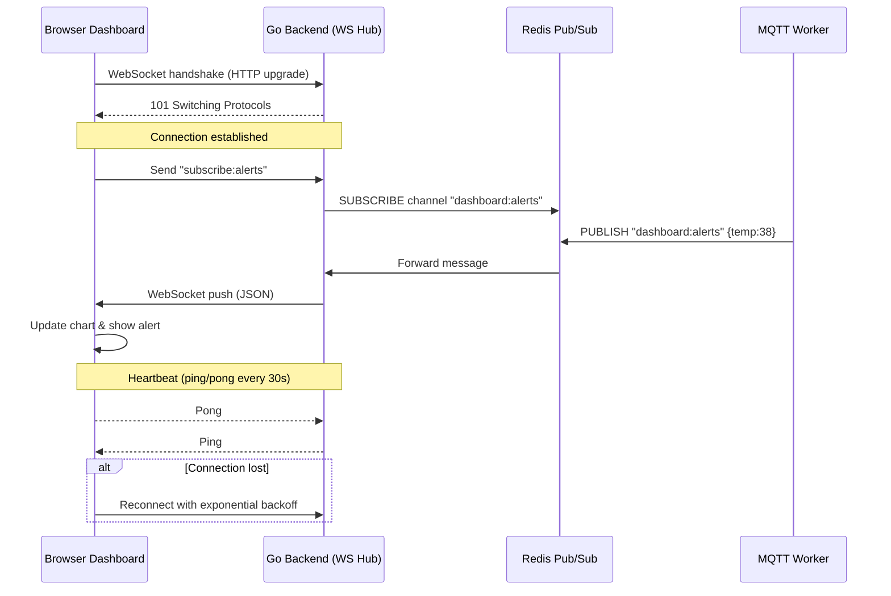

# เล่ม 3: การพัฒนาเชิงปฏิบัติ (Practical Development)
## บทที่ 2: Web Dashboard และ Real-time Visualization ด้วย WebSocket

### สรุปสั้นก่อนเริ่ม
ระบบ IoT Monitoring จะสมบูรณ์ไม่ได้หากขาด **Dashboard** ที่แสดงข้อมูลแบบ Real-time เนื่องจากเจ้าหน้าที่ต้องสามารถเห็นสถานะของเซนเซอร์และการแจ้งเตือนได้ทันที บทนี้จะอธิบายการออกแบบและพัฒนา Web Dashboard ที่เชื่อมต่อกับ Go backend ผ่าน **WebSocket** เพื่อรับข้อมูลอัปเดตแบบทันที (push notification) และใช้ **Chart.js** หรือ **ECharts** ในการแสดงกราฟแนวโน้ม พร้อมทั้งระบบแสดงการแจ้งเตือนแบบ pop-up และตารางประวัติเหตุการณ์ โดยสามารถนำไปใช้จริงใน Data Center ได้

---

## คำอธิบายแนวคิด (Concept Explanation)

### 1. WebSocket คืออะไร? ต่างจาก HTTP อย่างไร?

**WebSocket** เป็นโปรโตคอลที่ให้การสื่อสารสองทาง (full-duplex) ตลอดเวลา (persistent connection) ระหว่าง client (browser) และ server แตกต่างจาก HTTP ที่เป็น request-response และต้องสร้าง connection ใหม่ทุกครั้ง

| คุณสมบัติ | HTTP (REST) | WebSocket |
|-----------|-------------|------------|
| **รูปแบบ** | Request-Response | Bidirectional (สองทาง) |
| **Connection** | เปิดใหม่ทุกครั้ง | Persistent (อยู่ได้นาน) |
| **Server push** | ต้องใช้ polling / SSE | รองรับโดยธรรมชาติ |
| **Overhead** | สูง (headers) | ต่ำ (หลัง handshake) |
| **เหมาะกับ** | CRUD, การเรียกข้อมูลครั้งเดียว | Real-time, chat, gaming, IoT dashboard |

**ในระบบของเรา:** WebSocket ใช้เพื่อ push การแจ้งเตือนและค่าสัญญาณเซนเซอร์จาก server ไปยัง browser ทันทีที่ได้รับจาก MQTT (latency < 100ms)

#### ประโยชน์ที่ได้รับ
- ไม่ต้องให้ client สอบถามข้อมูลซ้ำๆ (polling) ช่วยลดภาระ server และเครือข่าย
- การแจ้งเตือนถึงหน้าจอทันที (real-time popup)
- แสดงกราฟที่อัปเดตแบบ smooth

#### ข้อควรระวัง
- WebSocket connections ใช้ทรัพยากร server สูงกว่า HTTP (ต้องจัดการ connection state)
- ต้องมีกลไก reconnect เมื่อ connection หลุด
- ไม่เหมาะกับข้อมูลที่ไม่ต้องการ real-time (ควรใช้ HTTP แทน)

#### ข้อดี/ข้อเสีย
- **ข้อดี**: real-time, ประหยัด bandwidth, รับ push ได้
- **ข้อเสีย**: ซับซ้อนกว่า REST, ต้องจัดการ scaling (sticky session หรือ pub/sub)

#### ข้อห้าม
- ห้ามส่งข้อมูลใหญ่เกินไปทาง WebSocket (แยกใช้ HTTP upload/download)
- ห้ามเปิด connection ค้างไว้เกิน 24 ชั่วโมงโดยไม่มี heartbeat

---

### 2. Real-time Dashboard Architecture

Dashboard ของเราจะประกอบด้วย:
1. **ตัวแสดงสถานะปัจจุบัน (Current Status Cards)** – แสดงอุณหภูมิ, ความชื้น, สถานะน้ำรั่ว, ควัน
2. **กราฟแนวโน้ม (Time-series Chart)** – แสดงค่าล่าสุด 1 ชั่วโมง (อัปเดตทุก 5-10 วินาที)
3. **ตารางการแจ้งเตือน (Alert Table)** – แสดงประวัติการแจ้งเตือนพร้อม timestamp และระดับความรุนแรง
4. **การควบคุมอุปกรณ์ (Device Control Panel)** – ปุ่มเปิด/ปิดพัดลม, แอร์ (ผ่าน HTTP API หรือ MQTT)

**สถาปัตยกรรม:**
```
Browser (Dashboard)
   │ WebSocket (wss://)
   ▼
Go Backend (WebSocket Hub)
   │ Internal channel
   ▼
MQTT Worker / Rule Engine
   │
   ▼
MQTT Broker ← Sensor data
```

---

## การออกแบบ Workflow และ Dataflow

### Workflow: WebSocket Connection Lifecycle



**รูปที่ 10:** ลำดับการสร้าง WebSocket connection, subscribe ไปยัง Redis channel, และรับ push notification จาก MQTT worker

### Dataflow: จาก MQTT สู่หน้าจอ Dashboard

```mermaid
flowchart LR
    Sensor[MQTT Sensor] --> Broker[MQTT Broker]
    Broker --> Worker[Go MQTT Worker]
    Worker -->|sensor data| RuleEngine[Rule Engine]
    RuleEngine -->|alert if needed| Notifier[Notifier]
    Notifier -->|publish to Redis| Redis[(Redis Pub/Sub)]
    Redis -->|forward| WSHub[WebSocket Hub]
    WSHub -->|push JSON| Browser[Browser Dashboard]
    
    Browser -->|HTTP GET /api/sensors/history| API[HTTP Handler]
    API -->|query| PostgreSQL[(PostgreSQL)]
    PostgreSQL -->|historical data| API
    API -->|JSON| Browser
```



**รูปที่ 11:** การไหลของข้อมูลจากเซนเซอร์ผ่าน MQTT, worker, rule engine, notifier, Redis Pub/Sub, WebSocket hub ไปยัง browser พร้อมกับการดึงข้อมูลประวัติผ่าน HTTP API

---

## ตัวอย่างโค้ดที่รันได้จริง (Runnable Code Example)

เราจะสร้าง:
1. **WebSocket Hub** ที่รองรับการ broadcast ไปยัง client ทั้งหมด (หรือแยกตามห้อง/อุปกรณ์)
2. **HTTP API** สำหรับดึงข้อมูลประวัติ (จาก PostgreSQL) และควบคุมอุปกรณ์
3. **HTML Dashboard** (พร้อม JavaScript) ที่เชื่อมต่อ WebSocket, แสดง Real-time Chart (Chart.js), ตารางการแจ้งเตือน, และปุ่มควบคุมอุปกรณ์

### 1. WebSocket Hub ที่รองรับ Redis Pub/Sub (Horizontal Scaling)

**internal/pkg/websocket/hub.go** (ขยายจากบทที่แล้ว)
```go
package websocket

import (
    "encoding/json"
    "log"
    "net/http"
    "sync"
    "github.com/gorilla/websocket"
    "github.com/redis/go-redis/v9"
    "context"
)

// Message structure sent over WebSocket
type WSMessage struct {
    Type    string      `json:"type"`    // "sensor_update", "alert", "ping"
    Payload interface{} `json:"payload"`
}

// Client represents a single WebSocket connection
type Client struct {
    conn *websocket.Conn
    send chan []byte
    hub  *Hub
}

// Hub maintains the set of active clients and broadcasts messages
type Hub struct {
    clients    map[*Client]bool
    broadcast  chan []byte   // message to broadcast to all clients
    register   chan *Client
    unregister chan *Client
    mu         sync.RWMutex
    redis      *redis.Client // for cross-instance pub/sub
    ctx        context.Context
}

func NewHub(redisClient *redis.Client) *Hub {
    hub := &Hub{
        clients:    make(map[*Client]bool),
        broadcast:  make(chan []byte),
        register:   make(chan *Client),
        unregister: make(chan *Client),
        redis:      redisClient,
        ctx:        context.Background(),
    }
    // Start Redis subscriber for cross-instance messages
    go hub.redisSubscriber()
    return hub
}

// redisSubscriber listens to Redis channel and forwards to local broadcast
func (h *Hub) redisSubscriber() {
    pubsub := h.redis.Subscribe(h.ctx, "dashboard:broadcast")
    defer pubsub.Close()
    ch := pubsub.Channel()
    for msg := range ch {
        // Message received from another Go instance, broadcast locally
        h.broadcast <- []byte(msg.Payload)
    }
}

// Run starts the hub's main loop
func (h *Hub) Run() {
    for {
        select {
        case client := <-h.register:
            h.mu.Lock()
            h.clients[client] = true
            h.mu.Unlock()
            log.Println("WebSocket client registered, total:", len(h.clients))

        case client := <-h.unregister:
            h.mu.Lock()
            if _, ok := h.clients[client]; ok {
                delete(h.clients, client)
                close(client.send)
            }
            h.mu.Unlock()
            log.Println("WebSocket client unregistered")

        case message := <-h.broadcast:
            h.mu.RLock()
            for client := range h.clients {
                select {
                case client.send <- message:
                default:
                    close(client.send)
                    delete(h.clients, client)
                }
            }
            h.mu.RUnlock()
        }
    }
}

// BroadcastToAll sends a message to all connected clients
func (h *Hub) BroadcastToAll(message []byte) {
    // Also publish to Redis so other instances receive it
    h.redis.Publish(h.ctx, "dashboard:broadcast", message)
    // Local broadcast
    h.broadcast <- message
}

// ServeWS upgrades HTTP to WebSocket
func (h *Hub) ServeWS(w http.ResponseWriter, r *http.Request) {
    upgrader := websocket.Upgrader{
        CheckOrigin: func(r *http.Request) bool { return true }, // 在生产环境需限制
        ReadBufferSize:  1024,
        WriteBufferSize: 1024,
    }
    conn, err := upgrader.Upgrade(w, r, nil)
    if err != nil {
        log.Println("WebSocket upgrade error:", err)
        return
    }
    client := &Client{conn: conn, send: make(chan []byte, 256), hub: h}
    h.register <- client

    // Start goroutines to read/write
    go client.writePump()
    go client.readPump()
}

// writePump pumps messages from the hub to the WebSocket connection
func (c *Client) writePump() {
    defer func() {
        c.conn.Close()
    }()
    for {
        select {
        case message, ok := <-c.send:
            if !ok {
                c.conn.WriteMessage(websocket.CloseMessage, []byte{})
                return
            }
            c.conn.SetWriteDeadline(time.Now().Add(10 * time.Second))
            if err := c.conn.WriteMessage(websocket.TextMessage, message); err != nil {
                return
            }
        }
    }
}

// readPump handles incoming messages from client (e.g., subscribe commands)
func (c *Client) readPump() {
    defer func() {
        c.hub.unregister <- c
        c.conn.Close()
    }()
    c.conn.SetReadLimit(512)
    c.conn.SetReadDeadline(time.Now().Add(60 * time.Second))
    c.conn.SetPongHandler(func(string) error {
        c.conn.SetReadDeadline(time.Now().Add(60 * time.Second))
        return nil
    })
    for {
        _, message, err := c.conn.ReadMessage()
        if err != nil {
            break
        }
        // Handle client message (e.g., subscribe to specific sensor)
        var msg map[string]interface{}
        if err := json.Unmarshal(message, &msg); err == nil {
            if msg["type"] == "ping" {
                c.conn.WriteMessage(websocket.PongMessage, []byte{})
            }
        }
    }
}
```

### 2. HTTP API สำหรับ Dashboard

**internal/delivery/rest/handler/dashboard_handler.go**
```go
package handler

import (
    "encoding/json"
    "net/http"
    "strconv"
    "time"
    "gobackend-demo/internal/models"
    "gorm.io/gorm"
)

type DashboardHandler struct {
    db *gorm.DB
}

func NewDashboardHandler(db *gorm.DB) *DashboardHandler {
    return &DashboardHandler{db: db}
}

// SensorHistoryResponse for time-series data
type SensorHistoryResponse struct {
    Timestamp time.Time `json:"timestamp"`
    Value     float64   `json:"value"`
}

// GetTemperatureHistory returns last N records for a rack
// GET /api/sensors/temperature/history?rack=rack_a1&limit=100
func (h *DashboardHandler) GetTemperatureHistory(w http.ResponseWriter, r *http.Request) {
    rack := r.URL.Query().Get("rack")
    limitStr := r.URL.Query().Get("limit")
    limit := 100
    if limitStr != "" {
        if l, err := strconv.Atoi(limitStr); err == nil && l > 0 && l <= 1000 {
            limit = l
        }
    }
    
    var records []struct {
        Timestamp time.Time
        Value     float64
    }
    // สมมติมีตาราง sensor_logs (id, rack, sensor_type, value, created_at)
    query := h.db.Table("sensor_logs").
        Select("created_at as timestamp, value").
        Where("rack = ? AND sensor_type = ?", rack, "temperature").
        Order("created_at DESC").
        Limit(limit)
    
    if err := query.Scan(&records).Error; err != nil {
        http.Error(w, err.Error(), http.StatusInternalServerError)
        return
    }
    
    // Reverse to chronological order (oldest first)
    for i, j := 0, len(records)-1; i < j; i, j = i+1, j-1 {
        records[i], records[j] = records[j], records[i]
    }
    
    w.Header().Set("Content-Type", "application/json")
    json.NewEncoder(w).Encode(records)
}

// ControlDevice handles POST request to turn on/off fan/AC
// POST /api/devices/control
type ControlRequest struct {
    DeviceID string `json:"device_id"` // fan_01, ac_02
    Action   string `json:"action"`    // on, off
}

func (h *DashboardHandler) ControlDevice(w http.ResponseWriter, r *http.Request) {
    var req ControlRequest
    if err := json.NewDecoder(r.Body).Decode(&req); err != nil {
        http.Error(w, "Invalid request", http.StatusBadRequest)
        return
    }
    
    // ส่งคำสั่งไปยัง MQTT topic (publish)
    // ตัวอย่าง: publish to "cmom/dc/bkk01/command/fan_01" payload {"action":"on"}
    // เรียกใช้ mqttClient.Publish (ต้อง inject mqtt client มา)
    // สำหรับตัวอย่างนี้ให้ log
    log.Printf("Control device: %s action=%s", req.DeviceID, req.Action)
    
    w.WriteHeader(http.StatusOK)
    json.NewEncoder(w).Encode(map[string]string{"status": "command sent"})
}
```

### 3. การประกอบใน main.go (เพิ่ม WebSocket และ routes)

```go
// ใน main.go หรือ router.go
func SetupRouter(db *gorm.DB, redisClient *redis.Client, mqttClient *mqtt.Client) *chi.Mux {
    r := chi.NewRouter()
    // ... middleware

    // WebSocket hub
    wsHub := websocket.NewHub(redisClient)
    go wsHub.Run()
    r.Get("/ws", wsHub.ServeWS)

    // HTTP API
    dashboardHandler := handler.NewDashboardHandler(db)
    r.Get("/api/sensors/temperature/history", dashboardHandler.GetTemperatureHistory)
    r.Post("/api/devices/control", dashboardHandler.ControlDevice)
    
    // Static files (HTML, JS, CSS)
    fileServer := http.FileServer(http.Dir("./static"))
    r.Handle("/*", fileServer)
    
    return r
}
```

### 4. Frontend Dashboard (HTML + JavaScript)

**static/index.html** (ตัวอย่าง完整หน้า Dashboard)
```html
<!DOCTYPE html>
<html>
<head>
    <title>CMON IoT Dashboard - Data Center Monitoring</title>
    <script src="https://cdn.jsdelivr.net/npm/chart.js"></script>
    <style>
        body { font-family: Arial, sans-serif; margin: 20px; background: #f0f2f5; }
        .dashboard { display: grid; grid-template-columns: repeat(4, 1fr); gap: 20px; }
        .card { background: white; border-radius: 8px; padding: 15px; box-shadow: 0 2px 4px rgba(0,0,0,0.1); }
        .temp-card { border-left: 5px solid #ff6b6b; }
        .humidity-card { border-left: 5px solid #4ecdc4; }
        .alert-card { border-left: 5px solid #ff4757; }
        .value { font-size: 32px; font-weight: bold; }
        .unit { font-size: 16px; color: gray; }
        .alert-list { max-height: 300px; overflow-y: auto; }
        .alert-item { padding: 8px; border-bottom: 1px solid #ddd; }
        .alert-warning { background: #fff3cd; border-left: 4px solid #ffc107; }
        .alert-alarm { background: #f8d7da; border-left: 4px solid #dc3545; }
        button { background: #007bff; color: white; border: none; padding: 8px 16px; border-radius: 4px; cursor: pointer; }
        button:hover { background: #0056b3; }
    </style>
</head>
<body>
    <h1>📊 Data Center Environmental Monitoring</h1>
    
    <div class="dashboard">
        <div class="card temp-card">
            <h3>🌡️ Rack A1 Temperature</h3>
            <div><span id="temp_value" class="value">--</span><span class="unit"> °C</span></div>
            <div>Status: <span id="temp_status">Normal</span></div>
        </div>
        <div class="card humidity-card">
            <h3>💧 Rack A1 Humidity</h3>
            <div><span id="humi_value" class="value">--</span><span class="unit"> %</span></div>
        </div>
        <div class="card">
            <h3>💧 Water Leak</h3>
            <div id="water_status">✅ No leak</div>
        </div>
        <div class="card">
            <h3>🔥 Smoke Detection</h3>
            <div id="smoke_status">✅ Normal</div>
        </div>
    </div>
    
    <div style="display: flex; gap: 20px; margin-top: 20px;">
        <div class="card" style="flex: 2;">
            <h3>Temperature Trend (Last Hour)</h3>
            <canvas id="tempChart" width="400" height="200"></canvas>
        </div>
        <div class="card" style="flex: 1;">
            <h3>Device Control</h3>
            <button onclick="controlDevice('fan_01', 'on')">🔛 Turn On Fan</button>
            <button onclick="controlDevice('fan_01', 'off')">🔴 Turn Off Fan</button>
            <button onclick="controlDevice('ac_01', 'on')">❄️ Turn On AC</button>
            <p id="control_status"></p>
        </div>
    </div>
    
    <div class="card" style="margin-top: 20px;">
        <h3>🔔 Recent Alerts</h3>
        <div id="alert_list" class="alert-list">
            <div>Waiting for data...</div>
        </div>
    </div>
    
    <script>
        // WebSocket connection
        let ws;
        let tempChart;
        
        function connectWebSocket() {
            ws = new WebSocket("ws://localhost:8080/ws");
            ws.onopen = function() {
                console.log("WebSocket connected");
                document.getElementById("control_status").innerText = "Connected";
            };
            ws.onmessage = function(event) {
                const data = JSON.parse(event.data);
                console.log("WS message:", data);
                if (data.type === "sensor_update") {
                    updateSensorUI(data.payload);
                    addToChart(data.payload);
                } else if (data.type === "alert") {
                    addAlert(data.payload);
                }
            };
            ws.onclose = function() {
                console.log("WebSocket disconnected, reconnecting in 3s...");
                setTimeout(connectWebSocket, 3000);
            };
            ws.onerror = function(err) {
                console.error("WebSocket error", err);
            };
        }
        
        function updateSensorUI(payload) {
            if (payload.sensor_type === "temperature") {
                document.getElementById("temp_value").innerText = payload.value;
                let statusSpan = document.getElementById("temp_status");
                if (payload.value > 35) {
                    statusSpan.innerText = "⚠️ ALARM";
                    statusSpan.style.color = "red";
                } else if (payload.value > 30) {
                    statusSpan.innerText = "⚠️ Warning";
                    statusSpan.style.color = "orange";
                } else {
                    statusSpan.innerText = "Normal";
                    statusSpan.style.color = "green";
                }
            } else if (payload.sensor_type === "humidity") {
                document.getElementById("humi_value").innerText = payload.value;
            } else if (payload.sensor_type === "water_leak") {
                let leakDiv = document.getElementById("water_status");
                if (payload.value === 1) {
                    leakDiv.innerHTML = "💧 WATER LEAK DETECTED!";
                    leakDiv.style.color = "red";
                } else {
                    leakDiv.innerHTML = "✅ No leak";
                    leakDiv.style.color = "green";
                }
            } else if (payload.sensor_type === "smoke") {
                let smokeDiv = document.getElementById("smoke_status");
                if (payload.value === 1) {
                    smokeDiv.innerHTML = "🔥 SMOKE DETECTED!";
                    smokeDiv.style.color = "red";
                } else {
                    smokeDiv.innerHTML = "✅ Normal";
                    smokeDiv.style.color = "green";
                }
            }
        }
        
        function addAlert(alert) {
            const alertList = document.getElementById("alert_list");
            const alertDiv = document.createElement("div");
            alertDiv.className = `alert-item alert-${alert.severity}`;
            alertDiv.innerHTML = `<strong>${alert.severity.toUpperCase()}</strong> ${alert.message} <small>${new Date(alert.timestamp).toLocaleTimeString()}</small>`;
            alertList.prepend(alertDiv);
            if (alertList.children.length > 20) {
                alertList.removeChild(alertList.lastChild);
            }
        }
        
        // Chart.js setup
        function initChart() {
            const ctx = document.getElementById('tempChart').getContext('2d');
            tempChart = new Chart(ctx, {
                type: 'line',
                data: {
                    labels: [],
                    datasets: [{
                        label: 'Temperature (°C)',
                        data: [],
                        borderColor: 'rgb(255, 99, 132)',
                        tension: 0.1
                    }]
                },
                options: {
                    responsive: true,
                    scales: {
                        y: { beginAtZero: false, min: 15, max: 45 }
                    }
                }
            });
        }
        
        function addToChart(payload) {
            if (payload.sensor_type !== "temperature") return;
            const now = new Date();
            const timeLabel = now.toLocaleTimeString();
            tempChart.data.labels.push(timeLabel);
            tempChart.data.datasets[0].data.push(payload.value);
            if (tempChart.data.labels.length > 60) {
                tempChart.data.labels.shift();
                tempChart.data.datasets[0].data.shift();
            }
            tempChart.update();
        }
        
        // Load historical data via HTTP
        async function loadHistory() {
            const resp = await fetch("/api/sensors/temperature/history?rack=rack_a1&limit=60");
            const data = await resp.json();
            // data is array of {timestamp, value}
            tempChart.data.labels = data.map(d => new Date(d.timestamp).toLocaleTimeString());
            tempChart.data.datasets[0].data = data.map(d => d.value);
            tempChart.update();
        }
        
        async function controlDevice(deviceId, action) {
            const resp = await fetch("/api/devices/control", {
                method: "POST",
                headers: { "Content-Type": "application/json" },
                body: JSON.stringify({ device_id: deviceId, action: action })
            });
            if (resp.ok) {
                document.getElementById("control_status").innerText = `Command sent: ${deviceId} ${action}`;
            } else {
                document.getElementById("control_status").innerText = "Failed to send command";
            }
        }
        
        // Start
        initChart();
        connectWebSocket();
        loadHistory();
        
        // Ping every 30s to keep connection alive
        setInterval(() => {
            if (ws && ws.readyState === WebSocket.OPEN) {
                ws.send(JSON.stringify({ type: "ping" }));
            }
        }, 30000);
    </script>
</body>
</html>
```

---

## กรณีศึกษาและแนวทางแก้ไขปัญหา

### ปัญหา: WebSocket ไม่ทำงานเมื่อมีการ load balancer (multiple instances)
**แนวทางแก้ไข:** ใช้ Redis Pub/Sub เพื่อ broadcast ข้อความไปยังทุก instance (ดังตัวอย่างใน Hub) หรือใช้ Sticky session (ไม่แนะนำ) อีกทางคือใช้ MQTT over WebSocket (client subscribe โดยตรงกับ MQTT broker)

### ปัญหา: Dashboard ช้าเมื่อมี client จำนวนมาก (10,000+)
**แนวทางแก้ไข:**
- จำกัดอัตราการส่งข้อมูล (throttle) – ส่งทุก 2 วินาที แทนทุก 100ms
- ใช้ worker pool และ non-blocking channel
- พิจารณาใช้ Centrifuge (Go library สำหรับ real-time) แทนการเขียนเอง

### ปัญหา: กราฟไม่ smooth เนื่องจากข้อมูลขาดช่วง
**แนวทางแก้ไข:** ใน frontend ให้ interpolate หรือแสดงสถานะ "no data" และ backend ควรส่ง heartbeat หรือ last known value

---

## ตารางสรุป WebSocket Events

| Event Type | ทิศทาง | รูปแบบ Payload | ใช้เมื่อ |
|------------|--------|----------------|---------|
| `sensor_update` | Server → Client | `{sensor_type, value, location}` | อัปเดตค่าปัจจุบัน |
| `alert` | Server → Client | `{severity, message, timestamp}` | มีการแจ้งเตือน |
| `ping` | Client → Server | `{type:"ping"}` | รักษา connection |
| `pong` | Server → Client | (ควบคุมโดย library) | ตอบกลับ ping |

---

## แบบฝึกหัดท้ายบท (3 ข้อ)

1. **เพิ่ม authentication ให้ WebSocket** โดยตรวจสอบ JWT token จาก query parameter หรือ header (ใช้ `?token=xxx`) ก่อน upgrade connection

2. **ปรับปรุง Dashboard ให้แสดงค่าหลาย rack** (rack A1, A2, B1) โดยเพิ่ม dropdown selector และ subscribe เฉพาะ rack ที่เลือก (client ส่ง message "subscribe:rack_a1")

3. **Implement การบันทึก sensor history ลง PostgreSQL** ทุกครั้งที่ได้รับจาก MQTT (ปรับปรุง MQTT worker ให้ insert ลง DB) และปรับ API `/history` ให้ query ถูกต้อง

---

## แหล่งอ้างอิง (References)

- Gorilla WebSocket: [https://github.com/gorilla/websocket](https://github.com/gorilla/websocket)
- Chart.js documentation: [https://www.chartjs.org/docs/latest/](https://www.chartjs.org/docs/latest/)
- Redis Pub/Sub: [https://redis.io/docs/manual/pubsub/](https://redis.io/docs/manual/pubsub/)
- WebSocket best practices: [https://ably.com/topic/websocket-best-practices](https://ably.com/topic/websocket-best-practices)

---

**หมายเหตุ:** บทนี้ได้พัฒนา Web Dashboard ที่สมบูรณ์ พร้อม WebSocket real-time, Chart.js, การควบคุมอุปกรณ์, และการแสดงการแจ้งเตือน ต่อไปใน **เล่ม 3 บทที่ 3** เราจะพูดถึง **Scheduler และ Automation** (ตั้งเวลาสั่งงานอุปกรณ์ตามตารางเวลาและส่งรายงานอัตโนมัติทาง Email/Line)
 