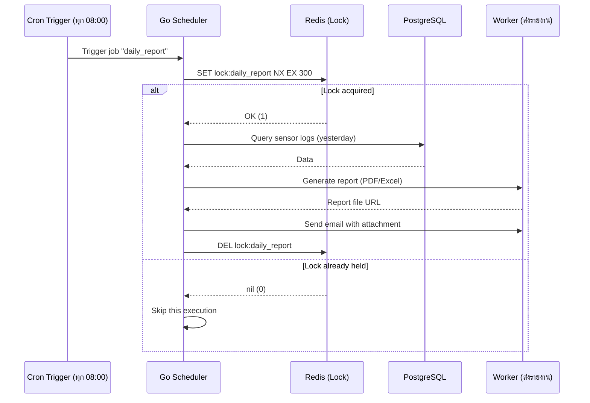

# เล่ม 3: การพัฒนาเชิงปฏิบัติ (Practical Development)
## บทที่ 3: Scheduler และ Automation (การตั้งเวลาสั่งงานและรายงานอัตโนมัติ)

### สรุปสั้นก่อนเริ่ม
ระบบ IoT Monitoring สำหรับ Data Center ไม่ได้มีเพียงแค่การรับข้อมูลและการแจ้งเตือนแบบ Real-time เท่านั้น แต่ยังต้องมีความสามารถในการทำงานอัตโนมัติตามเวลาที่กำหนด (Scheduled Tasks) เช่น เปิด/ปิดพัดลมระบายอากาศตอนกลางคืน, ส่งรายงานสรุปสภาพแวดล้อมทางอีเมลทุกเช้า, หรือปรับตั้งค่าแอร์ตามช่วงเวลา บทนี้จะอธิบายการออกแบบ Scheduler ใน Go โดยใช้ **gocron** หรือ **cron** ร่วมกับ **PostgreSQL** สำหรับเก็บกำหนดการ (schedules) และ **Redis** สำหรับ distributed lock เพื่อป้องกันการทำงานซ้ำเมื่อมีหลาย instance พร้อมตัวอย่างการส่งรายงานอัตโนมัติ (PDF/Excel) ผ่านอีเมลและ Line

---

## คำอธิบายแนวคิด (Concept Explanation)

### 1. Scheduler (ตัวกำหนดเวลา) คืออะไร? มีกี่แบบ?

Scheduler คือกลไกที่ให้โปรแกรมทำงานตามเวลาที่กำหนดไว้ล่วงหน้า เช่น ทุกวันเวลา 08:00 น., ทุกวันจันทร์เวลา 09:00 น., หรือทุก 30 นาที

**รูปแบบการกำหนดเวลา (Cron expression):**
```
┌───────────── นาที (0 - 59)
│ ┌───────────── ชั่วโมง (0 - 23)
│ │ ┌───────────── วันของเดือน (1 - 31)
│ │ │ ┌───────────── เดือน (1 - 12)
│ │ │ │ ┌───────────── วันของสัปดาห์ (0 - 6) (อาทิตย์=0 หรือ 7)
│ │ │ │ │
* * * * *
```

**ตัวอย่าง:**
- `0 8 * * *` – ทุกวันเวลา 08:00 น.
- `0 9 * * 1` – ทุกวันจันทร์เวลา 09:00 น.
- `*/30 * * * *` – ทุกๆ 30 นาที
- `0 0 1 * *` – เวลา 00:00 น. ของวันแรกของเดือน

#### วิธีการ Implement Scheduler ใน Go
| Library | จุดเด่น | จุดด้อย | เหมาะกับ |
|---------|--------|---------|----------|
| `gocron` | ใช้งานง่าย, fluent API, รองรับ timezone | ไม่รองรับ distributed lock ในตัว | Single instance |
| `robfig/cron` | stable, รองรับ cron v3, หลาย scheduler | configuration ซับซ้อนกว่า | ทั่วไป |
| `cron` + `redislock` | ทำงานข้ามหลาย instance ได้ | ต้อง implement lock เอง | Production (multi-instance) |

**ในโปรเจกต์นี้ใช้ `robfig/cron/v3` + Redis distributed lock**

#### ประโยชน์ที่ได้รับ
- ลดภาระ manual (ไม่ต้องให้เจ้าหน้าที่ไปเปิดพัดลมเอง)
- รายงานอัตโนมัติช่วยติดตามแนวโน้มโดยไม่ต้อง query เอง
- สามารถตั้งเวลาสำหรับการบำรุงรักษา (เช่น เปิดโหมดประหยัดพลังงานนอกเวลาทำการ)

#### ข้อควรระวัง
- ถ้ามีหลาย instance ของ Go backend ต้องป้องกันการทำงานซ้ำ (ใช้ distributed lock)
- งานที่ใช้เวลานาน (long-running jobs) ควรแยกออกไปเป็น worker แทนการรอใน scheduler goroutine
- การเปลี่ยนแปลง timezone หรือ Daylight Saving Time อาจทำให้ schedule ผิดพลาด

#### ข้อดี/ข้อเสีย
- **ข้อดี**: อัตโนมัติ, แม่นยำ, ลด human error
- **ข้อเสีย**: เพิ่ม complexity (ต้องจัดการ lock, monitoring, retry)

#### ข้อห้าม
- ห้ามทำ heavy processing ใน scheduler โดยไม่ใช้ timeout หรือ circuit breaker
- ห้ามใช้ scheduler สำหรับงานที่ต้องการความแม่นยำระดับมิลลิวินาที (ใช้ timer แทน)

---

### 2. Distributed Lock (Redis) คืออะไร? ทำไมต้องใช้?

เมื่อ我们有多个 Go backend instances (scale out), scheduler แต่ละ instance จะเห็น cron trigger พร้อมกันและอาจทำงานเดียวกันซ้ำกัน Distributed lock ช่วยให้มีเพียง instance เดียวที่ได้รับสิทธิ์ทำงาน

**หลักการ:**
1. Instance A พยายาม acquire lock ที่ Redis (SET key value NX EX 60)
2. ถ้าสำเร็จ → Instance A ทำงาน และปล่อย lock เมื่อเสร็จ
3. Instance B พยายาม acquire lock เดียวกันแต่ล้มเหลว → ข้ามงานนั้น

---

### 3. ประเภทของงานอัตโนมัติในระบบ CMON

| ประเภท | ตัวอย่าง | ความถี่ |
|--------|---------|---------|
| **Device Control** | เปิดพัดลมเวลา 22:00 น. ปิดเวลา 06:00 น. | ทุกวัน |
| **Report Generation** | สรุปอุณหภูมิสูงสุด/ต่ำสุด, จำนวนการแจ้งเตือน | รายวัน, รายสัปดาห์ |
| **Data Retention** | ลบ logs เก่ากว่า 90 วัน | ทุกเดือน |
| **Health Check** | ตรวจสอบว่าเซนเซอร์ทุกตัวยังส่งข้อมูลอยู่หรือไม่ | ทุก 1 ชั่วโมง |

---

## การออกแบบ Workflow และ Dataflow

### Workflow: Scheduler ทำงานร่วมกับ Distributed Lock



**รูปที่ 12:** การทำงานของ Scheduler แบบ distributed lock โดยมี Redis เป็นผู้ตัดสินว่า instance ใดได้รับสิทธิ์ทำงาน (เพื่อป้องกันงานซ้ำ)

### Dataflow: การสร้างรายงานอัตโนมัติ

```mermaid
flowchart TB
    subgraph "Scheduled Job (08:00 daily)"
        A[Calculate date range: yesterday] --> B[Query sensor_logs table]
        B --> C[Aggregate data: min, max, avg per sensor]
        C --> D{Report format?}
        D -->|PDF| E[Generate PDF with gofpdf]
        D -->|Excel| F[Generate Excel with excelize]
        E --> G[Upload to cloud storage (S3/MinIO)]
        F --> G
        G --> H[Get public URL / attachment]
        H --> I[Send email to admin list]
        I --> J[Log success/failure in job_logs table]
    end
```

**รูปที่ 13:** ขั้นตอนการสร้างรายงานอัตโนมัติ ตั้งแต่ดึงข้อมูล, ประมวลผล, สร้างไฟล์, อัปโหลด, และส่งอีเมล

---

## ตัวอย่างโค้ดที่รันได้จริง (Runnable Code Example)

เราจะสร้าง:
1. **ตาราง schedules** ใน PostgreSQL สำหรับเก็บกำหนดการที่ผู้ใช้สร้าง
2. **Cron scheduler** ที่อ่าน schedules จาก DB และรันตามเวลา
3. **Redis distributed lock** ป้องกันงานซ้ำ
4. **ตัวอย่าง job**: ควบคุมอุปกรณ์ตามเวลา, ส่งรายงานอีเมล

### 1. โมเดล Schedules (PostgreSQL)

**migrations/000003_create_schedules_table.up.sql**
```sql
-- Schedules table for user-defined automation
CREATE TABLE IF NOT EXISTS schedules (
    id SERIAL PRIMARY KEY,
    name VARCHAR(255) NOT NULL,
    cron_expr VARCHAR(100) NOT NULL,      -- e.g., "0 22 * * *"
    timezone VARCHAR(50) DEFAULT 'Asia/Bangkok',
    job_type VARCHAR(50) NOT NULL,        -- "control_device", "send_report", "cleanup_logs"
    job_params JSONB NOT NULL,             -- device_id, action, recipients, etc.
    enabled BOOLEAN DEFAULT TRUE,
    last_run TIMESTAMP WITH TIME ZONE,
    next_run TIMESTAMP WITH TIME ZONE,
    created_at TIMESTAMP WITH TIME ZONE DEFAULT CURRENT_TIMESTAMP,
    updated_at TIMESTAMP WITH TIME ZONE DEFAULT CURRENT_TIMESTAMP
);

CREATE INDEX idx_schedules_enabled ON schedules(enabled);
CREATE INDEX idx_schedules_next_run ON schedules(next_run);
```

**internal/models/schedule.go**
```go
package models

import (
    "encoding/json"
    "time"
)

type Schedule struct {
    ID        uint            `gorm:"primaryKey"`
    Name      string          `gorm:"not null"`
    CronExpr  string          `gorm:"column:cron_expr;not null"`
    Timezone  string          `gorm:"default:Asia/Bangkok"`
    JobType   string          `gorm:"column:job_type;not null"`
    JobParams json.RawMessage `gorm:"column:job_params;type:jsonb"`
    Enabled   bool            `gorm:"default:true"`
    LastRun   *time.Time      `gorm:"column:last_run"`
    NextRun   *time.Time      `gorm:"column:next_run"`
    CreatedAt time.Time
    UpdatedAt time.Time
}

// JobParams for control_device
type ControlDeviceParams struct {
    DeviceID string `json:"device_id"`
    Action   string `json:"action"` // "on", "off"
    MQTTPath string `json:"mqtt_path,omitempty"`
}

// JobParams for send_report
type SendReportParams struct {
    ReportType string   `json:"report_type"` // "daily", "weekly"
    Format     string   `json:"format"`      // "pdf", "excel"
    Recipients []string `json:"recipients"`
    IncludeCharts bool  `json:"include_charts"`
}
```

### 2. Schedule Repository

**internal/repository/schedule_repo.go**
```go
package repository

import (
    "context"
    "gobackend-demo/internal/models"
    "gorm.io/gorm"
)

type ScheduleRepository interface {
    GetEnabledSchedules(ctx context.Context) ([]models.Schedule, error)
    UpdateLastRun(ctx context.Context, id uint, lastRun, nextRun time.Time) error
}

type scheduleRepo struct {
    db *gorm.DB
}

func NewScheduleRepository(db *gorm.DB) ScheduleRepository {
    return &scheduleRepo{db: db}
}

func (r *scheduleRepo) GetEnabledSchedules(ctx context.Context) ([]models.Schedule, error) {
    var schedules []models.Schedule
    err := r.db.WithContext(ctx).Where("enabled = ?", true).Find(&schedules).Error
    return schedules, err
}

func (r *scheduleRepo) UpdateLastRun(ctx context.Context, id uint, lastRun, nextRun time.Time) error {
    return r.db.WithContext(ctx).Model(&models.Schedule{}).
        Where("id = ?", id).
        Updates(map[string]interface{}{
            "last_run": lastRun,
            "next_run": nextRun,
        }).Error
}
```

### 3. Distributed Lock (Redis)

**internal/pkg/redis/lock.go**
```go
package redis

import (
    "context"
    "time"
    "github.com/redis/go-redis/v9"
)

type DistributedLock struct {
    client *redis.Client
}

func NewDistributedLock(client *redis.Client) *DistributedLock {
    return &DistributedLock{client: client}
}

// Acquire tries to get a lock with TTL. Returns true if acquired.
func (l *DistributedLock) Acquire(ctx context.Context, key string, ttl time.Duration) (bool, error) {
    // SET key value NX EX seconds
    // NX = only if not exists
    ok, err := l.client.SetNX(ctx, "lock:"+key, "locked", ttl).Result()
    return ok, err
}

// Release deletes the lock
func (l *DistributedLock) Release(ctx context.Context, key string) error {
    return l.client.Del(ctx, "lock:"+key).Err()
}
```

### 4. Job Executor (Dispatcher)

**internal/usecase/scheduler_usecase.go**
```go
package usecase

import (
    "context"
    "encoding/json"
    "log"
    "time"
    "gobackend-demo/internal/models"
    "gobackend-demo/internal/pkg/mqtt"
    "gobackend-demo/internal/pkg/notifier"
    "gobackend-demo/internal/pkg/redis"
    "gobackend-demo/internal/repository"
    "github.com/robfig/cron/v3"
)

type SchedulerUsecase struct {
    scheduleRepo repository.ScheduleRepository
    mqttClient   *mqtt.Client
    emailNotif   *notifier.EmailNotifier
    lineNotif    *notifier.LineNotifier
    lock         *redis.DistributedLock
    cron         *cron.Cron
}

func NewSchedulerUsecase(
    scheduleRepo repository.ScheduleRepository,
    mqttClient *mqtt.Client,
    emailNotif *notifier.EmailNotifier,
    lineNotif *notifier.LineNotifier,
    lock *redis.DistributedLock,
) *SchedulerUsecase {
    // Use cron with seconds precision (optional)
    c := cron.New(cron.WithSeconds())
    return &SchedulerUsecase{
        scheduleRepo: scheduleRepo,
        mqttClient:   mqttClient,
        emailNotif:   emailNotif,
        lineNotif:    lineNotif,
        lock:         lock,
        cron:         c,
    }
}

// Start loads schedules from DB and starts cron scheduler
func (u *SchedulerUsecase) Start(ctx context.Context) error {
    schedules, err := u.scheduleRepo.GetEnabledSchedules(ctx)
    if err != nil {
        return err
    }
    
    for _, sch := range schedules {
        u.addJob(sch)
    }
    
    u.cron.Start()
    log.Println("Scheduler started with", len(schedules), "jobs")
    
    // Optional: periodically reload schedules (every 5 minutes)
    go u.reloadSchedules(ctx)
    
    <-ctx.Done()
    u.cron.Stop()
    return nil
}

// addJob registers a cron job with distributed lock
func (u *SchedulerUsecase) addJob(schedule models.Schedule) {
    jobName := schedule.Name
    lockKey := "cron:" + jobName
    
    // Wrap the actual job function
    jobFunc := func() {
        ctx := context.Background()
        // Try to acquire lock (TTL = 5 minutes, enough for long jobs)
        acquired, err := u.lock.Acquire(ctx, lockKey, 5*time.Minute)
        if err != nil {
            log.Printf("Failed to acquire lock for %s: %v", jobName, err)
            return
        }
        if !acquired {
            log.Printf("Job %s already running on another instance, skipping", jobName)
            return
        }
        defer u.lock.Release(ctx, lockKey)
        
        // Execute the job based on type
        err = u.executeJob(schedule)
        
        // Update last_run in DB (optional)
        now := time.Now()
        // Calculate next run from cron expression (parse)
        // ... (simplified: just log)
        if err != nil {
            log.Printf("Job %s failed: %v", jobName, err)
        } else {
            log.Printf("Job %s completed successfully", jobName)
        }
    }
    
    // Add to cron scheduler
    _, err := u.cron.AddFunc(schedule.CronExpr, jobFunc)
    if err != nil {
        log.Printf("Failed to add job %s: %v", schedule.Name, err)
    }
}

// executeJob performs the actual work based on job_type
func (u *SchedulerUsecase) executeJob(schedule models.Schedule) error {
    ctx := context.Background()
    
    switch schedule.JobType {
    case "control_device":
        var params models.ControlDeviceParams
        if err := json.Unmarshal(schedule.JobParams, &params); err != nil {
            return err
        }
        // Publish MQTT command
        topic := params.MQTTPath
        if topic == "" {
            topic = "cmom/dc/command/" + params.DeviceID
        }
        payload := map[string]string{"action": params.Action}
        return u.mqttClient.Publish(topic, payload)
        
    case "send_report":
        var params models.SendReportParams
        if err := json.Unmarshal(schedule.JobParams, &params); err != nil {
            return err
        }
        // Generate report (PDF/Excel)
        reportFile, err := u.generateReport(params)
        if err != nil {
            return err
        }
        // Send email with attachment
        for _, recipient := range params.Recipients {
            u.emailNotif.Send(recipient, "Automated Report", "See attached file.", reportFile)
        }
        return nil
        
    case "cleanup_logs":
        // Delete old sensor logs older than 90 days
        // ... implementation
        return nil
        
    default:
        log.Printf("Unknown job type: %s", schedule.JobType)
        return nil
    }
}

// generateReport creates PDF or Excel file
func (u *SchedulerUsecase) generateReport(params models.SendReportParams) (string, error) {
    // In real implementation: query DB, generate file, save to disk or cloud
    // For demo, return dummy path
    return "/tmp/report.pdf", nil
}

// reloadSchedules periodically reloads schedules from DB (dynamic update)
func (u *SchedulerUsecase) reloadSchedules(ctx context.Context) {
    ticker := time.NewTicker(5 * time.Minute)
    defer ticker.Stop()
    for {
        select {
        case <-ticker.C:
            schedules, err := u.scheduleRepo.GetEnabledSchedules(ctx)
            if err != nil {
                log.Printf("Failed to reload schedules: %v", err)
                continue
            }
            // For production, implement diff logic (add/remove jobs)
            log.Printf("Reloaded %d schedules", len(schedules))
        case <-ctx.Done():
            return
        }
    }
}
```

### 5. API สำหรับจัดการ Schedules (CRUD)

**internal/delivery/rest/handler/schedule_handler.go**
```go
package handler

import (
    "encoding/json"
    "net/http"
    "strconv"
    "gobackend-demo/internal/models"
    "gorm.io/gorm"
)

type ScheduleHandler struct {
    db *gorm.DB
}

func NewScheduleHandler(db *gorm.DB) *ScheduleHandler {
    return &ScheduleHandler{db: db}
}

type CreateScheduleRequest struct {
    Name      string          `json:"name"`
    CronExpr  string          `json:"cron_expr"`
    Timezone  string          `json:"timezone"`
    JobType   string          `json:"job_type"`
    JobParams json.RawMessage `json:"job_params"`
}

// CreateSchedule adds a new scheduled task
// POST /api/schedules
func (h *ScheduleHandler) CreateSchedule(w http.ResponseWriter, r *http.Request) {
    var req CreateScheduleRequest
    if err := json.NewDecoder(r.Body).Decode(&req); err != nil {
        http.Error(w, err.Error(), http.StatusBadRequest)
        return
    }
    
    schedule := models.Schedule{
        Name:      req.Name,
        CronExpr:  req.CronExpr,
        Timezone:  req.Timezone,
        JobType:   req.JobType,
        JobParams: req.JobParams,
        Enabled:   true,
    }
    if err := h.db.Create(&schedule).Error; err != nil {
        http.Error(w, err.Error(), http.StatusInternalServerError)
        return
    }
    
    w.WriteHeader(http.StatusCreated)
    json.NewEncoder(w).Encode(schedule)
}

// ListSchedules returns all schedules
// GET /api/schedules
func (h *ScheduleHandler) ListSchedules(w http.ResponseWriter, r *http.Request) {
    var schedules []models.Schedule
    h.db.Find(&schedules)
    json.NewEncoder(w).Encode(schedules)
}

// UpdateSchedule enables/disables a schedule
// PUT /api/schedules/{id}/toggle
func (h *ScheduleHandler) ToggleSchedule(w http.ResponseWriter, r *http.Request) {
    idStr := chi.URLParam(r, "id")
    id, _ := strconv.Atoi(idStr)
    var schedule models.Schedule
    if err := h.db.First(&schedule, id).Error; err != nil {
        http.Error(w, "Schedule not found", http.StatusNotFound)
        return
    }
    schedule.Enabled = !schedule.Enabled
    h.db.Save(&schedule)
    w.WriteHeader(http.StatusOK)
    json.NewEncoder(w).Encode(map[string]bool{"enabled": schedule.Enabled})
}
```

### 6. การเริ่มต้น Scheduler ใน main.go

```go
// cmd/serve.go หรือ main.go
func startScheduler(ctx context.Context, db *gorm.DB, redisClient *redis.Client, mqttClient *mqtt.Client) {
    scheduleRepo := repository.NewScheduleRepository(db)
    emailCfg := notifier.EmailConfig{...}
    emailNotif := notifier.NewEmailNotifier(emailCfg)
    lineNotif := notifier.NewLineNotifier(os.Getenv("LINE_TOKEN"))
    lock := redis.NewDistributedLock(redisClient)
    
    schedulerUC := usecase.NewSchedulerUsecase(scheduleRepo, mqttClient, emailNotif, lineNotif, lock)
    if err := schedulerUC.Start(ctx); err != nil {
        log.Fatal(err)
    }
}
```

### 7. ตัวอย่างการ Insert Schedule เริ่มต้นผ่าน SQL

```sql
-- เปิดพัดลมทุกวันเวลา 22:00 น.
INSERT INTO schedules (name, cron_expr, job_type, job_params, enabled) VALUES 
('Turn on fan at 22:00', '0 22 * * *', 'control_device', '{"device_id":"fan_01","action":"on","mqtt_path":"cmom/dc/command/fan_01"}', true);

-- ส่งรายงานสรุปอุณหภูมิรายวันเวลา 08:30 น.
INSERT INTO schedules (name, cron_expr, job_type, job_params, enabled) VALUES 
('Daily temperature report', '30 8 * * *', 'send_report', '{"report_type":"daily","format":"pdf","recipients":["admin@example.com"],"include_charts":true}', true);
```

---

## กรณีศึกษาและแนวทางแก้ไขปัญหา

### ปัญหา: งานใช้เวลานาน (long-running) ทำให้ overlap
**แนวทางแก้ไข:** ใช้ lock พร้อม TTL ที่เหมาะสม และ implement timeout ใน job; ถ้างานต้องใช้เวลานานจริง ให้แยกเป็น async workflow (ใช้ message queue)

### ปัญหา: การเปลี่ยนแปลง schedule แบบ dynamic ไม่生效
**แนวทางแก้ไข:** ทำ reload schedules ทุกๆ 5 นาที หรือใช้ mechanism ที่ detect การเปลี่ยนแปลง (เช่น Redis Pub/Sub แจ้งเมื่อ schedules เปลี่ยน)

### ปัญหา: Daylight Saving Time ทำให้ cron run กะทันหัน
**แนวทางแก้ไข:** ใช้ timezone ที่ระบุใน schedule (เช่น Asia/Bangkok ไม่มี DST) และใช้ cron library ที่รองรับ timezone (robfig/cron รองรับ)

---

## ตารางสรุป Cron Expression ตัวอย่างสำหรับระบบ Data Center

| ความต้องการ | Cron Expression | คำอธิบาย |
|-------------|-----------------|-----------|
| เปิดพัดลมระบายอากาศตอนกลางคืน | `0 22 * * *` | ทุกวัน 22:00 น. |
| ปิดพัดลมตอนเช้า | `0 6 * * *` | ทุกวัน 06:00 น. |
| ส่งรายงานอุณหภูมิรายวัน | `0 8 * * *` | ทุกวัน 08:00 น. |
| ส่งรายงานสรุปประจำสัปดาห์ (จันทร์) | `0 9 * * 1` | ทุกวันจันทร์ 09:00 น. |
| ล้าง logs เก่า (วันแรกของเดือน) | `0 2 1 * *` | เวลา 02:00 น. ของวันที่ 1 ทุกเดือน |
| ตรวจสอบสุขภาพเซนเซอร์ทุก 2 ชั่วโมง | `0 */2 * * *` | ทุก 2 ชั่วโมง |

---

## แบบฝึกหัดท้ายบท (3 ข้อ)

1. **เพิ่ม job type `http_request`** เพื่อให้สามารถเรียก REST API ภายนอกได้ (เช่น ปรับ thermostat ผ่าน API ของแอร์ inverter) โดย params ประกอบด้วย url, method, body, headers

2. **Implement การคำนวณ next_run** เมื่อ schedule ถูกสร้างหรืออัปเดต โดยใช้ cron parser (library `cron.Parser`) และเก็บค่า next_run ใน database เพื่อใช้ในการแสดงผลบน dashboard

3. **สร้างหน้า UI สำหรับจัดการ schedules** (React หรือ HTML form) ที่ให้ผู้ใช้กรอก cron expression, เลือก job type, device, และดูรายการ schedules พร้อมปุ่ม enable/disable

---

## แหล่งอ้างอิง (References)

- robfig/cron v3: [https://github.com/robfig/cron](https://github.com/robfig/cron)
- Redis distributed lock pattern: [https://redis.io/docs/manual/patterns/distributed-locks/](https://redis.io/docs/manual/patterns/distributed-locks/)
- Cron expression generator: [https://crontab.guru/](https://crontab.guru/)
- Generating PDF in Go: [https://github.com/jung-kurt/gofpdf](https://github.com/jung-kurt/gofpdf)
- Excel in Go: [https://github.com/xuri/excelize](https://github.com/xuri/excelize)

---

**หมายเหตุ:** บทนี้เป็นบทสุดท้ายของ **เล่ม 3 (การพัฒนาเชิงปฏิบัติ)** ที่ครอบคลุม MQTT, WebSocket Dashboard, และ Scheduler Automation ครบถ้วนตาม requirements ของ CMON IoT Solution

**ต่อไปเราจะดำเนินการต่อใน เล่ม 4: การปรับใช้ (Deployment), การบำรุงรักษา, และการตั้งค่าระบบ ซึ่งจะประกอบด้วย:**
- Docker Compose สำหรับ development และ production
- การตั้งค่า environment variables, secrets management
- Health checks, graceful shutdown
- Monitoring (Prometheus + Grafana)
- การ backup และ restore ฐานข้อมูล
- การขยายระบบ (scaling) แนวทางปฏิบัติ

**ท่านต้องการให้เริ่ม เล่ม 4 ทันที หรือสรุปเนื้อหาทั้งหมดก่อน?**