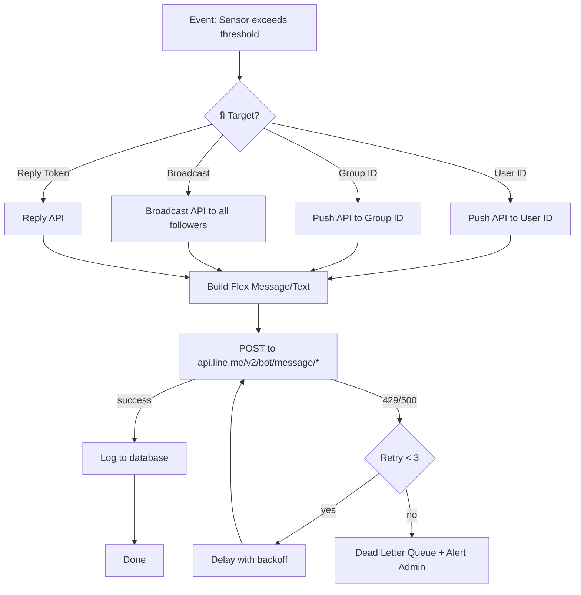
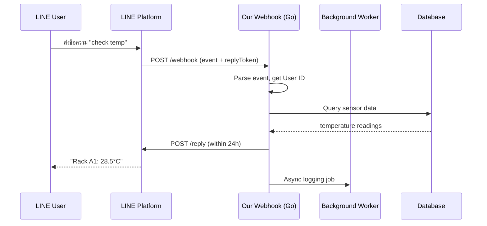

# Module 24: pkg/line (LINE Notification – Messaging API & Notify)

## สำหรับโฟลเดอร์ `internal/pkg/line/` และ `internal/repository/`

ไฟล์ที่เกี่ยวข้อง:
- `internal/pkg/line/sender.go`
- `internal/pkg/line/messaging_api.go`
- `internal/pkg/line/notify.go`
- `internal/pkg/line/webhook.go`
- `internal/pkg/line/worker.go`
- `internal/pkg/line/flex_builder.go`
- `internal/repository/line_log.go`
- `migrations/line_logs.sql`


## หลักการ (Concept)

### LINE Notification คืออะไร?

LINE Notification คือระบบแจ้งเตือนผ่านแพลตฟอร์ม LINE ซึ่งเป็นแอปพลิเคชัน messaging ที่ได้รับความนิยมสูงสุดในประเทศไทย (กว่า 50 ล้านบัญชี) รองรับทั้งการส่งข้อความแบบ Push ไปยังผู้ใช้เฉพาะราย (ผ่าน User ID) หรือแจ้งเตือนไปยังกลุ่ม LINE โดยไม่ต้องมีแอปพลิเคชันขององค์กร สามารถส่งได้ทั้งข้อความธรรมดา, รูปภาพ, วิดีโอ, Sticker และ Flex Message (รูปแบบการ์ดที่ปรับแต่งได้) เป็นช่องทางแจ้งเตือนที่มีประสิทธิภาพสูงเพราะผู้ใช้เปิดอ่าน率高และรับได้ทันที

### มีกี่แบบ? (LINE Notification APIs)

| API | ลักษณะ | ข้อดี | ข้อเสีย | เหมาะกับ |
|-----|--------|------|---------|----------|
| **Messaging API (Push)** | ส่งข้อความถึงผู้ใช้หรือกลุ่มโดยใช้ User ID หรือ Group ID | รองรับ Flex Message (UI สวยงาม), 2-way communication, webhook | ต้องมี Official Account, ต้องดึง User ID ก่อน, จำกัด rate limit | แจ้งเตือนแบบมี interaction, รายงาน, ยืนยันการสั่งงาน |
| **Messaging API (Reply)** | ตอบกลับข้อความที่ผู้ใช้ส่งมาภายใน 24 ชม. | ได้ reply token อัตโนมัติจาก webhook, ไม่ต้องเก็บ User ID | ใช้ได้แค่ตอบกลับ 24 ชม. เท่านั้น | Chatbot, ระบบสอบถามข้อมูล |
| **LINE Notify** | ส่งข้อความผ่าน token (OAuth2) | ง่ายมาก, token ใช้แจ้งเตือนส่วนตัวหรือกลุ่มได้ทันที | **⚠️ สิ้นสุดบริการ 31 มีนาคม 2025**[reference:0][reference:1], ข้อความธรรมดาเท่านั้น | **ไม่แนะนำให้ใช้ในระบบใหม่** ควรใช้ Messaging API แทน |

**ข้อห้ามสำคัญ:** ห้ามใช้ Bucket Pattern ร่วมกับ Time Series Collections เพราะจะลดประสิทธิภาพ — แต่สำหรับ LINE module นี้ไม่เกี่ยวข้อง

### ใช้อย่างไร / นำไปใช้กรณีไหน

1. **Alert แบบ Real‑time** – แจ้งเตือนไปยังกลุ่ม LINE Ops เมื่ออุณหภูมิเกิน 35°C, ตรวจพบน้ำรั่ว หรือควันไฟ
2. **Scheduled Reports** – ส่งสรุปสถานะ Data Center รายวัน/สัปดาห์ (แบบ Flex Message การ์ดสวยงาม)
3. **Device Control Confirmation** – ส่ง Flex Message พร้อมปุ่มยืนยันการสั่งงานอุปกรณ์ระยะไกล
4. **Interactive Chatbot** – รับคำสั่งผ่าน LINE (สอบถามสถานะเซนเซอร์ล่าสุด, เปิด/ปิดพัดลม)
5. **User‑specific Notification** – ส่งแจ้งเตือนไปยังผู้ใช้ที่เชื่อมต่อ LINE Official Account แล้ว

### ประโยชน์ที่ได้รับ

- **High engagement** – LINE เป็นแอปที่ผู้ใช้เปิดทุกวัน, อัตราการเปิดอ่านสูงกว่า Email และ SMS
- **Rich media** – ส่งรูปภาพ, วิดีโอ, Flex Message (UI คล้าย Application) แทนข้อความธรรมดา
- **Two‑way communication** – ผู้ใช้สามารถตอบกลับหรือกดปุ่มเพื่อสั่งงานได้ทันที
- **Cost‑effective** – Messaging API มี free tier 200 ข้อความ/เดือน, จ่ายตามจำนวนที่ใช้ (ราคาถูก)
- **Group notification** – แจ้งเตือนไปยังกลุ่ม LINE ได้โดยตรง ไม่ต้องเก็บ User ID ทุกคน
- **Verified Official Account** – เพิ่มความน่าเชื่อถือให้กับระบบแจ้งเตือนขององค์กร

### ข้อควรระวัง

- **LINE Notify จะถูกปิดบริการในวันที่ 31 มีนาคม 2025**[reference:2][reference:3] — ห้ามใช้ในระบบใหม่
- **Rate limits** – Push Message: 200 requests/second, Broadcast: 60 requests/minute[reference:4]
- **User ID retrieval** – ต้องมี webhook endpoint หรือใช้ LINE Login เพื่อดึง User ID
- **Group ID retrieval** – ต้องเพิ่ม LINE Official Account เข้ากลุ่มและ capture ผ่าน webhook
- **Flex Message complexity** – JSON structure ซับซ้อน, ต้องใช้ builder หรือ template
- **Official Account ต้องมี** – Messaging API ต้องมี LINE Official Account (ฟรี)
- **Reply token หมดอายุใน 24 ชั่วโมง** — ใช้ได้แค่ตอบกลับภายใน 24 ชม. หลังจากได้รับข้อความ
- **Spam prevention** – ระวังการส่งข้อความซ้ำเกินไป, ควรมี cooldown และ rate limit

### ข้อดี
- เข้าถึงผู้ใช้สูง, rich media, two‑way, cost‑effective, กลุ่ม LINE รองรับ

### ข้อเสีย
- ต้องมี Official Account, User/Group ID retrieval ซับซ้อน, rate limit ค่อนข้างต่ำ, Flex Message ยาก

### ข้อห้าม
- ห้ามส่งข้อความสแปม (LINE อาจระงับ Official Account)
- ห้ามส่งข้อความหา user ที่ยังไม่ consent (ตาม PDPA)
- ห้ามใช้ LINE Notify สำหรับระบบใหม่ (service สิ้นสุดแล้ว)[reference:5]
- ห้ามเก็บ access token ใน code หรือ commit ขึ้น repository
- ห้ามใช้ Push API บ่อยเกิน rate limit (LINE จะ block)


## การออกแบบ Workflow และ Dataflow

### Workflow: การส่งข้อความผ่าน LINE Messaging API (Push)



**รูปที่ 37:** ขั้นตอนการส่งข้อความ LINE ผ่าน Messaging API (Push) เมื่อเซนเซอร์เกิน threshold

### Workflow: Webhook สำหรับรับข้อความจากผู้ใช้



**รูปที่ 38:** Sequence diagram แสดงการรับข้อความจาก LINE user ผ่าน webhook และตอบกลับแบบ reply


## ตัวอย่างโค้ดที่รันได้จริง

### 1. LINE Sender Interface – `sender.go`

```go
// Package line provides LINE notification capabilities using Messaging API.
// LINE Notify is deprecated as of March 31, 2025, use Messaging API instead.
// ----------------------------------------------------------------
// แพ็คเกจ line ให้บริการการแจ้งเตือนทาง LINE ด้วย Messaging API
// LINE Notify ถูกยกเลิกการบริการตั้งแต่วันที่ 31 มีนาคม 2025 ให้ใช้ Messaging API แทน
package line

import (
	"context"
)

// MessageType defines available LINE message types.
// ----------------------------------------------------------------
// MessageType กำหนดประเภทข้อความ LINE ที่มีให้บริการ
type MessageType string

const (
	MessageTypeText  MessageType = "text"
	MessageTypeImage MessageType = "image"
	MessageTypeVideo MessageType = "video"
	MessageTypeFlex  MessageType = "flex"
)

// Message represents a LINE message to be sent.
// ----------------------------------------------------------------
// Message แทนข้อความ LINE ที่จะส่ง
type Message struct {
	Type  MessageType            `json:"type"`
	Text  string                 `json:"text,omitempty"`
	Image *ImageContent          `json:"image,omitempty"`
	Flex  map[string]interface{} `json:"flex,omitempty"`
}

// ImageContent represents image message content.
// ----------------------------------------------------------------
// ImageContent แทนเนื้อหารูปภาพ
type ImageContent struct {
	OriginalContentURL string `json:"originalContentUrl"`
	PreviewImageURL    string `json:"previewImageUrl"`
}

// Sender defines the interface for LINE messaging providers.
// ----------------------------------------------------------------
// Sender กำหนด interface สำหรับผู้ให้บริการส่งข้อความ LINE
type Sender interface {
	// PushMessage sends a message to a specific user or group.
	// ----------------------------------------------------------------
	// PushMessage ส่งข้อความไปยังผู้ใช้หรือกลุ่มที่ระบุ
	PushMessage(ctx context.Context, to string, messages []Message) (string, error)

	// ReplyMessage replies to a user within 24 hours using reply token.
	// ----------------------------------------------------------------
	// ReplyMessage ตอบกลับผู้ใช้ภายใน 24 ชั่วโมงด้วย reply token
	ReplyMessage(ctx context.Context, replyToken string, messages []Message) error

	// Broadcast sends a message to all followers of the Official Account.
	// ----------------------------------------------------------------
	// Broadcast ส่งข้อความไปยังผู้ติดตาม Official Account ทุกคน
	Broadcast(ctx context.Context, messages []Message) (string, error)

	// GetUserProfile retrieves user profile from LINE.
	// ----------------------------------------------------------------
	// GetUserProfile ดึงโปรไฟล์ผู้ใช้จาก LINE
	GetUserProfile(ctx context.Context, userID string) (*UserProfile, error)
}

// UserProfile represents LINE user profile.
// ----------------------------------------------------------------
// UserProfile แทนโปรไฟล์ผู้ใช้ LINE
type UserProfile struct {
	UserID        string `json:"userId"`
	DisplayName   string `json:"displayName"`
	PictureURL    string `json:"pictureUrl"`
	StatusMessage string `json:"statusMessage"`
}
```

### 2. Messaging API Implementation – `messaging_api.go`

```go
package line

import (
	"context"
	"fmt"

	"github.com/line/line-bot-sdk-go/v8/linebot/messaging_api"
)

// MessagingAPIConfig holds LINE Messaging API credentials.
// ----------------------------------------------------------------
// MessagingAPIConfig เก็บข้อมูลรับรอง LINE Messaging API
type MessagingAPIConfig struct {
	ChannelAccessToken string // Channel access token from LINE Developers Console
	ChannelSecret      string // Channel secret for webhook validation
}

// MessagingAPISender implements Sender using LINE Messaging API.
// ----------------------------------------------------------------
// MessagingAPISender อิมพลีเมนต์ Sender ด้วย LINE Messaging API
type MessagingAPISender struct {
	client *messaging_api.MessagingApiAPI
	secret string
}

// NewMessagingAPISender creates a new Messaging API sender.
// ----------------------------------------------------------------
// NewMessagingAPISender สร้าง Messaging API sender ใหม่
func NewMessagingAPISender(cfg *MessagingAPIConfig) *MessagingAPISender {
	client := messaging_api.NewMessagingApiAPI(cfg.ChannelAccessToken)
	return &MessagingAPISender{
		client: client,
		secret: cfg.ChannelSecret,
	}
}

// PushMessage sends a message to a specific user or group.
// ----------------------------------------------------------------
// PushMessage ส่งข้อความไปยังผู้ใช้หรือกลุ่มที่ระบุ
func (m *MessagingAPISender) PushMessage(ctx context.Context, to string, messages []Message) (string, error) {
	// Convert internal messages to SDK format
	// แปลงข้อความภายในเป็นรูปแบบ SDK
	sdkMessages := make([]messaging_api.PushMessageRequestMessagesInner, len(messages))
	for i, msg := range messages {
		sdkMsg, err := convertToSDKMessage(msg)
		if err != nil {
			return "", err
		}
		sdkMessages[i] = sdkMsg
	}

	req := &messaging_api.PushMessageRequest{
		To:       to,
		Messages: sdkMessages,
	}

	resp, err := m.client.PushMessage(req)
	if err != nil {
		return "", fmt.Errorf("LINE push failed: %w", err)
	}
	return resp.Header.Get("X-Line-Request-Id"), nil
}

// ReplyMessage replies to a user within 24 hours.
// ----------------------------------------------------------------
// ReplyMessage ตอบกลับผู้ใช้ภายใน 24 ชั่วโมง
func (m *MessagingAPISender) ReplyMessage(ctx context.Context, replyToken string, messages []Message) error {
	sdkMessages := make([]messaging_api.ReplyMessageRequestMessagesInner, len(messages))
	for i, msg := range messages {
		sdkMsg, err := convertToSDKMessage(msg)
		if err != nil {
			return err
		}
		sdkMessages[i] = sdkMsg
	}

	req := &messaging_api.ReplyMessageRequest{
		ReplyToken: replyToken,
		Messages:   sdkMessages,
	}

	_, err := m.client.ReplyMessage(req)
	return err
}

// Broadcast sends a message to all followers.
// ----------------------------------------------------------------
// Broadcast ส่งข้อความไปยังผู้ติดตามทุกคน
func (m *MessagingAPISender) Broadcast(ctx context.Context, messages []Message) (string, error) {
	sdkMessages := make([]messaging_api.BroadcastRequestMessagesInner, len(messages))
	for i, msg := range messages {
		sdkMsg, err := convertToSDKMessage(msg)
		if err != nil {
			return "", err
		}
		sdkMessages[i] = sdkMsg
	}

	req := &messaging_api.BroadcastRequest{
		Messages: sdkMessages,
	}

	resp, err := m.client.Broadcast(req)
	if err != nil {
		return "", fmt.Errorf("LINE broadcast failed: %w", err)
	}
	return resp.Header.Get("X-Line-Request-Id"), nil
}

// GetUserProfile retrieves user profile from LINE.
// ----------------------------------------------------------------
// GetUserProfile ดึงโปรไฟล์ผู้ใช้จาก LINE
func (m *MessagingAPISender) GetUserProfile(ctx context.Context, userID string) (*UserProfile, error) {
	resp, err := m.client.GetProfile(userID)
	if err != nil {
		return nil, err
	}
	return &UserProfile{
		UserID:        resp.UserId,
		DisplayName:   resp.DisplayName,
		PictureURL:    resp.PictureUrl,
		StatusMessage: resp.StatusMessage,
	}, nil
}

// convertToSDKMessage converts internal message to SDK format.
// ----------------------------------------------------------------
// convertToSDKMessage แปลงข้อความภายในเป็นรูปแบบ SDK
func convertToSDKMessage(msg Message) (interface{}, error) {
	switch msg.Type {
	case MessageTypeText:
		return messaging_api.TextMessage{
			Type: "text",
			Text: msg.Text,
		}, nil
	case MessageTypeImage:
		if msg.Image == nil {
			return nil, fmt.Errorf("image content required")
		}
		return messaging_api.ImageMessage{
			Type:               "image",
			OriginalContentUrl: msg.Image.OriginalContentURL,
			PreviewImageUrl:    msg.Image.PreviewImageURL,
		}, nil
	case MessageTypeFlex:
		return messaging_api.FlexMessage{
			Type:   "flex",
			AltText: msg.Text, // fallback text for unsupported clients
			Contents: msg.Flex,
		}, nil
	default:
		return messaging_api.TextMessage{
			Type: "text",
			Text: msg.Text,
		}, nil
	}
}
```

### 3. Webhook Handler – `webhook.go`

```go
package line

import (
	"crypto/hmac"
	"crypto/sha256"
	"encoding/base64"
	"encoding/json"
	"io"
	"net/http"
)

// WebhookEvent represents a LINE webhook event.
// ----------------------------------------------------------------
// WebhookEvent แทน event จาก LINE webhook
type WebhookEvent struct {
	Type        string `json:"type"` // message, follow, unfollow, join, leave
	ReplyToken  string `json:"replyToken,omitempty"`
	Source      struct {
		Type   string `json:"type"`   // user, group, room
		UserID string `json:"userId"`
		GroupID string `json:"groupId,omitempty"`
	} `json:"source"`
	Message struct {
		ID   string `json:"id"`
		Type string `json:"type"` // text, image, sticker
		Text string `json:"text,omitempty"`
	} `json:"message,omitempty"`
	Timestamp int64 `json:"timestamp"`
}

// WebhookHandler processes incoming LINE webhook requests.
// ----------------------------------------------------------------
// WebhookHandler ประมวลผล webhook request ที่เข้ามาจาก LINE
type WebhookHandler struct {
	channelSecret string
	eventHandler  func(event WebhookEvent) error
}

// NewWebhookHandler creates a new webhook handler.
// ----------------------------------------------------------------
// NewWebhookHandler สร้าง webhook handler ใหม่
func NewWebhookHandler(channelSecret string, eventHandler func(WebhookEvent) error) *WebhookHandler {
	return &WebhookHandler{
		channelSecret: channelSecret,
		eventHandler:  eventHandler,
	}
}

// ServeHTTP implements http.Handler for LINE webhook.
// ----------------------------------------------------------------
// ServeHTTP อิมพลีเมนต์ http.Handler สำหรับ LINE webhook
func (h *WebhookHandler) ServeHTTP(w http.ResponseWriter, r *http.Request) {
	// Verify signature
	// ตรวจสอบลายเซ็น
	if !h.verifySignature(r) {
		http.Error(w, "Invalid signature", http.StatusBadRequest)
		return
	}

	// Read body
	// อ่าน body
	body, err := io.ReadAll(r.Body)
	if err != nil {
		http.Error(w, "Failed to read body", http.StatusInternalServerError)
		return
	}

	// Parse events
	// แยก events
	var webhook struct {
		Events []WebhookEvent `json:"events"`
	}
	if err := json.Unmarshal(body, &webhook); err != nil {
		http.Error(w, "Invalid JSON", http.StatusBadRequest)
		return
	}

	// Process each event
	// ประมวลผลแต่ละ event
	for _, event := range webhook.Events {
		if h.eventHandler != nil {
			go h.eventHandler(event) // async processing
		}
	}

	w.WriteHeader(http.StatusOK)
}

// verifySignature validates LINE webhook signature.
// ----------------------------------------------------------------
// verifySignature ตรวจสอบลายเซ็น LINE webhook
func (h *WebhookHandler) verifySignature(r *http.Request) bool {
	signature := r.Header.Get("X-Line-Signature")
	if signature == "" {
		return false
	}
	body, _ := io.ReadAll(r.Body)
	// Reset body for later reading
	r.Body = io.NopCloser(bytes.NewBuffer(body))

	mac := hmac.New(sha256.New, []byte(h.channelSecret))
	mac.Write(body)
	expected := base64.StdEncoding.EncodeToString(mac.Sum(nil))
	return hmac.Equal([]byte(signature), []byte(expected))
}
```

### 4. LINE Notify (Deprecated – ใช้สำหรับ legacy เท่านั้น) – `notify.go`

```go
package line

import (
	"bytes"
	"context"
	"encoding/json"
	"fmt"
	"net/http"
	"time"
)

// ⚠️ DEPRECATED: LINE Notify service ends on March 31, 2025
// This implementation is provided for legacy systems only.
// Do NOT use for new development. Use MessagingAPI instead.
// ----------------------------------------------------------------
// ⚠️ เลิกใช้งานแล้ว: บริการ LINE Notify จะสิ้นสุดในวันที่ 31 มีนาคม 2025
// โค้ดนี้มีไว้สำหรับระบบ legacy เท่านั้น
// อย่าใช้สำหรับการพัฒนาใหม่ ให้ใช้ MessagingAPI แทน

// NotifyConfig holds LINE Notify credentials (deprecated).
// ----------------------------------------------------------------
// NotifyConfig เก็บข้อมูลรับรอง LINE Notify (เลิกใช้งานแล้ว)
type NotifyConfig struct {
	AccessToken string // LINE Notify access token
}

// NotifySender implements Sender using LINE Notify (deprecated).
// ----------------------------------------------------------------
// NotifySender อิมพลีเมนต์ Sender ด้วย LINE Notify (เลิกใช้งานแล้ว)
type NotifySender struct {
	token string
	client *http.Client
}

// NewNotifySender creates a new Notify sender.
// Prints warning about deprecation.
// ----------------------------------------------------------------
// NewNotifySender สร้าง Notify sender ใหม่
// แสดงคำเตือนเกี่ยวกับการเลิกใช้งาน
func NewNotifySender(cfg *NotifyConfig) *NotifySender {
	// Print deprecation warning
	// แสดงคำเตือนเลิกใช้งาน
	fmt.Println("[WARNING] LINE Notify is deprecated and will be discontinued on March 31, 2025. Use Messaging API instead.")
	return &NotifySender{
		token:  cfg.AccessToken,
		client: &http.Client{Timeout: 30 * time.Second},
	}
}

// PushMessage sends a message via LINE Notify.
// ----------------------------------------------------------------
// PushMessage ส่งข้อความผ่าน LINE Notify
func (n *NotifySender) PushMessage(ctx context.Context, to string, messages []Message) (string, error) {
	// LINE Notify only supports text messages
	if len(messages) == 0 || messages[0].Type != MessageTypeText {
		return "", fmt.Errorf("LINE Notify only supports text messages")
	}
	// to parameter is ignored; LINE Notify sends to all subscribed users
	return n.sendNotify(ctx, messages[0].Text)
}

func (n *NotifySender) sendNotify(ctx context.Context, message string) (string, error) {
	apiURL := "https://notify-api.line.me/api/notify"
	formData := []byte("message=" + url.QueryEscape(message))
	req, err := http.NewRequestWithContext(ctx, "POST", apiURL, bytes.NewBuffer(formData))
	if err != nil {
		return "", err
	}
	req.Header.Set("Content-Type", "application/x-www-form-urlencoded")
	req.Header.Set("Authorization", "Bearer "+n.token)

	resp, err := n.client.Do(req)
	if err != nil {
		return "", err
	}
	defer resp.Body.Close()

	if resp.StatusCode != http.StatusOK {
		return "", fmt.Errorf("LINE Notify returned %d", resp.StatusCode)
	}
	return "", nil // LINE Notify does not return message ID
}

// ReplyMessage not supported by LINE Notify.
// ----------------------------------------------------------------
// ReplyMessage ไม่รองรับใน LINE Notify
func (n *NotifySender) ReplyMessage(ctx context.Context, replyToken string, messages []Message) error {
	return fmt.Errorf("LINE Notify does not support reply messages")
}

// Broadcast not supported by LINE Notify.
// ----------------------------------------------------------------
// Broadcast ไม่รองรับใน LINE Notify
func (n *NotifySender) Broadcast(ctx context.Context, messages []Message) (string, error) {
	return "", fmt.Errorf("LINE Notify does not support broadcast")
}

// GetUserProfile not supported by LINE Notify.
// ----------------------------------------------------------------
// GetUserProfile ไม่รองรับใน LINE Notify
func (n *NotifySender) GetUserProfile(ctx context.Context, userID string) (*UserProfile, error) {
	return nil, fmt.Errorf("LINE Notify does not support user profiles")
}
```

### 5. Flex Message Builder – `flex_builder.go`

```go
package line

// FlexBuilder helps construct LINE Flex Messages.
// ----------------------------------------------------------------
// FlexBuilder ช่วยสร้าง Flex Message ของ LINE
type FlexBuilder struct {
	contents map[string]interface{}
}

// NewFlexBuilder creates a new Flex builder.
// ----------------------------------------------------------------
// NewFlexBuilder สร้าง Flex builder ใหม่
func NewFlexBuilder() *FlexBuilder {
	return &FlexBuilder{
		contents: make(map[string]interface{}),
	}
}

// Bubble creates a bubble container.
// ----------------------------------------------------------------
// Bubble สร้าง container แบบ bubble
func (f *FlexBuilder) Bubble() *FlexBuilder {
	f.contents = map[string]interface{}{
		"type":   "bubble",
		"body":   make(map[string]interface{}),
		"footer": make(map[string]interface{}),
	}
	return f
}

// SetBodyText adds a text box to bubble body.
// ----------------------------------------------------------------
// SetBodyText เพิ่มกล่องข้อความใน body ของ bubble
func (f *FlexBuilder) SetBodyText(text string, size, weight string) *FlexBuilder {
	if body, ok := f.contents["body"].(map[string]interface{}); ok {
		body["contents"] = []map[string]interface{}{
			{
				"type":   "text",
				"text":   text,
				"size":   size,
				"weight": weight,
				"wrap":   true,
			},
		}
	}
	return f
}

// SetFooterButton adds a button to bubble footer.
// ----------------------------------------------------------------
// SetFooterButton เพิ่มปุ่มใน footer ของ bubble
func (f *FlexBuilder) SetFooterButton(text, actionType, data string) *FlexBuilder {
	if footer, ok := f.contents["footer"].(map[string]interface{}); ok {
		footer["contents"] = []map[string]interface{}{
			{
				"type": "button",
				"action": map[string]interface{}{
					"type": actionType,
					"label": text,
					"data":  data,
				},
				"style": "primary",
			},
		}
	}
	return f
}

// Build returns the final Flex Message structure.
// ----------------------------------------------------------------
// Build คืนโครงสร้าง Flex Message ที่สมบูรณ์
func (f *FlexBuilder) Build() map[string]interface{} {
	return f.contents
}
```

### 6. LINE Worker with Queue – `worker.go`

```go
package line

import (
	"context"
	"log"
	"sync"
	"time"
)

// LINEJob represents a queued LINE message task.
// ----------------------------------------------------------------
// LINEJob แทนงาน LINE message ที่อยู่ในคิว
type LINEJob struct {
	ID         string
	Type       string    // push, reply, broadcast
	Target     string    // user ID, group ID, or reply token
	Messages   []Message
	RetryCount int
	NextRetry  time.Time
}

// LINEWorker handles background LINE messaging with retries.
// ----------------------------------------------------------------
// LINEWorker จัดการการส่งข้อความ LINE ในพื้นหลังพร้อม retry
type LINEWorker struct {
	sender     Sender
	queue      chan *LINEJob
	retryQueue chan *LINEJob
	wg         sync.WaitGroup
	stopCh     chan struct{}
}

// NewLINEWorker creates a new LINE worker.
// ----------------------------------------------------------------
// NewLINEWorker สร้าง LINE worker ใหม่
func NewLINEWorker(sender Sender, queueSize int) *LINEWorker {
	return &LINEWorker{
		sender:     sender,
		queue:      make(chan *LINEJob, queueSize),
		retryQueue: make(chan *LINEJob, queueSize),
		stopCh:     make(chan struct{}),
	}
}

// Start begins the worker goroutines.
// ----------------------------------------------------------------
// Start เริ่ม worker goroutines
func (w *LINEWorker) Start(ctx context.Context, numWorkers int) {
	for i := 0; i < numWorkers; i++ {
		w.wg.Add(1)
		go w.worker(ctx)
	}
	go w.retryProcessor(ctx)
	log.Printf("LINEWorker started with %d workers", numWorkers)
}

// Stop gracefully shuts down the worker.
// ----------------------------------------------------------------
// Stop ปิด worker อย่างนุ่มนวล
func (w *LINEWorker) Stop() {
	close(w.stopCh)
	w.wg.Wait()
}

// Enqueue adds a LINE job to the queue.
// ----------------------------------------------------------------
// Enqueue เพิ่ม LINE job เข้าคิว
func (w *LINEWorker) Enqueue(job *LINEJob) {
	select {
	case w.queue <- job:
	default:
		log.Printf("LINE queue full, dropping job %s", job.ID)
	}
}

func (w *LINEWorker) worker(ctx context.Context) {
	defer w.wg.Done()
	for {
		select {
		case <-ctx.Done():
			return
		case <-w.stopCh:
			return
		case job := <-w.queue:
			w.processJob(ctx, job)
		}
	}
}

func (w *LINEWorker) processJob(ctx context.Context, job *LINEJob) {
	var err error
	switch job.Type {
	case "push":
		_, err = w.sender.PushMessage(ctx, job.Target, job.Messages)
	case "reply":
		err = w.sender.ReplyMessage(ctx, job.Target, job.Messages)
	case "broadcast":
		_, err = w.sender.Broadcast(ctx, job.Messages)
	}
	if err != nil {
		log.Printf("LINE send failed: %v, retry=%d", err, job.RetryCount)
		if job.RetryCount < 3 {
			job.RetryCount++
			job.NextRetry = time.Now().Add(time.Duration(job.RetryCount) * time.Second)
			w.retryQueue <- job
		} else {
			log.Printf("LINE job %s failed after 3 retries", job.ID)
		}
	}
}

func (w *LINEWorker) retryProcessor(ctx context.Context) {
	ticker := time.NewTicker(1 * time.Second)
	defer ticker.Stop()
	for {
		select {
		case <-ctx.Done():
			return
		case <-w.stopCh:
			return
		case <-ticker.C:
			w.processRetries()
		}
	}
}

func (w *LINEWorker) processRetries() {
	for {
		select {
		case job := <-w.retryQueue:
			if time.Now().After(job.NextRetry) {
				w.queue <- job
			} else {
				go func(j *LINEJob) {
					time.Sleep(time.Until(j.NextRetry))
					w.retryQueue <- j
				}(job)
			}
		default:
			return
		}
	}
}
```

### 7. LINE Log Model – `internal/models/line_log.go`

```go
package models

import "time"

// LINELog stores LINE message delivery history.
// ----------------------------------------------------------------
// LINELog เก็บประวัติการส่งข้อความ LINE
type LINELog struct {
	BaseModel
	MessageID   string    `gorm:"index"`
	RequestID   string    `gorm:"index"` // X-Line-Request-Id
	Target      string    `gorm:"index"` // user ID, group ID, or reply token
	MessageType string    `json:"message_type"` // push, reply, broadcast
	Content     string    `gorm:"type:text"`    // JSON of message
	Status      string    // pending, sent, failed
	Error       string
	SentAt      time.Time
}
```


## วิธีใช้งาน module นี้

### การติดตั้ง

```bash
# Install LINE Messaging API SDK for Go
go get github.com/line/line-bot-sdk-go/v8/linebot/messaging_api
go get github.com/line/line-bot-sdk-go/v8/linebot/webhook

# For UUID generation
go get github.com/google/uuid
```

### การตั้งค่า configuration

```go
cfg := &line.MessagingAPIConfig{
    ChannelAccessToken: os.Getenv("LINE_CHANNEL_ACCESS_TOKEN"),
    ChannelSecret:      os.Getenv("LINE_CHANNEL_SECRET"),
}
```

### การรวมกับ GORM (สำหรับ LINE Log)

```go
// Auto-migrate LINELog table
db.AutoMigrate(&models.LINELog{})
```

### การใช้งานจริง (ตัวอย่างใน rule engine)

```go
// สร้าง LINE sender และ worker
sender := line.NewMessagingAPISender(cfg)
worker := line.NewLINEWorker(sender, 1000)
worker.Start(context.Background(), 3)
defer worker.Stop()

// เมื่ออุณหภูมิเกิน threshold
func sendTemperatureAlert(deviceID string, temp float64) {
    flexMsg := line.NewFlexBuilder().
        Bubble().
        SetBodyText(fmt.Sprintf("🌡️ Alert: %s - %.1f°C", deviceID, temp), "md", "bold").
        SetFooterButton("View Details", "postback", "device_"+deviceID).
        Build()
    job := &line.LINEJob{
        ID:   uuid.New().String(),
        Type: "push",
        Target: getGroupIDForDevice(deviceID),
        Messages: []line.Message{{
            Type: line.MessageTypeFlex,
            Text: "Temperature Alert",
            Flex: flexMsg,
        }},
    }
    worker.Enqueue(job)
}
```

### การตั้งค่า Webhook ใน router

```go
webhookHandler := line.NewWebhookHandler(cfg.ChannelSecret, func(event line.WebhookEvent) error {
    if event.Type == "message" && event.Message.Type == "text" {
        // Process command, e.g., "check temp rack A1"
        return processCommand(event.Source.UserID, event.Message.Text, event.ReplyToken)
    }
    return nil
})
r.Post("/webhook/line", webhookHandler.ServeHTTP)
```


## ตารางสรุป Components

| Component | หน้าที่ | ตัวอย่าง |
|-----------|--------|----------|
| `MessagingAPISender` | ส่งข้อความผ่าน LINE Messaging API | `PushMessage()`, `ReplyMessage()`, `Broadcast()` |
| `NotifySender` | LINE Notify (deprecated, legacy only) | `PushMessage()` |
| `WebhookHandler` | รับ events จาก LINE | `ServeHTTP()`, ตรวจสอบ signature |
| `LINEWorker` | จัดการคิวและ retry อัตโนมัติ | `Enqueue()`, `Start()` |
| `FlexBuilder` | สร้าง Flex Message (UI การ์ด) | `Bubble()`, `SetBodyText()`, `SetFooterButton()` |
| `LINELog` | เก็บประวัติการส่งข้อความ LINE | `models.LINELog` |


## แบบฝึกหัดท้าย module (5 ข้อ)

1. เพิ่มฟังก์ชัน `GetGroupMembers` ใน `MessagingAPISender` ที่ดึงรายชื่อสมาชิกในกลุ่ม (ต้องใช้ group summary API)
2. Implement `SendSticker` method ที่ส่ง sticker โดยใช้ sticker ID (LINE มี sticker API ให้)
3. สร้าง `RichMenuBuilder` สำหรับสร้าง rich menu (เมนูปุ่มแบบกำหนดเอง) ผ่าน Messaging API
4. Implement rate limiter ใน `LINEWorker` ที่จำกัดการส่งไม่เกิน 10 ข้อความ/วินาที (ป้องกัน rate limit จาก LINE)
5. สร้างฟังก์ชัน `CreateQuickReply` สำหรับเพิ่มปุ่มตอบกลับด่วนในข้อความ (Quick Reply buttons)


## แหล่งอ้างอิง

- [LINE Messaging API official documentation](https://developers.line.biz/en/docs/messaging-api/overview/)
- [LINE Messaging API Go SDK](https://github.com/line/line-bot-sdk-go)
- [LINE Messaging API reference (rate limits)](https://developers.line.biz/en/reference/messaging-api/#rate-limits)
- [Flex Message simulator](https://developers.line.biz/flex-simulator/)
- [LINE Notify end of service announcement](https://notify-bot.line.me/)
- [LINE Business ID (Official Account setup)](https://www.linebiz.com/jp-en/service/line-official-account/)
- [Thai PDPA guidelines for LINE messaging](https://www.pdpc.go.th/)


**หมายเหตุ:** module นี้ครบถ้วนสำหรับ `pkg/line` สำหรับระบบ gobackend หากต้องการ module เพิ่มเติม (เช่น `pkg/facebook`, `pkg/telegram`, `pkg/slack`) โปรดแจ้ง